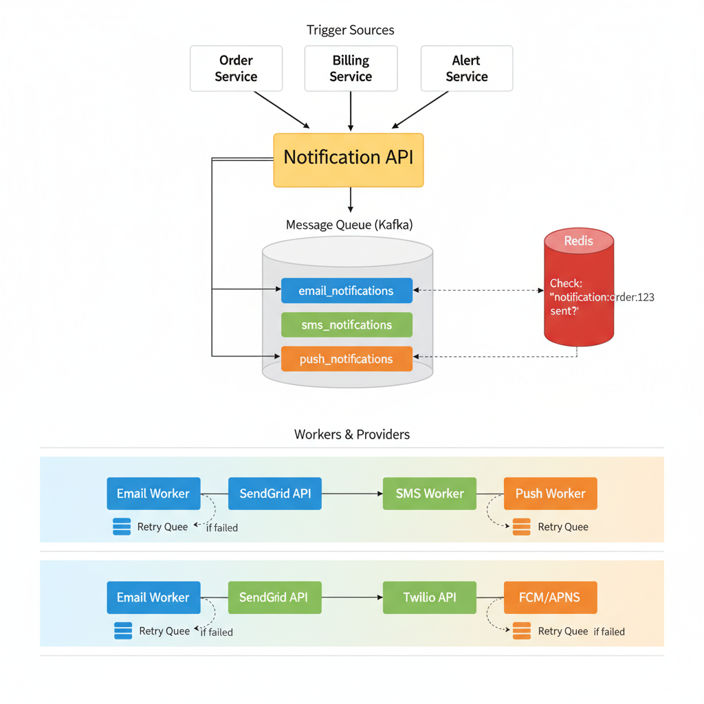
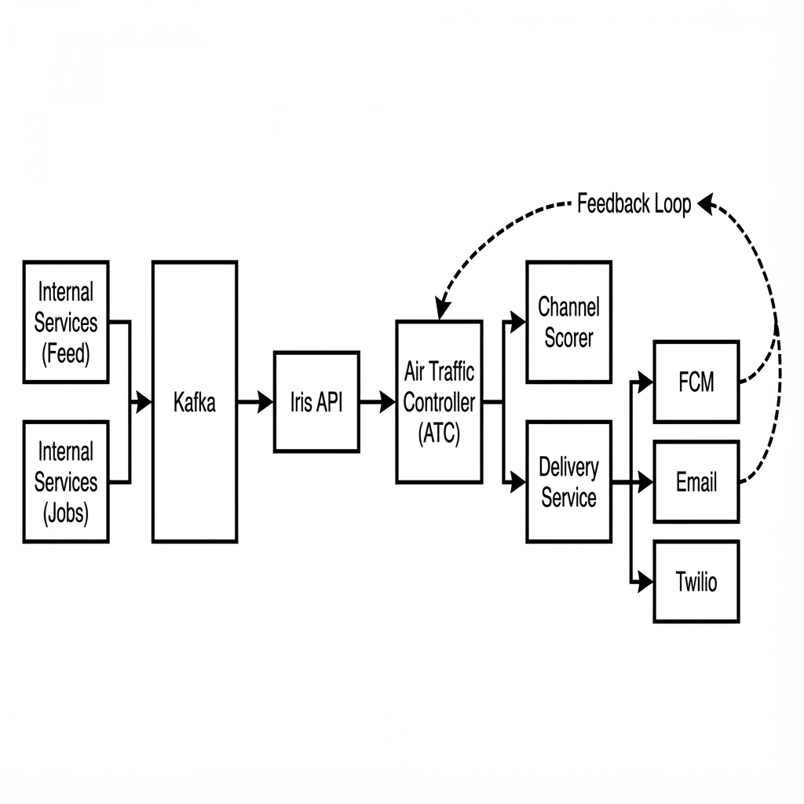
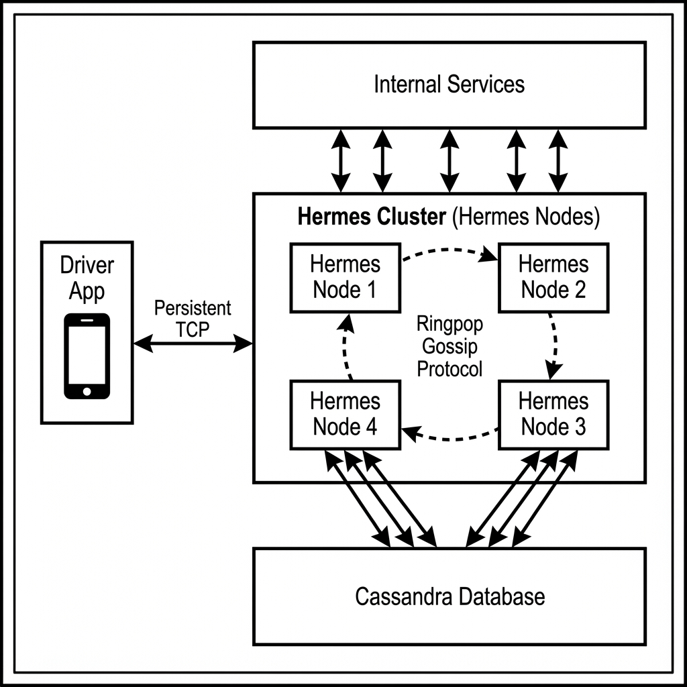
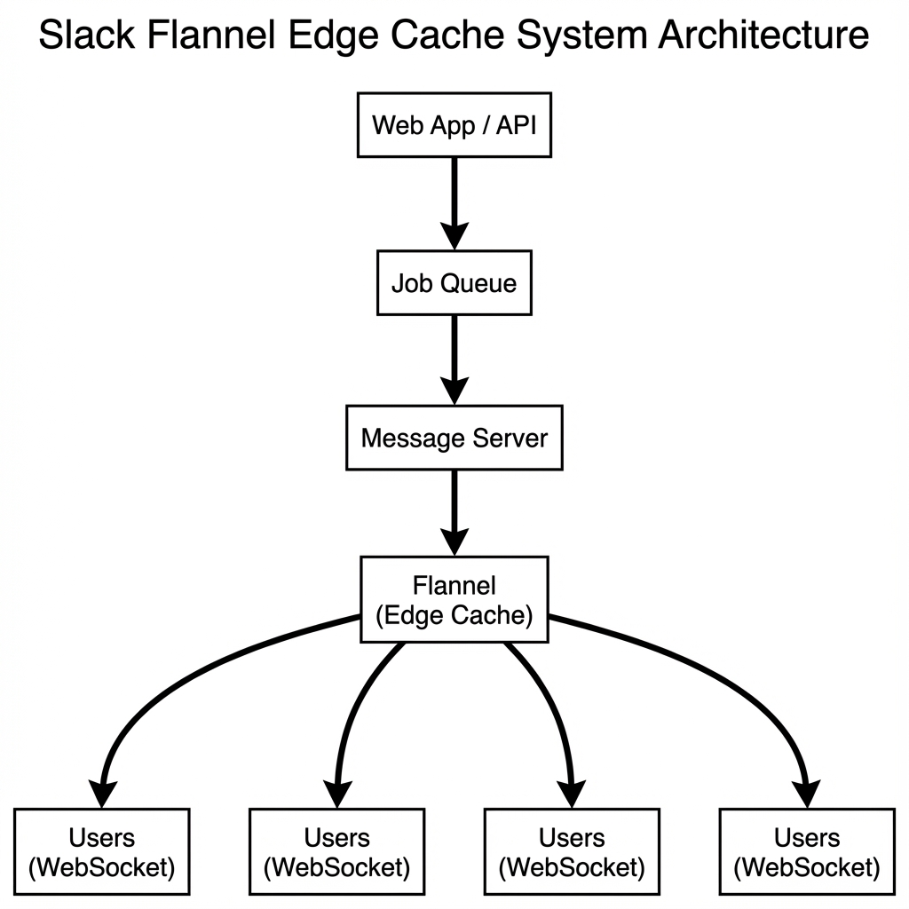

# 10. Design a Notification System

**Difficulty:** Medium
**Focus:** Reliability, Pluggability, Rate Limiting.

---

## 🎯 Real-World Analogy

**Think of a notification system like a post office:**

**Direct Delivery (No Queue - Bad):**
- 1000 letters arrive
- Try to deliver all 1000 immediately
- Some addresses don't exist
- Some mailboxes are full
- Delivery person overwhelmed
- ❌ Chaos!

**Post Office (With Queue - Good):**
- 1000 letters arrive
- Sort into bins (email, SMS, push)
- Process systematically
- Retry failed deliveries
- Track delivery status
- ✅ Organized!

**Key Insight:** We can't control external systems (email providers, phone networks). We need a buffer (queue) to handle failures and spikes gracefully.

---

## 1. Requirements (0-5 Minutes)

**Functional:**
1.  **Channels:** Email, SMS, Push (iOS/Android).
2.  **Input:** Other services (Order Service, Billing Service) trigger notifications.
3.  **Templates:** "Hello {name}, your order {id} is ready."

**Non-Functional:**
1.  **Reliability:** Don't lose alerts.
2.  **Throughput:** Millions per day.
3.  **Rate Limiting:** Don't spam users.

---

## 2. High-Level Design (5-15 Minutes)

---

## 3. High-Level Design (10-20 Minutes)

### 📚 ELI5: Why Message Queues?

**Without Queue:**
```
User places order:
1. Save order to database ✅
2. Send email notification
   → Email service down! 💥
   → Order saved, but no email sent
   → User confused: "Did my order go through?"
```

**With Queue (Kafka/RabbitMQ):**
```
User places order:
1. Save order to database ✅
2. Publish to queue: "Send email to user@example.com"
3. Return success to user immediately ✅

Background (async):
- Email worker picks up message
- Tries to send email
- Email service down? Retry in 1 minute
- Retry 3 times
- Still failing? Move to dead letter queue
- Alert admin

User gets email eventually, even if service was temporarily down ✅
```

### 📚 Understanding Message Queues - The Restaurant Analogy

**Why can't we just send the email directly?**

Imagine a busy restaurant:

**Without a Queue (Direct):**
- Waiter (API) takes order.
- Waiter runs to kitchen.
- Waiter *waits* while Chef cooks the meal.
- Waiter delivers meal.
- **Problem:** Waiter is stuck in the kitchen! Can't take new orders. Customers leave. 😡

**With a Queue (Async):**
- Waiter (API) takes order.
- Waiter sticks ticket on the **Order Rail (Queue)**.
- Waiter goes back to take more orders immediately.
- Chef (Worker) picks up ticket when ready.
- **Result:** Waiter handles 100 tables. Kitchen works at its own pace. ✅

**Visual Timeline:**

```
Time    User Action        API (Waiter)           Queue (Rail)       Worker (Chef)
-----------------------------------------------------------------------------------
10:00   Places Order       Receives Request       -                  -
10:01   -                  Ack & Publish Event    [ Msg 1 ]          -
10:02   -                  Returns "Success"      [ Msg 1 ]          -
10:03   (User happy)       (Ready for next)       [ Msg 1 ]          Picks up Msg 1
10:04   -                  -                      [ Empty ]          Sends Email
```

**Key Benefit:** Decoupling. The API doesn't care if the Worker is slow or crashed. It just drops the message and moves on.

---



**Components:**
1.  **Notification Service (API):** Entry point.
2.  **Message Queues (Kafka):** Buffer requests.
3.  **Workers:** Process messages and call 3rd party APIs.
4.  **3rd Party Providers:** SendGrid (Email), Twilio (SMS), FCM (Push).

**Flow:**
1.  Order Service calls `POST /send { userId: 1, type: "ORDER_CONFIRM" }`.
2.  Notification Service validates and pushes to Kafka Topic `notification_email`.
3.  Email Worker pulls message, renders template, and calls SendGrid.

---

## 3. Deep Dive: Reliability (The Retry Mechanism) (15-25 Minutes)

**The Challenge:**
External services (SendGrid, Twilio, FCM) fail all the time.
- Network timeouts.
- Rate limits (HTTP 429).
- Server errors (HTTP 500).

**Solution: The Retry Queue Architecture**


**Flow:**
1.  **Main Queue:** All new messages go here.
2.  **Worker:** Tries to send.
    - **Success:** Done. ✅
    - **Fail:** Publish to **Retry Queue** with a `retry_count`.
3.  **Retry Worker:**
    - Reads from Retry Queue.
    - Checks `retry_count`.
    - Waits for **Exponential Backoff** (2s, 4s, 8s, 16s).
    - Tries to send again.
    - **Fail again?** Increment count, push back to Retry Queue.
    - **Max Retries reached (e.g., 5)?** Push to **Dead Letter Queue (DLQ)**.
4.  **DLQ:** Manual inspection or alert developers.

### 📚 Understanding Retries - The Story of a Failed Email

**Scenario:** SendGrid (Email Provider) is down for 10 seconds.

**Timeline of Events:**

```
10:00:00 - Attempt 1
- Worker tries to send email.
- SendGrid returns 500 Error. ❌
- Action: Wait 2 seconds (2^1).

10:00:02 - Attempt 2
- Worker tries again.
- SendGrid still down. ❌
- Action: Wait 4 seconds (2^2).

10:00:06 - Attempt 3
- Worker tries again.
- SendGrid still down. ❌
- Action: Wait 8 seconds (2^3).

10:00:14 - Attempt 4
- Worker tries again.
- SendGrid is BACK UP! ✅
- Email sent successfully.
```

**Why Exponential Backoff? (2s, 4s, 8s...)**
- If we retried every 1 second, we would hammer the failing service.
- "Are you up? Are you up? Are you up?" -> Makes the outage WORSE!
- Backoff gives the service **breathing room** to recover.

**What is "Jitter"? (The Thundering Herd Problem)**

Imagine 1,000 emails fail at exactly 10:00:00.

**Without Jitter:**
- 10:00:02 -> All 1,000 retry AT ONCE. 💥
- 10:00:06 -> All 1,000 retry AT ONCE. 💥
- Service crashes again due to load spike.

**With Jitter (Randomness):**
- Delay = `2^retry + random(0, 1)`
- Email A retries at 10:00:02.1
- Email B retries at 10:00:02.5
- Email C retries at 10:00:02.9
- **Result:** Load is spread out smoothly. Service recovers. ✅

---

### 💻 Python Worker Implementation

```python
import time
import random

class NotificationWorker:
    MAX_RETRIES = 5

    def process_message(self, message):
        try:
            # Attempt to send
            provider.send(message)
            print("Success! ✅")
            
        except Exception as e:
            print(f"Failed: {e} ❌")
            self.handle_failure(message)

    def handle_failure(self, message):
        current_retry = message.get('retry_count', 0)
        
        if current_retry >= self.MAX_RETRIES:
            # Give up -> DLQ
            kafka.produce('dead_letter_queue', message)
            alert_admin("Message failed permanently")
        else:
            # Schedule retry
            message['retry_count'] = current_retry + 1
            
            # Exponential Backoff: 2^retry (2, 4, 8, 16, 32 sec)
            delay = 2 ** current_retry
            
            # Add Jitter to prevent "Thundering Herd"
            # (Everyone retrying at exact same second)
            delay += random.uniform(0, 1)
            
            # In reality, use a Delayed Queue (Redis/SQS)
            # Here we simulate with sleep for simplicity
            time.sleep(delay)
            kafka.produce('retry_queue', message)
```

### ☕ Java Implementation

```java
import java.util.*;
import java.util.concurrent.*;

public class NotificationWorker {
    private static final int MAX_RETRIES = 5;
    private final ScheduledExecutorService scheduler = Executors.newScheduledThreadPool(5);
    private final Random random = new Random();
    
    static class Message {
        String id;
        String content;
        int retryCount = 0;
        
        public Message(String id, String content) {
            this.id = id;
            this.content = content;
        }
    }
    
    public void processMessage(Message message) {
        try {
            // Attempt to send
            sendNotification(message);
            System.out.println("Success! ✅");
            
        } catch (Exception e) {
            System.out.println("Failed: " + e.getMessage() + " ❌");
            handleFailure(message);
        }
    }
    
    private void handleFailure(Message message) {
        if (message.retryCount >= MAX_RETRIES) {
            // Give up -> DLQ
            sendToDeadLetterQueue(message);
            alertAdmin("Message failed permanently: " + message.id);
        } else {
            // Schedule retry
            message.retryCount++;
            
            // Exponential Backoff: 2^retry (2, 4, 8, 16, 32 sec)
            long delay = (long) Math.pow(2, message.retryCount);
            
            // Add Jitter to prevent "Thundering Herd"
            double jitter = random.nextDouble(); // 0.0 to 1.0
            long delayWithJitter = delay + (long) jitter;
            
            System.out.println("Scheduling retry #" + message.retryCount + 
                " in " + delayWithJitter + " seconds");
            
            // Schedule retry using ScheduledExecutorService
            scheduler.schedule(() -> {
                processMessage(message);
            }, delayWithJitter, TimeUnit.SECONDS);
        }
    }
    
    private void sendNotification(Message message) throws Exception {
        // Simulate sending (can fail randomly)
        if (random.nextDouble() < 0.3) { // 30% failure rate
            throw new Exception("Provider unavailable");
        }
        
        // Success
        System.out.println("Sent notification: " + message.content);
    }
    
    private void sendToDeadLetterQueue(Message message) {
        System.out.println("Sending to DLQ: " + message.id);
        // kafkaProducer.send("dead_letter_queue", message);
    }
    
    private void alertAdmin(String alert) {
        System.out.println("ALERT: " + alert);
    }
    
    public void shutdown() {
        scheduler.shutdown();
    }
}
```

---

## 4. Deep Dive: Priority Queues (OTP vs Marketing) (25-30 Minutes)

**The Problem:**
- **Scenario:** It's Black Friday. Marketing sends 10 Million emails.
- **User Action:** User tries to log in. Needs OTP (One-Time Password).
- **Result:** OTP message gets stuck behind 5 million marketing emails.
- **Latency:** 2 hours. User gives up. ❌

**Solution: Separate Queues**

We cannot treat all notifications equally.

**Architecture:**
1.  **High Priority Queue (OTP, Password Reset):**
    - Dedicated Workers (e.g., 50 workers).
    - Empty most of the time.
    - Latency: < 2 seconds.
2.  **Low Priority Queue (Marketing, Weekly Digest):**
    - Shared Workers (e.g., 20 workers).
    - Can lag by hours.
    - Latency: Minutes/Hours.

**Kafka Topics:**
- `notification_otp`
- `notification_transactional` (Order updates)
- `notification_marketing`

**Worker Logic:**
```python
# High Priority Worker
consumer.subscribe(['notification_otp'])

# Low Priority Worker
consumer.subscribe(['notification_marketing'])
```

**Key Insight:** Never let a "nice to have" feature block a "critical" feature.

---

## 4. Deep Dive: Rate Limiting & Deduplication (25-35 Minutes)

### 🔄 Rate Limiting (ELI5)

**The Problem:**
- **Spam:** A bug in the "Order Service" triggers 100 "Order Confirmed" emails in 1 second.
- **Annoyance:** User gets 100 buzzes on their phone. 😡
- **Cost:** We pay Twilio per SMS. 100 SMS = $$$ wasted.

**Solution: Leaky Bucket per User**

**Analogy: The Club Bouncer**
- **Rule:** "Only 1 person can enter every minute."
- **Scenario:** 100 people rush the door.
- **Bouncer:** Lets Person #1 in. Tells the other 99: "Come back later!" ✋
- **Result:** Club (User's Phone) stays chill. No chaos.

**Visualizing the Bucket:**

```
      Requests (Water)
         ↓↓↓↓↓↓↓↓
      |~~~~~~~~~~|  <-- Bucket Capacity (Burst Limit)
      |          |
      |__________|
           ↓        <-- Leak Rate (1 SMS / min)
      Processed SMS
```

- If water pours in too fast, the bucket overflows (= Requests Dropped).
- The leak ensures a steady, manageable stream.

We want to say: "Max 1 SMS per minute per user".

**Redis Implementation:**
```python
def should_send(user_id, channel):
    key = f"rate_limit:{user_id}:{channel}"
    
    # Check current count
    count = redis.get(key)
    
    if count and int(count) >= MAX_LIMIT:
        return False  # ❌ Blocked
    
    # Increment and set expiry (Window)
    pipe = redis.pipeline()
    pipe.incr(key)
    pipe.expire(key, 60) # 1 minute window
    pipe.execute()
    
    return True  # ✅ Allowed
```

### 🧩 Deduplication (Idempotency)

**Scenario:**
- Worker sends email successfully.
- Worker crashes *before* telling Kafka "I'm done".
- Kafka re-sends the message to another worker.
- User gets duplicate email.

**Fix:**
- Every message has a unique `message_id` (UUID).
- Before sending, check Redis: `seen:{message_id}`.

```python
if redis.exists(f"seen:{message_id}"):
    print("Duplicate! Skipping.")
    return

provider.send(email)
redis.set(f"seen:{message_id}", 1, ex=86400) # Remember for 24h
```

---

## 6. Deep Dive: User Preferences & Do Not Disturb (35-40 Minutes)

**The Problem:**
- User A: "I only want emails, no SMS."
- User B: "Don't message me after 10 PM."
- User C: "I'm in Tokyo (GMT+9)."

**Data Model:**
```sql
CREATE TABLE user_preferences (
    user_id UUID,
    channel VARCHAR, -- 'EMAIL', 'SMS'
    enabled BOOLEAN,
    dnd_start TIME, -- 22:00
    dnd_end TIME,   -- 08:00
    timezone VARCHAR -- 'Asia/Tokyo'
);
```

**Logic Flow:**
1.  **Check Opt-in:**
    ```python
    pref = db.get_preference(user_id, 'SMS')
    if not pref.enabled:
        return # Skip
    ```
2.  **Check Timezone & DND:**
    ```python
    user_time = get_current_time(pref.timezone)
    if pref.dnd_start <= user_time <= pref.dnd_end:
        # Option A: Drop message
        # Option B: Schedule for next morning (Delayed Queue)
        schedule_for(pref.dnd_end, message)
        return
    ```

**Smart Routing:**
- If `Urgency = HIGH` (Security Alert), **Ignore DND**.
- If `Urgency = LOW` (Marketing), **Respect DND**.

---

## 5. Deep Dive: Pluggability (Adapter Pattern) (35-40 Minutes)

**The Problem:**
- Today we use **SendGrid**.
- Tomorrow SendGrid doubles their price. We want to switch to **Mailgun**.
- We don't want to rewrite 100 microservices that call `send_email()`.

**Solution: The Adapter Pattern**
We define a common interface. The rest of the system doesn't know *who* is sending the email.

### 💻 Python Implementation

```python
from abc import ABC, abstractmethod

# 1. The Interface (Contract)
class EmailProvider(ABC):
    @abstractmethod
    def send_email(self, to, subject, body):
        pass

# 2. Concrete Adapter A (SendGrid)
class SendGridAdapter(EmailProvider):
    def send_email(self, to, subject, body):
        # Call SendGrid API
        requests.post("api.sendgrid.com/v3/mail/send", json={...})

# 3. Concrete Adapter B (Mailgun)
class MailgunAdapter(EmailProvider):
    def send_email(self, to, subject, body):
        # Call Mailgun API
        requests.post("api.mailgun.net/v3/messages", data={...})

# 4. The Factory (Decider)
class NotificationFactory:
    def get_email_provider(self):
        config = db.get_config("email_provider")
        if config == "sendgrid":
            return SendGridAdapter()
        else:
            return MailgunAdapter()

# Usage
provider = NotificationFactory().get_email_provider()
provider.send_email("user@example.com", "Hello", "World")
```

**Benefit:**
We can switch providers by changing **one row in the database**. Zero code deployment needed!

---

## 8. Deep Dive: Template Engine & Localization (40-45 Minutes)

**The Problem:**
- Hardcoding strings (`"Hello " + name`) is unmaintainable.
- We need to support English, Spanish, French, etc.

**Solution: Template Service**

**Storage (S3/DB):**
- `welcome_email_en.html`: "Hello {{name}}, welcome to {{app}}!"
- `welcome_email_es.html`: "Hola {{name}}, bienvenido a {{app}}!"

**Rendering (Jinja2 / Mustache):**
```python
def render_template(template_id, user_locale, context):
    # 1. Fetch Template
    template_str = db.get_template(template_id, user_locale)
    # Fallback to 'en' if 'es' missing
    if not template_str:
        template_str = db.get_template(template_id, 'en')
        
    # 2. Compile
    template = Template(template_str)
    
    # 3. Render
    return template.render(context) # Replaces {{name}} with "Rahul"
```

**Workflow:**
1.  Product Manager edits template in Dashboard.
2.  System versions the template (v1, v2).
3.  Workers fetch latest version (cached in Redis).

---

---

---

## 9. Real-World Engineering Case Studies (Deep Dive)

This section explores how top tech companies architect their notification systems to handle massive scale.

### 1. LinkedIn (Iris): The "Air Traffic Controller" for Notifications

**Source:** LinkedIn Engineering Blog - "Iris: How LinkedIn sends millions of notifications"

**The Challenge:**
LinkedIn has 900M+ members. A single event (e.g., "Rahul posted an article") could trigger millions of fan-out notifications.
- **Volume:** Billions of events per day.
- **Spam Fatigue:** Sending Email + Push + SMS for every event causes users to unsubscribe.
- **Latency:** Processing a viral post's notifications sequentially could take hours.

**The Solution: Iris (Centralized Notification Platform)**

Iris acts as a central nervous system that decides *what*, *when*, and *how* to send a notification.

**Architecture Diagram:**



**Deep Dive: The "Air Traffic Controller" (ATC) Logic**

The ATC is a decision engine that runs for *every single notification*.

1.  **Eligibility Check:**
    - Is the user active? (Don't email users who haven't logged in for 5 years).
    - Did the user disable this specific notification type?
    - Is it 3 AM in the user's timezone? (If so, queue for 9 AM).

2.  **Channel Scoring (The "Smart" Part):**
    - Instead of hardcoding rules, Iris assigns a **Score** to each channel based on historical user behavior.
    - **Formula (Simplified):**
      ```
      Score(Push) = P(Click | Push) * Utility - Cost
      Score(Email) = P(Open | Email) * Utility - Cost
      ```
    - **Example:**
        - User A reads every Push but ignores Emails. -> **Push Score: 95, Email Score: 10.**
        - User B has Push disabled. -> **Push Score: 0, Email Score: 80.**

3.  **Delivery & Fallback:**
    - Iris attempts the highest-scoring channel first (usually Push).
    - **The Feedback Loop:** Iris listens for "Delivery Receipts" or "App Opens".
    - **Scenario:**
        - 10:00 AM: Send Push.
        - 12:00 PM: No "App Open" event received.
        - Action: ATC triggers **Fallback** -> Send Email digest.

**Tech Stack:**
- **Kafka:** The backbone. All events are messages.
- **Samza:** Stream processing framework for real-time aggregation (e.g., "You have 5 new likes" instead of 5 notifications).
- **Espresso:** LinkedIn's distributed NoSQL database for storing user settings and delivery history.

---

### 2. Uber (Hermes): Reliable Push at Scale

**Source:** Uber Engineering Blog - "Designing the Hermes Push Platform"

**The Challenge:**
For Uber, a notification isn't just "info" — it's money.
- **Criticality:** "New Ride Request" must reach the driver in < 500ms.
- **Reliability:** If a driver misses a ping, they lose income.
- **Scale:** New Year's Eve (NYE) traffic spikes are 10x normal load.

**The Solution: Hermes (Streaming Push Platform)**

Hermes is designed for **extreme reliability** and **low latency**.



**Key Architectural Innovation: Persistent Connections**

Most web apps use HTTP (Request/Response) or Polling. Uber uses **Persistent TCP Connections**.

1.  **The Connection Layer:**
    - Every active Driver App maintains a long-lived TCP connection (using gRPC/HTTP2) to a Hermes Gateway node.
    - **Why?** Eliminates the overhead of establishing a new SSL handshake for every message. Latency drops from ~200ms to ~50ms.

2.  **The "Gossip" Protocol (Ringpop):**
    - **Problem:** There are 1,000 Hermes nodes. Driver A is connected to Node #542.
    - **Scenario:** The "Trip Service" wants to send a message to Driver A. It doesn't know which node Driver A is on.
    - **Solution:** Uber built **Ringpop**, a consistent hashing + gossip protocol library.
    - **How it works:**
        - The Trip Service sends the message to *any* random Hermes node.
        - That node hashes the `driver_id` and uses Ringpop to find the "owner" node.
        - It forwards the request to Node #542.
        - Node #542 pushes the message down the open TCP socket.

3.  **At-Least-Once Delivery (The "Inbox" Pattern):**
    - Hermes never trusts the network.
    - **Step 1:** Store message in **Cassandra** (Append-only log).
    - **Step 2:** Push to driver.
    - **Step 3:** Wait for ACK (Acknowledge) from the app.
    - **Step 4:** If no ACK in 3 seconds -> **Retry**.
    - **Step 5:** Driver App receives message. Checks `message_id`. If already seen, discard (Deduplication).

**Tech Stack:**
- **Go:** Chosen for its lightweight goroutines. A single node can handle 100,000+ open connections.
- **Cassandra:** Write-heavy storage for message logs.
- **Ringpop:** Distributed membership and routing.

---

### 3. Slack: Handling the "Thundering Herd"

**Source:** Slack Engineering Blog - "Scaling Slack's Real-Time Messaging"

**The Challenge:**
Slack operates in "Workspaces". Some (like IBM, Oracle) have 50,000+ users.
- **The Scenario:** The CEO types `@channel "All hands meeting!"` in the `#general` channel.
- **The Impact:** 50,000 users are online.
- **Naive Approach:** The server iterates 50,000 times: `for user in users: send_websocket(user, msg)`.
- **Result:**
    - CPU spikes to 100%.
    - The "Thundering Herd" of 50,000 users receiving data simultaneously crashes the load balancers.

**The Solution: The "Flannel" Edge Cache**

Slack moved the complexity **to the edge**, closer to the user.

**Architecture Diagram:**



**Deep Dive: Smart Fan-out**

1.  **The "Mention Service":**
    - Instead of expanding the message to 50,000 recipients in the core, the Message Server sends **one single message** to the Edge Service (Flannel).
    - Payload: `{"channel_id": "C123", "text": "@channel...", "target": "all"}`.

2.  **Flannel (The Edge Proxy):**
    - Flannel nodes are deployed geographically (AWS Regions).
    - Flannel maintains the actual WebSocket connections to users.
    - **Local Fan-out:** When Flannel receives the message, it looks up its **local** connection table: "Which users connected to *me* are in Channel C123?"
    - It broadcasts only to those users.
    - **Result:** The core server does O(1) work. The heavy lifting is distributed across hundreds of edge nodes.

3.  **Optimized Reconnects (The "Diff" Logic):**
    - **Problem:** If the WiFi drops for 10 seconds, the client reconnects.
    - **Naive:** Download last 50 messages. (Bandwidth heavy).
    - **Smart:** Client says "I have state up to timestamp T".
    - Server calculates the **Diff** (Delta) and sends only missing messages.
    - **Result:** 90% bandwidth reduction.

**Tech Stack:**
- **Java / Netty:** High-performance non-blocking I/O for the WebSocket gateway.
- **Redis:** Caches channel membership (Who is in `#general`?).
- **Envoy Proxy:** Handles load balancing and SSL termination at the edge.

---

- **Envoy Proxy:** Handles load balancing and SSL termination at the edge.

---

## 10. Failure Scenarios & Disaster Recovery

### Scenario 1: Third-Party Provider (Twilio/SendGrid) Outage
**Impact:** Notifications for a specific channel (SMS/Email) are not delivered.
**Detection:**
- `provider_error_rate` > 5%.
- `notification_queue_lag` spike.

**Mitigation:**
- **Multi-Provider Strategy:** Have a fallback provider (e.g., if SendGrid is down, switch to AWS SES).
- **Circuit Breaker:** If a provider fails consistently, trip the breaker and move messages to a "Retry Queue" with exponential backoff.

### Scenario 2: Message Queue (Kafka) Saturation
**Impact:** System cannot accept new notification requests.
**Detection:** `kafka_disk_usage > 85%` or `producer_latency > 500ms`.

**Mitigation:**
- **Backpressure:** The API layer should return HTTP 429 (Too Many Requests) to internal services if the queue is full.
- **Priority Queues:** Drop "Marketing" notifications to make room for "Transactional" (OTP/Password Reset) notifications.

### Scenario 3: Database (Postgres) Connection Pool Exhaustion
**Impact:** Cannot fetch user preferences or log notification history.
**Detection:** `active_db_connections == max_connections`.

**Mitigation:**
- **Read Replicas:** Use read replicas for fetching user preferences.
- **Caching:** Cache user preferences in Redis with a 1-hour TTL.

---

## 11. Monitoring & Observability

### Golden Signals Dashboard

**1. Latency**
- **E2E Delivery:** P95 < 5s (Email), < 2s (Push).
- **Metric:** `notification_delivery_latency_seconds`.

**2. Traffic**
- **Throughput:** Notifications per second (NPS).
- **Metric:** `notifications_sent_total`.

**3. Errors**
- **Metric:** `delivery_failure_rate_by_channel`.
- **Target:** < 1%.

**4. Saturation**
- **Metric:** Kafka consumer lag, Worker CPU utilization.

### Alert Rules
```yaml
alerts:
  - alert: HighNotificationLag
    expr: kafka_consumer_lag{group="notification-workers"} > 10000
    for: 5m
    labels:
      severity: critical
```

---

## 12. API Design & Versioning

### Notification API

**Send Notification**
```http
POST /api/v1/notifications
Content-Type: application/json

{
  "user_id": "uuid-123",
  "template_id": "order_confirmed",
  "params": {"order_id": "999"},
  "priority": "high"
}
```

**Get Notification History**
```http
GET /api/v1/users/{user_id}/notifications?limit=20
```

### Versioning
- Use `/v1/`, `/v2/` in URL.
- **Template Versioning:** Support `template_id: "welcome:v2"` to test new email designs.

---

## 13. Cost Analysis & Optimization

### Monthly Infrastructure Costs (at 100M notifications/month)

**1. Third-Party Fees**
- 50M Push (Free via FCM/APNS).
- 40M Emails (SendGrid) = **$15,000/month**.
- 10M SMS (Twilio) = **$70,000/month** (SMS is expensive!).

**2. Compute (K8s Workers)**
- 50 nodes = **$5,000/month**.

**3. Queue (Managed Kafka/MSK)**
- 3 nodes = **$2,000/month**.

**Total:** ~$92,000/month.

### Optimization Opportunities
- **Channel Optimization:** Prefer Push over SMS (save $0.007 per message).
- **Deduplication:** If a user triggers the same alert 10 times in 1 minute, bundle them into a single "You have 10 new alerts" notification.

---

## 14. Security & Compliance

### Security Measures
- **Rate Limiting:** Prevent internal services from spamming users (e.g., max 1 marketing email/day).
- **Webhook Security:** Use HMAC signatures to verify callbacks from Twilio/SendGrid.
- **PII Protection:** Do not log sensitive data (OTPs) in the notification history.

### Compliance
- **CAN-SPAM / GDPR:** Every email must include an "Unsubscribe" link.
- **Opt-out Sync:** If a user unsubscribes via the email link, the provider's webhook must update our `user_preferences` table immediately.

---

## 15. Testing Strategies

### Unit Tests
- Test template rendering logic.
- Test priority queue sorting.

### Integration Tests
- Send a test notification and verify the provider's "Delivered" webhook is processed correctly.

### Load Testing
- Simulate a "Black Friday" event: 10,000 notifications/sec.
- **Tool:** `Gatling` with Kafka producer simulation.

---

## 16. Migration & Rollout Strategies

### Rollout
- **Provider Canary:** Send 1% of traffic to a new SMS provider to compare delivery rates.

### Migration
- **Template Migration:** Use a feature flag to switch from old HTML templates to new MJML-based templates.

---

## 17. Performance Optimization

### Worker Optimization
- **Batching:** Batch log writes to the database (e.g., every 100 notifications).
- **Connection Pooling:** Reuse SMTP connections to SendGrid to avoid TLS handshake overhead.

### Mobile Optimization
- **Silent Push:** Use silent push notifications to sync app data without alerting the user.

---

## 18. Capacity Planning

### Scaling Triggers
- **Worker Pool:** Scale up if Kafka consumer lag exceeds 1,000 per partition.
- **Database:** Shard the `notification_history` table by `month` or `user_id`.

### Throughput Projection
- 100M notifications/month ≈ 40 notifications/sec (average).
- Peak (e.g., during a major sports event) could be 5,000+ NPS.

---

## 19. Interview Cheat Sheet

### Key Numbers
- **Latency:** < 5s (E2E).
- **Cost:** SMS is ~10-100x more expensive than Email.
- **Reliability:** At-least-once delivery (standard).

### Core Components
1. **API Gateway:** Receives requests.
2. **Notification Service:** Validates and enqueues.
3. **Template Engine:** Renders content.
4. **Workers:** Communicates with providers.
5. **Preference Service:** Checks user settings.

### Critical Trade-offs
- **Real-time vs Batch:** Send immediately vs bundle notifications.
- **At-least-once vs Exactly-once:** Is it okay if a user gets two "Order Shipped" emails? (Yes, better than zero).

---

## 20. Wrap-up (50-55 Minutes)

**Summary:** "I designed a scalable, queue-based Notification System that decouples internal services from external providers.
1.  **Reliability:** I used **Kafka** for durability and **Retry Queues** with exponential backoff to handle provider outages.
2.  **User Experience:** I implemented a **Preference Service** to respect DND hours and channel choices.
3.  **Efficiency:** I optimized costs by prioritizing Push over SMS and using **Template Caching**.
4.  **Production Readiness:** I addressed failure modes like provider outages, ensured GDPR compliance with unsubscribe logic, and designed a robust monitoring dashboard."

---
