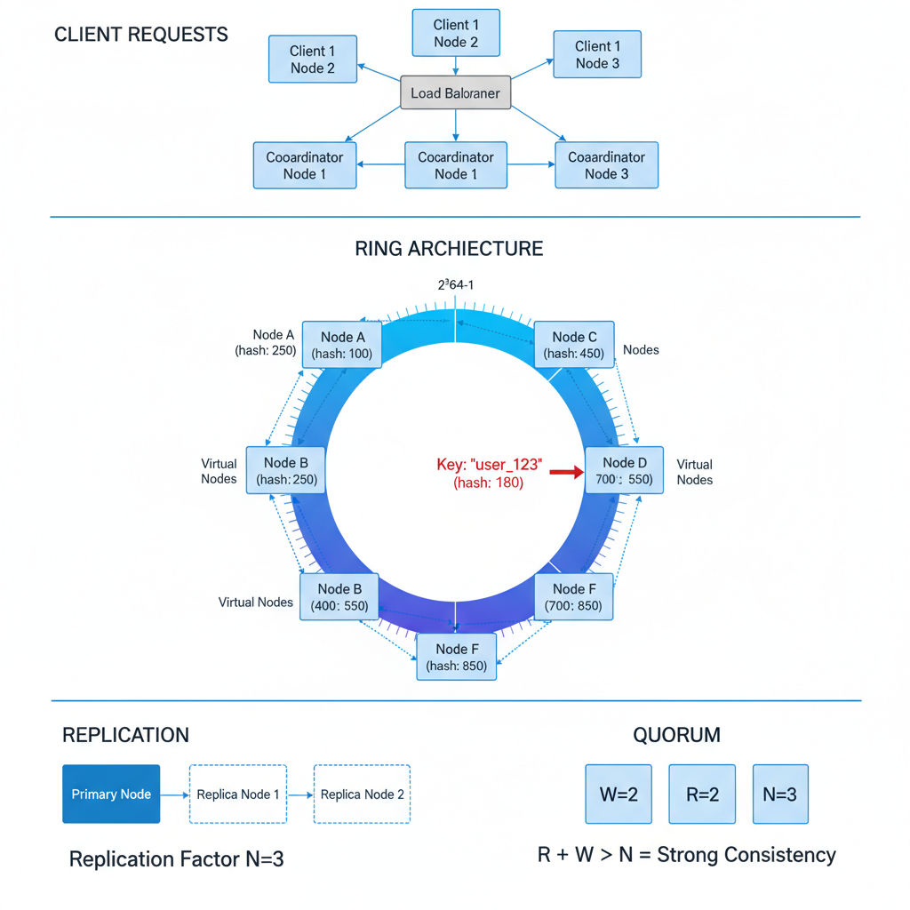

# 11. Design a Distributed Key-Value Store (DynamoDB / Cassandra)

**Difficulty:** Hard (Staff Level)
**Focus:** Consistency, Partitioning, Replication, Failure Handling.

---

## 🎯 Real-World Analogy

**Think of Consistent Hashing like a circular parking lot:**

**Traditional Hashing (Bad):**
```
You have 3 parking lots (servers)
Car "Toyota" → hash("Toyota") % 3 = Lot 2
Car "Honda" → hash("Honda") % 3 = Lot 1

One parking lot closes (server dies):
Now you have 2 lots
Car "Toyota" → hash("Toyota") % 2 = Lot 0 ❌ (moved!)
Car "Honda" → hash("Honda") % 2 = Lot 0 ❌ (moved!)

EVERYTHING moves! 💥
```

**Consistent Hashing (Good):**
```
Imagine a circular race track (0 to 360 degrees)
- Lot A at 0°
- Lot B at 120°
- Lot C at 240°

Car "Toyota" → hash = 150° → Parks at next lot clockwise = Lot C
Car "Honda" → hash = 80° → Parks at next lot clockwise = Lot B

Lot C closes:
- Car "Toyota" (was at 150°) → Now parks at Lot A (next clockwise)
- Car "Honda" (was at 80°) → Still at Lot B ✅ (unchanged!)

Only 1/3 of cars move! Much better! ✅
```

**Key Insight:** In distributed systems, nodes die all the time. We need a way to distribute data so that adding/removing a node doesn't require moving ALL the data.

---

## 1. Requirements (0-5 Minutes)

**Functional:**
1.  `put(key, value)`: Store a value.
2.  `get(key)`: Retrieve a value.
3.  `delete(key)`: Remove a value.

**Non-Functional:**
1.  **High Availability:** System should always accept writes (AP system).
2.  **Scalability:** Handle massive data (Petabytes) and high throughput (100k+ QPS).
3.  **Tunable Consistency:** Allow client to choose Strong or Eventual consistency.
4.  **Fault Tolerance:** No single point of failure.

---

## 2. High-Level Design (5-10 Minutes)

**Architecture:**
We will use a **Leaderless (Peer-to-Peer)** architecture similar to Dynamo or Cassandra.
*   **Client:** Smart client or Load Balancer.
*   **Node:** Every server is identical. Any node can handle any request.
*   **Coordinator:** The node that receives the request becomes the "Coordinator" for that request.



---

## 3. Deep Dive: Consistent Hashing (10-20 Minutes)

### 📚 ELI5: The Ring & Virtual Nodes

**The Problem:**
- **Modulo Hashing (`hash(key) % N`):**
  - If you have 10 nodes, `key % 10`.
  - If you add 1 node (N=11), `key % 11` changes for **almost all keys**.
  - Result: Massive data reshuffling (Thundering Herd). ❌

**The Solution: Consistent Hashing Ring**
- Imagine a circle with values 0 to $2^{64}-1$.
- **Step 1:** Place Servers on the ring (Hash their IP).
- **Step 2:** Place Keys on the ring (Hash the key).
- **Step 3:** Assign Key to the **first server clockwise**.

**Visual:**
```
      [Node A] (Hash: 10)
         |
    (Key: 5) -> clockwise -> Node A
         |
[Node D] |           [Node B] (Hash: 40)
(Hash: 90)|               |
         |           (Key: 20) -> clockwise -> Node B
         |
      [Node C] (Hash: 70)
```

**Virtual Nodes (VNodes):**
- **Issue:** What if Node A is huge (64GB RAM) and Node B is small (8GB RAM)?
- **Fix:** Don't put Node A on the ring once. Put it 100 times!
  - `Node A_1`, `Node A_2` ... `Node A_100`.
- **Benefit:**
  1.  **Load Balancing:** Better distribution.
  2.  **Heterogeneity:** Powerful servers get more VNodes.

### 💻 Python Implementation

```python
import hashlib
import bisect

class ConsistentHashRing:
    def __init__(self, nodes=None, replicas=3):
        self.replicas = replicas  # VNodes per physical node
        self.ring = {}            # Map: Hash -> Node Name
        self.sorted_keys = []     # Sorted list of Hashes
        
        if nodes:
            for node in nodes:
                self.add_node(node)

    def _hash(self, key):
        return int(hashlib.md5(key.encode()).hexdigest(), 16)

    def add_node(self, node):
        for i in range(self.replicas):
            # Create VNode key: "NodeA:0", "NodeA:1"...
            key = self._hash(f"{node}:{i}")
            self.ring[key] = node
            bisect.insort(self.sorted_keys, key)

    def remove_node(self, node):
        # Remove all VNodes for this node
        # (In prod, this is O(M), can be optimized)
        pass 

    def get_node(self, key):
        if not self.ring:
            return None
        
        hash_val = self._hash(key)
        
        # Find first hash on ring >= hash_val (Clockwise search)
        idx = bisect.bisect(self.sorted_keys, hash_val)
        
        # Wrap around if needed
        if idx == len(self.sorted_keys):
            idx = 0
            
        return self.ring[self.sorted_keys[idx]]

# Usage
ring = ConsistentHashRing(["NodeA", "NodeB", "NodeC"])
server = ring.get_node("user_123")
print(f"User 123 goes to {server}")
```

### ☕ Java Implementation

```java
import java.security.MessageDigest;
import java.security.NoSuchAlgorithmException;
import java.util.*;

public class ConsistentHashRing {
    private final int replicas;
    private final TreeMap<Long, String> ring;
    private final MessageDigest md;
    
    public ConsistentHashRing(List<String> nodes, int replicas) {
        this.replicas = replicas;
        this.ring = new TreeMap<>();
        
        try {
            this.md = MessageDigest.getInstance("MD5");
        } catch (NoSuchAlgorithmException e) {
            throw new RuntimeException("MD5 algorithm not found", e);
        }
        
        if (nodes != null) {
            for (String node : nodes) {
                addNode(node);
            }
        }
    }
    
    private long hash(String key) {
        md.reset();
        byte[] digest = md.digest(key.getBytes());
        
        // Convert first 8 bytes to long
        long hash = 0;
        for (int i = 0; i < 8; i++) {
            hash = (hash << 8) | (digest[i] & 0xFF);
        }
        return hash;
    }
    
    public void addNode(String node) {
        for (int i = 0; i < replicas; i++) {
            // Create VNode key: "NodeA:0", "NodeA:1"...
            long hashValue = hash(node + ":" + i);
            ring.put(hashValue, node);
        }
    }
    
    public void removeNode(String node) {
        for (int i = 0; i < replicas; i++) {
            long hashValue = hash(node + ":" + i);
            ring.remove(hashValue);
        }
    }
    
    public String getNode(String key) {
        if (ring.isEmpty()) {
            return null;
        }
        
        long hashValue = hash(key);
        
        // Find first entry >= hashValue (clockwise search)
        Map.Entry<Long, String> entry = ring.ceilingEntry(hashValue);
        
        // Wrap around if needed
        if (entry == null) {
            entry = ring.firstEntry();
        }
        
        return entry.getValue();
    }
    
    // Usage
    public static void main(String[] args) {
        ConsistentHashRing ring = new ConsistentHashRing(
            Arrays.asList("NodeA", "NodeB", "NodeC"), 3
        );
        String server = ring.getNode("user_123");
        System.out.println("User 123 goes to " + server);
    }
}
```

---

## 4. Deep Dive: Replication & Consistency (Quorum) (20-30 Minutes)

**Replication Strategy:**
*   We don't just store data on the Coordinator. We store it on the Coordinator + next N-1 nodes on the ring.
*   **Preference List:** The list of N nodes responsible for a key.

**Tunable Consistency (The CAP Theorem Knob):**
*   **N:** Replication Factor (e.g., 3).
*   **W:** Write Quorum (How many nodes must confirm write).
*   **R:** Read Quorum (How many nodes must respond to read).

**Scenarios:**
1.  **Fast Availability (AP):** $W=1, R=1$.
    *   Write returns as soon as 1 node gets it. Fast, but risk of data loss if that node dies before replicating.
2.  **Strong Consistency (CP):** $R + W > N$.
    *   Example: $N=3, W=2, R=2$. ($2+2 > 3$).
    *   Guarantees that the Read set and Write set overlap. You will always read the latest data.

---

## 5. Deep Dive: Handling Failures (30-40 Minutes)

### 🕵️ Gossip Protocol (Failure Detection)

**The Problem:**
In a cluster of 1000 nodes, who checks if Node A is alive?
- **Central Master?** Single point of failure. ❌
- **All-to-All Ping?** $N^2$ network traffic. ❌

**The Solution: Gossip (Epidemic) Protocol**
Just like high school rumors.
1.  Every second, Node A picks a random Node B.
2.  Node A says: "Here is my list of who is alive/dead."
3.  Node B merges this list with its own.
4.  Node B propagates it to Node C...
5.  **Result:** Information spreads to the whole cluster in $O(\log N)$ time.

**Simulation:**
```python
# Node State: { "NodeA": 101, "NodeB": 205, "NodeC": 99 }
# Numbers are "Heartbeat Counters"

def gossip(self, peer):
    my_list = self.get_node_list()
    peer_list = peer.get_node_list()
    
    for node, counter in peer_list.items():
        if counter > my_list.get(node, 0):
            # Peer has newer info! Update my list.
            my_list[node] = counter
            print(f"Updated: {node} is alive (v{counter})")
```

### ☕ Java Implementation

```java
import java.util.Map;
import java.util.concurrent.ConcurrentHashMap;

public class GossipProtocol {
    // Node State: { "NodeA": 101, "NodeB": 205, "NodeC": 99 }
    // Numbers are "Heartbeat Counters"
    private final Map<String, Long> nodeList;
    
    public GossipProtocol() {
        this.nodeList = new ConcurrentHashMap<>();
    }
    
    public Map<String, Long> getNodeList() {
        return new ConcurrentHashMap<>(nodeList);
    }
    
    public void gossip(GossipProtocol peer) {
        Map<String, Long> myList = this.getNodeList();
        Map<String, Long> peerList = peer.getNodeList();
        
        for (Map.Entry<String, Long> entry : peerList.entrySet()) {
            String node = entry.getKey();
            Long counter = entry.getValue();
            
            if (counter > myList.getOrDefault(node, 0L)) {
                // Peer has newer info! Update my list.
                nodeList.put(node, counter);
                System.out.println("Updated: " + node + " is alive (v" + counter + ")");
            }
        }
    }
    
    public void incrementHeartbeat(String node) {
        nodeList.merge(node, 1L, Long::sum);
    }
}
```

### 🌳 Merkle Trees (Anti-Entropy / Data Repair)

**The Problem:**
Node A comes back online after 1 hour. It missed 100 writes.
Node B has the data.
How do we sync **only** the missing 100 writes without sending the entire 1TB database?

**The Solution: Merkle Tree (Hash Tree)**
- **Leaf Nodes:** Hash of individual data blocks.
- **Parent Nodes:** Hash of children.
- **Root Node:** Hash of the entire database.

**Visual Comparison:**
```
       [Root Hash: A]             [Root Hash: B]
       /            \             /            \
   [Hash: X]      [Hash: Y]   [Hash: X]      [Hash: Z]  <-- Mismatch!
    /     \        /     \     /     \        /     \
  [1]     [2]    [3]     [4] [1]     [2]    [3]     [5] <-- Only fetch 5!
```

1.  Node A sends Root Hash to Node B.
2.  If Match: Done! (0 bytes transferred).
3.  If Mismatch: Compare children (Left vs Right).
4.  Recurse down to find the *exact* leaf that differs.
5.  **Result:** We only transfer the tiny data block [5].

---

## 6. Deep Dive: Hinted Handoff (40-42 Minutes)

**Scenario:**
- Node A is down.
- Client writes to Key K (which belongs to Node A).
- Coordinator sends write to Node B (Replica).

**Problem:**
- Node A comes back. It doesn't have Key K.
- Node B has it, but Node B isn't *supposed* to hold Key K permanently.

**Solution:**
- Node B stores a **Hint**: "This data belongs to Node A".
- Node B periodically checks: "Is Node A alive?"
- When Node A is up, Node B pushes the data to Node A and deletes its own copy.
- **Benefit:** Ensures high availability even during node failures.

---

## 7. Deep Dive: Vector Clocks (Conflict Resolution) (42-45 Minutes)

**Scenario:**
- Network Partition.
- Client A writes `X=1` to Node 1.
- Client B writes `X=2` to Node 2.
- Partition heals. Node 1 and Node 2 sync.
- **Conflict:** Is X=1 or X=2?

**Solution: Vector Clocks**
- Attach a version vector to each object: `[NodeA: 1, NodeB: 2]`.
- **Causality:**
  - `[A:1]` happens before `[A:2]`. (No conflict).
  - `[A:1]` and `[B:1]` are concurrent. (Conflict!).
- **Resolution:**
  - Return BOTH values to the client (Siblings).
  - Client logic must resolve it (e.g., "Merge shopping cart").

---

---

## 8. Real-World Engineering Case Studies (Deep Dive)

### 1. Amazon DynamoDB: The "Always Available" Database

**Source:** Amazon DynamoDB Paper (2007) & AWS re:Invent Talks

**The Challenge:**
Amazon's shopping cart must NEVER go down during Black Friday.
- **Problem:** Traditional databases (MySQL) have master-slave replication. If master dies, there's downtime during failover.
- **Requirement:** 99.99% availability = Only 52 minutes of downtime per year.

**The Solution: Dynamo Architecture**

**Architecture:**
1.  **Leaderless Replication:**
    - No master node. Every node is equal.
    - Any node can handle reads and writes.
    - **Benefit:** No single point of failure.
2.  **Consistent Hashing with Virtual Nodes:**
    - DynamoDB uses 100-200 virtual nodes per physical server.
    - When a server is added/removed, data is redistributed evenly.
    - **Result:** Adding capacity takes seconds, not hours.
3.  **Quorum Writes (W=2, R=2, N=3):**
    - Every write goes to 3 replicas.
    - Write succeeds when 2 replicas acknowledge.
    - Read queries 2 replicas and returns the latest version.
4.  **Multi-Region Replication (Global Tables):**
    - DynamoDB replicates data across AWS regions (US-East, EU-West, Asia-Pacific).
    - Uses **Last-Write-Wins (LWW)** with timestamps for conflict resolution.
    - **Latency:** Cross-region replication typically < 1 second.

**Key Insight:**
DynamoDB sacrifices strong consistency (CP) for availability (AP). During network partitions, it continues accepting writes, resolving conflicts later using vector clocks or LWW.

---

### 2. Apache Cassandra: The "Write-Optimized" Database

**Source:** Facebook Engineering Blog - "Cassandra at Scale"

**The Challenge:**
Facebook's Inbox Search needed to index billions of messages.
- **Problem:** MySQL couldn't handle 100k writes/second.
- **Requirement:** Write-heavy workload with tunable consistency.

**The Solution: Cassandra's LSM-Tree Architecture**

**Architecture:**
1.  **Log-Structured Merge Tree (LSM):**
    - Writes go to **MemTable** (in-memory sorted structure).
    - When MemTable is full, flush to disk as **SSTable** (immutable file).
    - **Benefit:** Sequential disk writes are 100x faster than random writes.
2.  **Compaction:**
    - Background process merges SSTables to reduce read amplification.
    - **Leveled Compaction:** Organizes SSTables into levels (L0, L1, L2...).
    - Newer data in L0, older data in L2+.
3.  **Bloom Filters:**
    - Before reading an SSTable, check Bloom Filter: "Does this SSTable contain key X?"
    - **False Positive Rate:** 1% (acceptable trade-off).
    - **Benefit:** Avoids reading 99% of irrelevant SSTables.
4.  **Gossip Protocol:**
    - Cassandra uses gossip to detect failures.
    - Every second, each node exchanges state with 1-3 random peers.
    - **Convergence Time:** Entire cluster knows about a failure in ~5 seconds.

**Key Insight:**
Cassandra optimizes for write throughput using LSM-Trees. Reads are slower (must check multiple SSTables), but compaction and Bloom Filters mitigate this.

---

### 3. LinkedIn: Voldemort (Dynamo Clone)

**Source:** LinkedIn Engineering Blog

**The Challenge:**
LinkedIn needed a KV store for user profiles (200M+ users).
- **Problem:** Needed predictable latency (p99 < 10ms).

**The Solution: Read Repair & Hinted Handoff**

**Architecture:**
1.  **Read Repair:**
    - When reading with R=2, if replicas disagree, the coordinator:
        - Returns the latest version to the client.
        - Asynchronously updates stale replicas.
    - **Benefit:** Self-healing system. Stale data is fixed on-the-fly.
2.  **Hinted Handoff:**
    - If Node A is down, Node B stores the write with a "hint": "This belongs to Node A".
    - When Node A recovers, Node B transfers the data.
    - **Benefit:** No data loss during temporary failures.

**Key Insight:**
Read Repair and Hinted Handoff are critical for maintaining consistency in AP systems without requiring manual intervention.

---

## 9. Failure Scenarios & Disaster Recovery

### Scenario 1: Network Partition (Split Brain)
**Impact:** Two halves of the cluster cannot talk to each other.
**Detection:**
- Gossip protocol reports multiple nodes as "Down" simultaneously.
- Quorum writes/reads start failing.

**Mitigation:**
- **Quorum Enforcement:** If a node cannot reach a majority (N/2 + 1), it must stop accepting writes to prevent divergence.
- **Vector Clocks:** Use vector clocks to detect and resolve conflicts once the partition is healed.

### Scenario 2: Cascading Failure (Thundering Herd)
**Impact:** One node fails, its load shifts to others, causing them to fail, eventually crashing the whole cluster.
**Detection:** `node_cpu_utilization` spikes across the cluster.

**Mitigation:**
- **Virtual Nodes (VNodes):** Distribute the load of a failed node across *all* remaining nodes, rather than just its immediate neighbors.
- **Request Shedding:** If a node is overwhelmed, it should reject non-essential requests (e.g., background maintenance) to stay alive.

### Scenario 3: Disk Corruption (Silent Data Rot)
**Impact:** Data is read correctly from disk but is actually corrupted.
**Detection:** `checksum_mismatch` during read repair.

**Mitigation:**
- **Merkle Trees:** Periodically compare Merkle trees between replicas to find and fix corrupted blocks without transferring the whole dataset.
- **SSTable Checksums:** Every data block in an SSTable should have a CRC32 checksum.

---

## 10. Monitoring & Observability

### Golden Signals Dashboard

**1. Latency**
- **Read Latency:** P99 < 10ms.
- **Write Latency:** P99 < 5ms.
- **Metric:** `kv_request_duration_seconds`.

**2. Traffic**
- **Throughput:** Operations per second (OPS).
- **Metric:** `kv_ops_total`.

**3. Errors**
- **Metric:** `quorum_failure_rate`.
- **Target:** < 0.01%.

**4. Saturation**
- **Metric:** Disk I/O utilization, Compaction lag, JVM Heap usage.

### Alert Rules
```yaml
alerts:
  - alert: HighCompactionLag
    expr: kv_compaction_pending_tasks > 100
    for: 10m
    labels:
      severity: warning
```

---

## 11. API Design & Versioning

### KV API

**Put Value**
```http
PUT /api/v1/keys/{key}
Content-Type: application/octet-stream
X-Consistency-Level: QUORUM

<binary_data>
```

**Get Value**
```http
GET /api/v1/keys/{key}?consistency=ONE
```

### Versioning
- **Protocol Versioning:** Use a version byte in the binary protocol header.
- **Schema-less:** Since it's a KV store, versioning is usually handled at the application layer (e.g., Protobuf/Avro).

---

## 12. Cost Analysis & Optimization

### Monthly Infrastructure Costs (at 10 TB data, 3x replication)

**1. Storage (EBS/SSD)**
- 30 TB (Provisioned IOPS SSD) = **$4,500/month**.

**2. Compute (EC2)**
- 9 nodes (i3.xlarge - Storage optimized) = **$6,000/month**.

**3. Data Transfer**
- Inter-AZ replication traffic = **$1,000/month**.

**Total:** ~$11,500/month.

### Optimization Opportunities
- **Compression:** Use LZ4 or Zstd on SSTables to reduce storage costs by 50%.
- **Tiered Storage:** Move old SSTables to S3 (using a custom storage engine) to save 80% on storage.

---

## 13. Security & Compliance

### Security Measures
- **Mutual TLS (mTLS):** Encrypt all inter-node communication (Gossip, Replication).
- **Role-Based Access Control (RBAC):** Restrict access to specific keyspaces/tables.
- **Encryption at Rest:** Encrypt SSTables on disk using AWS KMS or local keys.

### Compliance
- **GDPR:** Ensure that when a key is deleted, the "Tombstone" is eventually compacted away, permanently removing the data.

---

## 14. Testing Strategies

### Unit Tests
- Test Consistent Hashing ring distribution.
- Test Vector Clock conflict resolution logic.

### Jepsen Testing (Distributed Systems Testing)
- Use **Jepsen** to simulate network partitions, clock skew, and node crashes to verify linearizability and eventual consistency guarantees.

### Load Testing
- Simulate 1M writes/sec.
- **Tool:** `Cassandra-stress` or custom `Go` benchmark.

---

## 15. Migration & Rollout Strategies

### Rollout
- **Rolling Upgrades:** Upgrade nodes one by one to ensure the cluster remains available.

### Migration
- **Dual Writing:** If migrating from an old KV store, write to both systems and slowly shift reads.

---

## 16. Performance Optimization

### Write Optimization
- **Commit Log:** Write to a dedicated SSD for the commit log to avoid contention with SSTable flushes.
- **Batching:** Use atomic batches for multiple keys in the same partition.

### Read Optimization
- **Key Cache:** Cache the positions of keys in SSTables to avoid disk seeks.
- **Row Cache:** Cache frequently accessed rows in memory.

---

## 17. Capacity Planning

### Scaling Triggers
- **Disk Usage:** Scale out when disk utilization hits 60% (need space for compaction).
- **CPU:** Scale out if compaction starts lagging behind writes.

### Throughput Projection
- 9 nodes can handle ~500k writes/sec (LSM-Tree is fast!).

---

## 18. Interview Cheat Sheet

### Key Numbers
- **Latency:** < 10ms (Read), < 5ms (Write).
- **Replication:** 3x (Standard).
- **Consistency:** R + W > N (Quorum).

### Core Components
1. **Consistent Hashing:** Data distribution.
2. **LSM-Tree:** Storage engine.
3. **Gossip Protocol:** Failure detection.
4. **Quorum:** Consistency management.

### Critical Trade-offs
- **Consistency vs Availability:** PACELC theorem (Consistency vs Latency during normal ops, Availability vs Consistency during partition).
- **Write vs Read Speed:** LSM-Tree (Fast writes) vs B-Tree (Fast reads).

---

## 19. Wrap-up (Deep Dive)

**Summary:**
"I designed a highly available, leaderless Distributed Key-Value Store inspired by **Amazon DynamoDB** and **Apache Cassandra**.
1.  **Partitioning:** I used **Consistent Hashing with Virtual Nodes** to distribute data evenly and minimize reshuffling during node changes.
2.  **Replication:** I implemented **Quorum-based Replication (R+W>N)** for tunable consistency, allowing clients to choose between strong consistency and high availability.
3.  **Failure Handling:** I used **Gossip Protocol** for decentralized failure detection, **Merkle Trees** for efficient data repair, and **Hinted Handoff** to ensure durability during node failures.
4.  **Real-World:** I incorporated **DynamoDB's multi-region replication** strategy and **Cassandra's LSM-Tree** architecture for write optimization.
5.  **Production Readiness:** I addressed split-brain scenarios, optimized costs with tiered storage, and ensured security through mTLS and RBAC."

---
