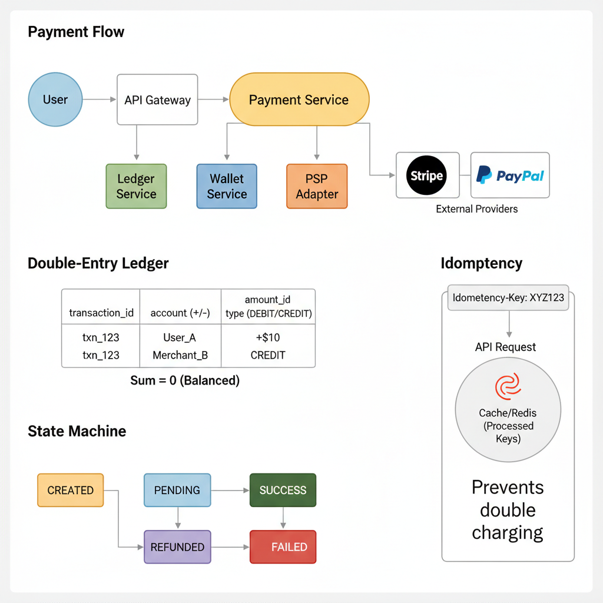
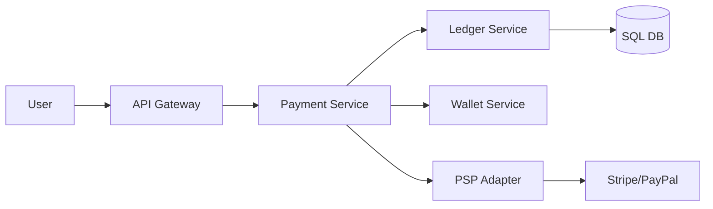

# 12. Design a Payment System (Stripe/PayPal)

**Difficulty:** Hard
**Focus:** ACID Transactions, Idempotency, Reconciliation, Security.

---

## 🎯 Real-World Analogy

**Think of a Payment System like a physical checkbook:**

**Double-Entry Ledger:**
- You write a check for $100 to Bob.
- Your checkbook: "-$100"
- Bob's checkbook: "+$100"
- Sum: 0 (Money didn't disappear, it just moved)

**Idempotency (Preventing Double Charge):**
- You write check #101 to Bob.
- Bob loses it and asks again.
- You don't write a *new* check.
- You check your carbon copy: "I already wrote check #101".
- You give him a copy or tell him to look harder.
- ✅ You never pay twice for the same thing.

**Key Insight:** In payments, accuracy is more important than speed. We must track every penny using accounting principles (Double-Entry) and prevent duplicate processing (Idempotency).

---

## 1. Requirements (0-5 Minutes)

**Functional:**
1.  **Pay:** User sends money to Merchant.
2.  **Refund:** User requests refund.
3.  **History:** View transactions.
4.  **Payout:** Merchant withdraws money to Bank Account.

**Non-Functional:**
1.  **Reliability:** ZERO data loss. This is the most critical requirement.
2.  **Consistency:** Exactly-once processing.
3.  **Auditability:** Every movement of money must be tracked.

---

## 2. High-Level Design (5-15 Minutes)





**Database Choice:**
*   **PostgreSQL/MySQL (InnoDB):** Mandatory. We need ACID transactions.
*   **NoSQL?** No. Eventual consistency is dangerous for money.

---

## 3. Deep Dive: The Payment State Machine (15-25 Minutes)

Every payment moves through strict states. We cannot jump from `CREATED` to `SUCCESS` without `PROCESSING`.

**States:**
1.  **CREATED:** User clicked button.
2.  **PENDING:** Sent request to Stripe.
3.  **SUCCESS:** Stripe confirmed success.
4.  **FAILED:** Stripe declined (Insufficient funds).
5.  **REFUNDED:** Money returned.

**Code Snippet (State Transition):**
```java
@Transactional
public void updateStatus(String paymentId, Status newStatus) {
    Payment p = repo.findById(paymentId);
    if (p.getStatus() == Status.SUCCESS && newStatus == Status.FAILED) {
        throw new IllegalStateException("Cannot fail a successful payment");
    }
    p.setStatus(newStatus);
    repo.save(p);
}
```

---

## 4. Deep Dive: Idempotency (25-30 Minutes)

### 📚 ELI5: The "Don't Charge Me Twice" Key

**The Problem:**
1. You click "Pay $100".
2. Server charges your card.
3. Server tries to reply "Success", but your WiFi dies. 📶❌
4. You see "Network Error". You click "Pay" again.
5. **Result:** You are charged $200. 😡

**The Solution: Idempotency Keys**
- The Client generates a unique ID (`req_123`) *before* the request.
- It sends this ID with the request.
- The Server checks: "Have I seen `req_123` before?"

**Flow:**
1. **Request 1:** `POST /pay { amount: 100, key: "req_123" }`
   - Server: "New key. Processing..." -> Charges $100 -> Saves Result -> Returns Success.
   - (Response lost due to WiFi).
2. **Request 2:** `POST /pay { amount: 100, key: "req_123" }`
   - Server: "I know `req_123`. I already finished that. Here is the saved response."
   - **Result:** User sees "Success", only charged once. ✅

### 📚 Understanding Idempotency - The Shaky WiFi Scenario

**The Nightmare:**
You are buying a $500 laptop. You click "Buy". The spinner spins... and spins...
"Network Error".
Did it go through? You don't know.
You click "Buy" again.
**Result:** You bought TWO laptops. $1000 charged. 😱

**The Fix: The Idempotency Key**
Think of it as a **unique receipt number** generated *before* you pay.

**Visual Flow:**

**Attempt 1:**
```
User: "Here is $500. Key = receipt_abc_123"
Server: "New key! Charging card... Success!"
Server: (Tries to reply, but connection dies) ❌
```

**Attempt 2 (User retries):**
```
User: "Here is $500. Key = receipt_abc_123" (SAME KEY)
Server: "Wait, I have 'receipt_abc_123' in my database."
Server: "I already charged you. Here is the success message again."
```

**Result:**
- Server charges card: **1 time**
- User clicks button: **2 times**
- User pays: **$500** ✅

**Key Rule:** The key must be generated by the **Client** (Frontend/App), not the Server!

---

### 💻 Python Implementation (Decorator)

```python
import functools

def idempotent(func):
    @functools.wraps(func)
    def wrapper(request, *args, **kwargs):
        key = request.headers.get('Idempotency-Key')
        if not key:
            return func(request, *args, **kwargs)
            
        # 1. Check Cache (Redis)
        cached_response = redis.get(f"idem:{key}")
        if cached_response:
            return cached_response # Return saved result immediately
            
        # 2. Lock the key (Prevent parallel clicks)
        if not redis.setnx(f"lock:{key}", 1):
            raise Exception("Concurrent Request Detected")
            
        try:
            # 3. Process Actual Payment
            response = func(request, *args, **kwargs)
            
            # 4. Save Result
            redis.set(f"idem:{key}", response, ex=86400) # 24h expiry
            return response
        finally:
            redis.delete(f"lock:{key}")
            
    return wrapper

@app.route('/pay', methods=['POST'])
@idempotent
def process_payment(request):
    # Charge Stripe logic here...
    return "Success"
```

### ☕ Java Implementation (Spring Boot + Redis)

```java
import org.springframework.data.redis.core.RedisTemplate;
import org.springframework.stereotype.Service;
import org.springframework.web.bind.annotation.*;
import java.util.concurrent.TimeUnit;

@Service
public class IdempotencyService {
    private final RedisTemplate<String, String> redisTemplate;
    
    public IdempotencyService(RedisTemplate<String, String> redisTemplate) {
        this.redisTemplate = redisTemplate;
    }
    
    public <T> T executeIdempotent(String idempotencyKey, 
                                    IdempotentOperation<T> operation) {
        if (idempotencyKey == null || idempotencyKey.isEmpty()) {
            return operation.execute();
        }
        
        // 1. Check Cache (Redis)
        String cacheKey = "idem:" + idempotencyKey;
        String cachedResponse = redisTemplate.opsForValue().get(cacheKey);
        if (cachedResponse != null) {
            return (T) cachedResponse; // Return saved result
        }
        
        // 2. Lock the key (Prevent parallel clicks)
        String lockKey = "lock:" + idempotencyKey;
        Boolean lockAcquired = redisTemplate.opsForValue()
            .setIfAbsent(lockKey, "1", 10, TimeUnit.SECONDS);
        
        if (Boolean.FALSE.equals(lockAcquired)) {
            throw new RuntimeException("Concurrent Request Detected");
        }
        
        try {
            // 3. Process Actual Payment
            T response = operation.execute();
            
            // 4. Save Result (24h expiry)
            redisTemplate.opsForValue().set(cacheKey, 
                response.toString(), 24, TimeUnit.HOURS);
            
            return response;
        } finally {
            redisTemplate.delete(lockKey);
        }
    }
    
    @FunctionalInterface
    public interface IdempotentOperation<T> {
        T execute();
    }
}

@RestController
public class PaymentController {
    private final IdempotencyService idempotencyService;
    
    @PostMapping("/pay")
    public String processPayment(
            @RequestHeader(value = "Idempotency-Key", required = false) String key,
            @RequestBody PaymentRequest request) {
        
        return idempotencyService.executeIdempotent(key, () -> {
            // Charge Stripe logic here...
            return "Success";
        });
    }
}
```

---

## 5. Deep Dive: Double-Entry Ledger (30-35 Minutes)

**The Golden Rule of Accounting:**
> "Every transaction must have equal and opposite entries."

**Why?**
If you just do `User.balance -= 100` and `Merchant.balance += 100`:
- What if the first line succeeds and the second fails?
- **Result:** $100 vanished into thin air! 💸

### 📚 Understanding ACID - The Money Teleportation Problem

**The Scenario:** Alice sends $100 to Bob.

**Step 1:** Take $100 from Alice. (Alice: $1000 -> $900)
**Step 2:** Give $100 to Bob. (Bob: $500 -> $600)

**What if the power goes out after Step 1?**
- Alice has $900.
- Bob has $500.
- **$100 is gone forever.** This is unacceptable.

**The Solution: Atomicity (The "A" in ACID)**
Atomicity means "All or Nothing".

**Visualizing the Transaction Bubble:**
```
       [ TRANSACTION START ]
       |
       |-- 1. Debit Alice $100 (Pending...)
       |-- 2. Credit Bob $100 (Pending...)
       |
       [ COMMIT ] -> Both happen instantly!
```

**If Step 2 fails:**
```
       [ TRANSACTION START ]
       |
       |-- 1. Debit Alice $100 (Pending...)
       |-- 2. Credit Bob $100 --> ERROR! 💥
       |
       [ ROLLBACK ] -> Step 1 is undone!
```
Alice is back to $1000. It's like the transaction never happened. Safe! ✅

---

**The Solution:**
We record **movements**, not just balances.

**Schema:**
```sql
CREATE TABLE ledger_entries (
    id UUID PRIMARY KEY,
    transaction_id UUID,  -- Links the debit and credit
    account_id VARCHAR,
    amount DECIMAL(20, 4),
    type VARCHAR -- 'DEBIT' or 'CREDIT'
);
```

**Example Transaction ($10 from Alice to Bob):**

| ID | Tx_ID | Account | Amount | Type |
|----|-------|---------|--------|------|
| 1  | tx_99 | Alice   | -10.00 | DEBIT |
| 2  | tx_99 | Bob     | +10.00 | CREDIT |

**Verification:**
`SELECT SUM(amount) FROM ledger_entries WHERE transaction_id = 'tx_99'`
- Result MUST be **0.00**.
- If not, the system is broken.

### 💻 ACID Transaction Code

```java
@Transactional
public void transferFunds(String fromUser, String toUser, BigDecimal amount) {
    UUID txId = UUID.randomUUID();
    
    // 1. Create Debit Entry
    LedgerEntry debit = new LedgerEntry();
    debit.setTxId(txId);
    debit.setAccount(fromUser);
    debit.setAmount(amount.negate()); // -10
    debit.setType("DEBIT");
    repo.save(debit);
    
    // 2. Create Credit Entry
    LedgerEntry credit = new LedgerEntry();
    credit.setTxId(txId);
    credit.setAccount(toUser);
    credit.setAmount(amount); // +10
    credit.setType("CREDIT");
    repo.save(credit);
    
    // If any line fails, @Transactional rolls back EVERYTHING.
    // No partial money states.
}
```

---

## 6. Deep Dive: Reconciliation (35-40 Minutes)

## 6. Deep Dive: Reconciliation (35-40 Minutes)

### 🕵️ Finding the Needle in the Haystack

**The Reality:**
Even with ACID and Idempotency, things break.
- A developer manually deletes a row.
- A cosmic ray flips a bit.
- Stripe has a bug.

**Reconciliation is the "Truth Check".**
It runs asynchronously (usually nightly) to verify that **Our DB** matches **The Bank**.

### 📚 Understanding Reconciliation - The Nightly Truth Check

**Analogy:**
Imagine you and your friend Bob share expenses.
- You write down every time you pay for lunch in your notebook.
- Bob writes it down in his notebook.
- At the end of the month, you sit down and compare notebooks.

**Scenario 1: Match ✅**
- You: "I paid $20 on Tuesday."
- Bob: "I have $20 on Tuesday."
- Result: All good.

**Scenario 2: Missing Entry (The "Free Lunch" Bug) ❌**
- You: "I paid $50 on Friday."
- Bob: "I don't have that."
- **Fix:** Bob adds it to his notebook (Auto-healing).

**Scenario 3: Mismatch (The "Scary" Bug) 🚨**
- You: "I paid $10."
- Bob: "My book says you paid $100."
- **Fix:** STOP EVERYTHING. Call the accountant. (Manual Alert).

In our system:
- **Your Notebook** = Our Database
- **Bob's Notebook** = Stripe's CSV Report

**The Process (T+1 Settlement):**
1.  **Step 1: Get the Bank Statement**
    - Stripe generates a CSV file at midnight containing all 1,000,000 transactions for the day.
    
2.  **Step 2: The Matching Algorithm (Batch Job)**
    - We load Stripe's CSV into a temporary table.
    - We join it with our `ledger_entries`.
    
    ```sql
    SELECT * FROM stripe_csv s
    FULL OUTER JOIN ledger_entries l ON s.payment_id = l.external_id
    WHERE s.id IS NULL OR l.id IS NULL OR s.amount != l.amount
    ```

3.  **Step 3: Handle Discrepancies**
    - **Case A (Missing in DB):** Stripe charged the user, but we have no record.
      - *Fix:* Auto-create the record and fulfill the order.
    - **Case B (Missing in Stripe):** We think we charged the user, but Stripe says no.
      - *Fix:* Mark transaction as FAILED in our DB.
    - **Case C (Amount Mismatch):** We recorded $10, Stripe charged $100.
      - *Fix:* **CRITICAL ALERT!** Wake up the Finance Team immediately.

---

---

## 7. Real-World Engineering Case Studies (Deep Dive)

### 1. Stripe: The "Ledger-First" Architecture

**Source:** Stripe Engineering Blog - "Online Migrations at Scale"

**The Challenge:**
Stripe processes billions of dollars annually.
- **Problem:** How to ensure ZERO data loss and maintain audit trails for regulatory compliance (PCI-DSS, SOC 2)?
- **Requirement:** Every cent must be accounted for, even during system failures.

**The Solution: Immutable Ledger + Event Sourcing**

**Architecture:**
1.  **Immutable Ledger:**
    - Stripe's core database is an **append-only ledger**.
    - Every transaction creates TWO entries (double-entry bookkeeping):
        - Debit: Customer's account -$100
        - Credit: Merchant's account +$100
    - **No Updates, Only Inserts:** If a refund happens, we don't delete the original entry. We add a new entry: Debit Merchant -$100, Credit Customer +$100.
2.  **Event Sourcing:**
    - Instead of storing "current balance", Stripe stores a log of events:
        - `PaymentCreated`, `PaymentAuthorized`, `PaymentCaptured`, `PaymentRefunded`
    - The balance is computed by replaying events.
    - **Benefit:** Complete audit trail. You can reconstruct the state at any point in time.
3.  **Idempotency Keys:**
    - Stripe requires clients to send a unique `Idempotency-Key` header with every request.
    - If the same key is sent twice, Stripe returns the cached response (no duplicate charge).
    - **Storage:** Redis stores `{idempotency_key: response}` for 24 hours.
4.  **Reconciliation (The "Stripe Sigma" System):**
    - Stripe runs hourly reconciliation jobs comparing:
        - Internal ledger vs. Bank statements
        - Internal ledger vs. Card network reports (Visa, Mastercard)
    - **Discrepancies:** Automatically flagged and sent to the Finance Operations team.

**Key Insight:**
Stripe treats the ledger as the **source of truth**. All other systems (dashboards, analytics) are derived from the ledger using event streaming (Kafka).

---

### 2. PayPal: Handling 300 Million Transactions/Day

**Source:** PayPal Engineering Blog

**The Challenge:**
PayPal operates in 200+ countries with different currencies and regulations.
- **Problem:** How to handle currency conversions, fraud detection, and compliance at scale?

**The Solution: Microservices + Saga Pattern**

**Architecture:**
1.  **Microservices:**
    - PayPal split the monolith into 100+ microservices:
        - `PaymentService`, `FraudService`, `CurrencyService`, `LedgerService`, `NotificationService`
2.  **Saga Pattern (Distributed Transactions):**
    - A payment involves multiple services. If one fails, we must rollback.
    - **Example Flow:**
        1. `PaymentService` creates payment → Success
        2. `FraudService` checks fraud → Success
        3. `LedgerService` records transaction → **FAIL** (DB down)
        4. **Compensating Transaction:** `PaymentService` cancels the payment.
    - **Implementation:** Each service publishes events to Kafka. A Saga Orchestrator listens and coordinates.
3.  **Currency Conversion:**
    - PayPal caches exchange rates in Redis (updated every 5 minutes).
    - For large transactions (>$10k), they query live rates from banks.
4.  **Fraud Detection (Machine Learning):**
    - PayPal uses real-time ML models to score transactions (0-100).
    - Score > 80 → Auto-approve
    - Score 50-80 → Manual review
    - Score < 50 → Auto-decline
    - **Features:** IP geolocation, device fingerprint, transaction velocity, historical behavior.

**Key Insight:**
PayPal uses the **Saga Pattern** to maintain consistency across microservices without distributed transactions (2PC), which are slow and prone to deadlocks.

---

### 3. Square: The "Offline-First" Payment Terminal

**Source:** Square Engineering Blog

**The Challenge:**
Square's card readers must work even without internet (e.g., farmers market, food truck).
- **Problem:** How to process payments offline and sync later?

**The Solution: Local SQLite + Sync Queue**

**Architecture:**
1.  **Local Database (SQLite):**
    - The Square terminal stores transactions locally in SQLite.
    - When a card is swiped, it:
        - Encrypts card data (PCI-DSS compliant).
        - Stores transaction in local DB with status `PENDING_SYNC`.
2.  **Sync Queue:**
    - When internet returns, the terminal uploads pending transactions to Square's servers.
    - Server validates and processes the payment.
    - **Conflict Resolution:** If the card was declined (insufficient funds), the server marks it as `FAILED` and notifies the merchant.
3.  **Risk Management:**
    - Square allows offline transactions up to a limit (e.g., $100).
    - For larger amounts, the terminal requires online authorization.
    - **Chargeback Risk:** Square absorbs the risk if a fraudulent offline transaction is later disputed.

**Key Insight:**
Square prioritizes **availability** (offline payments) over immediate consistency, using eventual consistency and risk management to handle edge cases.

---

**Key Insight:**
Square prioritizes **availability** (offline payments) over immediate consistency, using eventual consistency and risk management to handle edge cases.

---

## 8. Failure Scenarios & Disaster Recovery

### Scenario 1: Payment Processor (Stripe/Adyen) Down
**Impact:** Users cannot complete purchases.
**Detection:**
- `processor_timeout_rate` > 5%.
- `http_503_service_unavailable` from processor API.

**Mitigation:**
- **Processor Redundancy:** Automatically failover to a secondary processor (e.g., if Stripe is down, use Braintree).
- **Queued Payments:** For non-time-sensitive payments (e.g., subscription renewals), queue the request and retry when the processor is back online.

### Scenario 2: Database (Ledger) Deadlock
**Impact:** Payment processing hangs; ledger entries are not created.
**Detection:** `db_deadlock_count` spike in metrics.

**Mitigation:**
- **Optimistic Locking:** Use version numbers for ledger entries instead of row-level locks where possible.
- **Transaction Timeout:** Set strict timeouts for DB transactions to prevent hanging connections.

### Scenario 3: Double Charge (Idempotency Failure)
**Impact:** User is charged twice for the same order.
**Detection:** `duplicate_payment_alerts` from the reconciliation job.

**Mitigation:**
- **Strict Idempotency:** The `idempotency_key` must be checked *before* any external call and *before* any DB write.
- **Auto-Refund:** If a duplicate is detected by the reconciliation job, trigger an automatic refund and notify the user.

---

## 9. Monitoring & Observability

### Golden Signals Dashboard

**1. Latency**
- **Authorization Time:** P95 < 3s.
- **Ledger Write:** P99 < 100ms.
- **Metric:** `payment_auth_latency_seconds`.

**2. Traffic**
- **Throughput:** Transactions per second (TPS).
- **Metric:** `payments_processed_total`.

**3. Errors**
- **Metric:** `payment_decline_rate_by_reason` (Insufficient funds, Fraud, System Error).
- **Target:** System errors < 0.1%.

**4. Saturation**
- **Metric:** DB connection pool, Processor rate limits.

### Alert Rules
```yaml
alerts:
  - alert: HighPaymentFailureRate
    expr: rate(payment_failures_total[5m]) / rate(payment_attempts_total[5m]) > 0.05
    for: 2m
    labels:
      severity: critical
```

---

## 10. API Design & Versioning

### Payment API

**Create Payment Intent**
```http
POST /api/v1/payments
Content-Type: application/json
X-Idempotency-Key: uuid-unique-123

{
  "amount": 5000,
  "currency": "USD",
  "payment_method": "pm_card_visa",
  "order_id": "ord_999"
}
```

**Capture Payment**
```http
POST /api/v1/payments/{payment_id}/capture
```

### Versioning
- Use `/v1/`, `/v2/` in URL.
- **Webhook Versioning:** Include a `version` field in the webhook payload so the client knows how to parse it.

---

## 11. Cost Analysis & Optimization

### Monthly Infrastructure Costs (at 1M transactions/month)

**1. Processor Fees (Stripe)**
- 2.9% + 30¢ per transaction.
- For $100M volume = **$2.9M + $300k = $3.2M/month**.

**2. Compute & DB**
- High-availability RDS + K8s = **$10,000/month**.

**3. Compliance (PCI-DSS Audit)**
- Annual cost amortized = **$5,000/month**.

**Total:** ~$3.22M/month (Mostly processor fees).

### Optimization Opportunities
- **Tiered Pricing:** Negotiate lower rates with processors as volume increases (e.g., 1.5% instead of 2.9%).
- **Local Payment Methods:** Use lower-cost methods like ACH or SEPA for large B2B transactions.

---

## 12. Security & Compliance

### Security Measures
- **PCI-DSS Level 1:** Use an iframe or hosted fields (Stripe Elements) so card data never touches your servers.
- **Tokenization:** Store only the "Token" (e.g., `tok_123`) in your database, never the raw PAN (Primary Account Number).
- **Field-Level Encryption:** Encrypt PII (User Name, Address) in the database using AES-256.

### Compliance
- **AML (Anti-Money Laundering):** Integrate with services like Chainalysis for crypto or standard AML lists for fiat.
- **KYC (Know Your Customer):** Use Jumio or Stripe Identity for user verification.

---

## 13. Testing Strategies

### Unit Tests
- Test Ledger math: "Does Credit - Debit always equal 0?"
- Test State Machine transitions: "Can a 'Failed' payment be 'Captured'?" (No).

### Integration Tests
- Use Stripe/PayPal "Sandbox" environments to test the full E2E flow.

### Load Testing
- Simulate "Cyber Monday" peak: 1,000 TPS.
- **Tool:** `Locust` with mock processor responses.

---

## 14. Migration & Rollout Strategies

### Rollout
- **Shadow Mode:** Send 1% of traffic to a new processor but don't actually charge the card (use "Validate Only").

### Migration
- **Vault Migration:** If moving from Braintree to Stripe, use a secure "Vault-to-Vault" migration service to move card tokens without re-collecting them from users.

---

## 15. Performance Optimization

### Latency Optimization
- **Pre-auth:** Authorize the card when the user hits "Checkout" (before they hit "Pay") to reduce perceived latency.
- **Connection Pooling:** Maintain persistent connections to the payment processor.

### Database Optimization
- **Partitioning:** Partition the `transactions` table by `created_at` (monthly) to keep indexes small.

---

## 16. Capacity Planning

### Scaling Triggers
- **Ledger DB:** Scale vertically (more RAM/CPU) for the primary writer.
- **Reconciliation Workers:** Scale horizontally based on the number of CSV rows to process.

### Throughput Projection
- 1M transactions/month ≈ 0.4 TPS (average).
- Peak could be 100x average (40 TPS). A single RDS instance can handle this easily.

---

## 17. Interview Cheat Sheet

### Key Numbers
- **Latency:** < 3s (Authorization).
- **Availability:** 99.999% (Hard requirement).
- **Consistency:** Strong consistency for the Ledger.

### Core Components
1. **Payment Gateway:** External interface.
2. **Ledger:** Internal source of truth (Double-entry).
3. **Reconciliation Service:** Verifies internal vs external data.
4. **Fraud Engine:** Blocks suspicious transactions.

### Critical Trade-offs
- **Availability vs Consistency:** If the Ledger is down, do we stop taking money? (Yes, usually).
- **Synchronous vs Asynchronous:** Authorize synchronously, capture/settle asynchronously.

---

## 18. Wrap-up (Deep Dive)

**Summary:**
"I designed a robust Payment System centered around a **Double-Entry Ledger** for auditability and compliance.
1.  **State Machine:** I implemented a strict state machine to manage payment lifecycles, preventing invalid transitions.
2.  **Idempotency:** I used **Idempotency Keys** (stored in Redis) to handle distributed failures and prevent duplicate charges.
3.  **Reconciliation:** I designed a nightly batch job to reconcile our ledger with external payment processors (Stripe, PayPal), acting as the ultimate source of truth.
4.  **Real-World:** I incorporated **Stripe's Event Sourcing** architecture, **PayPal's Saga Pattern** for distributed transactions, and **Square's Offline-First** approach for high availability.
5.  **Production Readiness:** I addressed failure modes like processor outages, ensured PCI-DSS compliance through tokenization, and designed a robust reconciliation framework to catch discrepancies."

---

---
