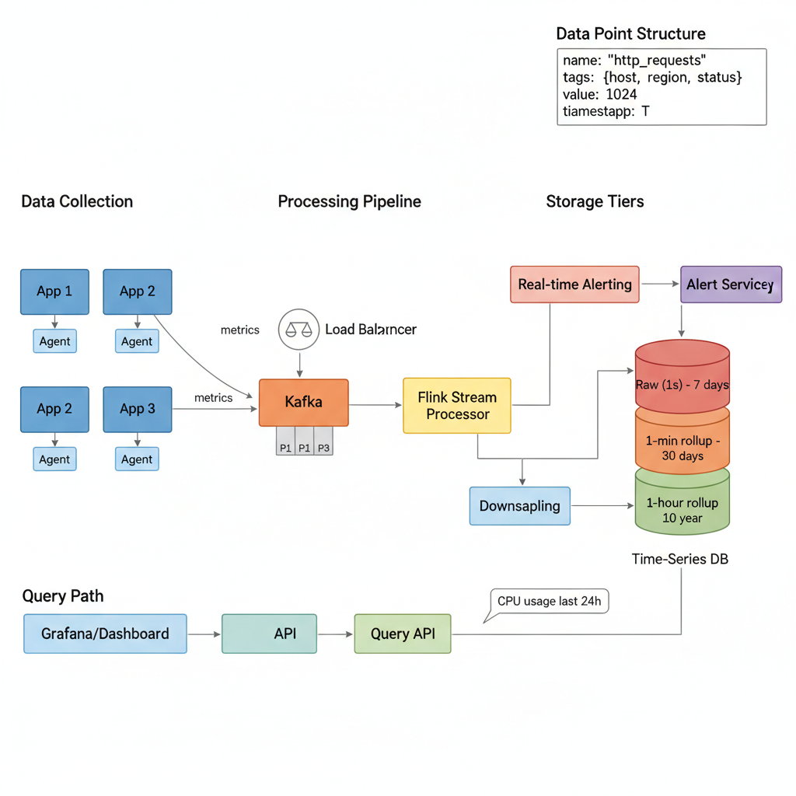
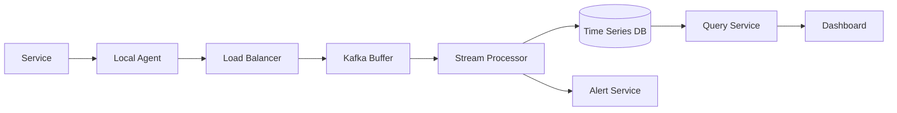

# 13. Design a Metrics/Monitoring System (Datadog/Prometheus)

**Difficulty:** Hard
**Focus:** Write-Heavy, Time-Series DB, Aggregation, Push vs Pull.

---

## 🎯 Real-World Analogy

**Think of Downsampling like summarizing a book:**

**Raw Data (1-second resolution):**
- "It was the best of times, it was the worst of times..." (Every single word)
- Great for reading NOW.
- Too big to store forever.

**1-Minute Summary:**
- "Opening paragraph describes duality of the era."
- Good for reviewing last month.

**1-Hour Summary:**
- "Chapter 1: Introduction."
- Good for reviewing last year.

**Key Insight:** We don't need second-by-second CPU usage from 6 months ago. We just need to know "Was it high or low?". This saves 99% of storage.

---

## 1. Requirements (0-5 Minutes)

**Functional:**
1.  **Ingest:** Services send metrics (CPU, Request Count, Latency).
2.  **Store:** Keep history (1 year).
3.  **Visualize:** Dashboards (Line charts, Heatmaps).
4.  **Alert:** "Notify me if Error Rate > 5%".

**Non-Functional:**
1.  **Write Load:** Massive (100M metrics/sec).
2.  **Read Load:** Low (only when humans look at dashboards).
3.  **Latency:** Dashboards should load fast (< 2s).
4.  **Reliability:** It's okay to lose a few data points (AP system), but system must stay up.

---

## 2. High-Level Design (5-15 Minutes)



**Architecture (Push Model):**



## 3. Deep Dive: Push vs Pull Architecture (15-20 Minutes)

**The Great Debate: Prometheus (Pull) vs Datadog (Push)**

| Feature | Pull (Prometheus) | Push (Datadog/Graphite) |
| :--- | :--- | :--- |
| **How it works** | Server asks App: "Give me metrics" | App sends to Server: "Here are metrics" |
| **Service Discovery** | **Hard.** Server needs to know IP of every App. | **Easy.** App just needs VIP of Server. |
| **Firewalls** | **Hard.** Server needs access to App's internal port. | **Easy.** App just needs outbound access (usually open). |
| **Short-lived Jobs** | **Bad.** Job might die before Server scrapes. | **Good.** Job pushes metrics before dying. |
| **Control** | **Centralized.** Server decides rate. | **Decentralized.** App decides rate (can DDoS server). |

**Visual: The Firewall Problem**

```
[Monitoring Server]  <--X-- (Blocked) -- [Firewall] -- [App Server]
(Pull fails if Firewall blocks inbound)

[Monitoring Server]  <---- (Allowed) ---- [Firewall] -- [App Server]
(Push works because outbound is usually allowed)
```

**Conclusion:**
- For **Kubernetes/Microservices** (Dynamic IPs): **Push** is often easier (via Sidecar).
- For **Legacy/Static** infrastructure: **Pull** is fine.
- We will use **Push** (via Telegraf Agent) for this design to handle dynamic scaling easily.

---

## 4. Deep Dive: Data Compression (Gorilla Algorithm) (20-30 Minutes)

**The Problem:**
We have 1 billion metrics. Each has a 64-bit timestamp and 64-bit value.
128 bits per point.
1B points = 16GB RAM. Too expensive!

**The Solution: Gorilla (Facebook) Compression**

**1. Timestamp Compression (Delta-of-Delta):**
Timestamps usually happen at regular intervals (every 60s).
- T1: 1000
- T2: 1060 (Delta: +60)
- T3: 1121 (Delta: +61) -> (Delta-of-Delta: +1)
- T4: 1181 (Delta: +60) -> (Delta-of-Delta: -1)

Instead of storing `1181` (64 bits), we store `-1` (2 bits).
**Savings: ~96%**

**2. Value Compression (XOR):**
Values usually change slowly.
- V1: 3.1415926535
- V2: 3.1415926536
- XOR(V1, V2) = `0000...0001` (Lots of zeros!)

We only store the **non-zero bits**.
**Savings: ~10x**

**Visual:**
```
Value 1: 11000000...0000 (Float 12.0)
Value 2: 11000000...0001 (Float 12.00001)
XOR    : 00000000...0001
Stored : [Leading Zeros Count] [Trailing Zeros Count] [The "1"]
```

---

## 5. Deep Dive: Downsampling (Rollups) (30-35 Minutes)

### 📚 ELI5: Downsampling

**The Problem:**
```
1 server sends 1 metric every second.
= 86,400 points/day
= 31,536,000 points/year

For 1,000 servers?
= 31 BILLION points/year 😱

Storage Cost: $$$$$
Query Speed: Slow 🐢
```

**The Solution (Rollups):**
```
Raw (Keep 7 days):
[10, 12, 15, 11, 14, ...] (Every second)

1-Minute Rollup (Keep 30 days):
- Take 60 points
- Calculate: Avg=12, Max=15, Min=10
- Store only 3 numbers!
- Compression: 20x ✅

1-Hour Rollup (Keep 1 year):
- Take 60 "1-minute" points
- Calculate: Avg=11, Max=18, Min=9
- Store only 3 numbers!
- Compression: 1200x ✅
```

### 💻 Python Implementation (Pandas Style)

```python
import pandas as pd

# 1. Raw Data (1 second resolution)
data = {
    'time': ['10:00:00', '10:00:01', '10:00:02', ...],
    'cpu':  [45,         50,         55,       ...]
}
df = pd.DataFrame(data)
df['time'] = pd.to_datetime(df['time'])
df.set_index('time', inplace=True)

# 2. Downsample to 1 Minute
# Calculate Min, Max, Avg, Count
rollup_1m = df.resample('1T').agg({
    'cpu': ['min', 'max', 'mean', 'count']
})

# 3. Store Result
# Time      | Min | Max | Mean | Count
# 10:00:00  | 45  | 55  | 50   | 60
```

### ☕ Java Implementation

```java
import java.time.*;
import java.util.*;
import java.util.stream.Collectors;

public class MetricsDownsampler {
    
    static class DataPoint {
        Instant timestamp;
        double value;
        
        public DataPoint(Instant timestamp, double value) {
            this.timestamp = timestamp;
            this.value = value;
        }
    }
    
    static class RollupResult {
        Instant bucketTime;
        double min;
        double max;
        double mean;
        int count;
        
        public RollupResult(Instant bucketTime, double min, double max, double mean, int count) {
            this.bucketTime = bucketTime;
            this.min = min;
            this.max = max;
            this.mean = mean;
            this.count = count;
        }
        
        @Override
        public String toString() {
            return String.format("%s | Min: %.2f | Max: %.2f | Mean: %.2f | Count: %d",
                bucketTime, min, max, mean, count);
        }
    }
    
    /**
     * Downsample data points to 1-minute buckets
     */
    public List<RollupResult> downsampleToMinute(List<DataPoint> dataPoints) {
        // Group by 1-minute buckets
        Map<Instant, List<DataPoint>> buckets = dataPoints.stream()
            .collect(Collectors.groupingBy(dp -> 
                dp.timestamp.truncatedTo(java.time.temporal.ChronoUnit.MINUTES)
            ));
        
        // Calculate aggregates for each bucket
        return buckets.entrySet().stream()
            .map(entry -> {
                Instant bucketTime = entry.getKey();
                List<DataPoint> points = entry.getValue();
                
                DoubleSummaryStatistics stats = points.stream()
                    .mapToDouble(dp -> dp.value)
                    .summaryStatistics();
                
                return new RollupResult(
                    bucketTime,
                    stats.getMin(),
                    stats.getMax(),
                    stats.getAverage(),
                    (int) stats.getCount()
                );
            })
            .sorted(Comparator.comparing(r -> r.bucketTime))
            .collect(Collectors.toList());
    }
    
    // Usage
    public static void main(String[] args) {
        MetricsDownsampler downsampler = new MetricsDownsampler();
        
        List<DataPoint> rawData = Arrays.asList(
            new DataPoint(Instant.parse("2024-01-01T10:00:00Z"), 45),
            new DataPoint(Instant.parse("2024-01-01T10:00:01Z"), 50),
            new DataPoint(Instant.parse("2024-01-01T10:00:02Z"), 55)
        );
        
        List<RollupResult> rollups = downsampler.downsampleToMinute(rawData);
        rollups.forEach(System.out::println);
    }
}
```

---

## 6. Deep Dive: Alerting (35-40 Minutes)

*   **Pull Alerting (Prometheus):** AlertManager queries DB every minute.
    *   *Cons:* Slow for massive data.
*   **Push Alerting (Streaming):**
    *   Flink holds the rule: `IF cpu > 90 FOR 5 mins`.
    *   As data flows through, Flink checks the condition in memory.
    *   If triggered, push event to PagerDuty immediately.
    *   *Pros:* Real-time.

---

## 7. Deep Dive: Tagging & High Cardinality (40-42 Minutes)

**Problem:**
- Metric: `http_requests_total`
- Tags: `status=200`, `method=POST`, `user_id=123`
- **Cardinality Explosion:** If `user_id` has 100M values, we create 100M time series.
- **Result:** DB crashes (Index too big).

**Solution:**
1.  **Drop High-Cardinality Tags:** Don't tag by `user_id` or `request_id`.
2.  **Pre-Aggregation:** Aggregate by `status` before storing.
3.  **Bloom Filters:** To check if a series exists before writing.

---

## 8. Deep Dive: Distributed Tracing (42-45 Minutes)

**Metrics vs Logs vs Tracing:**
- **Metrics:** "CPU is high." (Aggregated)
- **Logs:** "Error at line 10." (Event)
- **Tracing:** "Request X took 2s (1s in DB, 1s in API)." (Lifecycle)

**How Tracing Works (Jaeger/Zipkin):**
1.  **Trace ID:** Generated at the edge (Load Balancer).
2.  **Span ID:** Generated for each service call.
3.  **Context Propagation:** Pass `Trace-ID` in HTTP Headers (`x-b3-traceid`).
4.  **Collection:** Each service sends Spans to Jaeger Collector asynchronously (UDP).

---

---

## 8A. Deep Dive: Alerting & Threshold Management

**Alert Rules Engine:**
```python
class AlertRule:
    def __init__(self, metric_name, condition, threshold, duration):
        self.metric_name = metric_name
        self.condition = condition  # "greater_than", "less_than", "equals"
        self.threshold = threshold
        self.duration = duration  # Alert if condition met for X seconds
    
    def evaluate(self, metric_value, timestamp):
        if self.condition == "greater_than" and metric_value > self.threshold:
            return True
        elif self.condition == "less_than" and metric_value < self.threshold:
            return True
        return False

class AlertManager:
    def __init__(self):
        self.rules = []
        self.alert_state = {}  # {rule_id: {first_triggered, count}}
    
    def check_alerts(self, metric_name, value, timestamp):
        triggered_alerts = []
        
        for rule in self.rules:
            if rule.metric_name != metric_name:
                continue
            
            if rule.evaluate(value, timestamp):
                # Track how long condition has been true
                if rule.id not in self.alert_state:
                    self.alert_state[rule.id] = {
                        "first_triggered": timestamp,
                        "count": 1
                    }
                else:
                    self.alert_state[rule.id]["count"] += 1
                
                # Check if duration threshold met
                duration = timestamp - self.alert_state[rule.id]["first_triggered"]
                if duration >= rule.duration:
                    triggered_alerts.append(rule)
            else:
                # Condition no longer met, reset state
                if rule.id in self.alert_state:
                    del self.alert_state[rule.id]
        
        return triggered_alerts
```

**Java Implementation:**
```java
public class AlertManager {
    private List<AlertRule> rules;
    private Map<String, AlertState> alertState;
    
    public List<Alert> checkAlerts(String metricName, double value, long timestamp) {
        List<Alert> triggeredAlerts = new ArrayList<>();
        
        for (AlertRule rule : rules) {
            if (!rule.getMetricName().equals(metricName)) continue;
            
            if (rule.evaluate(value)) {
                AlertState state = alertState.computeIfAbsent(
                    rule.getId(), 
                    k -> new AlertState(timestamp)
                );
                
                long duration = timestamp - state.getFirstTriggered();
                if (duration >= rule.getDuration()) {
                    triggeredAlerts.add(new Alert(rule, value, timestamp));
                }
            } else {
                alertState.remove(rule.getId());
            }
        }
        
        return triggeredAlerts;
    }
}
```

**Alert Routing:**
- **Severity Levels:** Critical -> PagerDuty, Warning -> Slack, Info -> Email
- **Deduplication:** Don't send same alert every second
- **Escalation:** If not acknowledged in 15 minutes, escalate to manager

---

## 8B. Deep Dive: Anomaly Detection with ML

**Statistical Anomaly Detection:**
```python
import numpy as np

class AnomalyDetector:
    def __init__(self, window_size=100):
        self.window_size = window_size
        self.historical_data = []
    
    def detect_anomaly(self, value):
        self.historical_data.append(value)
        
        if len(self.historical_data) < self.window_size:
            return False  # Not enough data
        
        # Keep only recent window
        self.historical_data = self.historical_data[-self.window_size:]
        
        # Calculate statistics
        mean = np.mean(self.historical_data)
        std = np.std(self.historical_data)
        
        # Z-score method: value is anomaly if >3 standard deviations from mean
        z_score = abs((value - mean) / std) if std > 0 else 0
        
        return z_score > 3
    
    def detect_with_seasonality(self, value, timestamp):
        # Compare with same time last week
        day_of_week = timestamp.weekday()
        hour = timestamp.hour
        
        # Get historical values for same day/hour
        similar_values = self.get_historical_values(day_of_week, hour)
        
        if len(similar_values) < 4:  # Need at least 4 weeks of data
            return False
        
        mean = np.mean(similar_values)
        std = np.std(similar_values)
        z_score = abs((value - mean) / std) if std > 0 else 0
        
        return z_score > 3
```

**Machine Learning Approach:**
- Train model on historical data
- Predict expected value for current time
- Alert if actual value deviates significantly from prediction
- **Algorithms:** ARIMA, Prophet, LSTM

---

## 8C. Deep Dive: Query Optimization & Caching

**Query Caching Strategy:**
```python
class MetricsQueryCache:
    def __init__(self):
        self.cache = {}  # {query_hash: {result, timestamp}}
        self.ttl = 60  # Cache for 60 seconds
    
    def get_cached_result(self, query):
        query_hash = self.hash_query(query)
        
        if query_hash in self.cache:
            cached = self.cache[query_hash]
            if time.time() - cached["timestamp"] < self.ttl:
                return cached["result"]
        
        return None
    
    def cache_result(self, query, result):
        query_hash = self.hash_query(query)
        self.cache[query_hash] = {
            "result": result,
            "timestamp": time.time()
        }
    
    def hash_query(self, query):
        # Create hash from query parameters
        return hashlib.md5(
            f"{query.metric}:{query.start}:{query.end}:{query.aggregation}".encode()
        ).hexdigest()
```

**Pre-Aggregation:**
- Store 1-minute, 5-minute, 1-hour, 1-day rollups
- Query selects appropriate granularity based on time range
- **Benefit:** 100x faster queries for large time ranges

**Materialized Views:**
```sql
-- Pre-compute popular queries
CREATE MATERIALIZED VIEW cpu_usage_hourly AS
SELECT 
    server_id,
    DATE_TRUNC('hour', timestamp) as hour,
    AVG(cpu_percent) as avg_cpu,
    MAX(cpu_percent) as max_cpu
FROM metrics
WHERE metric_name = 'cpu_usage'
GROUP BY server_id, hour;

-- Refresh every hour
REFRESH MATERIALIZED VIEW cpu_usage_hourly;
```

---

### 1. Facebook: Gorilla (In-Memory Time-Series Database)

**Source:** Facebook Engineering Blog - "Gorilla: A Fast, Scalable, In-Memory Time Series Database"

**The Challenge:**
Facebook monitors 2 billion time series (metrics) across millions of servers.
- **Problem:** Traditional disk-based TSDBs (InfluxDB, OpenTSDB) couldn't handle the write throughput.
- **Requirement:** Store 1 billion data points per minute with sub-second query latency.

**The Solution: In-Memory TSDB with Delta-of-Delta Compression**

**Architecture:**
1.  **In-Memory Storage:**
    - Gorilla stores the last 26 hours of data entirely in RAM.
    - Older data is written to HBase (disk) for long-term storage.
    - **Why 26 hours?** Most alerts and debugging happen within the last day.
2.  **Delta-of-Delta Compression:**
    - Instead of storing absolute timestamps, store the difference between consecutive timestamps.
    - **Example:**
        - Timestamps: `1000, 1010, 1020, 1030`
        - Deltas: `10, 10, 10` (constant interval)
        - Delta-of-deltas: `0, 0` (no change!)
    - **Result:** 64-bit timestamp compressed to 1-2 bits.
3.  **XOR Compression (Values):**
    - Metric values change slowly (CPU: 45% → 46% → 45%).
    - XOR consecutive values: `45 XOR 46 = 3` (small number).
    - Store only the XOR result using variable-length encoding.
    - **Compression Ratio:** 12:1 (from 16 bytes to 1.37 bytes per point).
4.  **Sharding:**
    - Gorilla shards by metric name hash.
    - Each shard is replicated 3x for fault tolerance.
5.  **Write Path:**
    - Writes go to a write-ahead log (WAL) on disk first.
    - Then written to in-memory structure.
    - **Recovery:** If a node crashes, replay the WAL.

**Key Insight:**
By keeping recent data in memory and using aggressive compression, Gorilla achieves 40x better write throughput than disk-based TSDBs.

---

### 2. Datadog: Multi-Tenant Metrics at Scale

**Source:** Datadog Engineering Blog

**The Challenge:**
Datadog serves 20,000+ customers, each with different metric volumes.
- **Problem:** How to isolate tenants and prevent one customer from impacting others?
- **Requirement:** Support 1 million metrics/second per customer.

**The Solution: Kafka + Cassandra + Custom Aggregation**

**Architecture:**
1.  **Ingestion (Kafka):**
    - Agents push metrics to Kafka (partitioned by customer ID).
    - **Benefit:** Kafka acts as a buffer. If Cassandra is slow, metrics queue up without data loss.
2.  **Storage (Cassandra):**
    - Datadog uses Cassandra with a custom schema:
        - **Row Key:** `customer_id | metric_name | timestamp_bucket`
        - **Columns:** `timestamp_1, value_1, timestamp_2, value_2...`
    - **Downsampling:** Background jobs aggregate 1-second data into 1-minute, 1-hour, 1-day rollups.
3.  **Query Layer:**
    - Queries hit multiple Cassandra nodes in parallel.
    - Results are merged and aggregated in-memory.
    - **Caching:** Popular queries (dashboards) are cached in Redis for 60 seconds.
4.  **Tenant Isolation:**
    - Each customer has a separate Kafka partition and Cassandra keyspace.
    - **Rate Limiting:** If a customer exceeds their quota, their writes are throttled (not dropped).

**Key Insight:**
Datadog uses **Kafka for buffering** and **Cassandra for horizontal scalability**, allowing them to handle massive multi-tenant workloads.

---

### 3. Prometheus: The Pull-Based Approach

**Source:** Prometheus Documentation & CNCF Talks

**The Challenge:**
Kubernetes environments have thousands of ephemeral pods.
- **Problem:** How to discover and scrape metrics from dynamic services?

**The Solution: Service Discovery + Pull Model**

**Architecture:**
1.  **Service Discovery:**
    - Prometheus integrates with Kubernetes API.
    - It watches for new pods and automatically adds them to the scrape list.
    - **Config:**
        ```yaml
        scrape_configs:
          - job_name: 'kubernetes-pods'
            kubernetes_sd_configs:
              - role: pod
        ```
2.  **Pull Model:**
    - Prometheus scrapes `/metrics` endpoint from each pod every 15 seconds.
    - **Benefit:** Centralized control. Prometheus decides the scrape interval.
3.  **Local Storage (TSDB):**
    - Prometheus stores data locally on disk (not distributed).
    - Uses a custom TSDB with chunked storage (2-hour blocks).
    - **Retention:** Typically 15 days (configurable).
4.  **Federation:**
    - For long-term storage, Prometheus federates to **Thanos** or **Cortex**.
    - These systems aggregate data from multiple Prometheus instances and store in S3/GCS.

**Key Insight:**
Prometheus prioritizes **simplicity** and **operational ease** over distributed scalability. For large-scale deployments, it relies on federation.

---

**Key Insight:**
Prometheus prioritizes **simplicity** and **operational ease** over distributed scalability. For large-scale deployments, it relies on federation.

---

## 10. Failure Scenarios & Disaster Recovery

### Scenario 1: Ingestion Pipeline (Kafka) Lag
**Impact:** Dashboards show stale data; alerts are delayed.
**Detection:** `kafka_consumer_lag` > 1M messages.

**Mitigation:**
- **Auto-scaling Consumers:** Scale the number of consumer pods based on lag.
- **Priority Ingestion:** If lag persists, drop low-priority metrics (e.g., debug logs) to prioritize critical system metrics.

### Scenario 2: TSDB Write Failure (Disk Full)
**Impact:** Metrics are lost; no historical data for that period.
**Detection:** `disk_utilization > 90%` on TSDB nodes.

**Mitigation:**
- **Retention Policy:** Automatically purge oldest data blocks if disk space is critical.
- **Failover to S3:** If local disk is full, stream metrics directly to object storage (e.g., Thanos/Cortex approach).

### Scenario 3: Query Service Overload (Thundering Herd)
**Impact:** Dashboards fail to load; users cannot investigate outages.
**Detection:** `query_latency_p99 > 10s`.

**Mitigation:**
- **Query Caching:** Cache results of common dashboard queries (e.g., "CPU usage last 1h") in Redis.
- **Rate Limiting:** Limit the number of concurrent heavy queries per user.

---

## 11. Monitoring & Observability

### Golden Signals Dashboard

**1. Latency**
- **Ingestion Latency:** P95 < 1s.
- **Query Latency:** P95 < 2s.
- **Metric:** `metrics_ingestion_latency_seconds`.

**2. Traffic**
- **Throughput:** Data points per second (DPS).
- **Metric:** `metrics_received_total`.

**3. Errors**
- **Metric:** `ingestion_error_rate` (Malformed data, Schema mismatch).
- **Target:** < 0.01%.

**4. Saturation**
- **Metric:** TSDB IOPS, Kafka partition distribution.

### Alert Rules
```yaml
alerts:
  - alert: HighIngestionLatency
    expr: rate(metrics_ingestion_latency_seconds_sum[5m]) / rate(metrics_ingestion_latency_seconds_count[5m]) > 2
    for: 2m
    labels:
      severity: warning
```

---

## 12. API Design & Versioning

### Metrics API

**Push Metrics**
```http
POST /api/v1/push
Content-Type: application/x-protobuf

[
  {"name": "cpu_usage", "labels": {"host": "web-1"}, "value": 45.2, "timestamp": 1712345678}
]
```

**Query Metrics (PromQL style)**
```http
GET /api/v1/query?query=avg(cpu_usage)&start=...&end=...
```

### Versioning
- Use `/v1/`, `/v2/` in URL.
- **Data Format Versioning:** Use Protocol Buffers to ensure backward compatibility as new fields are added to the metric object.

---

## 13. Cost Analysis & Optimization

### Monthly Infrastructure Costs (at 100M DPS)

**1. Storage (EBS/S3)**
- 10 TB SSD (Hot) + 100 TB S3 (Cold) = **$5,000/month**.

**2. Compute (Kafka + TSDB + Query)**
- 50 nodes = **$10,000/month**.

**3. Bandwidth**
- Ingress from 10k servers = **$2,000/month**.

**Total:** ~$17,000/month.

### Optimization Opportunities
- **Gorilla Compression:** Reduces 16-byte data points to ~1.37 bytes (12x savings).
- **Downsampling:** Store 1s data for 7 days, 1m data for 30 days, and 1h data for 1 year.

---

## 14. Security & Compliance

### Security Measures
- **Authentication:** Use API keys or mTLS for all metric producers.
- **Tenant Isolation:** In a multi-tenant system (like Datadog), ensure `tenant_id` is indexed and enforced at the query layer.
- **Data Masking:** Ensure the ingestion pipeline strips PII from metric labels (e.g., email in a URL label).

### Compliance
- **SOC2:** Audit logs for who accessed which metrics.
- **Retention Compliance:** Ensure data is physically deleted after the retention period.

---

## 15. Testing Strategies

### Unit Tests
- Test Gorilla compression/decompression logic.
- Test PromQL parser for complex queries.

### Integration Tests
- Push a metric and verify it appears in a query result within 2 seconds.

### Load Testing
- Simulate 1M DPS from 1,000 concurrent producers.
- **Tool:** `Prombench` or custom `Go` load generator.

---

## 16. Migration & Rollout Strategies

### Rollout
- **Dual Ingestion:** Send metrics to both the old and new TSDB. Compare query results for consistency.

### Migration
- **Backfilling:** Use a Spark job to migrate historical data from the old system to the new one.

---

## 17. Performance Optimization

### Ingestion Optimization
- **Batching:** Producers should buffer metrics and send in 1MB batches.
- **UDP Ingestion:** For non-critical metrics, use UDP to reduce overhead (StatsD style).

### Query Optimization
- **Index Sharding:** Shard the inverted index by `time` and `metric_name` to speed up lookups.
- **Pre-aggregation:** Pre-calculate common aggregations (e.g., `sum`, `avg`) during ingestion.

---

## 18. Capacity Planning

### Scaling Triggers
- **Kafka Partitions:** Increase partitions if a single consumer cannot keep up with the throughput.
- **TSDB Nodes:** Scale out when disk IOPS or storage exceeds 70%.

### Throughput Projection
- 100M DPS ≈ 1.6M data points/sec.
- Requires a cluster of ~20-30 high-memory nodes.

---

## 19. Interview Cheat Sheet

### Key Numbers
- **Compression:** 1.37 bits per data point (Gorilla).
- **Latency:** < 1s (Ingestion), < 2s (Query).
- **Scale:** 100M+ DPS.

### Core Components
1. **Collector/Agent:** Gathers metrics from hosts.
2. **Ingestion Pipeline:** Kafka + Consumers.
3. **TSDB:** Optimized storage for time-series.
4. **Query Engine:** Executes PromQL/SQL.

### Critical Trade-offs
- **Push vs Pull:** Better for dynamic/ephemeral (Push) vs Better for centralized control (Pull).
- **Precision vs Cost:** High-resolution data (1s) vs Storage costs.

---

## 20. Wrap-up (Deep Dive)

**Summary:**
"I designed a scalable Metrics System using a **Push-based architecture** for dynamic environments.
1.  **Ingestion:** I used **Kafka** as a buffer to handle 100M metrics/second and decouple producers from consumers.
2.  **Storage:** I chose a **Time-Series Database** (Cassandra or custom TSDB) with **Gorilla compression** to reduce storage by 12x.
3.  **Aggregation:** I implemented **downsampling** (1s → 1m → 1h) to reduce query load and storage costs for historical data.
4.  **Real-World:** I incorporated **Facebook Gorilla's** in-memory architecture for recent data, **Datadog's** multi-tenant Kafka+Cassandra approach, and **Prometheus's** pull-based service discovery for Kubernetes.
5.  **Production Readiness:** I addressed failure modes like ingestion lag and query overload, optimized costs through downsampling, and ensured security through tenant isolation and PII masking."

---

---
