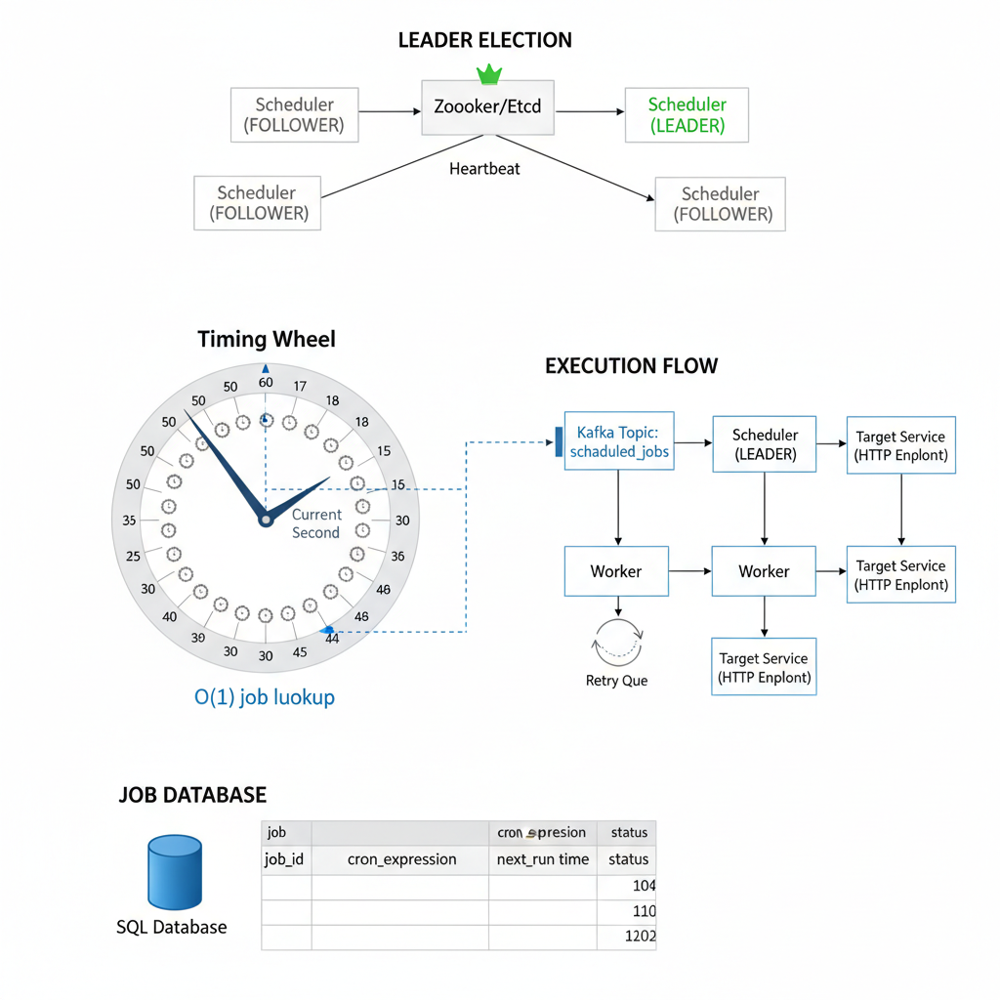
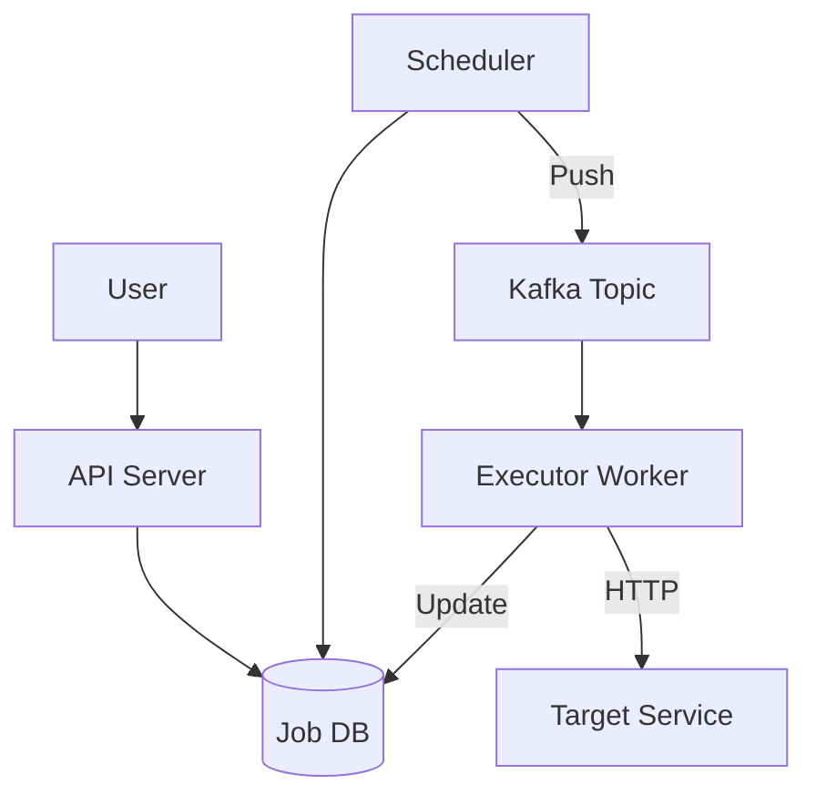

# 14. Design a Distributed Job Scheduler (Cron-as-a-Service)

**Difficulty:** Hard
**Focus:** Reliability, Leader Election, Timing Wheel.

---

## 🎯 Real-World Analogy

**Think of a Job Scheduler like a restaurant kitchen timer:**

**Naive Approach (Checking every job):**
- Chef has 100 dishes cooking.
- Every second, Chef checks EVERY pot: "Is it done? Is it done?"
- Chef spends all time checking, no time cooking.
- ❌ Inefficient!

**Timing Wheel Approach:**
- Chef uses a kitchen timer.
- "Pasta done in 10 mins" → Put sticky note on "10" slot.
- "Steak done in 5 mins" → Put sticky note on "5" slot.
- Chef just waits for the bell.
- When bell rings, check ONLY the notes in that slot.
- ✅ Efficient!

**Key Insight:** Instead of scanning the database every second (slow), we organize jobs into time buckets (slots) so we know exactly what to run without searching.

---

## 1. Requirements (0-5 Minutes)

**Functional:**
1.  **Schedule:** User submits job (URL + Cron Expression).
2.  **Execute:** System calls the URL at the right time.
3.  **History:** View execution logs.
4.  **Types:** One-time (at X time) and Recurring (every day).

**Non-Functional:**
1.  **Precision:** Trigger within seconds.
2.  **Reliability:** At-least-once execution (Better to run twice than never).
3.  **Scale:** Millions of active jobs.

---

## 2. High-Level Design (5-15 Minutes)



**Architecture:**



**Components:**
1.  **Job DB (SQL):** Stores metadata (`job_id`, `cron_exp`, `next_run_time`). SQL is good for ACID (locking).
2.  **Scheduler:** The "Brain". Polls DB and pushes due jobs to Kafka.
3.  **Kafka:** Decouples scheduling from execution.
4.  **Worker:** The "Muscle". Consumes from Kafka and makes the HTTP call.

---

## 3. Deep Dive: The Scheduler (Hierarchical Timing Wheel) (15-25 Minutes)

### 📚 ELI5: The Timing Wheel

**Visual Representation:**
```
Imagine a clock with a second hand.
It has 60 slots (0-59).

Current Time: 10:00:00 (Pointer at 0)

Job A: Run at 10:00:05
-> Put Job A in Slot 5.

Job B: Run at 10:00:15
-> Put Job B in Slot 15.

Tick-Tock...
Pointer moves to 1, 2, 3, 4...
Pointer hits 5!
-> "Oh, there's a list here: [Job A]"
-> Execute Job A!
```

**Hierarchical Wheel (For long delays):**
```
What if Job C runs in 5 hours?
We can't have a wheel with 18,000 slots!

Solution: Layered Wheels
- Second Wheel (60 slots)
- Minute Wheel (60 slots)
- Hour Wheel (24 slots)

Job C (5 hours):
- Put in "Hour Wheel", Slot 5.
- When Hour Hand hits 5, move job to "Minute Wheel".
- When Minute Hand hits 0, move job to "Second Wheel".
```

### 💻 Python Implementation

```python
class TimingWheel:
    def __init__(self):
        self.slots = [[] for _ in range(60)] # 60 seconds
        self.current_second = 0

    def add_job(self, job, delay_seconds):
        # Calculate slot index
        target_slot = (self.current_second + delay_seconds) % 60
        self.slots[target_slot].append(job)

    def tick(self):
        # 1. Get jobs in current slot
        jobs_to_run = self.slots[self.current_second]
        
        # 2. Clear the slot (for next minute)
        self.slots[self.current_second] = []
        
        # 3. Execute
        for job in jobs_to_run:
            print(f"Running {job}")
            
        # 4. Move pointer
        self.current_second = (self.current_second + 1) % 60
```

### ☕ Java Implementation

```java
import java.util.*;
import java.util.concurrent.*;

public class TimingWheel {
    private final List<List<Runnable>> slots;
    private final int numSlots;
    private int currentSlot;
    private final ScheduledExecutorService ticker;
    private final ExecutorService jobExecutor;
    
    public TimingWheel(int numSlots) {
        this.numSlots = numSlots; // e.g., 60 seconds
        this.slots = new ArrayList<>(numSlots);
        this.currentSlot = 0;
        
        // Initialize slots
        for (int i = 0; i < numSlots; i++) {
            slots.add(new CopyOnWriteArrayList<>());
        }
        
        this.ticker = Executors.newSingleThreadScheduledExecutor();
        this.jobExecutor = Executors.newFixedThreadPool(10);
    }
    
    public void addJob(Runnable job, int delaySeconds) {
        // Calculate target slot
        int targetSlot = (currentSlot + delaySeconds) % numSlots;
        slots.get(targetSlot).add(job);
    }
    
    public void start() {
        // Tick every second
        ticker.scheduleAtFixedRate(this::tick, 0, 1, TimeUnit.SECONDS);
    }
    
    private void tick() {
        // 1. Get jobs in current slot
        List<Runnable> jobsToRun = new ArrayList<>(slots.get(currentSlot));
        
        // 2. Clear the slot (for next cycle)
        slots.get(currentSlot).clear();
        
        // 3. Execute jobs asynchronously
        for (Runnable job : jobsToRun) {
            jobExecutor.submit(() -> {
                try {
                    job.run();
                } catch (Exception e) {
                    System.err.println("Job failed: " + e.getMessage());
                }
            });
        }
        
        // 4. Move pointer
        currentSlot = (currentSlot + 1) % numSlots;
    }
    
    public void shutdown() {
        ticker.shutdown();
        jobExecutor.shutdown();
    }
}
```

**Why is this better than `SELECT * FROM jobs`?**
- **DB Scan:** O(N) or O(log N). Slow for 10M jobs.
- **Timing Wheel:** O(1). Instant access to "what needs to run NOW".

---

## 4. Deep Dive: Leader Election (25-35 Minutes)

**The Problem:**
We have 3 Schedulers (for redundancy).
If all 3 run the Timing Wheel, every job runs 3 times! ❌

**The Solution: Leader Election**
Only **ONE** node (The Leader) is allowed to push to Kafka. The others are "Standby".

### 📚 ELI5: The Classroom Monitor
- Teacher asks: "Who wants to be monitor?"
- 3 kids raise hands.
- Teacher picks the **first one** she sees.
- That kid holds the "Monitor Badge".
- If the kid gets sick (leaves), Teacher picks a new one.

### 💻 Redis Implementation (Simple Lock)

```python
import redis
import time
import threading

class Scheduler:
    def __init__(self, redis_host='localhost', redis_port=6379, my_ip='127.0.0.1'):
        self.redis = redis.Redis(host=redis_host, port=redis_port, db=0)
        self.my_ip = my_ip
        self.is_leader = False
        self.leader_lock_key = "leader_lock"
        self.lease_duration = 5 # seconds
        self.renewal_interval = 2 # seconds

    def run(self):
        while True:
            if not self.is_leader:
                self.try_become_leader()
            time.sleep(self.renewal_interval) # Attempt to become leader or renew lease

    def try_become_leader(self):
        # SETNX: Set if Not Exists
        # Key: "leader_lock", Value: "my_ip", Expiry: 5s
        # Returns 1 if key was set (we became leader), 0 otherwise
        acquired = self.redis.set(self.leader_lock_key, self.my_ip, nx=True, ex=self.lease_duration)
        
        if acquired:
            self.is_leader = True
            print(f"Scheduler {self.my_ip} became Leader!")
            # Start a thread to continuously renew the lease
            self._start_lease_renewal()
            self.run_scheduler_logic() # This would be the main scheduling loop
        else:
            # Check if the current leader is still alive (optional, for faster failover)
            current_leader = self.redis.get(self.leader_lock_key)
            if current_leader and current_leader.decode('utf-8') == self.my_ip:
                # This can happen if the previous renewal failed but the lock is still ours
                self.is_leader = True
                print(f"Scheduler {self.my_ip} re-established leadership.")
                self._start_lease_renewal()
                self.run_scheduler_logic()
            else:
                self.is_leader = False
                print(f"Scheduler {self.my_ip} is a Follower. Current leader: {current_leader.decode('utf-8') if current_leader else 'None'}. Sleeping...")

    def _start_lease_renewal(self):
        # Ensure only one renewal thread is active
        if hasattr(self, '_renewal_timer') and self._renewal_timer.is_alive():
            self._renewal_timer.cancel()
        self._renewal_timer = threading.Timer(self.renewal_interval, self.renew_lease)
        self._renewal_timer.daemon = True # Allow main program to exit even if this thread is running
        self._renewal_timer.start()

    def renew_lease(self):
        # Use a Lua script for atomic check-and-set
        # This ensures we only renew if we are still the current leader
        script = """
        if redis.call("get", KEYS[1]) == ARGV[1] then
            return redis.call("expire", KEYS[1], ARGV[2])
        else
            return 0
        end
        """
        # KEYS[1] = leader_lock_key, ARGV[1] = my_ip, ARGV[2] = lease_duration
        result = self.redis.eval(script, 1, self.leader_lock_key, self.my_ip, self.lease_duration)
        
        if result:
            # print(f"Scheduler {self.my_ip}: Lease renewed.")
            # Schedule next renewal
            if self.is_leader: # Only renew if still leader
                self._start_lease_renewal()
        else:
            self.is_leader = False
            print(f"Scheduler {self.my_ip}: Lost leadership or failed to renew lease.")
            # Attempt to become leader again in the main loop
            if hasattr(self, '_renewal_timer'):
                self._renewal_timer.cancel()

    def run_scheduler_logic(self):
        if self.is_leader:
            # This is where the Timing Wheel logic would run
            # For demonstration, just print a message
            print(f"Scheduler {self.my_ip} (Leader) is actively scheduling jobs...")
        else:
            print(f"Scheduler {self.my_ip} (Follower) is idle.")

# Example usage (requires a running Redis instance)
# if __name__ == "__main__":
#     # Simulate multiple schedulers
#     scheduler1 = Scheduler(my_ip="192.168.1.101")
#     scheduler2 = Scheduler(my_ip="192.168.1.102")
#     scheduler3 = Scheduler(my_ip="192.168.1.103")

#     # Run them in separate threads or processes for a real distributed setup
#     # For this example, we'll just run one to show the leader logic
#     # In a real scenario, each would be a separate process/container
#     print("Starting Scheduler 1...")
#     scheduler1.run()
#     # You would typically run these in separate processes or use a more robust
#     # concurrency model for a true distributed simulation.
```

---

## 5. Deep Dive: Handling Failures (35-40 Minutes)

### 🔄 At-Least-Once vs Exactly-Once

**Scenario 1: Worker Crashes (The "Ghost" Job)**
1. Worker pulls Job A from Kafka.
2. Worker executes Job A (HTTP Call). ✅
3. Worker crashes *before* telling Kafka "I'm done". 💥
4. Kafka waits 5 mins -> Re-queues Job A.
5. New Worker pulls Job A.
6. New Worker executes Job A. ✅

**Result:** Job A ran twice!

**How to fix? (Idempotency)**
The **Target Service** must handle duplicates.
- The Job Scheduler sends a unique `job_execution_id`.
- The Target Service checks: "Did I already run `job_execution_id`?"

**Scenario 2: Scheduler Crashes**
- Redis Lock expires (5s).
- Another Scheduler grabs the lock.
- It loads jobs from DB.
- **Risk:** Some jobs might be scheduled twice during the handover.
- **Fix:** Same as above. Idempotency is key!

---

## 6. Deep Dive: Partitioned Scheduling (40-42 Minutes)

**Problem:**
- One Leader Scheduler is a bottleneck. It can't handle 10M jobs/sec.

**Solution: Sharding**
- **Shard ID:** `Hash(job_id) % Num_Partitions`.
- **Multiple Leaders:**
  - Scheduler A is Leader for Partition 0-3.
  - Scheduler B is Leader for Partition 4-7.
- **Implementation:**
  - Use Zookeeper/Etcd to assign partitions to schedulers.
  - Each scheduler runs a Timing Wheel *only* for its assigned jobs.

---

## 7. Deep Dive: Priority Queues (42-45 Minutes)

**Requirement:**
- "Gold Users" jobs should run before "Free Users".

**Implementation:**
- **Kafka Topics:**
  - `jobs-high-priority`
  - `jobs-low-priority`
- **Workers:**
  - Configure workers to consume 80% from High Priority, 20% from Low Priority.
  - Or have dedicated "High Priority Workers".

---

---

## 8. Real-World Engineering Case Studies (Deep Dive)

### 1. Airbnb: Chronos (Distributed Cron)

**Source:** Airbnb Engineering Blog - "Chronos: A Replacement for Cron"

**The Challenge:**
Airbnb had thousands of cron jobs running on individual servers.
- **Problem:** No visibility into job execution. If a server died, jobs were lost.
- **Requirement:** Centralized scheduling with fault tolerance and monitoring.

**The Solution: Mesos + ZooKeeper + Chronos**

**Architecture:**
1.  **Mesos Framework:**
    - Chronos runs as a Mesos framework.
    - When a job needs to run, Chronos requests resources from Mesos.
    - Mesos allocates a container (Docker) on any available server.
    - **Benefit:** Jobs can run on any server, not tied to specific machines.
2.  **Leader Election (ZooKeeper):**
    - Multiple Chronos instances run for HA.
    - ZooKeeper elects one as the leader.
    - Only the leader schedules jobs.
    - If leader dies, a new leader is elected in <5 seconds.
3.  **Job Dependencies (DAG):**
    - Jobs can depend on other jobs: "Run Job B after Job A completes".
    - Chronos builds a Directed Acyclic Graph (DAG).
    - **Example:** ETL Pipeline: Extract → Transform → Load
4.  **Retry Logic:**
    - If a job fails, Chronos retries with exponential backoff.
    - After 3 failures, it sends an alert to PagerDuty.
5.  **UI Dashboard:**
    - Real-time view of job status (Running, Success, Failed).
    - Historical execution logs stored in Elasticsearch.

**Key Insight:**
Chronos decouples scheduling (Chronos) from execution (Mesos), allowing jobs to run on any available server, improving resource utilization.

---

### 2. Quartz: The Java Standard

**Source:** Quartz Scheduler Documentation

**The Challenge:**
Enterprise Java applications need to schedule recurring tasks (reports, cleanups).
- **Problem:** How to persist job state across application restarts?

**The Solution: JDBC JobStore + Clustering**

**Architecture:**
1.  **JDBC JobStore:**
    - Quartz stores job definitions in a relational database (MySQL, PostgreSQL).
    - **Tables:**
        - `QRTZ_TRIGGERS`: Trigger definitions (cron expressions, next fire time).
        - `QRTZ_JOB_DETAILS`: Job metadata (class name, parameters).
        - `QRTZ_FIRED_TRIGGERS`: Currently executing jobs.
2.  **Clustering (Database Locking):**
    - Multiple Quartz instances can run simultaneously.
    - When it's time to fire a trigger, instances compete for a database lock.
    - **SQL:**
        ```sql
        SELECT * FROM QRTZ_TRIGGERS 
        WHERE NEXT_FIRE_TIME <= NOW() 
        FOR UPDATE SKIP LOCKED
        ```
    - The instance that acquires the lock executes the job.
    - **Benefit:** No need for ZooKeeper. The database is the source of truth.
3.  **Misfire Handling:**
    - If a job should have run at 10:00 AM but the scheduler was down, what happens?
    - **Misfire Policies:**
        - `FIRE_NOW`: Run it immediately.
        - `DO_NOTHING`: Skip this execution.
        - `FIRE_AND_PROCEED`: Run it, then schedule the next one.

**Key Insight:**
Quartz uses the database as both storage and coordination layer, simplifying deployment (no ZooKeeper needed).

---

### 3. AWS EventBridge: Serverless Scheduling

**Source:** AWS Documentation

**The Challenge:**
Developers want to schedule tasks without managing servers.
- **Problem:** Traditional schedulers require running VMs 24/7.

**The Solution: Event-Driven Scheduling**

**Architecture:**
1.  **Cron Rules:**
    - Define a rule: `cron(0 9 * * ? *)` (Every day at 9 AM).
    - Target: Lambda function, Step Functions, or HTTP endpoint.
2.  **Event Bus:**
    - EventBridge is built on top of an event bus.
    - At the scheduled time, it publishes an event to the bus.
    - Subscribers (Lambda) receive the event and execute.
3.  **Scalability:**
    - EventBridge is fully managed and auto-scales.
    - Can handle millions of rules.
4.  **Dead Letter Queue (DLQ):**
    - If a Lambda invocation fails, the event is sent to an SQS DLQ.
    - Developers can replay failed events.

**Key Insight:**
Serverless schedulers eliminate operational overhead but trade off control and cost predictability.

---

**Key Insight:**
Serverless schedulers eliminate operational overhead but trade off control and cost predictability.

---

## 9. Failure Scenarios & Disaster Recovery

### Scenario 1: Scheduler Leader Failure
**Impact:** No new jobs are triggered; timing wheel stops ticking.
**Detection:**
- ZooKeeper session timeout.
- `jobs_triggered_total` drops to zero.

**Mitigation:**
- **Automatic Leader Election:** Use ZooKeeper or Etcd to elect a new leader within seconds.
- **State Persistence:** The new leader reads the current state (Timing Wheel) from a persistent store (Postgres/Redis) to resume where the old leader left off.

### Scenario 2: Worker Pool Exhaustion (Resource Starvation)
**Impact:** Jobs are scheduled but not executed; queue lag increases.
**Detection:** `kafka_consumer_lag` spike.

**Mitigation:**
- **Auto-scaling Workers:** Scale the worker pool based on CPU/RAM or queue depth.
- **Job Prioritization:** If resources are low, prioritize "Critical" jobs (e.g., Billing) over "Low" priority ones (e.g., Analytics).

### Scenario 3: Database (Job Store) Outage
**Impact:** Cannot persist new job requests or update job status.
**Detection:** `db_connection_errors` spike.

**Mitigation:**
- **Local WAL:** The Scheduler should write job events to a local Write-Ahead Log (WAL) and sync to the DB when it's back online.
- **Multi-AZ DB:** Use a highly available database (e.g., Aurora) with automatic failover.

---

## 10. Monitoring & Observability

### Golden Signals Dashboard

**1. Latency**
- **Scheduling Delay:** Time between "Scheduled Time" and "Actual Execution Start".
- **Target:** P95 < 1s.
- **Metric:** `job_scheduling_delay_seconds`.

**2. Traffic**
- **Throughput:** Jobs triggered per minute.
- **Metric:** `jobs_triggered_total`.

**3. Errors**
- **Metric:** `job_failure_rate` (by job type).
- **Target:** < 1%.

**4. Saturation**
- **Metric:** Worker thread pool utilization, Kafka partition lag.

### Alert Rules
```yaml
alerts:
  - alert: HighJobFailureRate
    expr: rate(job_failures_total[5m]) / rate(job_executions_total[5m]) > 0.05
    for: 2m
    labels:
      severity: critical
```

---

## 11. API Design & Versioning

### Job Scheduler API

**Schedule Job**
```http
POST /api/v1/jobs
Content-Type: application/json

{
  "name": "daily_report",
  "cron": "0 9 * * ?",
  "target": "https://api.internal/report",
  "payload": {"type": "pdf"},
  "retry_policy": {"max_attempts": 3, "backoff": "exponential"}
}
```

**Get Job Status**
```http
GET /api/v1/jobs/{job_id}/runs
```

### Versioning
- Use `/v1/`, `/v2/` in URL.
- **Payload Versioning:** If the job payload schema changes, use a `version` field to ensure the worker can parse it.

---

## 12. Cost Analysis & Optimization

### Monthly Infrastructure Costs (at 10M jobs/month)

**1. Compute (Scheduler + Workers)**
- 10 nodes (m5.large) = **$1,000/month**.

**2. Storage (RDS + S3 for logs)**
- 500 GB DB + 1 TB Logs = **$300/month**.

**3. Queue (Managed Kafka)**
- 3 nodes = **$1,500/month**.

**Total:** ~$2,800/month.

### Optimization Opportunities
- **Serverless Execution:** Use AWS Lambda for short-lived jobs to save 50% on idle compute costs.
- **Spot Instances:** Run non-critical batch jobs on Spot instances.

---

## 13. Security & Compliance

### Security Measures
- **Job Isolation:** Run jobs in separate Docker containers or sandboxed environments (gVisor) to prevent one job from affecting others.
- **Secrets Management:** Use AWS Secrets Manager or HashiCorp Vault to inject credentials into jobs at runtime.
- **Audit Logging:** Record who scheduled which job and what the output was.

### Compliance
- **Data Privacy:** Ensure job payloads do not contain PII unless encrypted.
- **Retention:** Automatically delete job logs after 30 days.

---

## 14. Testing Strategies

### Unit Tests
- Test Cron expression parser.
- Test Timing Wheel rotation and bucket processing.

### Integration Tests
- Schedule a job for `now + 10s` and verify it executes exactly once.

### Load Testing
- Simulate scheduling 100,000 jobs simultaneously.
- **Tool:** `JMeter` or custom `Go` script.

---

## 15. Migration & Rollout Strategies

### Rollout
- **Canary:** Deploy the new Scheduler version to a small subset of job types (e.g., "Test" jobs).

### Migration
- **Database Migration:** If moving from Quartz (SQL) to a custom Timing Wheel (Redis), use a "Dual Scheduler" approach where new jobs go to the new system while the old one drains.

---

## 16. Performance Optimization

### Scheduling Optimization
- **Hierarchical Timing Wheel:** Use multiple wheels (Seconds, Minutes, Hours) to handle long-term jobs without massive memory overhead.
- **Batch Triggering:** Trigger multiple jobs in a single Kafka message if they share the same target.

### Worker Optimization
- **Prefetching:** Workers should prefetch the next 10 jobs from Kafka to avoid network round-trips.

---

## 17. Capacity Planning

### Scaling Triggers
- **Scheduler CPU:** Scale vertically if the Timing Wheel tick processing takes > 100ms.
- **Worker Pool:** Scale horizontally based on the number of "Pending" jobs.

### Throughput Projection
- 10M jobs/month ≈ 4 jobs/sec (average).
- Peak could be 1,000+ jobs/sec (e.g., at the start of an hour).

---

## 18. Interview Cheat Sheet

### Key Numbers
- **Latency:** < 1s (Scheduling delay).
- **Scale:** 10M+ jobs.
- **Reliability:** At-least-once (standard).

### Core Components
1. **Scheduler:** Manages the timing and triggering.
2. **Job Store:** Persists job definitions and status.
3. **Execution Queue:** Decouples scheduling from execution.
4. **Workers:** Executes the actual tasks.

### Critical Trade-offs
- **At-least-once vs Exactly-once:** Exactly-once is hard; prefer at-least-once with idempotent workers.
- **Centralized vs Distributed:** Simple leader-follower vs complex peer-to-peer scheduling.

---

## 19. Wrap-up (Deep Dive)

**Summary:**
"I designed a distributed Job Scheduler using the **Leader-Follower pattern** with ZooKeeper for leader election.
1.  **Scheduling:** I used a **Hierarchical Timing Wheel** for O(1) job insertion and efficient tick processing.
2.  **Execution:** I decoupled scheduling from execution using **Kafka**, allowing workers to scale independently.
3.  **Reliability:** I implemented **at-least-once execution** with idempotency keys and retry logic with exponential backoff.
4.  **Real-World:** I incorporated **Airbnb Chronos's** Mesos-based execution model, **Quartz's** database-backed clustering, and **AWS EventBridge's** serverless approach.
5.  **Production Readiness:** I addressed leader failure with automatic election, optimized costs via serverless execution, and ensured security through containerized job isolation."

---

---
