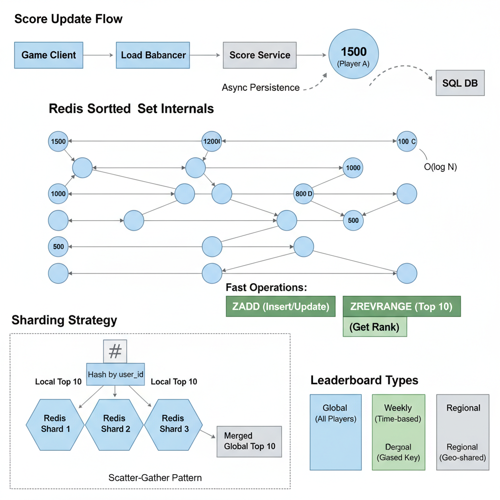
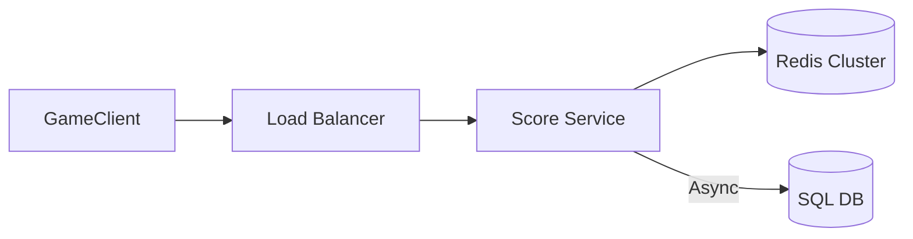

# 15. Design a Real-time Leaderboard (Gaming)

**Difficulty:** Medium
**Focus:** Redis Sorted Sets, Real-time updates, Scatter-Gather.

---

## 🎯 Real-World Analogy

**Think of a Leaderboard like a classroom scoreboard:**

**SQL Approach (Sorting papers):**
- Teacher has a stack of 10,000 exam papers.
- Student asks: "What's my rank?"
- Teacher sorts ALL 10,000 papers by score.
- Teacher counts down to find student.
- ❌ Slow! (O(N log N))

**Redis Approach (Skip List):**
- Teacher writes names on a whiteboard in order.
- New score comes in?
- Teacher inserts name in the right spot immediately.
- Student asks rank?
- Teacher just looks at the line number.
- ✅ Fast! (O(log N))

**Key Insight:** Sorting 10 million rows every time someone scores a point is impossible. We need a data structure that *keeps* things sorted as we insert them.

---

## 1. Requirements (0-5 Minutes)

**Functional:**
1.  **Update Score:** Player finishes game, score updates.
2.  **Get Top 10:** Global leaderboard.
3.  **Get My Rank:** "You are #12,345".
4.  **Get Relative Rank:** "Show 2 players above and below me".

**Non-Functional:**
1.  **Real-time:** Updates reflected instantly (or < 1s).
2.  **Scale:** 10 Million DAU. 100k updates/sec.

---

## 2. High-Level Design (5-10 Minutes)



**Data Structure Choice:**
*   **SQL:** `SELECT * FROM scores ORDER BY score DESC LIMIT 10`.
    *   *Complexity:* O(N log N). Too slow for 10M rows.
*   **Redis Sorted Set (ZSET):**
    *   *Internal:* Skip List + Hash Map.
    *   *Complexity:* O(log N) for Insert, Update, and Rank.
    *   *Winner:* Redis.

**Architecture:**



*   **Redis:** Hot data (Current Leaderboard).
*   **SQL:** Cold data (Historical logs, All-time records).

---

## 3. Deep Dive: Redis ZSET Operations (10-20 Minutes)

### 📚 ELI5: The Skip List

**Visual Representation:**
```
Level 3:  1 --------------------> 50 -----------------> 100
Level 2:  1 ---------> 25 ------> 50 ------> 75 ------> 100
Level 1:  1 -> 10 -> 20 -> 25 -> 30 -> ... -> 100

Searching for 75:
1. Start at Level 3. 1 -> 50. Next is 100 (Too big). Drop down.
2. Level 2 at 50. Next is 75. Found it!
```

**Why it's fast (O(log N)):**
- **Linked List:** O(N). You walk step-by-step.
- **Skip List:** Like an express elevator. You skip floors to get close, then walk the rest.
- **Probabilistic:** We flip a coin to decide if a node goes to Level 2. This keeps the tree balanced without complex rotations (like AVL trees).

**Commands:**
1.  **Update:** `ZADD leaderboard 1500 "user_123"`
    *   If user exists, updates score. If not, adds them. O(log N).
2.  **Top 10:** `ZREVRANGE leaderboard 0 9 WITH SCORES`
    *   Returns top 10 sorted by score descending.
3.  **My Rank:** `ZREVRANK leaderboard "user_123"`
    *   Returns integer rank (0-based).
4.  **Relative:**
    *   `rank = ZREVRANK ...`
    *   `ZREVRANGE leaderboard rank-2 rank+2`

---

## 4. Deep Dive: Scaling (Scatter-Gather) (20-35 Minutes)

**The Problem:**
Redis is single-threaded.
- 1 Node = ~100k Writes/sec.
- We have 10 Million DAU.
- We need to shard.

**Sharding Strategy: Hash Partitioning**
- `Shard_ID = Hash(User_ID) % Total_Shards`
- User A -> Shard 1
- User B -> Shard 2

**The Challenge: "Who is Top 10?"**
User A is #1 in Shard 1.
User B is #1 in Shard 2.
Who is #1 globally? We don't know!

**Solution: Scatter-Gather**
1. **Scatter:** Ask ALL shards for their Top 10.
2. **Gather:** Collect results (e.g., 5 shards * 10 users = 50 candidates).
3. **Sort:** Sort the 50 candidates in memory.
4. **Pick:** Return the top 10.

### 💻 Python Implementation

```python
import redis

class ShardedLeaderboard:
    def __init__(self, shards):
        self.shards = shards # List of Redis connections

    def add_score(self, user_id, score):
        # 1. Determine Shard
        shard_idx = hash(user_id) % len(self.shards)
        
        # 2. Write to specific shard
        self.shards[shard_idx].zadd("leaderboard", {user_id: score})

    def get_global_top_10(self):
        candidates = []
        
        # 1. Scatter (Get Top 10 from EVERY shard)
        for shard in self.shards:
            # Returns [(user, score), (user, score)...]
            top = shard.zrevrange("leaderboard", 0, 9, withscores=True)
            candidates.extend(top)
            
        # 2. Gather & Sort
        # Sort by score (descending)
        candidates.sort(key=lambda x: x[1], reverse=True)
        
        # 3. Pick Top 10
        return candidates[:10]
```

### ☕ Java Implementation

```java
import redis.clients.jedis.Jedis;
import redis.clients.jedis.resps.Tuple;
import java.util.*;
import java.util.stream.Collectors;

public class ShardedLeaderboard {
    private final List<Jedis> shards;
    
    public ShardedLeaderboard(List<Jedis> shards) {
        this.shards = shards;
    }
    
    public void addScore(String userId, double score) {
        // 1. Determine Shard
        int shardIdx = Math.abs(userId.hashCode()) % shards.size();
        
        // 2. Write to specific shard
        shards.get(shardIdx).zadd("leaderboard", score, userId);
    }
    
    public List<Map.Entry<String, Double>> getGlobalTop10() {
        List<Map.Entry<String, Double>> candidates = new ArrayList<>();
        
        // 1. Scatter (Get Top 10 from EVERY shard in parallel)
        shards.parallelStream().forEach(shard -> {
            // Returns List<Tuple> with (member, score)
            List<Tuple> top = shard.zrevrangeWithScores("leaderboard", 0, 9);
            
            synchronized (candidates) {
                for (Tuple tuple : top) {
                    candidates.add(Map.entry(
                        tuple.getElement(), 
                        tuple.getScore()
                    ));
                }
            }
        });
        
        // 2. Gather & Sort (by score descending)
        List<Map.Entry<String, Double>> sorted = candidates.stream()
            .sorted(Map.Entry.<String, Double>comparingByValue().reversed())
            .limit(10)
            .collect(Collectors.toList());
        
        return sorted;
    }
    
    public long getUserRank(String userId) {
        // Find which shard has this user
        int shardIdx = Math.abs(userId.hashCode()) % shards.size();
        
        // Get rank within shard (0-based)
        Long rank = shards.get(shardIdx).zrevrank("leaderboard", userId);
        
        return rank != null ? rank : -1;
    }
}
```

**Optimization (The "Q" Cache):**
Scatter-Gather is expensive.
- We run a background job every 1 second to compute Global Top 10.
- We store the result in a simple Redis Key: `global_top_10`.
- API reads from this key (O(1)).

---

## 5. Deep Dive: Real-time Updates (WebSocket) (35-40 Minutes)

**Scenario:**
You are Rank #11.
Someone above you loses points. You become #10.
You want to see this **instantly** without refreshing the page.

**Architecture:**
1.  **Game Server:** Updates Redis (`ZADD`).
2.  **Publisher:** Calculates new rank.
    - If Rank <= 10: Publish event to Redis Pub/Sub `channel:top10`.
    - If Rank changed for User X: Publish to `channel:user:X`.
3.  **WebSocket Server:** Subscribes to Redis channels and pushes to Client.

### 💻 Python Implementation (Socket.IO)

```python
# WebSocket Server Logic
def on_score_update(user_id, new_score):
    # 1. Update DB
    redis.zadd("leaderboard", {user_id: new_score})
    
    # 2. Check new rank
    rank = redis.zrevrank("leaderboard", user_id)
    
    # 3. Notify User (Targeted)
    socketio.emit('rank_update', {'rank': rank}, room=user_id)
    
    # 4. If in Top 10, Notify Everyone (Broadcast)
    if rank < 10:
        top_10 = redis.zrevrange("leaderboard", 0, 9, withscores=True)
        socketio.emit('leaderboard_update', {'top_10': top_10})
```

---

## 6. Deep Dive: Historical Leaderboards (40-42 Minutes)

**Requirement:**
- "Who was #1 last month?"

**Strategy:**
- **Snapshot:** At 23:59:59, we copy the current Redis ZSET to a new key: `leaderboard:2023-10`.
- **Cold Storage:** Move older keys (e.g., `leaderboard:2022-*`) to SQL/S3 to save RAM.
- **Query:** `SELECT * FROM monthly_leaders WHERE month='2023-10'`.

---

## 7A. Deep Dive: Anti-Cheating & Fraud Detection

**Problem:** Hackers send fake scores.

**Solution 1: Server-Side Validation**
```python
class GameServer:
    def validate_score(self, user_id, score, game_session):
        # Check 1: Is score mathematically possible?
        max_possible_score = game_session.duration * game_session.max_points_per_second
        if score > max_possible_score:
            return False, "Score exceeds maximum possible"
        
        # Check 2: Statistical anomaly?
        user_avg = get_user_average_score(user_id)
        if score > user_avg * 10:  # 10x improvement is suspicious
            flag_for_review(user_id, score)
        
        # Check 3: Replay validation
        if game_session.replay_data:
            simulated_score = simulate_game(game_session.replay_data)
            if abs(simulated_score - score) > 100:
                return False, "Replay doesn't match score"
        
        return True, "Valid"
```

**Solution 2: Client-Side Obfuscation**
- Encrypt game state
- Use checksums to detect memory tampering
- **Limitation:** Determined hackers can still bypass

**Solution 3: Behavioral Analysis**
```python
def detect_bot_behavior(user_id):
    actions = get_user_actions(user_id, last_n_games=10)
    
    # Check for inhuman patterns
    reaction_times = [a.reaction_time for a in actions]
    avg_reaction = sum(reaction_times) / len(reaction_times)
    
    if avg_reaction < 50:  # <50ms is superhuman
        return True, "Bot detected: Inhuman reaction time"
    
    # Check for repetitive patterns
    if has_repetitive_pattern(actions):
        return True, "Bot detected: Repetitive behavior"
    
    return False, "Human-like behavior"
```

---

## 7B. Deep Dive: Historical Snapshots & Time Travel

**Requirement:** "Show me who was #1 last month"

**Implementation:**
```python
class LeaderboardSnapshot:
    def __init__(self):
        self.snapshots = {}  # {timestamp: snapshot_data}
    
    def create_snapshot(self, leaderboard_key, timestamp):
        # Copy current leaderboard state
        current_state = redis.zrange(leaderboard_key, 0, -1, withscores=True)
        
        # Store in SQL for long-term storage
        snapshot_id = f"{leaderboard_key}:{timestamp}"
        db.execute("""
            INSERT INTO leaderboard_snapshots (snapshot_id, data, created_at)
            VALUES (%s, %s, %s)
        """, (snapshot_id, json.dumps(current_state), timestamp))
        
        # Also store in Redis with TTL for recent snapshots
        redis.setex(f"snapshot:{snapshot_id}", 86400 * 7, json.dumps(current_state))
    
    def get_historical_rank(self, user_id, timestamp):
        snapshot_id = f"leaderboard:global:{timestamp}"
        snapshot_data = redis.get(f"snapshot:{snapshot_id}")
        
        if not snapshot_data:
            # Fetch from SQL
            snapshot_data = db.fetchone("""
                SELECT data FROM leaderboard_snapshots 
                WHERE snapshot_id = %s
            """, (snapshot_id,))
        
        # Find user's rank in snapshot
        leaderboard = json.loads(snapshot_data)
        for rank, (player_id, score) in enumerate(leaderboard, 1):
            if player_id == user_id:
                return rank
        return None
```

**Snapshot Strategy:**
- **Daily:** Snapshot at midnight (keep for 30 days)
- **Weekly:** Snapshot every Sunday (keep for 1 year)
- **Monthly:** Snapshot on 1st of month (keep forever)

---

## 7C. Deep Dive: Multi-Dimensional Leaderboards

**Requirement:** Leaderboards by region, game mode, time period

**Implementation:**
```python
class MultiDimensionalLeaderboard:
    def update_score(self, user_id, score, metadata):
        # Update multiple leaderboards atomically
        pipeline = redis.pipeline()
        
        # Global leaderboard
        pipeline.zadd("leaderboard:global", {user_id: score})
        
        # Regional leaderboard
        region = metadata.get("region", "unknown")
        pipeline.zadd(f"leaderboard:region:{region}", {user_id: score})
        
        # Game mode leaderboard
        mode = metadata.get("mode", "default")
        pipeline.zadd(f"leaderboard:mode:{mode}", {user_id: score})
        
        # Time-based leaderboards
        today = datetime.now().strftime("%Y-%m-%d")
        pipeline.zadd(f"leaderboard:daily:{today}", {user_id: score})
        
        week = datetime.now().strftime("%Y-W%U")
        pipeline.zadd(f"leaderboard:weekly:{week}", {user_id: score})
        
        pipeline.execute()
    
    def get_multi_rank(self, user_id):
        return {
            "global": redis.zrevrank("leaderboard:global", user_id),
            "region": redis.zrevrank(f"leaderboard:region:{user.region}", user_id),
            "daily": redis.zrevrank(f"leaderboard:daily:{today}", user_id)
        }
```

**Java Implementation:**
```java
public class MultiDimensionalLeaderboard {
    private JedisPool jedisPool;
    
    public void updateScore(String userId, double score, Map<String, String> metadata) {
        try (Jedis jedis = jedisPool.getResource()) {
            Pipeline pipeline = jedis.pipelined();
            
            // Global
            pipeline.zadd("leaderboard:global", score, userId);
            
            // Regional
            String region = metadata.getOrDefault("region", "unknown");
            pipeline.zadd("leaderboard:region:" + region, score, userId);
            
            // Time-based
            String today = LocalDate.now().toString();
            pipeline.zadd("leaderboard:daily:" + today, score, userId);
            
            pipeline.sync();
        }
    }
}
```

---

**Problem:**
- Hacker sends `POST /score { "score": 999999 }`.

**Solution:**
1.  **Rate Limiting:** You can't score 1000 points in 1 second.
2.  **Replay Validation:** Client sends a "Replay File" (list of inputs). Server simulates the game (Headless) to verify the score is mathematically possible.
3.  **Statistical Anomaly Detection:** If a user jumps from Rank 1M to Rank 1 in 1 hour -> Flag for review.

---

---

## 7. Real-World Engineering Case Studies (Deep Dive)

### 1. Redis: Gaming Leaderboards at Scale

**Source:** Redis Labs Case Studies

**The Challenge:**
Mobile games need to show global leaderboards with millions of players.
- **Problem:** Traditional databases can't handle 100k score updates per second.
- **Requirement:** Sub-millisecond latency for rank queries.

**The Solution: Redis Sorted Sets + Sharding**

**Architecture:**
1.  **Sorted Sets (Skip List):**
    - Redis uses a Skip List data structure internally.
    - **Insert:** O(log N) - Fast even with 10M players.
    - **Get Rank:** O(log N) - `ZRANK player_123`
    - **Get Top 10:** O(log N + 10) - `ZRANGE leaderboard 0 9 WITHSCORES`
2.  **Sharding by Game Mode:**
    - Different game modes have separate leaderboards.
    - `leaderboard:solo`, `leaderboard:duo`, `leaderboard:squad`
    - **Benefit:** Distributes load across multiple Redis instances.
3.  **Time-Based Leaderboards:**
    - Daily/Weekly/Monthly leaderboards reset automatically.
    - **Implementation:** Use TTL on keys.
        ```redis
        ZADD leaderboard:daily:2024-01-15 1000 player_123
        EXPIRE leaderboard:daily:2024-01-15 86400
        ```
4.  **Persistence:**
    - Redis uses RDB snapshots + AOF (Append-Only File).
    - **Recovery:** If Redis crashes, replay AOF to restore state.

**Key Insight:**
Redis Sorted Sets are purpose-built for leaderboards, providing O(log N) operations that scale to millions of entries.

---

### 2. Dream11: Fantasy Sports Leaderboard

**Source:** Dream11 Engineering Blog

**The Challenge:**
Dream11 runs fantasy cricket contests with 10M+ participants.
- **Problem:** During live matches, scores update every ball (every 30 seconds).
- **Requirement:** Show updated leaderboard to all users instantly.

**The Solution: Redis + Kafka + WebSockets**

**Architecture:**
1.  **Score Updates (Kafka):**
    - When a cricket ball is bowled, the scoring service publishes to Kafka.
    - **Event:** `{player_id: "virat_kohli", runs: 4, timestamp: ...}`
2.  **Aggregation (Stream Processing):**
    - Flink/Spark Streaming consumes Kafka events.
    - Calculates fantasy points: `runs * 1 + wickets * 25 + catches * 8`
    - Updates Redis: `ZINCRBY contest:12345 points user_456`
3.  **Real-Time Push (WebSockets):**
    - When a user's rank changes significantly (e.g., jumps from #100 to #50), push notification via WebSocket.
    - **Optimization:** Don't push for every minor change (#100 to #99).
4.  **Sharding by Contest:**
    - Each contest has its own Redis key.
    - Large contests (10M users) are sharded into 100 sub-leaderboards.
    - **Final Rank:** Merge top 1000 from each shard.

**Key Insight:**
For real-time leaderboards during live events, combine **Kafka for event streaming**, **Redis for fast updates**, and **WebSockets for push notifications**.

---

### 3. Riot Games: League of Legends Ranked System

**Source:** Riot Games Engineering Blog

**The Challenge:**
League of Legends has 100M+ monthly players with complex ranking (Bronze, Silver, Gold, Platinum, Diamond, Master, Grandmaster, Challenger).
- **Problem:** How to calculate rank considering win/loss streaks, MMR (Match Making Rating), and LP (League Points)?

**The Solution: Tiered Leaderboards + MMR System**

**Architecture:**
1.  **Tiered Storage:**
    - **Challenger/Grandmaster (Top 0.01%):** Stored in Redis for real-time updates.
    - **Diamond and below:** Stored in Cassandra (eventual consistency is acceptable).
2.  **MMR (Hidden Rating):**
    - Every player has a hidden MMR (Elo-based).
    - After each game, MMR is updated using the Elo formula.
    - **LP (League Points):** Derived from MMR but with decay and promotion series.
3.  **Promotion Series:**
    - To move from Gold to Platinum, win 3 out of 5 games.
    - **State Machine:** Track series progress in PostgreSQL.
4.  **Decay:**
    - Inactive players (28 days) lose LP.
    - **Batch Job:** Runs daily to decay LP for inactive players.

**Key Insight:**
For complex ranking systems, separate **visible rank (LP)** from **skill rating (MMR)** to provide better matchmaking while maintaining player engagement.

---

**Key Insight:**
For complex ranking systems, separate **visible rank (LP)** from **skill rating (MMR)** to provide better matchmaking while maintaining player engagement.

---

## 8. Failure Scenarios & Disaster Recovery

### Scenario 1: Redis Node Failure (Data Loss)
**Impact:** Current leaderboard scores are lost; ranks are reset to zero.
**Detection:**
- `redis_up` == 0.
- `zcard leaderboard:global` returns 0.

**Mitigation:**
- **Redis Persistence (AOF/RDB):** Enable AOF (Append Only File) with `fsync everysec` to minimize data loss.
- **Source of Truth (Postgres):** Always store the permanent record of scores in a relational database. If Redis fails, run a background job to re-populate the Sorted Set from the DB.

### Scenario 2: Thundering Herd (Live Event End)
**Impact:** 1M users check the leaderboard at the exact same second (e.g., end of a tournament).
**Detection:** `redis_cpu_utilization` > 90%.

**Mitigation:**
- **Read Replicas:** Scale Redis read replicas to handle the query spike.
- **CDN Caching:** Cache the Top 100 results in a CDN (CloudFront) with a 5-second TTL. Most users only care about the top of the board.

### Scenario 3: Score Update Lag (Kafka Backlog)
**Impact:** User wins a game but their rank doesn't update for 10 minutes.
**Detection:** `kafka_consumer_lag` > 50,000.

**Mitigation:**
- **Parallel Consumers:** Increase the number of Kafka partitions and consumers.
- **Direct Update (Optimistic):** Update the user's local UI immediately and let the server-side update happen asynchronously.

---

## 9. Monitoring & Observability

### Golden Signals Dashboard

**1. Latency**
- **Score Update:** P99 < 50ms.
- **Rank Query:** P99 < 20ms.
- **Metric:** `leaderboard_update_latency_ms`.

**2. Traffic**
- **Throughput:** Updates per second (UPS).
- **Metric:** `score_updates_total`.

**3. Errors**
- **Metric:** `redis_error_rate`.
- **Target:** < 0.01%.

**4. Saturation**
- **Metric:** Redis memory usage, WebSocket connection count.

### Alert Rules
```yaml
alerts:
  - alert: HighRedisMemoryUsage
    expr: redis_memory_used_bytes / redis_total_memory_bytes > 0.85
    for: 5m
    labels:
      severity: critical
```

---

## 10. API Design & Versioning

### Leaderboard API

**Get Top Ranks**
```http
GET /api/v1/leaderboards/{id}/top?limit=100
```

**Get User Rank**
```http
GET /api/v1/leaderboards/{id}/users/{user_id}
```

### Versioning
- Use `/v1/`, `/v2/` in URL.
- **Score Format Versioning:** If moving from `int` to `float` scores, use a versioned keyspace in Redis (e.g., `leaderboard:v2:global`).

---

## 11. Cost Analysis & Optimization

### Monthly Infrastructure Costs (at 10M active users)

**1. Redis (Elasticache)**
- 3 nodes (r6g.xlarge - Memory optimized) = **$1,500/month**.

**2. Compute (API + Workers)**
- 10 nodes (c6g.large) = **$800/month**.

**3. Database (Aurora for Source of Truth)**
- 1 TB storage + IOPS = **$500/month**.

**Total:** ~$2,800/month.

### Optimization Opportunities
- **ZSET Compression:** For very large leaderboards, shard the Sorted Set into multiple smaller ones (e.g., by `user_id % 100`) to keep memory usage per node low.
- **Inactive Purge:** Remove users who haven't played in 90 days from the Redis Sorted Set to save memory.

---

## 12. Security & Compliance

### Security Measures
- **Anti-Cheat:** Implement server-side validation for all score updates. Never trust a score sent directly from the client.
- **Rate Limiting:** Prevent a single user from spamming score update requests.
- **PII Protection:** Use `user_id` in Redis, and only join with the `users` table in Postgres to get names/avatars during the final API response.

### Compliance
- **COPPA:** If the game is for children, ensure leaderboards don't show full names or locations.
- **Right to be Forgotten (GDPR):** When a user deletes their account, remove their entry from both Redis and Postgres.

---

## 13. Testing Strategies

### Unit Tests
- Test score update logic (e.g., "Does `ZINCRBY` handle negative scores correctly?").
- Test rank calculation for tied scores.

### Integration Tests
- Update 10 users' scores and verify `ZREVRANGE` returns them in the correct order.

### Load Testing
- Simulate 50,000 score updates/sec.
- **Tool:** `Redis-benchmark` or custom `Go` script.

---

## 14. Migration & Rollout Strategies

### Rollout
- **Feature Flag:** Enable the "Global Leaderboard" for 10% of users first to monitor Redis memory growth.

### Migration
- **Zero-Downtime Migration:** To move to a new Redis cluster, use "Dual Writing" (write to both old and new) and then "Shadow Reads" to verify data consistency.

---

## 15. Performance Optimization

### Query Optimization
- **Batching:** Use Redis Pipelines to send multiple `ZADD` or `ZINCRBY` commands in a single network round-trip.
- **Pagination:** Always use `ZREVRANGE` with a limit (e.g., 0 to 99) to avoid fetching millions of rows.

### Memory Optimization
- **Member Encoding:** Use short strings for `user_id` (e.g., Base64 encoded UUIDs) to save bytes in Redis.

---

## 16. Capacity Planning

### Scaling Triggers
- **Redis Memory:** Scale up or shard when memory usage hits 70%.
- **Network Bandwidth:** Scale out read replicas if egress traffic on the Redis nodes spikes during peak hours.

### Throughput Projection
- 10M users × 5 games/day = 50M updates/day ≈ 600 updates/sec (average).
- Peak could be 10,000+ updates/sec. Redis can handle 100k+ ops/sec on a single core.

---

## 17. Interview Cheat Sheet

### Key Numbers
- **Redis Performance:** ~100k+ ops/sec.
- **ZSET Complexity:** O(log N) for updates and rank lookups.
- **Memory:** ~100 bytes per entry in a Sorted Set.

### Core Components
1. **Redis Sorted Set:** The engine for ranking.
2. **Kafka:** Event buffer for score updates.
3. **API Layer:** Handles queries and authentication.
4. **Postgres:** The permanent source of truth.

### Critical Trade-offs
- **Real-time vs Batch:** Redis (Real-time) vs SQL `ORDER BY` (Batch/Slow).
- **Memory vs Accuracy:** Storing everyone in Redis (Expensive) vs only Top 10k (Cheaper).

---

## 18. Wrap-up (Deep Dive)

**Summary:**
"I designed a real-time Leaderboard system using **Redis Sorted Sets** for O(log N) performance.
1.  **Data Structure:** I used Redis's Skip List implementation for efficient rank queries and score updates.
2.  **Sharding:** I sharded by game mode and time period (daily/weekly) to distribute load.
3.  **Real-Time:** I integrated **Kafka** for event streaming and **WebSockets** for push notifications when ranks change.
4.  **Real-World:** I incorporated **Redis's** gaming leaderboard patterns, **Dream11's** live event processing architecture, and **Riot Games'** tiered MMR system.
5.  **Production Readiness:** I addressed data loss with a Postgres source of truth, optimized costs through inactive purging, and ensured security through server-side score validation."

---

---
