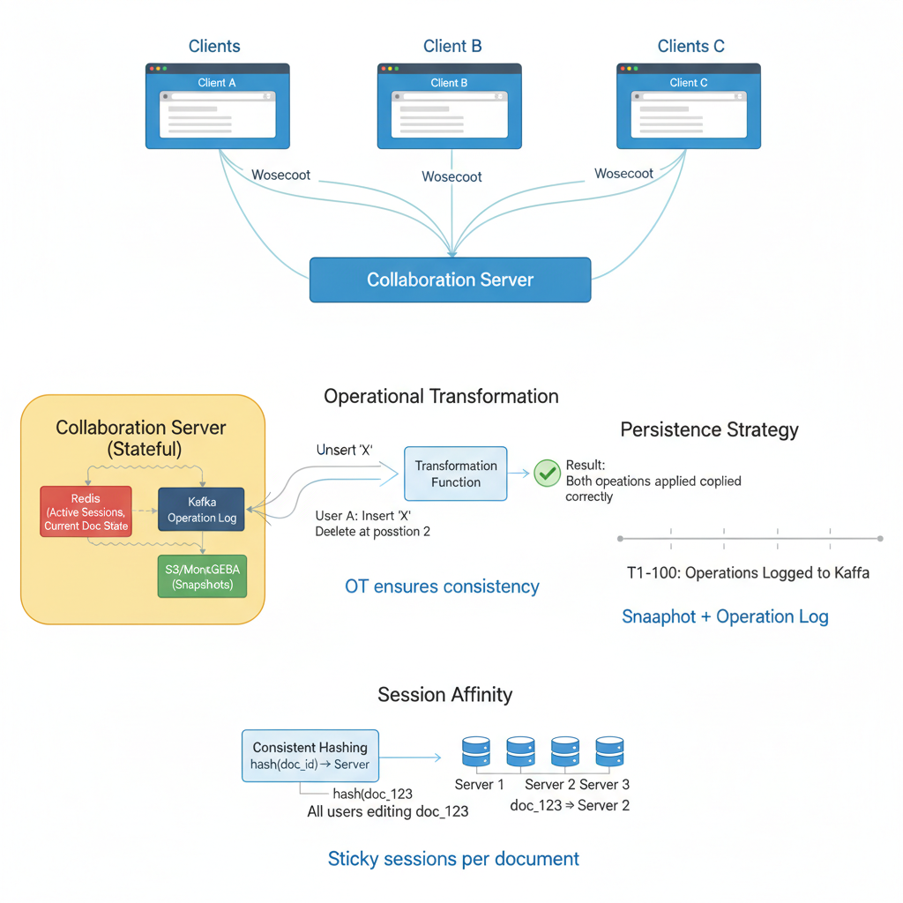

# 16. Design a Collaborative Document Editor (Google Docs)

**Difficulty:** Very Hard
**Focus:** Concurrency, Conflict Resolution (OT/CRDT), WebSockets.

---

## 🎯 Real-World Analogy

**Think of Google Docs like a shared grocery list:**

**Naive Approach (Overwrite):**
- Mom writes: "Milk, Eggs"
- Dad writes: "Milk, Bread" (at the same time)
- Dad saves last.
- List becomes: "Milk, Bread"
- ❌ Mom's "Eggs" are lost!

**Smart Approach (Operational Transformation):**
- Mom says: "Add Eggs at position 2"
- Dad says: "Add Bread at position 2"
- Server acts as mediator:
  - "Okay, Mom added Eggs first. List is [Milk, Eggs]"
  - "Dad wanted to add Bread at pos 2, but now Eggs is there."
  - "TRANSFORM Dad's request: Add Bread at position 3."
- Final List: "Milk, Eggs, Bread"
- ✅ Nothing is lost!

**Key Insight:** We don't send the *whole document*. We send *operations* (Insert 'X' at 5). If two people type at once, we mathematically adjust the positions so the text doesn't get scrambled.

---

## 1. Requirements (0-5 Minutes)

**Functional:**
1.  **Edit:** Multiple users edit same doc simultaneously.
2.  **See:** See others' cursors and typing in real-time.
3.  **History:** Undo/Redo, Version history.
4.  **Comments:** Add comments to text.

**Non-Functional:**
1.  **Latency:** < 100ms for seeing others' changes.
2.  **Consistency:** Everyone sees the same final document (Eventual Consistency is okay during editing).
3.  **Offline Support:** Users can edit offline and sync later.

---

## 2. High-Level Design (5-15 Minutes)



**Components:**
1.  **Client:** Browser with rich text editor (Quill.js, ProseMirror).
2.  **Collaboration Server:** Stateful. Maintains WebSocket connections and applies Operational Transformation.
3.  **Redis:** Stores current document state and active user sessions.
4.  **Kafka:** Append-only log of all operations for durability.
5.  **Storage:** Periodic snapshots of the document.

---

## 3. Deep Dive: The Core Problem (Conflict Resolution) (15-30 Minutes)

### 📚 ELI5: Operational Transformation (OT)

**The Problem:**
```
Start: "CAT"

User A: Inserts "H" at index 1 ("CHAT")
User B: Inserts "R" at index 2 ("CART")

If server just applies both blindly:
1. Apply A: "CHAT"
2. Apply B (Insert 'R' at 2): "CHRAT" ❌ (Wrong!)
   (User B wanted 'R' after 'A', but 'A' moved!)
```

**The Solution (Transformation):**
```
Server receives A first.
Server receives B second.

Server tells B:
"Hey, A just inserted 1 character before your cursor."
"You wanted index 2?"
"TRANSFORM: New index = 2 + 1 = 3."

Result:
1. Apply A: "CHAT"
2. Apply B (Insert 'R' at 3): "CHART" ✅ (Correct!)
```

**Scenario:**
*   Document: `"ABC"`
*   User A: Insert `'X'` at position 0 → `"XABC"`
*   User B: Delete character at position 2 (`'C'`) → `"AB"`
*   Both operations happen simultaneously.

**What should the final result be?**

### Approach A: Operational Transformation (OT) - *Used by Google Docs*

**Concept:** Transform operations based on concurrent operations.

**The Logic:**
If User A inserts at pos 0, and User B inserts at pos 5.
- User B's operation is fine.
If User A inserts at pos 0, and User B inserts at pos 0.
- User B's operation must shift by +1.

### 💻 Python Implementation (Simple OT)

```python
class Operation:
    def __init__(self, type, position, char):
        self.type = type # 'INSERT' or 'DELETE'
        self.position = position
        self.char = char

def transform(op_to_transform, op_executed_before):
    # If an INSERT happened before us, we must shift right
    if op_executed_before.type == 'INSERT':
        if op_executed_before.position <= op_to_transform.position:
            return Operation(
                op_to_transform.type,
                op_to_transform.position + 1, # Shifted!
                op_to_transform.char
            )
            
    # If a DELETE happened before us, we must shift left
    elif op_executed_before.type == 'DELETE':
        if op_executed_before.position < op_to_transform.position:
             return Operation(
                op_to_transform.type,
                op_to_transform.position - 1, # Shifted!
                op_to_transform.char
            )
            
    return op_to_transform
```

### ☕ Java Implementation

```java
public class Operation {
    public enum Type { INSERT, DELETE }
    
    private final Type type;
    private final int position;
    private final char character;
    
    public Operation(Type type, int position, char character) {
        this.type = type;
        this.position = position;
        this.character = character;
    }
    
    public Type getType() { return type; }
    public int getPosition() { return position; }
    public char getCharacter() { return character; }
    
    /**
     * Transform an operation based on another operation that was executed before it.
     * This ensures convergence in collaborative editing.
     */
    public static Operation transform(Operation opToTransform, Operation opExecutedBefore) {
        // If an INSERT happened before us, we must shift right
        if (opExecutedBefore.getType() == Type.INSERT) {
            if (opExecutedBefore.getPosition() <= opToTransform.getPosition()) {
                return new Operation(
                    opToTransform.getType(),
                    opToTransform.getPosition() + 1, // Shifted!
                    opToTransform.getCharacter()
                );
            }
        }
        
        // If a DELETE happened before us, we must shift left
        else if (opExecutedBefore.getType() == Type.DELETE) {
            if (opExecutedBefore.getPosition() < opToTransform.getPosition()) {
                return new Operation(
                    opToTransform.getType(),
                    opToTransform.getPosition() - 1, // Shifted!
                    opToTransform.getCharacter()
                );
            }
        }
        
        return opToTransform;
    }
    
    /**
     * Apply this operation to a document string.
     */
    public String apply(String document) {
        StringBuilder sb = new StringBuilder(document);
        
        if (type == Type.INSERT) {
            sb.insert(position, character);
        } else if (type == Type.DELETE && position < sb.length()) {
            sb.deleteCharAt(position);
        }
        
        return sb.toString();
    }
}
```

### Approach B: CRDT (Conflict-free Replicated Data Types) - *Used by Figma*

**Concept:** Give every character a globally unique, ordered ID (Fractional Indexing).

**Example:**
*   Original: `[A (Pos: 0.1), B (Pos: 0.2)]`
*   User A inserts X between A and B:
    *   Pos = (0.1 + 0.2) / 2 = **0.15**
    *   Result: `[A, X, B]`
*   User B inserts Y between A and B:
    *   Pos = (0.1 + 0.2) / 2 = **0.15**
    *   **Collision!** Use UserID to break tie: `0.15_UserA` < `0.15_UserB`

**Pros:** No central server needed for ordering (P2P friendly).
**Cons:** IDs grow large (tombstones). Harder to implement text deletion.

---

## 4. Deep Dive: Communication (WebSockets & Session Affinity) (30-35 Minutes)

## 4. Deep Dive: Communication (WebSockets) (30-35 Minutes)

**Why WebSockets?**
*   HTTP is request-response. Server can't push updates.
*   Long-polling is inefficient.
*   WebSockets provide full-duplex communication.

### 💻 Python Implementation (Collaboration Server)

```python
from flask_socketio import SocketIO, join_room, emit

socketio = SocketIO(app)

# Store document state in memory (for speed)
# In prod, use Redis
documents = {} 

@socketio.on('join')
def on_join(data):
    doc_id = data['doc_id']
    join_room(doc_id)
    # Send current doc state to new user
    emit('sync_doc', documents.get(doc_id, ""), room=request.sid)

@socketio.on('edit_op')
def on_edit(data):
    doc_id = data['doc_id']
    op = data['op'] # {type: 'INSERT', pos: 5, char: 'A'}
    
    # 1. Apply OT (Transform against recent ops)
    # (Simplified: assuming single threaded for demo)
    
    # 2. Broadcast to everyone ELSE in the room
    emit('remote_op', op, room=doc_id, include_self=False)
    
    # 3. Save to Append-Only Log (Kafka)
    kafka_producer.send('doc_updates', key=doc_id, value=op)
```

**Handling Disconnects (Offline Mode):**
1.  User goes into tunnel. Continues typing.
2.  Client stores ops in a "Pending Queue".
3.  Connection restored.
4.  Client sends "Pending Queue".
5.  Server transforms pending ops against everything that happened while user was offline.
6.  Server sends back "Ack".

---

## 5. Deep Dive: Persistence & Snapshots (35-40 Minutes)

**Problem:** We can't write to DB on every keystroke (too expensive).

**Solution: Operation Log + Snapshots**

1.  **Operation Log (Kafka):**
    *   Every operation is appended to Kafka: `[Insert('X', 0), Delete(3), ...]`
    *   This is the source of truth.
    *   Retention: 7 days.

2.  **Snapshots (S3/MongoDB):**
    *   Every 5 minutes, the server collapses the operation log into the full document text.
    *   Saves snapshot to S3: `doc_123_snapshot_v42.json`
    *   Metadata in MongoDB: `{ doc_id, version, s3_url, timestamp }`

3.  **Loading a Document:**
    *   Fetch latest snapshot from S3.
    *   Replay operations from Kafka since that snapshot.
    *   Result: Current state.

---

## 6. Deep Dive: Version History & Undo (40-45 Minutes)

**Version History:**
*   Keep snapshots at regular intervals (every hour).
*   User clicks "See version from 2pm yesterday".
*   Load snapshot from 2pm.

**Undo/Redo:**
*   **Client-side:** Each client maintains its own undo stack.
*   **Undo:** Generate an "inverse operation".
    *   If I did `Insert('X', 0)`, undo is `Delete(0)`.
*   **Redo:** Re-apply the original operation.

---

## 7. Deep Dive: Presence Awareness (45-47 Minutes)

**Requirement:**
- "User A is viewing this doc."
- "User B is typing..."

**Implementation:**
- **Ephemeral State:** Stored in Redis (with TTL).
- **Heartbeat:** Client sends "I'm here" every 10s.
- **Typing Indicator:**
  - Client sends `TYPING_START` event.
  - Server broadcasts to room.
  - Client sends `TYPING_STOP` after 2s of inactivity.

---

## 8. Deep Dive: Rich Text Formatting (47-50 Minutes)

**Problem:**
- How to represent "Bold", "Italic", "Comments"?

**Solution: Attributes Tree (Quill Delta)**
- Don't store HTML (`<b>Hello</b>`). It's hard to transform.
- Store Operations with Attributes:
  - `Insert("Hello", { bold: true })`
  - `Insert("World", { color: "red" })`
- **Conflict Resolution:**
  - User A bolds "Hello".
  - User B italicizes "Hello".
  - Result: "Hello" is **_Bold and Italic_**. (Merge attributes).

---

## 8A. Deep Dive: Rich Text & Formatting Attributes

**Challenge:** How to handle bold, italic, colors, fonts?

**Approach 1: Character-Level Attributes**
```python
class RichTextOperation:
    def __init__(self, position, char, attributes):
        self.position = position
        self.char = char
        self.attributes = attributes  # {"bold": True, "color": "red"}
    
    def apply(self, document):
        document.insert(self.position, {
            "char": self.char,
            "attrs": self.attributes
        })
```

**Approach 2: Range-Based Formatting**
```python
class FormatOperation:
    def __init__(self, start, end, format_type, value):
        self.start = start
        self.end = end
        self.format_type = format_type  # "bold", "italic", "color"
        self.value = value  # True, False, "#FF0000"
    
    def apply(self, document):
        for i in range(self.start, self.end):
            document[i].attributes[self.format_type] = self.value
```

**Conflict Resolution:**
- User A: Bold "Hello" (positions 0-5)
- User B: Italic "Hello" (positions 0-5)
- **Result:** Merge attributes -> "Hello" is **_bold and italic_**

**Java Implementation:**
```java
public class RichTextDocument {
    private List<CharWithAttributes> content;
    
    public void applyFormat(int start, int end, String formatType, Object value) {
        for (int i = start; i < end; i++) {
            content.get(i).setAttribute(formatType, value);
        }
    }
    
    public void mergeAttributes(CharWithAttributes char1, CharWithAttributes char2) {
        Map<String, Object> merged = new HashMap<>(char1.getAttributes());
        merged.putAll(char2.getAttributes());
        char1.setAttributes(merged);
    }
}
```

---

## 8B. Deep Dive: Comments & Suggestions

**Comments System:**
```python
class Comment:
    def __init__(self, comment_id, user_id, text, anchor_position, anchor_length):
        self.comment_id = comment_id
        self.user_id = user_id
        self.text = text
        self.anchor_position = anchor_position  # Where comment is attached
        self.anchor_length = anchor_length
        self.replies = []
        self.resolved = False
    
    def adjust_for_operation(self, operation):
        # If text inserted before comment, shift position
        if operation.position < self.anchor_position:
            self.anchor_position += len(operation.text)
        # If text deleted in comment range, handle gracefully
        elif operation.position < self.anchor_position + self.anchor_length:
            # Comment range affected, may need to adjust or mark as stale
            pass
```

**Suggestion Mode (Track Changes):**
- User proposes deletion: Mark text as "strikethrough" instead of deleting
- User proposes insertion: Mark text as "suggested" with different color
- Owner can accept/reject suggestions

**Implementation:**
```python
class Suggestion:
    def __init__(self, suggestion_id, user_id, operation, status="pending"):
        self.suggestion_id = suggestion_id
        self.user_id = user_id
        self.operation = operation  # The proposed change
        self.status = status  # "pending", "accepted", "rejected"
    
    def accept(self, document):
        if self.status == "pending":
            self.operation.apply(document)
            self.status = "accepted"
    
    def reject(self):
        self.status = "rejected"
```

---

## 8C. Deep Dive: Presence & Cursor Tracking

**Real-Time Presence:**
```python
class PresenceService:
    def __init__(self):
        self.active_users = {}  # {user_id: {cursor_position, last_seen}}
    
    def update_cursor(self, user_id, position):
        self.active_users[user_id] = {
            "cursor_position": position,
            "last_seen": time.time()
        }
        # Broadcast to all other users
        self.broadcast_cursor_update(user_id, position)
    
    def get_active_users(self):
        current_time = time.time()
        # Remove users inactive for >30 seconds
        active = {
            uid: data for uid, data in self.active_users.items()
            if current_time - data["last_seen"] < 30
        }
        return active
```

**Cursor Transformation:**
- User A's cursor at position 10
- User B inserts "Hello" at position 5
- **Transform:** User A's cursor should move to position 15

```java
public class CursorTracker {
    private Map<String, Integer> userCursors;
    
    public void transformCursor(String userId, Operation operation) {
        int cursorPos = userCursors.get(userId);
        
        if (operation.getType() == OperationType.INSERT) {
            if (operation.getPosition() <= cursorPos) {
                cursorPos += operation.getLength();
            }
        } else if (operation.getType() == OperationType.DELETE) {
            if (operation.getPosition() < cursorPos) {
                cursorPos -= Math.min(operation.getLength(), 
                                     cursorPos - operation.getPosition());
            }
        }
        
        userCursors.put(userId, cursorPos);
        broadcastCursorUpdate(userId, cursorPos);
    }
}
```

**Selection Highlighting:**
- Show other users' text selections in different colors
- Display user name/avatar next to their cursor

---

## 9. Real-World Engineering Case Studies (Deep Dive)

### 1. Google Docs: Operational Transformation at Scale

**Source:** Google Engineering Blog

**The Challenge:**
Google Docs supports 50+ simultaneous editors on a single document.
- **Problem:** How to ensure all users see consistent state despite network delays?
- **Requirement:** Sub-100ms latency for seeing others' edits.

**The Solution: OT + Tango Architecture**

**Architecture:**
1.  **Operational Transformation (OT):**
    - Every edit is an operation: `Insert('H', position=0)`, `Delete(position=5, length=3)`
    - When two users edit simultaneously, the server transforms conflicting operations.
    - **Example:**
        - User A: Insert 'X' at position 5
        - User B: Insert 'Y' at position 5 (simultaneously)
        - Server transforms: User B's operation becomes Insert 'Y' at position 6
2.  **Tango (Collaboration Server):**
    - Google's internal collaboration infrastructure.
    - Maintains a central operation log (append-only).
    - Each client has a local revision number.
    - When sending an operation, client includes its revision number.
    - Server applies operation and broadcasts to all clients.
3.  **Conflict-Free Convergence:**
    - OT guarantees that all clients converge to the same state.
    - Even if operations arrive out of order, the transformation ensures consistency.
4.  **Snapshots:**
    - Every 100 operations, server creates a snapshot.
    - New clients download snapshot + recent operations (not entire history).

**Key Insight:**
Google Docs uses **OT** for strong consistency, accepting the complexity of transformation logic to ensure all users see identical documents.

---

### 2. Figma: CRDT for Design Collaboration

**Source:** Figma Engineering Blog

**The Challenge:**
Figma is a design tool with real-time collaboration (like Google Docs but for graphics).
- **Problem:** OT is complex to implement correctly. Is there a simpler alternative?

**The Solution: Conflict-Free Replicated Data Types (CRDT)**

**Architecture:**
1.  **CRDT (Yjs Library):**
    - Instead of transforming operations, CRDTs use data structures that are inherently conflict-free.
    - **Example:** Instead of "Insert at position 5", use "Insert with unique ID between ID_A and ID_B".
    - **Benefit:** No transformation logic needed. Operations commute (order doesn't matter).
2.  **Fractional Indexing:**
    - Figma assigns each element a fractional position: `0.5`, `0.75`, `0.875`
    - To insert between 0.5 and 0.75, use 0.625.
    - **Benefit:** Infinite positions between any two elements.
3.  **WebRTC for P2P:**
    - Figma uses WebRTC for direct peer-to-peer communication.
    - Server acts as signaling server (for NAT traversal).
    - **Benefit:** Lower latency (no server round-trip).
4.  **Multiplayer Cursors:**
    - Each user's cursor position is broadcast via WebRTC.
    - Rendered locally (not stored in document state).

**Key Insight:**
Figma chose **CRDT** over OT for simplicity, trading off some control for easier implementation and better offline support.

---

### 3. Notion: Block-Based Collaboration

**Source:** Notion Engineering Blog

**The Challenge:**
Notion documents are hierarchical (pages contain blocks, blocks contain text).
- **Problem:** How to handle concurrent edits to different blocks efficiently?

**The Solution: Block-Level Locking + OT**

**Architecture:**
1.  **Block-Level Granularity:**
    - Each block (paragraph, heading, image) is a separate entity.
    - Two users editing different blocks don't conflict.
    - **Benefit:** Reduces transformation complexity.
2.  **Optimistic Locking:**
    - When editing a block, client sends: `{block_id, version, operation}`
    - Server checks: "Is this the latest version?"
    - If yes: Apply. If no: Reject and send latest version.
3.  **Eventual Consistency:**
    - Notion prioritizes availability over strong consistency.
    - During network partitions, users can edit offline.
    - When reconnected, conflicts are resolved (usually last-write-wins for metadata, OT for text).

**Key Insight:**
Notion uses **block-level granularity** to reduce conflicts, applying OT only within individual blocks rather than the entire document.

---

**Key Insight:**
Notion uses **block-level granularity** to reduce conflicts, applying OT only within individual blocks rather than the entire document.

---

## 10. Failure Scenarios & Disaster Recovery

### Scenario 1: WebSocket Server Crash (Session Loss)
**Impact:** All users editing a specific document lose their real-time connection.
**Detection:**
- `websocket_disconnect_rate` spike.
- `active_sessions` drop.

**Mitigation:**
- **Session Recovery:** Clients should automatically reconnect and send their last known `version_id`. The server then sends all operations since that version.
- **Redis Session Store:** Store the list of active collaborators for a document in Redis so a new server can quickly rebuild the "Presence" list.

### Scenario 2: Operation Log (Kafka) Outage
**Impact:** Edits cannot be persisted or broadcast to other users.
**Detection:** `kafka_producer_error_rate` > 5%.

**Mitigation:**
- **Local Buffer:** The client should store edits in `localStorage` and retry when the connection is restored.
- **Read-Only Mode:** If persistence fails, the server should switch the document to "Read-Only" to prevent data divergence.

### Scenario 3: OT Transformation Logic Bug
**Impact:** Different clients see different document states (Divergence).
**Detection:** `checksum_mismatch` between client and server document state.

**Mitigation:**
- **State Checksums:** Periodically send a hash of the document content from the client to the server. If they don't match, the server sends a full "Snapshot" to force resync.
- **Rollback:** If a critical bug is found, use the operation log to "replay" the document from a known good snapshot.

---

## 11. Monitoring & Observability

### Golden Signals Dashboard

**1. Latency**
- **Operation Round-trip:** P95 < 200ms (Client A -> Server -> Client B).
- **Metric:** `operation_broadcast_latency_seconds`.

**2. Traffic**
- **Throughput:** Operations per second (OPS) per document.
- **Metric:** `document_operations_total`.

**3. Errors**
- **Metric:** `ot_transformation_failure_rate`.
- **Target:** < 0.001%.

**4. Saturation**
- **Metric:** WebSocket server memory (max connections), Kafka partition lag.

### Alert Rules
```yaml
alerts:
  - alert: HighOperationLatency
    expr: histogram_quantile(0.95, sum(rate(operation_latency_bucket[5m])) by (le)) > 0.5
    for: 2m
    labels:
      severity: warning
```

---

## 12. API Design & Versioning

### Document API

**Get Document Snapshot**
```http
GET /api/v1/documents/{id}/snapshot
```

**Submit Operations**
```http
POST /api/v1/documents/{id}/operations
Content-Type: application/json

{
  "base_version": 105,
  "operations": [
    {"type": "insert", "pos": 10, "text": "H"}
  ]
}
```

### Versioning
- Use `/v1/`, `/v2/` in URL.
- **OT Protocol Versioning:** If the transformation logic changes, include a `protocol_version` in the WebSocket handshake.

---

## 13. Cost Analysis & Optimization

### Monthly Infrastructure Costs (at 1M active docs)

**1. Compute (WebSocket Servers)**
- 50 nodes (c6g.xlarge) = **$5,000/month**.

**2. Storage (S3 for Snapshots + RDS for Metadata)**
- 10 TB Snapshots + 1 TB Metadata = **$1,000/month**.

**3. Bandwidth (WebSocket Traffic)**
- 10 TB egress = **$1,000/month**.

**Total:** ~$7,000/month.

### Optimization Opportunities
- **Delta Snapshots:** Instead of saving the full document every 100 edits, save only the "Delta" (changes) and reconstruct the full doc in the background.
- **Binary Protocol:** Use Protocol Buffers instead of JSON for WebSocket messages to save 40% bandwidth.

---

## 14. Security & Compliance

### Security Measures
- **End-to-End Encryption (Optional):** For sensitive docs, encrypt content on the client so the server only sees encrypted blobs (requires CRDT instead of OT).
- **Access Control (ACL):** Check permissions for every WebSocket connection and every operation submission.
- **Rate Limiting:** Prevent a single user from flooding a document with operations (e.g., max 50 ops/sec).

### Compliance
- **Data Residency:** Store documents for German users in `eu-central-1` to comply with local laws.
- **Audit Trail:** Keep a permanent log of who made which edit for enterprise compliance.

---

## 15. Testing Strategies

### Unit Tests
- Test OT transformation functions (e.g., `transform(ins, ins)`, `transform(ins, del)`).
- Test document state convergence: "Do 100 random concurrent ops always result in the same hash?"

### Integration Tests
- Simulate two clients editing the same paragraph and verify they see the same text.

### Load Testing
- Simulate 1,000 users editing a single document (The "Reddit Place" scenario).
- **Tool:** `K6` with WebSocket support.

---

## 16. Migration & Rollout Strategies

### Rollout
- **Feature Flag:** Enable the new "Rich Text" engine for 1% of documents.

### Migration
- **OT to CRDT:** If migrating the engine, use a "Shadow Engine" that runs CRDT in the background and compares the result with the current OT engine.

---

## 17. Performance Optimization

### Latency Optimization
- **Edge WebSockets:** Use AWS Global Accelerator to terminate WebSocket connections closer to the user.
- **Optimistic UI:** Apply edits locally immediately; only rollback if the server rejects the operation.

### Memory Optimization
- **Document Sharding:** Distribute documents across servers based on `document_id` hash to avoid any single server becoming a bottleneck.

---

## 18. Capacity Planning

### Scaling Triggers
- **WebSocket Connections:** Scale out when a server hits 50,000 concurrent connections.
- **Kafka Throughput:** Increase partitions if a single document's operation volume exceeds 1,000 ops/sec.

### Throughput Projection
- 1M active docs × 1 op/sec = 1M OPS. Requires a cluster of ~100 servers.

---

## 19. Interview Cheat Sheet

### Key Numbers
- **Latency:** < 200ms (Round-trip).
- **Scale:** 100+ concurrent editors per doc.
- **Storage:** 100KB per document (Average).

### Core Components
1. **WebSocket Gateway:** Real-time communication.
2. **OT Engine:** Conflict resolution.
3. **Operation Log:** Persistence and catch-up.
4. **Snapshot Service:** Fast document loading.

### Critical Trade-offs
- **OT vs CRDT:** OT is more complex (server-side state) but uses less memory; CRDT is simpler (decentralized) but has higher metadata overhead.
- **Consistency vs Availability:** Strong consistency (Server-mediated OT) vs Eventual consistency (CRDT).

---

## 20. Wrap-up (Deep Dive)

**Summary:**
"I designed a real-time collaborative editor using **Operational Transformation** for conflict resolution.
1.  **Concurrency:** I used **WebSockets with session affinity** to ensure all collaborators connect to the same server for low-latency operation broadcasting.
2.  **Conflict Resolution:** I implemented **OT** to transform concurrent operations, ensuring all clients converge to the same state.
3.  **Persistence:** I combined an **append-only operation log** (Kafka) with periodic snapshots (S3) to balance durability and performance.
4.  **Real-World:** I incorporated **Google Docs' Tango** architecture for OT, **Figma's CRDT** approach for simpler conflict resolution, and **Notion's block-level locking** for hierarchical documents.
5.  **Production Readiness:** I addressed failure modes like session loss, optimized costs via binary protocols, and ensured security through strict ACLs and audit logging."

---

---
