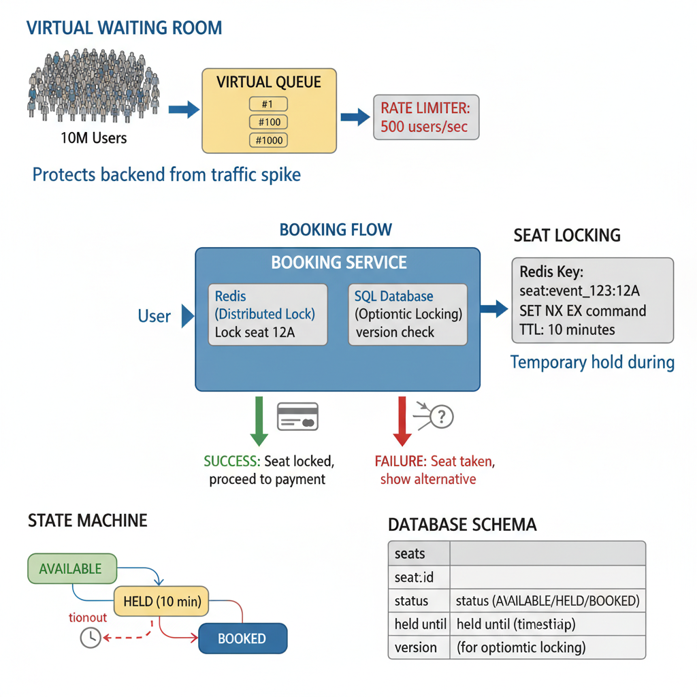
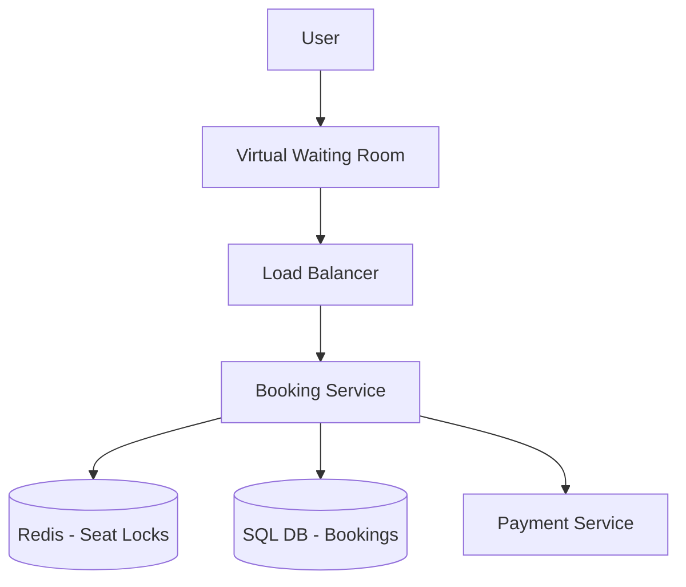
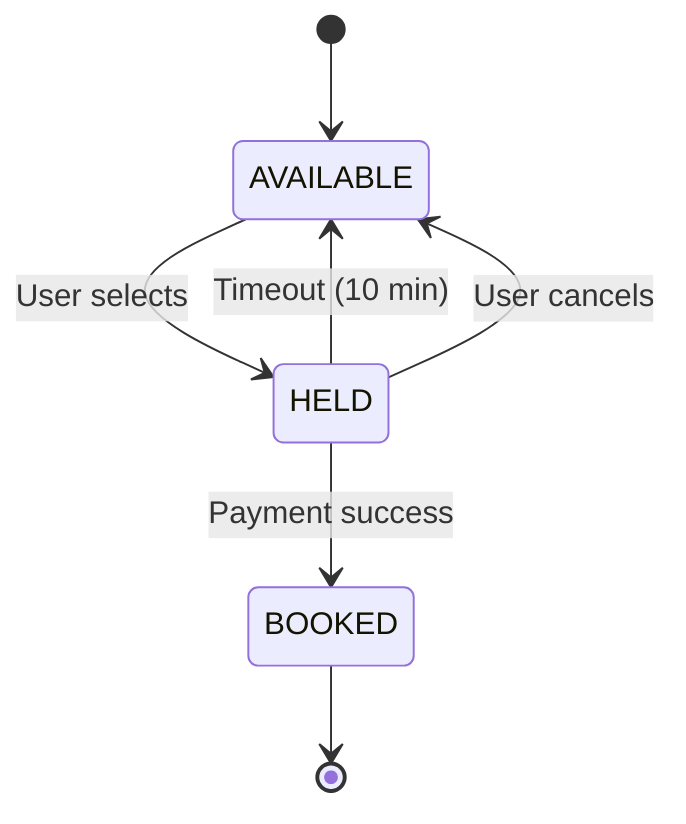

# 17. Design a Ticket Booking System (Ticketmaster)

**Difficulty:** Hard
**Focus:** Concurrency, Locking, High Contention, Virtual Queue.

---

## 🎯 Real-World Analogy

**Think of Ticket Booking like a deli counter:**

**Without Virtual Queue (Chaos):**
- 1000 people rush into a tiny deli at once.
- Everyone grabs for the same sandwich.
- Counter collapses. 💥
- Nobody gets food.
- ❌ Disaster!

**With Virtual Queue (Organized):**
- 1000 people arrive.
- Each gets a number: #1, #2, #3...
- Display shows: "Now serving #5"
- People wait comfortably.
- Counter serves 10 people/minute.
- Everyone gets served eventually.
- ✅ Orderly!

**Key Insight:** When demand >> supply (10M users, 50K seats), we can't let everyone hit the database at once. We need a controlled queue to prevent system collapse.

---

## 1. Requirements (0-5 Minutes)

**Functional:**
1.  **View:** See available seats for an event.
2.  **Hold:** Select seat, hold for 10 minutes while user enters payment info.
3.  **Book:** Complete payment and confirm booking.
4.  **Search:** Find events by city/date/artist.

**Non-Functional:**
1.  **Fairness:** First come, first served.
2.  **No Double Booking:** CRITICAL. Cannot sell same seat twice.
3.  **Traffic Spikes:** Taylor Swift concert (10M users trying to book 50k seats in 1 second).
4.  **Availability:** High.

---

## 2. High-Level Design (5-15 Minutes)



**Components:**



**Components:**
1.  **Virtual Waiting Room:** Rate-limits access to protect backend.
2.  **Booking Service:** Core business logic.
3.  **Redis:** Fast distributed locks for seat holds.
4.  **SQL DB:** Final source of truth (PostgreSQL with row-level locking).

---

## 3. Deep Dive: Handling Traffic Spikes (Virtual Queue) (15-25 Minutes)

## 3. Deep Dive: Handling Traffic Spikes (Virtual Waiting Room) (15-25 Minutes)

**The Problem:**
- 10 Million users want tickets.
- DB capacity: 10,000 writes/sec.
- If we let everyone in, DB crashes. 💥

**The Solution: The Nightclub Bouncer (Virtual Queue)**
We put a "Waiting Room" in front of the main site.
Only `N` users are allowed to pass per second.

### 💻 Python Implementation (Token Bucket Queue)

```python
class WaitingRoom:
    def __init__(self, redis):
        self.redis = redis
        self.RATE_PER_SEC = 500

    def enter_queue(self, user_id, event_id):
        # 1. Get a Ticket Number (Atomic Increment)
        # Returns: 1001, 1002, 1003...
        my_number = self.redis.incr(f"queue:{event_id}:counter")
        return my_number

    def check_status(self, user_id, event_id, my_number):
        # 2. Get "Currently Serving" Number
        # We update this every second in background
        current_serving = int(self.redis.get(f"queue:{event_id}:serving") or 0)
        
        if my_number <= current_serving:
            # 3. Generate Access Token (JWT)
            token = generate_jwt(user_id, event_id)
            return {"status": "READY", "token": token}
        else:
            # 4. Calculate Wait Time
            people_ahead = my_number - current_serving
            wait_seconds = people_ahead / self.RATE_PER_SEC
            return {"status": "WAITING", "ahead": people_ahead, "eta": wait_seconds}

# Background Worker (The Bouncer)
# Runs every 1 second
def move_queue_forward(event_id):
    redis.incrby(f"queue:{event_id}:serving", 500)
```

### ☕ Java Implementation

```java
import redis.clients.jedis.Jedis;
import java.util.HashMap;
import java.util.Map;
import java.util.concurrent.*;

public class WaitingRoom {
    private final Jedis redis;
    private final int RATE_PER_SEC = 500;
    private final ScheduledExecutorService scheduler;
    
    public WaitingRoom(Jedis redis) {
        this.redis = redis;
        this.scheduler = Executors.newSingleThreadScheduledExecutor();
    }
    
    public long enterQueue(String userId, String eventId) {
        // 1. Get a Ticket Number (Atomic Increment)
        // Returns: 1001, 1002, 1003...
        String key = "queue:" + eventId + ":counter";
        return redis.incr(key);
    }
    
    public Map<String, Object> checkStatus(String userId, String eventId, long myNumber) {
        // 2. Get "Currently Serving" Number
        String servingKey = "queue:" + eventId + ":serving";
        String servingStr = redis.get(servingKey);
        long currentServing = servingStr != null ? Long.parseLong(servingStr) : 0;
        
        Map<String, Object> response = new HashMap<>();
        
        if (myNumber <= currentServing) {
            // 3. Generate Access Token (JWT)
            String token = generateJWT(userId, eventId);
            response.put("status", "READY");
            response.put("token", token);
        } else {
            // 4. Calculate Wait Time
            long peopleAhead = myNumber - currentServing;
            long waitSeconds = peopleAhead / RATE_PER_SEC;
            
            response.put("status", "WAITING");
            response.put("ahead", peopleAhead);
            response.put("eta", waitSeconds);
        }
        
        return response;
    }
    
    // Background Worker (The Bouncer) - Runs every 1 second
    public void startQueueProcessor(String eventId) {
        scheduler.scheduleAtFixedRate(() -> {
            moveQueueForward(eventId);
        }, 0, 1, TimeUnit.SECONDS);
    }
    
    private void moveQueueForward(String eventId) {
        String servingKey = "queue:" + eventId + ":serving";
        redis.incrBy(servingKey, RATE_PER_SEC);
    }
    
    private String generateJWT(String userId, String eventId) {
        // Use library like jjwt for production
        return "jwt_token_" + userId + "_" + eventId;
    }
    
    public void shutdown() {
        scheduler.shutdown();
    }
}
```

**User Experience:**
1. User visits `/event/taylor-swift`.
2. Redirected to `/waiting-room`.
3. API returns: `{"status": "WAITING", "ahead": 50000, "eta": "100 seconds"}`.
4. Frontend polls every 5s.
5. When `status: READY`, redirect to `/book` with JWT token.

### 📚 Understanding Virtual Queue - Step-by-Step for Beginners

**Why Do We Need This?**

Imagine this scenario:
- Taylor Swift concert has **50,000 seats**
- **10 million fans** want tickets
- Your database can handle **10,000 writes/second**
- If all 10M users hit the database at once = **CRASH** 💥

**The Math:**
```
Without Queue:
- 10,000,000 users × 1 request each = 10,000,000 requests
- Database capacity = 10,000 requests/second
- Time to crash = Instant! ❌

With Queue (500 users/second):
- 10,000,000 users ÷ 500 per second = 20,000 seconds = 5.5 hours
- Database never overloaded ✅
- System stays healthy ✅
```

**Step-by-Step Walkthrough with Real Numbers:**

Let's follow **3 users** through the queue:

**Initial State (10:00:00 AM):**
```
Redis State:
- queue:taylor-swift:counter = 0
- queue:taylor-swift:serving = 0
```

**Step 1: Users Enter Queue (10:00:00 AM)**

User Alice clicks "Buy Tickets":
```python
my_number = redis.incr("queue:taylor-swift:counter")  # Returns: 1
```
Alice gets: `{"ticket_number": 1, "status": "WAITING"}`

User Bob clicks (1 second later):
```python
my_number = redis.incr("queue:taylor-swift:counter")  # Returns: 2
```
Bob gets: `{"ticket_number": 2, "status": "WAITING"}`

User Charlie clicks (2 seconds later):
```python
my_number = redis.incr("queue:taylor-swift:counter")  # Returns: 3
```
Charlie gets: `{"ticket_number": 3, "status": "WAITING"}`

**Current State:**
```
Redis:
- counter = 3 (total people who entered)
- serving = 0 (nobody admitted yet)

Queue:
[Alice #1] [Bob #2] [Charlie #3] ... [User #10,000,000]
```

**Step 2: Background Worker Starts (Every 1 Second)**

At 10:00:01:
```python
redis.incrby("queue:taylor-swift:serving", 500)  # serving = 500
```

At 10:00:02:
```python
redis.incrby("queue:taylor-swift:serving", 500)  # serving = 1000
```

**Step 3: Users Check Their Status**

Alice checks status (she has ticket #1):
```python
current_serving = redis.get("queue:taylor-swift:serving")  # Returns: 500
my_number = 1

if my_number <= current_serving:  # 1 <= 500? YES!
    return {"status": "READY", "token": "jwt_alice_12345"}
```
✅ **Alice is admitted!** She can now book tickets.

Bob checks status (he has ticket #2):
```python
current_serving = 500
my_number = 2

if my_number <= current_serving:  # 2 <= 500? YES!
    return {"status": "READY", "token": "jwt_bob_67890"}
```
✅ **Bob is admitted!**

Charlie checks status (he has ticket #3):
```python
current_serving = 500
my_number = 3

if my_number <= current_serving:  # 3 <= 500? YES!
    return {"status": "READY", "token": "jwt_charlie_11111"}
```
✅ **Charlie is admitted!**

User #501 checks status:
```python
current_serving = 500
my_number = 501

if my_number <= current_serving:  # 501 <= 500? NO!
    people_ahead = 501 - 500 = 1
    wait_time = 1 / 500 = 0.002 seconds ≈ 1 second
    return {"status": "WAITING", "ahead": 1, "eta": "1 second"}
```
❌ **User #501 must wait** (but only 1 more second!)

User #50,000 checks status:
```python
current_serving = 500
my_number = 50000

if my_number <= current_serving:  # 50,000 <= 500? NO!
    people_ahead = 50000 - 500 = 49,500
    wait_time = 49,500 / 500 = 99 seconds
    return {"status": "WAITING", "ahead": 49500, "eta": "99 seconds"}
```
❌ **User #50,000 must wait** ~1.5 minutes.

**Visual Timeline:**

```
Time        Serving    Who Gets In
-----------------------------------------------
10:00:00    0          Nobody yet
10:00:01    500        Users #1 - #500 ✅
10:00:02    1000       Users #501 - #1000 ✅
10:00:03    1500       Users #1001 - #1500 ✅
...
10:03:20    100,000    Users #99,501 - #100,000 ✅
```

**Key Insights:**

1. **Atomic Counter**: `redis.incr()` is atomic - no two users get the same number
2. **Fair**: First come, first served (ticket #1 goes before #2)
3. **Controlled**: Only 500 users/second enter the system
4. **Predictable**: Users know exactly how long they'll wait
5. **No Thundering Herd**: Database never gets overwhelmed

**What Happens to the JWT Token?**

When Alice gets her token:
```
Token: jwt_alice_12345
Contains: {user_id: "alice", event_id: "taylor-swift", expires: 10:10:00}
```

Alice uses this token for the next 10 minutes to:
- View available seats
- Hold a seat
- Complete booking

After 10 minutes, token expires and she must re-enter queue.

**Common Questions:**

**Q: What if the background worker crashes?**
A: Queue stops moving. Users wait longer. When worker restarts, it resumes from current `serving` value.

**Q: What if Redis crashes?**
A: All queue state is lost. System must restart queue from 0. This is why we use Redis Cluster (replication).

**Q: Can users skip the queue?**
A: No! The JWT token is only issued when `my_number <= serving`. You can't fake your ticket number.

---

## 4. Deep Dive: Concurrency & Locking (25-35 Minutes)

**Scenario:** User A and User B both click Seat 12A at the exact same millisecond.

### Approach A: Database Optimistic Locking (Good for Low Contention)

**Concept:** "I hope nobody changed this while I was looking."

**Schema:**
```sql
CREATE TABLE seats (
    id VARCHAR PRIMARY KEY,
    status VARCHAR,
    version INT DEFAULT 1
);
```

**Logic:**
1. Read Seat: `SELECT version FROM seats WHERE id='12A'` (Returns v1)
2. User thinks for 1 minute...
3. Write:
```sql
UPDATE seats 
SET status='HELD', version=version+1 
WHERE id='12A' AND version=1;
```
**Result:**
- If 1 row updated: Success! ✅
- If 0 rows updated: Someone else bumped version to 2. Fail! ❌

### Approach B: Redis Distributed Lock (Best for High Contention)

**Why Redis?**
- DB locks (Pessimistic) hold open connections. 10k users = 10k connections = DB Crash.
- Redis is in-memory. 100k ops/sec.

**The "Redlock" Algorithm (Simplified):**
1. Client generates unique ID (`my_random_value`).
2. Client tries to set key with `NX` (Not Exists) and `PX` (Expiry).
3. If successful, they own the lock.
4. If failed, they retry or give up.

### 💻 Python Implementation (Redis Lock)

```python
import redis
import time
import uuid

class SeatLock:
    def __init__(self, redis_client):
        self.redis = redis_client

    def acquire_lock(self, seat_id, user_id, ttl_ms=10000):
        # Key: seat:12A, Value: user_123
        # NX: Only set if not exists
        # PX: Expire in 10s (Safety net if server crashes)
        is_locked = self.redis.set(
            f"seat:{seat_id}", 
            user_id, 
            nx=True, 
            px=ttl_ms
        )
        return is_locked

    def release_lock(self, seat_id, user_id):
        # Lua script to ensure we only delete OUR lock
        # (Prevent deleting someone else's lock if ours expired)
        script = """
        if redis.call("get", KEYS[1]) == ARGV[1] then
            return redis.call("del", KEYS[1])
        else
            return 0
        end
        """
        self.redis.eval(script, 1, f"seat:{seat_id}", user_id)
```

### 📚 Understanding Distributed Locks - For Beginners

**The Race Condition Problem:**

Imagine this scenario at **exactly 10:00:00.000**:

```
Seat 12A status: AVAILABLE

User Alice (San Francisco):  Clicks "Book Seat 12A"
User Bob (New York):          Clicks "Book Seat 12A"  (same millisecond!)
```

**Without Locking (DISASTER):**

```
Time: 10:00:00.000
Alice's Server:
1. Read seat 12A → status = AVAILABLE ✅
2. Think: "Great, it's free!"

Bob's Server (same time):
1. Read seat 12A → status = AVAILABLE ✅
2. Think: "Great, it's free!"

Time: 10:00:00.100
Alice's Server:
3. UPDATE seats SET status='HELD' WHERE id='12A'

Bob's Server:
3. UPDATE seats SET status='HELD' WHERE id='12A'

Result: BOTH think they got the seat! 💥
Database shows: seat 12A = HELD (but by whom?)
```

**With Redis Lock (SAFE):**

Let's see the exact Redis commands:

**Step 1: Alice Tries to Lock (10:00:00.000)**

```redis
SET seat:12A alice_user_id NX PX 10000
```

Breaking this down:
- `SET` = Set a key-value pair
- `seat:12A` = The key (lock name)
- `alice_user_id` = The value (who owns the lock)
- `NX` = **Only set if Not eXists** (critical!)
- `PX 10000` = Expire in 10,000 milliseconds (10 seconds)

Redis Response: `OK` ✅

**What just happened?**
```
Redis Memory:
seat:12A = "alice_user_id" (expires in 10s)
```

Alice now **owns the lock** for seat 12A!

**Step 2: Bob Tries to Lock (10:00:00.001 - 1ms later)**

```redis
SET seat:12A bob_user_id NX PX 10000
```

Redis Response: `(nil)` ❌

**Why?**
- The key `seat:12A` already exists (Alice set it)
- `NX` means "only if not exists"
- Redis refuses to overwrite Alice's lock
- Bob gets rejected!

**Step 3: Alice Completes Booking**

Alice's server:
```python
# 1. Check database
seat = db.query("SELECT * FROM seats WHERE id='12A'")
if seat.status == 'AVAILABLE':
    # 2. Update database
    db.execute("UPDATE seats SET status='HELD', user_id='alice' WHERE id='12A'")
    
    # 3. Release lock
    redis.eval(release_script, 1, "seat:12A", "alice_user_id")
```

**Step 4: Lock Released**

```redis
DEL seat:12A
```

Redis Memory:
```
seat:12A = (deleted)
```

Now Bob can try again!

**Visual Timeline:**

```
Time          Alice                    Bob                     Redis
--------------------------------------------------------------------------------
10:00:00.000  SET seat:12A alice NX    -                       seat:12A = alice ✅
10:00:00.001  -                        SET seat:12A bob NX     Rejected (exists) ❌
10:00:00.050  UPDATE database          -                       seat:12A = alice
10:00:00.100  DEL seat:12A             -                       seat:12A = (empty)
10:00:00.101  -                        SET seat:12A bob NX     seat:12A = bob ✅
```

**Why the TTL (10 second expiry)?**

**Crash Scenario:**

```
Time: 10:00:00.000
Alice's server acquires lock: SET seat:12A alice NX PX 10000

Time: 10:00:00.050
Alice's server CRASHES! 💥
(Never releases the lock)

Time: 10:00:10.000
Redis automatically deletes the key (TTL expired)

Time: 10:00:10.001
Bob can now acquire the lock ✅
```

**Without TTL:**
- Alice's crash would lock seat 12A **forever**
- Nobody could ever book that seat again
- Manual intervention required

**The Lua Script for Safe Release:**

**Why do we need a script?**

**Dangerous approach (DON'T DO THIS):**
```python
# Step 1: Check if it's my lock
owner = redis.get("seat:12A")
if owner == "alice_user_id":
    # Step 2: Delete it
    redis.delete("seat:12A")
```

**Problem:**
```
Time: 10:00:00.000
Alice: owner = redis.get("seat:12A")  → "alice_user_id" ✅

Time: 10:00:00.001
Alice's lock EXPIRES (TTL reached)
Redis auto-deletes: seat:12A = (empty)

Time: 10:00:00.002
Bob: SET seat:12A bob_user_id NX  → Success!
Redis: seat:12A = "bob_user_id"

Time: 10:00:00.003
Alice: redis.delete("seat:12A")  → Deletes BOB's lock! 💥
```

**Safe approach (Lua script - ATOMIC):**

```lua
if redis.call("GET", KEYS[1]) == ARGV[1] then
    return redis.call("DEL", KEYS[1])
else
    return 0
end
```

This runs as a **single atomic operation**. No race condition possible!

**Comparison Table: Locking Strategies**

| Strategy | Speed | Scalability | Use Case | Failure Mode |
|----------|-------|-------------|----------|--------------|
| **Database Row Lock** | Slow (10ms) | Poor (holds connection) | Low contention | Connection pool exhaustion |
| **Database Optimistic Lock** | Medium (5ms) | Good (no connection hold) | Medium contention | Retry storms |
| **Redis Distributed Lock** | Fast (1ms) | Excellent (100k ops/sec) | High contention | Redis failure = no locks |
| **No Lock** | Fastest (0ms) | Best | Read-only | Double booking 💥 |

**When to Use Each:**

**Use Database Row Lock when:**
- ✅ Low traffic (< 100 concurrent users)
- ✅ Simple setup (no Redis needed)
- ❌ NOT for ticket booking (too slow)

**Use Optimistic Lock when:**
- ✅ Medium traffic (< 1000 concurrent users)
- ✅ Conflicts are rare
- ❌ NOT for hot seats (everyone wants front row)

**Use Redis Lock when:**
- ✅ High traffic (10,000+ concurrent users)
- ✅ Hot contention (Taylor Swift tickets!)
- ✅ Need fast response times
- ✅ **BEST for ticket booking** ⭐

**Common Mistakes:**

❌ **Mistake 1: No TTL**
```python
redis.set("seat:12A", "alice", nx=True)  # No PX!
```
Problem: If server crashes, lock held forever.

❌ **Mistake 2: Wrong TTL**
```python
redis.set("seat:12A", "alice", nx=True, px=100)  # 100ms!
```
Problem: Lock expires before booking completes. Bob steals it!

❌ **Mistake 3: No Owner Check on Release**
```python
redis.delete("seat:12A")  # Deletes anyone's lock!
```
Problem: Alice deletes Bob's lock by accident.

✅ **Correct Approach:**
```python
redis.set("seat:12A", "alice", nx=True, px=10000)  # 10s TTL
# ... do work ...
redis.eval(lua_script, 1, "seat:12A", "alice")  # Safe release
```

**Practice Question:**

**Q: What happens if Alice's payment takes 15 seconds (longer than 10s TTL)?**

**A: Race condition!**
```
Time: 10:00:00  Alice locks seat 12A (TTL=10s)
Time: 10:00:10  Lock expires, Redis deletes it
Time: 10:00:11  Bob locks seat 12A
Time: 10:00:15  Alice completes payment, updates DB
Time: 10:00:16  Bob completes payment, updates DB
Result: Double booking! 💥
```

**Solution:**
1. **Extend TTL** to 60 seconds (payment should be faster)
2. **Heartbeat**: Alice's server refreshes TTL every 5 seconds
3. **Database Final Check**: Before confirming, check DB one more time

**Hybrid Strategy:**
1.  **Hold (10 mins):** Use Redis Lock. Fast, ephemeral.
2.  **Book (Final):** Use SQL Transaction. Durable, ACID.

---

## 5. Deep Dive: State Machine (35-40 Minutes)

**Seat Lifecycle:**



**Timeout Handling:**
*   Redis automatically expires the key after 10 minutes.
*   Background job (every 1 minute) scans SQL for `status='HELD' AND held_until < NOW()` and releases them.

---

## 6. Deep Dive: Database Schema (40-45 Minutes)

**Tables:**

1.  **Events:**
    ```sql
    CREATE TABLE events (
        id UUID PRIMARY KEY,
        name VARCHAR,
        venue_id UUID,
        date TIMESTAMP
    );
    ```

2.  **Seats:**
    ```sql
    CREATE TABLE seats (
        id VARCHAR PRIMARY KEY,
        event_id UUID,
        section VARCHAR,
        row VARCHAR,
        number INT,
        price DECIMAL,
        status VARCHAR,
        INDEX(event_id, status)  -- For fast queries
    );
    ```

3.  **Bookings:**
    ```sql
    CREATE TABLE bookings (
        id UUID PRIMARY KEY,
        user_id UUID,
        seat_id VARCHAR,
        event_id UUID,
        status VARCHAR,
        created_at TIMESTAMP
    );
    ```

---

## 7. Deep Dive: Seat Map Rendering (45-47 Minutes)

**Problem:**
- Rendering 50,000 individual seats on a mobile screen is slow.
- Fetching status for 50,000 seats kills the DB.

**Solution: Tiling & Caching**
1.  **Vector Tiles (SVG):**
    - Divide stadium into blocks (Section A, B, C).
    - Only load Section A when user zooms in.
2.  **Status Bitmap:**
    - Instead of JSON `[{id: 1, status: 'booked'}, ...]`, send a **Bitmap**.
    - `0` = Available, `1` = Booked.
    - 50,000 bits = 6KB. Tiny!
    - Client overlays Bitmap on SVG.

---

## 8. Deep Dive: Dynamic Pricing (47-50 Minutes)

**Goal:** Maximize revenue.

**Algorithm:**
- **Factors:**
  - **Time:** Price increases as event gets closer.
  - **Demand:** If 1000 people view Section A, price goes up.
  - **Supply:** If only 5 seats left, price goes up.
- **Implementation:**
  - Pricing Service runs asynchronously.
  - Updates `price` column in `seats` table.
  - Cache prices in Redis.

---

---

## 9. Real-World Engineering Case Studies (Deep Dive)

### 1. Ticketmaster: Verified Fan & Virtual Waiting Room

**Source:** Ticketmaster Engineering Blog

**The Challenge:**
Taylor Swift Eras Tour: 14M fans tried to buy tickets for 52 shows (2.4M tickets).
- **Problem:** Traditional queue systems crashed under load.
- **Requirement:** Fair distribution while preventing bots.

**The Solution: Verified Fan + Queue-it Integration**

**Architecture:**
1.  **Verified Fan (Pre-Registration):**
    - Fans register weeks before sale.
    - Ticketmaster verifies identity (phone number, social media).
    - Assigns "boost codes" to verified fans.
    - **Benefit:** Filters out bots before sale day.
2.  **Virtual Waiting Room (Queue-it):**
    - On sale day, users enter a virtual queue.
    - Queue position assigned randomly (with boost for verified fans).
    - **Capacity Control:** Only 10k users allowed into booking site at once.
    - **Rate Limiting:** Each user can only book 4 tickets.
3.  **Dynamic Seat Allocation:**
    - Instead of showing all 50k seats, show only 100 seats at a time.
    - When user selects seat, lock it for 10 minutes.
    - **SQL:**
        ```sql
        UPDATE seats 
        SET status = 'LOCKED', user_id = 'user_123', lock_expires = NOW() + INTERVAL '10 minutes'
        WHERE seat_id = 'A12' AND status = 'AVAILABLE'
        ```
4.  **Scalability:**
    - Ticketmaster uses AWS Auto Scaling.
    - During peak (sale start), scales to 1000+ EC2 instances.
    - After 1 hour, scales down to 50 instances.

**Key Insight:**
Ticketmaster uses **pre-registration** to filter bots and **virtual queues** to control traffic, preventing system overload.

---

### 2. BookMyShow: India's Ticket Giant

**Source:** BookMyShow Engineering Blog

**The Challenge:**
Movie releases in India see 1M+ concurrent users booking tickets.
- **Problem:** Database locks caused timeouts during high contention.
- **Requirement:** Sub-second booking confirmation.

**The Solution: Redis for Temporary Holds + Async Payment**

**Architecture:**
1.  **Seat Selection (Redis):**
    - Available seats stored in Redis Sorted Set.
    - **Lock Seat:**
        ```redis
        SET seat:A12:lock user_123 NX EX 600
        ```
    - If `NX` (set if not exists) succeeds, seat is locked.
    - **Benefit:** No database contention. Redis handles 100k ops/sec.
2.  **Payment Processing (Async):**
    - User completes payment via Razorpay/Paytm.
    - Payment service sends webhook to BookMyShow.
    - **Idempotency:** Payment ID is stored to prevent double-charging.
3.  **Seat Confirmation (PostgreSQL):**
    - After payment success, write to PostgreSQL:
        ```sql
        INSERT INTO bookings (user_id, seat_id, payment_id, status)
        VALUES ('user_123', 'A12', 'pay_xyz', 'CONFIRMED')
        ```
    - **Optimistic Locking:** Use version number to prevent race conditions.
4.  **Expiry Handling:**
    - Redis TTL expires locks after 10 minutes.
    - Background job releases expired locks and notifies users.

**Key Insight:**
BookMyShow uses **Redis for fast temporary locks** and **async payment processing** to decouple booking from payment, improving throughput.

---

### 3. Eventbrite: Self-Service Event Platform

**Source:** Eventbrite Engineering Blog

**The Challenge:**
Eventbrite hosts millions of events (conferences, workshops, concerts).
- **Problem:** Each event has different pricing tiers, discount codes, and capacity limits.
- **Requirement:** Flexible system to handle diverse event types.

**The Solution: Event-Driven Architecture + Saga Pattern**

**Architecture:**
1.  **Event-Driven (Kafka):**
    - Every action publishes an event: `SeatSelected`, `PaymentInitiated`, `BookingConfirmed`
    - Services subscribe to relevant events.
    - **Benefit:** Loose coupling. Easy to add new features (e.g., email notifications).
2.  **Saga Pattern (Distributed Transactions):**
    - Booking involves multiple services: Inventory, Payment, Email, Analytics.
    - **Orchestrator** coordinates the saga:
        1. Reserve seat → Success
        2. Process payment → **Fail**
        3. **Compensating Transaction:** Release seat
3.  **Discount Codes:**
    - Stored in PostgreSQL with usage limits.
    - **Atomic Decrement:**
        ```sql
        UPDATE discount_codes 
        SET remaining_uses = remaining_uses - 1
        WHERE code = 'SAVE20' AND remaining_uses > 0
        RETURNING remaining_uses
        ```
    - If `RETURNING` is 0, code is exhausted.

**Key Insight:**
Eventbrite uses **event-driven architecture** for flexibility and **Saga pattern** for distributed transaction management across microservices.

---

**Key Insight:**
Eventbrite uses **event-driven architecture** for flexibility and **Saga pattern** for distributed transaction management across microservices.

---

## 10. Failure Scenarios & Disaster Recovery

### Scenario 1: Redis Lock Expiration (Race Condition)
**Impact:** A seat lock expires before the user completes payment, allowing another user to book the same seat.
**Detection:** `duplicate_seat_booking_attempts` in logs.

**Mitigation:**
- **Lock Renewal:** Use a "Watchdog" thread in the application to periodically renew the Redis lock as long as the user is on the payment page.
- **Final SQL Check:** The final booking transaction must include a `WHERE status = 'AVAILABLE'` clause to ensure the seat hasn't been taken.

### Scenario 2: Payment Gateway Timeout
**Impact:** User is charged but the booking is not confirmed (or vice versa).
**Detection:** `payment_status_mismatch` between internal DB and gateway.

**Mitigation:**
- **Webhook Reconciliation:** Always rely on the payment gateway's asynchronous webhook to confirm the booking, rather than the synchronous response.
- **Idempotency:** Use the `booking_id` as the idempotency key for the payment gateway.

### Scenario 3: Virtual Waiting Room (VWR) Failure
**Impact:** 1M users hit the booking API directly, crashing the backend.
**Detection:** `api_request_rate` > 100x normal.

**Mitigation:**
- **Fail-Open/Fail-Closed:** If the VWR service is down, the API Gateway should immediately switch to a static "Maintenance" page or a hard rate limit.
- **Edge Queueing:** Use Cloudflare Waiting Room or AWS Global Accelerator to queue users at the edge.

---

## 11. Monitoring & Observability

### Golden Signals Dashboard

**1. Latency**
- **Seat Selection:** P95 < 100ms.
- **Booking Confirmation:** P95 < 2s.
- **Metric:** `booking_flow_latency_seconds`.

**2. Traffic**
- **Throughput:** Bookings per minute (BPM).
- **Metric:** `successful_bookings_total`.

**3. Errors**
- **Metric:** `seat_lock_failure_rate`.
- **Target:** < 5% (during high demand).

**4. Saturation**
- **Metric:** DB connection pool, Redis memory, VWR queue length.

### Alert Rules
```yaml
alerts:
  - alert: HighSeatConflictRate
    expr: rate(seat_lock_conflicts_total[1m]) > 100
    for: 1m
    labels:
      severity: warning
```

---

## 12. API Design & Versioning

### Booking API

**Reserve Seats**
```http
POST /api/v1/bookings/reserve
Content-Type: application/json

{
  "event_id": "evt_123",
  "seat_ids": ["A1", "A2"],
  "user_id": "usr_999"
}
```

**Confirm Booking**
```http
POST /api/v1/bookings/{booking_id}/confirm
```

### Versioning
- Use `/v1/`, `/v2/` in URL.
- **Seat Map Versioning:** If the venue layout changes, use a `map_version` to ensure the user is selecting from the correct layout.

---

## 13. Cost Analysis & Optimization

### Monthly Infrastructure Costs (at 1M tickets/month)

**1. Compute (API + Workers)**
- 20 nodes (m5.large) = **$1,500/month**.

**2. Database (Aurora)**
- 1 TB storage + High IOPS = **$2,000/month**.

**3. Virtual Waiting Room (Cloudflare)**
- Enterprise plan = **$3,000/month**.

**Total:** ~$6,500/month.

### Optimization Opportunities
- **Serverless for Low-Traffic Events:** Use Lambda for small local events to save on idle compute.
- **Database Partitioning:** Partition the `bookings` table by `event_id` to keep indexes small and fast.

---

## 14. Security & Compliance

### Security Measures
- **Bot Mitigation:** Use CAPTCHA (hCaptcha/Turnstile) before entering the waiting room.
- **Verified Fan:** Require phone/email verification before allowing a user to join a high-demand queue.
- **PCI-DSS:** Use Stripe Elements or similar to ensure card data never touches your servers.

### Compliance
- **Scalping Laws:** Limit the number of tickets per user (e.g., max 4).
- **GDPR:** Provide a way for users to download their booking history and delete their account.

---

## 15. Testing Strategies

### Unit Tests
- Test seat lock logic: "Can two users lock the same seat?" (No).
- Test price calculation with discounts and taxes.

### Integration Tests
- Simulate a full booking flow: Reserve -> Pay -> Confirm -> Email.

### Load Testing
- Simulate 100,000 users hitting the "Buy" button at exactly 10:00 AM.
- **Tool:** `Gatling` with distributed injectors.

---

## 16. Migration & Rollout Strategies

### Rollout
- **Event-based Rollout:** Use the new booking engine for a small local concert before using it for a stadium tour.

### Migration
- **Legacy System Bridge:** If migrating from an old system, use a "Sync Worker" to keep the old and new databases in sync during the transition.

---

## 17. Performance Optimization

### Latency Optimization
- **Redis Pipelining:** Fetch availability for all seats in a section in a single Redis call.
- **Static Asset Caching:** Cache the venue seat map (JSON/SVG) in a CDN.

### Database Optimization
- **Hot Seat Handling:** For extremely popular events, move seat availability from SQL to Redis entirely during the "On-sale" period.

---

## 18. Capacity Planning

### Scaling Triggers
- **VWR Queue Length:** Scale out backend workers if the queue is moving slower than 100 users/sec.
- **DB Write IOPS:** Scale Aurora instance size if write latency exceeds 50ms.

### Throughput Projection
- 1M tickets in 10 minutes = 1,666 tickets/sec. Requires a robust Redis cluster and sharded DB.

---

## 19. Interview Cheat Sheet

### Key Numbers
- **Lock Timeout:** 5-10 minutes (Standard).
- **Scale:** 1M+ concurrent users.
- **Consistency:** Strong consistency for seat inventory.

### Core Components
1. **Virtual Waiting Room:** Traffic control.
2. **Inventory Service:** Manages seat status.
3. **Locking Service:** Redis-based temporary holds.
4. **Payment Service:** External gateway integration.

### Critical Trade-offs
- **Optimistic vs Pessimistic Locking:** SQL (Strong/Slow) vs Redis (Fast/Temporary).
- **Consistency vs Availability:** Can I book a seat if the DB is in read-only mode? (No).

---

## 20. Wrap-up (Deep Dive)

**Summary:**
"I designed a ticket booking system with a **Virtual Waiting Room** to handle traffic spikes.
1.  **Concurrency Control:** I used **Redis distributed locks** (`SET NX EX`) for fast temporary holds and **SQL optimistic locking** for final bookings.
2.  **Fairness:** I implemented a **virtual queue** to control admission rate and prevent system overload.
3.  **Scalability:** I used **auto-scaling** to handle 10M concurrent users during peak sales.
4.  **Real-World:** I incorporated **Ticketmaster's Verified Fan** system, **BookMyShow's Redis-based locking**, and **Eventbrite's Saga pattern** for distributed transactions.
5.  **Production Readiness:** I addressed failure modes like lock expiration, ensured security through bot mitigation, and designed a robust monitoring dashboard for high-traffic events."

---

---
