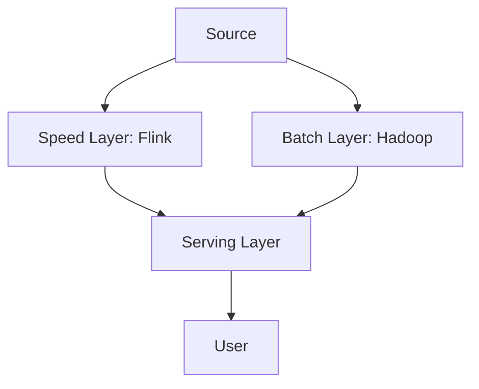
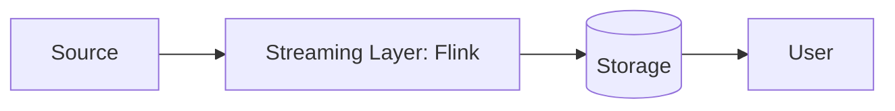

# 18. Design a Real-time Ad Click Aggregator

**Difficulty:** Hard
**Focus:** Streaming, Windowing, Exact-Once Processing, Lambda vs Kappa.

---

## 🎯 Real-World Analogy

**Think of Ad Click Aggregation like counting cars on a highway:**

**Batch Processing (Old Way):**
- Count all cars that passed today.
- Wait until midnight.
- Review video footage for 24 hours.
- Get result at 2 AM tomorrow.
- ❌ Too slow!

**Stream Processing (Modern Way):**
- Set up a camera.
- Count cars every minute in real-time.
- "10:00-10:01: 50 cars"
- "10:01-10:02: 45 cars"
- ✅ Instant insights!

**Handling Late Arrivals (Watermarks):**
- Car passes at 10:00:59.
- Camera processes image at 10:01:05 (6 seconds late).
- Do we count it in 10:00-10:01 window? Or discard?
- **Watermark:** "Wait 10 seconds for stragglers before finalizing count."

**Key Insight:** With 1M events/second, we can't store everything and batch process. We must process in real-time using windows (time buckets) and handle late data gracefully.

---

## 1. Requirements (0-5 Minutes)

**Functional:**
1.  **Input:** Stream of ad clicks (`ad_id`, `user_id`, `timestamp`, `country`).
2.  **Process:** Aggregate clicks per Ad ID per minute.
3.  **Output:** Dashboard showing "Ad X got 500 clicks at 10:00-10:01".
4.  **Deduplication:** Same click shouldn't be counted twice.

**Non-Functional:**
1.  **Volume:** 1 Million clicks/sec.
2.  **Latency:** Dashboard updates within 5 seconds of the minute ending.
3.  **Accuracy:** Cannot overcount (Billing involved!). Exactly-once semantics.

---

## 2. High-Level Design (5-15 Minutes)

    Flink --> Alert[Alert Service]
    Druid --> API[Query API]
    API --> Dashboard[Grafana/Custom UI]
```

**Components:**
1.  **Kafka:** Durable message queue. Retention: 7 days.
2.  **Flink:** Stream processor. Handles windowing and deduplication.
3.  **Druid/ClickHouse:** OLAP database optimized for time-series aggregations.
4.  **Dashboard:** Real-time visualization.

---

## 3. Deep Dive: Streaming Windows (15-25 Minutes)

## 3. Deep Dive: Streaming Windows (15-25 Minutes)

**Types of Windows:**

### 1. Tumbling Window (Fixed)
- **Concept:** Non-overlapping, contiguous buckets.
- **Example:** "Count clicks every minute."
- **Visual:**
  ```
  [10:00 --- 10:01) [10:01 --- 10:02) [10:02 --- 10:03)
  ```
- **Use Case:** Billing, Reporting.

### 2. Sliding Window
- **Concept:** Overlapping windows that "slide".
- **Example:** "Count clicks in the last 1 minute, updated every 10 seconds."
- **Visual:**
  ```
  [10:00:00 ----------- 10:01:00)
             [10:00:10 ----------- 10:01:10)
                        [10:00:20 ----------- 10:01:20)
  ```
- **Use Case:** Moving Averages, Anomaly Detection.

### 3. Session Window
- **Concept:** Dynamic size based on activity gaps.
- **Example:** "Group clicks until user is idle for 30 mins."
- **Visual:**
  ```
  [Click..Click.......Click]   <-- Gap -->   [Click..Click]
  |----- Session 1 --------|                 |-- Session 2 --|
  ```
- **Use Case:** User Behavior Analysis.

**Implementation (Flink Java API):**
```java
DataStream<Click> clicks = ...;

clicks
    .keyBy(click -> click.getAdId())
    .window(TumblingEventTimeWindows.of(Time.minutes(1)))
    .aggregate(new CountAggregator())
    .addSink(new DruidSink());
```

### 📚 Understanding Streaming Windows - Step-by-Step for Beginners

**Why Do We Need Windows?**

Imagine you're counting ad clicks:
- **Without Windows**: "Ad X got 1,000,000,000 clicks" (since the beginning of time)
  - Not useful! We need time-based insights.
  
- **With Windows**: "Ad X got 500 clicks between 10:00-10:01"
  - ✅ Actionable! We can detect trends, anomalies, bill advertisers.

**The Fundamental Problem:**

Streams are **infinite**. We can't wait until "the end" to count. We need to chop the stream into **finite chunks** (windows).

**Event Time vs Processing Time (CRITICAL CONCEPT):**

```
Event Time = When the click actually happened (user's phone timestamp)
Processing Time = When Flink received the event (server timestamp)
```

**Example:**
```
User clicks ad at:        10:00:30 (Event Time)
Network delay...
Flink receives event at:  10:00:35 (Processing Time)

Which timestamp do we use for windowing?
```

**Answer: Event Time!** (for billing accuracy)

If we used Processing Time:
- Network delays would shift events to wrong windows
- Advertisers get billed incorrectly
- Lawsuits! 💸

---

**Concrete Example: 10 Clicks Arriving**

Let's track 10 real clicks with their event times:

```
Click Events (Event Time):
1. 10:00:05 - User A clicks Ad #123
2. 10:00:15 - User B clicks Ad #123
3. 10:00:25 - User C clicks Ad #123
4. 10:00:45 - User D clicks Ad #123
5. 10:00:55 - User E clicks Ad #123
6. 10:01:10 - User F clicks Ad #123
7. 10:01:20 - User G clicks Ad #123
8. 10:01:50 - User H clicks Ad #123
9. 10:02:05 - User I clicks Ad #123
10. 10:02:30 - User J clicks Ad #123
```

Now let's see how different window types handle these:

---

### 1. Tumbling Window (1 minute)

**Configuration:**
```java
.window(TumblingEventTimeWindows.of(Time.minutes(1)))
```

**How it works:**
```
Window 1: [10:00:00 - 10:01:00)
Window 2: [10:01:00 - 10:02:00)
Window 3: [10:02:00 - 10:03:00)
```

**Bucketing our 10 clicks:**

```
Window 1 [10:00:00 - 10:01:00):
  - Click 1 (10:00:05) ✅
  - Click 2 (10:00:15) ✅
  - Click 3 (10:00:25) ✅
  - Click 4 (10:00:45) ✅
  - Click 5 (10:00:55) ✅
  Count: 5

Window 2 [10:01:00 - 10:02:00):
  - Click 6 (10:01:10) ✅
  - Click 7 (10:01:20) ✅
  - Click 8 (10:01:50) ✅
  Count: 3

Window 3 [10:02:00 - 10:03:00):
  - Click 9 (10:02:05) ✅
  - Click 10 (10:02:30) ✅
  Count: 2
```

**Output:**
```
{"ad_id": "123", "window_start": "10:00:00", "count": 5}
{"ad_id": "123", "window_start": "10:01:00", "count": 3}
{"ad_id": "123", "window_start": "10:02:00", "count": 2}
```

**Use Case:** Billing (charge advertiser for each minute)

---

### 2. Sliding Window (1 minute window, 30 second slide)

**Configuration:**
```java
.window(SlidingEventTimeWindows.of(Time.minutes(1), Time.seconds(30)))
```

**How it works:**
```
Window 1: [10:00:00 - 10:01:00)
Window 2: [10:00:30 - 10:01:30)  ← Overlaps with Window 1!
Window 3: [10:01:00 - 10:02:00)
Window 4: [10:01:30 - 10:02:30)
```

**Bucketing our 10 clicks:**

```
Window 1 [10:00:00 - 10:01:00):
  Clicks: 1, 2, 3, 4, 5
  Count: 5

Window 2 [10:00:30 - 10:01:30):
  Clicks: 4, 5, 6, 7  ← Click 4 & 5 appear AGAIN!
  Count: 4

Window 3 [10:01:00 - 10:02:00):
  Clicks: 6, 7, 8
  Count: 3

Window 4 [10:01:30 - 10:02:30):
  Clicks: 8, 9, 10
  Count: 3
```

**Key Insight:** Same click can appear in multiple windows!

**Output:**
```
{"ad_id": "123", "window": "10:00:00-10:01:00", "count": 5}
{"ad_id": "123", "window": "10:00:30-10:01:30", "count": 4}  ← Smoother!
{"ad_id": "123", "window": "10:01:00-10:02:00", "count": 3}
{"ad_id": "123", "window": "10:01:30-10:02:30", "count": 3}
```

**Use Case:** Moving averages, anomaly detection (smooth out spikes)

---

### 3. Session Window (30 second gap)

**Configuration:**
```java
.window(EventTimeSessionWindows.withGap(Time.seconds(30)))
```

**How it works:**
- Group clicks until there's a **30-second gap** of inactivity
- Dynamic window size!

**Bucketing our 10 clicks:**

```
Session 1:
  - Click 1 (10:00:05)
  - Click 2 (10:00:15) ← 10s gap (< 30s, continue)
  - Click 3 (10:00:25) ← 10s gap (< 30s, continue)
  - Click 4 (10:00:45) ← 20s gap (< 30s, continue)
  - Click 5 (10:00:55) ← 10s gap (< 30s, continue)
  - Click 6 (10:01:10) ← 15s gap (< 30s, continue)
  - Click 7 (10:01:20) ← 10s gap (< 30s, continue)
  - Click 8 (10:01:50) ← 30s gap (< 30s, continue)
  - Click 9 (10:02:05) ← 15s gap (< 30s, continue)
  - Click 10 (10:02:30) ← 25s gap (< 30s, continue)
  
  Next click at 10:03:10 ← 40s gap (> 30s, END SESSION!)
  
  Session 1: [10:00:05 - 10:02:30]
  Count: 10
```

**If there was a gap:**
```
Clicks: 1, 2, 3 ... (gap of 60 seconds) ... 4, 5, 6

Session 1: [10:00:05 - 10:00:25]  Count: 3
Session 2: [10:01:25 - 10:01:55]  Count: 3
```

**Use Case:** User behavior analysis (how long was the user active?)

---

**Visual Comparison:**

```
Timeline:  10:00:00    10:00:30    10:01:00    10:01:30    10:02:00
Clicks:    ●●●●●                   ●●●         ●●

Tumbling:  [─────────]             [─────────] [─────────]
           5 clicks                3 clicks    2 clicks

Sliding:   [─────────]
                [─────────]
                            [─────────]
                                    [─────────]
           
Session:   [─────────────────────────────────────────────]
           (all 10 clicks in one session - no 30s gap)
```

**When to Use Each:**

| Window Type | Use When | Example |
|-------------|----------|---------|
| **Tumbling** | Need non-overlapping buckets | Billing (charge per minute) |
| **Sliding** | Need smooth metrics | Moving average (clicks per minute, updated every 30s) |
| **Session** | Activity-based grouping | User session analysis (clicks until idle) |

**Common Mistake:**

❌ **Using Processing Time for billing:**
```java
.window(TumblingProcessingTimeWindows.of(Time.minutes(1)))
```

Problem:
```
User clicks at 10:00:59 (Event Time)
Network delay...
Flink receives at 10:01:02 (Processing Time)

Result: Click counted in 10:01-10:02 window (WRONG!)
Advertiser billed for wrong minute.
```

✅ **Always use Event Time for billing:**
```java
.window(TumblingEventTimeWindows.of(Time.minutes(1)))
```

---

## 4. Deep Dive: Handling Late Events (Watermarks) (25-35 Minutes)

**The Problem:**
*   Click happens at 10:00:59.
*   Network lag. Event arrives at Flink at 10:01:05.
*   Window [10:00-10:01) has already closed.
*   **What to do?**

**Solution: Watermarks**

**Concept:** A watermark is a timestamp that says "I have seen all events up to time T".

**Example:**
*   Watermark = 10:01:00 means "All events before 10:01:00 have arrived".
*   Flink waits for watermark before closing the window.

**Configuration:**
```java
WatermarkStrategy
    .forBoundedOutOfOrderness(Duration.ofSeconds(10))
```
*   This says: "Wait 10 seconds for late events before closing the window."

**Trade-off:**
*   **High delay (30s):** More accurate (catches more late events).
*   **Low delay (5s):** Faster results, but might miss late events.

### 📚 Understanding Watermarks - Step-by-Step for Beginners

**The Late Event Problem:**

Imagine this scenario:

```
Window: [10:00:00 - 10:01:00)

Events arriving at Flink:
10:00:05 → Click at 10:00:05 (on time) ✅
10:00:15 → Click at 10:00:15 (on time) ✅
10:00:25 → Click at 10:00:25 (on time) ✅
10:01:02 → Click at 10:00:55 (late by 7 seconds!) ⏰
```

**The Question:**
Should we count the late click (10:00:55) in the 10:00-10:01 window?

**If we close window at 10:01:00:**
- ❌ We miss the late click
- Advertiser underbilled
- Inaccurate metrics

**If we wait forever:**
- ❌ We never get results
- Dashboard shows "Loading..." forever
- Useless!

**Solution: Watermarks** = "Smart waiting"

---

**What is a Watermark?**

A watermark is a timestamp that says:
> "I have processed all events up to time T"

**Example:**
```
Watermark = 10:01:00
Meaning: "All events with event_time < 10:01:00 have arrived"
Action: Close window [10:00:00 - 10:01:00)
```

**How Flink Generates Watermarks:**

**Configuration:**
```java
WatermarkStrategy.forBoundedOutOfOrderness(Duration.ofSeconds(10))
```

This means: "Wait 10 seconds after the latest event before closing windows"

**Step-by-Step Example:**

Let's track events and watermarks:

```
Current Time: 10:00:00
Watermark: -∞ (no events yet)
```

**Event 1 arrives:**
```
Event Time: 10:00:05
Processing Time: 10:00:05
Latest Event Seen: 10:00:05
Watermark: 10:00:05 - 10s = 09:59:55
```

**Event 2 arrives:**
```
Event Time: 10:00:15
Processing Time: 10:00:15
Latest Event Seen: 10:00:15
Watermark: 10:00:15 - 10s = 10:00:05
```

**Event 3 arrives:**
```
Event Time: 10:00:55
Processing Time: 10:00:56
Latest Event Seen: 10:00:55
Watermark: 10:00:55 - 10s = 10:00:45
```

**Event 4 arrives (LATE!):**
```
Event Time: 10:00:30 (old!)
Processing Time: 10:01:05
Latest Event Seen: Still 10:00:55 (we ignore late events for watermark)
Watermark: Still 10:00:45
```

**Event 5 arrives:**
```
Event Time: 10:01:05
Processing Time: 10:01:06
Latest Event Seen: 10:01:05
Watermark: 10:01:05 - 10s = 10:00:55
```

**Window Closes!**
```
Watermark reached 10:00:55
Window [10:00:00 - 10:01:00) can now close
Flink emits: {"window": "10:00-10:01", "count": 4}
```

---

**Visual Timeline:**

```
Event Time:  10:00:00    10:00:30    10:01:00    10:01:30
             |           |           |           |
Events:      ●           ●           ●           
             10:00:05    10:00:55    10:01:05
                            ↑
                            Late event (10:00:30)
                            arrives here

Watermark:   ─────────────────────────────────────►
             09:59:55    10:00:45    10:00:55
                                     ↑
                                     Window closes here!

Window:      [──────────────────────)
             10:00:00              10:01:00
```

---

**Allowed Lateness (Extra Safety Net):**

Even after watermark closes a window, we can allow **very late** events:

```java
.window(TumblingEventTimeWindows.of(Time.minutes(1)))
.allowedLateness(Time.seconds(30))
```

**What happens:**

```
Time: 10:01:00 - Watermark closes window [10:00-10:01)
Output: {"count": 5}

Time: 10:01:15 - VERY late event arrives (event_time = 10:00:45)
Within allowed lateness (30s)? YES! (15s < 30s)
Action: Reopen window, add event, re-emit
Output: {"count": 6} (updated!)

Time: 10:01:35 - EXTREMELY late event arrives (event_time = 10:00:50)
Within allowed lateness? NO! (35s > 30s)
Action: Drop event ❌
```

---

**Choosing Watermark Delay:**

**Scenario 1: Real-time Dashboard (Low Latency)**
```java
WatermarkStrategy.forBoundedOutOfOrderness(Duration.ofSeconds(5))
```

**Result:**
- Windows close 5 seconds after latest event
- Fast results (5s delay)
- Might miss events delayed > 5s
- **Use when:** Speed > Accuracy (e.g., live dashboard)

**Scenario 2: Billing System (High Accuracy)**
```java
WatermarkStrategy.forBoundedOutOfOrderness(Duration.ofSeconds(60))
```

**Result:**
- Windows close 60 seconds after latest event
- Slow results (60s delay)
- Catches most late events
- **Use when:** Accuracy > Speed (e.g., billing)

**Scenario 3: Hybrid (Recommended)**
```java
WatermarkStrategy.forBoundedOutOfOrderness(Duration.ofSeconds(10))
    .withIdleness(Duration.ofMinutes(1))
```

**Result:**
- 10s watermark delay (balanced)
- If no events for 1 minute, advance watermark anyway
- **Use when:** Most production systems

---

**Monitoring Late Events:**

**Metric to track:**
```java
.sideOutputLateData(lateDataTag)
```

**Example output:**
```
Window [10:00-10:01):
  - On-time events: 950
  - Late events (within watermark): 45
  - Dropped events (too late): 5
  
Lateness percentiles:
  - p50: 2 seconds
  - p95: 8 seconds
  - p99: 15 seconds ← Tune watermark based on this!
```

**If p99 = 15 seconds:**
- Set watermark delay to 20 seconds (p99 + buffer)
- Catches 99% of events
- Only 1% dropped

---

**Common Mistakes:**

❌ **Mistake 1: No watermark strategy**
```java
// Missing watermark!
stream.window(TumblingEventTimeWindows.of(Time.minutes(1)))
```
Result: Windows never close. No output!

❌ **Mistake 2: Too aggressive watermark**
```java
WatermarkStrategy.forBoundedOutOfOrderness(Duration.ofMillis(100))
```
Result: 50% of events are "late". Inaccurate counts.

❌ **Mistake 3: Using processing time**
```java
WatermarkStrategy.forMonotonousTimestamps()  // Assumes no lateness
```
Result: Any network delay = dropped events.

✅ **Correct Approach:**
```java
WatermarkStrategy
    .<Click>forBoundedOutOfOrderness(Duration.ofSeconds(10))
    .withTimestampAssigner((event, timestamp) -> event.getEventTime())
    .withIdleness(Duration.ofMinutes(1));
```

---

**Practice Question:**

**Q: Event arrives at 10:05:00 with event_time = 10:00:00. Watermark delay = 10s. Will it be processed?**

**A: Depends on current watermark!**

```
If latest event seen was 10:04:50:
  Watermark = 10:04:50 - 10s = 10:04:40
  Event (10:00:00) < Watermark (10:04:40)? YES!
  Result: TOO LATE! Dropped ❌

If latest event seen was 10:00:05:
  Watermark = 10:00:05 - 10s = 09:59:55
  Event (10:00:00) < Watermark (09:59:55)? NO!
  Result: On time! Processed ✅
```

**Key Insight:** Watermark is based on **latest event seen**, not current time!

---

## 5. Deep Dive: Exactly-Once Processing (35-40 Minutes)

## 5. Deep Dive: Exactly-Once Processing (35-40 Minutes)

**The Problem:**
- Flink reads 1000 events.
- Flink processes them.
- Flink crashes BEFORE writing to DB.
- Flink restarts, re-reads the same 1000 events.
- **Result:** Double Counting! 💸

**Solution: Idempotent Updates (Upserts)**

Instead of `INSERT INTO stats (count) VALUES (1)`, we use:

```sql
INSERT INTO stats (window_start, ad_id, count)
VALUES ('10:00', 'ad_123', 50)
ON CONFLICT (window_start, ad_id) 
DO UPDATE SET count = 50;
```

**How Flink does it (Checkpointing):**
1.  **Barrier:** Flink injects a "Barrier" into the stream.
2.  **Snapshot:** When operators see the barrier, they save their state (e.g., "Current Count = 45") to S3.
3.  **Commit:** Once all operators save state, the checkpoint is marked "Complete".
4.  **Crash?** Restore from last S3 snapshot. Replay only events *after* the barrier.

### 💻 Python Logic (Idempotency)

```python
def process_batch(batch_id, clicks):
    # 1. Check if batch already processed
    if redis.get(f"batch_processed:{batch_id}"):
        return # Skip!
        
    # 2. Aggregate
    counts = aggregate(clicks)
    
    # 3. Write to DB (Atomic Transaction)
    with db.transaction():
        save_counts(counts)
        redis.set(f"batch_processed:{batch_id}", 1)
```

### ☕ Java Implementation

```java
import redis.clients.jedis.Jedis;
import org.springframework.transaction.annotation.Transactional;
import java.util.*;

public class AdAggregator {
    private final Jedis redis;
    
    public AdAggregator(Jedis redis) {
        this.redis = redis;
    }
    
    @Transactional
    public void processBatch(String batchId, List<Click> clicks) {
        // 1. Check if batch already processed (Idempotency)
        String processedKey = "batch_processed:" + batchId;
        
        if (redis.get(processedKey) != null) {
            System.out.println("Batch " + batchId + " already processed. Skipping!");
            return; // Skip!
        }
        
        // 2. Aggregate clicks
        Map<String, Integer> counts = aggregate(clicks);
        
        // 3. Write to DB (Atomic Transaction)
        try {
            saveCounts(counts);
            
            // Mark batch as processed
            redis.set(processedKey, "1");
            redis.expire(processedKey, 86400); // 24h TTL
            
            System.out.println("Batch " + batchId + " processed successfully");
            
        } catch (Exception e) {
            System.err.println("Failed to process batch: " + e.getMessage());
            throw e; // Rollback transaction
        }
    }
    
    private Map<String, Integer> aggregate(List<Click> clicks) {
        Map<String, Integer> counts = new HashMap<>();
        
        for (Click click : clicks) {
            String key = click.adId + ":" + click.date;
            counts.put(key, counts.getOrDefault(key, 0) + 1);
        }
        
        return counts;
    }
    
    private void saveCounts(Map<String, Integer> counts) {
        // Save to database
        // db.batchInsert("ad_clicks", counts);
    }
    
    static class Click {
        String adId;
        String date;
        String userId;
    }
}
```

### 📚 Understanding Exactly-Once Processing - Step-by-Step for Beginners

**The Double Counting Problem:**

Imagine this disaster scenario:

```
Flink reads 1000 clicks from Kafka
Flink counts: Ad #123 = 500 clicks
Flink writes to database...
💥 CRASH! (before write completes)

Flink restarts
Flink reads the SAME 1000 clicks again
Flink counts: Ad #123 = 500 clicks
Flink writes to database

Database now shows: Ad #123 = 1000 clicks (WRONG! Should be 500)
Advertiser gets billed 2x! 💸
```

**Why This Happens:**

```
Processing Guarantees:

1. At-Most-Once:
   - Read message
   - Process it
   - If crash → message lost ❌
   - Example: Logs (okay to lose some)

2. At-Least-Once:
   - Read message
   - Process it
   - Acknowledge after processing
   - If crash before ack → reprocess ❌
   - Example: Most systems (duplicates possible)

3. Exactly-Once:
   - Read message
   - Process it
   - Write output
   - All 3 steps are ATOMIC ✅
   - Example: Billing (MUST be exact)
```

**How Flink Achieves Exactly-Once:**

Two mechanisms:
1. **Checkpointing** (Flink's state snapshots)
2. **Idempotency** (Application-level deduplication)

---

**Mechanism 1: Flink Checkpointing**

**What is a Checkpoint?**

A checkpoint is a **snapshot** of:
- Kafka offset (which messages we've read)
- Operator state (current counts)
- Window state (which windows are open)

**Step-by-Step Example:**

**Initial State (10:00:00):**
```
Kafka Offset: 1000
Flink State:
  - Ad #123: 450 clicks
  - Ad #456: 300 clicks
  - Window [10:00-10:01): 50 clicks
```

**Step 1: Checkpoint Barrier Injection (10:00:10)**

Flink injects a special "barrier" message into the stream:

```
Kafka Stream:
... [Click 998] [Click 999] [Click 1000] [BARRIER-5] [Click 1001] [Click 1002] ...
                                          ↑
                                    Checkpoint #5
```

**Step 2: Operators Save State**

When each operator sees the barrier, it saves its state:

```
Operator 1 (Parser):
  Sees BARRIER-5
  Saves: "Last processed offset = 1000"
  
Operator 2 (Counter):
  Sees BARRIER-5
  Saves: "Ad #123 = 450 clicks, Ad #456 = 300 clicks"
  
Operator 3 (Windower):
  Sees BARRIER-5
  Saves: "Window [10:00-10:01) = 50 clicks"
```

**Step 3: Checkpoint Completed**

All operators saved state → Checkpoint #5 is marked "Complete"

```
S3 Checkpoint Storage:
checkpoint-5/
  ├── operator-1-state (offset = 1000)
  ├── operator-2-state (counts)
  └── operator-3-state (windows)
```

**Step 4: Processing Continues**

```
Flink processes clicks 1001, 1002, 1003...
Ad #123 count increases: 450 → 455 → 460...
```

**Step 5: CRASH! (10:00:15)**

```
💥 Flink crashes!
Current state lost:
  - Ad #123 = 460 clicks (in memory, LOST!)
  - Kafka offset = 1050 (in memory, LOST!)
```

**Step 6: Recovery from Checkpoint**

```
Flink restarts
Flink loads Checkpoint #5 from S3:
  - Kafka offset = 1000 ✅
  - Ad #123 = 450 clicks ✅
  - Window state restored ✅

Flink resumes from offset 1001
Flink reprocesses clicks 1001-1050
Ad #123 count: 450 → 455 → 460 (same as before!)
```

**Result: Exactly-Once!** ✅

---

**Visual Timeline:**

```
Time:     10:00:00    10:00:10         10:00:15    10:00:20
          |           |                |           |
Events:   ●●●●●●●●●●  BARRIER-5        💥 CRASH    ●●●●●●
          1-1000      ↓                            1001-1050
                      Save State                   (reprocessed)

State:    Count=450   Count=450        Count=460   Count=460
                      (saved to S3)    (lost)      (recomputed)

Kafka:    Offset=1000 Offset=1000      Offset=1050 Offset=1000
                      (saved)          (lost)      (restored)
```

---

**Mechanism 2: Idempotency (Application-Level)**

Even with checkpointing, we need idempotency for database writes.

**The Problem:**

```
Flink processes batch #5
Flink writes to database: Ad #123 = 500 clicks
💥 Flink crashes AFTER writing but BEFORE checkpointing

Flink restarts from Checkpoint #4
Flink reprocesses batch #5
Flink writes to database AGAIN: Ad #123 = 500 clicks

Database: 500 + 500 = 1000 clicks (WRONG!)
```

**Solution: Idempotent Writes**

**Approach 1: Upsert (Database-Level)**

```sql
-- Instead of INSERT (adds duplicate)
INSERT INTO ad_clicks (window, ad_id, count) VALUES ('10:00', '123', 500);

-- Use UPSERT (replaces duplicate)
INSERT INTO ad_clicks (window, ad_id, count) 
VALUES ('10:00', '123', 500)
ON CONFLICT (window, ad_id) 
DO UPDATE SET count = 500;
```

**Result:**
```
First write:  count = 500
Second write: count = 500 (overwrites, not adds!)
✅ Idempotent!
```

**Approach 2: Deduplication Key (Application-Level)**

```python
def process_batch(batch_id, clicks):
    # 1. Check if already processed
    if redis.get(f"batch:{batch_id}:processed"):
        print("Already processed, skipping!")
        return
    
    # 2. Process
    counts = aggregate(clicks)
    
    # 3. Write atomically
    with db.transaction():
        save_counts(counts)
        redis.set(f"batch:{batch_id}:processed", "1", ex=86400)  # 24h TTL
```

**Step-by-Step:**

```
Attempt 1:
  batch_id = "batch-5"
  redis.get("batch:batch-5:processed") → None
  Process clicks → Ad #123 = 500
  Save to DB
  redis.set("batch:batch-5:processed", "1") ✅

Attempt 2 (after crash):
  batch_id = "batch-5"
  redis.get("batch:batch-5:processed") → "1" ✅
  Skip processing! (already done)
```

---

**Combining Both Mechanisms:**

```
Flink Checkpointing:
  - Handles Flink crashes
  - Restores Kafka offsets
  - Restores operator state

Application Idempotency:
  - Handles database write failures
  - Prevents duplicate writes
  - Safe even if checkpoint fails
```

**Complete Flow:**

```
1. Flink reads clicks 1-1000 from Kafka
2. Flink aggregates: Ad #123 = 500 clicks
3. Flink injects Checkpoint Barrier
4. Flink saves state to S3 (offset=1000, counts)
5. Flink writes to DB with idempotency key
6. Database checks: "batch-5 already processed?" → No
7. Database writes: Ad #123 = 500 clicks
8. Database marks: batch-5 = processed
9. Checkpoint #5 complete ✅

If crash at step 6:
  - Flink restarts from Checkpoint #5
  - Reprocesses clicks 1-1000
  - Tries to write to DB
  - Database checks: "batch-5 already processed?" → Yes!
  - Database skips write
  - No duplicate! ✅
```

---

**Configuration:**

```java
StreamExecutionEnvironment env = StreamExecutionEnvironment.getExecutionEnvironment();

// Enable checkpointing every 60 seconds
env.enableCheckpointing(60000);

// Exactly-once mode
env.getCheckpointConfig().setCheckpointingMode(CheckpointingMode.EXACTLY_ONCE);

// Checkpoint storage (S3)
env.getCheckpointConfig().setCheckpointStorage("s3://my-bucket/checkpoints");

// Keep last 3 checkpoints
env.getCheckpointConfig().setMaxConcurrentCheckpoints(1);
env.getCheckpointConfig().setMinPauseBetweenCheckpoints(30000);
```

---

**Common Mistakes:**

❌ **Mistake 1: No checkpointing**
```java
// Checkpointing disabled!
env.enableCheckpointing(0);
```
Result: Crash = start from beginning. No exactly-once.

❌ **Mistake 2: Non-idempotent writes**
```sql
UPDATE ad_clicks SET count = count + 500;  -- Adds every time!
```
Result: Duplicate writes = double counting.

❌ **Mistake 3: No deduplication key**
```python
# No batch ID check!
save_counts(counts)
```
Result: Same batch processed twice.

✅ **Correct Approach:**
```java
env.enableCheckpointing(60000);
env.getCheckpointConfig().setCheckpointingMode(CheckpointingMode.EXACTLY_ONCE);

// + Idempotent writes in application code
```

---

**Practice Question:**

**Q: Flink processes batch #10 (1000 clicks). Writes to DB. Crashes before checkpoint. What happens?**

**A: Depends on idempotency!**

**Without Idempotency:**
```
1. Process batch #10 → 1000 clicks
2. Write to DB → Total = 1000
3. Crash (before checkpoint)
4. Restart from Checkpoint #9
5. Reprocess batch #10 → 1000 clicks
6. Write to DB → Total = 2000 ❌ WRONG!
```

**With Idempotency:**
```
1. Process batch #10 → 1000 clicks
2. Write to DB with key "batch-10" → Total = 1000
3. Mark "batch-10" as processed
4. Crash (before checkpoint)
5. Restart from Checkpoint #9
6. Reprocess batch #10 → 1000 clicks
7. Check: "batch-10 processed?" → YES!
8. Skip write → Total = 1000 ✅ CORRECT!
```

**Key Insight:** Exactly-once = Checkpointing + Idempotency!

---

## 6. Deep Dive: Lambda vs Kappa Architecture (40-45 Minutes)

## 6. Deep Dive: Lambda vs Kappa Architecture (40-45 Minutes)

### Lambda Architecture (Old School)
**Philosophy:** "Stream processing is unreliable. We need a batch layer to fix mistakes."



- **Speed Layer:** Fast, approximate results (Real-time).
- **Batch Layer:** Slow, accurate results (Nightly).
- **Serving Layer:** Merges the two.
- **Cons:** Two codebases (Java for Flink, Python for Spark). Hard to maintain.

### Kappa Architecture (Modern)
**Philosophy:** "Stream processing is reliable enough. Everything is a stream."



- **Single Layer:** Only Flink.
- **Reprocessing:** If code changes, just replay the Kafka topic from the beginning (with a new consumer group).
- **Pros:** One codebase. Simpler.
- **Cons:** Replaying 1 year of data from Kafka takes time.

**Verdict:** Use **Kappa** unless you have legacy Hadoop constraints.

---

## 7. Deep Dive: Data Sketching (HyperLogLog) (45-47 Minutes)

**Problem:**
- "Count unique users per ad."
- Storing `Set<UserId>` for 1M users = 100MB RAM per ad.
- 1000 ads = 100GB RAM. Too expensive!

**Solution: HyperLogLog (HLL)**
- Probabilistic Data Structure.
- Counts unique items with 0.81% error.
- Uses only **12KB** of memory (regardless of count!).
- **How:** Hashes user IDs and counts leading zeros.

---

---

## 8. Real-World Engineering Case Studies (Deep Dive)

### 1. Facebook Ads: Scuba (Real-Time Analytics)

**Source:** Facebook Engineering Blog - "Scuba: Diving into Data at Facebook"

**The Challenge:**
Facebook Ads serves 6M advertisers with real-time campaign analytics.
- **Problem:** Advertisers need to see click/impression counts within seconds.
- **Requirement:** Query arbitrary time ranges and dimensions (country, age, device).

**The Solution: In-Memory Columnar Store + Streaming Aggregation**

**Architecture:**
1.  **Scuba (In-Memory OLAP):**
    - Facebook built Scuba, an in-memory time-series database.
    - Stores last 24-48 hours of data in RAM.
    - **Columnar Storage:** Each dimension (country, age) is a separate column.
    - **Compression:** Uses dictionary encoding and run-length encoding.
2.  **Streaming Ingestion (Scribe → Puma):**
    - Ad clicks flow through Scribe (Facebook's logging system).
    - **Puma** (stream processor) aggregates in real-time.
    - Writes to Scuba every second.
3.  **Query Engine:**
    - Advertisers query: "Show me clicks for Campaign X in last hour, grouped by country"
    - Scuba scans in-memory columns and aggregates in <100ms.
    - **Parallelization:** Queries distributed across 100+ Scuba nodes.
4.  **Historical Data (Hive):**
    - Data older than 48 hours moved to Hive (Hadoop).
    - Queries spanning weeks hit both Scuba (recent) and Hive (historical).

**Key Insight:**
Facebook uses **in-memory storage** for recent data (Scuba) and **batch storage** for historical data (Hive), optimizing for both real-time and historical queries.

---

### 2. Google Analytics: Dataflow + BigQuery

**Source:** Google Cloud Blog

**The Challenge:**
Google Analytics tracks billions of page views daily.
- **Problem:** How to provide real-time dashboards while also supporting complex historical queries?

**The Solution: Kappa Architecture (Dataflow + BigQuery)**

**Architecture:**
1.  **Dataflow (Apache Beam):**
    - Google's managed stream processing service.
    - Processes events in real-time using **windowing**.
    - **Tumbling Windows:** 1-minute buckets.
    - **Session Windows:** Group events by user session (30-minute inactivity timeout).
2.  **Exactly-Once Semantics:**
    - Dataflow uses **checkpointing** to ensure exactly-once processing.
    - If a worker crashes, it replays from the last checkpoint.
    - **Deduplication:** Uses Bloom filters to detect duplicate events.
3.  **BigQuery (Storage):**
    - Aggregated data written to BigQuery.
    - **Partitioning:** Tables partitioned by date (`events_20240115`).
    - **Clustering:** Clustered by `user_id` for fast user-level queries.
4.  **Real-Time API:**
    - For dashboards, Dataflow also writes to **Bigtable** (NoSQL).
    - Bigtable serves low-latency queries (<10ms).
    - **TTL:** Data expires after 48 hours (moved to BigQuery).

**Key Insight:**
Google uses **Kappa Architecture** (stream-only), processing all data through Dataflow and writing to both Bigtable (real-time) and BigQuery (historical).

---

### 3. Twitter: Heron (Distributed Stream Processing)

**Source:** Twitter Engineering Blog - "Flying Faster with Twitter Heron"

**The Challenge:**
Twitter's ad platform processes 400M tweets/day for ad targeting.
- **Problem:** Apache Storm (original system) had unpredictable latency.

**The Solution: Heron (Storm Replacement)**

**Architecture:**
1.  **Heron Topology:**
    - Similar to Storm, but with better resource isolation.
    - Each component (spout, bolt) runs in its own JVM process.
    - **Benefit:** One slow bolt doesn't block others.
2.  **Backpressure:**
    - If downstream bolt is slow, upstream spout automatically slows down.
    - **Prevents:** Memory overflow and data loss.
3.  **Metrics (InfluxDB):**
    - Heron emits metrics every second: throughput, latency, backpressure.
    - Stored in InfluxDB for monitoring.
4.  **Deployment (Aurora/Mesos):**
    - Heron runs on Apache Aurora (scheduler on top of Mesos).
    - **Auto-scaling:** Adds workers during traffic spikes.

**Key Insight:**
Twitter replaced Storm with **Heron** for better resource isolation and predictable performance, critical for ad revenue optimization.

---

**Key Insight:**
Twitter replaced Storm with **Heron** for better resource isolation and predictable performance, critical for ad revenue optimization.

---

## 9. Failure Scenarios & Disaster Recovery

### Scenario 1: Flink Job Failure (State Loss)
**Impact:** Aggregations for the current window are lost; double counting or undercounting occurs.
**Detection:** `flink_job_status` != 'RUNNING'.

**Mitigation:**
- **Checkpointing:** Enable Flink's incremental checkpointing to S3 every 1 minute.
- **Savepoints:** Before any deployment, trigger a savepoint to allow rolling back to a known good state.

### Scenario 2: Kafka Partition Skew
**Impact:** One Flink worker is overwhelmed while others are idle, causing ingestion lag.
**Detection:** `kafka_consumer_lag` per partition shows high variance.

**Mitigation:**
- **Key-by Ad ID:** Ensure the Kafka partition key is `ad_id` to distribute load evenly.
- **Rebalancing:** Periodically monitor partition distribution and increase partition count if necessary.

### Scenario 3: Click Fraud (Bot Attack)
**Impact:** Advertisers are overcharged; system resources are wasted.
**Detection:** `click_to_impression_ratio` > 50% for a specific IP.

**Mitigation:**
- **Real-time Filtering:** Use a Flink bolt to filter out clicks from known bot IPs or those exceeding a threshold (e.g., 100 clicks/min).
- **Deduplication:** Use a Bloom Filter in Redis to drop duplicate clicks within a 1-minute window.

---

## 10. Monitoring & Observability

### Golden Signals Dashboard

**1. Latency**
- **E2E Processing:** P95 < 5s (Click -> Dashboard).
- **Metric:** `ad_click_processing_latency_seconds`.

**2. Traffic**
- **Throughput:** Clicks per second (CPS).
- **Metric:** `ad_clicks_total`.

**3. Errors**
- **Metric:** `malformed_event_rate`.
- **Target:** < 0.01%.

**4. Saturation**
- **Metric:** Kafka consumer lag, Flink TaskManager CPU/Heap.

### Alert Rules
```yaml
alerts:
  - alert: HighIngestionLag
    expr: sum(kafka_consumer_lag{group="ad-aggregator"}) > 1000000
    for: 5m
    labels:
      severity: critical
```

---

## 11. API Design & Versioning

### Analytics API

**Get Ad Performance**
```http
GET /api/v1/ads/{ad_id}/stats?window=1h&metrics=clicks,impressions,ctr
```

**Get Top Ads**
```http
GET /api/v1/analytics/top-ads?limit=10
```

### Versioning
- Use `/v1/`, `/v2/` in URL.
- **Event Schema Versioning:** Use Avro with a Schema Registry to allow evolving the click event schema without breaking the Flink job.

---

## 12. Cost Analysis & Optimization

### Monthly Infrastructure Costs (at 1B clicks/day)

**1. Ingestion (Kafka/MSK)**
- 50 nodes = **$10,000/month**.

**2. Processing (Flink/EMR)**
- 100 nodes = **$15,000/month**.

**3. Storage (Cassandra + S3)**
- 50 TB Cassandra + 500 TB S3 = **$15,000/month**.

**Total:** ~$40,000/month.

### Optimization Opportunities
- **HyperLogLog:** Use HLL for unique user counts to save 90% memory in Flink state.
- **S3 Lifecycle:** Move raw click logs to S3 Glacier after 30 days to save 80% storage cost.

---

## 13. Security & Compliance

### Security Measures
- **Ingestion Security:** Use HMAC signatures for click events to prevent spoofing.
- **Network Isolation:** Run Flink and Kafka in a private VPC with no public internet access.

### Compliance
- **GDPR/CCPA:** Ensure that `user_id` is hashed or anonymized before being stored in the aggregation database.
- **Audit Logging:** Track all changes to ad budgets and targeting rules.

---

## 14. Testing Strategies

### Unit Tests
- Test Flink window functions with mock data.
- Test HyperLogLog accuracy for unique counts.

### Integration Tests
- Push 1,000 clicks to Kafka and verify the count in Cassandra matches after 10 seconds.

### Load Testing
- Simulate 1M clicks/sec.
- **Tool:** `Gatling` with Kafka producer plugin.

---

## 15. Migration & Rollout Strategies

### Rollout
- **Blue-Green Deployment:** Run the new Flink job alongside the old one and compare the output in a "Shadow" database.

### Migration
- **State Migration:** Use Flink's State Processor API to migrate state from an old job version to a new one without losing window data.

---

## 16. Performance Optimization

### Ingestion Optimization
- **Batching:** Use Kafka's `linger.ms` to batch small click events into larger network packets.
- **Compression:** Use `zstd` compression for Kafka topics to save 50% bandwidth.

### Query Optimization
- **Pre-aggregation:** Always query the pre-aggregated Cassandra tables rather than the raw S3 logs for dashboarding.

---

## 17. Capacity Planning

### Scaling Triggers
- **Kafka Lag:** Scale out Flink TaskManagers if consumer lag grows for more than 5 minutes.
- **Cassandra Write Latency:** Add Cassandra nodes if P99 write latency exceeds 10ms.

### Throughput Projection
- 1B clicks/day ≈ 12,000 CPS (average).
- Peak could be 100,000+ CPS. Requires ~100 Kafka partitions and 50 Flink workers.

---

## 18. Interview Cheat Sheet

### Key Numbers
- **Latency:** < 5s (E2E).
- **Scale:** 1B+ events/day.
- **Storage:** HLL uses 12KB per ad for unique counts.

### Core Components
1. **Kafka:** Distributed event log.
2. **Flink:** Stream processing engine.
3. **Cassandra:** Real-time query store.
4. **S3:** Long-term historical store.

### Critical Trade-offs
- **Exactly-once vs At-least-once:** Exactly-once is expensive (checkpoints) but necessary for billing.
- **Lambda vs Kappa:** Kappa (Stream only) is simpler to maintain; Lambda (Batch + Stream) is better for complex historical re-processing.

---

## 19. Wrap-up (Deep Dive)

**Summary:**
"I designed a real-time Ad Click Aggregator using **Kappa Architecture** with Kafka and Flink.
1.  **Streaming:** I used **Tumbling Windows** for aggregation and **Watermarks** to handle late events gracefully.
2.  **Exactly-Once:** I combined **Flink's checkpointing** with application-level deduplication using a state store (RocksDB).
3.  **Storage:** I wrote aggregated data to **Cassandra** for real-time queries and **S3** for historical analytics.
4.  **Real-World:** I incorporated **Facebook's Scuba** in-memory approach, **Google's Dataflow + BigQuery** Kappa architecture, and **Twitter's Heron** for distributed stream processing.
5.  **Production Readiness:** I addressed failure modes like state loss, optimized costs via HyperLogLog, and ensured security through click fraud detection and VPC isolation."

---

---
