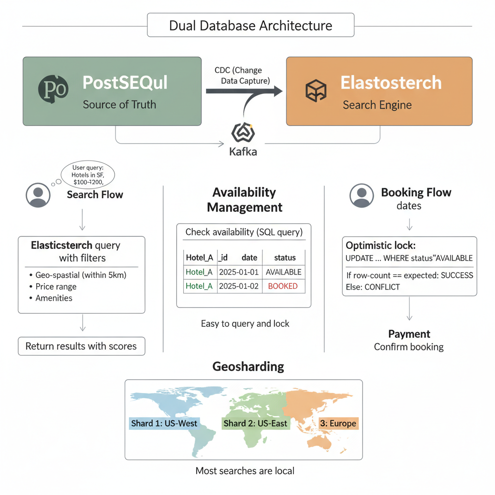
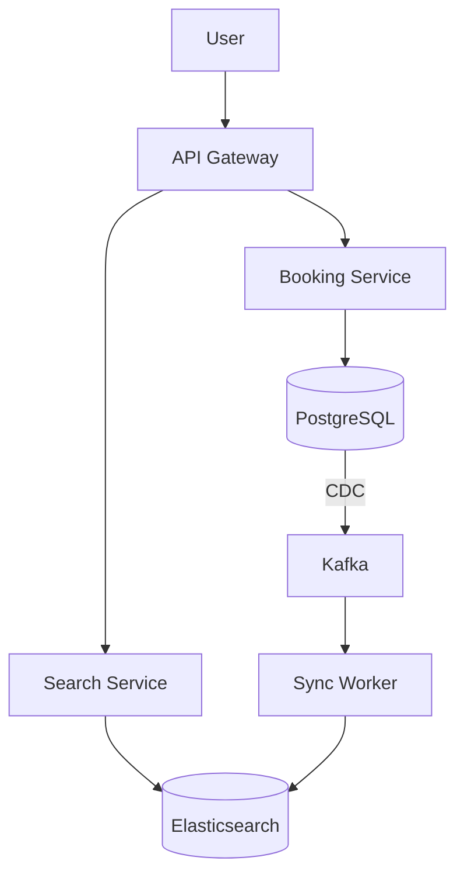

# 19. Design a Hotel Booking System (Airbnb)

**Difficulty:** Hard
**Focus:** Search (Elasticsearch), Availability Consistency, Geosharding.

---

## 🎯 Real-World Analogy

**Think of Hotel Booking like a library catalog system:**

**Single Database (SQL only - Bad):**
- You want to find: "Books about cooking, published after 2020, with 4+ stars, near me"
- Librarian searches through EVERY book manually.
- Takes 10 minutes.
- ❌ Too slow!

**Dual Database (SQL + Elasticsearch - Good):**
- **Card Catalog (Elasticsearch):** Fast search by topic, author, year, location.
- **Checkout Desk (PostgreSQL):** Handles actual borrowing (transactions, locking).
- You search the catalog (fast!).
- You check out at the desk (accurate!).
- ✅ Best of both worlds!

**Key Insight:** Search needs speed and flexibility (Elasticsearch). Booking needs ACID guarantees (PostgreSQL). We use both and sync them.

---

## 1. Requirements (0-5 Minutes)

**Functional:**
1.  **Host:** Add property with photos, amenities, pricing.
2.  **Guest:** Search (City, Date Range, Price, Amenities).
3.  **Book:** Reserve dates.
4.  **Review:** Leave ratings.

**Non-Functional:**
1.  **Search Latency:** < 500ms.
2.  **Booking Consistency:** No double bookings.
3.  **Scale:** 100M listings, 1M searches/day.

---

## 2. High-Level Design (5-15 Minutes)



**Components:**



**Why Two Databases?**
*   **PostgreSQL:** For bookings (ACID, transactions).
*   **Elasticsearch:** For complex search (full-text, geo, filters). SQL is too slow.

### 📚 Understanding CQRS - The Librarian Analogy

**Why do we need two databases?**

**1. The Card Catalog (Elasticsearch)**
- **Goal:** Speed & Discovery.
- **Analogy:** The index cards in the library lobby.
- **Pros:** Fast to search ("Books about cooking").
- **Cons:** Might be slightly outdated (if a book was borrowed 1 second ago).
- **Use Case:** Searching for hotels.

**2. The Checkout Desk (PostgreSQL)**
- **Goal:** Accuracy & Consistency.
- **Analogy:** The librarian's official ledger.
- **Pros:** 100% accurate. Prevents two people borrowing the same book.
- **Cons:** Slow to search ("Show me all red books").
- **Use Case:** Booking the hotel.

**The Flow:**
1. You find a book in the **Catalog** (Elasticsearch).
2. You walk to the **Desk** (PostgreSQL).
3. Librarian checks the **Ledger**.
4. If free -> You get it.
5. If taken -> "Sorry, the catalog was slightly out of date."

This separation allows us to have **Lightning Fast Search** AND **Rock Solid Bookings**.

---

---

## 3. Deep Dive: Search & Indexing (15-25 Minutes)

**Search Requirements:**
*   "Hotels in San Francisco"
*   "Price between $100-$200"
*   "Has Wifi and Pool"
*   "Within 5km of Golden Gate Bridge"

**Elasticsearch Index Structure:**
```json
{
  "property_id": "123",
  "title": "Cozy Apartment in SF",
  "city": "San Francisco",
  "location": {
    "lat": 37.7749,
    "lon": -122.4194
  },
  "price_per_night": 150,
  "amenities": ["wifi", "pool", "parking"],
  "rating": 4.8
}
```

**Query Example:**
```json
{
  "query": {
    "bool": {
      "must": [
        { "match": { "city": "San Francisco" }},
        { "range": { "price_per_night": { "gte": 100, "lte": 200 }}}
      ],
      "filter": [
        { "terms": { "amenities": ["wifi", "pool"] }},
        { "geo_distance": {
            "distance": "5km",
            "location": { "lat": 37.7749, "lon": -122.4194 }
          }}
      ]
    }
  }
}
```

**Sync Strategy (CDC - Change Data Capture):**
1.  Host updates price in PostgreSQL.
2.  PostgreSQL triggers Debezium (CDC tool).
3.  Debezium publishes event to Kafka.
4.  Sync Worker consumes and updates Elasticsearch.
5.  **Lag:** 1-2 seconds. Acceptable for search.

---

## 4. Deep Dive: Availability Management (25-35 Minutes)

**The Problem:**
- 100M Properties.
- 365 Days/Year.
- Storing "Row Per Day" = 36.5 Billion rows. ❌ Expensive.

### Approach C: Redis Bitmaps (The "Staff Engineer" Choice)

**Concept:**
Represent a year as a string of 365 bits.
- `0`: Available
- `1`: Booked

**Visual:**
```
Day:   1 2 3 4 5 6 ... 365
Value: 0 0 1 1 1 0 ... 0
           ^ ^ ^
           Booked (Jan 3-5)
```

### 📚 Understanding Bitfields - The Calendar as a String

**Why is this cool?**
Computers love 0s and 1s. We can store an entire year of availability in just **365 bits**.

**Visualizing the Data:**

Imagine a string of lights:
💡 = Booked (1)
⚫ = Free (0)

**Jan 1st to Jan 7th:**
`0 0 1 1 1 0 0`
(Mon, Tue, **Wed, Thu, Fri**, Sat, Sun)

**The Math (Memory Savings):**
- **SQL Approach:** 1 row per day.
  - 365 rows × 100 bytes/row = **36,500 bytes** per hotel.
- **Bitfield Approach:** 365 bits.
  - 365 bits ÷ 8 bits/byte = **46 bytes** per hotel.

**Result:**
- 36,500 bytes vs 46 bytes.
- **Bitfields are ~800x smaller!** 🚀
- This is how Airbnb fits 100M listings in RAM.

---

**Storage Efficiency:**
- 365 bits ≈ 46 bytes per hotel per year.
- 100M hotels = 4.6 GB RAM. (Fits in one Redis node!)

### 💻 Python Implementation (Redis Bitfields)

```python
import redis

# Key: "avail:hotel_123:2025"
def check_availability(hotel_id, year, start_day, end_day):
    # Get bits from start_day to end_day
    # BITFIELD key GET u<days> <offset>
    # u3: Unsigned 3-bit integer
    num_days = end_day - start_day + 1
    offset = start_day - 1
    
    result = redis.bitfield(f"avail:{hotel_id}:{year}") \
        .get(f"u{num_days}", offset) \
        .execute()
        
    # If result is 0, all days are free (000)
    # If result > 0, some days are booked (e.g. 010)
    return result[0] == 0

def book_dates(hotel_id, year, start_day, end_day):
    # Set bits to 1
    num_days = end_day - start_day + 1
    offset = start_day - 1
    
    # Create mask of 1s (e.g., 3 days -> 111 -> 7)
    mask = (1 << num_days) - 1
    
    # Optimistic Lock: Only set if currently 0
    # This requires a Lua script for atomicity in production
    if check_availability(hotel_id, year, start_day, end_day):
        redis.bitfield(f"avail:{hotel_id}:{year}") \
            .set(f"u{num_days}", offset, mask) \
            .execute()
        return True
    return False
```

### ☕ Java Implementation

```java
import redis.clients.jedis.Jedis;
import redis.clients.jedis.params.BitFieldParams;
import java.util.List;

public class HotelAvailability {
    private final Jedis redis;
    
    public HotelAvailability(Jedis redis) {
        this.redis = redis;
    }
    
    /**
     * Check if hotel is available for given date range
     * @return true if all days are free, false otherwise
     */
    public boolean checkAvailability(String hotelId, int year, int startDay, int endDay) {
        int numDays = endDay - startDay + 1;
        int offset = startDay - 1;
        String key = "avail:" + hotelId + ":" + year;
        
        // Get bits from start_day to end_day
        // BITFIELD key GET u<days> <offset>
        List<Long> result = redis.bitfield(key,
            "GET", "u" + numDays, String.valueOf(offset)
        );
        
        // If result is 0, all days are free (000)
        // If result > 0, some days are booked (e.g. 010)
        return result.get(0) == 0;
    }
    
    /**
     * Book dates by setting bits to 1
     * @return true if booking successful, false if dates unavailable
     */
    public boolean bookDates(String hotelId, int year, int startDay, int endDay) {
        int numDays = endDay - startDay + 1;
        int offset = startDay - 1;
        String key = "avail:" + hotelId + ":" + year;
        
        // Create mask of 1s (e.g., 3 days -> 111 -> 7)
        long mask = (1L << numDays) - 1;
        
        // Optimistic Lock: Only set if currently 0
        // In production, use Lua script for atomicity
        if (checkAvailability(hotelId, year, startDay, endDay)) {
            redis.bitfield(key,
                "SET", "u" + numDays, String.valueOf(offset), String.valueOf(mask)
            );
            return true;
        }
        
        return false;
    }
    
    /**
     * Cancel booking by setting bits back to 0
     */
    public void cancelBooking(String hotelId, int year, int startDay, int endDay) {
        int numDays = endDay - startDay + 1;
        int offset = startDay - 1;
        String key = "avail:" + hotelId + ":" + year;
        
        redis.bitfield(key,
            "SET", "u" + numDays, String.valueOf(offset), "0"
        );
    }
    
    // Usage example
    public static void main(String[] args) {
        Jedis redis = new Jedis("localhost", 6379);
        HotelAvailability availability = new HotelAvailability(redis);
        
        // Check if hotel is available for days 10-12
        boolean isAvailable = availability.checkAvailability("hotel_123", 2025, 10, 12);
        System.out.println("Available: " + isAvailable);
        
        // Book the dates
        if (availability.bookDates("hotel_123", 2025, 10, 12)) {
            System.out.println("Booking successful!");
        } else {
            System.out.println("Dates not available");
        }
        
        redis.close();
    }
}
```

**Pros:** Extremely fast and memory efficient.
**Cons:** Complex to handle partial cancellations.

---

## 5. Deep Dive: Booking Flow (35-40 Minutes)

**Step-by-Step:**

1.  **Search:** User searches in Elasticsearch.
2.  **Select:** User clicks on a property.
3.  **Check Availability:**
    ```sql
    SELECT COUNT(*) FROM availability 
    WHERE property_id = 'X' 
      AND date BETWEEN '2025-01-01' AND '2025-01-05'
      AND status = 'AVAILABLE';
    ```
4.  **Hold (Optimistic Lock):**
    ```sql
    BEGIN TRANSACTION;
    
    UPDATE availability 
    SET status = 'HELD', held_by = 'user_123', held_until = NOW() + INTERVAL '15 minutes'
    WHERE property_id = 'X' 
      AND date BETWEEN '2025-01-01' AND '2025-01-05'
      AND status = 'AVAILABLE';
    
    -- Check if all rows were updated
    IF row_count == 5 THEN
        COMMIT;
    ELSE
        ROLLBACK; -- Someone else booked it
    END IF;
    ```

### 📚 Understanding Concurrency - The Double Booking Race

**The Scenario:**
- Only 1 room left at the "Seaside Villa".
- User A clicks "Book" at 10:00:00.
- User B clicks "Book" at 10:00:00 (Same time!).

**Without Locking (Disaster):**
1. Server A reads: "Room Available".
2. Server B reads: "Room Available".
3. Server A books it.
4. Server B books it.
5. **Result:** Two families show up for one room. 🥊

**With Database Locking (Safe):**
We use `UPDATE ... WHERE status = 'AVAILABLE'`.

**Visual Timeline:**

```
Time      User A Request                     User B Request
-----------------------------------------------------------------------
10:00:00  Tried to UPDATE row 123...         Tried to UPDATE row 123...
          |                                  |
10:00:01  Database LOCKS row 123             |
          Updates status to 'HELD'           |
          Returns: "Success" ✅              |
          |                                  |
10:00:02  |                                  Database tries to lock...
          |                                  Reads row 123
          |                                  Status is 'HELD' (Not 'AVAILABLE')
          |                                  Update fails! (0 rows affected)
          |                                  Returns: "Sorry, sold out" ❌
```

**Key Concept:** The database acts as the referee. It forces requests to get in a single file line.

---

5.  **Payment:** User completes payment.
6.  **Confirm:**
    ```sql
    UPDATE availability 
    SET status = 'BOOKED', booked_by = 'user_123'
    WHERE property_id = 'X' 
      AND date BETWEEN '2025-01-01' AND '2025-01-05'
      AND held_by = 'user_123';
    ```

---

## 6. Deep Dive: Geospatial Indexing (40-45 Minutes)

**How do we find "Hotels near (Lat, Lon)"?**

### 1. Geohash (String-based)
- **Concept:** Divide world into a grid. Subdivide recursively.
- **Representation:** Base32 string.
- **Example:** `9q8yy` (San Francisco).
- **Prefix Search:** `9q8y` is a larger area containing `9q8yy`.
- **Problem:** Edge cases. Two close points might have totally different hashes if they are on opposite sides of a boundary.

### 2. QuadTree (Tree-based)
- **Concept:** Recursively divide 2D space into 4 quadrants.
- **Visual:**
  ```
       Root
      / | \ \
     NW NE SW SE
    /|\
   ...
  ```
- **Search:** Traverse tree to find leaf nodes intersecting search radius.

### 3. Google S2 Geometry (The Winner)
- **Concept:** Project Earth onto a Cube. Use Hilbert Curve to map 2D points to 1D integers (Cell IDs).
- **Why Hilbert Curve?** It preserves locality. Points close in 2D are usually close in 1D.
- **Benefit:** "Find points in this circle" becomes "Find Cell IDs in this range". Extremely fast.

**Implementation:**
- Store `s2_cell_id` in DB.
- Index it.
- Query: `SELECT * FROM hotels WHERE s2_cell_id BETWEEN min AND max`.

---

## 7. Deep Dive: Calendar Sync (iCal) (45-47 Minutes)

**Problem:**
- Host lists property on Airbnb AND Booking.com.
- User books on Booking.com. Airbnb doesn't know.
- User B books on Airbnb. **Double Booking!**

**Solution: iCal Sync**
- **Standard:** `.ics` file format.
- **Import:** Airbnb fetches `https://booking.com/calendar/123.ics` every 15 mins.
- **Export:** Airbnb provides `https://airbnb.com/calendar/123.ics`.
- **Latency:** Not real-time! Risk of double booking exists.
- **Mitigation:** "Request to Book" instead of "Instant Book" for multi-platform hosts.

---

## 8. Deep Dive: Price Optimization (Smart Pricing) (47-50 Minutes)

**Goal:** Help hosts earn more.

**Algorithm:**
- **Demand Prediction:** Seasonality, Local Events (Concerts), Competitor Prices.
- **Machine Learning:**
  - Input: `[Location, Amenities, Date, Competitor_Price]`
  - Output: `Recommended_Price`
- **Feedback Loop:** If occupancy is low, lower the price.

---

---

## 9. Real-World Engineering Case Studies (Deep Dive)

### 1. Airbnb: Availability Calendar & Dynamic Pricing

**Source:** Airbnb Engineering Blog

**The Challenge:**
Airbnb has 7M listings with complex availability rules.
- **Problem:** Hosts can block dates, set minimum stays, and dynamic pricing.
- **Requirement:** Fast search while ensuring accurate availability.

**The Solution: Row-Per-Day Schema + Elasticsearch**

**Architecture:**
1.  **Row-Per-Day Availability:**
    - Instead of storing date ranges, store one row per day.
    - **Schema:**
        ```sql
        CREATE TABLE availability (
          listing_id INT,
          date DATE,
          available BOOLEAN,
          price DECIMAL,
          min_stay INT,
          PRIMARY KEY (listing_id, date)
        )
        ```
    - **Benefit:** Simple range queries. No complex date overlap logic.
2.  **Search (Elasticsearch):**
    - Listings indexed in Elasticsearch with geolocation, amenities, price range.
    - **Query:** "Find listings in SF, available Dec 15-20, price < $200/night"
    - Elasticsearch returns candidate listing IDs.
3.  **Availability Check (PostgreSQL):**
    - For each candidate, query PostgreSQL:
        ```sql
        SELECT COUNT(*) FROM availability
        WHERE listing_id = 123 
          AND date BETWEEN '2024-12-15' AND '2024-12-20'
          AND available = TRUE
        ```
    - If count = 6 (all days available), show listing.
4.  **CDC (Change Data Capture):**
    - When host updates availability in PostgreSQL, Debezium captures the change.
    - Updates Elasticsearch index asynchronously.
    - **Eventual Consistency:** Search may show stale data for <5 seconds.

**Key Insight:**
Airbnb uses **row-per-day** schema for simple availability queries and **Elasticsearch** for fast search, accepting eventual consistency.

---

### 2. Booking.com: Inventory Management at Scale

**Source:** Booking.com Engineering Blog

**The Challenge:**
Booking.com has 28M listings (hotels, apartments, hostels).
- **Problem:** Hotels have limited inventory (e.g., 10 rooms). How to prevent overbooking?

**The Solution: Pessimistic Locking + Inventory Service**

**Architecture:**
1.  **Inventory Service:**
    - Centralized service manages room inventory.
    - **Schema:**
        ```sql
        CREATE TABLE inventory (
          hotel_id INT,
          room_type VARCHAR,
          date DATE,
          total_rooms INT,
          booked_rooms INT,
          PRIMARY KEY (hotel_id, room_type, date)
        )
        ```
2.  **Pessimistic Locking:**
    - When user selects dates, lock the inventory row:
        ```sql
        SELECT * FROM inventory
        WHERE hotel_id = 456 AND date = '2024-12-15'
        FOR UPDATE
        ```
    - Increment `booked_rooms`.
    - **Benefit:** Prevents race conditions.
3.  **Timeout Handling:**
    - If user doesn't complete booking in 10 minutes, release the lock.
    - Background job runs every minute to clean up expired locks.
4.  **Caching (Redis):**
    - Inventory counts cached in Redis for fast reads.
    - **Invalidation:** When booking confirmed, invalidate cache.

**Key Insight:**
Booking.com uses **pessimistic locking** for inventory to prevent overbooking, accepting slower writes for guaranteed consistency.

---

### 3. Expedia: Multi-Region Replication

**Source:** Expedia Engineering Blog

**The Challenge:**
Expedia operates globally with users in US, Europe, Asia.
- **Problem:** How to provide low-latency search worldwide?

**The Solution: Multi-Region Elasticsearch + Read Replicas**

**Architecture:**
1.  **Multi-Region Elasticsearch:**
    - Elasticsearch clusters in US-East, EU-West, Asia-Pacific.
    - Each cluster has a full copy of all listings.
    - **Replication:** Cross-cluster replication (CCR) syncs data every 5 minutes.
2.  **Geo-Routing:**
    - DNS routes users to nearest region.
    - US users → US-East cluster.
    - EU users → EU-West cluster.
3.  **Write Path (PostgreSQL):**
    - All writes go to primary PostgreSQL in US-East.
    - Read replicas in EU-West and Asia-Pacific.
    - **Lag:** Replicas lag by <1 second.
4.  **Booking Consistency:**
    - Bookings always go to primary database (US-East).
    - **Trade-off:** EU users experience higher latency for bookings (~200ms) but fast search.

**Key Insight:**
Expedia uses **multi-region Elasticsearch** for fast search and **centralized PostgreSQL** for bookings, optimizing for read-heavy workloads.

---

**Key Insight:**
Expedia uses **multi-region Elasticsearch** for fast search and **centralized PostgreSQL** for bookings, optimizing for read-heavy workloads.

---

## 10. Failure Scenarios & Disaster Recovery

### Scenario 1: Double Booking (Race Condition)
**Impact:** Two users book the same room for the same night.
**Detection:** `unique_constraint_violation` on the `bookings` table.

**Mitigation:**
- **Pessimistic Locking:** Use `SELECT ... FOR UPDATE` on the `room_inventory` table during the booking transaction.
- **Inventory Buffer:** Keep a small percentage of rooms (e.g., 5%) as a "buffer" to handle accidental overbookings or maintenance issues.

### Scenario 2: Search Index (Elasticsearch) Lag
**Impact:** Users see "Available" in search but get "Sold Out" when they try to book.
**Detection:** `cdc_replication_lag` > 5 seconds.

**Mitigation:**
- **Real-time Check:** When a user clicks on a hotel, perform a direct SQL query to the primary database to verify current availability before showing the "Book Now" button.
- **Circuit Breaker:** If Elasticsearch is down, failover to a basic SQL search (limited by location/date) to keep the site functional.

### Scenario 3: Payment Gateway Timeout
**Impact:** User is charged but the room is not reserved.
**Detection:** `payment_confirmed_no_booking` alerts.

**Mitigation:**
- **Two-Phase Commit (Simulated):** 
    1. Reserve room (status: `PENDING_PAYMENT`).
    2. Process payment.
    3. Confirm room (status: `CONFIRMED`).
- **Reconciliation Job:** A background job that checks for `PENDING_PAYMENT` bookings older than 15 minutes and releases the inventory if no payment was received.

---

## 11. Monitoring & Observability

### Golden Signals Dashboard

**1. Latency**
- **Search Latency:** P95 < 500ms.
- **Booking Latency:** P95 < 2s.
- **Metric:** `hotel_search_latency_seconds`.

**2. Traffic**
- **Throughput:** Searches per second (SPS) and Bookings per minute (BPM).
- **Metric:** `hotel_bookings_total`.

**3. Errors**
- **Metric:** `booking_failure_rate` (Payment failure, Inventory conflict).
- **Target:** < 2%.

**4. Saturation**
- **Metric:** DB connection pool, Elasticsearch heap usage.

### Alert Rules
```yaml
alerts:
  - alert: HighBookingFailureRate
    expr: rate(booking_failures_total[5m]) / rate(booking_attempts_total[5m]) > 0.10
    for: 2m
    labels:
      severity: critical
```

---

## 12. API Design & Versioning

### Hotel API

**Search Hotels**
```http
GET /api/v1/hotels/search?lat=40.71&lon=-74.00&checkin=2024-06-01&checkout=2024-06-05&guests=2
```

**Create Booking**
```http
POST /api/v1/bookings
Content-Type: application/json

{
  "hotel_id": "h_123",
  "room_type": "deluxe",
  "dates": ["2024-06-01", "2024-06-02"],
  "user_id": "u_999",
  "payment_token": "tok_abc"
}
```

### Versioning
- Use `/v1/`, `/v2/` in URL.
- **Pricing Versioning:** Include a `price_version_id` in the booking request to ensure the user pays the price they were quoted during search.

---

## 13. Cost Analysis & Optimization

### Monthly Infrastructure Costs (at 10M searches/day)

**1. Search (Elasticsearch)**
- 10 nodes (r6g.xlarge) = **$5,000/month**.

**2. Database (Aurora)**
- 2 TB storage + High IOPS = **$3,000/month**.

**3. Compute (API + Workers)**
- 30 nodes (m5.large) = **$2,000/month**.

**Total:** ~$10,000/month.

### Optimization Opportunities
- **Reserved Instances:** Use AWS Reserved Instances for the Elasticsearch cluster to save 40%.
- **CDN Caching:** Cache hotel static info (images, descriptions) in a CDN to reduce API load.

---

## 14. Security & Compliance

### Security Measures
- **Rate Limiting:** Prevent scrapers from stealing pricing data (max 100 searches/min per IP).
- **PCI-DSS:** Use Stripe/Adyen hosted fields for payment processing.
- **SQL Injection:** Use parameterized queries for all database interactions.

### Compliance
- **GDPR:** Allow users to delete their booking history.
- **Tax Compliance:** Integrate with services like Avalara to calculate local occupancy taxes in real-time.

---

## 15. Testing Strategies

### Unit Tests
- Test availability logic: "If 10 rooms exist and 5 are booked, are 5 available?"
- Test price calculation with seasonal multipliers.

### Integration Tests
- Simulate a full booking flow: Search -> Select -> Pay -> Confirm.

### Load Testing
- Simulate "Holiday Season" peak: 1,000 searches/sec.
- **Tool:** `k6` with geospatial data randomization.

---

## 16. Migration & Rollout Strategies

### Rollout
- **City-based Rollout:** Deploy the new search engine to only "New York" hotels first.

### Migration
- **Zero-Downtime DB Migration:** Use AWS DMS (Database Migration Service) to move from an old SQL Server to Aurora PostgreSQL.

---

## 17. Performance Optimization

### Search Optimization
- **Geospatial Indexing:** Use Elasticsearch `geo_point` type for fast radius searches.
- **Filter Caching:** Cache common filters (e.g., "Free WiFi", "Pool") to speed up search results.

### Booking Optimization
- **Connection Pooling:** Use `PgBouncer` to manage thousands of concurrent DB connections.

---

## 18. Capacity Planning

### Scaling Triggers
- **Elasticsearch CPU:** Scale out if CPU utilization exceeds 60% during peak search hours.
- **DB Write IOPS:** Scale Aurora instance size if booking latency increases.

### Throughput Projection
- 10M searches/day ≈ 115 searches/sec.
- 100k bookings/day ≈ 1.1 bookings/sec.

---

## 19. Interview Cheat Sheet

### Key Numbers
- **Search Latency:** < 500ms.
- **Availability Schema:** Row-per-day (Standard).
- **Consistency:** Strong for bookings, Eventual for search.

### Core Components
1. **Search Service:** Elasticsearch-based.
2. **Inventory Service:** SQL-based source of truth.
3. **Booking Service:** Manages transactions and payments.
4. **Pricing Engine:** Dynamic pricing logic.

### Critical Trade-offs
- **SQL vs NoSQL for Inventory:** SQL (Transactions) is better for inventory; NoSQL (Elasticsearch) is better for search.
- **Pessimistic vs Optimistic Locking:** Pessimistic is safer for high-contention (popular hotels).

---

## 20. Wrap-up (Deep Dive)

**Summary:**
"I designed a Hotel Booking System separating **Read path (Elasticsearch)** from **Write path (PostgreSQL)** using CDC for eventual consistency.
1.  **Search:** I used **Elasticsearch** with geospatial queries and filters for fast, flexible search.
2.  **Availability:** I implemented a **row-per-day schema** to enable simple range queries and row-level locking.
3.  **Consistency:** I used **pessimistic locking** for bookings to prevent double-booking while accepting eventual consistency for search.
4.  **Real-World:** I incorporated **Airbnb's row-per-day** approach, **Booking.com's inventory locking**, and **Expedia's multi-region** architecture.
5.  **Production Readiness:** I addressed failure modes like double-booking, optimized costs via reserved instances, and ensured security through rate limiting and PCI compliance."

---

---
