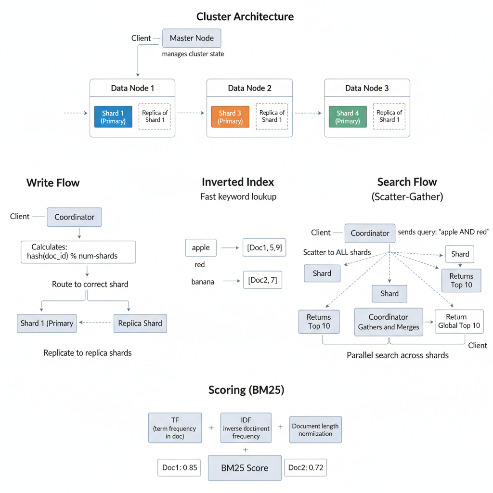
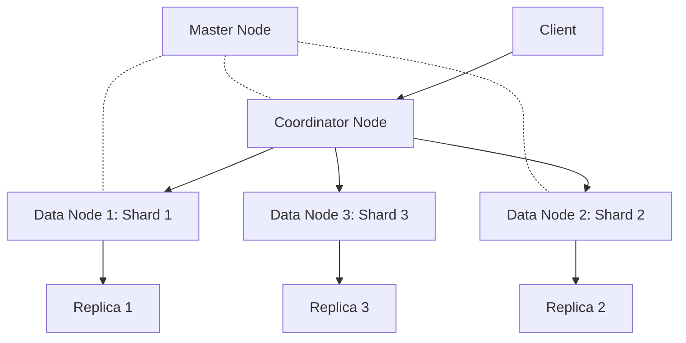

# 20. Design a Distributed Search Engine (Elasticsearch)

**Difficulty:** Very Hard (Staff Level)
**Focus:** Inverted Index, Sharding, Scoring (TF-IDF/BM25), Scatter-Gather.

---

## 🎯 Real-World Analogy

**Think of a Search Engine like a book index:**

**Forward Index (Reading every page - Bad):**
- You want to find "Apple" in a 1000-page book.
- You read page 1, page 2, page 3...
- Takes hours.
- ❌ Too slow!

**Inverted Index (Using the index - Good):**
- You flip to the back.
- Index says: "Apple: pages 5, 47, 203"
- You jump directly to those pages.
- Takes seconds.
- ✅ Fast!

**Distributed Search (Multiple books):**
- You have 1000 books (shards).
- You ask 10 librarians (nodes) to each check 100 books.
- They all search in parallel.
- Each returns their top 10 results.
- You merge and pick the global top 10.
- ✅ Parallel processing!

**Key Insight:** We pre-build an index that maps words → documents. This makes search O(1) instead of O(N). We shard across machines to parallelize.

---

## 1. Requirements (0-5 Minutes)

**Functional:**
1.  **Index:** Ingest documents (JSON/Text).
2.  **Search:** Full-text search with ranking.
3.  **Filter:** Filter by fields (category, date, price).
4.  **Aggregations:** "Show me count by category".

**Non-Functional:**
1.  **Scale:** Billions of documents.
2.  **Latency:** < 500ms for search.
3.  **Relevance:** Return most relevant results first.

---

## 2. High-Level Design (5-15 Minutes)



**Components:**



**Components:**
1.  **Master Node:** Manages cluster state (which shards are on which nodes). Not involved in search.
2.  **Data Node:** Stores shards and executes queries.
3.  **Coordinator Node:** Receives client request, scatters to shards, gathers results.
4.  **Shard:** A subset of the index (like a partition).
5.  **Replica:** Copy of a shard for redundancy.

---

## 3. Deep Dive: The Inverted Index (15-25 Minutes)

## 3. Deep Dive: The Inverted Index (15-25 Minutes)

**Forward Index (Document → Words):**
*   Doc 1: "Apple is red"
*   Doc 2: "Banana is yellow"

**Inverted Index (Word → Documents):**
```
"apple"  → [Doc 1]
"red"    → [Doc 1]
"banana" → [Doc 2]
"yellow" → [Doc 2]
"is"     → [Doc 1, Doc 2]
```

**Construction (MapReduce):**
1.  **Map Phase:**
    - Input: `(Doc1, "Apple is red")`
    - Output: `("apple", 1), ("is", 1), ("red", 1)`
2.  **Shuffle Phase:**
    - Group by Key (Word).
    - `("apple", [1, 5, 8])`
3.  **Reduce Phase:**
    - Sort doc IDs.
    - Compress (Delta Encoding).
    - Write to disk (Segment File).

### 💻 Python Implementation (Simple Indexer)

```python
from collections import defaultdict

class InvertedIndex:
    def __init__(self):
        self.index = defaultdict(list)

    def add_document(self, doc_id, text):
        words = text.lower().split()
        for word in set(words): # Unique words only
            self.index[word].append(doc_id)

    def search(self, query):
        words = query.lower().split()
        if not words:
            return []
            
        # Start with docs containing the first word
        result_docs = set(self.index[words[0]])
        
        # Intersect with docs containing other words (AND query)
        for word in words[1:]:
            result_docs &= set(self.index[word])
            
        return list(result_docs)

# Usage
idx = InvertedIndex()
idx.add_document(1, "Apple is red")
idx.add_document(2, "Banana is yellow")
print(idx.search("Apple")) # [1]
```

### ☕ Java Implementation

```java
import java.util.*;
import java.util.stream.Collectors;

public class InvertedIndex {
    private final Map<String, List<Integer>> index;
    
    public InvertedIndex() {
        this.index = new HashMap<>();
    }
    
    public void addDocument(int docId, String text) {
        // Tokenize and normalize
        String[] words = text.toLowerCase().split("\\s+");
        
        // Use Set to get unique words only
        Set<String> uniqueWords = new HashSet<>(Arrays.asList(words));
        
        for (String word : uniqueWords) {
            index.computeIfAbsent(word, k -> new ArrayList<>()).add(docId);
        }
    }
    
    public List<Integer> search(String query) {
        String[] words = query.toLowerCase().split("\\s+");
        
        if (words.length == 0) {
            return Collections.emptyList();
        }
        
        // Start with docs containing the first word
        Set<Integer> resultDocs = new HashSet<>(
            index.getOrDefault(words[0], Collections.emptyList())
        );
        
        // Intersect with docs containing other words (AND query)
        for (int i = 1; i < words.length; i++) {
            List<Integer> docsWithWord = index.getOrDefault(words[i], Collections.emptyList());
            resultDocs.retainAll(docsWithWord);
        }
        
        return new ArrayList<>(resultDocs);
    }
    
    // Usage
    public static void main(String[] args) {
        InvertedIndex idx = new InvertedIndex();
        idx.addDocument(1, "Apple is red");
        idx.addDocument(2, "Banana is yellow");
        System.out.println(idx.search("Apple")); // [1]
    }
}
```

**Optimizations:**
1.  **Compression:** Use delta encoding for doc IDs.
    *   Instead of `[1, 5, 9, 15]`, store `[1, +4, +4, +6]`.
2.  **Skip Lists:** For fast intersection of large posting lists.

---

## 4. Deep Dive: Sharding & Scatter-Gather (25-35 Minutes)

**Why Shard?**
*   1 Billion documents don't fit on one machine.
*   Parallelize search across multiple machines.

**Sharding Strategy:**
*   **Hash-based:** `shard_id = hash(doc_id) % num_shards`
*   Documents are evenly distributed.

**Write (Indexing):**
1.  Client sends document to Coordinator.
2.  Coordinator calculates shard: `hash(doc_id) % 5` → Shard 2.
3.  Coordinator forwards to Data Node 2.
4.  Data Node 2 indexes the document.

**Read (Searching):**
1.  Client sends query: "Apple".
2.  Coordinator **scatters** query to **ALL** shards (because we don't know which shard has "Apple").
3.  Each shard searches its local inverted index and returns Top 10.
4.  Coordinator **gathers** results (5 shards × 10 results = 50 results).
5.  Coordinator sorts and returns Global Top 10.

**Optimization:**
*   **Query Then Fetch:** Shards only return doc IDs and scores first. Coordinator picks Top 10, then fetches full documents from relevant shards.

---

## 5. Deep Dive: Scoring (TF-IDF / BM25) (35-40 Minutes)

**Goal:** Rank documents by relevance.

## 5. Deep Dive: Scoring (TF-IDF / BM25) (35-40 Minutes)

**Goal:** Rank documents by relevance.

### TF-IDF (Term Frequency - Inverse Document Frequency)

**Formula:**
```
Score = TF × IDF

TF (Term Frequency) = (Count of term in doc) / (Total words in doc)
IDF (Inverse Document Frequency) = log(Total docs / Docs containing term)
```

### 💻 Python Implementation (TF-IDF)

```python
import math

def compute_tf(word_dict, doc):
    tf_dict = {}
    doc_count = len(doc)
    for word, count in word_dict.items():
        tf_dict[word] = count / float(doc_count)
    return tf_dict

def compute_idf(doc_list):
    idf_dict = {}
    N = len(doc_list)
    
    # Count docs containing each word
    all_words = set([word for doc in doc_list for word in doc])
    
    for word in all_words:
        count = sum([1 for doc in doc_list if word in doc])
        idf_dict[word] = math.log(N / float(count))
        
    return idf_dict
```

### ☕ Java Implementation

```java
import java.util.*;

public class TFIDFScorer {
    
    /**
     * Compute Term Frequency for a document
     * TF = (Count of term in doc) / (Total words in doc)
     */
    public Map<String, Double> computeTF(Map<String, Integer> wordCount, List<String> doc) {
        Map<String, Double> tfDict = new HashMap<>();
        int docSize = doc.size();
        
        for (Map.Entry<String, Integer> entry : wordCount.entrySet()) {
            String word = entry.getKey();
            int count = entry.getValue();
            tfDict.put(word, count / (double) docSize);
        }
        
        return tfDict;
    }
    
    /**
     * Compute Inverse Document Frequency across all documents
     * IDF = log(Total docs / Docs containing term)
     */
    public Map<String, Double> computeIDF(List<List<String>> docList) {
        Map<String, Double> idfDict = new HashMap<>();
        int N = docList.size();
        
        // Collect all unique words across all documents
        Set<String> allWords = new HashSet<>();
        for (List<String> doc : docList) {
            allWords.addAll(doc);
        }
        
        // Calculate IDF for each word
        for (String word : allWords) {
            int count = 0;
            for (List<String> doc : docList) {
                if (doc.contains(word)) {
                    count++;
                }
            }
            
            double idf = Math.log((double) N / count);
            idfDict.put(word, idf);
        }
        
        return idfDict;
    }
    
    /**
     * Compute TF-IDF score for a query term in a document
     */
    public double computeTFIDF(String term, List<String> doc, Map<String, Double> idfDict) {
        // Calculate TF
        long termCount = doc.stream().filter(word -> word.equals(term)).count();
        double tf = termCount / (double) doc.size();
        
        // Get IDF
        double idf = idfDict.getOrDefault(term, 0.0);
        
        return tf * idf;
    }
}
```

### BM25 (Modern Standard)

**Improvement over TF-IDF:**
1.  **TF Saturation:** In TF-IDF, if a word appears 100 times, it's 100x more relevant. In BM25, it levels off (diminishing returns).
2.  **Length Normalization:** Short documents matching the term are ranked higher than long documents (which might match just by chance).

**Visual:**
```
Score
  ^
  |          /  (TF-IDF: Linear - Bad)
  |         /
  |  ______/    (BM25: Saturation - Good)
  | /
  |/
  +-----------------> Term Frequency
```

---

## 6. Deep Dive: Distributed Scoring Challenge (40-45 Minutes)

**Problem:**
*   IDF requires knowing "Total docs" and "Docs containing term".
*   But each shard only knows its own documents.

**Solution A: DFS Query Then Fetch (Accurate but Slow)**
1.  **Phase 1 (DFS - Distributed Frequency Search):**
    *   Coordinator asks all shards: "How many docs contain 'Apple'?"
    *   Shard 1: 20, Shard 2: 30, Shard 3: 50.
    *   Total: 100.
2.  **Phase 2 (Query):**
    *   Coordinator sends query with global IDF.
    *   Shards calculate scores using global IDF.
3.  **Phase 3 (Fetch):**
    *   Coordinator fetches full documents.

**Solution B: Local IDF (Fast but Approximate)**
*   Each shard uses its own local IDF.
*   **Assumption:** Documents are evenly distributed, so local IDF ≈ global IDF.
*   **Trade-off:** Faster, but slightly less accurate.

**Elasticsearch Default:** Local IDF (for speed).

---

## 7. Deep Dive: Index Compression (45-47 Minutes)

**Problem:**
- Inverted Index is huge.
- `apple` -> `[1, 5, 9, 15, ...]` (Millions of IDs).

**Solution: Delta Encoding + VByte**
- Store differences: `[1, 4, 4, 6]`.
- **VByte:** Use variable number of bytes. Small numbers (4) take 1 byte. Large numbers take 4 bytes.
- **Result:** 4x compression.

---

## 8. Deep Dive: Autocomplete (N-Grams) (47-50 Minutes)

**Problem:**
- User types "App". We want to match "Apple".
- Inverted Index only maps "Apple" -> Doc 1. It doesn't map "App".

**Solution: Edge N-Grams**
- At index time, generate tokens:
  - `a`, `ap`, `app`, `appl`, `apple`.
- Map all of them to Doc 1.
- **Query:** "app" -> Matches `app` token -> Returns Doc 1.
- **Trade-off:** Index size grows significantly.

---

---

## 9. Real-World Engineering Case Studies (Deep Dive)

### 1. Google: PageRank & Caffeine Update

**Source:** Google Research Papers

**The Challenge:**
Google indexes trillions of web pages.
- **Problem:** How to rank pages by relevance and authority?
- **Requirement:** Sub-second query latency.

**The Solution: PageRank + Inverted Index + Distributed Architecture**

**Architecture:**
1.  **PageRank Algorithm:**
    - Assigns importance score to each page based on incoming links.
    - **Formula:** `PR(A) = (1-d) + d * Σ(PR(T)/C(T))`
        - `PR(A)`: PageRank of page A
        - `d`: Damping factor (0.85)
        - `T`: Pages linking to A
        - `C(T)`: Number of outbound links from T
    - **Computation:** Iterative algorithm run on MapReduce.
2.  **Inverted Index:**
    - Maps terms to document IDs.
    - **Example:** `"python" → [doc1, doc5, doc9]`
    - Stored in **Bigtable** (Google's NoSQL database).
3.  **Caffeine Update (2010):**
    - Google rebuilt the indexing system for real-time updates.
    - **Before:** Batch indexing every few days.
    - **After:** Continuous crawling and indexing.
    - **Architecture:** Incremental indexing using **Percolator** (distributed transaction system).
4.  **Query Serving:**
    - Query hits multiple index servers in parallel (scatter-gather).
    - Results merged and ranked by ML models (RankBrain).
    - **Latency:** <200ms for 99% of queries.

**Key Insight:**
Google uses **PageRank** for authority, **inverted indexes** for fast lookups, and **distributed scatter-gather** for parallelization.

---

### 2. Elasticsearch: Distributed Search at Scale

**Source:** Elastic.co Documentation

**The Challenge:**
Elasticsearch powers search for Uber, Netflix, GitHub.
- **Problem:** How to search billions of documents in real-time?

**The Solution: Lucene + Sharding + Replication**

**Architecture:**
1.  **Lucene (Core Engine):**
    - Elasticsearch is built on Apache Lucene.
    - **Inverted Index:** Fast full-text search.
    - **Segment Files:** Immutable files containing indexed data.
2.  **Sharding:**
    - Index split into multiple shards (e.g., 5 shards).
    - Each shard is a Lucene index.
    - **Distribution:** Shards distributed across nodes.
    - **Query:** Scatter-gather across all shards.
3.  **Replication:**
    - Each shard has replicas (e.g., 2 replicas).
    - **Benefit:** Fault tolerance and increased read throughput.
4.  **Scoring (BM25):**
    - Elasticsearch uses BM25 algorithm for relevance scoring.
    - **Formula:** Considers term frequency, document length, and IDF.
    - **Tuning:** Boost certain fields (e.g., title > body).
5.  **Aggregations:**
    - Real-time analytics on search results.
    - **Example:** "Show me top 10 categories for query 'laptop'"
    - Uses **doc values** (columnar storage) for fast aggregations.

**Key Insight:**
Elasticsearch uses **Lucene's inverted index**, **sharding for horizontal scalability**, and **BM25 scoring** for relevance.

---

### 3. Amazon: A9 Search Engine

**Source:** Amazon Engineering Blog

**The Challenge:**
Amazon has 350M+ products.
- **Problem:** How to show relevant products considering user intent, inventory, and profitability?

**The Solution: Hybrid Search (Keyword + Semantic + Personalization)**

**Architecture:**
1.  **Keyword Search (Elasticsearch):**
    - Traditional inverted index for exact matches.
    - **Boosting:** Products with more reviews ranked higher.
2.  **Semantic Search (Vector Embeddings):**
    - Product descriptions converted to vectors using BERT.
    - **Similarity:** Cosine similarity between query vector and product vectors.
    - **Benefit:** Handles synonyms ("laptop" matches "notebook").
3.  **Personalization:**
    - User's browsing history and purchase history used for ranking.
    - **ML Model:** Gradient Boosted Trees predict click probability.
    - **Features:** User demographics, time of day, device type.
4.  **Business Logic:**
    - Out-of-stock products ranked lower.
    - Sponsored products (ads) ranked higher.
    - **A/B Testing:** Continuous experimentation to optimize ranking.

**Key Insight:**
Amazon uses **hybrid search** combining keyword, semantic, and personalized ranking to optimize for both relevance and business metrics.

---

**Key Insight:**
Amazon uses **hybrid search** combining keyword, semantic, and personalized ranking to optimize for both relevance and business metrics.

---

## 10. Failure Scenarios & Disaster Recovery

### Scenario 1: Index Shard Failure
**Impact:** Search results are incomplete (missing documents from the failed shard).
**Detection:** `shard_availability < 100%`.

**Mitigation:**
- **Replica Shards:** Maintain at least one replica for every primary shard. If a primary fails, a replica is automatically promoted.
- **Partial Results:** If a shard is completely unavailable, the query engine should return partial results with a warning header: `X-Partial-Results: true`.

### Scenario 2: Query Node Overload (Hot Key)
**Impact:** A popular search term (e.g., "iPhone 15") hits a specific set of shards, causing latency spikes.
**Detection:** `shard_cpu_utilization` shows high variance across the cluster.

**Mitigation:**
- **Query Caching:** Cache the results of the Top 1,000 most popular queries in Redis or an in-memory cache on the query nodes.
- **Adaptive Sharding:** Split "hot" shards into smaller sub-shards and distribute them across more nodes.

### Scenario 3: Malformed Query (ReDoS)
**Impact:** A complex regex or wildcard query consumes 100% CPU on a query node.
**Detection:** `query_execution_time` > 10s for a single request.

**Mitigation:**
- **Query Timeouts:** Kill any query that takes longer than 500ms.
- **Query Sanitization:** Restrict the use of leading wildcards (e.g., `*keyword`) and limit the complexity of boolean expressions.

---

## 11. Monitoring & Observability

### Golden Signals Dashboard

**1. Latency**
- **Query Latency:** P95 < 100ms.
- **Indexing Latency:** P95 < 2s (Doc update -> Searchable).
- **Metric:** `search_request_duration_seconds`.

**2. Traffic**
- **Throughput:** Queries per second (QPS).
- **Metric:** `search_requests_total`.

**3. Errors**
- **Metric:** `shard_failure_rate`.
- **Target:** < 0.01%.

**4. Saturation**
- **Metric:** JVM Heap usage, Disk I/O (Segment merging).

### Alert Rules
```yaml
alerts:
  - alert: HighSearchLatency
    expr: histogram_quantile(0.95, sum(rate(search_latency_bucket[5m])) by (le)) > 0.2
    for: 2m
    labels:
      severity: critical
```

---

## 12. API Design & Versioning

### Search API

**Execute Search**
```http
GET /api/v1/search?q=laptop&size=20&from=0&sort=relevance
```

**Bulk Index Documents**
```http
POST /api/v1/documents/_bulk
Content-Type: application/x-ndjson

{"index": {"_id": "1"}}
{"title": "Dell XPS 13", "category": "laptops"}
```

### Versioning
- Use `/v1/`, `/v2/` in URL.
- **Mapping Versioning:** If the index schema (mappings) changes, create a new index (e.g., `products_v2`) and use an **Alias** to point the API to the new index.

---

## 13. Cost Analysis & Optimization

### Monthly Infrastructure Costs (at 100M documents)

**1. Compute (Data Nodes)**
- 20 nodes (r6g.2xlarge - RAM heavy) = **$10,000/month**.

**2. Storage (EBS SSD)**
- 5 TB storage = **$500/month**.

**3. Bandwidth**
- Egress for search results = **$1,000/month**.

**Total:** ~$11,500/month.

### Optimization Opportunities
- **Cold Storage:** Move older, less-frequently searched documents to "Cold" nodes with cheaper HDD storage or S3.
- **Index Compression:** Use `best_compression` (DEFLATE) for stored fields to save 30% disk space.

---

## 14. Security & Compliance

### Security Measures
- **Document-Level Security (DLS):** Filter search results based on the user's permissions (e.g., a user can only search their own private files).
- **Encryption in Transit:** TLS 1.3 for all inter-node communication.
- **API Key Scoping:** Restrict API keys to specific indexes or read-only operations.

### Compliance
- **GDPR:** Provide a way to delete documents by `user_id` across all shards.
- **PII Masking:** Ensure sensitive fields (e.g., credit card numbers) are not indexed or searchable.

---

## 15. Testing Strategies

### Unit Tests
- Test analyzer logic: "Does 'Running' stem to 'Run'?"
- Test BM25 scoring with a small set of mock documents.

### Integration Tests
- Index a document and verify it is searchable within the `refresh_interval`.

### Load Testing
- Simulate 5,000 QPS with varying query complexity.
- **Tool:** `Rally` (Elasticsearch's benchmarking tool).

---

## 16. Migration & Rollout Strategies

### Rollout
- **Alias Swapping:** Use an index alias to point to the new index version. This allows for zero-downtime cutovers.

### Migration
- **Reindex API:** Use the `_reindex` API to move data from an old index to a new one with a different schema.

---

## 17. Performance Optimization

### Query Optimization
- **Filter Context:** Use filters instead of queries for non-scoring fields (e.g., `category:laptops`) to leverage bitset caching.
- **Request Collapsing:** Collapse duplicate concurrent requests for the same query into a single execution.

### Indexing Optimization
- **Bulk Ingestion:** Always use the bulk API for indexing to reduce network overhead.
- **Refresh Interval:** Increase `refresh_interval` from 1s to 30s during large bulk loads to save CPU.

---

## 18. Capacity Planning

### Scaling Triggers
- **Disk Usage:** Scale out when disk utilization hits 75% (need space for segment merging).
- **JVM Heap:** Scale up or add nodes if GC pauses exceed 100ms.

### Throughput Projection
- 100M docs ≈ 500 GB index.
- 20 nodes can handle ~2,000-5,000 QPS depending on query complexity.

---

## 19. Interview Cheat Sheet

### Key Numbers
- **Latency:** < 100ms (Query).
- **Sharding:** 1 shard per 20-50GB of data.
- **Replicas:** N+1 (Standard).

### Core Components
1. **Inverted Index:** The core data structure.
2. **Analyzer:** Tokenization, stemming, stop-word removal.
3. **Query Engine:** Scatter-gather and ranking.
4. **Cluster Manager:** Manages shard distribution and health.

### Critical Trade-offs
- **Precision vs Recall:** Do you want exact matches or more results?
- **Indexing Speed vs Query Speed:** More indexes/shards slow down writes but speed up reads.

---

## 20. Wrap-up (Deep Dive)

**Summary:**
"I designed a distributed Search Engine using **Inverted Indexes** for fast lookups.
1.  **Indexing:** I used **hash-based sharding** to distribute documents across nodes and built inverted indexes for each shard.
2.  **Query:** I implemented a **scatter-gather pattern** to parallelize search across shards and merge results.
3.  **Ranking:** I used **BM25 scoring** with local IDF approximation to balance accuracy and latency.
4.  **Real-World:** I incorporated **Google's PageRank** for authority-based ranking, **Elasticsearch's** distributed architecture, and **Amazon's hybrid search** combining keyword, semantic, and personalized ranking.
5.  **Production Readiness:** I addressed failure modes like shard failure and query overload, optimized costs via cold storage, and ensured security through document-level filtering."

---

---
