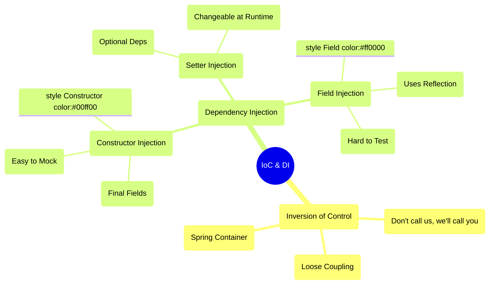
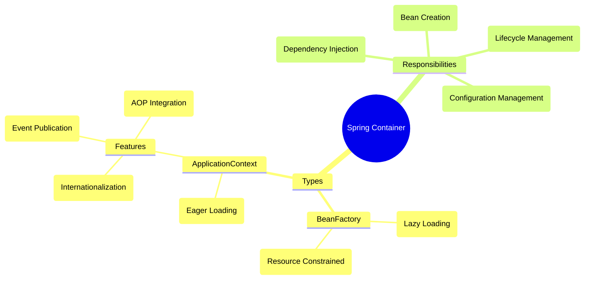
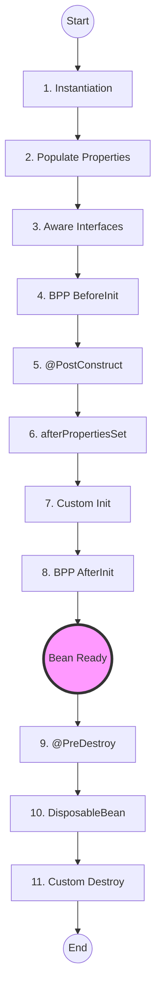
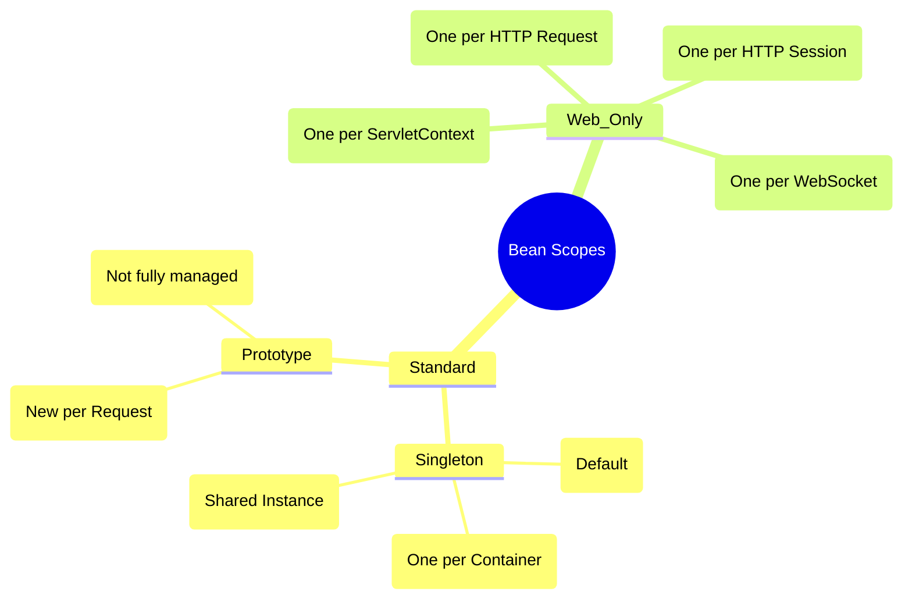
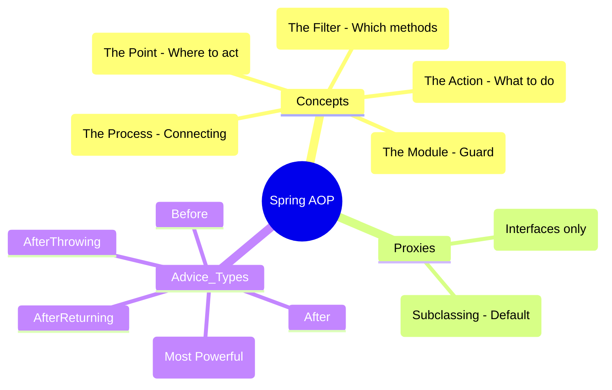

# Core Spring Framework Concepts - Deep Dive

## Table of Contents
1. [Dependency Injection (DI) & Inversion of Control (IoC)](#dependency-injection--inversion-of-control)
2. [Spring Container](#spring-container)
3. [Bean Lifecycle](#bean-lifecycle)
4. [Bean Scopes](#bean-scopes)
5. [Configuration Types](#configuration-types)
6. [Common Annotations](#common-annotations)
7. [Spring Expression Language (SpEL)](#spring-expression-language-spel)
8. [Circular Dependencies](#circular-dependencies)
9. [Spring AOP Internals](#spring-aop-internals)
10. [Extension Points: BPP vs BFPP](#extension-points-bpp-vs-bfpp)
11. [Spring 6 & Java 17+ Features](#spring-6--java-17-features)

---

## Dependency Injection & Inversion of Control

### 🧠 ELI5: The "Don't Call Us, We'll Call You" Principle

Imagine you are a **Chef** in a kitchen.

*   **Traditional Way (No IoC):** You have to go out, buy the stove, find the ingredients, and build your own fridge. You are in control of *everything*, but you're too busy building things to actually cook.
*   **IoC Way:** You just show up at a fully equipped kitchen. The stove is there, the fridge is stocked, and the ingredients are delivered to your station. You don't care *how* they got there; you just focus on cooking. **Spring is the Kitchen Manager** who sets everything up for you.

### 🗺️ Mindmap: IoC & DI Overview



### What is Inversion of Control (IoC)?

**Definition**: IoC is a design principle where the control of object creation and management is transferred from the application code to a framework (Spring Container).

**Traditional Approach (Without IoC)**:
```java
public class OrderService {
    private PaymentService paymentService;
    
    public OrderService() {
        // Tight coupling - OrderService creates its dependency
        this.paymentService = new PaymentService();
    }
}
```

**IoC Approach**:
```java
@Service
public class OrderService {
    private final PaymentService paymentService;
    
    // Spring manages dependency creation and injection
    @Autowired
    public OrderService(PaymentService paymentService) {
        this.paymentService = paymentService;
    }
}
```

### What is Dependency Injection?

**Definition**: DI is a pattern where dependencies are provided to a class rather than the class creating them itself.

### Types of Dependency Injection

#### 1. Constructor Injection (Recommended)
```java
@Service
public class UserService {
    private final UserRepository userRepository;
    private final EmailService emailService;
    
    // Constructor injection - immutable, required dependencies
    @Autowired // Optional in Spring 4.3+ with single constructor
    public UserService(UserRepository userRepository, EmailService emailService) {
        this.userRepository = userRepository;
        this.emailService = emailService;
    }
}
```

**Advantages**:
- Immutable dependencies (final fields)
- Required dependencies are clear
- Easy to test (can pass mocks in tests)
- Thread-safe

#### 2. Setter Injection
```java
@Service
public class NotificationService {
    private EmailService emailService;
    private SmsService smsService;
    
    // Setter injection - optional dependencies
    @Autowired(required = false)
    public void setEmailService(EmailService emailService) {
        this.emailService = emailService;
    }
    
    @Autowired(required = false)
    public void setSmsService(SmsService smsService) {
        this.smsService = smsService;
    }
}
```

**Use Cases**:
- Optional dependencies
- When you need to change dependencies after object creation
- Circular dependencies (not recommended)

#### 3. Field Injection (Not Recommended)
```java
@Service
public class ProductService {
    @Autowired
    private ProductRepository productRepository;
    
    // Field injection - convenient but has drawbacks
}
```

**Drawbacks**:
- Cannot make fields final (not immutable)
- Harder to test (need reflection or Spring context)
- Hides dependencies (not clear from constructor/setter)
- Cannot prevent circular dependencies

### Why IoC & DI Matter?

1. **Loose Coupling**: Classes don't create their dependencies
2. **Easy Testing**: Can inject mock objects
3. **Flexibility**: Easy to swap implementations
4. **Maintainability**: Changes in one class don't affect others
5. **Single Responsibility**: Classes focus on their logic, not on creating dependencies

---

## Spring Container

### 🧠 ELI5: The "Smart Warehouse"

Think of the Spring Container as a **Smart Warehouse**.

1.  **Inventory List**: You give it a list of things you need (Configuration/Annotations).
2.  **Assembly Line**: It knows how to build each item and what parts (dependencies) it needs.
3.  **Delivery**: When you ask for a "Service," it doesn't just give you the code; it gives you a fully assembled, ready-to-use machine.

### 🗺️ Mindmap: Spring Container



### What is Spring Container?

The Spring Container is responsible for:
- Creating objects (beans)
- Managing their lifecycle
- Injecting dependencies
- Managing configuration

### Types of Containers

#### 1. BeanFactory
```java
// Basic container - lazy initialization
Resource resource = new ClassPathResource("beans.xml");
BeanFactory factory = new XmlBeanFactory(resource);
MyBean bean = (MyBean) factory.getBean("myBean");
```

**Characteristics**:
- Lightweight
- Lazy initialization (beans created on first request)
- Basic DI support

#### 2. ApplicationContext (Most Common)
```java
// Advanced container - eager initialization
ApplicationContext context = new AnnotationConfigApplicationContext(AppConfig.class);
MyBean bean = context.getBean(MyBean.class);
```

**Types of ApplicationContext**:

1. **AnnotationConfigApplicationContext** - Java-based configuration
```java
ApplicationContext ctx = new AnnotationConfigApplicationContext(AppConfig.class);
```

2. **ClassPathXmlApplicationContext** - XML configuration
```java
ApplicationContext ctx = new ClassPathXmlApplicationContext("applicationContext.xml");
```

3. **FileSystemXmlApplicationContext** - XML from file system
```java
ApplicationContext ctx = new FileSystemXmlApplicationContext("/path/to/config.xml");
```

4. **WebApplicationContext** - Web applications
```java
// Automatically created by Spring Boot
```

### BeanFactory vs ApplicationContext

| Feature | BeanFactory | ApplicationContext |
|---------|-------------|-------------------|
| Initialization | Lazy | Eager |
| Internationalization | No | Yes |
| Event Publication | No | Yes |
| Annotation Support | Limited | Full |
| Enterprise Features | No | Yes (AOP, transactions) |
| Memory Footprint | Smaller | Larger |
| Use Case | Resource-constrained | Most applications |

**Interview Tip**: Always prefer ApplicationContext unless working with severely resource-constrained environments.

---

## Bean Lifecycle

### 🧠 ELI5: The "Employee Onboarding"

Think of a Spring Bean as a **New Employee** joining a company:

1.  **Hiring (Instantiation)**: The person is hired (Object created).
2.  **Desk Setup (Populate Properties)**: They get a laptop, desk, and email (Dependencies injected).
3.  **Orientation (Aware Interfaces)**: They learn their name and who their manager is.
4.  **Training (@PostConstruct)**: They attend a "Welcome" workshop to prepare for work.
5.  **Working (Ready to Use)**: They are now doing their job.
6.  **Retirement (@PreDestroy)**: Before they leave, they return the laptop and keys (Cleanup).

### 🗺️ Mindmap: Bean Lifecycle



### Complete Bean Lifecycle

```
1. Instantiation (Constructor called)
2. Populate Properties (Dependency Injection)
3. BeanNameAware.setBeanName()
4. BeanFactoryAware.setBeanFactory()
5. ApplicationContextAware.setApplicationContext()
6. BeanPostProcessor.postProcessBeforeInitialization()
7. @PostConstruct
8. InitializingBean.afterPropertiesSet()
9. Custom init-method
10. BeanPostProcessor.postProcessAfterInitialization()
*** Bean Ready to Use ***
11. @PreDestroy
12. DisposableBean.destroy()
13. Custom destroy-method
```

### Lifecycle Callbacks - Code Examples

#### 1. @PostConstruct and @PreDestroy
```java
@Component
public class DatabaseService {
    
    @PostConstruct
    public void init() {
        System.out.println("Initializing database connection...");
        // Setup code here
    }
    
    @PreDestroy
    public void cleanup() {
        System.out.println("Closing database connection...");
        // Cleanup code here
    }
}
```

#### 2. InitializingBean and DisposableBean Interfaces
```java
@Component
public class CacheService implements InitializingBean, DisposableBean {
    
    @Override
    public void afterPropertiesSet() throws Exception {
        System.out.println("Initializing cache...");
    }
    
    @Override
    public void destroy() throws Exception {
        System.out.println("Clearing cache...");
    }
}
```

#### 3. Custom init and destroy methods
```java
@Configuration
public class AppConfig {
    
    @Bean(initMethod = "customInit", destroyMethod = "customDestroy")
    public MyService myService() {
        return new MyService();
    }
}

public class MyService {
    public void customInit() {
        System.out.println("Custom initialization");
    }
    
    public void customDestroy() {
        System.out.println("Custom cleanup");
    }
}
```

#### 4. Using Aware Interfaces
```java
@Component
public class MyBean implements ApplicationContextAware, BeanNameAware {
    
    private ApplicationContext applicationContext;
    private String beanName;
    
    @Override
    public void setApplicationContext(ApplicationContext applicationContext) {
        this.applicationContext = applicationContext;
        System.out.println("ApplicationContext set");
    }
    
    @Override
    public void setBeanName(String name) {
        this.beanName = name;
        System.out.println("Bean name is: " + name);
    }
}
```

### Best Practices for Lifecycle Management

1. **Prefer @PostConstruct/@PreDestroy** - Standard Java annotations
2. **Constructor for mandatory setup** - Use constructor for required initialization
3. **Avoid heavy operations in constructor** - Use @PostConstruct for heavy lifting
4. **Cleanup resources** - Always implement cleanup in @PreDestroy
5. **Exception handling** - Handle exceptions properly in init methods

---

## Bean Scopes

### 🧠 ELI5: The "Coffee Shop"

*   **Singleton (Default):** Like the **Espresso Machine**. There's only one in the shop, and everyone shares it.
*   **Prototype:** Like a **Coffee Cup**. Every time someone orders, they get a brand new cup just for them.
*   **Request:** Like a **WiFi Password**. It's only valid for your current visit (one HTTP request).
*   **Session:** Like a **Loyalty Card**. It stays with you as long as you are "logged in" to that specific shop.

### 🗺️ Mindmap: Bean Scopes



### Available Scopes

#### 1. Singleton (Default)
```java
@Component
@Scope("singleton") // or @Scope(ConfigurableBeanFactory.SCOPE_SINGLETON)
public class SingletonBean {
    // One instance per Spring container
}
```

**Characteristics**:
- One instance per Spring IoC container
- Default scope
- Created at container startup (eager) unless lazy
- Thread-safe if stateless
- Shared across application

**Use Case**: Stateless services, repositories, utilities

#### 2. Prototype
```java
@Component
@Scope("prototype") // or @Scope(ConfigurableBeanFactory.SCOPE_PROTOTYPE)
public class PrototypeBean {
    // New instance every time requested
}
```

**Characteristics**:
- New instance every time getBean() is called
- Spring doesn't manage complete lifecycle (no destroy callbacks)
- Not thread-safe concerns (each request gets new instance)

**Use Case**: Stateful beans, beans with mutable state

#### 3. Request (Web Applications Only)
```java
@Component
@Scope(value = WebApplicationContext.SCOPE_REQUEST, proxyMode = ScopedProxyMode.TARGET_CLASS)
public class RequestScopedBean {
    // One instance per HTTP request
}
```

**Use Case**: Data specific to a single HTTP request

#### 4. Session (Web Applications Only)
```java
@Component
@Scope(value = WebApplicationContext.SCOPE_SESSION, proxyMode = ScopedProxyMode.TARGET_CLASS)
public class SessionScopedBean {
    // One instance per HTTP session
}
```

**Use Case**: User session data, shopping cart

#### 5. Application (Web Applications Only)
```java
@Component
@Scope(value = WebApplicationContext.SCOPE_APPLICATION, proxyMode = ScopedProxyMode.TARGET_CLASS)
public class ApplicationScopedBean {
    // One instance per ServletContext
}
```

**Use Case**: Application-wide shared data

#### 6. WebSocket (Web Applications Only)
```java
@Component
@Scope(value = "websocket", proxyMode = ScopedProxyMode.TARGET_CLASS)
public class WebSocketScopedBean {
    // One instance per WebSocket session
}
```

### Scoped Proxy Mode

When injecting a shorter-lived scope into a longer-lived scope:

```java
@Configuration
public class AppConfig {
    
    // Request-scoped bean
    @Bean
    @Scope(value = "request", proxyMode = ScopedProxyMode.TARGET_CLASS)
    public UserPreferences userPreferences() {
        return new UserPreferences();
    }
    
    // Singleton bean using request-scoped bean
    @Bean
    public UserService userService(UserPreferences userPreferences) {
        // Spring injects a proxy that delegates to current request's instance
        return new UserService(userPreferences);
    }
}
```

### Scope Comparison Table

| Scope | Instances | Lifecycle | Use Case |
|-------|-----------|-----------|----------|
| Singleton | 1 per container | Container manages | Services, Repositories |
| Prototype | New per request | Client manages | Stateful objects |
| Request | 1 per HTTP request | Request lifecycle | Request-specific data |
| Session | 1 per HTTP session | Session lifecycle | User session data |
| Application | 1 per ServletContext | Application lifecycle | App-wide shared data |

---

## Configuration Types

### 1. Java-Based Configuration (Recommended)

```java
@Configuration
public class AppConfig {
    
    @Bean
    public DataSource dataSource() {
        HikariDataSource dataSource = new HikariDataSource();
        dataSource.setJdbcUrl("jdbc:mysql://localhost:3306/mydb");
        dataSource.setUsername("user");
        dataSource.setPassword("password");
        return dataSource;
    }
    
    @Bean
    public UserRepository userRepository(DataSource dataSource) {
        return new UserRepository(dataSource);
    }
    
    @Bean
    public UserService userService(UserRepository userRepository) {
        return new UserService(userRepository);
    }
}
```

**Advantages**:
- Type-safe
- Refactoring-friendly
- Better IDE support
- Can use Java logic

### 2. Annotation-Based Configuration

```java
@Component
public class MyComponent {
    // Automatically detected by component scanning
}

@Service
public class MyService {
    // Business logic layer
}

@Repository
public class MyRepository {
    // Data access layer
}

@Controller
public class MyController {
    // Web layer
}
```

**Enable Component Scanning**:
```java
@Configuration
@ComponentScan(basePackages = "com.example.app")
public class AppConfig {
}
```

### 3. XML-Based Configuration (Legacy)

```xml
<?xml version="1.0" encoding="UTF-8"?>
<beans xmlns="http://www.springframework.org/schema/beans"
       xmlns:xsi="http://www.w3.org/2001/XMLSchema-instance"
       xsi:schemaLocation="http://www.springframework.org/schema/beans
                           http://www.springframework.org/schema/beans/spring-beans.xsd">
    
    <bean id="dataSource" class="com.zaxxer.hikari.HikariDataSource">
        <property name="jdbcUrl" value="jdbc:mysql://localhost:3306/mydb"/>
        <property name="username" value="user"/>
        <property name="password" value="password"/>
    </bean>
    
    <bean id="userRepository" class="com.example.UserRepository">
        <constructor-arg ref="dataSource"/>
    </bean>
</beans>
```

### Configuration Comparison

| Aspect | Java Config | Annotations | XML |
|--------|-------------|-------------|-----|
| Type Safety | Yes | Yes | No |
| Refactoring | Easy | Easy | Hard |
| Centralized | Yes | No | Yes |
| Boilerplate | Medium | Low | High |
| External Config | Possible | Limited | Easy |
| Recommendation | Preferred | Good | Legacy |

---

## Common Annotations

### Stereotype Annotations

```java
@Component  // Generic component
@Service    // Business logic layer
@Repository // Data access layer (adds persistence exception translation)
@Controller // Web layer (Spring MVC)
@RestController // REST API controller (@Controller + @ResponseBody)
```

### Dependency Injection Annotations

```java
@Autowired          // Inject dependency
@Qualifier("name")  // Specify which bean to inject when multiple candidates
@Primary            // Mark preferred bean when multiple candidates
@Resource           // JSR-250 annotation (inject by name)
@Inject             // JSR-330 annotation (alternative to @Autowired)
```

### Configuration Annotations

```java
@Configuration      // Indicates class provides bean definitions
@Bean               // Declares a bean
@ComponentScan      // Enable component scanning
@PropertySource     // Load properties file
@Value              // Inject values from properties
@Profile            // Activate beans for specific profiles
```

### Lifecycle Annotations

```java
@PostConstruct      // Executed after dependency injection
@PreDestroy         // Executed before bean destruction
@Lazy               // Lazy initialization
@DependsOn          // Explicit bean creation order
```

### Example: Complex Bean Configuration

```java
@Configuration
@ComponentScan(basePackages = "com.example")
@PropertySource("classpath:application.properties")
public class AppConfig {
    
    @Value("${db.url}")
    private String dbUrl;
    
    @Bean
    @Profile("production")
    public DataSource productionDataSource() {
        return new HikariDataSource();
    }
    
    @Bean
    @Profile("development")
    public DataSource devDataSource() {
        return new H2DataSource();
    }
    
    @Bean
    @Primary
    public UserService primaryUserService() {
        return new UserServiceImpl();
    }
    
    @Bean
    @Qualifier("cachedUserService")
    public UserService cachedUserService() {
        return new CachedUserService();
    }
}
```

---

## Spring Expression Language (SpEL)

SpEL is a powerful expression language that supports querying and manipulating an object graph at runtime.

### Key Features
- Literal expressions
- Boolean and relational operators
- Regular expressions
- Class expressions
- Accessing properties, arrays, lists, maps
- Method invocation

### Usage Examples

**1. In Annotations (@Value)**:
```java
@Value("#{systemProperties['user.region']}")
private String defaultLocale;

@Value("#{T(java.lang.Math).random() * 100.0}")
private double randomNumber;

@Value("#{userBean.name}")
private String userName;
```

**2. In XML Configuration**:
```xml
<bean id="numberGuess" class="org.spring.samples.NumberGuess">
    <property name="randomNumber" value="#{ T(java.lang.Math).random() * 100.0 }"/>
</bean>
```

**3. Programmatic Usage**:
```java
ExpressionParser parser = new SpelExpressionParser();
Expression exp = parser.parseExpression("'Hello World'.concat('!')");
String message = (String) exp.getValue();
```

---

## Circular Dependencies

### What is a Circular Dependency?
A circular dependency occurs when Bean A depends on Bean B, and Bean B depends on Bean A.

```java
@Component
public class A {
    private final B b;
    public A(B b) { this.b = b; }
}

@Component
public class B {
    private final A a;
    public B(A a) { this.a = a; }
}
```

### How Spring Handles It (The 3-Level Cache)
Spring's `DefaultSingletonBeanRegistry` uses three maps to manage singleton beans:

1.  **singletonObjects (1st level)**: Fully initialized beans.
2.  **earlySingletonObjects (2nd level)**: Partially initialized beans (instantiated but properties not yet injected).
3.  **singletonFactories (3rd level)**: Object factories for beans that might need to be wrapped in a proxy (like AOP).

**The Flow**:
1.  Spring tries to create Bean A. It puts a factory for A in the **3rd level cache**.
2.  Spring sees A needs B. It tries to create B.
3.  Spring sees B needs A. It checks the caches.
4.  It finds the factory for A in the **3rd level cache**, creates an "early reference" to A, and puts it in the **2nd level cache**.
5.  B is injected with the early reference to A and completes its initialization.
6.  B is put in the **1st level cache**.
7.  A is injected with the fully initialized B and completes its initialization.

> [!IMPORTANT]
> This mechanism only works for **Setter Injection**. Constructor injection fails because the object cannot even be instantiated to be put in the 3rd level cache.

### Solutions for Circular Dependencies
1.  **Redesign (Best)**: Extract shared logic into a third bean.
2.  **@Lazy**: Tells Spring to inject a proxy instead of the real bean. The real bean is resolved only when first used.
    ```java
    public A(@Lazy B b) { this.b = b; }
    ```
3.  **Setter Injection**: Allows Spring to use the 3-level cache mechanism.

---

## Spring AOP Internals

### 🧠 ELI5: The "Security Guard"

Imagine you have a **Bank Vault** (your Business Logic).

*   **Without AOP:** Every time you want to open the vault, you have to manually write code to: 1. Log who is entering, 2. Check their ID, 3. Open the door, 4. Log when they leave.
*   **With AOP:** You just focus on the "Open the door" part. You hire a **Security Guard** (Aspect) who stands *outside* the vault. He automatically logs people and checks IDs *before* they even touch the door. You don't have to change the vault's design at all!

### 🗺️ Mindmap: Spring AOP



### JDK Dynamic Proxy vs CGLIB
Spring AOP uses two types of proxying mechanisms:

| Feature | JDK Dynamic Proxy | CGLIB (Code Generation Library) |
|---------|-------------------|-------------------------------|
| **Requirement** | Must implement at least one interface | Can proxy classes (no interface needed) |
| **Mechanism** | Uses `java.lang.reflect.Proxy` | Uses bytecode generation (subclassing) |
| **Performance** | Faster to create, slightly slower to invoke | Slower to create, faster to invoke |
| **Final Methods** | Not an issue | Cannot proxy `final` methods/classes |
| **Default in Spring** | If interfaces exist | Default in Spring Boot 2.x+ |

### The Self-Invocation Issue
A common pitfall in Spring AOP (and `@Transactional`) is self-invocation.

```java
@Service
public class MyService {
    public void outerMethod() {
        innerMethod(); // ❌ AOP/Transaction will NOT trigger
    }

    @Transactional
    public void innerMethod() { ... }
}
```

**Why?**
AOP works by wrapping your bean in a **Proxy**. When you call `outerMethod()` from another bean, you call it on the proxy. But when `outerMethod()` calls `innerMethod()` internally, it uses `this.innerMethod()`, bypassing the proxy.

**Solutions**:
1.  **Move to another bean**: The most clean solution.
2.  **Self-Injection**: Inject `MyService` into itself (requires `@Lazy`).
3.  **AopContext**: Use `((MyService) AopContext.currentProxy()).innerMethod()`.

---

## Extension Points: BPP vs BFPP

### BeanPostProcessor (BPP)
Operates on **Bean Instances**.
- `postProcessBeforeInitialization`: Called before `@PostConstruct`.
- `postProcessAfterInitialization`: Called after `afterPropertiesSet`.
- **Use Case**: Creating proxies (AOP), checking for annotations, modifying bean state.

### BeanFactoryPostProcessor (BFPP)
Operates on **Bean Definitions**.
- Called after all bean definitions are loaded but **before** any beans are instantiated.
- **Use Case**: Reading property files (`PropertySourcesPlaceholderConfigurer`), modifying bean scopes or metadata.

---

## Spring 6 & Java 17+ Features

### 1. Java 17 Baseline
Spring 6 requires Java 17 as a minimum. This allows using:
- **Records**: Can be used as DTOs or even Spring Beans.
- **Sealed Classes**: Useful for defining restricted hierarchies in domain models.
- **Text Blocks**: Cleaner SQL or JSON strings in `@Value` or `@Query`.

### 2. Declarative HTTP Interfaces
Similar to Feign, you can now define HTTP clients using interfaces.
```java
public interface UserClient {
    @GetExchange("/users/{id}")
    User getUser(@PathVariable Long id);
}
```

### 3. Problem Details (RFC 7807)
Standardized error responses for APIs.
```java
@RestControllerAdvice
public class GlobalHandler extends ResponseEntityExceptionHandler {
    // Spring 6 provides native support via ProblemDetail class
}
```

### 4. Micrometer Observability
Spring 6 integrates Micrometer directly into the framework for tracing and metrics, replacing the old Spring Cloud Sleuth.

---

## Key Interview Questions

### Q1: What's the difference between @Component, @Service, @Repository, and @Controller?

**Answer**: 
- All are stereotype annotations for component scanning
- **@Component**: Generic annotation for any Spring-managed component
- **@Service**: Specialization of @Component for service layer (business logic)
- **@Repository**: Specialization for DAO layer, adds automatic persistence exception translation
- **@Controller**: Specialization for Spring MVC controllers

### Q2: Why is constructor injection preferred over field injection?

**Answer**:
1. **Immutability**: Can use final fields
2. **Testability**: Easy to pass mocks without Spring context
3. **Required dependencies are explicit**: Clear from constructor signature
4. **Thread-safety**: Final fields are inherently thread-safe
5. **Prevents circular dependencies**: Fails fast at startup

### Q3: Explain the N+1 problem and how to solve it (this relates to lazy loading)

This will be covered in the JPA section, but it's worth noting here as it relates to bean scopes.

### Q4: What happens if you inject a prototype bean into a singleton?

**Answer**: 
The singleton bean will always use the same instance of the prototype bean (created at singleton's initialization). To fix this:
1. Use `@Lookup` method injection
2. Use `ObjectFactory<PrototypeBean>`
3. Use `Provider<PrototypeBean>`
4. Use scoped proxy

```java
@Service
public class SingletonService {
    
    @Autowired
    private Provider<PrototypeBean> prototypeBeanProvider;
    
    public void doSomething() {
        PrototypeBean bean = prototypeBeanProvider.get(); // New instance each time
    }
}
```

---

## Best Practices

1. ✅ **Use constructor injection** for required dependencies
2. ✅ **Keep beans stateless** when using singleton scope
3. ✅ **Use @Component scan** judiciously (don't scan entire application)
4. ✅ **Prefer Java configuration** over XML
5. ✅ **Use @Qualifier** when multiple beans of same type exist
6. ✅ **Make initialization idempotent** in @PostConstruct
7. ✅ **Clean up resources** in @PreDestroy
8. ❌ **Avoid field injection** in production code
9. ❌ **Avoid circular dependencies**
10. ❌ **Don't perform heavy operations** in constructors

---

## Practice Exercises

1. Create a UserService with proper constructor injection
2. Implement custom bean lifecycle callbacks
3. Create beans with different scopes and observe behavior
4. Resolve circular dependency using @Lazy
5. Configure multiple datasources with @Primary and @Qualifier
6. Create a custom stereotype annotation
