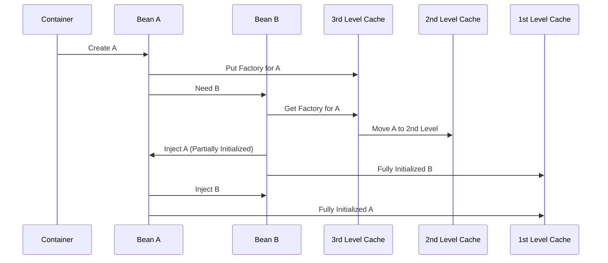
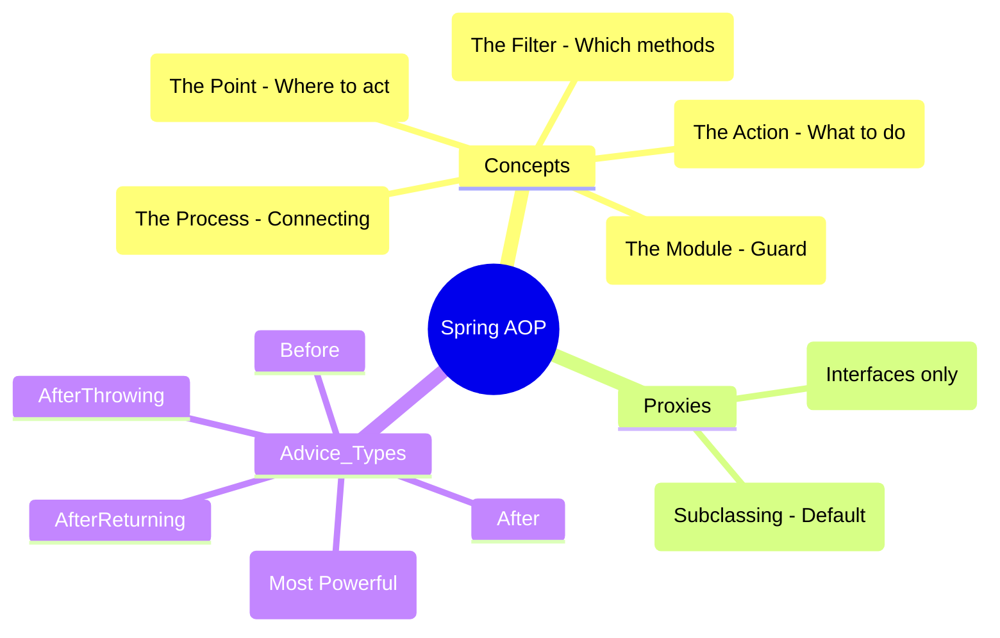

# Core Spring Framework Concepts - Deep Dive

## Table of Contents
1. [Dependency Injection (DI) & Inversion of Control (IoC)](#dependency-injection--inversion-of-control)
2. [Spring Container](#spring-container)
3. [Bean Lifecycle](#bean-lifecycle)
4. [Bean Scopes](#bean-scopes)
5. [Configuration Types](#configuration-types)
6. [Common Annotations](#common-annotations)
7. [Spring Expression Language (SpEL)](#spring-expression-language-spel)
8. [Circular Dependencies](#circular-dependencies)
9. [Spring AOP Internals](#spring-aop-internals)
10. [Extension Points: BPP vs BFPP](#extension-points-bpp-vs-bfpp)
11. [Spring 6 & Java 17+ Features](#spring-6--java-17-features)

---

## Dependency Injection & Inversion of Control

### 🧠 ELI5: The "Don't Call Us, We'll Call You" Principle

Imagine you are a **Chef** in a kitchen.

*   **Traditional Way (No IoC):** You have to go out, buy the stove, find the ingredients, and build your own fridge. You are in control of *everything*, but you're too busy building things to actually cook.
*   **IoC Way:** You just show up at a fully equipped kitchen. The stove is there, the fridge is stocked, and the ingredients are delivered to your station. You don't care *how* they got there; you just focus on cooking. **Spring is the Kitchen Manager** who sets everything up for you.

### 🗺️ Mindmap: IoC & DI Overview

## 🏗️ Architecture Diagram

> [!TIP]
> **Interview Pro-Tip: "What is the biggest benefit of IoC?"**
> It's **Testability**. Because the container manages dependencies, you can easily swap real services for "Mocks" during unit testing. This allows you to test your business logic in isolation without needing a database or external API.

### 🔍 Deep Dive: The BeanFactoryPostProcessor
While `BeanPostProcessor` works on bean **instances**, `BeanFactoryPostProcessor` works on the **Bean Definitions** themselves. This is how `${property}` placeholders are resolved. Spring reads the definitions, and a `PropertySourcesPlaceholderConfigurer` (a BFPP) replaces the placeholders with actual values from your properties file before any beans are created.

### 🛠️ Complex Example: Custom BeanFactoryPostProcessor
```java
@Component
public class MyCustomBFPP implements BeanFactoryPostProcessor {
    @Override
    public void postProcessBeanFactory(ConfigurableListableBeanFactory factory) {
        BeanDefinition bd = factory.getBeanDefinition("myService");
        // Dynamically change the scope of a bean at runtime!
        bd.setScope("prototype");
    }
}
```

### What is Inversion of Control (IoC)?

**Definition**: IoC is a design principle where the control of object creation and management is transferred from the application code to a framework (Spring Container).

**Traditional Approach (Without IoC)**:
```java
public class OrderService {
    private PaymentService paymentService;
    
    public OrderService() {
        // Tight coupling - OrderService creates its dependency
        this.paymentService = new PaymentService();
    }
}
```

**IoC Approach**:
```java
@Service
public class OrderService {
    private final PaymentService paymentService;
    
    // Spring manages dependency creation and injection
    @Autowired
    public OrderService(PaymentService paymentService) {
        this.paymentService = paymentService;
    }
}
```

### What is Dependency Injection?

**Definition**: DI is a pattern where dependencies are provided to a class rather than the class creating them itself.

### Types of Dependency Injection

#### 1. Constructor Injection (Recommended)
```java
@Service
public class UserService {
    private final UserRepository userRepository;
    private final EmailService emailService;
    
    // Constructor injection - immutable, required dependencies
    @Autowired // Optional in Spring 4.3+ with single constructor
    public UserService(UserRepository userRepository, EmailService emailService) {
        this.userRepository = userRepository;
        this.emailService = emailService;
    }
}
```

**Advantages**:
- Immutable dependencies (final fields)
- Required dependencies are clear
- Easy to test (can pass mocks in tests)
- Thread-safe

#### 2. Setter Injection
```java
@Service
public class NotificationService {
    private EmailService emailService;
    private SmsService smsService;
    
    // Setter injection - optional dependencies
    @Autowired(required = false)
    public void setEmailService(EmailService emailService) {
        this.emailService = emailService;
    }
    
    @Autowired(required = false)
    public void setSmsService(SmsService smsService) {
        this.smsService = smsService;
    }
}
```

**Use Cases**:
- Optional dependencies
- When you need to change dependencies after object creation
- Circular dependencies (not recommended)

#### 3. Field Injection (Not Recommended)
```java
@Service
public class ProductService {
    @Autowired
    private ProductRepository productRepository;
    
    // Field injection - convenient but has drawbacks
}
```

**Drawbacks**:
- Cannot make fields final (not immutable)
- Harder to test (need reflection or Spring context)
- Hides dependencies (not clear from constructor/setter)
- Cannot prevent circular dependencies

### Why IoC & DI Matter?

1. **Loose Coupling**: Classes don't create their dependencies
2. **Easy Testing**: Can inject mock objects
3. **Flexibility**: Easy to swap implementations
4. **Maintainability**: Changes in one class don't affect others
5. **Single Responsibility**: Classes focus on their logic, not on creating dependencies

---

## Spring Container

### 🧠 ELI5: The "Smart Warehouse"

Think of the Spring Container as a **Smart Warehouse**.

1.  **Inventory List**: You give it a list of things you need (Configuration/Annotations).
2.  **Assembly Line**: It knows how to build each item and what parts (dependencies) it needs.
3.  **Delivery**: When you ask for a "Service," it doesn't just give you the code; it gives you a fully assembled, ready-to-use machine.

### 🗺️ Mindmap: Spring Container

## 🏗️ Architecture Diagram

### What is Spring Container?

The Spring Container is responsible for:
- Creating objects (beans)
- Managing their lifecycle
- Injecting dependencies
- Managing configuration

### Types of Containers

#### 1. BeanFactory
```java
// Basic container - lazy initialization
Resource resource = new ClassPathResource("beans.xml");
BeanFactory factory = new XmlBeanFactory(resource);
MyBean bean = (MyBean) factory.getBean("myBean");
```

**Characteristics**:
- Lightweight
- Lazy initialization (beans created on first request)
- Basic DI support

#### 2. ApplicationContext (Most Common)
```java
// Advanced container - eager initialization
ApplicationContext context = new AnnotationConfigApplicationContext(AppConfig.class);
MyBean bean = context.getBean(MyBean.class);
```

**Types of ApplicationContext**:

1. **AnnotationConfigApplicationContext** - Java-based configuration
```java
ApplicationContext ctx = new AnnotationConfigApplicationContext(AppConfig.class);
```

2. **ClassPathXmlApplicationContext** - XML configuration
```java
ApplicationContext ctx = new ClassPathXmlApplicationContext("applicationContext.xml");
```

3. **FileSystemXmlApplicationContext** - XML from file system
```java
ApplicationContext ctx = new FileSystemXmlApplicationContext("/path/to/config.xml");
```

4. **WebApplicationContext** - Web applications
```java
// Automatically created by Spring Boot
```

### BeanFactory vs ApplicationContext

| Feature | BeanFactory | ApplicationContext |
|---------|-------------|-------------------|
| Initialization | Lazy | Eager |
| Internationalization | No | Yes |
| Event Publication | No | Yes |
| Annotation Support | Limited | Full |
| Enterprise Features | No | Yes (AOP, transactions) |
| Memory Footprint | Smaller | Larger |
| Use Case | Resource-constrained | Most applications |

**Interview Tip**: Always prefer ApplicationContext unless working with severely resource-constrained environments.

---

## Bean Lifecycle

### 🧠 ELI5: The "Employee Onboarding"

Think of a Spring Bean as a **New Employee** joining a company:

1.  **Hiring (Instantiation)**: The person is hired (Object created).
2.  **Desk Setup (Populate Properties)**: They get a laptop, desk, and email (Dependencies injected).
3.  **Orientation (Aware Interfaces)**: They learn their name and who their manager is.
4.  **Training (@PostConstruct)**: They attend a "Welcome" workshop to prepare for work.
5.  **Working (Ready to Use)**: They are now doing their job.
6.  **Retirement (@PreDestroy)**: Before they leave, they return the laptop and keys (Cleanup).

### 🗺️ Mindmap: Bean Lifecycle

## 🌱 Bean Lifecycle

### Complete Bean Lifecycle

```
1. Instantiation (Constructor called)
2. Populate Properties (Dependency Injection)
3. BeanNameAware.setBeanName()
4. BeanFactoryAware.setBeanFactory()
5. ApplicationContextAware.setApplicationContext()
6. BeanPostProcessor.postProcessBeforeInitialization()
7. @PostConstruct
8. InitializingBean.afterPropertiesSet()
9. Custom init-method
10. BeanPostProcessor.postProcessAfterInitialization()
*** Bean Ready to Use ***
11. @PreDestroy
12. DisposableBean.destroy()
13. Custom destroy-method
```

### Lifecycle Callbacks - Code Examples

#### 1. @PostConstruct and @PreDestroy
```java
@Component
public class DatabaseService {
    
    @PostConstruct
    public void init() {
        System.out.println("Initializing database connection...");
        // Setup code here
    }
    
    @PreDestroy
    public void cleanup() {
        System.out.println("Closing database connection...");
        // Cleanup code here
    }
}
```

#### 2. InitializingBean and DisposableBean Interfaces
```java
@Component
public class CacheService implements InitializingBean, DisposableBean {
    
    @Override
    public void afterPropertiesSet() throws Exception {
        System.out.println("Initializing cache...");
    }
    
    @Override
    public void destroy() throws Exception {
        System.out.println("Clearing cache...");
    }
}
```

#### 3. Custom init and destroy methods
```java
@Configuration
public class AppConfig {
    
    @Bean(initMethod = "customInit", destroyMethod = "customDestroy")
    public MyService myService() {
        return new MyService();
    }
}

public class MyService {
    public void customInit() {
        System.out.println("Custom initialization");
    }
    
    public void customDestroy() {
        System.out.println("Custom cleanup");
    }
}
```

#### 4. Using Aware Interfaces
```java
@Component
public class MyBean implements ApplicationContextAware, BeanNameAware {
    
    private ApplicationContext applicationContext;
    private String beanName;
    
    @Override
    public void setApplicationContext(ApplicationContext applicationContext) {
        this.applicationContext = applicationContext;
        System.out.println("ApplicationContext set");
    }
    
    @Override
    public void setBeanName(String name) {
        this.beanName = name;
        System.out.println("Bean name is: " + name);
    }
}
```

### Best Practices for Lifecycle Management

1. **Prefer @PostConstruct/@PreDestroy** - Standard Java annotations
2. **Constructor for mandatory setup** - Use constructor for required initialization
3. **Avoid heavy operations in constructor** - Use @PostConstruct for heavy lifting
4. **Cleanup resources** - Always implement cleanup in @PreDestroy
5. **Exception handling** - Handle exceptions properly in init methods

---

## Bean Scopes

### 🧠 ELI5: The "Coffee Shop"

*   **Singleton (Default):** Like the **Espresso Machine**. There's only one in the shop, and everyone shares it.
*   **Prototype:** Like a **Coffee Cup**. Every time someone orders, they get a brand new cup just for them.
*   **Request:** Like a **WiFi Password**. It's only valid for your current visit (one HTTP request).
*   **Session:** Like a **Loyalty Card**. It stays with you as long as you are "logged in" to that specific shop.

### 🗺️ Mindmap: Bean Scopes

## 🏗️ Architecture Diagram

### Available Scopes

#### 1. Singleton (Default)
```java
@Component
@Scope("singleton") // or @Scope(ConfigurableBeanFactory.SCOPE_SINGLETON)
public class SingletonBean {
    // One instance per Spring container
}
```

**Characteristics**:
- One instance per Spring IoC container
- Default scope
- Created at container startup (eager) unless lazy
- Thread-safe if stateless
- Shared across application

**Use Case**: Stateless services, repositories, utilities

#### 2. Prototype
```java
@Component
@Scope("prototype") // or @Scope(ConfigurableBeanFactory.SCOPE_PROTOTYPE)
public class PrototypeBean {
    // New instance every time requested
}
```

**Characteristics**:
- New instance every time getBean() is called
- Spring doesn't manage complete lifecycle (no destroy callbacks)
- Not thread-safe concerns (each request gets new instance)

**Use Case**: Stateful beans, beans with mutable state

#### 3. Request (Web Applications Only)
```java
@Component
@Scope(value = WebApplicationContext.SCOPE_REQUEST, proxyMode = ScopedProxyMode.TARGET_CLASS)
public class RequestScopedBean {
    // One instance per HTTP request
}
```

**Use Case**: Data specific to a single HTTP request

#### 4. Session (Web Applications Only)
```java
@Component
@Scope(value = WebApplicationContext.SCOPE_SESSION, proxyMode = ScopedProxyMode.TARGET_CLASS)
public class SessionScopedBean {
    // One instance per HTTP session
}
```

**Use Case**: User session data, shopping cart

#### 5. Application (Web Applications Only)
```java
@Component
@Scope(value = WebApplicationContext.SCOPE_APPLICATION, proxyMode = ScopedProxyMode.TARGET_CLASS)
public class ApplicationScopedBean {
    // One instance per ServletContext
}
```

**Use Case**: Application-wide shared data

#### 6. WebSocket (Web Applications Only)
```java
@Component
@Scope(value = "websocket", proxyMode = ScopedProxyMode.TARGET_CLASS)
public class WebSocketScopedBean {
    // One instance per WebSocket session
}
```

### Scoped Proxy Mode

When injecting a shorter-lived scope into a longer-lived scope:

```java
@Configuration
public class AppConfig {
    
    // Request-scoped bean
    @Bean
    @Scope(value = "request", proxyMode = ScopedProxyMode.TARGET_CLASS)
    public UserPreferences userPreferences() {
        return new UserPreferences();
    }
    
    // Singleton bean using request-scoped bean
    @Bean
    public UserService userService(UserPreferences userPreferences) {
        // Spring injects a proxy that delegates to current request's instance
        return new UserService(userPreferences);
    }
}
```

### Scope Comparison Table

| Scope | Instances | Lifecycle | Use Case |
|-------|-----------|-----------|----------|
| Singleton | 1 per container | Container manages | Services, Repositories |
| Prototype | New per request | Client manages | Stateful objects |
| Request | 1 per HTTP request | Request lifecycle | Request-specific data |
| Session | 1 per HTTP session | Session lifecycle | User session data |
| Application | 1 per ServletContext | Application lifecycle | App-wide shared data |

---

## Configuration Types

### 1. Java-Based Configuration (Recommended)

```java
@Configuration
public class AppConfig {
    
    @Bean
    public DataSource dataSource() {
        HikariDataSource dataSource = new HikariDataSource();
        dataSource.setJdbcUrl("jdbc:mysql://localhost:3306/mydb");
        dataSource.setUsername("user");
        dataSource.setPassword("password");
        return dataSource;
    }
    
    @Bean
    public UserRepository userRepository(DataSource dataSource) {
        return new UserRepository(dataSource);
    }
    
    @Bean
    public UserService userService(UserRepository userRepository) {
        return new UserService(userRepository);
    }
}
```

**Advantages**:
- Type-safe
- Refactoring-friendly
- Better IDE support
- Can use Java logic

### 2. Annotation-Based Configuration

```java
@Component
public class MyComponent {
    // Automatically detected by component scanning
}

@Service
public class MyService {
    // Business logic layer
}

@Repository
public class MyRepository {
    // Data access layer
}

@Controller
public class MyController {
    // Web layer
}
```

**Enable Component Scanning**:
```java
@Configuration
@ComponentScan(basePackages = "com.example.app")
public class AppConfig {
}
```

### 3. XML-Based Configuration (Legacy)

```xml
<?xml version="1.0" encoding="UTF-8"?>
<beans xmlns="http://www.springframework.org/schema/beans"
       xmlns:xsi="http://www.w3.org/2001/XMLSchema-instance"
       xsi:schemaLocation="http://www.springframework.org/schema/beans
                           http://www.springframework.org/schema/beans/spring-beans.xsd">
    
    <bean id="dataSource" class="com.zaxxer.hikari.HikariDataSource">
        <property name="jdbcUrl" value="jdbc:mysql://localhost:3306/mydb"/>
        <property name="username" value="user"/>
        <property name="password" value="password"/>
    </bean>
    
    <bean id="userRepository" class="com.example.UserRepository">
        <constructor-arg ref="dataSource"/>
    </bean>
</beans>
```

### Configuration Comparison

| Aspect | Java Config | Annotations | XML |
|--------|-------------|-------------|-----|
| Type Safety | Yes | Yes | No |
| Refactoring | Easy | Easy | Hard |
| Centralized | Yes | No | Yes |
| Boilerplate | Medium | Low | High |
| External Config | Possible | Limited | Easy |
| Recommendation | Preferred | Good | Legacy |

---

## Common Annotations

### Stereotype Annotations

```java
@Component  // Generic component
@Service    // Business logic layer
@Repository // Data access layer (adds persistence exception translation)
@Controller // Web layer (Spring MVC)
@RestController // REST API controller (@Controller + @ResponseBody)
```

### Dependency Injection Annotations

```java
@Autowired          // Inject dependency
@Qualifier("name")  // Specify which bean to inject when multiple candidates
@Primary            // Mark preferred bean when multiple candidates
@Resource           // JSR-250 annotation (inject by name)
@Inject             // JSR-330 annotation (alternative to @Autowired)
```

### Configuration Annotations

```java
@Configuration      // Indicates class provides bean definitions
@Bean               // Declares a bean
@ComponentScan      // Enable component scanning
@PropertySource     // Load properties file
@Value              // Inject values from properties
@Profile            // Activate beans for specific profiles
```

### Lifecycle Annotations

```java
@PostConstruct      // Executed after dependency injection
@PreDestroy         // Executed before bean destruction
@Lazy               // Lazy initialization
@DependsOn          // Explicit bean creation order
```

### Example: Complex Bean Configuration

```java
@Configuration
@ComponentScan(basePackages = "com.example")
@PropertySource("classpath:application.properties")
public class AppConfig {
    
    @Value("${db.url}")
    private String dbUrl;
    
    @Bean
    @Profile("production")
    public DataSource productionDataSource() {
        return new HikariDataSource();
    }
    
    @Bean
    @Profile("development")
    public DataSource devDataSource() {
        return new H2DataSource();
    }
    
    @Bean
    @Primary
    public UserService primaryUserService() {
        return new UserServiceImpl();
    }
    
    @Bean
    @Qualifier("cachedUserService")
    public UserService cachedUserService() {
        return new CachedUserService();
    }
}
```

---

## Spring Expression Language (SpEL)

## 🏗️ Architecture Diagram

## Spring Expression Language (SpEL)

SpEL is a powerful expression language that supports querying and manipulating an object graph at runtime.

### Key Features
- Literal expressions
- Boolean and relational operators
- Regular expressions
- Class expressions
- Accessing properties, arrays, lists, maps
- Method invocation

### Usage Examples

**1. In Annotations (@Value)**:
```java
@Value("#{systemProperties['user.region']}")
private String defaultLocale;

@Value("#{T(java.lang.Math).random() * 100.0}")
private double randomNumber;

@Value("#{userBean.name}")
private String userName;
```

**2. In XML Configuration**:
```xml
<bean id="numberGuess" class="org.spring.samples.NumberGuess">
    <property name="randomNumber" value="#{ T(java.lang.Math).random() * 100.0 }"/>
</bean>
```

**3. Programmatic Usage**:
```java
ExpressionParser parser = new SpelExpressionParser();
Expression exp = parser.parseExpression("'Hello World'.concat('!')");
String message = (String) exp.getValue();
```

---

## Circular Dependencies

## 🏗️ Architecture Diagram

> [!TIP]
> **Interview Pro-Tip: "How does Spring handle circular dependencies?"**
> Spring uses a **3-Level Cache** (Singleton Objects, Early Singleton Objects, and Singleton Factories). When Bean A is being created, it's put into the "Early Singleton Objects" cache before it's fully initialized. If Bean B then needs Bean A, it can get this "partially created" version, breaking the cycle. **Note: This only works for Setter Injection, not Constructor Injection.**

### 🔍 Deep Dive: Spring AOP Internals
Spring AOP uses two types of proxies:
1. **JDK Dynamic Proxy**: Used if the target class implements an interface. It creates a proxy that implements the same interface.
2. **CGLIB Proxy**: Used if the target class does *not* implement an interface. It creates a subclass of the target class at runtime.

### 🛠️ Complex Example: AOP with Custom Annotation
```java
@Aspect
@Component
public class LoggingAspect {
    @Around("@annotation(LogExecutionTime)")
    public Object logTime(ProceedingJoinPoint joinPoint) throws Throwable {
        long start = System.currentTimeMillis();
        Object proceed = joinPoint.proceed();
        long executionTime = System.currentTimeMillis() - start;
        System.out.println(joinPoint.getSignature() + " executed in " + executionTime + "ms");
        return proceed;
    }
}
```

## Circular Dependencies

### What is a Circular Dependency?
A circular dependency occurs when Bean A depends on Bean B, and Bean B depends on Bean A.

```java
@Component
public class A {
    private final B b;
    public A(B b) { this.b = b; }
}

@Component
public class B {
    private final A a;
    public B(A a) { this.a = a; }
}
```

### How Spring Handles It (The 3-Level Cache)



### How Spring Handles It (The 3-Level Cache)
Spring's `DefaultSingletonBeanRegistry` uses three maps to manage singleton beans:

1.  **singletonObjects (1st level)**: Fully initialized beans.
2.  **earlySingletonObjects (2nd level)**: Partially initialized beans (instantiated but properties not yet injected).
3.  **singletonFactories (3rd level)**: Object factories for beans that might need to be wrapped in a proxy (like AOP).

**The Flow**:
1.  Spring tries to create Bean A. It puts a factory for A in the **3rd level cache**.
2.  Spring sees A needs B. It tries to create B.
3.  Spring sees B needs A. It checks the caches.
4.  It finds the factory for A in the **3rd level cache**, creates an "early reference" to A, and puts it in the **2nd level cache**.
5.  B is injected with the early reference to A and completes its initialization.
6.  B is put in the **1st level cache**.
7.  A is injected with the fully initialized B and completes its initialization.

> [!IMPORTANT]
> This mechanism only works for **Setter Injection**. Constructor injection fails because the object cannot even be instantiated to be put in the 3rd level cache.

### Solutions for Circular Dependencies
1.  **Redesign (Best)**: Extract shared logic into a third bean.
2.  **@Lazy**: Tells Spring to inject a proxy instead of the real bean. The real bean is resolved only when first used.
    ```java
    public A(@Lazy B b) { this.b = b; }
    ```
3.  **Setter Injection**: Allows Spring to use the 3-level cache mechanism.

---

## Spring AOP Internals

### 🧠 ELI5: The "Security Guard"

Imagine you have a **Bank Vault** (your Business Logic).

*   **Without AOP:** Every time you want to open the vault, you have to manually write code to: 1. Log who is entering, 2. Check their ID, 3. Open the door, 4. Log when they leave.
*   **With AOP:** You just focus on the "Open the door" part. You hire a **Security Guard** (Aspect) who stands *outside* the vault. He automatically logs people and checks IDs *before* they even touch the door. You don't have to change the vault's design at all!

### 🗺️ Mindmap: Spring AOP



### JDK Dynamic Proxy vs CGLIB
Spring AOP uses two types of proxying mechanisms:

| Feature | JDK Dynamic Proxy | CGLIB (Code Generation Library) |
|---------|-------------------|-------------------------------|
| **Requirement** | Must implement at least one interface | Can proxy classes (no interface needed) |
| **Mechanism** | Uses `java.lang.reflect.Proxy` | Uses bytecode generation (subclassing) |
| **Performance** | Faster to create, slightly slower to invoke | Slower to create, faster to invoke |
| **Final Methods** | Not an issue | Cannot proxy `final` methods/classes |
| **Default in Spring** | If interfaces exist | Default in Spring Boot 2.x+ |

### The Self-Invocation Issue
A common pitfall in Spring AOP (and `@Transactional`) is self-invocation.

```java
@Service
public class MyService {
    public void outerMethod() {
        innerMethod(); // ❌ AOP/Transaction will NOT trigger
    }

    @Transactional
    public void innerMethod() { ... }
}
```

**Why?**
AOP works by wrapping your bean in a **Proxy**. When you call `outerMethod()` from another bean, you call it on the proxy. But when `outerMethod()` calls `innerMethod()` internally, it uses `this.innerMethod()`, bypassing the proxy.

**Solutions**:
1.  **Move to another bean**: The most clean solution.
2.  **Self-Injection**: Inject `MyService` into itself (requires `@Lazy`).
3.  **AopContext**: Use `((MyService) AopContext.currentProxy()).innerMethod()`.

---

## Extension Points: BPP vs BFPP

### BeanPostProcessor (BPP)
Operates on **Bean Instances**.
- `postProcessBeforeInitialization`: Called before `@PostConstruct`.
- `postProcessAfterInitialization`: Called after `afterPropertiesSet`.
- **Use Case**: Creating proxies (AOP), checking for annotations, modifying bean state.

### BeanFactoryPostProcessor (BFPP)
Operates on **Bean Definitions**.
- Called after all bean definitions are loaded but **before** any beans are instantiated.
- **Use Case**: Reading property files (`PropertySourcesPlaceholderConfigurer`), modifying bean scopes or metadata.

---

## Spring 6 & Java 17+ Features

### 1. Java 17 Baseline
Spring 6 requires Java 17 as a minimum. This allows using:
- **Records**: Can be used as DTOs or even Spring Beans.
- **Sealed Classes**: Useful for defining restricted hierarchies in domain models.
- **Text Blocks**: Cleaner SQL or JSON strings in `@Value` or `@Query`.

### 2. Declarative HTTP Interfaces
Similar to Feign, you can now define HTTP clients using interfaces.
```java
public interface UserClient {
    @GetExchange("/users/{id}")
    User getUser(@PathVariable Long id);
}
```

### 3. Problem Details (RFC 7807)
Standardized error responses for APIs.
```java
@RestControllerAdvice
public class GlobalHandler extends ResponseEntityExceptionHandler {
    // Spring 6 provides native support via ProblemDetail class
}
```

### 4. Micrometer Observability
Spring 6 integrates Micrometer directly into the framework for tracing and metrics, replacing the old Spring Cloud Sleuth.

---

## Spring Core Internals

### BeanDefinition Deep Dive

#### Understanding the Two-Phase Bean Creation Process

Spring's bean creation is fundamentally a **two-phase process**, which is crucial to understand:

**Phase 1: Configuration Phase** (BeanDefinition Creation)
- Spring reads your configuration (@Configuration, @Component, XML)
- Creates BeanDefinition objects (metadata/blueprints)
- No actual objects are created yet
- All BeanDefinitions stored in BeanDefinitionRegistry

**Phase 2: Instantiation Phase** (Bean Creation)
- Spring reads BeanDefinitions
- Creates actual bean instances
- Injects dependencies
- Manages lifecycle

**Why This Matters:**
This separation allows Spring to:
1. **Validate configuration early** - Detect circular dependencies, missing dependencies
2. **Modify bean configurations** - Via BeanFactoryPostProcessors before instantiation
3. **Optimize creation order** - Resolve dependency graphs efficiently
4. **Support dynamic bean registration** - Add beans programmatically

#### What is BeanDefinition?

**BeanDefinition** is Spring's internal representation of a bean configuration - it's the **blueprint** or **recipe** that Spring uses to create beans.

**Real-World Analogy:**
```
BeanDefinition = Architectural Blueprint
Bean Instance = Actual Building

Architect draws blueprint (BeanDefinition) with:
- Building dimensions (bean class)
- Materials needed (dependencies)
- Construction order (init methods)
- Demolition plan (destroy methods)

Construction crew uses blueprint to build actual building (bean instance)
```

**Why Not Create Beans Directly?**

Without BeanDefinition, Spring would need to:
- Parse configuration every time it creates a bean (inefficient)
- Cannot validate configuration before creating objects (fail late)
- Cannot modify bean creation logic (inflexible)
- Cannot handle complex dependency graphs (error-prone)

#### The BeanDefinition Contract

A BeanDefinition must answer these questions:
1. **What to create?** - Bean class name
2. **How to create?** - Constructor, factory method, or factory bean
3. **What scope?** - Singleton, prototype, request, etc.
4. **What dependencies?** - Constructor args, properties
5. **How to initialize?** - Init methods, @PostConstruct
6. **How to destroy?** - Destroy methods, @PreDestroy
7. **When to create?** - Lazy or eager initialization
8. **Can it be autowired?** - Is it an autowire candidate?
9. **Is it primary?** - Should it be preferred when multiple candidates exist?

**Conceptual Flow:**
```
@Component class → ClassPathBeanDefinitionScanner
                ↓
        ScannedGenericBeanDefinition
                ↓
        BeanDefinitionRegistry
                ↓
        (BeanFactoryPostProcessors can modify here)
                ↓
        DefaultListableBeanFactory
                ↓
        Bean Instance Created
```

#### BeanDefinition Hierarchy

```
BeanDefinition (Interface)
  ↓
AbstractBeanDefinition (Abstract Class)
  ↓
RootBeanDefinition
GenericBeanDefinition  
ChildBeanDefinition
AnnotatedGenericBeanDefinition
ScannedGenericBeanDefinition
```

#### How Spring Reads Configurations

**1. Java Configuration (@Configuration)**:
```java
@Configuration
public class AppConfig {
    @Bean
    public UserService userService() {
        return new UserService();
    }
}
```

**Internal Flow**:
```
1. ConfigurationClassParser reads @Configuration class
2. Creates ConfigurationClass model
3. ConfigurationClassBeanDefinitionReader reads @Bean methods
4. Creates BeanDefinition for each @Bean method
5. Registers BeanDefinition in BeanDefinitionRegistry
```

**2. Component Scanning (@Component)**:
```java
@Component
public class UserRepository {
    // Implementation
}
```

**Internal Flow**:
```
1. ClassPathBeanDefinitionScanner scans specified packages
2. Finds classes with @Component (and stereotypes)
3. Creates ScannedGenericBeanDefinition for each component
4. Registers BeanDefinition in registry
```

#### BeanDefinitionRegistry Deep Dive

```java
public interface BeanDefinitionRegistry {
    void registerBeanDefinition(String beanName, BeanDefinition beanDefinition);
    void removeBeanDefinition(String beanName);
    BeanDefinition getBeanDefinition(String beanName);
    boolean containsBeanDefinition(String beanName);
    String[] getBeanDefinitionNames();
    int getBeanDefinitionCount();
}
```

**DefaultListableBeanFactory** implements this interface and is the default registry.

#### Custom BeanDefinition Example

```java
@Configuration
public class CustomBeanDefinitionConfig implements BeanDefinitionRegistryPostProcessor {
    
    @Override
    public void postProcessBeanDefinitionRegistry(BeanDefinitionRegistry registry) 
            throws BeansException {
        
        // Create a custom BeanDefinition programmatically
        GenericBeanDefinition beanDefinition = new GenericBeanDefinition();
        beanDefinition.setBeanClass(UserService.class);
        beanDefinition.setScope(BeanDefinition.SCOPE_SINGLETON);
        beanDefinition.setLazyInit(true);
        
        // Add constructor arguments
        ConstructorArgumentValues constructorArgs = new ConstructorArgumentValues();
        constructorArgs.addGenericArgumentValue(new RuntimeBeanReference("userRepository"));
        beanDefinition.setConstructorArgumentValues(constructorArgs);
        
        // Add property values
        MutablePropertyValues propertyValues = new MutablePropertyValues();
        propertyValues.add("maxConnections", 100);
        beanDefinition.setPropertyValues(propertyValues);
        
        // Set init and destroy methods
        beanDefinition.setInitMethodName("init");
        beanDefinition.setDestroyMethodName("cleanup");
        
        // Register the BeanDefinition
        registry.registerBeanDefinition("customUserService", beanDefinition);
        
        log.info("Registered custom BeanDefinition for UserService");
    }
    
    @Override
    public void postProcessBeanFactory(ConfigurableListableBeanFactory beanFactory) 
            throws BeansException {
        // Can modify BeanDefinitions here
    }
}
```

#### Dynamic Bean Registration

```java
@Component
public class DynamicBeanRegistrar implements ApplicationContextAware {
    
    private ApplicationContext applicationContext;
    
    @Override
    public void setApplicationContext(ApplicationContext applicationContext) {
        this.applicationContext = applicationContext;
    }
    
    public void registerBeanDynamically(String beanName, Class<?> beanClass) {
        DefaultListableBeanFactory beanFactory = 
            (DefaultListableBeanFactory) ((ConfigurableApplicationContext) applicationContext)
                .getBeanFactory();
        
        GenericBeanDefinition beanDefinition = new GenericBeanDefinition();
        beanDefinition.setBeanClass(beanClass);
        
        beanFactory.registerBeanDefinition(beanName, beanDefinition);
        
        log.info("Dynamically registered bean: {}", beanName);
    }
}
```

#### Inspecting BeanDefinitions

```java
@Component
public class BeanDefinitionInspector implements ApplicationContextAware {
    
    @Override
    public void setApplicationContext(ApplicationContext ctx) {
        if (ctx instanceof ConfigurableApplicationContext) {
            ConfigurableListableBeanFactory beanFactory = 
                ((ConfigurableApplicationContext) ctx).getBeanFactory();
            
            String[] beanNames = beanFactory.getBeanDefinitionNames();
            
            for (String beanName : beanNames) {
                BeanDefinition bd = beanFactory.getBeanDefinition(beanName);
                
                log.info("Bean: {}", beanName);
                log.info("  Class: {}", bd.getBeanClassName());
                log.info("  Scope: {}", bd.getScope());
                log.info("  Lazy: {}", bd.isLazyInit());
                log.info("  Singleton: {}", bd.isSingleton());
                log.info("  Prototype: {}", bd.isPrototype());
            }
        }
    }
}
```

#### BeanDefinition Metadata

**Available Metadata**:
```java
BeanDefinition bd = ...;

// Basic info
String className = bd.getBeanClassName();
String scope = bd.getScope();
boolean isSingleton = bd.isSingleton();
boolean isPrototype = bd.isPrototype();
boolean isLazyInit = bd.isLazyInit();
boolean isAbstract = bd.isAbstract();

// Dependency info
String[] dependsOn = bd.getDependsOn();
boolean isAutowireCandidate = bd.isAutowireCandidate();
boolean isPrimary = bd.isPrimary();

// Factory method info
String factoryBeanName = bd.getFactoryBeanName();
String factoryMethodName = bd.getFactoryMethodName();

// Lifecycle info
String initMethodName = bd.getInitMethodName();
String destroyMethodName = bd.getDestroyMethodName();

// Constructor and property values
ConstructorArgumentValues constructorArgs = bd.getConstructorArgumentValues();
MutablePropertyValues propertyValues = bd.getPropertyValues();
```

---

### ApplicationContext Refresh Cycle

#### Why Understanding Refresh Cycle Matters

The ApplicationContext `refresh()` method is **the most important method in Spring Framework** - it's where everything comes together. Understanding this cycle is crucial because:

1. **Debugging Startup Issues**: 90% of Spring startup problems happen during refresh
2. **Performance Optimization**: Knowing when beans are created helps optimize startup time
3. **Custom Extensions**: Most advanced Spring customizations hook into this cycle
4. **Interview Success**: This is a common senior-level interview question

**Real-World Analogy: Building a City**
```
Think of refresh() as building a city from scratch:

Phase 1 (Steps 1-4): Urban Planning
- Survey the land (prepareRefresh)
- Create city blueprint (obtainFreshBeanFactory)
- Set up utilities (prepareBeanFactory)
- City council review (postProcessBeanFactory)

Phase 2 (Steps 5-6): Infrastructure
- Modify building plans (invokeBeanFactoryPostProcessors)
- Hire construction inspectors (registerBeanPostProcessors)

Phase 3 (Steps 7-10): Core Services
- Build post office (initMessageSource)
- Build town hall for announcements (initApplicationEventMulticaster)
- Build city-specific facilities (onRefresh - subway for web apps)
- Connect phone lines (registerListeners)

Phase 4 (Step 11): Construction
- Build all buildings based on plans (finishBeanFactoryInitialization)

Phase 5 (Step 12): Opening Day
- Grand opening ceremony (finishRefresh)
```

#### The Template Method Pattern in Action

The refresh cycle is a textbook example of the **Template Method Design Pattern**:

**Fixed Algorithm** (in AbstractApplicationContext):
```
1. Prepare → 2. Get Factory → 3. Setup → 4. Hook → 5-12. Process
```

**Customizable Steps** (subclasses override):
- `initPropertySources()` - Add custom property sources
- `postProcessBeanFactory()` - Customize bean factory
- `onRefresh()` - Create custom infrastructure (e.g., web server)

**Why This Pattern?**
- **Consistency**: Every ApplicationContext follows same steps
- **Flexibility**: Subclasses customize specific steps
- **Safety**: Core algorithm cannot be broken by subclasses

#### Understanding Synchronization

```java
synchronized (this.startupShutdownMonitor) {
    // refresh logic
}
```

**Why Synchronized?**
- Prevents concurrent refresh and shutdown (race condition)
- Ensures refresh completes atomically
- Only ONE thread can refresh at a time

**Real Scenario**:
```
Thread 1: Calling refresh()
Thread 2: Calling close()

Without synchronization → Chaos! (partially initialized context)
With synchronization → Safe! (one completes, then other executes)
```

#### The Complete Refresh Process

The `refresh()` method is the heart of Spring container initialization. Understanding this is crucial for advanced Spring development.

```java
// AbstractApplicationContext.refresh() - Simplified Flow
public void refresh() throws BeansException {
    synchronized (this.startupShutdownMonitor) {
        // 1. Prepare for refresh
        prepareRefresh();
        
        // 2. Tell subclass to refresh internal bean factory
        ConfigurableListableBeanFactory beanFactory = obtainFreshBeanFactory();
        
        // 3. Prepare bean factory for use
        prepareBeanFactory(beanFactory);
        
        try {
            // 4. Modify bean factory (subclass hook)
            postProcessBeanFactory(beanFactory);
            
            // 5. Invoke BeanFactoryPostProcessors
            invokeBeanFactoryPostProcessors(beanFactory);
            
            // 6. Register BeanPostProcessors
            registerBeanPostProcessors(beanFactory);
            
            // 7. Initialize MessageSource
            initMessageSource();
            
            // 8. Initialize ApplicationEventMulticaster
            initApplicationEventMulticaster();
            
            // 9. Subclass-specific refresh (template method)
            onRefresh();
            
            // 10. Register Listeners
            registerListeners();
            
            // 11. Instantiate all remaining singletons
            finishBeanFactoryInitialization(beanFactory);
            
            // 12. Publish refresh event
            finishRefresh();
        } catch (BeansException ex) {
            // Destroy already created singletons
            destroyBeans();
            cancelRefresh(ex);
            throw ex;
        }
    }
}
```

#### Step-by-Step Breakdown with Theoretical Explanations

**Step 1: prepareRefresh()** - *Setting the Stage*

**Purpose**: Initialize the context for refresh, validate prerequisites, set up property sources

**Why This Step?**
- **Fail Fast**: Validate required properties BEFORE creating any beans (saves time)
- **Extensibility**: Subclasses can add custom property sources
- **Event Handling**: Prepare to capture events that occur during refresh

**What Happens**:
```java
protected void prepareRefresh() {
    // Mark context as active
    this.startupDate = System.currentTimeMillis();
    this.closed.set(false);
    this.active.set(true);
    
    // Hook for subclasses to add custom property sources
    initPropertySources();
    
    // Fail fast if required properties are missing
    getEnvironment().validateRequiredProperties();
    
    // Store early events (before listeners are registered)
    this.earlyApplicationEvents = new LinkedHashSet<>();
}
```

**Real-World Impact**:
```
Without this step:
- Create 100 beans → Discover missing DB URL → Waste 30 seconds

With this step:
- Check DB URL (0.1 seconds) → Fail immediately → Fix config → Restart
- Save 29.9 seconds per failed startup!
```

**Custom Property Source Example**:
```java
public class MyApplicationContext extends AnnotationConfigApplicationContext {
    
    @Override
    protected void initPropertySources() {
        // Add custom property source
        getEnvironment().getPropertySources().addLast(
            new MapPropertySource("customProps", Map.of(
                "custom.property", "value"
            ))
        );
        
        // Make certain properties required
        getEnvironment().setRequiredProperties("database.url", "api.key");
    }
}
```

**Step 2: obtainFreshBeanFactory()** - *Getting the Bean Factory*

**Purpose**: Get or create the internal bean factory that will hold all bean definitions

**Why This Step?**
- **Abstraction**: Different context types use different bean factory implementations
- **Flexibility**: GenericApplicationContext reuses factory, others create new one
- **Isolation**: Each context gets its own bean factory instance

**What Happens**:
```java
protected ConfigurableListableBeanFactory obtainFreshBeanFactory() {
    // Refresh bean factory (behavior differs by context type)
    refreshBeanFactory();
    
    // Return the factory instance
    return getBeanFactory();
}
```

**Context-Specific Behavior**:
```
GenericApplicationContext: Reuses existing factory (faster refresh)
AbstractRefreshableApplicationContext: Creates NEW factory (clean slate)
```

**Why Different Strategies?**
- **GenericApplicationContext**: Used by Spring Boot - factory never changes, just refresh beans
- **AbstractRefreshableApplicationContext**: XML contexts - might load different XML, need new factory

---

**Step 3: prepareBeanFactory()** - *Configuring the Factory*

**Purpose**: Configure the bean factory with standard capabilities (SpEL, property editors, awareness processors)

**Why This Step?**
- **Standardization**: Every bean factory gets same base capabilities
- **Type Conversion**: Register property editors for String → Object conversion
- **Awareness**: Enable beans to access ApplicationContext, Environment, etc.
- **SpEL Support**: Enable expression language in bean definitions

**What Happens**:
```java
protected void prepareBeanFactory(ConfigurableListableBeanFactory beanFactory) {
    // 1. Set class loader for loading bean classes
    beanFactory.setBeanClassLoader(getClassLoader());
    
    // 2. Enable SpEL (Spring Expression Language)
    beanFactory.setBeanExpressionResolver(new StandardBeanExpressionResolver());
    
    // 3. Register property editors (String → File, String → URL, etc.)
    beanFactory.addPropertyEditorRegistrar(new ResourceEditorRegistrar(this));
    
    // 4. Enable Aware interfaces (ApplicationContextAware, etc.)
    beanFactory.addBeanPostProcessor(new ApplicationContextAwareProcessor(this));
    
    // 5. These interfaces are handled by container, not autowired
    beanFactory.ignoreDependencyInterface(EnvironmentAware.class);
    beanFactory.ignoreDependencyInterface(ApplicationContextAware.class);
    
    // 6. Register special beans that can be autowired
    beanFactory.registerResolvableDependency(ApplicationContext.class, this);
    beanFactory.registerResolvableDependency(Environment.class, getEnvironment());
}
```

**Critical Concept - ignoreDependencyInterface()**:

**Question**: Why ignore EnvironmentAware if we want beans to be environment-aware?

**Answer**: These interfaces are **NOT injected via autowiring**. They're injected by **ApplicationContextAwareProcessor** (a BeanPostProcessor). Marking them as "ignored" tells Spring: *"Don't try to autowire these, I'll handle them specially."*

**Without ignoreDependencyInterface:**
```
Bean needs EnvironmentAware → Spring looks for EnvironmentAware bean → Not found → Error!
```

**With ignoreDependencyInterface:**
```
Bean implements EnvironmentAware → ApplicationContextAwareProcessor sees it →
Calls setEnvironment() → Works!
```

---

**Step 4: postProcessBeanFactory()** - *Subclass Hook*

**Purpose**: Template method for subclasses to add context-specific bean factory customizations

**Why This Step?**
- **Polymorphism**: Different context types need different setup
- **Extension Point**: Clean way for subclasses to customize without changing algorithm
- **Web-Specific Setup**: WebApplicationContext adds servlet-related processors here

**What Happens**:
```java
// Override in subclass to customize bean factory
protected void postProcessBeanFactory(ConfigurableListableBeanFactory beanFactory) {
    // Empty by default - web contexts override this
}

// Example: WebApplicationContext adds web-specific capabilities
public class MyWebApplicationContext extends AnnotationConfigWebApplicationContext {
    @Override
    protected void postProcessBeanFactory(ConfigurableListableBeanFactory beanFactory) {
        // Add ServletContext-aware processor
        beanFactory.addBeanPostProcessor(
            new ServletContextAwareProcessor(this.servletContext)
        );
        
        // Ignore ServletContext-aware interfaces
        beanFactory.ignoreDependencyInterface(ServletContextAware.class);
    }
}
```

**Real Example - ServletWebServerApplicationContext (Spring Boot Web)**:
```
Adds:
- WebApplicationContextServletContextAwareProcessor
- ServletContextAware support
- Scope registration for request, session, application
```

---

**Step 5: invokeBeanFactoryPostProcessors()** - *Modifying Bean Definitions*

**Purpose**: Execute all BeanFactoryPostProcessors - LAST CHANCE to modify bean definitions before instantiation

**Why This Step?**
- **Configuration Modification**: Change bean scopes, add properties, modify dependencies
- **Property Placeholder Resolution**: `${spring.datasource.url}` → actual value
- **Conditional Bean Registration**: Register beans based on conditions (@Conditional)

**What Happens**:
```java
protected void invokeBeanFactoryPostProcessors(
        ConfigurableListableBeanFactory beanFactory) {
    
    PostProcessorRegistrationDelegate.invokeBeanFactoryPostProcessors(
        beanFactory, getBeanFactoryPostProcessors()
    );
    
    // Execution order matters!
    // 1. BeanDefinitionRegistryPostProcessors (can add new bean definitions)
    //    - PriorityOrdered first
    //    - Ordered second
    //    - Rest third
    // 2. Regular BeanFactoryPostProcessors (modify existing definitions)
    //    - PriorityOrdered first
    //    - Ordered second
    //    - Rest third
}
```

**Critical Processors That Run Here**:

1. **ConfigurationClassPostProcessor**: Processes @Configuration classes, @Bean methods, @ComponentScan
2. **PropertySourcesPlaceholderConfigurer**: Resolves ${...} placeholders
3. **CustomBeanFactoryPostProcessors**: Your custom logic

**Why Order Matters**:

```
Scenario: Bean A needs property ${db.url}

Wrong Order:
1. Create Bean A → ${db.url} not resolved yet → Error!
2. PropertySourcesPlaceholderConfigurer runs → Too late!

Correct Order (Spring's approach):
1. PropertySourcesPlaceholderConfigurer runs → ${db.url} = "jdbc:mysql://..."
2. Create Bean A → Gets resolved value → Success!
```

---

**Step 6: registerBeanPostProcessors()** - *Registering Instance Processors*

**Purpose**: Find and register all BeanPostProcessors (but DON'T execute them yet)

**Why This Step?**
- **Preparation**: Register processors that will be used during bean instantiation
- **Ordering**: Ensures processors run in correct order (PriorityOrdered → Ordered → Rest)
- **Separation**: BPPs work on instances (Step 11), BFPPs work on definitions (Step 5)

**What Happens**:
```java
protected void registerBeanPostProcessors(ConfigurableListableBeanFactory beanFactory) {
    // Find all BeanPostProcessor definitions
    // Sort them by order (PriorityOrdered → Ordered → Rest)
    // Register them (NOT invoke yet!)
    
    PostProcessorRegistrationDelegate.registerBeanPostProcessors(beanFactory, this);
    
    // Add detector for ApplicationListener beans
    beanFactory.addBeanPostProcessor(new ApplicationListenerDetector(this));
}
```

**Critical BeanPostProcessors**:

1. **AutowiredAnnotationBeanPostProcessor**: Handles @Autowired, @Value, @Inject
2. **CommonAnnotationBeanPostProcessor**: Handles @PostConstruct, @PreDestroy, @Resource
3. **ApplicationContextAwareProcessor**: Handles *Aware interfaces
4. **AOP Proxying Processors**: Create AOP proxies (@Transactional, @Async, @Cacheable)

**Register vs Invoke - Why Separate?**:

```
Register Now (Step 6):
- Just add to list
- Fast operation
- No bean creation yet

Invoke Later (Step 11):
- Actually call the processors
- During bean instantiation
- When all infrastructure is ready
```

---

**Steps 7-10: Infrastructure Initialization** - *Setting Up Core Services*

**Step 7: initMessageSource()** - *Internationalization Support*

**Purpose**: Initialize MessageSource for i18n (internationalization)

**Why This Step?**
- **i18n Support**: Enable multi-language applications
- **Early Init**: MessageSource might be needed during bean creation
- **Default Fallback**: Provides DelegatingMessageSource if none configured

**What Happens**:
```java
protected void initMessageSource() {
    ConfigurableListableBeanFactory beanFactory = getBeanFactory();
    
    if (beanFactory.containsLocalBean(MESSAGE_SOURCE_BEAN_NAME)) {
        // Use user-defined MessageSource
        this.messageSource = beanFactory.getBean(MESSAGE_SOURCE_BEAN_NAME, MessageSource.class);
    } else {
        // Create default delegating message source
        DelegatingMessageSource dms = new DelegatingMessageSource();
        dms.setParentMessageSource(getInternalParentMessageSource());
        this.messageSource = dms;
        beanFactory.registerSingleton(MESSAGE_SOURCE_BEAN_NAME, this.messageSource);
    }
}
```

**Real Use Case**:
```java
@Autowired
private MessageSource messageSource;

public String getGreeting(Locale locale) {
    return messageSource.getMessage("greeting", null, locale);
    // English: "Hello"
    // French: "Bonjour"
    // Spanish: "Hola"
}
```

---

**Step 8: initApplicationEventMulticaster()** - *Event Broadcasting*

**Purpose**: Initialize the event broadcasting mechanism for ApplicationEvents

**Why This Step?**
- **Event-Driven Architecture**: Enable pub-sub pattern within Spring
- **Decoupling**: Components can communicate without direct dependencies
- **Async Support**: Events can be handled asynchronously

**What Happens**:
```java
protected void initApplicationEventMulticaster() {
    ConfigurableListableBeanFactory beanFactory = getBeanFactory();
    
    if (beanFactory.containsLocalBean(APPLICATION_EVENT_MULTICASTER_BEAN_NAME)) {
        // Use custom multicaster
        this.applicationEventMulticaster = beanFactory.getBean(
            APPLICATION_EVENT_MULTICASTER_BEAN_NAME, 
            ApplicationEventMulticaster.class
        );
    } else {
        // Create default SimpleApplicationEventMulticaster
        this.applicationEventMulticaster = new SimpleApplicationEventMulticaster(beanFactory);
        beanFactory.registerSingleton(
            APPLICATION_EVENT_MULTICASTER_BEAN_NAME, 
            this.applicationEventMulticaster
        );
    }
}
```

**Why Before Bean Creation?**
```
Beans might publish events during their @PostConstruct methods.
Multicaster must be ready BEFORE beans are created!
```

---

**Step 9: onRefresh()** - *Context-Specific Initialization*

**Purpose**: Template method for subclass-specific refresh logic (e.g., start web server)

**Why This Step?**
- **Polymorphism**: Different contexts have different needs
- **Web Server Startup**: ServletWebServerApplicationContext starts Tomcat/Jetty here
- **Custom Infrastructure**: Place to initialize context-specific resources

**What Happens**:
```java
protected void onRefresh() throws BeansException {
    // Empty by default - subclasses override
}

// Example: ServletWebServerApplicationContext (Spring Boot Web)
@Override
protected void onRefresh() {
    super.onRefresh();
    try {
        createWebServer();  // Start Tomcat/Jetty/Undertow here!
    } catch (Throwable ex) {
        throw new ApplicationContextException("Unable to start web server", ex);
    }
}
```

**Key Insight**:
```
When you run Spring Boot web app:
- Step 9 is where Tomcat starts!
- That's why you see "Tomcat started on port 8080" during startup
- Happens BEFORE application beans are created (Step 11)
```

---

**Step 10: registerListeners()** - *Connecting Event Listeners*

**Purpose**: Register all ApplicationListener beans with the event multicaster

**Why This Step?**
- **Event Notification**: Listeners need to be registered to receive events
- **Early Events**: Publish events that occurred before listeners were ready
- **Discovery**: Find both bean and non-bean listeners

**What Happens**:
```java
protected void registerListeners() {
    // 1. Register statically specified listeners first
    for (ApplicationListener<?> listener : getApplicationListeners()) {
        getApplicationEventMulticaster().addApplicationListener(listener);
    }
    
    // 2. Register listener beans (don't instantiate yet - might need singletons created first)
    String[] listenerBeanNames = getBeanNamesForType(ApplicationListener.class, true, false);
    for (String listenerBeanName : listenerBeanNames) {
        getApplicationEventMulticaster().addApplicationListenerBean(listenerBeanName);
    }
    
    // 3. Publish early events (events that occurred before multicaster was initialized)
    Set<ApplicationEvent> earlyEventsToProcess = this.earlyApplicationEvents;
    this.earlyApplicationEvents = null;  // Switch to multicaster now
    
    if (earlyEventsToProcess != null) {
        for (ApplicationEvent earlyEvent : earlyEventsToProcess) {
            getApplicationEventMulticaster().multicastEvent(earlyEvent);
        }
    }
}
```

**Early Events Concept**:
```
Problem: What if event is published during Steps 1-9 (before multicaster exists)?

Solution: Store in earlyApplicationEvents list, publish in Step 10
```

---

**Step 11: finishBeanFactoryInitialization()** - *THE BIG ONE - Create All Beans!*

**Purpose**: Instantiate all remaining non-lazy singleton beans

**Why This Step?**
- **Eager Initialization**: Create singletons upfront (fail fast on errors)
- **Performance**: Faster first request (beans already created)
- **Dependency Resolution**: Resolve entire dependency graph

**What Happens**:
```java
protected void finishBeanFactoryInitialization(
        ConfigurableListableBeanFactory beanFactory) {
    
    // 1. Initialize ConversionService (for type conversion)
    if (beanFactory.containsBean(CONVERSION_SERVICE_BEAN_NAME)) {
        beanFactory.setConversionService(
            beanFactory.getBean(CONVERSION_SERVICE_BEAN_NAME, ConversionService.class)
        );
    }
    
    // 2. Stop using temporary ClassLoader (was used for @Configuration CGLIB proxies)
    beanFactory.setTempClassLoader(null);
    
    // 3. Freeze configuration (no more BeanDefinition modifications allowed)
    beanFactory.freezeConfiguration();
    
    // 4. THE BIG MOMENT - Create all singleton beans!
    beanFactory.preInstantiateSingletons();
}
```

**Why Freeze Configuration?**
```
Before freeze: BeanDefinitions can be modified
After freeze: BeanDefinitions are immutable

Reason: Performance & Safety
- Immutable definitions are thread-safe
- No accidental modifications during runtime
- Can cache metadata
```

**preInstantiateSingletons() Deep Dive**:
```
For each bean definition:
1. Check if singleton and not lazy
2. Check if FactoryBean
3. Resolve dependencies recursively
4. Call constructor
5. Populate properties
6. Initialize (lifecycle callbacks)
7. Wrap in proxy if needed (AOP)
8. Store in singleton cache
```

**Performance Implication**:
```
100 beans × 10ms each = 1 second startup time
This is where 80% of startup time is spent!

Optimization strategies:
- Use @Lazy for heavy beans
- Use @Profile to exclude unnecessary beans
- Use spring.main.lazy-initialization=true (careful!)
```

---

**Step 12: finishRefresh()** - *Grand Opening!*

**Purpose**: Complete the refresh, publish events, start lifecycle beans

**Why This Step?**
- **Notification**: Tell everyone context is fully initialized
- **Lifecycle Start**: Start Lifecycle beans (background tasks, schedulers)
- **Cache Cleanup**: Free memory used during startup
- **Success Signal**: Context is ready for use

**What Happens**:
```java
protected void finishRefresh() {
    // 1. Clear resource caches (save memory)
    clearResourceCaches();
    
    // 2. Initialize lifecycle processor (manages Lifecycle beans)
    initLifecycleProcessor();
    
    // 3. Start all Lifecycle beans
    getLifecycleProcessor().onRefresh();
    
    // 4. Publish ContextRefreshedEvent
    publishEvent(new ContextRefreshedEvent(this));
    
    // 5. Register with LiveBeansView MBean (JMX support)
    LiveBeansView.registerApplicationContext(this);
}
```

**Lifecycle Beans - What Are They?**

Beans implementing `Lifecycle` interface:
```java
@Component
public class BackgroundTaskRunner implements Lifecycle {
    private boolean running = false;
    
    @Override
    public void start() {
        // Called in Step 12 - after all beans are created
        startBackgroundTasks();
        running = true;
    }
    
    @Override
    public void stop() {
        // Called during context shutdown
        stopBackgroundTasks();
        running = false;
    }
    
    @Override
    public boolean isRunning() {
        return running;
    }
}
```

**ContextRefreshedEvent - Why Important?**

```java
@Component
public class CacheWarmer {
    
    @EventListener
    public void onContextRefreshed(ContextRefreshedEvent event) {
        // All beans are ready - safe to warm caches
        warmCache();
        log.info("Cache warmed after context refresh");
    }
}
```

**Common Use Cases**:
- Warm caches with data
- Start scheduled tasks
- Initialize connection pools
- Register with service discovery
- Send "application started" notifications

---

**Error Handling in Refresh Cycle**:

```java
try {
    // Steps 4-12
} catch (BeansException ex) {
    // Something went wrong!
    
    // 1. Destroy any beans that were successfully created
    destroyBeans();
    
    // 2. Mark context as inactive
    cancelRefresh(ex);
    
    // 3. Rethrow exception
    throw ex;
}
```

**Why Destroy Beans on Error?**
```
Scenario: 50 beans created successfully, bean 51 fails

Without cleanup:
- 50 beans still in memory (leak!)
- Database connections still open
- Resources not released

With cleanup (destroyBeans):
- All 50 beans destroyed
- Resources released
- Clean state for retry
```

---

**Complete Refresh Cycle Timeline**:

```
Time 0ms: refresh() called

Time 0-100ms: Steps 1-10 (Preparation & Infrastructure)
  - Validate config
  - Setup bean factory
  - Register post-processors
  - Initialize core services

Time 100-1000ms: Step 11 (Bean Creation) - THE HEAVY LIFTING
  - Create all singleton beans
  - Resolve dependencies
  - Run lifecycle callbacks

Time 1000-1100ms: Step 12 (Finalization)
  - Publish events
  - Start lifecycle beans
  - Context ready!

Total: ~1.1 seconds for typical Spring Boot app
```

**Example BeanFactoryPostProcessor**:
```java
@Component
public class CustomBeanFactoryPostProcessor implements BeanFactoryPostProcessor, Ordered {
    
    @Override
    public void postProcessBeanFactory(ConfigurableListableBeanFactory beanFactory) {
        log.info("BeanFactory has {} beans", beanFactory.getBeanDefinitionCount());
        
        // Modify bean definitions before instantiation
        String[] beanNames = beanFactory.getBeanDefinitionNames();
        for (String beanName : beanNames) {
            BeanDefinition bd = beanFactory.getBeanDefinition(beanName);
            if (bd.getBeanClassName() != null && 
                bd.getBeanClassName().startsWith("com.example.service")) {
                // Make all services lazy
                bd.setLazyInit(true);
            }
        }
    }
    
    @Override
    public int getOrder() {
        return Ordered.HIGHEST_PRECEDENCE;
    }
}
```

**6. registerBeanPostProcessors()**
```java
protected void registerBeanPostProcessors(ConfigurableListableBeanFactory beanFactory) {
    // Register BeanPostProcessors (doesn't invoke them yet)
    // They will be invoked during bean instantiation
    
    PostProcessorRegistrationDelegate.registerBeanPostProcessors(beanFactory, this);
    
    // Add ApplicationListenerDetector
    beanFactory.addBeanPostProcessor(new ApplicationListenerDetector(this));
}
```

**7-10. Infrastructure Initialization**
```java
// 7. Message source for i18n
initMessageSource();

// 8. Event multicaster for application events
initApplicationEventMulticaster();

// 9. Template method for subclass-specific refresh
onRefresh();

// 10. Register application listeners
registerListeners();
```

**11. finishBeanFactoryInitialization()** (Critical Step)
```java
protected void finishBeanFactoryInitialization(
        ConfigurableListableBeanFactory beanFactory) {
    
    // Initialize conversion service
    if (beanFactory.containsBean(CONVERSION_SERVICE_BEAN_NAME)) {
        beanFactory.setConversionService(
            beanFactory.getBean(CONVERSION_SERVICE_BEAN_NAME, ConversionService.class)
        );
    }
    
    // Stop using temporary ClassLoader
    beanFactory.setTempClassLoader(null);
    
    // Freeze configuration
    beanFactory.freezeConfiguration();
    
    // Instantiate all remaining non-lazy singletons
    beanFactory.preInstantiateSingletons();
}
```

**12. finishRefresh()**
```java
protected void finishRefresh() {
    // Clear resource caches
    clearResourceCaches();
    
    // Initialize lifecycle processor
    initLifecycleProcessor();
    
    // Propagate refresh to lifecycle processor
    getLifecycleProcessor().onRefresh();
    
    // Publish ContextRefreshedEvent
    publishEvent(new ContextRefreshedEvent(this));
}
```

#### Extension Points in Refresh Cycle

**Hook 1: Custom Property Initialization**
```java
@Override
protected void initPropertySources() {
    // Add custom properties before validation
}
```

**Hook 2: Bean Factory Customization**
```java
@Override
protected void postProcessBeanFactory(ConfigurableListableBeanFactory beanFactory) {
    // Customize bean factory after standard initialization
}
```

**Hook 3: Subclass-Specific Refresh**
```java
@Override
protected void onRefresh() throws BeansException {
    // Perform subclass-specific refresh
}
```

#### Custom Context Initialization Example

```java
@Configuration
public class CustomContextInitializer 
        implements ApplicationContextInitializer<ConfigurableApplicationContext> {
    
    @Override
    public void initialize(ConfigurableApplicationContext applicationContext) {
        ConfigurableEnvironment environment = applicationContext.getEnvironment();
        
        // Add custom property source
        environment.getPropertySources().addFirst(
            new MapPropertySource("customConfig", Map.of(
                "app.name", "MyApp",
                "app.version", "1.0.0"
            ))
        );
        
        // Add custom profile
        environment.addActiveProfile("custom");
        
        // Register custom bean
        applicationContext.addBeanFactoryPostProcessor(beanFactory -> {
            log.info("Custom initialization complete");
        });
    }
}
```

**Register in Spring Boot**:
```properties
# application.properties
context.initializer.classes=com.example.CustomContextInitializer
```

---

### Property Resolution Order

#### Why Property Resolution Order Matters

Understanding property resolution order is critical for:

1. **Environment Management**: Different configs for dev, test, prod
2. **Security**: Sensitive values from secure sources (not in code)
3. **Troubleshooting**: "Why isn't my property being picked up?"
4. **Cloud Deployments**: K8s ConfigMaps, AWS Parameter Store integration
5. **12-Factor App Compliance**: Externalized configuration

**The Core Problem Spring Solves:**

Traditional approach:
```
Dev: hardcoded values → works
Staging: different values → change code → rebuild → redeploy
Prod: different values → change code → rebuild → redeploy
```

Spring approach:
```
Dev: application-dev.properties
Staging: application-staging.properties  
Prod: application-prod.properties
Same JAR, different configs → No rebuilding!
```

#### The Property Source Chain Concept

Think of property sources as **transparent sheets stacked on top of each other**:

```
[Command Line Arguments]     ← Top sheet (highest priority)
[OS Environment Variables]   ← Second sheet
[application-prod.properties] ← Third sheet
[application.properties]      ← Bottom sheet (lowest priority)

When Spring looks for "server.port", it checks from TOP to BOTTOM.
First match wins!
```

**Why This Design?**

1. **Override Flexibility**: Command line can override anything (emergency fixes)
2. **Environment Specific**: Profile properties override base properties
3. **Secure Defaults**: Base properties provide safe defaults
4. **Developer Experience**: Local dev can override without touching production config

#### Real-World Scenario

**Problem**: You deploy to production and discover the database URL is wrong!

**Traditional Approach** (Without Property Hierarchy):
```bash
1. Fix application.properties
2. Rebuild JAR (5 minutes)
3. Redeploy (10 minutes)
4. Total downtime: 15+ minutes
```

**Spring Approach** (With Property Hierarchy):
```bash
# Just restart with command line override
java -jar app.jar --spring.datasource.url=jdbc:mysql://correct-host:3306/db

# Total downtime: 30 seconds (restart time)
# No rebuild needed!
```

#### Complete Property Source Hierarchy

Spring resolves properties in a specific order. Understanding this is crucial for configuration management.

**Resolution Order (Highest to Lowest Priority)**:

1. **Command Line Arguments** - Emergency overrides
2. **JNDI** (java:comp/env) - Enterprise container config
3. **JVM System Properties** (System.getProperties()) - JVM-level settings
4. **OS Environment Variables** - Container/OS config (Docker, K8s)
5. **RandomValuePropertySource** (random.*) - Generated values
6. **Profile-specific Properties** (application-{profile}.properties) - Environment-specific
7. **Application Properties** (application.properties) - Base defaults
8. **@PropertySource** annotations - Custom property files
9. **Default Properties** - Hardcoded fallbacks

#### Detailed Priority Breakdown

```java
// Spring Boot PropertySource Priority (Top = Highest)
1. Devtools global settings (when devtools active)
2. @TestPropertySource (in tests)
3. properties attribute on @SpringBootTest
4. Command line arguments
5. SPRING_APPLICATION_JSON properties
6. ServletConfig init parameters
7. ServletContext init parameters
8. JNDI attributes from java:comp/env
9. JVM system properties (System.getProperties())
10. OS environment variables
11. RandomValuePropertySource
12. Profile-specific outside jar (application-{profile}.properties)
13. Profile-specific inside jar
14. Application properties outside jar (application.properties)
15. Application properties inside jar
16. @PropertySource on @Configuration
17. Default properties (SpringApplication.setDefaultProperties)
```

#### Property Source Precedence Examples

**Example 1: Same Property Multiple Sources**
```properties
# application.properties
server.port=8080

# application-dev.properties
server.port=8081

# OS Environment Variable
SERVER_PORT=8082

# Command Line Argument
--server.port=8083
```

**Result**: Server runs on port **8083** (command line has highest priority)

#### Custom Property Sources

**1. Programmatic Property Source**
```java
@Configuration
public class CustomPropertySourceConfig {
    
    @Bean
    public static PropertySourcesPlaceholderConfigurer propertySourcesPlaceholderConfigurer() {
        PropertySourcesPlaceholderConfigurer configurer = 
            new PropertySourcesPlaceholderConfigurer();
        
        MutablePropertySources propertySources = new MutablePropertySources();
        
        // Add custom property source with highest priority
        propertySources.addFirst(new MapPropertySource("custom", Map.of(
            "custom.property", "value1",
            "another.property", "value2"
        )));
        
        configurer.setPropertySources(propertySources);
        return configurer;
    }
}
```

**2. PropertySource from Database**
```java
public class DatabasePropertySource extends PropertySource<DataSource> {
    
    private final Map<String, String> properties = new HashMap<>();
    
    public DatabasePropertySource(String name, DataSource dataSource) {
        super(name, dataSource);
        loadProperties();
    }
    
    private void loadProperties() {
        try (Connection conn = source.getConnection();
             Statement stmt = conn.createStatement();
             ResultSet rs = stmt.executeQuery("SELECT key, value FROM app_config")) {
            
            while (rs.next()) {
                properties.put(rs.getString("key"), rs.getString("value"));
            }
        } catch (SQLException e) {
            log.error("Failed to load properties from database", e);
        }
    }
    
    @Override
    public Object getProperty(String name) {
        return properties.get(name);
    }
}
```

**Register Custom PropertySource**:
```java
@Configuration
public class PropertySourceConfig implements EnvironmentAware {
    
    @Override
    public void setEnvironment(Environment environment) {
        if (environment instanceof ConfigurableEnvironment) {
            ConfigurableEnvironment configurableEnv = (ConfigurableEnvironment) environment;
            
            // Add custom property source
            DataSource dataSource = createDataSource();
            DatabasePropertySource dbPropertySource = 
                new DatabasePropertySource("database", dataSource);
            
            configurableEnv.getPropertySources().addFirst(dbPropertySource);
        }
    }
}
```

**3. Encrypted Property Source**
```java
public class EncryptedPropertySource extends PropertySource<PropertySource<?>> {
    
    private final PropertyEncryptor encryptor;
    
    public EncryptedPropertySource(PropertySource<?> delegate, PropertyEncryptor encryptor) {
        super(delegate.getName(), delegate);
        this.encryptor = encryptor;
    }
    
    @Override
    public Object getProperty(String name) {
        Object value = source.getProperty(name);
        
        if (value instanceof String) {
            String strValue = (String) value;
            // Decrypt if property value is encrypted (e.g., starts with ENC())
            if (strValue.startsWith("ENC(") && strValue.endsWith(")")) {
                String encrypted = strValue.substring(4, strValue.length() - 1);
                return encryptor.decrypt(encrypted);
            }
        }
        
        return value;
    }
}
```

#### Property Resolution Best Practices

**1. Environment-Specific Configuration**
```yaml
# application.yml (default)
app:
  name: MyApp
  url: http://localhost:8080

---
# application-dev.yml
app:
  url: http://dev.example.com

---
# application-prod.yml
app:
  url: https://prod.example.com
```

**2. Externalized Configuration**
```bash
# Production deployment with external config
java -jar app.jar \
  --spring.config.location=file:/etc/myapp/application.properties \
  --spring.profiles.active=prod
```

**3. Type-Safe Configuration Properties**
```java
@ConfigurationProperties(prefix = "app")
@Validated
public class AppProperties {
    
    @NotBlank
    private String name;
    
    @NotNull
    @Min(1024)
    @Max(65535)
    private Integer port;
    
    @Email
    private String adminEmail;
    
    // Getters and setters
}
```

**4. Property Validation**
```java
@Configuration
@EnableConfigurationProperties(AppProperties.class)
public class PropertyValidationConfig {
    
    @Bean
    public static PropertySourcesPlaceholderConfigurer propertyConfigurer() {
        PropertySourcesPlaceholderConfigurer configurer = 
            new PropertySourcesPlaceholderConfigurer();
        configurer.setIgnoreUnresolvablePlaceholders(false); // Fail fast
        return configurer;
    }
}
```

#### Debugging Property Resolution

```java
@Component
public class PropertySourceDebugger implements EnvironmentAware {
    
    @Override
    public void setEnvironment(Environment environment) {
        if (environment instanceof ConfigurableEnvironment) {
            ConfigurableEnvironment env = (ConfigurableEnvironment) environment;
            
            log.info("=== Property Sources (in order) ===");
            for (PropertySource<?> propertySource : env.getPropertySources()) {
                log.info("- {}: {}", 
                    propertySource.getName(), 
                    propertySource.getClass().getSimpleName());
            }
            
            // Check specific property resolution
            String property = "server.port";
            String value = env.getProperty(property);
            log.info("Property '{}' resolved to: {}", property, value);
            
            // Find which property source provides it
            for (PropertySource<?> ps : env.getPropertySources()) {
                if (ps.containsProperty(property)) {
                    log.info("  -> Found in: {}", ps.getName());
                }
            }
        }
    }
}
```

#### Interview Tips for Property Resolution

**Q: How do you override properties in Spring Boot?**
> "Spring Boot follows a specific property resolution order with command-line arguments having the highest priority. For production, I use external configuration files via `--spring.config.location` and environment-specific profiles. Command-line arguments are useful for quick overrides during deployment without changing config files."

**Q: How do you handle sensitive properties like passwords?**
> "I use encrypted properties with tools like Jasypt, or leverage cloud-native solutions like AWS Secrets Manager or HashiCorp Vault. In Spring Cloud Config, I enable encryption at rest and create custom PropertySource implementations that decrypt values on-the-fly."

---

## Key Interview Questions

### Q1: What's the difference between @Component, @Service, @Repository, and @Controller?

**Answer**: 
- All are stereotype annotations for component scanning
- **@Component**: Generic annotation for any Spring-managed component
- **@Service**: Specialization of @Component for service layer (business logic)
- **@Repository**: Specialization for DAO layer, adds automatic persistence exception translation
- **@Controller**: Specialization for Spring MVC controllers

### Q2: Why is constructor injection preferred over field injection?

**Answer**:
1. **Immutability**: Can use final fields
2. **Testability**: Easy to pass mocks without Spring context
3. **Required dependencies are explicit**: Clear from constructor signature
4. **Thread-safety**: Final fields are inherently thread-safe
5. **Prevents circular dependencies**: Fails fast at startup

### Q3: Explain the N+1 problem and how to solve it (this relates to lazy loading)

This will be covered in the JPA section, but it's worth noting here as it relates to bean scopes.

### Q4: What happens if you inject a prototype bean into a singleton?

**Answer**: 
The singleton bean will always use the same instance of the prototype bean (created at singleton's initialization). To fix this:
1. Use `@Lookup` method injection
2. Use `ObjectFactory<PrototypeBean>`
3. Use `Provider<PrototypeBean>`
4. Use scoped proxy

```java
@Service
public class SingletonService {
    
    @Autowired
    private Provider<PrototypeBean> prototypeBeanProvider;
    
    public void doSomething() {
        PrototypeBean bean = prototypeBeanProvider.get(); // New instance each time
    }
}
```

---

## Best Practices

1. ✅ **Use constructor injection** for required dependencies
2. ✅ **Keep beans stateless** when using singleton scope
3. ✅ **Use @Component scan** judiciously (don't scan entire application)
4. ✅ **Prefer Java configuration** over XML
5. ✅ **Use @Qualifier** when multiple beans of same type exist
6. ✅ **Make initialization idempotent** in @PostConstruct
7. ✅ **Clean up resources** in @PreDestroy
8. ❌ **Avoid field injection** in production code
9. ❌ **Avoid circular dependencies**
10. ❌ **Don't perform heavy operations** in constructors

---

## Practice Exercises

1. Create a UserService with proper constructor injection
2. Implement custom bean lifecycle callbacks
3. Create beans with different scopes and observe behavior
4. Resolve circular dependency using @Lazy
5. Configure multiple datasources with @Primary and @Qualifier
6. Create a custom stereotype annotation
