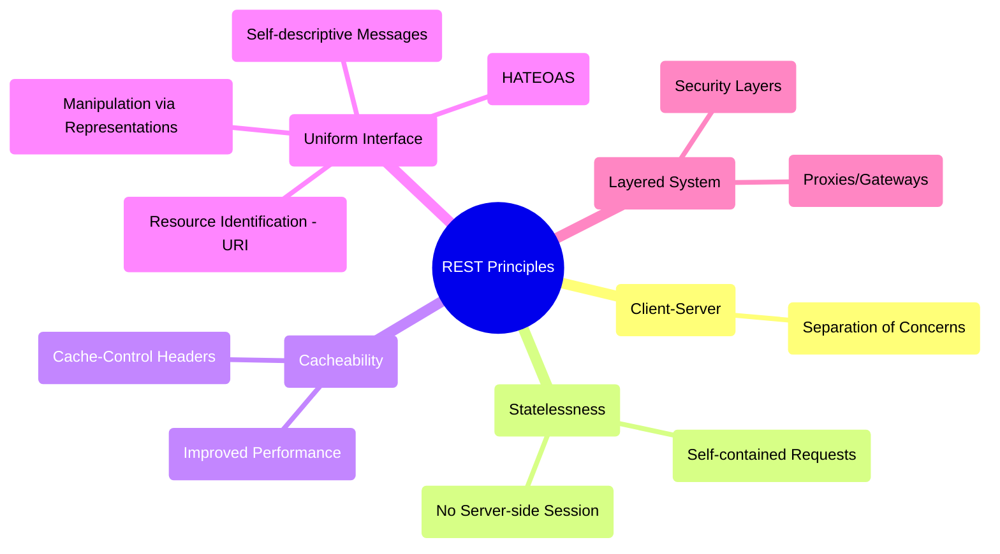
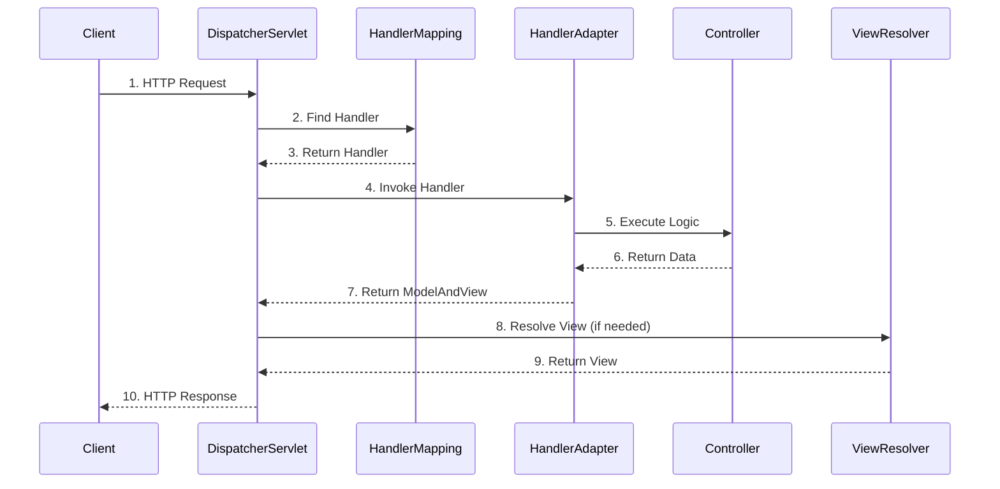
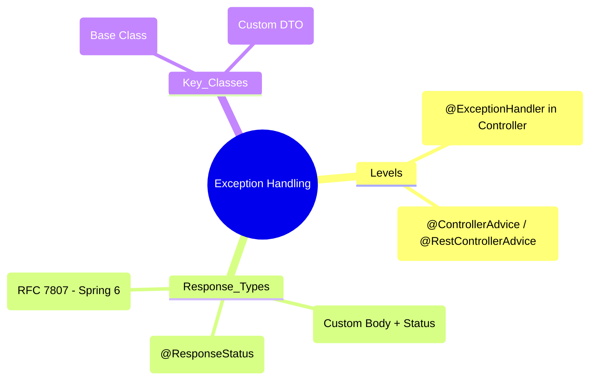

# REST API Development with Spring Boot - Deep Dive

## Table of Contents
1. [REST Fundamentals](#rest-fundamentals)
2. [Spring MVC Architecture](#spring-mvc-architecture)
3. [Building REST APIs](#building-rest-apis)
4. [Request/Response Handling](#request-response-handling)
5. [Validation](#validation)
6. [Exception Handling](#exception-handling)
7. [API Documentation](#api-documentation)
8. [Problem Details (RFC 7807)](#problem-details-rfc-7807)
9. [Async REST: DeferredResult vs WebClient](#async-rest-deferredresult-vs-webclient)
10. [Filters vs Interceptors](#filters-vs-interceptors)
11. [HTTP Interface Clients (Spring 6)](#http-interface-clients-spring-6)
12. [Best Practices](#best-practices)

---

## REST Fundamentals

### 🧠 ELI5: The "Universal Remote Control"

Imagine you have a **Universal Remote Control** that works for every TV in the world.

*   **Uniform Interface:** No matter which TV you use, the "Volume Up" button always does the same thing. You don't need a different remote for every brand.
*   **Stateless:** The TV doesn't need to remember what you did 5 minutes ago. Every time you press a button, the remote sends the *entire* command (e.g., "Set Volume to 20").
*   **Resources:** Every channel has a unique number (URI). If you want to watch Channel 5, you just go to `/channel/5`.

### 🗺️ Mindmap: REST Principles



## REST Fundamentals

### What is REST?

**REST (Representational State Transfer)** is an architectural style for designing networked applications.

### REST Principles

1. **Client-Server**: Separation of concerns
2. **Stateless**: Each request contains all needed information
3. **Cacheable**: Responses must define themselves as cacheable or not
4. **Uniform Interface**: Standardized way to interact with resources
5. **Layered System**: Client cannot tell if connected directly to server
6. **Code on Demand** (Optional): Servers can extend client functionality

### HTTP Methods

| Method | Purpose | Idempotent | Safe |
|--------|---------|------------|------|
| GET | Retrieve resource | Yes | Yes |
| POST | Create resource | No | No |
| PUT | Update/Replace resource | Yes | No |
| PATCH | Partial update | No | No |
| DELETE | Delete resource | Yes | No |
| HEAD | Get headers only | Yes | Yes |
| OPTIONS | Get supported methods | Yes | Yes |

### HTTP Status Codes

**Success (2xx)**
- `200 OK` - Successful GET, PUT, PATCH, DELETE
- `201 Created` - Successful POST
- `204 No Content` - Successful request with no body

**Client Errors (4xx)**
- `400 Bad Request` - Invalid request
- `401 Unauthorized` - Authentication required
- `403 Forbidden` - Authenticated but not authorized
- `404 Not Found` - Resource doesn't exist
- `409 Conflict` - Request conflicts with current state
- `422 Unprocessable Entity` - Validation errors

**Server Errors (5xx)**
- `500 Internal Server Error` - Generic server error
- `503 Service Unavailable` - Server temporarily unavailable

---

## Spring MVC Architecture

### 🧠 ELI5: The "Restaurant Workflow"

Imagine a busy **Restaurant**.

1.  **Valet (DispatcherServlet):** The first person you see. He takes your keys (request) and directs you where to go.
2.  **Hostess (HandlerMapping):** She looks at the reservation book and decides which table (Controller) is right for you.
3.  **Waiter (HandlerAdapter):** He takes your order and brings it to the chef. He knows *how* to talk to the chef.
4.  **Chef (Controller):** He actually cooks the food (Business Logic).
5.  **Platter (ModelAndView/ResponseEntity):** The food is put on a nice plate to be served back to you.

### 🗺️ Mindmap: Spring MVC Flow



## Spring MVC Architecture

### DispatcherServlet Flow

```
1. Client Request → DispatcherServlet
2. DispatcherServlet → HandlerMapping (find controller)
3. HandlerMapping → DispatcherServlet (return controller)
4. DispatcherServlet → HandlerAdapter (execute controller)
5. HandlerAdapter → Controller (handle request)
6. Controller → HandlerAdapter (return ModelAndView/ResponseEntity)
7. HandlerAdapter → DispatcherServlet
8. DispatcherServlet → ViewResolver (if view-based)
9. ViewResolver → DispatcherServlet (return View)
10. DispatcherServlet → View (render)
11. View → Client (response)
```

### Key Components

```java
@RestController = @Controller + @ResponseBody

// Controller - Handles requests
@RestController
@RequestMapping("/api/users")
public class UserController {
    // Handler methods
}

// Service - Business logic
@Service
public class UserService {
    // Business operations
}

// Repository - Data access
@Repository
public interface UserRepository extends JpaRepository<User, Long> {
}
```

---

## Building REST APIs

### Basic CRUD REST Controller

```java
@RestController
@RequestMapping("/api/users")
@CrossOrigin(origins = "*")
public class UserController {
    
    private final UserService userService;
    
    @Autowired
    public UserController(UserService userService) {
        this.userService = userService;
    }
    
    // GET all users
    @GetMapping
    public ResponseEntity<List<UserDTO>> getAllUsers() {
        List<UserDTO> users = userService.getAllUsers();
        return ResponseEntity.ok(users);
    }
    
    // GET user by ID
    @GetMapping("/{id}")
    public ResponseEntity<UserDTO> getUserById(@PathVariable Long id) {
        UserDTO user = userService.getUserById(id);
        return ResponseEntity.ok(user);
    }
    
    // POST - Create user
    @PostMapping
    public ResponseEntity<UserDTO> createUser(@Valid @RequestBody UserDTO userDTO) {
        UserDTO created = userService.createUser(userDTO);
        URI location = ServletUriComponentsBuilder
            .fromCurrentRequest()
            .path("/{id}")
            .buildAndExpand(created.getId())
            .toUri();
        return ResponseEntity.created(location).body(created);
    }
    
    // PUT - Update user
    @PutMapping("/{id}")
    public ResponseEntity<UserDTO> updateUser(
            @PathVariable Long id,
            @Valid @RequestBody UserDTO userDTO) {
        UserDTO updated = userService.updateUser(id, userDTO);
        return ResponseEntity.ok(updated);
    }
    
    // PATCH - Partial update
    @PatchMapping("/{id}")
    public ResponseEntity<UserDTO> partialUpdateUser(
            @PathVariable Long id,
            @RequestBody Map<String, Object> updates) {
        UserDTO updated = userService.partialUpdate(id, updates);
        return ResponseEntity.ok(updated);
    }
    
    // DELETE user
    @DeleteMapping("/{id}")
    public ResponseEntity<Void> deleteUser(@PathVariable Long id) {
        userService.deleteUser(id);
        return ResponseEntity.noContent().build();
    }
}
```

### DTO (Data Transfer Object)

```java
@Data
@NoArgsConstructor
@AllArgsConstructor
public class UserDTO {
    
    private Long id;
    
    @NotBlank(message = "Username is required")
    @Size(min = 3, max = 50)
    private String username;
    
    @NotBlank(message = "Email is required")
    @Email(message = "Email should be valid")
    private String email;
    
    @NotBlank(message = "Password is required")
    @Size(min = 8, message = "Password must be at least 8 characters")
    @JsonProperty(access = JsonProperty.Access.WRITE_ONLY)
    private String password;
    
    private String firstName;
    private String lastName;
    
    @Past(message = "Birth date must be in the past")
    private LocalDate birthDate;
    
    private Set<String> roles;
    
    @JsonFormat(pattern = "yyyy-MM-dd'T'HH:mm:ss")
    private LocalDateTime createdAt;
}
```

### Entity to DTO Mapping

```java
@Component
public class UserMapper {
    
    public UserDTO toDTO(User user) {
        if (user == null) return null;
        
        return UserDTO.builder()
            .id(user.getId())
            .username(user.getUsername())
            .email(user.getEmail())
            .firstName(user.getFirstName())
            .lastName(user.getLastName())
            .birthDate(user.getBirthDate())
            .roles(user.getRoles().stream()
                .map(Role::getName)
                .collect(Collectors.toSet()))
            .createdAt(user.getCreatedAt())
            .build();
    }
    
    public User toEntity(UserDTO dto) {
        if (dto == null) return null;
        
        User user = new User();
        user.setId(dto.getId());
        user.setUsername(dto.getUsername());
        user.setEmail(dto.getEmail());
        user.setFirstName(dto.getFirstName());
        user.setLastName(dto.getLastName());
        user.setBirthDate(dto.getBirthDate());
        return user;
    }
}
```

---

## Request/Response Handling

### Request Parameters

#### 1. Path Variables
```java
@GetMapping("/users/{id}")
public User getUser(@PathVariable Long id) {
    return userService.findById(id);
}

// Multiple path variables
@GetMapping("/users/{userId}/orders/{orderId}")
public Order getUserOrder(
        @PathVariable Long userId,
        @PathVariable Long orderId) {
    return orderService.findByUserAndOrder(userId, orderId);
}

// Optional path variable with default
@GetMapping({"/users", "/users/{id}"})
public ResponseEntity<?> getUsers(
        @PathVariable(required = false) Long id) {
    if (id != null) {
        return ResponseEntity.ok(userService.findById(id));
    }
    return ResponseEntity.ok(userService.findAll());
}
```

#### 2. Query Parameters
```java
@GetMapping("/users")
public List<User> searchUsers(
        @RequestParam(required = false) String name,
        @RequestParam(required = false) String email,
        @RequestParam(defaultValue = "0") int page,
        @RequestParam(defaultValue = "10") int size,
        @RequestParam(defaultValue = "id") String sortBy) {
    return userService.search(name, email, page, size, sortBy);
}

// Using @RequestParam Map for dynamic parameters
@GetMapping("/search")
public List<User> search(@RequestParam Map<String, String> params) {
    return userService.searchWithParams(params);
}
```

#### 3. Request Body
```java
@PostMapping("/users")
public User createUser(@RequestBody @Valid UserDTO userDTO) {
    return userService.create(userDTO);
}
```

#### 4. Request Headers
```java
@GetMapping("/users")
public List<User> getUsers(
        @RequestHeader("User-Agent") String userAgent,
        @RequestHeader(value = "Authorization", required = false) String auth) {
    return userService.findAll();
}
```

### Response Handling

#### 1. ResponseEntity
```java
@GetMapping("/{id}")
public ResponseEntity<UserDTO> getUser(@PathVariable Long id) {
    return userService.findById(id)
        .map(user -> ResponseEntity.ok(user))
        .orElse(ResponseEntity.notFound().build());
}

// With custom headers
@GetMapping("/{id}")
public ResponseEntity<UserDTO> getUser(@PathVariable Long id) {
    UserDTO user = userService.findById(id);
    HttpHeaders headers = new HttpHeaders();
    headers.add("Custom-Header", "value");
    return new ResponseEntity<>(user, headers, HttpStatus.OK);
}
```

#### 2. @ResponseStatus
```java
@PostMapping
@ResponseStatus(HttpStatus.CREATED)
public UserDTO createUser(@RequestBody @Valid UserDTO userDTO) {
    return userService.create(userDTO);
}
```

### Content Negotiation

```java
@GetMapping(value = "/users/{id}", 
            produces = {MediaType.APPLICATION_JSON_VALUE, 
                       MediaType.APPLICATION_XML_VALUE})
public User getUser(@PathVariable Long id) {
    return userService.findById(id);
}

@PostMapping(value = "/users",
             consumes = MediaType.APPLICATION_JSON_VALUE,
             produces = MediaType.APPLICATION_JSON_VALUE)
public User createUser(@RequestBody User user) {
    return userService.create(user);
}
```

### Pagination and Sorting

```java
@GetMapping("/users")
public ResponseEntity<Page<UserDTO>> getUsers(
        @RequestParam(defaultValue = "0") int page,
        @RequestParam(defaultValue = "10") int size,
        @RequestParam(defaultValue = "id,asc") String[] sort) {
    
    List<Sort.Order> orders = Arrays.stream(sort)
        .map(s -> {
            String[] parts = s.split(",");
            return new Sort.Order(
                Sort.Direction.fromString(parts[1]), 
                parts[0]
            );
        })
        .collect(Collectors.toList());
    
    Pageable pageable = PageRequest.of(page, size, Sort.by(orders));
    Page<UserDTO> users = userService.findAll(pageable);
    
    return ResponseEntity.ok(users);
}

// Custom pagination response
@GetMapping("/users/paginated")
public ResponseEntity<PaginatedResponse<UserDTO>> getUsersPaginated(
        Pageable pageable) {
    Page<UserDTO> page = userService.findAll(pageable);
    
    PaginatedResponse<UserDTO> response = PaginatedResponse.<UserDTO>builder()
        .content(page.getContent())
        .pageNumber(page.getNumber())
        .pageSize(page.getSize())
        .totalElements(page.getTotalElements())
        .totalPages(page.getTotalPages())
        .last(page.isLast())
        .build();
    
    return ResponseEntity.ok(response);
}
```

---

## Validation

### Bean Validation Annotations

```java
@Data
public class UserDTO {
    
    @NotNull(message = "ID cannot be null")
    private Long id;
    
    @NotBlank(message = "Username is required")
    @Size(min = 3, max = 50, message = "Username must be between 3 and 50 characters")
    @Pattern(regexp = "^[a-zA-Z0-9_]+$", message = "Username can only contain alphanumeric and underscore")
    private String username;
    
    @NotBlank(message = "Email is required")
    @Email(message = "Email should be valid")
    private String email;
    
    @NotBlank(message = "Password is required")
    @Size(min = 8, max = 100, message = "Password must be between 8 and 100 characters")
    private String password;
    
    @Min(value = 18, message = "Age must be at least 18")
    @Max(value = 150, message = "Age must be less than 150")
    private Integer age;
    
    @Past(message = "Birth date must be in the past")
    private LocalDate birthDate;
    
    @Future(message = "Appointment date must be in the future")
    private LocalDate appointmentDate;
    
    @Positive(message = "Price must be positive")
    private BigDecimal price;
    
    @DecimalMin(value = "0.0", inclusive = false)
    @DecimalMax(value = "100.0")
    private BigDecimal percentage;
    
    @URL(message = "Website must be a valid URL")
    private String website;
    
    @NotEmpty(message = "Roles cannot be empty")
    private Set<@NotBlank String> roles;
}
```

### Custom Validator

```java
// Custom annotation
@Target({ElementType.FIELD})
@Retention(RetentionPolicy.RUNTIME)
@Constraint(validatedBy = UniqueEmailValidator.class)
public @interface UniqueEmail {
    String message() default "Email already exists";
    Class<?>[] groups() default {};
    Class<? extends Payload>[] payload() default {};
}

// Validator implementation
@Component
public class UniqueEmailValidator implements ConstraintValidator<UniqueEmail, String> {
    
    @Autowired
    private UserRepository userRepository;
    
    @Override
    public boolean isValid(String email, ConstraintValidatorContext context) {
        if (email == null) return true;
        return !userRepository.existsByEmail(email);
    }
}

// Usage
@Data
public class UserDTO {
    @UniqueEmail
    @Email
    private String email;
}
```

### Validation Groups

```java
public interface CreateValidation {}
public interface UpdateValidation {}

@Data
public class UserDTO {
    
    @Null(groups = CreateValidation.class)
    @NotNull(groups = UpdateValidation.class)
    private Long id;
    
    @NotBlank(groups = {CreateValidation.class, UpdateValidation.class})
    private String username;
}

// Controller
@PostMapping
public UserDTO createUser(
        @Validated(CreateValidation.class) @RequestBody UserDTO dto) {
    return userService.create(dto);
}

@PutMapping("/{id}")
public UserDTO updateUser(
        @PathVariable Long id,
        @Validated(UpdateValidation.class) @RequestBody UserDTO dto) {
    return userService.update(id, dto);
}
```

---

## Exception Handling

### 🧠 ELI5: The "Safety Net"

Imagine you are a **Trapeze Artist** in a circus.

*   **Normal Flow:** You jump from one bar to another (successful API call).
*   **Exception:** You miss the bar and fall (an error occurs).
*   **@ExceptionHandler:** Is like a **Safety Net** specifically placed for *one* type of fall (e.g., a net just for "slipping").
*   **@ControllerAdvice:** Is like a **Giant Safety Net** that covers the *entire* circus floor. No matter where you fall from, this net will catch you and make sure you land safely (returns a nice JSON error instead of a scary 500 page).

### 🗺️ Mindmap: Exception Handling



## Exception Handling

### Global Exception Handler

```java
@RestControllerAdvice
public class GlobalExceptionHandler {
    
    // Handle specific exception
    @ExceptionHandler(ResourceNotFoundException.class)
    public ResponseEntity<ErrorResponse> handleResourceNotFound(
            ResourceNotFoundException ex,
            WebRequest request) {
        ErrorResponse error = ErrorResponse.builder()
            .timestamp(LocalDateTime.now())
            .status(HttpStatus.NOT_FOUND.value())
            .error("Not Found")
            .message(ex.getMessage())
            .path(request.getDescription(false).substring(4))
            .build();
        return new ResponseEntity<>(error, HttpStatus.NOT_FOUND);
    }
    
    // Handle validation errors
    @ExceptionHandler(MethodArgumentNotValidException.class)
    public ResponseEntity<ValidationErrorResponse> handleValidationErrors(
            MethodArgumentNotValidException ex) {
        
        Map<String, String> errors = new HashMap<>();
        ex.getBindingResult().getFieldErrors().forEach(error -> 
            errors.put(error.getField(), error.getDefaultMessage())
        );
        
        ValidationErrorResponse response = ValidationErrorResponse.builder()
            .timestamp(LocalDateTime.now())
            .status(HttpStatus.BAD_REQUEST.value())
            .error("Validation Failed")
            .errors(errors)
            .build();
        
        return new ResponseEntity<>(response, HttpStatus.BAD_REQUEST);
    }
    
    // Handle constraint violations
    @ExceptionHandler(ConstraintViolationException.class)
    public ResponseEntity<ErrorResponse> handleConstraintViolation(
            ConstraintViolationException ex) {
        String message = ex.getConstraintViolations().stream()
            .map(ConstraintViolation::getMessage)
            .collect(Collectors.joining(", "));
        
        ErrorResponse error = ErrorResponse.builder()
            .timestamp(LocalDateTime.now())
            .status(HttpStatus.BAD_REQUEST.value())
            .error("Constraint Violation")
            .message(message)
            .build();
        
        return new ResponseEntity<>(error, HttpStatus.BAD_REQUEST);
    }
    
    // Handle data integrity violations
    @ExceptionHandler(DataIntegrityViolationException.class)
    public ResponseEntity<ErrorResponse> handleDataIntegrityViolation(
            DataIntegrityViolationException ex) {
        ErrorResponse error = ErrorResponse.builder()
            .timestamp(LocalDateTime.now())
            .status(HttpStatus.CONFLICT.value())
            .error("Data Integrity Violation")
            .message("Database constraint violation")
            .build();
        return new ResponseEntity<>(error, HttpStatus.CONFLICT);
    }
    
    // Handle access denied
    @ExceptionHandler(AccessDeniedException.class)
    public ResponseEntity<ErrorResponse> handleAccessDenied(
            AccessDeniedException ex) {
        ErrorResponse error = ErrorResponse.builder()
            .timestamp(LocalDateTime.now())
            .status(HttpStatus.FORBIDDEN.value())
            .error("Access Denied")
            .message(ex.getMessage())
            .build();
        return new ResponseEntity<>(error, HttpStatus.FORBIDDEN);
    }
    
    // Handle generic exceptions
    @ExceptionHandler(Exception.class)
    public ResponseEntity<ErrorResponse> handleGlobalException(
            Exception ex,
            WebRequest request) {
        ErrorResponse error = ErrorResponse.builder()
            .timestamp(LocalDateTime.now())
            .status(HttpStatus.INTERNAL_SERVER_ERROR.value())
            .error("Internal Server Error")
            .message("An unexpected error occurred")
            .path(request.getDescription(false).substring(4))
            .build();
        return new ResponseEntity<>(error, HttpStatus.INTERNAL_SERVER_ERROR);
    }
}
```

### Error Response DTOs

```java
@Data
@Builder
@AllArgsConstructor
@NoArgsConstructor
public class ErrorResponse {
    private LocalDateTime timestamp;
    private int status;
    private String error;
    private String message;
    private String path;
}

@Data
@Builder
@AllArgsConstructor
@NoArgsConstructor
public class ValidationErrorResponse {
    private LocalDateTime timestamp;
    private int status;
    private String error;
    private Map<String, String> errors;
}
```

### Custom Exceptions

```java
@ResponseStatus(HttpStatus.NOT_FOUND)
public class ResourceNotFoundException extends RuntimeException {
    public ResourceNotFoundException(String message) {
        super(message);
    }
    
    public ResourceNotFoundException(String resourceName, String fieldName, Object fieldValue) {
        super(String.format("%s not found with %s: '%s'", resourceName, fieldName, fieldValue));
    }
}

@ResponseStatus(HttpStatus.BAD_REQUEST)
public class BadRequestException extends RuntimeException {
    public BadRequestException(String message) {
        super(message);
    }
}

@ResponseStatus(HttpStatus.CONFLICT)
public class ResourceAlreadyExistsException extends RuntimeException {
    public ResourceAlreadyExistsException(String message) {
        super(message);
    }
}
```

---

## API Documentation

### OpenAPI (Swagger) Configuration

```xml
<dependency>
    <groupId>org.springdoc</groupId>
    <artifactId>springdoc-openapi-starter-webmvc-ui</artifactId>
    <version>2.2.0</version>
</dependency>
```

```java
@Configuration
public class OpenAPIConfig {
    
    @Bean
    public OpenAPI customOpenAPI() {
        return new OpenAPI()
            .info(new Info()
                .title("User Management API")
                .version("1.0")
                .description("API for managing users")
                .contact(new Contact()
                    .name("API Support")
                    .email("support@example.com")
                    .url("https://example.com"))
                .license(new License()
                    .name("Apache 2.0")
                    .url("https://www.apache.org/licenses/LICENSE-2.0.html")))
            .servers(Arrays.asList(
                new Server().url("http://localhost:8080").description("Development"),
                new Server().url("https://api.example.com").description("Production")
            ))
            .components(new Components()
                .addSecuritySchemes("bearer-jwt", new SecurityScheme()
                    .type(SecurityScheme.Type.HTTP)
                    .scheme("bearer")
                    .bearerFormat("JWT")));
    }
}
```

### API Documentation Annotations

```java
@RestController
@RequestMapping("/api/users")
@Tag(name = "User Management", description = "APIs for managing users")
public class UserController {
    
    @Operation(
        summary = "Get user by ID",
        description = "Retrieve a single user by their ID",
        tags = {"User Management"}
    )
    @ApiResponses(value = {
        @ApiResponse(
            responseCode = "200",
            description = "Successfully retrieved user",
            content = @Content(schema = @Schema(implementation = UserDTO.class))
        ),
        @ApiResponse(
            responseCode = "404",
            description = "User not found",
            content = @Content(schema = @Schema(implementation = ErrorResponse.class))
        ),
        @ApiResponse(
            responseCode = "401",
            description = "Unauthorized"
        )
    })
    @GetMapping("/{id}")
    public ResponseEntity<UserDTO> getUserById(
            @Parameter(description = "User ID", required = true)
            @PathVariable Long id) {
        return ResponseEntity.ok(userService.findById(id));
    }
    
    @Operation(summary = "Create a new user")
    @SecurityRequirement(name = "bearer-jwt")
    @PostMapping
    public ResponseEntity<UserDTO> createUser(
            @io.swagger.v3.oas.annotations.parameters.RequestBody(
                description = "User details",
                required = true,
                content = @Content(schema = @Schema(implementation = UserDTO.class))
            )
            @RequestBody @Valid UserDTO userDTO) {
        UserDTO created = userService.create(userDTO);
        return ResponseEntity.status(HttpStatus.CREATED).body(created);
    }
}

// DTO documentation
@Schema(description = "User Data Transfer Object")
@Data
public class UserDTO {
    
    @Schema(description = "User ID", example = "1", accessMode = Schema.AccessMode.READ_ONLY)
    private Long id;
    
    @Schema(description = "Username", example = "john_doe", required = true)
    private String username;
    
    @Schema(description = "Email address", example = "john@example.com", required = true)
    private String email;
    
    @Schema(description = "User password", example = "P@ssw0rd", required = true, accessMode = Schema.AccessMode.WRITE_ONLY)
    private String password;
}
```

### Accessing Swagger UI

```
http://localhost:8080/swagger-ui/index.html
http://localhost:8080/v3/api-docs
```

---

---

## Problem Details (RFC 7807)

### What is Problem Details?
RFC 7807 is a standard for machine-readable error responses in HTTP APIs. Spring Boot 3 provides native support for this.

### Enabling Problem Details
```yaml
spring:
  mvc:
    problemdetails:
      enabled: true
```

### Usage in Controller
```java
@GetMapping("/{id}")
public User getUser(@PathVariable Long id) {
    if (id < 0) {
        throw new ErrorResponseException(HttpStatus.BAD_REQUEST, 
            ProblemDetail.forStatusAndDetail(HttpStatus.BAD_REQUEST, "ID must be positive"), null);
    }
    return userService.findById(id);
}
```

**Response Format**:
```json
{
  "type": "about:blank",
  "title": "Bad Request",
  "status": 400,
  "detail": "ID must be positive",
  "instance": "/api/users/-1"
}
```

---

## Async REST: DeferredResult vs WebClient

### 1. DeferredResult (Server-Side Async)
Used when a request takes a long time to process (e.g., waiting for an external event). It releases the container thread while waiting.

```java
@GetMapping("/async-task")
public DeferredResult<ResponseEntity<?>> executeAsyncTask() {
    DeferredResult<ResponseEntity<?>> output = new DeferredResult<>(5000L);
    
    executorService.submit(() -> {
        // Long running task
        output.setResult(ResponseEntity.ok("Task Complete"));
    });
    
    return output;
}
```

### 2. WebClient (Client-Side Non-Blocking)
The modern replacement for `RestTemplate`. It is non-blocking and supports reactive streams.

```java
public Mono<User> getUser(Long id) {
    return webClient.get()
        .uri("/users/{id}", id)
        .retrieve()
        .bodyToMono(User.class);
}
```

### RestTemplate vs WebClient
| Feature | RestTemplate | WebClient |
|---------|--------------|-----------|
| **Model** | Blocking (one thread per request) | Non-blocking (reactive) |
| **Status** | Maintenance Mode | Active Development |
| **Dependencies** | Spring Web | Spring WebFlux |

---

## Filters vs Interceptors

| Feature | Filter (Servlet API) | Interceptor (Spring MVC) |
|---------|----------------------|--------------------------|
| **Origin** | Part of Servlet Container | Part of Spring Framework |
| **Scope** | All requests (even non-Spring) | Only requests handled by DispatcherServlet |
| **Context** | No access to Spring Context (usually) | Full access to Spring Context & Handler |
| **Methods** | `doFilter()` | `preHandle()`, `postHandle()`, `afterCompletion()` |
| **Use Case** | Logging, Security, CORS, GZIP | Auth checks, Locale changes, Logging handler info |

---

## HTTP Interface Clients (Spring 6)

Spring 6 allows defining HTTP clients using Java interfaces, similar to Feign or Retrofit.

### 1. Define the Interface
```java
public interface UserClient {
    @GetExchange("/users/{id}")
    User getUser(@PathVariable Long id);
    
    @PostExchange("/users")
    User createUser(@RequestBody User user);
}
```

### 2. Create the Proxy
```java
@Configuration
public class ClientConfig {
    @Bean
    public UserClient userClient(WebClient.Builder builder) {
        WebClient webClient = builder.baseUrl("https://api.example.com").build();
        HttpServiceProxyFactory factory = HttpServiceProxyFactory
            .builder(WebClientAdapter.forClient(webClient)).build();
        return factory.createClient(UserClient.class);
    }
}
```

---

## Best Practices

### 1. API Versioning

#### URI Versioning
```java
@RestController
@RequestMapping("/api/v1/users")
public class UserControllerV1 {
}

@RestController
@RequestMapping("/api/v2/users")
public class UserControllerV2 {
}
```

#### Header Versioning
```java
@GetMapping(headers = "API-Version=1")
public List<UserDTO> getUsersV1() {
}

@GetMapping(headers = "API-Version=2")
public List<UserDTO> getUsersV2() {
}
```

#### Media Type Versioning
```java
@GetMapping(produces = "application/vnd.company.app-v1+json")
public List<UserDTO> getUsersV1() {
}

@GetMapping(produces = "application/vnd.company.app-v2+json")
public List<UserDTO> getUsersV2() {
}
```

### 2. HATEOAS (Hypermedia)

```java
@GetMapping("/{id}")
public EntityModel<UserDTO> getUser(@PathVariable Long id) {
    UserDTO user = userService.findById(id);
    
    EntityModel<UserDTO> resource = EntityModel.of(user);
    resource.add(linkTo(methodOn(UserController.class).getUser(id)).withSelfRel());
    resource.add(linkTo(methodOn(UserController.class).getAllUsers()).withRel("users"));
    resource.add(linkTo(methodOn(OrderController.class).getUserOrders(id)).withRel("orders"));
    
    return resource;
}
```

### 3. Rate Limiting

```java
@RestController
@RequestMapping("/api/users")
public class UserController {
    
    private final RateLimiter rateLimiter = RateLimiter.create(10.0); // 10 requests per second
    
    @GetMapping
    public ResponseEntity<List<UserDTO>> getUsers() {
        if (!rateLimiter.tryAcquire()) {
            return ResponseEntity.status(HttpStatus.TOO_MANY_REQUESTS).build();
        }
        return ResponseEntity.ok(userService.findAll());
    }
}
```

### 4. Filtering and Searching

```java
@GetMapping("/search")
public ResponseEntity<List<UserDTO>> searchUsers(
        @RequestParam(required = false) String username,
        @RequestParam(required = false) String email,
        @RequestParam(required = false) String firstName,
        @RequestParam(required = false) LocalDate createdAfter,
        @RequestParam(required = false) LocalDate createdBefore) {
    
    UserSearchCriteria criteria = UserSearchCriteria.builder()
        .username(username)
        .email(email)
        .firstName(firstName)
        .createdAfter(createdAfter)
        .createdBefore(createdBefore)
        .build();
    
    List<UserDTO> users = userService.search(criteria);
    return ResponseEntity.ok(users);
}
```

### 5. Async REST Endpoints

```java
@GetMapping("/async")
public CompletableFuture<ResponseEntity<List<UserDTO>>> getUsersAsync() {
    return userService.findAllAsync()
        .thenApply(users -> ResponseEntity.ok(users));
}

@GetMapping("/deferred")
public DeferredResult<ResponseEntity<UserDTO>> getUserDeferred(@PathVariable Long id) {
    DeferredResult<ResponseEntity<UserDTO>> deferredResult = new DeferredResult<>();
    
    CompletableFuture.supplyAsync(() -> userService.findById(id))
        .whenComplete((user, ex) -> {
            if (ex != null) {
                deferredResult.setErrorResult(ex);
            } else {
                deferredResult.setResult(ResponseEntity.ok(user));
            }
        });
    
    return deferredResult;
}
```

---

## Key Interview Questions

### Q1: Difference between @Controller and @RestController?

**Answer**:
- `@Controller`: Returns views (HTML pages), used in traditional MVC
- `@RestController`: Combination of @Controller + @ResponseBody, returns data (JSON/XML), used for REST APIs

### Q2: Difference between PUT and PATCH?

**Answer**:
- **PUT**: Complete replacement of resource (all fields must be provided)
- **PATCH**: Partial update (only changed fields provided)
- PUT is idempotent, PATCH typically isn't

### Q3: How to handle versioning in REST APIs?

**Answer**: Multiple approaches:
1. **URI versioning**: /api/v1/users (most common)
2. **Query parameter**: /api/users?version=1
3. **Header**: API-Version: 1
4. **Media type**: application/vnd.company.app-v1+json

### Q4: What is content negotiation?

**Answer**: 
Process where client and server agree on the format of data exchange. Client uses `Accept` header, server uses `Content-Type` header. Spring Boot supports JSON, XML, etc.

### Q5: How to implement pagination in REST APIs?

**Answer**:
```java
@GetMapping
public Page<UserDTO> getUsers(
    @PageableDefault(size = 20, sort = "id") Pageable pageable) {
    return userService.findAll(pageable);
}
```

---

## Practice Exercises

1. Build a complete CRUD REST API for a Book entity
2. Implement custom exception handling with proper error responses
3. Add pagination, sorting, and filtering to your API
4. Implement API versioning (both URI and header-based)
5. Add Swagger documentation to your API
6. Implement request/response logging interceptor
7. Create a REST client using RestTemplate or WebClient
8. Implement HATEOAS in your API responses
