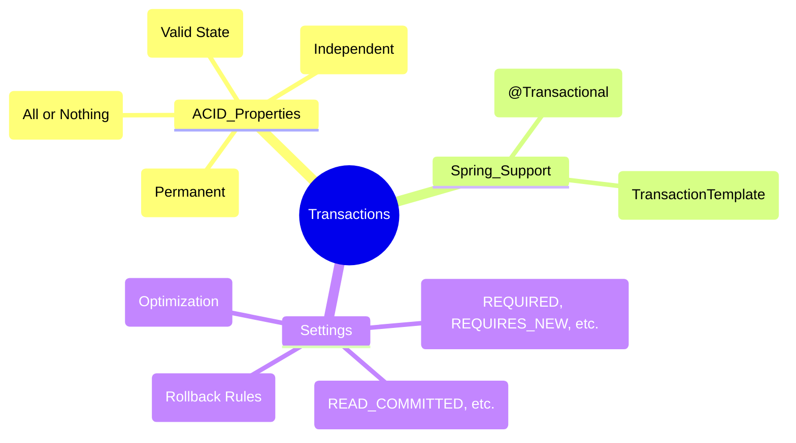

# Spring Data JPA - Deep Dive

## Table of Contents
1. [JPA Fundamentals](#jpa-fundamentals)
2. [Entity Mapping](#entity-mapping)
3. [Relationships](#relationships)
4. [Spring Data Repositories](#spring-data-repositories)
5. [Query Methods](#query-methods)
6. [Transactions](#transactions)
7. [Performance Optimization](#performance-optimization)
8. [Entity Graphs](#entity-graphs)
9. [Projections](#projections)
10. [JPA Auditing](#jpa-auditing)
11. [Transaction Pitfalls & Rollback Rules](#transaction-pitfalls--rollback-rules)
12. [Hibernate Caching (1st & 2nd Level)](#hibernate-caching-1st--2nd-level)
13. [Optimistic vs Pessimistic Locking](#optimistic-vs-pessimistic-locking)
14. [Soft Deletes with @SQLDelete](#soft-deletes-with-sqldelete)
15. [N+1 Problem: Deep Dive & Solutions](#n1-problem-deep-dive--solutions)
16. [Common Issues](#common-issues)

---

## JPA Fundamentals

### 🧠 ELI5: The "Translator"

Imagine you speak **English** (Java Objects), but your friend only speaks **French** (SQL/Database).

*   **JPA:** Is the **Dictionary**. It defines the rules for how words should be translated.
*   **Hibernate:** Is the **Translator**. He is the person who actually listens to your English and speaks French to your friend.
*   **Spring Data JPA:** Is like a **Smart Assistant**. You don't even have to talk to the translator. You just show the assistant a picture of what you want, and it handles the rest.

### 🗺️ Mindmap: JPA Architecture

## 💾 JPA Architecture

> [!TIP]
> **Interview Pro-Tip: "What is the difference between save() and saveAndFlush()?"**
> - **save()**: Usually just saves the entity to the Persistence Context (L1 Cache). The actual SQL `INSERT`/`UPDATE` might happen later (at the end of the transaction).
> - **saveAndFlush()**: Saves the entity AND immediately pushes the changes to the database. Use this if you need the DB to trigger something (like an auto-increment ID or a trigger) immediately.

### 🔍 Deep Dive: How Repositories Work (Proxies)
When you create an interface like `UserRepository`, Spring doesn't "generate code" at compile time. Instead, at runtime, it uses **JDK Dynamic Proxies**. It creates a proxy object that implements your interface. When you call `findByUsername()`, the proxy intercepts the call, parses the method name, generates the JPQL/SQL, and executes it via the `EntityManager`.

### 🛠️ Complex Example: Native Query with Projections
```java
public interface UserStatsProjection {
    String getUsername();
    Long getOrderCount();
}

@Repository
public interface UserRepository extends JpaRepository<User, Long> {
    @Query(value = "SELECT u.username as username, COUNT(o.id) as orderCount " +
                   "FROM users u LEFT JOIN orders o ON u.id = o.user_id " +
                   "GROUP BY u.username", nativeQuery = true)
    List<UserStatsProjection> getUserStats();
}
```

## JPA Fundamentals

### What is JPA?

**JPA (Java Persistence API)** is a specification for accessing, persisting, and managing data between Java objects and relational databases.

### JPA vs Hibernate vs Spring Data JPA

| Aspect | JPA | Hibernate | Spring Data JPA |
|--------|-----|-----------|-----------------|
| Type | Specification | Implementation | Abstraction Layer |
| Purpose | Standard API | ORM Framework | Repository Pattern |
| Vendor | Oracle | Red Hat | Spring |
| Usage | Interface definitions | Concrete implementation | Simplified data access |

```
Spring Data JPA → JPA API → Hibernate → JDBC → Database
```

### Setup

```xml
<dependency>
    <groupId>org.springframework.boot</groupId>
    <artifactId>spring-boot-starter-data-jpa</artifactId>
</dependency>
<dependency>
    <groupId>com.h2database</groupId>
    <artifactId>h2</artifactId>
    <scope>runtime</scope>
</dependency>
<!-- OR -->
<dependency>
    <groupId>com.mysql</groupId>
    <artifactId>mysql-connector-j</artifactId>
    <scope>runtime</scope>
</dependency>
```

**Configuration**:
```yaml
spring:
  datasource:
    url: jdbc:mysql://localhost:3306/mydb
    username: root
    password: secret
  jpa:
    hibernate:
      ddl-auto: update  # create, create-drop, update, validate, none
    show-sql: true
    properties:
      hibernate:
        format_sql: true
        dialect: org.hibernate.dialect.MySQL8Dialect
```

---

## Entity Mapping

### Basic Entity

```java
@Entity
@Table(name = "users")
@Data
@NoArgsConstructor
@AllArgsConstructor
public class User {
    
    @Id
    @GeneratedValue(strategy = GenerationType.IDENTITY)
    private Long id;
    
    @Column(name = "username", nullable = false, unique = true, length = 50)
    private String username;
    
    @Column(nullable = false, unique = true)
    private String email;
    
    @Column(name = "first_name")
    private String firstName;
    
    @Column(name = "last_name")
    private String lastName;
    
    @Temporal(TemporalType.DATE)
    private Date birthDate;
    
    @Enumerated(EnumType.STRING)
    private Status status;
    
    @Lob
    @Column(columnDefinition = "TEXT")
    private String bio;
    
    @CreatedDate
    @Column(updatable = false)
    private LocalDateTime createdAt;
    
    @LastModifiedDate
    private LocalDateTime updatedAt;
    
    @Version
    private Long version; // Optimistic locking
    
    @Transient
    private String temporaryData; // Not persisted
}

public enum Status {
    ACTIVE, INACTIVE, BANNED
}
```

### Generation Strategies

```java
// Auto (default - lets JPA choose)
@GeneratedValue(strategy = GenerationType.AUTO)
private Long id;

// Identity (auto-increment in DB)
@GeneratedValue(strategy = GenerationType.IDENTITY)
private Long id;

// Sequence (uses DB sequence)
@GeneratedValue(strategy = GenerationType.SEQUENCE, generator = "user_seq")
@SequenceGenerator(name = "user_seq", sequenceName = "user_sequence", allocationSize = 1)
private Long id;

// Table (uses separate table)
@GeneratedValue(strategy = GenerationType.TABLE, generator = "user_gen")
@TableGenerator(name = "user_gen", table = "id_generator", 
                pkColumnName = "gen_name", valueColumnName = "gen_value")
private Long id;

// Custom UUID
@Id
@GeneratedValue(generator = "UUID")
@GenericGenerator(name = "UUID", strategy = "org.hibernate.id.UUIDGenerator")
@Column(updatable = false, nullable = false)
private UUID id;
```

### Composite Keys

**Method 1: @IdClass**
```java
@Data
public class OrderItemId implements Serializable {
    private Long orderId;
    private Long productId;
}

@Entity
@IdClass(OrderItemId.class)
@Data
public class OrderItem {
    
    @Id
    private Long orderId;
    
    @Id
    private Long productId;
    
    private Integer quantity;
    private BigDecimal price;
}
```

**Method 2: @EmbeddedId**
```java
@Embeddable
@Data
public class OrderItemId implements Serializable {
    private Long orderId;
    private Long productId;
}

@Entity
@Data
public class OrderItem {
    
    @EmbeddedId
    private OrderItemId id;
    
    private Integer quantity;
    private BigDecimal price;
}
```

### Embedded Objects

```java
@Embeddable
@Data
public class Address {
    private String street;
    private String city;
    private String state;
    private String zipCode;
    private String country;
}

@Entity
@Data
public class User {
    @Id
    @GeneratedValue(strategy = GenerationType.IDENTITY)
    private Long id;
    
    private String name;
    
    @Embedded
    @AttributeOverrides({
        @AttributeOverride(name = "street", column = @Column(name = "home_street")),
        @AttributeOverride(name = "city", column = @Column(name = "home_city"))
    })
    private Address homeAddress;
    
    @Embedded
    @AttributeOverrides({
        @AttributeOverride(name = "street", column = @Column(name = "work_street")),
        @AttributeOverride(name = "city", column = @Column(name = "work_city"))
    })
    private Address workAddress;
}
```

---

---

## Relationships

### 🧠 ELI5: The "Social Network"

*   **One-to-One:** Like a **Person and their Passport**. One person has exactly one passport, and one passport belongs to exactly one person.
*   **One-to-Many:** Like a **Mother and her Children**. One mother can have many children, but each child has only one biological mother.
*   **Many-to-Many:** Like **Students and Classes**. One student can take many classes, and one class can have many students.

### 🗺️ Mindmap: JPA Relationships

## 💾 JPA Architecture

## Relationships

### One-to-One

**Unidirectional**:
```java
@Entity
@Data
public class User {
    @Id
    @GeneratedValue(strategy = GenerationType.IDENTITY)
    private Long id;
    
    private String username;
    
    @OneToOne(cascade = CascadeType.ALL, orphanRemoval = true)
    @JoinColumn(name = "profile_id", referencedColumnName = "id")
    private UserProfile profile;
}

@Entity
@Data
public class UserProfile {
    @Id
    @GeneratedValue(strategy = GenerationType.IDENTITY)
    private Long id;
    
    private String bio;
    private String website;
}
```

**Bidirectional**:
```java
@Entity
@Data
public class User {
    @Id
    @GeneratedValue(strategy = GenerationType.IDENTITY)
    private Long id;
    
    private String username;
    
    @OneToOne(mappedBy = "user", cascade = CascadeType.ALL, orphanRemoval = true)
    private UserProfile profile;
}

@Entity
@Data
public class UserProfile {
    @Id
    @GeneratedValue(strategy = GenerationType.IDENTITY)
    private Long id;
    
    private String bio;
    
    @OneToOne
    @JoinColumn(name = "user_id")
    private User user;
}
```

### One-to-Many / Many-to-One

```java
@Entity
@Data
public class User {
    @Id
    @GeneratedValue(strategy = GenerationType.IDENTITY)
    private Long id;
    
    private String username;
    
    @OneToMany(mappedBy = "user", cascade = CascadeType.ALL, orphanRemoval = true)
    private List<Order> orders = new ArrayList<>();
    
    // Helper methods
    public void addOrder(Order order) {
        orders.add(order);
        order.setUser(this);
    }
    
    public void removeOrder(Order order) {
        orders.remove(order);
        order.setUser(null);
    }
}

@Entity
@Table(name = "orders")
@Data
public class Order {
    @Id
    @GeneratedValue(strategy = GenerationType.IDENTITY)
    private Long id;
    
    private String orderNumber;
    
    @ManyToOne(fetch = FetchType.LAZY)
    @JoinColumn(name = "user_id")
    private User user;
    
    private LocalDateTime orderDate;
}
```

### Many-to-Many

**Without Extra Columns**:
```java
@Entity
@Data
public class Student {
    @Id
    @GeneratedValue(strategy = GenerationType.IDENTITY)
    private Long id;
    
    private String name;
    
    @ManyToMany(cascade = {CascadeType.PERSIST, CascadeType.MERGE})
    @JoinTable(
        name = "student_course",
        joinColumns = @JoinColumn(name = "student_id"),
        inverseJoinColumns = @JoinColumn(name = "course_id")
    )
    private Set<Course> courses = new HashSet<>();
    
    public void addCourse(Course course) {
        courses.add(course);
        course.getStudents().add(this);
    }
    
    public void removeCourse(Course course) {
        courses.remove(course);
        course.getStudents().remove(this);
    }
}

@Entity
@Data
public class Course {
    @Id
    @GeneratedValue(strategy = GenerationType.IDENTITY)
    private Long id;
    
    private String name;
    
    @ManyToMany(mappedBy = "courses")
    private Set<Student> students = new HashSet<>();
}
```

**With Extra Columns (Join Entity)**:
```java
@Entity
@Data
public class Student {
    @Id
    @GeneratedValue(strategy = GenerationType.IDENTITY)
    private Long id;
    
    private String name;
    
    @OneToMany(mappedBy = "student", cascade = CascadeType.ALL, orphanRemoval = true)
    private List<Enrollment> enrollments = new ArrayList<>();
}

@Entity
@Data
public class Course {
    @Id
    @GeneratedValue(strategy = GenerationType.IDENTITY)
    private Long id;
    
    private String name;
    
    @OneToMany(mappedBy = "course", cascade = CascadeType.ALL, orphanRemoval = true)
    private List<Enrollment> enrollments = new ArrayList<>();
}

@Entity
@Data
public class Enrollment {
    @Id
    @GeneratedValue(strategy = GenerationType.IDENTITY)
    private Long id;
    
    @ManyToOne(fetch = FetchType.LAZY)
    @JoinColumn(name = "student_id")
    private Student student;
    
    @ManyToOne(fetch = FetchType.LAZY)
    @JoinColumn(name = "course_id")
    private Course course;
    
    private LocalDateTime enrolledDate;
    private BigDecimal grade;
    private String status;
}
```

### Cascade Types

```java
@OneToMany(cascade = {
    CascadeType.PERSIST,  // Save child when parent saved
    CascadeType.MERGE,    // Update child when parent updated
    CascadeType.REMOVE,   // Delete child when parent deleted
    CascadeType.REFRESH,  // Refresh child when parent refreshed
    CascadeType.DETACH,   // Detach child when parent detached
    CascadeType.ALL       // All of the above
})
private List<Order> orders;
```

### Fetch Types

```java
// LAZY (default for collections) - Load on demand
@OneToMany(fetch = FetchType.LAZY)
private List<Order> orders;

// EAGER (default for single associations) - Load immediately
@ManyToOne(fetch = FetchType.EAGER)
private User user;
```

---

## Spring Data Repositories

### Repository Hierarchy

```
Repository<T, ID>
    ↓
CrudRepository<T, ID>
    ↓
PagingAndSortingRepository<T, ID>
    ↓
JpaRepository<T, ID>
```

### Basic Repository

```java
@Repository
public interface UserRepository extends JpaRepository<User, Long> {
    // Inherited methods:
    // save(), saveAll(), findById(), findAll(), deleteById(), delete(), count(), etc.
}
```

### CrudRepository Methods

```java
// Save
User save(User entity);
List<User> saveAll(Iterable<User> entities);

// Find
Optional<User> findById(Long id);
List<User> findAll();
List<User> findAllById(Iterable<Long> ids);
boolean existsById(Long id);

// Delete
void deleteById(Long id);
void delete(User entity);
void deleteAll();
void deleteAllById(Iterable<Long> ids);

// Count
long count();
```

### JpaRepository Additional Methods

```java
// Flush
void flush();
User saveAndFlush(User entity);

// Batch operations
List<User> saveAllAndFlush(Iterable<User> entities);
void deleteAllInBatch(Iterable<User> entities);
void deleteAllByIdInBatch(Iterable<Long> ids);
void deleteAllInBatch();

// Get reference
User getById(Long id); // Returns proxy, may throw exception if not found
User getReferenceById(Long id); // JPA 3.0+
```

---

## Query Methods

## 💾 JPA Architecture

## Query Methods

### Query Method Naming Convention

```java
public interface UserRepository extends JpaRepository<User, Long> {
    
    // Find by single property
    User findByUsername(String username);
    List<User> findByEmail(String email);
    Optional<User> findByUsernameAndEmail(String username, String email);
    
    // Find with operators
    List<User> findByAgeGreaterThan(Integer age);
    List<User> findByAgeLessThanEqual(Integer age);
    List<User> findByAgeBetween(Integer startAge, Integer endAge);
    List<User> findByCreatedAtAfter(LocalDateTime date);
    List<User> findByCreatedAtBefore(LocalDateTime date);
    
    // String operations
    List<User> findByUsernameStartingWith(String prefix);
    List<User> findByUsernameEndingWith(String suffix);
    List<User> findByUsernameContaining(String keyword);
    List<User> findByUsernameLike(String pattern); // Use with %
    
    // Null checks
    List<User> findByEmailIsNull();
    List<User> findByEmailIsNotNull();
    
    // Boolean
    List<User> findByActiveTrue();
    List<User> findByActiveFalse();
    
    // Collection operations
    List<User> findByRolesIn(Collection<Role> roles);
    List<User> findByRolesNotIn(Collection<Role> roles);
    
    // Ordering
    List<User> findByAgeOrderByUsernameAsc(Integer age);
    List<User> findByAgeOrderByUsernameDesc(Integer age);
    
    // First/Top
    User findFirstByOrderByCreatedAtDesc();
    List<User> findTop3ByOrderByAgeDesc();
    
    // Distinct
    List<User> findDistinctByUsername(String username);
    
    // Ignore case
    List<User> findByUsernameIgnoreCase(String username);
    
    // Exists
    boolean existsByEmail(String email);
    
    // Count
    long countByAge(Integer age);
    
    // Delete
    void deleteByUsername(String username);
    Long deleteByAge(Integer age); // Returns count of deleted entities
}
```

### @Query Annotation

```java
public interface UserRepository extends JpaRepository<User, Long> {
    
    // JPQL query
    @Query("SELECT u FROM User u WHERE u.email = ?1")
    User findByEmailAddress(String email);
    
    // Named parameters
    @Query("SELECT u FROM User u WHERE u.username = :username AND u.age > :age")
    List<User> findByUsernameAndAgeGreaterThan(
        @Param("username") String username,
        @Param("age") Integer age
    );
    
    // Native SQL query
    @Query(value = "SELECT * FROM users WHERE email = ?1", nativeQuery = true)
    User findByEmailNative(String email);
    
    // Projections
    @Query("SELECT u.username, u.email FROM User u WHERE u.age > :age")
    List<Object[]> findUsernameAndEmailByAge(@Param("age") Integer age);
    
    // DTO projection
    @Query("SELECT new com.example.dto.UserDTO(u.id, u.username, u.email) FROM User u")
    List<UserDTO> findAllUserDTOs();
    
    // Join queries
    @Query("SELECT u FROM User u JOIN u.orders o WHERE o.status = :status")
    List<User> findUsersWithOrderStatus(@Param("status") String status);
    
    // Aggregate functions
    @Query("SELECT COUNT(u) FROM User u WHERE u.age > :age")
    Long countUsersOlderThan(@Param("age") Integer age);
    
    @Query("SELECT AVG(u.age) FROM User u")
    Double getAverageAge();
    
    // Modifying queries
    @Modifying
    @Query("UPDATE User u SET u.status = :status WHERE u.id = :id")
    int updateUserStatus(@Param("id") Long id, @Param("status") String status);
    
    @Modifying
    @Query("DELETE FROM User u WHERE u.createdAt < :date")
    int deleteOldUsers(@Param("date") LocalDateTime date);
}
```

### Pagination and Sorting

```java
public interface UserRepository extends JpaRepository<User, Long> {
    
    // Pageable
    Page<User> findByAge(Integer age, Pageable pageable);
    
    // Slice (doesn't count total)
    Slice<User> findByUsername(String username, Pageable pageable);
    
    // Sorted list
    List<User> findByAge(Integer age, Sort sort);
}

// Usage
Pageable pageable = PageRequest.of(0, 10, Sort.by("username").ascending());
Page<User> page = userRepository.findByAge(25, pageable);

System.out.println("Total elements: " + page.getTotalElements());
System.out.println("Total pages: " + page.getTotalPages());
System.out.println("Current page: " + page.getNumber());
System.out.println("Page size: " + page.getSize());

// Multiple sort
Sort sort = Sort.by(
    Sort.Order.desc("age"),
    Sort.Order.asc("username")
);
```

### Specifications (Dynamic Queries)

```java
public interface UserRepository extends JpaRepository<User, Long>, 
                                        JpaSpecificationExecutor<User> {
}

// Specification class
public class UserSpecifications {
    
    public static Specification<User> hasUsername(String username) {
        return (root, query, cb) -> 
            cb.equal(root.get("username"), username);
    }
    
    public static Specification<User> hasAgeGreaterThan(Integer age) {
        return (root, query, cb) -> 
            cb.greaterThan(root.get("age"), age);
    }
    
    public static Specification<User> hasEmail(String email) {
        return (root, query, cb) -> 
            cb.equal(root.get("email"), email);
    }
    
    public static Specification<User> isActive() {
        return (root, query, cb) -> 
            cb.isTrue(root.get("active"));
    }
}

// Usage
Specification<User> spec = Specification
    .where(UserSpecifications.hasAgeGreaterThan(25))
    .and(UserSpecifications.isActive())
    .and(UserSpecifications.hasUsername("john"));

List<User> users = userRepository.findAll(spec);

// With pagination
Page<User> page = userRepository.findAll(spec, pageable);
```

---

## Transactions

### 🧠 ELI5: The "Bank Transfer"

Imagine you are sending $100 to a friend.

1.  **Step 1:** $100 is taken out of your account.
2.  **Step 2:** $100 is added to your friend's account.

If **Step 2** fails (e.g., your friend's account is closed), you don't want **Step 1** to stay finished! You would lose $100. A **Transaction** ensures that either *both* steps happen, or *neither* happens. It's "All or Nothing."

### 🗺️ Mindmap: Transactions



## Transactions

### @Transactional Annotation

```java
@Service
public class UserService {
    
    @Autowired
    private UserRepository userRepository;
    
    // Read-only transaction (optimization)
    @Transactional(readOnly = true)
    public User findById(Long id) {
        return userRepository.findById(id)
            .orElseThrow(() -> new ResourceNotFoundException("User not found"));
    }
    
    // Write transaction
    @Transactional
    public User createUser(UserDTO dto) {
        User user = new User();
        user.setUsername(dto.getUsername());
        user.setEmail(dto.getEmail());
        return userRepository.save(user);
    }
    
    // Transaction with propagation
    @Transactional(propagation = Propagation.REQUIRED)
    public void method1() {
        // Uses existing transaction or creates new one
    }
    
    @Transactional(propagation = Propagation.REQUIRES_NEW)
    public void method2() {
        // Always creates new transaction
    }
    
    @Transactional(propagation = Propagation.NESTED)
    public void method3() {
        // Creates nested transaction (savepoint)
    }
    
    // Transaction with isolation
    @Transactional(isolation = Isolation.READ_COMMITTED)
    public void readCommitted() {
        // Prevents dirty reads
    }
    
    @Transactional(isolation = Isolation.REPEATABLE_READ)
    public void repeatableRead() {
        // Prevents dirty reads and non-repeatable reads
    }
    
    @Transactional(isolation = Isolation.SERIALIZABLE)
    public void serializable() {
        // Highest isolation level
    }
    
    // Rollback configuration
    @Transactional(rollbackFor = Exception.class)
    public void rollbackOnAnyException() {
        // Rolls back on any exception
    }
    
    @Transactional(noRollbackFor = IllegalArgumentException.class)
    public void noRollbackForSpecific() {
        // Doesn't roll back for IllegalArgumentException
    }
    
    // Timeout
    @Transactional(timeout = 30) // 30 seconds
    public void withTimeout() {
        // Transaction times out after 30 seconds
    }
}
```

### Propagation Types

```java
REQUIRED      // Use existing or create new (default)
REQUIRES_NEW  // Always create new, suspend existing
NESTED        // Execute within nested transaction if exists
MANDATORY     // Must run within existing transaction
SUPPORTS      // Run within transaction if exists, otherwise non-transactional
NOT_SUPPORTED // Run non-transactionally, suspend existing
NEVER         // Run non-transactionally, throw exception if transaction exists
```

### Programmatic Transactions

```java
@Service
public class UserService {
    
    @Autowired
    private TransactionTemplate transactionTemplate;
    
    @Autowired
    private PlatformTransactionManager transactionManager;
    
    // Using TransactionTemplate
    public User createUserProgrammatic(UserDTO dto) {
        return transactionTemplate.execute(status -> {
            try {
                User user = new User();
                user.setUsername(dto.getUsername());
                return userRepository.save(user);
            } catch (Exception e) {
                status.setRollbackOnly();
                throw e;
            }
        });
    }
    
    // Using TransactionManager
    public void manualTransaction() {
        TransactionDefinition def = new DefaultTransactionDefinition();
        TransactionStatus status = transactionManager.getTransaction(def);
        
        try {
            // Business logic
            transactionManager.commit(status);
        } catch (Exception e) {
            transactionManager.rollback(status);
            throw e;
        }
    }
}
```

---

## Performance Optimization

### N+1 Query Problem

**Problem**:
```java
// This causes N+1 queries
List<User> users = userRepository.findAll(); // 1 query
for (User user : users) {
    List<Order> orders = user.getOrders(); // N queries
    System.out.println(orders.size());
}
```

**Solution 1: JOIN FETCH**
```java
@Query("SELECT u FROM User u JOIN FETCH u.orders")
List<User> findAllWithOrders();
```

**Solution 2: Entity Graph**
```java
@EntityGraph(attributePaths = {"orders", "profile"})
List<User> findAll();

// Named entity graph
@Entity
@NamedEntityGraph(
    name = "User.detail",
    attributeNodes = {
        @NamedAttributeNode("orders"),
        @NamedAttributeNode("profile")
    }
)
public class User { }

@EntityGraph("User.detail")
List<User> findAll();
```

**Solution 3: Batch Fetching**
```java
@Entity
public class User {
    @OneToMany(mappedBy = "user")
    @BatchSize(size = 10)
    private List<Order> orders;
}
```

### Lazy Loading

```java
@Entity
public class User {
    // Lazy loading (default for collections)
    @OneToMany(mappedBy = "user", fetch = FetchType.LAZY)
    private List<Order> orders;
    
    // Initialize in transaction
    @Transactional(readOnly = true)
    public User getUserWithOrders(Long id) {
        User user = userRepository.findById(id).orElseThrow();
        user.getOrders().size(); // Force initialization
        return user;
    }
}
```

### Query Hints

```java
@QueryHints(@QueryHint(name = "org.hibernate.cacheable", value = "true"))
List<User> findByAge(Integer age);

@QueryHints({
    @QueryHint(name = "org.hibernate.fetchSize", value = "50"),
    @QueryHint(name = "org.hibernate.readOnly", value = "true")
})
List<User> findAll();
```

### Projections (DTO)

**Interface-based Projection**:
```java
public interface UserSummary {
    String getUsername();
    String getEmail();
    
    @Value("#{target.firstName + ' ' + target.lastName}")
    String getFullName();
}

List<UserSummary> findBy();
```

**Class-based Projection**:
```java
@Value
public class UserDTO {
    String username;
    String email;
}

@Query("SELECT new com.example.UserDTO(u.username, u.email) FROM User u")
List<UserDTO> findAllDTOs();
```

### Second Level Cache

```yaml
spring:
  jpa:
    properties:
      hibernate:
        cache:
          use_second_level_cache: true
          region:
            factory_class: org.hibernate.cache.jcache.JCacheRegionFactory
        javax:
          cache:
            provider: org.ehcache.jsr107.EhcacheCachingProvider
```

```java
@Entity
@Cacheable
@org.hibernate.annotations.Cache(usage = CacheConcurrencyStrategy.READ_WRITE)
public class User {
    // ...
}
```

---

## Entity Graphs
Entity Graphs provide a way to formulate better queries by defining which attributes should be fetched eagerly. This is a powerful tool to solve the N+1 problem.

### Defining an Entity Graph
```java
@Entity
@NamedEntityGraph(
    name = "User.orders",
    attributeNodes = @NamedAttributeNode("orders")
)
public class User { ... }
```

### Using in Repository
```java
public interface UserRepository extends JpaRepository<User, Long> {
    
    @EntityGraph(value = "User.orders", type = EntityGraph.EntityGraphType.FETCH)
    List<User> findAll();
    
    // Ad-hoc Entity Graph
    @EntityGraph(attributePaths = {"orders", "profile"})
    Optional<User> findByUsername(String username);
}
```

---

## Projections
Projections allow you to fetch only a subset of columns from the database, improving performance and reducing memory usage.

### 1. Interface-based Projections
```java
public interface UserSummary {
    String getUsername();
    String getEmail();
    
    // Default method for computed values
    default String getFullName() {
        return getUsername() + " (" + getEmail() + ")";
    }
}

// Repository
List<UserSummary> findByStatus(Status status);
```

### 2. Class-based (DTO) Projections
```java
public record UserDto(Long id, String username) {}

// Repository
List<UserDto> findAllByStatus(Status status);
```

---

## JPA Auditing
Automatically populate fields like `createdAt`, `updatedAt`, `createdBy`, and `lastModifiedBy`.

### Enable Auditing
```java
@Configuration
@EnableJpaAuditing
public class JpaConfig {
    @Bean
    public AuditorAware<String> auditorProvider() {
        return () -> Optional.of("system"); // Or get from SecurityContext
    }
}
```

### Usage in Entity
```java
@MappedSuperclass
@EntityListeners(AuditingEntityListener.class)
@Data
public abstract class BaseEntity {
    @CreatedDate
    @Column(updatable = false)
    private LocalDateTime createdAt;

    @LastModifiedDate
    private LocalDateTime updatedAt;

    @CreatedBy
    @Column(updatable = false)
    private String createdBy;

    @LastModifiedBy
    private String lastModifiedBy;
}
```

---

---

## Transaction Pitfalls & Rollback Rules

### 1. Default Rollback Behavior
By default, Spring `@Transactional` only rolls back for **Unchecked Exceptions** (`RuntimeException` and `Error`). It does **NOT** roll back for **Checked Exceptions** (e.g., `IOException`, `SQLException`).

**Fix**:
```java
@Transactional(rollbackFor = Exception.class) // Rollback for ALL exceptions
public void myMethod() { ... }
```

### 2. Self-Invocation Issue
Just like AOP, calling a `@Transactional` method from within the same class bypassing the proxy.

### 3. Public Methods Only
`@Transactional` only works on **public** methods. If applied to `private` or `protected` methods, it will be silently ignored.

---

## Hibernate Caching (1st & 2nd Level)

### 1. First-Level Cache (L1)
- **Scope**: Associated with the `Session` (EntityManager).
- **Behavior**: Enabled by default and cannot be disabled.
- **Function**: Within a single transaction, if you request the same entity twice, Hibernate returns the same object without hitting the DB.

### 2. Second-Level Cache (L2)
- **Scope**: Associated with the `SessionFactory`. Shared across sessions.
- **Behavior**: Disabled by default. Requires a provider like **Ehcache** or **Redis**.
- **Function**: Stores entity data across transactions.

### 3. Query Cache
- Stores the results of a query (list of IDs). Works in conjunction with L2 cache.

---

## Optimistic vs Pessimistic Locking

### 1. Optimistic Locking
- **Mechanism**: Uses a `@Version` field.
- **Behavior**: Doesn't lock the DB row. Instead, it checks if the version has changed before updating.
- **Exception**: `OptimisticLockException`.
- **Use Case**: High-concurrency systems where collisions are rare.

### 2. Pessimistic Locking
- **Mechanism**: Uses DB-level locks (`SELECT ... FOR UPDATE`).
- **Behavior**: Locks the row until the transaction completes.
- **Use Case**: When data integrity is critical and collisions are frequent.

```java
@Lock(LockModeType.PESSIMISTIC_WRITE)
Optional<User> findById(Long id);
```

---

## Soft Deletes with @SQLDelete

Instead of physically deleting rows, we mark them as deleted.

```java
@Entity
@SQLDelete(sql = "UPDATE users SET deleted = true WHERE id = ?")
@Where(clause = "deleted = false")
public class User {
    @Id private Long id;
    private boolean deleted = false;
}
```
- `@SQLDelete`: Overrides the default `DELETE` query.
- `@Where`: Automatically adds a filter to all `SELECT` queries.

---

## N+1 Problem: Deep Dive & Solutions

### What is it?
Fetching $N$ entities results in $1$ query for the main entities and $N$ additional queries for their associations.

### Solutions:
1.  **Join Fetch (JPQL)**:
    ```java
    @Query("SELECT u FROM User u JOIN FETCH u.orders")
    ```
2.  **Entity Graph**:
    ```java
    @EntityGraph(attributePaths = {"orders"})
    ```
3.  **Batch Size**:
    ```java
    @BatchSize(size = 20)
    @OneToMany(...)
    ```
    This reduces $N+1$ to $N/20 + 1$ queries.

---

## Common Issues

### LazyInitializationException

**Problem**: Accessing lazy-loaded collection outside transaction
```java
User user = userRepository.findById(1L).get();
// Later, outside transaction
user.getOrders().size(); // LazyInitializationException
```

**Solutions**:
1. Use `@Transactional` on service method
2. Use JOIN FETCH or Entity Graph
3. Use DTO projection
4. Enable `spring.jpa.open-in-view=true` (not recommended)

### Bidirectional Relationship Issues

```java
// Always use helper methods
@Entity
public class User {
    @OneToMany(mappedBy = "user", cascade = CascadeType.ALL)
    private List<Order> orders = new ArrayList<>();
    
    public void addOrder(Order order) {
        orders.add(order);
        order.setUser(this);
    }
    
    public void removeOrder(Order order) {
        orders.remove(order);
        order.setUser(null);
    }
}
```

### equals() and hashCode()

```java
@Entity
public class User {
    @Id
    @GeneratedValue(strategy = GenerationType.IDENTITY)
    private Long id;
    
    @Override
    public boolean equals(Object o) {
        if (this == o) return true;
        if (!(o instanceof User)) return false;
        User user = (User) o;
        return id != null && id.equals(user.getId());
    }
    
    @Override
    public int hashCode() {
        return getClass().hashCode();
    }
}
```

---

## Database Migrations

Managing database schema changes is critical in production. Tools like Flyway and Liquibase help version control your database.

### Flyway

**Dependency**:
```xml
<dependency>
    <groupId>org.flywaydb</groupId>
    <artifactId>flyway-core</artifactId>
</dependency>
```

**Structure**:
Place SQL scripts in `src/main/resources/db/migration`:
- `V1__init.sql`
- `V2__add_users_table.sql`
- `V3__add_email_column.sql`

**Example SQL (V1__init.sql)**:
```sql
CREATE TABLE users (
    id BIGINT AUTO_INCREMENT PRIMARY KEY,
    username VARCHAR(50) NOT NULL
);
```

### Liquibase

**Dependency**:
```xml
<dependency>
    <groupId>org.liquibase</groupId>
    <artifactId>liquibase-core</artifactId>
</dependency>
```

**Structure**:
Define changes in XML, YAML, or JSON.

**Example (db.changelog-master.yaml)**:
```yaml
databaseChangeLog:
  - changeSet:
      id: 1
      author: rahul
      changes:
        - createTable:
            tableName: users
            columns:
              - column:
                  name: id
                  type: bigint
                  autoIncrement: true
                  constraints:
                    primaryKey: true
                    nullable: false
              - column:
                  name: username
                  type: varchar(50)
```

### Why use migrations?
1. **Version Control**: Schema changes are committed with code.
2. **Consistency**: All environments (dev, test, prod) have same schema.
3. **Automation**: Migrations run automatically on startup.

---

## Key Interview Questions

### Q1: What is the N+1 problem and how do you solve it?

**Answer**: N+1 problem occurs when you fetch N entities, then make N additional queries to fetch related entities. Solutions:
1. JOIN FETCH in JPQL
2. Entity Graphs
3. Batch fetching with @BatchSize

### Q2: Difference between @JoinColumn and mappedBy?

**Answer**:
- `@JoinColumn`: Owning side, creates foreign key column
- `mappedBy`: Non-owning side, refers to property on owning side

### Q3: When to use CascadeType.ALL?

**Answer**: Use when parent-child lifecycle is tightly coupled. Avoid for many-to-many relationships. Be careful with CascadeType.REMOVE.

### Q4: Difference between save() and saveAndFlush()?

**Answer**:
- `save()`: Persists to persistence context, writes to DB at transaction commit
- `saveAndFlush()`: Immediately writes to DB (useful for getting generated IDs)

### Q5: How to handle optimistic locking?

**Answer**: Use `@Version` annotation:
```java
@Version
private Long version;
```
Hibernate increments version on each update, throws exception if versions don't match.

---

## Practice Exercises

1. Create entities with all relationship types
2. Implement custom repository with Specifications
3. Solve N+1 problem using different approaches
4. Implement pagination and sorting
5. Create audit fields using @EntityListeners
6. Write complex native queries
7. Implement soft delete functionality
8. Create custom ID generator
