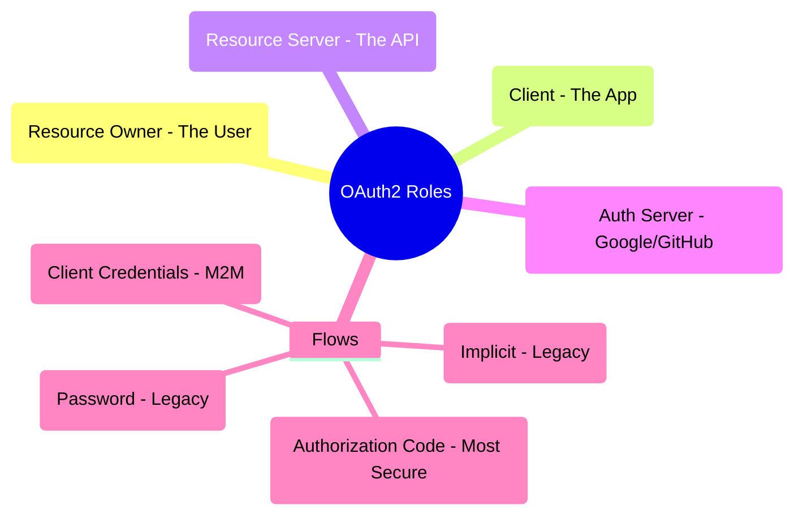
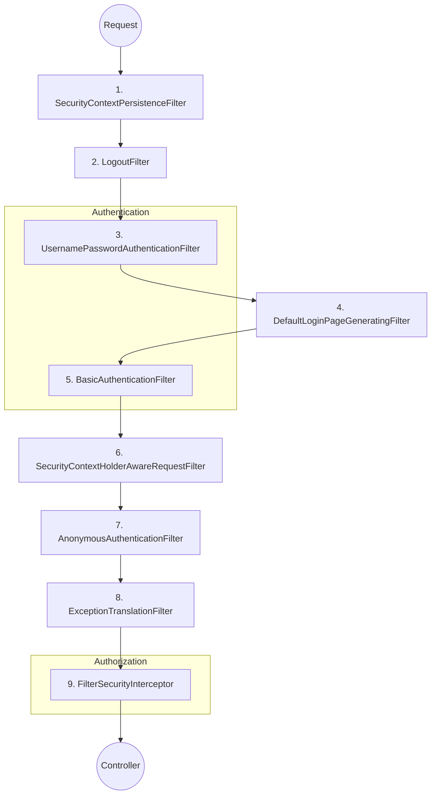

# Spring Security - Deep Dive

## Table of Contents
1. [Spring Security Fundamentals](#spring-security-fundamentals)
2. [Authentication](#authentication)
3. [Authorization](#authorization)
4. [JWT Authentication](#jwt-authentication)
5. [OAuth 2.0 & OpenID Connect](#oauth-20--openid-connect)
6. [Security Filter Chain Internals](#security-filter-chain-internals)
7. [OAuth2/OIDC: Authorization Code + PKCE](#oauth2oidc-authorization-code--pkce)
8. [JWT Refresh Token Rotation](#jwt-refresh-token-rotation)
9. [CSRF & CORS Deep Dive](#csrf--cors-deep-dive)
10. [Migration from WebSecurityConfigurerAdapter](#migration-from-websecurityconfigureradapter)
11. [Security Best Practices](#security-best-practices)
12. [Common Security Configurations](#common-security-configurations)
13. [Interview Questions](#interview-questions)

---

## Spring Security Fundamentals

### 🧠 ELI5: The "Nightclub Bouncer"

Imagine you are trying to enter a **VIP Nightclub**.

1.  **Authentication (ID Check):** The bouncer at the door asks, "Who are you?" You show your ID. He verifies it's really you.
2.  **Authorization (VIP List):** Once he knows who you are, he checks his clipboard. "Are you on the VIP list?" If yes, you can go to the VIP lounge. If no, you can only stay in the main area.
3.  **Security Context:** The bouncer gives you a **Wristband**. As long as you have it, other guards inside the club don't have to ask for your ID again. They just look at your wristband.

### 🗺️ Mindmap: Spring Security Overview

## 🔒 Security Architecture

> [!TIP]
> **Interview Pro-Tip: "How do you handle stateless authentication with JWT?"**
> In a stateless app, you must disable sessions:
> `sessionManagement().sessionCreationPolicy(SessionCreationPolicy.STATELESS)`.
> This tells Spring NOT to create a `JSESSIONID` cookie. Instead, the client must send the JWT in the `Authorization: Bearer <token>` header for every request.

### 🔍 Deep Dive: SecurityContextHolder & ThreadLocal
By default, Spring Security stores the `Authentication` object in a `ThreadLocal`. This means the security info is "bound" to the current thread. If you spawn a new thread (e.g., using `@Async`), the security context is **lost** unless you use `DelegatingSecurityContextAsyncTaskExecutor` or set the strategy to `MODE_INHERITABLETHREADLOCAL`.

### 🛠️ Complex Example: Custom PermissionEvaluator
```java
@Component
public class CustomPermissionEvaluator implements PermissionEvaluator {
    @Override
    public boolean hasPermission(Authentication auth, Object targetDomainObject, Object permission) {
        if ((auth == null) || (targetDomainObject == null) || !(permission instanceof String)) {
            return false;
        }
        String targetType = targetDomainObject.getClass().getSimpleName().toUpperCase();
        return hasPrivilege(auth, targetType, permission.toString().toUpperCase());
    }
    // ... implementation of hasPrivilege
}

// Usage in Service
@PreAuthorize("hasPermission(#document, 'WRITE')")
public void updateDocument(Document document) { ... }
```

## Spring Security Fundamentals

### What is Spring Security?

**Spring Security** is a powerful and highly customizable authentication and access-control framework for Java applications.

### Core Concepts

1. **Authentication**: Who are you? (Verifying identity)
2. **Authorization**: What can you do? (Checking permissions)
3. **Principal**: Currently authenticated user
4. **GrantedAuthority**: Permission/role granted to a principal
5. **SecurityContext**: Holds authentication information

### Setup

```xml
<dependency>
    <groupId>org.springframework.boot</groupId>
    <artifactId>spring-boot-starter-security</artifactId>
</dependency>
```

**Default Behavior**:
- All endpoints secured
- Default user: `user`
- Password: Generated at startup (check console)

### Security Filter Chain

## 🔒 Security Architecture

### Security Filter Chain

```
Request → SecurityFilterChain
    ↓
1. SecurityContextPersistenceFilter
2. UsernamePasswordAuthenticationFilter
3. BasicAuthenticationFilter
4. RememberMeAuthenticationFilter
5. AnonymousAuthenticationFilter
6. ExceptionTranslationFilter
7. FilterSecurityInterceptor
    ↓
Response
```

---

## Authentication

### In-Memory Authentication

```java
@Configuration
@EnableWebSecurity
public class SecurityConfig {
    
    @Bean
    public SecurityFilterChain filterChain(HttpSecurity http) throws Exception {
        http
            .authorizeHttpRequests(auth -> auth
                .requestMatchers("/public/**").permitAll()
                .anyRequest().authenticated()
            )
            .httpBasic(Customizer.withDefaults());
        
        return http.build();
    }
    
    @Bean
    public InMemoryUserDetailsManager userDetailsService() {
        UserDetails user = User.builder()
            .username("user")
            .password(passwordEncoder().encode("password"))
            .roles("USER")
            .build();
        
        UserDetails admin = User.builder()
            .username("admin")
            .password(passwordEncoder().encode("admin"))
            .roles("USER", "ADMIN")
            .build();
        
        return new InMemoryUserDetailsManager(user, admin);
    }
    
    @Bean
    public PasswordEncoder passwordEncoder() {
        return new BCryptPasswordEncoder();
    }
}
```

### Database Authentication

**Entity**:
```java
@Entity
@Table(name = "users")
@Data
public class User {
    
    @Id
    @GeneratedValue(strategy = GenerationType.IDENTITY)
    private Long id;
    
    @Column(unique = true, nullable = false)
    private String username;
    
    @Column(nullable = false)
    private String password;
    
    @Column(nullable = false)
    private boolean enabled = true;
    
    @ManyToMany(fetch = FetchType.EAGER)
    @JoinTable(
        name = "user_roles",
        joinColumns = @JoinColumn(name = "user_id"),
        inverseJoinColumns = @JoinColumn(name = "role_id")
    )
    private Set<Role> roles = new HashSet<>();
}

@Entity
@Table(name = "roles")
@Data
public class Role {
    
    @Id
    @GeneratedValue(strategy = GenerationType.IDENTITY)
    private Long id;
    
    @Column(unique = true, nullable = false)
    private String name; // ROLE_USER, ROLE_ADMIN
}
```

**UserDetailsService Implementation**:
```java
@Service
public class CustomUserDetailsService implements UserDetailsService {
    
    @Autowired
    private UserRepository userRepository;
    
    @Override
    public UserDetails loadUserByUsername(String username) 
            throws UsernameNotFoundException {
        User user = userRepository.findByUsername(username)
            .orElseThrow(() -> 
                new UsernameNotFoundException("User not found: " + username));
        
        return org.springframework.security.core.userdetails.User.builder()
            .username(user.getUsername())
            .password(user.getPassword())
            .disabled(!user.isEnabled())
            .authorities(getAuthorities(user.getRoles()))
            .build();
    }
    
    private Collection<? extends GrantedAuthority> getAuthorities(Set<Role> roles) {
        return roles.stream()
            .map(role -> new SimpleGrantedAuthority(role.getName()))
            .collect(Collectors.toList());
    }
}
```

**Security Configuration**:
```java
@Configuration
@EnableWebSecurity
public class SecurityConfig {
    
    @Autowired
    private CustomUserDetailsService userDetailsService;
    
    @Bean
    public SecurityFilterChain filterChain(HttpSecurity http) throws Exception {
        http
            .authorizeHttpRequests(auth -> auth
                .requestMatchers("/api/public/**").permitAll()
                .requestMatchers("/api/admin/**").hasRole("ADMIN")
                .requestMatchers("/api/user/**").hasAnyRole("USER", "ADMIN")
                .anyRequest().authenticated()
            )
            .formLogin(form -> form
                .loginPage("/login")
                .permitAll()
            )
            .logout(logout -> logout
                .logoutUrl("/logout")
                .logoutSuccessUrl("/login?logout")
                .permitAll()
            )
            .csrf(csrf -> csrf.disable()); // Disable for API
        
        return http.build();
    }
    
    @Bean
    public AuthenticationManager authenticationManager(
            AuthenticationConfiguration authConfig) throws Exception {
        return authConfig.getAuthenticationManager();
    }
    
    @Bean
    public PasswordEncoder passwordEncoder() {
        return new BCryptPasswordEncoder();
    }
}
```

### Form-Based Login

```java
@Configuration
@EnableWebSecurity
public class SecurityConfig {
    
    @Bean
    public SecurityFilterChain filterChain(HttpSecurity http) throws Exception {
        http
            .authorizeHttpRequests(auth -> auth
                .requestMatchers("/login", "/register", "/css/**", "/js/**").permitAll()
                .anyRequest().authenticated()
            )
            .formLogin(form -> form
                .loginPage("/login")
                .loginProcessingUrl("/perform_login")
                .defaultSuccessUrl("/home", true)
                .failureUrl("/login?error=true")
                .usernameParameter("username")
                .passwordParameter("password")
                .permitAll()
            )
            .logout(logout -> logout
                .logoutUrl("/logout")
                .logoutSuccessUrl("/login?logout")
                .deleteCookies("JSESSIONID")
                .invalidateHttpSession(true)
                .clearAuthentication(true)
                .permitAll()
            )
            .rememberMe(remember -> remember
                .key("uniqueAndSecret")
                .tokenValiditySeconds(86400) // 24 hours
                .rememberMeParameter("remember-me")
            );
        
        return http.build();
    }
}
```

### Basic Authentication

```java
@Configuration
@EnableWebSecurity
public class SecurityConfig {
    
    @Bean
    public SecurityFilterChain filterChain(HttpSecurity http) throws Exception {
        http
            .authorizeHttpRequests(auth -> auth
                .anyRequest().authenticated()
            )
            .httpBasic(basic -> basic
                .realmName("My Application")
            )
            .csrf(csrf -> csrf.disable());
        
        return http.build();
    }
}
```

---

## Authorization

## 🔒 Security Architecture

## Authorization

### Method-Level Security

```java
@Configuration
@EnableMethodSecurity(prePostEnabled = true, securedEnabled = true)
public class MethodSecurityConfig {
}

@Service
public class UserService {
    
    // Only users with ADMIN role
    @PreAuthorize("hasRole('ADMIN')")
    public void deleteUser(Long id) {
        // Delete user
    }
    
    // Only if user owns the resource
    @PreAuthorize("#id == authentication.principal.id")
    public User updateProfile(Long id, UserDTO dto) {
        // Update profile
    }
    
    // Multiple conditions
    @PreAuthorize("hasRole('ADMIN') or #userId == authentication.principal.id")
    public User getUser(Long userId) {
        // Get user
    }
    
    // Check after method execution
    @PostAuthorize("returnObject.username == authentication.name")
    public User getUserDetails(Long id) {
        return userRepository.findById(id).orElseThrow();
    }
    
    // Filter collection before returning
    @PostFilter("filterObject.owner == authentication.name")
    public List<Document> getAllDocuments() {
        return documentRepository.findAll();
    }
    
    // Filter method arguments
    @PreFilter("filterObject.owner == authentication.name")
    public void deleteDocuments(List<Document> documents) {
        documentRepository.deleteAll(documents);
    }
    
    // Using @Secured
    @Secured({"ROLE_USER", "ROLE_ADMIN"})
    public void someMethod() {
        // Method logic
    }
}
```

### URL-Based Security

```java
@Configuration
@EnableWebSecurity
public class SecurityConfig {
    
    @Bean
    public SecurityFilterChain filterChain(HttpSecurity http) throws Exception {
        http
            .authorizeHttpRequests(auth -> auth
                // Public endpoints
                .requestMatchers("/", "/home", "/about").permitAll()
                .requestMatchers("/api/public/**").permitAll()
                
                // Static resources
                .requestMatchers("/css/**", "/js/**", "/images/**").permitAll()
                
                // Admin endpoints
                .requestMatchers("/api/admin/**").hasRole("ADMIN")
                .requestMatchers(HttpMethod.DELETE, "/api/**").hasRole("ADMIN")
                
                // User endpoints
                .requestMatchers("/api/user/**").hasAnyRole("USER", "ADMIN")
                
                // Specific authorities
                .requestMatchers("/api/reports/**").hasAuthority("GENERATE_REPORT")
                
                // Multiple roles/authorities
                .requestMatchers("/api/moderator/**")
                    .hasAnyAuthority("ROLE_ADMIN", "ROLE_MODERATOR")
                
                // Authenticated users
                .anyRequest().authenticated()
            );
        
        return http.build();
    }
}
```

### Custom Access Decision

```java
@Component("customSecurity")
public class CustomSecurityExpression {
    
    public boolean hasUserId(Authentication authentication, Long userId) {
        if (authentication == null || !authentication.isAuthenticated()) {
            return false;
        }
        
        UserDetails userDetails = (UserDetails) authentication.getPrincipal();
        User user = userRepository.findByUsername(userDetails.getUsername()).get();
        
        return user.getId().equals(userId);
    }
    
    public boolean isOwner(Authentication authentication, Long resourceId) {
        // Custom logic to check ownership
        return true;
    }
}

// Usage
@PreAuthorize("@customSecurity.hasUserId(authentication, #userId)")
public void updateUser(Long userId, UserDTO dto) {
    // Update user
}
```

---

---

## JWT Authentication

### 🧠 ELI5: The "Movie Ticket"

Imagine you buy a **Movie Ticket** online.

1.  **Login:** You pay for the ticket (send username/password).
2.  **Token Generation:** The website gives you a **QR Code** (JWT). This code contains the movie name, your seat number, and a digital signature from the cinema.
3.  **Usage:** When you get to the cinema, you don't show your credit card again. You just show the QR Code. The usher scans it, verifies the signature is real, and lets you in.
4.  **Stateless:** The usher doesn't need to call the website to check if you paid. All the info he needs is right there in the QR Code.

### 🗺️ Mindmap: JWT Flow

## 🔒 Security Architecture

## JWT Authentication

### JWT Configuration

```xml
<dependency>
    <groupId>io.jsonwebtoken</groupId>
    <artifactId>jjwt-api</artifactId>
    <version>0.11.5</version>
</dependency>
<dependency>
    <groupId>io.jsonwebtoken</groupId>
    <artifactId>jjwt-impl</artifactId>
    <version>0.11.5</version>
    <scope>runtime</scope>
</dependency>
<dependency>
    <groupId>io.jsonwebtoken</groupId>
    <artifactId>jjwt-jackson</artifactId>
    <version>0.11.5</version>
    <scope>runtime</scope>
</dependency>
```

### JWT Utility Class

```java
@Component
public class JwtTokenProvider {
    
    @Value("${jwt.secret}")
    private String jwtSecret;
    
    @Value("${jwt.expiration}")
    private long jwtExpirationMs;
    
    public String generateToken(Authentication authentication) {
        UserDetails userDetails = (UserDetails) authentication.getPrincipal();
        
        Date now = new Date();
        Date expiryDate = new Date(now.getTime() + jwtExpirationMs);
        
        return Jwts.builder()
            .setSubject(userDetails.getUsername())
            .setIssuedAt(now)
            .setExpiration(expiryDate)
            .signWith(getSigningKey(), SignatureAlgorithm.HS512)
            .compact();
    }
    
    public String generateTokenFromUsername(String username) {
        Date now = new Date();
        Date expiryDate = new Date(now.getTime() + jwtExpirationMs);
        
        return Jwts.builder()
            .setSubject(username)
            .setIssuedAt(now)
            .setExpiration(expiryDate)
            .signWith(getSigningKey(), SignatureAlgorithm.HS512)
            .compact();
    }
    
    public String getUsernameFromToken(String token) {
        return Jwts.parserBuilder()
            .setSigningKey(getSigningKey())
            .build()
            .parseClaimsJws(token)
            .getBody()
            .getSubject();
    }
    
    public boolean validateToken(String token) {
        try {
            Jwts.parserBuilder()
                .setSigningKey(getSigningKey())
                .build()
                .parseClaimsJws(token);
            return true;
        } catch (SecurityException | MalformedJwtException e) {
            log.error("Invalid JWT signature: {}", e.getMessage());
        } catch (ExpiredJwtException e) {
            log.error("JWT token is expired: {}", e.getMessage());
        } catch (UnsupportedJwtException e) {
            log.error("JWT token is unsupported: {}", e.getMessage());
        } catch (IllegalArgumentException e) {
            log.error("JWT claims string is empty: {}", e.getMessage());
        }
        return false;
    }
    
    private Key getSigningKey() {
        byte[] keyBytes = Decoders.BASE64.decode(jwtSecret);
        return Keys.hmacShaKeyFor(keyBytes);
    }
}
```

### JWT Authentication Filter

```java
@Component
public class JwtAuthenticationFilter extends OncePerRequestFilter {
    
    @Autowired
    private JwtTokenProvider tokenProvider;
    
    @Autowired
    private CustomUserDetailsService userDetailsService;
    
    @Override
    protected void doFilterInternal(
            HttpServletRequest request,
            HttpServletResponse response,
            FilterChain filterChain) throws ServletException, IOException {
        
        try {
            String jwt = getJwtFromRequest(request);
            
            if (jwt != null && tokenProvider.validateToken(jwt)) {
                String username = tokenProvider.getUsernameFromToken(jwt);
                
                UserDetails userDetails = userDetailsService.loadUserByUsername(username);
                
                UsernamePasswordAuthenticationToken authentication = 
                    new UsernamePasswordAuthenticationToken(
                        userDetails, null, userDetails.getAuthorities()
                    );
                
                authentication.setDetails(
                    new WebAuthenticationDetailsSource().buildDetails(request)
                );
                
                SecurityContextHolder.getContext().setAuthentication(authentication);
            }
        } catch (Exception ex) {
            logger.error("Could not set user authentication in security context", ex);
        }
        
        filterChain.doFilter(request, response);
    }
    
    private String getJwtFromRequest(HttpServletRequest request) {
        String bearerToken = request.getHeader("Authorization");
        if (StringUtils.hasText(bearerToken) && bearerToken.startsWith("Bearer ")) {
            return bearerToken.substring(7);
        }
        return null;
    }
}
```

### JWT Security Configuration

```java
@Configuration
@EnableWebSecurity
@RequiredArgsConstructor
public class SecurityConfig {
    
    private final JwtAuthenticationFilter jwtAuthenticationFilter;
    private final JwtAuthenticationEntryPoint jwtAuthenticationEntryPoint;
    
    @Bean
    public SecurityFilterChain filterChain(HttpSecurity http) throws Exception {
        http
            .csrf(csrf -> csrf.disable())
            .exceptionHandling(ex -> ex
                .authenticationEntryPoint(jwtAuthenticationEntryPoint)
            )
            .sessionManagement(session -> session
                .sessionCreationPolicy(SessionCreationPolicy.STATELESS)
            )
            .authorizeHttpRequests(auth -> auth
                .requestMatchers("/api/auth/**").permitAll()
                .requestMatchers("/api/public/**").permitAll()
                .anyRequest().authenticated()
            );
        
        http.addFilterBefore(jwtAuthenticationFilter, 
                            UsernamePasswordAuthenticationFilter.class);
        
        return http.build();
    }
}
```

### Authentication Controller

```java
@RestController
@RequestMapping("/api/auth")
@RequiredArgsConstructor
public class AuthController {
    
    private final AuthenticationManager authenticationManager;
    private final JwtTokenProvider tokenProvider;
    private final UserRepository userRepository;
    private final PasswordEncoder passwordEncoder;
    
    @PostMapping("/login")
    public ResponseEntity<JwtAuthResponse> authenticateUser(
            @Valid @RequestBody LoginRequest loginRequest) {
        
        Authentication authentication = authenticationManager.authenticate(
            new UsernamePasswordAuthenticationToken(
                loginRequest.getUsername(),
                loginRequest.getPassword()
            )
        );
        
        SecurityContextHolder.getContext().setAuthentication(authentication);
        String jwt = tokenProvider.generateToken(authentication);
        
        return ResponseEntity.ok(new JwtAuthResponse(jwt));
    }
    
    @PostMapping("/register")
    public ResponseEntity<MessageResponse> registerUser(
            @Valid @RequestBody SignUpRequest signUpRequest) {
        
        if (userRepository.existsByUsername(signUpRequest.getUsername())) {
            return ResponseEntity
                .badRequest()
                .body(new MessageResponse("Username is already taken!"));
        }
        
        if (userRepository.existsByEmail(signUpRequest.getEmail())) {
            return ResponseEntity
                .badRequest()
                .body(new MessageResponse("Email is already in use!"));
        }
        
        User user = new User();
        user.setUsername(signUpRequest.getUsername());
        user.setEmail(signUpRequest.getEmail());
        user.setPassword(passwordEncoder.encode(signUpRequest.getPassword()));
        
        Role userRole = roleRepository.findByName("ROLE_USER")
            .orElseThrow(() -> new RuntimeException("Role not found"));
        user.getRoles().add(userRole);
        
        userRepository.save(user);
        
        return ResponseEntity.ok(new MessageResponse("User registered successfully!"));
    }
}

@Data
public class LoginRequest {
    @NotBlank
    private String username;
    
    @NotBlank
    private String password;
}

@Data
public class JwtAuthResponse {
    private String accessToken;
    private String tokenType = "Bearer";
    
    public JwtAuthResponse(String accessToken) {
        this.accessToken = accessToken;
    }
}
```

---

---

## OAuth 2.0 & OpenID Connect

### 🧠 ELI5: The "Hotel Key Card"

Imagine you are staying at a **Hotel**.

1.  **Authentication (OIDC):** You show your ID at the front desk. They verify who you are and give you a **Key Card**.
2.  **Authorization (OAuth2):** The Key Card doesn't give you the whole hotel. It only gives you access to **Room 302** and the **Gym**. The "Scope" is what the card is allowed to open.
3.  **Third-Party Access:** If you want a **Pizza Delivery** guy to bring food to your room, you don't give him your ID. You give him a temporary "Guest Pass" (Access Token) that only lets him enter the lobby and your floor.

### 🗺️ Mindmap: OAuth2 Roles



## OAuth 2.0 & OpenID Connect

### OAuth 2.0 Client Configuration

```yaml
spring:
  security:
    oauth2:
      client:
        registration:
          google:
            client-id: ${GOOGLE_CLIENT_ID}
            client-secret: ${GOOGLE_CLIENT_SECRET}
            scope:
              - email
              - profile
          github:
            client-id: ${GITHUB_CLIENT_ID}
            client-secret: ${GITHUB_CLIENT_SECRET}
            scope:
              - user:email
              - read:user
        provider:
          google:
            authorization-uri: https://accounts.google.com/o/oauth2/v2/auth
            token-uri: https://oauth2.googleapis.com/token
            user-info-uri: https://www.googleapis.com/oauth2/v3/userinfo
            user-name-attribute: sub
```

### OAuth 2.0 Security Configuration

```java
@Configuration
@EnableWebSecurity
public class OAuth2SecurityConfig {
    
    @Bean
    public SecurityFilterChain filterChain(HttpSecurity http) throws Exception {
        http
            .authorizeHttpRequests(auth -> auth
                .requestMatchers("/", "/login", "/error").permitAll()
                .anyRequest().authenticated()
            )
            .oauth2Login(oauth2 -> oauth2
                .loginPage("/login")
                .defaultSuccessUrl("/home")
                .failureUrl("/login?error=true")
                .userInfoEndpoint(userInfo -> userInfo
                    .userService(customOAuth2UserService)
                )
            )
            .logout(logout -> logout
                .logoutSuccessUrl("/")
                .permitAll()
            );
        
        return http.build();
    }
}
```

### Custom OAuth2 User Service

```java
@Service
public class CustomOAuth2UserService extends DefaultOAuth2UserService {
    
    @Autowired
    private UserRepository userRepository;
    
    @Override
    public OAuth2User loadUser(OAuth2UserRequest userRequest) 
            throws OAuth2AuthenticationException {
        OAuth2User oauth2User = super.loadUser(userRequest);
        
        String email = oauth2User.getAttribute("email");
        String name = oauth2User.getAttribute("name");
        
        User user = userRepository.findByEmail(email)
            .orElseGet(() -> {
                User newUser = new User();
                newUser.setEmail(email);
                newUser.setUsername(email);
                newUser.setName(name);
                newUser.setProvider("GOOGLE");
                return userRepository.save(newUser);
            });
        
        return new CustomOAuth2User(oauth2User, user);
    }
}
```

---

---

---

## Security Filter Chain Internals

### 🧠 ELI5: The "Airport Security"

Think of the **Security Filter Chain** as the series of checks you go through at an **Airport**.

1.  **Check-in Filter:** Checks your ticket (Authentication).
2.  **TSA Filter:** Checks your bags for prohibited items (CSRF/XSS protection).
3.  **Passport Control Filter:** Checks if you have the right visa for your destination (Authorization).
4.  **Boarding Filter:** Final check before you enter the plane (Resource access).

If you fail *any* of these checks, you are turned back and never reach the plane (your Controller).

### 🗺️ Mindmap: Security Filter Chain



## Security Filter Chain Internals

### How it Works
Spring Security is essentially a chain of Servlet Filters. The `DelegatingFilterProxy` intercepts the request and delegates it to the `FilterChainProxy`, which then runs the `SecurityFilterChain`.

### Key Filters in Order:
1.  **SecurityContextPersistenceFilter**: Loads/Saves SecurityContext from/to Session.
2.  **LogoutFilter**: Handles logout requests.
3.  **UsernamePasswordAuthenticationFilter**: Handles form login.
4.  **DefaultLoginPageGeneratingFilter**: Generates the default login page.
5.  **BasicAuthenticationFilter**: Handles Basic Auth headers.
6.  **RequestCacheAwareFilter**: Restores the request after login.
7.  **SecurityContextHolderAwareRequestFilter**: Wraps the request to support `HttpServletRequest` security methods.
8.  **AnonymousAuthenticationFilter**: Assigns an "anonymous" user if not authenticated.
9.  **SessionManagementFilter**: Handles session fixation, concurrency, etc.
10. **ExceptionTranslationFilter**: Catches security exceptions and starts authentication or returns 403.
11. **FilterSecurityInterceptor**: The final filter that checks authorization via `AccessDecisionManager`.

---

## OAuth2/OIDC: Authorization Code + PKCE

### Why PKCE?
**PKCE (Proof Key for Code Exchange)** was originally designed for mobile apps but is now recommended for **all** clients (including SPAs) to prevent authorization code injection attacks.

### The Flow:
1.  **Code Challenge**: Client generates a secret `code_verifier` and its hash `code_challenge`.
2.  **Auth Request**: Client sends `code_challenge` to Auth Server.
3.  **Auth Code**: User authenticates; Auth Server returns `code`.
4.  **Token Request**: Client sends `code` + `code_verifier`.
5.  **Verification**: Auth Server hashes `code_verifier` and compares it with the original `code_challenge`. If they match, it issues tokens.

---

## JWT Refresh Token Rotation

### The Problem with Long-Lived JWTs
If a JWT is stolen, the attacker has access until it expires. If it's short-lived, the user has to log in frequently.

### The Solution: Refresh Tokens
1.  **Login**: Server issues a short-lived **Access Token** (e.g., 15m) and a long-lived **Refresh Token** (e.g., 7d).
2.  **Refresh**: When Access Token expires, Client sends Refresh Token to get a new Access Token.
3.  **Rotation**: Every time a Refresh Token is used, the server issues a **NEW** Refresh Token and invalidates the old one.
4.  **Detection**: If an old Refresh Token is used, the server assumes a breach and invalidates **ALL** tokens for that user.

### Complete JWT Security Best Practices Implementation

#### 1. Enhanced JWT Token Provider

```java
@Component
@Slf4j
public class SecureJwtTokenProvider {
    
    @Value("${jwt.secret}")
    private String jwtSecret;
    
    @Value("${jwt.access-token-expiration:900000}") // 15 minutes
    private long accessTokenExpiration;
    
    @Value("${jwt.refresh-token-expiration:604800000}") // 7 days
    private long refreshTokenExpiration;
    
    @Autowired
    private RefreshTokenRepository refreshTokenRepository;
    
    /**
     * Generate Access Token with claims
     */
    public String generateAccessToken(Authentication authentication) {
        UserDetails userDetails = (UserDetails) authentication.getPrincipal();
        
        Map<String, Object> claims = new HashMap<>();
        claims.put("userId", ((CustomUserDetails) userDetails).getId());
        claims.put("roles", userDetails.getAuthorities().stream()
            .map(GrantedAuthority::getAuthority)
            .collect(Collectors.toList()));
        claims.put("tokenType", "ACCESS");
        
        return Jwts.builder()
            .setClaims(claims)
            .setSubject(userDetails.getUsername())
            .setIssuedAt(new Date())
            .setExpiration(new Date(System.currentTimeMillis() + accessTokenExpiration))
            .setId(UUID.randomUUID().toString()) // Unique token ID (jti)
            .signWith(getSigningKey(), SignatureAlgorithm.HS512)
            .compact();
    }
    
    /**
     * Generate Refresh Token with rotation
     */
    public String generateRefreshToken(Authentication authentication) {
        UserDetails userDetails = (UserDetails) authentication.getPrincipal();
        String username = userDetails.getUsername();
        
        // Create refresh token
        String token = Jwts.builder()
            .setSubject(username)
            .setIssuedAt(new Date())
            .setExpiration(new Date(System.currentTimeMillis() + refreshTokenExpiration))
            .setId(UUID.randomUUID().toString())
            .claim("tokenType", "REFRESH")
            .signWith(getSigningKey(), SignatureAlgorithm.HS512)
            .compact();
        
        // Store in database for rotation tracking
        RefreshToken refreshToken = new RefreshToken();
        refreshToken.setToken(token);
        refreshToken.setUsername(username);
        refreshToken.setExpiryDate(new Date(System.currentTimeMillis() + refreshTokenExpiration));
        refreshToken.setUsed(false);
        refreshTokenRepository.save(refreshToken);
        
        return token;
    }
    
    /**
     * Refresh Access Token with rotation
     */
    public TokenRefreshResponse refreshAccessToken(String refreshToken) {
        // Validate refresh token
        if (!validateToken(refreshToken)) {
            throw new TokenRefreshException("Invalid refresh token");
        }
        
        // Check if token exists and not used
        RefreshToken storedToken = refreshTokenRepository.findByToken(refreshToken)
            .orElseThrow(() -> new TokenRefreshException("Refresh token not found"));
        
        // Check if already used (possible attack)
        if (storedToken.isUsed()) {
            log.error("Refresh token reuse detected! Invalidating all tokens for user: {}", 
                storedToken.getUsername());
            // Invalidate all tokens for this user
            refreshTokenRepository.deleteAllByUsername(storedToken.getUsername());
            throw new TokenRefreshException("Token reuse detected. All tokens invalidated.");
        }
        
        // Mark as used
        storedToken.setUsed(true);
        refreshTokenRepository.save(storedToken);
        
        // Generate new tokens
        String username = getUsernameFromToken(refreshToken);
        UserDetails userDetails = userDetailsService.loadUserByUsername(username);
        Authentication authentication = new UsernamePasswordAuthenticationToken(
            userDetails, null, userDetails.getAuthorities()
        );
        
        String newAccessToken = generateAccessToken(authentication);
        String newRefreshToken = generateRefreshToken(authentication);
        
        return new TokenRefreshResponse(newAccessToken, newRefreshToken);
    }
    
    /**
     * Revoke all tokens for a user
     */
    public void revokeAllUserTokens(String username) {
        refreshTokenRepository.deleteAllByUsername(username);
    }
    
    /**
     * Validate token with comprehensive checks
     */
    public boolean validateToken(String token) {
        try {
            Claims claims = Jwts.parserBuilder()
                .setSigningKey(getSigningKey())
                .build()
                .parseClaimsJws(token)
                .getBody();
            
            // Check expiration
            if (claims.getExpiration().before(new Date())) {
                log.warn("Token expired");
                return false;
            }
            
            // Check if token is in blacklist (for logout)
            String jti = claims.getId();
            if (isTokenBlacklisted(jti)) {
                log.warn("Token is blacklisted");
                return false;
            }
            
            return true;
            
        } catch (SecurityException | MalformedJwtException e) {
            log.error("Invalid JWT signature: {}", e.getMessage());
        } catch (ExpiredJwtException e) {
            log.error("JWT token is expired: {}", e.getMessage());
        } catch (UnsupportedJwtException e) {
            log.error("JWT token is unsupported: {}", e.getMessage());
        } catch (IllegalArgumentException e) {
            log.error("JWT claims string is empty: {}", e.getMessage());
        }
        return false;
    }
    
    /**
     * Extract claims with type safety
     */
    public Claims getClaimsFromToken(String token) {
        return Jwts.parserBuilder()
            .setSigningKey(getSigningKey())
            .build()
            .parseClaimsJws(token)
            .getBody();
    }
    
    public String getUsernameFromToken(String token) {
        return getClaimsFromToken(token).getSubject();
    }
    
    public Long getUserIdFromToken(String token) {
        return getClaimsFromToken(token).get("userId", Long.class);
    }
    
    @SuppressWarnings("unchecked")
    public List<String> getRolesFromToken(String token) {
        return getClaimsFromToken(token).get("roles", List.class);
    }
    
    private Key getSigningKey() {
        byte[] keyBytes = Decoders.BASE64.decode(jwtSecret);
        return Keys.hmacShaKeyFor(keyBytes);
    }
    
    private boolean isTokenBlacklisted(String jti) {
        // Check Redis or database for blacklisted tokens
        return redisTemplate.hasKey("blacklist:" + jti);
    }
}
```

#### 2. Refresh Token Entity

```java
@Entity
@Table(name = "refresh_tokens")
@Data
public class RefreshToken {
    
    @Id
    @GeneratedValue(strategy = GenerationType.IDENTITY)
    private Long id;
    
    @Column(nullable = false, unique = true, length = 500)
    private String token;
    
    @Column(nullable = false)
    private String username;
    
    @Column(nullable = false)
    private Date expiryDate;
    
    @Column(nullable = false)
    private boolean used = false;
    
    @Column(nullable = false)
    private Date createdAt = new Date();
    
    @Column
    private String deviceInfo; // Track which device
    
    @Column
    private String ipAddress; // Track IP for security
}

public interface RefreshTokenRepository extends JpaRepository<RefreshToken, Long> {
    Optional<RefreshToken> findByToken(String token);
    void deleteAllByUsername(String username);
    List<RefreshToken> findAllByUsernameAndUsedFalse(String username);
}
```

#### 3. Token Blacklist Service (for Logout)

```java
@Service
@RequiredArgsConstructor
@Slf4j
public class TokenBlacklistService {
    
    private final StringRedisTemplate redisTemplate;
    
    /**
     * Blacklist token until it expires
     */
    public void blacklistToken(String token) {
        try {
            Claims claims = Jwts.parserBuilder()
                .setSigningKey(getSigningKey())
                .build()
                .parseClaimsJws(token)
                .getBody();
            
            String jti = claims.getId();
            Date expiration = claims.getExpiration();
            
            // Calculate TTL
            long ttl = expiration.getTime() - System.currentTimeMillis();
            
            if (ttl > 0) {
                redisTemplate.opsForValue().set(
                    "blacklist:" + jti,
                    "true",
                    Duration.ofMilliseconds(ttl)
                );
                log.info("Token blacklisted: {}", jti);
            }
        } catch (Exception e) {
            log.error("Error blacklisting token", e);
        }
    }
    
    public boolean isBlacklisted(String jti) {
        return Boolean.TRUE.equals(
            redisTemplate.hasKey("blacklist:" + jti)
        );
    }
}
```

#### 4. Enhanced Auth Controller with Refresh

```java
@RestController
@RequestMapping("/api/auth")
@RequiredArgsConstructor
@Slf4j
public class AuthController {
    
    private final AuthenticationManager authenticationManager;
    private final SecureJwtTokenProvider tokenProvider;
    private final TokenBlacklistService blacklistService;
    private final UserRepository userRepository;
    
    @PostMapping("/login")
    public ResponseEntity<JwtAuthResponse> login(
            @Valid @RequestBody LoginRequest request,
            HttpServletRequest httpRequest) {
        
        // Authenticate
        Authentication authentication = authenticationManager.authenticate(
            new UsernamePasswordAuthenticationToken(
                request.getUsername(),
                request.getPassword()
            )
        );
        
        SecurityContextHolder.getContext().setAuthentication(authentication);
        
        // Generate tokens
        String accessToken = tokenProvider.generateAccessToken(authentication);
        String refreshToken = tokenProvider.generateRefreshToken(authentication);
        
        // Log login
        log.info("User logged in: {} from IP: {}", 
            request.getUsername(), 
            httpRequest.getRemoteAddr());
        
        return ResponseEntity.ok(new JwtAuthResponse(
            accessToken,
            refreshToken,
            "Bearer",
            15 * 60 // 15 minutes
        ));
    }
    
    @PostMapping("/refresh")
    public ResponseEntity<TokenRefreshResponse> refreshToken(
            @Valid @RequestBody TokenRefreshRequest request) {
        
        try {
            TokenRefreshResponse response = tokenProvider.refreshAccessToken(
                request.getRefreshToken()
            );
            
            return ResponseEntity.ok(response);
            
        } catch (TokenRefreshException e) {
            log.error("Token refresh failed: {}", e.getMessage());
            return ResponseEntity
                .status(HttpStatus.FORBIDDEN)
                .body(null);
        }
    }
    
    @PostMapping("/logout")
    public ResponseEntity<MessageResponse> logout(
            @RequestHeader("Authorization") String authHeader) {
        
        try {
            // Extract token
            String token = authHeader.substring(7);
            
            // Blacklist access token
            blacklistService.blacklistToken(token);
            
            // Get username and revoke all refresh tokens
            String username = tokenProvider.getUsernameFromToken(token);
            tokenProvider.revokeAllUserTokens(username);
            
            log.info("User logged out: {}", username);
            
            return ResponseEntity.ok(
                new MessageResponse("Logout successful")
            );
            
        } catch (Exception e) {
            log.error("Logout failed", e);
            return ResponseEntity
                .status(HttpStatus.INTERNAL_SERVER_ERROR)
                .body(new MessageResponse("Logout failed"));
        }
    }
    
    @PostMapping("/revoke-all")
    @PreAuthorize("isAuthenticated()")
    public ResponseEntity<MessageResponse> revokeAllTokens(Principal principal) {
        tokenProvider.revokeAllUserTokens(principal.getName());
        log.info("All tokens revoked for user: {}", principal.getName());
        
        return ResponseEntity.ok(
            new MessageResponse("All tokens revoked successfully")
        );
    }
}

@Data
class JwtAuthResponse {
    private String accessToken;
    private String refreshToken;
    private String tokenType;
    private long expiresIn;
}

@Data
class TokenRefreshRequest {
    @NotBlank
    private String refreshToken;
}

@Data
@AllArgsConstructor
class TokenRefreshResponse {
    private String accessToken;
    private String refreshToken;
}
```

#### 5. XSS and CSRF Protection

```java
@Configuration
public class SecurityHeadersConfig {
    
    @Bean
    public SecurityFilterChain securityHeaders(HttpSecurity http) throws Exception {
        http.headers(headers -> headers
            // Prevent XSS attacks
            .xssProtection(xss -> xss.headerValue(
                XXssProtectionHeaderWriter.HeaderValue.ENABLED_MODE_BLOCK
            ))
            
            // Prevent clickjacking
            .frameOptions(frame -> frame.deny())
            
            // Content Security Policy
            .contentSecurityPolicy(csp -> csp.policyDirectives(
                "default-src 'self'; " +
                "script-src 'self' 'unsafe-inline'; " +
                "style-src 'self' 'unsafe-inline'; " +
                "img-src 'self' data: https:; " +
                "font-src 'self' data:; " +
                "connect-src 'self'"
            ))
            
            // HSTS - Force HTTPS
            .httpStrictTransportSecurity(hsts -> hsts
                .includeSubDomains(true)
                .maxAgeInSeconds(31536000) // 1 year
            )
            
            // Prevent MIME sniffing
            .contentTypeOptions(Customizer.withDefaults())
            
            // Referrer Policy
            .referrerPolicy(referrer -> referrer.policy(
                ReferrerPolicyHeaderWriter.ReferrerPolicy.STRICT_ORIGIN_WHEN_CROSS_ORIGIN
            ))
            
            // Permissions Policy
            .permissionsPolicy(permissions -> permissions.policy(
                "geolocation=(), camera=(), microphone=()"
            ))
        );
        
        return http.build();
    }
}
```

#### 6. Configuration

```yaml
# application.yml
jwt:
  secret: ${JWT_SECRET:your-256-bit-secret-key-change-in-production}
  access-token-expiration: 900000      # 15 minutes
  refresh-token-expiration: 604800000  # 7 days

spring:
  redis:
    host: localhost
    port: 6379
  
  datasource:
    url: jdbc:postgresql://localhost:5432/myapp
    username: user
    password: password
```

#### 7. Testing JWT Security

```java
@SpringBootTest
@AutoConfigureMockMvc
class JwtSecurityTest {
    
    @Autowired
    private MockMvc mockMvc;
    
    @Autowired
    private SecureJwtTokenProvider tokenProvider;
    
    @Test
    void shouldGenerateAndValidateAccessToken() {
        // Create authentication
        UserDetails userDetails = User.builder()
            .username("testuser")
            .password("password")
            .authorities("ROLE_USER")
            .build();
        
        Authentication auth = new UsernamePasswordAuthenticationToken(
            userDetails, null, userDetails.getAuthorities()
        );
        
        // Generate token
        String token = tokenProvider.generateAccessToken(auth);
        
        // Validate
        assertTrue(tokenProvider.validateToken(token));
        assertEquals("testuser", tokenProvider.getUsernameFromToken(token));
    }
    
    @Test
    void shouldRejectExpiredToken() throws Exception {
        // Create expired token
        String expiredToken = Jwts.builder()
            .setSubject("testuser")
            .setExpiration(new Date(System.currentTimeMillis() - 1000))
            .signWith(Keys.hmacShaKeyFor("secret".getBytes()))
            .compact();
        
        assertFalse(tokenProvider.validateToken(expiredToken));
    }
    
    @Test
    void shouldDetectTokenReuse() throws Exception {
        // Login
        String loginJson = "{\"username\":\"user\",\"password\":\"pass\"}";
        
        MvcResult result = mockMvc.perform(post("/api/auth/login")
                .contentType(MediaType.APPLICATION_JSON)
                .content(loginJson))
            .andExpect(status().isOk())
            .andReturn();
        
        String responseBody = result.getResponse().getContentAsString();
        JsonNode node = new ObjectMapper().readTree(responseBody);
        String refreshToken = node.get("refreshToken").asText();
        
        // Use refresh token
        mockMvc.perform(post("/api/auth/refresh")
                .contentType(MediaType.APPLICATION_JSON)
                .content("{\"refreshToken\":\"" + refreshToken + "\"}"))
            .andExpect(status().isOk());
        
        // Try to reuse same refresh token (should fail)
        mockMvc.perform(post("/api/auth/refresh")
                .contentType(MediaType.APPLICATION_JSON)
                .content("{\"refreshToken\":\"" + refreshToken + "\"}"))
            .andExpect(status().isForbidden());
    }
}
```

### JWT Security Best Practices Summary

✅ **1. Short-lived Access Tokens**: 15 minutes or less  
✅ **2. Refresh Token Rotation**: New refresh token on each use  
✅ **3. Token Revocation**: Blacklist on logout  
✅ **4. Reuse Detection**: Invalidate all tokens if reuse detected  
✅ **5. Secure Storage**: Store refresh tokens in database  
✅ **6. Claims Validation**: Validate all claims (exp, iat, jti)  
✅ **7. HTTPS Only**: Never send tokens over HTTP  
✅ **8. HttpOnly Cookies**: For web apps, use HttpOnly cookies  
✅ **9. XSS Protection**: Sanitize all inputs  
✅ **10. CSRF Protection**: Use CSRF tokens for state-changing operations

### Interview Tips for JWT Security

**Q: How do you prevent JWT token theft?**
> "I use multiple layers: short-lived access tokens (15min), refresh token rotation to detect reuse, token blacklisting on logout, HTTPS only, HttpOnly cookies for web, and comprehensive security headers. If token reuse is detected, I invalidate all tokens for that user and alert the security team."

**Q: What's the difference between access and refresh tokens?**
> "Access tokens are short-lived (15min) and contain user claims for authorization. Refresh tokens are long-lived (7 days), stored in database, and used only to get new access tokens. This limits the damage if an access token is stolen while providing good UX without frequent logins."

---

## CSRF & CORS Deep Dive

### CSRF (Cross-Site Request Forgery)
- **What**: Attacker tricks user's browser into sending a request to your site using the user's session cookie.
- **Protection**: Synchronizer Token Pattern. Spring Security adds a hidden `_csrf` token to forms.
- **When to disable**: For stateless APIs using JWT (since there's no session cookie to steal).

### CORS (Cross-Origin Resource Sharing)
- **What**: Browser security feature that restricts web pages from making requests to a different domain.
- **Preflight**: For "non-simple" requests (e.g., with `Authorization` header), the browser sends an `OPTIONS` request first.
- **Configuration**:
    ```java
    @Bean
    public CorsConfigurationSource corsConfigurationSource() {
        CorsConfiguration config = new CorsConfiguration();
        config.setAllowedOrigins(List.of("https://myapp.com"));
        config.setAllowedMethods(List.of("GET", "POST", "PUT", "DELETE"));
        config.setAllowedHeaders(List.of("Authorization", "Content-Type"));
        UrlBasedCorsConfigurationSource source = new UrlBasedCorsConfigurationSource();
        source.registerCorsConfiguration("/**", config);
        return source;
    }
    ```

---

## Migration from WebSecurityConfigurerAdapter

In Spring Security 6 (Spring Boot 3), `WebSecurityConfigurerAdapter` is **removed**.

### Old Way (Spring Security 5.x):
```java
public class SecurityConfig extends WebSecurityConfigurerAdapter {
    @Override
    protected void configure(HttpSecurity http) throws Exception {
        http.authorizeRequests().anyRequest().authenticated();
    }
}
```

### New Way (Spring Security 6.x):
```java
@Configuration
@EnableWebSecurity
public class SecurityConfig {
    @Bean
    public SecurityFilterChain filterChain(HttpSecurity http) throws Exception {
        http
            .authorizeHttpRequests(auth -> auth
                .anyRequest().authenticated()
            );
        return http.build();
    }
}
```

---

## Security Best Practices

### Password Encoding

```java
@Configuration
public class PasswordConfig {
    
    @Bean
    public PasswordEncoder passwordEncoder() {
        // BCrypt (Recommended)
        return new BCryptPasswordEncoder(12); // Strength: 4-31
        
        // Argon2
        // return new Argon2PasswordEncoder();
        
        // SCrypt
        // return new SCryptPasswordEncoder();
        
        // PBKDF2
        // return new Pbkdf2PasswordEncoder();
    }
}

// Usage
String encodedPassword = passwordEncoder.encode("plainPassword");
boolean matches = passwordEncoder.matches("plainPassword", encodedPassword);
```

### CORS Configuration

```java
@Configuration
public class CorsConfig {
    
    @Bean
    public CorsConfigurationSource corsConfigurationSource() {
        CorsConfiguration configuration = new CorsConfiguration();
        configuration.setAllowedOrigins(Arrays.asList("http://localhost:3000"));
        configuration.setAllowedMethods(Arrays.asList("GET", "POST", "PUT", "DELETE", "OPTIONS"));
        configuration.setAllowedHeaders(Arrays.asList("*"));
        configuration.setAllowCredentials(true);
        configuration.setMaxAge(3600L);
        
        UrlBasedCorsConfigurationSource source = new UrlBasedCorsConfigurationSource();
        source.registerCorsConfiguration("/**", configuration);
        return source;
    }
}

// Or in SecurityConfig
http.cors(cors -> cors.configurationSource(corsConfigurationSource()));
```

### CSRF Protection

```java
// Disable for stateless APIs
http.csrf(csrf -> csrf.disable());

// Enable for form-based apps
http.csrf(csrf -> csrf
    .csrfTokenRepository(CookieCsrfTokenRepository.withHttpOnlyFalse())
);

// Custom CSRF matcher
http.csrf(csrf -> csrf
    .requireCsrfProtectionMatcher(new RequestMatcher() {
        @Override
        public boolean matches(HttpServletRequest request) {
            return !request.getRequestURI().startsWith("/api/");
        }
    })
);
```

### Security Headers

```java
http.headers(headers -> headers
    .contentSecurityPolicy(csp -> csp
        .policyDirectives("default-src 'self'")
    )
    .frameOptions(frame -> frame.deny())
    .xssProtection(xss -> xss.enable())
    .httpStrictTransportSecurity(hsts -> hsts
        .includeSubDomains(true)
        .maxAgeInSeconds(31536000)
    )
);
```

### Rate Limiting Strategies

## 🔒 Rate Limiting Deep Dive

Rate limiting protects your API from abuse, prevents resource exhaustion, and ensures fair usage among clients.

#### Why Rate Limiting?

**Without Rate Limiting**:
```
User A: Makes 10,000 requests/second → Server crashes 💥
User B: Can't access API → Bad UX 😞
Cost: High server resources → Expensive 💸
```

**With Rate Limiting**:
```
User A: Limited to 100 requests/second → Fair usage ✅
User B: Gets guaranteed service → Good UX 😊
Cost: Optimized resources → Cost-effective 💰
```

#### Rate Limiting Algorithms

##### 1. Token Bucket Algorithm (Recommended)

**How it works**:
- Bucket holds tokens (capacity = max burst)
- Tokens added at fixed rate (refill rate)
- Each request consumes 1 token
- If no tokens available, request is rejected

**Pros**: Allows burst traffic, smooth rate limiting  
**Cons**: Slightly more complex

```java
@Component
@Slf4j
public class TokenBucketRateLimiter {
    
    private final Map<String, Bucket> buckets = new ConcurrentHashMap<>();
    
    // Using Bucket4j library
    public boolean allowRequest(String clientId, int tokensPerMinute) {
        Bucket bucket = buckets.computeIfAbsent(clientId, k -> {
            Bandwidth limit = Bandwidth.builder()
                .capacity(tokensPerMinute)
                .refillGreedy(tokensPerMinute, Duration.ofMinutes(1))
                .build();
            
            return Bucket.builder()
                .addLimit(limit)
                .build();
        });
        
        return bucket.tryConsume(1);
    }
    
    public ConsumptionProbe probe(String clientId) {
        Bucket bucket = buckets.get(clientId);
        return bucket != null ? bucket.tryConsumeAndReturnRemaining(1) : null;
    }
}
```

##### 2. Fixed Window Counter

**How it works**:
- Count requests in fixed time windows (e.g., per minute)
- Reset counter at window boundary
- Simple but can allow burst at window edges

```java
@Component
public class FixedWindowRateLimiter {
    
    private final Map<String, WindowCounter> counters = new ConcurrentHashMap<>();
    
    public boolean allowRequest(String clientId, int maxRequests, Duration window) {
        long now = System.currentTimeMillis();
        long windowStart = now - window.toMillis();
        
        WindowCounter counter = counters.computeIfAbsent(clientId, 
            k -> new WindowCounter());
        
        synchronized (counter) {
            // Reset if window expired
            if (counter.windowStart < windowStart) {
                counter.count = 0;
                counter.windowStart = now;
            }
            
            if (counter.count < maxRequests) {
                counter.count++;
                return true;
            }
            return false;
        }
    }
    
    @Data
    private static class WindowCounter {
        private int count = 0;
        private long windowStart = System.currentTimeMillis();
    }
}
```

##### 3. Sliding Window Log

**How it works**:
- Keep log of all request timestamps
- Count requests in sliding window
- Most accurate but memory intensive

```java
@Component
public class SlidingWindowRateLimiter {
    
    private final Map<String, Queue<Long>> requestLogs = new ConcurrentHashMap<>();
    
    public boolean allowRequest(String clientId, int maxRequests, Duration window) {
        long now = System.currentTimeMillis();
        long windowStart = now - window.toMillis();
        
        Queue<Long> log = requestLogs.computeIfAbsent(clientId, 
            k -> new ConcurrentLinkedQueue<>());
        
        // Remove old entries
        log.removeIf(timestamp -> timestamp < windowStart);
        
        if (log.size() < maxRequests) {
            log.offer(now);
            return true;
        }
        return false;
    }
}
```

#### Complete Rate Limiting Implementation

##### 1. Redis-Based Distributed Rate Limiter

```java
@Component
@RequiredArgsConstructor
@Slf4j
public class RedisRateLimiter {
    
    private final StringRedisTemplate redisTemplate;
    
    /**
     * Token bucket algorithm using Redis
     */
    public boolean allowRequest(String key, int maxRequests, int windowSeconds) {
        String redisKey = "rate_limit:" + key;
        Long currentTime = System.currentTimeMillis();
        Long windowStart = currentTime - (windowSeconds * 1000L);
        
        try {
            // Remove old entries
            redisTemplate.opsForZSet().removeRangeByScore(redisKey, 0, windowStart);
            
            // Count requests in current window
            Long count = redisTemplate.opsForZSet().zCard(redisKey);
            
            if (count == null || count < maxRequests) {
                // Add current request
                redisTemplate.opsForZSet().add(redisKey, 
                    UUID.randomUUID().toString(), currentTime);
                
                // Set expiry
                redisTemplate.expire(redisKey, 
                    Duration.ofSeconds(windowSeconds));
                
                return true;
            }
            
            log.warn("Rate limit exceeded for key: {}", key);
            return false;
            
        } catch (Exception e) {
            log.error("Error checking rate limit", e);
            // Fail open - allow request if Redis is down
            return true;
        }
    }
    
    /**
     * Get remaining requests for a key
     */
    public RateLimitInfo getRateLimitInfo(String key, int maxRequests, int windowSeconds) {
        String redisKey = "rate_limit:" + key;
        Long windowStart = System.currentTimeMillis() - (windowSeconds * 1000L);
        
        redisTemplate.opsForZSet().removeRangeByScore(redisKey, 0, windowStart);
        Long count = redisTemplate.opsForZSet().zCard(redisKey);
        
        int remaining = maxRequests - (count != null ? count.intValue() : 0);
        long resetTime = System.currentTimeMillis() + (windowSeconds * 1000L);
        
        return new RateLimitInfo(maxRequests, remaining, resetTime);
    }
    
    @Data
    @AllArgsConstructor
    public static class RateLimitInfo {
        private int limit;
        private int remaining;
        private long resetTime;
    }
}
```

##### 2. Rate Limiting Filter

```java
@Component
@Order(Ordered.HIGHEST_PRECEDENCE)
@Slf4j
public class RateLimitFilter extends OncePerRequestFilter {
    
    @Autowired
    private RedisRateLimiter rateLimiter;
    
    @Value("${rate-limit.default.max-requests:100}")
    private int defaultMaxRequests;
    
    @Value("${rate-limit.default.window-seconds:60}")
    private int defaultWindowSeconds;
    
    // Different limits for different endpoints
    private final Map<String, RateLimitConfig> endpointLimits = Map.of(
        "/api/auth/login", new RateLimitConfig(5, 300),  // 5 per 5 minutes
        "/api/public/**", new RateLimitConfig(1000, 60),  // 1000 per minute
        "/api/admin/**", new RateLimitConfig(500, 60)     // 500 per minute
    );
    
    @Override
    protected void doFilterInternal(
            HttpServletRequest request,
            HttpServletResponse response,
            FilterChain filterChain) throws ServletException, IOException {
        
        String path = request.getRequestURI();
        String clientId = getClientId(request);
        
        // Get rate limit config for endpoint
        RateLimitConfig config = getRateLimitConfig(path);
        
        // Check rate limit
        boolean allowed = rateLimiter.allowRequest(
            clientId + ":" + path,
            config.maxRequests,
            config.windowSeconds
        );
        
        // Get rate limit info
        RedisRateLimiter.RateLimitInfo info = rateLimiter.getRateLimitInfo(
            clientId + ":" + path,
            config.maxRequests,
            config.windowSeconds
        );
        
        // Add rate limit headers
        response.setHeader("X-RateLimit-Limit", String.valueOf(info.getLimit()));
        response.setHeader("X-RateLimit-Remaining", String.valueOf(info.getRemaining()));
        response.setHeader("X-RateLimit-Reset", String.valueOf(info.getResetTime() / 1000));
        
        if (!allowed) {
            // Rate limit exceeded
            response.setStatus(HttpStatus.TOO_MANY_REQUESTS.value());
            response.setContentType(MediaType.APPLICATION_JSON_VALUE);
            response.setHeader("Retry-After", 
                String.valueOf(config.windowSeconds));
            
            String errorResponse = String.format(
                "{\"error\": \"Rate limit exceeded\", " +
                "\"limit\": %d, " +
                "\"retryAfter\": %d}",
                config.maxRequests,
                config.windowSeconds
            );
            
            response.getWriter().write(errorResponse);
            log.warn("Rate limit exceeded for client: {} on path: {}", clientId, path);
            return;
        }
        
        filterChain.doFilter(request, response);
    }
    
    private String getClientId(HttpServletRequest request) {
        // Try to get user ID from security context
        Authentication auth = SecurityContextHolder.getContext().getAuthentication();
        if (auth != null && auth.isAuthenticated() && 
            !"anonymousUser".equals(auth.getPrincipal())) {
            return "user:" + auth.getName();
        }
        
        // Fallback to IP address
        String ip = request.getHeader("X-Forwarded-For");
        if (ip == null || ip.isEmpty()) {
            ip = request.getRemoteAddr();
        }
        return "ip:" + ip;
    }
    
    private RateLimitConfig getRateLimitConfig(String path) {
        return endpointLimits.entrySet().stream()
            .filter(entry -> pathMatches(path, entry.getKey()))
            .map(Map.Entry::getValue)
            .findFirst()
            .orElse(new RateLimitConfig(defaultMaxRequests, defaultWindowSeconds));
    }
    
    private boolean pathMatches(String path, String pattern) {
        return pattern.equals(path) || 
               (pattern.endsWith("**") && 
                path.startsWith(pattern.substring(0, pattern.length() - 2)));
    }
    
    @Data
    @AllArgsConstructor
    private static class RateLimitConfig {
        private int maxRequests;
        private int windowSeconds;
    }
}
```

##### 3. Annotation-Based Rate Limiting

```java
@Target(ElementType.METHOD)
@Retention(RetentionPolicy.RUNTIME)
public @interface RateLimited {
    int maxRequests() default 100;
    int windowSeconds() default 60;
    String keyPrefix() default "";
}

@Aspect
@Component
@RequiredArgsConstructor
@Slf4j
public class RateLimitAspect {
    
    private final RedisRateLimiter rateLimiter;
    
    @Around("@annotation(rateLimited)")
    public Object checkRateLimit(ProceedingJoinPoint joinPoint, 
                                  RateLimited rateLimited) throws Throwable {
        
        // Get client identifier
        String clientId = getCurrentUserId();
        String methodName = joinPoint.getSignature().getName();
        String key = rateLimited.keyPrefix().isEmpty() 
            ? clientId + ":" + methodName
            : clientId + ":" + rateLimited.keyPrefix();
        
        // Check rate limit
        boolean allowed = rateLimiter.allowRequest(
            key,
            rateLimited.maxRequests(),
            rateLimited.windowSeconds()
        );
        
        if (!allowed) {
            throw new RateLimitExceededException(
                rateLimited.maxRequests(),
                System.currentTimeMillis() + (rateLimited.windowSeconds() * 1000L),
                rateLimited.windowSeconds()
            );
        }
        
        return joinPoint.proceed();
    }
    
    private String getCurrentUserId() {
        Authentication auth = SecurityContextHolder.getContext().getAuthentication();
        return auth != null ? auth.getName() : "anonymous";
    }
}

// Usage
@RestController
@RequestMapping("/api/users")
public class UserController {
    
    @GetMapping("/{id}")
    @RateLimited(maxRequests = 100, windowSeconds = 60)
    public User getUser(@PathVariable Long id) {
        return userService.findById(id);
    }
    
    @PostMapping
    @RateLimited(maxRequests = 10, windowSeconds = 60, keyPrefix = "create_user")
    public User createUser(@RequestBody UserDTO dto) {
        return userService.create(dto);
    }
}
```

##### 4. Bucket4j Integration (Advanced)

```xml
<dependency>
    <groupId>com.github.vladimir-bukhtoyarov</groupId>
    <artifactId>bucket4j-core</artifactId>
    <version>8.5.0</version>
</dependency>
<dependency>
    <groupId>com.github.vladimir-bukhtoyarov</groupId>
    <artifactId>bucket4j-redis</artifactId>
    <version>8.5.0</version>
</dependency>
```

```java
@Configuration
public class Bucket4jConfiguration {
    
    @Bean
    public ProxyManager<String> proxyManager(RedisConnectionFactory connectionFactory) {
        RedissonClient redisson = // ... configure Redisson
        return new RedissonProxyManager<>(redisson);
    }
}

@Service
@RequiredArgsConstructor
public class Bucket4jRateLimiter {
    
    private final ProxyManager<String> proxyManager;
    
    public boolean allowRequest(String key, long capacity, long refillTokens, Duration refillPeriod) {
        BucketConfiguration config = BucketConfiguration.builder()
            .addLimit(Bandwidth.builder()
                .capacity(capacity)
                .refillGreedy(refillTokens, refillPeriod)
                .build())
            .build();
        
        Bucket bucket = proxyManager.builder().build(key, config);
        return bucket.tryConsume(1);
    }
    
    public ConsumptionProbe probe(String key) {
        Bucket bucket = proxyManager.getProxy(key);
        return bucket.tryConsumeAndReturnRemaining(1);
    }
}
```

##### 5. Monitoring and Metrics

```java
@Configuration
public class RateLimitMetricsConfig {
    
    @Bean
    public MeterBinder rateLimitMetrics(RedisRateLimiter rateLimiter) {
        return (registry) -> {
            // Track rate limit hits
            Counter.builder("rate_limit.hits")
                .description("Number of requests that hit rate limit")
                .register(registry);
            
            // Track rate limit misses
            Counter.builder("rate_limit.misses")
                .description("Number of requests allowed")
                .register(registry);
            
            // Track by endpoint
            Tags.of("endpoint", "/api/users");
        };
    }
}
```

##### 6. Configuration

```yaml
# application.yml
rate-limit:
  default:
    max-requests: 100
    window-seconds: 60
  
  endpoints:
    /api/auth/login:
      max-requests: 5
      window-seconds: 300  # 5 per 5 minutes
    
    /api/public/**:
      max-requests: 1000
      window-seconds: 60
    
    /api/admin/**:
      max-requests: 500
      window-seconds: 60

spring:
  redis:
    host: localhost
    port: 6379
    timeout: 2000ms
```

##### 7. Testing Rate Limiting

```java
@SpringBootTest
@AutoConfigureMockMvc
class RateLimitFilterTest {
    
    @Autowired
    private MockMvc mockMvc;
    
    @Autowired
    private StringRedisTemplate redisTemplate;
    
    @BeforeEach
    void setup() {
        // Clear Redis before each test
        redisTemplate.getConnectionFactory()
            .getConnection()
            .flushAll();
    }
    
    @Test
    void shouldAllowRequestsWithinLimit() throws Exception {
        // Make 5 requests (within limit)
        for (int i = 0; i < 5; i++) {
            mockMvc.perform(get("/api/users/1"))
                .andExpect(status().isOk())
                .andExpect(header().exists("X-RateLimit-Limit"))
                .andExpect(header().exists("X-RateLimit-Remaining"));
        }
    }
    
    @Test
    void shouldBlockRequestsExceedingLimit() throws Exception {
        // Make 101 requests (exceed limit of 100)
        for (int i = 0; i < 100; i++) {
            mockMvc.perform(get("/api/users/1"))
                .andExpect(status().isOk());
        }
        
        // 101st request should be blocked
        mockMvc.perform(get("/api/users/1"))
            .andExpect(status().isTooManyRequests())
            .andExpect(header().exists("Retry-After"))
            .andExpect(jsonPath("$.error").value("Rate limit exceeded"));
    }
    
    @Test
    void shouldResetAfterWindow() throws Exception {
        // Make 100 requests
        for (int i = 0; i < 100; i++) {
            mockMvc.perform(get("/api/users/1"))
                .andExpect(status().isOk());
        }
        
        // Wait for window to reset
        Thread.sleep(61000); // 61 seconds
        
        // Should allow requests again
        mockMvc.perform(get("/api/users/1"))
            .andExpect(status().isOk());
    }
}
```

#### Best Practices

1. **Different limits for different endpoints**: Login endpoints should have stricter limits
2. **Graceful degradation**: If Redis is down, fail open (allow requests)
3. **Return proper headers**: `X-RateLimit-*` headers help clients
4. **User-based vs IP-based**: Authenticated users get higher limits
5. **Monitoring**: Track rate limit metrics
6. **Clear error messages**: Tell users when they can retry
7. **Whitelist trusted IPs**: Admin IPs, monitoring services, etc.

#### Interview Tips

**Q: How do you implement rate limiting in a distributed system?**
> "I use Redis with a sliding window algorithm. Redis ensures all instances see the same counter. I implement Token Bucket for smooth rate limiting, return standard headers (X-RateLimit-*), and fail open if Redis is unavailable to prevent cascading failures. Different endpoints get different limits - login is 5/5min, public API is 1000/min."

**Q: What's the difference between Token Bucket and Fixed Window?**
> "Token Bucket allows burst traffic and refills at a steady rate, providing smoother rate limiting. Fixed Window counts requests in fixed intervals but can allow up to 2x the limit at window boundaries (edge case). I prefer Token Bucket with Bucket4j for production systems."

---

## Common Security Configurations

### Multi-Tenant Security

```java
@Configuration
@EnableWebSecurity
public class MultiTenantSecurityConfig {
    
    @Bean
    public SecurityFilterChain filterChain(HttpSecurity http) throws Exception {
        http
            .authorizeHttpRequests(auth -> auth
                .requestMatchers("/api/tenant1/**").hasRole("TENANT1_USER")
                .requestMatchers("/api/tenant2/**").hasRole("TENANT2_USER")
                .anyRequest().authenticated()
            );
        
        return http.build();
    }
}
```

### Role Hierarchy

```java
@Bean
public RoleHierarchy roleHierarchy() {
    RoleHierarchyImpl roleHierarchy = new RoleHierarchyImpl();
    roleHierarchy.setHierarchy(
        "ROLE_ADMIN > ROLE_MANAGER\n" +
        "ROLE_MANAGER > ROLE_USER"
    );
    return roleHierarchy;
}
```

### Remember Me

```java
http.rememberMe(remember -> remember
    .key("uniqueAndSecret")
    .tokenRepository(persistentTokenRepository())
    .tokenValiditySeconds(86400)
);

@Bean
public PersistentTokenRepository persistentTokenRepository() {
    JdbcTokenRepositoryImpl tokenRepository = new JdbcTokenRepositoryImpl();
    tokenRepository.setDataSource(dataSource);
    return tokenRepository;
}
```

---

## Interview Questions

### Q1: Difference between authentication and authorization?

**Answer**:
- **Authentication**: Verifying who you are (login)
- **Authorization**: Determining what you can access (permissions)

### Q2: How does Spring Security work internally?

**Answer**: Spring Security uses a chain of filters. Key steps:
1. Request intercepted by filter chain
2. Authentication attempted (username/password, JWT, etc.)
3. SecurityContext populated with authentication
4. Authorization checked against configured rules
5. Request proceeds if authorized, else 403

### Q3: What is the difference between @Secured and @PreAuthorize?

**Answer**:
- `@Secured`: Simple role checking, no SpEL support
- `@PreAuthorize`: Supports SpEL expressions, more flexible

### Q4: How to implement JWT refresh tokens?

**Answer**:
1. Generate both access token (short-lived) and refresh token (long-lived)
2. Store refresh token in database
3. When access token expires, use refresh token to get new access token
4. Validate refresh token against database

### Q5: What is CSRF and how to prevent it?

**Answer**: Cross-Site Request Forgery is when attacker tricks user into submitting unwanted request. Prevention:
- Use CSRF tokens (Spring Security provides by default)
- Check origin/referer headers
- Use SameSite cookie attribute
- For APIs, use stateless authentication (JWT)

---

## Practice Exercises

1. Implement JWT authentication with refresh tokens
2. Create role-based access control with custom roles
3. Integrate OAuth 2.0 (Google/GitHub login)
4. Implement method-level security with custom expressions
5. Create audit log for security events
6. Implement two-factor authentication
7. Set up rate limiting per user
8. Implement password reset functionality
