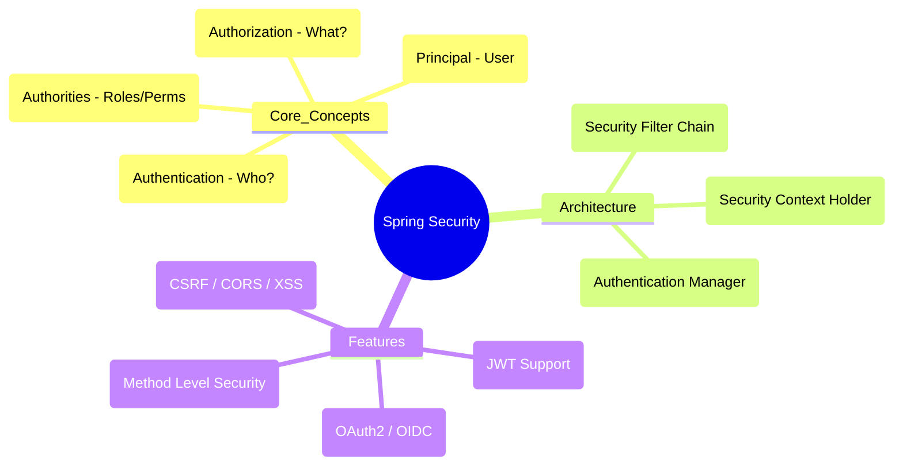
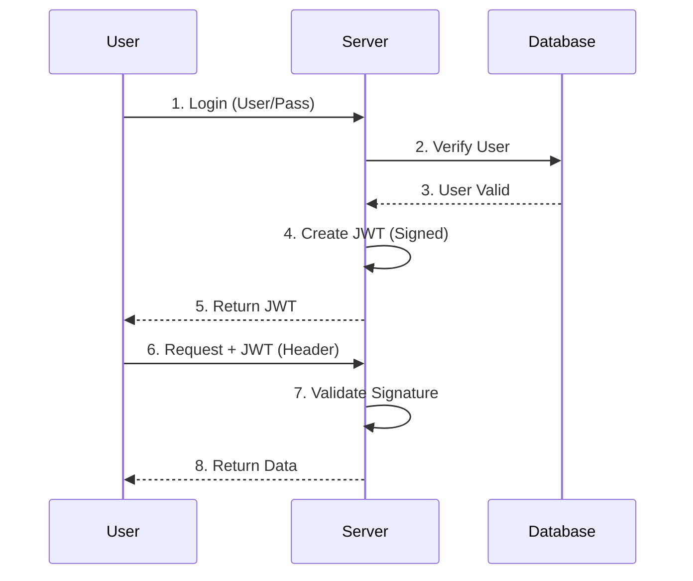
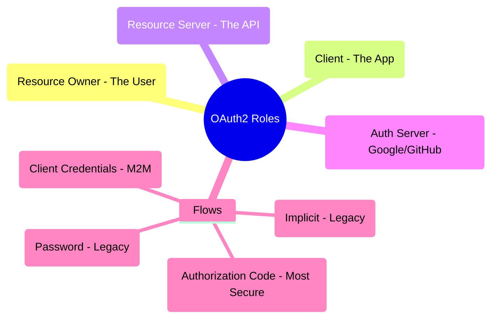
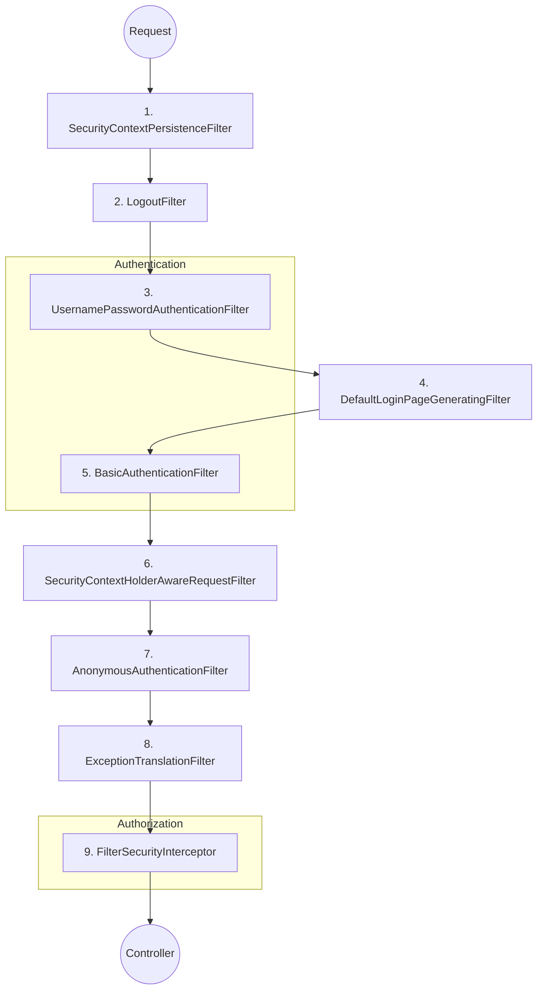

# Spring Security - Deep Dive

## Table of Contents
1. [Spring Security Fundamentals](#spring-security-fundamentals)
2. [Authentication](#authentication)
3. [Authorization](#authorization)
4. [JWT Authentication](#jwt-authentication)
5. [OAuth 2.0 & OpenID Connect](#oauth-20--openid-connect)
6. [Security Filter Chain Internals](#security-filter-chain-internals)
7. [OAuth2/OIDC: Authorization Code + PKCE](#oauth2oidc-authorization-code--pkce)
8. [JWT Refresh Token Rotation](#jwt-refresh-token-rotation)
9. [CSRF & CORS Deep Dive](#csrf--cors-deep-dive)
10. [Migration from WebSecurityConfigurerAdapter](#migration-from-websecurityconfigureradapter)
11. [Security Best Practices](#security-best-practices)
12. [Common Security Configurations](#common-security-configurations)
13. [Interview Questions](#interview-questions)

---

## Spring Security Fundamentals

### 🧠 ELI5: The "Nightclub Bouncer"

Imagine you are trying to enter a **VIP Nightclub**.

1.  **Authentication (ID Check):** The bouncer at the door asks, "Who are you?" You show your ID. He verifies it's really you.
2.  **Authorization (VIP List):** Once he knows who you are, he checks his clipboard. "Are you on the VIP list?" If yes, you can go to the VIP lounge. If no, you can only stay in the main area.
3.  **Security Context:** The bouncer gives you a **Wristband**. As long as you have it, other guards inside the club don't have to ask for your ID again. They just look at your wristband.

### 🗺️ Mindmap: Spring Security Overview



## Spring Security Fundamentals

### What is Spring Security?

**Spring Security** is a powerful and highly customizable authentication and access-control framework for Java applications.

### Core Concepts

1. **Authentication**: Who are you? (Verifying identity)
2. **Authorization**: What can you do? (Checking permissions)
3. **Principal**: Currently authenticated user
4. **GrantedAuthority**: Permission/role granted to a principal
5. **SecurityContext**: Holds authentication information

### Setup

```xml
<dependency>
    <groupId>org.springframework.boot</groupId>
    <artifactId>spring-boot-starter-security</artifactId>
</dependency>
```

**Default Behavior**:
- All endpoints secured
- Default user: `user`
- Password: Generated at startup (check console)

### Security Filter Chain

```
Request → SecurityFilterChain
    ↓
1. SecurityContextPersistenceFilter
2. UsernamePasswordAuthenticationFilter
3. BasicAuthenticationFilter
4. RememberMeAuthenticationFilter
5. AnonymousAuthenticationFilter
6. ExceptionTranslationFilter
7. FilterSecurityInterceptor
    ↓
Response
```

---

## Authentication

### In-Memory Authentication

```java
@Configuration
@EnableWebSecurity
public class SecurityConfig {
    
    @Bean
    public SecurityFilterChain filterChain(HttpSecurity http) throws Exception {
        http
            .authorizeHttpRequests(auth -> auth
                .requestMatchers("/public/**").permitAll()
                .anyRequest().authenticated()
            )
            .httpBasic(Customizer.withDefaults());
        
        return http.build();
    }
    
    @Bean
    public InMemoryUserDetailsManager userDetailsService() {
        UserDetails user = User.builder()
            .username("user")
            .password(passwordEncoder().encode("password"))
            .roles("USER")
            .build();
        
        UserDetails admin = User.builder()
            .username("admin")
            .password(passwordEncoder().encode("admin"))
            .roles("USER", "ADMIN")
            .build();
        
        return new InMemoryUserDetailsManager(user, admin);
    }
    
    @Bean
    public PasswordEncoder passwordEncoder() {
        return new BCryptPasswordEncoder();
    }
}
```

### Database Authentication

**Entity**:
```java
@Entity
@Table(name = "users")
@Data
public class User {
    
    @Id
    @GeneratedValue(strategy = GenerationType.IDENTITY)
    private Long id;
    
    @Column(unique = true, nullable = false)
    private String username;
    
    @Column(nullable = false)
    private String password;
    
    @Column(nullable = false)
    private boolean enabled = true;
    
    @ManyToMany(fetch = FetchType.EAGER)
    @JoinTable(
        name = "user_roles",
        joinColumns = @JoinColumn(name = "user_id"),
        inverseJoinColumns = @JoinColumn(name = "role_id")
    )
    private Set<Role> roles = new HashSet<>();
}

@Entity
@Table(name = "roles")
@Data
public class Role {
    
    @Id
    @GeneratedValue(strategy = GenerationType.IDENTITY)
    private Long id;
    
    @Column(unique = true, nullable = false)
    private String name; // ROLE_USER, ROLE_ADMIN
}
```

**UserDetailsService Implementation**:
```java
@Service
public class CustomUserDetailsService implements UserDetailsService {
    
    @Autowired
    private UserRepository userRepository;
    
    @Override
    public UserDetails loadUserByUsername(String username) 
            throws UsernameNotFoundException {
        User user = userRepository.findByUsername(username)
            .orElseThrow(() -> 
                new UsernameNotFoundException("User not found: " + username));
        
        return org.springframework.security.core.userdetails.User.builder()
            .username(user.getUsername())
            .password(user.getPassword())
            .disabled(!user.isEnabled())
            .authorities(getAuthorities(user.getRoles()))
            .build();
    }
    
    private Collection<? extends GrantedAuthority> getAuthorities(Set<Role> roles) {
        return roles.stream()
            .map(role -> new SimpleGrantedAuthority(role.getName()))
            .collect(Collectors.toList());
    }
}
```

**Security Configuration**:
```java
@Configuration
@EnableWebSecurity
public class SecurityConfig {
    
    @Autowired
    private CustomUserDetailsService userDetailsService;
    
    @Bean
    public SecurityFilterChain filterChain(HttpSecurity http) throws Exception {
        http
            .authorizeHttpRequests(auth -> auth
                .requestMatchers("/api/public/**").permitAll()
                .requestMatchers("/api/admin/**").hasRole("ADMIN")
                .requestMatchers("/api/user/**").hasAnyRole("USER", "ADMIN")
                .anyRequest().authenticated()
            )
            .formLogin(form -> form
                .loginPage("/login")
                .permitAll()
            )
            .logout(logout -> logout
                .logoutUrl("/logout")
                .logoutSuccessUrl("/login?logout")
                .permitAll()
            )
            .csrf(csrf -> csrf.disable()); // Disable for API
        
        return http.build();
    }
    
    @Bean
    public AuthenticationManager authenticationManager(
            AuthenticationConfiguration authConfig) throws Exception {
        return authConfig.getAuthenticationManager();
    }
    
    @Bean
    public PasswordEncoder passwordEncoder() {
        return new BCryptPasswordEncoder();
    }
}
```

### Form-Based Login

```java
@Configuration
@EnableWebSecurity
public class SecurityConfig {
    
    @Bean
    public SecurityFilterChain filterChain(HttpSecurity http) throws Exception {
        http
            .authorizeHttpRequests(auth -> auth
                .requestMatchers("/login", "/register", "/css/**", "/js/**").permitAll()
                .anyRequest().authenticated()
            )
            .formLogin(form -> form
                .loginPage("/login")
                .loginProcessingUrl("/perform_login")
                .defaultSuccessUrl("/home", true)
                .failureUrl("/login?error=true")
                .usernameParameter("username")
                .passwordParameter("password")
                .permitAll()
            )
            .logout(logout -> logout
                .logoutUrl("/logout")
                .logoutSuccessUrl("/login?logout")
                .deleteCookies("JSESSIONID")
                .invalidateHttpSession(true)
                .clearAuthentication(true)
                .permitAll()
            )
            .rememberMe(remember -> remember
                .key("uniqueAndSecret")
                .tokenValiditySeconds(86400) // 24 hours
                .rememberMeParameter("remember-me")
            );
        
        return http.build();
    }
}
```

### Basic Authentication

```java
@Configuration
@EnableWebSecurity
public class SecurityConfig {
    
    @Bean
    public SecurityFilterChain filterChain(HttpSecurity http) throws Exception {
        http
            .authorizeHttpRequests(auth -> auth
                .anyRequest().authenticated()
            )
            .httpBasic(basic -> basic
                .realmName("My Application")
            )
            .csrf(csrf -> csrf.disable());
        
        return http.build();
    }
}
```

---

## Authorization

### Method-Level Security

```java
@Configuration
@EnableMethodSecurity(prePostEnabled = true, securedEnabled = true)
public class MethodSecurityConfig {
}

@Service
public class UserService {
    
    // Only users with ADMIN role
    @PreAuthorize("hasRole('ADMIN')")
    public void deleteUser(Long id) {
        // Delete user
    }
    
    // Only if user owns the resource
    @PreAuthorize("#id == authentication.principal.id")
    public User updateProfile(Long id, UserDTO dto) {
        // Update profile
    }
    
    // Multiple conditions
    @PreAuthorize("hasRole('ADMIN') or #userId == authentication.principal.id")
    public User getUser(Long userId) {
        // Get user
    }
    
    // Check after method execution
    @PostAuthorize("returnObject.username == authentication.name")
    public User getUserDetails(Long id) {
        return userRepository.findById(id).orElseThrow();
    }
    
    // Filter collection before returning
    @PostFilter("filterObject.owner == authentication.name")
    public List<Document> getAllDocuments() {
        return documentRepository.findAll();
    }
    
    // Filter method arguments
    @PreFilter("filterObject.owner == authentication.name")
    public void deleteDocuments(List<Document> documents) {
        documentRepository.deleteAll(documents);
    }
    
    // Using @Secured
    @Secured({"ROLE_USER", "ROLE_ADMIN"})
    public void someMethod() {
        // Method logic
    }
}
```

### URL-Based Security

```java
@Configuration
@EnableWebSecurity
public class SecurityConfig {
    
    @Bean
    public SecurityFilterChain filterChain(HttpSecurity http) throws Exception {
        http
            .authorizeHttpRequests(auth -> auth
                // Public endpoints
                .requestMatchers("/", "/home", "/about").permitAll()
                .requestMatchers("/api/public/**").permitAll()
                
                // Static resources
                .requestMatchers("/css/**", "/js/**", "/images/**").permitAll()
                
                // Admin endpoints
                .requestMatchers("/api/admin/**").hasRole("ADMIN")
                .requestMatchers(HttpMethod.DELETE, "/api/**").hasRole("ADMIN")
                
                // User endpoints
                .requestMatchers("/api/user/**").hasAnyRole("USER", "ADMIN")
                
                // Specific authorities
                .requestMatchers("/api/reports/**").hasAuthority("GENERATE_REPORT")
                
                // Multiple roles/authorities
                .requestMatchers("/api/moderator/**")
                    .hasAnyAuthority("ROLE_ADMIN", "ROLE_MODERATOR")
                
                // Authenticated users
                .anyRequest().authenticated()
            );
        
        return http.build();
    }
}
```

### Custom Access Decision

```java
@Component("customSecurity")
public class CustomSecurityExpression {
    
    public boolean hasUserId(Authentication authentication, Long userId) {
        if (authentication == null || !authentication.isAuthenticated()) {
            return false;
        }
        
        UserDetails userDetails = (UserDetails) authentication.getPrincipal();
        User user = userRepository.findByUsername(userDetails.getUsername()).get();
        
        return user.getId().equals(userId);
    }
    
    public boolean isOwner(Authentication authentication, Long resourceId) {
        // Custom logic to check ownership
        return true;
    }
}

// Usage
@PreAuthorize("@customSecurity.hasUserId(authentication, #userId)")
public void updateUser(Long userId, UserDTO dto) {
    // Update user
}
```

---

---

## JWT Authentication

### 🧠 ELI5: The "Movie Ticket"

Imagine you buy a **Movie Ticket** online.

1.  **Login:** You pay for the ticket (send username/password).
2.  **Token Generation:** The website gives you a **QR Code** (JWT). This code contains the movie name, your seat number, and a digital signature from the cinema.
3.  **Usage:** When you get to the cinema, you don't show your credit card again. You just show the QR Code. The usher scans it, verifies the signature is real, and lets you in.
4.  **Stateless:** The usher doesn't need to call the website to check if you paid. All the info he needs is right there in the QR Code.

### 🗺️ Mindmap: JWT Flow



## JWT Authentication

### JWT Configuration

```xml
<dependency>
    <groupId>io.jsonwebtoken</groupId>
    <artifactId>jjwt-api</artifactId>
    <version>0.11.5</version>
</dependency>
<dependency>
    <groupId>io.jsonwebtoken</groupId>
    <artifactId>jjwt-impl</artifactId>
    <version>0.11.5</version>
    <scope>runtime</scope>
</dependency>
<dependency>
    <groupId>io.jsonwebtoken</groupId>
    <artifactId>jjwt-jackson</artifactId>
    <version>0.11.5</version>
    <scope>runtime</scope>
</dependency>
```

### JWT Utility Class

```java
@Component
public class JwtTokenProvider {
    
    @Value("${jwt.secret}")
    private String jwtSecret;
    
    @Value("${jwt.expiration}")
    private long jwtExpirationMs;
    
    public String generateToken(Authentication authentication) {
        UserDetails userDetails = (UserDetails) authentication.getPrincipal();
        
        Date now = new Date();
        Date expiryDate = new Date(now.getTime() + jwtExpirationMs);
        
        return Jwts.builder()
            .setSubject(userDetails.getUsername())
            .setIssuedAt(now)
            .setExpiration(expiryDate)
            .signWith(getSigningKey(), SignatureAlgorithm.HS512)
            .compact();
    }
    
    public String generateTokenFromUsername(String username) {
        Date now = new Date();
        Date expiryDate = new Date(now.getTime() + jwtExpirationMs);
        
        return Jwts.builder()
            .setSubject(username)
            .setIssuedAt(now)
            .setExpiration(expiryDate)
            .signWith(getSigningKey(), SignatureAlgorithm.HS512)
            .compact();
    }
    
    public String getUsernameFromToken(String token) {
        return Jwts.parserBuilder()
            .setSigningKey(getSigningKey())
            .build()
            .parseClaimsJws(token)
            .getBody()
            .getSubject();
    }
    
    public boolean validateToken(String token) {
        try {
            Jwts.parserBuilder()
                .setSigningKey(getSigningKey())
                .build()
                .parseClaimsJws(token);
            return true;
        } catch (SecurityException | MalformedJwtException e) {
            log.error("Invalid JWT signature: {}", e.getMessage());
        } catch (ExpiredJwtException e) {
            log.error("JWT token is expired: {}", e.getMessage());
        } catch (UnsupportedJwtException e) {
            log.error("JWT token is unsupported: {}", e.getMessage());
        } catch (IllegalArgumentException e) {
            log.error("JWT claims string is empty: {}", e.getMessage());
        }
        return false;
    }
    
    private Key getSigningKey() {
        byte[] keyBytes = Decoders.BASE64.decode(jwtSecret);
        return Keys.hmacShaKeyFor(keyBytes);
    }
}
```

### JWT Authentication Filter

```java
@Component
public class JwtAuthenticationFilter extends OncePerRequestFilter {
    
    @Autowired
    private JwtTokenProvider tokenProvider;
    
    @Autowired
    private CustomUserDetailsService userDetailsService;
    
    @Override
    protected void doFilterInternal(
            HttpServletRequest request,
            HttpServletResponse response,
            FilterChain filterChain) throws ServletException, IOException {
        
        try {
            String jwt = getJwtFromRequest(request);
            
            if (jwt != null && tokenProvider.validateToken(jwt)) {
                String username = tokenProvider.getUsernameFromToken(jwt);
                
                UserDetails userDetails = userDetailsService.loadUserByUsername(username);
                
                UsernamePasswordAuthenticationToken authentication = 
                    new UsernamePasswordAuthenticationToken(
                        userDetails, null, userDetails.getAuthorities()
                    );
                
                authentication.setDetails(
                    new WebAuthenticationDetailsSource().buildDetails(request)
                );
                
                SecurityContextHolder.getContext().setAuthentication(authentication);
            }
        } catch (Exception ex) {
            logger.error("Could not set user authentication in security context", ex);
        }
        
        filterChain.doFilter(request, response);
    }
    
    private String getJwtFromRequest(HttpServletRequest request) {
        String bearerToken = request.getHeader("Authorization");
        if (StringUtils.hasText(bearerToken) && bearerToken.startsWith("Bearer ")) {
            return bearerToken.substring(7);
        }
        return null;
    }
}
```

### JWT Security Configuration

```java
@Configuration
@EnableWebSecurity
@RequiredArgsConstructor
public class SecurityConfig {
    
    private final JwtAuthenticationFilter jwtAuthenticationFilter;
    private final JwtAuthenticationEntryPoint jwtAuthenticationEntryPoint;
    
    @Bean
    public SecurityFilterChain filterChain(HttpSecurity http) throws Exception {
        http
            .csrf(csrf -> csrf.disable())
            .exceptionHandling(ex -> ex
                .authenticationEntryPoint(jwtAuthenticationEntryPoint)
            )
            .sessionManagement(session -> session
                .sessionCreationPolicy(SessionCreationPolicy.STATELESS)
            )
            .authorizeHttpRequests(auth -> auth
                .requestMatchers("/api/auth/**").permitAll()
                .requestMatchers("/api/public/**").permitAll()
                .anyRequest().authenticated()
            );
        
        http.addFilterBefore(jwtAuthenticationFilter, 
                            UsernamePasswordAuthenticationFilter.class);
        
        return http.build();
    }
}
```

### Authentication Controller

```java
@RestController
@RequestMapping("/api/auth")
@RequiredArgsConstructor
public class AuthController {
    
    private final AuthenticationManager authenticationManager;
    private final JwtTokenProvider tokenProvider;
    private final UserRepository userRepository;
    private final PasswordEncoder passwordEncoder;
    
    @PostMapping("/login")
    public ResponseEntity<JwtAuthResponse> authenticateUser(
            @Valid @RequestBody LoginRequest loginRequest) {
        
        Authentication authentication = authenticationManager.authenticate(
            new UsernamePasswordAuthenticationToken(
                loginRequest.getUsername(),
                loginRequest.getPassword()
            )
        );
        
        SecurityContextHolder.getContext().setAuthentication(authentication);
        String jwt = tokenProvider.generateToken(authentication);
        
        return ResponseEntity.ok(new JwtAuthResponse(jwt));
    }
    
    @PostMapping("/register")
    public ResponseEntity<MessageResponse> registerUser(
            @Valid @RequestBody SignUpRequest signUpRequest) {
        
        if (userRepository.existsByUsername(signUpRequest.getUsername())) {
            return ResponseEntity
                .badRequest()
                .body(new MessageResponse("Username is already taken!"));
        }
        
        if (userRepository.existsByEmail(signUpRequest.getEmail())) {
            return ResponseEntity
                .badRequest()
                .body(new MessageResponse("Email is already in use!"));
        }
        
        User user = new User();
        user.setUsername(signUpRequest.getUsername());
        user.setEmail(signUpRequest.getEmail());
        user.setPassword(passwordEncoder.encode(signUpRequest.getPassword()));
        
        Role userRole = roleRepository.findByName("ROLE_USER")
            .orElseThrow(() -> new RuntimeException("Role not found"));
        user.getRoles().add(userRole);
        
        userRepository.save(user);
        
        return ResponseEntity.ok(new MessageResponse("User registered successfully!"));
    }
}

@Data
public class LoginRequest {
    @NotBlank
    private String username;
    
    @NotBlank
    private String password;
}

@Data
public class JwtAuthResponse {
    private String accessToken;
    private String tokenType = "Bearer";
    
    public JwtAuthResponse(String accessToken) {
        this.accessToken = accessToken;
    }
}
```

---

---

## OAuth 2.0 & OpenID Connect

### 🧠 ELI5: The "Hotel Key Card"

Imagine you are staying at a **Hotel**.

1.  **Authentication (OIDC):** You show your ID at the front desk. They verify who you are and give you a **Key Card**.
2.  **Authorization (OAuth2):** The Key Card doesn't give you the whole hotel. It only gives you access to **Room 302** and the **Gym**. The "Scope" is what the card is allowed to open.
3.  **Third-Party Access:** If you want a **Pizza Delivery** guy to bring food to your room, you don't give him your ID. You give him a temporary "Guest Pass" (Access Token) that only lets him enter the lobby and your floor.

### 🗺️ Mindmap: OAuth2 Roles



## OAuth 2.0 & OpenID Connect

### OAuth 2.0 Client Configuration

```yaml
spring:
  security:
    oauth2:
      client:
        registration:
          google:
            client-id: ${GOOGLE_CLIENT_ID}
            client-secret: ${GOOGLE_CLIENT_SECRET}
            scope:
              - email
              - profile
          github:
            client-id: ${GITHUB_CLIENT_ID}
            client-secret: ${GITHUB_CLIENT_SECRET}
            scope:
              - user:email
              - read:user
        provider:
          google:
            authorization-uri: https://accounts.google.com/o/oauth2/v2/auth
            token-uri: https://oauth2.googleapis.com/token
            user-info-uri: https://www.googleapis.com/oauth2/v3/userinfo
            user-name-attribute: sub
```

### OAuth 2.0 Security Configuration

```java
@Configuration
@EnableWebSecurity
public class OAuth2SecurityConfig {
    
    @Bean
    public SecurityFilterChain filterChain(HttpSecurity http) throws Exception {
        http
            .authorizeHttpRequests(auth -> auth
                .requestMatchers("/", "/login", "/error").permitAll()
                .anyRequest().authenticated()
            )
            .oauth2Login(oauth2 -> oauth2
                .loginPage("/login")
                .defaultSuccessUrl("/home")
                .failureUrl("/login?error=true")
                .userInfoEndpoint(userInfo -> userInfo
                    .userService(customOAuth2UserService)
                )
            )
            .logout(logout -> logout
                .logoutSuccessUrl("/")
                .permitAll()
            );
        
        return http.build();
    }
}
```

### Custom OAuth2 User Service

```java
@Service
public class CustomOAuth2UserService extends DefaultOAuth2UserService {
    
    @Autowired
    private UserRepository userRepository;
    
    @Override
    public OAuth2User loadUser(OAuth2UserRequest userRequest) 
            throws OAuth2AuthenticationException {
        OAuth2User oauth2User = super.loadUser(userRequest);
        
        String email = oauth2User.getAttribute("email");
        String name = oauth2User.getAttribute("name");
        
        User user = userRepository.findByEmail(email)
            .orElseGet(() -> {
                User newUser = new User();
                newUser.setEmail(email);
                newUser.setUsername(email);
                newUser.setName(name);
                newUser.setProvider("GOOGLE");
                return userRepository.save(newUser);
            });
        
        return new CustomOAuth2User(oauth2User, user);
    }
}
```

---

---

---

## Security Filter Chain Internals

### 🧠 ELI5: The "Airport Security"

Think of the **Security Filter Chain** as the series of checks you go through at an **Airport**.

1.  **Check-in Filter:** Checks your ticket (Authentication).
2.  **TSA Filter:** Checks your bags for prohibited items (CSRF/XSS protection).
3.  **Passport Control Filter:** Checks if you have the right visa for your destination (Authorization).
4.  **Boarding Filter:** Final check before you enter the plane (Resource access).

If you fail *any* of these checks, you are turned back and never reach the plane (your Controller).

### 🗺️ Mindmap: Security Filter Chain



## Security Filter Chain Internals

### How it Works
Spring Security is essentially a chain of Servlet Filters. The `DelegatingFilterProxy` intercepts the request and delegates it to the `FilterChainProxy`, which then runs the `SecurityFilterChain`.

### Key Filters in Order:
1.  **SecurityContextPersistenceFilter**: Loads/Saves SecurityContext from/to Session.
2.  **LogoutFilter**: Handles logout requests.
3.  **UsernamePasswordAuthenticationFilter**: Handles form login.
4.  **DefaultLoginPageGeneratingFilter**: Generates the default login page.
5.  **BasicAuthenticationFilter**: Handles Basic Auth headers.
6.  **RequestCacheAwareFilter**: Restores the request after login.
7.  **SecurityContextHolderAwareRequestFilter**: Wraps the request to support `HttpServletRequest` security methods.
8.  **AnonymousAuthenticationFilter**: Assigns an "anonymous" user if not authenticated.
9.  **SessionManagementFilter**: Handles session fixation, concurrency, etc.
10. **ExceptionTranslationFilter**: Catches security exceptions and starts authentication or returns 403.
11. **FilterSecurityInterceptor**: The final filter that checks authorization via `AccessDecisionManager`.

---

## OAuth2/OIDC: Authorization Code + PKCE

### Why PKCE?
**PKCE (Proof Key for Code Exchange)** was originally designed for mobile apps but is now recommended for **all** clients (including SPAs) to prevent authorization code injection attacks.

### The Flow:
1.  **Code Challenge**: Client generates a secret `code_verifier` and its hash `code_challenge`.
2.  **Auth Request**: Client sends `code_challenge` to Auth Server.
3.  **Auth Code**: User authenticates; Auth Server returns `code`.
4.  **Token Request**: Client sends `code` + `code_verifier`.
5.  **Verification**: Auth Server hashes `code_verifier` and compares it with the original `code_challenge`. If they match, it issues tokens.

---

## JWT Refresh Token Rotation

### The Problem with Long-Lived JWTs
If a JWT is stolen, the attacker has access until it expires. If it's short-lived, the user has to log in frequently.

### The Solution: Refresh Tokens
1.  **Login**: Server issues a short-lived **Access Token** (e.g., 15m) and a long-lived **Refresh Token** (e.g., 7d).
2.  **Refresh**: When Access Token expires, Client sends Refresh Token to get a new Access Token.
3.  **Rotation**: Every time a Refresh Token is used, the server issues a **NEW** Refresh Token and invalidates the old one.
4.  **Detection**: If an old Refresh Token is used, the server assumes a breach and invalidates **ALL** tokens for that user.

---

## CSRF & CORS Deep Dive

### CSRF (Cross-Site Request Forgery)
- **What**: Attacker tricks user's browser into sending a request to your site using the user's session cookie.
- **Protection**: Synchronizer Token Pattern. Spring Security adds a hidden `_csrf` token to forms.
- **When to disable**: For stateless APIs using JWT (since there's no session cookie to steal).

### CORS (Cross-Origin Resource Sharing)
- **What**: Browser security feature that restricts web pages from making requests to a different domain.
- **Preflight**: For "non-simple" requests (e.g., with `Authorization` header), the browser sends an `OPTIONS` request first.
- **Configuration**:
    ```java
    @Bean
    public CorsConfigurationSource corsConfigurationSource() {
        CorsConfiguration config = new CorsConfiguration();
        config.setAllowedOrigins(List.of("https://myapp.com"));
        config.setAllowedMethods(List.of("GET", "POST", "PUT", "DELETE"));
        config.setAllowedHeaders(List.of("Authorization", "Content-Type"));
        UrlBasedCorsConfigurationSource source = new UrlBasedCorsConfigurationSource();
        source.registerCorsConfiguration("/**", config);
        return source;
    }
    ```

---

## Migration from WebSecurityConfigurerAdapter

In Spring Security 6 (Spring Boot 3), `WebSecurityConfigurerAdapter` is **removed**.

### Old Way (Spring Security 5.x):
```java
public class SecurityConfig extends WebSecurityConfigurerAdapter {
    @Override
    protected void configure(HttpSecurity http) throws Exception {
        http.authorizeRequests().anyRequest().authenticated();
    }
}
```

### New Way (Spring Security 6.x):
```java
@Configuration
@EnableWebSecurity
public class SecurityConfig {
    @Bean
    public SecurityFilterChain filterChain(HttpSecurity http) throws Exception {
        http
            .authorizeHttpRequests(auth -> auth
                .anyRequest().authenticated()
            );
        return http.build();
    }
}
```

---

## Security Best Practices

### Password Encoding

```java
@Configuration
public class PasswordConfig {
    
    @Bean
    public PasswordEncoder passwordEncoder() {
        // BCrypt (Recommended)
        return new BCryptPasswordEncoder(12); // Strength: 4-31
        
        // Argon2
        // return new Argon2PasswordEncoder();
        
        // SCrypt
        // return new SCryptPasswordEncoder();
        
        // PBKDF2
        // return new Pbkdf2PasswordEncoder();
    }
}

// Usage
String encodedPassword = passwordEncoder.encode("plainPassword");
boolean matches = passwordEncoder.matches("plainPassword", encodedPassword);
```

### CORS Configuration

```java
@Configuration
public class CorsConfig {
    
    @Bean
    public CorsConfigurationSource corsConfigurationSource() {
        CorsConfiguration configuration = new CorsConfiguration();
        configuration.setAllowedOrigins(Arrays.asList("http://localhost:3000"));
        configuration.setAllowedMethods(Arrays.asList("GET", "POST", "PUT", "DELETE", "OPTIONS"));
        configuration.setAllowedHeaders(Arrays.asList("*"));
        configuration.setAllowCredentials(true);
        configuration.setMaxAge(3600L);
        
        UrlBasedCorsConfigurationSource source = new UrlBasedCorsConfigurationSource();
        source.registerCorsConfiguration("/**", configuration);
        return source;
    }
}

// Or in SecurityConfig
http.cors(cors -> cors.configurationSource(corsConfigurationSource()));
```

### CSRF Protection

```java
// Disable for stateless APIs
http.csrf(csrf -> csrf.disable());

// Enable for form-based apps
http.csrf(csrf -> csrf
    .csrfTokenRepository(CookieCsrfTokenRepository.withHttpOnlyFalse())
);

// Custom CSRF matcher
http.csrf(csrf -> csrf
    .requireCsrfProtectionMatcher(new RequestMatcher() {
        @Override
        public boolean matches(HttpServletRequest request) {
            return !request.getRequestURI().startsWith("/api/");
        }
    })
);
```

### Security Headers

```java
http.headers(headers -> headers
    .contentSecurityPolicy(csp -> csp
        .policyDirectives("default-src 'self'")
    )
    .frameOptions(frame -> frame.deny())
    .xssProtection(xss -> xss.enable())
    .httpStrictTransportSecurity(hsts -> hsts
        .includeSubDomains(true)
        .maxAgeInSeconds(31536000)
    )
);
```

### Rate Limiting

```java
@Component
public class RateLimitFilter extends OncePerRequestFilter {
    
    private final Map<String, RateLimiter> limiters = new ConcurrentHashMap<>();
    
    @Override
    protected void doFilterInternal(HttpServletRequest request, 
                                    HttpServletResponse response, 
                                    FilterChain filterChain) 
            throws ServletException, IOException {
        
        String clientId = getClientId(request);
        RateLimiter limiter = limiters.computeIfAbsent(clientId, 
            k -> RateLimiter.create(10.0)); // 10 requests per second
        
        if (!limiter.tryAcquire()) {
            response.setStatus(HttpStatus.TOO_MANY_REQUESTS.value());
            response.getWriter().write("Too many requests");
            return;
        }
        
        filterChain.doFilter(request, response);
    }
    
    private String getClientId(HttpServletRequest request) {
        return request.getRemoteAddr();
    }
}
```

---

## Common Security Configurations

### Multi-Tenant Security

```java
@Configuration
@EnableWebSecurity
public class MultiTenantSecurityConfig {
    
    @Bean
    public SecurityFilterChain filterChain(HttpSecurity http) throws Exception {
        http
            .authorizeHttpRequests(auth -> auth
                .requestMatchers("/api/tenant1/**").hasRole("TENANT1_USER")
                .requestMatchers("/api/tenant2/**").hasRole("TENANT2_USER")
                .anyRequest().authenticated()
            );
        
        return http.build();
    }
}
```

### Role Hierarchy

```java
@Bean
public RoleHierarchy roleHierarchy() {
    RoleHierarchyImpl roleHierarchy = new RoleHierarchyImpl();
    roleHierarchy.setHierarchy(
        "ROLE_ADMIN > ROLE_MANAGER\n" +
        "ROLE_MANAGER > ROLE_USER"
    );
    return roleHierarchy;
}
```

### Remember Me

```java
http.rememberMe(remember -> remember
    .key("uniqueAndSecret")
    .tokenRepository(persistentTokenRepository())
    .tokenValiditySeconds(86400)
);

@Bean
public PersistentTokenRepository persistentTokenRepository() {
    JdbcTokenRepositoryImpl tokenRepository = new JdbcTokenRepositoryImpl();
    tokenRepository.setDataSource(dataSource);
    return tokenRepository;
}
```

---

## Interview Questions

### Q1: Difference between authentication and authorization?

**Answer**:
- **Authentication**: Verifying who you are (login)
- **Authorization**: Determining what you can access (permissions)

### Q2: How does Spring Security work internally?

**Answer**: Spring Security uses a chain of filters. Key steps:
1. Request intercepted by filter chain
2. Authentication attempted (username/password, JWT, etc.)
3. SecurityContext populated with authentication
4. Authorization checked against configured rules
5. Request proceeds if authorized, else 403

### Q3: What is the difference between @Secured and @PreAuthorize?

**Answer**:
- `@Secured`: Simple role checking, no SpEL support
- `@PreAuthorize`: Supports SpEL expressions, more flexible

### Q4: How to implement JWT refresh tokens?

**Answer**:
1. Generate both access token (short-lived) and refresh token (long-lived)
2. Store refresh token in database
3. When access token expires, use refresh token to get new access token
4. Validate refresh token against database

### Q5: What is CSRF and how to prevent it?

**Answer**: Cross-Site Request Forgery is when attacker tricks user into submitting unwanted request. Prevention:
- Use CSRF tokens (Spring Security provides by default)
- Check origin/referer headers
- Use SameSite cookie attribute
- For APIs, use stateless authentication (JWT)

---

## Practice Exercises

1. Implement JWT authentication with refresh tokens
2. Create role-based access control with custom roles
3. Integrate OAuth 2.0 (Google/GitHub login)
4. Implement method-level security with custom expressions
5. Create audit log for security events
6. Implement two-factor authentication
7. Set up rate limiting per user
8. Implement password reset functionality
