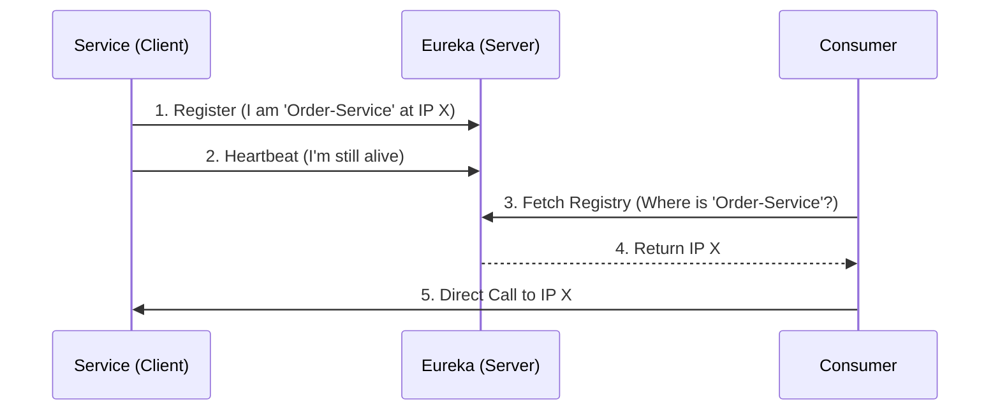
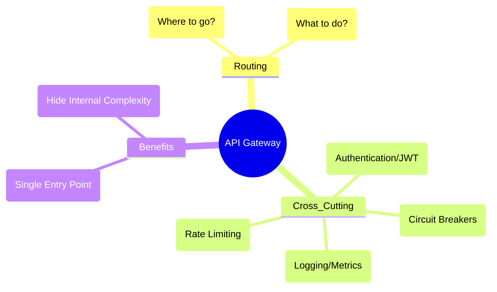

# Microservices & Cloud Native Spring - Deep Dive

## Table of Contents
1. [Microservices Architecture](#microservices-architecture)
2. [Spring Cloud Overview](#spring-cloud-overview)
3. [Service Discovery (Eureka)](#service-discovery-eureka)
4. [API Gateway (Spring Cloud Gateway)](#api-gateway-spring-cloud-gateway)
5. [Distributed Configuration](#distributed-configuration)
6. [Circuit Breakers (Resilience4j)](#circuit-breakers-resilience4j)
7. [Distributed Tracing](#distributed-tracing)
8. [Microservices Patterns](#microservices-patterns)
9. [Saga Pattern Deep Dive](#saga-pattern-deep-dive)
10. [Service Mesh (Istio/Linkerd)](#service-mesh-istiolinkerd)
11. [Rate Limiting](#rate-limiting)

---

## Microservices Architecture

### 🧠 ELI5: The "Lego Set" vs the "Stone Statue"

*   **Monolith (Stone Statue):** Imagine a statue carved from a single block of stone. If you want to change the statue's hat, you have to be very careful not to crack the whole thing. If the base breaks, the entire statue falls.
*   **Microservices (Lego Set):** Imagine a castle built with Legos. If you want to change the tower, you just pull that specific part off and replace it. The rest of the castle stays exactly as it is. If one Lego brick breaks, the rest of the castle is still standing.

### 🗺️ Mindmap: Microservices Overview

## ☁️ Microservices Architecture

> [!TIP]
> **Interview Pro-Tip: "How do you handle distributed transactions?"**
> Don't say "Two-Phase Commit" (2PC) - it's too slow for microservices. Instead, talk about the **Saga Pattern**. Explain how you break a large transaction into smaller, local transactions, and use "Compensating Transactions" (undo actions) if one step fails.

### 🔍 Deep Dive: Spring Cloud Gateway & Netty
Unlike Zuul (which was blocking), Spring Cloud Gateway is built on **Spring WebFlux** and **Netty**. It uses a non-blocking, event-loop model. This means it can handle thousands of concurrent connections with a very small number of threads, making it much more efficient for high-traffic environments.

### 🛠️ Complex Example: Advanced Resilience4j Config
```yaml
resilience4j:
  circuitbreaker:
    instances:
      backendA:
        registerHealthIndicator: true
        slidingWindowSize: 100
        failureRateThreshold: 50
        waitDurationInOpenState: 10000
        permittedNumberOfCallsInHalfOpenState: 10
  ratelimiter:
    instances:
      backendA:
        limitForPeriod: 10
        limitRefreshPeriod: 1s
        timeoutDuration: 0
```

## Microservices Architecture

### Monolith vs Microservices

| Feature | Monolithic Architecture | Microservices Architecture |
|---------|-------------------------|----------------------------|
| **Structure** | Single codebase, single deployable unit | Multiple small, independent services |
| **Database** | Shared database | Database per service |
| **Scaling** | Scale the entire application | Scale individual services independently |
| **Technology** | Single technology stack | Polyglot (can use different stacks) |
| **Complexity** | Low initially, high as it grows | High operational complexity |
| **Deployment** | Risky (one bug can bring down everything) | Isolated (failures are contained) |

### Key Characteristics
1. **Independently Deployable**: Can deploy one service without affecting others.
2. **Loosely Coupled**: Services interact via well-defined APIs.
3. **Organized around Business Capabilities**: e.g., Order Service, User Service.
4. **Owned by Small Teams**: "Two-pizza teams".

---

## Spring Cloud Overview

Spring Cloud provides tools for developers to quickly build some of the common patterns in distributed systems.

### Key Components
- **Spring Cloud Netflix**: Eureka (Discovery), Hystrix (Circuit Breaker - Legacy), Zuul (Gateway - Legacy).
- **Spring Cloud Config**: Centralized configuration.
- **Spring Cloud Gateway**: API Gateway.
- **Spring Cloud Sleuth / Micrometer Tracing**: Distributed tracing.
- **Spring Cloud OpenFeign**: Declarative REST client.
- **Spring Cloud Stream**: Event-driven microservices.

---

---

## Service Discovery (Eureka)

## 🏗️ Architecture Diagram

## Service Discovery (Eureka)

### 🧠 ELI5: The "Phone Book"

Imagine you live in a city where everyone moves to a new house every single day.

*   **Without Service Discovery:** You have to call everyone every morning to ask for their new address. If someone forgets to tell you, you can't find them.
*   **With Service Discovery (Eureka):** There is a **Central Phone Book** (Eureka Server). Every morning, everyone calls the Phone Book and says, "Hi, I'm the Pizza Guy, and I live at 123 Maple St today." When you want pizza, you just check the Phone Book.

### 🗺️ Mindmap: Service Discovery



## Service Discovery (Eureka)

In a dynamic environment, service instances have changing IP addresses. Service Discovery allows services to find each other without hardcoding URLs.

### 1. Eureka Server (The Registry)

**pom.xml**:
```xml
<dependency>
    <groupId>org.springframework.cloud</groupId>
    <artifactId>spring-cloud-starter-netflix-eureka-server</artifactId>
</dependency>
```

**Application Class**:
```java
@SpringBootApplication
@EnableEurekaServer
public class ServiceRegistryApplication {
    public static void main(String[] args) {
        SpringApplication.run(ServiceRegistryApplication.class, args);
    }
}
```

**application.yml**:
```yaml
server:
  port: 8761

eureka:
  client:
    register-with-eureka: false # It's a server, don't register itself
    fetch-registry: false
```

### 2. Eureka Client (The Microservice)

**pom.xml**:
```xml
<dependency>
    <groupId>org.springframework.cloud</groupId>
    <artifactId>spring-cloud-starter-netflix-eureka-client</artifactId>
</dependency>
```

**Application Class**:
```java
@SpringBootApplication
@EnableDiscoveryClient
public class UserServiceApplication {
    public static void main(String[] args) {
        SpringApplication.run(UserServiceApplication.class, args);
    }
}
```

**application.yml**:
```yaml
spring:
  application:
    name: user-service

eureka:
  client:
    service-url:
      defaultZone: http://localhost:8761/eureka/
```

---

---

## API Gateway (Spring Cloud Gateway)

## 🏗️ Architecture Diagram

## API Gateway (Spring Cloud Gateway)

### 🧠 ELI5: The "Hotel Receptionist"

Imagine a huge **Hotel** with 100 different rooms (services).

*   **Without a Gateway:** Guests have to wander the hallways, looking for the specific room they need. They have to show their ID at every single door.
*   **With a Gateway:** There is a **Receptionist** at the front door. You tell her, "I want to go to the Gym." She checks your ID once, gives you a key, and tells you exactly which way to go. She also makes sure too many people don't enter the Gym at once (Rate Limiting).

### 🗺️ Mindmap: API Gateway



## API Gateway (Spring Cloud Gateway)

The API Gateway acts as a single entry point for all clients. It handles routing, security, rate limiting, and monitoring.

**pom.xml**:
```xml
<dependency>
    <groupId>org.springframework.cloud</groupId>
    <artifactId>spring-cloud-starter-gateway</artifactId>
</dependency>
<dependency>
    <groupId>org.springframework.cloud</groupId>
    <artifactId>spring-cloud-starter-netflix-eureka-client</artifactId>
</dependency>
```

**application.yml**:
```yaml
server:
  port: 8080

spring:
  application:
    name: api-gateway
  cloud:
    gateway:
      discovery:
        locator:
          enabled: true # Auto-create routes from Eureka
          lower-case-service-id: true
      routes:
        - id: user-service
          uri: lb://user-service # Load balanced URI
          predicates:
            - Path=/users/**
        - id: order-service
          uri: lb://order-service
          predicates:
            - Path=/orders/**
```

### Cross-Cutting Concerns in Gateway
- **Authentication**: Validate JWT tokens.
- **Rate Limiting**: Prevent abuse.
- **Logging**: Log all incoming requests.

---

## Distributed Configuration

Manage configuration for all services in a central place (Git repository).

### 1. Config Server

**pom.xml**:
```xml
<dependency>
    <groupId>org.springframework.cloud</groupId>
    <artifactId>spring-cloud-config-server</artifactId>
</dependency>
```

**Application Class**:
```java
@SpringBootApplication
@EnableConfigServer
public class ConfigServerApplication {
    public static void main(String[] args) {
        SpringApplication.run(ConfigServerApplication.class, args);
    }
}
```

**application.yml**:
```yaml
server:
  port: 8888

spring:
  cloud:
    config:
      server:
        git:
          uri: https://github.com/my-org/config-repo
          default-label: main
```

### 2. Config Client

**pom.xml**:
```xml
<dependency>
    <groupId>org.springframework.cloud</groupId>
    <artifactId>spring-cloud-starter-config</artifactId>
</dependency>
```

**bootstrap.yml** (or application.yml in newer versions with `spring.config.import`):
```yaml
spring:
  application:
    name: user-service
  config:
    import: optional:configserver:http://localhost:8888
```

---

---

## Circuit Breakers (Resilience4j)

## 🏗️ Architecture Diagram

## Circuit Breakers (Resilience4j)

### 🧠 ELI5: The "Electrical Fuse"

Imagine your house has a **Fuse Box**.

*   **Closed (Normal):** Electricity flows normally. You turn on the TV, and it works.
*   **Open (Tripped):** Suddenly, there is a power surge (a service starts failing). The fuse "trips" and cuts off the power. Now, when you try to turn on the TV, it doesn't even try to draw power; it just stays off. This protects your TV from burning out.
*   **Half-Open (Testing):** After a while, you try to flip the fuse back. You turn on *one* light. If it works, you turn on the rest. If it pops again, you wait longer.

### 🗺️ Mindmap: Circuit Breaker States

```mermaid
stateDiagram-v2
    [*] --> Closed
    Closed --> Open: Failure Threshold Reached
    Open --> HalfOpen: Wait Duration Over
    HalfOpen --> Open: Failure Still Occurs
    HalfOpen --> Closed: Success Threshold Reached

    subgraph "Closed State"
    direction LR
    C1[Normal Operation]
    end

    subgraph "Open State"
    direction LR
    O1[Fast Fail - No Calls]
    end

    subgraph "Half-Open State"
    direction LR
    H1[Limited Testing]
    end
```

## Circuit Breakers (Resilience4j)

Prevent cascading failures when a dependent service is down.

**pom.xml**:
```xml
<dependency>
    <groupId>org.springframework.cloud</groupId>
    <artifactId>spring-cloud-starter-circuitbreaker-resilience4j</artifactId>
</dependency>
```

**Service Usage**:
```java
@Service
public class OrderService {

    private final RestTemplate restTemplate;

    public OrderService(RestTemplate restTemplate) {
        this.restTemplate = restTemplate;
    }

    @CircuitBreaker(name = "userService", fallbackMethod = "fallbackGetUser")
    public UserDTO getUser(Long userId) {
        return restTemplate.getForObject("http://user-service/users/" + userId, UserDTO.class);
    }

    // Fallback method must have same signature + Exception
    public UserDTO fallbackGetUser(Long userId, Throwable t) {
        return new UserDTO(userId, "Default User", "default@example.com");
    }
}
```

**application.yml**:
```yaml
resilience4j:
  circuitbreaker:
    instances:
      userService:
        registerHealthIndicator: true
        slidingWindowSize: 10
        permittedNumberOfCallsInHalfOpenState: 3
        waitDurationInOpenState: 5s
        failureRateThreshold: 50
```

---

## Distributed Tracing

Track a request as it flows through multiple microservices.

**Tools**:
- **Micrometer Tracing**: Facade for tracing.
- **Zipkin**: Visualization server.

**pom.xml**:
```xml
<dependency>
    <groupId>io.micrometer</groupId>
    <artifactId>micrometer-tracing-bridge-brave</artifactId>
</dependency>
<dependency>
    <groupId>io.zipkin.reporter2</groupId>
    <artifactId>zipkin-reporter-brave</artifactId>
</dependency>
```

**Concept**:
- **Trace ID**: Unique ID for the entire request chain.
- **Span ID**: Unique ID for a single operation/service call.

Logs will look like:
`[user-service, 65e9f9s8d7f, 89s7d8f9s7d, true] ...`
(AppName, TraceId, SpanId, Exportable)

---

## Microservices Patterns

### 1. SAGA Pattern (Distributed Transactions)

Since each service has its own DB, we can't use ACID transactions across services. SAGA is a sequence of local transactions.

- **Choreography**: Events trigger actions in other services.
  - Order Service: `OrderCreated` event.
  - Inventory Service: Listens to `OrderCreated`, reserves stock, emits `StockReserved`.
  - Payment Service: Listens to `StockReserved`, processes payment.
- **Orchestration**: A central coordinator (Saga Orchestrator) tells services what to do.

### 2. CQRS (Command Query Responsibility Segregation)

Separate read and write models.
- **Command**: Updates data (Write DB).
- **Query**: Reads data (Read DB / Materialized View).
- **Sync**: Events sync Write DB to Read DB.

### 3. API Composition

How to fetch data from multiple services?
- **API Gateway Composition**: Gateway calls Service A and Service B, combines results.
- **BFF (Backend For Frontend)**: Specific backend for mobile, web, etc., that aggregates data.

### 4. Event-Driven Architecture

Services communicate via asynchronous events (Kafka/RabbitMQ) instead of synchronous HTTP calls.
- **Producer**: Emits event.
- **Consumer**: Reacts to event.
- **Decoupling**: Producer doesn't know who consumes.

```java
// Producer (using Spring Cloud Stream)
@Bean
public Supplier<OrderEvent> orderSupplier() {
    return () -> new OrderEvent(orderId, "CREATED");
}

@Bean
public Consumer<OrderEvent> orderConsumer() {
    return event -> {
        System.out.println("Received order: " + event.getOrderId());
    };
}
```

---

## Saga Pattern Deep Dive
The Saga pattern is essential for maintaining data consistency across microservices without distributed transactions.

### 1. Choreography-Based Saga
- **Pros**: Simple, loosely coupled, no single point of failure.
- **Cons**: Difficult to track the state of a saga, risk of cyclic dependencies.
- **Best For**: Simple sagas with few steps.

### 2. Orchestration-Based Saga
- **Pros**: Centralized logic, easier to debug and monitor, no cyclic dependencies.
- **Cons**: Orchestrator can become complex, single point of failure (needs high availability).
- **Best For**: Complex sagas with many steps and complex logic.

### Compensating Transactions
Every step in a saga must have a corresponding "undo" action. If step 3 fails, the saga must execute compensating transactions for step 2 and step 1.

---

## Service Mesh (Istio/Linkerd)
A Service Mesh is a dedicated infrastructure layer for handling service-to-service communication.

### Key Features
- **Traffic Management**: Canary deployments, A/B testing, blue-green deployments.
- **Security**: Mutual TLS (mTLS) by default, fine-grained access control.
- **Observability**: Automatic metrics, logs, and traces for all traffic.
- **Resilience**: Retries, timeouts, and circuit breakers at the infrastructure level.

### Sidecar Pattern
The mesh is usually implemented using a "sidecar" proxy (like Envoy) that runs alongside each service instance.

---

## Rate Limiting
Rate limiting protects your services from being overwhelmed by too many requests.

### 1. Spring Cloud Gateway Rate Limiter
Uses Redis to track request counts.

**application.yml**:
```yaml
spring:
  cloud:
    gateway:
      routes:
        - id: user-service
          uri: lb://user-service
          filters:
            - name: RequestRateLimiter
              args:
                redis-rate-limiter.replenishRate: 10
                redis-rate-limiter.burstCapacity: 20
```

### 2. Resilience4j Rate Limiter
Can be used within a specific service.

```java
@RateLimiter(name = "userService", fallbackMethod = "rateLimitFallback")
public UserDTO getUser(Long id) { ... }

public UserDTO rateLimitFallback(Long id, RequestNotPermitted ex) {
    // Return a cached response or error
}
```

