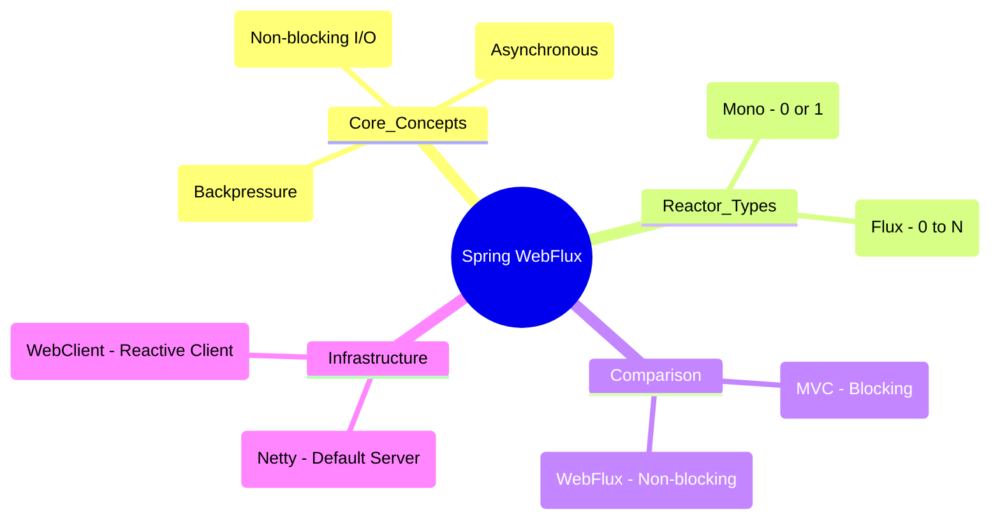
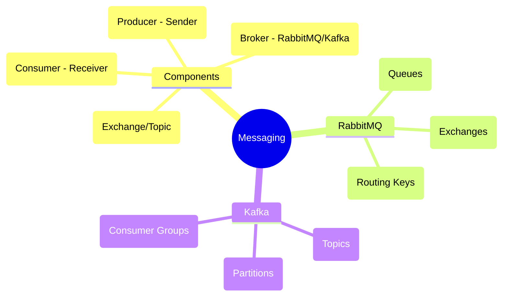
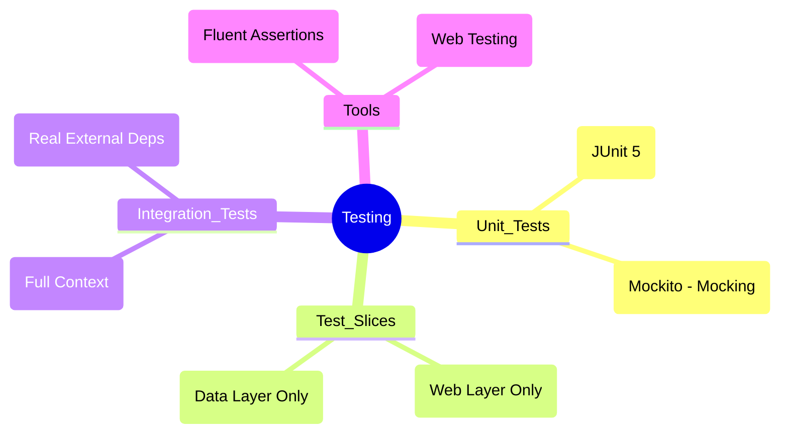

# Advanced Spring Boot Topics - Deep Dive

## Table of Contents
1. [Reactive Programming with Spring WebFlux](#reactive-programming-with-spring-webflux)
2. [Messaging & Event-Driven Architecture](#messaging--event-driven-architecture)
3. [Advanced Testing Strategies](#advanced-testing-strategies)
4. [Spring Native & GraalVM](#spring-native--graalvm)

---

## Reactive Programming with Spring WebFlux

### 🧠 ELI5: The "Fast Food Counter" vs the "Sit-down Restaurant"

*   **Spring MVC (Sit-down Restaurant):** You sit at a table. A waiter (thread) comes to you. He takes your order, goes to the kitchen, and **waits** there until the food is ready. While he is waiting, he can't help anyone else. If the kitchen is slow, you need more waiters for more customers.
*   **Spring WebFlux (Fast Food Counter):** You place your order at the counter. The cashier (thread) gives you a buzzer and immediately helps the next person. When your food is ready, your buzzer goes off (event), and you go pick it up. One cashier can handle hundreds of customers because they never stand around waiting.

### 🗺️ Mindmap: Reactive Programming



## Reactive Programming with Spring WebFlux

### What is Reactive Programming?
Reactive programming is a paradigm oriented around data flows and the propagation of change. It is non-blocking, asynchronous, and event-driven.

**Key Features**:
- **Non-blocking I/O**: Handles more concurrency with fewer threads.
- **Backpressure**: Consumers can signal producers to slow down.
- **Functional Style**: Uses lambdas and streams.

### Project Reactor Types
- **Mono<T>**: Represents 0 or 1 element.
- **Flux<T>**: Represents 0 to N elements.

### Spring WebFlux vs Spring MVC

| Feature | Spring MVC | Spring WebFlux |
|---------|------------|----------------|
| **IO Model** | Blocking (Servlet API) | Non-Blocking (Netty/Servlet 3.1+) |
| **Server** | Tomcat (default) | Netty (default) |
| **Return Types** | Object, ResponseEntity | Mono, Flux |
| **Best For** | CRUD, Traditional Apps | High Concurrency, Streaming |

### WebFlux Controller Example

```java
@RestController
@RequestMapping("/api/reactive/users")
public class ReactiveUserController {

    private final ReactiveUserRepository userRepository;

    public ReactiveUserController(ReactiveUserRepository userRepository) {
        this.userRepository = userRepository;
    }

    // Get single user (Mono)
    @GetMapping("/{id}")
    public Mono<User> getUser(@PathVariable String id) {
        return userRepository.findById(id);
    }

    // Get all users (Flux) - Streaming
    @GetMapping(produces = MediaType.TEXT_EVENT_STREAM_VALUE)
    public Flux<User> getAllUsers() {
        return userRepository.findAll();
    }

    // Create user
    @PostMapping
    @ResponseStatus(HttpStatus.CREATED)
    public Mono<User> createUser(@RequestBody User user) {
        return userRepository.save(user);
    }
}
```

### Reactive Repository (R2DBC / MongoDB)

```java
public interface ReactiveUserRepository extends ReactiveCrudRepository<User, String> {
    Flux<User> findByLastName(String lastName);
}
```

### WebClient (Non-blocking HTTP Client)

Replacement for `RestTemplate`.

```java
@Service
public class ExternalApiService {
    
    private final WebClient webClient;

    public ExternalApiService(WebClient.Builder builder) {
        this.webClient = builder.baseUrl("https://api.example.com").build();
    }

    public Mono<UserDTO> fetchUser(String id) {
        return webClient.get()
            .uri("/users/{id}", id)
            .retrieve()
            .bodyToMono(UserDTO.class);
    }
}
```

---

---

## Messaging & Event-Driven Architecture

### 🧠 ELI5: The "Post Office"

Imagine you want to send a **Letter** to a friend.

*   **Synchronous (HTTP):** You drive to your friend's house, knock on the door, and wait for them to answer so you can hand them the letter. If they aren't home, you just stand there waiting.
*   **Asynchronous (Messaging):** You put the letter in a **Mailbox** (Queue). You can go back home and do other things. The mailman (Broker) will deliver it whenever your friend is ready to receive it. You don't have to wait for them.

### 🗺️ Mindmap: Messaging Concepts



## Messaging & Event-Driven Architecture

### Spring AMQP (RabbitMQ)

**pom.xml**:
```xml
<dependency>
    <groupId>org.springframework.boot</groupId>
    <artifactId>spring-boot-starter-amqp</artifactId>
</dependency>
```

**Producer**:
```java
@Service
public class RabbitProducer {
    
    private final RabbitTemplate rabbitTemplate;

    public RabbitProducer(RabbitTemplate rabbitTemplate) {
        this.rabbitTemplate = rabbitTemplate;
    }

    public void sendMessage(String message) {
        rabbitTemplate.convertAndSend("myExchange", "myRoutingKey", message);
    }
}
```

**Consumer**:
```java
@Component
public class RabbitConsumer {

    @RabbitListener(queues = "myQueue")
    public void receiveMessage(String message) {
        System.out.println("Received: " + message);
    }
}
```

### Spring for Apache Kafka

**pom.xml**:
```xml
<dependency>
    <groupId>org.springframework.kafka</groupId>
    <artifactId>spring-kafka</artifactId>
</dependency>
```

**Producer**:
```java
@Service
public class KafkaProducer {
    
    private final KafkaTemplate<String, String> kafkaTemplate;

    public KafkaProducer(KafkaTemplate<String, String> kafkaTemplate) {
        this.kafkaTemplate = kafkaTemplate;
    }

    public void sendMessage(String topic, String message) {
        kafkaTemplate.send(topic, message);
    }
}
```

**Consumer**:
```java
@Component
public class KafkaConsumer {

    @KafkaListener(topics = "myTopic", groupId = "myGroup")
    public void listen(String message) {
        System.out.println("Received: " + message);
    }
}
```

---

---

## Advanced Testing Strategies

### 🧠 ELI5: The "Car Crash Test"

*   **Unit Test:** You test the **Brakes** individually on a bench. You don't need the whole car.
*   **Test Slice (@WebMvcTest):** You test the **Dashboard** and the **Steering Wheel** together, but you use a "fake" engine (Mock).
*   **Integration Test (@SpringBootTest):** You put the **Whole Car** together and drive it on a track to see if everything works together.
*   **TestContainers:** Instead of driving on a "fake" track, you build a **Real Track** (real Database/Kafka) in a box (Docker) just for the test, then throw it away when you're done.

### 🗺️ Mindmap: Testing Strategies



## Advanced Testing Strategies

### 1. Integration Testing with @SpringBootTest

Loads the full application context.

```java
@SpringBootTest(webEnvironment = SpringBootTest.WebEnvironment.RANDOM_PORT)
class UserIntegrationTest {

    @Autowired
    private TestRestTemplate restTemplate;

    @Test
    void testCreateUser() {
        UserDTO user = new UserDTO("john", "john@example.com");
        ResponseEntity<UserDTO> response = restTemplate.postForEntity("/api/users", user, UserDTO.class);
        
        assertThat(response.getStatusCode()).isEqualTo(HttpStatus.CREATED);
        assertThat(response.getBody().getId()).isNotNull();
    }
}
```

### 2. Test Slices

Load only specific layers for faster tests.

- **@WebMvcTest**: Tests only the controller layer. Mocks service layer.
- **@DataJpaTest**: Tests only JPA components. Uses embedded DB by default.
- **@JsonTest**: Tests JSON serialization/deserialization.

**Example (@WebMvcTest)**:
```java
@WebMvcTest(UserController.class)
class UserControllerTest {

    @Autowired
    private MockMvc mockMvc;

    @MockBean
    private UserService userService;

    @Test
    void testGetUser() throws Exception {
        when(userService.findById(1L)).thenReturn(new UserDTO(1L, "John"));

        mockMvc.perform(get("/api/users/1"))
            .andExpect(status().isOk())
            .andExpect(jsonPath("$.username").value("John"));
    }
}
```

### 3. TestContainers

Run real dependencies (Postgres, Redis, Kafka) in Docker containers during tests.

**pom.xml**:
```xml
<dependency>
    <groupId>org.testcontainers</groupId>
    <artifactId>junit-jupiter</artifactId>
    <scope>test</scope>
</dependency>
<dependency>
    <groupId>org.testcontainers</groupId>
    <artifactId>postgresql</artifactId>
    <scope>test</scope>
</dependency>
```

**Usage**:
```java
@Testcontainers
@SpringBootTest
class DatabaseIntegrationTest {

    @Container
    static PostgreSQLContainer<?> postgres = new PostgreSQLContainer<>("postgres:15");

    @DynamicPropertySource
    static void configureProperties(DynamicPropertyRegistry registry) {
        registry.add("spring.datasource.url", postgres::getJdbcUrl);
        registry.add("spring.datasource.username", postgres::getUsername);
        registry.add("spring.datasource.password", postgres::getPassword);
    }

    @Test
    void testDatabase() {
        // Runs against real PostgreSQL in Docker
    }
}
```

---

## Spring Native & GraalVM

Compiles Java applications into native executables.

**Benefits**:
- Instant startup (ms vs seconds).
- Lower memory footprint.
- Smaller container images.

**Trade-offs**:
- Longer build times.
- No dynamic class loading / reflection (requires hints).

**Usage**:
Use the Spring Boot 3+ parent and run:
```bash
./mvnw -Pnative native:compile
```
