# Spring Start Here — Complete Learning Guide

> **Fundamentals** (the Spring context, beans, dependency injection, abstractions, bean scopes and life cycle, and aspects) and **Implementation** (Spring Boot, Spring MVC, web scopes, REST services, consuming REST, data sources, transactions, Spring Data, and testing).

---

## Table of contents

- [How to use this guide](#how-to-use-this-guide)
- [Part 1 — Fundamentals](#part-1--fundamentals)
  - [Chapter 1 — Spring in the real world](#chapter-1--spring-in-the-real-world)
  - [Chapter 2 — The Spring context: Defining beans](#chapter-2--the-spring-context-defining-beans)
  - [Chapter 3 — The Spring context: Wiring beans](#chapter-3--the-spring-context-wiring-beans)
  - [Chapter 4 — The Spring context: Using abstractions](#chapter-4--the-spring-context-using-abstractions)
  - [Chapter 5 — The Spring context: Bean scopes and life cycle](#chapter-5--the-spring-context-bean-scopes-and-life-cycle)
  - [Chapter 6 — Using aspects with Spring AOP](#chapter-6--using-aspects-with-spring-aop)
- [Part 2 — Implementation](#part-2--implementation)
  - [Chapter 7 — Understanding Spring Boot and Spring MVC](#chapter-7--understanding-spring-boot-and-spring-mvc)
  - [Chapter 8 — Implementing web apps with Spring Boot and Spring MVC](#chapter-8--implementing-web-apps-with-spring-boot-and-spring-mvc)
  - [Chapter 9 — Using the Spring web scopes](#chapter-9--using-the-spring-web-scopes)
  - [Chapter 10 — Implementing REST services](#chapter-10--implementing-rest-services)
  - [Chapter 11 — Consuming REST endpoints](#chapter-11--consuming-rest-endpoints)
  - [Chapter 12 — Using data sources in Spring apps](#chapter-12--using-data-sources-in-spring-apps)
  - [Chapter 13 — Using transactions in Spring apps](#chapter-13--using-transactions-in-spring-apps)
  - [Chapter 14 — Implementing data persistence with Spring Data](#chapter-14--implementing-data-persistence-with-spring-data)
  - [Chapter 15 — Testing your Spring app](#chapter-15--testing-your-spring-app)
- [Appendices](#appendices)
  - [Appendix A — Architectural approaches](#appendix-a--architectural-approaches)
  - [Appendix B — Using XML for the context configuration](#appendix-b--using-xml-for-the-context-configuration)
  - [Appendix C — A quick introduction to HTTP](#appendix-c--a-quick-introduction-to-http)
  - [Appendix D — Using JSON formatting](#appendix-d--using-json-formatting)
  - [Appendix E — Installing MySQL and creating a database](#appendix-e--installing-mysql-and-creating-a-database)
  - [Appendices F & G — Recommended tools and further learning](#appendices-f--g--recommended-tools-and-further-learning)
- [Glossary](#glossary)
- [Quick-revision cheat sheet (all chapters)](#quick-revision-cheat-sheet-all-chapters)
  - [Annotations by area](#annotations-by-area)
  - [The end-to-end mental model](#the-end-to-end-mental-model)
  - [Top interview-ready facts](#top-interview-ready-facts)
- [Common pitfalls and how to avoid them](#common-pitfalls-and-how-to-avoid-them)
- [Interview question bank (cross-chapter)](#interview-question-bank-cross-chapter)

---

## How to use this guide

Each chapter is organized into the same repeating structure so you always know where to look:

- **Chapter goal** — a one-paragraph statement of what the chapter teaches and why it matters.
- **Concepts in depth** — the technical material explained slowly, with analogies and reasoning, not just definitions.
- **Code walkthroughs** — focused, complete snippets with line-by-line commentary.
- **Diagrams in words** — text and ASCII recreations of the book's important figures, since the visuals carry a lot of the explanation.
- **Notes, edge cases, and gotchas** — the author's asides and the mistakes beginners make.
- **Review questions** — short questions to test recall (answers follow each set).
- **Revision bullets** — a compressed list for last-minute review.

A suggested study path: read Part 1 in order, because chapters 2–6 build a single mental model (context → wiring → abstractions → scopes → aspects). You can read Part 2 chapters more independently once the fundamentals are solid, but chapters 7 and 8 should be read together, as should 12 through 14 (persistence) and 10/11 (REST).

---

# Part 1 — Fundamentals

Spring's foundation rests on two capabilities, and almost everything else in the framework is built on top of them:

1. **The Spring context (the IoC container).** This is a region of your application's memory where Spring keeps the object instances — called *beans* — that it manages. Once Spring manages an object, it can wire it to other objects and enhance it with framework features.
2. **Aspects (AOP).** This is Spring's ability to intercept method calls on managed beans and run extra logic before, after, or instead of the real method. Major features such as transactions and security are implemented with aspects.

Chapters 2 through 5 teach you everything about the context: how to put objects into it, how to connect them, how to work with abstractions, and how Spring decides when to create and how long to keep each object. Chapter 6 teaches aspects. By the end of Part 1 you will understand the machinery that the rest of the book plugs into.

---

## Chapter 1 — Spring in the real world

### Chapter goal

This chapter sets the stage. Before writing a line of Spring code, you should understand what a framework actually is, what the Spring ecosystem contains, the principle (inversion of control) that makes Spring work, the kinds of applications where Spring shines, and — just as importantly — the situations where reaching for a framework is the wrong call. The chapter is deliberately conceptual; it gives you the vocabulary and the "why" so that the hands-on chapters that follow make sense.

### What an application framework really is

An **application framework** is a set of common, reusable software functionalities that provides a foundational structure on which you build an application. Instead of writing every piece of an app from scratch, you assemble your application-specific logic on top of building blocks the framework supplies.

The book uses a memorable analogy: imagine ordering a wardrobe from a flat-pack furniture store, except the store doesn't ship you just the parts for a wardrobe — it ships you *every part it has* for building any piece of furniture (tables, shelves, cabinets, wardrobes). It's your job to pick the right components and assemble them into the wardrobe you actually want. A framework is like that warehouse of parts: it offers a broad set of capabilities, and you choose which ones to use and how to combine them with your business code to get the application you need. You are not obligated to use every feature — you select what fits your requirements.

### Why frameworks exist: business logic versus plumbing

To understand the value of a framework, you have to separate two kinds of code in any application:

- **Business logic code** implements the user's expectations — the actual purpose of the app. "When a user clicks this link, generate an invoice." "When the driver accepts, start the trip." This is the code that makes a ride-sharing app different from a food-delivery app. A *use case* is the reason a person uses the app (e.g., "request a car," "order a pizza").
- **The plumbing** is everything else: logging, transactions to keep data consistent, security to protect data, communication between apps, caching and compression for performance, and so on. Nearly every application needs these, and they look broadly similar from one app to the next.

The book makes the striking observation that the business logic is usually a *small* fraction of the total code. The author illustrates this with an iceberg: the user sees only the tip — the results of the business logic — while the enormous submerged mass is the plumbing, most of which is provided by dependencies and frameworks rather than written by the app's developers.

**Figure 1.2 — Business logic vs. plumbing (the iceberg).** Users see only the small business-logic "tip"; most of an app is supporting code provided by frameworks/dependencies.

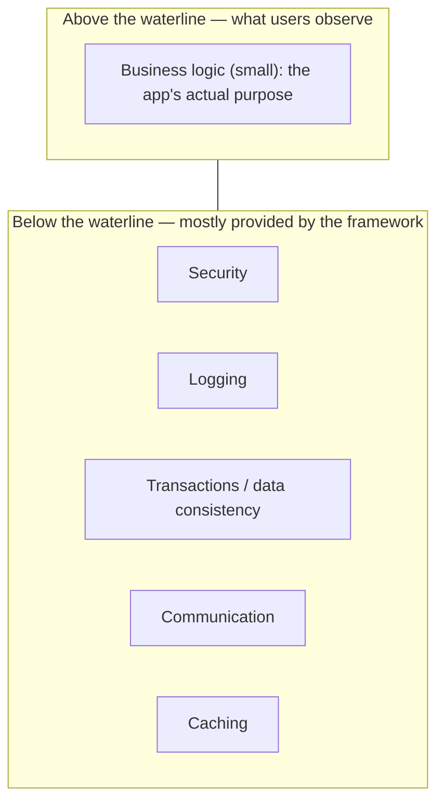

Because the plumbing is so similar across apps, rewriting it every time would be wasteful. Reusing a well-known framework's implementation brings three concrete benefits the book emphasizes:

1. **Time and money saved.** You don't reimplement what already exists.
2. **Fewer bugs.** Code that thousands of apps already use has been battle-tested; your bespoke version has not.
3. **A community.** When many developers understand the same functionality, you can find answers to problems others have already solved. Bespoke code is understood only by the few people who wrote it.

The author shares a personal story to make this real: a large Java system, originally written from scratch in Java SE roughly 25 years earlier, had become "a big ball of mud." The team migrated it to Spring (choosing Spring over Java EE because it was lighter and easier to maintain), and the migration removed *over 40% of the lines of code*. That was the moment the author understood how significant a framework's impact can be.

### The Spring ecosystem

A crucial early point: **Spring is not a single framework — it is an ecosystem of frameworks.** When developers casually say "the Spring framework," they usually mean a core subset of capabilities. The major pieces:

- **Spring Core** — the foundation. It holds the mechanisms Spring uses to integrate into your app, including:
  - the **Spring context** (the IoC container that manages your bean instances — the subject of chapters 2–5),
  - **Spring aspects / AOP** (intercepting and augmenting method calls — chapter 6),
  - the **Spring Expression Language (SpEL)**,
  - plus resource management, internationalization (i18n), and type conversion.
- **Spring MVC** — the part that lets you build web applications that serve HTTP requests, in the standard servlet style. Used from chapter 7 onward.
- **Spring Data Access** — the foundational data tools: working with JDBC, integrating with ORM frameworks like Hibernate, and managing transactions. Used from chapter 12 onward.
- **Spring testing** — tools for writing unit and integration tests (chapter 15). The author is blunt here: you are not a mature developer if you don't understand testing.

**Figure 1.3 — The Spring "solar system."** Spring Core sits at the center; the other capabilities orbit and depend on it.

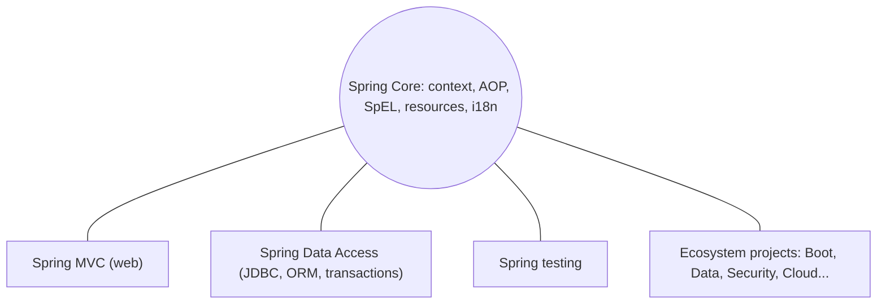

### Inversion of control (IoC): the principle behind everything

Spring works on the principle of **inversion of control (IoC)**. Normally, your application's own code controls execution: it decides what to instantiate and which methods to call, using libraries as passive tools. Under IoC, you *invert* this relationship — you hand control of execution to another piece of software (the framework). Through configuration, you instruct the framework on how to manage the code you write. Spring then takes actions like *creating instances of your classes* and *calling methods on them* on your behalf.

The word "controls" is worth pinning down: in this context it means concrete actions such as "create an instance of this class" or "call this method." For example, Spring can intercept a particular method to log any error that occurs during its execution — that interception is the framework exercising control.

**Figure 1.4 — Inversion of control.** Normally your app drives and calls dependencies (left). Under IoC, the framework drives and controls your app's execution (right).

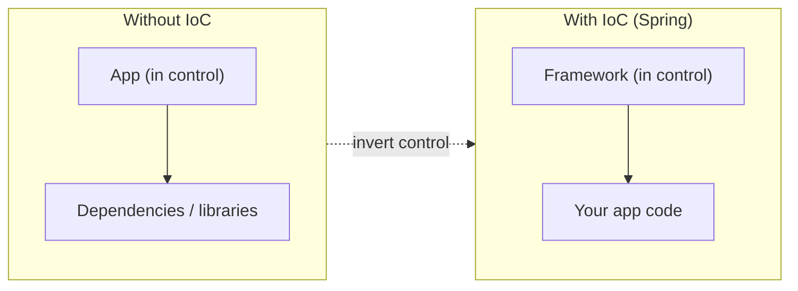

You'll start learning IoC concretely in chapters 2–5 (the context and DI) and continue with aspects in chapter 6. Together these form the heart of Spring Core.

### Other ecosystem projects you'll meet

Beyond the core capabilities, the Spring ecosystem includes a large collection of independently developed projects — Spring Data, Spring Security, Spring Cloud, Spring Batch, Spring Boot, and many more — each maintained by its own team and documented separately at the official Spring projects site. You typically combine several in one application. The two the book singles out as essential early on:

- **Spring Data** — a project that makes connecting to databases and implementing the persistence layer dramatically easier, with minimal code, across both SQL and NoSQL technologies. Note the naming subtlety the book flags: *Spring Data Access* is a module of Spring Core (JDBC tools and transactions), while *Spring Data* is a separate, higher-level ecosystem project. Covered in chapter 14.
- **Spring Boot** — a project built around the principle of **convention over configuration**. Instead of writing all of a framework's configuration yourself, Boot gives you a working default configuration you customize only where your needs differ. The result is that you write much less configuration code. Introduced in chapter 7.

The book also notes alternatives, encouraging an open mind: for the IoC container there were Java EE's CDI and EJB, and Google Guice; instead of Spring Security you might use Apache Shiro; instead of Spring MVC, the Play framework; and Red Hat Quarkus is a promising cloud-native option. The author's advice: always consider alternatives, and never trust a single solution as "the one."

### Where Spring fits: real-world scenarios

A common misconception is that Spring is only for backend web applications. The book pushes back, listing scenarios where Spring is a good fit:

1. **Backend applications (most common).** A backend runs on the server, manages data, and serves requests from client apps (web, mobile). It often communicates with other backends and persists data in databases. Spring offers tools for all of this — integration with other apps, persistence across database technologies, security, exposing functionality for other apps to call.

   **Figures 1.5/1.6 — A real backend touches many technologies.** Spring provides tools at each connection point.

   ```mermaid
   flowchart TB
       Web["Web client"] --> Backend["Backend app (Spring)"]
       Mobile["Mobile client"] --> Backend
       Backend --> DB[("Database")]
       Backend --> Other["Other backend services"]
       Backend --> Broker["Message broker (async)"]
   ```

2. **Automation testing apps.** Teams build separate applications whose job is to validate that a system behaves correctly, run regularly by a continuous-integration tool such as Jenkins. These testing apps can grow as complex as a backend — connecting to databases, calling REST endpoints, sending messages to brokers, mocking external dependencies. Even though test scenarios are written with frameworks like Selenium, Cucumber, or Gauge, the app can still benefit from Spring's IoC container (for maintainable instance management), Spring Data (to validate data), and so on.

3. **Desktop applications.** Less common today, but a desktop app can use the Spring IoC container to manage instances cleanly and Spring's tools to talk to a backend or implement caching.

4. **Mobile apps.** Via the Spring for Android project, Spring offers a REST client and authentication support for Android, though you'll rarely encounter this.

### When *not* to use a framework

Equally important is knowing when a framework — or specifically Spring — is the wrong tool. The book gives four scenarios:

1. **You need a very small footprint.** "Footprint" means the storage/memory the app's files occupy. Serverless functions deployed in containers should start fast and stay small; adding a heavy framework works against that. (Such tiny apps often don't need a framework anyway.) The book notes that containers should be easily disposable — destroyed and recreated quickly — and a smaller app initializes faster.

2. **Security requirements forbid third-party code.** In some defense or governmental projects, stakeholders want to minimize the chance of exploitation via known vulnerabilities, so they may forbid open-source frameworks and require custom code. (The book acknowledges the tension: open-source frameworks are usually *more* secure because vulnerabilities get found and fixed — but in extreme cases the desire to keep everything private wins.)

3. **You'd over-customize the framework.** If using a framework would force you to customize its components so heavily that you write *more* code than if you'd skipped it, you've either chosen the wrong framework or shouldn't use one at all.

4. **You'd gain no benefit from switching.** Don't replace a working implementation with a framework just because the framework is popular. Change is justified only if it brings a real benefit — better maintainability, performance, or security. The author tells a cautionary story: a team wanted to replace ugly direct-JDBC code. The author favored Spring's `JdbcTemplate` (a modest, low-risk improvement); others pushed for Hibernate because it was trendy. After months of stressful proof-of-concept work, the team abandoned Hibernate and finished with `JdbcTemplate`, achieving cleaner code with far fewer lines and no new framework risk.

### What the book promises you'll learn

By the end of the book you should be able to use the Spring context and implement aspects around managed objects; connect a Spring app to a database and work with persisted data; exchange data between apps using REST APIs; build apps that follow convention over configuration (Spring Boot); apply good class-design practices in a Spring app; and properly test your Spring implementations.

### Notes, edge cases, and gotchas

- The choice and use of a framework is tied to the **architecture** of your application; the book recommends learning architecture alongside Spring (appendix A gives a primer on monolith, SOA, microservices, and serverless).
- Spring is the most-used Java framework, and it is increasingly used with other JVM languages, especially Kotlin. The book uses Java throughout to keep you focused on Spring itself.
- Don't conflate "framework" with "good architecture." A monolith built with a framework can still be messy; the framework is not a substitute for clean design.

### Review questions

1. In one sentence, what is an application framework?
2. What is the difference between "business logic" and "plumbing," and which is usually larger?
3. Name the four capabilities usually meant by "the Spring framework."
4. Explain inversion of control in your own words. What does "control" refer to concretely?
5. What is the difference between *Spring Data Access* and *Spring Data*?
6. What principle does Spring Boot embody, and what is its practical benefit?
7. Give two situations where you should *not* use a framework, and why.

<details>
<summary>Show answers</summary>

**Answers (abbreviated):** (1) A reusable set of common software functionalities providing a foundation you build your app on. (2) Business logic implements user expectations and differentiates apps; plumbing is the shared supporting code (logging, security, transactions, etc.) and is usually the larger portion. (3) Spring Core, Spring MVC, Spring Data Access, Spring testing. (4) You hand control of object creation and method invocation to the framework rather than your own code driving everything; "control" means creating instances and calling methods. (5) Spring Data Access is a Core module (JDBC + transactions); Spring Data is a separate higher-level ecosystem project simplifying persistence across SQL/NoSQL. (6) Convention over configuration; you write less configuration because sensible defaults are provided and you only override differences. (7) Tiny-footprint serverless functions (a framework bloats startup/size); strict-security projects forbidding third-party code; heavy required customization; or no benefit from switching from a working solution.

</details>

### Revision bullets

- Framework = reusable plumbing foundation; you add business logic on top and pick which parts to use.
- Business logic (small, app-specific) vs plumbing (large, shared); the iceberg metaphor.
- Spring is an **ecosystem**: Core (context, AOP, SpEL, resources, i18n, type conversion) + MVC + Data Access + testing, plus projects like Spring Data, Spring Security, Spring Cloud, Spring Boot.
- Spring runs on **IoC**: the framework controls instance creation and method calls.
- Good for backends (most common), automation testing apps, desktop, and (rarely) mobile.
- Avoid frameworks for tiny footprints, strict custom-security needs, heavy over-customization, or when there's no benefit to switching.
- Spring Boot = convention over configuration.

---

## Chapter 2 — The Spring context: Defining beans

### Chapter goal

This is where hands-on Spring begins. The single most fundamental skill in Spring is adding object instances — *beans* — to the Spring context so the framework can manage them. Until an object is in the context, Spring cannot see it, cannot wire it to anything, and cannot enhance it with any feature. This chapter teaches three distinct ways to add beans (the `@Bean` annotation, stereotype annotations, and the programmatic `registerBean` method), how to name and retrieve beans, how to handle multiple beans of the same type, and how to run initialization logic after a bean is created. It also covers the minimal Maven setup you need to follow along.

### What the Spring context is

Imagine the **Spring context** (also called the *application context*) as a bucket in your application's memory. You drop into this bucket the object instances you want Spring to manage. By default the bucket is empty — **Spring knows nothing about the classes in your project**. You must explicitly add an instance for Spring to be aware of it. Spring can only manage, wire, and augment the instances that live in its context. This is why mastering the context is step one: without it, none of the framework's other capabilities are reachable.

The instances you add are called **beans**.

### Maven essentials (just enough to follow along)

Maven is a **build tool**: software that automates the tasks of building an app — downloading dependencies, running tests, validating syntax, checking for vulnerabilities, compiling, and packaging into an executable archive. Spring projects most often use Maven (Gradle is the common alternative).

A Maven project's structure:

- `src/main/java` — your application's source code (packages and classes).
- `src/main/resources` — configuration and other resources.
- `src/test/java` — unit test source code (chapter 15).
- `pom.xml` — where you configure the project, most importantly its dependencies.

Spring is **modular**: you add only the parts you use, not the whole framework. To use the context, you add the `spring-context` dependency:

<details>
<summary>Show code (XML)</summary>

```xml
<dependency>
  <groupId>org.springframework</groupId>
  <artifactId>spring-context</artifactId>
  <version>5.2.6.RELEASE</version>
</dependency>
```

</details>

Maven downloads dependencies (jar files) from a repository (by default, Maven Central) and stores them in the project's external libraries. You don't have to memorize dependency coordinates — you can look them up in the Spring reference. Most Spring dependencies live under the `org.springframework` group ID.

### Creating the context instance

You create a context with:

<details>
<summary>Show code (Java)</summary>

```java
var context = new AnnotationConfigApplicationContext();
```

</details>

`AnnotationConfigApplicationContext` is the context implementation that uses today's most common configuration approach — annotations. Spring offers several context implementations, but this is the one the book focuses on, and the book wisely advises beginners not to get lost in the inheritance chains of context classes; focus on the behavior you need now.

At this point the context exists but is empty. The rest of the chapter is about putting beans into it.

### Approach 1 — the `@Bean` annotation

This is the most explicit and flexible approach, and the easiest to understand first. It lets you add instances of your own classes *and* of classes you don't own (e.g., a `String`, an `Integer`, or a class from a library). Three steps:

**Step 1 — define a configuration class.** A configuration class is a special class, annotated with `@Configuration`, that you use to give Spring instructions. Throughout the book you'll configure many things here; for now you'll use it to declare beans.

<details>
<summary>Show code (Java)</summary>

```java
@Configuration
public class ProjectConfig {
}
```

</details>

**Step 2 — add a `@Bean` method.** Write a method that creates and returns the instance you want as a bean, and annotate it `@Bean`. Spring calls this method when it initializes the context and adds the returned value to the context.

<details>
<summary>Show code (Java)</summary>

```java
@Configuration
public class ProjectConfig {
  @Bean
  Parrot parrot() {
    var p = new Parrot();
    p.setName("Koko");
    return p;
  }
}
```

</details>

A naming convention worth internalizing: **`@Bean` method names should be nouns, not verbs.** In normal Java you name methods with verbs because they represent actions, but a `@Bean` method *represents the object it returns*, and its name *becomes the bean's name (identifier)* in the context. By convention the method is named like the class (here, `parrot`).

**Step 3 — initialize the context with the configuration class.** Pass the configuration class to the context constructor so Spring uses it:

<details>
<summary>Show code (Java)</summary>

```java
public class Main {
  public static void main(String[] args) {
    var context = new AnnotationConfigApplicationContext(ProjectConfig.class);
    Parrot p = context.getBean(Parrot.class);   // retrieve the bean by type
    System.out.println(p.getName());             // prints "Koko"
  }
}
```

</details>

`getBean(Parrot.class)` retrieves the bean by type — no casting is needed, because Spring looks for a bean of the requested type and returns it. If no such bean exists, Spring throws an exception.

**Adding beans of any type.** Because `@Bean` methods just return objects, you can add instances of classes you don't own:

<details>
<summary>Show code (Java)</summary>

```java
@Bean String hello()  { return "Hello"; }
@Bean Integer ten()   { return 10; }
```

</details>

Retrieve them exactly the same way: `context.getBean(String.class)`, `context.getBean(Integer.class)`. The book stresses, though, that in real apps you only add objects Spring actually needs to manage — you don't dump every object into the context.

**Multiple beans of the same type.** You can declare several `@Bean` methods returning the same type:

<details>
<summary>Show code (Java)</summary>

```java
@Bean Parrot parrot1() { var p = new Parrot(); p.setName("Koko"); return p; }
@Bean Parrot parrot2() { var p = new Parrot(); p.setName("Miki"); return p; }
@Bean Parrot parrot3() { var p = new Parrot(); p.setName("Riki"); return p; }
```

</details>

Now `context.getBean(Parrot.class)` throws `NoUniqueBeanDefinitionException` — "expected single matching bean but found 3: parrot1, parrot2, parrot3" — because Spring cannot guess which one you mean. Resolve the ambiguity by asking for one **by name**:

<details>
<summary>Show code (Java)</summary>

```java
Parrot p = context.getBean("parrot2", Parrot.class);   // returns Miki
```

</details>

> **Don't confuse the bean's name with the parrot's name.** The bean identifiers are `parrot1`, `parrot2`, `parrot3` (the method names). The parrots' names — Koko, Miki, Riki — are just values of the `name` attribute and mean nothing to Spring.

**Renaming a bean.** Any of these set the bean's name to `miki`:

<details>
<summary>Show code (Java)</summary>

```java
@Bean(name = "miki")
@Bean(value = "miki")
@Bean("miki")
```

</details>

**Marking a primary bean.** When several beans share a type, you can designate one as the default with `@Primary`. If you then request that type without a name, Spring returns the primary one. Only one bean of a given type may be primary.

<details>
<summary>Show code (Java)</summary>

```java
@Bean
@Primary
Parrot parrot2() { var p = new Parrot(); p.setName("Miki"); return p; }
```

</details>

### Approach 2 — stereotype annotations (`@Component`)

This approach requires less code, and it's what you'll reach for most often when the class is one you own and can edit. You mark the class itself with a stereotype annotation, and you tell Spring where to scan for such classes.

**Step 1 — mark the class** with `@Component`:

<details>
<summary>Show code (Java)</summary>

```java
@Component
public class Parrot {
  private String name;
  // getters and setters
}
```

</details>

**Step 2 — enable scanning** with `@ComponentScan`, telling Spring which package(s) to search:

<details>
<summary>Show code (Java)</summary>

```java
@Configuration
@ComponentScan(basePackages = "main")
public class ProjectConfig {
}
```

</details>

By default Spring does *not* search for stereotype-annotated classes, so without `@ComponentScan` your `@Component` has no effect. With it, Spring finds the class, creates an instance, and adds it to the context.

A key behavioral difference from `@Bean`: with stereotype annotations, **Spring only calls the class's constructor** — it does not set any state for you. So if you retrieve the bean and call `getName()`, you'll get `null` unless you arranged to set the name (see `@PostConstruct` below). Spring created the instance; configuring it further is still your responsibility.

### `@Bean` vs stereotype annotations — when to use which

The book lays out the trade-offs explicitly:

| Aspect | `@Bean` | Stereotype (`@Component`) |
|---|---|---|
| Control over creation | **Full** — you write the instantiation code in the method body | Only *after* Spring creates it (e.g., via `@PostConstruct`) |
| Object types allowed | **Any** object, including types you don't own (`String`, `Integer`, library classes) | Only classes you own and can annotate |
| Multiple instances of one type | **Yes** — one method per instance | No — one instance per annotated class |
| Boilerplate | More — a separate method per bean | Less — just an annotation |

Practical guidance: **prefer stereotype annotations for your own classes** (less code), and **use `@Bean` when you can't modify the class** (e.g., it comes from a library) or when you need behavior stereotypes can't give you (multiple instances of a type, or full control of construction).

### Running logic after creation: `@PostConstruct` (and `@PreDestroy`)

With stereotype annotations you don't get to set state during construction the way you do in a `@Bean` method. To run instructions *right after* Spring builds the bean, define a method and annotate it `@PostConstruct`. Spring (borrowing this annotation from Java EE) calls it after the constructor completes.

On Java 11+ you must add the dependency, because the Java EE APIs were removed from the JDK:

<details>
<summary>Show code (XML)</summary>

```xml
<dependency>
  <groupId>javax.annotation</groupId>
  <artifactId>javax.annotation-api</artifactId>
  <version>1.3.2</version>
</dependency>
```

</details>

<details>
<summary>Show code (Java)</summary>

```java
@Component
public class Parrot {
  private String name;

  @PostConstruct
  public void init() {
    this.name = "Kiki";   // now getName() returns "Kiki"
  }
}
```

</details>

There's a mirror annotation, `@PreDestroy`, which runs just before Spring closes and clears the context. The book recommends *avoiding* it: Spring might fail to call it (e.g., on an abnormal shutdown), so putting critical cleanup there — like closing a database connection — is risky. Find another approach for sensitive teardown.

### Approach 3 — adding beans programmatically (`registerBean`, Spring 5+)

Sometimes you need to decide *at runtime* whether and which bean to register — logic the declarative approaches can't express, e.g.:

<details>
<summary>Show code (Java)</summary>

```java
if (condition) {
  registerBean(b1);
} else {
  registerBean(b2);
}
```

</details>

The book's scenario: an app reads a collection of parrots, some green and some orange, and you want to register only the green ones. For this, call `registerBean` on the context instance. Its signature:

<details>
<summary>Show code (Java)</summary>

```java
<T> void registerBean(
    String beanName,
    Class<T> beanClass,
    Supplier<T> supplier,
    BeanDefinitionCustomizer... customizers);
```

</details>

- `beanName` — the bean's name (pass `null` if you don't need one).
- `beanClass` — the class of the bean, e.g., `Parrot.class`.
- `supplier` — a `java.util.function.Supplier` whose `get()` returns the instance to add.
- `customizers` — a varargs of `BeanDefinitionCustomizer` to tweak bean characteristics (e.g., make it primary). Optional; can be omitted entirely.

A complete example:

<details>
<summary>Show code (Java)</summary>

```java
public class Main {
  public static void main(String[] args) {
    var context = new AnnotationConfigApplicationContext(ProjectConfig.class);
    Parrot x = new Parrot();
    x.setName("Kiki");
    Supplier<Parrot> parrotSupplier = () -> x;
    context.registerBean("parrot1", Parrot.class, parrotSupplier);
    Parrot p = context.getBean(Parrot.class);
    System.out.println(p.getName());   // Kiki
  }
}
```

</details>

To make it primary, add a customizer:

<details>
<summary>Show code (Java)</summary>

```java
context.registerBean("parrot1", Parrot.class, parrotSupplier,
    bc -> bc.setPrimary(true));
```

</details>

Remember this approach requires Spring 5 or later.

### Notes, edge cases, and gotchas

- The book uses deliberately whimsical objects (a `Parrot` with a `name`) precisely so you focus on the *syntax of adding beans* rather than on domain complexity. Real, production-like class design starts in chapter 4.
- A good practice the book follows: separate classes into packages by responsibility (e.g., `config` for configuration classes, `main` for the main class). Component scanning is package-based, so organization matters.
- In modern Spring you almost never use XML configuration, but the book mentions (appendix B) that XML was the original way to define beans, so you recognize it in legacy code.
- The book points out that real projects validate behavior with unit and integration tests (in the `test` folder), but defers testing to chapter 15 so beginners aren't distracted.

### Review questions

1. What is the Spring context, and what can Spring do only with objects that are in it?
2. List the three ways to add a bean to the context and one situation favoring each.
3. Why are `@Bean` method names nouns rather than verbs?
4. You declared three `@Bean` methods returning `Parrot`. What happens if you call `getBean(Parrot.class)`, and how do you fix it?
5. What's the difference in how state is set between `@Bean` and `@Component`?
6. When would you use `registerBean`, and what's its minimum Spring version?
7. Why does the book discourage `@PreDestroy` for critical cleanup?

<details>
<summary>Show answers</summary>

**Answers (abbreviated):** (1) A memory region holding managed beans; Spring can only wire/augment objects that are in it. (2) `@Bean` (full control, any type, multiple instances), stereotype `@Component` (least code, your own classes), `registerBean` (runtime/conditional logic, Spring 5+). (3) Because the method represents the bean it returns and its name becomes the bean's identifier. (4) `NoUniqueBeanDefinitionException`; fix by requesting by name (`getBean("parrot2", Parrot.class)`) or marking one `@Primary`. (5) With `@Bean` you set state in the method body; with `@Component` Spring only calls the constructor, so use `@PostConstruct` to set state afterward. (6) When registration must be conditional/custom at runtime; Spring 5+. (7) Spring may fail to call it (e.g., abnormal shutdown), so sensitive teardown can be skipped.

</details>

### Revision bullets

- Context = the bucket of managed beans; Spring sees only what you add.
- `spring-context` dependency; create with `new AnnotationConfigApplicationContext(Config.class)`.
- Three ways to add beans: `@Bean` in a `@Configuration` class; `@Component` + `@ComponentScan`; `registerBean` (Spring 5+).
- `@Bean` method name = bean name (use nouns); rename with `@Bean("name")`.
- Multiple same-type beans → ambiguity exception; resolve by name or `@Primary`.
- `@Bean`: any type, full control, multiple instances. Stereotypes: less code, your classes only, constructor-only creation.
- `@PostConstruct` runs init after construction (needs `javax.annotation-api` on Java 11+); avoid `@PreDestroy` for critical cleanup.

---

## Chapter 3 — The Spring context: Wiring beans

### Chapter goal

In chapter 2 you put isolated beans into the context. Real applications need beans that *reference one another* so one can delegate work to another (a "has-A" relationship). This chapter teaches every way to establish those relationships: wiring by direct method call, auto-wiring through `@Bean` method parameters, and the `@Autowired` annotation in its three forms (field, constructor, setter). It also covers two problems that arise from wiring — circular dependencies and ambiguity when multiple beans of the same type exist — and how to solve them with `@Primary` and `@Qualifier`. Everything in the rest of the book depends on these techniques.

### The scenario

The running example: a `Person` bean that "owns" a `Parrot` bean. Both are in the context; you want to link them so `person.getParrot()` returns the parrot. The classes:

<details>
<summary>Show code (Java)</summary>

```java
public class Parrot {
  private String name;
  // getters/setters; toString() returns "Parrot : " + name
}

public class Person {
  private String name;
  private Parrot parrot;
  // getters/setters
}
```

</details>

Initially, with both beans declared but unlinked, printing `person.getParrot()` yields `null` — the beans exist independently, with no relationship between them.

**Figure 3.2 — The "has-A" relationship.** `Person` holds a reference to `Parrot` so it can delegate work.

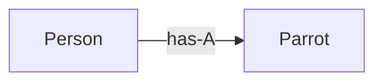

### Approach 1 — wiring with a direct method call

The simplest way to link two beans defined with `@Bean` is to call one `@Bean` method from another:

<details>
<summary>Show code (Java)</summary>

```java
@Configuration
public class ProjectConfig {
  @Bean
  public Parrot parrot() {
    Parrot p = new Parrot();
    p.setName("Koko");
    return p;
  }

  @Bean
  public Person person() {
    Person p = new Person();
    p.setName("Ella");
    p.setParrot(parrot());   // link to the parrot bean
    return p;
  }
}
```

</details>

Now `person.getParrot()` returns Koko.

**The crucial subtlety:** does calling `parrot()` from `person()` create a *second* parrot instance (one for the context, one from the direct call)? **No.** When you define beans with `@Bean`, Spring controls how those methods are invoked and applies logic around them. When `person()` calls `parrot()`:

- If a `parrot` bean already exists in the context, Spring **returns the existing bean** instead of running the method body again.
- If it doesn't exist yet, Spring runs the method, creates the bean, and returns it.

**Figure 3.6 — Why calling one `@Bean` method from another doesn't duplicate the bean.** Spring intercepts the call and returns the existing instance if it already exists.

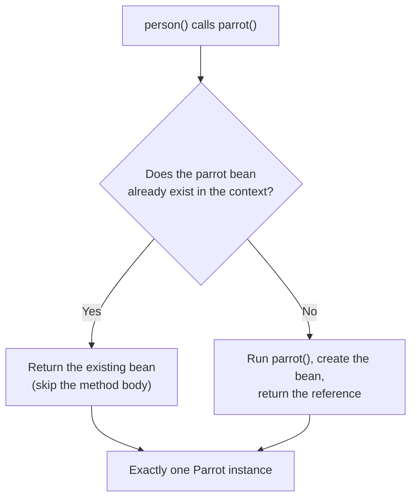

You can prove this by adding a constructor to `Parrot` that prints a message: run the app and the message appears **only once**, confirming Spring created a single instance.

### Approach 2 — auto-wiring through `@Bean` method parameters

Instead of calling the method directly, declare a parameter of the needed type and let Spring supply the bean:

<details>
<summary>Show code (Java)</summary>

```java
@Bean
public Person person(Parrot parrot) {   // Spring injects a Parrot bean here
  Person p = new Person();
  p.setName("Ella");
  p.setParrot(parrot);
  return p;
}
```

</details>

When Spring calls `person()`, it finds a `Parrot` bean in the context and injects it into the parameter. This is **dependency injection (DI)** — the framework setting a value into a field or parameter — and DI is a direct application of the IoC principle.

This approach is slightly more flexible than the direct call: it works whether the referenced bean was defined with `@Bean` or with a stereotype annotation. In practice, the book notes, the choice between the direct call and the parameter approach is often just developer taste; you'll see both, so know both.

### Approach 3 — the `@Autowired` annotation

Use `@Autowired` when you can modify the class that needs the dependency (i.e., it's not from a library). You mark the injection point directly in the class, which makes the relationship very visible. Three variants:

**Field injection** — common in examples, proofs of concept, and tests, but **discouraged in production**:

<details>
<summary>Show code (Java)</summary>

```java
@Component
public class Person {
  private String name = "Ella";

  @Autowired
  private Parrot parrot;
}
```

</details>

Why avoid it in production? Two reasons the book gives: you cannot make the field `final` (so nothing prevents its value from changing after initialization), and it's harder to manage the value yourself at initialization — which matters for unit tests where you want to construct the object and pass dependencies in directly.

**Constructor injection** — the **recommended** approach for production:

<details>
<summary>Show code (Java)</summary>

```java
@Component
public class Person {
  private String name = "Ella";
  private final Parrot parrot;   // can now be final → immutable after init

  @Autowired
  public Person(Parrot parrot) {
    this.parrot = parrot;
  }
}
```

</details>

Constructor injection lets you declare the field `final` (guaranteeing it won't change after Spring sets it) and makes testing easier (you can `new Person(mockParrot)` without Spring). **Since Spring 4.3, `@Autowired` is optional when the class has exactly one constructor** — Spring will use it automatically.

**Setter injection** — rarely used in production; the book mentions it for completeness:

<details>
<summary>Show code (Java)</summary>

```java
@Component
public class Person {
  private Parrot parrot;

  @Autowired
  public void setParrot(Parrot parrot) {
    this.parrot = parrot;
  }
}
```

</details>

It has more drawbacks than advantages: harder to read, can't make the field `final`, and doesn't ease testing. You may see it in older apps.

**Figures 3.9/3.10 — Field vs constructor injection.** Field injection sets the field after creation; constructor injection supplies the dependency at construction time (so the field can be `final`).

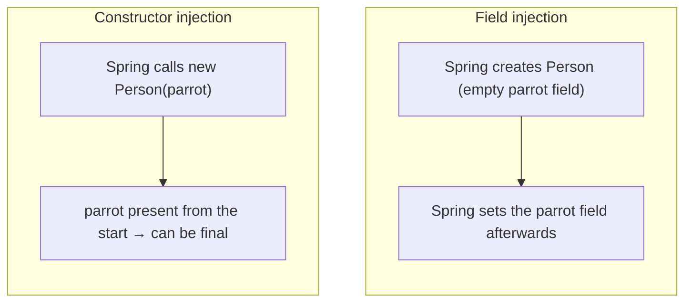

### Problem 1 — circular dependencies

A **circular dependency** is a deadlock: to create Bean A, Spring must inject Bean B; but to create Bean B, Spring must inject Bean A. Neither can be created first.

<details>
<summary>Show code (Java)</summary>

```java
@Component
public class Person {
  private final Parrot parrot;
  @Autowired
  public Person(Parrot parrot) { this.parrot = parrot; }   // needs a Parrot
}

@Component
public class Parrot {
  private final Person person;
  @Autowired
  public Parrot(Person person) { this.person = person; }   // needs a Person
}
```

</details>

Running this throws `BeanCurrentlyInCreationException` — "Requested bean is currently in creation: Is there an unresolvable circular reference?" The fix is not a trick or a setting; it's to **redesign** so the creation of two beans doesn't mutually depend. Such mutual creation dependency is a class-design smell. The book reassures you that almost every Spring developer creates a circular dependency at least once — the important thing is to recognize the exception and know its cause.

**Figure 3.11 — A circular dependency (deadlock).** Each bean needs the other to be created first, so neither can be created.

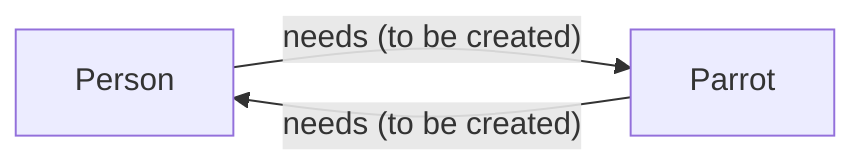

### Problem 2 — choosing among multiple beans of the same type

When Spring must inject a type but several beans of that type exist, it resolves in this order:

1. **Parameter name matches a bean name.** If the injection point's identifier equals one of the bean names, Spring picks that bean.
2. If not, then:
   - a) If one bean is **`@Primary`**, Spring injects it.
   - b) You can explicitly pick one with **`@Qualifier("beanName")`**.
   - c) If none is primary and you don't use `@Qualifier`, the app fails with an exception (more than one candidate, can't choose).

Example relying on the parameter name (works, but fragile):

<details>
<summary>Show code (Java)</summary>

```java
@Bean
public Person person(Parrot parrot2) {   // matches bean named "parrot2" → injects Miki
  Person p = new Person();
  p.setParrot(parrot2);
  return p;
}
```

</details>

The book recommends **not** relying on the parameter name — a developer could rename the variable during refactoring and silently change behavior. Prefer `@Qualifier`, which states your intent explicitly:

<details>
<summary>Show code (Java)</summary>

```java
@Bean
public Person person(@Qualifier("parrot2") Parrot parrot) {
  Person p = new Person();
  p.setParrot(parrot);
  return p;
}
```

</details>

`@Qualifier` works the same way with `@Autowired` constructor parameters:

<details>
<summary>Show code (Java)</summary>

```java
@Component
public class Person {
  private final Parrot parrot;
  public Person(@Qualifier("parrot2") Parrot parrot) {
    this.parrot = parrot;
  }
}
```

</details>

**Figures 3.12/3.13 — Choosing among multiple beans of the same type.** A parameter-name match or `@Qualifier` directs Spring to the right bean.

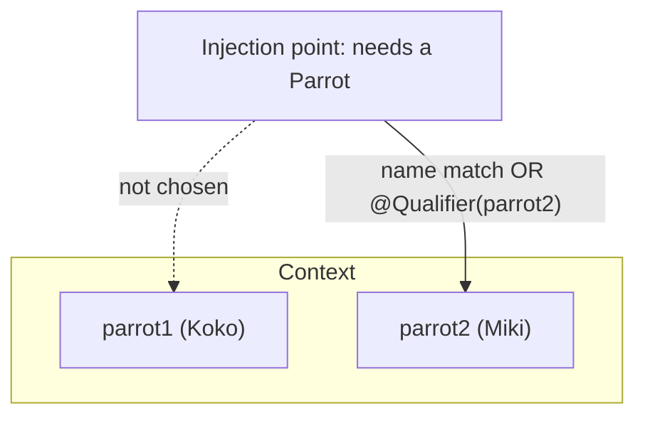

### Notes, edge cases, and gotchas

- The book deliberately keeps using `Person`/`Parrot` to keep the focus on wiring syntax; chapter 4 moves to production-like design.
- "Wiring" (direct call) and "auto-wiring" (Spring supplies the value, via `@Bean` parameters or `@Autowired`) are both DI; the term DI emphasizes that the framework, not your code, sets the value.
- Constructor injection plus `final` fields is the combination that yields immutable, easily testable beans — a recurring theme reinforced in chapter 5 (singletons should be immutable).

### Review questions

1. What is a "has-A" relationship, and why do beans need them?
2. When `person()` calls `parrot()` inside the configuration class, how many parrot instances exist, and why?
3. What is dependency injection, and how does it relate to IoC?
4. Why is constructor injection preferred over field injection in production?
5. When can you omit `@Autowired` on a constructor?
6. What exception signals a circular dependency, and what's the proper fix?
7. List the order in which Spring resolves multiple candidate beans, and why `@Qualifier` is preferred over relying on the parameter name.

<details>
<summary>Show answers</summary>

**Answers (abbreviated):** (1) One bean holds a reference to another so it can delegate work; objects collaborate. (2) Exactly one — Spring intercepts `@Bean` calls and returns the existing bean instead of re-running the method. (3) The framework sets a value into a field/parameter; it's an application of IoC. (4) It allows `final` (immutability) and makes testing easier by letting you pass dependencies without Spring. (5) When the class has a single constructor (Spring 4.3+). (6) `BeanCurrentlyInCreationException`; fix by redesigning to remove the mutual dependency. (7) Parameter name match → `@Primary` → `@Qualifier` → else exception; `@Qualifier` is explicit and survives variable renames.

</details>

### Revision bullets

- Link beans by: direct `@Bean` call (wiring), `@Bean` parameter (auto-wiring), or `@Autowired`.
- Spring intercepts `@Bean` calls, so calling one `@Bean` method from another never duplicates the bean.
- `@Autowired`: constructor (production, allows `final`), field (examples/tests), setter (rare). Optional on a sole constructor since 4.3.
- Circular dependency → `BeanCurrentlyInCreationException`; redesign to break it.
- Multiple candidates resolved by: name match → `@Primary` → `@Qualifier` → exception. Prefer `@Qualifier`.

---

## Chapter 4 — The Spring context: Using abstractions

### Chapter goal

Real applications are built on interfaces, not concrete classes, so that implementations can be swapped without rippling changes through the codebase. This chapter shows how to use interfaces to decouple responsibilities and how Spring's dependency injection works seamlessly with abstractions. It introduces the standard class-design vocabulary (service, repository, proxy, model), teaches how to decide which objects belong in the context, reinforces that you never annotate interfaces with stereotypes, handles the "multiple implementations" case again with `@Primary`/`@Qualifier`, and introduces the focused stereotype annotations `@Service` and `@Repository`.

### Why interfaces: contracts and decoupling

In Java, an **interface** is an abstract structure that declares a responsibility — *what* must happen — while the implementing classes decide *how*. Multiple classes can implement the same interface in different ways.

The book's analogy: a ride-sharing app. As a customer you request "a trip," not a particular car or driver. Any driver with a car can fulfill the request. The app (the interface) decouples customer from driver — neither needs to know the specifics of the other. Interfaces play this role for objects: a dependent object asks for *what it needs* (the interface) and stays ignorant of *how* the need is met (the implementation).

A concrete motivation: suppose a `DeliveryDetailsPrinter` needs delivery details sorted before printing. If it depends directly on a `SorterByAddress` class, then changing the sort (say, to sort by sender name) forces you to change both the sorter *and* the printer that uses it — they're tightly coupled. If instead the printer depends on a `Sorter` *interface*, you can drop in any implementation (`SorterByAddress`, `SorterBySenderName`, …) without touching the printer.

<details>
<summary>Show code (Java)</summary>

```java
public interface Sorter {
  void sortDetails();
}
```

</details>

**Figures 4.2 → 4.4 — Decoupling with an interface.** Depending on a concrete class couples them (left); depending on an interface lets you swap implementations freely (right).

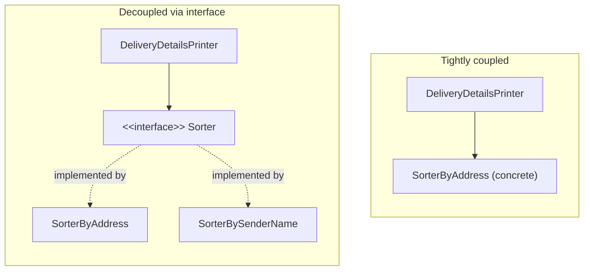

### The standard class-design vocabulary

The book introduces the names professional Spring apps use for objects by responsibility — learn these, because they recur everywhere:

- **Service** — implements a *use case* (the app's business logic). Name ends in `Service` (e.g., `CommentService`).
- **Repository** (a.k.a. **DAO**, data access object) — manages data persistence (talking to a database). E.g., `CommentRepository`.
- **Proxy** — communicates with something *outside* the app (sending an email, calling a remote service). E.g., `CommentNotificationProxy`.
- **Model** — a plain object (POJO) that models the app's data, described only by its attributes. E.g., `Comment`.

### The worked scenario: "publish comment"

The requirement: a task-management app lets users leave comments. When a user publishes a comment, the app stores it (e.g., in a database) and sends a notification (e.g., an email). Analyzing this, "publish comment" is one use case (→ a `CommentService`) composed of two distinct responsibilities — storing and notifying — which become two dependencies, each defined as an **interface** for decoupling:

<details>
<summary>Show code (Java)</summary>

```java
public class Comment {              // model (POJO)
  private String author;
  private String text;
  // getters/setters
}

public interface CommentRepository {            // contract for storing
  void storeComment(Comment comment);
}

public interface CommentNotificationProxy {     // contract for notifying
  void sendComment(Comment comment);
}
```

</details>

Implementations (the book simulates the real work with console output, since DB/email come later):

<details>
<summary>Show code (Java)</summary>

```java
public class DBCommentRepository implements CommentRepository {
  @Override
  public void storeComment(Comment comment) {
    System.out.println("Storing comment: " + comment.getText());
  }
}

public class EmailCommentNotificationProxy implements CommentNotificationProxy {
  @Override
  public void sendComment(Comment comment) {
    System.out.println("Sending notification for comment: " + comment.getText());
  }
}
```

</details>

The service depends on the two **interfaces**, with the dependencies supplied through its constructor:

<details>
<summary>Show code (Java)</summary>

```java
public class CommentService {
  private final CommentRepository commentRepository;
  private final CommentNotificationProxy commentNotificationProxy;

  public CommentService(CommentRepository commentRepository,
                        CommentNotificationProxy commentNotificationProxy) {
    this.commentRepository = commentRepository;
    this.commentNotificationProxy = commentNotificationProxy;
  }

  public void publishComment(Comment comment) {
    commentRepository.storeComment(comment);
    commentNotificationProxy.sendComment(comment);
  }
}
```

</details>

**Figure 4.6 — The decoupled "publish comment" design.** The service depends only on contracts (interfaces); concrete classes implement them.

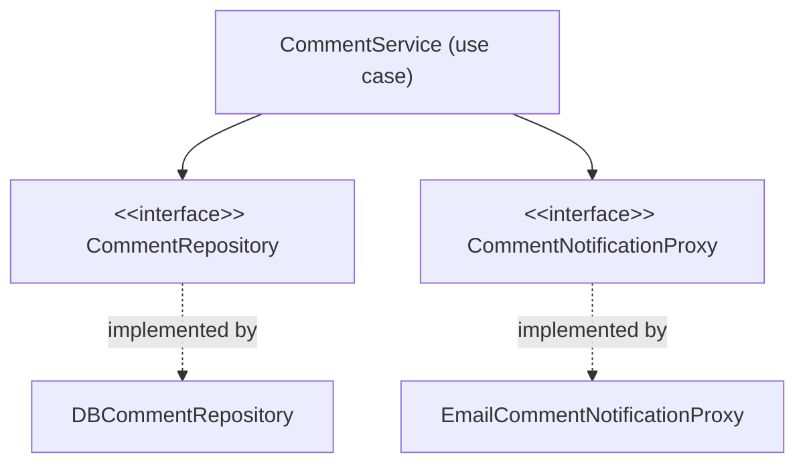

### Which objects belong in the Spring context?

A frequent beginner question: do I add *every* object to the context? **No.** Add an object only if Spring needs to *manage* it — i.e., to augment it with a framework capability. In this chapter the only capability used is DI, so the rule becomes: **add an object if it has a dependency to inject, or if it is itself a dependency of another bean.**

Applying that to the scenario:

- `CommentService` — has two dependencies → bean.
- `DBCommentRepository` — is a dependency of the service → bean.
- `EmailCommentNotificationProxy` — is a dependency of the service → bean.
- `Comment` (the model) — has no dependencies and is not a dependency → **not** a bean.

Adding objects Spring doesn't need to manage just over-engineers the app, making it harder to maintain and slightly less performant.

### Never annotate interfaces with stereotypes

Stereotype annotations tell Spring to *create an instance* of a class. Interfaces and abstract classes can't be instantiated, so annotating them is pointless (it compiles, but does nothing useful). Annotate the **concrete** classes:

<details>
<summary>Show code (Java)</summary>

```java
@Component public class DBCommentRepository implements CommentRepository { ... }
@Component public class EmailCommentNotificationProxy implements CommentNotificationProxy { ... }
@Component public class CommentService { ... }     // constructor-injected interfaces

@Configuration
@ComponentScan(basePackages = {"proxies", "services", "repositories"})
public class ProjectConfiguration { }              // note: "model" package omitted — no components there
```

</details>

**Figure 4.8 — Which classes Spring instantiates.** Concrete classes are annotated (Spring creates them); interfaces are never annotated.

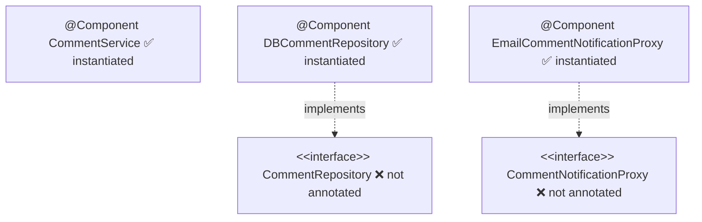

The beautiful part: because `CommentService`'s constructor parameters are *interface* types, Spring searches the context for beans whose class *implements* those interfaces and injects them. DI with abstractions "just works."

### DI with abstractions works with every injection style

The book demonstrates that abstraction-based DI works identically across all the styles from chapter 3. You can use **field injection**:

<details>
<summary>Show code (Java)</summary>

```java
@Component
public class CommentService {
  @Autowired private CommentRepository commentRepository;
  @Autowired private CommentNotificationProxy commentNotificationProxy;
  // ...
}
```

</details>

…or define the beans with **`@Bean` methods** and wire via parameters (here the classes have no stereotype annotations at all):

<details>
<summary>Show code (Java)</summary>

```java
@Configuration
public class ProjectConfiguration {
  @Bean public CommentRepository commentRepository() { return new DBCommentRepository(); }
  @Bean public CommentNotificationProxy commentNotificationProxy() { return new EmailCommentNotificationProxy(); }
  @Bean public CommentService commentService(CommentRepository r, CommentNotificationProxy p) {
    return new CommentService(r, p);
  }
}
```

</details>

In all cases Spring resolves the interface to a compatible implementation in the context.

A note on `@ComponentScan`: you can specify `basePackages` (terse — name a package and all its components are scanned, but a package rename can silently break scanning) or `basePackageClasses` (more verbose — list classes, but the compiler catches renames). Neither is strictly better; you'll see both.

### Multiple implementations of one interface

When two classes implement the same interface and both are beans, injecting that interface is ambiguous — Spring throws `NoUniqueBeanDefinitionException` ("expected single matching bean but found 2"). The same two tools from chapter 3 resolve it:

**`@Primary`** — mark one implementation as the default. Useful when a dependency *ships* an implementation but you want your custom one to win by default:

<details>
<summary>Show code (Java)</summary>

```java
@Component
@Primary
public class CommentPushNotificationProxy implements CommentNotificationProxy { ... }
```

</details>

**`@Qualifier`** — name implementations and inject by name. Useful when different objects need *different* implementations:

<details>
<summary>Show code (Java)</summary>

```java
@Component @Qualifier("PUSH")  public class CommentPushNotificationProxy  implements CommentNotificationProxy { ... }
@Component @Qualifier("EMAIL") public class EmailCommentNotificationProxy implements CommentNotificationProxy { ... }

@Component
public class CommentService {
  public CommentService(CommentRepository r,
                        @Qualifier("PUSH") CommentNotificationProxy p) { ... }
}
```

</details>

**Figures 4.9/4.11 — Two implementations of one interface.** Resolve the ambiguity with `@Primary` (one default) or `@Qualifier` (named per injection point).

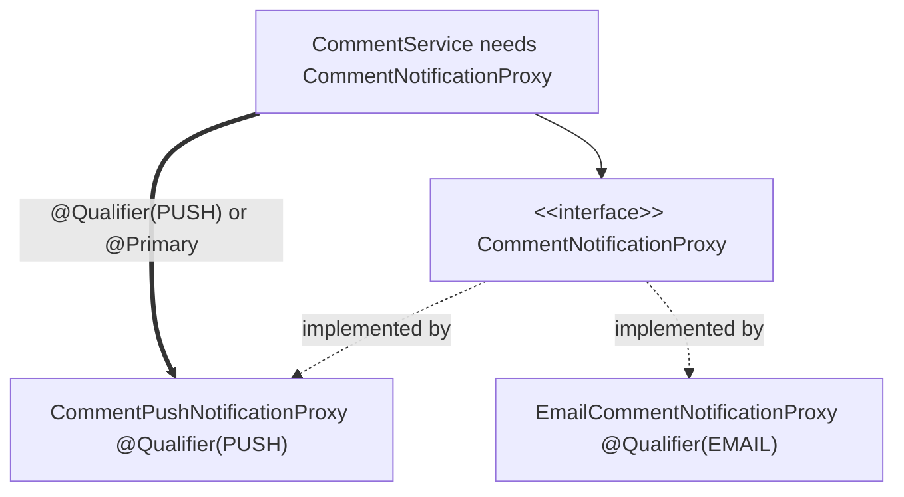

### Focused stereotype annotations: `@Service` and `@Repository`

`@Component` is generic — it says "this is a bean" but nothing about the object's role. Because *service* and *repository* are such common, important roles, Spring provides specialized stereotype annotations that read as documentation:

- **`@Service`** — for service (use-case) classes.
- **`@Repository`** — for repository (persistence) classes.

All three (`@Component`, `@Service`, `@Repository`) are stereotype annotations — Spring creates and registers an instance for each. Use the specific one where it applies; fall back to `@Component` where Spring has no dedicated annotation for the role.

<details>
<summary>Show code (Java)</summary>

```java
@Service    public class CommentService { ... }
@Repository public class DBCommentRepository implements CommentRepository { ... }
```

</details>

### Notes, edge cases, and gotchas

- Decoupling via interfaces improves both *maintainability* (change implementations without touching dependents) and *testability* (swap real implementations for mocks — chapter 15).
- The model (`Comment`) is intentionally kept out of the context; this is the first time the book applies the "only manage what needs managing" rule rigorously.
- For naming conventions and clean class design, the book points to Robert C. Martin's *Clean Code*.

### Review questions

1. What does an interface express versus what an implementation expresses?
2. Give the standard names for: a use-case object, a persistence object, an object that talks to an external system, and a data POJO.
3. State the rule for deciding whether an object belongs in the Spring context, and apply it to the `Comment` model.
4. Why must stereotype annotations go on concrete classes, not interfaces?
5. How does Spring inject a dependency declared as an interface type?
6. Compare `@Primary` and `@Qualifier` — when do you use each?
7. Why prefer `@Service`/`@Repository` over `@Component`?

<details>
<summary>Show answers</summary>

**Answers (abbreviated):** (1) Interface = *what* (contract); implementation = *how*. (2) Service, repository (DAO), proxy, model. (3) Add it only if Spring must manage it — i.e., it has a dependency or is one; `Comment` is neither, so it's not a bean. (4) Stereotypes cause instantiation; interfaces/abstract classes can't be instantiated. (5) Spring finds a context bean whose class implements that interface and injects it. (6) `@Primary` sets one default implementation (good when overriding a dependency-provided one); `@Qualifier` names implementations so different injection points get different ones. (7) They document the object's role, making the design clearer, while still acting as stereotypes.

</details>

### Revision bullets

- Interfaces define contracts; depend on abstractions to decouple and swap implementations.
- Vocabulary: service (use case), repository/DAO (persistence), proxy (external comms), model (POJO).
- Add to the context only what Spring must manage (has a dependency, or is one). Models usually stay out.
- Never annotate interfaces/abstract classes with stereotypes; annotate concrete classes.
- DI with abstractions works with constructor, field, setter, and `@Bean`-parameter injection.
- Multiple implementations → `@Primary` (one default) or `@Qualifier` (named, per injection point).
- Prefer `@Service`/`@Repository` over generic `@Component` to express intent.

---

## Chapter 5 — The Spring context: Bean scopes and life cycle

### Chapter goal

So far you've relied on Spring's defaults for *how* and *when* it creates beans. Production apps need more control. A **scope** is Spring's strategy for creating and managing a bean's life cycle. This chapter teaches the two general-purpose scopes — **singleton** (the default) and **prototype** — including how each behaves, when each is appropriate, the thread-safety implications, and the choice between **eager** and **lazy** instantiation for singletons. (Three more web-only scopes come in chapter 9.) Understanding scopes is what separates code that merely runs from code that's correct under concurrency.

### The singleton scope (the default)

Singleton is Spring's default scope and by far the most common in production. Spring creates a singleton bean when it loads the context and assigns it a name (a bean ID). The name "singleton" can mislead developers who know the classic singleton design pattern, so the book is careful here:

- **Classic singleton pattern:** exactly one instance of a type exists in the whole application.
- **Spring singleton:** one instance *per bean name*. You can have multiple singleton beans of the *same type* as long as they have different names. "Singleton" in Spring means **unique per name, not unique per type or per app.** Every time you refer to a given bean name, you get the same instance.

**Figure 5.1 — "Singleton" means unique per name, not per type.** The classic pattern has one instance per app; Spring can hold several same-type beans under different names.

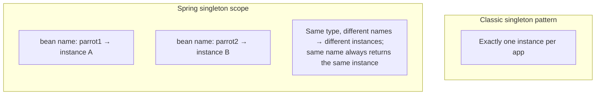

This behavior is identical whether you declare the bean with `@Bean` or with a stereotype annotation. With `@Bean`:

<details>
<summary>Show code (Java)</summary>

```java
@Bean
public CommentService commentService() {
  return new CommentService();
}
```

</details>

<details>
<summary>Show code (Java)</summary>

```java
var cs1 = context.getBean("commentService", CommentService.class);
var cs2 = context.getBean("commentService", CommentService.class);
System.out.println(cs1 == cs2);   // true — same instance
```

</details>

And with stereotype annotations, the same singleton reference is injected everywhere it's requested. If `CommentService` and `UserService` both `@Autowired` a `CommentRepository`, they receive the *same* repository instance:

<details>
<summary>Show code (Java)</summary>

```java
boolean b = s1.getCommentRepository() == s2.getCommentRepository();   // true
```

</details>

**Figures 5.3/5.4 — One singleton shared by many.** Both services receive the same `CommentRepository` instance.

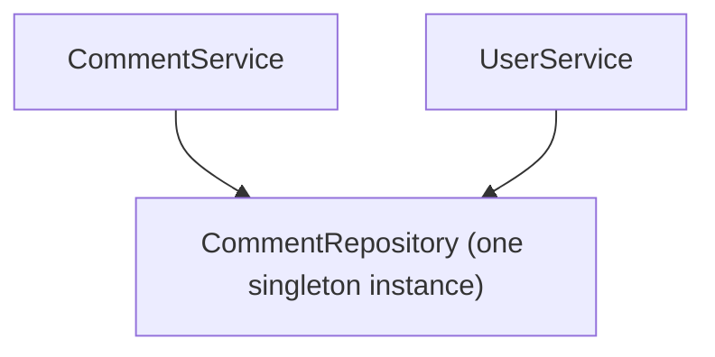

### The most important singleton rule: keep them immutable

Because a singleton instance is shared across the whole app, and most real apps are multithreaded (every web request is typically its own thread), **multiple threads can use the same singleton instance simultaneously.** If they mutate shared state, you get a **race condition** — unpredictable results or errors.

**Figure 5.5 — Why mutable singletons are dangerous.** Multiple threads mutating one shared instance race → corrupted data or errors.

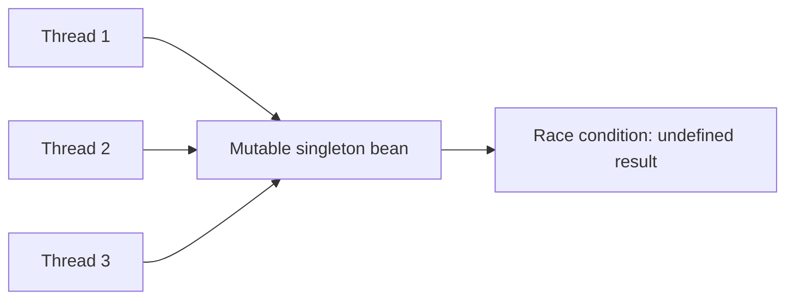

Therefore: **singleton beans should be immutable.** You *can* synchronize a mutable singleton, but it's bad practice — synchronization on a shared instance can severely hurt performance, and there's almost always a better design. This is another reason the book champions **constructor injection with `final` fields** (chapter 3): it makes the bean's dependencies immutable.

<details>
<summary>Show code (Java)</summary>

```java
@Service
public class CommentService {
  private final CommentRepository commentRepository;   // final → cannot change after init
  public CommentService(CommentRepository commentRepository) {
    this.commentRepository = commentRepository;
  }
}
```

</details>

The book distills bean usage to three points: (1) make an object a bean only if Spring needs to manage it; (2) if it's a bean, it should be singleton *only if it's immutable*; (3) if a bean must be mutable, consider the prototype scope.

### Eager vs lazy instantiation (for singletons)

By default Spring creates all singleton beans when it initializes the context — **eager instantiation**. You can defer creation until first use with `@Lazy` — **lazy instantiation**.

Demonstration: put a console print in the constructor.

<details>
<summary>Show code (Java)</summary>

```java
@Service
public class CommentService {
  public CommentService() {
    System.out.println("CommentService instance created!");
  }
}
```

</details>

With eager (default), the message prints at context startup *even if nobody uses the bean*. Add `@Lazy` and the message does **not** print until something first references the bean:

<details>
<summary>Show code (Java)</summary>

```java
@Service
@Lazy
public class CommentService {
  public CommentService() {
    System.out.println("CommentService instance created!");
  }
}
```

</details>

<details>
<summary>Show code (Java)</summary>

```java
var c = new AnnotationConfigApplicationContext(ProjectConfig.class);
System.out.println("Before retrieving the CommentService");
var service = c.getBean(CommentService.class);   // created here, lazily
System.out.println("After retrieving the CommentService");
```

</details>

Output order shows the bean is created at the `getBean` line, between the two prints.

**Which to choose?** The book's guidance: default to **eager**. Advantages of eager: when one bean delegates to another, the second already exists (no per-use existence check, so slightly more performant); and if Spring *can't* create a bean, you find out immediately at startup rather than at some random later moment in production. Lazy has a legitimate niche — the author describes a huge monolith where individual client deployments used only part of the beans, so eagerly creating all of them wasted memory; making most beans lazy meant only needed instances were created. But the author frames a frequent need for lazy as a *design smell*: it often signals the app should have been modular or split into microservices. Treat lazy as a targeted optimization, not a default.

### The prototype scope

Set with `@Scope(BeanDefinition.SCOPE_PROTOTYPE)`. For a prototype bean, Spring does **not** manage a single shared instance — it manages the *type* and creates a **brand-new instance every time** the bean is requested.

<details>
<summary>Show code (Java)</summary>

```java
@Bean
@Scope(BeanDefinition.SCOPE_PROTOTYPE)
public CommentService commentService() {
  return new CommentService();
}
```

</details>

<details>
<summary>Show code (Java)</summary>

```java
var cs1 = c.getBean("commentService", CommentService.class);
var cs2 = c.getBean("commentService", CommentService.class);
System.out.println(cs1 == cs2);   // false — different instances every time
```

</details>

On a class with a stereotype annotation:

<details>
<summary>Show code (Java)</summary>

```java
@Repository
@Scope(BeanDefinition.SCOPE_PROTOTYPE)
public class CommentRepository { }
```

</details>

Because each request yields a fresh instance, **prototype beans can safely be mutable** — different threads never share one instance, so no race condition arises.

**Figures 5.6/5.7 — Prototype scope.** Every request yields a new instance, so each thread gets its own — no collisions.

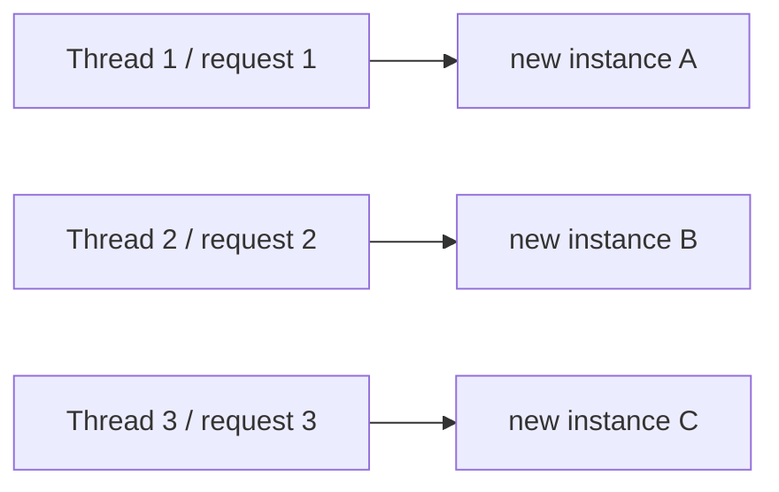

### When to use prototype: the mutable-helper pattern

Prototype is far less common than singleton, but there's a clear signal for when to use it: a **mutable object whose methods change its own state.** The book's example is a `CommentProcessor` that stores a comment as a field and mutates it through processing/validation:

<details>
<summary>Show code (Java)</summary>

```java
public class CommentProcessor {
  private Comment comment;
  public void setComment(Comment comment) { this.comment = comment; }
  public Comment getComment() { return this.comment; }
  public void processComment() { /* changes the comment attribute */ }
  public void validateComment() { /* validates and changes the comment attribute */ }
}
```

</details>

If a service simply `new`s a `CommentProcessor` inside its method, the processor isn't a bean at all — and that's fine *until* the processor itself needs a dependency injected (say, a `CommentRepository`). To get DI, the processor must become a bean. But it can't be a **singleton** bean: multiple threads processing different comments would share one mutable instance → race condition. So it should be a **prototype** bean:

<details>
<summary>Show code (Java)</summary>

```java
@Component
@Scope(BeanDefinition.SCOPE_PROTOTYPE)
public class CommentProcessor {
  @Autowired
  private CommentRepository commentRepository;
  // mutable comment field + processing methods
}
```

</details>

### The critical gotcha: injecting a prototype into a singleton

Here's the subtle trap. If you `@Autowired` a prototype bean directly into a singleton service, Spring injects it **once** — when it creates the singleton — so the singleton ends up holding a *single* prototype instance forever. Every method call reuses that one instance, reintroducing the race condition you used prototype to avoid:

<details>
<summary>Show code (Java)</summary>

```java
@Service
public class CommentService {
  @Autowired
  private CommentProcessor p;   // injected ONCE → defeats the purpose

  public void sendComment(Comment c) {
    p.setComment(c);
    p.processComment();
    p.validateComment();
    c = p.getComment();
  }
}
```

</details>

The correct pattern: inject the `ApplicationContext` and request a fresh prototype instance *inside* each method call:

<details>
<summary>Show code (Java)</summary>

```java
@Service
public class CommentService {
  @Autowired
  private ApplicationContext context;

  public void sendComment(Comment c) {
    CommentProcessor p = context.getBean(CommentProcessor.class);   // new instance per call
    p.setComment(c);
    p.processComment();
    p.validateComment();
    c = p.getComment();
  }
}
```

</details>

**Figure 5.10 — When a mutable helper needs DI.** Because `CommentProcessor` needs an injected `CommentRepository`, it must be a bean — and prototype-scoped (fresh per use) to stay thread-safe.

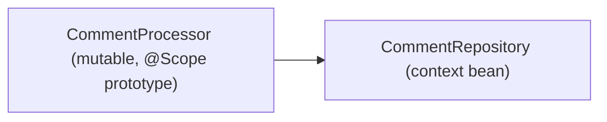

### Singleton vs prototype — side by side

| Singleton | Prototype |
|---|---|
| Name ↔ a single object instance | Name ↔ a type |
| Same instance every time you refer to the name | New instance on every reference |
| Created eagerly (default) or lazily | Created on each request |
| The default scope | Must be set explicitly via `@Scope` |
| Should be **immutable** (shared across threads) | May be **mutable** (per-use instances) |

### Notes, edge cases, and gotchas

- The book reveals a real-world use of prototype: when refactoring an old app full of mutating objects, the team couldn't rewrite every place at once, so prototype beans let them migrate progressively. The author generally prefers to avoid mutable instances and prototype where possible.
- Injecting prototype-into-singleton is described as a "vicious design" precisely because it silently looks correct but behaves like a singleton.
- Web scopes (request, session, application) build on these same ideas and arrive in chapter 9.

### Review questions

1. In Spring, does "singleton" mean one instance per app? Explain precisely.
2. Why must singleton beans generally be immutable, and how does constructor injection help?
3. What's the difference between eager and lazy instantiation, and which is the recommended default?
4. How do you declare a prototype bean, and how does its instance creation differ from a singleton's?
5. Describe the mutable-helper situation that justifies prototype scope.
6. Why is injecting a prototype directly into a singleton a bug, and what's the fix?

<details>
<summary>Show answers</summary>

**Answers (abbreviated):** (1) No — one instance per *bean name*; multiple same-type beans can coexist under different names, and a given name always returns the same instance. (2) They're shared across threads, so mutation causes race conditions; constructor injection with `final` fields makes dependencies immutable. (3) Eager creates all singletons at startup (default, fails fast, slightly faster delegation); lazy defers to first use (niche memory optimization). (4) `@Scope(BeanDefinition.SCOPE_PROTOTYPE)`; Spring creates a new instance on every request rather than sharing one. (5) A mutable object that changes its own state and also needs a dependency injected — must be a bean, but can't be a shared singleton, so it's prototype. (6) Spring injects it once when creating the singleton, so the same instance is reused (race conditions return); fix by injecting `ApplicationContext` and calling `getBean` per method invocation.

</details>

### Revision bullets

- Scope = Spring's strategy for creating/managing a bean's lifecycle.
- Singleton (default) = one instance per **name**; shared across threads → must be immutable; use constructor + `final`.
- Eager (default) creates singletons at startup; `@Lazy` defers to first use (use sparingly; often a design smell).
- Prototype (`@Scope(SCOPE_PROTOTYPE)`) = new instance per request; safe to be mutable.
- Don't inject a prototype into a singleton field — fetch from `ApplicationContext` per call instead.

---

## Chapter 6 — Using aspects with Spring AOP

### Chapter goal

Aspects are the second pillar of Spring (alongside the context). An **aspect** lets the framework intercept a method call and run logic before, after, or instead of the real method — without that logic living inside the method's own body. This decouples cross-cutting concerns (logging, security, transactions) from business code. This chapter teaches the AOP vocabulary, how Spring weaves aspects using proxies, how to implement an aspect step by step, how to read and alter the intercepted method's parameters and return value, how to target methods with custom annotations, the five advice annotations, and how to order multiple aspects. Crucially, Spring implements transactions (chapter 13) and security with aspects, so understanding AOP demystifies much of the framework.

### What an aspect is, and why it matters

An aspect is "a piece of logic the framework executes when you call specific methods of your choice." The motivation: sometimes code that isn't part of the business logic (logging every use-case execution, applying a security check) clutters a method and makes it harder to read. Moving that code into an aspect lets a reader of the method focus on what's relevant — the business logic — while the cross-cutting behavior runs transparently around it.

The book frames it with a vignette: a programmer (Jane) is discouraged by logging lines tangled up with her business code; aspects let her pull the logging aside so the method reads cleanly. But the author immediately adds the Spider-Man caveat — "with great power comes great responsibility." Misused aspects hide *relevant* logic and make an app *harder* to maintain, the opposite of the goal.

### AOP vocabulary (memorize these)

When designing an aspect you specify:

- **Aspect** — *what* logic runs (the cross-cutting code).
- **Advice** — *when* it runs relative to the intercepted method (before / after / around / etc.).
- **Pointcut** — *which* methods are intercepted.
- **Join point** — the event that triggers the aspect. In Spring this is **always a method call.**
- **Target object** — the bean whose method is intercepted. It must be a Spring-managed bean (just like DI, AOP requires the framework to manage the object).

**Figure 6.2 — AOP terminology.** The pieces that together describe one woven aspect.

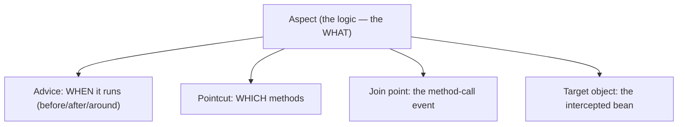

### How Spring weaves aspects: the proxy

Here's the mechanism. Because the target is a bean, Spring doesn't hand you the *real* object when you request it — it hands you a **proxy**. The proxy intercepts calls, runs the aspect logic, and then (if appropriate) delegates to the real method. You receive this proxy whether you fetch the bean with `getBean()` or via DI. This technique is called **weaving**.

**Figures 6.3/6.4 — Weaving via a proxy.** Spring hands you a proxy that runs the aspect logic, then delegates to the real method.

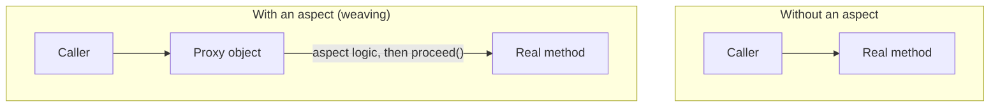

### Implementing an aspect — the four steps

You need the `spring-aspects` dependency in addition to `spring-context`. Then:

1. **Enable aspects** — annotate the configuration class with `@EnableAspectJAutoProxy`.
2. **Create the aspect class** — annotate it `@Aspect`, *and* add it as a bean (with `@Bean` or a stereotype). **`@Aspect` is not a stereotype** — annotating a class `@Aspect` does *not* create a bean. Forgetting to also register the bean is the classic AOP mistake.
3. **Choose advice + pointcut** — annotate the aspect method with an advice annotation whose value is an AspectJ pointcut expression.
4. **Implement the logic.**

The starting service:

<details>
<summary>Show code (Java)</summary>

```java
@Service
public class CommentService {
  private Logger logger = Logger.getLogger(CommentService.class.getName());
  public void publishComment(Comment comment) {
    logger.info("Publishing comment:" + comment.getText());
  }
}
```

</details>

(The book switches from `System.out` to a JDK `Logger` here, noting that real apps use logging frameworks — Log4j, Logback, or the JDK's logging API — for flexibility and standardized messages.)

The configuration class enabling AOP and registering the aspect:

<details>
<summary>Show code (Java)</summary>

```java
@Configuration
@ComponentScan(basePackages = "services")
@EnableAspectJAutoProxy
public class ProjectConfig {
  @Bean
  public LoggingAspect aspect() {
    return new LoggingAspect();
  }
}
```

</details>

The aspect itself, with logic that runs before and after the real method:

<details>
<summary>Show code (Java)</summary>

```java
@Aspect
public class LoggingAspect {
  private Logger logger = Logger.getLogger(LoggingAspect.class.getName());

  @Around("execution(* services.*.*(..))")
  public Object log(ProceedingJoinPoint joinPoint) throws Throwable {
    logger.info("Method will execute");        // before
    Object returned = joinPoint.proceed();      // delegate to the real method
    logger.info("Method executed");             // after
    return returned;
  }
}
```

</details>

### Reading the pointcut expression

`execution(* services.*.*(..))` is written in the **AspectJ pointcut language**. You don't need to memorize it — consult the docs and keep expressions simple. This one means: intercept the execution of **any method** (`*` return type) in **any class** in the `services` package (`services.*`), with **any method name** (`.*`) and **any parameters** (`(..)`).

**Figure 6.6 — Anatomy of the pointcut `execution(* services.*.*(..))`.**

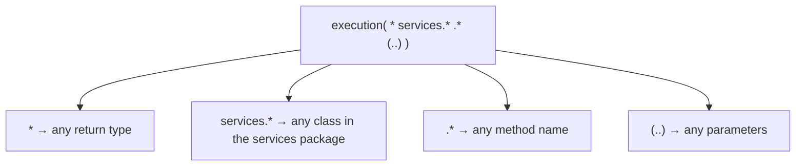

### `ProceedingJoinPoint` and `proceed()`

The `ProceedingJoinPoint` parameter represents the intercepted method. Its `proceed()` method calls the real method. **If you don't call `proceed()`, the real method never runs** — the aspect executes *instead of* it. This is exactly how an authorization aspect can block a call: it decides not to delegate when the rules aren't met.

**Figures 6.8/6.9 — Omitting `proceed()`.** Without `proceed()`, the real method never runs (the basis of a blocking security aspect).

```mermaid
flowchart LR
    Caller --> Proxy["Proxy (aspect logic)"]
    Proxy -->|"proceed() called"| Real["Real method runs"]
    Proxy -.->|"proceed() omitted"| Blocked["Real method never runs<br/>(e.g., security blocks the call)"]
```

`proceed()` throws `Throwable` because it propagates whatever exception the real method throws; you can wrap it in try/catch/finally if you need to handle it.

When the app runs, the console shows the aspect's "Method will execute" line, then the real method's output, then the aspect's "Method executed" line — proving the aspect wrapped the call.

### Altering parameters and the return value

The aspect can inspect and even change what flows in and out of the method. To read the method name and arguments:

<details>
<summary>Show code (Java)</summary>

```java
String methodName = joinPoint.getSignature().getName();
Object[] arguments = joinPoint.getArgs();
```

</details>

To change them: pass new arguments to `proceed(newArgs)`, and/or return a different value to the caller than the method actually returned:

<details>
<summary>Show code (Java)</summary>

```java
@Around("execution(* services.*.*(..))")
public Object log(ProceedingJoinPoint joinPoint) throws Throwable {
  String methodName = joinPoint.getSignature().getName();
  Object[] arguments = joinPoint.getArgs();
  logger.info("Method " + methodName + " with parameters " + Arrays.asList(arguments) + " will execute");

  Comment comment = new Comment();
  comment.setText("Some other text!");
  Object[] newArguments = { comment };
  Object returnedByMethod = joinPoint.proceed(newArguments);   // method sees the altered argument

  logger.info("Method executed and returned " + returnedByMethod);
  return "FAILED";   // caller receives this, not what the method returned
}
```

</details>

In the book's run, `publishComment` is called with "Demo comment" but the method actually processes "Some other text!", the method returns "SUCCESS" but `main` receives "FAILED". The capabilities: change parameters, change the returned value, and throw or catch exceptions. The author repeats the warning: this power is easy to abuse — only hide truly irrelevant code; never hide things that matter.

**Figures 6.10/6.11 — An aspect can alter arguments and return value.** It can rewrite inputs before delegating and the result before the caller sees it.

```mermaid
flowchart LR
    Caller -->|"original args"| Aspect
    Aspect -->|"altered args (proceed(newArgs))"| Method["Real method"]
    Method -->|"actual return value"| Aspect
    Aspect -->|"altered return value"| Caller
```

### Intercepting annotated methods (the common, clean pattern)

Rather than writing complex pointcut expressions, you typically mark the methods you want intercepted with a **custom annotation**. Define the annotation with `RUNTIME` retention (so it's visible at runtime) and target it at methods:

<details>
<summary>Show code (Java)</summary>

```java
@Retention(RetentionPolicy.RUNTIME)   // MUST be RUNTIME to be intercepted at runtime
@Target(ElementType.METHOD)
public @interface ToLog {
}
```

</details>

Annotate only the methods you care about:

<details>
<summary>Show code (Java)</summary>

```java
@Service
public class CommentService {
  public void publishComment(Comment comment) { ... }
  @ToLog
  public void deleteComment(Comment comment) { ... }   // only this one is intercepted
  public void editComment(Comment comment) { ... }
}
```

</details>

Point the aspect at the annotation with the `@annotation(...)` pointcut:

<details>
<summary>Show code (Java)</summary>

```java
@Aspect
public class LoggingAspect {
  @Around("@annotation(ToLog)")
  public Object log(ProceedingJoinPoint joinPoint) throws Throwable { ... }
}
```

</details>

Now only `deleteComment` is intercepted. This is how many Spring features select their targets.

**Figures 6.12/6.13 — Targeting methods with a custom annotation.** Only annotated methods are intercepted.

```mermaid
flowchart TB
    Step1["1. Define @ToLog (RUNTIME retention)"] --> Step2["2. Annotate chosen methods, e.g. deleteComment()"]
    Step2 --> Step3["3. Pointcut: @annotation(ToLog)"]
    Step3 --> Result["Aspect weaves only into @ToLog methods"]
```

### The five advice annotations

`@Around` is the most powerful and most common — it can run before, after, or instead of the method, and alter arguments/return. It receives `ProceedingJoinPoint` and controls delegation via `proceed()`. But simpler scenarios deserve simpler advice; the others don't receive `ProceedingJoinPoint` and can't decide when to delegate (delegation is implied by their semantics):

- **`@Before`** — runs before the method.
- **`@AfterReturning`** — runs after the method returns successfully; can receive the returned value (via the `returning` attribute). Skipped if the method throws.
- **`@AfterThrowing`** — runs if the method throws; can receive the exception.
- **`@After`** — runs after the method whether it returned or threw (a "finally").

Example with `@AfterReturning`:

<details>
<summary>Show code (Java)</summary>

```java
@Aspect
public class LoggingAspect {
  @AfterReturning(value = "@annotation(ToLog)", returning = "returnedValue")
  public void log(Object returnedValue) {
    logger.info("Method executed and returned " + returnedValue);
  }
}
```

</details>

Choose the simplest advice that does the job; reach for `@Around` only when you need its extra power.

### The aspect execution chain and `@Order`

Multiple aspects can intercept the same method, forming an **execution chain** — each aspect's `proceed()` delegates either to the next aspect or, finally, to the real method, and returns unwind back through the chain in reverse. **By default the order is not guaranteed.** Order can matter: if a `SecurityAspect` sometimes blocks a call, and you want a `LoggingAspect` to log even blocked calls, the logging aspect must run *first*.

Control order with `@Order(n)` — **smaller number runs earlier**:

<details>
<summary>Show code (Java)</summary>

```java
@Aspect @Order(1) public class SecurityAspect { ... }   // runs first
@Aspect @Order(2) public class LoggingAspect  { ... }   // runs second
```

</details>

**Figures 6.15/6.16 — The aspect execution chain.** Aspects nest like onion layers; `@Order` (smaller first) controls the sequence.

```mermaid
sequenceDiagram
    participant Caller
    participant Security as SecurityAspect @Order(1)
    participant Logging as LoggingAspect @Order(2)
    participant Method as Real method
    Caller->>Security: call
    Security->>Logging: proceed()
    Logging->>Method: proceed()
    Method-->>Logging: return
    Logging-->>Security: return
    Security-->>Caller: return
```

### Notes, edge cases, and gotchas

- `@Aspect` does not register a bean — you must add the aspect to the context separately. This is the single most common AOP mistake.
- The custom annotation used in a pointcut must have `RetentionPolicy.RUNTIME`; the default retention is not visible at runtime.
- Aspects underpin transactions (chapter 13) and security — learning AOP now pays off later.
- Keep pointcut expressions simple; complex AspectJ expressions are rarely necessary and hurt readability.

### Review questions

1. Define aspect, advice, pointcut, join point, and target object.
2. What does Spring return instead of the real bean when the bean is an aspect target, and what is this technique called?
3. List the four steps to implement an aspect. Which step is most commonly forgotten?
4. What happens if an `@Around` aspect doesn't call `proceed()`?
5. How do you intercept only methods bearing a custom annotation, and what retention must that annotation have?
6. Name the five advice annotations and one use for each besides `@Around`.
7. How do you control the order of multiple aspects, and which number runs first?

<details>
<summary>Show answers</summary>

**Answers (abbreviated):** (1) Aspect = the logic; advice = when it runs; pointcut = which methods; join point = the triggering event (a method call in Spring); target = the intercepted bean. (2) A proxy; the technique is weaving. (3) Enable with `@EnableAspectJAutoProxy`; create an `@Aspect` class *and register it as a bean*; add advice + pointcut; implement logic — registering the bean is most often forgotten. (4) The real method never runs; the aspect executes instead. (5) Use `@annotation(MyAnnotation)` as the pointcut; the annotation needs `RetentionPolicy.RUNTIME`. (6) `@Around` (full control), `@Before` (pre), `@AfterReturning` (on success, can read return value), `@AfterThrowing` (on exception, can read it), `@After` (always, like finally). (7) `@Order(n)`; smaller runs first.

</details>

### Revision bullets

- Aspect = what; advice = when; pointcut = which; join point = the method call; target = the intercepted bean.
- Spring weaves aspects by returning a **proxy** in place of the real bean.
- Four steps: `@EnableAspectJAutoProxy` → `@Aspect` class **registered as a bean** → advice + pointcut → logic.
- `@Around` + `ProceedingJoinPoint.proceed()`; skipping `proceed()` skips the real method; `proceed(newArgs)` alters arguments; you can change the returned value.
- Target annotated methods with a custom annotation (`RUNTIME` retention) + `@annotation(X)` pointcut.
- Five advices: `@Around`, `@Before`, `@AfterReturning`, `@AfterThrowing`, `@After`.
- Multiple aspects form a chain; order with `@Order` (smaller = earlier).

---

# Part 2 — Implementation

Part 2 takes the foundation from Part 1 (the context and aspects) and applies it to the capabilities you'll actually build in production: web applications with Spring Boot and Spring MVC, the web bean scopes, REST services (both exposing and consuming them), connecting to databases, transactions, Spring Data, and testing. The author stresses that all of this rests on understanding the Spring context and aspects — if any of that feels shaky, revisit Part 1 before continuing.

---

## Chapter 7 — Understanding Spring Boot and Spring MVC

### Chapter goal

This chapter explains how web applications work, how Spring Boot removes the configuration burden that historically made Spring web development painful, and the architecture of Spring MVC — the set of components that handle an HTTP request inside a Spring web app. You'll build a first, minimal web page so you can see the whole request-handling flow end to end. Chapters 8 and 9 build directly on this foundation.

### What a web app is

Any application you access through a web browser is a web app. The book notes the historical shift: in the 1990s almost everything was a desktop app you installed; today almost everything is a web app, accessible from any internet-connected device with no installation. A web app has two parts:

- **Client side (frontend)** — what the user interacts with, i.e., the browser. It sends requests to the server, receives responses, and presents the UI.
- **Server side (backend)** — receives requests, runs logic, often persists data or calls other services, and sends responses back.

A vital point the book emphasizes: although we casually speak of "the client" and "the server," the backend serves **many clients concurrently** — many users on phones, tablets, and computers hitting the same app at once. This means backend operations run concurrently, so code that reads and writes shared resources can suffer race conditions (recall the singleton discussion in chapter 5).

**Figures 7.2/7.3 — A web app, and concurrent clients.** Many browsers hit the same backend at once.

```mermaid
flowchart TB
    U1["Browser (user 1)"] --> BE["Backend (Spring)"]
    U2["Browser (user 2)"] --> BE
    U3["Browser (user 3)"] --> BE
    BE --> DB[("Database")]
    BE --> Ext["External services"]
```

### Two ways to build a web app with Spring

1. **Backend serves the fully prepared view.** The server returns content the browser displays directly — HTML, CSS, images, and scripts (JavaScript). The browser shows exactly what it receives. This is the approach used in this chapter and chapter 8, and it suits smaller apps.
2. **Frontend-backend separation.** The backend returns only *raw data* (usually JSON), and a separate frontend app (loaded once into the browser) decides how to display it. Often called the "modern" approach; it lets separate teams build front and back ends and deploy them independently — valuable for larger apps. Data exchange uses REST (chapter 10).

**Figures 7.4/7.5 — Two ways to build a web app.** Server-rendered HTML vs. raw JSON consumed by a separate frontend.

```mermaid
flowchart TB
    subgraph A["Backend serves the view"]
        direction LR
        S1["Server"] -->|"HTML / CSS / JS"| B1["Browser renders verbatim"]
    end
    subgraph B["Frontend–backend separation"]
        direction LR
        S2["Server"] -->|"raw JSON"| FE["Frontend app in browser decides what to render"]
    end
```

### The servlet container and servlets

The browser talks to the server over **HTTP**, a request-response protocol: the client sends a request and waits for the server's response. You don't want your Java app to implement HTTP itself. Instead you use a **servlet container** (also called a web server) — software that understands HTTP and *translates* HTTP requests and responses to and from your Java app. The book uses **Tomcat**, the most popular choice (alternatives: Jetty, JBoss, Payara).

A **servlet** is a Java object that interacts directly with the servlet container. When an HTTP request arrives, the container calls a servlet method, passing objects representing the request and the response. Historically, developers wrote a servlet per URL path and registered each in the container. The container manages a context of servlet instances much as Spring manages beans — hence the name "servlet container."

The good news: with Spring you **don't write servlets**. Spring provides one servlet that serves as the single entry point for your app, and Spring Boot configures it. You just need to remember that the servlet is where requests enter your app's logic and where responses leave it.

**Figures 7.6/7.7/7.8 — The servlet container.** Tomcat translates HTTP ↔ Java and calls the (dispatcher) servlet for every request.

```mermaid
flowchart LR
    Client -->|"HTTP request"| Tomcat["Servlet container (Tomcat) — speaks HTTP"]
    Tomcat -->|"Java call"| Servlet["Dispatcher servlet (configured by Boot)"]
    Servlet --> App["Your Spring app logic"]
    App -->|"Java response"| Tomcat
    Tomcat -->|"HTTP response"| Client
```

### The magic of Spring Boot

Configuring a servlet container, creating a servlet, and wiring it correctly used to be the most hated part of Spring web development. Spring Boot eliminates almost all of it. Its three most important features:

1. **Simplified project creation** via a project initialization service — **Spring Initializr** (at `start.spring.io`, or integrated into IDEs like IntelliJ Ultimate and STS). You pick the build tool (Maven/Gradle), language (Java/Kotlin/Groovy), Java version, and dependencies, then download a ready-to-run skeleton. The book uses Maven and Java 11 throughout.

   What Initializr puts in the generated project:
   - **The main class**, annotated `@SpringBootApplication`, whose `main` calls `SpringApplication.run(...)`:

     ```java
     @SpringBootApplication
     public class Main {
       public static void main(String[] args) {
         SpringApplication.run(Main.class, args);
       }
     }
     ```
   - **The Spring Boot POM parent** (`spring-boot-starter-parent`), which provides *compatible versions* for the dependencies you add — so you usually omit versions and let Boot choose compatible ones.
   - **The dependencies** you selected, as *starters* (see below) — without explicit versions.
   - **The Spring Boot Maven plugin**, which contributes default configuration.
   - **An `application.properties` file** (initially empty) in `resources`, for runtime configuration.

2. **Dependency starters** — capability-oriented groups of compatible dependencies. A starter (e.g., `spring-boot-starter-web`) looks like a single dependency but pulls in everything needed for that capability — Spring context, AOP, Tomcat, JSON support — at mutually compatible versions. You request *capabilities*, not individual jars, and Boot handles version compatibility for you.

   ```xml
   <dependency>
     <groupId>org.springframework.boot</groupId>
     <artifactId>spring-boot-starter-web</artifactId>
   </dependency>
   ```

   **Figure 7.14 — A dependency starter.** One starter expands into all the needed, version-compatible dependencies.

   ```mermaid
   flowchart LR
       App["Your app"] --> Starter["spring-boot-starter-web"]
       Starter --> Ctx["spring-context"]
       Starter --> AOP["spring-aop"]
       Starter --> Tomcat["embedded Tomcat"]
       Starter --> Json["JSON (Jackson)"]
   ```

3. **Autoconfiguration (convention over configuration)** — based on the dependencies present, Boot applies sensible default configuration. With the web starter, Boot configures and starts a Tomcat instance on port 8080 by default, *before you write any code*. You only override where your needs differ from the convention, so you write little or no configuration. Tomcat is Boot's *convention* for a servlet container.

### Building a first web page (Spring MVC)

Even with a running Boot app, you still have a web *server* but not yet a web *app* — you must add pages. Two steps to add a static page:

1. **Write an HTML document** and place it in `resources/static` (the default location Boot looks in for pages to render):

   ```html
   <!DOCTYPE html>
   <html lang="en">
   <head><meta charset="UTF-8"><title>Home Page</title></head>
   <body><h1>Welcome!</h1></body>
   </html>
   ```

2. **Write a controller** with an action mapped to the request. A **controller** is a web component holding methods (called *actions*) that run for specific HTTP requests. Mark the class `@Controller` (a stereotype annotation — so it's also a bean) and map an action with `@RequestMapping`:

   ```java
   @Controller
   public class MainController {
     @RequestMapping("/home")
     public String home() {
       return "home.html";   // name of the document to return as the response
     }
   }
   ```

Run the app, open `http://localhost:8080/home`, and you see "Welcome!". Forget the `/home` path and you get HTTP 404 Not Found (no action is mapped to that path).

### The Spring MVC architecture (the request-handling flow)

Now the important part — what happens behind the scenes. Spring Boot configured a set of components that collaborate to handle each request. You implement only the controller; Boot provides the rest.

**Figure 7.18 — The Spring MVC request-handling flow.** You write only the controller; Boot configures the rest.

```mermaid
sequenceDiagram
    participant Client
    participant Tomcat as Tomcat (servlet container)
    participant DS as Dispatcher servlet (front controller)
    participant HM as Handler mapping
    participant Ctrl as Controller action
    participant VR as View resolver
    Client->>Tomcat: HTTP request
    Tomcat->>DS: forward request
    DS->>HM: which action matches?
    HM-->>DS: the controller action
    DS->>Ctrl: call action
    Ctrl-->>DS: view name
    DS->>VR: find & render the view
    VR-->>DS: rendered view
    DS-->>Client: HTTP response
```

Step by step:

1. The client sends an HTTP request.
2. Tomcat receives it and must call a servlet. For Spring MVC, it calls the servlet Boot configured — the **dispatcher servlet**.
3. The **dispatcher servlet** is the entry point of the Spring web app (also called the *front controller*). Tomcat calls it for *every* request. Its job: find the right controller action and produce the response.
4. To find the action, the dispatcher servlet delegates to the **handler mapping**, which locates the controller action you associated with the request via `@RequestMapping`. (The handler mapping also matches on the HTTP method, covered in chapter 8.)
5. The dispatcher servlet calls that **controller action**. If no action matches, the app responds 404. The action returns the name of the page to render — the **view**.
6. The dispatcher servlet hands the view name to the **view resolver**, which finds the view's content, then returns the rendered view in the HTTP response.

The author's closing advice: don't rush past this. Understanding how Spring web apps process a request is what lets you learn the details in later chapters quickly and implement any feature you need.

### Notes, edge cases, and gotchas

- `@Controller` is a stereotype annotation, so the controller is also a bean Spring manages.
- Static pages live in `resources/static`; dynamic pages (chapter 8) live in `resources/templates`. Mixing these up is a common early mistake.
- Hitting `localhost:8080` with no path maps to `/`, which has no action by default → 404. Map `/` if you want a landing page.
- Spring Boot is a large topic in its own right; this chapter teaches only what's relevant. For depth the book recommends dedicated Spring Boot titles.

### Review questions

1. What are the two parts of a web app, and why does concurrency matter on the backend?
2. Contrast the two ways to build a Spring web app.
3. What is a servlet container, and what is a servlet? Do you write servlets in Spring?
4. Name Spring Boot's three key features and what each does.
5. Where do static HTML pages go, and what two annotations create a minimal controller action?
6. Trace an HTTP request through the Spring MVC components in order.

<details>
<summary>Show answers</summary>

**Answers (abbreviated):** (1) Frontend (browser) and backend (server); the backend serves many clients at once, so shared-state code can race. (2) Backend serves the full view (browser renders verbatim; good for small apps) vs frontend-backend separation (backend serves raw JSON; a separate frontend renders it; good for larger apps). (3) A servlet container (e.g., Tomcat) translates HTTP ↔ Java; a servlet is a Java object the container calls per request; in Spring you don't write servlets — Boot configures the dispatcher servlet. (4) Initializr (skeleton project), starters (capability-oriented compatible dependency groups), autoconfiguration (sensible defaults, e.g., Tomcat on 8080). (5) `resources/static`; `@Controller` + `@RequestMapping`. (6) Client → Tomcat → dispatcher servlet → handler mapping (find action) → controller action (returns view name) → view resolver (render) → response.

</details>

### Revision bullets

- Web app = frontend (browser) + backend; backend serves many clients concurrently.
- Servlet container (Tomcat) translates HTTP ↔ Java; the (dispatcher) servlet is the entry point; you don't write servlets.
- Spring Boot: Initializr + starters + autoconfiguration (convention over configuration); `@SpringBootApplication`; default port 8080.
- Minimal page: HTML in `resources/static` + `@Controller`/`@RequestMapping` returning the view name.
- MVC flow: Tomcat → dispatcher servlet → handler mapping → controller → view resolver → response. You write only the controller.

---

## Chapter 8 — Implementing web apps with Spring Boot and Spring MVC

### Chapter goal

This chapter makes web pages *dynamic* — content that changes per request — using a template engine (Thymeleaf). It then covers the ways a client sends data to the server (request parameters, path variables, headers, body) with the annotations `@RequestParam` and `@PathVariable`, and finally the HTTP methods (GET, POST, PUT, PATCH, DELETE) and their dedicated mapping annotations, demonstrated by building a small app that lists products and adds new ones through an HTML form.

### Dynamic views with a template engine

Most pages aren't static — a shopping cart shows different products for different users and even for the same user over time. To produce a dynamic view, the controller must send *data* to the view, which incorporates it into the response. The mechanism: a **`Model`** parameter on the controller action. You put key-value attributes into the `Model`; the **template engine** renders them into the HTML.

The book uses **Thymeleaf** (chosen for being simpler than alternatives; templates are plain HTML files). Dependencies — note you still need the web starter:

<details>
<summary>Show code (XML)</summary>

```xml
<dependency>
  <groupId>org.springframework.boot</groupId>
  <artifactId>spring-boot-starter-thymeleaf</artifactId>
</dependency>
<dependency>
  <groupId>org.springframework.boot</groupId>
  <artifactId>spring-boot-starter-web</artifactId>
</dependency>
```

</details>

The controller adds attributes to the `Model`:

<details>
<summary>Show code (Java)</summary>

```java
@Controller
public class MainController {
  @RequestMapping("/home")
  public String home(Model page) {
    page.addAttribute("username", "Katy");
    page.addAttribute("color", "red");
    return "home.html";
  }
}
```

</details>

`addAttribute(key, value)` registers data under a key the view will reference. **Dynamic templates go in `resources/templates`** (not `static` — this is the key difference from chapter 7).

The Thymeleaf template declares the `th` namespace and uses `${key}` to read attributes:

<details>
<summary>Show code (HTML)</summary>

```html
<!DOCTYPE html>
<html lang="en" xmlns:th="http://www.thymeleaf.org">
<head><meta charset="UTF-8"><title>Home Page</title></head>
<body>
  <h1>Welcome
    <span th:style="'color:' + ${color}" th:text="${username}"></span>!</h1>
</body>
</html>
```

</details>

`xmlns:th="http://www.thymeleaf.org"` is like an import enabling the `th` prefix; `${username}` and `${color}` pull the controller's attributes.

### How a client sends data to the server

The book lists four mechanisms and when to use each:

- **Request (query) parameters** — key-value(s) appended to the URI after `?`, separated by `&`. For *small* amounts of data; can be optional. Also called query parameters; limited to ~2,000 characters.
- **Request headers** — like parameters but carried in HTTP headers (not visible in the URI); also small amounts.
- **Path variables** — a value embedded directly in the path. For *small*, *mandatory* data.
- **Request body** — for *larger* amounts of data; covered with REST in chapter 10.

### Request parameters with `@RequestParam`

Add a parameter to the action and annotate it `@RequestParam`; Spring binds the query parameter of the same name:

<details>
<summary>Show code (Java)</summary>

```java
@Controller
public class MainController {
  @RequestMapping("/home")
  public String home(@RequestParam String color, Model page) {
    page.addAttribute("username", "Katy");
    page.addAttribute("color", color);
    return "home.html";
  }
}
```

</details>

Call it as `http://localhost:8080/home?color=blue`. Add more with `&`: `?color=blue&name=Jane`.

**Figure 8.7 — Request-parameter URL syntax.** Path, then `?`, then `key=value` pairs joined by `&`.

```mermaid
flowchart LR
    Path["/home"] --> Q["?"]
    Q --> P1["color=blue"]
    P1 --> Amp["&"]
    Amp --> P2["name=Jane"]
```

**A request parameter is mandatory by default.** If the client omits it, the server responds 400 Bad Request. Make it optional with `required = false`:

<details>
<summary>Show code (Java)</summary>

```java
@RequestParam(required = false) String name
```

</details>

A common use case is search/filtering, where each criterion is an optional parameter — the client sends only the criteria the user chose, and the server handles missing values gracefully.

**Figure 8.5 — Optional request parameters for search/filtering.** The client sends only the criteria the user chose.

```mermaid
flowchart LR
    Form["Search form: name, price, brand"] -->|"sends only name + brand"| Server["Server uses only received params"]
```

### Path variables with `@PathVariable`

Embed a named placeholder in the path with curly braces and bind it with `@PathVariable`:

<details>
<summary>Show code (Java)</summary>

```java
@Controller
public class MainController {
  @RequestMapping("/home/{color}")
  public String home(@PathVariable String color, Model page) {
    page.addAttribute("username", "Katy");
    page.addAttribute("color", color);
    return "home.html";
  }
}
```

</details>

Call as `http://localhost:8080/home/blue`. The parameter name must match the placeholder name.

**Request parameters vs path variables:**

| Request parameters | Path variables |
|---|---|
| Can be optional | Should be **mandatory** only |
| Good for several values / filtering; if more than ~3, prefer the body | Keep to 1–2; never optional |
| Query string seen by some as less readable | Cleaner path; better for bookmarks and search-engine indexing |

The rule of thumb: when a page depends on one or two core values, put them in the path for readability and SEO; for optional or numerous values, use request parameters; for many values, use the request body.

### HTTP methods

An HTTP request is identified by **both a path and a method (verb)**. Until now the examples implicitly used **GET**. The method expresses the client's *intention*:

| Method | Intention |
|---|---|
| **GET** | Retrieve data only (no change) — the default for `@RequestMapping` |
| **POST** | Add new data |
| **PUT** | Replace an entire data record |
| **PATCH** | Partially change a record |
| **DELETE** | Delete data |

The book warns: never use a method against its purpose (e.g., a GET that changes data) — technically possible, but a bad choice. It also notes the same path can map to multiple actions distinguished by method, and that the PUT/PATCH distinction, while good practice, isn't always made in real apps.

**Figure 8.9 — The essential HTTP methods.** Match the verb to the intended action.

```mermaid
flowchart LR
    Client -->|"GET — retrieve"| Server
    Client -->|"POST — add"| Server
    Client -->|"PUT — replace"| Server
    Client -->|"PATCH — partial change"| Server
    Client -->|"DELETE — remove"| Server
```

### Worked example: list and add products

The scenario: display all products and let the user add one via an HTML form. Viewing uses GET; adding uses POST. Model and service:

<details>
<summary>Show code (Java)</summary>

```java
public class Product {
  private String name;
  private double price;
  // getters/setters
}

@Service
public class ProductService {
  private List<Product> products = new ArrayList<>();
  public void addProduct(Product p) { products.add(p); }
  public List<Product> findAll() { return products; }
}
```

</details>

> **Thread-safety note (the book is explicit):** storing products in a list field of a singleton bean is **not thread-safe** — concurrent requests adding products would race (recall chapter 5). It's a deliberate simplification; chapter 12 replaces the list with a database, which removes the problem. Singleton beans aren't thread-safe.

The controller injects the service (constructor injection) and defines the two actions. Use the dedicated mapping annotations `@GetMapping` and `@PostMapping` rather than `@RequestMapping(method=...)`, because both path and method matter and the dedicated annotations make the method explicit:

<details>
<summary>Show code (Java)</summary>

```java
@Controller
public class ProductsController {
  private final ProductService productService;
  public ProductsController(ProductService productService) {
    this.productService = productService;
  }

  @GetMapping("/products")
  public String viewProducts(Model model) {
    model.addAttribute("products", productService.findAll());
    return "products.html";
  }

  @PostMapping("/products")
  public String addProduct(@RequestParam String name,
                           @RequestParam double price,
                           Model model) {
    Product p = new Product();
    p.setName(name);
    p.setPrice(price);
    productService.addProduct(p);
    model.addAttribute("products", productService.findAll());
    return "products.html";
  }
}
```

</details>

The view iterates the list with Thymeleaf's `th:each` and includes a form that POSTs to `/products`:

<details>
<summary>Show code (HTML)</summary>

```html
<table>
  <tr><th>PRODUCT NAME</th><th>PRODUCT PRICE</th></tr>
  <tr th:each="p : ${products}">
    <td th:text="${p.name}"></td>
    <td th:text="${p.price}"></td>
  </tr>
</table>

<form action="/products" method="post">
  Name:  <input type="text"   name="name"/><br/>
  Price: <input type="number" step="any" name="price"/><br/>
  <button type="submit">Add product</button>
</form>
```

</details>

**Figure 8.10 — GET /products flow.** The controller gets the list from the service, puts it on the `Model`, and the view renders it.

```mermaid
sequenceDiagram
    participant Client
    participant DS as Dispatcher servlet
    participant Ctrl as ProductsController.viewProducts
    participant Svc as ProductService
    participant View as products.html
    Client->>DS: GET /products
    DS->>Ctrl: call action
    Ctrl->>Svc: findAll()
    Svc-->>Ctrl: List<Product>
    Ctrl->>Ctrl: model.addAttribute("products", ...)
    Ctrl-->>DS: "products.html"
    DS->>View: render with model
    View-->>Client: HTML table
```

**Browser forms support only GET and POST.** To use PUT, PATCH, or DELETE you must issue the request from client-side code (JavaScript), not a plain HTML form.

**A convenience shortcut:** instead of multiple `@RequestParam`s, you can take a model object directly; if the request parameter names match the object's fields, Spring builds the instance for you (the class needs a default constructor):

<details>
<summary>Show code (Java)</summary>

```java
@PostMapping("/products")
public String addProduct(Product p, Model model) {
  productService.addProduct(p);
  model.addAttribute("products", productService.findAll());
  return "products.html";
}
```

</details>

Convenient once you know Spring, but it can confuse beginners (where did `p` come from?). The author's advice: when you meet a syntax that hides code, look up the framework's specification to understand it.

### Notes, edge cases, and gotchas

- Dynamic templates: `resources/templates`; static pages: `resources/static`.
- Request parameters are mandatory by default (missing → 400); use `required = false` for optional ones.
- Path variables should be mandatory; don't use them for optional values.
- The singleton-list product store is intentionally not thread-safe — a teaching simplification replaced by a database in chapter 12.
- Alternatives to Thymeleaf: Mustache, FreeMarker, JSP.

### Review questions

1. How does a controller pass data to a dynamic view, and where do Thymeleaf templates live?
2. List the four ways a client can send data to the server and the size/optionality guidance for each.
3. Is a `@RequestParam` mandatory or optional by default, and how do you change it?
4. When should you use path variables versus request parameters?
5. Match each HTTP verb to its intention: GET, POST, PUT, PATCH, DELETE.
6. Why is the product list example not production-safe, and what fixes it later?

<details>
<summary>Show answers</summary>

**Answers (abbreviated):** (1) Via a `Model` parameter (`addAttribute`); templates live in `resources/templates`. (2) Request params (small, can be optional), headers (small, hidden from URI), path variables (small, mandatory), body (large). (3) Mandatory by default (missing → 400); make optional with `required = false`. (4) Path variables for one or two mandatory, core values (readable/SEO-friendly); request parameters for optional or several values. (5) GET retrieve, POST add, PUT replace whole record, PATCH partial change, DELETE remove. (6) The list lives in a singleton bean and isn't thread-safe under concurrent requests; a database (chapter 12) fixes it.

</details>

### Revision bullets

- Dynamic views: controller fills a `Model`; Thymeleaf renders from `resources/templates`.
- Send data via request params (`@RequestParam`, optional ok), path variables (`@PathVariable`, mandatory), headers, or body.
- Request params mandatory by default → 400 if missing; `required = false` for optional.
- HTTP verbs: GET/POST/PUT/PATCH/DELETE; use `@GetMapping`/`@PostMapping`/etc.; browser forms do only GET/POST.
- Spring can auto-bind a model object from matching request-parameter names (needs a default constructor).

---

## Chapter 9 — Using the Spring web scopes

### Chapter goal

Chapter 5 covered singleton and prototype scopes. Web apps add three more scopes that only make sense in a web context, all referenced to the HTTP request: **request**, **session**, and **application**. This chapter teaches each by progressively building a login feature — using a request-scoped bean for the login logic, a session-scoped bean to remember the logged-in user across pages, and an application-scoped bean to count logins across all users — while being candid about which scopes to prefer and which to avoid.

### The three web scopes

- **Request scope (`@RequestScope`)** — Spring creates a new bean instance for *every HTTP request*; the instance exists only for that request.
- **Session scope (`@SessionScope`)** — Spring creates one instance per client *HTTP session* and keeps it in server memory for the session's life; the same client's multiple requests share it.
- **Application scope (`@ApplicationScope`)** — a single instance shared by *all requests from all clients* for the app's lifetime.

**Figure 9.1 — Login feature roadmap.** Each step demonstrates one web scope.

```mermaid
flowchart LR
    S1["1. Request scope: login logic (credentials only for the request)"] --> S2["2. Session scope: remember the logged-in user across pages"]
    S2 --> S3["3. Application scope: count all login attempts"]
```

> **Production note (the book is emphatic):** don't hand-roll authentication/authorization in real apps — use **Spring Security** (another Spring ecosystem project, and the subject of the author's *Spring Security in Action*). The login here is purely didactic.

### Request scope

A request-scoped bean gets a fresh instance per HTTP request, accessible only within that request. This is ideal for login logic: credentials are sensitive and should not linger in memory beyond the request, and multiple users may log in simultaneously, each needing isolated data.

The login page (view) posts credentials to the root path and displays a message:

<details>
<summary>Show code (HTML)</summary>

```html
<form action="/" method="post">
  Username: <input type="text" name="username"/><br/>
  Password: <input type="password" name="password"/><br/>
  <button type="submit">Log in</button>
</form>
<p th:text="${message}"></p>
```

</details>

The request-scoped processor holds the credentials and implements the login check:

<details>
<summary>Show code (Java)</summary>

```java
@Component
@RequestScope
public class LoginProcessor {
  private String username;
  private String password;

  public boolean login() {
    return "natalie".equals(username) && "password".equals(password);
  }
  // getters/setters
}
```

</details>

`@RequestScope` makes Spring create a new `LoginProcessor` per request. You still register it as a bean (here with `@Component`).

**Figure 9.2 — Request-scoped bean.** A fresh instance per HTTP request; its data lives only for that request.

```mermaid
flowchart LR
    R1["HTTP request 1"] --> I1["LoginProcessor instance 1"]
    R2["HTTP request 2"] --> I2["LoginProcessor instance 2"]
    R3["HTTP request 3"] --> I3["LoginProcessor instance 3"]
```

**Key facts/cautions for request scope:** Spring creates many short-lived instances (fine — they're garbage-collected once the request completes), so **don't put heavy logic in the constructor or `@PostConstruct`** (you'd pay that cost on every request). Only one thread (the request's) touches an instance, so **no synchronization is needed** — synchronizing would be redundant and only hurt performance.

### Session scope

A session-scoped bean is tied to a client's **HTTP session**, so data placed on it persists across that client's requests for the session's duration. This is how an app remembers you're logged in as you navigate, or remembers your shopping cart. Spring automatically links each request to the correct client's session, so concurrent users don't interfere.

<details>
<summary>Show code (Java)</summary>

```java
@Service
@SessionScope
public class LoggedUserManagementService {
  private String username;   // available throughout the HTTP session
  // getters/setters
}
```

</details>

The request-scoped `LoginProcessor` injects the session-scoped service and stores the username on successful login (the processor stays request-scoped — credentials are needed only for the login request):

<details>
<summary>Show code (Java)</summary>

```java
@Component
@RequestScope
public class LoginProcessor {
  private final LoggedUserManagementService loggedUserManagementService;
  private String username;
  private String password;

  public LoginProcessor(LoggedUserManagementService loggedUserManagementService) {
    this.loggedUserManagementService = loggedUserManagementService;
  }

  public boolean login() {
    boolean result = "natalie".equals(username) && "password".equals(password);
    if (result) {
      loggedUserManagementService.setUsername(username);
    }
    return result;
  }
  // getters/setters
}
```

</details>

**Redirecting and guarding pages.** After a successful login, redirect to a main page by returning `"redirect:/main"`. A `MainController` guards `/main` by checking whether the session bean holds a username; if not, it redirects to the login page. Logout simply sets the session username to `null` (triggered by a `?logout` request parameter on a link).

<details>
<summary>Show code (Java)</summary>

```java
@Controller
public class MainController {
  private final LoggedUserManagementService loggedUserManagementService;
  public MainController(LoggedUserManagementService s) { this.loggedUserManagementService = s; }

  @GetMapping("/main")
  public String home(@RequestParam(required = false) String logout, Model model) {
    if (logout != null) {
      loggedUserManagementService.setUsername(null);
    }
    String username = loggedUserManagementService.getUsername();
    if (username == null) {
      return "redirect:/";          // not logged in → back to login
    }
    model.addAttribute("username", username);
    return "main.html";
  }
}
```

</details>

**Figures 9.8/9.9 — Session-scoped bean.** One instance per client session, shared across that client's requests.

```mermaid
flowchart TB
    subgraph ClientA["Client A session"]
        A1["request 1"] --> SA["session bean A"]
        A2["request 2"] --> SA
    end
    subgraph ClientB["Client B session"]
        B1["request 1"] --> SB["session bean B"]
        B2["request 2"] --> SB
    end
```

**Key facts/cautions for session scope:** instances live longer and are GC'd less often, so **don't store too much data** (memory/performance) and **never store secrets** (passwords, keys) in session beans. A single client can still issue concurrent requests, so mutating session data can race — synchronize only as a last resort. Most importantly, session beans make the app **stateful**, tying a client to a specific app instance; consider storing shared data in a database instead to keep requests independent.

### Application scope

An application-scoped bean is one instance shared by all clients for the app's lifetime — close to a singleton, but unique per type and tied to the HTTP lifecycle. The book demonstrates it with a login counter:

<details>
<summary>Show code (Java)</summary>

```java
@Service
@ApplicationScope
public class LoginCountService {
  private int count;
  public void increment() { count++; }
  public int getCount() { return count; }
}
```

</details>

The `LoginProcessor` injects it and calls `increment()` on each attempt; the `MainController` reads `getCount()` and sends it to the view.

**Figure 9.14 — Application-scoped bean.** A single instance shared by every request from every client.

```mermaid
flowchart LR
    A["Client A request"] --> App["one LoginCountService instance"]
    B["Client B request"] --> App
    C["Client C request"] --> App
```

**The book's strong recommendation: avoid application scope in production.** It has the same concurrency concerns as a singleton (prefer immutable attributes — but then you might as well use a singleton), shared writes typically need synchronization (creating bottlenecks that hurt performance), and the instance lives as long as the app (never garbage-collected). The better approach for shared, mutable data is a **database/persistence layer**.

### Notes, edge cases, and gotchas

- All three web scopes use the HTTP request as their reference point and only make sense in web apps.
- Request beans: keep construction cheap; no synchronization needed.
- Session beans: no secrets, watch memory, mind same-client concurrency, and beware the statefulness they introduce.
- Application beans: avoid; use a database instead.
- Redirect with `return "redirect:/path"`.

### Review questions

1. Name the three web scopes and how often Spring creates an instance for each.
2. Why is request scope a good fit for login logic?
3. Why shouldn't you put heavy logic in a request-scoped bean's constructor?
4. What does a session-scoped bean let you do, and what must you never store in one?
5. Why does the book recommend against application-scoped beans, and what's the alternative?
6. How do you redirect from a controller action?

<details>
<summary>Show answers</summary>

**Answers (abbreviated):** (1) Request (new per HTTP request), session (one per client HTTP session), application (one for the whole app). (2) Credentials stay only for the request and each user's login is isolated per request. (3) A new instance is created per request, so heavy construction runs on every request and hurts performance. (4) Share data across a client's requests (login state, cart); never store secrets like passwords/keys. (5) Shared writes need synchronization (bottlenecks), instances never GC, concurrency risks; use a database for shared mutable data. (6) Return `"redirect:/path"`.

</details>

### Revision bullets

- Web scopes: `@RequestScope` (per request), `@SessionScope` (per client session), `@ApplicationScope` (one for whole app).
- Request beans: short-lived, thread-isolated; keep constructor/`@PostConstruct` cheap; no synchronization.
- Session beans: share data across a client's requests; no secrets; mind memory and same-client concurrency; make the app stateful.
- Application beans: avoid in production; use a database instead.
- Redirect with `return "redirect:/path"`; use Spring Security for real authentication.

---

## Chapter 10 — Implementing REST services

### Chapter goal

REST services are the most common way to let two apps communicate — web client to backend, mobile to backend, or backend to backend. This chapter shows that in Spring a REST endpoint is just a controller action that returns data directly instead of a view, built on the same Spring MVC mechanism you already know. You'll learn to expose endpoints (`@ResponseBody`, `@RestController`), return objects as JSON, control the HTTP status and headers with `ResponseEntity`, handle exceptions both inline and centrally with a REST controller advice, and read data from the request body with `@RequestBody`.

### What REST is, and how Spring supports it

**REST** (representational state transfer) is a simple way to expose server functionality through **endpoints** that a client calls over HTTP. A REST endpoint in Spring is nothing more than a controller action mapped to an HTTP method and path — the same machinery as web pages — with one difference: **there's no view.** You tell the dispatcher servlet not to look for a view; whatever the action returns is sent directly in the HTTP response body. In the MVC flow, the **view resolver disappears**.

**Figure 10.2 — REST flow: MVC without the view resolver.** The action's return value is returned directly (as JSON).

```mermaid
sequenceDiagram
    participant Client
    participant DS as Dispatcher servlet
    participant HM as Handler mapping
    participant Ctrl as Controller action
    Client->>DS: HTTP request
    DS->>HM: which action?
    HM-->>DS: the action
    DS->>Ctrl: call action
    Ctrl-->>DS: returned object
    Note over DS: no view resolver — serialize to JSON
    DS-->>Client: HTTP response (body)
```

The book also flags real communication concerns to keep in mind: a slow action can time out and break communication; sending very large payloads (more than a few MB) can time out; too many concurrent calls can overload the backend; and the network is never 100% reliable, so any call can fail. Always consider what should happen if a call fails and whether failures could leave data inconsistent. (For deeper API design, the book recommends *API Design Patterns* by J.J. Geewax.)

### Exposing an endpoint: `@ResponseBody` and `@RestController`

To make a controller action return the response body directly (not a view name), annotate it `@ResponseBody`:

<details>
<summary>Show code (Java)</summary>

```java
@Controller
public class HelloController {
  @GetMapping("/hello")
  @ResponseBody
  public String hello() {
    return "Hello!";
  }
}
```

</details>

Repeating `@ResponseBody` on every method is tedious, so Spring offers **`@RestController`** — a combination of `@Controller` and `@ResponseBody`. Use it once on the class and every action becomes a REST endpoint:

<details>
<summary>Show code (Java)</summary>

```java
@RestController
public class HelloController {
  @GetMapping("/hello")
  public String hello() { return "Hello!"; }

  @GetMapping("/ciao")
  public String ciao() { return "Ciao!"; }
}
```

</details>

**Testing endpoints** uses tools every developer should know: **Postman** (a friendly GUI — set method and URI, press Send, inspect the response status, time, size, body, and headers) and **cURL** (a command-line tool, ideal over SSH or in scripts):

```
curl http://localhost:8080/hello          # GET is default
curl -X GET http://localhost:8080/hello   # explicit method
curl -v http://localhost:8080/hello        # verbose: status, headers, transferred data
```

(Chapter 15 adds a third validation approach: integration tests.)

### Returning objects as the response body

To send an object, just return it — Spring serializes it to **JSON** by default. An object whose role is to model data transferred between apps is a **DTO** (data transfer object).

<details>
<summary>Show code (Java)</summary>

```java
@RestController
public class CountryController {
  @GetMapping("/france")
  public Country france() {
    return Country.of("France", 67);   // → {"name":"France","population":67}
  }

  @GetMapping("/all")
  public List<Country> countries() {
    return List.of(Country.of("France", 67), Country.of("Spain", 47));
  }
}
```

</details>

A collection becomes a JSON array. JSON is essentially universal for REST; Spring can produce XML or YAML via custom converters, but you'll rarely need anything but JSON. (JSON itself is covered in appendix D.)

### Setting status and headers with `ResponseEntity`

By default Spring sets sensible statuses: **200 OK** on success, **404 Not Found** for a missing resource, **400 Bad Request** when part of the request can't be matched, **500** for a server-side exception. To customize the status, headers, and body explicitly, return a **`ResponseEntity`**:

<details>
<summary>Show code (Java)</summary>

```java
@GetMapping("/france")
public ResponseEntity<Country> france() {
  Country c = Country.of("France", 67);
  return ResponseEntity
    .status(HttpStatus.ACCEPTED)            // 202 Accepted
    .header("continent", "Europe")
    .header("capital", "Paris")
    .body(c);
}
```

</details>

### Handling exceptions at the endpoint level

What if the action throws? Often exceptions signal business situations (e.g., insufficient funds for a payment), and you want to return specific details. Two approaches.

**Approach A — handle inline with try/catch + `ResponseEntity`:**

<details>
<summary>Show code (Java)</summary>

```java
@PostMapping("/payment")
public ResponseEntity<?> makePayment() {
  try {
    PaymentDetails details = paymentService.processPayment();
    return ResponseEntity.status(HttpStatus.ACCEPTED).body(details);
  } catch (NotEnoughMoneyException e) {
    ErrorDetails error = new ErrorDetails();
    error.setMessage("Not enough money to make the payment.");
    return ResponseEntity.badRequest().body(error);
  }
}
```

</details>

This works but couples exception handling to the action and duplicates logic when the same exception arises in many endpoints.

**Approach B (preferred) — a REST controller advice.** This is an aspect that intercepts exceptions thrown by controller actions and applies your custom logic, keeping all exception handling in one place. Mark the class `@RestControllerAdvice` and each handler `@ExceptionHandler`:

<details>
<summary>Show code (Java)</summary>

```java
@RestControllerAdvice
public class ExceptionControllerAdvice {
  @ExceptionHandler(NotEnoughMoneyException.class)
  public ResponseEntity<ErrorDetails> handle() {
    ErrorDetails error = new ErrorDetails();
    error.setMessage("Not enough money to make the payment.");
    return ResponseEntity.badRequest().body(error);
  }
}
```

</details>

The controller action then handles only the happy flow:

<details>
<summary>Show code (Java)</summary>

```java
@PostMapping("/payment")
public ResponseEntity<PaymentDetails> makePayment() {
  return ResponseEntity.status(HttpStatus.ACCEPTED).body(paymentService.processPayment());
}
```

</details>

To use details of the thrown exception in the handler, add a parameter of the exception type — Spring passes the exception instance in.

**Figure 10.10 — Centralizing exception handling.** Move exception logic out of the controller into a `@RestControllerAdvice`.

```mermaid
flowchart TB
    subgraph Before
        direction TB
        C1["Controller: happy path + try/catch exception handling"]
    end
    subgraph After
        direction TB
        C2["Controller: happy path only"]
        ADV["@RestControllerAdvice: @ExceptionHandler handles exceptions for all actions"]
        C2 -.->|throws| ADV
    end
```

### Reading the request body with `@RequestBody`

Request parameters and path variables work exactly as in chapter 8. For larger data (the author suggests anything beyond 50–100 characters), use the **request body**: annotate an action parameter with `@RequestBody`, and Spring decodes the incoming JSON into that type. If the JSON can't be decoded into the type, the app returns 400 Bad Request.

<details>
<summary>Show code (Java)</summary>

```java
@RestController
public class PaymentController {
  @PostMapping("/payment")
  public ResponseEntity<PaymentDetails> makePayment(@RequestBody PaymentDetails details) {
    logger.info("Received payment " + details.getAmount());
    return ResponseEntity.status(HttpStatus.ACCEPTED).body(details);
  }
}
```

</details>

A cURL call with a JSON body:

```
curl -v -X POST http://localhost:8080/payment \
  -d '{"amount": 1000}' -H "Content-Type: application/json"
```

(The book notes that since 2014 the HTTP spec technically allows a GET request to carry a body, clearing up an old source of confusion — but the body is most associated with POST/PUT/PATCH.)

### Notes, edge cases, and gotchas

- Forgetting `@ResponseBody`/`@RestController` makes the dispatcher servlet treat the return value as a *view name* and look for a view — a common confusion.
- Returned objects are DTOs; serialized to JSON by default.
- Prefer a `@RestControllerAdvice` over per-action try/catch when an exception is handled across multiple endpoints.
- `ResponseEntity` is the one-stop way to control body + status + headers.

### Review questions

1. How does the MVC flow change for a REST endpoint versus a web page?
2. What's the difference between `@ResponseBody` and `@RestController`?
3. In what format does Spring return objects by default, and what do we call such objects?
4. How do you set a custom status and headers on a response?
5. Compare inline exception handling with a REST controller advice. When is the advice better?
6. Which annotation reads the HTTP request body, and what happens if the JSON doesn't match the type?

<details>
<summary>Show answers</summary>

**Answers (abbreviated):** (1) The view resolver is skipped; the action's return value is sent directly as the response body. (2) `@ResponseBody` marks one method as returning the body; `@RestController` = `@Controller` + `@ResponseBody` applied to all actions. (3) JSON; such objects are DTOs. (4) Return a `ResponseEntity` (set `.status(...)`, `.header(...)`, `.body(...)`). (5) Inline couples handling to the action and duplicates across endpoints; an advice centralizes handling — better when the same exception is handled in many places. (6) `@RequestBody`; mismatched JSON → 400 Bad Request.

</details>

### Revision bullets

- REST endpoint = controller action with no view (view resolver skipped); built on Spring MVC.
- `@RestController` (or `@ResponseBody`) makes the return value the response body.
- Returned objects serialize to JSON automatically; they're DTOs.
- `ResponseEntity` controls body + status + headers; defaults: 200/404/400/500.
- Handle exceptions inline or, better, centrally via `@RestControllerAdvice` + `@ExceptionHandler`.
- `@RequestBody` reads JSON body into an object; bad JSON → 400.

---

## Chapter 11 — Consuming REST endpoints

### Chapter goal

The flip side of chapter 10: how a Spring app *calls* a REST endpoint exposed by another app. The book teaches three tools — **Spring Cloud OpenFeign** (recommended for new, non-reactive apps), **RestTemplate** (legacy, but still everywhere), and **WebClient** (for reactive apps) — and explains the reactive programming idea that motivates WebClient. All three are demonstrated by calling the same `/payment` endpoint exposed by a separate "payments" service.

### The setup

A separate payments service exposes a POST `/payment` endpoint that takes a request header and a `Payment` body, sets a random ID, and returns the payment. Each consuming example is a second app that calls this endpoint using one of the three tools.

**Figures 11.1/11.2 — Consumer calls provider.** A consumer app calls the payments service's REST endpoint; each example swaps in one client tool.

```mermaid
flowchart LR
    Consumer["Consumer app (OpenFeign / RestTemplate / WebClient)"] -->|"POST /payment"| Provider["Payments service"]
    Provider -->|"response"| Consumer
```

### Option 1 — Spring Cloud OpenFeign (recommended)

With OpenFeign you **declare an interface** describing the call, and the tool *implements it for you* — no boilerplate. Dependency: `spring-cloud-starter-openfeign`.

Declare the client interface, reusing the same annotations you use to *expose* endpoints:

<details>
<summary>Show code (Java)</summary>

```java
@FeignClient(name = "payments", url = "${name.service.url}")
public interface PaymentsProxy {
  @PostMapping("/payment")
  Payment createPayment(@RequestHeader String requestId, @RequestBody Payment payment);
}
```

</details>

- `@FeignClient` configures the client: a `name` (unique identifier OpenFeign uses internally) and the base `url` (taken from a property — never hardcode environment-specific URIs).
- Each method = one endpoint call; you describe it with the familiar `@PostMapping`/`@GetMapping`, `@RequestHeader`, `@RequestBody` annotations. The book highlights this *reuse* as a benefit — nothing OpenFeign-specific to learn.

Enable OpenFeign and tell it where the client interfaces live:

<details>
<summary>Show code (Java)</summary>

```java
@Configuration
@EnableFeignClients(basePackages = "com.example.proxy")
public class ProjectConfig { }
```

</details>

Then inject the proxy like any bean (Spring/OpenFeign provides the implementation — exactly the abstraction-injection idea from chapter 4):

<details>
<summary>Show code (Java)</summary>

```java
@RestController
public class PaymentsController {
  private final PaymentsProxy paymentsProxy;
  public PaymentsController(PaymentsProxy paymentsProxy) { this.paymentsProxy = paymentsProxy; }

  @PostMapping("/payment")
  public Payment createPayment(@RequestBody Payment payment) {
    String requestId = UUID.randomUUID().toString();
    return paymentsProxy.createPayment(requestId, payment);
  }
}
```

</details>

### Option 2 — RestTemplate (legacy)

`RestTemplate` has been a staple since Spring 3, but it's been in **maintenance mode since Spring 5** and will eventually be deprecated. The book teaches it anyway because countless existing apps use it, and for many of them it works fine and isn't worth replacing. (A worthwhile lesson the author draws: "deprecated/legacy" doesn't mean "don't learn it" — such tech lingers in real projects for years.) Don't choose it for new code.

Three steps: build `HttpHeaders`, wrap headers + body in an `HttpEntity`, send with `exchange()`:

<details>
<summary>Show code (Java)</summary>

```java
public Payment createPayment(Payment payment) {
  HttpHeaders headers = new HttpHeaders();
  headers.add("requestId", UUID.randomUUID().toString());
  HttpEntity<Payment> httpEntity = new HttpEntity<>(payment, headers);
  ResponseEntity<Payment> response =
    rest.exchange(uri, HttpMethod.POST, httpEntity, Payment.class);
  return response.getBody();
}
```

</details>

`exchange()` takes the URI, HTTP method, the `HttpEntity` (request data), and the expected response-body type. Compared with OpenFeign, this is clearly more boilerplate — which is exactly why OpenFeign is preferred. Developers also wanted features that are awkward with RestTemplate: synchronous *and* asynchronous calls, less boilerplate/fewer exceptions, retries and fallback operations.

### Option 3 — WebClient (reactive)

`WebClient` is built on the **reactive** approach. Spring's docs suggest WebClient as RestTemplate's replacement, but the book clarifies: that's only the right choice for **reactive apps**. If you aren't writing a reactive app, use OpenFeign. Dependency: `spring-boot-starter-webflux`.

<details>
<summary>Show code (Java)</summary>

```java
public Mono<Payment> createPayment(String requestId, Payment payment) {
  return webClient.post()
    .uri(url + "/payment")
    .header("requestId", requestId)
    .body(Mono.just(payment), Payment.class)
    .retrieve()
    .bodyToMono(Payment.class);
}
```

</details>

**The reactive idea (concept).** In a normal (non-reactive) app, one thread runs an entire business flow from start to finish; when the flow makes an I/O call (e.g., calling another service), the thread *blocks* — sitting idle, occupying memory, doing nothing useful. With many simultaneous requests, you can have many threads all idle at once. Also, independent steps run sequentially even when they needn't.

Reactive apps rethink this: tasks are independent units that declare their dependencies, and **any free thread can pick up any unblocked task**. Independent tasks can run in parallel; no thread sits idle waiting on I/O — it goes and works on something else. The book's analogy: instead of one developer (thread) owning a whole request's tasks in order, all tasks from all requests sit in a shared backlog, and a team of developers (threads) pulls whatever is ready. Reactive components are a **producer** (`Mono` for one value, `Flux` for many) that others **subscribe** to, marking dependencies between tasks.

**Figures 11.8/11.10 — Blocking vs reactive execution.** Blocking stalls one thread at each I/O step; reactive lets free threads run independent tasks in parallel.

```mermaid
flowchart TB
    subgraph Blocking["Non-reactive (one thread per request)"]
        direction LR
        T["Thread"] --> S1["step 1"] --> W1["block on I/O"] --> S2["step 2"] --> W2["block on I/O"] --> S3["step 3"]
    end
    subgraph Reactive["Reactive (threads share a task backlog)"]
        direction LR
        Tasks["independent tasks with declared dependencies"] --> Pool["any free thread runs a ready task; none idle"]
        Pool --> Par["independent tasks run in parallel"]
    end
```

In the WebClient code, `Mono.just(payment)` is a producer of the request body, and the method returns a `Mono<Payment>` that the calling WebFlux machinery subscribes to — the flow is built by linking task dependencies rather than chaining calls on one thread.

### Choosing among the three

- **Non-reactive app → OpenFeign.** Simplest, least boilerplate, recommended for new apps.
- **Reactive app → WebClient.** But only after you genuinely understand reactive programming.
- **New code → never RestTemplate.** Learn it only because legacy apps use it.

### Notes, edge cases, and gotchas

- Keep service URIs in `application.properties` (`${name.service.url}`), never hardcoded — they change per environment.
- OpenFeign reuses the MVC annotations you already know; that's a deliberate convenience.
- WebClient's power is wasted (and its complexity is a burden) outside a reactive app.

### Review questions

1. What's the appeal of OpenFeign, and what do you have to write yourself?
2. Why is RestTemplate still taught if it's legacy?
3. What dependency and return types signal a WebClient (reactive) call?
4. In your own words, why can a reactive app serve more requests with fewer threads?
5. Which client should you choose for a standard (non-reactive) new app, and which for a reactive one?

<details>
<summary>Show answers</summary>

**Answers (abbreviated):** (1) You only declare a `@FeignClient` interface using familiar MVC annotations; OpenFeign implements it — minimal boilerplate. (2) It's in countless existing apps where it works fine; "legacy" ≠ "don't learn it." (3) `spring-boot-starter-webflux`; producers like `Mono`/`Flux`. (4) Threads never block idle on I/O — they pick up other ready tasks, and independent tasks run in parallel, so fewer threads cover more requests. (5) OpenFeign for non-reactive; WebClient for reactive; never RestTemplate for new code.

</details>

### Revision bullets

- OpenFeign: declare a `@FeignClient` interface (reusing MVC annotations), enable with `@EnableFeignClients`; recommended for non-reactive apps.
- RestTemplate: `HttpHeaders` → `HttpEntity` → `exchange()`; legacy/maintenance mode, avoid in new code.
- WebClient: reactive (`Mono`/`Flux`), needs WebFlux; use only for reactive apps.
- Reactive = tasks with declared dependencies executed by any free thread; no idle blocking; independent tasks run in parallel.
- Keep service URIs in properties files.

---

## Chapter 12 — Using data sources in Spring apps

### Chapter goal

Almost every app persists data, usually in a relational database. This chapter explains the **data source** — the component that manages database connections — and teaches the simplest Spring tool for working with a database: **`JdbcTemplate`**. You'll see how Spring Boot autoconfigures a data source and a `JdbcTemplate`, how to run mutating queries (`update`) and SELECT queries (`query` with a `RowMapper`), and how to customize the data source via properties or a custom bean (e.g., to point at MySQL or connect to multiple databases).

### JDBC, the JDBC driver, and the data source

In Java, the API for talking to a relational database is **JDBC**. The JDK provides only the *abstractions*; to actually connect to a specific DBMS (MySQL, Postgres, Oracle, H2…), you add that vendor's **JDBC driver** as a *runtime* dependency. The driver implements JDBC's abstractions for that database technology.

The naive way to get a connection is `DriverManager.getConnection(url, user, password)` — but opening (and authenticating) a brand-new connection for *every* operation is wasteful and slow. The book's analogy: a barman checking your ID is fine once, but absurd if he re-checks it for every single beer you order.

A **data source** solves this. It's an object whose responsibility is to **manage connections** to the DBMS: it reuses connections, requests new ones only when needed, and closes them on release — dramatically improving persistence performance. Spring expects a data source whenever you use a relational-persistence tool. Spring Boot's default implementation is **HikariCP** (a connection pool).

**Figures 12.2/12.5 — Where the data source fits.** It pools/reuses connections so the app doesn't open a new one per operation.

```mermaid
flowchart LR
    App["App / JdbcTemplate"] --> DataSource["Data source (connection pool, e.g. HikariCP)"]
    DataSource --> Driver["JDBC driver"]
    Driver --> DBMS[("DBMS")]
```

### `JdbcTemplate`: the simplest persistence tool

Raw JDBC is verbose — even a simple insert needs a `PreparedStatement`, parameter setting, `executeUpdate`, and `SQLException` handling. **`JdbcTemplate`** removes that boilerplate: you provide the SQL and parameters, and it handles connections, statements, and exceptions. It's the best choice when you don't want to pull in a heavier persistence framework, and an excellent way to learn the persistence layer.

Dependencies (`spring-boot-starter-jdbc` + a database; H2 at runtime here). Crucially, **when Spring Boot sees the H2 dependency, it autoconfigures both a `DataSource` and a `JdbcTemplate`**, which you can inject directly.

Define the schema in `resources/schema.sql` (Spring runs it at startup — convenient for examples; in production use Flyway or Liquibase for versioned migrations). Model the table with a class — and **use `BigDecimal` for money/decimals, not `double`/`float`**, because floating-point types lose precision in arithmetic; Spring's tools handle `BigDecimal` natively.

The repository injects `JdbcTemplate`:

<details>
<summary>Show code (Java)</summary>

```java
@Repository
public class PurchaseRepository {
  private final JdbcTemplate jdbc;
  public PurchaseRepository(JdbcTemplate jdbc) { this.jdbc = jdbc; }

  // Mutating query (INSERT/UPDATE/DELETE) → update()
  public void storePurchase(Purchase purchase) {
    String sql = "INSERT INTO purchase VALUES (NULL, ?, ?)";   // NULL → DB generates the id
    jdbc.update(sql, purchase.getProduct(), purchase.getPrice());
  }

  // SELECT → query() with a RowMapper
  public List<Purchase> findAllPurchases() {
    String sql = "SELECT * FROM purchase";
    RowMapper<Purchase> rowMapper = (r, i) -> {
      Purchase p = new Purchase();
      p.setId(r.getInt("id"));
      p.setProduct(r.getString("product"));
      p.setPrice(r.getBigDecimal("price"));
      return p;
    };
    return jdbc.query(sql, rowMapper);
  }
}
```

</details>

- `update(sql, params...)` runs any data-mutating query; `?` placeholders are filled, in order, by the trailing parameters.
- `query(sql, rowMapper)` runs a SELECT. A **`RowMapper`** tells `JdbcTemplate` how to convert each row of the `ResultSet` into your object (`r` is the `ResultSet`, `i` the row index).

**Figure 12.9 — How `JdbcTemplate` runs a SELECT.** It gets a connection, runs the query, and maps each row via the `RowMapper`.

```mermaid
flowchart TB
    S1["1. Get a connection from the data source"] --> S2["2. Send the SELECT, get a ResultSet"]
    S2 --> S3["3. Call RowMapper for each row"]
    S3 --> Out["List&lt;Purchase&gt;"]
```

A controller exposes the repository through REST endpoints (POST to store, GET to list), using the patterns from chapter 10.

### Customizing the data source

**Via `application.properties`** — switch from H2 to MySQL by changing the driver dependency (`mysql-connector-java` at runtime) and configuring connection properties; Spring Boot builds the `DataSource` from them:

<details>
<summary>Show code (Properties)</summary>

```properties
spring.datasource.url=jdbc:mysql://localhost/spring_quickly?...&serverTimezone=UTC
spring.datasource.username=<user>
spring.datasource.password=<pass>
spring.datasource.initialization-mode=always   # run schema.sql on non-H2 databases
```

</details>

(Don't store real secrets in properties files — production uses secret vaults. And `initialization-mode=always` is needed for non-H2 because Boot runs `schema.sql` automatically only for H2.)

**Via a custom `DataSource` bean** — define the bean yourself when you need: a runtime-chosen implementation, multiple databases (distinguished with `@Qualifier`), runtime-tuned parameters (e.g., pool size per environment), or you're using plain Spring without Boot:

<details>
<summary>Show code (Java)</summary>

```java
@Bean
public DataSource dataSource() {
  HikariDataSource ds = new HikariDataSource();
  ds.setJdbcUrl(datasourceUrl);
  ds.setUsername(datasourceUsername);
  ds.setPassword(datasourcePassword);
  ds.setConnectionTimeout(1000);
  return ds;
}
```

</details>

If a `DataSource` bean exists in the context, **Spring Boot uses it instead of autoconfiguring one.** The same principle applies if you need a custom `JdbcTemplate`. For multiple databases, create multiple `DataSource`/`JdbcTemplate` beans and disambiguate with `@Qualifier` (chapters 3–4).

### Notes, edge cases, and gotchas

- The driver is a *runtime* dependency (scope `runtime`) — the app doesn't need it to compile, only to run.
- `schema.sql` is fine for examples; real apps version schema changes with Flyway/Liquibase.
- Use `BigDecimal` for monetary values to avoid precision loss.
- H2 in-memory database is great for examples and for integration tests (chapter 15) because it isolates you from real infrastructure.

### Review questions

1. What is a JDBC driver, and where does it come from?
2. What problem does a data source solve, and what's Spring Boot's default implementation?
3. Which `JdbcTemplate` method runs mutations, which runs SELECTs, and what's the role of a `RowMapper`?
4. Why use `BigDecimal` instead of `double` for prices?
5. Name two ways to configure the data source, and when you'd define a custom `DataSource` bean.

<details>
<summary>Show answers</summary>

**Answers (abbreviated):** (1) A vendor-provided runtime dependency implementing JDBC's abstractions for a specific DBMS. (2) It manages/pools connections so the app doesn't open a new one per operation; default is HikariCP. (3) `update()` for INSERT/UPDATE/DELETE, `query()` for SELECT; a `RowMapper` converts each result row into an object. (4) `double`/`float` lose decimal precision in arithmetic; `BigDecimal` is exact. (5) Via `spring.datasource.*` properties or a custom `DataSource` bean; define your own for multi-DB, runtime-chosen implementations/parameters, or plain Spring.

</details>

### Revision bullets

- JDBC driver = vendor runtime dependency implementing JDBC abstractions.
- Data source pools/manages connections; Boot default = HikariCP.
- `JdbcTemplate.update(...)` for mutations; `query(..., rowMapper)` for SELECT; `RowMapper` maps rows → objects.
- Use `@Repository`; use `BigDecimal` for money; define schema in `schema.sql` (Flyway/Liquibase in production).
- Configure via `spring.datasource.*` or a custom `DataSource` bean (multi-DB, runtime config, plain Spring); a custom bean overrides Boot's autoconfiguration.

---

## Chapter 13 — Using transactions in Spring apps

### Chapter goal

When a use case performs several data changes, you usually need them to *all* succeed or *none* of them to — otherwise data becomes inconsistent. This chapter explains **transactions** (atomicity, commit, rollback), shows that Spring implements them with an **AOP aspect** behind the `@Transactional` annotation, and walks through using `@Transactional` on a money-transfer use case — including the crucial rule that rollback happens only when a runtime exception *propagates out* of the transactional method.

### Why transactions exist

Consider transferring money: (1) withdraw from the source account, (2) deposit into the destination. Both are mutating operations and both must succeed. If step 1 succeeds but step 2 fails, money simply disappears — John is debited $100 but Jane never receives it. To prevent this, the two steps must be **atomic**: all execute, or none do.

**Figures 13.1/13.2 — Why transactions are needed.** If the deposit fails after the withdraw, money is lost.

```mermaid
flowchart TB
    W["Step 1: withdraw $100 from source ✅"] --> D{"Step 2: deposit $100 to destination"}
    D -->|success| OK["Consistent: source −100, destination +100"]
    D -->|fails| Bad["Inconsistent: source −100, destination unchanged → money lost"]
```

### Transaction vocabulary

- **Transaction** — a set of mutating operations that execute all-or-nothing (atomicity).
- **Commit** — the successful end of a transaction; all changes are persisted.
- **Rollback** — when a step fails, the app restores the data to exactly how it was at the transaction's start, avoiding inconsistency.

**Figure 13.3 — Transaction boundary: commit or rollback.**

```mermaid
flowchart TB
    Begin["BEGIN transaction"] --> Step1["withdraw"] --> Step2["deposit"] --> Q{"all steps succeeded?"}
    Q -->|yes| Commit["COMMIT — persist all changes"]
    Q -->|no| Rollback["ROLLBACK — restore data to the start"]
```

### How Spring implements transactions: an aspect

Behind the scenes, a transaction is a **Spring AOP aspect** (recall chapter 6). You mark a method with **`@Transactional`**; Spring configures an aspect (you don't write it) that intercepts the call, starts a transaction, and then **commits** if the method completes normally or **rolls back** if a runtime exception occurs.

**Figure 13.4 — `@Transactional` is an aspect.** Spring wraps the method; runtime exception → rollback, otherwise commit.

```mermaid
flowchart TB
    Call["Call @Transactional method"] --> Aspect["Spring transaction aspect: BEGIN"]
    Aspect --> Run["method body runs"]
    Run --> Q{"runtime exception thrown out?"}
    Q -->|no| Commit["COMMIT"]
    Q -->|yes| Rollback["ROLLBACK"]
```

**The crucial rule — the exception must be *thrown out* of the method.** Beginners assume it's enough for *some operation inside* the method to throw. It isn't. The transactional method must let the exception propagate to the aspect. If the method catches the exception internally and doesn't rethrow, the aspect never sees it and **commits** anyway.

**Figure 13.5 — The swallowed-exception trap.** If the method catches the exception and doesn't rethrow, the aspect commits anyway.

```mermaid
flowchart TB
    Ex["runtime exception thrown inside method"] --> Caught{"caught & not rethrown?"}
    Caught -->|yes| Commit["aspect sees no exception → COMMIT (no rollback!)"]
    Caught -->|"no (propagates out)"| Rollback["aspect catches it → ROLLBACK"]
```

**Checked exceptions:** by default Spring rolls back **only on runtime exceptions**, not checked ones. The reasoning: checked exceptions force a `throws` clause, so they represent controlled, anticipated situations the developer handles, not unexpected failures. You *can* configure `@Transactional` to roll back on checked exceptions too, but the book recommends sticking with the default unless you have a specific need.

### Using `@Transactional`

Mark the use-case (service) method `@Transactional` — nothing else is required:

<details>
<summary>Show code (Java)</summary>

```java
@Service
public class TransferService {
  private final AccountRepository accountRepository;
  public TransferService(AccountRepository accountRepository) {
    this.accountRepository = accountRepository;
  }

  @Transactional
  public void transferMoney(long idSender, long idReceiver, BigDecimal amount) {
    Account sender   = accountRepository.findAccountById(idSender);
    Account receiver = accountRepository.findAccountById(idReceiver);
    BigDecimal senderNewAmount   = sender.getAmount().subtract(amount);
    BigDecimal receiverNewAmount = receiver.getAmount().add(amount);
    accountRepository.changeAmount(idSender,   senderNewAmount);
    accountRepository.changeAmount(idReceiver, receiverNewAmount);
  }
}
```

</details>

The repository uses `JdbcTemplate` from chapter 12 (with a `RowMapper` to map account rows). The service method does the two mutations inside one transaction.

**Figure 13.7 — Transaction scope around `transferMoney`.**

```mermaid
flowchart LR
    Begin["BEGIN (before method)"] --> Find["find sender & receiver"] --> Calc["compute new amounts"] --> Update["changeAmount x2"] --> End["END (after method)"]
    End --> R{"runtime exception?"}
    R -->|no| Commit["COMMIT"]
    R -->|yes| Rollback["ROLLBACK to pre-transaction state"]
```

**Proving rollback works.** With the happy path, transferring $100 from Helen ($1000) to Peter ($1000) yields $900 and $1100. Now add a deliberate failure at the end of the method:

<details>
<summary>Show code (Java)</summary>

```java
@Transactional
public void transferMoney(long idSender, long idReceiver, BigDecimal amount) {
  // ... the two changeAmount calls ...
  throw new RuntimeException("Oh no! Something went wrong!");
}
```

</details>

Calling `/transfer` now returns a 500 error, and — critically — when you re-check the accounts, **both balances are unchanged** ($1000 each). Even though both `changeAmount` operations executed, the aspect caught the propagated runtime exception and rolled the transaction back, restoring the original data. The author's reminder: never trust a feature works until you've tested it — until then it's in a "Schrödinger state," both working and not.

**Figure 13.8 — Rollback in action.** Both changes run, then the method throws; the aspect rolls back, so neither change is persisted.

```mermaid
flowchart TB
    A["changeAmount(sender, 900)"] --> B["changeAmount(receiver, 1100)"] --> T["throw RuntimeException"]
    T --> RB["aspect rolls back"]
    RB --> Final["both accounts remain at 1000 (unchanged)"]
```

### `@Transactional` on the class

You can put `@Transactional` on the **class** to apply it to all methods. This is common for service classes, since use-case methods generally all need to be transactional — it avoids repeating the annotation. A method-level `@Transactional` overrides the class-level one.

<details>
<summary>Show code (Java)</summary>

```java
@Service
@Transactional
public class TransferService {
  public void transferMoney(...) { ... }   // transactional via the class annotation
}
```

</details>

### Notes, edge cases, and gotchas

- Rollback fires **only** when a runtime exception *escapes* the transactional method; swallowing it commits.
- Checked exceptions don't trigger rollback by default.
- Transactions are powered by the AOP aspect mechanism — understanding chapter 6 explains chapter 13.
- Class-level `@Transactional` is a convenient default for service classes; method-level overrides it.

### Review questions

1. Define transaction, commit, and rollback.
2. What Spring mechanism implements transactions, and what annotation triggers it?
3. A runtime exception is thrown *and caught* inside a `@Transactional` method. Does it roll back? Why?
4. Do checked exceptions cause rollback by default?
5. What's the effect of putting `@Transactional` on the class instead of a method?

<details>
<summary>Show answers</summary>

**Answers (abbreviated):** (1) Transaction = all-or-nothing set of mutations; commit = persist all changes on success; rollback = restore pre-transaction data on failure. (2) An AOP aspect, triggered by `@Transactional`. (3) No — the aspect never sees the exception because it didn't propagate, so it commits. (4) No; only runtime exceptions by default (configurable). (5) It applies to all the class's methods (common for services); a method-level annotation overrides the class-level one.

</details>

### Revision bullets

- Transaction = all-or-nothing set of mutations; commit (persist) or rollback (restore).
- Mark with `@Transactional` (method or class); a Spring AOP aspect wraps the call.
- Rollback happens only if a **runtime exception propagates out** of the method; swallowing it commits.
- Checked exceptions don't roll back by default (configurable).
- Built on the AOP mechanism from chapter 6.

---

## Chapter 14 — Implementing data persistence with Spring Data

### Chapter goal

`JdbcTemplate` (chapter 12) is simple but still makes you write SQL and `RowMapper`s. **Spring Data** goes further: you declare repository *interfaces* and Spring Data provides the implementations, across many persistence technologies, with minimal code. This chapter explains what Spring Data is, its repository interface hierarchy (`Repository`, `CrudRepository`, `PagingAndSortingRepository`, plus tech-specific ones like `JpaRepository`), and how to use **Spring Data JDBC** — including custom operations via derived method names or the preferred `@Query` annotation (with `@Modifying` for writes).

### What Spring Data is

Spring Data is a Spring ecosystem project that provides a **common abstraction layer over many persistence technologies** — JDBC, JPA/Hibernate, MongoDB, and more. Each technology normally has its own APIs and class design; Spring Data lets you implement persistence *similarly* regardless of the underlying technology, writing far less code. You declare interfaces; Spring Data supplies the implementations at runtime.

There is **no single "Spring Data" dependency.** Each technology has its own module and Maven dependency — e.g., **Spring Data JDBC** to go through JDBC, **Spring Data Mongo** for MongoDB. You add the module matching your technology.

**Figures 14.1/14.4 — Spring Data as a common abstraction layer.** Your repository code looks similar regardless of the underlying technology.

```mermaid
flowchart TB
    App["Your repositories"] --> SD["Spring Data (common abstraction)"]
    SD --> JDBC["JDBC"]
    SD --> JPA["JPA / Hibernate"]
    SD --> Mongo["MongoDB"]
    SD --> More["...other technologies"]
```

### The repository interface hierarchy

Whatever the technology, you implement a repository by **extending a Spring Data interface**:

- **`Repository<T, ID>`** — the most abstract contract; a *marker* interface declaring no methods. Extending it identifies your interface as a Spring Data repository but inherits no operations.
- **`CrudRepository<T, ID>`** — adds basic CRUD: create/save, read (`findById`, `findAll`), update, delete.
- **`PagingAndSortingRepository<T, ID>`** — extends `CrudRepository` and adds sorting and paging (retrieving records in chunks).
- **Technology-specific contracts** add operations particular to a technology — e.g., **`JpaRepository`** (Spring Data JPA, for JPA implementations like Hibernate) or **`MongoRepository`** (Spring Data Mongo).

This layering follows the **interface segregation** principle: you extend only the contract whose operations you need, so your repository isn't burdened with operations it doesn't use.

**Figures 14.6–14.10 — The Spring Data repository hierarchy.** Extend the level that matches your needs (interface segregation).

```mermaid
flowchart TB
    Repo["Repository&lt;T, ID&gt; (marker — no methods)"]
    Crud["CrudRepository (CRUD)"]
    Paging["PagingAndSortingRepository (+ paging/sorting)"]
    Jpa["JpaRepository (JPA-specific ops)"]
    Repo --> Crud --> Paging --> Jpa
```

> **Important distinction:** the Spring Data **`Repository` interface** is *not* the `@Repository` *annotation* from chapter 4. The annotation is a stereotype that registers a bean; the interface is something you *extend* to define a Spring Data repository.

### Using Spring Data JDBC

Add `spring-boot-starter-data-jdbc` (plus a database, e.g., H2). Mark the model's primary-key field with **`@Id`** (Spring Data needs to know the key for operations like retrieval):

<details>
<summary>Show code (Java)</summary>

```java
public class Account {
  @Id
  private long id;
  private String name;
  private BigDecimal amount;   // BigDecimal for money (chapter 12)
  // getters/setters
}
```

</details>

Define the repository by extending a contract — providing the entity type and the primary-key type as generics. For CRUD only:

<details>
<summary>Show code (Java)</summary>

```java
public interface AccountRepository extends CrudRepository<Account, Long> {
}
```

</details>

That's it — Spring Data creates the implementation bean; you inject it via DI (constructor injection of the interface type, exactly like chapter 4's abstraction injection). You immediately get `save`, `findById` (returns `Optional`), `findAll`, `delete`, etc.

### Custom operations: derived names vs `@Query`

For operations beyond the inherited CRUD, you add methods. Two ways:

**1) Derived query from the method name.** Spring Data parses the name into a query:

<details>
<summary>Show code (Java)</summary>

```java
List<Account> findAccountsByName(String name);   // → SELECT ... WHERE name = ?
```

</details>

`find` → SELECT; the entity/`By` parts and the condition after `By` define the WHERE clause. Clever, but the book lists real **disadvantages** and recommends *against* relying on it: complex queries produce long, unreadable names; an accidental method rename can silently change behavior; you must learn Spring Data's naming rules; and it slows app startup (names are translated to queries at boot). If Spring Data can't parse the name, the app fails to start.

**Figure 14.12 — How a derived method name becomes a query.**

```mermaid
flowchart LR
    Method["findAccountsByName"] --> Find["find → SELECT"]
    Method --> Accounts["Accounts → from account"]
    Method --> By["ByName → WHERE name = ?"]
```

**2) `@Query` (preferred).** Specify the SQL explicitly; the method name then doesn't matter, and it's more performant. For data-changing queries (UPDATE/INSERT/DELETE), also add **`@Modifying`**:

<details>
<summary>Show code (Java)</summary>

```java
public interface AccountRepository extends CrudRepository<Account, Long> {

  @Query("SELECT * FROM account WHERE name = :name")
  List<Account> findAccountsByName(String name);   // :name must match the parameter name

  @Modifying
  @Query("UPDATE account SET amount = :amount WHERE id = :id")
  void changeAmount(long id, BigDecimal amount);
}
```

</details>

### Using the repository in a service

The service injects the repository interface and uses it just like before, still wrapping the use case in `@Transactional` (chapter 13). `findById` returns an `Optional`, so you can throw a clear exception when absent:

<details>
<summary>Show code (Java)</summary>

```java
@Service
public class TransferService {
  private final AccountRepository accountRepository;
  public TransferService(AccountRepository accountRepository) {
    this.accountRepository = accountRepository;
  }

  @Transactional
  public void transferMoney(long idSender, long idReceiver, BigDecimal amount) {
    Account sender   = accountRepository.findById(idSender).orElseThrow(AccountNotFoundException::new);
    Account receiver = accountRepository.findById(idReceiver).orElseThrow(AccountNotFoundException::new);
    accountRepository.changeAmount(idSender,   sender.getAmount().subtract(amount));
    accountRepository.changeAmount(idReceiver, receiver.getAmount().add(amount));
  }

  public Iterable<Account> getAllAccounts() { return accountRepository.findAll(); }   // inherited from CrudRepository
}
```

</details>

Compared with chapter 13's `JdbcTemplate` repository, notice you wrote *no* SQL for `findById`/`findAll` and no `RowMapper` — Spring Data provides them.

### Notes, edge cases, and gotchas

- Don't confuse the Spring Data `Repository` *interface* with the `@Repository` *annotation*.
- Prefer `@Query` over derived names for readability, refactor-safety, and startup performance.
- Always annotate data-changing `@Query` methods with `@Modifying`, or they won't execute as updates.
- The entity needs `@Id` on its primary-key field for Spring Data to operate.
- Mark `:param` names in `@Query` to match the method parameter names exactly (no space after the colon).

### Review questions

1. What problem does Spring Data solve, and is there one "Spring Data" dependency?
2. List the repository contracts from most abstract to most capable, and what each adds.
3. How do you define a repository for an `Account` entity with a `Long` key that needs only CRUD?
4. Compare derived-name queries with `@Query`. Why does the book prefer `@Query`?
5. When must you add `@Modifying`?
6. How is the Spring Data `Repository` interface different from the `@Repository` annotation?

<details>
<summary>Show answers</summary>

**Answers (abbreviated):** (1) It provides a common abstraction over many persistence technologies so you write minimal, similar code; there's no single dependency — each technology has its own module (e.g., Spring Data JDBC). (2) `Repository` (marker, no ops) → `CrudRepository` (CRUD) → `PagingAndSortingRepository` (paging/sorting) → tech-specific like `JpaRepository`. (3) `interface AccountRepository extends CrudRepository<Account, Long> {}`, with `@Id` on the entity's key. (4) Derived names auto-generate queries but are unreadable for complex cases, refactor-fragile, require learning naming rules, and slow startup; `@Query` is explicit, robust, and faster. (5) On any `@Query` that changes data (UPDATE/INSERT/DELETE). (6) The interface is extended to define a Spring Data repository; the annotation is a stereotype that registers a bean — unrelated.

</details>

### Revision bullets

- Spring Data = common abstraction over persistence tech; one module per technology (e.g., Spring Data JDBC).
- Define a repository by extending a contract: `Repository` (marker) → `CrudRepository` → `PagingAndSortingRepository`; tech-specific ones (`JpaRepository`, `MongoRepository`) add more.
- Mark the entity's key with `@Id`; Spring Data auto-implements the interface and provides the bean.
- Custom ops: derived method names (discouraged) or `@Query` (preferred); add `@Modifying` for writes.
- Don't confuse the Spring Data `Repository` interface with the `@Repository` annotation.

---

## Chapter 15 — Testing your Spring app

### Chapter goal

A capability you haven't tested is, in the author's words, in a "Schrödinger state" — both working and not. This final chapter teaches how to test Spring apps with JUnit 5 and Mockito: the difference between **unit tests** (isolated logic, with mocked dependencies) and **integration tests** (component interaction, including with Spring itself), the three-part anatomy of any test (assumptions, call, validations), and the specific tools — `mock`/`@Mock`, `@InjectMocks`, `given/willReturn`, `verify`, `assertThrows`, `assertEquals`, and Spring's `@SpringBootTest`/`@MockBean`.

### Why tests matter

A **test** is a small piece of logic that validates a capability works as expected. Two categories:

- **Unit test** — focuses on one isolated piece of logic.
- **Integration test** — validates that multiple components interact correctly.

Tests are valuable because you can re-run them cheaply to catch regressions when code changes (you might break a previously working feature while fixing a bug or adding a feature), and they serve as documentation (reading the steps explains the use case). Teams run them automatically via **continuous integration** tools (Jenkins, TeamCity) on every change, getting notified immediately if something breaks.

**Figure 15.1 — Continuous integration runs the tests.**

```mermaid
flowchart LR
    Dev["Developer pushes a change"] --> CI["CI tool (Jenkins/TeamCity): build + run all tests"]
    CI --> Q{"any test failed?"}
    Q -->|yes| Notify["notify developers to fix the broken capability"]
    Q -->|no| Pass["build passes"]
```

Tests live in the Maven **test folder**. A subtle but important point: **small methods are more testable.** Even a four-step method like money transfer has multiple test scenarios (source not found, destination not found, insufficient funds, update fails, all-fine). Large methods that do many things at once are hard to test; keeping methods small improves both testability and maintainability.

**Figure 15.3 — One test method per scenario.** Even a small method has several scenarios worth testing.

```mermaid
flowchart TB
    Cls["TransferMoneyTests"]
    Cls --> T1["source not found"]
    Cls --> T2["destination not found"]
    Cls --> T3["insufficient funds"]
    Cls --> T4["update fails"]
    Cls --> T5["happy flow"]
```

### The anatomy of a test

Every test has three parts (also called arrange/act/assert or given/when/then):

1. **Assumptions** — define the inputs and control the dependencies so the logic takes the path you want to test. ("What inputs, and how should dependencies behave?")
2. **Call / Execution** — invoke the method under test.
3. **Validations** — assert what should have happened. ("What should occur given these conditions?")

A **dependency** is anything the method uses but doesn't create itself — its parameters and the objects it calls (not created by it). To isolate the logic under test, you replace real dependencies with **mocks**: fake objects whose behavior you fully control (via **Mockito**).

**Figures 15.6/15.7 — Isolating the method with a mock.** Replace the real repository with a mock you control.

```mermaid
flowchart LR
    Test["Unit test"] --> Svc["TransferService.transferMoney (under test)"]
    Svc --> Mock["mock AccountRepository (controlled)"]
    Mock -. "replaces" .-> Real["real AccountRepository / DB (excluded)"]
```

### A unit test for the happy flow

Using `mock()` to create the fake repository, `given().willReturn()` to script its behavior, and `verify()` to assert the method called it correctly:

<details>
<summary>Show code (Java)</summary>

```java
public class TransferServiceUnitTests {
  @Test
  public void moneyTransferHappyFlow() {
    AccountRepository accountRepository = mock(AccountRepository.class);
    TransferService transferService = new TransferService(accountRepository);

    Account sender = new Account();      sender.setId(1);      sender.setAmount(new BigDecimal(1000));
    Account destination = new Account(); destination.setId(2); destination.setAmount(new BigDecimal(1000));

    given(accountRepository.findById(1L)).willReturn(Optional.of(sender));
    given(accountRepository.findById(2L)).willReturn(Optional.of(destination));

    transferService.transferMoney(1, 2, new BigDecimal(100));

    verify(accountRepository).changeAmount(1, new BigDecimal(900));
    verify(accountRepository).changeAmount(2, new BigDecimal(1100));
  }
}
```

</details>

`given(...).willReturn(...)` reads as "if `findById` is called with this ID, return this account." `verify(...)` asserts the mock's `changeAmount` was called with the expected new balances. Run it in the IDE (right-click → Run); green = pass.

### A cleaner style with annotations

Instead of calling `mock()` inside the method, declare mocks and the tested object as fields with `@Mock` and `@InjectMocks`, and enable Mockito with `@ExtendWith(MockitoExtension.class)`:

<details>
<summary>Show code (Java)</summary>

```java
@ExtendWith(MockitoExtension.class)
public class TransferServiceUnitTests {
  @Mock        private AccountRepository accountRepository;   // creates a mock
  @InjectMocks private TransferService transferService;       // creates the tested object, injecting the mocks

  @Test
  public void moneyTransferHappyFlow() {
    // given... transferService.transferMoney(1, 2, new BigDecimal(100)); verify(...);
  }
}
```

</details>

`@Mock` creates a mock; `@InjectMocks` builds the object under test and injects the mocks into it; `@ExtendWith(MockitoExtension.class)` enables the annotations. The book uses `@DisplayName` in real apps to describe each scenario readably (omitted in some listings to save space).

### Testing an exception flow

Use `assertThrows` to assert an exception, and `verify(..., never())` to assert something did *not* happen:

<details>
<summary>Show code (Java)</summary>

```java
@Test
public void moneyTransferDestinationAccountNotFoundFlow() {
  Account sender = new Account(); sender.setId(1); sender.setAmount(new BigDecimal(1000));
  given(accountRepository.findById(1L)).willReturn(Optional.of(sender));
  given(accountRepository.findById(2L)).willReturn(Optional.empty());   // destination missing

  assertThrows(AccountNotFoundException.class,
      () -> transferService.transferMoney(1, 2, new BigDecimal(100)));

  verify(accountRepository, never()).changeAmount(anyLong(), any());     // no amounts changed
}
```

</details>

**Figure 15.10 — Testing an exception flow.** Destination missing → throw and never change amounts.

```mermaid
flowchart TB
    Setup["mock findById(2) → empty"] --> Call["transferMoney(1, 2, 100)"]
    Call --> Throw["assertThrows(AccountNotFoundException)"]
    Call --> Never["verify(changeAmount, never())"]
```

### Testing a returned value

For methods that return a value (e.g., a controller action returning a view name), use `assertEquals` on the return and `verify` on collaborators:

<details>
<summary>Show code (Java)</summary>

```java
@ExtendWith(MockitoExtension.class)
class LoginControllerUnitTests {
  @Mock private Model model;
  @Mock private LoginProcessor loginProcessor;
  @InjectMocks private LoginController loginController;

  @Test
  public void loginPostLoginSucceedsTest() {
    given(loginProcessor.login()).willReturn(true);
    String result = loginController.loginPost("username", "password", model);
    assertEquals("login.html", result);
    verify(model).addAttribute("message", "You are now logged in.");
  }
}
```

</details>

By scripting the mock differently (`willReturn(false)`) you test the failure scenario, asserting the "Login failed!" message.

### Integration tests

An integration test is structurally like a unit test (same three parts, still JUnit) but focuses on **how components interact** rather than one component in isolation. The car analogy: the fuel gauge (one component) reads full, but if the fuel line between tank and engine is broken, the car still won't start — and the gauge won't tell you, because in isolation it works. Integration tests catch problems where components are individually correct but don't communicate correctly.

What you can test: interaction between two of your objects; interaction between your object and a framework capability (catching breakage when you upgrade Spring); or your repository against the persistence layer (catching issues when a driver/dependency changes). You don't have to mock everything — if you want to verify two objects communicate, let the real ones interact. (If you don't mock the repository, use an **in-memory database like H2**, not the real DB, to keep tests fast and independent of infrastructure.)

A **Spring integration test** lets Spring build the beans and configure the context just as at runtime. Use `@SpringBootTest`, `@MockBean` (like `@Mock` but the mock is placed in the Spring context), and `@Autowired` for the real bean under test:

<details>
<summary>Show code (Java)</summary>

```java
@SpringBootTest
class TransferServiceSpringIntegrationTests {
  @MockBean   private AccountRepository accountRepository;   // mock, added to the Spring context
  @Autowired  private TransferService transferService;        // real bean from the context

  @Test
  void transferServiceTransferAmountTest() {
    Account sender = new Account();   sender.setId(1);   sender.setAmount(new BigDecimal(1000));
    Account receiver = new Account(); receiver.setId(2); receiver.setAmount(new BigDecimal(1000));
    when(accountRepository.findById(1L)).thenReturn(Optional.of(sender));
    when(accountRepository.findById(2L)).thenReturn(Optional.of(receiver));

    transferService.transferMoney(1, 2, new BigDecimal(100));

    verify(accountRepository).changeAmount(1, new BigDecimal(900));
    verify(accountRepository).changeAmount(2, new BigDecimal(1100));
  }
}
```

</details>

Because Spring manages the tested object here, the test would fail if, say, a Spring upgrade broke dependency injection — even with no change to your code. The same applies to transactions, security, caching, and other framework capabilities the method relies on.

**Figure 15.11 — Unit vs integration test.** Unit mocks everything; integration may use real collaborators (and the Spring context).

```mermaid
flowchart TB
    subgraph Unit["Unit test"]
        US["TransferService"] --> UM["mock AccountRepository"]
    end
    subgraph Integration["Spring integration test (@SpringBootTest)"]
        IS["TransferService (real, @Autowired)"] --> IR["AccountRepository (@MockBean or real)"]
    end
```

**Best practice:** use **unit tests** for component logic (fast, pinpoint failures) and **Spring integration tests** only for the necessary integration scenarios. Integration tests are slower (they build the context and trigger Spring mechanisms), so it's wasteful to run every logic scenario as an integration test. (For plain Spring without Boot, use `@ExtendWith(SpringExtension.class)` instead of `@MockBean`.)

### Notes, edge cases, and gotchas

- Keep methods small — it directly improves testability.
- Use `@DisplayName` in real apps to document each scenario.
- Don't use the real database in integration tests; use H2 to avoid latency and infrastructure-related failures.
- Reserve integration tests for integration concerns; rely on unit tests for logic to keep the suite fast.

### Review questions

1. Distinguish unit tests from integration tests.
2. What are the three parts of any test?
3. What is a mock, and which library creates them in the book?
4. Which Mockito constructs: create a mock, inject mocks into the tested object, script a mock, assert a call, assert a call never happened, assert a thrown exception?
5. What do `@SpringBootTest`, `@MockBean`, and `@Autowired` do in a Spring integration test?
6. Why prefer unit tests for logic and reserve integration tests for integration scenarios?

<details>
<summary>Show answers</summary>

**Answers (abbreviated):** (1) Unit = one isolated piece of logic with mocked dependencies; integration = interaction of two or more components (possibly with Spring). (2) Assumptions, call, validations. (3) A fake object whose behavior you control; Mockito. (4) `mock()`/`@Mock`; `@InjectMocks`; `given().willReturn()` (or `when().thenReturn()`); `verify()`; `verify(..., never())`; `assertThrows()`. (5) `@SpringBootTest` builds the Spring context; `@MockBean` adds a mock to the context; `@Autowired` injects the real bean under test. (6) Integration tests are slower (they build the context and trigger Spring mechanisms), so unit tests are better for exhaustively testing logic; integration tests should validate only the integration with the framework/other components.

</details>

### Revision bullets

- Unit test = isolated logic + mocks; integration test = component interaction (incl. Spring).
- Three parts: assumptions, call, validations.
- Mockito: `mock()`/`@Mock`, `@InjectMocks`, `given().willReturn()`, `verify()`, `verify(..., never())`, `assertThrows()`, `assertEquals()`; enable with `@ExtendWith(MockitoExtension.class)`.
- Spring integration: `@SpringBootTest` + `@MockBean` + `@Autowired`; use an H2 in-memory DB.
- Prefer fast unit tests for logic; reserve (slower) integration tests for integration scenarios.

---

# Appendices

The book's appendices supply background that supports the main chapters. They're worth reading because chapters refer to these concepts. Here are thorough summaries.

## Appendix A — Architectural approaches

This appendix traces how application architecture evolved and why, which explains *when* you reach for Spring's various capabilities.

### The monolithic approach

A **monolith** is an application that consists of a single deployable, executable component implementing all its functionality. Picture a bookstore-management app whose products, invoices, deliveries, and customers features all live in one process and call one another with ordinary method calls.

**Figures A.1/A.2 — A monolith.** All features live in one process and call each other in-process.

```mermaid
flowchart TB
    subgraph Monolith["One process (one deployable)"]
        Products["Products"] --> Billing["Billing"]
        Billing --> Deliveries["Deliveries"]
        Deliveries --> Customers["Customers"]
    end
    Client["Client"] --> Monolith
```

In the early days (1990s), almost everything was a monolith, and it worked well. But the internet grew from a handful of computers to billions of devices, bringing huge growth in users and data, plus heightened security and reliability needs. To serve more users, one approach is **horizontal scaling** — running multiple copies of the same app so requests are split among them. If one instance handles 50,000 concurrent requests, three instances handle roughly 150,000.

**Figure A.3 — Horizontal scaling.** Run multiple identical instances and distribute requests across them.

```mermaid
flowchart TB
    LB["Incoming requests / load balancer"] --> I1["App instance 1"]
    LB --> I2["App instance 2"]
    LB --> I3["App instance 3"]
```

A monolith isn't inherently bad. The author pushes back on the common complaint that "monoliths are hard to maintain" — usually the real culprit is *messy code* (mixed responsibilities, poor use of abstractions), not the monolithic structure itself. A monolith can be modular and clean. But there are situations where it stops fitting, motivating other styles.

### Service-oriented architecture (SOA)

A limitation of the monolith: you can't scale just *part* of it. If only the products feature is heavily used, you still must scale the whole app (all four features) or none. **SOA** splits the monolith into multiple independent processes (services), so you can scale only the feature that needs it.

**Figures A.4/A.5 — SOA lets you scale one feature.** Only the heavily used products service is replicated.

```mermaid
flowchart TB
    Client --> Products1["Products service (instance 1)"]
    Client --> Products2["Products service (instance 2)"]
    Client --> Billing["Billing service"]
    Client --> Deliveries["Deliveries service"]
    Client --> Customers["Customers service"]
```

SOA also isolates responsibilities better (a dedicated app per feature, easier to keep decoupled and cohesive) and eases team organization (different teams own different services, needing less coordination than many teams editing one app).

**Figure A.6 — Team organization.** Monolith concentrates teams on one app; SOA gives each team its own service.

```mermaid
flowchart TB
    subgraph Mono["Monolith"]
        TA["Team A"] --> App["One app"]
        TB["Team B"] --> App
        TC["Team C"] --> App
    end
    subgraph Soa["SOA"]
        TA2["Team A"] --> S1["Service 1"]
        TB2["Team B"] --> S2["Service 2"]
        TC2["Team C"] --> S3["Service 3"]
    end
```

But SOA introduces complexity in four domains:

1. **Communication among services.** Features that were method calls in a monolith now talk over the **network, which is never fully reliable** — any call can fail (so you need patterns like retries, circuit breakers, caches). And you must choose *how* services communicate: REST, GraphQL, SOAP, gRPC, JMS brokers, Kafka, etc.
2. **Security.** Messages crossing the network may expose data; you must encrypt sensitive details (passwords, card data) and protect against tampering. Many more vulnerable points to consider.
3. **Data persistence.** A monolith typically had one database (a "three-tier" architecture: client, backend, database). With SOA you decide whether services share one database or each has its own — sharing can become a deployment nightmare, while per-service databases make cross-service data consistency hard.
4. **Deployment.** More services, possibly more databases, plus security configuration — the system's deployment becomes much more complex.

**Figures A.7–A.10 — The complexity SOA introduces.** Network communication, security, and persistence choices all get harder.

```mermaid
flowchart TB
    SvcA["Service A"] -->|"network call (REST/gRPC/Kafka...) — may fail; must secure"| SvcB["Service B"]
    SvcA --> DBshared[("Shared database?")]
    SvcB --> DBown[("Or one database per service?")]
```

The author's balanced view: SOA isn't automatically better than a monolith; for many systems a (clean) monolith is the right choice. The negative connotation of "monolith" mostly comes from old systems predating clean-code and design principles — but modern monoliths can be clean, and SOA systems can be messy.

### Microservices and serverless

**Microservices** are a particular flavor of SOA: each service has a single responsibility and its own persistence (no shared databases). The evolution continued with the **DevOps movement** and cloud deployment (virtual machines, containers), which favored smaller apps — raising the question "how small should a service be?" Taken to the extreme, you get **serverless functions**: tiny pieces of functionality (a few lines) deployed to an environment and triggered by an event (an HTTP request, a timer, a message). "Serverless" doesn't mean there's no server — it means the server is fully hidden; you care only about the code and its triggers.

### Why this matters for Spring

Understanding these styles clarifies why the book teaches what it does: REST and OpenFeign (chapters 10–11) for inter-service communication; transactions (chapter 13) where single-database consistency is straightforward; the caution about stateful session/application beans (chapter 9) that tie clients to instances and complicate scaling; and Spring Boot (chapter 7) for quickly creating the many small services modern architectures favor.

## Appendix B — Using XML for the context configuration

Before annotations became the norm, Spring was configured with **XML files**: you declared beans and their wiring in an XML document rather than with `@Bean`/`@Component`. Modern Spring uses annotations (as this book does), but you should recognize XML configuration when you encounter it in legacy applications — the concepts (beans, dependencies, the context) are the same; only the syntax differs. A bean that you'd declare with a `@Bean` method appears in XML as a `<bean>` element with an id and class, and wiring is expressed with nested property/constructor-arg elements.

## Appendix C — A quick introduction to HTTP

**HTTP** (Hypertext Transfer Protocol) is the request-response protocol the browser/client uses to talk to the server over the network. Knowing its structure underpins chapters 7–11.

- **HTTP request** — what the client sends. It carries: a **method (verb)** expressing intent (GET, POST, PUT, PATCH, DELETE); a **path/URI** identifying the resource (optionally with query parameters); **headers** (small key-value metadata); and an optional **body** (larger data, e.g., JSON).
- **HTTP response** — what the server returns. It carries: a **status code** summarizing the result (200 OK, 400 Bad Request, 404 Not Found, 500 server error, and many more); **headers**; and a **body** (the returned data).
- **HTTP session** — a way to associate a series of requests with the same client over time, which is what session-scoped beans (chapter 9) rely on to remember a logged-in user across requests.

The key mental model: a client sends a request and *waits* for exactly one response; the server processes and replies. Spring's servlet container (Tomcat) translates these HTTP messages to and from your Java code so you work with objects and methods rather than raw protocol.

## Appendix D — Using JSON formatting

**JSON** (JavaScript Object Notation) is a lightweight text format for representing data as attribute-value pairs, and it's the default body format for Spring REST endpoints (chapters 10–11). An object is written in curly braces with `"key": value` pairs separated by commas; a list/array is written in square brackets with comma-separated elements. Example:

<details>
<summary>Show code (JSON)</summary>

```json
{
  "name": "France",
  "population": 67
}
```

</details>

A list of such objects:

<details>
<summary>Show code (JSON)</summary>

```json
[
  { "name": "France", "population": 67 },
  { "name": "Spain",  "population": 47 }
]
```

</details>

Spring serializes the objects your controller returns into JSON automatically, and deserializes incoming JSON (`@RequestBody`) into your objects. You can plug in XML or YAML, but JSON is overwhelmingly the convention.

## Appendix E — Installing MySQL and creating a database

To run the persistence examples (chapters 12–14) against a real DBMS rather than the in-memory H2, the book walks through: (1) installing a DBMS on your machine (MySQL); (2) installing a client application to interact with it; (3) connecting to the local DBMS with that client; and (4) creating a new database the app will connect to (matching the `spring.datasource.url` in `application.properties`). You then add the MySQL JDBC driver as a runtime dependency and supply the connection URL, username, and password.

## Appendices F & G — Recommended tools and further learning

The book closes with pointers to tools (IDEs, Postman, cURL, build tools) and to further reading — testing (*JUnit in Action*), microservices (*Microservices in Action*, *Microservices Patterns*, *Spring Microservices in Action*), security (*Spring Security in Action*), and deeper Spring Boot and reactive material (*Spring Boot in Action*, *Spring in Action*). The recurring message: this book is a *getting-started* foundation; once it's solid, these resources take you to production depth.

---

# Glossary

A quick-reference list of the terms used throughout the book and this guide.

- **Application framework** — a reusable set of common software functionalities providing a foundation you build an app on top of.
- **Aspect** — logic the framework runs around an intercepted method (the *what* in AOP).
- **Advice** — *when* an aspect runs relative to the method (`@Around`, `@Before`, `@After`, `@AfterReturning`, `@AfterThrowing`).
- **Autowiring** — Spring supplying a dependency automatically (via `@Bean` parameters or `@Autowired`).
- **Bean** — an object instance managed by the Spring context.
- **Commit** — the successful end of a transaction; all changes persisted.
- **Component scanning** — Spring searching specified packages for stereotype-annotated classes (`@ComponentScan`).
- **Context (application context / IoC container)** — the memory region where Spring keeps and manages beans.
- **Controller** — a web component whose actions handle HTTP requests (`@Controller`/`@RestController`).
- **DAO (data access object)** — another name for a repository.
- **Data source** — an object that manages (pools) database connections.
- **Dependency injection (DI)** — the framework setting a value into a field or parameter; an application of IoC.
- **Dispatcher servlet** — the single servlet (front controller) that is the entry point of a Spring MVC app.
- **DTO (data transfer object)** — an object modeling data exchanged between apps.
- **Eager/lazy instantiation** — creating singletons at startup vs at first use (`@Lazy`).
- **Handler mapping** — the MVC component that finds the controller action for a request.
- **HikariCP** — Spring Boot's default connection-pool data source implementation.
- **HTTP method** — the verb expressing request intent (GET/POST/PUT/PATCH/DELETE).
- **Inversion of control (IoC)** — handing control of object creation and method invocation to the framework.
- **Join point** — the event triggering an aspect (always a method call in Spring).
- **JDBC / JDBC driver** — Java's relational-DB API / the vendor runtime implementation for a specific DBMS.
- **Mock** — a fake object whose behavior you control in a test (Mockito).
- **Model** — a POJO modeling the app's data.
- **Pointcut** — which methods an aspect intercepts (an AspectJ expression).
- **POJO** — a plain object described only by its attributes and methods, with no framework dependencies.
- **Primary bean** — the default choice (`@Primary`) when several beans of a type exist.
- **Prototype scope** — a new bean instance is created on every request.
- **Proxy (object)** — the object Spring returns in place of a bean to weave aspects; also the name for an object that talks to an external system.
- **Qualifier** — a name (`@Qualifier`) used to select a specific bean among several of a type.
- **Reactive programming** — a model where independent tasks declare dependencies and any free thread runs them, avoiding idle blocking (WebClient/WebFlux).
- **Repository** — an object responsible for data persistence (`@Repository`; or a Spring Data interface).
- **REST** — a simple, HTTP-based way for two apps to communicate via endpoints.
- **Rollback** — restoring data to the transaction's start when a step fails.
- **Scope** — Spring's strategy for creating and managing a bean's life cycle.
- **Servlet / servlet container** — a Java object the container calls per request / software (Tomcat) translating HTTP ↔ Java.
- **Service** — an object implementing a use case / business logic (`@Service`).
- **Singleton scope** — one bean instance per name (Spring's default).
- **Stereotype annotation** — `@Component`, `@Service`, `@Repository` (and `@Controller`); marks a class for Spring to instantiate as a bean.
- **Target object** — the bean whose method an aspect intercepts.
- **Template engine** — a dependency (e.g., Thymeleaf) that renders dynamic views from controller data.
- **Transaction** — a set of mutations that execute all-or-nothing.
- **Use case** — the reason a person uses the app (e.g., "publish comment").
- **View / view resolver** — the page returned to the browser / the MVC component that finds and renders it.
- **Weaving** — the process by which Spring wraps a bean in a proxy to apply aspects.

---

# Quick-revision cheat sheet (all chapters)

Use this for last-minute review before an interview.

## Annotations by area

**Context & beans (ch. 2)**

- `@Configuration` — marks a class that gives Spring configuration instructions.
- `@Bean` — declares a bean via a method (method name = bean name; use nouns); works for any type.
- `@Component` / `@Service` / `@Repository` — stereotype annotations; Spring instantiates and registers the class as a bean.
- `@ComponentScan(basePackages=...)` — tells Spring where to find stereotype-annotated classes.
- `@PostConstruct` / `@PreDestroy` — run logic after construction / before context shutdown (avoid `@PreDestroy` for critical cleanup).
- `@Primary` — default bean when several of a type exist.

**Wiring (ch. 3–4)**

- `@Autowired` — inject a dependency (constructor preferred; field for tests; setter rarely). Optional on a sole constructor (4.3+).
- `@Qualifier("name")` — pick a specific bean by name.

**Scopes (ch. 5, 9)**

- `@Scope(BeanDefinition.SCOPE_PROTOTYPE)` — new instance per request.
- `@Lazy` — create a singleton on first use instead of at startup.
- `@RequestScope` / `@SessionScope` / `@ApplicationScope` — web scopes.

**AOP (ch. 6)**

- `@Aspect` — marks an aspect class (still must be registered as a bean!).
- `@EnableAspectJAutoProxy` — enables AOP on the configuration class.
- `@Around` / `@Before` / `@After` / `@AfterReturning` / `@AfterThrowing` — advice annotations.
- `@Order(n)` — orders aspects in a chain (smaller runs first).

**Web / MVC (ch. 7–9)**

- `@Controller` — stereotype for an MVC controller.
- `@RequestMapping` / `@GetMapping` / `@PostMapping` / `@PutMapping` / `@DeleteMapping` — map actions to path + method.
- `@RequestParam` (optional via `required=false`), `@PathVariable` — read request data.
- `Model` parameter + `addAttribute` — pass data to a Thymeleaf view (`resources/templates`).
- `@SpringBootApplication` — the Boot main class.
- Return `"redirect:/path"` to redirect.

**REST (ch. 10–11)**

- `@RestController` (= `@Controller` + `@ResponseBody`), `@ResponseBody` — return data, not a view.
- `@RequestBody` — read the JSON request body into an object.
- `ResponseEntity` — control body + status + headers.
- `@RestControllerAdvice` + `@ExceptionHandler` — centralized exception handling.
- `@FeignClient` + `@EnableFeignClients`, `@RequestHeader` — OpenFeign client.
- `RestTemplate.exchange()`; `WebClient` / `Mono` / `Flux` (reactive, WebFlux).

**Persistence (ch. 12–14)**

- `JdbcTemplate.update(...)` (mutations), `query(..., RowMapper)` (SELECT).
- `DataSource` (HikariCP default); configure via `spring.datasource.*` or a custom bean.
- Spring Data: extend `CrudRepository` / `PagingAndSortingRepository` / `JpaRepository`; `@Id`; `@Query`; `@Modifying`.

**Transactions (ch. 13)**

- `@Transactional` — wrap a method (or all class methods) in a transaction; rollback on a propagated runtime exception.

**Testing (ch. 15)**

- JUnit 5: `@Test`, `assertEquals`, `assertThrows`.
- Mockito: `@Mock`, `@InjectMocks`, `@ExtendWith(MockitoExtension.class)`, `given().willReturn()`/`when().thenReturn()`, `verify()`, `verify(..., never())`.
- Spring: `@SpringBootTest`, `@MockBean`, `@Autowired`.

## The end-to-end mental model

1. **Put what Spring must manage into the context as beans** (ch. 2). Add an object only if Spring needs to manage it.
2. **Wire beans via DI** — prefer constructor injection so fields can be `final` (ch. 3).
3. **Depend on abstractions** (interfaces); disambiguate multiple implementations with `@Primary`/`@Qualifier` (ch. 4).
4. **Pick the right scope** — singleton (immutable!) by default; prototype for mutable helpers; web scopes for web (ch. 5, 9).
5. **Use aspects** for cross-cutting concerns; they also power transactions and security (ch. 6, 13).
6. **Build web apps with Boot + MVC**: controller → view (web page) or response body (REST) (ch. 7, 8, 10).
7. **Call other services** with OpenFeign (or WebClient for reactive) (ch. 11).
8. **Persist** with `JdbcTemplate` or, more concisely, Spring Data (ch. 12, 14), wrapping use cases in transactions (ch. 13).
9. **Test** logic with fast unit tests and integration with Spring integration tests (ch. 15).

## Top interview-ready facts

- **IoC vs DI:** IoC = the framework controls execution (object creation, method calls); DI = one specific way it does so (setting values into fields/params).
- **Spring "singleton" = one instance per bean *name*,** not one per JVM; multiple same-type beans can coexist under different names.
- **Constructor injection is preferred** — allows `final` (immutability), eases testing, avoids hidden mutability; `@Autowired` optional on a sole constructor (4.3+).
- **Calling one `@Bean` method from another doesn't duplicate the bean** — Spring intercepts and returns the existing instance.
- **Singletons should be immutable** (shared across threads → race conditions); prototypes may be mutable.
- **Don't inject a prototype into a singleton field** — it's injected once; fetch from `ApplicationContext` per call.
- **An aspect target is returned as a proxy;** not calling `proceed()` skips the real method; you can alter arguments and the return value.
- **`@Aspect` does not register a bean** — you must add it to the context.
- **MVC flow:** Tomcat → dispatcher servlet → handler mapping → controller → view resolver → response. REST skips the view resolver.
- **`@RestController` = `@Controller` + `@ResponseBody`;** REST returns the body directly (JSON by default).
- **`@Transactional` rolls back only on a *propagated runtime* exception** by default; swallowing the exception commits; checked exceptions don't roll back unless configured.
- **Spring Data:** extend `CrudRepository`; prefer `@Query` over name-derived queries; add `@Modifying` for writes; `@Id` marks the key.
- **Data source = connection pool** (HikariCP default); it exists so the app doesn't open a new connection per operation.
- **Web scopes:** request (per request, thread-isolated, cheap construction), session (per client session, no secrets, makes app stateful), application (avoid — use a database).
- **OpenFeign for non-reactive clients, WebClient for reactive; never RestTemplate for new code.**
- **Prefer fast unit tests for logic; reserve integration tests for integration** (they build the Spring context and run slower).
- **Use `BigDecimal` for money,** not `double`/`float`, to avoid precision loss.

---

---

# Common pitfalls and how to avoid them

A consolidated list of the mistakes the book repeatedly warns about — the things that trip up beginners and even experienced developers. Reviewing these is a fast way to catch bugs before they happen.

**Context and beans**

- **Forgetting `@ComponentScan`.** A `@Component`/`@Service`/`@Repository` class does nothing unless Spring scans its package. If a bean "isn't found," check that its package is covered by `@ComponentScan` (or that the class is in/under the configuration class's package).
- **Annotating an interface with a stereotype.** Stereotypes cause instantiation; interfaces and abstract classes can't be instantiated. Annotate the concrete implementation instead.
- **Expecting `@Component` to set state.** With stereotype annotations Spring only calls the constructor — fields aren't populated the way they are in a `@Bean` method. Use `@PostConstruct` to initialize state after construction.
- **Putting everything in the context.** Add an object only if Spring must manage it (it has a dependency, or is one). Models/DTOs usually stay out; over-populating the context adds complexity and hurts performance.
- **Relying on `@PreDestroy` for critical cleanup.** Spring may not call it (abnormal shutdown). Don't put must-run teardown (like closing connections) there.

**Wiring**

- **Ambiguous injection.** Two beans of the same type with no `@Primary`/`@Qualifier` → `NoUniqueBeanDefinitionException`. Mark one primary or qualify the injection point.
- **Relying on the parameter name to select a bean.** It works, but a rename silently changes behavior. Prefer `@Qualifier`.
- **Circular dependencies.** `BeanCurrentlyInCreationException` means two beans need each other to be created. Don't look for a setting — redesign to break the cycle.
- **Field injection in production.** Prevents `final` fields and complicates testing. Use constructor injection.

**Scopes**

- **Mutable singletons.** Singletons are shared across threads; mutating shared state causes race conditions. Keep singletons immutable (constructor injection + `final`).
- **Injecting a prototype into a singleton field.** The prototype is injected once, so the "new instance per use" benefit is lost. Fetch it from `ApplicationContext` inside the method instead.
- **Reaching for `@Lazy` by default.** Eager is the better default (fail-fast at startup, faster delegation). Frequent need for lazy often signals a design problem.

**AOP**

- **Forgetting to register the aspect as a bean.** `@Aspect` alone does *not* create a bean. Add it with `@Bean` or a stereotype, and enable AOP with `@EnableAspectJAutoProxy`.
- **Custom annotation without `RUNTIME` retention.** A pointcut on `@annotation(X)` won't match unless `X` is `@Retention(RetentionPolicy.RUNTIME)`.
- **Hiding relevant logic in an aspect.** Aspects should hide only *irrelevant* cross-cutting code; hiding business-relevant behavior hurts maintainability.
- **Assuming aspect order.** Multiple aspects on one method have no guaranteed order unless you use `@Order`.

**Web and REST**

- **Wrong template folder.** Static pages go in `resources/static`; dynamic (Thymeleaf) templates go in `resources/templates`.
- **Forgetting `@ResponseBody`/`@RestController`.** Without it, the dispatcher servlet treats the return value as a *view name* and looks for a view.
- **Missing required request parameter.** Request parameters are mandatory by default → 400 if absent. Use `required = false` for optional ones.
- **Using path variables for optional values.** Path variables should be mandatory; use request parameters for optional data.
- **Trying PUT/DELETE from a plain HTML form.** Browser forms support only GET and POST; other verbs need client-side code (JavaScript).
- **A non-thread-safe singleton store.** Holding mutable collections in a singleton service (like the chapter-8 product list) races under concurrent requests — use a database.

**Persistence and transactions**

- **`double`/`float` for money.** Use `BigDecimal` to avoid precision loss.
- **Swallowing the exception in a `@Transactional` method.** If you catch and don't rethrow a runtime exception, the aspect never sees it and commits anyway. Let it propagate to trigger rollback.
- **Expecting checked exceptions to roll back.** By default only runtime exceptions roll back; configure `@Transactional` if you truly need checked-exception rollback.
- **Forgetting `@Modifying`.** A Spring Data `@Query` that changes data must be annotated `@Modifying`, or it won't run as an update.
- **Over-relying on derived query method names.** They're fragile and slow startup; prefer `@Query` with explicit SQL.
- **Hardcoding connection URLs/secrets.** Keep environment-specific URIs in properties; keep real secrets in a vault, not in `application.properties`.

**Consuming REST**

- **Choosing RestTemplate for new code.** It's in maintenance mode. Use OpenFeign for non-reactive apps, WebClient for reactive ones.
- **Using WebClient outside a reactive app.** Its complexity only pays off in a reactive design; otherwise OpenFeign is simpler.

**Testing**

- **Treating an integration test as the default.** Integration tests build the Spring context and run slowly; use unit tests for logic and reserve integration tests for integration scenarios.
- **Using the real database in tests.** Use an in-memory H2 database to keep tests fast and independent of infrastructure.
- **Not testing exception flows.** Happy paths aren't enough — test the error/exception scenarios (`assertThrows`, `verify(..., never())`).

---

# Interview question bank (cross-chapter)

A broader set of questions spanning the whole book, with concise model answers. Try answering before reading the response.

**Fundamentals & the container**

1. *What does it mean that Spring is an "ecosystem" rather than a single framework?* <details><summary>Answer</summary> When people say "Spring" they usually mean Spring Core (the context/IoC container, AOP, SpEL), but the real Spring is a whole family of independently developed projects — MVC, Data Access, testing, plus Boot, Data, Security, Cloud, Batch, and more. Each project has its own team, release cycle, and documentation, and you add only the ones you need as separate dependencies. A typical app combines several (e.g., Boot + MVC + Data + Security). This modularity is why you never "install Spring" as one big thing — you compose it.</details>
2. *Explain IoC and give two concrete actions the framework takes when it "controls" your app.* <details><summary>Answer</summary> Inversion of control means you hand the framework the responsibility for driving execution instead of your own code calling everything explicitly. Concretely, "control" means actions like (1) creating instances of your classes (constructing beans) and (2) calling methods on them on your behalf — for example, intercepting a method to log it or to open/commit a transaction. You describe *what* you want through configuration (annotations), and Spring decides *when* and *how* to instantiate and invoke. Dependency injection and aspects are both consequences of this inversion.</details>
3. *What is the Spring context and why can't Spring manage an object that isn't in it?* <details><summary>Answer</summary> The context (application context / IoC container) is an in-memory registry of the bean instances Spring manages. Spring's features — dependency injection, AOP, transactions, scope management — only apply to objects it holds a reference to in that registry. An object you create with `new` outside the context is invisible to Spring, so it can't be injected, wrapped in a proxy, or transaction-managed. That's why the very first skill in Spring is adding beans to the context; everything else builds on it.</details>
4. *Name the three ways to add a bean and a scenario favoring each.* <details><summary>Answer</summary> (1) The `@Bean` method in a `@Configuration` class — most flexible; use it for any type, including library classes you can't annotate, and when you need several instances of the same type or full control of construction. (2) Stereotype annotations (`@Component`/`@Service`/`@Repository`) + `@ComponentScan` — least code; use it for your own classes. (3) `registerBean()` on the context (Spring 5+) — for programmatic/conditional registration where you decide at runtime which bean to add. In practice you reach for stereotypes by default and `@Bean` when the class isn't yours.</details>
5. *Why are `@Bean` method names nouns?* <details><summary>Answer</summary> Unlike normal Java methods (which are verbs because they perform actions), a `@Bean` method *represents the object it returns* rather than an action. Spring uses the method name as the bean's identifier (its name in the context), so naming it `parrot()` produces a bean named `parrot`. That's also why calling one `@Bean` method from another doesn't create duplicates — Spring intercepts the call and returns the existing bean. Using a noun keeps the bean's identity readable when you later refer to it by name (e.g., with `@Qualifier`).</details>

**Wiring & abstractions**

6. *Compare the three `@Autowired` injection styles.* <details><summary>Answer</summary> Constructor injection passes dependencies as constructor parameters — preferred for production because it lets fields be `final` (immutable) and makes the object easy to build in a test without Spring. Field injection annotates the field directly — concise and common in examples, proofs of concept, and tests, but the field can't be `final` and the class is harder to instantiate manually. Setter injection annotates a setter — rare, mostly in legacy code, with the same drawbacks as field injection plus more verbosity. Since Spring 4.3, `@Autowired` is optional when a class has a single constructor.</details>
7. *Why is constructor injection considered best practice?* <details><summary>Answer</summary> It guarantees a fully initialized object: every required dependency is supplied at construction time, so the bean can never exist in a half-wired state. It allows the dependency fields to be `final`, which makes the singleton immutable and therefore thread-safe by design. It also decouples the class from Spring for testing — you can simply call `new Service(mockRepo)` in a unit test without any container. Field injection sacrifices all three of these benefits, which is why the book steers you toward constructors in production.</details>
8. *How does Spring resolve a dependency declared as an interface type with multiple implementations?* <details><summary>Answer</summary> When you inject an interface, Spring searches the context for a bean whose class implements it. If exactly one exists, it injects that. If several exist, Spring can't choose and throws `NoUniqueBeanDefinitionException` ("expected single matching bean but found N"). You resolve the ambiguity by marking one implementation `@Primary` (the default), by selecting a specific one with `@Qualifier("name")`, or — less robustly — by matching the injection-point name to a bean name.</details>
9. *What's the difference between `@Primary` and `@Qualifier`, and when do you use each?* <details><summary>Answer</summary> `@Primary` marks one implementation as the global default that wins whenever no qualifier is given — ideal when a dependency ships an implementation but you want your custom one to take precedence everywhere. `@Qualifier("name")` selects a specific named bean *at the injection point*, so different consumers can each get a different implementation (e.g., one service uses the EMAIL proxy, another the PUSH proxy). Use `@Primary` for a single app-wide default and `@Qualifier` when the choice varies per consumer; `@Qualifier` is also preferred over relying on the parameter name, which a refactor could silently break.</details>
10. *Give the standard role names for objects in a Spring app.* <details><summary>Answer</summary> A **service** (`@Service`) implements a use case / business logic. A **repository** (`@Repository`), also called a DAO, manages data persistence (talking to the database). A **proxy** communicates with something outside the app, such as sending an email or calling a remote service. A **model** is a plain POJO that just carries the app's data (when used to transfer data between apps it's a DTO). Naming objects by these roles — and using the matching stereotype annotation where one exists — makes the class design self-documenting.</details>

**Scopes & lifecycle**

11. *Precisely, what does "singleton" mean in Spring?* <details><summary>Answer</summary> Spring's singleton scope means one instance **per bean name**, not the classic "one instance per JVM/app." A given name always resolves to the same instance, so anyone who requests that name shares it. Crucially, you *can* have several beans of the same type in one context as long as they have different names — each name is its own singleton. This differs from the Gang-of-Four singleton pattern and trips up developers who expect only one instance of a type to exist.</details>
12. *Why must singletons be immutable, and how do you achieve it?* <details><summary>Answer</summary> Because a singleton is shared by every component that uses it, and most apps are multithreaded (each web request is a thread), many threads can touch the same instance at once. If that instance has mutable state and threads change it concurrently, you get race conditions — corrupted data or errors. You *could* synchronize, but that hurts performance and isn't the design intent. The clean solution is to keep the bean immutable: use constructor injection with `final` dependency fields and avoid mutable instance state.</details>
13. *When is prototype scope appropriate?* <details><summary>Answer</summary> Prototype (`@Scope(SCOPE_PROTOTYPE)`) gives a brand-new instance on every request, so it's the right choice for a **mutable helper** that stores and changes its own state during processing. If such a helper also needs a dependency injected, it must become a bean — but it can't be a singleton (threads would collide), so prototype keeps each use isolated and thread-safe. It's far less common than singleton; the signal to use it is "this object is mutable and per-operation." Stateless collaborators should stay singleton.</details>
14. *What's the prototype-in-singleton trap and its fix?* <details><summary>Answer</summary> If you `@Autowired` a prototype bean into a singleton field, Spring injects it **once** — when it builds the singleton — so the singleton reuses that single prototype instance forever, reintroducing the very race condition prototype was meant to avoid. The instance's "new per request" behavior is lost because the injection point is only resolved at startup. The fix is to inject the `ApplicationContext` into the singleton and call `context.getBean(Processor.class)` inside the method, getting a fresh prototype instance per invocation. (Other fixes like lookup-method injection exist, but the context approach is what the book shows.)</details>
15. *Eager vs lazy — which is the default and which should you prefer?* <details><summary>Answer</summary> Eager instantiation (the default) creates all singletons when the context loads; lazy (`@Lazy`) defers creation until the bean is first referenced. Prefer eager: it fails fast (you discover a misconfigured bean at startup, not deep in production), and delegation is slightly faster because beans already exist with no per-use existence check. Lazy has a niche — e.g., a large monolith where a given deployment uses only some beans, saving memory — but a frequent need for lazy often signals a design problem (the app should be modular). Treat lazy as a targeted optimization, not a default.</details>

**AOP**

16. *Define the five AOP terms.* <details><summary>Answer</summary> **Aspect** = the cross-cutting logic itself (the *what*). **Advice** = *when* that logic runs relative to the method — before, after, around, after-returning, or after-throwing. **Pointcut** = *which* methods are intercepted, expressed as an AspectJ expression. **Join point** = the event that triggers the aspect; in Spring this is always a method call. **Target object** = the bean whose method is being intercepted. Together they describe one woven aspect.</details>
17. *How does Spring actually apply an aspect?* <details><summary>Answer</summary> Through **weaving with proxies**. Because the target must be a managed bean, Spring doesn't hand you the real object — it gives you a proxy that wraps it. When you call a method, the call hits the proxy, which runs the aspect logic and then delegates to the real method via `ProceedingJoinPoint.proceed()`. You receive this proxy whether you fetch the bean with `getBean()` or via dependency injection, and the caller is unaware a proxy sits in between. This is exactly the mechanism transactions and security use.</details>
18. *What happens if `@Around` doesn't call `proceed()`?* <details><summary>Answer</summary> The real (intercepted) method never executes — the aspect runs *instead of* it, and the caller is none the wiser. This is intentional and useful: a security/authorization aspect can inspect the call and simply not delegate when the rules aren't satisfied, effectively blocking the method. You can also call `proceed(newArgs)` to run the method with altered arguments, or change the value returned to the caller. `proceed()` throws `Throwable` because it propagates whatever the real method throws.</details>
19. *Why must you register an `@Aspect` class as a bean?* <details><summary>Answer</summary> `@Aspect` only *declares* that a class contains aspect logic — it is **not** a stereotype annotation, so it does not by itself create a bean. Spring can only weave aspects defined by objects it manages, so you must add the aspect to the context separately, with either `@Bean` or a stereotype like `@Component`. Forgetting this is the single most common AOP mistake: the code compiles and runs, but the aspect never fires. You also enable the whole mechanism with `@EnableAspectJAutoProxy` on the configuration class.</details>
20. *Name a Spring feature implemented with aspects.* <details><summary>Answer</summary> **Transactions** are the classic example: `@Transactional` is backed by a Spring-configured aspect that starts a transaction before the method, commits on success, and rolls back on a propagated runtime exception. **Security** (method-level authorization) is another. Because so many core features are aspect-based, understanding AOP demystifies how Spring plugs behavior into your beans — and explains why those features only work on objects managed by the context (so a proxy can wrap them).</details>

**Web, MVC & REST**

21. *Trace a request through Spring MVC.* <details><summary>Answer</summary> The client's HTTP request first reaches **Tomcat** (the servlet container), which forwards it to the **dispatcher servlet** — the single front controller Spring Boot configures. The dispatcher servlet asks the **handler mapping** which controller action matches the request's path and HTTP method, then calls that **controller action**, which returns a **view name**. The dispatcher servlet passes that name to the **view resolver**, which finds and renders the view, and the rendered result is returned as the HTTP response. You write only the controller; Boot provides the rest.</details>
22. *How does the flow differ for a REST endpoint?* <details><summary>Answer</summary> A REST endpoint uses the same machinery up to the controller, but the **view resolver step is skipped**. Instead of returning a view name, the action returns data (an object or collection), which Spring serializes — to JSON by default — and writes straight into the HTTP response body. You signal this with `@ResponseBody` on the method or, more commonly, `@RestController` on the class (which is `@Controller` + `@ResponseBody`). If you forget that annotation, the dispatcher servlet mistakes your return value for a view name and looks for a view that doesn't exist.</details>
23. *What does Spring Boot's autoconfiguration do for a web app?* <details><summary>Answer</summary> Boot inspects the dependencies on the classpath and applies sensible defaults ("convention over configuration"). With `spring-boot-starter-web` present, it automatically configures and starts an embedded **Tomcat** on port 8080, wires up the dispatcher servlet and the other Spring MVC components, and sets up JSON serialization. The practical effect is that you write only your controllers (and views) — none of the servlet-container or MVC plumbing that used to be hand-configured. You override a default only where your needs differ, typically via `application.properties`.</details>
24. *Compare request parameters, path variables, and the request body.* <details><summary>Answer</summary> **Request (query) parameters** (`@RequestParam`) carry small key-value data after `?` in the URL; they can be optional and are great for search/filter criteria. **Path variables** (`@PathVariable`) embed a value directly in the path (`/products/{id}`); use them for small, *mandatory*, identifying values — they read cleanly and index well. The **request body** (`@RequestBody`) carries larger structured data, usually JSON, and is the norm for REST POST/PUT. Rule of thumb: optional or several values → params; one or two mandatory values → path; lots of data → body.</details>
25. *How do you customize HTTP status and headers in a REST response?* <details><summary>Answer</summary> Return a `ResponseEntity<T>` instead of the bare object. It's a builder that lets you set the status (`.status(HttpStatus.ACCEPTED)` or shortcuts like `.badRequest()`), add response headers (`.header("key","value")`), and set the body (`.body(obj)`). Without it, Spring uses defaults — 200 on success, 404 for a missing resource, 400 for an unmatchable request, 500 for a server-side exception. `ResponseEntity` is the one-stop way to control body, status, and headers together, and it's also how you return different responses for success vs error cases.</details>
26. *Two ways to handle REST exceptions — which is better and why?* <details><summary>Answer</summary> You can handle exceptions **inline** with a try/catch in the controller action, returning a `ResponseEntity` for the error case — simple, but it couples error handling to that action and duplicates logic when many endpoints throw the same exception. The better approach is a **REST controller advice**: a class annotated `@RestControllerAdvice` with `@ExceptionHandler` methods that intercept exceptions from *all* controllers and produce the response centrally. This removes duplication, keeps controllers focused on the happy path, and puts all exception logic in one place; you can add a parameter of the exception type to read its details.</details>

**Consuming REST**

27. *Why is OpenFeign recommended over RestTemplate?* <details><summary>Answer</summary> With OpenFeign you just declare an interface and annotate its methods; OpenFeign generates the implementation, so there's almost no boilerplate. It reuses the same annotations you already know from exposing endpoints (`@PostMapping`, `@RequestHeader`, `@RequestBody`), so there's nothing new to learn, and it adds features modern apps want (retries, fallbacks, easy config). RestTemplate, by contrast, makes you build `HttpHeaders`, wrap them in an `HttpEntity`, and call `exchange()` — far more code — and it has been in maintenance mode since Spring 5. For new non-reactive apps, OpenFeign is the clear choice.</details>
28. *When is WebClient the right choice?* <details><summary>Answer</summary> WebClient is built on the reactive stack (WebFlux) and returns reactive types (`Mono`/`Flux`). It's the right tool **only when your application is reactive end to end** — its non-blocking benefits don't materialize, and its complexity isn't justified, in a standard servlet app. The Spring docs suggest WebClient as RestTemplate's successor, but that recommendation really applies to reactive apps; if you're not writing one, use OpenFeign instead. Choose WebClient only after you genuinely understand reactive programming.</details>
29. *Explain the reactive model in one or two sentences.* <details><summary>Answer</summary> In a normal (blocking) app, one thread runs a whole request and sits idle whenever it waits on I/O (like calling another service), so many concurrent requests mean many idle threads. The reactive model treats work as independent tasks that declare their dependencies; any free thread can pick up any ready task, so no thread blocks idle, and independent tasks (e.g., two service calls) can run in parallel. Tasks communicate through a producer (`Mono` for one value, `Flux` for many) that downstream tasks subscribe to. The payoff is that fewer threads can serve more requests.</details>

**Persistence & transactions**

30. *What is a data source and why does it matter?* <details><summary>Answer</summary> A data source is the object that manages connections to the database server — typically a **connection pool** that reuses open connections and hands one out only when needed. Without it, the app would open and authenticate a brand-new connection for every operation, which is slow and wasteful (the book's analogy: a barman re-checking your ID for every drink). Spring expects a data source whenever you use a relational-persistence tool, and Spring Boot autoconfigures **HikariCP** by default. You can override it via `spring.datasource.*` properties or a custom `DataSource` bean.</details>
31. *Which `JdbcTemplate` methods do you use, and what's a RowMapper?* <details><summary>Answer</summary> Use `update(sql, params...)` for data-mutating statements (INSERT, UPDATE, DELETE) and `query(sql, rowMapper)` for SELECTs that return rows. `JdbcTemplate` removes the JDBC boilerplate — obtaining a connection, preparing the statement, handling `SQLException`. A **`RowMapper`** is the small piece you supply that tells `JdbcTemplate` how to turn each row of the `ResultSet` into one of your model objects (e.g., read columns and set fields). For a SELECT, `JdbcTemplate` gets a connection, runs the query, and calls your `RowMapper` once per row to build the result list.</details>
32. *What's the difference between `JdbcTemplate` and Spring Data?* <details><summary>Answer</summary> `JdbcTemplate` is the lower-level helper: it cuts JDBC boilerplate, but you still write the SQL and a `RowMapper` for every operation. Spring Data raises the abstraction much further — you declare a repository *interface* extending a Spring Data contract, and the framework generates the implementation (CRUD methods, and custom queries from `@Query` or method names) with little or no code from you. `JdbcTemplate` is great when you want no extra persistence framework and full control of the SQL; Spring Data is great when you want maximum productivity and consistency across technologies.</details>
33. *List the Spring Data repository contracts.* <details><summary>Answer</summary> From most abstract to most capable: **`Repository<T,ID>`** is a marker interface with no methods (it just identifies a Spring Data repository). **`CrudRepository<T,ID>`** adds create/read/update/delete operations (`save`, `findById`, `findAll`, `delete`, …). **`PagingAndSortingRepository<T,ID>`** extends Crud with paging and sorting. Technology-specific contracts like **`JpaRepository`** (Spring Data JPA) or **`MongoRepository`** add operations particular to that technology. This layering follows the interface-segregation principle — you extend only the level whose operations you actually need.</details>
34. *Why prefer `@Query` over derived method names?* <details><summary>Answer</summary> Derived queries (Spring Data parses a name like `findAccountsByName` into a SQL query) are convenient but fragile: complex queries produce long, unreadable method names; an accidental rename can silently change behavior; you must learn Spring Data's naming rules; and the name-to-query translation slows application startup. `@Query` lets you state the exact SQL (or JPQL), so the method name no longer matters, the intent is explicit, and there's no boot-time parsing cost. Remember to add `@Modifying` on any `@Query` that changes data (UPDATE/INSERT/DELETE), or it won't run as an update.</details>
35. *Explain how `@Transactional` works and the rollback rule.* <details><summary>Answer</summary> `@Transactional` is backed by a Spring AOP aspect that wraps the annotated method: it begins a transaction before the method, **commits** if the method returns normally, and **rolls back** if a runtime exception propagates out. The critical subtlety is *propagates out* — if your method catches the exception internally and doesn't rethrow, the aspect never sees it and commits anyway. By default only **runtime** exceptions trigger rollback; checked exceptions do not unless you configure it, on the reasoning that checked exceptions represent anticipated, handled situations. You can annotate a whole class to make all its methods transactional.</details>

**Testing**

36. *Unit vs integration tests?* <details><summary>Answer</summary> A **unit test** validates one isolated piece of logic with all its dependencies replaced by mocks, so a failure points precisely at the component under test; it's fast and runs without Spring. An **integration test** validates that two or more components interact correctly — possibly including a framework capability — and may use real collaborators. The car analogy: the fuel gauge (a unit) can read "full" while a broken fuel line (an integration problem) still prevents the car from starting. Use both: units catch logic bugs cheaply, integration tests catch wiring/communication bugs.</details>
37. *What are the three parts of a test?* <details><summary>Answer</summary> **Assumptions** (a.k.a. arrange/given): define the inputs and script how the mock dependencies behave so the logic takes the path you want to exercise. **Call** (act/when): invoke the method under test. **Validations** (assert/then): check the outcome — the returned value, the state changes, and which collaborator methods were (or were not) called. Keeping methods small makes these scenarios easy to enumerate, which is why testability and good design go hand in hand.</details>
38. *Which Mockito tools mock, inject, script, and verify?* <details><summary>Answer</summary> `mock(Class)` or the `@Mock` field annotation **creates** a fake you control. `@InjectMocks` **builds** the object under test and injects the mocks into it (enable both with `@ExtendWith(MockitoExtension.class)`). `given(mock.method()).willReturn(...)` (or `when(...).thenReturn(...)`) **scripts** how the mock responds. `verify(mock).someCall(args)` **asserts** an interaction happened — and `verify(mock, never()).x()` asserts it didn't. For thrown exceptions and returned values you pair these with JUnit's `assertThrows` and `assertEquals`.</details>
39. *What do `@SpringBootTest` and `@MockBean` add?* <details><summary>Answer</summary> `@SpringBootTest` makes the test build the **real Spring context**, creating and wiring beans just as at runtime — so the test exercises Spring's behavior (DI, transactions, etc.), not just your plain object. `@MockBean` creates a Mockito mock **and places it in that context**, replacing the real bean, so collaborators are controlled while the bean under test (`@Autowired`) stays real. The difference from `@Mock` is precisely that context placement. This setup would catch, for example, a Spring upgrade that broke injection even if your own code didn't change.</details>
40. *Why not run every logic scenario as an integration test?* <details><summary>Answer</summary> Integration tests are **slow**: each one builds the Spring context and triggers framework machinery (proxies, transactions, etc.), so running every input combination that way wastes time and resources. The efficient strategy is to test the many logic scenarios with fast, isolated **unit tests**, and use a smaller number of **integration tests** only to confirm the pieces fit together and integrate with the framework correctly. Also prefer an in-memory database (H2) in integration tests so they don't depend on real infrastructure.</details>

---

*End of guide. This document follows the structure, examples, and explanations of* Spring Start Here *by Laurentiu Spilca (Manning, 2021), reorganized as a study and revision aid covering chapters 1–15 and the appendices. Use it alongside the book and the official Spring documentation as you practice building real applications.*
