# Hotel Booking System (Airbnb / Booking.com / MakeMyTrip) — System Design Study Guide

> A self-contained learning + revision guide for FAANG / top product-company system design interviews.
> Built from four video transcripts on designing a **hotel / property booking service** (Airbnb-style listings, and the Booking.com / MakeMyTrip hotel-room model), then **faithfully enriched** with the internals, trade-offs, and edge cases that interviewers probe at mid / senior / staff level.
> You should be able to learn this topic from zero using only this document.

---

## Table of Contents

**Part A — Learn the concept from zero**

1. [What Is a Hotel Booking System & Why It's Hard](#1-what-is-a-hotel-booking-system--why-its-hard)
2. [Functional & Non-Functional Requirements](#2-functional--non-functional-requirements)
3. [Capacity Estimation (full math)](#3-capacity-estimation-full-math)
4. [Core Entities](#4-core-entities)
5. [API Design](#5-api-design)
6. [High-Level Architecture](#6-high-level-architecture)
7. [The Booking Flow (two-phase: reserve → pay → confirm)](#7-the-booking-flow-two-phase-reserve--pay--confirm)
8. [Data Model / Schema](#8-data-model--schema)
9. [Deep Dive — Storing Room Availability (per-day vs date-range)](#9-deep-dive--storing-room-availability-per-day-vs-date-range)
10. [Deep Dive — Search (Elasticsearch, proximity, denormalization)](#10-deep-dive--search-elasticsearch-proximity-denormalization)
11. [Deep Dive — Concurrency Control (the no-double-booking problem)](#11-deep-dive--concurrency-control-the-no-double-booking-problem)
12. [Deep Dive — Reservation Expiry (Redis TTL + callbacks)](#12-deep-dive--reservation-expiry-redis-ttl--callbacks)
13. [Deep Dive — Image Upload & CDN (pre-signed URLs)](#13-deep-dive--image-upload--cdn-pre-signed-urls)
14. [Deep Dive — Event-Driven Updates (Kafka fan-out)](#14-deep-dive--event-driven-updates-kafka-fan-out)
15. [Deep Dive — Archival & Read/Write Split (MySQL + Cassandra)](#15-deep-dive--archival--readwrite-split-mysql--cassandra)
16. [Deep Dive — Payment Integration](#16-deep-dive--payment-integration)
17. [Deep Dive — Analytics Pipeline (Hadoop / Spark)](#17-deep-dive--analytics-pipeline-hadoop--spark)
18. [Deep Dive — Multi-Datacenter, Geo-Partitioning & High Availability](#18-deep-dive--multi-datacenter-geo-partitioning--high-availability)

**Part B — Interview template (the 15 required sections)**

1. [Problem Statement & Clarifying Questions](#b1-problem-statement--clarifying-questions)
2. [Requirements](#b2-requirements)
3. [Capacity Estimation](#b3-capacity-estimation)
4. [API / Interface Design](#b4-api--interface-design)
5. [High-Level Architecture](#b5-high-level-architecture)
6. [Data Model / Schema](#b6-data-model--schema)
7. [Deep Dive Modules](#b7-deep-dive-modules)
8. [Data Flow Diagram](#b8-data-flow-diagram)
9. [Scalability & Bottlenecks](#b9-scalability--bottlenecks)
10. [Failure Modes & Mitigation](#b10-failure-modes--mitigation)
11. [Alternative Designs / Trade-off Comparison](#b11-alternative-designs--trade-off-comparison)
12. [Interview Q&A](#b12-interview-qa)
13. [Quick Revision (cheat sheet + ~2 page deep revision)](#b13-quick-revision-cheat-sheet--2-page-deep-revision)
14. [FAANG Top 20 Most Frequently Asked Questions](#b14-faang-top-20-most-frequently-asked-questions)

---

# 🎓 Part A — Learn the Concept From Zero

## 1. What Is a Hotel Booking System & Why It's Hard

A hotel booking system (Airbnb, Booking.com, MakeMyTrip, Agoda) connects **two kinds of users**: **property owners / hotel managers** who list rooms (setting availability, description, images, location, price), and **guests** who **search** for stays, **view** a property's details, **book** a room for specific dates, and later **view their booking history**. Owners also want to **view bookings** made against their properties and get revenue insight.

```
Owner ──list/update property──►  [ inventory: rooms × dates × prices ]
Guest ──search(location,dates)──► [results] ──view──► [property page] ──book(dates)──► [pay] ──► [confirmed]
```

**Why is it deceptively hard?** Browsing looks easy, but two forces collide:

1. **No double-booking (strong consistency on the write path).** If two guests try to book the *same room* for *overlapping dates*, exactly one must win. Overselling a physical room is a real-world failure — the guest arrives and there's no bed. This is a hard correctness invariant enforced at booking time.
2. **Rich, fuzzy, geo search (high availability on the read path).** Guests search by **location** ("hotels in Goa"), **date range**, **price range**, and **tags** (5-star, beachfront), often with **typos** ("Montaine view"). Serving this fast, at scale, from a normalized relational store is slow — it needs a dedicated search engine.

Add the practical realities: **availability is per-room-per-date** (a room is free on some nights, booked on others, at prices that vary by date), payments are **external and slow**, images are **large binaries** best served from a CDN, and the platform is **global** (needs low latency everywhere and to survive a datacenter loss).

> 💡 **Interview framing (anchor sentence):** *"This is a two-sided marketplace where the read path (search/view) must be **highly available** and the write path (booking) must be **strongly consistent** to prevent double-booking. The two hardest sub-problems are (a) modeling per-room-per-date availability so search and booking are both fast and correct, and (b) safely resolving concurrent bookings for the same room+dates."*

> ⚖️ **A key scale insight (from the CodeKarle transcript) that shapes everything:** a hotel has on the order of **~1,000 rooms**, booked across **many dates**. So you almost never have "1 room, 10,000 buyers" (the ticket-selling stampede). The realistic worst case is **"1 room left, 2–3 users racing for it."** That lets you choose a **transactional relational** solution instead of the heavy queue/waiting-room machinery a concert-ticket system needs — a genuinely different design from ticket booking.

---

## 2. Functional & Non-Functional Requirements

### Functional requirements

**Property owner / hotel side:**

1. **Onboard & manage property** — add/update a property: availability, description, images, location, price, rooms, amenities. (Owners are admins of their own inventory.)
2. **View bookings & revenue** — see all bookings against their properties, plus revenue insight.

**Guest side:**

3. **Sign up / log in** — create a profile (name, email, password, phone); plus login/logout/update (auxiliary — mention but don't over-design).
4. **Search properties** — by location + date range, optionally name, price range, tags. Must tolerate typos (fuzzy) and support pagination.
5. **View property details** — full details + available rooms + per-date prices for the chosen dates.
6. **Book a room** — reserve, pay, confirm; must handle concurrent booking.
7. **View booking history** — a guest's past/upcoming bookings.
8. **(Optional) Reviews** — submit rating/comments/images for a hotel.

**Out of scope (mark "below the line"):** dynamic pricing internals, recommendations, messaging/chat, cancellations-with-refund policy engines, taxes/invoicing minutiae, GDPR — mention, then defer. Leave **hooks for analytics** (a common interviewer ask).

### Non-functional requirements

| # | NFR | The specific, interesting version |
|---|---|---|
| 1 | **High availability (search/view)** | Owners want ~**99.999% (5 nines)**; browsing must always work or guests leave for a competitor. |
| 2 | **Strong consistency (booking)** | When a room is booked for dates, **no one else** can book that room for overlapping dates — enforced instantly. |
| 3 | **Low / moderate latency** | Search must be fast (drives Elasticsearch + CDN + cache). Booking may take a few seconds (payment round-trip) — acceptable. |
| 4 | **Scalability** | ~50M+ users, ~1M hotels / ~2M rooms globally; every layer horizontally scalable. |
| 5 | **Durability & geo-resilience** | Survive a whole datacenter loss; data replicated across regions. |

> 💡 **The nuanced CAP answer (senior/staff signal):** By CAP, a distributed system can't be both perfectly consistent **and** perfectly available under partition — but you don't apply CAP to the *whole* system, you apply it **per service**. Make **search/view = AP** (highly available, eventual consistency is fine — a newly listed hotel appearing in search a few seconds late is harmless) and **booking = CP** (strongly consistent — never oversell). Splitting the microservices this way is exactly how you "escape" the CAP constraint that a monolith would face globally.

---

## 3. Capacity Estimation (full math)

> ⚠️ **Interview tip:** compute a number only when it **changes a decision** (which DB? do we shard? do we need a cache?). Below are two complementary methods the transcripts used — a **user-first** method (Airbnb transcript) and an **inventory-first** method (CodeKarle transcript). Show one fully; mention the other.

### 3.1 User-first method (Airbnb transcript)

```
Daily active users (DAU)   = 10,000,000   (owners + guests)
Monthly active users (MAU) = 100,000,000
Owner : user ratio         = 1 : 50  → owners = 10M / 50 = 200,000 ; guests = 9,800,000

WRITES (only two write paths):
  Property create/update: each owner ~1×/week
     = 200,000 × (1/7)   ≈ 28,571 req/day
  Bookings: each guest ~1×/month
     = 9,800,000 × (1/30) ≈ 326,667 req/day
  Total writes            ≈ 355,000 /day  ≈ 0.35 million/day   (≈ 4 writes/sec avg)

READS (search + view dominate):
  Search requests   ≈ 2.94 million/day
  Property views    ≈ 5.88 million/day
  (reads ≫ writes — the classic read-heavy marketplace)
```

**Storage:**

```
Property listing ≈ 500 KB each  (10 KB details + 450 KB images + 40 KB metadata)
  Per day  = 500 KB × 28,571        ≈ 14.29 GB/day
  10 years = 14.29 GB × 365 × 10    ≈ 52.15 TB   (property data)

Booking record ≈ 1 KB each
  Per day  = 1 KB × 326,667         ≈ 326.6 MB/day
  10 years = 326.6 MB × 365 × 10    ≈ 1.19 TB    (booking data)

Total ≈ 53 TB over 10 years — modest; fits clustered SQL with replicas (no exotic sharding for capacity).
```

**Cache (memory) sizing:** cache ~5% of daily ingress → 5% × ~14.6 GB/day ≈ **~0.73 GB/day** of hot data — cheap to hold in Redis.

**Bandwidth (egress):**

```
Search: 10 results × 500 KB = 5 MB/request ; 2.94M/day × 5 MB   ≈ 14.7 TB/day
Views : 500 KB × 5.88M/day                                       ≈ 2.94 TB/day
Total egress                                                     ≈ 17.64 TB/day  (~0.2 GB/s)
→ images dominate egress → serve them from a CDN, not the origin.
```

### 3.2 Inventory-first method (CodeKarle transcript) — derives the surprisingly low write QPS

```
Take a large chain (Marriott ≈ 2,000,000 rooms across 10,000 properties → ~200 rooms/hotel).
Global scale used for the model: ~500K–1M hotels, ~10–17M rooms.

Bookings/sec:
  rooms = 2×10^6 , occupancy = 80% (0.8) , avg stay = 4 days , seconds/day ≈ 10^5
  bookings/sec = (2×10^6 × 0.8) / 4 / 10^5 = 4 TPS   → only ~4 writes/sec!

Reads/sec (funnel):
  ~10% funnel conversion twice ⇒ booking is ~1% of searches.
  Booking = 4 TPS ⇒ 4 is 10% of 40, and 40 is 10% of 400
  → read QPS ≈ 400 QPS
```

> ✅ **The decision this math drives:** write throughput is **tiny (~4 TPS, single digit)**. That means you do **not** need a write-optimized NoSQL store for the source of truth — a **relational DB (MySQL/Postgres)** comfortably handles the writes **and** gives you the ACID transactions/constraints that make no-double-booking easy. Reads (~400 QPS, and much higher on search) are offloaded to **Elasticsearch + CDN + read replicas + Redis**. This is the opposite conclusion from a ticket-selling system, purely because the scale numbers differ.

### 3.3 Capacity summary

| Quantity | Value | Note |
|---|---|---|
| DAU / MAU | 10M / 100M | owners + guests |
| Owners : guests | 200K : 9.8M | 1:50 ratio |
| **Write TPS** | **~4/sec** | tiny → relational source of truth is fine |
| **Read QPS** | **~400/sec** (higher on search) | offload to ES + CDN + cache |
| Property storage (10y) | ~52 TB | images dominate → CDN/object store |
| Booking storage (10y) | ~1.19 TB | small; archive completed → Cassandra |
| Egress | ~17.6 TB/day | images dominate → CDN |

---

## 4. Core Entities

Name the nouns first — every later section hangs off these.

| Entity | What it is | Key fields | Notes |
|---|---|---|---|
| **User** | A guest or an owner (same table, a role flag) | `user_id`, `name`, `email`, `password_hash`, `phone` | Auth issues a JWT after login |
| **Hotel / Property** | A listing at a location | `hotel_id`, `name`, `locality_id`, `description`, `geo (lat,lng)`, `images`, `is_active` | Owned by a `user_id` (owner) |
| **Room** | A room *type* within a hotel | `room_id`, `hotel_id`, `room_type`, `capacity`, `quantity`, `price_min`, `price_max` | `quantity` = how many identical rooms of this type exist |
| **Availability / Inventory** | How many rooms of a type are free on a given date | `room_id`, `date`, `initial_quantity`, `available_quantity` | The **hot, contended** entity |
| **Price** | Nightly price of a room over a date range | `hotel_id`, `room_id`, `price`, `currency`, `start_date`, `end_date` | Price varies by date (peak/off-peak) |
| **Booking** | A guest's reservation | `booking_id`, `hotel_id`, `room_id`, `user_id`, `start_date`, `end_date`, `number_of_rooms`, `status`, `invoice_id` | `status ∈ {reserved, booked, cancelled, completed}` |
| **Payment** | Money record | `payment_id`, `user_id`, `booking_id`, `amount`, `currency`, `date`, `token` | Talks to external gateway |
| **Review** *(optional)* | Rating + comment + images | `hotel_id`, `user_id`, `rating`, `comment`, `images` | Images → object store |

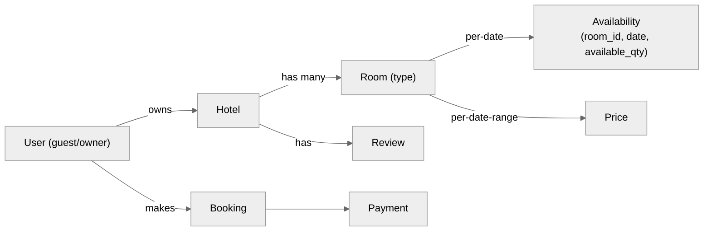

> ⚖️ **Trade-off — "room" as a *type* vs. a *physical unit*:** Most designs model a `Room` row as a **room type** (e.g., "Deluxe King") with a `quantity`, and track `available_quantity` per date, rather than one row per physical room. This is far more compact (a 200-room hotel has ~5 room *types*, not 200 rows) and matches how hotels actually sell ("we have 6 Deluxe Kings left on the 14th"). The cost: you can't assign a *specific* physical room number at booking time — usually fine for hotels, done at check-in. (Airbnb, where each listing is one unique unit, is the degenerate case `quantity = 1`.)

---

## 5. API Design

REST over HTTP. `user_id` comes from the **auth token/header**, never the request body (prevents impersonation). Versioned paths (`/v1/...`).

### 5.1 Owner — create/update property

```
POST /v1/properties
Body: { owner_id, name, location:{city,state,country}, description,
        price, availability:[{start,end}], amenities, images:[url,...] }
→ 201 Created { property_id, created_at }
```

<details>
<summary><strong>📋 Sample request / response</strong></summary>

```http
POST /v1/properties
Authorization: Bearer <owner_jwt>
Content-Type: application/json

{
  "name": "Sunny Yellow Cottage",
  "location": { "city": "Aspen", "state": "CO", "country": "USA" },
  "description": "Cozy 2-bed cottage, mountain view",
  "price": 200,
  "availability": [{ "start": "2026-10-01", "end": "2026-12-31" }],
  "amenities": ["wifi", "parking", "kitchen"],
  "images": ["https://cdn.stay.com/p/abc/1.jpg", "https://cdn.stay.com/p/abc/2.jpg"]
}
```
```json
201 Created
{ "property_id": "prop_8f3a", "created_at": "2026-07-03T10:22:05Z" }
```
</details>

### 5.2 Owner — view bookings

```
GET /v1/owners/{owner_id}/bookings
→ 200 [ { property_id, property_name, booking_id, guest_name,
          check_in, check_out, total_price, status } , ... ]
```

<details>
<summary><strong>📋 Sample request / response</strong></summary>

```http
GET /v1/owners/owner_123/bookings
Authorization: Bearer <owner_jwt>
```
```json
200 OK
[
  { "property_id": "prop_8f3a", "property_name": "Sunny Yellow Cottage",
    "booking_id": "bk_5521", "guest_name": "Bob",
    "check_in": "2026-10-15", "check_out": "2026-10-20",
    "total_price": 1000, "status": "booked" },
  { "property_id": "prop_2c1d", "property_name": "Mountain Hideaway",
    "booking_id": "bk_5522", "guest_name": "Alice",
    "check_in": "2026-11-01", "check_out": "2026-11-03",
    "total_price": 400, "status": "completed" }
]
```
</details>

### 5.3 Guest — search

```
GET /v1/properties/search?city=Aspen&check_in=2026-10-15&check_out=2026-10-20
        &price_min=&price_max=&tags=beachfront,5-star&page=1
→ 200 { results:[ {property_id, name, thumbnail, description, price_per_night, rating} ], next_page }
```

Query params (not a body — it's a GET): **location + date range are mandatory**; name/price/tags optional; **paginated** (a city can match thousands — never return them all at once or latency and payload explode).

<details>
<summary><strong>📋 Sample request / response</strong></summary>

```http
GET /v1/properties/search?city=Aspen&check_in=2026-10-15&check_out=2026-10-20&tags=5-star&page=1
```
```json
200 OK
{
  "results": [
    { "property_id": "prop_2c1d", "name": "Mountain Hideaway",
      "thumbnail": "https://cdn.stay.com/p/2c1d/thumb.jpg",
      "description": "Ski-in ski-out, 5-star", "price_per_night": 200, "rating": 4.8 },
    { "property_id": "prop_8f3a", "name": "Sunny Yellow Cottage",
      "thumbnail": "https://cdn.stay.com/p/8f3a/thumb.jpg",
      "description": "Cozy 2-bed, mountain view", "price_per_night": 150, "rating": 4.6 }
  ],
  "next_page": 2
}
```
</details>

### 5.4 Guest — view property details

```
GET /v1/properties/{property_id}?check_in=...&check_out=...
→ 200 { owner_id, name, location, description, amenities, images:[...],
        rooms:[ {room_id, type, price_per_night_for_dates, available} ] }
```

Dates are passed because **available rooms and per-night price depend on the dates**.

<details>
<summary><strong>📋 Sample request / response</strong></summary>

```http
GET /v1/properties/prop_2c1d?check_in=2026-10-15&check_out=2026-10-20
```
```json
200 OK
{
  "owner_id": "owner_123",
  "name": "Mountain Hideaway",
  "location": "Aspen, CO, USA",
  "description": "Ski-in ski-out chalet, 5-star",
  "amenities": ["wifi", "hot tub", "parking"],
  "images": ["https://cdn.stay.com/p/2c1d/1.jpg", "https://cdn.stay.com/p/2c1d/2.jpg"],
  "rooms": [
    { "room_id": "room_dlx", "type": "Deluxe King", "price_per_night_for_dates": 200, "available": true },
    { "room_id": "room_std", "type": "Standard Queen", "price_per_night_for_dates": 140, "available": false }
  ]
}
```
</details>

### 5.5 Guest — book (three REST steps, two-phase)

```
Step 1  POST /v1/booking-sessions
        Body: { property_id, room_id, guest_id(header), num_guests, check_in, check_out }
        → 200 { session_id, total_price, payment_url }        # creates a RESERVED hold

Step 2  POST {payment_url}         (client → payment gateway)
        Body: { card / PayPal details }
        → 200 { payment_token }                               # proof of payment

Step 3  POST /v1/bookings
        Body: { property_id, room_id, check_in, check_out, num_guests, payment_token }
        → 201 { booking_id, status:"booked" }                 # server verifies token, confirms
```

> 💡 **Why three steps / two phases?** You **reserve** the room first (fast, internal, strongly consistent), then send the guest to an **external payment gateway** (slow, can fail), then **confirm** with the returned `payment_token`. Confirming with a token the server **re-verifies against the gateway** means the client can't forge "I paid." (§7, §16 go deep.)

<details>
<summary><strong>📋 Sample request / response (all three steps)</strong></summary>

```http
# Step 1 — create the reservation hold
POST /v1/booking-sessions
Authorization: Bearer <guest_jwt>
{ "property_id": "prop_2c1d", "room_id": "room_dlx",
  "num_guests": 2, "check_in": "2026-10-15", "check_out": "2026-10-20" }
```
```json
200 OK
{ "session_id": "sess_77", "total_price": 1000,
  "payment_url": "https://pay.gateway.com/checkout/sess_77" }
```
```http
# Step 2 — pay at the gateway (client → gateway)
POST https://pay.gateway.com/checkout/sess_77
{ "card": { "number": "•••• 4242", "exp": "12/28", "cvv": "•••" } }
```
```json
200 OK
{ "payment_token": "pt_9be21" }
```
```http
# Step 3 — confirm the booking with the payment proof
POST /v1/bookings
Authorization: Bearer <guest_jwt>
{ "property_id": "prop_2c1d", "room_id": "room_dlx",
  "check_in": "2026-10-15", "check_out": "2026-10-20",
  "num_guests": 2, "payment_token": "pt_9be21" }
```
```json
201 Created
{ "booking_id": "bk_5521", "status": "booked" }
```
</details>

### 5.6 Guest — view bookings

```
GET /v1/users/{user_id}/bookings
→ 200 [ { booking_id, hotel_id, room_id, check_in, check_out, total_price, status } , ... ]
```

<details>
<summary><strong>📋 Sample request / response</strong></summary>

```http
GET /v1/users/user_777/bookings
Authorization: Bearer <guest_jwt>
```
```json
200 OK
[
  { "booking_id": "bk_5521", "hotel_id": "prop_2c1d", "room_id": "room_dlx",
    "check_in": "2026-10-15", "check_out": "2026-10-20", "total_price": 1000, "status": "booked" },
  { "booking_id": "bk_4410", "hotel_id": "prop_8f3a", "room_id": "room_std",
    "check_in": "2026-05-02", "check_out": "2026-05-04", "total_price": 300, "status": "completed" }
]
```
</details>

### 5.7 Auth (auxiliary — mention, don't over-build)

```
POST /v1/users/register {name,email,password,phone} → 201 {user_id}
POST /v1/users/login {email,password} → 200 {jwt}
+ logout, update-profile
```

---

## 6. High-Level Architecture

Microservices behind an API Gateway + load balancer. The guiding split: **read path (search/view) = AP + cached + Elasticsearch**; **write path (booking) = CP + relational + transactional**. Every box is horizontally scalable.

**Beginner primer on the moving parts.** A **microservice** is one small program responsible for a single job (e.g., the Booking Service only handles bookings); the system is many of these talking to each other, instead of one giant program (a "monolith"). We choose microservices because at ~50M users a single program can't handle the load and a bug in one part would take down everything. A **load balancer** sits in front and spreads incoming requests across many identical copies ("instances") of a service, so no single machine is overwhelmed — commonly round-robin (request 1 → instance A, request 2 → instance B, …). The **API Gateway** is the single front door: it checks *who you are* (validates your login token, the JWT), *whether you're allowed right now* (rate limiting), and then *forwards* the request to the correct service. "**Horizontally scalable**" means when traffic rises you add more machines side-by-side rather than buying one bigger machine — possible here because the services are stateless (they keep no session in local memory; state lives in the databases).

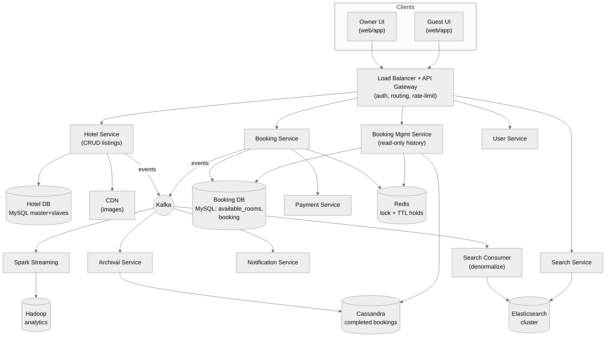

ASCII quick-reference:

```
           ┌─────────────── Load Balancer + API Gateway ───────────────┐
  Owner ───┤                                                            ├─── Guest
           └───┬───────┬───────────┬────────────┬───────────┬──────────┘
           Hotel Svc  Search Svc  Booking Svc  BookingMgmt  User Svc
              │          │            │            │           │
          MySQL(H)     ES ◄─┐     MySQL(B)      MySQL(B)     MySQL(U)
              │  images     │     avail+booking    + Cassandra
             CDN            │        │  Redis(lock/TTL)
              │        Search Consumer│
              └──► Kafka ──┼──────────┤──► Notification Svc
                           │          └──► Archival ──► Cassandra
                           └──► Spark ──► Hadoop (analytics)
```

**Component roles:**

- **Load Balancer + API Gateway** — single entry: authentication (validates JWT → `user_id`), routing by endpoint, rate limiting, round-robin distribution across service instances.
- **User Service** — register/login/update; issues JWT; also the auth checkpoint for downstream calls. Backed by relational **User DB**.
- **Hotel Service** — CRUD source of truth for hotel/room/price data (relational, MySQL master + slaves). Emits an **event to Kafka** on every change so search stays current. Stores images in the **CDN/object store**, keeps only URLs in the DB.
- **Search Service → Elasticsearch** — powers fuzzy + geo + range + tag search. Never queries the booking/hotel DB directly at request time.
- **Booking Service → Booking DB (MySQL) + Redis + Payment** — the **CP heart**: reserves inventory transactionally, holds it via Redis TTL, calls payment, confirms. Emits booking events to Kafka.
- **Booking Management Service** — read-only "my bookings / hotel's bookings" view; reads **live** bookings from MySQL (+ Redis cache) and **archived** ones from Cassandra. Kept separate so heavy read traffic never burdens the write DB.
- **Kafka** — the backbone that fans every change out to consumers (search, notifications, archival, analytics) without dual-writes.
- **Notification / Archival / Analytics** — consumers (see §14, §15, §17).

> ⚖️ **Trade-off — separate MySQL clusters for hotel vs. booking:** You *could* share one cluster with two schemas, but keeping **two independent clusters** lets each scale and fail independently (a booking-write spike doesn't slow hotel reads). Cost: more infra to operate. At this scale the isolation is worth it.

<details>
<summary><strong>🙂 Example — one guest's request tracing through the boxes</strong></summary>

Guest Bob opens the app and types "Aspen." Here's the journey:

1. Bob's phone sends `GET /v1/properties/search?city=Aspen...` → hits the **Load Balancer**, which picks one of many Search Service instances.
2. The request reaches the **API Gateway**, which validates Bob's JWT (confirms he's logged in) and checks he isn't over his rate limit, then routes it to the **Search Service**.
3. Search Service queries **Elasticsearch** (not the hotel DB), gets ~100 matching hotel IDs back in a few milliseconds, enriches them, and returns a paginated list.
4. Bob taps "Mountain Hideaway" → a new request `GET /v1/properties/prop_2c1d` is routed to the **Hotel Service**, which reads details from **MySQL** and returns image **URLs**; Bob's browser downloads the actual images from the nearest **CDN** edge.
5. Bob clicks Book → `POST /v1/booking-sessions` is routed to the **Booking Service** — the only service that changes booking state — which runs the reservation transaction (§7, §11).

Notice each of Bob's three actions took a **different path to a different datastore**: search → Elasticsearch, view → Hotel MySQL + CDN, book → Booking MySQL. That separation (read path vs. write path) is the whole point of the architecture.
</details>

---

## 7. The Booking Flow (two-phase: reserve → pay → confirm)

Booking is **not** one atomic click — it's a two-phase process because payment is external and slow. The seat/room states form a small machine:

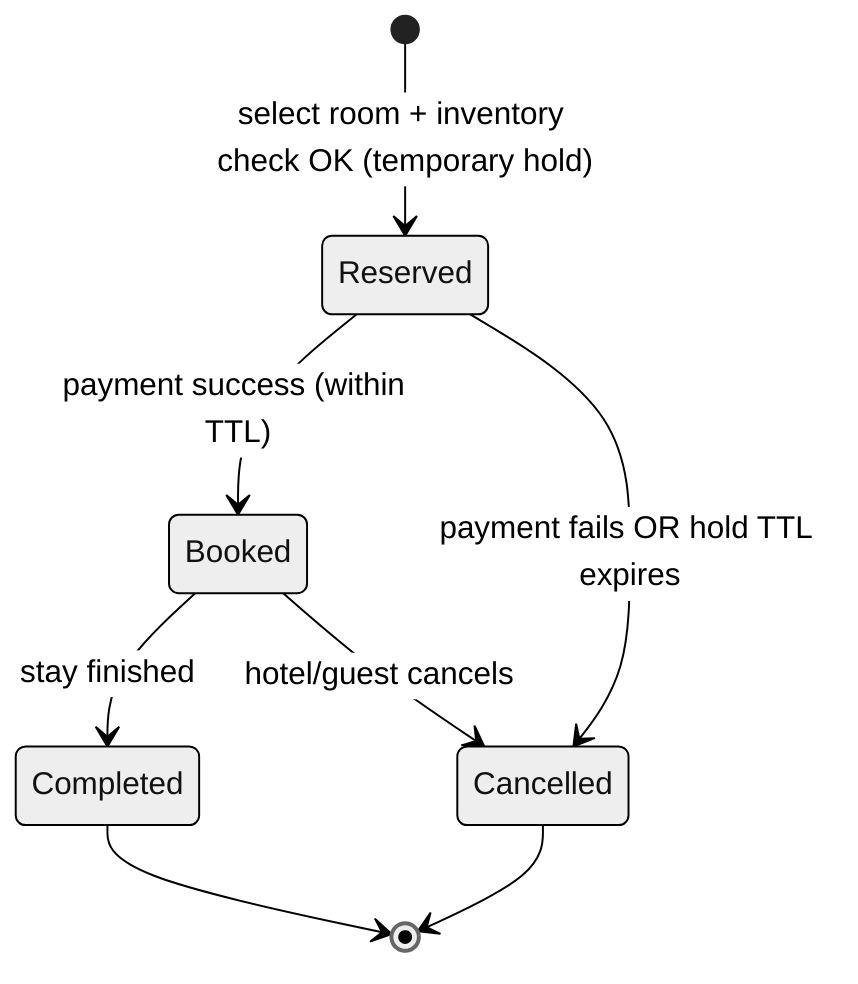

| Status | Meaning | Terminal? |
|---|---|---|
| **reserved** | Temporarily held while guest pays (Redis TTL, e.g. 5 min) | no |
| **booked** | Payment succeeded; reservation confirmed | no |
| **completed** | Stay finished | yes |
| **cancelled** | Payment failed / hold expired / cancelled | yes |

End-to-end happy path with the failure branches:

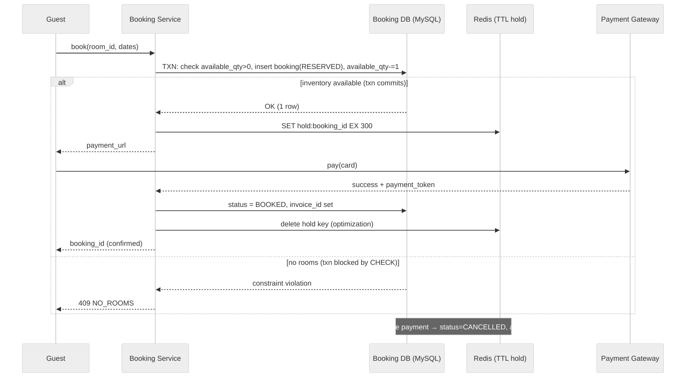

**What the DB actually does at each step (beginner view).** When the guest clicks Book, the Booking Service opens a **transaction** — a bundle of database operations that must all succeed together or all be undone (explained in depth in §11). Inside it: (1) it **reads** `available_rooms` for that room+dates to confirm a room is free, (2) **decrements** `available_quantity` by one, and (3) **inserts** a new `booking` row with `status = reserved`. If any step fails, the whole bundle rolls back and the room is never half-booked. Then a Redis key `hold:booking_id` is created with a 5-minute timer (TTL) so the room is held while the guest pays but auto-freed if they vanish. On payment success the booking row is **updated** to `status = booked`; on failure or timeout it's updated to `cancelled` and the `available_quantity` is **incremented** back.

The three hard questions this raises, each with its own deep dive:

1. **How is availability stored so both search and booking are fast + correct?** → §9.
2. **What stops two users booking the last room at the same instant?** → §11 (the MySQL transaction + CHECK-constraint trick).
3. **How does an abandoned hold auto-free the room?** → §12 (Redis TTL + callbacks).

<details>
<summary><strong>🎬 Example (2 users) — the happy path and the loser, minute by minute</strong></summary>

Room type "Deluxe" has `available_quantity = 1` on Oct 15. Guest A and Guest B both want it.

| Time | Guest A | Guest B | `available_quantity` | Result |
|---|---|---|---|---|
| 10:00:00 | clicks Book → txn decrements 1→0, inserts booking(RESERVED) | — | 0 | A holds it (Redis `hold:A` TTL 5m) |
| 10:00:02 | (on payment page) | clicks Book → txn tries 0→-1 | 0 | **CHECK fails → B gets `409 NO_ROOMS`** |
| 10:03:00 | pays → booking A → BOOKED | picks a different hotel | 0 | A confirmed |

Now the *abandon* variant: if A never pays, at 10:05:00 the Redis TTL fires, A's booking flips to `CANCELLED`, and `available_quantity` goes 0→1 — so the room is bookable again. B (if still looking) could now succeed.
</details>

---

## 8. Data Model / Schema

Relational source of truth (writes are tiny, and we need ACID). Each service owns a separate logical DB. Legend: **`PK`** = primary key, **`FK`** = foreign key, **`UQ`** = unique, `»` = index.

### 8.1 User DB (MySQL)

```sql
users
├─ user_id         PK
├─ name
├─ email           UQ
├─ password_hash
├─ phone
└─ created_at
```

### 8.2 Hotel DB (MySQL — relational, master + slaves)

```sql
localities
├─ locality_id     PK
├─ name
├─ city, state, country
└─ geo_lat, geo_lng

hotels
├─ hotel_id        PK
├─ name
├─ locality_id     FK → localities
├─ description
├─ geo_lat, geo_lng
├─ original_images        -- owner's raw upload (URLs)
├─ display_images         -- compressed / CDN version (URLs)
└─ is_active              -- soft-delete flag

rooms
├─ room_id         PK
├─ hotel_id        FK → hotels
├─ display_name
├─ room_type              -- e.g. Deluxe King, Standard Queen
├─ capacity
├─ quantity               -- how many identical rooms of this type
├─ price_min, price_max   -- dynamic-pricing bounds
└─ is_active

prices                    -- price varies by date range
├─ hotel_id        FK → hotels
├─ room_id         FK → rooms
├─ price, currency
└─ start_date, end_date

facilities
├─ facility_id     PK
└─ name

hotel_facilities   (hotel_id FK, facility_id FK)   -- many-to-many
room_facilities    (room_id  FK, facility_id FK)   -- many-to-many
```

**Indexes & notes:** `» hotels(locality_id)` and `» hotels(geo_lat, geo_lng)`; `» rooms(hotel_id)`. `original_images` vs `display_images` keeps both the owner's upload **and** a compressed/CDN copy. `is_active` is a soft-delete flag used everywhere.

### 8.3 Booking DB (MySQL — the CP core)

```sql
available_rooms
├─ room_id                            ┐ PK (room_id, date)
├─ date                               ┘
├─ initial_quantity
└─ available_quantity   CHECK (available_quantity >= 0)   -- ⭐ anti-oversell guard

booking
├─ booking_id      PK                 -- UUID, referenced system-wide
├─ room_id         FK → rooms
├─ user_id         FK → users
├─ start_date, end_date
├─ number_of_rooms
├─ status                             -- reserved | booked | cancelled | completed
├─ invoice_id                         -- NULL until payment success
└─ created_at, updated_at
```

**Indexes & notes:** `» booking(user_id)` (guest history) and query owner history via a hotel join. The `available_quantity >= 0` **CHECK** constraint is the linchpin of no-double-booking (§11).

### 8.4 Payment DB (MySQL)

```sql
payments
├─ payment_id      PK
├─ user_id         FK → users
├─ booking_id      FK → booking
├─ amount, currency
├─ date
├─ token                              -- gateway proof-of-payment
└─ status
```

### 8.5 Archive & blobs

- **Completed bookings → Cassandra (archive):** stored **twice**, partitioned by the two query keys — **by `user_id`** (guest history) and **by `hotel_id`** (owner history) — because Cassandra only queries by partition key (§15).
- **Images → object store (S3) + CDN:** binaries live in S3; only their **URLs** are stored in the relational rows above.

> ⚖️ **Trade-off — why MySQL, not NoSQL, for the source of truth:** writes are ~4 TPS (§3), so we don't need NoSQL's write throughput; we *do* need **ACID transactions + CHECK constraints** to make no-double-booking trivial. Cassandra is used only for **archived, read-mostly** completed bookings where volume is huge and queries are simple GETs by a known key.

---

## 9. Deep Dive — Storing Room Availability (per-day vs date-range)

Availability is the trickiest data-modeling decision, because it must serve **two very different queries**: "is this room free for these dates?" (booking, must be exact + transactional) and "which hotels have any room free in this city for these dates?" (search, must be fast). There are two schema approaches.

### Approach A — one row per (room, date) [per-day]

```
available_rooms(room_id, date, available_quantity)
   room_101, 2026-10-14, 3
   room_101, 2026-10-15, 3
   room_101, 2026-10-16, 2
   ...one row for every day...
```

- 👍 **Dead simple + extremely search/booking friendly.** "Is room free on the 15th?" is a point lookup; decrementing on booking is a single-row update; the CHECK constraint guards each date independently.
- 👎 **Huge row count.** A 300-room hotel × 365 days = ~109,500 rows/hotel; × 1M hotels = enormous. But rows are tiny and it's the approach that makes the concurrency solution (§11) clean — most designs accept the volume.

### Approach B — one row per (room, date-range) [interval]

```
availability(room_id, start_date, end_date, status)
   room_101, 2026-01-01, 2026-03-31, available   -- one row covers a whole range
```

- 👍 **Far less data** — a single row can cover months.
- 👎 **Painful to mutate.** When a guest books 3 nights in the middle of an available range, you must **split** that row into (before), (booked), (after) — a read-modify-write with careful interval math on every booking. Higher code complexity and more conflict surface.

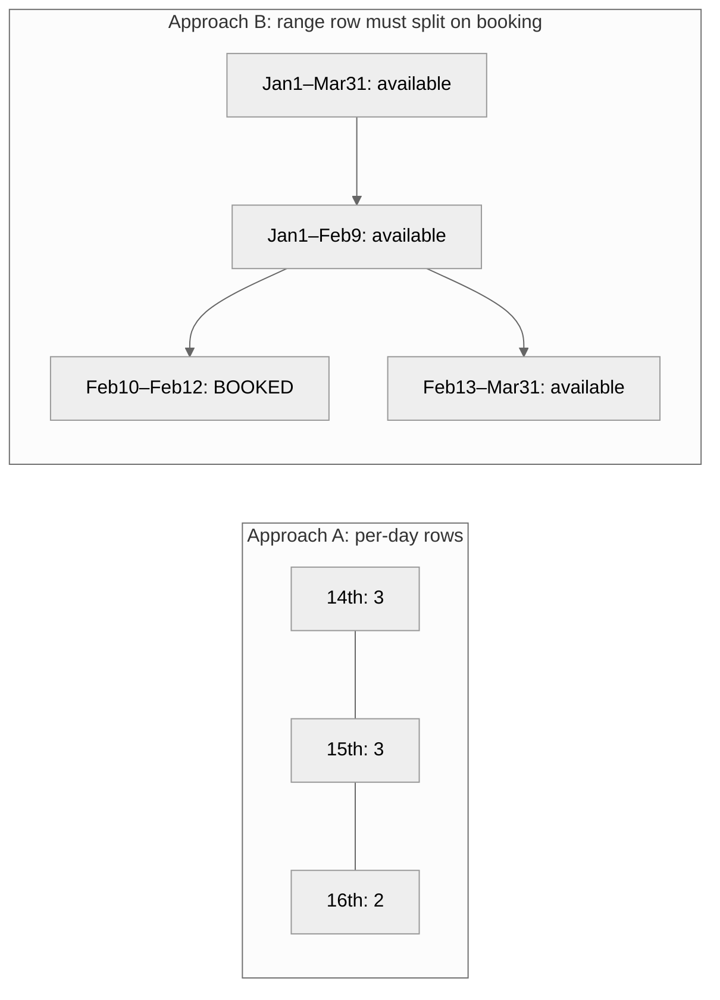

> ⚖️ **Verdict:** **Per-day rows (A)** for correctness + simple concurrency, accepting the storage (rows are small and SQL handles the volume at ~4 TPS writes). Use **date-range (B)** only if storage is the binding constraint and you're willing to own the interval-splitting logic. Say both to the interviewer and justify A.

<details>
<summary><strong>🎬 Example (2 users) — why per-day + a quantity column is enough</strong></summary>

Room type "Deluxe" has `available_quantity = 1` on the 15th. Guest A and Guest B both want the 15th. Because the count lives in **one row keyed by `(room_id, date)`**, the database serializes the two decrements — the first commits (`1 → 0`), the second hits the `>= 0` CHECK and fails. No separate lock table, no scan; the row *is* the coordination point. A multi-night stay (say the 15th–17th) simply touches **three rows** (one per night) inside the same transaction — if any single night is full, the whole transaction rolls back and the guest is told those dates aren't fully available. (§11 shows the exact transaction.)
</details>

---

## 10. Deep Dive — Search (Elasticsearch, proximity, denormalization)

Search is the highest-traffic read path and the one interviewers push hardest on. A guest searches by **location + dates**, optionally **name**, **price range**, and **tags** (5-star, beachfront), and expects **fuzzy** matching (typos like "Montaine view" should still work).

### 10.1 Why not just query the relational DB?

Running search directly on the hotel DB means multi-table joins (hotel × room × price × availability) plus `LIKE '%...%'` scans — slow, and it loads the write-critical store. Worse, SQL can't do fuzzy/typo-tolerant text or efficient geo-radius search. So search gets its own engine: **Elasticsearch** (built on Lucene; **Solr** is an equivalent alternative — choose per your company's infra).

Elasticsearch gives us, out of the box: an **inverted index** (word → matching hotel IDs) for instant text search, **fuzzy search** (typo tolerance / similarity), **range queries** (date range, price range), **filters** (tags), and **geo queries** (hotels within N km of a point).

*Beginner note — what's an "inverted index"?* A normal DB asked "find hotels whose name contains 'beach'" must scan every row and check — slow, and slower as data grows. An inverted index is built the other way around: ahead of time it maps **each word → the list of hotels containing it** (`"beach" → [h12, h88, ...]`), so a search jumps straight to that word's list with no scan. **Fuzzy search** extends this to near-matches, so "Banglore" still finds "Bangalore" hotels. This is why search goes to Elasticsearch, not the relational DB.

### 10.2 How ES stays in sync — Kafka ingestion + denormalization

The app writes **once** to the hotel DB; every change is emitted as an **event to Kafka**; a **search consumer** reads it and updates Elasticsearch. This avoids fragile dual-writes.

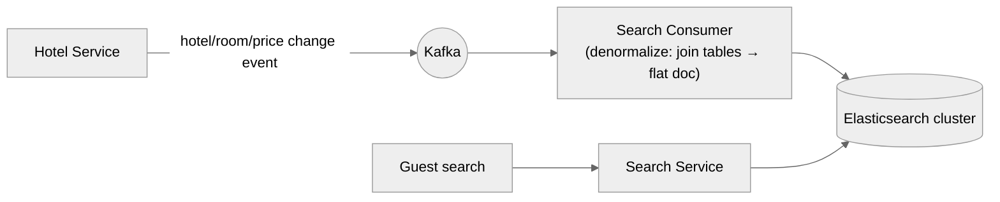

**The denormalization problem (T2's key insight).** In earlier/simpler systems the source was a single flat table (Cassandra/Mongo), so CDC → ES was trivial. Here the data is **normalized and relational** (hotel, rooms, prices, availability spread across tables). Elasticsearch wants a **flat document** per hotel. So the search consumer must **denormalize**: join the related rows and produce one flattened doc before indexing.

### 10.3 Two approaches to feed Elasticsearch (both from T2)

**Approach 1 — index everything (fully denormalized).** The consumer joins hotel + rooms + prices + availability into one big doc and indexes it.

- 👍 One query answers everything.
- 👎 ES bloats with data it rarely needs for a text/location search (all rooms, all per-date prices, all availability) — heavy and wasteful.

**Approach 2 — two-phase search (recommended by T2).** Index **only the hotel table** in ES (name, geo, tags — everything you *search by*). ES returns a **handful of matching hotel IDs**; the **search service** then joins **price + room + availability** for just those IDs — and to make that join fast, keep those hot tables in a **Redis cache**.

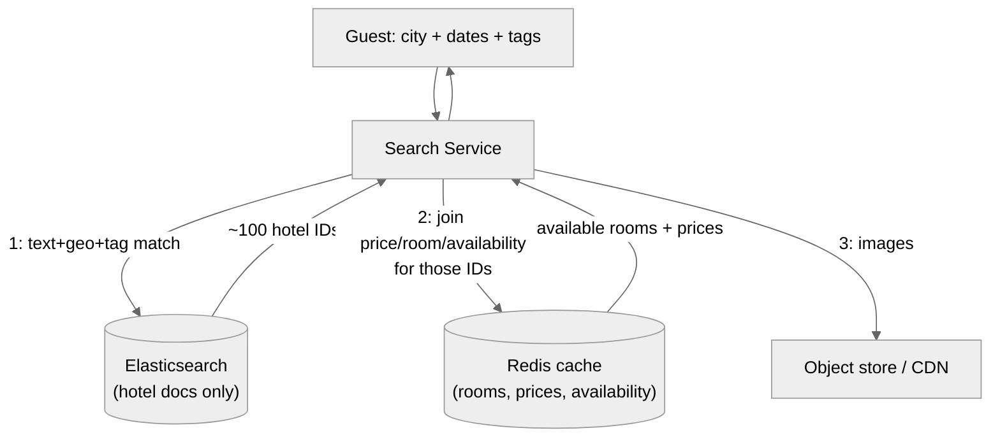

- 👍 ES stays lean and fast; the expensive relational join runs only on the ~100 hotels that matched, served from cache.
- 👎 Two hops (ES then cache/DB join) — but each is cheap, and the second runs on a tiny result set.

<details>
<summary><strong>🙂 Example (1 user) — a full two-phase search</strong></summary>

A guest searches "hotels in Bangalore, Oct 15–20, beachfront." Step 1: ES matches the text "Bangalore" + geo + the `beachfront` tag over **only** hotel docs, returning ~100 hotel IDs in a few ms (fuzzy, so "Banglore" still works). Step 2: the search service takes those 100 IDs and joins `rooms`/`prices`/`availability` from the Redis cache to find which have a free room on those dates and at what price. Step 3: it attaches image URLs from the CDN and returns a paginated page. The booking DB was never touched — so even during a booking surge, search stays fast and available.
</details>

### 10.4 Proximity search — four options, and why Elasticsearch wins here (T2)

"Hotels near this location" is a **proximity/geo** query. Four standard ways to implement it:

| Option | What it is | Text search? | Extra space/infra? | Fit here |
|---|---|---|---|---|
| **Elasticsearch geo** | Built-in geo_distance / geo_radius on a geospatial index (internally uses geohashing) | ✅ Yes | Already have ES | ⭐ **Chosen** |
| **Quadtree** | In-memory tree recursively splitting the map into 4 quadrants down to ~200–500 m cells; query the cell + 8 neighbors | ❌ No | Must build/hold the tree in a cache from all hotel geos (lots of RAM) | Great for taxi/Uber-style dynamic points, overkill here |
| **Postgres + PostGIS (GIS extension)** | Geo indexing inside Postgres | ❌ No | No extra structure | Good for pure geo, but no text |
| **Geohash** | Encode lat/lng into a short string prefix; nearby points share prefixes (more efficient than a quadtree) | ❌ No | Modest | Good for pure geo, but no text |

> ⚖️ **Why Elasticsearch, decisively (T2):** this use case needs **both text search (by hotel name) and geo search (by location) in one query**. Quadtree, PostGIS, and geohash are all **geo-only** — none supports fuzzy text. Since hotel geolocation is **static** (a hotel never moves), a quadtree's dynamic-point strength is wasted, and its in-memory footprint (millions of hotels in a cache) is pure overhead. ES already does geo (via geohashing internally) **and** text, so it's the single tool that covers both. Don't reach for a quadtree just to show you know it — match the tool to the requirement.

---

## 11. Deep Dive — Concurrency Control (the no-double-booking problem)

The invariant: **two users must never book the same room for overlapping dates.** This is the CP heart of the system. The transcripts present a full ladder of approaches — here are **all** of them, weakest to strongest.

**The problem in plain words.** Booking a room isn't a single instant action — it's a little sequence of database steps: (1) **read** "is a room free?", (2) **decide** "yes, give it to this guest", (3) **write** "one fewer room now, and here's the booking." The danger is that two guests run this sequence at *almost the same moment*. If Guest A reads "1 free" and Guest B *also* reads "1 free" **before either has written**, both think they won, both write a booking, and the room is **sold twice** — a real person shows up to no bed. This is called a **race condition**: the outcome depends on the exact interleaving of two near-simultaneous operations. The entire job of this section is to make sure that once one guest starts booking the last room, no other guest can also succeed.

**The core idea of every solution below.** Turn the unsafe *read-then-write* (two separate steps a competitor can slip between) into a *single indivisible step* the database enforces — either by **locking** (make others wait), by **checking a version/conflict at commit** (optimistic), or best of all by letting a **`CHECK (available_quantity >= 0)` constraint inside one transaction** reject the loser automatically. We'll build up to that.

### 11.1 The race, concretely

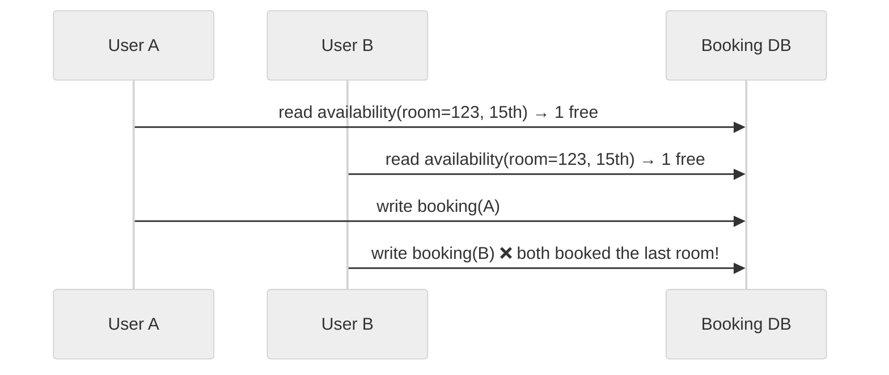

### 11.2 Approach 1 — Pessimistic locking (T1, T2, T3)

Lock the room (or the DB row) **before** touching it: when a booking starts, the row is locked so **no other booking request can proceed** until the first fully commits and releases. Bob books room P1 for Oct 15–20 at T1; the row is locked; Smith's request at T1+Δ is **blocked**; when Bob commits, Smith proceeds, sees it's taken, and is rejected.

*In SQL terms* this is usually `SELECT ... FOR UPDATE`, which reads a row **and** locks it in one step, so any other transaction touching that row must wait until you `COMMIT`. "Pessimistic" = it *assumes* a conflict will happen and pays the cost of locking up front to be safe.

- 👍 Simple, guarantees correctness.
- 👎 In a high-traffic system every request serializes on the lock → significant delay; **theoretically great, not scalable** for hot rows. Also risks **deadlocks** (two transactions each holding a row the other wants, waiting forever) if done carelessly.

### 11.3 Approach 2 — Optimistic locking (T1, T3)

Don't lock up front. Let concurrent bookings proceed, but **just before committing, check for a conflict**; if another booking already took those dates, **reject and ask the user to retry**. Non-conflicting requests (different rooms/dates — the vast majority) never wait.

*How the check works in SQL:* add a `version` number (or reuse `available_quantity`) to the row. You read it, and at write time do `UPDATE ... SET available_quantity = available_quantity - 1, version = version + 1 WHERE room_id=:r AND date=:d AND version = :version_you_read`. If someone else changed the row meanwhile, the `version` no longer matches, the `UPDATE` affects **0 rows**, and you know you lost → reject and retry. "Optimistic" = it *assumes* conflicts are rare and only checks at the end, avoiding locks.

- 👍 High throughput; no unnecessary waiting; great when conflicts are **rare** — which, per the scale insight (§1), they are ("1 room, 2–3 racers").
- 👎 On the rare hot row, losers must retry.

<details>
<summary><strong>🎬 Example (2 users) — optimistic locking with a version check</strong></summary>

Row: `room=5, date=dt, available_quantity=1, version=42`. Both guests read it and see `version=42`.

- Guest A: `UPDATE ... SET available_quantity=0, version=43 WHERE room=5 AND date=dt AND version=42` → **1 row updated** → A wins.
- Guest B (a moment later): `UPDATE ... WHERE ... version=42` → but version is now **43**, so **0 rows updated** → B detects the conflict, does *not* book, and is asked to retry (where it'll now see 0 rooms). No lock was ever held; the mismatch did the job.
</details>

### 11.4 Approach 3 — MySQL transaction + `available_quantity >= 0` CHECK constraint (T4) ⭐

This is the cleanest, and it leans on the database instead of application locks. Keep `available_rooms(room_id, date, available_quantity CHECK(available_quantity >= 0))`. Booking runs as **one transaction** that (a) inserts the booking row and (b) decrements `available_quantity`. If two transactions race for the last room, **only one can commit** — the other violates the `>= 0` CHECK and is rejected by MySQL itself.

**What is a "transaction"? (beginner explanation.)** A transaction is a group of database operations wrapped in `BEGIN ... COMMIT` that the database treats as **one indivisible unit** — either **all** of them take effect, or **none** do. Databases guarantee this with the **ACID** properties:

- **A — Atomicity:** all steps happen or none do. If the `INSERT` fails after the `UPDATE`, the `UPDATE` is undone (rolled back). You never end up with "room decremented but no booking recorded."
- **C — Consistency:** the DB moves from one valid state to another, and **constraints like our `CHECK (available_quantity >= 0)` are enforced** — a transaction that would break a rule is aborted.
- **I — Isolation:** concurrent transactions don't see each other's half-finished work; the DB makes them behave *as if* they ran one after another. This is what stops the two guests from both reading "1 free" simultaneously — the DB serializes the conflicting row updates.
- **D — Durability:** once `COMMIT` returns, the data survives crashes (it's on disk).

**Why this kills the race.** The two dangerous steps (check + decrement) become the single statement `UPDATE ... SET available_quantity = available_quantity - 1`. The database applies this to a row **one writer at a time** (Isolation), and the `CHECK` constraint (Consistency) refuses to let the count drop below zero. So the *check* and the *decrement* are fused into one atomic operation the loser cannot slip past — the exact fix the plain-words summary promised.

```sql
BEGIN;
  UPDATE available_rooms
     SET available_quantity = available_quantity - 1
   WHERE room_id = :r AND date = :d;           -- fails the CHECK if it would go negative
  INSERT INTO booking(booking_id, room_id, user_id, start_date, end_date,
                      number_of_rooms, status)
       VALUES (:uuid, :r, :u, :ci, :co, 1, 'reserved');
COMMIT;   -- both succeed together, or neither does
```

**Reading the SQL line by line (beginner):** `BEGIN` opens the unit of work. The `UPDATE` both *checks and decrements* in one shot — MySQL evaluates the new value against the `CHECK` and, if it would be negative, **aborts the whole transaction** (so the `INSERT` never happens). The `INSERT` records the booking as `reserved`. `COMMIT` makes both permanent together. If anything fails, an automatic **ROLLBACK** leaves the database exactly as it was.

- 👍 **No application-level lock, no lock table.** ACID + the CHECK constraint give atomicity and the anti-oversell guard for free. Only one of N racing transactions commits; **no two users are even redirected to payment** for the last room.
- 👎 Ties you to a DB with real transactions/constraints (MySQL/Postgres) — which is exactly why we chose relational (§8).

<details>
<summary><strong>🎬 Example (2 users) — the last room, step by step in the database</strong></summary>

Room 5 on date `dt` currently has `available_quantity = 1`. Guest A and Guest B tap Book within the same millisecond; their requests land on two different Booking Service instances, both opening a transaction against the **same** row.

| Step | Guest A's transaction | Guest B's transaction | Row value |
|---|---|---|---|
| 1 | `BEGIN` | `BEGIN` | `1` |
| 2 | `UPDATE ... -1` → acquires the row, computes `1→0`, passes CHECK | (waits — Isolation makes B queue on the locked row) | `0` (uncommitted) |
| 3 | `INSERT booking(A, reserved)` | still waiting | — |
| 4 | `COMMIT` ✅ — row is now `0`, lock released | now proceeds: `UPDATE ... -1` computes `0→-1` | `0` |
| 5 | done — A holds the room | **CHECK (>= 0) violated → transaction ABORTS** → app returns `409 NO_ROOMS` | `0` |

**Key insight:** the database's Isolation made B *wait* for A instead of reading a stale "1 free", and the CHECK constraint rejected B's decrement automatically. No lock table, no application code — the single row is the coordination point.

Contrast with plenty of inventory (`available_quantity = 7`): A commits `7→6`, B commits `6→5`, both succeed — two *different* physical rooms sold, exactly right. The mechanism only blocks the genuine last-room conflict.
</details>

<details>
<summary><strong>🎬 Example (2 users) — a multi-night stay that partially conflicts</strong></summary>

Guest A wants Oct 15–17 (nights of the 15th and 16th). Guest B already booked the 16th. A's transaction touches **both** night-rows in `available_rooms`:

```
UPDATE available_rooms SET available_quantity = available_quantity - 1 WHERE room_id=5 AND date='2026-10-15';  -- 2 → 1 ok
UPDATE available_rooms SET available_quantity = available_quantity - 1 WHERE room_id=5 AND date='2026-10-16';  -- 0 → -1 CHECK fails!
```

Because it's **one transaction**, the failure on the 16th **rolls back the 15th's decrement too** (Atomicity) — A is cleanly told "those dates aren't fully available," and the 15th's inventory is *not* wrongly consumed. Without a transaction, A might have grabbed the 15th and then failed on the 16th, silently leaking a room.
</details>

### 11.5 Approach 4 — Redis distributed lock to hold the room during payment (T2)

Even after the inventory check, the room must be **held** while the guest pays (payment takes minutes). Use a **Redis lock** keyed by room+dates with a ~5-minute window so no one else can book it mid-payment. (This pairs with the TTL auto-release in §12.) T2 notes this is the same mechanism as the ticket-booking design.

### 11.6 Approach 5 — client + API hardening against *self* double-submits (T3)

A single user can accidentally double-book by clicking twice. Two guards: **disable the button** after the first click (front-end), and make the booking API **idempotent** (back-end) — the same request retried returns the **same** response instead of creating a second booking.

### 11.7 The "single writer" rule for availability (T2)

Only **one service — the availability service — is allowed to write the availability table.** Every other path (booking confirm, cancellation, expiry) goes *through* it (via Kafka events). Centralizing writes to the hot table removes a whole class of consistency bugs from multiple services racing to update it.

> ⚖️ **Verdict:** combine them — **MySQL transaction + CHECK constraint (3)** as the correctness backbone, **Redis TTL hold (4/§12)** to reserve during payment, **optimistic (2)** mindset because conflicts are rare at this scale, and **idempotency + disabled button (5)** to kill self-double-submits. Reserve pure **pessimistic (1)** for teaching/simple cases — it doesn't scale for hot rows.

---

## 12. Deep Dive — Reservation Expiry (Redis TTL + callbacks)

A `reserved` booking must **auto-cancel** if the guest never pays, returning the room to inventory. The room can't be held forever.

*Beginner note — Redis and TTL.* **Redis** is a very fast in-memory key→value store (data lives in RAM, so reads/writes take well under a millisecond). A **TTL** ("time to live") is an expiry timer you attach to a key: `SET hold:bID EX 300` means "keep this key for exactly 300 seconds, then delete it automatically." The beauty is that **no code, cron job, or scan is needed to free the room** — Redis deletes the key on its own when the timer runs out. We only need to react to that deletion, which Redis can tell us via an **expiry callback** (a notification fired when a key expires).

### 12.1 The mechanism (T4)

On reserve, write a key to Redis: `hold:booking_id` with a **TTL** (e.g., `EX 300` = 5 minutes; can be per-country — 5 min India, 4 min US). Redis has **key-expiry callbacks** (notifications): when the key expires, your service is notified and acts.

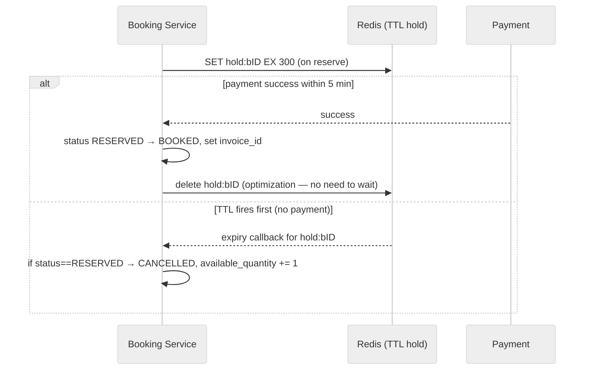

### 12.2 All the edge cases (T4 covers each — none skipped)

- **Payment success:** status `RESERVED → BOOKED`, set `invoice_id`, emit Kafka event. Optimization: **evict the Redis key immediately** rather than waiting for TTL.
- **Payment failure:** status → `CANCELLED`, **increment** `available_quantity` back, no invoice. Optimization: delete the key now.
- **TTL expiry before payment:** callback fires → **only if still `RESERVED`** → `CANCELLED` + `available_quantity += 1`.
- **Both happen — key expiry *and* payment success:** two sub-cases. (a) If payment already moved it to `BOOKED`, the later expiry callback **does nothing** (guard on status). (b) If expiry cancelled it first, then payment success arrives — either **refund** the payment, or, smarter, **re-check availability and book it** if a room is still free. Decide with the interviewer.

### 12.3 The TTL-precision trade-off (T4)

Redis TTL callbacks are **not precise** — a key set to expire at 10:00 might fire at 10:01, because Redis expires keys lazily via a background process, not on the exact tick. For hotel booking that imprecision is harmless (a room freed a minute late is fine). If you *needed* precision, the alternative is a **Redis queue + a poller** that checks the top of the queue every second and expires due entries — precise, but it **continuously hammers Redis** (CPU on both the cron side and Redis side, more nodes needed). **Verdict: TTL callbacks**, since precision doesn't matter here; note the poller as the precise-but-costly alternative.

<details>
<summary><strong>🙂 Example (1 user) — Guest A abandons the payment page</strong></summary>

- **10:00:00** — A reserves room 5 (Oct 15). Booking row → `RESERVED`; `available_quantity` 1→0; Redis `SET hold:bA EX 300`.
- **10:00:00–10:05:00** — A gets distracted; no payment arrives.
- **~10:05:00** — the Redis key `hold:bA` expires; Redis fires an **expiry callback**.
- The Booking Service sees the callback, checks the booking is **still `RESERVED`** (guard!), so it sets status → `CANCELLED` and bumps `available_quantity` 0→1.
- The room is bookable again — no cron job scanned anything; the passage of time did the work.

*Contrast:* had A paid at 10:03, the status would already be `BOOKED`; when the (now redundant) expiry callback fires at 10:05, the status guard means it **does nothing** — no accidental cancellation of a paid booking.
</details>

---

## 13. Deep Dive — Image Upload & CDN (pre-signed URLs)

Property images are large binaries — never route them through your app servers. Use **pre-signed URLs** (T1).

*Beginner note.* An **object store** (like Amazon S3) is a service built to hold files (blobs) cheaply and durably; a **CDN** (content delivery network) keeps copies of those files at "edge" locations around the world so a user downloads from a nearby server (fast) instead of the origin (far, slow). A **pre-signed URL** is a special, time-limited link the server generates that grants the holder permission to upload one file **directly** to the object store — so the large image bytes go straight from the owner's device to S3, and your app servers never have to receive, buffer, or forward gigabytes of image data (which would waste their bandwidth and CPU). The app only ever stores the resulting **URL string** in the database.

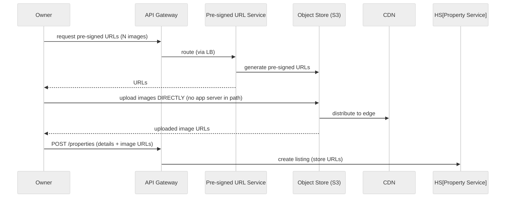

Flow: the owner asks for **pre-signed URLs** (special time-limited links granting permission to upload straight to the object store); the pre-signed URL service generates them against S3; the owner uploads **directly** to S3 (no server in the middle); S3 pushes copies to the **CDN** for global low-latency reads; the returned **image URLs** are then included in the `POST /properties` publish call and stored in the DB. On the read side, the guest's browser fetches image URLs from the property details and downloads the actual images from the **nearest CDN edge**. Keep both `original_images` (owner's upload) and `display_images` (compressed/CDN version) in the schema (T4).

---

## 14. Deep Dive — Event-Driven Updates (Kafka fan-out)

Whenever something changes (new hotel, new room, a booking), **many** systems must react. Doing that with synchronous calls couples everything and risks partial failure (update booking DB succeeds, update availability fails → inconsistency). Instead, the writer emits **one event to Kafka**, and independent **consumers** each react.

*Beginner note — what's Kafka and a "producer/consumer/event"?* **Kafka** is a durable message log: a **producer** appends a small message (an "**event**", e.g. `{type: booking_confirmed, booking_id, hotel_id, dates}`) to a **topic**, and one or more **consumers** read those messages, each at its own pace. The producer doesn't call the consumers directly or wait for them — it just publishes once and moves on. This is "**asynchronous**": the booking finishes immediately, and the notification/search/analytics work happens shortly after, in the background. Because Kafka stores events durably, a consumer that was down can **replay** what it missed when it comes back.

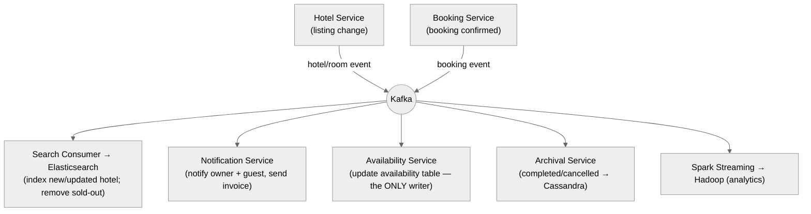

Concretely, on a **confirmed booking** the booking service drops one event; consumers then: **notification service** emails owner + guest (with invoice); **availability service** decrements/blocks the booked dates (and it alone writes that table — §11.7); **search consumer** updates Elasticsearch so a now-sold-out hotel stops appearing for those dates; **archival service** moves terminal bookings to Cassandra; **Spark** streams everything to Hadoop for analytics. This is how the system stays consistent **without** a distributed two-phase commit across services.

> ⚖️ **Trade-off — event-driven vs. synchronous updates:** Kafka gives loose coupling, natural retries/replay, and independent scaling of each consumer, at the cost of **eventual consistency** (search may reflect a booking a second late — acceptable, it's the AP side) and operational complexity. Alternatives (RabbitMQ, ActiveMQ, AWS SQS) work, but Kafka scales best for this fan-out (T4).

---

## 15. Deep Dive — Archival & Read/Write Split (MySQL + Cassandra)

Bookings pile up forever, but **live** bookings (future/active) are few; **completed/cancelled** ones are the vast, read-mostly majority. Storing everything in the write MySQL would eventually hit its limits (T3's math: 4 TPS × 10⁵ s/day × 100 days ≈ **4 × 10⁷ bookings** — and it keeps growing).

**The split (T3, T4):**

- **Write path / live data → MySQL.** Only bookings in non-terminal states (`reserved`, `booked`) live here → small, fast, transactional.
- **Archival service** moves bookings that reach a **terminal** state (`completed`/`cancelled`) from MySQL → **Cassandra**.
- **Read path / history → Booking Management Service**, which reads **live** bookings from MySQL (fronted by a **Redis write-through cache**) and **archived** ones from Cassandra. Keeping history reads off the write DB protects booking latency.

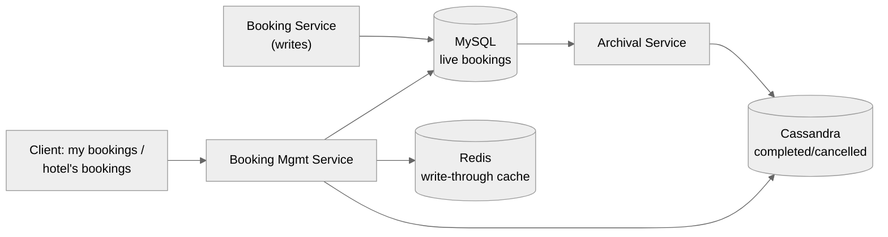

*Beginner note — "write-through cache" and "partition key".* A **write-through cache** means every time you write data, you update the cache **and** the database together, so the cache is always fresh (never serves stale bookings). A **partition key** is the field Cassandra uses to decide **which machine** stores a row; Cassandra is fast **only** when you query by that key (it goes straight to the right machine) and is bad at queries on other fields (it would have to ask every machine). That's the core constraint below.

**Why Cassandra, and its constraint (T4):** Cassandra handles huge read/write volume, but **every query must hit a partition key** — you can't run arbitrary queries. Our history queries are only two shapes: **by `user_id`** (guest's bookings) and **by `hotel_id`** (owner's bookings). So we store the archived data partitioned by **both** keys. That's why Cassandra is *not* the source of truth (which needs varied queries + transactions) but is perfect for archived GET-by-key history. Alternative: **HBase** works too, but Cassandra has less operational overhead.

<details>
<summary><strong>🙂 Example (1 user) — a guest opens "My bookings"</strong></summary>

Guest A taps "My bookings." The request goes to the **Booking Management Service** (not the write Booking Service). It: (1) checks the **Redis cache** for `bookings:userA` — hit → return instantly; (2) on a miss, reads **live** bookings from MySQL (A's upcoming trips) **and** **archived** ones from Cassandra (partitioned by `user_id`, so it's a single-machine lookup), merges them, caches the result, and returns. The heavy write MySQL that's busy taking new bookings is never touched by this read — history browsing can't slow down booking.
</details>

---

## 16. Deep Dive — Payment Integration

Payment is **external, slow, and can fail** — the whole reason booking is two-phase. The booking service never holds a DB row lock across the payment round-trip.

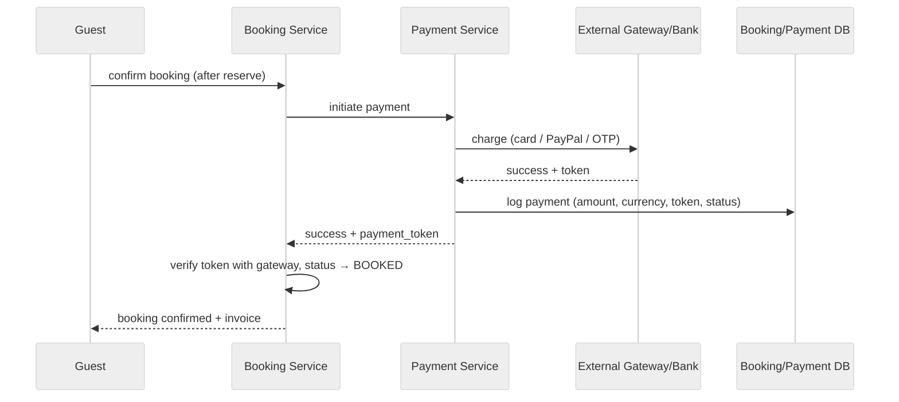

Key points: the guest is redirected to a **payment gateway** (specialized, secure) and gets back a **payment token** (proof of transaction). The guest sends that token to the booking service, which **double-checks with the gateway** that the payment for that token really succeeded before confirming — so a client can't fake payment. On success the booking flips to `BOOKED` with an `invoice_id`; on failure/timeout it's `CANCELLED` and inventory is restored (§12). Payments are logged in their own **Payment DB** (MySQL — needs consistency).

*Beginner note — "idempotency key".* Networks are flaky, so a client may send the same "confirm payment" request twice (a retry after a timeout). An **idempotency key** is a unique ID the client attaches to the request; the server remembers keys it has already processed and, on a duplicate, returns the **same** result instead of charging again. So retrying is safe — the guest is charged exactly once.

> ⚖️ **Trade-off — verify-token vs. trust-client:** re-verifying the token with the gateway costs one extra call but is non-negotiable for money correctness. Also send an **idempotency key** so a retried confirm doesn't double-charge.

<details>
<summary><strong>🙂 Example (1 user) — payment succeeds vs. fails</strong></summary>

Guest A confirms a $1000 booking. **Success path:** the gateway charges the card, returns `payment_token = pt_9be21`; the Booking Service asks the gateway "is `pt_9be21` really paid?" → yes → booking → `BOOKED`, `invoice_id` set, Payment DB logs the row. **Failure path:** the card is declined; the gateway returns failure; the booking is set → `CANCELLED` and `available_quantity` is incremented back (§12) so the room is released. Either way, if A's phone retried the confirm with the same idempotency key, the server would return the already-computed result rather than charging twice.
</details>

---

## 17. Deep Dive — Analytics Pipeline (Hadoop / Spark)

Business users want revenue, booking counts, best-performing hotels — and you rarely know **all** the questions up front. So push **all** Kafka events into a big-data store you can query flexibly later (T4).

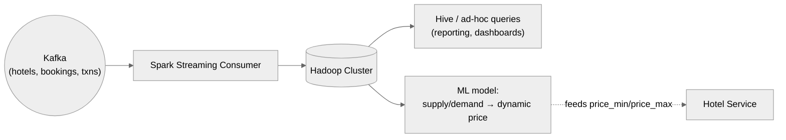

A **Spark Streaming** consumer reads every event from Kafka and lands it in **Hadoop**, where analysts run **Hive** queries and build reports. This same data powers **dynamic pricing**: an ML model reads supply/demand and picks an optimal nightly price within the `price_min`/`price_max` range the owner set (T4) — low supply + high demand → raise price; excess supply → lower it. A reasonable default price is the average of the two.

---

## 18. Deep Dive — Multi-Datacenter, Geo-Partitioning & High Availability

To hit **5-nines availability** and **low global latency**, and to survive a datacenter loss (earthquake, outage), the system spans multiple datacenters (T4).

*Beginner note — "replication" and "master/slave".* **Replication** means keeping live copies of the same data on multiple machines. In a **master–slave** setup, all **writes** go to the **master**, which continuously copies changes to the **slaves** (read-only replicas). Since our traffic is read-heavy, you serve most **reads** from slaves and add more slaves as read traffic grows; and if the master fails, a slave is **promoted** to master so the system keeps working. This gives both scale (many readers) and availability (no single machine is fatal).

**Per-service Master–Slave replication (T3, T4):** each service's DB runs one **master** + multiple **slaves**; reads scale by adding slaves; if a slave dies, others serve; if the master dies, a slave is promoted. This is the base HA mechanism.

**Naïve multi-DC:** one primary DC + three secondaries with near-real-time replication. Works, but wastes 75% of capacity sitting idle.

**Better — geo-partitioning (T4):** hotel data is inherently **geography-specific** (hotels/rooms/bookings in India vs. US don't overlap). So split the globe into regions; users connect to the **nearest** region (low latency), and each region owns its data.

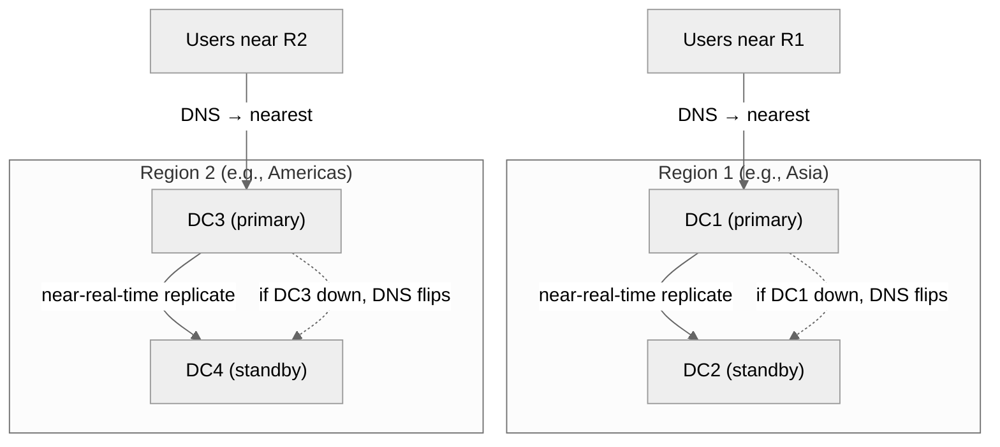

Within a region, DC1 is primary and DC2 is a near-real-time replica; if DC1 dies, **DNS flips** clients to DC2. Each region does the same independently. You can subdivide further (4+ regions) for even lower latency, but for a hotel booking system **two regions is usually enough** for good latency + high availability.

**Monitoring/alerting (T4):** watch CPU %, memory %, Redis disk, Elasticsearch disk across the fleet with a tool like **Grafana**; alert on thresholds so a creeping resource problem is caught before it degrades the NFRs (a memory leak → node death → lower availability).

---

# 📝 Part B — The Interview Template (15 Sections)

> Part A teaches; Part B is the structure you'd actually walk an interviewer through, start to finish.

## B1. Problem Statement & Clarifying Questions

**Problem:** Design a hotel/property booking service (Airbnb / Booking.com / MakeMyTrip) where owners list properties and guests search, view, and book rooms for specific dates — with **no double-booking** and **fast, fuzzy, geo search** at global scale.

**Clarifying questions to ask first:**

- **Listing model:** whole-unit listings (Airbnb, quantity=1) or multi-room hotels (quantity of a room *type*)? (Affects the availability model.)
- **Search dimensions:** location + dates only, or also price range, tags (5-star, beachfront), free-text name? Typo tolerance needed? (Drives Elasticsearch.)
- **Scale:** how many hotels/rooms/users? (~1M hotels, ~2M rooms, ~50M users → microservices, but ~4 write TPS → relational source of truth.)
- **Consistency expectation:** is it acceptable for a new listing to appear in search a few seconds late? (Yes → AP search, CP booking.)
- **Payments:** integrate an external gateway, or assume a payment black-box?
- **Cancellations / refunds / reviews / dynamic pricing:** in or out of scope?
- **Analytics:** do we need to leave hooks for revenue/booking reporting? (Usually yes.)
- **Geography:** single region or global multi-DC with failover?

**Assumptions to state:** ~10M DAU, 1:50 owner:guest, ~4 write TPS, reads ≫ writes; per-room-per-date availability; two-phase booking; global multi-region.

---

## B2. Requirements

**Functional:** owner onboard/manage property (+images); owner view bookings/revenue; guest register/login; search (location+dates+price+tags, fuzzy, paginated); view property details (+available rooms +per-date price); book (reserve→pay→confirm, concurrent-safe); view booking history; (optional) reviews.

**Non-functional:** high availability for search/view (5 nines); strong consistency for booking (no double-booking); low latency for search; moderate latency OK for booking; horizontally scalable to 50M+ users / 1M hotels; durable + geo-resilient (survive a DC loss).

**CAP framing:** split per service — **search/view = AP**, **booking = CP**. That's how you satisfy "highly available *and* strongly consistent" that a monolith couldn't.

---

## B3. Capacity Estimation

```
Users:   DAU 10M, MAU 100M ; owners = 10M/50 = 200K ; guests = 9.8M
Writes:  property updates 200K×(1/7) ≈ 28.6K/day ; bookings 9.8M×(1/30) ≈ 326.7K/day
         → ~0.35M writes/day ≈ 4 write TPS   (tiny → relational source of truth)
Reads:   search ~2.94M/day, views ~5.88M/day ; ~400 read QPS (higher on search)
Storage: property 500KB×28.6K/day ≈ 14.3 GB/day → ~52 TB/10y ; booking 1KB → ~1.19 TB/10y
Egress:  search 5MB×2.94M ≈ 14.7 TB/day + views 2.94 TB/day ≈ 17.6 TB/day → images via CDN
Inventory-first cross-check: 2M rooms ×0.8 occupancy /4-day stay /10^5 s ≈ 4 TPS ✓
```

**The one sentence that matters:** write TPS is tiny (~4), so a **relational DB is the source of truth** (ACID makes no-double-booking easy); the read/search load is offloaded to **Elasticsearch + CDN + Redis + read replicas**.

---

## B4. API / Interface Design

```
POST /v1/properties                         → 201 {property_id}          # owner create/update
GET  /v1/owners/{owner_id}/bookings         → [ {booking...} ]           # owner view bookings
GET  /v1/properties/search?city&check_in&check_out&price_min&price_max&tags&page → {results, next_page}
GET  /v1/properties/{id}?check_in&check_out → {details, rooms[], prices}  # view details
POST /v1/booking-sessions                   → {session_id, payment_url}   # book step 1 (RESERVED)
POST {payment_url}                          → {payment_token}             # book step 2 (gateway)
POST /v1/bookings {..., payment_token}      → 201 {booking_id, "booked"}  # book step 3 (confirm)
GET  /v1/users/{user_id}/bookings           → [ {booking...} ]            # guest history
POST /v1/users/register | login | logout | update                        # auth (auxiliary)
```

`user_id` from the JWT, never the body. Search/view are GET (cacheable, AP); booking is POST (CP). Prices come from the server, never the client (anti-tampering).

---

## B5. High-Level Architecture

```
                 ┌──────── Load Balancer + API Gateway (auth, route, rate-limit) ────────┐
     Owner ──────┤                                                                       ├────── Guest
                 └── Hotel Svc ── Search Svc ── Booking Svc ── Booking Mgmt ── User Svc ──┘
                       │             │              │              │             │
                   MySQL(H)+CDN     ES ◄── Search Consumer     MySQL(B):        MySQL(U)
                       │             ▲    (denormalize)        available_rooms
                       └── Kafka ────┤                          + booking
                                     ├── Notification Svc        │ Redis(lock/TTL)
                                     ├── Availability Svc ──► MySQL(B).availability
                                     ├── Archival Svc ──► Cassandra (completed)
                                     └── Spark ──► Hadoop (analytics)
   Booking Mgmt reads: MySQL(live) + Redis(cache) + Cassandra(archived)
```

Read path (Search/View) = AP + ES + CDN + cache. Write path (Booking) = CP + MySQL transactions. Kafka fans changes to search/notification/availability/archival/analytics. See §6 for the Mermaid version and per-box roles.

---

## B6. Data Model / Schema

```sql
-- User DB (MySQL)
users(user_id PK, name, email UNIQUE, password_hash, phone)

-- Hotel DB (MySQL, master+slaves)
hotels(hotel_id PK, name, locality_id FK, description, geo_lat, geo_lng,
       original_images, display_images, is_active)
rooms(room_id PK, hotel_id FK, display_name, room_type, capacity, quantity,
      price_min, price_max, is_active)
prices(hotel_id FK, room_id FK, price, currency, start_date, end_date)
facilities(facility_id PK, name); hotel_facilities(...); room_facilities(...)

-- Booking DB (MySQL — CP core)
available_rooms(room_id, date, initial_quantity,
                available_quantity CHECK(available_quantity >= 0),
                PRIMARY KEY(room_id, date))          -- ⭐ anti-oversell
booking(booking_id PK, room_id FK, user_id FK, start_date, end_date,
        number_of_rooms, status, invoice_id)          -- status: reserved|booked|cancelled|completed

-- Payment DB (MySQL)
payments(payment_id PK, user_id, booking_id, amount, currency, date, token, status)

-- Archive (Cassandra): completed/cancelled bookings, partitioned by user_id AND by hotel_id
-- Images: S3 + CDN (URLs stored in relational rows)
```

Indexes: `hotels(locality_id)` + geo; `rooms(hotel_id)`; `booking(user_id)`. The `available_quantity >= 0` CHECK is the linchpin of concurrency (§11).

---

## B7. Deep Dive Modules

1. **Availability model** (§9) — per-day rows (chosen) vs date-range rows; per-day + `quantity` makes concurrency clean.
2. **Search** (§10) — Elasticsearch (fuzzy + geo + tags); fed via Kafka + denormalizing consumer; **two-phase search** (ES → hotel IDs → join rooms/prices/availability in Redis); proximity options (ES vs quadtree vs PostGIS vs geohash) → ES wins (needs text + geo).
3. **Concurrency** (§11) — pessimistic, optimistic, **MySQL txn + CHECK constraint ⭐**, Redis hold, idempotency + disabled button; single-writer availability service.
4. **Reservation expiry** (§12) — Redis TTL + expiry callbacks; all edge cases; TTL-vs-poller precision trade-off.
5. **Image upload** (§13) — pre-signed URLs → S3 → CDN; original vs display images.
6. **Event-driven** (§14) — Kafka fan-out to notification/availability/search/archival/analytics.
7. **Archival + read/write split** (§15) — live in MySQL, terminal → Cassandra (by user & hotel); Booking Mgmt Service + Redis write-through cache.
8. **Payment** (§16) — external gateway, token, verify-with-gateway, idempotency.
9. **Analytics** (§17) — Spark → Hadoop → Hive; ML dynamic pricing within price_min/max.
10. **Reviews** — review service; metadata in review DB (MySQL/Cassandra), images in S3.

---

## B8. Data Flow Diagram

Booking write path, end-to-end:

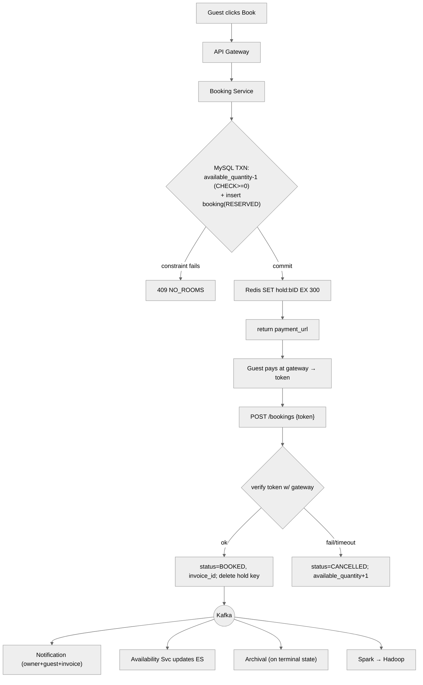

**Read/search path:** `Guest → LB → Search Service → Elasticsearch (hotel IDs) → join rooms/prices/availability in Redis → images from CDN → paginated results`.

---

## B9. Scalability & Bottlenecks

| Pressure point | Symptom | Mitigation |
|---|---|---|
| Search load (highest read) | Slow queries, DB overload | Elasticsearch cluster (add nodes) + Redis + CDN; never search source DB live |
| Hot room row (last room) | Contention on one `available_rooms` row | Rare at this scale (1 room, 2–3 racers); MySQL txn + CHECK resolves cleanly |
| Booking DB write ceiling | — | Writes tiny (~4 TPS); add read replicas for history reads; archive terminal bookings to Cassandra |
| Booking history reads | Burden the write DB | Separate Booking Mgmt Service + Redis write-through cache + Cassandra archive |
| Image bandwidth | 17.6 TB/day egress | CDN edges; pre-signed direct-to-S3 upload |
| Cross-service consistency | Partial update failures | Kafka event-driven fan-out; single-writer availability service |
| Global latency / DC loss | Slow far-region users; outage | Geo-partition into regions + master-slave + DNS failover |

**One-liner:** scale reads horizontally (ES + CDN + cache + replicas); the write path is tiny, so lean on relational transactions for correctness, and archive history to Cassandra to keep the write DB small.

---

## B10. Failure Modes & Mitigation

| Failure | Impact | Mitigation |
|---|---|---|
| **Double-booking** (cardinal sin) | Two guests, one room | MySQL txn + `available_quantity >= 0` CHECK; single-writer availability service |
| Reservation never paid | Room stuck `reserved` | Redis TTL + expiry callback → CANCELLED + restore inventory |
| TTL callback imprecise/late | Room freed a bit late | Acceptable here; else Redis queue + poller (costlier) |
| Payment success *after* expiry-cancel | Charged, no room | Refund, or re-check availability and book; decide with interviewer |
| Self double-submit | Duplicate booking | Idempotent API + disable button after first click |
| DB master dies | Writes stall | Master-slave; promote a slave; multi-DC failover via DNS |
| Whole DC lost | Region outage | Geo-partition + near-real-time replica DC per region |
| Kafka consumer lag | Stale search/notifications | Eventual consistency (AP side); replay from Kafka |
| Cassandra query needs non-key field | Can't query | Pre-partition by both `user_id` and `hotel_id` (the only two query shapes) |
| Resource creep (mem/CPU/disk) | Node death → lower availability | Grafana monitoring + threshold alerts |

---

## B11. Alternative Designs / Trade-off Comparison

| Decision | Chosen | Alternative | Why |
|---|---|---|---|
| Source-of-truth DB | MySQL/Postgres (ACID) | Cassandra/Mongo | Writes tiny; need transactions + CHECK for no-oversell |
| Concurrency | MySQL txn + CHECK (+ Redis hold) | Pure pessimistic lock | Locks don't scale on hot rows; CHECK is lock-free correctness |
| Availability schema | Per-day rows | Date-range rows | Simpler concurrency + search; accept storage (small rows) |
| Search engine | Elasticsearch | Solr / quadtree / PostGIS / geohash | Needs **text + geo + fuzzy** together — only ES does all |
| Reservation expiry | Redis TTL callbacks | Redis queue + poller | TTL good enough; poller precise but costly |
| Archive store | Cassandra | HBase | Cassandra = less ops overhead; partition-key queries fit |
| Messaging | Kafka | RabbitMQ / ActiveMQ / SQS | Kafka scales best for multi-consumer fan-out |
| History reads | Booking Mgmt Svc + Redis | Query write DB directly | Offload write DB; protect booking latency |
| Multi-DC | Geo-partition, 2 regions | 1 primary + 3 idle standbys | Uses all capacity; region-local latency |

---

## B12. Interview Q&A

**Conceptual (mid-level)**

<details>
<summary><strong>Q: How do you prevent double-booking?</strong></summary>

Store availability as `available_rooms(room_id, date, available_quantity)` with a `CHECK(available_quantity >= 0)`. Booking runs as one MySQL transaction that decrements the quantity and inserts the booking row; if two users race for the last room, only one commits and the other violates the CHECK and is rejected. Hold the room during payment with a Redis key + TTL, and make the availability table single-writer (only the availability service writes it).
</details>

<details>
<summary><strong>Q: Why is search on a separate engine (Elasticsearch) instead of the main DB?</strong></summary>

Search needs fuzzy/typo-tolerant text, geo-radius, price/date ranges, and tag filters — fast, at high QPS. Running that on a normalized relational store means slow multi-table joins and `LIKE` scans that also load the write-critical DB. Elasticsearch has an inverted index (instant text), built-in geo, and range/filter support. We keep it in sync from the source DB via Kafka + a denormalizing consumer, accepting eventual consistency (a new listing appears in search a second late — fine).
</details>

<details>
<summary><strong>Q: Why relational and not NoSQL for the source of truth?</strong></summary>

Write throughput is ~4 TPS (from the inventory-first estimate), so NoSQL's write scalability isn't needed. What we *do* need is ACID transactions and CHECK constraints to make no-double-booking trivial. So MySQL/Postgres is the source of truth; Cassandra is used only for archived, read-mostly completed bookings queried by known partition keys.
</details>

**Design trade-off (senior)**

<details>
<summary><strong>Q: How do you free a room when a user reserves but never pays?</strong></summary>

On reserve, set a Redis key `hold:booking_id` with a TTL (~5 min). Use Redis expiry callbacks: if the TTL fires and the booking is still `RESERVED`, mark it `CANCELLED` and increment `available_quantity`. On payment success, flip to `BOOKED` and delete the key early. Handle the race where expiry and success overlap by guarding on status (if already BOOKED, ignore the expiry; if cancelled-then-paid, refund or re-book). TTL isn't precise, which is fine here; a queue+poller gives precision at higher cost.
</details>

<details>
<summary><strong>Q: How does the two-phase search keep Elasticsearch lean?</strong></summary>

Index only the hotel document (name, geo, tags) in ES — the fields you search *by*. ES returns ~100 matching hotel IDs; the search service then joins rooms/prices/availability for just those IDs, served from a Redis cache. This avoids bloating ES with all per-date prices and availability, and runs the expensive relational join only on the tiny matched set.
</details>

<details>
<summary><strong>Q: Why geo-partition across datacenters instead of one primary + standbys?</strong></summary>

Hotel data is geography-specific (India hotels vs US hotels don't overlap), so you can split the globe into regions where users connect to the nearest region for low latency, and each region owns its data with a near-real-time standby DC for failover via DNS. A single primary + idle standbys wastes ~75% of capacity and adds latency for far users.
</details>

**Deep-dive internals (staff)**

<details>
<summary><strong>Q: Walk the exact MySQL booking transaction and why it's correct under concurrency.</strong></summary>

`BEGIN; UPDATE available_rooms SET available_quantity = available_quantity - 1 WHERE room_id=? AND date=?; INSERT INTO booking(...); COMMIT;`. MySQL serializes the row update; with `CHECK(available_quantity >= 0)`, a decrement that would go negative aborts the whole transaction (atomicity), so the booking insert is rolled back too. Two racers for the last room: one commits (1→0), the other aborts (0→-1 fails). No application lock, no lock table — the DB is the coordination point, which is why we chose a relational store.
</details>

<details>
<summary><strong>Q: Why Cassandra for archived bookings, and what's the constraint?</strong></summary>

Completed/cancelled bookings are huge in volume and read-mostly. Cassandra handles massive read/write and scales horizontally, but every query must target a partition key — no arbitrary queries. Our history queries are exactly two: by `user_id` (guest) and by `hotel_id` (owner). So we store archived data partitioned by both keys. That constraint is also why Cassandra can't be the source of truth (which needs varied queries + transactions).
</details>

<details>
<summary><strong>Q: How do CAP and consistency play out per service?</strong></summary>

CAP says under partition you can't be both fully consistent and available. We apply it per service: search/view is AP (eventual consistency fine — a listing can appear seconds late), booking is CP (must never oversell). This partition of responsibilities is what lets the overall system be "highly available and strongly consistent" — different subsystems make different CAP choices, unlike a monolith forced into one.
</details>

**Behavioral (STAR)**

<details>
<summary><strong>Q: Tell me about a time you fixed a concurrency/data-integrity bug under load.</strong></summary>

**S:** A booking feature occasionally oversold inventory under concurrent load. **T:** Guarantee one-owner-per-unit without tanking throughput. **A:** Replaced read-then-write app logic with a single transaction that decrements a quantity column guarded by a `>= 0` CHECK constraint, added a Redis TTL hold during payment, made the write API idempotent, and load-tested the last-unit race. **R:** Oversell dropped to zero; throughput stayed flat because non-conflicting bookings never blocked. **Lesson:** push correctness into the database's transactional guarantees instead of hand-rolled locks.
</details>

---

## B13. Quick Revision (cheat sheet + ~2 page deep revision)

### B13.1 One-glance cheat sheet

```
PROBLEM: owners list properties; guests search (location+dates, fuzzy) → view → book (dates) → pay
INVARIANT: no double-booking (one room, overlapping dates → one winner)
CAP SPLIT: search/view = AP (available)   |   booking = CP (consistent)

SCALE: ~10M DAU, ~1M hotels/2M rooms; WRITES ~4 TPS (tiny!) ; READS ~400 QPS (higher on search)
  → relational source of truth (ACID); offload reads to ES + CDN + Redis + replicas

CORE TRICK (no double-booking):
  available_rooms(room_id, date, available_quantity CHECK(>=0))
  BEGIN; UPDATE available_quantity-1; INSERT booking(RESERVED); COMMIT;  -- one racer wins

BOOKING (two-phase): reserve (Redis hold TTL 5m) → pay (gateway → token) → confirm (verify token → BOOKED)
  states: reserved → booked → completed / cancelled
  expiry: Redis TTL + callback → if still RESERVED → CANCELLED + restore qty

SEARCH: Elasticsearch (fuzzy+geo+tags) fed by Kafka + denormalizing consumer
  two-phase search: ES(hotel docs)→IDs→join rooms/prices/avail in Redis→images from CDN
  proximity options: ES(chosen: text+geo) | quadtree | PostGIS | geohash

DATA: MySQL (user/hotel/booking/payment) ; images S3+CDN ; completed bookings → Cassandra (by user & hotel)
EVENTS: Kafka → notification / availability(single writer) / search / archival / Spark→Hadoop
HISTORY: Booking Mgmt Service reads MySQL(live)+Redis(cache)+Cassandra(archive)
HA: master-slave per service; geo-partition into 2 regions; DNS failover; Grafana alerts
```

### B13.2 Two-page deep revision

**What & why hard.** Two-sided marketplace: owners list properties (rooms × dates × prices, images); guests search by location + dates (fuzzy, tags, price), view details, book for dates, view history. Hard because (a) **no double-booking** — one room, overlapping dates, one winner (strong consistency), and (b) **rich fuzzy geo search** at scale (high availability). Realistic contention is mild — "1 room left, 2–3 racers" — not a ticket stampede, which is why a transactional relational solution suffices.

**Requirements.** Functional: owner onboard/manage + view bookings; guest register/login, search, view, book, history, (reviews). Non-functional: HA search/view (5 nines), CP booking, low search latency, moderate booking latency, scale to 50M+ users / 1M hotels, geo-resilient. **CAP split per service**: search = AP, booking = CP.

**Capacity.** DAU 10M, owners 200K (1:50). Writes: 28.6K property updates + 326.7K bookings ≈ 0.35M/day ≈ **4 write TPS**. Reads ~400 QPS (search higher). Inventory-first cross-check: 2M rooms × 0.8 / 4-day stay / 10⁵ s ≈ 4 TPS. Storage ~52 TB property (images dominate → CDN) + ~1.19 TB bookings over 10y. Egress ~17.6 TB/day (images → CDN). **Decision: tiny writes → relational source of truth; heavy reads → ES/CDN/cache.**

**APIs.** `POST /properties`, `GET /owners/{id}/bookings`, `GET /properties/search?city&dates&price&tags&page`, `GET /properties/{id}?dates`, three-step book (`POST /booking-sessions` → gateway → `POST /bookings {token}`), `GET /users/{id}/bookings`, auth. `user_id` from JWT; price from server.

**Architecture.** LB + API Gateway → microservices: User, Hotel (MySQL master+slaves, images→CDN, emits Kafka), Search (Elasticsearch), Booking (MySQL: available_rooms + booking, Redis lock/TTL, Payment), Booking Management (read-only history). Kafka fans changes to search consumer (denormalize→ES), notification, availability service (single writer), archival (→Cassandra), Spark→Hadoop. Read path AP/cached; write path CP/transactional.

**Data model.** `users`; `hotels`(geo, images, is_active) / `rooms`(quantity, price_min/max) / `prices`(by date range) / facilities m:n; `available_rooms(room_id,date,available_quantity CHECK>=0)` + `booking(status: reserved|booked|cancelled|completed, invoice_id)`; `payments`; archived bookings in Cassandra partitioned by user_id **and** hotel_id; images in S3+CDN. Availability schema: **per-day rows** chosen (simple concurrency + search) over date-range rows (compact but split-on-book).

**Concurrency (the crux).** Ladder: pessimistic lock (correct, doesn't scale) → optimistic (check-before-commit, great when conflicts rare) → **MySQL txn + CHECK(available_quantity>=0)** (lock-free correctness, chosen) → Redis distributed lock/TTL to hold during payment → idempotent API + disabled button for self-double-submits → single-writer availability service. Combine the transaction+CHECK (correctness) with the Redis hold (during payment).

**Reservation expiry.** Redis key `hold:booking_id` with TTL (~5 min) + expiry callback → if still RESERVED, CANCELLED + restore quantity. Edge cases: payment success (→BOOKED, evict key), failure (→CANCELLED, restore), expiry-then-success (refund or re-book). TTL imprecise but fine; queue+poller is the precise-but-costly alternative.

**Search.** Elasticsearch for fuzzy + geo + range + tags; kept in sync via Kafka + a **denormalizing** consumer (relational → flat doc). **Two-phase search**: index only hotel docs → get ~100 IDs → join rooms/prices/availability from Redis → images from CDN. Proximity options compared (ES vs quadtree vs PostGIS vs geohash); ES wins because it's the only one doing **text + geo** together, and hotel geo is static so a quadtree's dynamic strength is wasted.

**Archival & history.** Live bookings in MySQL (small, transactional); terminal ones archived to **Cassandra** (partitioned by user & hotel — the only two query shapes). Booking Management Service serves history from MySQL (+ Redis write-through cache) + Cassandra, keeping reads off the write DB.

**Payment.** External gateway; guest returns a **token**; booking service **verifies the token with the gateway** before confirming (anti-forgery) + idempotency key (anti-double-charge). Logged in Payment DB.

**Analytics & pricing.** Spark Streaming consumes all Kafka events → Hadoop → Hive reporting; ML supply/demand model sets dynamic price within owner's price_min/price_max.

**HA & geo.** Master–slave per service; **geo-partition** into ~2 regions (region-local data, nearest-region routing), each with a near-real-time standby DC and DNS failover; Grafana monitoring/alerts on CPU/mem/disk to protect the NFRs.

---

## B14. FAANG Top 20 Most Frequently Asked Questions

Each answer is a self-contained mini-essay (≥5 lines) so you can revise from this section alone.

<details>
<summary><strong>1. How do you guarantee two guests never book the same room for the same dates?</strong></summary>

Model inventory as `available_rooms(room_id, date, available_quantity)` with a database `CHECK(available_quantity >= 0)`. Booking runs as one ACID transaction: decrement `available_quantity` for each date and insert the booking row. If two users race for the last room, MySQL serializes the row updates — one commits (1→0), the other's decrement would go negative, violates the CHECK, and the whole transaction (including its booking insert) rolls back. There's no application-level lock or lock table; the database row is the single coordination point. During payment the room is additionally held with a Redis key + TTL, and only the availability service writes the availability table to prevent multi-writer races.
</details>

<details>
<summary><strong>2. Why is booking two-phase (reserve → pay → confirm) instead of one call?</strong></summary>

Payment is external, slow (card entry, bank/3-D Secure), and can fail, while securing a room must be fast and consistent. A single call would force you to either hold a DB lock across the whole payment (throttling inventory) or charge before securing the room (refund hell on races). Two-phase reserves the room instantly and transactionally (status RESERVED), sends the guest to an external gateway, then confirms with a returned token the server re-verifies. The cost is needing an expiry mechanism for abandoned reservations — solved with a Redis TTL — which is why reservation expiry is its own deep dive.
</details>

<details>
<summary><strong>3. How do you store room availability, and what's the trade-off?</strong></summary>

Two approaches: (A) one row per (room, date) with an `available_quantity`, or (B) one row per (room, date-range). Per-day rows are search- and booking-friendly — point lookups, single-row decrements, per-date CHECK guard — at the cost of high row count (300 rooms × 365 days per hotel). Date-range rows are compact but require splitting a range into before/booked/after on every booking, which is complex read-modify-write interval math and more conflict surface. Chosen: per-day rows, because the concurrency solution stays clean and rows are tiny; at ~4 write TPS the volume is manageable.
</details>

<details>
<summary><strong>4. Why relational (MySQL/Postgres) as the source of truth and not NoSQL?</strong></summary>

The inventory-first estimate gives ~4 write TPS — trivially low — so NoSQL's write-scaling advantage buys nothing here. What the booking path really needs is ACID transactions and constraints (the `available_quantity >= 0` CHECK) that make no-double-booking a one-liner instead of hand-rolled application locking. So MySQL/Postgres is the source of truth. NoSQL (Cassandra) is used only where it fits: archived, read-mostly completed bookings queried by a known partition key, where volume is huge and queries are simple.
</details>

<details>
<summary><strong>5. How does search work, and why Elasticsearch specifically?</strong></summary>

Guests search by location + dates plus optional name, price range, and tags, with typo tolerance. That combination — fuzzy text **and** geo-radius **and** range/tag filters — is what Elasticsearch does natively via an inverted index and geospatial index (it uses geohashing internally). Running this on the normalized relational DB would mean slow joins and `LIKE` scans that also load the write store. ES is kept in sync from the source DB through Kafka and a consumer, and search never touches the booking DB at request time, so search stays fast and highly available (AP) independent of booking.
</details>

<details>
<summary><strong>6. How do you keep Elasticsearch in sync with the relational source of truth?</strong></summary>

The app writes once to the hotel DB; every change emits an event to Kafka; a search consumer reads it and updates Elasticsearch — avoiding fragile dual-writes. Because the source is normalized across hotel/room/price/availability tables and ES wants a flat document, the consumer must **denormalize**: join the related rows into one flattened doc before indexing. Booking events flow through the same Kafka so a now-sold-out hotel is removed from search results for those dates. This is eventual consistency, which is acceptable on the AP search side.
</details>

<details>
<summary><strong>7. What is the two-phase search optimization?</strong></summary>

Instead of indexing everything into Elasticsearch (all rooms, prices, availability — bloated), index only the hotel document with the fields you search *by* (name, geo, tags). ES returns a small set (~100) of matching hotel IDs. The search service then joins rooms, prices, and availability for just those IDs — served from a Redis cache for speed — to determine which have a free room on the requested dates and at what price. This keeps ES lean and runs the expensive relational join only on the tiny matched set rather than the whole catalog.
</details>

<details>
<summary><strong>8. Compare proximity-search options (Elasticsearch, quadtree, PostGIS, geohash).</strong></summary>

A quadtree recursively splits the map into quadrants down to small cells and queries a cell plus neighbors; a geohash encodes lat/lng into prefix strings where nearby points share prefixes (more efficient than a quadtree); PostGIS adds geo indexing inside Postgres; Elasticsearch has built-in geo_distance/geo_radius (geohash internally). The decider: this use case needs **text + geo together**, and only Elasticsearch supports fuzzy text alongside geo — quadtree, geohash, and PostGIS are geo-only. Since hotel locations are static, a quadtree's dynamic-point strength is wasted and its in-memory footprint is pure overhead. So Elasticsearch wins here; a quadtree would suit a taxi/Uber-style moving-driver problem.
</details>

<details>
<summary><strong>9. How does a reservation auto-expire if the user never pays?</strong></summary>

On reserve, write a Redis key `hold:booking_id` with a TTL (~5 min, configurable per country). Redis expiry callbacks notify the service when the key expires; if the booking is still RESERVED at that point, mark it CANCELLED and increment `available_quantity` to return the room. On payment success, flip to BOOKED, set the invoice, and evict the key early. Guard on status for the overlap race (if already BOOKED, ignore the expiry; if cancelled-then-paid, refund or re-book). TTL callbacks are imprecise (may fire a minute late), which is fine; a Redis queue + poller gives precision at higher CPU cost.
</details>

<details>
<summary><strong>10. How are property images handled at scale?</strong></summary>

Images are large binaries, so they never pass through app servers. The owner requests pre-signed URLs (time-limited permissions to upload directly to object storage like S3); the client uploads straight to S3; S3 distributes copies to a CDN for low-latency global reads; the returned image URLs are stored in the relational rows (not the binaries). On read, the guest's browser fetches image URLs from the property details and downloads the images from the nearest CDN edge. The schema keeps both original_images (owner upload) and display_images (compressed/CDN version). This offloads ~17.6 TB/day of egress to the CDN.
</details>

<details>
<summary><strong>11. Why an event-driven (Kafka) architecture instead of synchronous calls?</strong></summary>

On a booking, many systems must react: notify owner and guest, update availability, refresh search, archive on terminal state, feed analytics. Doing that synchronously couples services and risks partial failure (booking DB updated, availability update fails → inconsistency). Instead the writer emits one Kafka event and independent consumers each react, giving loose coupling, natural retries/replay, and independent scaling. The trade-off is eventual consistency (search may lag a booking by a second — acceptable on the AP side) and more operational pieces. Kafka scales better than RabbitMQ/ActiveMQ/SQS for this fan-out.
</details>

<details>
<summary><strong>12. How do you scale booking history reads without hurting booking writes?</strong></summary>

A dedicated Booking Management Service serves read-only history ("my bookings," "hotel's bookings"), separate from the Booking Service that does writes. It reads live/active bookings from MySQL fronted by a Redis write-through cache, and archived bookings from Cassandra. Keeping heavy history reads off the write MySQL protects booking latency and the CP write path. The read QPS (~400, higher for popular queries) is absorbed by the cache and read replicas rather than the transactional write node.
</details>

<details>
<summary><strong>13. Why archive completed bookings to Cassandra, and what's the constraint?</strong></summary>

Bookings accumulate indefinitely (millions), but only live (reserved/booked) ones need transactional treatment; completed/cancelled are read-mostly and huge. An archival service moves terminal bookings from MySQL to Cassandra, keeping the write DB small and fast. Cassandra handles massive volume but requires every query to hit a partition key — no arbitrary queries. Our history queries are exactly two shapes: by user_id (guest) and by hotel_id (owner), so we partition the archived data by both. That constraint is also why Cassandra isn't the source of truth, which needs varied queries and transactions.
</details>

<details>
<summary><strong>14. How does payment integration stay secure and consistent?</strong></summary>

The guest is redirected to an external payment gateway and receives a payment token (proof of transaction). The guest sends the token to the booking service, which re-verifies with the gateway that the payment for that token actually succeeded before confirming — so a client can't forge "I paid." On success the booking becomes BOOKED with an invoice_id; on failure/timeout it becomes CANCELLED and inventory is restored. An idempotency key prevents a retried confirm from double-charging. Payments are logged in a separate Payment DB (MySQL, needs consistency). Prices are always taken server-side, never from the client, to prevent tampering.
</details>

<details>
<summary><strong>15. How do you apply CAP theorem to this system?</strong></summary>

CAP says a distributed system under partition can't be both perfectly consistent and perfectly available, but you apply it per service rather than globally. Search and view are AP: a newly listed hotel appearing in results a few seconds late is harmless, so favor availability and eventual consistency. Booking is CP: never oversell, so favor consistency even if it means occasionally rejecting a request. Splitting the microservices this way lets the overall product be both "highly available" (for browsing) and "strongly consistent" (for booking) — a monolith would be forced into one global CAP choice.
</details>

<details>
<summary><strong>16. What are the concurrency approaches and which do you choose?</strong></summary>

Pessimistic locking (lock the row/DB before booking) is correct but serializes requests and doesn't scale on hot rows. Optimistic locking (proceed, check for a conflict just before commit, reject losers) gives high throughput and suits rare conflicts — which, at "1 room, 2–3 racers" scale, is our reality. The MySQL transaction + `available_quantity >= 0` CHECK constraint gives lock-free correctness and is the backbone. A Redis distributed lock/TTL holds the room during payment. Idempotent APIs plus a disabled button stop self-double-submits. Combine the transaction+CHECK with the Redis hold; reserve pure pessimistic locking for teaching.
</details>

<details>
<summary><strong>17. How would the design change at 10× scale?</strong></summary>

Reads scale horizontally: add Elasticsearch nodes, more read replicas, more CDN capacity, and enlarge Redis. Writes are still small, but you'd shard the booking DB by hotel/geography if a single cluster nears limits, and lean harder on the geo-partitioning so each region handles its own load. Increase Kafka partitions and consumer counts for the fan-out. Push more archived data into Cassandra sooner to keep the write DB lean. The concurrency mechanism doesn't change — it's per-room-per-date, so it naturally distributes; the hot-row case stays mild because inventory is spread across dates.
</details>

<details>
<summary><strong>18. How do you achieve high availability and survive a datacenter loss?</strong></summary>

Each service uses master–slave replication (add slaves for read spikes; promote a slave if the master dies). Across geographies, geo-partition the world into regions since hotel data is region-specific; users connect to the nearest region for low latency, and each region has a near-real-time standby DC. If the primary DC fails, DNS flips clients to the standby. Two regions are usually enough for good latency and high availability, though you can subdivide further. Grafana monitoring and threshold alerts on CPU/memory/disk catch creeping problems (e.g., a memory leak) before they cause node failures that erode availability.
</details>

<details>
<summary><strong>19. How do you support analytics and dynamic pricing?</strong></summary>

You rarely know all analytics questions up front, so push every Kafka event (hotels, bookings, transactions) into a big-data store via a Spark Streaming consumer landing in Hadoop, where analysts run Hive queries and build reports on revenue, booking counts, and best-performing hotels. The same data feeds an ML supply/demand model that sets a dynamic nightly price within the owner-provided price_min/price_max range — raise price when supply is low and demand high, lower it when rooms are plentiful. A reasonable default is the average of the two bounds. This keeps the analytics path fully decoupled from the transactional path.
</details>

<details>
<summary><strong>20. How is this different from designing a ticket-booking (concert) system?</strong></summary>

The decisive difference is contention shape. A concert drops 100K+ seats that millions want in the same minute — "1 seat, 10,000 buyers" — forcing virtual waiting queues, sharded booking queues, and heavy surge machinery. A hotel has ~1,000 rooms spread across many dates, so the realistic worst case is "1 room left, 2–3 racers." That mild contention means you can rely on a straightforward relational transaction + CHECK constraint and a short Redis hold, with no waiting room. Both share the two-phase reserve→pay→confirm pattern, Redis TTL expiry, Elasticsearch search, and CP-booking/AP-search split, but the hotel system is meaningfully lighter on surge handling.
</details>

---

> 📌 **Final note.** This guide was built from four interview transcripts (an Airbnb design walkthrough, the "interview with Bunny" hotel-booking session, and two CodeKarle-style hotel-booking designs) and enriched with the standard internals interviewers expect. Every major approach across all four — user-first and inventory-first capacity math, two-phase booking, per-day vs date-range availability, MySQL transaction + CHECK anti-oversell, pessimistic/optimistic/Redis locking, Redis TTL expiry with callbacks, Elasticsearch with denormalization and two-phase search, the proximity-search comparison, pre-signed image upload + CDN, Kafka event fan-out, archival to Cassandra, Booking Management read/write split, payment token verification, analytics via Spark/Hadoop, and multi-datacenter geo-partitioning — is represented above with its trade-offs.
