# Notification System — System Design Study Guide

> A self-contained learning + revision guide for FAANG / top product-company system design interviews.
> Built from video transcripts on designing a **notification system** (SMS / email / push), then **faithfully enriched** with the internals, trade-offs, and edge cases that interviewers probe at mid / senior / staff level.
> You should be able to learn this topic from zero using only this document.

---

## Table of Contents

**Part A — Learn the concept from zero**

1. [What Is a Notification System & Why It Exists](#1-what-is-a-notification-system--why-it-exists-)
2. [Clients vs Users — the core vocabulary](#2-clients-vs-users--the-core-vocabulary-)
3. [Functional Requirements](#3-functional-requirements-)
4. [Non-Functional Requirements](#4-non-functional-requirements-)
5. [Capacity Estimation (full math)](#5-capacity-estimation-full-math-)
6. [API Design](#6-api-design-)
7. [Naive Design & Why It Fails (the synchronous trap)](#7-naive-design--why-it-fails-the-synchronous-trap-)
8. [High-Level Design — iOS & Android Delivery Flows](#8-high-level-design--ios--android-delivery-flows-)
9. [Splitting the Monolith — Handler + Delivery Services](#9-splitting-the-monolith--handler--delivery-services-)
10. [Build vs Buy — Third-Party Delivery Services](#10-build-vs-buy--third-party-delivery-services-)
11. [The Four Responsibilities → Microservices](#11-the-four-responsibilities--microservices-)
12. [Assembling the Pipeline (validation → prioritization → …)](#12-assembling-the-pipeline-validation--prioritization---)
13. [Reordering the Pipeline for Efficiency](#13-reordering-the-pipeline-for-efficiency-)
14. [Decoupling with a Message Queue](#14-decoupling-with-a-message-queue-)
15. [Deep Dive — Database Selection](#15-deep-dive--database-selection-)
16. [Deep Dive — Data Models](#16-deep-dive--data-models-)
17. [Deep Dive — Durability: the Outbox + CDC Pattern](#17-deep-dive--durability-the-outbox--cdc-pattern-)
18. [Deep Dive — Priority Lanes (OTP fast path)](#18-deep-dive--priority-lanes-otp-fast-path-)
19. [Deep Dive — Retries, DLQ, Backoff & Webhooks](#19-deep-dive--retries-dlq-backoff--webhooks-)
20. [Deep Dive — SNS/SQS Fan-out & Templates/Reporting](#20-deep-dive--snssqs-fan-out--templatesreporting-)

**Part B — Interview template (the 15 required sections)**

1. [Problem Statement & Clarifying Questions](#b1-problem-statement--clarifying-questions-)
2. [Requirements](#b2-requirements-)
3. [Capacity Estimation](#b3-capacity-estimation-)
4. [API / Interface Design](#b4-api--interface-design-)
5. [High-Level Architecture](#b5-high-level-architecture-)
6. [Data Model / Schema](#b6-data-model--schema-)
7. [Deep Dive Modules](#b7-deep-dive-modules-)
8. [Data Flow Diagram](#b8-data-flow-diagram-)
9. [Scalability & Bottlenecks](#b9-scalability--bottlenecks-)
10. [Failure Modes & Mitigation](#b10-failure-modes--mitigation-)
11. [Alternative Designs / Trade-off Comparison](#b11-alternative-designs--trade-off-comparison-)
12. [Interview Q&A](#b12-interview-qa-)
13. [Quick Revision (cheat sheet + ~2 page deep revision)](#b13-quick-revision-cheat-sheet--2-page-deep-revision-)
14. [FAANG Top 20 Most Frequently Asked Questions](#b14-faang-top-20-most-frequently-asked-questions-)

---

# 🎓 Part A — Learn the Concept From Zero

## 1. What Is a Notification System & Why It Exists 🔔

A **notification system** is a digital messenger: it takes an event (someone liked your post, your OTP was generated, your order shipped) and delivers the right message, through the right channel — **SMS, email, or app/push notification** — to the right user, at the right time, with no delay.

```
Trigger (event)  →  Notification System  →  Delivered via the right channel
"Alice liked          validate, process,      📱 iOS push / 🤖 Android push
 your post"           route, deliver          ✉️ email / 💬 SMS
```

Three actors, three steps (from the transcript):

1. **Clients** — the apps/platforms that *want to send* notifications (a social app, an online store, a bank).
2. **Notification system** — receives a trigger, validates/processes it, picks the channel.
3. **Users** — the people who *receive* the notification on their devices.

**Why it matters (three reasons):**

- **Timely alerts** — flight delays, flash sales, OTPs; users can't be expected to keep refreshing an app. Airlines push real-time flight updates to millions of travelers to avoid airport chaos.
- **Engagement** — instant updates (messages, likes, comments) bring users back. Studies cited in the transcript say push notifications can lift app engagement by **up to 88%**.
- **User experience** — relevant, personalized alerts (not spam) make an app feel useful.

> **Scale fun-fact:** apps like Facebook send **over 1 billion notifications a day**, and some systems even use **ML to predict the best time to send** so you're more likely to open them.

> 💡 **Interview framing:** A notification system is fundamentally a **write-heavy, asynchronous, fan-out delivery pipeline** with hard requirements on *reliability* (no dup / no loss) and *prioritization* (OTP beats promo). Almost every design decision — queues, retries, outbox, priority lanes — exists to serve those two properties. Name that early.

---

## 2. Clients vs Users — the core vocabulary 🧑‍🤝‍🧑

This distinction (emphasized heavily in Transcript 3) trips people up, so nail it early:

| Term | Who | Example | Owns… |
|---|---|---|---|
| **Client** | an *organization/app* integrating our API | Amazon, Uber, Flipkart, a bank | the *content* + *who to notify* |
| **User (end user)** | a *person* receiving the notification | you, on your phone | the *preferences* (email vs SMS, opt-outs) |

Why both matter: a **client** (Amazon) decides "send an order-shipped notification to external-user-42," but the **preference** (only email, no SMS) is a *personal choice of the end user* — Amazon doesn't store that; our system does. So our data model needs **both** a client identity *and* a per-user preference store. This is why the system is often described as **multi-tenant** (many clients) and **B2B2C** (we serve businesses, who serve consumers).

---

## 3. Functional Requirements 📋

The transcript defines **four** core functions:

1. **Send notifications** — clients can send **SMS, email, and app/push** notifications, which our system delivers to users. Multiple channels ensure users get messages in the format they're most likely to see and act on.
2. **Rate limiting** — control the *flow* so users aren't overwhelmed (no notification overload), and so our servers aren't overwhelmed during spikes (sales, events). Prevents spam *and* server overload.
3. **Prioritization & validation** — urgent messages (OTP) jump ahead of promos; the system also **validates** the content and the target user (correct email/phone) before sending.
4. **User preferences** — respect per-user choices (e.g., "max 3 promo notifications/month," "email only"). Makes the system user-centric.

**Enrichment — features richer sources add (Transcript 3), mark as in-scope/bonus explicitly:**

- **Real-time vs scheduled** notifications (OTP = real-time; promo campaign = scheduled for a timestamp).
- **Templates** — clients define reusable message templates with **variables** personalized per user persona (e.g., "iPhone sale" for one user, "Galaxy sale" for another).
- **Delivery status dashboard** — clients want to see *delivered / pending / failed* per notification (reporting/analytics).

---

## 4. Non-Functional Requirements 🛡️

The classic restaurant analogy: functional = *what* the restaurant does (serve food, seating, menu); non-functional = *how well* it operates (open at the right hours, fast service, handles rush). Five NFRs:

| # | NFR | Metric / target | Restaurant parallel | Why it matters |
|---|---|---|---|---|
| 1 | **Availability** | **99.99999%** ("seven nines") uptime | never randomly closed | waiting on an OTP while the system is *down* = security risk + frustration |
| 2 | **Low latency** | near-instant delivery, esp. OTP | food arrives fast | a *delayed* OTP (system up, but slow) is useless once it expires |
| 3 | **Scalability** | millions of notifications concurrently (NYE, Black Friday) | handles rush hour | traffic spikes must not crash the system |
| 4 | **Reliability** | accurate, consistent, **no duplicates, no missed** alerts | right order every time | two identical OTPs for one login = confusing, erodes trust |
| 5 | **Flexibility** | support SMS/email/push + honor preferences | vegetarian/custom meals | if customization fails, users disable notifications entirely — defeating the purpose |

> ⚠️ **Availability vs latency are different failure modes:** availability = the OTP *isn't served at all* (system down); latency = the OTP *is served, but late*. Interviewers love this distinction.

> 💡 **CAP framing (Transcript 3, staff-level):** this is a distributed system, so per CAP we favor **Availability over Consistency (AP)**. A notification system just tells users an event happened; it's fine if a **preference/template change** propagates with **eventual consistency** (a few seconds' delay). Note: *consistency ≠ latency* — a template update being visible a bit late (consistency) is different from an OTP arriving late (latency). "Seven nines" is aspirational; a defensible target is **99.99% (four nines ≈ 52 min/yr)** to **99.999% (five nines ≈ 5 min/yr)**, higher for the OTP path than the promo path.

---

## 5. Capacity Estimation (full math) 📊

> Flow: **users → throughput → storage → memory → network.** We show the arithmetic.

### 5.1 Users & clients

```
Clients (apps/services using us) = 1,000
Daily Active Users  (DAU)        = 50 million   (users who receive ≥1 notification/day)
Monthly Active Users (MAU)       = 400 million  (unique users/month)
```

### 5.2 Throughput

**Write throughput** = notifications *created by clients* per second.

```
Assume each client generates 50,000 notifications/day
Notifications/day = 1,000 clients × 50,000 = 50,000,000 = 50 million/day
Write QPS = 50M ÷ (24 × 60 × 60) = 50M ÷ 86,400 ≈ 578 write req/sec
```

**Read throughput** — here's the twist: **there are essentially no reads.** Users don't *pull* notifications; clients *push* them in, and the system *pushes* them out, like a **conveyor belt**. There's no traditional read request in the delivery path. (Reporting/status queries exist in richer designs, but the core pipeline is write-only.) → **This is a write-heavy system**, which drives the choice of write-optimized stores and queues.

### 5.3 Storage

#### First, the foundation: characters, bytes, and message sizes

```
1 ASCII character = 1 byte = 8 bits.   1 KB = 1,000 B; 1 GB = 1e9 B; 1 TB = 1e12 B.
```

Three data types are stored. **Notification data** dominates. Assume the channel mix and per-message sizes:

```
Mix:   30% SMS   ·   40% email   ·   30% push
Sizes: SMS 500 bytes · email 5 KB · push 1 KB
```

**Notification storage/day** (mix × 50M × size):

```
SMS  : 0.30 × 50M × 500 B  = 15M × 500 B  = 7,500,000,000 B   = 7.5 GB/day
Email: 0.40 × 50M × 5 KB   = 20M × 5 KB   = 100,000,000 KB    = 100 GB/day
Push : 0.30 × 50M × 1 KB   = 15M × 1 KB   = 15,000,000 KB     = 15 GB/day
------------------------------------------------------------------------
Total notification/day                                        = 122.5 GB/day
```

```
Notification storage/10yr = 122.5 GB × 365 × 10 = 447,125 GB ≈ 447 TB
```

**User info data** (one-time, ~stable user base): `400M users × 200 B = 80 GB`.
**User preferences data** (one-time): `400M × 500 B = 200 GB`.

```
Total 10-yr storage = 447 TB (notifications) + 80 GB (user info) + 200 GB (prefs)
                    ≈ 447.28 TB
```

### 5.4 Memory (cache)

Rule of thumb: cache ≈ **1% of daily storage**.

```
Cache/day = 0.01 × 122.5 GB ≈ 1.22 GB/day   (scales as the system grows)
```

### 5.5 Network (ingress & egress)

`bytes/second = bytes-per-day ÷ 86,400`.

**Ingress** (data in ≈ what we store/day = 122.5 GB):

```
Ingress = 122.5 GB ÷ 86,400 s ≈ 1.42 MB/s
```

**Egress** (data out — assume **15% filtered out**, so only **85% delivered**):

```
Delivered/day = 0.85 × 122.5 GB = 104.125 GB/day
Egress = 104.125 GB ÷ 86,400 s ≈ 1.21 MB/s
```

> Unlike media-heavy systems, notification egress ≈ ingress (small text payloads, and 15% never gets delivered). The scaling challenge here is **request volume & fan-out**, not bandwidth.

### 5.6 Capacity summary table

| Quantity | Value | Derivation |
|---|---|---|
| Clients | 1,000 | given |
| DAU / MAU | 50M / 400M | given |
| Notifications/day | 50M | 1,000 × 50,000 |
| **Write QPS** | **~578** | 50M ÷ 86,400 |
| Read QPS | ~0 | push-based, no reads |
| Notification storage/day | 122.5 GB | 7.5 + 100 + 15 |
| Notification storage/10yr | ~447 TB | 122.5 GB × 365 × 10 |
| User info / prefs | 80 GB / 200 GB | one-time |
| **Total 10-yr storage** | **~447.28 TB** | sum |
| Cache/day | ~1.22 GB | 1% × 122.5 GB |
| Ingress | 1.42 MB/s | 122.5 GB ÷ 86,400 |
| Egress | 1.21 MB/s | 85% × 122.5 GB ÷ 86,400 |

> **Alternate scale (Transcript 3):** an industrial multi-tenant service targeting **~1 million notifications/minute ≈ 16,667/sec** — ~29× the 578/sec above. Same architecture; just more partitions, workers, and horizontal replicas. State whichever scale your interviewer sets.

---

## 6. API Design 💻

Clients send notifications via a **REST** API. Recall REST's parts: **method** (what), **endpoint** (where), **body** (the data). Version your APIs (`/v1`).

### 6.1 Send a notification

```http
POST /v1/notifications
{
  "userId":    "1234",                       // target user (unique id)
  "from":      "MyBank",                      // sender (UPS / Facebook / bank …)
  "message":   "Your OTP is 123456",          // actual content
  "priority":  "high",                        // high (OTP) | medium (friend req) | low (promo)
  "timestamp": "2026-07-01T10:00:00Z"         // when it should be sent
}
→ 202 Accepted   { "notificationId": "n_9001", "status": "queued" }
```

`POST` because we're **creating** a notification; endpoint `/v1/notifications`. Body fields: `userId`, `from`, `message`, `priority`, `timestamp`.

### 6.2 Richer endpoints (Transcript 3 — templates, status, preferences)

```http
POST   /v1/templates                 { name, type, channel, content, variables[] }  → create a template
GET    /v1/templates/{id}            → view template versions
PUT    /v1/templates/{id}            → update ;  DELETE /v1/templates/{id}

POST   /v1/notifications             { templateId, recipientId, variables{}, channel, priority, schedule }
GET    /v1/notifications/{id}/status → { status: pending|scheduled|sent|delivered|failed }

PUT    /v1/users/{externalUserId}/preferences
       { clientId, preferences: { email: true, sms: false, push: true } }
```

Templates let a client define a message *once* with **variables** (`{{product}}`) that get personalized per user. `schedule` supports scheduled vs real-time. Status endpoints power the reporting dashboard. Preferences are set **per end-user** (not per client).

### API contract summary

| Operation | Method | Endpoint | Success |
|---|---|---|---|
| Send notification | `POST` | `/v1/notifications` | 202 Accepted |
| Create template | `POST` | `/v1/templates` | 201 |
| Get delivery status | `GET` | `/v1/notifications/{id}/status` | 200 |
| Set user preference | `PUT` | `/v1/users/{id}/preferences` | 200 |

> Why **202 Accepted**, not 201? Delivery is **asynchronous** — we've *accepted* the request and queued it, but it isn't delivered yet. Returning fast (ms) is exactly the async decoupling win from [§7](#7-naive-design--why-it-fails-the-synchronous-trap-).

---

## 7. Naive Design & Why It Fails (the synchronous trap) 🐢

Before the real architecture, understand *why* it needs to be complex (Transcript 2). The tempting first version: send the notification **inline** during the request that triggered it.

```java
@PostMapping("/signup")
public Response signup(SignupRequest req) {
    User u = db.save(req);          // 1. create user (some ms)
    sendEmail(u.email(), "Welcome!"); // 2. SYNCHRONOUS call to Gmail API — blocks 3–5 s!
    return Response.ok("Welcome");  // 3. only now do we reply
}
```

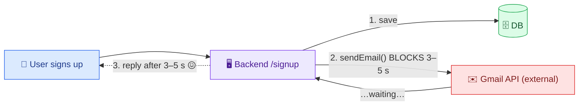

**Two fatal problems:**

1. **Latency (blocking).** The external call to Gmail takes **3–5 seconds**; the user's signup is *blocked* the whole time. Every signup now feels slow.
2. **Reliability (coupling).** If Gmail is **down / times out / rate-limits** us, what does signup do? Roll back the account just because a *welcome email* failed? Terrible UX — the user did everything right, but a non-critical notification dependency broke the core flow.

**The fix (the thesis of the whole design):** **decouple** notification logic from core app logic. The app just creates a **notification event**, pushes it into a **queue / ingestion layer**, and **returns success immediately** (latency drops to milliseconds). Workers deliver asynchronously, with retries. Everything below is an elaboration of this one idea.

---

## 8. High-Level Design — iOS & Android Delivery Flows 📱

Start with the simplest flow: clients → notification system → target users, across channels (iOS push, Android push, SMS, email).

**iOS push delivery (6 steps):**

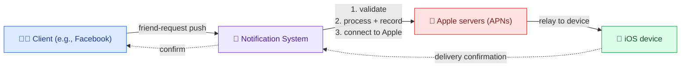

**Steps:** (1) validate the request (sender correct? recipient correct?); (2) process + create a notification record in the DB; (3) connect to **Apple's servers**; (4) send via Apple's APIs; (5) Apple relays to the device; (6) delivery confirmation flows back to the client.

**Android push** is *identical* except steps 3–6 connect to **Android/Google servers** instead of Apple. 

> **Key observation:** the **first 3 steps (validate, process, connect-prep) are common** to every channel; only the **last 3 (channel-specific delivery)** differ. That symmetry is the seed for splitting the system into modular services (next section).

---

## 9. Splitting the Monolith — Handler + Delivery Services 🧩

Using that observation, factor the monolith into:

- **Notification Handler Service** — does the common steps 1–3 (validate, process, route).
- **Per-channel Delivery Services** — each does the channel-specific steps 4–6: **iOS Delivery**, **Android Delivery**, **SMS Delivery**, **Email Delivery**.

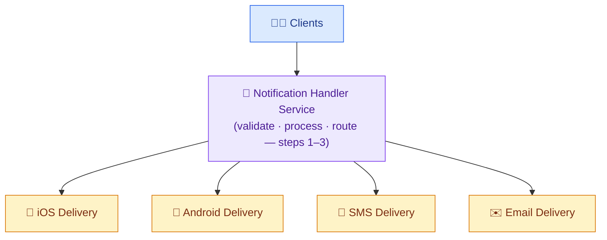

This is a **modular / microservice** decomposition: one shared handler, many specialized delivery services (add more channels — WhatsApp, voice — without touching the handler). Each delivery service can scale and fail **independently**.

---

## 10. Build vs Buy — Third-Party Delivery Services 🏭

Should we build those delivery integrations ourselves? **No** — buy, don't build. Three reasons:

1. **Complex integrations.** iOS push needs **APNs** (Apple Push Notification service); Android needs **FCM** (Firebase Cloud Messaging); SMS needs a telecom partner (AT&T/Vodafone); each has different protocols, setup, and fees. Maintaining all these ourselves is huge overhead.
2. **Security & compliance.** Collecting emails/phones means **GDPR** (secure the data; honor deletion requests), **CAN-SPAM** (every promo email needs a working unsubscribe; track opt-outs). Building all this correctly is a project in itself.
3. **Cost.** Servers, telecom/Apple/Google partnerships, dev + ops + monitoring + maintenance — expensive.

So we rely on **third-party (external) services** that specialize in delivery. (A service we build in-house = *first-party*; these managed ones = *third-party*.)

| Channel | Third-party service | What it handles |
|---|---|---|
| iOS push | **APNs** (Apple) | iOS delivery complexity |
| Android push | **FCM** (Firebase/Google) | Google network integration |
| SMS | **Twilio** (or MSG91) | telecom integrations |
| Email | **MailChimp** (or SendGrid / Amazon SES) | compliance, unsubscribe, spam prevention |

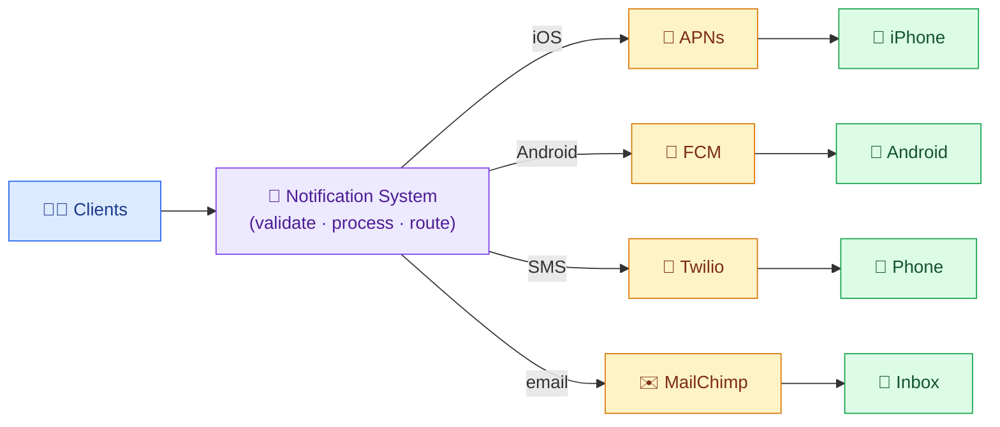

> ⚖️ **Trade-off flagged:** buying trades *control & per-message cost* for *speed, compliance, and reliability*. At extreme scale you might negotiate direct carrier deals, but for an interview, "use APNs/FCM/Twilio/SES and focus my design on orchestration" is the senior answer.

---

## 11. The Four Responsibilities → Microservices ⚙️

Derive the services *from the functional requirements* (a key interview move). The system must:

1. **Prioritize & validate** — not all notifications are equal (security/transaction alert = immediate; promo = can wait); also validate sender/recipient.
2. **Rate-limit (anti-spam)** — prevent exploitation and user overload (someone subscribed to many e-commerce sites shouldn't get hundreds of alerts/hour → frustration/churn).
3. **Filter by user preferences** — honor each user's channel/type choices (push for urgent, email for newsletters).
4. **Deliver** — actually send via the right channel/third-party.

A **single server** doing all this has three problems: **single point of failure** (server dies → whole system down → need multiple servers + load balancing), **data loss** (state on the server is risky → use databases), and **performance bottleneck** (one box doing everything chokes → split into specialized microservices). So: **multiple instances + load balancer + databases + microservices**, each owning one responsibility.

---

## 12. Assembling the Pipeline (validation → prioritization → …) 🔗

Introduce an **API Gateway** (a "traffic controller" that routes to the right service) and a **Users Info DB**, then chain the services. First-pass order (validation → prioritization → rate-limit → preferences → sender):

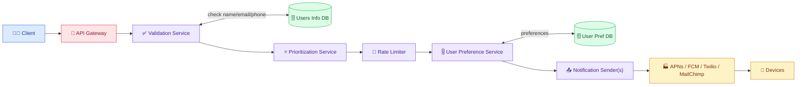

- **Validation Service** checks the notification's `userId`/email/phone against the **Users Info DB**; mismatch → filter out.
- **Prioritization Service** orders by priority (OTP first).
- **Rate Limiter** drops/delays excess per-user.
- **User Preference Service** checks the **User Pref DB** (preferred channel, opt-outs); mismatch → filter out.
- **Notification Sender** — *decoupled from preferences* (its job is delivery, not filtering). We split it into **per-channel senders** (iOS/email/Android/SMS) because each has a **unique protocol** and needs **independent/parallel scaling** (an SMS spike shouldn't stall push).

---

## 13. Reordering the Pipeline for Efficiency ♻️

The first-pass order wastes work. Fix it by moving cheap, high-rejection filters **earlier**:

1. **Rate limiter first.** Preliminary filtering by rate limits means we don't validate/prioritize notifications that will be discarded anyway.
2. **Prioritization last** (just before send). Sorting notifications that later get dropped by rate-limits or preferences is wasted effort.

**Optimized order:** `Rate Limiter → Validation → User Preferences → Prioritization → Sender`.

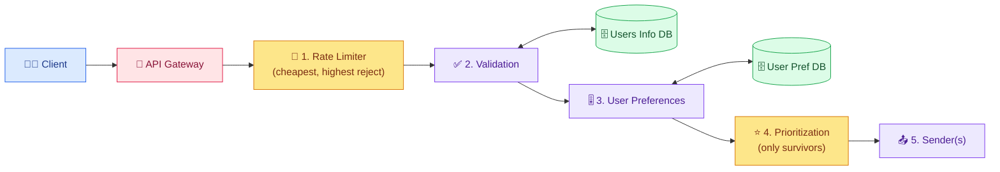

> 💡 **General principle:** in any filtering pipeline, **cheapest + most-rejecting stages go first** so expensive work only runs on notifications that will actually be sent. This is the same idea as short-circuit evaluation and predicate pushdown in databases.

---

## 14. Decoupling with a Message Queue 📨

Right now Prioritization calls the sender services **directly** — a tight **coupling** that breaks under load. Scenario: a flash sale floods the system with promo push, order-confirmation emails, and OTP SMS.

- **Processing burden:** if one downstream (say SMS) slows, Prioritization is *stuck waiting* to hand off → chokes total throughput.
- **No failure recovery:** if a sender **crashes**, in-transit notifications are **lost** — no way to reprocess/queue for retry.

**Fix: insert a Message Queue** (Kafka-style) between Prioritization and the senders, with a **topic per channel**. Senders **subscribe** to their topic and **pull** at their own pace.

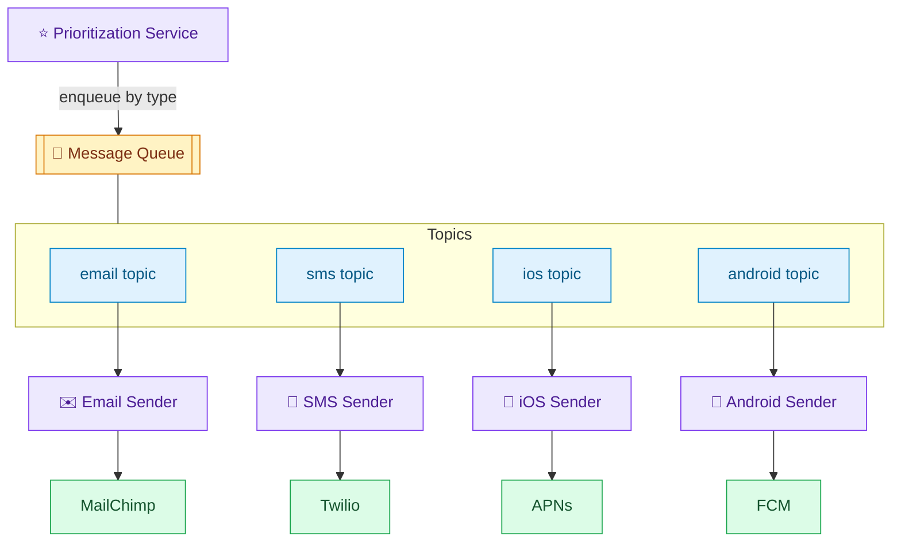

**Why it works:**

- **No burden on Prioritization:** it just enqueues and moves on; a slow SMS sender no longer blocks it.
- **Retry on failure:** if a sender is down, messages **stay in the queue**; when it recovers, it resumes consuming — **no notifications lost**.
- **Isolation & parallelism:** each channel processes independently; a spike in one topic doesn't affect others.

> This is the **pub/sub** backbone. The full pipeline is now: `API Gateway → Rate Limiter → Validation (Users Info DB) → User Preferences (Pref DB) → Prioritization → Message Queue (per-channel topics) → per-channel Senders → APNs/FCM/Twilio/MailChimp → devices`.

---

## 15. Deep Dive — Database Selection 🗄️

General guidelines (not black-and-white; depends on project needs):

| Signal | Lean toward |
|---|---|
| Need fast data access | **NoSQL** |
| Very large scale | **NoSQL** |
| Fixed, structured data | **SQL** |
| Unstructured / variable data | **NoSQL** |
| Complex queries | **SQL** |
| Data evolves / changes frequently | **NoSQL** (flexible schema) |

Apply to our databases:

| DB | Structure | Scale | Query pattern | Choice |
|---|---|---|---|---|
| **Users Info DB** | fixed (name/email/phone) — unlikely to evolve | *moderate* (user info isn't the bulk) | fetch by `userId` (validation) | **SQL** (e.g., PostgreSQL) |
| **User Preference DB** | flexible (new channels/types appear) | large, but simple queries | fetch prefs by `userId` | **NoSQL** |
| **Notification DB** (Transcript 3) | semi-structured, evolves | huge (447 TB/10yr, 50M/day) | write-heavy, status lookups | NoSQL / write-optimized (or Postgres per T3) |
| **Template DB** (Transcript 3) | structured metadata + versions | moderate | by templateId/version | SQL/Postgres |

> **Reasoning shown, per transcript:** Users Info is **fixed + moderate scale + simple `by userId` query** → SQL. Preferences are **flexible + frequently changing + simple query** → NoSQL. The point interviewers want: *walk the guidelines out loud for each store* rather than declaring "NoSQL everywhere."

---

## 16. Deep Dive — Data Models 🗃️

**Users Info DB (SQL)** — rows/columns; **primary key + index on `user_id`** (common query = fetch by user_id during validation):

| Column | Type | Notes |
|---|---|---|
| `user_id` | VARCHAR | **PK**, indexed |
| `name` | VARCHAR | full name |
| `email` | VARCHAR | validated against notification |
| `phone_number` | VARCHAR | validated |
| `is_active` | BOOLEAN | active? |
| `created_at` / `updated_at` | TIMESTAMP | audit |

> `VARCHAR` = *variable character* (a string of variable length); `BOOLEAN` = true/false; `TIMESTAMP` = time.

**User Preference DB (NoSQL)** — document keyed by `user_id`, **indexed on `user_id`**:

```json
{
  "userId": "1234",
  "preferences": {
    "email": { "optIn": true,  "notificationTypes": ["OTP", "newsletter"] },
    "sms":   { "optIn": false, "notificationTypes": [] },
    "push":  { "optIn": true,  "notificationTypes": ["OTP", "friend_request"] }
  },
  "createdAt": "2026-07-01T10:00:00Z"
}
```

Each channel has `optIn` + `notificationTypes` (opt into OTP but not promos). Common query = *fetch prefs by userId* → index on `userId`.

**Template DB (SQL, Transcript 3):** `template_id (PK), name, type (promo/transactional), channel, content, variables, version, is_active, created_at, updated_at`. A **channel** field is essential — an SMS template (concise) differs from an email template (rich, images).

**Notification DB (Transcript 3):** `notification_id, client_id, external_user_id, template_id, channel, payload, status (pending|scheduled|sent|delivered|failed), priority, schedule_flag, updated_at`. Persists every notification so status can be reported.

**Notification Event DB (Transcript 3, BigQuery-style):** append-only, **micro-level status timeline** per notification (scheduled@t1, sent@t2, delivered@t3) for fine-grained analytics — distinct from the Notification DB which holds the *latest* status.

---

## 17. Deep Dive — Durability: the Outbox + CDC Pattern 🧱

**The critical flaw** (Transcript 3): if the Notification Service writes straight to Kafka and then acks the client, and **Kafka goes down before the message is persisted anywhere**, the notification is **lost forever** — yet we already told Amazon "sent." That violates **reliability** (no loss).

**Fix — the Transactional Outbox + CDC pattern:**

1. The Notification Service **writes to the database first** (a `notification` row **and** an `outbox` row) *before* acking the client. Now the message is **durably persisted**; only then do we return "accepted."
2. A **CDC (Change Data Capture) pipeline** tails the `outbox` table and publishes new rows to **Kafka**. From there the normal consumer/sender flow proceeds.

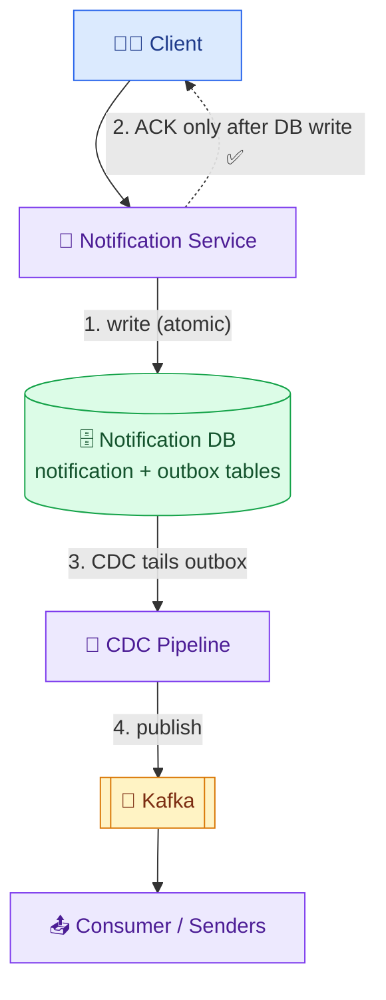

**Outbox table schema:** `outbox_id, notification_id, event_type, payload, published (bool), created_at`.

### 🧠 Beginner intuition — the "two writes" problem this solves

When a notification arrives, we conceptually want to do **two things**: (a) **save it** so we never lose it, and (b) **publish it to Kafka** so a sender delivers it. The naive code does them as two separate network operations:

```
save to DB      ✅  (operation 1)
publish to Kafka ✅  (operation 2)
ack the client  ✅
```

The problem: these two operations are **not atomic** — they can partially succeed. There are two ways it breaks:

1. **DB write succeeds, Kafka publish fails** → the notification is stored but **never delivered** (a sender never sees it).
2. **Kafka publish succeeds, DB write fails** (or we publish *before* saving) → the message is in flight, but if Kafka then crashes before a consumer persists it, it's **gone**, and we may have no record it ever existed.

You cannot wrap "a DB write" and "a Kafka publish" in a single transaction — they're **two different systems** (a database and a message broker) with no shared commit. This is the classic **dual-write problem**.

**The outbox trick:** turn the two writes into **one**. Instead of writing to the DB *and* to Kafka, we write **only to the DB** — but to **two tables in the same transaction**: the `notification` table (the record) and the `outbox` table (the "please publish me later" intent). Because both rows are in the *same database*, one `COMMIT` makes them **atomic**: either both land or neither does. Publishing to Kafka becomes a *separate, later* step driven by reading the outbox — and if that step is delayed or retried, the intent is safely sitting in the durable outbox table the whole time.

### 🔍 What CDC (Change Data Capture) actually is

**CDC = a process that watches a database for new/changed rows and reacts to them.** In practice it doesn't repeatedly `SELECT * FROM outbox` (polling is wasteful); instead it **tails the database's transaction log** (e.g., PostgreSQL's WAL — Write-Ahead Log, MySQL's binlog) — the same internal log the DB already writes for durability/replication. A tool like **Debezium** reads that log, sees "a new row was inserted into `outbox`," and publishes it to Kafka. Two beginner-friendly consequences:

- It's **near-real-time** and low-overhead (it reacts to log entries, not polling queries).
- It's **reliable**: CDC tracks its position (offset) in the log, so if the CDC process restarts, it resumes from where it left off and won't skip rows. The `published` boolean in the outbox is a backup marker to avoid double-publishing.

### 👤 Concrete scenario — Amazon sends "order shipped" to user 42

Compare the **naive** flow vs the **outbox** flow at the exact instant Kafka dies:

```
NAIVE (write-to-Kafka-then-ack):
  t0  Notification Service publishes to Kafka        ✅
  t1  Service acks Amazon: "notification accepted"   ✅   ← we PROMISED delivery
  t2  Kafka broker crashes, in-memory message lost   💥
  →   Result: message GONE, but Amazon believes it's sent.  ❌ reliability violated

OUTBOX (DB-first):
  t0  Service opens a DB transaction:
        INSERT into notification(...);   ← the record
        INSERT into outbox(...);         ← the publish intent
      COMMIT  (both rows atomic)                     ✅ durably on disk
  t1  Service acks Amazon: "accepted"                ✅   ← safe: it's persisted
  t2  Kafka broker crashes                           💥
  t3  Kafka recovers; CDC is still tailing the log
  t4  CDC sees the un-published outbox row → publishes to Kafka ✅
  →   Result: message delivered (a bit late). NOTHING lost.   ✅
```

The key difference: in the outbox flow, at the moment we tell Amazon "accepted," the message is **already on disk in our database**. Kafka being down only *delays* delivery (CDC republishes when it's back); it can never *lose* the message.

> ⚖️ **Trade-off (explicitly flagged in the transcript):** the outbox adds **durability** but also **latency** (write DB → CDC → Kafka → consume, instead of straight to Kafka). That's acceptable **for promotional/standard** notifications because our NFR allows **5–10 s** for them. It is *not* acceptable for OTP — which gets a separate fast path ([§18](#18-deep-dive--priority-lanes-otp-fast-path-)).

> 💡 **Why not just "write to Kafka then DB"?** Because the ack races the persistence. The outbox makes the *durable write* and the *intent to publish* part of **one atomic DB transaction**, so you can never ack a message you might lose. This is the canonical answer to "how do you not lose messages?"

---

## 18. Deep Dive — Priority Lanes (OTP fast path) ⚡

The outbox path is durable but slow (~seconds). **OTPs can't wait** (they expire). So route by priority into **two lanes**:

- **Promotional / standard (low/medium):** go through the **durable outbox → CDC → Kafka** path. Latency of 5–10 s is fine.
- **OTP / critical (high):** **skip the outbox**, write **directly to Kafka**, consumed immediately by a dedicated **OTP sender**. If a rare loss occurs, the **user simply requests a resend** — OTPs are inherently retryable, so we trade a sliver of durability for speed.

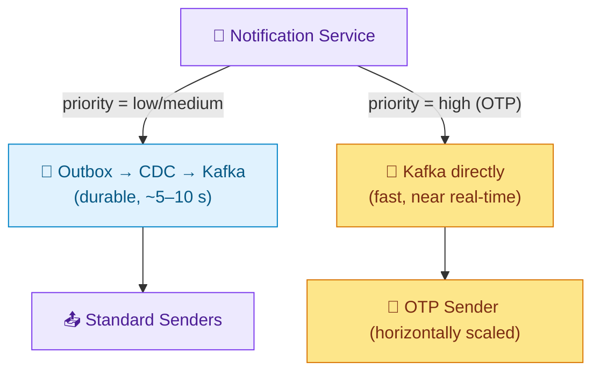

**Priority as topics (Transcript 3):** the queue uses a **3×3 topic matrix** — priority `{critical, standard, promotional}` × channel `{email, sms, push}` = **9 topic combinations** — so consumers subscribe to exactly what they handle. A dedicated **OTP/critical consumer** subscribes only to critical topics and is **horizontally scaled across regions** so it never lags (consumer lag = producer outpaces consumer → delay; more OTP consumers = no lag). Plus special topics: **retry**, **DLQ**, and **bulk email/SMS**.

### 🧠 Beginner intuition — why one shared queue can't guarantee OTP speed

Imagine a **single queue** holding all notifications in arrival order (FIFO). During a flash sale, millions of **promotional** messages flood in. Now an **OTP** arrives — it lands at the *back* of the queue, behind millions of promos. Even though it's urgent, the consumer processes messages in order, so the OTP waits for everything ahead of it to drain. This is called **head-of-line blocking**: a low-priority backlog delays a high-priority message stuck behind it.

The fix is **separate topics per priority** so critical messages never sit behind promotional ones. A topic is just a named, independent stream inside the broker; a consumer chooses which topic(s) to read. By giving `critical` its own topic with its own consumers, an OTP is never queued behind a promo — it's in a different lane entirely.

### 📊 The 3×3 topic matrix, spelled out

```
                 CHANNEL →   email            sms              push
   PRIORITY ↓
   critical (OTP/bank)      critical.email   critical.sms     critical.push
   standard                 standard.email   standard.sms     standard.push
   promotional              promo.email      promo.sms        promo.push
```

Why split by **both** priority and channel? Two independent reasons combine:

- **Priority split** → prevents head-of-line blocking (OTP never waits behind promos).
- **Channel split** → each channel talks to a *different provider with different protocol and rate limits* (Twilio for SMS, APNs for push, MailChimp for email), and a slow/broken provider only backs up **its own** topic, not the others.

A consumer subscribes to exactly the cells it handles. E.g., the **OTP SMS sender** reads only `critical.sms`; the **promo email sender** reads only `promo.email`. Plus cross-cutting topics: `retry.*` (messages awaiting a backoff retry), `dlq.*` (dead letters), and `bulk.email`/`bulk.sms` (batch campaigns).

### 🔍 What "consumer lag" means (and why scaling fixes it)

A topic is divided into **partitions**; consumers in a **consumer group** each read some partitions in parallel. **Consumer lag = (messages produced) − (messages consumed)** — i.e., how far behind the consumers are. If producers push 5,000 msg/s but consumers only process 3,000 msg/s, lag grows by 2,000/s and delivery falls further behind every second.

Two ways to reduce lag: process faster per consumer, or **add more consumers** (horizontal scaling) so more partitions are read in parallel. For OTP we deliberately **over-provision consumers across regions** so the critical topic's consumption rate always exceeds its production rate → **lag stays ~0 → near-real-time delivery**. (Note: you can't have more *useful* consumers than partitions, so critical topics are given enough partitions to allow that parallelism.)

### 👤 Concrete scenario — flash sale, OTP must still arrive in <1 s

```
10:00:00  Flash sale starts. Promo push floods in at 8,000 msg/s.
          → these land in promo.push, consumed by promo push senders.
10:00:03  A user logs in → bank sends an OTP (critical.sms).
          → OTP goes to critical.sms (its OWN topic), NOT behind the 8,000/s promo flood.
          → critical.sms consumers (heavily scaled) are near-idle, so they grab it instantly.
10:00:03.4  OTP delivered via Twilio.  ✅ ~400 ms, unaffected by the promo storm.
```

Meanwhile the promo topics may build a small backlog — totally fine, because promos tolerate 5–10 s. **Priority isolation means a promotional traffic spike cannot delay an OTP**, which is exactly the guarantee the two-lane design (fast Kafka path) + topic matrix provides.

---

## 19. Deep Dive — Retries, DLQ, Backoff & Webhooks 🔁

**Third-party failures are inevitable** (Twilio down, APNs throttles). Make delivery **fault-tolerant**:

- **Retry with exponential backoff.** On failure, don't hammer immediately — wait an **increasing** interval between attempts (e.g., 1s, 2s, 4s, 8s…) to give the external service time to recover. Add **jitter** to avoid synchronized retry storms.
- **Dead Letter Queue (DLQ).** After **max attempts**, route the message to a **DLQ** so permanent failures/bad data don't clog the main pipeline. Engineers inspect/debug/replay from the DLQ later.

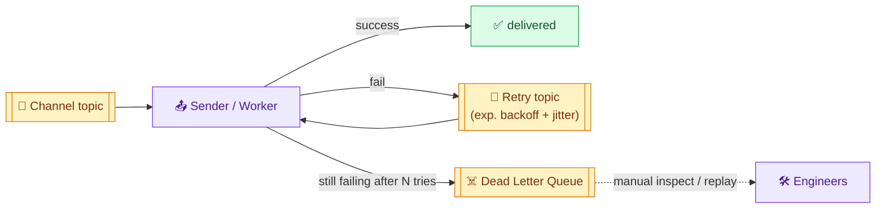

### 🧠 Beginner intuition — transient vs permanent failures

Not all failures should be retried. The sender must **classify** the error:

- **Transient (temporary) failure** — the request *could* succeed if tried again later: provider timeout, network blip, `HTTP 429 Too Many Requests` (throttling), `HTTP 503 Service Unavailable`. **→ Retry.**
- **Permanent failure** — retrying will *never* help because the input itself is bad: invalid phone number, malformed email, unsubscribed recipient, `HTTP 400 Bad Request`. **→ Do NOT retry; send straight to DLQ** (retrying just wastes attempts and delays other work).

This is why the Java example has two `catch` blocks: `TransientException` triggers backoff-and-retry; `PermanentException` breaks immediately to the DLQ. Getting this classification right prevents both *lost* messages (giving up too early on a recoverable error) and *wasted* work (retrying a hopeless one).

### 🔢 Why exponential backoff (with the actual numbers)

If a provider is briefly overloaded and 1,000 senders all **retry immediately and in lockstep**, they slam it again at the same instant — a **retry storm** that keeps it down. Exponential backoff spaces retries out with a **doubling** delay, giving the provider room to recover:

```
attempt 1 fails → wait 1s   (2^0)
attempt 2 fails → wait 2s   (2^1)
attempt 3 fails → wait 4s   (2^2)
attempt 4 fails → wait 8s   (2^3)
attempt 5 fails → wait 16s  (2^4)   → still failing → DLQ
```

**Jitter** = adding a small random amount (e.g., 0–500 ms) to each wait. Without jitter, all failed messages retry at *exactly* 1s, 2s, 4s… together — synchronized spikes. Jitter **spreads them out** so retries arrive smoothly instead of in thundering waves. (In the code: `base = (1L << (attempt-1)) * 1000` gives the doubling, `+ jitter` de-synchronizes.)

### 🔍 What a Dead Letter Queue (DLQ) is and why it matters

A **DLQ** is a separate queue where messages go after they've **exhausted all retries** (or hit a permanent error). Two beginner-friendly reasons it's essential:

- **It unclogs the main pipeline.** Without a DLQ, one "poison" message (e.g., malformed data that always fails) would be retried forever, blocking or slowing everything behind it. The DLQ **quarantines** the bad message so healthy traffic keeps flowing.
- **Nothing is silently lost.** The failed message is preserved with its error context, so engineers can **inspect, fix, and replay** it later (e.g., after fixing a bug or once the provider recovers). Alerting on DLQ depth is a standard health signal.

### 👤 Concrete scenario — Twilio has a 2-minute outage

```
12:00:00  SMS sender pulls an OTP, calls Twilio → 503 (transient). attempt 1.
12:00:01  retry after 1s → 503. attempt 2.
12:00:03  retry after 2s → 503. attempt 3.
12:00:07  retry after 4s → 503. attempt 4.
12:00:15  retry after 8s → 503. attempt 5.
12:00:31  retry after 16s → 503 → MAX_ATTEMPTS reached → send to dlq.sms
   ...     (meanwhile OTP resend flow can re-trigger a fresh one)
12:02:00  Twilio recovers.
12:05:00  Engineer (or an automated re-drive job) replays dlq.sms → delivers successfully.
```

During the outage the pipeline kept processing other messages; the failing one didn't block anyone and wasn't lost — it waited safely in the DLQ.

**Delivery-status webhooks.** Our senders know a message was **sent** to the third party, but not whether it was **delivered** to the device — that's owned by the external service. So we **expose a webhook** per provider; APNs/FCM/Twilio call it back with delivery/read receipts, and we push that into Kafka → a **delivery consumer** updates the Notification DB (and the append-only event DB). Status lifecycle: `pending → scheduled → sent → delivered` (or `failed`).

> 🧠 **Why "sent" ≠ "delivered" (beginner clarity):** *sent* means **we handed the message to Twilio/APNs** and they accepted it — our job is done, but the user's phone hasn't received it yet. *delivered* means **the message actually reached the device**, which only the provider knows (the phone was off, out of coverage, etc.). Since our sender returns as soon as the provider accepts, we'd wrongly report "delivered" without the webhook. A **webhook** is just an HTTP endpoint *we* expose and register with the provider; when the final status is known, **the provider calls us** (`POST /webhooks/twilio` with `{messageId, status: delivered}`) — the reverse of us calling them. We turn that callback into a Kafka event so a single consumer updates the status.

> ⚠️ **Multiple services writing the same DB is an anti-pattern.** Instead of each sender updating the Notification DB directly, senders **publish delivery events to Kafka**, and a single **delivery consumer** owns the DB writes. This avoids write contention and keeps a single source of truth.

**Idempotency.** Because retries + at-least-once queues can deliver a message twice, senders must be **idempotent** (dedupe by `notification_id`) to satisfy the **no-duplicates** reliability requirement.

### 🧠 Beginner intuition — why duplicates happen, and how idempotency stops them

"At-least-once delivery" (the default for Kafka/SQS) means a message may be processed **more than once**. A common way this happens: a sender **successfully sends** an SMS via Twilio, but **crashes before it can mark the message done / commit its offset**. When it restarts, the queue redelivers that same message (it was never acknowledged), and the sender would send the SMS **again** — the user gets two identical OTPs.

**Idempotency** means "processing the same message twice has the same effect as processing it once." We achieve it by keying on the unique `notification_id`:

```
on receive(msg):
    if store.contains(msg.notificationId):   # already handled → skip
        return
    provider.send(msg)
    store.markDelivered(msg.notificationId)   # record BEFORE acking
```

The `alreadyDelivered(...)` guard at the top of the Java example is exactly this check. Now a redelivered message is recognized and **skipped**, so retries and crash-recoveries are safe and the user never sees a duplicate. (The dedupe store is typically a fast key-value store like Redis/DynamoDB with a TTL.)

<details>
<summary><b>☕ Java — retry with exponential backoff + jitter, then DLQ — click to expand</b></summary>

```java
public class NotificationSender {
    private static final int MAX_ATTEMPTS = 5;
    private final ThirdPartyClient provider;   // Twilio / APNs / FCM / MailChimp
    private final Queue dlq;

    public void handle(NotificationMessage msg) {
        if (alreadyDelivered(msg.notificationId())) return;   // idempotency guard
        int attempt = 0;
        while (attempt < MAX_ATTEMPTS) {
            try {
                provider.send(msg);                            // may throw / timeout / 429
                markSent(msg.notificationId());                // emit "sent" event to Kafka
                return;
            } catch (TransientException e) {
                attempt++;
                long base = (1L << (attempt - 1)) * 1000L;     // 1s,2s,4s,8s,16s
                long jitter = ThreadLocalRandom.current().nextLong(0, 500);
                sleep(base + jitter);                          // exponential backoff + jitter
            } catch (PermanentException e) {
                break;                                         // don't retry bad data
            }
        }
        dlq.publish(msg);   // exhausted attempts (or permanent) → Dead Letter Queue
    }
}
```

</details>

---

## 20. Deep Dive — SNS/SQS Fan-out & Templates/Reporting 🌐

**Fan-out architecture (Transcript 2, AWS flavor).** A managed alternative to self-hosted Kafka: publish each notification event to **AWS SNS** (a topic); multiple **SQS queues** subscribe — one per channel (SMS / Email / Push). **Execution workers** (or **AWS Lambda**) pull from each queue and call the third-party APIs (Twilio, SendGrid…).

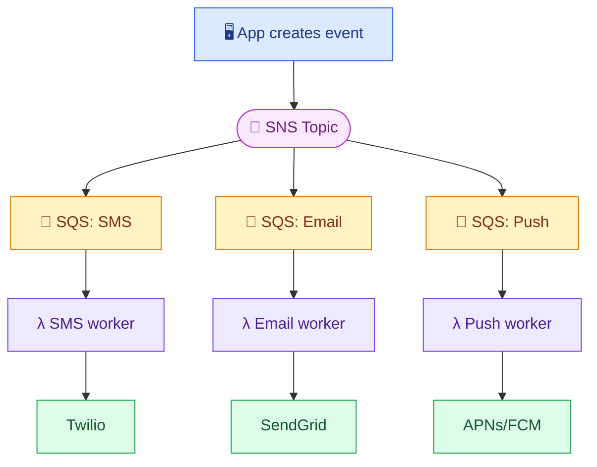

**Isolation win:** if the SMS provider is throttled/down, its SQS backs up but **Email and Push queues keep flowing, unaffected**. Same DLQ + exponential-backoff pattern applies per queue.

### 🧠 Beginner intuition — what "fan-out" means and the SNS vs SQS split

**Fan-out** = one input event is copied to **many** independent outputs. Here one "notification event" needs to reach the SMS lane, the email lane, *and* the push lane (or whichever apply). The two AWS pieces do different jobs:

- **SNS (Simple Notification Service) = a topic (publish/subscribe broadcaster).** You **publish once**; SNS **pushes a copy to every subscriber**. It doesn't store messages for later — it fans them out immediately.
- **SQS (Simple Queue Service) = a durable queue (buffer) one consumer group drains.** It **holds** messages until a worker pulls and deletes them; it does **not** broadcast.

They're used **together**: SNS does the *broadcast* (one → many), and each channel gets its **own SQS queue** subscribed to the SNS topic to *buffer* its slice. This is the well-known **"SNS → SQS fan-out"** pattern. The SQS buffer is what gives each channel independent backpressure, retries, and a DLQ.

### 🔍 SNS/SQS vs Kafka — same idea, different tools

| Concept | Kafka (self-hosted, §14/§18) | AWS managed (this section) |
|---|---|---|
| Broadcast one→many | one topic, many consumer groups | **SNS** topic |
| Per-channel buffer | topic partitions / separate topics | **SQS** queue per channel |
| Worker | consumer service | **Lambda** or worker pulling SQS |
| Dead letters | DLQ topic | SQS **redrive policy → DLQ queue** |
| Ops burden | you run/scale the cluster | fully managed, auto-scales |

Both implement the same architecture (decoupled fan-out with per-channel isolation + DLQ). The choice is **control/throughput/replay (Kafka)** vs **zero-ops/speed-to-market (SNS+SQS)**. Say this trade-off out loud in an interview rather than assuming one.

### 👤 Concrete scenario — one signup event fans out to two channels

```
User signs up. App publishes ONE event to SNS:
   { userId: 42, type: "welcome", channels: ["email","push"] }

SNS immediately delivers a COPY to each subscribed SQS queue:
   → SQS:Email  ──> Email Lambda  ──> SendGrid ──> 📧 welcome email
   → SQS:Push   ──> Push Lambda   ──> APNs/FCM ──> 📱 welcome push
   (SQS:SMS also gets a copy, but the worker sees channel≠sms and drops it —
    or filtering/subscription rules avoid sending it there at all)

If SendGrid is down: SQS:Email retries with backoff, then → DLQ.
Meanwhile SQS:Push delivered fine — the two lanes are fully independent.
```

The app made **one publish call** and returned in milliseconds; the fan-out, buffering, retries, and isolation are all handled by SNS+SQS behind the scenes.

**Templates (Transcript 3).** A **Template Service** lets clients store reusable, versioned, per-channel templates with **variables**; at send time the notification supplies `templateId + variables{}` and we render the final message. A **User Preference Service** buffered by **Kafka** (writes go to a `user_preference` topic → a **preference consumer** updates the Pref DB) absorbs the huge volume of preference changes without hammering the DB, and a **User Preference Cache** lets senders check opt-in/opt-out without hitting the DB on every send.

### 🧠 Beginner intuition — why templates exist and how rendering works

Without templates, a client (Amazon) would have to send us the **fully-written message for every single user** — millions of near-identical strings differing only in a name or product. That wastes bandwidth and puts message wording in the client's code. **Templates invert this:** the client stores the message **once** with **placeholders** (variables), and per send provides only the small `variables{}` that differ.

```
Template (stored once):   "Hi {{name}}, your {{product}} order ships {{date}}."
Send request:             { templateId: "T7", variables: { name:"Dave", product:"iPhone", date:"Fri" } }
Rendered message:         "Hi Dave, your iPhone order ships Fri."
```

**Per-channel templates** matter because the *same message* must look different by channel: an **SMS** version is short (160-char limits, no images), while an **email** version can be long with HTML and images. **Versioning** lets a client update wording safely (v2) while old sends referencing v1 stay reproducible.

### 🔍 Why buffer preference writes through Kafka + cache reads

Two different pressures on the preference data:

- **Writes are bursty and huge:** the transcript notes ~50–60% of a client's millions of users may change preferences. Hitting the Pref DB directly for each toggle could overwhelm it. So preference changes are **published to a `user_preference` Kafka topic**, and a **preference consumer** drains them into the DB at a steady, controlled rate (smoothing the spike). Eventual consistency (a few seconds' delay before a new preference takes effect) is acceptable per our **AP** choice.
- **Reads happen on every send:** each notification must check "did this user opt into this channel/type?" Reading the DB per send (potentially 578+/s) is expensive, so a **User Preference Cache** (Redis) serves these hot lookups in memory; the DB is only touched on a cache miss.

### 👤 Concrete scenario — a user opts out of promo SMS

```
1. User toggles "no promotional SMS" in the app.
2. PUT /v1/users/42/preferences → published to Kafka topic user_preference (returns instantly).
3. Preference consumer reads it → updates Pref DB → cache entry for user 42 invalidated/updated.
4. Later, a promo SMS for user 42 reaches the SMS sender.
5. Sender checks Preference Cache: user 42 → sms.promo = false → notification FILTERED OUT (not sent).
```

The opt-out is honored on the **read path** (at send time) using the fast cache, while the **write path** (the toggle) was absorbed smoothly by Kafka.

**Reporting (Transcript 3).** A **Reporting Service** answers client queries ("what's the status of my campaign?") by reading the **Notification DB** (latest status) and the **Notification Event DB** (per-step timeline). This is the *only* real read path in the system.

### 🧠 Beginner intuition — two tables for two different questions

The reporting layer answers two kinds of questions, which is why there are two stores:

- **"What is the *current* status of notification N?"** → read the **Notification DB**, which holds the **latest** status of each notification (`pending`/`sent`/`delivered`/`failed`). One row per notification, overwritten as status advances. Fast point lookups.
- **"Show me the *full history* — when was it scheduled, sent, delivered?"** → read the **Notification Event DB**, an **append-only** log where each status change is a new row (`N scheduled @10:00:00`, `N sent @10:00:02`, `N delivered @10:00:05`). Never overwritten; ideal for analytics, funnels, and debugging *when* something happened.

```
Notification DB (latest state)          Notification Event DB (full timeline, append-only)
  N123 | delivered | 10:00:05             N123 | scheduled | 10:00:00
                                          N123 | sent      | 10:00:02
                                          N123 | delivered | 10:00:05
```

This is a **command/query split**: the write path advances the single latest-status row (cheap, current), while the append-only event log powers rich historical analytics (a columnar store like BigQuery is well-suited). A client's dashboard reads the latest status for a quick "delivered ✅," and drills into the event timeline to see exactly *when* each step happened.

### 👤 Concrete scenario — Amazon checks a campaign

```
GET /v1/notifications/N123/status
   → Reporting Service reads Notification DB → { status: "delivered" }   (instant, point read)

"When did each step happen?" (dashboard drill-down)
   → Reporting Service reads Notification Event DB →
       scheduled 10:00:00 → sent 10:00:02 → delivered 10:00:05
   → shows a 5-second end-to-end timeline for that notification.
```

Because reporting reads **separate stores** (fed by the delivery consumer), these analytical queries never touch or slow the hot **write/delivery** path.

<details>
<summary><b>☕ Java — rendering a template with variables — click to expand</b></summary>

```java
public class TemplateRenderer {
    // template.content e.g.: "Hi {{name}}, the {{product}} sale ends {{date}}!"
    public String render(Template template, Map<String,String> variables) {
        String out = template.content();
        for (var e : variables.entrySet()) {
            out = out.replace("{{" + e.getKey() + "}}", e.getValue());
        }
        return out;   // "Hi Dave, the iPhone sale ends Friday!"
    }
}
```

</details>

---

# 🎯 Part B — Interview Template

## B1. Problem Statement & Clarifying Questions 📝

**Problem statement.** Design a **multi-tenant notification system**: client apps (Amazon, banks, social apps) submit notifications via an API; the system validates, rate-limits, filters by user preferences, prioritizes, and reliably delivers them to end users over **SMS, email, and push (iOS/Android)** — at scale, with low latency for urgent messages, no duplicates, and no loss.

**Clarifying questions an interviewer expects:**

1. **Channels?** (SMS, email, iOS push, Android push — anything else, e.g., WhatsApp/voice?)
2. **Who are the "users" — clients vs end users?** (Clients = orgs; end users = people who set preferences.)
3. **Real-time vs scheduled?** (OTP = real-time; promo = scheduled.)
4. **Scale?** (50M/day ≈ 578 QPS, or the industrial 1M/min ≈ 16,667 QPS?)
5. **Consistency vs availability?** (AP — eventual consistency for prefs/templates is fine.)
6. **Reliability guarantees?** (No duplicates, no loss — at-least-once + idempotency.)
7. **Do we build delivery integrations or use APNs/FCM/Twilio/MailChimp?** (Use third parties.)
8. **In scope: templates, delivery-status reporting, user preferences?** (Usually yes; confirm.)
9. **Compliance?** (GDPR data deletion, CAN-SPAM unsubscribe.)

> 💡 **Crux to name:** this is a **write-heavy async fan-out pipeline** where the hard parts are **reliability** (durability/no-loss via outbox + retries + DLQ) and **prioritization** (OTP fast lane vs promo slow lane). 

---

## B2. Requirements 📋

**Functional**
- Send notifications across **SMS / email / push**.
- **Rate limiting** (anti-spam, anti-overload).
- **Prioritization & validation** (OTP first; validate sender/recipient).
- **User preferences** (channel/type opt-in/out, frequency caps).
- (Bonus) templates + variables, scheduled notifications, delivery-status dashboard.

**Non-functional**
- **Availability** ~99.99–99.999% (aspirational "seven nines"); higher on OTP path.
- **Low latency** — near real-time for OTP; **5–10 s** acceptable for promo.
- **Scalability** — millions concurrent (50M/day → 578 QPS; industrial 1M/min → ~16.7K QPS).
- **Reliability** — no duplicates, no missed alerts (durability + idempotency).
- **Flexibility** — multi-channel + per-user preferences.
- **CAP:** **AP** — favor availability; eventual consistency for prefs/templates.

---

## B3. Capacity Estimation 📊

(Full derivation in [§5](#5-capacity-estimation-full-math-); condensed.)

```
Clients 1,000 · DAU 50M · MAU 400M
Notifications = 1,000 × 50,000 = 50M/day → 50M ÷ 86,400 ≈ 578 write QPS
Reads ≈ 0 (push-based conveyor belt; reporting is the only read path)

Storage/day (mix 30% SMS 500B, 40% email 5KB, 30% push 1KB):
  SMS  0.3×50M×500B  = 7.5 GB
  Email 0.4×50M×5KB  = 100 GB
  Push 0.3×50M×1KB   = 15 GB   → total 122.5 GB/day
Notifications 10yr = 122.5GB×365×10 ≈ 447 TB
User info 400M×200B = 80 GB ; prefs 400M×500B = 200 GB (one-time)
Total 10yr ≈ 447.28 TB
Cache/day = 1% × 122.5GB ≈ 1.22 GB
Ingress = 122.5GB ÷ 86,400 ≈ 1.42 MB/s
Egress  = 85% × 122.5GB ÷ 86,400 ≈ 1.21 MB/s
Industrial scale (T3): 1M/min ≈ 16,667 QPS
```

---

## B4. API / Interface Design 💻

```http
POST /v1/notifications   { userId|recipientId, from, message|templateId, variables{}, channel, priority, timestamp|schedule }  → 202 Accepted { notificationId }
POST /v1/templates       { name, type, channel, content, variables[] }        → 201
GET  /v1/templates/{id}  ;  PUT/DELETE /v1/templates/{id}
GET  /v1/notifications/{id}/status   → { status: pending|scheduled|sent|delivered|failed }
PUT  /v1/users/{externalUserId}/preferences  { clientId, preferences{ email, sms, push } }
```

`POST` to create; **202 Accepted** (async — queued, not yet delivered); `priority` drives the fast/slow lane; `schedule` supports scheduled sends. gRPC is a fine internal alternative; REST is the safe public standard.

---

## B5. High-Level Architecture 🏛️

### 🏛️ Full system architecture (the "whiteboard" diagram)

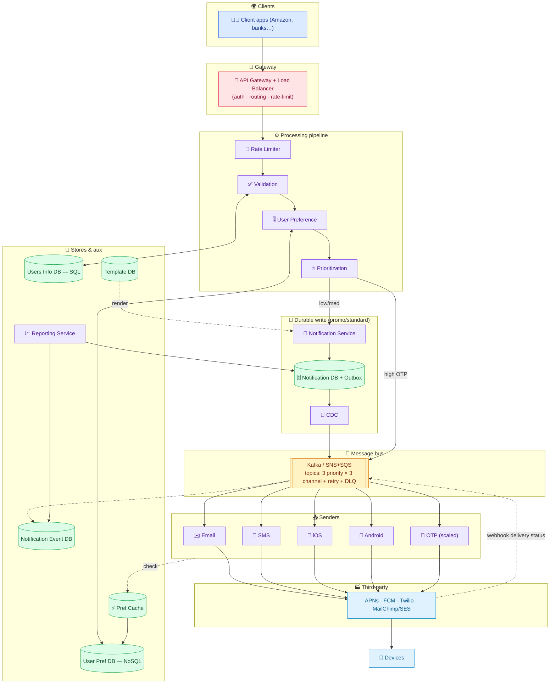

ASCII (the required `client → gateway → service → queue → delivery` flow):

```
 client → API Gateway/LB → Rate Limiter → Validation ─(Users Info DB)
                                              │
                                        User Preference ─(Pref DB, Pref Cache)
                                              │
                                        Prioritization
                                       /                \
                        low/med (durable)              high/OTP (fast)
                    Notification DB+Outbox → CDC            │
                                       \                /
                                     Message Queue (per-topic) → Senders → APNs/FCM/Twilio/MailChimp → 📱
                                              ↑ delivery webhook           Reporting ← Notification DB + Event DB
```

**Component roles:** API Gateway/LB (auth, route, rate-limit) · Rate Limiter (anti-spam, first) · Validation (check user against Users Info DB) · User Preference (filter by Pref DB, cached) · Prioritization (OTP first, last stage) · Notification Service + Outbox (durable write) · CDC (outbox→Kafka) · Message Queue (per priority×channel topics + retry + DLQ) · per-channel Senders (+ scaled OTP sender) · Third-party providers (APNs/FCM/Twilio/MailChimp) · Reporting Service (reads Notification + Event DB) · Pref Cache (avoid DB hit per send).

---

## B6. Data Model / Schema 🗃️

- **Users Info DB (SQL)** — `user_id (PK, idx)`, `name`, `email`, `phone_number`, `is_active`, `created_at`, `updated_at`.
- **User Preference DB (NoSQL)** — doc keyed & indexed by `user_id`; per-channel `{optIn, notificationTypes[]}`.
- **Template DB (SQL)** — `template_id (PK)`, `name`, `type`, `channel`, `content`, `variables`, `version`, `is_active`, timestamps.
- **Notification DB (NoSQL/wide-column)** — `notification_id (PK)`, `client_id`, `external_user_id`, `template_id`, `channel`, `payload`, `status`, `priority`, `schedule_flag`, `updated_at`. **Outbox table:** `outbox_id`, `notification_id`, `event_type`, `payload`, `published`, `created_at`.
- **Notification Event DB (BigQuery-style, append-only)** — micro-level status timeline per notification for analytics.

**Indexing:** every hot query is by `user_id` (validation, preferences) or `notification_id` (status) → index those. **Sharding:** partition Notification DB by `notification_id`/`client_id` (high cardinality, even spread); Users/Prefs by `user_id`.

---

## B7. Deep Dive Modules 🔬

Pointers to the full deep dives above:

- **B7.1 Async decoupling** — never send inline; enqueue + ack fast (ms). → [§7](#7-naive-design--why-it-fails-the-synchronous-trap-), [§14](#14-decoupling-with-a-message-queue-)
- **B7.2 Outbox + CDC durability** — DB-first write, CDC to Kafka; no message loss. → [§17](#17-deep-dive--durability-the-outbox--cdc-pattern-)
- **B7.3 Priority lanes** — OTP skips outbox (fast); promo takes durable path; 3×3 topic matrix. → [§18](#18-deep-dive--priority-lanes-otp-fast-path-)
- **B7.4 Retries/DLQ/backoff** — exponential backoff + jitter, DLQ after max attempts, idempotency. → [§19](#19-deep-dive--retries-dlq-backoff--webhooks-)
- **B7.5 Delivery webhooks** — sent vs delivered; providers call back → delivery consumer updates DB. → [§19](#19-deep-dive--retries-dlq-backoff--webhooks-)
- **B7.6 Fan-out (SNS/SQS or Kafka topics)** — per-channel isolation. → [§14](#14-decoupling-with-a-message-queue-), [§20](#20-deep-dive--snssqs-fan-out--templatesreporting-)
- **B7.7 Pipeline ordering** — cheapest/most-rejecting filters first (rate-limit → validate → prefs → prioritize). → [§13](#13-reordering-the-pipeline-for-efficiency-)
- **B7.8 DB selection** — SQL for fixed (users/templates), NoSQL for flexible (prefs/notifications). → [§15](#15-deep-dive--database-selection-)

---

## B8. Data Flow Diagram 🔀

**Write/delivery path (promotional, durable) — end to end:**

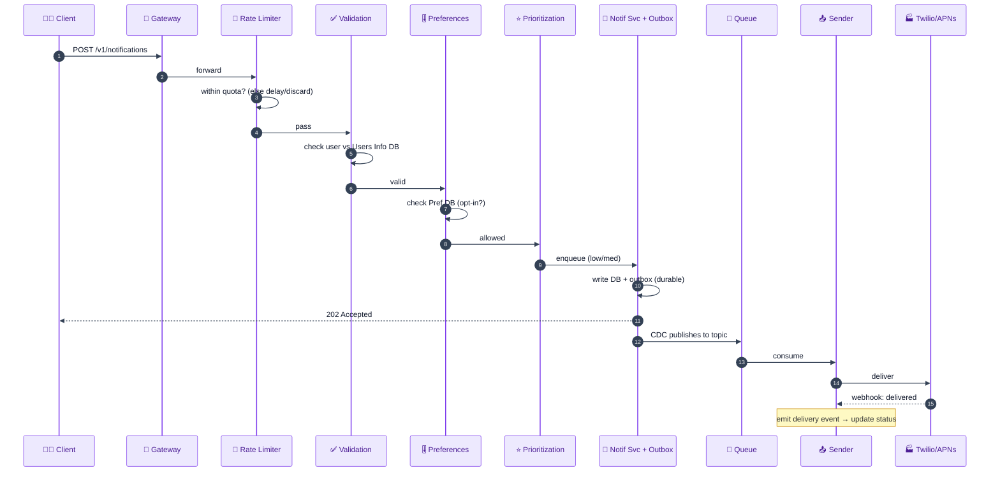

**OTP fast path (ASCII):**

```
 client → Gateway → Rate Limiter → Validation → Preferences → Prioritization(HIGH)
                                                                    │  (skip outbox)
                                                              Kafka directly
                                                                    │
                                                           OTP Sender (scaled) → Twilio/APNs → 📱 (near real-time)
                                                                    │ (on loss → user requests resend)
```

---

## B9. Scalability & Bottlenecks 📈

| Layer | First bottleneck | Scale strategy |
|---|---|---|
| **Notification ingest** | 578 QPS (or 16.7K industrial) into one service | stateless service behind LB → add instances; partition by client |
| **Message queue** | one topic/partition saturates | partition per priority×channel; add partitions/consumers |
| **Senders (workers)** | consumer lag (producer > consumer) | horizontally scale workers per topic; **extra replicas for OTP** across regions |
| **Third-party rate limits** | APNs/Twilio throttle us | sender-side rate limiter, batching (bulk topics), backoff |
| **User Preference DB** | read on every send | **Pref Cache** in front; Kafka-buffered writes |
| **Notification DB** | 447 TB/10yr, write-heavy | shard by notification_id/client_id; write-optimized store; TTL/archival |
| **Reporting** | analytical scans | separate read store (BigQuery-style event DB), read replicas |
| **Single region** | regional outage / global latency | multi-region, geo-routing, cross-region replication |

<details>
<summary><b>Detailed walkthrough of each bottleneck (beginner-friendly) — click to expand</b></summary>

**1. Ingest.** At 578 QPS (or ~16,667 QPS industrial) a single ingest service caps out. Because it's **stateless**, we add instances behind the load balancer and partition traffic by client. It only writes to the DB/queue, so it scales linearly.

**2. Message queue.** One topic/partition has a throughput ceiling. We split into **per priority×channel topics** and add partitions; more partitions = more parallel consumers = higher throughput. Kafka/SQS both scale this way.

**3. Senders.** If producers enqueue faster than a sender consumes, **consumer lag** grows and delivery is delayed. We **horizontally scale workers** per channel; the **OTP sender gets extra replicas across regions** so critical messages never lag.

**4. Third-party limits.** APNs/Twilio impose their own rate limits; blasting them gets messages dropped. We put a **rate limiter in front of the external call**, use **bulk topics** for batchable channels, and back off on 429s.

**5. Preference DB reads.** Checking preferences on every send would hammer the DB. A **Pref Cache** serves hot lookups; preference *writes* are buffered through Kafka so bursty updates don't overwhelm the DB.

**6. Notification DB storage.** 447 TB over 10 years won't fit on one node. **Shard** by notification_id/client_id (even spread), use a write-optimized store, and **archive/TTL** old notifications to cold storage.

**7. Reporting.** Analytical queries over history are heavy. Serve them from a **separate append-only event store** (BigQuery-style) and read replicas so they don't touch the hot write path.

**8. Single region.** One region is a global SPOF and adds latency for distant users. Go **multi-region** with geo-routing and async replication (eventual consistency is acceptable per our CAP choice).

</details>

---

## B10. Failure Modes & Mitigation 🛡️

| Failure / edge case | Impact | Mitigation |
|---|---|---|
| **Synchronous external call** | signup blocked 3–5 s; failure breaks core flow | **decouple** via queue; ack fast (202); deliver async |
| **Queue down before persist** | message lost, but client was ack'd | **Outbox + CDC** — DB-first write, then publish |
| **Third-party down/throttled** | delivery fails | **retry w/ exponential backoff + jitter**; **DLQ** after max attempts |
| **Duplicate delivery** | user gets 2 identical OTPs | **idempotency** (dedupe by notification_id); at-least-once + dedupe |
| **Single server (SPOF)** | whole system down | multiple instances + LB; DBs (not on-server state) |
| **One sender crashes** | that channel stalls | per-channel isolation; messages persist in queue; resume on recovery |
| **OTP latency (slow path)** | OTP expires | **priority fast lane** — OTP skips outbox → Kafka direct |
| **Spam / abuse (public API)** | system overwhelmed / cost | rate limiter at gateway **and** before third-party call |
| **Preference DB hot** | slow sends | pref cache; Kafka-buffered writes |
| **Sent ≠ delivered** | wrong status reported | **delivery webhooks** from providers update status |
| **Sudden spike (flash sale)** | overload | autoscale workers, bulk topics, backpressure via queue |
| **Compliance (GDPR/CAN-SPAM)** | legal risk | data-deletion handling, unsubscribe tracking, opt-out enforcement |

<details>
<summary><b>Detailed walkthrough of each failure mode (beginner-friendly) — click to expand</b></summary>

**1. Synchronous external call.** Sending inline blocks the user request on a 3–5 s external call and couples core flows to a flaky dependency. **Decouple**: create an event, enqueue it, return **202** in milliseconds; workers deliver asynchronously.

**2. Queue down before persist.** If we ack the client and Kafka dies before anything is stored, the message vanishes. The **Outbox pattern** writes the notification + outbox row to the DB **in one transaction first**, acks only then, and a **CDC** pipeline later publishes to Kafka — so nothing is lost.

**3. Third-party down/throttled.** External providers fail routinely. **Exponential backoff + jitter** spaces out retries so we don't hammer a recovering service; after **max attempts** the message goes to a **DLQ** for inspection instead of clogging the pipeline.

**4. Duplicate delivery.** At-least-once queues + retries can deliver twice, violating "no duplicates." Senders are **idempotent** — they dedupe by `notification_id` so a re-processed message isn't sent again.

**5. Single server SPOF.** One box = one failure = total outage, plus data loss if state lives on it. Run **multiple instances behind a load balancer** and keep all state in **databases**.

**6. Sender crash.** With per-channel isolation and a durable queue, a crashed sender just stops consuming; its messages **wait in the queue** and are processed when it restarts — other channels are unaffected.

**7. OTP latency.** The durable outbox path adds seconds — fine for promos, fatal for OTPs. OTPs take a **fast lane** straight to Kafka; a rare loss is covered by **user-initiated resend**.

**8. Spam/abuse.** A public API invites floods. **Rate limit at the gateway** (protect us) **and before the third-party call** (respect their limits and control cost).

**9. Preference DB hot.** Checking prefs per send overloads the DB. A **cache** serves hot reads; preference **writes** are Kafka-buffered so update bursts don't overwhelm it.

**10. Sent ≠ delivered.** We only know we handed off to the provider. **Delivery webhooks** let providers report actual delivery/read, which a delivery consumer writes back to the Notification DB.

**11. Sudden spike.** Flash sales multiply traffic. The **queue absorbs bursts** (backpressure), workers **autoscale**, and batchable traffic uses **bulk topics**.

**12. Compliance.** GDPR (deletion requests) and CAN-SPAM (unsubscribe) are legal must-haves; build opt-out tracking and honor deletions — a reason to lean on compliant third parties like MailChimp.

</details>

---

## B11. Alternative Designs / Trade-off Comparison ⚖️

### Alternative A — Synchronous, inline delivery (the naive design)

- **How:** send the notification inline in the triggering request.
- **Pros:** dead simple; immediate confirmation of actual delivery.
- **Cons:** blocks the caller 3–5 s; couples core flow to a flaky external dependency; no retries; doesn't scale.
- **vs chosen:** the async queue-based design wins on latency, reliability, and scale. Inline is only OK for tiny apps.

### Alternative B — Self-hosted Kafka vs managed SNS/SQS

- **Kafka:** high throughput, replay, ordered partitions, full control; but ops-heavy (you run it).
- **SNS + SQS (managed):** near-zero ops, auto-scaling, built-in DLQ; but less control, per-message cost, cloud lock-in.
- **vs chosen:** both implement the same **fan-out + per-channel isolation**. Pick Kafka at massive scale/with a platform team; SNS/SQS for speed-to-market. State the trade-off.

### Alternative C — No outbox (write straight to queue)

- **Pros:** lower latency, simpler.
- **Cons:** message loss if the queue dies before persistence; can't reliably ack.
- **vs chosen:** the **outbox** guarantees durability for standard/promo; we *deliberately* skip it only for OTP (fast lane + resend). Hybrid = best of both.

### Alternative D — Build delivery integrations in-house

- **Pros:** full control, no per-message vendor fees.
- **Cons:** APNs/FCM/telecom complexity, GDPR/CAN-SPAM compliance, huge cost & maintenance.
- **vs chosen:** use **APNs/FCM/Twilio/MailChimp**; focus engineering on orchestration, not reinventing carriers.

**Summary:** chosen = **async pipeline** (rate-limit → validate → prefs → prioritize) → **outbox+CDC for durable lanes / direct-Kafka for OTP** → **per-channel topics + workers** → **third-party delivery**, with **retries/DLQ/backoff**, **webhooks**, and **idempotency**. It optimizes for write-heavy scale, reliability (no loss/dup), and OTP latency.

---

## B12. Interview Q&A 🎓

> Questions are numbered and collapsible — click any question to reveal the answer.

### Conceptual (mid-level)

<details>
<summary><b>Q1. Why is a notification system write-heavy with almost no reads?</b></summary>

Clients *push* notifications in and the system *pushes* them out to devices — like a conveyor belt. Users don't poll or "GET" their notifications from us; delivery is initiated by us via APNs/FCM/Twilio/MailChimp. So the core path is write-only (~578 QPS writes, ~0 reads). The only real read path is the **reporting/status** service. This shapes storage (write-optimized) and the whole async-queue architecture.
</details>

<details>
<summary><b>Q2. What's the difference between a client and a user here?</b></summary>

A **client** is an *organization/app* (Amazon, a bank) that integrates our API to send notifications. A **user** is a *person* who receives them. Clients own the content and "who to notify"; users own their **preferences** (email vs SMS, opt-outs, frequency caps). The system is multi-tenant (many clients) and B2B2C, so the data model needs both a client identity and a per-user preference store.
</details>

<details>
<summary><b>Q3. Why decouple notification sending from the main app flow?</b></summary>

Sending inline makes a 3–5 s external call block the triggering request (e.g., signup), and couples the core flow to a flaky dependency — if the email provider is down, do you fail signup? Instead, the app creates an event, enqueues it, and returns **202 Accepted** in milliseconds; workers deliver asynchronously with retries. This restores low latency and isolates failures.
</details>

<details>
<summary><b>Q4. Why use third-party delivery services instead of building your own?</b></summary>

Building means integrating APNs, FCM, and telecom carriers (each a different protocol/fee), plus owning GDPR/CAN-SPAM compliance (unsubscribe, data deletion), plus large ongoing cost. Managed services (APNs, FCM, Twilio, MailChimp/SES) specialize in exactly this and do it more reliably. You focus engineering on **orchestration** (routing, prioritization, retries) rather than reinventing carrier integrations.
</details>

<details>
<summary><b>Q5. What are the four core responsibilities and why split into microservices?</b></summary>

Prioritization+validation, rate limiting, preference filtering, and delivery. A single server doing all four is a **SPOF**, risks **data loss** (server-local state), and becomes a **performance bottleneck**. Splitting into microservices (each behind a load balancer, backed by databases) lets each scale and fail independently — e.g., an SMS spike doesn't stall push delivery.
</details>

### Design trade-off (senior)

<details>
<summary><b>Q6. Why put the rate limiter first and prioritization last?</b></summary>

Cheapest, most-rejecting filters go first so expensive work only runs on notifications that survive. Rate limiting rejects excess up front, so we don't validate/prioritize messages that will be dropped anyway. Prioritization is expensive sorting; doing it before rate-limits/preferences wastes effort on notifications that later get discarded. Optimized order: **rate-limit → validate → preferences → prioritize → send**.
</details>

<details>
<summary><b>Q7. Why a message queue between prioritization and senders?</b></summary>

Direct calls tightly couple prioritization to every sender: if SMS slows, prioritization blocks waiting to hand off, choking throughput; and if a sender crashes, in-flight messages are lost. A queue with **per-channel topics** decouples them — senders **pull** at their own pace, a slow/down sender just lets its topic back up, and messages **persist** for retry on recovery. Isolation + retry + parallelism.
</details>

<details>
<summary><b>Q8. Kafka vs SNS/SQS — how do you choose?</b></summary>

Both give fan-out with per-channel isolation and DLQs. **Kafka**: highest throughput, replay, ordered partitions, full control — but you operate it (needs a platform team). **SNS+SQS**: managed, auto-scaling, minimal ops, built-in DLQ — but less control, per-message cost, cloud lock-in. Choose Kafka at massive scale with ops maturity; SNS/SQS for speed-to-market and lean teams.
</details>

<details>
<summary><b>Q9. How do you guarantee OTP low latency while keeping promos durable?</b></summary>

Two lanes by priority. **Promo/standard** take the durable **Outbox → CDC → Kafka** path (~5–10 s, acceptable per NFR). **OTP/critical** **skip the outbox** and write **directly to Kafka**, consumed immediately by a dedicated, region-replicated **OTP sender** (near real-time). A rare OTP loss is covered by **user-initiated resend**, so we trade a sliver of durability for speed exactly where latency matters.
</details>

<details>
<summary><b>Q10. How do you prevent duplicate notifications?</b></summary>

Queues are at-least-once and retries can re-deliver, so senders must be **idempotent**: dedupe by `notification_id` (check a "already delivered" marker before sending). Combined with delivery webhooks to confirm actual delivery, this satisfies the reliability requirement of "no duplicates, no missed alerts." Without idempotency a user could get two identical OTPs for one login.
</details>

### Deep-dive internals (staff)

<details>
<summary><b>Q11. Explain the outbox + CDC pattern and the problem it solves.</b></summary>

If the service writes to Kafka then acks the client, and Kafka dies before persisting, the message is **lost** though we said "sent." The **Transactional Outbox** writes the notification row + an `outbox` row to the DB in **one atomic transaction** *before* acking; a **CDC** (Change Data Capture) pipeline tails the outbox and publishes to Kafka. Now the durable write and the publish-intent are atomic, so a message can never be ack'd and then lost. Cost: added latency (acceptable for non-OTP).
</details>

<details>
<summary><b>Q12. Where does this system sit on CAP?</b></summary>

**AP** — availability + partition tolerance over strong consistency. A notification just says an event happened; it's fine if a **preference or template change** propagates with **eventual consistency** (a few seconds). Note consistency ≠ latency: a template update being visible late (consistency) differs from an OTP arriving late (latency). We keep the delivery path highly available and tolerate eventual consistency on config data.
</details>

<details>
<summary><b>Q13. How do retries and the DLQ work, and why exponential backoff?</b></summary>

On a transient failure, the sender retries after an **increasing** delay (1s, 2s, 4s, 8s… + jitter) so it doesn't hammer a recovering provider or cause synchronized retry storms. After a **max attempt count** (or a permanent error), the message is routed to a **Dead Letter Queue** so bad/permanent failures don't clog the main pipeline; engineers inspect and replay from the DLQ. This bounds resource use and isolates poison messages.
</details>

<details>
<summary><b>Q14. Sent vs delivered — how do you track true delivery status?</b></summary>

Our sender only knows it handed the message to the provider (**sent**). Actual **delivery** is owned by APNs/FCM/Twilio. We expose a **webhook** per provider; they call back with delivery/read receipts, which we publish to Kafka and a **delivery consumer** writes to the Notification DB (latest status) and an append-only **event DB** (full timeline). Status: `pending → scheduled → sent → delivered | failed`.
</details>

<details>
<summary><b>Q15. Do the throughput and storage math.</b></summary>

Notifications = 1,000 clients × 50,000/day = **50M/day** → 50M ÷ 86,400 ≈ **578 write QPS**. Storage/day with mix (30% SMS×500B, 40% email×5KB, 30% push×1KB) = 7.5 + 100 + 15 = **122.5 GB/day** → ×365×10 ≈ **447 TB** for notifications; +80 GB user info +200 GB prefs ≈ **447.28 TB** total. Ingress 122.5GB÷86,400 ≈ **1.42 MB/s**; egress at 85% delivered ≈ **1.21 MB/s**. Industrial variant: 1M/min ≈ **16,667 QPS**.
</details>

### Behavioral (STAR, tied to this system)

<details>
<summary><b>Q16. Tell me about a time you removed a reliability risk from a pipeline.</b></summary>

- **Situation:** Our notification service wrote straight to Kafka and ack'd clients; a Kafka outage silently dropped messages we'd reported as "sent."
- **Task:** Guarantee no message loss without wrecking latency for all traffic.
- **Action:** Introduced the **transactional outbox** — notification + outbox rows written atomically to the DB before ack, with a **CDC** pipeline publishing to Kafka. Kept OTPs on a direct fast lane to preserve their latency.
- **Result:** Zero message loss on the durable path; standard notifications stayed within the 5–10 s SLA and OTPs stayed near-real-time. Reported "sent" now truly meant persisted.
</details>

<details>
<summary><b>Q17. Tell me about a time you fixed a latency problem for a critical path.</b></summary>

- **Situation:** After adding durability (outbox+CDC), **OTPs** inherited the ~5–10 s delay and were expiring before users received them.
- **Task:** Restore near-real-time OTP delivery without giving up durability for promos.
- **Action:** Split traffic into **priority lanes** — OTP/critical bypass the outbox and go **directly to Kafka** consumed by a dedicated, region-scaled OTP sender; promos keep the durable path. Relied on **user-initiated resend** for the rare OTP loss.
- **Result:** OTP delivery returned to sub-second; promo durability preserved. Consumer lag on the OTP topic dropped to near zero after horizontal scaling.
</details>

<details>
<summary><b>Q18. Tell me about a time you decoupled tightly-coupled services.</b></summary>

- **Situation:** During a flash sale, the prioritization service called senders directly; a slow SMS provider blocked it, throttling *all* channels, and a sender crash lost in-flight messages.
- **Task:** Isolate channels and make delivery recoverable under load.
- **Action:** Inserted a **message queue with per-channel topics**; senders subscribe and pull independently, and messages persist for retry. Added DLQ + exponential backoff.
- **Result:** A slow/down channel no longer affected others; no messages lost during sender restarts; total throughput stabilized during the sale.
</details>

<details>
<summary><b>Q19. Tell me about a time you chose to buy instead of build.</b></summary>

- **Situation:** The team debated building in-house SMS/email/push delivery for "control."
- **Task:** Decide the delivery layer given tight timelines and compliance needs.
- **Action:** I laid out the cost of owning APNs/FCM/telecom integrations plus GDPR/CAN-SPAM compliance, and proposed **Twilio/MailChimp/APNs/FCM**, keeping our engineering on orchestration (routing, retries, prioritization). Documented the per-message cost trade-off.
- **Result:** We shipped months sooner with compliant, reliable delivery; engineering focused on the differentiated parts (pipeline, priority, dashboards).
</details>

<details>
<summary><b>Q20. Tell me about a time you optimized a wasteful pipeline ordering.</b></summary>

- **Situation:** Our pipeline validated and prioritized notifications *before* rate-limiting and preference checks, doing expensive work on messages that were later discarded.
- **Task:** Cut wasted compute without changing outcomes.
- **Action:** Reordered to **rate-limit → validate → preferences → prioritize**, pushing the cheapest, highest-rejection filters first (predicate pushdown), so prioritization only ran on survivors.
- **Result:** Meaningful drop in validation/prioritization load during promo bursts, lower cost, and better headroom during spikes — with identical delivered output.
</details>

---

## B13. Quick Revision (cheat sheet + ~2-page deep revision) 📚

> **Part 1** = rapid recall card; **Part 2** = fuller night-before walkthrough.

### Part 1 — One-glance cheat sheet

**One-liner:** A **multi-tenant, write-heavy, async fan-out** pipeline that validates, rate-limits, filters by preference, prioritizes, and reliably delivers SMS/email/push via third parties — using **queues, outbox+CDC, retries/DLQ, and priority lanes**.

**Core requirements:** send (SMS/email/push); rate limiting; prioritization + validation; user preferences; (bonus) templates, scheduling, delivery dashboard. NFRs: high availability (~5–7 nines), low latency (OTP real-time, promo 5–10 s ok), scalability (578 QPS → 16.7K industrial), reliability (no dup/no loss), flexibility; **CAP = AP**.

**Architecture:** `Client → API Gateway/LB → Rate Limiter → Validation (Users Info DB, SQL) → User Preference (Pref DB, NoSQL + cache) → Prioritization → {Outbox+CDC (promo) | direct Kafka (OTP)} → per priority×channel topics (+retry, DLQ) → per-channel Senders → APNs/FCM/Twilio/MailChimp → devices`; delivery **webhooks** update status; **Reporting** reads Notification DB + Event DB.

**Key capacity numbers:** 1,000 clients · 50M DAU · 400M MAU · 50M notif/day → **578 write QPS** · reads ≈ 0 · mix 30/40/30 (SMS 500B / email 5KB / push 1KB) → **122.5 GB/day** → **~447 TB/10yr** (+80 GB users +200 GB prefs = **447.28 TB**) · cache 1.22 GB/day · ingress 1.42 MB/s · egress 1.21 MB/s (85% delivered) · industrial **1M/min ≈ 16,667 QPS**.

**Building blocks + why:** API Gateway (route+rate-limit) · Message Queue/Kafka or SNS+SQS (decouple, fan-out, retry) · Outbox+CDC (durability/no-loss) · per-channel Senders (parallel, isolated) · third parties APNs/FCM/Twilio/MailChimp (delivery, compliance) · SQL Users/Template DB (fixed) · NoSQL Pref/Notification DB (flexible) · Pref Cache (avoid per-send DB hit) · DLQ + exponential backoff (fault tolerance) · webhooks (true delivery status).

**What you'd change at 10× scale:** more topic partitions + consumer replicas (esp. OTP, multi-region); managed SNS/SQS or bigger Kafka; shard Notification DB harder + archival/TTL; batch/bulk topics for email/SMS; regional pref caches; separate analytics store; sender-side rate limiting to respect provider limits.

**Top 10 answers to memorize:**
1. Write-heavy, ~0 reads → async push pipeline.
2. Decouple via queue; return **202** in ms (never send inline).
3. **Outbox + CDC** = no message loss (DB-first, then publish).
4. **Priority lanes**: OTP skips outbox (fast), promo durable (5–10 s).
5. Pipeline order: **rate-limit → validate → prefs → prioritize** (cheapest/most-rejecting first).
6. Per-channel **topics + senders** for isolation & parallelism.
7. **Retries w/ exponential backoff + jitter → DLQ**; **idempotency** for no dups.
8. **Buy** delivery (APNs/FCM/Twilio/MailChimp), don't build (compliance/cost).
9. SQL for fixed (users/templates), NoSQL for flexible (prefs/notifications).
10. **Webhooks** distinguish *sent* vs *delivered*; **CAP = AP**.

### Part 2 — Deep revision (~2 pages)

#### Problem
Multi-tenant service: clients (orgs) send SMS/email/push to end users (people). Validate, rate-limit, filter by preference, prioritize, deliver reliably via third parties. Write-heavy; the crux is **reliability** (no loss/dup) + **prioritization** (OTP fast).

#### Requirements
- **Functional:** send (SMS/email/push), rate limiting, prioritization+validation, user preferences; bonus templates/scheduling/reporting.
- **Non-functional:** availability ~99.99–99.999% (aspirational 7 nines); OTP near-real-time, promo 5–10 s; scale 578 QPS→16.7K; no dup/no loss; multi-channel + prefs; **AP** (eventual consistency for prefs/templates; consistency ≠ latency).

#### Capacity (memorize)
```
1,000 clients × 50,000/day = 50M/day → ÷86,400 ≈ 578 write QPS ; reads ≈ 0
Storage/day: SMS 0.3×50M×500B=7.5GB + email 0.4×50M×5KB=100GB + push 0.3×50M×1KB=15GB = 122.5 GB/day
10yr notif = 122.5GB×365×10 ≈ 447 TB ; +user info 400M×200B=80GB +prefs 400M×500B=200GB ≈ 447.28 TB
cache 1%×122.5GB ≈ 1.22 GB/day ; ingress 122.5GB/86,400 ≈ 1.42 MB/s ; egress 85%×that ≈ 1.21 MB/s
industrial: 1M/min ≈ 16,667 QPS ; 86,400 = seconds/day
```

#### Naive design → why it fails
Inline `sendEmail()` blocks the request 3–5 s and couples core flow to a flaky provider (fail signup because email failed?). **Fix:** create event → enqueue → return 202 in ms → async workers deliver with retries.

#### Delivery flows & service split
iOS/Android flows share **steps 1–3 (validate, process, connect-prep)**; only **4–6 (channel delivery)** differ → split into a **Handler service** + **per-channel Delivery services**. Buy delivery: **APNs** (iOS), **FCM** (Android), **Twilio** (SMS), **MailChimp/SES** (email) — for protocol complexity, GDPR/CAN-SPAM compliance, and cost.

#### Pipeline (optimized order)
`Gateway → Rate Limiter → Validation (Users Info DB) → User Preference (Pref DB) → Prioritization → Queue → Senders`. Cheapest/highest-rejection first. Sender is **separate** from preferences (delivery ≠ filtering); split per channel for parallel scaling.

#### Message queue (decoupling)
Direct calls couple prioritization to senders (slow SMS blocks all; crash loses messages). Insert **queue with per-channel topics**; senders subscribe & pull; slow/down channel just backs up its topic; messages persist for retry. **3 priority × 3 channel = 9 topics** + retry + DLQ + bulk topics.

#### Durability (outbox + CDC)
Writing to Kafka then acking risks loss if Kafka dies first. **Outbox:** write notification + outbox row atomically to DB, ack, then **CDC** publishes to Kafka. Adds latency (fine for promo per NFR).

#### Priority lanes
**OTP/critical** skip outbox → direct Kafka → scaled OTP sender (near-real-time; loss covered by resend). **Promo/standard** take durable path.

#### Reliability details
Retries with **exponential backoff + jitter**; **DLQ** after max attempts; **idempotency** (dedupe by notification_id) for no dups; **delivery webhooks** for sent→delivered; single **delivery consumer** owns status writes (avoid multi-writer anti-pattern).

#### Databases
Users Info = **SQL** (fixed, moderate, by user_id). Preferences = **NoSQL** (flexible, evolving, by user_id, cached). Template = SQL (versioned, per-channel). Notification = NoSQL/wide-column (huge, write-heavy). Event DB = append-only (analytics). Index by user_id / notification_id; shard accordingly.

#### Alternatives
Inline sync (simple, doesn't scale) · Kafka vs SNS/SQS (control vs managed) · no-outbox (fast, lossy) · build-in-house delivery (control vs cost/compliance). Chosen = async + outbox/CDC + priority lanes + per-channel topics + third-party delivery.

---

## B14. FAANG Top 20 Most Frequently Asked Questions 🏆

> Collapsible — click any question to reveal a ≥5-line, interview-ready answer.

<details>
<summary><b>1. Design a notification system — walk me through your approach.</b></summary>

Clarify channels (SMS/email/push), client-vs-user distinction, real-time vs scheduled, scale, consistency (AP), and build-vs-buy. Name the crux: a **write-heavy async fan-out** where reliability and prioritization dominate. Start with the naive inline design, show why it fails (blocking + coupling), then decouple via a queue. Build the pipeline **rate-limit → validate → preferences → prioritize → queue → per-channel senders → APNs/FCM/Twilio/MailChimp**. Add **outbox+CDC** for durability, **priority lanes** for OTP, and **retries/DLQ/webhooks/idempotency** for reliability.
</details>

<details>
<summary><b>2. Why is it write-heavy, and how does that shape the design?</b></summary>

Clients push notifications in; the system pushes them out to devices — users never poll us, so the delivery path is essentially write-only (~578 QPS writes, ~0 reads; reporting is the only read). This drives write-optimized storage, queue-based async processing, and horizontal sender scaling. It also means caching helps preferences (read on every send) far more than the notification payloads themselves, and that throughput/fan-out — not read bandwidth — is the scaling challenge.
</details>

<details>
<summary><b>3. Why decouple sending with a queue instead of calling providers inline?</b></summary>

Inline sending blocks the triggering request on a 3–5 s external call and couples core flows to flaky third parties — a provider outage could fail a signup. A queue lets the app enqueue and return **202 Accepted** in milliseconds; workers deliver asynchronously. It also absorbs spikes (backpressure), isolates channels (a slow SMS provider doesn't stall push), and enables **retries** since messages persist until successfully consumed. This is the single most important architectural decision.
</details>

<details>
<summary><b>4. Explain the outbox + CDC pattern and why you need it.</b></summary>

If the service writes to Kafka and then acks the client, a Kafka failure before persistence loses a message you already reported as sent. The **transactional outbox** writes the notification row + an outbox row to the DB in one atomic transaction *before* acking; a **CDC** pipeline tails the outbox and publishes to Kafka. Now "ack" implies durability, so no ack'd message is ever lost. The cost is added latency, acceptable for promos (5–10 s NFR) but not OTP — hence the fast lane.
</details>

<details>
<summary><b>5. How do you keep OTPs fast while promos are durable?</b></summary>

Route by priority into two lanes. **OTP/critical** bypass the outbox and write **directly to Kafka**, consumed immediately by a dedicated, region-replicated OTP sender for near-real-time delivery; a rare loss is handled by **user-initiated resend** (OTPs are inherently retryable). **Promo/standard** take the durable **outbox→CDC→Kafka** path where 5–10 s latency is fine. This puts durability and speed each where they matter, using a 3×3 (priority×channel) topic matrix.
</details>

<details>
<summary><b>6. Why order the pipeline rate-limit → validate → preferences → prioritize?</b></summary>

Put the cheapest, most-rejecting stages first so expensive work only runs on messages that will actually be delivered (predicate pushdown). Rate limiting discards excess up front; validation and preference filtering drop more; only survivors reach prioritization (expensive sorting) and delivery. Doing prioritization first would waste effort sorting notifications later discarded by rate limits or preferences. This ordering minimizes wasted compute, especially during promo bursts.
</details>

<details>
<summary><b>7. How do you handle third-party failures reliably?</b></summary>

Failures are inevitable (provider down, 429 throttling, timeouts). Use **retries with exponential backoff + jitter** (1s, 2s, 4s… + randomness) so we don't hammer a recovering service or cause synchronized storms. After a **max attempt count** (or a permanent error), route the message to a **Dead Letter Queue** for inspection/replay, keeping the main pipeline clean. Combine with **idempotency** so retried messages aren't delivered twice, satisfying the no-duplicate reliability requirement.
</details>

<details>
<summary><b>8. Sent vs delivered — how do you know a notification actually arrived?</b></summary>

The sender only knows it handed the message to the provider (**sent**). True **delivery** is owned by APNs/FCM/Twilio. We expose a **webhook** per provider; they call back with delivery/read receipts, which we publish to Kafka; a single **delivery consumer** updates the Notification DB (latest status) and an append-only event DB (full timeline: pending→scheduled→sent→delivered). This powers accurate reporting and avoids multiple services writing the same table.
</details>

<details>
<summary><b>9. Why buy delivery (APNs/FCM/Twilio/MailChimp) instead of building it?</b></summary>

Building means integrating APNs, FCM, and telecom carriers — each a distinct protocol, setup, and fee — plus owning GDPR (data deletion) and CAN-SPAM (unsubscribe tracking) compliance, plus large ongoing dev/ops/monitoring cost. Managed providers specialize in delivery and compliance and do it more reliably. You concentrate engineering on the differentiated orchestration layer (routing, prioritization, retries, dashboards) rather than reinventing carrier plumbing. It's faster and cheaper to production.
</details>

<details>
<summary><b>10. How do you choose databases for each store?</b></summary>

Walk the guidelines per store. **Users Info** is fixed-schema, moderate scale, simple by-user_id lookups → **SQL** (PostgreSQL). **User Preferences** evolve (new channels/types), change frequently, simple queries → **NoSQL**. **Templates** are structured/versioned → SQL. **Notification DB** is huge and write-heavy → NoSQL/wide-column. **Event DB** is append-only analytics → columnar (BigQuery-style). Index by the hot key (user_id or notification_id) and shard on high-cardinality keys for even load.
</details>

<details>
<summary><b>11. What's the client vs user distinction and why does it matter architecturally?</b></summary>

**Clients** are organizations (Amazon, banks) that call our API; **users** are the people who receive notifications. Clients own content and targeting; users own **preferences** (channel opt-ins, frequency caps) — which the client doesn't store, we do. This makes the system **multi-tenant B2B2C** and requires both a client identity (for auth, rate limits, reporting) and a per-user preference store queried on every send (hence the preference cache). Mixing them up leads to a wrong data model.
</details>

<details>
<summary><b>12. How does rate limiting work and where do you apply it?</b></summary>

Rate limiting caps notifications per user in a time window (anti-spam) and protects the system during spikes (anti-overload). Apply it **at the API gateway** (protect the backend, block abusive floods on the public API) **and before the third-party call** (respect the provider's own limits and control cost). Excess is delayed or discarded. Placing it **first** in the pipeline also avoids doing expensive validation/prioritization on messages that will be dropped anyway.
</details>

<details>
<summary><b>13. How do you support user preferences without hammering the DB?</b></summary>

Every send must check the user's preferences (opt-in channel/type), which would overload the Pref DB at scale. Front it with a **User Preference Cache** so senders read hot preferences from memory. Preference **writes** (users toggling settings) can be bursty, so buffer them through **Kafka** into a preference consumer that updates the DB asynchronously. This keeps both the read path (per send) and the write path (bursty updates) off the critical DB.
</details>

<details>
<summary><b>14. How do templates and personalization work?</b></summary>

Clients create versioned, per-channel **templates** with **variables** (e.g., "Hi {{name}}, the {{product}} sale ends {{date}}"). A send request supplies `templateId + variables{}`; a renderer substitutes variables to produce the final message, personalized per user persona (iPhone vs Galaxy). Per-channel templates matter because an SMS must be concise while an email can be rich with images. Versioning lets clients evolve messaging safely, and a Template DB (SQL) stores the metadata and content.
</details>

<details>
<summary><b>15. Kafka vs SNS/SQS for the message bus — trade-offs?</b></summary>

Both provide fan-out with per-channel isolation and DLQs. **Kafka** offers the highest throughput, message replay, ordered partitions, and full control — but you operate it, which needs a platform team. **SNS + SQS** is fully managed with auto-scaling, minimal ops, and built-in DLQs — but less control, per-message cost, and cloud lock-in. Choose Kafka at massive scale with ops maturity (and when you need replay/ordering); choose SNS/SQS for speed-to-market and lean teams.
</details>

<details>
<summary><b>16. What's your availability target and how do you achieve it?</b></summary>

Aspirationally "seven nines," realistically **99.99–99.999%**, higher on the OTP path. Achieve it with **no single points of failure** (multiple stateless service instances behind load balancers, replicated databases), **queues** that persist messages through downstream outages, **retries + DLQ** for third-party failures, and **multi-region** deployment with geo-routing. Because we're **AP**, we favor staying available (delivering, possibly with slightly stale preferences) over blocking for strong consistency.
</details>

<details>
<summary><b>17. How do you prevent losing messages end to end?</b></summary>

Three mechanisms compound: (1) **Outbox + CDC** ensures a message is durably persisted before we ack the client and before it reaches Kafka. (2) The **queue itself is durable** — if a sender crashes, messages remain until consumed. (3) **Retries + DLQ** ensure transient third-party failures are re-attempted and permanent ones are quarantined, not dropped. For the OTP fast lane that skips the outbox, **user-initiated resend** is the safety net. Together these give the "no missed alerts" guarantee.
</details>

<details>
<summary><b>18. How do you scale for a flash-sale traffic spike?</b></summary>

The **queue absorbs the burst** (backpressure) so ingest never blocks; **workers autoscale** per topic as lag grows; batchable channels use **bulk topics**; and **rate limiting** at the gateway sheds abusive load. Per-channel isolation means the surge in promo push doesn't starve OTP SMS. Horizontally scaled OTP consumers (multi-region) keep critical latency flat. If a provider throttles, backoff + DLQ prevent cascading failure while the spike drains.
</details>

<details>
<summary><b>19. Why is having multiple services write the Notification DB an anti-pattern, and what's the fix?</b></summary>

If every sender writes status directly to the Notification DB, you get **write contention**, race conditions on the status field, and no single source of truth. The fix: senders **publish delivery events to Kafka**, and a single **delivery consumer** owns all status writes to the DB (and the event DB). This serializes updates, decouples senders from the DB, and makes status handling idempotent and replayable — a clean single-writer pattern.
</details>

<details>
<summary><b>20. Walk through the end-to-end flow for a promotional email.</b></summary>

Client `POST /v1/notifications` → **Gateway** (auth, route) → **Rate Limiter** (within quota?) → **Validation** (email matches Users Info DB?) → **User Preference** (opted into email promos?) → **Prioritization** (low priority) → **Notification Service** writes notification + **outbox** rows atomically, returns **202** → **CDC** publishes to the email topic → **Email Sender** consumes, renders the template, calls **MailChimp** → MailChimp delivers and calls our **webhook** → delivery consumer updates status to *delivered* in the Notification + event DBs → **Reporting** can now show it. Total time well within the 5–10 s promo SLA.
</details>

---

## Appendix — Sources & Notes 📎

This guide was built from three interview-prep transcripts on designing a notification system: (1) a step-by-step build (requirements → capacity → API → evolving HLD with pipeline reordering, third-party delivery, and a message queue), (2) an AWS-flavored breakdown (synchronous-trap motivation, SNS/SQS fan-out, DLQ, exponential backoff), and (3) an industrial multi-tenant design (client-vs-user, templates, priority topic matrix, outbox+CDC durability, delivery webhooks, reporting, rate limiting). It's enriched with standard practice (idempotency, single-writer status, predicate-pushdown ordering, CAP framing, multi-region).

**Numbers verified independently (programmatically):**
- Notifications/day = 1,000 × 50,000 = **50M** → ÷86,400 ≈ **578 write QPS**.
- Storage/day = 7.5 (SMS) + 100 (email) + 15 (push) = **122.5 GB/day** → ×365×10 ≈ **447 TB**; + 80 GB user info + 200 GB prefs ≈ **447.28 TB**.
- Cache ≈ **1.22 GB/day**; ingress ≈ **1.42 MB/s**; egress (85% delivered) ≈ **1.21 MB/s**.
- Industrial scale: 1,000,000/min ≈ **16,667/sec**.

All capacity figures were re-derived and verified.
