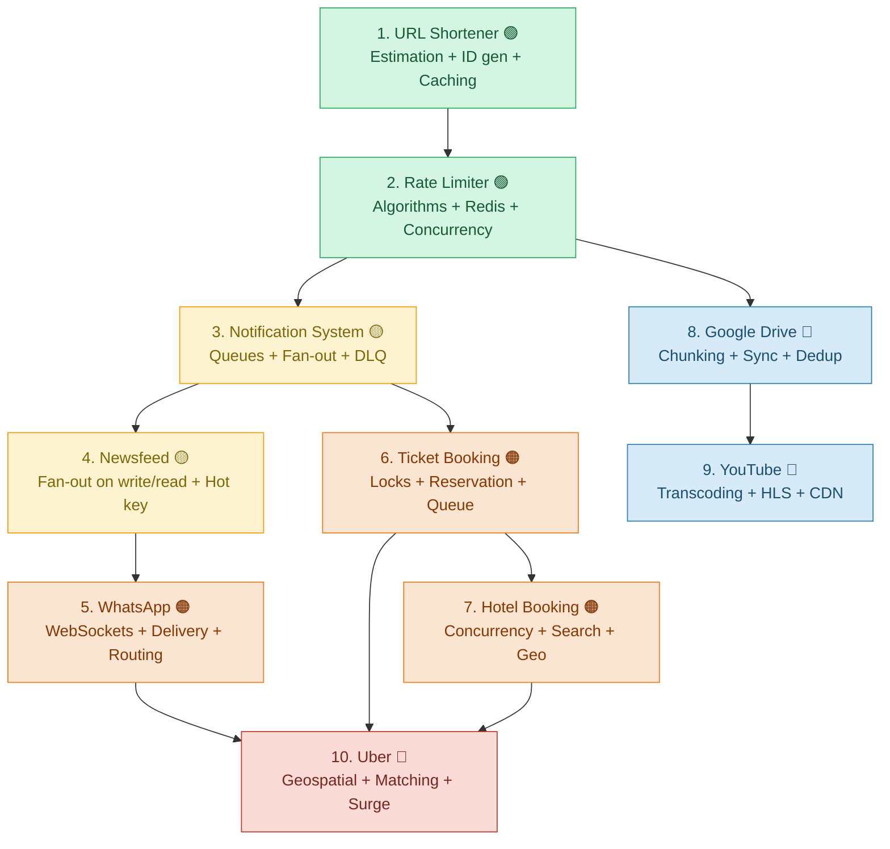

# 🏛️ System Design Study Guides — Master Lookup & Learning Roadmap

Your single home page for all 10 in-depth system design study guides. Use it to decide **what to read, in what order, and why** — with metrics tuned for L5/L6 (Senior / Staff / Principal) interviews.

Each guide is a complete, self-contained deep dive: requirements → capacity estimation → API design → high-level architecture → data model → deep-dive modules → failure modes → trade-off comparisons → interview Q&A → FAANG top-20 questions.

---

## Table of Contents

- [How to Use This Page](#how-to-use-this-page)
- [The Recommended Learning Order (Start Here)](#-the-recommended-learning-order-start-here)
- [Visual Roadmap](#-visual-roadmap)
- [Master Index — All Topics at a Glance](#-master-index--all-topics-at-a-glance)
- [Problems Grouped by Dominant Theme](#-problems-grouped-by-dominant-theme)
- [What Each Design Teaches You](#-what-each-design-teaches-you)
- [Metric Legend](#-metric-legend)

---

## How to Use This Page

Read the guides in the [Recommended Learning Order](#-the-recommended-learning-order-start-here) below. The order is deliberate: each guide introduces a small number of new primitives and reuses everything learned before it, so difficulty ramps up smoothly rather than in jumps.

If you are short on time, prioritise by the **FAANG Frequency** and **Staff/Principal Must-Know** columns in the [Master Index](#-master-index--all-topics-at-a-glance). The **grouping by theme** matters most for interviews: interviewers at L5/L6 probe whether you can transfer a pattern (for example, a distributed lock) from one problem to a completely different one. Studying by theme trains exactly that transfer.

---

## 🚦 The Recommended Learning Order (Start Here)

Follow this sequence top to bottom. The **Priority** column tells you what to cover first if you cannot do all ten.

| # | Start Order | Topic | Priority | Difficulty | Why it sits here |
|---|-------------|-------|----------|------------|------------------|
| 1 | 🟢 Begin | [URL Shortener (TinyURL)](URL-Shortener-System-Design-Study-Guide.md) | ⭐⭐⭐ Must-do first | Beginner | Teaches the full interview skeleton on the simplest possible system: estimation, unique ID generation, base62, caching, SQL vs NoSQL. |
| 2 | 🟢 Foundations | [Rate Limiter](Rate-Limiter-System-Design-Study-Guide.md) | ⭐⭐⭐ Must-do | Beginner→Intermediate | Introduces algorithms as trade-offs, Redis atomicity, race conditions and distributed counters — the concurrency vocabulary you reuse everywhere. |
| 3 | 🟡 Async core | [Notification System](Notification-System-Design-Study-Guide.md) | ⭐⭐⭐ Must-do | Intermediate | The async backbone: message queues, pub/sub fan-out, retries, DLQ, backoff, idempotency and the Outbox + CDC pattern. |
| 4 | 🟡 Fan-out | [Social Media Newsfeed (Instagram / Twitter)](Social-Media-Newsfeed-System-Design-Study-Guide.md) | ⭐⭐⭐ Must-do | Intermediate→Advanced | Fan-out-on-write vs read, the celebrity problem, hot key / hot shard, media pipelines. A top-3 most-asked design. |
| 5 | 🟠 Real-time | [WhatsApp / Messenger](WhatsApp-System-Design-Study-Guide.md) | ⭐⭐⭐ Must-do | Intermediate→Advanced | WebSockets, presence, delivery guarantees, the routing problem, consistent hashing, and end-to-end encryption. |
| 6 | 🟠 Concurrency | [Ticket Booking (BookMyShow / Ticketmaster)](Ticket-Booking-BookMyShow-System-Design-Study-Guide.md) | ⭐⭐ Strongly recommended | Advanced | The definitive "no double-booking" problem: distributed locks, reservation expiry, virtual waiting queue. |
| 7 | 🟠 Concurrency | [Hotel Booking (Airbnb / Booking.com)](Hotel-Booking-Airbnb-System-Design-Study-Guide.md) | ⭐⭐ Strongly recommended | Advanced | Reuses concurrency control and adds availability modelling, Elasticsearch search, geo-partitioning and payments. |
| 8 | 🔵 Storage | [Google Drive / Dropbox](google-drive-system-design-study-guide.md) | ⭐⭐ Strongly recommended | Advanced | Chunking, content-hash deduplication, delta sync, conflict resolution (OT / CRDT / LWW), metadata scaling. |
| 9 | 🔵 Media | [YouTube / Netflix](YouTube-Netflix-System-Design-Study-Guide.md) | ⭐⭐ Recommended | Advanced | Video pipelines: resumable multipart upload, transcoding, HLS / DASH adaptive bitrate, CDN, workflow DAGs. |
| 10 | 🔴 Capstone | [Uber / Ola (Ride-Hailing)](Taxi-Booking-Uber-system-design-study-guide.md) | ⭐⭐⭐ Must-do | Advanced | The capstone: geospatial indexing, high-volume location ingestion, matching, surge, distributed locks. Combines nearly every prior pattern. |

---

## 🗺️ Visual Roadmap

---

## 📊 Master Index — All Topics at a Glance

Sorted by recommended reading order. See the [Metric Legend](#-metric-legend) for how each column is scored.

| Topic | Real-World Systems | FAANG Frequency | Difficulty | Staff / Principal Must-Know | Read In Depth |
|-------|--------------------|-----------------|------------|-----------------------------|---------------|
| [URL Shortener](URL-Shortener-System-Design-Study-Guide.md) | TinyURL, Bitly | 🔥🔥🔥 Very High | 🟢 Beginner | Baseline | ✅ Yes — the template for everything |
| [Rate Limiter](Rate-Limiter-System-Design-Study-Guide.md) | API gateways, Stripe | 🔥🔥🔥 Very High | 🟢🟡 Beginner→Int | Baseline | ✅ Yes — algorithm trade-offs |
| [Notification System](Notification-System-Design-Study-Guide.md) | APNs, FCM, Twilio | 🔥🔥 High | 🟡 Intermediate | ✔ Important | ✅ Yes — async patterns |
| [Social Media Newsfeed](Social-Media-Newsfeed-System-Design-Study-Guide.md) | Instagram, Twitter, Facebook | 🔥🔥🔥 Very High | 🟡🟠 Int→Adv | ✔✔ Critical | ✅ Yes — fan-out + hot key |
| [WhatsApp / Messenger](WhatsApp-System-Design-Study-Guide.md) | WhatsApp, Messenger, Slack | 🔥🔥🔥 Very High | 🟡🟠 Int→Adv | ✔✔ Critical | ✅ Yes — real-time delivery |
| [Ticket Booking](Ticket-Booking-BookMyShow-System-Design-Study-Guide.md) | BookMyShow, Ticketmaster | 🔥🔥 High | 🟠 Advanced | ✔ Important | ✅ Yes — locks + waiting queue |
| [Hotel Booking](Hotel-Booking-Airbnb-System-Design-Study-Guide.md) | Airbnb, Booking.com, MMT | 🔥 Medium | 🟠 Advanced | ✔ Important | ⚠️ Selective — after Ticket Booking |
| [Google Drive / Dropbox](google-drive-system-design-study-guide.md) | Google Drive, Dropbox | 🔥🔥 High | 🟠 Advanced | ✔✔ Critical | ✅ Yes — sync + dedup |
| [YouTube / Netflix](YouTube-Netflix-System-Design-Study-Guide.md) | YouTube, Netflix | 🔥🔥 High | 🟠 Advanced | ✔✔ Critical | ✅ Yes — media + CDN |
| [Uber / Ola](Taxi-Booking-Uber-system-design-study-guide.md) | Uber, Ola, Lyft, DoorDash | 🔥🔥🔥 Very High | 🟠🔴 Advanced | ✔✔ Critical | ✅ Yes — geospatial capstone |

---

## 🧩 Problems Grouped by Dominant Theme

Grouping is by the **dominant pattern** each design forces you to master. Interviewers reward candidates who recognise that the "no double-booking" logic in ticketing is the same primitive as ride-matching, or that WhatsApp's fan-out is the same problem as a newsfeed. Study across a group to build that transfer.

### Group 1 — Foundations: ID Generation, Caching & Rate Control

*Read-heavy systems where the whole design hinges on generating keys cheaply and serving reads fast.*

| Problems | Core Patterns & Concepts Tested | Key Ideas to Master |
|----------|--------------------------------|---------------------|
| [URL Shortener](URL-Shortener-System-Design-Study-Guide.md), [Rate Limiter](Rate-Limiter-System-Design-Study-Guide.md) | Capacity estimation, distributed unique ID generation, base62 encoding, read-through caching, 301 vs 302 redirects, counter algorithms, Redis atomicity | Counter + base62 vs hashing; Snowflake / Zookeeper range allocation; token bucket, leaky bucket, sliding window; Lua scripts for atomic counters; race conditions and locks |

### Group 2 — Asynchronous Messaging & Event-Driven Pipelines

*Decoupling producers from consumers with durable delivery guarantees.*

| Problems | Core Patterns & Concepts Tested | Key Ideas to Master |
|----------|--------------------------------|---------------------|
| [Notification System](Notification-System-Design-Study-Guide.md) | Message queues, SNS / SQS fan-out vs Kafka, retries with exponential backoff, Dead Letter Queues, idempotency, priority lanes, the Outbox + CDC pattern | Why synchronous delivery fails; the "two writes" durability problem; consumer lag and priority queues; webhooks and delivery status; template rendering and preference stores |

### Group 3 — Real-Time & Feed Systems (Connections + Fan-out)

*Pushing data to many connected clients with low latency and correct ordering.*

| Problems | Core Patterns & Concepts Tested | Key Ideas to Master |
|----------|--------------------------------|---------------------|
| [WhatsApp / Messenger](WhatsApp-System-Design-Study-Guide.md), [Social Media Newsfeed](Social-Media-Newsfeed-System-Design-Study-Guide.md) | WebSockets vs HTTP, fan-out-on-write vs fan-out-on-read, the celebrity / hot-key problem, presence and last-seen, delivery ticks and ACKs, the connection-routing problem, consistent hashing, pre-signed URLs, media processing | Hybrid fan-out for high-follower accounts; hot shard mitigation; inbox tables and offline storage; Kafka vs consistent hashing vs Redis pub/sub for routing; end-to-end encryption; multi-device presence |

### Group 4 — Concurrency & Transactional Booking (No Double-Booking)

*Guaranteeing that a limited resource is sold exactly once under heavy contention.*

| Problems | Core Patterns & Concepts Tested | Key Ideas to Master |
|----------|--------------------------------|---------------------|
| [Ticket Booking](Ticket-Booking-BookMyShow-System-Design-Study-Guide.md), [Hotel Booking](Hotel-Booking-Airbnb-System-Design-Study-Guide.md) | Two-phase booking (reserve → pay → confirm), distributed locks (Redis TTL), optimistic vs pessimistic concurrency, reservation expiry, virtual waiting queue for surges, availability modelling, Elasticsearch search, payment integration with webhooks | The `locked_at` timestamp approach; lockless booking via sharded queues; per-day vs date-range availability; real-time seat maps via long-poll / SSE; geo-partitioning and read/write split |

### Group 5 — Large-Scale Storage & Media Delivery (Chunking + CDN)

*Moving and storing huge binary objects efficiently across the globe.*

| Problems | Core Patterns & Concepts Tested | Key Ideas to Master |
|----------|--------------------------------|---------------------|
| [Google Drive / Dropbox](google-drive-system-design-study-guide.md), [YouTube / Netflix](YouTube-Netflix-System-Design-Study-Guide.md) | File chunking, content-hash fingerprinting, deduplication, delta sync, conflict resolution (OT / CRDT / LWW), resumable multipart upload, pre-signed URLs, transcoding and codecs, HLS / DASH adaptive bitrate, CDN, workflow DAGs | Why chunking changes everything; watcher / chunker / indexer sync clients; push vs pull fan-out sync; the content-processor workflow engine; manifest files; DAG failures and retries |

### Group 6 — Geospatial & Real-Time Matching (Capstone)

*Combining location indexing, high-write ingestion, and transactional matching.*

| Problems | Core Patterns & Concepts Tested | Key Ideas to Master |
|----------|--------------------------------|---------------------|
| [Uber / Ola](Taxi-Booking-Uber-system-design-study-guide.md) | Geospatial indexing (Geohash / Quadtree / S2 / H3), high-volume location ingestion over WebSockets, driver-rider matching, distributed locks for no double-booking, surge pricing with request queues, trip lifecycle | Reuses concurrency (Group 4), real-time transport (Group 3) and queues (Group 2). Geohash vs Quadtree vs S2 trade-offs; Redis vs PostGIS location stores; central queue vs Ringpop consistent-hash matching |

---

## 📚 What Each Design Teaches You

The concrete concepts, architectures and skills you walk away with from each guide.

| Topic | Concepts, Ideas & Architecture You Will Learn |
|-------|-----------------------------------------------|
| [URL Shortener](URL-Shortener-System-Design-Study-Guide.md) | Full capacity math (QPS, storage, keyspace); collisions; random vs hashing vs generate-then-check vs counter+base62; base62 encoding worked examples; distributed ID generation (auto-increment, ticket server, Snowflake, Zookeeper ranges); read-through caching; 301 vs 302; SQL vs NoSQL modelling |
| [Rate Limiter](Rate-Limiter-System-Design-Study-Guide.md) | Where to place a limiter; the 429 response and headers; token bucket, leaky bucket, fixed window, sliding window log, sliding window counter; algorithm comparison; race conditions, locks, Lua scripting; distributed rate limiting and Redis atomicity |
| [Notification System](Notification-System-Design-Study-Guide.md) | Clients vs users; the synchronous trap; handler + delivery service split; build vs buy; four-responsibility microservice decomposition; pipeline ordering; message-queue decoupling; Outbox + CDC durability; priority lanes; retries, DLQ, backoff, webhooks; SNS/SQS fan-out; templates and reporting |
| [Social Media Newsfeed](Social-Media-Newsfeed-System-Design-Study-Guide.md) | Follow/unfollow modelling; text vs image/video post flows; the naive read and why it is slow; fan-out-on-write precomputation; reading the feed; comments and likes; database selection; pre-signed URLs; media processing; the celebrity hybrid fan-out; hot key / hot shard mitigation |
| [WhatsApp / Messenger](WhatsApp-System-Design-Study-Guide.md) | Why HTTP fails and WebSockets win; connection establishment and handlers; 1:1 messaging and offline storage; media messages; sent/delivered/read ticks; last-seen and online status; group messaging; schemas and indexes; the routing problem; Kafka vs consistent hashing vs Redis pub/sub; inbox tables, ACKs, delivery guarantees; E2E encryption; retention; multi-device presence |
| [Ticket Booking](Ticket-Booking-BookMyShow-System-Design-Study-Guide.md) | Two-phase booking flow; reservation expiry approaches; distributed lock with Redis + TTL; the `locked_at` timestamp approach; concurrency and race conditions; lockless booking via sharded queues; low-latency search with Elasticsearch + CDC; real-time seat maps via long-poll / SSE; virtual waiting queue for surges; payment integration with webhooks; caching and read scaling |
| [Hotel Booking](Hotel-Booking-Airbnb-System-Design-Study-Guide.md) | Two-phase reserve → pay → confirm; per-day vs date-range availability storage; search with Elasticsearch, proximity and denormalization; concurrency control (no double-booking); reservation expiry with Redis TTL and callbacks; image upload and CDN; Kafka event fan-out; MySQL + Cassandra read/write split and archival; payment integration; multi-datacenter geo-partitioning and HA |
| [Google Drive / Dropbox](google-drive-system-design-study-guide.md) | Why chunking changes everything; content-hash fingerprinting; the init → chunk-url → commit upload protocol; directory structure as metadata; the watcher/chunker/indexer sync client; push vs pull fan-out sync with queues; delta sync and reconciliation; deduplication; compression and CDN trade-offs; scaling the metadata database; conflict resolution via OT / CRDT / LWW |
| [YouTube / Netflix](YouTube-Netflix-System-Design-Study-Guide.md) | Resumable upload API; streaming manifest + HLS; the video/metadata split; the content-processor workflow engine; upload vs streaming chunking; transcoding, codecs and what is inside a video file; HLS / DASH adaptive bitrate; multipart upload, pre-signed URLs and S3 notifications; CDN and the manifest file; data modelling and indexing; H.264 / H.265 encoding; workflow DAG failures and retries |
| [Uber / Ola](Taxi-Booking-Uber-system-design-study-guide.md) | Fare estimation and surge pricing; geospatial indexing (Geohash / Quadtree / S2 / H3); high-volume location ingestion with WebSockets + Redis; consistency of matching and no double-booking; the matching loop with distributed locks; surge handling with a request queue; trip tracking, ratings and payments; REST vs WebSocket gateways; central queue vs Ringpop consistent-hash matching topology |

---

## 🔑 Metric Legend

**FAANG Frequency** — how often the problem (or a close variant) appears in senior interviews at large tech companies.

- 🔥🔥🔥 **Very High** — expect it; drill until fluent.
- 🔥🔥 **High** — commonly asked; know it well.
- 🔥 **Medium** — appears for domain-specific roles; know the shape.

**Difficulty**

- 🟢 **Beginner** — approachable as your first design; light on distributed-systems depth.
- 🟡 **Intermediate** — introduces async, fan-out, or moderate concurrency.
- 🟠 **Advanced** — heavy concurrency, real-time, or storage trade-offs.
- 🔴 **Capstone** — synthesises multiple advanced themes at once.

**Staff / Principal Must-Know**

- ✔✔ **Critical** — the deep trade-off discussions here are exactly what L6+ interviews probe. Be able to defend every choice.
- ✔ **Important** — strong signal; know the alternatives and when each applies.
- **Baseline** — expected knowledge; move quickly through it to reach the harder designs.

**Read In Depth**

- ✅ **Yes** — study the full guide including deep-dive modules and trade-off comparisons.
- ⚠️ **Selective** — read after its sibling in the same theme group; much will already be familiar.

---

*This page is the lookup home for the folder. Every topic above links to its full study guide in this directory. Start at the top of the [Recommended Learning Order](#-the-recommended-learning-order-start-here) and work down.*
