# Rate Limiter — System Design Study Guide

> A self-contained learning + revision guide for FAANG / top product-company system design interviews.
> Built from video transcripts on designing a **rate limiter**, then **faithfully enriched** with the internals, trade-offs, and edge cases that interviewers probe at mid / senior / staff level.
> You should be able to learn this topic from zero using only this document.

---

## Table of Contents

**Part A — Learn the concept from zero**

1. [What Is a Rate Limiter & Why It Exists](#1-what-is-a-rate-limiter--why-it-exists-)
2. [Functional & Non-Functional Requirements](#2-functional--non-functional-requirements-)
3. [Capacity Estimation (full math)](#3-capacity-estimation-full-math-)
4. [Where to Place the Rate Limiter](#4-where-to-place-the-rate-limiter-)
5. [High-Level Design — Counter Cache & Rules](#5-high-level-design--counter-cache--rules-)
6. [The 429 Response & Error Headers](#6-the-429-response--error-headers-)
7. [The Five Algorithms — Overview](#7-the-five-algorithms--overview-)
8. [Algorithm 1 — Token Bucket](#8-algorithm-1--token-bucket-)
9. [Algorithm 2 — Leaky Bucket](#9-algorithm-2--leaky-bucket-)
10. [Algorithm 3 — Fixed Window Counter](#10-algorithm-3--fixed-window-counter-)
11. [Algorithm 4 — Sliding Window Log](#11-algorithm-4--sliding-window-log-)
12. [Algorithm 5 — Sliding Window Counter](#12-algorithm-5--sliding-window-counter-)
13. [Algorithm Comparison & Which to Pick](#13-algorithm-comparison--which-to-pick-)
14. [Deep Dive — Race Conditions, Locks & Lua](#14-deep-dive--race-conditions-locks--lua-)
15. [Deep Dive — Distributed Rate Limiting & Redis Atomicity](#15-deep-dive--distributed-rate-limiting--redis-atomicity-)
16. [Deep Dive — Sharding, Redis Cluster & Hash Slots](#16-deep-dive--sharding-redis-cluster--hash-slots-)
17. [Deep Dive — Fault Tolerance: Fail Open/Closed & Replicas](#17-deep-dive--fault-tolerance-fail-openclosed--replicas-)
18. [Deep Dive — Low Latency: Connection Pooling & Geo](#18-deep-dive--low-latency-connection-pooling--geo-)
19. [Deep Dive — Dynamic Rule Configuration](#19-deep-dive--dynamic-rule-configuration-)
20. [Where Rate Limiter Fits: Resilience Patterns](#20-where-rate-limiter-fits-resilience-patterns-)

**Part B — Interview template (the 15 required sections)**

1. [Problem Statement & Clarifying Questions](#b1-problem-statement--clarifying-questions-)
2. [Requirements](#b2-requirements-)
3. [Capacity Estimation](#b3-capacity-estimation-)
4. [API / Interface Design](#b4-api--interface-design-)
5. [High-Level Architecture](#b5-high-level-architecture-)
6. [Data Model / Schema](#b6-data-model--schema-)
7. [Deep Dive Modules](#b7-deep-dive-modules-)
8. [Data Flow Diagram](#b8-data-flow-diagram-)
9. [Scalability & Bottlenecks](#b9-scalability--bottlenecks-)
10. [Failure Modes & Mitigation](#b10-failure-modes--mitigation-)
11. [Alternative Designs / Trade-off Comparison](#b11-alternative-designs--trade-off-comparison-)
12. [Interview Q&A](#b12-interview-qa-)
13. [Quick Revision (cheat sheet + ~2 page deep revision)](#b13-quick-revision-cheat-sheet--2-page-deep-revision-)
14. [FAANG Top 20 Most Frequently Asked Questions](#b14-faang-top-20-most-frequently-asked-questions-)

---

# 🎓 Part A — Learn the Concept From Zero

## 1. What Is a Rate Limiter & Why It Exists 🚦

A **rate limiter** controls **how many requests a client can make in a specific time frame**. It sits in front of (or inside) a service, tracks each client's request count, and once a client exceeds its allowed limit, the limiter **rejects** further requests until the window resets.

```
Client ──requests──►  🚦 Rate Limiter  ──(under limit)──►  API Server
                            │
                            └──(over limit)──►  ❌ 429 Too Many Requests
```

Concrete examples from the transcripts:
- Instagram: no user can **post more than 100 times a day**.
- A generic API: **100 requests per minute per user**, maybe per specific endpoint.
- Limits can key on **user ID** (user 123 → 50 req/hour), **IP address** (100 req/min), **device ID** (500 req/day), **session ID**, or **API key**.

### Why do we need it? (four reasons)

1. **Prevent overloading.** Without a limiter, a flood of requests can overwhelm a service, making it crash or degrade. The limiter **caps** the request rate and keeps the system stable.
2. **Ensure fair usage.** One user spamming the system can starve everyone else. A limiter gives all users an equal shot at shared resources.
3. **Control cost.** More requests = more compute = higher bills. Capping excessive usage keeps processing costs in check.
4. **Defend against DDoS.** In a **DDoS attack**, an attacker floods a server with thousands/lakhs of requests per second until its finite resources (RAM, CPU, disk) are exhausted and it goes down — at which point *genuine* users get rejected. A rate limiter blocks this abusive traffic early. This is *the* reason it's a backend-engineering must-know.

> 💡 **Interview framing:** A rate limiter is almost always a **subsystem inside a larger system** (social app, e-commerce, API platform, or *between microservices*). That framing drives its two hardest non-functional requirements: it must add **near-zero latency** (it's on the critical path of every request) and be **highly available** (if it dies, it can take the whole system with it). Name that early.

---

## 2. Functional & Non-Functional Requirements 📋

### Functional requirements

1. **Limit requests within a time period**, based on a configurable identifier — **IP, user ID, device ID, session ID, or API key** (e.g., "100 req/min per IP", "50 req/hour for user 123"). This is *the* core feature.
2. **Notify the user when limited** — if a user sends their 101st request in a minute, respond with a clear message ("you've exceeded the request limit, try again later"), not an ambiguous failure.

**Enrichment (Transcript 4 framing):** break the core feature into three sub-steps an interviewer expects: (a) **identify the client** (who is this? — by ID/IP/API key), (b) **limit based on configurable rules** (the algorithm decision), and (c) **return proper error headers and status codes** (429 + metadata so the client knows what to do next).

### Non-functional requirements

| # | NFR | Target / detail | Why it matters |
|---|---|---|---|
| 1 | **High availability** | "seven nines" **99.99999%** (Transcript 1); realistically favor **availability over consistency** | if the limiter is down and blocks everything, the whole system is down |
| 2 | **Low latency** | **< 10 ms** per check (Transcript 4); *quantify and qualify* | it's added to *every* request; its delay ripples through the whole system |
| 3 | **Scalability** | up to **1M requests/sec** (Transcript 4) | must scale horizontally without degrading |
| 4 | **Cost effectiveness** | (Transcript 1) | as a subsystem, an expensive limiter inflates total system cost |

> 💡 **CAP framing (staff, Transcript 4):** partition tolerance is mandatory, so the real choice is **consistency vs availability**. We pick **availability** — if someone pushes a new rule, we'd rather the limiter keep working with *slightly stale rules* (eventual consistency) than go offline waiting for rules to propagate. A rate limiter must **always be up**, because it protects everything behind it.

---

## 3. Capacity Estimation (full math) 📊

> Flow: **users → throughput → storage → bandwidth.** Show the arithmetic. (Two scale variants appear in the sources — pick whichever your interviewer sets.)

### 3.1 Users

```
Daily Active Users  (DAU) = 500 million
Monthly Active Users (MAU) = 2 billion
```

### 3.2 Throughput

```
Assume each user makes 100 API requests/day
Requests/day = 500M × 100 = 50,000,000,000 = 50 billion/day
Request QPS  = 50B ÷ 86,400 s ≈ 578,704 req/sec  (≈ 0.58M QPS)
```

> **Transcript 4's variant:** 100M DAU stated directly as **1 million requests/sec** — a rounder number for the scaling discussion. Same architecture; just size the fleet to whichever QPS is agreed.

### 3.3 Storage (the counter data)

#### First, characters → bytes

```
1 ASCII char = 1 byte = 8 bits. 1 KB = 1,000 B; 1 GB = 1e9 B; 1 TB = 1e12 B.
```

We store **counter data**: for **every user × every API type**, a small record `{user, requestType, count}` (e.g., `user1, posts/day → 4`). Assume **~100 bytes per entry** and **50 distinct API/request types**.

```
Number of records = users × API types = 500M × 50 = 25,000,000,000 = 25 billion records
Storage           = 25B records × 100 bytes = 2,500,000,000,000 B = 2.5 TB
```

> **Key insight:** 2.5 TB is **small enough to hold entirely in a modern cache (Redis)** — which also satisfies the low-latency NFR. Databases are too slow for a per-request check on *every* user × *every* API; **cache the counters.**

### 3.4 Network bandwidth

Assume each **request+response payload ≈ 1 KB**.

```
Data/day = 50B requests × 1 KB = 50,000,000,000 KB = 50 TB/day
Bandwidth = 50 TB/day ÷ 86,400 s ≈ 578.7 MB/s
```

> ⚠️ **Transcript slip to know:** Transcript 1 states "161 MB/s". Re-deriving, `50 TB/day ÷ 86,400 ≈ 578.7 MB/s` — 161 MB/s would correspond to only ~13.9 TB/day, inconsistent with 50 TB/day. Use **~579 MB/s** (or note the discrepancy and show the math).

### 3.5 Capacity summary

| Quantity | Value | Derivation |
|---|---|---|
| DAU / MAU | 500M / 2B | given |
| Requests/day | 50B | 500M × 100 |
| **Request QPS** | **~579K** (or 1M in T4) | 50B ÷ 86,400 |
| Records | 25B | 500M × 50 API types |
| Counter storage | **2.5 TB** (fits in cache) | 25B × 100 B |
| Bandwidth | ~579 MB/s | 50 TB/day ÷ 86,400 |

---

## 4. Where to Place the Rate Limiter 📍

Placement matters as much as logic. Three options (transcripts combine two-vs-three framings):


| Option | Pros | Cons |
|---|---|---|
| **1. Inside each microservice** | extremely fast (in-memory, no network); granular per-service control | **no global picture** — a user hitting service A and service B is counted separately; both think it's 1 request |
| **2. Separate limiter service** | solves global coordination | adds a **network hop** → extra latency on every request |
| **3. At the edge (gateway/LB)** ✅ | global picture **and** low latency; blocks bad traffic *before* it enters ("bouncer at the door"); services stay simple | limited **context** — only sees HTTP headers/URL/IP/tokens, not deep business logic (mitigate: encode premium status etc. in the JWT) |

**Transcript 1's two-option framing:** placing the limiter **before** the API servers (Option A) gives enhanced security + reduced load on servers, but adds latency + is a **single point of failure**; placing it **with** the API servers (Option B) gives granular control + no central SPOF, but increases server load. **Chosen: before the servers / at the edge** — centralized control and security, with the SPOF addressed later via replicas.

> 💡 **Placement ↔ identification are linked:** where you place the limiter determines what client info you can access, which determines how you identify clients. At the edge you identify by IP / API key / JWT claims from the request headers.

---

## 5. High-Level Design — Counter Cache & Rules 🏗️

The core loop: on each request, read the client's **counter**, increment it, and compare against the **limit** (rule).

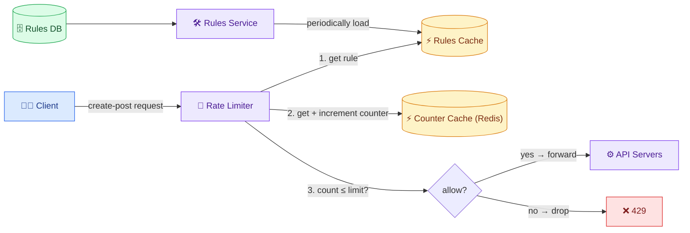

**The components:**

- **Counter Cache (Redis)** — stores the per-client-per-API request counters. Chosen over a DB because a DB is **too slow** for a check on every request; 2.5 TB of counters fits in cache and meets the low-latency NFR.
- **Rules DB** — the source of truth for **limits** (rules): `create-post → 100/day`, `comments → 500/day`, etc.
- **Rules Cache** — rules read from cache (faster than DB) since they change infrequently.
- **Rules Service** — periodically loads rules from the Rules DB into the Rules Cache.

**End-to-end flow (create-post example):** client sends `create-post` → limiter fetches the **posts rule** from Rules Cache (limit = 100) → fetches the **counter** from Counter Cache (say 4) → **increments to 5** and stores it back → checks `5 ≤ 100?` → yes → **forward** to API servers. Had the counter been 101 > 100, the request is **denied**.

> The counter is **per user, per API type** — one client has many counters (posts/day, friend-requests/hour, comments/day…), each independently limited.

---

## 6. The 429 Response & Error Headers 🛑

When a client exceeds its limit, the limiter drops the request and responds with HTTP status **`429 Too Many Requests`** — the standard code that tells the client "you've hit your limit, wait before retrying."

**Best-practice response headers (Transcript 4):**

```http
HTTP/1.1 429 Too Many Requests
X-RateLimit-Limit: 100          # the ceiling (e.g., 100/min)
X-RateLimit-Remaining: 0        # requests left in the current window
X-RateLimit-Reset: 1719830400   # when the window resets (epoch)
Retry-After: 60                 # try again in N seconds
```

> **Interview tip:** you *must* know **429**. You do **not** need to memorize the exact header names — say "I'll return a 429 with appropriate headers telling the client how many requests remain and when they can retry."

> **Fail fast, don't queue.** On exceeding the limit, **reject immediately** rather than queuing the request. For an interactive API (user viewing posts), queuing makes them wait, they think it's broken, they retry → the backlog grows. Queuing only makes sense for niche batch/intra-service cases. Default: **fail fast**.

---

## 7. The Five Algorithms — Overview 🧮

The core "allow or reject?" logic is implemented by one of **five algorithms**. Each trades off accuracy, memory, and burst behavior differently.

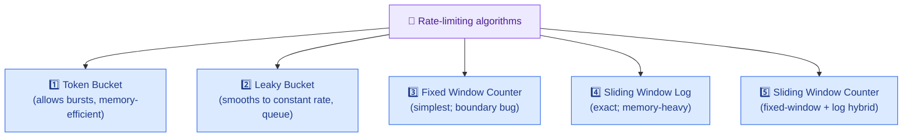

| # | Algorithm | Core idea | Bursts? | Memory | Accuracy |
|---|---|---|---|---|---|
| 1 | **Token Bucket** | consume a token per request; refill over time | ✅ allows | very low (2 vars) | good |
| 2 | **Leaky Bucket** | queue requests, process at constant rate | ❌ smooths | queue-sized | good, but adds delay |
| 3 | **Fixed Window Counter** | count per fixed window, reset each window | ✅ (at edges) | low | ⚠️ boundary bug |
| 4 | **Sliding Window Log** | store timestamp of every request | ❌ precise | **high** (per request) | ✅ exact |
| 5 | **Sliding Window Counter** | weight/sub-divide windows | limited | medium | good approximation |

Each is detailed next with a worked timeline and a diagram.

---

## 8. Algorithm 1 — Token Bucket 🪙

### The mental model

Two things: a **bucket** that holds coins/tokens (max = **bucket capacity**), and a **bucket refiller** that adds tokens at a set **refill rate** (e.g., refill to full every 60 s, or +2 tokens/minute). Rules:

1. **Every request must consume one token** to pass. 2 tokens → 2 requests can pass.
2. Max tokens = capacity (e.g., 3). Adding beyond capacity → tokens **overflow** (discarded).
3. **Empty bucket → no token → request rejected** (rate limited).

### 🧠 The two knobs, precisely (what "capacity" and "refill rate" really control)

These two numbers control **two different things**, and separating them is the whole point of the algorithm:

- **Capacity** = the **maximum burst** you tolerate. If capacity = 100, then after an idle period a client can fire **100 requests instantly** (all 100 tokens are sitting in the bucket ready to be consumed).
- **Refill rate** = the **sustained (long-run) throughput**. If you add 1 token/second, then over a long period the client averages **1 request/second** no matter how they cluster — because that's how fast tokens are replenished.

So token bucket answers *both* "how bursty can you be right now?" (capacity) and "how fast on average?" (refill rate) with just two variables. Two ways to express the refill rate appear in the sources: **"refill to full every 60 s"** (top up to capacity on a fixed interval) or **"+N tokens every interval"** (incremental, e.g., +2/min). The incremental form is what real implementations use.

### ⚙️ Lazy refill — why there is NO background timer

A beginner naturally imagines a background thread ticking every second to add a token. At scale (hundreds of millions of buckets) that would be enormously wasteful. Instead we use **lazy (on-demand) refill**: we store only the **last-refill timestamp** and compute the tokens *at read time*, when a request actually arrives:

```
tokensToAdd = floor( (now − lastRefill) × refillRate )
tokens      = min( capacity, tokens + tokensToAdd )   ← cap so it never exceeds capacity
lastRefill  = now                                     ← advance the clock marker
```

Concrete numbers: capacity = 10, refillRate = 1 token/sec, stored `tokens = 2`, `lastRefill = 12:00:00`. A request arrives at `12:00:05`:
```
elapsed     = 5 s
tokensToAdd = 5 × 1 = 5
tokens      = min(10, 2 + 5) = 7    ← now check: 7 ≥ 1 → consume 1 → 6 left → ALLOWED
```
No timer ran; the "refill" happened purely as arithmetic when the request touched the bucket. This is why token bucket needs **only two stored values** and is so cheap.

### Worked timeline (capacity = 3, refill to full every 60 s)

```
t=0s    bucket refilled → 🪙🪙🪙 (3)
t=30s   2 requests arrive → consume 2 → 🪙 (1 left), both ALLOWED
t=45s   1 request → consume 1 → (0 left), ALLOWED
t=52s   1 request → bucket EMPTY → ❌ REJECTED (rate limited)
        → in first 50s: 3 allowed, 4th rejected
t=60s   refill → 🪙🪙🪙 (3)
t=70s   1 request → ALLOWED (2 left)
t=120s  refill: already 2, refiller adds 3 → overflow → capped at 🪙🪙🪙 (3)
t=130s  3 simultaneous requests → all 3 ALLOWED (burst handled!)
```

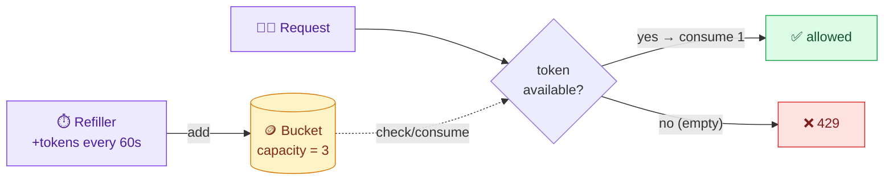

### How it's implemented (per user, per API)

Store just **two values** per client-API: the **current token count** and the **last refill timestamp**. On each request, lazily compute how many tokens to add since `lastRefill` (`elapsed × refillRate`, capped at capacity), then check/consume. Redis stores `{tokens, lastRefill}`; a rule like "3 tokens/min for post-tweet per user" is config-driven and dynamically changeable.

> **Where the state lives & why it scales:** the key is per identity+API (e.g., `ratelimit:user123:post`) and the value is the tiny `{tokens, lastRefill}` pair (~a few bytes). Because there's no per-token record and no timer, memory grows only with the number of *active* clients, and idle keys can be given a **TTL** so they auto-expire. That's the "memory-efficient" claim made concrete.

> **The "cold start" edge case (beginner gotcha):** when a client is seen for the *first time*, there's no stored bucket. The convention is to initialize it **full** (`tokens = capacity`) so a brand-new user immediately gets their full burst allowance, then it drains/refills normally. Initializing it empty would wrongly reject a legitimate first request.

**Pros:** ✅ simple & intuitive; ✅ **memory-efficient** (just 2 variables — capacity + refill rate); ✅ **allows bursts** (the t=130 example: 3 simultaneous requests all pass because tokens were available) — matches real traffic spikes.
**Cons:** ❌ must **tune two parameters** (capacity + refill rate) — too high/low either fails to limit or over-limits; finding the sweet spot is hard in practice. (Transcript 3: a huge capacity like 1000 permits a 1000-request burst in one second.)

---

## 9. Algorithm 2 — Leaky Bucket 💧

### The mental model

A bucket with a **hole**: water (requests) flows in from a tap; water **leaks out at a constant rate** (processing). Overflow = dropped requests. The **bucket is a processing queue (FIFO)**.

- Incoming water = incoming requests.
- Leaking (outgoing) water = requests **processed/allowed** at a fixed rate.
- Overflow (bucket full) = requests **dropped / rate limited**.

### 🧠 The defining property: constant OUTPUT rate

The one idea that separates leaky bucket from every other algorithm: **the output rate is constant and smooth**, regardless of how bursty the input is. Requests arrive in an irregular, spiky pattern (the tap sputters), but they leave at a fixed, even pace (the hole leaks at a steady drip). This "reshapes" chaotic incoming traffic into a predictable stream — which is exactly what a fragile downstream service that can only handle N requests/sec needs.

Contrast the two "when is a request rejected?" moments:
- **Token bucket** rejects when there are **no tokens** — but it can let a *burst* through instantly if tokens are available.
- **Leaky bucket** rejects only when the **queue is full** — and it *never* lets a burst reach the downstream, because the downstream always pulls at the fixed leak rate.

### ⚙️ How it's implemented: a FIFO queue + a steady drainer

Two moving parts:

1. **A bounded FIFO queue** (First-In-First-Out) of capacity `C`. Incoming requests are appended to the tail. If the queue is already full → the request **overflows** → HTTP 429.
2. **A drainer** (a worker/scheduler) that removes and processes requests from the head at a **fixed rate** `R` (e.g., 4/min = 1 every 15 s), independent of arrival rate.

```
on request arrival:
    if queue.size < C:  queue.enqueue(request)      # accepted (will be processed later)
    else:               reject(429)                  # overflow

every (1 / R) seconds (the drainer):
    if not queue.empty: process(queue.dequeue())     # steady output
```

So `C` (queue size) controls **how much bursty backlog you're willing to buffer**, and `R` (leak rate) controls **the constant output speed** — the two tuning knobs, analogous to token bucket's capacity and refill rate but with very different behavior (buffer-and-delay vs allow-burst).

### Worked timeline (queue capacity = 6, process 4/min)

```
t=0s    1 request (green) → queue: [G]                          (empty before)
t=30s   2 requests (orange, pink) → queue: [G,O,P]
t=45s   3 requests (purple, blue, yellow) → queue: [G,O,P,Pu,B,Y]  (FULL, cap 6)
t=60s   process 4 (constant rate) → dequeue G,O,P,Pu → queue: [B,Y]
t=72s   5 requests arrive → 4 fit → queue: [B,Y,+4] (full); 5th → ❌ DROPPED
```

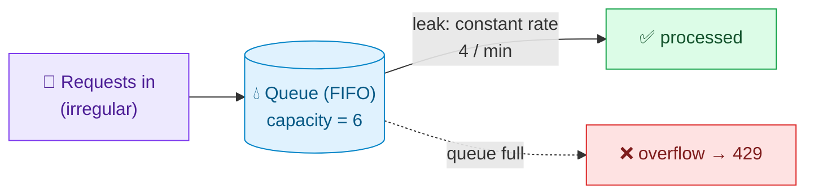

### Token bucket vs leaky bucket (key contrast)

- **Token bucket** discards excess immediately (only as many requests/min as tokens).
- **Leaky bucket** **queues** the extras and processes them later at a steady rate — it doesn't throw away valid requests, it defers them → **smooths bursty traffic into a constant output**.

**Pros:** ✅ simple; ✅ **constant, predictable output rate**; ✅ doesn't randomly drop valid requests (queues them).
**Cons:** ❌ **adds latency / backlog** — the queue can become a bottleneck. Example: queue cap 1000, process 50/min; minute 1 gets 1000 requests → 950 backlog; minute 2's new 50 requests wait *behind* the 950 → severe delay. ❌ Bad for apps with legitimate bursts (e.g., Amazon Prime evening spikes): new requests get stuck behind old queued ones. **Ask the interviewer if a constant rate is actually desired.** ❌ needs memory for the queue; queue size must be tuned (too small → drop many; too big → high latency).

---

## 10. Algorithm 3 — Fixed Window Counter ⏲️

### The mental model

Divide time into **fixed windows** (e.g., every 60 s, or 5-min blocks). Each window has a **counter** and a **limit** (e.g., 3 or 5 per window). Count requests in the current window; when the counter hits the limit, reject the rest; the counter **resets** at the start of each new window.

### 🧠 What "fixed" means, and how the window is computed

"Fixed" means the window boundaries are aligned to the **clock**, not to the user's first request. For a 60 s window, everyone shares the *same* boundaries: `[12:00:00–12:01:00)`, `[12:01:00–12:02:00)`, … A request's window is derived by **rounding its timestamp down** to the window size:

```
windowKey = floor(now / windowSize)          # integer division "buckets" time
counterKey = "ratelimit:" + clientId + ":" + windowKey
```

So at `now = 12:00:37` with a 60 s window, `windowKey` points at the `12:00:00` bucket. Every request in that minute maps to the **same** counter key; the moment the clock ticks to `12:01:00`, requests map to a *new* key whose counter starts at 0 — that's the "reset," achieved simply by the key changing, not by actively zeroing anything.

### ⚙️ Implementation: one atomic increment (very cheap)

The entire check is a single **increment-and-compare** on a per-window counter, which maps perfectly to Redis's atomic `INCR`:

```
count = INCR(counterKey)          # atomically +1 and return the new value
if count == 1:  EXPIRE(counterKey, windowSize)   # first hit → set TTL so old windows self-delete
if count > limit:  reject(429)
else:              allow()
```

Two beginner-important details: (1) `INCR` is **atomic**, so even concurrent requests can't lose a count here — this algorithm largely sidesteps the race condition of read-then-write. (2) The **TTL** (`EXPIRE`) means expired window counters **delete themselves** automatically, so memory doesn't grow forever — you only ever hold the current (and briefly the previous) window per active client.

### Worked timeline (limit = 5, window = 10 s)

```
Window 1 [0–10s):   req@1s,3s,5s,7s,9s → count 1..5, all ALLOWED
Window 2 [10–20s):  req@11,12,13,14,15 → count 1..5 ALLOWED
                    req@16s (6th)     → count would be 6 > 5 → ❌ REJECTED
                    any further       → ❌ REJECTED (until window resets)
Window 3 [20–30s):  counter resets → new requests allowed again
```

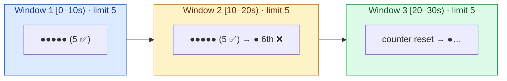

### The boundary problem (the big disadvantage)

Because the window resets abruptly, a client can **burst across the boundary** and effectively **double** the limit in a short span:

```
limit 5/window, windows [0–10s), [10–20s)
5 requests at t=9.x s (end of window 1)  ← all allowed
5 requests at t=10.x s (start of window 2) ← all allowed
→ 10 requests in ~1 second, though the intent was 5 per 10 s
```

Transcript 4 puts it as **100 req at 12:01:59 + 100 req at 12:02:00 = 200 requests in 2 seconds**. Your system may not be sized for that spike. There's also a **starvation** flip side: use all 100 at 12:01:01 and you wait 59 s for the next window.

**Why it happens mechanically (beginner clarity):** the algorithm only ever asks "how many requests are in *this clock window*?" It has **no memory of the previous window**. So the counter for `[12:01:00–12:02:00)` genuinely reads 100 (all near its end), and the counter for `[12:02:00–12:03:00)` genuinely reads 100 (all near its start) — each window is individually within its limit of 100. But a *rolling* 60-second view spanning `12:01:30–12:02:30` would see 200. The bug is that a fixed window measures a **fixed slice of the clock**, not a **rolling slice ending at "now"** — and an attacker aims their burst right at the seam between two slices. The sliding window (§11) fixes exactly this by always measuring the last 60 s relative to *now*.

**Pros:** ✅ dead simple — just a hash map `clientID → (count, windowStart)`; ✅ memory-efficient.
**Cons:** ❌ **boundary/edge burst** (up to 2× the limit); ❌ possible starvation. *Solved by the sliding window log.*

---

## 11. Algorithm 4 — Sliding Window Log 📜

### The mental model

An **improvement over fixed window** that removes the boundary bug by using a **sliding** (rolling) window instead of a fixed one. For each incoming request, look back **window-size seconds** from *now*, drop timestamps outside that window, count what remains (+1 for the new request), and allow only if within the limit. It **logs the exact timestamp of every request** (allowed *or* rejected).

Two parameters: **sliding window capacity** (max requests, e.g., 3) and **sliding window lookback** (window size, e.g., 60 s).

### 🧠 "Fixed vs sliding" made concrete

The difference is *what the window is anchored to*:
- **Fixed window** is anchored to the **clock** (`12:00:00–12:01:00`); it resets abruptly at boundaries.
- **Sliding window** is anchored to **"now"**: at every request the window is exactly `[now − 60s, now]`. As "now" advances one second, the window slides one second — old timestamps fall off the left edge, the new one enters at the right. There is no seam to exploit, so it's **exact**, not approximate.

### ⚙️ The data structure and the exact steps

Store, per client, a **sorted list of timestamps** of recent requests — in Redis this is naturally a **Sorted Set (ZSET)** where the score *is* the timestamp. Each request performs three operations:

```
1. EVICT old:   ZREMRANGEBYSCORE key 0 (now − windowSize)   # drop timestamps left of the window
2. COUNT:       n = ZCARD key                                # how many remain in the window
3. DECIDE+LOG:  ZADD key now now                             # add this request's timestamp
                if n + 1 ≤ capacity → ALLOW  else → REJECT (but it was still added in step 3)
```

Walking the numbers with capacity = 3, window = 60 s, ZSET currently `{0, 30, 45}` and a request at `t = 59`:
```
EVICT: nothing older than (59 − 60 = −1) → set stays {0, 30, 45}
COUNT: n = 3
LOG:   add 59 → {0, 30, 45, 59}
CHECK: n + 1 = 4 > 3 → ❌ REJECTED   (but 59 remains in the set — see below)
```

### Worked timeline (capacity = 3, lookback = 60 s)

### Worked timeline (capacity = 3, lookback = 60 s)

```
Steps per request: look back 60s → drop timestamps older than that → count in-window (+1) → allow if ≤ capacity → ALWAYS log the timestamp
t=0s    window[−60..0]  count=1 ≤3 → ✅ ALLOWED     log{0}
t=30s   window[−30..30] count=2 ≤3 → ✅ ALLOWED     log{0,30}
t=45s   window[−15..45] count=3 ≤3 → ✅ ALLOWED     log{0,30,45}
t=59s   window[−1..59]  count=4 >3 → ❌ REJECTED     log{0,30,45,59}  ← still logged!
t=110s  window[50..110] drops 0,30,45 → in-window {59,110} = 2 ≤3 → ✅ ALLOWED
```

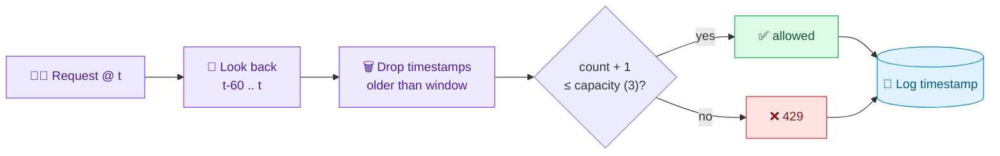

### Why log *rejected* requests too?

Critical subtlety: even a **rate-limited** request is added to the window. The system tracks **all** requests (accepted or rejected) because they influence **future** rate-limiting. In the example, the rejected `t=59` still counts — so if `t=111` and `t=112` also arrive while `59` is in-window, `112` gets limited (window already holds 3 including the rejected 59). Implemented with a heap/deque of timestamps.

**Pros:** ✅ **precise & accurate** — no boundary exploit; rate limiting is exact, not approximate.
**Cons:** ❌ **high memory** — stores a timestamp for *every* request (even rejected ones), plus **cleanup overhead** to evict expired timestamps. At millions of users this is a lot of memory and more instances. *Solved (approximately) by the sliding window counter.*

> **Memory math (why it's the costly option):** the log stores **one entry per request in the window**, whereas fixed/token/counter algorithms store a **constant ~2 values per client** regardless of traffic. If a client is allowed 1,000 requests/minute and each timestamp entry costs ~16 bytes (plus ZSET overhead), that's ~16 KB *for one client's window* — versus a few bytes for token bucket. Multiply by millions of active clients and it balloons, and you *also* pay CPU to evict expired timestamps on every check. That memory-vs-accuracy trade is precisely what the sliding window counter (§12) optimizes: near-log accuracy at near-fixed-window cost.

---

## 12. Algorithm 5 — Sliding Window Counter 🎯

Combines **fixed window counter** (cheap, intuitive counters) + **sliding window log** (no boundary bug). Two common flavors.

### 🧠 The core problem it's solving

We want the *accuracy* of the sliding window log (no boundary burst) but the *cheapness* of the fixed window counter (just a couple of integers). The trick: instead of remembering every timestamp, remember only **two counts** — the current fixed window and the previous one — and **mathematically estimate** how many requests fall inside the rolling window that straddles both.

### Flavor A — Weighted (rolling estimate using two windows)

Keep **two counters**: the **previous** fixed window's count and the **current** window's count. Estimate the rolling count by weighting the previous window by how far you *aren't* into the current one.

```
formula:  estimate = current_count + previous_count × (1 − fraction_into_current_window)
```

**Why that formula? (beginner intuition):** the rolling window of size `W` ending at "now" always covers **all** of the current fixed window that has elapsed so far, plus a **trailing slice** of the previous fixed window. If you are `f` fraction into the current window, then the rolling window still overlaps the previous window by `(1 − f)` of its length. Assuming the previous window's requests were spread **evenly**, the number that fall inside that trailing slice is `previous_count × (1 − f)`. Add the current window's actual count and you get the estimate.

```
Timeline view (W = 1 window wide, we are 70% = f=0.70 into the current window):

 previous window          current window
|=====================|====================|
        [######## overlap 30% ##|## elapsed 70% #]      ← the rolling window ending at "now"
         take 30% of prev(8)=2.4  + current(6)=6  → 8.4
```

As "now" advances, `f` grows toward 1.0, so the previous window's weight `(1 − f)` shrinks toward 0 — meaning the previous window gradually "slides out" of view. When `f = 1.0` (a full window has elapsed), the previous count contributes nothing and it becomes the next window's "previous." That smooth decay is what removes the abrupt fixed-window reset.

**Worked example (Transcript 4, limit = 10):**
```
previous window: 8 requests
we are 70% into the current window; current window so far: 6 requests
estimate = 6 + 8 × (1 − 0.70) = 6 + 8 × 0.30 = 6 + 2.4 = 8.4
8.4 < 10 → ✅ ALLOW the next request
```

**Worked example (Transcript 2 style):** 6 requests in a 60 s window; the sliding window overlaps 10 s of the previous window → contribution `6 ÷ 60 × 10 = 1` request from the overlap, added to the current window's count.

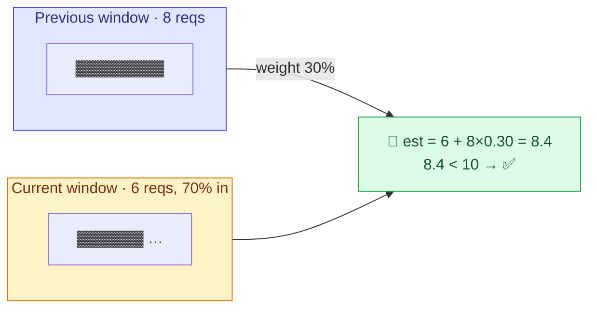

**Pros:** ✅ only **2 integers per user** (no heap) → memory-efficient; ✅ **much better accuracy** than fixed window (no 2× boundary burst).
**Cons:** ❌ it's an **approximation** — assumes requests are spread **evenly** across the window. If the previous window's requests were clustered at its end, the estimate under-counts and you may **admit slightly more than the limit** (Transcript 3's "2 to 12" example shows 6 > 5 slipping through).

> **Where the approximation error comes from (concretely):** the `× (1 − f)` term assumes the previous window's requests were **uniformly spread**. Suppose the previous window had 8 requests but **all 8 landed in its final 10%** (right before the boundary). The real rolling window (30% overlap) still contains all 8 of them, but the formula estimates only `8 × 0.30 = 2.4`. So it *undercounts by ~5.6*, and may allow requests it should have blocked — briefly exceeding the limit. The error is bounded and small for typical traffic (which is roughly uniform at short timescales), which is why the approximation is accepted in practice; if you need exactness, use the log.

### Flavor B — Sub-windows (buckets)

Divide the main window (e.g., 10 s) into equal **sub-windows** (e.g., five × 2 s). Each sub-window keeps its **own count**. To decide, **sum the counts of all active sub-windows** inside the main window. The main window **slides by one sub-window size** (2 s) at a time; expired sub-windows drop off.

**Why it's more accurate than the weighted flavor:** instead of *estimating* the previous window with one blended fraction, it keeps **real, separate counts for each small slice of time**. So it always knows exactly how many requests fell in each 2 s chunk — no "assume uniform spread" guess. The accuracy is tunable: **smaller sub-windows = more accurate but more counters to store** (in the limit of 1-request-wide sub-windows it becomes the exact log). It's the middle ground between the log (perfectly accurate, unbounded memory) and the weighted counter (2 integers, approximate).

Two responsibilities of each sub-window (from Transcript 3): (1) **maintain its own request count**, and (2) participate in the sum only while it's **active** (inside the current main window). The main window advances in **jumps of one sub-window size**, not one second, so exactly one old sub-window expires and one new one activates per jump.

```
Main window 10s, sub-windows 2s each: [0-2][2-4][4-6][6-8][8-10], limit 5
counts:          1     1     1     1    (new@9s)
sum active = 1+1+1+1+0 = 4 ≤ 5 → ✅ allow @9s
time passes → main window slides by 2s → now [2-4][4-6][6-8][8-10][10-12]
oldest sub-window [0-2] expires (dropped from the sum)
```

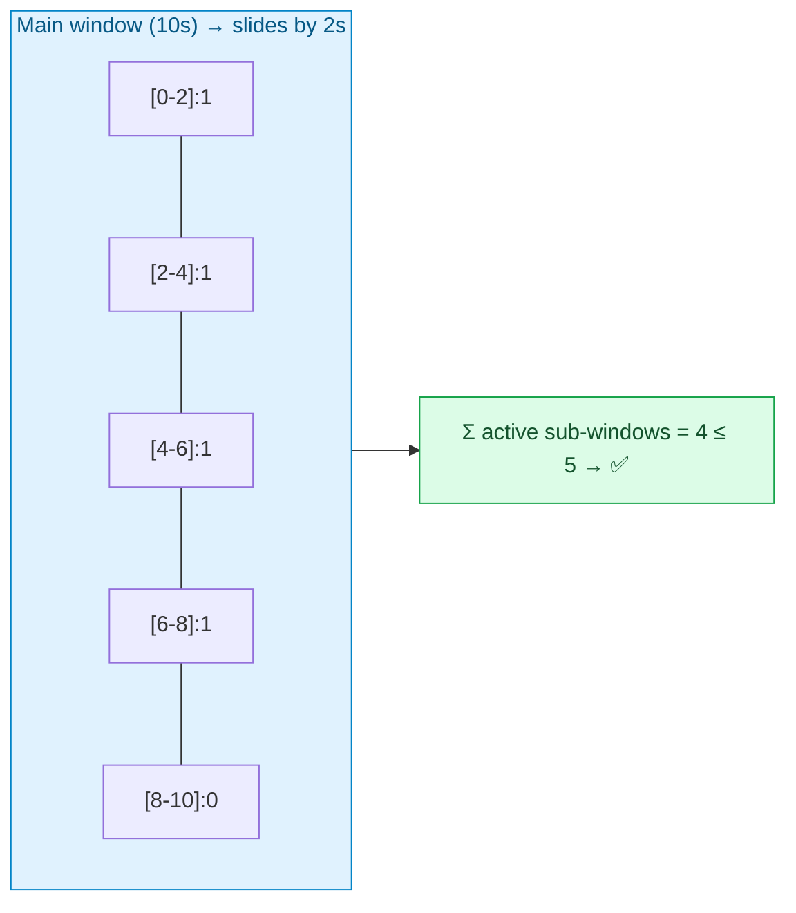

**Pros:** ✅ more accurate than weighted (no even-spread assumption); avoids storing every timestamp.
**Cons:** ❌ **more complex** (maintain N sub-window counts + slide-by-sub-window logic); ❌ **more memory** than the weighted flavor (one counter per sub-window).

---

## 13. Algorithm Comparison & Which to Pick ⚖️

| Algorithm | Bursts | Memory | Accuracy | Key weakness | Best when |
|---|---|---|---|---|---|
| **Token Bucket** | ✅ allows | very low | good | tune capacity+rate | you *want* bursts; general default |
| **Leaky Bucket** | ❌ smooths | queue | good | adds latency/backlog | you need a **constant output rate** |
| **Fixed Window** | ⚠️ 2× at edges | low | approx | boundary burst | simplest, low-stakes limits |
| **Sliding Window Log** | ❌ | **high** | ✅ exact | memory + cleanup | precise limits, fewer users |
| **Sliding Window Counter** | limited | medium | good approx | approximation error | best **memory/accuracy balance** at scale |

> 💡 **Interview guidance:** the algorithm is *not* usually the main focus of a system-design interview (it's more of a low-level-design topic) — but you must **name the options, weigh trade-offs, and justify a choice**. Transcript 4 picks **token bucket** for the final design (handles sustained load via refill rate + bursts via capacity, only 2 numbers to store, elegant). Transcript 1 orders them as an improvement chain: fixed window → sliding window log (fixes boundary) → sliding window counter (fixes log's memory).

---

## 14. Deep Dive — Race Conditions, Locks & Lua 🔒

### 🧠 What a race condition is (beginner-friendly)

Checking a limit is a **read-modify-write**: read the counter, add 1, write it back. These are **three separate steps**. If two requests from the same user run these steps **interleaved** (concurrently), they can both read the *same old value* before either writes, so one increment is **lost**.

```
Correct (serial):                      Race (interleaved):
  R1 read  6                             R1 read  6
  R1 write 7                             R2 read  6   ← reads stale 6 before R1 wrote
  R2 read  7                             R1 write 7
  R2 write 8  ✅ counter = 8             R2 write 7   ← overwrites; counter = 7 ❌ (should be 8)
```

The counter should be **8** (two requests → two increments) but ends at **7** — the system **under-counts** and lets through more requests than allowed. This matters because rate limiters run on **many instances** with **concurrent requests** hitting the same counter.

### Fix 1 — Locks

A **lock** makes the read-modify-write **mutually exclusive**: while request 1 holds the lock on the counter, request 2 must **wait**; only after R1 releases does R2 proceed (and now reads the correct 7 → writes 8).

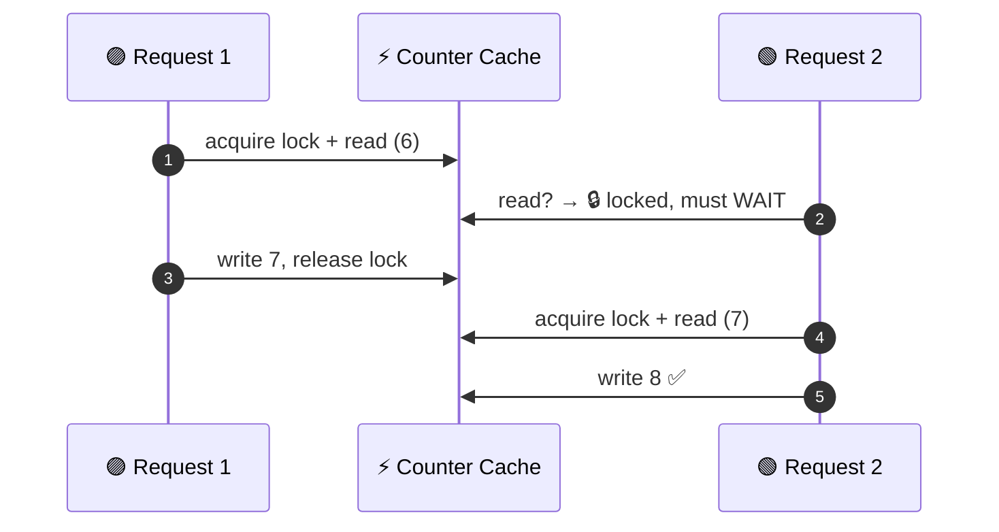

**Trade-off:** locks guarantee correctness but **serialize** access → they **slow the system down** (contention), hurting the low-latency NFR.

### Fix 2 — Atomic operations / Lua scripting (preferred)

Better: make the whole read-modify-write **atomic in one round trip**. Redis is **single-threaded** and supports **atomic transactions** and **Lua scripting**: you send a small Lua script that does `HMGET` (read tokens + last-refill) → compute → `HSET` (write back) → return allow/deny, and Redis runs it **as one indivisible unit**. No other command interleaves, so there's **no race** and **no separate lock round trip**.

```
Without Lua:  GW → read Redis → (gap: race window) → write Redis   ← 2 round trips, racy
With Lua:     GW → [Lua: read + compute + write + return] → done   ← 1 atomic round trip
```

> This is the canonical staff-level answer to "how do you avoid the race in a distributed rate limiter?" — **atomic Lua script on Redis** (single-threaded → serialized execution), which is cheaper than distributed locks.

---

## 15. Deep Dive — Distributed Rate Limiting & Redis Atomicity 🌐

### 🧠 Why a single centralized store is needed

In production there isn't one rate limiter — there are **many instances** (RL1, RL2, RL3) behind a load balancer, and a client's consecutive requests may hit **different** instances. If each instance kept counters in its **own local memory**, no instance would see the global count — the same problem as Option 1 placement (§4). So all instances must share **one centralized, fast, in-memory store**: **Redis**.

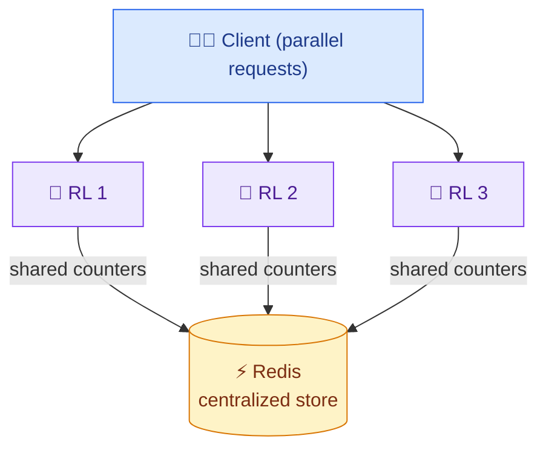

### The atomicity follow-up

Even with one Redis, concurrent parallel requests through RL1 and RL2 can **both read the same counter value** (say 2) before either writes → the exact race from §14, now **across instances**. **Redis does not enforce atomic read-modify-write by default.** The fix is the same: **atomic Lua scripts** (or `INCR`/`WATCH-MULTI-EXEC` transactions). There are ready-made solutions to add atomicity; the cost is a **little extra latency**, which is usually acceptable. State this trade-off explicitly.

> **What state does each bucket need?** For token bucket: `{token count, last refill timestamp}` per client. The gateway reads both (`HMGET`), computes tokens to add since last refill, decides pass/fail, and writes back (`HSET`) — all inside the atomic Lua script.

---

## 16. Deep Dive — Sharding, Redis Cluster & Hash Slots 🧩

### 🧠 Why one Redis instance isn't enough (the math)

A single Redis handles **~100K ops/sec**. Each rate-limit check needs **2 ops** (read + write) → effectively **~50K requests/sec per instance**. At **1M requests/sec** (Transcript 4 scale):

```
instances needed = 1,000,000 req/s ÷ 50,000 req/s = 20 Redis instances (+ headroom)
```

So we must **shard**: split the counter keyspace across many instances (Alice's bucket on instance 1, Bob's on instance 2). The gateway must know *which* instance holds a given client's bucket.

### How sharding works

- **Shard key = client identifier** (user ID / IP / API key).
- Route with **consistent hashing** (so adding/removing a node remaps only a small slice of keys), **or**
- Use **Redis Cluster**, which manages sharding for you via **16,384 hash slots** distributed across nodes. `slot = CRC16(key) mod 16384`; each node owns a range of slots. Cluster figures out which node holds each key.

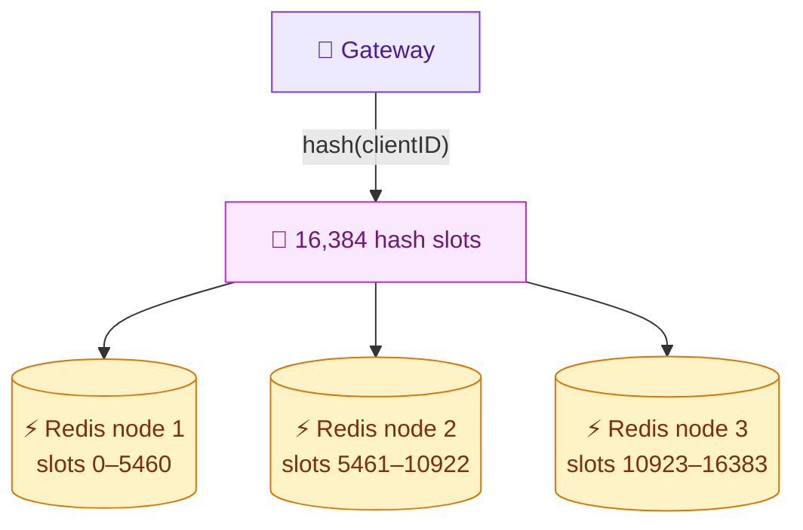

> **Interview point:** the conceptual takeaway is "single Redis can't do 1M QPS → shard on the client ID → ~20 nodes; use Redis Cluster (hash slots) to manage it." You don't need to recite CRC16.

---

## 17. Deep Dive — Fault Tolerance: Fail Open/Closed & Replicas 🛡️

### What if Redis (a shard) fails?

If the node holding Alice's bucket dies, Alice **can't be rate-limited**. Two philosophies:

- **Fail open** — limiter down → **allow all** requests. Risk: the backend it protects gets flooded → **cascading failures** (the very thing the limiter existed to prevent).
- **Fail closed** — limiter down → **reject all** requests. Risk: your whole site appears **down** to users.

There's **no universally right answer**, but for a rate limiter (whose job is *protection*), the common choice is **fail closed** — take the strictest protection. A **more sophisticated** option: fall back to a **local in-memory fixed-window counter** in each gateway while Redis recovers — imperfect (no cross-gateway coordination) but "better than nothing," giving *some* limiting instead of binary open/closed.

### Preventing failure — replicas

The real answer (as with most distributed systems): **replicas**. Configure a **replication factor** so each Redis shard has 1–2 replicas; writes propagate to replicas; if a primary dies, a replica is **promoted** and reads shift to it. **Redis Cluster supports this** via **async replication**.

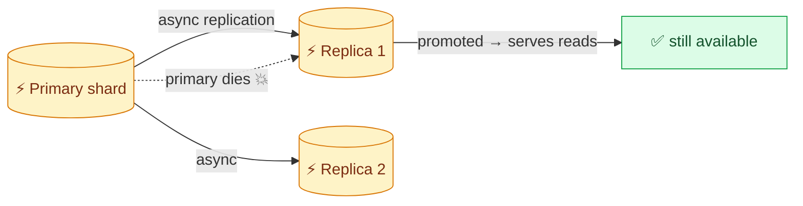

> ⚖️ **Consistency trade-off:** async replication means a crash can lose the last few writes — we chose **availability over consistency** (§2). Consequence: maybe "Alice is at 99 instead of 100" and gets one extra request through — **no big deal** for a rate limiter. Sharding + read replicas (both via Redis Cluster) deliver the high availability and fault tolerance.

---

## 18. Deep Dive — Low Latency: Connection Pooling & Geo 🚀

Every check is a network round trip to Redis. Redis ops are sub-millisecond, but **network overhead** can add several ms. To hit **< 10 ms**:

- **Connection pooling.** Don't open a new TCP connection per check — the **TCP handshake alone can be 20–50 ms**. Keep a **pool of persistent connections** to Redis and reuse them. Most Redis clients do this automatically; you may need to **tune pool size** to request volume. (Mention you understand it; note the client usually handles it.)
- **Geographic co-location.** Put the **gateway + its Redis in the same region/data center** as the users (Tokyo users → Asia gateway → collocated Redis). Minimizes round-trip distance — ideally the two servers are physically adjacent.

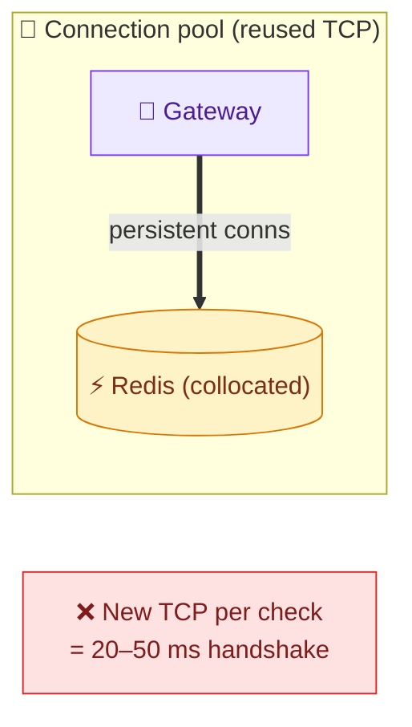

---

## 19. Deep Dive — Dynamic Rule Configuration 🎛️

Rules (limits) are often **configurable at runtime** (e.g., premium users get 10× limits) and shouldn't require a redeploy. Three ways to get updated rules to the gateways:

| Approach | How | Downside |
|---|---|---|
| **Poll a database** | gateway polls a rules DB every N sec | 5–20 s staleness + wasted CPU polling |
| **Poll Redis** | store rules in Redis, check per request/periodically | extra op per check → adds latency for rarely-changing data |
| **Push-based (best)** | **Zookeeper / etcd** hold rules; gateway loads them **into memory** on startup and **subscribes** for changes | slightly more infra, but no polling and no per-check latency |

**Push-based (chosen):** the gateway keeps rules **in memory** (no network per check) and opens a **persistent connection** to Zookeeper/etcd; when a rule changes, it's **pushed** over that connection and the gateway updates its in-memory copy. `etcd` is the more modern choice vs the older Zookeeper.


---

## 20. Where Rate Limiter Fits: Resilience Patterns 🧰

A rate limiter is one of several **fault-tolerance mechanisms** for microservices (Transcript 3, "Resilience4j"): **rate limiter, bulkhead, time limiter, circuit breaker, retry**. The recommended **logical ordering** is:

```
Rate Limiter → Bulkhead → Time Limiter → Circuit Breaker → Retry
```

**Why rate limiter before retry?** If you retried *first*, you'd waste computation retrying traffic that the rate limiter is going to **block anyway**. Limiting first sheds excess load before any expensive retry logic runs. This context matters because a rate limiter's ultimate purpose is to **prevent cascading failures**: a slow downstream service (e.g., product API taking 60 s) makes callers' threads pile up waiting, thread pools exhaust, callers start rejecting, and the failure **cascades** across services. Rate limiting caps the inflow that would trigger this.


---

# 🎯 Part B — Interview Template

## B1. Problem Statement & Clarifying Questions 📝

**Problem statement.** Design a **server-side rate limiter** that controls how many requests a client can make in a given time window, protecting backend services from overload, abuse, and DDoS while ensuring fair usage — at high scale (up to ~1M req/s), with sub-10 ms added latency and high availability.

**Clarifying questions an interviewer expects:**

1. **What are we rate limiting?** User-facing app (social/e-commerce), developer API, or **intra-microservice** traffic? (Shapes identity + rules.)
2. **Scale?** (500M DAU → ~579K QPS, or 100M DAU → 1M QPS.)
3. **Identify clients by what?** IP, user ID, device ID, session ID, API key — or a **combination/layers** (authenticated users get higher limits than anonymous IPs; premium > free)?
4. **Rules — static or dynamic/configurable?** Per endpoint? Per user tier?
5. **Consistency vs availability?** (Favor **availability** — the limiter must stay up.)
6. **Latency budget?** (< 10 ms added per request.)
7. **On limit exceed — reject or queue?** (Fail fast → reject with 429.)
8. **Server-side vs client-side?** (Server-side — clients can't be trusted to limit themselves.)

> 💡 **Crux to name:** a rate limiter is a **low-latency, highly-available shared-state counter** sitting at the edge; the hard parts are **global coordination** (shared Redis), **atomicity** (race conditions → Lua), **scale** (sharding), and **fault tolerance** (fail-open vs closed, replicas).

---

## B2. Requirements 📋

**Functional**
- Limit requests per client per window by **configurable rules** (IP / user ID / API key; e.g., 100/min).
- **Identify the client** from the request.
- **Return proper status + headers** on limit (429 + metadata).
- (Bonus) layered rules (anonymous vs authenticated vs premium), per-endpoint limits.

**Non-functional**
- **High availability** (~99.999%+; favor availability over consistency — **AP**).
- **Low latency** — **< 10 ms** added per check.
- **Scalability** — to ~1M req/s (horizontal).
- **Cost effectiveness** (it's a subsystem of a larger system).
- **Fault tolerance** — survive Redis node loss (replicas; fail-open/closed decision).

---

## B3. Capacity Estimation 📊

(Full derivation in [§3](#3-capacity-estimation-full-math-); condensed.)

```
DAU 500M · MAU 2B · 100 req/user/day
Requests = 500M × 100 = 50B/day → ÷86,400 ≈ 579K QPS  (T4 variant: 100M DAU → 1M QPS)
Counters: 500M users × 50 API types = 25B records × 100 B = 2.5 TB  → fits in cache (Redis)
Bandwidth: 50B × 1 KB = 50 TB/day ÷ 86,400 ≈ 579 MB/s  (transcript's "161 MB/s" is a slip)
Redis sizing (T4): ~100K ops/s ÷ 2 ops/req = 50K req/s per node → 1M ÷ 50K = 20 nodes
```

---

## B4. API / Interface Design 💻

A rate limiter is a **backend component** — clients don't call it directly; our gateway/services do, via an internal RPC / function. So we design a **system interface**, not a public REST API:

```
isRequestAllowed(clientId, rule) → {
    allowed:    boolean,       // pass or reject
    remaining:  int,           // requests left in window
    resetAt:    timestamp,     // when the window resets
    retryAfter: seconds        // (on reject) how long to wait
}
```

On reject, the caller returns to the end user:

```http
429 Too Many Requests
X-RateLimit-Limit: 100
X-RateLimit-Remaining: 0
X-RateLimit-Reset: <epoch>
Retry-After: 60
```

> If it *were* exposed (developer API platform), a REST management API would let clients read/set rules: `POST /v1/rules {clientId, endpoint, limit, window}`, `GET /v1/rules/{clientId}`. But the core interface is the internal `isRequestAllowed` check.

---

## B5. High-Level Architecture 🏛️

### 🏛️ Full system architecture (the "whiteboard" diagram)

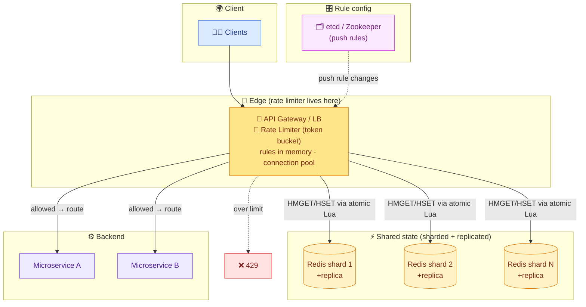

ASCII (the required `client → gateway → cache → services` flow):

```
 client ──► API Gateway/LB  ─(HMGET+HSET, atomic Lua)─►  Redis Cluster (sharded + replicas)
              │  🚦 rate limiter                                 ▲
              │  rules cached in memory ◄── etcd/Zookeeper (push)│
              ├──(allowed)──► microservices ──► response
              └──(over limit)──► 429 Too Many Requests + headers
```

**Component roles:** **Gateway/LB** hosts the limiter at the edge (fast, global, blocks bad traffic early). **Redis Cluster** holds per-client counters/buckets, sharded across ~20 nodes with replicas. **Atomic Lua** makes each check race-free. **etcd/Zookeeper** pushes dynamic rules into the gateway's memory. **Microservices** just serve allowed requests.

---

## B6. Data Model / Schema 🗃️

**Counter Cache (Redis)** — per client × API. For token bucket, each entry is a small hash:

```
key:   ratelimit:{clientId}:{apiType}       (e.g., ratelimit:user123:post)
value: { tokens: 5, lastRefill: 1719830400 }    ← token bucket state
       (or { count: 5, windowStart: ... } for window algorithms)
```

- **Shard/partition key:** `clientId` (high cardinality → even spread; Redis Cluster hash slots).
- **TTL:** set on keys so idle clients' entries auto-expire (bounds memory).
- Size: 25B records × 100 B ≈ **2.5 TB** across the cluster.

**Rules DB / store (etcd or SQL)** — the limits:

| Field | Example |
|---|---|
| `clientId` / `tier` | user123 / premium / anonymous |
| `apiType` / `endpoint` | create-post |
| `limit` | 100 |
| `window` | 1 day |
| `algorithm` | token_bucket |

Rules are **read-mostly** (change rarely) → cached in gateway memory, pushed on change.

---

## B7. Deep Dive Modules 🔬

Pointers to the full deep dives above:

- **B7.1 Algorithm choice** — token bucket (bursts + sustained via 2 numbers); alternatives + trade-offs. → [§7–§13](#7-the-five-algorithms--overview-)
- **B7.2 Race conditions** — read-modify-write interleaving under-counts; fix with locks or (better) **atomic Lua**. → [§14](#14-deep-dive--race-conditions-locks--lua-)
- **B7.3 Distributed state** — many limiter instances share one **centralized Redis**; atomicity via Lua. → [§15](#15-deep-dive--distributed-rate-limiting--redis-atomicity-)
- **B7.4 Sharding** — single Redis ~50K req/s ⇒ shard by clientId; **Redis Cluster hash slots**; ~20 nodes for 1M QPS. → [§16](#16-deep-dive--sharding-redis-cluster--hash-slots-)
- **B7.5 Fault tolerance** — fail-open vs fail-closed; **replicas** (async) + promotion. → [§17](#17-deep-dive--fault-tolerance-fail-openclosed--replicas-)
- **B7.6 Low latency** — **connection pooling** (avoid 20–50 ms handshakes), **geo co-location**. → [§18](#18-deep-dive--low-latency-connection-pooling--geo-)
- **B7.7 Dynamic rules** — poll vs **push (etcd/Zookeeper)**; rules in gateway memory. → [§19](#19-deep-dive--dynamic-rule-configuration-)

<details>
<summary><b>☕ Java — token bucket check (per client), lazy refill — click to expand</b></summary>

```java
public class TokenBucketLimiter {
    // Rule: capacity (burst) + refillRatePerSec (sustained). Loaded from config (dynamic).
    public boolean isAllowed(String clientId, Rule rule, long nowMs) {
        Bucket b = store.get(clientId);                 // {tokens, lastRefillMs} from Redis
        if (b == null) b = new Bucket(rule.capacity(), nowMs);

        // Lazy refill: add tokens accrued since last refill, capped at capacity.
        long elapsedSec = (nowMs - b.lastRefillMs) / 1000;
        double refilled  = elapsedSec * rule.refillRatePerSec();
        double tokens    = Math.min(rule.capacity(), b.tokens + refilled);

        boolean allowed;
        if (tokens >= 1) { tokens -= 1; allowed = true; }  // consume one
        else             { allowed = false; }              // empty → 429

        store.put(clientId, new Bucket(tokens, nowMs));     // write back (see Lua note)
        return allowed;
    }
}
```

> ⚠️ In a distributed setup the read + write above must be **atomic** — run it as a **Redis Lua script** so no other request interleaves (see [§14](#14-deep-dive--race-conditions-locks--lua-)).

</details>

---

## B8. Data Flow Diagram 🔀

**Request path (token bucket, atomic) — end to end:**

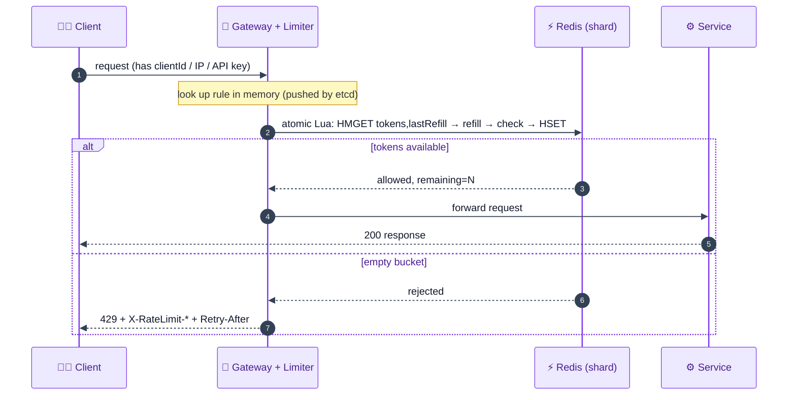

**ASCII (write/decision path):**

```
 client → Gateway(+limiter) ── rule from memory (etcd push)
                │
                ├─ atomic Lua on Redis shard: read {tokens,lastRefill} → lazy refill → tokens≥1?
                │        │
                │     yes → consume, write back → forward to service → 200
                │        │
                │      no → write back → 429 + headers (fail fast)
```

---

## B9. Scalability & Bottlenecks 📈

| Layer | First bottleneck | Scale strategy |
|---|---|---|
| **Redis (counters)** | single node ~50K req/s (2 ops/req) vs 1M target | **shard** by clientId (~20 nodes), Redis Cluster hash slots |
| **Redis hot key** | one very active client/IP on one shard | finer-grained keys, dedicated shard, local pre-aggregation |
| **Gateway CPU** | limiter logic + TLS on every request | stateless gateways → add instances behind LB |
| **Network round trip** | per-check latency to Redis | **connection pooling**, geo co-location, atomic Lua (1 round trip) |
| **Rule fetching** | polling adds latency/CPU | **push** config (etcd) → rules in memory |
| **Single region** | global latency / regional outage | multi-region gateways + collocated Redis |

<details>
<summary><b>Detailed walkthrough of each bottleneck (beginner-friendly) — click to expand</b></summary>

**1. Redis throughput.** A single Redis does ~100K ops/s, and each check is 2 ops (read+write) → ~50K req/s. At 1M req/s that's 20× short, so we **shard** the counter keyspace across ~20 nodes (Redis Cluster hash slots), each owning a subset of clients.

**2. Hot key.** If one client/IP is extremely active, all its checks hit one shard → that shard throttles while others idle. Mitigate with dedicated shards for hot clients, finer key partitioning, or gateway-local pre-aggregation that periodically syncs.

**3. Gateway CPU.** The limiter runs on every request alongside TLS/routing. Gateways are **stateless** (state is in Redis), so we just add more instances behind the load balancer.

**4. Network round trip.** Each check crosses the network to Redis; the TCP handshake alone can be 20–50 ms. **Connection pooling** reuses persistent connections, **geo co-location** shortens the path, and an **atomic Lua script** collapses read+write into one round trip.

**5. Rule fetching.** Polling a DB/Redis for rules adds latency and wasted CPU for data that rarely changes. **Push-based config** (etcd/Zookeeper) keeps rules in gateway memory and updates them only on change.

**6. Single region.** One region adds latency for distant users and is an outage risk. Deploy **multi-region** gateways with collocated Redis, routing users to the nearest region.

</details>

---

## B10. Failure Modes & Mitigation 🛡️

| Failure / edge case | Impact | Mitigation |
|---|---|---|
| **Redis shard down** | affected clients can't be limited | **replicas** (async) + promotion; Redis Cluster |
| **Limiter fully down** | choose fail-open or fail-closed | **fail closed** (protect backend) or local in-memory fixed-window fallback |
| **Race condition** | under-counts → over-admits | **atomic Lua** (single-threaded Redis) or locks |
| **Fixed-window boundary burst** | 2× limit at edges | use sliding window log/counter or token bucket |
| **Token bucket mis-tuned** | huge capacity → 1000-req burst | tune capacity + refill rate carefully |
| **Sudden traffic spike / DDoS** | backend overload | that's the limiter's *job* — cap inflow; autoscale gateways |
| **Clock drift across nodes** | window/refill math skews | NTP sync; prefer Redis server time for timestamps |
| **Leaky bucket backlog** | new requests delayed behind old | bound queue size; consider token bucket instead |
| **Async replication lag** | lose last writes on failover | accepted (AP) — off-by-one on counts is harmless |
| **Rule propagation delay** | brief stale limits | acceptable (availability > consistency); push minimizes it |

<details>
<summary><b>Detailed walkthrough of each failure mode (beginner-friendly) — click to expand</b></summary>

**1. Redis shard down.** Losing the node with a client's bucket means it can't be limited. Each shard has **1–2 async replicas**; on primary failure a replica is **promoted** and reads shift to it (Redis Cluster handles this).

**2. Limiter fully down.** Decide **fail-open** (allow all → backend flood risk) vs **fail-closed** (block all → site appears down). For a protective component, **fail-closed** is the common choice; a smarter fallback is a **local in-memory fixed-window** counter in each gateway while Redis recovers.

**3. Race condition.** Concurrent read-modify-write can lose increments and admit too many requests. **Atomic Lua** on single-threaded Redis serializes the read+compute+write; distributed locks work too but are slower.

**4. Boundary burst.** Fixed window lets a client double the limit across the reset instant. Use **sliding window log/counter** (or token bucket) for accurate limiting.

**5. Token bucket mis-tuning.** An oversized capacity permits a large instantaneous burst (e.g., 1000 requests at once). Choose capacity (burst tolerance) and refill rate (sustained rate) deliberately.

**6. Spike / DDoS.** A flood is exactly what the limiter defends against — it caps inflow so the backend survives; gateways autoscale to keep checking cheaply.

**7. Clock drift.** Window and refill calculations depend on time; skewed node clocks cause wrong decisions. Keep nodes **NTP-synced** or use **Redis server time** as the single clock.

**8. Leaky bucket backlog.** Its queue can delay new requests behind a long backlog; bound the queue size, or prefer token bucket when bursts are legitimate.

**9. Replication lag.** Async replication can lose the last few writes on failover — acceptable under our **AP** choice; being off by one on a counter is harmless.

**10. Rule propagation delay.** A new rule may take a moment to reach all gateways; we accept brief staleness (availability over consistency), and push-based config keeps it small.

</details>

---

## B11. Alternative Designs / Trade-off Comparison ⚖️

### Alternative A — Rate limiter inside each microservice (local memory)

- **Pros:** fastest possible (in-memory, no network); granular per-service rules.
- **Cons:** **no global view** — a client hitting two services is counted twice under; can't enforce a true global limit.
- **vs chosen:** the **edge** placement gives a global picture with low latency. Local-only is fine only for coarse per-service protection.

### Alternative B — Separate rate-limiter service (not at edge)

- **Pros:** global coordination; decoupled.
- **Cons:** an **extra network hop** per request → violates the tight latency budget.
- **vs chosen:** edge placement keeps global state (Redis) but removes the extra service hop.

### Alternative C — Different algorithm (leaky bucket / sliding window log)

- **Leaky bucket:** great for a **constant output rate**, but adds queuing latency/backlog — bad for bursty apps.
- **Sliding window log:** **exact** limiting, but **high memory** (timestamp per request).
- **vs chosen (token bucket):** token bucket balances burst tolerance + sustained rate with only 2 numbers per client; pick others when their specific property (constant rate / exactness) is required.

### Alternative D — Client-side rate limiting

- **Pros:** zero server cost.
- **Cons:** **can be spoofed** — clients can't be trusted to limit themselves; provides no real protection.
- **vs chosen:** always **server-side**; client-side is at best a UX nicety.

**Summary:** chosen = **edge-placed token-bucket limiter** backed by **sharded + replicated Redis Cluster** with **atomic Lua** checks, **connection pooling + geo co-location** for latency, **push-based (etcd) dynamic rules**, and **fail-closed** on limiter failure. Optimizes for global accuracy, <10 ms latency, 1M QPS, and availability.

---

## B12. Interview Q&A 🎓

> Questions are numbered and collapsible — click any question to reveal the answer.

### Conceptual (mid-level)

<details>
<summary><b>Q1. What is a rate limiter and why do we need one?</b></summary>

It controls how many requests a client can make in a time window, rejecting excess (HTTP 429). We need it to **prevent overload** (a flood can crash/degrade a service), **ensure fair usage** (one spammer shouldn't starve others), **control cost** (fewer wasted requests = less compute), and **defend against DDoS** (block abusive traffic before it exhausts RAM/CPU). It's a must-know for backend engineers because it protects every API.
</details>

<details>
<summary><b>Q2. How can clients be identified for rate limiting?</b></summary>

By **user ID**, **IP address**, **device ID**, **session ID**, or **API key** — whatever uniquely identifies the caller. In practice you use a **combination/layers**: authenticated users get higher limits than anonymous IPs, premium users higher than free. Identity is extracted from the request (headers, JWT claims, IP). The choice is tied to placement — at the edge you rely on what's in the HTTP request itself.
</details>

<details>
<summary><b>Q3. Where should the rate limiter be placed?</b></summary>

Three options: inside each microservice (fast but **no global view**), a separate service (global but **extra network hop**), or **at the edge (gateway/LB)** — the usual choice. The edge gives a **global picture with low latency**, blocks bad traffic before it enters the system, and keeps services simple. Its limitation is reduced business-logic context, mitigated by encoding info (e.g., premium status) in the JWT.
</details>

<details>
<summary><b>Q4. What status code and headers do you return when limited?</b></summary>

**HTTP 429 Too Many Requests** — the standard code for rate limiting. Include headers so the client knows what to do: `X-RateLimit-Limit` (the ceiling), `X-RateLimit-Remaining` (left in window), `X-RateLimit-Reset` (when it resets), and `Retry-After` (seconds to wait). You should **fail fast** (reject immediately) rather than queue, because queuing an interactive request just makes users wait and retry, growing a backlog.
</details>

<details>
<summary><b>Q5. Why store counters in a cache (Redis) instead of a database?</b></summary>

Rate limiting checks the counter on **every request** for **every user × every API** — a database is far too slow for that frequency and would add unacceptable latency. The counter data (~2.5 TB for 25B records) fits comfortably in a modern in-memory store like Redis, which is fast (sub-ms ops) and satisfies the **low-latency** NFR. Databases persist; here we prioritize speed for a high-churn, small-record workload.
</details>

### Design trade-off (senior)

<details>
<summary><b>Q6. Compare the five rate-limiting algorithms.</b></summary>

**Token bucket:** consume a token/request, refill over time — allows bursts, 2 vars, needs tuning. **Leaky bucket:** queue + constant drain — smooths output but adds latency/backlog. **Fixed window counter:** count per fixed window — simplest but 2× **boundary burst**. **Sliding window log:** timestamp every request — exact but **memory-heavy**. **Sliding window counter:** weighted two-window or sub-windows — good accuracy with little memory (approximation). Chain: fixed → log (fixes boundary) → counter (fixes log's memory). Common default: **token bucket**.
</details>

<details>
<summary><b>Q7. Why token bucket for the final design?</b></summary>

It cleanly separates two concerns with **two numbers**: **bucket capacity** = burst tolerance (handle a sudden spike up to capacity), and **refill rate** = sustained throughput. It's memory-efficient (store `{tokens, lastRefill}` per client), simple to implement, and handles real traffic which is bursty. The trade-off is tuning those two parameters — too large a capacity permits a big instantaneous burst, too small over-limits legitimate spikes.
</details>

<details>
<summary><b>Q8. Fail open or fail closed when the limiter/Redis is down?</b></summary>

**Fail open** = allow all requests → risks flooding and cascading failures in the very backend the limiter protects. **Fail closed** = reject all → the site appears down. There's no universal answer, but for a protective component the common choice is **fail closed** (strictest protection). A smarter middle ground: fall back to a **local in-memory fixed-window** counter in each gateway while Redis recovers — imperfect (no cross-gateway coordination) but better than binary open/closed.
</details>

<details>
<summary><b>Q9. How do you handle dynamic (configurable) rules?</b></summary>

Three options: **poll a database** (5–20 s stale + wasted CPU), **poll Redis** (extra op/latency per check for rarely-changing data), or **push-based config** via **etcd/Zookeeper** (best). With push, the gateway loads rules **into memory** on startup and **subscribes** for changes over a persistent connection; updates are pushed instantly with no polling and no per-check latency. etcd is the modern choice over the older Zookeeper.
</details>

<details>
<summary><b>Q10. Client-side vs server-side rate limiting?</b></summary>

Always **server-side**. A client-side limiter can be **spoofed** — you can't trust clients to limit themselves, so it provides no real protection against abuse or DDoS. Client-side limiting has niche UX value (avoid firing obviously-doomed requests), but the authoritative enforcement must live on the server, at the edge, where it protects the backend regardless of client behavior.
</details>

### Deep-dive internals (staff)

<details>
<summary><b>Q11. Explain the race condition and how you fix it.</b></summary>

A check is a **read-modify-write**: read counter, +1, write. Two concurrent requests (across gateway/limiter instances) can both read the same old value before either writes, so one increment is **lost** → the counter under-counts and admits too many requests. Fixes: **locks** (serialize access — correct but slow due to contention) or, preferred, **atomic operations / Lua scripting** on Redis. Redis is single-threaded and runs a Lua script (read+compute+write) as one indivisible unit — no interleaving, no race, one round trip.
</details>

<details>
<summary><b>Q12. Where does this sit on CAP, and why?</b></summary>

**AP** — availability + partition tolerance over strong consistency. If a new rule is being pushed, we'd rather the limiter keep working with **slightly stale rules** than go offline waiting for propagation. Async Redis replication can lose the last few writes on failover, meaning a counter might be off by one (e.g., 99 vs 100) — harmless. The limiter must **always be up** because it protects everything behind it; brief inconsistency in counts is an acceptable price.
</details>

<details>
<summary><b>Q13. Do the scaling math for 1M requests/sec.</b></summary>

A single Redis handles ~**100K ops/sec**; each rate check needs **2 ops** (read + write) → ~**50K req/sec per node**. For **1M req/sec**: `1,000,000 ÷ 50,000 = 20` Redis nodes (plus headroom). We **shard** the counter keyspace by client ID across those nodes so each holds a subset of buckets. Redis Cluster manages this via **16,384 hash slots** (`slot = CRC16(key) mod 16384`) distributed across nodes, so the gateway routes each client to the right node automatically.
</details>

<details>
<summary><b>Q14. Walk through the sliding-window-counter (weighted) math.</b></summary>

Keep two counters: previous window and current window. Estimate the rolling count by weighting the previous window by how far you *aren't* into the current one: `estimate = current + previous × (1 − fraction_into_current)`. Example: previous window had 8, we're 70% into the current with 6 so far → `6 + 8×0.30 = 8.4`; if limit is 10, `8.4 < 10` → allow. It uses only **2 integers per user** (vs a heap in the log) but assumes requests are **evenly spread**, so it can slightly over-admit if the previous window was end-loaded.
</details>

<details>
<summary><b>Q15. How do you hit sub-10 ms latency at scale?</b></summary>

Every check is a Redis round trip. Redis ops are sub-ms, but network overhead and the **TCP handshake (20–50 ms)** dominate if you open a connection per check — so use **connection pooling** (persistent, reused connections; most clients do this automatically). Collapse read+write into **one atomic Lua round trip**. **Co-locate** the gateway and its Redis in the same region/data center as users (Tokyo users → Asia gateway → adjacent Redis) to minimize round-trip distance.
</details>

### Behavioral (STAR, tied to this system)

<details>
<summary><b>Q16. Tell me about a time you fixed a correctness bug under concurrency.</b></summary>

- **Situation:** Our distributed rate limiter occasionally let users exceed their limit under high concurrency.
- **Task:** Find and fix the over-admission without wrecking latency.
- **Action:** I traced it to a **read-modify-write race** — concurrent instances read the same counter before either wrote. I replaced the naive read+write with an **atomic Redis Lua script** (single-threaded execution) instead of distributed locks, which would have added contention.
- **Result:** Counts became exact, over-admission stopped, and latency stayed within budget (one atomic round trip vs a lock acquire/release). I documented the pattern for other counters.
</details>

<details>
<summary><b>Q17. Tell me about a time you scaled a component that hit a ceiling.</b></summary>

- **Situation:** Our single Redis limiter maxed out around 50K req/s while traffic approached 1M req/s.
- **Task:** Scale the rate limiter to 1M req/s without losing global accuracy.
- **Action:** I did the math (100K ops/s ÷ 2 ops/req = 50K req/s → 20 nodes), then **sharded** the counter keyspace by client ID using **Redis Cluster hash slots**, and added **replicas** per shard for fault tolerance.
- **Result:** The limiter scaled past 1M req/s with headroom; a node failure now fails over to a replica instead of dropping limiting for those clients.
</details>

<details>
<summary><b>Q18. Tell me about a latency optimization you made.</b></summary>

- **Situation:** Rate-limit checks were adding tens of milliseconds to every request, threatening our <10 ms budget.
- **Task:** Cut the per-check latency.
- **Action:** I found we were opening a new TCP connection per check (20–50 ms handshakes). I enabled **connection pooling** to reuse persistent connections, collapsed read+write into a single **atomic Lua** round trip, and **co-located** Redis with the gateway in each region.
- **Result:** Per-check latency dropped to low single-digit ms, comfortably under budget, and Redis CPU fell from fewer connection setups.
</details>

<details>
<summary><b>Q19. Tell me about a time you made an availability trade-off.</b></summary>

- **Situation:** We had to decide what the limiter does when Redis is unavailable.
- **Task:** Choose behavior that best protects the system and users.
- **Action:** I framed **fail-open vs fail-closed** with the team: failing open risks backend flooding/cascading failure; failing closed makes the site look down. We chose **fail-closed** as the default (the limiter's job is protection), plus a **local in-memory fixed-window fallback** in gateways to keep *some* limiting during short Redis outages.
- **Result:** During a later Redis blip, the fallback kept the backend protected with graceful degradation instead of an outage or a flood.
</details>

<details>
<summary><b>Q20. Tell me about a time you removed polling in favor of a push model.</b></summary>

- **Situation:** Gateways polled a database every few seconds for rule changes, wasting CPU and adding staleness.
- **Task:** Deliver rule updates quickly without per-check overhead.
- **Action:** I moved rule config to **etcd**; gateways load rules **into memory** on startup and **subscribe** for changes over a persistent connection, so updates are **pushed** instantly and reads never hit the network.
- **Result:** Rule changes propagated in near-real-time, gateway CPU dropped, and per-check latency improved since rules were served from memory.
</details>

---

## B13. Quick Revision (cheat sheet + ~2-page deep revision) 📚

> **Part 1** = rapid recall card; **Part 2** = fuller night-before walkthrough.

### Part 1 — One-glance cheat sheet

**One-liner:** An **edge-placed, low-latency, highly-available** component that caps requests per client per window (via **token bucket**), storing counters in **sharded + replicated Redis** with **atomic Lua** checks, returning **429** when limited.

**Core requirements:** limit by IP/user/API-key with configurable rules; return 429 + headers. NFRs: high availability (favor **AP**), **<10 ms** latency, scale to **1M QPS**, cost-effective, fault-tolerant.

**Architecture:** `Client → API Gateway/LB (🚦 limiter, rules in memory) → atomic Lua on Redis Cluster (sharded + replicas) → allowed ? route to services : 429`; rules pushed from **etcd/Zookeeper**.

**Key capacity numbers:** 500M DAU × 100 = **50B req/day → ~579K QPS** (or 100M DAU → **1M QPS**) · counters 500M × 50 API = 25B × 100B = **2.5 TB (fits in cache)** · bandwidth 50 TB/day ÷ 86,400 ≈ **579 MB/s** (transcript's 161 MB/s is a slip) · Redis ~100K ops/s ÷ 2 = 50K req/s/node → **20 nodes for 1M QPS**.

**Five algorithms:** Token bucket (bursts, 2 vars) · Leaky bucket (constant rate, queue, adds latency) · Fixed window counter (simple, **2× boundary burst**) · Sliding window log (exact, **memory-heavy**) · Sliding window counter (weighted / sub-windows — best balance).

**Building blocks + why:** Redis (fast in-memory counters) · Redis Cluster (shard + replicate) · atomic **Lua** (race-free) · **connection pooling** (avoid 20–50ms handshakes) · **etcd/Zookeeper** (push dynamic rules) · gateway/edge placement (global + low latency) · **429 + Retry-After**.

**What you'd change at 10× scale:** more Redis shards + replicas; multi-region gateways with collocated Redis; hot-key handling (dedicated shards / local pre-aggregation); local fixed-window fallback for Redis outages; carefully tuned token capacity/refill.

**Top 10 answers to memorize:**
1. Place at the **edge** (global view + low latency + block early).
2. Store counters in **Redis**, not a DB (too slow per-request).
3. **Token bucket** default: capacity = burst, refill = sustained, 2 numbers.
4. **429 Too Many Requests** + Retry-After; **fail fast** (don't queue).
5. **Race condition** → fix with **atomic Lua** (single-threaded Redis), not slow locks.
6. Single Redis ~50K req/s → **shard** by clientId; **20 nodes** for 1M QPS (Redis Cluster hash slots).
7. **Replicas** (async) for fault tolerance; **fail-closed** on total failure.
8. **Fixed window** has a **2× boundary burst**; sliding window fixes it.
9. **Connection pooling + geo co-location** for <10 ms.
10. **Push rules** (etcd) into gateway memory; **AP** (availability > consistency).

### Part 2 — Deep revision (~2 pages)

#### Problem
Server-side rate limiter capping requests/client/window to protect backends from overload, abuse, DDoS; ensure fairness; control cost. Subsystem of a larger system → must be fast + always up.

#### Requirements
- **Functional:** limit by IP/user/device/session/API-key with **configurable rules**; identify client; return 429 + headers.
- **Non-functional:** availability (~7 nines / **AP**), latency **<10 ms**, scale **1M QPS**, cost-effective, fault-tolerant.

#### Capacity (memorize)
```
500M DAU × 100 req = 50B/day → ÷86,400 ≈ 579K QPS   (T4: 100M DAU → 1M QPS)
counters 500M users × 50 APIs = 25B × 100B = 2.5 TB → fits in Redis
bandwidth 50B × 1KB = 50 TB/day ÷ 86,400 ≈ 579 MB/s  (161 MB/s = transcript slip)
Redis 100K ops/s ÷ 2 ops/req = 50K req/s/node → 1M ÷ 50K = 20 nodes
86,400 = seconds/day
```

#### Placement
Inside service (fast, **no global view**) · separate service (global, **extra hop**) · **edge/gateway (chosen)** — global + low latency + blocks early; limited business context (encode in JWT). T1: before servers (security + SPOF) vs with servers (granular + no central SPOF).

#### HLD
`Gateway(🚦) → Rules Cache (from Rules Service/DB) + Counter Cache (Redis)`: read rule (limit), read+increment counter, compare. Counter is **per user per API**. Over limit → **429**.

#### The five algorithms (with numbers)
- **Token bucket:** tokens consumed per request, refilled at rate; capacity 3, refill every 60s; bursts OK; 2 vars; tune capacity+rate.
- **Leaky bucket:** FIFO queue (cap 6), drain 4/min; constant output; queues extras → latency/backlog; bad for legit bursts.
- **Fixed window counter:** count/window (limit 5, 10s); simple; **boundary burst = 2×** (100@11:59 + 100@12:00 = 200 in 2s); starvation.
- **Sliding window log:** timestamp every request (cap 3, lookback 60s); exact; logs even rejected ones (they affect future limiting); **memory-heavy** + cleanup.
- **Sliding window counter:** weighted `est = cur + prev×(1−frac)` (e.g., 6 + 8×0.30 = 8.4 < 10 → allow), 2 ints, approximates even spread; or sub-windows (sum active buckets), more accurate but more memory.

#### Deep dives
- **Race condition:** read-modify-write interleave under-counts → **atomic Lua** (Redis single-threaded) > locks (slow).
- **Distributed:** many limiters share **centralized Redis**; needs atomicity (Lua).
- **Sharding:** single Redis 50K req/s → shard by clientId, **Redis Cluster 16,384 hash slots**, ~20 nodes.
- **Fault tolerance:** fail-open (flood risk) vs **fail-closed** (chosen) or local fixed-window fallback; **async replicas** + promotion.
- **Latency:** **connection pooling** (TCP handshake 20–50ms), **geo co-location**, atomic 1-round-trip Lua.
- **Dynamic rules:** poll DB / poll Redis / **push via etcd/Zookeeper** (chosen — rules in memory, subscribe for changes).
- **Ordering (Resilience4j):** Rate limiter → bulkhead → time limiter → circuit breaker → retry (limit before retry to avoid wasting retries on soon-blocked traffic); prevents cascading failure.

#### Alternatives
Local-in-service (no global view) · separate service (extra hop) · leaky bucket (constant rate, latency) · sliding log (exact, memory) · client-side (spoofable). Chosen = edge token-bucket + sharded/replicated Redis + Lua + push rules + fail-closed.

---

## B14. FAANG Top 20 Most Frequently Asked Questions 🏆

> Collapsible — click any question to reveal a ≥5-line, interview-ready answer.

<details>
<summary><b>1. Design a rate limiter — walk me through your approach.</b></summary>

Clarify what we're limiting (user-facing app vs API vs intra-service), scale (~579K–1M QPS), client identity (IP/user/API key, likely layered), rules (static vs dynamic), and CAP (favor availability). Place the limiter **at the edge** (gateway/LB) for a global view with low latency. Choose **token bucket** (bursts + sustained via 2 numbers). Store per-client counters in **Redis**, check with an **atomic Lua** script, return **429** on limit. Then deep-dive: **shard** Redis (~20 nodes for 1M QPS), add **replicas** (fail-closed on failure), **connection pooling + geo** for <10 ms, and **push-based dynamic rules** via etcd.
</details>

<details>
<summary><b>2. What are the five rate-limiting algorithms and their trade-offs?</b></summary>

**Token bucket** — consume a token/request, refill at a rate; allows bursts, 2 vars, needs tuning. **Leaky bucket** — FIFO queue drained at constant rate; smooths output but adds latency/backlog. **Fixed window counter** — count per fixed window; simplest but a client can burst **2×** across the boundary. **Sliding window log** — store every timestamp; exact but memory-heavy. **Sliding window counter** — weight two windows (or sub-windows); good accuracy with little memory but approximates even spread. Improvement chain: fixed → log (fixes boundary) → counter (fixes log's memory).
</details>

<details>
<summary><b>3. How does the token bucket algorithm work, and why is it popular?</b></summary>

Each client has a bucket holding up to **capacity** tokens; a **refiller** adds tokens at a fixed rate. Every request consumes one token; if the bucket is empty, reject (429). Capacity governs **burst tolerance** (you can absorb up to `capacity` requests instantly) and refill rate governs **sustained throughput**. It's popular because it's memory-efficient (store just `{tokens, lastRefill}` per client), simple, and matches bursty real-world traffic. The catch is tuning capacity and refill rate — too large a capacity permits a big instantaneous burst.
</details>

<details>
<summary><b>4. What is the boundary problem in fixed window, and how is it solved?</b></summary>

With fixed windows, the counter resets abruptly at each boundary, so a client can send the full limit at the **end** of one window and the full limit at the **start** of the next — e.g., 100 at 12:01:59 and 100 at 12:02:00 = **200 requests in ~2 seconds**, double the intended rate. Your system may not be sized for that spike. It's solved by the **sliding window log** (track exact timestamps over a rolling window — exact but memory-heavy) or the **sliding window counter** (weighted two-window estimate — cheap approximation).
</details>

<details>
<summary><b>5. Why store rate-limit state in Redis instead of a database?</b></summary>

A rate check happens on **every request** for **every client × API** — potentially ~1M/s. A disk-based database is far too slow for that read-modify-write frequency and would blow the <10 ms latency budget. The state is tiny per client and totals ~2.5 TB, which fits in an **in-memory store** like Redis (sub-ms ops). Redis also offers atomic operations/Lua for race-free updates and Redis Cluster for sharding + replication, making it the natural fit for hot, small, high-churn counters.
</details>

<details>
<summary><b>6. Where should the rate limiter be placed and why?</b></summary>

Inside each microservice is fastest but has **no global view** (a client hitting two services is under-counted). A separate service gives a global view but adds a **network hop** per request. The standard choice is **at the edge** (API gateway / load balancer): every request passes through it first, giving a **global picture with minimal latency** and blocking abusive traffic **before** it enters the system. The trade-off is limited business context (only request headers/IP/JWT), mitigated by encoding needed info (e.g., premium tier) in the token.
</details>

<details>
<summary><b>7. Explain the race condition in a distributed rate limiter and the fix.</b></summary>

Each check reads the counter, increments, and writes back — three steps. With concurrent requests across multiple limiter instances, two can read the **same old value** before either writes, so one increment is **lost** and the system admits more than allowed. Fix with **locks** (serialize the read-modify-write — correct but slow under contention) or, preferably, **atomic Lua scripting** on Redis: since Redis is single-threaded, a Lua script doing read+compute+write executes as one indivisible unit in a single round trip — no interleaving, no race, low latency.
</details>

<details>
<summary><b>8. How do you scale the rate limiter to 1 million requests/sec?</b></summary>

A single Redis does ~100K ops/s; each check is 2 ops (read+write) → ~50K req/s per node. For 1M req/s you need `1,000,000 ÷ 50,000 = 20` Redis nodes (plus headroom). **Shard** the counter keyspace by client ID so each node owns a subset of buckets (Alice on node 1, Bob on node 2). Use **Redis Cluster**, which distributes **16,384 hash slots** across nodes (`slot = CRC16(key) mod 16384`) and routes each key automatically. Gateways are stateless, so scale them independently behind the LB.
</details>

<details>
<summary><b>9. What happens if the rate limiter (or a Redis shard) fails?</b></summary>

If a shard dies, its clients can't be limited — so first, prevent it with **replicas**: each shard has 1–2 **async replicas**; on primary failure a replica is **promoted** and reads shift to it (Redis Cluster handles this). For total limiter failure you choose **fail-open** (allow all → backend flood/cascade risk) or **fail-closed** (reject all → site looks down). Protective components usually **fail closed**; a smarter fallback is a **local in-memory fixed-window** counter per gateway to keep some limiting while Redis recovers.
</details>

<details>
<summary><b>10. Fail-open vs fail-closed — which and why?</b></summary>

**Fail-open** lets all traffic through when the limiter is down — dangerous, because the backend the limiter protects can be flooded, triggering the cascading failures we were trying to prevent. **Fail-closed** rejects everything — safe for the backend but makes the app appear down to users. There's no universal answer; for a rate limiter whose purpose is protection, **fail-closed** is the common default (strictest protection). Better still: a **local fixed-window fallback** in gateways gives graceful degradation instead of an all-or-nothing choice.
</details>

<details>
<summary><b>11. What status code and headers should a rate limiter return?</b></summary>

**HTTP 429 Too Many Requests** — the standard code signaling the client has hit its limit. Add best-practice headers: `X-RateLimit-Limit` (the ceiling), `X-RateLimit-Remaining` (requests left this window), `X-RateLimit-Reset` (when it resets), and `Retry-After` (seconds to wait). You should **fail fast** — reject immediately rather than queue — because queuing an interactive request makes users wait, assume it's broken, retry, and grow a backlog. You must know 429; the exact header names you can describe rather than memorize.
</details>

<details>
<summary><b>12. Why favor availability over consistency (CAP) for a rate limiter?</b></summary>

Partition tolerance is mandatory, so the real choice is consistency vs availability. A rate limiter **must always be up** because it guards everything behind it — if it went offline waiting for perfect consistency (e.g., every node having the latest rule), the whole protected system would be affected. So we pick **AP**: the limiter keeps working with slightly stale rules, and async Redis replication may lose the last write on failover (a counter off by one, e.g., 99 vs 100), which is harmless. Brief inconsistency is an acceptable price for uptime.
</details>

<details>
<summary><b>13. How do you achieve sub-10 ms latency on every check?</b></summary>

Each check is a Redis round trip; Redis ops are sub-ms, but opening a new TCP connection per check costs a **20–50 ms handshake**. Use **connection pooling** — a pool of persistent, reused connections (most Redis clients do this automatically; tune pool size to load). Collapse read+write into **one atomic Lua round trip**. **Co-locate** the gateway and its Redis in the same region/data center as users (Tokyo users → Asia gateway → adjacent Redis) to cut network distance. Together these keep added latency to low single-digit ms.
</details>

<details>
<summary><b>14. How do you handle dynamically configurable rules?</b></summary>

Options: **poll a database** (5–20 s staleness + wasted CPU), **poll Redis** (extra op/latency per check for data that rarely changes), or **push-based config** with **etcd/Zookeeper** (best). With push, gateways load rules **into memory** on startup and **subscribe** for changes over a persistent connection; when an admin updates a rule, it's **pushed** instantly and the gateway updates its in-memory copy — no polling, no per-check network cost. etcd is the modern choice over the older Zookeeper for distributed configuration management.
</details>

<details>
<summary><b>15. Token bucket vs leaky bucket — when do you pick each?</b></summary>

**Token bucket** allows **bursts** (up to capacity) and a steady refill rate, discarding excess immediately — ideal when bursty traffic is legitimate and you want low memory (2 numbers). **Leaky bucket** **queues** requests and drains them at a **constant rate**, smoothing output but adding latency/backlog — ideal when a downstream needs a strictly constant feed. Leaky bucket is bad for apps with valid bursts (e.g., evening spikes): new requests wait behind a long backlog. Ask the interviewer whether constant output or burst tolerance is desired.
</details>

<details>
<summary><b>16. How does the sliding window log work and why is it accurate but costly?</b></summary>

For each request it looks back `window` seconds, drops timestamps older than that, counts what remains (+1), and allows only if within capacity — tracking the **exact time of every request**, so there's no boundary exploit (perfectly accurate). Crucially, it logs **even rejected** requests because they still influence future limiting. The cost is **memory**: a timestamp per request (allowed or not), stored in a heap/deque, plus **cleanup** to evict expired entries — expensive at millions of users, needing more instances. The sliding window counter approximates this with far less memory.
</details>

<details>
<summary><b>17. Explain the sliding window counter and its approximation error.</b></summary>

Keep two counters (previous and current fixed windows) and estimate the rolling count: `estimate = current + previous × (1 − fraction_into_current)`. Example: previous 8, 70% into current with 6 so far → `6 + 8×0.30 = 8.4`; limit 10 → allow. It uses only **2 integers per client** (vs a heap), giving near-log accuracy cheaply. The error: it **assumes requests are evenly spread** across the previous window. If they were clustered at that window's end, the estimate under-counts and you may **admit slightly more than the limit** — usually acceptable.
</details>

<details>
<summary><b>18. What DDoS/abuse protection does a rate limiter provide, and its limits?</b></summary>

A rate limiter caps requests per client per window, so a single abusive source can't exhaust backend resources (RAM/CPU/disk) — it blocks the flood **early at the edge** before it reaches services, preventing crashes and cascading failures. Limits: it keys on identity (IP/user/API key), so a **distributed** DDoS from many IPs, or spoofed IPs, can evade per-IP limits — you'd layer in WAFs, IP reputation, global limits, and upstream DDoS protection (e.g., CDN scrubbing). A rate limiter is necessary but not sufficient alone against large botnets.
</details>

<details>
<summary><b>19. How do you identify clients, and why layered rules?</b></summary>

Identify by **user ID**, **IP address**, **device ID**, **session ID**, or **API key**, extracted from the request (headers, JWT, IP). Real systems use **layered rules** because a single global limit is too blunt: authenticated users get higher limits than anonymous IPs, premium users higher than free, and an API key might have a high aggregate cap. So one request may be checked against multiple rules (per-user, per-IP, per-API) and rejected if any is exceeded. This reflects real-world fairness and monetization and impresses interviewers.
</details>

<details>
<summary><b>20. Where does a rate limiter fit among resilience patterns, and why order matters?</b></summary>

It's one of several fault-tolerance mechanisms (rate limiter, bulkhead, time limiter, circuit breaker, retry). The logical order is **rate limiter → bulkhead → time limiter → circuit breaker → retry**. Rate limiter goes **before retry** because retrying traffic that the limiter will block anyway wastes computation — shed excess load first. Its deeper purpose is preventing **cascading failure**: a slow downstream makes callers' threads pile up until pools exhaust and callers start failing, cascading across services. Capping inflow with a rate limiter stops that spiral at the source.
</details>

---

## Appendix — Sources & Notes 📎

This guide was built from four interview-prep transcripts on designing a rate limiter: (1) a step-by-step build (concept, requirements, capacity, placement, counter cache + rules DB/service, 429, plus token bucket / leaky bucket / sliding window log in depth, and race conditions/locks/Lua); (2) a fast walk-through of all five algorithms with a distributed Redis design and the atomicity follow-up; (3) a fault-tolerance framing (Resilience4j ordering) with all algorithms including both sliding-window-counter flavors (sub-windows + weighted); and (4) a Hello-Interview-style breakdown (edge placement, token bucket choice, Redis + Lua, sharding/Redis Cluster/hash slots, fail-open/closed, replicas, connection pooling, geo, dynamic rule config via etcd/Zookeeper). Enriched with standard practice (429 headers, CAP/AP framing, hot keys, multi-region).

**Numbers verified independently (programmatically):**
- Requests/day = 500M × 100 = **50B** → ÷86,400 ≈ **578,704 QPS**; T4 variant 100M DAU → **1M QPS**.
- Counter storage = 500M × 50 API types × 100 B = **2.5 TB** (fits in cache).
- Bandwidth = 50B × 1 KB = 50 TB/day ÷ 86,400 ≈ **578.7 MB/s** — the transcript's **"161 MB/s"** is inconsistent (would imply ~13.9 TB/day); use ~579 MB/s.
- Redis sizing: ~100K ops/s ÷ 2 ops/req = 50K req/s/node → 1M ÷ 50K = **20 nodes**.
- Sliding-window-counter weighted example: `6 + 8×(1−0.70) = 8.4 < 10 → allow`.

All capacity figures were re-derived and verified.
