# Social Media Newsfeed (Instagram / Facebook / Twitter) — System Design Study Guide

> A self-contained learning + revision guide for FAANG / top product-company system design interviews.
> Built from video transcripts on designing a social-media **newsfeed** service, then **faithfully enriched** with the internals, trade-offs, and edge cases that interviewers probe at mid / senior / staff level.
> You should be able to learn this topic from zero using only this document.

---

## Table of Contents

**Part A — Learn the concept from zero**

1. [What Is a Newsfeed & Why It's Hard](#1-what-is-a-newsfeed--why-its-hard-)
2. [Functional & Non-Functional Requirements](#2-functional--non-functional-requirements-)
3. [Why We Do Capacity Estimation](#3-why-we-do-capacity-estimation-)
4. [Capacity Estimation (full math)](#4-capacity-estimation-full-math-)
5. [API Design (all endpoints)](#5-api-design-all-endpoints-)
6. [Core Entities & Data Model](#6-core-entities--data-model-)
7. [High-Level Design — Follow / Unfollow](#7-high-level-design--follow--unfollow-)
8. [High-Level Design — Create a Text Post](#8-high-level-design--create-a-text-post-)
9. [The Naive Newsfeed Read (and why it's slow)](#9-the-naive-newsfeed-read-and-why-its-slow-)
10. [Fan-out-on-Write — Precomputing the Feed](#10-fan-out-on-write--precomputing-the-feed-)
11. [High-Level Design — Create an Image / Video Post](#11-high-level-design--create-an-image--video-post-)
12. [High-Level Design — Reading the Newsfeed](#12-high-level-design--reading-the-newsfeed-)
13. [High-Level Design — Comment & Like](#13-high-level-design--comment--like-)
14. [Deep Dive — Database Selection](#14-deep-dive--database-selection-)
15. [Deep Dive — Pre-signed URLs](#15-deep-dive--pre-signed-urls-)
16. [Deep Dive — Media Processing](#16-deep-dive--media-processing-)
17. [Deep Dive — The Celebrity / Fan-out Problem (hybrid)](#17-deep-dive--the-celebrity--fan-out-problem-hybrid-)
18. [Deep Dive — Hot Key / Hot Shard](#18-deep-dive--hot-key--hot-shard-)

**Part B — Interview template (the 15 required sections)**

1. [Problem Statement & Clarifying Questions](#b1-problem-statement--clarifying-questions-)
2. [Requirements](#b2-requirements-)
3. [Capacity Estimation](#b3-capacity-estimation-)
4. [API / Interface Design](#b4-api--interface-design-)
5. [High-Level Architecture](#b5-high-level-architecture-)
6. [Data Model / Schema](#b6-data-model--schema-)
7. [Deep Dive Modules](#b7-deep-dive-modules-)
8. [Data Flow Diagram](#b8-data-flow-diagram-)
9. [Scalability & Bottlenecks](#b9-scalability--bottlenecks-)
10. [Failure Modes & Mitigation](#b10-failure-modes--mitigation-)
11. [Alternative Designs / Trade-off Comparison](#b11-alternative-designs--trade-off-comparison-)
12. [Interview Q&A](#b12-interview-qa-)
13. [Quick Revision (cheat sheet + ~2 page deep revision)](#b13-quick-revision-cheat-sheet--2-page-deep-revision-)
14. [FAANG Top 20 Most Frequently Asked Questions](#b14-faang-top-20-most-frequently-asked-questions-)

---

# 🎓 Part A — Learn the Concept From Zero

## 1. What Is a Newsfeed & Why It's Hard 📰

A **newsfeed** (also called a *timeline*) is the scrolling stream you see when you open Instagram, Facebook, or Twitter/X: an aggregation of **posts from all the accounts you follow**, usually shown newest-first (reverse-chronological). In this guide we design the classic, pre-ML variant: users **follow** each other (unidirectionally, like early Twitter/Facebook), create **posts** (text / image / video), and view a **chronological feed** — plus like, comment, and get notified.

```
You follow:  Alice, Bob, Carol
Newsfeed  =  merge( Alice's posts, Bob's posts, Carol's posts )  sorted newest → oldest
```

**Why is this deceptively hard?** The read looks trivial ("show posts from people I follow") but three properties collide at scale:

1. **It's read-heavy and huge.** People scroll far more than they post — we'll estimate **50 billion reads/day vs 50 million writes/day**, a **1000:1** ratio. Every design decision bends toward making reads cheap.
2. **Feeds are personalized.** Everyone's feed is a *different* merge of a *different* set of followees. You can't cache "the feed" once for everybody.
3. **The follow graph is wildly skewed.** A normal user has hundreds of followers; a celebrity has hundreds of millions. This skew creates the two signature problems of this design — the **fan-out (celebrity) problem** and the **hot-key/hot-shard problem** — which is exactly why interviewers love it.

> 💡 **Interview framing:** The crux of newsfeed is *when do you do the work of assembling a feed* — at **write time** (fan-out-on-write, precompute each follower's feed) or at **read time** (fan-out-on-read, merge on demand)? Almost every deep dive in this problem is a consequence of that one trade-off. Name it early.

**The two fan-out strategies (preview — full detail in §10 and §17):**

| | Fan-out-on-write (push) | Fan-out-on-read (pull) |
|---|---|---|
| When feed is built | at post-create time | at feed-read time |
| Read latency | ⚡ instant (pre-built) | 🐢 slow (merge N followees live) |
| Write cost | 😰 huge for popular accounts | 🙂 cheap |
| Best for | normal users | celebrities |
| Chosen design | **hybrid** — push for normal, pull for mega-accounts | |

---

## 2. Functional & Non-Functional Requirements 📋

### Functional requirements (what the system must do)

The transcript defines **five** core functions:

1. **Create social media posts** — text, image, or video.
2. **Follow / unfollow other users** — the system stores *who follows whom*.
3. **View newsfeed** — posts from followed users, in **reverse-chronological** order (newest → oldest).
4. **Like & comment** on other people's posts.
5. **User notifications** — a user is notified when someone likes or comments on their post.

> **Scoping tip (from the second transcript):** Put yourself in the shoes of a user with the app open — what's on screen, what can they tap? Keep the core list to **3–4 items**; mark extras (privacy settings, replies to comments, stories, DMs, ranking) as **"below the line / bonus"** so scope is explicit. Don't spend more than a few minutes here.

### Non-functional requirements (the qualities & their metrics)

Six, each with a concrete number — *always attach a metric, not just an adjective*:

| # | NFR | Metric / target | Why it matters |
|---|---|---|---|
| 1 | **Availability** | **99.999%** uptime ("five nines" ≈ 5 min/yr) | A dead feed = a dead product |
| 2 | **Eventual consistency** | A new post can appear in followers' feeds **~1–2 s (up to ~60 s) later** | Users tolerate slight delay; buys us async fan-out |
| 3 | **Low latency** | Feed loads in **1–2 s** (per transcript 1); ~**500 ms** target per transcript 2 | Scrolling must feel instant |
| 4 | **Scalability** | **500M DAU**, **2B MAU**, global | Instagram/Twitter-scale |
| 5 | **Extensibility** | Easy to add reply-to-comment, recommendations, reactions | Schema/services shouldn't ossify |
| 6 | **Usability** | Fast rendering — text *and* media load smoothly | The "text-first, image-later" glitch is a usability failure |

> 💡 **CAP framing (staff-level):** This is a classic **AP** system for the feed path — we favor **availability + partition tolerance** and accept **eventual consistency**. A post being visible a second late is fine; a feed that won't load is not. Different sub-systems can choose differently (e.g., the follow write can be stronger), so discuss consistency *per functionality* rather than globally.

---

## 3. Why We Do Capacity Estimation 🧮

Before numbers, understand *why* interviewers ask for them. Capacity estimation drives **four** concrete design decisions:

1. **How many servers / databases.** If one server handles 1M req/hr and you need 10M req/hr, you need **10 servers**. Same logic for DBs. You size the fleet from the estimate.
2. **Cost management.** Servers and DBs aren't free. Estimation prevents **over-provisioning** (wasted money) and **under-provisioning** (outages).
3. **Hardware type & specs.** Example: a workload needs 10M queries/hr; a SQL DB does ~50K/hr while a NoSQL does ~1M/hr → the number **forces the NoSQL choice**. The estimate shapes the architecture.
4. **Read-heavy vs write-heavy.** Throughput math reveals the ratio. **Read-heavy → PostgreSQL with heavy indexing / caching / replicas**; **write-heavy → Cassandra or HBase (LSM-tree stores)**. This single classification steers your whole storage design.

> 💡 **Takeaway:** Capacity numbers aren't a ritual — each one *changes a decision*. State the decision next to the number.

---

## 4. Capacity Estimation (full math) 📊

> All estimates flow from **users → throughput → storage → memory → network**. We show the arithmetic, not just the results.

### 4.1 Users (DAU / MAU)

```
Daily Active Users  (DAU) = 500 million
Monthly Active Users (MAU) = 2 billion
```

### 4.2 Throughput (writes & reads)

There are **three write paths** (create post, follow, like/comment) and **one read path** (view feed).

**Write — create post** (the heaviest write, because it carries media, so we size on it):

```
Assume 10% of DAU post per day (nobody posts daily)
Create-post/day = 10% × 500M = 50,000,000 = 50 million writes/day
Write QPS       = 50M / 86,400 s ≈ 579 posts/sec
```

**Write — follow** (assume each user follows 1 new user per week):

```
Follows/week = 500M   (one per user)
Follows/day  = 500M / 7 = 71.4 million follows/day
(≈ 826 follows/sec)
```

> Multiple-choice trap from the transcript: it's `500M ÷ 7` (per **day**), **not** `500M × 7` and **not** `500M ÷ (7×24)`. The `÷7` converts weekly→daily.

**Write — activities (likes + comments)** (assume 3 activities/user/day):

```
Activities/day = 500M × 3 = 1,500,000,000 = 1.5 billion activities/day
(≈ 17,361 activities/sec)
```

**Read — view feed** (assume each user opens the feed 10×/day, 10 posts each = 100 posts/day):

```
Reads/day = 500M × 100 = 50,000,000,000 = 50 billion reads/day
Read QPS  = 50B / 86,400 s ≈ 578,703 reads/sec
```

**➡️ Read : Write (create-post) ≈ 50B : 50M = 1000 : 1 — massively read-heavy.** This single number justifies precomputing feeds (fan-out-on-write), aggressive caching, CDNs, and read replicas.

### 4.3 Storage

#### First, the foundation: characters, bytes, and media sizes

Every stored thing is ultimately **bytes**. A quick grounding:

```
1 ASCII character = 1 byte = 8 bits
1 KB = 1,000 bytes   1 MB = 1,000 KB   1 GB = 1,000 MB
1 TB = 1,000 GB      1 PB = 1,000 TB
```

So a text field's byte size ≈ its character count. Media is far bulkier — the transcript's **average sizes**:

```
Text post  ≈ 100 KB   (the text + metadata blob)
Image post ≈ 0.5 MB   (500 KB)
Video post ≈ 20 MB
```

…and the **mix of post types**:

```
20% text   ·   60% image   ·   20% video
```

#### Post storage per day (mix × count × size)

```
Text  : 0.20 × 50M × 100 KB = 10M × 100 KB = 1,000,000,000 KB   = 1  TB/day
Image : 0.60 × 50M × 0.5 MB = 30M × 0.5 MB = 15,000,000 MB      = 15 TB/day
Video : 0.20 × 50M × 20 MB  = 10M × 20 MB  = 200,000,000 MB     = 200 TB/day
------------------------------------------------------------------------
Total post storage/day                                          = 216 TB/day
```

```
10-year post storage = 216 TB/day × 365 × 10 = 788,400 TB ≈ 788 PB
```

> ⚠️ The transcript rounds this to **"750 PB"**; the exact figure is **788.4 PB** (`216 × 365 × 10 / 1000`). Either is fine in an interview — show the math.

#### Follow storage (10 years)

Each follow record = `(follower_id, followee_id)` ≈ **16 bytes**.

```
Follows/day       = 500M / 7
Follow storage    = (500M / 7) × 16 bytes × 365 × 10
                  ≈ 71.4M × 16 × 3650
                  ≈ 4.17 TB over 10 years
```

> Quiz answer from transcript: it's `(500M/7) × 16 × 365 × 10` — the `×365×10` extends daily→10-year; the `×2` variant (storing both directions) is a distractor.

#### Activity (likes + comments) storage (10 years)

Each activity record ≈ **216 bytes** (`like_id/comment_id, user_id, post_id, text/timestamp`).

```
Activities/day   = 500M × 3 = 1.5B
Activity storage = 1.5B × 216 bytes × 365 × 10
                 ≈ 1.18 PB over 10 years
```

### 4.4 Memory (cache)

Rule of thumb: cache ≈ **1% of daily storage** (hot working set).

```
Cache/day = 0.01 × 216 TB ≈ 2.16 TB/day  (≈ 2 TB)
```

### 4.5 Network (ingress & egress)

`bytes/second = bytes-per-day ÷ 86,400` (where `86,400 = 24 × 60 × 60`).

**Ingress** (data in ≈ what we store per day = 216 TB):

```
Ingress = 216 TB/day ÷ 86,400 s ≈ 2.5 GB/s
```

**Egress** (data out ≈ reads × average post size). First the **average post size**:

```
Avg post = 0.20×100 KB + 0.60×0.5 MB + 0.20×20 MB
         = 20 KB + 300 KB + 4,000 KB
         = 4,320 KB ≈ 4.32 MB
```

```
Egress/day = 50B reads × 4.32 MB = 216,000,000,000 MB = 216 PB/day
Egress     = 216 PB/day ÷ 86,400 s ≈ 2.5 TB/s
```

> Note the asymmetry: **ingress ≈ 2.5 GB/s, egress ≈ 2.5 TB/s** — egress is **~1000× larger**, mirroring the 1000:1 read:write ratio. This is *the* argument for a **CDN**: serve that 2.5 TB/s of media from edge caches, not origin.

### 4.6 Capacity summary table

| Quantity | Value | Derivation |
|---|---|---|
| DAU / MAU | 500M / 2B | given |
| Create-post writes/day | 50M | 10% × 500M |
| Follow writes/day | 71.4M | 500M ÷ 7 |
| Activities/day | 1.5B | 500M × 3 |
| Reads/day | 50B | 500M × 100 |
| **Read:Write** | **~1000:1** | 50B : 50M |
| Post storage/day | 216 TB | 1 + 15 + 200 |
| Post storage/10yr | ~788 PB | 216 × 365 × 10 |
| Follow storage/10yr | ~4.17 TB | (500M/7)×16×365×10 |
| Activity storage/10yr | ~1.18 PB | 1.5B×216×365×10 |
| Cache/day | ~2 TB | 1% × 216 TB |
| Avg post size | 4.32 MB | weighted mix |
| Ingress | 2.5 GB/s | 216 TB ÷ 86,400 |
| Egress | 2.5 TB/s | 216 PB ÷ 86,400 |

---

## 5. API Design (all endpoints) 💻

An **API** is the contract for client↔server communication. We use **REST** throughout. Recall REST's three parts: **HTTP method** (what action), **endpoint** (where), **body** (the data). Versioning (`/v1/...`) is good practice.

> gRPC note (transcript 2): if you controlled all clients you *could* use gRPC or plain function signatures, but **REST is the industry-standard, safe choice** — don't go non-standard without a reason.

### 5.1 Create a text post

```http
POST /v1/posts
{
  "userId":   "u_123",
  "text":     "Excited for my trip to Europe!",
  "hashtags": ["travel", "fun"]
}
→ 201 Created  { "postId": "p_9987" }
```

`POST` because we're **creating**; endpoint `/v1/posts`; body carries `userId`, `text`, `hashtags`.

### 5.2 Create an image / video post

Media is too big to stuff in the body, so it's a **two-step** flow: upload media to **object storage** first, then post the **URL**.

```http
POST /v1/posts
{
  "userId":      "u_123",
  "description": "Sunset in Santorini",
  "hashtags":    ["travel"],
  "mediaUrl":    "https://s3.amazonaws.com/insta-media/abc123.mp4"
}
→ 201 Created  { "postId": "p_9988" }
```

The extra field is **`mediaUrl`** — the location of the already-uploaded file in object storage (e.g., Amazon S3). (§11 + §15 explain the pre-signed-URL upload.)

### 5.3 Like / comment

```http
POST /v1/comments   { "userId": "u_5", "postId": "p_9987", "comment": "Great shot!" }
POST /v1/likes      { "userId": "u_5", "postId": "p_9987" }
→ 201 Created
```

Both are `POST` (creating data). Comment body = `userId, postId, comment`; like body = `userId, postId`.

### 5.4 Follow / unfollow

```http
POST /v1/follow   { "followerId": "u_5", "followeeId": "u_123" }
→ 201 Created
```

`POST` creates a new **follow relationship**. Body = `followerId` (who follows) + `followeeId` (who is followed). REST-conventional alternative (transcript 2): `PUT /v1/users/{id}/followers` (no body needed).

### 5.5 Read the newsfeed (with pagination)

```http
GET /v1/feed/{userId}?pageSize=25&cursor=<timestamp>
→ 200 OK  { "posts": [ ... ], "nextCursor": "<older-timestamp>" }
```

`GET` (fetching, **no body**). The `userId` says whose feed. **Cursor-based pagination** is key: the `cursor` is the **oldest timestamp already seen**; each call returns the next `pageSize` posts *older than* the cursor, enabling infinite scroll without missing or duplicating items even as new posts arrive.

> **Why cursor, not offset?** Offset pagination (`LIMIT 25 OFFSET 100`) breaks when new items are inserted at the top (items shift, you see duplicates). A timestamp cursor is stable against inserts.

### API contract summary

| Operation | Method | Endpoint | Body | Success |
|---|---|---|---|---|
| Create post (text) | `POST` | `/v1/posts` | userId, text, hashtags | 201 |
| Create post (media) | `POST` | `/v1/posts` | + mediaUrl | 201 |
| Comment | `POST` | `/v1/comments` | userId, postId, comment | 201 |
| Like | `POST` | `/v1/likes` | userId, postId | 201 |
| Follow | `POST` | `/v1/follow` | followerId, followeeId | 201 |
| Read feed | `GET` | `/v1/feed/{userId}?pageSize&cursor` | — | 200 + posts, nextCursor |

---

## 6. Core Entities & Data Model 🗃️

Before services, name the **nouns**. Newsfeed has three fundamental entities:

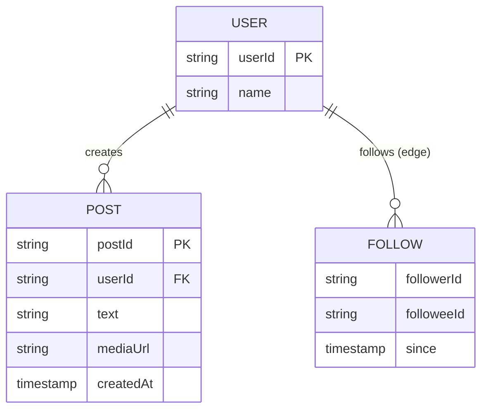

- **User** — the account (id, profile).
- **Post** — content (id, author, text, media URL, timestamp). "Finding the posts from users you follow" is the whole game.
- **Follow** — a directed edge `follower → followee`.

Full per-database schemas (posts, feeds, comments, likes, follow) are detailed in [§14 Database Selection](#14-deep-dive--database-selection-) and [B6 Data Model](#b6-data-model--schema-). We deliberately keep attributes light here and flesh them out as the design demands — a good interview habit.

---

## 7. High-Level Design — Follow / Unfollow 🔗

The simplest flow — build it first. When user A follows user B:

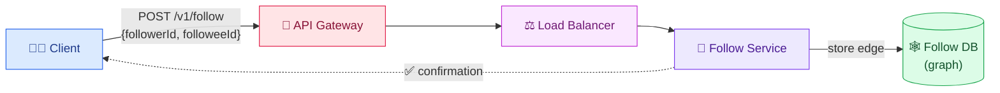

**Steps:** (1) client sends `POST /v1/follow` to the API gateway; (2) gateway routes to the **Follow Service** via load balancer; (3) Follow Service writes the `follower → followee` relationship to the **Follow DB**; (4) client gets a success confirmation.

**Why a graph DB (transcript 1)?** The transcript models follows as a **graph** — users are **nodes**, follow relationships are **edges** — because graph DBs specialize in storing and traversing relationships (find a user's followers/followees efficiently).

> ⚖️ **Trade-off flagged (transcript 2 disagrees!):** The second source argues a graph DB is **overkill** here. Graph DBs shine for complex traversals ("find users followed by ≥2 men who also follow each other"). But newsfeed only needs *"list everyone who follows user X"* / *"list everyone X follows"* — a simple key lookup. A **wide-column store (DynamoDB / Cassandra)** with a partition key on `user_following`, sort key on `user_followed`, plus a **Global Secondary Index (GSI)** with the reverse keys, answers both directions cheaply. **Start simple; add graph complexity only if a query demands it.** Both are defensible — state the trade-off.

---

## 8. High-Level Design — Create a Text Post 📝

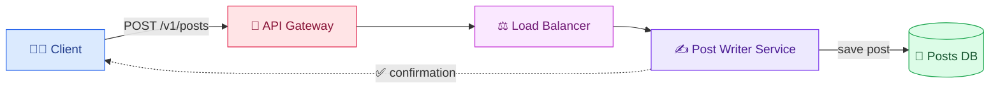

**Steps:** (1) user writes text + submits → `POST` reaches the API gateway; (2) gateway routes to **Post Writer Service** via LB; (3) Post Writer saves the post in **Posts DB**; (4) client gets confirmation. So far we've just persisted the post — we haven't touched anyone's feed yet. That comes next.

---

## 9. The Naive Newsfeed Read (and why it's slow) 🐢

The obvious way to read a feed: assemble it on demand.

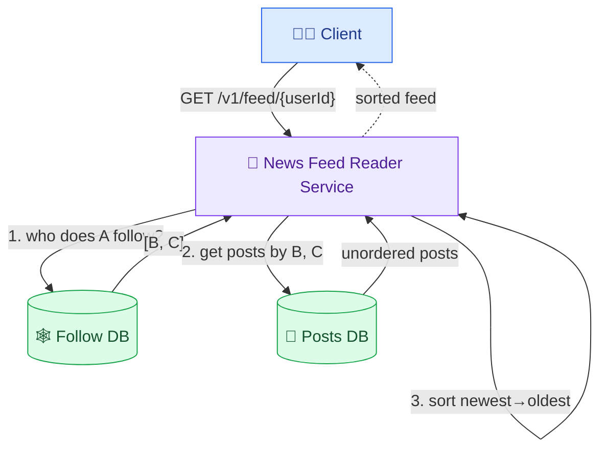

**Steps:** (1) Reader looks up all accounts A follows in the Follow DB → `[B, C]`; (2) reads those users' posts from Posts DB; (3) **sorts** the merged posts reverse-chronologically; (4) returns the feed.

**Why this is too slow:** *every single feed read* redoes all three steps — a follow-DB lookup, a fan of post-DB reads, and an in-memory sort. Given **50 billion reads/day** and users following possibly thousands of accounts, this is enormous repeated computation on the hottest path. Instagram loads instantly, so clearly it **doesn't** rebuild the feed on every read. We need to **precompute**.

> This is exactly **fan-out-on-read (pull)** — cheap writes, expensive reads. The fix is to move the work to write time.

---

## 10. Fan-out-on-Write — Precomputing the Feed ⚡

**Key idea:** prepare each user's feed **in advance**, at post-create time, so reads are instant lookups. When A posts, we *push* that post into the precomputed feed of every follower of A.

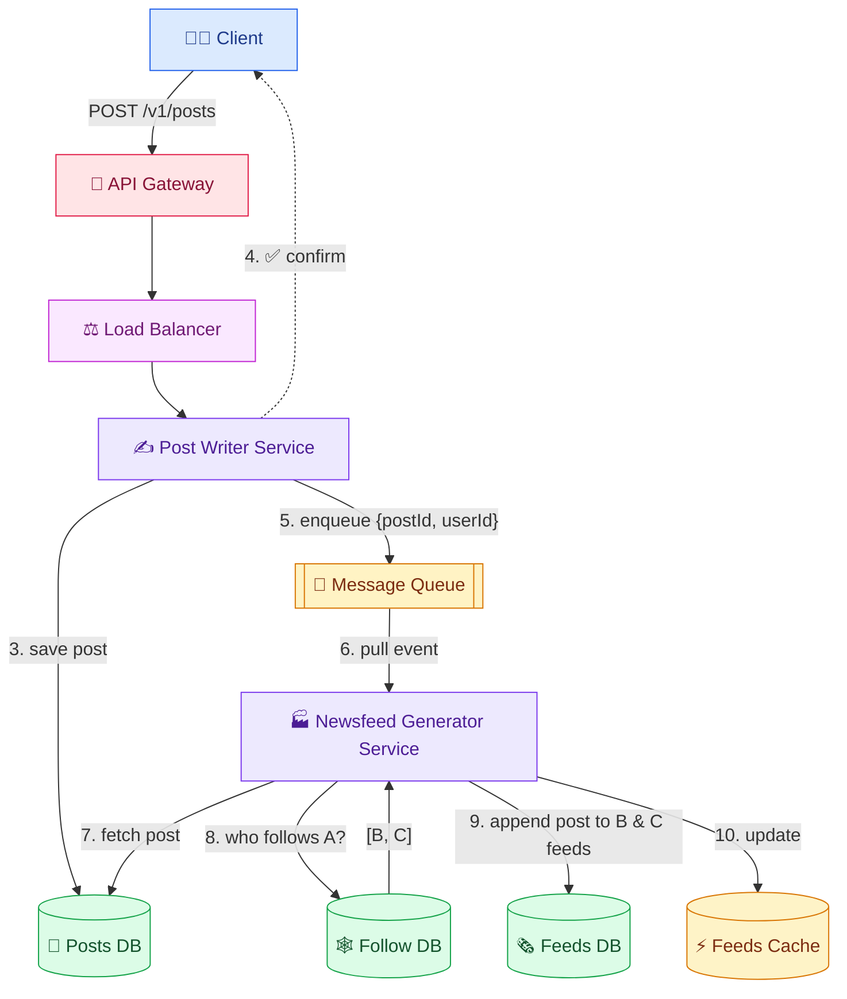

**The ten steps:**

1–4. Same as text-post: Post Writer saves the post to Posts DB and confirms to the client.
5. Post Writer **puts an event `{postId, userId}` on a message queue** (e.g., `{postA, userA}`).
6. A dedicated **Newsfeed Generator Service** pulls the event from the queue (async — decoupled from the create path).
7. It fetches the full post from Posts DB using `postId`.
8. It looks up **all followers** of `userA` in the Follow DB → e.g., `[userB, userC]`.
9. It **appends the new post to each follower's feed** stored in the **Feeds DB** (a `userId → [posts]` mapping).
10. It updates the **Feeds Cache** for fast reads.

**Why a message queue?** It **decouples** the fast create path from the potentially slow fan-out work, absorbs spikes, and lets us scale generator workers independently. The create request returns immediately (good latency); fan-out happens asynchronously (eventual consistency — our ~1–60 s budget).

> ⚖️ **Trade-off:** fan-out-on-write makes reads O(1) lookups but makes a **popular user's write** explode into millions of feed writes — the **celebrity problem**, solved with a **hybrid** approach in [§17](#17-deep-dive--the-celebrity--fan-out-problem-hybrid-).

---

## 11. High-Level Design — Create an Image / Video Post 🖼️

Media is large, so we don't send it in the request body. Instead: **client uploads media directly to object storage** using a **pre-signed URL**, then posts the resulting URL.

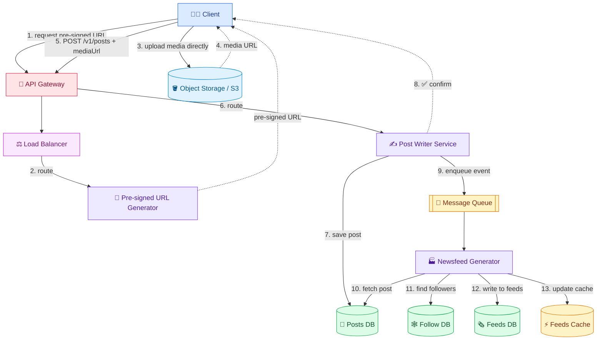

**Steps 1–4 (upload):** client asks the gateway for a **pre-signed URL**; the **Pre-signed URL Generator Service** returns one; the client **uploads the media directly to object storage** (bypassing our servers); object storage returns the file's URL. **Steps 5–13 (post + fan-out):** client `POST`s the post *with* `mediaUrl`; Post Writer saves it and confirms; then the same **queue → Newsfeed Generator → Feeds DB/Cache** fan-out as text posts. The **only difference vs a text post is the pre-signed-URL upload to object storage** (detailed in [§15](#15-deep-dive--pre-signed-urls-)).

---

## 12. High-Level Design — Reading the Newsfeed 📲

Because feeds are precomputed, the read is now a **cache lookup** — fast.

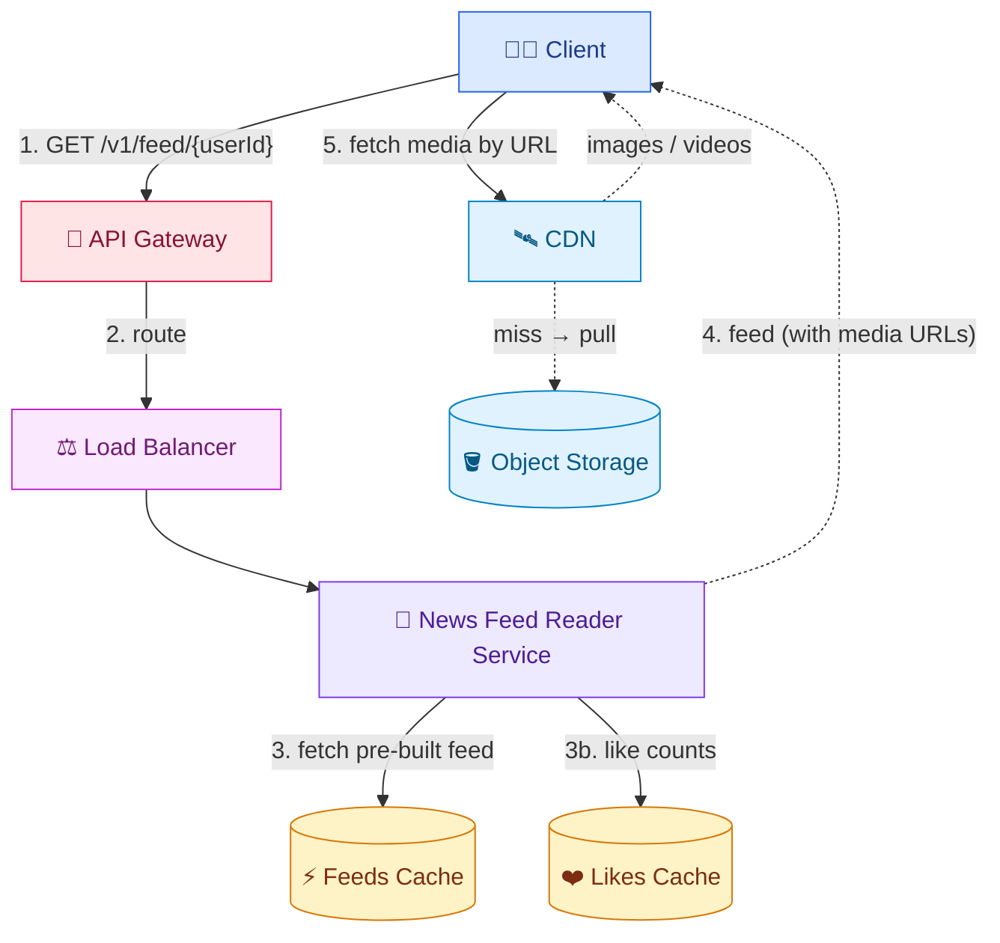

**Steps:** (1) client `GET`s the feed; (2) gateway → **News Feed Reader Service** via LB; (3) Reader fetches the **pre-built feed from the Feeds Cache** (and like counts from the **Likes Cache**, step 3b); (4) Reader returns the feed — but it contains **media URLs, not the media files**; (5) the client fetches the actual images/videos from the **CDN** using those URLs (CDN pulls from object storage on a miss).

> 💡 **Fun fact / usability insight:** ever open Instagram and see **text first, images a beat later**? That's exactly this: the feed (text + URLs) arrives fast from cache, then the client separately fetches media from the CDN. Understanding this explains the NFR about "usability / fast rendering."

---

## 13. High-Level Design — Comment & Like 💬❤️

### Commenting

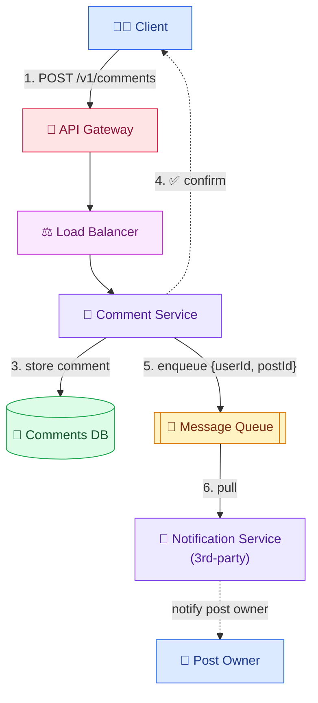

**Steps:** (1) `POST /v1/comments` → gateway; (2) route to **Comment Service**; (3) store in **Comments DB**; (4) confirm to client; (5) Comment Service **enqueues `{userId, postId}`**; (6) a **third-party Notification Service** pulls the event and notifies the post owner.

### Liking

Almost identical, with **one extra step** — the like count is cached:

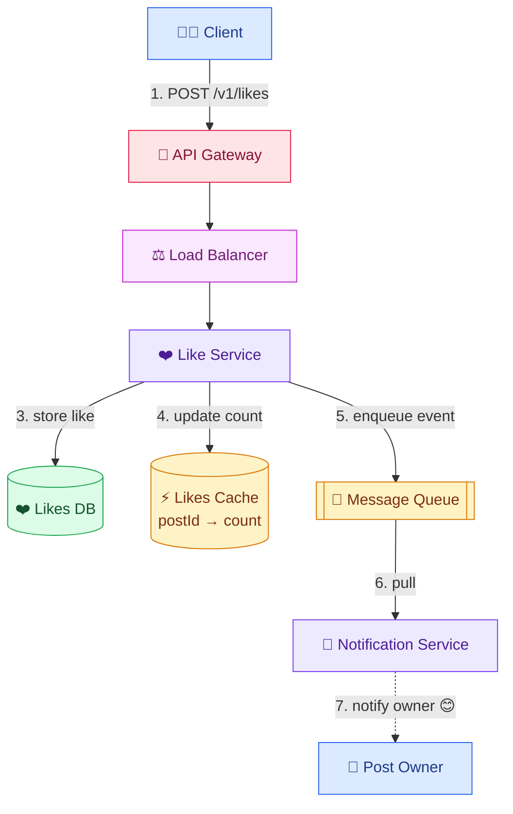

**The extra step (4):** the Like Service updates a **Likes Cache** mapping `postId → likeCount` (e.g., `postA → 1000`, `postB → 2000`) so the feed can display counts without hitting the DB. This is why the read-feed flow ([§12](#12-high-level-design--reading-the-newsfeed-)) has a **step 3b** pulling like counts from the Likes Cache.

---

## 14. Deep Dive — Database Selection 🗄️

General guidelines (not black-and-white — it depends on project needs):

| Signal | Lean toward |
|---|---|
| Need fast data access | **NoSQL** |
| Very large scale | **NoSQL** |
| Fixed, structured data | **SQL** |
| Unstructured / variable data | **NoSQL** |
| Complex queries (joins, aggregations) | **SQL** |
| Data evolves frequently | **NoSQL** (flexible schema) |
| Relationship-heavy traversals | **Graph DB** |

We have **five** databases. Applying the guidelines:

| DB | Structure | Scale | Query pattern | Choice |
|---|---|---|---|---|
| **Posts DB** | no fixed structure (text / image / video / metadata) | 50M writes/day | read post by `postId` (simple) | **NoSQL** |
| **Feeds DB** | unstructured (`userId → [posts]`) | huge (50M posts fan out) | read feed by `userId` (simple) | **NoSQL** |
| **Comments DB** | may evolve (nested comments) | 1.5B activities/day | all comments for a post (simple) | **NoSQL** |
| **Likes DB** | may evolve (reactions: wow/sad/love) | 1.5B activities/day | count likes / who liked (simple) | **NoSQL** |
| **Follow DB** | relationships (nodes + edges) | millions of edges/user | a user's followers & followees | **Graph DB** (transcript 1) *or* wide-column + GSI (transcript 2) |

> ⚖️ **The follow-DB debate is the key trade-off here.** Transcript 1 picks a **graph DB** (Neo4j-style) because follows *are* a graph. Transcript 2 argues that newsfeed's queries are trivial ("list a user's followers/followees"), so a **wide-column store (DynamoDB/Cassandra) with a GSI** is simpler, cheaper, and scales better — reserve graph DBs for genuinely complex traversals. **Recommended interview answer:** start with wide-column + GSI (simpler, tightly fit to the queries); mention graph DB as the alternative if traversal complexity grows. Simplicity is a *seniority signal*.

> 💡 **Read-heavy vs write-heavy tie-in (§3):** Posts/Feeds are read-heavy → cache + replicas. Likes/Comments are write-heavy (1.5B/day) → LSM-tree stores like **Cassandra/DynamoDB** absorb writes well.

---

## 15. Deep Dive — Pre-signed URLs 🔑

**What they are:** special URLs that let a client **upload directly to object storage** (e.g., Amazon S3), bypassing our application servers. The client receives **temporary permission** to upload.

**Why "pre-signed"?** The URL embeds a **cryptographic signature** authorizing the upload for a **limited time** (e.g., 10 minutes), after which it expires.

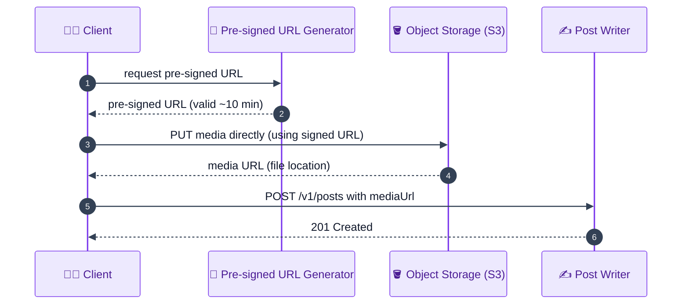

**Why use them — two reasons (transcript):**

1. **Faster uploads.** The client uploads straight to object storage, **not through our servers** — the app tier never handles the heavy bytes, so it stays free for API traffic.
2. **Secure & temporary access.** The URL **expires**, so it can't be reused or exploited later — a scoped, time-boxed grant.

### 🧠 Beginner intuition — the two ways to upload a file

There are only two possible upload paths, and pre-signed URLs pick the better one:

- **Path A — proxy through our servers (naive):** client → **our app server** → object storage. Every byte of a 20 MB video travels *into* our server's memory/disk, then *out* again to S3. During that transfer the server holds an open connection and buffers the file, consuming CPU, memory, and network. At ~579 posts/sec with media, our servers would be spending most of their capacity just **relaying bytes** they don't even keep.
- **Path B — direct upload with a pre-signed URL:** client → **object storage directly**. Our server's only job is to *authorize* the upload by generating a small signed URL (pure CPU, no file bytes). The actual 20 MB flows straight from the phone to S3 over a separate connection.

The key technical property that makes Path B safe: **the authorization is verifiable offline**. S3 can check the signature using a shared secret **without calling back to our servers** — so we grant permission once, cheaply, and S3 enforces it independently. The **expiry timestamp** bounds the blast radius if the URL leaks.

### 📦 What's actually inside a pre-signed URL

A pre-signed URL is just a normal S3 URL with **extra query parameters** that encode the permission. Conceptually:

```
https://insta-media.s3.amazonaws.com/uploads/abc123.mp4
        ?X-Amz-Credential=<key>            ← who authorized this
        &X-Amz-Date=20260701T120000Z        ← when it was signed
        &X-Amz-Expires=600                  ← valid 600 s = 10 min
        &X-Amz-SignedHeaders=host
        &X-Amz-Signature=9f3c...            ← the tamper-proof stamp
```

The backend computes the `X-Amz-Signature` using its **secret key** (which the client never sees). If a client tried to change the file path or extend the expiry, the signature wouldn't match and S3 rejects the upload. So the client gets *exactly one* narrowly-scoped power: "PUT this one object, until this time."

### 👤 Concrete scenario — Alice posts a 20 MB travel video

1. **Alice's phone → backend:** "I want to upload a video for a new post." (No bytes sent yet — just a request.)
2. **Backend → Alice:** returns a pre-signed URL for slot `uploads/alice_vid_042.mp4`, valid 10 minutes. *Our servers did almost no work.*
3. **Alice's phone → S3 (direct):** `PUT` the 20 MB video straight to that URL. The 20 MB **never touches our backend**. If Alice's Wi-Fi is slow and this takes 3 minutes, *our servers don't care* — they're busy serving other API calls.
4. **S3 → Alice:** upload OK; the file now lives at `https://insta-media.s3.amazonaws.com/uploads/alice_vid_042.mp4`.
5. **Alice's phone → backend:** `POST /v1/posts` with `mediaUrl = that S3 location` + caption. This request is **tiny** (a few hundred bytes of JSON).
6. Fan-out proceeds as normal (§10/§17) — Alice's followers will see the post; their apps fetch the video from the CDN later.

> 💡 **Why this matters at scale:** at ~579 posts/sec, many carrying 0.5–20 MB media, routing every byte through the app tier would need a massive, expensive fleet just to *relay* files. Pre-signed URLs let cheap, stateless API servers handle only lightweight JSON, while the heavy lifting goes straight to purpose-built object storage.

> ⚠️ **Common beginner confusion:** the pre-signed URL is for **uploading** (write). It's different from the **CDN URL** the client uses later to **download/view** the media (§12/§16). Upload = pre-signed, direct to S3; view = public/CDN URL, served from the edge.

---

## 16. Deep Dive — Media Processing 🎬

**Problem:** different devices and network speeds need different **formats and resolutions**. Mobile may want MP4, desktop MOV; a fast connection wants 4K, a slow one wants 360p/240p. Serving one giant file to everyone wastes bandwidth and breaks the "fast rendering" NFR.

**Solution:** store each media file in **multiple formats and resolutions**, generated by a **Media Processing Service**.

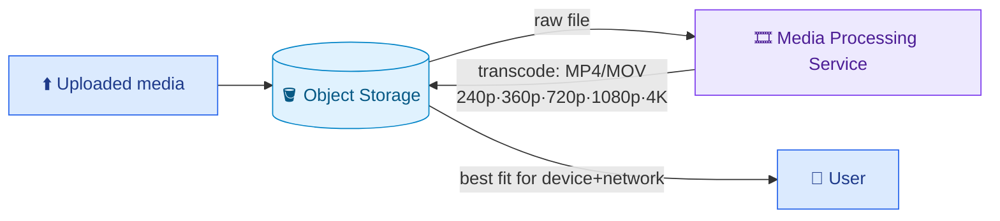

**Flow:** when media lands in object storage, the **Media Processing Service** transcodes it into multiple formats/resolutions and **writes them back** to object storage. At read time, a user on a **poor connection** gets a **lower-resolution** variant; different devices get device-appropriate formats. (In production this is an **async, queue-driven** pipeline, often chunked/parallelized — a natural enrichment to mention.)

### 🧠 Beginner intuition — why one file can't serve everyone

A video file has three properties that must match the viewer, or playback degrades or fails: **container/codec** (the format the player can decode), **resolution** (pixel dimensions), and **bitrate** (data per second → how much bandwidth it needs). The uploaded file (the *master*) is high-bitrate, high-resolution, in one format. Three followers open Alice's post at once, each with different constraints:

- **Bob** — weak 3G (~1–2 Mbps), small phone screen. The 20 MB 4K master needs far more bandwidth than his link delivers, so the player **stalls/buffers**. A **240p, low-bitrate (~2 MB)** version streams smoothly and looks fine on a small screen anyway (extra pixels are wasted on a phone).
- **Carol** — fibre (hundreds of Mbps), 4K TV. She has the bandwidth and the pixels, so the **full 4K** looks crisp; a 240p file would be **upscaled** and look blocky on her big screen.
- **Dave** — older device whose player only supports a specific **codec/container**. If the master's codec isn't supported, it simply **won't decode** — a resolution downgrade doesn't help; he needs a different *format*.

Bitrate/resolution is a *bandwidth-vs-quality* trade-off; codec/container is a *compatibility* requirement. No single file optimizes all three for all viewers, so we **pre-generate a set of variants once** (right after upload) and select the best match per viewer at read time.

### 🔄 Transcoding: what "multiple formats and resolutions" means

- **Format / container + codec** — e.g., `MP4 (H.264)` for broad mobile support, `MOV`/`WebM` for other players. This is about *compatibility* (will it play at all?).
- **Resolution / bitrate ladder** — the same video encoded at several quality levels: `240p · 360p · 480p · 720p · 1080p · 4K`. This is about *quality vs bandwidth*.

So one uploaded video "explodes" into a small **matrix** of files. Example for Alice's clip:

```
alice_vid_042/         (all derived from the single master upload)
  ├── 240p.mp4    (~2 MB)   → weak network / small phone
  ├── 360p.mp4    (~4 MB)
  ├── 720p.mp4    (~10 MB)
  ├── 1080p.mp4   (~18 MB)
  ├── 4k.mp4      (~40 MB)  → fast network / big screen
  └── (thumbnails, WebM alternates, etc.)
```

### 👤 Concrete scenario — the same post, three different downloads

1. Alice uploads the master video (§15 pre-signed URL) → it lands in object storage.
2. The **Media Processing Service** picks it up, transcodes it into the ladder above, and writes all variants back to object storage.
3. Alice's post (§10/§17 fan-out) carries a media URL — but really a **manifest** pointing at the variant set.
4. At view time:
   - **Bob (3G, small phone)** → client/CDN picks **240p.mp4** → loads instantly, no buffering.
   - **Carol (fibre, 4K TV)** → picks **4k.mp4** → crisp full quality.
   - **Dave (old device)** → picks the compatible **format** → it actually plays.

This is exactly how **adaptive streaming** (HLS/DASH) works in the real world: the player continuously picks a variant from the ladder as network conditions change mid-playback — which is why a video sometimes starts blurry and sharpens after a second.

> 💡 **Why do the work at upload time, not view time?** A video is uploaded **once** but viewed **potentially millions of times** (read-heavy, ~1000:1). Transcoding on the fly for every viewer would be absurdly expensive and slow. Doing it **once, up front, asynchronously** means every future viewer just downloads a ready-made file. This directly serves the **usability** NFR (fast rendering) and shrinks the **egress** bill (most viewers pull small variants, not the 20 MB master).

> ⚙️ **Production note:** this pipeline is **async and queue-driven** (transcoding a long 4K video can take minutes), and large videos are **chunked** so segments transcode in parallel across many workers. A post's media may show a brief "processing…" state until enough variants are ready — the post itself is available immediately; only the highest-quality renditions arrive slightly later.

---

## 17. Deep Dive — The Celebrity / Fan-out Problem (hybrid) 🌟

This is **the** signature deep dive. Recall the two extremes:

- **Fan-out-on-read (pull):** merge at read time. If you follow **10,000** people, the feed service makes **10,000** queries returning maybe **10 million** posts to merge and sort in near-real-time — brutal per read.
- **Fan-out-on-write (push):** precompute feeds. Great for reads, but when a user with **10,000+ followers** posts, we must write **tens of thousands** of feed records — and a **mega-account (100M+ followers)** creates a *thunderstorm* of writes.

### 🧠 Beginner intuition — where the work happens (write vs read)

The whole problem is one question: **when do we do the work of building a feed — at write time or read time?** The two strategies just move the cost to opposite sides:

- **Push (fan-out-on-write).** When user X posts, we immediately **write that post ID into the stored feed of every follower of X**. Cost = **O(number of followers of X)** *write operations per post*. Reading a feed is then O(1): one lookup of the reader's pre-built feed. Problem: if X has 200M followers, one post triggers **200M writes**.
- **Pull (fan-out-on-read).** We store nothing per-follower. When user Y reads their feed, we **query every account Y follows for their recent posts and merge them live**. Cost = **O(number of accounts Y follows)** *read queries + a merge*, paid *on every feed load*. Posting is O(1). Problem: if Y follows 10,000 accounts, every scroll does ~10,000 queries.

Notice the costs are driven by **two different fan degrees**: push scales with the *poster's follower count*; pull scales with the *reader's followee count*. Our workload (**50B reads/day, ~1000:1 read-heavy**) means reads must be O(1) → favor push. But the follow graph is **skewed** (next section), so pure push explodes for high-follower accounts. The resolution: apply push where the follower count is small, and pull where it's huge.

### 📊 Why the follow graph forces a hybrid (the skew, with numbers)

Follower counts follow a **power law** — a handful of accounts have astronomically more followers than everyone else:

| User type | Example | Followers | What happens when they post (pure push) |
|---|---|---|---|
| Normal person | Alice | ~300 | 300 tiny feed writes — instant, no problem ✅ |
| Popular local | Bob's café | ~5,000 | 5,000 writes — still fine ✅ |
| Big influencer | a creator | ~500,000 | 500K writes per post — getting heavy ⚠️ |
| Mega-celebrity | Cristiano/Bieber | ~600,000,000 | 600M writes for **one** post — a thunderstorm ❌ |

The **normal accounts** (99.9% of users) are cheap to push. The **mega accounts** (0.001%) are the whole problem. So: **push for normal, pull for mega** = *hybrid*. That single insight is the answer interviewers are listening for.

### The precomputed-feed table (push) and its cost

Add a **`precomputed_feed`** table (or cache): `userId → [latest 200 post IDs]`.

```
Store latest 200 posts/user, each postId ≈ 10 bytes → 200 × 10 = 2 KB per user
2 KB × 2 billion users = 4,000 GB... let's follow the transcript's figure:
  ≈ 2 KB × 2B = ~2,000 GB = ~2 TB of feed storage
```

> The transcript sizes it at **~2 KB/user → ~2 TB for 2B users** — "quite reasonable for a modern system." (Facebook earns ~$100/user/yr in the US, so 2 KB/user is trivially cheap.)

### Async worker pool (don't fan out synchronously)

Never block the post-create request on writing millions of feeds. Instead:

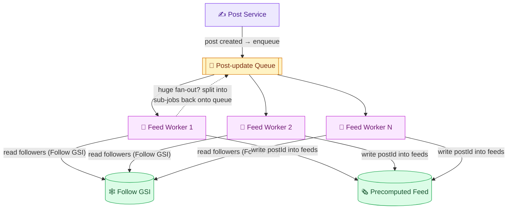

Workers read followers from the Follow GSI and write the post ID into each follower's precomputed feed. If the follower count is huge, **break it into smaller sub-jobs** re-queued to spread load across many workers.

### The hybrid solution (push + pull)

For **truly mega accounts** (Justin Bieber, hundreds of millions of followers), broadcasting writes is inappropriate. The fix:

- Add a **`isPrecomputed` flag** on the follow edge. Set it **false** when the followee has a **huge** following (e.g., **≥100,000 followers**).
- **On post-create:** feed workers write to precomputed feeds **only for normal (`isPrecomputed=true`) relationships**. Mega-accounts are **skipped** (no fan-out storm).
- **On feed-read:** the feed service (a) reads the **precomputed feed** (normal followees, already merged) and (b) **live-pulls** the latest posts from the handful of **non-precomputed mega-accounts** the user follows, then **merges the two lists** at query time.

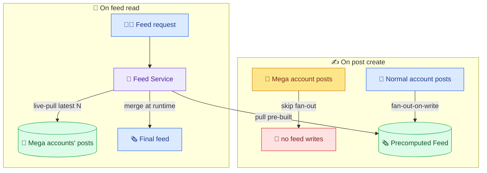

**Why it works:** it **caps writes** (mega-accounts don't fan out) *and* **caps reads** (only a few live-pulls, since users follow few mega-accounts). Best of both worlds.

### 👤 Full worked scenario — Dave opens his feed

Let's make the hybrid concrete. **Dave** follows **203** accounts:

- **200 normal friends** (Alice, Bob, …) — each has a few hundred followers, so their follow edges to Dave are `isPrecomputed = true`.
- **3 mega-celebrities** — Ronaldo, Bieber, and a news channel (each 100M+ followers), so their edges are `isPrecomputed = false`.

**What happened at write time (before Dave ever opened the app):**

- Every time Alice or any of the 200 friends posted, a feed worker **pushed** that post ID into Dave's precomputed feed. So Dave's precomputed feed already holds the latest posts from all 200 friends, pre-merged and sorted. ✅
- Every time Ronaldo/Bieber/the news channel posted, the workers **skipped** Dave (and their other ~600M followers) — **no writes**. That's what saved us from 600M-write storms. ✅

**What happens when Dave taps "Home" (read time):**

```
1. Read Dave's PRECOMPUTED feed        → ~all 200 friends' recent posts, already sorted   (1 fast lookup)
2. Live-PULL from the 3 mega-accounts  → "latest N posts by Ronaldo", "…by Bieber", "…by news"  (3 small queries)
3. MERGE the two lists by timestamp    → newest → oldest, take the page size (e.g., 25)
4. Return the page to Dave
```

So Dave's read costs **1 cache lookup + only 3 live queries** — not 203. The expensive-to-fan-out celebrities became **cheap-to-pull-at-read** precisely because Dave follows only a *few* of them. Meanwhile his 200 friends were cheap to push. The costs land on opposite sides for opposite user types, and the hybrid puts each on its cheaper side.

**The symmetry that makes it click:**

| | Normal friend (push) | Mega-celebrity (pull) |
|---|---|---|
| Followers | few → cheap to write to all | hundreds of millions → impossible to write to all |
| A given reader follows… | *many* of them → too many to pull live | *few* of them → cheap to pull live |
| So we… | **push** at write time | **pull** at read time |

> 🔢 **Sanity check on the read cost:** even a heavy user rarely follows more than a handful of mega-accounts. If the "mega" threshold is 100K followers, the number of such accounts is tiny, so `live-pulls per read` stays in the single digits. The precomputed feed absorbs the long tail of normal follows in one lookup.

> 💡 **The rabbit hole is infinite (be honest about it):** What if a user follows *many* huge accounts? What happens to the flag on **unfollow** — does it ever reverse? These are excellent follow-ups, but note that **platforms enforce product limits rather than engineer to infinity**: Google won't page to result #1000; LinkedIn caps connections. Sometimes you just cap the 0.001% edge case instead of over-engineering.

---

## 18. Deep Dive — Hot Key / Hot Shard 🔥

When a **popular account** posts, that single post sits atop **millions** of feeds — so a huge number of clients suddenly query the **same `postId`** in the Posts DB. All those requests hit **one partition** (a partition is ultimately a **physical host** with real limits). Result: DynamoDB/Cassandra **throttles** or fails — the **hot-key / hot-shard** problem. Scalability assumes *even* load across keys; a viral post violates that.

### 🧠 Beginner intuition — how partitioning works, and why one key gets "hot"

A distributed database doesn't keep all rows on one machine. It splits them across many machines (**partitions/shards**) by hashing the key:

```
partition = hash(postId) mod (number of partitions)
```

Each `postId` therefore lands on **exactly one** partition, which lives on **one physical host** with a fixed ceiling (say, ~3,000 reads/sec). This design is great *when load is spread evenly* across many keys — 100 partitions can serve ~300,000 reads/sec **as long as** requests are distributed across all 100.

The catch: a single `postId` always maps to the **same** partition. So if one post is being read a million times a second, **all** of those reads pile onto **one** host. The other 99 partitions sit idle and **cannot help** — they don't have that row, and routing is fixed by the hash. That one overloaded key/host is the **hot key / hot shard**. The host hits its ceiling and starts **throttling** (rejecting requests) or timing out.

```
Even load (healthy):                  Hot key (broken):
  reads spread over keys                millions of reads for ONE postId
  P1 ▓▓  P2 ▓▓  P3 ▓▓  P4 ▓▓            P1 🔥🔥🔥🔥🔥  P2 ·  P3 ·  P4 ·
  each host ~30% → fine                 P1 at 1000% → throttle; P2–P4 idle & useless
```

### 🔢 Concrete scenario — Ronaldo posts, 10M fans open the app

Say **Ronaldo** posts, and within a minute **10 million** followers load feeds containing that post. Each feed render needs the post's content, so each does a `GET post where postId = R1`. That's up to **10M reads/min ≈ 167,000 reads/sec** — all for the *single* key `R1`, all routed to the *one* partition holding `R1`.

If that partition's host tops out at ~3,000 reads/sec, we're asking it to do **~55× its capacity**. It throttles: most of those 10M users get errors or a spinner where Ronaldo's post should be. Adding more partitions **doesn't help** — `R1` still hashes to one of them.

> ⚠️ **Don't confuse this with the celebrity fan-out problem (§17).** They're related but different:
> - **§17 fan-out** is a **write** problem: *writing* Ronaldo's post ID into millions of *feeds*. Fixed by the hybrid (skip fan-out, pull at read).
> - **§18 hot key** is a **read** problem: millions of clients *reading* the *same post row*. Fixed by caching/replication below.
> Both stem from the skewed follow graph, but one is about writes fanning out and the other about reads concentrating on one key.

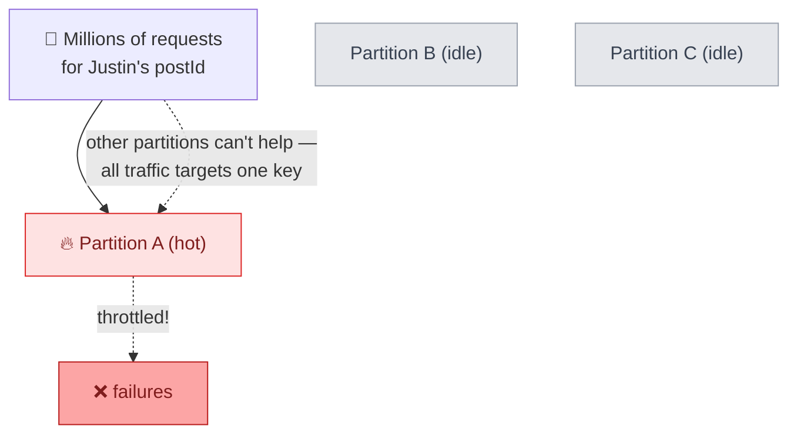

### Fix 1 — distributed cache in front of the hot partition

Put a **distributed cache (Redis)** with **LFU eviction + TTL** in front of the Posts DB, holding only the **most viral posts**. Posts rarely change, so a short TTL is fine. Instead of a million requests hitting DynamoDB, **one** does (cache miss), the rest are served from cache.

**Why the pieces are chosen (beginner-friendly):**
- **LFU (Least-Frequently-Used) eviction** keeps the *most-read* posts in memory and drops rarely-read ones. That's exactly what we want: the viral posts *are* the frequently-read ones, so they stay cached while cold posts get evicted automatically. Memory stays small — we only need room for the hot set, not all 788 PB.
- **TTL (time-to-live)** auto-expires an entry after, say, 5 minutes. Because a post's content is essentially immutable (you don't edit a post 10M times), a few minutes of staleness is harmless, and the TTL guarantees memory is reclaimed once a post cools off.

**Effect on our Ronaldo scenario:** of the ~167,000 reads/sec for `R1`, the **first** one misses the cache and reads the DB partition once; every subsequent read is served from Redis. The DB partition goes from ~167,000 req/s down to **~0** for that key — it's shielded.

### Fix 2 — but the cache *also* has a hot key!

If the cache is sharded by `postId`, the viral post maps to **one cache node** → same hot-key problem, one level down. Redis's in-memory throughput may absorb it, but the fundamental issue remains.

**Why sharding the cache doesn't save us:** a *sharded* cache uses the **same trick as the DB** — `cacheNode = hash(postId) mod N`. So `R1` still lands on exactly **one** cache node, and all ~167,000 reads/sec hit that single node. In-memory Redis is faster than disk-backed DynamoDB (it might survive where the DB throttled), but you've only *raised the ceiling*, not removed the single-point concentration. A truly viral moment can still exceed one node's network/CPU limit.

**Better fix — replicate the hot entry across N cache instances** (not sharded, not even coordinated). The feed service **randomly picks one of N instances** per request.

**Why replication beats sharding here:** with sharding, one key = one node. With **replication**, the *same* post is stored on **all N nodes**, and each read randomly picks a node, so traffic **divides evenly** across them. The nodes don't need to talk to each other or stay in sync — the data is a read-only, immutable post copy, so N independent duplicates are fine.

**The math, continued:** with **N = 50** replicas, the ~167,000 reads/sec for `R1` split to **~3,340 reads/sec per node** — under a single node's ceiling. Compare the request counts reaching the DB:
- No cache: **167,000 req/s → 1 DB partition** ❌
- Single/sharded cache: **167,000 req/s → 1 cache node** ⚠️ (better, still concentrated)
- N replicated caches: **≤ N misses total → DB**, and **~167,000 ÷ N per cache node** ✅

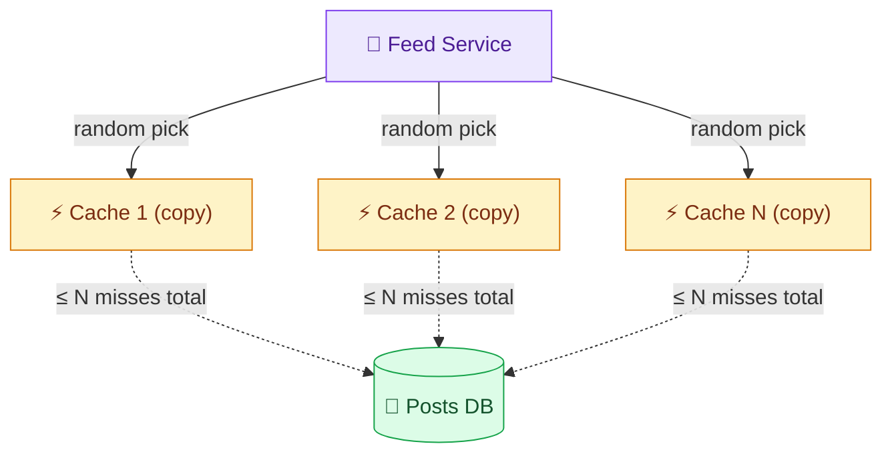

Now instead of 1 request reaching DynamoDB, at most **N** do (N = number of cache instances) — but N (say, 10–50) is **vastly smaller** than the millions of incoming requests, so the DB partition is protected. Cheap, no coordination, effective.

> 💡 **The deep-dive pattern (staff-level meta-skill):** *identify a bottleneck → propose a solution → identify the new bottleneck that solution creates → repeat.* Fan-out-on-read → slow reads → fan-out-on-write → write storms → hybrid → hot key → cache → cache hot key → replicated caches. Interviewers grade your **process**, not a memorized "right answer."

---

# 🎯 Part B — Interview Template

## B1. Problem Statement & Clarifying Questions 📝

**Problem statement.** Design the backend for a social-media **newsfeed** (Instagram / Facebook / Twitter): users create posts (text/image/video), follow other users, and view a reverse-chronological feed of posts from the people they follow — plus like, comment, and receive notifications — at a scale of hundreds of millions of daily users, read-heavy, low-latency, highly available.

**Clarifying questions an interviewer expects:**

1. **Directed or mutual follows?** (We assume **unidirectional** follow, like Twitter/old-Facebook.)
2. **Chronological or ranked feed?** (We do **reverse-chronological**; modern feeds add **ML ranking** — flag as out of scope/bonus.)
3. **Post types?** (Text, image, video.)
4. **Consistency needs?** (Eventual is fine — a post can appear in feeds seconds late.)
5. **Latency target?** (Feed load 1–2 s / ~500 ms.)
6. **Scale?** (500M DAU / 2B MAU.)
7. **In scope: likes, comments, notifications?** (Yes.) **Out of scope:** privacy settings, DMs, stories, reply-to-comment, search — mark **below the line**.
8. **Read-heavy or write-heavy?** (Massively read-heavy, ~1000:1 — confirm to justify caching/precompute.)

> 💡 The **crux** to name up front: *when do we assemble the feed — write time or read time?* Everything else follows.

---

## B2. Requirements 📋

**Functional**
- Create posts (text / image / video).
- Follow / unfollow users.
- View reverse-chronological newsfeed (paginated / infinite scroll).
- Like & comment on posts.
- Notify post owner on like/comment.

**Non-functional**
- **Availability:** ~**99.999%** (feed must always load; favor availability over strong consistency).
- **Eventual consistency:** new post visible to followers within **~1–60 s** (buys async fan-out).
- **Latency:** feed reads **≤ 500 ms–2 s**; posting responsive.
- **Scalability:** **500M DAU / 2B MAU**, global; **~50B reads/day**, **~50M posts/day**.
- **Extensibility:** easy to add reactions, nested comments, ranking.
- **Usability:** fast rendering (text + media), graceful media loading via CDN.

---

## B3. Capacity Estimation 📊

(Full derivation in [§4](#4-capacity-estimation-full-math-); condensed.)

```
DAU 500M · MAU 2B
Writes: create-post = 10% × 500M      = 50M/day    (~579 QPS)
        follow      = 500M ÷ 7         = 71.4M/day
        activities  = 500M × 3         = 1.5B/day   (~17.4K QPS)
Reads:  feed = 500M × 100              = 50B/day    (~579K QPS)
Read : Write ≈ 1000 : 1   → heavily read-heavy

Post sizes: text 100KB · image 0.5MB · video 20MB ; mix 20/60/20%
Storage/day = 1TB + 15TB + 200TB      = 216 TB/day
Storage/10yr = 216TB × 365 × 10       ≈ 788 PB
Follow/10yr  = (500M/7)×16B×365×10     ≈ 4.17 TB
Activity/10yr= 1.5B×216B×365×10        ≈ 1.18 PB
Cache/day    = 1% × 216TB              ≈ 2 TB
Avg post     = 0.2·100KB+0.6·0.5MB+0.2·20MB = 4.32 MB
Ingress = 216TB ÷ 86,400 ≈ 2.5 GB/s
Egress  = 50B × 4.32MB = 216PB/day ÷ 86,400 ≈ 2.5 TB/s
Precomputed feed: 200 postIDs × 10B = 2KB/user × 2B ≈ 2 TB
```

---

## B4. API / Interface Design 💻

```http
POST /v1/posts        { userId, text, hashtags[], mediaUrl? }         → 201 { postId }
POST /v1/comments     { userId, postId, comment }                     → 201
POST /v1/likes        { userId, postId }                              → 201
POST /v1/follow       { followerId, followeeId }                      → 201
GET  /v1/feed/{userId}?pageSize=25&cursor=<ts>                        → 200 { posts[], nextCursor }
```

Notes: `POST` for all creates; `GET` (no body) for feed; **cursor pagination** (cursor = oldest timestamp seen) for stable infinite scroll; media posts carry `mediaUrl` after a pre-signed-URL upload. gRPC is a valid internal alternative; REST is the safe standard.

---

## B5. High-Level Architecture 🏛️

### 🏛️ Full system architecture (the "whiteboard" diagram)

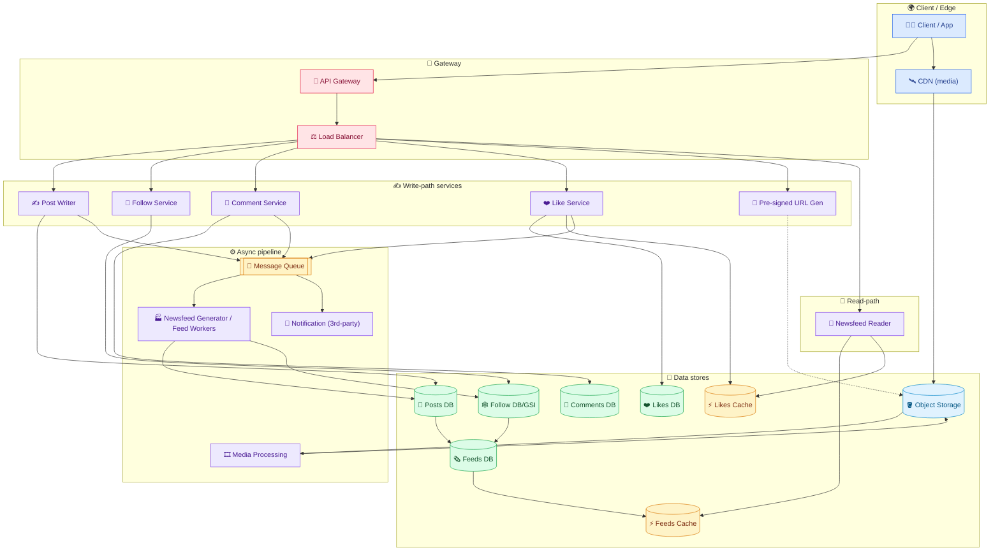

ASCII (the required `client → LB → service → cache → DB` flow):

```
                                        ┌──────────────► Posts DB
 client → API Gateway → Load Balancer → ┤ Post Writer ──► Message Queue ─► Newsfeed Gen ─► Feeds DB ─► Feeds Cache
   │                                    │ Follow Svc ───► Follow DB/GSI
   │                                    │ Like/Comment ─► Likes/Comments DB (+ Likes Cache)
   │                                    └ Newsfeed Reader ─► Feeds Cache (+ Likes Cache)
   └─(media)─► CDN ─► Object Storage ◄─ Media Processing
```

**Component roles:**

- **API Gateway** — single entry; auth, validation, rate-limit, routing.
- **Load Balancer** — spreads traffic across service instances.
- **Post Writer / Follow / Comment / Like Services** — write-path microservices, each owning its DB.
- **Pre-signed URL Generator** — issues time-limited S3 upload URLs.
- **Message Queue** — decouples create path from async fan-out & notifications.
- **Newsfeed Generator / Feed Workers** — fan-out-on-write: append posts to followers' feeds.
- **Newsfeed Reader** — read-path: fetch pre-built feed from cache.
- **Media Processing** — transcode media into formats/resolutions.
- **Notification Service** — third-party; notifies owners of likes/comments.
- **Feeds/Likes Cache (Redis)** — serve hot reads.
- **Object Storage (S3) + CDN** — store & edge-serve media (handles the 2.5 TB/s egress).

---

## B6. Data Model / Schema 🗃️

**Posts DB (NoSQL)** — key `postId`, indexed on `postId`.

| Field | Notes |
|---|---|
| `postId` (PK) | identifies the post; **index** for read-by-id |
| `userId` | author |
| `text` | post text |
| `mediaUrls[]` | object-storage locations (images/videos) |
| `createdAt` | timestamp (also a GSI sort key for "posts by user, newest") |

**Feeds DB (NoSQL)** — key `userId`, indexed on `userId`.

```
userId: u_B
feedItems: [ {postId:13452, ...}, {postId:86475, ...}, ... ]   // list of posts = the feed
```

**Comments DB (NoSQL)** — `commentId` (PK), `userId`, `postId`, `comment`, `timestamp`; **index on `postId`** (query: all comments for a post).

**Likes DB (NoSQL)** — `likeId` (PK), `userId`, `postId`, `timestamp`; **index on `postId`** (queries: count likes / who liked).

**Follow DB (Graph or wide-column+GSI)** —
```
userId: u_A
followers:  [ {id:u_B, since:...}, {id:u_C, since:...} ]   // who follows A
followees:  [ {id:u_X, since:...}, ... ]                    // who A follows
```
Wide-column variant: partition key `user_following`, sort key `user_followed`; **GSI** reversed (`user_followed` / `user_following`) for the reverse query. Add an `isPrecomputed` flag column for the hybrid fan-out ([§17](#17-deep-dive--the-celebrity--fan-out-problem-hybrid-)).

**Indexing rationale:** index the field you query by — `postId` for posts/comments/likes, `userId` for feeds/follow. Indexes are the "shortcut" that turns a scan into a direct lookup.

**Sharding:** shard Posts by `postId`, Feeds by `userId`, Follow by `user_following` — all high-cardinality, evenly distributed keys (mitigate hot keys per [§18](#18-deep-dive--hot-key--hot-shard-)).

---

## B7. Deep Dive Modules 🔬

Condensed pointers to the full deep dives above:

- **B7.1 Fan-out strategy** — push (write-time) vs pull (read-time) vs **hybrid**; the central trade-off. → [§10](#10-fan-out-on-write--precomputing-the-feed-), [§17](#17-deep-dive--the-celebrity--fan-out-problem-hybrid-)
- **B7.2 Celebrity problem** — `isPrecomputed` flag; skip fan-out for ≥100K-follower accounts, live-pull + merge at read. → [§17](#17-deep-dive--the-celebrity--fan-out-problem-hybrid-)
- **B7.3 Hot key / hot shard** — distributed LFU+TTL cache; **replicated (non-sharded) cache instances**, random pick. → [§18](#18-deep-dive--hot-key--hot-shard-)
- **B7.4 Pre-signed URLs** — direct-to-S3 upload, time-limited signature; faster + secure. → [§15](#15-deep-dive--pre-signed-urls-)
- **B7.5 Media processing** — multi-format/resolution transcoding; serve by device/network. → [§16](#16-deep-dive--media-processing-)
- **B7.6 Message queue & async workers** — decouple create from fan-out; sub-job splitting for large fan-outs. → [§10](#10-fan-out-on-write--precomputing-the-feed-), [§17](#17-deep-dive--the-celebrity--fan-out-problem-hybrid-)
- **B7.7 DB selection** — NoSQL for posts/feeds/likes/comments; graph *or* wide-column+GSI for follows. → [§14](#14-deep-dive--database-selection-)

<details>
<summary><b>☕ Java — Feed Worker (fan-out-on-write with hybrid celebrity skip) — click to expand</b></summary>

```java
public class FeedWorker {
    private static final int FANOUT_THRESHOLD = 100_000; // celebrity cutoff
    private static final int MAX_FEED_SIZE     = 200;     // keep feeds bounded

    private final FollowRepo followRepo;      // Follow DB + GSI
    private final FeedRepo   feedRepo;        // Precomputed Feeds DB
    private final Queue      queue;           // for sub-job splitting

    /** Invoked for each {postId, authorId} event pulled from the message queue. */
    public void onPostCreated(String postId, String authorId) {
        long followerCount = followRepo.countFollowers(authorId);

        // Mega-account? Do NOT fan out — readers will live-pull + merge instead.
        if (followerCount >= FANOUT_THRESHOLD) return;

        // Page through followers; split big fan-outs into sub-jobs to spread load.
        String cursor = null;
        do {
            Page<String> page = followRepo.followers(authorId, cursor, 1000);
            for (String followerId : page.items()) {
                feedRepo.prependCapped(followerId, postId, MAX_FEED_SIZE); // O(1) push
            }
            cursor = page.nextCursor();
            if (page.isLarge()) queue.enqueueSubJob(postId, authorId, cursor); // re-queue remainder
        } while (cursor != null);
    }
}
```

</details>

<details>
<summary><b>☕ Java — Feed read (hybrid merge: precomputed + live-pull mega-accounts) — click to expand</b></summary>

```java
public class FeedService {
    private final FeedRepo   feedRepo;    // precomputed feeds
    private final FollowRepo followRepo;
    private final PostRepo   postRepo;

    public FeedPage getFeed(String userId, int pageSize, Long cursor) {
        // 1) Pre-built portion (normal followees) — fast lookup.
        List<Post> precomputed = feedRepo.getFeed(userId, pageSize, cursor);

        // 2) Live-pull from the few mega-accounts this user follows (not precomputed).
        List<String> megaFollowees = followRepo.nonPrecomputedFollowees(userId);
        List<Post> live = new ArrayList<>();
        for (String m : megaFollowees) {
            live.addAll(postRepo.recentPostsByUser(m, pageSize, cursor)); // GSI: userId + createdAt<cursor
        }

        // 3) Merge both lists, newest-first, take pageSize.
        List<Post> merged = mergeByCreatedAtDesc(precomputed, live, pageSize);
        Long next = merged.isEmpty() ? null : merged.get(merged.size() - 1).createdAt();
        return new FeedPage(merged, next);
    }
}
```

</details>

---

## B8. Data Flow Diagram 🔀

**Write path (create post → fan-out) — end to end:**

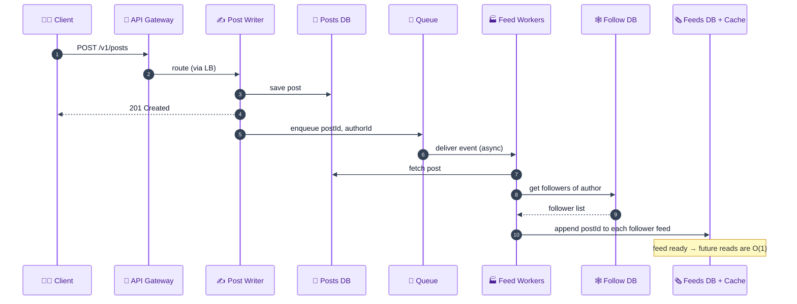

**Read path (view feed) — end to end (ASCII):**

```
 client ─ GET /v1/feed/{userId} ─► API Gateway ─► LB ─► Newsfeed Reader
                                                              │
                                                     read pre-built feed ◄── Feeds Cache
                                                     read like counts    ◄── Likes Cache
                                                              │
 client ◄─ feed (posts + media URLs) ─────────────────────────┘
    │
    └─ fetch media by URL ─► CDN ──(miss)──► Object Storage ─► images/videos
```

---

## B9. Scalability & Bottlenecks 📈

**Where it breaks first, and how to scale each layer:**

| Layer | First bottleneck | Scale strategy |
|---|---|---|
| **Feed reads** | 579K read QPS overwhelm any single store | precomputed feeds + **Feeds Cache** + read replicas; CDN for media |
| **Fan-out on write** | celebrity post → millions of feed writes | **hybrid** (skip mega-accounts) + **async worker pool** + sub-job splitting |
| **Hot key (viral post)** | all reads hit one partition → throttling | **replicated cache instances** (random pick) + LFU/TTL |
| **Media egress (2.5 TB/s)** | origin bandwidth saturates | **CDN edge caching**; object storage offload |
| **Posts/Feeds DB storage** | 788 PB over 10 yr | horizontal **sharding** (postId / userId), tiered/cold storage |
| **Activity writes (1.5B/day)** | likes/comments write pressure | write-optimized **Cassandra/DynamoDB (LSM)**; Likes Cache for counts |
| **App tier** | CPU/connection limits | stateless services → add instances behind LB; separate read/write tiers |
| **Single region** | regional outage / global latency | multi-region + geo-DNS + async cross-region replication |

<details>
<summary><b>Detailed walkthrough of each bottleneck (beginner-friendly) — click to expand</b></summary>

**1. Feed reads (~579K QPS).** Rebuilding a feed per request is impossible at this rate. We **precompute** each feed (fan-out-on-write) and serve it from a **Feeds Cache**, backed by read replicas; media is offloaded to a **CDN**. Most reads become a single cache lookup.

**2. Fan-out on write.** A normal post fans out to a few hundred feeds — fine. A celebrity post fans out to *millions*, which can't be done synchronously. We use an **async worker pool** off a **message queue**, **skip** fan-out for mega-accounts (hybrid), and **split** giant fan-outs into re-queued sub-jobs so many workers share the load.

**3. Hot key / hot shard.** A viral post concentrates millions of reads on one partition (a physical host), causing throttling. We front it with a **distributed cache** and, crucially, **replicate the hot entry across N cache instances** chosen at random, so at most N requests reach the DB instead of millions.

**4. Media egress (~2.5 TB/s).** Serving 4.32 MB average posts to 50B reads/day is enormous outbound bandwidth. A **CDN** caches media at the edge near users, so origin/object-storage bandwidth and latency both drop dramatically.

**5. Storage (~788 PB/10 yr).** No single node holds this. **Shard** Posts by `postId` and Feeds by `userId` (even distribution), and move old/cold media to cheaper tiers.

**6. Activity writes (1.5B/day).** Likes and comments are write-heavy; **LSM-tree stores (Cassandra/DynamoDB)** absorb high write throughput, and a **Likes Cache** (`postId → count`) serves counts without hammering the DB.

**7. App tier.** Services are **stateless**, so scaling is just adding instances behind the load balancer; read and write tiers scale independently to match the 1000:1 ratio.

**8. Single region.** One region is a global SPOF and adds latency for distant users. Go **multi-region** with **geo-DNS** and **async cross-region replication**, accepting eventual consistency.

</details>

---

## B10. Failure Modes & Mitigation 🛡️

| Failure / edge case | Impact | Mitigation |
|---|---|---|
| **Celebrity fan-out storm** | millions of feed writes stall the system | hybrid (skip ≥100K accounts) + async workers + sub-jobs |
| **Hot key / hot shard** | one partition throttles under a viral post | replicated caches (random pick), LFU + TTL |
| **Message queue down / backlog** | feeds stop updating (stale) | durable queue, consumer autoscaling, DLQ, replay; reads still work from cache |
| **Feed worker crash mid-fanout** | some followers miss the post | idempotent writes + at-least-once delivery + retry from offset |
| **Cache down (feeds/likes)** | read load slams DB | replicas, request coalescing/single-flight, circuit breaker, gradual warm-up |
| **Object storage / CDN miss** | media loads slowly or fails | CDN origin-pull, retries, multi-CDN, graceful text-first render |
| **Notification service (3rd-party) outage** | no like/comment alerts | it's async & non-critical; queue + retry, degrade gracefully |
| **Sudden traffic spike** | overload | autoscaling, gateway rate limiting, load shedding, CDN |
| **Unfollow / flag reversal** | stale precomputed entries | lazy cleanup, TTL on feed entries, reconcile jobs |
| **Clock drift across nodes** | mis-ordered chronological feed | NTP sync; use logical/hybrid timestamps for ordering |
| **Post-read consistency gap** | user doesn't see own post immediately | write-through own feed on create; accept ~1–60 s eventual consistency |

<details>
<summary><b>Detailed walkthrough of each failure mode (beginner-friendly) — click to expand</b></summary>

**1. Celebrity fan-out storm.** A mega-account post would trigger millions of feed writes at once, saturating workers and DB. We **don't fan out** for ≥100K-follower accounts (hybrid pull-at-read), and for large-but-normal accounts we spread writes across an **async worker pool** with **sub-job splitting**.

**2. Hot key / hot shard.** A single viral `postId` draws all reads to one partition/host, which throttles. We **replicate** that entry across several independent cache instances and pick one at random, capping DB hits at N instead of millions.

**3. Message queue down / backlog.** If the queue stalls, fan-out pauses and feeds go stale — but **reads still succeed from cache**. Use a **durable** queue, **autoscale consumers**, a **dead-letter queue** for poison messages, and **replay** to catch up.

**4. Feed worker crash mid-fan-out.** A worker dying partway could leave some followers without the post. **At-least-once delivery + idempotent feed writes** (dedupe by postId) mean a retry safely completes the remaining work.

**5. Cache down.** Losing the Feeds/Likes cache dumps load on the DB (thundering herd). Mitigate with **read replicas**, **single-flight** (one DB read serves many identical requests), **circuit breakers**, and **gradual warm-up**.

**6. Object storage / CDN miss.** If media isn't at the edge, the CDN **origin-pulls** from object storage; retries and multi-CDN add resilience, and the client renders **text first** so the feed isn't blocked on media.

**7. Notification service outage.** Notifications are **async and non-critical** — driven off the queue with retries. A failure degrades gracefully (delayed alerts) without affecting posting or reading.

**8. Sudden traffic spike.** Handle with **autoscaling**, **gateway rate limiting**, **load shedding**, and **CDN** absorption at the edge so the core stays healthy.

**9. Unfollow / flag reversal.** After an unfollow, precomputed entries may be stale. Use **lazy cleanup**, **TTLs** on feed entries, and periodic **reconciliation** jobs rather than expensive synchronous purges.

**10. Clock drift.** Chronological ordering depends on timestamps; skewed clocks mis-order posts. Keep nodes **NTP-synced** and prefer **logical/hybrid timestamps** for ordering.

**11. Post-read (own-post) consistency.** Users expect to see their own post instantly. **Write-through the author's own feed** on create and accept the **~1–60 s** eventual-consistency window for everyone else.

</details>

---

## B11. Alternative Designs / Trade-off Comparison ⚖️

### Alternative A — Pure fan-out-on-read (pull)

- **How:** store only posts + follows; assemble every feed live at read time.
- **Pros:** trivial writes; no precompute storage; always fresh; no celebrity write-storm.
- **Cons:** **brutal read latency** (merge thousands of followees × their posts per read) at 579K read QPS; can't meet the latency NFR.
- **vs chosen:** the chosen **hybrid** keeps reads fast (precomputed) while borrowing pull *only* for mega-accounts. Pull-only fails the read-heavy reality.

### Alternative B — Pure fan-out-on-write (push)

- **How:** precompute every follower's feed for every post, no exceptions.
- **Pros:** O(1) reads for everyone.
- **Cons:** **celebrity write storms** (100M+ writes per mega-post), wasted work for inactive users, expensive unfollow cleanup.
- **vs chosen:** hybrid caps write amplification by skipping mega-accounts. Push-only doesn't survive the skewed follow graph.

### Alternative C — Graph DB for the whole follow/feed layer

- **How:** model users/follows/posts as a graph; traverse to build feeds.
- **Pros:** elegant for complex relationship queries; natural follow modeling.
- **Cons:** overkill for newsfeed's simple "list followers/followees" queries; harder to scale to billions of edges than wide-column + GSI; specialized query language.
- **vs chosen:** wide-column + GSI is simpler and scales better for *these* queries. Graph shines only if you need multi-hop traversals (friend-of-friend recommendations).

### Alternative D — SQL (relational) for posts/feeds

- **Pros:** transactions, joins, familiar.
- **Cons:** struggles at 50M posts/day + 788 PB + unstructured media metadata; horizontal scaling is painful.
- **vs chosen:** NoSQL (DynamoDB/Cassandra) matches the scale, flexible schema, and simple key-based queries.

**Summary:** chosen = **hybrid fan-out** (push for normal, pull for celebrities) + **NoSQL stores** + **queue-driven async workers** + **Redis caches** + **CDN/object storage** for media. It balances the 1000:1 read:write ratio against the skewed follow graph.

---

## B12. Interview Q&A 🎓

> Questions are numbered and collapsible — click any question to reveal the answer.

### Conceptual (mid-level)

<details>
<summary><b>Q1. Why is a newsfeed read-heavy, and why does that matter?</b></summary>

Users scroll far more than they post: ~50B reads/day vs ~50M posts/day, roughly **1000:1**. It matters because it dictates the architecture — we precompute feeds (fan-out-on-write), cache aggressively (Feeds/Likes caches), use read replicas, and offload media to a CDN. The write path can be comparatively heavy/async; the read path must be a near-instant cache lookup.
</details>

<details>
<summary><b>Q2. What is fan-out, and what are the two strategies?</b></summary>

Fan-out is distributing a new post to the feeds of everyone who should see it. **Fan-out-on-write (push):** at post time, append the post to every follower's precomputed feed → fast reads, expensive writes. **Fan-out-on-read (pull):** assemble the feed live at read time by merging followees' posts → cheap writes, slow reads. Newsfeed uses a **hybrid**: push for normal users, pull for celebrities.
</details>

<details>
<summary><b>Q3. Why use a message queue in the create-post flow?</b></summary>

To **decouple** the fast create path from the potentially slow fan-out. The Post Writer saves the post and returns 201 immediately, then enqueues `{postId, userId}`. Async Newsfeed Generator workers consume it and populate follower feeds. This absorbs spikes, lets fan-out workers scale independently, and honors our eventual-consistency budget (~1–60 s).
</details>

<details>
<summary><b>Q4. Why do image/video posts use pre-signed URLs?</b></summary>

Media is large (up to ~20 MB), so routing it through our app servers wastes their capacity and slows uploads. A **pre-signed URL** lets the client upload **directly to object storage (S3)** with a **time-limited signature** (e.g., 10 min). Benefits: faster uploads (app tier untouched) and secure, temporary, non-reusable access. The client then posts just the resulting `mediaUrl`.
</details>

<details>
<summary><b>Q5. Why do you sometimes see text before images on Instagram?</b></summary>

The feed response contains **text + media URLs**, served fast from the Feeds Cache. The **actual images/videos are fetched separately from the CDN** using those URLs. So text renders immediately while media arrives a beat later (CDN hit, or an origin-pull from object storage on a miss). It's a direct consequence of separating feed metadata from bulky media.
</details>

### Design trade-off (senior)

<details>
<summary><b>Q6. Graph DB or wide-column store for follows — which and why?</b></summary>

Both are defensible. A **graph DB** models follows naturally (nodes/edges) and excels at complex traversals. But newsfeed only needs "list a user's followers/followees" — a simple key lookup — so a **wide-column store (DynamoDB/Cassandra) with a GSI** (partition `user_following`, sort `user_followed`, reversed on the GSI) is simpler, cheaper, and scales to billions of edges more easily. Recommend wide-column+GSI; reserve graph DB for multi-hop recommendation queries.
</details>

<details>
<summary><b>Q7. How do you solve the celebrity fan-out problem?</b></summary>

Add an `isPrecomputed` flag on the follow edge, set **false** when the followee has ≥100K followers. On post-create, feed workers **skip** fan-out for those mega-accounts (no write storm). On feed-read, the feed service **live-pulls** the latest posts from the few mega-accounts the user follows and **merges** them with the precomputed feed. This caps both write amplification and read cost — the **hybrid** model.
</details>

<details>
<summary><b>Q8. How big is the precomputed feed, and is it affordable?</b></summary>

Store the latest ~200 post IDs per user; each ID ≈ 10 bytes → **2 KB/user**. For 2B users that's **~2 TB** total — trivial for a modern system (and Facebook earns ~$100/user/yr in the US, so the cost per user is negligible). Bounding feed size keeps storage and write cost predictable; older posts are fetched on demand or dropped.
</details>

<details>
<summary><b>Q9. Chronological vs ML-ranked feed — what changes?</b></summary>

This design is **reverse-chronological** (sort by `createdAt`). A modern feed inserts a **ranking service** that scores candidate posts using an ML model (engagement, recency, affinity, etc.) before assembly. That shifts the feed from a simple time-sorted merge to a candidate-generation + ranking pipeline, adds a feature store and model serving, and usually leans more on **pull/hybrid** so fresh signals can be incorporated at read time.
</details>

<details>
<summary><b>Q10. How does pagination work and why cursor-based?</b></summary>

The feed API takes `pageSize` and a **cursor = the oldest timestamp already seen**. Each call returns the next `pageSize` posts with `createdAt < cursor`, plus a `nextCursor`. Cursor pagination is **stable against inserts** — new posts arriving at the top don't shift offsets and cause duplicates/skips, unlike `LIMIT/OFFSET`. It enables clean infinite scroll to arbitrary depth.
</details>

### Deep-dive internals (staff)

<details>
<summary><b>Q11. Where does newsfeed sit on CAP, and why?</b></summary>

It's an **AP** system for the feed path: we favor **availability + partition tolerance** and accept **eventual consistency** (a post appears in feeds within ~1–60 s). A feed that always loads (slightly stale) beats a feed that blocks for strong consistency. Different sub-systems can differ — e.g., a like count can be eventually consistent, while a follow write may be read-your-writes for the actor. Discuss consistency **per functionality**.
</details>

<details>
<summary><b>Q12. Explain the hot-key/hot-shard problem and your fix.</b></summary>

A viral post means millions of reads for one `postId`, all landing on the single partition (physical host) that owns it → DynamoDB/Cassandra **throttles**. Fix 1: a distributed **cache (LFU + TTL)** in front, so one miss reaches the DB. But if the cache is sharded by `postId`, it has the *same* hot key. Fix 2: **replicate the hot entry across N independent cache instances** and pick one at random per request — now at most **N** requests reach the DB (N ≪ millions).
</details>

<details>
<summary><b>Q13. Do the math on egress and justify the CDN.</b></summary>

Avg post = `0.2×100KB + 0.6×0.5MB + 0.2×20MB = 4.32 MB`. Egress/day = `50B reads × 4.32 MB = 216 PB/day` → `216 PB ÷ 86,400 s ≈ 2.5 TB/s`. Ingress is only ~2.5 GB/s, so egress is ~1000× larger — dominated by media. Serving 2.5 TB/s from origin is infeasible/expensive, so a **CDN** caches media at the edge near users, slashing origin bandwidth and latency.
</details>

<details>
<summary><b>Q14. How do you guarantee a follower doesn't miss posts during infinite scroll?</b></summary>

Use the **timestamp cursor** as a filter: each feed page returns posts with `createdAt < cursor`, and the client passes back the oldest timestamp it has seen. Because the boundary is a stable timestamp (not a shifting offset), newly published posts appear at the top on refresh without causing the deeper pages to skip or duplicate items. Every item published is reachable by paging backward in time.
</details>

<details>
<summary><b>Q15. DynamoDB range-query limits — how do they affect follower reads?</b></summary>

DynamoDB caps a query at **1 MB** per request. With user ID + metadata ≈ 10 bytes/entry, that's a bit under **100,000 entries** per page — fine for normal users, but a problem for accounts with millions of followers, which must be **paged**. This limit is part of why mega-accounts are handled by the **hybrid** path (skip fan-out) rather than reading and writing their entire follower set synchronously.
</details>

### Behavioral (STAR, tied to this system)

<details>
<summary><b>Q16. Tell me about a time you optimized a slow read path.</b></summary>

- **Situation:** Our feed endpoint rebuilt each feed on every request (follow lookup → fan of post reads → sort), and p99 latency ballooned as users followed more accounts.
- **Task:** Bring feed reads under our 500 ms target at ~579K read QPS.
- **Action:** Moved to **fan-out-on-write** — precomputed each user's feed into a Feeds DB + Redis cache via async workers off a message queue, turning reads into a single cache lookup. Kept feeds bounded to 200 items.
- **Result:** p99 feed read dropped from seconds to low tens of ms; DB read load fell dramatically. I documented the new eventual-consistency window (~seconds) as an accepted trade-off.
</details>

<details>
<summary><b>Q17. Tell me about a time you handled a viral-traffic incident.</b></summary>

- **Situation:** A celebrity post caused millions of reads for one postId, and our datastore began throwing throttling exceptions on that partition.
- **Task:** Restore reads fast and prevent recurrence without a redeploy.
- **Action:** Fronted the hot partition with a **distributed LFU+TTL cache**, then — realizing the cache itself had a hot key — **replicated the entry across several independent cache instances** and had the feed service pick one at random.
- **Result:** DB hits for the hot post dropped from millions to a handful; latency normalized within minutes. The replicated-cache pattern became our standard runbook for viral content.
</details>

<details>
<summary><b>Q18. Tell me about a time you chose a simpler design over a fancier one.</b></summary>

- **Situation:** The team wanted a graph database for the follow system because "follows are a graph."
- **Task:** Meet the actual query needs (list followers/followees) at billions-of-edges scale without over-engineering.
- **Action:** I showed our only queries were simple key lookups and proposed a **wide-column store with a GSI** (reverse keys) instead, reserving graph DBs for future multi-hop features. I laid out both options with trade-offs rather than dismissing the idea.
- **Result:** We shipped the simpler, cheaper, more scalable design; the team adopted "fit the tool to the query" as a principle.
</details>

<details>
<summary><b>Q19. Tell me about a time you made a decision under incomplete information.</b></summary>

- **Situation:** During design we didn't know whether the product would stay chronological or move to ML ranking.
- **Task:** Ship the chronological feed without blocking on the undecided ranking roadmap.
- **Action:** I kept the feed-assembly step behind a clean interface so a **ranking service** could later slot in between candidate generation and response, and instrumented the pipeline to capture engagement signals early.
- **Result:** We launched chronological on time; when ranking became a priority, we inserted the scorer without rearchitecting the read path — the seam paid off.
</details>

<details>
<summary><b>Q20. Tell me about a time you disagreed with a teammate on an approach.</b></summary>

- **Situation:** A teammate wanted pure fan-out-on-write for *all* accounts, including celebrities.
- **Task:** Avoid the write-storm risk while respecting their goal of fast reads.
- **Action:** I quantified the blast radius (100M+ feed writes per mega-post), proposed the **hybrid** (skip ≥100K-follower accounts, live-pull at read), and ran a small load test to compare. I framed it as data-driven, not a veto.
- **Result:** The test confirmed the write storm; we adopted the hybrid. The teammate appreciated the evidence-based approach, and read latency stayed low without risking write overload.
</details>

---

## B13. Quick Revision (cheat sheet + ~2-page deep revision) 📚

> **Part 1** = rapid recall card; **Part 2** = fuller night-before walkthrough.

### Part 1 — One-glance cheat sheet

**One-liner:** Serve a personalized reverse-chronological feed by **precomputing** each user's feed on post (fan-out-on-write), **live-pulling** celebrity posts at read time (hybrid), storing posts/feeds/likes/comments in **NoSQL**, media in **object storage + CDN**; massively read-heavy (~1000:1).

**Core requirements:** create posts (text/image/video); follow/unfollow; view chronological feed; like/comment; notify. NFRs: 99.999% availability, eventual consistency (~1–60 s), ≤500 ms–2 s feed reads, 500M DAU/2B MAU, extensible, fast rendering.

**Architecture:** `Client → API Gateway → LB → {Post/Follow/Comment/Like services} → NoSQL DBs`; create-post → **Message Queue → Newsfeed Generator/Feed Workers → Feeds DB + Feeds Cache**; read → **Newsfeed Reader → Feeds Cache (+ Likes Cache)**; media → **Pre-signed URL → Object Storage → Media Processing → CDN**.

**Key capacity numbers:** 500M DAU/2B MAU · 50M posts/day (~579 QPS) · 71.4M follows/day · 1.5B activities/day · **50B reads/day (~579K QPS)** · **~1000:1** read:write · 216 TB/day storage · **~788 PB/10yr** · avg post 4.32 MB · ingress 2.5 GB/s · **egress 2.5 TB/s** · precomputed feed ~2 KB/user → ~2 TB.

**Building blocks + why:** API Gateway (entry/auth) · Message Queue (decouple fan-out) · Newsfeed Generator (precompute) · Feeds/Likes Cache/Redis (fast reads) · NoSQL (scale, flexible schema) · Graph/wide-column (follows) · Object Storage + CDN (media, 2.5 TB/s egress) · Pre-signed URLs (direct upload) · Media Processing (multi-res).

**What you'd change at 10× scale:** more feed-worker parallelism + finer sub-job splitting; multi-region + geo-DNS; more CDN tiers/multi-CDN; lower celebrity threshold; heavier cache replication for hot keys; tiered/cold storage for old media; consider ML ranking pipeline.

**Top 10 answers to memorize:**
1. Read-heavy ~1000:1 → precompute + cache + CDN.
2. Fan-out-on-write for normal, fan-out-on-read for celebrities → **hybrid**.
3. Celebrity fix = `isPrecomputed` flag (≥100K followers) → skip fan-out, merge at read.
4. Message queue decouples create from fan-out (eventual consistency ~1–60 s).
5. Hot key fix = replicated (non-sharded) cache instances, random pick.
6. Pre-signed URL = direct-to-S3 upload, time-limited, faster + secure.
7. Media served from CDN (text-first, media-later); egress 2.5 TB/s.
8. NoSQL for posts/feeds/likes/comments; graph *or* wide-column+GSI for follows.
9. Cursor (timestamp) pagination for stable infinite scroll.
10. Precomputed feed ~2 KB/user × 2B ≈ 2 TB — cheap.

### Part 2 — Deep revision (~2 pages)

#### Problem
Personalized reverse-chronological feed of posts from followed users; create/follow/like/comment/notify. Instagram/Facebook/Twitter-scale.

#### Requirements
- **Functional:** posts (text/image/video), follow/unfollow, view feed (paginated), like/comment, notifications.
- **Non-functional:** 99.999% availability; eventual consistency (~1–60 s); feed ≤500 ms–2 s; 500M DAU/2B MAU; extensible; fast media rendering. **CAP: AP** for the feed path.

#### Capacity (memorize)
```
DAU 500M · MAU 2B
posts 10%×500M=50M/day (~579 QPS) · follows 500M/7=71.4M/day · activities 500M×3=1.5B/day
reads 500M×100=50B/day (~579K QPS) → ~1000:1 read:write
sizes text 100KB / img 0.5MB / vid 20MB ; mix 20/60/20 → 216 TB/day → ~788 PB/10yr
follow 10yr (500M/7)×16B×365×10 ≈ 4.17 TB ; activity 10yr 1.5B×216B×365×10 ≈ 1.18 PB
cache 1%×216TB ≈ 2 TB/day ; avg post 4.32 MB
ingress 216TB/86400 ≈ 2.5 GB/s ; egress 216PB/86400 ≈ 2.5 TB/s
precomputed feed 200×10B=2KB/user × 2B ≈ 2 TB
86,400 = seconds/day
```

#### Fan-out — the crux
- **Pull (read-time):** cheap writes, slow reads (merge N followees live) — fails at 579K QPS.
- **Push (write-time):** fast reads, but celebrity write storms.
- **Hybrid (chosen):** push for normal users; for ≥100K-follower accounts set `isPrecomputed=false`, skip fan-out, and **live-pull + merge** at read. Async **worker pool** off a **message queue**; split giant fan-outs into re-queued sub-jobs.

#### Create-post flow (10 steps)
Post Writer saves post → confirms → enqueues `{postId,userId}` → Newsfeed Generator pulls → fetches post → finds followers → appends to each Feeds DB entry → updates Feeds Cache. Media posts add a pre-signed-URL upload to object storage first (steps 1–4), then the same fan-out.

#### Read-feed flow
Newsfeed Reader → **Feeds Cache** (pre-built) + **Likes Cache** (counts) → returns feed with **media URLs** → client fetches media from **CDN** (origin-pull from object storage on miss). Text arrives first, media later.

#### Databases
NoSQL for **Posts** (key postId), **Feeds** (key userId → [posts]), **Comments** (index postId), **Likes** (index postId; + Likes Cache postId→count). **Follow** = graph *or* wide-column+GSI (partition user_following / sort user_followed; reverse GSI). Shard by postId / userId (even distribution).

#### Deep dives
- **Pre-signed URLs:** direct-to-S3, signed, ~10-min TTL; faster + secure.
- **Media processing:** transcode to multiple formats/resolutions; serve by device/network.
- **Hot key/shard:** viral postId → one partition throttles → distributed LFU+TTL cache → cache also hot → **replicate across N instances, random pick** (≤N DB hits).
- **Deep-dive pattern:** bottleneck → fix → new bottleneck → repeat.

#### Failure modes
Celebrity storm (hybrid+async), hot key (replicated cache), queue backlog (durable+DLQ+replay, reads still work), worker crash (idempotent+at-least-once), cache down (replicas+single-flight+circuit breaker), CDN miss (origin-pull), notification outage (async, degrade), spikes (autoscale+rate-limit+CDN), unfollow staleness (TTL+reconcile), clock drift (NTP/logical clocks).

#### Alternatives
Pull-only (reads too slow) · push-only (celebrity storms) · graph DB everywhere (overkill) · SQL (won't scale). Chosen = hybrid + NoSQL + queue + caches + CDN.

---

## B14. FAANG Top 20 Most Frequently Asked Questions 🏆

> Collapsible — click any question to reveal a ≥5-line, interview-ready answer.

<details>
<summary><b>1. Design a newsfeed — walk me through your approach.</b></summary>

Clarify: directed follows, chronological feed, text/image/video, eventual consistency, 500M DAU/2B MAU, read-heavy. Name the crux: **when to assemble the feed** (write vs read time). Core entities: user, post, follow. APIs: `POST /posts`, `POST /follow`, `GET /feed?cursor`. Build a naive read (follow lookup → post reads → sort), show it's too slow at 579K QPS, then optimize with **fan-out-on-write** via a message queue + Newsfeed Generator into Feeds DB/Cache. Deep dives: **hybrid** for celebrities, **replicated caches** for hot keys, pre-signed URLs + CDN for media.
</details>

<details>
<summary><b>2. Fan-out-on-write vs fan-out-on-read — compare and justify a choice.</b></summary>

Push (write-time) precomputes each follower's feed → O(1) reads but heavy writes (a celebrity post = millions of writes). Pull (read-time) merges followees' posts live → cheap writes but slow reads (thousands of queries per feed at 579K QPS). Given the ~1000:1 read:write ratio, reads dominate, so push is the base — but the skewed follow graph makes push unbounded for celebrities. The chosen **hybrid** pushes for normal users and pulls for ≥100K-follower accounts, capping both write amplification and read cost.
</details>

<details>
<summary><b>3. How do you solve the celebrity / hot-user fan-out problem?</b></summary>

Mark follow edges with `isPrecomputed=false` when the followee exceeds ~100K followers. On post-create, feed workers **skip** fan-out for these accounts, so no million-write storm. On feed-read, the feed service **live-pulls** recent posts from the handful of mega-accounts the user follows and **merges** them with the precomputed feed, newest-first. This bounds write cost (few celebrities, no fan-out) and read cost (few live-pulls), and gracefully handles the power-law follow distribution.
</details>

<details>
<summary><b>4. Explain the hot-key / hot-shard problem and your mitigation.</b></summary>

A viral post draws millions of reads for a single `postId`; since a partition maps to a physical host with finite throughput, that one host throttles while others sit idle. First fix: a distributed **cache with LFU eviction + short TTL** in front of the Posts DB for the hottest posts, so one miss reaches the DB. But a cache sharded by postId has the same hot key. Real fix: **replicate the hot entry across N independent cache instances** and have the feed service pick one at random — at most N requests reach the DB (N ≪ millions), no coordination needed.
</details>

<details>
<summary><b>5. Why a message queue, and what if it fails?</b></summary>

The queue **decouples** the low-latency create path from the heavy fan-out work: Post Writer returns 201 immediately and enqueues `{postId,userId}`; async workers populate feeds within the eventual-consistency window (~1–60 s). It absorbs traffic spikes and lets fan-out scale independently. If it backs up or fails, **reads still succeed from cache** (feeds are just slightly staler); use a **durable** queue, **autoscaled consumers**, a **dead-letter queue** for poison messages, and **replay** from offsets to recover. Writes are idempotent so retries are safe.
</details>

<details>
<summary><b>6. How do you store and serve media efficiently?</b></summary>

Media never goes through the app tier: the client uploads directly to **object storage (S3)** via a **pre-signed URL** (time-limited signature), then posts the resulting `mediaUrl`. A **Media Processing Service** transcodes each file into multiple **formats/resolutions**. At read time, the feed carries **URLs**, and clients fetch bytes from a **CDN** (origin-pull from object storage on a miss). This handles the ~2.5 TB/s egress at the edge and explains the text-first, media-later rendering.
</details>

<details>
<summary><b>7. Graph DB or not for the follow relationships?</b></summary>

Graph DBs (Neo4j) model follows naturally and excel at multi-hop traversals, but newsfeed only needs "list a user's followers" and "list who they follow" — trivial key lookups. A **wide-column store (DynamoDB/Cassandra) with a GSI** (partition `user_following`, sort `user_followed`; reversed on the GSI) answers both directions, scales to billions of edges, and avoids specialized query languages. Recommend wide-column+GSI; use a graph DB only if you later need friend-of-friend recommendations or complex relationship queries.
</details>

<details>
<summary><b>8. Walk through the capacity estimation.</b></summary>

500M DAU: posts = 10%×500M = **50M/day** (~579 QPS); follows = 500M/7 = **71.4M/day**; activities = 500M×3 = **1.5B/day**; reads = 500M×100 = **50B/day** (~579K QPS) → **~1000:1** read:write. Storage: mix 20/60/20 of 100KB/0.5MB/20MB → 1+15+200 = **216 TB/day** → ~**788 PB/10yr**. Avg post 4.32 MB → egress 50B×4.32MB = 216 PB/day ÷ 86,400 ≈ **2.5 TB/s** (ingress only ~2.5 GB/s). Precomputed feed ≈ 2 KB/user × 2B ≈ **2 TB**.
</details>

<details>
<summary><b>9. Chronological vs ML-ranked feed — how would you evolve this?</b></summary>

The base design sorts by `createdAt`. To rank, insert a **candidate-generation + ranking** stage: gather candidate posts (from follows and possibly recommendations), then score them with an **ML model** using features like recency, author affinity, predicted engagement, and content signals, served from a feature store + model-serving layer. Ranked feeds typically favor **pull/hybrid** so fresh signals apply at read time, and require online/offline feature pipelines and A/B infrastructure — a large addition, so scope it as an extension.
</details>

<details>
<summary><b>10. What consistency model do you use and why?</b></summary>

**Eventual consistency** for the feed: a new post appears in followers' feeds within ~1–60 s, which users tolerate, and it enables cheap async fan-out. This is a deliberate **AP** choice (CAP) — availability and partition tolerance over strong consistency, because a feed must always load. Some sub-flows can be stronger (e.g., authors should see their own post immediately via write-through to their own feed). Always frame consistency **per functionality**, not globally.
</details>

<details>
<summary><b>11. How does pagination work for infinite scroll?</b></summary>

`GET /v1/feed/{userId}?pageSize=25&cursor=<ts>` where the **cursor is the oldest timestamp the client has seen**. Each response returns the next `pageSize` posts with `createdAt < cursor` plus a `nextCursor`. This **cursor/keyset** approach is stable against new inserts at the top — unlike `LIMIT/OFFSET`, which shifts and causes duplicates/skips. It lets users scroll infinitely deep while guaranteeing every published item is reachable.
</details>

<details>
<summary><b>12. How do you keep precomputed feeds bounded and fresh?</b></summary>

Cap each feed at ~**200 recent post IDs** (~2 KB/user), evicting the oldest as new posts arrive; deeper history is fetched on demand from the Posts DB. Freshness comes from async workers appending on post-create; on **unfollow**, stale entries are cleaned lazily via **TTLs** and periodic **reconciliation** rather than expensive synchronous purges. Bounding size keeps per-user storage and per-post write amplification predictable, and total feed storage at ~2 TB for 2B users.
</details>

<details>
<summary><b>13. How do you handle notifications for likes/comments?</b></summary>

The Like/Comment service persists the activity, updates caches (e.g., Likes Cache `postId→count`), and **enqueues** an event `{userId, postId}`. A **third-party Notification Service** consumes the event asynchronously and notifies the post owner. Because notifications are non-critical and async, a failure degrades gracefully (delayed alerts) without blocking posting or reading; retries and a DLQ handle transient outages. Decoupling via the queue keeps the write path fast.
</details>

<details>
<summary><b>14. Why NoSQL for posts/feeds/likes/comments?</b></summary>

Three reasons recur: **no fixed structure** (posts mix text/image/video/metadata; likes/comments may evolve to reactions/nested comments), **huge scale** (50M posts/day, 1.5B activities/day, 788 PB/10yr), and **simple query patterns** (by postId or userId). NoSQL/wide-column stores (DynamoDB/Cassandra) give horizontal scale, flexible schema, and fast key lookups. SQL would struggle with the scale and rigid schema; we don't need joins or complex transactions on the hot paths.
</details>

<details>
<summary><b>15. What are pre-signed URLs and why use them?</b></summary>

A pre-signed URL is a storage URL embedding a **cryptographic signature** that grants **temporary** (e.g., 10-minute) permission to upload a specific object directly to S3. The client requests one from a Pre-signed URL Generator, uploads media straight to object storage (bypassing app servers), then posts the returned `mediaUrl`. Benefits: **faster uploads** (heavy bytes never touch our servers) and **secure, time-boxed access** (the URL expires and can't be reused/exploited later).
</details>

<details>
<summary><b>16. How do you scale to multiple regions?</b></summary>

Deploy the stack in multiple regions with **geo-DNS** routing users to the nearest one. Each region has its own caches, feed stores, and CDN edge; the object store and databases replicate **asynchronously** across regions (accepting eventual consistency). The follow graph and posts are globally replicated; feeds are regionally served. Cross-region writes are reconciled async. This lowers latency worldwide and removes the single-region SPOF, at the cost of more replication and conflict handling.
</details>

<details>
<summary><b>17. What's the DynamoDB 1 MB query limit's impact here?</b></summary>

A DynamoDB query returns at most **1 MB**; at ~10 bytes per follower entry, that's under ~**100,000 entries** per page, so listing followers of a huge account requires **pagination**. This directly motivates the **hybrid** design: rather than read and fan out to a mega-account's entire (paged) follower set synchronously on every post, we skip fan-out for ≥100K-follower accounts and live-pull their posts at read time. It's a concrete example of infra limits shaping architecture.
</details>

<details>
<summary><b>18. How do you prevent a follower from missing or seeing duplicate posts?</b></summary>

Ordering and dedup rely on stable timestamps: feeds are keyed/sorted by `createdAt`, and cursor pagination filters `createdAt < cursor`, so inserts at the top never shift the deeper pages. Fan-out writes are **idempotent** (dedupe by postId) under at-least-once delivery, so a retried worker won't double-insert. For chronological correctness across nodes, keep clocks **NTP-synced** or use **logical/hybrid timestamps** to avoid mis-ordering from clock drift.
</details>

<details>
<summary><b>19. Where does the system break first, and how do you scale that layer?</b></summary>

The **read/feed path** breaks first at ~579K QPS — mitigated by precomputed feeds, Redis caches, and read replicas. Next, **celebrity fan-out** (millions of writes) — mitigated by the hybrid + async workers + sub-job splitting. Then **hot keys** on viral posts — mitigated by replicated caches. Then **media egress (2.5 TB/s)** — mitigated by CDN. Finally **storage (788 PB)** — mitigated by sharding and tiering. Each fix exposes the next bottleneck; that iterative loop is the answer interviewers want.
</details>

<details>
<summary><b>20. What are the main failure modes and how do you mitigate them?</b></summary>

Celebrity fan-out storm → hybrid + async workers. Hot key → replicated caches (random pick). Queue backlog/outage → durable queue, autoscaled consumers, DLQ, replay; reads still work from cache. Worker crash → idempotent writes + at-least-once retry. Cache down → replicas + single-flight + circuit breaker + warm-up. CDN/object-storage miss → origin-pull + multi-CDN + text-first render. Notification outage → async, degrade gracefully. Traffic spikes → autoscale + rate-limit + load shed. Clock drift → NTP/logical clocks. Unfollow staleness → TTL + reconciliation.
</details>

---

## Appendix — Sources & Notes 📎

This guide was built from two interview-prep video transcripts on designing a social-media newsfeed (a step-by-step Instagram-style build covering requirements → capacity → API → HLD → deep dives, and a Hello-Interview Facebook-newsfeed breakdown emphasizing fan-out, the celebrity problem, and hot-key/hot-shard), then enriched with standard distributed-systems practice (cursor pagination internals, CDN/egress justification, multi-region scaling, ML-ranking evolution, idempotent async workers, CAP framing).

**Numbers reconciled / verified independently:**
- Post storage 10 yr: transcript rounds to **"750 PB"**; exact = `216 TB × 365 × 10 = 788.4 PB`.
- Egress: `50B reads × 4.32 MB = 216 PB/day ÷ 86,400 s ≈ 2.5 TB/s` (ingress ≈ 2.5 GB/s) — the ~1000× gap matches the read:write ratio.
- Follows/day `500M ÷ 7 = 71.4M`; activities/day `500M × 3 = 1.5B`; reads/day `500M × 100 = 50B`.
- Precomputed feed: `200 postIDs × 10 B = 2 KB/user × 2B users ≈ 2 TB`.

All capacity figures were re-derived and verified programmatically.
