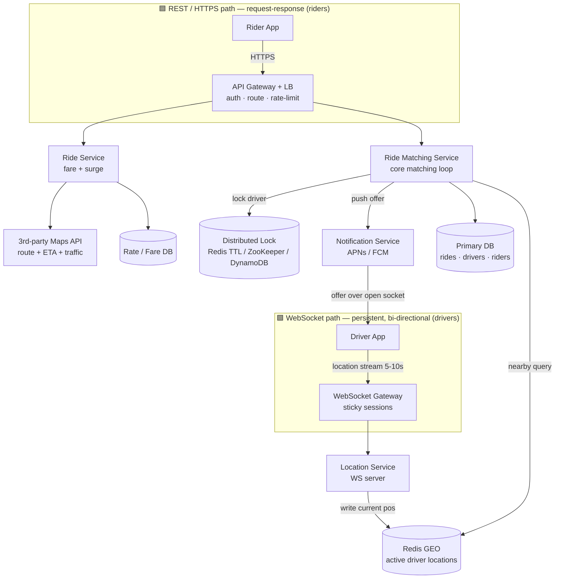
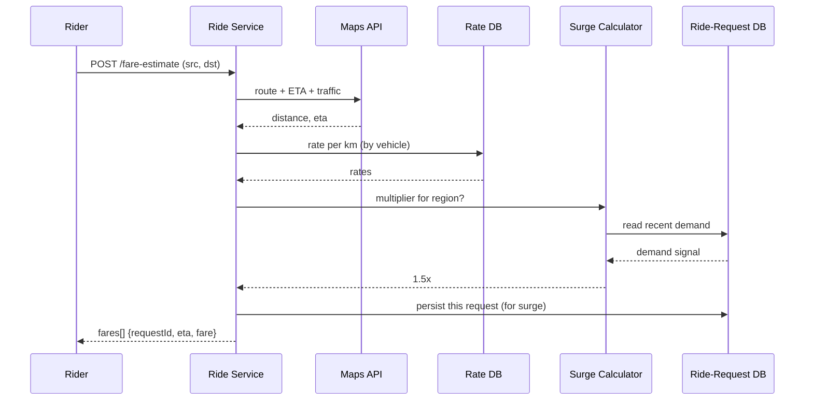
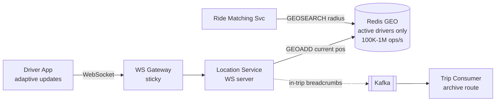
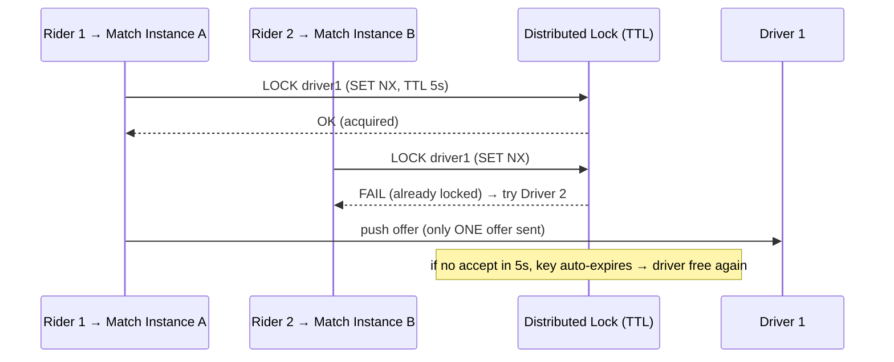
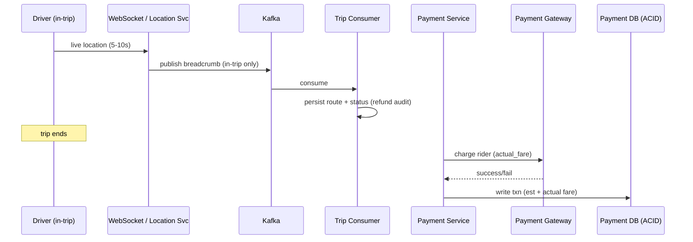
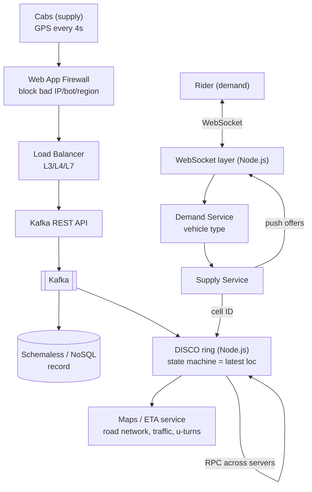
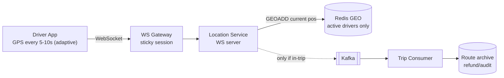
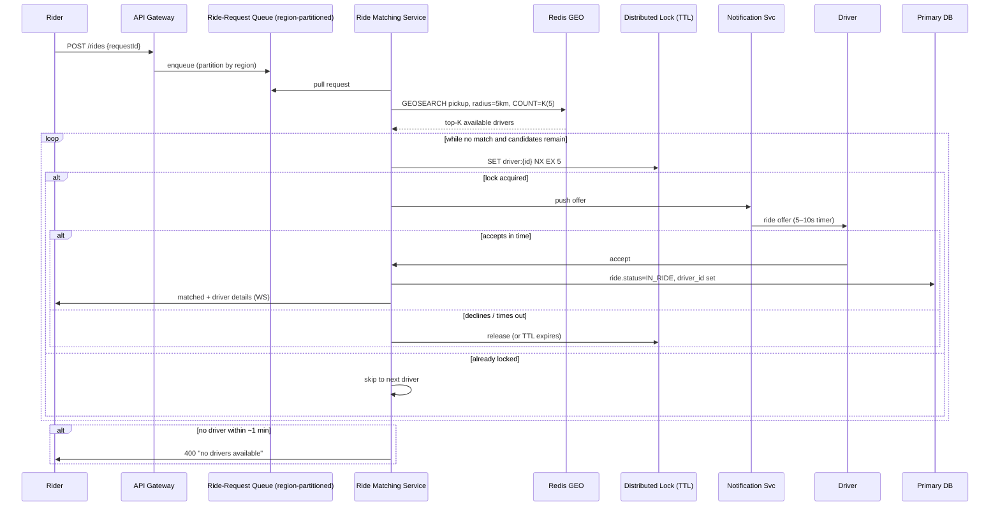
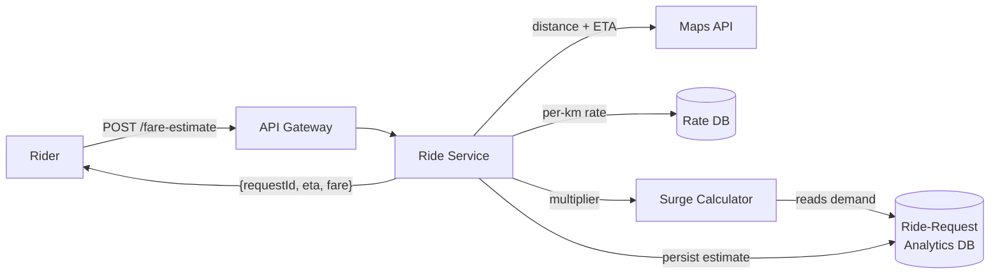

# Designing Uber / Ola — Ride-Hailing System Design Study Guide

> A self-contained learning + interview-prep guide for the **"Design Uber"** system design question (also asked as Lyft, Ola, Grab, "ride-hailing," or generically as a **proximity / nearby-driver matching** problem). Built from two interview walkthroughs and heavily enriched with additional technical depth so you can learn the topic from zero and revise from it the night before an interview.
>
> **Why this problem matters:** Uber is the canonical *proximity search* design. If you can do Uber, you can do Yelp ("restaurants near me"), Find My Friends, Tinder ("people nearby"), DoorDash dispatch, and Google Maps place search — they all share the same core: **index moving/static points in 2D space and answer "what's near me?" fast.** It is asked heavily at **Google, Meta, Amazon, Uber, Lyft, DoorDash** and most top companies.

---

## Table of Contents

1. [Problem Statement & Clarifying Questions](#1-problem-statement--clarifying-questions)
2. [Requirements](#2-requirements)
3. [Capacity Estimation](#3-capacity-estimation)
4. [API / Interface Design](#4-api--interface-design)
5. [Core Entities](#5-core-entities)
6. [High-Level Architecture](#6-high-level-architecture)
7. [Data Model / Schema](#7-data-model--schema)
8. [Deep Dive Modules](#8-deep-dive-modules)
   - 8.1 [Fare Estimation & Surge Pricing](#81-fare-estimation--surge-pricing)
   - 8.2 [The Location Problem: Geospatial Indexing](#82-the-location-problem-geospatial-indexing)
   - 8.3 [High-Volume Location Ingestion (WebSockets + Redis)](#83-high-volume-location-ingestion-websockets--redis)
   - 8.4 [Consistency of Matching: No Double-Booking](#84-consistency-of-matching-no-double-booking)
   - 8.5 [The Matching Loop & Distributed Locks](#85-the-matching-loop--distributed-locks)
   - 8.6 [Handling Surges with a Request Queue](#86-handling-surges-with-a-request-queue)
   - 8.7 [Trip Tracking, Ratings & Payments](#87-trip-tracking-ratings--payments)
   - 8.8 [How Uber *Actually* Does It: DISCO, S2, Ringpop](#88-how-uber-actually-does-it-disco-s2-ringpop)
   - 8.9 [Multi-Datacenter Failover (Driver-App as Backup)](#89-multi-datacenter-failover-driver-app-as-backup)
   - 8.10 [Analytics, Fraud Detection & Logging](#810-analytics-fraud-detection--logging)
9. [Data Flow Diagrams (End-to-End)](#9-data-flow-diagrams-end-to-end)
10. [Scalability & Bottlenecks](#10-scalability--bottlenecks)
11. [Failure Modes & Mitigation](#11-failure-modes--mitigation)
12. [Alternative Designs / Trade-off Comparison](#12-alternative-designs--trade-off-comparison)
13. [Interview Q&A (Mid / Senior / Staff / Behavioral)](#13-interview-qa)
14. [Quick Revision Cheat Sheet](#14-quick-revision-cheat-sheet)
15. [Quick Revision (~2 pages)](#15-quick-revision-2-pages)
16. [FAANG Top 20 Most Frequently Asked Questions](#16-faang-top-20-most-frequently-asked-questions)

---

## The Recommended Interview Roadmap

Both source walkthroughs follow the same **delivery framework**. Memorize this order — it keeps a 35–45 minute interview on track and each step feeds the next:

```
1. Functional Requirements      → the FEATURES ("users should be able to…")
2. Non-Functional Requirements  → the QUALITIES (latency, consistency, availability, scale)
3. Core Entities                → the objects persisted/exchanged (≈ future tables)
4. API Design                   → one endpoint per functional requirement, using core entities
5. High-Level Design            → wire services together to satisfy the APIs (= satisfy features)
6. Deep Dives                   → go deep to satisfy the NON-functional requirements
```

**Key mental model:** each section *relies on the one before it.* Your APIs come from your functional requirements; your high-level design is built by walking your APIs one-by-one; your deep dives are chosen by walking your non-functional requirements one-by-one. If you internalize this, you never stare at a blank whiteboard wondering "what next?"

> **On back-of-the-envelope estimation:** A strong senior-interviewer opinion from the source is to **skip** upfront capacity math and instead do it *inline during the high-level design, only when a number will directly change a design decision.* Script to say to your interviewer: *"A lot of candidates do estimations here; I'd prefer to defer them and do targeted calculations during my design where the result actually influences the architecture — is that OK?"* ~99% say yes. This guide keeps a dedicated Capacity section (§3) because it's requested, but note **the only estimate that truly drives this design is the location-update write rate** (§3, §8.3).

---

## 1. Problem Statement & Clarifying Questions

### 1.1 Problem Statement

Design the backend for a ride-hailing service (Uber / Ola / Lyft). A **rider** opens the app, enters a pickup and destination, sees a **fare estimate**, and requests a ride. The system **matches** them in near-real-time to a **nearby available driver**. The driver **accepts or declines**; on accept, the driver navigates to the pickup and then the destination. The system tracks both parties live, then handles **payment** and **ratings** at trip end.

The hard part is **not** CRUD. It is: *how do you find the nearest available drivers among millions, in milliseconds, while their locations change every few seconds, and guarantee that a single driver is never offered/assigned to two riders at once?* That is a **geospatial indexing** problem fused with a **distributed consistency** problem.

### 1.2 Clarifying Questions to Ask the Interviewer

Ask these to scope the problem — and to signal product thinking:

- **Scope of features:** Do we handle fare estimation, matching, and navigation — or focus on just the matching engine? *(In the "hard" version, matching + location is the meat.)*
- **Vehicle types:** Single product (UberX) or multiple (X, XL, SUV, Bike)? *(Multi-type multiplies fare rows and can be scoped out to save time.)*
- **Scale:** How many riders/drivers? *(Expect: "millions of users and drivers." Uber ≈ 6M drivers globally, ~3M active at peak.)*
- **Matching latency target:** How fast must a match be? *(Target: **match within ~1 minute or fail** gracefully with "no drivers available.")*
- **Consistency vs availability:** Is it OK for a driver to briefly be double-offered? *(No — matching must be strongly consistent. Everything else can favor availability.)*
- **Geography:** Global with regional isolation, or single region? *(Global; data centers per region.)*
- **Out of scope?** Ratings, scheduled rides, pooling/carpool, driver payouts, fraud, GDPR — confirm which to drop.
- **Real-time tracking:** Do we need live map tracking of driver→rider? *(Yes in the fuller version; drives the WebSocket decision.)*

### 1.3 Explicitly Out of Scope (state this to stay focused)

Ratings *(kept in the fuller version, dropped in the lean version)*, scheduled/advance rides, multiple simultaneous car types, GDPR/privacy, monitoring/logging/alerting, CI/CD & deployment pipelines, carpool/pooling, and detailed fraud detection. Calling these out shows you can **prioritize** — a scored signal in real interviews.

---

## 2. Requirements

### 2.1 Functional Requirements (the features)

**Core (the three that matter most — build the design around these):**

1. **Fare estimate** — Rider inputs start + destination → gets an estimated fare and ETA (per vehicle type in the fuller version; UberX-only in the lean version).
2. **Request a ride** — Based on the estimate, rider requests a ride and is matched to a nearby available driver in real-time.
3. **Driver accept/decline + navigate** — Driver accepts or denies a request, then navigates to pickup and on to the destination, updating trip status.

**Additional (fuller version adds):**

4. **Real-time tracking** — Rider and driver see each other's live location during pickup and the trip.
5. **Ratings** — Rider and driver rate each other after the trip.
6. **Payment** — Rider pays the final fare at trip end.

**Out of scope:** multi-car-type (lean version), scheduled rides, ratings (lean version), driver/rider profiles beyond basics.

### 2.2 Non-Functional Requirements (the qualities — these drive deep dives)

Don't just list buzzwords. **Quantify** each and tie it to *this* system:

| Quality | In the context of Uber | Target / note |
|---|---|---|
| **Low-latency matching** | Time from ride request → matched driver | **< 1 minute**, else fail gracefully ("no drivers available") |
| **Consistency (of matching)** | A ride ↔ driver mapping must be **1:1** | **Strong consistency** for matching: no driver offered/assigned to 2 rides at once; no ride sent to 2 drivers at once |
| **Availability** | Everything *outside* matching | **Highly available** — app must be up 24/7 so riders can always book; matching itself sacrifices some availability for consistency |
| **High throughput / surge** | Peak spikes (stadiums, NYE, concerts) | **Hundreds of thousands of requests per region** during surges |
| **Scale** | Total users + drivers | **Millions** of riders and drivers globally |

**Understanding the CAP trade-off here (from basics).** CAP is a theorem about distributed systems: when the network between your servers breaks (a *partition* — the "P"), you're forced to choose between **Consistency** (every reader sees the latest agreed value) and **Availability** (every request still gets an answer, possibly stale). You cannot have both *during a partition*. Since network partitions are unavoidable at scale, "P" is a given, and the real design decision is C-vs-A — and critically, **you make that choice per feature, not once for the whole system.** For Uber:

- **Matching / driver assignment → choose Consistency (CP).** Two riders must never both "win" the same driver. If a server can't confirm the current claim state during a partition, it should refuse to offer rather than risk a double-assignment. A brief failure to match is acceptable; a double-booking is a correctness bug.
- **Everything else (fare lookup, live tracking, ride history, browsing) → choose Availability (AP).** If a driver's shown position is a couple of seconds stale, no harm done — so keep serving. These features stay up even during a partition.

This split recurs throughout the design and is worth internalizing: the "right" consistency model is a property of *each piece of data*, chosen by how costly it is to be wrong (see the full matrix in §8.7).

**Explicitly out of scope (NFRs):** GDPR/privacy, comprehensive resilience testing, monitoring/logging/alerting, CI/CD.

---

## 3. Capacity Estimation

**What capacity estimation is, and why it matters (from basics).** Before choosing technologies, you estimate the *volume* the system must handle — how many requests per second (QPS/TPS), how much data stored per year, how much network bandwidth. The goal isn't precision; it's finding the **order of magnitude**, because that's what decides architecture. "Roughly a thousand per second" and "roughly a million per second" call for completely different designs. A useful discipline: **only compute a number if the result would change a decision.** Most numbers here just confirm "it's big, scale horizontally." One number, though, genuinely dictates the design — the **driver location-update write rate** — because it single-handedly rules out a normal database and forces the in-memory store and WebSocket choices. Read §3.1 as the load-bearing calculation and the rest as supporting context.

> **Quick unit refresher:** QPS/TPS = queries/transactions per second. A day has 86,400 seconds. A handy shortcut: ~1 million events/day ≈ 12/sec; ~100 million/day ≈ 1,160/sec. Peak traffic is usually estimated as some multiple (2×–10×) of the average.

### 3.1 The one estimate that matters — location update write QPS

```
Active drivers                       ≈ 3,000,000   (of ~6M total; peak overestimate, fine)
Location update interval (naive)     = every 5 seconds

Writes/sec = 3,000,000 drivers ÷ 5 s = 600,000 location updates / second
```

**600K writes/sec** is the headline number. Compare to what a single Postgres node handles: **~2,000–4,000 TPS**. That is a **150×–300× gap** → a naive RDBMS is instantly disqualified for the live-location store. This single calculation justifies:
- an **in-memory store (Redis)** for live locations (Redis: **100K–1M ops/sec** per well-tuned cluster), and/or
- **WebSockets** to avoid HTTP request overhead per update, and/or
- **dynamic/adaptive update frequency** to cut the rate (see §8.3).

If we also count riders sending location during a trip, and use HTTP polling every 5–10s across *millions* of connections, we reach the **billions of requests** range — infeasible — reinforcing the WebSocket choice.

### 3.2 Ride request (match) QPS — the "read/write" of matching

```
Assume ~100M daily rides globally (order-of-magnitude)
Rides/sec (avg)  = 100,000,000 ÷ 86,400 s ≈ 1,160 ride requests/sec
Peak (surge, ~10×)                          ≈ 11,600 ride requests/sec
Regional surge (concert/NYE)  = hundreds of thousands of requests within one region over minutes
```

Matching is **write-heavy and stateful** (each match holds a server busy ~10s/driver × up to K drivers). This is why the matching service is compute-heavy, asynchronous, and horizontally scaled — and why a **request queue** (§8.6) absorbs surges.

### 3.3 Fare estimate QPS

Every ride request is preceded by ≥1 fare lookup, and many fare lookups never convert. Assume **~3–5× the ride volume**:

```
Fare estimates/sec (avg) ≈ 1,160 × 4 ≈ 4,600 /sec
Peak                     ≈ 46,000 /sec
```

Fare lookups are read-mostly (route + traffic from a maps API) but we persist each as a `ride`/`estimated_fare` row — useful later for **surge analytics**.

### 3.4 Storage growth

```
Ride row (ids, source/dest lat-lng, fare, ETA, status, timestamps) ≈ 1 KB
Rides/day ≈ 100M  →  100M × 1 KB = 100 GB/day  →  ~36.5 TB/year (rides table)

Live location (Redis): only ACTIVE drivers, current position only (no history)
  3M drivers × ~100 bytes (id, lat, lng, geohash, ts) ≈ 300 MB   → trivially fits in RAM
```

Live location storage is tiny because we keep **only the current position of active drivers**, not history. Historical GPS breadcrumbs (for refund/route auditing) go to a separate append-only store fed by Kafka (§8.7), not the hot path.

### 3.5 Bandwidth (location ingestion)

```
600K updates/sec × ~100 bytes/update ≈ 60 MB/sec ingress (naive, pre-optimization)
With dynamic updates cutting rate to ~100K/sec → ~10 MB/sec
```

**Takeaways that shaped the design:** (1) live locations → Redis, not Postgres; (2) ingest via WebSockets, not HTTP polling; (3) cut update volume with adaptive client logic; (4) keep only current positions hot, archive history cold.

---

## 4. API / Interface Design

**Design rule:** walk your functional requirements one-by-one and create the endpoint(s) that satisfy each, exchanging **core entities** in request/response. The API is a *living* list — you'll discover missing endpoints (like `location update`) while designing the HLD and add them then.

**Two conventions worth stating out loud (they score points):**
- **Never put `userId`/`driverId` in the request body for identity.** Derive the caller's identity from the **JWT / session token in the `Authorization` header**. If identity were in the body, any user could act on another's behalf (request a ride "as" someone else). This is an API-security signal.
- **Don't waste time writing primitive data types** (`number`, `string`) for senior+ interviews — they're inferred. *Do* spell out non-obvious types like **enums** (statuses).

### 4.1 Rider endpoints

**FR1 — Get a fare estimate** (creates a persisted estimate row):

```http
POST /fare-estimate
Authorization: Bearer <JWT>          # rider identity from token
Content-Type: application/json

Request:
{
  "source":      { "lat": 37.7749, "lng": -122.4194 },
  "destination": { "lat": 37.8044, "lng": -122.2712 }
}

Response 200:   # a "partial ride" — only the fields we care about now
{
  "fares": [                          # list per vehicle type (lean version: single entry)
    { "requestId": "req_abc", "vehicleType": "UberX",  "eta": 6, "fare": 32.50, "currency": "USD" },
    { "requestId": "req_abd", "vehicleType": "UberXL", "eta": 7, "fare": 48.00, "currency": "USD" }
  ]
}
```
*Note:* the source uses `POST` because we **create** data (persist the estimate for analytics/surge, even if the rider never books). A leaner GET variant `GET /fare?pickupLat=&pickupLng=&dropLat=&dropLng=` is also valid if you don't persist.

**FR2 — Request a ride** (start async matching):

```http
POST /rides                          # or PATCH /rides/{rideId} if you updated the estimate row
Authorization: Bearer <JWT>

Request:  { "requestId": "req_abc" }  # the chosen estimate/vehicle type

Response 202 Accepted:               # matching is ASYNC (may take up to ~1 min)
{ "rideId": "ride_123", "status": "MATCHING" }
# On completion (via push/WebSocket): driver details + ETA, or 400 "no drivers available"
```

**Other rider endpoints (fuller version):**
```http
GET    /rides/history                 → past rides for the caller
POST   /rides/{rideId}/cancel         → cancel a ride
POST   /rides/{rideId}/rating         → { "stars": 5, "comment": "..." }
```

### 4.2 Driver endpoints

**Location update — WebSocket, not REST** (the high-frequency path):
```
WS   /driver/location                 # bi-directional, sticky, one persistent connection
     → client streams: { "lat": 37.77, "lng": -122.41, "ts": 1720000000 } every 5–10s
```
*Why WebSocket:* millions of drivers × updates every 5–10s over HTTP would mean billions of short-lived requests/day — infeasible. A persistent duplex WebSocket avoids per-message connection overhead and lets the server push back (new ride offers) on the same channel.

**Accept / decline a ride:**
```http
POST /rides/{rideId}/decision         # or PATCH
Authorization: Bearer <JWT>           # driver identity from token
Request:  { "accept": true }          # boolean enum: accept | deny
Response: 200 { "status": "MATCHED", "pickup": { "lat":.., "lng":.. } }
```

**Trip lifecycle updates (navigate):**
```http
POST /rides/{rideId}/start            # driver reached pickup, ride begins
POST /rides/{rideId}/end              # driver reached destination, ride ends
# Generic variant from lean version:
PATCH /rides/{rideId}/driver-update
Request:  { "status": "PICKED_UP" }   # enum: EN_ROUTE | PICKED_UP | DROPPED_OFF
Response: { "next": { "lat":.., "lng":.. } | null }   # next nav target, or null when done
```

---

## 5. Core Entities

**What "core entities" means and why we identify them early (from basics).** Entities are the *nouns* of the system — the real-world things it stores and moves around. Before designing tables with every column, it's enough to list these nouns, because they will become roughly one table (or collection) each, and they tell you what your APIs must exchange. The value of doing this *first* is that it forces agreement on the vocabulary before you argue about mechanisms: once everyone agrees the system revolves around a Rider, a Driver, a Ride, and a Location, the APIs and data flows almost write themselves. You then fill in the precise columns later (§7), as the design reveals what each entity actually needs.

The core nouns for ride-hailing:

- **Rider (User)** — the person requesting a ride. `id`, profile/metadata, saved payment info, home location. Mostly boring CRUD data.
- **Driver** — the person fulfilling rides. `id`, name, vehicle info, license plate, rating, phone, and two important fields: a **`status`** (`AVAILABLE | IN_RIDE | OFFLINE`) that matching filters on, and a **current location** that changes constantly.
- **Ride** — the trip itself, and the entity with the richest life. `id`, `riderId`, `driverId?` (unknown until matched), `source`, `destination`, `fare`, `eta`, and a **`status`** that advances through a state machine `FARE_ESTIMATED → REQUESTED → MATCHED → EN_ROUTE → IN_RIDE → COMPLETED`. That status is how every service knows what stage the trip is in.
- **Fare / Estimate** — a *quote* for a potential trip: `requestId`, vehicleType, estimated fare, currency, computed from pickup/drop. Most estimates never become rides, which is why it's worth treating as its own entity (see §7.3).
- **Location** — the single most up-to-date position of each driver (id, lat, lng, timestamp). This is the entity that powers proximity matching and, uniquely, changes every few seconds — which is why it gets special treatment (Redis, §8.3) rather than a normal table.
- *(fuller version also:)* **Rating** (who rated whom, for which ride) and **Payment** (the money record).

Notice already that these entities have *wildly different behaviour* — a Driver's name never changes, but their Location changes every 5 seconds; a Payment must be perfectly durable, but a Location can be lost and regenerated. That variety is the seed of every storage decision made later.

---

## 6. High-Level Architecture

Build the HLD by walking the APIs in order. We use a **microservices** architecture (independent scaling, separate teams, fault isolation) behind an **API Gateway + Load Balancer**.

**What "microservices" means here, and why we use it.** Instead of one giant program that does fare calculation, matching, location tracking, payments, and ratings all together (a *monolith*), we split each responsibility into its own independently-deployable service. This matters for Uber specifically because the workloads are wildly different: the **Ride Matching Service** is CPU-heavy and holds a request open for up to ~60 seconds while it waits for drivers to respond, whereas the **Ride Service** (fare estimate) is a quick request/response call. If they lived in the same process, a surge of slow matching work would starve the fast fare lookups of threads. Splitting them lets us run, say, 200 matching instances and only 20 ride-service instances, scale them on different signals, and deploy/patch one without redeploying the other. The cost is added complexity: network calls between services, more failure points, and the need for a gateway to route traffic.

### 6.1 Component responsibilities

| Component | Role |
|---|---|
| **Rider / Driver mobile clients** | iOS/Android apps (no web). Riders call REST; drivers hold a **WebSocket** for location + offers. |
| **API Gateway + Load Balancer** | Routing to the right microservice, **auth (JWT/session)**, SSL termination, rate limiting, round-robin load distribution. |
| **WebSocket Gateway** *(fuller)* | **Separate** gateway for sticky WebSocket connections (session affinity: same client ↔ same server for the trip's duration). |
| **Ride Service** | Computes fare estimates via a 3rd-party maps API; persists ride/estimate rows; applies surge multiplier. |
| **Ride Matching Service** | The core. Queries nearby available drivers, runs the match loop, sends offers, enforces consistency via locks. Compute-heavy + async → own service. |
| **Location Service** | Ingests driver location updates (WebSocket server); writes current positions to the Redis geo-store. |
| **Notification Service** | Push offers to drivers (APNs for iOS, FCM/Firebase for Android). Itself a black-boxed subsystem. |
| **Surge Calculator** *(fuller)* | Reads the ride-request analytics DB; returns a surge multiplier (1.0x, 1.5x, 3x…) to the Ride Service. |
| **Rating / Payment Services** *(fuller)* | Post-trip ratings (aggregated) and payment via a 3rd-party payment gateway (ACID → RDBMS). |
| **Redis (Geo)** | In-memory geospatial index of active-driver locations. Handles the 100K–1M ops/sec write load. |
| **Location Store / Distributed Lock** | Redis (TTL keys) **or** ZooKeeper (ephemeral nodes) **or** DynamoDB (TTL rows) — the driver-lock coordinator for consistent matching. |
| **Primary DB** | Ride, Driver, Rider metadata. Postgres or DynamoDB depending on relation needs. |
| **Kafka + Trip Consumer** *(fuller)* | Async pipeline archiving in-trip GPS breadcrumbs for route/refund auditing. |

### 6.2 High-level diagram

The two boxed regions below are the key thing to notice: there are **two separate entry points** into the backend — the **REST path** on the left (riders, request/response) and the **WebSocket path** on the right (drivers, persistent streaming). The very next subsection (§6.3) explains *why* they're split; the diagram highlights *that* they're split.



> **📌 Read the two boxes first.** The blue box (top-left) is the **API Gateway** handling short REST calls from riders. The green box (top-right) is the **separate WebSocket Gateway** handling long-lived streaming connections from drivers. Note also the arrow **`Notification Service → Driver App`**: an offer is *pushed down* the driver's already-open socket — something plain REST can't do. §6.3 unpacks exactly why these are two different tiers.

### 6.3 Why two different gateways (REST vs WebSocket)

As highlighted in the diagram above (the blue REST box vs. the green WebSocket box), there are **two entry points**. This trips up beginners, so here is the reasoning:

- **Riders talk REST/HTTPS through the API Gateway.** A rider's actions are occasional and request/response shaped: "give me a fare," "request a ride," "cancel." Each is a short call that gets one answer. Classic HTTP fits perfectly.
- **Drivers hold a persistent WebSocket through a separate WebSocket Gateway.** A driver's app streams GPS every few seconds *and* must receive ride offers pushed *from* the server at an unpredictable moment. Plain HTTP can't push data from server to client — the client always has to ask first. A WebSocket is a single long-lived, two-way pipe, so the driver streams location up and the server pushes offers down on the same connection.

The WebSocket gateway is kept **separate** because WebSocket connections need **session stickiness**: once driver #42's phone is connected to WebSocket-server-7, every subsequent message must keep going to server-7 (that is where the live connection object lives). A normal HTTP load balancer, which is free to send each request to any server, would break this. Sticky routing plus long-lived connections is a different scaling profile, so it gets its own tier.

### 6.4 Walkthrough of the two core flows

**Fare estimate (FR1):** Rider → Gateway → **Ride Service** → calls **Maps API** (distance + ETA under current traffic) → multiplies by per-km rate from the **Rate DB** → applies **surge multiplier** → persists a ride/estimate row (`status = FARE_ESTIMATED`) → returns `{requestId, eta, fare}` to rider.

**Request & match (FR2/FR3):** Rider taps an estimate → Gateway → **Ride Matching Service** → queries **Redis GEO** for nearby drivers → filters to `AVAILABLE` → **locks** the top candidate → **Notification Service** pushes the offer → driver accepts within the timeout → ride row updated to `MATCHED`/`IN_RIDE` with `driverId` → rider notified over WebSocket. If declined/timeout → unlock, try next driver.

<details>
<summary><b>📖 Worked example — one rider ("Asha") books a ride end-to-end</b></summary>

Follow a single request through every component. Asha is in downtown San Francisco and wants to go to the airport.

1. **Fare estimate.** Asha's app sends `POST /fare-estimate` with `source = {37.7749, -122.4194}` and `destination = {37.6213, -122.3790}`. Her JWT (identifying her) rides in the `Authorization` header. The API Gateway authenticates the token, then routes the call to a **Ride Service** instance.
2. **Ride Service does the math.** It calls the **Maps API**, which returns "distance ≈ 21 km, ETA ≈ 28 min in current traffic." It looks up the per-km rate for UberX in the **Rate DB** (say $1.20/km), asks the **Surge Calculator** for the current multiplier (say 1.0× — no surge right now), computes `fare ≈ $30`, and **persists** a row `{requestId: req_x, status: FARE_ESTIMATED, fare: 30, ...}`. It returns `{requestId: req_x, eta: 6, fare: 30}` to Asha's screen.
3. **Asha taps "Request UberX".** Her app sends `POST /rides {requestId: req_x}`. The Gateway routes it to the **Ride Matching Service**, which immediately replies `202 MATCHING` — the actual matching happens asynchronously (it can take up to a minute), so we don't make her HTTP call hang.
4. **Find nearby drivers.** The Matching Service asks **Redis GEO**: "give me available drivers within 5 km of {37.7749, -122.4194}." Redis returns the 5 nearest, e.g. Driver-A (0.4 km), Driver-B (0.9 km), Driver-C (1.2 km)…
5. **Offer to the nearest.** It **locks Driver-A** (so no other rider's request can also offer to Driver-A), then asks the **Notification Service** to push an offer to Driver-A's phone (over that driver's WebSocket / APNs / FCM). A 10-second timer starts.
6. **Driver-A accepts.** Driver-A taps accept within 10 s. The Matching Service updates the `ride` row: `status = IN_RIDE`, `driver_id = Driver-A`. It notifies Asha over her connection: "Driver-A is on the way, arriving in 4 min," including the driver's car and plate.
7. **Live tracking + trip.** Driver-A's GPS keeps streaming via WebSocket → Location Service, and those positions are relayed to Asha so she watches the car approach. Driver-A calls `POST /rides/{id}/start` at pickup and `POST /rides/{id}/end` at the airport.
8. **Payment + rating.** At trip end the **Payment Service** charges Asha's card via the payment gateway; the **Rating Service** lets both parties rate each other.

If Driver-A had *ignored* the offer, at 10 s the lock releases and the loop offers Driver-B, then Driver-C, and so on — up to ~5 drivers before failing with "no drivers available" to respect the 1-minute limit.

</details>

---

## 7. Data Model / Schema

**How to read this section as a beginner.** A "data model" is just the list of tables (or collections) we store, the important columns in each, and — critically — the **key we partition/shard on** when the data outgrows one machine. The single most important idea here is that **different data has different access patterns, and each pattern wants a different storage engine.** Driver *metadata* (name, car, phone) barely changes and is read occasionally → a relational DB like Postgres is fine. Driver *live location* changes every few seconds for millions of drivers → that belongs in an in-memory store (Redis), not a table. *Payments* must never lose or double-count money → a strict ACID relational DB. We deliberately use **the right store per entity** instead of forcing everything into one database. Below, each table lists a *partition/shard key* — the field the system hashes on to decide which machine holds that row; picking it well is what lets the table scale horizontally.

### 7.1 `driver` (Postgres — metadata, low write rate)

| Column | Type | Notes |
|---|---|---|
| `driver_id` (PK) | UUID | |
| `name` | text | |
| `vehicle_info` | jsonb | model, license plate, image |
| `rating` | numeric(2,1) | aggregated average (updated by rating aggregator) |
| `phone` | text | |
| `status` | enum | `AVAILABLE \| IN_RIDE \| OFFLINE` — also `REQUEST_SENT` in the status-based locking variant |
| `status_updated_at` | timestamptz | needed only by the cron-based lock variant |

*Index:* `status`. Metadata only — not the hot path. Postgres is fine.

### 7.2 `location` (live positions)

Two homes depending on variant:
- **Lean/optimal:** **Redis GEO** — key per region; members are `driver_id`, scored by geohash. Only **active** drivers. No history.
- **Schema (if you must show a table):**

| Column | Type | Notes |
|---|---|---|
| `id` (PK) | UUID | driver_id **or** user_id (table reused for both) |
| `lat` | double | |
| `lng` | double | |
| `geohash` | text | precomputed, indexed for prefix range scans |
| `modified_ts` | timestamptz | freshness |

*Partition/shard key:* **region / geohash prefix.** This co-locates nearby drivers and keeps proximity queries within one shard.

**Why sharding by region/geohash matters (beginner explanation).** Imagine all driver locations sat on one machine. Every "who's near me?" query in every city on Earth would hit that one machine — it would melt. Sharding means we split the data across many machines *by geography*: all drivers whose geohash starts with `9q8` (roughly the SF Bay Area) live on shard 3, drivers in `dr5` (roughly NYC) live on shard 11, and so on. Now Asha's query in SF only touches shard 3, and a rider in NYC only touches shard 11 — the two don't compete. Crucially, because a proximity search only ever looks at *one small area*, co-locating nearby drivers on the same shard means a single query stays on a single machine (fast) instead of fanning out to all of them (slow). The one wrinkle is **edge cases at shard boundaries**: a rider standing right at the SF/Oakland cell border may need drivers from two adjacent cells, so the query reads the target cell *plus its 8 neighbors* — more on this in §8.2.

### 7.3 `ride` DB — two tables

**`estimated_fare`** (persisted at request time; also feeds surge analytics):

| Column | Type | Notes |
|---|---|---|
| `request_id` (PK) | UUID | the accepted estimate |
| `pickup_lat/lng` | double | |
| `drop_lat/lng` | double | |
| `fare` | numeric | estimated fare accepted by rider |
| `currency` | text | |
| `vehicle_type` | enum | UberX / XL / SUV / Bike |
| `user_id` (FK) | UUID | |
| `created_ts` | timestamptz | |

**`ride`** (created on match):

| Column | Type | Notes |
|---|---|---|
| `ride_id` (PK) | UUID | == request_id |
| `user_id` (FK) | UUID | |
| `driver_id` (FK) | UUID | nullable until matched |
| `source_loc` | point | |
| `destination_loc` | point | |
| `status` | enum | `ALLOCATED → EN_ROUTE → IN_RIDE → REACHED → COMPLETED` |
| `estimated_fare` | numeric | |
| `actual_fare` | numeric | may differ from estimate (traffic/route change) |

*Partition/shard key:* `ride_id` (hash) for even distribution; or **region** if you keep rides regionally co-located. High-availability, few relations → **DynamoDB** is a strong choice here.

> **Why store both estimated *and* actual fare?** Fares can diverge from the estimate due to traffic or route changes. Persisting both lets you compute **refunds/cashback** later and audit disputes — which is also why in-trip GPS breadcrumbs are archived (§8.7).

**Why two tables (`estimated_fare` and `ride`) instead of one? (beginner explanation).** A fare estimate is created the moment a rider *looks* at a price — and most of those never turn into a real ride (people check the price and close the app). If we put everything in one `ride` table, it would fill up with millions of half-empty rows for rides that never happened, most columns (`driver_id`, `actual_fare`, `status`) sitting null. So we split: `estimated_fare` captures *"someone asked what this trip would cost"* (cheap, high-volume, also feeds surge analytics), and a `ride` row is created *only when a match actually happens*. The `ride.ride_id` reuses the `request_id` from the estimate, so we can always trace a completed ride back to the exact quote the rider accepted. The `status` column on `ride` is a **state machine** — it moves strictly forward `ALLOCATED → EN_ROUTE → IN_RIDE → REACHED → COMPLETED`, and every service reads it to know what stage the trip is in.

### 7.4 `rating` (Postgres)

| Column | Type | Notes |
|---|---|---|
| `sender_id` | UUID | rider **or** driver |
| `receiver_id` | UUID | rider **or** driver |
| `rating` | int | 1–5 |
| `ride_id` (FK) | UUID | |
| `timestamp` | timestamptz | |

An **aggregator job** rolls per-ride granular ratings into each driver's average `rating` on the `driver` table (avoids read-time recomputation and reconciles the duplicated field).

### 7.5 `payment` (MySQL/Postgres — must be ACID)

Stores transaction, estimated vs actual fare, gateway reference. **RDBMS chosen deliberately**: payments need ACID guarantees; eventual consistency is unacceptable for money.

> **What "ACID" means and why payments need it (beginner explanation).** ACID = Atomicity, Consistency, Isolation, Durability. The two that matter most for money: **Atomicity** means a transaction either fully happens or not at all — you can never deduct the rider's money without also recording that the driver got paid (no half-completed charge). **Durability** means once the DB says "payment recorded," it survives a crash a millisecond later. An eventually-consistent store (which may briefly show stale/conflicting values) could double-charge a card or lose a payment record, which is unacceptable — so payments use a strict relational database even though the rest of the system leans on faster, looser stores.

<details>
<summary><b>📖 Worked example — the rows created as one ride progresses</b></summary>

Tracing Asha's SF→airport ride from §6, here is what lands in each table and *when*:

- **The instant she checks the price** → one row in `estimated_fare`:
  `{request_id: req_x, pickup: (37.7749,-122.4194), drop: (37.6213,-122.3790), fare: 30, currency: USD, vehicle_type: UberX, user_id: asha, created_ts: 10:00:00}`
  (If she closes the app now, this is *all* that ever gets stored — no `ride` row.)
- **The instant Driver-A accepts** → one row in `ride`:
  `{ride_id: req_x, user_id: asha, driver_id: driverA, source_loc: (...), destination_loc: (...), status: ALLOCATED, estimated_fare: 30, actual_fare: null}`
  Note `ride_id == request_id` — that's how we link the accepted quote to the real trip.
- **During the trip** → `ride.status` advances `ALLOCATED → EN_ROUTE → IN_RIDE → REACHED`, and Driver-A's live GPS points stream into **Redis** (not this table) and are archived via **Kafka** for the route record.
- **At drop-off** → `ride.status = COMPLETED`, `actual_fare = 32` (traffic added 2 km of detour). Because we kept *both* 30 and 32, a later refund check can see the $2 gap and decide whether Asha is owed cashback.
- **After the trip** → one row in `payment` (`estimated 30, actual 32, gateway_ref: ch_abc, status: SUCCESS`) and up to two rows in `rating` (Asha→Driver-A, Driver-A→Asha).

Notice how the **live, fast-changing data** (location) never touches these relational tables — it lives in Redis and Kafka — while the **durable record of what happened** (estimate, ride, payment, rating) is what we persist relationally.

</details>

---

## 8. Deep Dive Modules

The high-level design in §6 answered *"what are the pieces and how do they connect?"* This section answers the harder question: *"how does each hard piece actually work inside, and why is it built that way?"* We go one subsystem at a time, and within each one the explanation is layered — it starts from the simplest possible version of the idea, shows where that simple version breaks, and then builds up to the design a large-scale system actually uses. If you read a subsection top to bottom, you should come out understanding not just *what* the final design is, but *why every earlier, simpler idea was rejected* — which is the real understanding.

Each subsystem maps to one of the system's core quality goals: keeping matching fast (§8.2, §8.3), keeping matching correct so no driver is double-booked (§8.4, §8.5), surviving demand spikes (§8.6), completing the trip lifecycle (§8.7), and finally how the real Uber implements all of this at planetary scale (§8.8, §8.9, §8.10).

### 8.1 Fare Estimation & Surge Pricing

When you open the app and type a destination, a price appears within a second or two. That number is the output of this subsystem. Let's build up how it's produced, starting from the simplest possible formula and adding realism one layer at a time. Each layer below is collapsible — expand them in order to see the price calculation grow from a one-line formula into a real, demand-aware system.

<details open>
<summary><b>Layer 1 — the base fare (distance × rate)</b></summary>

The core idea is simple: **a ride costs money in proportion to how far and how long it is.** To turn a pickup and a destination into a price, the **Ride Service** needs two facts about the journey — how many kilometres it covers, and how long it will take in current traffic. It doesn't compute these itself; it asks a **third-party maps API** (Google or Apple Maps), which already models every road and live traffic condition on Earth. The maps API returns two things:

1. **Distance / route** — the actual driving distance along roads (not a straight line).
2. **ETA under current traffic** — how long that route will take *right now*, given congestion.

The Ride Service then looks up a per-vehicle rate card in a small **Rate DB** (a bike is cheaper per km than an SUV) and does the arithmetic:

```
base_fare = (distance_km × rate_per_km[vehicleType])
          + (wait_time_min × wait_rate[vehicleType])
# Example rates: Bike ₹20/km, Car ₹60/km, wait ₹1/min
```

That's the whole base-fare calculation: fetch distance and time, multiply by a rate, add a small waiting charge. The Rate DB is tiny and rarely changes, so it can live in a simple relational table or even a cache.

> **A note on realism.** Uber's *real* pricing is a machine-learning model that weighs dozens of signals. For understanding the system, the multiplication above captures the essential shape — you don't need the ML details to reason about the architecture. Just know that in production, "compute base fare" is a call to a sophisticated pricing model rather than a one-line formula.

</details>

<details>
<summary><b>Layer 2 — why a fixed price card isn't enough</b></summary>

A pure distance × rate price ignores the single most important economic fact of ride-hailing: **at any moment, the number of people wanting rides and the number of available drivers are rarely equal.** When a concert ends, thousands of people want a car and there aren't enough drivers. If the price stayed fixed, the app would simply run out of drivers — everyone would request, almost no one would be matched, and wait times would explode. **Surge pricing** is the mechanism that keeps supply and demand in balance by adjusting price.

</details>

<details>
<summary><b>Layer 3 — how surge is actually computed (supply/demand ratio)</b></summary>

Surge is fundamentally a **supply-versus-demand ratio, measured in a small area over a short time window.** For each geographic cell (the same map cells we'll define in §8.2), over the last few minutes, the system counts:

- **Demand** = number of open ride requests in that cell.
- **Supply** = number of available drivers in that cell.

The multiplier follows the ratio:

- Demand ≈ supply → multiplier **1.0×** (normal price).
- Demand ≫ supply → multiplier climbs (**1.5×, 2×, 3×** …).

The higher price does two useful things at once: it *discourages* some price-sensitive riders (lowering demand) and *attracts* more drivers into the hot area chasing higher earnings (raising supply). Both effects push the ratio back toward 1.0 — surge is self-correcting.

This is why the design **persists every fare request** into a **ride-request analytics DB**, even the ones where the rider looks at the price and closes the app. An abandoned request is still a real signal of demand and must be counted. A separate **Surge Calculator** service continuously reads this stream, computes the ratio per cell, and produces a multiplier.

```
final_fare = base_fare × surge_multiplier
```

</details>

<details>
<summary><b>Layer 4 — the performance concern (why surge is cached)</b></summary>

There's a subtlety that matters at scale. The fare-estimate path is **extremely high traffic** — every rider who even *considers* a trip triggers it, several times the actual ride volume. But the surge multiplier for a cell **changes slowly** — roughly once a minute. So we do *not* run a live analytics query on every single estimate. Instead the Surge Calculator writes the current multiplier per cell into a **cache**, and the Ride Service does a fast cache lookup. This separates a slow, heavy computation (done occasionally, in the background) from a fast read (done constantly, on the hot path) — a pattern you'll see repeatedly in this design.

**The one trade-off to name:** persisting *every* fare request (not just converted ones) costs extra storage. In return you get accurate surge signals *and* valuable product insight into which routes people price-check and then abandon. For a system where pricing balance is existential, it's clearly worth it.

</details>

<details>
<summary><b>📖 Worked example — two riders, same trip, different fares</b></summary>

Two riders both request the same downtown→airport trip, but at different times:

- **10:00 AM, normal conditions.** Ride Service calls Maps → 21 km, 28 min. Rate DB → $1.20/km. Base fare = `21 × 1.20 = $25.20`. Surge Calculator looks at the downtown cell: ~50 requests, ~48 available drivers → ratio ≈ 1.0 → multiplier **1.0×**. Final fare ≈ **$25**.
- **6:00 PM, a concert just ended two blocks away.** Same Maps distance, but the Surge Calculator now sees the downtown cell flooded: ~600 requests, ~90 available drivers → ratio ≈ 6.7 → multiplier capped at, say, **2.5×**. Final fare = `25.20 × 2.5 ≈ $63`.

Same road, same distance — the price difference comes entirely from the demand/supply ratio in that cell at that moment. Both fare requests (including riders who saw $63 and gave up) are written to the ride-request analytics DB, so they feed the *next* minute's surge calculation.

</details>

**Putting it together** — the full estimate flow, from the rider's tap to the price on screen:



---

### 8.2 The Location Problem: Geospatial Indexing

This is the intellectual heart of the whole system. Everything else (fares, payments, ratings) is fairly standard web engineering. The genuinely hard problem is: **out of millions of drivers scattered across a city, instantly find the handful near one rider — and keep doing it while every driver's position changes every few seconds.** Let's understand why this is hard before we look at solutions.

#### Why "find nearby" is harder than it sounds

Databases are brilliant at *one-dimensional* range questions: "all users aged 20–30," "all orders after Monday." They achieve this with an index (usually a **B-tree**) that keeps values sorted on a single line, so the database can jump straight to the start of the range and read forward. One number, one sorted line — easy.

"Near me" is fundamentally different because it's a **two-dimensional** question: you care about latitude **and** longitude *together*. And here's the core difficulty — **there is no way to sort points in 2D onto a single line such that points close on the line are always close on the map.** Two drivers can have almost the same latitude but be 50 km apart in longitude. So a normal sorted index simply can't answer "near me" efficiently. The entire field of *geospatial indexing* exists to work around this one limitation.

Both good solutions share the same central trick: **divide the map into cells, give every cell an ID, and file each driver under the ID of the cell they're in.** Once you've done that, "who's near me?" stops being a distance calculation against millions of drivers and becomes "look inside my cell (and the cells touching it)." That reduces a global search to a local lookup.

#### Step 1 — first, see why the obvious approach fails

The tempting first attempt is to store `lat` and `lng` as two columns and query a bounding box:

```sql
SELECT * FROM location
WHERE lat BETWEEN :lat_min AND :lat_max
  AND lng BETWEEN :lng_min AND :lng_max;
```

This looks reasonable but fails on three independent counts:

1. **B-tree indexes are one-dimensional.** An index on `lat` can quickly find everyone in a latitude band, and an index on `lng` can find everyone in a longitude band — but the database then has to *intersect* those two big sets to find who's in both. Neither index understands the 2D combination, so the work balloons.
2. **Wide queries scan enormous numbers of rows.** Search a 20 km radius over a dense city and you're scanning a huge slice of the table just to throw most of it away.
3. **Write throughput is nowhere near enough.** A single Postgres node handles roughly **2,000–4,000 writes/sec**. We need up to **600,000/sec** (§3, §8.3). That's off by a factor of ~150 — before we even get to the query problem.

So a plain SQL table is out. We need a purpose-built **geospatial index**, and there are two dominant designs: **Quadtree** and **Geohashing**. We'll build up each one, then compare.

#### Step 2 — Quadtree (the density-adaptive approach)

The quadtree idea: take the map as one big square, and **recursively split any square into four smaller squares whenever it contains more than K points** (say K = 5). Empty regions like an ocean stay as one giant coarse cell; a packed city centre keeps subdividing into tiny cells. Each split becomes a branch in a tree, and every driver ends up in a *leaf* cell. To find nearby drivers you walk down the tree to the leaf covering the rider's location.

```
                       ┌───────── World map ──────────┐
                       │  NW │ NE │      split into 4 │
                       │─────┼─────                   │
                       │  SW │ SE │                   │
                       └──────────────────────────────┘

Root
 ├── NW (3 drivers ≤ K=5)  → leaf
 ├── NE (2 drivers)        → leaf
 ├── SW (2 drivers)        → leaf
 └── SE (7 drivers > K=5)  → SPLIT again
        ├── SE-NW (4) leaf
        ├── SE-NE (3) leaf
        ├── SE-SW (...) leaf
        └── SE-SE (...) leaf
```

The picture below shows the idea: the busy bottom-right region keeps subdividing into smaller squares until no cell holds more than K points, while the sparse regions stay large. The tree on the right mirrors that structure — dense areas become deep branches, sparse areas stay shallow leaves.

<div align="center">
<svg width="620" height="300" viewBox="0 0 620 300" xmlns="http://www.w3.org/2000/svg" role="img" aria-label="Quadtree subdivision: a map recursively split into four, dense regions subdivided further, alongside the matching tree.">
  <style>
    .lbl{font-family:Segoe UI,Arial,sans-serif;font-size:11px;fill:#334155}
    .cap{font-family:Segoe UI,Arial,sans-serif;font-size:12px;font-weight:700;fill:#0f172a}
    .cell{fill:#f8fafc;stroke:#94a3b8;stroke-width:1.5}
    .dense{fill:#fde8e8;stroke:#e11d48;stroke-width:1.5}
    .node{fill:#e0f2fe;stroke:#0284c7;stroke-width:1.5}
    .leaf{fill:#dcfce7;stroke:#16a34a;stroke-width:1.5}
    .edge{stroke:#64748b;stroke-width:1.3;fill:none}
    .pt{fill:#dc2626}
  </style>
  <text x="20" y="18" class="cap">Map, recursively split into 4</text>
  <!-- outer square -->
  <rect x="20" y="30" width="240" height="240" class="cell"/>
  <!-- top-left, top-right, bottom-left stay coarse -->
  <line x1="140" y1="30" x2="140" y2="270" class="edge"/>
  <line x1="20" y1="150" x2="260" y2="150" class="edge"/>
  <text x="70" y="95" class="lbl">NW · 2</text>
  <text x="190" y="95" class="lbl">NE · 3</text>
  <text x="70" y="215" class="lbl">SW · 2</text>
  <!-- bottom-right subdivided (dense) -->
  <rect x="140" y="150" width="120" height="120" class="dense"/>
  <line x1="200" y1="150" x2="200" y2="270" class="edge"/>
  <line x1="140" y1="210" x2="260" y2="210" class="edge"/>
  <text x="150" y="165" class="lbl">SE (&gt;K) → split</text>
  <!-- some dots in dense area -->
  <circle cx="160" cy="185" r="3" class="pt"/><circle cx="185" cy="195" r="3" class="pt"/>
  <circle cx="215" cy="180" r="3" class="pt"/><circle cx="240" cy="200" r="3" class="pt"/>
  <circle cx="170" cy="235" r="3" class="pt"/><circle cx="230" cy="245" r="3" class="pt"/>
  <!-- sparse dots -->
  <circle cx="60" cy="70" r="3" class="pt"/><circle cx="95" cy="110" r="3" class="pt"/><circle cx="80" cy="90" r="3" class="pt"/>
  <circle cx="180" cy="70" r="3" class="pt"/><circle cx="210" cy="100" r="3" class="pt"/>

  <!-- tree -->
  <text x="360" y="18" class="cap">Matching quadtree</text>
  <rect x="430" y="30" width="60" height="26" rx="4" class="node"/><text x="443" y="47" class="lbl">Root</text>
  <!-- level 2 -->
  <line x1="460" y1="56" x2="360" y2="90" class="edge"/>
  <line x1="460" y1="56" x2="415" y2="90" class="edge"/>
  <line x1="460" y1="56" x2="505" y2="90" class="edge"/>
  <line x1="460" y1="56" x2="560" y2="90" class="edge"/>
  <rect x="335" y="90" width="52" height="24" rx="4" class="leaf"/><text x="345" y="106" class="lbl">NW</text>
  <rect x="392" y="90" width="52" height="24" rx="4" class="leaf"/><text x="404" y="106" class="lbl">NE</text>
  <rect x="480" y="90" width="52" height="24" rx="4" class="leaf"/><text x="492" y="106" class="lbl">SW</text>
  <rect x="534" y="90" width="60" height="24" rx="4" class="node"/><text x="545" y="106" class="lbl">SE·split</text>
  <!-- level 3 under SE -->
  <line x1="564" y1="114" x2="500" y2="150" class="edge"/>
  <line x1="564" y1="114" x2="545" y2="150" class="edge"/>
  <line x1="564" y1="114" x2="585" y2="150" class="edge"/>
  <line x1="564" y1="114" x2="600" y2="150" class="edge"/>
  <rect x="478" y="150" width="40" height="22" rx="4" class="leaf"/><text x="486" y="165" class="lbl">nw</text>
  <rect x="524" y="150" width="40" height="22" rx="4" class="leaf"/><text x="532" y="165" class="lbl">ne</text>
  <rect x="570" y="150" width="24" height="22" rx="4" class="leaf"/>
  <rect x="480" y="180" width="115" height="22" rx="4" class="leaf"/><text x="486" y="195" class="lbl">…deeper where dense</text>
</svg>
</div>

**Its strength** is that it adapts to *density*: it spends fine-grained cells only where there are lots of points, so a search in a busy area still returns a small, manageable list. This makes it excellent for data like Yelp restaurants — extremely uneven density (thousands in Manhattan, zero in the desert), but the points essentially never move.

**Its fatal weakness for Uber** is that the tree's *shape depends on how many points are in each cell*. Every time a driver moves and crosses into a cell that's now over the K threshold, that cell must **split into four**; when drivers leave and a cell drops under threshold, sibling cells must **merge**. This restructuring is called re-indexing, it touches shared tree structure (so it needs locking), and it's expensive. At 600K position updates per second, you'd be constantly rebuilding the tree — unworkable. (Postgres offers quadtree-style geospatial indexing through the **PostGIS** extension.)

#### Step 3 — Geohashing (the density-independent approach) — the one we choose

Geohashing keeps the "divide into cells" idea but removes the thing that made quadtrees expensive: **it splits the map into a fixed grid to a fixed precision, regardless of how many points are where.** The cells don't move or resize based on density, so there's no tree to rebalance.

The clever part is how it *names* the cells. Starting from the whole map, you repeatedly subdivide, and each subdivision appends a character to a string. The result is a **base-32 string** where the string itself encodes the location:

```
Level 1: quadrant "2"
Level 2: "2" splits → 20, 21, 22, 23
Level 3: "22" splits → 220, 221, 222, 223 ...
Result: a geohash like "9q8yyk8ytpxr"
```

Visually, each extra character zooms one level deeper into the *same* nested box. Notice how the strings grow by appending, never rewriting — that is what makes "same prefix = same neighbourhood" work:

<div align="center">
<svg width="600" height="220" viewBox="0 0 600 220" xmlns="http://www.w3.org/2000/svg" role="img" aria-label="Geohash refinement: a fixed grid subdivided into a smaller box each time a character is appended.">
  <style>
    .g{fill:none;stroke:#cbd5e1;stroke-width:1}
    .box{fill:#dbeafe;stroke:#2563eb;stroke-width:2}
    .box2{fill:#bfdbfe;stroke:#1d4ed8;stroke-width:2}
    .box3{fill:#93c5fd;stroke:#1e40af;stroke-width:2}
    .t{font-family:Segoe UI,Arial,sans-serif;font-size:12px;fill:#0f172a}
    .code{font-family:Consolas,monospace;font-size:13px;font-weight:700;fill:#1e3a8a}
    .cap{font-family:Segoe UI,Arial,sans-serif;font-size:12px;font-weight:700;fill:#0f172a}
  </style>
  <!-- panel 1: prefix 9q -->
  <text x="20" y="18" class="cap">prefix "9q"  (~150 km cell)</text>
  <rect x="20" y="28" width="160" height="160" class="g"/>
  <line x1="100" y1="28" x2="100" y2="188" class="g"/><line x1="20" y1="108" x2="180" y2="108" class="g"/>
  <rect x="100" y="28" width="80" height="80" class="box"/>
  <text x="118" y="70" class="code">9q8</text>
  <!-- panel 2: zoom into 9q8 -->
  <text x="220" y="18" class="cap">"9q8" → "9q8y"</text>
  <rect x="220" y="28" width="160" height="160" class="box"/>
  <line x1="300" y1="28" x2="300" y2="188" class="g"/><line x1="220" y1="108" x2="380" y2="108" class="g"/>
  <rect x="300" y="108" width="80" height="80" class="box2"/>
  <text x="312" y="152" class="code">9q8y</text>
  <!-- panel 3: zoom into 9q8y -->
  <text x="420" y="18" class="cap">"9q8y" → "9q8yy"</text>
  <rect x="420" y="28" width="160" height="160" class="box2"/>
  <line x1="500" y1="28" x2="500" y2="188" class="g"/><line x1="420" y1="108" x2="580" y2="108" class="g"/>
  <rect x="500" y="28" width="80" height="80" class="box3"/>
  <text x="512" y="70" class="code">9q8yy</text>
  <text x="20" y="210" class="t">Longer string ⇒ smaller box. Each panel is one zoom level; the highlighted cell is the next character appended.</text>
</svg>
</div>

Two properties fall out of this, and together they're the whole reason geohashing works:

1. **A longer string means a smaller box.** Each extra character zooms in one level. Roughly: 4 chars ≈ a 20 km × 20 km area, 5 chars ≈ 5 km, 6 chars ≈ 1.2 km, 7 chars ≈ 150 m. So to search "within about 5 km," you compute the rider's geohash and keep the **first ~5 characters**.
2. **Shared prefix means physically close.** Because the string is built by subdividing the *same* nested regions, two points in the same area share the same leading characters. So "find drivers near me" becomes "**find drivers whose geohash starts with the same 5 characters as mine**" — a plain string-prefix match, which every database and Redis do blazingly fast, with zero distance math.

<details>
<summary><b>📖 Easy example — turning "near me" into a text search</b></summary>

Suppose a rider is standing at geohash `9q8yyk`. To find drivers within ~5 km, the system keeps the first 5 characters, `9q8yy`, and asks: *"give me every driver whose geohash begins with `9q8yy`."*

- Driver-A at `9q8yyj2` → starts with `9q8yy` → **included** (nearby).
- Driver-B at `9q8yym8` → starts with `9q8yy` → **included** (nearby).
- Driver-C at `9q8t...` → does *not* start with `9q8yy` → **excluded** (further away).

Notice what just happened: a geographic "who's within 5 km" question was answered by a simple *"does this string start with these letters?"* check — the kind of lookup databases are built to do instantly. No trigonometry, no scanning millions of rows.

</details>

**The one real gotcha — boundary/edge effects, and why we search 9 cells.** The "shared prefix means close" rule has an important exception. Two points can be *physically right next to each other* but land in different cells with different prefixes if a grid line happens to run between them. Searching only the rider's own cell would then silently miss a driver who is metres away but just across the boundary.

Here's the precise reason **9** cells specifically. When you pick a cell size, you pick it so the cell is *at least as wide as your search radius* (e.g. a ~5 km cell for a ~5 km search). The rider can stand *anywhere* inside their cell — including hard against a corner. From a corner, a 5 km radius reaches into the cells above, below, left, right, **and the four diagonal corners**. That's the rider's own cell plus the **8 cells touching it** = a **3×3 block of 9 cells**. Because the cell is sized ≥ the radius, the circle can never reach past that immediate ring, so 9 cells is both *sufficient* (nothing nearby is missed) and *minimal* (you never need to scan a wider ring). The picture makes it obvious:

<div align="center">
<svg width="360" height="300" viewBox="0 0 360 300" xmlns="http://www.w3.org/2000/svg" role="img" aria-label="A 3x3 grid of geohash cells. The rider sits near a corner of the centre cell; the search-radius circle spills into all 8 neighbours, so all 9 cells must be searched.">
  <style>
    .cell{fill:#f8fafc;stroke:#94a3b8;stroke-width:1.5}
    .center{fill:#dbeafe;stroke:#2563eb;stroke-width:2}
    .neighbor{fill:#eef6ff}
    .t{font-family:Segoe UI,Arial,sans-serif;font-size:12px;fill:#334155}
    .cap{font-family:Segoe UI,Arial,sans-serif;font-size:12px;font-weight:700;fill:#0f172a}
    .rider{fill:#0f172a}
    .circle{fill:rgba(37,99,235,0.12);stroke:#2563eb;stroke-width:1.6;stroke-dasharray:5 4}
    .drv{fill:#dc2626}
    .drvlbl{font-family:Consolas,monospace;font-size:11px;fill:#7f1d1d}
  </style>
  <!-- 8 neighbor cells -->
  <rect x="30"  y="20"  width="100" height="80" class="cell"/>
  <rect x="130" y="20"  width="100" height="80" class="cell"/>
  <rect x="230" y="20"  width="100" height="80" class="cell"/>
  <rect x="30"  y="100" width="100" height="80" class="cell"/>
  <rect x="230" y="100" width="100" height="80" class="cell"/>
  <rect x="30"  y="180" width="100" height="80" class="cell"/>
  <rect x="130" y="180" width="100" height="80" class="cell"/>
  <rect x="230" y="180" width="100" height="80" class="cell"/>
  <!-- center cell -->
  <rect x="130" y="100" width="100" height="80" class="center"/>
  <text x="150" y="115" class="t">rider's cell</text>
  <!-- rider near top-left corner of center cell -->
  <circle cx="140" cy="110" r="5" class="rider"/>
  <text x="146" y="108" class="t">rider</text>
  <!-- search radius circle centered on rider, spilling into neighbors -->
  <circle cx="140" cy="110" r="78" class="circle"/>
  <!-- a driver that would be MISSED if we only searched the center cell -->
  <circle cx="118" cy="88" r="4" class="drv"/>
  <text x="60" y="82" class="drvlbl">driver 50 m away —</text>
  <text x="60" y="95" class="drvlbl">in NW neighbour cell</text>
</svg>
</div>

So the query rule is: compute the rider's cell **plus its 8 surrounding neighbour cells**, gather candidates from all **9**, then do an exact distance check to drop the corners that fall outside the true radius. That guarantees no nearby driver is missed just because a grid line fell between them. (Redis's `GEOSEARCH` handles this neighbour logic for you — but knowing *why* 9 cells is what lets you reason about cell sizing and the boundary bug if you ever build it yourself.)

**Why this fits Uber perfectly:** geohashes are cheap to compute, tiny to store (just a string), and — crucially — **need no rebalancing when a point moves.** A driver moving is just "delete the old string entry, insert the new one." That's exactly the property we need for a firehose of position updates. Redis supports it natively via `GEOADD` (store a point) and `GEOSEARCH` (find points in a radius).

<details>
<summary><b>📖 Easy example — a moving driver, geohash vs quadtree side by side</b></summary>

Driver-A is cruising through San Francisco, sending a fresh GPS point every 5 seconds.

**With geohashing:** at 10:00:00 the driver is at `9q8yyk`; at 10:00:05 they've moved 60 m to `9q8yym`. The system does two trivial operations — remove the driver from bucket `9q8yyk`, add them to bucket `9q8yym`. Nothing else in the structure changes; no other driver is touched. Multiply by 600K updates/sec and it's still just 600K tiny string swaps. Redis keeps up easily.

**With a quadtree:** as Driver-A moves into a downtown cell that now holds 6 drivers (over K = 5), that cell must split into four and the tree grows new branches; moments later another driver leaves and cells must merge back. Each of the 600K updates/sec can trigger this restructuring, and each restructure locks part of the shared tree. The tree spends all its time rebuilding itself instead of answering queries.

**The lesson:** the deciding factor is **not density — it's write frequency.** Uber's positions change constantly → geohash. Yelp's restaurants never move but are wildly uneven in density → quadtree. Same problem shape, opposite right answer, because the write pattern is opposite.

</details>

#### Step 4 — the decision, and what the real Uber uses

| | Quadtree | Geohash |
|---|---|---|
| Best for | **Uneven density**, rarely-moving points (Yelp, static POIs) | **High write frequency**, constantly-moving points (Uber drivers) |
| Cost when a point moves | High — re-index/rebalance the tree | Low — recompute one short string |
| What's stored | A tree structure | A string per point |
| Common backing store | Postgres + PostGIS | **Redis (native geo commands)** |

Uber's driver data is *both* unevenly dense *and* extremely write-heavy. Since **write frequency is the dominant cost**, **geohashing wins** — rebuilding a quadtree on every 5-second update would be prohibitive.

> **What Uber actually runs in production:** Uber built **H3**, a hierarchical grid made of **hexagons** instead of squares. Why hexagons? In a square grid, the distance from a cell's centre to its edge is different from centre-to-corner, which distorts "how far is my neighbour" calculations. Hexagons have a roughly uniform centre-to-edge distance in every direction, giving cleaner and more consistent nearest-neighbour behaviour. Google's equivalent is **S2**, which maps the spherical Earth onto cells ordered along a space-filling (Hilbert) curve. These are refinements of the same core idea — divide the map into ID'd cells — so understanding geohashing gives you the foundation to understand all of them.

---

### 8.3 High-Volume Location Ingestion (WebSockets + Redis)

§8.2 solved *how to find* nearby drivers. This section solves the equally hard problem underneath it: **getting millions of constantly-changing positions into the system in the first place, fast enough that the "nearby" data is actually fresh.**

#### The scale of the problem

Start with the raw number. Uber has around 6 million drivers; assume ~3 million are online at peak. If each reports its location every 5 seconds:

```
3,000,000 drivers ÷ 5 seconds = 600,000 location updates per second
```

600,000 writes *per second*, sustained, forever. Two things about this number drive the entire design of this subsystem: it's far too high for a normal database (which we established in §8.2 tops out around 2K–4K writes/sec), and if we send each update as its own web request, the *networking overhead alone* becomes catastrophic. We solve these with two separate decisions — how the data travels (the connection) and where it lands (the store) — plus two optimizations.

#### Decision 1 — how the data travels: WebSockets, not repeated HTTP

The naive approach is: every 5 seconds, the driver's app makes an HTTP request carrying its GPS coordinates. This is disastrous at scale, and understanding *why* is worth a moment because it recurs across real-time systems.

Every fresh HTTP request pays a **setup tax** before it can move any useful data: open a TCP connection (one network round trip), negotiate TLS encryption (one or two more round trips), then send HTTP headers that are often *larger than the payload itself* — the actual GPS data is about 30 bytes (two numbers), but the headers can be hundreds of bytes. Then the whole connection is torn down. You're paying a large fixed cost to move two tiny numbers, and you're paying it 600,000 times a second across the fleet, burning enormous CPU on connection churn.

A **WebSocket** removes this tax. When a driver comes online, their app opens **one** persistent, two-way connection to a **WebSocket Gateway** (which forwards to the **Location Service**). That connection stays open for hours. Every subsequent GPS point is just a tiny frame pushed down the pipe that's already open — no new TCP handshake, no new TLS negotiation, no bulky headers. Two big wins follow:

- **Efficiency:** the setup cost is paid once per session, not once per update.
- **Bidirectionality:** because the pipe is already open in both directions, the server can *push* a ride offer *down* to the driver the instant one appears — no polling, no waiting for the driver to ask. This is exactly what matching needs later.

One operational detail: WebSockets need **session stickiness**. Once driver #42's connection lives on WebSocket-server-7, every message must keep going to server-7, because that's where the live connection object physically sits. A normal HTTP load balancer, free to send each request to any server, would break this — so WebSockets get a **dedicated gateway** tier that understands sticky routing.

#### Decision 2 — where the data lands: Redis, not a database

Even with WebSockets solving the *transport*, we still have 600K writes/sec hitting the *store*. A disk-based database can't absorb that, so live positions go into **Redis**, an in-memory store. Two properties make it the right choice:

1. **It's in-memory.** Data lives in RAM, not on disk. A disk write physically moves data to slower media and updates on-disk indexes; a RAM write is orders of magnitude faster. This is how Redis reaches **100,000–1,000,000 operations per second** versus a database's few thousand.
2. **It speaks geo natively.** Redis's `GEOADD` stores a point and `GEOSEARCH` returns everything within a radius — using geohashing internally. So the §8.2 index comes for free; we write no custom indexing code. The Ride Matching Service later queries this store and gets nearby drivers back in under a millisecond.

The obvious objection: RAM is *volatile* — if a Redis node dies, its data vanishes. Why is that acceptable here when it would be unthinkable for payments? Because **driver locations regenerate themselves every few seconds.** Within seconds of a node recovering, every active driver has already pushed a fresh position. The data is inherently disposable and self-healing, so trading durability for speed is exactly the right call *for this specific data* (and exactly the wrong call for money, which is why §8.7 puts payments in an ACID database instead). We also store **only current positions of only active drivers** — no history, no offline drivers — which is why the entire dataset is roughly **300 MB** and sits comfortably in memory.

<details>
<summary><b>📖 Easy example — one driver's 5 seconds through the pipeline</b></summary>

Driver-A is online and idle in downtown SF.

1. When Driver-A logged on, the app opened **one** WebSocket to the gateway. It's been open for 40 minutes.
2. At 10:00:00 the phone's GPS reads `(37.7749, -122.4194)`. The app pushes a ~30-byte frame down the existing socket — no handshake, no headers.
3. The Location Service receives it and runs one Redis command: `GEOADD drivers 37.7749 -122.4194 driverA`. Redis updates Driver-A's cell in ~microseconds.
4. At 10:00:05 the GPS reads a new point 40 m away. Another tiny frame, another `GEOADD` overwriting the old position. Done.

Now imagine a rider nearby requests a car at 10:00:06: the Matching Service runs `GEOSEARCH drivers ... 5 km` and Driver-A shows up because their position is at most 1 second stale. That freshness is the entire point of this pipeline.

</details>

#### Optimization 1 — cut the load at the source (adaptive updates)

600K/sec is a worst case that assumes every driver blindly reports every 5 seconds. But much of that traffic is useless. The smartest reduction is to put logic **on the client** so it sends updates *only as often as they actually matter*:

- **Status-based:** a driver who is offline or not accepting rides barely needs to report at all.
- **Speed-based:** a driver parked for 20 minutes isn't moving — stop sending duplicate positions.
- **Demand-based:** a driver far from any ride requests can report less often, because precise position matters less where there are no riders.

This "adaptive" or "dynamic" reporting can cut the effective rate from 600K toward **~100K/sec or lower**, with no architectural change. A simpler (blunter) alternative is just to lengthen the interval to 10, 15, or 20 seconds — a direct **trade-off between location freshness and load** that you'd tune based on how stale a position you can tolerate.

#### Optimization 2 — what NOT to do: the queue-and-batch approach

For completeness, there's a design that *tries* to keep the data in Postgres+PostGIS: put a **queue in front that batches writes**, collapsing 600K individual writes/sec into a few thousand batched writes/sec the database can survive. It technically works, but it drags in three problems: **staleness** (positions sit in the queue waiting for a batch to fill, so the "live" map lags), **re-index cost** (each batch still forces the quadtree to rebuild), and extra **memory** for buffering. With the Redis+geohash design there's simply **no need for this queue** — adding one would be solving a problem we no longer have. It's worth knowing as the road not taken.

#### Going deeper — sharding Redis, and what breaks when you do

A single Redis node, even at a million ops/sec, is still one node — one failure domain and one memory ceiling. At Uber scale the geo store is a **Redis Cluster**, and the moment you shard, three real problems appear that a staff-level design has to answer.

**How to shard.** The natural key is **geography**: assign a range of geohash prefixes (or S2/H3 cells) to each shard, so all drivers in an area live on one node. This is deliberate, not incidental — it means a proximity query for one rider touches **one shard**, not all of them. Contrast this with sharding by `driver_id` (hash), which spreads a single "who's near this point?" query across *every* shard — a scatter-gather that gets slower as you add nodes. Geo-sharding keeps proximity queries local; that locality is the whole point.

**Problem 1 — the boundary query now spans shards.** Recall from §8.2 that a search reads the rider's cell *plus its 8 neighbours*. If the rider sits near a shard boundary, some of those neighbour cells live on a different shard. So the Location/Matching service may have to **query 2 (or up to 4) shards and merge** the candidate lists. That's fine — it's a small, bounded fan-out — but the code must handle it, and you want prefix ranges assigned so that geographically adjacent cells usually land on the same shard (a space-filling curve like S2's Hilbert ordering helps here, because it keeps neighbours numerically close).

<details>
<summary><b>📖 The hot-cell / "celebrity" problem — and how to survive it</b></summary>

Geo-sharding creates a lurking danger: **load is as uneven as the world is.** A single cell containing a stadium, an airport, or a concert venue can, at kickout time, hold tens of thousands of drivers *and* absorb a flood of ride requests — all landing on the **one shard** that owns that cell. That shard becomes a hotspot while its neighbours sit idle. This is the location-domain version of the "celebrity problem" (one Twitter user with 100M followers overwhelming one shard).

Concrete failure: the stadium cell's shard hits 100% CPU. Location writes for that cell start queuing, so the "live" positions there go stale — exactly where you *most* need them fresh, because that's where all the demand is. Mitigations, roughly in order of reach:

1. **Dynamic cell subdivision.** Don't use a fixed cell size everywhere. In dense areas, split the hot cell into finer sub-cells so its drivers spread across *more* prefix ranges — and therefore more shards. (This is precisely why quadtrees and H3 support variable resolution; even with geohashing you can key hot regions at a longer prefix.)
2. **Replicate the hot shard for reads.** Reads (proximity queries) usually vastly outnumber writes. Add read replicas for hot shards so the query load fans out across copies while writes still go to the primary.
3. **Shed precision, not availability.** Under extreme load, degrade gracefully: widen the acceptable staleness (accept 10–15s-old positions) and cap the candidate count harder (top-3 instead of top-5). A slightly worse match beats a timeout.
4. **Isolate with its own capacity.** Known mega-venues (airports) can be pre-provisioned onto dedicated shards so a predictable surge doesn't touch general traffic.

The staff-level insight: **uniform sharding assumes uniform load, and geography never is.** You must design for the tail, where a handful of cells carry a wildly disproportionate share of traffic.

</details>

**Problem 2 — rebalancing without downtime.** When you add a shard (new city, or splitting a hot one), some prefix ranges must move to the new node. Redis Cluster migrates hash slots live, but during migration a key may be mid-move; clients follow `MOVED`/`ASK` redirects to find its current home. Because live locations are **disposable and self-refreshing** (§8.3), you actually have an easy out here that stateful stores usually don't: you can tolerate losing a few seconds of a migrating slot's data — drivers re-report within seconds. This makes the geo store far more forgiving to rebalance than, say, the payments DB.

**Problem 3 — node failure and freshness.** If a shard's primary dies, its in-memory positions vanish. With Redis Cluster, a **replica is promoted** (failover takes a second or two). The gap is again self-healing: every active driver in that shard's region re-reports its position within its update interval, so the store refills almost immediately. This is why we accepted volatility in the first place — the data's constant regeneration is what makes an in-memory, replicated store safe here. (For belt-and-suspenders you can enable AOF persistence, but for this data it's usually unnecessary.)

**Putting it together** — the full ingestion pipeline (adaptive client → sticky WebSocket → geo-sharded Redis, with in-trip positions branching off to Kafka for the route archive of §8.7):



---

### 8.4 Consistency of Matching: No Double-Booking

This is where ride-hailing stops being a search problem and becomes a *correctness* problem. Finding nearby drivers fast (§8.2, §8.3) is useless if the system then assigns the same driver to two riders. This subsection defines exactly what "correct" means here and shows why it's surprisingly hard; §8.5 gives the full solution.

#### What "correct matching" actually means

There are two rules that must never be broken:

1. **One ride must never be offered to two drivers at the same time** — otherwise two drivers might both accept, and now two cars head to one rider.
2. **One driver must never be offered two rides at the same time** — otherwise the driver's phone buzzes with several offers at once, accepts more than one, and gets double-booked.

These are *consistency* requirements — the "C" in the CAP trade-off. For matching we deliberately favour consistency over availability: it's better to briefly fail to match than to wrongly assign a driver twice.

#### Rule 1 is easy; Rule 2 is the hard one

**Rule 1 is easy** because a single ride request is handled start-to-finish by **one** Ride Matching Service instance. That instance runs a simple sequential loop: offer to the nearest driver, wait ~10 seconds, and only if that fails move to the next driver. Since one server fully owns one ride, it never offers that ride to two drivers at once — no coordination with anyone else is needed.

**Rule 2 is hard**, and to see why we have to understand *horizontal scaling*. To serve millions of riders, we don't run one Matching Service — we run **hundreds of identical copies** (instances) behind a load balancer, and each incoming ride request is handed to whichever instance is free. The catch: **each instance has its own memory and doesn't automatically know what the others are doing.** So when two requests arrive at nearly the same moment and land on two different instances, both instances independently ask Redis "who's the nearest available driver?" — and both can legitimately get back the *same* driver, because from Redis's point of view that driver *is* available; no one has claimed them yet. Both instances then fire an offer to that one driver.

The only cure is a piece of state that lives **outside** all the instances, that every instance must check-and-update *atomically* before making an offer. That shared gatekeeper is a **distributed lock** — "distributed" precisely because it must sit outside any single instance (in Redis, ZooKeeper, or DynamoDB) so all instances see one shared truth about who's claimed.

<details>
<summary><b>📖 Easy example — two riders racing for the same driver</b></summary>

A concert ends. Rider-1 and Rider-2 are on the same corner and both tap "Request" within 50 milliseconds of each other. Their requests happen to land on different Matching instances, A and B.

**Without a lock (the bug):**
- `T=0ms` — Rider-1 → instance A → asks Redis "nearest driver?" → **Driver-A**.
- `T=5ms` — Rider-2 → instance B → asks Redis "nearest driver?" → also **Driver-A** (still shows available; nobody claimed them).
- `T=10ms` — instance A offers Driver-A. `T=12ms` — instance B *also* offers Driver-A.
- Driver-A sees two offers and taps accept on both → assigned to two rides. Broken.

**With a distributed lock (the fix):**
- `T=0ms` — instance A runs `SET lock:driverA NX EX 5` → **succeeds** (key didn't exist). A has the claim.
- `T=5ms` — instance B runs the same `SET lock:driverA NX EX 5` → **fails** (key already exists). B does *not* offer Driver-A; it moves on to its next-nearest candidate, Driver-B.
- Result: Driver-A gets exactly one offer, Rider-2 is offered a different driver. No double-booking.
- If Driver-A ignores the offer, the `lock:driverA` key auto-expires after 5 seconds and Driver-A becomes claimable again.

The magic word is **`NX`** = "set the key only if it does **N**ot already e**X**ist." That single atomic operation is what makes exactly one racer win. **`EX 5`** = "auto-delete after 5 seconds." Hold onto both — §8.5 explains why the auto-delete part matters so much.

</details>

#### The journey to the right locking mechanism

Knowing we need a lock, *how* do we build it? There's a natural progression of ideas, each fixing the previous one's flaw:

- **Attempt 1 — a `REQUEST_SENT` status flag.** Add a value to the driver's `status`; before offering, atomically flip the driver to `REQUEST_SENT` so other instances skip them. This correctly prevents the double-offer — but it has a fatal flaw in *releasing*: if the driver ignores their phone and never responds, nothing ever flips the status back. The driver is **stuck as unavailable forever.**
- **Attempt 2 — a cron job to clean up.** Add a `status_updated_at` timestamp and run a background job every so often that resets any driver stuck in `REQUEST_SENT` for too long. This fixes the "stuck forever" problem but introduces **lag**: if the offer window is 5 seconds but the cron runs once a minute, a driver can sit needlessly locked for up to ~55 seconds after they should have been freed — terrible during a surge when you want to re-offer them *immediately*.
- **Attempt 3 — a distributed lock with TTL.** This is the right answer, and it's the subject of §8.5. It keeps the atomic claim of Attempt 1 but makes the *release* automatic and instant.



---

### 8.5 The Matching Loop & Distributed Locks

§8.4 established that we need a distributed lock whose *release* is automatic. This section builds that lock, then assembles the complete matching loop around it.

#### The key idea: TTL makes the lock release itself

TTL stands for **Time To Live**. When you set a lock key you also tell the store "delete this automatically after 5 seconds." That one feature solves the hardest part of the whole problem — *who releases the lock, and when*. Recall the failure we're guarding against: we offer a ride to a driver who pockets their phone and never taps anything. Someone must un-claim that driver. Compare how each approach handles the release:

- **Status flag (no auto-release):** whoever set the flag is responsible for clearing it — but if the driver never responds, it's never cleared → stuck forever.
- **Cron job:** a background sweep clears stale flags, but only as often as it runs → up to ~55s of needless lock time.
- **TTL:** the store itself deletes the key at exactly the 5-second mark. No process has to remember to clean up, and there's zero polling lag — release happens precisely when the offer window closes.

That's the whole insight: TTL converts *"someone must remember to release this later"* into *"the lock releases itself, on time, guaranteed."*

**How to lock in Redis:** `SET driver:{id} = true NX EX 5`. `NX` makes it succeed only if no one else holds it (the atomic claim); `EX 5` sets the 5-second self-destruct. Checking a lock is an O(1) key lookup — essentially instant — so every instance shares a **consistent global view** of which drivers are currently claimed.

**A nice consolidation:** you don't necessarily need a separate lock service. You can reuse the Redis you already have, or use **DynamoDB** with a `driver_lock` table and its built-in **row-level TTL** — then the lock rides on infrastructure you already run (DynamoDB fits well: few relations, high availability, near-infinite scale).

#### The complete matching loop

Now we can assemble the full algorithm the Matching Service runs for one ride. Read it as: get the nearest few candidates, then try them one at a time — each attempt claims the driver with a TTL lock, sends the offer, and waits ~10 seconds for a decision — stopping the moment someone accepts, or giving up gracefully if no one does within the time budget.

```python
def match_ride(ride):
    candidates = redis.geosearch(ride.pickup, radius_km=5, count=K)  # K = top 5–10
    no_match = True
    while no_match and candidates:
        driver = candidates.pop_next()               # nearest first
        if not lock.acquire(driver.id, ttl=5):       # distributed lock w/ TTL
            continue                                  # someone else already offered → skip
        notify.push_offer(driver, ride)              # APNs / FCM
        decision = wait_for_decision(driver, timeout=10)  # ~5–10s window
        if decision == ACCEPT:
            ride.driver_id = driver.id
            ride.status = "IN_RIDE"
            no_match = False
        else:                                         # DENY or TIMEOUT
            lock.release(driver.id)                   # (or let TTL expire)
    if no_match:
        fail_ride(ride, "no drivers available")       # respect the 1-minute SLA
```

#### Why we only fetch the top ~5 drivers (the latency budget)

Notice `count=K` above. Why not fetch every nearby driver? Because of a simple time budget. Each offer can take up to **10 seconds** for the driver to respond. The system promises to either match or fail within about **1 minute**. So the most drivers we can try in sequence is:

```
60 seconds ÷ 10 seconds per offer ≈ 6 drivers
```

There's no point pulling back a hot cell's thousands of drivers when we can realistically only *try* about five or six before the clock runs out. Fetching the **top K ≈ 5** nearest available drivers both respects the latency promise and keeps load down.

<details>
<summary><b>📖 Easy example — a match that takes three tries</b></summary>

Rider requests a car. `GEOSEARCH` returns the 5 nearest available drivers: A (0.3 km), B (0.6 km), C (0.9 km), D, E.

- `t=0s` — Lock Driver-A (`SET NX EX 5` succeeds). Push offer. Wait.
- `t=10s` — Driver-A never tapped anything (timeout). The lock on A had already self-expired at t=5s, so A is free for others. Move on.
- `t=10s` — Lock Driver-B. Push offer. Wait.
- `t=14s` — Driver-B taps **Decline**. Release B's lock immediately. Move on.
- `t=14s` — Lock Driver-C. Push offer. Wait.
- `t=18s` — Driver-C taps **Accept**. Set `ride.driver_id = C`, `ride.status = IN_RIDE`. Stop the loop. Rider is notified "Driver-C is on the way."

Total time ~18 seconds, well under the 1-minute budget. Had A, B, C, D, and E *all* failed, at roughly 50–60 seconds the loop would give up and tell the rider "no drivers available" — deliberately failing fast rather than spinning forever.

</details>

#### An alternative lock: ZooKeeper ephemeral nodes

Redis TTL isn't the only way. A classic alternative uses **ZooKeeper**, a coordination service, with **ephemeral nodes**. To claim Driver #1, an instance creates a node `/locks/driver-001`; a second instance that tries to create the same node gets a **`NodeExists`** error and knows not to offer. On accept/deny/timeout the owner deletes the node. The elegant part: an *ephemeral* node is tied to the session that created it, so **if the owning server crashes, ZooKeeper detects the dead session and auto-deletes the node**, releasing the lock — no orphaned locks even on failure.

The trade-off versus Redis: ZooKeeper gives very strong consistency and clean crash-release, but has **lower throughput and more operational weight**. Redis TTL locks are faster and simpler but need care around expiry edge cases (for strict correctness you'd add Redlock or a fencing token — a monotonic number the downstream write checks, so a lock that expired mid-operation can't corrupt state). For ride-matching, where the cost of a rare double-offer is small (a driver simply declines the extra), Redis TTL is the pragmatic default.

#### Going deeper — why a TTL lock is not actually "safe", and how to make it safe

A TTL lock has a subtle correctness hole that's worth understanding precisely, because it's the canonical distributed-systems trap and it shows up far beyond Uber. The lock guarantees *mutual exclusion in wall-clock time* — but a process holding the lock has no reliable way to know it *still* holds it, because two things can steal time out from under it:

- **A GC pause or OS scheduling stall.** The process acquires the lock with a 5s TTL, then the JVM (or runtime) freezes for a garbage-collection pause of 8 seconds. The TTL expires *during the pause*. Redis, seeing the key gone, hands the lock to another process. Now the paused process wakes up, still believing it holds the lock, and proceeds to act — **two processes think they own the same lock.**
- **Clock skew.** TTL expiry is judged by the lock store's clock, but timeouts on the client are judged by the client's clock. If they drift, the client's notion of "I still have 2 seconds left" can be wrong.

<details>
<summary><b>📖 The failure in slow motion — and the fence that stops it</b></summary>

Two matching workers, a shared lock, and one GC pause:

1. `t=0s` — Worker-A acquires `lock:driverX` with TTL 5s. Starts assigning the ride.
2. `t=1s` — Worker-A hits a **long GC pause** and freezes.
3. `t=5s` — the TTL expires. Redis deletes the key. As far as the system is concerned, driverX is free.
4. `t=6s` — Worker-B acquires `lock:driverX` (succeeds — key was gone) and assigns driverX to a *different* ride.
5. `t=9s` — Worker-A un-freezes, still believing it holds the lock, and writes "driverX → ride A."
6. **Both writes land. driverX is double-assigned.** The lock did its job in real time; the *stalled process* broke the invariant.

**The fix: fencing tokens.** Every time the lock is granted, the lock store also returns a **monotonically increasing number** (a "fence"): Worker-A gets token 33, Worker-B (later) gets token 34. Every write to the protected resource must carry its token, and the resource (the ride/driver record) **rejects any write whose token is lower than the highest it has already accepted.** So when stale Worker-A finally writes with token 33, the record has already seen token 34 from Worker-B and **rejects 33.** The double-assignment is impossible even though two workers briefly "held" the lock.

</details>

<details>
<summary><b>🔒 Fencing tokens explained from scratch (click to expand)</b></summary>

The GC-pause example above is the *why*. Let's slow down and build up the *what* and *how*, because fencing tokens are one of those ideas that sound abstract until you see the exact mechanism — then they're obvious.

**The core problem in one sentence:** a lock can tell you *"you held the lock a moment ago,"* but it can **never** truthfully tell you *"you still hold it right now,"* because between "check the lock" and "do the write" any amount of time can pass (a GC pause, a slow disk, a network hiccup) — and the lock may have expired and been handed to someone else in that gap. So a lock alone can't protect a shared resource. You need the *resource itself* to reject stale writers. Fencing tokens are how the resource does that.

**What a fencing token is:** just a number that the lock service hands out, and that **only ever goes up.** Every successful lock acquisition gets the *next* number: 33, then 34, then 35… The lock service guarantees it never repeats and never goes backwards. That "always increasing" property is the entire trick.

**The rule that makes it work — two parts, both required:**

1. Whoever holds the lock must **attach its token to every write** it makes to the protected resource.
2. The protected resource must **remember the highest token it has ever accepted, and reject any write whose token is lower or equal.**

That's it. The lock service issues increasing numbers; the resource enforces "numbers must only go up." A writer that was overtaken while stalled carries an *old, smaller* number, so its late write is refused.

<details open>
<summary><b>📖 Crisp example — a stale writer gets fenced out (step by step)</b></summary>

Two workers, one lock on `driverX`, and the ride record that stores a `last_token` (highest token it has accepted so far, starts at 0).

| Time | Event | Token carried | Ride record's `last_token` | Result |
|------|-------|:-------------:|:--------------------------:|--------|
| `t=0s` | Worker-A acquires the lock | **33** | 0 | A now "owns" driverX, holding token 33 |
| `t=1s` | Worker-A freezes (GC pause) | — | 0 | A is stalled, unaware |
| `t=5s` | Lock TTL expires, key released | — | 0 | driverX is free again |
| `t=6s` | Worker-B acquires the lock | **34** | 0 | B owns driverX, holding token 34 |
| `t=6s` | Worker-B writes assignment | 34 | 0 → **34** | ✅ accepted (34 > 0) |
| `t=9s` | Worker-A wakes, writes assignment | **33** | 34 | ❌ **rejected** (33 < 34) |

The moment Worker-A tries to write with its stale token 33, the record sees it has already accepted 34 and refuses. **The double-assignment is impossible** — not because the lock behaved perfectly (it didn't; two workers briefly believed they held it), but because the *resource* enforced monotonic tokens. The lock was the optimization; the fence was the guarantee.

Concretely, the "write" becomes a conditional update carrying the token:

```sql
UPDATE ride
   SET driver_id = :worker_driver, status = 'IN_RIDE', last_token = :my_token
 WHERE ride_id   = :ride_id
   AND :my_token > last_token;    -- only a strictly-higher token may write
-- Worker-B (token 34): 34 > 0  → 1 row updated ✅
-- Worker-A (token 33): 33 > 34 → 0 rows updated ❌ (silently fenced out)
```

</details>

**Two things beginners commonly get wrong about fencing tokens:**

- **The lock service alone is not enough — the resource must cooperate.** If the ride record doesn't check the token, the token is useless. This is why fencing "adds complexity": you have to thread the token through to the datastore and make *its* write conditional. A lock service that can hand out monotonic tokens is ZooKeeper (its `zxid`/version) or any store with an atomic counter.
- **It protects against *stale writers*, not against *two writers existing*.** Fencing doesn't prevent two workers from briefly thinking they hold the lock; it prevents the *later-arriving stale one* from corrupting state. That's the correct goal — you can't stop GC pauses, but you can make them harmless.

</details>

**So which do you actually use here?** This is a judgment call, and the honest staff-level answer is to *size the mitigation to the cost of the failure*:

- **Redlock** (acquire the lock on a majority of independent Redis nodes) raises the bar against a single Redis node failing, but it's contentious — it doesn't fully solve the GC-pause problem, and its author-vs-critic debate is worth knowing exists. It buys availability of the lock, not correctness under process stalls.
- **Fencing tokens** are the actually-correct fix for the stall problem, but they require the *downstream resource* to enforce token ordering, which adds complexity.
- **For ride-matching specifically**, the blast radius of a rare double-offer is tiny: the second driver simply gets an offer for a ride that's already taken and it's declined/no-op'd. So the pragmatic production choice is a **single-instance Redis TTL lock plus an idempotent, conditional accept** (below) rather than full Redlock+fencing. You'd reserve fencing tokens for the parts where a duplicate is expensive — **payments** (§8.7).

**The safety net that makes the lock's weakness tolerable: an idempotent, conditional "accept."** Even if two offers somehow reach two drivers and both tap accept, the *assignment write* is the real point of truth, and we make it atomic:

```sql
-- Only the FIRST accept wins; the ride row is claimed with a compare-and-set.
UPDATE ride
   SET driver_id = :accepting_driver, status = 'IN_RIDE'
 WHERE ride_id = :ride_id
   AND status  = 'MATCHING';        -- succeeds for exactly one accept; 0 rows for the rest
```

Because the update is conditioned on `status = 'MATCHING'`, exactly one accept flips the row; every later accept updates **0 rows** and is told "ride already taken." This **conditional update (compare-and-set)** is what actually guarantees the one-driver-per-ride invariant — the distributed lock is an *optimization* that avoids sending redundant offers in the first place, but the database's atomic conditional write is the *correctness backstop*. A good design has both: the lock for efficiency, the CAS for truth.

---

### 8.6 Handling Surges with a Request Queue

§8.5 handled *correctness* of matching. This section handles *volume*: what happens when far more ride requests arrive than the matching service can process at that instant — a stadium emptying, New Year's Eve, a sudden downpour.

#### The problem: bursts arrive faster than we can process

Matching is expensive and slow — each match can hold a worker busy for up to ~60 seconds while it offers drivers one at a time. Suppose requests suddenly arrive at 10,000/second but the matching fleet can only *start* 2,000 matches/second. Where do the other 8,000 go? If they hit the matching service directly, they either get rejected (riders see errors) or pile up in memory until something crashes. Autoscaling helps, but spinning up new instances takes time the surge doesn't give you.

#### The fix: put a queue in front

Insert a **ride-request queue** (Kafka, SQS, etc.) between the API and the matching service. Incoming requests are placed on the queue; matching workers **pull from it at their own sustainable pace.** This is the classic technique of **decoupling arrival rate from processing rate**. All 10,000 requests land safely on the queue, and the workers drain the backlog over the next few seconds. Riders wait a little longer during the spike, but nobody is dropped. This buffering behaviour is called **backpressure** — the queue absorbs the burst so no downstream service is overwhelmed.

A second benefit comes almost for free: **fault tolerance through at-least-once delivery.** A well-designed queue doesn't delete a message until a worker explicitly *acknowledges* it finished processing. So if a matching worker crashes halfway through a ~60-second match, its message was never acked — the queue simply redelivers it to another worker, which re-runs the match. The rider is never silently lost to a crash.

#### The critical detail: partition the queue by region

A naive single **FIFO** (first-in-first-out) queue creates a nasty problem called **head-of-line blocking.** A FIFO processes strictly in order — item 2 cannot start until item 1 finishes. Now picture item 1 being a rider in a remote area with *no* drivers nearby: the worker burns its full ~60-second timeout failing to find anyone. Meanwhile item 2 — a rider in downtown Manhattan surrounded by 50 idle cars, a trivially easy match — sits blocked behind that doomed request. One slow item at the head of the line stalls everyone behind it.

The fix is to **partition the queue by fine-grained region** (finer than boroughs). Each region gets its own partition and its own worker pool, so a hard request in one area can't block easy matches in another. This also maps perfectly to reality: a Manhattan request never needs a driver from the remote-area partition anyway, so there's no downside to isolating them.

<details>
<summary><b>📖 Easy example — why one global queue stalls, and partitioning fixes it</b></summary>

Three requests arrive in this order: (1) rider in rural Nevada, no cars for 40 km; (2) rider in downtown SF; (3) rider in downtown SF.

**Single FIFO queue:** the worker picks up request 1, spends its full ~60-second timeout failing to find any Nevada driver, and *only then* moves to requests 2 and 3. The two SF riders — who each had dozens of cars a block away — waited a full minute for no reason.

**Partitioned by region:** request 1 goes to the "Nevada" partition and its worker; requests 2 and 3 go to the "SF-downtown" partition and *its* worker. The SF riders are matched in seconds, completely unaffected by the doomed Nevada request grinding away in parallel.

</details>

```
Riders ──► API GW ──► [ Ride-Request Queue, partitioned by region ]
                         part: NYC-A  ─► Matching Worker pool A
                         part: NYC-B  ─► Matching Worker pool B
                         part: SF-1   ─► Matching Worker pool C
              (worker crash → message un-acked → redelivered → re-matched)
```

#### Going deeper — at-least-once delivery forces idempotency

The fault-tolerance benefit above hides a sharp edge. A queue that redelivers un-acked messages gives **at-least-once** delivery, which means **a request can be processed more than once** — the worker might finish the match, then crash *before* acking, so the queue redelivers the "same" ride request and a second worker matches it again. Without a guard, one rider could get two drivers.

The fix is **idempotency**: design the operation so that doing it twice has the same effect as doing it once. The mechanism is an **idempotency key** — a unique ID the client generates for the request (or the `request_id` from the fare estimate) — that the server records the first time it acts. On any replay carrying the same key, the server recognizes "already handled" and returns the *original* result instead of doing the work again.

<details>
<summary><b>📖 Easy example — a retried "request ride" that doesn't double-book</b></summary>

Asha taps "Request" once, but her phone's flaky network makes the app retry, and separately the matching worker crashes-after-processing and the queue redelivers. Three copies of the same intent now exist.

- The app attaches the same `idempotency_key = req_x` to all three.
- Worker 1 processes `req_x`, creates ride `R1`, records `req_x → R1` in an idempotency table.
- The retry and the redelivery both arrive with `req_x`. Each worker checks the table, sees `req_x` already produced `R1`, and simply returns `R1` — **no second ride, no second driver.**

The rule of thumb: **any operation behind an at-least-once queue, or reachable by client retries, must be idempotent.** "Request ride" and "charge card" are the two that matter most here.

</details>

#### Going deeper — what to do when even the queue can't keep up (load shedding)

Backpressure buys time, but if demand *stays* above capacity the queue grows without bound and every rider's wait climbs — a slow failure for everyone is worse than a fast, honest failure for some. At that point a staff-grade system **sheds load** deliberately:

- **Reject early, at the edge.** When queue depth for a region crosses a threshold, the API gateway returns a fast "no cars available right now" for *new* requests rather than admitting them into a queue they'll never clear. Failing in 200 ms is far better than a 3-minute spinner ending in failure.
- **Prioritize.** Drop or defer low-value work first (e.g., speculative fare estimates) to protect in-progress trips and actual match requests.
- **Bound the wait.** Give queued requests a deadline; if a request has sat longer than the ~1-minute SLA, fail it out of the queue instead of matching a rider who has already given up.

Combined with **autoscaling** (add matching workers when queue depth rises) and **surge pricing** (which suppresses demand economically), load shedding is the last line of defense that keeps the system from collapsing into a death spiral under a truly unservable spike.

---

### 8.7 Trip Tracking, Ratings & Payments

Once a driver accepts, the ride still has a whole lifecycle: the rider watches the car approach, the trip happens, and afterward money and ratings change hands. This section covers those pieces. The recurring theme here is **keeping slow or heavy work off the real-time path** so live tracking never lags.

#### Real-time tracking

During pickup and the trip, both the driver's and rider's positions flow over the **WebSocket** channel established in §8.3. Because that channel is already open in both directions, the Location Service simply pushes each side's position to the other — the rider watches the car crawl toward them on the map, and the driver sees the rider's pin. No polling, no new connections.

#### Archiving the route (for refunds and audits) — kept off the hot path

We also want a permanent record of the *exact route* each trip took — needed to resolve fare disputes and compute refunds when the final fare differs from the estimate (recall §7 keeps both `estimated_fare` and `actual_fare`). But writing every GPS breadcrumb of every trip into a database synchronously would add load to the live path. So the design **branches this work off asynchronously**: in-trip positions are published to a **Kafka** topic, and a separate **Trip Consumer** reads that stream in the background and persists the full route plus status changes. The live tracking never waits on this archival — it happens out of band.

<details>
<summary><b>📖 Easy example — when the archived route earns a refund</b></summary>

Asha's trip was quoted at $25 for a 21 km route. Mid-trip, an accident forces a detour and the meter ends at $32 for 27 km. Later Asha disputes the charge.

Because every GPS breadcrumb was streamed to Kafka and archived by the Trip Consumer, support can replay the *actual* path driven, confirm the detour was real (not the driver padding the fare), and see that `actual_fare $32` vs `estimated_fare $25` is legitimately explained by the extra 6 km. If instead the route showed the driver looping unnecessarily, the system could auto-issue a cashback for the difference. None of this was possible without the off-path route archive.

</details>

#### Ratings — write granular, read aggregated

After the trip, rider and driver rate each other. Each rating is written as its own row (`sender_id`, `receiver_id`, `stars`, `ride_id`) by the **Rating Service** — this preserves the full detail of who rated whom for which ride. But when we *show* a driver's rating, we don't want to average hundreds of rows on every read. So a background **aggregator job** periodically averages the granular rows and updates a single denormalized `driver.rating` field. This is a common pattern: **store fine-grained data for accuracy, precompute an aggregate for fast reads**, and reconcile the two in the background.

#### Payments — the one place we demand strict consistency

The **Payment Service** calls a third-party **payment gateway**, and on the result writes to an **ACID relational database** (storing estimated fare, actual fare, and the gateway reference). This is the deliberate opposite of the Redis choice in §8.3: money must never be lost, double-charged, or left in a half-completed state, so we accept slower, stricter storage. Eventual consistency is fine for a driver's map pin; it is unacceptable for a charge. Matching the storage guarantee to the *value of correctness for that data* is one of the core judgment calls in the whole design.

#### Going deeper — the two hard payment problems

**Problem 1 — the charge must be idempotent, for real.** Payment sits behind retries (the app retries on timeout) and possibly a queue (at-least-once). Charging a card twice is a serious incident. So the charge carries an **idempotency key** — and, importantly, the *payment gateway itself* (Stripe, Adyen, etc.) accepts one, so a retried charge with the same key returns the original result instead of charging again. The Payment Service records the key locally too, so the whole path — service and gateway — is safe to retry.

**Problem 2 — "charge the card" and "mark the ride paid" live in two different systems and can't share one transaction.** You cannot wrap a call to an external payment gateway and a write to your own DB in a single ACID transaction — one is a remote API, the other a local database. If you charge the card and then crash before recording it, you've taken money with no record; if you record "paid" and the charge later fails, you've under-billed. This is the classic **dual-write problem**, and the standard answers are:

- **Transactional outbox.** In one local ACID transaction, write the payment intent *and* an "outbox" row. A separate process reads the outbox and calls the gateway, retrying with the idempotency key until it definitively succeeds or fails. The DB write and the "please charge" instruction commit atomically together, so you can never lose one.
- **Saga (compensating actions).** Model the flow as steps with rollbacks: `authorize → capture → mark-paid`, and if a later step fails, run a **compensating action** (e.g., refund the authorization) to return to a consistent state. Sagas give you "eventual consistency with guaranteed convergence" across services that can't share a transaction.

<details>
<summary><b>📖 Easy example — a crash between charging and recording</b></summary>

Asha's $32 trip ends. The Payment Service does this safely:

1. In **one** local transaction it writes `payment{ride_x, status: PENDING, key: pay_x}` **and** an outbox row `charge(pay_x, $32)`. Both commit or neither does.
2. The outbox worker picks up `charge(pay_x, $32)` and calls the gateway with idempotency key `pay_x`.
3. **The service crashes right here**, before recording the gateway's success.
4. On restart, the outbox row is still `PENDING`, so the worker retries `charge(pay_x, $32)` — but the gateway, seeing key `pay_x` already succeeded, returns the *same* success rather than charging again.
5. The worker records `status: PAID`. Exactly one charge, fully recorded, despite the crash.

Without the outbox + idempotency key, that step-3 crash would have either lost the charge record or risked a double charge.

</details>

#### Where each consistency model actually applies (the whole-system view)

A staff-level takeaway is that "which consistency guarantee?" is answered **per data type, not once for the system**:

| Data | Guarantee | Why |
|---|---|---|
| Driver live location | **Eventual / best-effort** (Redis) | Regenerates every few seconds; a stale pin is harmless; speed matters most |
| Driver↔ride assignment | **Strong / linearizable** (lock + conditional update) | Double-booking is a correctness failure; must be exactly-once |
| Payments | **Strong ACID + idempotent + saga/outbox** | Money errors are unacceptable; spans external systems |
| Ride history, ratings | **Read-your-writes / eventual** | User must see their own just-finished ride; slight lag for others is fine |
| Surge multiplier | **Eventual (cached, ~1 min old)** | Approximate by nature; freshness traded for read speed |

The art is not picking one model — it's recognizing that a large system is a **patchwork of consistency guarantees**, each chosen by the cost of being wrong for that specific piece of data.



---

### 8.8 How Uber *Actually* Does It: DISCO, S2, Ringpop

Everything so far has been the design *we'd* build reasoning from first principles. This section shows how the real Uber implements the same ideas at planetary scale. It's worth studying because it confirms the concepts (cells, consistent hashing, in-memory location, region isolation) and shows the extra machinery a real production system needs.

#### How it started: monolith, and why it had to change

Early Uber (pre-2014) was a **monolith** — Python application servers, a Celery framework for background tasks, and a single **PostgreSQL** database. A monolith is one big codebase and one database doing everything, which is perfectly fine when you operate in one city. It broke as Uber expanded across regions: one database and one deployable can't scale or be developed by many teams independently. Uber moved to a **Service-Oriented Architecture (SOA)** — the many-independent-services model we've assumed throughout — and today the same platform powers rides, Uber Eats, and cargo. The framing that organizes everything is **matching supply to demand**, so there are two first-class services: a **Supply Service** (drivers/cabs) and a **Demand Service** (riders). And because it all runs on phones reporting GPS, the whole system is fundamentally about **serving mobile traffic reliably.**

#### DISCO — the dispatch engine

The matching brain is called **DISCO** (DISpatch optimization). It's written in **Node.js**, chosen for the same reason we chose WebSockets in §8.3: Node is asynchronous and event-driven and can **push** a message to a connected app the instant something happens — exactly what streaming ride offers to drivers demands.

#### The map model: Google S2 cells

This is the production version of §8.2's cell idea. Because the Earth is a **sphere**, flat latitude/longitude gets distorted (especially near the poles), so Uber uses **Google's S2 library**, which maps the spherical surface into small cells of roughly **1 km × 1 km**, each with a **unique ID**. Two capabilities fall out of unique cell IDs, and both are things we've already seen the need for:

- **Distributing data across servers:** because each cell has an ID, you can **consistent-hash the cell ID** to decide which server owns that patch of the world.
- **Coverage queries:** hand S2 a centre point and a 2–3 km radius and it returns *all the cell IDs that circle touches.* You then gather the drivers in those cells and rank them.

Ranking uses **road-network ETA**, not straight-line distance — the car has to follow real roads, so the calculation factors in **turns, u-turns, and live traffic**. (S2 is the same family as geohash/quadtree/H3 from §8.2; it just uses spherical cells ordered along a space-filling curve.)

> **A subtle but important point about ETA:** the best match is *not* always the closest idle car. A car that's **about to finish a nearby drop-off** in two minutes can reach the rider sooner than an idle car that's physically closer but stuck behind traffic and u-turns. So Uber considers **both idle cars and soon-to-be-free cars** as candidates — "nearest by road-time," not "nearest by distance."

#### The production location pipeline

This mirrors §8.3 with real numbers. Cabs send GPS **every ~4 seconds** into a **Car REST API**, which passes through a **Web Application Firewall (WAF)** and a **Load Balancer** into **Kafka**. From Kafka the stream fans out to two places: a copy to the **NoSQL store** (the durable record) and a copy to **DISCO** to update each driver's **state machine** (their latest known location and status). The WAF earns its place by blocking bad IPs, bots, and requests from **regions where Uber hasn't launched.** Load balancing operates at multiple network layers (L3 IP-based, L4, and L7 application-level). WebSockets keep the live duplex channels to both driver and rider apps; the Supply, Demand, and WebSocket layers are largely Node.js.

#### Scaling DISCO with Ringpop

DISCO isn't one server — it's a **ring of servers**, coordinated by Uber's open-source **Ringpop** library, which provides three things that together enable elastic, coordinator-free scaling:

1. **Consistent hashing** — spreads ownership of cell IDs across the servers, so each server is responsible for computing matches in its own patch of the map.
2. **RPC (server-to-server calls)** — lets one server call another, needed when a rider's search circle spills across cells owned by different servers.
3. **SWIM gossip protocol** — every server continuously learns which servers exist and what each is responsible for, so servers can be **added or removed dynamically** and ownership **redistributes automatically.**

> **Why consistent hashing (the beginner version):** if you assigned cells to servers with a plain `cell_id % number_of_servers`, then adding or removing one server would change almost *every* cell's assignment — a massive reshuffle. Consistent hashing is a scheme where adding/removing a server only remaps a *small fraction* of cells. That's what lets Uber add servers for a new city without disrupting the rest of the ring.

**The end-to-end matching flow through the ring:** a rider request arrives over WebSocket → the **Demand Service** notes what's wanted (mini, sedan, pool…) → it asks the **Supply Service** for a car of that type near the rider's **cell ID** → Supply hashes the cell ID to the DISCO server that owns it → that server draws the search circle, gathers candidate cars, computes road ETAs, and returns a ranked list → offers are pushed over WebSocket to the nearest few cars, and the **first to accept wins.** If the circle spans other servers' cells, the entry server fans out to them via **RPC** and merges the results. Launching a new city is just "add servers to the ring"; Ringpop hands them the new cells.



#### Maps and "preferred access points"

Uber originally used **Mapbox**, then moved to **Google Maps** for both display and ETA APIs. A nice real-world touch: **Preferred Access Points (PAPs).** On a big campus or airport where cars can't drive to the exact pin, Uber *learns* the right pickup spots by observing where drivers repeatedly stop (entry/exit gates) and, using ML, pins future pickups there automatically.

#### Schemaless — the durable datastore

When PostgreSQL couldn't scale across cities, Uber built **Schemaless**, a NoSQL store layered **on top of MySQL**. Its design goals map directly to the availability needs we've discussed: it's **horizontally scalable** (add nodes region by region; together they act as one logical DB) and prioritizes **always-on read and write availability.** It must never go down — not for maintenance, backups, index changes, or adding capacity — because rides are happening every second, everywhere. (Cassandra, Bigtable, or MongoDB fill the same role in other systems.) Data is served from the **data centre nearest** each city to cut latency.

---

### 8.9 Multi-Datacenter Failover (Driver-App as Backup)

Everything above lives in data centres, and occasionally an entire data centre fails. This section covers Uber's elegant answer — one that avoids an expensive-but-obvious approach in favour of a clever one.

#### The obvious approach, and why it's costly

The default way to survive a data-centre loss is to **continuously replicate** all live trip state to a backup data centre, so the backup can take over instantly. That works, but replicating the constantly-changing state of every in-progress trip across data centres, all the time, is expensive in bandwidth and complexity — and 99.99% of that replicated data is never used because data centres rarely fail.

#### The clever approach: the driver's phone holds the state

Uber's trick: the **backup data centre keeps no copy of live trip state at all.** Instead, **the driver's app is treated as the source of truth** during a failover. It works like this:

- On every interaction with the data centre, the DC returns a small **state digest** — a compact, versioned snapshot of the trip's current state — which the **driver's app stores locally.**
- If the primary DC dies, the app's next call fails, so it **fails over to the backup DC.**
- The backup DC, having no trip state, **asks the driver's app for its stored state digest** and uses it to reconstruct everything needed to finish the trip in progress.
- To the rider and driver, the handover is **invisible.**

<details>
<summary><b>📖 Easy example — a trip that survives a data-center outage</b></summary>

Driver-A is mid-trip with Asha. Every status update the app sends ("arrived," "trip started") comes back with a state digest, e.g. `v7: {ride_id, picked_up, current_leg, fare_so_far}`, which the app quietly saves.

Now the primary data centre goes dark. Driver-A's next "position update" call times out, so the app reconnects to the backup DC. The backup says, in effect, *"I don't know anything about this trip — send me what you have."* The app replies with digest `v7`. The backup rebuilds the trip from `v7` and the ride continues to the destination. Neither Asha nor Driver-A sees anything beyond a brief reconnect. No cross-DC replication of trip state was ever needed.

</details>

**The trade-off, stated plainly:** this avoids the constant cost of replicating volatile trip state across data centres, in exchange for two limits — it relies on the client holding recent state, and it can only reconstruct **in-flight trips** (not the full analytical history, which is recovered separately from durable stores). For the specific goal of "don't drop trips that are happening *right now* when a DC dies," it's an excellent fit.

---

### 8.10 Analytics, Fraud Detection & Logging

**Analytics.** Massive GPS + trip + rider data lands in **NoSQL/RDBMS**, then is **dumped to HDFS/Hadoop** for batch analysis (Hive/BigQuery-style tools); **real-time** needs are consumed straight from **Kafka** (Spark/Storm for trending/streaming). Uses: improve **Maps/ETA** by retracing historical + real-time GPS, optimize operations, and improve customer satisfaction.

**Fraud detection (ML).** Three notable fraud types:
- **Payment fraud** — stolen credit cards offering discounted trips on forums → detected via transaction pattern models.
- **Incentive abuse** — drivers fake trips with **spoofed GPS** (or ride with a second phone) to hit bonus thresholds (e.g., "25 rides/day") → detected by retracing trip **altitude/GPS** and comparing against known-fake patterns; drivers are warned/banned.
- **Compromised accounts** — phishing → attackers drain wallets → detected via **behavioral history** (usual pickup/destination/country) and ML anomaly detection.

**Logging.** SOA = many independent services, so debugging needs **centralized logging**: every service forwards log lines to a cluster; dashboards are built on the **ELK stack (Elasticsearch, Logstash, Kibana)** showing error counts, system health, etc.

---

## 9. Data Flow Diagrams (End-to-End)

**How to read a "data flow" (beginner note).** The earlier diagrams showed *which components exist and how they connect* (structure). These show *what happens to one request as it travels through those components over time* (behavior). There are two fundamentally different paths in this system, and keeping them separate is key to understanding it: the **write path** (drivers constantly pushing location updates *in*) runs at enormous volume but is simple, while the **read+write path** (a rider requesting a ride, triggering a match) is lower volume but involves the tricky coordination logic. They're deliberately handled by different services so the firehose of location writes never slows down the careful matching work.

<details open>
<summary><b>9.1 Write path — driver location update</b></summary>

The high-volume, "simple" path: a driver's GPS point flows in and updates the live store. In-trip drivers additionally have their points archived for the route record.



</details>

<details>
<summary><b>9.2 Read + write path — ride request to match (full sequence)</b></summary>



This sequence is the heart of the system. Read it top-to-bottom as time passing. Note the `loop` block: the service tries drivers one at a time (each with its own lock + 10-second offer window) until someone accepts or it runs out of candidates within the ~1-minute budget.

</details>

<details>
<summary><b>9.3 Fare estimate path (compact)</b></summary>

The rider-facing "what will this cost?" path — pure read from the rider's perspective, but we persist the estimate so it can feed surge analytics and later be linked to a real ride.



</details>

---

## 10. Scalability & Bottlenecks

**How to think about scaling (from basics).** "Scaling" means keeping the system fast and correct as load grows. There are two levers: **vertical scaling** (a bigger machine — simple, but hits a hard ceiling and a single point of failure) and **horizontal scaling** (more machines working together — the only way to reach millions of users, but it forces you to solve coordination, sharding, and consistency, which is most of this document). The practical method is to find the **bottleneck** — the one layer that saturates first as you turn up traffic — fix it, then find the *next* one, because scaling is a game of whack-a-mole where relieving one limit exposes another. The table below walks each layer of this system in roughly the order it would break, and the fix for each. Read the "first bottleneck" column as *"what runs out first here"* and the strategy column as *"how we buy headroom."*

| Layer | First bottleneck | Scaling strategy |
|---|---|---|
| **Location writes** | 600K TPS crushes any RDBMS | In-memory **Redis cluster** (100K–1M ops/s), sharded by region/geohash; **WebSockets** to cut request overhead; **adaptive update frequency** to cut volume 6×+ |
| **Proximity queries** | 2D range scans on B-trees are slow | **Geohash/S2** index in Redis; query by cell prefix + neighbors; cap results at **top-K** |
| **Matching service** | CPU-bound, holds ~10s waits × K drivers; surges overwhelm | **Horizontal scale** + **region-partitioned queue** for backpressure; consistent-hash cell ownership (Ringpop) |
| **Distributed lock** | Contention on hot drivers during surge | TTL keys auto-expire; DynamoDB/Redis scale horizontally; per-region lock namespaces |
| **Primary DB (rides)** | Write volume + hot regions | **Shard by ride_id (hash)** or region; DynamoDB for near-infinite scale; read replicas for history |
| **WebSocket fan-out** | Millions of persistent connections | Dedicated WS gateway tier with **sticky sessions**; scale connection servers horizontally |
| **Fare/Maps calls** | 3rd-party rate limits + latency | Cache routes/ETAs per corridor; batch; degrade gracefully |
| **Whole system** | Single-region saturation | **Regional isolation** — full stack replicated per data center (Northeast, SW, NW…); route users to nearest DC |

**Regional sharding is the master lever.** Uber is naturally **geo-partitioned**: a ride in NYC never needs SF drivers. Replicate the entire stack per region/data center; keep a read-replica/copy of the global `user` table in each so travelers work everywhere. This bounds blast radius, cuts latency, and makes queue-partitioning natural.

---

## 11. Failure Modes & Mitigation

**Why this section exists (from basics).** At scale, failure is not an exception — it's the steady state. With thousands of machines, disks, and network links, *something* is always broken; a robust system is one that keeps working *anyway*. Designing for this means (1) enumerating what can fail, (2) understanding the blast radius of each failure, and (3) building in a mitigation so no single failure takes the system down. A few recurring principles run through the table below: **eliminate single points of failure** by having redundant copies of everything; **fail fast and gracefully** rather than hanging; **make operations retry-safe** (idempotent) so recovery is automatic; and **contain blast radius** so one region or shard failing doesn't cascade globally. Read each row as *failure → what breaks → how we survive it.*

| Failure / edge case | Impact | Mitigation |
|---|---|---|
| **Stuck driver lock** (driver ignores offer) | Driver un-offerable forever | **TTL on lock** (5s) auto-frees — *not* a slow cron (cron adds up to ~55s lag) |
| **Matching worker crashes mid-match** | Rider stranded | Request still on **queue, un-acked** → redelivered to another worker |
| **Double-offer to one driver** (concurrent instances) | Driver spammed / double-booked | **Distributed lock** gives global "busy" view across instances |
| **Thundering herd / surge** (concert lets out) | Requests exceed capacity | **Region-partitioned request queue** + autoscaling; K-bounded offers |
| **Head-of-line blocking** (hard-to-match rider first) | Easy matches starve | **Partition queue by fine-grained region**, not global FIFO |
| **Clock drift across nodes** | Lock TTL / ordering errors | NTP sync; prefer TTLs measured by the lock store itself (Redis EX); fencing tokens for correctness |
| **Redis node loss** | Lose live locations for a shard | Redis replication + cluster; drivers re-report within seconds (self-healing state) |
| **Celebrity/hot-cell problem** (one cell, thousands of drivers/riders) | Query returns huge set; contention | **Cap at top-K (≈5)**; finer cell subdivision; per-cell rate handling |
| **Payment gateway failure** | Charge fails | ACID DB + retries/idempotency keys; reconcile async; never block ride completion on payment |
| **3rd-party Maps outage** | No fare/ETA | Cache recent corridors; fallback pricing; degrade gracefully |
| **Total data-center failure** | Region down | **Backup DC + driver-app state digest** reconstructs in-flight trips (§8.9) |
| **WebSocket disconnect** | Lost live tracking | Auto-reconnect with session resume; sticky routing; buffer last-known position |
| **SPOF: API Gateway / LB** | Everything unreachable | Redundant gateways, multi-AZ LBs, health checks + failover |

**Cross-cutting patterns:** retries with **exponential backoff + jitter**, **idempotency keys** (so a retried "request ride"/"charge" doesn't duplicate), **circuit breakers** around Maps/payment/notification, **timeouts** everywhere (the 10s offer window is itself a timeout), and **graceful degradation** (fail the match politely within the 1-minute SLA rather than hang).

---

## 12. Alternative Designs / Trade-off Comparison

**Why study the roads not taken (from basics).** There is rarely a single "correct" architecture — only choices with different trade-offs, right for different constraints. Understanding a design deeply means understanding *what else you could have done and why you didn't*. Each table below puts the chosen option beside its serious alternatives so you can see the reasoning, not just the conclusion. The recurring meta-lesson: the same component (a geo-index, a lock, a transport) can have opposite "best" answers depending on one dominant constraint — write frequency, correctness cost, or operational simplicity. Notice in each table *which single factor tips the decision.*

### 12.1 Geospatial index: Geohash vs Quadtree vs S2/H3

| Approach | Pros | Cons | Best when |
|---|---|---|---|
| **Geohash (Redis)** ← chosen | Cheap to compute, string storage, no rebalancing, high write throughput | Fixed grid ignores density; edge effects need neighbor cells | **High write frequency** (Uber) |
| **Quadtree (PostGIS)** | Adapts to density; efficient for skewed distributions | Expensive re-index on every update; memory-heavy | Static/rarely-moving POIs (Yelp) |
| **S2 (spherical cells)** | Handles sphere accurately; Hilbert-curve ordering; used by Google/Uber | More complex; library dependency | Global scale, correctness on sphere |
| **H3 (hexagons)** | Uniform center-to-edge distance; cleaner neighbors | Custom; conceptual overhead | Uber production |

### 12.2 Distributed lock: Redis TTL vs ZooKeeper vs DB status+cron

| Approach | Pros | Cons |
|---|---|---|
| **Redis SET NX EX** ← chosen | Sub-ms, TTL auto-release, simple, consolidate with existing Redis/DynamoDB | Expiry edge cases; strict correctness needs Redlock/fencing |
| **ZooKeeper ephemeral znode** | Strong consistency; **auto-release on owner crash** (session death) | Lower throughput; operational weight; not built for very high churn |
| **DB `status=REQUEST_SENT` + cron** | Simplest to reason about; no new tech | **Lag** up to cron interval (~55s) frees drivers late; bad under surge |
| **DynamoDB row + TTL** | No extra tech, infinite scale, HA | TTL deletion is not instant (can lag minutes) — pair with conditional writes |

### 12.3 Location store: Redis vs Postgres+PostGIS+Queue

**Redis+geohash (chosen):** handles 600K TPS natively, no re-index, no queue needed. **Postgres+PostGIS+quadtree+batch-queue:** works, but adds staleness (batching lag), re-index cost per batch, and memory pressure — an "OK, not great" answer acceptable at mid-level.

### 12.4 Location transport: WebSocket vs HTTP polling vs SSE/MQTT

**WebSocket (chosen):** duplex, one connection, server-push offers, low overhead — but needs sticky sessions and connection management. **HTTP polling:** simple but balloons to billions of requests/day. **SSE:** server→client only (can't stream driver location up). **MQTT:** great for constrained mobile networks (Uber uses it in places) — lighter than WS but another protocol to operate.

### 12.5 Matching topology: central queue + horizontal workers vs Ringpop consistent-hash ring

**Whiteboard design:** stateless matching workers pulling from a region-partitioned queue + external lock. **Uber production:** stateful **Ringpop ring** where each server owns cells via consistent hashing, coordinating by gossip + RPC. The ring reduces cross-service lookups (cell owner does the work) but adds membership/rebalancing complexity; the queue+workers model is simpler to explain and operate.

---

## 13. Interview Q&A

### 13.1 Conceptual (mid-level)

<details>
<summary><b>Q: Why not store driver locations in Postgres with lat/lng columns?</b></summary>

B-tree indexes are 1-dimensional but lat/lng is 2D, so bounding-box range queries scan huge numbers of rows and don't use indexes well. Worse, Postgres does ~2–4K TPS while we need up to 600K location writes/sec. You'd need a geospatial index (PostGIS quadtree) plus a batching queue just to survive, which adds staleness. Redis with geohashing is the natural fit.
</details>

<details>
<summary><b>Q: Why WebSockets for driver location instead of HTTP?</b></summary>

Millions of drivers sending updates every 5–10s over HTTP means billions of short-lived requests/day, each paying TCP/TLS/HTTP overhead. WebSockets keep one persistent duplex connection, so updates stream cheaply and the server can push ride offers back on the same channel. The trade-off is you must manage sticky sessions and connection state on a dedicated gateway.
</details>

<details>
<summary><b>Q: What are the core entities and why "entities" not "schema"?</b></summary>

Ride, Rider, Driver, Location (plus Fare, Rating, Payment). We say "entities" because early in the design we don't know every column; we know the objects that get persisted (≈ tables). We fill in columns during the high-level design as data-flow arrows land on the database.
</details>

<details>
<summary><b>Q: How is a fare estimated?</b></summary>

Ride Service calls a maps API for road distance + traffic-aware ETA, multiplies by a per-km rate (per vehicle type) from a Rate DB, adds wait charges, then applies a surge multiplier. The estimate is persisted so we can compare against the actual fare later (for refunds) and feed surge analytics.
</details>

<details>
<summary><b>Q: Why keep both estimated and actual fare?</b></summary>

Traffic or route changes make the final fare diverge from the estimate. Storing both lets us compute refunds/cashback and resolve disputes, and it requires archiving the actual route driven (via Kafka breadcrumbs).
</details>

### 13.2 Design trade-off (senior)

<details>
<summary><b>Q: Geohash vs quadtree — which and why for Uber?</b></summary>

Quadtrees adapt to uneven density but require re-indexing the tree on every update — fatal at 600K writes/sec. Geohash uses a fixed grid (density-independent) but is cheap to compute, stores as a string, and needs no rebalancing. Since Uber's workload is write-dominated, geohash wins despite Uber's uneven density. Use quadtrees for static, skewed data like Yelp POIs.
</details>

<details>
<summary><b>Q: How do you prevent a driver being offered two rides at once across many matching instances?</b></summary>

Use a distributed lock with TTL. Before offering, an instance does `SET driver:{id} NX EX 5`; others checking the key skip locked drivers, giving a consistent global "busy" view. The TTL auto-frees the driver exactly when the offer window closes — avoiding the stuck-status problem and the lag of a cron-based cleanup. ZooKeeper ephemeral nodes are an alternative with crash-safe auto-release.
</details>

<details>
<summary><b>Q: Why a queue in front of matching, and why partition it?</b></summary>

The queue absorbs surges (backpressure) and provides fault tolerance — a crashed worker's un-acked message is redelivered. It must be partitioned by fine-grained region, not a global FIFO, otherwise a hard-to-match request (rider in a remote area) blocks easy matches (downtown rider surrounded by cars) behind it.
</details>

<details>
<summary><b>Q: Consistency vs availability — how do you split it?</b></summary>

Partition tolerance is mandatory, so per module: matching/assignment is CP (a driver↔ride must be strictly 1:1), while fare lookup, tracking, browsing, and history are AP (eventual consistency of a shown location is fine). Payments are separately strongly consistent (ACID RDBMS).
</details>

<details>
<summary><b>Q: How do you hit the 1-minute matching SLA?</b></summary>

Each offer waits ~10s, so you can realistically try only ~5–6 drivers (6×10s=60s). Fetch the top-K≈5 nearest available drivers rather than all, offer sequentially with the lock, and fail gracefully with "no drivers available" if none accept within the window. This bounds latency and reduces load on hot cells.
</details>

### 13.3 Deep-dive internals (staff)

<details>
<summary><b>Q: Walk through CAP for this system with concrete failure scenarios.</b></summary>

Under a network partition, the matching path must stay CP: if a matching node can't confirm the lock state, it must refuse to offer rather than risk double-assigning a driver — better to fail a match than double-book. The availability side (browsing, fare, tracking) stays up during partitions serving possibly-stale data. This asymmetry is deliberate: money and driver-assignment errors are far costlier than a slightly stale map pin.
</details>

<details>
<summary><b>Q: How does consistent hashing + gossip (Ringpop) scale DISCO?</b></summary>

Cell IDs are consistently hashed to servers so each owns a slice of the map; adding/removing a server remaps only a fraction of cells (consistent hashing minimizes reshuffling). The SWIM gossip protocol propagates membership and responsibility so any server can route a request (via RPC) to the cell's owner. This gives elastic per-city scaling without a central coordinator, at the cost of eventual-consistency in membership views during churn.
</details>

<details>
<summary><b>Q: Redis TTL locks aren't perfectly safe — how would you harden them?</b></summary>

Naive `SET NX EX` can fail under GC pauses/clock skew (a lock expires while the holder thinks it still owns it). Hardening: use fencing tokens (monotonic counter) that downstream writes validate, so a stale holder's write is rejected; consider Redlock across independent Redis nodes for stronger guarantees; or use ZooKeeper/etcd for linearizable locks when correctness outweighs latency. For Uber's case the blast radius of a rare double-offer is small (driver just declines one), so Redis TTL is a pragmatic choice.
</details>

<details>
<summary><b>Q: Quantify the location write load and defend the datastore.</b></summary>

3M active drivers ÷ 5s = 600K writes/sec. Postgres tops out ~2–4K TPS (150×+ short). Redis clusters do 100K–1M ops/sec and geohash natively → chosen. Adaptive client updates (skip when parked/offline/remote) cut it toward ~100K/sec. Only current positions are hot (~300 MB for 3M drivers); history is offloaded to Kafka→cold store.
</details>

<details>
<summary><b>Q: How does multi-DC failover work without replicating trip state?</b></summary>

The driver app stores a versioned state digest returned on each API call. On primary-DC failure the app fails over to a backup DC that holds no trip state; the backup requests the digest from the app and reconstructs in-flight trips. It trades continuous cross-DC replication (expensive) for client-held state, recovering active trips seamlessly — riders never notice.
</details>

<details>
<summary><b>Q: How would you compute road-network ETA, and why not Euclidean distance?</b></summary>

Straight-line distance ignores road topology, one-ways, u-turns, and traffic, so it mis-ranks candidates. Use a maps/ETA service over the road graph incorporating turn/u-turn cost and real-time traffic. Also include cabs about to finish nearby trips — their effective ETA can beat an idle-but-blocked cab. This is why candidate ETA, not raw proximity, drives ranking.
</details>

### 13.4 Behavioral (STAR, tied to this system)

<details>
<summary><b>Q: Tell me about a time you made a hard consistency-vs-latency trade-off.</b></summary>

- **Situation:** Our dispatch service occasionally double-offered the same driver during demand spikes.
- **Task:** Guarantee a driver↔ride is strictly 1:1 without blowing the sub-second offer latency.
- **Action:** Replaced a cron-based status reset (up to ~55s stale) with a Redis distributed lock using a 5s TTL matching the offer window, and capped candidate fan-out to top-5 to hold the 1-minute SLA. Added fencing tokens to guard against expiry races.
- **Result:** Double-offers dropped to near-zero, median match latency stayed under target, and stuck-driver incidents disappeared because locks self-expired.
</details>

<details>
<summary><b>Q: Describe handling a sudden traffic surge in production.</b></summary>

- **S:** A stadium event caused a regional request spike that saturated matching workers.
- **T:** Absorb the surge without dropping riders or breaching latency.
- **A:** Introduced a region-partitioned request queue for backpressure, enabled worker autoscaling keyed to queue depth, and confirmed crashed workers' messages were redelivered via un-acked semantics.
- **R:** The region drained the backlog within minutes, no requests were lost, and head-of-line blocking vanished after partitioning by fine-grained geo-cell.
</details>

---

## 14. Quick Revision Cheat Sheet

<details>
<summary><b>One-liner</b></summary>

Match riders to the nearest available driver in <1 min at millions-scale, using a geohash-indexed in-memory location store and a TTL distributed lock to guarantee 1:1 ride↔driver consistency.
</details>

<details>
<summary><b>Core requirements (must-know)</b></summary>

fare estimate → request ride → match nearby driver → driver accept/deny → navigate. NFRs: **low-latency matching (<1 min)**, **consistency of matching (CP)**, **availability elsewhere (AP)**, **surge throughput (100Ks/region)**, **millions scale**.
</details>

<details>
<summary><b>Architecture</b></summary>

clients → API Gateway/LB (+ separate WS gateway) → Ride Service (fare+surge, Maps API, Rate DB) / Ride Matching Service (Redis GEO nearby query → TTL lock → Notification Service push) / Location Service (WS → Redis GEO) → Primary DB. Region-partitioned request queue in front of matching. Kafka→Trip Consumer for route archival.
</details>

<details>
<summary><b>Key capacity numbers</b></summary>

- 3M active drivers ÷ 5s = **600K location writes/sec**
- Postgres **~2–4K TPS** vs Redis **100K–1M ops/sec** → Redis
- Offer window **~10s** → try **~5–6 drivers** in the 60s SLA → **top-K=5**
- Live location store ≈ **300 MB** (current positions only)
</details>

<details>
<summary><b>Building blocks + why</b></summary>

Redis (geohash geo-index + TTL locks; 600K TPS), WebSockets (cheap high-freq duplex, push offers), region-partitioned queue (surge backpressure + no head-of-line block + redelivery), Notification Service/APNs+FCM (offer delivery), DynamoDB (rides: HA, scale, few relations), Kafka (async route archive), RDBMS (payments: ACID).
</details>

<details>
<summary><b>What you'd change at 10× scale</b></summary>

deeper regional isolation (full stack per DC), adaptive/dynamic location updates to shrink 600K→~100K, finer geo-cells for hot areas, Ringpop-style consistent-hash cell ownership + gossip, multi-DC failover with client state digest, read replicas + sharding for rides/history.
</details>

<details>
<summary><b>Top 10 answers to memorize</b></summary>

(1) geohash > quadtree because write-heavy; (2) Redis for 600K TPS; (3) WebSockets not polling; (4) TTL lock beats cron for freeing drivers; (5) matching is CP, rest is AP; (6) top-K=5 for the 1-min SLA; (7) partition the queue by region; (8) store estimated+actual fare for refunds; (9) identity from JWT header not body; (10) regional stack replication is the master scaling lever.

---
</details>

## 15. Quick Revision (~2 pages)

**Problem.** Design Uber/Ola/Lyft — a proximity-matching marketplace. Rider enters src+dst → sees fare estimate → requests ride → matched to nearest available driver in <1 min → driver accepts/denies → navigates pickup→drop → pay + rate. Same pattern as Yelp, Find My Friends, DoorDash dispatch.

**Roadmap.** Functional reqs → Non-functional reqs → Core entities → API → HLD (walk APIs) → Deep dives (walk NFRs). Defer capacity math; do it inline only when a number changes the design.

**Functional.** (1) Fare estimate (per vehicle type). (2) Request ride on estimate. (3) Driver accept/deny + navigate. (+) Real-time tracking, ratings, payment.

**Non-functional (with targets).** Low-latency matching **<1 min or fail**. **Consistency of matching (CP)**: ride↔driver 1:1, no double-offer/double-book. **High availability (AP)** everywhere else. **Surge**: hundreds of thousands of requests/region. **Scale**: millions of users+drivers. CAP: matching=C, rest=A.

**Core entities.** Ride, Rider, Driver, Location (+Fare, Rating, Payment). Driver.status = AVAILABLE/IN_RIDE/OFFLINE.

**API (identity from JWT header).**
- `POST /fare-estimate {src,dst}` → `fares[]{requestId,eta,fare}` (persist estimate).
- `POST /rides {requestId}` → `202 {rideId,MATCHING}` (async).
- `WS /driver/location` streams `{lat,lng,ts}` every 5–10s.
- `POST /rides/{id}/decision {accept}` ; `POST /rides/{id}/start|end`.

**Capacity (the one that matters).** 3M active drivers ÷ 5s = **600K writes/sec**. Postgres ~2–4K TPS → disqualified. Redis 100K–1M ops/sec → chosen. Storage: rides ~100 GB/day (~36.5 TB/yr); live location ~300 MB (current only). Fare estimates ≈ 4× ride volume.

**HLD.** Clients → API GW/LB (auth, route, rate-limit, SSL) + separate **WS gateway** (sticky). Services: **Ride** (fare via Maps API × Rate DB × Surge), **Ride Matching** (Redis GEO nearby → TTL lock → Notification push), **Location** (WS server → Redis GEO). **Primary DB** for rides/drivers/riders. **Region-partitioned queue** feeds matching. **Kafka → Trip Consumer** archives routes.

**Geospatial index — the crux.** SQL lat/lng fails: B-trees are 1D, huge scans, ~2–4K TPS. **Quadtree**: density-adaptive (split at K per cell), but re-index on every write → bad for high write rate; good for static POIs (Yelp); PostGIS. **Geohash**: fixed grid → base-32 string, prefix = proximity, cheap, no rebalancing, Redis-native → **chosen for Uber (write-heavy)**. Uber prod uses **H3 (hexagons)**; Google uses **S2 (spherical cells, ~1km, Hilbert curve, unique cell ID)**.

**High-volume ingestion.** WebSockets (not HTTP polling → would be billions/day). Write current pos to Redis (active drivers only), not DB. Optional queue+batch if forced onto Postgres+PostGIS (adds staleness + re-index cost). **Adaptive updates** (skip if parked/offline/remote) cut 600K→~100K.

**Consistency of matching.** Invariant 1 (one ride→one driver at a time): easy — single matching instance loops sequentially. Invariant 2 (one driver→one offer): hard — instances are horizontally scaled; concert crowd all target Driver #1. Fixes: status=REQUEST_SENT (stuck-forever risk) → cron reset (up to ~55s lag, bad) → **distributed lock with TTL** (`SET driver NX EX 5`, auto-frees exactly on window close) ← best. **ZooKeeper ephemeral znode** alt: NodeExists blocks dup; crash → session death auto-deletes lock. DynamoDB TTL row = consolidation option.

**Matching loop.** GEOSEARCH top-K=5 → while no match: lock driver → push offer → wait ~10s → accept sets IN_RIDE else release/expire → next. K=5 because 6×10s=60s SLA.

**Surge.** Region-partitioned request queue: absorbs spikes, redelivers on worker crash, avoids head-of-line blocking (remote rider blocking downtown rider). Autoscale on queue depth.

**Tracking/ratings/payments.** Live positions over WS both ways; in-trip breadcrumbs → Kafka → Trip Consumer → route archive (refund audits, actual vs estimated fare). Ratings: granular rows + aggregator job → driver.rating. Payments: 3rd-party gateway + **ACID RDBMS**.

**Uber prod (staff bonus).** Monolith(Python/Postgres)→SOA. **DISCO** (Node.js) dispatch. **S2** cells + consistent hashing on cell ID. **Ringpop** = consistent hashing + RPC + SWIM gossip → elastic per-city scaling. Cabs send GPS every **4s** → WAF → LB(L3/L4/L7) → Kafka → NoSQL + DISCO state machine. **Schemaless** (NoSQL on MySQL, HA, never down). **Multi-DC failover**: backup DC holds no state; driver app's **state digest** rebuilds in-flight trips. Analytics on Hadoop/HDFS + Kafka(real-time); ML fraud detection; ELK logging.

**Failure/edge.** TTL not cron (stuck lock); queue redelivery (worker crash); distributed lock (double-offer); partition queue (head-of-line); NTP/fencing (clock drift); top-K cap (celebrity/hot-cell); idempotency keys (retries); circuit breakers (Maps/payment); regional isolation (blast radius).

**Master scaling lever:** replicate the full stack **per region/DC**; global user table read-replica in each; route to nearest DC.

---

## 16. FAANG Top 20 Most Frequently Asked Questions

<details>
<summary><b>1. Why can't a relational DB store live driver locations?</b></summary>

B-tree indexes are one-dimensional, but latitude/longitude is inherently 2D, so bounding-box range queries can't use both indexes efficiently and end up scanning many rows — worse for wide radii. Throughput is the killer: a Postgres node handles ~2–4K TPS, but 3M active drivers updating every 5s produce ~600K writes/sec, a 150×+ gap. You'd be forced into PostGIS plus a batching queue, which introduces staleness and per-batch re-indexing. An in-memory Redis cluster (100K–1M ops/sec) with native geohashing is the clean fit. Hence RDBMS is used only for low-write metadata (drivers, rides), not live positions.
</details>

<details>
<summary><b>2. Explain geohashing and why it beats quadtrees for Uber.</b></summary>

Geohashing recursively divides the map into a fixed grid and encodes each cell as a base-32 string, where a shared prefix means physical proximity and more characters mean finer precision. It's cheap to compute, stores as a simple string, needs no auxiliary tree, and never rebalances — so it tolerates very high write frequency. Quadtrees adapt to density (splitting a cell only past K points) which is ideal for skewed static data like Yelp POIs, but they must re-index the tree on every location change. Since Uber is write-dominated (600K/sec), the quadtree's re-index cost is prohibitive. Therefore geohash wins despite Uber's uneven driver density.
</details>

<details>
<summary><b>3. How do you guarantee a driver is never offered/assigned two rides at once?</b></summary>

The problem arises because matching servers are horizontally scaled and can independently pick the same nearest driver (e.g., a concert crowd). You need a shared global view, implemented as a distributed lock: before offering, a server does `SET driver:{id} NX EX 5`; any other server sees the key and skips that driver. The TTL auto-releases the lock exactly when the offer window closes, avoiding a driver being stuck as "busy" forever. This is superior to a status flag cleaned by a cron job, which can lag up to the cron interval (~55s). ZooKeeper ephemeral nodes are an alternative that auto-release when the owning server crashes.
</details>

<details>
<summary><b>4. Why WebSockets instead of HTTP polling for location?</b></summary>

Millions of drivers (and riders in-trip) updating every 5–10s over HTTP would generate billions of short-lived requests per day, each paying connection/TLS/HTTP overhead. A WebSocket holds one persistent, bi-directional connection so updates stream with minimal overhead and the server can push ride offers back on the same channel. The costs are connection state management and the need for sticky sessions, so a dedicated WebSocket gateway tier is used. Protocols like MQTT are lighter for constrained mobile networks and Uber uses them in places. HTTP is retained for low-frequency request/response calls like fare estimates.
</details>

<details>
<summary><b>5. How do you meet the sub-1-minute matching SLA?</b></summary>

Each ride offer gives the driver ~10 seconds to accept or decline, so within a 60-second budget you can realistically try only about 5–6 drivers (6×10s=60s), minus travel/overhead. Therefore you fetch the top-K≈5 nearest available drivers rather than the entire (possibly thousands-deep) candidate set. You offer sequentially under the distributed lock, and if none accept within the window you fail gracefully with "no drivers available." This bounds latency, reduces load on hot cells, and gives a predictable user experience instead of an indefinite spinner.
</details>

<details>
<summary><b>6. Walk through the CAP trade-off for this system.</b></summary>

Partition tolerance is non-negotiable in a distributed system, so each module chooses between consistency and availability. The matching/assignment path is CP: a ride↔driver mapping must be strictly 1:1, so under a partition a node that can't confirm lock state must refuse to offer rather than risk a double-assignment. Everything else — fare lookup, live tracking, browsing, history — is AP, tolerating eventual consistency (a slightly stale map pin is fine). Payments are separately strongly consistent via an ACID RDBMS. This asymmetry reflects that double-booking and money errors are far costlier than stale reads.
</details>

<details>
<summary><b>7. Why put a queue before the matching service, and how is it partitioned?</b></summary>

The queue absorbs demand surges (e.g., a stadium emptying) by buffering requests so matching workers drain at a sustainable rate — backpressure instead of dropped requests. It also gives fault tolerance: matching workers are long-lived (holding 10s waits), and if one crashes mid-match its message was never acknowledged, so it's redelivered to another worker. Critically, the queue must be partitioned by fine-grained region, not a single global FIFO, because a hard-to-match request (a rider in a remote area) at the head would block easy matches (a downtown rider surrounded by cars). Regional partitioning removes head-of-line blocking and localizes load.
</details>

<details>
<summary><b>8. How is the fare estimated, and how does surge work?</b></summary>

The Ride Service calls a maps API for road distance and traffic-aware ETA, multiplies by a per-km rate (per vehicle type) from a Rate DB, adds wait charges, then applies a surge multiplier for the final fare. Surge is computed by persisting every fare request into an analytics DB (even non-converting ones, which signal unmet demand) and having a Surge Calculator derive a multiplier from demand-vs-supply. The estimate is stored so it can later be compared to the actual fare. The real system uses ML pricing, which you can black-box or simplify to the multiplication, as long as you flag the simplification.
</details>

<details>
<summary><b>9. Why store both estimated and actual fare?</b></summary>

The final fare can diverge from the estimate because of traffic or route changes during the trip. Persisting both the estimated fare (at request time) and the actual fare (at completion) lets the system calculate refunds/cashback and resolve billing disputes. Supporting this also requires archiving the actual route driven — in-trip GPS breadcrumbs are published to Kafka and reconciled by a Trip Consumer into a route store. This keeps the audit data off the hot path while preserving everything needed for post-trip reconciliation.
</details>

<details>
<summary><b>10. Design the driver location ingestion pipeline end-to-end.</b></summary>

Drivers stream GPS over a sticky WebSocket to a WebSocket gateway, which forwards to the Location Service (a WebSocket server). The Location Service writes only the current position of active drivers to a Redis geo-store (GEOADD), which the Matching Service later queries by radius. To handle the write rate it uses adaptive client updates (skip when parked/offline/remote) to cut ~600K→~100K/sec. In Uber's production pipeline, cabs post GPS every 4s through a WAF and load balancer into Kafka, which fans out to NoSQL (record), the DISCO state machine (latest location), and archival — decoupling ingestion from consumers.
</details>

<details>
<summary><b>11. What is Uber's DISCO and how does Ringpop scale it?</b></summary>

DISCO (dispatch optimization) is the real-time supply-demand matching system, built in Node.js for its asynchronous, event-driven, server-push model. It runs as a ring of servers scaled with Ringpop, which provides three things: consistent hashing to distribute cell-computation ownership across servers, RPC so one server can call another when a search circle spans cells owned elsewhere, and the SWIM gossip protocol so every server knows the membership and responsibilities of the others. This lets Uber add/remove servers per city with automatic responsibility redistribution and no central coordinator. The trade-off is eventual consistency of membership views during churn.
</details>

<details>
<summary><b>12. What is Google S2 and how does Uber use cells?</b></summary>

Because Earth is spherical, raw lat/lng makes area approximation hard, so S2 projects the sphere and divides it into ~1km×1km cells, each with a unique ID ordered along a Hilbert curve. Unique cell IDs make it easy to distribute location data across servers (consistent hashing on cell ID) and to answer coverage queries: give S2 a center and radius and it returns all intersecting cell IDs. Uber then gathers supply in those cells and computes road-network ETAs to rank drivers. It's the same conceptual family as geohash/quadtree; Uber's own H3 uses hexagons for uniform neighbor distances.
</details>

<details>
<summary><b>13. How would you handle a total data-center failure?</b></summary>

Uber's approach avoids continuously replicating volatile trip state across data centers. On each driver↔DC interaction, the primary returns a versioned "state digest" that the driver app stores locally. If the primary DC dies, the app fails over to a backup DC that holds no trip state; the backup requests the digest from the app and reconstructs the in-flight trips, so riders and drivers never notice. The trade-off is that recovery covers active trips (reconstructable from client state) rather than full analytical history, in exchange for far cheaper steady-state operation and low failover latency.
</details>

<details>
<summary><b>14. Why not use Euclidean distance for matching, and what makes a good ETA?</b></summary>

Straight-line distance ignores road topology, one-way streets, u-turns, and traffic, so it mis-ranks candidates — a geometrically close cab may be far by road or stuck behind congestion. A good ETA uses a routing service over the road graph incorporating turn/u-turn costs and real-time traffic and speed. It should also consider cabs about to finish a nearby trip, whose effective ETA can beat an idle-but-blocked cab. Ranking by effective ETA rather than raw proximity produces better matches and shorter rider wait times.
</details>

<details>
<summary><b>15. How do you keep the location dataset small and fast?</b></summary>

Store only the current position of active drivers in memory — no history, no offline drivers — which is roughly 300 MB for 3M drivers and fits comfortably in a Redis cluster's RAM. Historical GPS breadcrumbs needed for audits/refunds are streamed to Kafka and landed in cold storage (HDFS/NoSQL), off the hot path. Geohash strings keep per-driver records tiny and index-free. Adaptive update frequency further reduces churn. This separation of hot current-state from cold history is what keeps proximity queries sub-millisecond.
</details>

<details>
<summary><b>16. How do you scale the whole system geographically?</b></summary>

Ride-hailing is naturally geo-partitioned: an NYC ride never needs SF drivers, so you replicate the entire stack per region/data center (Northeast, SW, NW…) and route users to the nearest one. This bounds the blast radius of failures, minimizes latency by serving from a nearby DC, and makes queue partitioning and cell ownership natural. To support travelers, keep a read replica or copy of the global user table in each DC. Regional isolation is the single most powerful scaling lever for this design.
</details>

<details>
<summary><b>17. Why choose DynamoDB for rides and RDBMS for payments?</b></summary>

The rides workload has few relations, needs high availability, and must scale nearly indefinitely with predictable key-based access (by ride_id), which fits DynamoDB's model; it can also host driver-lock rows with TTL, consolidating technologies. Payments, by contrast, involve money and require ACID guarantees — atomic, consistent, durable transactions — where eventual consistency is unacceptable, so a relational database (MySQL/Postgres) is used. Matching identity/entities to their consistency and access needs, rather than forcing one database everywhere, is the key judgment being tested.
</details>

<details>
<summary><b>18. How do you secure the APIs and identify callers?</b></summary>

Never place userId or driverId in the request body for identity, because any client could then act on another user's behalf (e.g., request a ride "as" someone else). Instead, derive the caller's identity from a JWT or session token in the Authorization header, validated at the API gateway, which also handles SSL termination and rate limiting. A Web Application Firewall can block bad IPs, bots, and requests from not-yet-launched regions. This keeps authorization server-verified and prevents body-parameter spoofing.
</details>

<details>
<summary><b>19. What are the main failure modes and their mitigations?</b></summary>

Stuck driver locks are solved by TTLs (not slow cron resets); crashed matching workers are covered by un-acked queue redelivery; concurrent double-offers are prevented by the distributed lock; surges are absorbed by a region-partitioned queue plus autoscaling; head-of-line blocking is avoided by fine-grained geo-partitioning; clock drift is handled with NTP and fencing tokens; hot cells (celebrity problem) are capped with top-K and finer subdivision; payment and Maps outages use idempotency keys, retries, and circuit breakers; and full-DC failure uses the backup DC with client state digests. Cross-cutting patterns are timeouts, backoff with jitter, and graceful degradation within the 1-minute SLA.
</details>

<details>
<summary><b>20. How would you evolve this design at 10× scale?</b></summary>

Deepen regional isolation so each data center runs a fully independent stack, and push adaptive location updates harder to shrink 600K→~100K writes/sec. Adopt consistent-hash cell ownership with gossip (Ringpop/S2/H3) so matching scales elastically per city, and subdivide hot cells more finely to fight the celebrity problem. Add multi-DC failover via client-held state digests, shard the rides store and add read replicas for history, and move analytics fully async through Kafka→Hadoop. Harden locks with fencing tokens/Redlock, and cache Maps/ETA per corridor to survive third-party limits. Each change targets the layer that breaks first: writes, then matching, then regional saturation.
</details>

---

*End of study guide. Built from three interview walkthroughs (a hello-interview-style senior breakdown, a step-by-step requirements→deep-dive walkthrough, and a production-architecture overview) and enriched with additional technical detail. Reusable for learning, revision, and interview prep.*

