# Ticket Booking System (Ticketmaster / BookMyShow) — System Design Study Guide

> A self-contained learning + revision guide for FAANG / top product-company system design interviews.
> Built from video transcripts on designing a **ticket booking service** (Ticketmaster-style, and the BookMyShow booking engine), then **faithfully enriched** with the internals, trade-offs, and edge cases that interviewers probe at mid / senior / staff level.
> You should be able to learn this topic from zero using only this document.

---

## Table of Contents

**Part A — Learn the concept from zero**

1. [What Is a Ticket Booking System & Why It's Hard](#1-what-is-a-ticket-booking-system--why-its-hard)
2. [Functional & Non-Functional Requirements](#2-functional--non-functional-requirements)
3. [Capacity Estimation (full math)](#3-capacity-estimation-full-math)
4. [Core Entities](#4-core-entities)
5. [API Design (search, view, two-phase booking)](#5-api-design-search-view-two-phase-booking)
6. [High-Level Architecture](#6-high-level-architecture)
7. [The Two-Phase Booking Flow](#7-the-two-phase-booking-flow)
8. [Deep Dive — Expiring Reservations (3 approaches)](#8-deep-dive--expiring-reservations-all-approaches)
9. [Deep Dive — The Distributed Lock (Redis + TTL)](#9-deep-dive--the-distributed-lock-redis--ttl)
10. [Deep Dive — The `locked_at` Timestamp Approach (BookMyShow)](#10-deep-dive--the-locked_at-timestamp-approach-bookmyshow)
11. [Deep Dive — Concurrency & Race Conditions](#11-deep-dive--concurrency--race-conditions)
12. [Deep Dive — Lockless Booking via Sharded Queues](#12-deep-dive--lockless-booking-via-sharded-queues)
13. [Deep Dive — Low-Latency Search (Elasticsearch + CDC)](#13-deep-dive--low-latency-search-elasticsearch--cdc)
14. [Deep Dive — Real-Time Seat Map (Long Poll / SSE)](#14-deep-dive--real-time-seat-map-long-poll--sse)
15. [Deep Dive — The Virtual Waiting Queue (surge / celebrity problem)](#15-deep-dive--the-virtual-waiting-queue-surge--celebrity-problem)
16. [Deep Dive — Payment Integration (Stripe + webhooks)](#16-deep-dive--payment-integration-stripe--webhooks)
17. [Deep Dive — Caching & Read Scaling](#17-deep-dive--caching--read-scaling)

**Part B — Interview template (the 15 required sections)**

1. [Problem Statement & Clarifying Questions](#b1-problem-statement--clarifying-questions)
2. [Requirements](#b2-requirements)
3. [Capacity Estimation](#b3-capacity-estimation)
4. [API / Interface Design](#b4-api--interface-design)
5. [High-Level Architecture](#b5-high-level-architecture)
6. [Data Model / Schema](#b6-data-model--schema)
7. [Deep Dive Modules](#b7-deep-dive-modules)
8. [Data Flow Diagram](#b8-data-flow-diagram)
9. [Scalability & Bottlenecks](#b9-scalability--bottlenecks)
10. [Failure Modes & Mitigation](#b10-failure-modes--mitigation)
11. [Alternative Designs / Trade-off Comparison](#b11-alternative-designs--trade-off-comparison)
12. [Interview Q&A](#b12-interview-qa)
13. [Quick Revision (cheat sheet + ~2 page deep revision)](#b13-quick-revision-cheat-sheet--2-page-deep-revision)
14. [FAANG Top 20 Most Frequently Asked Questions](#b14-faang-top-20-most-frequently-asked-questions)

---

# 🎓 Part A — Learn the Concept From Zero

## 1. What Is a Ticket Booking System & Why It's Hard

A ticket booking system (Ticketmaster, BookMyShow) lets users **search** for events, **view** an event's seat map, and **book** a specific seat. Admins create events (out of scope here — we focus on the *user* flow: search → view → book).

```
User ──search──► [list of events] ──click──► [event page + seat map] ──pick seat──► [reserve 10 min] ──pay──► [booked]
```

**Why is it deceptively hard?** Browsing looks trivial, but the *booking* has one brutal constraint plus a nasty traffic pattern:

1. **No double-booking (strong consistency).** A single seat must go to **exactly one** user. If someone in Germany buys the seat I'm looking at in America, I must **instantly** be told it's gone (or get an error) — I can never successfully book a seat that's already sold. This is a **hard correctness invariant**, not a "nice to have."
2. **Two-phase booking with a timer.** You don't buy instantly — you **reserve** a seat (10-minute hold), then **pay**. If you abandon the payment, the seat must **automatically return to available**. Managing that expiry correctly is a core design problem.
3. **Extreme, spiky traffic (the celebrity problem).** Normal events see steady, light traffic. But when **Taylor Swift / Super Bowl / World Cup / Coldplay** tickets drop, **tens to hundreds of millions** of users hit the *same* event, fighting for the *same* ~10K–100K seats simultaneously. The system must survive these surges without melting or double-booking.
4. **Massively read-heavy.** Searching and viewing dwarf booking — roughly **100:1 up to 1000:1** reads:writes (conversion ~1%). So reads and writes get **different treatment**: high availability for read paths, strong consistency for the write (booking) path.

> 💡 **Interview framing (anchor sentence):** *"This is a read-heavy system where the crux is a small, contention-heavy write path. We need **strong consistency for booking** (no double-booking) but **high availability for search/view**. The two hardest sub-problems are (a) reserving a seat with an auto-expiring hold, and (b) handling massive concurrent contention for the same popular event."* Everything else follows.

> ⚖️ **The key mindset from the transcripts:** *the way users actually use the product drives the design.* Users click seats, change their minds, ask family — so you **don't** lock on every click; you only lock when they commit to a booking intent. Getting this product-thinking right avoids a ton of wasted infrastructure.

> 🧩 **A 5th sub-problem interviewers love (from the Exponent/Ticketmaster mock):** **guest checkout.** Not everyone wants an account, but you still need to (a) track *who* owns a booking and (b) let them retrieve their tickets later. The clean answer: **always mint a `user_id`**, but for guests leave `username`/`password` **NULL**; the booking is then retrieved via a unique **confirmation number** emailed to them, which maps directly to the `booking_id`/`purchase_id` row. This keeps one uniform schema instead of a separate "anonymous purchase" path. Covered in the data model (§4, B6).

---

## 2. Functional & Non-Functional Requirements

### Functional requirements (core user flow)

Walking *backwards* through the user journey:

1. **Book tickets** — the primary feature; a user reserves then purchases a seat.
2. **View an event** — see event details (performer, venue), and the **seat map** (which seats are available/booked) to choose one.
3. **Search for events** — discover events by term, location, date, category; get a drop-down of matching events.

Two features that different transcripts pulled *above* the line (decide with your interviewer — they're common follow-ups):

- **Guest checkout + accounts** — let users buy without registering, but optionally create a profile to store payment info and see purchase history (Exponent mock made this explicit).
- **Purchase history / refunds** — a separate `purchases` table (distinct from `seats`) makes multi-seat orders and refunds natural; the Exponent mock added it precisely so refunds and multi-seat carts were possible.

**Out of scope (mark "below the line"):** creating/managing events (admin flow), recommendations, dynamic pricing, GDPR compliance, seat-scheduling across shows. (Refunds are optional — include only if the interviewer wants them.)

### Non-functional requirements (the qualities that make *this* system unique)

The mistake is writing generic words ("scalable, available"). State them **in the context of this problem**:

| # | NFR | The specific, interesting version |
|---|---|---|
| 1 | **Consistency (booking)** | **Strong consistency for booking** — no double-booking; one seat → one user, enforced instantly |
| 2 | **Availability (browse)** | **High availability for search & view** — fine if a just-added event takes seconds to appear (eventual consistency there) |
| 3 | **Read:write ratio** | **Reads ≫ writes (~100:1 to 1000:1)** — ~1% conversion; drives heavy read caching |
| 4 | **Scalability (surge)** | **Scale for surges from popular events** — not steady load; must survive Taylor-Swift-scale spikes |
| 5 | **Low-latency search** | Search must be fast even with free-text + filters (drives Elasticsearch, §13) |

> 💡 **The nuanced CAP answer (senior/staff signal):** Consistency and availability *can coexist* — **in different parts of the same system.** Booking a ticket → **CP** (strong consistency). Searching/viewing → **AP** (high availability, eventual consistency is fine). A mid-level answer picks one globally ("we prioritize consistency because no double-booking"); the stronger answer splits it **per sub-system**.

---

## 3. Capacity Estimation (full math)

> ⚠️ **Interview tip (Hello Interview):** *don't* do back-of-envelope math just to "check a box." Only compute a number if it **changes a design decision** (e.g., "do we need to shard?"). The right time is usually inside the HLD or deep dives, not mechanically after requirements. The numbers below are illustrative and reasonable.

### 3.1 Users & throughput

```
Daily active users (DAU)          = 10 million   (browsing/searching)
Searches+views per user/day       = 10
Reads/day  = 10M × 10             = 100,000,000  → ~1,157 avg read QPS
Peak reads (10× surge)            ≈ 11,500 read QPS

Conversion (fraction who book)    = 1%
Bookings/day = 10M × 1%           = 100,000      → ~1.2 avg write QPS
```

**➡️ Read : Write ≈ 100M : 100K = 1,000 : 1.** Reads utterly dominate → aggressively cache the read path; the write path is small but must be *correct* and survive contention.

### 3.2 The surge is the real number that matters

Average QPS is boring; **the spike is the design driver.** If a Taylor Swift on-sale draws **10 million** users in the first minute for a single event:

```
10,000,000 users ÷ 60 s ≈ 166,000 requests/sec — all hammering ONE event's seats
```

That's the number that forces the **virtual waiting queue** (§15) and **sharded booking queues** (§12) — a single event can attract more concurrent load than the entire steady-state system.

### 3.3 Storage

Storage is tiny relative to media systems — we store **structured rows**, not video:

```
Active events                     ≈ 100,000
Tickets per event                 ≈ 2,000 (avg)
Total tickets                     = 100K × 2,000 = 200,000,000
Ticket row (id, seat, price, status, event_id, user_id…) ≈ 300 bytes
Ticket storage                    = 200M × 300 B ≈ 60 GB
```

Plus events/venues/performers (a few hundred bytes each × thousands) — negligible. **Conclusion the math actually informs:** ~60 GB fits comfortably on a **single well-provisioned Postgres instance** (with replicas), so we likely **don't need to shard** the primary DB for storage reasons — sharding, if any, would be for *write contention* on hot events, not capacity.

### 3.4 Bandwidth

Payloads are small JSON (seat maps, event details ~KBs), not video. Even at peak ~11.5K read QPS × a few KB ≈ tens of MB/s — trivially handled by caches + CDN for the read path. **Bandwidth is not a bottleneck here; contention is.**

### 3.4b An alternative way to size it — count *tickets*, not users (Exponent mock)

The Exponent mock sized the system **inventory-first** instead of DAU-first. It's a great method to know because it makes the surge fall out naturally:

```
Booking window            = tickets sellable up to 3 months in advance
Events per day (US)        ≈ 200
Events in flight (3 mo)    = 200 × 30 × 3 ≈ 18,000 → round to 20,000 events

Two event sizes:
  small event ≈ 1,000 tickets
  big event   ≈ 50,000 tickets
Assume 1/4 of events are "big":
  big:   50,000 × 5,000 events   = 250,000,000 tickets
  small:  1,000 × 15,000 events  =  15,000,000 tickets
Total inventory            ≈ 2.65 × 10^8 tickets over 3 months
                           ≈ 4,000,000 tickets/day (rounded up for safety)

Observation: big events hold ~94% of all inventory → optimize for BIG events.
```

**The surge, derived from inventory:** of the big events, ~1/4 are *popular* (a Beyoncé/Taylor tour). Those sell out in **under 10 minutes** — roughly **1,000,000 tickets in 10 min = ~100,000 tickets/minute ≈ 1,600 write ops/sec sustained** against a *single* event's inventory. That single-event write rate (~1,600 QPS of pure contention) is what the whole locking + queue design must survive — and it lines up with the DAU-first surge number (§3.2) as "the real design driver."

> 💡 **Why show both methods?** DAU-first (10M users, 1% convert) sizes the *read* path; inventory-first (2.65×10⁸ tickets, popular sell-outs) sizes the *contended write* path. Interviewers reward you for noticing that **the write path is tiny in average QPS but enormous in per-event contention** — that tension is the entire problem.

### 3.5 Capacity summary

| Quantity | Value | Note |
|---|---|---|
| DAU | 10M | browsing |
| Reads/day | 100M (~1.2K QPS avg) | search + view |
| Bookings/day | 100K (~1.2 QPS avg) | 1% conversion |
| **Read : Write** | **~1000 : 1** | drives read caching |
| **Peak surge (single event)** | **~166K req/s** | the real design driver |
| Ticket rows | ~200M (~60 GB) | fits one Postgres box → no capacity sharding |
| Payload sizes | KBs (JSON) | bandwidth not a bottleneck |

---

## 4. Core Entities

Before APIs or schema, name the nouns the system revolves around. Getting these right early makes every later section fall into place.

| Entity | What it is | Key fields | Notes |
|---|---|---|---|
| **Event** | A specific show at a specific time (e.g., "Coldplay, Wembley, 2026-07-04 20:00") | `event_id`, `name`, `description`, `venue_id`, `performer_id`, `event_date` | One *tour* → many events (one per date/city). The `event_id` identifies **one instance**, not the whole tour. |
| **Venue** | The physical place; owns the **seat map** (fixed geometry) | `venue_id`, `name`, `location`, `seat_map` | The seat layout (rows/sections) belongs to the venue and is reused across events. |
| **Performer** | Artist / team | `performer_id`, `name` | Used for search ("show me all Taylor Swift events"). |
| **Seat / Ticket** | One bookable unit for one event | `seat_id`, `event_id`, `section`, `row`, `number`, `price`, `status`, `locked_at`/`version`, `user_id` | This is the **hot, contended** entity. "Seat" (physical) and "Ticket" (seat-for-an-event) are often merged into one row per event. |
| **Booking / Reservation** | The in-progress or completed hold on one or more seats by one user | `booking_id`, `user_id`, `event_id`, `seat_ids`, `status`, `created_at`, `expires_at` | The two-phase object: created on *reserve*, finalized on *pay*. |
| **User** | A customer — **registered or guest** | `user_id`, `username?`, `password_hash?`, `email` | Guests get a `user_id` with **NULL** username/password (see §1 guest checkout). |
| **Purchase / Payment** | The money record; separated so refunds & multi-seat orders are clean | `purchase_id`, `user_id`, `event_id`, `seat_id(s)`, `amount`, `card_ref`, `created_at` | Exponent mock split this out from `seats` so one user can buy many seats and refund individually. |

```
Performer ──┐
            ├──►  Event  ──1:many──►  Seat/Ticket  ──►  Booking  ──►  Purchase
   Venue ───┘   (instance)          (hot entity)      (2-phase)     (money)
                                                          ▲
                                                        User (registered OR guest)
```

> ⚖️ **Trade-off — one "Ticket" row per event vs. shared "Seat" + join:** Storing a fresh ticket row per (seat × event) is simplest and makes the status/lock columns live right where contention happens. Normalizing into a static `seats` (venue geometry) table + a per-event `tickets` table saves space but adds a join on the hottest read (the seat map). Most designs **denormalize** here — space is cheap (§3.3, ~60 GB), the seat-map read is hot.

---

## 5. API Design (search, view, two-phase booking)

Design the API around the **exact user flow**: search → view → reserve → confirm. The booking is deliberately **two calls** (reserve, then confirm) — this is the single most important API decision in the whole problem.

### 5.1 Search

```
GET /events/search?term={q}&location={city}&date={range}&category={cat}&page={n}
    → 200 [ { event_id, name, venue, date, min_price, thumbnail }, … ]   (paginated)
```

Free-text + filters + pagination. Returns a **lightweight list of event summaries** (just enough for a results dropdown). This path is **AP / cache-friendly** — served by Elasticsearch (§13), never the booking DB.

### 5.2 View an event (the seat map)

```
GET /events/{event_id}
    → 200 { event_id, name, performer, venue, date, description,
            seat_map: [ { seat_id, section, row, number, price, status } … ] }
```

`status ∈ { available, reserved, booked }`. This is the read users stare at while deciding. For popular events the map changes second-to-second → §14 (long-poll / SSE) keeps it live.

### 5.3 Reserve (phase 1 — the hold)

```
POST /bookings/reserve
Header: Authorization: Bearer {token}      # identifies user (or mints a guest user_id)
Body:   { "event_id": 123, "seat_ids": [45, 46] }
    → 200 { "booking_id": "b_789", "status": "RESERVED",
            "expires_at": "2026-07-02T20:10:00Z" }        # 10-minute hold
    → 409 { "error": "SEAT_UNAVAILABLE", "seat_ids": [45] } # lost the race
```

Key design points interviewers probe:

- **`user_id` comes from the auth token / header, never the body.** Putting `user_id` in a request body is a classic security red flag — a caller could impersonate anyone. (Called out explicitly in the transcripts.)
- **This call is where the lock is taken** (§9/§10). Success returns a `booking_id` + an **`expires_at`** so the client can show a countdown.
- It is **idempotent-ish**: a retry with the same seats by the same holder should return the same reservation, not error.

### 5.4 Confirm (phase 2 — the payment)

```
POST /bookings/confirm
Header: Authorization: Bearer {token}
Body:   { "booking_id": "b_789", "payment_intent_id": "pi_abc" }
    → 200 { "status": "BOOKED", "confirmation_no": "PNR-5F3A9" }
    → 410 { "error": "RESERVATION_EXPIRED" }   # hold lapsed before payment
```

Takes the `booking_id` from phase 1 plus payment details, verifies the hold is still valid, charges via the payment provider (§16), flips seats to `booked`, and returns a **confirmation number** — the retrieval key for **guest** users.

### 5.5 Auth / guest (optional, from Exponent mock)

```
POST /users/register   { username, password, email }        → 201 { user_id }
POST /users/login      { username, password }                → 200 { token }
GET  /bookings/{confirmation_no}                             → 200 { booking… }   # guest retrieval
```

### 5.6 Why two phases, not one? (the core justification)

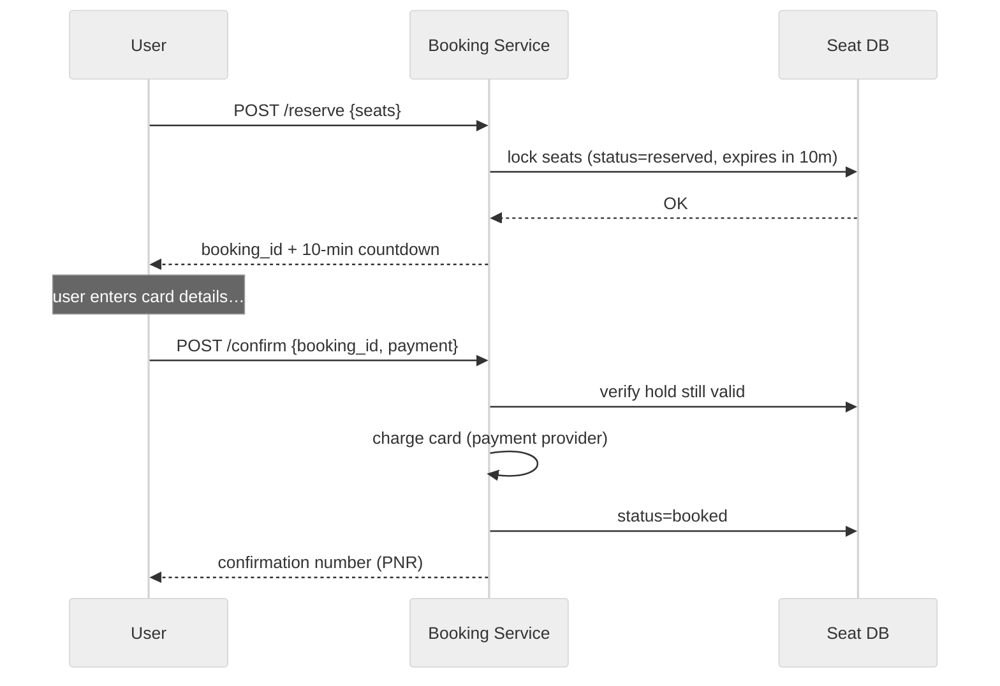

> ⚖️ **Trade-off — one-shot "buy" vs. two-phase reserve+confirm:** A single "buy" call is simpler and has no dangling holds, but it forces you to either (a) hold the seat during a slow, external payment round-trip (locking inventory on payment latency — bad under surge), or (b) charge *before* securing the seat (refund hell on races). **Two-phase** decouples "secure the seat" (fast, internal) from "take the money" (slow, external), at the cost of needing an **expiry mechanism** for abandoned holds — which is exactly the next three deep dives.

---

## 6. High-Level Architecture

Start with the simplest thing that satisfies the requirements, then justify each box. The core insight from every transcript: **split the read path from the write path.** They have opposite needs (AP vs CP), so give them different services and different datastores.

**First, what does "read path" vs "write path" even mean?** Every action a user takes is either a **read** (asking the system for information — "show me events," "show me this seat map") or a **write** (changing the system's state — "book this seat"). These two kinds of work want *opposite* things. A read wants to be **fast and always answerable**, and it's fine if the answer is a second or two stale (a brand-new event showing up in search 3 seconds late hurts nobody). A write — booking a seat — must be **perfectly correct** (never sell one seat twice), even if that means it's a little slower or occasionally rejects you. Because they want opposite things, we physically separate them into different services backed by different databases, so we can tune each one independently. This one idea drives the entire diagram below.

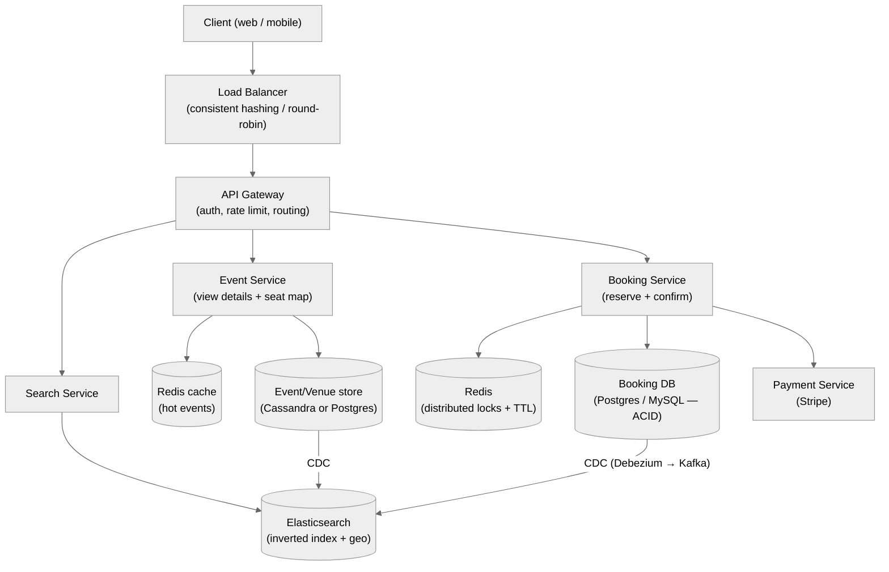

What each box is for:

- **Load balancer** — distributes incoming traffic across service instances (the Exponent mock used an AWS classic LB with **consistent hashing / round-robin**). Sits in front of everything.
- **API Gateway** — one entry point: authentication (issues/validates the token that carries `user_id`), rate limiting, and routing to the right service.
- **Search Service → Elasticsearch** — free-text + filtered event search, served from an inverted index. **Never touches the booking DB.** (§13)
- **Event Service → cache + metadata store** — returns event details and the seat map. Hot events are cached in Redis; the source of truth is the event/venue store. Reads dominate here.
- **Booking Service → Redis lock + Booking DB + Payment** — the **CP heart** of the system. Takes the lock, writes the ACID booking, calls payment. This is the only strongly-consistent write path.
- **CDC pipeline (Debezium → Kafka → Elasticsearch)** — keeps search/read replicas eventually consistent with the source of truth without dual-writes (§13).

**Walk one request through the boxes (beginner view).** Say you open the app and type "Coldplay." That text becomes an HTTP request that first hits the **load balancer**, which picks one of many identical server machines so no single machine is overwhelmed. It lands on the **API Gateway**, which checks *who you are* (your login token) and *whether you're allowed to make this request right now* (rate limiting), then forwards it to the **Search Service**. Search asks **Elasticsearch** (a database built specifically for fast text search) and gets back a list of matching events in a few milliseconds. You tap one event — that's a new request, this time routed to the **Event Service**, which returns the event's details and seat map (checking its **Redis cache** first so a popular event doesn't hammer the database). Finally you pick seat 45 and hit "book" — *this* request goes to the **Booking Service**, the only part that changes state, and it's deliberately kept separate so all the careful locking logic lives in one place. Notice that three completely different requests took three completely different paths to three different databases — that separation is the whole point.

> 🎬 **Two-user lens on the architecture.** Now imagine **User A** and **User B** both want seat 45 at the same instant. Their "book" requests may land on *different* Booking Service machines (the load balancer spread them out). That's exactly why the lock (Redis) lives *outside* the service machines, in a shared store both machines can see — if each machine kept its own private notion of "who has seat 45," they'd never know about each other and both would succeed. Hold onto this picture; §9 builds the whole locking story on it.

> ⚖️ **Trade-off — separate services vs. a monolith:** Splitting into Search / Event / Booking services lets each **scale and fail independently** (search can be down while booking still works, and vice-versa) and lets each pick its own datastore (ES vs Postgres vs Redis). The cost is operational complexity and eventual consistency between them (handled by CDC). For an interview, the split is strongly preferred because it directly expresses the **AP-reads / CP-writes** requirement.

> 🗄️ **Datastore choices, and how firmly to hold them (from the transcripts):**
> - **Booking DB → Postgres / MySQL (relational, ACID).** Non-negotiable: you need transactions + row locking for the no-double-booking invariant. One transcript (Bunny) used Postgres; the Exponent mock used Postgres explicitly for its ACID transaction guarantees around the seat update.
> - **Event/metadata store → Cassandra *or* Postgres.** Bunny chose **Cassandra** for event metadata (high availability, write-optimized) — but noted Cassandra is **not read-optimized**, so it's paired with Elasticsearch for the actual reads. This is a **low-stakes choice**: either works; state the trade-off and move on.
> - **Search → Elasticsearch** (inverted index + geo). Not optional if low-latency free-text search is a requirement.
> - **Locks + hot cache → Redis.** Distributed lock with TTL for reservations; LRU cache for hot events.

---

## 7. The Two-Phase Booking Flow

This is the spine of the system. Walk it end-to-end so every later deep dive has a home.

**Why "two phases" and not just "buy"? (beginner framing.)** Buying a ticket in real life is two moments: first you *grab* the seat ("this one's mine, don't let anyone else take it"), then you *pay* for it. The system mirrors this with two separate API calls: **reserve** (grab the seat, hold it for 10 minutes) and **confirm** (pay, finalize). The reason we don't merge them into one "buy" button is that paying is *slow and unreliable* — you have to type a card number, the bank has to approve it, sometimes a security check pops up. If the system tried to do everything in one step, it would either have to freeze the seat for the whole slow payment (bad) or take your money before making sure the seat was actually yours (worse). Splitting into reserve-then-pay lets the fast part (grabbing) be instant and correct, and lets the slow part (paying) happen without blocking anyone else longer than necessary.

> 🙂 **One-user scenario (the happy path, no competition).** Seat 99 is available and nobody else wants it. User A reserves it at 8:00:00 → seat 99 becomes **reserved**, 10-minute timer starts. A enters card details and confirms at 8:03:00 → payment succeeds → seat 99 becomes **booked**, and A gets a confirmation number. That's the entire flow when there's no contention: `available → reserved → booked`, two calls, done. Notice nothing about locks or races even *mattered* here — the two-phase structure exists mainly to stay correct when a *second* user shows up, which is the next scenario.

> 🎬 **Two-user scenario — one seat, two users, ten minutes.** Seat 45 for the Coldplay show starts as **available**. User A clicks it and hits *reserve* at 8:00:00. The system flips seat 45 to **reserved** and starts a 10-minute timer (expires 8:10:00). At 8:00:03, User B tries to reserve the *same* seat 45 — the system sees it's already reserved and instantly replies "sorry, taken" (a `409` error), so B picks seat 46 instead. User A now has until 8:10:00 to pay. Two things can happen: (1) A pays at 8:04:00 → seat 45 becomes **booked** (permanent, A's forever); or (2) A gets distracted and never pays → at 8:10:00 the timer lapses and seat 45 quietly returns to **available**, so someone else can grab it. That "quietly returns to available" step is surprisingly tricky to build correctly, which is why it gets three full deep dives (§8, §9, §10).

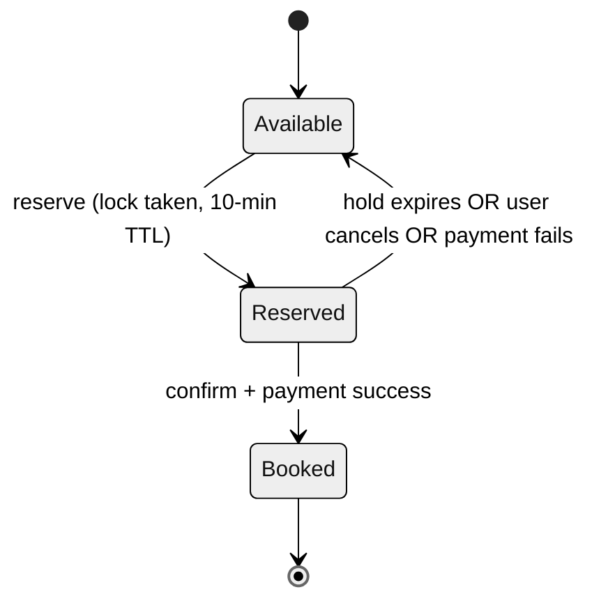

The seat status **state machine** — three states, and the transitions are the whole game:

| State | Meaning | Who can move it |
|---|---|---|
| **Available** (`open`) | Bookable by anyone | `reserve` moves it to Reserved |
| **Reserved** (`locked`) | Held by one user for ≤10 min | that user's `confirm` → Booked; or timeout → Available |
| **Booked** (`sold`) | Paid for; terminal | (refund would move back to Available — optional) |

Full happy-path sequence with the failure branches marked:

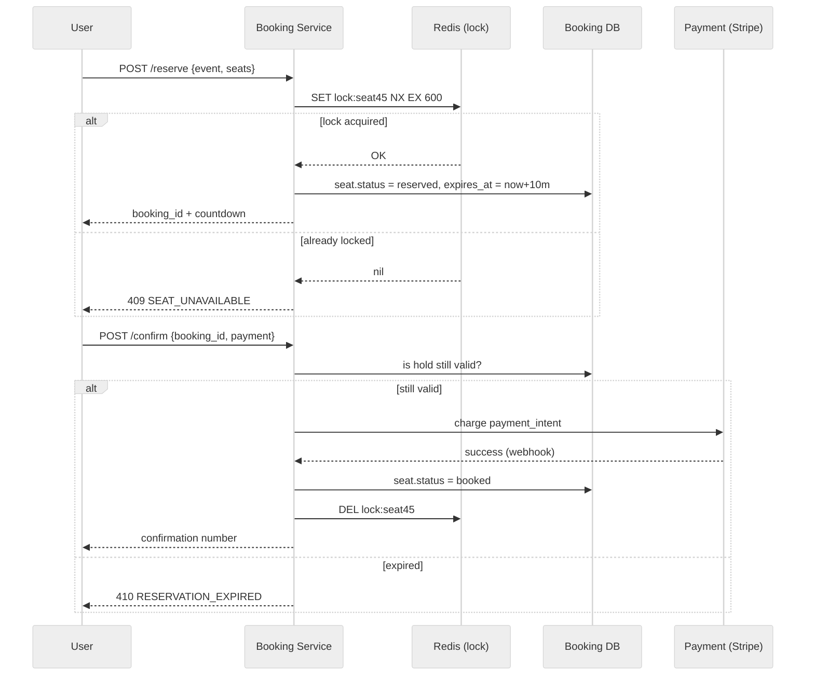

The three hard questions this flow raises — each gets its own deep dive:

1. **How does a hold auto-expire when the user just walks away?** → §8 (three approaches) and §9/§10 (the two winning ones).
2. **What stops two users grabbing the same seat in the gap between "check available" and "mark reserved"?** → §11 (race conditions) + the lock itself.
3. **How does this survive 166K req/s onto one event?** → §12 (sharded queues) + §15 (waiting queue).

---

## 8. Deep Dive — Expiring Reservations (all approaches)

**The problem:** a user reserves a seat (status → `reserved`) and then vanishes — closes the tab, loses signal, changes their mind. The seat is now stuck in `reserved` forever unless *something* frees it. How do we make a hold **auto-expire after 10 minutes** and return the seat to `available`? Across the transcripts, **five** distinct techniques appear. Know all of them and the trade-offs — interviewers walk you up this ladder.

**Why this is genuinely hard (beginner framing).** The tricky part is that *nothing happens* when a user abandons a reservation — they just close the tab. There's no event, no signal, no "I give up" button click. The seat is sitting in the database marked `reserved`, and no code is running to un-reserve it. So the system needs some way to notice "this hold is older than 10 minutes, free it" **without** the user telling it anything. The five approaches below are five different answers to the question *"who or what does the noticing, and when?"* — a background job that scans on a timer, the database expiring a key on its own, or simply *recomputing* the answer every time someone looks. Keep that question in mind as you read each one.

> 🙂 **One-user scenario (the whole reason this section exists).** User A reserves seat 45 at 8:00:00, then closes the browser and goes to lunch — never pays, never cancels, just gone. Seat 45 is now marked `reserved` in the database with A's name on it, and *no code anywhere is scheduled to touch it*. If we do nothing, seat 45 is lost forever — a real, sellable seat silently frozen because one person wandered off. Every approach below is a different way to make sure that at 8:10:00 the system realizes "A's hold is stale" and returns seat 45 to the pool, even though A never told it anything. This single-user abandonment is the core problem; the two-user race (who *gets* the freed seat) is handled by the lock in §9.

### Approach 1 — `reserved_at` timestamp + query-time filter (no expiry job at all)

Store a `reserved_at` timestamp when you lock the seat. Change **nothing** on a timer. Instead, **every read/write reinterprets the status at query time**: a seat counts as *available* if `status = available` **OR** (`status = reserved` AND `now − reserved_at > 10 min`).

*In plain terms:* instead of a worker actively "freeing" expired seats, you never bother — you just write down *when* each seat was reserved, and every time anyone asks "is this seat free?", you do the subtraction on the spot. If it was reserved more than 10 minutes ago, you treat it as free right now, regardless of what the `status` column literally says. The expiry is *computed*, not *stored*.

```sql
-- A seat is "effectively available" if:
SELECT * FROM seats
WHERE event_id = :e
  AND ( status = 'available'
        OR (status = 'reserved' AND reserved_at < NOW() - INTERVAL '10 minutes') );
```

- 👍 Dead simple; no background infrastructure; no lag; the truth is always computable.
- 👎 Every reader must remember the compound condition (easy to get wrong); stale `reserved` rows linger physically until someone overwrites them; the seat map you *show* must apply the same rule or it looks wrong.
- **Where it appears:** BookMyShow (`locked_at` variant, §10) and the Exponent mock's "second solution" both landed here as the *tidiest* option.

### Approach 2 — Cron / scheduled sweep job (the mid-level answer)

A background job runs periodically (say every minute): find every seat with `status = reserved` AND `reserved_at` older than 10 min, and reset it (`status = available`, `reserved_at = NULL`).

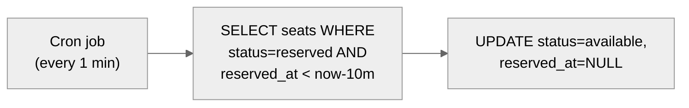

- 👍 Keeps the table physically clean; simple mental model.
- 👎 **Delta-lag:** if the job runs every *n* minutes, a seat can stay falsely locked for up to *n* extra minutes after expiry — bad during a sell-out where every second of inventory matters. Also a **full-table scan** cost and extra write load. The Exponent mock flagged the "extra overhead of scanning" as the reason to *avoid* this in favor of Approach 1.
- **Verdict:** acceptable but mid-level. Interviewers expect you to name the lag + scan cost.

### Approach 3 — Redis distributed lock with TTL (the optimal answer)

Take the lock in Redis with a **native TTL** — Redis **auto-deletes** the key after 10 minutes. No cron, no lag, no scan: expiry is a property of the datastore.

*What's Redis and what's a TTL? (beginner note.)* Redis is a very fast in-memory key-value store: it holds data as key→value pairs entirely in RAM, so reads and writes complete in well under a millisecond. A **TTL** ("time to live") is an expiry timer you attach to a key: you tell Redis "keep this key for exactly 600 seconds, then delete it yourself." So when User A reserves seat 45, you create a key `lock:event123:seat45` with a 600-second TTL. You don't need any code, any cron job, or any scan to free the seat later — Redis silently deletes that key on its own after 10 minutes, and once the key is gone, the seat is free again. The "who does the noticing?" answer here is: *Redis does, automatically, for free.*

```
SET lock:event123:seat45  {booking_id}  NX  EX 600
   NX  → only if not already held (atomic check-and-set → wins the race)
   EX 600 → key self-destructs in 600 s = the 10-minute hold
```

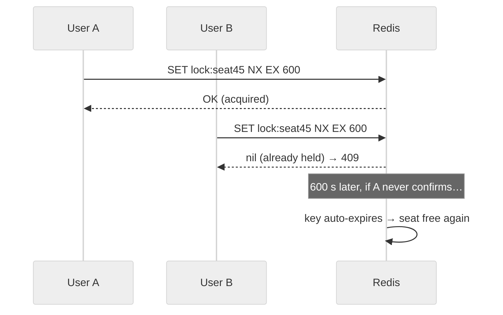

- 👍 **No background job, no lag, expiry is automatic and precise.** `NX` makes acquisition atomic → also solves the race condition (§11) in the same primitive. Extremely fast (in-memory).
- 👎 Must be a **distributed** Redis (cluster), because the Booking Service runs many instances — an in-process lock wouldn't be seen by other instances. Need to handle Redis failover (Redlock / replication) and the "lock expired mid-payment" edge (extend TTL or re-validate on confirm).
- **Where it appears:** Bunny's interview replaced the cron job with a **Redis cluster + TTL** explicitly; Hello Interview treats this as the canonical approach.

### Approach 4 — DB-native row lock inside an ACID transaction

Let the relational DB do it: `SELECT … FOR UPDATE` the seat row inside a transaction, check availability, set `reserved`, commit. Pair with a timestamp (Approach 1) for the *expiry* half.

- 👍 Strong guarantee with no extra system; leans on Postgres/MySQL you already have.
- 👎 Row locks held across a slow flow don't scale under surge; risk of **deadlocks** (Exponent mock explicitly warned: poorly managed transactions → two txns wait forever → a seat available to *no one*). Best for the *confirm* step's atomic flip, not for holding a 10-minute hold.

### Approach 5 — Optimistic locking (version / timestamp, no lock held) — Exponent mock

Don't hold a lock at all. Add a `version` (or `updated_at`) column to the seat. On confirm, update **only if the version hasn't changed** since you read it; if it did, someone beat you → reject and ask the user to retry.

```sql
UPDATE seats
SET status='reserved', version = version + 1
WHERE seat_id = :s AND version = :v_read AND status='available';
-- rows_affected = 0  → you lost the race → tell user to retry
```

- 👍 No lock contention; great when **conflicts are rare**; naturally prevents the read-modify-write race.
- 👎 Under a **hot** event conflicts are *common*, so many users get bounced and must retry — the Exponent mock named this exact trade-off ("if you're the unlucky person who keeps getting the conflict… after a while, yeah"). So optimistic locking suits low-contention seats; pessimistic locks/queues suit hot events.

### Which to use?

| Approach | Expiry precision | Infra cost | Handles surge race? | Verdict |
|---|---|---|---|---|
| 1. Timestamp + query filter | Exact | None | No (needs lock too) | Great for *expiry*, pair with a lock for the *race* |
| 2. Cron sweep | Lags up to *n* min | Job + scans | No | Mid-level; name the lag |
| 3. **Redis lock + TTL** | Exact, automatic | Redis cluster | **Yes (NX)** | ⭐ Optimal; solves expiry *and* race |
| 4. DB row lock (txn) | via timestamp | None extra | Yes, but deadlock risk | Best for the *confirm* flip |
| 5. Optimistic (version) | via timestamp | None | Yes if conflicts rare | Low-contention seats only |

> 💡 **The senior synthesis:** use **Redis lock + TTL (Approach 3)** to take the hold *and* win the race atomically, and keep a **timestamp on the seat row (Approach 1)** so the DB is self-consistent even if Redis is lost. Reserve **optimistic locking (5)** for low-contention seats and **DB transactions (4)** for the final atomic `confirm` flip. That combination is drawn from all four transcripts.

---

## 9. Deep Dive — The Distributed Lock (Redis + TTL)

Zooming into Approach 3, because it's the one interviewers push hardest on.

### Why the lock must be *distributed*

The Booking Service is **horizontally scaled** — dozens of identical instances behind the load balancer. If instance A kept the lock in its own memory, instance B (handling User B's request for the same seat) wouldn't see it → double-booking. The lock must live in a **shared, external** store all instances consult: Redis.

> 🎬 **Two-user scenario (why "in-memory" fails but "shared" works).** User A and User B both fire a reserve for seat 45 at the same instant. The load balancer sends A to **Booking Service instance 1** and B to **instance 2** (two different machines). *If each machine tracked locks in its own local memory:* instance 1 would see "seat 45 free → give it to A," and instance 2 would independently see "seat 45 free → give it to B" — because neither machine can see the other's memory. Both succeed → double-booked. *With a shared Redis lock:* both instances send `SET lock:seat45 NX` to the **same** Redis. Redis serves one first (A's instance wins, key created) and the other second (B's instance gets `nil`). Now the two machines *do* coordinate, because they're both looking at one shared source of truth. This is the whole reason the lock lives outside the service machines.

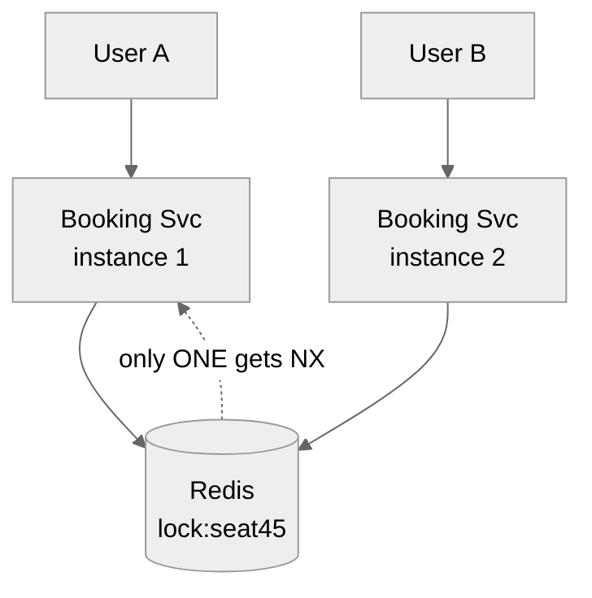

### The atomic acquire

```
SET  lock:{event_id}:{seat_id}  {booking_id}  NX  EX 600
```

`NX` = "set only if the key does **not** exist." Redis executes this **atomically** on a single thread, so exactly one of many simultaneous requests succeeds. That single primitive gives you **mutual exclusion** *and* the **10-minute auto-expiry** at once.

*Why "atomic" and "single thread" matter (beginner note).* "Atomic" means the operation happens all-at-once with no possibility of another operation sneaking in halfway through — there is no moment where the key is "half-set." Redis processes commands **one at a time** on a single thread — it fully finishes one command before starting the next, with no overlap. So when User A's `SET … NX` and User B's `SET … NX` both arrive for seat 45, Redis literally cannot run them simultaneously — it runs A's fully (key doesn't exist → creates it → returns OK), *then* runs B's (key now exists → `NX` fails → returns `nil`). There's no in-between state for them to both slip through. This is the entire reason a race condition is impossible here: the check ("does the key exist?") and the action ("create it") are fused into one indivisible step, instead of being two separate steps a competitor could interleave with.

### Releasing safely

On `confirm` success (or explicit cancel) you delete the key — but you must delete **only your own** lock, or you might delete a lock a *later* holder acquired after yours expired:

```
-- pseudo: compare-and-delete (Lua for atomicity)
if redis.get(key) == my_booking_id then redis.del(key) end
```

### The edge cases interviewers ask about

These three edge cases are where interviews get interesting — each one is a "but what if…?" that exposes whether you *really* understand the lock. Read the original one-liner first, then the beginner-friendly unpacking beneath it.

- **Lock expires mid-payment.** User is on the payment page at minute 11. Two mitigations: (a) make the hold long enough (10 min ≫ typical payment time); (b) on `confirm`, **re-validate** the seat in the DB inside a transaction — if it was reassigned, return `410 EXPIRED` and refund if charged. Never trust that the lock is still yours at confirm time.

  *What's actually going wrong here?* The 10-minute hold is a promise the system makes to User A: "this seat is yours to buy for 10 minutes." But payment takes real time — A types a card, the bank runs a fraud check, a 3-D Secure popup appears. If A is slow and it's now minute 11, the Redis lock has *already auto-deleted itself* (that's the TTL doing its job), and in the meantime User B may have reserved and even booked seat 45. Now A finally clicks "pay." If we blindly charged A and marked the seat booked, we'd have **sold seat 45 twice** — the exact disaster we're trying to prevent.
  Mitigation (a) is simple prevention: set the hold comfortably longer than how long people actually take to pay, so this rarely triggers at all. Mitigation (b) is the real safety net: **at confirm time, don't assume the lock is still yours** — go back to the database and check, inside a transaction, "is seat 45 still reserved by *me*?" If yes, proceed. If it was reassigned to B, stop, tell A `410 EXPIRED` ("sorry, your hold lapsed"), and if you already charged A's card, **refund it**. The mantra is in the last line: *never trust that the lock is still yours at confirm time* — always re-verify against the source of truth (the DB) before finalizing money and inventory.
  Two-user picture: A reserves at 8:00, gets distracted. Lock expires 8:10. B reserves 8:10:30 and books 8:11. A returns and clicks pay at 8:12 → the confirm re-validation sees seat 45 now belongs to B → A is cleanly rejected and refunded, and nobody is double-booked.

- **Redis node dies.** Use Redis replication / cluster; for stronger guarantees, **Redlock** across independent nodes. Because the seat row *also* carries a timestamp (Approach 1), a lost Redis doesn't corrupt truth — worst case a seat is briefly considered locked until the timestamp rule frees it.

  *Why this is scary and why it's actually okay.* Redis holds all our locks in memory. If the Redis machine crashes, do all the locks vanish and does chaos ensue? First line of defense: **don't run just one Redis** — run **replication** (a backup copy that's kept in sync and takes over if the primary dies) or a **cluster** (locks spread across several machines). **Redlock** is a stronger scheme where you acquire the lock on several independent Redis nodes and only count it as "held" if a majority agree — so one node dying doesn't lose the lock. But here's the reassuring part: even in the worst case where a lock is genuinely lost, **we don't double-book**, because the seat's true status doesn't live *only* in Redis. The seat *row in the database* also carries a `reserved_at`/`locked_at` timestamp (that's Approach 1 from §8). So the database itself can still answer "is this seat held?" by checking the timestamp. Redis dying doesn't corrupt the truth — it just means, at worst, a seat stays *considered* locked a little longer until the timestamp rule (10 minutes elapsed) frees it. Redis is a fast *accelerator* for the lock; the database is the *durable backstop*. Losing the accelerator is a slowdown, not a correctness bug.

- **Thundering herd on release.** When a popular seat frees, many waiters pounce; the `NX` still guarantees one winner, others get a clean `409`.

  *What "thundering herd" means.* Picture a wildly popular seat that User A is holding. Fifty other users are refreshing, all desperate for that exact seat. The instant A's hold expires (or A cancels) and the seat frees, all fifty fire their reserve requests at nearly the same millisecond — a "thundering herd" stampeding the newly-free seat. Does this cause a problem? No — and this is the beauty of the atomic `NX` from earlier in this section. Redis processes those fifty `SET … NX` commands one at a time; the **first** one creates the key and wins, and the other **forty-nine** see the key already exists and get a clean `nil` → the system returns a tidy `409 SEAT_UNAVAILABLE` to each. So even under a stampede there is still exactly one winner and no double-booking — the herd is loud but harmless. (The only real cost is the wasted requests, which the waiting queue in §15 helps smooth out.)

> ⚖️ **Trade-off — Redis lock vs. DB row lock:** Redis is faster (in-memory) and gives free TTL expiry, but adds a system and a failure mode (lock/DB divergence). DB `SELECT FOR UPDATE` is strongly consistent with the booking write (one system, no divergence) but holds a transaction/row lock across the flow and risks deadlocks + poor throughput under surge. **Redis for the hold, DB transaction for the final flip** is the common blend.

*Unpacking that trade-off in plain terms.* You have two tools that can enforce "one seat, one owner," and they live in different places. **Redis lock** is a separate, super-fast memory store: acquiring a lock is a sub-millisecond operation, and you get the auto-expiry (TTL) for free. Its downside is that it's a *second system* alongside your database, so the two can briefly disagree ("lock/DB divergence" — Redis thinks the seat is free but the DB row still says reserved, or vice versa), and you have to manage that. The **DB row lock** (`SELECT … FOR UPDATE`) does the locking *inside the same database* that stores the booking, so there's only one system and no divergence — but it **holds that row locked for the entire duration** of whatever transaction you're running, and if you hold it across a slow step you get **deadlocks** (two transactions each waiting on the other, §11) and throughput collapses when thousands pile onto one hot seat. The common blend resolves this by using each where it's strongest: **Redis for the 10-minute hold** (fast, self-expiring, doesn't tie up the database for minutes) and a **short DB transaction only for the final flip to `booked`** (strong, single-system correctness at the one moment that money changes hands). Fast-and-loose where you can afford it, strict-and-single-system where you can't.

---

## 10. Deep Dive — The `locked_at` Timestamp Approach (BookMyShow)

This is BookMyShow's actual production-style trick, and it's elegant because it needs **no status change on expiry and no cron job at all**. It's Approach 1 taken to its logical, minimal conclusion.

### The idea

Add a single column `locked_at` (a timestamp) to the seat. When a user reserves, you set `locked_at = now()`. You do **not** change any status on expiry, and you run **no** background job. Instead, on **every GET of the seat map**, you compute availability on the fly:

*The one-sentence intuition:* instead of storing "is this seat free?" as a fact you have to keep updating, you store "when was it last grabbed?" and let arithmetic answer "is it free?" every time someone asks. Since time only moves forward, a hold from 11 minutes ago is *automatically* stale the next time anyone looks — you never had to run anything to make it stale.

```
A seat is AVAILABLE to a new user if:
    status = 'open'
    OR  (now() − locked_at) > lock_duration        # the old hold has lapsed
```

So a seat that was locked 11 minutes ago is *automatically* treated as open again the next time anyone looks — the passage of time itself expires the hold, with zero moving parts.

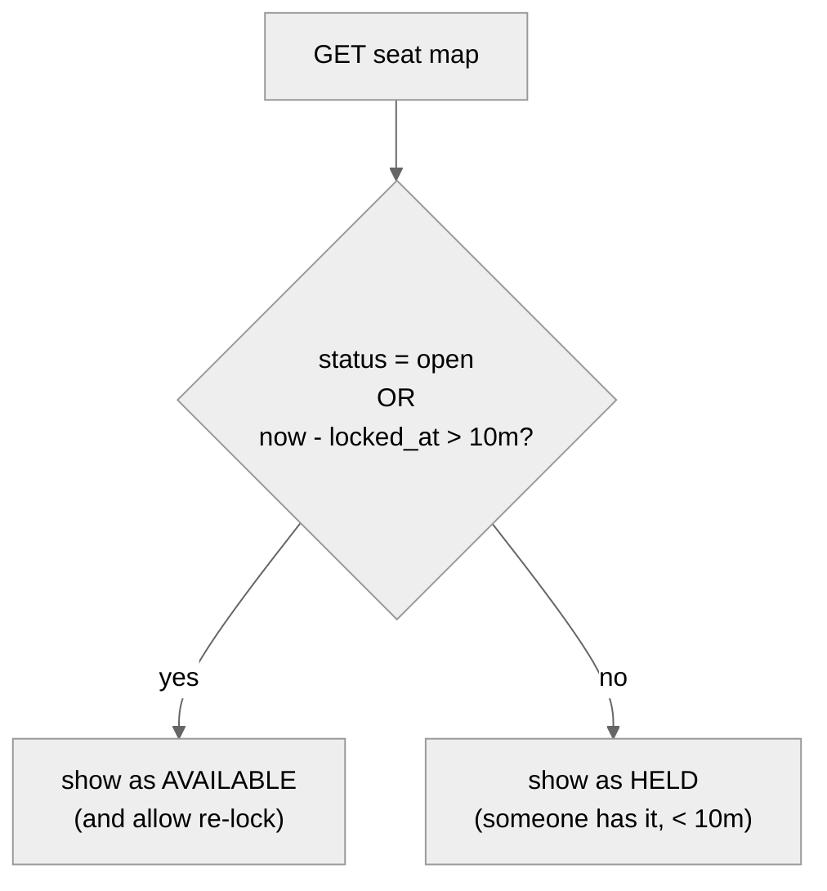

### The query that both reads and re-locks

The acquire becomes a **conditional update** — you can grab the seat if it's open *or* its lock is stale, in one atomic statement:

```sql
UPDATE seats
SET    locked_at = NOW(), locked_by = :user
WHERE  seat_id = :s
  AND ( status = 'open' OR NOW() - locked_at > INTERVAL '10 minutes' );
-- rows_affected = 1 → you got it;  0 → someone holds a fresh lock → 409
```

*Why one `UPDATE` statement is enough (beginner note).* You might expect this to be two steps — first read the seat to check if it's grabbable, then write your lock. But that two-step version is exactly the race condition (two users both read "free" before either writes). The trick here is that the *condition* (`WHERE … status='open' OR lock is stale`) and the *write* (`SET locked_at = NOW()`) are the **same** SQL statement, and the database runs each `UPDATE` atomically with a brief row lock. So when User A and User B both fire this `UPDATE` for seat 45 at the same instant, the database serializes them: A's runs first, matches the condition, writes A's lock, and reports **1 row changed**; B's runs next, but now the seat has a *fresh* `locked_at` (A just set it), so B's `WHERE` no longer matches and it reports **0 rows changed** → B gets a `409`. The number of rows affected is literally how you know whether you won.

### Why it's clever

- **No cron job** → no scan overhead, no delta-lag (contrast §8 Approach 2).
- **No extra status writes on expiry** → fewer writes on the hot table.
- **Truth is always correct** the instant anyone reads, because expiry is derived, not stored.

### The catch

- **Every reader must apply the compound rule.** If any code path forgets the `now − locked_at > 10m` clause, it will show stale seats as taken. Encapsulate it in one query/repository method.
- Physical rows still say `locked` — reporting/analytics must use the same derived rule, not the raw column.

> ⚖️ **Trade-off — `locked_at` (lazy) vs. Redis TTL (eager):** `locked_at` keeps everything in the one ACID database (no second system, no divergence, survives restarts) but pushes the "is it expired?" logic into every query and doesn't *actively* free inventory until someone looks. Redis TTL actively expires and is faster, but adds a system and a lock/DB-divergence failure mode. BookMyShow chose `locked_at` for simplicity; high-surge designs add Redis on top.

---

## 11. Deep Dive — Concurrency & Race Conditions

The Exponent mock laid out a clean **taxonomy of the races** you must defeat. Name them explicitly in an interview — it signals you understand *why* the lock exists, not just *that* it does.

**What is a "race condition," really? (beginner framing.)** A race condition is a bug that only appears when two operations happen at *almost the same time*, and the final result depends on the exact order they happened to run in — the two operations are effectively "racing," and the outcome is not deterministic. In our system the classic version is: booking a seat isn't one instant action, it's a little sequence — (1) *read* the seat to check it's available, (2) *decide* it's yours, (3) *write* it as reserved. If User A and User B each run this sequence and their steps interleave — A reads "available," B reads "available" (both see the seat as free because neither has written yet!), A writes "reserved by A," B writes "reserved by B" — then **both** think they succeeded, and the seat is double-booked. The seat was only ever free for one of them, but because they both *checked* before either *wrote*, they both got a green light. The whole point of locking is to make sure that once one user starts this sequence for a seat, no one else can start it until the first finishes.

### The four races

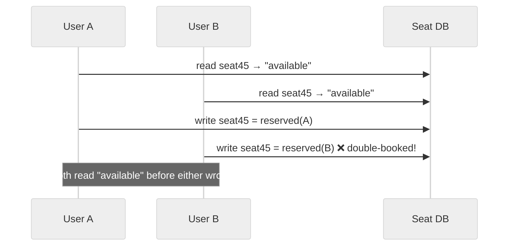

1. **Read-modify-write race.** Booking is *check availability → mark booked → store booking* — three steps, not one. Two users can both pass the "check" before either does the "mark." Fix: make the check-and-mark **atomic** (Redis `NX`, or `UPDATE … WHERE status='available'`, or `SELECT FOR UPDATE`).
2. **Simultaneous requests.** Two purchase requests arrive at nearly the same instant; the system may not have finished A's reservation before it starts B's. Same root cause; same atomic fix. (The mock's relatable version: refresh all day, finally click, go grab your card, come back → "seat unavailable.")
3. **Concurrency / non-atomic multi-step.** Because the operation spans multiple steps, both requests can observe "available" even though only one can win. Fix: wrap the steps in **one atomic unit** (transaction or single conditional update).
4. **Double-booking.** The unacceptable outcome of any of the above: two people show up for one seat. This is the **invariant to protect at all costs.**

### The two families of fixes

| Family | Mechanism | When it shines | Cost |
|---|---|---|---|
| **Pessimistic locking** | Lock the seat *before* touching it — Redis `NX` lock (§9), or DB `SELECT … FOR UPDATE` inside an ACID transaction | **Hot** seats where conflicts are likely (popular events) | Holds a lock; deadlock risk if sloppy; throughput ceiling |
| **Optimistic locking** | No lock; check a `version`/timestamp at write time, reject if it moved (§8 Approach 5) | **Cold** seats where conflicts are rare | Losers must retry → annoying on hot seats |

### ACID + atomicity: the correctness backbone

The Exponent mock's summary is the gold-standard soundbite: use an **ACID database** so the booking transaction — *check availability → reserve seat → record booking* — is **one unit of work that either fully commits or fully rolls back**. Atomicity means two users can't concurrently modify the same seat into a double-book; consistency means a failed step rolls back so the seat never gets stranded.

```
BEGIN;
  SELECT status FROM seats WHERE seat_id=:s FOR UPDATE;   -- lock the row
  -- if not available → ROLLBACK, return 409
  UPDATE seats SET status='reserved', reserved_at=NOW() WHERE seat_id=:s;
  INSERT INTO bookings(...) VALUES (...);
COMMIT;                                                    -- all-or-nothing
```

*Reading this line by line (beginner note).* `BEGIN` opens a transaction — a bundle of steps that will either **all** happen or **none** happen. `SELECT … FOR UPDATE` reads the seat row **and locks it**, meaning any *other* transaction that tries to touch seat `:s` must **wait** until this one finishes. That's the key: the lock is held from this line until `COMMIT`. Inside, we check availability, flip the seat to `reserved`, and insert the booking record. `COMMIT` makes all of it permanent at once and releases the lock. If anything fails partway, `ROLLBACK` undoes everything, so we never end up with a half-booked seat.

> 🎬 **Two-user scenario (why `FOR UPDATE` saves us).** User A and User B both run this transaction for seat 45 at 8:00:00.000. A's transaction reaches `SELECT … FOR UPDATE` a hair first and **locks the row**. B's transaction reaches the same line and is forced to **pause** — the database makes B *wait* rather than letting it read a soon-to-be-stale value. A checks (available ✓), sets `reserved`, inserts the booking, and `COMMIT`s — lock released. *Only now* does B's `SELECT … FOR UPDATE` proceed; it reads the row and sees `status = reserved`, so B's code hits the "not available → ROLLBACK, return 409" branch. One winner, one clean rejection, zero double-booking — and notice the database did the hard part (making B wait) for us.

> 🙂 **One-user scenario (the happy path).** When there's no competition — User A is the only person interested in seat 99 — the same transaction just runs straight through: lock the row (nobody's contending, so no waiting), confirm it's available, mark reserved, insert booking, commit. The locking machinery costs essentially nothing here; it only "kicks in" to make someone wait when there's an actual conflict. That's why this design is safe under contention *and* fast when there isn't any.

> ⚠️ **Deadlock warning (from the mock):** poorly managed transactions where two txns each hold one row and wait for the other → both wait forever → a seat available to **no one**. Mitigate by locking rows in a **consistent order**, keeping transactions short, and setting lock timeouts.

---

## 12. Deep Dive — Lockless Booking via Sharded Queues

Locks work, but under **extreme** contention (Taylor Swift: millions fighting for the same seats) even a fast Redis lock becomes a hot spot, and users get a wall of `409`s. An alternative used in the transcripts: **serialize booking requests through a queue** so there's no lock contention at all — the queue *is* the ordering.

**What's a queue and what does "serialize" mean? (beginner framing.)** A queue is a line: requests join at the back and a worker (the "consumer") pulls them off the front **one at a time, in order**. To "serialize" means to force things that arrived in parallel to be handled one-after-another instead of simultaneously. That's a different way to prevent double-booking than locking: with a lock, everyone tries at once and all but one get rejected; with a queue, everyone's request is *accepted into the line*, and because the worker handles them strictly one at a time, two requests for the same seat can never be processed at the same instant — the first one off the line books it, and when the second reaches the front the seat is already gone, so it's cleanly told "unavailable." No two workers ever touch the same seat simultaneously, so there's literally no race to lose. The catch, explored below, is that a *single* line for *everything* becomes a bottleneck — hence "sharded" (split into many lines).

### Naive: one global FIFO queue (why it fails)

Put every booking request on one queue; a single consumer processes them in order → no two requests touch a seat at the same time.

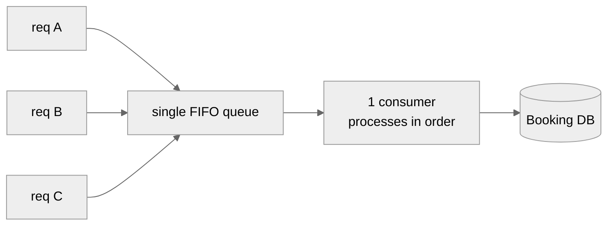

- 👎 **Single point of failure** (queue/consumer dies → all booking stops). **Unbounded growth** under surge (166K/s in, one consumer out → backlog explodes). **No parallelism** → throughput floor. Rejected.

### Better: shard queues by `event_id`

Hash the `event_id` to one of *N* queues (`queue = hash(event_id) % N`), each with its own consumer. Requests for **different** events run in parallel; requests for the **same** event are still serialized on the same queue → no races.

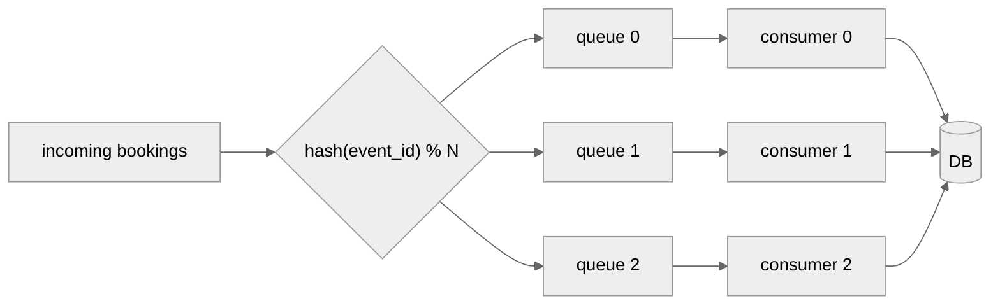

- 👍 Parallel across events; per-event ordering preserved; no distributed lock needed.
- 👎 A single **hot event** still lands entirely on **one** queue → that queue is overwhelmed while others idle.

> 🎬 **Two-user scenario (same event vs. different events).** Case 1 — A and B both book the *same* Coldplay event (id 123). `hash(123)` sends **both** to, say, queue 1. They now stand in the same line: the consumer processes A first (books seat 45), then B (who wanted seat 45 too → sees it's gone → `409`, or gets their different seat). Serialized, safe. Case 2 — A books Coldplay (id 123 → queue 1) while B books a Taylor Swift event (id 777 → queue 5). Different lines, different consumers, so A and B are handled **truly in parallel** with zero waiting — because they can't possibly conflict (different events, different seats). That's the win of sharding by event: conflicts are contained to one line, and unrelated bookings never block each other.

### Best for mega-events: shard further by section / seat range

For one enormous event, shard *within* it — by section or seat-block: `queue = hash(event_id, section) % N`. Now even a single Taylor Swift show spreads across many queues, because two users buying seats in **different sections** never conflict.

```
Coldplay @ Wembley (90,000 seats)
   ├─ section A  → queue A  → consumer A
   ├─ section B  → queue B  → consumer B
   └─ section C  → queue C  → consumer C     (parallel; only same-section requests serialize)
```

- 👍 Massive parallelism even within one event; the only serialization is exactly where it's needed (same section).
- 👎 More queues/consumers to manage; cross-section operations (rare) need care.

> ⚖️ **Trade-off — queues vs. locks:** Locks are simpler and give instant feedback (you immediately know you lost). Queues add latency (your request waits its turn) and complexity, but they **absorb surges gracefully** (backpressure instead of a `409` storm) and remove lock hot spots. In practice, big designs combine both: a **virtual waiting queue at the front** (§15) to shave the peak, then **sharded processing** behind it.

> 💡 **System-allocated seats (IRCTC-style) as a contention-killer:** if users **don't pick exact seats** but ask for "2 seats together," the system *assigns* them. That removes per-seat contention almost entirely (the server hands out the next available block) and prevents seat-map fragmentation. Great trade-off when the product allows it (trains, GA concerts); not viable when users demand specific seats (theatre).

---

## 13. Deep Dive — Low-Latency Search (Elasticsearch + CDC)

Search ("Coldplay near me next month") must be **fast** and **highly available** — the opposite requirements from booking. So it gets its own datastore: **Elasticsearch**, kept in sync from the source of truth via **CDC**.

### Why not just query the primary DB?

`SELECT … WHERE name LIKE '%coldplay%'` on Postgres/Cassandra is slow (no efficient free-text match, full scans) and would put read load on the write-critical store. Elasticsearch builds an **inverted index** (term → list of matching event_ids) so free-text queries are near-instant, and it natively supports **geo** queries (events near a location) via **geohashing / quad-trees**.

*What's an "inverted index"? (beginner note.)* A normal database, asked "find every event whose name contains 'coldplay'," has to look at **every row** and check its name — that's a "full scan," and it gets slower as you add events. An **inverted index** flips the problem around (hence "inverted"): ahead of time, it builds a lookup table from **each word → the list of events containing that word**. So `"coldplay" → [event 123, event 998, …]` is stored directly, and finding all Coldplay events is a single key lookup instead of a scan. When you search "coldplay," Elasticsearch doesn't scan anything — it jumps straight to that word's entry and instantly has the matching event IDs. That's why it's near-instant no matter how many total events exist. **Geohashing / quad-trees** do the same trick for *location*: they pre-organize events by geographic area so "events near me" is a fast lookup instead of measuring the distance to every event on earth.

> 🙂 **One-user scenario.** User A, in Boston, types "coldplay" and sets a 25-mile radius. The request goes to the Search Service → Elasticsearch, which looks up the word "coldplay" in its inverted index (instant list of Coldplay event IDs) and intersects it with the geo-index for "within 25 miles of Boston." In a few milliseconds A gets back a short list of nearby Coldplay dates — no full scan, and the booking database wasn't touched at all, so even during a giant on-sale this search stays fast.

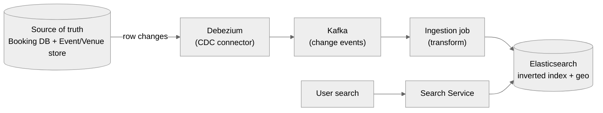

### CDC (Change Data Capture) — keeping ES in sync without dual writes

The naive approach is to have the app write to **both** the DB and Elasticsearch. That's fragile: if the second write fails, the two diverge. **CDC** fixes this: **Debezium** tails the database's write-ahead log, emits every insert/update as an event onto **Kafka**, and an **ingestion job** consumes those and updates Elasticsearch. The app writes **once** (to the DB); search updates follow automatically and reliably.

- This is also how **real-time seat availability** propagates to search/read views: a booking decrements the seat count in the source store → CDC → Kafka → ES reflects "sold out" shortly after (Bunny's design).
- **Eventual consistency** is fine here (the AP side): a brand-new event appearing in search a few seconds late is acceptable — exactly the NFR trade-off from §2.

> ⚖️ **Trade-off — CDC vs. dual-write vs. periodic reindex:** Dual-write is simplest but risks divergence on partial failure. Periodic full reindex is robust but stale between runs and expensive. **CDC (Debezium → Kafka → ES)** gives near-real-time sync with a single source of truth and natural replay (Kafka retains events), at the cost of running the pipeline. It's the standard senior-level answer.

---

## 14. Deep Dive — Real-Time Seat Map (Long Poll / SSE)

On a popular event the seat map changes every second. If a user stares at a stale map and clicks a seat that's already gone, they hit an avoidable `409`. We want the map to **update live**. The transcripts weigh three transport options.

**Why "live" is a problem at all (beginner framing.)** Normally the web works by *pull*: your browser asks the server for something, the server answers, done — the connection closes. But a seat map needs *push*: the server needs to tell your browser "seat 45 was just taken" **without** you asking again. Plain request-response can't do that, so we need a transport that lets the server send updates on its own. The three options below are three ways to achieve that, from crudest (keep re-asking every few seconds) to cleanest (hold one connection open and let the server stream changes down it).

> 🎬 **Two-user scenario (why the live map matters).** User A and User B are both staring at the Coldplay seat map. A clicks seat 45 and reserves it. Without live updates, B's screen still shows seat 45 as green (available) — B clicks it, waits, and gets a frustrating `409` "seat taken." With a live map (SSE), the moment A reserves seat 45, the server pushes a `seat_update {45: reserved}` to every viewer including B, so seat 45 turns grey on B's screen *before* B even reaches for it. B never wastes a click on a seat that's already gone. The live map doesn't change the correctness (the lock already prevents double-booking) — it improves the *experience* by not letting users chase seats that just disappeared.

| Option | How it works | Fit here | Verdict |
|---|---|---|---|
| **Short polling** | Client re-requests every few seconds | Simple, but wastes requests and is still stale between polls | OK fallback |
| **Long polling** | Client request *held open* until the server has an update, then returns; client immediately re-requests | Near-real-time, works everywhere, no persistent protocol | 👍 Good default |
| **SSE (Server-Sent Events)** | Server pushes a one-way stream of updates over a single long-lived HTTP connection | **Unidirectional** (server→client) — perfect for "seat X taken" pushes; lighter than WebSockets | ⭐ Ideal for seat maps |
| *(WebSockets)* | Full duplex | Overkill — we only need server→client for the map | Not needed |

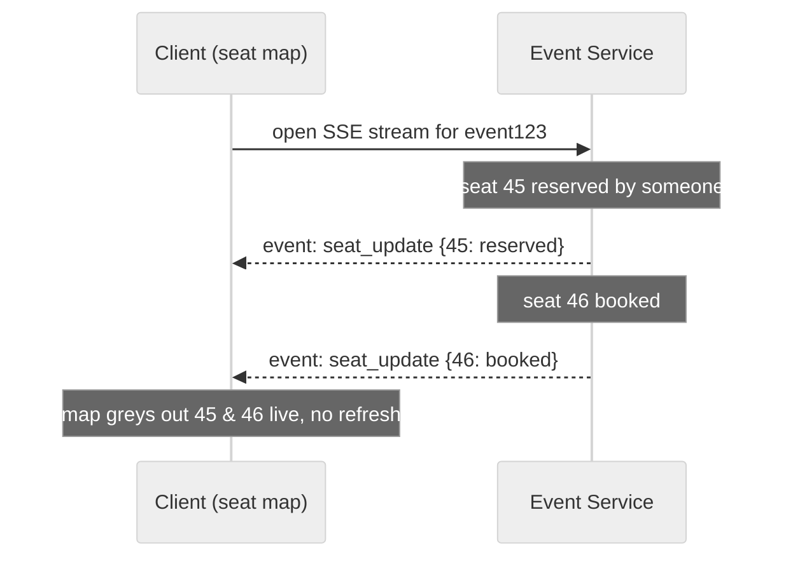

> 💡 **Why SSE over WebSockets for *this*:** the seat map is a **one-way** feed — the server tells clients what changed; clients don't stream data back over the same channel (their actions go through normal REST reserve/confirm calls). SSE is simpler, uses plain HTTP, and auto-reconnects. Reserve WebSockets for truly bidirectional needs.

> ⚖️ **Trade-off — live updates vs. load:** Pushing every seat change to every viewer of a hot event is itself a fan-out load (thousands watching one event). Mitigate by **debouncing/batching** updates (send diffs every ~1s, not per-change) and by only streaming to users actually on that event page. Under extreme surge, the **waiting queue (§15)** also caps how many clients are live on the map at once.

---

## 15. Deep Dive — The Virtual Waiting Queue (surge / celebrity problem)

This is the signature answer to the **166K req/s onto one event** problem (§3.2). Instead of letting the flood hit your booking service directly, you put a **virtual waiting room** in front: users get a queue position, and you **admit them into the booking flow in controlled batches** at a rate the backend can safely handle.

**The core idea in plain terms (beginner framing.)** Your booking system can safely handle, say, 2,000 requests per second. During a Taylor Swift on-sale, 166,000 requests arrive per second. If you let them all through, the system falls over — not because any single booking is hard, but because the *sheer number arriving at once* overwhelms every component (database connections, locks, payment calls). The fix isn't to make the system 80× bigger (you can't — the bottleneck is one event's limited seats and their contended rows). The fix is to **not let everyone in at once**: park arriving users in a holding area, show them "you're number 24,300 in line," and release them into the real booking flow only as fast as the system can handle. The flood becomes a steady trickle. Nobody is turned away — they just wait their turn, with an honest position instead of a random error.

> 🎬 **Many-user scenario (what each user experiences).** At 10:00:00 sharp, 500,000 fans hit "buy" for the same show. Instead of 500,000 requests stampeding the booking service, each fan is assigned a queue token: User A draws position 312, User B position 47,900, User C position 402,001. The dispatcher admits, say, 2,000 people per second into the real reserve→confirm flow. A (near the front) is let in within a second and books quickly; B waits ~24 seconds, sees a live "you're 47,900th, ~24s" indicator, then gets admitted and books; C waits a few minutes and, realistically, may find the show sold out by the time they're admitted — but they got a fair, transparent wait rather than a chaotic wall of `409`s. Crucially, the booking service itself never saw more than 2,000 req/s, so it stayed healthy for everyone.

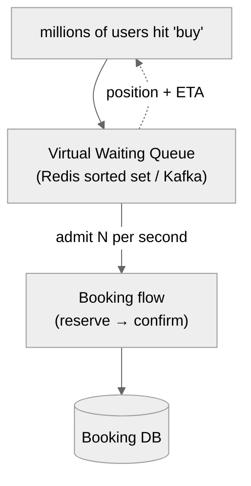

### How it works

- On on-sale, every arriving user is **enqueued** with a token and shown a **position + estimated wait** ("you are number 24,300 in line").
- A **dispatcher** admits users from the head of the queue into the real booking flow at a **fixed, safe rate** (e.g., only as fast as inventory + DB can absorb). Everyone else waits, so the booking service sees a **smooth, bounded** load instead of a 166K/s spike.
- Implementation options from the transcripts: **Redis sorted set** (score = arrival timestamp → natural FIFO ordering, easy position lookup) or **Kafka** (Bunny used a Kafka waiting queue for the Coldplay surge — durable, ordered, replayable).

<details>
<summary><strong>🔍 Beginner deep-dive: how a Redis sorted set and Kafka each implement the waiting queue</strong></summary>

Both are just concrete ways to build the "line" — a structure that keeps people in arrival order and lets the dispatcher pull from the front. Here's what each one actually is and how it works, with examples.

**Option A — Redis sorted set (ZSET).**

A Redis **sorted set** is a collection where every member has a numeric **score**, and Redis automatically keeps the members ordered by that score. That's the whole trick: if you use each user's **arrival time** as their score, the set stays sorted in arrival order for free — the earliest arrival is always at position 0.

When the on-sale starts, each arriving user is added with a command like:

```
ZADD queue:event123   1720000000.021   user_A     # score = arrival timestamp
ZADD queue:event123   1720000000.055   user_B
ZADD queue:event123   1720000000.090   user_C
```

Now the queue *is* the sorted set, and you get three things almost for free:

- **"What's my position?"** → `ZRANK queue:event123 user_B` returns `1` (0-indexed), so User B is told "you're 2nd in line." This is instant — the set is already sorted, so a rank lookup is fast. This is what powers the live "you are number 24,300" indicator.
- **"Admit the next N people."** → the dispatcher runs `ZPOPMIN queue:event123 2000` once per second, which removes and returns the 2,000 lowest-score (earliest) members — those users are handed a token and let into the booking flow. Everyone else stays in the set, waiting.
- **Ordering is maintained automatically** as new users arrive mid-sale — a user who arrives later gets a larger timestamp score and slots in behind everyone already there.

*Concrete flow:* 500,000 fans hit "buy." Each is `ZADD`-ed with their arrival timestamp. The dispatcher pops 2,000/second from the front. User A (arrived at t=0.021) is near the front and admitted in the first second; User B far back sees `ZRANK` = 47,899 and a computed wait of ~24 seconds; the number ticks down as batches are popped ahead of them.

*Trade-off:* Redis sorted sets are extremely fast and make position/rank queries trivial, but Redis holds the queue **in memory** — if the Redis node dies without replication, the in-flight line is lost (users would have to rejoin). Great when you want a lightweight, low-latency line and can tolerate rebuilding it on failure.

**Option B — Kafka (a durable log).**

Kafka is a **distributed append-only log**: producers append records to the end, and consumers read them **in order** from wherever they left off. It's not a "set" you rank into — it's a durable tape of events written to disk and replicated across machines. For a waiting queue, each user's arrival is a record appended to a Kafka **topic** (e.g., `waiting-queue-event123`), and the dispatcher is a **consumer** reading that topic front-to-back at a controlled rate.

- **Ordering** comes from the log itself: records are stored in the exact order they were appended (within a partition), so first-come-first-served is inherent.
- **Durability / replay** is the headline feature: because every arrival is written to disk and replicated, a crash doesn't lose the line — a new dispatcher instance just resumes reading from the last committed **offset** (its bookmark in the log). Bunny chose Kafka for the Coldplay surge for exactly this "durable, ordered, replayable" property.
- **Rate control**: the consumer simply reads and admits, say, 2,000 records per second, giving the same backpressure as the ZSET approach — the flood is written to Kafka instantly (Kafka handles huge write throughput), and the *reading* side sets the safe admit rate.

*Concrete flow:* 500,000 arrivals are appended to the topic in milliseconds (Kafka absorbs the write spike easily). The dispatcher consumes at 2,000/sec, handing tokens to users as it advances through offsets. If the dispatcher process crashes at offset 300,000, a replacement resumes at offset 300,000 — nobody loses their place.

*Trade-off vs. ZSET:* Kafka is durable and handles massive write bursts, and it survives crashes without losing the line — but "what's my exact position?" is less natural than a `ZRANK` (you'd track it via the offset gap), and Kafka is heavier operationally than a Redis key. **Rule of thumb:** reach for the **Redis sorted set** when you want a fast, simple line with easy position lookups; reach for **Kafka** when durability, replay, and absorbing an enormous write spike matter most.

</details>

### Why it's the right shape

- Converts an unsurvivable **spike** into a survivable **stream** (backpressure).
- Gives users honest feedback (a place in line) instead of random `409`s and refresh-roulette.
- Protects every downstream system — DB, Redis lock, payment — from overload in one place.

```
Without queue:  166,000 req/s ─► [Booking Service] 💥 meltdown / cascading failure
With queue:     166,000 req/s ─► [Waiting Queue] ─► steady 2,000 req/s ─► [Booking Service] ✅
```

> ⚖️ **Trade-off — waiting queue vs. just autoscaling:** You *could* try to autoscale the booking service to 166K/s, but the bottleneck is the **single event's inventory + its contended rows/locks**, which don't parallelize past the seat count — throwing servers at it just moves the contention. The queue **rate-limits at the source**, which is cheaper and protects the whole chain. Cost: added latency and a queue to operate; fairness logic (FIFO vs. lottery) to decide.

> 💡 **Fairness note:** pure FIFO rewards whoever's network was fastest at T=0. Some systems use a **randomized lottery** among everyone present in the first few seconds to feel fairer. Worth mentioning as a product trade-off.

---

## 16. Deep Dive — Payment Integration (Stripe + webhooks)

Payment is **external, slow, and can fail** — the reason for the two-phase design. You never hold a DB row lock across the payment round-trip.

**Why payment is special (beginner framing.)** Every other step in booking happens *inside* your own system, where you control the speed and know instantly whether it worked. Payment is different: it goes to an **outside** company (Stripe, the card networks, the bank), it can take several seconds, and it can fail for reasons you can't predict (insufficient funds, fraud check, network blip). Worse, the final "payment succeeded" often doesn't come back in the same reply — it arrives *later*, as a separate message called a **webhook** (Stripe calling *your* server back to say "that payment you started? it went through"). So you have to design for: slow, might-fail, and answer-comes-later. That's exactly why the seat is only *held* (reserved) during payment, not marked sold — you don't finalize anything until the payment result actually arrives.

> 🙂 **One-user scenario (the full confirm walkthrough).** User A has seat 45 reserved (10-minute hold ticking). A clicks "pay" and enters card details. The Booking Service tells Stripe "charge $150" (a *payment intent*). Stripe may pop a 3-D Secure bank verification to A's phone; A approves it. A few seconds later, Stripe sends a **webhook** back to the Booking Service: `payment_succeeded`. Now — and only now — the service **re-checks that A still holds seat 45** (the hold could have lapsed if A was very slow), and if so, in one transaction flips seat 45 to `booked` and writes the purchase record, then returns A the confirmation number. If Stripe had instead said `payment_failed`, the service would release the hold so seat 45 returns to available for someone else. The seat was never "sold" until the money was truly confirmed.

### The flow

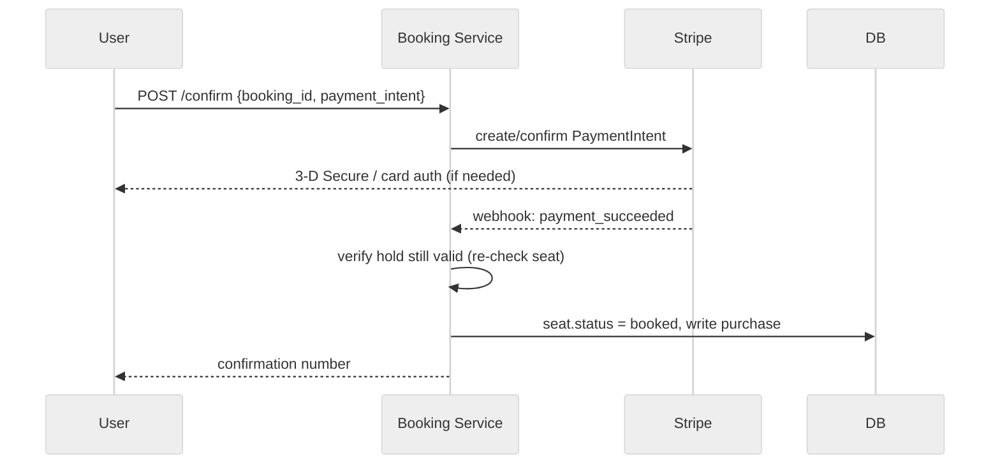

- **Payment Intents** represent one payment attempt; the actual result often arrives **asynchronously via a webhook** (`payment_succeeded` / `payment_failed`) rather than the initial synchronous response.
- On `payment_succeeded`: **re-validate** the reservation (the lock may have lapsed, §9), then flip the seat to `booked` and record the `purchase`.
- On `payment_failed` or timeout: release the hold so the seat returns to `available`.

### Idempotency & consistency

- Send an **idempotency key** with the charge so a client retry (or a duplicate webhook) doesn't double-charge.
- Booking-flip + purchase-insert should be **one transaction** so you never end up "charged but not booked." If the seat was lost during payment, **refund** and return `410`.

> ⚖️ **Trade-off — charge before vs. after securing the seat:** Charging *before* the seat is secured risks refunds when the user loses the race; securing *then* charging (our flow) risks holding inventory during payment. The two-phase reserve+confirm minimizes both: the seat is held (not sold) during a **bounded** 10-min window, and the charge happens only inside `confirm` with a re-validation guard.

---

## 17. Deep Dive — Caching & Read Scaling

Reads outnumber writes ~1000:1 (§3), so the read path must be cheap. Multiple layers, cheapest first.

**What is caching and why "layers"? (beginner framing.)** A cache is a small, fast store that keeps a *copy* of frequently-requested data close to where it's needed, so you don't have to recompute or re-fetch it from the slow source every time. If a million people open the Taylor Swift event page, you don't want a million trips to the database asking for the same event name and venue — you fetch it once, keep the copy, and serve the other 999,999 from the copy. "Layers" means we place several caches at different distances from the user, each catching what it can before the request has to travel further: a **CDN** at the internet's edge (closest to the user) handles images and static bits; a **Redis cache** near the servers handles hot event data; **read replicas** (extra copies of the database) absorb the reads that do get through; and only the leftover trickle reaches the **primary database**. Each layer shields the next, so the expensive primary database sees very little traffic.

> 🙂 **One-user scenario (a cache hit vs. a cache miss).** User A opens the Coldplay event page. **Cache miss path (first ever view):** the Event Service checks Redis, finds nothing, so it reads the event from the database, *stores a copy in Redis*, and returns it — a bit slower, but now the copy exists. **Cache hit path (the next million viewers, including A on refresh):** the Event Service checks Redis, finds the event sitting right there in memory, and returns it in under a millisecond without touching the database at all. The very first request "warms" the cache; everyone after rides it for free. The one thing A should *not* be served from a stale cache is live seat availability — that's why the design caches the static "shell" (name, venue, layout) but keeps seat status live, as the next paragraphs explain.

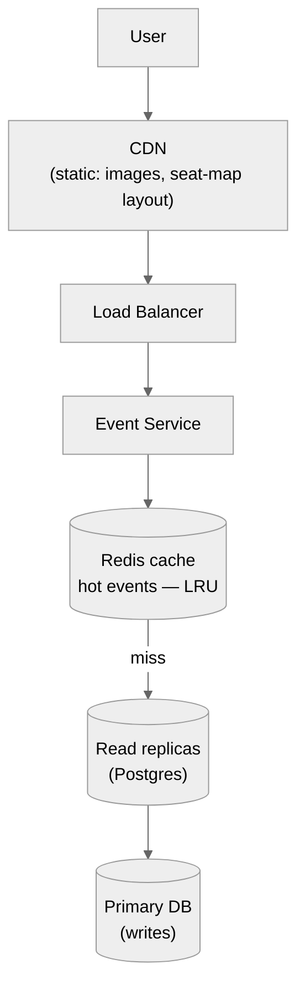

The layers, and what each absorbs:

- **CDN** — static, rarely-changing assets: event images, venue seat-map *geometry* (rows/sections don't change), event descriptions. Served at the edge, never hits your servers.
- **Redis cache (hot events)** — the Exponent mock and Bunny both cache **most-frequently-viewed events** (LRU eviction). A Taylor Swift page requested millions of times is served from memory. **Cache the details; be careful with live seat status** (that changes second-to-second — either short TTL or serve status via the live channel §14).
- **Read replicas** — the primary DB handles writes (bookings); **replicas** serve the heavy read traffic (event views). The Exponent mock explicitly added Postgres read replicas.
- **DB indexes** — index the columns you filter on frequently (event date, venue, performer). The mock's caution: indexes **cost space and slow writes**, so be **selective** — index only genuinely frequent queries.

### The freshness dilemma for seat status

Caching an event's *details* is safe; caching its *seat availability* is dangerous because it changes constantly. Options: (a) don't cache status — read it live/from the seat store; (b) cache with a very short TTL; (c) push status via SSE (§14) and cache only the static shell. Most designs cache the **shell** (name, venue, layout) and treat **status as live**.

> ⚖️ **Trade-off — cache everything vs. correctness:** Aggressive caching maximizes read throughput but risks showing a seat as available after it's sold (a bad UX that ends in a `409` at reserve). The resolution is to **split cacheable-static from volatile-live** data: cache the static event shell hard (CDN + Redis), keep seat status live. This preserves the read win without lying about availability.

> ⚡ **Storage-tier note (Exponent mock):** because total data is small (~tens of GB, §3.3), the whole dataset can sit on **SSD** and hot rows in **RAM**. At ~1,600 peak ops/s a general-purpose volume (~3,000 IOPS) suffices; a provisioned one (~30,000 IOPS) gives headroom. Because **RAM is volatile**, pair it with durability: replicas, backups, and even a **UPS** so an in-memory-heavy node can flush on power loss. Nice detail to show hardware awareness.

---

# 📝 Part B — The Interview Template (15 Sections)

> This part reorganizes everything above into the exact structure you'd walk an interviewer through, start to finish. Part A teaches; Part B is what you *say and draw* in the room.

## B1. Problem Statement & Clarifying Questions

**Problem:** Design a ticket booking service (Ticketmaster / BookMyShow) where users can **search** for events, **view** an event's seat map, and **book** a seat — with **no double-booking** and survival of **extreme on-sale surges**.

**Clarifying questions to ask first** (each one narrows scope and shows seniority):

- **Scope of booking:** Do users pick *specific* seats, or does the system assign them? (Specific → per-seat contention; assigned → simpler, IRCTC-style.)
- **Event sizes:** small venues (~1,000 seats) vs. mega events (~50,000+)? (Drives whether we need intra-event sharding.)
- **Guests vs. accounts:** Must users register, or is guest checkout allowed? (Exponent mock: allow guests, retrieve via confirmation number.)
- **Geography:** US-only or worldwide? (Affects data volume and geo-search.)
- **Consistency expectation:** Is it acceptable for a newly-added event to appear in search a few seconds late? (Yes → AP search, CP booking.)
- **In/out of scope:** Refunds? Dynamic pricing? Recommendations? Admin event-creation? (Usually below the line.)
- **Payment:** Integrate an external provider (Stripe) or assume a payment black-box? (Affects the confirm flow.)

**Assumptions to state:** ~10M DAU; ~1% conversion; reads ≫ writes (~1000:1); popular events sell out in minutes; specific-seat selection; guest checkout allowed; single region logic (replicable per region).

---

## B2. Requirements

**Functional**

1. **Search events** — free text + filters (location, date, category), paginated.
2. **View event** — details + live seat map (available / reserved / booked).
3. **Book a seat** — two-phase: **reserve** (10-min hold) then **confirm** (pay).
4. *(Optional)* **Accounts + guest checkout**; store payment info; purchase history.
5. *(Optional)* **Refunds** via a separate purchases table.

**Non-functional**

1. **Strong consistency for booking** — no double-booking (hard invariant).
2. **High availability for search/view** — eventual consistency acceptable there.
3. **Read:write ≈ 1000:1** — aggressively cache the read path.
4. **Survive surges** — a single event can draw ~166K req/s; the design must not melt.
5. **Low-latency search** — free-text + geo (drives Elasticsearch).

**The CAP framing (say this):** *"I'll split the system — booking is **CP** (strong consistency, never double-book), while search and view are **AP** (highly available, eventual consistency is fine). Consistency and availability coexist by living in different sub-systems."*

---

## B3. Capacity Estimation

```
DAU                     = 10,000,000
Reads/user/day          = 10           → 100,000,000 reads/day ≈ 1,157 avg QPS
Peak reads (10×)        ≈ 11,500 read QPS
Conversion              = 1%           → 100,000 bookings/day ≈ 1.2 write QPS

SURGE (design driver): 10M users in the first minute for ONE event
     10,000,000 / 60 ≈ 166,000 req/s onto a single event's seats

Inventory-first check (Exponent mock):
     ~20,000 events in flight (3-mo window), big events hold ~94% of tickets
     popular event: ~1,000,000 tickets sold in <10 min ≈ 1,600 write ops/s on ONE event

Storage: ~200M ticket rows × ~300 B ≈ 60 GB  → fits one Postgres box (+ replicas); no capacity sharding
Bandwidth: KB JSON payloads → not a bottleneck; contention is.
```

**The one sentence that matters:** *average* write QPS is tiny (~1.2), but *per-event contention* during an on-sale is enormous (~1,600–166K req/s) — so the design optimizes for **contention on a single hot event**, not aggregate throughput.

---

## B4. API / Interface Design

```
# Search & view (AP, cache-friendly)
GET  /events/search?term=&location=&date=&category=&page=   → [ {event summary}, … ]
GET  /events/{event_id}                                     → { details, seat_map[] }

# Booking (CP, two-phase). user_id comes from the auth token, NEVER the body.
POST /bookings/reserve   {event_id, seat_ids[]}             → {booking_id, expires_at}  | 409
POST /bookings/confirm   {booking_id, payment_intent_id}    → {status, confirmation_no} | 410

# Accounts / guest
POST /users/register     {username, password, email}        → {user_id}
POST /users/login        {username, password}               → {token}
GET  /bookings/{confirmation_no}                            → {booking}   # guest retrieval
```

Key decisions: **two calls** (reserve/confirm) to decouple securing the seat from the slow external payment; **`user_id` from the token** (never the request body — impersonation risk); `expires_at` returned so the client shows a countdown; `409` = lost the race, `410` = hold expired.

---

## B5. High-Level Architecture

```
                         ┌─────────────┐
        Client ────────► │Load Balancer│ (consistent hashing / round-robin)
                         └──────┬──────┘
                         ┌──────▼──────┐
                         │ API Gateway │ (auth, rate-limit, routing)
                         └──┬───┬───┬──┘
              ┌─────────────┘   │   └──────────────┐
        ┌─────▼─────┐    ┌──────▼──────┐    ┌──────▼───────┐
        │  Search   │    │   Event      │    │   Booking     │
        │  Service  │    │   Service    │    │   Service     │
        └─────┬─────┘    └──┬────────┬──┘    └──┬────┬───┬───┘
              │             │        │          │    │   │
        ┌─────▼──────┐ ┌────▼───┐ ┌──▼─────┐ ┌──▼─┐ ┌▼──────┐ ┌▼────────┐
        │Elasticsearch│ │ Redis  │ │Event/  │ │Redis│ │Booking│ │ Payment │
        │(index+geo)  │ │ cache  │ │Venue DB│ │lock │ │DB     │ │(Stripe) │
        └─────▲──────┘ └────────┘ │(Cass/PG)│ │+TTL │ │(PG/   │ └─────────┘
              │                   └────┬────┘ └─────┘ │ MySQL)│
              │   CDC: Debezium→Kafka  │              └───┬───┘
              └────────────────────────┴──────────────────┘
                (source DBs → CDC → Elasticsearch, eventually consistent)
```

Read path (Search/Event) is **AP** + cached + Elasticsearch. Write path (Booking) is **CP**: Redis lock + ACID DB + payment. CDC (Debezium → Kafka) syncs source-of-truth changes into Elasticsearch so search stays fresh without dual-writes. See §6 for the Mermaid version and box-by-box justification.

---

## B6. Data Model / Schema

Relational core (booking must be ACID). One event → many seats (1:N, foreign keys). Purchases separated from seats so multi-seat orders and refunds are clean (Exponent mock).

```sql
events(
  event_id PK, name, description(2048), venue_id FK, performer_id FK,
  event_date TIMESTAMP
)
venues(   venue_id PK, name, location, seat_map )          -- geometry reused across events
performers( performer_id PK, name )

seats(                                   -- the HOT, contended table
  seat_id PK, event_id FK, section, row, number,
  price DECIMAL,
  status SMALLINT,          -- 0=available, 1=reserved, 2=booked
  locked_at TIMESTAMP,      -- for lazy expiry (§10)
  version INT,              -- for optimistic locking (§8-5)
  user_id FK NULL           -- current holder / owner
)

users(
  user_id PK, username NULL, password_hash CHAR(256) NULL,  -- NULL ⇒ guest
  email
)

purchases(                               -- money record, separated from seats
  purchase_id PK, user_id FK, event_id FK, seat_id FK,
  amount, card_ref, confirmation_no, created_at
)
-- (optional) card info in its own table for PCI isolation:
payment_methods( card_id PK, user_id FK, card_number_ref, expiry )
```

Design notes worth saying aloud: `status` **as an integer enum** (0/1/2) with a **`locked_at`** timestamp lets you do lazy expiry (§10) *and* optimistic checks (`version`); **guests** are ordinary `users` rows with NULL credentials; **separate `purchases`** enables multi-seat carts + refunds and lets guests retrieve tickets by `confirmation_no`; card data isolated into its own table for security.

**Datastore split:** `seats`/`bookings`/`purchases` → Postgres/MySQL (ACID). Event/venue metadata → Cassandra *or* Postgres (low-stakes; Cassandra is write-optimized + HA but not read-optimized, so pair with Elasticsearch for reads).

---

## B7. Deep Dive Modules

The modules an interviewer will drill into (full treatment in Part A):

1. **Expiring reservations** (§8) — 5 approaches: timestamp+filter, cron sweep, **Redis TTL ⭐**, DB row-lock, optimistic version. Winner: Redis TTL for the hold + timestamp on the row for durability.
2. **Distributed lock** (§9) — Redis `SET NX EX 600`: atomic acquire + auto-expiry in one primitive; must be distributed (booking service is multi-instance); handle lock-expired-mid-payment by re-validating on confirm.
3. **`locked_at` lazy expiry** (§10, BookMyShow) — no cron, no status write; availability derived at query time (`status=open OR now-locked_at>10m`).
4. **Concurrency / races** (§11) — read-modify-write, simultaneous, non-atomic, double-booking; fix with atomic check-and-set (pessimistic) or version check (optimistic); ACID transaction for the final flip; beware deadlocks.
5. **Lockless via sharded queues** (§12) — global FIFO (fails: SPOF, unbounded) → shard by event_id → shard by section for mega-events; + system-allocated seats to kill contention.
6. **Search + CDC** (§13) — Elasticsearch inverted index + geo; Debezium → Kafka → ingestion keeps it in sync from the single source of truth.
7. **Real-time seat map** (§14) — long polling / **SSE** (unidirectional) to push seat changes live; batch/debounce to control fan-out.
8. **Virtual waiting queue** (§15) — Redis sorted set / Kafka; converts a 166K/s spike into a bounded stream; gives users a fair position.
9. **Payment** (§16) — Stripe payment intents + async webhook; idempotency key; re-validate hold before flipping to booked.
10. **Caching & read scaling** (§17) — CDN (static) + Redis (hot events) + read replicas + selective indexes; split static shell from live seat status.

---

## B8. Data Flow Diagram

End-to-end **booking** data flow (the write path), surge-protected:

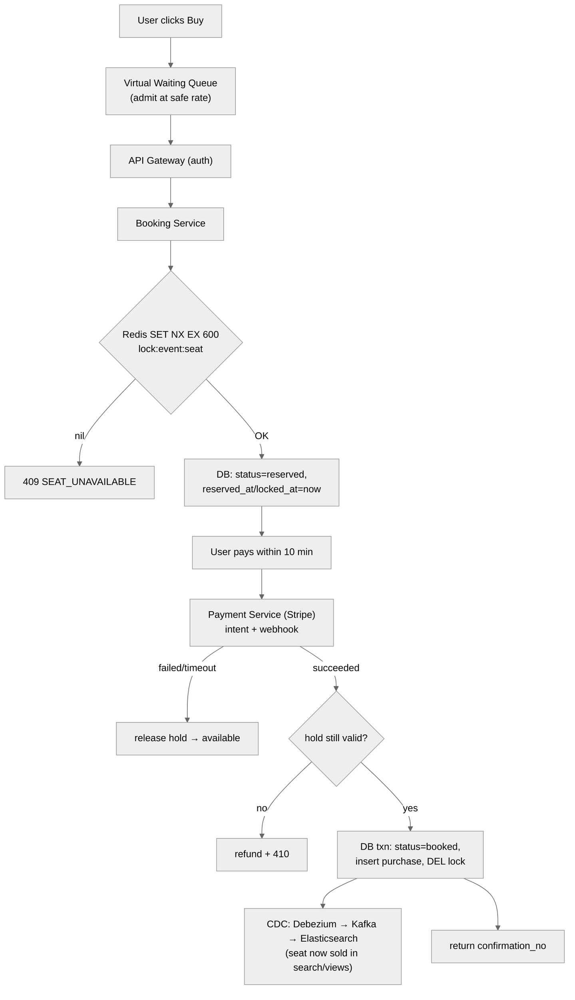

**Read/search data flow:** `User → LB → API Gateway → Search Service → Elasticsearch` (kept fresh by CDC from the source DBs); `User → Event Service → Redis cache (hit) / read replica (miss)` for event details, with **live seat status** streamed via SSE (§14).

---

## B9. Scalability & Bottlenecks

| Pressure point | Symptom | Mitigation |
|---|---|---|
| **Hot event contention** | Millions fight for one event's seats | Virtual waiting queue (§15) + shard booking by event→section (§12) |
| **Distributed lock hot key** | One seat/lock hammered | Section-level sharding; queue serializes per section; short critical section |
| **Read flood on popular events** | Event page requested millions of times | CDN + Redis hot-event cache + read replicas (§17) |
| **Search latency** | `LIKE` scans on primary DB | Elasticsearch inverted index + geo; never search the booking DB (§13) |
| **Primary DB write ceiling** | Booking writes bottleneck | Small write volume overall; replicas offload reads; shard by event only if a single event exceeds one node |
| **Seat-map fan-out** | Pushing every change to every viewer | Debounce/batch SSE updates (~1s diffs); only stream to active viewers (§14) |
| **Payment latency/failure** | External provider slow/down | Two-phase design (hold ≠ charge); async webhooks; idempotency keys; release on failure (§16) |

**Scaling strategy in one line:** scale reads **horizontally** (cache + replicas + ES); scale the contended write path by **reducing contention** (queue + section sharding + system-allocated seats), not by brute-force servers — the bottleneck is a single event's inventory, which doesn't parallelize past its seat count.

---

## B10. Failure Modes & Mitigation

| Failure | Impact | Mitigation |
|---|---|---|
| **Double-booking** (the cardinal sin) | Two users, one seat | Atomic acquire (Redis `NX` / `UPDATE…WHERE status=available` / `SELECT FOR UPDATE`); ACID confirm txn |
| **Reservation never released** | Seat stuck forever | Redis TTL auto-expiry (§9) **and** `locked_at`/`reserved_at` derived expiry (§8, §10) as backstop |
| **Lock expires mid-payment** | Charged but seat gone | Re-validate hold on confirm; refund + `410` if lost; keep hold ≫ payment time |
| **Redis (lock store) down** | No new locks | Redis cluster/replication + Redlock; seat-row timestamp keeps DB truth so no corruption |
| **DB deadlock** | Seat available to no one | Lock rows in consistent order, short txns, lock timeouts (§11) |
| **Payment webhook lost** | Booking stuck pending | Reconcile via provider polling; idempotency keys; timeout → release |
| **Search/ES stale or down** | Missing/late events in search | Search is AP — degrade gracefully; CDC replays from Kafka to catch up |
| **Surge overload** | Cascading failure | Virtual waiting queue rate-limits at the source (§15); autoscale stateless services |
| **CDC pipeline lag** | Search shows sold seats as free | Acceptable (eventual); reserve step re-checks truth in DB → user gets `409` not a bad sale |

---

## B11. Alternative Designs / Trade-off Comparison

| Decision | Option A | Option B | When to pick which |
|---|---|---|---|
| **Expiry mechanism** | Redis lock + TTL (eager, auto) | `locked_at`/timestamp query filter (lazy) | High surge → Redis TTL; simplicity/one-store → `locked_at` (BookMyShow). Best: both. |
| **Concurrency control** | Pessimistic lock (Redis/`FOR UPDATE`) | Optimistic (version/timestamp) | Hot seats → pessimistic; cold seats (rare conflict) → optimistic (Exponent mock). |
| **Contention handling** | Distributed lock per seat | Sharded queues (by event→section) | Moderate → lock; mega-event surge → queues + waiting room. |
| **Expiry cleanup** | Cron sweep job | Lazy query-time filter | Never prefer cron for hot inventory (delta-lag + scans); lazy/TTL wins. |
| **Event metadata store** | Cassandra (HA, write-optimized) | Postgres (relational) | Low-stakes; Cassandra pairs with ES for reads (Bunny); Postgres fine too. |
| **Booking store** | Postgres/MySQL (ACID) | NoSQL | Always relational/ACID for booking — non-negotiable. |
| **Search** | Elasticsearch (index + geo) | `LIKE` on primary DB | Always ES if low-latency free-text is required. |
| **Search sync** | CDC (Debezium→Kafka) | Dual-write / periodic reindex | CDC for reliability + freshness; dual-write risks divergence. |
| **Live seat map** | SSE (unidirectional) | WebSockets / short poll | SSE ideal (one-way); WebSockets overkill; short poll = fallback. |
| **Seat selection** | User picks exact seat | System-allocated (IRCTC) | Assigned seats kill contention + fragmentation when product allows. |
| **Surge** | Virtual waiting queue | Pure autoscaling | Queue rate-limits at source; autoscaling can't beat single-event inventory contention. |

---

## B12. Interview Q&A

**Conceptual**

<details>
<summary><strong>Q: How do you prevent double-booking?</strong></summary>

Make the "check availability → mark reserved" step **atomic** — Redis `SET NX` (one winner), or `UPDATE seats SET status='reserved' WHERE seat_id=? AND status='available'` (0 rows = you lost), or `SELECT … FOR UPDATE` in a transaction. Never do a separate read then write. Finalize with an ACID `confirm` transaction that re-checks the hold.
</details>

<details>
<summary><strong>Q: How does a 10-minute hold expire if the user disappears?</strong></summary>

Best: **Redis key with `EX 600`** — it self-deletes, no job. Backstop: store `locked_at`/`reserved_at` on the row and treat `now − locked_at > 10m` as available at query time (§10). Cron sweeps work but lag and scan.
</details>

<details>
<summary><strong>Q: Why two phases (reserve then confirm)?</strong></summary>

To decouple **securing the seat** (fast, internal, must be consistent) from **taking payment** (slow, external, can fail). Holding a DB lock across payment latency would throttle inventory; charging before securing causes refunds on races.
</details>

**Senior**

<details>
<summary><strong>Q: A single event gets 10M users in a minute — what breaks and how do you fix it?</strong></summary>

The single event's contended seat rows/locks can't parallelize past its seat count, so brute-force autoscaling fails. Put a **virtual waiting queue** (Redis sorted set / Kafka) in front to admit users at a safe rate, and **shard booking by event→section** so non-conflicting sections process in parallel. Cache the read path hard so only genuine buyers reach the write path.
</details>

<details>
<summary><strong>Q: Redis holds the lock but Redis fails — do you double-book?</strong></summary>

No, if the seat row also carries a timestamp/version: the ACID **confirm** transaction re-validates against the DB (source of truth). Use Redis cluster/Redlock for availability; the DB check prevents corruption even during Redis failover.
</details>

<details>
<summary><strong>Q: How do you keep search fast and fresh without dual-writes?</strong></summary>

Elasticsearch for the query side; **CDC (Debezium tails the DB WAL → Kafka → ingestion → ES)** so the app writes once to the DB and search updates follow reliably, with replay if the pipeline lags.
</details>

**Staff**

<details>
<summary><strong>Q: Optimistic vs. pessimistic locking — where's the boundary?</strong></summary>

Per-seat conflict probability. Cold inventory (most seats) → **optimistic** (no lock, cheap, retry on the rare conflict). Hot inventory (popular sections) → **pessimistic** or **queue-serialized**, because optimistic retries would storm. You can even choose per-section dynamically based on demand.
</details>

<details>
<summary><strong>Q: How do you make on-sales fair, not just fast-network-wins?</strong></summary>

Replace pure FIFO with a **lottery** among everyone present in the first N seconds, or weight by account age/verification to fight bots. It's a product trade-off between fairness and simplicity.
</details>

<details>
<summary><strong>Q: Multi-region — how do you avoid double-booking across regions?</strong></summary>

Pin each event's inventory to a **home region** (single writer for that event's seats) so the strong-consistency invariant stays local; replicate read views globally (eventual). Cross-region strong consistency for one event isn't needed if the event lives in one region.
</details>

**Behavioral (STAR)**

<details>
<summary><strong>Q: Tell me about a time you handled a high-contention concurrency bug.</strong></summary>

**S:** A booking-like feature double-allocated under load. **T:** Guarantee one-owner-per-resource without tanking throughput. **A:** Replaced read-then-write with a single atomic conditional update + short Redis lock with TTL; added idempotency keys; load-tested the surge. **R:** Double-allocation went to zero; p99 stayed flat under 10× load. **Lesson:** make the critical section atomic and short; push expiry into the datastore.
</details>

---

## B13. Quick Revision (cheat sheet + ~2 page deep revision)

### B13.1 One-glance cheat sheet

```
PROBLEM: search → view seat map → reserve (10-min hold) → pay → booked
INVARIANT: no double-booking (one seat → one user), enforced instantly
TRAFFIC: reads ≫ writes (~1000:1); surge = 166K req/s onto ONE event

CAP SPLIT:  booking = CP (strong consistency)   |   search/view = AP (eventual OK)

CORE FLOW (2-phase):
  reserve → Redis SET NX EX 600 (atomic + auto-expire) → status=reserved
  confirm → re-validate hold → charge (Stripe webhook) → txn: status=booked

EXPIRY (5 ways): timestamp+filter | cron(lag) | REDIS TTL⭐ | DB row-lock | optimistic(version)
RACES (4): read-modify-write | simultaneous | non-atomic | double-booking
  fix = atomic check-and-set (pessimistic) OR version check (optimistic) + ACID confirm

SURGE: virtual waiting queue (Redis zset / Kafka) → shard booking by event→section
SEARCH: Elasticsearch (inverted index + geo) ← CDC (Debezium→Kafka) from source DB
LIVE MAP: SSE (unidirectional) w/ batched diffs
STORES: booking=Postgres/MySQL(ACID) | metadata=Cassandra or PG | locks+cache=Redis
CACHE: CDN(static) + Redis(hot events) + read replicas + selective indexes
GUEST: mint user_id, NULL username/pw; retrieve by confirmation_no
```

### B13.2 Two-page deep revision

**What & why hard.** Users search events, view a seat map, and book a seat. Booking looks simple but carries a hard correctness invariant (**no double-booking**), a two-phase flow with a **timer** (reserve then pay; abandoned holds must auto-free), an **extreme spiky** traffic pattern (millions onto one event), and a **read-heavy** overall profile (~1000:1). A 5th real-world wrinkle: **guest checkout**.

**Requirements.** Functional: search, view, book (+ optional accounts/guest, refunds). Non-functional: strong consistency for booking, high availability for browse, ~1000:1 read:write, survive surges, low-latency search. The senior framing is the **CAP split**: booking is CP, search/view is AP — they coexist because they're different sub-systems.

**Capacity.** 10M DAU × 10 reads = 100M reads/day (~1.2K avg, ~11.5K peak QPS). 1% conversion → 100K bookings/day (~1.2 write QPS avg). But the **design driver** is per-event surge: ~166K req/s (DAU-first) or ~1,600 write ops/s onto one event sold out in <10 min (inventory-first). Storage ~60GB → one Postgres box + replicas; no capacity sharding; bandwidth trivial. The tension: tiny average writes, enormous single-event contention.

**APIs.** `GET /events/search`, `GET /events/{id}`, `POST /bookings/reserve` (→ booking_id + expires_at, or 409), `POST /bookings/confirm` (→ confirmation_no, or 410). `user_id` from the auth token, never the body. Two calls to split "secure seat" from "take money."

**Architecture.** LB → API Gateway → three services: **Search** (→ Elasticsearch), **Event** (→ Redis cache + metadata store), **Booking** (→ Redis lock + ACID DB + payment). CDC (Debezium → Kafka) syncs source DBs into Elasticsearch. Read path is AP + cached; write path is CP.

**Data model.** Relational: events, venues, performers, **seats** (hot table: status enum 0/1/2, `locked_at`, `version`, `user_id`), users (NULL creds = guest), purchases (separated for multi-seat + refunds), card info isolated. Booking store = Postgres/MySQL (ACID); metadata = Cassandra or PG (low-stakes).

**The crux — booking correctness.** Prevent double-booking with an **atomic** acquire: Redis `SET NX EX 600` (wins the race *and* sets the 10-min auto-expiry in one primitive), or `UPDATE … WHERE status='available'`, or `SELECT FOR UPDATE`. Expiry has 5 known approaches — the winner is **Redis TTL** for the hold plus a **`locked_at`/`reserved_at` timestamp** on the row so the DB is self-consistent (BookMyShow's lazy `now − locked_at > 10m` needs no cron at all). Finalize with an ACID **confirm** transaction that re-validates the hold, charges via Stripe (async webhook + idempotency key), flips to booked, releases the lock. Races to name: read-modify-write, simultaneous, non-atomic, double-booking; deadlocks are the trap (lock in consistent order, keep txns short).

**Surviving surge.** A single hot event can't be solved by autoscaling (its inventory doesn't parallelize past seat count). Put a **virtual waiting queue** (Redis sorted set / Kafka) in front to admit buyers at a safe rate, then **shard booking by event → section** so non-conflicting sections run in parallel; a global FIFO queue fails (SPOF + unbounded). **System-allocated seats** eliminate per-seat contention when the product allows.

**Search & live map.** Elasticsearch (inverted index + geo via geohash/quad-tree) for fast free-text; kept fresh by **CDC**, not dual-writes. The live seat map is pushed via **SSE** (unidirectional), with batched ~1s diffs to control fan-out.

**Read scaling.** CDN for static assets + Redis for hot events (LRU) + read replicas + selective indexes. Split the **static event shell** (cache hard) from **live seat status** (don't over-cache).

**Failure modes.** Double-booking (atomic acquire + ACID confirm), stuck holds (TTL + timestamp backstop), lock-expired-mid-payment (re-validate + refund), Redis down (cluster/Redlock + DB truth), deadlocks (ordered locking), lost webhook (reconcile + idempotency), surge (waiting queue). Say the invariant out loud: **one seat, one owner, always.**

---

## B14. FAANG Top 20 Most Frequently Asked Questions

Each answer is a self-contained mini-essay (≥5 lines) so you can revise from this section alone.

<details>
<summary><strong>1. How do you guarantee a seat is never double-booked?</strong></summary>

Double-booking happens because "check availability → mark booked" is two steps, and two users can both pass the check before either marks. The fix is to make the check-and-mark a **single atomic operation**: Redis `SET lock:seat NX EX 600` (only one caller gets `NX`), or a conditional `UPDATE seats SET status='reserved' WHERE seat_id=? AND status='available'` (0 rows affected means you lost), or `SELECT … FOR UPDATE` inside a transaction. Then the final **confirm** runs as an ACID transaction that re-validates the hold before flipping to `booked`. The invariant — one seat, one owner — must hold even under 166K req/s, so the atomic primitive is non-negotiable; everything else is optimization around it.
</details>


<details>
<summary><strong>2. Why a two-phase (reserve then confirm) design instead of a single "buy"?</strong></summary>

Payment is external, slow, and can fail, while securing a seat must be fast and strongly consistent. A single "buy" call forces a bad choice: either hold a DB lock across the entire payment round-trip (throttling inventory on payment latency, disastrous under surge) or charge before securing the seat (refund hell when users lose the race). Two-phase decouples them: **reserve** takes a fast internal lock with a 10-minute TTL, **confirm** does the slow external charge and only then finalizes. The cost is needing an **expiry mechanism** for abandoned holds — which is why expiring reservations is such a central deep dive.
</details>


<details>
<summary><strong>3. How does a 10-minute hold expire when the user just disappears?</strong></summary>

Five approaches exist. The cleanest is a **Redis key with `EX 600`** that self-deletes — no background job, no lag, and the same `NX` that expires also won the race. As a durable backstop, store a **`locked_at`/`reserved_at` timestamp** on the seat row and treat a seat as available when `now − locked_at > 10 min` at query time (BookMyShow's lazy method needs no cron at all). A **cron sweep** works but lags by up to its interval and scans the table. Combining Redis TTL (eager) with a row timestamp (lazy, durable) gives both precision and correctness if Redis is lost.
</details>


<details>
<summary><strong>4. What are the race conditions, precisely, and how do you defeat each?</strong></summary>

Four: (a) **read-modify-write** — both users read "available" before either writes; (b) **simultaneous requests** — the first reservation isn't finished when the second starts; (c) **non-atomic concurrency** — the multi-step operation interleaves; (d) **double-booking** — the unacceptable outcome. All share a root cause (non-atomic check-then-act) and a root fix: make the critical section atomic via pessimistic locking (Redis `NX`, `SELECT FOR UPDATE`) or optimistic locking (version/timestamp check on write). The final flip runs in an ACID transaction so a mid-way failure rolls back and never strands a seat.
</details>


<details>
<summary><strong>5. Redis holds the lock — what happens if Redis dies?</strong></summary>

Availability of the lock service is protected with **Redis cluster/replication**, and stronger guarantees can use **Redlock** across independent nodes. Correctness, though, doesn't depend on Redis alone: because each seat row also carries a `status` + timestamp/`version`, the ACID **confirm** transaction re-validates against the database (the true source of truth) before selling. So even during a Redis failover, the worst case is a seat briefly considered locked (freed by the timestamp rule) — never a double-sale. This "Redis for speed, DB for truth" split is the senior-level answer.
</details>


<details>
<summary><strong>6. How do you survive a Taylor-Swift-scale on-sale (millions on one event)?</strong></summary>

A single event's contended seat rows and locks can't parallelize beyond its seat count, so brute-force autoscaling just relocates the contention. The answer is a **virtual waiting queue** (Redis sorted set or Kafka) in front of the booking flow that admits users at a rate the backend can absorb, converting a 166K/s spike into a smooth bounded stream and giving users a fair position instead of random errors. Behind it, **shard booking by event → section** so non-conflicting sections process in parallel, and cache the read path hard so only genuine buyers reach the write path.
</details>


<details>
<summary><strong>7. Why shard queues by event and then by section?</strong></summary>

A single global FIFO queue serializes everything (no races) but is a single point of failure, grows unbounded under surge, and has no parallelism — unusable at scale. Sharding by `event_id` lets different events process in parallel while preserving per-event ordering, but a single mega-event still lands entirely on one queue. Sharding **within** the event by section/seat-block (`hash(event_id, section) % N`) spreads even one huge event across many consumers, because users buying in different sections never conflict. You serialize exactly where contention exists (same section) and nowhere else.
</details>


<details>
<summary><strong>8. How do you keep search both fast and highly available?</strong></summary>

Searching the primary booking DB with `LIKE` is slow (no efficient free-text, full scans) and dangerously loads the write-critical store. Instead, use **Elasticsearch**, which builds an inverted index (term → matching event_ids) for near-instant free-text and supports **geo** queries (events near me) via geohashing/quad-trees. Search is on the **AP** side, so eventual consistency is fine — a new event appearing a few seconds late is acceptable. This isolation means a search outage never touches booking, and vice-versa.
</details>


<details>
<summary><strong>9. How does Elasticsearch stay in sync with the source of truth?</strong></summary>

Dual-writing to both the DB and Elasticsearch is fragile — if the second write fails, they diverge. **Change Data Capture** solves it: **Debezium** tails the database's write-ahead log, emits every insert/update onto **Kafka**, and an ingestion job consumes those to update Elasticsearch. The application writes **once** (to the DB); search updates follow automatically and reliably, with Kafka providing replay if the pipeline lags. This same pipeline propagates seat-status changes (a booking decrements availability → CDC → search reflects "sold out" shortly after).
</details>


<details>
<summary><strong>10. How do you show a live seat map without hammering the server?</strong></summary>

Users on a hot event need the map to update as seats are taken, or they'll click stale seats and hit errors. Options are short polling (simple but wasteful and stale), **long polling** (request held open until an update — near-real-time, works everywhere), and **SSE (Server-Sent Events)**, a one-way server→client stream over a single HTTP connection — ideal here because the seat map is unidirectional (user actions go through normal REST calls). WebSockets are overkill. To control fan-out on popular events, **batch/debounce** updates into ~1-second diffs and stream only to users actually viewing that event.

**What "batch/debounce" means, and why you need it (detailed).** On a popular event, two numbers multiply into a disaster: seats change *very fast* (hundreds of reserve/book actions per second) and *very many people* are watching the map (say 50,000 viewers on one event page). The naive approach is to push **one message per seat change to every viewer**. Do the math: if 200 seats change in one second and 50,000 people are watching, that's 200 × 50,000 = **10,000,000 messages per second** for a single event — your servers melt, and users' browsers can't even repaint that fast. Batching and debouncing are two related techniques to collapse that flood.

- **Batching** = *combine many changes into one message.* Instead of sending seat 45, then seat 46, then seat 47 as three separate pushes, you accumulate them and send **one** message containing all three: `{45:booked, 46:reserved, 47:booked}`.
- **Debouncing** = *wait a short, fixed window before sending, so changes that arrive during the window get grouped.* You set a ~1-second timer; every change that happens in that second is collected, and when the timer fires you send the single batched diff, then start a fresh window.

**Concrete example with a timeline.** Imagine one second of activity on the Coldplay map:

```
t=0.02s  seat 45 → booked
t=0.30s  seat 46 → reserved
t=0.55s  seat 45 → (reserved hold expired) → available
t=0.80s  seat 88 → booked
--- 1-second debounce window closes at t=1.00s ---
ONE message sent to all 50,000 viewers:
   { 46: reserved, 88: booked, 45: available }
```

Notice two wins beyond raw batching: (1) seat 45 changed **twice** in the window (booked, then freed), but only its **final** state (`available`) is sent — the intermediate flip is dropped, because clients only care where things *end up*, not every twitch in between. (2) Instead of 4 separate messages × 50,000 viewers = 200,000 pushes, you send **1 message × 50,000 = 50,000 pushes** for that second — and each push is a tiny diff, not the whole seat map. The cost is that a viewer sees a change up to ~1 second late, which is completely fine for a seat map (a human can't act faster than that anyway). The **"stream only to users actually viewing that event"** part is the other half: you don't push Coldplay's diffs to someone browsing a comedy show — you only maintain the SSE stream for clients currently on *that* event page, so the 50,000 multiplier never applies to unrelated users.
</details>


<details>
<summary><strong>11. Which database for booking, and why relational?</strong></summary>

Booking requires ACID transactions and row-level locking to enforce the no-double-booking invariant, so a relational store — **Postgres or MySQL** — is the right and effectively non-negotiable choice. The transaction wraps "check availability → reserve → record booking" into one all-or-nothing unit; `SELECT … FOR UPDATE` gives pessimistic row locks; and consistency guarantees mean a failed step rolls back cleanly, never stranding a seat. The dataset is small (~60 GB), so a single well-provisioned primary with read replicas handles it without capacity sharding.
</details>


<details>
<summary><strong>12. Which database for event metadata, and how firm is that choice?</strong></summary>

This is a **low-stakes** decision you should flag as such. Cassandra is a reasonable pick — it's highly available and write-optimized — but it is **not read-optimized**, so it's paired with Elasticsearch for the actual read/search queries. Postgres also works fine given the modest data size. The interview signal is recognizing that the metadata store's exact identity barely affects the design (unlike the booking store), stating the trade-off (Cassandra HA/writes vs. Postgres relational simplicity), and moving on rather than over-investing.
</details>


<details>
<summary><strong>13. Optimistic vs. pessimistic locking — when do you use each?</strong></summary>

Pessimistic locking (Redis `NX` lock or `SELECT FOR UPDATE`) grabs the seat before touching it — best for **hot** seats where conflicts are likely, at the cost of holding a lock and deadlock risk if sloppy. Optimistic locking adds a `version`/timestamp and only commits if it hasn't changed since read, rejecting losers who must retry — best for **cold** seats where conflicts are rare, since retries are cheap when uncommon. The Exponent mock named the exact downside of optimistic locking on hot seats: the unlucky user keeps getting conflicts and gives up. Ideally choose per-section based on demand.
</details>


<details>
<summary><strong>14. How do you handle guest checkout without an account?</strong></summary>

Rather than a separate anonymous-purchase code path, **always mint a `user_id`** and, for guests, leave `username`/`password` **NULL**. The booking is retrieved later via a unique **confirmation number** emailed to them (the same pattern airlines use for a booking reference), looked up through `GET /bookings/{confirmation_no}`. This keeps one uniform schema and lets a guest later "claim" the account by setting credentials on the same row. Payment info can still be associated to that user_id for the session, and a separate purchases table keeps their order retrievable.
</details>


<details>
<summary><strong>15. Why separate a `purchases` table from the `seats` table?</strong></summary>

Folding purchase/payment data into the seat row conflates inventory state with money records and blocks natural multi-seat and refund flows. A separate **purchases** table (user_id, event_id, seat_id(s), amount, card_ref, confirmation_no) lets one user buy **multiple seats** in one order, supports **refunds** by marking a purchase without disturbing seat geometry, and enables **guest retrieval** by confirmation number. Card details go in their own table for **PCI isolation**. This normalization was exactly the Exponent mock's reason for adding the table.
</details>


<details>
<summary><strong>16. What's your caching strategy given the ~1000:1 read:write ratio?</strong></summary>

Layer caches cheapest-first: a **CDN** serves static assets (event images, venue seat-map geometry, descriptions) at the edge; **Redis** caches hot events (LRU) so a page requested millions of times is served from memory; **read replicas** offload event-detail reads from the write primary; and **selective indexes** speed frequent filter queries (but cost space and slow writes, so index judiciously). Crucially, **split the static event shell (cache hard) from live seat status (don't over-cache)** — caching availability risks showing sold seats as free.
</details>


<details>
<summary><strong>17. How do you avoid showing a seat as available after it's been sold?</strong></summary>

Seat status changes second-to-second, so it's the one thing you must not aggressively cache. Three tactics: don't cache status at all (read it live from the seat store), cache it with a very short TTL, or push status changes via **SSE** and cache only the static shell. Even if a stale view slips through (e.g., CDC lag makes search briefly show a sold seat as free), the **reserve** step re-checks the true DB state and returns a `409` — so the user gets a clean "seat gone" message rather than a bad sale. Correctness is enforced at the write, not the read.
</details>


<details>
<summary><strong>18. How does the payment integration work end-to-end?</strong></summary>

On **confirm**, the Booking Service creates/confirms a **payment intent** with the provider (Stripe); card authentication (e.g., 3-D Secure) may happen client-side; and the definitive result usually arrives **asynchronously via a webhook** (`payment_succeeded`/`payment_failed`). On success, the service **re-validates the hold** (the lock may have lapsed), then in one transaction flips the seat to `booked` and writes the purchase, returning a confirmation number. An **idempotency key** prevents double-charges on retries or duplicate webhooks; on failure or timeout the hold is released so the seat returns to available.
</details>


<details>
<summary><strong>19. How do you handle expiry cleanup at scale — cron vs. lazy vs. TTL?</strong></summary>

A **cron sweep** (find `reserved` rows older than 10 min, reset them) keeps the table tidy but suffers **delta-lag** (a seat can stay falsely locked up to the job interval) and costs full-table scans — bad during a sell-out. The **lazy** method stores `locked_at` and derives availability at query time (`status=open OR now − locked_at > 10m`), avoiding jobs and lag entirely, at the cost of every reader applying the rule. **Redis TTL** expires keys automatically with no job and no lag. Best practice is Redis TTL for the active hold plus the row timestamp as a durable, self-consistent backstop.
</details>


<details>
<summary><strong>20. What are the main bottlenecks and how do you scale each?</strong></summary>

The read path scales **horizontally** — CDN + Redis hot-event cache + read replicas + Elasticsearch absorb the ~1000:1 read dominance. The write path is tiny in average QPS but bottlenecks on **single-event contention**, which you scale by **reducing** contention, not adding servers: a virtual waiting queue rate-limits at the source, section-level queue sharding parallelizes non-conflicting bookings, and system-allocated seats remove per-seat fights entirely. Secondary bottlenecks — search latency (ES), seat-map fan-out (batched SSE), payment latency/failure (two-phase + async webhooks), and DB deadlocks (ordered short transactions) — each have a targeted mitigation. The one-liner: **scale reads with copies, scale writes by removing contention.**
</details>


---

> 📌 **Final note.** This guide was built from four interview transcripts (Hello Interview / Ticketmaster, a live BookMyShow design, the "interview with Bunny" session, and the Exponent Ticketmaster mock) and enriched with the standard internals interviewers expect. Every major approach from all four — Redis TTL locks, BookMyShow's `locked_at` lazy expiry, cron sweeps, optimistic/pessimistic locking, ACID transactions, sharded queues, system-allocated seats, Elasticsearch + CDC, SSE seat maps, virtual waiting queues, Stripe webhooks, guest checkout, and the full relational schema — is represented above with its trade-offs.
