# URL Shortener (TinyURL) — System Design Study Guide

> A self-contained learning + revision guide for FAANG / top product-company system design interviews.
> Built from video transcripts on designing a TinyURL / URL-shortener service, then **faithfully enriched** with the internals, trade-offs, and edge cases that interviewers probe at mid / senior / staff level.
> You should be able to learn this topic from zero using only this document.

---

## Table of Contents

**Part A — Learn the concept from zero**

1. [What Is a URL Shortener & Why It Exists](#1-what-is-a-url-shortener--why-it-exists-)
2. [How It Works End-to-End (Mental Model)](#2-how-it-works-end-to-end-mental-model-)
3. [Functional & Non-Functional Requirements](#3-functional--non-functional-requirements-)
4. [Capacity Estimation (full math)](#4-capacity-estimation-full-math-)
5. [API Design (create + redirect)](#5-api-design-create--redirect-)
6. [The Core Problem: Collisions](#6-the-core-problem-collisions-)
7. [Attempt 1 — Random Strings](#7-attempt-1--random-strings-)
8. [Attempt 2 — Hashing (MD5 / SHA-1)](#8-attempt-2--hashing-md5--sha-1-)
9. [Attempt 3 — Generate-Then-Check (collision retry)](#9-attempt-3--generate-then-check-collision-retry-)
10. [Attempt 4 — Counter + Base62 (the winner)](#10-attempt-4--counter--base62-the-winner-)
11. [Base62 Encoding — Deep Dive with Worked Examples](#11-base62-encoding--deep-dive-with-worked-examples-)
12. [Distributed Unique ID Generation](#12-distributed-unique-id-generation-)
    - 12.1 Single DB auto-increment
    - 12.2 Ticket Server
    - 12.3 Snowflake (Twitter)
    - 12.4 Zookeeper range allocation (chosen)
13. [Caching & the 301 Redirect](#13-caching--the-301-redirect-)
14. [Database Selection (SQL vs NoSQL)](#14-database-selection-sql-vs-nosql-)

**Part B — Interview template (the 15 required sections)**

1. [Problem Statement & Clarifying Questions](#b1-problem-statement--clarifying-questions-)
2. [Requirements](#b2-requirements-)
3. [Capacity Estimation](#b3-capacity-estimation-)
4. [API / Interface Design](#b4-api--interface-design-)
5. [High-Level Architecture](#b5-high-level-architecture-)
6. [Data Model / Schema](#b6-data-model--schema-)
7. [Deep Dive Modules](#b7-deep-dive-modules-)
8. [Data Flow Diagram](#b8-data-flow-diagram-)
9. [Scalability & Bottlenecks](#b9-scalability--bottlenecks-)
10. [Failure Modes & Mitigation](#b10-failure-modes--mitigation-)
11. [Alternative Designs / Trade-off Comparison](#b11-alternative-designs--trade-off-comparison-)
12. [Interview Q&A (mid / senior / staff / behavioral)](#b12-interview-qa-)
13. [Quick Revision (cheat sheet + ~2 page deep revision)](#b13-quick-revision-cheat-sheet--2-page-deep-revision-)
14. [FAANG Top 20 Most Frequently Asked Questions](#b14-faang-top-20-most-frequently-asked-questions-)

---

# 🎓 Part A — Learn the Concept From Zero

## 1. What Is a URL Shortener & Why It Exists 🔗

A **URL shortener** (also called a *tiny URL service*) does exactly what the name suggests: it takes a long, ugly web address and returns a short, neat alias that redirects to the original.

```
Long URL : https://www.example.com/articles/2026/06/system-design/url-shortener?ref=newsletter&utm=abc
Short URL: https://tinyurl.com/3xR9aQ
```

Both links open the **same page**. The short one is just an alias the service knows how to translate back.

**Real-world example from the transcript:** when you paste a long URL into a LinkedIn post, LinkedIn automatically replaces it with a shortened `lnkd.in/...` link. Clicking either the original or the shortened version opens the same destination. TinyURL.com is the other classic example — it exposes a `POST` API where you submit a long URL, it computes a short URL, stores the mapping in its DB, and returns the short URL.

**Why shorten URLs at all?** Three concrete motivations called out in the source:

1. **Easy to share.** Long URLs are cumbersome and error-prone to copy, paste, or read aloud. A short URL is clean and memorable.
2. **Character limits.** On platforms like Twitter/X where every character counts, a short URL frees up space for your actual message and hashtags.
3. **Clean & professional.** In emails and documents a short link looks tidier, improves readability, and leaves a better impression.

**Enrichment — other reasons used in practice:**

- **Click analytics.** The redirect hop is a natural place to record who clicked, when, from where, on what device. This is the real business model of commercial shorteners (Bitly, etc.).
- **Link management.** A short link can be re-pointed to a new destination later without reprinting it (useful on physical media / QR codes).
- **Branding & trust.** Custom domains (`brand.co/sale`) increase click-through and trust.
- **Cross-channel tracking.** UTM-laden long URLs get hidden behind a clean alias.

> 💡 **Interview framing:** Don't just say "it makes URLs shorter." Anchor on the *redirect* being the product surface — it's where availability, latency, and analytics all live.

---

## 2. How It Works End-to-End (Mental Model) 🎯

There are exactly **two operations**, and almost the entire design follows from them:

- **Write path (create):** client submits a long URL → service generates a unique short code → stores `shortURL → longURL` → returns the short URL.
- **Read path (redirect):** client requests the short URL → service looks up the long URL → responds with an HTTP redirect → browser opens the long URL.

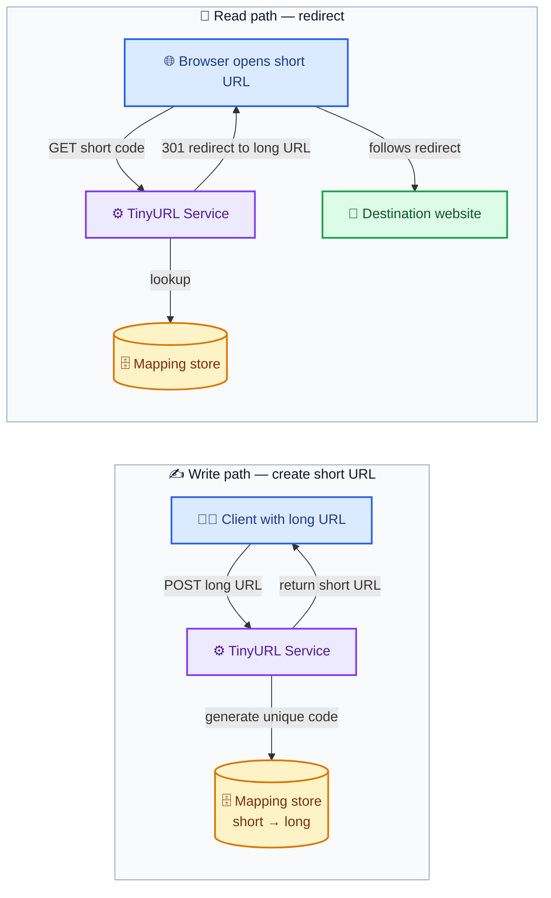

ASCII version of the same mental model:

```
CREATE                                   REDIRECT
------                                   --------
client --POST longURL--> service         browser --GET /abc123--> service
service --generate code--> store         service --lookup--> store
service --return shortURL--> client      service --301 + longURL--> browser
                                         browser --follow--> destination site
```

Everything hard about this problem hides inside **"generate a unique short code"** — that single step is what the bulk of this guide is about.

---

## 3. Functional & Non-Functional Requirements 📋

### Functional requirements (the must-have features)

Functional requirements describe *what the system must do*.

1. **Generate a short URL.** Given a long URL as input, return a shorter version. This is the core function — without it there's no product.
2. **Retrieve the long URL.** Given a short URL, return (and redirect to) the original long URL. Users still need to reach the real page, so the short code must be reversible into the full URL.

**Enrichment — features an interviewer may add as follow-ups:**

- **Custom aliases / vanity URLs** (`tinyurl.com/my-brand`).
- **Link expiration / TTL** (auto-delete after N days).
- **Analytics** (click counts, geo, referrer).
- **User accounts** to manage owned links.
- **Deletion / editing** of links.

State explicitly which of these are *in scope*. For the canonical interview, scope = create + redirect; the rest are "nice to have, mention but defer."

### Non-functional requirements (the qualities)

| Requirement | What it means | Why it matters |
|---|---|---|
| **High availability** | Up ~all the time; target stated as "99.99999%" uptime | If the service is down, **every** existing short link breaks — far worse than a normal outage because links live in emails, tweets, printed media |
| **Low latency** | Respond to requests fast, especially redirects | Nobody likes waiting on a click; redirect latency is on the critical path of opening *someone else's* website |
| **Scalability** | Handle millions of users and high traffic without degrading | Used by millions; must scale horizontally |

> 💡 **Reality check on "99.99999%":** the transcript says seven nines. That is **~3 seconds of downtime per year** — effectively unattainable for most systems. In an interview, quote a *defensible* target: **99.99% (four nines ≈ 52 min/yr)** or **99.999% (five nines ≈ 5 min/yr)**, and note that redirects (reads) need higher availability than creates (writes). Showing you know the cost of each extra nine is a senior signal.

**The defining characteristic: this is a read-heavy system.** Reads (redirects) vastly outnumber writes (creates) — we'll quantify this as roughly **40:1** in the next section. Every design decision (caching, replication, DB choice) flows from that ratio.

---

## 4. Capacity Estimation (full math) 📊

> Capacity estimation always starts with **users**, then derives throughput → storage → memory → bandwidth. Analogy from the transcript: before building a restaurant you first ask *how many people will visit*, then decide tables, floors, space.

### Step 1 — Users

| Metric | Value |
|---|---|
| **DAU** (daily active users) | 300 million |
| **MAU** (monthly active users) | 1 billion |

### Step 2 — Throughput (read & write QPS)

**Writes** (only one write op — creating a short URL):

```
Assume 10% of DAU create short URLs        = 10% × 300M           = 30M creators/day
Assume each creator makes 5 short URLs/day = 30M × 5              = 150M writes/day
Write QPS = 150M / 86,400 s                                       ≈ 1,736 writes/sec
```

**Reads** (only one read op — retrieving the long URL):

```
Assume ALL DAU do redirects, 20 each/day   = 300M × 20            = 6,000M = 6 billion reads/day
Read QPS = 6B / 86,400 s                                          ≈ 69,444 reads/sec
```

**Read : Write ratio = 6B : 150M = 40 : 1.** This is the single most important number in the design — it justifies aggressive caching and read replicas.

> `86,400 = 24 × 60 × 60` seconds in a day. Memorize it.

### Step 3 — Storage

#### First, the foundation: how characters become bytes

Before any storage math, you must be able to convert **characters → bytes**, because every URL is just a string of characters and a database stores bytes. The rule:

```
1 ASCII character  = 1 byte  = 8 bits
```

URLs are made of ASCII characters (letters, digits, `/ : . ? & =`), and in the standard ASCII/UTF-8 encoding each of those characters occupies exactly **1 byte**. So the *byte size of a URL ≈ its character count*. (A non-ASCII/Unicode character — e.g., an emoji or accented letter — can take 2–4 bytes in UTF-8, but URLs are percent-encoded to ASCII, so 1 char = 1 byte holds here.)

Worked intuition:

```
"https://google.com"  → 18 characters → 18 bytes
a short code "000frLB" →  7 characters →  7 bytes
```

So when we say "a long URL averages 100 bytes," we mean **the long URL is about 100 characters long** (100 chars × 1 byte/char = 100 bytes).

#### Now, the size of one mapping record

A record stores the long URL + the short URL + some metadata. Converting each field from characters to bytes:

```
Field            Characters (avg)   ×  bytes/char  =  Bytes
---------------------------------------------------------------
Long URL         ~100 chars         ×  1 B/char    =  100 bytes
Short URL        ~30 chars*         ×  1 B/char    =   30 bytes
Metadata         (timestamp, user-id, flags, counters)        70 bytes
---------------------------------------------------------------
TOTAL per record                                  =  200 bytes
```

> \* Our short *code* is only 7 chars, but the stored short URL string also keeps the domain + scheme (`https://tinyurl.com/000frLB` ≈ 27–30 chars), hence ~30 bytes. The 70 bytes of metadata covers an 8-byte timestamp, a user-id, expiry/flags, and a click counter — rounded up for headroom. Net: **200 bytes per mapping**.

#### Storage growth (now just multiply records × bytes)

```
Storage/day  = 150,000,000 writes/day × 200 bytes/record
             = 30,000,000,000 bytes/day
             = 30 GB/day            (÷ 1e9 bytes per GB)

Storage/10yr = 30 GB/day × 365 days × 10 years
             = 109,500 GB
             ≈ 109.5 TB             (÷ 1000 GB per TB)
```

> ⚠️ **Transcript slip to know:** the video says "13 × 365 × 10" — that `13` is a misread of `30` (GB/day). The correct figure is **30 GB/day → 109.5 TB over 10 years**. Always re-derive; don't parrot.

### Step 4 — Memory (cache)

We cache frequently-accessed mappings to avoid slow DB hits. New data is only **30 GB/day**, which is small enough that — at least initially — you could cache an entire day (or the hot working set) in RAM.

```
Cache/day ≈ 30 GB   (fits comfortably in a small Redis cluster)
```

In practice you don't cache *everything* forever — you cache the **hot set**. By the classic **80/20 rule**, ~20% of links drive ~80% of redirects. Cache ≈ 20% of daily reads:

```
Hot working set ≈ 20% × 30 GB ≈ 6 GB/day of fresh hot data  (rule-of-thumb sizing)
```

As the system grows, the cache grows with it (scale Redis horizontally / add memory).

### Step 5 — Bandwidth (ingress & egress)

Bandwidth is just **bytes-per-second crossing the wire**. We already know each record is 200 bytes (from the char→byte breakdown above), and there are 86,400 seconds in a day (`24 h × 60 min × 60 s`). So the recipe is always: `requests/day × bytes/request ÷ 86,400 = bytes/second`.

**Ingress** = data *entering* the system per second (driven by writes — each create pushes one ~200-byte record in):

```
Bytes in/day = 150,000,000 writes × 200 bytes  = 30,000,000,000 bytes = 30 GB/day
Ingress      = 30 GB/day ÷ 86,400 s
             = 30,000,000,000 ÷ 86,400
             ≈ 347,000 bytes/s ≈ 0.35 MB/s     (÷ 1e6 bytes per MB)
```

**Egress** = data *leaving* the system per second (driven by reads — each redirect returns one ~200-byte long URL + metadata):

```
Bytes out/day = 6,000,000,000 reads × 200 bytes = 1,200,000,000,000 bytes = 1.2 TB/day
Egress        = 1.2 TB/day ÷ 86,400 s
              = 1,200,000,000,000 ÷ 86,400
              ≈ 13,800,000 bytes/s ≈ 13.8 MB/s  (÷ 1e6 bytes per MB)
```

> ⚠️ **Transcript slip to know:** the video labels egress "100 GB/day" but then correctly computes **13.8 MB/s**. Those are inconsistent — 13.8 MB/s actually corresponds to **1.2 TB/day** (`6B × 200 B`). The per-second number is right; the daily label is wrong. Egress ≈ **40× ingress**, mirroring the 40:1 read:write ratio.

### Capacity summary table

| Quantity | Value | Derivation |
|---|---|---|
| DAU / MAU | 300M / 1B | given |
| Writes/day | 150M | 30M creators × 5 |
| Reads/day | 6B | 300M × 20 |
| Write QPS | ~1,736 | 150M / 86,400 |
| Read QPS | ~69,444 | 6B / 86,400 |
| Read:Write | 40:1 | 6B : 150M |
| Record size | 200 B | 100+30+70 |
| Storage/day | 30 GB | 150M × 200 B |
| Storage/10yr | 109.5 TB | 30 GB × 365 × 10 |
| Ingress | 0.35 MB/s | 30 GB / 86,400 |
| Egress | 13.8 MB/s (~1.2 TB/day) | 6B × 200 B / 86,400 |

### How many short codes do we even need? (the keyspace question)

A second school of estimation (Transcript 2) sizes the **code length** instead of storage. Given **10M new URLs/day** and a **100-year** lifetime:

```
10M × 365 × 100 = 365,000,000,000 = 365 billion URLs to support
```

With an alphabet of 62 characters (`0-9`, `a-z`, `A-Z`):

```
62^6 = 56,800,235,584      ≈ 56.8 billion   ← too few (< 365B)
62^7 = 3,521,614,606,208   ≈ 3.5 trillion   ← enough (>> 365B)
```

So we need **7 characters**. Six isn't enough; seven gives 3.5 trillion codes — ~10× headroom over the 365 billion we need. This is *why short codes are 7 chars long*.

> **Characters ↔ storage tie-in:** each of those 7 code characters is 1 byte, so the *code itself* is just **7 bytes** on the wire. The reason we obsess over "62 possibilities per character" (not bytes) is that the **alphabet size**, not the byte size, controls how many distinct codes fit in a fixed number of characters: `possibilities = alphabetSize ^ numChars`. Base62 maximizes possibilities-per-character while staying within URL-safe ASCII (1 byte each).

---

## 5. API Design (create + redirect) 💻

An **API** is the contract for client↔server communication. When you click "Shorten," the browser fires an API call to the service.

### 5.1 Create short URL

Because we are **creating** a resource, the HTTP **method is `POST`**, and the **endpoint** identifies *where* to act. Use a **versioned** path (`/v1/...`) — versioning APIs is good practice so you can evolve without breaking clients.

```http
POST /v1/urls
Content-Type: application/json

{
  "longUrl": "https://www.example.com/very/long/path?with=query",
  "customAlias": null,          // optional (enrichment)
  "expiryDate": null            // optional (enrichment)
}
```

Response:

```http
201 Created
{
  "shortUrl": "https://tinyurl.com/000frLB",
  "longUrl":  "https://www.example.com/very/long/path?with=query",
  "createdAt": "2026-06-30T12:00:00Z"
}
```

The long URL to shorten travels in the **request body** (the method/endpoint say *what* and *where*; the body says *which* URL). Analogy from the transcript: to create a user account you'd similarly `POST /v1/users` — `POST` because you're creating, `/v1/users` because that's the target resource.

### 5.2 Retrieve / redirect

To get the long URL back you use **`GET`**, and the **endpoint is the short URL itself** (it's literally what the user typed in the browser). `GET` carries **no body** — it only fetches.

```http
GET /000frLB
```

Response — **a redirect, not a JSON payload**:

```http
301 Moved Permanently
Location: https://www.example.com/very/long/path?with=query
```

> The redirect detail is critical and easy to miss: returning the long URL string to the browser is **not enough**. The browser must *open* that page. The server returns HTTP status **301 (or 302)** with the destination in the `Location` header; the browser sees the redirect status and navigates to the long URL, completing the flow. (301 vs 302 trade-off is covered in §13.)

### API contract summary

| Operation | Method | Endpoint | Body | Success code |
|---|---|---|---|---|
| Create short URL | `POST` | `/v1/urls` | `{ longUrl, ... }` | `201` |
| Redirect | `GET` | `/{shortCode}` | none | `301` / `302` + `Location` |

---

## 6. The Core Problem: Collisions ❌

A **collision** = the same short code maps to two *different* long URLs. This is the central danger of the whole design.

**Worked example from the transcript:**

```
User submits google.com    → system generates tiny.url/ABC   → stored
User submits facebook.com  → system generates tiny.url/ABC   → COLLISION!
```

| Short URL | Long URL |
|---|---|
| tiny.url/ABC | google.com |
| tiny.url/ABC | facebook.com  ← same key! |

Now when someone opens `tiny.url/ABC`, should it go to Google or Facebook? The mapping is ambiguous and the system is broken. **Short codes must be unique.** The next four sections walk the *exact* sequence of attempts the transcript uses to arrive at a collision-free design — this progression is itself a favorite interview narrative.

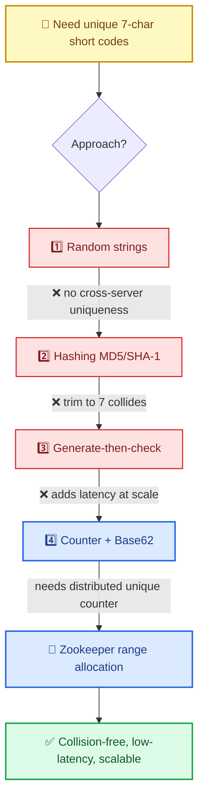

---

## 7. Attempt 1 — Random Strings 🎲

**Idea:** for each new long URL, generate a random 7-char string. Random-string algorithms are designed to produce a new unique string each run, so "no two strings are the same" — collisions avoided.

**Why it fails:** the moment you run on **multiple servers**, uniqueness is no longer guaranteed. Each server generates strings *independently and has no knowledge of strings produced by the others*. Two servers can independently emit the same string → collision returns.

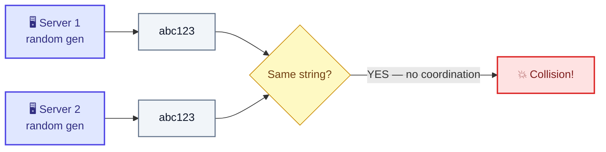

**Verdict:** ❌ Random generation can't guarantee uniqueness across distributed servers. Coordination is the missing ingredient — remember this, it's what Zookeeper later provides.

---

## 8. Attempt 2 — Hashing (MD5 / SHA-1) 🔢

**Idea:** make the code depend on the **input**, not the server. A hash function maps the long URL to a digest. Same input → same output **on any server**, so server-independence is solved. Different inputs → different outputs, so two different long URLs get different hashes.

The two classic hash functions:

| Hash | Bits | Bytes | Hex digits produced |
|---|---|---|---|
| **MD5** | 128 | 16 | **32 chars** |
| **SHA-1** | 160 | 20 | **40 chars** |

> Why 32 hex chars for MD5? A hex digit encodes 4 bits (a *nibble*) — `1,2,4,8` → values 0–15. One byte (8 bits) = 2 hex digits. So 16 bytes × 2 = **32 hex characters**. SHA-1's 20 bytes → **40 hex characters**.

**Why it fails:** the digest is **far longer than 7 characters** (32 or 40 vs our required 7). The obvious fix — **trim to the first 7 characters** — breaks the guarantee:

> MD5 guarantees the *whole* 32-char string is (effectively) unique. It does **not** guarantee the *first 7 characters* are unique. Two different long URLs whose full digests differ only in later positions can share the same first 7 chars → collision.

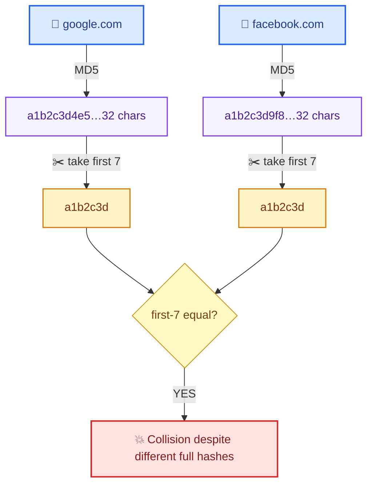

**Verdict:** ❌ Truncating a hash reintroduces collisions. (Untruncated hashes are too long; truncated ones aren't unique.) Also note: hashing is *deterministic* — the same long URL always yields the same code, which is sometimes desirable (dedup) but here can't be made short safely.

---

## 9. Attempt 3 — Generate-Then-Check (collision retry) 🔁

**Idea:** stop trying to *prevent* collisions; **let them happen and handle them**. Generate a random code; check the DB; if it already exists, regenerate and check again until you find a free one.

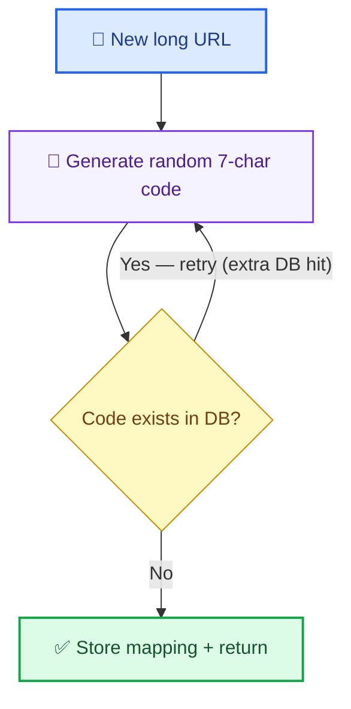

Worked example:

```
google.com    → 14jsMc9   → no collision → stored
facebook.com  → atg9083M  → no collision → stored
instagram.com → 14jsMc9   → COLLISION with google → regenerate
instagram.com → 5ucre71   → no collision → stored
```

**Does it work?** Yes, it produces unique codes. **But it introduces a new problem: latency.** Every potential collision costs an extra **DB read** (to check existence) plus a regeneration. As the system scales and the keyspace fills, collisions become more frequent → more check-and-regenerate cycles → the create path gets slower and slower.

**Verdict:** ❌ Violates the **low-latency** non-functional requirement. The cost grows with scale — exactly when you can least afford it. We need a method that is unique *by construction*, with **no DB check at all**.

---

## 10. Attempt 4 — Counter + Base62 (the winner) ✅

**Idea:** eliminate collisions *by design* using a **monotonic counter**. Assign each new long URL the next integer in a global sequence, then encode that integer into a short string.

```
google.com    → 1
facebook.com  → 2
instagram.com → 3
...
```

Distinct inputs get distinct numbers by definition → **zero collisions, zero DB checks**. Two sub-problems remain, and solving both is the heart of the design:

1. **The number grows → the string grows.** `tiny.url/1`, `tiny.url/1000`, `tiny.url/9876549`… longer and longer in base-10. **Fix → Base62 encoding (§11)** packs large integers into ≤7 characters.
2. **How do you get a *globally unique* counter across many servers** without them handing out the same number? A naive per-server counter (each starting at 1) collides instantly. **Fix → distributed ID generation, specifically Zookeeper range allocation (§12).**


**Verdict:** ✅ Unique by construction, no collision checks, O(1) create latency, codes stay ≤7 chars. This is the design we keep.

---

## 11. Base62 Encoding — Deep Dive with Worked Examples 🔤

**The problem with base-10:** each character is a digit 0–9 — only 10 possibilities per position. Numbers grow long fast (`9876549` is already 7 chars and only ~10 million).

**Base62 idea:** expand the per-character alphabet to **62 symbols**:

```
0-9   → 10 symbols
A-Z   → 26 symbols
a-z   → 26 symbols
-----------------
total → 62 symbols
```

With 62 possibilities *per position* instead of 10, you pack far more information into the same number of characters.

```
62^1 = 62
62^2 = 3,844
62^3 = 238,328
...
62^6 = 56,800,235,584      ≈ 56.8 billion
62^7 = 3,521,614,606,208   ≈ 3.5 trillion   ← 7 chars is enough
```

> A typical convention maps `0–9 → 0–9`, `10–35 → A–Z`, `36–61 → a–z`. (The transcript's worked example uses a slightly different ordering where `41→f`, `27→R`, `21→L`, `11→B`. The *concept* is identical regardless of the exact symbol ordering, as long as encode and decode agree.)

### Worked example: 9,876,549 in base62

Base-10 expansion (positional, powers of 10):

```
9,876,549 = 9·10^6 + 8·10^5 + 7·10^4 + 6·10^3 + 5·10^2 + 4·10^1 + 9·10^0
```

Base-62 expansion (powers of 62) — the transcript's mapping gives `fRLB`:

```
9,876,549 = 41·62^3 + 27·62^2 + 21·62^1 + 11·62^0
          = f ·62^3 + R ·62^2 + L ·62^1 + B ·62^0
          = "fRLB"
Check: 41·238,328 + 27·3,844 + 21·62 + 11
     = 9,771,448 + 103,788 + 1,302 + 11 = 9,876,549 ✓
```

So `9876549` (7 digits in base-10) becomes **`fRLB`** (4 chars in base-62). The same value, far fewer characters.

### Worked example: 1000 in base62

Repeated division by 62, read remainders bottom-to-top:

```
1000 ÷ 62 = 16 remainder 8
16   ÷ 62 = 0  remainder 16
Read up: [16][8] → 16→'G', 8→'8'  →  "G8"
```

So `1000` → **`G8`** (2 chars).

### The encoding algorithm

```python
ALPHABET = "0123456789ABCDEFGHIJKLMNOPQRSTUVWXYZabcdefghijklmnopqrstuvwxyz"  # 62 symbols

def encode(num: int) -> str:
    if num == 0:
        return ALPHABET[0]
    s = []
    while num > 0:
        num, rem = divmod(num, 62)
        s.append(ALPHABET[rem])
    return "".join(reversed(s))      # remainders read bottom-to-top

def decode(code: str) -> int:
    num = 0
    for ch in code:
        num = num * 62 + ALPHABET.index(ch)
    return num
```

<details>
<summary><b>☕ Java equivalent (same logic, interview-ready) — click to expand</b></summary>

```java
public final class Base62 {
    private static final String ALPHABET =
        "0123456789ABCDEFGHIJKLMNOPQRSTUVWXYZabcdefghijklmnopqrstuvwxyz"; // 62 symbols
    private static final int BASE = 62;

    /** Encode a non-negative long into a base62 string (no padding). */
    public static String encode(long num) {
        if (num == 0) return String.valueOf(ALPHABET.charAt(0));
        StringBuilder sb = new StringBuilder();
        while (num > 0) {
            int rem = (int) (num % BASE);   // remainder = next least-significant digit
            sb.append(ALPHABET.charAt(rem));
            num /= BASE;                    // integer division shifts right one base62 digit
        }
        return sb.reverse().toString();     // remainders were collected low→high, so reverse
    }

    /** Decode a base62 string back into the original long. */
    public static long decode(String code) {
        long num = 0;
        for (int i = 0; i < code.length(); i++) {
            num = num * BASE + ALPHABET.indexOf(code.charAt(i));
        }
        return num;
    }
}
```

</details>

### Padding to a fixed length

Small numbers encode to short strings (`1000 → "G8"`, only 2 chars). To keep a **uniform 7-char** short code, **left-pad**:

```
"G8"  → "00000G8"   (pad with leading '0' to width 7)
```

<details>
<summary><b>☕ Java padding helper — click to expand</b></summary>

```java
public static String toSevenChars(long id) {
    String code = Base62.encode(id);          // e.g. id=1000 → "G8"
    if (code.length() > 7)                     // guard: should never happen within range
        throw new IllegalStateException("ID out of 7-char range: " + id);
    // %1$7s right-justifies to width 7; replace the default space fill with '0'
    return String.format("%1$7s", code).replace(' ', '0');  // "G8" → "00000G8"
}
```

</details>

**Can a base62 code ever exceed 7 characters?** No — *as long as the counter stays within the allotted range*. The maximum 7-char value is `zzzzzzz` = `62^7 − 1` ≈ 3.5 trillion. Because Zookeeper hands out ranges strictly **below 3.5 trillion**, every encoded value is ≤ 7 chars. Values ≥ `62^7` would spill to 8 chars, but we never reach them. So: encode → **always ≤ 7 chars**; if shorter, **pad** to exactly 7.

### Why base62 beats hashing

| | Hash (MD5/SHA-1) trimmed | Counter + Base62 |
|---|---|---|
| Length | 32/40 chars, must trim | naturally ≤7 |
| Uniqueness after trim | ❌ collisions | ✅ guaranteed (1:1 with integer) |
| DB check needed | yes (to detect collision) | no |
| Reversible to a number | no | yes (decode) |

> **Enrichment — base62 vs base64:** base64 includes `+` and `/` (and `=` padding) which are unsafe/ugly in URLs. base62 deliberately drops them so codes are URL-safe with no escaping. Some systems also drop visually ambiguous chars (`0/O`, `1/l/I`) → "base58"-style alphabets (used by Bitcoin); a reasonable enrichment to mention.

---

## 12. Distributed Unique ID Generation 🆔

The base62 scheme is only as good as the **unique integer** feeding it. Generating a globally unique, monotonic-ish ID across many servers is a famous distributed-systems sub-problem. The transcript walks four approaches:

### 12.1 Single DB auto-increment

Use one relational table with an `AUTO_INCREMENT` `id` column (1, 2, 3, …).

**Problems:**

- **Capacity:** one DB can't hold/serve 10M+ new URLs/day at scale.
- **Single point of failure (SPOF):** if that DB dies, *no IDs can be generated* — the whole system halts.
- Doesn't scale horizontally without reintroducing the synchronization problem.

**Verdict:** ❌ SPOF + not scalable.

### 12.2 Ticket Server

A **centralized auto-increment service** (Flickr's "ticket server" pattern). All app servers (app1, app2, app3, distributed across the network) call this one service for the next ID instead of using their own DB.

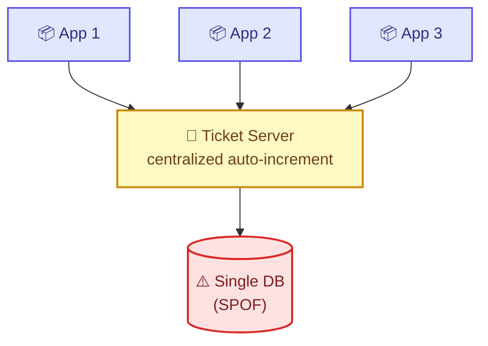

**Problem:** it *centralizes* the counter, so it **still has a single point of failure** — if the ticket server fails, everyone relying on it is impacted. (You can run two in active-active with odd/even offsets to mitigate, but that's extra complexity.)

**Verdict:** ⚠️ Simple, but SPOF; "not much used" for this reason.

### 12.3 Snowflake (Twitter)

A **timestamp-based** 64-bit ID. No central coordinator needed — uniqueness comes from time + machine identity. Typical bit layout:

```
| 1 bit  | 41 bits        | 10 bits     | 12 bits          |
| unused | timestamp (ms) | machine ID  | sequence number  |
| (sign) |                | (worker)    | (per-ms counter) |
```

How uniqueness holds: the **timestamp** makes IDs from different milliseconds unique; the **machine ID** disambiguates two machines in the same millisecond; the **sequence number** disambiguates multiple IDs generated on the *same machine in the same millisecond* (it rolls over `0,1,2,3…` and resets each ms).

**Pros:** decentralized, no coordination service, roughly time-sortable, very high throughput. **Cons:** IDs are large 64-bit numbers (base62 of them can exceed 7 chars — a problem for our "short" requirement), and it depends on **clock synchronization** (clock drift / backward jumps cause issues — see §B10).

**Verdict:** ✅ Good general-purpose distributed ID generator (Twitter uses it). For *this* problem the transcript author prefers Zookeeper because the IDs we want must stay small/contiguous to fit 7 base62 chars.

### 12.4 Zookeeper range allocation (chosen)

**Key clarification:** *Zookeeper is **not** a unique-ID generator.* It is Apache's **distributed coordination service** — it lets distributed applications coordinate with each other reliably. We *use* it to coordinate **range allocation**.

**How it works:** the total keyspace is `0 … 3.5 trillion` (i.e., `62^7`). Zookeeper divides it into **ranges** (e.g., 1-million-wide blocks) and hands a **distinct range to each server / worker thread**. Each server then generates IDs *locally* within its own range — no per-ID coordination, no collisions, because ranges never overlap.

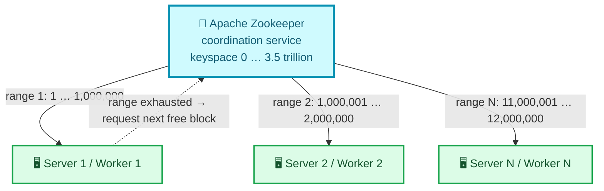

ASCII view:

```
                 +------------------------------+
                 |        ZOOKEEPER             |
                 |  keyspace 0 .. 3.5 trillion  |
                 +------------------------------+
                    |            |           |
       range 1      |  range 2   |   ...     | range N
   [1 .. 1,000,000] | [1,000,001 | [11,000,001 .. 12,000,000]
        |           |  .. 2,000,000]         |
   +---------+   +---------+            +---------+
   |Server 1 |   |Server 2 |    ...     |Server N |
   |uses its |   |uses its |            |uses its |
   |range    |   |range    |            |range    |
   +---------+   +---------+            +---------+
```

- **Server 1** gets `1–1,000,000`, **Server 2** gets `1,000,001–2,000,000`, and so on.
- When a server **exhausts** its block, it asks Zookeeper for the **next unused range** (e.g., `13,000,001–14,000,000`).
- **Trade-off accepted:** if a server holding `1M–2M` dies or sees no traffic, that range may go **partly unused/wasted**. That's fine — we have 3.5 trillion codes and only need ~365 billion, so leaking a few million is negligible. We trade a little keyspace for huge simplicity and zero coordination on the hot path.

**Why it's the best fit here:** unique by construction in a distributed environment, IDs stay **small and contiguous** (so base62 stays ≤7 chars), and there's **no per-request coordination** — Zookeeper is touched only once per ~1M IDs.

### Comparison of ID-generation strategies

| Approach | Unique across servers? | SPOF? | Scales? | IDs short/contiguous? | Verdict |
|---|---|---|---|---|---|
| Single DB auto-inc | yes | **yes** | no | yes | ❌ |
| Ticket server | yes | **yes** | limited | yes | ⚠️ |
| Snowflake | yes | no | yes | **no** (64-bit) | ✅ general use |
| Zookeeper ranges | yes | no (HA quorum) | yes | **yes** | ✅ **chosen** |

> Note: a production Zookeeper runs as a **3- or 5-node quorum** (ZAB consensus), so it's not itself a SPOF. Even if Zookeeper is briefly unavailable, servers keep serving from their *already-allocated* range — they only need ZK when a block runs out.

---

## 13. Caching & the 301 Redirect ⚡

### Read-through cache

Because reads outnumber writes **40:1**, the redirect path is cached aggressively. The transcript uses a **read-through** cache:

1. `GET /shortCode` arrives at the **Get-Long-URL service**.
2. Service checks the **cache** first.
3. **Cache hit** → return the long URL immediately (fast path, no DB).
4. **Cache miss** → the cache reads the DB, **populates itself**, and returns the value. Future requests for that code now hit the cache.

This is "read-*through*" because the application talks only to the cache, and the cache is responsible for reading the DB and updating itself.

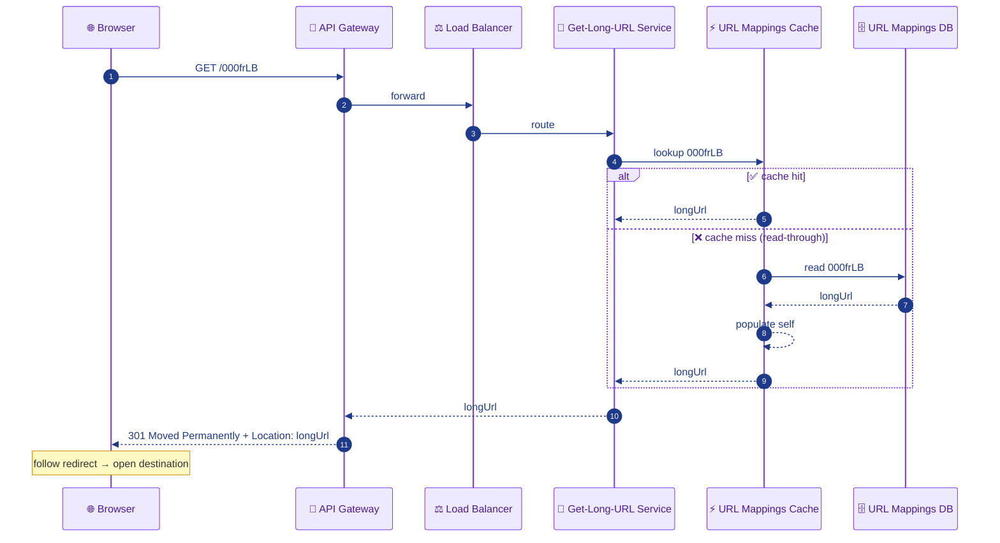

> **Cache eviction:** use **LRU** (least-recently-used) so the hot 20% of links stay resident. With ~30 GB/day of fresh data and an 80/20 access pattern, a modest Redis cluster handles the hot set; cold links fall back to the DB on miss.

### The 301 redirect — and 301 vs 302

The redirect status code is a *real design decision*:

| Code | Meaning | Browser caches redirect? | Hits our server on repeat clicks? | Analytics? |
|---|---|---|---|---|
| **301 Moved Permanently** | permanent | **yes** | **no** (browser goes straight to long URL) | ❌ lose click counts |
| **302 Found** (temporary) | temporary | **no** | **yes** (every click hits us) | ✅ full analytics |

**Trade-off:** `301` minimizes load on our service (the browser caches it and skips us next time) → cheaper, faster. `302` routes every click through us → enables **click analytics and the ability to re-point a link**, at the cost of more traffic. The transcript uses **301**; choose **302** if analytics matter. State this trade-off explicitly in an interview.

---

## 14. Database Selection (SQL vs NoSQL) 🗄️

General guidelines when choosing a database: weigh **speed**, **scale**, **query pattern**, and **structure/flexibility** — and remember the final choice always depends on the specific project.

The two transcripts reach **different but both-defensible** conclusions — knowing *why* is the point:

**Case for NoSQL (key-value store):**

- **Speed:** must fetch long URL for a short URL with minimal latency; NoSQL KV stores excel at point lookups.
- **Scale:** millions of mappings/day; NoSQL scales horizontally more easily.
- **Query pattern:** dead simple — look up *value* (long URL) by *key* (short code). No joins, no range scans, no complex queries. A KV store (DynamoDB, Cassandra) is a natural fit.

→ **Key-value store**, `key = shortURL`, `value = longURL`.

**Case for relational (the other transcript):**

- The schema is a single trivial table (`id, shortURL, longURL`); there aren't "much combinations" or complex relationships, so a relational DB is perfectly adequate and operationally familiar.

**Reconciliation (enrichment):** both work. The data is a flat KV map with no relationships, so **NoSQL/KV is the more scalable default** for FAANG-scale (billions of rows, 40:1 reads). A relational DB is fine at smaller scale or if you want strong secondary-index/transaction guarantees. Either way, **shard by the short code** and **index the short-code column** for O(1)-ish lookups.

> 💡 **Indexing analogy from the transcript:** finding a chapter via a book's index page — the *chapter name* is the key, the *page content* is the value, and the index lets you jump straight to the page. Indexing the `shortURL` column lets the DB locate the mapping without scanning every row.

### Side-by-side: what the data actually looks like in each model

#### Option 1 — SQL (relational) representation

The data lives in **rows and columns** of a fixed-schema table. Every record has the same columns; types and constraints are enforced by the DB.

| `id` (PK, BIGINT) | `short_code` (VARCHAR(7), UNIQUE) | `long_url` (TEXT) | `created_at` (TIMESTAMP) | `user_id` (VARCHAR) |
|---|---|---|---|---|
| 1 | `00000G8` | `https://www.google.com` | 2026-06-30 10:00:00 | u_1001 |
| 2 | `00000G9` | `https://www.facebook.com/somepage` | 2026-06-30 10:00:01 | u_1002 |
| 3 | `0000fRLB` | `https://www.instagram.com/reel/xyz` | 2026-06-30 10:00:02 | u_1001 |

```sql
-- Schema
CREATE TABLE url_mappings (
  id          BIGINT      PRIMARY KEY,        -- the unique counter (from Zookeeper)
  short_code  VARCHAR(7)  UNIQUE NOT NULL,    -- the generated code
  long_url    TEXT        NOT NULL,
  created_at  TIMESTAMP   DEFAULT now(),
  user_id     VARCHAR(32)
);
CREATE INDEX idx_short_code ON url_mappings(short_code);  -- fast lookup on redirect

-- The one hot query (redirect):
SELECT long_url FROM url_mappings WHERE short_code = '00000G8';
```

**SQL characteristics for this workload:**

| Aspect | Detail |
|---|---|
| Structure | Fixed schema, rows × typed columns; ACID transactions |
| Strengths | Strong consistency, unique constraints (enforces no duplicate code), familiar SQL, secondary indexes, joins (if we ever add user/analytics tables) |
| Weaknesses | Horizontal scaling needs manual sharding; a single auto-increment is a bottleneck/SPOF; cross-shard uniqueness is hard at billions of rows |
| Examples | PostgreSQL, MySQL, Amazon Aurora |
| When to pick | Small-to-medium scale; you want transactions, joins, and strict constraints |

#### Option 2 — NoSQL key-value representation

The data is a **flat map**: one key → one value blob. No fixed columns; the "value" is whatever you put there (often a JSON document). Built for horizontal scale and O(1) point lookups.

```
KEY (short_code)   →   VALUE (document)
------------------------------------------------------------------
"00000G8"          →   { "longUrl": "https://www.google.com",
                         "createdAt": 1751277600, "userId": "u_1001" }

"00000G9"          →   { "longUrl": "https://www.facebook.com/somepage",
                         "createdAt": 1751277601, "userId": "u_1002" }

"0000fRLB"         →   { "longUrl": "https://www.instagram.com/reel/xyz",
                         "createdAt": 1751277602, "userId": "u_1001" }
```

```
# DynamoDB-style operations (conceptual)
PutItem  { "PK": "00000G8", "longUrl": "https://www.google.com", ... }
GetItem  { "PK": "00000G8" }   →  returns the value in single-digit ms
```

**NoSQL KV characteristics for this workload:**

| Aspect | Detail |
|---|---|
| Structure | Key → value (schemaless/flexible value); partitioned by key hash |
| Strengths | O(1) point lookups, automatic horizontal partitioning by key, massive read throughput, built-in replication; ideal for the "value by key" access pattern |
| Weaknesses | No joins, weaker/ tunable consistency (often eventual), limited multi-key transactions, no rich query language |
| Examples | DynamoDB, Cassandra, Redis (as a store), ScyllaDB |
| When to pick | FAANG scale; billions of rows; pure key→value access; read-heavy (our 40:1) |

#### Verdict table

| Dimension | SQL (Relational) | NoSQL (Key-Value) | Winner for URL shortener |
|---|---|---|---|
| Query pattern (value-by-key) | Works, needs index | Native, O(1) | **NoSQL** |
| Horizontal scale to billions | Manual sharding, hard | Built-in partitioning | **NoSQL** |
| Read throughput (~70k QPS) | Needs replicas + tuning | Designed for it | **NoSQL** |
| Strong uniqueness constraint | Native (`UNIQUE`) | App/ID-layer enforced | SQL |
| Transactions / joins | Native | Limited | SQL (not needed here) |
| Operational familiarity | High | Medium | SQL |

→ **Chosen: NoSQL key-value** (`key = short_code`, `value = long_url + metadata`), sharded and indexed by `short_code`. Uniqueness is guaranteed *upstream* by the Zookeeper counter, so we don't rely on a DB `UNIQUE` constraint — which is exactly why we can drop relational guarantees and gain NoSQL scale.

This completes the conceptual walkthrough. Part B reframes everything as the standard interview template.

---

# 🎯 Part B — Interview Template

## B1. Problem Statement & Clarifying Questions 📝

**Problem statement.** Design a URL shortening service (like TinyURL / Bitly / `lnkd.in`) that converts a long URL into a short, unique alias and redirects any request for that alias back to the original URL — at the scale of hundreds of millions of daily users, read-heavy, with low latency and high availability.

**Clarifying questions an interviewer expects you to ask:**

1. **How short must the code be?** ("As short as possible" — derive the length from traffic, don't guess.)
2. **What's the expected traffic?** (e.g., 10M new URLs/day, or 300M DAU.) Drives keyspace and capacity.
3. **How long must links live / how long must the service be supported?** (e.g., 100 years, or "forever".) Drives total keyspace.
4. **What characters are allowed in the code?** (`0-9`, `a-z`, `A-Z` → 62.) Drives base.
5. **Read:write ratio?** (Confirms read-heavy → caching strategy.)
6. **Custom aliases / vanity URLs** required?
7. **Link expiration / TTL**?
8. **Analytics** (click tracking) needed? (Affects 301 vs 302.)
9. **Can the same long URL map to the same short URL (dedup), or always a new code?**
10. **Predictability/security:** must codes be non-guessable (sequential IDs are enumerable)?

> The standout move from the transcript: the interviewer says "as short as possible," and instead of guessing 7, you **derive** it: `URLs to support = traffic × days × years`; pick the smallest `n` with `62^n ≥ that`. That derivation is the thing being tested.

---

## B2. Requirements 📋

**Functional**

- `createShortUrl(longUrl) → shortUrl` — generate a unique short code and persist the mapping.
- `redirect(shortUrl) → 301/302 longUrl` — resolve a short code to its long URL and redirect.
- (Optional/extensions) custom alias, expiration, analytics, delete/update, user accounts.

**Non-functional**

- **Availability:** redirects must be near-always up (broken links are catastrophic). Target ~**99.99–99.999%** (re-scope the transcript's literal "seven nines" to something defensible).
- **Low latency:** redirect on the critical path of opening a page → target **< 100 ms** server-side, ideally cache-served single-digit ms.
- **Scalability:** millions of users, **~70k read QPS / ~1.7k write QPS** (from §4), horizontally scalable.
- **Consistency model:** **read-heavy, eventual consistency is acceptable** for the mapping (a newly created link being visible a few ms late is fine). Uniqueness of codes, however, must be **strongly guaranteed** (no collisions). This split — eventual consistency for reads, strong uniqueness for ID allocation — is the key CAP trade-off (see §B12 staff Q&A).
- **Durability:** mappings must never be lost (a lost mapping = a permanently dead link).

---

## B3. Capacity Estimation 📊

(Full derivation in §4; condensed here.)

```
DAU = 300M, MAU = 1B
Writes: 10% × 300M creators × 5/day = 150M writes/day  → ~1,736 write QPS
Reads : 300M × 20/day               = 6B reads/day     → ~69,444 read QPS
Read:Write = 40:1

Record size = 100 (long) + 30 (short) + 70 (meta) = 200 bytes
Storage/day = 150M × 200B = 30 GB/day
Storage/10y = 30GB × 365 × 10 = 109.5 TB

Ingress = 30GB / 86,400s          = 0.35 MB/s
Egress  = 6B × 200B / 86,400s     = 13.8 MB/s  (~1.2 TB/day)

Keyspace: need 365B codes (10M/day × 365 × 100yr)
62^6 = 56.8B  (too few),  62^7 = 3.5T  (enough)  → 7-char codes
```

---

## B4. API / Interface Design 💻

**Create**

```http
POST /v1/urls
Body: { "longUrl": "<url>", "customAlias": "<opt>", "expiryDate": "<opt>" }
→ 201 { "shortUrl": "https://tinyurl.com/000frLB", "longUrl": "<url>" }
```

**Redirect**

```http
GET /{shortCode}
→ 301 Moved Permanently
  Location: <longUrl>
```

(Optional) **Delete / Analytics**

```http
DELETE /v1/urls/{shortCode}        → 204
GET    /v1/urls/{shortCode}/stats  → 200 { clicks, geoBreakdown, ... }
```

Design notes: `POST` (create) vs `GET` (fetch, no body); versioned paths (`/v1`); `201` on create, `301/302` on redirect. gRPC alternative: `rpc CreateShortUrl(CreateReq) returns (CreateResp)` / `rpc Resolve(ResolveReq) returns (ResolveResp)` for internal service-to-service calls (lower overhead than REST), but the public redirect endpoint stays HTTP because browsers drive it.

---

## B5. High-Level Architecture 🏛️

### 🏛️ Full system architecture (the "whiteboard" diagram)

A polished, layered view of the whole system with every component labelled by role and icon. This is the diagram to reproduce on the interview whiteboard. Edges are annotated with what flows across them; colors group components into logical tiers (edge → gateway → compute → coordination → data).

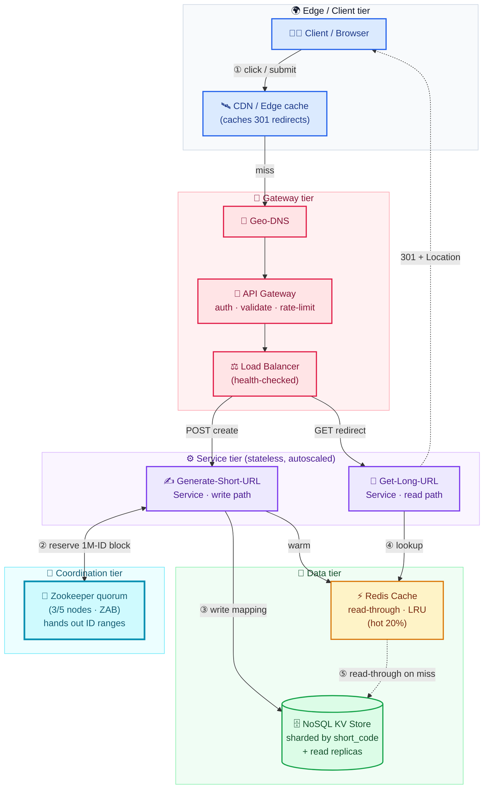

### Component flow (compact view)

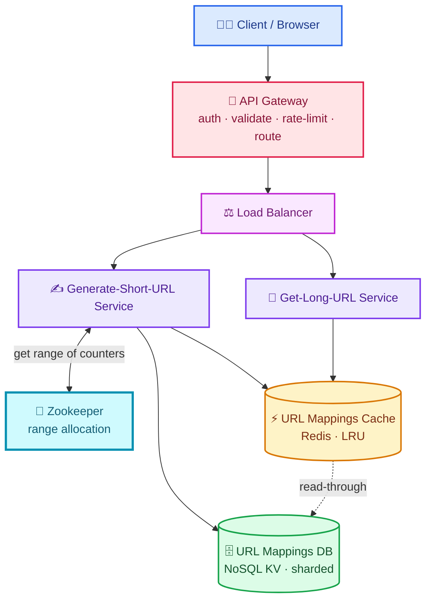

ASCII (the required `client → LB → service → cache → DB` flow):

```
            +-----------+      +------+      +---------------------+
 client --> |API Gateway| -->  |  LB  | -->  | Generate-Short-URL  | <--> Zookeeper (ranges)
            +-----------+      +------+      |       Service       |
                                            +----------+----------+
                                                       |  writes mapping
                                            +----------v----------+      +-----------+
                                            |  URL Mappings Cache  | <--> | URL Map DB|
                                            |     (Redis, LRU)     |  RT  | (NoSQL KV)|
                                            +----------+----------+      +-----------+
                                                       ^  read-through
            +-----------+      +------+      +----------+----------+
 client --> |API Gateway| -->  |  LB  | -->  |   Get-Long-URL Svc  |
            +-----------+      +------+      +---------------------+
```

**Component roles:**

- **API Gateway** — single entry point; authenticates, authorizes, validates requests, rate-limits, then routes to the right service via the load balancer.
- **Load Balancer** — spreads traffic across service instances (and across data centers); health-checks; enables horizontal scale.
- **Generate-Short-URL service** — core write logic: pull a counter from its Zookeeper-allotted range, base62-encode + pad, persist `short→long` to DB + cache, return short URL.
- **Get-Long-URL service** — core read logic: resolve short code via read-through cache → DB; return `301/302`.
- **Zookeeper** — coordination service; allocates disjoint counter ranges to writer instances (no collisions).
- **Cache (Redis)** — read-through, LRU; absorbs the 40:1 read load; holds the hot ~20% of links.
- **URL Mappings DB** — durable store of all mappings; NoSQL KV, sharded by short code.

---

## B6. Data Model / Schema 🗄️

**Primary table / KV entity:** `url_mappings`

| Field | Type | Notes |
|---|---|---|
| `short_code` | string(7) | **Primary key / partition key**; indexed for O(1) lookup |
| `long_url` | string | the destination |
| `creation_id` | bigint | the unique integer from Zookeeper range (pre-encode) |
| `created_at` | timestamp | metadata |
| `user_id` | string | optional owner (metadata) |
| `expiry_at` | timestamp | optional TTL |
| `click_count` | bigint | optional analytics counter |

- **Key/value framing:** `key = short_code`, `value = long_url` (+metadata). The dominant query is *"read long URL by short code"* → `short_code` is the obvious key and index.
- **Index:** B-tree / hash index on `short_code` (it's the PK). The book-index analogy: chapter name → page number → content.
- **Partition / shard key:** **`short_code`** — high-cardinality, uniformly distributed (base62 codes), so it spreads load evenly across shards/nodes. Hash-based partitioning avoids hotspots.
- **Why not shard by `created_at` or `user_id`:** would create temporal/user hotspots; `short_code` is the natural even-distribution key for point reads.

**Relational variant (the simpler transcript's table):**

```sql
CREATE TABLE url_mappings (
  id         BIGINT PRIMARY KEY,        -- the unique counter (Zookeeper)
  short_url  VARCHAR(7) UNIQUE NOT NULL,
  long_url   TEXT NOT NULL,
  created_at TIMESTAMP DEFAULT now()
);
CREATE INDEX idx_short_url ON url_mappings(short_url);
```

---

## B7. Deep Dive Modules 🔬

### B7.1 Short-code generation (the crux)

Decision tree, with internals and trade-offs:

- **Random string** → fails: no cross-server uniqueness (no coordination).
- **Hash + trim** → fails: trimmed prefix collides; full hash too long; deterministic.
- **Generate-then-check** → works but **O(collisions)** extra DB reads; latency grows with fill factor → violates low-latency NFR.
- **Counter + Base62 + Zookeeper ranges** → **chosen**: unique by construction, **O(1)** create (no DB check), codes ≤7 chars, distributed-safe.

**Internals:** writer instance holds an in-memory `(rangeStart, rangeEnd, next)` triple. On each create: `id = next++; code = pad(base62(id), 7)`. When `next > rangeEnd`, it blocks briefly to fetch the next free range from Zookeeper (an `O(1M)`-amortized coordination cost). Trade-off: range leakage on instance death (acceptable given 3.5T keyspace vs 365B need).

<details>
<summary><b>☕ Java — Zookeeper-backed range allocator (in-memory counter that refills from ZK) — click to expand</b></summary>

```java
import org.apache.zookeeper.*;
import java.util.concurrent.atomic.AtomicLong;

/**
 * Hands out globally-unique IDs from a range this instance "owns".
 * Coordination (claiming the next free block) happens via Zookeeper only
 * once per BLOCK_SIZE IDs — never on the hot path.
 */
public class IdRangeAllocator {

    private static final long BLOCK_SIZE = 1_000_000;       // 1M IDs per block
    private static final long MAX_ID     = 3_521_614_606_207L; // 62^7 - 1

    private final DistributedCounter zkCounter; // wraps an atomic znode in Zookeeper
    private volatile AtomicLong next  = new AtomicLong(0);
    private volatile long       rangeEnd = -1;  // exclusive upper bound of current block

    public IdRangeAllocator(DistributedCounter zkCounter) {
        this.zkCounter = zkCounter;
        claimNewBlock();
    }

    /** O(1) on the hot path; only synchronizes when a block is exhausted. */
    public long nextId() {
        long id = next.getAndIncrement();
        if (id >= rangeEnd) {           // block exhausted → grab another
            synchronized (this) {
                if (next.get() >= rangeEnd) claimNewBlock();
            }
            return nextId();            // retry with the fresh block
        }
        if (id > MAX_ID) throw new IllegalStateException("Keyspace exhausted");
        return id;
    }

    /** Atomically reserve the next [start, start+BLOCK_SIZE) block via Zookeeper. */
    private void claimNewBlock() {
        long start = zkCounter.addAndGet(BLOCK_SIZE) - BLOCK_SIZE; // linearizable in ZK
        this.next     = new AtomicLong(start);
        this.rangeEnd = start + BLOCK_SIZE;
        // If this instance dies now, the unclaimed remainder of the block is "leaked".
        // Acceptable: keyspace is 3.5T, we only need ~365B.
    }
}
```

</details>

<details>
<summary><b>☕ Java — Generate-Short-URL service (write path) — click to expand</b></summary>

```java
public class GenerateShortUrlService {

    private final IdRangeAllocator allocator;   // ZK-backed unique IDs
    private final UrlMappingRepository repo;     // NoSQL KV store
    private final Cache<String, String> cache;   // Redis (short -> long)
    private final String domain = "https://tinyurl.com/";

    public GenerateShortUrlService(IdRangeAllocator a, UrlMappingRepository r,
                                   Cache<String, String> c) {
        this.allocator = a; this.repo = r; this.cache = c;
    }

    public String createShortUrl(String longUrl) {
        validate(longUrl);                              // reject malformed/malicious URLs
        long id        = allocator.nextId();            // unique by construction — NO db check
        String code    = pad7(Base62.encode(id));       // e.g. 1000 -> "00000G8"
        repo.save(new UrlMapping(code, longUrl, id, System.currentTimeMillis()));
        cache.put(code, longUrl);                       // warm cache for immediate reads
        return domain + code;                           // 201 Created
    }

    private static String pad7(String code) {
        return String.format("%1$7s", code).replace(' ', '0');
    }

    private void validate(String url) {
        if (url == null || !url.matches("^https?://.+"))
            throw new IllegalArgumentException("Invalid URL");
        // production: also check Safe-Browsing blocklist, strip javascript: schemes, cap length
    }
}
```

</details>

<details>
<summary><b>☕ Java — Get-Long-URL service (read path, read-through cache + 301) — click to expand</b></summary>

```java
import org.springframework.web.bind.annotation.*;
import org.springframework.http.*;

@RestController
public class GetLongUrlController {

    private final UrlMappingRepository repo;
    private final Cache<String, String> cache;     // read-through Redis

    public GetLongUrlController(UrlMappingRepository r, Cache<String, String> c) {
        this.repo = r; this.cache = c;
    }

    @GetMapping("/{code}")
    public ResponseEntity<Void> redirect(@PathVariable String code) {
        String longUrl = cache.get(code);           // 1) try cache (hot path, ~1ms)
        if (longUrl == null) {                       // 2) cache miss → read-through to DB
            UrlMapping m = repo.findByShortCode(code);
            if (m == null)
                return ResponseEntity.notFound().build();   // 404 unknown code
            longUrl = m.getLongUrl();
            cache.put(code, longUrl);                // 3) self-populate so next read is a hit
        }
        // 301 = permanent (browser caches, fewer hits, no analytics).
        // Use 302 (HttpStatus.FOUND) instead if you need click tracking / re-pointing.
        return ResponseEntity.status(HttpStatus.MOVED_PERMANENTLY)
                             .location(java.net.URI.create(longUrl))
                             .build();
    }
}
```

</details>

### B7.2 Counter vs hashing trade-off (predictability)

Sequential counters are **enumerable** — `00000001, 00000002…` lets an attacker scrape all links. Mitigations: (a) start ranges at large offsets; (b) apply a reversible **bijective scramble** (e.g., multiply by a large coprime mod `62^7`, or XOR/Feistel permutation) before encoding, preserving uniqueness while hiding sequence; (c) accept enumeration if links aren't secret. Hashing avoids enumeration but reintroduces collisions — hence the scrambled-counter compromise is common at staff level.

<details>
<summary><b>☕ Java — reversible bijective scramble (defeats enumeration, stays collision-free) — click to expand</b></summary>

```java
/**
 * Bijection over [0, 62^7): id -> scrambled. Because PRIME is coprime to MOD,
 * multiplication mod MOD is 1:1 and reversible — so codes stay unique AND decodable,
 * but consecutive ids (1,2,3) map to far-apart, unguessable values.
 */
public final class IdScrambler {
    private static final long MOD   = 3_521_614_606_208L; // 62^7
    private static final long PRIME = 2_038_074_743L;      // large, coprime to MOD
    private static final long INV   = modInverse(PRIME, MOD); // PRIME * INV ≡ 1 (mod MOD)

    public static long scramble(long id)    { return (id * PRIME) % MOD; }
    public static long unscramble(long s)    { return (s  * INV)   % MOD; }

    private static long modInverse(long a, long m) {       // extended Euclid
        long[] r = extGcd(a % m, m);
        return ((r[1] % m) + m) % m;
    }
    private static long[] extGcd(long a, long b) {
        if (b == 0) return new long[]{a, 1, 0};
        long[] x = extGcd(b, a % b);
        return new long[]{x[0], x[2], x[1] - (a / b) * x[2]};
    }
}
// usage:  String code = pad7(Base62.encode(IdScrambler.scramble(allocator.nextId())));
```

</details>

### B7.3 Caching strategy

Read-through + **LRU** eviction; cache the hot 20%. Options: cache-aside (app manages) vs read-through (cache manages) — transcript uses **read-through**. Write policy: on create, **write to DB then warm the cache** (write-around is also fine since new links may not be read immediately). TTL entries to bound staleness for expirable links.

### B7.4 Redirect semantics

`301` (cacheable, fewer hits, no analytics) vs `302` (every click hits us, enables analytics + re-pointing). Pick per requirement. Always send the destination in the `Location` header; browser follows.

### B7.5 Read/write path separation

Split **Generate-Short-URL** (write) and **Get-Long-URL** (read) services so each scales independently. Reads scale to ~70k QPS via cache + read replicas; writes (~1.7k QPS) need far fewer instances. This separation also isolates failure domains.

---

## B8. Data Flow Diagram 🔀

**Write path (create) — end to end:**

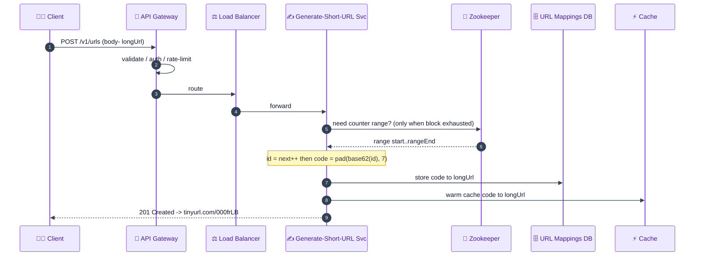

**Read path (redirect) — end to end (ASCII):**

```
 browser ── GET /000frLB ──> API Gateway ──> LB ──> Get-Long-URL Svc
                                                          |
                                                   check Cache ──hit──> longUrl
                                                          |
                                                        miss
                                                          v
                                                   read-through: Cache ─> DB ─> longUrl
                                                          |  (cache populates itself)
                                                          v
 browser <── 301 + Location: longUrl ── API Gateway <── longUrl
     |
     └─ follows redirect ─> opens https://www.google.com
```

---

## B9. Scalability & Bottlenecks 📈

**Where it breaks first, and how to scale each layer:**

| Layer | First bottleneck | Scale strategy |
|---|---|---|
| **DB reads** | 70k QPS point reads overwhelm a single node | Cache (40:1 absorbed by Redis), **read replicas**, shard by `short_code` |
| **Cache** | hot-key/memory limits | horizontal Redis cluster, consistent hashing, replicas for hot keys |
| **Write/ID allocation** | coordination on every ID would throttle writes | **range pre-allocation** via Zookeeper → ZK touched ~once/1M IDs |
| **DB storage** | 109.5 TB over 10y exceeds one node | horizontal **sharding** by short_code; add nodes as data grows |
| **App tier** | CPU/connection limits | stateless services behind LB → add instances; separate read/write tiers |
| **Single DC** | regional outage / latency for far users | **multi-region** with geo-DNS + per-region cache+DB; async cross-region replication |
| **Bandwidth/egress** | 13.8 MB/s+ at peak | **CDN / edge** caching of redirects close to users |

**Scaling principles:** services are **stateless** (state lives in DB/cache/ZK) → trivial horizontal scale. Reads scale by replication + caching; writes scale by sharding + range allocation. The 40:1 ratio means **read scaling dominates** the effort.

#### Detailed walkthrough of each bottleneck (beginner-friendly)

> Click any bottleneck to expand the explanation.

<details>
<summary><b>1. DB reads — the first thing to break.</b></summary>

At ~69,444 read QPS, a single database node simply cannot serve every redirect: disks and CPU saturate, query latency climbs, and timeouts cascade. The fix has three layers working together: first, a **Redis cache** absorbs the bulk of traffic (the 40:1 read:write ratio plus the 80/20 hot-set means most reads never touch the DB). Second, **read replicas** spread leftover reads across many copies of the data. Third, **sharding by `short_code`** splits the dataset so no single node owns all the rows. Together these turn an impossible single-node load into many small, survivable loads.
</details>

<details>
<summary><b>2. Cache — limited by memory and hot keys.</b></summary>

A single Redis box has finite RAM, and one extremely popular link ("hot key") can overwhelm the single node holding it. You scale by running a **Redis cluster** that uses **consistent hashing** to spread keys evenly across nodes, so adding a node only remaps a small slice of keys (not the whole keyspace). For a viral link, you **replicate that hot key** onto multiple nodes/replicas so reads fan out instead of hammering one shard. This keeps cache hits at ~1 ms even under skewed traffic.
</details>

<details>
<summary><b>3. Write / ID allocation — coordination is the enemy.</b></summary>

If every single create had to ask a central coordinator "what's the next ID?", that coordinator becomes a chokepoint and write throughput collapses. The design avoids this with **Zookeeper range pre-allocation**: each writer grabs a block of 1,000,000 IDs at once and serves them from local memory. Zookeeper is therefore consulted only ~once per million writes — coordination cost is amortized to almost nothing, and writes stay O(1) and fast.
</details>

<details>
<summary><b>4. DB storage — 109.5 TB won't fit on one machine.</b></summary>

Ten years of mappings far exceed any single server's disk. You **shard horizontally by `short_code`**, distributing rows across many nodes, and add nodes as the dataset grows. Because `short_code` values are uniformly distributed (base62), data and load spread evenly with no temporal hotspots, and capacity grows linearly with the number of shards.
</details>

<details>
<summary><b>5. App tier — CPU and connection limits.</b></summary>

Each service instance can only hold so many concurrent connections and threads before CPU or memory caps out. Because the services are **stateless** (all state lives in the DB, cache, and Zookeeper), you can simply **add more identical instances behind the load balancer** and traffic spreads automatically. Separating the read tier from the write tier lets you scale each independently — many read boxes, few write boxes — matching the 40:1 ratio.
</details>

<details>
<summary><b>6. Single data center — a regional risk.</b></summary>

If everything lives in one region, an outage there takes the whole service down, and users on other continents see high latency. The fix is **multi-region deployment** with **geo-DNS** routing each user to the nearest region, each region carrying its own cache and DB copy. Data is replicated **asynchronously** across regions, which trades a little staleness for availability and low latency worldwide.
</details>

<details>
<summary><b>7. Bandwidth / egress — the wire fills up.</b></summary>

At ~13.8 MB/s of outbound redirects (and far more at peak), origin bandwidth and per-request latency become a concern, especially for distant users. Pushing redirects to a **CDN / edge network** caches the `301` responses physically close to users, so most clicks are answered at the edge and never traverse the long path back to origin. This slashes both origin egress and user-perceived latency.
</details>

---

## B10. Failure Modes & Mitigation 🛡️

| Failure / edge case | Impact | Mitigation |
|---|---|---|
| **Single DB (SPOF)** | no IDs / no lookups → total outage | Replication (leader+followers), multi-shard, automated failover; never one node |
| **Ticket-server SPOF** | ID generation halts | avoid; or run dual servers (odd/even offsets); prefer Zookeeper quorum |
| **Zookeeper down** | can't fetch *new* ranges | servers keep using **already-allocated** range; ZK runs as 3/5-node quorum (no SPOF); pre-fetch next range early |
| **Writer instance dies mid-range** | its remaining range is leaked | acceptable — 3.5T keyspace vs 365B need; ranges are cheap |
| **Cache down / cold start** | read load slams DB (thundering herd) | DB read replicas absorb; **request coalescing/single-flight**; gradual cache warm-up; circuit breaker |
| **Cache miss storm on hot key** | DB hotspot | replicate hot keys; add jittered TTLs; negative caching for unknown codes |
| **Clock drift (if using Snowflake)** | duplicate or non-monotonic IDs on backward clock jump | NTP sync; **refuse to issue IDs while clock < last timestamp**; wait out the drift; Zookeeper ranges sidestep this entirely |
| **Sudden traffic spike** | overload | autoscaling, rate limiting at gateway, CDN edge caching of 301s, load shedding |
| **Celebrity / viral link problem** | one short code gets millions of hits → hot shard/key | cache the hot key at **every** layer (browser via 301, CDN, Redis replicas); the redirect is read-only so it caches perfectly |
| **Duplicate long URL submitted** | wasted codes / inconsistent dedup | optional: index `long_url` and return existing code (costs a read on writes) — trade-off vs always-new |
| **Invalid / malicious long URL** | open redirect, phishing, malware | validate URL format; scan against blocklists (Safe Browsing); strip `javascript:` schemes |
| **Code enumeration** | scraping all links | scramble counter (bijective permutation) or accept if non-secret |
| **Network partition** | stale reads | eventual consistency acceptable for mappings; reads from any replica fine |

#### Detailed walkthrough of each failure mode (beginner-friendly)

> Click any failure mode to expand the explanation.

<details>
<summary><b>1. Single DB (SPOF).</b></summary>

If your entire system depends on one database, that node is a single point of failure: when it dies, you can neither generate new IDs nor look up existing links — the whole product goes dark. The mitigation is **replication** (a leader plus several followers so a failover candidate is always ready) combined with **multi-shard** layout and **automated failover** that promotes a follower within seconds. The guiding rule: never let one machine be the only thing standing between you and a total outage.
</details>

<details>
<summary><b>2. Ticket-server SPOF.</b></summary>

A centralized auto-increment "ticket server" is convenient but recreates the same single-point-of-failure problem at the ID layer — if it's down, no new short URLs can be created. You can soften this by running **two ticket servers** handing out odd and even numbers respectively, so one surviving server still works. But the cleaner answer for this system is to **prefer Zookeeper's quorum-based range allocation**, which has no single owner and keeps issuing IDs as long as a majority of nodes are alive.
</details>

<details>
<summary><b>3. Zookeeper down.</b></summary>

Zookeeper is only needed when a writer **exhausts its current block** of a million IDs, so a brief ZK outage doesn't immediately stop writes — each writer keeps serving from its **already-allocated range**. To be safe, Zookeeper runs as a **3- or 5-node quorum** (using ZAB consensus), so it tolerates losing a minority of nodes without going down. Writers can also **pre-fetch the next block early** (before fully draining the current one) to ride out short coordination hiccups.
</details>

<details>
<summary><b>4. Writer instance dies mid-range.</b></summary>

When a writer holding, say, IDs 5,000,000–6,000,000 crashes after using only half, the rest of that block is **leaked** (never used). This sounds wasteful but is deliberately accepted: the keyspace is **3.5 trillion** codes while we only need **~365 billion**, so losing a few million here and there is statistically irrelevant. We trade a sliver of the address space for the huge benefit of zero hot-path coordination.
</details>

<details>
<summary><b>5. Cache down / cold start (thundering herd).</b></summary>

If the cache fails or starts empty, every read suddenly falls through to the database at once — a "thundering herd" that can crush the DB. Mitigations layer up: **read replicas** absorb the surge, **request coalescing / single-flight** ensures that 1,000 simultaneous requests for the same cold key trigger only **one** DB read (the rest wait and share the result), and a **circuit breaker** sheds load if the DB is already struggling. **Gradual cache warm-up** repopulates hot keys before fully reopening traffic.
</details>

<details>
<summary><b>6. Cache miss storm on a hot key.</b></summary>

Even with a warm cache, a single very popular code can concentrate misses (e.g., right after its TTL expires) onto one DB shard, creating a hotspot. You **replicate the hot key** across several cache nodes so reads spread out, add **jittered TTLs** so entries don't all expire at the same instant (avoiding synchronized stampedes), and use **negative caching** to remember "this code doesn't exist" so bogus lookups don't repeatedly hit the DB.
</details>

<details>
<summary><b>7. Clock drift (only if using Snowflake).</b></summary>

Snowflake IDs embed a timestamp, so if a server's clock jumps **backward** (NTP correction, VM pause), it could mint a timestamp it already used and generate **duplicate or non-monotonic IDs**. Defenses: keep clocks tightly **NTP-synced**, and have the generator **refuse to issue IDs while the current clock is behind the last-seen timestamp** (it waits out the drift). Note that the **Zookeeper range approach sidesteps this entirely** because it doesn't depend on time at all.
</details>

<details>
<summary><b>8. Sudden traffic spike.</b></summary>

A viral post or marketing blast can multiply traffic in seconds, overwhelming under-provisioned capacity. The system defends with **autoscaling** (add instances as load rises), **rate limiting at the API gateway** (protect the backend from abusive bursts), **CDN edge caching of 301s** (most clicks answered before reaching origin), and **load shedding** (gracefully drop or queue excess requests rather than crashing everything).
</details>

<details>
<summary><b>9. Celebrity / viral link problem.</b></summary>

This is the read-side version of a hotspot: one short code receives millions of hits, threatening to overload the single key/shard that holds it. The redirect is **read-only and immutable**, which makes it perfectly cacheable — so you cache it at **every layer**: the browser (via the cacheable `301`), the **CDN edge**, and **replicated Redis** copies. Because there are no writes competing, layered caching fully neutralizes the hotspot.
</details>

<details>
<summary><b>10. Duplicate long URL submitted.</b></summary>

If the same long URL is submitted many times, you either create a fresh code each time (wasting keyspace) or return the existing one (dedup). True dedup requires an **index on `long_url`** and a lookup on every write — which adds read cost and latency to the write path. It's a genuine trade-off: dedup saves space and is tidy, but always-create is simpler and faster; pick based on whether duplicate links are common in your traffic.
</details>

<details>
<summary><b>11. Invalid / malicious long URL.</b></summary>

Because the service blindly redirects users to whatever was stored, attackers can abuse it for **phishing, malware distribution, or open-redirect attacks**. Mitigations: **validate URL format** (only allow `http`/`https`), **scan submissions against threat blocklists** (e.g., Google Safe Browsing), and **strip dangerous schemes** like `javascript:`. This protects both end users and the service's reputation/domain from being blacklisted.
</details>

<details>
<summary><b>12. Code enumeration.</b></summary>

If codes are simple sequential counters (`...01, ...02, ...03`), anyone can iterate through them and **scrape every link in the system**, leaking private URLs. The fix is to apply a **reversible bijective permutation** (see the IdScrambler) so consecutive IDs map to scattered, unguessable codes while remaining unique and decodable. If the links aren't sensitive, you may simply accept enumeration — but state that decision explicitly.
</details>

<details>
<summary><b>13. Network partition.</b></summary>

In a distributed deployment, network splits can temporarily isolate replicas, so a read might hit a replica that hasn't received the very latest write. For URL mappings this is fine: **eventual consistency is acceptable** because a brand-new link being visible a few milliseconds late causes no real harm, and **reads can be served from any replica**. This is the deliberate AP (availability + partition-tolerance) choice for the mapping store.
</details>

**Reliability patterns to name:** retries with exponential backoff + jitter, **circuit breakers** (fail fast when DB/cache unhealthy), bulkheads (isolate read vs write pools), idempotent creates (so retried POSTs don't double-allocate — key off an idempotency token or the long URL hash), replication for durability, health-checked load balancing.

---

## B11. Alternative Designs / Trade-off Comparison ⚖️

### Alternative A — Hash-based (MD5/SHA-1, truncated) with collision retry

- **How:** `code = base62(hash(longUrl + salt))[:7]`; on collision, re-salt and retry.
- **Pros:** stateless (no counter/coordinator), natural **dedup** (same URL → same code if no salt), non-sequential (not enumerable).
- **Cons:** collisions **guaranteed** at scale → every write needs a **DB existence check** (+latency, +load); retry loops worsen as keyspace fills. Violates strict low-latency.
- **vs chosen:** counter+base62 has **no DB check**, deterministic O(1) writes — better at FAANG scale. Hashing wins only if dedup/non-enumeration is a hard requirement and write latency is relaxed.

### Alternative B — Snowflake IDs + base62

- **How:** generate 64-bit Snowflake ID (timestamp+machine+seq), base62-encode.
- **Pros:** fully decentralized, no coordination service, time-sortable, huge throughput.
- **Cons:** IDs are large → base62 often **> 7 chars** (fails "as short as possible"); depends on **clock sync** (drift bugs); codes leak timestamp/machine info.
- **vs chosen:** great general distributed-ID generator, but Zookeeper ranges keep IDs **small & contiguous** → shorter codes. Pick Snowflake if you don't need minimal length and want zero coordination infra.

### Alternative C — KGS (Key Generation Service: pre-generate keys offline)

- **How:** a background service pre-computes all possible 7-char codes into a "available keys" DB; writers **pop** an unused key on demand; used keys move to a "used" table.
- **Pros:** O(1) writes, no collision check (keys are unique by construction and consumed once), no enumeration if keys are shuffled, no encode-time math.
- **Cons:** extra service + storage for the key pool; must handle concurrency (two writers popping the same key → use atomic dequeue / partition the pool per writer, much like Zookeeper ranges); keys consumed even if a writer crashes (leakage).
- **vs chosen:** KGS is essentially the **productized, generalized** form of Zookeeper-range allocation (Grokking's canonical answer). Equivalent guarantees; trade range-arithmetic for a dedicated key pool + its own availability/replication needs.

### Alternative D — Relational DB + auto-increment (small scale)

- **Pros:** dead simple, transactional, familiar.
- **Cons:** single auto-increment is a SPOF/bottleneck; scaling to billions needs sharding which breaks the simple counter. Fine for low scale, not FAANG scale.

**Summary:** chosen design = **Counter (Zookeeper ranges) + Base62 + read-through cache + sharded NoSQL**, because it gives collision-free O(1) writes, ≤7-char codes, and read-heavy scalability. Swap in **KGS** if you prefer a managed key pool, **hashing** if dedup/non-enumeration outweighs write latency, **Snowflake** if you want zero coordination and can tolerate longer codes.

---

## B12. Interview Q&A 🎓

> Questions are numbered and collapsible — click any question to reveal the answer.

### Conceptual (mid-level)

<details>
<summary><b>Q1. Why is a URL shortener read-heavy, and why does that matter?</b></summary>

Each short URL is created once but clicked many times (here 40:1 reads:writes). It matters because it dictates the whole design: aggressive caching, read replicas, and CDN edge caching for redirects, while the write path stays comparatively small. You optimize the read/redirect path first.
</details>

<details>
<summary><b>Q2. Why 7 characters?</b></summary>

Derived, not guessed. With 62 allowed characters and a need for ~365B codes (10M/day × 365 × 100yr), `62^6 ≈ 56.8B` is too few and `62^7 ≈ 3.5T` is enough. 7 is the smallest length that satisfies demand with ~10× headroom.
</details>

<details>
<summary><b>Q3. What does the service return on a redirect?</b></summary>

An HTTP `301` (or `302`) with the original long URL in the `Location` header — not a JSON body. The browser reads the redirect status and navigates to the long URL. Returning just the string wouldn't open the page.
</details>

<details>
<summary><b>Q4. SQL or NoSQL, and why?</b></summary>

A key-value NoSQL store fits best at scale: the access pattern is a pure point lookup (value by key), there are no relationships/joins, and KV stores scale horizontally with low-latency reads. A relational DB is acceptable at small scale given the trivial single-table schema. Either way, index/partition by the short code.
</details>

### Design trade-off (senior)

<details>
<summary><b>Q5. 301 vs 302 — which and why?</b></summary>

`301` (permanent) is browser-cached, so repeat clicks skip our service → less load, lower cost, but **no analytics** and you can't re-point the link. `302` (temporary) routes every click through us → enables click tracking and link re-pointing, at higher traffic cost. Choose by whether analytics/control matter more than load.
</details>

<details>
<summary><b>Q6. How do you guarantee unique codes across many servers without a DB check on every write?</b></summary>

Pre-allocate disjoint **ranges** of the integer keyspace to each writer via Zookeeper. Each writer issues IDs locally from its range and base62-encodes them — unique by construction, O(1), no per-write coordination or existence check. Zookeeper is consulted only when a range is exhausted (~once per million IDs).
</details>

<details>
<summary><b>Q7. What's the cost of the Zookeeper range approach?</b></summary>

Range **leakage** — if a writer dies or sees no traffic, its remaining range is wasted. That's an accepted trade-off: the keyspace is 3.5T but we only need ~365B, so losing millions is negligible. We trade a sliver of keyspace for zero hot-path coordination.
</details>

<details>
<summary><b>Q8. How do you handle the celebrity/viral-link problem?</b></summary>

A single short code getting millions of hits is a hot key. Because redirects are read-only and immutable, they cache perfectly: serve from browser cache (301), CDN edge, and replicated Redis hot keys. No write contention exists, so the hot key is purely a read-fan-out problem solved by layered caching + replicas.
</details>

### Deep-dive internals (staff)

<details>
<summary><b>Q9. Where does this sit on CAP, and what consistency do you actually need?</b></summary>

It's effectively **AP for reads** (availability + partition tolerance with eventual consistency — a newly created link visible a few ms late is acceptable), but **uniqueness of code allocation needs strong consistency / linearizability**. Zookeeper provides the latter via the **ZAB consensus** protocol over a quorum; the mapping store can be eventually consistent and replicated widely. Splitting the strong-consistency need (ID allocation) from the eventually-consistent need (mappings) is what lets the system be both highly available and collision-free.
</details>

<details>
<summary><b>Q10. How does Zookeeper guarantee a range is handed out exactly once?</b></summary>

Zookeeper runs a quorum (3/5 nodes) using **ZAB** (Zookeeper Atomic Broadcast), a leader-based consensus protocol. Range allocation is a linearizable write (e.g., an atomic increment of a persistent znode / `setData` with version check), committed only when a majority acknowledges. Two servers requesting ranges concurrently are serialized by the leader, so ranges never overlap.
</details>

<details>
<summary><b>Q11. Do the math — can a 7-char base62 code ever overflow?</b></summary>

Max 7-char value is `62^7 − 1 = 3,521,614,606,207`. As long as allocated integers stay below `62^7`, every code encodes to ≤7 chars; shorter values are left-padded to 7. We never approach 3.5T (need ~365B), so overflow to 8 chars can't happen under our allocation policy.
</details>

<details>
<summary><b>Q12. Walk through base62 of 9,876,549.</b></summary>

`9,876,549 = 41·62³ + 27·62² + 21·62¹ + 11·62⁰`. With the transcript's mapping (41→f, 27→R, 21→L, 11→B), that's **`fRLB`** — 7 base-10 digits compressed to 4 base-62 chars. Verify: `41·238328 + 27·3844 + 21·62 + 11 = 9,876,549`. ✓
</details>

<details>
<summary><b>Q13. How would you prevent sequential codes from being enumerable?</b></summary>

Apply a reversible bijection over `[0, 62^7)` before encoding — e.g., multiply the counter by a large constant coprime to `62^7` (mod `62^7`), or a small Feistel/permutation network. This preserves 1:1 uniqueness (so still collision-free, still decodable) but scatters consecutive IDs into non-adjacent codes, defeating enumeration without a DB check.
</details>

<details>
<summary><b>Q14. Latency math — what's the redirect budget?</b></summary>

Target sub-100 ms server-side. A cache hit is ~1 ms (Redis) + network; the 40:1 ratio plus 80/20 hot-set means the vast majority of the ~70k read QPS are cache hits, keeping mean latency low. Cache miss adds a DB read (single-digit-to-low-tens ms on an indexed KV point lookup) and then populates the cache. CDN/301 caching pushes many redirects off our servers entirely.
</details>

### Behavioral (STAR, tied to this system)

<details>
<summary><b>Q15. Tell me about a time you made a scalability trade-off under constraints.</b></summary>

- **Situation:** Our link service's create path slowed under load as the keyspace filled.
- **Task:** Keep create latency flat (< target) while guaranteeing globally unique codes across many instances.
- **Action:** Replaced generate-then-check (which added a DB existence read per write, worsening with fill factor) with **Zookeeper range pre-allocation + base62**. Each instance issued IDs locally from a reserved range, touching the coordinator only once per million IDs. I explicitly accepted range leakage on instance death because the 3.5T keyspace dwarfed our 365B need.
- **Result:** Create latency became O(1) and constant regardless of fill factor; collisions dropped to zero by construction; coordination traffic fell by ~6 orders of magnitude. The leaked-range trade-off was quantified and deemed negligible.
</details>

<details>
<summary><b>Q16. Tell me about a time you chose the simpler design over the "impressive" one.</b></summary>

- **Situation:** The team wanted to adopt Snowflake for ID generation largely because it looked cutting-edge and was "what Twitter uses."
- **Task:** Deliver the shortest possible short codes (the core product requirement) without over-engineering.
- **Action:** I demonstrated that Snowflake's 64-bit IDs base62-encode to more than 7 characters, breaking the "as short as possible" requirement, whereas Zookeeper ranges keep IDs small and contiguous. I laid the two options side by side with the trade-offs explicit rather than dismissing the idea outright.
- **Result:** We shipped the simpler, requirement-aligned design; codes stayed at 7 chars, and the team adopted a habit of deriving choices from requirements rather than novelty.
</details>

<details>
<summary><b>Q17. Tell me about a time you handled a production incident on a high-traffic system.</b></summary>

- **Situation:** A single shortened link went viral overnight; one cache node holding that hot key saturated and redirect latency for everyone on that shard spiked.
- **Task:** Restore low-latency redirects quickly without a full redeploy, and prevent recurrence.
- **Action:** I immediately **replicated the hot key** across multiple cache replicas and fronted the `301` with **CDN edge caching** so most clicks were answered at the edge. Then I added **jittered TTLs** to stop synchronized expiry stampedes and put a **circuit breaker** in front of the DB path.
- **Result:** P99 redirect latency returned to single-digit ms within minutes; the edge absorbed >90% of the viral traffic. The hot-key replication + jitter pattern became our standard runbook for viral links.
</details>

<details>
<summary><b>Q18. Tell me about a time you disagreed with a teammate on a technical decision.</b></summary>

- **Situation:** A teammate proposed enforcing short-code uniqueness with a database `UNIQUE` constraint plus retry-on-conflict, instead of the Zookeeper counter.
- **Task:** Reach a shared decision that met our low-latency NFR at scale, while respecting their concern (simplicity).
- **Action:** I acknowledged their approach was simpler operationally, then quantified the cost: at high fill factor, conflict retries add unbounded DB round-trips to the write path. I proposed a small **load test** comparing both under simulated keyspace fill so the data — not opinions — decided.
- **Result:** The test showed the constraint-retry approach degraded sharply past ~70% fill, while the counter stayed flat. We adopted the counter; my teammate appreciated that I validated rather than overruled, and we kept their `UNIQUE` constraint as a cheap safety net.
</details>

<details>
<summary><b>Q19. Tell me about a time you had to make a decision with incomplete information.</b></summary>

- **Situation:** During design we didn't yet know the real read:write ratio or whether analytics would be a hard requirement — both drive the 301-vs-302 choice.
- **Task:** Ship a redirect implementation without blocking on product's undecided analytics roadmap.
- **Action:** I made the redirect status **configurable** (301 by default for efficiency) behind a flag, and instrumented the redirect path so we could later turn on 302 + click tracking with no rearchitecture. I documented the assumption (analytics "nice-to-have") and the cheap reversal path.
- **Result:** We launched on time with efficient 301s. When marketing later required click analytics, flipping the flag to 302 took a one-line config change — the reversible decision saved a costly redesign.
</details>

<details>
<summary><b>Q20. Tell me about a time you simplified or optimized an existing system.</b></summary>

- **Situation:** An earlier version generated codes via MD5-hash-then-truncate, which required a DB existence check on every write to catch truncation collisions.
- **Task:** Eliminate the per-write collision check that was inflating create latency and DB load.
- **Action:** I migrated code generation to the **counter + base62** scheme, which is unique by construction, removing the existence check entirely. I wrote a backfill that re-encoded the `creation_id` for consistency and kept the old hash path behind a feature flag during rollout for safe fallback.
- **Result:** Write-path DB reads dropped to zero for code generation, create latency became constant, and we removed an entire class of collision bugs. The flagged rollout let us migrate with no downtime.
</details>

---

## B13. Quick Revision (cheat sheet + ~2-page deep revision) 📚

> This section merges the one-glance cheat sheet with the denser ~2-page revision. **Part 1** is the rapid-fire recall card; **Part 2** is the fuller night-before-the-interview walkthrough. Read Part 1 to self-test, Part 2 to refresh the reasoning.

### Part 1 — One-glance cheat sheet

**One-liner:** Map a long URL to a unique ≤7-char base62 code (from a distributed counter), store the mapping, and `301`-redirect on lookup; read-heavy (40:1), cache-everything.

**Core requirements (must-know):** create short URL; redirect to long URL; high availability; low latency; horizontally scalable; unique (collision-free) codes.

**Architecture:** `Client → API Gateway → Load Balancer → {Generate-Short-URL | Get-Long-URL} services → Read-through Cache (Redis) → NoSQL KV DB (sharded by short_code)`, with **Zookeeper** allocating counter ranges to writers.

**Key capacity numbers:** 300M DAU / 1B MAU · 150M writes/day (~1.7k QPS) · 6B reads/day (~70k QPS) · **40:1** read:write · 200 B/record · 30 GB/day · **109.5 TB/10yr** · ingress 0.35 MB/s · egress 13.8 MB/s · keyspace `62^7 = 3.5T` codes, need 365B → **7 chars**.

**Building blocks used + why:** API Gateway (entry/validation/rate-limit) · Load Balancer (spread + HA) · Cache/Redis (absorb 40:1 reads) · NoSQL KV (point-lookup scale) · Zookeeper (distributed range coordination → unique IDs) · Base62 (compact codes) · 301/302 (redirect).

**What you'd change at 10× scale:** multi-region (geo-DNS) deployments; CDN/edge caching of redirects; more DB shards + read replicas; Redis cluster with consistent hashing + hot-key replication; switch 301→302 only if analytics needed; consider KGS key pool; bijective-scramble codes if enumeration is a risk.

**Top 10 answers to memorize:**

1. Read-heavy 40:1 → cache + replicas + CDN.
2. 7 chars because `62^7 = 3.5T ≥ 365B` need; `62^6` too small.
3. Counter + base62, **not** hashing (trim collides) or random (no cross-server uniqueness).
4. Zookeeper = **coordination**, not an ID generator; it hands out disjoint **ranges**.
5. Range leakage on crash is acceptable (3.5T ≫ 365B).
6. Generate-then-check rejected: adds DB check + latency that worsens with scale.
7. Redirect = `301` (cached, no analytics) vs `302` (analytics, more load).
8. NoSQL KV, key = short_code, indexed/sharded by short_code.
9. Read-through cache + LRU; hot 20% serves 80%.
10. CAP: eventual consistency for mappings, strong consistency (ZAB quorum) for ID allocation.

### Part 2 — Deep revision (~2 pages)

#### Problem
Convert long URL → unique short code (≤7 chars); redirect short → long. Like TinyURL/Bitly/`lnkd.in`. Two ops only: **create** (write) and **redirect** (read). Read-heavy.

#### Requirements
- **Functional:** `createShortUrl(longUrl)→shortUrl`; `redirect(shortUrl)→301 longUrl`. Optional: custom alias, expiry, analytics.
- **Non-functional:** high availability (broken links are catastrophic; target 99.99–99.999%, not literal 7 nines); low latency (<100 ms, redirect on critical path); scalable (~70k read QPS); durable (never lose a mapping). Consistency: eventual for mappings, strong for uniqueness.

#### Capacity (memorize the derivations)
```
DAU 300M, MAU 1B
Writes = 10% × 300M × 5  = 150M/day  → 1,736 QPS
Reads  = 300M × 20       = 6B/day    → 69,444 QPS    (40:1)
Record = 100+30+70       = 200 B
Storage/day = 150M×200B  = 30 GB     ;  10yr = ×365×10 = 109.5 TB
Ingress = 30GB/86400     = 0.35 MB/s
Egress  = 6B×200B/86400  = 13.8 MB/s (~1.2 TB/day)
Keyspace: need 10M×365×100 = 365B ; 62^6=56.8B (no), 62^7=3.5T (yes) → 7 chars
86,400 = seconds/day
```

#### Short-code generation — the journey (the part interviewers grade)
1. **Random string** ❌ — no uniqueness across servers (no coordination).
2. **Hash MD5(32 hex)/SHA-1(40 hex)** ❌ — too long; trim-to-7 collides; deterministic. (1 byte = 2 hex; 16 B → 32, 20 B → 40.)
3. **Generate-then-check** ❌ — works but each write may need DB existence checks; latency grows as keyspace fills → violates low-latency.
4. **Counter + Base62** ✅ — unique by construction, O(1), no DB check; needs a **distributed unique counter**.

#### Distributed ID generation
- **Single DB auto-inc** ❌ SPOF + not scalable.
- **Ticket server** ⚠️ centralized auto-inc → SPOF.
- **Snowflake** ✅ general (1 unused bit | 41 timestamp | 10 machine | 12 sequence); but 64-bit → base62 > 7 chars; clock-drift dependent.
- **Zookeeper ranges** ✅ **chosen** — coordination service splits `0..3.5T` into ranges, gives each writer a disjoint block (S1: 1–1M, S2: 1M–2M, …); writer issues IDs locally; asks ZK for next block on exhaustion. Trade-off: range leakage (fine). Touches ZK ~once/1M IDs. Run ZK as 3/5-node quorum (ZAB) → not a SPOF.

#### Base62
- Alphabet: `0-9 a-z A-Z` = 62. URL-safe (vs base64's `+ /`).
- Encode = repeated ÷62, remainders bottom-to-top; pad-left to 7.
- Examples: `9876549 = 41·62³+27·62²+21·62+11 = fRLB`; `1000 = G8`.
- Max 7-char = `62^7−1 = 3.521T`; can't overflow within allocated range.

#### Architecture & flows
- `Client → API Gateway (auth/validate/rate-limit) → LB → service → cache → DB`; Zookeeper feeds the writer ranges.
- **Write:** POST /v1/urls → gateway → LB → Generate-Short-URL → (ZK range) → id→base62→pad → store DB + warm cache → return 201 shortUrl.
- **Read:** GET /{code} → gateway → LB → Get-Long-URL → **read-through cache** (miss → cache reads DB, self-populates) → **301 + Location: longUrl** → browser follows.

#### Data model
KV: `key=short_code(7)`, `value=long_url` + {created_at, user_id, expiry, clicks}. **Index & shard by short_code** (high cardinality, even distribution). Relational variant: `(id PK, short_url UNIQUE, long_url, created_at)` + index on short_url.

#### Caching & redirect
- Read-through + **LRU**; hot 20% → 80% of reads. Cache + replicas absorb 40:1.
- **301** = browser-cached, fewer hits, no analytics. **302** = every hit reaches us, enables analytics + re-pointing.

#### Scale / failure (top hits)
- Bottlenecks first at **DB reads** → cache/replicas/shard; ID allocation → ZK ranges; storage → shard; single DC → multi-region + CDN.
- SPOFs: never one DB / one ticket server; ZK quorum. Celebrity link = hot read key → layered caching (perfect, since redirects are immutable). Clock drift only matters for Snowflake (NTP + refuse-backward). Thundering herd → single-flight + replicas + circuit breaker. Enumeration → scramble counter. Malicious URLs → validate + Safe-Browsing blocklist.

#### Alternatives
Hash+retry (dedup/non-enumerable, but DB checks) · Snowflake (decentralized, longer codes) · **KGS** (pre-generated key pool — generalized Zookeeper-range idea) · Relational auto-inc (simple, small scale only).

---

## B14. FAANG Top 20 Most Frequently Asked Questions 🏆

<details>
<summary><b>1. Design a URL shortener — walk me through your approach.</b></summary>

Clarify length/traffic/lifetime/charset → derive 7-char codes from `62^7 ≥ 365B`. Two ops: create (write) and redirect (read), 40:1 read-heavy. Generate codes via a **distributed counter + base62** (reject random, hash-trim, generate-then-check). Use **Zookeeper** to allocate disjoint counter ranges across writers. Persist `short→long` in a **sharded NoSQL KV** store, front it with a **read-through Redis cache**, and redirect with **301/302**. Architecture: client → API gateway → LB → read/write services → cache → DB.
</details>

<details>
<summary><b>2. How do you generate unique short codes and avoid collisions?</b></summary>

Use a monotonic integer counter encoded in base62 — unique by construction, so no collision check is ever needed. The integer comes from disjoint ranges Zookeeper assigns to each server, guaranteeing uniqueness across a distributed fleet. Random strings fail (no cross-server coordination), and truncated hashes collide because uniqueness of the full digest doesn't imply uniqueness of its first 7 chars. This gives O(1) writes with zero DB existence checks.
</details>

<details>
<summary><b>3. Why base62, and why exactly 7 characters?</b></summary>

Base62 uses `0-9 a-z A-Z` (62 symbols), URL-safe unlike base64's `+`/`/`. More symbols per position pack more values into fewer chars. We need ~365B codes (10M/day × 365 × 100yr); `62^6 ≈ 56.8B` is too few, `62^7 ≈ 3.5T` is enough — so 7 chars, with ~10× headroom. The length is **derived from traffic**, never guessed, which is exactly what the interviewer is testing.
</details>

<details>
<summary><b>4. Why not use MD5 or SHA-1 hashing?</b></summary>

MD5 produces 128 bits → 32 hex chars; SHA-1 produces 160 bits → 40 hex chars (1 byte = 2 hex digits). Both far exceed our 7-char need, forcing truncation. But trimming to the first 7 chars destroys the uniqueness guarantee — two different URLs whose full hashes differ only in later positions collide. So you'd be back to collision handling plus DB checks. Hashing is also deterministic, which helps dedup but can't be made short safely.
</details>

<details>
<summary><b>5. Explain the read-through cache and the 40:1 ratio.</b></summary>

Reads (redirects) outnumber writes 40:1 (6B vs 150M/day), so the redirect path is cached aggressively. In read-through, the app queries only the cache; on a miss the **cache itself** reads the DB, populates, and returns. The hot 20% of links serve ~80% of traffic (LRU eviction keeps them resident). This keeps redirect latency at ~1 ms for hits and shields the DB from the ~70k read QPS.
</details>

<details>
<summary><b>6. 301 vs 302 redirect — which do you choose and why?</b></summary>

`301 Moved Permanently` is cached by the browser, so repeat clicks bypass our servers — less load and cost, but **no click analytics** and you can't re-point the link. `302 Found` is not cached, so every click hits us, enabling analytics and link re-pointing at higher traffic cost. Choose 301 for raw efficiency, 302 when tracking/control matters. Always put the destination in the `Location` header so the browser navigates.
</details>

<details>
<summary><b>7. What is Zookeeper's role — is it an ID generator?</b></summary>

No. Zookeeper is a **distributed coordination service** (Apache, ZAB consensus). We use it to divide the keyspace `0..3.5T` into ranges and hand a disjoint range to each writer. Writers then generate IDs locally within their range — unique because ranges never overlap. Zookeeper is consulted only when a writer exhausts its block (~once per million IDs), so it's off the hot path. Run it as a 3/5-node quorum so it isn't a SPOF.
</details>

<details>
<summary><b>8. How do you generate unique IDs in a distributed system (general)?</b></summary>

Options: single-DB auto-increment (SPOF, unscalable); centralized ticket server (still SPOF); **Snowflake** (timestamp + machine ID + sequence — decentralized, time-sortable, but 64-bit and clock-dependent); and **Zookeeper range allocation** (coordination service partitions the keyspace into per-worker ranges). For a shortener needing minimal-length contiguous IDs, Zookeeper ranges win; for general high-throughput IDs, Snowflake is the standard.
</details>

<details>
<summary><b>9. Explain Snowflake's bit layout.</b></summary>

64 bits: 1 unused/sign bit, 41 bits millisecond timestamp, 10 bits machine/worker ID, 12 bits per-millisecond sequence number. Timestamp ensures uniqueness across time; machine ID disambiguates concurrent machines; sequence disambiguates multiple IDs on one machine in the same ms (rolls over and resets each ms). It's decentralized and roughly sortable but depends on synchronized clocks, and its large values produce base62 codes longer than 7 chars.
</details>

<details>
<summary><b>10. What's the trade-off with Zookeeper's range approach?</b></summary>

**Range leakage**: if a worker dies or sees no traffic, the unused portion of its allocated range is wasted. This is acceptable because the keyspace (3.5T) vastly exceeds the requirement (365B) — losing a few million codes is negligible. In return you get zero per-write coordination and guaranteed uniqueness. It's a deliberate trade of a sliver of keyspace for simplicity and speed.
</details>

<details>
<summary><b>11. SQL or NoSQL for the mapping store, and how do you shard?</b></summary>

A NoSQL key-value store fits best: the query is a pure point lookup (long URL by short code), there are no joins/relationships, and KV scales horizontally with low-latency reads. Shard/partition by **short_code** — it's high-cardinality and uniformly distributed (base62), so load spreads evenly and avoids hotspots. A relational DB is fine at small scale given the trivial single-table schema; either way, index the short code.
</details>

<details>
<summary><b>12. Walk through the end-to-end write (create) path.</b></summary>

`POST /v1/urls {longUrl}` → API Gateway validates/auth/rate-limits → Load Balancer → Generate-Short-URL service → service uses next integer from its Zookeeper-allotted range → base62-encode + left-pad to 7 → store `short→long` in the NoSQL DB and warm the cache → return `201 {shortUrl}`. No DB collision check occurs because the counter guarantees uniqueness.
</details>

<details>
<summary><b>13. Walk through the end-to-end read (redirect) path.</b></summary>

Browser issues `GET /{code}` → API Gateway → LB → Get-Long-URL service → checks Redis (read-through): on hit returns long URL; on miss the cache reads the DB, self-populates, returns → service responds `301` (or `302`) with `Location: longUrl` → browser reads the redirect status and opens the destination page. Most requests are cache hits given the 40:1 ratio and 80/20 hot set.
</details>

<details>
<summary><b>14. How do you handle the celebrity / viral-link problem (hot key)?</b></summary>

A single code receiving millions of hits is a hot **read** key — and redirects are immutable and read-only, so they cache perfectly. Serve from browser cache (via 301), CDN edge nodes near users, and replicated Redis hot keys. There's no write contention, so it's purely a read-fan-out problem solved by layering caches and replicating the hot entry. Add jittered TTLs to avoid synchronized expiry storms.
</details>

<details>
<summary><b>15. What are the main failure modes and mitigations?</b></summary>

Avoid single-DB/ticket-server SPOFs (use replication + ZK quorum). Cache failure → DB read replicas + single-flight to prevent thundering herd + circuit breakers. Writer crash → range leakage (acceptable). Clock drift → only affects Snowflake; use NTP and refuse to issue IDs on backward clock jumps. Traffic spikes → autoscaling, gateway rate limiting, CDN. Malicious URLs → validation + Safe-Browsing blocklists.
</details>

<details>
<summary><b>16. Where does the system sit on CAP, and what consistency do you need?</b></summary>

Mappings tolerate **eventual consistency** (a new link visible a few ms late is fine) and prioritize availability + partition tolerance — broken redirects are unacceptable. But **code/ID allocation needs strong consistency (linearizability)** so ranges are never double-issued; Zookeeper provides this via ZAB quorum consensus. Separating the strongly-consistent allocation from the eventually-consistent mapping store is what makes the system both highly available and collision-free.
</details>

<details>
<summary><b>17. How would you make codes non-guessable (prevent enumeration)?</b></summary>

Sequential counters are enumerable (`...01, ...02`), letting attackers scrape all links. Apply a reversible **bijective permutation** over `[0, 62^7)` before encoding — e.g., multiply by a large constant coprime to `62^7` (mod `62^7`), or a small Feistel network. This preserves 1:1 uniqueness (still collision-free and decodable) while scattering consecutive IDs into unrelated codes. Alternatively use hashing if non-enumeration outweighs write latency, or accept it if links aren't secret.
</details>

<details>
<summary><b>18. How do you scale to 10× traffic / go multi-region?</b></summary>

Add DB shards and read replicas; scale the Redis cluster with consistent hashing and hot-key replicas; deploy multi-region with geo-DNS routing users to the nearest region (each with its own cache + DB, async cross-region replication); push redirects to a CDN edge so most never reach origin. Services are stateless, so the app tier scales by adding instances behind the LB. Reads dominate scaling effort given 40:1.
</details>

<details>
<summary><b>19. Can a base62 code ever exceed 7 characters? Prove it.</b></summary>

No, within our allocation policy. The maximum 7-char value is `62^7 − 1 = 3,521,614,606,207`. Since Zookeeper only ever allocates integers below `62^7`, every encoded value fits in ≤7 chars; values shorter than 7 are left-padded (e.g., `G8 → 00000G8`). We need ~365B codes — far below 3.5T — so we never reach the 8-char threshold. Encoding always yields ≤7; padding fixes the rest.
</details>

<details>
<summary><b>20. Compare your design to a Key Generation Service (KGS).</b></summary>

KGS pre-generates all possible 7-char codes into an "available keys" store; writers atomically pop an unused key and move it to "used." It gives O(1) writes, no collision checks, and (if shuffled) non-enumerable codes — essentially the productized form of Zookeeper-range allocation. Trade-offs: extra service + storage for the pool, concurrency control on pops (partition the pool per writer, like ranges), and key leakage on crash. Choose KGS for a managed pool; Zookeeper ranges for lighter infra with the same guarantees.
</details>

---

## Appendix — Sources & Notes 📎

This guide was built from two interview-prep video transcripts on designing a URL shortener (a Udemy-style TinyURL walkthrough and a "Concept and Coding" HLD session), then enriched with standard distributed-systems practice (KGS, Snowflake internals, CAP framing, multi-region/CDN scaling, enumeration defenses).

**Two transcript arithmetic slips corrected here (verify, don't parrot):**

- 10-year storage: the transcript says "13 × 365 × 10"; the daily figure is **30 GB**, so 10-year storage = `30 × 365 × 10 = 109.5 TB`.
- Egress: the transcript labels it "100 GB/day" but computes **13.8 MB/s**; 13.8 MB/s corresponds to **~1.2 TB/day** (`6B × 200 B`). The per-second number is correct; the daily label is not.

All capacity figures and the base62 worked examples (`9876549 = fRLB`, `1000 = G8`) were re-derived independently and verified.

