# WhatsApp / Messenger — System Design Study Guide

> A self-contained learning + revision guide for FAANG / top product-company system design interviews.
> Built from video transcripts on designing a **WhatsApp-style real-time chat system**, then **faithfully enriched** with the internals, trade-offs, and edge cases that interviewers probe at mid / senior / staff level.
> You should be able to learn this topic from zero using only this document.

---

## Table of Contents

**Part A — Learn the concept from zero**

1. [What Is WhatsApp & Why It's Hard](#1-what-is-whatsapp--why-its-hard-)
2. [Functional & Non-Functional Requirements](#2-functional--non-functional-requirements-)
3. [Capacity Estimation (full math)](#3-capacity-estimation-full-math-)
4. [Why HTTP Fails → WebSockets](#4-why-http-fails--websockets-)
5. [API Design — 1:1, Status, Last-Seen, Group](#5-api-design--11-status-last-seen-group-)
6. [Core Entities & Data Model](#6-core-entities--data-model-)
7. [WebSocket Connection Establishment & Handlers](#7-websocket-connection-establishment--handlers-)
8. [HLD — 1:1 Messaging & Offline Storage](#8-hld--11-messaging--offline-storage-)
9. [HLD — Media / Attachment Messages](#9-hld--media--attachment-messages-)
10. [HLD — Message Status Ticks (sent / delivered / read)](#10-hld--message-status-ticks-sent--delivered--read-)
11. [HLD — Last Seen & Online Status](#11-hld--last-seen--online-status-)
12. [HLD — Group Messaging](#12-hld--group-messaging-)
13. [Deep Dive — Database Selection](#13-deep-dive--database-selection-)
14. [Deep Dive — Detailed Schemas & Indexes](#14-deep-dive--detailed-schemas--indexes-)
15. [Deep Dive — Scaling: The Routing Problem](#15-deep-dive--scaling-the-routing-problem-)
16. [Deep Dive — Kafka vs Consistent Hashing vs Redis Pub/Sub](#16-deep-dive--kafka-vs-consistent-hashing-vs-redis-pubsub-)
17. [Deep Dive — Inbox Table, ACKs & Delivery Guarantees](#17-deep-dive--inbox-table-acks--delivery-guarantees-)
18. [Deep Dive — End-to-End Encryption](#18-deep-dive--end-to-end-encryption-)
19. [Deep Dive — Retention & Cleanup](#19-deep-dive--retention--cleanup-)
20. [Deep Dive — Multi-Device & Presence Fan-out](#20-deep-dive--multi-device--presence-fan-out-)

**Part B — Interview template (the 15 required sections)**

1. [Problem Statement & Clarifying Questions](#b1-problem-statement--clarifying-questions-)
2. [Requirements](#b2-requirements-)
3. [Capacity Estimation](#b3-capacity-estimation-)
4. [API / Interface Design](#b4-api--interface-design-)
5. [High-Level Architecture](#b5-high-level-architecture-)
6. [Data Model / Schema](#b6-data-model--schema-)
7. [Deep Dive Modules](#b7-deep-dive-modules-)
8. [Data Flow Diagram](#b8-data-flow-diagram-)
9. [Scalability & Bottlenecks](#b9-scalability--bottlenecks-)
10. [Failure Modes & Mitigation](#b10-failure-modes--mitigation-)
11. [Alternative Designs / Trade-off Comparison](#b11-alternative-designs--trade-off-comparison-)
12. [Interview Q&A](#b12-interview-qa-)
13. [Quick Revision (cheat sheet + ~2 page deep revision)](#b13-quick-revision-cheat-sheet--2-page-deep-revision-)
14. [FAANG Top 20 Most Frequently Asked Questions](#b14-faang-top-20-most-frequently-asked-questions-)

---

# 🎓 Part A — Learn the Concept From Zero

## 1. What Is WhatsApp & Why It's Hard 💬

WhatsApp is a **real-time messaging** app: send text, images, videos and attachments, see **message status** (sent/delivered/read), see contacts' **last-seen / online** status, and chat in **groups** — all instantly and **end-to-end encrypted**.

```
Max ──message──► WhatsApp Server ──relay──► Emily
     ◄──status──         (sent → delivered → read)
```

**Why is it deceptively hard?** The product looks simple ("send a message"), but three properties collide:

1. **The server must PUSH to clients.** In normal web apps the client pulls (request→response). Here the server must proactively deliver a message to Emily *and* push status updates back to Max — plain HTTP can't do that (§4). This forces **persistent bidirectional connections** (WebSockets), which are **stateful** — the crux of the whole design.
2. **Massive scale + statefulness.** Billions of users, ~0.34M writes/sec, and each online user holds an **open connection**. A single server tops out around **2 million connections** (WhatsApp's famous number), so you need hundreds/thousands of servers — and because connections are *sticky*, you get a hard **routing problem** (§15): the sender's server and recipient's server are usually different machines.
3. **Reliability despite flaky mobile clients.** Phones go offline constantly. Messages must **never be lost** — so we persist them and deliver when the client reconnects (§8, §17).

> 💡 **Interview framing:** The single sentence that anchors this design: *"chat servers are **stateful** (they hold live WebSocket connections), so the hard problems are (a) how do two servers route a message between their connected clients, and (b) how do we guarantee delivery when clients disconnect."* Everything else follows.

---

## 2. Functional & Non-Functional Requirements 📋

### Functional requirements

1. **1:1 messaging** — send text, images, videos, attachments in real time.
2. **Message status** — sender sees **sent** (one grey/black tick), **delivered** (two black ticks), **read** (two blue ticks).
3. **Last seen & online status** — see if a contact is currently online and when they were last active.
4. **Group messaging** — multiple users chat in a shared space; a message from one member reaches all.

**Enrichment (Transcript 2 framing):** think as the end user — you open the app and see a **list of chats**, so "**start/create chats (groups)**" is a requirement; **offline access** (get messages received while your phone was off) is a distinct, important requirement; **media attachments** are explicit. Mark video/audio *calling* as **below the line / bonus**.

### Non-functional requirements

| # | NFR | Target / detail | Why |
|---|---|---|---|
| 1 | **High availability** | "seven nines" **99.99999%** (T1) | a dead chat app is unusable; tolerate faults so one component can't take it down |
| 2 | **Low latency** | feels instant — **~500 ms** end-to-end (T2 quantifies) | messaging must feel real-time |
| 3 | **Scalability / high throughput** | billions of users, millions of concurrent connections | handle huge message volume |
| 4 | **Delivery guarantee** | messages must **never be lost**; eventually delivered | core to trust |
| 5 | **Security** | **end-to-end encryption** — only sender & recipient can read | privacy (§18) |
| 6 | **Don't store unnecessarily** | keep messages only long enough to deliver, then delete (~30 days cap) | privacy liability; "data is toxic sludge" (§19) |

> 💡 **CAP framing (staff):** chat leans **AP** — favor **availability** and tolerate faults; consistency is *eventual* (a message/status arriving a beat late is fine, but it must arrive). The 500 ms latency budget is a design lever you reuse later ("do I have budget to do X?").

---

## 3. Capacity Estimation (full math) 📊

> Flow: **users → throughput → storage → memory → bandwidth.** Show the arithmetic.

### 3.1 Users

```
Daily Active Users  (DAU) = 1 billion
Monthly Active Users (MAU) = 2 billion
```

### 3.2 Throughput — the "3 writes, 3 reads per message" insight

Per message there are **3 writes**: (1) save the message, (2) update state send→delivered, (3) update state delivered→read. And **3 reads**: (1) recipient reads it, (2)+(3) sender is notified of each status change (to render the ticks). So reads ≈ writes.

```
Assume each user sends 10 messages/day.
Messages/day = 1B users × 10 = 10 billion
Write ops/day = 10B × 3 writes = 30 billion writes/day
Write QPS = 30B ÷ 86,400 s ≈ 347,000 ≈ 0.34 million writes/sec
Read QPS  ≈ same ≈ 0.34 million reads/sec   (3 reads mirror the 3 writes)
```

### 3.3 Storage

#### First, characters → bytes

```
1 ASCII char = 1 byte = 8 bits.  1 KB = 1,000 B; 1 TB = 1e12 B; 1 PB = 1e15 B.
```

Assume **text message ≈ 100 bytes**, **media (image/video/doc) ≈ 250 KB avg**, and the mix is **99% text, 1% media** (1 media per 100 messages). Using **30 billion write ops/day**:

```
Text storage/day  = 30B × 0.99 × 100 B   = 2,970,000,000,000 B  ≈ 2.97 TB/day
Media storage/day = 30B × 0.01 × 250 KB  = 300M × 250 KB        ≈ 75 TB/day
------------------------------------------------------------------------
Total storage/day ≈ 2.97 + 75            ≈ 78 TB/day
```

```
10-year storage = 78 TB/day × 365 × 10 ≈ 284,700 TB ≈ 284 PB
```

> Media dominates storage (75 of 78 TB/day) even though it's only 1% of messages — which is exactly why media goes to **object storage + CDN**, not the message DB (§9).

### 3.4 Memory (cache)

Assume cache ≈ **0.5%** of daily storage (the hottest data):

```
Cache/day = 0.005 × 78 TB ≈ 0.39 TB/day   (scales as the system grows)
```

### 3.5 Network (ingress & egress)

`bytes/second = bytes-per-day ÷ 86,400`.

**Ingress** (data in ≈ what we store/day = 78 TB):

```
Ingress = 78 TB/day ÷ 86,400 s ≈ 950 MB/s
```

**Egress** — reads ≈ writes, so data out ≈ data in:

```
Egress ≈ 950 MB/s
```

### 3.6 Capacity summary

| Quantity | Value | Derivation |
|---|---|---|
| DAU / MAU | 1B / 2B | given |
| Messages/day | 10B | 1B × 10 |
| Write ops/day | 30B | 10B × 3 |
| **Write QPS ≈ Read QPS** | **~0.34M** | 30B ÷ 86,400 |
| Text storage/day | 2.97 TB | 30B × 0.99 × 100 B |
| Media storage/day | 75 TB | 30B × 0.01 × 250 KB |
| Total storage/day | ~78 TB | sum |
| 10-yr storage | ~284 PB | 78 × 365 × 10 |
| Cache/day | ~0.39 TB | 0.5% × 78 TB |
| Ingress ≈ Egress | ~950 MB/s | 78 TB ÷ 86,400 |

> **Transcript 2's variant:** 1B users × 100 msgs/day = **100B messages/day**; capped at 1 KB text → **100 TB/day**. But because most messages are delivered in seconds and **deleted after ACK**, the *operational* DB only holds a few hundred TB at any time, not the full 30-day theoretical max. Same architecture; state whichever scale your interviewer sets.

---

## 4. Why HTTP Fails → WebSockets 🔌

The core problem: to deliver Max→Emily, the server must **initiate** a message to Emily. But **HTTP is a one-way street** — only the client can start a request; the server can only *respond*. It cannot push unsolicited data to a client. So HTTP alone can't deliver a message to a recipient who isn't currently asking for it.

**Solution: WebSockets** — a **persistent, bidirectional** connection where *both* client and server can send data anytime.

### How the connection is established (HTTP upgrade)

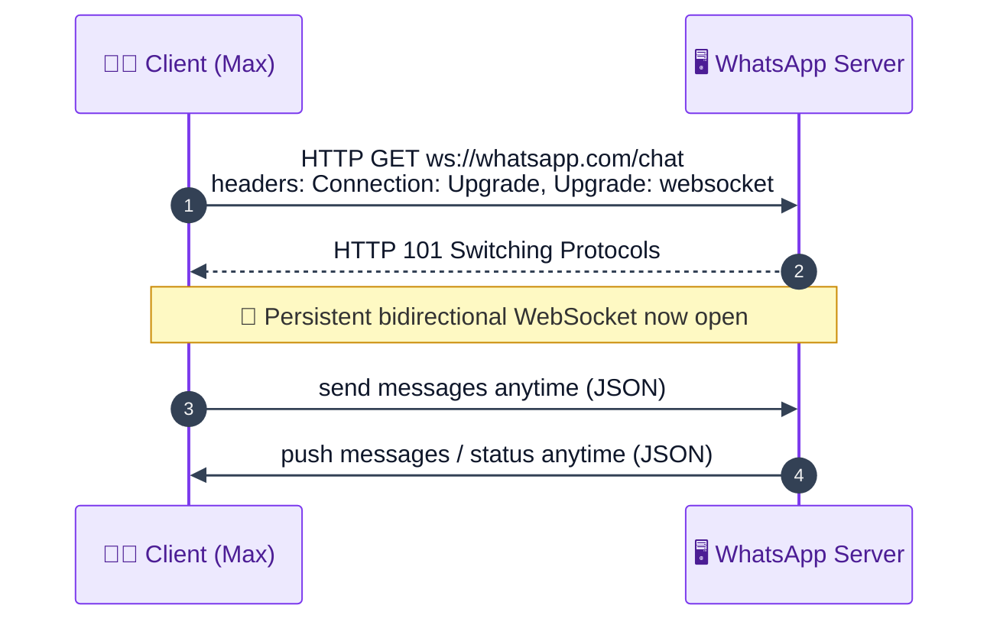

The client sends an **HTTP GET** with headers `Connection: Upgrade` and `Upgrade: websocket` to the `ws://whatsapp.com/chat` endpoint. The server replies **`101 Switching Protocols`**, and the connection is **upgraded** from HTTP to WebSocket. From then on it stays **open**; messages flow back and forth as **JSON** (or XML) with **no repeated HTTP headers/metadata** — which is why it's fast.

**So the full Max→Emily path uses *two* WebSocket connections:** Max↔Server and Emily↔Server. Max sends over his connection; the server relays over Emily's connection.

### Choosing the connectivity mechanism (the four real options)

Before defaulting to WebSockets, an interviewer wants you to know the *menu* of real-time transport options and why each fits or doesn't. There are four, plus plain REST:

- **Long-polling** — the client sends an HTTP request and the server **holds it open** until it has data (or a timeout), then responds; the client immediately re-requests. It *simulates* push over ordinary HTTP.
  - ✅ Simple, works everywhere, no special protocol.
  - ❌ Higher latency and overhead — every "push" is a fresh HTTP request/response with full headers, and there's a gap between responses. **Fine only when you are *not* latency-sensitive.** Chat needs sub-500 ms two-way traffic, so long-polling is too heavy here.

- **SSE (Server-Sent Events)** — a **one-way** persistent stream: the **server → client** only, over a single long-lived HTTP connection.
  - ✅ Great for server-driven feeds (live scores, notifications, dashboards); lightweight and auto-reconnecting.
  - ❌ **The channel only flows downward** — the client cannot push messages *up* over it rapidly (it would still need separate HTTP requests to send). Chat is heavily **bidirectional** (both sides send constantly), so SSE alone can't carry the "send" direction efficiently. ❌ ruled out.

- **WebSockets** — a **single persistent, full-duplex (two-way)** connection created by *upgrading* an HTTP request (the `101` handshake above). Either side can send a frame anytime with almost no per-message overhead.
  - ✅ Exactly matches chat: **frequent, low-latency, bidirectional** messaging over one connection.
  - ❌ Connections are **stateful** (each client is pinned to one server), which creates the scaling/routing challenges we tackle in §15–§16. **This is our choice.**

- **WebRTC** — a **peer-to-peer** channel that lets two clients exchange data/media **directly** (browser-to-browser), typically after a signaling handshake.
  - ✅ Ideal for **live audio/video calling** and ultra-low-latency P2P media (no server in the media path).
  - ❌ Overkill and awkward for text chat, which we *want* to route through the server (for storage, delivery guarantees, fan-out, moderation). Only relevant if the requirements include calling — which we scoped **out**.

- **Plain REST API** — request/response only.
  - ❌ **Cannot push server → client.** The server can never proactively deliver Emily's incoming message; she'd have to poll. So REST fits the *send* hop but not the *receive* hop — which is the whole reason we need a persistent connection.

**Decision rule of thumb:** not latency-sensitive → **long-polling**; server→client feed only → **SSE**; **frequent two-way, low-latency → WebSockets**; peer-to-peer audio/video → **WebRTC**. Chat lands squarely on **WebSockets**.

### 🔎 "Real WhatsApp uses raw TLS, not WebSockets" — what that means

You'll hear that production WhatsApp doesn't actually use WebSockets — it uses a **raw, long-lived TLS (encrypted TCP) socket**. Here's the nuance, and why it *doesn't change our design*:

- **What a WebSocket actually is:** a thin framing layer *on top of* a TCP connection, bootstrapped through HTTP (the GET → `101` upgrade). It exists mostly so **browsers** — which can only speak HTTP natively — can get a persistent two-way channel. It adds a small amount of overhead: the HTTP handshake, per-frame headers, masking of client frames, etc.
- **What "raw TLS" means:** WhatsApp's clients are **native mobile apps**, not browsers, so they don't need the HTTP-compatibility wrapper. They open a **plain TLS-over-TCP** connection straight to the servers and speak WhatsApp's **own custom binary protocol** over it. TLS gives the encrypted, persistent, bidirectional pipe; the custom protocol is even leaner than WebSocket frames (smaller headers, tuned for tiny messages and battery/bandwidth efficiency on phones).
- **Why the principle is identical:** in both cases you have **one persistent, bidirectional, server-pushable connection per client**, held open on a stateful server. Everything we design downstream — connection handlers, the client→server mapping, inter-server routing (§15–§16), the Messages+Inbox delivery guarantee (§17) — depends only on *"there is a long-lived connection the server can push down,"* not on whether the framing is WebSocket or raw TLS. So **using WebSockets in the interview is perfectly correct**; just be able to say "real WhatsApp uses a leaner raw-TLS + custom protocol to shave overhead, but the architecture is the same."

> **Interview tip:** lead with WebSockets (clear, standard, browser-friendly), then add the one-liner: *"Native apps like WhatsApp often use a raw TLS socket with a custom binary protocol to avoid WebSocket overhead, but conceptually it's the same persistent bidirectional connection."* That shows depth without over-complicating the diagram.

---

## 5. API Design — 1:1, Status, Last-Seen, Group 💻

WebSocket has **no standard REST-like contract** — you exchange **JSON commands** over the open connection. (The initial connect is the one HTTP request; after `101`, everything is JSON.)

### 5.1 Send a 1:1 message

Over the open WebSocket, the client sends a JSON frame:

```json
{ "type": "message", "from": "max", "to": "emily", "content": "Hi Emily", "time": "2024-08-04T13:00:00Z" }
```

#### Why you *could* model the first hop as `POST /v1/messages`

A chat message actually involves **two hops**: (1) **sender → server** ("store my message") and (2) **server → recipient** ("here's a new message"). The **first hop alone** is a perfectly normal "create a resource" operation, so early in an interview you can model it as a REST call to make the request/response concrete:

```http
POST /v1/messages
Content-Type: application/json

{
  "from":    "max",
  "to":      "emily",
  "content": "Hi Emily",
  "time":    "2024-08-04T13:00:00Z"
}
```
```http
201 Created
{
  "messageId": "m_991",
  "state":     "sent",          // reached the server → single tick
  "serverTime":"2024-08-04T13:00:00Z"
}
```

- **Why POST?** We're **creating** a new message record on the server — `POST` is the "create" verb; the endpoint `/v1/messages` names the resource collection, and `/v1` versions the API.
- **What the response tells the sender:** a server-assigned `messageId` (used later to track delivered/read) and `state: sent` — which is exactly what triggers the **single tick** on Max's screen.

**But the second hop breaks REST.** The server now has to **push** the message to Emily *and later* push status updates (delivered/read) back to Max — and REST can only respond to a request the client made, it can't initiate. That server→client push is impossible over plain HTTP, which is precisely why the real design uses a **persistent WebSocket** for both hops (§4). So: `POST /v1/messages` is a fine mental model for the *send* half; the *receive* half mandates WebSockets.

<details>
<summary><b>📨 Beginner walk-through — one full message life cycle (sent → delivered → read), with JSON at every step — click to expand</b></summary>

Follow a single message, **"Hi Emily"**, from Max's tap to the blue ticks. Assume both are online (offline just delays the middle steps until reconnect). Each step shows the exact JSON on the wire and what each screen shows.

**Setup:** Max is connected to WebSocket Handler 1 (WH1); Emily to WH2. Both connections were opened earlier via the `101` handshake.

---

**Step 1 — Max sends (client → server, over Max's socket).** Max types "Hi Emily" and hits send.
```json
{ "type": "message", "from": "max", "to": "emily", "content": "Hi Emily", "time": "13:00:00" }
```
📱 *Max's screen:* message appears with a **clock/pending** icon (not yet confirmed).

---

**Step 2 — Server stores it & confirms SENT (server → Max, over Max's socket).** WH1 → Message Service → writes the row `{messageId:m_991, from:max, to:emily, state:sent}` to the Messages DB, then tells Max:
```json
{ "type": "message_status", "messageId": "m_991", "status": "sent" }
```
📱 *Max's screen:* **single tick ✓** ("reached WhatsApp's servers").

---

**Step 3 — Server delivers to Emily (server → Emily, over Emily's socket).** WH1 finds Emily is on WH2 (via the Connections Manager) and relays; WH2 pushes:
```json
{ "type": "message", "messageId": "m_991", "from": "max", "content": "Hi Emily", "time": "13:00:00" }
```
📱 *Emily's screen:* the message appears in her chat (she hasn't necessarily opened the chat yet).

---

**Step 4 — Emily's phone ACKs receipt → DELIVERED (Emily's phone → server → Max).** Emily's app automatically acknowledges it *received* the message (this is not "read" — she may not have looked):
```json
// Emily's phone → server:
{ "type": "ack", "messageId": "m_991", "status": "delivered" }
```
The server updates `m_991` to `state:delivered`, looks up the sender (Max), finds his handler (WH1), and notifies him:
```json
// server → Max:
{ "type": "message_status", "messageId": "m_991", "status": "delivered" }
```
📱 *Max's screen:* **two black ticks ✓✓** ("delivered to Emily's device").

---

**Step 5 — Emily opens the chat & reads → READ (Emily's phone → server → Max).** Now Emily actually opens the conversation:
```json
// Emily's phone → server:
{ "type": "read_receipt", "messageId": "m_991" }
```
The server updates `m_991` to `state:read`, again routes a notification back to Max:
```json
// server → Max:
{ "type": "message_status", "messageId": "m_991", "status": "read" }
```
📱 *Max's screen:* **two blue ticks ✓✓** ("Emily has read it").

---

**Recap of the state machine** (stored in the `state` column of the Messages DB, and mirrored by the tick on Max's screen):

```
Max sends ──► [sent ✓] ──(Emily's device receives)──► [delivered ✓✓] ──(Emily opens chat)──► [read ✓✓ blue]
```

Notice the symmetry from §3.2: **3 writes** (store, →delivered, →read) and **3 reads/notifications** (Emily reads it + Max is told "delivered" + Max is told "read"). Every status change is *both* a DB update *and* a push back to the sender.

</details>

### 5.2 Message status update (server → sender)

```json
{ "type": "message_status", "messageId": "m_991", "status": "sent" }   // → single tick
// later: "delivered" (two black ticks), then "read" (two blue ticks)
```

### 5.3 Last-seen / online status

```json
// client → server (every minute while app is foreground):
{ "type": "online_status_update", "userId": "emily", "status": "active", "timestamp": "2024-08-04T16:05:00Z" }
// query (Max asking for Emily's last seen):
{ "type": "online_status_query", "userId": "emily" }  →  server responds { lastSeen: "16:05" }
```

### 5.4 Group message

```json
{ "type": "group_message", "groupId": "g_1", "senderId": "max", "content": "meeting at 3 PM today", "timestamp": "..." }
```

The server looks up group members and **relays** to each (except the sender).

### 5.5 Command summary (Transcript 2 style)

| Direction | Command | Purpose |
|---|---|---|
| Client → Server | `CreateChat(participants)` | start a chat/group |
| Client → Server | `SendMessage(chatId, content)` | send a message |
| Client → Server | `CreateAttachment(chatId, mediaType)` | request media upload |
| Client → Server | `ModifyParticipants(chatId, userId, action)` | add/remove member |
| Server → Client | `NewMessage(messageId, chatId, content, senderId, timestamp)` | deliver a message |
| Server → Client | `ChatUpdated(chatId, action)` | chat/participant change |

---

## 6. Core Entities & Data Model 🗃️

Before services, name the **nouns**. In WhatsApp all users are **peers** (no privileged actor like Uber's rider/driver). Core entities:

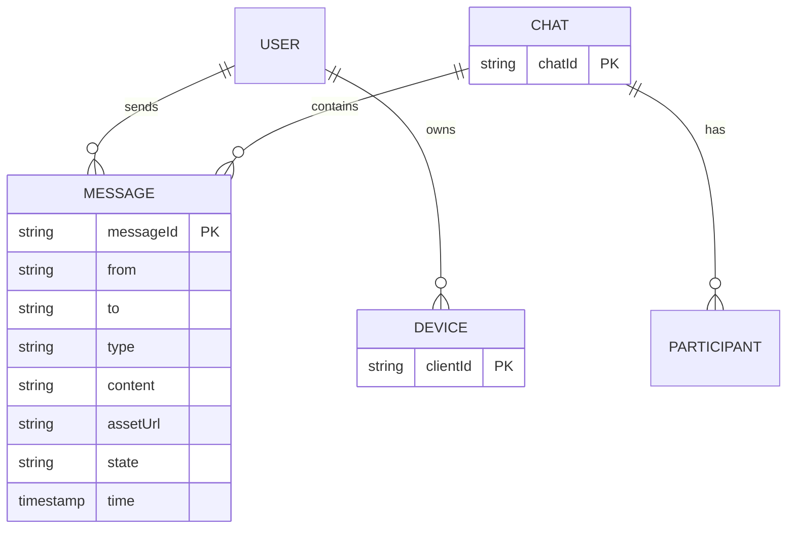

- **User** — a peer who sends/receives.
- **Chat** — a conversation (a 1:1 is just a group of 2).
- **Message** — the content + metadata + state.
- **Device / Client** — *offline is a property of a device, not a user* (T2): your phone can be off while your laptop is on. Tracking delivery **per device** matters for multi-device (§20).

### Why "get the entities right" matters (beginner clarity)

Entities are the **nouns** your whole design is built on — they become your **database tables**, the **fields in your API/JSON**, and the **things services pass around**. Getting them wrong early quietly breaks everything downstream. A concrete example of a subtle-but-important entity choice:

- **User vs Device.** It's tempting to say "deliver the message to the *user* Emily." But Emily might have WhatsApp on a **phone (off)** and a **laptop (on)**. "Emily" isn't online or offline — *a specific device is*. If your model only knows "Emily," you can't answer "has this message reached her laptop yet, and does her phone still need it when she turns it on?" So we introduce a **Device/Client** entity. Early on we simplify to one device per user (fewer moving parts), and we **layer devices back in** as an explicit extension in §20 — this is a good interview habit: start simple, name the entity that will let you extend later.

Mapping entities to the four features (a quick sanity check that your nouns cover the requirements):

| Feature | Entities it needs |
|---|---|
| 1:1 & group messaging | **User**, **Chat**, **Message** |
| Delivery/read status | **Message** (its `state` field) |
| Offline delivery | **Device** (which device still needs the message) |
| Group messaging | **Chat** with many participants |

Full per-database schemas are in [§13–§14](#13-deep-dive--database-selection-) and [B6](#b6-data-model--schema-). We keep entities light here and flesh them out as the design demands.

---

## 7. WebSocket Connection Establishment & Handlers 🔗

Zoom into the **server side** of the WebSocket handshake. The GET-upgrade request first hits the **API Gateway**, which routes it (via a **load balancer**) to specialized **WebSocket Handler** servers whose *only* job is to hold open connections.

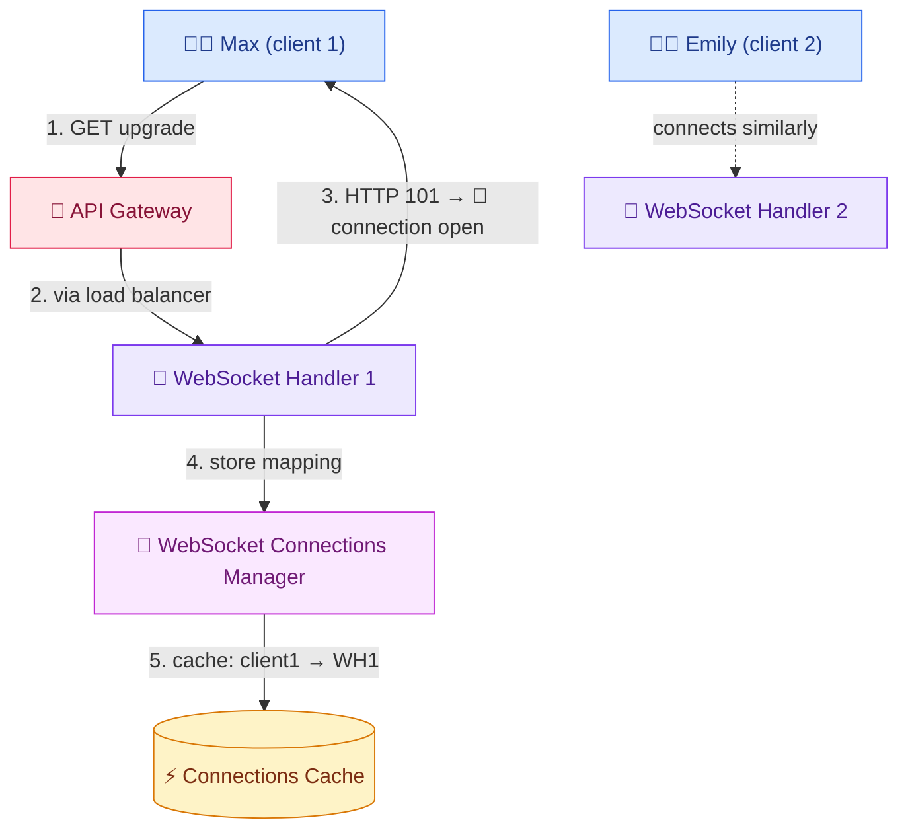

**The key data structure — the connection mapping.** After the handshake, the handler tells the **WebSocket Connections Manager** service "client 1 is connected to me (WH1)," and the manager stores this in a **cache**: `client1 → WH1`, `client2 → WH2`, … This mapping is *how one handler finds another*.

**Why it's needed:** if Max (on WH1) wants to message Emily (on WH2), WH1 must discover *which handler holds Emily's connection*. It asks the Connections Manager (cache lookup) → "WH2" → WH1 relays the message to WH2 (handlers are **interconnected** via internal WebSocket) → WH2 pushes it to Emily.

### 🧠 Beginner intuition — why we even need a "connections manager"

Here's the core problem in plain terms. A WebSocket connection is an **open socket that lives inside the memory of one specific server process**. WH1 can *only* push down sockets it personally holds — it has no way to reach into WH2's memory. So when Max (on WH1) wants to reach Emily, WH1's real question is: *"which physical machine is currently holding Emily's socket?"*

That's exactly what the **Connections Manager + cache** answers. Think of the cache as a tiny phone book:

```
Connections Cache (in Redis):
  max   → WH1
  emily → WH2
  mike  → WH4
```

**Concrete example (Max → Emily):**
1. Max's frame arrives at **WH1**.
2. WH1 looks up `emily` in the cache → **WH2**.
3. WH1 relays the message to **WH2** over an internal server-to-server WebSocket.
4. WH2 finds Emily's socket in *its own* local memory and pushes the message down it.

Why a **cache** (Redis) and not a database? This lookup happens on **every single message** at ~0.34M/sec, so it must be sub-millisecond; a disk-backed DB would be far too slow. Why does the mapping change? Because connections are **ephemeral** — every time a user's app reconnects (network blip, app reopen, phone wakes), they may land on a **different** handler via the load balancer, so the entry is rewritten. The mapping is *live routing state*, not permanent data.

> **Design note:** one handler holds **many** clients (a handler ≈ 2M connections). Holding millions of open, persistent connections is heavy, so handlers are given **no other responsibility** — all business logic lives in other services (message service, group service, etc.).

> **Why keep handlers "dumb"?** Each open socket consumes memory (buffers) and a file descriptor, and the handler must service heartbeats/frames for millions of them. If you also made the handler do validation, DB writes, encryption, group fan-out, etc., a spike in that work could stall the socket loop and drop connections. So handlers do exactly one thing — **hold connections and shuttle frames** — and hand everything else to stateless services that can scale independently. This *separation of the stateful connection layer from the stateless logic layer* is the single most important structural idea in the whole design.

---

## 8. HLD — 1:1 Messaging & Offline Storage 📨

### Naive flow (breaks if recipient goes offline)

Max→WH1→(lookup Emily's handler via Connections Manager)→WH2→Emily. Problem: if Emily's phone dies **just before** WH2 pushes the message, her connection breaks and **the message is lost**.

### Fix: persist every message first

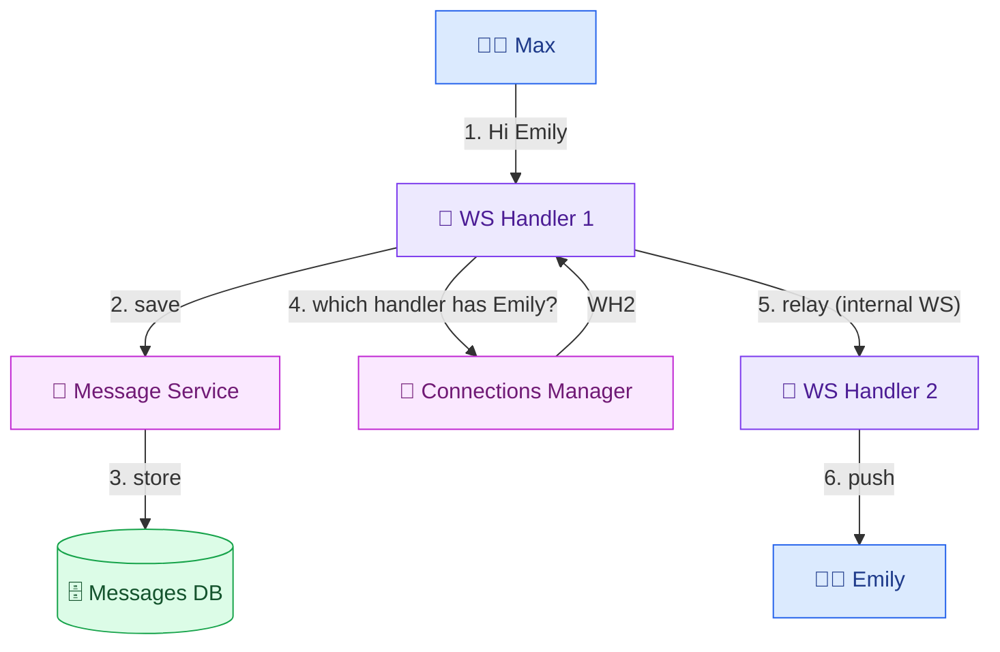

**Steps:** (1) Max sends over his WebSocket to WH1; (2) WH1 hands the message to the **Message Service**; (3) Message Service **persists** it in the **Messages DB** (`from, to, message, time, state=sent`); (4) WH1 asks the Connections Manager which handler has Emily → WH2; (5) WH1 relays to WH2; (6) WH2 pushes to Emily.

### 🧠 Why persisting *first* is the whole trick

The naive design treats the WebSocket as the *only* copy of the message in flight — so a dropped connection = a lost message. The fix separates **two concerns** that beginners often conflate:

- **Durability** (will the message survive?) → guaranteed by **writing to the Messages DB before we even try to deliver**. Once it's on disk, no network hiccup can lose it.
- **Delivery** (did it reach the recipient's screen?) → attempted over the live socket, but if that fails, the durable copy lets us **retry later**.

So the order matters: **store, *then* attempt to deliver.** If delivery succeeds, great; if not, the message waits safely in the DB with `state=sent` (meaning "on the server, not yet delivered").

### 👤 Full sender-receiver scenario: Emily is offline

```
13:00  Max sends "Hi Emily".
       → WH1 → Message Service → Messages DB row {m_991, to:emily, state:sent}
       → WH1 asks Connections Manager for Emily's handler → cache says "emily → WH2"
       → WH1 relays to WH2 → WH2 tries to push...
13:00  ...but Emily's phone died a second ago. WH2's socket to Emily is gone.
       → delivery fails, BUT m_991 is safely in the DB (state=sent). Nothing lost.
15:00  Emily reopens WhatsApp (2 hours later).
       → new 101 handshake → she lands on, say, WH2 again
       → Connections Manager re-caches "emily → WH2"
       → WH2 asks Message Service: "any undelivered (state=sent) messages for emily?"
       → Message Service queries Messages DB by receiverId=emily, state=sent → finds m_991
       → WH2 pushes "Hi Emily" down Emily's fresh socket → delivered ✓✓
```

The query that powers the reconnect — *"give me all messages where `to = emily` and `state = sent`"* — is why we **index the Messages DB on `receiverId`** (§14): it turns "find this user's pending messages" into a fast lookup instead of a full scan.

> **Where does the retry come from?** Two triggers deliver stored messages: (a) the recipient **reconnects** (as above) and the handler proactively drains their pending messages, and (b) while online, a fresh **push** attempt over the socket. Later (§17) we make this rigorous with an **Inbox table + ACKs**, which is the production-grade version of "undelivered = state:sent."

---

## 9. HLD — Media / Attachment Messages 🖼️

Conceptually identical to text, **except we send an asset URL, not the bytes**. Media is uploaded *before* the send, to object storage + CDN.

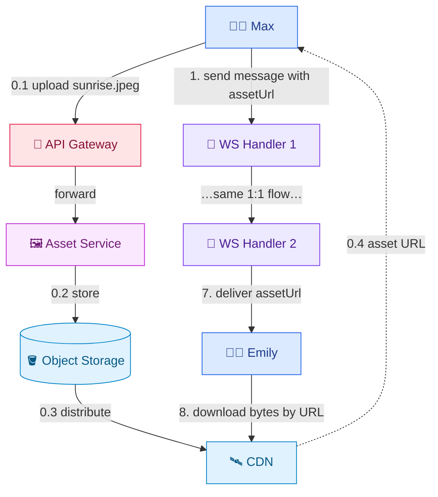

**Steps 0.1–0.4 (before send):** Max taps ➕, picks the image → it uploads via the **Asset Service** to **object storage**, which distributes to the **CDN**; Max gets back an **asset URL**. **Steps 1–7:** the normal 1:1 flow, but the message body carries the **asset URL** instead of bytes. **Step 8:** Emily receives the URL and **downloads the actual image from the CDN** — this is the "tap to download" you see when auto-download is off.

### 🧠 Why send a URL instead of the actual bytes

The key realization: a text message is ~100 bytes, but a video can be **hundreds of megabytes**. Our chat servers are tuned to shuttle **millions of tiny frames**; forcing a 200 MB video through the same WebSocket path would (a) hog the socket for seconds, blocking other messages, and (b) balloon memory on the connection-heavy handlers. The message DB is even worse for blobs — it's built for small structured records, not gigabyte binaries.

So we **decouple the heavy bytes from the light message**:
- The **bytes** go to **object storage** (e.g., S3) — purpose-built for huge files, cheap, durable — and are distributed by a **CDN** (edge servers near users) for fast downloads.
- The **message** carries only a tiny **asset URL** (a string, ~50 bytes) — a *pointer* to where the bytes live. The chat path stays as light as a text message.

### 👤 Sender-receiver flow with the pre-signed URL pattern

The production-grade way (T2) uses a **pre-signed URL** so the bytes never touch our app servers at all:

```
Max wants to send sunrise.jpeg (2 MB):
 0.1  Max's app → server: "I want to upload an image."
 0.2  server → S3: "give me a pre-signed upload URL" (short-lived, ~1 hr, write-only to one path)
 0.3  server → Max: here's the pre-signed URL
 0.4  Max's app → S3 DIRECTLY: PUT the 2 MB bytes  (bypasses our chat servers entirely)
      S3 now holds the file at https://cdn.whatsapp.com/media/abc123.jpg
 1    Max → WH1: normal message, content = { assetUrl: "https://cdn.../abc123.jpg", type: "image" }
 …    (same 1:1 flow: store, route, deliver the small message)
 7    WH2 → Emily: message with the assetUrl
 8    Emily's app → CDN DIRECTLY: GET the bytes from the URL → renders the image
```

- **"Pre-signed" URL** = a URL with a built-in, time-limited authorization token, so the client can upload/download **directly to storage** without going through our servers, yet only for that one file for a short window (secure).
- **What you see in the app:** when auto-download is off, step 8 is the **"tap to download"** button — the message (with its URL) arrived instantly, but the actual bytes are fetched only when you ask.

> **Enrichment (T2 — why not push bytes through chat servers):** storing multi-GB blobs in the message DB (DynamoDB) is wrong, and pushing gigabyte payloads through connection-heavy chat servers (built for tiny "OMW" texts) is an architectural smell. Use **blob storage (S3) + pre-signed URLs**: client asks the server for a short-TTL pre-signed upload URL, uploads **directly to S3**, then sends just the resulting URL in the message. Recipients fetch bytes directly from storage/CDN. This reuses the tiny-message infrastructure for media.

---

## 10. HLD — Message Status Ticks (sent / delivered / read) ✓✓

Three states, each a status update pushed **back to the sender** over his WebSocket so his app renders the right tick.

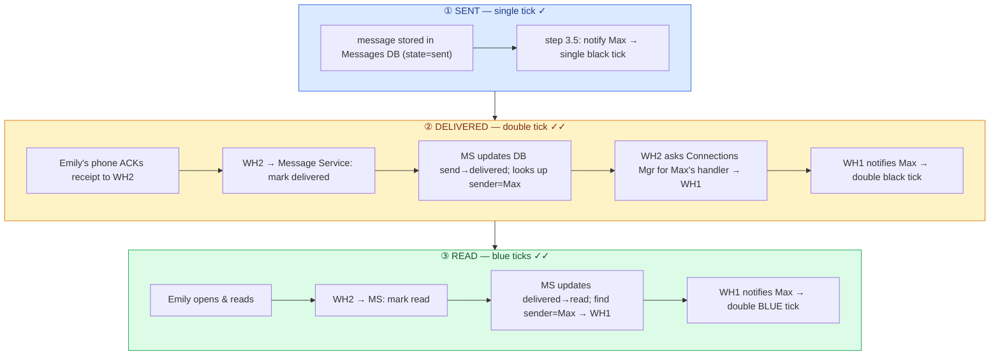

- **Sent (single tick):** right after step 3 (message stored on server), add **step 3.5** — notify Max his message reached the server → single tick.
- **Delivered (double black tick):** after Emily's phone receives the message (step 8), it **ACKs** WH2; WH2 tells the Message Service → updates state `send→delivered`; MS looks up the **sender (Max)**; WH2 asks the Connections Manager which handler has Max (→WH1); WH1 notifies Max → double tick (~step 14).
- **Read (double blue tick):** when Emily actually opens/reads (step 15), the same chain updates `delivered→read` and notifies Max → blue ticks.

### 🧠 The two things a beginner must grasp about ticks

**1. "Delivered" and "Read" are triggered by two *different* signals from the recipient.**
- **Delivered** fires **automatically** the instant the message lands on Emily's *device* — her app ACKs it in the background even if the phone is in her pocket. It means "the bytes reached her phone," not "she saw it."
- **Read** fires only when Emily **actively opens the chat** and the app sends a **read receipt**. It means "her eyes were on it."
- That's why you often see two black ticks long before they turn blue — delivered (device got it) precedes read (she opened it). If Emily has *read receipts turned off*, the app simply never sends the read receipt, so it stays at two black ticks forever.

**2. How the server knows *whom* to notify.** A status change originates from the **recipient's** side (Emily's device), but the tick must appear on the **sender's** (Max's) screen. So on every status change the server does a small reverse lookup:
```
Emily's device → "m_991 delivered"
   → Message Service updates state, reads m_991.from → "max"   (who to tell)
   → Connections Manager: which handler has max? → WH1          (where he is)
   → WH1 pushes { message_status: m_991, delivered } down Max's socket → ✓✓
```
This "**find the sender, route the notification back**" is the same connection-lookup machinery from §7, just used in reverse. It's *also* why status changes count as **reads** in the throughput math: each one causes a server→sender push.

> The recurring pattern: **update state in DB → find the original sender → route a notification back to the sender's handler via the Connections Manager.** This is why each status change is *also* a read (the sender must be notified) — the "3 reads per message" from §3.2.

---

## 11. HLD — Last Seen & Online Status 🟢

"Online" here means **the app is open/foreground and actively used** (not merely "internet on"). While the app is in the foreground, it **pings the server every minute**; the server records the latest timestamp.

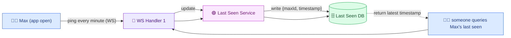

**Flow:** Max opens the app at 1:00 PM → ping (via WS) → WH1 → **Last Seen Service** → writes `{max, 13:00}` to the **Last Seen DB**. Every minute (1:01, …, 1:09) a new ping overwrites it. At 1:10 Max closes the app → **no more pings**, so the stored last-seen stays at **1:09**. When anyone queries Max's last-seen, the server returns the stored timestamp (or "online" if a ping arrived within the last minute).

### 🧠 Beginner intuition — "last seen" is just the timestamp of the last ping

The elegant part: there is **no separate "went offline" event to capture**. We don't need the phone to reliably tell us "I'm closing now" (which it often can't — the app might be force-killed or lose signal). Instead:

- While the app is **foreground/active**, it sends a tiny **heartbeat ping** every minute; each ping just **overwrites** the stored timestamp.
- When the app closes, **pings simply stop** — and the last value that was written *is* the last-seen time. No explicit disconnect handling needed.

**Deriving "online" vs "last seen X":** on a query, the server compares the stored timestamp to *now*:
```
if (now − lastSeenTimestamp) < ~1 minute  → show "online"     (a ping arrived very recently)
else                                        → show "last seen 1:09 PM"
```

### 👤 Sender-receiver scenario: Max is active, Emily checks

```
1:00  Max opens app → ping → Last Seen DB: { max → 13:00 }
1:01  still open   → ping → { max → 13:01 }   (overwrites)
 ...
1:09  still open   → ping → { max → 13:09 }
1:10  Max closes app → NO ping sent → DB stays at { max → 13:09 }
1:12  Emily opens her chat with Max → app queries "last seen for max"
      → server: now(1:12) − 1:09 = 3 min > 1 min → returns "last seen today at 1:09 PM"
```

If Emily had checked at 1:05 (while Max was still pinging), the server would have seen a <1-min-old timestamp and shown **"online"** instead.

> **Trade-off:** a per-minute ping from *every* online user is a large write load — but each write is tiny (`clientId + timestamp`) and the query is a simple key lookup, which is why a **NoSQL** store handles it well (§13). Coarser ping intervals reduce load at the cost of last-seen precision.

> **Why overwrite instead of append?** We only ever care about the *latest* activity time, so each ping does a single-key **overwrite** (`SET max → 13:09`), not an append. That keeps storage at exactly **one row per user** forever, no matter how many pings — hugely cheaper than logging every ping.

---

## 12. HLD — Group Messaging 👥

Like 1:1, but the server **fans out** to all members. A **message queue** and a **group service** decouple the fan-out.

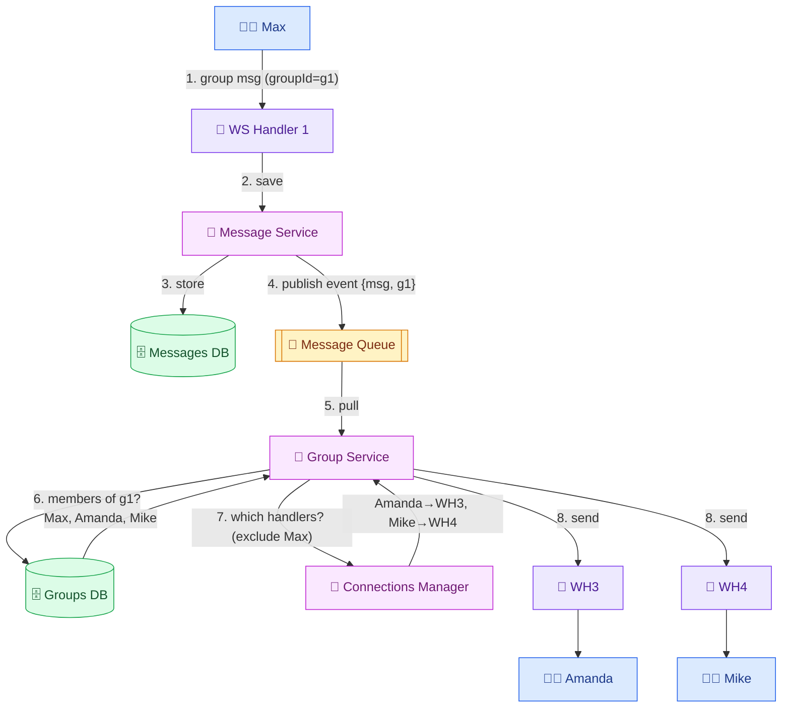

**Steps:** (1) Max sends a group message; (2–3) Message Service stores it in Messages DB (`state=sent`); (4) MS **publishes an event to a message queue** containing the message + target group; (5) the **Group Service** pulls the event; (6) it reads the **Groups DB** to find members of `g1` = Max, Amanda, Mike; (7) it asks the Connections Manager which handlers hold **Amanda and Mike** (excluding the sender Max) → WH3, WH4; (8) it sends to those handlers, which deliver to each member.

### 🧠 The one new idea vs 1:1 — "fan-out"

**Fan-out** = one incoming message must be **copied out to many recipients**. In 1:1 that's a fan-out of 1; in a group of N it's a fan-out of N−1 (everyone except the sender). The mechanics are otherwise the same as 1:1 (store → find each recipient's handler → deliver), just repeated per member.

Two new pieces make this clean:
- **Groups DB** answers "who is in group g1?" → `g1 → [max, amanda, mike]`. Without it, the server wouldn't know whom to fan out to.
- **A message queue** sits between "store the message" and "deliver to everyone." Why? A group message can explode into many deliveries; doing all of them **synchronously** would make the sender wait and could stall the fast 1:1 path. The queue lets the Message Service **store-and-return immediately**, while the **Group Service** consumes the event and does the (potentially slow, bursty) fan-out on its own schedule.

### 👤 Sender-receiver scenario: Max messages a 3-person group

```
Group g1 = { max, amanda, mike }.  Max sends "meeting at 3 PM today".
1  Max → WH1
2-3 Message Service stores it in Messages DB (state=sent)
4  Message Service publishes an EVENT to the message queue: { messageId, groupId:g1 }
   → and returns to Max immediately (he's not blocked on delivery)
5  Group Service pulls the event from the queue
6  Group Service reads Groups DB: g1 → [max, amanda, mike]
7  It EXCLUDES the sender (max) → targets = [amanda, mike]
   → asks Connections Manager: amanda→WH3, mike→WH4
8  Group Service sends to WH3 (→ Amanda) and WH4 (→ Mike). Both receive the message.
```

The **"exclude the sender"** step matters — Max already has the message on his own screen; echoing it back would create a duplicate. And each recipient independently goes through the same **delivered/read** tick flow (§10) and **offline** handling (§8) as a 1:1 message.

> **Why a queue here (nuance):** fan-out to a group can be heavy and bursty; the queue **decouples** the fast store from the slower multi-recipient delivery and absorbs spikes, letting the Group Service process at its own pace. It also isolates group fan-out from the 1:1 hot path.

> **Storage model note:** we store the message **once** in the Messages DB and fan out *pointers/deliveries*, rather than duplicating the full message body per member. That keeps storage linear in messages, not in (messages × members) — important when groups are large (the per-recipient delivery tracking is handled by the Inbox table in §17).

---

## 13. Deep Dive — Database Selection 🗄️

General guidelines (not black-and-white; depends on project needs):

| Signal | Lean toward |
|---|---|
| Need fast data access | **NoSQL** |
| Very large scale | **NoSQL** |
| Fixed, structured data | **SQL** |
| Unstructured / variable data | **NoSQL** |
| Complex queries (joins) | **SQL** |
| Data evolves / changes frequently | **NoSQL** |

Apply to WhatsApp's three databases — all land on **NoSQL**:

| DB | Structure | Scale | Query pattern | Choice |
|---|---|---|---|---|
| **Messages DB** | no fixed structure (text/image/video/doc) | billions of users, huge write+read | fetch undelivered by receiver | **NoSQL** (low-latency, high-throughput) |
| **Groups DB** | simple `groupId → [userIds]` | high | "who's in group X" (simple) | **NoSQL** (key-value) |
| **Last Seen DB** | `clientId → timestamp` | frequent per-minute pings, billions | "last seen for user X" (simple) | **NoSQL** (high write throughput, low-latency read) |

> **Reasoning shown, per transcript:** messages lack a fixed schema + demand real-time low latency at billions-scale → NoSQL; groups need a trivial key→list lookup at high throughput → NoSQL; last-seen has enormous write volume (per-minute pings) with a single-key read → NoSQL. The interviewer wants you to *walk the guidelines per store*, not declare "NoSQL everywhere" blindly.

### 🧠 What SQL vs NoSQL actually means here (beginner primer)

- **SQL (relational)** = data in **fixed tables** with a rigid schema (every row has the same columns); great at **joins** and **complex queries**; scaling horizontally (sharding) is more manual. Think PostgreSQL/MySQL.
- **NoSQL** = flexible or schemaless records (a row can have different fields), often **key-value** or wide-column; built to **scale horizontally** across many nodes with low-latency lookups; weaker at joins/complex queries. Think DynamoDB/Cassandra.

You don't memorize "NoSQL good" — you **run each database through the guidelines** and justify it. Worked reasoning for each:

- **Messages DB → NoSQL.** *Fixed structure?* No — a message can be text, or an image with an `assetUrl`, or a video; fields vary. *Scale?* Billions of users, ~0.34M writes/sec. *Query complexity?* Simple — "give me undelivered messages for this receiver," no joins. All three signals (variable schema + huge scale + simple query) point to NoSQL.
- **Groups DB → NoSQL.** The data is literally a **key→list**: `groupId → [userIds]`. The only query is "members of group X." A key-value store nails this with a single fast lookup; no relational features needed.
- **Last Seen DB → NoSQL.** Enormous **write** volume (every online user pings every minute) with a trivial `clientId → timestamp` overwrite and single-key read. NoSQL's high write throughput + low-latency KV read is the perfect match; a relational DB would strain under the write rate for no benefit.

### 👤 Tiny example — how each store answers its one question

```
Messages DB   (NoSQL, key=messageId, index on receiverId)
   query: "undelivered for emily" → WHERE to=emily AND state=sent → [m_991]
Groups DB     (NoSQL, key=groupId)
   query: "members of g1"         → GET g1 → [max, amanda, mike]
Last Seen DB  (NoSQL, key=clientId)
   query: "last seen for max"     → GET max → 13:09
```
Every hot query is a **single-key lookup** — exactly what NoSQL KV stores are fastest at, which is why they win here.

> **Enrichment (T2 counterpoint):** DynamoDB (a NoSQL KV store) is a fine default, but **don't reflexively dismiss relational DBs** — a well-sharded MySQL can do millions of TPS. Chat's access pattern (write message, look up participants, fetch inbox) suits KV/wide-column, but the choice is defensible either way; state the trade-off.

---

## 14. Deep Dive — Detailed Schemas & Indexes 🗃️

**Messages DB (NoSQL)**

| Field | Notes |
|---|---|
| `messageId` | unique per message |
| `from` (sender ID) | who sent it |
| `to` (receiver/group ID) | recipient user or group |
| `type` | text / image / video |
| `message` | the actual text |
| `assetUrl` | link to image/video/file (media messages) |
| `state` | sent / delivered / read |
| `time` | when sent |

- **Common query:** *"fetch all messages with `to = me` and `state = sent"* — how a reconnecting client retrieves undelivered messages. → **index on `receiverId`** (a shortcut to find by recipient).

**Groups DB (NoSQL)**

`groupId (PK)`, `groupName`, `groupDescription`, `creatorId`, `members [userIds]`, `createdTime`, `lastUpdatedTime` (updated on add/remove member).
- **Common query:** *"which users are in group X"* → **index on `groupId`**.

**Last Seen DB (NoSQL)**

`clientId (PK)`, `lastSeenTime`.
- **Common query:** *"last seen for client X"* → **index on `clientId`**.

**Enrichment — the Chat / Participant / Inbox tables (T2 model):**

- **Chat table:** `chatId (PK)`, name, metadata.
- **Chat Participant table:** partition key `chatId`, sort key `participantId` → lets you list all participants of a chat; a **Global Secondary Index (GSI)** keyed on `participantId` lets you list all chats a user is in (the reverse query).
- **Inbox table:** `recipientId` + `messageId` → one **pointer row per recipient** for undelivered messages; deleted on ACK (§17).

### 🧠 What "index," "partition/shard key," and "GSI" actually mean

Three DB concepts show up here; beginner-friendly definitions with why each matters:

- **Index** = a lookup shortcut. Without an index on `receiverId`, finding "all messages for Emily" means **scanning every row** in the table (billions) — impossibly slow. An index is like a sorted side-table `receiverId → [row locations]`, so the DB jumps straight to Emily's rows. *Rule: index the field you filter/look-up by.* Here that's `receiverId` (messages), `groupId` (groups), `clientId` (last-seen).
- **Partition / shard key** = the field used to decide **which physical machine** a row lives on (`node = hash(key) mod N`). Because our data is far too big for one machine, we split it across many. A **good** shard key is **high-cardinality and evenly accessed** so load spreads out — `receiverId`/`chatId`/`groupId`/`clientId` all qualify (billions of distinct values, no single hot value). A *bad* key (e.g., "country") would pile most traffic on a few shards.
- **GSI (Global Secondary Index)** = a second index on a *different* key that DynamoDB maintains for you, so you can query the same data **two ways** without reorganizing it. Example below.

### 👤 Why the Chat Participant table needs a GSI (two-directional lookup)

A chat app needs to answer **two opposite questions**, and one key can't serve both efficiently:

```
Question A: "who is in chat c1?"        → need to look up BY chatId
Question B: "which chats is emily in?"  → need to look up BY participantId
```

The Chat Participant table's **primary key** is `(chatId, participantId)` — partition by `chatId`, so **Question A** ("participants of c1") is a fast lookup: all rows with `chatId=c1` are together. But **Question B** ("Emily's chats") would require scanning every chat. The fix is a **GSI keyed on `participantId`**: DynamoDB keeps a second copy indexed by participant, so "give me all rows with `participantId=emily`" is *also* a fast lookup. One dataset, two access patterns, no duplication in your app code.

> **Sharding:** shard Messages by `chatId`/`receiverId`, Groups by `groupId`, Last Seen by `clientId` — all high-cardinality keys for even distribution.

---

## 15. Deep Dive — Scaling: The Routing Problem 🧭

A **single chat server** works but doesn't scale (availability + the ~2M-connection ceiling). We need **hundreds–thousands** of chat servers. That introduces two things:

### Load balancing WebSockets needs **Layer 4**, not Layer 7

A normal web (L7/HTTP) load balancer terminates each request and forwards it to *any* stateless server. But WebSockets are **connection-oriented** — a client must stay bound to **one specific server** for the life of the connection. So use an **L4 load balancer**: it creates a symmetric TCP connection to a backend chat server and keeps the client "glued" to it (the LB is effectively invisible). Balancing policy: **least connections** — send new connections to the server with the fewest open sockets (since the open socket is the scarce resource), which naturally saturates freshly-added servers.

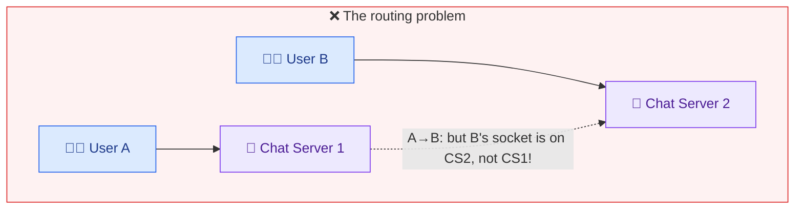

### 🧠 L4 vs L7 load balancer, in plain terms

A load balancer spreads incoming traffic across many backend servers. It can operate at two "layers":

- **L7 (application/HTTP layer):** understands HTTP. It reads each **request**, then forwards it to *any* backend, gets the response, and returns it. Perfect for **stateless** web servers where every request is independent — request 1 can go to server A, request 2 to server B, nobody cares.
- **L4 (transport/TCP layer):** understands only **TCP connections**, not HTTP requests. When a client opens a connection, the L4 LB opens **one matching connection to a chosen backend** and then just **pipes bytes** back and forth for the life of that connection.

**Why WebSockets force L4:** a WebSocket is **one long-lived connection** that must stay pinned to the **exact server holding it in memory** — you can't send frame 1 to server A and frame 2 to server B, because only A has that socket's state. An L7 LB (which load-balances *per request*) would break this; an **L4 LB** keeps the client glued to one backend for the whole session, which is exactly what a stateful connection needs. Policy: **least-connections** (route new connections to the server with the fewest open sockets), because the scarce resource is *open sockets* (~2M/server), and this quickly fills up newly-added servers.

### The routing problem itself

Once connections are spread across servers, **User A on Chat Server 1** can't directly push to **User B on Chat Server 2** — CS1 doesn't hold B's socket. The servers must **talk to each other** to route the message to the server that owns the recipient's connection. *How* they do that is the central scaling decision (§16).

**Concrete picture of why it breaks:** in the single-server world, A and B were on the *same* machine, so that machine had *both* sockets in its local memory and could just push B's socket directly. Split across servers:
```
A ── socket ──► CS1 (memory: holds A's socket)      "A→B: deliver to B"
                   ✗ CS1 has NO socket for B
B ── socket ──► CS2 (memory: holds B's socket)
```
CS1 literally cannot reach into CS2's memory. So we need a mechanism for **CS1 to tell CS2 "push this to B."** The three ways to build that mechanism are §16.

---

## 16. Deep Dive — Kafka vs Consistent Hashing vs Redis Pub/Sub ⚖️

Three ways to solve inter-server routing. This progression is the heart of the senior/staff discussion.

### ❌ Attempt 1 — Kafka topic per user

Idea: a Kafka topic per user; a chat server subscribes to the topics of its connected users; to send, publish to the recipient's topic.
**Why it fails:** Kafka isn't built for **billions of tiny topics** — each topic carries ~**50–100 KB** of metadata (→ terabytes just for metadata), and Kafka doesn't handle **rapid connect/disconnect** of millions of short-lived micro-topics. Wrong tool.

### ⚠️ Attempt 2 — Consistent hashing ring

Idea: a user is deterministically **owned by a specific chat server** (via a consistent-hash ring). Drop the L4 LB; expose servers via DNS; add a stateless **Chat Registry** so a client can ask "which server do I connect to?"; store the ring/cluster membership in **Zookeeper/etcd**.

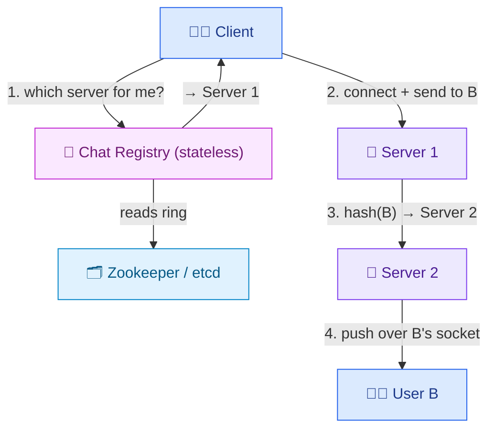

**Pros:** predictable routing (server 1 hashes B → server 2, sends directly). **Cons:** **scaling is an orchestration nightmare** — adding a server remaps ~**20%** of connections; you must *slowly* disconnect/reconnect misassigned users (avoid a **thundering herd**), and during rebalancing you may have to send a message to **both** the old and new server for a user in flight. Also risk of **hot servers** (uneven load).

### ✅ Attempt 3 — Redis Pub/Sub (the sweet spot)

Idea: externalize routing (Kafka's *structural* insight) but with the right tool. When a client connects to *any* chat server (via the L4 LB, least-connections), that server **subscribes to a Redis Pub/Sub topic named after the user's ID**. To deliver, the sending server just **publishes to the recipient's user-ID topic** — Redis routes it to whichever server holds that subscription, which pushes it down the socket. Senders **don't need to know the topology**.

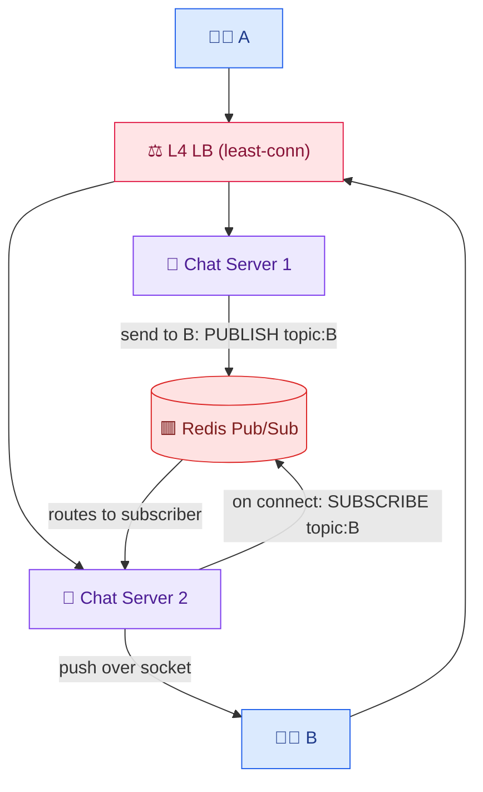

### 🧠 How Redis Pub/Sub solves routing (beginner mental model)

Pub/Sub ("publish/subscribe") is a **message-board pattern**: subscribers say "notify me about *topic X*," publishers "post to *topic X*," and the broker instantly forwards each post to everyone subscribed to that topic. Redis implements this with an internal map of `topic → [connected subscribers]`.

We use **one topic per user**, named after their ID (`topic:emily`). The flow:
```
When Emily connects to CS2:  CS2 → Redis: SUBSCRIBE topic:emily
When Max (on CS1) sends to Emily:  CS1 → Redis: PUBLISH topic:emily {message}
   → Redis looks up who's subscribed to topic:emily → CS2
   → Redis forwards the message to CS2
   → CS2 finds Emily's socket locally → pushes it down
```
The beauty: **CS1 never needs to know where Emily is.** It just shouts "for topic:emily!" into Redis, and Redis handles finding the right server. Compare to consistent hashing, where CS1 had to *compute* Emily's server itself and maintain the ring — Pub/Sub hides all that behind the broker. That's why it's "topology-free" from the chat servers' point of view.

**Why it's OK that Redis Pub/Sub is at-most-once (zero durability):** delivery is *already* guaranteed independently by the **durable Messages + Inbox tables** (§17) — if the ephemeral pub/sub drops a message, the client retrieves it on reconnect. Redis Pub/Sub is just a **lightweight real-time echo** for the <500 ms online path.

Put differently, we deliberately give each layer **one job**:
- **Durability / "will it arrive?"** → the Messages + Inbox tables (persist first, deliver-or-retry).
- **Real-time speed / "arrive *now* if you're online"** → Redis Pub/Sub (fast, lossy, cheap).

Because durability is *already handled*, we're free to pick the **fastest, simplest** thing for the real-time hop — and a dropped Pub/Sub message is harmless (the recipient just gets it from their inbox a moment later on reconnect/poll). This "durable store + ephemeral fast path" split is the key insight that makes an at-most-once router acceptable for a chat app.

**Remaining cost:** scaling the Redis cluster still has an orchestration cost (moving topics/connections across shards), and you need **N×M connections** (N chat servers × M Redis nodes) — a potential bottleneck only at extreme (trillions) scale. But Redis does little work (echoing over memory/sockets), so the cluster is cheap.

| Approach | Routing | Scaling pain | Verdict |
|---|---|---|---|
| Kafka per-user topic | publish to topic | billions of heavy topics ❌ | wrong tool |
| Consistent hashing | hash → server, direct | rebalance orchestration + hot servers | good, complex |
| **Redis Pub/Sub** | publish to user topic | N×M connections; cheap cluster | ✅ **chosen** |

---

## 17. Deep Dive — Inbox Table, ACKs & Delivery Guarantees 📥

How do we *guarantee* delivery when clients disconnect? Separate **durable message content** from **per-recipient delivery pointers**.

- **Messages table:** one row per message (`id, content, senderId, timestamp`).
- **Inbox table:** one **pointer row per recipient** (`recipientId, messageId`) for messages **not yet delivered**.

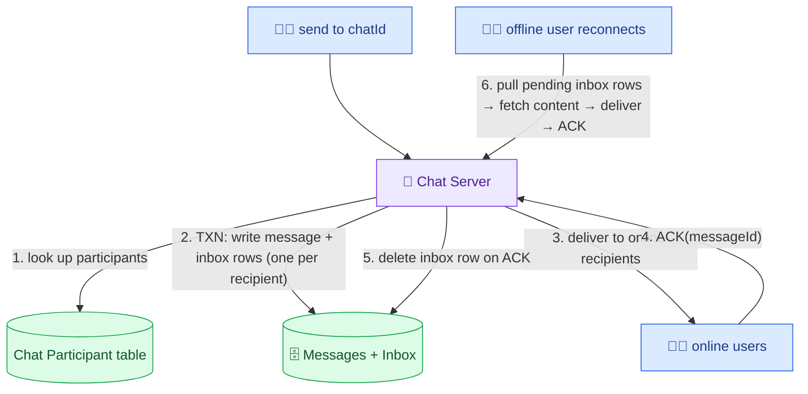

**Flow:** (1) server looks up chat participants; (2) in **one DynamoDB transaction** writes the message row + an inbox pointer for every participant; (3) delivers immediately to anyone currently online; (4) each client **ACKs** the `messageId` on receipt; (5) the server **deletes that inbox row** on ACK; (6) when an offline client reconnects, the server **loads its remaining inbox rows**, fetches content, delivers, and clears them.

> **The 100-record transaction limit (concrete constraint):** DynamoDB transactions support **≤100 records**, so a group message (1 message row + 99 inbox rows) caps **group size at ~100** to write atomically. This is a real product constraint that shows up again in multi-device (§20).

### 🧠 Why split into two tables (Messages vs Inbox)?

Beginners often ask: "if the message is already in the Messages table, why *also* have an Inbox table?" Because they answer **two different questions**:

- **Messages table** = "what is the message?" — the **content**, stored **once** per message.
- **Inbox table** = "who still needs to receive it?" — a small **pointer per recipient** (`recipientId, messageId`), a to-do list of pending deliveries.

Keeping them separate means the **content isn't duplicated** per recipient (a group message stores its body once, not N times), and the Inbox becomes a clean **delivery checklist** we tick off. Delivering = "remove this person's pointer"; someone still has a pointer ⇒ they haven't gotten it yet.

### 👤 Sender-receiver example: group of 3, one member offline

```
Max sends "hi team" to group {max, amanda, mike}. (Max excluded as recipient.)
WRITE (one transaction):
  Messages:  { m_5, from:max, content:"hi team" }              ← content stored ONCE
  Inbox:     { amanda, m_5 }   { mike, m_5 }                    ← one pointer each (to-do list)

Amanda is online → push → her phone ACKs m_5 → DELETE {amanda, m_5}
Mike is offline  → his pointer {mike, m_5} STAYS.

Mike reconnects later:
  → server: "pending inbox rows for mike?" → finds {mike, m_5}
  → fetch content from Messages(m_5) → push to Mike → Mike ACKs → DELETE {mike, m_5}
  → Inbox now has no pointers to m_5 → (optionally) delete the Messages(m_5) row too (§19)
```

The **ACK-then-delete** rule is what makes this exactly-effect-once: we only remove a pointer *after* the client confirms receipt, so a crash mid-delivery just leaves the pointer for a retry (we never lose it), and once ACKed we never send it again (no duplicate).

> **Guarantee achieved:** *eventual delivery* — online users get it instantly via the socket; offline users get it on reconnect from the inbox; ACK + delete ensures we don't re-deliver. This durability is precisely why we can tolerate the lossy Redis Pub/Sub path (§16).

---

## 18. Deep Dive — End-to-End Encryption 🔒

**End-to-end encryption (E2EE)** means messages travel — and are even **stored on the server** — in encrypted form; only the sender and recipient can read them. Not even WhatsApp can. If a hacker intercepts the ciphertext, it's useless.

- **Encryption** = plaintext → ciphertext; **decryption** = ciphertext → plaintext.
- **Mechanism (public-key / asymmetric crypto):** the recipient has a **key pair** — a **public key** (the "lock") shared with senders, and a **private key** (the "key") kept secret. The sender **locks** (encrypts) the message with the recipient's *public* key; only the recipient's *private* key can **unlock** (decrypt) it. Since only the recipient holds the private key, an interceptor can't read it.


### 🧠 The key insight — the server is just a "dumb pipe" for ciphertext

The most important beginner takeaway: with E2EE, the **server never sees plaintext**. It stores and forwards **ciphertext** (scrambled bytes) it fundamentally *cannot* decrypt, because it doesn't hold the recipient's private key. So "the message is stored on the server" and "the message is private" are both true at once.

**Why "public key = lock, private key = key" works** (asymmetric crypto in one paragraph): a key *pair* is generated so that anything locked with the **public** key can *only* be opened with the matching **private** key — and knowing the public key doesn't let you derive the private key. So the recipient can hand out their public "lock" to the whole world; anyone can lock a message *to* them, but only they (with the private key) can unlock it. The lock is one-directional.

### 👤 Concrete example: Max → Emily with an eavesdropper

```
Emily generated a key pair once:  publicKey_E (shared), privateKey_E (secret, on her phone only)
1  Max's phone fetches Emily's publicKey_E
2  Max encrypts "my OTP is 4471" with publicKey_E → ciphertext "9f3a…c1"
3  ciphertext "9f3a…c1" travels through the server and is stored there — server sees only "9f3a…c1"
4  A hacker intercepts "9f3a…c1" → useless, they lack privateKey_E
5  Emily's phone decrypts "9f3a…c1" with privateKey_E → "my OTP is 4471"
```

Only steps 2 (Max's device) and 5 (Emily's device) ever see plaintext — the two *ends*, hence "end-to-end."

> **Enrichment — why real systems don't purely use this:** asymmetric crypto is slow for large messages, so protocols like Signal use a **hybrid**: asymmetric keys to securely agree on a fast **symmetric** session key, then encrypt the actual messages with that. And they rotate keys **per message** (the Double Ratchet) so that even if one key leaks, past and future messages stay safe (**forward secrecy**).

> **Enrichment:** real WhatsApp uses the **Signal Protocol** (X3DH key agreement + Double Ratchet) with per-message keys for **forward secrecy**. E2EE also reinforces the "don't store unnecessarily" NFR — the server holds only ciphertext it can't read, minimizing liability (§19). Note E2EE complicates server-side features (search, spam detection) since the server can't see content.

---

## 19. Deep Dive — Retention & Cleanup 🧹

**Principle:** keep messages only as long as needed to deliver them; then delete. Undelivered messages expire after **~30 days**. Stored data is a **privacy liability** ("data is toxic sludge").

- Add a **Cleanup Service** doing async background work.
- **Messages table:** with a **secondary index on `timestamp`**, scan and delete messages older than 30 days.
- **Inbox table:** rows are deleted on ACK anyway; add a `timestamp` too so the sweeper purges old pending pointers.
- **Eager delete:** when deleting the *last* pending inbox pointer for a message (all recipients ACKed), also delete the **message payload** immediately — no need to wait 30 days. Minor race conditions are fine because the **30-day time-based sweeper is the hard guardrail** that catches anything missed.

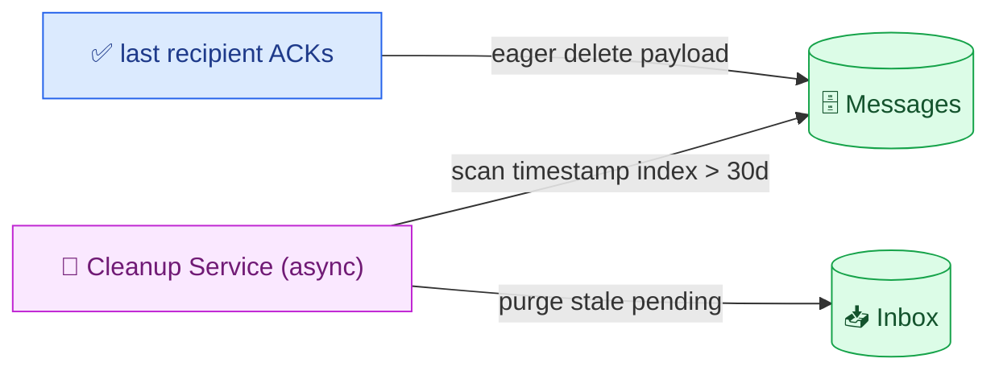

### 🧠 Why two deletion paths (eager + time-based)?

There are **two moments** a message becomes safe to delete, and we use **both** because each covers the other's gap:

1. **Eager delete (the common case).** The instant the **last recipient ACKs**, everyone has the message — the server copy is now pointless. Delete it immediately. This keeps the live database small (most messages are delivered within seconds), and is the *privacy-optimal* path (data gone as soon as it's not needed).
2. **Time-based sweep (the safety net).** What about messages that are **never** fully delivered — a recipient who never comes back online? Their pointer would linger forever. So a background **Cleanup Service** deletes anything older than **30 days** regardless. This is the *hard guardrail*: even if eager delete misses something (a race, a crash, an undelivered message), the 30-day sweeper guarantees eventual cleanup.

### 👤 Example of each path

```
Path 1 (eager): Max→Emily "hi" → Emily ACKs at 13:00:05 → inbox pointer removed → its
                the last pointer → delete Messages(m) immediately. Lived ~5 seconds. ✅
Path 2 (sweep): Max→Bob "hi", but Bob never reconnects. Pointer {bob, m} lingers.
                30 days later, Cleanup Service scans timestamp index → m is >30d old → delete. ✅
```

**Why this matters (privacy + cost):** stored messages are a **liability** — a breach or subpoena exposes them, and petabytes cost money. By deleting on delivery (and capping the rest at 30 days), the *live* database stays a few hundred TB instead of the full 284 PB theoretical max, and there's simply **less sensitive data sitting around** to leak. This directly serves the "don't store unnecessarily" NFR.

> **Why a secondary index on `timestamp`?** The sweep query is "find everything older than 30 days" — a **range scan on time**. Without a timestamp index, that's a full-table scan of billions of rows; with it, the DB efficiently walks just the old entries. It's the same "index the field you query by" principle as §14, applied to the cleanup query.

---

## 20. Deep Dive — Multi-Device & Presence Fan-out 📱

### Multi-device (phone + laptop + tablet)

Everything was keyed off a single **User ID**; now delivery must be **per device**. Add a **Client table** (`userId → [clientIds]`). Replace `userId` with `clientId` in the **Inbox table** and **Redis Pub/Sub topics**. On send, look up chat participants → for each, look up their **active clients** → create an inbox row and push to **each device**.

### 🧠 Why "per device" changes everything (beginner intuition)

The original model assumed **one inbox, one connection per user**. But if Emily has a phone *and* a laptop, "delivered to Emily" is ambiguous — delivered to *which* device? Each device is a separate app instance with its **own socket** and its **own copy** to receive and ACK independently (your laptop shouldn't stop your phone from getting the message). So the unit of delivery becomes the **device (`clientId`)**, not the **user (`userId`)**:

- **Client table** maps `userId → [clientIds]` (Emily → [phone, laptop]).
- **Inbox** and **Pub/Sub topics** are keyed per **`clientId`**, so each device has its own pending list and its own real-time channel.
- On send, for each *user* participant we expand to *all their active devices* and create a pointer + push **per device**.

### 👤 Write-amplification example, step by step

```
Group of 100 users, each with 5 devices. Max sends 1 message.
 recipients (users)          = 99  (exclude Max)
 devices per recipient       = 5
 inbox rows + pushes created = 99 × 5 = 495  (~500)
 → ONE logical "send" becomes ~500 physical writes + ~500 pushes
```

This is **write amplification**: the work multiplies by (recipients × devices). Two consequences:
- It can blow past the **≤100-record DynamoDB transaction limit** (you can't atomically write 500 inbox rows), so you'd batch or relax atomicity.
- It's why real apps impose **product limits** — cap devices/user (WhatsApp historically ~4 linked devices) and cap group size — to keep the amplification bounded.

> **Write amplification (concrete):** a 100-person group where each has 5 devices turns **1 send into 500 inbox rows / pushes**. Combined with the **≤100-record transaction** limit, this forces **product limits**: cap devices per user (e.g., 2–3) and reduce max group size accordingly.

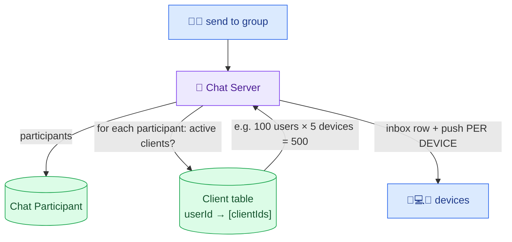

### Presence (green dot / online status)

Naive: an **AvailableUsers table** (`userId → status`) written `available` on WebSocket connect and `unavailable` on disconnect; query it when you open a chat. For **live** updates, reuse **Redis Pub/Sub** — users **subscribe to a presence topic** for the contacts they care about; connect/disconnect events publish to that topic.
**The hard part = fan-out:** when a **popular user** disconnects, you can't blast tens of thousands of real-time notifications. So **constrain who can watch whom** — e.g., only users with an **open chat window** with that person receive live presence. Otherwise fall back to on-demand polling.

### 🧠 Two ways to do presence, and why fan-out is the trap

There are two models, and the choice is a classic latency-vs-cost trade-off:

- **Pull (polling):** store `userId → status` (updated on connect/disconnect). When you *open* a chat, you **ask once** "is this person online?" Simple, cheap, no fan-out — but not live (won't flip to offline while you stare at the screen unless you re-poll).
- **Push (live):** subscribe to the contact's **presence topic** via Redis Pub/Sub; every connect/disconnect **publishes** an event to all subscribers so their green dot flips in real time. Great UX — but dangerous at scale.

### 👤 Why push has a "celebrity problem"

```
A celebrity has 10,000,000 followers who all have a chat open with them.
The celebrity's phone toggles online→offline (walks into a tunnel).
Push model: ONE disconnect event → fan out to 10,000,000 subscribers = 10M real-time pushes.
Now imagine they flap on/off a few times → tens of millions of pushes per second. 💥
```

This is the **fan-out explosion**: one person's status change amplifies into a flood proportional to how many people watch them. The mitigation isn't to engineer for infinite fan-out — it's to **bound the watcher set**:
- Only deliver live presence to users who **currently have that person's chat open** (a tiny, active subset), not every contact who *could* see the dot.
- For everyone else, fall back to **pull/polling** (they'll see the status when they open the chat).

This caps the fan-out per event from "millions" to "the handful actively looking," trading a little liveness for survivability — the same "limit the blast radius" idea you use for hot keys elsewhere.

> This is the "celebrity problem" for presence: a single popular user's status change has enormous fan-out, mitigated by limiting the watcher set rather than engineering for infinite fan-out.

---

# 🎯 Part B — Interview Template

## B1. Problem Statement & Clarifying Questions 📝

**Problem statement.** Design a **real-time chat system** (WhatsApp/Messenger): users create chats/groups, send & receive text and media messages instantly, see delivery/read status and last-seen/online presence, receive messages sent while they were offline, all end-to-end encrypted and at billions-of-users scale.

**Clarifying questions an interviewer expects:**

1. **1:1 only, or groups too?** (Both — a 1:1 is a group of 2.)
2. **Media?** (Text + images/videos/attachments.)
3. **Offline delivery required?** (Yes — deliver messages received while offline.)
4. **Read receipts / last-seen / presence in scope?** (Usually yes; confirm.)
5. **Scale?** (Billions of users; ~0.34M writes/sec, or T2's 100B msgs/day.)
6. **Latency target?** (~500 ms end-to-end.)
7. **Consistency vs availability?** (AP — eventual, but guaranteed delivery.)
8. **Retention?** (Delete after delivery / ~30-day cap; E2EE.)
9. **Multi-device?** (Bonus — phone + laptop + tablet.)
10. **Audio/video calling?** (Below the line / out of scope.)

> 💡 **Crux to name:** chat servers are **stateful** (they hold live WebSocket connections). The two hard problems: **routing** a message between the sender's server and the recipient's server, and **guaranteeing delivery** across disconnects.

---

## B2. Requirements 📋

**Functional**
- Start chats/groups; send & receive text + media in real time.
- Message status: sent / delivered / read.
- Last-seen & online presence.
- Offline access — receive messages missed while offline.

**Non-functional**
- **High availability** (~99.99999%; fault-tolerant so one component can't take it down).
- **Low latency** — ~**500 ms** end-to-end.
- **Scalability** — billions of users, millions of concurrent connections, ~0.34M writes/sec.
- **Guaranteed delivery** — messages never lost; eventually delivered.
- **Security** — end-to-end encryption.
- **Minimal retention** — keep only until delivered (~30-day cap). **CAP: AP** (eventual consistency, guaranteed delivery).

---

## B3. Capacity Estimation 📊

(Full derivation in [§3](#3-capacity-estimation-full-math-); condensed.)

```
DAU 1B · MAU 2B · 10 msgs/user/day · 3 writes + 3 reads per message
Messages/day = 1B × 10 = 10B ; write ops = 10B × 3 = 30B/day → ÷86,400 ≈ 0.34M writes/sec (reads ≈ same)
Sizes: text 100 B, media 250 KB ; mix 99% text / 1% media
  text  = 30B × 0.99 × 100 B  ≈ 2.97 TB/day
  media = 30B × 0.01 × 250 KB ≈ 75 TB/day    → total ≈ 78 TB/day → ×365×10 ≈ 284 PB
Cache = 0.5% × 78 TB ≈ 0.39 TB/day
Ingress ≈ Egress = 78 TB ÷ 86,400 ≈ 950 MB/s
Connections: ~2M per chat server → billions of users ⇒ hundreds–thousands of servers
T2 variant: 1B × 100 msgs = 100B/day × 1 KB = 100 TB/day (but deleted on ACK → few hundred TB live)
```

---

## B4. API / Interface Design 💻

WebSocket (persistent, bidirectional) — JSON commands, no REST contract. Initial connect is one HTTP GET-upgrade → `101 Switching Protocols`.

```
Client → Server:  CreateChat(participants)
                  SendMessage(chatId, content)          // or {type,from,to,content,time}
                  CreateAttachment(chatId, mediaType)   // → pre-signed upload URL
                  ModifyParticipants(chatId, userId, action)
                  Ping {online_status_update, userId, timestamp}   // last-seen, per minute
Server → Client:  NewMessage(messageId, chatId, content, senderId, timestamp)
                  MessageStatus(messageId, status)      // sent|delivered|read
                  ChatUpdated(chatId, action)
```

Media uses **pre-signed URL**: request upload target → upload directly to S3 → send the asset URL in the message; recipient downloads bytes from CDN/S3.

---

## B5. High-Level Architecture 🏛️

### 🏛️ Full system architecture (the "whiteboard" diagram)

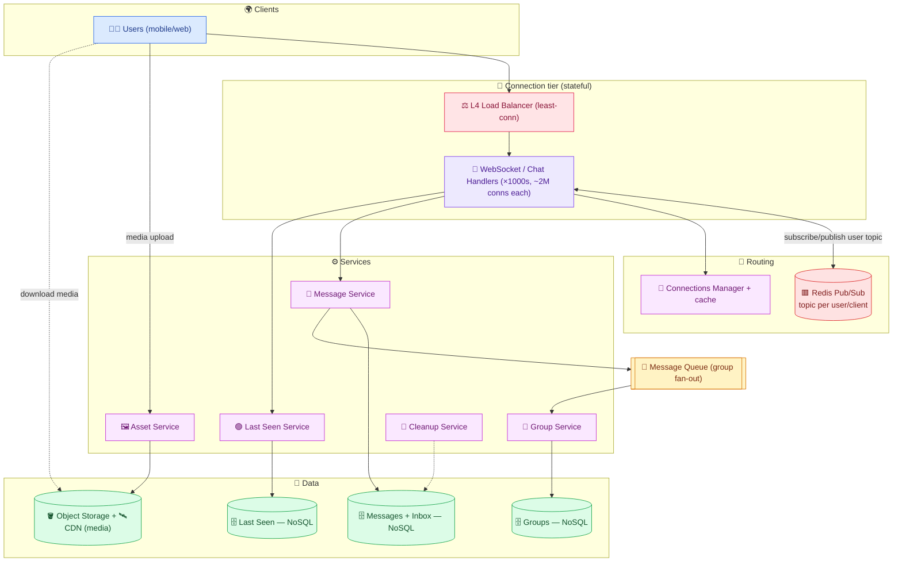

ASCII (the required `client → LB → service → cache → DB` flow):

```
 client → L4 LB (least-conn) → WebSocket/Chat Handler ──► Message Service ──► Messages + Inbox DB (NoSQL)
                                       │  ▲                          └──► Message Queue → Group Service → Groups DB
                                       │  └── Redis Pub/Sub (route to recipient's handler by user-ID topic)
                                       ├──► Last Seen Service → Last Seen DB
                                       └── (media) → Asset Service → Object Storage + CDN
```

**Component roles:** **L4 LB** keeps sticky WebSocket connections (least-connections). **WebSocket/Chat Handlers** hold millions of live connections (only job). **Redis Pub/Sub** routes a message to whichever handler holds the recipient's subscription. **Connections Manager + cache** maps client→handler. **Message Service + Messages/Inbox DB** persist & guarantee delivery. **Message Queue + Group Service** fan out group messages. **Last Seen Service** records presence pings. **Asset Service + Object Storage + CDN** handle media. **Cleanup Service** enforces retention.

---

## B6. Data Model / Schema 🗃️

- **Messages (NoSQL):** `messageId (PK)`, `from`, `to`, `type`, `message`, `assetUrl`, `state (sent|delivered|read)`, `time`; **index on receiverId**; secondary index on `timestamp` for cleanup.
- **Inbox (NoSQL):** `recipientId` + `messageId` — one pointer row per undelivered recipient; deleted on ACK.
- **Groups (NoSQL):** `groupId (PK)`, `groupName`, `description`, `creatorId`, `members[]`, `createdTime`, `lastUpdatedTime`; **index on groupId**.
- **Last Seen (NoSQL):** `clientId (PK)`, `lastSeenTime`; **index on clientId**.
- **Chat / Chat Participant (T2):** participant table partition `chatId` + sort `participantId`; **GSI on participantId** to list a user's chats.
- **Client (multi-device):** `userId → [clientIds]`.

**Sharding:** Messages by `receiverId`/`chatId`, Groups by `groupId`, Last Seen by `clientId` (high-cardinality, even spread).

---

## B7. Deep Dive Modules 🔬

- **B7.1 Statefulness & connections** — WebSockets, ~2M/server, L4 LB (least-conn). → [§7](#7-websocket-connection-establishment--handlers-), [§15](#15-deep-dive--scaling-the-routing-problem-)
- **B7.2 Routing** — Kafka ❌ vs consistent hashing ⚠️ vs **Redis Pub/Sub** ✅. → [§16](#16-deep-dive--kafka-vs-consistent-hashing-vs-redis-pubsub-)
- **B7.3 Delivery guarantee** — Messages + **Inbox** tables, ACK-and-delete, offline pull. → [§17](#17-deep-dive--inbox-table-acks--delivery-guarantees-)
- **B7.4 Status ticks** — update state → find sender → notify back via Connections Manager. → [§10](#10-hld--message-status-ticks-sent--delivered--read-)
- **B7.5 Media** — object storage + CDN + pre-signed URLs; asset URL in message. → [§9](#9-hld--media--attachment-messages-)
- **B7.6 Group fan-out** — message queue + Group Service + Groups DB. → [§12](#12-hld--group-messaging-)
- **B7.7 E2EE** — public/private key; ciphertext stored on server. → [§18](#18-deep-dive--end-to-end-encryption-)
- **B7.8 Retention** — Cleanup Service, 30-day sweeper + eager delete on ACK. → [§19](#19-deep-dive--retention--cleanup-)
- **B7.9 Multi-device & presence** — per-client keys, write amplification, watcher-set limits. → [§20](#20-deep-dive--multi-device--presence-fan-out-)

<details>
<summary><b>☕ Java — send message: persist + inbox rows (txn) + route via Redis Pub/Sub — click to expand</b></summary>

```java
public class MessageService {
    private final MessageRepo messages;   // NoSQL (Messages table)
    private final InboxRepo inbox;         // NoSQL (Inbox table)
    private final ChatRepo chats;
    private final RedisPubSub redis;

    public void send(String senderId, String chatId, String content, long now) {
        String messageId = idGen.next();
        List<String> participants = chats.participants(chatId);   // includes sender
        if (participants.size() > 100)                            // DynamoDB txn limit
            throw new IllegalStateException("group too large for atomic write");

        // 1) One transaction: message row + an inbox pointer per recipient (durable → delivery guarantee)
        Txn txn = db.newTransaction();
        txn.put(messages.row(messageId, senderId, chatId, content, "sent", now));
        for (String p : participants)
            if (!p.equals(senderId)) txn.put(inbox.row(p, messageId));
        txn.commit();

        // 2) Real-time push: publish to each recipient's user-ID topic; Redis routes to their handler.
        for (String p : participants)
            if (!p.equals(senderId))
                redis.publish("topic:" + p, new NewMessage(messageId, chatId, content, senderId, now));
        // Recipient's handler pushes over the socket; client ACKs → we delete that inbox row (see onAck).
    }

    public void onAck(String recipientId, String messageId) {
        inbox.delete(recipientId, messageId);                     // delivered → clear pointer
        if (inbox.noRemainingPointers(messageId)) messages.delete(messageId); // eager cleanup
    }
}
```

</details>

---

## B8. Data Flow Diagram 🔀

**Send path (1:1, with persistence + routing) — end to end:**

```mermaid
%%{init: {'theme':'base','themeVariables':{'actorBkg':'#ede9fe','actorBorder':'#7c3aed','actorTextColor':'#4c1d95','noteBkgColor':'#fef9c3','noteBorderColor':'#ca8a04','signalColor':'#334155','signalTextColor':'#0f172a'}}}%%
sequenceDiagram
    autonumber
    participant A as 🧑‍💻 Max
    participant H1 as 🔌 Handler 1
    participant MS as 📨 Message Service
    participant DB as 🗄️ Messages+Inbox
    participant R as 🟥 Redis Pub/Sub
    participant H2 as 🔌 Handler 2
    participant B as 🧑‍💻 Emily

    A->>H1: SendMessage(to=Emily, "Hi")
    H1->>MS: persist
    MS->>DB: txn write message + inbox row
    MS-->>A: status = sent ✓ (step 3.5)
    MS->>R: publish topic:Emily
    R->>H2: route to Emily's handler
    H2->>B: NewMessage over socket
    B-->>H2: ACK
    H2->>DB: delete inbox row; state → delivered
    Note over H2,A: notify Max → delivered ✓✓ (then read ✓✓ when opened)
```

**Offline reconnect path (ASCII):**

```
 Emily offline → message sits in Messages DB + Inbox row (recipient=Emily)
 Emily reconnects → L4 LB → Handler X → Connections Manager caches Emily→HandlerX
   → Handler asks Message Service for pending inbox rows for Emily
   → fetch message content → push over socket → Emily ACKs → delete inbox row
```

---

## B9. Scalability & Bottlenecks 📈

| Layer | First bottleneck | Scale strategy |
|---|---|---|
| **Chat servers (connections)** | ~2M open sockets/server; billions of users | hundreds–thousands of servers; **L4 LB least-connections** |
| **Inter-server routing** | sender's server ≠ recipient's server | **Redis Pub/Sub** (topic per user); avoid Kafka-per-user |
| **Redis cluster** | N×M connections; topic rebalancing on scale | shard topics; cheap cluster (echo-only); accept orchestration cost |
| **Messages DB writes** | 0.34M writes/sec, 284 PB/10yr | shard by receiverId/chatId; NoSQL; **retention/cleanup** trims live size |
| **Media** | 75 TB/day, GB payloads | object storage + **CDN**; pre-signed URLs (bypass chat servers) |
| **Group fan-out** | one message → many recipients (×devices) | **message queue** + Group Service; cap group size (~100 txn limit) |
| **Presence fan-out** | popular user's status → huge fan-out | limit watcher set (open-chat-window only) |
| **Single region** | global latency / outage | multi-region handlers + geo-routing |

<details>
<summary><b>Detailed walkthrough of each bottleneck (beginner-friendly) — click to expand</b></summary>

**1. Chat-server connections.** Each server can hold only ~2M open WebSockets, so billions of users need thousands of servers. An **L4 load balancer** keeps each connection sticky to one server and uses **least-connections** so newly-added servers fill up quickly.

**2. Inter-server routing.** Because connections are spread across servers, the sender's server usually doesn't hold the recipient's socket. **Redis Pub/Sub** (a topic per user ID) lets the sender publish without knowing where the recipient is; Redis routes to the right server.

**3. Redis cluster.** Topics are spread across nodes, so every chat server connects to every Redis node (N×M connections), and scaling the cluster requires moving topics/connections. Redis does little work (echoing), so the cluster is cheap; the N×M count only bites at extreme scale.

**4. Messages DB.** At 0.34M writes/sec and 284 PB/10yr, one node can't cope. Shard by `receiverId`/`chatId` on a NoSQL store, and lean on **retention/cleanup** so the *live* dataset stays a few hundred TB, not petabytes.

**5. Media.** Media is 75 TB/day with GB-scale payloads; routing it through connection-heavy chat servers is wrong. Upload directly to **object storage** via **pre-signed URLs** and serve via **CDN** — chat servers only carry the tiny asset URL.

**6. Group fan-out.** One group message must reach many recipients (× their devices). A **message queue** + Group Service decouples and absorbs this; the ~100-record transaction limit caps group size for atomic inbox writes.

**7. Presence fan-out.** A popular user connecting/disconnecting could trigger tens of thousands of notifications. Constrain **who watches whom** (e.g., only users with that chat open) to bound the fan-out.

**8. Single region.** One region adds latency for distant users and is an outage risk. Deploy handlers **multi-region** with geo-routing; replicate data stores across regions.

</details>

---

## B10. Failure Modes & Mitigation 🛡️

| Failure / edge case | Impact | Mitigation |
|---|---|---|
| **Recipient offline mid-delivery** | message could be lost | persist to **Messages + Inbox**; deliver on reconnect |
| **Redis Pub/Sub drops message** (at-most-once) | real-time push missed | durable Inbox is source of truth; client pulls on reconnect |
| **Chat server crash** | its clients disconnect | clients reconnect via LB to another server; state (messages) is in DB, not server |
| **Scaling event (add server)** | ~20% connections remap (consistent-hash) | slow drain to avoid **thundering herd**; dual-send during rebalance |
| **Hot chat server** | uneven load | least-connections LB; Pub/Sub decouples routing from topology |
| **Duplicate delivery on retry** | user sees message twice | idempotency via `messageId`; ACK-and-delete inbox row |
| **DynamoDB 100-record txn limit** | can't atomically write huge group | cap group size ~100; cap devices per user |
| **Clock skew across servers** | mis-ordered messages/timestamps | server assigns timestamps; NTP sync; logical ordering |
| **Media upload fails / expired URL** | attachment missing | short-TTL pre-signed URL + retry; validate before send |
| **Retention race (eager delete)** | rare early delete | 30-day time sweeper is the hard guardrail |
| **Presence storm (popular user)** | fan-out overload | limit watcher set to open-chat viewers |

<details>
<summary><b>Detailed walkthrough of each failure mode (beginner-friendly) — click to expand</b></summary>

**1. Recipient offline mid-delivery.** If the recipient's socket dies just before push, the real-time attempt fails — but the message was **persisted to Messages + Inbox first**, so it's delivered when the client reconnects and pulls its inbox.

**2. Redis Pub/Sub drop.** Pub/Sub is at-most-once (zero durability); it may drop a message if a connection blips. That's fine because the **durable Inbox** guarantees delivery independently — the client fetches missed messages on reconnect.

**3. Chat server crash.** Since servers are stateful only for *live sockets* (all messages live in the DB), a crash just disconnects clients, who **reconnect through the L4 LB** to a healthy server and resume.

**4. Scaling event.** With consistent hashing, adding a server remaps ~20% of connections. **Slowly** disconnect/reconnect misassigned users to avoid a thundering herd; during rebalance, briefly **send to both** old and new server for in-flight users.

**5. Hot server.** Uneven activity can overload one server. **Least-connections** balancing plus Redis Pub/Sub (routing independent of who's where) spreads load and avoids topology coupling.

**6. Duplicate delivery.** Retries + at-least-once inbox delivery can re-send. Dedupe by **`messageId`** on the client, and delete the inbox row only after ACK so we don't loop.

**7. Transaction limit.** DynamoDB transactions cap at 100 records, so a message + inbox rows must fit — hence **group size ≤ ~100** and **few devices per user**, or the atomic write breaks.

**8. Clock skew.** Different servers' clocks disagree, mis-ordering messages. Have the **server assign timestamps**, keep servers NTP-synced, and use logical ordering where needed.

**9. Media upload failure.** A pre-signed URL can expire or an upload can fail, leaving a broken attachment. Use short TTLs with retry and only send the message once the upload confirms.

**10. Retention race.** Eager delete on last-ACK might race with a late reader. The **30-day time-based sweeper** is the hard backstop that guarantees eventual cleanup regardless.

**11. Presence storm.** A popular user toggling online could fan out to huge numbers. **Restrict the watcher set** (only users actively viewing that chat) to keep it bounded.

</details>

---

## B11. Alternative Designs / Trade-off Comparison ⚖️

### Alternative A — Kafka topic per user (for routing)

- **Pros:** externalizes inter-server routing (structurally the right idea); durable.
- **Cons:** Kafka isn't built for **billions of tiny topics** (~50–100 KB metadata each → TB of metadata) or rapid connect/disconnect. Wrong tool.
- **vs chosen:** Redis Pub/Sub keeps the externalized-routing benefit with lightweight, ephemeral topics; durability comes from the Inbox table instead.

### Alternative B — Consistent hashing ring (for routing)

- **Pros:** deterministic ownership → direct server-to-server routing; no central broker.
- **Cons:** **scaling orchestration** (remap ~20%, thundering herd, dual-send during rebalance); risk of hot servers.
- **vs chosen:** Redis Pub/Sub avoids per-user server ownership; senders don't need topology. Consistent hashing is a valid answer if you accept the orchestration.

### Alternative C — Store media blobs in the message DB

- **Pros:** simplest data path.
- **Cons:** DynamoDB isn't for multi-GB blobs; pushes huge payloads through connection-heavy chat servers.
- **vs chosen:** object storage + CDN + pre-signed URLs; message carries only the URL.

### Alternative D — Relational DB instead of NoSQL

- **Pros:** transactions, joins, familiar; can scale (well-sharded MySQL does millions of TPS).
- **Cons:** rigid schema for varied message types; horizontal scaling more manual.
- **vs chosen:** NoSQL fits flexible schema + KV access at billions-scale; but relational is defensible — state the trade-off, don't dismiss it.

**Summary:** chosen = **stateful WebSocket chat servers** behind an **L4 LB**, **Redis Pub/Sub** for inter-server routing, **Messages + Inbox** tables for guaranteed delivery, **object storage + CDN** for media, **message queue + Group Service** for group fan-out, **E2EE**, and a **Cleanup Service** for retention. Optimizes for real-time low latency, guaranteed delivery, and billions-scale statefulness.

---

## B12. Interview Q&A 🎓

> Questions are numbered and collapsible — click any question to reveal the answer.

### Conceptual (mid-level)

<details>
<summary><b>Q1. Why can't we use plain HTTP for a chat app?</b></summary>

HTTP is a one-way, request-response protocol: only the **client** can initiate; the server can only respond. But chat requires the **server to push** — deliver Max's message to Emily and push status updates back to Max — without them asking. HTTP can't do that. We need a **persistent, bidirectional** connection, which is why we use **WebSockets** (established by upgrading an HTTP GET with `Connection: Upgrade` → server replies `101 Switching Protocols`). After that, both sides send JSON anytime over the open socket.
</details>

<details>
<summary><b>Q2. How does a message get from Max to Emily?</b></summary>

There are two WebSocket connections: Max↔Handler1 and Emily↔Handler2. Max sends over his socket to Handler1; Handler1 hands it to the **Message Service** which **persists** it (Messages + Inbox); Handler1 (or Redis Pub/Sub) finds which handler holds Emily's socket (via the Connections Manager cache / a `topic:Emily` subscription); the message is relayed to Handler2, which pushes it down Emily's socket. If Emily is offline, it stays in the Inbox and is delivered on reconnect.
</details>

<details>
<summary><b>Q3. How do the sent/delivered/read ticks work?</b></summary>

**Sent (one tick):** right after the message is stored on the server, notify the sender. **Delivered (two black ticks):** the recipient's phone **ACKs** receipt; the server updates state `sent→delivered`, looks up the original sender, and routes a notification back to the sender's handler. **Read (two blue ticks):** when the recipient opens the chat, the same chain updates `delivered→read` and notifies the sender. Each status change is thus *also a read* (the sender must be notified) — the "3 writes, 3 reads per message."
</details>

<details>
<summary><b>Q4. How are messages delivered to someone who was offline?</b></summary>

Every message is **persisted before delivery** — the content in the Messages table and a **pointer row per recipient in the Inbox table**. If the recipient is offline, the real-time push simply fails, but the inbox row remains. When they reconnect (re-establishing a WebSocket to some handler), the server **reads their pending inbox rows**, fetches the content, pushes it, and the client **ACKs**, which deletes the inbox row. This guarantees eventual delivery across disconnects.
</details>

<details>
<summary><b>Q5. How is media (images/videos) handled differently from text?</b></summary>

Media isn't sent through the chat servers as bytes. The client uploads the file **directly to object storage** (via the Asset Service / a pre-signed URL), which distributes to a **CDN**, and gets back an **asset URL**. The chat message then carries only that **URL** (tiny), following the normal 1:1/group flow. The recipient receives the URL and **downloads the actual bytes from the CDN** (the "tap to download" you see with auto-download off). This keeps GB payloads off the connection-heavy chat servers.
</details>

### Design trade-off (senior)

<details>
<summary><b>Q6. Why L4 (not L7) load balancing for WebSockets?</b></summary>

L7 (HTTP) load balancers terminate each request and can forward it to *any* stateless backend. WebSockets are **connection-oriented** — a client must stay bound to the **same** server for the connection's lifetime. An **L4 load balancer** creates a symmetric TCP connection to one backend and keeps the client glued to it (the LB is effectively invisible). Use **least-connections** balancing since the open socket is the scarce resource; that also saturates newly-added servers quickly.
</details>

<details>
<summary><b>Q7. What is the routing problem and how do you solve it?</b></summary>

With thousands of chat servers, the sender's server usually doesn't hold the recipient's socket (User A on Server 1, User B on Server 2). Servers must route messages to whichever server owns the recipient's connection. Options: **Kafka per-user topic** (fails — billions of heavy topics, no rapid connect/disconnect), **consistent hashing** (deterministic ownership but painful scaling orchestration + hot servers), or **Redis Pub/Sub** (chosen — subscribe to `topic:userId` on connect, publish to it to send; Redis routes; senders don't need topology).
</details>

<details>
<summary><b>Q8. Redis Pub/Sub has zero durability — why is that acceptable?</b></summary>

Redis Pub/Sub is **at-most-once** — it may drop a message if a connection blips. That would normally be fatal for chat, **except delivery is already guaranteed independently** by the durable **Messages + Inbox** tables. Pub/Sub is only the lightweight, ephemeral **real-time echo** for the <500 ms online path; if it drops something, the client retrieves it from the inbox on reconnect (or via a poll/notification). So we get fast real-time delivery *and* a bulletproof durable fallback.
</details>

<details>
<summary><b>Q9. Why NoSQL for the databases here?</b></summary>

Messages lack a fixed schema (text/image/video/doc), the scale is billions of users with ~0.34M writes/sec, and the queries are simple key lookups (undelivered by receiver, members by group, last-seen by client) needing **low latency at high throughput** — all favoring NoSQL. Groups are a trivial `groupId → [userIds]` KV map; last-seen is a high-write-volume `clientId → timestamp`. That said, a well-sharded relational DB can also hit millions of TPS — the choice is defensible; NoSQL just fits the flexible-schema + KV access pattern most naturally.
</details>

<details>
<summary><b>Q10. How do group messages scale?</b></summary>

The Message Service stores the message, then **publishes an event to a message queue**. A **Group Service** pulls it, reads the **Groups DB** for members, asks the Connections Manager which handlers hold those members (excluding the sender), and sends to each handler for delivery. The queue **decouples** the fast store from the heavier multi-recipient fan-out and absorbs bursts. Group size is capped (~100) by the DynamoDB **100-record transaction limit** for atomic inbox writes.
</details>

### Deep-dive internals (staff)

<details>
<summary><b>Q11. Where does this system sit on CAP, and why?</b></summary>

**AP** — availability and partition tolerance over strong consistency, with **eventual consistency** plus a **guaranteed-delivery** requirement. A chat app must stay up and responsive (~500 ms), and it's fine for a message or status to arrive a beat late — but it **must** arrive. We achieve "eventual but guaranteed" via durable Messages + Inbox tables and ACK-based delivery, while the ephemeral Redis Pub/Sub layer handles the fast path. Strong consistency isn't needed and would hurt availability/latency.
</details>

<details>
<summary><b>Q12. Explain the delivery guarantee end to end.</b></summary>

On send, the server writes — **in one transaction** — the message row plus an **inbox pointer per recipient**. Online recipients get an immediate push; each client **ACKs** the `messageId`, and the server **deletes that inbox row**. Offline recipients keep their inbox rows; on reconnect the server loads pending rows, delivers, and clears them on ACK. This yields **at-least-once, eventually-delivered** semantics; clients dedupe by `messageId` for exactly-once *effect*. The lossy real-time layer is safe because the inbox is the durable source of truth.
</details>

<details>
<summary><b>Q13. Do the capacity math.</b></summary>

1B DAU × 10 msgs/day = 10B messages/day; ×3 writes/message = **30B write ops/day** → ÷86,400 ≈ **0.34M writes/sec** (reads ≈ same). Storage: 99% text × 100 B + 1% media × 250 KB over 30B ops = 2.97 TB + 75 TB ≈ **78 TB/day** → ×365×10 ≈ **284 PB**. Ingress ≈ egress = 78 TB ÷ 86,400 ≈ **950 MB/s**. Connection-wise, ~**2M sockets/server** means billions of users need **thousands** of chat servers.
</details>

<details>
<summary><b>Q14. Why are chat servers the crux, and how does statefulness shape the design?</b></summary>

Unlike stateless web servers, chat servers hold **live, long-lived WebSocket connections** — that state (which client is on which server) is exactly what makes routing hard and scaling delicate. It forces an **L4** LB (sticky connections), an **inter-server routing** mechanism (Redis Pub/Sub), careful **scaling orchestration** (draining/rebalancing without thundering herds), and separation of concerns (handlers do *only* connection management; business logic lives elsewhere). The data model exists to support rapid queries and amplified writes for this stateful, high-throughput flow.
</details>

<details>
<summary><b>Q15. How would you support multiple devices per user?</b></summary>

Everything keyed on `userId` becomes keyed on `clientId`. Add a **Client table** (`userId → [clientIds]`); the Inbox table and Redis Pub/Sub topics become **per-client**. On send, look up participants → for each, look up their active clients → write an inbox row and push to **each device**. This causes **write amplification** (a 100-person group × 5 devices = 500 inbox rows/pushes), which — combined with the ≤100-record transaction limit — forces **product limits** (few devices per user, smaller max group size).
</details>

### Behavioral (STAR, tied to this system)

<details>
<summary><b>Q16. Tell me about a time you prevented data loss in a delivery pipeline.</b></summary>

- **Situation:** Our chat delivery relied on live socket pushes; when recipients briefly disconnected, messages were silently lost.
- **Task:** Guarantee no message loss without hurting the real-time path.
- **Action:** I introduced **durable Messages + Inbox tables** — every send writes the message plus a per-recipient inbox pointer in one transaction, delivered live if online and pulled from the inbox on reconnect, with **ACK-and-delete** to avoid re-sends. This let us keep the lossy-but-fast Redis Pub/Sub layer for online delivery.
- **Result:** Zero message loss across disconnects; the real-time path stayed sub-500 ms because durability was decoupled from it.
</details>

<details>
<summary><b>Q17. Tell me about a time you chose the right tool over the obvious one.</b></summary>

- **Situation:** The team's instinct for inter-server routing was Kafka (a topic per user).
- **Task:** Route messages between thousands of stateful chat servers at billions-of-users scale.
- **Action:** I showed Kafka can't handle **billions of tiny, churny topics** (~50–100 KB metadata each, no rapid connect/disconnect) and proposed **Redis Pub/Sub** instead — lightweight ephemeral topics per user — keeping the durable Inbox as the delivery guarantee.
- **Result:** Routing scaled with a cheap Redis cluster; real-time latency stayed low, and we avoided terabytes of topic metadata and Kafka's churn limits.
</details>

<details>
<summary><b>Q18. Tell me about a scaling event that required careful orchestration.</b></summary>

- **Situation:** We added chat servers to a consistently-hashed cluster; naively remapping connections caused a reconnection storm.
- **Task:** Rebalance ~20% of connections onto new servers without a thundering herd.
- **Action:** I signaled the scaling event via Zookeeper/etcd and had servers **slowly** disconnect misassigned users (staggered), so clients reconnected gradually via the registry; during rebalance we **dual-sent** in-flight messages to both old and new servers.
- **Result:** Capacity increased with no outage or connection storm; the gradual drain kept latency stable throughout the migration.
</details>

<details>
<summary><b>Q19. Tell me about balancing a feature against privacy/cost.</b></summary>

- **Situation:** Product wanted long message retention; legal/privacy flagged stored messages as a liability.
- **Task:** Keep messages available for delivery without hoarding data.
- **Action:** I implemented a **Cleanup Service**: a `timestamp` secondary index sweeps messages older than **30 days**, and we **eagerly delete** a message once its last recipient ACKs — the time sweeper is the hard backstop for anything missed.
- **Result:** The DB's *live* footprint dropped to a few hundred TB (vs petabytes if retained), cutting cost and privacy exposure while still meeting the delivery requirement.
</details>

<details>
<summary><b>Q20. Tell me about taming a fan-out problem.</b></summary>

- **Situation:** Live presence (online dots) for popular users produced huge fan-out — one disconnect could notify tens of thousands.
- **Task:** Provide real-time presence without overwhelming the cluster.
- **Action:** I reused **Redis Pub/Sub** for presence but **constrained the watcher set** — only users with an **open chat window** with that person subscribe to their presence topic; everyone else uses on-demand polling.
- **Result:** Presence updates stayed real-time for the cases that matter while fan-out per event dropped from tens of thousands to a small bounded set, protecting the cluster.
</details>

---

## B13. Quick Revision (cheat sheet + ~2-page deep revision) 📚

> **Part 1** = rapid recall card; **Part 2** = fuller night-before walkthrough.

### Part 1 — One-glance cheat sheet

**One-liner:** Real-time chat via **stateful WebSocket chat servers** behind an **L4 LB**, routed between servers by **Redis Pub/Sub**, with **durable Messages + Inbox tables** guaranteeing delivery across disconnects; media via **object storage + CDN + pre-signed URLs**; **E2E encrypted**; retention ~30 days.

**Core requirements:** 1:1 + group messaging (text + media), sent/delivered/read status, last-seen/online, offline delivery. NFRs: HA (~7 nines), ~500 ms latency, billions of users, guaranteed delivery, E2EE, minimal retention. **CAP: AP** (eventual + guaranteed delivery).

**Architecture:** `Client → L4 LB (least-conn) → WebSocket/Chat Handler → Message Service → Messages+Inbox DB`; inter-server routing via **Redis Pub/Sub (topic per user)**; groups via **Message Queue → Group Service → Groups DB**; media via **Asset Service → Object Storage → CDN**; presence via **Last Seen Service → Last Seen DB**; **Cleanup Service** for retention.

**Key capacity numbers:** 1B DAU / 2B MAU · 10 msgs/user/day · **3 writes + 3 reads/message** → 30B write ops/day → **~0.34M writes/sec (≈ reads)** · text 100 B / media 250 KB / mix 99%–1% → **78 TB/day** → **~284 PB/10yr** · cache 0.39 TB/day · ingress ≈ egress **~950 MB/s** · **~2M connections/server**.

**Building blocks + why:** WebSockets (bidirectional push) · L4 LB (sticky connections, least-conn) · Redis Pub/Sub (topology-free routing) · Messages + **Inbox** tables + ACK (guaranteed delivery) · NoSQL (flexible schema, KV scale) · object storage + CDN + pre-signed URLs (media) · message queue + Group Service (fan-out) · E2EE (privacy) · Cleanup Service (retention).

**What you'd change at 10× scale:** more chat servers + multi-region + geo-routing; shard Redis topics (mind N×M connections); shard Messages harder + aggressive cleanup; cap devices/user & group size (100-record txn limit); tighter presence watcher sets.

**Top 10 answers to memorize:**
1. HTTP can't push → **WebSockets** (GET upgrade → 101).
2. Chat servers are **stateful** → **L4 LB (least-connections)**, ~2M conns/server.
3. Routing between servers → **Redis Pub/Sub** (Kafka ❌, consistent-hash ⚠️).
4. Guaranteed delivery → **Messages + Inbox** tables, ACK-and-delete, offline pull.
5. Pub/Sub is lossy but OK because **Inbox is durable**.
6. Status ticks: update state → find sender → notify back (3 writes/3 reads).
7. Media → object storage + CDN + **pre-signed URL** (only URL in message).
8. Groups → **message queue** + Group Service; group ≤ ~100 (txn limit).
9. NoSQL for messages/groups/last-seen; index by receiverId/groupId/clientId.
10. Retention: 30-day sweeper + eager delete on last ACK; **E2EE** (public/private key).

### Part 2 — Deep revision (~2 pages)

#### Problem
Real-time chat (WhatsApp): 1:1 + group text/media, status ticks, last-seen, offline delivery, E2EE, billions of users. Crux: **stateful WebSocket servers** → routing + guaranteed delivery.

#### Requirements
- **Functional:** start chats/groups, send/receive text+media, sent/delivered/read, last-seen/online, offline access.
- **Non-functional:** HA ~99.99999%, latency ~500 ms, billions of users / millions of connections, guaranteed delivery, E2EE, minimal retention. **AP**.

#### Capacity (memorize)
```
1B DAU × 10 msgs × 3 writes = 30B write ops/day → ÷86,400 ≈ 0.34M writes/sec (reads ≈ same)
text 30B×0.99×100B ≈ 2.97 TB/day ; media 30B×0.01×250KB ≈ 75 TB/day → ≈ 78 TB/day → ×365×10 ≈ 284 PB
cache 0.5%×78TB ≈ 0.39 TB/day ; ingress ≈ egress = 78TB/86,400 ≈ 950 MB/s
~2M connections/chat server → billions of users ⇒ 1000s of servers
T2 variant: 100B msgs/day × 1KB = 100 TB/day (few hundred TB live after ACK-delete)
```

#### Connectivity
HTTP one-way → can't push → **WebSocket** (GET with `Upgrade` → `101 Switching Protocols`, persistent, JSON both ways). Two sockets per pair (Max↔server, Emily↔server); server relays. Real WhatsApp uses raw TLS; principle identical. SSE (one-way) and polling don't fit; WebRTC only for calls.

#### Connection management
API Gateway → **L4 LB (least-conn)** → **WebSocket Handlers** (only hold connections). After 101, handler tells **Connections Manager** → cache `client→handler`. Cross-server: lookup recipient's handler (or publish to their Redis topic).

#### 1:1 + offline
Handler → **Message Service** → persist to **Messages DB** (state=sent) → find recipient handler → relay → push. Offline: message stays; on reconnect, handler pulls **undelivered (state=sent)** for that receiver and delivers.

#### Status ticks
Sent (step 3.5, after store) → notify sender (single tick). Delivered: recipient ACK → update DB → find sender → notify (double black). Read: recipient opens → update → notify (double blue).

#### Media
Upload to **object storage** via Asset Service / **pre-signed URL** → **CDN**; message carries **asset URL**; recipient downloads bytes from CDN. Keeps GB payloads off chat servers.

#### Last seen
Per-minute ping while foreground → Last Seen Service → overwrite `clientId→timestamp`. Close app → pings stop → last value persists.

#### Group
Message Service stores → **publishes to message queue** → **Group Service** pulls → reads **Groups DB** members → asks Connections Manager for handlers (exclude sender) → deliver.

#### Scaling / routing
Single server → 2M conn ceiling + no HA → many servers → **routing problem** (sender's server ≠ recipient's). **L4 LB** (sticky). Options: **Kafka per-user topic** ❌ (billions of heavy topics), **consistent hashing** ⚠️ (rebalance orchestration, hot servers, chat registry + Zookeeper/etcd), **Redis Pub/Sub** ✅ (subscribe `topic:userId` on connect, publish to send; N×M connections; lossy but Inbox covers durability).

#### Delivery guarantee
**Messages table** (content) + **Inbox table** (pointer per recipient). Txn write both (≤100 records → group ≤100). Online push immediately; **ACK → delete inbox row**; offline → pull on reconnect. At-least-once + `messageId` dedupe.

#### E2EE, retention, extensions
E2EE: public key (lock) / private key (unlock); ciphertext even on server. Retention: **Cleanup Service**, 30-day timestamp sweeper + eager delete on last ACK. Multi-device: per-`clientId` keys/topics → write amplification (100×5=500) → cap devices/group. Presence: reuse Pub/Sub, limit watcher set (open-chat viewers) to bound fan-out.

#### Alternatives
Kafka routing (wrong tool) · consistent hashing (orchestration) · blobs in DB (wrong) · relational (defensible). Chosen = WebSockets + L4 LB + Redis Pub/Sub + Messages/Inbox + object storage/CDN + queue/Group Service + E2EE + Cleanup.

---

## B14. FAANG Top 20 Most Frequently Asked Questions 🏆

> Collapsible — click any question to reveal a ≥5-line, interview-ready answer.

<details>
<summary><b>1. Design WhatsApp — walk me through your approach.</b></summary>

Clarify scope (1:1 + groups, media, offline, status/presence), scale (billions, ~0.34M writes/sec), latency (~500 ms), consistency (AP + guaranteed delivery), retention/E2EE. Name the crux: **stateful WebSocket chat servers** → routing + delivery guarantees. Use **WebSockets** (HTTP can't push) behind an **L4 LB**. Persist every message to **Messages + Inbox** tables (delivery guarantee), route between servers via **Redis Pub/Sub**, handle media with **object storage + CDN + pre-signed URLs**, fan out groups via a **message queue + Group Service**, encrypt end-to-end, and enforce **~30-day retention** with a Cleanup Service.
</details>

<details>
<summary><b>2. Why WebSockets instead of HTTP or polling?</b></summary>

HTTP is request-response — only the client initiates, so the server can't push a message to a recipient who isn't asking. Polling wastes bandwidth and adds latency. **SSE** is server→client only, so clients can't send rapidly. Chat needs **frequent, low-latency, bidirectional** traffic → **WebSockets**: the client upgrades an HTTP GET (`Connection: Upgrade`) and the server replies `101 Switching Protocols`, leaving a persistent socket for JSON both ways. (WebRTC is only for peer-to-peer audio/video.) Real WhatsApp uses raw TLS, but the principle is the same.
</details>

<details>
<summary><b>3. Why are chat servers "stateful," and why does it matter?</b></summary>

Unlike stateless web servers, chat servers hold **live, long-lived WebSocket connections** — the mapping of which client is connected to which server *is* state. This is the crux: it forces an **L4 (connection-oriented) load balancer** with sticky connections, an **inter-server routing** mechanism (a message's sender and recipient are usually on different servers), and careful **scaling orchestration** (draining/reconnecting without thundering herds). It's also why handlers do *only* connection management — business logic lives in separate services.
</details>

<details>
<summary><b>4. Why L4 load balancing, and what balancing policy?</b></summary>

L7 LBs terminate HTTP requests and forward to any stateless server, but WebSockets are connection-oriented — a client must stay bound to one server for the connection's life. An **L4 LB** creates a symmetric TCP connection to a backend and keeps the client glued to it, effectively invisible to the chat server. Use **least-connections** because the scarce resource is the open socket (~2M/server); it routes new connections to the least-loaded server and quickly saturates newly added servers during scale-out.
</details>

<details>
<summary><b>5. How do you guarantee a message is never lost?</b></summary>

Persist before delivery: in one transaction write the **message row** (Messages table) plus an **inbox pointer per recipient** (Inbox table). Deliver immediately to online recipients over their socket; each client **ACKs** the `messageId`, and the server **deletes** that inbox row. Offline recipients keep their inbox rows; on reconnect the server loads pending rows, delivers, and clears them on ACK. This gives at-least-once, eventually-delivered semantics; clients dedupe by `messageId`. It's why the lossy real-time (Pub/Sub) path is safe.
</details>

<details>
<summary><b>6. Explain the routing problem and your solution.</b></summary>

With thousands of chat servers, User A (Server 1) usually isn't on the same server as User B (Server 2), so Server 1 can't push to B's socket directly. Servers must route to whichever server owns the recipient's connection. **Redis Pub/Sub** solves it cleanly: on connect, a server **subscribes to `topic:userId`**; to send, the sender **publishes to the recipient's topic**; Redis routes to the subscribing server, which pushes over the socket. Senders never need to know the topology, and it's cheap because Redis just echoes.
</details>

<details>
<summary><b>7. Why not Kafka for inter-server routing?</b></summary>

The tempting idea is a Kafka topic per user, but Kafka isn't built for **billions of tiny topics**: each carries ~50–100 KB of metadata (terabytes just for topic/partition metadata at billions of users), and it doesn't handle the **rapid connect/disconnect** of millions of short-lived micro-topics. The *structural* idea (externalize routing) is right, but Kafka is the wrong tool. **Redis Pub/Sub** keeps that structure with lightweight ephemeral topics, and durability comes from the Inbox table rather than the broker.
</details>

<details>
<summary><b>8. Redis Pub/Sub is at-most-once — how is that acceptable for chat?</b></summary>

By itself it would be unacceptable (messages could vanish). But delivery is **guaranteed independently** by the durable **Messages + Inbox** tables: if Pub/Sub drops a real-time push, the message still sits in the recipient's inbox and is delivered on reconnect (or via a poll/notification). Pub/Sub is only the **lightweight ephemeral echo** for the sub-500 ms online experience. This separation — fast lossy real-time layer + durable authoritative store — is the key insight that lets us use a zero-durability router safely.
</details>

<details>
<summary><b>9. How do the sent/delivered/read ticks work internally?</b></summary>

**Sent:** immediately after the server stores the message, it notifies the sender (single tick). **Delivered:** the recipient's device **ACKs** receipt to its handler; the Message Service updates state `sent→delivered`, looks up the **original sender**, asks the Connections Manager which handler holds the sender, and routes the notification back (double black ticks). **Read:** when the recipient opens the chat, the same chain updates `delivered→read` and notifies the sender (double blue ticks). Each status change is *also a read* — the sender must be notified — which is the "3 writes, 3 reads per message."
</details>

<details>
<summary><b>10. How is media handled, and why not through the chat servers?</b></summary>

Media (images/videos, ~250 KB avg, sometimes GB) shouldn't flow through connection-heavy chat servers built for tiny texts, and blobs don't belong in the message DB. The client uploads **directly to object storage** (via the Asset Service / a short-TTL **pre-signed URL**), which distributes to a **CDN**, and receives an **asset URL**. The chat message carries only that **URL**. Recipients receive the URL and **download the bytes from the CDN** ("tap to download" with auto-download off). This reuses the tiny-message infra and offloads bandwidth to storage/CDN.
</details>

<details>
<summary><b>11. How does group messaging scale?</b></summary>

The Message Service stores the message, then **publishes an event to a message queue** (with the target group). A **Group Service** pulls it, reads the **Groups DB** for members, asks the Connections Manager which handlers hold those members (excluding the sender), and delivers to each. The queue **decouples** the fast store from the heavier fan-out and absorbs bursts. Because a message + inbox rows must fit a **100-record transaction**, group size is capped at ~100 for atomic writes — a real product constraint that tightens further with multi-device.
</details>

<details>
<summary><b>12. How does last-seen / online status work?</b></summary>

"Online" = app in foreground and active. While active, the app **pings the server every minute** over its WebSocket; the **Last Seen Service** overwrites `clientId → timestamp` in the Last Seen DB. When the app closes, pings stop, so the stored value freezes at the last ping (e.g., 1:09 if closed at 1:10). A query returns that timestamp, or "online" if a ping arrived within the last minute. Per-minute writes from all online users are heavy but tiny and single-key, which is why a NoSQL store fits; coarser intervals trade precision for load.
</details>

<details>
<summary><b>13. Which databases and why NoSQL?</b></summary>

Three stores, all NoSQL: **Messages** (no fixed schema across text/image/video, billions-scale, low-latency reads of undelivered-by-receiver), **Groups** (trivial `groupId → [userIds]` KV lookup at high throughput), **Last Seen** (huge per-minute write volume, single-key `clientId → timestamp` reads). NoSQL gives flexible schema + horizontal scale + low-latency KV access. That said, a well-sharded relational DB can also do millions of TPS, so it's defensible — the choice reflects the flexible-schema, simple-query, extreme-scale access pattern rather than a hard rule.
</details>

<details>
<summary><b>14. What's the delivery/consistency model (CAP)?</b></summary>

**AP** — availability + partition tolerance, with **eventual consistency** but a hard **guaranteed-delivery** requirement. The app must stay up and feel real-time (~500 ms); a message or status arriving slightly late is acceptable, but it must eventually arrive. We reconcile "eventual" with "guaranteed" using durable **Messages + Inbox** tables and ACK-based delivery for correctness, while the ephemeral **Redis Pub/Sub** layer provides the fast online path. Strong consistency isn't required and would harm availability/latency at this scale.
</details>

<details>
<summary><b>15. How do you handle offline users and reconnection?</b></summary>

A message for an offline user is still written to the **Messages table** with a **per-recipient Inbox pointer**, so nothing is lost. When the user reconnects, they establish a new WebSocket (to any handler via the L4 LB), the Connections Manager caches `client→handler`, and the handler **queries the Message Service / Inbox for that recipient's pending messages**, fetches their content, and pushes them. The client **ACKs** each, and the server deletes the corresponding inbox rows. This is exactly the offline-access functional requirement realized via durable storage.
</details>

<details>
<summary><b>16. How does end-to-end encryption work here?</b></summary>

Messages are encrypted on the sender's device and decrypted only on the recipient's — the server stores and relays **ciphertext** it can't read. It uses **public-key crypto**: the recipient shares a **public key** (the lock) and keeps a **private key** (the key) secret; the sender encrypts with the recipient's public key, and only the recipient's private key can decrypt. An interceptor sees unreadable ciphertext. Real WhatsApp uses the **Signal Protocol** (X3DH + Double Ratchet) for forward secrecy. E2EE also reinforces minimal-retention since the server holds only unreadable data.
</details>

<details>
<summary><b>17. How do you handle retention and cleanup?</b></summary>

Keep messages only long enough to deliver — undelivered ones expire after **~30 days** (stored data is a privacy liability). A **Cleanup Service** runs async: with a **secondary index on `timestamp`**, it scans and deletes messages older than 30 days, and purges stale Inbox pointers similarly. When the **last** recipient ACKs, we **eagerly delete** the message payload immediately rather than waiting. Minor races are fine because the 30-day time-based sweeper is the hard backstop, so anything missed by eager delete disappears eventually.
</details>

<details>
<summary><b>18. How would you support multiple devices per user?</b></summary>

Re-key everything from `userId` to `clientId`: add a **Client table** (`userId → [clientIds]`), and make the **Inbox** and **Redis Pub/Sub topics** per-client. On send, look up chat participants → for each, look up active clients → write an inbox row and push to **each device**. This causes **write amplification** — a 100-person group where everyone has 5 devices turns 1 send into **500 inbox rows/pushes** — and combined with the ≤100-record transaction limit forces product limits: cap devices per user (2–3) and reduce max group size to stay within the atomic-write budget.
</details>

<details>
<summary><b>19. How do you scale chat servers, and what happens during a scale event?</b></summary>

Each server holds ~2M sockets, so billions of users need thousands of servers behind an **L4 LB (least-connections)**. If you use consistent hashing for ownership, adding a server remaps ~**20%** of connections; you must **slowly** disconnect misassigned users so they reconnect gradually (avoid a **thundering herd**), and during rebalancing you may **dual-send** in-flight messages to both the old and new owner. With Redis Pub/Sub routing, scaling the Redis cluster has a similar topic-rebalancing cost, but chat servers themselves scale simply since state (messages) lives in the DB.
</details>

<details>
<summary><b>20. How do you implement presence (online dots) at scale without fan-out explosions?</b></summary>

Store connect/disconnect status (e.g., an AvailableUsers table written on WebSocket connect/disconnect) for on-demand queries. For **live** updates, reuse **Redis Pub/Sub** — users subscribe to the presence topic of contacts they care about, and connect/disconnect events publish to those topics. The danger is **fan-out**: a popular user toggling online could notify tens of thousands. Mitigate by **constraining the watcher set** — only users with an **open chat window** with that person receive live presence; everyone else polls on demand. This is the presence "celebrity problem," solved by bounding watchers rather than engineering infinite fan-out.
</details>

---

## Appendix — Sources & Notes 📎

This guide was built from two interview-prep transcripts on designing WhatsApp/Messenger: (1) a step-by-step build (requirements → capacity → WebSocket connectivity → API for 1:1/status/last-seen/group → HLD with WebSocket handlers, Connections Manager, Message Service, offline storage, media/asset flow, status ticks, last-seen, group messaging via message queue → DB selection → schemas → E2E encryption) and (2) a Hello-Interview breakdown (delivery framework, core entities incl. Device, WebSocket API commands, single-server → scaled evolution, L4 vs L7 load balancing, the routing problem, Kafka vs consistent-hashing vs Redis Pub/Sub, Messages + Inbox + ACK delivery, media via pre-signed URLs, retention/cleanup, multi-device write amplification, presence fan-out). Enriched with standard practice (Signal Protocol, sharding, CAP framing, geo-distribution).

**Numbers verified independently (programmatically):**
- Write ops/day = 1B × 10 × 3 = **30B** → ÷86,400 ≈ **0.34M writes/sec** (reads ≈ same).
- Storage/day = 30B×0.99×100 B (2.97 TB) + 30B×0.01×250 KB (75 TB) ≈ **78 TB/day** → ×365×10 ≈ **284 PB**.
- Cache = 0.5% × 78 TB ≈ **0.39 TB/day**; ingress ≈ egress = 78 TB ÷ 86,400 ≈ **950 MB/s**.
- T2 variant: 1B × 100 msgs × 1 KB = **100 TB/day** (live footprint far smaller after ACK-delete).
- ~**2M connections/chat server** ⇒ thousands of servers for billions of users.

All capacity figures were re-derived and verified.
