# YouTube / Netflix — System Design Study Guide

> A self-contained learning + revision guide for FAANG / top product-company system design interviews.
> Built from video transcripts on designing a **YouTube-style video streaming platform** (the same concepts apply to **Netflix, Hulu, Spotify**), then **faithfully enriched** with the internals, trade-offs, and edge cases that interviewers probe at mid / senior / staff level.
> You should be able to learn this topic from zero using only this document.

---

## Table of Contents

**Part A — Learn the concept from zero**

1. [What Is YouTube & Why It's Hard](#1-what-is-youtube--why-its-hard-)
2. [Functional & Non-Functional Requirements](#2-functional--non-functional-requirements-)
3. [Capacity Estimation (full math)](#3-capacity-estimation-full-math-)
4. [API Design — Uploading a Video (Resumable)](#4-api-design--uploading-a-video-resumable-)
5. [API Design — Streaming a Video (Manifest + HLS)](#5-api-design--streaming-a-video-manifest--hls-)
6. [Core Entities & the Video/Metadata Split](#6-core-entities--the-videometadata-split-)
7. [HLD — Uploading a Video](#7-hld--uploading-a-video-)
8. [The Content Processor Workflow Engine](#8-the-content-processor-workflow-engine-)
9. [HLD — Streaming a Video](#9-hld--streaming-a-video-)
10. [Deep Dive — Chunking (Upload vs Streaming Chunks)](#10-deep-dive--chunking-upload-vs-streaming-chunks-)
11. [Deep Dive — Transcoding, Codecs & What's in a Video File](#11-deep-dive--transcoding-codecs--whats-in-a-video-file-)
12. [Deep Dive — HLS / DASH & Adaptive Bitrate Streaming](#12-deep-dive--hls--dash--adaptive-bitrate-streaming-)
13. [Deep Dive — Multipart Upload, Pre-signed URLs & S3 Notifications](#13-deep-dive--multipart-upload-pre-signed-urls--s3-notifications-)
14. [Deep Dive — CDN & the Manifest File](#14-deep-dive--cdn--the-manifest-file-)
15. [Deep Dive — Database Selection](#15-deep-dive--database-selection-)
16. [Deep Dive — Data Modeling & Indexing](#16-deep-dive--data-modeling--indexing-)
17. [Deep Dive — HLS Encoding (H.264 / H.265)](#17-deep-dive--hls-encoding-h264--h265-)
18. [Deep Dive — Workflow DAG: Failures & Retries](#18-deep-dive--workflow-dag-failures--retries-)

**Part B — Interview template (the 15 required sections)**

1. [Problem Statement & Clarifying Questions](#b1-problem-statement--clarifying-questions-)
2. [Requirements](#b2-requirements-)
3. [Capacity Estimation](#b3-capacity-estimation-)
4. [API / Interface Design](#b4-api--interface-design-)
5. [High-Level Architecture](#b5-high-level-architecture-)
6. [Data Model / Schema](#b6-data-model--schema-)
7. [Deep Dive Modules](#b7-deep-dive-modules-)
8. [Data Flow Diagram](#b8-data-flow-diagram-)
9. [Scalability & Bottlenecks](#b9-scalability--bottlenecks-)
10. [Failure Modes & Mitigation](#b10-failure-modes--mitigation-)
11. [Alternative Designs / Trade-off Comparison](#b11-alternative-designs--trade-off-comparison-)
12. [Interview Q&A](#b12-interview-qa-)
13. [Quick Revision (cheat sheet + ~2 page deep revision)](#b13-quick-revision-cheat-sheet--2-page-deep-revision-)
14. [FAANG Top 20 Most Frequently Asked Questions](#b14-faang-top-20-most-frequently-asked-questions-)

---

# 🎓 Part A — Learn the Concept From Zero

## 1. What Is YouTube & Why It's Hard 🎬

YouTube is a **video-sharing platform**: creators **upload** videos, and viewers **watch / stream** them on any device, at the best quality their connection supports. (The identical design applies to **Netflix, Hulu, Spotify** — anything that ingests large media and streams it to many devices.)

```
Creator ──upload (chunks)──►  YouTube  ──process (chunk→encode→transcode)──►  Object Storage + CDN
                                                                                     │
Viewer  ◄──stream (adaptive chunks via HLS)──────────────────────────────────────────┘
```

**Why is it deceptively hard?** "Store a file, then play it back" hides four brutal problems:

1. **Videos are enormous.** A single upload can be **256 GB / 12 hours** (real YouTube's max). You *cannot* send that in one HTTP request (API gateways cap POST bodies at ~10 MB), and a viewer can't wait minutes for a 10 GB file to download before the first frame appears. **The answer to almost everything here is: chunk it.**
2. **It's massively read-heavy.** ~**1 billion views/day** vs ~**0.4–1 million uploads/day** — a **~1000:1** read:write ratio. Reads dominate every decision (CDN, caching, edge distribution).
3. **Every viewer has a different device and a different, fluctuating network.** A 4K TV on fiber and a phone on 3G both request the *same* video. You must serve **multiple formats and resolutions** and **adapt on the fly** as bandwidth changes mid-playback (**adaptive bitrate streaming**).
4. **Processing is heavy and slow.** Turning one uploaded file into dozens of chunked, encoded, transcoded variants takes minutes. So the whole write path is **asynchronous** — and that's fine, because uploads are **eventually consistent**.

> 💡 **Interview framing (anchor sentence):** *"This is a read-heavy, large-media system. The write path is a slow asynchronous pipeline — chunk → encode → transcode → store in S3 + CDN — and the read path is adaptive-bitrate streaming of small chunks from a CDN, driven by a manifest file. The two hardest problems are handling 256 GB files (chunk on both upload and download) and low-latency streaming across variable bandwidth (transcoding + adaptive bitrate)."* Everything else follows from that.

---

## 2. Functional & Non-Functional Requirements 📋

There are **two types of users**, so we split requirements by role:

- **Viewers** — consume content.
- **Content creators** — produce content.

### Functional requirements

**For viewers:**
1. **Streaming** — a viewer can stream any video from the platform.
2. **Device compatibility** — the app works on all devices (phones, laptops, desktops, TVs…).

**For content creators:**
3. **Upload videos** — creators can upload videos, and on success they **get a notification** that processing is complete.

> Transcript 2 compresses these to just two: *"users should be able to upload videos"* and *"users should be able to watch / stream videos."* Same scope, phrased from the "users should be able to…" angle.

### Non-functional requirements

**For viewers (four):**

| # | NFR | Target / detail |
|---|---|---|
| 1 | **Low latency** | no buffering/lag; smooth playback. Transcript 2 quantifies: **< 500 ms** to first pixel, *even on low bandwidth* |
| 2 | **Scalability** | millions of concurrent viewers worldwide streaming simultaneously (100M DAU, ~1B views/day) |
| 3 | **User experience (quality)** | best quality the connection allows — good internet → 4K/1080p, not 240p |
| 4 | **Availability** | highly available — **99.9999% (six nines)** per Transcript 1 |

**For content creators (three):**

| # | NFR | Target / detail |
|---|---|---|
| 5 | **Scalability** | handle many creators uploading many videos simultaneously (~1M uploads/day) |
| 6 | **Security** | no unauthorized access to content; anti-piracy protection |
| 7 | **Storage reliability / durability** | uploaded videos are safely stored and **never disappear** |

> 💡 **CAP framing (staff, Transcript 2):** partition tolerance is a given, so choose **availability over consistency**. When someone uploads in Germany, a viewer in the US does **not** need to see it instantly — it's fine for it to take seconds → minutes → even hours to propagate. So video upload is **eventually consistent**; we prioritize that viewers can always watch existing content. Two extra NFRs Transcript 2 calls out explicitly: **support uploading & streaming very large videos (256 GB)** and **low-latency streaming in low-bandwidth environments**.

---

## 3. Capacity Estimation (full math) 📊

> Flow: **users → throughput → storage → memory → bandwidth.** We show the arithmetic. (Two scale variants appear in the sources — pick whichever your interviewer sets.)

### 3.1 Users

```
Daily Active Users  (DAU) = 100 million
Monthly Active Users (MAU) = 2.5 billion
```

### 3.2 Throughput (read vs write)

**Write throughput** — the only write is *uploading a video*. Assume **1 in 250** users uploads per day (most people watch, few create):

```
Uploads/day = 100,000,000 ÷ 250 = 400,000 = 0.4 million uploads/day
```

**Read throughput** — the only read is *watching a video*. Assume each user watches **10 videos/day**:

```
Reads/day = 100,000,000 × 10 = 1,000,000,000 = 1 billion views/day
```

**➡️ Read : Write = 1B : 0.4M = 2,500 : 1 — extremely read-heavy.** This justifies CDNs, edge caching, and treating the write path as a background pipeline.

### 3.3 Storage

#### First, the byte foundation

```
1 MB = 1e6 bytes.  1 TB = 1e6 MB = 1e12 bytes.  1 PB = 1e3 TB = 1e15 bytes.
```

Video content dominates (metadata is tiny by comparison). Assume **average uploaded video ≈ 600 MB**:

```
Storage/day = 0.4M uploads × 600 MB = 240,000,000 MB = 240 TB/day
```

Videos are kept long-term (can't delete), so estimate **10 years**:

```
Storage/10yr = 240 TB/day × 365 × 10 = 876,000 TB = 876 PB
```

> ⚠️ **Note:** this 600 MB *average* is the "already-processed / typical" size. Transcript 2 separately calls out the **max single video = 256 GB** — that extreme is what forces chunking; the 600 MB average is what drives the storage bill. Both matter.

### 3.4 Memory (cache)

Cache is expensive, so we cache only a small **1–5%** of daily storage (the hot/popular data). At **1%**:

```
Cache/day = 1% × 240 TB = 2.4 TB/day
```

Cache size must scale as the platform grows.

### 3.5 Network (ingress & egress)

`bytes/second = bytes-per-day ÷ 86,400` (where `86,400 = 24 × 60 × 60`).

**Ingress** (data *in* ≈ what we store/day = 240 TB):

```
Ingress = 240 TB/day ÷ 86,400 s ≈ 2.7 GB/s
```

**Egress** (data *out* ≈ reads × avg video size). Views/day = 1B, avg video = 600 MB:

```
Egress/day = 1,000,000,000 × 600 MB = 600,000,000,000 MB = 600 PB/day
Egress     = 600 PB/day ÷ 86,400 s  ≈ 6,944 GB/s ≈ 6.9 TB/s
```

> ⚠️ **Transcript slip to know:** Transcript 1 states egress "= 70 GB/s." Re-deriving from its *own* numbers (600 PB/day ÷ 86,400) gives **~6,944 GB/s ≈ 6.9 TB/s** — about **100× larger**. Use ~**6.9 TB/s** (or note the discrepancy and show the math). The takeaway is unchanged: **egress ≫ ingress (~2,500×)**, which is *the* argument for pushing streaming to a **CDN** so this torrent is served from edge caches, not origin.

### 3.6 Capacity summary

| Quantity | Value | Derivation |
|---|---|---|
| DAU / MAU | 100M / 2.5B | given |
| Uploads/day | 0.4M | 100M ÷ 250 |
| Views/day | 1B | 100M × 10 |
| **Read : Write** | **~2,500 : 1** | 1B : 0.4M |
| Avg video size | 600 MB | assumption |
| Max video size | **256 GB / 12 hr** | real YouTube (T2) |
| Storage/day | 240 TB | 0.4M × 600 MB |
| Storage/10yr | ~876 PB | 240 TB × 365 × 10 |
| Cache/day | ~2.4 TB | 1% × 240 TB |
| Ingress | ~2.7 GB/s | 240 TB ÷ 86,400 |
| Egress | ~6.9 TB/s | 600 PB ÷ 86,400 |
| Metadata | ~1 KB/video → ~35 TB/yr | T2: 1M/day × 1 KB × 365 (trivial) |

> **Transcript 2's scale variant:** **1M uploads/day**, 100M DAU, max video **256 GB**, latency target **500 ms** first pixel, AWS API-Gateway POST limit **10 MB**. It also notes the **metadata DB is tiny** (~1 KB/video → a single Postgres/Dynamo shard suffices for years) — because the actual bytes live in blob storage + CDN, not the DB.

---

## 4. API Design — Uploading a Video (Resumable) 📤

A video can be 10 minutes or 2 hours (up to 256 GB). **You cannot upload it in one request** — so uploading is a **two-request** flow:

1. **Request 1 — create metadata & get a resumable URL.** When the creator clicks "upload," the client first tells the server "I want to upload a big video; here's its metadata."
2. **Request 2 — upload the bytes** in chunks to the URL the server returned.

### Request 1 — initiate (metadata + get session URI)

```http
POST /v1/videos?uploadType=resumable
Content-Type: application/json

{
  "title":  "My Trip to Europe",
  "format": "mp4",
  "description": "...",
  "privacy": "public"
}
```
```http
200 OK
Location: /v1/videos?uploadType=resumable&upload_id=123    ← the "session URI"
```

- **Method `POST`** — we're **creating** a new resource (the video / its metadata).
- **Endpoint `/v1/videos`** — `/v1` = API versioning; `/videos` = the resource we're creating.
- **`?uploadType=resumable`** — signals a **large media upload sent chunk-by-chunk**. It tells the server to hand back a **resumable URL** (a.k.a. the **session URI**). "Resumable" means: **if the connection drops mid-upload, we can resume from where we left off** instead of restarting the whole file.
- **Body** — the video metadata (title, format, etc.).
- **Response** — a **session URI** (e.g., `…&upload_id=123`) the client will PUT chunks to.

### Request 2 — upload the bytes (to the session URI)

```http
PUT /v1/videos?uploadType=resumable&upload_id=123
Content-Type: application/octet-stream

<binary video chunk — zeros and ones>
```

- **Method `PUT`** — we're **uploading the actual video data** to the given session.
- **Endpoint** — the **session URI** from Request 1; `upload_id=123` identifies *this* upload session.
- **Body** — the video data in **binary** (each request carries a small chunk). Because the URL is resumable, the upload **pauses/resumes** with the connection.

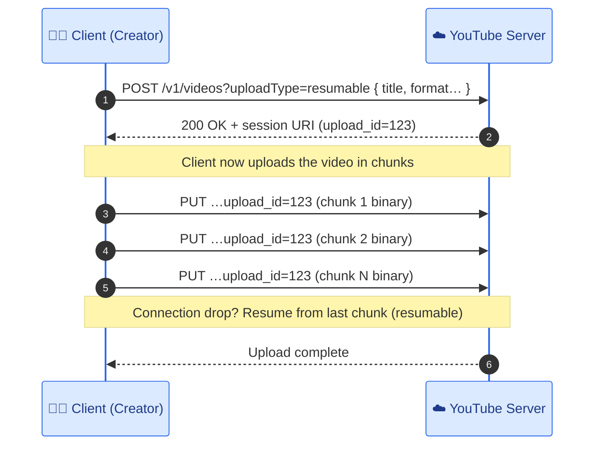

---

## 5. API Design — Streaming a Video (Manifest + HLS) ▶️

Streaming is also **not** one request. Video chunks live at **different locations** (on the CDN), so the client must first learn *where* the chunks are — via a **manifest file** — then fetch them.

**Three steps:** (1) client asks to play a video → (2) server returns a **manifest file** (locations of all chunks, in every format & quality) + metadata → (3) client fetches chunks from the **CDN** using **HLS**.

### Request 1 — get the manifest

```http
GET /v1/watch?videoId=abc123
```
```http
200 OK
{
  "title": "...", "creatorId": "...", "description": "...",
  "manifest": { /* list of chunk locations by format & quality */ }
}
```

- **Method `GET`** — we're **fetching** (watching a video).
- **Endpoint `/v1/watch`** — tells the server we want to watch; server responds with the **manifest file** + metadata.

### Request 2 — fetch chunks from the CDN (HLS)

```http
GET https://cdn.example.com/videos/abc123/720p/chunk_003.ts     (HLS)
```

- **Method `GET`** — fetching each chunk.
- **Endpoint** — a **CDN location from the manifest** (not the origin server). Chunks are served by the **CDN** (a network of edge servers close to users — much faster for huge static assets like video).
- **Protocol: HLS (HTTP Live Streaming).** HLS enables **adaptive streaming**: the client picks chunk quality based on current internet speed. Fast connection → 4K chunks; connection slows → the client switches to 240p chunks to avoid buffering. Example: watching 4K, connection drops for 10s → YouTube serves 240p chunks instead of 4K → no interruption.

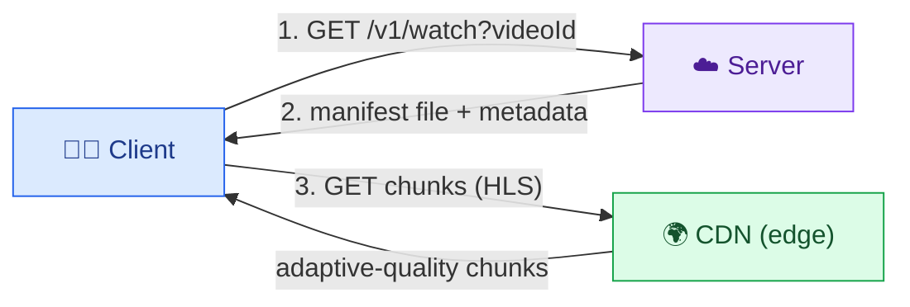

---

## 6. Core Entities & the Video/Metadata Split 🗂️

Two types of users → the nouns of the system:

- **User** — the person uploading, watching, or streaming.
- **Video** — the thing uploaded/watched. **Crucially, a video is two very different things** stored in two very different places:
  - **Video bytes** — the raw content you actually watch (huge; up to 256 GB). → **Object storage (S3/GCS)**.
  - **Video metadata** — title, description, creator, privacy, upload status, and the chunk locations. → a **database**.

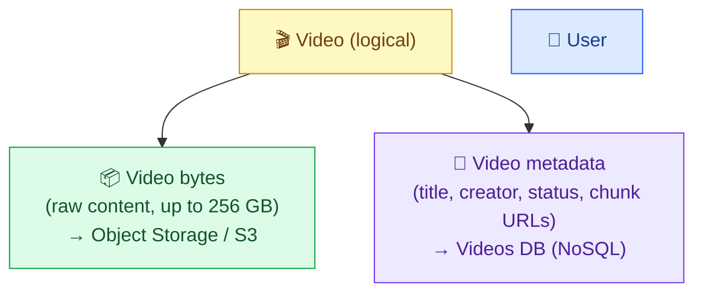

**Why split them?** They have opposite characteristics: bytes are **massive, immutable blobs** best served by cheap object storage + CDN; metadata is **small, structured, queried often** and belongs in a database. Storing bytes in the DB (or routing bytes through app servers) is a classic anti-pattern — it's expensive, slow, and doesn't scale. Recognizing this split early is a **senior/staff signal**.

### Why these two entities specifically (technical breakdown)

The two entities differ on **every axis that matters for storage choice**:

| Property | Video **bytes** | Video **metadata** |
|---|---|---|
| Size | 100 MB – 256 GB per video | ~1 KB per video |
| Mutability | write-once, never edited (immutable) | mutable (title/description/status change) |
| Access shape | sequential read of chunks during playback | random point-lookup by `videoId` |
| Query needs | none (fetched by URL) | filter/sort by creator, time, etc. |
| Right store | object storage (S3/GCS) + CDN | database (NoSQL, §15) |
| Cost model | $/GB stored + $/GB egress | negligible (tiny rows) |

**Where each entity shows up in the two flows:**
- **Upload flow:** the client creates a **metadata** row first (title, format, `status=PENDING`), then streams the **bytes** to object storage. The metadata row is the durable "handle" the rest of the pipeline uses to find and update the video (via `videoId`), even while the bytes are still being processed.
- **Watch flow:** the client reads the **metadata** (title, description, and the chunk URLs) to know *what* and *where*, then fetches the **bytes** (chunks) directly from the CDN. Metadata is read **once per view**; bytes are streamed continuously — a second reason to keep them in different tiers optimized for their traffic patterns.

> **Enrichment — a third sub-entity to name:** the **chunk** (a 2–10s segment in one format + one resolution) is really the atomic unit that gets stored, transcoded, and streamed. The "video bytes" entity is logically a *collection of chunks*, and the metadata's chunk-URL map is what glues them back into a playable video.

---

## 7. HLD — Uploading a Video 🏗️

Recall the two upload requests (§4). Here's the server-side flow.

### Request 1 — metadata + session URI

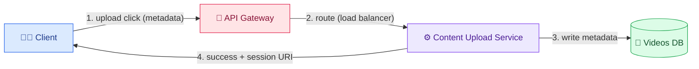

The **API Gateway** (the entry point — routing + auth + rate-limiting; "a receptionist directing guests to the right rooms") routes the request via a **load balancer** to the **Content Upload Service**, which writes the metadata (title, format…) to the **Videos DB** and returns a **session URI**.

### Request 2 — upload bytes + trigger processing

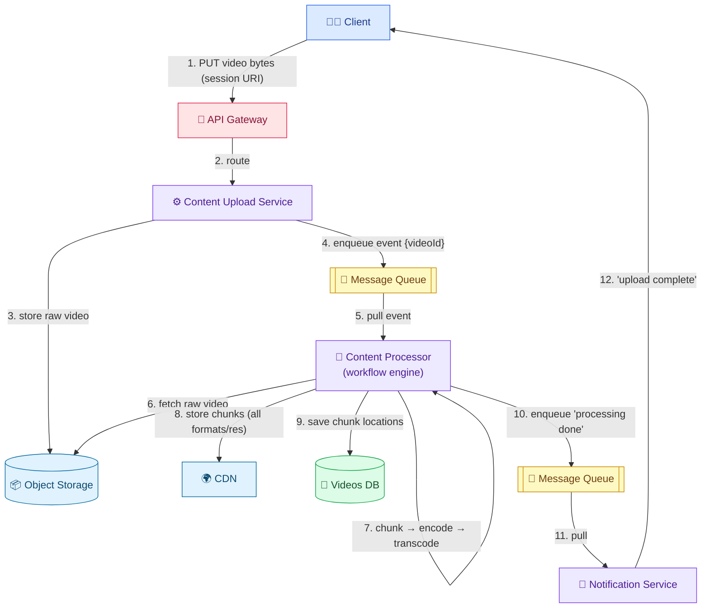

**Step by step:**
1. Client PUTs video bytes (binary) to the session URI.
2. API Gateway routes to the Content Upload Service (via load balancer).
3. Service stores the **raw video in Object Storage** (where bulky static data lives).
4. Once fully uploaded, the service **puts an event `{videoId}` on a Message Queue** (async handoff — one service enqueues, another dequeues). The `videoId` lets the next stage find the video.
5. The **Content Processor** (a **workflow engine** — runs a series of steps in order) pulls the event.
6–8. It fetches the raw video from Object Storage, **chunks** it, converts each chunk into **multiple formats & resolutions**, and stores those to the **CDN** (so clients get them fast). *(Example: a 1-min video → 10 chunks of 6s → each in mp4/mov × 4K/720p/240p.)*
9. It **saves each chunk's CDN location** in the Videos DB.
10–12. Processing done → it enqueues a "done" event → the **Notification Service** pulls it → sends the creator the "**upload complete**" notification.

> **Why a message queue between upload and processing?** Processing is slow (minutes) and bursty. The queue **decouples** the fast upload-ack from the slow pipeline, absorbs spikes, and lets processing workers scale independently. It also delivers **eventual consistency** — exactly what our CAP choice permits.

### The `status` field: the state machine that drives the upload flow

The metadata row carries a **`status`** field that advances through the pipeline. This is *how the system knows where a video is* without the client having to track it:

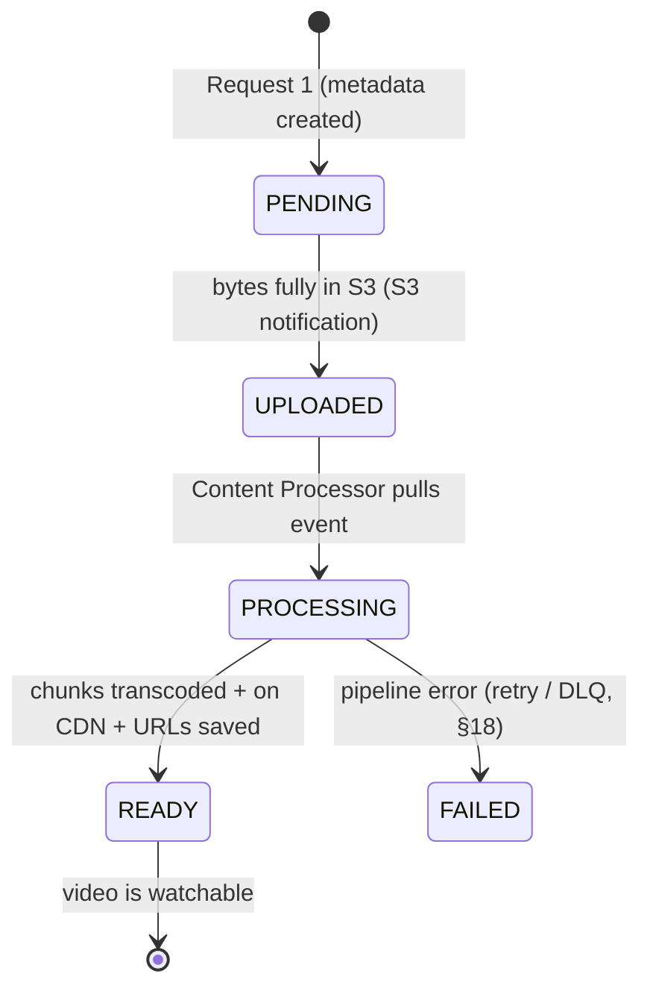

- **`PENDING`** — metadata exists, bytes not fully uploaded yet. The video is **not** listed/watchable.
- **`UPLOADED`** — raw bytes are safely in object storage; ready to process.
- **`PROCESSING`** — the workflow engine is chunking/encoding/transcoding.
- **`READY`** — all chunk variants are on the CDN and their URLs are saved; **only now** does the video become watchable, and the creator gets the "upload complete" notification.

**Why this matters technically:** the status field is the single source of truth that makes the **asynchronous** design safe. The watch flow can filter "show me only `READY` videos," and the pipeline can resume/retry using the status. It's also the mechanism behind **eventual consistency** — a freshly uploaded video sits in `PENDING/PROCESSING` (invisible) for seconds-to-minutes, then flips to `READY`.

### Walk-through: what a creator experiences vs what happens server-side

1. Creator clicks **Upload**, picks a file, types a title → **Request 1** creates the metadata row (`PENDING`) and returns a session URI. *(Creator sees an upload progress bar.)*
2. Client streams bytes to the session URI → object storage → **S3 notification** flips status to `UPLOADED`. *(Progress bar hits 100%.)*
3. Server enqueues `{videoId}`; the Content Processor picks it up → status `PROCESSING`. *(Creator may see "Processing… HD will be available shortly" — real YouTube shows exactly this.)*
4. Pipeline finishes, CDN URLs saved → status `READY` → Notification Service pings the creator. *(Creator gets "Your video is live.")*

> **Design note:** the creator's request **returns immediately after step 2** — they don't wait for processing. This is why upload feels fast even though full processing of a large 4K video can take many minutes. The decoupling (queue + async workers + status field) is what enables that responsiveness.

---

## 8. The Content Processor Workflow Engine 🔧

The Content Processor is a **workflow engine**: a chain of specialized services, each doing one step and then enqueuing an event for the next. **Four services** (five steps once we add encoding in §17):

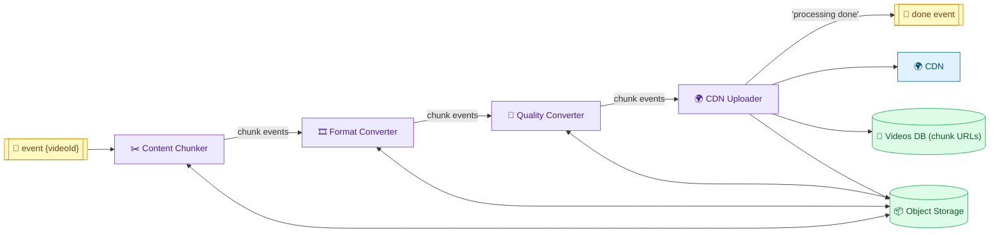

Each service follows the **same 4-step pattern**: (a) pull event from queue → (b) fetch the video/chunk from object storage by ID → (c) do its transform → (d) store results back and enqueue an event for the next service.

1. **Content Chunker** — gets the video by `videoId`, breaks it into **small chunks**, stores chunks to object storage, and enqueues a `chunkId` event per chunk. *(Chunking lets everything downstream be parallel and lets viewers stream piece-by-piece.)*
2. **Format Converter** — converts each chunk into **different container formats** (mp4, mov…). *Why?* Different devices need different formats (e.g., `.mov` on a laptop, `.mp4` on a phone).
3. **Quality Converter** — converts each chunk into **different qualities/resolutions** (4K, 720p, 240p…). *Why?* So a good connection gets 4K and a weak one gets 240p — the basis of adaptive streaming.
4. **CDN Uploader** — pushes all the chunk variants (every format × every resolution) from object storage to the **CDN**, **saves their locations in the Videos DB**, and enqueues the final "processing done" event.

**Visualizing the explosion of variants:** one video → chunks (chunk1, chunk2, chunk3) → each chunk × formats (chunk1.mov, chunk1.mp4) → each of those × resolutions (chunk1.mov@4K, chunk1.mov@720p…). One upload becomes **dozens–hundreds of small files**.

```
Original video
 └── chunk1 ── mov ── {4K, 720p, 240p}
 │         └── mp4 ── {4K, 720p, 240p}
 ├── chunk2 ── mov ── {4K, 720p, 240p} ...
 └── chunk3 ── ...
```

> **Why services + queue instead of one big function?** Each stage is CPU-heavy and independently scalable; the queue between stages gives **retry-on-failure**, **backpressure**, and lets you add workers per stage where the bottleneck is (usually transcoding).

### Why the "pull event → fetch by ID → transform → store + enqueue" pattern

Each stage passes only a small **event containing an ID** (like `chunkId`), *not* the video bytes. This is deliberate and important:

- **Events stay tiny.** The queue carries `{chunkId: "abc_003"}` (a few bytes), never the multi-MB chunk. The heavy bytes always live in object storage; stages fetch them by ID only when they're ready to work. This keeps the queue fast and cheap.
- **Stages are stateless.** A stage holds no data between events — it reads its input from object storage, writes its output back, and forgets. Statelessness is what lets you **run many identical workers** of a stage in parallel and autoscale them.
- **Everything is parallel per chunk.** Because each chunk is an independent event, 100 chunks of one video can be transcoded by 100 workers simultaneously — turning a serial "transcode a 2-hour video" job into many small parallel jobs.

### Concrete numeric example (one 1-minute video)

```
1-min video ──chunk (6s each)──► 10 chunks
   each chunk ──encode──► H.264/H.265
   each chunk ──format──► {mp4, mov}                → 10 × 2 = 20 files
   each of those ──quality──► {4K, 1080p, 720p, 480p, 240p}  → 20 × 5 = 100 files
   → CDN Uploader pushes ~100 small files to the CDN and writes 100 URLs into the metadata
```

So a single 1-minute upload fans out into **~100 chunk files**, all produced in parallel by pools of stateless workers. A 2-hour 4K video produces *hundreds of thousands* of chunk files — which is exactly why this must be a parallel, queue-driven pipeline and not a single function call.

### How this connects to the watch flow

The output of this pipeline **is** the input to streaming: the CDN Uploader writes the `format → resolution → [chunk URLs]` map into the metadata. That map **is the manifest** the watch flow serves (§9, §14). In other words, *the write pipeline's whole job is to produce the manifest + chunks that the read path streams.*

---

## 9. HLD — Streaming a Video ▶️

Streaming has three steps (from §5): request → manifest → chunk fetch from CDN.

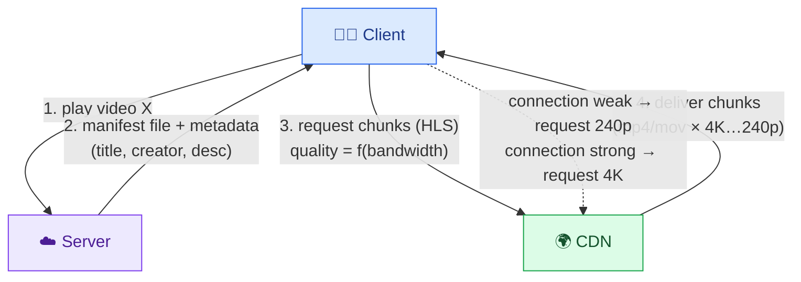

1. Client requests to play video X.
2. Server returns the **manifest file** (chunk locations by format & quality) plus metadata (title, creator id, description).
3. Client reads the manifest and requests chunks **directly from the CDN via HLS**.
4. The CDN delivers chunks in the requested **format** (mp4 vs mov) and **resolution** (4K…240p).

**Adaptive streaming in action:** as the connection fluctuates, the client **intuitively adapts** — strong → request high-quality chunks; weak → request low-quality chunks. This is **adaptive streaming**, and **HLS supports it natively** — the reason HLS is used so heavily.

### Example manifest entry

```json
{
  "chunk": "chunk1",
  "parentVideo": "video1",
  "format": "mp4",
  "quality": "4K",
  "location": "https://cdn.example.com/video1/4k/chunk1.ts"
}
```
…and many more entries for every (chunk × format × quality) combination.

### What actually happens the moment you click "play" (technical walk-through)

```
t=0ms    Client → Server: GET /v1/watch?videoId=abc123
t~50ms   Server → Client: manifest (chunk URLs per resolution) + metadata (title, desc)
t~60ms   Client picks a START resolution (often lowest, e.g. 480p) for a fast first frame,
         and measures bandwidth from how fast the manifest + first chunk arrive
t~150ms  Client → CDN: GET 480p/chunk1  (2–6s of video)
t~300ms  chunk1 arrives → decoded → FIRST PIXELS ON SCREEN  ✅ (< 500 ms target met)
         Meanwhile the client is already fetching chunk2, chunk3 into a BUFFER (look-ahead)
t~1s     bandwidth measured as high → client requests chunk4 in 4K
 …       client keeps a few seconds of chunks buffered ahead; if buffer drains, it drops quality
```

**Two mechanisms make this smooth:**
- **Buffering (look-ahead):** the client always downloads a few chunks *ahead* of the play position into a buffer. Playback reads from the buffer, so brief network dips don't cause a stall — the buffer absorbs them.
- **Start-low-then-ramp:** many players fetch the **first** chunk at a *low* resolution to get pixels on screen ASAP (hitting the 500 ms target), then ramp up quality once bandwidth is measured. This is why a video sometimes looks soft for the first second, then sharpens.

**Why the client — not the server — drives quality:** only the client can observe its *actual* download speed and buffer level in real time. The server just exposes all resolutions via the manifest; the client's ABR logic (§12) decides which chunk URL to request next. This keeps the server **stateless** for streaming (it serves static chunks), which is what lets the CDN scale reads massively.

---

## 10. Deep Dive — Chunking (Upload vs Streaming Chunks) ✂️

Chunking appears **twice** in this design, and beginners often think it's redundant. It isn't — the two chunkings are **optimized for opposite goals**.

### Why chunk at all?

A 256 GB (or even 10 GB) video is unusable as a single unit:
- **On upload:** API gateways/servers cap request bodies (AWS API Gateway = **10 MB**). One video ≫ 10 MB, so you *must* split it.
- **On download:** if the client had to download the whole 10 GB before playing, you'd need a stable connection for the entire download, ~10 GB of free memory, and you'd stare at a blank screen for **minutes**. Chunking lets you **play chunk 1 while downloading chunk 2** → first pixels in < 500 ms.

### The two chunkings compared

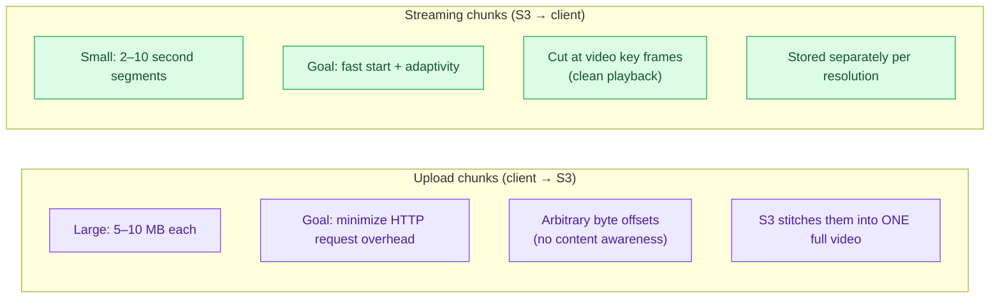

| | **Upload chunks** | **Streaming chunks** |
|---|---|---|
| Purpose | get bytes to S3 past the 10 MB limit | fast playback + adaptive bitrate |
| Size | **large** (5–10 MB) | **small** (2–10 sec segments) |
| Optimize for | fewer HTTP requests (less overhead) | quick start & switchability |
| Boundaries | arbitrary byte offsets | **cut precisely at key frames** |
| After creation | S3 **stitches** into one full video | kept as separate segments per resolution |

**The full lifecycle (why we chunk twice):**
1. **Client-side upload chunking:** the client splits the video into ~5–10 MB parts and uploads them (multipart upload, §13). S3 **reassembles** them into one complete video file.
2. **Server-side streaming re-chunking:** once the full video is in S3, a **Chunker** worker re-splits it into tiny **2–10s segments** cut at key frames, which are then transcoded (§11) and stored back. These are what viewers stream.

> **Key insight:** upload chunks minimize *transfer overhead*; streaming chunks maximize *playback experience*. They're different sizes with different boundary rules, so you genuinely need both.

### Why streaming chunks must be cut at "key frames" (technical detail)

A video codec (§11) doesn't store every frame in full. It stores occasional **key frames** (a.k.a. **I-frames** — complete standalone images) and, between them, **delta frames** (P/B-frames) that only describe *changes* relative to earlier frames. A delta frame is meaningless on its own — it can't be decoded without the key frame it depends on.

**Consequence for chunking:** a streaming chunk must **begin on a key frame** so it's **independently decodable**. If you cut in the middle of a group of delta frames, that chunk starts with frames that reference data in the *previous* chunk — the player can't render it standalone, breaking clean start and quality-switching.

```
Frames:  [I] P P P P P [I] P P P P P [I] P P P ...
              ▲                ▲                ▲
          key frame        key frame        key frame
Chunk boundaries fall HERE ──┘ (on key frames), so each chunk decodes on its own
```

- This is why the encoder is often told to emit a **key frame every 2 seconds** — so chunk boundaries and key frames line up.
- It's also why **all resolutions are chunked at the same boundaries**: to switch from 4K chunk 5 to 720p chunk 6 seamlessly (§12), chunk 6 must start at the same key-frame timestamp in every resolution. Aligned boundaries = seamless mid-stream quality switches.

### Why upload chunks *don't* care about key frames

Upload chunks are just **arbitrary byte ranges** of the file (e.g., bytes 0–5 MB, 5–10 MB). They exist only to move bytes past the 10 MB limit and are **stitched back into the exact original file** by S3 — the boundaries are thrown away. Only *after* reassembly does the server re-chunk at key frames for streaming. That's the core reason the two chunkings can't be the same operation.

---

## 11. Deep Dive — Transcoding, Codecs & What's in a Video File 🎞️

**Transcoding** = converting a video into **different bitrates / resolutions / codecs** so we can serve the *optimal* version for each viewer's device and bandwidth. Without it, a 2 Mbps (bad-café-Wi-Fi / 3G) viewer trying to fetch a single 2-second **4K** chunk could wait **~20 seconds** — blowing the 500 ms latency target.

### What's actually inside a video file?

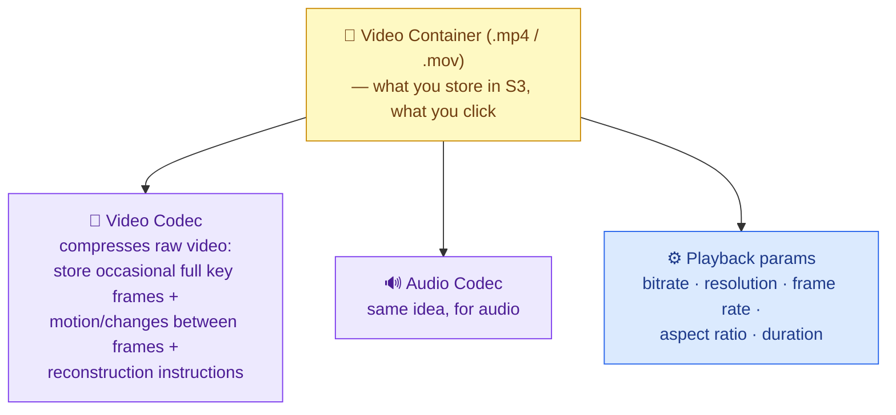

- **Container** (mp4, mov) = the wrapper file you store in S3.
- **Video codec** = the compression method. Raw video is massive; the codec stores **occasional full key frames**, then only the **changes (motion) between frames**, plus **instructions to reconstruct** intermediate frames. That's how huge video shrinks dramatically. (Common codecs: H.264, H.265 — see §17.)
- **Audio codec** = same compression idea for audio.
- **Playback parameters** = bitrate, resolution, frame rate, aspect ratio, duration.

### The transcoding ladder

After chunking, each 2s chunk is transcoded **in parallel** into a ladder of resolutions:

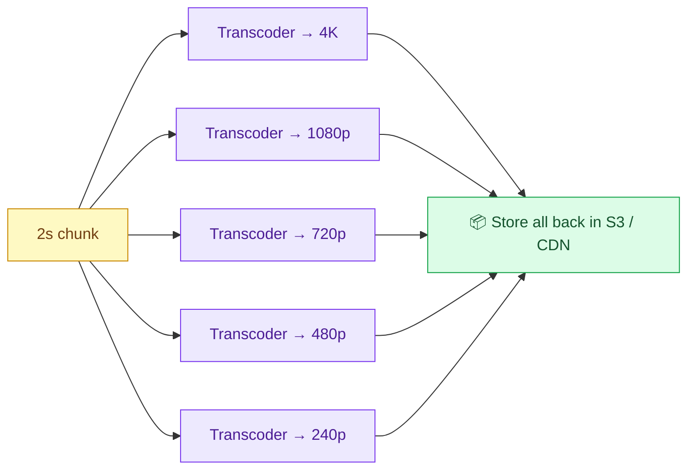

The metadata then records **chunks-by-resolution**, e.g.:

```json
{
  "240p": ["s3://.../240p/chunk1.ts", "s3://.../240p/chunk2.ts", "..."],
  "720p": ["s3://.../720p/chunk1.ts", "s3://.../720p/chunk2.ts", "..."],
  "4K":   ["s3://.../4k/chunk1.ts",   "s3://.../4k/chunk2.ts",   "..."]
}
```

> **Formats vs qualities — two different reasons:** **formats** (mp4/mov) solve **device compatibility** (a laptop may want mov, a phone mp4); **qualities/resolutions** (4K…240p) solve **bandwidth adaptivity**. That's why the pipeline has *both* a Format Converter and a Quality Converter.

### Bitrate vs resolution — what actually determines "can I stream this?"

Beginners conflate these; they're distinct:
- **Resolution** = pixel dimensions (e.g., 4K = 3840×2160, 720p = 1280×720). More pixels = more detail.
- **Bitrate** = **bits per second** the stream consumes (e.g., 4K ≈ 15–25 Mbps, 1080p ≈ 5 Mbps, 240p ≈ 0.3–0.7 Mbps). **This is what your network must sustain.**

The rule that matters for streaming: **a chunk plays smoothly only if its bitrate ≤ your available bandwidth** (with margin). A 2 Mbps connection can't sustain a 15 Mbps 4K stream, so the client must pick a lower-bitrate rendition. Higher resolution generally means higher bitrate, which is why the "quality ladder" is really a **bitrate ladder** — the transcoder produces renditions at descending bitrates so there's always one that fits the viewer's pipe.

### Worked example — why the 4K-on-3G case fails without transcoding

```
4K chunk ≈ 20 Mbps × 2 s = 40 Mbit ≈ 5 MB per 2-second chunk
3G connection ≈ 2 Mbps
Time to download one 4K chunk on 3G = 40 Mbit ÷ 2 Mbps = 20 seconds
→ 20 s to fetch 2 s of video ⇒ constant buffering (unwatchable)

240p chunk ≈ 0.5 Mbps × 2 s = 1 Mbit ≈ 0.125 MB
Time on 3G = 1 Mbit ÷ 2 Mbps = 0.5 s  → downloads faster than it plays ⇒ smooth ✅
```

This is the quantitative reason transcoding exists: pre-producing low-bitrate renditions is the *only* way to serve low-bandwidth viewers without buffering.

### The storage trade-off transcoding introduces

Producing 5 resolutions × 2 formats means the stored footprint is **several times the original**. That's an accepted trade: we spend **more storage (cheap, in S3)** to save **compute per view (expensive) and bandwidth (expensive)**. Since the system is ~2,500:1 read-heavy, doing the transcode work **once at upload** and serving cacheable static chunks **billions of times** is far cheaper than transcoding on every view. (This is the exact trade-off compared in Alternative D, §B11.)

---

## 12. Deep Dive — HLS / DASH & Adaptive Bitrate Streaming 📶

**Adaptive bitrate (ABR) streaming** = the client continuously **measures network conditions and picks the chunk quality** that will play smoothly right now — switching quality *mid-video* without interruption.

### How it works on the client

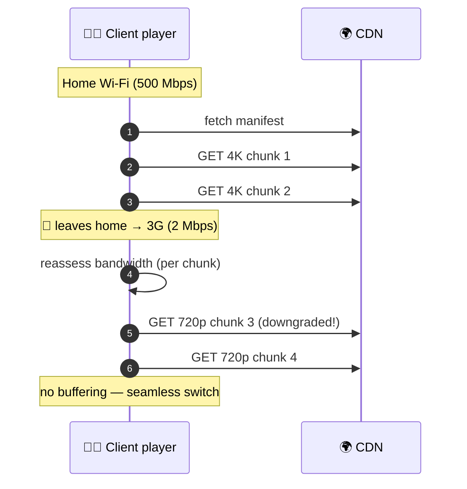

- The client fetches the **manifest** (list of chunk URLs per resolution).
- It starts with, say, 4K chunks; **before each next chunk**, it re-checks bandwidth.
- Bandwidth drops → it fetches the **720p/240p** version of the *next* chunk instead. Bandwidth recovers → it goes back up. The switch is seamless because all resolutions are pre-chunked at the same boundaries.

### HLS vs DASH (the streaming protocols)

Everything above — segmentation, manifest format, multiple qualities, client-side ABR — is standardized by **streaming protocols** so you don't build it yourself:

| Protocol | Full name | Origin |
|---|---|---|
| **HLS** | HTTP Live Streaming | Apple |
| **DASH** | Dynamic Adaptive Streaming over HTTP | open standard |

Both: run over **standard HTTP(S)**, work with **CDNs**, define **when/how to chunk**, and drive **adaptive bitrate**.

### What an HLS manifest actually looks like (two-level structure)

HLS uses **`.m3u8`** playlist files. There are **two levels**, which is the key technical detail:

**1. Master playlist** — lists the available renditions (bitrate ladder). The player reads this first to know its options:
```m3u8
#EXTM3U
#EXT-X-STREAM-INF:BANDWIDTH=15000000,RESOLUTION=3840x2160
4k/index.m3u8
#EXT-X-STREAM-INF:BANDWIDTH=5000000,RESOLUTION=1920x1080
1080p/index.m3u8
#EXT-X-STREAM-INF:BANDWIDTH=500000,RESOLUTION=426x240
240p/index.m3u8
```

**2. Media playlist** (one per rendition) — lists that rendition's ordered chunks and their durations:
```m3u8
#EXTM3U
#EXT-X-TARGETDURATION:2
#EXTINF:2.0,
chunk_000.ts
#EXTINF:2.0,
chunk_001.ts
#EXTINF:2.0,
chunk_002.ts
```

So ABR works by the player choosing **which media playlist (rendition)** to pull the *next* `.ts` chunk from, based on measured bandwidth. DASH is the same idea with an XML `.mpd` manifest instead of `.m3u8`.

### The ABR decision, step by step (technical)

For each upcoming chunk the player runs roughly:
```
1. estimate throughput  = recentChunkBytes / recentDownloadTime   (measured, not guessed)
2. bufferLevel          = seconds of video already downloaded ahead of playhead
3. pick highest rendition R such that:
        R.bitrate ≤ throughput × safetyFactor        (e.g., 0.8)
   AND  is safe given bufferLevel (if buffer low → be conservative; if full → push quality)
4. request that rendition's next chunk from the manifest's media playlist
5. repeat every chunk (so quality can change every ~2 s)
```
- **Throughput estimate** comes from how fast recent chunks arrived — a live measurement, so it tracks real conditions.
- **Buffer level** acts as a shock absorber: a healthy buffer lets the player risk higher quality; a draining buffer forces a downshift *before* a stall happens.
- Because the decision is re-made **every chunk**, quality tracks bandwidth within ~2 seconds — the seamless up/downshifts you see mid-video.

> **Interview note (from T2):** you do **not** need to know HLS/DASH internals — *"even a staff candidate doesn't necessarily need it."* What matters is the **fundamentals**: (1) chunk asynchronously, (2) transcode to multiple bitrates, (3) fetch a **manifest**, then (4) **adaptively** fetch subsequent chunks based on network conditions. HLS/DASH just package those four ideas.

---

## 13. Deep Dive — Multipart Upload, Pre-signed URLs & S3 Notifications 🔐

This solves: *"how does a 256 GB video get to S3 without melting our servers?"* — using three S3 features together.

### The problem with naive upload

Routing bytes **through** the video service (client → API Gateway → video service → S3) fails because: (a) the **API Gateway caps POST bodies at 10 MB**, and (b) passing gigabytes through your app servers wastes network + compute. So we **upload directly to S3**, in chunks.

### Multipart upload + pre-signed URLs

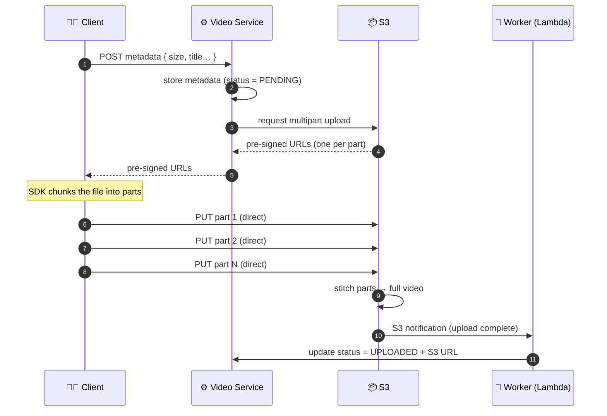

- **Multipart upload** — S3's API to upload a file **in parts**; S3 stitches them into one object. (GCS's equivalent = *resumable uploads*.)
- **Pre-signed URLs** — the video service asks S3 for a set of **temporary, authenticated URLs** (one per part, short TTL). The client PUTs each part **directly to S3** using these — bytes never touch our servers, bypassing the 10 MB gateway limit and saving network/compute.
- **S3 notifications** — *"how does the metadata DB learn the upload finished?"* We **don't trust the client** to tell us (it could lie or crash, leaving inconsistent state). Instead, when multipart upload completes, **S3 fires a notification** to a **Lambda/worker**, which updates the video's status `PENDING → UPLOADED` and records the S3 URL. This keeps the source of truth **server-side and consistent**.

### How multipart upload works mechanically (technical)

Multipart upload is a **3-phase protocol**, and understanding the phases explains the resumability and parallelism:

```
1. INITIATE:  client (via our service) asks S3 to start a multipart upload
              → S3 returns an uploadId (identifies this whole upload session)
2. UPLOAD PARTS: client PUTs each part independently, tagged (uploadId, partNumber)
              → S3 stores each part and returns an ETag (a checksum/handle) per part
              → parts can be uploaded IN PARALLEL and RETRIED individually
3. COMPLETE:  client sends the list of {partNumber, ETag} → S3 concatenates them
              in order into one object (in numeric partNumber order, not arrival order)
```

Why this shape gives us what we need:
- **Resumability** — each part is independent, so a dropped connection only re-sends the *failed* part (identified by `partNumber`), not the whole file. The client can query which parts already succeeded.
- **Parallelism / speed** — parts upload concurrently, saturating the client's uplink instead of a single serial stream.
- **Integrity** — the per-part **ETag** lets S3 verify each part wasn't corrupted before assembling.
- **Ordering is by `partNumber`** — parts can *arrive* out of order; S3 assembles them in numeric order, so the final object is byte-identical to the original.

### Why pre-signed URLs are safe (technical)

A pre-signed URL embeds a **cryptographic signature** derived from the service's S3 credentials plus constraints. The signature encodes: **which bucket/key**, **which HTTP method** (PUT only), and an **expiry time** (short TTL, e.g., 15 min). S3 validates the signature on arrival.

- The client can **only** do exactly what the URL permits (PUT to that one key), and **only** before it expires — it never sees our AWS credentials.
- If the URL leaks, the blast radius is tiny: one key, write-only, expiring soon.
- This is what lets us safely let an untrusted client write **directly to S3**, bypassing our servers (and the 10 MB gateway limit) without handing out real credentials.

### The consistency problem S3 notifications solve (why it's not just "trust the client")

Consider the failure without notifications: the client uploads all parts + completes the multipart upload to S3, then crashes **before** calling our service to say "done." Now the bytes exist in S3 but our metadata still says `PENDING` → an **inconsistent state** (an orphaned upload that never becomes watchable). Trusting the client also allows the reverse: a malicious client claims "done" when it isn't.

**S3 notifications** fix this because the event is emitted by **S3 itself upon the COMPLETE call** — the storage layer is the source of truth about whether bytes are actually there. A small worker/Lambda consumes that event and flips the status server-side. This makes upload completion **exactly-once and tamper-proof**, independent of client behavior.

> **Why not trust the client's "I'm done" call?** A malicious or buggy client could omit it, leaving a video permanently `PENDING`. S3 notifications make completion an **authoritative event from the storage layer itself** — the correct, tamper-proof trigger.

---

## 14. Deep Dive — CDN & the Manifest File 🌍

### Why a CDN

Without a CDN, every viewer hits **origin S3** (say, US-West). A viewer in Germany fetching from US-West means bytes cross an ocean per chunk → high latency. A **CDN (Content Delivery Network)** is a fleet of **edge servers close to users** that **cache popular content**. A New York viewer hits a New York edge; a Tokyo viewer hits a Tokyo edge.

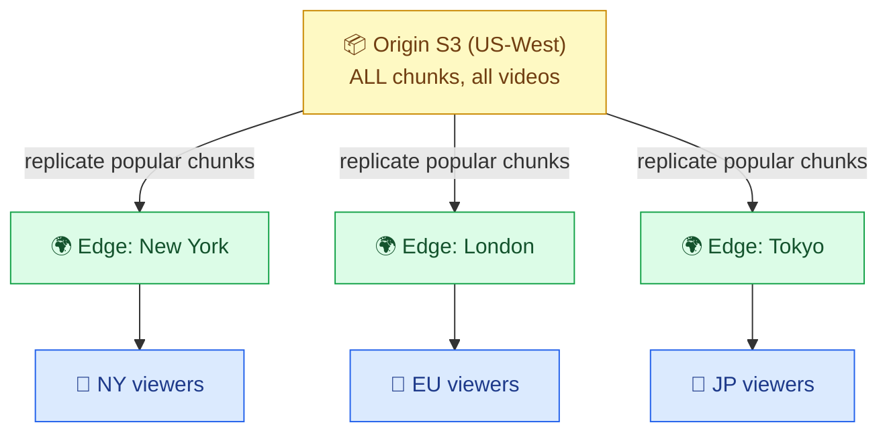

- The CDN stores **only popular video chunks** per region (it's a cache, not the source of truth). On a cache miss, it pulls from origin S3, then serves subsequent requests from the edge.
- This tames the **~6.9 TB/s egress**: the origin only serves cache-fills, while the massive read torrent is absorbed by edges near users.

### The manifest file lives in the CDN too

The **manifest** (the `resolution → [chunk URLs]` mapping) is *just a small file* (JSON/YAML/XML). Store it **in the CDN** as well, so streaming starts **entirely from the edge**:

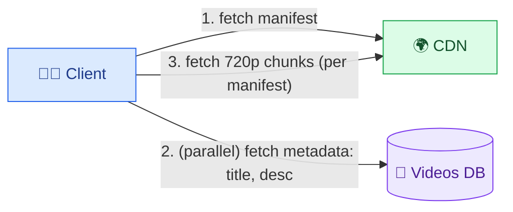

Because the manifest is at the edge, the client can **fetch the manifest and start streaming in parallel** with fetching the title/description from the metadata DB — so pixels can appear *before* the text metadata loads. Wicked fast.

### Cache hit vs miss — what actually happens at the edge (technical)

A CDN edge is a cache keyed by the **request URL** (the chunk's URL). Two paths:

```
HIT  (chunk already cached at this edge):
    Client → Edge: GET .../720p/chunk_005.ts  → edge has it → returns immediately (~ms, near user)

MISS (first request in this region / evicted):
    Client → Edge: GET .../720p/chunk_005.ts  → edge doesn't have it
         Edge → Origin S3: fetch chunk_005.ts (one slow cross-region trip)
         Edge caches it (with a TTL) → returns to client
    Next viewer in region → HIT (fast)
```

- Because video chunks are **immutable** (a given chunk URL always returns the same bytes), they're **ideal for caching** — no invalidation problems, long TTLs, high hit rates. This is a direct payoff of the earlier design choices (immutable chunks, unique URLs per format×resolution).
- The **first viewer** in a region pays the miss penalty; **everyone after** gets edge-speed. For a popular video, ~everyone hits cache → origin sees almost no traffic.

### Why the CDN is what makes ~6.9 TB/s egress feasible

Origin S3 can't (economically) serve 6.9 TB/s to the world. The CDN **fans egress out across hundreds of edges** near users, so:
- **Origin egress** collapses to just cache-fills (one fetch per chunk per region, roughly).
- **Latency** drops because bytes travel a short distance (New York viewer ↔ New York edge, not ↔ US-West origin).
- **Spikes are absorbed at the edge** — a viral video's chunks get cached after the first hits, so the surge never reaches origin (this is the "hot video" mitigation, §B10).

### Pull vs push CDN (enrichment)

- **Pull CDN (default here):** edges lazily fetch from origin on a miss (as above). Simple; the popular subset naturally ends up cached. Downside: the first viewer per region eats the miss latency.
- **Push CDN (pre-warming):** we proactively push content to edges *before* demand — used for **predictable spikes** (a movie premiere, a huge creator's scheduled drop). Downside: you pay to store content at edges that may never be requested. Netflix leans heavily on this (pre-positioning entire catalogs, even inside ISPs); YouTube leans more on reactive pull for its long tail of UGC.

---

## 15. Deep Dive — Database Selection 🗄️

We have essentially **one database to decide: the Videos (metadata) DB.** General guidelines:

| Signal | Lean toward |
|---|---|
| Need fast data access | **NoSQL** |
| Very large scale | **NoSQL** |
| Fixed, structured data | **SQL** |
| Unstructured / evolving data | **NoSQL** |
| Complex queries (joins) | **SQL** |
| Data changes frequently / evolves | **NoSQL** |

Applying them to the **Videos DB → NoSQL**:

1. **Very high scale** — millions of videos uploaded and watched daily; huge read+write volume of metadata.
2. **Fast access / low latency** — our NFR demands low-latency reads at that scale; NoSQL delivers.
3. **Simple query pattern** — the main query is **read metadata + manifest by `videoId`** (a key lookup) when a user clicks a video. No joins, no complex queries.

So: **high scale + fast access + simple key-based queries → NoSQL.**

### The exact query the Videos DB must serve (and why it's easy)

Trace it to the **watch flow**: a viewer clicks a video → the server does `GET metadata WHERE videoId = X` → returns the technical/general metadata + the chunk-URL map (manifest). That's a **single-key point lookup**. There are no joins, no aggregations, no range scans on the hot path. The write side is also simple: the pipeline updates the *same* row by `videoId` as it advances (`status`, `cdnUrls`). So the entire access pattern is **"get/put by primary key,"** which is precisely what a NoSQL key-value / wide-column store is optimized for — O(1) partitioned lookups at any scale.

### Read-heavy vs write-heavy → why it doesn't stress the DB

| Path | Volume | DB impact |
|---|---|---|
| Watch (read metadata by videoId) | ~1B/day | 1 point-read per view — but heavily **cacheable** (metadata is near-immutable once `READY`) |
| Upload (create + update row) | ~1M/day | tiny write volume; a few updates per video as status advances |

The DB sees ~1B point-reads/day, but because a video's metadata rarely changes after it's `READY`, you put a **cache** in front (metadata cache) → most reads never hit the DB. The **heavy** part of the system (the bytes, ~6.9 TB/s egress) is entirely offloaded to **S3 + CDN**, so the metadata DB stays comfortably small and fast. This is why the DB choice is genuinely low-stakes here — the hard scaling problem lives in storage/CDN, not in the database.

> **Enrichment (T2 counterpoint):** because the metadata is **tiny** (~1 KB/video, ~35 TB/yr, ~1M writes/day), the choice is *low-stakes* — **Postgres or DynamoDB both work** and it fits on **a single shard for years**. If asked to shard: **shard by `videoId`** (in Dynamo, sort key on time so the pair is unique and lets you fetch by time), and add a **global secondary index on `userId`** to fetch "all videos by a creator." Don't over-engineer — the bytes (the hard part) live in S3/CDN, not here.

---

## 16. Deep Dive — Data Modeling & Indexing 🧱

The Videos DB record has **four parts**:

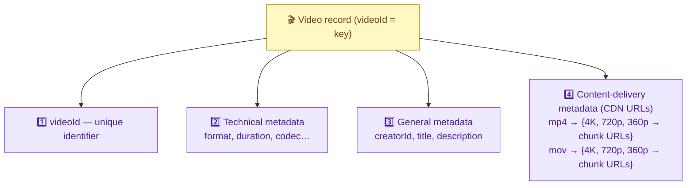

```json
{
  "videoId": "abc123",
  "technical":  { "format": "mp4", "duration": 612, "codec": "H.264" },
  "general":    { "creatorId": "u_9", "title": "...", "description": "..." },
  "cdnUrls": {
    "mp4": { "4K":   ["url_c1","url_c2"], "720p": ["..."], "360p": ["..."] },
    "mov": { "4K":   ["..."],            "720p": ["..."], "360p": ["..."] }
  }
}
```

**Common query & indexing:** the dominant query is *"read video metadata by `videoId`"* (fires when a user clicks to watch). The **technical + general metadata** are returned as **metadata**; the **content-delivery metadata (cdnUrls)** is returned as the **manifest file**. Since we always look up by `videoId`, we **index on `videoId`** — a shortcut so the DB jumps straight to the record instead of scanning.

### Why the chunk-URL map is nested `format → resolution → [ordered URLs]`

The nesting mirrors exactly how the client selects what to fetch:
1. **Format** first — pick the container the device can play (`mp4` on phone, `mov` on some laptops). This is a **capability** decision made once at start.
2. **Resolution** next — the ABR logic (§12) picks a rendition per its measured bandwidth. This changes **repeatedly** during playback.
3. **Ordered list of chunk URLs** — the actual segments, in play order, so the client just walks the array.

Storing it this way means the server can build the manifest by simply **serializing this sub-object** — no computation. The metadata record is literally the source of the manifest:

```
Videos DB record ──(technical + general fields)──► returned as "metadata" (title, desc, duration…)
                 ──(cdnUrls sub-object)──────────► returned as "manifest" (what/where to stream)
```

### The two queries and the index/GSI that serve them

| Query | When | Access key | Structure used |
|---|---|---|---|
| "get this video's metadata+manifest" | every **watch** | `videoId` (primary key) | primary index |
| "list all videos by this creator" | channel page, creator dashboard | `creatorId` | **Global Secondary Index (GSI)** on `creatorId` |

- **Primary index on `videoId`** — O(1) partitioned point lookup; serves the dominant watch query.
- **GSI on `creatorId`** — a secondary, independently-maintained index so "all of user u_9's videos" is also a fast lookup instead of a full scan. In DynamoDB terms: partition key `creatorId`, sort key `createdAt` (so results come back newest-first). This is the "all videos by a creator" query T2 mentions (though it's outside the core two functional requirements).

> **Beginner note — what "index" means here:** an index is a sorted lookup structure (`videoId → row location`). Without it, "find video abc123" scans every row; with it, it's an O(log n)/O(1) jump. You index the field you filter/look-up by — here, `videoId`. A **GSI** is just a *second* such structure keyed on a *different* field (`creatorId`), letting the same data be queried a second way efficiently.

---

## 17. Deep Dive — HLS Encoding (H.264 / H.265) 🧬

**Encoding** = turning the video into a specific **stream of zeros and ones** according to a standard. Different encodings produce different bit patterns from the same source (e.g., video1 → `0101` under one encoding, `0111` under another).

**Why it matters for HLS:** HLS requires chunks be encoded with **specific standards — H.264 or H.265** (a.k.a. AVC / HEVC). So we can't just chunk → format → quality; we must **encode** the chunks into an HLS-compatible standard.

### Adding the encoding step to the workflow

Originally the pipeline was: **chunk → format → quality → CDN upload**. To support HLS, insert **encoding right after chunking**:


1. **Content Chunking** — split into segments.
2. **Encoding** — encode each chunk in **H.264 / H.265** (the new step that makes output HLS-compatible).
3. **Format Conversion** — mp4/mov.
4. **Quality Conversion** — 4K…240p.
5. **CDN Upload** — push to CDN + save locations.

### H.264 vs H.265 — the compression/compatibility trade-off (technical)

Both are **video codecs** (compression standards); they define *how* frames are compressed into bits. The practical differences:

| | **H.264 (AVC)** | **H.265 (HEVC)** |
|---|---|---|
| Compression efficiency | baseline | **~50% smaller** at the same visual quality |
| Encoding CPU cost | lower | **higher** (more compute to encode) |
| Device/browser support | near-universal (old + new devices) | narrower (newer devices; licensing friction) |
| Best for | maximum compatibility, lower encode cost | high resolutions (4K/8K) where bandwidth savings dominate |

**Why produce both:** H.265 halves the bytes for 4K (big bandwidth/egress savings), but many older devices can only decode H.264. So the pipeline commonly encodes popular renditions in **both** codecs and the client requests whichever it can play — another axis in the variant explosion, and another reason encoding is its own pipeline stage.

### The three independent axes, made explicit

A single playable chunk is defined by **three orthogonal choices**, produced by three different pipeline stages:

```
codec/encoding   (H.264 | H.265)      ── HOW the pixels are compressed         ← Encoding stage
container/format (mp4 | mov)          ── the WRAPPER holding video+audio+meta   ← Format stage
resolution       (4K | 1080p | 240p)  ── HOW MANY pixels (→ bitrate)            ← Quality stage
```

They multiply out: `2 codecs × 2 formats × 5 resolutions = 20 variants per chunk`. Conflating them is a classic beginner error — e.g., "mp4" is *not* a compression method (that's the codec *inside* the mp4), and "4K" says nothing about which codec or container carries it.

> This ensures the pipeline output **aligns with what HLS needs**, enabling adaptive streaming. Distinction to keep straight: **codec/encoding** (H.264/H.265 — *how bits are compressed*) vs **container/format** (mp4/mov — *the wrapper*) vs **resolution/quality** (4K/720p — *pixel count*). They're three independent axes.

---

## 18. Deep Dive — Workflow DAG: Failures & Retries 🔁

*(Enrichment beyond the transcript — a staff-level topic T2 flags as "what happens if the chunker fails?")*

The Content Processor is really a **DAG (directed acyclic graph)** of stages connected by queues. Because stages are decoupled by a **message queue**, failure handling is clean:

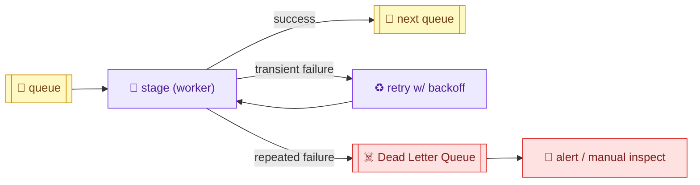

- **Idempotency & at-least-once delivery:** each stage reads by `chunkId`/`videoId` and writes results keyed by that ID. If a worker crashes after doing work but before ACKing, the message is re-delivered and reprocessed — safe because re-writing the same output is idempotent.
- **Retries with exponential backoff:** transient failures (a transcoder OOMs, network blip) are retried a few times with increasing delay.
- **Dead Letter Queue (DLQ):** after N failures, the event goes to a DLQ for alerting/manual inspection instead of blocking the pipeline. The rest of the video's chunks keep processing independently.
- **Partial-progress resumption:** because each *chunk* flows independently through the DAG, a single failed chunk doesn't force re-processing the whole 256 GB video — only that chunk retries.

### Concrete failure walk-through: a transcoder crashes mid-chunk

```
1. Transcode-worker A pulls event {chunkId: c_042, target: 4K} from the queue.
   (Queue marks c_042 "in-flight / invisible" for a visibility-timeout window.)
2. Worker A downloads chunk c_042 from S3, starts transcoding to 4K…
3. 💥 Worker A crashes (OOM) before writing output and before ACKing the message.
4. Visibility timeout expires → the queue makes c_042 VISIBLE again automatically.
5. Worker B pulls the same event {chunkId: c_042}, redoes the transcode, writes
   4K/c_042.ts to S3 (overwriting any partial output — idempotent), and ACKs.
6. Only now is the message removed from the queue. c_042 is done; other chunks
   (c_041, c_043…) were never affected — they flowed through in parallel.
```

Key mechanisms this relies on:
- **Visibility timeout + ACK:** a message isn't deleted when *received*, only when *ACKed after success*. A crash before ACK ⇒ automatic redelivery. This is **at-least-once** delivery.
- **Idempotent writes (keyed by `chunkId`):** because output is written to a deterministic key (`4K/c_042.ts`), reprocessing overwrites identically — a re-run produces the same result, so at-least-once is safe (no duplicates/corruption).
- **Per-chunk isolation:** the blast radius of one failure is **one chunk**, not the whole 256 GB video — the other chunks are independent messages processed by other workers.

### Why not do all of this synchronously in one service?

If chunk→encode→format→transcode→upload ran as one long synchronous call and it failed at 90%, you'd **redo everything from scratch**, and a slow transcoder would **block** the whole request. The DAG-of-queues design converts that into: only the failed **stage** of the failed **chunk** retries, slow stages create **backpressure** (their queue grows, work isn't dropped), and you **scale precisely the bottleneck stage** (add transcoder workers to the transcode queue) instead of scaling the whole monolith.

> **Why the queue-between-stages design pays off:** it turns a fragile monolithic job into **independently retryable units**, gives **backpressure** (a slow transcoder just lets its queue grow rather than dropping work), and lets you **scale the bottleneck stage** (usually transcoding) by adding workers to that queue only.

---

# 🎯 Part B — Interview Template

## B1. Problem Statement & Clarifying Questions 📝

**Problem statement.** Design a **video-sharing / streaming platform** (YouTube; same design for Netflix/Hulu/Spotify): creators **upload** videos of any size, the system **processes** them into streamable variants, and viewers **stream** them on any device at the best quality their connection allows — at billions-of-views/day scale, low latency, highly available.

**Clarifying questions an interviewer expects:**

1. **Upload + watch only, or also comments/likes/subscriptions/search?** (Core scope: upload + stream. Rest = below the line.)
2. **Max video size?** (**256 GB / 12 hr** — drives chunking.)
3. **Scale?** (100M DAU; ~1M uploads/day; ~1B views/day.)
4. **Latency target?** (~**500 ms** to first pixel, even on low bandwidth.)
5. **Consistency vs availability?** (**AP** — uploads eventually consistent; viewing always available.)
6. **Device/quality range?** (Phones→TVs; 240p→4K; adaptive bitrate.)
7. **Do we build our own streaming or use HLS/DASH?** (Use a standard protocol.)
8. **Security / DRM / piracy?** (Auth on content; anti-piracy — noted, often out of deep scope.)

> 💡 **Crux to name:** *"read-heavy large-media system; the write path is a slow async transcoding pipeline, the read path is adaptive-bitrate chunk streaming from a CDN via a manifest. Hardest parts: 256 GB uploads (chunk both ways) and low-latency streaming across variable bandwidth (transcode + ABR)."*

---

## B2. Requirements 📋

**Functional**
- Upload videos (any size, up to 256 GB); notify creator when processing done.
- Watch / stream videos on any device.
- (Below the line: comments, likes, subscriptions, search, recommendations, DRM.)

**Non-functional**
- **Availability > consistency (AP)** — uploads eventually consistent; viewing always up (six nines target).
- **Low latency** — < 500 ms first pixel, incl. low-bandwidth.
- **Scalability** — 100M DAU, ~1M uploads/day, ~1B views/day.
- **Support very large videos** — 256 GB (chunk upload + download).
- **Durability / storage reliability** — uploaded videos never disappear.
- **Security** — no unauthorized access; anti-piracy.

---

## B3. Capacity Estimation 📊

(Full derivation in [§3](#3-capacity-estimation-full-math-); condensed.)

```
DAU 100M · MAU 2.5B
Uploads/day = 100M ÷ 250 = 0.4M      Views/day = 100M × 10 = 1B      → read:write ≈ 2,500:1
Avg video 600 MB ; max video 256 GB / 12 hr
Storage/day = 0.4M × 600 MB = 240 TB → ×365×10 ≈ 876 PB
Cache/day   = 1% × 240 TB ≈ 2.4 TB
Ingress = 240 TB ÷ 86,400 ≈ 2.7 GB/s
Egress  = 1B × 600 MB = 600 PB/day ÷ 86,400 ≈ 6.9 TB/s   (T1 says "70 GB/s" — arithmetic slip; correct ≈ 6.9 TB/s)
Metadata ≈ 1 KB/video → ~35 TB/yr (tiny; single shard for years)
```

> Egress ≈ 2,500× ingress ⇒ **CDN is mandatory** to serve the read torrent from the edge.

---

## B4. API / Interface Design 💻

**Upload (resumable, 2 requests):**
```
POST /v1/videos?uploadType=resumable      body: { title, format, … }   → 200 + session URI (upload_id)
PUT  /v1/videos?uploadType=resumable&upload_id=123   body: <binary chunk>   → chunk stored
```

**Watch (2 requests):**
```
GET /v1/watch?videoId=abc123      → { title, creatorId, description, manifest }
GET <cdn chunk URL from manifest> (HLS)   → video chunk (adaptive quality)
```

**Modern S3-direct variant (T2):** `POST /videos` with metadata → server returns **pre-signed multipart URLs** → client PUTs chunks **directly to S3** → S3 notification updates status. Watch → fetch **manifest from CDN** → fetch chunks from CDN via HLS/DASH.

---

## B5. High-Level Architecture 🏛️

### 🏛️ Full system architecture (the "whiteboard" diagram)

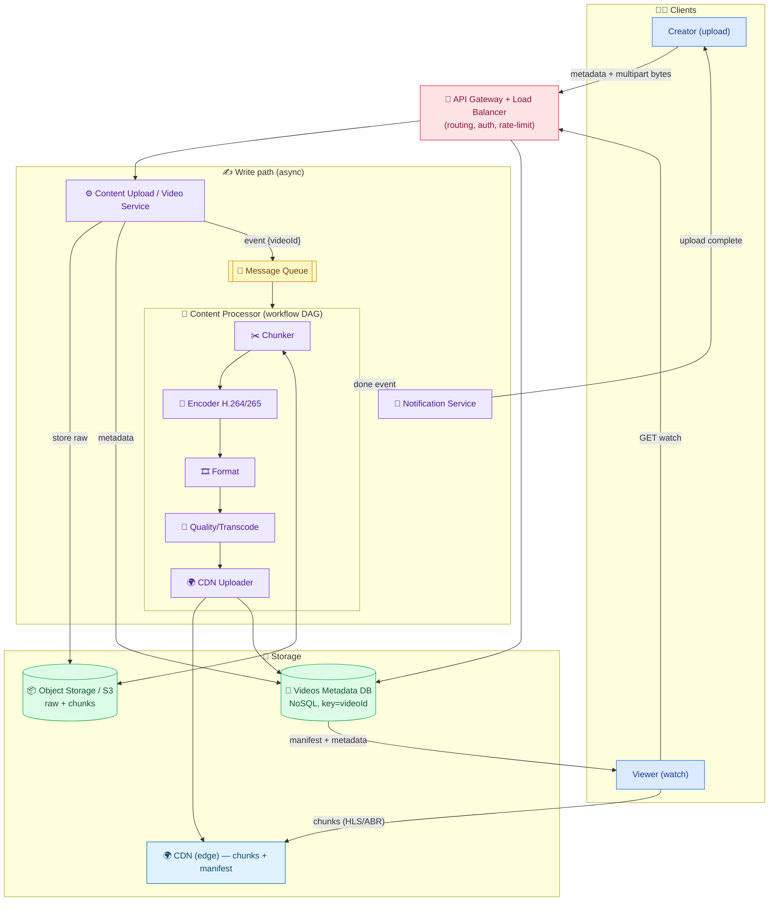

**ASCII (client → gateway → service → storage/CDN):**
```
UPLOAD:  Creator ─► API Gateway/LB ─► Content Upload Svc ─► Object Storage (raw)
                                              │                    │
                                              ├─► Videos DB (metadata)
                                              └─► Message Queue ─► [Chunker→Encoder→Format→Quality→CDN Uploader]
                                                                        └─► CDN (chunks+manifest) + Videos DB (URLs) ─► Notification Svc ─► Creator

WATCH:   Viewer ─► API Gateway/LB ─► Videos DB ─► (manifest + metadata) ─► Viewer
         Viewer ─► CDN (HLS, adaptive chunks) ◄─ streams 2s chunks at quality = f(bandwidth)
```

**Component roles:** **API Gateway/LB** routes, authenticates, load-balances (stateless video service scales horizontally). **Content Upload/Video Service** stores raw bytes to **Object Storage (S3)**, metadata to **Videos DB**, and kicks off async processing via the **Message Queue**. **Content Processor DAG** (chunk→encode→format→transcode→CDN-upload) turns the raw video into streamable variants. **CDN** serves chunks + manifest from the edge. **Notification Service** tells the creator when done.

---

## B6. Data Model / Schema 🗃️

**Videos DB (NoSQL, key = `videoId`):**

| Field | Notes |
|---|---|
| `videoId` (PK, **indexed**) | unique id; the one query key |
| `technical` | format, duration, codec |
| `general` | creatorId, title, description, privacy |
| `status` | PENDING → UPLOADED → PROCESSED |
| `fullS3Url` | raw stitched video in S3 |
| `cdnUrls` | `format → resolution → [ordered chunk URLs]` (this is the **manifest**) |

- **Partition/shard key:** `videoId` (high-cardinality, even spread). In Dynamo: sort key = `createdAt` for time-ordered fetch.
- **GSI:** on `userId`/`creatorId` → "all videos by a creator."
- **Video bytes:** NOT in the DB — in **S3** (raw + chunks) and **CDN** (hot chunks + manifest).

> The metadata DB is tiny (~1 KB/video). The heavy data lives in blob storage + CDN.

---

## B7. Deep Dive Modules 🔬

- **B7.1 Chunking (twice)** — large upload chunks (5–10 MB, minimize overhead) vs small streaming chunks (2–10s, key-frame aligned). → [§10](#10-deep-dive--chunking-upload-vs-streaming-chunks-)
- **B7.2 Transcoding & codecs** — bitrate ladder (4K…240p), video container vs codec vs resolution. → [§11](#11-deep-dive--transcoding-codecs--whats-in-a-video-file-)
- **B7.3 Adaptive bitrate + HLS/DASH** — client measures bandwidth, switches quality per chunk via manifest. → [§12](#12-deep-dive--hls--dash--adaptive-bitrate-streaming-)
- **B7.4 Multipart + pre-signed URLs + S3 notifications** — direct-to-S3 upload past the 10 MB gateway limit; server-authoritative completion. → [§13](#13-deep-dive--multipart-upload-pre-signed-urls--s3-notifications-)
- **B7.5 CDN + manifest** — edge caching of popular chunks; manifest at edge for parallel start. → [§14](#14-deep-dive--cdn--the-manifest-file-)
- **B7.6 DB selection & modeling** — NoSQL by videoId; four-part record; index videoId. → [§15](#15-deep-dive--database-selection-), [§16](#16-deep-dive--data-modeling--indexing-)
- **B7.7 Workflow DAG resilience** — idempotent stages, retries+backoff, DLQ, per-chunk retry. → [§18](#18-deep-dive--workflow-dag-failures--retries-)

---

## B8. Data Flow Diagram 🔀

**Upload → process → notify (write path), end to end:**

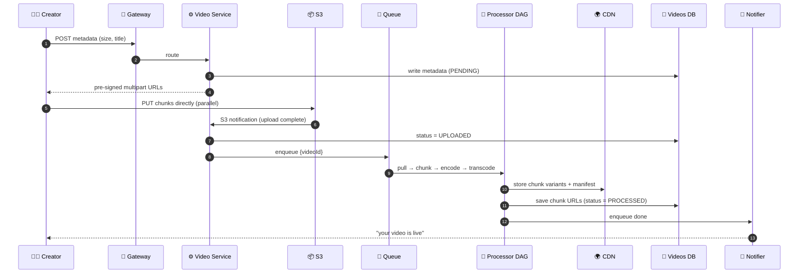

**Watch (read path) ASCII:**
```
Viewer ─GET /watch?videoId─► Gateway ─► Videos DB ─► {metadata + manifest} ─► Viewer
Viewer ─fetch manifest─► CDN
Viewer ─loop: pick quality by bandwidth ─► GET next 2s chunk ─► CDN ─► play (repeat, adapt)
```

---

## B9. Scalability & Bottlenecks 📈

| Layer | First bottleneck | Scale strategy |
|---|---|---|
| **Video/Upload service** | request volume | **stateless → horizontal scale**; LB in front |
| **API Gateway** | 10 MB POST limit; throughput | **direct-to-S3 multipart** bypasses it; scale gateway |
| **Object storage (S3)** | ~none (effectively infinite) | S3 scales; cost is the concern |
| **Transcoding/Processor** | CPU-heavy, slow, bursty | **stateless workers auto-scale** on CPU/mem (e.g., >70% CPU); per-stage scaling |
| **Egress / streaming** | ~6.9 TB/s to viewers | **CDN edge caching** of popular chunks + manifest |
| **Metadata DB** | tiny (~35 TB/yr) | single shard for years; shard by videoId if needed; GSI on userId |
| **Single region** | global latency | multi-region CDN + origin replication |

<details>
<summary><b>Detailed walkthrough of each bottleneck (beginner-friendly) — click to expand</b></summary>

**1. Video/Upload service.** It just routes bytes to S3 and writes metadata — it holds no per-user state, so it's **stateless** and scales by adding identical instances behind the load balancer. No sticky sessions needed.

**2. API Gateway (10 MB limit).** A raw upload through the gateway is capped at 10 MB and wastes compute. We sidestep it entirely with **multipart upload direct to S3 via pre-signed URLs** — the gateway only handles the tiny metadata request, not the gigabytes.

**3. Object storage.** S3/GCS is effectively **infinitely scalable** for our purposes; we won't hit a capacity wall. The real concern is **cost** (876 PB over 10 years), managed with storage tiers and lifecycle policies.

**4. Transcoding (the real compute bottleneck).** Turning one video into dozens of encoded/transcoded chunks is CPU-intensive and bursty. The **stateless transcoder workers auto-scale** on CPU/memory thresholds (e.g., add workers when CPU > 70%), and because each chunk is an independent queue message, you scale **exactly the stage that's slow**.

**5. Egress / streaming (the read bottleneck).** ~6.9 TB/s to viewers can't come from origin S3. A **CDN** caches popular chunks + the manifest at edges near users, absorbing the read torrent; origin only serves cache-fills.

**6. Metadata DB.** Tiny and low-QPS relative to the media. A single shard lasts years; if needed, **shard by `videoId`** and add a **GSI on `userId`** for creator queries.

**7. Single region.** Serving global users from one region adds latency. Use a **multi-region CDN** (edges worldwide) and replicate origin storage across regions.

</details>

---

## B10. Failure Modes & Mitigation 🛡️

| Failure / edge case | Impact | Mitigation |
|---|---|---|
| **Upload connection drops** | partial upload lost | **resumable / multipart upload** — resume from last chunk |
| **Client lies "upload done"** | inconsistent state | **S3 notification** is the authoritative completion signal, not the client |
| **Transcoder/chunker fails** | video stuck processing | **queue + retry w/ backoff + DLQ**; per-chunk idempotent retry |
| **Sudden traffic spike (viral video)** | hot content overwhelms origin | **CDN caches** the hot chunks at edge; origin shielded |
| **CDN edge miss / cold region** | slower first play | edge pulls from origin once, then caches; pre-warm popular content |
| **Bandwidth drop mid-play** | buffering | **adaptive bitrate** — client downshifts resolution |
| **Region outage** | availability loss | multi-region CDN + replicated origin (AP: keep serving) |
| **Duplicate processing (at-least-once queue)** | wasted work / dup chunks | **idempotent** stages keyed by chunkId |
| **256 GB video** | can't upload/serve whole | chunk on **both** upload and download |

<details>
<summary><b>Detailed walkthrough of each failure mode (beginner-friendly) — click to expand</b></summary>

**1. Upload connection drops.** Mobile uploads fail constantly. The **resumable/multipart** design tracks which parts succeeded, so the client re-sends only the missing part — no restarting a 100 GB upload from zero.

**2. Client can't be trusted.** If we let the client tell us "upload complete," a buggy/malicious client could leave a video `PENDING` forever or claim completion falsely. **S3 fires its own notification** on real completion → a worker updates status. The storage layer is the source of truth.

**3. Processing stage fails.** A transcoder can OOM or a chunker crash. Because stages are connected by **queues**, a failed message is **retried with exponential backoff**; after N tries it goes to a **Dead Letter Queue** for inspection while other chunks keep flowing. Idempotency (keyed by chunkId) makes re-runs safe.

**4. Viral traffic spike.** One video suddenly gets millions of views. The **CDN** serves those chunks from edge caches, so the spike hits cache (which scales) not origin S3. This is the streaming analog of the "celebrity/hot-key" problem.

**5. CDN cold miss.** First viewer in a region triggers an origin fetch (slightly slower), then the edge caches it for everyone after. **Pre-warming** predicted-popular content avoids the first-viewer penalty.

**6. Bandwidth drop.** The client's **ABR** logic notices the slowdown and requests lower-resolution chunks for the next segment — playback continues without a spinner.

**7. Region outage.** With **AP**, we keep serving from healthy regions; a **multi-region CDN + replicated origin** means one region failing doesn't take streaming down.

**8. Duplicate processing.** At-least-once queues can redeliver a message. Stages write outputs keyed by **chunkId**, so reprocessing overwrites identically — no corruption.

**9. 256 GB video.** The extreme size is handled structurally by **chunking on both sides** — never touching the whole file at once.

</details>

---

## B11. Alternative Designs / Trade-off Comparison ⚖️

### Alternative A — Upload through the app server (no direct-to-S3)

- **How:** client → API Gateway → video service → S3.
- **Pros:** simplest; server controls the write.
- **Cons:** **10 MB gateway limit**; gigabytes waste app-server network/compute; doesn't scale.
- **vs chosen:** **multipart direct-to-S3 + pre-signed URLs** bypasses the limit and offloads bytes. Direct-to-S3 wins for large media.

### Alternative B — Store video bytes in the database

- **Pros:** one store; transactional.
- **Cons:** DBs are terrible for multi-GB blobs (cost, performance, scaling).
- **vs chosen:** **bytes in S3, metadata in DB** — the fundamental split. Never store blobs in the DB.

### Alternative C — Download the whole file (no streaming chunks)

- **Pros:** trivial (just serve the file).
- **Cons:** minutes-to-hours to first frame; needs huge client memory + stable connection; no bandwidth adaptation.
- **vs chosen:** **streaming chunks + ABR** → < 500 ms first pixel, adapts to bandwidth.

### Alternative D — Transcode on-the-fly (at watch time)

- **Pros:** store only the original; no pre-processing storage.
- **Cons:** CPU-per-view is enormous at 1B views/day; adds latency; can't cache easily.
- **vs chosen:** **pre-transcode once, serve many** — trade storage for massive read savings (right for 2,500:1 read:write).

**Summary:** chosen = **direct-to-S3 multipart upload → async transcoding DAG → S3 + CDN storage → adaptive-bitrate HLS/DASH streaming**, with **bytes in blob storage, metadata in NoSQL**. Optimized for large files, read-heavy scale, and low-latency adaptive playback.

---

## B12. Interview Q&A 🎓

> Questions are grouped by level and collapsible — click any question to reveal the answer.

### Conceptual (mid-level)

<details>
<summary><b>Q1. Why can't we upload a video in a single HTTP request?</b></summary>

Videos can be up to **256 GB**, but API gateways/servers cap request bodies (AWS API Gateway = **10 MB**). So we split the file into parts (**multipart upload**) and send each part separately. The client requests **pre-signed URLs** and PUTs each chunk **directly to S3**, bypassing the gateway limit and avoiding routing gigabytes through our app servers. S3 stitches the parts back into one object. This also gives **resumability** — a dropped connection resumes from the last successful part instead of restarting.
</details>

<details>
<summary><b>Q2. Why is a CDN essential for streaming?</b></summary>

Egress is ~**6.9 TB/s** (1B views × 600 MB ÷ 86,400) — orders of magnitude more than ingress. Serving that from origin S3 (say US-West) means every global viewer's bytes cross long network distances, adding latency and hammering origin. A **CDN** caches **popular chunks at edge servers close to users**, so a New York viewer streams from a New York edge. Origin only serves cache-fills. This is what makes low-latency streaming at scale affordable and fast, and it absorbs viral-video spikes (hot content is cached).
</details>

<details>
<summary><b>Q3. What is a manifest file and why does it matter?</b></summary>

The manifest is a small file (JSON/XML) that maps every **resolution → ordered list of chunk URLs** for a video. When a viewer clicks play, the server (or CDN) returns the manifest; the client reads it to know **where each 2s chunk lives at each quality**, then fetches chunks in order. It's the backbone of adaptive streaming: the client uses it to pick which quality's chunk to fetch next based on bandwidth. Storing the manifest **in the CDN** lets streaming start entirely from the edge, in parallel with loading title/description.
</details>

<details>
<summary><b>Q4. Why store video bytes and metadata separately?</b></summary>

They have opposite properties. **Bytes** are massive (up to 256 GB), immutable blobs — best in cheap **object storage (S3)** + CDN, streamed directly. **Metadata** (title, creator, chunk URLs, status) is small, structured, and queried on every watch — best in a **database**. Putting blobs in the DB is an anti-pattern (cost, poor performance, doesn't scale); routing bytes through app servers wastes network/compute. The split lets each layer use the right tool and scale independently.
</details>

<details>
<summary><b>Q5. Why is video upload processing asynchronous?</b></summary>

Turning one upload into dozens of chunked, encoded, transcoded variants takes **minutes** and is CPU-bursty. If it were synchronous, the creator's request would hang and spikes would overwhelm servers. Instead the upload service stores the raw file, drops an event on a **message queue**, and returns immediately; a **Content Processor** consumes the event and processes in the background, then notifies the creator. This is acceptable because we chose **availability over consistency** — a new video being watchable seconds-to-minutes later (eventual consistency) is fine.
</details>

### Design trade-off (senior)

<details>
<summary><b>Q6. Why chunk the video twice (upload chunks vs streaming chunks)?</b></summary>

They optimize different goals. **Upload chunks** are **large (5–10 MB)** with arbitrary byte offsets, tuned to **minimize HTTP request overhead** while getting past the 10 MB gateway limit; S3 stitches them into one file. **Streaming chunks** are **small (2–10s)**, cut precisely at **key frames**, tuned for **fast start and adaptive switching**, and kept as separate per-resolution segments. Using upload-sized chunks for streaming would give slow starts and ugly quality switches; using streaming-sized chunks for upload would multiply request overhead. Different sizes, different boundary rules — you need both.
</details>

<details>
<summary><b>Q7. HLS/DASH vs building your own streaming — trade-off?</b></summary>

HLS (Apple) and DASH (open) are standard protocols that already implement **segmentation, manifest format, multi-quality, and client-side adaptive bitrate**, over plain HTTP(S) with CDN compatibility. Building your own means reinventing all of that plus client players for every device — huge effort, little upside. The trade-off: standards give you battle-tested ABR + broad device support instantly, at the cost of conforming to their formats/codecs (e.g., HLS wants H.264/H.265). For an interview you don't need HLS internals — just the **four fundamentals**: chunk async, transcode to bitrates, fetch a manifest, adaptively fetch chunks.
</details>

<details>
<summary><b>Q8. Pre-transcode-and-store vs transcode-on-the-fly — which and why?</b></summary>

**Pre-transcode once, serve many.** With ~1B views/day and ~2,500:1 read:write, on-the-fly transcoding would burn enormous CPU **per view**, add latency, and defeat CDN caching (each response differs). Pre-transcoding does the CPU work **once per video** at upload, producing cacheable static chunks that a CDN serves cheaply forever. The trade-off is **more storage** (all the variants) for **massively less compute + better latency + cacheability** — clearly right for a read-heavy system. On-the-fly only makes sense for rarely-watched long-tail content where storage savings beat compute cost.
</details>

<details>
<summary><b>Q9. How do you handle the "hot / viral video" problem?</b></summary>

A single video suddenly getting millions of views is the streaming analog of a hot key. The **CDN** solves it naturally: the popular chunks get cached at edges after the first requests, so the flood is absorbed by edge caches (which scale horizontally and are close to users), and origin S3 only serves the initial cache-fill. You can **pre-warm** CDNs for anticipated hits (premieres, trailers). Because chunks are static and immutable, they're perfectly cacheable — unlike dynamic content, there's no invalidation churn. The metadata read is also cache-friendly (immutable per video).
</details>

<details>
<summary><b>Q10. Why availability over consistency here, and what does eventual consistency look like?</b></summary>

Watching existing videos is the dominant, latency-sensitive path; a brand-new upload being globally visible instantly is **not** required. So we prioritize **availability** — viewers can always stream — and accept **eventual consistency** for uploads: after upload, async processing (chunk/encode/transcode/CDN) takes seconds to minutes to hours to propagate before the video is watchable everywhere. A creator in Germany uploading doesn't need a US viewer to see it immediately. This choice is *why* the async pipeline + message queue design is acceptable and even preferred.
</details>

### Deep-dive internals (staff)

<details>
<summary><b>Q11. Walk through what's inside a video file and why transcoding needs it.</b></summary>

A **container** (mp4/mov) wraps: a **video codec** (compression — stores occasional full **key frames**, then inter-frame **motion/deltas**, plus reconstruction instructions, shrinking raw video massively), an **audio codec** (same idea for audio), and **playback parameters** (bitrate, resolution, frame rate, aspect ratio, duration). Transcoding manipulates these: it re-encodes chunks into a **ladder of bitrates/resolutions** (4K…240p) and required **codecs** (H.264/H.265 for HLS). Key frames matter because streaming chunks are **cut at key-frame boundaries** so each 2s segment is independently decodable — enabling clean start and quality switches.
</details>

<details>
<summary><b>Q12. How does adaptive bitrate actually decide which chunk to fetch?</b></summary>

The client player continuously **estimates throughput** (from recent chunk download times and buffer level). Before fetching the *next* segment, it selects the highest bitrate whose chunk it predicts will download before the buffer drains, using the manifest to find that quality's URL. If bandwidth drops (home Wi-Fi → 3G), it downshifts (4K → 720p → 240p) for the next segment; if it recovers, it upshifts. Because all resolutions are pre-chunked at identical key-frame boundaries, switching is seamless. This logic lives entirely **on the client**, driven by the manifest — the server just serves static chunks.
</details>

<details>
<summary><b>Q13. Do the capacity math and explain the egress discrepancy.</b></summary>

Uploads = 100M ÷ 250 = **0.4M/day**; views = 100M × 10 = **1B/day** → ~2,500:1. Storage = 0.4M × 600 MB = **240 TB/day** → ×365×10 ≈ **876 PB**. Ingress = 240 TB ÷ 86,400 ≈ **2.7 GB/s**. Egress = 1B × 600 MB = 600 PB/day ÷ 86,400 ≈ **6.9 TB/s**. Transcript 1 states "70 GB/s" for egress, but that's a **~100× arithmetic slip** — 600 PB/day ÷ 86,400 s is ~6.9 **TB**/s, not 70 GB/s. Either way, egress ≈ 2,500× ingress, which is the quantitative justification for the CDN.
</details>

<details>
<summary><b>Q14. How do you make the transcoding pipeline fault-tolerant?</b></summary>

Model it as a **DAG of stages connected by message queues**. Each stage is **idempotent** (reads/writes keyed by chunkId), so **at-least-once** redelivery is safe. Transient failures get **retries with exponential backoff**; after N failures the event goes to a **Dead Letter Queue** for alerting/inspection while other chunks continue. Because each *chunk* flows independently, one failed chunk retries alone — you never reprocess the whole 256 GB video. Queues also give **backpressure** (a slow transcoder's queue grows rather than dropping work) and let you **scale the bottleneck stage** by adding workers to just that queue.
</details>

<details>
<summary><b>Q15. Where does this system sit on CAP, and where is strong consistency actually needed?</b></summary>

Overall it's **AP**: partition tolerance is mandatory, and we favor availability so streaming never goes down; uploads are eventually consistent. Strong consistency isn't needed for the video-visibility path. Where you *might* want stronger guarantees: **billing/monetization, view-count integrity, or access-control changes** (e.g., making a video private should take effect promptly) — those can use a strongly consistent store or read-your-writes on the metadata for the owner. But the core watch/upload flows are deliberately eventually consistent, which is what enables the async pipeline and global CDN propagation.
</details>

### Behavioral (STAR, tied to this system)

<details>
<summary><b>Q16. Tell me about a time you optimized a slow media pipeline. (STAR)</b></summary>

- **S**ituation: Our video upload flow routed full files through the app tier to storage; large uploads timed out and saturated servers.
- **T**ask: Support large files reliably without scaling app servers linearly with upload size.
- **A**ction: Switched to **multipart upload with pre-signed URLs** so clients PUT chunks **directly to S3**, and used **S3 completion notifications** to update status server-side instead of trusting the client. Moved transcoding behind a **message queue** with autoscaling workers.
- **R**esult: Upload success rate rose sharply, app-tier CPU/network dropped, and we could ingest multi-GB files with resumability — the pipeline scaled independently of upload size.
</details>

<details>
<summary><b>Q17. Tell me about a time you cut latency for end users. (STAR)</b></summary>

- **S**ituation: Viewers in some regions waited seconds for playback and buffered on weak networks.
- **T**ask: Hit sub-500 ms first-pixel, including low bandwidth.
- **A**ction: Introduced **streaming chunks (2–10s, key-frame aligned)** + a **transcoding ladder** (4K…240p) + **client adaptive bitrate**, and served chunks + manifest from a **regional CDN** instead of origin.
- **R**esult: First-pixel latency dropped below target; rebuffering fell dramatically as clients downshifted quality gracefully; origin load and egress cost dropped as edges absorbed reads.
</details>

<details>
<summary><b>Q18. Tell me about a design trade-off you made under storage/compute constraints. (STAR)</b></summary>

- **S**ituation: We debated transcoding on-the-fly (save storage) vs pre-transcoding (save compute) for a read-heavy catalog.
- **T**ask: Choose the approach that scales to ~1B views/day cost-effectively.
- **A**ction: Chose **pre-transcode once, serve many** for the popular catalog (cacheable static chunks), while using **on-the-fly** only for rarely-watched long-tail content to save storage. Backed the decision with read:write math (~2,500:1).
- **R**esult: CDN hit rates stayed high, per-view CPU was near zero for popular content, and total cost was minimized by matching strategy to access pattern.
</details>

<details>
<summary><b>Q19. Tell me about handling a failure that could corrupt data. (STAR)</b></summary>

- **S**ituation: Transcoder workers occasionally crashed mid-job; retries risked duplicate/corrupt chunks.
- **T**ask: Guarantee correctness under at-least-once queue delivery.
- **A**ction: Made every stage **idempotent** — outputs keyed by `chunkId`, so a re-run overwrites identically — added **exponential-backoff retries** and a **DLQ** for poison messages, and ensured per-chunk isolation so one failure didn't stall the video.
- **R**esult: Zero corrupted outputs from retries, failed chunks were auto-recovered or surfaced for inspection, and overall pipeline throughput stayed stable during partial failures.
</details>

<details>
<summary><b>Q20. Tell me about scaling a system for a sudden traffic spike. (STAR)</b></summary>

- **S**ituation: A video went viral; origin storage and services saw a sudden read surge.
- **T**ask: Keep playback smooth without over-provisioning everything.
- **A**ction: Leaned on the **CDN** to cache the hot chunks at the edge (pre-warmed the manifest + first chunks), kept the **video service stateless** for horizontal autoscale, and confirmed the metadata read was cache-friendly (immutable per video).
- **R**esult: The spike was absorbed almost entirely at the edge; origin saw only cache-fills; playback latency held steady and costs scaled with cache, not origin.
</details>

---

## B13. Quick Revision (cheat sheet + ~2-page deep revision) 📚

> **Part 1** = one-glance cheat sheet. **Part 2** = the ~2-page night-before deep revision.

### Part 1 — One-glance cheat sheet

**One-liner:** A **read-heavy, large-media** platform. **Write path** = async pipeline (multipart upload → chunk → encode → transcode → S3 + CDN). **Read path** = adaptive-bitrate streaming of 2s chunks from a CDN, driven by a **manifest**.

**Core requirements:** upload videos (up to 256 GB) + notify; stream on any device at best quality. NFRs: availability > consistency (uploads eventually consistent), <500 ms first pixel (even low bandwidth), scale to 1B views/day, durable storage, security.

**Architecture (one line):** `Client → API Gateway/LB → Video Service → {S3 (bytes), Videos DB (metadata)}; upload → Message Queue → Content Processor DAG (chunk→encode→format→transcode→CDN uploader) → CDN + DB; Watch → DB (manifest) → CDN (HLS adaptive chunks)`.

**Key numbers:** 100M DAU · 2.5B MAU · **0.4M uploads/day** (1/250) · **1B views/day** (×10) · **~2,500:1 read:write** · avg video 600 MB · **max 256 GB / 12 hr** · **240 TB/day → 876 PB/10yr** · cache 2.4 TB/day (1%) · ingress **2.7 GB/s** · egress **~6.9 TB/s** (T1's "70 GB/s" is a slip) · metadata ~1 KB/video · AWS POST limit **10 MB** · latency **<500 ms** · avail **six nines**.

**Building blocks + why:** API Gateway/LB (route, but 10 MB cap → direct-to-S3); Object storage/S3 (cheap durable blobs, ~infinite); **multipart upload + pre-signed URLs** (past 10 MB, offload bytes); **S3 notifications** (server-authoritative completion); **message queue** (decouple slow async processing); **transcoding workers** (bitrate ladder); **CDN** (absorb 6.9 TB/s egress at edge); **manifest** (drives ABR); NoSQL Videos DB (key=videoId, low-stakes/tiny); **HLS/DASH** (standard ABR).

**What you'd change at 10×:** more transcoder workers (auto-scale on CPU); multi-region CDN + origin replication; storage tiering/lifecycle for 8+ PB; shard metadata by videoId + GSI on userId; pre-warm CDNs for premieres; possibly per-title encoding optimization.

**Top-10 to memorize:** (1) chunk on both upload & download — different sizes/goals. (2) bytes→S3, metadata→DB. (3) multipart + pre-signed URLs beat the 10 MB gateway limit. (4) S3 notification, not client, confirms upload. (5) transcode into a bitrate ladder; client does ABR via manifest. (6) CDN caches hot chunks → tames 6.9 TB/s egress. (7) HLS/DASH = chunk + transcode + manifest + adaptive fetch. (8) AP: uploads eventually consistent, viewing always up. (9) async pipeline via queue = retries + backpressure + scale bottleneck. (10) encode (H.264/265) is separate from format (mp4/mov) and resolution (4K/240p).

### Part 2 — Deep revision (~2 pages)

**Problem & scope.** Design YouTube (also Netflix/Hulu/Spotify). Two user types: creators (upload) and viewers (stream). Functional: upload (up to 256 GB) + notify; watch/stream on any device. It's fundamentally **read-heavy large-media**.

**NFRs.** Viewers: low latency (<500 ms first pixel, incl. low bandwidth), scalability (millions concurrent), best-quality UX (adaptive 240p↔4K), availability (six nines). Creators: scalability (~1M uploads/day), security/anti-piracy, storage durability (never lose a video). **CAP → AP**: uploads eventually consistent (Germany upload → US viewer sees it seconds/minutes later is fine).

**Capacity.** DAU 100M, MAU 2.5B. Uploads = 100M/250 = 0.4M/day. Views = 100M×10 = 1B/day → 2,500:1 read:write. Avg video 600 MB, max 256 GB/12hr. Storage/day = 0.4M×600 MB = 240 TB → 10yr ×365×10 = 876 PB. Cache 1% = 2.4 TB/day. Ingress = 240 TB/86,400 = 2.7 GB/s. Egress = 1B×600 MB = 600 PB/day ÷ 86,400 = ~6.9 TB/s (transcript's 70 GB/s is a ~100× error). Metadata tiny (~1 KB/video, single shard for years).

**Upload API (2 requests, resumable).** (1) `POST /v1/videos?uploadType=resumable` with metadata → returns **session URI** (resumable = resume on drop). (2) `PUT` binary chunks to session URI (`upload_id`). Modern: server hands **pre-signed multipart URLs**, client uploads **direct to S3**, S3 stitches; **S3 notification** flips status PENDING→UPLOADED.

**Streaming API (3 steps).** (1) `GET /v1/watch?videoId` → **manifest** (resolution→chunk URLs) + metadata. (2/3) client fetches 2s chunks from **CDN via HLS**, quality = f(bandwidth) = **adaptive bitrate**.

**HLD write path.** Client → API Gateway/LB → Content Upload Service → store raw in **S3** + metadata in **Videos DB** → enqueue `{videoId}` on **message queue** → **Content Processor workflow engine** pulls it → **Chunker → (Encoder H.264/265) → Format Converter (mp4/mov) → Quality Converter (4K…240p) → CDN Uploader** → save chunk URLs in DB → enqueue "done" → **Notification Service** → creator notified. Each stage: pull event → fetch by ID → transform → store + enqueue next.

**HLD read path.** Client → server → manifest + metadata → client streams chunks directly from **CDN** (HLS), adapting quality per chunk. Manifest cached in CDN → streaming can start before metadata text loads.

**Key deep dives.** (a) **Chunking twice**: upload chunks large (5–10 MB, minimize overhead, arbitrary offsets, S3 stitches) vs streaming chunks small (2–10s, key-frame aligned, per-resolution). (b) **Transcoding**: container (mp4/mov) vs codec (H.264/265 — key frames + motion deltas) vs resolution (4K…240p); pre-transcode once, serve many. (c) **ABR/HLS/DASH**: client measures bandwidth, picks next chunk's quality via manifest; protocols standardize chunk+transcode+manifest+adaptive-fetch. (d) **Multipart + pre-signed URL + S3 notification**: past 10 MB limit, bytes bypass servers, server-authoritative completion. (e) **CDN**: edge-cache popular chunks + manifest → tame egress, absorb viral spikes. (f) **DB**: NoSQL by videoId (high scale, fast, simple key query); tiny so low-stakes; shard by videoId + GSI on userId. (g) **DAG resilience**: idempotent stages, retry+backoff, DLQ, per-chunk retry.

**Scaling & failures.** Stateless video/transcoder services → horizontal autoscale (CPU/mem thresholds). S3 ~infinite (cost is the concern). CDN handles egress + hot videos. Metadata single shard for years. Failures: resumable upload (drops), S3 notification (untrusted client), queue+retry+DLQ (transcode fails), CDN (viral spike), ABR (bandwidth drop), multi-region (region outage), idempotency (dup delivery).

**Alternatives.** Upload-through-server (10 MB cap ❌); blobs-in-DB (❌); download-whole-file (slow first frame ❌); transcode-on-the-fly (CPU/view too high at 2,500:1 ❌). Chosen = direct-to-S3 multipart + async transcode DAG + S3/CDN + HLS/DASH ABR.

---

## B14. FAANG Top 20 Most Frequently Asked Questions 🏆

> Each answer is ≥5 lines, interview-ready. Collapsible for revision.

<details>
<summary><b>1. Design YouTube — walk me through your approach.</b></summary>

Start with requirements: creators **upload** videos (up to 256 GB), viewers **watch/stream** on any device; NFRs are low latency (<500 ms first pixel), scale (1B views/day), availability > consistency, durability, security. Core entities: User, Video (split into **bytes → S3** and **metadata → DB**). API: resumable upload (multipart + pre-signed URLs) and watch (manifest + HLS chunks). HLD: upload → S3 + metadata DB → **message queue** → **Content Processor DAG** (chunk→encode→transcode→CDN) → notify; watch → manifest → **CDN adaptive-bitrate streaming**. Then deep dives: chunking twice, transcoding ladder, ABR, CDN, DAG resilience. The anchor: read-heavy large-media, async write pipeline, adaptive chunk streaming on read.
</details>

<details>
<summary><b>2. How do you upload a 256 GB video reliably?</b></summary>

Use **multipart upload with pre-signed URLs**. The client first POSTs metadata; the server requests a multipart upload from S3 and returns **pre-signed URLs** (one per part, short TTL). The client's SDK splits the file into large parts (5–10 MB) and PUTs each **directly to S3** — bypassing the API Gateway's **10 MB** body limit and keeping gigabytes off our app servers. S3 stitches the parts into one object. The upload is **resumable**: a dropped connection resumes from the last successful part, not from zero. Completion is confirmed by an **S3 notification** (not the client), which updates the metadata status server-side.
</details>

<details>
<summary><b>3. Why chunk the video twice?</b></summary>

Because upload and playback have opposite needs. **Upload chunks** are **large (5–10 MB)** with arbitrary byte offsets, optimized to **minimize HTTP overhead** while getting past the gateway limit; S3 reassembles them into one file. **Streaming chunks** are **small (2–10s)**, cut at **key frames**, optimized for **fast start + adaptive switching**, and stored separately per resolution. Streaming with upload-sized chunks would be slow to start and switch; uploading with streaming-sized chunks would explode request count. So the pipeline stitches the upload, then **re-chunks** into streaming segments before transcoding.
</details>

<details>
<summary><b>4. Explain transcoding and why it's needed.</b></summary>

Transcoding converts each chunk into a **ladder of bitrates/resolutions** (4K, 1080p, 720p, 480p, 240p) and required **codecs** (H.264/H.265). It's needed because viewers have wildly different devices and bandwidths — a phone on 3G fetching a single 2s **4K** chunk could wait ~20s, blowing the latency target. By pre-producing lower-bitrate versions, the client can request a size that downloads in time. A video file contains a **container** (mp4/mov), a **video codec** (compression via key frames + motion deltas), an audio codec, and playback params. Transcoding manipulates codec/bitrate/resolution; pre-transcoding once and serving many is far cheaper than transcoding per view.
</details>

<details>
<summary><b>5. What is adaptive bitrate streaming and how does the client decide?</b></summary>

ABR lets the client **switch video quality mid-playback** to match current bandwidth. The client estimates throughput (recent chunk download times + buffer level) and, before each next 2s segment, picks the highest bitrate it predicts will arrive before the buffer drains, using the **manifest** to find that quality's chunk URL. Home Wi-Fi → 4K; move to 3G → it downshifts to 720p/240p for the next segment; recover → upshift. Because every resolution is pre-chunked at identical **key-frame boundaries**, switches are seamless. All this logic is **client-side**; the server just serves static chunks and the manifest.
</details>

<details>
<summary><b>6. What is a manifest file and where is it stored?</b></summary>

The manifest maps each **resolution → ordered list of chunk URLs** for a video (a small JSON/XML file). On play, the client fetches it and uses it to know where every 2s chunk lives at each quality, then requests chunks in order, choosing quality via ABR. It's the control file that makes adaptive streaming work. We store it **in the CDN** (like the chunks) so streaming starts entirely from the edge — the client can fetch the manifest and begin streaming **in parallel** with loading title/description from the metadata DB, so pixels can appear before text.
</details>

<details>
<summary><b>7. Why use a CDN, and what does it store?</b></summary>

Egress is ~6.9 TB/s — serving that from origin S3 means global viewers pull bytes across long distances, adding latency and hammering origin. A **CDN** is edge servers near users that **cache popular chunks + the manifest**; a viewer streams from a nearby edge, and origin only serves cache-fills. It stores **only popular content per region** (it's a cache, not the source of truth); on a miss it pulls from origin then caches. This tames egress, cuts latency, and naturally absorbs **viral-video spikes** since hot chunks are cached at the edge.
</details>

<details>
<summary><b>8. Why split video bytes from metadata, and where does each go?</b></summary>

They have opposite characteristics. **Bytes** are huge (256 GB), immutable blobs → **object storage (S3/GCS)** + CDN, streamed directly, cheap and effectively infinite. **Metadata** (title, creator, status, chunk URLs) is small, structured, and read on every watch → a **database** (NoSQL keyed by videoId). Storing blobs in the DB is an anti-pattern (cost, performance, scaling), and routing bytes through app servers wastes network/compute. This split lets each layer use the right storage and scale independently; recognizing it early is a senior/staff signal.
</details>

<details>
<summary><b>9. Why is the write path asynchronous?</b></summary>

Processing one upload into dozens of chunked/encoded/transcoded variants takes **minutes** and is CPU-bursty. Doing it synchronously would hang the creator's request and let spikes overwhelm servers. Instead, the upload service stores the raw file, enqueues `{videoId}` on a **message queue**, and returns immediately; a **Content Processor** consumes and processes in the background, notifying the creator when done. This is acceptable because we chose **availability over consistency** — a video becoming watchable seconds-to-minutes later (eventual consistency) is fine, and the queue gives retries, backpressure, and independent scaling.
</details>

<details>
<summary><b>10. Why S3 notifications instead of trusting the client to report completion?</b></summary>

If the client reported "upload complete," a buggy or malicious client could lie or crash, leaving the video permanently `PENDING` or claiming false completion — an inconsistent state. Instead, when S3 finishes assembling the multipart upload, it **fires a notification** to a Lambda/worker, which updates the metadata status to `UPLOADED` and records the S3 URL. This makes completion an **authoritative event from the storage layer itself** — tamper-proof and consistent. It decouples the truth of "is it uploaded?" from the untrusted client.
</details>

<details>
<summary><b>11. What database do you choose for metadata and why?</b></summary>

**NoSQL** (e.g., DynamoDB), keyed by **videoId**. Reasoning via the guidelines: very **high scale** (millions of videos), need **fast/low-latency access**, and a **simple key-based query** (read metadata + manifest by videoId on watch — no joins). NoSQL fits all three. Importantly, the metadata is **tiny** (~1 KB/video, ~35 TB/yr, ~1M writes/day), so it's low-stakes — Postgres would also work and it fits on a **single shard for years**. If sharding: **by videoId** (Dynamo sort key on time for time-ordered fetch), plus a **GSI on userId** for "all videos by a creator."
</details>

<details>
<summary><b>12. How do HLS and DASH fit in, and do you need to know them?</b></summary>

HLS (Apple) and DASH (open) are streaming protocols that standardize **segmentation, manifest format, multiple qualities, and client-side adaptive bitrate**, over plain HTTP(S) and CDN-friendly. They let you avoid reinventing chunking/ABR/players. You do **not** need their internals in an interview (even staff candidates often don't) — what matters is the **four fundamentals** they package: (1) chunk asynchronously, (2) transcode to multiple bitrates, (3) fetch a **manifest**, (4) adaptively fetch subsequent chunks by network conditions. Mentioning HLS/DASH by name is a nice-to-have, not a requirement. HLS constrains codecs to H.264/H.265, which is why encoding is a pipeline step.
</details>

<details>
<summary><b>13. Walk through the capacity math and the egress figure.</b></summary>

DAU 100M. Uploads = 100M ÷ 250 = **0.4M/day**; views = 100M × 10 = **1B/day** → ~**2,500:1** read:write. Avg video 600 MB → storage/day = 0.4M × 600 MB = **240 TB**; 10yr = ×365×10 = **876 PB**. Cache = 1% × 240 TB = **2.4 TB/day**. Ingress = 240 TB ÷ 86,400 = **2.7 GB/s**. Egress = 1B × 600 MB = 600 PB/day ÷ 86,400 = **~6.9 TB/s**. (Transcript 1's "70 GB/s" is a ~100× slip — 600 PB/day is ~6.9 TB/s.) Egress ≈ 2,500× ingress → the quantitative case for a CDN.
</details>

<details>
<summary><b>14. How do you make the processing pipeline fault-tolerant?</b></summary>

Model it as a **DAG of stages joined by message queues**. Each stage is **idempotent** (keyed by chunkId), so **at-least-once** redelivery is safe (re-runs overwrite identically). Transient failures get **retries with exponential backoff**; after N tries, the event goes to a **Dead Letter Queue** for alerting/inspection while other chunks keep processing. Because each *chunk* flows independently, one failed chunk retries alone — you never reprocess the whole 256 GB video. Queues also provide **backpressure** (a slow transcoder's queue grows instead of dropping work) and let you **scale the bottleneck stage** by adding workers to just that queue.
</details>

<details>
<summary><b>15. What's the difference between encoding, format, and resolution?</b></summary>

Three independent axes. **Encoding/codec** (H.264, H.265) = *how the raw video bits are compressed* (key frames + inter-frame motion deltas). **Format/container** (mp4, mov) = *the wrapper file* that holds the encoded video + audio + playback params — chosen for **device compatibility** (mov on some devices, mp4 on others). **Resolution/quality** (4K, 1080p, 240p) = *pixel dimensions/bitrate* — chosen for **bandwidth adaptivity**. The pipeline handles all three: an **Encoder** (H.264/265, required by HLS), a **Format Converter** (mp4/mov), and a **Quality Converter** (the bitrate ladder). Conflating them is a common beginner mistake.
</details>

<details>
<summary><b>16. How do you handle a video that suddenly goes viral (hot content)?</b></summary>

Viral video = the streaming version of a hot key. The **CDN** handles it: after the first requests, the popular chunks are cached at edges, so millions of subsequent views are served from edge caches (which scale horizontally and sit near users), and origin S3 only serves the initial cache-fill. Chunks are **static and immutable**, so they cache perfectly with no invalidation churn; the metadata read is also cache-friendly (immutable per video). For anticipated spikes (premieres, trailers) you **pre-warm** the CDN with the manifest + first chunks. The stateless video service autoscales for the metadata/manifest requests.
</details>

<details>
<summary><b>17. Why availability over consistency, and what does eventual consistency mean here?</b></summary>

Watching existing content is the dominant, latency-critical path; a new upload being **globally visible instantly** is not a requirement. So we pick **availability** — streaming is always up — and accept **eventual consistency** for uploads: after upload, async processing (chunk/encode/transcode/CDN propagation) takes seconds → minutes → hours before the video is watchable everywhere. A creator in Germany uploading doesn't need a US viewer to see it immediately (an error would be worse than a short delay). This is precisely *why* the queue-based async pipeline is acceptable and preferred.
</details>

<details>
<summary><b>18. How would you scale each layer to 10×?</b></summary>

**Video/upload service** and **transcoders** are **stateless** → autoscale horizontally on CPU/mem thresholds (e.g., >70% CPU adds workers); the API Gateway doubles as/ fronts a load balancer. **S3** is effectively infinite — cost (876 PB → tiering/lifecycle) is the lever, not capacity. **CDN** is the expensive-but-critical layer — expand edge footprint and multi-region. **Metadata DB** is tiny; single shard lasts years, then shard by **videoId** + **GSI on userId**. **Processing** scales per stage via its queue (add transcoder workers where the backlog grows). Pre-warm CDNs for predictable spikes.
</details>

<details>
<summary><b>19. What are the main failure modes and mitigations?</b></summary>

**Upload drop** → resumable/multipart resumes from last part. **Untrusted client completion** → S3 notification is authoritative. **Transcoder/chunker failure** → queue + retry-with-backoff + DLQ, idempotent per-chunk retry. **Viral spike** → CDN edge caching + pre-warm. **CDN cold miss** → edge pulls from origin once then caches; pre-warm popular content. **Bandwidth drop mid-play** → ABR downshifts resolution. **Region outage** → multi-region CDN + replicated origin (AP keeps serving). **Duplicate delivery** → idempotent stages keyed by chunkId. **256 GB file** → chunk on both upload and download so we never touch the whole file at once.
</details>

<details>
<summary><b>20. What would differ between designing YouTube and Netflix?</b></summary>

The **streaming core is nearly identical** (chunk, transcode ladder, manifest, ABR, CDN) — that's why one design covers both. Differences are on the **write/catalog side**: Netflix has a **small, curated, pre-known catalog** (studios deliver masters), so it can do **extensive offline per-title encoding optimization** and **aggressively pre-position** content on CDNs (even embedding CDN appliances inside ISPs — Open Connect) before demand. YouTube has **massive UGC upload volume** (~1M/day) from the public, so it optimizes the **ingest/transcoding pipeline** for throughput and long-tail storage, and relies more on **reactive CDN caching** of whatever becomes popular. Netflix also leans harder into DRM and offline downloads. Both are read-heavy, AP, CDN-centric.
</details>

---

## 📎 Appendix — Transcript Fidelity Notes

- **Egress discrepancy (flagged):** Transcript 1 states egress = "70 GB/s." Its own inputs (1B views × 600 MB = 600 PB/day ÷ 86,400 s) give **~6,944 GB/s ≈ 6.9 TB/s** — roughly 100× larger. This guide uses the mathematically correct **~6.9 TB/s** and notes the slip; the conclusion (egress ≫ ingress → CDN mandatory) is unchanged.
- **Two scale variants:** Transcript 1 uses 0.4M uploads/day (1/250 of 100M DAU); Transcript 2 uses ~1M uploads/day and emphasizes the **256 GB max**, **10 MB API-Gateway limit**, **500 ms** latency, and direct-to-S3 multipart + pre-signed URLs + S3 notifications + manifest-in-CDN. Both are preserved.
- **Enrichment beyond transcripts** (clearly marked where added): the **Workflow DAG failure/retry/DLQ** deep dive (§18), the **YouTube vs Netflix** comparison (Q20), CAP nuances, and the transcoding-ladder JSON examples. All core transcript facts, numbers, and flows are preserved verbatim in meaning.
