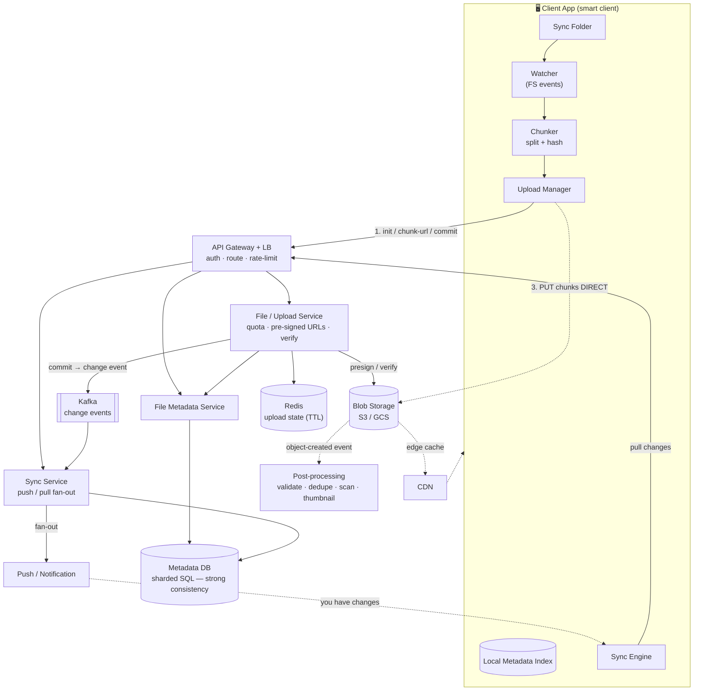
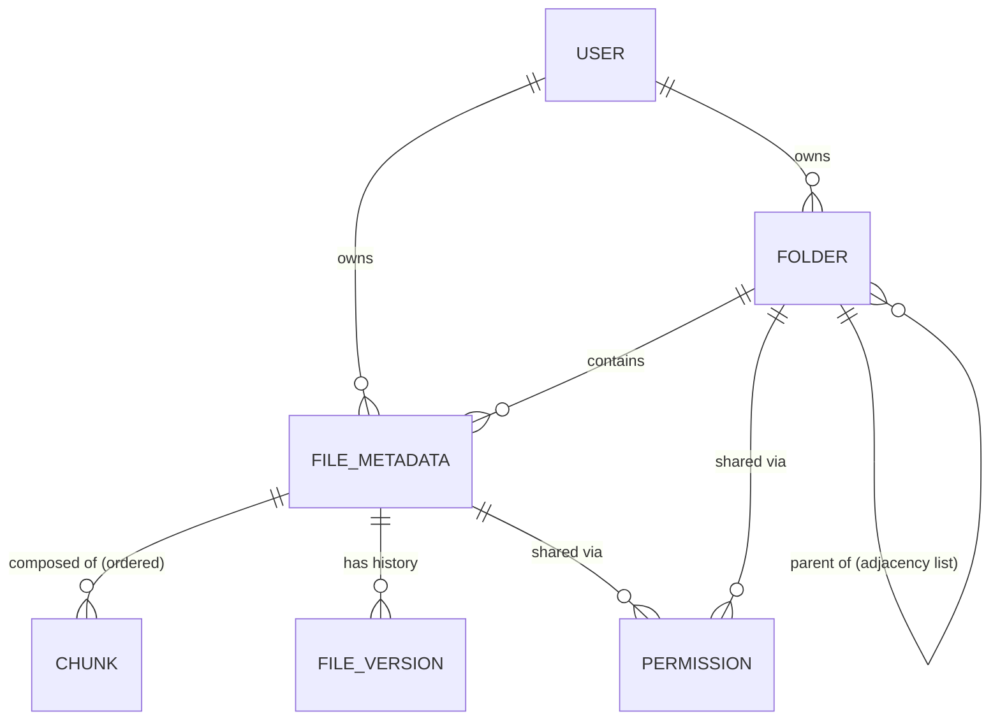
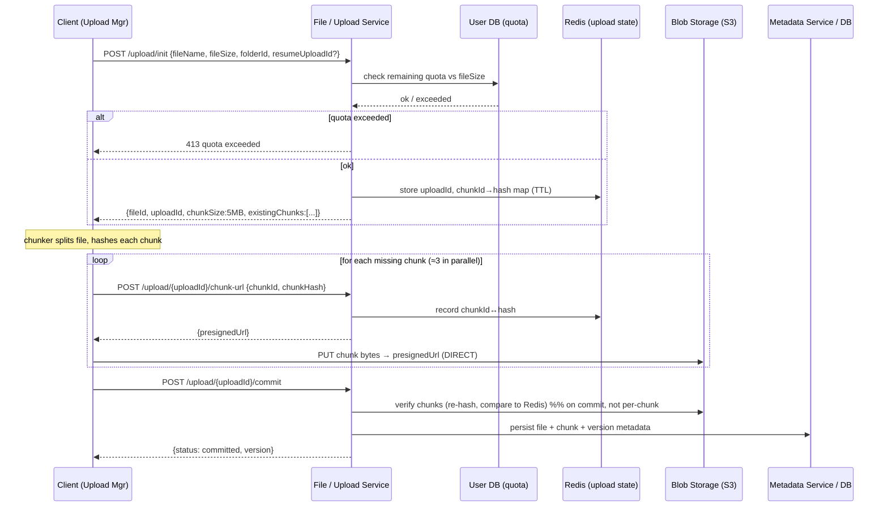
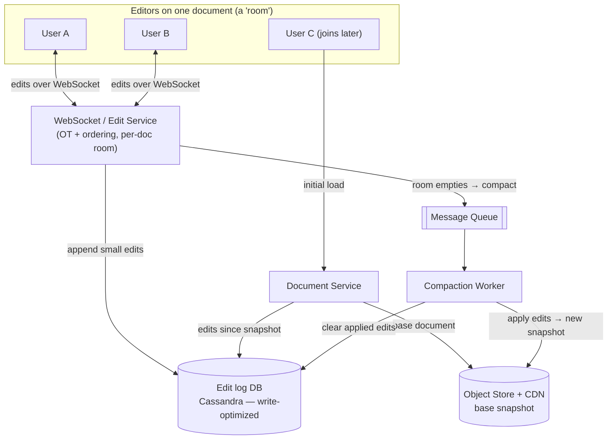
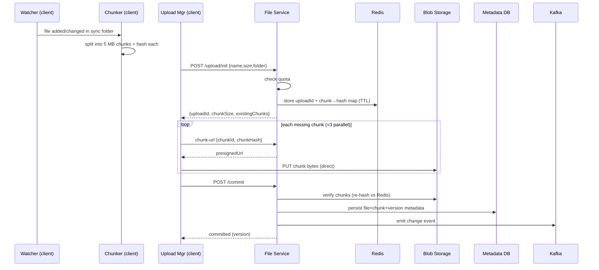
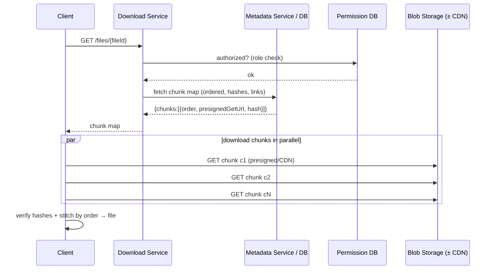
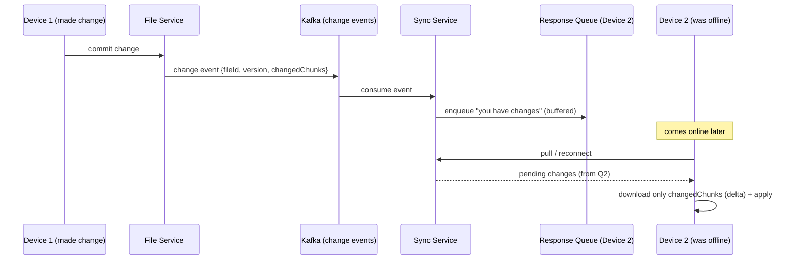

# Google Drive / Dropbox — System Design Study Guide

> A self-contained learning guide for designing a **file storage & synchronization service** (Google Drive, Dropbox, OneDrive, Box) — and, as an extension, the **real-time collaborative editing** layer on top of it (Google Docs). Built from interview walkthrough transcripts and heavily enriched so you can learn the concepts from zero, then use it for revision and reference. No prior knowledge assumed; explanations progress from basics to staff-engineer depth.

---

## How to read this guide

This document teaches one system in increasing depth. It is **not** a cheat sheet — each concept is introduced with *why it exists*, *the simplest version*, *where that breaks*, and *the real design*. Diagrams (Mermaid + inline SVG) accompany every architecture and flow. Long worked examples are placed in collapsible blocks so the main narrative stays readable; expand them when you want the concrete walk-through.

The system splits naturally into **two problems that are often asked together**:

1. **File sync & storage** (the Dropbox/Drive core) — upload, download, and keep a folder identical across all your devices, handling files as large as 50 GB. The hard ideas here are *chunking*, *fingerprinting*, *resumable uploads*, and *sync*.
2. **Real-time collaborative editing** (the Google Docs extension) — many people editing one document at once, seeing each other's changes within milliseconds, with no lost edits. The hard idea here is *conflict resolution* (Operational Transform / CRDT) over *WebSockets*.

You can study part 1 alone (the most common interview), or both together for the full picture.

---

## Table of Contents

1. [Problem Statement & Clarifying Questions](#1-problem-statement--clarifying-questions)
2. [Requirements](#2-requirements)
   - 2.1 [Functional Requirements](#21-functional-requirements)
   - 2.2 [Non-Functional Requirements](#22-non-functional-requirements)
3. [Capacity Estimation](#3-capacity-estimation)
4. [API / Interface Design](#4-api--interface-design)
5. [High-Level Architecture](#5-high-level-architecture)
6. [Data Model / Schema](#6-data-model--schema)
7. [Deep Dive Modules](#7-deep-dive-modules)
   - 7.1 [Why Chunking Changes Everything](#71-why-chunking-changes-everything)
   - 7.2 [Fingerprinting (Content Hashing)](#72-fingerprinting-content-hashing)
   - 7.3 [Uploading Large Files: Pre-signed URLs](#73-uploading-large-files-pre-signed-urls)
   - 7.4 [The Full Upload Protocol: init → chunk-url → commit](#74-the-full-upload-protocol-init--chunk-url--commit)
   - 7.5 [Resumable Uploads & Trust-But-Verify](#75-resumable-uploads--trust-but-verify)
   - 7.6 [Directory Structure as Metadata](#76-directory-structure-as-metadata)
   - 7.7 [The Sync Client: Watcher, Chunker, Indexer](#77-the-sync-client-watcher-chunker-indexer)
   - 7.8 [Detecting Changes: Polling vs Event Bus + Cursor](#78-detecting-changes-polling-vs-event-bus--cursor)
   - 7.9 [Fan-out Sync: Push vs Pull with Message Queues](#79-fan-out-sync-push-vs-pull-with-message-queues)
   - 7.10 [Delta Sync & Reconciliation](#710-delta-sync--reconciliation)
   - 7.11 [Deduplication](#711-deduplication)
   - 7.12 [Low Latency: Compression & CDN Trade-offs](#712-low-latency-compression--cdn-trade-offs)
   - 7.13 [Scaling the Metadata Database](#713-scaling-the-metadata-database)
   - 7.14 [Permissions & Sharing](#714-permissions--sharing)
   - 7.15 [Real-Time Collaborative Editing (Google Docs)](#715-real-time-collaborative-editing-google-docs)
   - 7.16 [Full-Text & Image Search](#716-full-text--image-search)
8. [Data Flow Diagrams (End-to-End)](#8-data-flow-diagrams-end-to-end)
9. [Scalability & Bottlenecks](#9-scalability--bottlenecks)
10. [Failure Modes & Mitigation](#10-failure-modes--mitigation)
11. [Alternative Designs / Trade-off Comparison](#11-alternative-designs--trade-off-comparison)
12. [Interview Q&A](#12-interview-qa)
13. [Quick Revision Cheat Sheet](#13-quick-revision-cheat-sheet)
14. [Quick Revision (~2 pages)](#14-quick-revision-2-pages)
15. [FAANG Top 20 Most Frequently Asked Questions](#15-faang-top-20-most-frequently-asked-questions)

---

## 1. Problem Statement & Clarifying Questions

### 1.1 Problem Statement

Design a **cloud file storage and synchronization service** like Google Drive or Dropbox. A user installs a client (desktop app, mobile app, or web) that watches a **sync folder**. Any file dropped into that folder is uploaded to remote cloud storage, and any change made remotely is automatically pulled down to *all* the user's connected devices — so every device sees an identical, up-to-date copy of the folder. Users can upload, download, rename, move, and delete files and folders; organize them into a directory tree; share files/folders with others under permissions; and stay within a per-user storage quota. The service must handle files as large as tens of gigabytes without forcing users to restart interrupted uploads, and must never lose data.

**What makes this hard is not "put a file in the cloud."** A naive design — treat each file as one blob, re-upload the whole thing on every change — collapses under three realities: (1) files can be huge (a 50 GB file at 100 Mbps takes ~1h12m to send), (2) a one-character edit shouldn't cost a full re-upload of bandwidth and storage, and (3) an interrupted upload shouldn't start over. The elegant answer to all three is **chunking** — splitting files into small pieces and operating on pieces, not whole files. That single idea drives most of this design.

### 1.2 Clarifying Questions to Ask

Asking these up front scopes the problem and shows you understand where the difficulty lives:

- **Which operations?** Upload, download, sync across devices — plus rename/move/delete, directory structure, sharing? *(Core three: upload, download, sync. The rest are common add-ons.)*
- **How large can files be?** *(Up to ~50 GB — this forces chunking and resumable uploads.)*
- **Do we build the blob store ourselves?** *(No — "design S3" is a separate question. Assume an infinitely scalable blob store like S3/GCS exists.)*
- **Consistency vs availability?** Is it OK if a change in one region takes a few seconds to appear elsewhere? *(Yes — availability over consistency; eventual consistency of sync is acceptable, but data integrity must be high once settled.)*
- **Scale?** *(Hundreds of millions of users, billions of files. Storage is assumed solvable via cloud blob storage.)*
- **Per-user quota?** *(Yes — e.g., 15 GB free tier; must reject uploads that exceed it.)*
- **Sharing & permissions?** *(Often in scope: share a file/folder with specific users under a role.)*
- **Version history?** *(Sometimes — keeping old versions influences whether you keep an append-only edit log.)*
- **Real-time collaborative editing** (Google Docs style)? *(Usually a separate question — see §7.15. Confirm whether it's in scope.)*

### 1.3 In / Out of Scope (typical)

**In scope:** upload, download, multi-device sync, large-file support with resumable uploads, high data integrity, directory structure, per-user quota, sharing/permissions.
**Out of scope (commonly):** building the blob store itself, authentication internals, real-time collaborative editing (own question), offline conflict-free editing, and full audit/version history unless explicitly requested.

---

## 2. Requirements

### 2.1 Functional Requirements

**Core (the three that anchor the design):**

1. **Upload a file** to remote storage.
2. **Download a file** from remote storage.
3. **Automatically sync files across devices** — a change in the sync folder on one device (or in the cloud) propagates to all the user's other devices, and vice-versa.

**Commonly added:**

4. **Directory structure** — create/rename/delete folders and subfolders; move files between folders.
5. **Sharing & permissions** — share a file or folder with specific users under a role (viewer/editor/owner).
6. **Per-user storage quota** — enforce a storage limit (e.g., 15 GB free), rejecting uploads that would exceed it.
7. **Version history** *(optional)* — view/restore previous versions of a file.

**Out of scope:** rolling your own blob storage; real-time collaborative editing (§7.15 covers it as an extension).

### 2.2 Non-Functional Requirements

State each quality *in the context of this system* and quantify where possible — these are what drive the deep dives.

| Quality | In the context of Drive/Dropbox | Target / note |
|---|---|---|
| **Availability > Consistency** | You must always be able to upload/download; a change in Germany appearing in the US a few seconds later is fine | **AP** system; **eventual consistency** for sync is acceptable |
| **High data integrity / sync accuracy** | Once things settle, every copy (local folders + remote) must match exactly | No silent divergence; reconciliation repairs drift |
| **Large file support** | Handle very large files | **Up to 50 GB** (matches real Dropbox) |
| **Resumable uploads** | A dropped connection mid-upload must not restart from zero | Resume from last successful chunk |
| **Low latency upload/download** | Make the transfer as fast as the pipe allows | "As low as possible" — maximize bandwidth utilization via parallel chunks |
| **Durability & reliability** | Uploaded data must never be lost, even on server crash | Zero data loss; blob store replication |
| **Scale** | Very large user & file counts | Hundreds of millions of users; billions of files |
| **Per-user quota** | Enforce storage limits | e.g., 15 GB free tier |

**CAP framing.** Partition tolerance (P) is mandatory at this scale, so we choose between C and A *per module*:

- **File sync / upload / download → Availability (AP).** It's acceptable for a freshly changed file to take a few seconds to appear on another device. Users always being able to read/write matters more than instant global consistency.
- **Metadata (chunk maps, versions, directory structure) → Consistency (CP).** The metadata that tells a client *which chunks make up a file and in what order* must be consistent — an inconsistent chunk map produces a corrupt or half-missing file. Several transcripts stress: the file bytes tolerate eventual consistency, but the **metadata must be strongly consistent**.
- **Collaborative editing (if in scope) → strong client convergence.** Concurrent edits must converge to one agreed state (§7.15).

This asymmetry — eventually-consistent bytes, strongly-consistent metadata — is the central consistency insight of the whole design.

---

## 3. Capacity Estimation

**Philosophy:** compute a number only when it changes a decision. For this system, storage is assumed solved by an "infinitely scalable" blob store (S3/GCS), so the interesting numbers are the ones that justify **chunking**, the **metadata DB load**, and **bandwidth math** for large files. Below are concrete calculations, not placeholders.

> **Unit refresher:** 1 day = 86,400 s. ~1M events/day ≈ 12/s; ~100M/day ≈ 1,160/s. Peak is usually a 2×–10× multiple of average. 1 byte = 8 bits, so a 100 Mbps link ≈ 12.5 MB/s.

### 3.1 The bandwidth math that forces chunking

```
File size            = 50 GB = 50,000 MB
Avg upload speed     = 100 Mbps = 12.5 MB/s
Upload time          = 50,000 MB ÷ 12.5 MB/s = 4,000 s ≈ 66 min ≈ 1 hr 12 min
```

An hour-plus single upload that **restarts from zero** on any hiccup is unacceptable — this is the calculation that justifies **chunking + resumable uploads** (§7.1, §7.5). Split into 5 MB chunks:

```
Chunks per 50 GB file = 50,000 MB ÷ 5 MB = 10,000 chunks
```

10,000 independent, retryable, parallelizable units instead of one fragile 50 GB blob.

### 3.2 The "one-character edit" math (why delta sync matters)

```
Naive: edit 1 char in a 20 MB file → re-upload 20 MB, re-store 20 MB per version
3 edits → 60 MB bandwidth + 60 MB storage (for 3 chars of real change!)

Chunked (2 MB chunks, 10 chunks): edit touches 1 chunk → upload/store 2 MB
3 edits → ~26 MB total (20 MB first upload + 3 × 2 MB deltas)
```

Chunking + delta sync turns "cost proportional to file size" into "cost proportional to *change* size."

### 3.3 Users, requests, storage

```
Users               ≈ 100M–500M (hundreds of millions); billions of files
Requests            ≈ 100M+ /day (uploads + downloads + syncs + metadata reads)
Avg requests/sec    = 100,000,000 ÷ 86,400 ≈ 1,160 /s  (peak ~10× ≈ 11,600 /s)

Storage (illustrative): 100M users × 10 GB avg used = 1 Exabyte
  → handled by blob store (S3), which we treat as elastic; our job is the metadata
```

### 3.4 Metadata database load — the real hot spot

Every chunk of every file needs a metadata row (chunk id, hash, order, S3 link, version). This is where *our* system does real work:

```
Files                ≈ several billion
Chunks per file      ≈ 1 (small) to 10,000 (50 GB)
Chunk metadata rows  ≈ tens of billions → forces sharding of the metadata DB (§7.13)
Metadata row size    ≈ ~200–500 bytes → tens of billions × ~300 B ≈ multiple TB of metadata
```

Blob storage scales itself; **the metadata DB is what you must design to shard and scale**, and it's why Dropbox built a sharded-MySQL layer (Edgestore, §7.13).

### 3.5 Bandwidth savings from chunking (summary)

```
Without chunking: cost ∝ file size, every change, every device
With chunking:    cost ∝ changed bytes; downloads/uploads parallelize across chunks,
                  using all available bandwidth (e.g., 5 threads → ~4 s vs ~20 s for a 20 MB file)
```

---

## 4. API / Interface Design

**Convention:** the caller's identity comes from a **JWT / session token in the `Authorization` header**, never a `userId` in the body (otherwise anyone could upload/download on another user's behalf). Requests/responses exchange the core entities from §6.

A crucial teaching point from the transcripts: the *obvious* upload API (`POST /files` with the file in the body) is **wrong** for this system, and you should expect to revise it. Request bodies are capped (AWS API Gateway allows ~10 MB), and routing 50 GB through your own servers wastes bandwidth twice. The real upload API is a **multi-step protocol** that hands the client a **pre-signed URL** so it uploads chunks *directly to blob storage*. We show the naive version first, then the correct one.

### 4.1 Naive first attempt (what to avoid, and why)

```http
POST /files                    # ❌ file bytes in the body — fails for large files
  body: { file, fileMetadata }
GET  /files/{fileId}           # returns file + metadata
GET  /changes?since={ts}       # returns list of changed fileIds (for sync)
```
Problems surfaced later: body-size limits, double bandwidth (client→server→S3), no resumability. Keep this as your "first guess," then evolve it.

### 4.2 The real upload protocol (chunked + pre-signed)

The upload is a **four-step handshake**, not a single call. At a glance:

```http
POST /files/upload/init                 → { fileId, uploadId, chunkSize, existingChunks }
POST /files/upload/{uploadId}/chunk-url → { presignedUrl }   (once per chunk)
PUT  <presignedUrl>                      (chunk bytes → blob storage, direct)
POST /files/upload/{uploadId}/commit    → { status, version }
```

Below, each step is shown with a concrete request and response so you can see exactly what crosses the wire.

<details>
<summary><b>Step 1 — <code>POST /files/upload/init</code> (quota check, get the upload plan)</b></summary>

The client sends **metadata only** (no bytes). The server checks the quota and returns the plan: a new file id, an upload-session id, the fixed chunk size, and which chunks (if any) it already has.

**Request**
```http
POST /files/upload/init HTTP/1.1
Authorization: Bearer eyJhbGciOi...   # user identity from JWT, never in body
Content-Type: application/json

{
  "fileName": "vacation.mp4",
  "fileSize": 52428800,           # 50 MB, in bytes
  "mimeType": "video/mp4",
  "parentFolderId": "fld_9c2",
  "resumeUploadId": null          # set on a resumed upload; null on fresh
}
```

**Response — fresh upload (200)**
```json
{
  "fileId": "f_123",
  "uploadId": "up_abc",
  "chunkSize": 5242880,           # 5 MB — fixed for ALL files (needed for dedup)
  "existingChunks": []            # nothing uploaded yet
}
```

**Response — resumed upload (200)** *(server already has chunks 1–5)*
```json
{
  "fileId": "f_123",
  "uploadId": "up_abc",
  "chunkSize": 5242880,
  "existingChunks": ["9af3...", "1b2c...", "77de...", "44aa...", "5c1d..."]
}
```

**Response — over quota (413)**
```json
{ "error": "quota_exceeded", "limitBytes": 16106127360, "usedBytes": 16000000000 }
```

</details>

<details>
<summary><b>Step 2 — <code>POST /files/upload/{uploadId}/chunk-url</code> (get a pre-signed URL per chunk)</b></summary>

For each chunk the client still needs to upload, it asks for a short-lived, single-purpose URL. It also sends the chunk's **hash** now, so the server can verify integrity later (at commit) without trusting the client.

**Request**
```http
POST /files/upload/up_abc/chunk-url HTTP/1.1
Authorization: Bearer eyJhbGciOi...
Content-Type: application/json

{ "chunkId": 6, "chunkHash": "e3b0c44298fc1c149afbf4c8996fb924..." }
```

**Response (200)**
```json
{
  "presignedUrl": "https://drive-blobs.s3.amazonaws.com/f_123/chunk_6?X-Amz-Algorithm=AWS4-HMAC-SHA256&X-Amz-Expires=900&X-Amz-Signature=abcd1234...",
  "expiresInSeconds": 900
}
```
The server also records `chunkId 6 → hash e3b0...` in Redis (upload-session state) for verification at commit.

</details>

<details>
<summary><b>Step 3 — <code>PUT &lt;presignedUrl&gt;</code> (upload chunk bytes DIRECTLY to blob storage)</b></summary>

This request does **not** hit your servers — it goes straight to S3/GCS. The client uploads several chunks in parallel (~3–5) to saturate bandwidth.

**Request**
```http
PUT /f_123/chunk_6?X-Amz-Signature=abcd1234... HTTP/1.1
Host: drive-blobs.s3.amazonaws.com
Content-Type: application/octet-stream
Content-Length: 5242880

<raw 5 MB of chunk bytes>
```

**Response (200)** — from S3, not your API
```http
HTTP/1.1 200 OK
ETag: "e3b0c44298fc1c149afbf4c8996fb924..."   # S3's hash of what it received
```
(Optionally, S3 emits an object-created event to your File Service — see trust-but-verify, §7.5.)

</details>

<details>
<summary><b>Step 4 — <code>POST /files/upload/{uploadId}/commit</code> (finalize + verify)</b></summary>

Once all chunks are up, the client commits. The server verifies each stored chunk's hash against what the client declared (from Redis), persists the metadata, bumps the version, and emits a change event for sync.

**Request**
```http
POST /files/upload/up_abc/commit HTTP/1.1
Authorization: Bearer eyJhbGciOi...
Content-Type: application/json

{ "chunkIds": [1,2,3,4,5,6,7,8,9,10] }   # full ordered set the client uploaded
```

**Response — success (200)**
```json
{ "fileId": "f_123", "status": "committed", "version": 1 }
```

**Response — a chunk failed verification (409)**
```json
{ "status": "verification_failed", "corruptChunks": [6], "action": "re-upload listed chunks" }
```

</details>

### 4.3 Download

<details>
<summary><b><code>GET /files/{fileId}</code> — fetch the chunk map, then pull chunks directly</b></summary>

Download is two phases: (1) get the ordered chunk map + per-chunk pre-signed GET URLs from your API, then (2) GET each chunk **directly from blob storage** in parallel and stitch by `order`.

**Request**
```http
GET /files/f_123 HTTP/1.1
Authorization: Bearer eyJhbGciOi...
```

**Response (200)**
```json
{
  "fileId": "f_123",
  "name": "vacation.mp4",
  "size": 52428800,
  "version": 1,
  "chunks": [
    { "order": 1, "chunkId": "9af3...", "hash": "9af3...", "presignedGetUrl": "https://drive-blobs.s3.amazonaws.com/f_123/chunk_1?X-Amz-Signature=..." },
    { "order": 2, "chunkId": "1b2c...", "hash": "1b2c...", "presignedGetUrl": "https://.../chunk_2?..." }
    // ... 10 entries total
  ]
}
```
The client then issues parallel `GET <presignedGetUrl>` requests to S3, re-hashes each chunk to verify integrity, and concatenates them in `order` to rebuild `vacation.mp4`.

**Response — no permission (403)**
```json
{ "error": "forbidden", "reason": "no read permission on f_123" }
```

</details>

### 4.4 Sync

<details>
<summary><b><code>GET /sync/changes?folderId=&cursor=</code> — pull only what changed</b></summary>

The client passes the `cursor` (its last-seen position) and gets back only changes since then, including exactly which chunks changed so it can delta-sync.

**Request**
```http
GET /sync/changes?folderId=fld_9c2&cursor=1042 HTTP/1.1
Authorization: Bearer eyJhbGciOi...
```

**Response (200)**
```json
{
  "changes": [
    { "fileId": "f_123", "op": "update", "version": 8, "changedChunks": ["77de..."] },
    { "fileId": "f_777", "op": "add",    "version": 1, "changedChunks": ["a1b2...", "c3d4..."] },
    { "fileId": "f_555", "op": "delete" }
  ],
  "nextCursor": 1057
}
```
The client downloads only `changedChunks` for each file (via §4.3), applies them, then stores `nextCursor: 1057` so the next poll starts from there.

</details>

### 4.5 Folders, sharing, quota

<details>
<summary><b>Folder CRUD — create / read / list / rename-move / delete (all metadata-only)</b></summary>

**Create a folder** — note there is *no* file body; a folder is just a metadata node.
```http
POST /folders
Authorization: Bearer eyJhbGciOi...
{ "name": "Photos", "parentFolderId": "fld_root", "type": "folder" }

201: { "folderId": "fld_9c2", "name": "Photos", "parentFolderId": "fld_root", "type": "folder", "createdAt": "2024-06-01T10:00:00Z" }
```

**Get folder metadata**
```http
GET /folders/fld_9c2
200: { "folderId": "fld_9c2", "name": "Photos", "ownerId": "u_1", "parentFolderId": "fld_root", "type": "folder" }
```

**List folder contents** (children = subfolders + files)
```http
GET /folders/fld_9c2/content
200: {
  "children": [
    { "id": "fld_aa1", "type": "folder", "name": "2024" },
    { "id": "f_123",   "type": "file",   "name": "vacation.mp4", "size": 52428800, "version": 1 }
  ]
}
```

**Rename or move** — a move is just re-parenting; **no bytes move** (§7.6).
```http
PATCH /folders/fld_9c2
{ "name": "Family Photos", "parentFolderId": "fld_root" }   # any field optional
200: { "folderId": "fld_9c2", "name": "Family Photos", "parentFolderId": "fld_root" }
```

**Delete**
```http
DELETE /folders/fld_9c2
200: { "status": "deleted", "folderId": "fld_9c2" }
```

</details>

<details>
<summary><b>Sharing & quota</b></summary>

**Share a file** (grant a role to another user)
```http
POST /files/f_123/share
{ "granteeUserId": "u_42", "role": "viewer" }     # viewer | editor | owner
201: { "permissionId": "perm_88", "resourceId": "f_123", "granteeUserId": "u_42", "role": "viewer" }
```

**Check your quota**
```http
GET /users/me/quota
200: { "limitBytes": 16106127360, "usedBytes": 4200000000, "remainingBytes": 11906127360 }
```
(`/upload/init` uses exactly this check to accept or 413-reject an upload.)

</details>

> **Key insight repeated across transcripts:** creating a folder, renaming, or moving a file **does not touch the file bytes at all** — it's purely a **metadata edit** on a JSON tree (a node's `type` flips between `folder`/`file`; a move just re-parents a node). The directory "structure" is an illusion rendered by the client from metadata (§7.6).

---

## 5. High-Level Architecture

Before the boxes and arrows, hold onto the **one organizing idea** that makes this whole architecture click: **the large data (file bytes) and the small data (metadata) travel on completely different paths.** Bytes go **client ↔ blob storage, directly**, never through your application servers. Everything your servers actually handle is *metadata* — small, structured records describing which chunks make up a file, where they live, who owns them, and what changed. Once you internalize that split, every component below has an obvious place: some components move bytes (blob storage, CDN), some manage metadata (metadata service, DB), and some coordinate the two (file/upload service, sync service).

The design has two halves that beginners should hold separately:

- **A "smart" client.** Unlike most system-design problems where the client is a dumb box that just makes requests, here the client does real work: it **watches** the sync folder for changes, **splits** files into chunks, **hashes** each chunk, **uploads chunks directly to blob storage**, keeps a **local metadata index** of what it already has, and runs a **sync engine** to reconcile with the server. Pushing this logic to the client is deliberate — it's what lets the servers stay lightweight (they never touch bytes) and lets the client do things only it can (detect local file edits, deduplicate before uploading). This is the same philosophy as video-streaming apps (adaptive bitrate lives client-side).
- **A backend of small services** behind an API gateway, each owning one concern (upload lifecycle, metadata, sync), so they scale and fail independently.

**Why microservices and not one big server?** The workloads here are genuinely different in shape. The **metadata service** does tiny, frequent, strongly-consistent reads/writes. The **upload service** manages long-lived, stateful upload sessions and talks to blob storage. The **sync service** is event-driven and fan-out-heavy. If these lived in one process, a spike in uploads could starve metadata reads, and you couldn't scale or deploy them independently. Splitting them lets you run (say) 500 metadata instances and 50 upload instances, patch one without redeploying the others, and isolate failures. The cost is the usual microservices tax: network hops between services, more moving parts, and the need for a gateway to route and authenticate. For an interview, name that trade-off explicitly rather than presenting microservices as automatically "correct."

### 5.1 Component roles

| Component | Role |
|---|---|
| **Client app** (desktop/mobile) | Watches the sync folder; **chunks** files; **fingerprints** chunks; uploads chunks **directly to blob storage** via pre-signed URLs; keeps a **local metadata index (local DB)** to know what it already has; runs a **sync engine** to reconcile with the server. |
| **API Gateway + Load Balancer** | Entry point: authentication (JWT), rate limiting, SSL termination, and **routing** to the right microservice. |
| **File / Upload Service** | Handles upload lifecycle: quota check, issues **pre-signed URLs**, tracks in-flight upload state, verifies chunk hashes on commit. Does **not** carry file bytes. |
| **File Metadata Service** | CRUD over the metadata: files, folders, chunk maps, versions, permissions. The "brain" that says which chunks form a file. |
| **Blob Storage (S3/GCS)** | Stores the raw chunk bytes. Assumed elastic & durable; not built by us. |
| **Metadata DB** | Strongly-consistent store for file/folder/chunk/version/permission metadata (sharded SQL, e.g. MySQL/Postgres; Dropbox's Edgestore). |
| **Redis (upload state)** | Short-lived (TTL) store of in-flight upload session state: uploadId, chunkId→hash bitmap, retry counts — avoids hammering the DB during multi-chunk uploads. |
| **Message Queue (Kafka)** | Decouples sync: on a committed change, emit an event; **sync service** fans out to the user's other devices. Buffers events for offline devices. |
| **Sync Service** | Consumes change events; determines which devices need which changes; supports **pull (refresh)** and **push (fan-out)**. |
| **Notification/Push** | Pushes "you have changes" to online clients. |
| **CDN** | Optional; caches popular files and (importantly) **metadata near users** to cut latency. |
| **Post-processing workers** | Async jobs off the blob store: hash **validation**, **deduplication**, virus scan, thumbnails — coordinated by ZooKeeper/Kafka. |

### 5.2 High-level diagram



> **Read the flow in three arcs.** (1) **Upload:** the client chunks + hashes locally, asks the File Service to `init` (quota check) and hand out **pre-signed URLs**, then PUTs chunks **straight to blob storage** (dashed line — bypassing our servers), and finally `commit`s. (2) **Metadata + sync:** on commit, metadata is written (strongly consistent) and a **change event** goes to Kafka; the Sync Service fans the change out to the user's other devices. (3) **Download:** a client fetches the chunk map from metadata and pulls chunks directly from blob storage (optionally via CDN), stitching them in order.

### 5.3 The API Gateway — more than a router

Beginners often draw the gateway as a plain box; it's worth knowing what it actually does, because it removes cross-cutting concerns from every downstream service:

- **Authentication** — validates the JWT/session token once, at the edge, so downstream services can trust the caller identity (and never need `userId` in the body).
- **Routing** — maps a path (`/files/upload/*`, `/sync/*`, `/folders/*`) to the right microservice. This is what lets you split the monolith without the client caring.
- **Rate limiting** — protects against a runaway client hammering `chunk-url` thousands of times; also enforces per-user fairness.
- **SSL/TLS termination** — decrypts HTTPS at the edge so internal hops can be cheaper.
- **Load balancing** — spreads requests across the many instances of each stateless service.

A subtle point: uploads and downloads of **bytes do not go through the gateway at all** — they go straight to blob storage via pre-signed URLs. The gateway only sees the small metadata calls. That's precisely why the gateway (and the whole backend) can be modestly sized despite the system moving exabytes: it never touches the exabytes.

### 5.4 Staff-level design decisions (and their trade-offs)

<details>
<summary><b>📖 The reasoning a senior/staff engineer would voice out loud</b></summary>

- **Direct-to-blob transfer is the highest-leverage decision.** Routing bytes through your servers (client→server→S3) doubles bandwidth, adds server CPU, and hits request-body caps. Pre-signed URLs make bytes flow client↔S3 directly, so your fleet scales with *metadata* volume (small) rather than *byte* volume (enormous). Trade-off: the client must be trusted with a scoped, short-lived URL, and you must verify chunks afterward (§7.5).
- **Stateless services vs the one stateful exception.** The file/metadata/sync services are stateless (any instance can handle any request → trivially horizontally scalable behind the LB). The *upload session* is stateful (which chunks arrived so far), but we externalize that state into **Redis** rather than pinning a user to one server — so the services stay stateless and Redis absorbs the churn. (The genuinely stateful case is collaborative-editing WebSocket servers, §7.15, which *do* require sticky routing.)
- **Metadata DB is the real scaling problem, not storage.** Blob storage is elastic and someone else's problem (S3). The metadata DB holds tens of billions of chunk rows, must be strongly consistent, and is what you must shard (§7.13). Naming this — "storage is easy, metadata is hard" — is a senior signal.
- **Async sync via a queue, not synchronous calls.** Devices are often offline, so "notify device 2 now" can't be a blocking HTTP call. A message queue (Kafka + per-device queues) buffers changes and delivers on reconnect. Trade-off: eventual consistency in sync (seconds of delay), which we already accepted in the NFRs.
- **Where NOT to add complexity.** A CDN for private files, WebSockets for file-change detection, or an event-sourcing log when no version history is required are all *over-engineering* here. Staff-level judgment is as much about what you leave out as what you add.

</details>

---

## 6. Data Model / Schema

The guiding principle (from §2.2): **bytes live in blob storage; everything else is metadata in a strongly-consistent DB.** The metadata is what makes chunks into files and files into a directory tree.

**How to read a data model as a beginner.** A data model is the set of tables (entities), the important columns in each, the **relationships** between them (foreign keys), and — critically at scale — the **shard/partition key** (the column the system hashes on to decide which physical machine stores a row). Getting the shard key right is what lets a table grow past one machine while keeping common queries on a single shard (fast) instead of fanning out to all shards (slow). As you read each table below, ask three questions: *what does this row represent, how is it looked up, and what breaks if it's inconsistent?* For this system the answer to the third question is the theme of the whole design — **metadata must be strongly consistent** (a wrong chunk map corrupts a file), while the bytes it points to can lag.

Five entities carry the design: **file_metadata** (a file's identity), **chunk** (the pieces, content-addressed), **folder** (the directory tree), **file_version** (history), and **permission** (sharing) — plus an ephemeral **Redis** record for in-flight uploads. Here's how they relate:



### 6.1 The chunking model (visualized)

A file is split into fixed-size chunks; a **metadata record lists the chunks in order**, each identified by a **hash (fingerprint)** of its bytes and a pointer to its location in blob storage. To reconstruct the file, download the chunks and stitch them by `order`.

<div align="center">
<svg width="640" height="250" viewBox="0 0 640 250" xmlns="http://www.w3.org/2000/svg" role="img" aria-label="A 20 MB file split into ten 2 MB chunks, each hashed, listed in an ordered metadata record pointing to blob storage.">
  <style>
    .t{font-family:Segoe UI,Arial,sans-serif;font-size:12px;fill:#0f172a}
    .cap{font-family:Segoe UI,Arial,sans-serif;font-size:13px;font-weight:700;fill:#0f172a}
    .file{fill:#e0f2fe;stroke:#0284c7;stroke-width:2}
    .chunk{fill:#dbeafe;stroke:#2563eb;stroke-width:1.5}
    .changed{fill:#fde68a;stroke:#d97706;stroke-width:2}
    .meta{fill:#dcfce7;stroke:#16a34a;stroke-width:1.5}
    .blob{fill:#f1f5f9;stroke:#64748b;stroke-width:1.5}
    .mono{font-family:Consolas,monospace;font-size:10px;fill:#334155}
    .arrow{stroke:#64748b;stroke-width:1.2;fill:none;marker-end:url(#ah)}
  </style>
  <defs><marker id="ah" markerWidth="8" markerHeight="8" refX="6" refY="3" orient="auto"><path d="M0,0 L6,3 L0,6 Z" fill="#64748b"/></marker></defs>

  <text x="20" y="20" class="cap">1 file (20 MB) → 10 chunks (2 MB each)</text>
  <rect x="20" y="30" width="300" height="30" class="file"/>
  <text x="150" y="50" class="t">file.txt — 20 MB</text>

  <!-- chunk row -->
  <g>
    <rect x="20"  y="80" width="30" height="30" class="chunk"/><text x="30" y="100" class="mono">c1</text>
    <rect x="52"  y="80" width="30" height="30" class="chunk"/><text x="62" y="100" class="mono">c2</text>
    <rect x="84"  y="80" width="30" height="30" class="chunk"/><text x="94" y="100" class="mono">c3</text>
    <rect x="116" y="80" width="30" height="30" class="chunk"/><text x="126" y="100" class="mono">c4</text>
    <rect x="148" y="80" width="30" height="30" class="changed"/><text x="156" y="100" class="mono">c5*</text>
    <rect x="180" y="80" width="30" height="30" class="chunk"/><text x="190" y="100" class="mono">c6</text>
    <rect x="212" y="80" width="30" height="30" class="chunk"/><text x="222" y="100" class="mono">c7</text>
    <rect x="244" y="80" width="30" height="30" class="chunk"/><text x="254" y="100" class="mono">c8</text>
    <rect x="276" y="80" width="30" height="30" class="chunk"/><text x="286" y="100" class="mono">c9</text>
    <rect x="308" y="80" width="30" height="30" class="chunk"/><text x="316" y="100" class="mono">c10</text>
  </g>
  <text x="20" y="128" class="mono">* edit one char → only c5 changes → only c5 re-uploaded (delta sync)</text>

  <!-- metadata record -->
  <text x="380" y="20" class="cap">Metadata record (10 chunks)</text>
  <rect x="380" y="30" width="240" height="150" class="meta"/>
  <text x="392" y="50" class="mono">fileId: f_123   version: 7</text>
  <text x="392" y="68" class="mono">chunks: [  // 10 entries, c1..c10</text>
  <text x="402" y="84" class="mono">{order:1, hash:9af3.., s3:.../c1},</text>
  <text x="402" y="100" class="mono">{order:2, hash:1b2c.., s3:.../c2},</text>
  <text x="402" y="116" class="mono">... (c3, c4) </text>
  <text x="402" y="132" class="mono">{order:5, hash:77de.., s3:.../c5},</text>
  <text x="402" y="148" class="mono">... (c6..c9) {order:10, ...}</text>
  <text x="392" y="168" class="mono">]</text>

  <!-- blob store -->
  <text x="20" y="168" class="cap">Blob storage (chunks by hash)</text>
  <rect x="20" y="180" width="340" height="50" class="blob"/>
  <text x="30" y="200" class="mono">9af3→c1  1b2c→c2  ...  77de→c5  ...  (dedup by hash)</text>
  <text x="30" y="220" class="mono">identical hash across files ⇒ stored once (deduplication §7.11)</text>

  <path d="M340,95 L378,95" class="arrow"/>
  <path d="M470,180 L300,140" class="arrow"/>
</svg>
</div>

> **Reading the numbers correctly:** this file has **10 chunks** (c1…c10). `version: 7` is a **completely separate counter** — it's the file's *revision number* (this file has been edited 7 times), **not** a chunk count. The two are unrelated: a file with 10 chunks could be at version 1 (never edited) or version 500 (edited constantly). The `chunks` array always has one entry per chunk (here 10), each with its `order` (position for stitching), `hash` (content fingerprint = chunk id), and `s3` link (where the bytes live). When you edit the file, `version` increments and only the *changed* chunk entries get new hashes — the rest are reused (delta sync, §7.10).

### 6.2 `file_metadata`

| Column | Type | Notes |
|---|---|---|
| `file_id` (PK) | UUID | |
| `name` | text | |
| `mime_type` | text | pdf/image/… |
| `size_bytes` | bigint | |
| `owner_id` (FK) | UUID | → user |
| `parent_folder_id` (FK) | UUID | directory location |
| `status` | enum | `started \| uploading \| committed` |
| `current_version` | int | |
| `compression_algo` | text? | set if compressed (§7.12) |

*Shard key:* `owner_id` (or `file_id` hash) — co-locates a user's metadata; see §7.13.

**Why these columns, and the shard-key trade-off.** `status` exists because an upload isn't instantaneous — a file is `started` at `init`, `uploading` while chunks arrive, and only `committed` once verified; a client should never see a half-uploaded file as complete. `current_version` is the file's revision counter (the same `version` from the SVG above), used by sync to decide "is my copy stale?" `compression_algo` is stored so the downloader knows how to *decompress* (§7.12) — you must record what you did to the bytes.

The shard-key choice is a real trade-off: **shard by `owner_id`** and all of a user's files/folders live on one shard, so "list my drive" is a single-shard query (fast) — but a user with millions of files creates a **hot shard**. **Shard by `file_id` hash** spreads load evenly (no hotspots) but "list my drive" must scatter-gather across shards. Most designs pick `owner_id` because per-user locality matches the access pattern, and handle the rare huge-account case specially.

### 6.3 `chunk`

| Column | Type | Notes |
|---|---|---|
| `chunk_id` (PK) | text | = **fingerprint (hash)** of the chunk bytes |
| `file_id` (FK) | UUID | owning file |
| `order` | int | position for stitching |
| `version_id` | int | which file version this chunk belongs to |
| `s3_link` | text | location in blob storage |
| `size_bytes` | int | |
| `checksum` | text | hash for integrity verification |
| `status` | enum | `not_started \| uploaded \| verified` |

*Why order + version matter:* `order` lets the client stitch chunks back into the original file; `version_id` lets an edit bump only the changed chunk to `v2` while unchanged chunks stay `v1` — the storage-efficient heart of delta sync.

**The most important schema decision: `chunk_id = hash(bytes)`.** Making the primary key the *content hash* (rather than an auto-increment id) is what turns this into a **content-addressed store**, and it quietly powers three features at once: (1) **dedup** — two identical chunks have the same id, so they're the same row/object, stored once; (2) **integrity** — re-hash the bytes and compare to the id to detect corruption; (3) **change detection** — comparing ids (short strings) tells you what changed without comparing bytes. The `checksum` column may look redundant next to a hash-based id, but it's the verification value checked at commit (§7.5).

<details>
<summary><b>📖 Why an edit produces a *new* chunk row instead of overwriting</b></summary>

You edit chunk c5 of file `f_123` (currently v7). Naively you might `UPDATE` c5's row in place. But then the old c5 is gone — you couldn't support version history or roll back, and any reader mid-download of v7 would suddenly get v8's bytes. Instead:

- The edited chunk gets a **new hash** (`77de…` → `88ef…`) → a **new `chunk` row** with `version_id = 8`.
- The nine unchanged chunks are **reused** — their rows already exist with `version_id = 7`; v8's chunk-set simply references them.
- `file_metadata.current_version` bumps 7 → 8.

So a one-chunk edit adds ~1 chunk row and 1 version record, reusing 9 chunks. This immutability (new content = new row, never overwrite) is what makes versioning and safe concurrent reads possible — and it's why old chunks are garbage-collected *lazily*, only after no version references them (§7.13).

</details>

### 6.4 `folder` (directory tree as metadata)

| Column | Type | Notes |
|---|---|---|
| `folder_id` (PK) | UUID | |
| `parent_folder_id` (FK) | UUID | null = root; re-parent = "move" |
| `owner_id` (FK) | UUID | |
| `name` | text | |
| `type` | enum | `folder` (files use `file_metadata`) |
| `created_at` | timestamptz | |

The whole tree is just rows referencing parents (an adjacency list). Move/rename = update `parent_folder_id`/`name`. The client renders the "folders" purely from this metadata (§7.6).

**Adjacency list vs the alternatives (a real modeling choice).** Storing "each node points to its parent" (adjacency list) is simple and makes the two most common operations trivial: *list a folder's children* is `WHERE parent_folder_id = ?`, and *move* is one field update. Its weakness is **deep queries** — "give me the full path of this file" or "everything under this folder recursively" needs repeated lookups (or a recursive CTE). Alternatives trade differently: a **materialized path** (store `"/root/Photos/2024"` as a string) makes subtree/path queries a prefix match but makes moves expensive (rewrite every descendant's path); a **closure table** (store every ancestor-descendant pair) makes both fast but costs extra rows and write complexity. For Drive, adjacency list wins because *list-children* and *move* dominate, and full-path/recursive queries are rare — a good example of picking the model from the access pattern, not the other way around.

### 6.5 `file_version` & `permission`

```
file_version(version_id PK, file_id FK, created_at, chunk_set_ref)   # history/restore
permission(permission_id PK, resource_type[file|folder], resource_id,
           grantee_user_id, role[viewer|editor|owner], created_at)   # sharing
```

**`file_version` — history for near-free.** A version doesn't copy the file; it stores a **reference to a set of chunk ids** (`chunk_set_ref`). Because chunks are immutable and content-addressed (§6.3), v7 and v8 share the 9 unchanged chunks and differ only by the 1 changed chunk — so keeping 100 versions of a mostly-stable file costs ~1 file + the deltas, not 100 full copies. Restore = re-point the file to an older chunk set.

**`permission` — authorization as data.** Each row grants one `grantee_user_id` a `role` on one resource (file *or* folder). Two staff-level nuances: (1) **folder inheritance** — granting a folder implies access to its descendants; you either resolve this by walking the parent chain at check time (cheap writes, costlier reads) or denormalize an effective-permission set (fast reads, more write work on changes); (2) the permission check must happen **before** minting a pre-signed URL (§7.14), so an unauthorized user never receives a working link.

### 6.6 Redis upload-session state (ephemeral, TTL)

Not a durable table — a short-lived record per in-flight upload, so multi-chunk verification doesn't hammer the DB:

```
key: upload:{uploadId}
val: { fileId, chunkIdToHash: {c1:9af3.., c2:1b2c.., ...}, retryCount, expiresAt(TTL) }
```

On `commit`, verified data is persisted from Redis into the metadata DB, then the Redis key expires.

---

## 7. Deep Dive Modules

The high-level design satisfies the *features*. These deep dives satisfy the *qualities* (large files, resumability, low latency, integrity, scale). Each subsection builds from the simplest idea to the real design.

### 7.1 Why Chunking Changes Everything

**The single most important idea in this system.** Instead of treating a file as one indivisible blob, split it into fixed-size pieces (**chunks**), typically **4–8 MB** (5 MB is a common choice). Everything else — resumability, delta sync, parallelism, dedup — falls out of this one decision.

Four problems chunking solves at once:

1. **Body-size limits.** A single HTTP request body is capped (AWS API Gateway ≈ 10 MB). A 50 GB file can't fit; 5 MB chunks always do.
2. **Resumability.** If the connection drops after chunk 6,000 of 10,000, you resume at 6,001 — you don't re-send 30 GB (§7.5).
3. **Delta sync.** Editing one character changes exactly one chunk, so you upload/store ~5 MB, not the whole file (§7.10). Cost becomes proportional to *change*, not file size.
4. **Parallelism / latency.** Chunks upload/download **in parallel** (e.g., ~3–5 at a time), saturating available bandwidth. A 20 MB file that took ~20 s serially can finish in ~4 s with 5 parallel streams.

<details>
<summary><b>📖 Easy example — the 20 MB file, edited three times</b></summary>

You have a 20 MB text file, chunked into ten 2 MB pieces (c1…c10).

- **First upload:** all 10 chunks go up → 20 MB bandwidth, 20 MB stored. Unavoidable — it's new.
- **Edit one character in the region covered by c5:** only c5's bytes change, so only c5's *hash* changes. The client compares its chunk hashes to the server's, sees only c5 differs, and uploads just c5 → **2 MB**, not 20 MB.
- **Two more small edits (c5 again, then c8):** ~2 MB each.
- **Total after 3 edits:** 20 + 2 + 2 + 2 = **26 MB**, versus **60 MB** the naive "re-upload whole file" way — and the same saving repeats on *every* synced device.

This is also why big-data systems (HDFS splits files into 64 MB blocks) chunk: chunks are easier to distribute, replicate, and parallelize than monolithic files.

</details>

<details>
<summary><b>🎯 Staff-level: how do you actually choose the chunk size? (fixed vs content-defined)</b></summary>

The "5 MB" number is a **tuning decision with real trade-offs**, not a law:

- **Smaller chunks (e.g., 1 MB):** finer-grained dedup and delta sync (a small edit re-sends less), but **more metadata rows** (a 50 GB file → 50,000 chunks × a metadata row each) and more per-chunk request overhead. Metadata volume and request chatter grow.
- **Larger chunks (e.g., 16–64 MB):** less metadata and fewer requests, but coarser delta sync (any edit re-sends a bigger piece) and less dedup overlap.
- **The sweet spot (4–8 MB)** balances metadata size, request overhead, and delta granularity — which is why real systems land there.

**The deeper problem: the "boundary-shift" weakness of fixed-size chunks.** If you chunk at fixed byte offsets and someone **inserts** a byte near the *start* of a file, every subsequent chunk boundary shifts, so *every* chunk's content (and hash) changes — dedup and delta sync collapse to "whole file changed." The fix used by advanced systems (rsync, Dropbox, backup tools) is **content-defined chunking (CDC)**: instead of cutting at fixed offsets, slide a **rolling hash** (e.g., Rabin fingerprint) over the bytes and cut a boundary wherever the hash hits a pattern. Boundaries then move *with* the content, so an insert only changes the one chunk around it and re-aligns afterward. Trade-off: CDC costs CPU to compute the rolling hash and yields variable-size chunks. For an interview, fixed-size is the fine default; mentioning CDC and the insert-shift problem is a strong staff signal.

</details>

### 7.2 Fingerprinting (Content Hashing)

Chunking raises a question: **how does the client know which chunks the server already has?** You can't rely on positional indexes (fragile, error-prone). Instead, identify each chunk by a **fingerprint** — a cryptographic **hash of the chunk's bytes** (e.g., SHA-256).

Two properties make this powerful:

- **Content-addressable identity.** Same bytes → same hash, always. Different bytes → (practically) different hash. So the fingerprint *is* the chunk's ID — the `chunk_id` in §6.3 literally is the hash.
- **Cheap comparison & integrity check.** To find what changed, compare hashes (short strings), not bytes. To verify a chunk arrived intact, re-hash it server-side and compare — a mismatch means corruption in transit.

<details>
<summary><b>📖 Easy example — resuming an upload by comparing fingerprints</b></summary>

Client has chunks with hashes `[9af3, 1b2c, 77de, 44aa, …]`. An upload died halfway.

1. Client asks the server: "for uploadId X, which chunks do you already have?" Server replies `existingChunks: [9af3, 1b2c]`.
2. Client diffs its full list against that set → missing `[77de, 44aa, …]`.
3. Client re-uploads only the missing chunks.

No indexes, no guessing — pure set difference on content hashes. The same comparison detects *unchanged* chunks during edits (delta sync) and *duplicate* chunks across files (dedup, §7.11).

</details>

<details>
<summary><b>🎯 Staff-level: which hash, collision risk, and the security angle</b></summary>

- **Which algorithm?** You want a hash that's **collision-resistant** (two different chunks must not produce the same id — otherwise dedup would drop real data) and **fast**. SHA-256 is the safe default. Non-cryptographic hashes (MD5, CRC32) are faster but weaker — MD5 has known collisions, so relying on it for dedup identity is risky.
- **How worried about accidental collisions?** With SHA-256 the probability of two *different* chunks colliding is astronomically small (2^256 space) — far less likely than a disk silently corrupting data. So content-addressing by SHA-256 is treated as safe in practice; some ultra-paranoid systems still do a byte compare on a hash match before dedup-merging.
- **Security nuance — dedup can leak information.** *Global* (cross-user) dedup enables a subtle attack: if storage is shared and an attacker can detect whether their upload was deduped (e.g., via timing), they can test "does user X already have this exact file?" Mitigations: dedup **per-user** or **per-account** rather than globally, or accept the trade-off knowingly. This is exactly the kind of trade-off to flag rather than ignore.
- **Where the hash is computed.** On the **client**, before upload — that's what lets the client ask "do you already have hash H?" and skip uploading duplicates entirely, saving bandwidth, not just storage.

</details>

### 7.3 Uploading Large Files: Pre-signed URLs

The naive path — client → your File Service → blob storage — is **doubly wrong**: (1) it moves every byte twice (client→server, server→S3), wasting bandwidth and server CPU, and (2) the request body cap blocks large files anyway. But you also can't let clients write to blob storage freely (a security hole).

**Pre-signed URLs** resolve the tension. The client asks your (authenticated) File Service for permission to upload a specific object; the service asks blob storage to mint a **pre-signed URL** — a URL with a signature baked into the query string that authorizes exactly one upload of a given object (bounded mime-type/size) for a **short time window** (minutes). The client then PUTs the bytes **directly to blob storage** using that URL, never touching your servers.

<details>
<summary><b>📖 Easy example — what a pre-signed URL actually is</b></summary>

Think of it as a **time-limited, single-purpose ticket** your backend signs on the client's behalf:

```
https://my-bucket.s3.amazonaws.com/chunks/77de...
    ?X-Amz-Signature=abcd1234...        # S3 verifies this signature
    &X-Amz-Expires=900                  # valid 15 minutes
    &X-Amz-SignedHeaders=host           # constraints baked in
```

- Your File Service (which *does* hold S3 credentials) generates it.
- The client, holding no S3 credentials, can still upload — but **only** this object, **only** for 15 minutes.
- After expiry the URL is dead. The client can't upload anything else, and nobody who intercepts it can reuse it later.

This is how you get "upload directly to S3" without handing out cloud keys.

</details>

### 7.4 The Full Upload Protocol: init → chunk-url → commit

Putting §7.1–7.3 together, a real large-file upload is a **multi-step handshake** (from Transcript 4, closely mirroring S3 multipart upload):



**Why Redis for in-flight state?** During a large upload the server touches the same session's state constantly (record each chunk's hash, track retries). Writing that to the durable metadata DB on every chunk would be expensive and pointless — the data is short-lived. So it lives in a **Redis cluster with a TTL**, and only the final, verified result is persisted to the metadata DB on `commit`.

**Why verify on commit, not per chunk?** *(A key optimization called out in Transcript 4.)* A 20 GB file is ~4,000 chunks. Re-hashing and validating each chunk *as it arrives* would consume the File Service's CPU on validation and slow every upload. Instead, verification runs **once, at commit**, ideally handed to a dedicated **validator service** that re-hashes the stored chunks asynchronously — which is why a just-uploaded file shows a brief "processing" state before it's fully available.

<details>
<summary><b>🔬 Deeper: parallelism, retries, and why each step is safe to repeat</b></summary>

The three-step protocol is deceptively simple; here's the machinery that makes it robust in the real world.

**How many chunks in parallel, and why not "all of them"?** The client uploads a *bounded* number of chunks concurrently (commonly ~3–5), not all 10,000 at once. Why bounded:
- **TCP fairness & congestion:** each parallel PUT is a separate TCP connection; too many connections thrash the network, trigger congestion control, and actually *slow* the total. A handful of streams is usually enough to saturate a home/office uplink.
- **Memory & file handles:** each in-flight chunk holds a buffer and a socket; thousands would exhaust client resources.
- **Adaptive concurrency:** sophisticated clients measure throughput and *tune* the parallelism (and even the chunk size) up or down to match current bandwidth — more streams on a fat pipe, fewer on a phone on 4G.

**Every step is idempotent — that's what makes retries safe.** Networks fail mid-request constantly, so the client retries. Each step is designed so a retry does no harm:
- `init` keyed by a client-generated **idempotency key** → retrying returns the *same* `uploadId` instead of starting a second upload.
- `chunk-url` → just returns a URL; requesting it twice is harmless.
- `PUT` to S3 → uploading the same chunk bytes twice overwrites with identical bytes (same content, same hash) → no-op effect.
- `commit` → committing twice yields the same committed version (a replay is ignored).

**Retries use exponential backoff + jitter.** On a failed PUT the client waits `base × 2^attempt` plus a random jitter, so a transient blip is retried quickly but a struggling server isn't hammered by every client retrying in lockstep (the "thundering herd" on retry).

**Relationship to S3 Multipart Upload.** Cloud providers ship this exact pattern as a native API: **S3 Multipart Upload** does `CreateMultipartUpload` (≈ our `init`, returns an `UploadId`), `UploadPart` per chunk (each returns an `ETag`), and `CompleteMultipartUpload` with the list of part-numbers+ETags (≈ our `commit`, which stitches parts server-side). You can lean on it instead of hand-rolling — the one caveat (see §7.5) is that S3 does **not** emit a per-part "object created" event for multipart parts, so the trust-but-verify approach fits better than event-driven confirmation when using true multipart.

</details>

### 7.5 Resumable Uploads & Trust-But-Verify

**Resumable uploads.** Because chunks are hash-identified and the server tracks which ones it has, resuming is trivial: on reconnect the client sends the **same `resumeUploadId`**, the server returns `existingChunks`, and the client uploads only the gaps. No progress is lost. This is the payoff of §3.1's math — you never re-send the 30 GB you already sent.

**How does the server learn a chunk finished?** Three options, with a clear recommendation:

- **Trust the client (❌ insecure).** Client PUTs to S3, then tells your server "done." A malicious/buggy client can lie, leaving metadata inconsistent with reality.
- **Trust-but-verify (✅ recommended).** Client says "chunk done"; your File Service **asks blob storage to confirm** the object exists (and re-hashes it) before marking it uploaded. You never take the client's word as truth.
- **Blob-storage change events (✅ also good).** S3 emits an **object-created notification** to your service when a chunk lands, so you update state without trusting the client at all. Caveat: per-part events of S3 *multipart* upload aren't individually notified, so this pairs better with plain multipart PUTs.

<details>
<summary><b>📖 Easy example — why "trust the client" bites you</b></summary>

Client uploads chunk c7 to S3 but the PUT actually failed (network blip). A naive client still reports "c7 done." Your metadata now says c7 exists; it doesn't. Later a download requests c7's S3 link → 404 → corrupt file, and a very confusing bug to trace.

**Trust-but-verify** closes this: before marking c7 uploaded, the File Service does a HEAD/GET on the S3 object and compares its hash to the `chunkHash` the client declared at `chunk-url` time (stored in Redis). Only a real, intact object flips the status to `verified`.

</details>

<details>
<summary><b>🔬 Deeper: the resume window, expiring URLs, and cheaper verification</b></summary>

Resumability sounds trivial but has three real complications worth understanding.

**1. The Redis upload-session state has a TTL — what if the resume happens after it expires?** The in-flight session (`uploadId → chunk hashes, statuses`) lives in Redis with, say, a 24-hour TTL. If a user pauses an upload for a week, the session is gone. Two designs:
- **Durable checkpoint:** periodically flush the "which chunks are done" set to the metadata DB so a resume can rebuild `existingChunks` even after Redis expiry. Chunks already in blob storage aren't lost — only the *session bookkeeping* expired — so you can also just re-derive `existingChunks` by listing what's already in the object store for that `fileId`.
- **Accept re-start after the window:** simpler; if you resume past the TTL, you re-upload. Fine if long pauses are rare.

**2. Pre-signed URLs expire mid-upload.** A URL is valid ~15 minutes. A slow 50 GB upload will outlive many URLs. So the client doesn't fetch all URLs up front — it requests a `chunk-url` **just before** uploading each chunk (or a small batch), and if a PUT fails with `403 expired`, it simply requests a fresh URL for that chunk and retries. URLs are cheap to mint.

**3. Verifying huge files without re-reading every byte.** Re-hashing 4,000 chunks at commit still reads 20 GB of data. Optimizations: (a) trust the **ETag** S3 returns on each PUT (S3's own MD5 of the received bytes) and compare it to the client's declared hash — no re-read needed for the common case; (b) verify **asynchronously** in the validator service so the user isn't blocked; (c) verify a **sample** of chunks eagerly and the rest lazily. The trade-off is integrity-certainty vs latency/cost — a staff-level judgment call.

**Why "never trust the client" matters beyond bugs.** A malicious client could declare a chunk uploaded to make a file *appear* complete while it's actually missing/corrupt, or claim a hash that doesn't match its bytes to poison dedup (making other users' identical chunk resolve to bad data). Server-side verification against the *actual stored bytes* (or S3's ETag) is the only defense — the client's word is an assertion, not proof.

</details>

### 7.6 Directory Structure as Metadata

A subtle but important realization: **Drive never creates real folders on a disk.** A "folder" is just a metadata row/JSON node with `type: folder`. The directory tree you see is *rendered by the client* from metadata. This makes folder operations extremely cheap:

- **Create folder** = insert a metadata node (`type: folder`, a `name`, a `parent`). No bytes, no blob storage.
- **Rename** = update the node's `name`.
- **Move / copy** = change the node's `parent_folder_id` (re-parent it). Dragging a file into another folder in the UI is, on the backend, a single metadata field change.
- **File vs folder** = the same node shape with `type` set to `file` or `folder`; the UI picks an icon from `type`.

You can model this as an **adjacency list** (each node stores its parent — §6.4) or as nested JSON with a `children` array. Adjacency-list-in-a-table is the scalable choice: listing a folder's contents is `SELECT * WHERE parent_folder_id = ?`.

<details>
<summary><b>📖 Easy example — "moving" a 10 GB file costs one row update</b></summary>

You drag `movie.mp4` (10 GB, 2,000 chunks) from `/Root` into `/Root/Videos`.

- Naive mental model: "it moves 10 GB." **Wrong.**
- Reality: the file's chunks in blob storage **don't move at all**. The backend runs `UPDATE file_metadata SET parent_folder_id = 'Videos' WHERE file_id = 'movie'`. One row, a few bytes changed.

Because structure is metadata, reorganizing a terabyte of files is instant — you're editing pointers, not data.

</details>

<details>
<summary><b>🔬 Deeper: the operations that are NOT one-row-cheap</b></summary>

"Everything is a metadata pointer edit" is mostly true, but a few operations hide real work:

- **Recursive delete of a big folder.** Deleting `/Projects` with 100,000 nested files means marking 100,000 rows. You don't do this synchronously in the request (it would time out); instead you mark the top folder deleted (a **tombstone**) and let a **background job** cascade the delete down the tree, and reference-counting/GC (§7.11) eventually frees any now-unreferenced chunks. The user sees the folder disappear instantly; cleanup is async.
- **Preventing cycles on move.** If you move folder `A` *into its own descendant* `A/B/C`, you'd create a cycle (a folder that contains itself) and orphan the whole subtree. So a move must **validate** that the destination is not a descendant of the thing being moved — an ancestor-walk check before committing the re-parent.
- **Cross-shard moves.** If metadata is sharded by `owner_id`, moving a file within one user stays on one shard (easy). But moving/sharing *across accounts*, or resharding, can cross shard boundaries — now the "one row update" spans two shards and needs a distributed transaction or a compensating workflow. This is a reason to shard by `owner_id` (keeps a user's tree co-located) and treat cross-account operations specially.
- **"Copy" is not free the way "move" is.** A move re-parents one node. A **copy** of a folder must create new metadata nodes for every descendant (new `file_id`s), though the **chunks are shared** by hash (dedup) — so copy is cheap in *bytes* but proportional to the *number of files* in metadata.

</details>

### 7.7 The Sync Client: Watcher, Chunker, Indexer

Unlike most designs, the **client carries real logic**. Its components:

| Client component | Job |
|---|---|
| **Watcher** | Uses the OS file-system-events API (**FSEvents** on macOS, **FileSystemWatcher** on Windows, inotify on Linux) to detect any add/modify/delete in the sync folder — no polling the disk. |
| **Chunker** | Splits changed files into fixed-size chunks and computes each chunk's **hash**. |
| **Upload Manager** | Runs the `init → chunk-url → PUT → commit` protocol; uploads ~3 chunks in parallel. |
| **Local Metadata Index (local DB)** | A small local database mirroring the file/chunk metadata the client already has. Lets the client answer "do I already have this file/chunk/version?" **without** calling the server, and is the anchor for detecting local changes and dedup. |
| **Sync Engine** | Reconciles local state with the server: pulls remote changes, applies deltas, resolves what to upload/download. |

<details>
<summary><b>📖 Easy example — the two sync directions</b></summary>

**Local → Remote (you edit a file):** Watcher fires on save → Chunker re-chunks and hashes → client diffs new hashes against the Local Metadata Index → only changed chunks are new → Upload Manager runs the upload protocol for just those chunks → on commit, the server bumps the file's version and emits a change event.

**Remote → Local (a teammate/another device changed a file):** Sync Engine learns of a change (push or poll, §7.8) → fetches the updated chunk map → downloads only the changed chunks from blob storage → stitches them into the local file → updates the Local Metadata Index. The **Local Metadata Index is what prevents re-downloading files you already have** — the client checks it before pulling anything.

</details>

<details>
<summary><b>🔬 Deeper: how the Watcher actually works, and the "did it really change?" problem</b></summary>

**OS file-event APIs give you a nudge, not the details.** FSEvents (macOS), FileSystemWatcher/ReadDirectoryChangesW (Windows), and inotify (Linux) fire an event like "something under this path changed," often **coalesced** and sometimes **without saying exactly what**. So the watcher is a *trigger*, not a source of truth — on an event, the client re-scans the affected path(s) and figures out the actual change itself.

**How the client decides a file truly changed (cheaply).** Re-hashing every file on every event is too expensive. So the client first checks cheap OS metadata in its **Local Metadata Index**: has the file's **size** or **modified-time (mtime)** changed since last sync? Only if those differ does it do the expensive work — re-chunk and re-hash — and even then it compares new chunk hashes against stored ones so it re-uploads only the chunks that actually differ. (mtime alone is unreliable — some apps rewrite a file with identical content — so the hash is the final arbiter; mtime/size is just a fast pre-filter.)

**Watchers miss events; that's expected.** File-system watchers can drop events (buffer overflow during a huge burst, app not running, machine asleep). That's precisely why the design also has **periodic reconciliation** (§7.10) as a backstop — the watcher handles the fast common case; reconciliation guarantees eventual correctness even if events were lost.

**The Local Metadata Index is a real local database (e.g., SQLite).** It stores, per file: path, `file_id`, current `version`, the list of chunk hashes, and size/mtime. It must survive restarts (so the client doesn't re-scan the world on launch) and is the single source the client consults to answer "do I have this? is it current? what changed?" without a network call.

</details>

<details>
<summary><b>🎯 Staff-level: the sync edge cases that actually break systems</b></summary>

The happy path is easy; production sync is defined by its edge cases:

- **Conflicting edits (two devices edit the same file offline, then both come online).** File sync (unlike Google Docs) can't merge byte-level edits, so the standard resolution is **keep both**: one wins as the file, the other is saved as *"filename (conflicted copy from Device B)"*. Detected via **version vectors / version numbers** — if a device tries to commit against a base version the server has already moved past, it's a conflict. Choosing keep-both over last-write-wins avoids silent data loss.
- **Deletes vs edits racing.** Device A deletes a file while Device B edits it. You need **tombstones** (mark deleted, don't hard-delete immediately) so a late edit doesn't "resurrect" a file inconsistently, and so the delete can propagate to all devices reliably.
- **Atomic local apply.** When applying downloaded chunks, don't overwrite the live local file in place (a crash mid-write corrupts it). Write to a **temp file, then atomically rename** — the OS rename is atomic, so the sync folder never shows a half-written file.
- **Rapid successive saves.** An editor that saves every keystroke would trigger an upload per save. The client **debounces** (waits for a quiet period) and batches, so it uploads the settled version, not 50 intermediate ones.
- **The Local Metadata Index must persist across restarts.** If it's lost, the client can't tell what it already has and would re-hash/re-check everything — so it's a durable local DB (e.g., SQLite), not just in-memory.

These are exactly the "little issues and edge cases" real sync engines spend most of their code on.

</details>

### 7.8 Detecting Changes: Polling vs Event Bus + Cursor

How does a device learn that *remote* changed? Two families of answers:

**1) Adaptive polling (recommended default).** The client periodically asks "anything changed in folder X since my last check?" Tune the interval **adaptively**: poll more often when the app is open and the user is actively editing, less often when idle. Add a manual **Refresh** button for "I need it now."
- ✅ Simple, robust, no always-on connection to maintain.
- ✅ Product-appropriate: seeing changes within seconds is fine; you don't need millisecond push for file sync.
- ❌ Slight delay; wasted polls when nothing changed.

**Why not WebSockets / long-polling here?** They're **overkill** for file sync — you'd maintain a persistent always-on connection per device for changes that are infrequent and tolerate seconds of delay. (WebSockets *are* the right tool for the *collaborative editing* extension, §7.15, where sub-200 ms matters.)

**2) Event bus with a per-folder cursor (what Dropbox actually does).** Every change appends an event to a log (e.g., Kafka), and each folder tracks a **sync cursor** — the position of the last event that device has consumed.
- First sync: replay all events from the start to build local state, then save the cursor.
- Later syncs: read only events *after* the cursor, apply them, advance the cursor.
- ✅ Gives an ordered change history → enables **version history, rollback, audit**.
- ❌ More complex: partition by user/folder, and periodically **snapshot/compact** so you don't replay millions of events (restore from a snapshot, then read events after it).

<details>
<summary><b>📖 Easy example — cursor as a bookmark in a change log</b></summary>

Folder `F`'s event log: `[e1:add a.txt, e2:edit a.txt, e3:add b.txt, e4:edit b.txt]`.

- Device just synced through `e2` → its cursor = 2.
- Next poll: server returns events `> 2` → `[e3, e4]`. Device applies them (download b.txt, apply b.txt's changed chunk), sets cursor = 4.
- A brand-new device starts at cursor 0, replays `e1..e4` to build the folder from scratch.

**Trade-off to state out loud:** the event-bus-with-cursor is *more powerful* (history/rollback) but *heavier*. If version history isn't a requirement, **polling the DB for "changed since timestamp/cursor" is simpler and sufficient** — several transcripts explicitly call the full event bus "overkill" unless you need an audit trail.

</details>

<details>
<summary><b>🔬 Deeper: what a "cursor" really is, and why timestamps are a trap</b></summary>

**A cursor is a position in an ordered log, not a wall-clock time.** The naive version — "give me everything changed `since timestamp T`" — has two bugs at scale: (1) **clock skew** across servers means "T" is ambiguous, and (2) two changes in the *same millisecond* can be missed or duplicated on the boundary. The robust design uses a **monotonically increasing sequence number** (an offset) as the cursor — e.g., Kafka partition offsets, or a per-folder `change_seq` column that only ever increments. "Give me changes with `seq > 1042`" is unambiguous and idempotent (re-asking returns the same set), which matters because a device might crash after receiving events but before saving the new cursor — replaying from the old cursor must be safe.

**Adaptive polling internals.** "Adaptive" means the client varies its poll interval based on signals: shorten it while the app is foregrounded / the user is actively editing / recent changes were seen; lengthen it (e.g., to minutes) when idle to save battery and server load. A manual **Refresh** button just forces an immediate poll. Add **jitter** to the interval so thousands of clients don't all poll on the same tick (synchronized polling is its own thundering herd).

**Why compaction/snapshotting is mandatory for the event-bus model.** A folder edited for years accumulates millions of events; a fresh device replaying from `seq 0` would be crippled. So you periodically write a **snapshot** ("at `seq 5,000,000` the folder state was X") and delete/compact events before it. A new device restores the snapshot, then replays only events after it. This is exactly log-compaction in Kafka / checkpointing in event-sourced systems — the event log gives you history *and* the snapshot bounds replay cost.

**Partitioning the log.** The change stream is partitioned by `user_id` or `folder_id` so it scales horizontally and so a user's events stay ordered within their partition (global ordering across all users is neither needed nor affordable). Ordering is only guaranteed *within* a partition — which is fine because a device only cares about its own folders' order.

</details>

### 7.9 Fan-out Sync: Push vs Pull with Message Queues

When a file is committed, *the user's other devices* must find out. This is a **fan-out** problem (identical to a social feed). On commit, the service emits a **change event to Kafka**; a **Sync Service** consumes it and delivers to the relevant devices two ways:

- **Pull (refresh):** an online client periodically asks the Sync Service "am I up to date?", sending its local versions/cursor. The Sync Service compares against the metadata DB and returns what's stale to download.
- **Push (fan-out):** when a change event arrives and the target device is online, the Sync Service pushes "you have changes" so the client downloads immediately.

**Why a queue and not a direct call?** Devices are frequently **offline**. A synchronous HTTP call to "notify device 2" fails if device 2 is asleep. A **message queue buffers** the change; when the device reconnects, it drains its pending sync messages. This is exactly why the transcripts insist on **asynchronous** messaging: you can't assume all of a user's devices are online at once.

<details>
<summary><b>📖 Easy example — request queue in, response queues out</b></summary>

A classic design (Transcript 3) uses one **request queue** and per-device **response queues**:

1. Device 1 uploads a file, then posts its metadata to the **request queue** (async — works even if the network is flaky).
2. The **Sync Service** reads the request, updates the metadata DB (strongly consistent), and writes the change to **response queue 1, 2, 3** — one per registered device.
3. Devices 2 and 3, whenever they're online, read their response queue, learn the new chunk locations, and download the changed chunks.

The queues **buffer** updates so nothing is lost while a device is offline — the core reason sync is built on async messaging rather than synchronous calls.

</details>

<details>
<summary><b>🔬 Deeper: how "push" is delivered, presence, and the per-device-queue trade-off</b></summary>

**What is the actual push channel?** "Push to the device" needs a live connection. Options: a lightweight **WebSocket / persistent connection** from each *online* client to a notification service, or platform push (APNs/FCM) to wake a mobile app. Note this is a **thin notification** ("folder F changed, come pull") — not the data itself. That's a deliberate split: the heavy data path (chunks) stays pull-based over HTTP/blob storage; only the small "you have changes" nudge is pushed. This keeps the push tier cheap and lets the client decide *when* to pull (e.g., debounce a burst of changes into one sync).

**Presence: how does the Sync Service know a device is online?** The device's persistent connection *is* the presence signal — if it's connected, push directly; if not, the change waits in its durable per-device queue (or is recomputed on next pull via the cursor). A registry (often in Redis) maps `deviceId → which notification server holds its connection`, so a change event can be routed to the right server to push.

**Per-device response queues vs. pull-on-cursor — the real trade-off.** Materializing a queue *per device* (Transcript 3's model) makes delivery simple but costs storage/bookkeeping that grows with (devices × pending changes), and a device that's offline for months accumulates a backlog. The leaner alternative stores changes **once** in the ordered log and lets each device **pull from its cursor** on reconnect — no per-device fan-out storage, at the cost of the device doing a catch-up read. Many systems blend both: push+ephemeral queue for online devices, cursor catch-up for ones returning after a long absence.

**Fan-out cost.** A user with 10 devices sharing 5 folders with 20 people = a single edit can notify dozens of endpoints. At scale this is the same fan-out math as a social feed: mostly cheap (few devices per user), but **shared folders with many collaborators** are the "celebrity" case — a change fans out to everyone with access, so you cap collaborators and/or batch notifications.

</details>

### 7.10 Delta Sync & Reconciliation

**Delta sync** = when a file changes, transfer only the **changed chunks**, not the whole file. Combined with per-chunk versioning (§6.3), a one-line edit to a 50 GB file downloads ~5 MB on every device instead of 50 GB. Dropbox calls this delta sync; it's the download-side twin of the upload-side saving in §7.1. The client fetches the new chunk map, sees which chunk hashes differ from its Local Metadata Index, downloads only those, and re-stitches.

**Reconciliation** is the safety net for when sync drifts despite best efforts (bugs, partial failures, dropped events). Periodically (daily/weekly), the client does a **full compare**: fetch all remote metadata for its folders, compare fingerprints against its Local Metadata Index and the actual files on disk, and repair any mismatch (re-download missing chunks, fix stale versions). Real-time sync handles the common case; reconciliation guarantees eventual **high data integrity** — the non-functional requirement that "once settled, everything matches."

<details>
<summary><b>🎯 Staff-level: making reconciliation cheap at scale (Merkle trees)</b></summary>

A naive daily reconciliation that compares *every* chunk hash of *every* file is expensive for a client with millions of files. The scalable technique is a **Merkle tree** (hash tree): hash each chunk, then hash pairs of those hashes up to a single **root hash** per file (or per folder). To check if anything changed, compare just the **root hashes** — if the roots match, the whole subtree is identical and you're done in one comparison. If they differ, descend only into the branches whose hashes differ, pinpointing the changed chunks in `O(log n)` comparisons instead of `O(n)`. This is the same structure Git, Bitcoin, and Dynamo-style anti-entropy use to compare large states cheaply. So: real-time delta sync for the common case, Merkle-root comparison for efficient periodic reconciliation, full repair only where roots diverge.

</details>

<details>
<summary><b>🔬 Deeper: how delta reconstruction works, and true sub-chunk deltas (rsync)</b></summary>

**Reconstruction is "download the new chunks, reuse the rest, restitch."** When file `f` goes v7 → v8 changing only chunk c5, the client's Sync Engine: (1) fetches v8's chunk map, (2) diffs it against its Local Metadata Index → only c5's hash differs, (3) downloads just c5 from blob storage, (4) rebuilds the file by concatenating in `order`: local c1–c4, new c5, local c6–c10, (5) writes to a **temp file and atomically renames** over the old one (never edits in place — a crash mid-write would corrupt it), (6) updates the index to v8. The nine unchanged chunks were never re-downloaded.

**Chunk-level delta has a limit: the boundary-shift problem.** Delta sync at *chunk* granularity only helps if the edit stays within a chunk. If you **insert** bytes in the middle of a file, fixed-offset chunk boundaries after the insert point all shift, so every following chunk's hash changes → the "delta" is the whole tail of the file. Two ways real systems get true sub-chunk deltas:
- **Content-defined chunking (§7.1 staff box):** boundaries defined by a rolling hash of content, so they move *with* the data and re-align after an insert — only the chunk around the edit changes.
- **rsync-style diff:** for a single changed file, the rsync algorithm computes a **rolling weak checksum** (fast, updatable byte-by-byte) plus a strong hash over sliding windows to find which byte-ranges already exist on the other side, and transfers only the literal *new bytes* plus copy-instructions. It finds matches even when data shifted. Cost: CPU to roll the checksum over the file. Dropbox's "delta sync" is conceptually in this family.

**Reconciliation vs delta sync — different jobs.** Delta sync is the *fast path* on every known change. Reconciliation is the *audit* that catches what the fast path missed (dropped events, partial writes, bit-rot): it re-derives truth from server metadata and repairs. One is optimistic and event-driven; the other is a periodic full consistency check.

</details>

### 7.11 Deduplication

Because chunks are content-addressed by hash and **all chunks share one fixed size**, identical content produces an identical hash — so the system can store each unique chunk **once**, no matter how many users/files contain it. If two users upload the same photo, or one file is copied, the duplicate chunks resolve to the same hash and blob storage keeps a single copy (metadata rows just point at it).

**Why uniform chunk size is essential for dedup:** two files only share a chunk hash if their bytes are chunked at the same boundaries. If chunk sizes varied per file, the same content would split differently and never match. A fixed 5 MB boundary means the same 5 MB of content hashes the same everywhere — enabling cross-file dedup. Deduplication runs as an **async background job** off the blob store (alongside virus scanning, thumbnailing), so it never slows the upload path.

<details>
<summary><b>📖 Easy example — the same attachment uploaded by 1,000 people</b></summary>

A popular PDF (10 MB, two 5 MB chunks with hashes `A` and `B`) is uploaded by 1,000 users.

- Without dedup: 1,000 × 10 MB = **10 GB** stored.
- With hash-based dedup: chunks `A` and `B` are stored **once** (10 MB). The other 999 uploads detect that `A` and `B` already exist (hash match) and just write metadata pointing to them → **~10 MB** of bytes total.

The check is the same fingerprint comparison used for resumable uploads and delta sync — one mechanism, three payoffs.

</details>

<details>
<summary><b>🎯 Staff-level: the deletion problem dedup creates (reference counting)</b></summary>

Dedup introduces a dangerous coupling: if chunk `A` is shared by 1,000 files and one user deletes their file, you **must not** delete chunk `A` — the other 999 still need it. Overwriting/deleting a shared chunk on one user's delete would corrupt everyone else's file. The fix is **reference counting**: each unique chunk tracks how many files reference it; a delete **decrements** the count, and the chunk's bytes are garbage-collected only when the count hits **zero**. In practice this is done with a background GC job (counting references is racy under concurrency, so it's usually eventual — mark-and-sweep style — rather than a synchronous counter). This is also why chunks are **immutable** (§6.3): you never mutate a shared chunk, you only add new ones and drop unreferenced old ones. Flagging "dedup makes deletes non-trivial — you need refcounting/GC" is a strong senior/staff signal.

</details>

<details>
<summary><b>🔬 Deeper: inline vs post-process dedup, and dedup that saves *bandwidth* not just storage</b></summary>

**Where dedup happens changes what it saves.**
- **Source (client-side) dedup — saves bandwidth *and* storage.** Before uploading a chunk, the client asks the server "do you already have hash `H`?" (an "exists?" check against the chunk table). If yes, it **skips the upload entirely** and just adds a metadata reference. This is why uploading a file that's already in the system (or a file you already have) is near-instant — the bytes never move. This is the biggest win.
- **Inline (server-side, on write) dedup:** the storage layer checks for the hash as bytes arrive and stores once. Saves storage; bandwidth was already spent getting bytes to the server.
- **Post-process (background) dedup:** an async job scans stored chunks and merges duplicates after the fact. Simplest to bolt on, doesn't slow the write path, but temporarily stores duplicates until the job runs.

**The write flow with dedup + refcount, step by step.** On commit of a chunk with hash `H`: (1) look up `H` in the chunk table; (2) if absent → this is the first copy, insert the chunk row + increment refcount to 1; (3) if present → don't store bytes again, just **increment its refcount** and point this file's metadata at the existing chunk. On delete: **decrement** refcounts for that file's chunks; a separate GC sweep later removes any chunk whose count reached 0 (and isn't referenced by any live version).

**Why refcounts are done as eventual mark-and-sweep, not a live counter.** Under concurrency, a naive `count--` racing with a `count++` (another user uploading the same chunk at the same instant) can wrongly hit zero and delete a chunk that's actually still needed. Safer designs either use atomic operations with care, or avoid live counters entirely: mark candidate garbage, wait a grace period, re-verify no references appeared, *then* delete (like a tracing garbage collector). The grace period tolerates in-flight uploads that haven't committed their reference yet.

</details>

### 7.12 Low Latency: Compression & CDN Trade-offs

Two more levers make transfers faster, each with a real trade-off.

**Compression — transfer fewer bytes.** Compress chunks before upload (e.g., gzip) so fewer bytes cross the network. But compression isn't free — you pay CPU to compress and decompress — and it only helps for *compressible* data:
- **Text/DOCX/logs** compress a lot (often 50–90% smaller) → worth it.
- **Already-compressed media (JPEG, PNG, MP4)** barely shrink (a few %) → *not* worth the CPU/time.
So do **intelligent, file-type-aware compression** on the client, and record the `compression_algo` in metadata so the other side can decompress correctly.

**CDN — bring bytes closer to users.** A CDN caches content at edge locations near users, cutting download latency. But top candidates *question whether it's needed here*: in Drive, users mostly download **their own** files, and they're typically near their home data center already — so a CDN's "closer copy" benefit is limited, and CDNs are **expensive**. It pays off only when a file is **shared widely** (many people worldwide downloading one popular file) or a user is **traveling**. **Trade-off:** skip the CDN for private files; add it for popular/shared content.

> **A more valuable CDN use here (Transcript 3): cache *metadata* near users.** Since you can't download any chunk without first fetching the file's metadata (chunk map), placing **metadata edge servers** close to users cuts a cross-continent round trip. Example cited: a Europe→US metadata fetch of ~700 ms drops to ~330 ms with a European metadata edge — roughly a 2× latency win — because the metadata (not just the bytes) is now local. You can cluster users by region (e.g., k-means on locations) to decide where to place these edge servers.

<details>
<summary><b>🔬 Deeper: which compression algorithm, and the CDN cache-invalidation catch</b></summary>

**Compression is a CPU-vs-bytes trade, and the algorithm choice encodes it.** Different algorithms sit at different points on the "how much CPU per byte saved" curve:
- **gzip/DEFLATE** — universal, moderate ratio, moderate CPU. Safe default.
- **zstd (Zstandard)** — better ratio *and* faster than gzip at comparable levels, with tunable levels; increasingly the modern default.
- **brotli** — great ratio for text/web assets, slower to compress. Good for content compressed once and served many times.
- **LZ4** — extremely fast, modest ratio. Good when CPU/latency matters more than ratio.

The client picks based on file type and context, then records `compression_algo` in metadata so the downloader uses the matching decompressor. Also note **compress-then-chunk vs chunk-then-compress**: if you compress the whole file first then chunk, a small edit changes the compressed stream everywhere and **breaks delta sync + dedup**; if you compress each chunk independently, you keep chunk-level dedup/delta at a slightly worse compression ratio. Most designs compress per chunk to preserve dedup.

**The CDN's hard problem is invalidation, and content-addressing sidesteps it.** A classic CDN headache: when content changes, edge caches serve stale copies until they expire. Here it's mostly a non-issue *because chunks are immutable and named by hash* — a new version produces a **new** chunk with a **new** hash (a new URL), so the CDN never needs to invalidate; old and new chunks are simply different cache keys. You only manage cache *eviction* (LRU of unpopular chunks), not *invalidation* of changed ones. This is a subtle, elegant benefit of content-addressed storage that's worth calling out.

</details>

### 7.13 Scaling the Metadata Database

Blob storage scales itself; the **metadata DB is the part *you* must scale**, because it holds tens of billions of chunk/file/folder/version rows and must be **strongly consistent** (a wrong chunk map = corrupt file). The transcripts emphasize that **consistency here is non-negotiable**, which nudges toward relational (MySQL/Postgres) — you get transactions and isolation out of the box. NoSQL is viable *only* if you add a consistency layer on top; otherwise eventual consistency can "lose" a chunk mapping and corrupt files.

**How Dropbox scaled MySQL (Edgestore):**
- **Sharding** — split metadata across **thousands** of MySQL instances (by user/workspace), because one box can't hold it all. Sharding by hand is painful: schema validation across shards, rebalancing/resharding when a shard fills, and keeping all machines available 24/7.
- **A wrapper layer / ORM (Edgestore).** Rather than let clients touch shards directly, Dropbox built a service that exposes an **ORM** to application code. It hides sharding, routes queries to the right shard, provides an **engine** that translates ORM calls to SQL, integrates a **cache** (check cache → miss → DB), and gives **transaction isolation** automatically. Developers just call the ORM and never think about which shard or whether to cache.

<details>
<summary><b>📖 Easy example — why metadata must be consistent even though bytes needn't be</b></summary>

Suppose file `f` has chunks `[c1,c2,c3]`. A user edits it → new chunk `c2'` replaces `c2`, version bumps to 2.

- If metadata is **eventually** consistent, another device might read a stale map `[c1, c2, c3]` while blob storage already serves `c2'` and garbage-collected `c2` → the device requests a chunk that no longer exists → **corrupt/missing file**.
- With **strongly consistent** metadata, every reader sees `[c1, c2', c3]@v2` atomically. The *bytes* can lag a bit (a device might download `c2'` a second later — fine), but the **map must be exact**.

That's the whole reason for the "eventually-consistent bytes, strongly-consistent metadata" split.

</details>

<details>
<summary><b>🔬 Deeper: how sharding actually works — key choice, routing, resharding, hot shards</b></summary>

**What "shard" means concretely.** You can't fit tens of billions of rows on one database server, so you split rows across N servers (shards). A **shard key** (a column) is hashed/ranged to decide which shard a row lives on. Getting this right is the core of the whole scaling story.

**Range vs hash sharding.**
- **Hash sharding** (`shard = hash(key) % N`): even distribution, no hotspots — but range scans ("all files modified this week") must hit every shard.
- **Range sharding** (`user_id 0–1M → shard 1`): range scans stay local, but sequential keys create hotspots (all new users pile onto the newest shard).
- Most metadata systems hash on `user_id` for even spread while keeping a user's data co-located.

**Why `user_id` as the shard key.** A user's files, folders, chunks, and permissions all hash to the **same shard**, so the dominant queries ("list my drive," "sync my folders," "check my quota") are **single-shard** — one fast round trip, and you can even use local SQL transactions across a user's own data. The cost: a **cross-user** operation (sharing a file with someone on another shard, or an admin report across all users) must query multiple shards and can't use a single DB transaction.

**Routing: how a query finds its shard.** A **routing/lookup layer** (the Edgestore-style wrapper) holds the shard map (`key-range → physical shard`) and directs each query. Clients never hardcode shard locations — they call the ORM, which consults the map. The map itself is small and cached/replicated everywhere.

**Resharding without downtime — the hardest part.** When a shard fills or gets hot, you must split it. Naive `hash % N` is catastrophic here: changing N remaps *almost every* key. Two fixes: **consistent hashing** (adding a shard moves only ~1/N of keys), or **virtual shards / logical partitions** (create many more logical shards than physical machines up front, then move whole logical shards between machines — this is how you rebalance by just reassigning ownership, copying that shard's data, then flipping the routing entry). Live migration copies data, dual-writes during cutover, then switches reads — all transparent to the app via the routing layer.

**Hot shards (the celebrity problem for storage).** One enormous account (millions of files) or a hugely-shared folder can overload its shard. Mitigations: give big accounts a dedicated shard, split a giant user's data by a secondary key, or add **read replicas** for read-heavy hot shards and route reads to them (accepting slight replica lag for reads, keeping writes on the primary).

**Caching layer.** In front of the shards sits a cache (Redis/memcached): metadata reads check the cache first (hot files' chunk maps, folder listings), falling through to the shard on a miss. The wrapper manages this transparently — a big reason Dropbox's Edgestore bundled caching into the ORM so app developers never hand-roll cache logic (and get consistent invalidation on writes).

</details>

### 7.14 Permissions & Sharing

Sharing = metadata, again. A `permission` row grants a `grantee_user_id` a `role` (`viewer`/`editor`/`owner`) on a `resource` (file or folder). On any download/edit, the **download/read service checks the permission table** (via the metadata service) before minting a pre-signed URL — so authorization happens *before* blob access, and an unauthorized user never gets a working URL.

- **Folder-level inheritance:** granting access to a folder implies access to its descendants (resolve by walking the parent chain or denormalizing an inherited-permission set).
- **Sharing a link** = issuing a permission (optionally public/anyone-with-link) and generating a pre-signed GET when accessed.

<details>
<summary><b>🔬 Deeper: the two ways to resolve inherited permissions, and the revocation problem</b></summary>

**Access check = "can user U do action A on resource R?"** You have a `permission` row model; the question is how to answer this fast when permissions are *inherited* down the folder tree. Two approaches with opposite trade-offs:

- **Resolve at read time (walk up the tree).** On each access, walk R's parent chain checking for any grant to U (on R or any ancestor). **Cheap writes** (a share is one row), **costlier reads** (a walk up the tree per check) — and the tree could be deep. You cache the resolved answer to amortize it.
- **Denormalize / materialize effective permissions.** Precompute and store the effective access set so a check is a single lookup. **Fast reads**, but **expensive writes**: sharing a top folder must propagate to potentially millions of descendants, and changes fan out. This is the classic read-vs-write-amplification trade-off; Google's Zanzibar (the system behind Drive/YouTube permissions) leans on this style with heavy caching and a consistency protocol.

**ACL vs RBAC.** Here you're using an **ACL** (access control list) — per-resource grants to specific users. **RBAC** (role-based) would assign users to roles and roles to resources; useful for enterprise/team drives where "everyone in Marketing can edit this folder." Real Drive supports both: individual shares (ACL) and group/domain shares (closer to RBAC). Groups add a layer — a permission can grant a *group*, and membership is resolved at check time.

**The revocation problem with pre-signed URLs.** Permissions are checked *before* minting a pre-signed GET URL — but that URL then lives for its TTL (e.g., 15 min) **independent of the permission**. So if you revoke someone's access, any URL you already handed them **still works until it expires**. Mitigations: keep URL TTLs short, and for immediate revocation don't rely on the URL alone — gate downloads through a check, or rotate the object/key. This is a genuine security nuance of the direct-to-blob design: the pre-signed URL is a *bearer token* that outlives the permission check that created it.

**Anyone-with-link sharing** is just a permission whose grantee is "public" (or a hard-to-guess link token). The token must be high-entropy (unguessable), and the check treats "possesses valid link token" as the grant. You still mint short-lived pre-signed URLs per access rather than exposing the raw blob location.

</details>

### 7.15 Real-Time Collaborative Editing (Google Docs)

This is the *harder cousin* — often a separate interview, and the focus of one transcript. The problem shifts from "sync whole files" to "**many users editing one document concurrently, each seeing others' keystrokes within ~200 ms, with no lost or scrambled edits.**"

#### Why file-sync techniques don't work here

You can't re-upload the whole doc on every keystroke (far too slow), and you can't treat edits as independent chunks — **edits interact**. If two people insert text at "position 5" at the same time, naively applying both corrupts the result. The core challenge is **conflict resolution**, and the transport must be **push-based** (WebSockets), not polling, to hit sub-200 ms.

#### Transport: WebSockets + rooms

Edits flow over a **WebSocket** (Google actually uses QUIC, but WebSockets are functionally equivalent for design). The edit service keeps **rooms** — one room per `documentId` — and broadcasts each edit only to the *other* clients in that room. The server is the **source of truth for ordering** (client clocks are unreliable; a client may be offline for minutes), so edits are ordered as the server receives them.

#### The conflict, concretely

<details open>
<summary><b>📖 Worked example — two inserts at "position 5" collide</b></summary>

Start with the string `hello` (indices 0–4), and a `!` you can ignore. Two edits arrive nearly simultaneously:

- **Edit A:** insert `,` at position 5.
- **Edit B:** insert ` world` at position 5.

Server receives **A first**: `hello` → `hello,` (the char formerly implied at 5 shifts right). Now apply **B as-is** at position 5: it inserts ` world` *before* the comma → `hello world,` — **wrong**; the intended result was `hello, world`.

The bug: B's "position 5" was computed against the *original* string, but A already shifted everything after index 4. B must be **adjusted** to account for A.

</details>

#### Solution 1: Operational Transform (OT) — what we choose

**OT** takes concurrent operations and *transforms* them so they still express the author's intent against the *current* state. In the example, once A inserts one character at 5, OT rewrites B's position from 5 → **6**, yielding the correct `hello, world`. OT runs **on the server** (before broadcasting a transformed op to others) *and* **on the client** (an incoming op must be transformed against local ops the client already applied but the server hadn't seen yet). It's powerful but notoriously hard to implement for every edge case ("harder than LeetCode-hard" to get fully correct).

<div align="center">
<svg width="620" height="230" viewBox="0 0 620 230" xmlns="http://www.w3.org/2000/svg" role="img" aria-label="Operational Transform: without OT two inserts at position 5 corrupt the text; with OT the second op is shifted to position 6 and the result is correct.">
  <style>
    .t{font-family:Segoe UI,Arial,sans-serif;font-size:12px;fill:#0f172a}
    .cap{font-family:Segoe UI,Arial,sans-serif;font-size:12px;font-weight:700;fill:#0f172a}
    .mono{font-family:Consolas,monospace;font-size:13px;fill:#1e293b}
    .op{font-family:Consolas,monospace;font-size:11px;fill:#334155}
    .bad{fill:#fee2e2;stroke:#dc2626;stroke-width:1.5}
    .good{fill:#dcfce7;stroke:#16a34a;stroke-width:1.5}
    .neutral{fill:#e0f2fe;stroke:#0284c7;stroke-width:1.5}
    .xf{fill:#fef9c3;stroke:#ca8a04;stroke-width:1.5}
  </style>
  <text x="10" y="18" class="cap">Start: "hello"  ·  A: insert "," @5  ·  B: insert " world" @5</text>

  <!-- WITHOUT OT -->
  <text x="10" y="48" class="cap">❌ Without OT</text>
  <rect x="10" y="58" width="270" height="30" class="neutral"/>
  <text x="20" y="78" class="mono">apply A → "hello,"  (all shift right)</text>
  <rect x="10" y="92" width="270" height="30" class="bad"/>
  <text x="20" y="112" class="op">apply B @5 (verbatim) → "hello world,"</text>
  <text x="20" y="140" class="t">B's "@5" was stale — inserted before the comma</text>

  <!-- WITH OT -->
  <text x="330" y="48" class="cap">✅ With OT</text>
  <rect x="330" y="58" width="280" height="30" class="neutral"/>
  <text x="340" y="78" class="mono">apply A → "hello,"</text>
  <rect x="330" y="92" width="280" height="30" class="xf"/>
  <text x="340" y="112" class="op">transform B: @5 → @6 (A added 1 char)</text>
  <rect x="330" y="126" width="280" height="30" class="good"/>
  <text x="340" y="146" class="mono">apply B @6 → "hello, world"  ✓</text>

  <text x="10" y="180" class="t">Server transforms before broadcast (it owns ordering);</text>
  <text x="10" y="198" class="t">clients transform incoming ops against local un-acked ops.</text>
  <text x="10" y="216" class="t">Result: every replica converges to the same, intent-preserving text.</text>
</svg>
</div>

#### Solution 2: CRDTs (conflict-free replicated data types)

**CRDTs** assign edits identifiers (e.g., fractional/positional IDs) so operations **commute** — apply them in any order and everyone converges to the same state without a central transform. More robust for offline/peer-to-peer, but heavier per-character metadata and more complex data structures. Google Docs reportedly started with OT and explored CRDTs later; for an interview, **OT is the standard answer**, with CRDT as the "I know the alternative" note.

<details>
<summary><b>🔬 Deeper: the OT client-server protocol (revisions + ack), and how CRDTs actually assign IDs</b></summary>

**OT is more than "shift the position" — it needs a strict protocol so client and server stay in lockstep.** The real mechanism (Google Wave's "Jupiter" model) works like this:

- The server keeps a single, authoritative **revision number** for the document — every applied operation increments it.
- Each client, when it sends an op, tags it with **the revision it was based on** (the last server revision the client had seen).
- When the server receives an op based on an *older* revision, it **transforms that op against every op that happened since** that revision before applying and broadcasting it. That's why B@5 became B@6 — B was based on rev N, but A (rev N+1) arrived first, so B is transformed against A.
- The server **acknowledges** each client's op. A client may only have **one un-acknowledged op in flight** at a time; further local edits queue up. When the ack arrives, the client sends the next (composing queued edits). This one-in-flight rule is what keeps the transform math tractable.
- Incoming ops from *others* are transformed on the **client** against the client's own pending (un-acked) op, so the local view stays correct while its own edit is still in flight.

This bounded, revision-numbered handshake is why OT is correct but fiddly: you must define a `transform(opA, opB)` function for **every pair of operation types** (insert/insert, insert/delete, delete/delete, with tie-breaking when positions are equal) and prove it satisfies convergence properties (TP1/TP2). That's the "harder than LeetCode-hard" part.

**How CRDTs avoid the central transform.** Instead of integer positions (which shift), a CRDT gives every character a **globally unique, immutable, densely-orderable ID** — e.g., a fractional position like `0.5` between `0` and `1`, or a path in a tree, plus a site-id for tie-breaking. To insert "between X and Y," you mint an ID strictly between their IDs. Because IDs never change and carry their own order, two inserts at "the same place" get **different** IDs and simply sort deterministically — so applying ops in any order converges, no server transform, no revision handshake. The costs: each character carries ID metadata (memory/overhead), fractional IDs can need rebalancing if they get too long after many inserts in one spot, and deletes use **tombstones** (mark, don't remove, so concurrent references stay valid). This is why CRDTs shine offline/P2P (no central authority needed) but are heavier than OT for the centralized-server case Google Docs actually is.

</details>

#### Solution 3: Last-write-wins

Simplest (each position's latest write wins) but *lossy* — concurrent edits clobber each other. Fine to mention as a baseline; inferior to OT for real collaboration.

#### The hybrid storage design (best of both worlds)

Storing the whole doc in a blob store and rewriting it per keystroke is far too slow. Instead:



- **Edits are small and frequent** → append them to a **write-optimized store** (**Cassandra** — you write far more than you read).
- **The full document lives in object storage** as a periodically-updated **snapshot** (fronted by a CDN for fast initial loads).
- **A new joiner** loads the base snapshot from object storage **plus** all edits since the snapshot from the edit DB, then applies them locally — so they see the current state even though the snapshot is slightly stale.
- **Compaction:** when a document's room **empties (connection count → 0)**, a job (via a message queue → compaction worker) applies the buffered edits to the object-store snapshot and clears them from the edit DB. Doing it at zero connections avoids the expensive rewrite while people are editing. (You may *tombstone* rather than delete edits if you want version history.)

#### Scaling stateful WebSocket servers

Stateless services (document CRUD) scale by just adding instances. **WebSocket servers are stateful** — everyone editing one doc must land on the **same instance** (that's where their room's connections live). Route by `documentId` using **consistent hashing** so all editors of a doc hit one server, and if a server dies its docs rehash to others with minimal disruption. You're not scaling a single doc to thousands of users (Google caps at **100 concurrent editors per doc** — realistic and much easier); you're spreading *millions of different docs* across many WebSocket instances.

<details>
<summary><b>🔬 Deeper: server crash recovery, cursor presence, and why edits persist before broadcast</b></summary>

**What happens when a WebSocket server dies mid-session?** Its rooms' in-memory state (current revision, connected clients) is lost. Recovery works because the **authoritative edit log is in Cassandra, not in the server's memory**. When clients reconnect (consistent hashing points them to a new server), the new server **rebuilds the room** by loading the latest snapshot + edits since it, and clients re-send any un-acknowledged ops (tagged with their last-known revision, which OT transforms forward). This is exactly why the design **persists each edit to the durable log *before or as* it broadcasts** — if it broadcast first and crashed before persisting, some clients would have an edit that "never happened" after recovery. Durable-then-broadcast keeps the log as the single source of truth.

**Cursor/presence broadcasting.** Beyond text edits, clients broadcast **cursor positions and selections** (the colored carets you see). These are high-frequency but **ephemeral** — you don't persist them to the edit log (no one needs cursor history), you just relay them through the room and drop them. Separating durable ops (edits) from ephemeral signals (cursors, presence, "user is typing") keeps the write path lean. Cursor positions also get transformed by OT so a remote caret stays on the right character after concurrent edits.

**Connection limits and back-pressure.** A WebSocket server holds thousands of open connections (memory per connection, OS file-descriptor limits). You cap connections per instance and shed/redirect when full. Within a room, a burst of edits from 100 users is rate-limited/debounced per client (§ client batching) so the OT engine isn't overwhelmed — you don't transform-and-broadcast every keystroke, you coalesce rapid edits.

**Why 100 editors, not 10,000.** The cap isn't a scaling limitation — it's a *product + tractability* choice. OT's transform cost and the human chaos of thousands editing one doc make >100 pointless; capping keeps each room's state small and the transform math fast, while the *system* still scales to millions of simultaneous docs by spreading rooms across servers.

</details>

### 7.16 Full-Text & Image Search

Users expect to search *inside* their files. This is an offline indexing pipeline, not part of the hot upload path:

- **Text files/DOCX/PDF:** extract text, run NLP — **tokenization**, **stop-word removal**, **stemming/lemmatization**, synonym expansion (WordNet) — and build an **inverted index** (word → files) in a search engine (Elasticsearch-style).
- **PDFs without extractable text / images:** rasterize to an image, use a classifier (CNN) to detect whether text is present, correct orientation (deep nets can de-skew tilted text), then run **OCR** to extract characters — and record the text's position so search can highlight it on the image.
- **Pipeline shape:** a scheduled/background job in a data warehouse processes newly uploaded files (weekly/daily or event-driven), keeping the index fresh without slowing uploads. It runs on signals of user activity so indexes stay up to date.

<details>
<summary><b>🔬 Deeper: what an inverted index is, per-user isolation, and the event-driven pipeline</b></summary>

**What an inverted index actually is.** A normal index maps document → its words. An **inverted** index flips it: **word → list of documents (and positions) containing that word**. So "find files containing *invoice*" is a single lookup of the `invoice` postings list, not a scan of every file. Building it is the NLP pipeline: split text into tokens, drop stop-words ("the", "and"), reduce words to a root via **stemming** ("running"→"run") or **lemmatization** (dictionary-aware), then append `(word → docId, position)` entries. Query time also stems the query so "running" matches "run". Positions enable phrase search and highlighting. This is what Elasticsearch/Lucene do under the hood.

**The critical constraint here: search must be per-user (or per-permission).** Unlike web search, a Drive user must only find *their own* (or shared-with-them) files. So either partition the index per user/tenant, or store an ACL with each indexed document and **filter results by permission at query time**. Getting this wrong leaks other people's file contents — a serious bug. Permission-filtered search also interacts with sharing: a file shared with you should appear in *your* results, so the index entry carries the effective access set (ties back to §7.14).

**Why the pipeline is event-driven and off the hot path.** Indexing is CPU-heavy (NLP, and for images CNN + OCR) — you never do it inline with upload (it would make uploads slow and unreliable). Instead, a **commit emits an event** (the same change stream from §7.9); an **indexing worker pool** consumes it asynchronously, extracts text (downloading chunks from blob storage), runs the pipeline, and updates the search index. This decouples indexing latency from upload latency — a file is *stored* instantly and becomes *searchable* seconds-to-minutes later. Failures just retry from the event; the search index is a **derived view** that can always be rebuilt from the source files, so it needn't be perfectly consistent.

**Image/OCR pipeline in stages.** rasterize → **CNN classifier**: "is there text here?" (skip pure photos to save OCR cost) → **de-skew** (rotate tilted text upright, since OCR expects horizontal text) → **OCR** (image → characters) → record extracted text *with bounding boxes* so a search hit can highlight the exact spot in the image. This is why Drive/Evernote can find a word inside a photo of a receipt.

</details>

---

## 8. Data Flow Diagrams (End-to-End)

These trace one request through the system over time. Each is collapsible; the write (upload) path is the most instructive, so it's open by default.

<details open>
<summary><b>8.1 Upload path (large file, chunked, resumable)</b></summary>



</details>

<details>
<summary><b>8.2 Download path (chunked, parallel, stitched)</b></summary>



</details>

<details>
<summary><b>8.3 Sync fan-out path (remote change → other devices)</b></summary>



</details>

---

## 9. Scalability & Bottlenecks

Find the layer that saturates first, fix it, repeat. In order of where this system strains:

| Layer | First bottleneck | Scaling strategy |
|---|---|---|
| **Blob storage** | Raw byte volume (exabytes) | Use elastic cloud store (S3/GCS); it shards/replicates itself — treated as solved |
| **Upload path** | Bytes routed through your servers; body-size caps | **Pre-signed URLs** → clients write **direct to blob storage**; servers handle only metadata |
| **Metadata DB** | Tens of billions of chunk/file rows; strong-consistency writes | **Shard** (by user/workspace) across many SQL nodes; ORM/wrapper layer (Edgestore); cache reads |
| **Upload session state** | Per-chunk state writes during big uploads | **Redis (TTL)** for in-flight state; persist to DB only on commit |
| **Verification CPU** | Re-hashing every chunk of huge files | Verify **on commit**, offload to a dedicated **validator service** (async) |
| **Sync notifications** | Millions of devices, many offline | **Kafka** + per-device response queues buffer; push to online, pull for the rest |
| **Metadata read latency (global)** | Cross-continent metadata fetch (~700 ms) | **Metadata edge servers / CDN** near users (~330 ms); cluster users by region |
| **Download latency** | Distance to bytes; popular files | Parallel chunk download; CDN **only** for widely-shared/popular files |
| **WebSocket edit servers** (Docs) | Stateful; all editors of a doc must co-locate | **Consistent hashing on documentId**; cap ~100 editors/doc; scale across many instances |
| **Edit log** (Docs) | Very high write rate of small edits | **Cassandra** (write-optimized); **compaction** when a room empties |

**Master lever:** push work to the **edges** (client does chunking/hashing/dedup detection; blob store does byte storage/replication; CDN does geo-distribution) so your services mostly move **metadata**, which is small.

---

## 10. Failure Modes & Mitigation

| Failure / edge case | Impact | Mitigation |
|---|---|---|
| **Upload interrupted mid-file** | Wasted progress on a 50 GB upload | **Resumable chunks**: resume with same `uploadId`, re-send only missing chunks |
| **Chunk corrupted in transit** | Corrupt file on download | **Fingerprint verify**: re-hash server-side on commit; mismatch → retry that chunk |
| **Client lies "chunk uploaded"** | Metadata disagrees with blob store | **Trust-but-verify** (confirm with S3) or **S3 change events** |
| **Metadata/blob inconsistency** (stale chunk map) | Missing/corrupt file | **Strongly consistent metadata**; GC old chunks only after version fully committed |
| **Sync drift over time** | Local ≠ remote | Periodic **reconciliation**: full fingerprint compare + repair |
| **Device offline during change** | Missed update | **Message-queue buffering**; deliver on reconnect; or pull + cursor catch-up |
| **Quota exceeded** | Storage overrun | Reject at **`/upload/init`** (check quota *before* issuing URLs) |
| **Duplicate uploads (same bytes)** | Wasted storage | **Hash-based dedup**; store each unique chunk once |
| **Metadata DB shard hot/full** | Latency spike, write failures | Reshard/rebalance; route via ORM layer; add read replicas + cache |
| **Malicious direct S3 access** | Unauthorized read/write | Pre-signed URLs are **short-lived + scoped**; permission check before minting |
| **Thundering herd on a popular shared file** | Download hotspot | CDN edge-caches that file; the "celebrity file" case where CDN pays off |
| **WebSocket server crash** (Docs) | Editors of its docs disconnected | **Consistent hashing** rehashes docs to other servers; clients reconnect; edits replay from edit log |
| **Concurrent edits collide** (Docs) | Scrambled document | **Operational Transform** (server + client); server is ordering source of truth |
| **Corrupt/virus/oversized upload** | Security / integrity | Async **validator / virus-scan / thumbnail** workers off the blob store (ZooKeeper/Kafka-coordinated) |

**Cross-cutting patterns:** retries with **exponential backoff + jitter**, **idempotent** commit keyed by `uploadId`/chunk hash (a replayed commit is a no-op), **circuit breakers** around blob storage / third-party calls, **replication** of both blob data and metadata, and **graceful degradation** (serve last-synced version if the metadata service is briefly unavailable).

---

## 11. Alternative Designs / Trade-off Comparison

### 11.1 Whole-file vs chunked storage

| Approach | Pros | Cons |
|---|---|---|
| **Whole file (naive)** | Trivial to implement; blob store handles it | Fails body-size limits; no resumability; re-upload whole file per edit; no parallelism; no dedup |
| **Chunked** ← chosen | Resumable, delta sync, parallel transfer, dedup, big-file support | More metadata to manage; stitching + ordering complexity |

### 11.2 Change detection: polling vs event-bus-with-cursor vs WebSocket

| Approach | Pros | Cons | Use when |
|---|---|---|---|
| **Adaptive polling** ← default | Simple, robust, no persistent conn | Slight delay; wasted polls | File sync (seconds-latency OK) |
| **Event bus + cursor** (Dropbox) | Ordered history → versioning/rollback/audit | Complex; partitioning + compaction | You need audit/version history |
| **WebSocket / long-poll** | Instant push | Overkill; always-on connection cost | Collaborative editing (sub-200 ms) |

### 11.3 Conflict resolution (collaborative editing): OT vs CRDT vs LWW

| Approach | Pros | Cons |
|---|---|---|
| **Operational Transform** ← chosen | Mature, precise intent-preserving merges | Very hard to implement correctly; needs central ordering |
| **CRDT** | Converges without central transform; great offline/P2P | Heavy per-op metadata; complex structures |
| **Last-write-wins** | Trivial | Lossy — concurrent edits clobber each other |

### 11.4 Metadata store: relational (sharded) vs NoSQL

| Approach | Pros | Cons |
|---|---|---|
| **Sharded SQL (MySQL/Postgres + Edgestore)** ← chosen | Strong consistency, transactions, isolation built in | Sharding/rebalancing operational burden |
| **NoSQL (Cassandra/Dynamo)** | Scales writes easily | Eventual consistency can corrupt chunk maps unless you add a consistency layer |

*(Note: for the **collaborative-edit log** specifically, write-heavy Cassandra **is** the right pick — different workload, different choice.)*

### 11.5 CDN: include vs skip

| Choice | Pros | Cons |
|---|---|---|
| **Skip CDN for private files** ← default | Cheaper; users are near their own data anyway | Slower for travelers / widely-shared files |
| **CDN for popular/shared + metadata edges** | Big latency win for hot content and global metadata reads | Expensive to run |

---

## 12. Interview Q&A

### 12.1 Conceptual (mid-level)

<details>
<summary><b>Q: Why chunk files instead of storing them whole?</b></summary>

Chunking (fixed pieces, ~5 MB) solves four problems at once: it sidesteps HTTP body-size limits (a 50 GB file can't fit in one request), enables **resumable uploads** (resume from the last successful chunk instead of restarting), enables **delta sync** (a one-character edit re-transfers one chunk, not the whole file), and enables **parallelism** (upload/download several chunks at once to saturate bandwidth). It also enables **deduplication** because identical chunks hash the same. It's the foundational decision of the whole design.

</details>

<details>
<summary><b>Q: What is a pre-signed URL and why use it?</b></summary>

A pre-signed URL is a URL your backend generates (using its cloud credentials) that authorizes a client to upload/download **one specific object** for a **short time window**, with constraints (mime-type, size) baked into a signature in the query string. It lets the client transfer bytes **directly to/from blob storage**, bypassing your servers — avoiding double bandwidth and body-size limits — **without** ever giving the client your cloud keys. After it expires, it's useless, so an intercepted URL can't be reused.

</details>

<details>
<summary><b>Q: How does multi-device sync know what to download?</b></summary>

Each client keeps a **local metadata index** of the files/chunks/versions it already has. To sync, it learns of remote changes (adaptive polling, or a pushed event), fetches the updated **chunk map**, compares chunk hashes to its local index, and downloads **only the chunks whose hashes differ** (delta sync), then stitches them in order. The local index is what prevents re-downloading files it already holds.

</details>

<details>
<summary><b>Q: What is a fingerprint and what does it do?</b></summary>

A fingerprint is a **hash of a chunk's bytes** (e.g., SHA-256). It serves as the chunk's content-addressed ID. It powers three things: **change detection** (compare hashes, not bytes), **integrity verification** (re-hash after upload; mismatch = corruption), and **deduplication** (same hash = same content, store once).

</details>

### 12.2 Design trade-offs (senior)

<details>
<summary><b>Q: Why availability over consistency for sync, but strong consistency for metadata?</b></summary>

For file bytes, users tolerate a few seconds of staleness (a change in Germany showing in the US shortly after) — availability (always able to read/write) matters more, so the byte path is **AP/eventually consistent**. But the **metadata** (which chunks form a file, in what order, what version) must be **strongly consistent**: a stale or wrong chunk map yields a corrupt or missing file. So the system is deliberately split — eventually-consistent bytes, strongly-consistent metadata. This also drives the DB choice: sharded SQL for metadata (transactions/isolation), elastic blob store for bytes.

</details>

<details>
<summary><b>Q: Polling vs event-bus-with-cursor for change detection — which and why?</b></summary>

Default to **adaptive polling**: it's simple, robust, needs no persistent connection, and seconds-of-latency sync is fine for files. Use an **event bus with a per-folder cursor** (Dropbox's approach) only if you need **version history / rollback / audit** — it gives an ordered change log, at the cost of partitioning and periodic snapshot/compaction. WebSockets/long-polling are **overkill** for file sync (they're the right tool for collaborative editing, where sub-200 ms push matters).

</details>

<details>
<summary><b>Q: Do you need a CDN? Where?</b></summary>

For **private files**, usually **no** — users mostly download their own files and are already near their home data center, and CDNs are expensive. Add a CDN for **widely-shared/popular files** (the "celebrity file" case) or **traveling users**. A more valuable use here is caching **metadata** at edge servers near users: since no chunk can be fetched without first reading the chunk map, a local metadata edge cuts a cross-continent round trip (~700 ms → ~330 ms).

</details>

<details>
<summary><b>Q: How do you verify chunks without killing throughput?</b></summary>

Don't verify per chunk — a 20 GB file is ~4,000 chunks and per-chunk re-hashing would burn the upload service's CPU. Verify **once at commit**, and offload it to a dedicated **validator service** that re-hashes the stored chunks asynchronously (comparing to the hashes the client declared, held in Redis). That's why a just-uploaded file briefly shows "processing." Use **trust-but-verify** or **S3 change events** so you never rely on the client's word.

</details>

### 12.3 Deep-dive internals (staff)

<details>
<summary><b>Q: Walk through the consistency model with a concrete corruption scenario.</b></summary>

File `f = [c1,c2,c3]@v1`. A user edits → `c2'` replaces `c2`, version → 2. If metadata were eventually consistent, another device could read the stale map `[c1,c2,c3]` while blob storage already serves `c2'` and has GC'd `c2` → the device requests a nonexistent chunk → corrupt file. Strong metadata consistency makes every reader see `[c1,c2',c3]@v2` atomically; bytes may lag slightly (download `c2'` a moment later — fine). Practical rule: **GC an old chunk only after the new version is fully committed and readers have advanced.** This is the crux of the AP-bytes/CP-metadata split.

</details>

<details>
<summary><b>Q: How would you scale the metadata database to tens of billions of rows?</b></summary>

**Shard** by user/workspace across many (Dropbox: thousands of) SQL instances so a user's metadata co-locates and lookups hit one shard. Front the shards with a **service/ORM layer (Edgestore-style)** that routes queries, hides sharding from app code, integrates a **read cache**, and provides **transaction isolation**. Handle **rebalancing/resharding** as shards fill, keep **read replicas** for read scaling, and keep the schema consistent across shards via the wrapper. Relational is chosen for transactions + strong consistency; NoSQL would need a bolt-on consistency layer to avoid corrupting chunk maps.

</details>

<details>
<summary><b>Q: Explain Operational Transform and why it's needed on both server and client.</b></summary>

Concurrent edits are computed against different document states, so applying them verbatim scrambles the result (two inserts at "position 5" → wrong order). OT **transforms** an operation so it preserves the author's intent against the *current* state — e.g., after an insert of 1 char at position 5, a concurrent insert at 5 is rewritten to 6. The **server** transforms an incoming op before broadcasting (it's the ordering source of truth). The **client** must also transform incoming ops against local ops it already applied but the server hadn't seen — otherwise the client's view diverges. CRDTs are the commutative alternative (converge in any order, no central transform) at the cost of heavier per-op metadata.

</details>

<details>
<summary><b>Q: How do you scale stateful WebSocket servers for Docs?</b></summary>

All editors of one document must share **one** server instance (that's where the room's live connections are), so you can't load-balance arbitrarily. Route by **`documentId` via consistent hashing** so every editor of a doc lands on the same instance, and if an instance dies its docs rehash to others with minimal disruption; clients reconnect and replay from the edit log. You scale by spreading *millions of different docs* across instances — not by putting thousands of users on one doc (capped at ~100 concurrent editors, which keeps it tractable). Edits persist to a write-optimized store (Cassandra) and compact into the object-store snapshot when the room empties.

</details>

<details>
<summary><b>Q: Do the capacity math for a 50 GB upload and justify the design from it.</b></summary>

50 GB ÷ (100 Mbps = 12.5 MB/s) ≈ **4,000 s ≈ 1 h 12 m** for a single stream. A 1-hour upload that restarts on any hiccup is unacceptable → **chunking + resumable uploads**. At 5 MB chunks that's **10,000 chunks**, each independently retryable and parallelizable (5 parallel streams ≈ 5× faster, bounded by bandwidth). A one-char edit touches **1 chunk (5 MB)** instead of 50 GB → **delta sync**. These three numbers (66 min, 10,000 chunks, 5 MB delta) directly justify chunking, resumability, and delta sync.

</details>

### 12.4 Behavioral (STAR, tied to this system)

<details>
<summary><b>Q: Tell me about a time you cut cost/latency with a design change.</b></summary>

- **Situation:** Our file service proxied every upload byte (client→service→blob), saturating service bandwidth and hitting body-size errors on large files.
- **Task:** Support 50 GB uploads without doubling bandwidth or overloading servers.
- **Action:** Moved to **client-side chunking + pre-signed URLs**, so clients upload chunks directly to blob storage; the service handles only quota checks, URL minting, and commit-time verification (offloaded to a validator). Added Redis for in-flight state.
- **Result:** Server egress dropped sharply, large uploads succeeded and became **resumable**, and parallel chunks cut upload time; a one-char edit now syncs ~5 MB instead of the whole file.

</details>

<details>
<summary><b>Q: Describe resolving a data-integrity/consistency incident.</b></summary>

- **Situation:** Users occasionally saw corrupt files after edits during high churn.
- **Task:** Guarantee downloads never reference missing chunks.
- **Action:** Made **metadata strongly consistent**, versioned chunk maps, and deferred **garbage collection** of old chunks until the new version was fully committed and readers advanced; added periodic **reconciliation** to repair drift.
- **Result:** Corruption reports went to near-zero; reconciliation caught residual drift; the AP-bytes/CP-metadata split became the team's default rule.

</details>

---

## 13. Quick Revision Cheat Sheet

<details open>
<summary><b>One-liner & core requirements</b></summary>

**One-liner:** A cloud file store that chunks files, uploads chunks directly to blob storage via pre-signed URLs, tracks them by content hash in a strongly-consistent metadata DB, and syncs only changed chunks across devices — with an optional real-time collaborative-editing layer using WebSockets + Operational Transform.

**Core requirements:** upload, download, multi-device sync; large files (up to 50 GB) with resumable uploads; high data integrity; directory tree; sharing/permissions; per-user quota. NFRs: **AP for bytes, CP for metadata**, low-latency transfer, durability/zero data loss, hundreds of millions of users.

</details>

<details>
<summary><b>Architecture (one breath)</b></summary>

Smart **client** (watcher → chunker+hasher → upload manager → local metadata index → sync engine) → **API Gateway** → **File/Upload Service** (quota, pre-signed URLs, commit verify) + **Metadata Service** (sharded SQL) + **Sync Service** (Kafka fan-out, push/pull). Bytes go **client ↔ blob storage directly** via pre-signed URLs. **Redis** holds in-flight upload state (TTL). **CDN/metadata edges** cut global latency. Async workers: validate, **dedupe**, virus-scan, thumbnails.

</details>

<details>
<summary><b>Key capacity numbers</b></summary>

- 50 GB ÷ 12.5 MB/s ≈ **66 min** single-stream → chunk + resume
- 5 MB chunks → **10,000 chunks** per 50 GB file
- 1-char edit → **1 chunk (5 MB)** re-sent, not the whole file
- ~100M+ requests/day ≈ **1,160/s** avg (~11,600/s peak)
- Metadata: tens of billions of chunk rows → **shard across thousands of SQL nodes**
- Metadata edge: ~700 ms → **~330 ms** (2× win)

</details>

<details>
<summary><b>Building blocks + why</b></summary>

Chunking (resumable/delta/parallel/dedup) · Fingerprint hashing (id + integrity + dedup) · Pre-signed URLs (direct-to-blob, secure) · Blob store S3/GCS (elastic bytes) · Sharded SQL + ORM/Edgestore (consistent metadata) · Redis TTL (in-flight upload state) · Kafka + response queues (async, offline-tolerant fan-out) · CDN/metadata edges (latency) · WebSockets + OT + Cassandra (collaborative editing) · Consistent hashing (route doc editors / rehash on failure).

</details>

<details>
<summary><b>What you'd change at 10× scale</b></summary>

Shard metadata further and add regional metadata edges everywhere; push more to clients (dedup detection, compression choice); regionalize blob storage with geo-routing; adopt event-bus-with-cursor if versioning is needed; separate hot/cold storage tiers; heavier async pipelines (dedup, scan, thumbnail) coordinated by ZooKeeper/Kafka; for Docs, more WebSocket instances with consistent hashing and aggressive edit compaction.

</details>

<details>
<summary><b>Top 10 answers to memorize</b></summary>

1. Chunking is the foundation (resumable, delta, parallel, dedup). 2. Pre-signed URLs → upload direct to blob, bypass servers. 3. Fingerprint = hash → id + integrity + dedup. 4. AP for bytes, **CP for metadata**. 5. Verify on **commit**, not per chunk (validator service). 6. Sync = adaptive polling by default; event-bus+cursor only if you need history. 7. Delta sync + reconciliation for integrity. 8. Directory tree = metadata only; move = re-parent. 9. Metadata DB = sharded SQL + ORM wrapper (Edgestore). 10. Collab editing = WebSockets + Operational Transform + Cassandra edit log + consistent hashing.

</details>

---

## 14. Quick Revision (~2 pages)

**Problem.** Design Google Drive / Dropbox: upload, download, and sync a folder across all a user's devices; large files (≤50 GB), resumable; directory tree; sharing/permissions; per-user quota (e.g., 15 GB free); durable, zero data loss. Optional extension: real-time collaborative editing (Google Docs). Don't build the blob store (assume S3/GCS).

**Roadmap.** Requirements → core entities → API → high-level design → deep dives. Do capacity math only where it changes the design.

**Requirements.** Functional: upload / download / **sync across devices**, directory ops, sharing, quota, (optional) version history. Non-functional: **availability > consistency** for sync (eventual OK), **strong consistency for metadata**, large-file + resumable, low-latency transfer, durability, hundreds of millions of users / billions of files.

**CAP.** P mandatory → **AP for file bytes** (a change appears elsewhere in seconds — fine), **CP for metadata** (wrong chunk map = corrupt file). Collab editing needs strong convergence.

**Capacity.** 50 GB ÷ 12.5 MB/s ≈ **66 min** single stream → **chunk + resume**. 5 MB chunks → **10,000 chunks/file**. 1-char edit → **5 MB** delta not 50 GB. ~100M+ req/day ≈ **1,160/s** (peak ~11,600/s). Metadata: tens of billions of chunk rows → **shard**. Blob storage assumed elastic.

**API.** Identity via JWT header. Upload is a protocol, not one call: `POST /upload/init` (quota check → uploadId, chunkSize, existingChunks) → `POST /upload/{id}/chunk-url` (per chunk, send chunkHash → pre-signed URL) → `PUT` chunk bytes **direct to blob** → `POST /upload/{id}/commit` (verify + persist metadata). Download: `GET /files/{id}` → ordered chunk map → parallel GET chunks direct from blob → stitch. Sync: `GET /sync/changes?folderId&cursor` → changed chunks. Folders/sharing/quota are metadata endpoints.

**Core entities.** file_metadata (name, mime, size, owner, parent, status, version); chunk (**chunk_id = hash**, file_id, **order**, version_id, s3_link, checksum, status); folder (parent_folder_id — adjacency list; move = re-parent); file_version; permission (resource, grantee, role). Redis: ephemeral upload-session state (uploadId, chunk→hash, retries, TTL).

**High-level design.** Client (watcher/chunker+hasher/upload-manager/local-index/sync-engine) → API Gateway → File Service (quota, pre-signed URLs, commit verify) + Metadata Service (sharded SQL) + Sync Service. Bytes: **client ↔ blob storage directly**. Redis for in-flight state. Kafka change events → Sync Service → per-device response queues (push if online, pull otherwise). Async workers off blob: validate, dedupe, scan, thumbnail. CDN/metadata edges for latency.

**Deep dives.** **Chunking** (5 MB) enables resumable/delta/parallel/dedup. **Fingerprinting** (hash) = id + integrity + dedup. **Pre-signed URLs** = secure direct-to-blob upload/download. **Full upload protocol** init→chunk-url→commit; **verify on commit** (validator service), **Redis** in-flight state. **Resumable** via existingChunks + same uploadId; **trust-but-verify** (or S3 events) — never trust the client. **Directory = metadata**; move/rename/create are metadata edits, no bytes touched. **Sync client** watcher (FSEvents/FileSystemWatcher), local metadata index prevents re-downloads. **Change detection**: adaptive polling default; event-bus+cursor for history (Dropbox); WebSocket overkill here. **Fan-out**: Kafka + response queues, offline-tolerant, push/pull. **Delta sync** transfers only changed chunks; **reconciliation** (daily/weekly full compare) guarantees integrity. **Dedup**: uniform chunk size → identical hash → store once (async job). **Compression**: type-aware (text yes, media no). **CDN**: skip for private; use for popular/shared + metadata edges (~700→330 ms). **Metadata DB**: shard across thousands of MySQL nodes + ORM/wrapper (Edgestore) with cache + txn isolation; strong consistency essential. **Permissions**: check before minting URL; folder inheritance. **Collab editing**: WebSockets + rooms per doc, **Operational Transform** (server + client), server = ordering truth; hybrid storage (base snapshot in object store + edit log in Cassandra, compaction on room-empty); scale stateful WS by **consistent hashing on documentId**, ~100 editors/doc cap; CRDT is the commutative alternative. **Search**: NLP inverted index for text; CNN + OCR (+ de-skew) for images/PDFs; offline pipeline.

**Failure modes.** Interrupted upload → resume chunks. Corrupt chunk → hash verify + retry. Lying client → trust-but-verify. Stale chunk map → strong metadata + GC-after-commit. Sync drift → reconciliation. Offline device → queue buffering. Quota → reject at init. Dup uploads → hash dedup. Hot shard → reshard + cache. WS crash → consistent-hash rehash + replay edit log. Edit collision → OT. Cross-cutting: backoff+jitter, idempotent commit (keyed by uploadId/hash), circuit breakers, replication, reconciliation.

**Alternatives.** Whole-file vs **chunked** (chosen). Polling vs event-bus-cursor vs WebSocket. **OT** vs CRDT vs LWW. **Sharded SQL** vs NoSQL for metadata (Cassandra for the edit log). Skip vs use CDN.

---

## 15. FAANG Top 20 Most Frequently Asked Questions

<details>
<summary><b>1. Why is "just put the file in the cloud" the wrong mental model?</b></summary>

Because files can be huge and change often. A 50 GB file takes ~66 minutes to upload at 100 Mbps, and if the connection drops you'd restart from zero. Re-uploading the whole file for a one-character edit wastes bandwidth and storage on every device. Request bodies are also size-capped (~10 MB on AWS API Gateway), so a big file can't even fit in one request. The real design **chunks** files, uploads chunks **directly to blob storage** via pre-signed URLs, identifies chunks by **content hash**, and syncs only **changed** chunks — turning cost from proportional-to-file-size into proportional-to-change. "Cloud storage" is assumed solved; the engineering is in chunking, metadata, and sync.

</details>

<details>
<summary><b>2. How does chunking enable resumable uploads?</b></summary>

Files are split into fixed 5 MB chunks, each identified by a hash and tracked with a status in metadata (and in Redis during the upload). If an upload dies after chunk 6,000 of 10,000, the client reconnects with the **same uploadId**, the server returns the set of chunks it already has (`existingChunks`), and the client re-sends only the missing ones. No progress is lost. Contrast with a whole-file upload, where any interruption forces a complete restart — unacceptable for a 66-minute transfer. Resumability is a direct consequence of operating on independently-addressable pieces rather than one blob.

</details>

<details>
<summary><b>3. What exactly is a pre-signed URL and what security does it provide?</b></summary>

It's a URL your backend generates using its cloud credentials that grants a client permission to perform **one** operation (PUT or GET) on **one** object for a **short window** (minutes), with constraints (size, mime-type) signed into the query string. The client transfers bytes **directly to/from blob storage**, so your servers never carry the payload — eliminating double bandwidth and body-size limits. Crucially, the client never receives cloud keys; it can only do the single thing the URL authorizes, and after expiry the URL is dead, so interception is low-risk. Your backend performs the **permission/quota check before minting** the URL, keeping authorization server-side.

</details>

<details>
<summary><b>4. Why store bytes in blob storage but metadata in a database?</b></summary>

They have opposite natures. Raw file bytes are large, opaque, and cheap to store in an object store optimized for big blobs (S3/GCS), which also replicates for durability. Metadata (file names, chunk maps, order, versions, permissions, directory tree) is small, structured, queried constantly, and must be **strongly consistent** — a wrong chunk map corrupts a file. So metadata lives in a sharded relational DB with transactions and isolation, while bytes live in the blob store. This separation also lets each scale independently: the blob store scales itself; you focus your effort on sharding the metadata DB.

</details>

<details>
<summary><b>5. What is fingerprinting and what three problems does it solve?</b></summary>

Fingerprinting is hashing a chunk's bytes (e.g., SHA-256) to get a content-addressed ID. It solves: (1) **change detection** — to find what changed, compare short hashes instead of bytes, so a client uploads/downloads only chunks whose hash differs; (2) **integrity** — re-hash a chunk after transfer and compare; a mismatch reveals corruption; (3) **deduplication** — identical content yields identical hashes, so the system stores each unique chunk once across all users and files. One mechanism, three payoffs, which is why the chunk's ID literally *is* its hash.

</details>

<details>
<summary><b>6. How do you keep an interrupted 50 GB upload from restarting?</b></summary>

Track per-chunk upload status keyed by uploadId. On reconnect, the client calls `init` again with `resumeUploadId`; the server returns `existingChunks` (already-stored chunk ids), and the client diffs its full chunk set against that and uploads only the gaps. Verification happens once at **commit** (re-hash stored chunks against the hashes the client declared, held in Redis with a TTL). Because chunks are content-addressed and independently retryable, resumption is a simple set difference — no fragile byte offsets, no re-sending the tens of gigabytes already delivered.

</details>

<details>
<summary><b>7. Why is "trust the client" dangerous, and what do you do instead?</b></summary>

If the client simply reports "chunk uploaded," a buggy or malicious client can lie — the PUT may have failed while the client still says success — leaving your metadata claiming a chunk exists when it doesn't, which surfaces later as a 404 and a corrupt download. **Trust-but-verify**: after the client says done, your File Service confirms with blob storage (HEAD/GET) and re-hashes the object against the declared hash before marking it verified. Alternatively, subscribe to **blob-storage object-created events** so the server learns of completion without trusting the client at all. Either way, the server's truth comes from the store, not the client.

</details>

<details>
<summary><b>8. Why do you verify chunks at commit rather than per chunk?</b></summary>

A large file is thousands of chunks (20 GB ≈ 4,000 chunks). Re-hashing and validating each chunk as it arrives would consume the File Service's CPU and slow every upload. Instead, verification runs **once at commit**, and is ideally offloaded to a dedicated **validator service** that re-hashes stored chunks asynchronously. This is why a freshly uploaded file shows a brief "processing" state before it's fully available. The in-flight per-chunk hashes are cached in Redis (cheap writes) during the upload, then the validator compares them to the actual stored objects in one batch at the end.

</details>

<details>
<summary><b>9. How does multi-device sync work end to end?</b></summary>

Each client keeps a **local metadata index** of what it has. When a file is committed, the server writes metadata and emits a **change event** to Kafka; a **Sync Service** fans it out to the user's other devices (push if online; buffered in a per-device queue for offline devices; pull/refresh as a fallback). A receiving device fetches the updated chunk map, compares hashes to its local index, downloads **only changed chunks** (delta sync), stitches them, and updates its index. Periodic **reconciliation** (full fingerprint compare) repairs any drift, guaranteeing the folders eventually match exactly.

</details>

<details>
<summary><b>10. Polling vs WebSockets vs event-bus-with-cursor for detecting changes?</b></summary>

For file sync, **adaptive polling** is the right default — simple, robust, no persistent connection, and seconds of latency is acceptable; poll more frequently when the app is active, plus a manual refresh. **WebSockets/long-polling are overkill** for infrequent file changes (they shine for collaborative editing's sub-200 ms push). **Event bus with a per-folder cursor** (Dropbox's approach) is worth the extra complexity **only if you need version history/rollback/audit**: every change appends to an ordered log, and each device tracks a cursor, reading events after it; you must partition and periodically snapshot/compact to avoid replaying millions of events.

</details>

<details>
<summary><b>11. What is delta sync and why does it matter?</b></summary>

Delta sync transfers only the **chunks that changed**, not the whole file. Editing one line of a 50 GB file changes one 5 MB chunk (its hash changes); every device downloads just that 5 MB instead of 50 GB. Combined with per-chunk **version_id**, an edit bumps only the changed chunk to a new version while unchanged chunks stay put. This makes sync cost proportional to the size of the change, not the size of the file — the single biggest efficiency win for large, frequently-edited files, multiplied across every synced device.

</details>

<details>
<summary><b>12. How is the directory structure stored, and why is "move" cheap?</b></summary>

There are no real folders on disk — a folder is a **metadata node** (`type: folder`, a name, a parent id). The tree is an **adjacency list**: each node points to its parent, so listing a folder is `WHERE parent_folder_id = ?`. The client renders the tree purely from metadata. Because of this, **create** = insert a node, **rename** = update `name`, and **move** = change `parent_folder_id` — a single row update. Dragging a 10 GB file into another folder moves **zero bytes**; only a pointer changes. Reorganizing a terabyte is instant.

</details>

<details>
<summary><b>13. How does deduplication work and why is uniform chunk size required?</b></summary>

Chunks are content-addressed by hash, so identical content produces identical hashes; the system stores each unique chunk once and points multiple files/users at it. Uniform chunk size is essential because two files only share a chunk hash if their bytes are split at the same boundaries — if sizes varied, the same content would chunk differently and never match. With a fixed 5 MB boundary, the same 5 MB of content hashes the same everywhere. A popular attachment uploaded by 1,000 users is stored once (~10 MB) instead of 1,000× (~10 GB). Dedup runs as an **async background job** off the blob store, so it never slows uploads.

</details>

<details>
<summary><b>14. When should you use a CDN here, and what's the smarter use?</b></summary>

For **private files**, often skip the CDN — users mostly download their own files and are already near their home data center, and CDNs are expensive. Use a CDN for **widely-shared/popular files** (the "celebrity file") or **traveling users**, where an edge copy genuinely cuts latency. The smarter, less obvious use is caching **metadata** at edge servers near users: since you can't fetch any chunk without first reading the chunk map, a local metadata edge removes a cross-continent round trip — a cited example drops ~700 ms to ~330 ms. Cluster users by region to place these edges.

</details>

<details>
<summary><b>15. How do you scale the metadata database, and why relational?</b></summary>

Metadata is tens of billions of rows and must be strongly consistent, so choose relational (transactions + isolation) and **shard** by user/workspace across many (Dropbox: thousands of) MySQL instances. Front the shards with a service/ORM layer (**Edgestore**-style) that routes queries, hides sharding from application code, integrates a **read cache**, and provides transaction isolation automatically; handle rebalancing/resharding as shards fill and add read replicas. NoSQL scales writes easily but its eventual consistency can "lose" a chunk mapping and corrupt files unless you add a consistency layer — so relational is the safer default for metadata (while the collaborative **edit log** is a different, write-heavy workload better on Cassandra).

</details>

<details>
<summary><b>16. Why availability over consistency, and where is the exception?</b></summary>

For file bytes, users tolerate seconds of staleness (a change in one region appearing elsewhere shortly after), and always being able to read/write matters more — so the byte/sync path is **AP with eventual consistency**. The exception is **metadata**, which must be **strongly consistent (CP)**: the chunk map, ordering, and versions define the file, and a stale/wrong map yields a corrupt or missing file. Collaborative editing adds a third requirement — concurrent edits must **converge** to one agreed state. So the mantra is: eventually-consistent bytes, strongly-consistent metadata, convergent edits.

</details>

<details>
<summary><b>17. What breaks first at scale, and how do you fix each layer?</b></summary>

Blob storage is assumed elastic, so the first real strain is the **upload path** (bytes through your servers) — fixed by pre-signed direct-to-blob uploads. Next is the **metadata DB** (tens of billions of rows, strong-consistency writes) — fixed by sharding + an ORM/cache layer. **In-flight upload state** would hammer the DB — fixed by Redis with TTL. **Verification CPU** — fixed by commit-time validation in a separate validator service. **Sync to millions of (often offline) devices** — fixed by Kafka + buffered response queues. **Global metadata latency** — fixed by metadata edge servers. **WebSocket edit servers** (Docs) — fixed by consistent hashing on documentId. The master lever is pushing work to edges (client, blob store, CDN) so services mostly move small metadata.

</details>

<details>
<summary><b>18. Explain Operational Transform and the concurrent-insert problem.</b></summary>

Concurrent edits are computed against different document states, so applying them verbatim corrupts the result. Example: `hello`; user A inserts `,` at position 5, user B inserts ` world` at position 5. Apply A → `hello,`; applying B at 5 verbatim gives `hello world,` — wrong. **OT** transforms B against A: since A inserted one char at 5, B's position becomes 6, yielding `hello, world`. OT runs on the **server** (transform before broadcasting; the server is the ordering source of truth) and on the **client** (transform incoming ops against local ops already applied but not yet seen by the server). It's powerful but very hard to implement for all edge cases; **CRDTs** are the commutative alternative that converge in any order at the cost of heavier metadata.

</details>

<details>
<summary><b>19. How do you scale stateful WebSocket servers for collaborative editing?</b></summary>

Everyone editing a document must connect to the **same** server instance, because that's where the room's live connections live — you can't spray editors of one doc across instances. Route by **documentId via consistent hashing** so all editors of a doc land on one server; if that server dies, its docs rehash to others with minimal disruption and clients reconnect, replaying from the edit log. You scale by distributing *millions of distinct documents* across many instances — not by cramming thousands of users into one doc (capped at ~100 concurrent editors, which is both realistic and keeps OT tractable). Edits stream to a write-optimized store (Cassandra) and are **compacted** into the object-store snapshot when the room empties.

</details>

<details>
<summary><b>20. How would you add version history without bloating storage?</b></summary>

Because chunks are content-addressed and versioned, a new version only stores the **changed chunks**; unchanged chunks are shared across versions by hash. Keep a `file_version` record whose chunk set references the mix of old and new chunk hashes, so restoring a version just re-points to the right chunk set — no full copies. If you also adopt the **event-bus-with-cursor** sync model, the ordered edit log itself is a history you can roll back/forward; you can **tombstone** edits (mark deleted, keep them) rather than truly deleting after compaction. Trade-off: history increases metadata and retained-chunk storage, so gate it behind a retention policy (keep N versions or T days).

</details>

---

*End of study guide. Built from four interview walkthrough transcripts (a Dropbox/Drive design, a Google Docs collaborative-editing design, a Dropbox internals deep-dive, and a detailed chunked-upload-protocol design) and enriched with additional technical depth. Reusable for learning, revision, and reference.*
