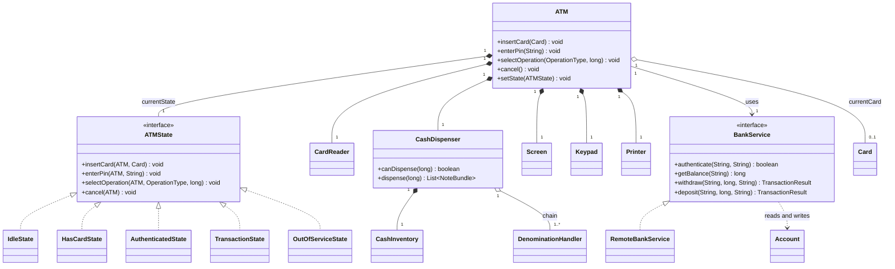
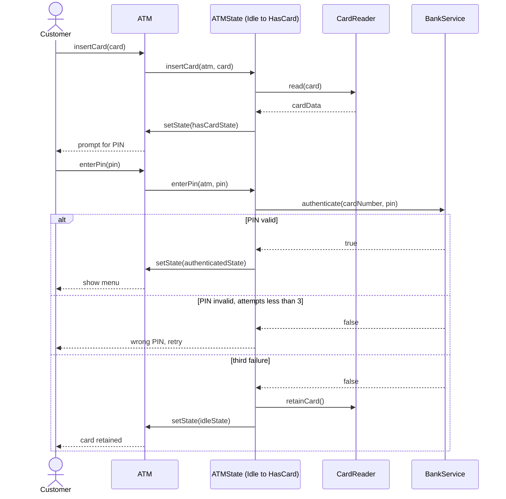
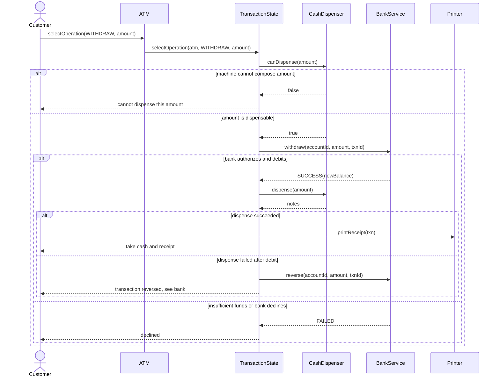
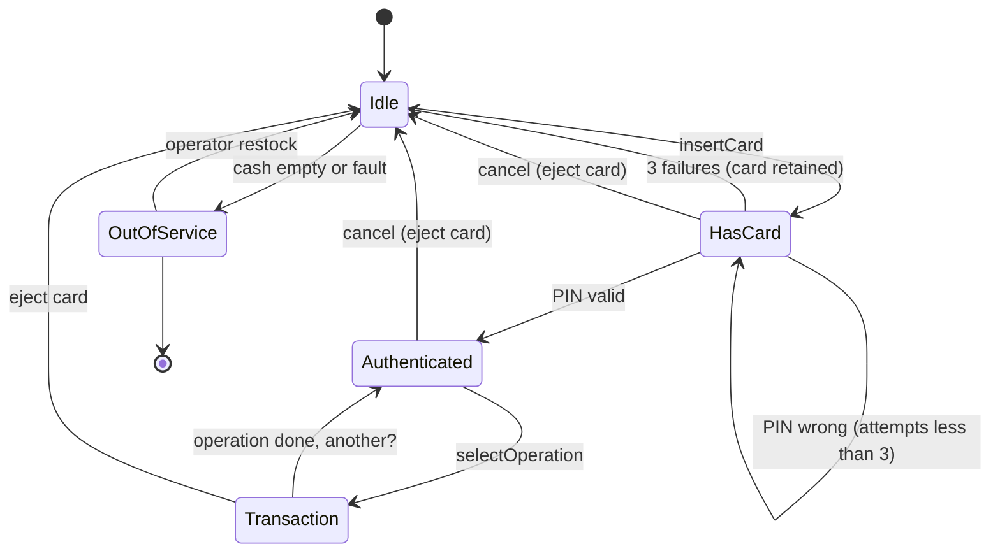
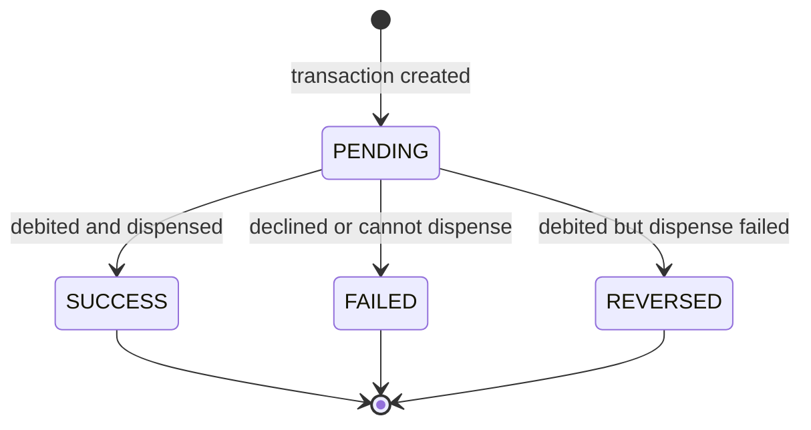

# 🏧 Low-Level Design: ATM Machine

> A complete, interview-ready walkthrough of the classic **ATM (Automated Teller Machine)** design problem — from a blank whiteboard to a staff-level system that models the machine as an explicit state machine, dispenses cash correctly note-by-note, talks to a bank backend, and survives concurrency, hardware failure, and relentless follow-up questions.

The ATM is the interview problem that quietly tests two skills at once. First: **can you model a machine whose behavior depends entirely on where it is in a workflow?** A machine sitting idle behaves nothing like one holding a customer's card mid-PIN, which behaves nothing like one that has authenticated and is waiting for a withdrawal amount. Press "withdraw" on an idle machine and nothing should happen; press it after authentication and a real transaction begins. Second: **can you decompose a physical device with several independent hardware subsystems — card reader, cash dispenser, keypad, screen, and a remote bank — into clean, testable software objects that fail safely?** Candidates who reach for a swamp of boolean flags (`hasCard`, `isAuthenticated`, `isDispensing`) drown in `if` statements and ship bugs that either trap a customer's card or hand out money the account never had. Candidates who recognize the ATM as a *state machine* wired to a set of *hardware facades* write clean, extensible code. This guide walks the whole journey, escalating from the beginner's mental model to the atomic-dispensing, idempotency, and reconciliation concerns a principal engineer raises in the closing minutes.

---

## 📋 Table of Contents

**Part I — Framing the Problem**

1. [Problem Statement](#1-problem-statement)
2. [Requirement Clarification & Assumptions](#2-requirement-clarification--assumptions)
3. [Functional & Non-Functional Requirements](#3-functional--non-functional-requirements)
4. [Core Concepts Being Tested](#4-core-concepts-being-tested)

**Part II — Modeling the Domain**

5. [Domain Model & Entities](#5-domain-model--entities)
6. [CRC Cards](#6-crc-cards)
7. [UML Class Diagram](#7-uml-class-diagram)
8. [Package Structure](#8-package-structure)

**Part III — Design Rationale**

9. [Design Decisions & Trade-offs](#9-design-decisions--trade-offs)
10. [Class-by-Class Deep Dive](#10-class-by-class-deep-dive)
11. [Design Patterns Applied](#11-design-patterns-applied)
12. [SOLID Principles Mapping](#12-solid-principles-mapping)

**Part IV — Behavior & Diagrams**

13. [Sequence Diagram](#13-sequence-diagram)
14. [State Diagram](#14-state-diagram)

**Part V — The Implementation**

15. [Complete Java Implementation](#15-complete-java-implementation)
16. [Execution Flow & Code Walkthrough](#16-execution-flow--code-walkthrough)

**Part VI — Engineering Depth**

17. [Complexity Analysis](#17-complexity-analysis)
18. [Thread Safety & Concurrency](#18-thread-safety--concurrency)
19. [Error Handling & Validation](#19-error-handling--validation)
20. [Scalability Discussion](#20-scalability-discussion)
21. [Alternative Designs & Trade-offs](#21-alternative-designs--trade-offs)

**Part VII — Interview Mastery**

22. [Common FAANG Follow-up Questions (L4 → L6)](#22-common-faang-follow-up-questions-l4--l6)
23. [Common Design Mistakes](#23-common-design-mistakes)
24. [Testing Strategy](#24-testing-strategy)
25. [FAANG Q&A Section](#25-faang-qa-section)
26. [STAR Behavioral Questions](#26-star-behavioral-questions)
27. [⚡ Quick Revision Cheat Sheet](#27--quick-revision-cheat-sheet)

---

## 1. Problem Statement

Design the software that runs an **ATM (Automated Teller Machine)**. A customer walks up, inserts a bank card, enters a PIN, and — once authenticated — chooses an operation: withdraw cash, deposit cash, or check a balance. For a withdrawal, the machine validates the amount against both the account balance and the physical cash it holds, dispenses the correct combination of notes, debits the account, prints a receipt, and returns the card. At every step things can go wrong: a wrong PIN (three times and the card is retained), an amount larger than the balance, an amount the machine can't make with the notes on hand, a card that expires, or a network blip talking to the bank. The machine must handle all of these without ever handing out money it didn't debit, or debiting money it didn't hand out.

The machine coordinates several **independent hardware subsystems** — a card reader, a keypad, a screen, a cash dispenser with a finite bin of notes — and a **remote bank backend** that owns the real account data and authorizes transactions. Our job is the software brain that sequences these parts safely.

<details>
<summary>📖 <b>In plain terms — what are we actually building?</b></summary>

Picture the ATM in your bank's lobby. You slide in your card, tap in your PIN, pick "Withdraw $80," and out slide four twenties along with a receipt, then your card pops back out. Our job is the *brains* behind that: the logic that remembers you've inserted a card, checks your PIN with the bank, refuses the transaction if you're overdrawn or if the machine only has hundreds left, figures out which physical notes add up to $80, tells the bank to subtract it, and resets itself for the next person. We are not building the motors, the card slot sensor, or the bank's core banking system — we are building the software objects and rules that decide what happens on every keypress and card swipe, so the machine never gives away free money or eats your card by mistake.

</details>

The deliverable in an interview is not a running product; it is a **clean object-oriented model** — the classes, their responsibilities, and above all the *state machine* that governs the customer session — plus a correct **cash-dispensing algorithm** and a clear story for **how the machine and the bank stay in agreement** even when hardware or the network fails. Grading centers on how cleanly you model the session states, how gracefully the design absorbs new transaction types or note denominations, and how rigorously you reason about the money-handling invariants under failure.

---

## 2. Requirement Clarification & Assumptions

The single biggest mistake candidates make is coding before scoping. A strong candidate spends the first few minutes turning the vague prompt into a bounded problem. Below is the clarification dialogue you should drive, framed as the questions to ask and the assumptions to lock in.

### 2.1 Actors

The people and systems that interact with the machine define its surface area.

| Actor | Role in the system |
|-------|--------------------|
| **Customer / Cardholder** | Inserts card, enters PIN, selects an operation, takes cash and receipt, collects the card. |
| **Bank Backend** | The remote system of record. Validates PIN, authorizes withdrawals, debits/credits accounts, owns the true balance. |
| **Bank Operator / Technician** | Refills the cash cassettes, collects deposits, runs diagnostics, takes the machine in and out of service. |
| **Card Reader Hardware** | Reads the card's data, retains or ejects it. |
| **Cash Dispenser Hardware** | The physical cassettes and rollers that count and release notes. |

### 2.2 Key Clarifying Questions

Before modeling anything, resolve these with the interviewer. Each answer materially changes the design.

- **Where does account data live?** — On the ATM or on a remote bank? *(Assumption: the ATM is a thin client; the **bank backend** is the system of record. The ATM authenticates and authorizes through it and never stores balances locally.)*
- **Which operations?** — Withdraw, deposit, balance inquiry, transfer, mini-statement, PIN change? *(Assumption: withdraw, deposit, and balance inquiry for v1; the design must let a new operation slot in without rewrites.)*
- **PIN retries?** — How many wrong PINs before we act, and what action? *(Assumption: three attempts, then the card is retained and the session ends.)*
- **Cash denominations?** — Which notes, and must exact amounts always be dispensable? *(Assumption: a fixed set of denominations, e.g., \$100/\$50/\$20/\$10; the machine refuses cleanly if it cannot compose the requested amount from notes on hand.)*
- **What happens if dispensing fails mid-transaction?** — Motor jam after the account is debited? *(Assumption: the debit and the physical dispense must be treated as one logical unit; on failure we reverse the debit or flag for reconciliation — never charge for cash not delivered.)*
- **Concurrency?** — Can two people use one ATM at once? *(Assumption: one physical machine serves one customer at a time, so the session is single-threaded; but the **cash inventory** and the **bank account** are shared resources — many ATMs hit the same account — and must be protected.)*
- **Network failure to the bank?** — Authorize offline? *(Assumption: no offline authorization for withdrawals; if the bank is unreachable we abort and return the card. We discuss offline stand-in later.)*

### 2.3 Explicit Non-Goals

Naming what you will *not* build is a senior signal — it shows you can bound scope deliberately rather than by omission.

- No physical hardware control (motor timing, card-slot sensors, cassette calibration) — we assume clean interfaces to them.
- No implementation of the core banking system — we depend on a `BankService` abstraction and treat the bank as authoritative.
- No card-network (Visa/Mastercard/interbank switch) protocol details — we assume `BankService` hides them.
- No fraud-detection engine, though we note where it hooks in.
- No cardless / QR / mobile withdrawal in v1 (the design leaves a seam for it).
- No multi-currency; a single currency per machine in v1.

<details>
<summary>📖 <b>Why spend so long on clarification?</b></summary>

The prompt "design an ATM" is intentionally thin, and two answers reshape the entire design. First, "does the ATM own the balance, or does the bank?" — the moment you say the bank is the system of record, the ATM becomes a thin client and your hardest problem shifts from data modeling to *keeping the machine and the bank consistent under failure.* Second, "what happens if the money jams after we've debited the account?" — this forces you to treat debit-and-dispense as one atomic unit and to have a reconciliation story. Asking these upfront signals product sense and sets you up for the staff-level follow-ups on idempotency and reconciliation.

</details>

---

## 3. Functional & Non-Functional Requirements

### 3.1 Functional Requirements (what the system *does*)

These are the concrete behaviors the system must support. In an interview, list them crisply — they become your checklist for the class design.

1. **Read a card** — accept an inserted card and read its identifying data; reject an expired or unreadable card.
2. **Authenticate** — take a PIN and validate it via the bank; retain the card after three failed attempts.
3. **Select an operation** — let an authenticated customer choose withdraw, deposit, or balance inquiry.
4. **Withdraw cash** — validate the amount against the account balance and the machine's cash, dispense the correct notes, debit the account.
5. **Deposit cash** — accept a deposit and credit the account.
6. **Check balance** — return the current balance from the bank.
7. **Dispense correct denominations** — compute a valid combination of notes for the requested amount, or refuse if none is possible.
8. **Print a receipt** and **eject the card** at the end of the session.
9. **Handle cancellation** — let the customer cancel at any point before dispensing and get their card back.

### 3.2 Non-Functional Requirements (how *well* it does it)

These are the qualities that make the design production-grade, and they are where staff-level discussion lives.

| Attribute | Requirement | Why it matters |
|-----------|-------------|----------------|
| **Correctness** | Never dispense without a confirmed debit; never debit without dispensing; never dispense the wrong amount. | These are money-handling invariants — violating them loses cash or wrongly charges customers. |
| **Consistency** | The ATM's view and the bank's ledger must reconcile, even after a crash or jam mid-transaction. | A partial transaction must resolve to fully-done or fully-undone. |
| **Security** | PINs are never stored or logged in clear; card data is protected; three-strike lockout. | An ATM is a prime attack target; leaked PINs are catastrophic. |
| **Availability** | A single subsystem fault (receipt printer empty) shouldn't take the whole machine down. | Downtime is lost revenue and stranded customers. |
| **Extensibility** | New operations, denominations, and card types slot in with minimal change. | Requirements *will* change (transfers, new notes, cardless). |
| **Concurrency-safety** | Shared account balances and cash inventory must not be corrupted by parallel access from many machines/threads. | The same account is reachable from thousands of ATMs at once. |
| **Auditability** | Every transaction is logged with a unique id for dispute resolution and reconciliation. | Banking is regulated; every cent must be traceable. |

<details>
<summary>📖 <b>Functional vs non-functional — the quick distinction</b></summary>

Functional requirements are the *verbs* — read the card, authenticate, dispense cash, print a receipt. If a functional requirement fails, the machine did the wrong thing (it didn't dispense when it should have). Non-functional requirements are the *adverbs* — do it securely, do it consistently, do it without ever handing out money it didn't debit. If a non-functional requirement fails, the machine did the right thing but *badly* (it dispensed, but crashed before debiting, so the customer got free money). Interviewers push hardest on the non-functional ones because a clean class diagram alone can't answer them — they force you to reason about invariants, failure modes, and money that must always balance.

</details>

---

## 4. Core Concepts Being Tested

This problem is a proxy for a bundle of skills. Knowing what's being measured helps you narrate your design to the *right* audience.

- **Finite state machines** — the marquee skill. A customer session moves through well-defined states (idle, card inserted, authenticated), and each state permits only certain actions. The **State pattern** is the clean way to model this, and it is *the* reason this problem is asked.
- **Object-oriented decomposition of a physical device** — finding the right nouns (ATM, Card, Account, CashDispenser, CardReader) and giving each a single clear responsibility, wrapping each hardware unit behind a clean interface.
- **Algorithmic thinking** — cash dispensing is a real algorithm (greedy vs. dynamic programming), and the "can't make this amount" edge case is a favorite probe. The **Chain of Responsibility** pattern models the greedy note-by-note descent elegantly.
- **Design patterns in context** — State (session lifecycle), Chain of Responsibility (note dispensing), Strategy (pluggable dispensing algorithm), Factory (state/transaction creation), Facade (bank and hardware subsystems), Singleton (the machine) — applied where they *earn their place*.
- **Invariant reasoning under failure** — debit implies dispense and vice versa; cash count never goes negative; balance is authoritative on the bank. Naming and protecting these across crashes is the senior signal.
- **Distributed-systems thinking** — the ATM is a thin client to a remote bank, so idempotency, timeouts, retries, and reconciliation naturally enter at the staff level.

Keep these in the back of your mind as you read on — each section below is, in part, a chance to demonstrate one or more of them.

---

## 5. Domain Model & Entities

Before any code, we identify the **nouns** in the problem and turn them into entities. Good domain modeling is the difference between a design that flexes and one that fights you.

### 5.1 The Entity Landscape

Here is the cast of the system, grouped by role:

- **ATM** — the top-level context object. Holds the current `ATMState`, references to the hardware subsystems (`CardReader`, `CashDispenser`, `Screen`, `Keypad`, `Printer`), a handle to the `BankService`, and the context of the active session (the current `Card`, the authenticated account id). There is exactly one per physical machine. It is the *context* in the State pattern and delegates every user action to its current state.
- **ATMState** — the abstraction that governs behavior. Each concrete state (`IdleState`, `HasCardState`, `AuthenticatedState`, `TransactionState`, `OutOfServiceState`) knows how to handle each user action *in that state* and which state to transition to next.
- **Card** — the customer's bank card: a card number, the expiry, and the owner. Immutable. The card carries *no* balance — it merely identifies the account at the bank.
- **Account** — a bank account with an id, a type (checking/savings), and a balance. Lives on the **bank side**; the ATM never holds it authoritatively.
- **BankService** — the abstraction over the remote bank: validate a PIN, fetch a balance, authorize and post a withdrawal or deposit. This is the seam that hides the entire core-banking system behind one interface.
- **CashDispenser** — owns the machine's physical cash as a set of `CashCassette`s (one per denomination) and drives the note-dispensing chain.
- **DenominationHandler** — a link in the Chain of Responsibility: each handler owns one denomination and peels off as many of its notes as it can before passing the remainder down the chain.
- **CashInventory** — the count of notes per denomination the machine currently holds; the resource the dispenser mutates.
- **Transaction** — the record of one operation: a unique id, the type, the amount, a timestamp, and a status (PENDING → SUCCESS / FAILED / REVERSED). This is the audit and reconciliation unit.
- **CardReader, Keypad, Screen, Printer** — thin facades over the remaining hardware units.

### 5.2 Entity Relationships



<details>
<summary>📖 <b>How to read this relationship map</b></summary>

The diamond-headed lines mean "owns / is composed of" — an ATM *is made of* its current state, its card reader, its cash dispenser, its screen, keypad, and printer; they live and die with the machine. The plain arrow to `BankService` means "uses but does not own" — the bank is a remote collaborator the ATM depends on, not a part it contains. The hollow diamond to `Card` means "refers to" — the machine holds the *currently inserted* card for the duration of a session, but cards belong to customers. The triangle arrows show the five concrete states *implementing* the `ATMState` interface, which is the structural heart of the whole design, and the dispenser owning a *chain* of `DenominationHandler`s is the Chain-of-Responsibility spine.

</details>

### 5.3 Core Enumerations

Enums keep the type system honest and make illegal states unrepresentable.

- `OperationType { WITHDRAW, DEPOSIT, BALANCE_INQUIRY }` — extensible to `TRANSFER`, `MINI_STATEMENT`.
- `TransactionStatus { PENDING, SUCCESS, FAILED, REVERSED }` — drives reconciliation.
- `AccountType { CHECKING, SAVINGS }`.
- `Denomination { HUNDRED(100), FIFTY(50), TWENTY(20), TEN(10) }` — value in the machine's currency unit.

We store all money as **integer minor units** (cents, or whole notes where appropriate), never floating-point, to avoid rounding bugs — a recurring interview trap covered in Section 23.

---

## 6. CRC Cards

CRC (Class–Responsibility–Collaborator) cards are a lightweight way to pin down *what each class is responsible for* and *who it talks to*, before drowning in fields and methods. They force single-responsibility thinking, which interviewers reward.

| Class | Responsibilities | Collaborators |
|-------|------------------|---------------|
| **ATM** | Hold session context (current card, account id); delegate every user action to the current state; own the hardware subsystems and the bank handle. | ATMState, CardReader, CashDispenser, Screen, Printer, BankService |
| **ATMState** *(interface)* | Define how each user action is handled per state and drive transitions. | ATM |
| **IdleState** | Handle the empty machine — accept a card (start a session) or reject PIN/operation attempts. | ATM, CardReader, Card |
| **HasCardState** | Prompt for and validate the PIN via the bank; count failed attempts; retain card after three. | ATM, BankService, Keypad |
| **AuthenticatedState** | Present the menu; accept an operation choice and hand off to a transaction. | ATM, Screen |
| **TransactionState** | Execute the chosen operation (withdraw/deposit/balance) end to end, then return to menu or eject. | ATM, BankService, CashDispenser, Printer |
| **OutOfServiceState** | Reject all customer actions; allow only operator recovery. | ATM |
| **BankService** | Authenticate, fetch balances, authorize and post debits/credits atomically. | Account |
| **CashDispenser** | Decide if an amount is dispensable; drive the handler chain; update inventory atomically. | CashInventory, DenominationHandler |
| **DenominationHandler** | Peel off as many notes of its denomination as possible; pass the remainder down the chain. | CashInventory, DenominationHandler (next) |
| **Card** | Identify the cardholder's account; expose number and expiry. | — |
| **Transaction** | Bundle id, type, amount, timestamp, status for audit and reconciliation. | — |

Notice how each card has a *tight* set of responsibilities. If a card starts listing five unrelated duties — the classic "god ATM" that reads cards, validates PINs, dispenses cash, *and* talks to the bank all in one class — that's a smell that the class is doing too much and the state and hardware logic should be extracted.

---

## 7. UML Class Diagram

Here is the full static structure in ASCII, the way you'd sketch it on a whiteboard. Abstract types are marked `«interface»`; the State pattern's shape is deliberately front and center, with the Chain-of-Responsibility dispenser beneath it.

```
        ┌────────────────────────────────────────────────┐
        │ ATM                                «singleton»   │
        ├────────────────────────────────────────────────┤
        │ - currentState: ATMState                        │
        │ - idleState / hasCardState / ...: ATMState      │
        │ - cardReader: CardReader                        │
        │ - cashDispenser: CashDispenser                  │
        │ - screen: Screen                                │
        │ - keypad: Keypad                                │
        │ - printer: Printer                              │
        │ - bankService: BankService                      │
        │ - currentCard: Card                             │
        │ - pinAttempts: int                              │
        ├────────────────────────────────────────────────┤
        │ + insertCard(c: Card): void                     │
        │ + enterPin(pin: String): void                   │
        │ + selectOperation(op, amount): void             │
        │ + cancel(): void                                │
        │ + setState(s: ATMState): void                   │
        └───────────────┬────────────────────────────────┘
                        │ delegates every action to
                        ▼
        ┌────────────────────────────────────────────────┐
        │ «interface» ATMState                            │
        ├────────────────────────────────────────────────┤
        │ + insertCard(atm, c: Card): void                │
        │ + enterPin(atm, pin: String): void              │
        │ + selectOperation(atm, op, amount): void        │
        │ + cancel(atm): void                             │
        └───────────────┬────────────────────────────────┘
                        │ implemented by
   ┌───────────┬────────┼───────────────┬──────────────────┐
   ▼           ▼        ▼               ▼                  ▼
┌────────┐┌──────────┐┌───────────────┐┌───────────────┐┌────────────────┐
│ Idle   ││ HasCard  ││ Authenticated ││ Transaction   ││ OutOfService   │
│ State  ││ State    ││ State         ││ State         ││ State          │
├────────┤├──────────┤├───────────────┤├───────────────┤├────────────────┤
│insert  ││enterPin  ││selectOperation││runs withdraw/ ││rejects all     │
│Card →  ││→ auth or ││→ Transaction  ││deposit/balance││customer actions│
│HasCard ││retain    ││State          ││→ eject/menu   ││                │
└────────┘└──────────┘└───────────────┘└───────────────┘└────────────────┘

        ATM also owns hardware + bank ↓

┌──────────────────────────┐        ┌────────────────────────────────┐
│ CashDispenser            │        │ «interface» BankService        │
├──────────────────────────┤        ├────────────────────────────────┤
│ - inventory: CashInventory│       │ + authenticate(card, pin): bool│
│ - chain: DenominationHandler      │ + getBalance(acct): long       │
├──────────────────────────┤        │ + withdraw(acct, amt, txnId)   │
│ + canDispense(amt): bool │        │ + deposit(acct, amt, txnId)    │
│ + dispense(amt):         │        └───────────────┬────────────────┘
│      List<NoteBundle>    │                        │ implemented by
└───────────┬──────────────┘                        ▼
            │ delegates to               ┌────────────────────────────┐
            ▼                            │ RemoteBankService          │
┌──────────────────────────────┐        │ (idempotent, retry, timeout)│
│ «abstract» DenominationHandler│       └────────────────────────────┘
├──────────────────────────────┤
│ - denom: Denomination         │        ┌──────────────────────────┐
│ - next: DenominationHandler   │        │ CashInventory            │
├──────────────────────────────┤        ├──────────────────────────┤
│ + setNext(h)                  │───────▶│ - counts: Map<Denom,Int> │
│ + dispense(amt, out): long    │  reads ├──────────────────────────┤
└───────────────┬──────────────┘  writes│ + count(d): int          │
                │                        │ + reserve(d, n): boolean │
     ┌──────────┴──────────┐            │ + commit() / rollback()  │
     ▼                     ▼            └──────────────────────────┘
┌───────────────┐  ┌────────────────┐
│ HundredHandler│  │ FiftyHandler ...│   (one concrete handler per denom)
└───────────────┘  └────────────────┘
```

The shape to notice: `ATM` holds a reference to *one* `ATMState` at a time (`currentState`) plus one cached instance of each concrete state, and forwards every public call to it. That single indirection — "delegate to the current state" — replaces the sprawling `if/else` chains a naive design would have. Below it, the `CashDispenser` owns a linked chain of `DenominationHandler`s, largest denomination first, each peeling off what it can and passing the remainder down — the greedy dispensing algorithm expressed as objects.

---

## 8. Package Structure

A clean package layout communicates the architecture at a glance and enforces dependency direction. Here's a pragmatic layout.

```
com.atm
│
├── model                       // Entities & value objects
│   ├── Card.java
│   ├── Account.java
│   ├── AccountType.java        //   enum
│   ├── OperationType.java      //   enum
│   ├── Denomination.java       //   enum with note values
│   ├── Transaction.java
│   ├── TransactionStatus.java  //   enum
│   ├── TransactionResult.java
│   └── NoteBundle.java         //   (denomination, count) pair
│
├── state                       // State pattern — the behavioral core
│   ├── ATMState.java           //   interface
│   ├── IdleState.java
│   ├── HasCardState.java
│   ├── AuthenticatedState.java
│   ├── TransactionState.java
│   └── OutOfServiceState.java
│
├── cash                        // Cash handling (Chain of Responsibility)
│   ├── CashDispenser.java
│   ├── CashInventory.java
│   ├── DenominationHandler.java//   abstract chain link
│   ├── HundredHandler.java
│   ├── FiftyHandler.java
│   ├── TwentyHandler.java
│   └── TenHandler.java
│
├── bank                        // The bank seam (Facade over core banking)
│   ├── BankService.java        //   interface
│   └── RemoteBankService.java  //   idempotent, retrying implementation
│
├── hardware                    // Thin hardware facades
│   ├── CardReader.java
│   ├── Keypad.java
│   ├── Screen.java
│   └── Printer.java
│
├── exception                   // Domain exceptions
│   ├── InsufficientFundsException.java
│   ├── InsufficientCashException.java
│   ├── InvalidPinException.java
│   ├── CardExpiredException.java
│   └── BankUnavailableException.java
│
├── ATM.java                    // The context / orchestrator
│
└── Demo.java                   // Runnable demonstration
```

The guiding rule: **`model` depends on nothing; everything can depend on `model`.** States depend on the ATM, the model, and the service abstractions; the cash handlers depend only on `Denomination` and `CashInventory`; the ATM depends on the *interfaces* `BankService` and the hardware facades, never their concretes. This keeps the behavioral core testable in isolation and the dependency arrows all pointing inward toward the domain.

---

## 9. Design Decisions & Trade-offs

Every design is a sequence of forks in the road. Here are the ones that matter for the ATM, each stated as the question, the options, and the choice with its justification.

### 9.1 State pattern, or a big switch on a status flag?

The naive approach is a single `handle(action)` method with a `switch` on a `state` enum and a fistful of booleans. It works for three states and rots at five. We instead model each state as a **polymorphic `ATMState` object** that implements all four user actions. Adding a new state (say `DepositCountingState`) is a new class, not an edit to a growing switch that every state must be careful not to break. The cost is more classes and a little indirection; the benefit is that illegal actions are handled *locally* — `IdleState.enterPin()` simply rejects, with no risk of falling through a switch. For a workflow-driven device, this is the textbook-correct trade and the reason the problem is asked.

### 9.2 Where does the balance live — ATM or bank?

We make the **bank the system of record** and the ATM a thin client that authorizes through `BankService`. The alternative — caching balances on the machine — invites the worst class of banking bug: two ATMs disagreeing about one account. The cost is a network round-trip on every operation and a hard dependency on bank availability; the benefit is a single source of truth and no distributed-balance reconciliation nightmare. This decision cascades into the idempotency and reconciliation discussion later.

### 9.3 How do we dispense notes — inline loop, Strategy, or Chain of Responsibility?

Cash dispensing is greedy: take as many of the largest note as fit, then the next, and so on. We express this as a **Chain of Responsibility** — one `DenominationHandler` per denomination, largest first, each peeling off its share and passing the remainder down. This reads exactly like the algorithm, makes adding a denomination a matter of inserting a link, and isolates each denomination's logic. We *also* keep the whole chain behind a `CashDispenser` so the algorithm itself is swappable (a **Strategy** seam) — e.g., a dynamic-programming dispenser that guarantees a solution when greedy fails. The trade is a few small classes versus one tight loop; the payoff is extensibility and a clean answer to "greedy can be wrong — what then?"

### 9.4 Are the hardware units abstractions or concrete calls?

Each hardware unit — `CardReader`, `CashDispenser`, `Screen`, `Keypad`, `Printer` — sits behind a thin **facade/interface**. This makes the whole machine testable with fakes (no real motor needed in a unit test) and lets one subsystem fail without a hard crash. The cost is interface boilerplate; the benefit is testability and fault isolation, both non-negotiable for a device that handles money.

### 9.5 Is the ATM a Singleton?

There is logically one ATM per process, so it is tempting to make it a `Singleton`. We model it as a single instance but **inject its collaborators** rather than reaching for global static state. A static singleton makes testing painful and hides dependencies; a single, injected instance gives us the "one machine" semantics without the anti-pattern.

<details>
<summary>📖 <b>Why interviewers love the "trade-off" framing</b></summary>

Junior candidates present one design as "the answer." Senior candidates present a design *and the roads not taken*, because real engineering is choosing under constraints. When you say "I used a Chain of Responsibility for dispensing, but a greedy chain can fail to make an amount that a dynamic-programming solver would find, so I kept the algorithm behind a swappable dispenser," you show you understand the limits of your own choice. That awareness — not the pattern name — is what moves you from L4 to L5/L6. Narrate the fork, not just the destination.

</details>

---

## 10. Class-by-Class Deep Dive

With the structure in view, here is what each major class is *for* and the reasoning behind its shape. The full code is in Section 15; this is the tour.

### 10.1 `ATM` (context / orchestrator)

The `ATM` is the Context in the State pattern. It holds one `currentState` plus a cached instance of each concrete state, references to every hardware facade and the `BankService`, and the volatile session context: the `currentCard`, the resolved account id, and the running `pinAttempts` counter. Its public methods (`insertCard`, `enterPin`, `selectOperation`, `cancel`) do essentially nothing themselves — they delegate to `currentState`. It also exposes `setState(...)` so states can drive transitions. Crucially, the ATM does *not* contain business rules; it contains wiring.

### 10.2 `ATMState` (interface) and its concretes

`ATMState` declares the four user actions. Each concrete state implements all four, permitting the legal ones and rejecting the rest with a clear message. `IdleState` accepts only `insertCard`. `HasCardState` accepts `enterPin`, validates it via the bank, increments `pinAttempts` on failure, and retains the card at three. `AuthenticatedState` accepts `selectOperation` and constructs the transaction. `TransactionState` runs the chosen operation to completion then transitions back to `AuthenticatedState` (for another operation) or `IdleState` (after eject). `OutOfServiceState` rejects everything customer-facing and is entered when the cash bin is empty or a critical subsystem faults.

### 10.3 `Card` and `Account`

`Card` is an immutable value object: card number, expiry date, cardholder name. It carries *no* money — it identifies the account at the bank. `Account` (id, type, balance) lives conceptually on the bank side; the ATM only ever sees balances through `BankService`, never mutates an `Account` directly. This separation is the whole point of the thin-client decision in 9.2.

### 10.4 `BankService` and `RemoteBankService`

`BankService` is the seam that hides the entire core-banking system: `authenticate`, `getBalance`, `withdraw`, and `deposit`. The `withdraw`/`deposit` calls take a **transaction id**, which is the hook for idempotency — a retried call with the same id must not double-debit. `RemoteBankService` is the production implementation: it wraps the remote call in a timeout, retries on transient failure with the same id, and translates network errors into a `BankUnavailableException`. In tests we swap in an in-memory fake.

### 10.5 `CashDispenser`, `CashInventory`, and `DenominationHandler`

`CashDispenser` answers two questions: `canDispense(amount)` (is a valid note combination possible with current stock?) and `dispense(amount)` (produce the notes and update inventory). It delegates to a chain of `DenominationHandler`s built largest-denomination-first. Each handler asks the `CashInventory` how many of its note it may use, reserves them, subtracts their value, and passes the remainder to the next link. `CashInventory` tracks counts per denomination and supports a **reserve → commit / rollback** protocol so a mid-dispense failure never corrupts the count.

### 10.6 `Transaction` and `TransactionResult`

`Transaction` is the audit unit: a unique id, the `OperationType`, the amount, a timestamp, and a `TransactionStatus` that moves PENDING → SUCCESS / FAILED / REVERSED. `TransactionResult` is the value returned from the bank call, bundling success/failure, the new balance, and any error. Together they carry the story needed for receipts, disputes, and reconciliation.

### 10.7 Hardware facades — `CardReader`, `Keypad`, `Screen`, `Printer`

Each is a thin interface over one physical unit. `CardReader` reads/ejects/retains a card; `Keypad` captures the PIN and amount; `Screen` shows prompts; `Printer` prints receipts. Keeping them behind interfaces is what makes the whole machine unit-testable without hardware and lets a spent receipt roll degrade gracefully instead of aborting a withdrawal.

---

## 11. Design Patterns Applied

Patterns should appear because the problem *demands* them, not to decorate the design. Here's where each one earns its place.

| Pattern | Where it's used | What it buys us |
|---------|-----------------|-----------------|
| **State** | `ATMState` and its five concretes | The behavioral core. Each state handles actions locally; illegal transitions are impossible; adding a state is a new class, not a switch edit. |
| **Chain of Responsibility** | `DenominationHandler` chain in the dispenser | Expresses greedy note dispensing as a pipeline; each denomination is one link; adding a note is inserting a link. |
| **Strategy** | The dispensing algorithm behind `CashDispenser` | Swap greedy for dynamic-programming dispensing without touching callers — answers "greedy can fail, then what?" |
| **Facade** | `BankService`, and each hardware unit | One clean interface hides a messy subsystem (core banking, a physical motor); enables fakes and fault isolation. |
| **Factory** | Creating the right transaction/state objects | Centralizes construction so callers don't `new` concretes; keeps the state map in one place. |
| **Singleton** | `ATM` (one per process) | Models the single physical machine — used judiciously, via injection, never static global state. |
| **Observer** *(optional)* | Low-cash / fault alerts to a monitoring service | The bank's ops center is notified when a cassette runs low or a subsystem faults. |

<details>
<summary>📖 <b>A note on not over-patterning</b></summary>

It's tempting to cram in every Gang-of-Four pattern to look sophisticated, but an interviewer reads that as insecurity. The State pattern here is unarguable — the ATM genuinely is a workflow with per-state rules. Chain of Responsibility for dispensing is natural — the greedy algorithm genuinely is a descent through denominations. But forcing, say, a Visitor over the transaction types or an Abstract Factory where a simple factory suffices is a red flag. The skill is knowing when a pattern *reduces* complexity versus when it merely adds ceremony. Reach for a pattern when it removes an "if I change X I must edit Y" coupling.

</details>

For the deeper theory behind each of these, this guide pairs naturally with the individual State, Chain of Responsibility, Strategy, Facade, Factory, and Singleton pattern guides.

---

## 12. SOLID Principles Mapping

SOLID isn't an abstract checklist here — each principle shows up concretely in the design.

**S — Single Responsibility.** Each class has one reason to change: `HasCardState` owns PIN handling, `CashDispenser` owns note dispensing, `RemoteBankService` owns bank communication, `Printer` owns receipts. A change to the PIN-retry rule never touches the dispenser; a new note never touches the bank code.

**O — Open/Closed.** The system is *open to extension, closed to modification*. A new operation is a new branch handled in a new transaction path; a new denomination is a new `DenominationHandler` link; a new dispensing algorithm is a new Strategy. No existing class is edited. This is the single most important SOLID win, delivered by the State, Chain, and Strategy structures.

**L — Liskov Substitution.** Any `ATMState` works wherever a state is expected — the ATM never asks "which state am I?"; it just delegates. Any `DenominationHandler` works as a chain link; any `BankService` (real or fake) satisfies the same contract, which is exactly what makes testing possible.

**I — Interface Segregation.** `BankService`, the hardware facades, and the dispenser expose small, focused interfaces. The `Screen` isn't forced to know about cash; the `Keypad` isn't forced to know about the bank. Clients depend only on the sliver they use.

**D — Dependency Inversion.** `ATM` depends on the *abstractions* `BankService` and the hardware interfaces, not concretes, which are injected at construction. High-level session orchestration doesn't know or care whether the bank is a real gateway or an in-memory fake, or whether dispensing is greedy or DP-based.

<details>
<summary>📖 <b>The one-line SOLID gut check</b></summary>

If you can add a brand-new operation (transfer), a new note denomination, a new dispensing algorithm, and swap the real bank for a test fake *without editing a single existing class* — only adding new ones — your design honors Open/Closed and Dependency Inversion, and the rest of SOLID usually falls into place. That "add, don't edit" test is the fastest way to sanity-check your ATM design under interview pressure.

</details>

---

## 13. Sequence Diagram

Two flows carry the design: **authentication** (card in, PIN verified) and **withdrawal** (the money-handling heart, where failure ordering matters most). Here they are as message sequences.

### 13.1 Card Insertion & Authentication



### 13.2 Cash Withdrawal



<details>
<summary>📖 <b>Reading the withdrawal flow</b></summary>

The withdrawal is far more interesting than authentication because of the nested `alt` blocks — the forks where money can be lost. Notice the *ordering*: we check `canDispense` first (cheap, local — don't bother the bank if we can't pay out), then ask the bank to debit, and only *then* dispense. The dangerous case is the innermost one: the bank debited but the dispenser jammed. Here we must `reverse` the debit with the *same transaction id* so the account is made whole. Doing it the other way — dispense first, debit second — would hand out cash and then fail to charge for it. This "authorize, then dispense, then reverse on failure" ordering is the single most important correctness property in the whole design, and it's the follow-up an interviewer will push hardest on.

</details>

---

## 14. State Diagram

The ATM session is a textbook finite state machine. Modeling it explicitly makes illegal transitions (entering a PIN with no card, withdrawing before authenticating) impossible by construction.

### 14.1 ATM Session Lifecycle



The beauty of this diagram is that every arrow is a method on a concrete state, and every *missing* arrow is an action that state simply rejects. There is no arrow from `Idle` to `Transaction`, so there is no code path that lets a customer withdraw without a card and a PIN — the impossibility is structural, not a runtime check you might forget.

### 14.2 Transaction Status Lifecycle



The `REVERSED` state is the one that separates a toy design from a real one. It exists precisely for the "debited but the cash jammed" case, and it is what a nightly reconciliation job scans for to confirm every reversal actually landed.

---

## 15. Complete Java Implementation

The implementation below is complete and self-contained: you can drop it into a project, run `Demo`, and watch a full session play out. It is organized bottom-up — model and value objects first, then the bank and cash subsystems, then the hardware facades, then the states, and finally the `ATM` context that wires it all together. Every class name, field, and method signature here matches the diagrams in Sections 7, 13, and 14 exactly.

<details>
<summary>💻 <b>1. Enums & value objects</b></summary>

```java
package com.atm.model;

// ---- Enumerations -------------------------------------------------

public enum OperationType { WITHDRAW, DEPOSIT, BALANCE_INQUIRY }

public enum AccountType { CHECKING, SAVINGS }

public enum TransactionStatus { PENDING, SUCCESS, FAILED, REVERSED }

/** Note denominations the machine can hold, value in whole currency units. */
public enum Denomination {
    HUNDRED(100), FIFTY(50), TWENTY(20), TEN(10);

    private final int value;
    Denomination(int value) { this.value = value; }
    public int getValue() { return value; }
}

// ---- Immutable value objects --------------------------------------

import java.time.YearMonth;

public final class Card {
    private final String cardNumber;
    private final String accountId;   // resolved by the bank; carried for convenience
    private final YearMonth expiry;
    private final String holderName;

    public Card(String cardNumber, String accountId, YearMonth expiry, String holderName) {
        this.cardNumber = cardNumber;
        this.accountId = accountId;
        this.expiry = expiry;
        this.holderName = holderName;
    }
    public String getCardNumber() { return cardNumber; }
    public String getAccountId()  { return accountId; }
    public YearMonth getExpiry()  { return expiry; }
    public String getHolderName() { return holderName; }

    public boolean isExpired() { return YearMonth.now().isAfter(expiry); }
}

/** Lives conceptually on the bank side; the ATM only ever sees it through BankService. */
public final class Account {
    private final String accountId;
    private final AccountType type;
    private long balance;            // integer minor units; never floating point

    public Account(String accountId, AccountType type, long balance) {
        this.accountId = accountId;
        this.type = type;
        this.balance = balance;
    }
    public String getAccountId() { return accountId; }
    public AccountType getType() { return type; }
    public long getBalance() { return balance; }
    void debit(long amount)  { this.balance -= amount; }   // package-private: only the bank mutates
    void credit(long amount) { this.balance += amount; }
}

/** A (denomination, count) pair returned to the customer. */
public final class NoteBundle {
    private final Denomination denomination;
    private final int count;
    public NoteBundle(Denomination denomination, int count) {
        this.denomination = denomination;
        this.count = count;
    }
    public Denomination getDenomination() { return denomination; }
    public int getCount() { return count; }
    @Override public String toString() { return count + " x " + denomination.getValue(); }
}

/** Outcome of a bank operation. */
public final class TransactionResult {
    private final TransactionStatus status;
    private final long newBalance;
    private final String message;
    private TransactionResult(TransactionStatus status, long newBalance, String message) {
        this.status = status; this.newBalance = newBalance; this.message = message;
    }
    public static TransactionResult success(long newBalance) {
        return new TransactionResult(TransactionStatus.SUCCESS, newBalance, "OK");
    }
    public static TransactionResult failed(String message) {
        return new TransactionResult(TransactionStatus.FAILED, -1, message);
    }
    public TransactionStatus getStatus() { return status; }
    public long getNewBalance() { return newBalance; }
    public String getMessage() { return message; }
    public boolean isSuccess() { return status == TransactionStatus.SUCCESS; }
}

/** The audit / reconciliation unit for one operation. */
import java.time.Instant;
import java.util.UUID;

public final class Transaction {
    private final String txnId;
    private final String accountId;
    private final OperationType type;
    private final long amount;
    private final Instant timestamp;
    private TransactionStatus status;

    public Transaction(String accountId, OperationType type, long amount) {
        this.txnId = UUID.randomUUID().toString();
        this.accountId = accountId;
        this.type = type;
        this.amount = amount;
        this.timestamp = Instant.now();
        this.status = TransactionStatus.PENDING;
    }
    public String getTxnId() { return txnId; }
    public String getAccountId() { return accountId; }
    public OperationType getType() { return type; }
    public long getAmount() { return amount; }
    public Instant getTimestamp() { return timestamp; }
    public TransactionStatus getStatus() { return status; }
    public void setStatus(TransactionStatus status) { this.status = status; }
}
```

</details>

<details>
<summary>💻 <b>2. Domain exceptions</b></summary>

```java
package com.atm.exception;

public class ATMException extends RuntimeException {
    public ATMException(String message) { super(message); }
}

public class InsufficientFundsException extends ATMException {
    public InsufficientFundsException(String m) { super(m); }
}
public class InsufficientCashException extends ATMException {
    public InsufficientCashException(String m) { super(m); }
}
public class InvalidPinException extends ATMException {
    public InvalidPinException(String m) { super(m); }
}
public class CardExpiredException extends ATMException {
    public CardExpiredException(String m) { super(m); }
}
public class BankUnavailableException extends ATMException {
    public BankUnavailableException(String m) { super(m); }
}
```

</details>

<details>
<summary>💻 <b>3. The bank seam — BankService interface & an idempotent implementation</b></summary>

```java
package com.atm.bank;

import com.atm.model.*;

/** Facade over the entire core-banking system. The txnId parameters are the idempotency key. */
public interface BankService {
    boolean authenticate(String cardNumber, String pin);
    long getBalance(String accountId);
    TransactionResult withdraw(String accountId, long amount, String txnId);
    TransactionResult deposit(String accountId, long amount, String txnId);
    /** Compensating action for a debit that was authorized but never dispensed. */
    TransactionResult reverse(String accountId, long amount, String txnId);
}
```

```java
package com.atm.bank;

import com.atm.model.*;
import com.atm.exception.*;
import java.util.*;
import java.util.concurrent.*;

/**
 * A demonstration implementation backed by an in-memory ledger.
 * The production version would call a remote gateway; the important
 * ideas here are (a) idempotency keyed by txnId and (b) per-account locking.
 */
public class RemoteBankService implements BankService {

    private final Map<String, Account> accounts = new ConcurrentHashMap<>();
    private final Map<String, String>  pins     = new ConcurrentHashMap<>(); // cardNumber -> pin (hashed in reality)
    private final Map<String, String>  cardToAccount = new ConcurrentHashMap<>();
    // Idempotency: remember the outcome of each processed txnId so retries are safe.
    private final Set<String> processedTxns = ConcurrentHashMap.newKeySet();
    // Per-account lock stripes so concurrent ATMs on one account serialize correctly.
    private final ConcurrentHashMap<String, Object> locks = new ConcurrentHashMap<>();

    public void registerAccount(Account acct, String cardNumber, String pin) {
        accounts.put(acct.getAccountId(), acct);
        pins.put(cardNumber, pin);
        cardToAccount.put(cardNumber, acct.getAccountId());
    }

    private Object lockFor(String accountId) {
        return locks.computeIfAbsent(accountId, k -> new Object());
    }

    @Override
    public boolean authenticate(String cardNumber, String pin) {
        return pin != null && pin.equals(pins.get(cardNumber));
    }

    @Override
    public long getBalance(String accountId) {
        Account a = require(accountId);
        synchronized (lockFor(accountId)) { return a.getBalance(); }
    }

    @Override
    public TransactionResult withdraw(String accountId, long amount, String txnId) {
        synchronized (lockFor(accountId)) {
            if (processedTxns.contains(txnId)) {                 // idempotent replay
                return TransactionResult.success(require(accountId).getBalance());
            }
            Account a = require(accountId);
            if (a.getBalance() < amount) {
                return TransactionResult.failed("Insufficient funds");
            }
            a.debit(amount);
            processedTxns.add(txnId);
            return TransactionResult.success(a.getBalance());
        }
    }

    @Override
    public TransactionResult deposit(String accountId, long amount, String txnId) {
        synchronized (lockFor(accountId)) {
            if (processedTxns.contains(txnId)) {
                return TransactionResult.success(require(accountId).getBalance());
            }
            Account a = require(accountId);
            a.credit(amount);
            processedTxns.add(txnId);
            return TransactionResult.success(a.getBalance());
        }
    }

    @Override
    public TransactionResult reverse(String accountId, long amount, String txnId) {
        synchronized (lockFor(accountId)) {
            String reversalId = txnId + ":reversal";
            if (processedTxns.contains(reversalId)) {            // don't double-reverse
                return TransactionResult.success(require(accountId).getBalance());
            }
            Account a = require(accountId);
            a.credit(amount);                                    // give the money back
            processedTxns.add(reversalId);
            return TransactionResult.success(a.getBalance());
        }
    }

    private Account require(String accountId) {
        Account a = accounts.get(accountId);
        if (a == null) throw new BankUnavailableException("Unknown account " + accountId);
        return a;
    }
}
```

</details>

<details>
<summary>💻 <b>4. Cash subsystem — CashInventory, the DenominationHandler chain, and CashDispenser</b></summary>

```java
package com.atm.cash;

import com.atm.model.Denomination;
import java.util.*;
import java.util.concurrent.locks.ReentrantLock;

/**
 * Tracks note counts per denomination. Supports a reserve -> commit/rollback
 * protocol so a dispense that fails partway never corrupts the count.
 */
public class CashInventory {
    private final Map<Denomination, Integer> counts = new EnumMap<>(Denomination.class);
    private final Map<Denomination, Integer> reserved = new EnumMap<>(Denomination.class);
    private final ReentrantLock lock = new ReentrantLock();

    public CashInventory() {
        for (Denomination d : Denomination.values()) { counts.put(d, 0); reserved.put(d, 0); }
    }

    public void load(Denomination d, int n) {
        lock.lock();
        try { counts.merge(d, n, Integer::sum); } finally { lock.unlock(); }
    }

    public int available(Denomination d) {
        lock.lock();
        try { return counts.get(d) - reserved.get(d); } finally { lock.unlock(); }
    }

    /** Tentatively hold n notes of d. Returns false if not enough are free. */
    public boolean reserve(Denomination d, int n) {
        lock.lock();
        try {
            if (available(d) < n) return false;
            reserved.merge(d, n, Integer::sum);
            return true;
        } finally { lock.unlock(); }
    }

    /** Make all reservations permanent (notes physically leave the machine). */
    public void commit() {
        lock.lock();
        try {
            for (Denomination d : Denomination.values()) {
                counts.put(d, counts.get(d) - reserved.get(d));
                reserved.put(d, 0);
            }
        } finally { lock.unlock(); }
    }

    /** Release all reservations (dispense aborted). */
    public void rollback() {
        lock.lock();
        try { for (Denomination d : Denomination.values()) reserved.put(d, 0); }
        finally { lock.unlock(); }
    }

    public void lock()   { lock.lock(); }
    public void unlock() { lock.unlock(); }
}
```

```java
package com.atm.cash;

import com.atm.model.*;
import java.util.*;

/**
 * One link of the Chain of Responsibility. Each handler owns one denomination,
 * peels off as many of its notes as it can (bounded by inventory and remaining
 * amount), reserves them, and passes the remainder down the chain.
 */
public abstract class DenominationHandler {
    protected final Denomination denomination;
    protected DenominationHandler next;
    protected final CashInventory inventory;

    protected DenominationHandler(Denomination denomination, CashInventory inventory) {
        this.denomination = denomination;
        this.inventory = inventory;
    }

    public DenominationHandler setNext(DenominationHandler next) {
        this.next = next;
        return next; // fluent chaining
    }

    /**
     * Reserve notes for 'amount' and append the bundles to 'out'.
     * Returns the remaining amount that could NOT be covered (0 == fully served).
     */
    public long dispense(long amount, List<NoteBundle> out) {
        int value = denomination.getValue();
        int wanted = (int) (amount / value);
        int give = Math.min(wanted, inventory.available(denomination));
        if (give > 0 && inventory.reserve(denomination, give)) {
            out.add(new NoteBundle(denomination, give));
            amount -= (long) give * value;
        }
        if (amount > 0 && next != null) {
            return next.dispense(amount, out);
        }
        return amount; // 0 if fully served, otherwise the shortfall
    }
}

// Concrete links — one per denomination.
class HundredHandler extends DenominationHandler {
    HundredHandler(CashInventory inv) { super(Denomination.HUNDRED, inv); }
}
class FiftyHandler extends DenominationHandler {
    FiftyHandler(CashInventory inv) { super(Denomination.FIFTY, inv); }
}
class TwentyHandler extends DenominationHandler {
    TwentyHandler(CashInventory inv) { super(Denomination.TWENTY, inv); }
}
class TenHandler extends DenominationHandler {
    TenHandler(CashInventory inv) { super(Denomination.TEN, inv); }
}
```

```java
package com.atm.cash;

import com.atm.model.*;
import com.atm.exception.InsufficientCashException;
import java.util.*;

/**
 * Decides whether an amount can be dispensed and, if so, produces the notes.
 * Builds the greedy handler chain largest-denomination-first. Uses the
 * inventory's reserve/commit protocol so a failed attempt leaves counts intact.
 */
public class CashDispenser {
    private final CashInventory inventory;
    private final DenominationHandler chainHead;

    public CashDispenser(CashInventory inventory) {
        this.inventory = inventory;
        // largest -> smallest so greedy takes big notes first
        DenominationHandler h100 = new HundredHandler(inventory);
        DenominationHandler h50  = new FiftyHandler(inventory);
        DenominationHandler h20  = new TwentyHandler(inventory);
        DenominationHandler h10  = new TenHandler(inventory);
        h100.setNext(h50).setNext(h20).setNext(h10);
        this.chainHead = h100;
    }

    /** True if a valid note combination exists for 'amount' with current stock. */
    public boolean canDispense(long amount) {
        if (amount <= 0 || amount % 10 != 0) return false; // smallest note is 10
        inventory.lock();
        try {
            List<NoteBundle> trial = new ArrayList<>();
            long shortfall = chainHead.dispense(amount, trial);
            inventory.rollback();                 // this was only a trial
            return shortfall == 0;
        } finally { inventory.unlock(); }
    }

    /** Reserve, verify, then commit. Throws if the amount cannot be composed. */
    public List<NoteBundle> dispense(long amount) {
        inventory.lock();
        try {
            List<NoteBundle> out = new ArrayList<>();
            long shortfall = chainHead.dispense(amount, out);
            if (shortfall != 0) {
                inventory.rollback();
                throw new InsufficientCashException("Cannot dispense exact amount " + amount);
            }
            inventory.commit();                   // notes physically leave the machine
            return out;
        } finally { inventory.unlock(); }
    }
}
```

</details>

<details>
<summary>💻 <b>5. Hardware facades — CardReader, Keypad, Screen, Printer</b></summary>

```java
package com.atm.hardware;

import com.atm.model.Card;

/** Thin facade over the physical card slot. */
public class CardReader {
    private Card current;
    public void insert(Card card) { this.current = card; }
    public Card read() { return current; }
    public Card eject() { Card c = current; current = null; System.out.println("[CardReader] card ejected"); return c; }
    public void retain() { System.out.println("[CardReader] card RETAINED"); current = null; }
    public boolean hasCard() { return current != null; }
}
```

```java
package com.atm.hardware;

public class Keypad {
    // In hardware this reads secure key events; here it is a passive holder.
    public String readPin(String entered) { return entered; }
    public long readAmount(long entered) { return entered; }
}
```

```java
package com.atm.hardware;

import com.atm.model.NoteBundle;
import java.util.List;

public class Screen {
    public void show(String message) { System.out.println("[Screen] " + message); }
    public void showNotes(List<NoteBundle> notes) { System.out.println("[Screen] dispensing " + notes); }
}
```

```java
package com.atm.hardware;

import com.atm.model.Transaction;

public class Printer {
    public void printReceipt(Transaction txn) {
        System.out.println("[Printer] Receipt | txn=" + txn.getTxnId()
                + " | " + txn.getType() + " | amount=" + txn.getAmount()
                + " | status=" + txn.getStatus());
    }
}
```

</details>

<details>
<summary>💻 <b>6. The State pattern — ATMState interface & five concrete states</b></summary>

```java
package com.atm.state;

import com.atm.ATM;
import com.atm.model.*;

/** Every user action is defined per-state; illegal actions are rejected locally. */
public interface ATMState {
    void insertCard(ATM atm, Card card);
    void enterPin(ATM atm, String pin);
    void selectOperation(ATM atm, OperationType op, long amount);
    void cancel(ATM atm);
}
```

```java
package com.atm.state;

import com.atm.ATM;
import com.atm.model.*;

/** Nothing inserted. Only accepts a card. */
public class IdleState implements ATMState {
    @Override public void insertCard(ATM atm, Card card) {
        if (card.isExpired()) { atm.getScreen().show("Card expired"); atm.getCardReader().eject(); return; }
        atm.getCardReader().insert(card);
        atm.setCurrentCard(card);
        atm.resetPinAttempts();
        atm.getScreen().show("Card accepted. Enter PIN.");
        atm.setState(atm.getHasCardState());
    }
    @Override public void enterPin(ATM atm, String pin) { atm.getScreen().show("Insert a card first."); }
    @Override public void selectOperation(ATM atm, OperationType op, long amt) { atm.getScreen().show("Insert a card first."); }
    @Override public void cancel(ATM atm) { atm.getScreen().show("Nothing to cancel."); }
}
```

```java
package com.atm.state;

import com.atm.ATM;
import com.atm.model.*;

/** Card inserted, awaiting PIN. Three strikes retains the card. */
public class HasCardState implements ATMState {
    private static final int MAX_ATTEMPTS = 3;

    @Override public void insertCard(ATM atm, Card card) { atm.getScreen().show("A card is already inserted."); }

    @Override public void enterPin(ATM atm, String pin) {
        Card card = atm.getCurrentCard();
        boolean ok = atm.getBankService().authenticate(card.getCardNumber(), pin);
        if (ok) {
            atm.getScreen().show("PIN accepted.");
            atm.setState(atm.getAuthenticatedState());
            return;
        }
        atm.incrementPinAttempts();
        if (atm.getPinAttempts() >= MAX_ATTEMPTS) {
            atm.getScreen().show("Too many wrong PINs. Card retained.");
            atm.getCardReader().retain();
            atm.endSession();                      // back to Idle
        } else {
            atm.getScreen().show("Wrong PIN. Attempts left: " + (MAX_ATTEMPTS - atm.getPinAttempts()));
        }
    }

    @Override public void selectOperation(ATM atm, OperationType op, long amt) { atm.getScreen().show("Enter PIN first."); }
    @Override public void cancel(ATM atm) { atm.getScreen().show("Cancelled."); atm.getCardReader().eject(); atm.endSession(); }
}
```

```java
package com.atm.state;

import com.atm.ATM;
import com.atm.model.*;

/** Authenticated. Presents the menu and hands a chosen operation to the transaction state. */
public class AuthenticatedState implements ATMState {
    @Override public void insertCard(ATM atm, Card card) { atm.getScreen().show("Already in a session."); }
    @Override public void enterPin(ATM atm, String pin) { atm.getScreen().show("Already authenticated."); }

    @Override public void selectOperation(ATM atm, OperationType op, long amount) {
        atm.setState(atm.getTransactionState());
        // Delegate straight into the transaction state to execute the operation.
        atm.getCurrentState().selectOperation(atm, op, amount);
    }

    @Override public void cancel(ATM atm) { atm.getScreen().show("Session cancelled."); atm.getCardReader().eject(); atm.endSession(); }
}
```

```java
package com.atm.state;

import com.atm.ATM;
import com.atm.model.*;
import com.atm.exception.*;
import java.util.List;

/** Executes withdraw / deposit / balance and enforces the money-handling ordering. */
public class TransactionState implements ATMState {
    @Override public void insertCard(ATM atm, Card card) { atm.getScreen().show("Transaction in progress."); }
    @Override public void enterPin(ATM atm, String pin) { atm.getScreen().show("Transaction in progress."); }

    @Override public void selectOperation(ATM atm, OperationType op, long amount) {
        String accountId = atm.getCurrentCard().getAccountId();
        switch (op) {
            case BALANCE_INQUIRY -> {
                long bal = atm.getBankService().getBalance(accountId);
                atm.getScreen().show("Balance: " + bal);
            }
            case DEPOSIT -> {
                Transaction txn = new Transaction(accountId, OperationType.DEPOSIT, amount);
                TransactionResult r = atm.getBankService().deposit(accountId, amount, txn.getTxnId());
                txn.setStatus(r.isSuccess() ? TransactionStatus.SUCCESS : TransactionStatus.FAILED);
                atm.getScreen().show(r.isSuccess() ? "Deposited " + amount : "Deposit failed: " + r.getMessage());
                if (r.isSuccess()) atm.getPrinter().printReceipt(txn);
            }
            case WITHDRAW -> doWithdraw(atm, accountId, amount);
        }
        // After one operation, return the customer to the menu.
        atm.setState(atm.getAuthenticatedState());
    }

    private void doWithdraw(ATM atm, String accountId, long amount) {
        // 1. Cheap local check first — don't bother the bank if we can't pay out.
        if (!atm.getCashDispenser().canDispense(amount)) {
            atm.getScreen().show("Cannot dispense this amount with available notes.");
            return;
        }
        Transaction txn = new Transaction(accountId, OperationType.WITHDRAW, amount);
        // 2. Authorize + debit at the bank (idempotent by txnId).
        TransactionResult debit = atm.getBankService().withdraw(accountId, amount, txn.getTxnId());
        if (!debit.isSuccess()) {
            txn.setStatus(TransactionStatus.FAILED);
            atm.getScreen().show("Declined: " + debit.getMessage());
            return;
        }
        // 3. Only now, dispense the physical cash.
        try {
            List<NoteBundle> notes = atm.getCashDispenser().dispense(amount);
            txn.setStatus(TransactionStatus.SUCCESS);
            atm.getScreen().showNotes(notes);
            atm.getPrinter().printReceipt(txn);
        } catch (InsufficientCashException ex) {
            // 4. Dispense failed AFTER debit — reverse with the SAME id to make the account whole.
            atm.getBankService().reverse(accountId, amount, txn.getTxnId());
            txn.setStatus(TransactionStatus.REVERSED);
            atm.getScreen().show("Dispense failed; transaction reversed. Please contact your bank.");
            atm.getPrinter().printReceipt(txn);
        }
    }

    @Override public void cancel(ATM atm) { atm.getScreen().show("Cannot cancel mid-transaction."); }
}
```

```java
package com.atm.state;

import com.atm.ATM;
import com.atm.model.*;

/** Cash empty or a critical fault. Rejects all customer actions until an operator recovers it. */
public class OutOfServiceState implements ATMState {
    @Override public void insertCard(ATM atm, Card card) { reject(atm); }
    @Override public void enterPin(ATM atm, String pin) { reject(atm); }
    @Override public void selectOperation(ATM atm, OperationType op, long amt) { reject(atm); }
    @Override public void cancel(ATM atm) { reject(atm); }
    private void reject(ATM atm) { atm.getScreen().show("ATM out of service."); }
}
```

</details>

<details>
<summary>💻 <b>7. The ATM context — wiring state, hardware, and the bank together</b></summary>

```java
package com.atm;

import com.atm.model.*;
import com.atm.state.*;
import com.atm.cash.*;
import com.atm.bank.BankService;
import com.atm.hardware.*;

/**
 * The Context in the State pattern and the single orchestrator per physical machine.
 * It holds one instance of each state, the hardware facades, and the bank handle,
 * and delegates every public action to the current state.
 */
public class ATM {
    // Cached state instances (flyweight-ish: states are stateless, so one each suffices).
    private final ATMState idleState = new IdleState();
    private final ATMState hasCardState = new HasCardState();
    private final ATMState authenticatedState = new AuthenticatedState();
    private final ATMState transactionState = new TransactionState();
    private final ATMState outOfServiceState = new OutOfServiceState();

    private ATMState currentState;

    private final CardReader cardReader;
    private final CashDispenser cashDispenser;
    private final Screen screen;
    private final Keypad keypad;
    private final Printer printer;
    private final BankService bankService;

    // Session context
    private Card currentCard;
    private int pinAttempts;

    public ATM(CardReader cardReader, CashDispenser cashDispenser, Screen screen,
               Keypad keypad, Printer printer, BankService bankService) {
        this.cardReader = cardReader;
        this.cashDispenser = cashDispenser;
        this.screen = screen;
        this.keypad = keypad;
        this.printer = printer;
        this.bankService = bankService;
        this.currentState = idleState;
    }

    // ---- Public API: delegate everything to the current state ----
    public void insertCard(Card card) { currentState.insertCard(this, card); }
    public void enterPin(String pin) { currentState.enterPin(this, keypad.readPin(pin)); }
    public void selectOperation(OperationType op, long amount) {
        currentState.selectOperation(this, op, keypad.readAmount(amount));
    }
    public void cancel() { currentState.cancel(this); }

    // ---- State transitions ----
    public void setState(ATMState state) { this.currentState = state; }
    public ATMState getCurrentState() { return currentState; }

    /** End of a session: eject nothing more, clear context, back to Idle. */
    public void endSession() {
        this.currentCard = null;
        this.pinAttempts = 0;
        setState(idleState);
    }

    // ---- Accessors used by the states ----
    public ATMState getIdleState() { return idleState; }
    public ATMState getHasCardState() { return hasCardState; }
    public ATMState getAuthenticatedState() { return authenticatedState; }
    public ATMState getTransactionState() { return transactionState; }
    public ATMState getOutOfServiceState() { return outOfServiceState; }

    public CardReader getCardReader() { return cardReader; }
    public CashDispenser getCashDispenser() { return cashDispenser; }
    public Screen getScreen() { return screen; }
    public Printer getPrinter() { return printer; }
    public BankService getBankService() { return bankService; }

    public Card getCurrentCard() { return currentCard; }
    public void setCurrentCard(Card card) { this.currentCard = card; }
    public int getPinAttempts() { return pinAttempts; }
    public void incrementPinAttempts() { this.pinAttempts++; }
    public void resetPinAttempts() { this.pinAttempts = 0; }
}
```

</details>

<details>
<summary>💻 <b>8. Demo — a full session end to end</b></summary>

```java
package com.atm;

import com.atm.model.*;
import com.atm.cash.*;
import com.atm.bank.*;
import com.atm.hardware.*;
import java.time.YearMonth;

public class Demo {
    public static void main(String[] args) {
        // --- Load cash: 5x100, 5x50, 10x20, 10x10 ---
        CashInventory inventory = new CashInventory();
        inventory.load(Denomination.HUNDRED, 5);
        inventory.load(Denomination.FIFTY, 5);
        inventory.load(Denomination.TWENTY, 10);
        inventory.load(Denomination.TEN, 10);
        CashDispenser dispenser = new CashDispenser(inventory);

        // --- Set up the bank with one account/card ---
        RemoteBankService bank = new RemoteBankService();
        Account acct = new Account("ACC-1", AccountType.CHECKING, 500);
        Card card = new Card("4111-1111", "ACC-1", YearMonth.of(2030, 12), "Rahul K.");
        bank.registerAccount(acct, card.getCardNumber(), "1234");

        // --- Build the machine ---
        ATM atm = new ATM(new CardReader(), dispenser, new Screen(),
                          new Keypad(), new Printer(), bank);

        // --- Session 1: successful withdrawal of 280 ---
        System.out.println("=== Session 1: withdraw 280 ===");
        atm.insertCard(card);
        atm.enterPin("1234");
        atm.selectOperation(OperationType.WITHDRAW, 280);   // 2x100 + 1x50 + 1x20 + 1x10
        atm.selectOperation(OperationType.BALANCE_INQUIRY, 0);
        atm.cancel();                                       // eject card, end session

        // --- Session 2: wrong PIN three times ---
        System.out.println("\n=== Session 2: three wrong PINs ===");
        atm.insertCard(card);
        atm.enterPin("0000");
        atm.enterPin("1111");
        atm.enterPin("2222");                               // card retained

        // --- Session 3: overdraw ---
        System.out.println("\n=== Session 3: overdraw ===");
        atm.insertCard(card);
        atm.enterPin("1234");
        atm.selectOperation(OperationType.WITHDRAW, 100000); // declined: insufficient funds
        atm.cancel();
    }
}
```

</details>

---

## 16. Execution Flow & Code Walkthrough

Trace **Session 1** — a successful \$280 withdrawal — through the code to see how the pieces cooperate.

The customer calls `atm.insertCard(card)`. The ATM forwards to `currentState`, which is `IdleState`. `IdleState.insertCard` checks the card isn't expired, tells the `CardReader` to hold it, stores it as `currentCard`, resets the PIN counter, and transitions to `HasCardState`. Next, `atm.enterPin("1234")` forwards to `HasCardState.enterPin`, which asks `bankService.authenticate(cardNumber, pin)`. It returns `true`, so the state transitions to `AuthenticatedState`.

Now `atm.selectOperation(WITHDRAW, 280)` reaches `AuthenticatedState.selectOperation`, which flips the machine to `TransactionState` and immediately re-delegates the same call into it. `TransactionState.doWithdraw` runs the critical sequence. First it calls `cashDispenser.canDispense(280)`: the dispenser locks the inventory, runs a *trial* pass through the handler chain (100 → 100 → 50 → 20 → 10, reserving as it goes), sees the shortfall is zero, then rolls back the trial reservations and returns `true`. Because we can pay out, it creates a `Transaction` (status PENDING, a fresh `txnId`) and calls `bankService.withdraw("ACC-1", 280, txnId)`. The bank locks the account, confirms the \$500 balance covers \$280, debits to \$220, records the `txnId` as processed, and returns SUCCESS. Only now does the state call `cashDispenser.dispense(280)`, which reserves 2×100, 1×50, 1×20, 1×10, commits (permanently subtracting them from inventory), and returns the note bundles. The status flips to SUCCESS, the screen shows the notes, and the printer prints the receipt. Finally the state returns the customer to `AuthenticatedState` for another operation.

<details>
<summary>📖 <b>Following the "authorize then dispense" handshake once more</b></summary>

The single most important thing to internalize is the *order* inside `doWithdraw`: check-we-can-pay, then debit at the bank, then physically dispense, and if the dispense throws, reverse the debit with the same id. Walk it backwards to see why: if we dispensed first and the debit then failed, the customer would already be holding cash the account was never charged for. By debiting first and treating a dispense failure as a compensating reversal, the worst case is a customer who is briefly debited and then made whole — never a machine that leaks money. This is the same authorize-then-capture-then-compensate shape you see in payment systems like Stripe, and naming it out loud is a strong senior signal.

</details>

---

## 17. Complexity Analysis

For an LLD problem, complexity is less about big-O over huge inputs and more about being able to state the cost of each operation precisely — interviewers probe whether you know where the work actually goes.

| Operation | Time | Space | Notes |
|-----------|------|-------|-------|
| `insertCard`, `enterPin` | O(1) | O(1) | A state transition plus one bank call; no loops. |
| `authenticate` | O(1) locally | O(1) | Cost is the network round-trip, not computation. |
| `canDispense(amount)` / `dispense(amount)` | O(D) | O(D) | D = number of denominations (a small constant, 4 here). The chain visits each link once. |
| `withdraw` at the bank | O(1) | O(1) | Guarded by a per-account lock; the map lookups are O(1). |
| Balance inquiry | O(1) | O(1) | Single read behind a lock. |

The key insight to voice: the dispensing chain is **O(number of denominations)**, not O(amount). A naive "subtract one note at a time in a loop" is O(amount / smallest-note), which for large withdrawals is needlessly linear in the money; the handler chain instead does integer division once per denomination, so it's bounded by the (tiny, fixed) count of note types.

<details>
<summary>📖 <b>The hidden cost people miss: the trial in canDispense</b></summary>

`canDispense` runs the *same* chain traversal as `dispense` and then rolls back — so a withdrawal actually walks the chain twice, once to check and once to commit. That's still O(D), a fixed tiny constant, so it doesn't change the big-O, but an interviewer may ask "why walk it twice?" The honest answer is separation of concerns: `canDispense` lets the transaction decide *before* touching the bank whether it's even worth debiting, keeping the expensive, side-effecting bank call off the failure path. If you wanted, you could fold the check into a single reserve-and-hold pass — a reasonable optimization to mention.

</details>

---

## 18. Thread Safety & Concurrency

A single physical ATM serves one customer at a time, so the *session* is single-threaded and the state machine needs no locking. The subtlety — and the whole staff-level concurrency discussion — is that the **two resources the ATM touches are shared**: the cash inventory (if a maintenance thread refills while a withdrawal runs) and, far more importantly, the **bank account**, which thousands of ATMs and online sessions can hit at the same instant.

### 18.1 The core hazard: the lost-update race on a balance

The classic bug is a non-atomic check-then-act on the balance: thread A reads balance \$100, thread B reads \$100, both conclude "\$100 ≥ \$80, allow it," both debit, and the account goes to -\$60 having dispensed \$160 against \$100. This is the banking version of the double-booking race.

### 18.2 How this design prevents it

The debit lives entirely inside `BankService.withdraw`, and `RemoteBankService` guards each account with a **per-account lock** (`synchronized (lockFor(accountId))`). The read of the balance and the debit happen inside one critical section, so the check and the act are atomic. Because the lock is *per account* (a striped lock keyed by account id), two withdrawals on *different* accounts never block each other — contention is scoped to exactly the account being mutated, not the whole bank.

### 18.3 The cash inventory

`CashInventory` uses a `ReentrantLock` and a **reserve → commit / rollback** protocol. `CashDispenser` holds the inventory lock across the whole trial-or-real dispense, so a concurrent operator refill (`load`) can't interleave halfway through counting out a withdrawal. The reserve/rollback design means a failed or trial dispense never leaves phantom-consumed notes.

### 18.4 Granularity trade-offs

A single global lock over the entire bank would make every withdrawal on the planet serialize — correct but catastrophic for throughput. Per-account striping keeps correctness while allowing massive parallelism across the account space. The same principle applies to the machine: lock the inventory, not the whole ATM, so a balance inquiry needn't wait on a dispense.

### 18.5 Idempotency across retries

Concurrency isn't only about parallel threads; it's also about *duplicate* requests. If the ATM's `withdraw` call times out and the client retries, the bank could debit twice. The `txnId` idempotency key solves this: `RemoteBankService.withdraw` records each processed `txnId` and returns the prior result on replay, so a retried debit is a no-op. Reversals use a derived `txnId + ":reversal"` key so a retried reversal can't double-credit either.

<details>
<summary>📖 <b>Why "check-then-act" is the villain of concurrency</b></summary>

Almost every money-losing concurrency bug reduces to the same shape: you read a value, make a decision based on it, and act — but between the read and the act, someone else changed the value. "If balance ≥ amount, then debit" is two steps masquerading as one. The fix is always to make the read-decide-act a single atomic unit: hold a lock across it, or push it into one atomic database operation like `UPDATE accounts SET balance = balance - ? WHERE id = ? AND balance >= ?`. In a real bank, that conditional `UPDATE` (which either affects one row or zero) is how the invariant is enforced at the datastore, and the ATM simply trusts the row-count it returns.

</details>

---

## 19. Error Handling & Validation

Money-handling software is defined by how it behaves when things go wrong, so error handling is a first-class part of the design, not an afterthought.

The design distinguishes three broad failure classes and handles each deliberately. **Input and business-rule failures** — an expired card, a wrong PIN, an overdraw, or an amount the machine can't compose — are expected and handled inline with a clear screen message and a safe state, never an exception that crashes the session. Wrong PINs escalate to card retention after three tries; an overdraw returns a decline; an undispensable amount is caught by `canDispense` *before* any bank call.

**Partial-completion failures** are the dangerous middle: the bank debited but the dispenser jammed. This is handled by the compensating `reverse(accountId, amount, txnId)` call inside `TransactionState.doWithdraw`, moving the transaction to `REVERSED`. The invariant preserved is "debit implies dispense, or debit is undone" — there is no path where the customer is charged for cash they didn't receive.

**Infrastructure failures** — the bank is unreachable — surface as `BankUnavailableException`. Because v1 does no offline authorization, the safe response is to abort the operation, print nothing, and return the card. The customer keeps their money and their card; the machine loses only the transaction.

Validation is layered so each rule lives in exactly one place: card expiry in `IdleState.insertCard`, PIN attempts in `HasCardState`, sufficient funds at the bank (the only authority on balance), and dispensability in `CashDispenser.canDispense`. Amounts are validated to be positive and a multiple of the smallest note before the chain even runs. Crucially, all money is stored as **integer units**, never `double`, so `0.1 + 0.2` rounding bugs cannot corrupt a balance.

---

## 20. Scalability Discussion

The naive reading is "an ATM is one box, what's there to scale?" The senior reading is that a bank runs a **fleet** of tens of thousands of ATMs against a shared core-banking backend, and the scaling questions live at that boundary.

The ATM software itself is **stateless between sessions** — the moment a card ejects, the machine holds nothing durable — so horizontal scale is trivial: every machine is independent, and adding machines adds no shared load beyond what they push to the bank. The pressure point is the **bank backend**, the one shared, strongly-consistent resource. It scales the way any high-throughput ledger scales: shard accounts across nodes (by account id) so the per-account locks distribute; put the authoritative balance in a system that supports the atomic conditional debit (`UPDATE ... WHERE balance >= ?`), such as a relational store with row-level locking or a purpose-built ledger; and keep withdrawals strongly consistent while letting non-critical reads (recent-transaction lists, marketing offers on screen) be eventually consistent from replicas.

Two consistency tiers matter here. **Authorization and debit must be strongly consistent** — you cannot let two ATMs both spend the last \$80. **Telemetry** — cash levels, uptime, fault alerts streamed to the ops center — tolerates eventual consistency and rides an async pub/sub channel (an Observer hooked to the dispenser, publishing to something like Kafka). For the flaky-network case, production ATMs use a **stand-in (offline) authorization** mode with strict per-card limits and later reconciliation, but that is a deliberate risk trade the bank makes, not a default; naming it — and its reconciliation cost — is a strong L6 answer.

<details>
<summary>📖 <b>The one scaling idea that matters most here</b></summary>

The single most important scaling insight is that the ATM is a thin, stateless client and *all* the hard consistency lives in the bank. Once you say that, scaling the fleet is easy (just add boxes) and the real work is making the account ledger both fast and correct under contention — which is the atomic conditional-debit plus per-account sharding. If you can articulate "the machines scale linearly because they're stateless; the ledger scales by sharding on account id and enforcing the debit atomically at the row," you've shown you understand where the actual bottleneck is, which is exactly what separates an L5/L6 answer from a list of buzzwords.

</details>

---

## 21. Alternative Designs & Trade-offs

Every design has roads not taken. Being able to compare them is what elevates the discussion.

**State pattern vs. enum + switch.** For a machine with five states and four actions, the State pattern's extra classes pay for themselves in locality and extensibility. But for a genuinely tiny device — two states, one action — an enum with a switch is simpler and honest. The trade is class count vs. switch sprawl; the crossover comes fast for anything workflow-shaped, which is why the ATM uses State.

**Chain of Responsibility vs. a greedy loop vs. dynamic programming for dispensing.** The greedy chain is clean and correct *for canonical denomination systems* (like \$10/\$20/\$50/\$100, where greedy always finds a solution if one exists). It can fail for pathological denomination sets where greedy gets stuck but a combination exists — the classic example being coins like {1, 3, 4} making 6, where greedy picks 4+1+1 but 3+3 is required and greedy on notes can strand an amount. The robust alternative is a **dynamic-programming dispenser** that always finds a valid combination when one exists. Because we kept the algorithm behind `CashDispenser` (a Strategy seam), swapping greedy for DP is a localized change — the right answer to the follow-up "your greedy dispenser can fail; fix it."

**Thin client vs. smart terminal.** We made the ATM a thin client with the bank authoritative. An alternative caches balances or does offline authorization for availability during outages. That buys uptime at the cost of reconciliation complexity and fraud exposure (a stolen card could overdraw across several offline machines). Real banks do offer stand-in mode, but bounded by tight per-card limits — a conscious availability-vs-risk trade.

**Synchronous dispense vs. saga/outbox.** We treat debit-then-dispense as a synchronous sequence with a compensating reversal. At massive scale some systems model this as a **saga** with an outbox and asynchronous compensation, which decouples the steps and survives process death mid-flow at the cost of eventual (not immediate) consistency and more moving parts. For a single ATM session the synchronous version is simpler and correct; the saga framing is the right thing to mention when the interviewer pushes toward distributed durability.

---

## 22. Common FAANG Follow-up Questions (L4 → L6)

Interviewers rarely stop at your first design. They push, and the push follows a predictable ladder from "make it work" to "make it correct under failure" to "make it scale and reconcile." Here is that ladder, so you can see the questions coming.

**L4 — Correctness & modeling.** *"Walk me through what happens on a wrong PIN."* *"How do you model the different transaction types cleanly?"* *"Where does the balance live and why?"* These test whether your objects have clear responsibilities and whether you chose the State pattern deliberately. Answer by naming the state transition and the single class responsible.

**L5 — Failure & concurrency.** *"The cash jams after you debited — what happens?"* *"Two ATMs hit the same account at the same millisecond — prevent the double-spend."* *"Your withdraw call times out and the client retries — how do you avoid a double debit?"* These are the heart of the interview. Answer with the authorize-then-dispense-then-reverse ordering, the per-account lock making check-and-debit atomic, and the `txnId` idempotency key.

**L6 — Scale, consistency & reconciliation.** *"Design this for a fleet of 50,000 machines against one core bank."* *"Which operations need strong consistency and which tolerate eventual?"* *"How does the nightly reconciliation job find and resolve stuck transactions?"* *"When would you allow offline authorization, and what's the risk?"* These test systems judgment. Answer with stateless machines plus a sharded, atomically-debited ledger, the strong-vs-eventual consistency split, `REVERSED`/`PENDING` transactions as the reconciliation surface, and offline stand-in as a bounded availability-vs-fraud trade.

<details>
<summary>📖 <b>The meta-pattern of the follow-up ladder</b></summary>

Notice the ladder always climbs the same staircase: first "does it work in the happy path," then "is it correct when a step fails or races," then "does it stay correct and cheap at fleet scale." If you volunteer the next rung *before* the interviewer asks — finishing your happy-path withdrawal with "and here's what I do if the dispense fails after the debit" — you telegraph seniority and often skip a whole round of prompting. The single highest-leverage sentence in the entire ATM interview is naming the debit-then-dispense-then-reverse ordering unprompted.

</details>

---

## 23. Common Design Mistakes

These are the traps that sink otherwise-good candidates. Each one has cost real people offers.

The first and most common is **coding before clarifying** — jumping to classes without pinning down where the balance lives or what happens on a jam, then discovering halfway that the whole model is wrong. The second is the **god `ATM` class** that reads cards, validates PINs, talks to the bank, *and* counts notes — a single class with five reasons to change, impossible to test in pieces. The third is **modeling state with boolean flags** (`hasCard`, `isAuthenticated`, `isDispensing`) instead of the State pattern, which produces a combinatorial tangle of `if`s where illegal combinations (authenticated but no card) become reachable bugs.

The fourth, and the one interviewers care about most, is **wrong money-handling ordering** — dispensing before debiting, or having no reversal path, so a failure leaks cash or wrongly charges a customer. The fifth is **ignoring idempotency**: assuming each request is delivered exactly once, so a timed-out-then-retried withdrawal debits twice. The sixth is **floating-point money** (`double balance`), which quietly corrupts totals through rounding; always use integer minor units or `BigDecimal`. The seventh is **check-then-act on shared state** without atomicity, the lost-update race. The eighth is **over-engineering** — bolting a saga, a message bus, and five patterns onto what an interviewer asked to be a single machine — which reads as insecurity rather than mastery. Finally, treating the **cash inventory as infinite**, so `canDispense` isn't consulted and the machine "dispenses" notes it doesn't physically hold.

---

## 24. Testing Strategy

A money-handling device demands a testing story that goes well beyond happy-path unit tests, and articulating it is itself a senior signal.

**Unit tests** cover the pieces in isolation with fakes. Each state is tested for both its legal action (does `HasCardState.enterPin` authenticate and transition?) and its rejections (does `IdleState.enterPin` refuse cleanly?). The `CashDispenser` is tested for exact composition (\$280 → 2×100, 1×50, 1×20, 1×10), for the refusal case (an amount current stock can't compose returns false and mutates nothing), and for the reserve/rollback invariant (a failed dispense leaves counts untouched). Money math is tested with boundary amounts and the smallest-note multiple rule.

**Integration tests** exercise whole flows against an in-memory `BankService` fake: a full withdrawal, a three-strike PIN lockout ending in retention, an overdraw decline, and — the critical one — a **dispense-fails-after-debit** scenario using a dispenser stub that throws, asserting the transaction ends `REVERSED` and the fake bank's balance is fully restored. Idempotency gets its own test: call `withdraw` twice with the same `txnId` and assert the account is debited exactly once.

**Concurrency tests** are the ones that separate real engineers from the rest. Spin up N threads that all withdraw from one account with a `CountDownLatch` releasing them simultaneously, loop it thousands of times, and assert the final balance equals the initial minus exactly the sum of successful withdrawals — never a penny of lost update. Assert the invariants directly: balance never negative, notes dispensed never exceed inventory, and no `txnId` is ever processed twice.

<details>
<summary>📖 <b>Testing the thing that's hardest to test</b></summary>

The failure-after-debit path is the highest-value test in the whole suite and also the one candidates forget, because it never happens in a casual manual run — the motor doesn't jam on demand. The trick is to inject a `CashDispenser` fake whose `dispense` throws `InsufficientCashException` *after* the bank has already been debited, then assert two things: the transaction status is `REVERSED`, and querying the fake bank shows the balance back to where it started. If you can only afford to write one integration test for an ATM, write that one — it proves the single invariant the whole design exists to protect.

</details>

---

## 25. FAANG Q&A Section

The twenty questions below are the ones that come up most often, split into modeling/behavior (L4) and concurrency/scale/staff-level (L5/L6). Each answer is written the way you'd actually want to say it out loud.

### 🎯 Modeling & Behavior (L4)

<details>
<summary><b>Q1. Walk me through the core entities you'd model for an ATM.</b></summary>

The context object is `ATM`, which owns a `currentState` (State pattern), the hardware facades (`CardReader`, `CashDispenser`, `Screen`, `Keypad`, `Printer`), and a `BankService` handle. `Card` is an immutable value object identifying an account — it carries no balance. `Account` lives on the bank side and is only ever seen through `BankService`. The cash subsystem is a `CashDispenser` over a `CashInventory`, driven by a chain of `DenominationHandler`s. `Transaction` (id, type, amount, status) is the audit unit. The critical modeling decision is that the ATM is a *thin client*: the bank is the system of record, so the ATM never stores a balance. That one choice shapes everything downstream — authentication, authorization, and reconciliation all go through the bank.

</details>

<details>
<summary><b>Q2. Why model the ATM as a state machine instead of boolean flags?</b></summary>

Behavior depends entirely on where you are in the session: `enterPin` means something in `HasCardState` and is nonsense in `IdleState`. With flags (`hasCard`, `isAuthenticated`), every method becomes a thicket of `if`s, and illegal combinations like "authenticated but no card" become reachable. The State pattern makes each state a class that handles all four actions, permitting the legal ones and rejecting the rest *locally*. Adding a state (say a deposit-counting state) is a new class, not a risky edit to a growing switch. Most importantly, illegal transitions become structurally impossible — there's simply no code path from `IdleState` to a withdrawal — rather than a runtime check you might forget.

</details>

<details>
<summary><b>Q3. Where does the account balance live, and why not cache it on the ATM?</b></summary>

The bank backend is the single source of truth; the ATM never stores a balance. Caching it locally invites the worst banking bug — two machines disagreeing about one account, both allowing a withdrawal against stale data. Every balance-affecting operation goes through `BankService.withdraw`/`deposit`, which authorize against the live ledger. The cost is a network round-trip per operation and a hard dependency on bank availability; the benefit is one authoritative balance and no distributed-balance reconciliation nightmare. If availability during outages becomes a requirement, the answer is a bounded offline stand-in mode — not a local cache treated as truth.

</details>

<details>
<summary><b>Q4. How do you handle three wrong PIN attempts?</b></summary>

The `HasCardState` owns PIN handling and the `ATM` holds a `pinAttempts` counter. On each `enterPin`, the state calls `bankService.authenticate`. On failure it increments the counter; when it reaches three, the state tells the `CardReader` to `retain()` the card and calls `atm.endSession()` to return to `IdleState`. Keeping the counter and the retention rule in one state means the policy (three strikes) is changed in exactly one place. In a real system the attempt count would also be tracked bank-side per card, so swapping cards or machines can't reset it — an important detail, since a purely local counter is trivially bypassed.

</details>

<details>
<summary><b>Q5. Walk me through a withdrawal, step by step.</b></summary>

`AuthenticatedState.selectOperation(WITHDRAW, amount)` transitions to `TransactionState` and re-delegates. `doWithdraw` runs the sacred sequence: first `cashDispenser.canDispense(amount)` — a cheap local check so we never bother the bank if we can't pay out. If yes, create a `Transaction` with a fresh `txnId`, then `bankService.withdraw(accountId, amount, txnId)` to authorize and debit. Only on a successful debit do we call `cashDispenser.dispense(amount)` to physically release notes. If dispensing throws, we call `bankService.reverse(accountId, amount, txnId)` and mark the transaction `REVERSED`. The ordering — check, debit, dispense, reverse-on-failure — is the whole point: the customer is never charged for undelivered cash.

</details>

<details>
<summary><b>Q6. How does the cash-dispensing algorithm work, and why Chain of Responsibility?</b></summary>

Dispensing is greedy: take as many of the largest note as fit, then the next denomination, and so on. Chain of Responsibility expresses this directly — one `DenominationHandler` per denomination, linked largest-first. Each link computes `min(amount/value, availableCount)`, reserves that many notes, subtracts their value, and passes the remainder to the next link; the tail returns the shortfall (zero means fully served). It reads exactly like the algorithm, isolates each denomination's logic, and makes adding a note a matter of inserting a link. `CashDispenser` wraps the chain, so the whole algorithm is also swappable behind a Strategy seam if greedy proves insufficient.

</details>

<details>
<summary><b>Q7. Why store money as integers instead of doubles?</b></summary>

Floating-point can't represent most decimal fractions exactly, so `0.1 + 0.2` is `0.30000000000000004`, and those errors accumulate into real discrepancies in a ledger — unacceptable when the numbers are money. We store all amounts as integer minor units (cents, or whole notes where appropriate), or `BigDecimal` if fractional currency arithmetic is genuinely needed. Every comparison (`balance >= amount`) and mutation (`debit`) is then exact. This is a small detail that interviewers specifically listen for, because getting it wrong in production causes accounts to drift by fractions of a cent that regulators and reconciliation jobs will catch.

</details>

<details>
<summary><b>Q8. How would you add a new operation like "transfer" without breaking existing code?</b></summary>

Because operations are dispatched inside `TransactionState` and the transaction types are an enum, adding `TRANSFER` means adding a case that calls a new `BankService.transfer(from, to, amount, txnId)` method — no existing state or class is modified in its behavior. If the switch grows uncomfortable, the cleaner Open/Closed move is to extract each operation into its own `TransactionCommand` object (Command pattern) so a new operation is a brand-new class the `TransactionState` simply executes. Either way the design honors "add, don't edit" — the gut check that your State-plus-Strategy structure is doing its job.

</details>

<details>
<summary><b>Q9. What are the invariants your ATM must never violate?</b></summary>

Four money invariants govern everything. First, a debit implies a dispense, or the debit is reversed — the customer is never charged for cash they didn't get. Second, a dispense implies a prior successful debit — the machine never hands out money the account wasn't charged for. Third, the cash count never goes negative and notes dispensed never exceed physical inventory. Fourth, the bank balance is authoritative and never negative (no unauthorized overdraft). The entire design — the check-debit-dispense-reverse ordering, the reserve/commit inventory protocol, the per-account atomic debit — exists to protect these four. Naming them explicitly is a strong senior signal.

</details>

<details>
<summary><b>Q10. Why put each hardware unit behind its own interface/facade?</b></summary>

Two reasons: testability and fault isolation. Behind interfaces, the whole machine runs in a unit test with fakes — no real motor, card slot, or printer needed — which is the only way to test the failure-after-debit path deterministically. And a facade lets one subsystem degrade without crashing the session: an empty receipt roll can log and continue rather than abort a completed withdrawal. It also keeps responsibilities single — `Screen` knows nothing about cash, `CardReader` knows nothing about the bank — which is exactly Interface Segregation in practice.

</details>

### 💡 Concurrency, Scale & Staff-Level (L5 / L6)

<details>
<summary><b>Q11. Two ATMs withdraw from the same account at the same millisecond. Prevent the double-spend.</b></summary>

The hazard is a check-then-act race: both read balance \$100, both conclude \$100 ≥ \$80, both debit, account goes negative. The fix is to make check-and-debit atomic. In `RemoteBankService`, `withdraw` holds a per-account lock (`synchronized(lockFor(accountId))`) across both the balance read and the debit, so exactly one thread wins the last funds. In a real distributed bank, the same guarantee comes from an atomic conditional update — `UPDATE accounts SET balance = balance - :amt WHERE id = :id AND balance >= :amt` — which affects one row or zero; the ATM trusts the returned row count. The lock is *per account* so different accounts never contend, preserving throughput.

</details>

<details>
<summary><b>Q12. Your withdraw call times out and the ATM retries. How do you avoid debiting twice?</b></summary>

Idempotency keyed by the `txnId` generated when the `Transaction` is created. `RemoteBankService.withdraw` records each processed `txnId`; a retry with the same id returns the original result instead of debiting again, so the operation is exactly-once from the account's perspective even under at-least-once delivery. Reversals use a derived `txnId + ":reversal"` key so a retried reversal can't double-credit. This is the same pattern Stripe uses with its `Idempotency-Key` header. Without it, network retries — which are unavoidable — silently double-charge customers, the single most common distributed-systems bug in payment flows.

</details>

<details>
<summary><b>Q13. The cash dispenser jams after the account is debited. What happens?</b></summary>

This is the invariant-defining case. In `doWithdraw`, `dispense` runs *after* the successful debit; if it throws `InsufficientCashException` (or a hardware fault), we immediately call `bankService.reverse(accountId, amount, txnId)` — a compensating credit with the same id — and mark the transaction `REVERSED`. The customer's balance is restored and a receipt records the reversal for disputes. In production the reversal call itself might fail (bank unreachable at that instant), so the transaction is left `PENDING`/`REVERSED` in a durable log and a **reconciliation job** sweeps stuck transactions, confirming with the physical cash-count and completing reversals. Never dispense-then-debit; that ordering leaks cash on any failure.

</details>

<details>
<summary><b>Q14. Which operations need strong consistency and which tolerate eventual consistency?</b></summary>

Authorization and debit must be **strongly consistent** — you cannot let two machines both spend the last \$80, so those go through the atomic, locked ledger path. Everything else can relax. Displayed cash levels, a recent-transactions list on screen, marketing offers, and fleet telemetry (uptime, low-cash alerts) tolerate **eventual consistency** and can be served from replicas or an async stream. Drawing this line explicitly is the staff-level move: you don't pay the coordination cost of strong consistency for data where a few seconds of staleness is harmless, and you never relax it for the money path. Getting the split right is most of good systems design.

</details>

<details>
<summary><b>Q15. Design this for a fleet of 50,000 ATMs against one core bank.</b></summary>

The machines are stateless between sessions, so they scale linearly — adding ATMs adds no shared load beyond what they push to the bank. The bottleneck is the ledger. Shard accounts by account id so per-account locks distribute across nodes; store the authoritative balance where the atomic conditional debit is cheap (relational with row locks, or a purpose-built ledger); serve non-critical reads from replicas. Run stateless authorization services behind a load balancer, make every debit idempotent by `txnId`, and stream telemetry over pub/sub (Kafka) to the ops center via an Observer on each dispenser. The mantra: machines scale trivially because they're stateless; the real engineering is a fast, correct, sharded ledger.

</details>

<details>
<summary><b>Q16. Your greedy dispenser can fail to make an amount that's actually possible. Fix it.</b></summary>

Greedy is correct for canonical denomination sets (10/20/50/100) but can strand amounts for pathological sets — the textbook case is denominations like {1,3,4} making 6, where greedy takes 4+1+1 and misses 3+3. Because we kept the algorithm behind `CashDispenser` (a Strategy seam), the fix is localized: add a `DynamicProgrammingDispenser` that computes the minimum-note (or any valid) combination via DP over the amount, and inject it instead of the greedy chain. `canDispense` then reflects true dispensability. This is exactly why the algorithm was isolated behind an interface rather than inlined — the follow-up becomes a swap, not a rewrite.

</details>

<details>
<summary><b>Q17. How does the nightly reconciliation job work, and what does it look for?</b></summary>

Reconciliation compares three ledgers: the bank's transaction log, the ATM's local transaction journal, and the physical cash count from the last cassette refill. It scans for anomalies — transactions stuck in `PENDING` (debit sent, outcome unknown), `REVERSED` transactions whose reversal never confirmed, and any mismatch between "cash the journal says we dispensed" and "cash the physical count says is missing." For each, it drives resolution: complete an unconfirmed reversal, credit a customer whose account was debited but whose machine journal shows no dispense, or flag a physical shortfall for investigation. The `Transaction` id is the join key across all three ledgers, which is why every operation gets one.

</details>

<details>
<summary><b>Q18. When would you allow offline authorization, and what's the risk?</b></summary>

Offline (stand-in) authorization lets an ATM approve withdrawals when the bank is unreachable, trading consistency for availability. It's justified when uptime matters more than perfect enforcement — a network partition shouldn't strand every customer. The risk is real: a stolen card could overdraw across several offline machines before they resync, since none sees the others' debits. So it's always *bounded* — tight per-card offline limits (say \$100/day), only for cards with recent successful online auth, with all offline transactions queued for reconciliation the moment connectivity returns. It's a deliberate, quantified risk decision the bank makes, not a default. Naming the bound and the reconciliation cost is the L6 answer.

</details>

<details>
<summary><b>Q19. How do you keep PINs and card data secure?</b></summary>

PINs are never stored or transmitted in clear. On real ATMs the PIN is captured in an encrypting PIN pad (a tamper-resistant hardware module) and encrypted under keys that never leave secure hardware; the ATM software handles only ciphertext, and validation happens bank-side against a stored PIN offset, never a plaintext compare. In our model, `BankService.authenticate` is the seam that hides this — the state never sees a stored PIN. Beyond PINs: card data is protected in transit (TLS to the bank), logs scrub sensitive fields, the three-strike lockout limits guessing, and the machine holds nothing durable after a session. The design keeps every secret behind the `BankService` and hardware facades rather than in application state.

</details>

<details>
<summary><b>Q20. If you had to ship a v1 next week, what would you keep and cut?</b></summary>

Keep the non-negotiable core: the State machine (card → PIN → operation), withdrawal with the check-debit-dispense-reverse ordering, balance inquiry, the `BankService` seam with idempotent debits, and integer money. That's a correct, safe machine. Cut everything that's additive: deposits (they need a physical envelope/count flow), transfers, mini-statements, the DP dispenser (ship greedy, which is correct for canonical notes), offline stand-in, and fancy telemetry. The test for what stays is the invariants — anything required to guarantee "never charge for undelivered cash, never dispense uncharged cash" ships; anything else waits. Shipping a small, *correct* money-handler beats a broad, leaky one.

</details>

---

## 26. STAR Behavioral Questions

Behavioral rounds probe how you *actually* engineer, not just what you know. These four use the ATM's themes — correctness under failure, concurrency, scope discipline — as concrete backdrops. Structure each answer as Situation, Task, Action, Result.

<details>
<summary><b>⭐ Q1. Tell me about a time you caught a correctness bug that would have lost money or data.</b></summary>

**Situation:** On a payments-adjacent service, our withdrawal-style flow dispensed a downstream resource *before* the debit to the ledger was confirmed, mirroring the classic ATM anti-pattern. **Task:** I was reviewing the transaction path before a launch and had to decide whether it was safe to ship. **Action:** I mapped the failure ordering and showed that if the ledger write failed after the resource was released, we'd hand out value we never charged for. I reordered it to authorize-then-act-then-compensate, added an idempotency key so retries couldn't double-charge, and wrote an integration test that injected a failure *after* the debit to prove the compensating reversal fired. **Result:** We caught it pre-launch; the test became a template for every money-touching flow on the team, and we never shipped a dispense-before-debit path again. **Lesson:** the ordering of side effects is a design decision, not an implementation detail.

</details>

<details>
<summary><b>⭐ Q2. Describe a time you found or prevented a concurrency bug before it reached production.</b></summary>

**Situation:** A shared-balance feature used a read-then-write ("if enough, then deduct") without a transaction boundary, the same lost-update shape as two ATMs racing on one account. **Task:** I owned the correctness review and suspected the happy-path tests were hiding a race. **Action:** I wrote a concurrency test — N threads released simultaneously by a `CountDownLatch`, looped thousands of times — and it reliably drove the balance negative. I fixed it by moving the check-and-deduct into a single atomic conditional update at the datastore (`... WHERE balance >= :amt`) and trusting the affected-row count, then kept the stress test in CI. **Result:** The negative-balance bug was impossible after the fix, and the reusable latch-based test caught two more races in unrelated features that quarter. **Lesson:** happy-path tests never find races; you have to force simultaneity deliberately.

</details>

<details>
<summary><b>⭐ Q3. Tell me about a time you pushed back on over-engineering.</b></summary>

**Situation:** For a single-device control flow (conceptually one ATM), a teammate proposed a full saga orchestrator, a message bus, and several patterns for what was a synchronous debit-then-act sequence. **Task:** As reviewer I had to weigh robustness against complexity and delivery risk. **Action:** I acknowledged the saga would matter at multi-service scale, but showed that for a single in-process session a synchronous sequence with one compensating reversal gave us the same correctness invariant with a fraction of the moving parts and far easier testing. I proposed we keep the algorithm behind an interface so we could graduate to a saga *if and when* we actually distributed the steps. **Result:** We shipped the simpler design on time, it held up in production, and the interface seam meant the eventual (much later) move to async was localized. **Lesson:** match the machinery to the actual problem scale, and leave a seam rather than pre-building for a scale you may never hit.

</details>

<details>
<summary><b>⭐ Q4. Describe a time you had to cut scope to hit a deadline without creating tech debt.</b></summary>

**Situation:** A device-software launch was at risk; the full feature set (multiple transaction types, a dynamic-programming allocator, offline mode) wouldn't be ready and safe in time. **Task:** I had to decide a v1 boundary that was small but *correct*, not a broad-but-leaky release. **Action:** I used the system's invariants as the cut line — everything required to guarantee "never hand out value we didn't charge for" stayed (the core state flow, the ordered debit-then-act with reversal, idempotency, integer money); everything additive (extra operations, the DP allocator, offline auth) was deferred behind interfaces already in place. I documented each deferral with the seam it would slot into. **Result:** We shipped on time with zero correctness compromises; the deferred features landed in later releases as clean additions, not rewrites. **Lesson:** cut along invariant lines, not feature lines — a small correct system beats a large fragile one, and pre-placed seams turn "cut" into "deferred" rather than "debt."

</details>

---

## 27. ⚡ Quick Revision Cheat Sheet

*Read this and the whole design should snap back into place.*

**The problem in one breath.** Design the software for an ATM: read a card, verify a PIN with the bank (three strikes retains the card), let the customer withdraw, deposit, or check balance, dispense the correct notes, and eject the card — all while never handing out money it didn't debit or debiting money it didn't dispense. Always clarify first — where the balance lives (the bank, not the ATM), which operations, PIN-retry policy, denominations, what happens on a jam, and network-failure behavior — then state non-goals (no hardware control, no core-banking implementation, no card-network internals, no cardless in v1).

**The domain.** `ATM` is the context: it owns the `currentState`, the hardware facades (`CardReader`, `CashDispenser`, `Screen`, `Keypad`, `Printer`), and a `BankService` handle, and delegates every action to its state. `Card` is immutable and carries no balance — it identifies an `Account` that lives on the bank side. The cash subsystem is a `CashDispenser` over a `CashInventory`, driven by a largest-first chain of `DenominationHandler`s. `Transaction` (id, type, amount, status) is the audit and reconciliation unit. The pivotal decision: the ATM is a **thin client** and the bank is the system of record, so the ATM stores no balance.

**The patterns and principles.** State for the session lifecycle (Idle → HasCard → Authenticated → Transaction, plus OutOfService) — the marquee choice, making illegal transitions structurally impossible. Chain of Responsibility for greedy note dispensing (one link per denomination). Strategy to keep the dispensing algorithm swappable (greedy today, DP if greedy strands an amount). Facade over the bank and each hardware unit for testability and fault isolation. Factory for constructing states/transactions, Singleton (injected, not static) for the one machine, optional Observer for low-cash telemetry. SOLID shows up concretely, and the gut check is: you should be able to add an operation, a denomination, a new dispensing algorithm, and a test-fake bank *without editing any existing class*.

**The two flows.** *Authentication:* Idle accepts a card → HasCard prompts and calls `bankService.authenticate` → success moves to Authenticated, three failures retain the card and reset to Idle. *Withdrawal (the money-handling heart):* `canDispense(amount)` cheap local check first → `bankService.withdraw(acct, amount, txnId)` to authorize and debit → **only on success**, `cashDispenser.dispense(amount)` → if dispensing throws, `bankService.reverse(acct, amount, txnId)` and mark `REVERSED`. The sacred ordering is **check → debit → dispense → reverse-on-failure**; dispensing before debiting leaks cash on any failure.

**Concurrency — the heart of the senior discussion.** A single machine's session is single-threaded, but the account and cash inventory are shared. The hazard is the lost-update race from a non-atomic check-then-act on the balance ("if balance ≥ amount then debit"), which lets two machines both spend the last funds. The fix is an atomic check-and-debit: a per-account lock in `RemoteBankService.withdraw`, or in production an atomic conditional `UPDATE ... WHERE balance >= :amt`. The lock is per account so different accounts never contend. `CashInventory` uses a reserve → commit/rollback protocol under a lock so a failed dispense never corrupts counts. And `txnId` idempotency makes a timed-out-then-retried withdrawal a no-op instead of a double debit.

**Complexity.** Dispensing is O(number of denominations) — a tiny fixed constant — because each link does one integer division, not O(amount) as a note-at-a-time loop would be. Authentication, debit, and balance reads are O(1) locally; their real cost is the bank round-trip. `canDispense` walks the chain a second time (trial + rollback), still O(D).

**Scaling.** The machines are stateless between sessions, so the fleet scales linearly — just add boxes. All hard consistency lives in the bank ledger: shard accounts by id so per-account locks distribute, enforce the debit atomically at the row, and serve non-critical reads from replicas. Split consistency tiers: authorization and debit are strongly consistent; displayed counts, transaction lists, and telemetry tolerate eventual consistency (async pub/sub, e.g., Kafka). Offline stand-in authorization buys availability during outages at the cost of fraud exposure, so it's always bounded by tight per-card limits plus reconciliation.

**Top mistakes to avoid.** Coding before clarifying; a god `ATM` class doing everything; modeling state with boolean flags instead of the State pattern; wrong money-handling ordering (dispense before debit, or no reversal path); ignoring idempotency so retries double-charge; floating-point money (use integer minor units); check-then-act on shared balance without atomicity; over-engineering a single machine with sagas and buses; and treating cash inventory as infinite so `canDispense` is skipped.

**Testing.** Unit-test each state's legal action and its rejections, the dispenser's exact composition and refusal, and the reserve/rollback invariant. Integration-test full withdrawal, three-strike retention, overdraw decline, and above all **dispense-fails-after-debit** (assert status `REVERSED` and balance restored) plus idempotency (same `txnId` debits once). Concurrency-test with a `CountDownLatch` releasing N threads at one account, looped thousands of times, asserting the balance never goes wrong and no `txnId` is processed twice.

**The one-liner to leave them with.** "A rigid, correct core — a State machine wired to an idempotent bank, with the invariant that every debit implies a dispense or a reversal — surrounded by soft, swappable edges — the dispensing algorithm, the operations, the bank and hardware behind facades — so the machine stays correct under failure and open to change without rewrites."

---

*End of guide. This document pairs naturally with the State, Chain of Responsibility, Strategy, Facade, Factory, and Singleton pattern guides for the deeper theory behind each applied pattern.*
