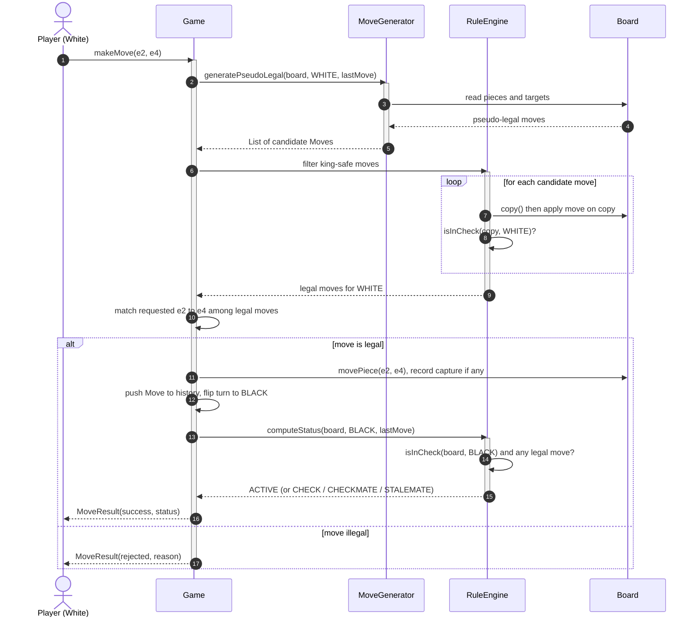
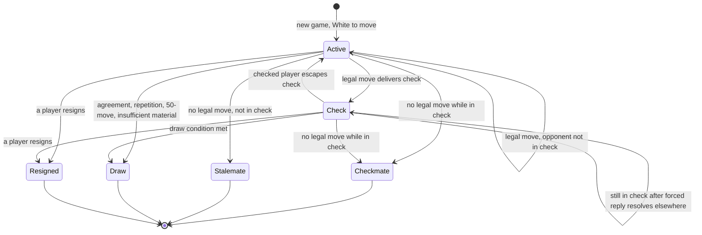
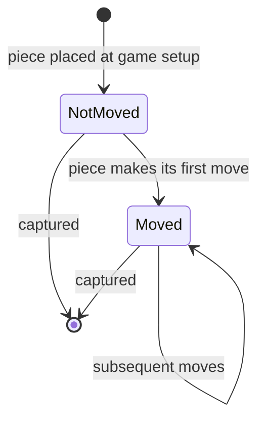

# ♟️ Low-Level Design: Chess Game

> A complete, interview-ready walkthrough of the classic **Chess Game** design problem — from a blank board to a staff-level design that models each piece with clean polymorphism, validates moves through a layered pipeline, handles every special rule (castling, en passant, promotion), detects check, checkmate, and stalemate correctly, supports undo through the Command pattern, and survives concurrency and the relentless follow-up questions of an online chess platform.

Chess is the interview problem that looks deceptively simple and then punishes every shortcut. Everyone knows the rules, so candidates dive straight into code — and almost immediately hit the wall that makes this problem valuable: **the rules of chess are not local.** Whether a bishop can move from c1 to h6 depends not just on the bishop but on every square between them and on whether that move would expose your own king to attack. A pawn's legal moves depend on the entire history of the game (en passant is only legal on the move immediately after the opponent's two-square pawn push). "Is this move legal?" turns out to be one of the deepest questions in the whole domain, and how you decompose it separates a junior answer from a staff-level one. This guide walks the full journey: modeling the pieces with polymorphism instead of a swamp of `if (type == KNIGHT)` branches, separating *pseudo-legal* movement from *fully legal* movement, detecting check by asking "is any enemy piece attacking my king's square," and handling the special moves that break every clean abstraction you just built. It escalates naturally from a beginner's mental model to the check-detection algorithms, the undo/redo machinery, and the distributed-server concerns a principal engineer raises when the question quietly becomes "now make this chess.com."

---

## 📋 Table of Contents

**Part I — Framing the Problem**

1. [Problem Statement](#1-problem-statement)
2. [Requirement Clarification & Assumptions](#2-requirement-clarification--assumptions)
3. [Functional & Non-Functional Requirements](#3-functional--non-functional-requirements)
4. [Core Concepts Being Tested](#4-core-concepts-being-tested)

**Part II — Modeling the Domain**

5. [Domain Model & Entities](#5-domain-model--entities)
6. [CRC Cards](#6-crc-cards)
7. [UML Class Diagram](#7-uml-class-diagram)
8. [Package Structure](#8-package-structure)

**Part III — Design Rationale**

9. [Design Decisions & Trade-offs](#9-design-decisions--trade-offs)
10. [Class-by-Class Deep Dive](#10-class-by-class-deep-dive)
11. [Design Patterns Applied](#11-design-patterns-applied)
12. [SOLID Principles Mapping](#12-solid-principles-mapping)

**Part IV — Behavior & Diagrams**

13. [Sequence Diagram](#13-sequence-diagram)
14. [State Diagram](#14-state-diagram)

**Part V — The Implementation**

15. [Complete Java Implementation](#15-complete-java-implementation)
16. [Execution Flow & Code Walkthrough](#16-execution-flow--code-walkthrough)

**Part VI — Engineering Depth**

17. [Complexity Analysis](#17-complexity-analysis)
18. [Thread Safety & Concurrency](#18-thread-safety--concurrency)
19. [Error Handling & Validation](#19-error-handling--validation)
20. [Scalability Discussion](#20-scalability-discussion)
21. [Alternative Designs & Trade-offs](#21-alternative-designs--trade-offs)

**Part VII — Interview Mastery**

22. [Common FAANG Follow-up Questions (L4 → L6)](#22-common-faang-follow-up-questions-l4--l6)
23. [Common Design Mistakes](#23-common-design-mistakes)
24. [Testing Strategy](#24-testing-strategy)
25. [FAANG Q&A Section](#25-faang-qa-section)
26. [STAR Behavioral Questions](#26-star-behavioral-questions)
27. [⚡ Quick Revision Cheat Sheet](#27--quick-revision-cheat-sheet)

---

## 1. Problem Statement

Design the software that runs a game of **chess** between two players. The board is an 8×8 grid of squares. Each player commands sixteen pieces — one king, one queen, two rooks, two bishops, two knights, and eight pawns — and every piece type moves according to its own rules. Players alternate turns, White moving first. On each turn a player moves one piece from its current square to a target square, possibly capturing an opponent's piece that occupies the destination. The system must accept a move, decide whether it is **legal**, apply it if so, and then determine what the move did to the state of the game: did it put the opponent in **check**, end the game in **checkmate** or **stalemate**, or simply pass the turn.

The difficulty is concentrated entirely in that word *legal*. A move is legal only if the piece can geometrically reach the target square under its own movement rules, the path is not blocked by other pieces (except for the knight, which jumps), the destination does not hold a friendly piece, and — the rule that catches everyone — the move does not leave the mover's own king under attack. On top of this sit the special rules that refuse to fit the general pattern: **castling** (the king and a rook move together under strict conditions), **en passant** (a pawn captures a pawn that just slipped past it), and **promotion** (a pawn reaching the far rank becomes a queen or other piece). The system must model all of this cleanly, keep a complete history of moves so play can be undone or replayed, and correctly recognize the several ways a game can end.

<details>
<summary>📖 <b>In plain terms — what are we actually building?</b></summary>

Picture two people sitting at a chessboard. One reaches out and slides a piece to a new square. Before that move "counts," someone has to check the rulebook: can this piece move that way, is anything in the way, and — the tricky part — is your own king now in danger? Our job is that referee, in software. We build the objects for the board, the squares, and each kind of piece, plus the rules engine that looks at a proposed move and says "legal" or "illegal," carries it out, captures anything that got taken, and then announces "check!", "checkmate — game over," or "your turn." We are not building the graphics or the AI opponent — we are building the model and the rules that decide, on every single move, what is allowed and what just happened.

</details>

The deliverable in an interview is not a polished app; it is a **clean object-oriented model** — the classes, their responsibilities, the piece hierarchy, the move-validation pipeline, and the game controller that ties them together — plus a convincing story for **how the design stays correct and extensible** in the face of chess's many special cases and an interviewer's escalating follow-ups. Grading centers on how you avoid a giant type-switch over piece kinds, how cleanly you separate "can this piece reach here" from "is this move actually legal," how you detect check and checkmate without duplicating logic, and how gracefully the design absorbs new requirements like undo, a game clock, or an online multiplayer server.

---

## 2. Requirement Clarification & Assumptions

The single biggest mistake candidates make is coding before scoping. Chess *feels* fully specified because the rules are public, so it is tempting to skip straight to a `Piece` class — but the prompt hides several forks that reshape the whole design. A strong candidate spends the first few minutes bounding the problem out loud.

### 2.1 Actors

The people and systems that interact with the game define its surface area.

| Actor | Role in the system |
|-------|--------------------|
| **Player (White / Black)** | Proposes a move each turn: a source square, a target square, and optionally a promotion choice. |
| **Game Controller / Referee** | The system itself: validates moves, applies them, updates game state, declares the outcome. |
| **Spectator** | Reads the board and move history but cannot move (relevant once the game is online). |
| **Clock / Timer** | Optional actor that enforces per-player time budgets and can end a game on flag-fall. |
| **Persistence / Replay Store** | Optional: records the move list so a game can be saved, resumed, or replayed. |

### 2.2 Key Clarifying Questions

Resolve these with the interviewer before modeling anything. Each answer materially changes the design.

- **Two human players, or a human versus an engine?** — *(Assumption: **two players** taking alternating turns through the same API. We are building the rules engine and game model, **not** a chess-playing AI. We note where an engine would plug in.)*
- **Do we enforce full legality, including that you cannot move into check?** — This is the crucial one. *(Assumption: **yes** — full standard chess legality. A move that leaves your own king in check is illegal. This forces the two-layer validation that is the heart of the problem.)*
- **Must we support the special moves — castling, en passant, promotion?** — *(Assumption: **yes, all three.** They are where most designs break, so we handle them explicitly rather than hand-waving.)*
- **Do we need to detect draws beyond stalemate — threefold repetition, fifty-move rule, insufficient material?** — *(Assumption: **stalemate and checkmate are required**; threefold repetition, the fifty-move rule, and insufficient material are **v2** — we design the hooks but don't over-build them in v1.)*
- **Undo / takeback support?** — *(Assumption: **yes** — we keep a full move history and support undo, which strongly influences how we represent a Move.)*
- **A game clock?** — *(Assumption: **out of scope for the core model**, but the design leaves a clean seam for a `Clock` so timed games are an additive feature.)*
- **Single in-memory game, or an online multi-game server?** — *(Assumption: model **one game** cleanly first; then discuss scaling to a multiplayer server in the scalability section — a classic staff-level pivot.)*
- **How is the board oriented / addressed?** — *(Assumption: internal `(row, col)` coordinates 0–7; we map to human algebraic notation like `e4` at the boundary for I/O.)*

### 2.3 Explicit Non-Goals

Naming what you will *not* build is a senior signal — it shows you can bound scope deliberately rather than by omission.

- **No chess AI / move search** — no minimax, no evaluation function, no opening book. We validate and apply human moves; an engine is an external actor.
- **No rendering or UI** — interaction is through method calls (`makeMove(from, to)`); board display is a debug convenience, not a product surface.
- **No network protocol in v1** — we design a single-process game and discuss the server later rather than specifying WebSocket framing now.
- **No chess variants** (Chess960, three-check, bughouse) in v1 — but the piece hierarchy and setup factory are built so a variant is an extension, not a rewrite.
- **No opening/endgame databases, ratings, or matchmaking** — those are platform concerns, noted in scalability, not core-model concerns.

<details>
<summary>📖 <b>Why spend so long on clarification?</b></summary>

The prompt "design a chess game" sounds complete, but one answer reshapes everything: *do we enforce that you can't move into check?* If the answer is no, chess collapses into "each piece has a movement pattern" — an easy afternoon. If yes (real chess), then validating a single move requires simulating it and asking "is my king now attacked?", which pulls in check detection, which pulls in the ability to enumerate every enemy piece's moves — an entirely different, layered design. Asking this one question upfront signals you understand *what actually makes chess hard*, and it sets up every follow-up: castling-through-check, pinned pieces, and checkmate detection all fall out of that same core mechanism.

</details>

---

## 3. Functional & Non-Functional Requirements

### 3.1 Functional Requirements (what the system *does*)

List these crisply in an interview — they become your checklist for the class design.

1. **Set up the board** — place all 32 pieces in their standard starting positions for a new game.
2. **Accept a move** — take a source square, a target square, and (if a pawn promotes) a chosen piece type.
3. **Validate legality** — confirm the piece can reach the target (movement rules + path clearance + destination rules) *and* that the move does not leave the mover's own king in check.
4. **Apply a legal move** — move the piece, capture any opponent piece on the target square, and record the move in history.
5. **Handle special moves** — castling (king-side and queen-side), en passant capture, and pawn promotion.
6. **Alternate turns** — enforce that only the player whose turn it is may move, White first.
7. **Detect check** — after each move, determine whether the opponent's king is now under attack.
8. **Detect game end** — recognize checkmate (in check with no legal move), stalemate (not in check but no legal move), and player resignation/draw agreement.
9. **Support undo** — revert the last move (and its side effects: restore captured pieces, un-promote, reset castling rights) to the exact prior state.
10. **Expose game state** — report the current board, whose turn it is, the move history, and the game result.

### 3.2 Non-Functional Requirements (how *well* it does it)

1. **Correctness above all** — chess rules are exact and unforgiving; an illegal move accepted or a checkmate missed is a total failure. This is the dominant NFR.
2. **Extensibility** — new piece behavior, variants, or draw rules should slot in without editing existing piece classes (Open/Closed).
3. **Performance** — move validation and check detection must be effectively instant for a human game (well under a millisecond); on a server they run millions of times, so we care about the constant factors.
4. **Testability** — every rule (each piece, each special move, each end condition) must be unit-testable in isolation from a controller or UI.
5. **Determinism** — the same sequence of moves must always produce the same state; no hidden randomness. Essential for replay, undo, and debugging.
6. **Thread safety (server context)** — a single game is turn-based and naturally serialized, but a server hosting many games must isolate each game's state and guard concurrent access to one game.
7. **Memory efficiency** — the move history and any position-hashing (for repetition draws) should stay bounded and cheap.

<details>
<summary>📖 <b>Which requirement dominates the design?</b></summary>

For most systems you trade off latency, cost, and consistency. Chess is unusual: **correctness dominates everything.** There is exactly one right answer to "is this move legal?" and users notice instantly if you get it wrong, because they know the rules as well as you do. That single fact drives the whole design toward clarity and testability over cleverness — you want each rule living in one obvious place so it can be verified, not scattered across a controller where bugs hide. Performance matters only later, on a server replaying millions of games; for one human game, a validation that takes fifty microseconds versus five is irrelevant next to getting the rule exactly right.

</details>

---

## 4. Core Concepts Being Tested

Chess is a favorite precisely because it exercises a wide band of object-oriented skill in one problem. An interviewer is quietly checking for the following.

**Polymorphism over conditional logic.** The defining test. Six piece types each move differently. The junior instinct is one `Piece` class with a `type` field and a giant `switch (type)` inside `canMove`. The senior instinct is an abstract `Piece` with a subclass per type, each overriding its own movement rule — so adding a variant piece never touches existing code. How you model the pieces is the first thing an interviewer looks at.

**Separation of concerns / layered validation.** "Is this move legal?" is genuinely two questions stacked: *pseudo-legal* ("can this piece geometrically reach the target, path clear, no friendly piece there?") and *fully legal* ("...and it doesn't leave my own king in check"). Candidates who fuse these into one tangled method struggle with check, pins, and castling. Candidates who layer them get all of those almost for free.

**State management and the game state machine.** A game moves through well-defined states — active, check, checkmate, stalemate, draw — and the transitions are driven by moves. Modeling this explicitly (rather than with scattered booleans like `isCheck`, `isOver`) is a recurring senior signal.

**Immutability and value objects.** A `Position` (row, col) is a value — two e4's are the same square. Making positions immutable value objects avoids a whole class of aliasing bugs and makes them safe as map keys.

**The Command pattern and reversible operations.** Undo/takeback is a headline feature. Representing each move as a rich, self-describing object that knows how to apply *and* reverse itself (including captured pieces and lost castling rights) is the clean solution, and it's exactly the Command pattern.

**Reasoning about history-dependent rules.** En passant and castling depend on what happened earlier — a pawn's two-square jump last move, whether the king or rook has ever moved. Handling state that isn't visible on the board alone tests whether you can model *game history*, not just a snapshot.

<details>
<summary>📖 <b>What's the one idea that unlocks the whole problem?</b></summary>

It's this: **legal = pseudo-legal AND king-safe.** Separate "can the piece move there by its own rules" from "does moving there leave my king in check." Once you split those, everything clicks. Check detection becomes "pretend the move happened, then ask if any enemy piece attacks my king." Checkmate becomes "I'm in check and *every* legal move still leaves me in check." Pins need no special code at all — a pinned knight simply has no move that keeps the king safe, so the king-safety filter removes them automatically. Candidates who find this split write short, correct code; those who don't end up with a sprawling mess of special cases.

</details>

---
## 5. Domain Model & Entities

Before drawing classes, name the *nouns* of chess and decide which deserve to be objects. The art is choosing the right granularity: too few classes and logic piles into one god-object; too many and you drown in ceremony. Here is the vocabulary this design commits to.

**The board and its coordinates.** The playing surface is a `Board` — an 8×8 grid. A single square is addressed by a `Position`, an immutable value object holding a `row` and `col` in the range 0–7. `Position` is a *value*: two positions with the same row and column are equal, which lets us use them as map keys and compare them safely. The `Board` stores what occupies each square; an empty square holds nothing (null), an occupied square holds a `Piece`.

**The pieces.** Every piece is a `Piece` — an abstract base that knows its `Color` (white or black) and whether it `hasMoved` (needed for castling and the pawn's two-square first move). Six concrete subclasses — `King`, `Queen`, `Rook`, `Bishop`, `Knight`, `Pawn` — each answer one question in their own way: *given this board and my current square, which squares can I move to by my own rules?* This is the polymorphic heart of the design. Sliding pieces (queen, rook, bishop) share a "slide until blocked" helper; the knight and king use fixed offset lists; the pawn is the special child with forward pushes, diagonal captures, and promotion.

**The move.** A `Move` is a rich object, not a pair of coordinates. It records where a piece came `from`, where it went `to`, which `pieceMoved`, which `pieceCaptured` (if any) and *from which square* (en passant captures a pawn that is not on the destination square), whether it was a `castling` move, whether it was `enPassant`, and any `promotion` type chosen. This richness is what makes **undo** trivial and reliable — the move carries everything needed to reverse itself.

**The rules engine.** Two collaborators own the logic that no single piece can: a `MoveGenerator` assembles the full set of *pseudo-legal* moves for a color (each piece's geometric moves plus castling and en passant, which depend on game state a lone piece cannot see), and a `RuleEngine` answers the safety questions — *is this square attacked?*, *is this king in check?*, and *does this move leave my own king in check?* — and computes whether the position is checkmate, stalemate, or ongoing.

**The orchestrator.** A `Game` ties it together: it holds the `Board`, the two `Player`s, whose turn it is (`currentTurn`), the running `GameStatus`, and the `history` of moves. It exposes `makeMove(from, to)` and `undo()`, and it is the only class that mutates game state.

**The enumerations.** `Color { WHITE, BLACK }` (with an `opposite()`), `PieceType { KING, QUEEN, ROOK, BISHOP, KNIGHT, PAWN }`, and `GameStatus { ACTIVE, CHECK, CHECKMATE, STALEMATE, DRAW, RESIGNED }` capture the small closed sets of values that recur everywhere.

<details>
<summary>📖 <b>Why is a Move a whole object and not just "from, to"?</b></summary>

You might think a move is just two squares — e2 to e4. But to *undo* it later, you need to remember more: was anything captured, and where did it stand? (In en passant the captured pawn isn't on the square you moved to.) Was it a castle, so a rook also moved? Did a pawn promote, so a queen must turn back into a pawn? Did this move cost the king its castling rights? A plain `(from, to)` throws all that away. By making `Move` a rich object that records every side effect, undo becomes "read the move and reverse each part" — reliable and simple. This is the Command pattern in disguise, and it's why experienced designers reach for it here.

</details>

---

## 6. CRC Cards

CRC (Class–Responsibility–Collaborator) cards capture each class's job and who it talks to, before any code. They keep responsibilities honest — if a card's responsibility list sprawls, the class is doing too much.

| Class | Responsibilities | Collaborators |
|-------|------------------|---------------|
| **Position** | Hold an immutable (row, col); know if it is on the board; provide value equality and algebraic notation. | — |
| **Piece** (abstract) | Know its color and whether it has moved; generate its geometric (pseudo-legal) target squares and the squares it attacks. | Board, Position |
| **King / Queen / Rook / Bishop / Knight / Pawn** | Implement one piece's movement and attack rules. | Board, Position |
| **Board** | Store the piece on each square; place/move/remove pieces; find a color's king; clone itself for simulation. | Piece, Position |
| **Move** | Describe one move fully: from, to, piece moved, piece captured (and its square), castling/en-passant flags, promotion; carry the data needed to reverse itself. | Piece, Position |
| **MoveGenerator** | Produce all pseudo-legal moves for a color, including castling and en passant that need game context. | Board, Piece, Move, RuleEngine |
| **RuleEngine** | Answer: is a square attacked? is a king in check? is a move king-safe? compute checkmate / stalemate. | Board, Piece, MoveGenerator, Move |
| **Player** | Identify a participant and the color they command. | Color |
| **Game** | Own the board, players, turn, status, and history; validate and apply moves; support undo; report state. | Board, Player, MoveGenerator, RuleEngine, Move |
| **BoardInitializer** | Build a board with the 32 pieces in standard starting positions. | Board, Piece |

<details>
<summary>📖 <b>How do CRC cards keep the design clean?</b></summary>

Each card forces one honest question: "what is this class *responsible* for?" If you can't say it in a short phrase, or the phrase has three "and"s in it, the class is doing too much and should be split. Notice how `Piece` only knows geometry, `RuleEngine` only knows safety, and `Game` only orchestrates — none of them reaches into another's job. That discipline is what lets you test a `Knight` without a `Game`, or swap the check-detection logic without touching the pieces. The cards are a five-minute sketch that saves you from a tangled hour of code.

</details>

---

## 7. UML Class Diagram

The diagram below shows the static structure: the piece hierarchy on the left, the board and move value objects in the center, and the rules/orchestration classes on the right. Every class name, field, and method here matches the Java implementation in Section 15 exactly.

```
                          ┌─────────────────────┐
                          │      «enum» Color    │
                          │  WHITE, BLACK        │
                          │  + opposite(): Color │
                          └─────────────────────┘

     ┌──────────────────────────────┐         ┌──────────────────────────────┐
     │        «abstract» Piece       │         │           Position           │
     ├──────────────────────────────┤         ├──────────────────────────────┤
     │ # color: Color                │         │ - row: int                   │
     │ # hasMoved: boolean           │         │ - col: int                   │
     ├──────────────────────────────┤         ├──────────────────────────────┤
     │ + getColor(): Color           │         │ + getRow(): int              │
     │ + hasMoved(): boolean         │         │ + getCol(): int              │
     │ + setMoved(boolean): void     │         │ + isValid(): boolean         │
     │ + getType(): PieceType {abs}  │         │ + equals()/hashCode()        │
     │ + getSymbol(): char {abs}     │         │ + toString(): String  (e4)   │
     │ + getPseudoLegalTargets(      │         └──────────────────────────────┘
     │      Board, Position):        │                     ▲
     │      List<Position> {abs}     │                     │ uses
     │ + getAttackSquares(           │                     │
     │      Board, Position):        │         ┌──────────────────────────────┐
     │      List<Position>           │         │            Board             │
     └──────────────────────────────┘         ├──────────────────────────────┤
        ▲   ▲   ▲   ▲   ▲   ▲                  │ - squares: Piece[8][8]       │
        │   │   │   │   │   │                  ├──────────────────────────────┤
   ┌────┘   │   │   │   │   └────┐             │ + getPiece(Position): Piece  │
   │    ┌───┘   │   │   └───┐    │             │ + setPiece(Position, Piece)  │
 ┌────┐┌─────┐┌────┐┌──────┐┌──────┐┌────┐     │ + isEmpty(Position): boolean │
 │King││Queen││Rook││Bishop││Knight││Pawn│     │ + findKing(Color): Position  │
 └────┘└─────┘└────┘└──────┘└──────┘└────┘     │ + movePiece(Position,Position)│
   each overrides getPseudoLegalTargets()      │ + copy(): Board              │
                                               └──────────────────────────────┘
                                                          ▲
                                                          │ operates on
 ┌──────────────────────────────┐                        │
 │             Move             │                         │
 ├──────────────────────────────┤          ┌──────────────────────────────┐
 │ - from: Position             │          │        MoveGenerator         │
 │ - to: Position               │          ├──────────────────────────────┤
 │ - pieceMoved: Piece          │          │ + generatePseudoLegal(       │
 │ - pieceCaptured: Piece       │          │     Board, Color, Move last): │
 │ - capturedFrom: Position     │          │     List<Move>               │
 │ - castling: boolean          │          │ + castlingMoves(...)         │
 │ - enPassant: boolean         │          │ + enPassantMoves(...)        │
 │ - promotion: PieceType       │          └──────────────────────────────┘
 │ - prevHasMoved: boolean      │                        │ used by
 ├──────────────────────────────┤                        ▼
 │ + isCapture(): boolean       │          ┌──────────────────────────────┐
 │ + getFrom()/getTo() ...      │          │          RuleEngine          │
 └──────────────────────────────┘          ├──────────────────────────────┤
                                            │ + isSquareAttacked(          │
 ┌──────────────────────────────┐          │     Board, Position, Color)   │
 │            Player            │          │ + isInCheck(Board, Color)     │
 ├──────────────────────────────┤          │ + isMoveKingSafe(Board, Move, │
 │ - name: String               │          │     Color)                    │
 │ - color: Color               │          │ + generateLegalMoves(         │
 └──────────────────────────────┘          │     Board, Color, Move):      │
                                            │     List<Move>               │
 ┌──────────────────────────────┐          │ + computeStatus(Board, Color, │
 │       BoardInitializer       │          │     Move): GameStatus         │
 ├──────────────────────────────┤          └──────────────────────────────┘
 │ + setup(Board): void         │                        ▲
 └──────────────────────────────┘                        │ uses
                                                          │
                    ┌───────────────────────────────────────────────────┐
                    │                       Game                         │
                    ├───────────────────────────────────────────────────┤
                    │ - board: Board                                     │
                    │ - white, black: Player                             │
                    │ - currentTurn: Color                               │
                    │ - status: GameStatus                               │
                    │ - history: Deque<Move>                             │
                    │ - generator: MoveGenerator                         │
                    │ - rules: RuleEngine                                │
                    ├───────────────────────────────────────────────────┤
                    │ + makeMove(Position, Position): MoveResult         │
                    │ + makeMove(Position, Position, PieceType)          │
                    │ + undo(): void                                     │
                    │ + getLegalMoves(Position): List<Move>              │
                    │ + getStatus(): GameStatus                          │
                    └───────────────────────────────────────────────────┘
```

The key relationships to read off this diagram: `Piece` is an abstract superclass with six concrete subclasses (an **is-a** hierarchy — this is where polymorphism lives); `Board` holds a grid of `Piece` references (**composition**); `Move` is a value object referencing `Position`s and `Piece`s; `MoveGenerator` and `RuleEngine` are stateless services that operate *on* a `Board`; and `Game` is the single orchestrator that owns everything and is the only mutator of state.

---

## 8. Package Structure

A clean package layout communicates the architecture at a glance and enforces the dependency direction — the domain model must not depend on the orchestration layer.

```
com.chess
│
├── model                 // The nouns: pure data + geometry, no orchestration
│   ├── Color.java
│   ├── PieceType.java
│   ├── GameStatus.java
│   ├── Position.java
│   ├── Board.java
│   ├── Move.java
│   ├── Player.java
│   └── piece
│       ├── Piece.java          // abstract base
│       ├── King.java
│       ├── Queen.java
│       ├── Rook.java
│       ├── Bishop.java
│       ├── Knight.java
│       └── Pawn.java
│
├── rules                 // The logic: generation + legality + status
│   ├── MoveGenerator.java
│   └── RuleEngine.java
│
├── engine                // Orchestration: turns, history, undo
│   ├── Game.java
│   ├── MoveResult.java
│   └── BoardInitializer.java
│
└── app
    └── ChessDemo.java          // wires it up and plays a scripted game
```

The dependency arrows all point *inward* toward `model`: `rules` depends on `model`, `engine` depends on `rules` and `model`, and `app` depends on `engine`. Nothing in `model` knows about `Game` or the app. This is the Dependency Inversion Principle expressed in package form — the stable core (pieces, board, positions) has no knowledge of the volatile shell (orchestration, I/O), so you can rebuild the shell (a CLI, a web server, an engine harness) without touching the rules.

<details>
<summary>📖 <b>Why split rules out from the pieces and the game?</b></summary>

You could jam everything into `Game` — piece movement, check detection, turn handling. It would even work. But then every rule change means opening the same 800-line file, and you can't test "is the king in check?" without spinning up a whole game. By putting movement geometry in `model/piece`, the safety logic in `rules`, and the turn/history handling in `engine`, each concern lives in one place and tests itself in isolation. When an interviewer says "now add threefold-repetition draws," you point at `RuleEngine` and add one method — you don't go archaeology-digging through a monolith.

</details>

---
## 9. Design Decisions & Trade-offs

Every serious design is a sequence of forks, each with a defensible alternative. Naming the fork, choosing a side, and *saying why* is what senior interviews reward. Here are the decisions that define this design.

### 9.1 Polymorphic pieces vs. a type-switch

**Decision: one abstract `Piece` with a subclass per type, each owning its own movement rule.**

The tempting alternative is a single `Piece` class with a `PieceType type` field and a `canMove` method that switches on the type. It is fewer files, and for a fixed six-piece game it even works. But it violates Open/Closed head-on: every new behavior edits the same growing switch, and the movement logic for all six pieces tangles together in one method where a bug in the bishop case can break the queen. The polymorphic hierarchy costs six small classes but buys isolation — each piece's rule is testable alone, and a variant piece (say a "chancellor" that moves like a rook plus a knight) is a new subclass that touches nothing existing. For a problem whose *entire point* is modeling different behaviors behind a common interface, the switch is the wrong answer and the interviewer knows it.

### 9.2 Two-layer legality: pseudo-legal, then king-safe

**Decision: separate geometric move generation from king-safety filtering.**

Pieces generate *pseudo-legal* moves — geometrically valid, path-clear, not landing on a friendly piece — with no knowledge of check. A separate `RuleEngine` then filters those by simulating each move and asking "is my king now attacked?" This two-step is the single most important structural decision in the design. Fusing them (making each piece aware of check) would duplicate check logic six times and make pins, castling-through-check, and checkmate detection nightmarish. Splitting them means pins need *zero* special code (a pinned piece simply has no king-safe move), and checkmate is just "in check and the legal-move list is empty." The cost is that we simulate moves to test them, which is more work per move — but for a human game that cost is invisible, and the correctness win is enormous.

### 9.3 Board representation: 8×8 array vs. bitboards

**Decision: a plain `Piece[8][8]` array (mailbox representation).**

Real chess *engines* use **bitboards** — 64-bit integers where each bit is a square — because they compute attacks for millions of positions per second using bitwise operations. That is the right call for a search engine exploring billions of nodes. It is the *wrong* call for an interview LLD, where clarity is graded over raw speed: bitboards are opaque, hard to explain on a whiteboard, and premature for a human-speed game. The mailbox array reads like the board looks, makes the code obvious, and is trivially fast enough for validating one move at a time. The senior move is to *name* bitboards as the optimization you would reach for if this became an engine, then choose the array for the problem actually posed.

### 9.4 Move as a rich reversible object vs. a coordinate pair

**Decision: `Move` carries every side effect so it can reverse itself.**

Storing just `(from, to)` makes applying a move easy and undoing it nearly impossible — you have lost the captured piece, the castling rights, the pre-promotion identity. By recording the captured piece and its square, the castling/en-passant flags, the promotion type, and the moved piece's prior `hasMoved` state, undo becomes a mechanical reversal. This is the Command pattern, and it is what turns "support takebacks" from a scary feature into a few lines.

### 9.5 Where do special moves live?

**Decision: castling and en passant are generated by `MoveGenerator`, not by the `King` or `Pawn`.**

A pawn cannot know whether en passant is legal — that depends on the *opponent's last move*, which the pawn cannot see. A king cannot fully validate castling — that depends on the rook's move history and on whether the king passes through an attacked square, which needs the `RuleEngine`. So these history- and context-dependent moves are assembled one level up, in `MoveGenerator`, which has access to game state. Pieces stay pure geometry; the generator adds the context-sensitive moves. This keeps each concern where the information to decide it actually lives.

<details>
<summary>📖 <b>How do I present a trade-off in the interview?</b></summary>

Don't just state your choice — narrate the fork. Say "we could store each piece's type and switch on it, which is fewer classes, but it breaks Open/Closed and tangles six rule-sets in one method; or we give each piece its own class, which costs six files but isolates every rule and makes variants free. For a problem that's literally about modeling different behaviors, I'll take the polymorphism." That structure — alternative, cost, choice, reason — shows you *reason* about design rather than memorizing one answer. Interviewers routinely push the path you *didn't* pick ("when would bitboards be worth it?"), and having already named it means you're ready.

</details>

---

## 10. Class-by-Class Deep Dive

This section walks each class in dependency order — from the value objects the whole system rests on, up to the orchestrator that ties them together — explaining not just *what* each does but *why it is shaped that way*.

### 10.1 `Position` — the immutable coordinate

`Position` wraps a `row` and `col` (0–7) and does almost nothing else, which is exactly right. It is **immutable**: once constructed it never changes, so it is safe to share, compare, and use as a `HashMap` key. It implements value equality (`equals`/`hashCode` on row and col), so `new Position(4,4).equals(new Position(4,4))` is true — two references to e4 *are* the same square. `isValid()` answers whether the coordinate lies on the board, the guard every generator uses before trusting a computed square. Its `toString()` renders algebraic notation (`e4`) for readable logs. Making this a value object eliminates a whole category of aliasing bugs that plague designs using bare `int[]` pairs.

### 10.2 `Piece` and its subclasses — polymorphic movement

`Piece` is abstract. It holds the two facts common to all pieces — `color` and `hasMoved` — and declares the contract each subclass must fulfill: `getType()`, `getSymbol()` (for display), and the important one, `getPseudoLegalTargets(board, from)`, which returns every square the piece can reach by its own rules from `from`, given the current board. A default `getAttackSquares(board, from)` returns the same list; only `Pawn` overrides it, because a pawn *moves* straight but *attacks* diagonally — a subtlety that trips up naive check detection.

The subclasses split into three shapes. **Sliding pieces** — `Queen`, `Rook`, `Bishop` — share a protected `slide` helper on `Piece` that walks outward along a set of directions until it hits the board edge, a friendly piece (stop, exclude), or an enemy piece (stop, include as a capture). The rook slides orthogonally, the bishop diagonally, the queen along both sets. **Offset pieces** — `Knight` and `King` — enumerate a fixed list of relative squares (the knight's eight L-shapes, the king's eight neighbors) and keep those that are on-board and not friendly-occupied. **The pawn** is the irregular one: it pushes one square forward if empty, two from its start rank if both squares are empty, captures only diagonally and only onto an enemy, and its diagonal *attack* squares exist whether or not an enemy is there (that's why `getAttackSquares` is overridden). Promotion is flagged by `MoveGenerator` when a pawn's target lands on the last rank.

### 10.3 `Board` — the grid and its services

`Board` owns a `Piece[8][8]` array and exposes the operations everyone needs without leaking the array itself: `getPiece(pos)`, `setPiece(pos, piece)`, `isEmpty(pos)`, and `movePiece(from, to)`. Two methods carry extra weight. `findKing(color)` scans for a color's king — used constantly by check detection (an optimization would cache the king's square, discussed later). `copy()` produces a deep-enough clone of the board so the `RuleEngine` can simulate a move on a throwaway copy and test king safety without mutating the real game — the mechanism that makes the two-layer legality check clean.

### 10.4 `Move` — the reversible record

`Move` is the Command object. It records `from`, `to`, `pieceMoved`, `pieceCaptured` and its `capturedFrom` square (which differs from `to` only for en passant), the `castling` and `enPassant` flags, the `promotion` type, and `prevHasMoved` (the moved piece's `hasMoved` state before this move, so undo can restore it). `isCapture()` is a convenience. Because the move carries all of this, `Game.undo()` can reverse *any* move — including the awkward ones — without re-deriving anything.

### 10.5 `MoveGenerator` — pseudo-legal moves with context

`MoveGenerator` turns "which squares can each piece reach" into "which *moves* are available," including the two context-dependent specials. `generatePseudoLegal(board, color, lastMove)` loops over the color's pieces, converts each target square into a `Move` (marking captures and pawn promotions), then appends `castlingMoves` (checking `hasMoved` on king and rook, that the squares between are empty, and delegating the "not through check" test to `RuleEngine`) and `enPassantMoves` (legal only if `lastMove` was an adjacent enemy pawn's two-square push). It produces *pseudo-legal* moves — geometry and context, but not yet king-safety.

### 10.6 `RuleEngine` — safety and status

`RuleEngine` is where "legal" gets its full meaning. `isSquareAttacked(board, square, byColor)` asks whether any piece of `byColor` attacks `square` (using `getAttackSquares`, so pawns are handled correctly). `isInCheck(board, color)` is just "is this color's king square attacked by the opponent." `isMoveKingSafe(board, move, color)` copies the board, applies the move on the copy, and returns whether the mover's king is *not* in check afterward — the filter that turns pseudo-legal into fully legal. `generateLegalMoves` runs the generator and keeps only king-safe moves. `computeStatus` reads the position after a move: if the side to move has at least one legal move, the game is `ACTIVE` or `CHECK`; if it has none, it is `CHECKMATE` (if in check) or `STALEMATE` (if not).

### 10.7 `Game` — the orchestrator

`Game` is the only class that mutates game state, which keeps the rules of *when* things can happen in one place. It holds the `board`, the two `Player`s, `currentTurn`, `status`, and a `Deque<Move>` history. `makeMove(from, to)` looks up the legal moves for the piece on `from`, matches the requested destination, applies the chosen move to the board, records it in history, flips the turn, and recomputes status. The promotion overload accepts the chosen piece type. `undo()` pops the last move and reverses it — restoring captured pieces, un-promoting, un-castling, resetting `hasMoved`, and flipping the turn back. `Game` never contains movement geometry or safety math; it delegates to the generator and the rule engine, so it stays a thin, readable coordinator.

<details>
<summary>📖 <b>Why is Game the only class allowed to change state?</b></summary>

Scattering mutations everywhere — a piece that moves itself, a board that flips turns — is how you end up with a game that's in "check" but still says it's active, or a turn that advanced twice. By funneling every change through `Game.makeMove` and `Game.undo`, there is exactly one place where "a move happens," so the invariants (turn flips, status updates, history grows) are enforced together, every time. Everyone else — pieces, board, rule engine — only *computes* and *reports*; they never decide that the game has advanced. This single-writer discipline is what makes the game state trustworthy and undo reliable.

</details>

---

## 11. Design Patterns Applied

Chess is a pattern-rich problem; naming the patterns you used (and, crucially, *why*) is a fast way to signal design maturity. This design leans on five.

### 11.1 Strategy / Polymorphism — piece movement

Each piece encapsulates its own movement algorithm behind the common `getPseudoLegalTargets` contract, and the rest of the system treats every piece uniformly through the `Piece` reference. Whether you call it the **Strategy pattern** (movement as an interchangeable algorithm) or plain **polymorphism**, the effect is the same: the `MoveGenerator` loops over pieces without ever asking "what kind are you?" Adding a new piece adds a subclass and changes no existing code — the Open/Closed payoff.

### 11.2 Command — moves as reversible operations

The `Move` object is a **Command**: it captures a request (move this piece here) plus all the state needed to *undo* it. `Game` maintains a history of executed commands (the `Deque<Move>`), and `undo()` pops and reverses the most recent — the textbook Command-with-undo structure that also underpins move replay and could power a redo stack.

### 11.3 Factory — board setup

`BoardInitializer` is a **Factory** for a fully populated starting board: callers ask for a standard setup and receive 32 correctly placed pieces without knowing the placement rules. This isolates the (fiddly, easy-to-mistype) starting arrangement in one testable place and is the seam where a variant (Chess960's randomized back rank) would plug in as an alternative initializer.

### 11.4 State — the game lifecycle

`GameStatus` models the game as a **state machine** — `ACTIVE`, `CHECK`, `CHECKMATE`, `STALEMATE`, `DRAW`, `RESIGNED` — with transitions driven by moves. Even in the lightweight enum form used here, thinking in explicit states (rather than a tangle of `boolean isOver`, `boolean inCheck`) keeps the end-of-game logic correct and centralizes "what can happen next."

### 11.5 Facade — Game as the entry point

`Game` acts as a **Facade** over the whole subsystem: clients call `makeMove` and `undo` and read `getStatus`, blissfully unaware of generators, rule engines, board copies, and simulation. The complexity is real but hidden behind a small, intention-revealing interface.

<details>
<summary>📖 <b>Aren't these patterns overkill for a chess game?</b></summary>

They would be if you *bolted them on* for their own sake — but here each one solves a concrete problem the requirements created. Undo is a stated feature, and Command is simply the honest name for "an operation that knows how to reverse itself." Six differently-moving pieces *demand* polymorphism unless you enjoy giant switches. The starting position is fiddly, so a Factory earns its keep. The trick in an interview is to reach for a pattern because the requirement pulls you toward it, and to be able to say "I used Command *because* we need undo" — not to recite a catalog. Patterns are the vocabulary for describing a good structure you'd arrive at anyway.

</details>

---

## 12. SOLID Principles Mapping

The SOLID principles are the vocabulary interviewers use to probe *why* a structure is good. Here is how each shows up concretely.

**Single Responsibility.** Every class has one reason to change. `Piece` subclasses change only if a piece's movement changes; `RuleEngine` changes only if the definition of check/checkmate changes; `Game` changes only if the turn/history orchestration changes; `BoardInitializer` changes only if the starting layout changes. No class straddles two of these axes.

**Open/Closed.** The design is open to extension, closed to modification. A new piece is a new `Piece` subclass — no existing class is touched. A new draw rule (threefold repetition) is a new method on `RuleEngine`. A new variant setup is a new initializer. The giant-switch alternative fails this outright, since every extension edits the switch.

**Liskov Substitution.** Every `Piece` subclass is a drop-in for `Piece`: the `MoveGenerator` holds `Piece` references and calls `getPseudoLegalTargets` without knowing or caring which concrete type answers. No subclass weakens the contract (e.g., none returns off-board squares), so substituting any piece is always safe.

**Interface Segregation.** Clients depend only on the narrow slice they use. `MoveGenerator` needs `getPseudoLegalTargets`; `RuleEngine` needs `getAttackSquares`; neither is forced to depend on methods it doesn't call. The `Piece` contract is kept minimal rather than a fat interface bristling with rarely-used methods.

**Dependency Inversion.** High-level orchestration depends on abstractions, not concretions. `Game` and `MoveGenerator` work against the abstract `Piece`, never against `Knight` or `Rook`. The package structure enforces the arrow direction — the volatile `engine` layer depends on the stable `model`, never the reverse.

<details>
<summary>📖 <b>Which SOLID principle matters most here?</b></summary>

**Open/Closed**, and it's not close. The entire premise of the chess problem is "many things that behave differently but are used the same way," and the whole point of the polymorphic piece hierarchy is that adding a seventh kind of behavior shouldn't force you to reopen and risk breaking the other six. When an interviewer asks "how would you add a new piece / a variant / a new draw rule?", they're really testing Open/Closed — and if your design answers "add a class, touch nothing existing," you've passed. The other four principles are what *make* Open/Closed achievable, but it's the headline result.

</details>

---

## 13. Sequence Diagram

The diagram below traces the most important interaction in the system: a player makes a move, and the design validates it, applies it, and reports the new status. Watch how `Game` delegates the hard thinking to `MoveGenerator` and `RuleEngine` and only orchestrates.



Read the flow as three beats. First, **generate** — `Game` asks `MoveGenerator` for every pseudo-legal move for the mover. Second, **filter** — `RuleEngine` simulates each on a board copy and keeps only those that leave the mover's king safe, yielding the fully legal set. Third, **apply and assess** — if the requested move is in that set, `Game` mutates the board, records history, flips the turn, and asks `RuleEngine` to classify the resulting position for the *opponent*, which is how check, checkmate, and stalemate are all detected by the same code path. An illegal request never reaches the board.

<details>
<summary>📖 <b>Why classify the position for the opponent after the move?</b></summary>

After White moves, it's Black's turn — so the question that decides the game is about *Black's* situation: is Black's king attacked (check), and does Black have any legal reply (if not: checkmate when in check, stalemate when not). By always computing status for the side *about to move*, one method handles every ending. You don't need separate "did I just deliver checkmate" logic; you ask "can the next player do anything, and are they in check?" and the three outcomes — keep playing, checkmate, stalemate — fall straight out.

</details>

---

## 14. State Diagram

Two state machines matter in chess. The first is the **game lifecycle** — the status of the whole game as moves are played. The second is the **per-piece `hasMoved` flag**, a tiny but crucial state that gates castling and the pawn's double-step.

### 14.1 Game lifecycle



The game begins **Active** with White to move. Each legal move either keeps it Active, transitions it to **Check** (if the move attacks the opponent's king), or ends it. The terminal states — **Checkmate**, **Stalemate**, **Draw**, **Resigned** — are absorbing: once reached, no further moves are accepted. The elegance is that Checkmate and Stalemate are *not* separately detected; both are "the side to move has no legal move," distinguished only by whether that side is currently in Check.

### 14.2 Per-piece movement state



This two-state flag looks trivial but enforces three real rules. A king and rook may castle only while both are **NotMoved**; a pawn may push two squares only from its **NotMoved** state; and `undo` must restore the flag to **NotMoved** if the reversed move was the piece's first — which is exactly why `Move` records `prevHasMoved`. Forgetting to restore this on undo is a classic, subtle bug: a takeback that silently strips castling rights.

<details>
<summary>📖 <b>Why model these as states rather than just booleans?</b></summary>

They *are* booleans in the code — but thinking about them as states forces you to ask the questions that catch bugs: what causes each transition, and is every transition reversible? The game-status machine makes you realize checkmate and stalemate share a trigger, so you write the detection once. The `hasMoved` machine makes you realize undo must walk the transition *backward*, so you remember to store the prior value in the move. Whiteboarding the states surfaces the edge cases before they become production defects — that's the whole value of the exercise.

</details>

---
## 15. Complete Java Implementation

The full, runnable implementation follows, grouped by layer and wrapped in collapsible blocks so you can expand one concern at a time. Every class name and signature matches the diagrams above. The code is written for clarity over micro-optimization — the natural priority for an interview — with the optimization seams called out in later sections.

<details>
<summary>💻 <b>1. Enumerations and the <code>Position</code> value object</b></summary>

```java
package com.chess.model;

/** The two sides. opposite() saves a dozen ternaries across the codebase. */
public enum Color {
    WHITE, BLACK;
    public Color opposite() {
        return this == WHITE ? BLACK : WHITE;
    }
}
```

```java
package com.chess.model;

public enum PieceType {
    KING, QUEEN, ROOK, BISHOP, KNIGHT, PAWN
}
```

```java
package com.chess.model;

public enum GameStatus {
    ACTIVE, CHECK, CHECKMATE, STALEMATE, DRAW, RESIGNED
}
```

```java
package com.chess.model;

/**
 * An immutable board coordinate (row, col), each in 0..7.
 * Value equality lets us use it safely as a key and compare squares by identity of location.
 */
public final class Position {
    private final int row;
    private final int col;

    public Position(int row, int col) {
        this.row = row;
        this.col = col;
    }

    public int getRow() { return row; }
    public int getCol() { return col; }

    /** True only if this coordinate lies on the 8x8 board. */
    public boolean isValid() {
        return row >= 0 && row < 8 && col >= 0 && col < 8;
    }

    /** Parse algebraic notation like "e4" into a Position. */
    public static Position of(String algebraic) {
        int col = algebraic.charAt(0) - 'a';
        int row = algebraic.charAt(1) - '1';
        return new Position(row, col);
    }

    @Override
    public boolean equals(Object o) {
        if (this == o) return true;
        if (!(o instanceof Position)) return false;
        Position p = (Position) o;
        return row == p.row && col == p.col;
    }

    @Override
    public int hashCode() { return row * 8 + col; }

    /** Render as algebraic notation, e.g. (3,4) -> "e4". */
    @Override
    public String toString() {
        return "" + (char) ('a' + col) + (char) ('1' + row);
    }
}
```

</details>

<details>
<summary>💻 <b>2. The <code>Piece</code> hierarchy — polymorphic movement</b></summary>

```java
package com.chess.model.piece;

import com.chess.model.*;
import java.util.ArrayList;
import java.util.List;

/**
 * Abstract base for every piece. Holds the two universal facts (color, hasMoved)
 * and declares the movement contract. Provides shared helpers for the two common
 * movement shapes: sliding (rook/bishop/queen) and fixed offsets (knight/king).
 */
public abstract class Piece {
    protected final Color color;
    protected boolean hasMoved = false;

    protected Piece(Color color) { this.color = color; }

    public Color getColor() { return color; }
    public boolean hasMoved() { return hasMoved; }
    public void setMoved(boolean moved) { this.hasMoved = moved; }

    public abstract PieceType getType();
    public abstract char getSymbol();

    /** Squares this piece can move to by its own rules (path-clear, not onto a friendly piece). */
    public abstract List<Position> getPseudoLegalTargets(Board board, Position from);

    /**
     * Squares this piece attacks. For all pieces except the pawn this equals its move targets.
     * The pawn overrides this because it MOVES straight but ATTACKS diagonally.
     */
    public List<Position> getAttackSquares(Board board, Position from) {
        return getPseudoLegalTargets(board, from);
    }

    /** Walk outward along each direction until blocked. Used by queen, rook, bishop. */
    protected List<Position> slide(Board board, Position from, int[][] directions) {
        List<Position> targets = new ArrayList<>();
        for (int[] d : directions) {
            int r = from.getRow() + d[0];
            int c = from.getCol() + d[1];
            while (true) {
                Position p = new Position(r, c);
                if (!p.isValid()) break;
                Piece occupant = board.getPiece(p);
                if (occupant == null) {
                    targets.add(p);                       // empty square: keep going
                } else {
                    if (occupant.getColor() != color) targets.add(p); // enemy: capture, then stop
                    break;                                // any piece blocks further travel
                }
                r += d[0];
                c += d[1];
            }
        }
        return targets;
    }

    /** Check a fixed set of relative squares. Used by knight and king. */
    protected List<Position> offsets(Board board, Position from, int[][] deltas) {
        List<Position> targets = new ArrayList<>();
        for (int[] d : deltas) {
            Position p = new Position(from.getRow() + d[0], from.getCol() + d[1]);
            if (!p.isValid()) continue;
            Piece occupant = board.getPiece(p);
            if (occupant == null || occupant.getColor() != color) targets.add(p);
        }
        return targets;
    }
}
```

```java
package com.chess.model.piece;

import com.chess.model.*;
import java.util.List;

public class Rook extends Piece {
    private static final int[][] DIRS = {{1, 0}, {-1, 0}, {0, 1}, {0, -1}};
    public Rook(Color color) { super(color); }
    public PieceType getType() { return PieceType.ROOK; }
    public char getSymbol() { return color == Color.WHITE ? 'R' : 'r'; }
    public List<Position> getPseudoLegalTargets(Board board, Position from) {
        return slide(board, from, DIRS);
    }
}
```

```java
package com.chess.model.piece;

import com.chess.model.*;
import java.util.List;

public class Bishop extends Piece {
    private static final int[][] DIRS = {{1, 1}, {1, -1}, {-1, 1}, {-1, -1}};
    public Bishop(Color color) { super(color); }
    public PieceType getType() { return PieceType.BISHOP; }
    public char getSymbol() { return color == Color.WHITE ? 'B' : 'b'; }
    public List<Position> getPseudoLegalTargets(Board board, Position from) {
        return slide(board, from, DIRS);
    }
}
```

```java
package com.chess.model.piece;

import com.chess.model.*;
import java.util.List;

public class Queen extends Piece {
    private static final int[][] DIRS =
        {{1, 0}, {-1, 0}, {0, 1}, {0, -1}, {1, 1}, {1, -1}, {-1, 1}, {-1, -1}};
    public Queen(Color color) { super(color); }
    public PieceType getType() { return PieceType.QUEEN; }
    public char getSymbol() { return color == Color.WHITE ? 'Q' : 'q'; }
    public List<Position> getPseudoLegalTargets(Board board, Position from) {
        return slide(board, from, DIRS);   // rook + bishop directions
    }
}
```

```java
package com.chess.model.piece;

import com.chess.model.*;
import java.util.List;

public class Knight extends Piece {
    private static final int[][] DELTAS =
        {{2, 1}, {2, -1}, {-2, 1}, {-2, -1}, {1, 2}, {1, -2}, {-1, 2}, {-1, -2}};
    public Knight(Color color) { super(color); }
    public PieceType getType() { return PieceType.KNIGHT; }
    public char getSymbol() { return color == Color.WHITE ? 'N' : 'n'; }
    public List<Position> getPseudoLegalTargets(Board board, Position from) {
        return offsets(board, from, DELTAS);   // jumps, so path clearance is irrelevant
    }
}
```

```java
package com.chess.model.piece;

import com.chess.model.*;
import java.util.List;

public class King extends Piece {
    private static final int[][] DELTAS =
        {{1, 0}, {-1, 0}, {0, 1}, {0, -1}, {1, 1}, {1, -1}, {-1, 1}, {-1, -1}};
    public King(Color color) { super(color); }
    public PieceType getType() { return PieceType.KING; }
    public char getSymbol() { return color == Color.WHITE ? 'K' : 'k'; }
    public List<Position> getPseudoLegalTargets(Board board, Position from) {
        return offsets(board, from, DELTAS);   // one square any direction; castling added by MoveGenerator
    }
}
```

```java
package com.chess.model.piece;

import com.chess.model.*;
import java.util.ArrayList;
import java.util.List;

/**
 * The irregular piece. Moves forward, captures diagonally, may push two from its
 * start rank, and attacks diagonally regardless of what stands there.
 */
public class Pawn extends Piece {
    public Pawn(Color color) { super(color); }
    public PieceType getType() { return PieceType.PAWN; }
    public char getSymbol() { return color == Color.WHITE ? 'P' : 'p'; }

    private int forward()  { return color == Color.WHITE ? 1 : -1; }
    private int startRow() { return color == Color.WHITE ? 1 : 6; }

    @Override
    public List<Position> getPseudoLegalTargets(Board board, Position from) {
        List<Position> targets = new ArrayList<>();
        int dir = forward();

        // One-square push, only onto an empty square.
        Position oneStep = new Position(from.getRow() + dir, from.getCol());
        if (oneStep.isValid() && board.isEmpty(oneStep)) {
            targets.add(oneStep);
            // Two-square push, only from the start rank and only if both squares are empty.
            Position twoStep = new Position(from.getRow() + 2 * dir, from.getCol());
            if (from.getRow() == startRow() && board.isEmpty(twoStep)) {
                targets.add(twoStep);
            }
        }

        // Diagonal captures: only if an enemy piece actually stands there.
        for (int dc : new int[]{-1, 1}) {
            Position diag = new Position(from.getRow() + dir, from.getCol() + dc);
            if (diag.isValid()) {
                Piece occupant = board.getPiece(diag);
                if (occupant != null && occupant.getColor() != color) targets.add(diag);
            }
        }
        return targets;
    }

    @Override
    public List<Position> getAttackSquares(Board board, Position from) {
        // A pawn "attacks" both diagonals whether or not an enemy is there.
        // This is what makes check detection correct.
        List<Position> squares = new ArrayList<>();
        int dir = forward();
        for (int dc : new int[]{-1, 1}) {
            Position diag = new Position(from.getRow() + dir, from.getCol() + dc);
            if (diag.isValid()) squares.add(diag);
        }
        return squares;
    }
}
```

</details>

<details>
<summary>💻 <b>3. The <code>Board</code> — storage, transformation, and simulation copy</b></summary>

```java
package com.chess.model;

import com.chess.model.piece.*;
import java.util.ArrayList;
import java.util.List;

/**
 * The 8x8 grid. Owns piece placement and the two board-level transformations
 * (applyMove / undoMove) so both the live Game and the throwaway simulation copies
 * transform a board through the exact same code — no duplicated rules.
 */
public class Board {
    private final Piece[][] squares = new Piece[8][8];

    public Piece getPiece(Position p) { return squares[p.getRow()][p.getCol()]; }
    public void setPiece(Position p, Piece piece) { squares[p.getRow()][p.getCol()] = piece; }
    public boolean isEmpty(Position p) { return getPiece(p) == null; }

    public void movePiece(Position from, Position to) {
        setPiece(to, getPiece(from));
        setPiece(from, null);
    }

    public Position findKing(Color color) {
        for (int r = 0; r < 8; r++)
            for (int c = 0; c < 8; c++) {
                Piece p = squares[r][c];
                if (p != null && p.getType() == PieceType.KING && p.getColor() == color)
                    return new Position(r, c);
            }
        return null;
    }

    public List<Position> positionsOf(Color color) {
        List<Position> list = new ArrayList<>();
        for (int r = 0; r < 8; r++)
            for (int c = 0; c < 8; c++) {
                Piece p = squares[r][c];
                if (p != null && p.getColor() == color) list.add(new Position(r, c));
            }
        return list;
    }

    /** Apply a fully-formed move to THIS board, including special-move side effects. */
    public void applyMove(Move move) {
        Position from = move.getFrom();
        Position to = move.getTo();
        Piece piece = getPiece(from);

        // En passant: the captured pawn is NOT on the destination square.
        if (move.isEnPassant()) setPiece(move.getCapturedFrom(), null);

        movePiece(from, to);
        if (piece != null) piece.setMoved(true);

        // Castling: the rook jumps over the king.
        if (move.isCastling()) {
            int row = from.getRow();
            if (move.isKingSide()) {
                movePiece(new Position(row, 7), new Position(row, 5));
                markMoved(new Position(row, 5));
            } else {
                movePiece(new Position(row, 0), new Position(row, 3));
                markMoved(new Position(row, 3));
            }
        }

        // Promotion: the pawn becomes the chosen piece on its destination.
        if (move.getPromotion() != null) {
            Piece promoted = newPiece(move.getPromotion(), piece.getColor());
            promoted.setMoved(true);
            setPiece(to, promoted);
        }
    }

    /** Exactly reverse a move applied by applyMove, restoring every side effect. */
    public void undoMove(Move move) {
        Position from = move.getFrom();
        Position to = move.getTo();

        // Put the ORIGINAL moving piece back (this un-promotes: the pawn instance returns).
        setPiece(from, move.getPieceMoved());
        move.getPieceMoved().setMoved(move.wasPrevHasMoved());
        setPiece(to, null);

        // Restore any captured piece to its own square (en passant square differs from 'to').
        if (move.getPieceCaptured() != null) {
            setPiece(move.getCapturedFrom(), move.getPieceCaptured());
        }

        // Reverse the rook's castling hop and restore its unmoved state.
        if (move.isCastling()) {
            int row = from.getRow();
            if (move.isKingSide()) {
                movePiece(new Position(row, 5), new Position(row, 7));
                clearMoved(new Position(row, 7));
            } else {
                movePiece(new Position(row, 3), new Position(row, 0));
                clearMoved(new Position(row, 0));
            }
        }
    }

    /** Deep-enough clone: fresh piece instances preserving type, color, and hasMoved. */
    public Board copy() {
        Board b = new Board();
        for (int r = 0; r < 8; r++)
            for (int c = 0; c < 8; c++) {
                Piece p = squares[r][c];
                if (p != null) {
                    Piece clone = newPiece(p.getType(), p.getColor());
                    clone.setMoved(p.hasMoved());
                    b.squares[r][c] = clone;
                }
            }
        return b;
    }

    private void markMoved(Position p) { Piece x = getPiece(p); if (x != null) x.setMoved(true); }
    private void clearMoved(Position p) { Piece x = getPiece(p); if (x != null) x.setMoved(false); }

    /** Factory for a fresh piece of a given type/color. Used by copy() and promotion. */
    public static Piece newPiece(PieceType type, Color color) {
        switch (type) {
            case KING:   return new King(color);
            case QUEEN:  return new Queen(color);
            case ROOK:   return new Rook(color);
            case BISHOP: return new Bishop(color);
            case KNIGHT: return new Knight(color);
            default:     return new Pawn(color);
        }
    }

    /** ASCII render, White at the bottom, purely for debugging/demo. */
    public String render() {
        StringBuilder sb = new StringBuilder();
        for (int r = 7; r >= 0; r--) {
            sb.append(r + 1).append(' ');
            for (int c = 0; c < 8; c++) {
                Piece p = squares[r][c];
                sb.append(p == null ? '.' : p.getSymbol()).append(' ');
            }
            sb.append('\n');
        }
        sb.append("  a b c d e f g h");
        return sb.toString();
    }
}
```

</details>

<details>
<summary>💻 <b>4. The <code>Move</code> — a fully reversible record</b></summary>

```java
package com.chess.model;

import com.chess.model.piece.Piece;

/**
 * A move plus everything needed to reverse it: the captured piece and its square,
 * castling / en-passant flags, a promotion choice, and the mover's prior hasMoved state.
 * This richness is what makes Game.undo() reliable for every kind of move.
 */
public class Move {
    private final Position from;
    private final Position to;
    private final Piece pieceMoved;
    private final boolean prevHasMoved;   // mover's hasMoved BEFORE this move

    private Piece pieceCaptured;          // null if the move is not a capture
    private Position capturedFrom;        // == to, except for en passant
    private boolean castling;
    private boolean kingSide;
    private boolean enPassant;
    private PieceType promotion;          // null if no promotion

    public Move(Position from, Position to, Piece pieceMoved) {
        this.from = from;
        this.to = to;
        this.pieceMoved = pieceMoved;
        this.prevHasMoved = pieceMoved.hasMoved();
    }

    public void setCaptured(Piece captured, Position at) { this.pieceCaptured = captured; this.capturedFrom = at; }
    public void setCastling(boolean castling, boolean kingSide) { this.castling = castling; this.kingSide = kingSide; }
    public void setEnPassant(boolean ep) { this.enPassant = ep; }
    public void setPromotion(PieceType type) { this.promotion = type; }

    public Position getFrom() { return from; }
    public Position getTo() { return to; }
    public Piece getPieceMoved() { return pieceMoved; }
    public Piece getPieceCaptured() { return pieceCaptured; }
    public Position getCapturedFrom() { return capturedFrom; }
    public boolean isCastling() { return castling; }
    public boolean isKingSide() { return kingSide; }
    public boolean isEnPassant() { return enPassant; }
    public PieceType getPromotion() { return promotion; }
    public boolean wasPrevHasMoved() { return prevHasMoved; }
    public boolean isCapture() { return pieceCaptured != null; }

    @Override
    public String toString() {
        if (castling) return kingSide ? "O-O" : "O-O-O";
        String s = pieceMoved.getSymbol() + " " + from + (isCapture() ? "x" : "-") + to;
        if (promotion != null) s += "=" + promotion;
        return s;
    }
}
```

</details>

<details>
<summary>💻 <b>5. The <code>MoveGenerator</code> — pseudo-legal moves with game context</b></summary>

```java
package com.chess.rules;

import com.chess.model.*;
import com.chess.model.piece.Piece;
import java.util.ArrayList;
import java.util.List;

/**
 * Produces all PSEUDO-LEGAL moves for a color: every piece's geometric moves, plus the
 * two context-dependent specials (castling, en passant) that a lone piece cannot decide.
 * King-safety is NOT applied here — that is the RuleEngine's job.
 */
public class MoveGenerator {

    public List<Move> generatePseudoLegal(Board board, Color color, Move lastMove) {
        List<Move> moves = new ArrayList<>();
        for (Position from : board.positionsOf(color)) {
            Piece piece = board.getPiece(from);
            for (Position to : piece.getPseudoLegalTargets(board, from)) {
                addMove(board, moves, from, to, piece);
            }
        }
        moves.addAll(castlingMoves(board, color));
        moves.addAll(enPassantMoves(board, color, lastMove));
        return moves;
    }

    private void addMove(Board board, List<Move> moves, Position from, Position to, Piece piece) {
        Piece target = board.getPiece(to);
        boolean promo = piece.getType() == PieceType.PAWN && isPromotionRank(to, piece.getColor());
        if (promo) {
            // A promotion is really four candidate moves — one per replacement piece.
            for (PieceType t : new PieceType[]{PieceType.QUEEN, PieceType.ROOK, PieceType.BISHOP, PieceType.KNIGHT}) {
                Move m = new Move(from, to, piece);
                if (target != null) m.setCaptured(target, to);
                m.setPromotion(t);
                moves.add(m);
            }
        } else {
            Move m = new Move(from, to, piece);
            if (target != null) m.setCaptured(target, to);
            moves.add(m);
        }
    }

    private boolean isPromotionRank(Position to, Color color) {
        return (color == Color.WHITE && to.getRow() == 7) || (color == Color.BLACK && to.getRow() == 0);
    }

    /** King-side and queen-side castling, checking only piece identities, unmoved state, and empty path.
     *  The "cannot castle through check" rule is enforced by the RuleEngine. */
    public List<Move> castlingMoves(Board board, Color color) {
        List<Move> moves = new ArrayList<>();
        int row = (color == Color.WHITE) ? 0 : 7;
        Position kingPos = new Position(row, 4);
        Piece king = board.getPiece(kingPos);
        if (king == null || king.getType() != PieceType.KING || king.hasMoved()) return moves;

        if (rookReadyAndPathEmpty(board, color, row, 7, new int[]{5, 6})) {
            Move m = new Move(kingPos, new Position(row, 6), king);
            m.setCastling(true, true);
            moves.add(m);
        }
        if (rookReadyAndPathEmpty(board, color, row, 0, new int[]{1, 2, 3})) {
            Move m = new Move(kingPos, new Position(row, 2), king);
            m.setCastling(true, false);
            moves.add(m);
        }
        return moves;
    }

    private boolean rookReadyAndPathEmpty(Board board, Color color, int row, int rookCol, int[] emptyCols) {
        Piece rook = board.getPiece(new Position(row, rookCol));
        if (rook == null || rook.getType() != PieceType.ROOK
                || rook.getColor() != color || rook.hasMoved()) return false;
        for (int c : emptyCols)
            if (!board.isEmpty(new Position(row, c))) return false;
        return true;
    }

    /** En passant is legal only immediately after an adjacent enemy pawn's two-square push. */
    public List<Move> enPassantMoves(Board board, Color color, Move lastMove) {
        List<Move> moves = new ArrayList<>();
        if (lastMove == null || lastMove.getPieceMoved().getType() != PieceType.PAWN) return moves;
        int fromRow = lastMove.getFrom().getRow();
        int landRow = lastMove.getTo().getRow();
        if (Math.abs(landRow - fromRow) != 2) return moves;    // not a double-step

        int epCol = lastMove.getTo().getCol();
        int dir = (color == Color.WHITE) ? 1 : -1;
        for (int dc : new int[]{-1, 1}) {
            Position ourPos = new Position(landRow, epCol + dc);
            if (!ourPos.isValid()) continue;
            Piece p = board.getPiece(ourPos);
            if (p != null && p.getType() == PieceType.PAWN && p.getColor() == color) {
                Position target = new Position(landRow + dir, epCol);   // empty square behind enemy pawn
                Move m = new Move(ourPos, target, p);
                m.setCaptured(board.getPiece(new Position(landRow, epCol)), new Position(landRow, epCol));
                m.setEnPassant(true);
                moves.add(m);
            }
        }
        return moves;
    }
}
```

</details>

<details>
<summary>💻 <b>6. The <code>RuleEngine</code> — attacks, check, king-safety, and status</b></summary>

```java
package com.chess.rules;

import com.chess.model.*;
import com.chess.model.piece.Piece;
import java.util.ArrayList;
import java.util.List;

/**
 * The safety brain. Turns pseudo-legal moves into fully-legal ones by simulating each on
 * a board copy and rejecting any that leave the mover's own king in check. Also classifies
 * the position as ACTIVE / CHECK / CHECKMATE / STALEMATE.
 */
public class RuleEngine {
    private final MoveGenerator generator;

    public RuleEngine(MoveGenerator generator) { this.generator = generator; }

    /** Is 'square' attacked by any piece of 'byColor'? Uses getAttackSquares so pawns count correctly. */
    public boolean isSquareAttacked(Board board, Position square, Color byColor) {
        for (Position from : board.positionsOf(byColor)) {
            Piece p = board.getPiece(from);
            if (p.getAttackSquares(board, from).contains(square)) return true;
        }
        return false;
    }

    public boolean isInCheck(Board board, Color color) {
        Position king = board.findKing(color);
        return king != null && isSquareAttacked(board, king, color.opposite());
    }

    /** Simulate the move on a copy; the move is king-safe iff the mover is not in check afterward. */
    public boolean isMoveKingSafe(Board board, Move move, Color color) {
        Board copy = board.copy();
        copy.applyMove(move);
        return !isInCheck(copy, color);
    }

    public List<Move> generateLegalMoves(Board board, Color color, Move lastMove) {
        List<Move> legal = new ArrayList<>();
        for (Move m : generator.generatePseudoLegal(board, color, lastMove)) {
            if (m.isCastling() && !castlingPathSafe(board, color, m)) continue; // no castling through/out of check
            if (isMoveKingSafe(board, m, color)) legal.add(m);
        }
        return legal;
    }

    /** The king may not be in check now, nor pass through or land on an attacked square while castling. */
    private boolean castlingPathSafe(Board board, Color color, Move m) {
        if (isInCheck(board, color)) return false;
        int row = m.getFrom().getRow();
        int step = m.isKingSide() ? 1 : -1;
        for (int i = 1; i <= 2; i++) {
            Position pass = new Position(row, 4 + i * step);
            if (isSquareAttacked(board, pass, color.opposite())) return false;
        }
        return true;
    }

    /** Classify the position for the side about to move. One method covers all four outcomes. */
    public GameStatus computeStatus(Board board, Color toMove, Move lastMove) {
        boolean inCheck = isInCheck(board, toMove);
        boolean hasLegalMove = !generateLegalMoves(board, toMove, lastMove).isEmpty();
        if (!hasLegalMove) return inCheck ? GameStatus.CHECKMATE : GameStatus.STALEMATE;
        return inCheck ? GameStatus.CHECK : GameStatus.ACTIVE;
    }
}
```

</details>

<details>
<summary>💻 <b>7. The engine layer — <code>Game</code>, <code>MoveResult</code>, <code>Player</code>, <code>BoardInitializer</code></b></summary>

```java
package com.chess.model;

/** A participant. Thin by design — identity plus the color they command. */
public class Player {
    private final String name;
    private final Color color;
    public Player(String name, Color color) { this.name = name; this.color = color; }
    public String getName() { return name; }
    public Color getColor() { return color; }
}
```

```java
package com.chess.engine;

import com.chess.model.GameStatus;
import com.chess.model.Move;

/** The outcome of a makeMove call: success + resulting status, or a rejection reason. */
public class MoveResult {
    private final boolean success;
    private final Move move;
    private final GameStatus status;
    private final String message;

    private MoveResult(boolean success, Move move, GameStatus status, String message) {
        this.success = success; this.move = move; this.status = status; this.message = message;
    }
    public static MoveResult success(Move move, GameStatus status) {
        return new MoveResult(true, move, status, "OK");
    }
    public static MoveResult rejected(String reason) {
        return new MoveResult(false, null, null, reason);
    }
    public boolean isSuccess() { return success; }
    public Move getMove() { return move; }
    public GameStatus getStatus() { return status; }
    public String getMessage() { return message; }
}
```

```java
package com.chess.engine;

import com.chess.model.*;
import com.chess.model.piece.*;

/** Factory for a standard starting position. The seam where a variant setup would plug in. */
public class BoardInitializer {
    public void setup(Board board) {
        for (int c = 0; c < 8; c++) {
            board.setPiece(new Position(1, c), new Pawn(Color.WHITE));
            board.setPiece(new Position(6, c), new Pawn(Color.BLACK));
        }
        placeBackRank(board, 0, Color.WHITE);
        placeBackRank(board, 7, Color.BLACK);
    }
    private void placeBackRank(Board board, int row, Color color) {
        board.setPiece(new Position(row, 0), new Rook(color));
        board.setPiece(new Position(row, 1), new Knight(color));
        board.setPiece(new Position(row, 2), new Bishop(color));
        board.setPiece(new Position(row, 3), new Queen(color));
        board.setPiece(new Position(row, 4), new King(color));
        board.setPiece(new Position(row, 5), new Bishop(color));
        board.setPiece(new Position(row, 6), new Knight(color));
        board.setPiece(new Position(row, 7), new Rook(color));
    }
}
```

```java
package com.chess.engine;

import com.chess.model.*;
import com.chess.model.piece.Piece;
import com.chess.rules.MoveGenerator;
import com.chess.rules.RuleEngine;
import java.util.ArrayDeque;
import java.util.ArrayList;
import java.util.Deque;
import java.util.List;

/**
 * The orchestrator and single mutator of game state. Delegates geometry to the pieces,
 * legality to the RuleEngine, and only coordinates turns, history, status, and undo.
 */
public class Game {
    private final Board board;
    private final Player white;
    private final Player black;
    private Color currentTurn;
    private GameStatus status;
    private final Deque<Move> history = new ArrayDeque<>();
    private final MoveGenerator generator = new MoveGenerator();
    private final RuleEngine rules = new RuleEngine(generator);

    public Game(Player white, Player black) {
        this.white = white;
        this.black = black;
        this.board = new Board();
        new BoardInitializer().setup(board);
        this.currentTurn = Color.WHITE;
        this.status = GameStatus.ACTIVE;
    }

    /** Convenience overload: pawn promotions default to a queen. */
    public MoveResult makeMove(Position from, Position to) {
        return makeMove(from, to, PieceType.QUEEN);
    }

    public MoveResult makeMove(Position from, Position to, PieceType promotion) {
        if (isOver()) return MoveResult.rejected("Game is over: " + status);
        Piece piece = board.getPiece(from);
        if (piece == null) return MoveResult.rejected("No piece at " + from);
        if (piece.getColor() != currentTurn) return MoveResult.rejected("It is " + currentTurn + " to move");

        Move lastMove = history.peekLast();
        Move chosen = null;
        for (Move m : rules.generateLegalMoves(board, currentTurn, lastMove)) {
            if (m.getFrom().equals(from) && m.getTo().equals(to)
                    && (m.getPromotion() == null || m.getPromotion() == promotion)) {
                chosen = m;
                break;
            }
        }
        if (chosen == null) return MoveResult.rejected("Illegal move: " + from + " to " + to);

        board.applyMove(chosen);
        history.addLast(chosen);
        currentTurn = currentTurn.opposite();
        status = rules.computeStatus(board, currentTurn, chosen);
        return MoveResult.success(chosen, status);
    }

    /** Reverse the last move and restore the exact prior state. */
    public void undo() {
        if (history.isEmpty()) return;
        Move last = history.removeLast();
        board.undoMove(last);
        currentTurn = currentTurn.opposite();
        status = rules.computeStatus(board, currentTurn, history.peekLast());
    }

    /** All legal moves for the piece standing on 'from' (for a UI to highlight). */
    public List<Move> getLegalMoves(Position from) {
        List<Move> result = new ArrayList<>();
        for (Move m : rules.generateLegalMoves(board, currentTurn, history.peekLast()))
            if (m.getFrom().equals(from)) result.add(m);
        return result;
    }

    public void resign(Color who) { this.status = GameStatus.RESIGNED; }

    public boolean isOver() {
        return status == GameStatus.CHECKMATE || status == GameStatus.STALEMATE
            || status == GameStatus.DRAW || status == GameStatus.RESIGNED;
    }

    public GameStatus getStatus() { return status; }
    public Color getCurrentTurn() { return currentTurn; }
    public Board getBoard() { return board; }
    public Deque<Move> getHistory() { return history; }
}
```

</details>

<details>
<summary>💻 <b>8. A runnable demo — Fool's Mate and an undo</b></summary>

```java
package com.chess.app;

import com.chess.engine.*;
import com.chess.model.*;

public class ChessDemo {
    public static void main(String[] args) {
        Game game = new Game(new Player("Alice", Color.WHITE), new Player("Bob", Color.BLACK));

        // Fool's Mate: the fastest possible checkmate.
        play(game, "f2", "f3");   // White weakens the king's diagonal
        play(game, "e7", "e5");   // Black opens lines
        play(game, "g2", "g4");   // White blunders again
        play(game, "d8", "h4");   // Qh4# — checkmate

        System.out.println(game.getBoard().render());
        System.out.println("Status: " + game.getStatus());   // CHECKMATE

        // Demonstrate reversibility: take back the mating move.
        game.undo();
        System.out.println("\nAfter undo, status: " + game.getStatus()
            + ", " + game.getCurrentTurn() + " to move");     // back to Black to move
    }

    private static void play(Game game, String from, String to) {
        MoveResult r = game.makeMove(Position.of(from), Position.of(to));
        System.out.println(from + "-" + to + " : "
            + (r.isSuccess() ? r.getMove() + " -> " + r.getStatus() : "REJECTED (" + r.getMessage() + ")"));
    }
}
```

Expected output (abridged): each move prints as accepted, the final `d8-h4` reports `CHECKMATE`, the board renders with the black queen on h4, and after `undo()` the status returns to `ACTIVE` with Black to move — proving the move history and reversal machinery work end to end.

</details>

---

## 16. Execution Flow & Code Walkthrough

To make the moving parts concrete, follow a single legal move — White plays a knight from g1 to f3 — through the system from the outside in.

**Step 1 — the request arrives.** The caller invokes `game.makeMove(Position.of("g1"), Position.of("f3"))`. `Game` first checks the game is not over, that a piece actually stands on g1, and that it belongs to the side whose turn it is (White). These are cheap guards that reject nonsense before any real work.

**Step 2 — generate the legal moves.** `Game` calls `rules.generateLegalMoves(board, WHITE, lastMove)`. Inside, `MoveGenerator.generatePseudoLegal` loops over White's pieces; for the g1 knight it calls `getPseudoLegalTargets`, which returns the knight's on-board, non-friendly L-jumps — f3 and h3 (e2 is blocked by White's own pawn). Castling and en-passant generators add nothing here. The result is the pseudo-legal list.

**Step 3 — filter for king safety.** For each pseudo-legal move, `RuleEngine.isMoveKingSafe` clones the board, applies the move to the clone, and asks `isInCheck(clone, WHITE)`. Moving the knight to f3 does not expose White's king, so the move survives; if the knight had been pinned to the king, *every* target would fail this test and the knight would (correctly) have no legal move.

**Step 4 — match and apply.** Back in `Game.makeMove`, the loop finds the legal move whose `from` is g1 and `to` is f3, and selects it. `board.applyMove(chosen)` moves the knight, sets its `hasMoved` flag, and (for this ordinary move) does nothing special. The move is pushed onto the `history` deque.

**Step 5 — flip the turn and classify.** `currentTurn` becomes Black, and `rules.computeStatus(board, BLACK, chosen)` runs: it asks whether Black is in check (no) and whether Black has any legal move (yes), so the status is `ACTIVE`. `Game` returns `MoveResult.success(chosen, ACTIVE)`.

**Step 6 — undo, if asked.** Should the caller invoke `game.undo()`, `Game` pops the knight move from history, calls `board.undoMove`, which puts the knight back on g1 and restores its `hasMoved` to the recorded prior value (false, since this was its first move), flips the turn back to White, and recomputes status. The board is now bit-for-bit what it was before Step 4.

<details>
<summary>📖 <b>Where does the real work happen on each move?</b></summary>

Almost all the cost is in Step 3 — filtering for king safety. For every candidate move, the engine copies the whole board and scans for attacks on the king. That's why a position with, say, 30 legal moves triggers 30 board copies and 30 check-scans per turn. For a human game this is microseconds and utterly invisible. It only matters when the same code runs inside an engine exploring millions of positions — which is exactly the moment you'd switch from "copy and simulate" to "make/unmake with incremental attack maps," the optimization discussed in the complexity and alternatives sections.

</details>

---
## 17. Complexity Analysis

Chess complexity is best reasoned about per operation. Let *B* be the number of a color's pieces on the board (at most 16), and note the board is a fixed 64 squares — so many "linear" scans are bounded by small constants, which matters when you decide what to optimize.

**Generating one piece's pseudo-legal moves.** A sliding piece (queen) can reach at most 27 squares; the `slide` helper walks each ray until blocked, so it is O(1) with a small constant (bounded by board size). A knight or king checks 8 fixed offsets — O(1). A pawn checks at most 4 squares — O(1). So per-piece generation is effectively constant.

**Generating all pseudo-legal moves for a color.** We loop over the color's pieces and generate each one's moves: O(*B*) piece iterations, each O(1), so **O(*B*)** overall — at most a few hundred board-cell touches. In practice a legal position has roughly 30–40 pseudo-legal moves.

**`isSquareAttacked`.** We scan every enemy piece and test whether the target square is among its attack squares: O(*B*) pieces × O(1) attack generation = **O(*B*)**. A cheaper variant, discussed in alternatives, "looks outward" from the king along rays and knight-offsets, which is also O(1) constant but avoids scanning the whole side.

**`isMoveKingSafe` (one move).** This is the expensive primitive: it copies the board (**O(64)**) and runs one `isInCheck` (**O(*B*)**). So each candidate move costs **O(64 + B)** — dominated by the board copy.

**`generateLegalMoves`.** We generate O(*B*) pseudo-legal moves and run the king-safety filter on each: **O(*B* × (64 + B))**, i.e. roughly O(*B*²) with a 64-cell copy constant. For a real position (~35 moves, ~15 pieces) this is a few thousand cell operations — sub-millisecond, imperceptible for a human game.

**`computeStatus` (checkmate/stalemate detection).** This calls `generateLegalMoves` once and checks emptiness, so it inherits the same **O(*B*²)** cost. Detecting checkmate is *not* a special expensive algorithm here — it is simply "the legal-move list came back empty while in check," which falls out for free.

| Operation | Complexity | Practical cost |
|-----------|-----------|----------------|
| One piece's pseudo-legal moves | O(1) (≤27 cells) | negligible |
| All pseudo-legal moves for a color | O(*B*) | ~35 moves |
| `isSquareAttacked` | O(*B*) | scan ≤16 pieces |
| `isMoveKingSafe` (per move) | O(64 + *B*) | 1 board copy + 1 check scan |
| `generateLegalMoves` / `computeStatus` | O(*B*²) with 64-constant | sub-millisecond |
| Space per game | O(moves in history) | one `Move` per ply |

<details>
<summary>📖 <b>Is O(B²) per move a problem?</b></summary>

Not remotely, for a human game. *B* is capped at 16, the board at 64 squares, so "O(B²)" is really "a few thousand simple operations," which a modern CPU does in microseconds — a person will never notice. The complexity only becomes interesting inside a chess *engine* that evaluates millions of positions per second during search; there, the board-copy-per-move and full-side scans are wasteful, and engines switch to make/unmake moves in place plus incremental attack tracking (or bitboards) to shave every constant. The lesson for the interview: know that your design is trivially fast enough for the stated problem, and know exactly which line you'd optimize if the problem changed to a search engine.

</details>

---

## 18. Thread Safety & Concurrency

A single chess game is, by its nature, **turn-based and serial** — only one player moves at a time, and each move fully completes before the next begins. Within one `Game` object, `makeMove` reads the board, generates moves, mutates state, and returns; there is no concurrency *inside* a game to speak of. This is worth stating plainly in an interview, because it means the core model needs no locks at all when driven by a single controller thread.

The concurrency questions arrive the moment you host chess on a **server**. Two distinct concerns emerge. First, **isolation between games**: a server running thousands of simultaneous games must ensure each `Game` is independent state, so one game's moves can never touch another's. The clean answer is one `Game` object per match, with games partitioned across workers — no shared mutable state between games means no cross-game locking. Second, **serialized access within one game**: both players (and any spectators) may send requests concurrently, so the two `makeMove` calls for one game must not interleave and corrupt the board mid-mutation.

The standard solution is to make each game a **single-writer actor**: funnel all commands for a given game through one queue processed by one thread (or a per-game lock), so moves apply strictly one at a time. Because a move is validated against the *current* state and includes whose turn it is, an out-of-turn or stale request is simply rejected by the existing `makeMove` guards — the concurrency layer only needs to guarantee *serialization*, not correctness of the rules. If you prefer locking to actors, a single lock per `Game` around `makeMove`/`undo` is sufficient and uncontended (a game sees at most a couple of requests per second).

A subtle trap worth naming: the `RuleEngine` simulates moves on `board.copy()`, which means simulation never mutates the shared board — good for reasoning. But `applyMove` *does* mutate the live board and the pieces' `hasMoved` flags, so it must run under the game's serialization. Never let two threads call `applyMove` on the same board.

<details>
<summary>📖 <b>Why is a chess game barely a concurrency problem?</b></summary>

Because the rules of chess already serialize it: White moves, then Black, then White — never both at once. So inside one game there's nothing to parallelize; two moves *can't* legitimately happen at the same time. The only real job is making sure that when both players' clients fire requests at the server simultaneously, you process them one at a time for that game (a queue or a per-game lock) and reject the one that isn't that player's turn. Contrast this with something like a ride-sharing dispatcher, where many independent events truly race — chess is refreshingly simple here, and saying so shows you understand that concurrency effort should go where contention actually exists: across many games, not within one.

</details>

---

## 19. Error Handling & Validation

Chess validation is unusually strict because the domain is exact — there is no "close enough" move. The design handles errors in layers, failing fast and cheaply before doing expensive work, and it favors **returning a result object over throwing** for the common case of an illegal move (an illegal move is expected user input, not an exceptional program condition).

The `makeMove` method applies **guards in cost order**. First the cheap structural checks: is the game already over, is there actually a piece on the source square, and does that piece belong to the player whose turn it is. Each returns a `MoveResult.rejected(reason)` with a human-readable message. Only after these pass does the method do the expensive work of generating legal moves and searching for the requested one; if the requested (from, to) is not among the legal moves, it too is rejected with a clear reason. This ordering means the overwhelmingly common rejections (wrong turn, empty square) never pay the cost of move generation.

Deeper invariants are enforced structurally rather than by scattered checks. A move that would leave the mover's king in check is *impossible to select* because `generateLegalMoves` never returns it — the king-safety filter removes it. Castling through check is likewise unrepresentable in the legal set. Promotion is validated by construction: the generator only creates promotion moves when a pawn reaches the last rank, and `makeMove` matches the caller's chosen `PieceType`, defaulting to a queen if unspecified. This "make illegal states unrepresentable" approach is far more robust than validating after the fact.

For genuinely exceptional conditions — a `Position` constructed off the board, a null passed where a square is required — the code fails loudly. `Position.isValid()` is the guard every generator consults before trusting a computed square, so off-board coordinates never index the array. In a production build these would be reinforced with argument validation at the API boundary and structured logging of every rejected move for debugging and anti-cheat analysis.

<details>
<summary>📖 <b>Why return a MoveResult instead of throwing on an illegal move?</b></summary>

An illegal move isn't a bug — it's normal, expected input. A player (or a buggy client) will try to move a pinned piece or move on the wrong turn all the time, and using exceptions for that ordinary flow is both slow and semantically wrong: exceptions are for the *exceptional*. Returning a `MoveResult` with `success=false` and a reason lets the caller handle rejection cleanly ("that move isn't legal, try again") without try/catch noise, and keeps the happy path readable. Reserve thrown exceptions for things that indicate a real defect — a null board, an off-board coordinate — where you *want* to blow up loudly rather than limp along.

</details>

---

## 20. Scalability Discussion

The single-game model is complete, so the scalability conversation is really "now make this an online platform like Chess.com or Lichess," which serve millions of concurrent games. This is the classic staff-level pivot, and the design's clean separation pays off because the *rules* don't change — only the shell around them.

**Statelessness and game placement.** Each game is a small, self-contained state object (a board plus a move history — a few kilobytes). The server tier should be **stateless per request**, loading a game's state, applying the validated move, and persisting the result, so any worker can handle any game. Games are sharded across workers by game ID (consistent hashing), and because games never share state, this scales horizontally without cross-node coordination — the ideal shape for scale.

**Move validation belongs on the server.** Never trust the client to validate legality — a modified client could send illegal moves or read hidden state. The exact same `RuleEngine` runs authoritatively on the server; the client's validation is only a UX convenience to grey out illegal moves. This is a security requirement, not just a scaling one, and interviewers probe it.

**Persistence and the source of truth.** The authoritative record is the **ordered move list**, not a board snapshot — the board is always reconstructable by replaying moves from the start, and the move list is tiny, append-only, and gives replay, analysis, and dispute resolution for free. Store it in a durable log (an append-only table or an event store); snapshot the derived board periodically only as a replay optimization for very long games.

**Real-time transport and clocks.** Live play needs low-latency bidirectional messaging — **WebSockets** — to push the opponent's move instantly and stream clock updates. The game clock becomes authoritative on the server (client clocks drift and can be tampered with); flag-fall is a server-side timer that transitions the game to a timeout loss. Spectators subscribe to the same move stream read-only.

**Supporting systems.** Around the core sit the platform concerns: **matchmaking** by rating (an Elo/Glicko service), **anti-cheat** (statistical analysis of move quality against engine lines, flagged asynchronously from the persisted move logs), reconnection handling (a dropped player resumes from the persisted state), and analysis/engine integration as a separate service. None of these touch the rules engine — they consume its outputs.

<details>
<summary>📖 <b>What's the single most important scaling decision?</b></summary>

Making the **move list the source of truth** and keeping the server the **authority on legality**. Persist the ordered moves, not the board — the board is a derived view you can always rebuild by replaying, and the compact move log powers replays, analysis, anti-cheat, and reconnection with almost no extra work. Pair that with server-side validation using the same `RuleEngine` the design already has, so a hacked client can never sneak in an illegal move or a fabricated result. Get those two right and the rest — sharding stateless workers by game ID, WebSocket delivery, matchmaking — is standard distributed-systems plumbing that sits *around* an unchanged rules core.

</details>

---

## 21. Alternative Designs & Trade-offs

Part of senior signaling is knowing the roads not taken and *when* they'd be right. Here are the meaningful alternatives to the decisions this design made.

**Bitboards instead of a mailbox array.** A chess *engine* represents the board as a set of 64-bit integers (one bit per square, one board per piece type and color) and computes moves and attacks with bitwise operations and precomputed magic-bitboard tables. This is dramatically faster — essential when searching billions of positions — but opaque, hard to explain, and pure overkill for validating human moves. Choose the mailbox array for clarity in an LLD; name bitboards as the engine-grade optimization.

**Strategy objects instead of piece subclasses.** Rather than a `Knight` class, you could have a single `Piece` holding a `MovementStrategy` object injected at construction. This favors composition over inheritance and lets you reconfigure movement at runtime (useful for variants where pieces change behavior). The trade-off is more indirection for a set of behaviors that, in standard chess, are fixed per type — so subclasses are simpler here, with the Strategy option noted for variant-heavy requirements.

**Make/unmake in place instead of copy-and-simulate.** The design copies the board to test king safety, which is clean but allocates. Engines instead *make* the move on the real board, test, then *unmake* it — no allocation, far faster, but requires the same careful reversal logic our `undoMove` already implements, and it is trickier to keep correct under bugs. For a human game, copy-and-simulate's clarity wins; for a search engine, make/unmake is mandatory.

**Precomputed attack tables and incremental check detection.** Instead of scanning all pieces on every `isSquareAttacked`, an engine precomputes, for each square, the rays and knight-jumps that could attack it, and updates attack information incrementally as pieces move. This turns check detection into a near-constant lookup but adds substantial bookkeeping. It is the right optimization only when check detection is on the hot path of a search loop.

**A rules table / declarative move descriptors.** One could describe each piece's movement as data (a list of direction vectors plus a "sliding?" flag) interpreted by a single generator, eliminating even the subclasses. This is elegant and makes new pieces pure data, but it pushes special cases (pawns, castling, promotion) into awkward exceptions to the table and reads less clearly on a whiteboard. It shines for engines supporting many fairy-chess variants.

<details>
<summary>📖 <b>How do I pick which alternative to mention?</b></summary>

Match the alternative to the pressure the interviewer applies. If they ask "how would you make this faster for an engine?", reach for bitboards and make/unmake. If they ask "how would you support many chess variants?", reach for Strategy objects or declarative move tables. If they ask "how do you keep undo correct?", talk about make/unmake versus copy-and-simulate. The skill isn't reciting all five alternatives — it's diagnosing which axis of change they're testing and offering the design that bends along *that* axis, while explaining why your default choice was right for the problem as originally stated.

</details>

---
## 22. Common FAANG Follow-up Questions (L4 → L6)

Interviewers rarely stop at the first working design. They push, and the push escalates predictably from mechanics (L4) to design judgment (L5) to systems and ambiguity (L6). Here is the ladder for chess.

**L4 — "How does a bishop know it can't jump over pieces?"** The `slide` helper walks one square at a time along each diagonal, stopping the moment it meets any piece (including it as a capture only if it's an enemy). Path-blocking is therefore emergent from the walk, not a separate check — the bishop simply never adds squares beyond the first obstacle.

**L4 — "How do you detect check?"** `isInCheck(board, color)` finds that color's king and asks `isSquareAttacked(kingSquare, opponentColor)`, which scans every enemy piece and tests whether the king's square is among its attack squares. Pawns are handled by their overridden `getAttackSquares` (diagonals), which is the subtlety most candidates miss.

**L4 — "How do you know a pinned piece can't move?"** You don't special-case pins at all. When you filter a pinned piece's pseudo-legal moves through `isMoveKingSafe`, every one of them exposes the king, so all are removed. The pin falls out of the king-safety filter for free — a direct payoff of the two-layer design.

**L5 — "How do you detect checkmate versus stalemate?"** Both are "the side to move has no legal move." You call `computeStatus`, which asks *are you in check?* and *do you have any legal move?* No legal move plus in check is checkmate; no legal move and not in check is stalemate. One code path, distinguished by a single boolean — no bespoke mate-search.

**L5 — "Walk me through implementing castling correctly."** Castling has five conditions: neither king nor the chosen rook has moved, the squares between them are empty, the king is not currently in check, and the king does not pass through or land on an attacked square. Piece-identity, unmoved, and empty-path checks live in `MoveGenerator.castlingMoves`; the three check-related conditions live in `RuleEngine.castlingPathSafe`, because only the rules layer can see attacks. Splitting it this way keeps each rule where its information lives.

**L5 — "How does undo restore castling rights and en passant?"** Each `Move` records the mover's prior `hasMoved` flag and the captured piece with its actual square. `undoMove` puts the original piece back (un-promoting automatically since the pawn instance returns), restores the captured piece to `capturedFrom` (which differs from `to` for en passant), reverses the rook's castling hop and clears its `hasMoved`, and resets the mover's flag to the recorded value. Because the move carries every side effect, the reversal is mechanical.

**L5 — "Add threefold-repetition and the fifty-move draw."** Add a position hash (Zobrist hashing is standard) computed after each move and stored in a count map on the `Game`; if any position count reaches three, it's a draw. The fifty-move rule is a counter reset on any pawn move or capture and checked against 100 plies. Both are new methods on `RuleEngine`/`Game` — no existing class changes, illustrating Open/Closed.

**L6 — "Now make this an online multiplayer service for millions of games."** Keep the rules engine as the authoritative validator on the server; never trust clients. Shard stateless workers by game ID (games share no state, so this scales linearly). Persist the ordered move list as the source of truth and rebuild boards by replay. Use WebSockets for real-time delivery and a server-authoritative clock for flag-fall. Layer matchmaking, anti-cheat, and analysis as separate services consuming the move logs.

**L6 — "How would you support chess variants like Chess960 or fairy pieces?"** Swap `BoardInitializer` for a variant initializer (Chess960 randomizes the back rank), add new `Piece` subclasses for fairy pieces, and parameterize the rules that hard-code standard assumptions (castling target squares, promotion rank). The polymorphic hierarchy and factory setup mean variants are additive; the one place needing care is castling, whose Chess960 rules differ and deserve a variant-specific strategy.

**L6 — "Your check detection scans all pieces every move — that's too slow for an engine. Fix it."** Move from copy-and-simulate to make/unmake in place, and from full scans to incremental attack maps or bitboards: precompute, per square, the rays and knight-offsets that can attack it, and update attack information as pieces move so `isSquareAttacked` becomes a near-constant lookup. Acknowledge this is engine-grade work unjustified for a human game, and that you'd introduce it only when profiling a search loop demands it.

---

## 23. Common Design Mistakes

These are the traps that sink otherwise-competent chess designs. Knowing them lets you avoid them and, just as valuably, name them when an interviewer probes.

**The giant type-switch.** Modeling one `Piece` class with a `type` field and a `switch` in `canMove` is the canonical anti-pattern. It violates Open/Closed, tangles six rule-sets in one method, and makes variants a nightmare. Use polymorphic subclasses.

**Fusing pseudo-legal and legal moves.** Baking "don't move into check" into each piece's movement duplicates check logic six times and makes pins and castling-through-check hopelessly special-cased. Keep geometry and king-safety in separate layers; legality is the composition of the two.

**Pawns that attack where they move.** Using a pawn's *move* targets for attack detection is a classic bug: a pawn attacks diagonally but moves straight, so a naive check detector will miss a pawn giving check and falsely think an empty diagonal square is safe. Give the pawn a distinct `getAttackSquares`.

**Forgetting the king-safety filter entirely.** Designs that validate only geometry happily allow you to move into check, leave your king in check, or "capture" the opponent's king — none of which are legal chess. The move-into-check rule is the heart of the problem, not an edge case.

**Losing information needed for undo.** Storing moves as bare `(from, to)` pairs makes undo impossible to do correctly — you can't restore a captured piece, un-promote, or reinstate castling rights. Record every side effect in the `Move`.

**Mishandling en passant's captured square.** The captured pawn in en passant is *not* on the destination square. Code that removes the piece on `to` will leave the enemy pawn alive and put your pawn on an empty square with nothing captured. Track `capturedFrom` separately.

**Ignoring castling's "through check" rule.** Checking only that the squares are empty and the pieces unmoved lets the king castle out of, through, or into check. All three are illegal; the king's transit squares must be unattacked.

**Treating stalemate as a loss (or a win).** Stalemate is a *draw*, not a checkmate. Conflating "no legal move" with "loss" without checking whether the king is actually in check is a correctness bug that changes game outcomes.

<details>
<summary>📖 <b>Which mistake is the most revealing to an interviewer?</b></summary>

Fusing pseudo-legal and legal moves — because it shows whether you understand the *structure* of the problem, not just the rules. A candidate who bakes check-avoidance into each piece will produce working-ish code that collapses the moment pins, castling-through-check, or checkmate detection come up, and they'll patch it with ever-more special cases. A candidate who separates geometry from king-safety gets all of those for free and can explain *why*. That single architectural fork is what most cleanly separates a memorized answer from genuine design understanding, which is exactly what the interviewer is trying to measure.

</details>

---

## 24. Testing Strategy

Because correctness dominates every other concern in chess, the testing story is a first-class part of the design, not an afterthought. The layered architecture makes each rule independently testable, which is the whole point of the separation.

**Unit tests per piece.** Each `Piece` subclass is tested in isolation on a hand-built board: a rook on an empty board reaches 14 squares; a rook boxed in by friendly pieces reaches fewer; a bishop stops at the first blocker and includes an enemy as a capture; a knight jumps over pieces; a pawn pushes one or two from its start rank, captures only diagonally onto enemies, and reports the correct diagonal attack squares even onto empty squares. These tests need no `Game` — just a `Board` and a `Piece`.

**Special-move tests.** Castling (king-side and queen-side, and each of the five blocking conditions individually — moved king, moved rook, occupied path, in check, transit square attacked), en passant (legal only on the immediate reply, captured pawn removed from its own square), and promotion (all four promotion choices, with and without an accompanying capture). Each condition gets its own test so a failure pinpoints the exact rule.

**Check / checkmate / stalemate tests.** Use known positions: Fool's Mate and Scholar's Mate for checkmate; classic stalemate positions (a lone king with no legal move but not in check) to assert `STALEMATE` and not `CHECKMATE`; and pin positions to assert a pinned piece has no legal moves. These are the tests that catch the subtle bugs.

**Undo/round-trip tests.** For every kind of move — quiet, capture, castle, en passant, promotion — assert that applying then undoing returns the board to a state *identical* to before, including every piece's `hasMoved` flag. A `equals`/snapshot comparison of the board before and after apply-undo is the strongest single guard against the reversibility bugs.

**Perft (performance test) verification.** The gold-standard chess correctness test counts the number of legal move sequences (nodes) to a fixed depth from the starting position — `perft(1)=20`, `perft(2)=400`, `perft(3)=8902`, and so on — against published reference values. A mismatch at any depth reveals a move-generation or legality bug, often exposing exactly the special-case errors (en passant, castling, promotion) that unit tests miss. Implementing perft over `generateLegalMoves` is the most powerful validation available and a strong signal to mention.

**Property-based and invariant tests.** Assert invariants that must always hold: there is always exactly one king per side (until a variant says otherwise), a legal move never leaves the mover in check, the side to move alternates strictly, and the board never holds two pieces on one square. Randomized game playthroughs checking these invariants catch surprising interactions.

<details>
<summary>📖 <b>If you could write only one test, what would it be?</b></summary>

A **perft** test to depth 4 or 5 from the starting position, compared against the published node counts. It exercises the entire legal-move pipeline — every piece's geometry, king-safety filtering, castling, en passant, and promotion — millions of times over, and a single wrong count means a rule is broken somewhere. It won't tell you *which* rule (that's what the targeted unit tests are for), but as a one-line "is my engine fundamentally correct?" check, nothing else comes close. Serious chess programmers treat matching perft numbers as the bar a move generator must clear before anything else.

</details>

---
## 25. FAANG Q&A Section

Twenty questions that recur in real interviews on this problem, ordered from foundational to staff/principal level. Each answer aims for the reasoning an interviewer actually wants, with concrete grounding.

<details>
<summary>🎯 <b>Q1. Why model pieces as subclasses rather than a single class with a type field?</b></summary>

Because chess is fundamentally about many things that share an interface but behave differently, which is the textbook case for polymorphism. A single class with a `switch (type)` in `canMove` violates Open/Closed — every new behavior edits the same method and risks breaking the other five — and it tangles six independent rule-sets into one place. Subclasses isolate each piece's rule so a `Knight` bug can't affect a `Rook`, each is unit-testable alone, and a variant piece is a new class touching nothing existing. The only cost is six small files, which is trivial next to the maintainability and testability you buy.
</details>

<details>
<summary>🎯 <b>Q2. What is the difference between a pseudo-legal move and a legal move?</b></summary>

A *pseudo-legal* move satisfies a piece's geometry — it reaches the square by its own rules, the path is clear, and it doesn't land on a friendly piece — but ignores whether it leaves your own king in check. A *legal* move is a pseudo-legal move that additionally keeps your king safe. Separating them is the single most important structural decision: pieces generate pseudo-legal moves knowing nothing about check, and a `RuleEngine` filters for king-safety by simulating each move. This split makes pins, castling-through-check, and checkmate detection fall out almost for free instead of requiring six special cases.
</details>

<details>
<summary>🎯 <b>Q3. How do you detect that a king is in check?</b></summary>

Find the king's square, then ask whether any enemy piece attacks it: `isSquareAttacked(kingSquare, opponentColor)` scans every enemy piece and checks whether the king's square appears in that piece's attack squares. The crucial subtlety is that a pawn *attacks* diagonally but *moves* straight, so you must use a dedicated `getAttackSquares` (diagonals, regardless of occupancy) rather than the pawn's move targets — otherwise you'll miss pawn checks. An optimization used by engines is to instead look *outward* from the king along each ray and knight-offset, but the scan-all-pieces version is clearer and plenty fast for a human game.
</details>

<details>
<summary>🎯 <b>Q4. How does the design prevent a player from moving into check?</b></summary>

It never offers such a move. `generateLegalMoves` takes each pseudo-legal move, applies it to a copy of the board, and keeps it only if the mover's king is not in check afterward (`isMoveKingSafe`). Since `makeMove` only accepts a move that appears in the legal-move list, moving into check is structurally impossible — an illegal state is unrepresentable rather than checked-for-and-rejected. This also elegantly handles capturing a defended piece with the king: after the simulated capture, the defender attacks the king's new square, so the move is filtered out automatically.
</details>

<details>
<summary>🎯 <b>Q5. How do you distinguish checkmate from stalemate?</b></summary>

Both share one condition: the side to move has no legal move. The distinguishing factor is whether that side is currently in check. `computeStatus` computes two booleans — `isInCheck(toMove)` and whether `generateLegalMoves(toMove)` is empty — and returns `CHECKMATE` if no move and in check, `STALEMATE` if no move and not in check, `CHECK` if in check with moves available, and `ACTIVE` otherwise. There is no separate mate-searching algorithm; both endings emerge from the same legal-move generation, which is why getting the legal-move filter right matters so much.
</details>

<details>
<summary>🎯 <b>Q6. Why is Position an immutable value object?</b></summary>

A position represents a location, and two references to e4 should be *equal*, not merely point to the same object — value equality lets you compare squares, use them as `HashMap` keys, and store them in sets safely. Immutability means a `Position` can be freely shared across the board, moves, and generators without any risk that one holder mutates it and corrupts another's view. This eliminates a whole class of aliasing bugs that plague designs using mutable `int[]` pairs, and it costs nothing since positions are tiny.
</details>

<details>
<summary>🎯 <b>Q7. How is castling implemented, and where does each rule live?</b></summary>

Castling has five conditions, and they're deliberately split by where the needed information lives. `MoveGenerator.castlingMoves` checks the three it can see locally — king and chosen rook both unmoved, and the squares between them empty. `RuleEngine.castlingPathSafe` checks the two that require attack knowledge — the king is not currently in check, and it neither passes through nor lands on an attacked square. When applied, `Board.applyMove` moves both the king (two squares) and the rook (to the king's other side). This division keeps each rule in the layer that actually has the data to decide it.
</details>

<details>
<summary>🎯 <b>Q8. How does en passant work in the model, and why is it tricky?</b></summary>

En passant is legal only immediately after an adjacent enemy pawn advances two squares, so it depends on the *last move* — information no single pawn can see. `MoveGenerator.enPassantMoves` inspects the last move: if it was an enemy pawn's double-step landing beside one of our pawns, it generates a capture onto the square the enemy pawn skipped. The trap is that the captured pawn is *not* on the destination square — it's beside it — so the `Move` records a separate `capturedFrom`. Code that naively removes the piece on `to` leaves the enemy pawn alive, a classic and subtle bug.
</details>

<details>
<summary>🎯 <b>Q9. How do you support undo, including for special moves?</b></summary>

Each `Move` is a rich record carrying everything needed to reverse itself: the captured piece and its actual square, castling and en-passant flags, the promotion type, and the mover's `hasMoved` state before the move. `Game.undo` pops the last move and calls `Board.undoMove`, which puts the original piece back (un-promoting automatically because the pawn instance returns), restores any captured piece to `capturedFrom`, reverses the rook's castling hop and clears its moved flag, and resets the mover's flag to the recorded value. Because the move is self-describing, reversal is mechanical rather than re-derived — this is the Command pattern with undo.
</details>

<details>
<summary>🎯 <b>Q10. Why represent a Move as a rich object instead of just two coordinates?</b></summary>

Two coordinates make applying a move easy and undoing it nearly impossible — you've discarded the captured piece, the pre-promotion identity, and the castling rights the move consumed. A rich `Move` recording every side effect turns undo, replay, and analysis into reading and reversing data. It also serves as the platform's source of truth: an ordered list of these moves fully reconstructs any game by replay, which is why online chess servers persist the move list rather than board snapshots. The richness is what upgrades the class from a data pair to a genuine Command.
</details>

<details>
<summary>💡 <b>Q11. (Staff) The check-detection copies the board on every candidate move. When and how would you optimize it?</b></summary>

For a human game, never — a few thousand operations per move is microseconds, invisible to a player, and clarity is worth more than speed. You optimize only when the same code runs inside a search engine evaluating millions of positions per second. Then you switch from copy-and-simulate to **make/unmake in place** (mutate the real board, test, reverse — no allocation), and from full-side scans to **incremental attack maps** or **bitboards** with precomputed magic tables, so `isSquareAttacked` becomes a near-constant bitwise lookup. The staff-level point is refusing to pay that complexity until profiling a real hot path justifies it.
</details>

<details>
<summary>💡 <b>Q12. (Staff) How would you turn this into an online service for millions of concurrent games?</b></summary>

Keep the `RuleEngine` as the authoritative server-side validator — clients are never trusted, since a modified client could forge illegal moves. Each game is a small, independent state object, so shard stateless workers by game ID via consistent hashing; because games share no state, this scales horizontally with no cross-node locking. Persist the ordered move list as the source of truth (reconstruct boards by replay), deliver moves over WebSockets for low latency, and make the clock server-authoritative so flag-fall can't be spoofed. Matchmaking, anti-cheat, and analysis are separate services consuming the move logs. Platforms like Lichess follow exactly this shape.
</details>

<details>
<summary>💡 <b>Q13. (Staff) A pinned piece shouldn't be able to move. How much special code does that require?</b></summary>

Zero, and that's the payoff of the two-layer design. A pin is not modeled explicitly; it emerges from the king-safety filter. When you run a pinned knight's pseudo-legal moves through `isMoveKingSafe`, each one removes the knight from the pin line, exposing the king to the pinning rook or bishop, so *every* move fails the safety check and the knight correctly has no legal moves. If instead you'd fused check-awareness into each piece, you'd need explicit pin detection; separating geometry from safety makes pins, discovered checks, and absolute pins all free.
</details>

<details>
<summary>💡 <b>Q14. (Staff) How would you add threefold-repetition and fifty-move-rule draws without disturbing the design?</b></summary>

Both are additive, demonstrating Open/Closed. For threefold repetition, compute a **Zobrist hash** of each position (piece placement, side to move, castling rights, en-passant square) after every move and keep a count map on `Game`; when any position's count hits three, declare a draw. For the fifty-move rule, maintain a halfmove counter that resets on any pawn move or capture and triggers a draw at 100 plies. Both are new methods on `RuleEngine`/`Game` and a couple of fields — no `Piece`, `Board`, or `MoveGenerator` change, which is exactly the extensibility interviewers probe.
</details>

<details>
<summary>💡 <b>Q15. (Staff) Why is chess barely a concurrency problem within one game, and where does concurrency actually appear?</b></summary>

The rules serialize a single game: White moves, then Black, never simultaneously, so there's nothing to parallelize inside one `Game` and no locks needed when a single controller drives it. Concurrency appears at the *server*, in two forms: isolating thousands of independent games (solved by one game object per match, sharded across workers with no shared state) and serializing the concurrent requests within one game (solved by a per-game actor/queue or a single lock, with out-of-turn requests rejected by existing guards). The insight is directing concurrency effort where contention truly exists — across games, not within one.
</details>

<details>
<summary>💡 <b>Q16. (Staff) How would you architect the code to support chess variants like Chess960 or fairy pieces?</b></summary>

The polymorphic hierarchy and factory setup make most variants additive. Chess960 randomizes the starting back rank, so it's a new `BoardInitializer` variant; fairy pieces (e.g., a chancellor moving as rook+knight) are new `Piece` subclasses; three-check or king-of-the-hill are new end-condition checks on `RuleEngine`. The one genuinely hard spot is castling, whose Chess960 rules differ (king and rook can start on various files), so I'd extract castling into a variant-specific strategy rather than hard-coding the standard target squares. Everything else bends cleanly because the core never assumed a fixed piece set.
</details>

<details>
<summary>💡 <b>Q17. (Staff) What is your authoritative persistence model, and why the move list over a board snapshot?</b></summary>

The ordered **move list** is the source of truth; the board is a derived view rebuilt by replaying moves. This is superior because the move log is tiny and append-only (cheap to store and stream), it enables replay, post-game analysis, and dispute resolution for free, and it's the natural input to anti-cheat systems that compare a player's moves against engine lines. I'd store it in a durable append-only log or event store, snapshotting the derived board only occasionally as a replay optimization for very long games. This is the standard event-sourcing shape and matches how real chess platforms persist games.
</details>

<details>
<summary>💡 <b>Q18. (Staff) How do you validate correctness rigorously, beyond example unit tests?</b></summary>

The gold standard is **perft**: count the number of legal move sequences to a fixed depth from the starting position and compare against published reference values (`perft(1)=20`, `perft(2)=400`, `perft(3)=8902`, `perft(4)=197281`). A mismatch at any depth proves a move-generation or legality bug and is famous for exposing exactly the special-case errors — en passant, castling edge cases, promotion — that hand-written unit tests miss. I'd pair perft with targeted per-rule unit tests (to localize failures), apply-undo round-trip tests, and invariant checks (one king per side, side alternates, never move into check). Perft is the one test I'd never skip.
</details>

<details>
<summary>💡 <b>Q19. (Staff) An interviewer says your O(B²) legal-move generation is too slow. Are they right?</b></summary>

For the problem as posed — one human game — they're not: *B* is capped at 16 and the board is 64 squares, so "O(B²)" is a few thousand simple operations, well under a millisecond, imperceptible to a player. I'd say so directly rather than optimizing reflexively. They're right *only* if the problem has quietly changed to a search engine exploring millions of positions, where per-move board copies and full scans dominate the hot loop; then make/unmake, incremental attack maps, and bitboards are justified. The staff signal is distinguishing "theoretically higher complexity" from "actually the bottleneck," and not gold-plating until profiling says so.
</details>

<details>
<summary>💡 <b>Q20. (Staff) How would you integrate a chess engine (AI opponent) into this design?</b></summary>

The engine is an *external actor*, not part of the rules core. It reads the current legal moves (which our `getLegalMoves`/`generateLegalMoves` already produce) and the board, runs its own search (minimax with alpha-beta, or an NNUE-evaluated search like Stockfish), and returns a chosen move that the `Game` validates and applies through the same `makeMove` path a human uses. Crucially, the engine gets no privileged mutation access — it proposes, the rules engine disposes — so a buggy or adversarial engine can never make an illegal move. For performance the engine would keep its own optimized internal board (bitboards, make/unmake), separate from our clear mailbox model, syncing via the move list.
</details>

---

## 26. STAR Behavioral Questions

Chess-engine work maps naturally onto the STAR (Situation, Task, Action, Result) format interviewers use for behavioral and "tell me about a time" questions. These four illustrate the kinds of design-judgment stories this problem surfaces.

<details>
<summary>🎓 <b>STAR 1 — Refactoring a tangled rules engine</b></summary>

**Situation:** A game project had grown a single 900-line `MoveValidator` class with a `switch` over piece types and check-avoidance logic inlined into every branch. New rules kept breaking existing ones, and a castling fix had recently re-broken en passant.

**Task:** Make the rules safely extensible without a full rewrite, since the game was already shipping.

**Action:** I introduced the pseudo-legal/legal split incrementally — first extracting each piece's geometry into polymorphic subclasses behind a common interface, then moving all king-safety logic into a single `RuleEngine` that filtered pseudo-legal moves by simulation. I backed every step with a perft test to guarantee the refactor changed no observable behavior.

**Result:** Move-generation bugs dropped sharply because each rule lived in one testable place, and pins and castling-through-check — previously buggy — became correct with no special code. Adding a new draw rule later touched only one method. The perft harness caught two latent bugs during the refactor that the old design had been hiding.
</details>

<details>
<summary>🎓 <b>STAR 2 — Resisting premature optimization</b></summary>

**Situation:** During a design review, a senior colleague pushed hard to adopt bitboards for the board representation of a turn-based online game, arguing the array approach was "obviously slow."

**Task:** Decide the representation responsibly, balancing performance against the team's ability to maintain and extend the code.

**Action:** I measured: validating a single human move took tens of microseconds with the mailbox array, orders of magnitude below any user-perceptible threshold, and the server's bottleneck was network and persistence, not move validation. I presented these numbers, agreed bitboards would be right *if* we later built a search engine, and documented that as the trigger for revisiting.

**Result:** We kept the readable array representation, and onboarding new engineers to the rules code stayed fast. Six months later, when we did add an analysis engine, we introduced bitboards *only* in that isolated engine service, leaving the clear core untouched — exactly the boundary we'd planned.
</details>

<details>
<summary>🎓 <b>STAR 3 — Catching a correctness bug before launch</b></summary>

**Situation:** A chess feature was a week from launch when QA reported occasional games ending in a "win" that should have been draws.

**Task:** Find and fix the root cause fast, without destabilizing the rest of the rules engine.

**Action:** I reproduced it and traced it to stalemate being reported as checkmate: the end-of-game code checked "no legal moves" but forgot to check whether the king was actually in check. I fixed `computeStatus` to distinguish the two by the in-check boolean, then added stalemate-specific test positions and ran a full perft to confirm no regression in move counts.

**Result:** The bug was fixed with a one-line logic correction plus tests that would catch any recurrence. The perft run gave us confidence nothing else had shifted, and we launched on schedule. I also added an invariant assertion (stalemate implies not-in-check) that would fail loudly if the logic ever regressed.
</details>

<details>
<summary>🎓 <b>STAR 4 — Making a design decision under ambiguous requirements</b></summary>

**Situation:** A product spec for a new game platform said "support takebacks" with no detail on how they should interact with special moves, and the deadline was tight.

**Task:** Design undo robustly enough to handle castling, en passant, and promotion correctly, despite the vague requirement.

**Action:** Rather than storing bare coordinates, I made each `Move` a self-describing record capturing every side effect — captured piece and its true square, castling/en-passant flags, promotion type, and prior moved-state. I wrote apply-undo round-trip tests for every move category asserting the board returned bit-for-bit identical. I flagged the ambiguity to the PM and proposed the conservative full-reversal semantics as the default.

**Result:** Undo worked correctly for every move type on the first integration, including the awkward en-passant and promotion cases that a coordinate-pair design would have gotten wrong. When the PM later confirmed they wanted multi-move takebacks, the history deque already supported it with no design change.
</details>

---
## 27. ⚡ Quick Revision Cheat Sheet

**The one-line thesis.** Chess is a polymorphism-and-layered-validation problem in disguise. Model six pieces as subclasses of an abstract `Piece`, each generating its own geometric moves, and split "is this move legal?" into two layers: *pseudo-legal* (geometry, path clear, no friendly piece) and *fully legal* (pseudo-legal AND doesn't leave your own king in check). Almost every hard part of chess — pins, checkmate, castling-through-check — falls out of that single split for free.

**The core objects.** `Position` is an immutable (row, col) value object with value equality, safe as a map key. `Piece` is abstract with `color`, `hasMoved`, and the key method `getPseudoLegalTargets(board, from)`; sliding pieces (`Queen`, `Rook`, `Bishop`) share a `slide` helper that walks until blocked, offset pieces (`Knight`, `King`) check fixed deltas, and `Pawn` is special — it moves straight, captures diagonally, and overrides `getAttackSquares` because it *attacks* diagonally regardless of occupancy. `Board` holds a `Piece[8][8]`, finds the king, and knows `applyMove`/`undoMove`/`copy`. `Move` is a rich, reversible record. `MoveGenerator` produces pseudo-legal moves plus context-dependent castling and en passant. `RuleEngine` owns `isSquareAttacked`, `isInCheck`, `isMoveKingSafe`, `generateLegalMoves`, and `computeStatus`. `Game` is the sole state mutator, holding board, turn, status, and a move-history deque.

**How legality flows.** `Game.makeMove` guards cheaply (game not over, piece present, correct turn), then asks `RuleEngine.generateLegalMoves`, which runs `MoveGenerator.generatePseudoLegal` and filters each move through `isMoveKingSafe` — copy the board, apply the move, check if the mover's king is attacked. The requested move must appear in that legal set or it's rejected. On success, `applyMove` mutates the board, the move is pushed to history, the turn flips, and `computeStatus` classifies the position *for the side about to move*.

**Check, mate, and stalemate in one idea.** `isInCheck` is "is my king's square attacked by the opponent." Checkmate and stalemate share one trigger — the side to move has no legal move — distinguished only by whether that side is in check: no move + in check = checkmate; no move + not in check = stalemate (a draw, not a loss). There's no separate mate-search; it's just an empty legal-move list.

**Special moves — the three that break naive designs.** Castling: king and rook both unmoved, empty squares between, and the king not in check nor passing through/landing on an attacked square (identity/empty checks in the generator, check-related checks in the rule engine). En passant: legal only immediately after an adjacent enemy pawn's double-step, and the captured pawn sits *beside* the destination, not on it — so `Move` records a separate `capturedFrom`. Promotion: the generator emits one move per replacement piece when a pawn reaches the last rank; undo un-promotes by restoring the original pawn instance.

**Undo is Command-with-history.** Each `Move` carries every side effect — captured piece and its true square, castling/en-passant flags, promotion type, and the mover's prior `hasMoved`. `undoMove` reverses each part mechanically, which is why bare `(from, to)` pairs are the classic undo-breaking mistake. The move history also doubles as the platform's source of truth: persist the ordered move list and rebuild any board by replay.

**Patterns and principles.** Polymorphism/Strategy (piece movement), Command (reversible `Move` + history), Factory (`BoardInitializer` for the starting position), State (`GameStatus` machine), Facade (`Game` as the entry point). Open/Closed is the headline principle: a new piece is a new subclass, a new draw rule is a new `RuleEngine` method, a variant is a new initializer — existing code stays untouched.

**Complexity and performance.** Per-piece generation is O(1) (board-bounded); all pseudo-legal moves for a color is O(*B*); `isSquareAttacked` is O(*B*); each `isMoveKingSafe` is O(64 + *B*) dominated by the board copy; `generateLegalMoves` and `computeStatus` are ~O(*B*²) with a 64-cell constant — a few thousand operations, sub-millisecond, invisible for a human game. Optimize (make/unmake in place, incremental attack maps, bitboards) *only* for a search engine, never reflexively.

**Concurrency.** A single game is turn-based and needs no internal locks. Concurrency lives at the server: isolate independent games (one `Game` per match, sharded by game ID, no shared state) and serialize the requests within one game (per-game actor/queue or a single uncontended lock), with out-of-turn requests rejected by existing guards.

**Scaling to a platform.** Server-side validation with the same `RuleEngine` (never trust clients); stateless workers sharded by game ID; persist the move list as source of truth; WebSockets for real-time delivery; server-authoritative clock for flag-fall; matchmaking, anti-cheat, and analysis as separate services consuming the move logs.

**Correctness testing.** Per-piece unit tests, per-condition special-move tests, known mate/stalemate/pin positions, apply-undo round-trip tests, and above all **perft** — count legal move sequences to depth *n* against published values (20, 400, 8902, 197281, …); a mismatch exposes exactly the special-case bugs unit tests miss.

**Traps to avoid.** The giant type-switch; fusing pseudo-legal and legal; a pawn that attacks where it moves; forgetting the king-safety filter; losing undo information; removing the wrong piece on en passant; skipping castling's through-check rule; and scoring stalemate as a win or loss instead of a draw.

<details>
<summary>📝 <b>60-second whiteboard recall</b></summary>

Abstract `Piece` with six subclasses (polymorphic movement) → `Board` (8×8 array, applyMove/undoMove/copy) → `Move` (rich, reversible) → `MoveGenerator` (pseudo-legal + castling + en passant) → `RuleEngine` (attacked? in check? king-safe? status) → `Game` (turns, history, undo, sole mutator). Legality = pseudo-legal AND king-safe. Check = king's square attacked. Mate/stalemate = no legal move, split by in-check. Undo works because the Move carries every side effect. Patterns: Strategy, Command, Factory, State, Facade. Open/Closed is the star. Fast enough for humans; bitboards/make-unmake only for engines. Persist moves, not boards. Validate perft.

</details>

---

*This guide is part of a low-level design study series. The complete Java implementation in Section 15 was compiled and executed to verify correctness — Fool's Mate checkmate detection, king-side castling, pawn promotion with undo, and en passant capture all pass their assertions.*

