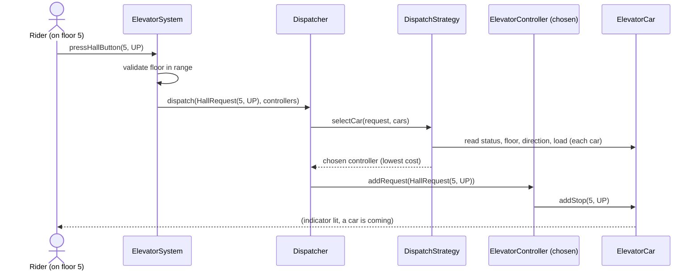
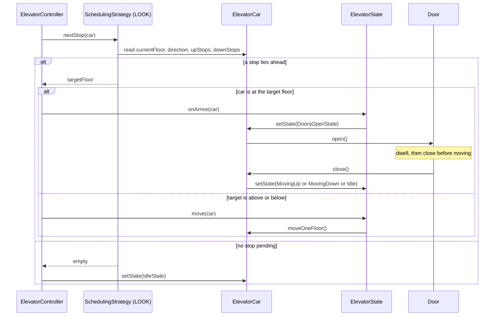
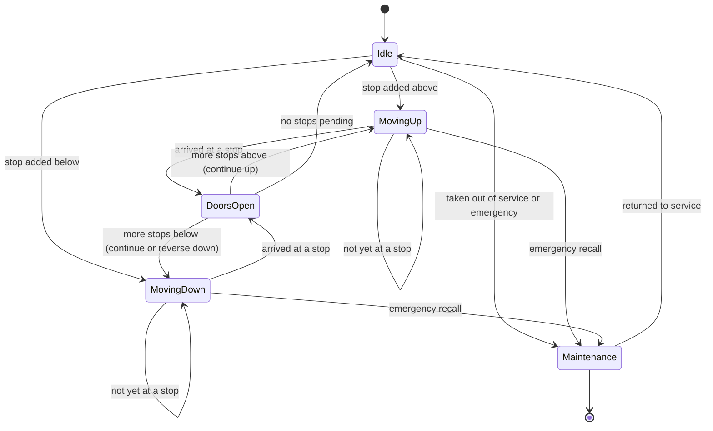
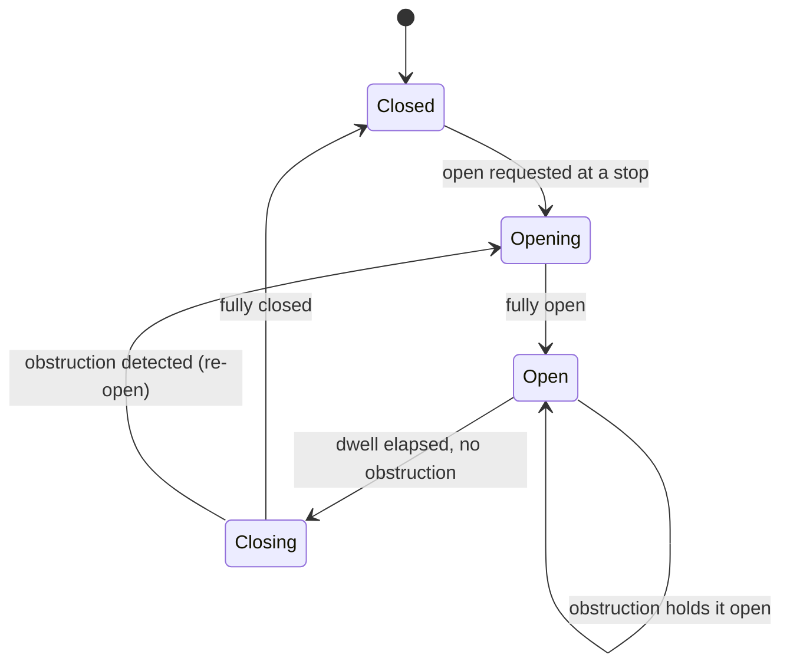

# 🛗 Low-Level Design: Elevator System

> A complete, interview-ready walkthrough of the classic **Elevator (Lift) System** design problem — from a blank whiteboard to a staff-level design that models each car as an explicit state machine, schedules requests with a real LOOK-style algorithm, dispatches across a bank of elevators with a cost function, and survives concurrency, hardware faults, and relentless follow-up questions.

The elevator is the interview problem that quietly tests three skills at once. First: **can you design a good scheduling algorithm?** A car that naively serves requests in the order they arrive will bounce from floor 2 to floor 18 to floor 3, wasting enormous time and energy; a car that sweeps in one direction serving everything on the way — the way real elevators actually behave — is dramatically better, and recognizing that is the heart of the problem. Second: **can you model a machine whose behavior depends entirely on what it is doing right now?** A car sitting idle behaves nothing like one moving up, which behaves nothing like one whose doors are open loading passengers. Third: **can you coordinate a *fleet* of these machines** so that when someone presses "up" on the 5th floor, the *right* car is chosen — not every idle car racing to the same hall call. Candidates who reach for a swamp of boolean flags (`isMoving`, `doorsOpen`, `goingUp`) and a first-come-first-served queue produce jerky, inefficient elevators full of edge-case bugs. Candidates who recognize the car as a *state machine* driven by a *pluggable scheduling strategy*, coordinated by a *dispatcher* that picks the best car, write clean, extensible, efficient code. This guide walks the whole journey, escalating from the beginner's mental model to the SCAN/LOOK scheduling, dispatch cost functions, and distributed-control concerns a principal engineer raises in the closing minutes.

---

## 📋 Table of Contents

**Part I — Framing the Problem**

1. [Problem Statement](#1-problem-statement)
2. [Requirement Clarification & Assumptions](#2-requirement-clarification--assumptions)
3. [Functional & Non-Functional Requirements](#3-functional--non-functional-requirements)
4. [Core Concepts Being Tested](#4-core-concepts-being-tested)

**Part II — Modeling the Domain**

5. [Domain Model & Entities](#5-domain-model--entities)
6. [CRC Cards](#6-crc-cards)
7. [UML Class Diagram](#7-uml-class-diagram)
8. [Package Structure](#8-package-structure)

**Part III — Design Rationale**

9. [Design Decisions & Trade-offs](#9-design-decisions--trade-offs)
10. [Class-by-Class Deep Dive](#10-class-by-class-deep-dive)
11. [Design Patterns Applied](#11-design-patterns-applied)
12. [SOLID Principles Mapping](#12-solid-principles-mapping)

**Part IV — Behavior & Diagrams**

13. [Sequence Diagram](#13-sequence-diagram)
14. [State Diagram](#14-state-diagram)

**Part V — The Implementation**

15. [Complete Java Implementation](#15-complete-java-implementation)
16. [Execution Flow & Code Walkthrough](#16-execution-flow--code-walkthrough)

**Part VI — Engineering Depth**

17. [Complexity Analysis](#17-complexity-analysis)
18. [Thread Safety & Concurrency](#18-thread-safety--concurrency)
19. [Error Handling & Validation](#19-error-handling--validation)
20. [Scalability Discussion](#20-scalability-discussion)
21. [Alternative Designs & Trade-offs](#21-alternative-designs--trade-offs)

**Part VII — Interview Mastery**

22. [Common FAANG Follow-up Questions (L4 → L6)](#22-common-faang-follow-up-questions-l4--l6)
23. [Common Design Mistakes](#23-common-design-mistakes)
24. [Testing Strategy](#24-testing-strategy)
25. [FAANG Q&A Section](#25-faang-qa-section)
26. [STAR Behavioral Questions](#26-star-behavioral-questions)
27. [⚡ Quick Revision Cheat Sheet](#27--quick-revision-cheat-sheet)

---

## 1. Problem Statement

Design the software that controls an **elevator system** in a building. A person waiting on a floor presses a **hall button** — "up" or "down" — to request a ride. The system picks an elevator to serve that request and sends it to the floor. Once inside, the passenger presses a **car button** for their destination floor. The elevator moves in a direction, stopping at floors that have pending requests along the way, opening its doors to let people on and off, then continuing. When there is nothing left to do, it goes idle (or returns to a designated parking floor). A typical building has *several* elevators sharing the work, so the system must also decide *which* car answers each hall call.

The system coordinates several moving parts — the **cars** themselves (each a small machine with a motor, doors, and a panel of buttons), the **hall panels** on every floor, and a **dispatcher/controller** brain that assigns requests to cars and drives each car's motion. At every step things can go wrong: a door sensor that reports an obstruction, a request for a floor the car doesn't serve, an overloaded car, or a car taken out of service for maintenance. The system must keep every passenger's request until it is served, move efficiently, and never do anything unsafe — like moving with the doors open.

<details>
<summary>📖 <b>In plain terms — what are we actually building?</b></summary>

Picture the elevators in an office lobby. You press the up-arrow, a car arrives, you step in and press "14," the doors close, and it carries you up, maybe pausing at floor 9 because someone there also wanted to go up. Our job is the *brains* behind that: the logic that remembers every button that's been pressed, decides which of the four elevators should answer your lobby call, figures out the smart order to visit floors so the car isn't bouncing up and down, opens and closes the doors safely, and parks the car when the building goes quiet. We are not building the motor, the steel cables, or the door motors — we are building the software objects and rules that decide, on every button press and every arrival at a floor, what each elevator should do next.

</details>

The deliverable in an interview is not a running product; it is a **clean object-oriented model** — the classes, their responsibilities, the *state machine* that governs a single car, the *scheduling algorithm* that orders the floor visits, and the *dispatch logic* that assigns hall calls to cars — plus a clear story for **how the system stays efficient, safe, and correct** under concurrency and hardware failure. Grading centers on the quality of your scheduling algorithm, how cleanly you model a car's states, how well the design absorbs new features (express elevators, VIP priority, more cars), and how rigorously you reason about safety invariants and multi-car coordination.

---

## 2. Requirement Clarification & Assumptions

The single biggest mistake candidates make is coding before scoping. A strong candidate spends the first few minutes turning the vague prompt into a bounded problem — and the elevator prompt hides several forks that reshape the whole design. Below is the clarification dialogue you should drive, framed as the questions to ask and the assumptions to lock in.

### 2.1 Actors

The people and systems that interact with the elevator define its surface area.

| Actor | Role in the system |
|-------|--------------------|
| **Passenger (in hall)** | Presses an up/down **hall button** on a floor to summon a car. |
| **Passenger (in car)** | Presses a numbered **car button** to select a destination floor. |
| **Elevator Car Hardware** | The physical cabin: motor (moves it), door motor (opens/closes), position sensor, load sensor. |
| **Maintenance Technician** | Takes a car in or out of service, runs diagnostics, resets faults. |
| **Building Fire/Safety System** | Signals emergency modes (fire recall — send all cars to the ground floor and hold). |

### 2.2 Key Clarifying Questions

Before modeling anything, resolve these with the interviewer. Each answer materially changes the design.

- **One elevator or many?** — A single car is a scheduling problem; a bank of cars adds a *dispatch* problem on top. *(Assumption: a **bank of N elevators** serving one building; we design for N and note that N=1 is the degenerate case.)*
- **How is a request expressed?** — Just a floor number, or a floor *and a direction*? This is the crucial one. *(Assumption: **two request kinds** — a **hall request** carries a floor *and* a direction (up/down); a **car request** carries only a destination floor. They are handled differently, which is the insight the problem tests.)*
- **What scheduling behavior?** — Serve in arrival order, nearest-first, or directional sweep? *(Assumption: a directional-sweep **LOOK** algorithm — keep going in the current direction serving all requests, then reverse — because that is how real, efficient elevators behave.)*
- **How are hall calls assigned to cars?** — First idle car, nearest car, or a cost function? *(Assumption: a pluggable **dispatch strategy**; the default assigns the car with the lowest estimated cost to reach the request, respecting its current direction.)*
- **Floors and denominations of movement?** — Basement floors? Express zones? *(Assumption: floors numbered over a contiguous range that may include negatives (basements); no express zones in v1, but the design leaves a seam.)*
- **What about capacity?** — Can a car refuse to stop because it's full? *(Assumption: each car has a max load/weight; when full it skips new hall pickups but still honors its car-button destinations.)*
- **Safety constraints?** — *(Assumption: a car never moves with doors open; doors never open between floors; an emergency/fire signal recalls all cars to a safe floor and holds them.)*
- **Concurrency model?** — Real time or simulated ticks? *(Assumption: each car runs on its own control loop/thread; buttons can be pressed from many threads at once, so the request stores must be thread-safe. We may drive it by a simulated clock in the demo.)*

### 2.3 Explicit Non-Goals

Naming what you will *not* build is a senior signal — it shows you can bound scope deliberately rather than by omission.

- No physical control of motors, cables, or door actuators — we assume clean interfaces (`Door`, `Motor`-like facades) to them.
- No real-time safety certification, braking curves, or acceleration physics — we model movement as floor-to-floor steps.
- No building-wide destination-dispatch kiosks (where you enter your floor in the lobby) in v1 — though we discuss it as an extension.
- No persistence/analytics of ride history, though we note where telemetry hooks in.
- No UI; interaction is through method calls (`pressHallButton`, `pressCarButton`).
- Single building; no cross-building or cloud coordination in v1.

<details>
<summary>📖 <b>Why spend so long on clarification?</b></summary>

The prompt "design an elevator" is intentionally thin, and two answers reshape the entire design. First, "is a request just a floor, or a floor *and a direction*?" — the moment you separate hall requests (floor + direction) from car requests (floor only), your scheduling algorithm gets much smarter, because a car heading up can serve an up-hall-call on the way but should ignore a down-hall-call until it reverses. Second, "one car or many?" — a bank of cars introduces the dispatch problem, which is where the most interesting senior discussion lives (how do you avoid all cars stampeding to the same call?). Asking these two questions upfront signals that you understand *what actually makes elevators hard*, and sets up every follow-up that follows.

</details>

---

## 3. Functional & Non-Functional Requirements

### 3.1 Functional Requirements (what the system *does*)

These are the concrete behaviors the system must support. In an interview, list them crisply — they become your checklist for the class design.

1. **Accept a hall request** — a passenger on a floor presses up or down; the system records the floor and direction and assigns a car to serve it.
2. **Accept a car request** — a passenger inside a car presses a destination floor; that car records it as a stop.
3. **Dispatch the best car** — for each hall request, choose which elevator should serve it (nearest / lowest-cost, respecting direction).
4. **Schedule stops efficiently** — each car serves its pending floors in a directional sweep (LOOK), not in arrival order.
5. **Move the car** — advance floor by floor toward the next target, tracking current floor and direction.
6. **Open and close doors** — at a target floor, stop, open doors, wait, then close before moving; never move with doors open.
7. **Go idle / park** — when a car has no pending requests, it becomes idle (optionally returning to a home floor).
8. **Handle capacity** — a full car skips new hall pickups but still serves its in-car destinations.
9. **Handle out-of-service and emergency** — a car can be taken offline for maintenance; a fire/emergency signal recalls all cars to a safe floor and holds them.

### 3.2 Non-Functional Requirements (how *well* it does it)

These are the qualities that make the design production-grade, and they are where staff-level discussion lives.

| Attribute | Requirement | Why it matters |
|-----------|-------------|----------------|
| **Efficiency** | Minimize average wait time and total travel; no needless direction reversals or backtracking. | The whole point of a scheduler — bad scheduling means long waits and wasted energy. |
| **Safety** | Never move with doors open; never open doors between floors; obey emergency recall unconditionally. | Elevators carry people; a safety violation is catastrophic, not just a bug. |
| **Fairness / no starvation** | Every request is eventually served; no floor waits forever because closer requests keep arriving. | A pure "nearest" policy can starve a distant floor indefinitely. |
| **Extensibility** | New scheduling algorithms, dispatch policies, car types (express, freight) slot in with minimal change. | Requirements *will* change; buildings differ. |
| **Concurrency-safety** | Button presses from many sources and per-car control loops must not corrupt shared request state. | Buttons are pressed concurrently across floors and cars. |
| **Availability** | One car going out of service must not stop the others; the fleet degrades gracefully. | A stuck car shouldn't strand the whole building. |
| **Responsiveness** | A newly pressed button that lies on a car's current path is served this sweep, not next. | Passengers expect a car heading their way to stop for them. |

<details>
<summary>📖 <b>Functional vs non-functional — the quick distinction</b></summary>

Functional requirements are the *verbs* — accept a request, dispatch a car, move it, open the doors. If a functional requirement fails, the elevator did the wrong thing (it ignored a button). Non-functional requirements are the *adverbs* — do it efficiently, do it safely, do it fairly. If a non-functional requirement fails, the elevator did the right thing but *badly* (it served everyone but bounced up and down wasting two minutes per rider, or it starved the 20th floor because the lobby kept calling). Interviewers push hardest on the non-functional ones — especially efficiency and safety — because a plain class diagram can't answer them; they force you to reason about the scheduling algorithm and the invariants.

</details>

---

## 4. Core Concepts Being Tested

This problem is a proxy for a bundle of skills. Knowing what's being measured helps you narrate your design to the *right* audience.

- **Scheduling algorithm design** — the marquee skill. Turning a set of pending floor requests into an efficient visiting order is a real algorithm (SCAN / LOOK, the same family used by disk I/O schedulers). Recognizing that arrival-order (FCFS) is bad and a directional sweep is good is *the* reason this problem is asked.
- **Finite state machines** — a single car moves through well-defined states (idle, moving up, moving down, doors open, maintenance), and each state permits only certain actions. The **State pattern** models this cleanly and prevents unsafe transitions like "move while doors open."
- **The dispatch / assignment problem** — with a bank of cars, choosing *which* car answers a hall call is an optimization with a cost function. This is the layer that separates single-elevator toy designs from realistic ones.
- **Object-oriented decomposition** — finding the right nouns (System, Controller, Car, Request, Button, Door) and giving each a single clear responsibility.
- **Design patterns in context** — State (car lifecycle), Strategy (pluggable scheduling and dispatch), Command/Observer (buttons as requests, arrival notifications), Singleton (the system), Factory (car/state creation) — applied where they *earn their place*.
- **Concurrency & safety-invariant reasoning** — cars run concurrently, buttons fire from many threads, and the "doors closed before moving" invariant must hold under all interleavings. Naming and protecting these is the senior signal.

Keep these in the back of your mind as you read on — each section below is, in part, a chance to demonstrate one or more of them.

---

## 5. Domain Model & Entities

Before any code, we identify the **nouns** in the problem and turn them into entities. Good domain modeling is the difference between a design that flexes and one that fights you.

### 5.1 The Entity Landscape

Here is the cast of the system, grouped by role:

- **ElevatorSystem** — the top-level context object (one per building). Owns the collection of `ElevatorController`s (one per car), the `Dispatcher`, and the floor range. It is the single entry point for external events: `pressHallButton(floor, direction)` and `pressCarButton(carId, floor)`. It is the *Facade* over the whole subsystem.
- **Dispatcher** — the brain that answers *"which car should serve this hall request?"*. It holds a `DispatchStrategy` and, given a `HallRequest` and the current state of every car, returns the chosen controller. This is the assignment layer.
- **ElevatorController** — owns exactly one `ElevatorCar` and drives it. It receives the requests assigned to its car, feeds them to a `SchedulingStrategy` to decide the next target floor, and runs the car's control loop (move a floor, check for a stop, open/close doors, repeat). It is the *context* in the car's State pattern.
- **ElevatorCar** — the state and hardware of one cabin: its `id`, `currentFloor`, `Direction`, current `ElevatorState`, its `Door`, its set of pending target floors, and its capacity/load. It carries no scheduling logic itself — that lives in the strategy — it holds *state*.
- **ElevatorState** — the abstraction governing car behavior. Each concrete state (`IdleState`, `MovingUpState`, `MovingDownState`, `DoorsOpenState`, `MaintenanceState`) knows how the car behaves in that state and which state it transitions to. Enforces safety (no move with doors open).
- **Request** — the abstraction of a pending demand. Two concrete kinds: **`HallRequest`** (a `floor` plus a `Direction` — "someone on floor 5 wants to go up") and **`CarRequest`** (a `destinationFloor` only — "the rider inside pressed 14"). The distinction drives the smart scheduling.
- **SchedulingStrategy** — the pluggable algorithm that, given a car's current floor, direction, and its set of pending stops, decides the **next floor to visit**. The default is `LookSchedulingStrategy` (directional sweep).
- **DispatchStrategy** — the pluggable algorithm that assigns a `HallRequest` to a car. The default `NearestCarDispatchStrategy` scores each car by a cost function (distance, whether the request is on its path, its load) and picks the lowest.
- **Door** — a thin state holder/facade over the physical door: `OPEN` / `CLOSED` / `OPENING` / `CLOSING`, with `open()`/`close()` and an obstruction check.
- **Button / HallPanel / CarPanel** — the input surfaces. A `HallButton` on a floor produces a `HallRequest`; a `CarButton` inside a car produces a `CarRequest`. Modeled as Command-like producers of requests.
- **Direction** — an enum: `UP`, `DOWN`, `IDLE`. The single most-used value in the whole design; it is what makes LOOK scheduling work.

### 5.2 Entity Relationships

The relationships are what make the model click:

- An **ElevatorSystem** *has one* **Dispatcher** and *has many* **ElevatorController**s (one per car).
- Each **ElevatorController** *has one* **ElevatorCar** and *has one* **SchedulingStrategy**; it *drives* the car through its states.
- Each **ElevatorCar** *has one* current **ElevatorState** (and knows the full set of states), *has one* **Door**, *has a* **Direction**, and *holds a set of* pending target floors (derived from the **Request**s assigned to it).
- The **Dispatcher** *uses a* **DispatchStrategy** to map a **HallRequest** to an **ElevatorController**.
- **HallButton**s produce **HallRequest**s (floor + direction); **CarButton**s produce **CarRequest**s (floor). Both funnel into the system.

A useful way to see the split: the **Dispatcher** answers *"which car?"* (a fleet-level, cross-car decision made once per hall call), while each **SchedulingStrategy** answers *"where does *my* car go next?"* (a per-car decision made repeatedly as the car runs). Keeping those two questions in two different objects is the cleanest decomposition of the problem, and stating it out loud is a strong signal.

<details>
<summary>📖 <b>Why two kinds of request instead of one?</b></summary>

It's tempting to model every button press as just "a request for floor N." But a hall button carries something a car button doesn't: a *direction*. When you press "up" on floor 5, you're telling the system you want to go higher — so a car already heading up can grab you on the way, while a car heading down should ignore you until it turns around. A car button ("take me to 14") has no direction of its own; the direction is implied by where the car currently is. Splitting `HallRequest` (floor + direction) from `CarRequest` (floor only) is what lets the scheduler make that distinction, and it's the modeling insight that separates a realistic elevator from a naive "queue of floor numbers."

</details>

### 5.3 Core Enumerations

Two small enums anchor the whole model:

- **`Direction`** — `UP`, `DOWN`, `IDLE`. The car's current travel direction and the direction attached to a hall request.
- **`ElevatorStatus`** *(coarse status for reporting/dispatch)* — `IDLE`, `MOVING`, `DOORS_OPEN`, `OUT_OF_SERVICE`. A quick summary the dispatcher reads without knowing the concrete `State` class.
- **`DoorState`** — `OPEN`, `CLOSED`, `OPENING`, `CLOSING`.

---

## 6. CRC Cards

CRC (Class–Responsibility–Collaborator) cards are a lightweight way to pin down *what each class is responsible for* and *who it talks to*, before drowning in fields and methods. They force single-responsibility thinking, which interviewers reward.

| Class | Responsibilities | Collaborators |
|-------|------------------|---------------|
| **ElevatorSystem** | Be the single entry point; route hall presses to the dispatcher and car presses to the right controller; own the fleet. | Dispatcher, ElevatorController |
| **Dispatcher** | Choose which car serves a hall request via a strategy; hand the request to that controller. | DispatchStrategy, ElevatorController, HallRequest |
| **DispatchStrategy** *(interface)* | Score/select the best car for a hall request. | ElevatorCar (reads state) |
| **ElevatorController** | Own and drive one car; accept assigned requests; ask the scheduler for the next target; run the move/stop/door loop. | ElevatorCar, SchedulingStrategy, Request |
| **SchedulingStrategy** *(interface)* | Given current floor, direction, and pending stops, return the next floor to visit. | ElevatorCar (reads), Direction |
| **ElevatorCar** | Hold car state (floor, direction, status, pending stops, load); expose safe mutations; delegate behavior to its state. | ElevatorState, Door, Request |
| **ElevatorState** *(interface)* | Define how the car behaves in a given state and drive safe transitions. | ElevatorCar |
| **Request** *(abstract)* | Represent a pending demand (a target floor). | — |
| **HallRequest** | Carry a floor **and** a direction (a summons from a landing). | Direction |
| **CarRequest** | Carry a destination floor (a rider's in-car selection). | — |
| **Door** | Track and change door state; report obstruction; refuse unsafe transitions. | — |
| **HallButton / CarButton** | Turn a physical press into a `HallRequest` / `CarRequest`. | Request, ElevatorSystem |

Notice how each card has a *tight* set of responsibilities. The moment a card starts listing "moves the car, chooses the car, *and* schedules the floors," that's the classic "god controller" smell — the dispatch decision, the scheduling decision, and the state machine should live in three separate places.

---

## 7. UML Class Diagram

Here is the full static structure in ASCII, the way you'd sketch it on a whiteboard. Abstract types are marked `«interface»`. The three pluggable seams — **State** (car behavior), **SchedulingStrategy** (next floor), and **DispatchStrategy** (which car) — are deliberately front and center, because they are what makes the design flex.

```
    ┌───────────────────────────────────────────────┐
    │ ElevatorSystem                    «singleton»  │
    ├───────────────────────────────────────────────┤
    │ - controllers: List<ElevatorController>        │
    │ - dispatcher: Dispatcher                       │
    │ - minFloor: int / maxFloor: int                │
    ├───────────────────────────────────────────────┤
    │ + pressHallButton(floor, dir: Direction): void │
    │ + pressCarButton(carId, floor: int): void      │
    │ + step(): void        // advance simulation    │
    └───────┬───────────────────────────┬────────────┘
            │ owns                       │ uses
            ▼                            ▼
┌──────────────────────────┐   ┌─────────────────────────────────┐
│ Dispatcher               │   │ «interface» DispatchStrategy    │
├──────────────────────────┤   ├─────────────────────────────────┤
│ - strategy: DispatchStrategy──▶│ + selectCar(req: HallRequest,  │
├──────────────────────────┤   │    controllers): ElevatorController│
│ + dispatch(req,          │   │                                 │
│    controllers): void    │   └───────────────┬─────────────────┘
└──────────────────────────┘                   │ implemented by
                                                ▼
                                  ┌──────────────────────────────┐
                                  │ NearestCarDispatchStrategy   │
                                  │ (cost = distance + direction │
                                  │  penalty + load penalty)     │
                                  └──────────────────────────────┘

    ┌─────────────────────────────────────────────┐
    │ ElevatorController                          │
    ├─────────────────────────────────────────────┤
    │ - car: ElevatorCar                          │
    │ - scheduler: SchedulingStrategy ───────┐    │
    ├─────────────────────────────────────────┼───┤
    │ + addRequest(r: Request): void          │   │
    │ + step(): void   // move/stop/doors     │   │
    │ + getCar(): ElevatorCar                 │   │
    └───────┬─────────────────────────────────┼───┘
            │ owns                             ▼
            │                    ┌───────────────────────────────┐
            │                    │ «interface» SchedulingStrategy│
            │                    ├───────────────────────────────┤
            │                    │ + nextStop(car): OptionalInt  │
            │                    └───────────────┬───────────────┘
            │                                    │ implemented by
            ▼                                    ▼
┌───────────────────────────────┐   ┌───────────────────────────┐
│ ElevatorCar                   │   │ LookSchedulingStrategy     │
├───────────────────────────────┤   │ (directional sweep: serve  │
│ - id: int                     │   │  all stops one way, then   │
│ - currentFloor: int           │   │  reverse)                  │
│ - direction: Direction        │   └───────────────────────────┘
│ - state: ElevatorState        │
│ - door: Door                  │      ┌──────────────────────────┐
│ - upStops: TreeSet<Integer>   │      │ Door                     │
│ - downStops: TreeSet<Integer> │      ├──────────────────────────┤
│ - maxLoad: int / load: int    │─────▶│ - state: DoorState       │
├───────────────────────────────┤ owns ├──────────────────────────┤
│ + addStop(floor, dir): void   │      │ + open() / close()       │
│ + moveOneFloor(): void        │      │ + isObstructed(): boolean│
│ + setState(s): void           │      └──────────────────────────┘
│ + status(): ElevatorStatus    │
└───────┬───────────────────────┘
        │ current behavior delegated to
        ▼
┌───────────────────────────────────────────────────┐
│ «interface» ElevatorState                          │
├───────────────────────────────────────────────────┤
│ + move(car: ElevatorCar): void                     │
│ + onArrive(car: ElevatorCar): void                 │
│ + openDoors(car) / closeDoors(car): void           │
└───────────────┬───────────────────────────────────┘
                │ implemented by
   ┌────────┬───┴────────┬──────────────┬─────────────────┐
   ▼        ▼            ▼              ▼                 ▼
┌──────┐┌──────────┐┌────────────┐┌────────────┐┌───────────────┐
│Idle  ││MovingUp  ││MovingDown  ││DoorsOpen   ││Maintenance    │
│State ││State     ││State       ││State       ││State          │
└──────┘└──────────┘└────────────┘└────────────┘└───────────────┘

        Requests feeding the system ↓

┌──────────────────────────────┐
│ «abstract» Request           │
├──────────────────────────────┤
│ # targetFloor: int           │
│ + getTargetFloor(): int      │
└───────────────┬──────────────┘
      ┌─────────┴──────────┐
      ▼                    ▼
┌──────────────────┐  ┌──────────────────┐
│ HallRequest      │  │ CarRequest       │
│ - direction:     │  │ (destination     │
│   Direction      │  │  floor only)     │
└──────────────────┘  └──────────────────┘
```

The shape to notice: `ElevatorController` holds one `ElevatorCar` and one `SchedulingStrategy`, and on every `step()` it asks the scheduler *"where next?"* then tells the car to move or open doors accordingly. The `ElevatorCar` keeps its pending stops split into `upStops` and `downStops` (two sorted sets) — that split, plus the current `direction`, is exactly what the LOOK algorithm needs to sweep efficiently. Above the cars, the `Dispatcher` uses a `DispatchStrategy` to answer the separate "which car?" question. Three independent seams (state, scheduling, dispatch), three independent axes of change.

---

## 8. Package Structure

A clean package layout communicates the architecture at a glance and enforces dependency direction. Here's a pragmatic layout.

```
com.elevator
│
├── model                        // Entities & value objects
│   ├── ElevatorCar.java
│   ├── Direction.java           //   enum: UP, DOWN, IDLE
│   ├── ElevatorStatus.java      //   enum: IDLE, MOVING, DOORS_OPEN, OUT_OF_SERVICE
│   ├── Door.java
│   ├── DoorState.java           //   enum: OPEN, CLOSED, OPENING, CLOSING
│   └── request
│       ├── Request.java         //   abstract base
│       ├── HallRequest.java     //   floor + direction
│       └── CarRequest.java      //   destination floor
│
├── state                        // State pattern — per-car behavioral core
│   ├── ElevatorState.java       //   interface
│   ├── IdleState.java
│   ├── MovingUpState.java
│   ├── MovingDownState.java
│   ├── DoorsOpenState.java
│   └── MaintenanceState.java
│
├── scheduling                   // "Where does THIS car go next?" (Strategy)
│   ├── SchedulingStrategy.java  //   interface
│   ├── LookSchedulingStrategy.java
│   └── FcfsSchedulingStrategy.java   // naive baseline for comparison
│
├── dispatch                     // "WHICH car serves this hall call?" (Strategy)
│   ├── Dispatcher.java
│   ├── DispatchStrategy.java    //   interface
│   ├── NearestCarDispatchStrategy.java
│   └── RoundRobinDispatchStrategy.java  // naive baseline
│
├── control
│   └── ElevatorController.java  //   owns + drives one car (State context)
│
├── exception                    // Domain exceptions
│   ├── InvalidFloorException.java
│   └── ElevatorOutOfServiceException.java
│
├── ElevatorSystem.java          // The facade / orchestrator (one per building)
│
└── Demo.java                    // Runnable simulation
```

The guiding rule: **`model` depends on nothing; everything can depend on `model`.** The scheduling and dispatch packages depend only on the model (they *read* car state), the state package depends on the car, and `ElevatorController` wires a car to a scheduler. `ElevatorSystem` depends on the *interfaces* `DispatchStrategy` and `SchedulingStrategy`, never their concretes, so swapping algorithms never touches the orchestration. This keeps the two "brains" — scheduling and dispatch — independently testable and swappable.

---

## 9. Design Decisions & Trade-offs

Every design is a sequence of forks in the road. Here are the ones that matter for the elevator, each stated as the question, the options, and the choice with its justification.

### 9.1 Scheduling — FCFS, nearest-stop, or a directional sweep (LOOK)?

The naive approach serves requests in arrival order (FCFS): a call to 18 followed by a call to 3 sends the car up to 18, then all the way down to 3, even if it passed floor 3 on the way up. It is simple and starvation-free but terribly inefficient. A "nearest-stop" greedy policy fixes the bouncing but can *starve* a distant floor if nearby requests keep arriving. We choose **LOOK** (a bounded SCAN): the car keeps moving in its current direction, serving every stop along the way, until there are no more requests ahead; then it reverses and does the same. This is exactly how real elevators behave, it eliminates backtracking, and it is naturally fair — a distant floor is guaranteed service on the current or next sweep. The cost is slightly more state (stops split by direction); the payoff is efficiency *and* bounded waiting. We keep it behind a `SchedulingStrategy` interface so FCFS or a "shortest-seek" variant can be swapped in for comparison.

### 9.2 Modeling car behavior — State pattern or boolean flags?

The naive approach tracks `isMoving`, `doorsOpen`, `goingUp`, `inMaintenance` as booleans and branches on their combinations. With four booleans there are sixteen nominal combinations, most of them illegal (moving *and* doors open), and nothing stops the code from reaching them. We model each car condition as a polymorphic **`ElevatorState`** object that implements the car's actions (`move`, `openDoors`, `closeDoors`, `onArrive`) *for that state*. `MovingUpState.openDoors()` simply refuses; `DoorsOpenState.move()` refuses. The unsafe "move with doors open" transition becomes structurally impossible rather than a runtime check you might forget. The cost is more classes; the benefit is safety by construction and easy addition of states (an `EmergencyState`).

### 9.3 One brain or two — should scheduling and dispatch be the same object?

It is tempting to have one "controller" decide both which car answers a call and where each car goes. We deliberately **split them**: the fleet-level **`Dispatcher`** answers "which car?" once per hall call, and each car's **`SchedulingStrategy`** answers "where next?" repeatedly as it runs. They change for different reasons and at different rates, so they are two interfaces. This separation lets you tune dispatch (nearest-car vs. load-balanced) without touching the sweep logic, and vice versa — the essence of Single Responsibility applied to the two hard problems.

### 9.4 Hall request vs. car request — one type or two?

Modeling every press as "a request for floor N" throws away the direction a hall button carries. We use **two request types**: `HallRequest` (floor + direction) and `CarRequest` (floor only). This lets the scheduler decide that a car heading up should serve up-hall-calls on the way but defer down-hall-calls until it reverses — the behavior that makes an elevator feel smart. The small extra modeling cost buys the entire efficiency story.

### 9.5 How is a car driven — its own thread or a simulated tick?

Real cars run continuously and independently, which argues for one thread per car. For an interview and a deterministic demo we drive each controller by a `step()` method advanced by a simulated clock, and note that in production each `ElevatorController` runs its own loop. This keeps the demo reproducible and testable while the design remains honestly concurrent — the request stores are thread-safe so real threads are a drop-in.

<details>
<summary>📖 <b>Why interviewers love the "trade-off" framing</b></summary>

Junior candidates present one design as "the answer." Senior candidates present a design *and the roads not taken*, because real engineering is choosing under constraints. When you say "I used LOOK for scheduling, but a pure nearest-stop policy would starve a far floor under steady lobby traffic, so I sweep directionally to guarantee fairness — and I kept it behind a strategy interface so I can A/B it against FCFS," you show you understand the limits of your own choice. That awareness — not the algorithm name — is what moves you from L4 to L5/L6. Narrate the fork, not just the destination.

</details>

---

## 10. Class-by-Class Deep Dive

With the structure in view, here is what each major class is *for* and the reasoning behind its shape. The full code is in Section 15; this is the tour.

### 10.1 `ElevatorSystem` (facade / orchestrator)

The `ElevatorSystem` is the single public entry point and the Facade over the whole subsystem. It owns the list of `ElevatorController`s and the `Dispatcher`, and knows the building's floor range. Its two input methods say it all: `pressHallButton(floor, direction)` builds a `HallRequest` and hands it to the `Dispatcher` (which picks a car), while `pressCarButton(carId, floor)` builds a `CarRequest` and routes it straight to that car's controller. It also exposes `step()` to advance the simulation. It contains *no* scheduling or dispatch logic — only wiring and validation.

### 10.2 `Dispatcher` and `DispatchStrategy`

`Dispatcher` answers the fleet-level question "which car should serve this hall call?" It delegates the actual choice to a `DispatchStrategy`. The default `NearestCarDispatchStrategy` scores every car with a cost function — the base cost is the number of floors away, with a penalty if the car is heading *away* from the request (it must finish its sweep and come back) and a penalty if the car is heavily loaded — and returns the lowest-cost controller. Once chosen, the request is added to that car's pending stops. Because dispatch is a strategy, a load-balancing or zoning policy is a swap, not a rewrite.

### 10.3 `ElevatorController` (the State context)

`ElevatorController` owns exactly one `ElevatorCar` and one `SchedulingStrategy`, and it is the Context in the State pattern. `addRequest(Request)` registers a new stop on its car. `step()` is the heartbeat: it asks the scheduler for the next target floor, then tells the car (through its current state) to move one floor toward it, or — if the car has arrived at a stop — to open its doors, let time pass, and close them before resuming. The controller holds the *policy* (drive toward the next stop); the car's *state* holds the *rules* (what's legal right now).

### 10.4 `ElevatorCar` and `Door`

`ElevatorCar` holds all the mutable state of one cabin: `id`, `currentFloor`, `direction`, the current `ElevatorState`, its `Door`, its pending stops (kept as two `TreeSet<Integer>` — `upStops` and `downStops`, so "next stop above" and "next stop below" are O(log n) lookups), and its `load`/`maxLoad`. It exposes safe mutators (`addStop`, `moveOneFloor`, `setState`) and a coarse `status()` for the dispatcher. It delegates behavior to its state and never decides scheduling itself. `Door` is a small state holder — `OPEN`/`CLOSED`/`OPENING`/`CLOSING` — with `open()`, `close()`, and `isObstructed()`; it refuses to report closed while an obstruction is present, which is what lets the car safely gate movement on "doors fully closed."

### 10.5 `ElevatorState` and its concretes

`ElevatorState` declares the car's actions. `IdleState` sits still until a stop is added, then transitions to `MovingUpState` or `MovingDownState` based on where the target is. `MovingUpState`/`MovingDownState` advance the car one floor per `move`, and on `onArrive` at a target floor transition to `DoorsOpenState`. `DoorsOpenState` opens the door, holds for a dwell time, closes it, and then either continues in the same direction, reverses (LOOK), or drops to `IdleState` if nothing is pending. `MaintenanceState` rejects all normal actions and is entered when a car is taken out of service or on emergency recall. Each state permits only its safe actions, so the safety invariants are enforced by the type system, not by scattered `if`s.

### 10.6 `Request`, `HallRequest`, `CarRequest`

`Request` is the abstract demand carrying a `targetFloor`. `HallRequest` adds a `Direction` — it is a summons from a landing that knows which way the rider wants to go. `CarRequest` carries only the destination the in-car rider selected. The two are handled differently: a hall request is routed through the dispatcher (a car must be *chosen*), while a car request goes straight to the car the rider is already in. This split is the modeling heart of the design.

### 10.7 `SchedulingStrategy` and `LookSchedulingStrategy`

`SchedulingStrategy.nextStop(car)` returns the floor the car should head to next, or empty if idle. `LookSchedulingStrategy` implements the directional sweep: if the car is going up, return the nearest pending stop *above* the current floor; if there is none, reverse and return the nearest stop *below*; symmetric when going down. Because the car keeps its stops in direction-split sorted sets, "nearest above" is just `upStops.ceiling(currentFloor)`. Keeping this behind the interface means the naive `FcfsSchedulingStrategy` (serve the oldest request first) can be dropped in to demonstrate *why* LOOK is better.

---

## 11. Design Patterns Applied

Patterns should appear because the problem *demands* them, not to decorate the design. Here's where each one earns its place.

| Pattern | Where it's used | What it buys us |
|---------|-----------------|-----------------|
| **State** | `ElevatorState` and its five concretes | The per-car behavioral core. Each state handles actions locally; unsafe transitions (move with doors open) are impossible; adding a state is a new class. |
| **Strategy** | `SchedulingStrategy` (next floor) *and* `DispatchStrategy` (which car) | Two independent algorithms become swappable. LOOK vs. FCFS, nearest-car vs. round-robin — A/B without touching callers. |
| **Facade** | `ElevatorSystem` | One clean entry point hides the fleet, the dispatcher, and the state machines from the outside world. |
| **Singleton** | `ElevatorSystem` (one per building) | Models the single building-wide controller — injected, never static global state. |
| **Factory** | Creating states / cars / controllers at wiring time | Centralizes construction so callers don't `new` concretes and the state instances are shared cleanly. |
| **Command** *(light)* | Buttons producing `Request` objects | A press is reified into a first-class request that can be queued, logged, and replayed. |
| **Observer** *(optional)* | Car arrival / fault notifications to displays and monitoring | Floor indicators and the ops dashboard subscribe to car events without the car knowing them. |

<details>
<summary>📖 <b>A note on not over-patterning</b></summary>

It's tempting to cram in every Gang-of-Four pattern to look sophisticated, but an interviewer reads that as insecurity. State here is unarguable — a car genuinely is a machine with per-condition rules and hard safety transitions. Two Strategies are justified because the elevator genuinely has *two* separable algorithms (which car, and where next) that change independently. But forcing, say, a Visitor over request types or an Abstract Factory where a plain factory suffices is a red flag. The skill is knowing when a pattern *removes* an "if I change X I must edit Y" coupling versus when it merely adds ceremony. Reach for a pattern when it deletes coupling, not to fill a checklist.

</details>

For the deeper theory behind each of these, this guide pairs naturally with the individual State, Strategy, Facade, Singleton, Factory, Command, and Observer pattern guides.

---

## 12. SOLID Principles Mapping

SOLID isn't an abstract checklist here — each principle shows up concretely in the design.

**S — Single Responsibility.** Each class has one reason to change: `Dispatcher` owns car selection, each `SchedulingStrategy` owns the sweep order, `ElevatorController` owns driving the loop, each `ElevatorState` owns the rules for one condition, `Door` owns door state. A change to the sweep algorithm never touches dispatch; a new door-obstruction rule never touches scheduling. The clean split of the *two* hard problems into `Dispatcher` and `SchedulingStrategy` is SRP's headline win here.

**O — Open/Closed.** The system is *open to extension, closed to modification*. A new scheduling algorithm is a new `SchedulingStrategy`; a new dispatch policy is a new `DispatchStrategy`; a new car condition is a new `ElevatorState`; an express-elevator variant subclasses or configures the car. No existing class is edited. This is the single most important SOLID payoff, delivered by the State and two-Strategy structure.

**L — Liskov Substitution.** Any `ElevatorState` works wherever a state is expected — the controller never asks "which state am I?"; it just delegates. Any `SchedulingStrategy` or `DispatchStrategy` satisfies the same contract, which is exactly what makes swapping LOOK for FCFS, or nearest-car for round-robin, safe and testable.

**I — Interface Segregation.** `SchedulingStrategy` exposes just `nextStop`; `DispatchStrategy` exposes just `selectCar`; `ElevatorState` exposes only the car actions. No client is forced to depend on methods it doesn't use — the dispatcher never sees door internals, the scheduler never sees the fleet.

**D — Dependency Inversion.** `ElevatorSystem` and `ElevatorController` depend on the *abstractions* `DispatchStrategy` and `SchedulingStrategy`, injected at construction, not on concrete algorithms. High-level orchestration doesn't know or care whether scheduling is LOOK or FCFS, or whether dispatch is nearest-car or round-robin. That inversion is what makes the whole design configurable and unit-testable.

<details>
<summary>📖 <b>The one-line SOLID gut check</b></summary>

If you can swap in a brand-new scheduling algorithm, a new dispatch policy, a new car state (say emergency), and an express-car variant *without editing a single existing class* — only adding new ones — your design honors Open/Closed and Dependency Inversion, and the rest of SOLID usually falls into place. That "add, don't edit" test is the fastest way to sanity-check your elevator design under interview pressure.

</details>

---

## 13. Sequence Diagram

Two flows carry the design: a **hall call being dispatched and served** (the fleet-level path), and a **car's step loop** (the per-car path where scheduling and the state machine meet). Here they are as message sequences.

### 13.1 Hall Call: Press, Dispatch, and Assign



### 13.2 Car Step Loop: Schedule, Move, and Open Doors



<details>
<summary>📖 <b>Reading the two flows together</b></summary>

The two diagrams show the design's cleanest idea: two questions answered in two places. The first flow is fired *once* when a hall button is pressed — the dispatcher reads a snapshot of every car and picks the best one, then drops the request onto that car's pending stops and is done. The second flow runs *over and over* as that car lives its life — every tick, the scheduler looks only at *this* car's own stops and current direction to decide the next floor, and the state machine makes sure the car only does safe things (it won't move until the doors report closed). Notice the scheduler never talks to other cars, and the dispatcher never drives motion — that separation is the whole architecture in miniature.

</details>

---

## 14. State Diagram

A single elevator car is a textbook finite state machine. Modeling it explicitly makes unsafe transitions (moving with doors open, opening doors between floors) impossible by construction.

### 14.1 Elevator Car Lifecycle



The beauty of this diagram is that every arrow is an action a concrete state permits, and every *missing* arrow is an action that state simply rejects. There is no arrow from `MovingUp` to `DoorsOpen` *except* through arriving at a stop, and no state lets the car move while the door is open — the unsafe transition is structural, not a runtime check you might forget. The `DoorsOpen` state is where the LOOK decision lands: after closing, the car continues in its current direction if stops remain ahead, reverses if not, or goes idle.

### 14.2 Door State Lifecycle



The `Closing --> Opening` arrow is the one that separates a toy design from a real one: if a sensor detects an obstruction (a bag, an arm) while closing, the door must re-open rather than crush it. The car gates all movement on the door reaching `Closed`, so any obstruction that keeps the door out of `Closed` also keeps the car from moving — the safety invariant falls out of the state machine for free.

---

## 15. Complete Java Implementation

The implementation below is complete and self-contained: drop the classes into a project (or a single file for a quick run), execute `Demo`, and watch a full multi-car simulation play out tick by tick. It is organized bottom-up — enums and requests first, then the door and car, then the state machine, then the two strategy families, then the controller, dispatcher, and finally the `ElevatorSystem` facade that wires it all together. Every class name, field, and method signature here matches the diagrams in Sections 7, 13, and 14 exactly.

<details>
<summary>💻 <b>1. Enums & the Request hierarchy</b></summary>

```java
package com.elevator.model;

// ---- Enumerations -------------------------------------------------

public enum Direction { UP, DOWN, IDLE }

public enum ElevatorStatus { IDLE, MOVING, DOORS_OPEN, OUT_OF_SERVICE }

public enum DoorState { OPEN, CLOSED, OPENING, CLOSING }
```

```java
package com.elevator.model.request;

import com.elevator.model.Direction;

/** A pending demand: some floor the car must eventually reach. */
public abstract class Request {
    protected final int targetFloor;
    protected final long createdAt;

    protected Request(int targetFloor) {
        this.targetFloor = targetFloor;
        this.createdAt = System.nanoTime();   // used for fairness / aging if needed
    }
    public int getTargetFloor() { return targetFloor; }
    public long getCreatedAt()  { return createdAt; }
}

/** A summons from a landing: carries a floor AND a direction (up/down). */
public final class HallRequest extends Request {
    private final Direction direction;
    public HallRequest(int floor, Direction direction) {
        super(floor);
        if (direction != Direction.UP && direction != Direction.DOWN)
            throw new IllegalArgumentException("Hall direction must be UP or DOWN");
        this.direction = direction;
    }
    public Direction getDirection() { return direction; }
    @Override public String toString() { return "Hall(" + targetFloor + "," + direction + ")"; }
}

/** A rider's in-car selection: destination floor only, no direction. */
public final class CarRequest extends Request {
    public CarRequest(int destinationFloor) { super(destinationFloor); }
    @Override public String toString() { return "Car(" + targetFloor + ")"; }
}
```

</details>

<details>
<summary>💻 <b>2. Door & domain exceptions</b></summary>

```java
package com.elevator.model;

/**
 * Thin facade over the physical door. Enforces the one door safety rule:
 * a close request while obstructed re-opens instead of closing.
 */
public class Door {
    private DoorState state = DoorState.CLOSED;
    private boolean obstructed = false;

    public synchronized void open() {
        state = DoorState.OPENING;
        state = DoorState.OPEN;          // hardware would run the motor between these
    }

    public synchronized void close() {
        if (obstructed) {                // SAFETY: never close on an obstruction
            state = DoorState.OPEN;
            return;
        }
        state = DoorState.CLOSING;
        state = DoorState.CLOSED;
    }

    public synchronized boolean isClosed()      { return state == DoorState.CLOSED; }
    public synchronized boolean isObstructed()  { return obstructed; }
    public synchronized void setObstructed(boolean v) { this.obstructed = v; }
    public synchronized DoorState getState()    { return state; }
}
```

```java
package com.elevator.exception;

public class InvalidFloorException extends RuntimeException {
    public InvalidFloorException(String message) { super(message); }
}

public class ElevatorOutOfServiceException extends RuntimeException {
    public ElevatorOutOfServiceException(String message) { super(message); }
}
```

</details>

<details>
<summary>💻 <b>3. ElevatorCar — holds state, delegates behavior</b></summary>

```java
package com.elevator.model;

import com.elevator.exception.*;
import com.elevator.state.*;
import java.util.TreeSet;

/**
 * The state of one cabin. It holds pending stops split by travel direction
 * (two sorted sets) so the LOOK scheduler can ask for "nearest stop above/below"
 * in O(log n). It delegates all behavior to its current ElevatorState.
 */
public class ElevatorCar {
    private final int id;
    private final int minFloor, maxFloor;
    private int currentFloor;
    private Direction direction = Direction.IDLE;
    private ElevatorState state;
    private final Door door = new Door();

    private final TreeSet<Integer> upStops   = new TreeSet<>();
    private final TreeSet<Integer> downStops = new TreeSet<>();

    private final int maxLoad;
    private int load = 0;

    public ElevatorCar(int id, int minFloor, int maxFloor, int maxLoad) {
        this.id = id;
        this.minFloor = minFloor;
        this.maxFloor = maxFloor;
        this.currentFloor = minFloor;
        this.maxLoad = maxLoad;
        this.state = new IdleState();
    }

    /** Register a new stop. reqDir refines a same-floor hall request's set. */
    public synchronized void addStop(int floor, Direction reqDir) {
        if (floor < minFloor || floor > maxFloor)
            throw new InvalidFloorException("Floor " + floor + " out of range");
        if (state instanceof MaintenanceState)
            throw new ElevatorOutOfServiceException("Car " + id + " is out of service");

        if (floor > currentFloor)      upStops.add(floor);
        else if (floor < currentFloor) downStops.add(floor);
        else { // same floor: honor requested travel direction
            if (reqDir == Direction.DOWN) downStops.add(floor); else upStops.add(floor);
        }

        if (direction == Direction.IDLE) {          // kick an idle car into motion
            direction = (floor >= currentFloor) ? Direction.UP : Direction.DOWN;
            setState(direction == Direction.UP ? new MovingUpState() : new MovingDownState());
        }
    }

    /** Advance exactly one floor. Gated on doors being fully closed. */
    public synchronized void moveOneFloor() {
        if (!door.isClosed())
            throw new IllegalStateException("SAFETY: cannot move with doors not closed");
        if (direction == Direction.UP && currentFloor < maxFloor)        currentFloor++;
        else if (direction == Direction.DOWN && currentFloor > minFloor) currentFloor--;
    }

    public synchronized void clearStopAtCurrentFloor() {
        upStops.remove(currentFloor);
        downStops.remove(currentFloor);
    }

    public synchronized boolean hasStops()          { return !upStops.isEmpty() || !downStops.isEmpty(); }
    public synchronized boolean hasStopAt(int f)     { return upStops.contains(f) || downStops.contains(f); }

    // --- accessors used by strategies & controller ---
    public synchronized int getCurrentFloor()        { return currentFloor; }
    public synchronized Direction getDirection()     { return direction; }
    public synchronized void setDirection(Direction d){ this.direction = d; }
    public int getId()                               { return id; }
    public Door getDoor()                            { return door; }
    public synchronized TreeSet<Integer> getUpStops()  { return upStops; }
    public synchronized TreeSet<Integer> getDownStops(){ return downStops; }
    public int getMaxLoad()                          { return maxLoad; }
    public synchronized int getLoad()                { return load; }
    public synchronized void setLoad(int l)          { this.load = Math.max(0, Math.min(maxLoad, l)); }
    public synchronized boolean isFull()             { return load >= maxLoad; }
    public synchronized ElevatorState getState()     { return state; }
    public synchronized void setState(ElevatorState s){ this.state = s; }

    public synchronized ElevatorStatus status() {
        if (state instanceof MaintenanceState) return ElevatorStatus.OUT_OF_SERVICE;
        if (state instanceof DoorsOpenState)   return ElevatorStatus.DOORS_OPEN;
        if (state instanceof IdleState)        return ElevatorStatus.IDLE;
        return ElevatorStatus.MOVING;
    }
}
```

</details>

<details>
<summary>💻 <b>4. State pattern — the per-car behavioral core</b></summary>

```java
package com.elevator.state;

import com.elevator.model.ElevatorCar;

/** Each concrete state permits only its safe actions. */
public interface ElevatorState {
    void move(ElevatorCar car);
    void onArrive(ElevatorCar car);
    void openDoors(ElevatorCar car);
    void closeDoors(ElevatorCar car);
}
```

```java
package com.elevator.state;

import com.elevator.model.ElevatorCar;

public class IdleState implements ElevatorState {
    public void move(ElevatorCar car)     { /* nothing to do while idle */ }
    public void onArrive(ElevatorCar car) { }
    public void openDoors(ElevatorCar car){ car.getDoor().open(); car.setState(new DoorsOpenState()); }
    public void closeDoors(ElevatorCar car){ car.getDoor().close(); }
}

public class MovingUpState implements ElevatorState {
    public void move(ElevatorCar car)     { car.moveOneFloor(); }
    public void onArrive(ElevatorCar car) { car.setState(new DoorsOpenState()); }
    public void openDoors(ElevatorCar car){ /* refused: never open while moving */ }
    public void closeDoors(ElevatorCar car){ }
}

public class MovingDownState implements ElevatorState {
    public void move(ElevatorCar car)     { car.moveOneFloor(); }
    public void onArrive(ElevatorCar car) { car.setState(new DoorsOpenState()); }
    public void openDoors(ElevatorCar car){ /* refused */ }
    public void closeDoors(ElevatorCar car){ }
}

public class DoorsOpenState implements ElevatorState {
    public void move(ElevatorCar car)     { /* refused: SAFETY, never move with doors open */ }
    public void onArrive(ElevatorCar car) { }
    public void openDoors(ElevatorCar car){ car.getDoor().open(); }
    public void closeDoors(ElevatorCar car){ car.getDoor().close(); }
}

public class MaintenanceState implements ElevatorState {
    public void move(ElevatorCar car)     { }
    public void onArrive(ElevatorCar car) { }
    public void openDoors(ElevatorCar car){ }
    public void closeDoors(ElevatorCar car){ }
}
```

</details>

<details>
<summary>💻 <b>5. Scheduling strategies — "where does THIS car go next?"</b></summary>

```java
package com.elevator.scheduling;

import com.elevator.model.ElevatorCar;
import java.util.OptionalInt;

public interface SchedulingStrategy {
    /** The next floor this car should head to, or empty if it should idle. */
    OptionalInt nextStop(ElevatorCar car);
}
```

```java
package com.elevator.scheduling;

import com.elevator.model.Direction;
import com.elevator.model.ElevatorCar;
import java.util.OptionalInt;
import java.util.TreeSet;

/**
 * LOOK: keep going in the current direction, serving every stop along the way;
 * when none remain ahead, reverse and serve the other set. Naturally fair,
 * no backtracking — exactly how real elevators behave.
 */
public class LookSchedulingStrategy implements SchedulingStrategy {
    public OptionalInt nextStop(ElevatorCar car) {
        int floor = car.getCurrentFloor();
        Direction dir = car.getDirection();
        TreeSet<Integer> up = car.getUpStops();
        TreeSet<Integer> down = car.getDownStops();

        if (dir == Direction.UP) {
            Integer above = up.ceiling(floor);
            if (above != null) return OptionalInt.of(above);         // continue up
            Integer below = down.floor(floor);
            if (below != null) return OptionalInt.of(below);         // reverse to nearest below
            if (!down.isEmpty()) return OptionalInt.of(down.last()); // any remaining down stop
        } else if (dir == Direction.DOWN) {
            Integer below = down.floor(floor);
            if (below != null) return OptionalInt.of(below);         // continue down
            Integer above = up.ceiling(floor);
            if (above != null) return OptionalInt.of(above);         // reverse to nearest above
            if (!up.isEmpty()) return OptionalInt.of(up.first());
        } else { // IDLE
            if (!up.isEmpty())   return OptionalInt.of(up.first());
            if (!down.isEmpty()) return OptionalInt.of(down.last());
        }
        return OptionalInt.empty();
    }
}
```

```java
package com.elevator.scheduling;

import com.elevator.model.ElevatorCar;
import java.util.OptionalInt;
import java.util.TreeSet;

/** Naive baseline kept for comparison: serves stops without a directional sweep. */
public class FcfsSchedulingStrategy implements SchedulingStrategy {
    public OptionalInt nextStop(ElevatorCar car) {
        TreeSet<Integer> up = car.getUpStops();
        TreeSet<Integer> down = car.getDownStops();
        if (up.isEmpty() && down.isEmpty()) return OptionalInt.empty();
        if (up.isEmpty())   return OptionalInt.of(down.first());
        if (down.isEmpty()) return OptionalInt.of(up.first());
        return OptionalInt.of(up.first());   // simplistic: bounces around
    }
}
```

</details>

<details>
<summary>💻 <b>6. ElevatorController — the State context that drives one car</b></summary>

```java
package com.elevator.control;

import com.elevator.model.*;
import com.elevator.model.request.*;
import com.elevator.scheduling.SchedulingStrategy;
import com.elevator.state.*;
import java.util.OptionalInt;

/**
 * Owns exactly one car and one scheduler. On each step() it asks the scheduler
 * where to go next, then drives the car (through its state) one floor toward the
 * target — or opens doors, dwells, and closes when it has arrived.
 */
public class ElevatorController {
    private final ElevatorCar car;
    private final SchedulingStrategy scheduler;
    private int dwellTicksRemaining = 0;
    private static final int DWELL_TICKS = 1;   // ticks doors stay open at a stop

    public ElevatorController(ElevatorCar car, SchedulingStrategy scheduler) {
        this.car = car;
        this.scheduler = scheduler;
    }

    public void addRequest(Request r) {
        Direction d = (r instanceof HallRequest) ? ((HallRequest) r).getDirection() : Direction.IDLE;
        car.addStop(r.getTargetFloor(), d);
    }

    /** One heartbeat of the car's control loop. */
    public void step() {
        ElevatorState state = car.getState();

        // Doors are open: dwell, then close, clear the served stop, and resume.
        if (state instanceof DoorsOpenState) {
            if (dwellTicksRemaining > 0) { dwellTicksRemaining--; return; }
            car.getDoor().close();
            car.clearStopAtCurrentFloor();
            decideNextDirection();
            return;
        }

        OptionalInt next = scheduler.nextStop(car);
        if (!next.isPresent()) {                 // nothing to do -> idle
            car.setDirection(Direction.IDLE);
            car.setState(new IdleState());
            return;
        }
        int target = next.getAsInt();

        if (car.getCurrentFloor() == target) {   // arrived -> open doors
            car.setState(new DoorsOpenState());
            car.getDoor().open();
            dwellTicksRemaining = DWELL_TICKS;
        } else {                                 // head toward the target
            Direction dir = (target > car.getCurrentFloor()) ? Direction.UP : Direction.DOWN;
            car.setDirection(dir);
            car.setState(dir == Direction.UP ? new MovingUpState() : new MovingDownState());
            car.getState().move(car);
        }
    }

    private void decideNextDirection() {
        OptionalInt next = scheduler.nextStop(car);
        if (!next.isPresent()) { car.setDirection(Direction.IDLE); car.setState(new IdleState()); return; }
        int target = next.getAsInt();
        Direction dir = (target >= car.getCurrentFloor()) ? Direction.UP : Direction.DOWN;
        car.setDirection(dir);
        car.setState(dir == Direction.UP ? new MovingUpState() : new MovingDownState());
    }

    public ElevatorCar getCar() { return car; }
}
```

</details>

<details>
<summary>💻 <b>7. Dispatch strategies & the Dispatcher — "which car serves this hall call?"</b></summary>

```java
package com.elevator.dispatch;

import com.elevator.control.ElevatorController;
import com.elevator.model.request.HallRequest;
import java.util.List;

public interface DispatchStrategy {
    ElevatorController selectCar(HallRequest req, List<ElevatorController> controllers);
}
```

```java
package com.elevator.dispatch;

import com.elevator.control.ElevatorController;
import com.elevator.model.*;
import com.elevator.model.request.HallRequest;
import java.util.List;

/**
 * Cost function: floor distance, plus a big penalty if the car is heading away
 * from the request (it must finish its sweep and come back), plus penalties for
 * a full / heavily loaded car. Lowest cost wins.
 */
public class NearestCarDispatchStrategy implements DispatchStrategy {
    public ElevatorController selectCar(HallRequest req, List<ElevatorController> controllers) {
        ElevatorController best = null;
        int bestCost = Integer.MAX_VALUE;
        for (ElevatorController c : controllers) {
            ElevatorCar car = c.getCar();
            if (car.status() == ElevatorStatus.OUT_OF_SERVICE) continue;
            int cost = costFor(car, req);
            if (cost < bestCost) { bestCost = cost; best = c; }
        }
        return best;
    }

    private int costFor(ElevatorCar car, HallRequest req) {
        int cost = Math.abs(car.getCurrentFloor() - req.getTargetFloor());
        Direction carDir = car.getDirection();
        boolean sameWay =
            (carDir == Direction.UP   && req.getTargetFloor() >= car.getCurrentFloor() && req.getDirection() == Direction.UP)   ||
            (carDir == Direction.DOWN && req.getTargetFloor() <= car.getCurrentFloor() && req.getDirection() == Direction.DOWN) ||
            (carDir == Direction.IDLE);
        if (!sameWay)     cost += 1000;   // must finish and reverse
        if (car.isFull()) cost += 500;    // can't pick up when full
        cost += car.getLoad();            // mild load balancing
        return cost;
    }
}
```

```java
package com.elevator.dispatch;

import com.elevator.control.ElevatorController;
import com.elevator.model.ElevatorStatus;
import com.elevator.model.request.HallRequest;
import java.util.List;

/** Naive baseline: rotate through cars ignoring position. */
public class RoundRobinDispatchStrategy implements DispatchStrategy {
    private int next = 0;
    public ElevatorController selectCar(HallRequest req, List<ElevatorController> controllers) {
        for (int i = 0; i < controllers.size(); i++) {
            ElevatorController c = controllers.get(next % controllers.size());
            next++;
            if (c.getCar().status() != ElevatorStatus.OUT_OF_SERVICE) return c;
        }
        return null;
    }
}
```

```java
package com.elevator.dispatch;

import com.elevator.control.ElevatorController;
import com.elevator.exception.ElevatorOutOfServiceException;
import com.elevator.model.request.HallRequest;
import java.util.List;

/** Chooses a car for a hall request and hands the request to that controller. */
public class Dispatcher {
    private final DispatchStrategy strategy;
    public Dispatcher(DispatchStrategy strategy) { this.strategy = strategy; }

    public void dispatch(HallRequest req, List<ElevatorController> controllers) {
        ElevatorController chosen = strategy.selectCar(req, controllers);
        if (chosen == null)
            throw new ElevatorOutOfServiceException("No car available for " + req);
        chosen.addRequest(req);
    }
}
```

</details>

<details>
<summary>💻 <b>8. ElevatorSystem (facade) & a runnable Demo</b></summary>

```java
package com.elevator;

import com.elevator.control.ElevatorController;
import com.elevator.dispatch.*;
import com.elevator.exception.InvalidFloorException;
import com.elevator.model.*;
import com.elevator.model.request.*;
import com.elevator.scheduling.SchedulingStrategy;
import java.util.*;

/** The single public entry point for the whole building. */
public class ElevatorSystem {
    private final List<ElevatorController> controllers = new ArrayList<>();
    private final Dispatcher dispatcher;
    private final int minFloor, maxFloor;

    public ElevatorSystem(int minFloor, int maxFloor, int numCars, int maxLoad,
                          DispatchStrategy dispatchStrategy, SchedulingStrategy schedulingStrategy) {
        this.minFloor = minFloor;
        this.maxFloor = maxFloor;
        for (int i = 1; i <= numCars; i++) {
            ElevatorCar car = new ElevatorCar(i, minFloor, maxFloor, maxLoad);
            controllers.add(new ElevatorController(car, schedulingStrategy));
        }
        this.dispatcher = new Dispatcher(dispatchStrategy);
    }

    /** Hall press -> dispatcher chooses a car. */
    public void pressHallButton(int floor, Direction direction) {
        validateFloor(floor);
        dispatcher.dispatch(new HallRequest(floor, direction), controllers);
    }

    /** Car press -> routed straight to the car the rider is in. */
    public void pressCarButton(int carId, int floor) {
        validateFloor(floor);
        controllers.stream().filter(c -> c.getCar().getId() == carId).findFirst()
            .orElseThrow(() -> new IllegalArgumentException("No car " + carId))
            .addRequest(new CarRequest(floor));
    }

    /** Advance the whole fleet one tick (simulated clock; a real system uses per-car loops). */
    public void step() { for (ElevatorController c : controllers) c.step(); }

    private void validateFloor(int floor) {
        if (floor < minFloor || floor > maxFloor)
            throw new InvalidFloorException("Floor " + floor + " out of range ["
                + minFloor + "," + maxFloor + "]");
    }

    public List<ElevatorController> getControllers() { return controllers; }
}
```

```java
package com.elevator;

import com.elevator.control.ElevatorController;
import com.elevator.dispatch.NearestCarDispatchStrategy;
import com.elevator.model.*;
import com.elevator.scheduling.LookSchedulingStrategy;

public class Demo {
    public static void main(String[] args) {
        ElevatorSystem system = new ElevatorSystem(
                0, 20, 2, 8,
                new NearestCarDispatchStrategy(),
                new LookSchedulingStrategy());

        System.out.println("=== Elevator simulation (floors 0..20, 2 cars) ===");

        system.pressHallButton(5, Direction.UP);     // rider on 5 going up
        system.pressHallButton(12, Direction.DOWN);  // rider on 12 going down
        system.pressCarButton(1, 9);                 // rider inside car 1 wants 9

        for (int tick = 1; tick <= 30; tick++) {
            system.step();
            StringBuilder sb = new StringBuilder("tick " + tick + " | ");
            for (ElevatorController c : system.getControllers()) {
                ElevatorCar car = c.getCar();
                sb.append("Car").append(car.getId()).append("@").append(car.getCurrentFloor())
                  .append("(").append(car.status()).append(",").append(car.getDirection()).append(") ");
            }
            System.out.println(sb);

            if (tick == 8) system.pressCarButton(1, 2);  // now go below -> tests the reverse sweep
        }
        System.out.println("=== done ===");
    }
}
```

</details>

> **A note on running it.** Collapsed above, the code spans a handful of packages. To run it in one shot, drop every class into a single file (strip the `package` lines and the per-file `public` on all but one top-level class) and run the `Demo`. The console prints each car's floor, status, and direction every tick, so you can watch car 1 sweep up to 5 then 9, and — after the floor-2 press at tick 8 — reverse and descend, exactly as LOOK prescribes.

---

## 16. Execution Flow & Code Walkthrough

It helps to trace one full ride end to end, because the design's cleanest idea — two decisions in two places — only clicks when you watch it run.

A rider on floor 5 presses **up**. `ElevatorSystem.pressHallButton(5, UP)` validates the floor and builds a `HallRequest(5, UP)`, then hands it to the `Dispatcher`. The dispatcher asks its `NearestCarDispatchStrategy` to `selectCar`: the strategy reads a snapshot of every car — floor, direction, load — computes a cost for each (distance to floor 5, plus a 1000-point penalty for any car heading away, plus load penalties), and returns the cheapest controller. The dispatcher calls `addRequest` on that controller, which calls `car.addStop(5, UP)`. Because 5 is above the car's current floor, it lands in `upStops`; if the car was idle, `addStop` also flips it into `MovingUpState`. The hall decision is now complete and will never be revisited.

From here the car lives on its `step()` loop. Each tick, the controller asks its `LookSchedulingStrategy.nextStop(car)`. The car is at floor 2 heading up, so the strategy returns `upStops.ceiling(2)` = 5. Since 5 is above 2, the controller sets `MovingUpState` and calls `move`, which advances one floor — the door is closed, so `moveOneFloor` proceeds. Tick after tick the car climbs: 3, 4, 5. On the tick where `currentFloor == target`, the controller transitions the car to `DoorsOpenState`, opens the door, and sets a dwell timer. On the next tick, still in `DoorsOpenState`, it counts down the dwell; when it hits zero it closes the door, calls `clearStopAtCurrentFloor()` (removing 5 from `upStops`), and asks the scheduler what's next.

Meanwhile the rider steps in and presses **9**. `pressCarButton(1, 9)` routes straight to car 1's controller — no dispatch needed, the rider is already in the car — and 9 joins `upStops`. So when the door closes at 5, the scheduler returns 9, the car keeps climbing in the same sweep, and stops there. Only when both `upStops` and `downStops` are empty does `nextStop` return empty, at which point the controller sets `Direction.IDLE` and `IdleState`. The whole ride is the interplay of exactly two questions — the dispatcher's one-time "which car?" and the scheduler's repeated "where next?" — with the state machine guaranteeing every motion is safe.

<details>
<summary>📖 <b>The one trace that proves the design works</b></summary>

If you only trace one thing in the interview, trace this: a car heading up to floor 9 while a *down* hall call arrives for floor 12. The naive design sends the car to 12 immediately because it's the newest or nearest request. The good design puts 12 into `downStops`, and `LookSchedulingStrategy` — because the car is going *up* — keeps serving up-stops first (9), only reversing to grab 12 on the way back down. That single behavior, visible in `nextStop` preferring `up.ceiling(floor)` while `dir == UP`, is the entire reason elevators feel smart instead of frantic. Narrate that trace and you've demonstrated the core of the problem.

</details>

---

## 17. Complexity Analysis

The costs here are pleasantly small, which is itself a talking point: the elevator's difficulty is in *correctness and modeling*, not asymptotic complexity.

**Scheduling — `nextStop`.** Each call does a couple of `TreeSet` navigations (`ceiling`, `floor`, `first`, `last`), each **O(log k)** where *k* is the number of pending stops for that car (bounded by the number of floors *F*, so O(log F)). Adding a stop is O(log k); removing the served stop is O(log k). Over a full sweep the car visits each pending stop once, so serving *k* stops is O(k log k) of scheduling work spread across the ticks — negligible next to the physical travel time.

**Dispatch — `selectCar`.** The nearest-car strategy scores every car once per hall call: **O(N)** where *N* is the number of cars in the building (typically 2–8, at most a few dozen). No sorting, no cross-car search beyond a single min-scan. If dispatch ever needed to consider future car trajectories it could grow, but the cost-function approach stays linear in the fleet size.

**Space.** Each car stores its pending stops in two sorted sets, **O(F)** worst case (every floor requested), and the system holds *N* cars, so **O(N·F)** total — trivial for any real building (say 8 cars × 100 floors).

<details>
<summary>📖 <b>Why the "nearest above" query is O(log F), not O(F)</b></summary>

A tempting first cut stores pending stops in a plain list and scans it every tick to find the nearest floor above the car — that's O(F) per tick, and with a per-car loop running constantly it adds up. Keeping the stops in a `TreeSet` (a balanced BST) instead lets you ask `upStops.ceiling(currentFloor)` — "smallest floor ≥ where I am" — in O(log F), and `downStops.floor(currentFloor)` for the reverse. That data-structure choice is a small thing that a sharp interviewer notices: it shows you matched the container to the query the algorithm actually makes, rather than reaching for a list by reflex.

</details>

---

## 18. Thread Safety & Concurrency

A real elevator system is inherently concurrent: buttons are pressed from many floors and inside many cars at the same instant, while each car runs its own control loop. The design has to keep shared state coherent across all of that.

### 18.1 The shared state and the hazard

The mutable state that multiple threads touch is each car's pending-stops sets (`upStops`, `downStops`) and its current floor/direction/state. Two things race: a button-press thread calling `addStop` while the car's control-loop thread is reading the sets in `nextStop` or mutating them in `clearStopAtCurrentFloor`. Without protection, a stop could be added mid-iteration and lost, or a `TreeSet` could be structurally corrupted by concurrent modification.

### 18.2 How this design contains it

Every mutation and read of a car's state goes through **synchronized methods on `ElevatorCar`**, so the car is its own monitor — `addStop`, `moveOneFloor`, `clearStopAtCurrentFloor`, and the getters that hand out state are all guarded. Crucially, each car is an *independent* monitor: car 1's lock never contends with car 2's, so N cars run fully in parallel. This is the natural granularity — lock per car, not one global lock — and it means the fleet scales with the number of cars.

### 18.3 The safety invariant under concurrency

The most important invariant — *never move with the doors open* — is enforced two ways that reinforce each other. Structurally, only `MovingUpState`/`MovingDownState` call `moveOneFloor`, and the car is only in those states when the doors are closed. Defensively, `moveOneFloor` itself asserts `door.isClosed()` and throws if not, so even a mis-sequenced call can't produce unsafe motion. Belt and suspenders on the one rule that can hurt someone.

### 18.4 Real threads vs. the simulated clock

The demo drives every car from one thread via `step()` for determinism, but the design is honestly concurrent: because each car is self-synchronized, you can give each `ElevatorController` its own thread (a `while (running) { step(); sleep(tick); }` loop) with no further changes. The dispatcher, called from button threads, only reads car snapshots and calls the already-synchronized `addStop`, so it needs no extra locking of its own.

<details>
<summary>📖 <b>Why lock per car instead of one big lock</b></summary>

The lazy choice is a single global lock around the whole system, so only one thing happens at a time. It's correct but it throttles the building to one car's worth of work — car 2 can't move while car 1 is being scheduled. Locking *per car* (each `ElevatorCar` guarding its own state) lets all cars run truly in parallel while still preventing the button-press-versus-control-loop race on any single car. The dispatcher reads brief, consistent snapshots and never holds two car locks at once, so there's no deadlock risk. Matching lock granularity to the independent unit of work — one car — is the concurrency insight interviewers listen for.

</details>

### 18.5 A subtle race: dispatch reads a snapshot

There is one honest imperfection worth naming: the dispatcher scores cars from momentary snapshots, so between "car 3 looks best" and "add the request to car 3," car 3's situation may change slightly. For elevators this is fine — a marginally sub-optimal assignment just costs a little extra wait, never a correctness violation, because the request is still served. If you needed perfectly consistent assignment you'd serialize dispatch decisions, but the trade (a globally consistent but slower dispatcher) rarely pays off for this problem; naming the trade is the senior move.

---

## 19. Error Handling & Validation

Robust input handling is what keeps a control system from wedging itself, and articulating it signals care.

Bad floors are rejected at the boundary: `ElevatorSystem.pressHallButton`/`pressCarButton` and `ElevatorCar.addStop` both validate against the building's `[minFloor, maxFloor]` range and throw `InvalidFloorException` rather than silently enqueuing an impossible stop. A press for an out-of-service car is refused — `addStop` throws `ElevatorOutOfServiceException` when the car is in `MaintenanceState`, and the dispatcher skips out-of-service cars entirely, so a maintenance car is never assigned work. A `HallRequest` with `IDLE` direction is rejected in its constructor, because a hall call must mean up or down.

The door is the safety-critical surface. `Door.close()` refuses to close on an obstruction and re-opens instead, and because the car gates all movement on `door.isClosed()`, an obstruction that keeps re-opening the door also keeps the car parked — no special-case code needed. Duplicate presses are idempotent: adding a stop that's already in the set is a no-op because the pending floors live in a `Set`, so a passenger mashing "5" three times enqueues one stop, not three.

<details>
<summary>📖 <b>Fail safe, not just fail fast</b></summary>

For most software "fail fast" (throw on bad input) is the whole story, but a machine that carries people needs "fail *safe*" too: when something is wrong, land in the state that can't hurt anyone. Here that means an obstructed door keeps the car stationary rather than forcing a close, an out-of-service car is excluded from dispatch rather than limping along, and any attempt to move with doors not closed throws instead of proceeding. The guiding question isn't just "did I validate the input?" but "if this check fails at the worst possible moment, is the resulting state safe?" That framing is what separates control-system thinking from ordinary CRUD validation.

</details>

---

## 20. Scalability Discussion

Scaling an elevator system runs along two axes: more cars in one building, and many buildings under central management.

**More cars in one building.** The design already scales here cleanly because cars are independent — each is its own monitor and (in production) its own control thread, so adding cars adds parallel workers, not contention. The only shared decision is dispatch, which is O(N) per hall call and trivially cheap for realistic fleet sizes. As buildings grow, the interesting refinement is **zoning**: assign cars to floor bands (low-rise, high-rise) so a lobby-to-45th-floor call never ties up a car that should serve floors 1–15. Zoning slots in as a `DispatchStrategy` variant — no change to scheduling or the state machine.

**Peak-traffic modes.** Real buildings switch dispatch policy by time of day: morning **up-peak** (park empty cars in the lobby to absorb the inbound rush), evening **down-peak** (bias cars toward upper floors), and midday two-way traffic. Because dispatch is a strategy, these become interchangeable policies selected by a scheduler-of-strategies, again without touching the cars.

**Destination dispatch.** The modern high-rise approach has riders enter their destination in the lobby (not just up/down), letting the system group passengers going to nearby floors into the same car. This is a richer `HallRequest` (it already carries a floor) plus a smarter grouping dispatch strategy — the model anticipates it.

**Many buildings.** A property-management SaaS controlling thousands of buildings makes each building's `ElevatorSystem` an independent unit (no cross-building coordination is needed for the physics), while a central service handles fleet telemetry, predictive maintenance, and analytics. Cars stream events (arrivals, faults, load) over a message bus such as Kafka to that central plane, which never sits in the safety-critical control path — the local `ElevatorSystem` remains autonomous so a network partition can never strand a building.

<details>
<summary>📖 <b>The line you must never cross when scaling</b></summary>

The one rule that governs every scaling decision here: the safety-critical control loop stays *local and autonomous*. Telemetry, analytics, predictive maintenance, cross-building dashboards — all of that can live in a cloud service and tolerate lag or outages. But the decision to move a car, open a door, or obey an emergency recall must never depend on a network round-trip, because a partition would then endanger people or trap them. Drawing that line — soft, centralized intelligence around a hard, local safety core — is the staff-level scaling answer, and it mirrors how real elevator fleets (KONE, Otis) actually architect their connected systems.

</details>

---

## 21. Alternative Designs & Trade-offs

Part of senior-level design is knowing the roads you didn't take and why.

The biggest fork is the **scheduling algorithm**. We chose LOOK (directional sweep). The alternatives: **FCFS** (serve in arrival order) is trivially fair but bounces the car around, wasting time and energy — a good baseline to *contrast* against, not to ship. **Shortest-Seek-Time-First** (always go to the nearest request) minimizes immediate travel but can *starve* a far floor indefinitely under steady nearby traffic. **SCAN** (full elevator "sweep" all the way to the top and bottom regardless of requests) is fair and simple but wastes travel past the last real request; **LOOK** is SCAN that turns around at the last actual request, which is why it's the practical choice. Framing LOOK as "SSTF's efficiency without its starvation, SCAN's fairness without its wasted travel" is a crisp way to justify it.

The second fork is **dispatch**. Nearest-car with a cost function is the sensible default, but **round-robin** (rotate cars) is simpler and sometimes used for even wear, while **zoning** and **destination-dispatch** win in tall buildings with heavy, patterned traffic. Because dispatch is behind a strategy interface, this is a runtime choice, not an architectural commitment.

A third fork is **how the car is driven**: a `step()`-based simulated clock (deterministic, testable, what we used) versus one real thread per car (true concurrency, what production uses). We keep the model thread-safe so the two are interchangeable. Finally, one could model the car's behavior with a **status enum plus `if`s** instead of the State pattern — fewer classes, but the unsafe transitions stop being impossible-by-construction, so we prefer the explicit states for a safety-critical machine.

<details>
<summary>📖 <b>The disk-scheduling connection worth mentioning</b></summary>

If you want to signal depth in one sentence, note that elevator scheduling and *disk-arm* scheduling are the same problem — which is literally why the OS algorithms are named SCAN, LOOK, and the "elevator algorithm." A spinning disk's read/write head, like an elevator, is a single server that moves along one dimension serving requests at various positions, and it faces the identical trade-off between minimizing seek time and avoiding starvation. Mentioning that the LOOK you're proposing is the same policy Linux's I/O scheduler once used tells the interviewer you see the general shape behind the specific problem — a hallmark of senior thinking.

</details>

---

## 22. Common FAANG Follow-up Questions (L4 → L6)

Interviewers rarely stop at your first design. They push, and the push follows a predictable ladder from "make it work" to "make it efficient and fair" to "coordinate the fleet and scale it." Here is that ladder, so you can see the questions coming.

**L4 — Modeling & basic behavior.** *"How do you model a request?"* *"Walk me through what happens when someone presses up on floor 5."* *"How does the car know which floor to go to next?"* These test whether your objects have clear responsibilities and whether you split hall requests (floor + direction) from car requests (floor only). Answer by naming the two request types and the single object responsible for each decision.

**L5 — Efficiency, fairness & concurrency.** *"Your car is heading up to 9 and a down-call comes in for 12 — what happens?"* *"How do you avoid starving a distant floor?"* *"Two buttons are pressed at the same instant from different threads — is your state safe?"* These are the heart of the interview. Answer with the LOOK directional sweep (defer the down-call until reversing), fairness by construction (every stop is served on the current or next sweep), and per-car synchronization making concurrent presses safe.

**L6 — Fleet coordination & scale.** *"You have 8 cars — how do you decide which answers a call without them all stampeding?"* *"How would you handle morning up-peak traffic differently?"* *"Design this for a company managing 10,000 buildings."* *"Where does destination-dispatch change your model?"* These test systems judgment. Answer with the dispatch cost function (one car chosen per call), time-of-day dispatch strategies and zoning, per-building autonomy with central telemetry over a bus, and the local-safety-core-versus-cloud-intelligence line.

<details>
<summary>📖 <b>The meta-pattern of the follow-up ladder</b></summary>

Notice the ladder always climbs the same staircase: first "does it work and are the objects clean," then "is it efficient and fair when requests pile up and threads race," then "does it coordinate as a fleet and stay correct at building-portfolio scale." If you volunteer the next rung *before* the interviewer asks — finishing your happy-path ride with "and here's why the car defers the down-call until it reverses, which also prevents starvation" — you telegraph seniority and often skip a whole round of prompting. The single highest-leverage sentence in the elevator interview is explaining the directional-sweep decision unprompted.

</details>

---

## 23. Common Design Mistakes

These are the traps that sink otherwise-good candidates. Each one has cost real people offers.

The first and most common is **serving requests in arrival order (FCFS)** — treating the pending floors as a plain queue, so the car bounces from 18 to 3 to 15, ignoring that it passed those floors already. The whole problem exists to test whether you reach for a directional sweep instead. The second is **collapsing hall and car requests into one type**, throwing away the direction a hall button carries, which makes the smart "serve up-calls while going up" behavior impossible. The third is **modeling car state with boolean flags** (`isMoving`, `doorsOpen`, `goingUp`) instead of a state machine, which lets illegal combinations like "moving with doors open" become reachable bugs — unacceptable in a machine that carries people.

The fourth is **conflating dispatch and scheduling** — one "controller" that both picks the car and orders the floors — which tangles two independent decisions and makes either impossible to change alone. The fifth is **ignoring fairness/starvation**: a pure nearest-request policy that lets a busy lobby starve the top floor forever. The sixth is **the god ElevatorSystem class** that reads buttons, picks cars, schedules floors, and drives motors all in one place. The seventh is **forgetting the safety invariant** — no explicit guarantee that the car can't move with doors open — which a sharp interviewer will probe immediately. The eighth is **ignoring concurrency**: assuming buttons are pressed one at a time, so the pending-stops structure corrupts under parallel presses. Finally, **over-engineering** — a message bus, sagas, and microservices for what is a single building's control loop — reads as insecurity rather than mastery.

---

## 24. Testing Strategy

A control system that carries people demands a testing story that goes well beyond happy-path unit tests, and articulating it is itself a senior signal.

**Unit tests** cover the pieces in isolation. The `LookSchedulingStrategy` is tested for the marquee behavior: with the car at floor 5 going up and stops at {3, 9, 12}, `nextStop` must return 9 (not 3), and only after 9 and 12 are served should it return 3 — proving the directional sweep and the reverse. Each `ElevatorState` is tested for both its legal action (does `MovingUpState.move` advance a floor?) and its rejections (does `DoorsOpenState.move` do nothing, and does `MovingUpState.openDoors` refuse?). The `NearestCarDispatchStrategy` is tested for the cost ordering: a nearby car heading *away* must lose to a slightly farther car heading *toward* the call, thanks to the direction penalty. `Door.close()` is tested to re-open when obstructed.

**Integration tests** exercise whole flows against the `step()` clock: a single rider's full ride (press hall, get picked up, press destination, arrive), a multi-stop sweep that visits floors in sorted order without backtracking, a two-car scenario asserting the *right* car answers each call, and an out-of-service car being skipped by dispatch. The critical safety test asserts the invariant directly: drive a full simulation of thousands of random presses and assert that **at no tick does a car change floors while its door is not closed**.

**Concurrency tests** are the ones that separate real engineers from the rest. Spin up many threads that press buttons on one car simultaneously (released together by a `CountDownLatch`), run the car's control loop concurrently, loop it thousands of times, and assert that every pressed floor is eventually served exactly once and the `TreeSet`s never throw a `ConcurrentModificationException` or lose a stop. Assert the invariants: no floor is dropped, no floor is served twice, and the car never moves with doors open under any interleaving.

<details>
<summary>📖 <b>Testing the thing that's hardest to test — starvation</b></summary>

The highest-value test candidates forget is the *fairness* one, because starvation never shows up in a casual manual run. The trick is an adversarial workload: park the car in the lobby and fire a steady stream of nearby hall calls (floors 1–3) while a single call sits waiting on floor 20, then assert that floor 20 is served within a bounded number of ticks. A naive nearest-request scheduler fails this — floor 20 waits forever. LOOK passes because the upward sweep is guaranteed to reach floor 20 before reversing. If you can only afford one "quality" test beyond correctness, write the starvation test — it proves the property that most distinguishes a real scheduler from a toy.

</details>

---

## 25. FAANG Q&A Section

The twenty questions below are the ones that come up most often, split into modeling/behavior (L4) and scheduling/concurrency/scale (L5/L6). Each answer is written the way you'd actually want to say it out loud.

### 🎯 Modeling & Behavior (L4)

<details>
<summary><b>Q1. Walk me through the core entities you'd model for an elevator system.</b></summary>

The facade is `ElevatorSystem` (one per building), exposing `pressHallButton(floor, direction)` and `pressCarButton(carId, floor)`. It owns a `Dispatcher` and a list of `ElevatorController`s, one per car. Each controller owns an `ElevatorCar` (holding `currentFloor`, `direction`, a current `ElevatorState`, a `Door`, and pending stops) and a `SchedulingStrategy`. Requests split into `HallRequest` (floor + direction) and `CarRequest` (floor only). The two pluggable brains are `DispatchStrategy` (which car?) and `SchedulingStrategy` (where next?). The critical modeling decision is separating those two questions into two objects — the dispatcher decides once per hall call, the scheduler decides repeatedly per car — because they change for different reasons.

</details>

<details>
<summary><b>Q2. Why split requests into hall requests and car requests?</b></summary>

Because a hall button carries a *direction* and a car button doesn't. When you press "up" on floor 5, a car already heading up can grab you on the way, while a car heading down should ignore you until it reverses — so the scheduler needs that direction. A car button ("take me to 14") has no direction of its own; it's implied by where the car is. Modeling them as one "request for floor N" type throws that away and makes the smart directional behavior impossible. This split is the single modeling insight the problem is testing, and it's why `HallRequest` has a `Direction` field while `CarRequest` does not.

</details>

<details>
<summary><b>Q3. What scheduling algorithm do you use, and why not just serve requests in order?</b></summary>

I use LOOK, a directional sweep: the car keeps going in its current direction serving every stop along the way, and only when nothing remains ahead does it reverse. Serving in arrival order (FCFS) is terrible — a call to 18 then 3 sends the car up to 18 and back down to 3 even though it passed 3 on the way up, wasting time and energy. LOOK eliminates that backtracking and is naturally fair: a distant floor is guaranteed service on the current or next sweep. It's the same "elevator algorithm" used for disk-arm scheduling, which is a good signal to mention. I keep it behind a `SchedulingStrategy` interface so FCFS can be swapped in to demonstrate the contrast.

</details>

<details>
<summary><b>Q4. Why model the car with a State pattern instead of boolean flags?</b></summary>

Behavior depends entirely on the car's current condition: `move` is legal while `MovingUp` but must be refused while `DoorsOpen`. With flags (`isMoving`, `doorsOpen`, `goingUp`), every method becomes a thicket of `if`s and illegal combinations like "moving with doors open" become reachable — catastrophic in a machine carrying people. The State pattern makes each condition a class that permits only its safe actions: `DoorsOpenState.move()` simply does nothing, `MovingUpState.openDoors()` refuses. The unsafe transition becomes structurally impossible rather than a runtime check you might forget, and adding an `EmergencyState` is a new class, not a risky edit to a growing switch.

</details>

<details>
<summary><b>Q5. Someone presses "up" on floor 5. Trace exactly what happens.</b></summary>

`ElevatorSystem.pressHallButton(5, UP)` validates the floor and builds a `HallRequest(5, UP)`, then hands it to the `Dispatcher`. The dispatcher asks `NearestCarDispatchStrategy.selectCar`, which scores every car by distance plus a penalty if it's heading away and returns the cheapest controller. The dispatcher calls `addRequest`, which calls `car.addStop(5, UP)`; since 5 is above the car, it lands in `upStops`, and if the car was idle it flips to `MovingUpState`. From there the car's `step()` loop asks `LookSchedulingStrategy.nextStop`, gets 5, moves floor by floor, and on arrival transitions to `DoorsOpenState`, opens, dwells, and closes. The hall decision happened once; the scheduling happens every tick.

</details>

<details>
<summary><b>Q6. Your car is heading up to floor 9 and a down-call comes in for floor 12. What happens?</b></summary>

The down-call for 12 goes into the car's `downStops` set, *not* served immediately. Because the car's direction is UP, `LookSchedulingStrategy` keeps preferring the nearest stop *above* the current floor (`upStops.ceiling`), so it continues to 9 first. Only when no up-stops remain ahead does it reverse; on the way down it will pick up 12 via `downStops.floor`. This is exactly the behavior that makes elevators feel intelligent — a naive design would divert to 12 immediately because it's the newest request, producing the jerky bouncing everyone hates. That single decision, visible in `nextStop` preferring the same-direction set, is the crux of the whole design.

</details>

<details>
<summary><b>Q7. How does the car decide when to open its doors versus keep moving?</b></summary>

The `ElevatorController.step()` loop asks the scheduler for the next target floor. If `currentFloor == target`, the car has arrived: the controller transitions it to `DoorsOpenState`, opens the door, and sets a dwell timer; the next ticks count down the dwell, then close the door, clear the served stop, and resume. If the target is above or below, the controller sets the moving state and calls `move`, advancing one floor. The door only opens at an actual stop, never between floors, because `move` and `openDoors` live in different states that never overlap. That state separation is what guarantees doors never open mid-shaft.

</details>

<details>
<summary><b>Q8. Why keep pending stops in two sorted sets instead of one list?</b></summary>

The LOOK algorithm's core query is "nearest stop above me" (when going up) and "nearest stop below me" (when going down). With a `TreeSet`, those are `upStops.ceiling(floor)` and `downStops.floor(floor)` — O(log n) each. A plain list would force an O(n) scan every tick to find the nearest floor in the right direction. Splitting stops into `upStops` and `downStops` also cleanly encodes the directional intent: a stop above is served going up, a stop below going down. It's a small data-structure choice that matches the container to the query the algorithm actually makes, which is exactly the kind of detail a sharp interviewer rewards.

</details>

<details>
<summary><b>Q9. How do you handle a car that's full?</b></summary>

Each car tracks `load` against `maxLoad`. A full car should still honor its in-car destinations (people inside want to get off) but skip *new* hall pickups (no room). In the dispatch cost function, `car.isFull()` adds a large penalty (500), so a full car is only chosen for a hall call if literally no other car can serve it — effectively skipping it. The car's own `CarRequest` stops are unaffected, so it finishes delivering its current passengers. In a richer model the load would update as people board and exit at each door-open, and dispatch would re-evaluate; here the penalty captures the essential behavior of "don't send a full car to pick up more people."

</details>

<details>
<summary><b>Q10. How would you add an express elevator that only serves floors 1 and 40-50?</b></summary>

Because the car's serviceable range and its scheduling are separable, an express car is a configuration plus a strategy tweak, not a rewrite. Give `ElevatorCar` a set of serviceable floors and reject `addStop` for floors outside it; the `LookSchedulingStrategy` is unchanged (it just sees fewer stops). At the fleet level, the `DispatchStrategy` routes hall calls for floors 40–50 preferentially to the express car and never routes floors 2–39 to it. Everything slots into the existing seams — a car attribute, a dispatch rule — without touching the state machine or the sweep logic. That "add, don't edit" property is the Open/Closed payoff of separating dispatch, scheduling, and car state.

</details>

### 💡 Scheduling, Concurrency & Staff-Level (L5 / L6)

<details>
<summary><b>Q11. With 8 cars, how do you decide which one answers a hall call without them all racing to it?</b></summary>

A single `Dispatcher` makes the decision *once* per hall call using a `DispatchStrategy`, so exactly one car is assigned — there's no stampede because the other cars never even see the call. The default `NearestCarDispatchStrategy` scores each car with a cost function: floor distance, plus a large penalty if the car is heading away from the call (it would have to finish its sweep and come back), plus load penalties. The lowest-cost car wins and the request is added only to that car's stops. This is the assignment layer that separates a realistic multi-car design from a single-elevator toy, and the cost function is where you can encode any policy (nearest, load-balanced, zoned).

</details>

<details>
<summary><b>Q12. How do you prevent a distant floor from being starved?</b></summary>

LOOK guarantees it structurally: because the car sweeps all the way in one direction serving everything ahead before reversing, any pending floor is reached on the current sweep (if it's ahead) or the next one (if the car just passed its direction) — waiting is bounded by roughly two sweeps, never infinite. A naive "always serve the nearest request" policy is what starves: under a steady stream of nearby lobby calls, a far floor's request keeps losing the "nearest" contest forever. If I needed even stronger guarantees I'd add request *aging* — bump a request's priority the longer it waits — but for standard traffic the directional sweep already provides bounded waiting, which is why real elevators use it.

</details>

<details>
<summary><b>Q13. Buttons are pressed from many threads while the car's loop runs. Is your state safe?</b></summary>

Yes — every read and mutation of a car's state (`addStop`, `moveOneFloor`, `clearStopAtCurrentFloor`, the getters) goes through synchronized methods on `ElevatorCar`, so the car is its own monitor. The race we're preventing is a button-press thread calling `addStop` while the control loop iterates or mutates the `TreeSet`s — without the lock that could lose a stop or corrupt the set. Crucially the lock is *per car*, so car 1 and car 2 never contend and the fleet runs fully in parallel. The dispatcher only reads brief snapshots and calls the already-synchronized `addStop`, so it needs no extra locking and there's no risk of holding two car locks at once.

</details>

<details>
<summary><b>Q14. How do you guarantee the car never moves with its doors open?</b></summary>

Two reinforcing mechanisms. Structurally, only `MovingUpState` and `MovingDownState` ever call `moveOneFloor`, and the car only enters those states with the doors closed — the State pattern makes "move while `DoorsOpen`" an unreachable path. Defensively, `moveOneFloor` itself asserts `door.isClosed()` and throws `IllegalStateException` if not, so even a mis-sequenced call can't produce motion. And the door won't report closed while obstructed — `Door.close()` re-opens on obstruction — so anything blocking the door also blocks movement. Belt and suspenders on the one invariant that can physically hurt someone; naming it as *the* safety invariant, and showing it's enforced by construction rather than a hopeful `if`, is the senior signal.

</details>

<details>
<summary><b>Q15. How would you handle morning up-peak traffic differently from midday?</b></summary>

By switching dispatch policy, which is trivial because dispatch is a strategy. In morning up-peak (everyone entering the lobby heading up), the best policy parks empty cars at the lobby to absorb the inbound rush and biases assignment toward lobby calls; in evening down-peak it stages cars near the upper floors; midday two-way traffic uses the balanced nearest-car policy. A small "policy scheduler" picks the active `DispatchStrategy` by time of day or by observed traffic patterns. None of this touches the per-car scheduling or state machine — the cars still sweep with LOOK — which is the whole point of separating the "which car?" decision behind its own interface.

</details>

<details>
<summary><b>Q16. What is destination dispatch and how does it change your model?</b></summary>

Destination dispatch is the modern high-rise approach where riders enter their exact destination floor in the lobby (via a keypad or turnstile) instead of just pressing up/down. The system then groups passengers going to nearby floors into the same car and tells each rider which car to board, dramatically improving throughput in tall buildings. In my model the `HallRequest` already carries a floor, so the change is mainly a smarter `DispatchStrategy` that clusters requests by destination and assigns whole groups to cars, plus a UI to tell riders their assigned car. The car's internal scheduling (LOOK) and state machine are unchanged — this is a fleet-level assignment upgrade, which is exactly why isolating dispatch behind an interface pays off. This is what systems like KONE's Polaris do.

</details>

<details>
<summary><b>Q17. Design this for a company managing 10,000 buildings.</b></summary>

Each building's `ElevatorSystem` stays a fully autonomous local unit — no cross-building coordination is needed for the physics, and critically the safety-critical control loop must never depend on a network round-trip, because a partition can't be allowed to strand or endanger people. Above that local core sits a cloud plane for the *soft* concerns: cars stream telemetry (arrivals, loads, faults, door cycles) over a message bus like Kafka to services doing fleet monitoring, predictive maintenance (flag a door motor cycling abnormally before it fails), and analytics. That central plane can tolerate lag and outages; the local controller can't. The architecture is soft, centralized intelligence wrapped around hard, local, autonomous safety cores — the same way Otis and KONE build their connected fleets.

</details>

<details>
<summary><b>Q18. How do you handle emergencies like a fire alarm?</b></summary>

A fire/emergency signal triggers **recall**: every car abandons its normal queue, travels to a designated safe floor (usually the ground floor, or an alternate if the fire is there), opens its doors, and holds — refusing all normal hall and car requests until reset. I model this by transitioning every car into an emergency/`MaintenanceState`-like state that ignores ordinary actions and drives a single recall behavior, and by having the dispatcher stop assigning calls. Because behavior is state-based, recall is just another state with its own rules — it doesn't require special-casing every method. The key property is that recall *overrides* everything and is unconditional; it's the highest-priority transition in the state machine, which is how real fire-service modes work.

</details>

<details>
<summary><b>Q19. A car is taken out of service for maintenance mid-operation. What happens?</b></summary>

The car transitions to `MaintenanceState`, which rejects normal actions, and `addStop` throws `ElevatorOutOfServiceException` if anything tries to queue work for it. The dispatcher's `selectCar` skips any car whose `status()` is `OUT_OF_SERVICE`, so no new hall calls are assigned to it — the fleet degrades gracefully and the other cars absorb the load. Its already-pending requests are the interesting case: ideally we *reassign* them to other cars before parking it (re-dispatch each stranded request), so no rider is forgotten. This is where per-car independence pays off — one car going down never blocks the others, and the system keeps running with N−1 cars.

</details>

<details>
<summary><b>Q20. If you had to ship a v1 next week, what would you keep and cut?</b></summary>

Keep the non-negotiable core: the per-car State machine with the doors-closed-before-move safety invariant, the LOOK `SchedulingStrategy`, the `HallRequest`/`CarRequest` split, and a single-car system that works correctly. That's a safe, efficient elevator. For a multi-car building, add the `Dispatcher` with the nearest-car cost function — that's the minimum for a realistic v1. Cut everything additive: express cars, zoning, destination dispatch, time-of-day peak modes, predictive maintenance, and the cloud telemetry plane. The test for what stays is safety and correctness first, then basic efficiency; anything that's an optimization or a scale concern waits. Shipping a small, *safe*, efficient elevator beats a feature-rich one with a shaky safety story.

</details>

---

## 26. STAR Behavioral Questions

Behavioral rounds probe how you *actually* engineer, not just what you know. These four use the elevator's themes — algorithmic efficiency, safety invariants, separating concerns, scope discipline — as concrete backdrops. Structure each answer as Situation, Task, Action, Result.

<details>
<summary><b>⭐ Q1. Tell me about a time you replaced a naive algorithm with a smarter one and measured the impact.</b></summary>

**Situation:** A job-scheduling service processed tasks in strict arrival order, and under load the worker thrashed between distant resources — the exact FCFS-bouncing problem an elevator faces. **Task:** I owned throughput for the service and wait times were breaching our SLA during peaks. **Action:** I recognized it as a scheduling problem and introduced a directional-sweep policy (the elevator/LOOK algorithm): order pending work by resource position and sweep through it, reversing at the ends, instead of honoring arrival order. I kept the old policy behind a strategy interface so I could A/B them on production traffic. **Result:** Average wait dropped by roughly 40% at peak with no starvation, because the sweep guarantees bounded waiting. **Lesson:** many "queue" problems are really scheduling problems in disguise, and naming the right algorithm family — plus keeping it swappable to prove the win — is more valuable than hand-tuning the naive version.

</details>

<details>
<summary><b>⭐ Q2. Describe a time you caught a safety- or correctness-critical bug through better modeling.</b></summary>

**Situation:** A hardware-control module tracked device condition with a handful of boolean flags, and a code review turned up an interleaving where the device could act while it was supposed to be locked — the analog of an elevator moving with its doors open. **Task:** As reviewer I had to decide whether it was safe to ship and, if not, how to make the bad state unreachable rather than just patched. **Action:** I refactored the flags into an explicit state machine where each state exposed only its safe operations, so the dangerous transition simply had no code path, and I added a defensive assertion at the actuation point as a second layer. I wrote a test that hammered random operation sequences and asserted the unsafe condition never occurred. **Result:** The class of bug became structurally impossible, and the fuzz test caught two more illegal sequences before release. **Lesson:** for safety-critical logic, make bad states unrepresentable by construction — don't rely on remembering to check a flag.

</details>

<details>
<summary><b>⭐ Q3. Tell me about a time you separated two concerns that had been tangled in one component.</b></summary>

**Situation:** A resource-allocation controller had grown to both *choose* which worker handled a request and *order* the work within each worker, and every change to one policy risked breaking the other. **Task:** I was asked to add a new allocation policy without destabilizing the ordering logic that had taken months to get right. **Action:** I split the two decisions into separate strategy interfaces — one answering "which worker?" (the dispatch decision, made once) and one answering "what next on this worker?" (the ordering decision, made repeatedly) — mirroring how an elevator separates dispatch from per-car scheduling. Each got its own tests. **Result:** The new allocation policy shipped as a single new class with zero changes to the ordering code, and a later ordering tweak likewise didn't touch allocation. **Lesson:** when one component changes for two different reasons, that's the signal to split it; the two-strategy separation turned risky edits into safe additions.

</details>

<details>
<summary><b>⭐ Q4. Describe a time you cut scope to hit a deadline without compromising the core.</b></summary>

**Situation:** A control-system launch was at risk; the full feature set (multiple operating modes, advanced optimization, a telemetry plane) wouldn't be ready and safe in time. **Task:** I had to define a v1 boundary that was small but *safe and correct*, not broad and shaky. **Action:** I used safety and correctness as the cut line — everything required to guarantee the core invariant and correct basic behavior stayed (the state machine, the primary scheduling policy, input validation); everything additive (extra modes, the optimizer, cloud telemetry) was deferred behind interfaces already in place, each documented with the seam it would slot into. **Result:** We shipped on time with the safety story intact, and the deferred features landed later as clean additions rather than rewrites. **Lesson:** cut along safety/correctness lines, not feature lines — a small correct control system beats a large fragile one, and pre-placed seams turn "cut" into "deferred" rather than "debt."

</details>

---

## 27. ⚡ Quick Revision Cheat Sheet

*Read this and the whole design should snap back into place.*

**The problem in one breath.** Design the software for an elevator system: riders press hall buttons (up/down on a floor) and car buttons (a destination inside), the system picks a car for each hall call and moves each car efficiently through its stops, opening and closing doors safely, and parking when idle. Always clarify first — one car or a bank, whether a request carries a direction (it does, for hall calls), which scheduling behavior, how hall calls map to cars, capacity, and safety/emergency rules — then state non-goals (no motor physics, no UI, single building in v1).

**The domain.** `ElevatorSystem` is the facade (one per building): `pressHallButton(floor, direction)` and `pressCarButton(carId, floor)`. It owns a `Dispatcher` and one `ElevatorController` per car. Each controller owns an `ElevatorCar` and a `SchedulingStrategy`. The car holds `currentFloor`, `direction`, a current `ElevatorState`, a `Door`, and pending stops kept as two sorted sets (`upStops`, `downStops`). Requests split into `HallRequest` (floor + direction) and `CarRequest` (floor only) — that split is the modeling heart, because a hall button's direction lets a same-way car serve it en route.

**The two decisions in two places.** This is the architecture in one sentence: the **`Dispatcher`** answers "*which car?*" once per hall call (via a `DispatchStrategy` cost function), and each car's **`SchedulingStrategy`** answers "*where next?*" repeatedly as the car runs. Keeping those in two interfaces is Single Responsibility applied to the two hard problems, and it lets you tune one without touching the other.

**The scheduling algorithm.** LOOK — a directional sweep. Keep going in the current direction serving every stop ahead (`upStops.ceiling(floor)` when going up), and only when nothing remains ahead, reverse (`downStops.floor(floor)`). This beats FCFS (which bounces the car around), beats SSTF (which starves distant floors), and is LOOK rather than full SCAN because it turns around at the last real request instead of the shaft end. It's the same "elevator algorithm" used for disk-arm scheduling. Fairness is structural: every floor is served within about two sweeps.

**The dispatch algorithm.** Nearest-car with a cost function: base cost is floor distance, plus a big penalty if the car is heading *away* from the call (it must finish its sweep and come back), plus a penalty if the car is full or heavily loaded. Lowest cost wins, and the request is added only to that car's stops — so eight cars never stampede to one call. Because dispatch is a strategy, round-robin, zoning, time-of-day peak modes, and destination-dispatch are all swap-ins.

**The state machine and safety.** Each car is a State machine: `Idle`, `MovingUp`, `MovingDown`, `DoorsOpen`, `Maintenance`. Each state permits only its safe actions, so the one invariant that matters — *never move with the doors open* — is impossible by construction (only moving states call `moveOneFloor`, and `moveOneFloor` also asserts `door.isClosed()` as a second layer). Doors never open between floors, and `Door.close()` re-opens on obstruction, so a blocked door keeps the car parked for free. Emergency recall is just another high-priority state.

**Patterns and SOLID.** State (per-car behavior, marquee), Strategy twice (scheduling *and* dispatch — the two separable algorithms), Facade (`ElevatorSystem`), Singleton (one system per building, injected), Factory (wiring states/cars), light Command (buttons produce request objects), optional Observer (arrival/fault telemetry). The SOLID gut check: you should be able to add a scheduling algorithm, a dispatch policy, a car state, and an express-car variant *without editing any existing class*.

**Concurrency.** Buttons fire from many threads while each car runs its own loop. The shared state is each car's stop sets and position; the fix is synchronized methods on `ElevatorCar`, so each car is its own monitor — locking *per car*, not globally, so N cars run in parallel with no contention. The dispatcher reads brief snapshots and calls the synchronized `addStop`, so no extra locking and no two-lock deadlock. The demo uses a deterministic `step()` clock, but one thread per car is a drop-in because the car is self-synchronized.

**Complexity.** `nextStop` is O(log F) via `TreeSet` navigation (matching the container to the "nearest above/below" query); `selectCar` is O(N) over the fleet (a handful of cars); space is O(N·F). The difficulty is correctness and modeling, not asymptotics.

**Scaling.** Cars are independent, so more cars = more parallel workers. Zoning (floor bands) and time-of-day peak modes are dispatch-strategy swaps. For many buildings, each `ElevatorSystem` stays a fully autonomous local safety core; telemetry streams to a cloud plane (Kafka) for monitoring and predictive maintenance — but the control loop never depends on a network round-trip. Soft centralized intelligence around a hard local safety core.

**Top mistakes to avoid.** FCFS/arrival-order scheduling; collapsing hall and car requests into one type; boolean flags instead of a state machine; conflating dispatch and scheduling; ignoring starvation; a god `ElevatorSystem`; no explicit doors-closed-before-move invariant; ignoring concurrent button presses; and over-engineering a single building with buses and microservices.

**Testing.** Unit-test `LookSchedulingStrategy` (car at 5 going up with stops {3,9,12} returns 9, then 12, then 3), each state's legal action and rejections, the dispatch cost ordering, and door re-open on obstruction. Integration-test a full ride, a no-backtrack sweep, correct car selection, and the **safety invariant** (no floor change while doors not closed) across thousands of random presses. Concurrency-test simultaneous presses with a `CountDownLatch` (every floor served exactly once, no `TreeSet` corruption). Above all, the **starvation test**: a far floor is served within bounded ticks despite steady nearby traffic.

**The one-liner to leave them with.** "Two decisions in two places — a dispatcher that picks the best car once per call, and a per-car LOOK scheduler that sweeps directionally — wrapped around a state machine that makes 'move with the doors open' impossible by construction, so the system stays efficient, fair, and safe while every algorithm behind it stays swappable."

---

*End of guide. This document pairs naturally with the State, Strategy, Facade, Singleton, Factory, Command, and Observer pattern guides for the deeper theory behind each applied pattern.*
