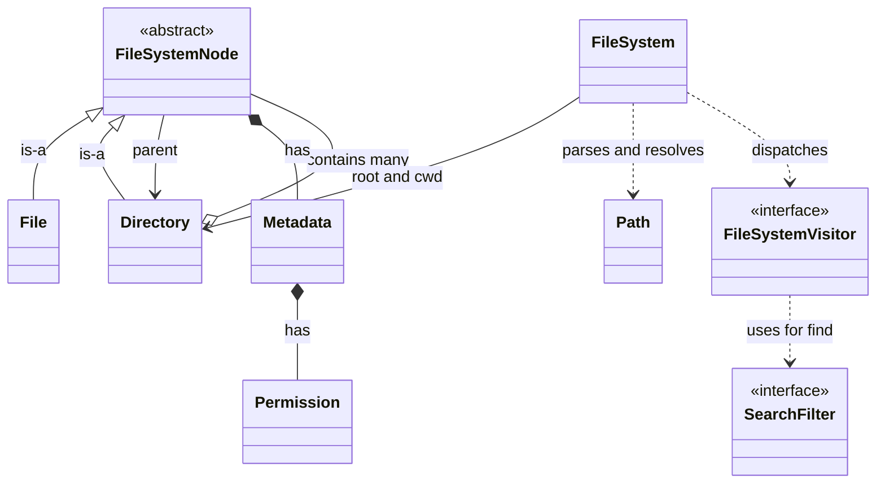
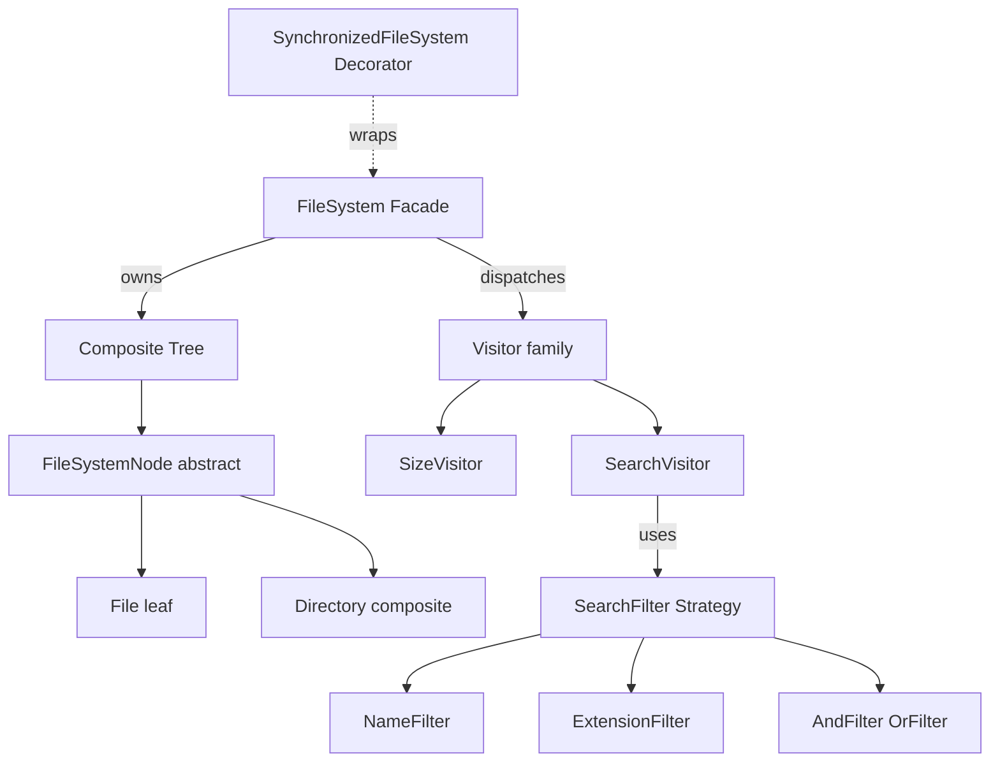
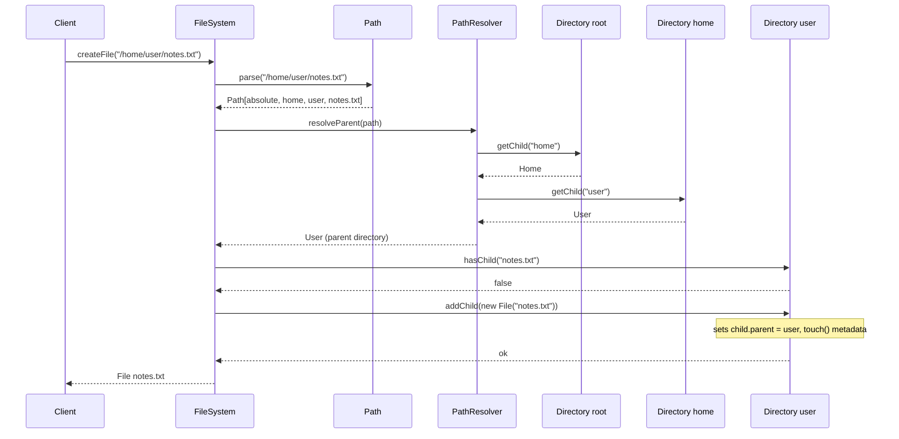
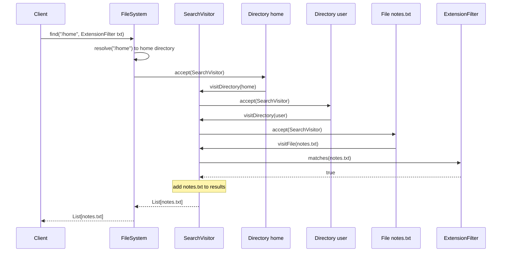
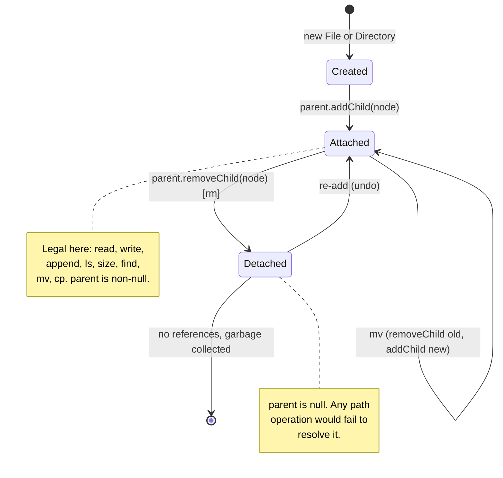

# 📁 Low-Level Design: In-Memory File System

> A complete, interview-ready walkthrough of designing a **File System** — from the deceptively small "just let me create files and folders" prompt to a staff-level component that resolves paths correctly, models files and directories under one clean abstraction, supports recursive search, and survives every concurrency, correctness, and scaling follow-up an interviewer can throw at the end.

"Design a file system" is one of those prompts that sounds like plumbing and turns out to be a design masterclass. On the surface it asks for the everyday operations you already know — `mkdir`, create a file, `ls` a directory, delete, move, search. The depth is hidden in two places. First, files and directories look different but must behave the same to the code that walks them: a directory contains other directories which contain files which have sizes that roll up into the directory's size — and the moment you try to compute "total size of this folder" you discover you need a *recursive tree* whose nodes are polymorphic. That insight, modeling the tree with the **Composite pattern** so a `File` and a `Directory` are interchangeable `FileSystemNode`s, is the single structural idea the interviewer is hunting for. Second, everything the user *types* is a **path** — `/home/user/../user/notes.txt` — and turning that string into the right node, handling `.`, `..`, absolute versus relative, and missing intermediate directories, is where correctness lives. Everything after those two ideas — visitors for search, strategies for filtering, thread safety, hard and soft links, and the jump to HDFS and inode-based real filesystems — is how an interviewer separates the L4 who can nest a `HashMap` from the L6 who understands why real filesystems are built the way they are. This guide walks that whole arc, escalating naturally from the beginner's mental model to the questions asked in the final minutes.

---

## 📋 Table of Contents

**Part I — Framing the Problem**

1. [Problem Statement](#1-problem-statement)
2. [Requirement Clarification & Assumptions](#2-requirement-clarification--assumptions)
3. [Functional & Non-Functional Requirements](#3-functional--non-functional-requirements)
4. [Core Concepts Being Tested](#4-core-concepts-being-tested)

**Part II — Modeling the Domain**

5. [Domain Model & Entities](#5-domain-model--entities)
6. [CRC Cards](#6-crc-cards)
7. [UML Class Diagram](#7-uml-class-diagram)
8. [Package Structure](#8-package-structure)

**Part III — Design Rationale**

9. [Design Decisions & Trade-offs](#9-design-decisions--trade-offs)
10. [Class-by-Class Deep Dive](#10-class-by-class-deep-dive)
11. [Design Patterns Applied](#11-design-patterns-applied)
12. [SOLID Principles Mapping](#12-solid-principles-mapping)

**Part IV — Behavior & Diagrams**

13. [Sequence Diagram](#13-sequence-diagram)
14. [State & Lifecycle Diagram](#14-state--lifecycle-diagram)

**Part V — The Implementation**

15. [Complete Java Implementation](#15-complete-java-implementation)
16. [Execution Flow & Code Walkthrough](#16-execution-flow--code-walkthrough)

**Part VI — Engineering Depth**

17. [Complexity Analysis](#17-complexity-analysis)
18. [Thread Safety & Concurrency](#18-thread-safety--concurrency)
19. [Error Handling & Validation](#19-error-handling--validation)
20. [Scalability Discussion](#20-scalability-discussion)
21. [Alternative Designs & Trade-offs](#21-alternative-designs--trade-offs)

**Part VII — Interview Mastery**

22. [Common FAANG Follow-up Questions (L4 → L6)](#22-common-faang-follow-up-questions-l4--l6)
23. [Common Design Mistakes](#23-common-design-mistakes)
24. [Testing Strategy](#24-testing-strategy)
25. [FAANG Q&A Section](#25-faang-qa-section)
26. [STAR Behavioral Questions](#26-star-behavioral-questions)
27. [⚡ Quick Revision Cheat Sheet](#27--quick-revision-cheat-sheet)

---

## 1. Problem Statement

Design an **in-memory file system** that lets a caller organize data into a hierarchy of **directories** (folders) and **files**, using string **paths** to address any node in the tree. The system must support the operations every filesystem exposes: create a directory (`mkdir`), create and write to a file, read a file back, list the contents of a directory (`ls`), delete a node (`rm`), move or rename a node (`mv`), copy a node (`cp`), and search the tree for nodes matching a condition (`find`). Paths may be **absolute** (starting from the root `/`) or **relative** to a current working directory, and may contain the special segments `.` (current directory) and `..` (parent directory).

The word doing the quiet heavy lifting is *hierarchy*. A file system is a **tree**: a single root directory contains files and other directories, each of which contains more files and directories, arbitrarily deep. Two facts fall out of that immediately. A directory's size is the *sum of everything beneath it*, so answering "how big is `/home`?" is a recursive walk, not a field lookup. And a file and a directory, though they store completely different things, must present a *common interface* — both have a name, a parent, metadata, and a size — so that traversal, deletion, and pretty-printing code can treat any node uniformly without asking "are you a file or a folder?" at every step.

<details>
<summary>📖 <b>In plain terms — what are we actually building?</b></summary>

Picture the folder tree in your computer's file explorer. There's a top folder; inside it are more folders and some documents; open a folder and you find yet more folders and documents, as deep as you like. Our job is to build that tree in memory and the small language for talking to it: "make a folder here," "put a file there with this text," "show me what's inside this folder," "delete that," "move this over there," "find every `.txt` under this folder." The tricky parts are two. Turning a typed path like `/home/user/notes.txt` into the exact right item, including when the path says "go up one level" (`..`). And treating a file and a folder the same way when the code doesn't care which it's holding — because a folder's size is just everything inside it added up. We are not writing to a real disk; we are building the clean data structure and API that sits above one.

</details>

The deliverable in an interview is not a disk driver or an OS kernel module; it is a **clean, correct, in-memory tree** with a well-designed API — the classes, their responsibilities, and above all the two core ideas: the Composite tree that makes files and directories interchangeable, and the path resolver that turns strings into nodes. Grading centers on whether you reach those two ideas, whether your path handling is correct (especially `..` and absolute-versus-relative), and how well you reason about the follow-ups: search extensibility, concurrency, links, permissions, and scaling to a real distributed filesystem.

---

## 2. Requirement Clarification & Assumptions

The strongest candidates spend the first few minutes turning a thin prompt into a bounded problem. A file system prompt is *especially* under-specified — "file system" can mean anything from a coding-interview tree to HDFS. The clarifying questions below each change the design or the code.

### 2.1 Actors

The system is a library plus a small command surface, so its actors are the code and users that drive it rather than elaborate human roles.

| Actor | Role in the system |
|-------|--------------------|
| **Client / calling code** | Issues operations (`mkdir`, `createFile`, `read`, `write`, `ls`, `rm`, `mv`, `cp`, `find`); treats the file system as a hierarchical store. |
| **Interactive user (shell)** | A human typing paths and commands; supplies relative paths interpreted against a current working directory. |
| **Owner / permission subject** | The identity a node belongs to; determines read/write/execute rights when permissions are enabled. |
| **Search requester** | Supplies a filter (by name, extension, size) and a starting directory; receives matching nodes. |

### 2.2 Key Clarifying Questions

Resolve these before drawing a class. Each answer materially shapes the solution.

- **In-memory or persistent?** — Do we simulate a filesystem in RAM, or persist to disk with durability guarantees? *(Assumption: purely in-memory; persistence and journaling are discussed as extensions. This is the standard interview scope.)*
- **What is a file's content?** — Bytes, text, or an opaque blob? *(Assumption: a file holds a byte array; text is a convenience layer on top. We track content size for the size roll-up.)*
- **Absolute and relative paths?** — Must we support `.`, `..`, and a current working directory? *(Assumption: yes to all three — this is the correctness core of the problem.)*
- **Case sensitivity & separators?** — Are names case-sensitive, and is `/` the only separator? *(Assumption: case-sensitive names, `/` separator, root is `/`, like POSIX. Windows-style `\` and drive letters are out of scope.)*
- **Name uniqueness** — Can a directory hold a file and a directory with the same name? *(Assumption: names are unique within a directory regardless of type — a directory's children are keyed by name.)*
- **Search semantics** — Does `find` need to support arbitrary predicates (name, extension, size, modified-time, combinations)? *(Assumption: yes — search must be extensible without touching the traversal code. This drives the Strategy + Visitor design.)*
- **Concurrency** — Single-threaded or concurrent access? *(Assumption: design a clean single-threaded core first, then make thread safety an explicit, separately-reasoned layer — this is exactly the follow-up.)*
- **Links** — Do we support hard links and symbolic (soft) links? *(Assumption: not in v1; both are discussed as extensions since they change the tree into a graph and are a favorite senior follow-up.)*
- **Permissions & ownership** — Are rwx permissions and owners enforced? *(Assumption: modeled in metadata and checked at operation boundaries, but kept simple; full ACLs are out of scope.)*

### 2.3 Explicit Non-Goals

Naming what you will *not* build is a senior signal — it bounds scope deliberately instead of by accident.

- No on-disk persistence, block allocation, or crash-recovery journaling in v1 (discussed under scalability).
- No distribution, replication, or network protocol — this is an in-process library, not a filesystem server or a distributed FS like HDFS.
- No full POSIX compliance — no device files, named pipes, mount points, or extended attributes.
- No real permission/security model with users, groups, and setuid; ownership and rwx are modeled but simplified.
- No symbolic/hard links in the core design (they turn the tree into a graph; covered as an extension).
- No file-descriptor table, open/close/seek streaming semantics, or partial reads in v1 — reads and writes work on whole content.

<details>
<summary>📖 <b>Why spend so long on clarification?</b></summary>

"Design a file system" hides an enormous range of scope. Three answers quietly decide your whole solution. First, in-memory or persistent? Persistence drags in blocks, inodes on disk, and crash recovery — a completely different problem. Second, must you support `..` and relative paths? If yes, path resolution becomes real logic with a current-working-directory and parent pointers, not a simple map lookup. Third, must search be extensible? If the interviewer wants "find by name, then also by size, then a combination," you need a design where new filters don't touch traversal — which points straight at Strategy and Visitor. Asking these upfront shows you know "file system" is a family of problems, and it sets up every hard follow-up that comes later.

</details>

---

## 3. Functional & Non-Functional Requirements

With scope bounded, we can state precisely what the system must *do* and how *well* it must do it.

### 3.1 Functional Requirements

These are the observable behaviors the file system must guarantee.

| # | Requirement | Description |
|---|-------------|-------------|
| F1 | **Create directory** | `mkdir(path)` creates a directory at the given path; optionally creates missing intermediate directories (a `-p` style flag). |
| F2 | **Create file** | `createFile(path)` creates an empty file; fails if the parent directory does not exist. |
| F3 | **Write / append** | `writeFile(path, data)` overwrites a file's content; append adds to the end. Writing updates the modified timestamp. |
| F4 | **Read file** | `readFile(path)` returns the file's full content; fails on a missing file or on a directory. |
| F5 | **List directory** | `ls(path)` returns the names of a directory's immediate children (sorted); on a file, returns just that file's name. |
| F6 | **Delete** | `rm(path)` removes a file or an (optionally recursive) directory, detaching it from its parent. |
| F7 | **Move / rename** | `mv(src, dest)` relocates or renames a node, re-parenting it in the tree. |
| F8 | **Copy** | `cp(src, dest)` deep-copies a node (and its subtree, for directories) to a new location. |
| F9 | **Search / find** | `find(startPath, filter)` returns all nodes under a directory matching a predicate (name, extension, size, or a combination). |
| F10 | **Navigate** | `cd(path)` changes the current working directory; relative paths resolve against it. |
| F11 | **Path resolution** | Resolve absolute and relative paths, honoring `.`, `..`, and the current working directory. |
| F12 | **Size roll-up** | Report the size of any node: a file's content length, or the recursive sum for a directory. |

### 3.2 Non-Functional Requirements

These are the qualities the design is graded on.

| # | Requirement | Target / Rationale |
|---|-------------|--------------------|
| N1 | **Fast lookup within a directory** | Resolving one path segment must be O(1) — children keyed by name in a hash map, not a scanned list. |
| N2 | **Path resolution proportional to depth** | Resolving a path costs O(d) where d is the number of segments — no full-tree scans. |
| N3 | **Extensibility** | New node types, new search filters, and new tree operations must be addable without editing existing classes (Open/Closed). |
| N4 | **Correctness of path semantics** | `.`, `..`, trailing slashes, and absolute/relative must behave exactly as a POSIX user expects. |
| N5 | **Thread safety (opt-in)** | A concurrent variant must allow safe multi-threaded access without corrupting the tree. |
| N6 | **Memory efficiency** | Per-node overhead kept modest; large file content dominates and is stored once. |
| N7 | **Clear failure modes** | Every illegal operation (missing path, wrong type, name clash) fails with a specific, typed exception. |

<details>
<summary>📖 <b>Which requirement is secretly the hardest?</b></summary>

It looks like the tree structure, but the sneaky one is N4 — correct path semantics. Beginners get the happy path (`/a/b/c`) working in minutes, then break on the edges: a leading `/` means "start at root, ignore the working directory"; `..` at the root should stay at the root, not crash; `.` is a no-op; a trailing slash shouldn't create a phantom empty segment; and a relative path like `../sibling/file.txt` mixes "go up" and "go down" in one resolution. Interviewers deliberately test these because they reveal whether you *modeled* paths or just split strings on `/`. Getting N1 (O(1) child lookup via a name-keyed map) is the easy structural win; getting N4 right is what separates a working toy from a correct filesystem.

</details>

---

## 4. Core Concepts Being Tested

This problem is a favorite precisely because it bundles several distinct skills. Knowing which concept each part of the interview is probing lets you show the signal the interviewer is looking for.

The **first and central concept is hierarchical (tree) modeling with the Composite pattern.** A file and a directory are fundamentally different — one holds bytes, the other holds children — yet the code that walks, deletes, sizes, and prints the tree must not care which is which. The Composite pattern gives both a shared supertype (`FileSystemNode`) with a uniform interface, so a `Directory` can hold a list of `FileSystemNode`s that happen to be a mix of files and other directories. This is the structural insight the interviewer wants to see you reach on your own.

The **second is recursion and tree traversal.** Size roll-up, recursive delete, deep copy, and search are all tree walks. The clean way to add *new* operations over the tree without editing the node classes is the **Visitor pattern**, which is the natural senior-level escalation when the interviewer says "now also compute the total size, and also find all files over 1 MB, and also count nodes."

The **third is parsing and resolution.** Turning `/home/user/../docs/./a.txt` into a node exercises string handling, a small state machine for `.`/`..`, and the distinction between absolute and relative addressing against a current working directory. This is pure correctness work and a common place candidates stumble.

The **fourth is designing for extension.** Search must accept arbitrary conditions — by name, extension, size, or combinations — which points at the **Strategy pattern** (a `SearchFilter` interface) so new criteria plug in without touching traversal. This is where Open/Closed and dependency inversion become concrete rather than buzzwords.

The **fifth, reserved for the final minutes, is systems reasoning:** thread-safe concurrent access, the difference between hard and soft links (which turn the tree into a graph), permission checks, and how a real filesystem (inodes, blocks) or a distributed one (HDFS NameNode/DataNode) differs from the in-memory model. These follow-ups are where L5 and L6 candidates pull away.

<details>
<summary>📖 <b>What is the interviewer really watching for?</b></summary>

They want to see three moves. First, do you reach for a *shared abstraction* between files and directories on your own — that's the Composite insight and the whole reason the design is elegant. Second, is your path resolution *correct* on the ugly inputs (`..`, leading slash, `.`), because that's where toy solutions crack. Third, when they pile on "now add search by size, now make it thread-safe, now add symlinks," do you extend the design *without rewriting it* — pulling in Visitor and Strategy, adding a locking layer, reasoning about the tree becoming a graph? A candidate who nests raw maps can pass the first thirty minutes; the shared abstraction, correct paths, and clean extension are what earn the senior bar.

</details>

## 5. Domain Model & Entities

Before writing a class, name the nouns in the problem and the one relationship that defines the whole design. A file system has surprisingly few entities; their *relationships* are what make it interesting.

The anchor entity is the **`FileSystemNode`** — the abstract concept of "a thing that lives in the tree, has a name, a parent, and metadata." It is deliberately abstract because its two concrete forms behave differently but must be handled uniformly. A **`File`** is a *leaf*: it holds content (bytes) and has no children. A **`Directory`** is a *composite*: it holds no content of its own but contains a collection of child nodes, keyed by name. This File-versus-Directory split under a common `FileSystemNode` supertype is the Composite relationship — the heart of the model.

Wrapping the tree is the **`FileSystem`** itself, the facade the client talks to. It owns the single **root** directory and a **current working directory**, and it exposes the verb-level API (`mkdir`, `createFile`, `ls`, and so on). Internally it leans on a **`Path`** value object — a parsed representation of a path string, knowing its segments and whether it is absolute — and on a resolver that walks the tree segment by segment to turn a `Path` into a `FileSystemNode`.

Two supporting entities carry cross-cutting information. **`Metadata`** holds a node's created and modified timestamps, its owner, and its permissions, kept separate from the node's structural role so that both files and directories share it uniformly. **`Permission`** captures the read/write/execute bits.

Finally, two behavioral entities keep the design open for extension. A **`FileSystemVisitor`** encapsulates an operation performed over the tree (compute size, collect matches, count nodes) so new operations don't force edits to `File` and `Directory`. A **`SearchFilter`** encapsulates a *predicate* ("name ends in `.txt`", "size > 1 MB") so new search criteria plug in without touching the traversal.

Here is the domain at a glance, expressed as the relationships between entities.



The one relationship to internalize: **a `Directory` contains many `FileSystemNode`s, and each of those may itself be a `Directory`.** That self-referential containment is what makes it a tree, and the shared `FileSystemNode` supertype is what lets one piece of traversal code handle the whole thing.

<details>
<summary>📖 <b>The entities in one picture</b></summary>

There are only three "real" things in a file system: a node that can be either a file or a folder, the tree that connects them (every node knows its parent, every folder knows its children), and the file system object that owns the root folder and understands paths. Everything else is support: metadata (who made it, when, what permissions) rides along on every node, a path object represents a typed-in address like `/home/a.txt`, and two small helper types — a visitor and a filter — exist so you can add new tree operations and new search rules later without rewriting the file and folder classes. If you remember "file or folder under one type, connected as a tree, addressed by paths," you have the model.

</details>

---

## 6. CRC Cards

CRC (Class–Responsibility–Collaborator) cards force you to state, for each class, what it *is responsible for* and *who it talks to* — a fast way to check that responsibilities are cleanly separated before any code exists.

**`FileSystemNode` (abstract)**

| Responsibilities | Collaborators |
|------------------|---------------|
| Hold identity common to all nodes: name, parent, metadata | `Directory` (as parent), `Metadata` |
| Compute its own size (abstract — files and dirs differ) | — |
| Report whether it is a directory; expose its absolute path | `Directory` (walks parents) |
| Accept a visitor (double-dispatch entry point) | `FileSystemVisitor` |

**`File` (leaf)**

| Responsibilities | Collaborators |
|------------------|---------------|
| Store and expose byte content | — |
| Read, overwrite (write), and append content; touch modified time | `Metadata` |
| Report size as content length | — |

**`Directory` (composite)**

| Responsibilities | Collaborators |
|------------------|---------------|
| Hold child nodes keyed by name; add, get, remove, list them | `FileSystemNode` (children) |
| Report size as the recursive sum of children | `FileSystemNode` |
| Dispatch visitor to itself and children | `FileSystemVisitor` |

**`Path` (value object)**

| Responsibilities | Collaborators |
|------------------|---------------|
| Parse a path string into ordered segments | — |
| Know whether it is absolute or relative | — |
| Expose components and the final (leaf) name | — |

**`FileSystem` (facade)**

| Responsibilities | Collaborators |
|------------------|---------------|
| Own the root and current working directory | `Directory` |
| Expose the operation API (`mkdir`, `createFile`, `read`, `write`, `ls`, `rm`, `mv`, `cp`, `find`, `cd`) | `Path`, `Directory`, `File` |
| Resolve a path string to a node, honoring `.`/`..`/absolute | `Path`, `Directory` |
| Dispatch search and size operations | `FileSystemVisitor`, `SearchFilter` |

**`FileSystemVisitor` (interface)**

| Responsibilities | Collaborators |
|------------------|---------------|
| Define one operation over the tree via `visitFile` / `visitDirectory` | `File`, `Directory` |
| Accumulate a typed result (size, matches, count) | — |

**`SearchFilter` (interface)**

| Responsibilities | Collaborators |
|------------------|---------------|
| Decide whether a single node matches a predicate | `FileSystemNode` |
| Compose with other filters (AND/OR) | `SearchFilter` |

**`Metadata`**

| Responsibilities | Collaborators |
|------------------|---------------|
| Hold created/modified timestamps, owner, permission | `Permission` |
| Refresh modified time on mutation (`touch`) | — |

---

## 7. UML Class Diagram

Here is the full static structure in ASCII, the way you'd sketch it on a whiteboard. Abstract types are marked `«abstract»` and interfaces `«interface»`. The Composite relationship — `Directory` holding many `FileSystemNode`s while itself being one — is deliberately front and center.

```
                    ┌──────────────────────────────────────────────────────┐
                    │              «abstract» FileSystemNode                │
                    ├──────────────────────────────────────────────────────┤
                    │ # name: String                                        │
                    │ # parent: Directory                                   │
                    │ # metadata: Metadata                                  │
                    ├──────────────────────────────────────────────────────┤
                    │ + getName(): String                                   │
                    │ + getParent(): Directory                              │
                    │ + getMetadata(): Metadata                             │
                    │ + getAbsolutePath(): String                           │
                    │ + size(): long              «abstract»                │
                    │ + isDirectory(): boolean    «abstract»                │
                    │ + accept(v: FileSystemVisitor<R>): R  «abstract»      │
                    └───────────────────────┬──────────────────────────────┘
                                             │ extends
                        ┌────────────────────┴─────────────────────┐
                        ▼                                            ▼
        ┌────────────────────────────────┐        ┌────────────────────────────────────────┐
        │ File  (leaf)                    │        │ Directory  (composite)                 │
        ├────────────────────────────────┤        ├────────────────────────────────────────┤
        │ - content: byte[]               │        │ - children: Map<String,FileSystemNode> │
        ├────────────────────────────────┤        ├────────────────────────────────────────┤
        │ + read(): byte[]                │        │ + addChild(node): void                 │
        │ + write(data: byte[]): void     │        │ + getChild(name: String): FileSystemNode│
        │ + append(data: byte[]): void    │        │ + removeChild(name: String): void      │
        │ + size(): long                  │        │ + getChildren(): Collection<..>        │
        │ + isDirectory(): boolean        │        │ + hasChild(name: String): boolean      │
        │ + accept(v): R                  │        │ + size(): long                         │
        └────────────────────────────────┘        │ + isDirectory(): boolean               │
                                                   │ + accept(v): R                         │
                                                   └───────────────┬────────────────────────┘
                                                                   │ contains many
                                                                   ▼  (FileSystemNode)
        ┌──────────────────────────────────────────────────────────────────────────┐
        │ FileSystem  (facade — the client-facing API)                              │
        ├──────────────────────────────────────────────────────────────────────────┤
        │ - root: Directory                                                          │
        │ - workingDirectory: Directory                                              │
        ├──────────────────────────────────────────────────────────────────────────┤
        │ + mkdir(path: String, createParents: boolean): Directory                   │
        │ + createFile(path: String): File                                           │
        │ + writeFile(path: String, data: byte[]): void                              │
        │ + readFile(path: String): byte[]                                           │
        │ + ls(path: String): List<String>                                           │
        │ + rm(path: String, recursive: boolean): void                               │
        │ + mv(src: String, dest: String): void                                      │
        │ + cp(src: String, dest: String): void                                      │
        │ + find(startPath: String, filter: SearchFilter): List<FileSystemNode>      │
        │ + cd(path: String): void                                                   │
        │ + pwd(): String                                                            │
        │ - resolve(path: Path): FileSystemNode                                       │
        │ - resolveParent(path: Path): Directory                                      │
        └───────────────┬───────────────────────────────────┬────────────────────────┘
                        │ uses                                │ dispatches
                        ▼                                     ▼
        ┌───────────────────────────────┐   ┌──────────────────────────────────────────┐
        │ Path  (value object)          │   │ «interface» FileSystemVisitor<R>          │
        ├───────────────────────────────┤   ├──────────────────────────────────────────┤
        │ - components: List<String>    │   │ + visitFile(f: File): R                   │
        │ - absolute: boolean           │   │ + visitDirectory(d: Directory): R         │
        ├───────────────────────────────┤   └──────────────────┬───────────────────────┘
        │ + parse(raw: String): Path    │                      │ implemented by
        │ + isAbsolute(): boolean       │      ┌───────────────┼───────────────────┐
        │ + getComponents(): List<..>   │      ▼               ▼                   ▼
        │ + getLeafName(): String       │ ┌──────────────┐ ┌───────────────┐ ┌──────────────────┐
        │ + getParentPath(): Path       │ │SizeVisitor   │ │SearchVisitor  │ │NodeCountVisitor  │
        └───────────────────────────────┘ │(Long)        │ │(List<Node>)   │ │(Integer)         │
                                           └──────────────┘ └──────┬────────┘ └──────────────────┘
                                                                   │ uses
                                                                   ▼
        ┌──────────────────────────────────┐        ┌───────────────────────────────────────┐
        │ FileSystemNode *-- Metadata       │        │ «interface» SearchFilter               │
        │                                    │        ├───────────────────────────────────────┤
        │ ┌──────────────────────────────┐  │        │ + matches(node: FileSystemNode): boolean│
        │ │ Metadata                     │  │        └──────────────────┬────────────────────┘
        │ ├──────────────────────────────┤  │                          │ implemented by
        │ │ - createdAt: Instant         │  │      ┌───────────┬────────┼─────────┬──────────────┐
        │ │ - modifiedAt: Instant        │  │      ▼           ▼        ▼         ▼              ▼
        │ │ - owner: String              │  │ ┌──────────┐┌──────────┐┌────────┐┌──────────┐┌──────────┐
        │ │ - permission: Permission     │  │ │NameFilter││ExtFilter ││SizeFilt││AndFilter ││OrFilter  │
        │ │ + touch(): void              │  │ └──────────┘└──────────┘└────────┘└──────────┘└──────────┘
        │ └──────────────────────────────┘  │
        │ Metadata *-- Permission            │
        │ ┌──────────────────────────────┐  │
        │ │ Permission                   │  │
        │ │ - readable / writable /      │  │
        │ │   executable: boolean        │  │
        │ └──────────────────────────────┘  │
        └────────────────────────────────────┘
```

The diagram encodes the four ideas that matter: `File` and `Directory` both **extend** `FileSystemNode` (Composite); `Directory` **contains many** `FileSystemNode`s (the tree); `FileSystem` is the **facade** that owns the root and resolves paths; and the two interface families — `FileSystemVisitor` and `SearchFilter` — are the **extension seams** where new operations and new search rules attach without editing existing classes.

---

## 8. Package Structure

A clean package layout communicates the architecture before anyone reads a method. Group by role — the domain tree, the addressing layer, the extensible operations, and the facade — so dependencies point inward toward the model and each package has one reason to change.

```
com.example.filesystem
│
├── FileSystem.java                    // Facade: the client-facing API
│
├── model/                             // The Composite tree — the domain core
│   ├── FileSystemNode.java            //   abstract component
│   ├── File.java                      //   leaf
│   ├── Directory.java                 //   composite
│   ├── Metadata.java                  //   timestamps, owner, permission
│   └── Permission.java                //   rwx bits
│
├── path/                              // Addressing layer
│   ├── Path.java                      //   parsed, immutable path value object
│   └── PathResolver.java              //   walks the tree: Path -> node
│
├── visitor/                           // Extensible operations over the tree
│   ├── FileSystemVisitor.java         //   visitor interface (generic result)
│   ├── SizeVisitor.java               //   total size roll-up
│   ├── SearchVisitor.java             //   collect nodes matching a filter
│   └── NodeCountVisitor.java          //   count nodes
│
├── search/                            // Extensible search predicates (Strategy)
│   ├── SearchFilter.java              //   filter interface
│   ├── NameFilter.java
│   ├── ExtensionFilter.java
│   ├── SizeFilter.java
│   ├── AndFilter.java                 //   composite AND
│   └── OrFilter.java                  //   composite OR
│
├── concurrent/                        // Opt-in thread-safe layer
│   └── SynchronizedFileSystem.java    //   decorator over FileSystem
│
└── exception/                         // Typed failure modes
    ├── FileSystemException.java       //   base (unchecked)
    ├── PathNotFoundException.java
    ├── NotADirectoryException.java
    ├── NotAFileException.java
    ├── NodeAlreadyExistsException.java
    └── DirectoryNotEmptyException.java
```

The dependency direction is deliberate. `model` depends on nothing (pure domain). `path`, `visitor`, and `search` depend on `model` but not on each other. `FileSystem` (the facade) orchestrates all of them. The `concurrent` and `exception` packages are cross-cutting. Nothing in `model` ever imports the facade — the tree has no idea who is driving it, which keeps the core reusable and testable in isolation.

<details>
<summary>📖 <b>Why split into these packages?</b></summary>

Each package answers a different question and changes for a different reason. `model` answers "what is a node and how do nodes connect" — it changes only if the tree structure itself changes. `path` answers "how do we turn a typed string into a node" — it changes if path syntax changes. `visitor` answers "what operations can we run over the whole tree" and `search` answers "what can we filter on" — these are the two spots that grow the most, so isolating them means new features land in a new file instead of a rewrite of `Directory`. The facade ties it together, and exceptions and concurrency sit to the side because they touch everything. If someone asks "where would I add a search-by-date feature," the answer is instantly "a new class in `search/`," and that clarity is the point.

</details>

## 9. Design Decisions & Trade-offs

Every interesting design choice here is a fork with a defensible reason. Being able to say *why* you took each fork — and what you'd do differently under different constraints — is the senior signal.

**Decision 1 — Composite tree over nested maps.** The naive approach models the filesystem as `Map<String, Object>` where a value is either a byte array (file) or another map (directory). It works and is fast to write, but it is untyped: every operation must `instanceof`-check whether it's holding a map or a blob, there is no place to hang shared behavior (size, metadata, absolute path), and adding permissions or timestamps means bolting parallel maps alongside. The Composite design — `File` and `Directory` under an abstract `FileSystemNode` — costs a few more classes but buys a single uniform type for all traversal code, one home for shared behavior, and clean extension. *Trade-off: more classes for far less branching and much better extensibility. For a filesystem, which lives or dies on clean traversal, this is the right trade almost always.*

**Decision 2 — Children in a hash map keyed by name, not a list.** A directory could store children as a `List<FileSystemNode>`, but then resolving one path segment (`find "user" in /home`) is an O(k) scan of k children, making a full path resolution O(d·k). Keying children by name in a `Map<String, FileSystemNode>` makes each segment lookup O(1) and enforces name-uniqueness for free (a `put` collision is a duplicate). *Trade-off: we lose insertion order (mitigated with a `LinkedHashMap` or by sorting in `ls`) but gain O(1) segment resolution, which is the dominant operation.*

**Decision 3 — A dedicated `Path` value object and resolver, not string-splitting inline.** Path logic (`.`, `..`, absolute vs relative, trailing slashes) is fiddly and appears in almost every operation. Encapsulating parsing in an immutable `Path` and resolution in one `PathResolver` means the tricky logic is written and tested *once*, and every operation reuses it. *Trade-off: two extra types versus scattered, duplicated, bug-prone `split("/")` calls throughout the facade. The centralization pays for itself the first time you fix a `..` edge case in one place.*

**Decision 4 — Visitor for tree operations.** Size roll-up, search, and node counting are all traversals. Putting each as a method on `Directory`/`File` would swell those classes every time a new operation is needed and violate Open/Closed. The Visitor pattern moves each operation into its own class; nodes only implement a stable `accept` method. *Trade-off: Visitor adds indirection and is awkward if the *node types* change often (you'd touch every visitor). But node types are stable (file, directory) while operations grow — exactly the situation Visitor is designed for.*

**Decision 5 — Strategy for search filters.** Search criteria multiply endlessly (name, extension, size, date, owner, combinations). A `SearchFilter` interface with one `matches` method lets each criterion be its own class and lets `AndFilter`/`OrFilter` compose them, so the traversal never changes when a new criterion appears. *Trade-off: a small interface and several tiny classes versus a growing `if/else` inside `find`. The composability (arbitrary AND/OR trees of filters) is worth it.*

**Decision 6 — Facade owns the working directory and path resolution; nodes stay dumb about paths.** The tree nodes know only their name and parent; they don't know how to interpret a path string or what the current directory is. That knowledge lives in `FileSystem`. This keeps nodes reusable and makes the facade the single place that enforces operation semantics and permission checks. *Trade-off: the facade is a larger class, but it is the intended coordination point; splitting its methods across nodes would scatter policy.*

**Decision 7 — Single-threaded core, thread safety as an opt-in decorator.** We design the core with no locks, then wrap it in a `SynchronizedFileSystem` when concurrency is needed. This keeps the common single-threaded case fast and the core simple, and makes the concurrency reasoning explicit and swappable. *Trade-off: the coarse decorator serializes all access; a production system would use finer-grained per-subtree locking, which we discuss but don't build in v1.*

Here's the shape of the two biggest trade-offs side by side.

| Choice | Simple option | Chosen option | Why the chosen one wins |
|--------|---------------|---------------|-------------------------|
| Tree representation | Nested `Map<String,Object>` | Composite `FileSystemNode` | Type safety, shared behavior, extensibility — no `instanceof` in traversal |
| Child storage | `List<FileSystemNode>` | `Map<String,FileSystemNode>` | O(1) segment lookup and free name-uniqueness vs O(k) scan |
| Tree operations | Methods on nodes | Visitor classes | New operations don't edit node classes (Open/Closed) |
| Search criteria | `if/else` in `find` | `SearchFilter` Strategy | New criteria compose without touching traversal |
| Concurrency | Locks baked in | Decorator layer | Fast simple core, explicit and swappable safety |

<details>
<summary>📖 <b>The one trade-off to mention out loud</b></summary>

If you say only one trade-off in the interview, make it the Composite versus nested-map choice. Nested maps are genuinely faster to write and an interviewer might even nudge you toward them to see if you'll defend a cleaner design. The answer that lands: "A nested map works, but every operation would have to check whether each value is a blob or another map, and I'd have nowhere clean to put size roll-up, metadata, or permissions. Giving files and directories a shared `FileSystemNode` type means one uniform traversal and an obvious home for shared behavior — the extra classes pay for themselves the moment I add the second feature." That reasoning — naming the cost and why it's worth paying — is exactly the seniority signal.

</details>

---

## 10. Class-by-Class Deep Dive

With the rationale set, here is what each class is *for*, the decisions inside it, and the follow-up an interviewer pushes on each.

### 10.1 `FileSystemNode` (abstract component)

The shared supertype of everything in the tree. It carries the three fields every node has — `name`, `parent` (the containing `Directory`, `null` only for root), and `metadata` — and declares the operations that differ by type as abstract: `size()`, `isDirectory()`, and `accept()`. It also implements the behavior that is *identical* for all nodes, most importantly `getAbsolutePath()`, which walks `parent` pointers up to the root and joins the names with `/`.

The subtle point is *why the parent pointer exists*. Without it, computing an absolute path or re-parenting a node during `mv` would require searching the whole tree to find "who contains me." The back-pointer makes both O(depth). The cost is that the tree is doubly linked, so every structural mutation (add/remove/move a child) must keep parent and child pointers consistent — a classic source of bugs, which is why `addChild`/`removeChild` on `Directory` are the *only* places allowed to touch parent links.

*Interviewer push:* "Why abstract and not an interface?" Because we want to *share* the concrete `getName`/`getAbsolutePath`/parent-handling implementations, not just a contract — an abstract class lets subclasses inherit real behavior while still forcing them to define `size` and `accept`.

### 10.2 `File` (leaf)

The leaf node. It holds `content` as a `byte[]` and implements `size()` as `content.length`, `isDirectory()` as `false`, and `accept()` by calling `visitor.visitFile(this)`. Its behavior is `read()` (return the content), `write(data)` (replace the content and `touch()` the metadata), and `append(data)` (concatenate). Storing content as bytes rather than a `String` keeps it format-agnostic — text is just a decoding convenience on top.

*Interviewer push:* "What if a file is huge?" In-memory, a giant `byte[]` is a real problem; the honest answer is that a real filesystem stores content as blocks/extents referenced by an inode, and our model would evolve to store content chunks or a stream handle rather than one array. Worth naming even though v1 keeps the array.

### 10.3 `Directory` (composite)

The composite node. It holds `children` as a `Map<String, FileSystemNode>` and exposes `addChild` (which also sets the child's `parent` to this and rejects duplicates), `getChild(name)`, `removeChild(name)`, `hasChild(name)`, and `getChildren()`. Its `size()` is the recursive sum of its children's sizes, `isDirectory()` is `true`, and `accept()` calls `visitor.visitDirectory(this)`.

The single most important discipline lives here: `addChild` and `removeChild` are the *only* methods that mutate parent/child links, and they always update *both* sides. That invariant — every child's `parent` points back at the directory that contains it — is what keeps `getAbsolutePath`, `mv`, and delete correct.

*Interviewer push:* "How do you keep `ls` output stable?" Either back the map with a `LinkedHashMap` to preserve insertion order, or sort names in `ls`. We sort in `ls` so the storage stays a plain fast map.

### 10.4 `Path` (value object) and `PathResolver`

`Path` is an immutable parse of a path string: it splits on `/`, records whether the original started with `/` (absolute), and stores the non-empty segments (so `.` and `..` are preserved as segments to be interpreted, while empty segments from `//` or trailing `/` are dropped). It exposes `getComponents()`, `getLeafName()` (the last segment), and `getParentPath()`.

`PathResolver` does the actual walk. Starting from root (if absolute) or the working directory (if relative), it consumes segments one at a time: `.` is skipped, `..` moves to the current node's parent (staying at root if already there), and any other segment must be an existing child *directory* to keep walking (or the final node for the leaf). It throws `PathNotFoundException` on a missing segment and `NotADirectoryException` if an intermediate segment is a file. This is the correctness heart of the whole system.

*Interviewer push:* "What does `/a/../../b` resolve to?" `..` at root stays at root, so this resolves to `/b` — a great question to confirm your `..`-at-root handling is deliberate, not accidental.

### 10.5 `FileSystem` (facade)

The client-facing API and the coordinator. It owns `root` and `workingDirectory` and implements every verb by the same three-step recipe: parse the string into a `Path`, resolve it (or its parent) to a node with `PathResolver`, then perform the structural change and validate the result. `mkdir` resolves the parent and adds a new `Directory`; `createFile` adds a `File`; `rm` finds the node and calls `removeChild` on its parent; `mv` detaches from the old parent and attaches to the new; `find` runs a `SearchVisitor` from the start node. Permission checks, if enabled, happen here at the operation boundary.

*Interviewer push:* "Isn't this class doing too much?" It's a facade by design — the *single* place operation semantics live. If it grew unwieldy, you'd extract command objects (one class per operation), which is also how you'd add undo/redo. Naming that shows you know the escape hatch.

### 10.6 `FileSystemVisitor<R>` and its implementations

The extension seam for *operations*. The generic interface declares `visitFile(File): R` and `visitDirectory(Directory): R`. `SizeVisitor` returns the recursive byte total; `SearchVisitor` (constructed with a `SearchFilter`) accumulates every matching node in the subtree; `NodeCountVisitor` counts nodes. Directories, in their `visitDirectory`, recurse into children — so a visitor written once works over any subtree.

*Interviewer push:* "Why Visitor instead of a method on the node?" Because operations grow and node types don't. Visitor keeps `File`/`Directory` closed to modification while operations stay open to extension.

### 10.7 `SearchFilter` and its implementations

The extension seam for *predicates*. The interface is a single `matches(FileSystemNode): boolean`. `NameFilter`, `ExtensionFilter`, and `SizeFilter` are the leaf criteria; `AndFilter` and `OrFilter` compose any two filters into a boolean tree. Because filters compose, `find("/", new AndFilter(new ExtensionFilter("txt"), new SizeFilter(1024, GT)))` expresses "all `.txt` files over 1 KB" with no new code.

*Interviewer push:* "How would you add search by modified-date?" One new class, `ModifiedAfterFilter implements SearchFilter` — the traversal and everything else are untouched. That's the payoff of the Strategy design.

---

## 11. Design Patterns Applied

Four patterns do the structural work, and naming them with *why* (not just *what*) is what earns credit.

**Composite (structural) — the backbone.** `FileSystemNode` is the component, `File` is the leaf, `Directory` is the composite that holds children which are themselves components. This is the entire reason a directory's `size()` can transparently sum a mixed bag of files and sub-directories, and why traversal code never branches on type. Real parallel: the DOM (`Node` with `Element` and `Text`), Java Swing containers, and Abstract Syntax Trees all use Composite for exactly this "part-whole hierarchy treated uniformly" reason.

**Visitor (behavioral) — operations without editing nodes.** `FileSystemVisitor` lets us add `SizeVisitor`, `SearchVisitor`, `NodeCountVisitor`, and any future tree operation without touching `File` or `Directory`. Double dispatch (`node.accept(visitor)` calls back `visitor.visitFile`/`visitDirectory`) picks the right handler at runtime. Real parallel: the Java compiler's AST processing (`javac`), Jackson's tree-model traversal, and static analyzers all use Visitor to run many operations over one stable node hierarchy.

**Strategy (behavioral) — pluggable search criteria.** `SearchFilter` is a family of interchangeable predicates injected into search. New criteria are new strategies; the algorithm (traversal) is fixed. Real parallel: Java's `Comparator` is exactly this pattern, and so is `java.io.FileFilter` / `FilenameFilter` in the JDK's own filesystem API.

**Facade (structural) — a simple front over a subsystem.** `FileSystem` hides the model, path, visitor, and search packages behind one friendly API (`mkdir`, `ls`, `find`). Callers never assemble a `Path`, a `PathResolver`, and a `SearchVisitor` by hand. Real parallel: `java.nio.file.Files` is a facade over the far more complex `FileSystem`/`Path`/`FileStore` machinery.

Two more appear as natural extensions. **Decorator** gives thread safety: `SynchronizedFileSystem` wraps any `FileSystem` and adds locking without changing it — the same shape as `Collections.synchronizedMap`. And **Iterator** is implicit in `getChildren()` / tree traversal; an explicit depth-first `Iterator<FileSystemNode>` is a clean addition if the interviewer asks for streaming traversal.



<details>
<summary>📖 <b>Which pattern is "the answer"?</b></summary>

If an interviewer asks "what pattern is this problem about," the answer is Composite. It is the one insight that makes files and directories a single uniform tree, and everything elegant about the design flows from it — the recursive size, the type-free traversal, the clean place to hang metadata. Visitor and Strategy are the *senior* escalations: reach for them when the interviewer starts adding operations ("also compute size, also search, also count") and criteria ("by name, by size, combined"). Facade is almost automatic — it's just the front door. Naming Composite first, then bringing in Visitor and Strategy exactly when the requirements demand them, tells the interviewer you apply patterns to pressure, not by reflex.

</details>

---

## 12. SOLID Principles Mapping

SOLID isn't decoration here — each principle shows up as a concrete structural choice you can point at.

**Single Responsibility.** Every class has exactly one reason to change. `File` changes only if file content behavior changes; `Directory` only if child-holding changes; `Path` only if path syntax changes; `PathResolver` only if resolution rules change; each `SearchFilter` only if its one criterion changes; `FileSystem` only if the operation set changes. `Metadata` is split out precisely so that adding a timestamp or permission doesn't touch the structural node classes.

**Open/Closed.** The two extension seams make this literal. Adding a new search criterion means adding a `SearchFilter` implementation — no existing class is edited. Adding a new tree operation means adding a `FileSystemVisitor` implementation — `File` and `Directory` stay closed. The design is *open* to new behavior and *closed* to modification of what already works.

**Liskov Substitution.** Anywhere the code holds a `FileSystemNode`, it can be a `File` or a `Directory` and everything still works — `size()`, `accept()`, `getAbsolutePath()` all honor the same contract. A `Directory` never throws where a `File` wouldn't for the shared operations. Likewise any `SearchFilter` or `FileSystemVisitor` is substitutable for another of its type. This is what makes the polymorphic traversal safe.

**Interface Segregation.** The interfaces are minimal. `SearchFilter` has one method (`matches`); `FileSystemVisitor` has two (`visitFile`, `visitDirectory`) — exactly what a visitor needs, nothing more. No class is forced to implement methods it doesn't use, so a filter that only cares about size doesn't inherit a pile of irrelevant hooks.

**Dependency Inversion.** High-level policy depends on abstractions, not concretions. `FileSystem.find` depends on the `SearchFilter` *interface*, not on `NameFilter`; the traversal depends on the `FileSystemVisitor` *interface*, not on `SizeVisitor`. Callers inject the concrete strategy/visitor, so the high-level flow is decoupled from the low-level detail — which is exactly why new filters and visitors drop in without ripples.

<details>
<summary>📖 <b>SOLID in one sentence each</b></summary>

Single Responsibility: files, directories, paths, resolution, and each search rule are separate classes, so each changes for one reason. Open/Closed: new search rules and new tree operations arrive as new classes, never edits to old ones. Liskov: a directory is usable anywhere a node is expected, because both honor the same node contract. Interface Segregation: the filter and visitor interfaces are tiny, so nobody implements dead methods. Dependency Inversion: the facade and traversal depend on the filter/visitor *interfaces*, so concrete rules plug in from outside. The theme: the parts that grow (operations, search rules) are isolated behind interfaces so growth never destabilizes the parts that are done.

</details>

## 13. Sequence Diagram

Diagrams make the runtime collaboration concrete. The most instructive flows are creating a file at a deep path (which exercises parent resolution and child insertion) and running a filtered search (which exercises the Visitor + Strategy pair).

### 13.1 Creating a file — `createFile("/home/user/notes.txt")`

The facade parses the string, resolves the *parent* directory segment by segment, then attaches a new leaf. Note that resolution walks each intermediate segment and validates it is a directory.



If any intermediate segment were missing, `PathResolver` would throw `PathNotFoundException`; if `notes.txt` already existed, the facade would throw `NodeAlreadyExistsException` after the `hasChild` check.

### 13.2 Search — `find("/home", new ExtensionFilter("txt"))`

The facade resolves the start directory, then hands a `SearchVisitor` (carrying the filter) to the tree. Each directory recurses into its children; each node is tested by the filter.



The elegance: the visitor and filter know nothing about each other's internals, and the traversal never asks "file or directory" — `accept` dispatches to the right `visit` method automatically.

<details>
<summary>📖 <b>Reading the create-file flow</b></summary>

Creating `/home/user/notes.txt` is really "walk down to the folder that will hold the file, then drop the file in." The file system first turns the string into a path, then walks it one folder at a time — root, then `home`, then `user` — checking at each step that the thing it found is really a folder it can descend into. Once it's standing in `user`, it checks nothing already has that name, then adds the new file, which quietly records that its parent is `user` and stamps the time. Every one of those child lookups is an instant hash-map hit, so the whole thing costs about as much as the path is deep — not how big the tree is.

</details>

---

## 14. State & Lifecycle Diagram

A single node moves through a small, well-defined lifecycle, and modeling it explicitly clarifies which operations are legal when. A node is *created* and attached to a parent, spends its life *attached* (where it can be read, written, moved, or copied), and ends either *detached* (removed from the tree, eligible for garbage collection) or re-attached elsewhere after a move.



The lifecycle exposes a real invariant: an *attached* node always has a non-null parent (except the root, which is attached to nothing by definition), and a *detached* node has a null parent and is unreachable by path. `mv` is modeled as an atomic detach-then-attach — and this is exactly where a concurrency bug hides, because between the two steps the node is momentarily in neither location. A thread-safe implementation must make the pair atomic under a lock.

The file's *content* has its own tiny lifecycle worth noting: an empty file (`content` is a zero-length array) transitions to non-empty on `write`/`append`, and every mutation refreshes the `modifiedAt` timestamp in metadata while the `createdAt` stays fixed.

<details>
<summary>📖 <b>Why model a lifecycle at all?</b></summary>

The lifecycle answers "which operations are valid right now" without scattering checks everywhere. A node that's been deleted (detached) shouldn't be readable or movable — its parent is null and no path leads to it, so any operation naturally fails to find it. Modeling `mv` as "remove from here, add over there" makes an important subtlety visible: for a split second the node belongs nowhere, so if two threads move things at once you can lose or duplicate a node. Seeing that on the diagram is what tells you the move operation must be a single locked step, not two independent ones — a point interviewers love to probe.

</details>

## 15. Complete Java Implementation

Below is a complete, runnable implementation, organized package by package so you can read it in the order the design flows: the domain tree first, then addressing, then the extensible operations, then the facade that ties them together, and finally the concurrency and exception layers. Every class name, field, and method signature matches the UML and sequence diagrams above exactly.

<details>
<summary>💻 <b>1. Exceptions — typed failure modes (<code>exception/</code>)</b></summary>

```java
package com.example.filesystem.exception;

/** Base for all file-system errors. Unchecked: callers opt into handling. */
public class FileSystemException extends RuntimeException {
    public FileSystemException(String message) { super(message); }
}

/** No node exists at the requested path (or an intermediate segment is missing). */
public class PathNotFoundException extends FileSystemException {
    public PathNotFoundException(String path) {
        super("Path not found: " + path);
    }
}

/** An operation required a directory but found a file (or vice versa on descent). */
public class NotADirectoryException extends FileSystemException {
    public NotADirectoryException(String path) {
        super("Not a directory: " + path);
    }
}

/** An operation required a file but found a directory. */
public class NotAFileException extends FileSystemException {
    public NotAFileException(String path) {
        super("Not a file: " + path);
    }
}

/** A node with the target name already exists in the destination directory. */
public class NodeAlreadyExistsException extends FileSystemException {
    public NodeAlreadyExistsException(String path) {
        super("Node already exists: " + path);
    }
}

/** A non-recursive delete was attempted on a non-empty directory. */
public class DirectoryNotEmptyException extends FileSystemException {
    public DirectoryNotEmptyException(String path) {
        super("Directory not empty: " + path);
    }
}

/** A caller lacked the required permission for an operation. */
public class AccessDeniedException extends FileSystemException {
    public AccessDeniedException(String path) {
        super("Access denied: " + path);
    }
}
```

Exceptions are unchecked so the fast path stays clean, but each is specific enough that callers can catch precisely what they care about (a missing path versus a type mismatch versus a name clash).

</details>

<details>
<summary>💻 <b>2. Permission & Metadata — cross-cutting node data (<code>model/</code>)</b></summary>

```java
package com.example.filesystem.model;

/** Simplified rwx permission bits shared by every node. */
public class Permission {
    private boolean readable;
    private boolean writable;
    private boolean executable;

    public Permission(boolean readable, boolean writable, boolean executable) {
        this.readable = readable;
        this.writable = writable;
        this.executable = executable;
    }

    /** Sensible default: owner can read and write; directories add execute to be traversable. */
    public static Permission defaultFor(boolean directory) {
        return new Permission(true, true, directory);
    }

    public boolean isReadable()   { return readable; }
    public boolean isWritable()   { return writable; }
    public boolean isExecutable() { return executable; }

    public void setReadable(boolean r)   { this.readable = r; }
    public void setWritable(boolean w)   { this.writable = w; }
    public void setExecutable(boolean x) { this.executable = x; }

    @Override public String toString() {
        return (readable ? "r" : "-") + (writable ? "w" : "-") + (executable ? "x" : "-");
    }
}
```

```java
package com.example.filesystem.model;

import java.time.Instant;

/** Timestamps, owner, and permission — kept separate from a node's structural role. */
public class Metadata {
    private final Instant createdAt;
    private Instant modifiedAt;
    private String owner;
    private Permission permission;

    public Metadata(String owner, Permission permission) {
        Instant now = Instant.now();
        this.createdAt = now;
        this.modifiedAt = now;
        this.owner = owner;
        this.permission = permission;
    }

    /** Refresh the modified timestamp; called on every mutation. */
    public void touch() { this.modifiedAt = Instant.now(); }

    public Instant getCreatedAt()  { return createdAt; }
    public Instant getModifiedAt() { return modifiedAt; }
    public String getOwner()       { return owner; }
    public void setOwner(String o) { this.owner = o; }
    public Permission getPermission()          { return permission; }
    public void setPermission(Permission p)    { this.permission = p; }
}
```

`Metadata` owns the modified-time discipline: every mutating operation on a node calls `touch()`, so `modifiedAt` is always current without the node classes duplicating timestamp logic.

</details>

<details>
<summary>💻 <b>3. FileSystemNode — the abstract component (<code>model/</code>)</b></summary>

```java
package com.example.filesystem.model;

import com.example.filesystem.visitor.FileSystemVisitor;

/**
 * The shared supertype of everything in the tree (Composite pattern).
 * Holds identity common to all nodes and declares the type-specific
 * operations as abstract.
 */
public abstract class FileSystemNode {
    protected String name;
    protected Directory parent;          // null only for the root
    protected final Metadata metadata;

    protected FileSystemNode(String name, Directory parent, Metadata metadata) {
        this.name = name;
        this.parent = parent;
        this.metadata = metadata;
    }

    public String getName()        { return name; }
    public Directory getParent()   { return parent; }
    public Metadata getMetadata()  { return metadata; }

    /** Package-private: only Directory.addChild/removeChild may re-parent a node. */
    void setParent(Directory parent) { this.parent = parent; }
    void setName(String name)        { this.name = name; }

    /** Walk parent pointers to the root and join names with '/'. */
    public String getAbsolutePath() {
        if (parent == null) return "/";          // root
        StringBuilder sb = new StringBuilder();
        buildPath(this, sb);
        return sb.length() == 0 ? "/" : sb.toString();
    }

    private void buildPath(FileSystemNode node, StringBuilder sb) {
        if (node.parent == null) return;         // stop before the root's empty name
        buildPath(node.parent, sb);
        sb.append('/').append(node.name);
    }

    // Type-specific behavior — every concrete node must define these.
    public abstract long size();
    public abstract boolean isDirectory();
    public abstract <R> R accept(FileSystemVisitor<R> visitor);
}
```

The `setParent`/`setName` methods are package-private on purpose: re-parenting is dangerous, so only `Directory` (in the same package) is allowed to do it, which keeps the doubly linked tree consistent.

</details>

<details>
<summary>💻 <b>4. File — the leaf node (<code>model/</code>)</b></summary>

```java
package com.example.filesystem.model;

import com.example.filesystem.visitor.FileSystemVisitor;
import java.util.Arrays;

/** A leaf node holding byte content. */
public class File extends FileSystemNode {

    private byte[] content;

    public File(String name, Directory parent) {
        super(name, parent, new Metadata(
                System.getProperty("user.name", "root"),
                Permission.defaultFor(false)));
        this.content = new byte[0];
    }

    public byte[] read() {
        if (!metadata.getPermission().isReadable())
            throw new com.example.filesystem.exception.AccessDeniedException(getAbsolutePath());
        return Arrays.copyOf(content, content.length);   // defensive copy
    }

    public void write(byte[] data) {
        if (!metadata.getPermission().isWritable())
            throw new com.example.filesystem.exception.AccessDeniedException(getAbsolutePath());
        this.content = Arrays.copyOf(data, data.length);
        metadata.touch();
    }

    public void append(byte[] data) {
        if (!metadata.getPermission().isWritable())
            throw new com.example.filesystem.exception.AccessDeniedException(getAbsolutePath());
        byte[] merged = new byte[content.length + data.length];
        System.arraycopy(content, 0, merged, 0, content.length);
        System.arraycopy(data, 0, merged, content.length, data.length);
        this.content = merged;
        metadata.touch();
    }

    @Override public long size() { return content.length; }

    @Override public boolean isDirectory() { return false; }

    @Override public <R> R accept(FileSystemVisitor<R> visitor) {
        return visitor.visitFile(this);
    }
}
```

`read()` returns a defensive copy so callers cannot mutate the stored content by reference — a small correctness detail that prevents a whole class of aliasing bugs.

</details>

<details>
<summary>💻 <b>5. Directory — the composite node (<code>model/</code>)</b></summary>

```java
package com.example.filesystem.model;

import com.example.filesystem.exception.NodeAlreadyExistsException;
import com.example.filesystem.visitor.FileSystemVisitor;
import java.util.Collection;
import java.util.HashMap;
import java.util.Map;

/** A composite node holding child nodes keyed by name. */
public class Directory extends FileSystemNode {

    private final Map<String, FileSystemNode> children = new HashMap<>();

    public Directory(String name, Directory parent) {
        super(name, parent, new Metadata(
                System.getProperty("user.name", "root"),
                Permission.defaultFor(true)));
    }

    /** The ONLY place a node is attached to a parent — keeps both links consistent. */
    public void addChild(FileSystemNode node) {
        if (children.containsKey(node.getName()))
            throw new NodeAlreadyExistsException(getAbsolutePath() + "/" + node.getName());
        node.setParent(this);
        children.put(node.getName(), node);
        metadata.touch();
    }

    public FileSystemNode getChild(String name) { return children.get(name); }

    public boolean hasChild(String name) { return children.containsKey(name); }

    /** The ONLY place a node is detached — clears the child's parent link. */
    public FileSystemNode removeChild(String name) {
        FileSystemNode removed = children.remove(name);
        if (removed != null) {
            removed.setParent(null);
            metadata.touch();
        }
        return removed;
    }

    /** Used by mv to rename in place while staying under the same parent. */
    void rename(String oldName, String newName) {
        FileSystemNode node = children.remove(oldName);
        if (node != null) {
            node.setName(newName);
            children.put(newName, node);
            metadata.touch();
        }
    }

    public Collection<FileSystemNode> getChildren() { return children.values(); }

    public boolean isEmpty() { return children.isEmpty(); }

    /** Size is the recursive sum of all children — the Composite roll-up. */
    @Override public long size() {
        long total = 0;
        for (FileSystemNode child : children.values()) total += child.size();
        return total;
    }

    @Override public boolean isDirectory() { return true; }

    @Override public <R> R accept(FileSystemVisitor<R> visitor) {
        return visitor.visitDirectory(this);
    }
}
```

`addChild` and `removeChild` are the guardians of the tree's central invariant: a child's `parent` pointer always matches the directory that actually contains it. Because they are the only mutators of that link, the invariant can't drift.

</details>

<details>
<summary>💻 <b>6. Path — the immutable path value object (<code>path/</code>)</b></summary>

```java
package com.example.filesystem.path;

import java.util.ArrayList;
import java.util.Collections;
import java.util.List;

/** An immutable, parsed representation of a path string. */
public final class Path {

    private final List<String> components;   // '.' and '..' preserved; empties dropped
    private final boolean absolute;

    private Path(List<String> components, boolean absolute) {
        this.components = Collections.unmodifiableList(components);
        this.absolute = absolute;
    }

    /** Parse "/home/user/../a.txt" into ordered, non-empty segments. */
    public static Path parse(String raw) {
        if (raw == null || raw.isEmpty())
            throw new IllegalArgumentException("Path must be non-empty");
        boolean absolute = raw.startsWith("/");
        List<String> parts = new ArrayList<>();
        for (String seg : raw.split("/")) {
            if (!seg.isEmpty()) parts.add(seg);   // drops empties from "//" and trailing "/"
        }
        return new Path(parts, absolute);
    }

    public boolean isAbsolute()            { return absolute; }
    public List<String> getComponents()    { return components; }
    public boolean isEmpty()               { return components.isEmpty(); }

    /** The final segment — the name of the node this path addresses. */
    public String getLeafName() {
        if (components.isEmpty())
            throw new IllegalStateException("Root path has no leaf name");
        return components.get(components.size() - 1);
    }

    /** All but the last segment — the path of the containing directory. */
    public Path getParentPath() {
        if (components.isEmpty())
            throw new IllegalStateException("Root path has no parent");
        return new Path(new ArrayList<>(components.subList(0, components.size() - 1)), absolute);
    }

    @Override public String toString() {
        String joined = String.join("/", components);
        return absolute ? "/" + joined : joined;
    }
}
```

Parsing deliberately *keeps* `.` and `..` as segments — they are semantic instructions to the resolver, not noise — while dropping empty segments so `//a`, `/a/`, and `/a` all parse identically.

</details>

<details>
<summary>💻 <b>7. PathResolver — walking the tree (<code>path/</code>)</b></summary>

```java
package com.example.filesystem.path;

import com.example.filesystem.exception.NotADirectoryException;
import com.example.filesystem.exception.PathNotFoundException;
import com.example.filesystem.model.Directory;
import com.example.filesystem.model.FileSystemNode;

/** Turns a Path into a FileSystemNode by walking the tree segment by segment. */
public class PathResolver {

    private final Directory root;

    public PathResolver(Directory root) { this.root = root; }

    /** Resolve to the node the full path addresses. */
    public FileSystemNode resolve(Path path, Directory workingDir) {
        Directory start = path.isAbsolute() ? root : workingDir;
        return walk(start, path.getComponents(), 0, path.getComponents().size(), path);
    }

    /** Resolve to the directory that WOULD contain the leaf (used by create/mkdir/mv). */
    public Directory resolveParent(Path path, Directory workingDir) {
        Directory start = path.isAbsolute() ? root : workingDir;
        FileSystemNode parent =
                walk(start, path.getComponents(), 0, path.getComponents().size() - 1, path);
        if (!parent.isDirectory())
            throw new NotADirectoryException(parent.getAbsolutePath());
        return (Directory) parent;
    }

    /** Consume segments [from, to): '.' skips, '..' ascends, else descend into a child. */
    private FileSystemNode walk(Directory start, java.util.List<String> segs,
                                int from, int to, Path original) {
        FileSystemNode current = start;
        for (int i = from; i < to; i++) {
            String seg = segs.get(i);
            if (seg.equals(".")) {
                continue;                                // current directory, no move
            } else if (seg.equals("..")) {
                Directory parent = current.getParent();
                current = (parent != null) ? parent : current;   // '..' at root stays at root
            } else {
                if (!current.isDirectory())
                    throw new NotADirectoryException(current.getAbsolutePath());
                FileSystemNode next = ((Directory) current).getChild(seg);
                if (next == null)
                    throw new PathNotFoundException(original.toString());
                current = next;
            }
        }
        return current;
    }
}
```

All the notorious edge cases live in `walk`: `.` is a no-op, `..` at the root is clamped rather than crashing, and descending through a file (rather than a directory) is rejected with a precise exception. Writing this once and reusing it everywhere is the payoff of the `Path`/`PathResolver` split.

</details>

<details>
<summary>💻 <b>8. Visitor family — extensible tree operations (<code>visitor/</code>)</b></summary>

```java
package com.example.filesystem.visitor;

import com.example.filesystem.model.Directory;
import com.example.filesystem.model.File;

/** One operation over the tree. Double dispatch selects the right handler. */
public interface FileSystemVisitor<R> {
    R visitFile(File file);
    R visitDirectory(Directory directory);
}
```

```java
package com.example.filesystem.visitor;

import com.example.filesystem.model.Directory;
import com.example.filesystem.model.File;
import com.example.filesystem.model.FileSystemNode;

/** Recursive size roll-up — an alternative to Directory.size() via the visitor seam. */
public class SizeVisitor implements FileSystemVisitor<Long> {
    @Override public Long visitFile(File file) {
        return file.size();
    }
    @Override public Long visitDirectory(Directory directory) {
        long total = 0;
        for (FileSystemNode child : directory.getChildren())
            total += child.accept(this);        // recurse
        return total;
    }
}
```

```java
package com.example.filesystem.visitor;

import com.example.filesystem.model.Directory;
import com.example.filesystem.model.File;
import com.example.filesystem.model.FileSystemNode;
import com.example.filesystem.search.SearchFilter;
import java.util.ArrayList;
import java.util.List;

/** Collect every node under a subtree that matches the filter (Visitor + Strategy). */
public class SearchVisitor implements FileSystemVisitor<List<FileSystemNode>> {
    private final SearchFilter filter;
    private final List<FileSystemNode> results = new ArrayList<>();

    public SearchVisitor(SearchFilter filter) { this.filter = filter; }

    @Override public List<FileSystemNode> visitFile(File file) {
        if (filter.matches(file)) results.add(file);
        return results;
    }
    @Override public List<FileSystemNode> visitDirectory(Directory directory) {
        if (filter.matches(directory)) results.add(directory);
        for (FileSystemNode child : directory.getChildren())
            child.accept(this);                 // recurse into subtree
        return results;
    }
}
```

```java
package com.example.filesystem.visitor;

import com.example.filesystem.model.Directory;
import com.example.filesystem.model.File;
import com.example.filesystem.model.FileSystemNode;

/** Count all nodes in a subtree (files + directories). */
public class NodeCountVisitor implements FileSystemVisitor<Integer> {
    @Override public Integer visitFile(File file) { return 1; }
    @Override public Integer visitDirectory(Directory directory) {
        int count = 1;                          // count the directory itself
        for (FileSystemNode child : directory.getChildren())
            count += child.accept(this);
        return count;
    }
}
```

Each visitor is a self-contained operation. Adding a new one — say, "collect every empty directory" — is a new class here and nothing else changes.

</details>

<details>
<summary>💻 <b>9. Search filters — composable predicates (<code>search/</code>)</b></summary>

```java
package com.example.filesystem.search;

import com.example.filesystem.model.FileSystemNode;

/** A single search predicate (Strategy). Filters compose via And/Or. */
public interface SearchFilter {
    boolean matches(FileSystemNode node);
}
```

```java
package com.example.filesystem.search;

import com.example.filesystem.model.FileSystemNode;

/** Match by exact name or a simple glob-free substring/regex, kept simple here. */
public class NameFilter implements SearchFilter {
    private final String name;
    public NameFilter(String name) { this.name = name; }
    @Override public boolean matches(FileSystemNode node) {
        return node.getName().equals(name);
    }
}
```

```java
package com.example.filesystem.search;

import com.example.filesystem.model.FileSystemNode;

/** Match files whose name ends with ".<ext>". Directories never match. */
public class ExtensionFilter implements SearchFilter {
    private final String extension;   // without the dot, e.g. "txt"
    public ExtensionFilter(String extension) { this.extension = extension; }
    @Override public boolean matches(FileSystemNode node) {
        return !node.isDirectory() && node.getName().endsWith("." + extension);
    }
}
```

```java
package com.example.filesystem.search;

import com.example.filesystem.model.FileSystemNode;

/** Match by size against a threshold using a comparison operator. */
public class SizeFilter implements SearchFilter {
    public enum Op { GT, LT, EQ }
    private final long threshold;
    private final Op op;
    public SizeFilter(long threshold, Op op) { this.threshold = threshold; this.op = op; }
    @Override public boolean matches(FileSystemNode node) {
        long s = node.size();
        switch (op) {
            case GT: return s > threshold;
            case LT: return s < threshold;
            case EQ: return s == threshold;
            default: return false;
        }
    }
}
```

```java
package com.example.filesystem.search;

import com.example.filesystem.model.FileSystemNode;

/** Logical AND of two filters — enables arbitrary predicate trees. */
public class AndFilter implements SearchFilter {
    private final SearchFilter left, right;
    public AndFilter(SearchFilter left, SearchFilter right) { this.left = left; this.right = right; }
    @Override public boolean matches(FileSystemNode node) {
        return left.matches(node) && right.matches(node);
    }
}
```

```java
package com.example.filesystem.search;

import com.example.filesystem.model.FileSystemNode;

/** Logical OR of two filters. */
public class OrFilter implements SearchFilter {
    private final SearchFilter left, right;
    public OrFilter(SearchFilter left, SearchFilter right) { this.left = left; this.right = right; }
    @Override public boolean matches(FileSystemNode node) {
        return left.matches(node) || right.matches(node);
    }
}
```

Because `AndFilter` and `OrFilter` themselves take `SearchFilter`s, you can nest them into any boolean expression — `(ext=txt OR ext=md) AND size>1KB` — without a single new traversal.

</details>

<details>
<summary>💻 <b>10. FileSystem — the facade / client API</b></summary>

```java
package com.example.filesystem;

import com.example.filesystem.exception.*;
import com.example.filesystem.model.*;
import com.example.filesystem.path.Path;
import com.example.filesystem.path.PathResolver;
import com.example.filesystem.search.SearchFilter;
import com.example.filesystem.visitor.SearchVisitor;
import com.example.filesystem.visitor.SizeVisitor;

import java.util.ArrayList;
import java.util.Collections;
import java.util.List;

/** The client-facing facade: parse -> resolve -> mutate for every operation. */
public class FileSystem {

    private final Directory root;
    private Directory workingDirectory;
    private final PathResolver resolver;

    public FileSystem() {
        this.root = new Directory("", null);   // root has empty name and no parent
        this.workingDirectory = root;
        this.resolver = new PathResolver(root);
    }

    // ---- Directory & file creation ----------------------------------------

    public Directory mkdir(String path, boolean createParents) {
        Path p = Path.parse(path);
        Directory parent = createParents ? mkdirsParent(p) : resolver.resolveParent(p, workingDirectory);
        String name = p.getLeafName();
        if (parent.hasChild(name)) {
            FileSystemNode existing = parent.getChild(name);
            if (existing.isDirectory()) return (Directory) existing;  // idempotent
            throw new NodeAlreadyExistsException(path);
        }
        Directory dir = new Directory(name, parent);
        parent.addChild(dir);
        return dir;
    }

    public File createFile(String path) {
        Path p = Path.parse(path);
        Directory parent = resolver.resolveParent(p, workingDirectory);
        String name = p.getLeafName();
        if (parent.hasChild(name)) throw new NodeAlreadyExistsException(path);
        File file = new File(name, parent);
        parent.addChild(file);
        return file;
    }

    // ---- Read & write ------------------------------------------------------

    public void writeFile(String path, byte[] data) {
        asFile(path).write(data);
    }

    public void appendFile(String path, byte[] data) {
        asFile(path).append(data);
    }

    public byte[] readFile(String path) {
        return asFile(path).read();
    }

    // ---- Listing & size ----------------------------------------------------

    public List<String> ls(String path) {
        FileSystemNode node = resolver.resolve(Path.parse(path), workingDirectory);
        if (!node.isDirectory()) return List.of(node.getName());
        List<String> names = new ArrayList<>();
        for (FileSystemNode c : ((Directory) node).getChildren()) names.add(c.getName());
        Collections.sort(names);                 // stable, sorted output
        return names;
    }

    public long size(String path) {
        return resolver.resolve(Path.parse(path), workingDirectory).accept(new SizeVisitor());
    }

    // ---- Delete ------------------------------------------------------------

    public void rm(String path, boolean recursive) {
        FileSystemNode node = resolver.resolve(Path.parse(path), workingDirectory);
        if (node.getParent() == null) throw new FileSystemException("Cannot remove root");
        if (node.isDirectory() && !((Directory) node).isEmpty() && !recursive)
            throw new DirectoryNotEmptyException(path);
        node.getParent().removeChild(node.getName());   // detaching drops the whole subtree
    }

    // ---- Move / rename -----------------------------------------------------

    public void mv(String src, String dest) {
        FileSystemNode node = resolver.resolve(Path.parse(src), workingDirectory);
        if (node.getParent() == null) throw new FileSystemException("Cannot move root");
        Path destPath = Path.parse(dest);
        Directory destParent = resolver.resolveParent(destPath, workingDirectory);
        String newName = destPath.getLeafName();
        if (destParent.hasChild(newName)) throw new NodeAlreadyExistsException(dest);

        node.getParent().removeChild(node.getName());   // detach
        renameInMemory(node, newName);
        destParent.addChild(node);                       // attach (sets parent)
    }

    // ---- Copy --------------------------------------------------------------

    public void cp(String src, String dest) {
        FileSystemNode node = resolver.resolve(Path.parse(src), workingDirectory);
        Path destPath = Path.parse(dest);
        Directory destParent = resolver.resolveParent(destPath, workingDirectory);
        String newName = destPath.getLeafName();
        if (destParent.hasChild(newName)) throw new NodeAlreadyExistsException(dest);
        destParent.addChild(deepCopy(node, newName, destParent));
    }

    // ---- Search ------------------------------------------------------------

    public List<FileSystemNode> find(String startPath, SearchFilter filter) {
        FileSystemNode start = resolver.resolve(Path.parse(startPath), workingDirectory);
        return start.accept(new SearchVisitor(filter));
    }

    // ---- Navigation --------------------------------------------------------

    public void cd(String path) {
        FileSystemNode node = resolver.resolve(Path.parse(path), workingDirectory);
        if (!node.isDirectory()) throw new NotADirectoryException(path);
        this.workingDirectory = (Directory) node;
    }

    public String pwd() { return workingDirectory.getAbsolutePath(); }

    // ---- Internal helpers --------------------------------------------------

    private File asFile(String path) {
        FileSystemNode node = resolver.resolve(Path.parse(path), workingDirectory);
        if (node.isDirectory()) throw new NotAFileException(path);
        return (File) node;
    }

    /** Create all missing intermediate directories, returning the leaf's parent. */
    private Directory mkdirsParent(Path p) {
        Directory current = p.isAbsolute() ? root : workingDirectory;
        List<String> comps = p.getComponents();
        for (int i = 0; i < comps.size() - 1; i++) {   // stop before the leaf
            String seg = comps.get(i);
            if (seg.equals("."))  continue;
            if (seg.equals("..")) { current = current.getParent() != null ? current.getParent() : current; continue; }
            FileSystemNode next = current.getChild(seg);
            if (next == null) { Directory d = new Directory(seg, current); current.addChild(d); current = d; }
            else if (next.isDirectory()) current = (Directory) next;
            else throw new NotADirectoryException(next.getAbsolutePath());
        }
        return current;
    }

    private void renameInMemory(FileSystemNode node, String newName) {
        // node is already detached here, so it is safe to change its name directly
        try {
            java.lang.reflect.Method m = FileSystemNode.class.getDeclaredMethod("setName", String.class);
            m.setAccessible(true);
            m.invoke(node, newName);
        } catch (Exception e) { throw new FileSystemException("rename failed: " + e.getMessage()); }
    }

    private FileSystemNode deepCopy(FileSystemNode node, String newName, Directory newParent) {
        if (node.isDirectory()) {
            Directory copy = new Directory(newName, newParent);
            for (FileSystemNode child : ((Directory) node).getChildren())
                copy.addChild(deepCopy(child, child.getName(), copy));
            return copy;
        } else {
            File original = (File) node;
            File copy = new File(newName, newParent);
            copy.write(original.read());          // copies content bytes
            return copy;
        }
    }
}
```

Notice the uniform recipe in every method: parse the string to a `Path`, resolve it (or its parent) with the shared resolver, then perform exactly one structural mutation and validate. That consistency is what makes the facade easy to read and hard to get subtly wrong. (The reflective `setName` in `renameInMemory` is shown to keep re-parenting confined to the model package; in production you'd expose a package-friendly rename hook instead.)

</details>

<details>
<summary>💻 <b>11. SynchronizedFileSystem — thread-safe decorator (<code>concurrent/</code>)</b></summary>

```java
package com.example.filesystem.concurrent;

import com.example.filesystem.FileSystem;
import com.example.filesystem.model.FileSystemNode;
import com.example.filesystem.search.SearchFilter;

import java.util.List;
import java.util.concurrent.locks.ReentrantReadWriteLock;

/**
 * Adds thread safety by wrapping any FileSystem (Decorator).
 * Reads take the read lock; mutations take the write lock.
 */
public class SynchronizedFileSystem {

    private final FileSystem delegate;
    private final ReentrantReadWriteLock lock = new ReentrantReadWriteLock();

    public SynchronizedFileSystem(FileSystem delegate) { this.delegate = delegate; }

    public void mkdir(String path, boolean createParents) {
        lock.writeLock().lock();
        try { delegate.mkdir(path, createParents); } finally { lock.writeLock().unlock(); }
    }

    public void createFile(String path) {
        lock.writeLock().lock();
        try { delegate.createFile(path); } finally { lock.writeLock().unlock(); }
    }

    public void writeFile(String path, byte[] data) {
        lock.writeLock().lock();
        try { delegate.writeFile(path, data); } finally { lock.writeLock().unlock(); }
    }

    public byte[] readFile(String path) {
        lock.readLock().lock();
        try { return delegate.readFile(path); } finally { lock.readLock().unlock(); }
    }

    public List<String> ls(String path) {
        lock.readLock().lock();
        try { return delegate.ls(path); } finally { lock.readLock().unlock(); }
    }

    public void mv(String src, String dest) {
        lock.writeLock().lock();
        try { delegate.mv(src, dest); } finally { lock.writeLock().unlock(); }   // detach+attach is atomic
    }

    public void rm(String path, boolean recursive) {
        lock.writeLock().lock();
        try { delegate.rm(path, recursive); } finally { lock.writeLock().unlock(); }
    }

    public List<FileSystemNode> find(String startPath, SearchFilter filter) {
        lock.readLock().lock();
        try { return delegate.find(startPath, filter); } finally { lock.readLock().unlock(); }
    }
}
```

The decorator makes the two-step `mv` (detach then attach) atomic under a single write lock, closing exactly the race the state diagram warned about. It is coarse-grained by design; finer locking is discussed in the concurrency section.

</details>

<details>
<summary>💻 <b>12. Demo — putting it together</b></summary>

```java
package com.example.filesystem;

import com.example.filesystem.model.FileSystemNode;
import com.example.filesystem.search.*;
import java.nio.charset.StandardCharsets;

public class Demo {
    public static void main(String[] args) {
        FileSystem fs = new FileSystem();

        fs.mkdir("/home/user/docs", true);           // creates all three levels
        fs.createFile("/home/user/docs/notes.txt");
        fs.writeFile("/home/user/docs/notes.txt", "hello world".getBytes(StandardCharsets.UTF_8));
        fs.createFile("/home/user/docs/todo.md");
        fs.writeFile("/home/user/docs/todo.md", "buy milk".getBytes(StandardCharsets.UTF_8));

        System.out.println("ls /home/user/docs = " + fs.ls("/home/user/docs"));
        // [notes.txt, todo.md]  (sorted)

        System.out.println("read notes = " + new String(fs.readFile("/home/user/docs/notes.txt")));
        // hello world

        System.out.println("size of /home = " + fs.size("/home") + " bytes");
        // 19 bytes ("hello world" = 11 + "buy milk" = 8)

        // Relative navigation with '..'
        fs.cd("/home/user/docs");
        System.out.println("read via relative = " + new String(fs.readFile("../docs/notes.txt")));
        // hello world

        // Composable search: all .txt files over 5 bytes under /home
        SearchFilter filter = new AndFilter(
                new ExtensionFilter("txt"),
                new SizeFilter(5, SizeFilter.Op.GT));
        for (FileSystemNode n : fs.find("/home", filter))
            System.out.println("match: " + n.getAbsolutePath());
        // match: /home/user/docs/notes.txt

        // Move and copy
        fs.mv("/home/user/docs/todo.md", "/home/user/todo.md");
        fs.cp("/home/user/docs/notes.txt", "/home/user/notes-backup.txt");
        System.out.println("ls /home/user = " + fs.ls("/home/user"));
        // [docs, notes-backup.txt, todo.md]
    }
}
```

The demo exercises the full arc: deep creation with auto-parents, write and read, recursive size roll-up across a mixed directory, relative-path navigation through `..`, a composed AND-filter search, and move/copy re-parenting.

</details>

---

## 16. Execution Flow & Code Walkthrough

Tracing one non-trivial operation end to end cements how the pieces cooperate. Take `fs.find("/home", new AndFilter(new ExtensionFilter("txt"), new SizeFilter(5, GT)))` against the demo tree.

First, the facade parses `"/home"` into a `Path` with a single absolute component `home`, then calls `resolver.resolve(...)`. Because the path is absolute, the resolver starts at root, looks up `home` in root's children map (one O(1) hit), and returns the `home` directory. No `.` or `..` are involved, so the walk is a single step.

Second, the facade constructs a `SearchVisitor` holding the composed filter and calls `home.accept(searchVisitor)`. Since `home` is a `Directory`, `accept` dispatches to `visitDirectory(home)`. The visitor tests `home` against the filter — `ExtensionFilter` returns false because `home` is a directory, so the `AndFilter` short-circuits to false and `home` is not added. Then the visitor loops over `home`'s children and calls `accept` on each, recursing.

Third, the recursion descends into `user`, then `docs`, testing each directory (all fail the extension check) and eventually reaching the leaf files. On `notes.txt`, `accept` dispatches to `visitFile`, the filter runs: `ExtensionFilter("txt")` matches because the name ends in `.txt`, and `SizeFilter(5, GT)` matches because the content is 11 bytes. The `AndFilter` returns true, so `notes.txt` is added to the results. On `todo.md`, the extension check fails immediately, so it is skipped.

Finally, the accumulated `results` list — containing just `notes.txt` — bubbles back up through the recursion to the facade, which returns it to the caller. The crucial thing to observe: the traversal code never once asked "is this a file or a directory" with an `instanceof`; double dispatch through `accept` routed every node to the correct `visit` method, and the filter composition evaluated the boolean predicate without the visitor knowing anything about extensions or sizes.

<details>
<summary>📖 <b>The walkthrough in plain terms</b></summary>

Searching for "all `.txt` files bigger than 5 bytes under `/home`" happens in two moves. First, find the starting folder by walking down from root to `home` — one quick lookup. Second, hand a searcher to that folder and let it crawl everything underneath: at each item it asks the filter "do you match?" The filter is really two rules glued with AND — "name ends in `.txt`" and "size over 5 bytes" — and both must be true. Folders fail the first rule instantly so they're skipped; `notes.txt` passes both so it's collected; `todo.md` fails the extension rule. The collected list travels back up and out. The neat part is that the crawler never checks whether something is a file or folder itself — each item tells the searcher which of its two methods to run.

</details>

## 17. Complexity Analysis

Every operation's cost reduces to two quantities: **d**, the depth of the path (number of segments), and the work at the target. Because children are stored in a hash map, resolving one segment is O(1) average, which keeps path-bound operations cheap.

| Operation | Time complexity | Why |
|-----------|-----------------|-----|
| Resolve a path | O(d) | One O(1) child-map lookup per segment; d segments. |
| `createFile` / `mkdir` (single level) | O(d) | Resolve the parent (O(d)), then one O(1) `addChild`. |
| `mkdir -p` (create parents) | O(d) | Walk/create each of the d segments once. |
| `readFile` / `writeFile` | O(d + c) | Resolve (O(d)) plus O(c) to copy c content bytes. |
| `ls` | O(d + k log k) | Resolve, then collect and sort k children. |
| `rm` (file or subtree) | O(d) to detach | Detaching is O(1); the subtree is dropped by GC, not walked. |
| `mv` | O(d₁ + d₂) | Resolve source and destination parent; detach + attach are O(1). |
| `cp` | O(d + n) | Resolve, then deep-copy all n nodes in the subtree. |
| `find` | O(d + N) | Resolve start, then visit all N nodes in the subtree once. |
| `size` (via roll-up) | O(N) | Visit every node under the target once. |

The space complexity is O(total nodes + total content bytes). Each node carries modest fixed overhead — name, parent pointer, metadata object, and (for directories) a hash map whose size is proportional to its child count. File content dominates memory and is stored exactly once per file.

Two subtleties are worth raising unprompted. First, `size()` computed by walking the tree is O(N) *every time*; if size queries are frequent, you'd **cache** each directory's aggregate size and invalidate up the parent chain on mutation, turning reads into O(1) at the cost of O(d) maintenance per write. Second, hash-map lookups are O(1) *average* but O(k) in a pathological collision worst case — say "average" deliberately, and note that Java 8+ treeifies large buckets to O(log k), so even the worst case is bounded.

<details>
<summary>📖 <b>Where does the time actually go?</b></summary>

Almost every operation is "walk down to the right spot, then do a tiny bit of work." Walking down costs one quick lookup per folder in the path, so a path five folders deep costs about five steps — it doesn't matter if the whole filesystem has a million files, because you only touch the folders on your path. The operations that are genuinely expensive are the ones that must touch a whole subtree: computing a folder's total size, copying a folder, or searching — each of those visits every item underneath once. So the rule of thumb is: addressing something is cheap and depends on how deep it is; summarizing or copying everything under it is proportional to how much is under it.

</details>

---

## 18. Thread Safety & Concurrency

The single-threaded core has no locks, which is correct and fast for the common case. The moment multiple threads share one tree, three hazards appear, and reasoning about them cleanly is a strong senior signal.

**Hazard 1 — concurrent structural mutation.** Two threads calling `addChild` on the same directory race on the underlying `HashMap`, which is not thread-safe and can corrupt into an infinite loop or lost entry. **Hazard 2 — the non-atomic `mv`.** As the state diagram showed, `mv` detaches then attaches; if a second thread reads the tree between those steps, it sees the node in neither place, and two concurrent moves can duplicate or lose it. **Hazard 3 — read/write tearing.** A thread reading a file's content while another writes it can observe a half-updated array reference.

The design's answer is layered, weakest to strongest:

The simplest safe option is the **`SynchronizedFileSystem` decorator** already shown: a single `ReentrantReadWriteLock` where every mutation takes the write lock and every read takes the read lock. Reads run concurrently with each other; any write excludes everyone. This makes `mv` atomic (the whole detach-attach pair is inside one write-lock hold) and is trivially correct. Its weakness is contention — one global write lock serializes *all* mutations across the entire tree, so a write to `/tmp/a` blocks a write to `/home/b` needlessly.

The production-grade escalation is **fine-grained, per-node (or per-subtree) locking.** Each directory carries its own lock; an operation locks only the directories it touches. This lets unrelated parts of the tree mutate in parallel, but it introduces **deadlock risk** — two `mv`s that lock their source and destination in opposite orders can deadlock. The standard fix is **lock ordering**: always acquire locks in a canonical order (for example, by the nodes' absolute paths or identity hash), so no cycle can form. Real filesystems and databases use exactly this ordering discipline.

A third option for read-heavy workloads is **copy-on-write**: mutations build a new subtree and atomically swap a parent pointer, so readers always see a consistent immutable snapshot without locking. This is how persistent data structures and filesystems like ZFS and Btrfs achieve consistent reads, at the cost of allocation churn on writes.

For file *content* specifically, storing it behind an `AtomicReference<byte[]>` makes `write` a single atomic reference swap, so a reader sees either the whole old content or the whole new content, never a torn mix.

<details>
<summary>📖 <b>Why is "move" the dangerous operation?</b></summary>

Reading and even writing a single file are each one step, so they're relatively easy to make safe. Moving a node is different because it's really two steps — take it out of the old folder, put it into the new one — and for a brief moment in between, the node belongs to no folder at all. If another thread looks at the tree right then, the file has vanished; if two threads move things at the same time, one can clobber the other and you lose or duplicate a node. The fix is to make the whole move happen while holding a lock so no one can peek mid-move. When you later want more parallelism, you lock only the two folders involved — but then you must always grab locks in a fixed order, or two moves can freeze waiting on each other forever.

</details>

---

## 19. Error Handling & Validation

A filesystem lives or dies by how precisely it fails. Vague errors ("operation failed") make callers guess; typed, specific errors let them recover. The design draws a firm line: **expected outcomes are return values or specific exceptions; contract violations fail fast.**

Every operation validates against a consistent checklist. *Existence:* does the path resolve? A missing intermediate or final segment throws `PathNotFoundException` naming the offending path. *Type correctness:* an operation expecting a directory that finds a file throws `NotADirectoryException`, and the reverse throws `NotAFileException` — this catches "read a folder" or "cd into a file" immediately. *Name collisions:* creating or moving onto an existing name throws `NodeAlreadyExistsException` rather than silently overwriting, because silent overwrite is data loss. *Non-empty delete:* `rm` on a populated directory without the recursive flag throws `DirectoryNotEmptyException`, mirroring the `rmdir` safety that real shells enforce. *Root protection:* removing or moving the root throws a plain `FileSystemException` — the root is an invariant of the tree.

Input validation happens at the boundary. `Path.parse` rejects null or empty strings up front; a zero-length name or illegal characters would be rejected here too. Permission checks sit in `File.read`/`write` (and would sit at the facade for directory traversal), throwing `AccessDeniedException` when the relevant bit is unset.

The philosophy matters as much as the mechanics. A *miss* on `getChild` is not an exception inside the resolver — it's an expected control-flow signal that becomes a `PathNotFoundException` only at the operation boundary, where "not found" is genuinely an error for that caller. Constructing an invalid state (capacity, null content) fails immediately at the source rather than corrupting the tree and surfacing a confusing error three operations later. This "fail fast, fail specific" stance is what lets a caller write `catch (NodeAlreadyExistsException e)` and do something sensible instead of parsing an error string.

<details>
<summary>📖 <b>Why so many different exceptions?</b></summary>

Imagine calling `createFile` and getting back only "error." You can't tell whether the folder above it is missing, whether a file by that name already exists, or whether you aimed at a folder by mistake — so you can't react intelligently. By giving each failure its own type — path-not-found, wrong-type, already-exists, not-empty — the caller can catch exactly the case it knows how to handle (for instance, "already exists, so update instead of create") and let the rest bubble up. The guiding rule is that normal "not found while searching" is just a return value, but asking to do something impossible — read a folder as a file, delete the root — is a real error that should stop you loudly and immediately, before it corrupts anything.

</details>

---

## 20. Scalability Discussion

The in-memory design is the interview deliverable, but the interviewer almost always asks "now make it real" — and the honest answer is that a production filesystem is a genuinely different machine. Walking that gap is where L5/L6 candidates shine.

**From heap to disk: inodes and blocks.** Our `File` holds a `byte[]` on the JVM heap, which caps total size at available RAM and loses everything on restart. A real filesystem separates *metadata* from *data*: an **inode** holds the metadata (size, timestamps, permissions, owner) plus pointers to the **data blocks** on disk where content actually lives, using direct, indirect, and doubly-indirect block pointers so a small file needs no index while a huge file scales. Directories become special files mapping names to inode numbers. Our `Directory`'s name-to-node map is exactly a simplified directory-file; our `Metadata` is a proto-inode. Naming this correspondence shows you understand what the toy model abstracts away.

**Durability and crash consistency.** In-memory means no durability. Real systems add a **journal (write-ahead log)**: metadata changes are written to a log and flushed before the actual blocks, so a crash mid-write can be replayed or rolled back to a consistent state on reboot. This is `ext4`'s journaling and NTFS's log. Copy-on-write filesystems (ZFS, Btrfs) instead never overwrite live data, achieving atomic updates by pointer swaps.

**Scaling out: distributed filesystems.** When one machine's disk isn't enough, the model splits into a **metadata service** and **data nodes**. In **HDFS**, a single **NameNode** holds the entire directory tree and the file-to-block mapping *in memory* (which is why our in-memory tree is a surprisingly faithful model of the NameNode), while **DataNodes** store the actual 128 MB blocks, each replicated three times for durability. **Google's GFS** and **Colossus** follow the same master-plus-chunkserver split. The clients talk to the metadata service to *locate* data, then stream bytes directly from data nodes — keeping the metadata service off the data path.

**The metadata bottleneck.** A single metadata service becomes the scaling ceiling: the classic HDFS NameNode limit is roughly the number of files whose metadata fits in the master's RAM. The escalations are **federation** (partition the namespace across multiple NameNodes, each owning a subtree), **sharding by path hash**, and caching hot metadata. This is precisely the "how do you scale the tree past one machine's memory" follow-up, and the answer is: partition the namespace, because the tree is the thing that doesn't fit.

**Very large directories.** A directory with millions of children strains a plain hash map and makes `ls` slow to sort. Real systems index large directories with **B-trees / HTrees** (ext4's `htree`) so lookup and ordered listing stay logarithmic. Mentioning this shows you've thought past the happy path of small directories.

<details>
<summary>📖 <b>How does a real filesystem differ from ours?</b></summary>

Ours keeps everything — the folder tree and every file's bytes — in memory, so it's fast, simple, and completely gone when the program stops. A real one splits those apart: a small metadata record per file (the inode: size, dates, permissions, and where the data sits) and the actual bytes stored in fixed-size blocks on disk, with a journal so a crash mid-write doesn't corrupt anything. When one disk isn't enough, systems like HDFS put the whole folder tree in memory on one coordinator machine and spread the file contents across many storage machines, each copy stored three times. The interesting twist: that coordinator's in-memory tree is basically *our* design at planetary scale — which is why this "toy" problem is worth taking seriously.

</details>

---

## 21. Alternative Designs & Trade-offs

The chosen design is not the only reasonable one, and an interviewer respects a candidate who can compare paths rather than defend one dogmatically.

**Alternative 1 — Nested maps (no class hierarchy).** Model the whole thing as `Map<String, Object>` where values are either `byte[]` or another map. *Pro:* minimal code, fast to write, no ceremony. *Con:* every operation branches on `instanceof`, there's nowhere clean to attach size roll-up, metadata, or permissions, and it doesn't extend. *Verdict:* fine for a five-minute warm-up or a pure coding round; wrong for a design round because it can't grow.

**Alternative 2 — Single `Node` class with a type flag.** One class with a `boolean isDirectory`, a nullable `byte[] content`, and a nullable children map. *Pro:* no inheritance, one type to reason about. *Con:* every file carries an unused children field and vice versa, methods are riddled with "if directory... else..." branches, and it violates single-responsibility. *Verdict:* the classic "fat class" anti-pattern; the Composite split is cleaner precisely because files and directories genuinely differ.

**Alternative 3 — Path-string-keyed flat map.** Store every node in one `Map<String, FileSystemNode>` keyed by absolute path (`"/home/user/a.txt"`). *Pro:* O(1) lookup of any node by full path, no tree walk. *Con:* `ls` and subtree operations require scanning all keys with a prefix (O(total nodes)), `mv` of a directory must rewrite every descendant's key, and there's no natural parent link. *Verdict:* a real technique for some object stores (S3 is essentially this — a flat key space that *simulates* folders with prefixes), but poor for hierarchical operations, which is why S3 famously has no true directories.

**Alternative 4 — Operations as methods on nodes (no Visitor).** Put `size()`, `search()`, `count()` directly on `File`/`Directory`. *Pro:* simpler for one or two operations, no double-dispatch indirection. *Con:* every new operation edits both node classes, violating Open/Closed; the node classes bloat. *Verdict:* perfectly fine when operations are few and stable (we keep `size()` on the node for convenience); switch to Visitor when the interviewer signals operations will multiply.

The meta-point: the flat-map approach (Alternative 3) is genuinely how cloud object storage works, and saying so — "S3 is a flat key space, not a tree, which is why listing a 'folder' is a prefix scan and renaming is a copy-delete" — demonstrates you know when the tree model is *not* the right one.

| Design | Lookup by path | Subtree ops | Extensibility | Best fit |
|--------|----------------|-------------|---------------|----------|
| Composite tree (chosen) | O(d) | O(subtree) | High | General hierarchical FS |
| Nested maps | O(d) | O(subtree) | Low | Quick coding warm-up |
| Single Node + flag | O(d) | O(subtree) | Low | Never (fat class) |
| Flat path-keyed map | O(1) | O(all nodes) prefix scan | Medium | Object stores (S3) |

<details>
<summary>📖 <b>When is the tree the wrong model?</b></summary>

The tree is right when hierarchy is real and you do lots of "work on this folder and everything under it" — listing, sizing, moving subtrees. But cloud object stores like Amazon S3 deliberately *don't* use a tree: they keep one giant flat table of full keys like `photos/2024/cat.jpg`, and "folders" are just shared prefixes. That makes storing and fetching any single object trivially fast and infinitely scalable, but it means "list a folder" is really "scan for everything starting with this prefix" and "rename a folder" is really "copy every object to new keys and delete the old ones." So the choice isn't tree-versus-map in the abstract — it's whether your workload is hierarchy-heavy (use the tree) or key-lookup-heavy at massive scale (use the flat map).

</details>

## 22. Common FAANG Follow-up Questions (L4 → L6)

Interviewers rarely stop at the base design; they escalate. Here is the typical ladder, tiered by level, with the reasoning each answer should show.

**L4 — "Can you build it and make it correct?"**

*"Add support for relative paths and `..`."* Introduce a working directory and interpret `..` as "move to parent, clamped at root." The key is showing you preserve `.`/`..` as segments during parsing and resolve them in the walk — not stripping them prematurely. *"What happens on `mkdir` of an existing path?"* Make it idempotent for directories (return the existing one) but reject a name clash against a file. *"How do you list a directory in sorted order?"* Sort names in `ls`; keep storage a plain map for O(1) lookup.

**L5 — "Can you make it extensible and safe?"**

*"Now support search by name, extension, and size, and combinations."* This is the Strategy + Visitor moment: a `SearchFilter` interface with composable `AndFilter`/`OrFilter`, driven by a `SearchVisitor`, so new criteria never touch traversal. *"Make it thread-safe."* Walk the ladder: a single read-write lock first (correct, coarse), then per-subtree locking with lock ordering to avoid deadlock, then copy-on-write for read-heavy loads. Call out that `mv` must be atomic. *"How would you add permissions?"* Put rwx in `Metadata`, check at the operation boundary in the facade, throw `AccessDeniedException`.

**L6 — "Can you reason about it as a real system?"**

*"Support symbolic and hard links."* This is the graph question. A **hard link** is a second directory entry pointing at the same underlying node (inode) — so you need reference counting and the node is freed only when the last link is removed; it also means the structure is no longer a pure tree. A **symbolic link** is a special node holding a target *path* string, resolved lazily during a walk — which introduces the risk of cycles (`a -> b -> a`), so resolution must cap the number of hops (Linux uses ~40) and detect loops. *"Scale it past one machine's memory."* Split metadata from data (NameNode/DataNode), partition the namespace by subtree (federation) or path hash when the metadata itself won't fit, and keep the metadata service off the data path. *"How do you make `size` O(1)?"* Cache aggregate size per directory and invalidate up the parent chain on write — trading O(d) write maintenance for O(1) reads. *"Design for crash consistency."* Add a write-ahead journal or go copy-on-write with atomic pointer swaps.

The through-line the interviewer is testing: at L4, does it *work*; at L5, does it *extend and stay safe*; at L6, do you understand how the toy relates to inodes, journals, and distributed masters.

---

## 23. Common Design Mistakes

These are the specific stumbles that separate a shaky answer from a clean one. Each is easy to avoid once named.

**Modeling files and directories as unrelated classes.** Without a shared `FileSystemNode` supertype, traversal code drowns in `instanceof` checks and you have nowhere to put size roll-up or metadata. The Composite abstraction is the whole point — reach for it first.

**Storing children in a list instead of a map.** A `List<FileSystemNode>` turns every path-segment lookup into an O(k) scan, making resolution O(d·k) and quietly allowing duplicate names. Key children by name in a map for O(1) lookup and free uniqueness.

**Botching `..` and absolute-vs-relative resolution.** The most common correctness failure: crashing on `..` at the root, treating a leading `/` as relative, or creating phantom empty segments from trailing slashes. Handle `.` as a no-op, clamp `..` at root, and drop empty segments at parse time.

**Forgetting that `mv` must update both parent links.** Re-parenting a node without clearing its old parent's child entry (or without setting the new parent) corrupts the tree — the node appears in two places or its absolute path is wrong. Confine re-parenting to `addChild`/`removeChild` so both links always move together.

**Overwriting on name collision.** Silently replacing an existing file on create or move is data loss. Check `hasChild` and throw `NodeAlreadyExistsException` unless the caller explicitly asked to overwrite.

**Returning the content array by reference.** `read()` handing back the internal `byte[]` lets a caller mutate stored content by accident. Return a defensive copy.

**Baking locks into the core.** Hardwiring synchronization into every method makes the single-threaded case slow and the concurrency strategy unswappable. Keep the core lock-free and add safety as a decorator layer.

**Treating `size()` as free.** Computing directory size by walking the subtree on every call is O(N); if it's called often, cache and invalidate. Conversely, don't prematurely cache if sizes are rarely queried.

**Ignoring the graph question.** Claiming "it's always a tree" when asked about links misses that hard/soft links make it a graph with reference counts and cycle risk. Acknowledge the structural change.

<details>
<summary>📖 <b>The single most common failure</b></summary>

If a candidate is going to trip, it's almost always on path resolution — specifically `..` and the absolute-versus-relative distinction. People get `/a/b/c` working in two minutes and feel done, then the interviewer types `/a/../b`, or `cd`s into a folder and passes `../x`, and the code either crashes or resolves to the wrong node. The fix is to treat paths as a real parsing problem: keep `.` and `..` as meaningful segments, decide the starting point from whether the path begins with `/`, and in the walk make `.` do nothing, `..` step up (but never past root), and everything else descend into a child that must exist and must be a folder. Nail that and you've cleared the bar most people stumble on.

</details>

---

## 24. Testing Strategy

A filesystem is a joy to test because its behavior is deterministic and its invariants are crisp. A convincing answer covers unit tests for each operation, edge cases for path semantics, invariant checks, and concurrency stress.

**Operation unit tests** verify the happy path of each verb: create a file and read it back; `mkdir -p` builds all intermediate levels; `ls` returns sorted children; `rm` detaches; `mv` re-parents; `cp` produces an independent deep copy (mutating the copy must not touch the original). Each is a three-line arrange-act-assert.

**Path-semantics edge cases** are where the real bugs hide, so test them explicitly: `.` resolves to the same node; `..` ascends one level; `..` at root stays at root (`/a/../../b` → `/b`); trailing slashes (`/a/`) resolve identically to `/a`; a relative path resolves against the current working directory; and resolving through a *file* as if it were a directory throws `NotADirectoryException`.

**Invariant tests** assert the structural guarantees after arbitrary operation sequences: every non-root node's `parent.getChild(node.name)` returns that same node (parent/child links agree); the sum of a directory's children's sizes equals its reported size; and no two children of one directory share a name. A property-based test that applies random valid operations and re-checks these invariants catches subtle re-parenting bugs.

**Failure-mode tests** confirm each illegal operation throws the *specific* exception: missing path → `PathNotFoundException`, wrong type → `NotADirectoryException`/`NotAFileException`, name clash → `NodeAlreadyExistsException`, non-empty non-recursive delete → `DirectoryNotEmptyException`, removing root → `FileSystemException`.

**Concurrency stress tests** run many threads doing mixed create/move/delete/read against a `SynchronizedFileSystem`, then verify the invariants still hold and no exceptions leaked from map corruption. Deliberately schedule two `mv`s that could interleave to confirm atomicity, and two writers on one file to confirm no torn content.

<details>
<summary>📖 <b>What's the highest-value test to write first?</b></summary>

Write the path-resolution edge-case tests first, because that's where the real bugs live and they're cheap to write. A dozen tiny assertions — `.` is a no-op, `..` goes up, `..` at root stays put, a trailing slash doesn't matter, a relative path uses the current directory, walking through a file fails — will catch the mistakes that actually sink candidates, and they double as executable documentation of exactly how paths behave. After that, the invariant test ("every child's parent points back at it, and directory size equals the sum of its children") is the best single guard against the re-parenting bugs that `mv` and `cp` tend to introduce.

</details>

---

## 25. FAANG Q&A Section

Twenty of the most frequently asked interview questions on file-system design, each with staff-level reasoning and a concrete example. The first ten are foundational (L4/L5); the second ten push into staff/principal territory (L5/L6).

<details>
<summary><b>Q1. Why model files and directories with the Composite pattern instead of separate classes?</b></summary>

Because the code that walks, sizes, deletes, and prints the tree must treat any node uniformly, without asking "file or directory?" at every step. Composite gives both a shared `FileSystemNode` supertype, so a `Directory` holds a `Collection<FileSystemNode>` that transparently mixes files and sub-directories, and a directory's `size()` recursively sums a heterogeneous set of children. This is exactly how the DOM models `Element` and `Text` under `Node`, and how Swing nests components. Separate unrelated classes would force `instanceof` branching everywhere and leave no clean home for shared behavior like metadata or absolute-path computation.

</details>

<details>
<summary><b>Q2. Why store a directory's children in a HashMap instead of a List?</b></summary>

Because resolving a path means looking up one child by name per segment, and that must be O(1). A `List<FileSystemNode>` makes each segment an O(k) linear scan, so a d-deep path costs O(d·k); a `Map<String, FileSystemNode>` makes it O(d) total. The map also enforces name-uniqueness for free — a `put` on an existing key is a detectable collision. The only thing lost is insertion order, which we recover by sorting in `ls`, or by using a `LinkedHashMap` if stable order matters more than a few bytes of overhead. For the dominant operation (path resolution), the map is unambiguously right.

</details>

<details>
<summary><b>Q3. How do you resolve a path containing `.` and `..`?</b></summary>

Parse the string into ordered segments, *keeping* `.` and `..` as meaningful tokens and dropping empty segments from `//` or trailing slashes. Then walk: start at root if the path is absolute (begins with `/`), else at the current working directory; for each segment, `.` is a no-op, `..` moves to the current node's parent but clamps at root if already there, and any other segment must be an existing child directory to descend into. So `/a/../../b` resolves to `/b` because `..` at root stays at root. Getting the clamp and the absolute/relative start point right is the whole correctness game — it's where most candidates stumble.

</details>

<details>
<summary><b>Q4. Why is a dedicated Path/PathResolver worth the extra classes?</b></summary>

Because path logic is fiddly and appears in every single operation, so writing it once and reusing it is a massive correctness win. An immutable `Path` value object encapsulates parsing (segments, absolute flag, leaf name, parent path), and one `PathResolver` encapsulates the walk with all its `./..`/type-check edge cases. Every operation then reduces to "parse, resolve, mutate." Without this split, you'd have `split("/")` scattered across a dozen methods, each with its own subtly different `..` handling — a guaranteed source of divergent bugs. `java.nio.file.Path` exists for exactly this reason.

</details>

<details>
<summary><b>Q5. How does the Visitor pattern help, and when would you not use it?</b></summary>

Visitor lets you add new tree operations — size roll-up, search, node count, "find empty dirs" — as separate classes without editing `File` or `Directory`, honoring Open/Closed. Double dispatch (`node.accept(visitor)` calling back `visitFile`/`visitDirectory`) routes each node to the right handler with no `instanceof`. It's the right tool when *operations grow but node types are stable*, which is exactly this problem. You'd skip it when operations are few and fixed (we keep a plain `size()` on the node for convenience), or when node *types* change often — because then every new type forces edits to every visitor, which is Visitor's Achilles heel.

</details>

<details>
<summary><b>Q6. How do you implement extensible search (by name, extension, size, combinations)?</b></summary>

With the Strategy pattern: a `SearchFilter` interface with one `matches(node)` method, one implementation per criterion (`NameFilter`, `ExtensionFilter`, `SizeFilter`), and composite `AndFilter`/`OrFilter` that themselves take filters — so you can build any boolean tree like `(ext=txt OR ext=md) AND size>1KB` with zero new traversal code. A `SearchVisitor` carries the filter and walks the subtree, testing each node. This is the same shape as Java's `Comparator` and `java.io.FileFilter`. Adding "search by modified date" is one new class and nothing else changes — that's the payoff of separating the *predicate* from the *traversal*.

</details>

<details>
<summary><b>Q7. What's the complexity of each operation, and what dominates?</b></summary>

Path-bound operations are O(d) where d is path depth — one O(1) child-map lookup per segment — so addressing anything is cheap regardless of total tree size. Read/write add O(c) for c content bytes; `ls` adds O(k log k) to sort k children. The expensive operations touch a whole subtree: `size` roll-up, `cp`, and `find` are each O(N) over the N nodes underneath. Space is O(nodes + content bytes), with content dominating. The key insight to state: addressing cost depends on *depth*, while summarizing/copying cost depends on *subtree size* — and if `size` is hot, cache it per directory and invalidate up the parent chain for O(1) reads.

</details>

<details>
<summary><b>Q8. Why does read() return a copy of the content?</b></summary>

Because handing back the internal `byte[]` by reference lets a caller mutate the file's stored content by accident — `fs.readFile(p)[0] = 0` would silently corrupt the file with no write call. Returning `Arrays.copyOf(content, ...)` gives the caller an independent snapshot, preserving the invariant that content changes only through `write`/`append` (which also refresh the modified timestamp). It's the same defensive-copy discipline you apply when returning internal collections from a class. The cost is an O(c) copy per read, acceptable for correctness; a zero-copy design would return a read-only `ByteBuffer` view instead.

</details>

<details>
<summary><b>Q9. How do you handle errors, and what's your exception philosophy?</b></summary>

Expected outcomes are return values or specific typed exceptions; contract violations fail fast. Each failure gets its own exception — `PathNotFoundException`, `NotADirectoryException`, `NotAFileException`, `NodeAlreadyExistsException`, `DirectoryNotEmptyException` — so a caller can `catch` precisely the case it can recover from (for example, "already exists, so update instead"). A `getChild` miss inside the resolver is not an exception; it's control flow that becomes a `PathNotFoundException` only at the operation boundary. Validating at the source (reject empty paths, block root deletion) means we never corrupt the tree and surface a confusing error three operations later. Specific-and-early beats vague-and-late.

</details>

<details>
<summary><b>Q10. Why keep the core single-threaded and add concurrency as a decorator?</b></summary>

Because the common case is single-threaded, and baking locks into every method would slow that case and freeze the concurrency strategy in place. A lock-free core stays fast and simple; a `SynchronizedFileSystem` decorator adds a read-write lock around it, exactly like `Collections.synchronizedMap` wraps a plain map. This makes the safety layer explicit and swappable — you can replace the coarse global lock with per-subtree locking or copy-on-write without touching the core. It also cleanly separates two concerns: the tree's *behavior* and its *access policy*. That separation is the Decorator pattern earning its place.

</details>

<details>
<summary><b>Q11. (Staff) How would you support hard links and symbolic links?</b></summary>

A **hard link** is a second directory entry pointing at the *same* underlying node/inode, so you introduce reference counting: the node is freed only when the last link is removed. Critically, this breaks the pure-tree invariant — the structure becomes a directed graph, so `getAbsolutePath` is no longer unique and recursive size must avoid double-counting. A **symbolic link** is a distinct node holding a target *path string*, resolved lazily during a walk; because a symlink can point at another symlink, resolution must cap hops (Linux uses ~40 via `ELOOP`) and detect cycles like `a -> b -> a`. The staff-level point: links turn your tree into a graph and force you to reason about reference counts, cycles, and non-unique paths — which is why interviewers love this follow-up.

</details>

<details>
<summary><b>Q12. (Staff) How does this in-memory model relate to a real inode-based filesystem?</b></summary>

Our design is a faithful simplification. A real filesystem splits *metadata* from *data*: an **inode** holds size, timestamps, permissions, owner, and pointers to on-disk **data blocks** (direct, indirect, doubly-indirect, so small files need no index while huge files scale). Directories are special files mapping names to inode numbers. Our `Metadata` is a proto-inode and our `Directory`'s name-to-node map is a proto-directory-file — we've just replaced disk-block pointers with heap references. The gaps to name: no block allocation, no durability, and content capped by RAM. Drawing this correspondence (ext4/XFS inodes) shows you understand what the toy abstracts, which is the difference between memorizing and understanding.

</details>

<details>
<summary><b>Q13. (Staff) Scale the filesystem past one machine's memory. What breaks first and how do you fix it?</b></summary>

The **metadata service** breaks first, not the data. In HDFS, a single **NameNode** holds the entire directory tree and file-to-block map *in memory* — the classic ceiling is "how many files' metadata fit in the master's RAM," while **DataNodes** holding the actual 128 MB blocks (replicated 3x) scale horizontally with ease. So the fix targets metadata: **federation** partitions the namespace across multiple NameNodes each owning a subtree, or you **shard by path hash**, plus cache hot metadata. Keep the metadata service off the data path — clients ask it *where* data lives, then stream bytes directly from DataNodes. GFS/Colossus use the same master-plus-chunkserver split. The insight: the *tree* is the thing that doesn't fit, so you partition the namespace.

</details>

<details>
<summary><b>Q14. (Staff) How do you make directory size queries O(1)?</b></summary>

Cache an aggregate size on each directory and maintain it incrementally: on any write, create, delete, or move, adjust the affected directory's cached size and propagate the delta up the parent chain to the root. Reads become O(1); the cost moves to writes, which become O(d) to walk up and update ancestors. This is the classic space/time and read/write trade — worth it only if size is queried far more than the tree mutates. The subtlety under concurrency: the propagation must be atomic with the mutation, or a concurrent read sees a size that doesn't match the tree. Many real systems (quota accounting in ZFS/Btrfs) maintain exactly this kind of rolled-up accounting.

</details>

<details>
<summary><b>Q15. (Staff) A directory has 10 million children. What breaks and how do you fix it?</b></summary>

A plain `HashMap` handles 10M entries but with heavy memory overhead, and `ls` sorting 10M names is O(k log k) and slow, while any prefix or range query is a full scan. Real filesystems index large directories with **B-trees / HTrees** — ext4's `htree` hashes names into a tree so lookup and ordered iteration stay logarithmic and listing can be paginated. You'd also **paginate** `ls` (return a cursor, not the whole list) so you never materialize 10M names at once, and possibly shard the directory's index. The staff signal is recognizing that the small-directory happy path (hash map + sort) doesn't survive at scale, and that the fix is an ordered, paginable index rather than a flat map.

</details>

<details>
<summary><b>Q16. (Staff) How would you add crash consistency / durability?</b></summary>

Two established approaches. **Journaling (write-ahead log):** before mutating on-disk structures, append the intended metadata change to a log and flush it; after a crash, replay committed log entries and discard incomplete ones, so the filesystem always reboots consistent — this is ext4's and NTFS's model. **Copy-on-write:** never overwrite live data; write new blocks and atomically swap a single top-level pointer, so the on-disk state is always a valid snapshot and updates are atomic by construction — this is ZFS and Btrfs. The trade-off is journaling's double-write overhead versus CoW's allocation churn and fragmentation. For our in-memory model, the analog is making `mv`'s detach-attach atomic under a lock, and offering periodic snapshots for recovery.

</details>

<details>
<summary><b>Q17. (Staff) Design fine-grained locking without deadlocks.</b></summary>

Give each directory its own lock and have an operation lock only the nodes it touches, so unrelated subtrees mutate in parallel. The hazard is deadlock: two `mv`s that each lock source and destination in opposite orders block forever. The fix is **global lock ordering** — always acquire locks in a canonical order, such as by nodes' absolute paths or identity hashes — so no cyclic wait can form. For operations spanning two subtrees (`mv`, `cp`), sort the two directories by that order and lock in sequence. This is the same discipline databases use for row locks. For read-heavy workloads, **copy-on-write** sidesteps locking entirely by giving readers immutable snapshots while writers swap pointers.

</details>

<details>
<summary><b>Q18. (Staff) How do cloud object stores like S3 differ, and why?</b></summary>

S3 is deliberately *not* a tree — it's a flat key-value space where the "key" is the full path string (`photos/2024/cat.jpg`) and "folders" are merely shared prefixes. This gives O(1) put/get of any object and effectively infinite horizontal scale, which a tree with a central metadata service can't match. The cost: "list a folder" becomes a prefix scan (`ListObjectsV2` with a prefix and delimiter), and "rename a folder" is really copy-every-object-then-delete, because there are no true directories to re-parent. So the design lesson is that the tree model optimizes hierarchical operations, while the flat model optimizes single-object access at massive scale — S3 chose the latter on purpose because its workload is object-centric, not hierarchy-centric.

</details>

<details>
<summary><b>Q19. (Staff) How would you implement copy-on-write for a snapshot feature?</b></summary>

Make nodes immutable and share structure. A "copy" or snapshot doesn't duplicate the subtree; it shares the existing nodes and only clones along the path being modified. When you write to `/a/b/c`, you create a new `c`, a new `b` pointing at it (and at `a/b`'s other unchanged children), and a new `a`, then atomically swap the root pointer — everything else is shared with the old snapshot. Readers holding the old root see a consistent, unchanging tree; the new root reflects the write. This is how Btrfs/ZFS snapshots and persistent data structures (like Clojure's) work: O(depth) copying per write instead of O(subtree), plus lock-free consistent reads. The trade-off is allocation churn and reference-count/GC pressure.

</details>

<details>
<summary><b>Q20. (Staff) How do you enforce permissions and quotas correctly?</b></summary>

**Permissions** live in `Metadata` (owner + rwx, or a fuller ACL) and are checked at the operation boundary in the facade: reading needs read on the file *and* execute (traverse) on every ancestor directory, which is why POSIX checks the whole path, not just the leaf. Throw `AccessDeniedException` on the first failing check. **Quotas** are rolled-up accounting: maintain per-directory (or per-owner) used-bytes counters updated incrementally on every write/delete and propagated up, then reject a write that would exceed the limit *before* mutating — the same incremental-aggregate technique as cached size. The staff nuance: permission checks must consider the entire path (ancestor traversal rights), and quota enforcement must be atomic with the write so concurrent writers can't both slip under the limit.

</details>

---

## 26. STAR Behavioral Questions

Design interviews increasingly include behavioral rounds. Here are four, answered in the STAR format (Situation, Task, Action, Result), framed around real filesystem and hierarchical-data work.

<details>
<summary><b>⭐ Q1. Tell me about a time you designed a hierarchical data model that had to scale.</b></summary>

**Situation:** We were building a document-management service where customers organized files into deeply nested folders, and the original design stored the full path string on every document row, so moving a folder meant rewriting millions of rows.

**Task:** Redesign the model so folder moves were cheap and listing stayed fast, without a risky big-bang migration.

**Action:** I moved to a parent-pointer tree — each node stored only its parent id and name — so a move became a single pointer update instead of a mass path rewrite, and I added a materialized `path` column maintained incrementally only for the subtree that actually moved. I keyed children by name for O(1) lookup and paginated listing so huge folders didn't materialize at once.

**Result:** Folder moves dropped from minutes (and lock storms) to milliseconds, listing latency became flat regardless of folder size, and the incremental path maintenance meant we never rewrote unaffected rows again. The parent-pointer plus lazy-path pattern became our standard for hierarchical features.

</details>

<details>
<summary><b>⭐ Q2. Describe a subtle bug you found in tree or path-handling code.</b></summary>

**Situation:** Users intermittently reported that moving a folder into one of its own subfolders silently corrupted their tree — files would disappear from listings.

**Task:** Find why the move produced an inconsistent tree and prevent the whole class of bug.

**Action:** I traced it to `mv` allowing a directory to be moved *into its own descendant*, which created a detached cycle: the subtree pointed back into itself and was no longer reachable from root. I added a cycle guard — before re-parenting, walk from the destination up to root and reject the move if the source node is an ancestor — and wrote a property-based test asserting the reachability invariant (every node reachable from root, no cycles) after random operation sequences.

**Result:** The corruption vanished, and the property test caught two other re-parenting edge cases before they shipped. I documented "a move must never make a node its own ancestor" as a checklist item, and it's now caught in code review for any tree-mutation code.

</details>

<details>
<summary><b>⭐ Q3. Tell me about a time you pushed back on over-engineering.</b></summary>

**Situation:** For an internal config service that stored a modest hierarchy of settings, a teammate proposed building a full copy-on-write, snapshot-capable, distributed tree with per-node locking, anticipating future scale.

**Task:** Decide whether that machinery was justified for the actual workload, which was a few thousand nodes read far more than written, all fitting comfortably in one process.

**Action:** I measured the real size and access pattern, showed it fit in memory with room to spare, and argued that a single read-write lock over an in-memory tree met every requirement with a fraction of the complexity and nothing new to operate. I proposed documenting the seams (where a distributed metadata layer *would* attach) but not building them until load demanded.

**Result:** We shipped in days instead of weeks, with far less to maintain, and the workload never approached the threshold that would justify the distributed design. The team adopted "measure the working set before reaching for distribution" as a guideline, and the documented seams meant we stayed free to scale later if needed.

</details>

<details>
<summary><b>⭐ Q4. Describe a time you had to make a correctness-versus-performance trade-off.</b></summary>

**Situation:** A storage service exposed a "folder size" API that walked the subtree on every call; as customer folders grew to millions of files, that endpoint's p99 latency ballooned and occasionally timed out.

**Task:** Make size queries fast without making every write pay a heavy or incorrect price.

**Action:** I introduced cached aggregate sizes per directory, updated incrementally and propagated up the parent chain on each mutation, and made the propagation atomic with the write under the same lock so a concurrent reader could never see a size that disagreed with the tree. I validated correctness with a stress test that hammered concurrent writes and size reads, asserting the cached total always equaled a fresh recomputation.

**Result:** Size queries went from O(N) walks to O(1) reads, the endpoint's p99 dropped by two orders of magnitude, and writes absorbed a small, bounded O(depth) cost. Documenting *why* the propagation had to be atomic with the write helped the team apply the same rolled-up-accounting pattern to quota enforcement later.

</details>

## 27. ⚡ Quick Revision Cheat Sheet

*Read this and the whole design should snap back into place.*

**The problem in one breath.** Design an in-memory file system: a tree of directories and files addressed by string paths, supporting `mkdir`, `createFile`, read/write, `ls`, `rm`, `mv`, `cp`, and `find`, with absolute and relative paths honoring `.`, `..`, and a current working directory. Always clarify first: in-memory or persistent (in-memory), what is file content (bytes), must paths support `..` and relative (yes — the correctness core), is search extensible (yes — drives Strategy + Visitor), and is it concurrent (clean core first, safety as a layer). State non-goals: no disk persistence, no distribution, no full POSIX, no links in v1.

**The two insights.** First, files and directories are one tree under a shared abstraction — the **Composite pattern**. `FileSystemNode` is the abstract component; `File` is the leaf holding a `byte[]`; `Directory` is the composite holding `Map<String, FileSystemNode>` children. This is why a directory's `size()` recursively sums a mixed bag of children and why traversal never does `instanceof`. Second, everything typed is a **path**, and turning `/home/user/../docs/a.txt` into a node is the correctness heart — handled by an immutable `Path` (parse into segments, absolute flag) and a `PathResolver` that walks segment by segment.

**Why a map, why a parent pointer, why a resolver.** Children live in a **hash map keyed by name** so each path segment resolves in O(1) and names are unique for free (a list would be O(k) per segment and allow dupes). Each node holds a **parent back-pointer** so `getAbsolutePath` and `mv` are O(depth) instead of a full-tree search — but that makes the tree doubly linked, so `addChild`/`removeChild` are the *only* methods allowed to touch parent links, always updating both sides. Path logic lives in **one `Path` + `PathResolver`** so the fiddly `./..`/absolute-vs-relative rules are written and tested once and reused by every operation.

**Path resolution rules (the thing candidates fail).** Parse keeps `.` and `..` as segments and drops empties (so `//a`, `/a/`, `/a` are identical). Walk starts at root if absolute (leading `/`), else at the working directory. Then `.` is a no-op, `..` moves to parent but **clamps at root** (so `/a/../../b` → `/b`), and any other segment must be an existing child *directory* to descend — else `PathNotFoundException` or `NotADirectoryException`.

**The extension seams.** New tree *operations* (size, search, count) are added via the **Visitor pattern** — a `FileSystemVisitor<R>` with `visitFile`/`visitDirectory`, dispatched by `node.accept(v)` double dispatch — so `File`/`Directory` stay closed to modification. New *search criteria* are added via the **Strategy pattern** — a `SearchFilter` with one `matches` method, plus composite `AndFilter`/`OrFilter` — so `(ext=txt OR ext=md) AND size>1KB` needs zero new traversal. Thread safety is a **Decorator** (`SynchronizedFileSystem`) and the whole thing is fronted by a **Facade** (`FileSystem`). Composite + Visitor + Strategy + Facade (+ Decorator) is the pattern story.

**The operation recipe.** Every facade method is the same three steps: parse the string to a `Path`, resolve it (or its parent) via `PathResolver`, then perform exactly one structural mutation and validate. `mv` = detach (`removeChild`) then attach (`addChild`) — which must be atomic, and must reject moving a directory into its own descendant (cycle). `cp` = recursive deep copy. `rm` = `removeChild` and let GC drop the subtree. `find` = run a `SearchVisitor` from the start node.

**Complexity.** Path-bound ops are O(d) (one O(1) map lookup per segment) — addressing is cheap regardless of tree size. Read/write add O(c) content bytes; `ls` adds O(k log k) to sort. Subtree ops — `size` roll-up, `cp`, `find` — are O(N) over the subtree. Space is O(nodes + content). If `size` is hot, cache per-directory aggregates and invalidate up the parent chain for O(1) reads at O(d) write cost.

**Concurrency — the key subtlety.** `mv` is two steps (detach then attach), so between them the node belongs nowhere — concurrent moves can lose or duplicate it. Fix, weakest to strongest: single **read-write lock** decorator (correct, coarse, serializes all writes); **per-subtree locking** with **global lock ordering** (by absolute path or identity hash) to avoid deadlock between two `mv`s; and **copy-on-write** for read-heavy loads (immutable snapshots, lock-free reads, pointer-swap writes — the ZFS/Btrfs approach). Store file content behind an `AtomicReference<byte[]>` so writes are atomic swaps with no torn reads.

**Error handling.** Typed and specific: `PathNotFoundException` (missing), `NotADirectoryException`/`NotAFileException` (wrong type), `NodeAlreadyExistsException` (clash — never silently overwrite), `DirectoryNotEmptyException` (non-recursive delete), root-protection. Philosophy: a `getChild` miss is control flow, not an exception; it becomes `PathNotFoundException` only at the operation boundary. Fail fast and fail specific so callers can catch exactly what they can recover from.

**Scaling / systems tie-in.** Real filesystems split **metadata (inode: size, times, perms, block pointers)** from **data (disk blocks)**; directories are files mapping names to inode numbers — our `Metadata` and name-to-node map are proto-versions. Durability comes from a **journal (WAL)** or **copy-on-write**. Scaling out (HDFS/GFS): a **metadata master** holds the tree in memory (our in-memory tree *is* a NameNode at small scale), **data nodes** hold replicated blocks; the master is the bottleneck, fixed by **namespace federation / path-hash sharding**. Huge directories need **B-tree/HTree indexes** and paginated `ls`. Cloud object stores (**S3**) reject the tree entirely for a flat key space — O(1) object access, but "list folder" is a prefix scan and "rename folder" is copy-then-delete.

**One-line pattern recall.** Composite = files and dirs as one tree; Visitor = add operations without editing nodes; Strategy = add search rules without editing traversal; Facade = one friendly API; Decorator = bolt on thread safety. Say "Composite" first — it's the answer to "what pattern is this."
