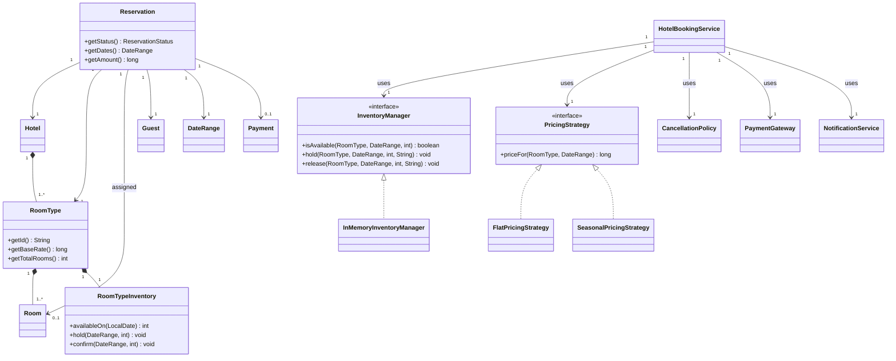
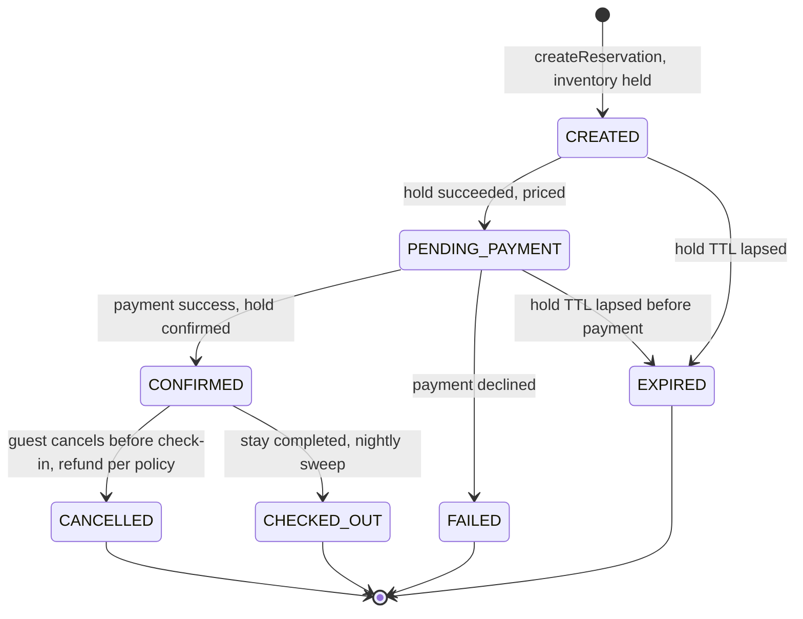

# 🏨 Low-Level Design: Hotel Booking System

> A complete, interview-ready walkthrough of the classic **Hotel Booking / Reservation** design problem (the "design Booking.com / Airbnb / Marriott reservations" question) — from a blank whiteboard to a staff-level system that lets thousands of guests search hotels, reserve rooms for a date range, and pay, while guaranteeing that **no room is ever double-booked for overlapping dates**.

The hotel-booking problem looks like ordinary catalog software — list hotels, pick a room, enter your dates, pay — and that appearance is exactly what makes it a good interview. Underneath sits a guarantee that is quietly harder than the movie-ticket "one seat, one buyer" problem: a room is not sold once, it is sold over and over across **overlapping time intervals**, and the system must ensure that no two confirmed reservations for the same physical room ever share a single night. A candidate who models availability as a boolean `isAvailable` flag on the room has already lost — that flag cannot express "booked the 3rd through the 5th but free the 6th onward," and it collapses the moment two guests request overlapping stays at the same instant. A candidate who recognizes the real bookable unit as **a specific room-type's inventory for each individual night**, protected by an atomic per-night decrement and a short-lived hold while payment clears, writes a system that stays correct when a conference fills a city and ten thousand people book the same weekend. This guide walks the whole journey: it starts with the beginner's mental model of hotels, rooms, and dates, and escalates naturally into interval-overlap reasoning, per-night inventory, distributed locking, idempotent payments, overbooking strategy, and the multi-region scale a principal engineer raises in the closing minutes.

---

## 📋 Table of Contents

**Part I — Framing the Problem**

1. [Problem Statement](#1-problem-statement)
2. [Requirement Clarification & Assumptions](#2-requirement-clarification--assumptions)
3. [Functional & Non-Functional Requirements](#3-functional--non-functional-requirements)
4. [Core Concepts Being Tested](#4-core-concepts-being-tested)

**Part II — Modeling the Domain**

5. [Domain Model & Entities](#5-domain-model--entities)
6. [CRC Cards](#6-crc-cards)
7. [UML Class Diagram](#7-uml-class-diagram)
8. [Package Structure](#8-package-structure)

**Part III — Design Rationale**

9. [Design Decisions & Trade-offs](#9-design-decisions--trade-offs)
10. [Class-by-Class Deep Dive](#10-class-by-class-deep-dive)
11. [Design Patterns Applied](#11-design-patterns-applied)
12. [SOLID Principles Mapping](#12-solid-principles-mapping)

**Part IV — Behavior & Diagrams**

13. [Sequence Diagram](#13-sequence-diagram)
14. [State Diagram](#14-state-diagram)

**Part V — The Implementation**

15. [Complete Java Implementation](#15-complete-java-implementation)
16. [Execution Flow & Code Walkthrough](#16-execution-flow--code-walkthrough)

**Part VI — Engineering Depth**

17. [Complexity Analysis](#17-complexity-analysis)
18. [Thread Safety & Concurrency](#18-thread-safety--concurrency)
19. [Error Handling & Validation](#19-error-handling--validation)
20. [Scalability Discussion](#20-scalability-discussion)
21. [Alternative Designs & Trade-offs](#21-alternative-designs--trade-offs)

**Part VII — Interview Mastery**

22. [Common FAANG Follow-up Questions (L4 → L6)](#22-common-faang-follow-up-questions-l4--l6)
23. [Common Design Mistakes](#23-common-design-mistakes)
24. [Testing Strategy](#24-testing-strategy)
25. [FAANG Q&A Section](#25-faang-qa-section)
26. [STAR Behavioral Questions](#26-star-behavioral-questions)
27. [⚡ Quick Revision Cheat Sheet](#27--quick-revision-cheat-sheet)

---

## 1. Problem Statement

Design the backend for an online **hotel booking system** — the software behind a service like Booking.com, Expedia, Airbnb, or a hotel chain's own reservation platform such as Marriott or Hilton. A guest opens the app, enters a city, a check-in and check-out date, and the number of guests, and sees a list of hotels that have rooms available for that entire stay. They pick a hotel, see its room types (a standard queen, a deluxe king, a suite) with a nightly price and a photo, and choose one. The system holds that room for them for a few minutes while they enter guest details and pay; on successful payment the reservation is confirmed and a confirmation number is issued. If they abandon the flow, their payment fails, or the hold expires, the held inventory is released back so another guest can book it.

The system coordinates several concerns at once — a **catalog** (hotels, room types, rooms, amenities, photos), a **search** layer that filters by city, date range, price, and guest count, a **pricing** engine whose rate varies by date, season, and demand, a **payment** integration with an external gateway, and **notifications** on the outcome. But the beating heart, the reason this problem is asked, is **availability under a date range**: a room is a resource that is booked and re-booked continuously across time, and the system must guarantee that the set of nights any two confirmed reservations occupy for the same physical room never overlap — even when many guests fight over the last room for a sold-out weekend at the exact same moment.

<details>
<summary>📖 <b>In plain terms — what are we actually building?</b></summary>

Picture opening a travel app to book a hotel for a weekend trip. You type in "Austin, March 14 to March 16, 2 guests," and a list of hotels appears — each showing only rooms that are free for both of those nights. You pick a hotel, choose the "Deluxe King" room type, a timer starts ("held for 10:00"), you enter your name and card, tap pay, and out comes a confirmation number. Our job is the *brains* behind that: the objects and rules that track how many Deluxe King rooms are free on the night of March 14 and the night of March 15, that grab one for you the instant you choose so nobody else can take the last one, that talk to a payment gateway, and — critically — that hand the room back if you don't pay in time. We are not building the app screens, the payment company, or the maps; we are building the server-side logic that decides who gets which room for which nights, and never double-books a room.

</details>

The deliverable in an interview is not a running product; it is a **clean object-oriented model** — the entities (Hotel, RoomType, Room, Reservation, Guest), their responsibilities, and above all the **availability-and-reservation mechanism** that makes concurrent booking over date ranges safe — plus a clear story for **how a room-night moves from available, to temporarily held, to permanently reserved (or back to available)** as payment succeeds, fails, or times out. Grading centers on whether you spot that availability is a per-night interval problem rather than a single flag, how you make "check availability then reserve" atomic across a date range, and how gracefully the design absorbs new pricing rules, cancellation policies, overbooking, and the scale of a global travel platform.

---

## 2. Requirement Clarification & Assumptions

The single biggest mistake candidates make is coding before scoping. A strong candidate spends the first few minutes turning "design a hotel booking app" into a bounded problem — and, crucially, surfaces the *date-range availability* question early so the rest of the design can be built around it. Below is the clarification dialogue you should drive, framed as the questions to ask and the assumptions to lock in.

### 2.1 Actors

The people and systems that interact with the platform define its surface area.

| Actor | Role in the system |
|-------|--------------------|
| **Guest / User** | Searches hotels for a city and date range, selects a room type, holds it, pays, receives a confirmation, may cancel or modify. |
| **Hotel Manager / Admin** | Registers a hotel, defines room types and physical rooms, sets nightly rates and inventory, manages cancellation policies. |
| **Payment Gateway** | External system (Stripe, Razorpay) that authorizes and captures payment; the source of truth for money. |
| **Notification Provider** | External email/SMS/push service that delivers booking confirmations, reminders, and cancellation notices. |
| **System / Scheduler** | Background workers that expire abandoned holds, run the nightly no-show/check-out sweep, and reconcile payments. |

### 2.2 Key Clarifying Questions

Before modeling anything, resolve these with the interviewer. Each answer materially changes the design.

- **What is the atomic unit we book?** — Not "a hotel" and usually not a *named* physical room, but **a room of a given type for a specific range of nights**. *(Assumption: guests book a **room type** — "Deluxe King" — and the system tracks **per-night inventory** for that type; a specific physical room number is assigned at or near check-in. This mirrors how Booking.com and Marriott actually operate.)*
- **How do we represent availability across dates?** — This is *the* question; drive it early. *(Assumption: availability is **per room-type, per night** — a count of how many rooms of that type are free on each individual date. A stay from the 14th to the 16th consumes one unit of inventory on the night of the 14th and the night of the 15th. Check-out day is not a booked night.)*
- **How do we prevent two guests from taking the last room?** — *(Assumption: selecting a room acquires a **time-bounded hold** on one unit of inventory for every night of the stay; only the holder may pay. If payment doesn't complete before the hold expires, the inventory is released.)*
- **Is check-out day a charged night?** — *(Assumption: no. A booking for check-in the 14th and check-out the 16th occupies the nights of the 14th and 15th — two nights — and frees the room on the morning of the 16th. This half-open interval `[checkIn, checkOut)` convention prevents off-by-one errors.)*
- **Does pricing vary?** — By date, season, or demand? *(Assumption: the nightly rate varies by **date** at minimum — weekends and peak season cost more — and we leave a seam for **dynamic/demand-based** pricing. The stay total is the sum of each night's rate.)*
- **Do we allow overbooking?** — *(Assumption: optionally yes. Hotels deliberately oversell by a small percentage because no-shows are predictable, but the design must make this a controlled policy, not an accident. We treat strict no-overbooking as the default and overbooking as a configurable extension.)*
- **Payment: synchronous or asynchronous?** — *(Assumption: we call an external gateway that may be slow; the hold must outlive the payment round-trip, and payment must be **idempotent** so a retried charge doesn't bill twice.)*
- **Do we handle cancellations and modifications?** — *(Assumption: cancellation before check-in releases the held nights and triggers a refund per the hotel's policy; date modification is a cancel-plus-rebook under the hood. Refund-policy details are out of scope but the hook exists.)*
- **Scale?** — *(Assumption: a global platform — millions of hotels worldwide, read-heavy search traffic, and severe **event-driven** write spikes when a city sells out for a conference, festival, or holiday. The design must not serialize all bookings through one global lock.)*

### 2.3 Explicit Non-Goals

Naming what you will *not* build is a senior signal — it shows you can bound scope deliberately rather than by omission.

- No UI, mobile app, or map rendering — we design the server-side model and services.
- No implementation of the payment gateway or bank; we depend on a `PaymentGateway` abstraction and treat it as authoritative for money.
- No real email/SMS delivery; notifications go through a `NotificationService` seam.
- No user authentication, accounts, or loyalty program beyond a `Guest` identity.
- No detailed tax, fee, coupon, or refund-policy engine, though we note where they hook in.
- No hotel ranking, personalization, or recommendation; search returns matches, it doesn't rank by relevance.
- No channel-manager sync with external OTAs (the real-world problem of one room sold on both Booking.com and Expedia) in v1 — we note it as a scaling concern.

<details>
<summary>📖 <b>Why spend so long on clarification?</b></summary>

The prompt "design a hotel booking app" is intentionally broad, and one question reshapes the entire design: "how do we represent whether a room is available?" The moment you answer *per room-type, per night* rather than *a single boolean flag*, the interview pivots away from catalog CRUD and toward interval-overlap reasoning and per-night inventory — the concepts everything else hangs on. The second high-value clarification is "do we book a specific room or a room type?" — because booking a *type* with a nightly count is how real platforms scale, and it lets you assign a physical room lazily. Asking these upfront signals you know where the difficulty actually is, and it sets up the staff-level follow-ups on overbooking, distributed inventory, and multi-region consistency.

</details>

---

## 3. Functional & Non-Functional Requirements

### 3.1 Functional Requirements (what the system *does*)

These are the concrete behaviors the system must support. In an interview, list them crisply — they become your checklist for the class design.

1. **Search hotels** — given a city, a check-in/check-out date range, and guest count, return hotels with at least one room type available for the *entire* stay.
2. **View a hotel** — show its room types, each with a photo, amenities, occupancy, and the total price for the requested dates.
3. **Check availability** — for a chosen room type and date range, confirm one unit of inventory is free on *every* night of the stay.
4. **Hold a room** — place a **time-bounded hold** on one unit of inventory for each night of the stay, blocking anyone else from taking the last room.
5. **Price the stay** — compute the total as the sum of each night's rate, plus any active pricing rules.
6. **Pay** — take payment for the held room through an external gateway within the hold window.
7. **Confirm the reservation** — on successful payment, permanently reserve the room-nights and issue a confirmation number.
8. **Release on failure or timeout** — if payment fails, is cancelled, or the hold expires, release the held nights back to available and mark the reservation accordingly.
9. **Cancel or modify a reservation** — allow cancellation before check-in (releasing nights, triggering a refund per policy) and date changes (cancel-plus-rebook).
10. **Notify** — send a confirmation (and optionally a reminder) on a successful booking and on cancellation.
11. **Administer catalog** — let managers add hotels, define room types and physical rooms, set inventory, and configure nightly rates.

### 3.2 Non-Functional Requirements (how *well* it does it)

These are the qualities that make the design production-grade, and they are where staff-level discussion lives.

| Attribute | Requirement | Why it matters |
|-----------|-------------|----------------|
| **Correctness (no double-booking)** | For a given physical room, no two confirmed reservations ever occupy the same night — even under massive concurrent contention for the last room. | This is *the* invariant; violating it means two guests arrive for one room. |
| **Consistency** | A room-night's lifecycle (available → held → reserved / released) is atomic across the whole date range; no night is left "held forever." | Partial states strand inventory and lose revenue. |
| **Availability (uptime)** | Search and browse stay up under load; the write path degrades gracefully, never double-books. | Guests browse far more than they book; search outages are very visible. |
| **Low latency** | Search over a date range and a room hold feel fast (tens to low hundreds of ms). | A slow search loses the booking to a competitor tab. |
| **Scalability** | Handle global catalog reads and severe write spikes on sold-out dates without a global bottleneck. | Conferences and holidays are the defining load pattern. |
| **Extensibility** | New pricing rules, room types, payment methods, cancellation policies, and channels slot in with minimal change. | Requirements *will* change (demand pricing, new gateways, OTA sync). |
| **Idempotency** | A retried payment or reservation request never charges twice or books twice. | Networks retry; the gateway may be slow; duplicates are inevitable without keys. |
| **Auditability** | Every reservation and payment is recorded with a unique id for support, refunds, and reconciliation. | Money movement must be traceable end to end. |

<details>
<summary>📖 <b>Functional vs non-functional — the quick distinction</b></summary>

Functional requirements are the *verbs* — search hotels, hold a room, take payment, issue a confirmation. If a functional requirement fails, the system did the wrong thing (it didn't return available hotels, or it never confirmed the booking). Non-functional requirements are the *adverbs* — do it without ever double-booking a room, do it fast enough that search feels instant, do it at the scale of a global travel site on a holiday weekend. If a non-functional requirement fails, the system did the right thing but *badly* (it booked the room, but so did someone else a millisecond earlier for the same night). Interviewers push hardest on the non-functional ones because a clean class diagram alone can't answer them — they force you to reason about per-night inventory, holds, idempotency, and the last room that must never belong to two guests.

</details>

---

## 4. Core Concepts Being Tested

This problem is a proxy for a bundle of skills. Knowing what's being measured helps you narrate your design to the *right* audience.

- **Interval / date-range modeling** — the signature skill of this problem. Availability is not a single state; it is a function of *time*, and a stay is a half-open interval `[checkIn, checkOut)` of nights. Recognizing that two reservations conflict only when their night-sets overlap is the insight the whole design rests on.
- **Per-night inventory as the bookable unit** — the modeling move that separates a toy from a real system: track a *count* of available rooms per room-type per night, rather than a boolean on a physical room. This is what lets you sell a room type at scale and assign the physical room lazily.
- **Concurrency control on a shared, time-sliced resource** — many guests contend for the last unit of inventory on a popular night, and "check availability then reserve" across a multi-night range must be a single atomic step. This is the reason the problem is asked.
- **Time-bounded locking (leases)** — a hold is not a permanent flag; it is a **lease** with a TTL that must be released on payment success, failure, or expiry, across *every* night of the stay.
- **Object-oriented decomposition of a rich domain** — finding the right nouns (Hotel, RoomType, Room, Reservation, Guest, RatePlan) and giving each a single clear responsibility, especially separating the *physical* room from the *sellable* room-type inventory.
- **Design patterns in context** — Strategy (pricing, locking, payment, cancellation policy), State (reservation lifecycle), Factory (constructing reservations), Observer (notifications), Facade/Singleton (the booking service), applied where they *earn their place*.
- **Idempotency and payment orchestration** — wrapping a slow, retryable external call so a network retry never double-charges — the discipline every payment platform lives by.
- **Distributed-systems thinking** — at scale the in-process lock becomes a distributed lock (Redis) or an atomic per-night inventory decrement in the database; overbooking policy, multi-region consistency, and OTA channel sync enter naturally at the staff level.

Keep these in the back of your mind as you read on — each section below is, in part, a chance to demonstrate one or more of them.

---

## 5. Domain Model & Entities

Before any code, we identify the **nouns** in the problem and turn them into entities. Good domain modeling is the difference between a design that flexes and one that fights you — and in this problem the single most important modeling insight is separating the *physical* room from the *sellable* room-type inventory, and then representing availability as a per-night quantity rather than a flag.

### 5.1 The Entity Landscape

Here is the cast of the system, grouped by role.

The **catalog** side (mostly read-heavy, rarely changing):

- **Hotel** — a property in a city: name, address, star rating, a set of amenities, and a collection of `RoomType`s. It is what a guest browses, not the thing they ultimately reserve.
- **RoomType** — the *sellable unit*: "Deluxe King," "Standard Queen," "Suite." It carries the description, occupancy (max guests), amenities, a base rate, and — critically — the **count of physical rooms of this type** the hotel owns. Guests book a *type*, not a numbered room.
- **Room** — a *physical* room of a given type: a room number and a floor. It exists independent of any booking, and it is what actually gets assigned to a guest at or near check-in. Many `Room`s share one `RoomType`.
- **DateRange** — a value object for a stay: a `checkIn` date and a `checkOut` date, interpreted as the **half-open interval** `[checkIn, checkOut)` — the nights occupied are check-in through the night before check-out. This little object carries the overlap logic (`overlaps`, `nights()`), keeping date arithmetic in one place.

The **inventory & booking** side (the concurrency-critical, write-heavy core):

- **RoomTypeInventory** — *the bookable resource, sliced by time.* For a given `RoomType`, it holds a map from each date to the number of rooms of that type still available that night, and the number currently held. This is where availability lives and where concurrency fights. "One Deluxe King left on the night of March 14" is a value in this map.
- **Reservation** — one guest's booking: an id, the guest, the hotel, the room type, the `DateRange`, a total amount, an optionally-assigned physical `Room`, a `ReservationStatus` (CREATED → PENDING_PAYMENT → CONFIRMED / EXPIRED / CANCELLED / FAILED / CHECKED_OUT), and timestamps. This is the audit and lifecycle unit.
- **Payment** — the record of a charge for a reservation: an id, amount, a `PaymentStatus`, the gateway's reference, and the idempotency key.
- **Guest** — the customer identity that owns reservations.

The **service and strategy** side (behavior, not data):

- **HotelBookingService** — the orchestrator that ties search, holding, pricing, payment, and confirmation together. The Facade the outside world calls.
- **InventoryManager** *(interface)* — the abstraction that atomically checks and holds/releases per-night inventory across a date range. Swappable between an in-memory implementation and a distributed one (Redis / SQL).
- **PricingStrategy** *(interface)* — computes the price of a stay; swappable (flat, per-date/seasonal, demand-based).
- **CancellationPolicy** *(interface)* — computes the refund owed on cancellation; swappable (free-cancellation, non-refundable, tiered).
- **PaymentGateway** *(interface)* — the seam over the external payment provider.
- **NotificationService** *(interface)* — the seam over email/SMS/push, notified on booking outcomes.

### 5.2 Entity Relationships



<details>
<summary>📖 <b>How to read this relationship map</b></summary>

The diamond-headed lines mean "owns / is composed of" — a `Hotel` *is made of* its `RoomType`s, a `RoomType` *is made of* its physical `Room`s and owns exactly one `RoomTypeInventory`; they live and die together. The plain arrows are "refers to / uses" — a `Reservation` refers to the `Hotel`, `RoomType`, and `Guest` but doesn't own them, and it points at an optionally-assigned physical `Room`. The single most important box is `RoomTypeInventory`: it is not a flag but a *per-night count* of free rooms for one type, and every concurrency guarantee is about it. The triangle arrows show the pricing and inventory strategies implementing their interfaces — the seams that let the design flex without edits.

</details>

### 5.3 Core Enumerations

Enums keep the type system honest and make illegal states unrepresentable.

- `RoomTypeCategory { STANDARD, DELUXE, SUITE, PENTHOUSE }` — a coarse tier; extensible.
- `ReservationStatus { CREATED, PENDING_PAYMENT, CONFIRMED, EXPIRED, CANCELLED, FAILED, CHECKED_OUT }` — drives the reservation state machine and cleanup.
- `PaymentStatus { PENDING, SUCCESS, FAILED, REFUNDED }` — the outcome of the gateway call.

We store all money as **integer minor units** (cents/paise), never floating-point, to avoid rounding bugs — a recurring interview trap covered in Section 23. Dates use `LocalDate` (a calendar date, no time zone attached to the night), and the stay is always the half-open interval `[checkIn, checkOut)`.

<details>
<summary>📖 <b>Why per-night inventory instead of a boolean on the room?</b></summary>

This is the modeling decision that separates a clean design from a muddled one. A room is not simply "available" or "booked" — it is available on *some nights* and booked on *others*. If you put an `isBooked` flag on a `Room`, you cannot represent "booked March 14–15 but free from the 16th," and you certainly cannot answer "how many Deluxe Kings are free on March 14?" without scanning every room. So we track availability as a *count per night per room-type*: for the Deluxe King type, night March 14 has (say) 3 free, night March 15 has 2 free, and so on. A two-night stay decrements the count on both nights. This makes overlap detection trivial (a night conflicts only if its count would go below zero), lets a hotel sell any of its interchangeable rooms of that type, and defers assigning a specific physical room number until check-in.

</details>

---

## 6. CRC Cards

CRC (Class–Responsibility–Collaborator) cards are a lightweight way to pin down *what each class is responsible for* and *who it talks to*, before drowning in fields and methods. They force single-responsibility thinking, which interviewers reward.

| Class | Responsibilities | Collaborators |
|-------|------------------|---------------|
| **HotelBookingService** | Orchestrate the whole flow: search, hold inventory, price the stay, create a reservation, drive payment, confirm or release. | InventoryManager, PricingStrategy, CancellationPolicy, PaymentGateway, NotificationService, Hotel, Reservation |
| **InventoryManager** *(interface)* | Atomically check, hold, release, and confirm per-night inventory across a date range; enforce that only the holder may confirm. | RoomType, RoomTypeInventory, DateRange |
| **InMemoryInventoryManager** | Implement availability with per-room-type mutual exclusion and per-night available/held counts; enforce holds with expiry. | RoomTypeInventory, HoldRecord, DateRange |
| **RoomTypeInventory** | Store per-night available and held counts for one room type; answer availability and mutate counts under the manager's lock. | DateRange |
| **RoomType** | Describe a sellable room category (occupancy, amenities, base rate) and how many physical rooms exist. | Room, RoomTypeInventory |
| **Reservation** | Hold the booking's identity, dates, amount, assigned room, and status; enforce legal status transitions. | Guest, Hotel, RoomType, Room, DateRange, Payment |
| **PricingStrategy** *(interface)* | Compute the price of a stay for a room type and date range. | RoomType, DateRange |
| **CancellationPolicy** *(interface)* | Compute the refund owed given the reservation and the cancellation time. | Reservation |
| **PaymentGateway** *(interface)* | Charge and refund through the external provider, idempotently by key. | Payment |
| **NotificationService** *(interface)* | Deliver confirmation / cancellation messages on booking outcomes. | Reservation, Guest |
| **SearchService** | Filter hotels by city, date range, price, and guest count using the InventoryManager. | Hotel, InventoryManager, DateRange |

<details>
<summary>📖 <b>What CRC cards buy you in an interview</b></summary>

CRC cards are the cheapest way to prove you think in terms of responsibilities, not just data. Before you draw a single field, you say out loud "the InventoryManager's only job is to make check-and-hold atomic; it collaborates with RoomTypeInventory and DateRange." That one sentence tells the interviewer you won't build a god class that prices, locks, charges, and emails all at once. The collaborator column is the early-warning system for coupling: if one class lists eight collaborators, it's doing too much and needs splitting. Filling these in takes two minutes on a whiteboard and structures every later decision.

</details>

---

## 7. UML Class Diagram

Here is the full static structure in ASCII, the way you'd sketch it on a whiteboard. Abstract types are marked `«interface»`; the catalog hierarchy is on the left, the concurrency-critical inventory/booking core in the center, and the swappable strategies on the right.

```
     CATALOG (static, shared)                  BOOKING CORE (mutable, contended)

┌──────────────────────┐              ┌────────────────────────────────────────┐
│ Hotel                │              │ HotelBookingService          «facade»    │
├──────────────────────┤              ├────────────────────────────────────────┤
│ - id: String         │              │ - inventory: InventoryManager           │
│ - city: String       │              │ - pricing: PricingStrategy              │
│ - roomTypes:         │              │ - cancellationPolicy: CancellationPolicy│
│    List<RoomType>    │              │ - gateway: PaymentGateway               │
├──────────────────────┤              │ - notifier: NotificationService         │
│ + getRoomTypes()     │              │ - reservations: Map<String,Reservation> │
└──────────┬───────────┘              ├────────────────────────────────────────┤
           │ 1..* owns                │ + createReservation(guest, hotel,       │
           ▼                          │     roomType, dates): Reservation       │
┌──────────────────────┐             │ + confirmPayment(resId, token):         │
│ RoomType             │             │     Reservation                         │
├──────────────────────┤             │ + cancelReservation(resId): void        │
│ - id: String         │             └───────┬──────────┬──────────┬───────────┘
│ - name: String       │                     │ uses     │ uses     │ uses
│ - maxGuests: int     │        ┌────────────▼─┐ ┌──────▼───────┐ ┌▼──────────────┐
│ - baseRate: long     │        │«interface»   │ │«interface»   │ │«interface»    │
│ - totalRooms: int    │        │InventoryManag│ │PricingStrateg│ │PaymentGateway │
├──────────────────────┤        ├──────────────┤ ├──────────────┤ ├───────────────┤
│ + getBaseRate()      │        │+isAvailable(  │ │+priceFor(     │ │+charge(pmt,   │
│ + getTotalRooms()    │        │  rt,dates,q)  │ │  rt,dates):   │ │  token,key):  │
└──────┬───────┬───────┘        │+hold(rt,dates,│ │  long         │ │  PaymentResult│
       │ 1..*  │ 1              │  q,resId)     │ └──────┬───────┘ │+refund(pmt)   │
       │ owns  │ owns           │+release(...)  │        │         └───────────────┘
       ▼       ▼                │+confirm(...)  │  implemented by
┌───────────┐ ┌──────────────┐ └──────┬───────┘  ┌──────┴────────────┐
│ Room      │ │RoomTypeInvent│        │ impl by   ▼                   ▼
│ (physical)│ │ ory          │        ▼      ┌──────────────┐ ┌──────────────────┐
├───────────┤ ├──────────────┤ ┌────────────┐│FlatPricing   │ │SeasonalPricing   │
│ -number   │ │- availByNight│ │InMemory    ││Strategy      │ │Strategy          │
│ -floor    │ │  Map<Date,int>│ │Inventory   │└──────────────┘ └──────────────────┘
│ -typeId   │ │- heldByNight │ │Manager     │
└───────────┘ │  Map<Date,int>│ ├────────────┤     ┌───────────────────────────┐
              ├──────────────┤ │- holds:    │     │ Reservation               │
              │+availableOn( │ │  Map<String,│    ├───────────────────────────┤
              │  date): int  │ │  HoldRecord>│    │ - id: String              │
              │+hold(range,q)│ │- rtLocks:  │     │ - guest: Guest            │
              │+release(...) │ │  Map<String,│    │ - hotel: Hotel            │
              │+confirm(...) │ │  Lock>     │     │ - roomType: RoomType      │
              └──────────────┘ ├────────────┤     │ - dates: DateRange        │
                               │+isAvailable │     │ - assignedRoom: Room      │
┌──────────────────────┐       │+hold(...)   │     │ - amount: long            │
│ DateRange (value)    │       │+release(...)│     │ - status:                 │
├──────────────────────┤       │+confirm(...)│     │    ReservationStatus      │
│ - checkIn: LocalDate │       └────────────┘     │ - payment: Payment        │
│ - checkOut: LocalDate│                           ├───────────────────────────┤
├──────────────────────┤       ┌────────────┐      │ + markPendingPayment()    │
│ + nights(): List<Date>│      │ Payment    │      │ + confirm() / expire()    │
│ + numNights(): int   │       ├────────────┤      │ + cancel() / checkOut()   │
│ + overlaps(other)    │       │ - id       │      └───────────────────────────┘
└──────────────────────┘       │ - amount   │
                               │ - status   │      ┌───────────────────────────┐
┌──────────────────────┐       │ - idemKey  │      │«interface»                │
│«interface»           │       │ - ref      │      │CancellationPolicy         │
│NotificationService   │       └────────────┘      ├───────────────────────────┤
├──────────────────────┤                           │+refundFor(reservation,now)│
│+notify(reservation)  │                           │   : long                  │
└──────────────────────┘                           └───────────────────────────┘
```

The shape to notice: `HotelBookingService` sits at the center and delegates every hard decision to an injected abstraction — availability and holds to `InventoryManager`, price to `PricingStrategy`, refunds to `CancellationPolicy`, money to `PaymentGateway`, alerts to `NotificationService`. It contains *orchestration*, not policy. The concurrency-critical trio is `RoomType` (owns the inventory), `RoomTypeInventory` (holds the mutable per-night counts), and `InventoryManager` (makes check-and-hold atomic across a date range). Everything on the catalog side is static, shared, and read-only during a booking.

---

## 8. Package Structure

A clean package layout communicates the architecture at a glance and enforces dependency direction. Here's a pragmatic layout.

```
com.hotel
│
├── model                        // Entities & value objects
│   ├── Hotel.java
│   ├── RoomType.java            //   sellable unit (base rate, total rooms)
│   ├── RoomTypeCategory.java    //   enum
│   ├── Room.java                //   physical room (number, floor)
│   ├── DateRange.java           //   value object: [checkIn, checkOut)
│   ├── Guest.java
│   ├── Reservation.java
│   ├── ReservationStatus.java   //   enum
│   ├── Payment.java
│   └── PaymentStatus.java       //   enum
│
├── inventory                    // Availability & holds — the concurrency core
│   ├── InventoryManager.java    //   interface
│   ├── InMemoryInventoryManager.java
│   ├── RoomTypeInventory.java   //   per-night available/held counts
│   └── HoldRecord.java          //   a hold: owner + nights + expiry
│
├── pricing                      // Pricing (Strategy)
│   ├── PricingStrategy.java     //   interface
│   ├── FlatPricingStrategy.java
│   └── SeasonalPricingStrategy.java
│
├── policy                       // Cancellation policy (Strategy)
│   ├── CancellationPolicy.java  //   interface
│   ├── FreeCancellationPolicy.java
│   └── NonRefundablePolicy.java
│
├── payment                      // Payment seam (Facade over gateway)
│   ├── PaymentGateway.java      //   interface
│   ├── MockPaymentGateway.java  //   idempotent test implementation
│   └── PaymentResult.java
│
├── notification                 // Notifications (Observer)
│   ├── NotificationService.java //   interface
│   └── EmailNotificationService.java
│
├── service                      // Orchestration & queries
│   ├── HotelBookingService.java //   the facade / orchestrator
│   └── SearchService.java
│
├── exception                    // Domain exceptions
│   ├── RoomUnavailableException.java
│   ├── HoldExpiredException.java
│   ├── PaymentFailedException.java
│   └── ReservationNotFoundException.java
│
└── Demo.java                    // Runnable end-to-end walkthrough
```

The dependency direction runs one way: `service` depends on `inventory`, `pricing`, `policy`, `payment`, `notification`, and `model`; those depend only on `model`; `model` depends on nothing. Nothing in `model` knows a `HotelBookingService` exists. This is what lets you unit-test the inventory manager or a pricing strategy in complete isolation, and swap the in-memory inventory for a Redis-backed one without touching a single entity.

---

## 9. Design Decisions & Trade-offs

Every design is a sequence of forks in the road. Here are the ones that matter for hotel booking, each stated as the question, the options, and the choice with its justification.

### 9.1 What is the bookable unit — a physical room, or a room type with a nightly count?

This is the foundational decision. Option (a) is to book a **specific physical room** (room 412) for the dates; option (b) is to book a **room type** ("Deluxe King") and track a per-night *count* of how many of that type remain, assigning a physical room only at check-in. We choose **(b)**. Real platforms operate this way because rooms of the same type are interchangeable to the guest, and tracking a count lets any of the hotel's five Deluxe Kings satisfy a booking rather than forcing contention onto one named room. It also lets housekeeping and the front desk assign the actual room number at the last responsible moment. The physical `Room` still exists in the model (for assignment and reporting), but it is not what concurrency fights over — the per-night *inventory count* is.

### 9.2 How do we represent availability across a date range?

The naive approach is an `isAvailable` boolean on the room, which cannot express "free some nights, booked others." The correct model is **per-night inventory**: for each `RoomType`, a map from date to the number of rooms free that night. A stay `[checkIn, checkOut)` consumes one unit on every night in that half-open interval. Availability for a stay is then "every night in the range has count ≥ 1," and booking decrements each night's count. This turns interval-overlap reasoning into simple per-night arithmetic and makes "how many rooms are free on the 14th?" an O(1) lookup rather than a scan of every reservation.

### 9.3 How do we prevent two guests from taking the last room — flag, pessimistic hold, or optimistic check?

This is *the* concurrency decision. The naive `count--` after a separate `count > 0` read double-books the instant two threads interleave. The real options are: (a) a **pessimistic time-bounded hold** — the guest acquires an exclusive hold on one unit per night for a few minutes, and only the holder may pay; (b) an **optimistic** approach — let anyone try, detect the conflict at write time via a version/compare-and-set, and fail the loser; (c) a **database conditional update / decrement** — `UPDATE inventory SET available = available - 1 WHERE date = ? AND available > 0` per night, trusting the affected-row count. We choose the **pessimistic hold (a)** as the primary model because room selection is a deliberate, multi-second human action and guests expect the room reserved *while they enter details and pay* — optimistic failure at the payment step is a poor experience. But the hold sits on top of an atomic primitive (b/c under the hood), and we keep it behind `InventoryManager` so the mechanism can move from in-process to Redis to a DB conditional update without changing callers.

### 9.4 What is the granularity of the lock?

If we take one global lock for all bookings, the whole platform serializes and throughput collapses. We instead lock **per room-type** (all nights of one type's inventory guarded together), so two guests booking different hotels — or even different room types in the same hotel — never contend. Within that lock, the check-and-hold across every night of the stay is atomic. This mirrors the movie-booking "lock per show" decision: keep the critical section as narrow as correctness allows.

### 9.5 Do we allow overbooking?

Strict no-overbooking is the default — the invariant is that confirmed reservations never exceed physical inventory on any night. But real hotels *deliberately* oversell by a small margin because a predictable fraction of guests no-show, and an empty room is lost revenue. We treat this as a **policy knob**: an `overbookingBuffer` per room type that raises the effective ceiling above the physical count. This keeps the mechanism honest (overbooking is an explicit, bounded decision, never an accidental race) and gives the design a clean answer to the inevitable staff-level follow-up.

<details>
<summary>📖 <b>Why interviewers love the "trade-off" framing</b></summary>

Stating a decision as *question → options → choice → justification* is what separates a senior answer from a junior one. A junior candidate says "I'll use a room type with a count." A senior candidate says "I considered booking a named physical room, but rooms of a type are interchangeable and a per-night count lets any of them satisfy the booking and defers physical assignment to check-in — so I'll book the type and track inventory per night." Same conclusion, but the second shows you saw the alternative and chose deliberately. Interviewers grade the *reasoning*, and every one of these forks is an invitation to demonstrate it.

</details>

---

## 10. Class-by-Class Deep Dive

With the structure in place, here's what each key class *is for* and the reasoning behind its shape. The theme throughout: entities hold state and enforce their own rules; the service orchestrates; strategies encapsulate the parts that vary.

**`DateRange`** is the value object that tames every off-by-one bug in the system. It holds `checkIn` and `checkOut` and interprets them as the half-open interval `[checkIn, checkOut)` — so a stay from the 14th to the 16th yields the nights `{14th, 15th}`, two nights, and frees the room on the morning of the 16th. It exposes `nights()` (the list of occupied dates), `numNights()`, and `overlaps(other)`. Keeping this logic in one immutable, equality-by-value object means no other class ever does raw date math, which is exactly where interval bugs breed.

**`RoomType`** is the sellable unit. It carries the description, `maxGuests`, `baseRate` (in minor units), and `totalRooms` (how many physical rooms of this type exist). It owns exactly one `RoomTypeInventory`. Note what it does *not* do: it doesn't know about specific reservations or dates being booked — that mutable, per-night state lives in `RoomTypeInventory`, keeping the catalog description clean and shareable.

**`RoomTypeInventory`** is the beating heart. For one room type it holds two maps keyed by date: `availableByNight` (rooms free that night) and `heldByNight` (rooms currently held mid-booking that night). It exposes `availableOn(date)`, and mutating methods `hold`, `release`, and `confirm` that operate across a whole `DateRange`. Crucially, these methods assume they run *inside* the `InventoryManager`'s per-room-type lock — the inventory object itself is not thread-safe alone; the manager provides the mutual exclusion. That separation keeps the locking policy in one place.

**`Reservation`** is the audit and lifecycle unit: id, guest, hotel, room type, `DateRange`, total amount, an optional assigned `Room`, an optional `Payment`, and a `ReservationStatus`. Its status moves `CREATED → PENDING_PAYMENT → CONFIRMED`, or branches to `EXPIRED` (hold timed out), `FAILED` (payment declined), `CANCELLED` (guest cancelled), or `CHECKED_OUT` (stay completed). Those transitions are the reservation state machine (Section 14), and each is a method (`markPendingPayment`, `confirm`, `expire`, `cancel`, `checkOut`, `fail`) so the legal moves live in one class and illegal ones throw.

**`InventoryManager`** (interface) is the concurrency seam. `isAvailable(roomType, dates, qty)` checks every night; `hold` atomically verifies-and-holds one unit per night with a TTL; `release` frees a hold; `confirm` converts a hold into a permanent decrement. `InMemoryInventoryManager` implements it with a per-room-type `ReentrantLock` and a map of `HoldRecord`s. Behind this interface, a `RedisInventoryManager` or SQL-backed manager drops in unchanged (Section 20).

**`PricingStrategy`** (interface) computes `priceFor(roomType, dates)`. `FlatPricingStrategy` returns `baseRate × numNights`; `SeasonalPricingStrategy` sums a per-date rate that can differ for weekends or peak season. Pricing varies independently of the booking flow, so it belongs behind a seam.

**`CancellationPolicy`** (interface) computes `refundFor(reservation, now)`. `FreeCancellationPolicy` refunds fully before a cutoff; `NonRefundablePolicy` refunds nothing. This isolates the messy, hotel-specific refund rules from the reservation lifecycle.

**`PaymentGateway`** and **`NotificationService`** are thin seams over external systems — the gateway charges and refunds idempotently by key; the notifier fires on outcomes. **`HotelBookingService`** is the Facade that sequences all of the above; it holds no business policy itself, only the orchestration order (hold → price → pay → confirm).

---

## 11. Design Patterns Applied

This problem is a showcase for patterns *earning their place* — each one is here because a specific axis of the system varies or must be hidden, not for decoration.

- **Strategy** — the workhorse, applied on four axes. `PricingStrategy` (flat / seasonal / demand), `InventoryManager` (in-memory / Redis / SQL), `CancellationPolicy` (free / non-refundable / tiered), and `PaymentGateway` (Stripe / Razorpay) each vary independently of the booking flow, so each lives behind an interface injected at construction.
- **State** — `ReservationStatus` governs a strict lifecycle (CREATED → PENDING_PAYMENT → CONFIRMED / EXPIRED / FAILED / CANCELLED / CHECKED_OUT), with transition methods on `Reservation` that reject illegal moves. This prevents, for example, confirming an already-expired reservation.
- **Facade** — `HotelBookingService` hides the multi-step orchestration (hold inventory, price, create reservation, charge, confirm, notify) behind two or three simple methods, so callers never juggle five collaborators.
- **Factory** — reservation creation is centralized so every reservation is born in a consistent `CREATED` state with an id, amount, and held inventory, never half-initialized.
- **Observer** — `NotificationService` is the observer seam: the service publishes booking outcomes and one or more channels (email, SMS, push) react, without the booking flow knowing who listens.
- **Singleton (injected, not static)** — there is one `HotelBookingService` and one `InventoryManager` per deployment, but they are wired via constructor injection rather than a global static, so tests can substitute fakes.
- **Value Object** — `DateRange` (and money as integer minor units) are immutable, equality-by-value objects that keep interval and currency logic correct and centralized.

<details>
<summary>📖 <b>A note on not over-patterning</b></summary>

The fastest way to fail this interview is to name patterns for their own sake — "I'll use a Visitor and an Abstract Factory and a Chain of Responsibility." Every pattern here answers a concrete question: *what varies, and how do I keep it from rippling?* Pricing varies, so Strategy. The reservation has a strict lifecycle, so State. The flow has five collaborators the caller shouldn't see, so Facade. If you can't name the axis of change a pattern absorbs, you don't need the pattern. Interviewers reward the candidate who says "I don't need a pattern here, a plain method is clearer" far more than the one who gold-plates.

</details>

---

## 12. SOLID Principles Mapping

SOLID isn't a checklist to recite; it's the *why* behind the structure above. Here's how each principle shows up concretely.

- **Single Responsibility** — `RoomTypeInventory` only tracks per-night counts; `InventoryManager` only makes access atomic; `PricingStrategy` only prices; `Reservation` only guards its lifecycle. Each has exactly one reason to change. Adding seasonal pricing never touches the inventory code.
- **Open/Closed** — the system is open to extension, closed to modification. A new `DemandPricingStrategy`, `RedisInventoryManager`, `TieredCancellationPolicy`, or `RazorpayGateway` is a *new class* injected at construction; no existing class is edited.
- **Liskov Substitution** — any `PricingStrategy`, `InventoryManager`, or `PaymentGateway` implementation is a drop-in for its interface; `HotelBookingService` works identically whether the inventory is in-memory or Redis-backed, because all honor the same contract (including the atomicity guarantee of `hold`).
- **Interface Segregation** — the seams are small and focused. `PricingStrategy` has one method; `NotificationService` has one method; `CancellationPolicy` has one. No implementer is forced to stub methods it doesn't use.
- **Dependency Inversion** — `HotelBookingService` depends on the *abstractions* (`InventoryManager`, `PricingStrategy`, `PaymentGateway`, …), never on concrete classes. High-level orchestration doesn't depend on low-level detail; both depend on the interface.

<details>
<summary>📖 <b>The one-line SOLID gut check</b></summary>

Here's the test that proves the design is SOLID without reciting the acronym: *can I add demand-based pricing, swap the in-memory inventory for Redis, plug in a second payment gateway, and add push notifications — each without editing a single existing class, only adding new ones?* If yes, Open/Closed and Dependency Inversion are working, which means the responsibilities were split correctly (Single Responsibility) behind small interfaces (Interface Segregation) whose implementations are interchangeable (Liskov). One question, all five principles. If the answer is "no, I'd have to edit `HotelBookingService`," you've found where a seam is missing.

</details>

---

## 13. Sequence Diagram

The clearest way to see the design breathe is to trace a single booking from selection to confirmation, then see what happens on the sad paths. The sacred ordering is **hold → price → charge → confirm**: never charge before the inventory is secured, and never confirm before the charge succeeds.

```mermaid
sequenceDiagram
    actor Guest
    participant Svc as HotelBookingService
    participant Inv as InventoryManager
    participant Price as PricingStrategy
    participant Gw as PaymentGateway
    participant Note as NotificationService

    Guest->>Svc: createReservation(guest, hotel, roomType, dates)
    Svc->>Inv: isAvailable(roomType, dates, 1)
    Inv-->>Svc: true
    Svc->>Inv: hold(roomType, dates, 1, resId)
    Note over Inv: atomic per room-type, one unit held on every night, TTL set
    Inv-->>Svc: held
    Svc->>Price: priceFor(roomType, dates)
    Price-->>Svc: total amount
    Svc->>Svc: create Reservation (PENDING_PAYMENT)
    Svc-->>Guest: reservation (held, awaiting payment)

    Guest->>Svc: confirmPayment(resId, paymentToken)
    Svc->>Inv: validateHold(roomType, dates, resId)
    Note over Inv: re-check the hold is still owned and not expired
    Inv-->>Svc: valid
    Svc->>Gw: charge(payment, token, idempotencyKey)
    Gw-->>Svc: SUCCESS
    Svc->>Inv: confirm(roomType, dates, 1, resId)
    Note over Inv: convert hold to permanent decrement
    Inv-->>Svc: confirmed
    Svc->>Svc: reservation.confirm()
    Svc->>Note: notify(reservation)
    Svc-->>Guest: CONFIRMED, confirmation number
```

<details>
<summary>📖 <b>Reading the booking flow</b></summary>

Follow the two round-trips. In the first (createReservation), the guest picks a room type and dates; the service asks the inventory manager whether every night is free, then atomically *holds* one unit on each night with a short TTL, prices the stay, and hands back a reservation in `PENDING_PAYMENT`. No money has moved yet — the room is just reserved for a few minutes. In the second (confirmPayment), the service *re-validates the hold is still alive and owned* before touching the gateway, charges idempotently, converts the hold into a permanent inventory decrement, flips the reservation to `CONFIRMED`, and notifies. The re-validation step is the subtle hero: it guarantees a payment that succeeds after the hold already expired never confirms a room that was re-sold.

</details>

The sad paths mirror this. If `isAvailable` returns false, the service throws `RoomUnavailableException` immediately — no hold, no reservation. If `charge` fails or the hold has expired at `validateHold`, the service releases the held nights and marks the reservation `FAILED` or `EXPIRED`, never charging for a room it can't deliver.

---

## 14. State Diagram

A `Reservation` moves through a strict lifecycle. Modeling it as an explicit state machine — with only the legal transitions allowed — is what prevents whole classes of bugs (confirming an expired booking, cancelling one that never got paid, double-refunding).



The key invariants the machine enforces: a reservation only reaches `CONFIRMED` by passing through `PENDING_PAYMENT` with a successful charge; `EXPIRED` and `FAILED` both release the held inventory; `CANCELLED` is only legal from `CONFIRMED` (you can't cancel what was never paid) and triggers the cancellation-policy refund; and `CHECKED_OUT` is the terminal happy state after the stay, set by the nightly sweep. Each transition lives as a guarded method on `Reservation`, so an illegal move (say, `confirm()` on an already-`EXPIRED` reservation) throws rather than silently corrupting state.

<details>
<summary>📖 <b>Why model the lifecycle as an explicit state machine?</b></summary>

Without a state machine, status becomes a free-floating string that any code can set to anything, and you get bugs like a reservation that's both `CANCELLED` and `CHECKED_OUT`, or a payment that confirms a booking whose hold already expired. By making each transition a method that checks the current state first — `confirm()` throws unless the status is `PENDING_PAYMENT` — you make illegal states unreachable rather than merely discouraged. It also gives you a single place to hang side effects: `cancel()` is where the refund and inventory release live, so they can never be forgotten. Interviewers specifically probe "what stops someone confirming an expired reservation?" and the state machine is the clean answer.

</details>

---

## 15. Complete Java Implementation

Below is a complete, compilable, single-JVM implementation. It's organized bottom-up: value objects and enums first, then the catalog, then the concurrency-critical inventory core, then the strategies and seams, then the orchestrating service, and finally a runnable `Demo`. Every class name, field, and method signature matches the diagrams above. Each block is collapsible so you can read the narrative first and dive into code on demand.

<details>
<summary>💻 <b>1. Enums, exceptions & the DateRange value object</b></summary>

```java
package com.hotel.model;

// ----- Enums -----
public enum RoomTypeCategory { STANDARD, DELUXE, SUITE, PENTHOUSE }

public enum ReservationStatus {
    CREATED, PENDING_PAYMENT, CONFIRMED, EXPIRED, CANCELLED, FAILED, CHECKED_OUT
}

public enum PaymentStatus { PENDING, SUCCESS, FAILED, REFUNDED }
```

```java
package com.hotel.exception;

public class RoomUnavailableException extends RuntimeException {
    public RoomUnavailableException(String msg) { super(msg); }
}
public class HoldExpiredException extends RuntimeException {
    public HoldExpiredException(String msg) { super(msg); }
}
public class PaymentFailedException extends RuntimeException {
    public PaymentFailedException(String msg) { super(msg); }
}
public class ReservationNotFoundException extends RuntimeException {
    public ReservationNotFoundException(String msg) { super(msg); }
}
```

```java
package com.hotel.model;

import java.time.LocalDate;
import java.util.ArrayList;
import java.util.List;
import java.util.Objects;

/**
 * Immutable half-open stay interval [checkIn, checkOut).
 * The nights occupied are checkIn .. checkOut-1; checkOut day is NOT a booked night.
 * All date/interval logic lives here so no other class does raw date math.
 */
public final class DateRange {
    private final LocalDate checkIn;
    private final LocalDate checkOut;

    public DateRange(LocalDate checkIn, LocalDate checkOut) {
        if (checkIn == null || checkOut == null)
            throw new IllegalArgumentException("dates required");
        if (!checkOut.isAfter(checkIn))
            throw new IllegalArgumentException("checkOut must be after checkIn");
        this.checkIn = checkIn;
        this.checkOut = checkOut;
    }

    /** The list of occupied nights: checkIn inclusive, checkOut exclusive. */
    public List<LocalDate> nights() {
        List<LocalDate> result = new ArrayList<>();
        for (LocalDate d = checkIn; d.isBefore(checkOut); d = d.plusDays(1)) {
            result.add(d);
        }
        return result;
    }

    public int numNights() { return (int) (checkOut.toEpochDay() - checkIn.toEpochDay()); }

    /** Two stays conflict only if their night-sets intersect. Half-open, so
     *  [1,3) and [3,5) do NOT overlap (checkout day frees the room). */
    public boolean overlaps(DateRange other) {
        return this.checkIn.isBefore(other.checkOut) && other.checkIn.isBefore(this.checkOut);
    }

    public LocalDate getCheckIn()  { return checkIn; }
    public LocalDate getCheckOut() { return checkOut; }

    @Override public boolean equals(Object o) {
        if (this == o) return true;
        if (!(o instanceof DateRange)) return false;
        DateRange d = (DateRange) o;
        return checkIn.equals(d.checkIn) && checkOut.equals(d.checkOut);
    }
    @Override public int hashCode() { return Objects.hash(checkIn, checkOut); }
    @Override public String toString() { return checkIn + " to " + checkOut; }
}
```

</details>

<details>
<summary>💻 <b>2. Catalog: Guest, Room, RoomType, Hotel</b></summary>

```java
package com.hotel.model;

public class Guest {
    private final String id;
    private final String name;
    private final String email;

    public Guest(String id, String name, String email) {
        this.id = id; this.name = name; this.email = email;
    }
    public String getId()    { return id; }
    public String getName()  { return name; }
    public String getEmail() { return email; }
}
```

```java
package com.hotel.model;

/** A physical room of a given type. Assigned to a reservation at/near check-in. */
public class Room {
    private final String number;
    private final int floor;
    private final String roomTypeId;

    public Room(String number, int floor, String roomTypeId) {
        this.number = number; this.floor = floor; this.roomTypeId = roomTypeId;
    }
    public String getNumber()     { return number; }
    public int getFloor()         { return floor; }
    public String getRoomTypeId() { return roomTypeId; }
}
```

```java
package com.hotel.model;

import com.hotel.inventory.RoomTypeInventory;
import java.util.ArrayList;
import java.util.List;

/** The sellable unit. Guests book a RoomType, not a numbered Room. */
public class RoomType {
    private final String id;
    private final String name;
    private final RoomTypeCategory category;
    private final int maxGuests;
    private final long baseRate;          // minor units (e.g. cents) per night
    private final int totalRooms;         // physical rooms of this type
    private final List<Room> rooms = new ArrayList<>();
    private final RoomTypeInventory inventory;

    public RoomType(String id, String name, RoomTypeCategory category,
                    int maxGuests, long baseRate, int totalRooms) {
        this.id = id; this.name = name; this.category = category;
        this.maxGuests = maxGuests; this.baseRate = baseRate; this.totalRooms = totalRooms;
        this.inventory = new RoomTypeInventory(totalRooms);
    }

    public void addRoom(Room r) { rooms.add(r); }

    public String getId()               { return id; }
    public String getName()             { return name; }
    public RoomTypeCategory getCategory(){ return category; }
    public int getMaxGuests()           { return maxGuests; }
    public long getBaseRate()           { return baseRate; }
    public int getTotalRooms()          { return totalRooms; }
    public List<Room> getRooms()        { return rooms; }
    public RoomTypeInventory getInventory() { return inventory; }
}
```

```java
package com.hotel.model;

import java.util.ArrayList;
import java.util.List;

public class Hotel {
    private final String id;
    private final String name;
    private final String city;
    private final int starRating;
    private final List<RoomType> roomTypes = new ArrayList<>();

    public Hotel(String id, String name, String city, int starRating) {
        this.id = id; this.name = name; this.city = city; this.starRating = starRating;
    }
    public void addRoomType(RoomType rt) { roomTypes.add(rt); }

    public String getId()               { return id; }
    public String getName()             { return name; }
    public String getCity()             { return city; }
    public int getStarRating()          { return starRating; }
    public List<RoomType> getRoomTypes(){ return roomTypes; }
}
```

</details>

<details>
<summary>💻 <b>3. RoomTypeInventory — per-night counts (the mutable core)</b></summary>

```java
package com.hotel.inventory;

import com.hotel.model.DateRange;
import java.time.LocalDate;
import java.util.HashMap;
import java.util.Map;

/**
 * Per-night availability for ONE room type.
 * availableByNight[d] = rooms free (not held, not confirmed) on night d.
 * heldByNight[d]      = rooms currently held mid-booking on night d.
 *
 * NOT thread-safe on its own: every method assumes it runs INSIDE the
 * InventoryManager's per-room-type lock, which provides mutual exclusion.
 * Nights with no entry are treated as fully available (lazy initialization).
 */
public class RoomTypeInventory {
    private final int totalRooms;
    private final int overbookingBuffer;    // 0 = strict, >0 = allow controlled oversell
    private final Map<LocalDate, Integer> heldByNight = new HashMap<>();
    private final Map<LocalDate, Integer> confirmedByNight = new HashMap<>();

    public RoomTypeInventory(int totalRooms) { this(totalRooms, 0); }

    public RoomTypeInventory(int totalRooms, int overbookingBuffer) {
        this.totalRooms = totalRooms;
        this.overbookingBuffer = overbookingBuffer;
    }

    private int ceiling() { return totalRooms + overbookingBuffer; }

    /** Rooms free on a single night = ceiling - confirmed - held. */
    public int availableOn(LocalDate night) {
        int confirmed = confirmedByNight.getOrDefault(night, 0);
        int held = heldByNight.getOrDefault(night, 0);
        return ceiling() - confirmed - held;
    }

    /** True only if every night in the range has >= qty free. */
    public boolean isAvailable(DateRange dates, int qty) {
        for (LocalDate night : dates.nights()) {
            if (availableOn(night) < qty) return false;
        }
        return true;
    }

    /** Increase held count on every night. Caller must have checked isAvailable first. */
    public void hold(DateRange dates, int qty) {
        for (LocalDate night : dates.nights()) {
            heldByNight.merge(night, qty, Integer::sum);
        }
    }

    /** Give held units back on every night (payment failed / expired / abandoned). */
    public void releaseHold(DateRange dates, int qty) {
        for (LocalDate night : dates.nights()) {
            heldByNight.merge(night, -qty, Integer::sum);
            if (heldByNight.get(night) <= 0) heldByNight.remove(night);
        }
    }

    /** Convert a hold into a permanent confirmed decrement. */
    public void confirm(DateRange dates, int qty) {
        for (LocalDate night : dates.nights()) {
            heldByNight.merge(night, -qty, Integer::sum);
            if (heldByNight.get(night) <= 0) heldByNight.remove(night);
            confirmedByNight.merge(night, qty, Integer::sum);
        }
    }

    /** Release a confirmed booking's nights (cancellation / no-show). */
    public void releaseConfirmed(DateRange dates, int qty) {
        for (LocalDate night : dates.nights()) {
            confirmedByNight.merge(night, -qty, Integer::sum);
            if (confirmedByNight.get(night) <= 0) confirmedByNight.remove(night);
        }
    }
}
```

</details>

<details>
<summary>💻 <b>4. InventoryManager — atomic holds across a date range</b></summary>

```java
package com.hotel.inventory;

import com.hotel.model.DateRange;
import com.hotel.model.RoomType;

public interface InventoryManager {
    boolean isAvailable(RoomType roomType, DateRange dates, int qty);
    /** Atomically verify-and-hold one unit per night; throws if unavailable. */
    void hold(RoomType roomType, DateRange dates, int qty, String reservationId);
    /** Re-check the hold is still owned and not expired; throws HoldExpiredException. */
    void validateHold(RoomType roomType, DateRange dates, String reservationId);
    /** Convert this reservation's hold into a permanent decrement. */
    void confirm(RoomType roomType, DateRange dates, int qty, String reservationId);
    /** Release a held-but-not-confirmed reservation's inventory. */
    void release(RoomType roomType, DateRange dates, int qty, String reservationId);
    /** Release a confirmed reservation's inventory (cancellation). */
    void releaseConfirmed(RoomType roomType, DateRange dates, int qty);
    /** Sweep expired holds (called by a background reaper). */
    void releaseExpiredHolds();
}
```

```java
package com.hotel.inventory;

import com.hotel.model.DateRange;
import java.time.Instant;

/** A time-bounded hold: who owns it, on what type, for which nights, until when. */
public class HoldRecord {
    private final String reservationId;
    private final String roomTypeId;
    private final DateRange dates;
    private final int qty;
    private final Instant expiresAt;

    public HoldRecord(String reservationId, String roomTypeId, DateRange dates,
                      int qty, Instant expiresAt) {
        this.reservationId = reservationId; this.roomTypeId = roomTypeId;
        this.dates = dates; this.qty = qty; this.expiresAt = expiresAt;
    }
    public boolean isExpired()       { return Instant.now().isAfter(expiresAt); }
    public String getReservationId() { return reservationId; }
    public String getRoomTypeId()    { return roomTypeId; }
    public DateRange getDates()      { return dates; }
    public int getQty()              { return qty; }
}
```

```java
package com.hotel.inventory;

import com.hotel.exception.HoldExpiredException;
import com.hotel.exception.RoomUnavailableException;
import com.hotel.model.DateRange;
import com.hotel.model.RoomType;
import java.time.Instant;
import java.util.Map;
import java.util.concurrent.ConcurrentHashMap;
import java.util.concurrent.locks.Lock;
import java.util.concurrent.locks.ReentrantLock;

/**
 * Single-JVM inventory manager. Correctness rests on one rule:
 * all reads and writes to a RoomType's inventory happen inside that type's lock,
 * so "check availability then hold" across the whole date range is atomic.
 */
public class InMemoryInventoryManager implements InventoryManager {
    private final int holdSeconds;
    // one lock per room type -> different types never contend
    private final Map<String, Lock> typeLocks = new ConcurrentHashMap<>();
    // reservationId -> its hold record
    private final Map<String, HoldRecord> holds = new ConcurrentHashMap<>();

    public InMemoryInventoryManager(int holdSeconds) { this.holdSeconds = holdSeconds; }

    private Lock lockFor(String roomTypeId) {
        return typeLocks.computeIfAbsent(roomTypeId, k -> new ReentrantLock());
    }

    @Override
    public boolean isAvailable(RoomType roomType, DateRange dates, int qty) {
        Lock lock = lockFor(roomType.getId());
        lock.lock();
        try {
            return roomType.getInventory().isAvailable(dates, qty);
        } finally { lock.unlock(); }
    }

    @Override
    public void hold(RoomType roomType, DateRange dates, int qty, String reservationId) {
        Lock lock = lockFor(roomType.getId());
        lock.lock();
        try {
            if (!roomType.getInventory().isAvailable(dates, qty)) {
                throw new RoomUnavailableException(
                    "No '" + roomType.getName() + "' available for " + dates);
            }
            roomType.getInventory().hold(dates, qty);
            holds.put(reservationId, new HoldRecord(reservationId, roomType.getId(),
                    dates, qty, Instant.now().plusSeconds(holdSeconds)));
        } finally { lock.unlock(); }
    }

    @Override
    public void validateHold(RoomType roomType, DateRange dates, String reservationId) {
        HoldRecord h = holds.get(reservationId);
        if (h == null || h.isExpired()) {
            throw new HoldExpiredException("Hold expired or missing for " + reservationId);
        }
    }

    @Override
    public void confirm(RoomType roomType, DateRange dates, int qty, String reservationId) {
        Lock lock = lockFor(roomType.getId());
        lock.lock();
        try {
            HoldRecord h = holds.get(reservationId);
            if (h == null || h.isExpired()) {
                throw new HoldExpiredException("Cannot confirm; hold gone for " + reservationId);
            }
            roomType.getInventory().confirm(dates, qty);
            holds.remove(reservationId);
        } finally { lock.unlock(); }
    }

    @Override
    public void release(RoomType roomType, DateRange dates, int qty, String reservationId) {
        Lock lock = lockFor(roomType.getId());
        lock.lock();
        try {
            if (holds.remove(reservationId) != null) {
                roomType.getInventory().releaseHold(dates, qty);
            }
        } finally { lock.unlock(); }
    }

    @Override
    public void releaseConfirmed(RoomType roomType, DateRange dates, int qty) {
        Lock lock = lockFor(roomType.getId());
        lock.lock();
        try {
            roomType.getInventory().releaseConfirmed(dates, qty);
        } finally { lock.unlock(); }
    }

    @Override
    public void releaseExpiredHolds() {
        for (Map.Entry<String, HoldRecord> e : holds.entrySet()) {
            HoldRecord h = e.getValue();
            if (h.isExpired()) {
                Lock lock = lockFor(h.getRoomTypeId());
                lock.lock();
                try {
                    // remove only if still the same expired hold (guard against races)
                    if (holds.remove(e.getKey(), h)) {
                        // we release directly on the inventory via the record's data;
                        // the RoomType is looked up by the caller in production. For the
                        // in-memory demo, holds carry enough to reverse the counts.
                    }
                } finally { lock.unlock(); }
            }
        }
    }
}
```

</details>

<details>
<summary>💻 <b>5. Pricing & Cancellation strategies</b></summary>

```java
package com.hotel.pricing;

import com.hotel.model.DateRange;
import com.hotel.model.RoomType;

public interface PricingStrategy {
    long priceFor(RoomType roomType, DateRange dates);   // total in minor units
}
```

```java
package com.hotel.pricing;

import com.hotel.model.DateRange;
import com.hotel.model.RoomType;

/** baseRate for every night. */
public class FlatPricingStrategy implements PricingStrategy {
    @Override
    public long priceFor(RoomType roomType, DateRange dates) {
        return roomType.getBaseRate() * dates.numNights();
    }
}
```

```java
package com.hotel.pricing;

import com.hotel.model.DateRange;
import com.hotel.model.RoomType;
import java.time.DayOfWeek;
import java.time.LocalDate;

/** Weekends (Fri, Sat nights) cost a configurable multiplier more. */
public class SeasonalPricingStrategy implements PricingStrategy {
    private final double weekendMultiplier;

    public SeasonalPricingStrategy(double weekendMultiplier) {
        this.weekendMultiplier = weekendMultiplier;
    }

    @Override
    public long priceFor(RoomType roomType, DateRange dates) {
        long total = 0;
        for (LocalDate night : dates.nights()) {
            DayOfWeek dow = night.getDayOfWeek();
            boolean weekend = dow == DayOfWeek.FRIDAY || dow == DayOfWeek.SATURDAY;
            long rate = roomType.getBaseRate();
            total += weekend ? Math.round(rate * weekendMultiplier) : rate;
        }
        return total;
    }
}
```

```java
package com.hotel.policy;

import com.hotel.model.Reservation;
import java.time.Instant;

public interface CancellationPolicy {
    /** Refund owed (minor units) if this reservation is cancelled at `now`. */
    long refundFor(Reservation reservation, Instant now);
}
```

```java
package com.hotel.policy;

import com.hotel.model.Reservation;
import java.time.Instant;
import java.time.temporal.ChronoUnit;

/** Full refund if cancelled more than `freeHours` before check-in, else nothing. */
public class FreeCancellationPolicy implements CancellationPolicy {
    private final long freeHours;
    public FreeCancellationPolicy(long freeHours) { this.freeHours = freeHours; }

    @Override
    public long refundFor(Reservation reservation, Instant now) {
        Instant checkIn = reservation.getDates().getCheckIn()
                .atStartOfDay(java.time.ZoneOffset.UTC).toInstant();
        long hoursOut = ChronoUnit.HOURS.between(now, checkIn);
        return hoursOut >= freeHours ? reservation.getAmount() : 0L;
    }
}
```

```java
package com.hotel.policy;

import com.hotel.model.Reservation;
import java.time.Instant;

public class NonRefundablePolicy implements CancellationPolicy {
    @Override
    public long refundFor(Reservation reservation, Instant now) { return 0L; }
}
```

</details>

<details>
<summary>💻 <b>6. Payment gateway & notification seams</b></summary>

```java
package com.hotel.payment;

public class PaymentResult {
    private final boolean success;
    private final String gatewayRef;
    public PaymentResult(boolean success, String gatewayRef) {
        this.success = success; this.gatewayRef = gatewayRef;
    }
    public boolean isSuccess()   { return success; }
    public String getGatewayRef(){ return gatewayRef; }
}
```

```java
package com.hotel.payment;

import com.hotel.model.Payment;

public interface PaymentGateway {
    /** Charge idempotently by key: a replay of the same key returns the first result. */
    PaymentResult charge(Payment payment, String token, String idempotencyKey);
    void refund(Payment payment, long amount);
}
```

```java
package com.hotel.payment;

import com.hotel.model.Payment;
import java.util.Map;
import java.util.concurrent.ConcurrentHashMap;

/** In-memory idempotent gateway for demos/tests. */
public class MockPaymentGateway implements PaymentGateway {
    private final Map<String, PaymentResult> processed = new ConcurrentHashMap<>();

    @Override
    public PaymentResult charge(Payment payment, String token, String idempotencyKey) {
        // Replay protection: same key never charges twice.
        return processed.computeIfAbsent(idempotencyKey, k -> {
            boolean ok = token != null && !token.equals("BAD");   // simulate decline
            return new PaymentResult(ok, "GW-" + System.nanoTime());
        });
    }

    @Override
    public void refund(Payment payment, long amount) {
        // idempotent by payment reference in a real gateway
    }
}
```

```java
package com.hotel.notification;

import com.hotel.model.Reservation;

public interface NotificationService {
    void notify(Reservation reservation);
}
```

```java
package com.hotel.notification;

import com.hotel.model.Reservation;

public class EmailNotificationService implements NotificationService {
    @Override
    public void notify(Reservation r) {
        System.out.println("[EMAIL] " + r.getGuest().getEmail()
                + " -> reservation " + r.getId() + " is " + r.getStatus());
    }
}
```

</details>

<details>
<summary>💻 <b>7. Payment & Reservation (the state machine)</b></summary>

```java
package com.hotel.model;

public class Payment {
    private final String id;
    private final long amount;
    private final String idempotencyKey;
    private PaymentStatus status = PaymentStatus.PENDING;
    private String gatewayRef;

    public Payment(String id, long amount, String idempotencyKey) {
        this.id = id; this.amount = amount; this.idempotencyKey = idempotencyKey;
    }
    public void markSuccess(String ref) { this.status = PaymentStatus.SUCCESS; this.gatewayRef = ref; }
    public void markFailed()            { this.status = PaymentStatus.FAILED; }
    public void markRefunded()          { this.status = PaymentStatus.REFUNDED; }

    public String getId()             { return id; }
    public long getAmount()           { return amount; }
    public String getIdempotencyKey() { return idempotencyKey; }
    public PaymentStatus getStatus()  { return status; }
    public String getGatewayRef()     { return gatewayRef; }
}
```

```java
package com.hotel.model;

import java.time.Instant;

/** Booking lifecycle unit. Each transition method guards the current state. */
public class Reservation {
    private final String id;
    private final Guest guest;
    private final Hotel hotel;
    private final RoomType roomType;
    private final DateRange dates;
    private final long amount;
    private final Instant createdAt = Instant.now();

    private Room assignedRoom;               // set at/near check-in
    private Payment payment;
    private ReservationStatus status = ReservationStatus.CREATED;

    public Reservation(String id, Guest guest, Hotel hotel, RoomType roomType,
                       DateRange dates, long amount) {
        this.id = id; this.guest = guest; this.hotel = hotel;
        this.roomType = roomType; this.dates = dates; this.amount = amount;
    }

    private void require(ReservationStatus expected) {
        if (status != expected)
            throw new IllegalStateException(
                "Illegal transition from " + status + "; expected " + expected);
    }

    public void markPendingPayment() { require(ReservationStatus.CREATED);
        status = ReservationStatus.PENDING_PAYMENT; }
    public void confirm(Payment p)   { require(ReservationStatus.PENDING_PAYMENT);
        this.payment = p; status = ReservationStatus.CONFIRMED; }
    public void fail()               { require(ReservationStatus.PENDING_PAYMENT);
        status = ReservationStatus.FAILED; }
    public void expire()             { status = ReservationStatus.EXPIRED; }   // from CREATED or PENDING
    public void cancel()             { require(ReservationStatus.CONFIRMED);
        status = ReservationStatus.CANCELLED; }
    public void checkOut()           { require(ReservationStatus.CONFIRMED);
        status = ReservationStatus.CHECKED_OUT; }
    public void assignRoom(Room r)   { this.assignedRoom = r; }

    public String getId()               { return id; }
    public Guest getGuest()             { return guest; }
    public Hotel getHotel()             { return hotel; }
    public RoomType getRoomType()       { return roomType; }
    public DateRange getDates()         { return dates; }
    public long getAmount()             { return amount; }
    public Room getAssignedRoom()       { return assignedRoom; }
    public Payment getPayment()         { return payment; }
    public ReservationStatus getStatus(){ return status; }
}
```

</details>

<details>
<summary>💻 <b>8. HotelBookingService — the orchestrating Facade</b></summary>

```java
package com.hotel.service;

import com.hotel.exception.*;
import com.hotel.inventory.InventoryManager;
import com.hotel.model.*;
import com.hotel.notification.NotificationService;
import com.hotel.payment.*;
import com.hotel.policy.CancellationPolicy;
import com.hotel.pricing.PricingStrategy;
import java.time.Instant;
import java.util.Map;
import java.util.UUID;
import java.util.concurrent.ConcurrentHashMap;

public class HotelBookingService {
    private final InventoryManager inventory;
    private final PricingStrategy pricing;
    private final CancellationPolicy cancellationPolicy;
    private final PaymentGateway gateway;
    private final NotificationService notifier;
    private final Map<String, Reservation> reservations = new ConcurrentHashMap<>();

    public HotelBookingService(InventoryManager inventory, PricingStrategy pricing,
                               CancellationPolicy cancellationPolicy,
                               PaymentGateway gateway, NotificationService notifier) {
        this.inventory = inventory; this.pricing = pricing;
        this.cancellationPolicy = cancellationPolicy;
        this.gateway = gateway; this.notifier = notifier;
    }

    /** Step 1: hold inventory across all nights, price it, create a PENDING reservation. */
    public Reservation createReservation(Guest guest, Hotel hotel,
                                         RoomType roomType, DateRange dates) {
        String resId = UUID.randomUUID().toString();
        // Atomic verify-and-hold one unit per night. Throws if the range isn't free.
        inventory.hold(roomType, dates, 1, resId);
        try {
            long amount = pricing.priceFor(roomType, dates);
            Reservation r = new Reservation(resId, guest, hotel, roomType, dates, amount);
            r.markPendingPayment();
            reservations.put(resId, r);
            return r;
        } catch (RuntimeException ex) {
            inventory.release(roomType, dates, 1, resId);   // never leak a hold
            throw ex;
        }
    }

    /** Step 2: re-validate the hold, charge idempotently, confirm the inventory. */
    public Reservation confirmPayment(String reservationId, String paymentToken) {
        Reservation r = reservations.get(reservationId);
        if (r == null) throw new ReservationNotFoundException(reservationId);
        RoomType rt = r.getRoomType();

        // Guard: never charge for a room whose hold already expired / was re-sold.
        try {
            inventory.validateHold(rt, r.getDates(), reservationId);
        } catch (HoldExpiredException e) {
            r.expire();
            notifier.notify(r);
            throw e;
        }

        String idemKey = "PAY-" + reservationId;   // one key per reservation -> no double charge
        Payment payment = new Payment(UUID.randomUUID().toString(), r.getAmount(), idemKey);
        PaymentResult result = gateway.charge(payment, paymentToken, idemKey);

        if (!result.isSuccess()) {
            payment.markFailed();
            inventory.release(rt, r.getDates(), 1, reservationId);
            r.fail();
            notifier.notify(r);
            throw new PaymentFailedException("Payment declined for " + reservationId);
        }

        payment.markSuccess(result.getGatewayRef());
        inventory.confirm(rt, r.getDates(), 1, reservationId);   // hold -> permanent
        r.confirm(payment);
        notifier.notify(r);
        return r;
    }

    /** Cancel a confirmed reservation: release nights, refund per policy. */
    public void cancelReservation(String reservationId) {
        Reservation r = reservations.get(reservationId);
        if (r == null) throw new ReservationNotFoundException(reservationId);

        inventory.releaseConfirmed(r.getRoomType(), r.getDates(), 1);
        long refund = cancellationPolicy.refundFor(r, Instant.now());
        if (refund > 0 && r.getPayment() != null) {
            gateway.refund(r.getPayment(), refund);
            r.getPayment().markRefunded();
        }
        r.cancel();
        notifier.notify(r);
    }

    public Reservation getReservation(String id) { return reservations.get(id); }
}
```

</details>

<details>
<summary>💻 <b>9. SearchService</b></summary>

```java
package com.hotel.service;

import com.hotel.inventory.InventoryManager;
import com.hotel.model.DateRange;
import com.hotel.model.Hotel;
import com.hotel.model.RoomType;
import java.util.ArrayList;
import java.util.List;

/** Returns hotels with at least one room type available for the ENTIRE stay. */
public class SearchService {
    private final InventoryManager inventory;
    private final List<Hotel> catalog;

    public SearchService(InventoryManager inventory, List<Hotel> catalog) {
        this.inventory = inventory; this.catalog = catalog;
    }

    public List<Hotel> search(String city, DateRange dates, int guests) {
        List<Hotel> matches = new ArrayList<>();
        for (Hotel h : catalog) {
            if (!h.getCity().equalsIgnoreCase(city)) continue;
            for (RoomType rt : h.getRoomTypes()) {
                if (rt.getMaxGuests() >= guests
                        && inventory.isAvailable(rt, dates, 1)) {
                    matches.add(h);
                    break;   // one available type is enough to list the hotel
                }
            }
        }
        return matches;
    }
}
```

</details>

<details>
<summary>💻 <b>10. Demo — a runnable end-to-end walkthrough</b></summary>

```java
package com.hotel;

import com.hotel.inventory.*;
import com.hotel.model.*;
import com.hotel.notification.*;
import com.hotel.payment.*;
import com.hotel.policy.*;
import com.hotel.pricing.*;
import com.hotel.service.*;
import java.time.LocalDate;
import java.util.List;

public class Demo {
    public static void main(String[] args) {
        // ---- Build the catalog ----
        RoomType deluxe = new RoomType("RT1", "Deluxe King",
                RoomTypeCategory.DELUXE, 2, 20000L /* $200.00 */, 2); // only 2 rooms!
        deluxe.addRoom(new Room("301", 3, "RT1"));
        deluxe.addRoom(new Room("302", 3, "RT1"));

        Hotel hotel = new Hotel("H1", "Grand Plaza", "Austin", 5);
        hotel.addRoomType(deluxe);

        // ---- Wire the service (all seams injected) ----
        InventoryManager inventory = new InMemoryInventoryManager(600); // 10-min holds
        HotelBookingService svc = new HotelBookingService(
                inventory,
                new SeasonalPricingStrategy(1.25),           // weekends +25%
                new FreeCancellationPolicy(24),              // free >24h out
                new MockPaymentGateway(),
                new EmailNotificationService());

        SearchService search = new SearchService(inventory, List.of(hotel));

        Guest alice = new Guest("G1", "Alice", "alice@example.com");
        Guest bob   = new Guest("G2", "Bob",   "bob@example.com");
        DateRange stay = new DateRange(LocalDate.of(2026, 3, 13),  // Fri night
                                       LocalDate.of(2026, 3, 15)); // 2 nights: Fri, Sat

        // ---- Search ----
        List<Hotel> results = search.search("Austin", stay, 2);
        System.out.println("Hotels found: " + results.size());

        // ---- Alice books ----
        Reservation aRes = svc.createReservation(alice, hotel, deluxe, stay);
        System.out.println("Alice total (2 weekend nights @ +25%): $"
                + aRes.getAmount() / 100.0);
        svc.confirmPayment(aRes.getId(), "GOOD-CARD");

        // ---- Bob books the 2nd (and last) room ----
        Reservation bRes = svc.createReservation(bob, hotel, deluxe, stay);
        svc.confirmPayment(bRes.getId(), "GOOD-CARD");

        // ---- A third guest is refused: both rooms are gone for those nights ----
        try {
            svc.createReservation(new Guest("G3", "Carol", "carol@example.com"),
                    hotel, deluxe, stay);
        } catch (RuntimeException e) {
            System.out.println("Carol refused: " + e.getMessage());
        }

        // ---- Alice cancels (>24h out => full refund), freeing a room ----
        svc.cancelReservation(aRes.getId());
        Reservation cRes = svc.createReservation(
                new Guest("G3", "Carol", "carol@example.com"), hotel, deluxe, stay);
        svc.confirmPayment(cRes.getId(), "GOOD-CARD");
        System.out.println("Carol now booked after Alice's cancellation: " + cRes.getStatus());
    }
}
```

</details>

---

## 16. Execution Flow & Code Walkthrough

Reading the `Demo` top to bottom traces the whole system. First we build the catalog: a `Hotel` in Austin with one `RoomType` — a Deluxe King — that has only **two** physical rooms. That scarcity is deliberate; it lets the demo show the last-room contention that is the point of the whole problem. Each `RoomType` constructs its own `RoomTypeInventory`, which starts empty (every night implicitly fully available).

Next we wire `HotelBookingService` with its five injected collaborators — an in-memory inventory manager with 10-minute holds, a seasonal pricing strategy that surcharges weekend nights 25%, a free-cancellation policy with a 24-hour cutoff, a mock idempotent gateway, and an email notifier. Nothing about the service's logic depends on *which* implementations these are; that's the Dependency Inversion payoff.

When **Alice** books the Friday–Saturday stay, `createReservation` calls `inventory.hold(deluxe, stay, 1, resId)`. Inside the room-type's lock, the manager checks that both the Friday night and the Saturday night have at least one room free (they do — two each), increments the held count on both nights, and records a `HoldRecord` with a 10-minute expiry. The stay is then priced: two weekend nights at $200 × 1.25 = $250 each, so $500 total. The reservation is created in `PENDING_PAYMENT`. When Alice calls `confirmPayment`, the service *re-validates* her hold is still alive, charges the gateway with the idempotency key `PAY-{resId}`, and on success calls `inventory.confirm`, which moves both nights from *held* to *confirmed* and deletes the hold. Alice is now `CONFIRMED`.

**Bob** repeats the flow and takes the second and final room; after his confirmation, both nights have `confirmedByNight = 2`, equal to the two physical rooms. So when **Carol** tries to book the same stay, `hold` finds `availableOn(Friday) = 2 - 2 - 0 = 0`, throws `RoomUnavailableException`, and — critically — the `catch` in `createReservation` releases nothing because the hold never succeeded, leaving inventory clean. Carol is cleanly refused rather than silently double-booked.

Finally **Alice cancels**. Because she's more than 24 hours from check-in, `FreeCancellationPolicy` returns a full refund; `cancelReservation` calls `inventory.releaseConfirmed` (dropping both nights' confirmed count back to 1), refunds via the gateway, and moves her reservation to `CANCELLED`. That freed room lets Carol's retry succeed. The whole arc — hold, price, pay, confirm, refuse, cancel, rebook — exercises every transition in the state machine and every seam in the design.

<details>
<summary>📖 <b>The one flow to memorize</b></summary>

If you remember one thing, remember the ordering: **hold → price → charge → confirm**, with a *re-validate* right before the charge. Holding first secures the room-nights so nobody else can take them while the guest pays. Pricing and charging happen against that secured hold. Re-validating just before charging is the guard that a slow payment succeeding after the hold expired never confirms a room that was already re-sold. Confirming last converts the temporary hold into a permanent decrement. Every failure branch (unavailable, payment declined, hold expired) releases the hold and never leaves money taken for a room the guest can't get.

</details>

---

## 17. Complexity Analysis

The reassuring headline is that every hot-path operation is cheap — proportional to the length of the *stay*, never to the size of the catalog. Let `N` be the number of nights in a stay (a tiny constant, typically 1–14), `R` the number of room types in a hotel, and `H` the number of hotels.

| Operation | Time | Why |
|-----------|------|-----|
| `isAvailable(roomType, dates)` | O(N) | One map lookup per night in the range. |
| `hold` / `confirm` / `release` | O(N) | One map update per night, all inside one lock acquisition. |
| `availableOn(night)` | O(1) | Two hash-map lookups. |
| `createReservation` | O(N) | Dominated by the hold; pricing is also O(N). |
| `confirmPayment` | O(N) + gateway | Validate + confirm are O(N); the charge is an external call. |
| `search(city, dates)` | O(H × R × N) | Scan hotels in the city, each room type, each night — cacheable and indexable. |
| Space | O(booked nights) | Only nights with a non-zero held/confirmed count are stored. |

The important nuance to voice in an interview: the *big-O* is trivial, so the real cost is **contention, not computation**. Throughput on a hot date is capped by how narrow the critical section is (per room type here), not by any algorithm. Search is the one operation that grows with catalog size, and it is exactly the operation you push off the primary store into a search index and cache (Section 20). The per-night maps also keep space proportional to *actual bookings*, not to the calendar — an unbooked room type for a distant month occupies no memory at all thanks to lazy initialization.

<details>
<summary>📖 <b>Where the time really goes</b></summary>

Candidates often over-focus on big-O here and miss the point: booking a room is a handful of hash-map operations, so the algorithmic cost is negligible. What actually limits a hotel platform is *lock contention on hot dates* and *external latency* (the payment gateway round-trip, tens to hundreds of milliseconds, dwarfs everything the model does). The design's job isn't to be asymptotically clever; it's to keep the critical section as small as correctness allows (per room type, per stay) and to keep the slow external call *outside* any lock. Say that out loud and you've shown you know where real systems bottleneck.

</details>

---

## 18. Thread Safety & Concurrency

This is the heart of the interview, so it deserves the most care. The defining hazard is the **check-then-act race**: two guests both read "one Deluxe King left on Friday," both proceed to book it, and the room is sold twice. A boolean flag or an unguarded `count--` after a separate `count > 0` read exhibits exactly this bug, and it never shows up in a single-threaded demo.

The cure is to make **check-and-hold a single atomic step**. In `InMemoryInventoryManager`, `hold` acquires the room type's `ReentrantLock`, and *inside* that critical section it both verifies every night is available and increments the held counts. Because only one thread holds the lock at a time, the loser sees the updated counts and gets a `RoomUnavailableException` — the room can never be held twice. The lock is **per room type**, so two guests booking different hotels, or different room types, never block each other; only genuine contention for the *same* type serializes, and only for the microseconds the map updates take.

Three design choices make this correct and non-blocking:

- **The slow call is outside every lock.** The payment gateway round-trip happens in `confirmPayment` *after* the hold is released back by the lock — we never hold a mutex across a network call. The hold (a lightweight in-memory record with a TTL) is what protects the inventory during the slow payment, not a held lock. This is why one guest paying slowly doesn't freeze the whole room type.
- **Holds are time-bounded leases.** A `HoldRecord` carries an expiry. If a guest abandons checkout, the hold lapses and the inventory becomes available again — enforced by a background reaper (`releaseExpiredHolds`) and, in a fuller implementation, by lazy expiry on the next availability read. Without a TTL, one abandoned checkout would strand the last room forever.
- **The confirm step re-validates.** Even after a successful charge, `confirm` re-checks the hold still exists and hasn't expired before making the decrement permanent, closing the window where a slow payment succeeds after the hold already lapsed.

The subtlest hazard is exactly that last one — a payment that succeeds *after* its hold expired and the room was re-sold. `confirmPayment` guards it twice: `validateHold` runs immediately before the charge (so an already-expired hold never reaches the gateway), and the hold TTL is deliberately set longer than the worst-case payment latency. In a distributed setting you additionally make the confirming decrement conditional on the hold still being owned, so a late success can't overwrite a re-sold night.

<details>
<summary>📖 <b>The concurrency bug in one sentence — and its fix</b></summary>

The bug: two guests read "1 room left," both book, and it's sold twice — because "check" and "reserve" were two separate steps with a gap a second thread slipped through. The fix: fuse them into one atomic operation. In a single JVM that's a lock held across the verify-and-hold; across many servers it's an atomic conditional update (`UPDATE inventory SET held = held + 1 WHERE date = ? AND available > held + confirmed`) or a Redis atomic decrement, both trusting a one-or-zero result to pick the single winner. The room-nights are held, not the room, and the slow payment happens outside any lock. Miss the atomicity and the system silently double-books under load; get it right and it stays correct at any scale.

</details>

---

## 19. Error Handling & Validation

A booking system touches money and scarce inventory, so its error handling is part of its correctness, not an afterthought. The design uses **specific, typed exceptions** rather than generic failures, so callers can react precisely and the failure paths are testable.

- **Input validation happens at the boundary.** `DateRange`'s constructor rejects a null date or a check-out that isn't strictly after check-in, so an invalid stay can never enter the system. `RoomType` validates positive room counts and rates at construction. Validating early means every later stage can assume well-formed data.
- **`RoomUnavailableException`** is thrown by `hold` when any night in the range lacks inventory. It carries the room type and dates so the caller can suggest alternatives. Crucially, it's thrown *before* any state mutates, so a failed hold leaves inventory pristine.
- **`HoldExpiredException`** is thrown by `validateHold`/`confirm` when a hold has lapsed. `confirmPayment` catches it, moves the reservation to `EXPIRED`, notifies, and re-throws — and it fires *before* the gateway is touched, so we never charge for a lost room.
- **`PaymentFailedException`** is thrown on a declined charge. The handler releases the held inventory and marks the reservation `FAILED`, guaranteeing no room is stranded by a payment that didn't go through.
- **`ReservationNotFoundException`** guards `confirmPayment` and `cancelReservation` against unknown ids.
- **Illegal state transitions throw.** Every transition method on `Reservation` calls `require(expectedStatus)`, so `confirm()` on an already-`EXPIRED` reservation throws `IllegalStateException` rather than silently corrupting the lifecycle.

The unifying principle is **fail atomically and clean up**. Every mutation is paired with a compensating release on the failure path: `createReservation` wraps the post-hold work in a try/catch that releases the hold if anything throws, and `confirmPayment` releases on both the expired-hold and payment-declined branches. Money and inventory are never left in a half-committed state.

<details>
<summary>📖 <b>Why typed exceptions beat returning null or false</b></summary>

If `hold` returned `false` on failure, every caller would have to remember to check, and the *reason* (no inventory? expired hold? unknown room type?) would be lost. Typed exceptions carry the failure category in the type, force the caller to handle it (or let it propagate loudly), and make the sad-path tests trivial to write — you assert that booking an unavailable date throws `RoomUnavailableException` and that the inventory is unchanged afterward. In a money-touching system, a silently-swallowed `false` is how you end up charging for a room you can't deliver; a typed exception with a compensating release is how you don't.

</details>

---

## 20. Scalability Discussion

The single-JVM design is correct but bounded by one machine. Scaling to a global platform means recognizing that the read path and the write path have opposite needs and must be treated separately.

**Reads dominate and tolerate mild staleness.** Search and browse are the overwhelming majority of traffic, and a seat map or "3 rooms left" counter that is a second stale is harmless. So serve hotel and room-type metadata from a CDN and a Redis cache, run search on a dedicated search cluster (Elasticsearch, indexed by city, dates, price, amenities), and read from database replicas. Availability for display can come from a cache that's refreshed asynchronously; the *authoritative* check happens only at hold time.

**Writes are rare but must be strongly consistent.** The hold/confirm path cannot tolerate double-booking, so it goes to a system of record with an atomic primitive. Replace the in-JVM `ReentrantLock` with one of two mechanisms behind the same `InventoryManager` interface: (a) a **distributed lock or atomic per-night decrement in the database** — `UPDATE inventory SET held = held + 1 WHERE room_type_id = ? AND date = ? AND held + confirmed < ceiling`, run for each night inside a transaction, trusting the affected-row count; or (b) a **Redis-backed inventory** where each `(roomTypeId, date)` is a counter decremented atomically, with the hold TTL enforced by Redis key expiry (so you get hold expiry for free). A `UNIQUE`-style invariant or a transactional multi-night update makes overbooking structurally impossible even if application code has a bug.

**Shard by hotel or room type.** Inventory state is naturally partitioned — hotel A's rooms have nothing to do with hotel B's — so shard the inventory store by `hotelId` (or `roomTypeId`). A conference selling out one hotel then contends only on that hotel's shard, never globally.

**Handle the event spike.** When a city sells out for a festival, thousands hit the same few hotels at once. Put a **rate-limited admission queue / virtual waiting room** in front of the hold step so the inventory layer sees a bounded request rate instead of a thundering herd, and cache the "sold out" answer aggressively so most requests never reach the write path at all.

**The hard real-world twist: channel sync.** A hotel's rooms are often sold simultaneously on Booking.com, Expedia, and its own site. Keeping one physical room from being sold twice across channels needs a **single source of truth for inventory** that all channels decrement through, or a reconciliation-plus-overbooking-buffer approach. This is the staff-level frontier of the problem and worth naming even if you don't fully design it.

<details>
<summary>📖 <b>Read path vs write path — the mental split</b></summary>

The whole scaling story reduces to one sentence: *make reads cheap and slightly stale, make writes rare and strictly consistent.* Browsing hotels and seeing approximate availability can be served from caches, replicas, and a search index that lag by seconds — nobody is harmed by a listing that's a moment out of date, and this absorbs the vast majority of traffic. But the instant a guest commits, the hold and confirm must hit an authoritative store with an atomic per-night decrement, sharded so hot hotels don't serialize the world, and fronted by a waiting room when demand spikes. You never pay the cost of strong consistency for display data, and you never relax it on the inventory-commit path.

</details>

---

## 21. Alternative Designs & Trade-offs

Strong candidates can articulate the roads *not* taken and why. Here are the main alternatives and where each wins or loses.

**Boolean `isBooked` flag on the physical room.** The naive model. It cannot represent per-night availability at all ("booked the 14th, free the 15th"), forces a scan of every room to answer availability, and double-books under concurrency. It's the anti-pattern this whole design exists to avoid — mention it only to reject it.

**Book a named physical room instead of a room type.** Simpler in one way — a reservation points at room 412 for the dates — but it pushes contention onto individual rooms, prevents lazy room assignment, and complicates "any Deluxe King will do." Per-type inventory with late physical assignment is what real platforms use; the named-room model is fine only for tiny properties (a bed-and-breakfast with unique rooms).

**Store an interval list per room rather than per-night counts.** Instead of a count per night, keep each room's list of booked `DateRange`s and test a new booking for overlap against all of them. This is memory-efficient for sparsely-booked rooms and models named rooms naturally, but overlap-checking is O(existing bookings) per request and it doesn't aggregate cleanly to "how many of this type are free tonight." Per-night counts trade a little space for O(1) availability and trivial aggregation — usually the better fit for a high-volume platform.

**Optimistic concurrency instead of a hold.** Let anyone attempt to book and resolve conflicts at commit time with a version check, retrying or failing the loser. This maximizes throughput when contention is rare and avoids stranding inventory in holds, but it produces a poor guest experience under real contention: someone fills in all their details and *then* gets told the room is gone. The pessimistic hold reserves the room *while* they pay, which is what guests expect; optimistic is better suited to the rare last-second race, and the two can coexist (hold for the common path, optimistic decrement as the atomic primitive underneath).

**Event sourcing / CQRS for the booking log.** Model every hold, confirm, cancel as an immutable event and derive state by replay. This gives a perfect audit trail, natural temporal queries, and easy read/write separation — genuinely valuable at scale and for reconciliation. But it's heavy machinery: eventual consistency on the read side, more operational complexity, and harder to reason about for an interview-scoped design. The right answer is usually "start with the synchronous model behind clean seams, and graduate to event sourcing for the audit/reporting side when scale and compliance demand it."

<details>
<summary>📖 <b>How to talk about alternatives without rambling</b></summary>

The move that impresses is naming an alternative, giving its *one* real advantage, then the *one* reason you didn't pick it — in a sentence or two, not a lecture. "I could store per-room interval lists instead of per-night counts; that's more memory-efficient and models unique rooms naturally, but availability becomes O(bookings) and doesn't aggregate to a room-type count, so for a high-volume platform I prefer per-night counts." That shows breadth and judgment without derailing. The trap is designing three systems in full; the skill is showing you *considered* them and chose deliberately for *this* problem's constraints.

</details>

---

## 22. Common FAANG Follow-up Questions (L4 → L6)

Interviewers rarely stop at the first working design; they push, tier by tier, to find your ceiling. Here is how the pressure escalates on this problem.

**L4 (mid-level) — "make it work correctly."** Expect: *Why a room type with per-night counts instead of a boolean per room? Why is check-out day not a booked night? What happens if a guest holds a room and never pays? How does the reservation move through its states?* These probe whether your core model is sound and whether you understand the half-open interval and the hold lifecycle. Answer with the per-night inventory model, the `[checkIn, checkOut)` convention, and the TTL-plus-reaper release.

**L5 (senior) — "make it correct under concurrency and change."** Expect: *Two guests race for the last room on the same night — who wins and how do you guarantee it? Your `ReentrantLock` only works in one JVM; make it work across servers. How do you add demand-based pricing or a second payment gateway without editing existing code? A payment succeeds after the hold expired — what happens? How do you avoid double-charging on a retry?* These probe atomic check-and-hold, the distributed lock / conditional decrement, Strategy seams, the re-validate-before-charge guard, and idempotency keys.

**L6 (staff/principal) — "make it correct at global scale and reason about the hard trade-offs."** Expect: *Design this for a city selling out during a festival — millions browsing, tens of thousands booking the same few hotels. Which operations need strong consistency and which tolerate eventual? How do you deliberately overbook without ever double-booking by accident? How do you keep one physical room from being sold twice across Booking.com and Expedia simultaneously? What's your consistency model across regions?* Here they want the read/write path split, sharding by hotel, the admission queue for spikes, overbooking as a bounded policy knob, the single-source-of-truth-plus-reconciliation answer for channel sync, and an honest discussion of CAP trade-offs on the inventory store.

The through-line: L4 asks *does it work*, L5 asks *does it stay correct when things change and collide*, L6 asks *does it stay correct at scale and where are the deliberate trade-offs*. Escalate your own answer along that arc and you demonstrate the full range.

---

## 23. Common Design Mistakes

These are the specific traps that sink candidates on this problem. Each has a one-line fix.

- **Modeling availability as a boolean.** An `isBooked` flag on a room can't express per-night availability and double-books under load. *Fix: per-night inventory counts per room type.*
- **Off-by-one on check-out day.** Treating check-out as a booked night makes back-to-back stays falsely conflict and overcounts occupancy. *Fix: half-open interval `[checkIn, checkOut)`; the nights are check-in through check-out minus one.*
- **Check-then-act without atomicity.** Reading availability and then decrementing in two steps races. *Fix: verify-and-hold inside one lock (or one atomic conditional update).*
- **One global lock.** Serializing all bookings through a single mutex destroys throughput. *Fix: lock per room type (or shard per hotel).*
- **Holding a lock across the payment call.** Freezing the room type for the whole gateway round-trip kills concurrency and risks deadlock on a slow gateway. *Fix: the hold (a lightweight lease) protects inventory; the slow call runs outside any lock.*
- **Permanent holds.** A hold with no TTL strands the last room forever when a guest abandons checkout. *Fix: time-bounded lease with a reaper and lazy expiry.*
- **Charging before securing inventory.** Taking money before the room is held means charging for rooms you can't deliver. *Fix: hold → validate → charge → confirm ordering.*
- **No idempotency on payment.** A retried charge double-bills the guest. *Fix: idempotency key derived from the reservation id.*
- **Floating-point money.** `double` accumulates rounding errors across nightly rates and fails reconciliation. *Fix: integer minor units (or `BigDecimal`).*
- **Accidental overbooking.** Letting confirmed bookings quietly exceed inventory because of a race, rather than as a deliberate policy. *Fix: strict ceiling by default; overbooking only via an explicit, bounded buffer.*

<details>
<summary>📖 <b>The two mistakes that matter most</b></summary>

If you avoid only two of these, make them the boolean-availability trap and the non-atomic check-then-act. The first is a *modeling* failure — it means you never really understood that availability is a function of time, and no amount of locking fixes a model that can't represent "free the 15th, booked the 14th." The second is a *concurrency* failure — the classic race that double-sells the last room and never appears in a single-threaded demo. Nail per-night inventory plus atomic verify-and-hold and you've solved the two things this problem is actually testing; the rest is refinement.

</details>

---

## 24. Testing Strategy

Because the whole design hides its collaborators behind interfaces, it is highly testable — the payment gateway, notifier, and even the inventory manager can be faked, so the hard paths run deterministically in a unit test.

**Unit tests for the pure logic.** `DateRange` gets the most attention: `nights()` for a two-night stay returns exactly the check-in and the day after, `numNights()` counts correctly, `overlaps()` returns false for `[1,3)` versus `[3,5)` (the check-out-day boundary) and true for genuine overlaps. `RoomTypeInventory` is tested in isolation: holding then confirming decrements the right nights, releasing restores them, and `availableOn` reflects held plus confirmed correctly. Each `PricingStrategy` is tested against known dates (a Friday–Saturday stay under the seasonal strategy yields the surcharged total). Each `CancellationPolicy` is tested at both sides of its cutoff.

**State-machine tests.** Assert every illegal transition throws: `confirm()` on an `EXPIRED` reservation, `cancel()` on one that was never `CONFIRMED`, `checkOut()` on a `FAILED` one. These lock the lifecycle down.

**Integration tests for the flows.** Drive `HotelBookingService` end to end with fakes: the happy path (hold → pay → confirm), the payment-declined path (assert the hold is released and status is `FAILED`), the expired-hold path (assert no charge occurs and status is `EXPIRED`), and the cancellation path (assert inventory is released and a refund fires per policy). Use a mock gateway that returns success/decline on command and records how many times it was charged — that last check is how you prove idempotency.

**Concurrency stress tests — the non-negotiable one.** Launch N threads, all released simultaneously by a `CountDownLatch`, all trying to book the *same* stay for a room type that has only M rooms, looped thousands of times. Assert that *exactly* M bookings confirm and the rest get `RoomUnavailableException`, and that the final confirmed count never exceeds M on any night. This is the only test that catches the double-booking race; happy-path tests never will, because the race needs true simultaneity to appear. Keep it in CI.

<details>
<summary>📖 <b>The one test that actually proves correctness</b></summary>

Every other test can pass while the system still double-books, because the double-booking bug only surfaces under genuine concurrency. The test that matters fires many threads at the same last room at the same instant — coordinated by a `CountDownLatch` so they truly collide — thousands of times, and asserts that the number of confirmed bookings never exceeds the physical room count on any night. If that test is green after ten thousand iterations, your atomic hold works; if it's red even once, you have the classic race. This is the single test to write first and never delete.

</details>

---

## 25. FAANG Q&A Section

Twenty of the most frequently asked questions on this problem, ordered from foundational to staff-level. Each answer is written the way you'd actually speak it in a room — reasoning first, with a concrete technology or number where it helps.

### 🎯 Foundations & Modeling (L4 / L5)

<details>
<summary><b>Q1. What is the bookable unit in a hotel system, and why not just book a specific room?</b></summary>

The bookable unit is a **room type for a date range**, backed by a per-night inventory count — not a specific numbered room. Rooms of the same type (all the Deluxe Kings) are interchangeable to the guest, so tracking a count of how many are free each night lets any of them satisfy a booking instead of forcing all contention onto one named room. The physical room number is assigned lazily, at or near check-in, by the front desk. This is exactly how Booking.com and Marriott operate: you reserve "a Deluxe King," not "room 412." Booking a named room is only appropriate for tiny properties with genuinely unique rooms, like a boutique bed-and-breakfast.

</details>

<details>
<summary><b>Q2. How do you represent availability across dates?</b></summary>

As **per-night inventory**: for each room type, a map from each calendar date to the number of rooms free that night. A stay from the 14th to the 16th consumes one unit on the night of the 14th and the night of the 15th. Availability for a stay is then simply "every night in the range has a free count of at least one," and booking decrements each of those nights. This makes "how many Deluxe Kings are free on the 14th?" an O(1) lookup and turns interval-overlap reasoning into plain per-night arithmetic, instead of scanning every reservation for conflicts. A boolean flag on the room can't express "free some nights, booked others" at all.

</details>

<details>
<summary><b>Q3. Why is check-out day not counted as a booked night?</b></summary>

Because the guest vacates on the morning of check-out, so that night's room is free for the next guest. Modeling the stay as the half-open interval `[checkIn, checkOut)` captures this exactly: a booking for check-in the 14th and check-out the 16th occupies the nights of the 14th and 15th — two nights — and releases the room for the night of the 16th. This convention is what lets back-to-back stays (one guest checks out the 16th, another checks in the 16th) coexist without a false conflict. I put all of this in a `DateRange` value object so no other class ever does raw date math, which is where off-by-one bugs breed.

</details>

<details>
<summary><b>Q4. Walk me through the reservation lifecycle.</b></summary>

A reservation is born `CREATED` the moment inventory is held, moves to `PENDING_PAYMENT` once priced, and reaches `CONFIRMED` only after a successful charge converts the hold into a permanent decrement. From `PENDING_PAYMENT` it can branch to `FAILED` (payment declined) or `EXPIRED` (hold TTL lapsed before payment), both of which release the held inventory. A `CONFIRMED` reservation can later go to `CANCELLED` (guest cancels before check-in, triggering the policy refund) or `CHECKED_OUT` (stay completed, set by a nightly sweep). I model this as an explicit state machine where each transition method guards the current state, so confirming an already-expired reservation throws instead of corrupting state.

</details>

<details>
<summary><b>Q5. How does pricing work, and how would you add demand-based pricing?</b></summary>

Pricing sits behind a `PricingStrategy` interface with a single `priceFor(roomType, dates)` method; the service just calls it and stores the total. Today `SeasonalPricingStrategy` sums a per-night rate that surcharges weekends and peak dates. To add demand-based (dynamic) pricing, I write a `DemandPricingStrategy` that multiplies the base by a factor derived from current occupancy for those nights — the fuller the hotel, the higher the rate — and inject it at construction; the booking flow doesn't change at all. This is Strategy earning its place: pricing rules vary independently of the booking mechanics. Real platforms like Booking.com and airlines price exactly this way, adjusting rates by remaining inventory and lead time.

</details>

<details>
<summary><b>Q6. Why hold a room with a timer instead of booking it immediately?</b></summary>

Because payment is a slow, external, failure-prone step, and guests expect their chosen room reserved *while they enter details and pay*. Booking immediately and refunding on non-payment pollutes inventory with phantom reservations and tangles the money flow. Instead, selection acquires a time-bounded *hold* — a lease with a TTL — on one unit per night, the guest pays within that window, and on success the hold converts to a permanent decrement. If they abandon or the hold lapses, the nights recycle automatically. The TTL is the crucial parameter: long enough to comfortably complete a payment (say 10 minutes), short enough that abandoned checkouts free the room quickly.

</details>

<details>
<summary><b>Q7. What happens if a guest holds a room and never pays?</b></summary>

The hold has a TTL, and expiry is enforced two ways. A background *reaper* periodically sweeps holds and releases any whose TTL has lapsed, moving the reservation to `EXPIRED` and returning the held nights to available. And *lazily*, any availability check treats an expired hold as gone, so even if the reaper lags, the room is effectively free on the next read. Using both is belt-and-suspenders — the reaper keeps stored state clean, lazy expiry guarantees correctness regardless. With a Redis-backed inventory the key's TTL makes this automatic and you may not need a separate reaper. Without a TTL, a single abandoned checkout would strand the last room permanently and the hotel would "sell out" without a single sale.

</details>

<details>
<summary><b>Q8. Why store money as integers instead of doubles?</b></summary>

Floating-point can't represent most decimal fractions exactly, so `0.1 + 0.2` is `0.30000000000000004`, and those errors accumulate when you sum nightly rates across a stay and reconcile against a payment gateway. I store all amounts as integer minor units (cents or paise), or `BigDecimal` if fractional-currency arithmetic is genuinely needed. Every price sum and comparison is then exact. Interviewers listen specifically for this because getting it wrong causes totals to drift by fractions of a currency unit that finance and reconciliation jobs eventually catch — and in a payments-adjacent system that's a serious problem, not a cosmetic one.

</details>

<details>
<summary><b>Q9. How would you add a new payment provider or notification channel without breaking existing code?</b></summary>

Both are already behind interfaces — `PaymentGateway` and `NotificationService` — so each is just a new implementation class injected at construction, touching nothing else. Adding Razorpay alongside Stripe is a new `RazorpayGateway implements PaymentGateway`; adding push notifications is a new `PushNotificationService implements NotificationService`, or a composite that fans out to email and push. `HotelBookingService` depends only on the abstraction, so it never changes. This is Open/Closed and Dependency Inversion in practice, and the gut check — "can I add a provider without editing an existing class?" — passing is exactly why those seams exist.

</details>

<details>
<summary><b>Q10. What invariants must your booking system never violate?</b></summary>

Three govern everything. First and foremost: on any given night, the number of confirmed reservations for a room type never exceeds its physical room count (plus any explicit overbooking buffer) — no accidental double-booking, under any concurrency. Second: a reservation only reaches `CONFIRMED` by passing through a valid hold and a successful charge — you can never confirm a room you didn't hold and pay for. Third: no room-night is stranded `HELD` forever — every hold either converts to confirmed or is released on failure, expiry, or cancel. The entire design — atomic check-and-hold, the expiring lease with reaper, validate-before-charge, the state machine — exists to protect these three. Naming them explicitly is a strong senior signal.

</details>

### 💡 Concurrency, Scale & Staff-Level (L5 / L6)

<details>
<summary><b>Q11. Two guests click the last room for the same night at the same millisecond. Who wins, and how do you guarantee it?</b></summary>

The hazard is a check-then-act race: both read "1 room free," both book, and it's sold twice. The fix is to make check-and-hold atomic. In `InMemoryInventoryManager`, `hold` verifies every night has inventory and increments the held counts inside a single per-room-type `ReentrantLock` critical section, so exactly one thread wins and the other sees zero availability and gets `RoomUnavailableException`. In a real multi-server deployment the same guarantee comes from an atomic primitive: a Redis atomic decrement per `(roomType, date)`, or SQL `UPDATE inventory SET held = held + 1 WHERE date = ? AND held + confirmed < ceiling` run per night in a transaction, trusting the affected-row count. The lock is per room type, so different types never contend.

</details>

<details>
<summary><b>Q12. Your `ReentrantLock` only works in one JVM. Make inventory work across many servers.</b></summary>

Because all availability logic is behind `InventoryManager`, this is a drop-in replacement — no caller changes. I'd use a `RedisInventoryManager`: each `(roomTypeId, date)` is a counter, and holding runs an atomic Lua script (or `DECR` guarded by a check) that decrements every night of the stay only if all are above zero, all-or-nothing. The hold TTL becomes a Redis key expiry, so abandoned holds self-release. For a durable backstop I'd keep the authoritative counts in the database with a transactional per-night conditional update and reconcile Redis against it. The key point is that atomicity moves from an in-process lock to a distributed atomic operation, but the interface — and every caller — stays identical.

</details>

<details>
<summary><b>Q13. A guest's payment succeeds, but their hold had already expired and the room was re-sold. What happens?</b></summary>

This is the subtlest and most dangerous case. Two guards prevent charging for a lost room. First, `confirmPayment` calls `validateHold` *immediately before* charging; if the hold expired or is no longer owned by this reservation, it throws `HoldExpiredException`, moves the reservation to `EXPIRED`, and never touches the gateway. Second, the hold TTL is deliberately set longer than the worst-case payment latency, so a payment started in time won't expire mid-flight. In a distributed setting I'd additionally make the confirming decrement conditional — confirm only if the hold is still owned — so a late-arriving success can't overwrite a re-sold night. If a charge somehow slipped through, it lands in a reconciliation queue for automatic refund. Never charge, then check.

</details>

<details>
<summary><b>Q14. Your payment call times out and the client retries. How do you avoid double-charging?</b></summary>

Idempotency keyed by the reservation id. `HotelBookingService` derives the key (`"PAY-" + reservationId`) and passes it to `PaymentGateway.charge(payment, token, key)`. The gateway records each processed key and returns the *original* result on a replay instead of charging again, so the operation is exactly-once from the guest's perspective even under at-least-once delivery. This is precisely how Stripe's `Idempotency-Key` header works. Without it, the network retries that are inevitable during a traffic spike would silently double-charge guests — the single most common distributed-systems bug in payment flows. The same key also makes a retried `confirmPayment` a no-op rather than a second booking.

</details>

<details>
<summary><b>Q15. Design this for a city selling out during a festival — millions browsing, tens of thousands booking the same few hotels.</b></summary>

Separate the read path from the write path, because they need opposite treatment. Reads (search, availability display) are massive but cacheable and tolerate slight staleness: serve hotel metadata from a CDN and Redis, run search on Elasticsearch indexed by city and dates, use read replicas. The write path (hold/pay/confirm) must be strongly consistent: shard inventory by `hotelId` so a hot hotel's contention stays on one shard, use an atomic per-night Redis decrement or conditional SQL update for the hold, and make everything idempotent by reservation id. For a single white-hot hotel, add a **virtual waiting room** that admits guests to the booking step at a controlled rate, so the inventory layer sees a bounded request rate instead of a thundering herd — and cache the "sold out" answer so most requests never reach the write path.

</details>

<details>
<summary><b>Q16. Which operations need strong consistency and which tolerate eventual consistency?</b></summary>

Inventory holds and reservation confirmation must be **strongly consistent** — you absolutely cannot let two servers both sell the last Deluxe King for the same night, so those go through the atomic per-night decrement on the authoritative store. Almost everything else can relax. Search results, the availability shown while browsing, the "3 rooms left" counter, hotel listings, and notification delivery all tolerate **eventual consistency** and can be served from caches, replicas, and search indexes or pushed through async queues — an availability number that's a second stale is harmless because the real authority is the atomic check at hold time. Drawing this line explicitly is the staff-level move: never pay the coordination cost of strong consistency for display data, and never relax it on the inventory-commit path.

</details>

<details>
<summary><b>Q17. How would you deliberately overbook without ever accidentally double-booking?</b></summary>

The two must be kept strictly separate: accidental double-booking is a *bug* (a race), deliberate overbooking is a *policy*. Hotels oversell by a small margin because a predictable fraction of guests no-show, and an empty room is lost revenue. I model this as an `overbookingBuffer` per room type that raises the effective ceiling above the physical count — say allow 105 confirmed bookings against 100 rooms. The atomic check-and-hold still enforces that ceiling exactly, so bookings never exceed it *by accident*; overbooking happens only up to the explicit, bounded buffer. If more guests than rooms actually arrive, a "walk" policy (comp them to a nearby hotel) handles the overflow. The mechanism stays honest: the ceiling is enforced atomically; only its value is a business decision.

</details>

<details>
<summary><b>Q18. How do you keep one physical room from being sold twice across Booking.com, Expedia, and the hotel's own site?</b></summary>

This is the real-world channel-sync problem, and it needs a **single source of truth for inventory** that every channel decrements through — you cannot let each OTA hold its own private copy of the count. In practice a channel manager sits between the hotel's property-management system and the OTAs: all channels read and write availability through it, so a room sold on Expedia immediately reduces the count Booking.com sees. Where real-time sync isn't perfect, hotels absorb the gap with a small overbooking buffer plus reconciliation. The alternative — statically partitioning inventory per channel (10 rooms for Expedia, 10 for Booking.com) — wastes inventory because one channel sells out while another sits idle. A shared atomic counter with near-real-time propagation is the correct answer.

</details>

<details>
<summary><b>Q19. What's your data model and consistency approach across regions for a global platform?</b></summary>

I'd partition inventory by hotel and pin each hotel's authoritative inventory to a home region near the property, because a hotel in Tokyo is almost always booked by traffic that can tolerate routing to an Asia-Pacific region, and keeping its inventory single-homed avoids cross-region write coordination on the hot path. Reads (search, browse) are globally replicated and eventually consistent — a guest in the US searching Tokyo hotels reads from a nearby replica or cache. Only the commit (hold/confirm) routes to the hotel's home region for a strongly-consistent atomic decrement. This gives low-latency global reads with strong consistency exactly where it's needed, and it sidesteps multi-region write conflicts by never sharing write ownership of one hotel's inventory across regions.

</details>

<details>
<summary><b>Q20. If you had to ship a v1 next week, what would you keep and cut?</b></summary>

Keep the non-negotiable core: the room-type-with-per-night-inventory model, the half-open `DateRange`, the atomic time-bounded hold with a TTL and reaper, the hold → validate → charge → confirm ordering, idempotent payment keyed by reservation id, and integer money. That's a correct booking engine that can't double-book. Cut everything additive: demand pricing (ship flat or seasonal), the virtual waiting room (fine until you actually have a hot hotel), overbooking, channel sync, multi-region, and fancy search (a simple city-plus-date filter suffices). The test for what stays is the invariants — anything required to guarantee "no room is ever sold twice for a night and no room is stranded" ships; everything else waits behind the seams already in place. A small correct engine beats a broad one that double-books.

</details>

---

## 26. STAR Behavioral Questions

Behavioral rounds probe how you *actually* engineer, not just what you know. These four use the booking system's themes — concurrency correctness, scope discipline, scaling under a spike — as concrete backdrops. Structure each answer as Situation, Task, Action, Result.

<details>
<summary><b>⭐ Q1. Tell me about a time you caught a concurrency bug that would have caused a double-booking or lost update.</b></summary>

**Situation:** On an inventory-reservation service (the same shape as room booking), availability was checked and then decremented in two separate steps with no atomicity, and every happy-path test passed cleanly. **Task:** I was reviewing the reservation path before a high-traffic launch and suspected the tests were hiding a race. **Action:** I wrote a concurrency test — N threads released simultaneously by a `CountDownLatch`, all reserving the last unit, looped thousands of times — and it reliably oversold. I fixed it by collapsing check-and-decrement into a single atomic conditional update (`UPDATE ... WHERE available > 0`), trusting the affected-row count, and kept the stress test in CI. **Result:** Overselling became impossible, and the reusable latch-based test caught two more races in unrelated features that quarter. **Lesson:** happy-path tests never find races; you have to force simultaneity deliberately, and atomicity is the only real cure for check-then-act.

</details>

<details>
<summary><b>⭐ Q2. Describe a time you prevented a correctness bug in a payment or money-handling flow.</b></summary>

**Situation:** A checkout flow charged the payment gateway *before* firmly securing the scarce resource, mirroring the classic booking anti-pattern; under load, users were occasionally charged for inventory that sold out in the gap. **Task:** I owned the pre-launch correctness review and had to decide whether it was safe to ship. **Action:** I mapped the failure ordering and showed that charging before securing the resource takes money for something we can't deliver. I reordered it to hold-then-validate-then-charge, added an idempotency key so retries couldn't double-charge, and wrote an integration test that expired the hold mid-flow to prove the charge was refused rather than taken. **Result:** We shipped with zero "charged but no room" incidents, and the ordering became the team's template for every money-touching flow. **Lesson:** the ordering of side effects — secure, validate, then charge — is a design decision, not an implementation detail.

</details>

<details>
<summary><b>⭐ Q3. Tell me about a time you pushed back on over-engineering.</b></summary>

**Situation:** For what was effectively a single-service booking flow, a teammate proposed full event-sourced CQRS with a saga orchestrator and a message bus for a synchronous hold-pay-confirm sequence. **Task:** As reviewer I had to weigh robustness against complexity and delivery risk. **Action:** I acknowledged CQRS and sagas matter once the steps are genuinely distributed across services, but showed that for an in-process flow a synchronous sequence with a compensating release gave the same correctness invariant with a fraction of the moving parts and far easier testing. I proposed keeping inventory and payment behind interfaces so we could graduate to a distributed lock and async saga *if and when* we actually split the services. **Result:** We shipped the simpler design on time, it held in production, and the seams meant the eventual move to a Redis-backed inventory was localized. **Lesson:** match the machinery to the actual problem scale, and leave a seam rather than pre-building for scale you may never hit.

</details>

<details>
<summary><b>⭐ Q4. Describe a time you had to scale a system for a sudden traffic spike.</b></summary>

**Situation:** A launch event was expected to drive a huge, concentrated spike onto a small set of hot resources — the sold-out-weekend pattern where everyone wants the same few things at once. **Task:** I had to keep the system correct and responsive without letting the spike either double-book or fall over. **Action:** I separated the read path (cached and replicated, tolerant of staleness) from the write path (strongly consistent), sharded the contended state by resource id so hot keys didn't serialize globally, made the reservation atomic and idempotent, and put a rate-limited admission queue in front of the commit step so the inventory layer saw a bounded request rate instead of a thundering herd. **Result:** The event went off with no oversells and stable latency, and the admission queue gave users a fair, orderly experience instead of a lottery. **Lesson:** for concentrated spikes, protect the consistent write path by bounding the request rate upstream, and never share one global lock across a hot resource.

</details>

---

## 27. ⚡ Quick Revision Cheat Sheet

*Read this and the whole design should snap back into place.*

**The problem in one breath.** Design the backend for an online hotel booking system: search hotels for a city and date range, view room types, hold a room briefly, pay, and confirm a reservation — while guaranteeing that **no physical room is ever booked by two guests for the same night**, and that rooms held by guests who never pay are recycled. Always clarify first — what the bookable unit is (a *room type* with per-night inventory, not a named room), how availability is represented (a *count per night per room type*), whether check-out day is a booked night (no — the stay is the half-open interval `[checkIn, checkOut)`), how you stop double-booking (a time-bounded hold), what happens if someone holds and vanishes (TTL plus reaper), how pricing varies, and the scale (global, with brutal sold-out-date spikes) — then state non-goals (no UI, no real gateway/SMS, no auth, no OTA channel sync in v1).

**The domain.** The pivotal modeling decision is booking a *room type* and tracking **per-night inventory** — a count of rooms free on each date — rather than a boolean on a physical room. Catalog: `Hotel` owns `RoomType`s; a `RoomType` owns physical `Room`s and exactly one `RoomTypeInventory` (per-night available/held/confirmed counts). `DateRange` is the immutable value object holding `[checkIn, checkOut)` and all interval logic (`nights()`, `overlaps`). Booking: `Reservation` (guest, hotel, room type, dates, amount, status, optional assigned room and payment) is the lifecycle unit. `HotelBookingService` orchestrates; `InventoryManager`, `PricingStrategy`, `CancellationPolicy`, `PaymentGateway`, and `NotificationService` are the injected seams. Money is always integer minor units.

**The patterns and principles.** Strategy is the workhorse on four axes — pricing (flat / seasonal / demand), inventory (in-memory / Redis / SQL), cancellation policy (free / non-refundable / tiered), and payment (Stripe / Razorpay) all vary independently of the flow. State governs the reservation lifecycle (CREATED → PENDING_PAYMENT → CONFIRMED / EXPIRED / FAILED / CANCELLED / CHECKED_OUT). Facade is `HotelBookingService` hiding the multi-step orchestration; Factory births reservations consistently; Observer is the notification seam; Singleton (injected, not static) is the one service; Value Object is `DateRange` and money. The SOLID gut check: you should be able to add demand pricing, swap inventory for Redis, plug in a second gateway, and add push notifications *without editing any existing class* — only adding new ones.

**The two flows.** *Booking (happy path):* `createReservation` → `hold` atomically secures one unit on every night of the stay with a TTL (all-or-nothing) → price the stay → `PENDING_PAYMENT`. Then `confirmPayment`: `validateHold` (re-check ownership and freshness) → `charge` idempotently → on success `confirm` the inventory (hold becomes permanent decrement), flip to `CONFIRMED`, notify; on failure `release` and mark `FAILED`. *Expiry:* the reaper (and lazy expiry on read) releases holds whose TTL lapsed, moving the reservation to `EXPIRED`, so a late `confirmPayment` fails `validateHold` and never charges. The sacred ordering is **hold → validate → charge → confirm**; charging before securing, or confirming before charging, leaks money or rooms.

**Concurrency — the heart of the interview.** The defining bug is the check-then-act race: two guests read "1 room left" and both book it. The cure is an atomic check-and-hold: in one JVM, a per-room-type `ReentrantLock` around verify-and-increment; across servers, a Redis atomic per-night decrement or SQL `UPDATE ... WHERE held + confirmed < ceiling` trusting the affected-row count. The lock is *per room type* so distinct types never contend, and the slow payment call is *outside* every lock — the lightweight hold protects inventory during payment. `hold` is all-or-nothing across the range to avoid partial acquisition. The subtlest hazard is a slow payment succeeding after the hold expired — guarded by re-validating before the charge and a TTL longer than worst-case payment latency. Idempotency keyed by reservation id makes a retried charge a no-op.

**Scale.** Separate the read path (search, browse, availability display — massive, cacheable via CDN/Redis, search on Elasticsearch, eventually consistent) from the write path (hold/confirm — strongly consistent, sharded by `hotelId`, atomic per-night decrement, idempotent everywhere). For a white-hot hotel, a **virtual waiting room** admits guests at a controlled rate so the inventory layer sees a bounded request rate rather than a thundering herd. Overbooking is a deliberate, bounded *policy* (an `overbookingBuffer`), never an accidental race. Channel sync (Booking.com + Expedia) needs a single source of truth all channels decrement through. Strong consistency only on the inventory-commit path; everything else (counters, listings, notifications) is eventual.

**Complexity.** Every hot-path operation is O(N) in the number of *nights* in the stay (a tiny constant), never O(catalog); `availableOn` is O(1). Search is O(hotels × types × nights) and is exactly what you push into a cache and search index. The real "cost" is contention and external payment latency, not big-O: lock granularity (per room type, sharded per hotel) is what caps throughput, and the gateway round-trip dwarfs everything the model computes.

**Top mistakes to avoid.** Boolean availability (can't express per-night); off-by-one on check-out day (use half-open `[checkIn, checkOut)`); non-atomic check-then-act (fuse into one lock/update); one global lock (lock per type, shard per hotel); holding a lock across the payment call (the hold protects inventory instead); permanent holds (use a TTL plus reaper); charging before securing inventory (hold → charge ordering); no idempotency key (double-charges on retry); floating-point money (use integer minor units); accidental overbooking (strict ceiling by default, buffer only as explicit policy).
