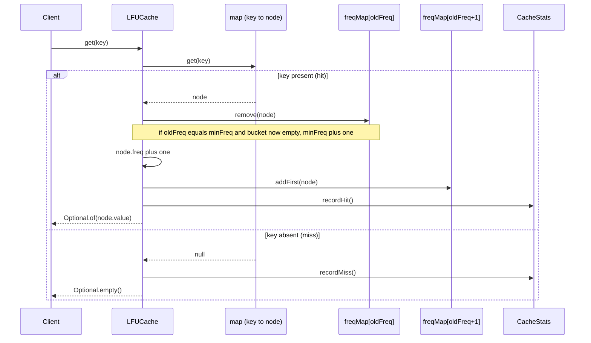
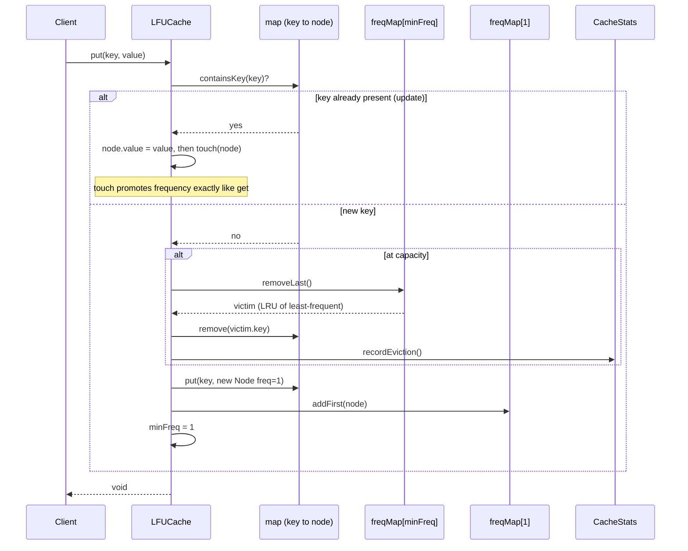
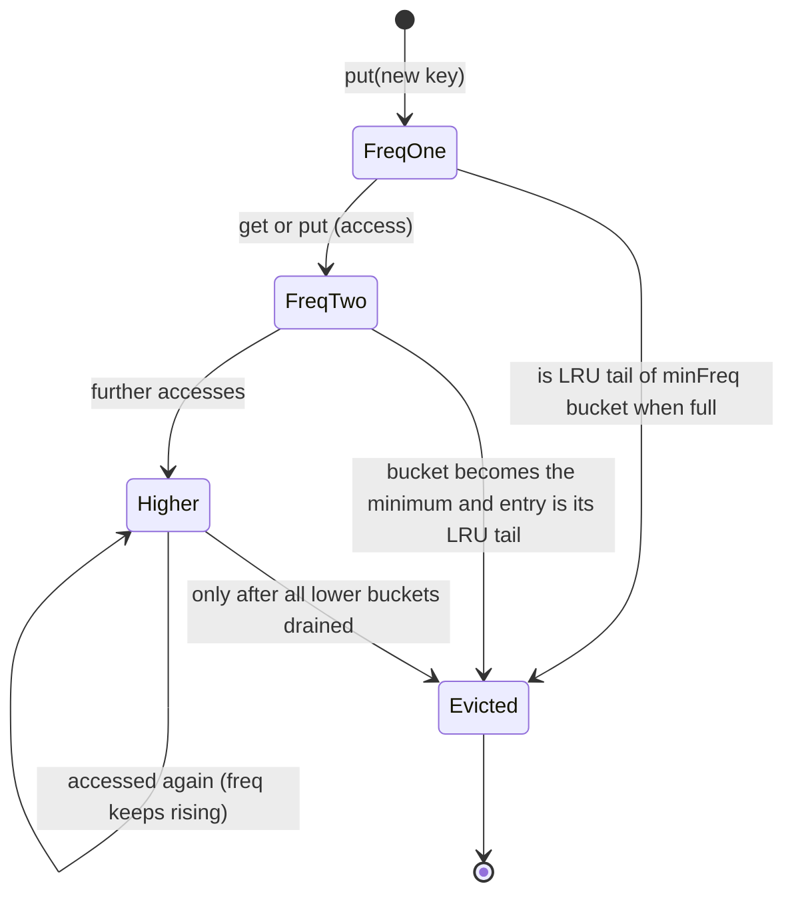
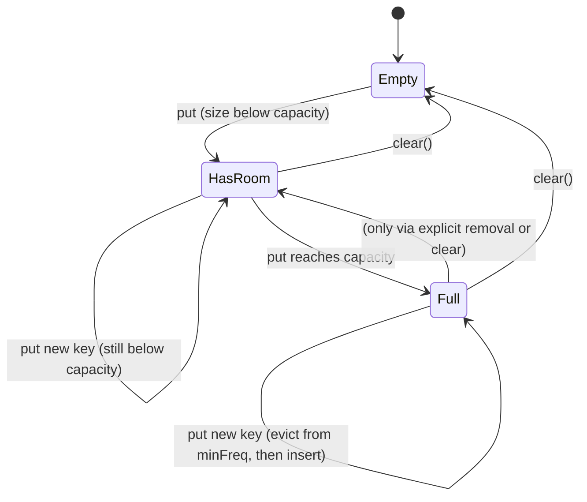

# 🧊 Low-Level Design: LFU Cache

> A complete, interview-ready walkthrough of the **Least Frequently Used (LFU) Cache** — from the naive "just count accesses" idea to a staff-level component that achieves true O(1) get, put, *and* eviction using three interlocking data structures, breaks frequency ties correctly, and survives the aging, concurrency, and scaling follow-ups an interviewer piles on at the end.

The LFU cache is the harder, subtler sibling of the LRU cache. Where LRU evicts whatever you touched *longest ago*, LFU evicts whatever you touched *fewest times* — and that one change in policy turns a two-structure problem into a three-structure one. The naive approach, "store a count per key and scan for the minimum on eviction," is O(n) and fails the interview on the spot. The elegant answer — a key-to-node map, a frequency-to-list map, and a running `minFreq` pointer — is a genuine step up in data-structure choreography, and getting the bookkeeping exactly right (especially the moment a frequency bucket empties out) is where candidates stumble. Layered on top is a decision LRU never forces you to make: when several keys are tied at the lowest frequency, *which* one do you evict? This guide walks the whole arc, escalating from the beginner's mental model to the aging problem, the LRU tie-break, and the reason production caches abandoned pure LFU for smarter hybrids like TinyLFU.

If you have not yet read the companion [LRU Cache](LRU-Cache.md) guide, start there — it establishes the map-plus-linked-list foundation this guide builds on, and the two are frequently compared head-to-head in interviews.

---

## 📋 Table of Contents

**Part I — Framing the Problem**

1. [Problem Statement](#1-problem-statement)
2. [Requirement Clarification & Assumptions](#2-requirement-clarification--assumptions)
3. [Functional & Non-Functional Requirements](#3-functional--non-functional-requirements)
4. [Core Concepts Being Tested](#4-core-concepts-being-tested)

**Part II — Modeling the Domain**

5. [Domain Model & Entities](#5-domain-model--entities)
6. [CRC Cards](#6-crc-cards)
7. [UML Class Diagram](#7-uml-class-diagram)
8. [Package Structure](#8-package-structure)

**Part III — Design Rationale**

9. [Design Decisions & Trade-offs](#9-design-decisions--trade-offs)
10. [Class-by-Class Deep Dive](#10-class-by-class-deep-dive)
11. [Design Patterns Applied](#11-design-patterns-applied)
12. [SOLID Principles Mapping](#12-solid-principles-mapping)

**Part IV — Behavior & Diagrams**

13. [Sequence Diagram](#13-sequence-diagram)
14. [State & Lifecycle Diagram](#14-state--lifecycle-diagram)

**Part V — The Implementation**

15. [Complete Java Implementation](#15-complete-java-implementation)
16. [Execution Flow & Code Walkthrough](#16-execution-flow--code-walkthrough)

**Part VI — Engineering Depth**

17. [Complexity Analysis](#17-complexity-analysis)
18. [Thread Safety & Concurrency](#18-thread-safety--concurrency)
19. [Error Handling & Validation](#19-error-handling--validation)
20. [Scalability Discussion](#20-scalability-discussion)
21. [Alternative Designs & Trade-offs](#21-alternative-designs--trade-offs)

**Part VII — Interview Mastery**

22. [Common FAANG Follow-up Questions (L4 → L6)](#22-common-faang-follow-up-questions-l4--l6)
23. [Common Design Mistakes](#23-common-design-mistakes)
24. [Testing Strategy](#24-testing-strategy)
25. [FAANG Q&A Section](#25-faang-qa-section)
26. [STAR Behavioral Questions](#26-star-behavioral-questions)
27. [⚡ Quick Revision Cheat Sheet](#27--quick-revision-cheat-sheet)

---

## 1. Problem Statement

Design a **fixed-capacity cache** supporting `get(key)` and `put(key, value)`, where — when the cache is full and a new key must be inserted — the cache **evicts the Least Frequently Used entry**: the key that has been accessed the fewest times since it entered the cache. Every `get` and every `put` on a key counts as one access, incrementing its use frequency.

The defining twist is the **tie-break**. Frequencies are integers, so ties are common: at any moment several keys may share the lowest access count. When the least-frequently-used group has more than one member, LFU must pick one, and the standard, expected rule is to evict the **least recently used among them** — LRU as the tie-breaker within the lowest frequency. As always with caches, the hard requirement is speed: `get`, `put`, and eviction must all run in **O(1) average time**, which rules out the tempting "keep a count and scan for the minimum" approach.

<details>
<summary>📖 <b>In plain terms — what are we actually building?</b></summary>

Think about which apps a phone keeps ready in memory. An LRU phone would keep whatever you opened most recently. An LFU phone keeps whatever you open *most often* — your messaging and email apps survive even if you haven't touched them in the last hour, because over time you use them constantly, while a game you opened once gets dropped first. Our job is to write that "keep the most-used, drop the least-used" logic so it's instant: we must find any item immediately, bump its usage count the moment it's touched, and know in one step which of the least-used items to discard. The wrinkle is ties — when several items are equally rarely used, we drop whichever of those we touched longest ago.

</details>

The deliverable in an interview is a **clean, correct, O(1) in-memory data structure** implementing this policy — the classes, their responsibilities, and above all the three-structure mechanism (key map, frequency-bucket map, and `minFreq` pointer) that makes constant time possible. Grading centers on whether you reach that mechanism, whether your frequency bookkeeping is airtight (particularly when a bucket empties), how you handle the tie-break, and how well you reason about the follow-ups: aging, concurrency, and why real systems prefer approximate LFU.

---

## 2. Requirement Clarification & Assumptions

LFU has more ambiguity than LRU, so clarification matters even more. The questions below each change the design materially — especially the tie-break and aging decisions.

### 2.1 Actors

As a library component, the LFU cache's actors are the code and systems that use it.

| Actor | Role in the system |
|-------|--------------------|
| **Calling application / client code** | Issues `get` and `put`; treats the cache as a fast key-value store. |
| **Backing store (DB, service, disk)** | The slow source of truth the cache fronts; consulted on a miss in a read-through setup. |
| **Cache maintainer / operator** | Configures capacity and (if supported) the aging policy; monitors hit rate and frequency distribution. |
| **Eviction mechanism** | The internal actor that removes the least-frequently-used entry (LRU tie-break) on overflow. |

### 2.2 Key Clarifying Questions

Resolve these before modeling. The first two — tie-break and aging — are the ones that distinguish an LFU discussion from a rote LeetCode recital.

- **Tie-break rule** — When multiple keys share the lowest frequency, which do we evict? *(Assumption: the least-recently-used among them — LFU with LRU tie-break, the standard. Alternatives: FIFO among ties, or arbitrary.)*
- **Aging / decay** — Does an entry's frequency ever decay over time, or does it accumulate forever? *(Assumption: no decay in v1 — frequencies accumulate. We discuss aging as a critical extension because unbounded accumulation is LFU's central weakness.)*
- **Initial frequency** — What frequency does a freshly inserted key start at? *(Assumption: 1 — the `put` that inserts it counts as its first access.)*
- **Does `get` count as a use?** — *(Assumption: yes. Both `get` and `put` increment frequency; this is what makes the policy frequency-based.)*
- **Duplicate `put`** — Does `put` on an existing key update the value and increment frequency? *(Assumption: yes — it overwrites the value and counts as an access.)*
- **Capacity semantics** — Count of entries, or byte budget? *(Assumption: a fixed maximum number of entries; byte-budget eviction is discussed as an extension.)*
- **Miss / null behavior** — Return sentinel or throw on miss? Null keys allowed? *(Assumption: miss returns `Optional.empty()`; null keys and null values are rejected.)*
- **Capacity of zero** — Legal? *(Assumption: capacity must be ≥ 1; rejected at construction otherwise.)*
- **Thread safety** — Single-threaded core, with concurrency as an explicit layer. *(Assumption: yes — clean single-threaded design first, then reasoned concurrency.)*

### 2.3 Explicit Non-Goals

Bounding scope deliberately is a senior signal.

- No persistence or durability — purely in-memory, lost on restart.
- No distribution or replication in the core (sharding and Redis discussed under scalability).
- No serialization/network protocol — an in-process library, not a cache server.
- No automatic frequency aging in v1 (discussed as the key extension).
- No built-in metrics backend, though hit/miss/eviction hooks are exposed.

<details>
<summary>📖 <b>Why is the tie-break question so important for LFU?</b></summary>

Because frequencies are whole numbers, and a cache full of entries will constantly have several of them sitting at the same low count — imagine ten keys all accessed exactly once. "Evict the least frequently used" doesn't tell you which of those ten to drop; the policy is ambiguous until you pick a tie-break rule. The near-universal choice is to fall back to LRU among the tied keys: of the least-used entries, drop the one you also touched longest ago. Asking this upfront shows the interviewer you understand LFU isn't a single rule but a *frequency rule plus a tie-break rule*, and it directly shapes the data structure, because each frequency bucket must itself stay ordered by recency to support the tie-break in O(1).

</details>

---

## 3. Functional & Non-Functional Requirements

### 3.1 Functional Requirements

| # | Requirement | Description |
|---|-------------|-------------|
| F1 | **Get by key** | `get(key)` returns the value if present and increments the key's frequency; returns a miss sentinel otherwise. |
| F2 | **Put / update** | `put(key, value)` inserts a new pair (frequency 1) or overwrites an existing one and increments its frequency. |
| F3 | **Bounded capacity** | The cache never holds more than `capacity` entries. |
| F4 | **LFU eviction** | On inserting into a full cache, the entry with the lowest frequency is removed. |
| F5 | **LRU tie-break** | Among entries tied at the lowest frequency, the least-recently-used one is evicted. |
| F6 | **Frequency tracking** | Every `get` and `put` increments the accessed entry's frequency by one. |
| F7 | **Membership / size** | Callers can check `containsKey`, current `size`, and clear the cache. |
| F8 | **Optional read-through** | With a loader configured, a miss transparently loads from the backing store, caches, and returns the value. |

### 3.2 Non-Functional Requirements

| # | Requirement | Target / Rationale |
|---|-------------|--------------------|
| N1 | **O(1) get** | Constant average time, including the frequency increment and bucket move. |
| N2 | **O(1) put (incl. eviction)** | Insert, update, and eviction must all be constant time — no scan for the minimum frequency. |
| N3 | **O(capacity) space** | Memory proportional to entries held, plus the frequency-bucket index. |
| N4 | **Thread safety (extension)** | Correct under concurrent `get`/`put` when the concurrent variant is used. |
| N5 | **Correct tie-break** | Deterministic LRU tie-break among equal frequencies. |
| N6 | **Extensibility** | Eviction policy and features (aging, TTL, read-through) swappable without rewriting the core. |
| N7 | **Observability** | Hit rate, miss rate, eviction count, and frequency distribution are measurable. |

<details>
<summary>📖 <b>Why can't we just keep a count and find the minimum when evicting?</b></summary>

It's the obvious first idea: store each key's access count, and when you need to evict, look through all the counts and remove the smallest. The problem is that "look through all the counts" means examining every entry, which is O(n) — and since a busy cache evicts constantly, that linear scan on every eviction would make the cache slower than the database it's supposed to accelerate. The whole challenge of LFU is achieving that eviction in O(1): finding the least-frequently-used entry *instantly*, without searching. That's why we maintain a `minFreq` pointer and group entries into frequency buckets, so the victim is always sitting at a known spot, ready to remove in one step.

</details>

---

## 4. Core Concepts Being Tested

LFU is chosen when the interviewer wants to push past LRU into harder data-structure territory. Here is what it actually probes.

**Multi-structure coordination.** LRU needs two structures; LFU needs three — a key-to-node map, a frequency-to-bucket map, and a `minFreq` scalar — all kept consistent on every operation. The core skill is orchestrating three moving parts so no operation ever leaves them disagreeing. This is a real step up in bookkeeping discipline.

**The empty-bucket edge case.** The single trickiest moment in LFU is when incrementing a key's frequency empties out its old frequency bucket. If that bucket held the current minimum, `minFreq` must advance. Getting this exactly right — and only here — is where most implementations break. Interviewers watch for it specifically.

**Tie-break reasoning.** Recognizing that "least frequently used" is ambiguous under ties, and that the fix is to keep each frequency bucket internally ordered by recency (an LRU list per frequency), demonstrates that you understand the policy at a deeper level than a memorized template.

**Policy judgment.** LFU has a famous flaw: without aging, an entry that was hammered early accumulates a huge count and becomes nearly immortal, squatting in the cache long after it stops being useful. Understanding this, and knowing the fixes (windowed counts, decay, or the sketch-based TinyLFU), is the L5/L6 signal.

**Comparison fluency.** LFU is almost always discussed against LRU. Being able to articulate crisply *when each wins* — LFU for stable long-term popularity, LRU for shifting recency-driven workloads — shows you treat eviction as a design decision, not a default.

**Systems perspective.** The top tier asks how real caches use frequency information. The answer — approximate frequency via compact sketches, combined with recency (Caffeine's TinyLFU / Window-TinyLFU) — connects the algorithm to production reality.

<details>
<summary>📖 <b>What's the single hardest part of implementing LFU?</b></summary>

Keeping the `minFreq` pointer correct. `minFreq` tracks the lowest frequency currently present, so eviction knows exactly which bucket to pull the victim from. The tricky moment is when you access a key and bump its frequency: it leaves its old bucket and joins the next one up. If that old bucket is now empty *and* it happened to be the minimum, then the new minimum is one higher — so `minFreq` must increment. Every newly inserted key resets `minFreq` back to 1, because a brand-new entry starts at frequency 1. Miss either of these updates and the cache will eventually evict the wrong entry or crash trying to read an empty bucket. It's a small amount of code, but it's the code interviewers scrutinize hardest.

</details>

---

## 5. Domain Model & Entities

The LFU domain is the LRU domain plus one dimension: frequency. Where LRU orders entries along a single recency axis, LFU groups entries first by frequency and only then by recency within each group. That extra grouping is the whole story.

The central entities. A **Node** is one cache entry, and — crucially — it carries not just a key, value, and `prev`/`next` links, but also a **frequency counter** recording how many times it has been accessed. A **DoublyLinkedList** holds all the nodes that share a single frequency, ordered by recency (most-recent at the head, least-recent at the tail) so the LRU tie-break is O(1). The **key map** (`Map<K, Node>`) provides O(1) key-to-node lookup, exactly as in LRU. The new structure is the **frequency map** (`Map<Integer, DoublyLinkedList>`), which maps each frequency value to the list of nodes currently at that frequency. A single integer, **`minFreq`**, tracks the lowest frequency present so eviction is O(1). The **LFUCache** coordinates all of these, and an **EvictionPolicy** abstraction captures the swappable policy decision.

The relationships that make it correct. Every key in the key map points to exactly one node; every node lives in exactly one frequency bucket (the bucket matching its current `freq`); and `minFreq` always names the smallest key present in the frequency map. When a node is accessed, it migrates from its current bucket to the `freq + 1` bucket, and if it vacated the `minFreq` bucket and left it empty, `minFreq` advances. Eviction always removes the tail of the `minFreq` bucket — the least-recently-used among the least-frequently-used.

| Entity | Type | Responsibility | Key relationships |
|--------|------|----------------|-------------------|
| **Node&lt;K,V&gt;** | Class | Holds key, value, **frequency**, and `prev`/`next` links | Lives in the frequency bucket matching its `freq`; referenced by the key map |
| **DoublyLinkedList&lt;K,V&gt;** | Class | Orders nodes of one frequency by recency; O(1) add/remove/remove-tail | One per active frequency; owned by the frequency map |
| **map: Map&lt;K, Node&gt;** | Field | O(1) key → node lookup | Values are the Nodes in the buckets |
| **freqMap: Map&lt;Integer, DoublyLinkedList&gt;** | Field | O(1) frequency → its list of nodes | Buckets the nodes by access count |
| **minFreq: int** | Field | Names the lowest frequency present | Points eviction at the right bucket |
| **LFUCache&lt;K,V&gt;** | Class | Coordinates all structures; enforces capacity; public API | Owns map, freqMap, minFreq |
| **EvictionPolicy** | Interface | Encapsulates the swappable eviction decision | Consulted by the cache design |
| **CacheStats** | Class | Tracks hits, misses, evictions | Updated by the cache |

<details>
<summary>📖 <b>Why group nodes into per-frequency lists instead of one big list?</b></summary>

Because LFU has to answer two questions instantly: "what's the lowest frequency right now?" and "among the entries at that frequency, which was used longest ago?" One flat list ordered by frequency can't do both in O(1) — you'd have to search. By keeping a separate little list for each frequency value, the first question is answered by the `minFreq` pointer, and the second is answered by looking at the tail of that frequency's list, since each list stays ordered by recency. So the frequency map partitions entries into groups, and within each group a doubly linked list keeps them in recency order — the two levels of organization together give you both the frequency ranking and the tie-break for free.

</details>

---

## 6. CRC Cards

**LFUCache&lt;K,V&gt;**

| Responsibilities | Collaborators |
|------------------|---------------|
| Expose `get`, `put`, `containsKey`, `size`, `clear` | DoublyLinkedList |
| Enforce the capacity bound | key map, frequency map |
| Increment frequency on every access and migrate nodes between buckets | Node |
| Maintain `minFreq`; evict the LRU tail of the `minFreq` bucket on overflow | CacheStats |

**DoublyLinkedList&lt;K,V&gt;**

| Responsibilities | Collaborators |
|------------------|---------------|
| Maintain recency order within one frequency | Node |
| Add a node at the head (most recent) | — |
| Remove any given node in O(1) | — |
| Remove and return the tail node (LRU tie-break victim) | — |
| Report whether it has become empty | — |

**Node&lt;K,V&gt;**

| Responsibilities | Collaborators |
|------------------|---------------|
| Hold one key, one value, and a frequency count | — |
| Hold `prev` and `next` references | DoublyLinkedList |

**EvictionPolicy&lt;K&gt;**

| Responsibilities | Collaborators |
|------------------|---------------|
| Record accesses / insertions | LFUCache |
| Choose the next key to evict (lowest frequency, LRU tie-break) | — |
| Forget an evicted/removed key | — |

**CacheStats**

| Responsibilities | Collaborators |
|------------------|---------------|
| Count hits, misses, evictions | LFUCache |
| Report hit rate on demand | — |

The division to notice: the `LFUCache` owns the frequency bookkeeping and the `minFreq` pointer (the genuinely LFU-specific logic), while the `DoublyLinkedList` is a generic recency-ordered list identical to the one LRU uses. Reusing the exact same list class for the tie-break is a satisfying economy — the LFU cache is, in a sense, "a map of little LRU caches indexed by frequency."

---

## 7. UML Class Diagram

Here is the full static structure in ASCII. The three coordinated structures — key map, frequency map, and `minFreq` — are shown as fields of `LFUCache`, with the per-frequency `DoublyLinkedList` front and center.

```
        ┌────────────────────────────────────────────────────────┐
        │ LFUCache<K,V>                                            │
        ├────────────────────────────────────────────────────────┤
        │ - capacity: int                                          │
        │ - map: Map<K, Node<K,V>>                                 │
        │ - freqMap: Map<Integer, DoublyLinkedList<K,V>>           │
        │ - minFreq: int                                           │
        │ - stats: CacheStats                                      │
        ├────────────────────────────────────────────────────────┤
        │ + get(key: K): Optional<V>                               │
        │ + put(key: K, value: V): void                            │
        │ + containsKey(key: K): boolean                           │
        │ + size(): int                                            │
        │ + clear(): void                                          │
        │ - touch(node: Node<K,V>): void                           │
        │ - evict(): void                                          │
        └───────┬──────────────────────────────────┬───────────────┘
                │ owns many (one per frequency)     │ owns
                ▼                                    ▼
   ┌─────────────────────────────┐        ┌──────────────────────────┐
   │ DoublyLinkedList<K,V>       │        │ CacheStats               │
   ├─────────────────────────────┤        ├──────────────────────────┤
   │ - head: Node<K,V> (sentinel)│        │ - hits: long             │
   │ - tail: Node<K,V> (sentinel)│        │ - misses: long           │
   │ - size: int                 │        │ - evictions: long        │
   ├─────────────────────────────┤        ├──────────────────────────┤
   │ + addFirst(node): void      │        │ + recordHit(): void      │
   │ + remove(node): void        │        │ + recordMiss(): void     │
   │ + removeLast(): Node<K,V>   │        │ + recordEviction(): void │
   │ + isEmpty(): boolean        │        │ + hitRate(): double      │
   │ + size(): int               │        └──────────────────────────┘
   └──────────────┬──────────────┘
                  │ contains many
                  ▼
        ┌──────────────────────────────┐
        │ Node<K,V>                     │
        ├──────────────────────────────┤
        │ - key: K                      │
        │ - value: V                    │
        │ - freq: int                   │   ← the LFU-specific field
        │ - prev: Node<K,V>             │
        │ - next: Node<K,V>             │
        └──────────────────────────────┘

        LFUCache optionally delegates the "who to evict" decision to ↓

        ┌───────────────────────────────────┐
        │ «interface» EvictionPolicy<K>     │
        ├───────────────────────────────────┤
        │ + keyAccessed(key: K): void       │
        │ + keyInserted(key: K): void       │
        │ + evictionCandidate(): K          │
        │ + keyRemoved(key: K): void        │
        └─────────────────┬─────────────────┘
                          │ implemented by
          ┌───────────────┼────────────────────┐
          ▼               ▼                    ▼
 ┌─────────────────┐ ┌─────────────────┐ ┌──────────────────┐
 │ LfuPolicy<K>    │ │ LruPolicy<K>    │ │ FifoPolicy<K>    │
 └─────────────────┘ └─────────────────┘ └──────────────────┘
```

The shape to notice: `LFUCache` holds two maps and a scalar. The key `map` answers "where is key K?" in O(1). The `freqMap` groups nodes by their access count, and `minFreq` names the bucket to evict from — so the victim is `freqMap.get(minFreq).removeLast()`, the least-recently-used node of the least-frequently-used group, in O(1). The `Node.freq` field is the one addition to the LRU node that makes all of this possible.

<details>
<summary>📖 <b>How is this different from the LRU class diagram?</b></summary>

Two changes. First, the node gains a `freq` field — a counter of how many times that entry has been accessed. Second, and bigger, the single recency list of LRU is replaced by a *map of lists*, one list per frequency value, plus a `minFreq` integer that remembers the smallest frequency currently in use. In LRU, "who to evict" is always the tail of the one list. In LFU, "who to evict" is the tail of the *lowest-frequency* list, which is why we need the frequency map to find that list and the `minFreq` pointer to know which one it is. Everything else — the doubly linked list mechanics, the key map for O(1) lookup, the sentinel nodes — is identical to LRU.

</details>

---

## 8. Package Structure

The layout mirrors the LRU guide's, so the two caches can share the `internal`, `stats`, `concurrent`, and `loader` packages in a real library — only the core class and the default policy differ.

```
com.example.cache
│
├── LFUCache.java              // public entry point; coordinates map + freqMap + minFreq
├── Cache.java                 // «interface» generic cache contract (get/put/size)
│
├── internal
│   ├── Node.java              // node with key, value, freq, prev, next (package-private)
│   └── DoublyLinkedList.java  // O(1) add/remove/removeLast, isEmpty (package-private)
│
├── policy
│   ├── EvictionPolicy.java    // «interface» which key to evict
│   ├── LfuPolicy.java         // least-frequently-used, LRU tie-break
│   ├── LruPolicy.java
│   └── FifoPolicy.java
│
├── concurrent
│   ├── SynchronizedLFUCache.java   // coarse-lock decorator
│   └── ShardedLFUCache.java        // striped/sharded for high concurrency
│
├── stats
│   └── CacheStats.java        // hit/miss/eviction counters
│
└── loader
    └── CacheLoader.java       // «interface» read-through backing-store loader
```

The reasoning matches the LRU design: `Node` and `DoublyLinkedList` are implementation details in an `internal` package; the `policy` package isolates the swappable eviction decision behind an interface (so LFU, LRU, and FIFO are interchangeable); and the `concurrent` package keeps thread-safety concerns out of the clean single-threaded core. The only structural difference from the LRU package is that `LFUCache` replaces `LRUCache` as the entry point and `LfuPolicy` is the default — a deliberate signal that these two caches are variations on one architecture, differing only in the eviction rule.

---

## 9. Design Decisions & Trade-offs

The LFU cache is defined by a handful of choices, each of which an interviewer will probe. The most important one — the three-structure design that unlocks O(1) — deserves the fullest treatment, so the naive alternatives are laid out first to make the payoff clear.

### 9.1 Decision: how to achieve O(1) eviction — the central choice

There are three designs a candidate might propose, and the gap between them is exactly what the interview is measuring.

| Approach | get | put | evict | Verdict |
|----------|-----|-----|-------|---------|
| **Count in a map, scan for min on evict** | O(1) | O(1) | **O(n)** | Naive. Correct but too slow — rejected. |
| **Count in a map + min-heap keyed by frequency** | O(log n) | O(log n) | O(log n) | Better, but log-n and heap updates on every access are awkward — the "decrease-key" needed on each `get` is O(n) in a standard binary heap. |
| **Key map + frequency-bucket map + `minFreq`** | **O(1)** | **O(1)** | **O(1)** | The expected staff-level answer. |

The winning design uses three coordinated structures. A **key map** `Map<K, Node>` gives O(1) lookup from a key to its node. A **frequency map** `Map<Integer, DoublyLinkedList>` groups all nodes sharing the same access count into one recency-ordered list. And a single integer **`minFreq`** always names the lowest frequency currently present. Eviction is then `freqMap.get(minFreq).removeLast()` — reach the lowest-frequency bucket in O(1) via the pointer, and remove its least-recently-used tail in O(1) via the linked list. No scan, no heap, no logarithm.

The trade-off is bookkeeping complexity. This design maintains more invariants than LRU — every access migrates a node between buckets, empty buckets must be cleaned up, and `minFreq` must be advanced or reset at exactly the right moments. That complexity is the price of O(1), and managing it correctly is the signal the interviewer is looking for.

<details>
<summary>📖 <b>Why is the min-heap approach not good enough?</b></summary>

A heap can always hand you the smallest element quickly, so it sounds perfect for "find the least-frequently-used key." The problem is what happens on every single `get`: accessing a key raises its frequency, which means its position in the heap has to move. In a standard binary heap there is no fast way to find and re-position an arbitrary element — you either scan for it (O(n)) or maintain extra index bookkeeping, and even then each update costs O(log n). Since `get` is the most common operation in a cache, paying log-n on every read is a real cost. The bucket-map design sidesteps all of this: moving a node to the next frequency is just unlinking it from one list and linking it into another, both O(1), with no comparisons at all.

</details>

### 9.2 Decision: how to break frequency ties

When several keys share the lowest frequency, LFU must choose one to evict. The standard rule — and the one interviewers expect — is **LRU within the frequency**: among the least-frequently-used entries, discard the one accessed longest ago. This is why each frequency bucket is a *doubly linked list ordered by recency* rather than an unordered set: inserting at the head and evicting from the tail keeps the tie-break O(1) and deterministic. The alternative tie-breaks (FIFO by insertion order, or arbitrary) are simpler to reason about but discard useful recency information and are rarely what's wanted. Making the tie-break LRU means the design literally nests an LRU ordering inside every frequency level.

### 9.3 Decision: what frequency a new entry starts at, and what `put` on an existing key does

A newly inserted key starts at **frequency 1**, and inserting always resets `minFreq` to 1 (the new entry is, by definition, the least frequently used). A `put` that *updates* an existing key's value counts as an access, so it increments that key's frequency exactly as a `get` would. These two rules are small but load-bearing: forgetting to reset `minFreq` to 1 on insert is one of the most common bugs, because it leaves eviction pointing at a bucket that no longer holds the true minimum.

### 9.4 Decision: eager vs. lazy handling of empty buckets

When a node leaves a bucket and that bucket becomes empty, the code can either delete the empty list from the frequency map immediately (eager) or leave it and skip over empties later (lazy). This guide uses the **eager** approach for the `minFreq` update — when the accessed node vacated the `minFreq` bucket and left it empty, `minFreq` is incremented by one on the spot, which is provably correct because a node's frequency only ever rises by one at a time. Whether the empty `DoublyLinkedList` object itself is removed from the map is an optimization detail (it costs a little memory to keep it); the correctness-critical part is the `minFreq` advance.

<details>
<summary>📖 <b>Why can <code>minFreq</code> safely just add one when its bucket empties?</b></summary>

Because frequencies only ever increase by exactly one, and only on access. When you touch the last remaining node in the current minimum bucket, that node moves up to frequency `minFreq + 1`. No other node can have a frequency *between* the old minimum and that — there are no fractional frequencies — so the new lowest frequency present is exactly `minFreq + 1`. That's why the update is a simple increment rather than a search for the new minimum. On insertion the rule is even simpler: a brand-new key sits at frequency 1, which is the smallest possible frequency, so `minFreq` is just set to 1.

</details>

### 9.5 Decision: capacity-zero and capacity handling

A cache constructed with capacity 0 should accept `put` calls silently as no-ops (nothing can ever be stored) and always miss on `get`, rather than throwing. This mirrors the LRU guide's handling and matches the LeetCode 460 contract. Capacity is fixed at construction; a resizable cache is discussed as a follow-up in Part VI.

---

## 10. Class-by-Class Deep Dive

This section walks each class in the order you would write it in an interview — innermost data holder first, coordinator last.

### 10.1 `Node<K,V>`

The node is the LRU node plus one field. It stores the `key` (needed so eviction can remove the entry from the key map), the `value`, a `freq` counter initialized to 1, and `prev`/`next` links for its position in a doubly linked list.

```java
class Node<K, V> {
    final K key;
    V value;
    int freq = 1;
    Node<K, V> prev;
    Node<K, V> next;

    Node(K key, V value) {
        this.key = key;
        this.value = value;
    }
}
```

The `key` field earns its place at eviction time: when the victim node is pulled from the tail of the `minFreq` bucket, the cache needs the key to also delete the entry from `map`. Storing it in the node makes that O(1) instead of requiring a reverse lookup.

### 10.2 `DoublyLinkedList<K,V>`

This is the *same* recency-ordered list used by the LRU cache — identical interface, identical sentinel-node technique. Each frequency bucket is one instance of it, holding all nodes at that frequency in most-recently-used-to-least order.

```java
class DoublyLinkedList<K, V> {
    private final Node<K, V> head;   // sentinel; head.next = most recently used
    private final Node<K, V> tail;   // sentinel; tail.prev = least recently used
    private int size = 0;

    DoublyLinkedList() {
        head = new Node<>(null, null);
        tail = new Node<>(null, null);
        head.next = tail;
        tail.prev = head;
    }

    void addFirst(Node<K, V> node) { /* link just after head */ }
    void remove(Node<K, V> node)   { /* unlink node */ }
    Node<K, V> removeLast()        { /* unlink and return tail.prev */ }
    boolean isEmpty()              { return size == 0; }
    int size()                     { return size; }
}
```

The sentinel head and tail remove every null check: adding, removing, and popping the tail are branch-free pointer swaps. `addFirst` marks a node as most-recently-used within its frequency; `removeLast` produces the LRU tie-break victim; `remove` extracts an arbitrary node when it is migrating to a higher frequency. Reusing this class verbatim from LRU is the clearest evidence that LFU is "LRU with a frequency dimension layered on top."

### 10.3 `LFUCache<K,V>` — the coordinator

This is where all the LFU-specific logic lives. It holds the three structures and exposes the public API, delegating recency mechanics to the linked lists.

```java
public class LFUCache<K, V> implements Cache<K, V> {
    private final int capacity;
    private final Map<K, Node<K, V>> map = new HashMap<>();
    private final Map<Integer, DoublyLinkedList<K, V>> freqMap = new HashMap<>();
    private int minFreq = 0;
    private final CacheStats stats = new CacheStats();
    // get, put, touch, evict ...
}
```

The two private helpers carry the design. `touch(node)` is called on every access: it removes the node from its current frequency bucket, advances `minFreq` if that bucket was the minimum and is now empty, increments the node's `freq`, and re-adds it to the next bucket up. `evict()` is called only when `put` overflows capacity: it removes the tail of the `minFreq` bucket and deletes that key from `map`. Keeping these two operations small and correct is the heart of the implementation, and the full bodies appear in Part V.

### 10.4 `CacheStats`

Unchanged from the LRU guide: it counts hits, misses, and evictions and reports a hit rate, using `LongAdder` so the counters don't become a contention point under concurrent access. It is a pure observability concern, kept off to the side so the core logic never has to think about it beyond three one-line calls.

### 10.5 `EvictionPolicy<K>` and its implementations

The policy interface lets the eviction rule be swapped without touching the cache's storage mechanics. `LfuPolicy` is the default here; `LruPolicy` and `FifoPolicy` are drop-in alternatives. In the tightly-optimized O(1) `LFUCache`, the frequency logic is inlined for speed rather than delegated call-by-call to a policy object — the interface documents the seam and supports a more general "configurable cache" design, which is discussed as an alternative in Part VI.

---

## 11. Design Patterns Applied

The LFU cache uses the same pattern vocabulary as the LRU cache; the patterns are worth restating because interviewers ask you to *name* them.

| Pattern | Where it appears | What it buys |
|---------|------------------|--------------|
| **Strategy** | `EvictionPolicy` with LFU / LRU / FIFO implementations | The eviction rule becomes a swappable algorithm behind a stable interface — the essence of turning "an LFU cache" into "a cache that happens to use LFU." |
| **Decorator** | `SynchronizedLFUCache` / `ShardedLFUCache` wrapping a plain `LFUCache` | Thread-safety is added around the core without polluting the single-threaded logic; the wrapper implements the same `Cache` interface. |
| **Template Method** | `LoadingCache` read-through: fixed get-or-load skeleton, pluggable `CacheLoader` | The "check cache, on miss load and store" flow is fixed while the load step varies. |
| **Facade** | The `Cache` interface itself | Hides the three-structure machinery behind five simple methods; callers never see nodes, buckets, or `minFreq`. |
| **Factory (light)** | Constructing the right policy/cache variant | Centralizes the choice of which cache flavor to build. |

The load-bearing pattern is **Strategy**. Once eviction lives behind `EvictionPolicy`, LFU and LRU stop being different programs and become different configurations of the same program — which is exactly the framing that lets you answer "how would you support both?" in one sentence.

<details>
<summary>📖 <b>Why is Strategy the pattern that matters most here?</b></summary>

Because the entire difference between an LRU cache and an LFU cache is one decision: who gets evicted. Everything else — the key map, the linked lists, the public API — is shared. The Strategy pattern captures exactly that single varying decision behind an interface, so you can hold the whole cache constant and change only the eviction rule. That's the cleanest possible expression of the relationship between these two caches, and it's why interviewers like to hear it named: it shows you see the family resemblance rather than treating LFU as a from-scratch problem.

</details>

---

## 12. SOLID Principles Mapping

| Principle | How the LFU design honors it |
|-----------|------------------------------|
| **Single Responsibility** | `Node` holds data; `DoublyLinkedList` maintains recency order within one frequency; `LFUCache` coordinates frequency bookkeeping; `CacheStats` observes. Each class has exactly one reason to change. |
| **Open/Closed** | New eviction policies (LRU, FIFO, TinyLFU) are added by implementing `EvictionPolicy`, and new thread-safety strategies by adding a decorator — both without modifying existing classes. |
| **Liskov Substitution** | Every `EvictionPolicy` implementation is fully interchangeable; `SynchronizedLFUCache` can stand in anywhere a `Cache` is expected, preserving the contract. |
| **Interface Segregation** | `Cache` exposes only the five methods callers need; `EvictionPolicy` and `CacheLoader` are small, focused interfaces. Nobody depends on methods they don't use. |
| **Dependency Inversion** | High-level code depends on the `Cache` and `EvictionPolicy` abstractions, not on `LFUCache` or `LfuPolicy` concretely — so the frequency machinery can be replaced without touching callers. |

The point worth making aloud in an interview: the SOLID story is *identical* to the LRU guide's, which is not a coincidence — it's the payoff of designing eviction as a strategy in the first place. The frequency-bucket mechanism is an implementation detail sealed behind the same interfaces, so the two caches share not just code but their entire extensibility argument.

---

## 13. Sequence Diagram

Two flows carry all the interesting behavior: a `get` that promotes a node to a higher frequency (and may advance `minFreq`), and a `put` that overflows capacity and triggers eviction from the `minFreq` bucket.

### 13.1 `get(key)` — a hit that promotes the node



The critical detail is the ordering inside the hit branch: remove the node from its old bucket first, decide whether `minFreq` must advance while you still know the old bucket is empty, then increment the frequency and re-add to the new bucket. Doing the `minFreq` check after re-adding would look at the wrong bucket.

### 13.2 `put(key, value)` — an insert that evicts



Note the two easy-to-miss steps in the new-key path: eviction pulls from `freqMap[minFreq]` (not from frequency 1, and not the most-recent entry), and after inserting the fresh node at frequency 1, `minFreq` is reset to 1 unconditionally. Skipping that reset is the classic LFU bug.

<details>
<summary>📖 <b>Why does eviction happen before insertion, not after?</b></summary>

Because the victim must be chosen based on the cache's state *before* the new key arrives. If you inserted first, the brand-new key would itself sit at frequency 1 — the minimum — and could be picked as its own eviction victim, which is nonsensical. By evicting first while the cache is still full of "old" entries, you guarantee the victim is a genuinely least-used existing entry, and only then do you add the newcomer and reset `minFreq` to 1 to reflect that a fresh frequency-1 entry now exists.

</details>

---

## 14. State & Lifecycle Diagram

An LFU cache doesn't have modal states the way a vending machine does, but each *entry* moves through a clear lifecycle of frequency levels, and the cache as a whole transitions between "has room" and "full." Modeling the entry lifecycle makes the frequency promotion and the eviction rule concrete.

### 14.1 Lifecycle of a single cache entry



The diagram encodes the core policy visually: an entry enters at frequency 1, climbs one level per access, and can only be evicted when its bucket is the current minimum *and* it is the least-recently-used member of that bucket. High-frequency entries are structurally protected — they can be evicted only after every lower-frequency bucket has been drained, which is precisely the LFU guarantee.

### 14.2 Cache-level capacity states



The only transition that triggers eviction is a `put` of a *new* key while in the `Full` state — every other operation (hits, updates, puts with room) leaves capacity unchanged. This is why eviction logic lives in exactly one place in the code: the new-key branch of `put`.

<details>
<summary>📖 <b>Can a frequently-used entry ever be evicted?</b></summary>

Only in the extreme case where it has become the lowest-frequency entry in the whole cache — which for a genuinely popular entry essentially never happens while other, less-used entries exist. As long as there is any entry with a strictly lower access count, that entry is evicted first. This is both LFU's strength and its weakness: a burst-popular entry that was hammered early keeps a high count forever and can never be dislodged even long after it stopped being useful. That "stale but high-frequency" problem is the aging issue tackled in the follow-ups, and it's the reason production systems reach for windowed or decaying variants.

</details>

---

## 15. Complete Java Implementation

The full, self-contained implementation is below. It compiles and runs as-is (Java 8+), and the `main` method at the end is a traceable demo whose output is walked through in the next section. Class and method names match the UML in Section 7 and the sequence diagrams in Section 13 exactly.

<details>
<summary>💻 <b>Click to expand the complete, runnable Java implementation</b></summary>

```java
package com.example.cache;

import java.util.HashMap;
import java.util.Map;
import java.util.Optional;
import java.util.concurrent.atomic.LongAdder;

// ────────────────────────────────────────────────────────────────
// Cache contract — the Facade every caller sees.
// ────────────────────────────────────────────────────────────────
interface Cache<K, V> {
    Optional<V> get(K key);
    void put(K key, V value);
    boolean containsKey(K key);
    int size();
    void clear();
}

// ────────────────────────────────────────────────────────────────
// Node — one cache entry. Same as the LRU node plus a freq counter.
// ────────────────────────────────────────────────────────────────
class Node<K, V> {
    final K key;
    V value;
    int freq = 1;
    Node<K, V> prev;
    Node<K, V> next;

    Node(K key, V value) {
        this.key = key;
        this.value = value;
    }
}

// ────────────────────────────────────────────────────────────────
// DoublyLinkedList — recency-ordered nodes for ONE frequency.
// Sentinel head/tail remove all null checks. Identical to LRU's list.
// ────────────────────────────────────────────────────────────────
class DoublyLinkedList<K, V> {
    private final Node<K, V> head;   // head.next = most recently used
    private final Node<K, V> tail;   // tail.prev = least recently used
    private int size = 0;

    DoublyLinkedList() {
        head = new Node<>(null, null);
        tail = new Node<>(null, null);
        head.next = tail;
        tail.prev = head;
    }

    void addFirst(Node<K, V> node) {
        node.prev = head;
        node.next = head.next;
        head.next.prev = node;
        head.next = node;
        size++;
    }

    void remove(Node<K, V> node) {
        node.prev.next = node.next;
        node.next.prev = node.prev;
        node.prev = null;
        node.next = null;
        size--;
    }

    Node<K, V> removeLast() {
        if (size == 0) {
            return null;
        }
        Node<K, V> last = tail.prev;
        remove(last);
        return last;
    }

    boolean isEmpty() {
        return size == 0;
    }

    int size() {
        return size;
    }
}

// ────────────────────────────────────────────────────────────────
// CacheStats — observability. LongAdder keeps counters cheap
// under concurrency. Pure side concern, never touches core logic.
// ────────────────────────────────────────────────────────────────
class CacheStats {
    private final LongAdder hits = new LongAdder();
    private final LongAdder misses = new LongAdder();
    private final LongAdder evictions = new LongAdder();

    void recordHit()      { hits.increment(); }
    void recordMiss()     { misses.increment(); }
    void recordEviction() { evictions.increment(); }

    long hits()      { return hits.sum(); }
    long misses()    { return misses.sum(); }
    long evictions() { return evictions.sum(); }

    double hitRate() {
        long total = hits.sum() + misses.sum();
        return total == 0 ? 0.0 : (double) hits.sum() / total;
    }

    @Override
    public String toString() {
        return String.format("hits=%d, misses=%d, evictions=%d, hitRate=%.2f%%",
                hits(), misses(), evictions(), hitRate() * 100);
    }
}

// ────────────────────────────────────────────────────────────────
// LFUCache — the coordinator. Three structures + minFreq give
// O(1) get, put, and eviction with an LRU tie-break per frequency.
// ────────────────────────────────────────────────────────────────
public class LFUCache<K, V> implements Cache<K, V> {

    private final int capacity;
    private final Map<K, Node<K, V>> map = new HashMap<>();
    private final Map<Integer, DoublyLinkedList<K, V>> freqMap = new HashMap<>();
    private int minFreq = 0;
    private final CacheStats stats = new CacheStats();

    public LFUCache(int capacity) {
        if (capacity < 0) {
            throw new IllegalArgumentException("capacity must be >= 0");
        }
        this.capacity = capacity;
    }

    @Override
    public Optional<V> get(K key) {
        Node<K, V> node = map.get(key);
        if (node == null) {
            stats.recordMiss();
            return Optional.empty();
        }
        touch(node);
        stats.recordHit();
        return Optional.ofNullable(node.value);
    }

    @Override
    public void put(K key, V value) {
        if (capacity == 0) {
            return; // nothing can ever be stored
        }
        Node<K, V> existing = map.get(key);
        if (existing != null) {
            existing.value = value;   // update counts as an access
            touch(existing);
            return;
        }
        if (map.size() >= capacity) {
            evict();
        }
        Node<K, V> node = new Node<>(key, value); // freq starts at 1
        map.put(key, node);
        freqMap.computeIfAbsent(1, f -> new DoublyLinkedList<>()).addFirst(node);
        minFreq = 1;                  // a fresh entry is the new minimum
    }

    // Promote a node one frequency level. Called on every access.
    private void touch(Node<K, V> node) {
        int oldFreq = node.freq;
        DoublyLinkedList<K, V> oldList = freqMap.get(oldFreq);
        oldList.remove(node);
        // If we just emptied the minimum bucket, the new minimum is one higher.
        if (oldFreq == minFreq && oldList.isEmpty()) {
            minFreq++;
        }
        node.freq = oldFreq + 1;
        freqMap.computeIfAbsent(node.freq, f -> new DoublyLinkedList<>()).addFirst(node);
    }

    // Remove the LRU tail of the least-frequently-used bucket.
    private void evict() {
        DoublyLinkedList<K, V> minList = freqMap.get(minFreq);
        Node<K, V> victim = minList.removeLast();
        if (victim != null) {
            map.remove(victim.key);
            stats.recordEviction();
        }
    }

    @Override
    public boolean containsKey(K key) {
        return map.containsKey(key); // a peek — does NOT count as an access
    }

    @Override
    public int size() {
        return map.size();
    }

    @Override
    public void clear() {
        map.clear();
        freqMap.clear();
        minFreq = 0;
    }

    public CacheStats stats() {
        return stats;
    }

    // ── Traceable demo ────────────────────────────────────────────
    public static void main(String[] args) {
        LFUCache<Integer, String> cache = new LFUCache<>(2);

        cache.put(1, "A");            // {1:A(f1)}                minFreq=1
        cache.put(2, "B");            // {1:A(f1), 2:B(f1)}       minFreq=1
        System.out.println(cache.get(1).orElse("MISS")); // A -> 1 now f2
        cache.put(3, "C");            // full; evict LFU tail of minFreq(=1) => key 2
                                      // {1:A(f2), 3:C(f1)}       minFreq=1
        System.out.println(cache.get(2).orElse("MISS")); // MISS (2 was evicted)
        System.out.println(cache.get(3).orElse("MISS")); // C -> 3 now f2
        cache.put(4, "D");            // full; minFreq=1 has only key... both 1,3 are f2
                                      // key with freq 1? none -> minFreq advanced; evict LRU of f2 => key 1
                                      // {3:C(f2), 4:D(f1)}       minFreq=1
        System.out.println(cache.get(1).orElse("MISS")); // MISS (1 was evicted)
        System.out.println(cache.get(3).orElse("MISS")); // C -> 3 now f3
        System.out.println(cache.get(4).orElse("MISS")); // D -> 4 now f2

        System.out.println(cache.stats());
    }
}
```

</details>

The implementation is deliberately small — the intelligence is in the invariants, not the line count. Every public method is O(1): `get` and `put` do a constant number of map lookups and linked-list splices, and `evict` reaches the victim directly through `minFreq`. The two private helpers `touch` and `evict` are the only places the frequency bookkeeping lives, which keeps the correctness-critical logic in one small, reviewable spot.

---

## 16. Execution Flow & Code Walkthrough

The `main` demo drives a capacity-2 cache through a sequence designed to exercise both eviction paths — evicting from frequency 1, and evicting after `minFreq` has advanced. Here is the state after each operation.

| Step | Call | Cache state (key:value, freq) | minFreq | Notes |
|------|------|-------------------------------|:-------:|-------|
| 1 | `put(1,"A")` | `1:A(f1)` | 1 | New key at freq 1. |
| 2 | `put(2,"B")` | `1:A(f1), 2:B(f1)` | 1 | Cache now full. |
| 3 | `get(1)` → **A** | `1:A(f2), 2:B(f1)` | 1 | Key 1 promoted to f2; f1 still holds key 2, so minFreq stays 1. |
| 4 | `put(3,"C")` | `1:A(f2), 3:C(f1)` | 1 | Full → evict tail of minFreq(1) = **key 2**. Insert 3 at f1. |
| 5 | `get(2)` → **MISS** | unchanged | 1 | Key 2 was evicted. Miss recorded. |
| 6 | `get(3)` → **C** | `1:A(f2), 3:C(f2)` | 2 | Key 3 → f2; f1 now empty, so minFreq advances to 2. |
| 7 | `put(4,"D")` | `3:C(f2), 4:D(f1)` | 1 | Full → minFreq is 2; evict LRU of f2. Key 1 is older than key 3 in f2 → evict **key 1**. Insert 4 at f1, reset minFreq=1. |
| 8 | `get(1)` → **MISS** | unchanged | 1 | Key 1 was evicted. |
| 9 | `get(3)` → **C** | `3:C(f3), 4:D(f1)` | 1 | Key 3 → f3; f2 emptied but it wasn't minFreq(1), so minFreq stays 1. |
| 10 | `get(4)` → **D** | `3:C(f3), 4:D(f2)` | 2 | Key 4 → f2; f1 now empty, minFreq advances to 2. |

Tallying the accesses: hits at steps 3, 6, 9, 10 (**4 hits**), misses at steps 5, 8 (**2 misses**), and evictions at steps 4, 7 (**2 evictions**). Hit rate is 4 / (4 + 2) = **66.67%**, so the demo prints:

```
A
MISS
C
MISS
C
D
hits=4, misses=2, evictions=2, hitRate=66.67%
```

The single most instructive moment is step 7. When key 4 is inserted, the minimum frequency present is 2 (both surviving keys, 1 and 3, sit at f2 — there is no f1 entry). Eviction therefore pulls from the f2 bucket, and within that bucket it removes the *least recently used*, which is key 1 (key 3 was touched more recently at step 6). This is the LRU-within-LFU tie-break doing its job: two entries tied on frequency, and recency breaks the tie. A naive implementation that forgot to advance `minFreq` at step 6 would look for a victim in an empty f1 bucket here and crash or misbehave — which is exactly the bug this trace is built to expose.

<details>
<summary>📖 <b>Walk me through step 7 one more time, slowly.</b></summary>

Before step 7 the cache holds key 1 and key 3, both at frequency 2, and the cache is full. A `put(4,"D")` arrives for a brand-new key, so something must be evicted. The code looks at `minFreq`, which is 2 (there are no frequency-1 entries left — key 3's promotion at step 6 emptied that bucket and pushed `minFreq` up). It goes to the frequency-2 bucket, which contains keys 1 and 3 in recency order: key 3 is at the head because it was touched most recently at step 6, and key 1 is at the tail because it hasn't been touched since step 3. `removeLast()` returns the tail — key 1 — so key 1 is evicted. Then key 4 is inserted at frequency 1, and `minFreq` resets to 1 because a fresh frequency-1 entry now exists. The takeaway: when frequencies tie, the oldest-touched entry loses, and that is entirely the linked list's doing.

</details>

---

## 17. Complexity Analysis

| Operation | Time | Why |
|-----------|:----:|-----|
| `get(key)` | **O(1) average** | One `HashMap` lookup, then `touch`: a constant number of linked-list splices (remove from one bucket, add to another) and at most a `minFreq` increment. |
| `put(key, value)` — update | **O(1) average** | Map lookup + `touch`, same as `get`. |
| `put(key, value)` — insert | **O(1) average** | At most one `evict` (a `removeLast` + map removal, both O(1)), one map insert, one `addFirst`, one `minFreq` reset. |
| `containsKey(key)` | **O(1) average** | Single map lookup, no structural change. |
| `size()` / `clear()` | **O(1)** / **O(n)** | Size is a field read; clear discards all structures. |
| **Space** | **O(capacity)** | The key map holds one entry per cached key; the frequency map holds at most `capacity` nodes total spread across its buckets; `minFreq` is one integer. No structure grows beyond the number of live entries. |

The "average" qualifier is important and worth stating in an interview: it comes entirely from `HashMap`, whose O(1) is amortized and degrades to O(n) in a pathological hash-collision scenario. The linked-list operations are *worst-case* O(1) — pure pointer manipulation with no loops. So the cache is O(1) in exactly the same sense that any hash-map-backed structure is, and no worse than LRU.

A subtle space point specific to LFU: the frequency map can accumulate empty `DoublyLinkedList` objects for frequencies that no longer have members if you don't clean them up. This never affects correctness or the O(capacity) bound on *nodes*, but a long-lived cache under skewed access could hold a scatter of empty buckets. Cleaning them (removing an empty list from `freqMap` when it empties) is a minor, optional optimization; the correctness-critical action is always the `minFreq` advance.

<details>
<summary>📖 <b>Why is LFU's complexity the same as LRU's if it does more work?</b></summary>

Because "more structures" does not mean "more time per operation" — it means a fixed, larger constant amount of work, and constants don't change big-O. On each access LRU does roughly two pointer splices; LFU does about four (remove from the old bucket, add to the new one) plus one integer comparison for `minFreq`. That's a bit more work per call, but it's still a *constant* number of steps regardless of how many items the cache holds, so both are O(1). The genuinely important shared caveat is that the O(1) is "average" because it rests on `HashMap` — that's true of LRU too, and it's the honest thing to say when an interviewer presses on worst case.

</details>

---

## 18. Thread Safety & Concurrency

The core `LFUCache` is **not thread-safe**, and this is a deliberate design choice worth defending: correctness under concurrency is layered on top rather than baked into the hot path. The concurrency story is *harder* than LRU's for one specific reason — in LFU, even a read mutates more shared state.

The fundamental problem: `get` is a writer. A cache `get` is intuitively a read, but in LFU it removes the node from one frequency bucket, mutates `minFreq`, and inserts into another bucket. Three shared structures change on every single read. That means a plain `ReadWriteLock` gives almost no benefit — reads can't run concurrently because they're not read-only — and it makes lock-free approaches genuinely difficult, more so than for LRU where a read only reorders one list.

The options, from simplest to most scalable:

| Strategy | Mechanism | Trade-off |
|----------|-----------|-----------|
| **Coarse single lock** | `SynchronizedLFUCache` decorator wrapping every method in one `synchronized`/`ReentrantLock` | Simplest and always correct; the single lock is a throughput bottleneck under high concurrency. The default recommendation for most workloads. |
| **Sharded / striped locks** | `ShardedLFUCache`: partition keys across N independent `LFUCache` shards, each with its own lock | Near-linear scaling with shard count; the cost is that LFU becomes *per-shard* — global frequency ordering is lost, so eviction is only "least-frequently-used within a shard." Usually an acceptable approximation. |
| **Approximate / buffered counting** | Record accesses in a per-thread ring buffer and replay them onto the structure under a lock periodically (the Caffeine approach) | Reads become nearly lock-free because they only append to a buffer; frequencies are slightly stale but the eviction quality stays high. This is how production caches actually solve it. |

```java
// Coarse-lock decorator — same Cache interface, thread-safe.
class SynchronizedLFUCache<K, V> implements Cache<K, V> {
    private final Cache<K, V> delegate;
    private final Object lock = new Object();

    SynchronizedLFUCache(Cache<K, V> delegate) { this.delegate = delegate; }

    public Optional<V> get(K key)      { synchronized (lock) { return delegate.get(key); } }
    public void put(K key, V value)    { synchronized (lock) { delegate.put(key, value); } }
    public boolean containsKey(K key)  { synchronized (lock) { return delegate.containsKey(key); } }
    public int size()                  { synchronized (lock) { return delegate.size(); } }
    public void clear()                { synchronized (lock) { delegate.clear(); } }
}
```

The interview-winning point: state clearly that "in LFU a `get` mutates shared state, so a read-write lock doesn't help — reads aren't read-only." That single observation demonstrates you understand *why* concurrency is harder here than for LRU, and it naturally motivates the sharding and buffered-counting answers.

<details>
<summary>📖 <b>Why does a read-write lock work for some caches but not this one?</b></summary>

A read-write lock is a bargain that pays off only when reads genuinely don't change anything — then many readers can proceed at once and you only serialize the rare writes. LFU breaks that bargain: every `get` bumps a frequency, which moves a node between buckets and can shift `minFreq`, so a "read" is actually a write to the internal structures. If you let two such reads run concurrently they'd corrupt the linked lists. So the read-write lock degenerates into a plain exclusive lock — every operation takes the write lock — and you get no concurrency benefit. That's exactly why real systems buffer accesses and apply them in batches, or shard the cache so contention is spread across many independent locks.

</details>

---

## 19. Error Handling & Validation

| Situation | Handling | Rationale |
|-----------|----------|-----------|
| **Negative capacity** | Throw `IllegalArgumentException` in the constructor | A negative bound is a programming error; fail fast at construction. |
| **Zero capacity** | Accept construction; `put` is a silent no-op, `get` always misses | Matches the LeetCode 460 contract and the LRU guide — a degenerate but valid cache. |
| **`null` key** | Rejected by `HashMap` semantics in practice; document that keys must be non-null | The design assumes non-null keys; validating explicitly is a reasonable hardening. |
| **`null` value** | Allowed; `get` returns `Optional.ofNullable`, so a stored null surfaces as an empty Optional | Keeps the API honest, though callers are usually advised to avoid null values. |
| **`get` on absent key** | Return `Optional.empty()`, record a miss | Absence is a normal cache outcome, never an exception. |
| **Update via `put` on existing key** | Overwrite value, count as an access (promote frequency) | An update is a use of the entry, consistent with the access-counting policy. |

The `Optional` return type is the load-bearing choice: it forces callers to handle the miss case at compile time and cleanly distinguishes "key absent" from "key present with a null value" without a sentinel or a second `containsKey` call. Note also that `containsKey` deliberately does *not* count as an access — it's a diagnostic peek, and letting it bump frequency would make observability change behavior, which is a subtle bug source.

---

## 20. Scalability Discussion

A single-process LFU cache tops out at one machine's memory and throughput. The scaling conversation is largely shared with the LRU guide, with one LFU-specific twist around distributed frequency counting.

Vertical limits first. A single `LFUCache` is bounded by heap size and by lock contention on writes (and remember, in LFU every access is a write). Sharding within the process — the `ShardedLFUCache` above — relieves contention but, as noted, makes LFU per-shard rather than global.

Going distributed. When the working set exceeds one machine, the standard move is a distributed cache tier (Redis, Memcached) fronted by **consistent hashing** so keys map to nodes with minimal reshuffling when the cluster resizes. Redis supports an approximate LFU eviction policy (`allkeys-lfu` / `volatile-lfu`) built on a probabilistic 8-bit counter with a decay clock — a direct acknowledgment that exact global LFU is impractical at scale and that *approximate* frequency with aging is the right production trade-off.

The classic caching hazards apply equally to LFU:

- **Cache stampede / thundering herd** — many clients miss on the same hot key at once and all hit the backing store. Mitigate with request coalescing (single-flight) or a short "being-recomputed" lock, discussed with the `LoadingCache` read-through pattern.
- **Hot keys** — a few keys take a disproportionate share of traffic and overload one shard. LFU actually *protects* hot keys well (they accumulate high frequency), but the shard holding them can still become a throughput hotspot; mitigate with client-side caching of the hottest entries or key replication.
- **Cache penetration** — repeated lookups for keys that don't exist bypass the cache entirely. Mitigate with a Bloom filter or by caching negative results with a short TTL.

Write-propagation strategy — cache-aside, write-through, or write-behind — is chosen by the surrounding system exactly as with LRU; the eviction policy is orthogonal to it. A multi-tier arrangement (in-process L1, distributed L2, CDN at the edge) is common, and different tiers may legitimately use different eviction policies: an approximate-LFU L2 to keep globally popular items resident, with a small LRU L1 for recency.

<details>
<summary>📖 <b>Why does Redis use "approximate" LFU instead of the exact design in this guide?</b></summary>

Because the exact design here keeps a precise integer count and a doubly linked list per frequency for every key — that's extra memory per entry and extra pointer bookkeeping on every access, which at Redis's scale (millions of keys, huge request rates) is too expensive. Redis instead stores a small 8-bit counter per key that only *approximately* tracks frequency: it increments probabilistically (higher counts get harder to raise) and decays over time so stale-but-once-popular keys fade out. This trades a little accuracy for a lot of memory and speed, and crucially it builds in the aging that pure LFU lacks. The lesson for an interview is that the clean O(1) textbook design is the right answer for a single-process library, but at distributed scale, approximate-with-decay wins.

</details>

---

## 21. Alternative Designs & Trade-offs

| Alternative | How it differs | When to prefer it |
|-------------|----------------|-------------------|
| **LRU cache** | Evicts least-recently-used; two structures, no frequency counting | When recency predicts future use better than frequency — the common case for most workloads. Simpler and cheaper. |
| **Min-heap LFU** | Frequency in a priority queue instead of bucket map | Never preferred for a pure cache — O(log n) per access and awkward decrease-key. Useful only if you also need to enumerate entries in frequency order. |
| **LFU with aging / decay** | Periodically divides all counts, or uses a time-decayed counter | When the plain-LFU staleness problem bites — old burst-popular keys that won't leave. The standard fix for real workloads. |
| **TinyLFU / Window-TinyLFU (Caffeine)** | Approximate frequency via a Count-Min Sketch admission filter, plus a small LRU window for recency | The state-of-the-art for production in-process caches; near-optimal hit rates at tiny memory cost. What you should name as "what real systems use." |
| **Configurable-policy cache** | One cache class parameterized by an `EvictionPolicy` (LFU/LRU/FIFO) | When you must support multiple policies in one codebase; slightly slower than an inlined design but maximally flexible. |
| **Segmented LFU (SLRU-style)** | Probationary + protected segments | When you want some LFU-like protection for proven-popular items without full frequency counting. |

The headline trade-off to articulate: **pure LFU optimizes for long-run popularity but is blind to recency and to change over time.** It brilliantly protects genuinely popular entries, but a key that was hammered during a one-time event keeps its high count forever and squats in the cache long after it stopped mattering. LRU has the opposite bias — all recency, no memory of popularity. This is exactly why the modern answer, **Window-TinyLFU**, deliberately combines both: a Count-Min Sketch estimates frequency cheaply for admission, while a small LRU window captures recency, and an entry is admitted only if it's estimated to be used more than the entry it would evict. Naming this hybrid, and explaining *why* it exists (to get frequency's popularity-protection without losing recency and without aging problems), is the strongest possible close to the scalability discussion.

<details>
<summary>📖 <b>If LFU protects popular items so well, why isn't it the default everywhere?</b></summary>

Two reasons. First, recency is often a better predictor than raw frequency: the thing you just accessed is frequently the thing you're about to access again, and pure LFU ignores that entirely. Second, and more damaging, LFU has no sense of time — a key that racked up a huge count during a traffic spike an hour ago outranks a key that's been steadily useful for the last five minutes, so the cache clings to stale winners. Fixing that requires adding aging or a recency window, at which point you've essentially reinvented a hybrid. So the practical landscape is: LRU as the simple default, and Window-TinyLFU when you want the extra hit-rate that frequency information buys — pure LFU mostly survives as the interview problem that teaches the ideas.

</details>

---

## 22. Common FAANG Follow-up Questions (L4 → L6)

Interviewers escalate the same core problem. The follow-ups below are grouped by the level at which they typically start; a strong candidate volunteers the higher-level answers before being asked.

### L4 — "Get it correct and O(1)"

*"Walk me through why your `get` is O(1) even though it changes the frequency."* — Because promotion is a fixed number of pointer splices (unlink from the old bucket, link into the new one) plus one map lookup and at most a `minFreq` increment. No scan, no loop, no comparison against other entries.

*"What happens when two keys have the same frequency and one must be evicted?"* — The lowest-frequency bucket is itself a recency-ordered doubly linked list, so we evict its tail: the least-recently-used among the least-frequently-used. That's the LRU tie-break, and it's why each bucket is a list rather than a set.

*"When a new key is inserted, what frequency does it get, and what does that do to `minFreq`?"* — Frequency 1, and `minFreq` resets to 1 unconditionally, because a brand-new entry is by definition the least frequently used. Forgetting this reset is the most common bug.

### L5 — "Make it robust and concurrent"

*"How do you keep `minFreq` correct?"* — Two rules. On insert, set it to 1. On access, if the node was the last member of the `minFreq` bucket, increment `minFreq` by one — provably correct because frequencies rise by exactly one, so no value can sit between the old minimum and the promoted node's new frequency.

*"Make it thread-safe."* — Start with a coarse lock via a decorator. Then note the LFU-specific catch: a `get` mutates shared state, so a read-write lock gives no benefit — reads aren't read-only. That motivates sharding (per-shard LFU) or Caffeine-style buffered access counting for real throughput.

*"Your LFU keeps a stale entry that was popular an hour ago. Fix it."* — This is the aging problem. Options: periodically halve all counts (classic aging), use a time-decayed counter, or move to a windowed/approximate design. This is the natural bridge to the L6 discussion.

### L6 — "Design it for scale and defend the trade-offs"

*"Would you actually ship this exact design in production?"* — For a single-process library, yes. At scale, no: name approximate LFU (Redis `allkeys-lfu`, an 8-bit decaying counter) and Window-TinyLFU (Caffeine's Count-Min Sketch admission filter plus an LRU window). Explain *why* — exact per-key counts and per-frequency lists are too memory- and contention-heavy, and pure LFU lacks aging.

*"LFU vs. LRU — when do you pick which?"* — LRU when recency predicts reuse (most workloads) and simplicity matters. LFU when a stable popularity distribution dominates and you can tolerate the aging problem, or better, a hybrid that captures both. The honest senior answer is usually "neither pure policy — a windowed hybrid."

*"How would eviction behave in a distributed cache?"* — Global exact-LFU across nodes is impractical (it needs cross-node frequency consensus). In practice each node runs local approximate LFU under consistent hashing, so eviction is per-node — a deliberate accuracy-for-scale trade.

<details>
<summary>📖 <b>What's the single most impressive thing to say in the follow-up round?</b></summary>

That in LFU a `get` is a write. Most candidates treat reads as harmless and reach for a read-write lock; recognizing that every access mutates the frequency structures — and therefore that reads must be serialized or buffered — instantly shows you understand the data structure at a level deeper than the happy-path code. Follow it with "which is exactly why Caffeine buffers accesses in ring buffers and replays them in batches," and you've connected the toy problem to how a real production cache is built. That arc — spotting the non-obvious constraint, then citing the real system that solves it — is the L6 signal.

</details>

---

## 23. Common Design Mistakes

| Mistake | Why it's wrong | The fix |
|---------|----------------|---------|
| **Scanning for the minimum frequency on eviction** | Turns eviction into O(n) and fails the core O(1) requirement | Maintain the `minFreq` pointer and evict from `freqMap.get(minFreq)`. |
| **Forgetting to reset `minFreq = 1` on insert** | A fresh entry is the new minimum; leaving `minFreq` high makes eviction target the wrong bucket and can crash on an empty one | Always set `minFreq = 1` after inserting a new key. |
| **Not advancing `minFreq` when its bucket empties** | Eviction later reaches into an empty bucket → `NullPointerException` or wrong victim | On access, if the node left the `minFreq` bucket and it's now empty, do `minFreq++`. |
| **Using an unordered set per frequency** | Loses the LRU tie-break; eviction among equal-frequency entries becomes arbitrary | Use a recency-ordered doubly linked list per frequency; evict the tail. |
| **Checking the new bucket for emptiness instead of the old one** | The `minFreq` decision depends on whether the *vacated* bucket is empty | Test `oldList.isEmpty()` after removing, before re-adding to the new bucket. |
| **Letting `containsKey` count as an access** | A diagnostic peek silently changes eviction behavior | Keep `containsKey` free of any frequency mutation. |
| **Evicting before deciding it's a new key** | Updating an existing key must not trigger eviction | Check `map.get(key)` first; only the new-key branch may evict. |
| **Inserting the new key before evicting** | The newcomer sits at freq 1 and could be chosen as its own victim | Evict first (while the cache still holds only old entries), then insert. |
| **Storing only the value in the node** | Eviction needs the key to remove the entry from `map` | Store the key in the node so the victim can be un-mapped in O(1). |

The three that separate a passing answer from a buggy one are the `minFreq` invariants: reset to 1 on insert, advance on empty-bucket, and always evict from the `minFreq` bucket. If you narrate those three rules aloud while coding, the interviewer knows you've actually understood the mechanism rather than memorized a shape.

---

## 24. Testing Strategy

The tests that matter for LFU target the frequency bookkeeping and the tie-break — the parts most likely to be subtly wrong. A layered approach:

**Unit tests — core policy.** Verify a new key starts at frequency 1; a `get` promotes frequency; a `put` that updates a value also promotes; and `containsKey` does *not* promote. Each is a two-or-three-operation test with an assertion on which key survives a subsequent eviction.

**Unit tests — eviction correctness.** The canonical LeetCode 460 sequence (the demo in Section 16) is the primary case: it exercises eviction from frequency 1, `minFreq` advancing, and the LRU tie-break at frequency 2. Add a pure tie-break test: fill capacity, give every key equal frequency, then insert and assert the least-recently-used one was evicted.

**Edge cases.** Capacity 0 (every `put` a no-op, every `get` a miss); capacity 1 (each insert evicts the sole prior entry); repeated `get` on one key (frequency climbs, key is never evicted while others exist); updating a key at capacity (no eviction, value changes, frequency rises).

**Property-based / model tests.** Run random operation sequences against a simple, obviously-correct O(n) reference LFU (one that scans for the minimum with an explicit recency tiebreak) and assert the fast implementation always evicts the same key. This is the highest-value test for a tricky data structure: it catches `minFreq` and bucket-emptiness bugs that hand-written cases miss.

**Concurrency tests.** Wrap the cache in `SynchronizedLFUCache`, hammer it from many threads, and assert no exceptions and that `size()` never exceeds capacity. These tests establish safety, not exact eviction order (which is timing-dependent under concurrency).

```java
@Test
void evictsLeastRecentlyUsedAmongLeastFrequent() {
    LFUCache<Integer, String> c = new LFUCache<>(2);
    c.put(1, "A");
    c.put(2, "B");        // 1 and 2 both at freq 1
    c.get(1);             // 1 -> freq 2; 2 remains freq 1 (the minimum)
    c.put(3, "C");        // evict the freq-1 entry: key 2
    assertTrue(c.get(2).isEmpty());   // 2 gone
    assertEquals("A", c.get(1).orElse("MISS"));
    assertEquals("C", c.get(3).orElse("MISS"));
}
```

<details>
<summary>📖 <b>Why is a model-based test so valuable here specifically?</b></summary>

Because LFU's bugs live in state transitions that are hard to enumerate by hand — the exact moment a bucket empties, the interaction between promotion and `minFreq`, ties that only appear after a specific interleaving of accesses. A model-based test sidesteps the need to imagine every case: you write a slow but obviously-correct LFU (scan all entries, pick the least-frequent, break ties by oldest access), then throw thousands of random operation sequences at both implementations and assert they always agree on what to evict. Any divergence is a bug in the fast version, and the failing sequence is a ready-made minimal reproduction. For a data structure this invariant-heavy, that catches far more than a handful of hand-picked cases ever could.

</details>

---

## 25. FAANG Q&A Section

Twenty questions spanning the range an interviewer actually walks through — from the data-structure core to staff-level system reasoning. Each answer is written the way you'd want to say it aloud.

<details>
<summary><b>Q1. Why can't you just keep a count per key and scan for the minimum when evicting?</b></summary>

That scan is O(n) in the number of cached entries, which violates the O(1) eviction requirement that defines this problem. It's the naive answer interviewers expect you to reject. The fix is to pre-organize entries by frequency in a `Map<Integer, DoublyLinkedList>` and keep a `minFreq` pointer, so the eviction victim is reachable directly in O(1) rather than discovered by searching. The scan is fine for a toy or a reference implementation, but it fails the interview's central constraint.

</details>

<details>
<summary><b>Q2. Walk me through the three data structures and what each one is for.</b></summary>

First, a key map `Map<K, Node>` for O(1) lookup from a key to its node — identical to LRU. Second, a frequency map `Map<Integer, DoublyLinkedList>` that groups all nodes sharing an access count into one recency-ordered list, so both "who is at this frequency" and "who is the oldest among them" are O(1). Third, an integer `minFreq` that names the lowest frequency present, so eviction knows which bucket to pull from without searching. Together they make get, put, and evict all O(1).

</details>

<details>
<summary><b>Q3. How exactly do you break ties between equally-frequent keys?</b></summary>

By LRU within the frequency. Each frequency bucket is a doubly linked list ordered by recency — most-recently-used at the head, least at the tail — so when several keys share the lowest frequency, eviction removes the tail: the least-recently-used of the least-frequently-used. This is why buckets are lists, not sets. It's a deliberate reuse of the LRU mechanism nested inside each frequency level, and it's the tie-break interviewers expect by default.

</details>

<details>
<summary><b>Q4. What frequency does a newly inserted key get, and why does that matter for <code>minFreq</code>?</b></summary>

Frequency 1, and inserting always resets `minFreq` to 1. A brand-new entry has been accessed exactly once, so it is by definition the least frequently used in the cache — meaning the true minimum is now 1 regardless of what it was before. Forgetting this reset is the single most common LFU bug: eviction keeps pointing at a higher bucket, eventually reaching into an empty one and crashing or evicting the wrong entry.

</details>

<details>
<summary><b>Q5. How do you keep <code>minFreq</code> correct when a node is promoted?</b></summary>

After removing the node from its current bucket, check whether that bucket was the `minFreq` bucket and is now empty; if so, increment `minFreq` by exactly one. This is correct because frequencies only ever rise by one at a time, so when the last frequency-`minFreq` entry moves up to `minFreq + 1`, no entry can have a frequency in between — the new minimum is exactly one higher. On insert, the rule is simpler: `minFreq` goes to 1.

</details>

<details>
<summary><b>Q6. Why is a min-heap a worse choice than the bucket-map design?</b></summary>

A heap gives you the minimum quickly, but every `get` raises a key's frequency, which requires repositioning that key in the heap — an O(log n) sift, and finding the arbitrary element to reposition is itself O(n) in a plain binary heap without extra indexing. Since `get` is the most frequent cache operation, paying log-n on every read is a real cost. The bucket map makes promotion a pair of O(1) list splices with no comparisons, which is strictly better for this access pattern.

</details>

<details>
<summary><b>Q7. Is <code>get</code> a read or a write in this design?</b></summary>

It's a write. Although callers think of `get` as a read, in LFU it removes the node from one frequency bucket, mutates `minFreq`, and inserts it into another — three shared structures change on every access. This is the key insight for concurrency: a read-write lock gives no benefit because reads aren't read-only, so you either serialize all operations, shard the cache, or buffer accesses and replay them in batches the way Caffeine does.

</details>

<details>
<summary><b>Q8. Make it thread-safe. What are your options in order?</b></summary>

Start with a coarse lock — a `SynchronizedLFUCache` decorator wrapping every method in one lock. It's always correct and fine for moderate load, but the single lock caps throughput. Next, shard: partition keys across N independent `LFUCache` instances each with its own lock, accepting that LFU becomes per-shard rather than global. For the highest throughput, buffer accesses in per-thread ring buffers and apply them under a lock periodically — the Caffeine approach — which makes reads nearly lock-free at the cost of slightly stale frequencies.

</details>

<details>
<summary><b>Q9. What is the aging problem and how do you solve it?</b></summary>

Pure LFU never forgets: a key that was hammered during a one-time traffic spike keeps its high count forever and squats in the cache long after it stopped being useful, because it always outranks steadily-useful newer keys. The fixes are to periodically halve all counts (classic aging), use a time-decayed counter (Redis's approach with its decay clock), or move to a windowed design like Window-TinyLFU that blends frequency with recency. Naming the problem unprompted signals senior-level understanding.

</details>

<details>
<summary><b>Q10. Would you ship this exact implementation in production? Defend your answer.</b></summary>

For a single-process, in-memory cache library, yes — it's correct, O(1), and small. At scale, no: exact per-key counts plus per-frequency lists cost too much memory and, because every access is a write, too much lock contention. Production systems use approximate LFU — Redis's 8-bit decaying counter (`allkeys-lfu`), or Caffeine's Window-TinyLFU with a Count-Min Sketch admission filter — trading a little counting accuracy for large memory and throughput wins, and building in the aging that pure LFU lacks.

</details>

<details>
<summary><b>Q11. Compare LFU and LRU — when do you pick each?</b></summary>

LRU evicts by recency and assumes what you touched recently you'll touch again, which holds for most real workloads and is simpler and cheaper. LFU evicts by long-run popularity and protects genuinely hot entries well, but it's blind to recency and to change over time (the aging problem). Pick LRU as the default; pick LFU when a stable popularity distribution dominates and aging is tolerable. The honest senior answer is often "neither pure policy — a windowed hybrid like TinyLFU," which captures both signals.

</details>

<details>
<summary><b>Q12. What is TinyLFU / Window-TinyLFU and why does it exist?</b></summary>

Window-TinyLFU is Caffeine's eviction policy. It estimates each key's frequency cheaply using a Count-Min Sketch (a probabilistic counter that uses far less memory than exact counts), keeps a small LRU "window" to capture recency, and admits a new entry only if its estimated frequency beats the entry it would evict. It exists to get LFU's popularity-protection without LFU's memory cost, recency-blindness, or aging problems — and it achieves near-optimal hit rates, which is why it's the state of the art for in-process caches.

</details>

<details>
<summary><b>Q13. How does eviction behave in a distributed cache, and can it be globally exact?</b></summary>

Global exact LFU across nodes is impractical because it would require cross-node consensus on frequency counts on every access, which destroys the performance the cache exists to provide. In practice you shard keys across nodes with consistent hashing and each node runs its own local (usually approximate) LFU, so eviction is per-node, not global. This is a deliberate accuracy-for-scale trade — the same reason Redis uses an approximate per-key counter rather than exact ordering.

</details>

<details>
<summary><b>Q14. Walk through the empty-bucket edge case and why it's the trickiest part.</b></summary>

When you promote a node, it leaves its current frequency bucket. If that bucket was the `minFreq` bucket and it's now empty, `minFreq` must advance to the next frequency up. Miss this and a later eviction reaches into an empty bucket and either throws or picks nothing. The subtlety is ordering: you must check emptiness of the *old* bucket right after removing the node, before you re-add it to the new bucket — checking the new bucket instead tests the wrong thing. It's a few lines, and it's what interviewers scrutinize hardest.

</details>

<details>
<summary><b>Q15. Why should <code>containsKey</code> not count as an access?</b></summary>

Because it's a diagnostic peek, not a use of the value. If `containsKey` bumped frequency, then merely *observing* the cache's contents would change which entries get evicted — observability altering behavior, which is a subtle and surprising bug for callers. Keeping `containsKey` free of any frequency mutation preserves the principle that only genuine gets and puts influence eviction, and it makes the cache's behavior predictable and testable.

</details>

<details>
<summary><b>Q16. What's your space complexity, and is there an LFU-specific space concern?</b></summary>

O(capacity): the key map holds one entry per live key, and the frequency map holds those same nodes distributed across buckets, so the node count never exceeds capacity. The LFU-specific wrinkle is that the frequency map can accumulate empty `DoublyLinkedList` objects for frequencies that no longer have members. This never affects correctness or the node bound, but under long-lived skewed access it's a minor leak worth cleaning by removing a bucket when it empties — an optimization, not a correctness fix.

</details>

<details>
<summary><b>Q17. How would you support LFU, LRU, and FIFO in one codebase?</b></summary>

Extract the eviction decision behind an `EvictionPolicy` interface — Strategy pattern — with `keyAccessed`, `keyInserted`, `evictionCandidate`, and `keyRemoved` methods, and provide `LfuPolicy`, `LruPolicy`, and `FifoPolicy` implementations. The cache holds the storage (the key map) and delegates "who to evict" to the injected policy. It's slightly slower than an inlined design because of the indirection, but it turns three separate caches into one configurable cache and is the clean answer to "how would you make this extensible."

</details>

<details>
<summary><b>Q18. How do you test something this invariant-heavy?</b></summary>

Beyond unit tests for the policy rules and the canonical LeetCode-460 eviction sequence, the highest-value test is model-based: implement a slow, obviously-correct O(n) reference LFU that scans for the least-frequent entry and breaks ties by oldest access, then run thousands of random operation sequences against both and assert they always evict the same key. Any divergence is a bug in the fast version with a ready-made minimal reproduction. This catches `minFreq` and empty-bucket bugs that hand-written cases miss.

</details>

<details>
<summary><b>Q19. How do you handle cache stampede and hot keys with an LFU cache?</b></summary>

Stampede — many clients missing the same key at once and all hitting the backing store — is handled with request coalescing (single-flight) or a short recompute lock, orthogonal to the eviction policy. For hot keys, LFU actually helps: popular keys accumulate high frequency and resist eviction. But the shard holding them can still be a throughput hotspot, so you mitigate with client-side caching of the very hottest entries or key replication. Negative-result caching or a Bloom filter handles cache penetration from nonexistent keys.

</details>

<details>
<summary><b>Q20. If you had thirty seconds to justify the whole design, what would you say?</b></summary>

Three structures give O(1) everything: a hash map for lookup, a map of recency-ordered lists bucketed by access frequency, and a `minFreq` pointer to the eviction bucket. Ties among equally-frequent keys break by LRU within the bucket. The invariants that make it correct are: new keys enter at frequency 1 and reset `minFreq` to 1, and `minFreq` advances by one whenever its bucket empties. The catch worth flagging is that every `get` is a write, which is why real systems buffer or approximate — Redis's decaying counter, Caffeine's TinyLFU.

</details>

---

## 26. STAR Behavioral Questions

Four behavioral answers framed with Situation, Task, Action, Result — the kind of caching-adjacent stories that pair with this system-design round.

<details>
<summary><b>STAR 1 — "Tell me about a time you improved system performance with caching."</b></summary>

**Situation:** A product-catalog service was making the same expensive database and downstream calls repeatedly, and p99 latency was breaching our 200ms SLA during peak traffic.

**Task:** Cut latency and database load without changing the read API or risking stale data beyond an acceptable window.

**Action:** I added an in-process cache in front of the catalog reads. I profiled the access pattern first and found a small set of products drove most traffic, so a frequency-aware policy fit better than plain recency; I used a Caffeine cache configured with Window-TinyLFU and a short TTL, exposed hit-rate metrics, and load-tested the eviction behavior before rollout.

**Result:** Cache hit rate settled around 90%, p99 dropped well under the SLA, and database read load fell by more than half. The metrics I exposed later let us right-size the cache capacity with data rather than guesswork.

</details>

<details>
<summary><b>STAR 2 — "Describe a subtle bug you found and fixed."</b></summary>

**Situation:** A custom LFU-style cache in a service was occasionally evicting entries that were clearly still popular, and once threw a null-pointer error under load that we couldn't reproduce locally.

**Task:** Find the root cause of both the wrong evictions and the intermittent crash.

**Action:** I wrote a model-based test that ran random operation sequences against both our implementation and a simple O(n) reference cache. It reproduced a failing sequence within seconds. The cause was that our code didn't advance the minimum-frequency pointer when a bucket emptied, so eviction eventually reached into an empty bucket — wrong victims most of the time, and a crash when the bucket was truly empty.

**Result:** The one-line fix (advance the pointer on empty-bucket) resolved both symptoms. I kept the model-based test in CI, and it later caught a second regression when someone refactored the promotion path.

</details>

<details>
<summary><b>STAR 3 — "Tell me about a time you had to choose between two technical approaches."</b></summary>

**Situation:** We needed an eviction policy for a new caching layer, and the team was split between LRU for its simplicity and LFU for its popularity-protection.

**Task:** Make a defensible choice rather than let it stall, and document the trade-off for future maintainers.

**Action:** I pulled a week of production access logs and replayed them against simulations of LRU, exact LFU, and Window-TinyLFU, measuring hit rate for each. Exact LFU beat LRU on hit rate but showed the aging problem — stale popular keys lingering — while TinyLFU beat both and cost little memory. I wrote up the results with the numbers and the reasoning.

**Result:** We shipped the Caffeine-based TinyLFU option. The data-backed write-up ended the debate quickly and became the reference the team cites whenever the policy question resurfaces on other services.

</details>

<details>
<summary><b>STAR 4 — "Describe a time you made a design more maintainable."</b></summary>

**Situation:** We had three nearly-identical cache classes — one LRU, one LFU, one FIFO — with duplicated storage and lookup code and diverging bug fixes.

**Task:** Consolidate them without breaking the callers that each depended on one specific class.

**Action:** I extracted the eviction decision behind a single `EvictionPolicy` interface (Strategy pattern), moved the shared key-map and lookup logic into one cache class, and reimplemented the three behaviors as small policy classes. I kept the old class names as thin wrappers during migration so callers didn't have to change at once, then deprecated them.

**Result:** The three implementations collapsed into one cache plus three tiny policies, a bug fix now lands in one place, and adding a fourth policy later took an afternoon. The wrapper approach let us migrate callers incrementally with zero downtime.

</details>

---

## 27. ⚡ Quick Revision Cheat Sheet

**The problem in one line.** Design a fixed-capacity key-value cache that evicts the least-frequently-used entry, breaking ties by least-recently-used, with `get`, `put`, and eviction all O(1) average.

**The design.** Three coordinated structures. A key map `Map<K, Node>` gives O(1) key-to-node lookup. A frequency map `Map<Integer, DoublyLinkedList>` groups nodes by access count, each bucket a recency-ordered doubly linked list. An integer `minFreq` names the lowest frequency present. Eviction is `freqMap.get(minFreq).removeLast()` — the least-recently-used node of the least-frequently-used bucket — in O(1). Each `Node` carries key, value, a `freq` counter, and `prev`/`next` links; sentinel head and tail nodes in every list eliminate null checks. The whole thing is "LRU with a frequency dimension": each frequency bucket is itself an LRU list, and the frequency map plus `minFreq` decide which bucket to evict from.

**The operations.** On `get`, if the key is absent record a miss and return empty; otherwise `touch` the node and return its value. On `put`, if capacity is zero do nothing; if the key exists, overwrite its value and `touch` it; if it's new and the cache is full, `evict` first, then insert the node at frequency 1. The `touch` helper is the heart: remove the node from its current bucket, and if that bucket was the `minFreq` bucket and is now empty, increment `minFreq`; then raise the node's frequency by one and add it to the front of the next bucket up. The `evict` helper removes the tail of the `minFreq` bucket and deletes that key from the map.

**The three invariants that make it correct.** New entries enter at frequency 1. Inserting resets `minFreq` to 1. When the `minFreq` bucket empties on a promotion, `minFreq` advances by exactly one — valid because frequencies rise one step at a time, so nothing sits between the old minimum and the promoted node. Get these three right and the design works; getting them wrong is every classic LFU bug.

**Complexity.** All operations O(1) average — "average" because it rests on `HashMap`, whose worst case is O(n) under hash collisions; the linked-list operations are worst-case O(1). Space is O(capacity).

**Complexity of correctness, not code.** The implementation is short; the difficulty is the bookkeeping. The moment interviewers watch most closely is a promotion that empties the `minFreq` bucket, and an insertion-time eviction where `minFreq` is greater than 1 because all frequency-1 entries are gone — that's the LRU tie-break within a higher bucket.

**Concurrency.** The core is not thread-safe, and the crucial insight is that a `get` is a *write* (it mutates the buckets and `minFreq`), so a read-write lock buys nothing. Options in order: a coarse single lock (a decorator, correct and simple), sharding into independent per-lock caches (LFU becomes per-shard), or Caffeine-style buffered access counting (reads append to a ring buffer replayed in batches — near-optimal throughput).

**The weakness and the real-world answer.** Pure LFU has no sense of time: a key made popular by a one-time burst keeps its high count forever and won't leave (the aging problem). Fixes are count halving, time-decay (Redis `allkeys-lfu` uses an 8-bit decaying counter), or a hybrid. The production state of the art is **Window-TinyLFU** (Caffeine): a Count-Min Sketch estimates frequency cheaply, a small LRU window captures recency, and a new entry is admitted only if its estimated frequency beats the entry it would replace. Naming this — and explaining that it exists to get frequency's popularity-protection without recency-blindness or aging — is the strongest way to close.

**Patterns and SOLID.** Strategy (swappable `EvictionPolicy`) is the load-bearing pattern — it makes LFU and LRU configurations of one cache rather than separate programs. Decorator adds thread-safety, Template Method drives read-through loading, Facade is the `Cache` interface. Single-responsibility separation across `Node`, `DoublyLinkedList`, `LFUCache`, and `CacheStats` gives the same clean SOLID story as LRU — deliberately, because eviction-as-strategy is what makes both extensible.

**One-sentence pitch.** A hash map for lookup, a map of recency-ordered lists bucketed by frequency, and a `minFreq` pointer give O(1) get/put/evict; ties break by LRU within a bucket; the invariants are enter-at-one, reset-min-on-insert, advance-min-on-empty; and because every read is really a write, real systems buffer or approximate with TinyLFU.

---

*This guide is a companion to the [LRU Cache](LRU-Cache.md) guide — read them together to be ready for the "compare LRU and LFU" question that almost always follows. Part of the [LLD Study Guide](README.md) collection.*
