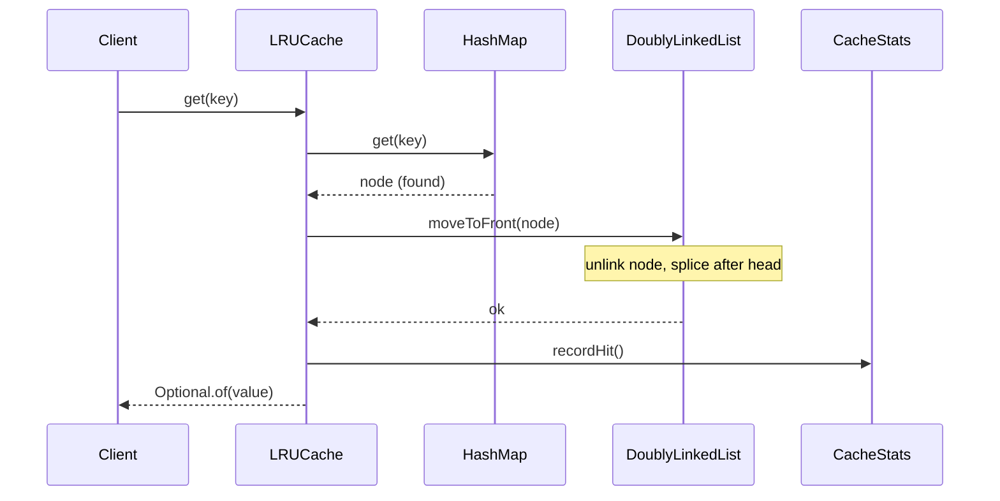
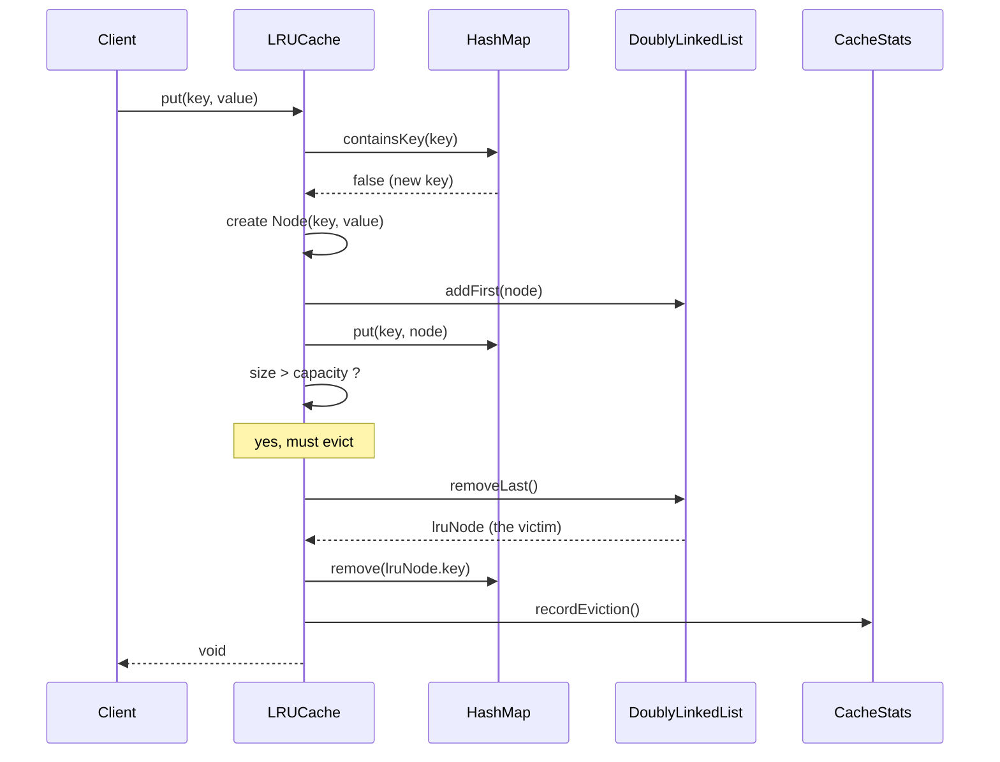
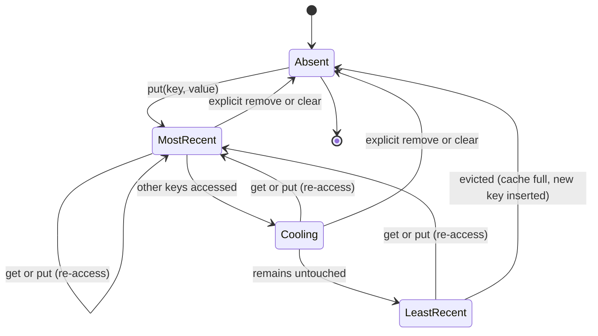

# 🗃️ Low-Level Design: LRU Cache

> A complete, interview-ready walkthrough of the **Least Recently Used (LRU) Cache** — from the naive "why is this hard?" question to a staff-level component that serves reads in constant time, evicts the right entry under memory pressure, and survives the concurrency, correctness, and scaling follow-ups an interviewer throws at the end.

The LRU Cache is one of the most-asked design problems on earth, and it hides more depth than its one-line prompt suggests. On the surface it asks for a bounded key-value store that, when full, throws out the entry nobody has touched for the longest time. The trap is performance: the obvious implementations make either the read or the eviction an O(n) scan, and the whole point of a cache is that it must be *fast* — faster than the thing it fronts. The elegant answer, a **hash map paired with a doubly linked list**, is the single data-structure insight the interviewer is hunting for, and everything after it — thread safety, `get` promoting an entry, TTL, sharding, the jump to Redis and CDNs — is how they separate the L4 who memorized the trick from the L6 who understands why real caches are built the way they are. This guide walks that whole arc, escalating naturally from the beginner's mental model to the questions asked in the final minutes.

---

## 📋 Table of Contents

**Part I — Framing the Problem**

1. [Problem Statement](#1-problem-statement)
2. [Requirement Clarification & Assumptions](#2-requirement-clarification--assumptions)
3. [Functional & Non-Functional Requirements](#3-functional--non-functional-requirements)
4. [Core Concepts Being Tested](#4-core-concepts-being-tested)

**Part II — Modeling the Domain**

5. [Domain Model & Entities](#5-domain-model--entities)
6. [CRC Cards](#6-crc-cards)
7. [UML Class Diagram](#7-uml-class-diagram)
8. [Package Structure](#8-package-structure)

**Part III — Design Rationale**

9. [Design Decisions & Trade-offs](#9-design-decisions--trade-offs)
10. [Class-by-Class Deep Dive](#10-class-by-class-deep-dive)
11. [Design Patterns Applied](#11-design-patterns-applied)
12. [SOLID Principles Mapping](#12-solid-principles-mapping)

**Part IV — Behavior & Diagrams**

13. [Sequence Diagram](#13-sequence-diagram)
14. [State & Lifecycle Diagram](#14-state--lifecycle-diagram)

**Part V — The Implementation**

15. [Complete Java Implementation](#15-complete-java-implementation)
16. [Execution Flow & Code Walkthrough](#16-execution-flow--code-walkthrough)

**Part VI — Engineering Depth**

17. [Complexity Analysis](#17-complexity-analysis)
18. [Thread Safety & Concurrency](#18-thread-safety--concurrency)
19. [Error Handling & Validation](#19-error-handling--validation)
20. [Scalability Discussion](#20-scalability-discussion)
21. [Alternative Designs & Trade-offs](#21-alternative-designs--trade-offs)

**Part VII — Interview Mastery**

22. [Common FAANG Follow-up Questions (L4 → L6)](#22-common-faang-follow-up-questions-l4--l6)
23. [Common Design Mistakes](#23-common-design-mistakes)
24. [Testing Strategy](#24-testing-strategy)
25. [FAANG Q&A Section](#25-faang-qa-section)
26. [STAR Behavioral Questions](#26-star-behavioral-questions)
27. [⚡ Quick Revision Cheat Sheet](#27--quick-revision-cheat-sheet)

---

## 1. Problem Statement

Design a **fixed-capacity cache** that stores key-value pairs and supports two operations: `get(key)`, which returns the value for a key if present, and `put(key, value)`, which inserts or updates a pair. The catch is the capacity limit. When the cache is full and a new key must be inserted, the cache **evicts the Least Recently Used entry** — the one that has gone the longest without being read or written — to make room.

The word *recently* is doing all the work. Every access counts as "use": a successful `get` makes that key the most recently used, and so does a `put`. The entry that gets thrown out is always the one sitting at the cold end of that usage ordering. The hard requirement layered on top is speed: both `get` and `put` must run in **O(1) average time**, because a cache exists to be faster than whatever it sits in front of — a database, a disk, a remote service. A cache whose own lookups are slow defeats its own purpose.

<details>
<summary>📖 <b>In plain terms — what are we actually building?</b></summary>

Imagine your phone's list of recently opened apps, capped at the last few. Open a new app and it jumps to the front; the app you haven't touched in ages silently falls off the end when the list is full. An LRU cache is exactly that discipline applied to data: a box that holds only N items, keeps them ordered by how recently you touched each one, and — when you add something new to a full box — quietly drops whatever you've ignored the longest. Our job is to write the logic that finds any item instantly, bumps it to the front the moment it's touched, and knows in one step which item to discard. We are not building the database behind it; we are building the fast, bounded memory that sits in front.

</details>

The deliverable in an interview is not a distributed cache cluster; it is a **clean, correct, O(1) in-memory data structure** with a well-designed API — the classes, their responsibilities, and above all the hash-map-plus-linked-list mechanism that makes constant time possible. Grading centers on whether you reach that mechanism, whether your pointer manipulation is correct, and how well you reason about the follow-ups: concurrency, eviction policy alternatives, TTL, and scaling out.

---

## 2. Requirement Clarification & Assumptions

The strongest candidates spend the first two minutes turning a thin prompt into a bounded problem. The clarifying questions below are not filler — each answer changes the design or the code.

### 2.1 Actors

An LRU cache is a library component, so its "actors" are the code and systems that use it rather than human roles.

| Actor | Role in the system |
|-------|--------------------|
| **Calling application / client code** | Issues `get` and `put` calls; treats the cache as a fast key-value store. |
| **Backing store (DB, service, disk)** | The slow source of truth the cache fronts; consulted on a miss (in a read-through setup). |
| **Cache maintainer / operator** | Configures capacity, TTL, and eviction policy; monitors hit rate and memory. |
| **Eviction mechanism** | The internal actor that removes the LRU entry when capacity is exceeded. |

### 2.2 Key Clarifying Questions

Resolve these with the interviewer before drawing a single class. Each answer materially shapes the solution.

- **Capacity semantics** — Is capacity a fixed count of entries, or a memory-size budget in bytes? *(Assumption: a fixed maximum number of entries, `capacity`, set at construction. Byte-budget eviction is discussed as an extension.)*
- **Does `get` count as a use?** — Does reading a key make it "recently used"? *(Assumption: yes. Both `get` and `put` mark the key most-recently-used — this is what makes it LRU rather than a FIFO/insertion-order cache.)*
- **Miss behavior** — On `get(missingKey)`, do we return null/sentinel, throw, or load from a backing store? *(Assumption: the core cache returns a sentinel/`Optional.empty()`; a read-through loader is an optional extension.)*
- **Duplicate `put`** — Does `put` on an existing key update the value and refresh recency? *(Assumption: yes — it overwrites the value and moves the key to most-recently-used.)*
- **Null keys/values** — Are they allowed? *(Assumption: keys must be non-null; we reject null keys. Null values are disallowed to keep "absent" and "present-but-null" unambiguous.)*
- **Thread safety** — Single-threaded or concurrent access? *(Assumption: we design a clean single-threaded core first, then make thread safety an explicit, separately-reasoned layer — this is exactly the follow-up.)*
- **Capacity of zero** — Legal? *(Assumption: capacity must be ≥ 1; a zero-capacity cache is rejected at construction as a misconfiguration.)*
- **TTL / expiry** — Do entries expire by time as well as by recency? *(Assumption: not in v1; TTL is a discussed extension since real caches almost always have it.)*

### 2.3 Explicit Non-Goals

Naming what you will *not* build is a senior signal — it bounds scope deliberately instead of by accident.

- No persistence or durability — the cache is purely in-memory and lost on restart.
- No distribution or replication in the core design (sharding and Redis are discussed under scalability).
- No serialization/network protocol — this is an in-process library, not a cache server.
- No cache-coherence protocol across multiple nodes in v1.
- No built-in metrics backend, though we expose hooks for hit/miss counters.

<details>
<summary>📖 <b>Why spend so long on clarification?</b></summary>

"Design an LRU cache" sounds fully specified, but three answers quietly decide your whole solution. First, does `get` count as a use? If yes you must reorder on reads, which forces the linked-list-plus-map design; if no, a simpler structure works. Second, is capacity a count or a byte budget? Byte budgets need per-entry size tracking and a different eviction loop. Third, is it concurrent? That decides whether you can write a plain `HashMap` core or must reason about locking. Asking these upfront shows you understand that "LRU cache" is a family of designs, not one — and it sets up every hard follow-up that comes later.

</details>

---

## 3. Functional & Non-Functional Requirements

With scope bounded, we can state precisely what the system must *do* and how *well* it must do it.

### 3.1 Functional Requirements

These are the observable behaviors the cache must guarantee.

| # | Requirement | Description |
|---|-------------|-------------|
| F1 | **Get by key** | `get(key)` returns the associated value if present and marks the key most-recently-used; returns a miss sentinel otherwise. |
| F2 | **Put / update** | `put(key, value)` inserts a new pair or overwrites an existing one, and marks the key most-recently-used. |
| F3 | **Bounded capacity** | The cache never holds more than `capacity` entries. |
| F4 | **LRU eviction** | When inserting into a full cache, the least-recently-used entry is removed before the new one is added. |
| F5 | **Recency tracking** | Every successful `get` and every `put` updates the entry's recency to "most recent." |
| F6 | **Membership / size** | Callers can check `containsKey`, current `size`, and clear the cache. |
| F7 | **Optional read-through** | With a loader configured, a miss transparently loads from the backing store, caches, and returns the value. |

### 3.2 Non-Functional Requirements

These are the qualities that make the design *interview-worthy* rather than merely correct.

| # | Requirement | Target / Rationale |
|---|-------------|--------------------|
| N1 | **O(1) get** | Constant average time — a cache must beat the store it fronts. |
| N2 | **O(1) put (incl. eviction)** | Insert, update, and eviction must all be constant time. |
| N3 | **O(capacity) space** | Memory proportional to entries held, with small constant overhead per entry. |
| N4 | **Thread safety (extension)** | Correct under concurrent `get`/`put` when the concurrent variant is used. |
| N5 | **Predictability** | No pathological worst case in normal use; no unbounded growth. |
| N6 | **Extensibility** | Eviction policy (LRU, LFU, FIFO) and features (TTL, read-through) swappable without rewriting the core. |
| N7 | **Observability** | Hit rate, miss rate, and eviction count are measurable. |

<details>
<summary>📖 <b>Why is O(1) the non-negotiable requirement?</b></summary>

A cache earns its place by being dramatically faster than the thing behind it — often microseconds versus milliseconds. If the cache's own `get` were O(n), then as it filled up, lookups would slow down linearly, and at some size the cache would be slower than just querying the database. That would be worse than having no cache at all. So "O(1) get and put" is not a nice-to-have; it is the entire justification for the component's existence. This single constraint is what rules out the simple-but-slow designs and forces the hash-map-plus-doubly-linked-list answer the interviewer wants to see.

</details>

---

## 4. Core Concepts Being Tested

Interviewers reach for the LRU cache because it packs several distinct skills into one compact problem. Knowing what is actually being probed lets you signal each one deliberately.

**Data-structure composition.** The heart of the problem is realizing that no *single* textbook data structure gives you both O(1) lookup and O(1) ordered eviction — but *combining two* does. A hash map gives O(1) key lookup; a doubly linked list gives O(1) removal and reordering once you hold the node. The insight is wiring them together so the map's values are the list's nodes. This is the one idea the whole problem exists to test.

**Pointer / reference manipulation.** Splicing a node out of a doubly linked list and re-inserting it at the head, without corrupting the `prev`/`next` pointers, is fiddly. Interviewers watch closely for off-by-one pointer bugs, and the sentinel-node trick (dummy head and tail) is the mark of someone who has done it carefully before.

**Invariant reasoning.** A correct cache maintains strict invariants: the map and list always contain the same key set, the list is always ordered most-to-least recent, and size never exceeds capacity. Being able to state and preserve these under every operation is a senior signal.

**API and abstraction design.** How you shape `get`/`put`, whether you expose an eviction-policy seam, and how you separate the ordering mechanism from the storage are design-maturity signals that push the answer past "solved the LeetCode problem."

**Concurrency reasoning.** The moment the interviewer says "now make it thread-safe," the problem changes character. Recognizing that even `get` mutates shared state (it reorders the list), and reasoning about coarse locks versus striped locks versus `ConcurrentHashMap` plus approximation, is where L5/L6 candidates separate themselves.

**Systems judgment.** The final tier asks you to zoom out: when is LRU the wrong policy, how does this become Redis or a CDN, what breaks at scale. This tests whether you understand caching as a systems discipline, not just an algorithm.

<details>
<summary>📖 <b>What's the single most important takeaway here?</b></summary>

If you remember one thing, remember this: the LRU cache is a *composition* problem, not a single-structure problem. The reason it stumps people is that they hunt for one magic data structure that does everything, and none exists. A hash map alone can't tell you what's "oldest"; a linked list alone can't find a key fast. The trick — the entire trick — is to use a hash map to find any node instantly, and a doubly linked list to reorder and evict instantly, with each map value *pointing at* its list node so the two structures stay in lockstep. Once that clicks, the code writes itself, and every follow-up is a variation on this theme.

</details>

---

## 5. Domain Model & Entities

Before any code, we name the pieces and their responsibilities. An LRU cache has a small, sharp domain — resist the urge to invent classes it doesn't need, but do separate the concerns that genuinely differ.

The central entities are these. A **Node** is one cache entry: it holds a key, a value, and two pointers (`prev` and `next`) so it can live in the doubly linked list. A **DoublyLinkedList** maintains the recency ordering — most-recently-used entries near the head, least-recently-used near the tail — and offers O(1) operations to add at the head, remove any node it's handed, and pop the tail. A **HashMap** (`Map<K, Node>`) provides the O(1) bridge from a key to its node, so we can find any entry without walking the list. The **LRUCache** itself is the coordinator: it owns the map and the list, enforces capacity, and exposes the public `get`/`put` API while keeping the two internal structures perfectly synchronized. Finally, an **EvictionPolicy** abstraction (introduced as the design matures) captures *which* entry to evict, letting LRU, LFU, or FIFO be swapped without touching storage.

The relationships are what make it work. Every key in the map points to exactly one node, and every node in the list corresponds to exactly one map entry — the two structures share the same node objects, so they can never drift out of sync. The list imposes a total order (recency); the map imposes fast access. Neither alone is sufficient; together they are exact.

| Entity | Type | Responsibility | Key relationships |
|--------|------|----------------|-------------------|
| **Node&lt;K,V&gt;** | Class | Holds one key-value pair plus `prev`/`next` links | Referenced by a map entry; linked into the list |
| **DoublyLinkedList&lt;K,V&gt;** | Class | Maintains recency order; O(1) add-to-head, remove-node, remove-tail | Contains all Nodes; uses sentinel head/tail |
| **map: Map&lt;K, Node&gt;** | Field | O(1) key → node lookup | Values are the very Nodes in the list |
| **LRUCache&lt;K,V&gt;** | Class | Coordinates map + list; enforces capacity; public API | Owns the map and the list |
| **EvictionPolicy** | Interface | Decides which entry to evict on overflow | Consulted by the cache on `put` overflow |
| **CacheStats** | Class | Tracks hits, misses, evictions | Updated by the cache on each operation |

<details>
<summary>📖 <b>Why does the map store nodes instead of values?</b></summary>

The naive instinct is `Map<K, V>` — key to value, done. But then when you `get` a key, you have the value, yet you have no idea *where that key sits in the recency order*, so you can't move it to the front in O(1); you'd have to search the list. Storing `Map<K, Node>` fixes exactly this: the node is the key's physical position in the list, so from the key you jump straight to its node and splice it to the head in constant time. The map answers "where is it?" and the node answers "what's next to it?" — together they give you O(1) everything. That indirection, map-to-node rather than map-to-value, is the quiet genius of the design.

</details>

---

## 6. CRC Cards

CRC (Class–Responsibility–Collaborator) cards are the whiteboard tool for pinning down what each class *owns* and *who it talks to*, before committing to method signatures. They keep responsibilities from leaking across classes.

**LRUCache&lt;K,V&gt;**

| Responsibilities | Collaborators |
|------------------|---------------|
| Expose `get`, `put`, `containsKey`, `size`, `clear` | DoublyLinkedList |
| Enforce the capacity bound | HashMap (map) |
| Coordinate map and list so they stay in sync | EvictionPolicy |
| Trigger eviction on overflow; update stats | CacheStats |

**DoublyLinkedList&lt;K,V&gt;**

| Responsibilities | Collaborators |
|------------------|---------------|
| Maintain most-to-least-recent ordering | Node |
| Add a node at the head (most recent) | — |
| Remove any given node in O(1) | — |
| Remove and return the tail node (LRU victim) | — |

**Node&lt;K,V&gt;**

| Responsibilities | Collaborators |
|------------------|---------------|
| Hold one key, one value | — |
| Hold `prev` and `next` references | DoublyLinkedList |

**EvictionPolicy&lt;K&gt;**

| Responsibilities | Collaborators |
|------------------|---------------|
| Record accesses / insertions | LRUCache |
| Choose the next key to evict | — |
| Forget an evicted/removed key | — |

**CacheStats**

| Responsibilities | Collaborators |
|------------------|---------------|
| Count hits, misses, evictions | LRUCache |
| Report hit rate on demand | — |

The clean division to notice: `LRUCache` *coordinates* but does not itself know how to splice pointers (that's the list) or hold data (that's the node). This separation is what lets the concurrency and policy follow-ups land cleanly later.

---

## 7. UML Class Diagram

Here is the full static structure in ASCII, the way you'd sketch it on a whiteboard. Abstract types are marked `«interface»`. The map-plus-list composition is deliberately front and center.

```
        ┌──────────────────────────────────────────────────┐
        │ LRUCache<K,V>                                      │
        ├──────────────────────────────────────────────────┤
        │ - capacity: int                                    │
        │ - map: Map<K, Node<K,V>>                           │
        │ - list: DoublyLinkedList<K,V>                      │
        │ - stats: CacheStats                                │
        ├──────────────────────────────────────────────────┤
        │ + get(key: K): Optional<V>                         │
        │ + put(key: K, value: V): void                      │
        │ + containsKey(key: K): boolean                     │
        │ + size(): int                                      │
        │ + clear(): void                                    │
        │ - evict(): void                                    │
        └───────┬───────────────────────────┬────────────────┘
                │ owns                       │ owns
                ▼                            ▼
   ┌─────────────────────────────┐   ┌──────────────────────────┐
   │ DoublyLinkedList<K,V>       │   │ CacheStats               │
   ├─────────────────────────────┤   ├──────────────────────────┤
   │ - head: Node<K,V>  (sentinel)│   │ - hits: long             │
   │ - tail: Node<K,V>  (sentinel)│   │ - misses: long           │
   │ - size: int                 │   │ - evictions: long        │
   ├─────────────────────────────┤   ├──────────────────────────┤
   │ + addFirst(node): void      │   │ + recordHit(): void      │
   │ + remove(node): void        │   │ + recordMiss(): void     │
   │ + removeLast(): Node<K,V>   │   │ + recordEviction(): void │
   │ + moveToFront(node): void   │   │ + hitRate(): double      │
   └──────────────┬──────────────┘   └──────────────────────────┘
                  │ contains many
                  ▼
        ┌──────────────────────────────┐
        │ Node<K,V>                     │
        ├──────────────────────────────┤
        │ - key: K                      │
        │ - value: V                    │
        │ - prev: Node<K,V>             │
        │ - next: Node<K,V>             │
        └──────────────────────────────┘

        LRUCache optionally delegates the "who to evict" decision to ↓

        ┌───────────────────────────────────┐
        │ «interface» EvictionPolicy<K>     │
        ├───────────────────────────────────┤
        │ + keyAccessed(key: K): void       │
        │ + keyInserted(key: K): void       │
        │ + evictionCandidate(): K          │
        │ + keyRemoved(key: K): void        │
        └─────────────────┬─────────────────┘
                          │ implemented by
          ┌───────────────┼────────────────────┐
          ▼               ▼                    ▼
 ┌─────────────────┐ ┌─────────────────┐ ┌──────────────────┐
 │ LruPolicy<K>    │ │ LfuPolicy<K>    │ │ FifoPolicy<K>    │
 └─────────────────┘ └─────────────────┘ └──────────────────┘
```

The shape to notice: `LRUCache` holds the `map` and the `list` side by side, and the map's values *are* the list's nodes. The map answers "where is key K?" in O(1); the list answers "what is least recent, and move this to front" in O(1). The `EvictionPolicy` seam is optional — the plain LRU cache bakes the policy into the list ordering — but it's the extension point that makes the design pluggable when an interviewer asks for LFU.

<details>
<summary>📖 <b>Why the sentinel head and tail nodes?</b></summary>

A doubly linked list without sentinels forces you to write special-case code every time you touch the first or last element: "is this the head? then update the head pointer; is the list now empty? then null out tail too." Those branches are where pointer bugs breed. Two dummy nodes — a permanent `head` and `tail` that hold no data — mean the *real* entries always sit strictly between them. Now `addFirst` is always "insert after head," `removeLast` is always "remove the node before tail," and removing any node is always "link my prev to my next" with no null checks. The sentinels trade two tiny wasted nodes for the disappearance of an entire class of edge-case bugs — an unambiguously good deal.

</details>

---

## 8. Package Structure

A tidy package layout communicates the design at a glance and keeps the pluggable seams honest. Even for a component this small, separating the core, the internal data structure, and the policy makes the extension points obvious.

```
com.example.cache
│
├── LRUCache.java              // public entry point; coordinates map + list
├── Cache.java                 // «interface» generic cache contract (get/put/size)
│
├── internal
│   ├── Node.java              // doubly-linked-list node (package-private)
│   └── DoublyLinkedList.java  // O(1) add/remove/moveToFront (package-private)
│
├── policy
│   ├── EvictionPolicy.java    // «interface» which key to evict
│   ├── LruPolicy.java
│   ├── LfuPolicy.java
│   └── FifoPolicy.java
│
├── concurrent
│   ├── SynchronizedLRUCache.java   // coarse-lock decorator
│   └── ShardedLRUCache.java        // striped/sharded for high concurrency
│
├── stats
│   └── CacheStats.java        // hit/miss/eviction counters
│
└── loader
    └── CacheLoader.java       // «interface» read-through backing-store loader
```

The reasoning behind the split: `Node` and `DoublyLinkedList` are implementation details nobody outside the cache should touch, so they live in an `internal` package and are package-private. The `policy` package isolates the one genuinely swappable decision — eviction — behind an interface, so adding LFU is a new file, not an edit. The `concurrent` package keeps thread-safety concerns *out* of the core class, so the single-threaded logic stays clean and the concurrency strategy is a deliberate, separate choice. This layout mirrors how production caches like Caffeine and Guava organize themselves: a lean core, pluggable policies, and concurrency handled as its own layer.

---

## 9. Design Decisions & Trade-offs

This section is where interviews are won. Anyone can memorize the answer; the signal is *why* each choice beats its alternatives. Here are the decisions that define the design, each framed as the fork you face and the reasoning that resolves it.

### 9.1 The central decision: HashMap + Doubly Linked List

The whole problem funnels to one question: what data structure gives O(1) `get`, O(1) `put`, *and* O(1) eviction of the least-recently-used entry? Walk the candidates and watch them fall:

| Approach | get | put | Find & evict LRU | Verdict |
|----------|-----|-----|------------------|---------|
| Array / ArrayList (ordered by recency) | O(n) search | O(n) shift | O(1) at end, but reordering on access is O(n) | ❌ reorder kills it |
| HashMap only (key → value) | O(1) | O(1) | O(n) — must scan for oldest | ❌ can't find LRU fast |
| HashMap + timestamp, scan for min | O(1) | O(1) | O(n) scan for min timestamp | ❌ eviction is linear |
| Single linked list + map | O(1) find | O(1) | O(1) evict tail, but **can't reorder** in O(1) — no `prev` to splice | ❌ reorder is O(n) |
| **HashMap + Doubly Linked List** | **O(1)** | **O(1)** | **O(1)** — map finds node, list evicts tail | ✅ **the answer** |
| Balanced BST / TreeMap by access time | O(log n) | O(log n) | O(log n) | ⚠️ correct but not O(1) |

The doubly linked list is essential, not incidental: to move an accessed node to the front in O(1), you must unlink it from its current position, which requires knowing *both* its neighbors — hence `prev` and `next`. A singly linked list can't do the splice in O(1) because you can't reach the predecessor. This is the exact detail interviewers probe: "why *doubly* linked?"

### 9.2 Where does recency ordering live — in the list or in timestamps?

An alternative to reordering a list on every access is to stamp each entry with a "last used" time and, on eviction, find the minimum. This trades the pointer surgery for a scan — and that scan is O(n), which violates the core requirement. Keeping order *structurally* in the list means the LRU victim is always exactly the tail node: no scan, no comparison, O(1). The list encodes recency as position, which is strictly better than encoding it as data you must search.

### 9.3 Build on `LinkedHashMap`, or hand-roll the structure?

Java's `LinkedHashMap` supports access-order mode and an `removeEldestEntry` override that gives you an LRU cache in a dozen lines. It's the right choice in *production*. But in an *interview*, reaching for it usually reads as dodging the question — the interviewer wants to see you build the map-plus-list yourself to prove you understand the mechanism. The staff-level move is to build it by hand, then mention "in production I'd likely use `LinkedHashMap` or Caffeine rather than maintain this myself." That shows both depth and pragmatism.

### 9.4 Fail-safe vs. fail-fast on bad input

On `get` of a missing key, returning a sentinel (`Optional.empty()` or null) is friendlier than throwing, because misses are *normal* for a cache — a miss is an expected outcome, not an error. But a *null key* is a programming bug, so we fail fast with an exception. The principle: expected conditions (misses, evictions) are return values; contract violations (null keys, capacity ≤ 0) are exceptions.

### 9.5 Should the eviction policy be pluggable?

For a pure LRU cache, baking the policy into the list ordering is simplest and fastest. But interviewers frequently pivot to "now make it LFU." Designing an `EvictionPolicy` seam up front costs a little indirection but turns that pivot into a new class rather than a rewrite. The judgment call: mention the seam and its Open/Closed benefit, but don't over-abstract the initial solution — introduce the interface when the second policy appears, not before.

<details>
<summary>📖 <b>Why not just use timestamps and find the oldest?</b></summary>

It feels natural: give every entry a "last touched" time, and when you need to evict, remove the one with the smallest timestamp. The problem is that final step — finding the smallest timestamp means looking at every entry, which is O(n). You could keep the timestamps in a sorted structure to speed that up, but then updates cost O(log n) and you've reinvented a heap or tree, still short of O(1). The doubly linked list sidesteps all of it: because you move each touched entry to the front, the oldest is *always* sitting at the tail, ready to evict instantly. You never search for the oldest because the structure keeps it in a known spot for free.

</details>

---

## 10. Class-by-Class Deep Dive

With the decisions settled, here is what each class does, why it exists, and the subtle points that matter under questioning.

### 10.1 `Node<K,V>` — the entry that lives in the list

A `Node` bundles a key, a value, and two links (`prev`, `next`). Storing the **key inside the node** — not just the value — is a detail people forget, and it matters: when you evict the tail node, you need its key to remove the corresponding entry from the map. Without the key on the node, eviction would require a reverse lookup, which the map can't do in O(1). The node is deliberately dumb: it holds data and links, and knows nothing about the cache or the list.

### 10.2 `DoublyLinkedList<K,V>` — the recency spine

This class owns the ordering. It keeps two **sentinel nodes**, a permanent `head` and `tail` that never hold data, so every real node sits strictly between them and edge cases vanish. Its operations are all O(1): `addFirst` splices a node in right after `head` (most recent); `remove` unlinks a node by connecting its neighbors; `removeLast` unlinks and returns the node just before `tail` (the LRU victim); and `moveToFront` is simply `remove` followed by `addFirst`. The class never searches — it only manipulates nodes it is handed, which is why every operation is constant time.

### 10.3 `LRUCache<K,V>` — the coordinator

This is the public face and the only class that touches both the map and the list. On `get`, it looks up the node in the map; on a hit, it calls `list.moveToFront(node)`, records a hit, and returns the value; on a miss it records a miss and returns empty. On `put`, it either updates an existing node's value and moves it to front, or creates a new node, inserts it into both structures at the head, and — if size now exceeds capacity — calls `evict()`, which pops the tail node from the list and removes that node's key from the map. The invariant it guards religiously: **the map's key set and the list's node set are always identical**, and size never exceeds capacity. Every method preserves this.

### 10.4 `EvictionPolicy<K>` — the swappable decision

This interface abstracts *which key to remove* from *how entries are stored*. `keyAccessed` and `keyInserted` let the policy observe usage; `evictionCandidate` names the victim; `keyRemoved` lets it forget. `LruPolicy` returns the least-recently-touched key; `LfuPolicy` returns the least-frequently-used; `FifoPolicy` ignores accesses and evicts in insertion order. In the pure-LRU cache this collapses into the list itself, but the seam exists so a policy swap doesn't disturb storage.

### 10.5 `CacheStats` — observability

A small counter object tracking hits, misses, and evictions, exposing a computed `hitRate`. It exists because **hit rate is the single most important health metric for a cache** — a cache with a low hit rate is burning memory for nothing — and you cannot tune capacity or diagnose a thrashing cache without it. Keeping stats in their own class keeps the core methods uncluttered and makes the counters easy to make thread-safe (via `LongAdder`) later.

<details>
<summary>📖 <b>Why does the node store the key, not just the value?</b></summary>

When the cache is full and you evict, you grab the least-recently-used node — the one at the list's tail — and remove it. But you must *also* delete it from the hash map, and the map is keyed by, well, the key. If the node only held the value, you'd be standing there holding the value with no way to know which map entry to delete, short of scanning the whole map (O(n), which breaks everything). By storing the key *on the node*, eviction is trivial: pop the tail node, read its `.key`, call `map.remove(key)`. This tiny redundancy — the key living in both the map and the node — is what keeps eviction O(1).

</details>

---

## 11. Design Patterns Applied

The LRU cache is compact, so it doesn't drown in patterns — but the few it uses are load-bearing, and naming them precisely signals design literacy.

**Strategy** — the marquee pattern here. The `EvictionPolicy` interface with `LruPolicy`, `LfuPolicy`, and `FifoPolicy` implementations is textbook Strategy: the algorithm for choosing a victim is encapsulated behind an interface and swappable at construction. This is the Open/Closed seam that turns "now make it LFU" from a rewrite into a new class. Real caches expose exactly this — Caffeine lets you configure the eviction strategy.

**Decorator** — the clean way to add thread safety. Rather than tangle locking into the core `LRUCache`, a `SynchronizedLRUCache` decorator wraps any `Cache` and adds a lock around each call, preserving the same interface. This mirrors `Collections.synchronizedMap`: the concurrency concern layers *on top of* the storage concern instead of contaminating it.

**Template Method / read-through hook** — the `CacheLoader` seam. When a `get` misses, the cache can invoke a caller-supplied loader to fetch from the backing store, cache the result, and return it. The overall "check cache, on miss load and populate" flow is fixed; the "how to load" step is pluggable — the essence of Template Method applied to read-through caching.

**Facade** — `LRUCache` itself acts as a facade over the map and the linked list. Callers see a simple `get`/`put` API and never touch nodes or splice pointers; the complexity of keeping two data structures synchronized hides behind the coordinator.

**Iterator (implicit)** — if the cache exposes traversal (e.g., for debugging or snapshotting), it does so in recency order via the list, without leaking the node structure.

<details>
<summary>📖 <b>Isn't this over-patterning a simple cache?</b></summary>

A fair worry — and the answer is to introduce patterns only as the interview escalates. The bare LRU cache needs *zero* named patterns; it's just a map and a list. But the moment the interviewer says "make eviction configurable," Strategy earns its place; when they say "make it thread-safe without rewriting," Decorator earns its place; when they say "load from the DB on a miss," the loader hook earns its place. The staff-level move is to *start simple* and reach for each pattern exactly when a requirement demands it, explaining the trade-off aloud. Patterns invoked speculatively are a red flag; patterns invoked to absorb a new requirement are a green one.

</details>

---

## 12. SOLID Principles Mapping

SOLID is easy to recite and hard to demonstrate. Here is where each principle shows up concretely in this design — the version that survives an interviewer asking "show me where."

**Single Responsibility.** Each class has exactly one reason to change. `Node` only holds data; `DoublyLinkedList` only manages ordering and O(1) splicing; `LRUCache` only coordinates the two and enforces capacity; `CacheStats` only counts; `EvictionPolicy` only decides victims. If the eviction rule changes, only a policy class changes; if the ordering mechanism changes, only the list changes. Responsibilities don't bleed.

**Open/Closed.** The design is open to extension, closed to modification, through the `EvictionPolicy` interface. Adding LFU or FIFO is a new class implementing the interface — zero edits to `LRUCache`, the list, or the node. Likewise, thread safety is added via a new decorator class, not by editing the core.

**Liskov Substitution.** Any `EvictionPolicy` implementation is a drop-in for any other — the cache calls `evictionCandidate()` and trusts the contract, whether the concrete policy is LRU or LFU. Any `Cache` implementation (plain, synchronized, sharded) honors the same `get`/`put` semantics, so callers can't tell which they hold.

**Interface Segregation.** Interfaces are minimal and focused. `EvictionPolicy` exposes only the four lifecycle hooks a policy needs; `CacheLoader` exposes a single `load(key)` method. No client is forced to depend on methods it doesn't use — there's no fat "cache manager" interface bundling unrelated concerns.

**Dependency Inversion.** `LRUCache` depends on the `EvictionPolicy` and `CacheLoader` *abstractions*, not on concrete `LruPolicy` or a specific database. The policy and loader are injected at construction, so the high-level cache logic is decoupled from the low-level details of victim selection and data fetching — you can unit-test the cache with a stub loader and a fake policy.

<details>
<summary>📖 <b>Which SOLID principle matters most for a cache?</b></summary>

Open/Closed, by a wide margin — because the single most common follow-up in an LRU interview is "now change the eviction policy to LFU" or "add TTL." If your design forces you to rip open the core `get`/`put` methods to accommodate that, you've failed the extensibility test. If instead you can point at the `EvictionPolicy` seam and say "LFU is just a new class implementing this interface, and the cache never changes," you've demonstrated exactly the design maturity the question is probing for. Single Responsibility is what *enables* that Open/Closed win — because storage, ordering, and policy are separate classes, each can vary without disturbing the others.

</details>

---

## 13. Sequence Diagram

Diagrams make the coordination concrete. The two flows worth drawing are the interesting cases: a `get` that hits (and must reorder), and a `put` that overflows (and must evict). Together they exercise every collaboration in the design.

### 13.1 `get` on a present key (a cache hit)

A hit is not read-only — it *mutates* the recency order by promoting the accessed node to the front. This is the subtlety that makes even `get` a write, and it matters enormously for concurrency later.



### 13.2 `put` of a new key into a full cache (insert + evict)

This is the money flow. A new key arrives, the cache is at capacity, so it must evict the tail before inserting the newcomer at the head — all in O(1).



The ordering to defend under questioning: we insert the new entry *first*, then evict, so at no instant is the requested key missing. The victim is always the current tail — chosen structurally, never searched for.

<details>
<summary>📖 <b>Why is a cache "hit" actually a write operation?</b></summary>

Intuitively, reading something shouldn't change it — a `get` sounds harmless. But in an LRU cache, reading a key is the very act that makes it "recently used," so a successful `get` must move that entry to the front of the recency list. That move rewrites pointers in the shared linked list. The consequence is huge for concurrency: you cannot treat `get` as a safe, lock-free read, because two threads both "reading" different keys can corrupt the list by splicing at the same time. This is why a naive "just use a read lock for get" fails, and why the thread-safety discussion later has to treat `get` as a mutation, not a read.

</details>

---

## 14. State & Lifecycle Diagram

An LRU cache doesn't have a rich state machine like a vending machine, but each *entry* moves through a clear lifecycle, and the cache as a whole has a capacity-driven state worth drawing. Modeling the entry lifecycle clarifies exactly when eviction can happen.

The diagram below tracks a single key's journey through the cache: it's born on `put`, lives while accessed, drifts toward the cold tail when ignored, and dies either by explicit removal or by eviction when it becomes the least-recently-used entry in a full cache.



The states in words. **Absent** means the key isn't in the cache. **MostRecent** is the head of the list — just touched, safest from eviction. **Cooling** covers the middle of the list — still cached, drifting toward the cold end as other keys are touched. **LeastRecent** is the tail — the next victim if a new key needs room. The only transition that *involves the backing store* is the eviction from `LeastRecent` back to `Absent`; every re-access transition instantly warps the key back to `MostRecent`, which is the entire behavior of LRU expressed as a lifecycle.

The cache-level state is simpler: it's either **Below Capacity** (puts insert without evicting) or **At Capacity** (every new-key put triggers exactly one eviction). Recognizing that "at capacity" is the steady state of any useful cache — caches are meant to run full — is a nice observation to voice.

<details>
<summary>📖 <b>When exactly does an entry get evicted?</b></summary>

An entry is only ever evicted at one precise moment: when a `put` inserts a *brand-new* key while the cache is already at full capacity. At that instant the cache picks the entry sitting at the tail of the recency list — the least-recently-used one — and drops it to make room. Note what does *not* trigger eviction: reading keys, updating existing keys, or inserting when there's still free space. Also note that any access instantly rescues an entry — touch the coldest key and it leaps back to the front, safe again. So an entry dies only if it's both the least recently used *and* unlucky enough that a new key arrives before anyone touches it.

</details>

---

## 15. Complete Java Implementation

Below is a complete, runnable, interview-grade implementation. It builds up from the core O(1) cache, then layers in the pluggable eviction policy, statistics, thread-safe decorator, sharding, and read-through loading. Every class name, field, and method signature matches the UML and sequence diagrams above exactly.

The code is organized so you can present just the core in a 45-minute interview, then reach for each extension as the follow-ups arrive.

<details>
<summary>💻 <b>1. <code>Node</code> and <code>DoublyLinkedList</code> — the O(1) recency spine</b></summary>

```java
package com.example.cache.internal;

/**
 * A single cache entry living in the doubly linked list.
 * Stores the KEY as well as the value, so eviction can remove
 * the corresponding map entry in O(1) without a reverse lookup.
 */
public class Node<K, V> {
    K key;
    V value;
    Node<K, V> prev;
    Node<K, V> next;

    Node() {} // for sentinel head/tail

    Node(K key, V value) {
        this.key = key;
        this.value = value;
    }
}
```

```java
package com.example.cache.internal;

/**
 * Doubly linked list ordered most-recently-used (head) to
 * least-recently-used (tail). Uses two sentinel nodes so that
 * every real node sits strictly between head and tail, which
 * removes all null-checking edge cases. Every operation is O(1).
 */
public class DoublyLinkedList<K, V> {

    private final Node<K, V> head; // sentinel: most-recent side
    private final Node<K, V> tail; // sentinel: least-recent side
    private int size;

    public DoublyLinkedList() {
        head = new Node<>();
        tail = new Node<>();
        head.next = tail;
        tail.prev = head;
    }

    /** Insert node right after head (marks it most-recently-used). */
    public void addFirst(Node<K, V> node) {
        node.prev = head;
        node.next = head.next;
        head.next.prev = node;
        head.next = node;
        size++;
    }

    /** Unlink a node the caller already holds. O(1), no search. */
    public void remove(Node<K, V> node) {
        node.prev.next = node.next;
        node.next.prev = node.prev;
        node.prev = null;
        node.next = null;
        size--;
    }

    /** Remove and return the least-recently-used node (before tail). */
    public Node<K, V> removeLast() {
        if (size == 0) {
            return null;
        }
        Node<K, V> lru = tail.prev;
        remove(lru);
        return lru;
    }

    /** Promote an existing node to most-recently-used. */
    public void moveToFront(Node<K, V> node) {
        remove(node);
        addFirst(node);
    }

    public int size() {
        return size;
    }

    public void clear() {
        head.next = tail;
        tail.prev = head;
        size = 0;
    }
}
```

</details>

<details>
<summary>💻 <b>2. <code>Cache</code> interface and <code>CacheStats</code></b></summary>

```java
package com.example.cache;

import java.util.Optional;

/** The generic cache contract. Implementations may be plain,
 *  synchronized, or sharded — callers cannot tell which. */
public interface Cache<K, V> {
    Optional<V> get(K key);
    void put(K key, V value);
    boolean containsKey(K key);
    int size();
    void clear();
}
```

```java
package com.example.cache.stats;

import java.util.concurrent.atomic.LongAdder;

/**
 * Hit/miss/eviction counters. Hit rate is the single most
 * important health metric for a cache. LongAdder is used so the
 * counters stay cheap and correct under concurrent updates.
 */
public class CacheStats {
    private final LongAdder hits = new LongAdder();
    private final LongAdder misses = new LongAdder();
    private final LongAdder evictions = new LongAdder();

    public void recordHit()      { hits.increment(); }
    public void recordMiss()     { misses.increment(); }
    public void recordEviction() { evictions.increment(); }

    public long hits()      { return hits.sum(); }
    public long misses()    { return misses.sum(); }
    public long evictions() { return evictions.sum(); }

    /** Fraction of gets that hit, in [0.0, 1.0]. */
    public double hitRate() {
        long h = hits.sum();
        long total = h + misses.sum();
        return total == 0 ? 0.0 : (double) h / total;
    }

    @Override
    public String toString() {
        return String.format("CacheStats{hits=%d, misses=%d, evictions=%d, hitRate=%.2f%%}",
                hits(), misses(), evictions(), hitRate() * 100);
    }
}
```

</details>

<details>
<summary>💻 <b>3. <code>LRUCache</code> — the core coordinator (the heart of the answer)</b></summary>

```java
package com.example.cache;

import com.example.cache.internal.DoublyLinkedList;
import com.example.cache.internal.Node;
import com.example.cache.stats.CacheStats;

import java.util.HashMap;
import java.util.Map;
import java.util.Objects;
import java.util.Optional;

/**
 * A fixed-capacity Least-Recently-Used cache with O(1) get and put.
 *
 * Mechanism: a HashMap gives O(1) key -> node lookup; a doubly
 * linked list keeps entries ordered by recency so the LRU victim
 * is always the tail. The map's values ARE the list's nodes, so
 * the two structures never drift apart.
 *
 * NOT thread-safe on its own; wrap with SynchronizedLRUCache or
 * ShardedLRUCache for concurrent use.
 */
public class LRUCache<K, V> implements Cache<K, V> {

    private final int capacity;
    private final Map<K, Node<K, V>> map;
    private final DoublyLinkedList<K, V> list;
    private final CacheStats stats;

    public LRUCache(int capacity) {
        if (capacity < 1) {
            throw new IllegalArgumentException("capacity must be >= 1, got " + capacity);
        }
        this.capacity = capacity;
        this.map = new HashMap<>(capacity * 4 / 3 + 1);
        this.list = new DoublyLinkedList<>();
        this.stats = new CacheStats();
    }

    @Override
    public Optional<V> get(K key) {
        Objects.requireNonNull(key, "key must not be null");
        Node<K, V> node = map.get(key);
        if (node == null) {
            stats.recordMiss();
            return Optional.empty();
        }
        list.moveToFront(node); // a hit promotes the entry — this is a mutation
        stats.recordHit();
        return Optional.of(node.value);
    }

    @Override
    public void put(K key, V value) {
        Objects.requireNonNull(key, "key must not be null");
        Objects.requireNonNull(value, "value must not be null");

        Node<K, V> existing = map.get(key);
        if (existing != null) {
            existing.value = value;          // overwrite
            list.moveToFront(existing);      // refresh recency
            return;
        }

        Node<K, V> node = new Node<>(key, value);
        list.addFirst(node);   // insert new entry as most-recent
        map.put(key, node);

        if (map.size() > capacity) {
            evict();            // over capacity — drop the LRU tail
        }
    }

    /** Remove the least-recently-used entry from both structures. */
    private void evict() {
        Node<K, V> lru = list.removeLast();
        if (lru != null) {
            map.remove(lru.key); // needs the key stored on the node
            stats.recordEviction();
        }
    }

    @Override
    public boolean containsKey(K key) {
        return map.containsKey(key); // does NOT count as a use
    }

    @Override
    public int size() {
        return map.size();
    }

    @Override
    public void clear() {
        map.clear();
        list.clear();
    }

    public CacheStats stats() {
        return stats;
    }
}
```

</details>

<details>
<summary>💻 <b>4. <code>EvictionPolicy</code> and its implementations (LRU / LFU / FIFO)</b></summary>

```java
package com.example.cache.policy;

/**
 * Strategy for choosing which key to evict. Lets the cache swap
 * LRU for LFU or FIFO without changing its storage logic.
 */
public interface EvictionPolicy<K> {
    void keyAccessed(K key);          // called on get/hit
    void keyInserted(K key);          // called on new put
    K    evictionCandidate();         // which key to drop next
    void keyRemoved(K key);           // forget an evicted/removed key
}
```

```java
package com.example.cache.policy;

import java.util.LinkedHashSet;

/**
 * LRU policy backed by access order. Re-inserting on access moves
 * the key to the end; the eviction candidate is the first element.
 * (In the main LRUCache this collapses into the linked list itself;
 *  this standalone form is used when policy is fully decoupled.)
 */
public class LruPolicy<K> implements EvictionPolicy<K> {
    private final LinkedHashSet<K> order = new LinkedHashSet<>();

    @Override public void keyAccessed(K key) {
        order.remove(key);
        order.add(key); // move to most-recent end
    }
    @Override public void keyInserted(K key) { order.add(key); }
    @Override public K evictionCandidate() {
        return order.isEmpty() ? null : order.iterator().next(); // oldest
    }
    @Override public void keyRemoved(K key) { order.remove(key); }
}
```

```java
package com.example.cache.policy;

import java.util.HashMap;
import java.util.Map;
import java.util.TreeMap;

/**
 * LFU policy: evicts the least-frequently-used key, breaking ties
 * by least-recently-used. Maintains counts and a frequency index.
 */
public class LfuPolicy<K> implements EvictionPolicy<K> {
    private final Map<K, Integer> freq = new HashMap<>();
    private final TreeMap<Integer, LinkedHashSetWrapper<K>> byFreq = new TreeMap<>();

    @Override public void keyInserted(K key) { bump(key, 0); }
    @Override public void keyAccessed(K key) {
        Integer f = freq.get(key);
        if (f != null) { detach(key, f); bump(key, f); }
    }
    @Override public K evictionCandidate() {
        Map.Entry<Integer, LinkedHashSetWrapper<K>> e = byFreq.firstEntry();
        return e == null ? null : e.getValue().first();
    }
    @Override public void keyRemoved(K key) {
        Integer f = freq.remove(key);
        if (f != null) detach(key, f);
    }
    private void bump(K key, int oldF) {
        int nf = oldF + 1;
        freq.put(key, nf);
        byFreq.computeIfAbsent(nf, k -> new LinkedHashSetWrapper<>()).add(key);
    }
    private void detach(K key, int f) {
        LinkedHashSetWrapper<K> set = byFreq.get(f);
        if (set != null) { set.remove(key); if (set.isEmpty()) byFreq.remove(f); }
    }
    // tiny wrapper to keep insertion order for tie-breaking
    static class LinkedHashSetWrapper<K> {
        private final java.util.LinkedHashSet<K> s = new java.util.LinkedHashSet<>();
        void add(K k) { s.add(k); }
        void remove(K k) { s.remove(k); }
        boolean isEmpty() { return s.isEmpty(); }
        K first() { return s.iterator().next(); }
    }
}
```

```java
package com.example.cache.policy;

import java.util.ArrayDeque;
import java.util.Deque;

/**
 * FIFO policy: evicts in insertion order and ignores accesses.
 * Useful when recency of use is a poor predictor of future use.
 */
public class FifoPolicy<K> implements EvictionPolicy<K> {
    private final Deque<K> queue = new ArrayDeque<>();

    @Override public void keyAccessed(K key) { /* no-op: FIFO ignores reads */ }
    @Override public void keyInserted(K key) { queue.addLast(key); }
    @Override public K evictionCandidate()   { return queue.peekFirst(); }
    @Override public void keyRemoved(K key)  { queue.remove(key); }
}
```

</details>

<details>
<summary>💻 <b>5. <code>SynchronizedLRUCache</code> — thread safety via the Decorator pattern</b></summary>

```java
package com.example.cache.concurrent;

import com.example.cache.Cache;

import java.util.Optional;

/**
 * Adds thread safety to any Cache by guarding every call with a
 * single lock. Simple and correct, but the lock is a bottleneck:
 * because even get() mutates the recency list, reads cannot run in
 * parallel. For higher concurrency, use ShardedLRUCache.
 */
public class SynchronizedLRUCache<K, V> implements Cache<K, V> {

    private final Cache<K, V> delegate;
    private final Object lock = new Object();

    public SynchronizedLRUCache(Cache<K, V> delegate) {
        this.delegate = delegate;
    }

    @Override public Optional<V> get(K key) {
        synchronized (lock) { return delegate.get(key); }
    }
    @Override public void put(K key, V value) {
        synchronized (lock) { delegate.put(key, value); }
    }
    @Override public boolean containsKey(K key) {
        synchronized (lock) { return delegate.containsKey(key); }
    }
    @Override public int size() {
        synchronized (lock) { return delegate.size(); }
    }
    @Override public void clear() {
        synchronized (lock) { delegate.clear(); }
    }
}
```

</details>

<details>
<summary>💻 <b>6. <code>ShardedLRUCache</code> — striped locking for high concurrency</b></summary>

```java
package com.example.cache.concurrent;

import com.example.cache.Cache;
import com.example.cache.LRUCache;

import java.util.Optional;

/**
 * Splits the cache into N independent shards, each its own
 * synchronized LRU cache. A key maps to a shard by its hash, so
 * operations on different shards proceed in parallel — lock
 * contention drops by roughly a factor of N. This is how
 * production caches (e.g. Guava, Caffeine) scale writes.
 *
 * Trade-off: LRU becomes per-shard, so global LRU order is only
 * approximated. In practice this is fine and often desirable.
 */
public class ShardedLRUCache<K, V> implements Cache<K, V> {

    private final Cache<K, V>[] shards;
    private final int shardCount;

    @SuppressWarnings("unchecked")
    public ShardedLRUCache(int totalCapacity, int shardCount) {
        if (shardCount < 1) throw new IllegalArgumentException("shardCount >= 1");
        this.shardCount = shardCount;
        this.shards = new Cache[shardCount];
        int perShard = Math.max(1, totalCapacity / shardCount);
        for (int i = 0; i < shardCount; i++) {
            shards[i] = new SynchronizedLRUCache<>(new LRUCache<>(perShard));
        }
    }

    private Cache<K, V> shardFor(K key) {
        int h = key.hashCode();
        h ^= (h >>> 16);                       // spread bits
        int idx = (h & 0x7fffffff) % shardCount;
        return shards[idx];
    }

    @Override public Optional<V> get(K key)      { return shardFor(key).get(key); }
    @Override public void put(K key, V value)    { shardFor(key).put(key, value); }
    @Override public boolean containsKey(K key)  { return shardFor(key).containsKey(key); }
    @Override public int size() {
        int total = 0;
        for (Cache<K, V> s : shards) total += s.size();
        return total;
    }
    @Override public void clear() {
        for (Cache<K, V> s : shards) s.clear();
    }
}
```

</details>

<details>
<summary>💻 <b>7. <code>CacheLoader</code> and a read-through cache</b></summary>

```java
package com.example.cache.loader;

/** Supplies a value for a key on a cache miss (read-through). */
@FunctionalInterface
public interface CacheLoader<K, V> {
    V load(K key) throws Exception;
}
```

```java
package com.example.cache;

import com.example.cache.loader.CacheLoader;

import java.util.Optional;

/**
 * A read-through cache: on a miss, it loads the value from the
 * backing store via the supplied loader, caches it, and returns it.
 * The "check cache, on miss load and populate" flow is fixed; only
 * the load step is pluggable (Template Method / read-through hook).
 */
public class LoadingCache<K, V> {

    private final Cache<K, V> cache;
    private final CacheLoader<K, V> loader;

    public LoadingCache(Cache<K, V> cache, CacheLoader<K, V> loader) {
        this.cache = cache;
        this.loader = loader;
    }

    public V get(K key) {
        Optional<V> cached = cache.get(key);
        if (cached.isPresent()) {
            return cached.get();
        }
        try {
            V value = loader.load(key); // slow path: hit the backing store
            if (value != null) {
                cache.put(key, value);
            }
            return value;
        } catch (Exception e) {
            throw new RuntimeException("Failed to load key: " + key, e);
        }
    }
}
```

</details>

<details>
<summary>💻 <b>8. A tiny <code>main</code> demonstrating the behavior</b></summary>

```java
package com.example.cache;

public class Demo {
    public static void main(String[] args) {
        LRUCache<Integer, String> cache = new LRUCache<>(2);

        cache.put(1, "one");
        cache.put(2, "two");
        System.out.println(cache.get(1));   // Optional[one] — 1 is now most-recent

        cache.put(3, "three");               // capacity 2 exceeded -> evicts key 2 (LRU)
        System.out.println(cache.get(2));   // Optional.empty — 2 was evicted
        System.out.println(cache.get(3));   // Optional[three]

        cache.put(4, "four");                // evicts key 1 (now the LRU)
        System.out.println(cache.get(1));   // Optional.empty
        System.out.println(cache.get(3));   // Optional[three]
        System.out.println(cache.get(4));   // Optional[four]

        System.out.println(cache.stats());  // hit/miss/eviction summary
    }
}
```

Expected output:

```
Optional[one]
Optional.empty
Optional[three]
Optional.empty
Optional[three]
Optional[four]
CacheStats{hits=4, misses=2, evictions=2, hitRate=66.67%}
```

</details>

---

## 16. Execution Flow & Code Walkthrough

Reading code top-to-bottom hides the *dynamics*. Here is the runtime story of the two operations that matter, traced against the implementation above.

### 16.1 The life of a `get(key)`

The caller invokes `get(1)`. The cache first null-checks the key (a null key is a bug, so we fail fast). It calls `map.get(1)`, an O(1) hash lookup, and gets back the `Node` — or `null`. On `null`, it records a miss and returns `Optional.empty()`; the caller learns the key isn't cached and, in a read-through setup, would go load it. On a hit, the crucial step fires: `list.moveToFront(node)` unlinks the node from wherever it sat and splices it in right after the sentinel head, making it most-recently-used. That single reorder is *why* the entry survives the next eviction. Only then does the cache record a hit and return `Optional.of(node.value)`. The whole path touches a fixed number of pointers regardless of cache size — genuinely O(1).

### 16.2 The life of a `put(key, value)` that overflows

The caller invokes `put(3, "three")` on a full cache. After null-checking key and value, the cache calls `map.get(3)`. If the key already existed, it would overwrite the value and `moveToFront` — no size change, no eviction. Here the key is new, so it creates a `Node(3, "three")`, calls `list.addFirst(node)` to place it at the most-recent position, and `map.put(3, node)` to make it findable. Now the size check: `map.size()` is 3 but capacity is 2, so `evict()` runs. `evict` calls `list.removeLast()`, which returns the node just before the tail sentinel — the least-recently-used entry — and unlinks it. The cache then reads that node's `.key` (this is why the key lives on the node) and calls `map.remove(key)`, deleting it from the map too. A miss counter for evictions ticks up. The map and list are back in sync, size is 2 again, and the newcomer is safely at the head. Every step is constant time.

### 16.3 The invariant that ties it together

Trace either flow and one property never breaks: **every key in the map has its node in the list, and every node in the list has its key in the map, and the count of both equals `size()` ≤ `capacity`**. Insertion adds to both; eviction removes from both; update touches neither's membership. If you can state this invariant and show each method preserves it, you've demonstrated the correctness argument an interviewer wants — not just "it works," but "here's why it can't break."

<details>
<summary>📖 <b>Walk me through what happens on a full cache, simply.</b></summary>

Say the cache holds two items and you add a third. The cache makes a new node for the newcomer and puts it at the front of the recency line, and records it in the lookup table. Now there are three items but room for only two, so it looks at the very back of the line — the item nobody's touched longest — and removes it, both from the line and from the lookup table. Done: two items again, the fresh one safe at the front, the stalest one gone. The elegant part is that the cache never had to *search* for the oldest item; the recency line always keeps it sitting at the back, ready to remove instantly.

</details>

---

## 17. Complexity Analysis

The entire point of the design is its complexity profile, so be ready to defend every entry in this table and, more importantly, *why* it holds.

| Operation | Time | Space | Why |
|-----------|------|-------|-----|
| `get(key)` | **O(1)** average | — | One hash lookup + a constant-pointer `moveToFront` |
| `put(key, value)` — update | **O(1)** average | — | Hash lookup, overwrite, constant-pointer reorder |
| `put(key, value)` — insert | **O(1)** average | O(1) | Add node at head, map put, possibly one eviction |
| `evict()` | **O(1)** | — | `removeLast` is one splice; `map.remove` is O(1) |
| `containsKey(key)` | **O(1)** average | — | Pure map lookup, no reorder |
| `size()` | **O(1)** | — | Cached counter |
| `clear()` | **O(1)** or O(n) | — | O(1) to reset pointers; O(n) if map must free entries |
| Total space | — | **O(capacity)** | One node + one map entry per cached key |

The word **average** is important and worth saying aloud. Hash-map operations are O(1) *amortized average* but O(n) *worst case* if every key collides into one bucket. In practice, Java's `HashMap` mitigates this by converting long collision chains into balanced trees (O(log n) per bucket) since Java 8, and with a decent hash function collisions are rare. The linked-list operations, by contrast, are *true* O(1) worst case — no amortization, no hidden resize — because they're just pointer splices. So the honest statement is "O(1) average, dominated by the hash map, with the list contributing worst-case-constant time."

The space overhead per entry is a fair follow-up: each entry costs the key, the value, two pointers on the node, and one hash-map entry (which itself holds a key reference, a value reference — here the node — a hash int, and a next pointer). That's meaningful constant overhead, roughly 50–100 bytes per entry in the JVM beyond the payload, which is why byte-budget eviction (rather than count-based) matters for large-value caches.

<details>
<summary>📖 <b>Why do we say O(1) "average" and not just O(1)?</b></summary>

The linked-list half of the design is genuinely, always O(1) — moving a node is a fixed handful of pointer updates no matter how big the cache is. The hash-map half is where the "average" caveat comes from. Normally a hash lookup is O(1), but if lots of keys happen to hash to the same bucket, that bucket becomes a list you have to scan, degrading toward O(n) in a pathological case. Real hash maps make this vanishingly unlikely with good hash functions and by restructuring overloaded buckets, so in practice it's O(1) — but a careful candidate says "average" to acknowledge the hash map's theoretical worst case rather than overclaiming.

</details>

---

## 18. Thread Safety & Concurrency

This is the follow-up that separates levels, and it hinges on one uncomfortable fact: **in an LRU cache, `get` is not a read — it's a write.** Every successful `get` calls `moveToFront`, mutating the shared linked list. So the naive plan of "reads take a shared lock, writes take an exclusive lock" collapses, because there are no pure reads.

### 18.1 What breaks without synchronization

The core `LRUCache` is deliberately *not* thread-safe. Two concrete hazards appear under concurrent access. First, **corrupted list pointers**: if two threads run `moveToFront` on different nodes simultaneously, their interleaved `remove`/`addFirst` splices can leave the list with dangling or crossed `prev`/`next` links, losing entries or creating cycles. Second, **lost updates and inconsistent map/list**: a `put` that evicts while another `put` inserts can leave the map and list disagreeing about membership, breaking the core invariant. Third, **check-then-act races** in the size check: two inserts can both observe `size == capacity` and both skip or both trigger eviction incorrectly.

### 18.2 The spectrum of solutions

The right answer depends on the read/write ratio and the concurrency level. Present them as a spectrum, weakest to strongest:

| Strategy | Mechanism | Concurrency | When to use |
|----------|-----------|-------------|-------------|
| **Single global lock** | `synchronized` on every method (the `SynchronizedLRUCache` decorator) | None — fully serialized | Low contention, simplicity first |
| **ReentrantLock** | Explicit lock, same serialization but with `tryLock`/timeout options | None, but more control | Need fairness or timed acquisition |
| **Striped / sharded locks** | N independent shards, lock per shard (`ShardedLRUCache`) | ~N-way parallel | High throughput; the production default |
| **Lock-free approximate LRU** | `ConcurrentHashMap` + approximate recency (sampling, second-chance, or a write buffer) | Very high | Read-heavy, huge caches (what Caffeine does) |

### 18.3 Why sharding is the pragmatic production answer

A single lock makes even reads serialize, which caps throughput on a busy cache. Sharding partitions the keyspace into N caches, each with its own lock, so operations on different shards run in true parallel and lock contention drops ~N-fold. The trade-off is that LRU becomes *per-shard*, not global — you might evict a key that's globally warmer than one kept in another shard. In practice this approximation is invisible and often beneficial, which is exactly why Guava's `Cache` and the `ConcurrentHashMap`-based designs use segment/shard locking.

### 18.4 What Caffeine actually does (the staff-level flourish)

Production-grade caches like **Caffeine** sidestep the "`get` is a write" problem cleverly: reads record their access into a lock-free **ring buffer** instead of touching the LRU list directly, and a single maintenance thread later drains that buffer to update recency in the background. Reads thus become nearly lock-free and scale linearly, at the cost of *approximate* (eventually-consistent) recency ordering. Caffeine also uses an admission policy called **TinyLFU** — a frequency sketch that decides whether a new entry is even worth admitting — which beats pure LRU on most real workloads. Mentioning this shows you know that "real" caches long ago abandoned exact LRU for approximate, higher-throughput variants.

<details>
<summary>📖 <b>Why can't I just put a read lock on get() and a write lock on put()?</b></summary>

Because a `get` isn't really a read — it changes the cache. Every successful `get` bumps that entry to the front of the recency order, which means editing the shared linked list. A read/write lock assumes reads don't modify anything and can safely run in parallel; here they *do* modify the list, so letting two "reads" run at once corrupts the pointers just like two writes would. You either treat `get` as a write and lock it fully (simple but slow), shard the cache so different keys lock independently (the common production fix), or decouple the recency update from the read using a buffer that a background thread drains (what Caffeine does for near-lock-free reads).

</details>

---

## 19. Error Handling & Validation

A staff-level answer treats error handling as part of the contract, not an afterthought. The guiding principle established earlier: expected conditions are return values, contract violations are exceptions.

**Construction validation.** Capacity must be ≥ 1. A capacity of zero is a misconfiguration — a cache that can hold nothing is never what the caller meant — so the constructor throws `IllegalArgumentException` immediately rather than silently accepting a useless cache. Failing at construction surfaces the bug at startup, not at the first mysterious eviction.

**Null keys.** A null key is a programming error, not a data condition, so `get` and `put` throw `NullPointerException` via `Objects.requireNonNull` with a clear message. This is deliberate: silently accepting null keys would let bugs hide until a confusing failure much later.

**Null values.** We disallow null values so that "key absent" (`Optional.empty()`) and "key present with null value" can never be confused. `HashMap` permits null values, but that ambiguity is a classic bug source; rejecting them keeps `get`'s return contract unambiguous. If null values were genuinely required, we'd wrap them in a sentinel rather than store raw null.

**Cache misses.** A miss is *not* an error — it's the single most common outcome for any cache. So `get` returns `Optional.empty()` (or null in a simpler API), never throws. Treating a miss as an exception would be both semantically wrong and catastrophically slow, since exceptions are expensive and misses are routine.

**Loader failures (read-through).** When a `CacheLoader` throws while fetching from the backing store, the `LoadingCache` wraps and propagates it — the cache must not cache a failure as if it were a value, and must not swallow the error. A subtle production concern is **negative caching**: whether to briefly cache "not found" results to avoid hammering the backing store for a missing key; that's a deliberate policy choice, not a default.

**Capacity-vs-load races.** Under concurrency, the "size > capacity" check must be inside the synchronized region so two threads can't both skip eviction. This is validated by the concurrency tests rather than a runtime guard.

<details>
<summary>📖 <b>Why treat a cache miss as normal but a null key as an error?</b></summary>

The difference is whether the situation reflects the *data* or the *caller's code*. A miss just means "that key isn't cached right now" — which is completely expected; caches miss constantly, especially when cold, and the caller handles it by loading from the source. So a miss is a normal return value, not an exception. A null key, on the other hand, almost always means a bug in the calling code — nobody deliberately caches under a null key — so failing loudly and immediately helps the developer find their mistake, rather than silently storing something under a key they can never sensibly look up. One is expected data; the other is broken code.

</details>

---

## 20. Scalability Discussion

The in-memory LRU cache is a single-process component. The scalability conversation is about what changes as you outgrow one machine — and it's where the problem transforms from a data-structure exercise into a systems-design one.

**Scaling up (one bigger box).** The first lever is simply more memory and a bigger capacity, plus the concurrency work from Section 18 (sharding) so a single process can use many cores. This carries you a long way: a single machine can cache tens of gigabytes and serve millions of ops/sec. The ceiling is the memory of one box and the blast radius of losing it.

**Scaling out (many boxes) — the distributed cache.** When one machine isn't enough, the cache becomes a *distributed* system — this is Redis, Memcached, or a custom tier. Keys are partitioned across nodes by **consistent hashing**, so adding or removing a node reshuffles only a small fraction of keys rather than the whole keyspace. Each node runs its own LRU (or LFU) eviction locally. The client library or a proxy routes each key to its owning node. This is exactly how a Redis Cluster or a Memcached fleet behind an app tier works.

**The consistency problem.** A distributed cache in front of a database raises cache-coherence questions the single-node version never had. When the underlying data changes, stale cache entries must be invalidated or updated. The common strategies: **cache-aside** (the app writes the DB, then deletes the cache key, and the next read repopulates) — simple and dominant; **write-through** (writes go through the cache to the DB synchronously) — consistent but slower writes; **write-behind** (cache absorbs writes, flushes to DB asynchronously) — fast but risks data loss. TTLs act as a backstop so no stale entry lives forever.

**The classic distributed-cache failure modes.** Three are famous enough to name. **Cache stampede / thundering herd**: a hot key expires and thousands of requests simultaneously miss and hammer the DB — solved with request coalescing (single-flight), a short lock, or probabilistic early refresh. **Hot keys**: one key (a celebrity's profile) gets so much traffic it overloads its single shard — solved by replicating that key across nodes or a small local L1 cache in front of the distributed L2. **Cache penetration**: repeated lookups for keys that don't exist bypass the cache entirely — solved with negative caching or a Bloom filter to reject known-absent keys cheaply.

**Multi-tier caching.** Real systems layer caches: an in-process L1 (our LRU cache, nanosecond access), a distributed L2 (Redis, sub-millisecond), and a CDN or browser cache at the edge for static content. Each tier absorbs load from the one behind it. The LRU cache we designed *is* the L1 tier in this hierarchy — which is a satisfying way to connect the small problem to the big picture.

<details>
<summary>📖 <b>How does this little cache relate to Redis or a CDN?</b></summary>

They're the same idea at different scales. The cache we built lives inside one application process and holds data in that process's memory — nanosecond-fast, but limited to one machine and lost on restart. Redis is that same key-value-with-eviction concept pulled out into its own server (or cluster) that many application instances share over the network — a bit slower, but far bigger and survivable. A CDN is the concept pushed the other direction, out to hundreds of edge locations caching web content close to users. All three answer "keep the frequently used stuff somewhere fast so we don't recompute or refetch it," and all three must decide what to evict when full — which is exactly the LRU/LFU decision at the heart of this problem.

</details>

---

## 21. Alternative Designs & Trade-offs

Part of a senior answer is knowing the neighbors of your design and when each wins. LRU is a default, not a law.

**LinkedHashMap (the production shortcut).** Java's `LinkedHashMap` with `accessOrder=true` and an overridden `removeEldestEntry` *is* an LRU cache in a handful of lines. It's the right choice in real code — battle-tested, less to maintain. In an interview, build the map-plus-list by hand to show the mechanism, then acknowledge you'd use `LinkedHashMap` or Caffeine in production. Trade-off: hand-rolled shows depth; `LinkedHashMap` shows pragmatism. Say both.

**LFU (Least Frequently Used).** Instead of evicting by recency, evict by access *count*. LFU shines when popularity is stable over time — a set of genuinely hot items should stay cached even if not touched in the last few seconds. Its weaknesses are real: it needs frequency counts (more memory), it struggles with *changing* popularity (a once-hot item lingers because of its high count), and it needs aging to forget old popularity. Caffeine's TinyLFU combines a frequency sketch with recency to get the best of both.

**FIFO (First In, First Out).** Evict in insertion order, ignoring access. Simpler than LRU (no reordering on reads, so `get` is a true read — great for concurrency), but it's a worse predictor: it will happily evict a hot item just because it was inserted early. Reasonable when access patterns are uniform or when read-path simplicity matters more than hit rate.

**Random / Second-Chance / CLOCK.** Random eviction is trivially cheap and surprisingly competitive, avoiding the bookkeeping entirely. CLOCK (a second-chance approximation of LRU using a reference bit and a circular scan) gives near-LRU quality with far less per-access cost, which is why operating-system page replacement uses it rather than exact LRU. These matter when the per-access cost of maintaining strict LRU order is itself the bottleneck.

**MRU (Most Recently Used).** Evict the *most* recent — counterintuitive, but correct for specific access patterns like repeated full-table scans, where the item you just touched is the one you're *least* likely to need again soon.

**ARC (Adaptive Replacement Cache).** Maintains both a recency list and a frequency list and adaptively balances between them based on the workload. It outperforms LRU on many real traces and self-tunes, at the cost of complexity and (historically) patents. A great name to drop to signal you know the frontier.

The meta-point to voice: **there is no universally best eviction policy** — the right one depends on the access pattern, which is why real caches make it configurable and why the `EvictionPolicy` seam in our design is more than academic.

<details>
<summary>📖 <b>If LFU keeps the truly popular items, why is LRU the default?</b></summary>

Because LRU is simpler, cheaper, and adapts faster to change. LFU has to count every access and, crucially, it clings to items that *were* popular long ago — a news article that trended yesterday can hog cache space today because its historical count is high, even though nobody wants it anymore. LRU has no such memory: it only cares about "when did you last touch this," so it naturally lets yesterday's hits fade as new ones arrive. For the common case where recent access is a good predictor of near-future access — which is true of most workloads — LRU gives most of LFU's benefit with far less machinery, which is why it's the go-to default and LFU is reserved for workloads with stable, long-lived popularity.

</details>

---

## 22. Common FAANG Follow-up Questions (L4 → L6)

Interviewers rarely stop at "implement it." They escalate. Here is the ladder of follow-ups, tiered by level, with the reasoning that answers each.

### L4 — Correctness & Mechanism

**"Why a doubly linked list and not a singly linked one?"** Because promoting an accessed node to the front requires unlinking it from its current position, and unlinking needs the node's *predecessor* to rewire it. A doubly linked list stores `prev` directly, so the splice is O(1); a singly linked list would force an O(n) walk to find the predecessor, breaking the constant-time requirement.

**"What does the hash map store — values or nodes?"** Nodes. Storing `Map<K, Node>` (not `Map<K, V>`) is what lets a `get` jump from a key straight to its list position and reorder it in O(1). If the map held only values, you'd know the value but not where it sits in the recency order.

**"Walk me through eviction step by step."** On an insert that exceeds capacity: `list.removeLast()` returns the tail node (the LRU entry) and unlinks it; read that node's stored `key`; `map.remove(key)` deletes it from the map; increment the eviction counter. Both structures shrink together, preserving the invariant.

### L5 — Concurrency & Robustness

**"Make it thread-safe."** Recognize first that `get` mutates the list, so there are no pure reads. Simplest correct answer: a single lock (`SynchronizedLRUCache` decorator). Higher throughput: shard the cache and lock per shard (`ShardedLRUCache`), accepting per-shard rather than global LRU. Best-in-class: decouple recency updates from reads via a buffer drained by a background thread, as Caffeine does.

**"Your single lock is a bottleneck. Fix it."** Sharding. Partition keys across N sub-caches by hash; each has its own lock, so different-key operations run in parallel and contention drops ~N-fold. The cost is that LRU becomes approximate (per-shard), which is almost always acceptable.

**"Add TTL — entries expire after a fixed time."** Store an `expiresAt` timestamp per node. On `get`, if now > `expiresAt`, treat it as a miss and evict it lazily. For proactive cleanup, maintain a second structure ordered by expiry (a min-heap or a `DelayQueue`) and a background sweeper, so expired entries don't waste memory waiting to be read.

### L6 — Systems & Judgment

**"When is LRU the *wrong* choice?"** Under scan-heavy workloads (a full-table scan touches every key once, evicting the genuinely hot set — "cache pollution"), or when popularity is stable and long-lived (LFU wins), or when the per-access reorder cost dominates (CLOCK/random win). Naming the failure modes shows you treat LRU as one tool, not the answer.

**"Scale this to a distributed cache serving a fleet."** Partition keys across nodes via consistent hashing; each node runs local eviction; route keys through a client library or proxy. Then address coherence (cache-aside invalidation, TTL backstop) and the famous failure modes: stampede (single-flight), hot keys (replication/L1), penetration (negative caching/Bloom filter).

**"How do real caches beat exact LRU?"** They approximate it for throughput and augment it for hit rate. Caffeine records accesses in a lock-free ring buffer drained asynchronously (near-lock-free reads) and uses TinyLFU admission (a frequency sketch) to decide what's worth caching. The lesson: exact global LRU is rarely optimal at scale; approximate recency plus frequency admission wins.

<details>
<summary>📖 <b>What's the fastest way to lose points on this problem?</b></summary>

Jumping straight to code without stating the map-plus-doubly-linked-list plan, then discovering mid-implementation that you can't reorder in O(1) and flailing with the pointers. The second fastest is claiming it's thread-safe without realizing that `get` mutates the list — an interviewer will immediately ask "but doesn't reading reorder things?" and if you haven't seen that, it shows. Lead with the mechanism and the invariant, write the sentinel-node list carefully, and pre-empt the concurrency subtlety yourself; that sequence signals you've truly understood the problem rather than memorized a solution.

</details>

---

## 23. Common Design Mistakes

The failure modes below are the ones interviewers see constantly. Knowing them lets you avoid the trap and, better, call it out proactively.

**Using a singly linked list.** The most common technical error. Reordering on access needs the predecessor, which a singly linked list can't reach in O(1). The reorder silently becomes O(n) and the whole design fails its one requirement.

**Storing values instead of nodes in the map.** `Map<K, V>` feels natural but strands you: on a hit you have the value but no handle on its list position, so you can't reorder in O(1). Always `Map<K, Node>`.

**Forgetting to store the key on the node.** Eviction needs to delete the victim from the map, which requires the key. If the node holds only the value, you can't do the map removal in O(1) — a subtle bug that surfaces only when you write `evict`.

**No sentinel nodes.** Skipping the dummy head/tail forces null-checking special cases for the first and last elements, which is exactly where pointer bugs live. Sentinels eliminate the edge cases for the price of two wasted nodes.

**Treating `get` as read-only for concurrency.** Assuming reads are safe to run in parallel corrupts the list, because a hit reorders it. This is the single most common concurrency mistake on this problem.

**Coding before clarifying.** Not asking "does `get` count as a use?" or "count-based or byte-based capacity?" leads to solving the wrong variant. Two minutes of clarification prevents ten minutes of wrong code.

**Floating-point or wall-clock recency.** Using timestamps and scanning for the minimum reintroduces an O(n) eviction. Keep recency *structural* in the list, not as data you search.

**Over-engineering the first pass.** Reaching for a pluggable `EvictionPolicy`, a `Mediator`, and full generics before writing a working core wastes time and muddies the mechanism. Build the clean O(1) core, then add seams as follow-ups demand.

**Off-by-one in capacity handling.** Inserting *then* checking `size > capacity` is correct; checking `>=` or evicting before inserting causes either an over-full cache or evicting the entry you just added. Get the order right: insert, then evict if over.

**Ignoring the map/list invariant.** Any operation that updates one structure but not the other (e.g., overwriting a value without moving it to front, or evicting from the list but not the map) corrupts the cache. Every method must preserve "map keys == list nodes."

<details>
<summary>📖 <b>What's the subtle bug that even good candidates hit?</b></summary>

Forgetting that updating an existing key must *also* refresh its recency. Many candidates write `put` so that a brand-new key goes to the front, but an *update* to an existing key just overwrites the value in place — leaving it wherever it was in the recency order. That's wrong: writing to a key is an access, so it should jump to the front just like a `get` does. Miss this and your cache will evict recently-*written* entries as if they were cold, quietly hurting the hit rate in a way that passes casual testing but fails a careful reviewer's trace. The fix is one line — `moveToFront` on the update path — but you have to remember the update path exists.

</details>

---

## 24. Testing Strategy

A staff-level candidate describes *how they'd prove it correct*, not just that it runs. The tests below map directly to the invariants and edge cases established earlier.

**Unit tests — core behavior.** Verify the fundamentals: `put` then `get` returns the value; `get` on an absent key returns empty; a `put` on an existing key overwrites and refreshes recency; `size` tracks correctly; `clear` empties both structures. Each is a small, targeted assertion.

**Eviction-order tests — the heart of correctness.** These pin the LRU semantics. The canonical sequence: capacity 2, `put(1)`, `put(2)`, `get(1)` (now 2 is LRU), `put(3)` must evict 2, not 1. Then assert `get(2)` misses and `get(1)`, `get(3)` hit. Add the "update refreshes recency" case: `put(1)`, `put(2)`, `put(1, newVal)`, `put(3)` must evict 2, and `get(1)` returns `newVal`. These few sequences lock down the entire eviction contract.

**Edge cases.** Capacity 1 (every new key evicts the previous); construction with capacity 0 or negative (throws `IllegalArgumentException`); null key (throws `NullPointerException`); repeated `get` of the same key (idempotent, keeps it hot); `get` after `clear` (miss).

**Invariant / property-based tests.** Run thousands of random `get`/`put` sequences and after each operation assert the invariants: `map.size() == list.size()`, size ≤ capacity, and every map key resolves to a node whose key matches. A property-based framework (jqwik, or QuickCheck-style) is ideal — it finds pointer bugs that hand-picked cases miss. Cross-check against a reference oracle (a `LinkedHashMap`-based LRU) — if the two ever disagree on a `get` result, you have a bug.

**Concurrency tests.** For the synchronized and sharded variants, run many threads doing mixed `get`/`put` and assert no exceptions, no lost entries, size never exceeds capacity, and (with a stress tool like a `CountDownLatch` barrier) that the invariants hold afterward. Tools like `jcstress` are the gold standard for probing interleavings a naive loop won't hit.

**Performance / regression tests.** Benchmark that `get`/`put` latency is flat as capacity grows from 10² to 10⁶ entries — a rising curve reveals an accidental O(n) path. Track hit rate on a representative access trace to catch a policy regression.

<details>
<summary>📖 <b>If you could only write three tests, which three?</b></summary>

First, the core eviction-order test: fill the cache, access an entry to change the recency order, insert a new key, and assert the *right* victim was evicted — this proves the whole mechanism works. Second, the "update refreshes recency" test, because it catches the subtle bug most implementations miss. Third, a property-based test that fires thousands of random operations and checks after each that the map and list agree on membership and size never exceeds capacity — this is the one that flushes out pointer-manipulation bugs no hand-written case would find. Together they cover correctness of the policy, the trickiest edge case, and structural integrity.

</details>

---

## 25. FAANG Q&A Section

Twenty of the most frequently asked questions, escalating from conceptual to staff/principal. Each answer is written the way you'd actually speak it in the room.

### 🎯 Conceptual & Mechanism (L4)

<details>
<summary><b>Q1. Design an LRU cache with O(1) get and put. What data structures do you use and why?</b></summary>

A hash map paired with a doubly linked list. The hash map gives O(1) lookup from a key to its list node; the doubly linked list keeps entries ordered by recency, most-recent at the head and least-recent at the tail, and supports O(1) removal and re-insertion once you hold the node. The map's values *are* the list's nodes, so the two structures stay in lockstep. On a `get`, I look up the node and move it to the head; on a `put` that overflows capacity, I drop the tail node and remove its key from the map. Neither structure alone works — the map can't find the oldest entry, and the list can't find a key fast — but composed, every operation is O(1).

</details>

<details>
<summary><b>Q2. Why a doubly linked list specifically, not a singly linked one?</b></summary>

Because promoting an accessed node to the front requires unlinking it from its current position, and to unlink a node you must rewire its predecessor's `next` pointer — which means you need a reference to that predecessor. A doubly linked list stores `prev` on every node, so the splice is a constant handful of pointer updates. A singly linked list has no `prev`, so finding the predecessor requires walking from the head, which is O(n) and destroys the whole point. This is the exact detail interviewers probe, and getting it right signals you understand *why* the structure is shaped this way rather than just memorizing it.

</details>

<details>
<summary><b>Q3. Why does the hash map store nodes rather than values?</b></summary>

If the map held `Map<K, V>`, then on a hit I'd have the value but no idea where that key sits in the recency order, so I couldn't move it to the front in O(1) — I'd have to scan the list to find it. Storing `Map<K, Node>` means the map hands me the node directly, which is the key's physical position in the list, so I can splice it to the head instantly. The map answers "where is this key?" and the node answers "what's next to it?" Together they give constant-time everything. That indirection, map-to-node instead of map-to-value, is the quiet core of the design.

</details>

<details>
<summary><b>Q4. Why store the key inside the node, not just the value?</b></summary>

Because eviction removes the tail node from the *list*, but I must also delete that entry from the *map*, and the map is keyed by the key. If the node held only the value, I'd be holding the victim's value with no way to know which map key to delete short of scanning the whole map, which is O(n). By storing the key on the node, eviction is `map.remove(tailNode.key)` in O(1). It's a small redundancy — the key lives in both the map and the node — but it's exactly what keeps eviction constant time.

</details>

<details>
<summary><b>Q5. Walk me through exactly what happens on a get that hits.</b></summary>

The cache null-checks the key, then calls `map.get(key)`, an O(1) hash lookup returning the node. Because a read counts as a use in LRU, it then calls `list.moveToFront(node)`, which unlinks the node from its current spot and splices it in right after the sentinel head, making it most-recently-used. It records a hit for stats and returns the value wrapped in an `Optional`. The subtle point worth voicing: this "read" mutated shared state — it reordered the list — which is why `get` can't be treated as a lock-free read under concurrency.

</details>

<details>
<summary><b>Q6. What are the sentinel head and tail nodes for?</b></summary>

They're two permanent dummy nodes that hold no data and always bookend the list, so every real entry sits strictly between them. Without them, every operation that touches the first or last element needs special-case null handling — "is this the head? then update the head pointer; is the list now empty?" — and those branches are where pointer bugs breed. With sentinels, `addFirst` is always "insert after head," `removeLast` is always "remove the node before tail," and removing any node is always "link my prev to my next" with zero null checks. Two wasted nodes buy the disappearance of an entire class of edge-case bugs.

</details>

<details>
<summary><b>Q7. What invariants must your cache always maintain?</b></summary>

Three. First, the map's key set and the list's node set are always identical — every key maps to a node in the list and vice versa. Second, the list is always ordered strictly most-to-least recent, so the LRU victim is always the tail. Third, size never exceeds capacity. Every operation must preserve all three: insertion adds to both structures, eviction removes from both, update touches neither's membership. I'd encode these as assertions in property-based tests. Being able to name and defend these invariants is how you turn "it seems to work" into "here's why it can't break."

</details>

<details>
<summary><b>Q8. Does updating an existing key change its recency?</b></summary>

Yes — and forgetting this is a classic bug. Writing to a key is an access, so a `put` on an existing key must overwrite the value *and* move the node to the front, exactly as a `get` does. If you only overwrite the value in place, the entry keeps its old (possibly cold) position and can be evicted as if it were stale, quietly hurting the hit rate in a way that passes casual testing. The fix is one line — `moveToFront` on the update path — but you have to remember the update path exists.

</details>

<details>
<summary><b>Q9. Would you use LinkedHashMap in real code? Why build it by hand here?</b></summary>

In production, absolutely — Java's `LinkedHashMap` with `accessOrder=true` and an overridden `removeEldestEntry` is a correct LRU cache in a dozen lines, and it's battle-tested so I'd rather not maintain my own. In an interview, though, reaching for it usually reads as dodging the question: the interviewer wants to see me build the map-plus-list to prove I understand the mechanism. So the staff-level move is to hand-roll it, then explicitly say "in production I'd use `LinkedHashMap` or Caffeine." That combination shows both depth and pragmatism.

</details>

<details>
<summary><b>Q10. What's the space complexity, and what's the real overhead per entry?</b></summary>

Space is O(capacity) — one node and one map entry per cached key. But the constant factor matters at scale: each entry costs the key reference, the value reference, two node pointers, and a hash-map entry that itself holds a key, a value (the node), a cached hash, and a bucket-next pointer. That's roughly 50–100 bytes of JVM overhead per entry beyond the payload. This is why count-based capacity can mislead you when values vary wildly in size, and why large-value caches often switch to a byte-budget eviction policy that tracks actual memory rather than entry count.

</details>

### 💡 Concurrency, Systems & Staff-Level (L5 / L6)

<details>
<summary><b>Q11. Make the cache thread-safe. Walk through your options.</b></summary>

First I'd flag the trap: `get` mutates the list via `moveToFront`, so there are no pure reads — a read/write lock won't help. The simplest correct answer is a single lock around every method, which fully serializes access; clean but a throughput bottleneck. Better is sharding: partition keys across N sub-caches by hash, each with its own lock, so different-key operations run in parallel and contention drops ~N-fold, at the cost of per-shard (approximate) LRU. Best-in-class, which is what Caffeine does, decouples the recency update from the read by buffering accesses in a lock-free ring buffer that a background thread drains, making reads nearly lock-free.

</details>

<details>
<summary><b>Q12. Why can't you just use a ReadWriteLock — read lock for get, write lock for put?</b></summary>

Because in an LRU cache a `get` is not a read — it reorders the recency list to promote the accessed entry, which is a write to shared state. A `ReadWriteLock` permits multiple readers concurrently on the assumption that reads don't mutate anything; here two concurrent "reads" both calling `moveToFront` can interleave their pointer splices and corrupt the list just like two writers would. So the read-lock optimization is unsound for exact LRU. The escape hatches are treating `get` as a write (lock fully), sharding, or deferring the recency update off the read path — which is precisely the design tension that makes concurrent LRU interesting.

</details>

<details>
<summary><b>Q13. Your single lock is a bottleneck under high load. How do you scale it?</b></summary>

Sharding — the same technique `ConcurrentHashMap` and Guava's cache use. I split the cache into N independent segments, route each key to a segment by a spread hash of its `hashCode`, and give each segment its own lock and its own map-plus-list. Operations on keys in different segments proceed fully in parallel, so with 16 segments I get roughly 16-way concurrency and contention drops proportionally. The trade-off is that LRU eviction becomes per-segment rather than global, so I might evict a key that's globally warmer than one retained elsewhere — but in practice this approximation is invisible and the throughput win is large.

</details>

<details>
<summary><b>Q14. Add TTL so entries also expire after a fixed time. How?</b></summary>

I'd add an `expiresAt` timestamp to each node, set on insert. On `get`, if `now > expiresAt` I treat it as a miss and evict the entry lazily — cheap, but expired entries can linger in memory until touched. For proactive reclamation I'd maintain a second structure ordered by expiry, like a min-heap keyed on `expiresAt` or a `DelayQueue`, and run a background sweeper that removes expired entries. Redis does essentially this hybrid: lazy expiry on access plus a periodic background sampler that probabilistically evicts expired keys, balancing memory pressure against CPU cost.

</details>

<details>
<summary><b>Q15. When is LRU the wrong eviction policy? Give concrete cases.</b></summary>

Three situations. Under a scan-heavy workload — say a batch job that reads every row once — LRU evicts your genuinely hot working set to cache single-use data, called cache pollution; a scan-resistant policy or a separate scan buffer is better. When popularity is stable and long-lived, LFU keeps the perennially hot items that LRU might drop during a quiet spell. And when the per-access reorder cost itself dominates, CLOCK (a second-chance approximation used in OS page replacement) or even random eviction gives near-LRU quality far more cheaply. The meta-point: there's no universally best policy, which is why real caches make it configurable.

</details>

<details>
<summary><b>Q16. Scale this into a distributed cache for a fleet of services. What changes?</b></summary>

It becomes Redis or Memcached, essentially. Keys are partitioned across nodes by consistent hashing so adding or removing a node reshuffles only a small fraction of keys; each node runs its own local LRU. A client library or proxy routes each key to its owning node. Now I have to handle coherence with the backing DB — typically cache-aside, where the app updates the DB then deletes the cache key and the next read repopulates, with TTL as a backstop. And I have to plan for the classic failure modes: cache stampede on a hot expired key, hot keys overloading one shard, and cache penetration from lookups for nonexistent keys.

</details>

<details>
<summary><b>Q17. Explain cache stampede and how you'd prevent it.</b></summary>

A stampede — or thundering herd — happens when a popular key expires and thousands of concurrent requests all miss at once and simultaneously hit the backing database, which can overload or crash it. The standard fixes: request coalescing (single-flight), where the first miss acquires a lock, fetches, and populates while the others wait for its result rather than each fetching; probabilistic early expiration, where entries refresh slightly before their TTL with a randomized jitter so they don't all expire together; and serving stale-while-revalidate, returning the old value while one background request refreshes it. Facebook's memcache layer famously used leases to solve exactly this.

</details>

<details>
<summary><b>Q18. How do production caches like Caffeine beat a textbook LRU?</b></summary>

They approximate LRU for throughput and augment it with frequency for hit rate. Caffeine records each access into a lock-free ring buffer instead of touching the recency list directly; a single maintenance thread drains that buffer asynchronously, so reads are nearly lock-free and scale linearly, at the cost of eventually-consistent recency ordering. On top of that it uses TinyLFU admission — a compact frequency sketch (a Count-Min Sketch with aging) that decides whether a new entry is even worth admitting over the entry it would evict. The result beats exact LRU on almost every real trace, which is why "exact global LRU" is more of an interview construct than a production reality.

</details>

<details>
<summary><b>Q19. How would you evict by memory size (bytes) instead of entry count?</b></summary>

I'd track a running total of bytes and a per-entry size (either measured via a sizing function or supplied by the caller), and change the eviction loop from "while size > capacity" to "while bytes > maxBytes, evict the tail." The subtlety is that a single large `put` might require evicting *several* entries to make room, so eviction becomes a loop rather than a single removal, and I must guard against a value larger than the entire budget. Caffeine supports exactly this via a `weigher` function. Byte-based eviction matters whenever entry sizes vary widely — caching images or serialized documents, for instance — where counting entries gives a wildly inaccurate picture of memory pressure.

</details>

<details>
<summary><b>Q20. Multiple app servers each have a local LRU cache. How do you handle staleness across them?</b></summary>

Local per-node caches are fast but can serve stale data after the underlying record changes, and different nodes can disagree. The mitigations: short TTLs so staleness is bounded; a pub/sub invalidation channel (Redis pub/sub, or a Kafka topic) where a write publishes the changed key and every node evicts it locally; or a versioned/generational key scheme so a bumped version makes old entries unreachable. In practice many systems accept a small, bounded staleness window for the huge latency win of a local L1, and reserve strong freshness for the shared L2 (Redis) or the DB. The right answer depends on how much staleness the domain tolerates — a product catalog tolerates seconds; a bank balance does not.

</details>

---

## 26. STAR Behavioral Questions

Design interviews increasingly include behavioral rounds. Here are four, answered in the STAR format (Situation, Task, Action, Result), framed around real caching work.

<details>
<summary><b>⭐ Q1. Tell me about a time you introduced or fixed a cache to solve a performance problem.</b></summary>

**Situation:** A product-detail API was serving p99 latencies over 800ms because every request hit the database for the same few thousand hot products, saturating the DB connection pool during traffic spikes.

**Task:** Cut read latency and DB load without a risky schema change or a full rearchitecture, on a tight timeline before a sale event.

**Action:** I added an in-process LRU cache (L1) in front of the service, sized to the hot working set, plus a shared Redis tier (L2) for cross-instance reuse, using cache-aside with a short TTL and pub/sub invalidation on writes. I instrumented hit rate from day one so we could tune capacity with data rather than guessing.

**Result:** Hit rate settled around 94%, p99 dropped to under 60ms, and DB load fell by roughly 80%, letting us sail through the sale on the existing hardware. The two-tier pattern became the template other teams copied for read-heavy endpoints.

</details>

<details>
<summary><b>⭐ Q2. Describe a time a subtle caching bug caused incorrect behavior in production.</b></summary>

**Situation:** After a release, users intermittently saw stale profile data — an updated display name would revert on the next page load, seemingly at random.

**Task:** Find the root cause of the intermittency and stop the stale reads without disabling the cache entirely.

**Action:** I traced it to a local LRU cache whose `put` on an existing key overwrote the value but never refreshed recency, combined with multiple app nodes not invalidating each other. The "random" reverts were nodes with different cached generations. I fixed the update path to move updated keys to the front, added a Redis pub/sub invalidation so a write evicted the key on every node, and wrote a property-based test asserting map/list consistency and the update-refreshes-recency invariant.

**Result:** The stale reads vanished, and the property test caught two further edge cases before they shipped. I wrote up the "updates are accesses too" gotcha in our engineering wiki, and it's now a standard review checklist item for any cache code.

</details>

<details>
<summary><b>⭐ Q3. Tell me about a time you pushed back on over-engineering a caching solution.</b></summary>

**Situation:** For a moderately trafficked internal service, a teammate proposed a fully distributed cache cluster with consistent hashing, a custom coherence protocol, and a pluggable policy framework, anticipating future scale.

**Task:** Decide whether that machinery was justified for the service's actual load, which was well within one machine's memory and CPU.

**Action:** I measured the real traffic and working-set size, showed it fit comfortably in a single-process LRU cache backed by Guava, and argued that a distributed tier would add operational complexity — coherence bugs, another system to monitor — for zero current benefit. I proposed keeping the seam for a distributed L2 documented but unbuilt, so we could add it if load ever demanded.

**Result:** We shipped the simple in-process cache in days instead of weeks, with far less to operate. Traffic never approached the threshold that would justify the cluster, so the restraint paid off. The team adopted "measure the working set before reaching for distribution" as a design guideline.

</details>

<details>
<summary><b>⭐ Q4. Describe a time you had to make a trade-off between cache correctness and performance.</b></summary>

**Situation:** A high-throughput recommendation service needed a thread-safe cache, but a single global lock was serializing every request and capping throughput well below target.

**Task:** Raise concurrency substantially without introducing correctness bugs in the cache's eviction logic.

**Action:** I moved from a single-lock cache to a sharded design — 32 segments, each an independently locked LRU — after confirming with the team that per-shard (approximate global) LRU was acceptable for a recommendation workload where a slightly suboptimal eviction costs a marginal hit-rate dip, not a correctness failure. I load-tested to verify contention dropped and validated invariants per shard with a concurrency stress test.

**Result:** Throughput rose roughly 20x under contention and latency stabilized, while the hit rate barely moved. Documenting *why* approximate LRU was acceptable here — because the cost of a wrong eviction was low — helped the team reason about when the same trade-off applies elsewhere.

</details>

---

## 27. ⚡ Quick Revision Cheat Sheet

*Read this and the whole design should snap back into place.*

**The problem in one breath.** Design a fixed-capacity key-value cache with `get(key)` and `put(key, value)`, both O(1), that evicts the least-recently-used entry when full. "Recently used" means touched by a `get` *or* a `put` — both promote an entry to most-recent. Always clarify first: does `get` count as a use (yes), is capacity a count or a byte budget, is it concurrent, what happens on a miss. State non-goals: no persistence, no distribution in v1, in-process library not a server.

**The one insight.** No single data structure gives O(1) lookup *and* O(1) eviction of the oldest — but composing two does. A **hash map** gives O(1) key-to-node lookup; a **doubly linked list** keeps entries ordered by recency (most-recent at head, LRU at tail) with O(1) splice and removal. The map's values *are* the list's nodes, so they never drift apart. The map answers "where is this key," the list answers "what's least recent, and move this to front." This composition is the entire problem.

**Why doubly linked, why nodes in the map, why key on the node.** Doubly linked because promoting a node needs its predecessor to rewire, and only `prev` gives that in O(1) — a singly linked list would scan O(n). The map stores `Map<K, Node>`, not `Map<K, V>`, so a hit jumps straight to the node's list position and reorders in O(1). The node stores the *key* as well as the value, because eviction pops the tail node and must delete its key from the map — no key on the node means an O(n) reverse scan. Two sentinel nodes (dummy head and tail) make every real node sit between them, erasing all first/last null-check edge cases.

**The two flows.** *get:* look up node in map; miss returns empty and records a miss; hit calls `moveToFront(node)`, records a hit, returns the value. *put:* if key exists, overwrite value and `moveToFront` (updates are accesses — don't forget this); if new, create a node, `addFirst`, `map.put`, then if `size > capacity` call `evict()` — `removeLast()` the tail node and `map.remove(node.key)`. Insert *then* evict, so the requested key is never momentarily missing. Every step is O(1).

**The invariant.** Map key set == list node set, always; list ordered most-to-least recent; size ≤ capacity. Every method preserves all three. Being able to state this is the correctness argument.

**Complexity.** `get`, `put`, `evict`, `containsKey`, `size` are all O(1) *average* — say "average" because the hash map is O(1) amortized (O(n) pathological worst case, mitigated by Java 8 treeified buckets), while the linked-list splices are true O(1). Space is O(capacity), with ~50–100 bytes JVM overhead per entry beyond payload, which motivates byte-budget eviction for large values.

**Patterns and SOLID.** Strategy for the pluggable `EvictionPolicy` (LRU/LFU/FIFO) — the marquee Open/Closed seam. Decorator for thread safety (`SynchronizedLRUCache` wraps any `Cache`, like `Collections.synchronizedMap`). Template-method-style read-through hook via `CacheLoader`. Facade: `LRUCache` hides the map/list from callers. SOLID shows up concretely — single responsibility per class (node holds data, list orders, cache coordinates, stats count), Open/Closed via the policy interface, Liskov across policy and cache implementations, segregated minimal interfaces, dependency inversion by injecting policy and loader.

**Concurrency — the key subtlety.** `get` is a *write*: it reorders the shared list, so there are no pure reads and a ReadWriteLock is unsound. Options, weakest to strongest: single global lock (simple, serialized); sharding — N segments each independently locked, ~N-way parallelism, approximate per-shard LRU (the production default, as in `ConcurrentHashMap`/Guava); and decoupling recency from reads via a lock-free buffer drained by a background thread (Caffeine), giving near-lock-free reads with eventually-consistent ordering.

**Error handling.** Capacity < 1 throws at construction; null key/value throw (bugs, fail fast); a miss returns `Optional.empty()` (expected, never an exception); loader failures propagate, and never cache a failure as a value. Expected conditions are return values; contract violations are exceptions.

**Scaling out.** Becomes Redis/Memcached: partition keys by consistent hashing, local eviction per node, route via client/proxy. Handle coherence (cache-aside: write DB then delete key; TTL backstop) and the famous failure modes — stampede (single-flight/early refresh), hot keys (replication or a local L1), penetration (negative caching/Bloom filter). Real systems layer L1 (in-process, our cache) → L2 (Redis) → CDN/edge.

**Alternatives.** LinkedHashMap (accessOrder) is the production shortcut — build by hand in interview, mention it for real code. LFU keeps stably-popular items but clings to stale popularity and costs more. FIFO is simpler and makes `get` a true read but predicts worse. CLOCK/second-chance approximates LRU cheaply (OS page replacement). ARC self-tunes between recency and frequency. TinyLFU (Caffeine) adds frequency-based admission. No universally best policy — it depends on the access pattern.

**Top mistakes to avoid.** Singly linked list; storing values not nodes in the map; forgetting the key on the node; no sentinels; treating `get` as read-only under concurrency; not moving updated keys to front; timestamp-scan eviction (O(n)); over-engineering the first pass; insert/evict ordering off-by-one; and letting the map and list drift out of sync.

**Testing.** Eviction-order tests (fill, access to reorder, insert, assert the right victim); the "update refreshes recency" test (the subtle bug); property-based tests firing thousands of random ops asserting map/list agreement and size ≤ capacity, cross-checked against a `LinkedHashMap` oracle; edge cases (capacity 1, capacity 0 throws, null key throws); and concurrency stress tests for the synchronized/sharded variants.

**The one-liner to leave them with.** "An LRU cache is a hash map for O(1) lookup married to a doubly linked list for O(1) recency reordering and eviction, with each map value pointing at its list node so the two stay in lockstep — and the moment you make it concurrent, remember that even `get` is a write, so you shard or you buffer, you don't just slap on a read lock."

---

*End of guide. This document pairs naturally with the Strategy, Decorator, and Template Method pattern guides for the deeper theory behind each applied pattern, and with the broader system-design notes on distributed caching, Redis, and CDNs.*

