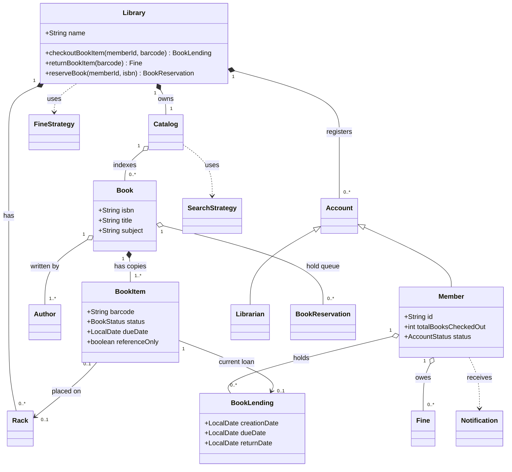
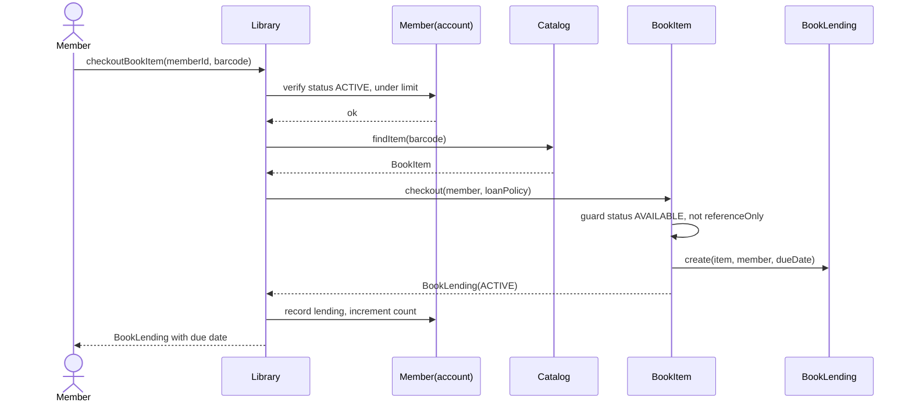
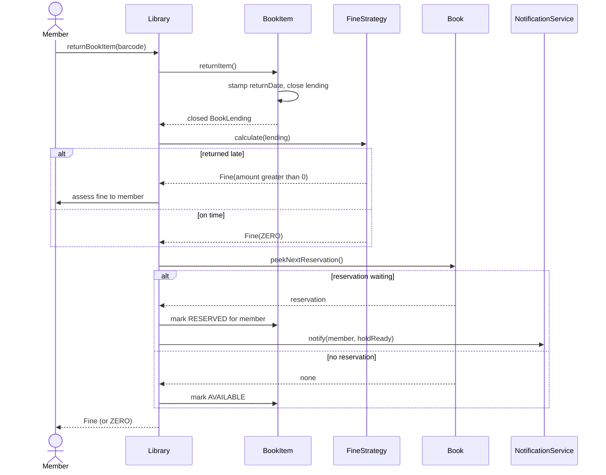
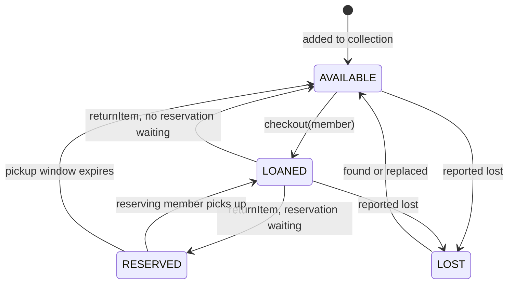
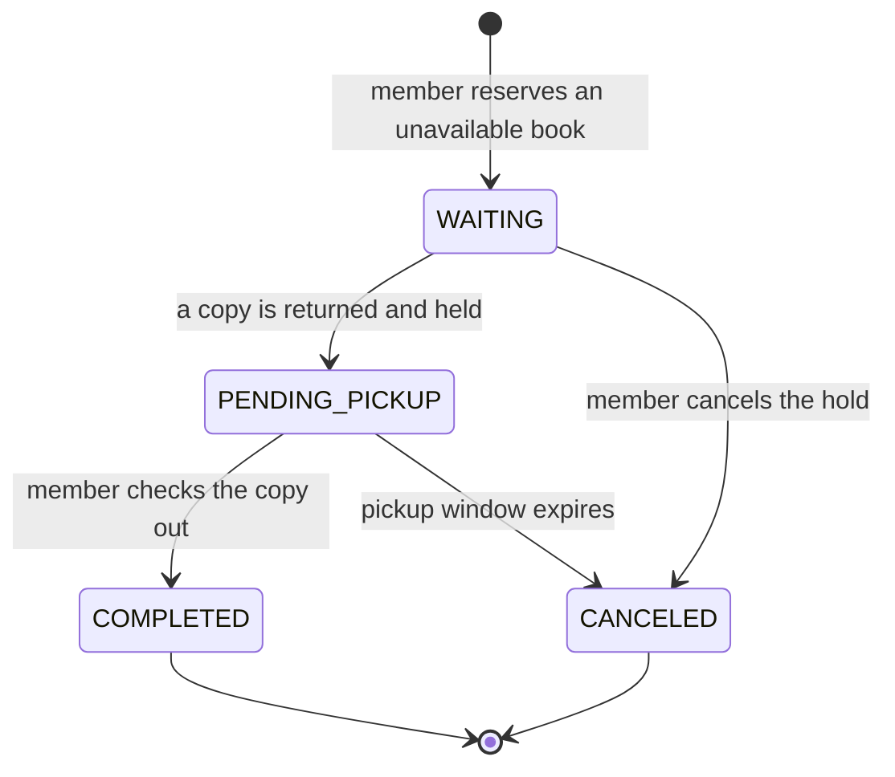

# 📚 Low-Level Design: Library Management System

> A complete, interview-ready walkthrough of the classic **Library Management System (LMS)** — from a blank whiteboard to a staff-level design that survives concurrency, catalog scale, and a full round of interviewer follow-ups.

The Library Management System sits alongside the Parking Lot as one of the two or three canonical object-oriented design interviews. On the surface it is mundane: members borrow books, return them, and pay a fine if they are late. But that mundane surface hides a surprisingly rich modeling problem — the difference between a *book* and a *physical copy of a book*, the lifecycle of a loan, the race between two members grabbing the last copy, and a search catalog that must stay fast as the collection grows into the millions. Interviewers reach for it precisely because it forces clean separation between an abstract record (the title) and its concrete instances (the copies on the shelf), and because every "simple" rule — five books per member, ten-day loans, a fine per overdue day — becomes a follow-up question when you push on it. This guide walks the whole arc, escalating from the beginner's mental model to the concerns a principal engineer raises in the final ten minutes.

---

## 📋 Table of Contents

**Part I — Framing the Problem**

1. [Problem Statement](#1-problem-statement)
2. [Requirement Clarification & Assumptions](#2-requirement-clarification--assumptions)
3. [Functional & Non-Functional Requirements](#3-functional--non-functional-requirements)
4. [Core Concepts Being Tested](#4-core-concepts-being-tested)

**Part II — Modeling the Domain**

5. [Domain Model & Entities](#5-domain-model--entities)
6. [CRC Cards](#6-crc-cards)
7. [UML Class Diagram](#7-uml-class-diagram)
8. [Package Structure](#8-package-structure)

**Part III — Design Rationale**

9. [Design Decisions & Trade-offs](#9-design-decisions--trade-offs)
10. [Class-by-Class Deep Dive](#10-class-by-class-deep-dive)
11. [Design Patterns Applied](#11-design-patterns-applied)
12. [SOLID Principles Mapping](#12-solid-principles-mapping)

**Part IV — Behavior & Diagrams**

13. [Sequence Diagram](#13-sequence-diagram)
14. [State Diagram](#14-state-diagram)

**Part V — The Implementation**

15. [Complete Java Implementation](#15-complete-java-implementation)
16. [Execution Flow & Code Walkthrough](#16-execution-flow--code-walkthrough)

**Part VI — Engineering Depth**

17. [Complexity Analysis](#17-complexity-analysis)
18. [Thread Safety & Concurrency](#18-thread-safety--concurrency)
19. [Error Handling & Validation](#19-error-handling--validation)
20. [Scalability Discussion](#20-scalability-discussion)
21. [Alternative Designs & Trade-offs](#21-alternative-designs--trade-offs)

**Part VII — Interview Mastery**

22. [Common FAANG Follow-up Questions (L4 → L6)](#22-common-faang-follow-up-questions-l4--l6)
23. [Common Design Mistakes](#23-common-design-mistakes)
24. [Testing Strategy](#24-testing-strategy)
25. [FAANG Q&A Section](#25-faang-qa-section)
26. [STAR Behavioral Questions](#26-star-behavioral-questions)
27. [⚡ Quick Revision Cheat Sheet](#27--quick-revision-cheat-sheet)

---

## 1. Problem Statement

Design the software that runs a **library**. Members search a catalog of books, borrow physical copies, return them (on time or late), reserve copies that are currently checked out, and renew loans they want to keep longer. Librarians manage the collection — adding and removing copies, registering members, and blocking members who abuse the rules. The system enforces borrowing policy (how many books a member may hold, how long a loan lasts), computes overdue fines, and notifies members about due dates and available reservations.

The heart of the problem is a distinction that trips up most candidates on the first pass: a **book** is a bibliographic record (an ISBN, a title, a set of authors), while a **book item** is a single physical copy sitting on a specific shelf. A library owns *one* record for "Clean Code" but *seven* copies of it, each with its own barcode, condition, and loan status. Members borrow copies, not records; they search records, not copies. Getting that separation right is the first thing an interviewer is watching for.

<details>
<summary>📖 <b>In plain terms — what are we actually building?</b></summary>

Picture your neighborhood library or a university library. You look something up on the terminal ("do they have this title?"), a screen tells you three copies exist and one is on the shelf, you take it to the desk, and a librarian scans it out to you with a due date two weeks away. If you're late returning it, you owe a small fine. If every copy is out, you can put a hold on it and get an email when one comes back. Our job is to write the *brains* behind that desk: the objects and rules that track every copy, remember who has what and until when, price the late fees, and manage the waiting list — without ever handing the same physical copy to two people.

</details>

The deliverable in an interview is not a running product; it is a **clean object-oriented model** — the classes, their responsibilities, and their interactions — that a real team could build on. Grading is on the clarity of your abstractions (especially Book vs. BookItem), the correctness of the loan and fine lifecycle, extensibility (new book formats, new fine rules), and how gracefully the design absorbs the follow-ups the interviewer throws at it.

---

## 2. Requirement Clarification & Assumptions

The single biggest mistake candidates make is modeling before scoping. A strong candidate spends the first few minutes turning "design a library system" into a bounded problem. Below is the clarification dialogue you should drive, framed as the questions to ask and the assumptions to lock in.

### 2.1 Actors

The people and systems that interact with the library define the surface area of the design.

| Actor | Role in the system |
|-------|--------------------|
| **Member** | Searches the catalog, checks out and returns copies, reserves and renews books, pays fines. |
| **Librarian** | Adds and removes book items, registers and blocks members, processes checkouts and returns at the desk. |
| **System / Admin** | Configures policy (loan limits, loan period, fine rates), manages racks and the catalog index. |
| **Notification channel** | External email/SMS/postal service the system drives to alert members about due dates and holds. |

### 2.2 Key Clarifying Questions

Resolve these with the interviewer before modeling. Each answer materially changes the design.

- **Book vs. copy** — Are we tracking abstract titles, physical copies, or both? *(Assumption: both — a `Book` bibliographic record and many `BookItem` physical copies, each with a unique barcode.)*
- **Borrowing limits** — How many books may a member hold at once, and for how long? *(Assumption: a configurable max of 5 books per member and a 10-day loan period — treated as policy, not hard-coded magic numbers.)*
- **Fines** — Is there a late fee? Flat or per-day? *(Assumption: a per-day overdue fine, computed on return, with the rate injected as policy.)*
- **Reservations** — Can a member reserve a copy that's currently out? *(Assumption: yes — a hold queue per book; when a copy is returned, the first waiting member is notified and the copy is held for them.)*
- **Renewals** — Can a member extend a loan? *(Assumption: yes, but only if no one else has reserved that title — this creates an interesting rule interaction.)*
- **Search** — What can members search by? *(Assumption: by title, author, subject, and publication date, with results returned fast even on a large catalog.)*
- **Reference-only items** — Are some copies non-borrowable (reference section)? *(Assumption: yes — a `BookItem` can be flagged reference-only and is excluded from checkout.)*
- **Notifications** — How are members alerted? *(Assumption: pluggable channels — email and SMS at minimum — driven behind an abstraction.)*

### 2.3 Explicit Non-Goals

Naming what you will *not* build is a senior signal — it shows you can bound scope deliberately rather than by omission.

- No physical hardware (barcode scanners, RFID gates, self-checkout kiosks) — we assume clean interfaces to them.
- No payment-gateway integration for fines beyond a `collectFine` hook; we don't model card processing.
- No inter-library loan / federation across branches in v1 (we discuss scaling to it later).
- No recommendation engine, reading history analytics, or ML ranking of search results.
- No authentication/authorization implementation details — we assume members and librarians are already identified.

<details>
<summary>📖 <b>Why spend so long on clarification?</b></summary>

"Design a library" is deliberately thin. If you start drawing classes immediately, you're guessing at requirements and you'll guess wrong — most commonly by conflating the title with the copy, which forces a painful re-model halfway through. Asking about copies, limits, reservations, and renewals upfront does three things: it shows product sense, it prevents building the wrong abstraction, and it plants the seeds for the hard follow-ups. The moment you say "a member can reserve a book that's out," you've committed to a hold-queue and a notification flow — and that's exactly the richer territory where senior candidates distinguish themselves.

</details>

---

## 3. Functional & Non-Functional Requirements

### 3.1 Functional Requirements (what the system *does*)

List these crisply in an interview — they become your checklist for the class design.

1. **Search the catalog** by title, author, subject, or publication date, returning the matching books and the copies that exist.
2. **Check out a book item** to a member, creating a loan with a due date, subject to borrowing limits.
3. **Return a book item**, computing an overdue fine if it is late and freeing the copy for the next member.
4. **Reserve a book** that has no available copy, placing the member in a hold queue.
5. **Renew a loan** to extend the due date, provided no one else has reserved the title.
6. **Notify members** about upcoming or missed due dates and about reservations that become available.
7. **Manage the collection** — librarians add and remove book items and update their placement on racks.
8. **Manage members** — register new members and block or unblock existing ones.
9. **Track and collect fines** accrued from overdue returns.

### 3.2 Non-Functional Requirements (how *well* it does it)

These are the qualities that make the design production-grade, and where staff-level discussion lives.

| Attribute | Requirement | Why it matters |
|-----------|-------------|----------------|
| **Concurrency** | Two members must never successfully check out the *same* physical copy. | Multiple desks and self-checkout kiosks operate in parallel. |
| **Consistency** | A copy's status and a member's loan count must always reflect reality. | A copy shown "available" but already loaned erodes trust and creates disputes. |
| **Low latency** | Catalog search and checkout should feel instant (sub-100ms). | Members and librarians wait at a desk; slowness causes queues. |
| **Extensibility** | New book formats, fine rules, and notification channels should slot in with minimal change. | Requirements *will* change (e-books, audiobooks, grace periods). |
| **Scalability** | The model should extend from one branch of thousands of books to a system of millions across branches. | Same abstractions should scale up. |
| **Auditability** | Every loan, return, fine, and reservation should be traceable. | Libraries need history for disputes and reporting. |

<details>
<summary>📖 <b>Functional vs non-functional — the quick distinction</b></summary>

Functional requirements are the *verbs* — search, check out, return, reserve. If a functional requirement fails, the system did the wrong thing. Non-functional requirements are the *adverbs* — do it quickly, do it concurrently, do it without ever double-lending a copy. If a non-functional requirement fails, the system did the right thing but *badly* (too slow, or it corrupted state under load). Interviewers love the non-functional list because it can't be satisfied by a class diagram alone — it forces you to reason about locks, indexes, and failure modes.

</details>

---

## 4. Core Concepts Being Tested

This problem is a proxy for a bundle of skills. Knowing what's being measured helps you narrate your design to the *right* audience.

- **Object-oriented decomposition** — Can you find the right nouns and, crucially, separate the *record* (Book) from the *instance* (BookItem)? This one split is the make-or-break of the whole design.
- **Abstraction via inheritance & interfaces** — Account specializes into Member and Librarian; search, fine calculation, and notification are natural interfaces.
- **Design patterns in context** — Strategy (fine rules, search), Factory (item creation), Observer (reservation notifications), Facade (a single library service) — applied where they *earn their place*, not sprinkled for show.
- **SOLID reasoning** — especially Open/Closed: adding an audiobook format or a weekend-grace fine rule shouldn't force edits to existing classes.
- **Concurrency correctness** — the heart of the senior discussion: safe checkout of a single copy under parallel requests, and the reservation-to-checkout handoff.
- **Data-structure & indexing sense** — the catalog must return searches fast; naive list scans don't scale, so you reach for inverted indexes / hash maps.
- **Trade-off articulation** — every choice (inheritance vs. composition for BookItem, per-item lock vs. global lock, synchronous vs. queued notifications) has a cost; naming the cost is the skill.

Keep these in the back of your mind as you read on — each section below is, in part, a chance to demonstrate one or more of them.

---

## 5. Domain Model & Entities

Before any code, we identify the **nouns** in the problem and turn them into entities. Good domain modeling is the difference between a design that flexes and one that fights you — and here it hinges on one decision made early and correctly.

### 5.1 The Entity Landscape

Here is the cast of the system, grouped by role:

- **Library** — the top-level aggregate. Owns the catalog, the members, and the racks; there is one per branch.
- **Catalog** — the searchable index over the collection. Answers "which books match this title/author/subject?" and holds the maps that make search fast.
- **Book** — the *bibliographic record*: ISBN, title, subject, publisher, language, page count, and authors. There is one `Book` per title, regardless of how many copies exist.
- **BookItem** — a single *physical copy*: a unique barcode, its format, price, placement on a rack, borrow/due dates, and status. Many `BookItem`s point at one `Book`. **This is the central abstraction of the problem.**
- **Author / Rack** — small value-like entities: an author of books, and a physical shelf location a copy lives on.
- **Account** — abstract base for anyone with a login. Specialized into **Member** and **Librarian**.
- **Member** — borrows, returns, reserves, and renews; tracks how many books they currently hold and their fines.
- **Librarian** — manages copies and members from behind the desk.
- **BookLending** — the record of an active or completed loan: which copy, which member, creation date, due date, return date.
- **BookReservation** — a hold placed on a book by a member when no copy is free; carries a status and a position in the queue.
- **Fine** — an amount owed by a member for an overdue return, tied to a specific lending.
- **FineStrategy** — the pluggable rule that turns overdue days into money.
- **SearchStrategy** — the pluggable rule that resolves a query into matching books.
- **Notification** — the abstraction over how a member is alerted (email, SMS, postal), delivered via the Observer flow.

### 5.2 Entity Relationships



<details>
<summary>📖 <b>How to read this relationship map</b></summary>

The diamond-headed lines mean "owns / is composed of" — a `Library` *is made of* its catalog, accounts, and racks; a `Book` *is made of* its copies. The hollow diamonds and plain arrows mean "references / uses" — a `BookItem` sits on a `Rack` but the rack exists independently; a `Member` holds loans but a loan is its own record. The triangle (`<|--`) is inheritance: `Member` and `Librarian` are both `Account`s. The most important line to internalize is `Book "1" *-- "1..*" BookItem` — one title, many copies. Almost every design mistake in this problem traces back to collapsing those two into a single class.

</details>

### 5.3 Core Enumerations

Enums keep the type system honest and make illegal states unrepresentable.

- `BookFormat { HARDCOVER, PAPERBACK, EBOOK, AUDIOBOOK, NEWSPAPER, JOURNAL }`
- `BookStatus { AVAILABLE, LOANED, RESERVED, LOST }`
- `ReservationStatus { WAITING, PENDING_PICKUP, COMPLETED, CANCELED }`
- `AccountStatus { ACTIVE, BLOCKED, CLOSED }`

---

## 6. CRC Cards

CRC (Class–Responsibility–Collaborator) cards are a lightweight way to pin down *what each class is responsible for* and *who it talks to*, before drowning in fields and methods. Interviewers like them because they force single-responsibility thinking.

| Class | Responsibilities | Collaborators |
|-------|------------------|---------------|
| **Library** | Orchestrate checkout, return, reserve, renew; enforce policy; expose one entry point | Catalog, Member, BookItem, BookLending, FineStrategy |
| **Catalog** | Index books; answer search queries fast; add/remove books and copies | Book, BookItem, SearchStrategy |
| **Book** | Hold bibliographic data; own its copies and its reservation queue | BookItem, Author, BookReservation |
| **BookItem** | Represent one physical copy; know its status and due date; transition on checkout/return | Book, Rack, BookLending |
| **Member** | Track current loans and fines; enforce per-member limits; initiate borrow/return/reserve | BookLending, Fine, BookItem |
| **Librarian** | Add/remove copies; register/block members | BookItem, Member, Catalog |
| **BookLending** | Record a loan's dates and outcome | BookItem, Member |
| **BookReservation** | Represent a hold and its queue position | Book, Member |
| **FineStrategy** | Convert overdue days into a `Fine` amount | Fine, BookLending |
| **NotificationService** | Deliver alerts to members on due dates and available holds | Member, Notification |

<details>
<summary>📖 <b>What a CRC card is really for</b></summary>

A CRC card is a deliberately tiny box — it can only hold a few responsibilities, and that constraint is the point. If a class's card overflows, it's doing too much and should be split. Notice `Library`'s card lists orchestration and policy but *not* "calculate fines" or "run search" — those are delegated to `FineStrategy` and `Catalog`. On a whiteboard, filling these out for five or six classes takes two minutes and immediately exposes a god-object before you've written a line of code.

</details>

---

## 7. UML Class Diagram

Below is the full static structure in ASCII, showing fields, key methods, and the relationships between classes. This is the artifact you'd sketch on the whiteboard and then talk through.

```
┌───────────────────────────────────────────────────────────────────────┐
│                              Library                                  │
├───────────────────────────────────────────────────────────────────────┤
│ - name: String                                                        │
│ - catalog: Catalog                                                    │
│ - members: Map<String, Member>                                        │
│ - racks: List<Rack>                                                   │
│ - fineStrategy: FineStrategy                                          │
│ - loanPolicy: LoanPolicy                                              │
├───────────────────────────────────────────────────────────────────────┤
│ + checkoutBookItem(memberId, barcode): BookLending                    │
│ + returnBookItem(barcode): Fine                                       │
│ + reserveBook(memberId, isbn): BookReservation                        │
│ + renewLoan(memberId, barcode): BookLending                           │
│ + addBookItem(item): void                                             │
└───────────────────┬────────────────────────────┬──────────────────────┘
                    │ owns 1                     │ registers 0..*
                    ▼                            ▼
        ┌───────────────────────┐      ┌──────────────────────────────┐
        │       Catalog         │      │      «abstract» Account      │
        ├───────────────────────┤      ├──────────────────────────────┤
        │ - byTitle: Map        │      │ # id: String                 │
        │ - byAuthor: Map       │      │ # password: String           │
        │ - bySubject: Map      │      │ # status: AccountStatus      │
        │ - searchStrategy: ... │      └──────────────┬───────────────┘
        ├───────────────────────┤           ┌─────────┴─────────┐
        │ + search(query): List │           ▼                   ▼
        │ + addBook(book): void │    ┌─────────────────┐  ┌────────────────┐
        └───────────┬───────────┘    │     Member      │  │   Librarian    │
                    │ indexes 0..*   ├─────────────────┤  ├────────────────┤
                    ▼                │- totalCheckedOut│  │ + addBookItem()│
        ┌───────────────────────┐    │- lendings: List │  │ + blockMember()│
        │        Book           │    │- fines: List    │  └────────────────┘
        ├───────────────────────┤    ├─────────────────┤
        │ - isbn: String        │    │ + checkout(item)│
        │ - title: String       │    │ + return(item)  │
        │ - subject: String     │    │ + reserve(book) │
        │ - authors:List<Author>│    └─────────────────┘
        │ - reservations: Queue │
        ├───────────────────────┤
        │ + addItem(item): void │
        │ + hasAvailableCopy()  │
        └───────────┬───────────┘
                    │ has copies 1..*
                    ▼
        ┌───────────────────────────────────┐        ┌──────────────────┐
        │            BookItem               │──────▶ │       Rack       │
        ├───────────────────────────────────┤ placed ├──────────────────┤
        │ - barcode: String                 │        │ - number: int    │
        │ - format: BookFormat              │        │ - location:String│
        │ - status: BookStatus              │        └──────────────────┘
        │ - referenceOnly: boolean          │
        │ - dueDate: LocalDate              │
        │ - currentLending: BookLending     │
        ├───────────────────────────────────┤
        │ + checkout(member, policy):Lending│
        │ + returnItem(): void              │
        └───────────────────────────────────┘

   ┌────────────────────┐   ┌─────────────────────┐   ┌────────────────────┐
   │    BookLending     │   │  BookReservation    │   │       Fine         │
   ├────────────────────┤   ├─────────────────────┤   ├────────────────────┤
   │ - creationDate     │   │ - status: Reserv... │   │ - amount: Money    │
   │ - dueDate          │   │ - member: Member    │   │ - lending: Lending │
   │ - returnDate       │   │ - book: Book        │   │ - paid: boolean    │
   │ - bookItem         │   ├─────────────────────┤   └────────────────────┘
   │ - member           │   │ + notifyNext(): void│
   └────────────────────┘   └─────────────────────┘

   «interface» FineStrategy         «interface» SearchStrategy
   + calculate(lending): Fine        + search(query, index): List<Book>
        ▲                                  ▲
        │ implements                       │ implements
   PerDayFineStrategy                 IndexedSearchStrategy
   TieredFineStrategy                 
```

Dependency arrows point from the class that *uses* another to the class it depends on. Note that `Library` depends on the `FineStrategy` and `LoanPolicy` abstractions rather than concrete rules — the seed of the Open/Closed and Dependency-Inversion story told later.

### 7.1 Relationship summary

- **Composition (owns):** `Library` owns `Catalog` and `Rack`s; `Book` owns its `BookItem`s and reservation queue. When a `Book` is removed, its copies go with it.
- **Aggregation (references):** `Member` references its `BookLending`s and `Fine`s; a `BookItem` references (but doesn't own) the `Rack` it sits on.
- **Inheritance:** `Member` and `Librarian` extend `Account`.
- **Dependency (uses):** `Library` uses `FineStrategy`; `Catalog` uses `SearchStrategy`.

---

## 8. Package Structure

A clean package layout communicates the architecture before anyone reads a method. It also enforces dependency direction — models don't import services, services orchestrate models.

```
com.library
├── model                       # Pure data + entity behavior, no orchestration
│   ├── Book.java
│   ├── BookItem.java
│   ├── Author.java
│   ├── Rack.java
│   ├── BookLending.java
│   ├── BookReservation.java
│   ├── Fine.java
│   ├── Money.java
│   └── enums
│       ├── BookFormat.java
│       ├── BookStatus.java
│       ├── ReservationStatus.java
│       └── AccountStatus.java
├── account                     # People with logins
│   ├── Account.java            # abstract
│   ├── Member.java
│   └── Librarian.java
├── catalog                     # Search + indexing
│   ├── Catalog.java
│   └── search
│       ├── SearchStrategy.java
│       └── IndexedSearchStrategy.java
├── policy                      # Pluggable business rules
│   ├── LoanPolicy.java
│   └── fine
│       ├── FineStrategy.java
│       ├── PerDayFineStrategy.java
│       └── TieredFineStrategy.java
├── notification                # Observer-based alerts
│   ├── Notification.java
│   ├── NotificationChannel.java
│   ├── EmailChannel.java
│   ├── SmsChannel.java
│   └── NotificationService.java
├── service                     # Orchestration / facade
│   └── Library.java
├── exception                   # Domain-specific failures
│   ├── BookNotAvailableException.java
│   ├── MemberLimitExceededException.java
│   └── AccountBlockedException.java
└── Demo.java                   # Wires it all together and runs a scenario
```

<details>
<summary>📖 <b>Why the package split matters</b></summary>

The layering reads top-to-bottom as "stable to volatile." The `model` package almost never changes — a `Book` is a `Book`. The `policy` package is where change *lives* — fine rules and loan limits shift constantly, so isolating them means a rate change touches one folder. Keeping `policy` and `catalog.search` as their own packages full of small interfaces is what lets you add a new fine rule or search algorithm without recompiling the models or the service. Interviewers read this structure as evidence you understand which parts of a system are hot and which are cold.

</details>

---

## 9. Design Decisions & Trade-offs

Every non-trivial design is a sequence of forks. Naming the fork, the choice, and the cost of the choice is the single most senior thing you can do in this interview. Here are the decisions that define this design.

### 9.1 Separate `Book` from `BookItem`

**The decision:** Model the bibliographic record (`Book`) and the physical copy (`BookItem`) as two distinct classes, with a one-to-many relationship between them.

**Why:** Members search records but borrow copies. A fine is tied to a copy's loan, but a reservation queue is tied to the record (you don't reserve a *specific* copy, you reserve the *title*). If you collapse these into one class, you cannot represent "three of the seven copies of Clean Code are out," and you'll end up bolting a `count` field onto `Book` — which immediately breaks the moment copies have different conditions, formats, or locations.

**The cost:** Two classes and a mapping to maintain, plus the discipline to always route search to `Book` and checkout to `BookItem`. Worth it — this is the abstraction the whole problem is built to test.

### 9.2 Policy as injected strategy, not hard-coded constants

**The decision:** Loan limits, loan period, and fine rates live in a `LoanPolicy` object and a `FineStrategy`, injected into `Library`, rather than as `final int MAX_BOOKS = 5` scattered through the code.

**Why:** These numbers are the most volatile part of the system. A library changes its late fee twice a year and its loan period seasonally. Injecting them means a policy change is a configuration change, not a code change, and it makes the rules testable in isolation.

**The cost:** A little more wiring up front. Trivial next to the flexibility gained.

### 9.3 Reservation queue on `Book`, notification via Observer

**The decision:** Each `Book` owns a FIFO queue of `BookReservation`s. When a copy is returned, the return flow consults the queue and, if someone is waiting, transitions the copy to `RESERVED` and notifies the first member rather than making it broadly available.

**Why:** Fairness. The member who waited longest should get the copy, not whoever happens to walk in next. Modeling the queue explicitly makes the fairness rule enforceable and auditable.

**The cost:** The return flow becomes conditional (available vs. held-for-reservation), and you must handle the case where the notified member never picks up (a pickup expiry). We address that in the state machine.

### 9.4 Checkout logic on `BookItem`, orchestration on `Library`

**The decision:** The state transition of a single copy (`AVAILABLE` → `LOANED`, stamping a due date) lives on `BookItem`. The cross-cutting rules (is the member blocked? are they at their limit? does a copy even exist?) live on `Library`.

**Why:** This keeps each class's responsibility crisp. `BookItem` owns its own state machine; `Library` owns the policy that spans multiple objects. It also localizes the lock: the per-copy transition is where the concurrency guard lives.

**The cost:** The checkout flow spans two classes, so you must be clear in the sequence diagram about who does what. That clarity is a feature in an interview.

<details>
<summary>📖 <b>The mental test for "where does this logic go?"</b></summary>

Ask: *does this rule involve only one object, or does it span several?* Stamping a due date involves only the copy, so it lives on `BookItem`. Checking "is this member at their five-book limit?" involves the member and their loans, so it lives on `Member`. Deciding whether a checkout is allowed at all — blocked account, no copy, over limit — spans the member, the copy, and policy, so it lives on `Library` as the orchestrator. Logic that spans objects belongs to whoever *owns the relationship*, not to any single participant.

</details>

---

## 10. Class-by-Class Deep Dive

With the decisions settled, here is what each major class is *for*, the state it guards, and the one subtle thing about it that separates a shallow answer from a deep one.

### 10.1 `Book` (bibliographic record)

Holds the immutable-ish facts about a title — ISBN, title, subject, publisher, authors — plus two owned collections: its `BookItem` copies and its reservation queue. Its key behaviors are `addItem`, `hasAvailableCopy()`, and `peekNextReservation()`. The subtle point: `Book` never has a "status" of its own — availability is a *derived* property computed from its copies, never a field, so it can't drift out of sync.

### 10.2 `BookItem` (physical copy)

The workhorse. Each copy has a unique barcode, a format, a price, a placement `Rack`, a `referenceOnly` flag, and a `status`/`dueDate` pair that form its state machine. Its `checkout(member, policy)` method is the guarded transition from `AVAILABLE` to `LOANED`; `returnItem()` transitions back. The subtle point: reference-only copies short-circuit `checkout` regardless of availability, and the status transition is the atomic unit that must be thread-safe.

### 10.3 `Account`, `Member`, `Librarian`

`Account` is the abstract base carrying identity and `AccountStatus`. `Member` tracks the loans and fines that belong to a person and enforces the per-member borrow limit; `Librarian` carries collection- and member-management operations. The subtle point: a blocked member (`AccountStatus.BLOCKED`) must be rejected at checkout *before* any copy is touched — the account check is the first gate.

### 10.4 `Library` (orchestrator / facade)

The single entry point clients use — `checkoutBookItem`, `returnBookItem`, `reserveBook`, `renewLoan`. It sequences the multi-object rules and delegates the specialized work: search to `Catalog`, fine math to `FineStrategy`, alerts to `NotificationService`. The subtle point: `Library` holds no business rules of its own that could be a strategy — it *coordinates*, it doesn't *calculate*.

### 10.5 `Catalog` and `SearchStrategy`

`Catalog` maintains inverted indexes (`Map<String, List<Book>>` keyed by normalized title token, author, and subject) and answers queries through a pluggable `SearchStrategy`. The subtle point: search performance is a first-class concern here — the maps turn an O(n) scan of the whole collection into an O(1) lookup plus a small result merge.

### 10.6 `BookLending` and `Fine`

`BookLending` is the immutable-once-closed record of a loan: which copy, which member, created when, due when, returned when. `Fine` is the money owed, tied to a specific lending. The subtle point: keeping the lending as a distinct record (rather than just fields on `BookItem`) gives you history — a copy's *current* loan lives on the item, but the *ledger* of all past loans lives in the lending records.

### 10.7 `BookReservation`

Represents one member's hold on a title, with a `ReservationStatus` and an implicit queue position. The subtle point: its lifecycle (`WAITING` → `PENDING_PICKUP` → `COMPLETED`/`CANCELED`) is what makes the "notify the next person and hold it for them" flow correct and prevents a returned-then-reserved copy from being grabbed by a walk-in.

### 10.8 `FineStrategy` and `NotificationService`

`FineStrategy` converts overdue days into a `Fine` (`PerDayFineStrategy`, `TieredFineStrategy`). `NotificationService` fans an event out to registered `NotificationChannel`s (email, SMS). The subtle point: both are the "add, don't edit" seams of the design — a new fine rule or a new channel is a new class, never a modification to existing ones.

---

## 11. Design Patterns Applied

Patterns here are used where they *remove a coupling*, not for decoration. Each entry names the pattern, where it lives, and the specific problem it solves.

| Pattern | Where it appears | What it buys us |
|---------|------------------|-----------------|
| **Strategy** | `FineStrategy` (per-day, tiered), `SearchStrategy` (indexed) | Pricing and search algorithms vary independently; swap them without touching the `Library` or `Catalog`. |
| **Factory** | `BookItemFactory` creating copies by format | Centralizes the messy construction of items (format-specific defaults) behind one call. |
| **Observer** | `NotificationService` → `NotificationChannel`s; reservation-available events | Members and channels get pushed updates; add a channel or a subscriber without editing the emitter. |
| **Facade** | `Library` over catalog, policy, notification subsystems | One clean surface (`checkout`, `return`, `reserve`) hides subsystem wiring from clients. |
| **State** | `BookItem` status and `BookReservation` status transitions | Makes illegal transitions (return an available copy, check out a reserved one) rejectable in one place. |
| **Singleton** (logical) | One `Library` per branch, dependency-injected | Conceptual singleness without global static state. |

<details>
<summary>📖 <b>A note on not over-patterning</b></summary>

It's tempting to cram in every Gang-of-Four pattern to look sophisticated, but an interviewer reads that as insecurity. Strategy for fines is unarguable — fine rules genuinely change. Observer for notifications is natural — members genuinely need to be pushed alerts. But forcing, say, a Visitor over the catalog or an Abstract Factory where a simple factory suffices is a red flag. The skill is knowing when a pattern *reduces* complexity versus when it merely adds ceremony. Reach for a pattern when it removes an "if I change X I must edit Y" coupling.

</details>

For the deeper theory behind each of these, this guide pairs naturally with the individual Strategy, Factory, Observer, and Facade pattern guides.

---

## 12. SOLID Principles Mapping

SOLID isn't an abstract checklist here — each principle shows up concretely in the design.

**S — Single Responsibility.** Each class has one reason to change: `Catalog` indexes and searches, `FineStrategy` prices overdue loans, `BookItem` manages one copy's state. A change to fine math never touches search; a change to search never touches loans.

**O — Open/Closed.** The system is *open to extension, closed to modification*. A new `TieredFineStrategy`, a new `AudiobookItem` format, or a new `PushNotificationChannel` is a new class; no existing class is edited. This is the single biggest SOLID win, delivered by the Strategy hierarchies and the format enum + factory.

**L — Liskov Substitution.** Any `Account` subtype works where an `Account` is expected; any `FineStrategy` works where the interface is expected. `Member` and `Librarian` honor the base contract — neither throws where `Account` promised not to.

**I — Interface Segregation.** `FineStrategy`, `SearchStrategy`, and `NotificationChannel` are small, focused interfaces. A notification channel isn't forced to know about fines; a search strategy isn't forced to know about loans. Clients depend only on the sliver they use.

**D — Dependency Inversion.** `Library` depends on the *abstractions* `FineStrategy` and `LoanPolicy`, and `Catalog` on `SearchStrategy` — not on concrete classes. Concretes are injected at construction, so high-level orchestration doesn't know whether fines are flat or tiered.

<details>
<summary>📖 <b>The one-line SOLID gut check</b></summary>

If you can add a brand-new book format, a new fine rule, a new search algorithm, and a new notification channel *without editing a single existing class* — only adding new ones — your design honors Open/Closed and Dependency Inversion, and the rest of SOLID usually falls into place. That "add, don't edit" test is the fastest way to sanity-check your library design under interview pressure.

</details>

---

## 13. Sequence Diagram

Three flows matter: **checkout** (borrow a copy), **return** (hand it back, maybe pay a fine, maybe hand it to a reservation), and **reserve** (join the hold queue). Here they are as message sequences.

### 13.1 Book Checkout



### 13.2 Book Return



<details>
<summary>📖 <b>Reading the return flow</b></summary>

The return is the most interesting flow because it forks twice. First on the fine: the copy transitions and the lending closes *before* the fine is computed, because the fine is derived from the now-known return date. Second on the reservation: a returned copy does **not** automatically become available — the system first asks the book's queue whether anyone is waiting. If so, the copy is held (`RESERVED`) and only that member is notified. This "check the queue before releasing" ordering is what makes reservations fair; skip it and the person who waited two weeks loses the copy to whoever walks up next.

</details>

---

## 14. State Diagram

Both the **BookItem** and each **BookReservation** are naturally state machines. Modeling them as such makes illegal transitions (returning an already-available copy, checking out a reserved one) explicit and rejectable.

### 14.1 BookItem Lifecycle



### 14.2 Reservation Lifecycle



The `LOST` state and the `PENDING_PICKUP` pickup window are small enrichments worth raising in an interview — real libraries take copies offline as lost, and a reservation that's ready but never collected must eventually free the copy so it doesn't sit blocked forever.

---

## 15. Complete Java Implementation

Below is a complete, compilable reference implementation. It's organized bottom-up: enums and value objects first, then entities, then policy and strategies, then the orchestrating `Library` and a demo. Every block is collapsible so you can study one piece at a time. The class names, fields, and method signatures match the diagrams above exactly.

<details>
<summary>💻 <b>1. Enums & Money value object</b></summary>

```java
package com.library.model.enums;

public enum BookFormat { HARDCOVER, PAPERBACK, EBOOK, AUDIOBOOK, NEWSPAPER, JOURNAL }

public enum BookStatus { AVAILABLE, LOANED, RESERVED, LOST }

public enum ReservationStatus { WAITING, PENDING_PICKUP, COMPLETED, CANCELED }

public enum AccountStatus { ACTIVE, BLOCKED, CLOSED }
```

```java
package com.library.model;

import java.util.Objects;

/** Immutable money value object — integer cents to avoid floating-point currency bugs. */
public final class Money {
    private final long cents;

    private Money(long cents) { this.cents = cents; }

    public static Money ofCents(long cents) { return new Money(cents); }
    public static Money ofDollars(double dollars) { return new Money(Math.round(dollars * 100)); }
    public static final Money ZERO = new Money(0);

    public Money plus(Money other) { return new Money(this.cents + other.cents); }
    public Money times(long factor) { return new Money(this.cents * factor); }
    public boolean isPositive() { return cents > 0; }
    public long cents() { return cents; }

    @Override public boolean equals(Object o) {
        return (o instanceof Money) && ((Money) o).cents == cents;
    }
    @Override public int hashCode() { return Objects.hash(cents); }
    @Override public String toString() { return String.format("$%.2f", cents / 100.0); }
}
```

</details>

<details>
<summary>💻 <b>2. Author & Rack</b></summary>

```java
package com.library.model;

public final class Author {
    private final String name;
    private final String description;

    public Author(String name, String description) {
        this.name = name;
        this.description = description;
    }
    public String getName() { return name; }
    public String getDescription() { return description; }
}
```

```java
package com.library.model;

/** A physical shelf location a copy lives on. */
public final class Rack {
    private final int number;
    private final String locationIdentifier;

    public Rack(int number, String locationIdentifier) {
        this.number = number;
        this.locationIdentifier = locationIdentifier;
    }
    public int getNumber() { return number; }
    public String getLocationIdentifier() { return locationIdentifier; }
}
```

</details>

<details>
<summary>💻 <b>3. Book (bibliographic record) with reservation queue</b></summary>

```java
package com.library.model;

import java.util.*;

/** The bibliographic record: one per title. Owns its copies and its hold queue. */
public class Book {
    private final String isbn;
    private final String title;
    private final String subject;
    private final String publisher;
    private final String language;
    private final List<Author> authors;

    // Owned collections
    private final List<BookItem> items = new ArrayList<>();
    private final Deque<BookReservation> reservationQueue = new ArrayDeque<>();

    public Book(String isbn, String title, String subject, String publisher,
                String language, List<Author> authors) {
        this.isbn = isbn;
        this.title = title;
        this.subject = subject;
        this.publisher = publisher;
        this.language = language;
        this.authors = List.copyOf(authors);
    }

    public void addItem(BookItem item) { items.add(item); }
    public List<BookItem> getItems() { return Collections.unmodifiableList(items); }

    /** Availability is DERIVED from copies, never stored — it can't drift out of sync. */
    public boolean hasAvailableCopy() {
        return items.stream().anyMatch(i -> i.getStatus() == com.library.model.enums.BookStatus.AVAILABLE
                                             && !i.isReferenceOnly());
    }

    public Optional<BookItem> findAvailableItem() {
        return items.stream()
                .filter(i -> i.getStatus() == com.library.model.enums.BookStatus.AVAILABLE
                             && !i.isReferenceOnly())
                .findFirst();
    }

    // --- reservation queue (guarded so return + reserve don't race) ---
    public synchronized void addReservation(BookReservation reservation) {
        reservationQueue.addLast(reservation);
    }
    public synchronized Optional<BookReservation> peekNextReservation() {
        return Optional.ofNullable(reservationQueue.peekFirst());
    }
    public synchronized Optional<BookReservation> pollNextReservation() {
        return Optional.ofNullable(reservationQueue.pollFirst());
    }
    public synchronized boolean hasReservation() { return !reservationQueue.isEmpty(); }

    public String getIsbn() { return isbn; }
    public String getTitle() { return title; }
    public String getSubject() { return subject; }
    public String getPublisher() { return publisher; }
    public String getLanguage() { return language; }
    public List<Author> getAuthors() { return authors; }
}
```

</details>

<details>
<summary>💻 <b>4. BookItem (physical copy) — thread-safe checkout/return</b></summary>

```java
package com.library.model;

import com.library.model.enums.BookFormat;
import com.library.model.enums.BookStatus;
import com.library.exception.BookNotAvailableException;
import com.library.policy.LoanPolicy;
import com.library.account.Member;

import java.time.LocalDate;

/** A single physical copy. Owns its own state machine. */
public class BookItem {
    private final String barcode;
    private final BookFormat format;
    private final Money price;
    private final boolean referenceOnly;
    private final Book book;                 // back-reference to the record

    private Rack placedAt;
    private BookStatus status = BookStatus.AVAILABLE;
    private LocalDate borrowedDate;
    private LocalDate dueDate;
    private BookLending currentLending;

    public BookItem(String barcode, BookFormat format, Money price,
                    boolean referenceOnly, Book book) {
        this.barcode = barcode;
        this.format = format;
        this.price = price;
        this.referenceOnly = referenceOnly;
        this.book = book;
    }

    /**
     * Guarded transition AVAILABLE -> LOANED. Synchronized on the item so two
     * concurrent checkouts of THIS copy cannot both succeed (the lost-update race).
     */
    public synchronized BookLending checkout(Member member, LoanPolicy policy) {
        if (referenceOnly) {
            throw new BookNotAvailableException(barcode + " is reference-only and cannot be borrowed");
        }
        if (status != BookStatus.AVAILABLE && status != BookStatus.RESERVED) {
            throw new BookNotAvailableException(barcode + " is not available (status=" + status + ")");
        }
        this.borrowedDate = LocalDate.now();
        this.dueDate = borrowedDate.plusDays(policy.getLoanPeriodDays());
        this.status = BookStatus.LOANED;
        this.currentLending = new BookLending(this, member, borrowedDate, dueDate);
        return currentLending;
    }

    /** Guarded transition LOANED -> (closed). Returns the now-closed lending record. */
    public synchronized BookLending returnItem() {
        if (status != BookStatus.LOANED) {
            throw new BookNotAvailableException(barcode + " is not currently loaned");
        }
        this.currentLending.close(LocalDate.now());
        BookLending closed = this.currentLending;
        this.currentLending = null;
        this.dueDate = null;
        this.borrowedDate = null;
        // Caller (Library) decides next status: AVAILABLE or RESERVED.
        return closed;
    }

    public synchronized void markAvailable() { this.status = BookStatus.AVAILABLE; }
    public synchronized void markReserved()  { this.status = BookStatus.RESERVED; }
    public synchronized void markLost()      { this.status = BookStatus.LOST; }

    public String getBarcode() { return barcode; }
    public BookFormat getFormat() { return format; }
    public Money getPrice() { return price; }
    public boolean isReferenceOnly() { return referenceOnly; }
    public Book getBook() { return book; }
    public BookStatus getStatus() { return status; }
    public LocalDate getDueDate() { return dueDate; }
    public BookLending getCurrentLending() { return currentLending; }
    public void placeOnRack(Rack rack) { this.placedAt = rack; }
    public Rack getPlacedAt() { return placedAt; }
}
```

</details>

<details>
<summary>💻 <b>5. BookLending & Fine records</b></summary>

```java
package com.library.model;

import com.library.account.Member;
import java.time.LocalDate;

/** Immutable-once-closed record of a single loan. The ledger entry. */
public class BookLending {
    private final BookItem bookItem;
    private final Member member;
    private final LocalDate creationDate;
    private final LocalDate dueDate;
    private LocalDate returnDate;   // null until returned

    public BookLending(BookItem bookItem, Member member,
                       LocalDate creationDate, LocalDate dueDate) {
        this.bookItem = bookItem;
        this.member = member;
        this.creationDate = creationDate;
        this.dueDate = dueDate;
    }

    public void close(LocalDate returnDate) { this.returnDate = returnDate; }
    public boolean isReturned() { return returnDate != null; }

    /** Overdue days at the effective date (return date if returned, else today). */
    public long overdueDays(LocalDate asOf) {
        LocalDate effective = (returnDate != null) ? returnDate : asOf;
        long days = java.time.temporal.ChronoUnit.DAYS.between(dueDate, effective);
        return Math.max(0, days);
    }

    public BookItem getBookItem() { return bookItem; }
    public Member getMember() { return member; }
    public LocalDate getCreationDate() { return creationDate; }
    public LocalDate getDueDate() { return dueDate; }
    public LocalDate getReturnDate() { return returnDate; }
}
```

```java
package com.library.model;

public class Fine {
    private final Money amount;
    private final BookLending lending;
    private boolean paid = false;

    public Fine(Money amount, BookLending lending) {
        this.amount = amount;
        this.lending = lending;
    }
    public void pay() { this.paid = true; }
    public boolean isPaid() { return paid; }
    public Money getAmount() { return amount; }
    public BookLending getLending() { return lending; }
}
```

</details>

<details>
<summary>💻 <b>6. BookReservation</b></summary>

```java
package com.library.model;

import com.library.model.enums.ReservationStatus;
import com.library.account.Member;
import java.time.LocalDate;

public class BookReservation {
    private final Book book;
    private final Member member;
    private final LocalDate creationDate;
    private ReservationStatus status = ReservationStatus.WAITING;

    public BookReservation(Book book, Member member) {
        this.book = book;
        this.member = member;
        this.creationDate = LocalDate.now();
    }
    public void markPendingPickup() { this.status = ReservationStatus.PENDING_PICKUP; }
    public void markCompleted()     { this.status = ReservationStatus.COMPLETED; }
    public void markCanceled()      { this.status = ReservationStatus.CANCELED; }

    public Book getBook() { return book; }
    public Member getMember() { return member; }
    public LocalDate getCreationDate() { return creationDate; }
    public ReservationStatus getStatus() { return status; }
}
```

</details>

<details>
<summary>💻 <b>7. Account hierarchy — Account, Member, Librarian</b></summary>

```java
package com.library.account;

import com.library.model.enums.AccountStatus;

public abstract class Account {
    protected final String id;
    protected String password;
    protected AccountStatus status = AccountStatus.ACTIVE;

    protected Account(String id, String password) {
        this.id = id;
        this.password = password;
    }
    public void block()  { this.status = AccountStatus.BLOCKED; }
    public void unblock() { this.status = AccountStatus.ACTIVE; }
    public boolean isActive() { return status == AccountStatus.ACTIVE; }
    public String getId() { return id; }
    public AccountStatus getStatus() { return status; }
}
```

```java
package com.library.account;

import com.library.model.BookLending;
import com.library.model.Fine;
import java.util.*;

public class Member extends Account {
    private final String name;
    private final List<BookLending> currentLendings = new ArrayList<>();
    private final List<Fine> fines = new ArrayList<>();

    public Member(String id, String password, String name) {
        super(id, password);
        this.name = name;
    }

    public int getTotalBooksCheckedOut() { return currentLendings.size(); }

    public void addLending(BookLending lending) { currentLendings.add(lending); }
    public void removeLending(BookLending lending) { currentLendings.remove(lending); }

    public void assessFine(Fine fine) { fines.add(fine); }
    public Money getOutstandingFines() {
        return fines.stream().filter(f -> !f.isPaid())
                .map(Fine::getAmount).reduce(Money.ZERO, Money::plus);
    }

    public String getName() { return name; }
    public List<BookLending> getCurrentLendings() { return Collections.unmodifiableList(currentLendings); }
    public List<Fine> getFines() { return Collections.unmodifiableList(fines); }
}
```

```java
package com.library.account;

public class Librarian extends Account {
    private final String name;

    public Librarian(String id, String password, String name) {
        super(id, password);
        this.name = name;
    }
    public String getName() { return name; }
    // Collection- and member-management operations delegate to Library/Catalog.
}
```

*Note:* `Member` references `com.library.model.Money` via its fine total; import elided for brevity in this excerpt.

</details>

<details>
<summary>💻 <b>8. LoanPolicy & FineStrategy (Strategy pattern)</b></summary>

```java
package com.library.policy;

/** Injected policy — the volatile knobs live here, not as constants in the code. */
public class LoanPolicy {
    private final int maxBooksPerMember;
    private final int loanPeriodDays;

    public LoanPolicy(int maxBooksPerMember, int loanPeriodDays) {
        this.maxBooksPerMember = maxBooksPerMember;
        this.loanPeriodDays = loanPeriodDays;
    }
    public int getMaxBooksPerMember() { return maxBooksPerMember; }
    public int getLoanPeriodDays() { return loanPeriodDays; }
}
```

```java
package com.library.policy.fine;

import com.library.model.BookLending;
import com.library.model.Fine;
import java.time.LocalDate;

public interface FineStrategy {
    Fine calculate(BookLending lending, LocalDate asOf);
}
```

```java
package com.library.policy.fine;

import com.library.model.*;
import java.time.LocalDate;

/** Flat rate per overdue day. */
public class PerDayFineStrategy implements FineStrategy {
    private final Money ratePerDay;

    public PerDayFineStrategy(Money ratePerDay) { this.ratePerDay = ratePerDay; }

    @Override public Fine calculate(BookLending lending, LocalDate asOf) {
        long overdue = lending.overdueDays(asOf);
        Money amount = ratePerDay.times(overdue);
        return new Fine(amount, lending);
    }
}
```

```java
package com.library.policy.fine;

import com.library.model.*;
import java.time.LocalDate;

/** Escalating rate: cheap for the first week, punitive after. */
public class TieredFineStrategy implements FineStrategy {
    private final Money baseRate;
    private final Money escalatedRate;
    private final int graceTierDays;

    public TieredFineStrategy(Money baseRate, Money escalatedRate, int graceTierDays) {
        this.baseRate = baseRate;
        this.escalatedRate = escalatedRate;
        this.graceTierDays = graceTierDays;
    }

    @Override public Fine calculate(BookLending lending, LocalDate asOf) {
        long overdue = lending.overdueDays(asOf);
        if (overdue == 0) return new Fine(Money.ZERO, lending);
        long cheapDays = Math.min(overdue, graceTierDays);
        long priceyDays = Math.max(0, overdue - graceTierDays);
        Money amount = baseRate.times(cheapDays).plus(escalatedRate.times(priceyDays));
        return new Fine(amount, lending);
    }
}
```

</details>

<details>
<summary>💻 <b>9. Catalog & SearchStrategy (indexed search)</b></summary>

```java
package com.library.catalog.search;

import com.library.model.Book;
import java.util.List;
import java.util.Map;

public interface SearchStrategy {
    List<Book> search(SearchQuery query, CatalogIndex index);
}
```

```java
package com.library.catalog.search;

/** A simple typed query object — extend with more fields without changing signatures. */
public class SearchQuery {
    public final String title;      // nullable
    public final String author;     // nullable
    public final String subject;    // nullable

    public SearchQuery(String title, String author, String subject) {
        this.title = title;
        this.author = author;
        this.subject = subject;
    }
}
```

```java
package com.library.catalog.search;

import com.library.model.Book;
import java.util.*;

/** The inverted indexes that make search O(1) lookup instead of O(n) scan. */
public class CatalogIndex {
    final Map<String, List<Book>> byTitle = new HashMap<>();
    final Map<String, List<Book>> byAuthor = new HashMap<>();
    final Map<String, List<Book>> bySubject = new HashMap<>();

    private static String norm(String s) { return s == null ? "" : s.trim().toLowerCase(); }

    public void index(Book book) {
        byTitle.computeIfAbsent(norm(book.getTitle()), k -> new ArrayList<>()).add(book);
        bySubject.computeIfAbsent(norm(book.getSubject()), k -> new ArrayList<>()).add(book);
        book.getAuthors().forEach(a ->
            byAuthor.computeIfAbsent(norm(a.getName()), k -> new ArrayList<>()).add(book));
    }
    List<Book> lookupTitle(String t)   { return byTitle.getOrDefault(norm(t), List.of()); }
    List<Book> lookupAuthor(String a)  { return byAuthor.getOrDefault(norm(a), List.of()); }
    List<Book> lookupSubject(String s) { return bySubject.getOrDefault(norm(s), List.of()); }
}
```

```java
package com.library.catalog.search;

import com.library.model.Book;
import java.util.*;
import java.util.stream.Collectors;

/** Resolves each provided facet against its index and intersects the results. */
public class IndexedSearchStrategy implements SearchStrategy {
    @Override public List<Book> search(SearchQuery q, CatalogIndex index) {
        List<Set<Book>> resultSets = new ArrayList<>();
        if (q.title != null)   resultSets.add(new HashSet<>(index.lookupTitle(q.title)));
        if (q.author != null)  resultSets.add(new HashSet<>(index.lookupAuthor(q.author)));
        if (q.subject != null) resultSets.add(new HashSet<>(index.lookupSubject(q.subject)));
        if (resultSets.isEmpty()) return List.of();

        Set<Book> intersection = new HashSet<>(resultSets.get(0));
        for (int i = 1; i < resultSets.size(); i++) intersection.retainAll(resultSets.get(i));
        return new ArrayList<>(intersection);
    }
}
```

```java
package com.library.catalog;

import com.library.catalog.search.*;
import com.library.model.Book;
import com.library.model.BookItem;
import java.util.*;

public class Catalog {
    private final Map<String, Book> booksByIsbn = new HashMap<>();
    private final Map<String, BookItem> itemsByBarcode = new HashMap<>();
    private final CatalogIndex index = new CatalogIndex();
    private final SearchStrategy searchStrategy;

    public Catalog(SearchStrategy searchStrategy) { this.searchStrategy = searchStrategy; }

    public void addBook(Book book) {
        booksByIsbn.put(book.getIsbn(), book);
        index.index(book);
    }
    public void addBookItem(BookItem item) {
        itemsByBarcode.put(item.getBarcode(), item);
        item.getBook().addItem(item);
    }
    public Optional<BookItem> findItem(String barcode) {
        return Optional.ofNullable(itemsByBarcode.get(barcode));
    }
    public Optional<Book> findBook(String isbn) {
        return Optional.ofNullable(booksByIsbn.get(isbn));
    }
    public List<Book> search(SearchQuery query) {
        return searchStrategy.search(query, index);
    }
}
```

</details>

<details>
<summary>💻 <b>10. Notification (Observer pattern)</b></summary>

```java
package com.library.notification;

public class Notification {
    private final String recipientId;
    private final String message;

    public Notification(String recipientId, String message) {
        this.recipientId = recipientId;
        this.message = message;
    }
    public String getRecipientId() { return recipientId; }
    public String getMessage() { return message; }
}
```

```java
package com.library.notification;

public interface NotificationChannel {
    void send(Notification notification);
}
```

```java
package com.library.notification;

public class EmailChannel implements NotificationChannel {
    @Override public void send(Notification n) {
        System.out.println("[EMAIL -> " + n.getRecipientId() + "] " + n.getMessage());
    }
}

class SmsChannel implements NotificationChannel {
    @Override public void send(Notification n) {
        System.out.println("[SMS -> " + n.getRecipientId() + "] " + n.getMessage());
    }
}
```

```java
package com.library.notification;

import java.util.*;

/** Fans an event out to every registered channel — add a channel without editing this. */
public class NotificationService {
    private final List<NotificationChannel> channels = new ArrayList<>();

    public void register(NotificationChannel channel) { channels.add(channel); }

    public void notify(String recipientId, String message) {
        Notification n = new Notification(recipientId, message);
        channels.forEach(c -> c.send(n));
    }
}
```

</details>

<details>
<summary>💻 <b>11. Exceptions</b></summary>

```java
package com.library.exception;

public class BookNotAvailableException extends RuntimeException {
    public BookNotAvailableException(String message) { super(message); }
}

class MemberLimitExceededException extends RuntimeException {
    public MemberLimitExceededException(String message) { super(message); }
}

class AccountBlockedException extends RuntimeException {
    public AccountBlockedException(String message) { super(message); }
}
```

</details>

<details>
<summary>💻 <b>12. Library orchestrator (facade)</b></summary>

```java
package com.library.service;

import com.library.account.Member;
import com.library.catalog.Catalog;
import com.library.catalog.search.SearchQuery;
import com.library.exception.*;
import com.library.model.*;
import com.library.model.enums.ReservationStatus;
import com.library.notification.NotificationService;
import com.library.policy.LoanPolicy;
import com.library.policy.fine.FineStrategy;

import java.time.LocalDate;
import java.util.*;

public class Library {
    private final String name;
    private final Catalog catalog;
    private final Map<String, Member> members = new HashMap<>();
    private final FineStrategy fineStrategy;
    private final LoanPolicy loanPolicy;
    private final NotificationService notifications;

    public Library(String name, Catalog catalog, FineStrategy fineStrategy,
                   LoanPolicy loanPolicy, NotificationService notifications) {
        this.name = name;
        this.catalog = catalog;
        this.fineStrategy = fineStrategy;
        this.loanPolicy = loanPolicy;
        this.notifications = notifications;
    }

    public void registerMember(Member member) { members.put(member.getId(), member); }

    /** Checkout: validate member, find copy, guard the copy's transition, record the loan. */
    public BookLending checkoutBookItem(String memberId, String barcode) {
        Member member = requireMember(memberId);
        if (!member.isActive()) {
            throw new AccountBlockedException("Member " + memberId + " is not active");
        }
        if (member.getTotalBooksCheckedOut() >= loanPolicy.getMaxBooksPerMember()) {
            throw new MemberLimitExceededException(
                "Member " + memberId + " already holds " + loanPolicy.getMaxBooksPerMember() + " books");
        }
        BookItem item = catalog.findItem(barcode)
            .orElseThrow(() -> new BookNotAvailableException("No copy with barcode " + barcode));

        // The per-copy transition is synchronized inside BookItem — the race is guarded there.
        BookLending lending = item.checkout(member, loanPolicy);
        member.addLending(lending);
        return lending;
    }

    /** Return: close the loan, price the fine, then hand the copy to the queue or shelf. */
    public Fine returnBookItem(String barcode) {
        BookItem item = catalog.findItem(barcode)
            .orElseThrow(() -> new BookNotAvailableException("No copy with barcode " + barcode));

        BookLending closed = item.returnItem();
        Member member = closed.getMember();
        member.removeLending(closed);

        Fine fine = fineStrategy.calculate(closed, LocalDate.now());
        if (fine.getAmount().isPositive()) {
            member.assessFine(fine);
            notifications.notify(member.getId(),
                "Return of '" + item.getBook().getTitle() + "' was late. Fine: " + fine.getAmount());
        }

        // Reservation-aware release: check the queue BEFORE making the copy available.
        Book book = item.getBook();
        Optional<BookReservation> next = book.peekNextReservation();
        if (next.isPresent()) {
            BookReservation reservation = next.get();
            reservation.markPendingPickup();
            item.markReserved();
            notifications.notify(reservation.getMember().getId(),
                "Your reserved book '" + book.getTitle() + "' is ready for pickup.");
        } else {
            item.markAvailable();
        }
        return fine;
    }

    /** Reserve: only meaningful when no copy is currently borrowable. */
    public BookReservation reserveBook(String memberId, String isbn) {
        Member member = requireMember(memberId);
        Book book = catalog.findBook(isbn)
            .orElseThrow(() -> new BookNotAvailableException("No book with ISBN " + isbn));
        if (book.hasAvailableCopy()) {
            throw new IllegalStateException("A copy is available — check it out instead of reserving");
        }
        BookReservation reservation = new BookReservation(book, member);
        book.addReservation(reservation);
        return reservation;
    }

    /** Renew: extend the due date only if nobody is waiting for the title. */
    public BookLending renewLoan(String memberId, String barcode) {
        Member member = requireMember(memberId);
        BookItem item = catalog.findItem(barcode)
            .orElseThrow(() -> new BookNotAvailableException("No copy with barcode " + barcode));
        if (item.getBook().hasReservation()) {
            throw new IllegalStateException("Cannot renew — another member has reserved this title");
        }
        // Close current loan and re-issue with a fresh due date.
        BookLending old = item.returnItem();
        member.removeLending(old);
        BookLending renewed = item.checkout(member, loanPolicy);
        member.addLending(renewed);
        return renewed;
    }

    public List<Book> search(SearchQuery query) { return catalog.search(query); }

    private Member requireMember(String memberId) {
        Member m = members.get(memberId);
        if (m == null) throw new NoSuchElementException("Unknown member " + memberId);
        return m;
    }
}
```

</details>

<details>
<summary>💻 <b>13. Demo — wiring it all together</b></summary>

```java
import com.library.account.Member;
import com.library.catalog.Catalog;
import com.library.catalog.search.*;
import com.library.model.*;
import com.library.model.enums.BookFormat;
import com.library.notification.*;
import com.library.policy.LoanPolicy;
import com.library.policy.fine.*;
import com.library.service.Library;

import java.util.List;

public class Demo {
    public static void main(String[] args) {
        // 1. Build the catalog with an indexed search strategy.
        Catalog catalog = new Catalog(new IndexedSearchStrategy());

        // 2. Compose policy + fine rule + notification channels (all injected).
        LoanPolicy policy = new LoanPolicy(5, 10);                 // 5 books, 10-day loans
        FineStrategy fines = new PerDayFineStrategy(Money.ofDollars(0.25)); // 25c/day
        NotificationService notifications = new NotificationService();
        notifications.register(new EmailChannel());

        Library library = new Library("Central Branch", catalog, fines, policy, notifications);

        // 3. Add a book and two physical copies.
        Book cleanCode = new Book("978-0132350884", "Clean Code", "Software",
                "Prentice Hall", "EN", List.of(new Author("Robert C. Martin", "")));
        catalog.addBook(cleanCode);
        BookItem copy1 = new BookItem("BC-001", BookFormat.PAPERBACK, Money.ofDollars(40), false, cleanCode);
        BookItem copy2 = new BookItem("BC-002", BookFormat.PAPERBACK, Money.ofDollars(40), false, cleanCode);
        catalog.addBookItem(copy1);
        catalog.addBookItem(copy2);

        // 4. Register members.
        Member alice = new Member("M-1", "pw", "Alice");
        Member bob   = new Member("M-2", "pw", "Bob");
        library.registerMember(alice);
        library.registerMember(bob);

        // 5. Search, checkout, reserve, return.
        List<Book> hits = library.search(new SearchQuery("Clean Code", null, null));
        System.out.println("Search hits: " + hits.size());

        BookLending l1 = library.checkoutBookItem("M-1", "BC-001");
        System.out.println("Alice borrowed BC-001, due " + l1.getDueDate());

        library.checkoutBookItem("M-2", "BC-002");
        System.out.println("Bob borrowed BC-002");

        // Both copies out -> Alice reserves the title.
        BookReservation r = library.reserveBook("M-1", "978-0132350884");
        System.out.println("Alice reserved Clean Code, status " + r.getStatus());

        // Bob returns his copy -> the reservation gets it, Alice is notified.
        library.returnBookItem("BC-002");
        System.out.println("Copy BC-002 status after return: " + copy2.getStatus());
    }
}
```

</details>

---

## 16. Execution Flow & Code Walkthrough

It helps to trace one full request end to end. Take the demo's checkout of `BC-001` by Alice.

The client calls `library.checkoutBookItem("M-1", "BC-001")`. `Library` first resolves the member and runs the two cross-object gates: is the account active, and is the member below the five-book limit? Both are checks that span the member and policy, so they live on the orchestrator. It then asks the `Catalog` for the copy by barcode — an O(1) map lookup — and hands control to the copy itself with `item.checkout(member, loanPolicy)`.

Inside `BookItem.checkout`, the method is `synchronized` on the copy. This is the single most important line in the whole design: it means that if two threads (two desks) call `checkout` on *this same copy* at the same time, only one enters the critical section, sees `status == AVAILABLE`, flips it to `LOANED`, and creates the `BookLending`; the second thread then finds `status == LOANED` and throws `BookNotAvailableException`. The lost-update race is closed at exactly the point where the state changes.

Control returns to `Library`, which records the lending on the member and returns it to the caller. Notice how the responsibility is layered: policy that spans objects is on `Library`, the copy's own state transition and its lock are on `BookItem`, and the loan record is a first-class object rather than a tangle of fields.

<details>
<summary>📖 <b>Following the reservation handoff once more</b></summary>

The return flow is worth re-tracing because of its fork. When Bob returns `BC-002`, `Library` closes the lending, prices the fine (zero if on time), then — before touching the copy's availability — asks the book's queue: is anyone waiting? Alice is. So the copy transitions to `RESERVED`, not `AVAILABLE`, and only Alice is notified. If nobody had been waiting, the copy would go straight to `AVAILABLE`. That "ask the queue first" ordering is the entire reason reservations are fair, and it's the detail interviewers probe when they say "walk me through a return."

</details>

---

## 17. Complexity Analysis

The operations that matter are search, checkout, return, and reserve. Here is where the time goes.

| Operation | Time | Space | Notes |
|-----------|------|-------|-------|
| **Search (indexed)** | O(1) map lookup per facet + O(r) to merge, r = result count | O(n) index | The inverted index is what turns search from a full O(n) scan into a lookup. |
| **Checkout** | O(1) | O(1) | Barcode map lookup + a guarded field flip on the copy. |
| **Return** | O(1) | O(1) | Close lending, compute fine (arithmetic), peek the reservation queue head. |
| **Reserve** | O(1) | O(1) amortized | Append to the book's FIFO deque. |
| **Renew** | O(1) | O(1) | Close and re-issue on the same copy. |
| **`hasAvailableCopy()`** | O(c), c = copies of that title | O(1) | Scans the title's copies; c is small (single or low double digits). |

The one function to watch is `hasAvailableCopy()` / `findAvailableItem()`, which scans a title's copies. Since a single title rarely has more than a few dozen copies, that's effectively constant, but on a hypothetical mega-title you could keep a per-book count of available copies (updated on each transition) to make it a true O(1) read.

<details>
<summary>📖 <b>The hidden cost of naive search</b></summary>

The naive design many candidates reach for stores all books in a `List` and answers a title search by iterating the whole list and comparing strings — O(n) per query. On a catalog of a million titles, that's a million comparisons for every keystroke of an autocomplete. The `Catalog`'s three hash-map indexes trade a bit of memory and some bookkeeping on insert for O(1) lookups on read, which is exactly the trade a library wants: writes (adding books) are rare, reads (searches) are constant. Naming this read-vs-write trade-off is a senior signal.

</details>

---

## 18. Thread Safety & Concurrency

This is the heart of the senior discussion. A library has multiple checkout desks and self-service kiosks operating in parallel, so concurrent access to shared state is not hypothetical.

### 18.1 The core hazard: the lost-update race

Imagine one physical copy of a popular title left `AVAILABLE`, and two members simultaneously scan it at two kiosks. Without protection, the sequence is:

```
Thread A: read status -> AVAILABLE
Thread B: read status -> AVAILABLE   (A hasn't written yet)
Thread A: write status -> LOANED, create lending for Alice
Thread B: write status -> LOANED, create lending for Bob
```

Both succeed, and the same physical copy is now loaned to two people — a classic check-then-act race.

### 18.2 How this design prevents it

The `checkout` and `returnItem` methods on `BookItem` are `synchronized` on the item instance. The check (`status == AVAILABLE`) and the act (set `LOANED`, create the lending) happen inside one critical section, so they are atomic *for that copy*. Thread B cannot observe the stale `AVAILABLE` between A's read and A's write — it blocks until A exits, then sees `LOANED` and throws `BookNotAvailableException`. The lock lives on the copy because the copy is the unit of contention.

### 18.3 Granularity trade-offs

The lock is **per copy**, which is the right granularity. Contrast the alternatives:

- **A single global lock on the whole `Library`** would serialize *every* checkout and return in the building behind one mutex — correct but a throughput disaster; two members borrowing unrelated books would needlessly wait on each other.
- **Per-copy locks** (this design) let unrelated checkouts proceed fully in parallel and only serialize the genuinely contended case — two people reaching for the *same* copy.

The reservation queue on `Book` is separately synchronized because return-and-reserve can race: a return polling the queue while another thread appends a reservation must see a consistent queue. Guarding the deque's operations closes that.

### 18.4 Other concurrency concerns

The member's `currentLendings` list and fine list are mutated during checkout/return; in a high-concurrency deployment these would use concurrent collections or be guarded, since a member could (in theory) check out at two desks at once. In practice a single member acts serially, so this is a lower-priority guard than the per-copy lock — but naming it shows you've thought past the obvious race.

<details>
<summary>📖 <b>Why "check-then-act" is the villain of concurrency</b></summary>

Almost every concurrency bug in these designs is a check-then-act: you *check* a condition ("is this copy free?") and then *act* on it ("mark it loaned"), and something changes in the gap between the two. The fix is always to make the check and the act atomic — either by holding a lock across both (as here), or by using an atomic compare-and-set that does the check and act in one indivisible hardware operation. If you can spot the check-then-act in a design, you can find its race.

</details>

---

## 19. Error Handling & Validation

Robust designs fail loudly and specifically. The design uses domain-specific exceptions rather than generic ones, so callers can react precisely and log meaningfully.

- **`AccountBlockedException`** — a blocked or closed member attempts checkout. Thrown *first*, before any copy is touched, so a bad account never mutates state.
- **`MemberLimitExceededException`** — the member is already at the loan limit. Enforced on `Library` because it spans the member's loans and policy.
- **`BookNotAvailableException`** — the copy is already loaned, is reference-only, or the barcode doesn't exist. This is also what the losing thread of a checkout race receives.
- **`IllegalStateException`** — renewing a title someone else has reserved, or reserving a title that actually has a free copy. These are logic violations of the rules, surfaced clearly.

Validation happens at the boundary (`Library`'s public methods) and again as invariants inside the entities (`BookItem.checkout` re-checks status even though `Library` looked it up), which is deliberate defense in depth: the entity guarantees its own invariants regardless of who calls it. The ordering rule is consistent throughout — validate cheap, non-mutating conditions before any state change, so a rejected operation leaves the system exactly as it found it.

A staff-level point worth raising: fines and payment failures shouldn't trap a member. If the notification channel throws while alerting about a late fee, that must not roll back the return — the copy is physically back on the shelf, so the domain state must reflect that even if the side-effect (email) fails. Side effects belong *after* the state is committed and should be isolated from it.

---

## 20. Scalability Discussion

The in-memory model is the interview deliverable, but the interesting follow-up is "now make it a real system across many branches and millions of titles."

**Catalog at scale.** The three hash-map indexes work in memory for one branch, but a real catalog lives in a datastore. Search moves to a dedicated search engine — **Elasticsearch** or **Apache Solr** — which gives you inverted indexes, relevance ranking, typo tolerance, and faceting out of the box. The `SearchStrategy` interface is what makes this swap painless: `IndexedSearchStrategy` becomes `ElasticsearchStrategy` and nothing else changes.

**State and consistency.** Copy status, loans, and fines belong in a transactional store — **PostgreSQL** or similar. The per-copy `synchronized` block becomes a database row lock (`SELECT ... FOR UPDATE` on the copy row) or an optimistic-concurrency version column, so the lost-update guard survives across processes, not just threads. Checkout of a specific copy needs strong consistency; you cannot lend the same physical copy twice.

**Reads vs. writes.** Availability displays and search tolerate slight staleness, so they can be served from read replicas or a cache (**Redis**) with eventual consistency. Checkout and return need the primary. This split — strong consistency where money and physical goods are at stake, eventual consistency for browsing — is the crux of the scaling answer.

**Notifications.** Synchronous email in `NotificationService` doesn't scale; at volume you publish a domain event ("hold ready", "due tomorrow") to a queue like **Kafka** or **SQS**, and worker services deliver via email/SMS/push asynchronously. The Observer structure already models this — you're just replacing in-process channels with a message bus.

**Multi-branch.** Sharding by branch is natural since a copy physically lives at one branch. Inter-library loans become a cross-branch transaction — the point where a saga or a two-phase reservation replaces the simple in-memory queue.

<details>
<summary>📖 <b>The one scaling idea that matters most here</b></summary>

If you remember one thing for the scaling follow-up, make it the consistency split. Checking out a *specific physical copy* is a strongly-consistent operation — there is exactly one of that copy in the world, and lending it twice is a real-world contradiction, so it needs a real lock or a transaction. But *searching* the catalog and *displaying* how many copies are free can lag by a second or two without anyone getting hurt — so those go on caches and replicas. Knowing which operations demand strong consistency and which tolerate eventual consistency is the difference between a design that scales and one that either corrupts data or needlessly bottlenecks.

</details>

---

## 21. Alternative Designs & Trade-offs

Strong candidates can articulate the roads not taken and why.

**Book vs. BookItem as one class.** The tempting shortcut is a single `Book` with a `copiesAvailable` integer. It's simpler and fine for a toy, but it can't represent per-copy attributes (condition, format, location, which specific copy is overdue) and it collapses the moment reservations need to hold a *specific* returned copy. Two classes is the correct trade for anything beyond a demo.

**Inheritance vs. composition for formats.** We used a `BookFormat` enum on `BookItem` rather than subclasses like `EbookItem`, `AudiobookItem`. Subclasses make sense if formats have genuinely different *behavior* (an e-book has no physical copy limit; it's licensed concurrently). If formats differ only in *data*, the enum is lighter. The honest answer is "it depends on whether formats diverge in behavior," and stating that condition is the senior move.

**Fine calculation: on return vs. accrued daily.** We compute the fine at return time from the overdue days. An alternative is a nightly batch job that accrues fines on all overdue loans so a member sees their growing balance before returning. Return-time is simpler and sufficient for the model; daily accrual is what real systems do for member-facing balances. Both are supported by the same `FineStrategy` — only the *when* differs.

**Reservation: queue vs. timestamp-ordered scan.** We used an explicit FIFO queue per book. An alternative stores reservations as rows and picks the winner by earliest timestamp at return time. The queue is O(1) and encodes fairness directly; the scan is more flexible (you can reprioritize) at the cost of a sort. For strict FIFO fairness, the queue wins.

---

## 22. Common FAANG Follow-up Questions (L4 → L6)

Interviewers escalate. The same problem is asked of a new grad and a principal — what changes is how far they push. Here is the ladder.

**L4 — "Model the basics."**
Expect: get `Book` vs `BookItem` right, list the entities, define enums, show a clean checkout. The bar is a correct, single-responsibility domain model with the record/copy split. Miss the split and you stall here.

**L4/L5 — "Where does the fine logic live, and how do I change the rate?"**
Expect: pull fines behind a `FineStrategy` interface, inject the rate as policy, and show that a new rule is a new class. The follow-up is "now make weekends free" — you answer by adding a strategy, not editing one.

**L5 — "Two people grab the last copy at the same instant. Walk the race and fix it."**
Expect: name the check-then-act lost-update race, put a lock at the per-copy transition, and justify per-copy over global granularity. The follow-up is "now across two servers" — you answer with a DB row lock or optimistic version column.

**L5 — "Add reservations and renewals. What breaks?"**
Expect: a hold queue on `Book`, a reservation-aware return that checks the queue before releasing, and the renewal-blocked-by-reservation rule. The follow-up is "what if the reserving member never picks up?" — a pickup expiry that frees the copy.

**L5/L6 — "Search must stay fast on 10 million titles."**
Expect: move from list-scan to inverted indexes, then to Elasticsearch behind the `SearchStrategy` seam; discuss read replicas and caching for availability. The follow-up is relevance ranking and typo tolerance.

**L6 — "Make this a multi-branch system with a mobile app showing live availability."**
Expect: the consistency split (strong for checkout, eventual for browsing), event-driven notifications over Kafka, sharding by branch, and inter-library loans as a cross-shard saga. The follow-up is "how do you prevent double-lending across branches?" — the copy lives at exactly one branch, so its lock lives there.

<details>
<summary>📖 <b>The meta-pattern of the follow-up ladder</b></summary>

Notice that every rung reuses the same design and just leans on a seam you already built. The fine follow-up leans on `FineStrategy`; the search follow-up leans on `SearchStrategy`; the scale follow-up leans on the consistency split. That's the whole reason to build seams in the first place — a good L4 answer *is* the skeleton of the L6 answer. If your base design has no seams, every follow-up forces a rewrite and you visibly struggle; if it has the right seams, each follow-up is "add a class here" and you look like you'd already planned for it.

</details>

---

## 23. Common Design Mistakes

The recurring ways candidates lose points on this problem.

1. **Collapsing `Book` and `BookItem`.** The single most common and most fatal mistake. You cannot model copies, reservations of specific returned copies, or per-copy attributes without the split. Fix it before anything else.
2. **Storing availability as a field on `Book`.** A `boolean available` or a `count` that you must remember to update on every transition *will* drift. Derive availability from the copies instead.
3. **Hard-coding policy.** `MAX_BOOKS = 5` and `LOAN_DAYS = 10` sprinkled through the code make every rule change a code change. Inject them as `LoanPolicy`.
4. **Putting fine math in `Library`.** Pricing is the most volatile logic; baking it into the orchestrator couples every rate tweak to the core flow. Use a `FineStrategy`.
5. **Ignoring the checkout race.** Modeling the happy path only and never mentioning that two members can grab one copy is the fastest way to look junior at L5+.
6. **Making a returned copy immediately available.** Skipping the reservation-queue check means the person who waited loses the copy to a walk-in — an unfair and incorrect return flow.
7. **A god `Library` class.** Dumping search, fine math, and notification logic into `Library` violates single responsibility. `Library` coordinates; specialists calculate.
8. **Over-patterning.** Adding a Visitor, an Abstract Factory, or a Command where a simple method suffices reads as insecurity. Use a pattern only where it removes a coupling.

---

## 24. Testing Strategy

A design is only as trustworthy as the tests around its rules. The strategy mirrors the layering.

**Unit tests on entities and strategies.** These are pure and fast. Test `BookItem.checkout` rejects a reference-only or already-loaned copy; test `PerDayFineStrategy` returns zero for an on-time return and the right amount for N overdue days; test `TieredFineStrategy` at the tier boundary (exactly `graceTierDays` overdue). Strategies are pure functions of their inputs, so they're the easiest and highest-value tests.

**Rule tests on `Library`.** Test the cross-object gates: a blocked member is rejected before any copy changes; a member at the limit can't check out a sixth book; renewing a reserved title throws. Each of these asserts both the exception *and* that no state changed on failure.

**Flow tests for reservations.** The most valuable integration test: two members borrow both copies, a third reserves the title, one copy is returned, and you assert the copy went to `RESERVED` (not `AVAILABLE`) and the reserving member was notified. This is the flow with the most moving parts and the one most likely to regress.

**Concurrency tests.** Spin up many threads all calling `checkout` on the *same* copy and assert exactly one succeeds and the rest throw `BookNotAvailableException`. This is the test that proves the per-copy lock actually closes the race — run it with a large thread count and a loop to shake out timing bugs.

<details>
<summary>📖 <b>Testing the thing that's hardest to test</b></summary>

Concurrency bugs are probabilistic — they hide until load is high and timing is unlucky, so a single-threaded test will never catch a lost-update race. The trick is to force contention deliberately: create one available copy, launch a hundred threads that all try to check it out at once through a `CountDownLatch` so they fire simultaneously, and assert the count of successes is exactly one. If your lock is wrong, this test fails loudly and repeatably instead of corrupting data quietly in production months later.

</details>

---

## 25. FAANG Q&A Section

Twenty of the most frequently asked questions on this design, from conceptual modeling through staff-level scaling. Each answer is written the way you'd actually speak it in the room.

### 🎯 Conceptual & Modeling (L4)

<details>
<summary><b>Q1. Walk me through the core entities you'd model for a library system.</b></summary>

I'd start with the split that defines the problem: `Book` is the bibliographic record (one per ISBN — title, subject, authors), and `BookItem` is a physical copy (one per barcode — status, due date, location). One `Book` has many `BookItem`s. Around those sit `Account`, specialized into `Member` and `Librarian`; `BookLending` recording an active or past loan; `BookReservation` for holds; and `Fine` for money owed. The top-level `Library` orchestrates, delegating search to a `Catalog` and pricing to a `FineStrategy`. That one sentence — "Alice borrows a `BookItem` of the `Book` 'Clean Code', recorded on a `BookLending`" — exercises the whole core model.

</details>

<details>
<summary><b>Q2. Why separate Book from BookItem? Isn't that over-engineering?</b></summary>

It's the opposite of over-engineering — it's the abstraction the problem is built to test. A library owns one record for a title but many physical copies, each with its own barcode, condition, format, and loan status. If I use one class with a `count` field, I can't say "copy #3 of 7 is overdue," I can't reserve a *specific* returned copy for the next member, and I can't place copies on different shelves. The moment you add reservations or per-copy attributes, the merged design collapses. For example, a member searches the `Book` "Clean Code" but the desk scans and lends `BookItem` BC-002 — search and checkout genuinely operate on different objects.

</details>

<details>
<summary><b>Q3. Why store availability as a derived property instead of a field on Book?</b></summary>

Because a stored `available` flag or count is a denormalization that must be updated on every checkout, return, and reservation — and the day someone adds a code path that forgets to update it, the catalog lies. Deriving `hasAvailableCopy()` from the copies' statuses means there's a single source of truth: the copies themselves. It's an O(copies) scan, but a title has at most a few dozen copies, so it's effectively constant. If profiling ever showed it mattered, I'd cache a per-book available count updated inside the same synchronized transition — but only then, and with the copies still authoritative.

</details>

<details>
<summary><b>Q4. Where does fine calculation belong, and why not in Library?</b></summary>

Behind a `FineStrategy` interface, injected into `Library`. Fine rules are the most volatile part of the system — flat per-day, tiered escalation, weekend grace, waived for kids, capped at the book's price all change independently. If pricing lived in `Library`, every rate change would edit the orchestration class and risk regressing checkout. As a strategy, a new rule is a new class the library never has to know about. Concretely, `PerDayFineStrategy` holds a `Money` rate; swapping in `TieredFineStrategy` for a stricter policy is a one-line wiring change in composition.

</details>

<details>
<summary><b>Q5. Walk me through what happens, step by step, when a member returns a book.</b></summary>

`Library.returnBookItem(barcode)` finds the copy and calls `item.returnItem()`, which stamps the return date and closes the `BookLending`. The member's loan count drops. Then `FineStrategy.calculate` runs on the closed lending — if it's late, the fine is assessed to the member and they're notified. The crucial step is next: before making the copy available, I ask the book's reservation queue whether anyone is waiting. If yes, the copy transitions to `RESERVED` and only that member is notified; if no, it goes to `AVAILABLE`. The ordering — close, price, then release-to-queue-or-shelf — is what keeps reservations fair and fines correct.

</details>

<details>
<summary><b>Q6. How does a member get notified when their reserved book is ready?</b></summary>

Through the Observer pattern in `NotificationService`. When a return finds a waiting reservation, the return flow calls `notifications.notify(memberId, "hold ready")`, and the service fans that out to every registered `NotificationChannel` — email, SMS, push. The book doesn't know or care how the member is reached; it just emits the event. This decouples the domain logic from delivery, so I can add an SMS channel or a mobile-push channel without touching the return flow. At scale this same structure becomes a publish to a Kafka topic that async worker services consume, rather than in-process sends.

</details>

<details>
<summary><b>Q7. Why use enums for BookStatus and BookFormat instead of strings?</b></summary>

Enums make illegal states unrepresentable and give compile-time safety — I can't typo "LOANDED" and ship it. They enable exhaustive switches (the compiler warns if I forget a case), they're natural map keys for things like per-format rules, and they document the finite set of states directly in the type. Strings push all that validation to runtime. The one caveat is extensibility: adding a format means recompiling, whereas a config-driven registry could add types at runtime. For the small, fixed set here, enums are the right call and interviewers expect them.

</details>

<details>
<summary><b>Q8. How would you add a new book format like audiobook?</b></summary>

If the audiobook behaves like other copies but differs only in data, it's a one-line change: add `AUDIOBOOK` to the `BookFormat` enum and create `BookItem`s with that format. If it behaves *differently* — say a digital audiobook has no single physical copy and can be lent to many members concurrently under a license — then it earns a subclass or a separate `DigitalItem` type that overrides the "one borrower at a time" rule. The honest answer names that condition: enum if data-only, polymorphism if behavior diverges. That distinction is the design judgment being tested.

</details>

<details>
<summary><b>Q9. Why is checkout logic split between BookItem and Library?</b></summary>

Because they own different concerns. The transition of a *single copy* from available to loaned — guarding its status, stamping its due date, creating the lending — involves only that copy, so it lives on `BookItem` along with the lock that protects it. The rules that span *multiple objects* — is the member blocked, are they under their limit, does a copy even exist — live on `Library` as the orchestrator. Logic that touches one object belongs to that object; logic that spans objects belongs to whoever owns the relationship. This keeps each class single-responsibility and localizes the concurrency guard exactly where the contention is.

</details>

<details>
<summary><b>Q10. What are the invariants your system must never violate?</b></summary>

A few are non-negotiable. One physical copy is loaned to at most one member at any time — no double-lending. A member never holds more than the policy limit. A copy's status and its current lending are always consistent (LOANED implies a non-null lending; AVAILABLE implies null). A reservation queue is strict FIFO so the longest waiter wins. And a returned copy with a waiting reservation goes to RESERVED, never straight to AVAILABLE. I'd encode as many as possible in the type system and the guarded transitions so violations are impossible rather than merely discouraged.

</details>

### 💡 Concurrency, Scale & Staff-Level (L5 / L6)

<details>
<summary><b>Q11. Two members scan the last copy at the same millisecond. Prevent the double-lending.</b></summary>

This is a check-then-act lost-update race: both threads read `status == AVAILABLE` before either writes `LOANED`. I close it by making the check and the act atomic — `BookItem.checkout` is `synchronized` on the copy instance, so the read of the status and the write of `LOANED` plus creation of the lending happen in one critical section. The second thread blocks, then sees `LOANED` and throws `BookNotAvailableException`. The lock is on the copy because the copy is the unit of contention. Across processes, I'd replace the in-JVM lock with a `SELECT ... FOR UPDATE` row lock or an optimistic version column on the copy row in Postgres.

</details>

<details>
<summary><b>Q12. Would a single global lock on the Library work? Where does it hurt?</b></summary>

It would be correct but a throughput catastrophe. A global lock serializes every checkout and return in the entire building behind one mutex, so two members borrowing completely unrelated books — different titles, different shelves — needlessly wait on each other. Contention scales with traffic, not with actual conflicts. The right granularity is per-copy: unrelated operations run fully in parallel, and only the genuinely contended case — two people reaching for the *same* copy — serializes. The rule of thumb is to lock the smallest unit that still protects the invariant, which here is the individual `BookItem`.

</details>

<details>
<summary><b>Q13. Scale this to 500 branches with a mobile app showing live availability. Walk the architecture.</b></summary>

Copies physically live at one branch, so I shard state by branch — a copy's checkout lock and loan records live in its branch's datastore (Postgres), giving strong consistency for lending. Search moves to a shared Elasticsearch cluster fed by change-data-capture from the branches, since search tolerates slight staleness. The mobile app's availability view reads from a cache (Redis) or read replica — eventual consistency is fine for "12 copies free at Central." Notifications and hold-ready events publish to Kafka; worker services deliver async. Inter-library loans, where a copy moves between branches, become a cross-shard saga. The core object model doesn't change — I'm swapping in-memory maps for datastores behind the same interfaces.

</details>

<details>
<summary><b>Q14. Which parts need strong consistency and which tolerate eventual consistency?</b></summary>

Checking out a *specific physical copy* demands strong consistency — there's exactly one of that copy in the world, and lending it twice is a real-world contradiction, so it needs a transaction or lock on the primary. Returns and fine assessment likewise touch money and physical state, so they're strongly consistent. But *searching* the catalog and *displaying* free-copy counts can lag a second or two harmlessly, so they go on read replicas and caches with eventual consistency. Getting this split right is the whole scaling answer — strong where physical goods and money are at stake, eventual for browsing.

</details>

<details>
<summary><b>Q15. The notification/email service is flaky and sometimes fails. Design around it.</b></summary>

Notifications are a side effect, so they must never roll back domain state. If Bob's copy is physically back on the shelf, the return must commit even if the "hold ready" email to Alice fails. So I commit the state transition first, then emit the notification event *after*, isolated from the transaction. For reliability I publish the event to a durable queue (Kafka/SQS) rather than sending inline; a worker retries delivery with backoff and a dead-letter queue for permanent failures. The domain flow succeeds regardless; delivery becomes an independently retryable concern. This "commit state, then fire-and-forget the side effect through a durable queue" pattern is standard for exactly this fragility.

</details>

<details>
<summary><b>Q16. How do you evolve fine rules — grace periods, caps, member tiers — without a rewrite?</b></summary>

They all slot behind the `FineStrategy` interface. A grace period is a strategy that returns zero for the first N overdue days; a cap is a strategy that clamps the amount to the book's price; member tiers are a strategy that reads the member's category and picks a rate. Because `Library` depends on the interface, adding any of these is a new class and a one-line wiring change — no existing code is edited, honoring Open/Closed. If rules need to *combine* (grace *and* cap), I compose strategies via a decorator that wraps another `FineStrategy`. The key is that the volatile logic never leaks into the orchestrator.

</details>

<details>
<summary><b>Q17. How would you handle a reserved copy that the member never picks up?</b></summary>

The reservation has a `PENDING_PICKUP` state entered when a returned copy is held for it. I attach a pickup window — say 3 days — after which a scheduled job (or a lazy check on next access) transitions the reservation to `CANCELED` and the copy from `RESERVED` back to `AVAILABLE`, then promotes the next person in the queue if there is one. Without this expiry, a copy could sit blocked indefinitely on a member who lost interest, starving everyone behind them. It's a small enrichment but it's exactly the edge case interviewers probe after you describe the happy-path reservation flow.

</details>

<details>
<summary><b>Q18. How do you make catalog search fast on 10 million titles?</b></summary>

The naive list-scan is O(n) per query — unacceptable at that size. In memory, I keep inverted indexes: hash maps from normalized title/author/subject tokens to the matching books, turning a search into an O(1) lookup plus a small result merge. In production I'd back this with Elasticsearch or Solr, which give inverted indexes plus relevance ranking, typo tolerance, and faceting for free. The `SearchStrategy` interface is the seam that lets me swap the in-memory `IndexedSearchStrategy` for an `ElasticsearchStrategy` without touching the `Catalog`'s callers. Writes (adding books) are rare and reads (searches) are constant — exactly the read-optimized trade a library wants.

</details>

<details>
<summary><b>Q19. A member disputes a fine and claims they returned on time. How does your data model support this?</b></summary>

This is why `BookLending` is a first-class record rather than fields on the copy. Every loan keeps its creation date, due date, and return date immutably once closed, so the fine is fully reconstructible: the `FineStrategy` is a pure function of the lending's dates. When there's a dispute, I can show exactly when the copy was checked out, when it was due, and when it was returned, and re-run the strategy to prove the amount. The immutable ledger of lendings is the audit trail. If I'd stored only the copy's *current* state, past loans would be overwritten and disputes would be unresolvable — history is why the lending record exists.

</details>

<details>
<summary><b>Q20. If you had to cut this to a minimum viable v1 shipping next week, what stays and what goes?</b></summary>

Keep the spine: `Book`/`BookItem` split, `Member`, checkout and return with a per-day fine, and basic title search — that's a usable library. Keep the `FineStrategy` and `SearchStrategy` seams even in v1, because they're nearly free to add and everything else hangs off them. Drop reservations, renewals, multiple notification channels, and multi-branch — they're real features but not day-one blockers, and the reservation flow in particular carries the most complexity for the least v1 value. I'd ship the strong-consistency checkout correctly rather than half-build reservations, because a library that occasionally double-lends is worse than one that simply lacks holds. Cutting scope without cutting the seams is the trick.

</details>

---

## 26. STAR Behavioral Questions

Design interviews increasingly include behavioral rounds. These four use the STAR format (Situation, Task, Action, Result) and are framed around the kinds of judgment the library design exercises.

<details>
<summary><b>⭐ Q1. Tell me about a time you had to design something extensible under uncertain future requirements.</b></summary>

**Situation:** I was building the billing module of a SaaS product where pricing rules were still being negotiated with early customers, so the rules would clearly keep changing after launch.

**Task:** Ship a working billing flow without knowing the final pricing model, and without forcing a rewrite every time sales closed a deal with custom terms.

**Action:** I isolated the volatile part — the rate calculation — behind a `PricingStrategy` interface injected into the billing service, exactly the way I'd put fine calculation behind `FineStrategy` in a library design. The core flow depended only on the abstraction; each new pricing model was a new class. I resisted pressure to hard-code the initial flat rate directly into the service even though it was "just one number."

**Result:** Over the next two quarters we added tiered, usage-based, and per-seat pricing — each a new strategy class with zero changes to the billing flow, and each covered by its own unit tests. The one-time cost of the seam paid for itself within a month.

</details>

<details>
<summary><b>⭐ Q2. Describe a time you caught a concurrency bug before it reached production.</b></summary>

**Situation:** A teammate's inventory service let two API requests reserve the same limited-stock item, and the happy-path tests all passed.

**Task:** I was reviewing the PR and needed to determine whether the reservation was actually safe under concurrent load.

**Action:** I spotted a classic check-then-act: the code read `stock > 0`, then decremented, with no atomicity between the two — the same lost-update race as two members grabbing the last library copy. I wrote a test that fired a hundred threads at one unit of stock through a latch and showed multiple reservations succeeding. Then I proposed the fix: an atomic conditional update at the database level (`UPDATE ... SET stock = stock - 1 WHERE stock > 0`) so the check and act were one indivisible operation.

**Result:** The test failed before the fix and passed after, and we added it to the suite as a regression guard. We caught in review what would have been an oversell incident under Black Friday load.

</details>

<details>
<summary><b>⭐ Q3. Tell me about a time you pushed back on over-engineering.</b></summary>

**Situation:** On a document-management feature, a colleague proposed a full plugin framework with an abstract factory and a visitor to handle three document types that, at the time, differed only in a file extension.

**Task:** Decide whether that machinery was warranted or whether it would add ceremony without benefit — the same judgment as deciding whether book formats need subclasses or just an enum.

**Action:** I mapped out where the three types actually diverged and found it was data, not behavior. I argued for a simple enum-plus-factory-method approach and proposed we introduce polymorphism only when a type first needed genuinely different *behavior*. I made the case concretely: the framework added four abstractions and two indirection layers to solve a problem we didn't yet have.

**Result:** We shipped the simpler version in a fraction of the time. Six months later one type did diverge behaviorally, and we introduced a subclass for exactly that case — the extension point arrived when the need did, not speculatively.

</details>

<details>
<summary><b>⭐ Q4. Describe a time you had to cut scope to hit a deadline without creating tech debt.</b></summary>

**Situation:** A member-portal launch was two weeks out and the reservation/waitlist feature was only half-built and clearly the riskiest piece.

**Task:** Decide what to ship for a credible v1 without leaving a mess that would haunt the next release.

**Action:** I applied the same reasoning I'd use trimming a library design to MVP: keep the spine and the seams, cut the risky feature cleanly. We shipped search, checkout-equivalent, and returns solidly, and deferred the waitlist — but I made sure the interfaces it would plug into (the notification service and the queue abstraction) were in place, so deferring it was a clean omission, not a stub to rip out later.

**Result:** We launched on time with a stable core. The waitlist landed the following sprint as a genuine addition against existing seams, with no rework of the launched code. Cutting scope without cutting the extension points was what kept it debt-free.

</details>

---

## 27. ⚡ Quick Revision Cheat Sheet

**The one idea that carries the whole design.** A *Book* is the bibliographic record — one per ISBN, holding title, subject, and authors. A *BookItem* is a single physical copy — one per barcode, holding status, due date, and shelf location. One Book has many BookItems. Members search Books but borrow BookItems. Almost every mistake on this problem traces back to collapsing these two; get the split right first and everything else follows. Availability is never a stored field — it's derived from the copies' statuses, so it can't drift out of sync.

**The cast.** `Library` is the orchestrator and facade — the single entry point for checkout, return, reserve, and renew. It coordinates but never calculates: it delegates search to `Catalog`, fine math to `FineStrategy`, and alerts to `NotificationService`. `Account` is the abstract base for `Member` (borrows, owes fines) and `Librarian` (manages copies and members). A loan is recorded as a first-class `BookLending` (creation, due, return dates), a hold as a `BookReservation` with a WAITING→PENDING_PICKUP→COMPLETED lifecycle, and money owed as a `Fine` tied to its lending. Enums pin the finite states: `BookStatus{AVAILABLE, LOANED, RESERVED, LOST}`, `BookFormat`, `ReservationStatus`, `AccountStatus`.

**Where the logic lives.** The rule of thumb: logic touching one object belongs to that object, logic spanning objects belongs to the orchestrator. So the copy's own transition — guard status, stamp due date, create the lending — lives on `BookItem`, along with the lock that protects it. The cross-object gates — is the member blocked, are they under their limit, does a copy exist — live on `Library`. This keeps every class single-responsibility and puts the concurrency guard exactly where contention happens.

**The three flows.** *Checkout:* validate the member (active, under limit), find the copy, run the guarded AVAILABLE→LOANED transition, record the lending. *Return:* close the lending, price the fine from the now-known return date, then — crucially — check the book's reservation queue *before* releasing the copy; if someone's waiting it goes to RESERVED and only they're notified, otherwise AVAILABLE. *Reserve:* only when no copy is borrowable, append the member to the book's FIFO queue. The ordering in return (close → price → release-to-queue-or-shelf) is what keeps fines correct and reservations fair.

**Patterns and SOLID, stated fast.** Strategy for fines and search (the volatile, swappable logic); Observer for notifications (fan an event to email/SMS channels); Factory for item creation; Facade for `Library`; State for the copy and reservation lifecycles. The SOLID gut check: you can add a new book format, fine rule, search algorithm, and notification channel by writing new classes and editing none — that's Open/Closed and Dependency Inversion delivered through the injected `FineStrategy`, `SearchStrategy`, and `NotificationChannel` seams.

**Concurrency — the senior heartbeat.** The hazard is a check-then-act lost-update race: two members scan the last copy, both read AVAILABLE before either writes LOANED, both succeed, one copy is lent twice. The fix: make check and act atomic by synchronizing `BookItem.checkout` on the copy — the loser sees LOANED and throws. Lock per-copy, never globally: a global lock serializes the whole building; a per-copy lock only serializes the genuinely contended case. Across processes, the same guard becomes a `SELECT ... FOR UPDATE` row lock or an optimistic version column.

**Complexity.** Search is O(1) lookup per facet via inverted indexes (not an O(n) list scan); checkout, return, reserve, and renew are all O(1); `hasAvailableCopy()` is O(copies-of-that-title), effectively constant. Writes are rare, reads are constant — the read-optimized trade a library wants.

**Scaling the follow-up.** The crux is the consistency split: checking out a *specific physical copy* needs strong consistency (one copy exists in the world; lending it twice is a contradiction), so it goes on the primary with a lock/transaction; searching and displaying availability tolerate eventual consistency, so they go on caches (Redis) and read replicas. Search moves to Elasticsearch behind the `SearchStrategy` seam; notifications move to Kafka with async delivery workers; state moves to Postgres; multi-branch shards by branch since a copy lives at exactly one branch, and inter-library loans become a cross-shard saga. Every rung of the follow-up ladder reuses a seam you already built — a good L4 answer is the skeleton of the L6 answer.

**Top mistakes to avoid.** Collapsing Book and BookItem; storing availability as a field; hard-coding loan limits and fine rates instead of injecting them as policy; putting fine math in `Library`; modeling only the happy path and ignoring the checkout race; making a returned copy immediately available instead of checking the reservation queue; and over-patterning. Keep `Library` a coordinator, keep policy injected, guard the copy, and respect the queue — that's the design in one breath.

---

*This guide is part of a low-level design study series. It pairs naturally with the Parking Lot guide (shared concurrency and Strategy/Observer themes) and with the individual Strategy, Factory, Observer, and Facade pattern guides for the deeper pattern theory.*

