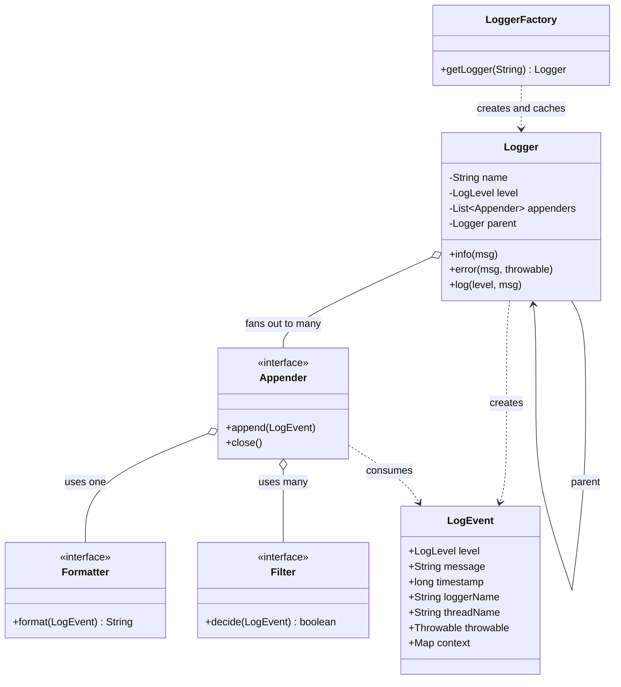
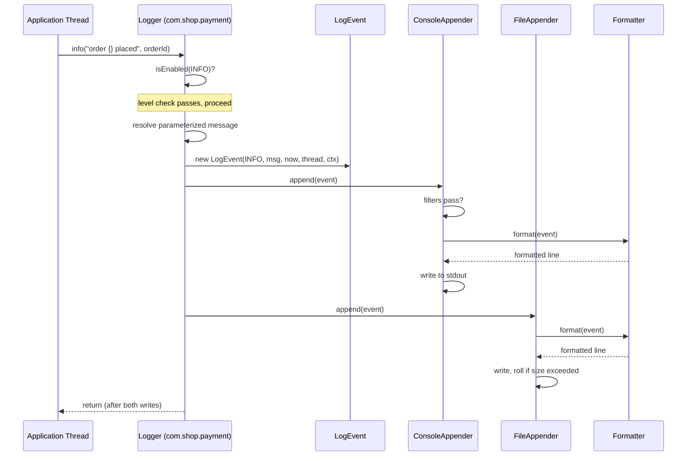
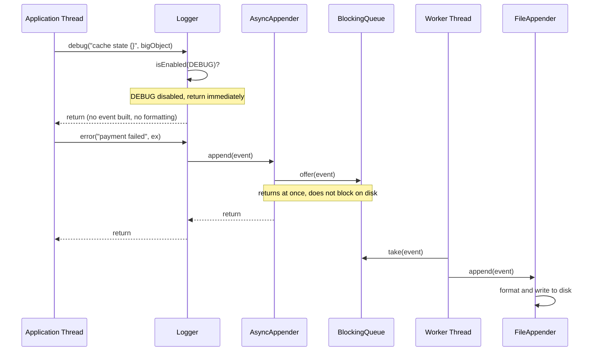
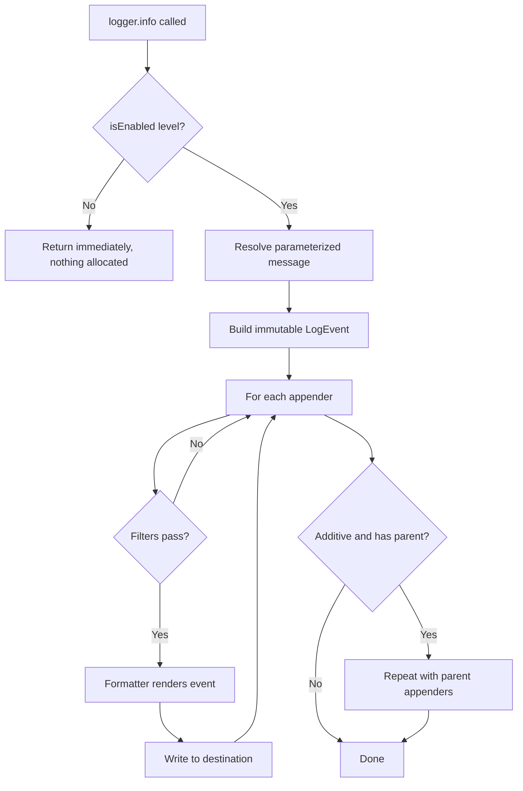
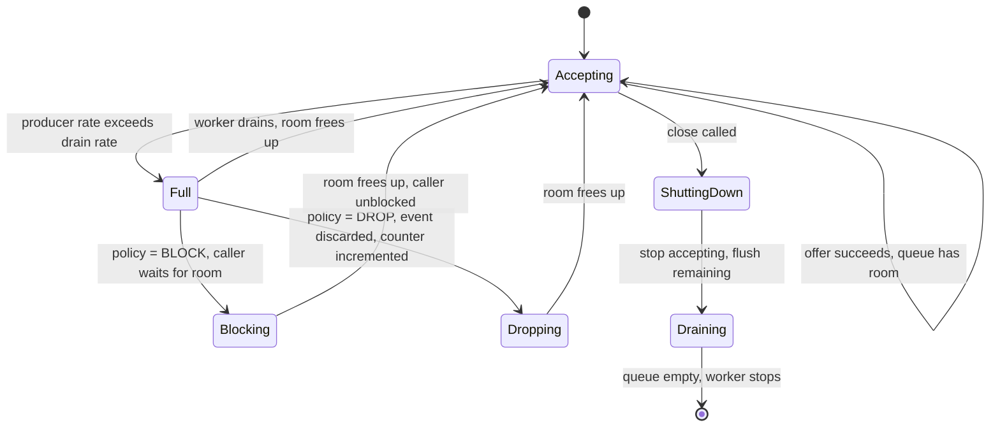

# 🪵 Low-Level Design: Logging System

> A complete, interview-ready walkthrough of the **Logging System** design problem — from a blank whiteboard to a staff-level framework that routes millions of log events per second across many destinations, never blocks the threads that produce them, and stays correct under heavy concurrency.

Logging is the interview problem that looks deceptively small and turns out to touch almost every skill a systems engineer has. The prompt — "design a logger" — sounds like an afternoon's work: print a message with a timestamp and a severity. But the moment you take it seriously, the real questions surface. How do you let a caller write `log.info("order placed")` without ever caring *where* that line ends up — console, file, database, or a remote collector? How do you send one event to several destinations at once, each in its own format, without the calling code knowing any of them exist? What happens when a request thread logs a line and the disk is slow — does the whole request stall? And when a hundred threads log at the same millisecond, how do you keep the file from turning into interleaved garbage? This guide walks the entire journey, escalating from the beginner's mental model of levels and appenders to the asynchronous ring buffers, backpressure policies, and structured-logging concerns a principal engineer raises in the final minutes.

---

## 📋 Table of Contents

**Part I — Framing the Problem**

1. [Problem Statement](#1-problem-statement)
2. [Requirement Clarification & Assumptions](#2-requirement-clarification--assumptions)
3. [Functional & Non-Functional Requirements](#3-functional--non-functional-requirements)
4. [Core Concepts Being Tested](#4-core-concepts-being-tested)

**Part II — Modeling the Domain**

5. [Domain Model & Entities](#5-domain-model--entities)
6. [CRC Cards](#6-crc-cards)
7. [UML Class Diagram](#7-uml-class-diagram)
8. [Package Structure](#8-package-structure)

**Part III — Design Rationale**

9. [Design Decisions & Trade-offs](#9-design-decisions--trade-offs)
10. [Class-by-Class Deep Dive](#10-class-by-class-deep-dive)
11. [Design Patterns Applied](#11-design-patterns-applied)
12. [SOLID Principles Mapping](#12-solid-principles-mapping)

**Part IV — Behavior & Diagrams**

13. [Sequence Diagram](#13-sequence-diagram)
14. [State & Flow Diagrams](#14-state--flow-diagrams)

**Part V — The Implementation**

15. [Complete Java Implementation](#15-complete-java-implementation)
16. [Execution Flow & Code Walkthrough](#16-execution-flow--code-walkthrough)

**Part VI — Engineering Depth**

17. [Complexity Analysis](#17-complexity-analysis)
18. [Thread Safety & Concurrency](#18-thread-safety--concurrency)
19. [Error Handling & Validation](#19-error-handling--validation)
20. [Scalability & Distributed Logging](#20-scalability--distributed-logging)
21. [Alternative Designs & Trade-offs](#21-alternative-designs--trade-offs)

**Part VII — Interview Mastery**

22. [Common FAANG Follow-up Questions (L4 → L6)](#22-common-faang-follow-up-questions-l4--l6)
23. [Common Design Mistakes](#23-common-design-mistakes)
24. [Testing Strategy](#24-testing-strategy)
25. [FAANG Q&A Section](#25-faang-qa-section)
26. [STAR Behavioral Questions](#26-star-behavioral-questions)
27. [⚡ Quick Revision Cheat Sheet](#27--quick-revision-cheat-sheet)

---

## 1. Problem Statement

Design a **logging system**: a library that application code uses to record what is happening inside a program — informational events, warnings, and errors — so that developers and operators can understand its behavior, debug failures, and monitor health in production. A caller obtains a `Logger` and writes lines like `logger.info("User {} placed order {}", userId, orderId)` or `logger.error("Payment failed", exception)`, and the system takes responsibility for enriching that message with a timestamp, a severity level, the source of the log, and thread context, then delivering it to one or more **destinations** — the console during development, a rolling file in production, a database, or a remote log-collection service.

The system must support **severity levels** (`TRACE`, `DEBUG`, `INFO`, `WARN`, `ERROR`, `FATAL`) so that noisy diagnostic output can be silenced in production while errors still get through; it must let a single event fan out to **multiple destinations simultaneously**, each with its own **output format** (plain text, JSON, or a custom layout); it must be **fast enough to run on the hot path of every request** without becoming the bottleneck; and it must be **safe under concurrency**, because in a real server dozens or hundreds of threads log at the same instant and their output must not corrupt one another.

<details>
<summary>📖 <b>In plain terms — what are we actually building?</b></summary>

Every program of any size needs to tell you what it is doing — "started up," "handled a request," "couldn't reach the database." A logging system is the plumbing that carries those messages from the line of code that produces them to wherever a human or a tool will read them. We are not building the thing that *reads* logs (that's a dashboard like Kibana), and we are not building the application itself. We are building the small, always-on component that sits inside every service: you hand it a message and a severity, and it stamps it, formats it, and reliably ships it to the console, a file, or a remote server — fast enough that you never think about it, and safe enough that a hundred threads writing at once never garble the output.

</details>

The deliverable in an interview is not a production replacement for Log4j; it is a **clean, extensible object-oriented model** — a `Logger` API that callers depend on, a pluggable set of output destinations behind one interface, interchangeable formatters, a level-based filtering mechanism, and a correct concurrency and performance story — that a real platform team could build on. Grading centers on whether you decouple the *what* (a log event) from the *where* (destinations) and the *how* (formatting), whether your design extends to new destinations without touching existing code, and how convincingly you handle the two hard parts: concurrency and the performance cost of logging on the request path.

---

## 2. Requirement Clarification & Assumptions

The single biggest mistake candidates make is diving straight into "I'll have a Logger class with a `log()` method that prints to console." A strong candidate spends the first few minutes converting the vague prompt into a bounded, layered problem. Below is the clarification dialogue you should drive, framed as the actors involved, the questions to ask, and the assumptions to lock in.

### 2.1 Actors

The people and systems that interact with the logging framework define its surface area.

| Actor | Role in the system |
|-------|--------------------|
| **Application Developer** | Writes `logger.info(...)` calls in business code; wants a dead-simple API and never wants logging to crash the app. |
| **Operator / SRE** | Reads logs in production, sets levels at runtime, configures where logs go and how they rotate. |
| **Log Destination** | The console, a file, a database, or a remote collector (Kafka, Elasticsearch) that ultimately stores the output. |
| **Configuration System** | Supplies the level thresholds, destination list, formats, and rotation policy — from a file, env vars, or code. |
| **Log Analysis Tooling** | Downstream consumers (Splunk, Datadog, Grafana Loki) that parse and index the emitted logs — they care about *format*. |

### 2.2 Key Clarifying Questions

Before modeling anything, resolve these with the interviewer. Each answer materially changes the design.

- **Library or service?** — Are we designing an in-process logging *library* (like Log4j/Logback, linked into one app) or a distributed log *aggregation service* (like the ELK stack)? *(Assumption: design the in-process library core first — that is the LLD question — then discuss how it feeds an aggregation pipeline, which is the systems extension.)*
- **Which destinations must we support?** — Console only, or file, database, and network too? *(Assumption: console and rolling file are first-class; database and remote/async destinations must be addable without changing existing code.)*
- **One format or many?** — Is plain text enough, or do downstream tools need structured JSON? *(Assumption: formatting is pluggable per destination — text for humans, JSON for machines.)*
- **Synchronous or asynchronous?** — Can a slow disk or network block the calling thread, or must logging return immediately? *(Assumption: synchronous by default for simplicity and ordering, with an asynchronous mode as the staff-level extension.)*
- **Runtime configurable?** — Must levels and destinations change without a redeploy? *(Assumption: yes — operators need to raise verbosity during an incident without restarting.)*
- **What are the numbers?** — Events per second, acceptable added latency, durability expectations on crash? *(Assumption: hundreds of thousands of events/sec on a busy service, sub-microsecond overhead for a suppressed log, and "best effort, not transactional" durability.)*
- **Do we need a logger hierarchy?** — Should `com.shop.payment` inherit configuration from `com.shop`? *(Assumption: yes — hierarchical loggers with inherited levels are a defining feature of real frameworks and worth modeling.)*

### 2.3 Explicit Non-Goals

Naming what you will *not* build is a senior signal — it shows you can bound scope deliberately rather than by omission.

- No log *querying, indexing, or dashboards* — we produce logs; reading and searching them is Kibana/Splunk's job.
- No distributed log *transport guarantees* (exactly-once delivery to a central store) — we ship best-effort and discuss durability trade-offs.
- No metrics or tracing systems — logging, metrics, and traces are the "three pillars" but distinct; we build logging and note the seams.
- No alerting or anomaly detection on log content — that's a downstream analytics concern.
- No authentication, encryption, or PII redaction as a core feature — we note where a filter/formatter would enforce it, but don't build a compliance engine.

<details>
<summary>📖 <b>Why spend so long on clarification?</b></summary>

The word "logging system" hides two completely different problems. One is an *in-process library*: the object-oriented design of `Logger`, destinations, and formatters that lives inside a single application — this is the actual LLD interview. The other is a *distributed aggregation platform*: collecting logs from thousands of machines into a searchable store — that is a distributed-systems design (Kafka, Logstash, Elasticsearch). If you don't pin down which one the interviewer wants, you can spend twenty minutes designing the wrong system confidently. The safe move is to say "I'll design the in-process library cleanly, then show how it plugs into an aggregation pipeline" — that demonstrates you see both layers and know which one the class-design question is really about.

</details>

---

## 3. Functional & Non-Functional Requirements

### 3.1 Functional Requirements (what the system *does*)

These are the concrete behaviors the system must support. In an interview, list them crisply — they become your checklist for the class design.

1. **Emit log messages** — accept a message, a severity level, and optional arguments/exception from a caller and record it.
2. **Support severity levels** — at least `TRACE < DEBUG < INFO < WARN < ERROR < FATAL`, ordered so a threshold can suppress anything below it.
3. **Filter by level threshold** — each logger (and each destination) has a minimum level; events below it are discarded cheaply.
4. **Fan out to multiple destinations** — one event can be written to the console, a file, and a remote sink at the same time.
5. **Format output pluggably** — each destination decides how the event is rendered (text, JSON, key-value) independent of the others.
6. **Support a logger hierarchy** — loggers are named (`com.shop.payment`) and inherit level and destinations from ancestors unless overridden.
7. **Enrich each event with context** — timestamp, level, logger name, thread name, and optional diagnostic context (e.g., a request/trace ID).
8. **Configure at runtime** — levels, destinations, and formats can be changed without restarting the application.
9. **Roll files** — a file destination rotates by size or time so logs don't grow unbounded.

### 3.2 Non-Functional Requirements (how *well* it does it)

These are the qualities that make the design production-grade, and they are where staff-level discussion lives.

| Attribute | Requirement | Why it matters |
|-----------|-------------|----------------|
| **Low overhead** | A suppressed log (below threshold) must cost almost nothing — a single comparison. | Logging sits on the hot path of every request; disabled `debug` calls must be nearly free. |
| **Throughput** | Sustain hundreds of thousands of events/sec on a busy service. | A high-traffic service logs constantly; the logger must not cap request throughput. |
| **Non-blocking (optional)** | In async mode, a slow disk or network must never stall the calling thread. | A blocked log call turns a slow disk into a slow *application*. |
| **Thread-safety** | Concurrent logs from many threads must not interleave or corrupt output. | Servers are massively multi-threaded; this is the common case. |
| **Extensibility** | New destinations and formats added without modifying existing code. | Requirements change — a team will want a Kafka sink next quarter. |
| **Ordering** | Events from one thread appear in the order they were emitted. | Out-of-order logs make debugging a nightmare. |
| **Reliability** | Logging must never crash or hang the host application. | A logging bug taking down the service is a self-inflicted outage. |
| **Configurability** | Behavior tunable per logger, per destination, at runtime. | Operators need to raise verbosity mid-incident without a deploy. |

<details>
<summary>📖 <b>Functional vs non-functional — the quick distinction</b></summary>

Functional requirements are the *verbs* — emit a message, filter by level, fan out to destinations, format the output. If a functional requirement fails, the logger produces the wrong log or sends it to the wrong place. Non-functional requirements are the *adverbs* — do it in under a microsecond when disabled, do it without blocking the request thread, do it correctly under ten thousand concurrent writers. If a non-functional requirement fails, the logger produced the right line but *stalled the request*, or *interleaved two threads' output into garbage*, or *became the outage it was meant to help diagnose*. Interviewers push hardest on the non-functional side, because a `Logger.log()` that prints correctly on a single thread says nothing about whether it survives production traffic — and that's where real logging frameworks live or die.

</details>

---

## 4. Core Concepts Being Tested

This problem is a proxy for a bundle of skills. Knowing what's being measured helps you narrate your design to the *right* audience.

- **Decoupling producers from consumers** — the marquee skill. The caller (`logger.info`) must know nothing about *where* or *how* the log is written. Getting this seam right is the whole game.
- **The Chain of Responsibility pattern** — the classic textbook framing routes an event up a hierarchy of loggers or through a chain of handlers by severity; recognizing and applying it is expected.
- **Strategy pattern in practice** — pluggable destinations (`Appender`) and pluggable formats (`Formatter`) behind stable interfaces is the textbook Strategy case and shows you design for extension.
- **Concurrency correctness** — the output stream is shared mutable state hit by many threads; ordering, atomic writes, and the producer/consumer handoff for async logging are all in scope.
- **The synchronous/asynchronous trade-off** — understanding why blocking logging is dangerous and how a bounded queue or ring buffer decouples producer from writer is a senior differentiator.
- **Performance on the hot path** — the level check must be cheap, object allocation should be minimized, and string formatting must be deferred until after the level check. This "garbage-free" thinking separates staff candidates.

Keep these in the back of your mind as you read on — each section below is, in part, a chance to demonstrate one or more of them.

---

## 5. Domain Model & Entities

Before any code, we identify the **nouns** in the problem and turn them into entities. Good domain modeling is the difference between a design that flexes and one that fights you.

### 5.1 The Entity Landscape

Reading the problem statement and picking out the recurring nouns yields a small, clean set of entities. Each has one clear responsibility.

- **`Logger`** — the object the caller holds and calls (`info`, `error`, ...). It has a name, a level threshold, and a set of destinations. It is the *entry point* and the *policy owner*: it decides whether an event is worth creating at all.
- **`LogLevel`** — an ordered enum (`TRACE`, `DEBUG`, `INFO`, `WARN`, `ERROR`, `FATAL`). Ordering is the whole point: a threshold of `INFO` means "emit `INFO` and everything more severe."
- **`LogEvent`** — the immutable record of a single logging call: the message, level, timestamp, logger name, thread name, optional exception, and diagnostic context. This is the *data* that flows through the system.
- **`Appender`** (a.k.a. Handler/Sink) — a destination. `ConsoleAppender`, `FileAppender`, `AsyncAppender`, `DatabaseAppender`. It knows *where* the output goes.
- **`Formatter`** (a.k.a. Layout) — converts a `LogEvent` into a `String` (or bytes). `SimpleTextFormatter`, `JsonFormatter`. It knows *how* the output looks.
- **`Filter`** — an optional predicate that decides whether a given `LogEvent` should pass, beyond the simple level threshold (e.g., "only events with a specific marker").
- **`LoggerFactory` / `LogManager`** — the single entry point that creates and caches named loggers and holds global configuration. It guarantees that asking for `"com.shop.payment"` twice returns the same logger.

### 5.2 Entity Relationships

The relationships between these entities are where the design's quality shows. The key insight is a chain of *has-a* relationships that keep each concern isolated: a `Logger` *has* appenders, an `Appender` *has* a formatter and optional filters, and a `LogEvent` flows through all of them as immutable data.



<details>
<summary>📖 <b>How to read this relationship map</b></summary>

Follow one log line through the picture. A developer calls `getLogger("com.shop.payment")` on the `LoggerFactory`, which hands back a cached `Logger`. When they call `.info(...)`, the `Logger` first checks its level; if the event is worth keeping, it builds an immutable `LogEvent` holding the message, time, level, and thread. It then hands that event to each `Appender` it fans out to. Each `Appender` runs its `Filter`s, asks its `Formatter` to turn the event into a string, and writes that string to its destination. The `LogEvent` is created once and read by everyone — nobody mutates it — which is exactly why the design stays thread-safe as it fans out.

</details>

### 5.3 Core Value Objects and Enums

Two small types anchor the model. `LogLevel` is an enum whose *declaration order* encodes severity, so filtering is a single integer comparison (`event.level.ordinal() >= threshold.ordinal()`). `LogEvent` is an immutable value object — once created it is never modified, which is what makes it safe to pass to many appenders, possibly on different threads, without any locking. The diagnostic context (a small map of key-value pairs such as `requestId` or `traceId`) rides along inside the event so that correlated logs across a request can be stitched together downstream.

---

## 6. CRC Cards

CRC (Class–Responsibility–Collaborator) cards are a lightweight way to sanity-check a design before writing code: for each class, name its responsibilities and the collaborators it leans on. If a class has too many responsibilities or collaborates with everything, that's a smell.

| Class | Responsibilities | Collaborators |
|-------|-----------------|---------------|
| **Logger** | Hold name, level, appenders; check threshold; build `LogEvent`; fan out to appenders; delegate to parent | `LogEvent`, `Appender`, `LogLevel` |
| **LoggerFactory** | Create and cache named loggers; wire the hierarchy; hold root config | `Logger` |
| **LogEvent** | Carry immutable event data (message, level, time, thread, context, throwable) | `LogLevel` |
| **LogLevel** | Define ordered severities; answer "is X at least as severe as Y?" | — |
| **Appender** | Receive an event; apply filters; format; write to a destination; manage the resource | `Formatter`, `Filter`, `LogEvent` |
| **Formatter** | Render a `LogEvent` into a string or bytes in a specific layout | `LogEvent` |
| **Filter** | Decide whether an event should be processed by an appender | `LogEvent` |
| **AsyncAppender** | Decouple producer from writer via a bounded queue; drain to a delegate appender on a background thread | `Appender` (delegate), `LogEvent`, `BlockingQueue` |

---

## 7. UML Class Diagram

The ASCII diagram below is the whiteboard artifact — it shows the interfaces, the concrete implementations behind them, and the *has-a* wiring. Every name here matches the Java implementation in Section 15 exactly.

```
                         ┌─────────────────────┐
                         │   «singleton»        │
                         │   LoggerFactory      │
                         │─────────────────────│
                         │ - loggers: Map       │
                         │ - root: Logger       │
                         │─────────────────────│
                         │ + getLogger(name)    │
                         │ + getRootLogger()    │
                         └──────────┬──────────┘
                                    │ creates & caches
                                    ▼
        ┌────────────────────────────────────────────────┐
        │                    Logger                        │
        │──────────────────────────────────────────────────│
        │ - name: String                                    │
        │ - level: LogLevel                                 │
        │ - appenders: List<Appender>                       │
        │ - parent: Logger                                  │
        │ - additive: boolean                               │
        │──────────────────────────────────────────────────│
        │ + trace/debug/info/warn/error/fatal(msg, args)    │
        │ + log(level, msg, throwable)                       │
        │ + isEnabled(level): boolean                        │
        │ + addAppender(Appender)                            │
        │ - callAppenders(LogEvent)                          │
        └───────────────┬───────────────────┬──────────────┘
             creates     │                   │ fans out to (0..*)
                         ▼                   ▼
              ┌────────────────┐     ┌──────────────────────────┐
              │   LogEvent      │     │    «interface» Appender   │
              │────────────────│     │──────────────────────────│
              │ +level          │     │ + append(LogEvent)        │
              │ +message        │     │ + setFormatter(Formatter) │
              │ +timestamp      │     │ + addFilter(Filter)       │
              │ +loggerName     │     │ + close()                 │
              │ +threadName     │     └───────────┬──────────────┘
              │ +throwable      │                 │ implements
              │ +context: Map   │      ┌──────────┼──────────┬───────────────┐
              └────────────────┘       ▼          ▼          ▼               ▼
                              ┌──────────────┐ ┌──────────┐ ┌────────────┐ ┌──────────────┐
                              │ConsoleAppender│ │FileAppender│ │DatabaseApp.│ │AsyncAppender │
                              │──────────────│ │──────────│ │────────────│ │──────────────│
                              │ writes stdout │ │rolls file│ │batch insert│ │- queue        │
                              │ /stderr       │ │by size   │ │            │ │- delegate     │
                              └───────┬──────┘ └────┬─────┘ └─────┬──────┘ │- worker thread│
                                      │             │             │        └──────┬───────┘
                                      │ uses 1      │ uses 1      │ uses 1        │ wraps 1
                                      ▼             ▼             ▼               ▼
                              ┌───────────────────────────────────────┐   ┌────────────┐
                              │        «interface» Formatter            │   │  Appender   │
                              │─────────────────────────────────────────│   │ (delegate)  │
                              │ + format(LogEvent): String              │   └────────────┘
                              └──────────────────┬──────────────────────┘
                                                 │ implements
                                     ┌───────────┴────────────┐
                                     ▼                        ▼
                          ┌────────────────────┐   ┌────────────────────┐
                          │ SimpleTextFormatter │   │   JsonFormatter     │
                          └────────────────────┘   └────────────────────┘

        ┌──────────────────────────┐          ┌───────────────────────────┐
        │   «enum» LogLevel         │          │   «interface» Filter       │
        │──────────────────────────│          │───────────────────────────│
        │ TRACE, DEBUG, INFO,       │          │ + decide(LogEvent): boolean│
        │ WARN, ERROR, FATAL        │          └───────────┬───────────────┘
        │──────────────────────────│                      │ implements
        │ + isAtLeast(other): bool  │              ┌───────┴─────────┐
        └──────────────────────────┘              ▼                 ▼
                                        ┌──────────────────┐ ┌────────────────┐
                                        │ LevelThreshold-  │ │  MarkerFilter   │
                                        │ Filter           │ │                 │
                                        └──────────────────┘ └────────────────┘
```

<details>
<summary>📖 <b>How to read this class diagram</b></summary>

The diagram has three layers stacked top to bottom. At the top, `LoggerFactory` is the single door in — it creates and caches `Logger`s so the same name always returns the same object. In the middle, a `Logger` owns a list of `Appender`s and creates `LogEvent`s. At the bottom sit the two pluggable interfaces that make the design extensible: `Appender` (where a log goes — console, file, database, async wrapper) and `Formatter` (how it looks — text or JSON). The arrows marked "implements" show the concrete classes you can swap in freely; the arrows marked "uses" show that each appender holds one formatter and any number of filters. The `AsyncAppender` is special: it *wraps another appender*, which is why its arrow points back to the `Appender` interface — it adds non-blocking behavior to any destination without knowing what that destination is.

</details>

---

## 8. Package Structure

A clean package layout mirrors the responsibilities and enforces the dependency direction — callers depend on the API, implementations depend on abstractions, and nothing leaks the other way.

```
com.example.logging
│
├── api/                         # what callers touch
│   ├── Logger.java              # the logging API (info, error, ...)
│   ├── LoggerFactory.java       # entry point: getLogger(name)
│   └── LogLevel.java            # ordered severity enum
│
├── core/                        # the event and its lifecycle
│   ├── LogEvent.java            # immutable event value object
│   └── DiagnosticContext.java   # per-thread MDC (requestId, traceId)
│
├── appender/                    # WHERE logs go (Strategy)
│   ├── Appender.java            # interface
│   ├── AbstractAppender.java    # shared filter + format logic
│   ├── ConsoleAppender.java
│   ├── FileAppender.java        # with size-based rolling
│   ├── DatabaseAppender.java
│   └── AsyncAppender.java       # decorator: queue + worker thread
│
├── format/                      # HOW logs look (Strategy)
│   ├── Formatter.java           # interface
│   ├── SimpleTextFormatter.java
│   └── JsonFormatter.java
│
├── filter/                      # WHICH events pass
│   ├── Filter.java              # interface
│   ├── LevelThresholdFilter.java
│   └── MarkerFilter.java
│
└── config/                      # runtime configuration
    └── LoggerConfig.java        # levels, appenders, wiring
```

<details>
<summary>📖 <b>Why separate the appender, format, and filter packages?</b></summary>

Each package answers a different question about a log line. The `appender` package answers "where does it go?" — console, file, database. The `format` package answers "what does it look like?" — a human-readable line or a JSON object. The `filter` package answers "should it be written at all?" beyond the simple level check. Keeping these apart means a change to the JSON layout can't accidentally break file rotation, and adding a Kafka appender touches only the `appender` package. The `api` package is deliberately tiny — it's the only thing business code imports, so it stays stable even as the guts underneath evolve.

</details>

## 9. Design Decisions & Trade-offs

Every interesting choice in this design is a fork with a defensible answer on each side. Naming the fork and justifying your pick is what earns points — far more than the code itself.

### 9.1 Should the `Logger` write output directly, or delegate to appenders?

The naive design puts `System.out.println` inside `Logger.info`. It works for a demo and fails everything after: you can't add a file destination without editing `Logger`, you can't send one event to two places, and you've welded the *what* to the *where*. The decision is to make `Logger` own a list of `Appender` objects and delegate. The `Logger` decides *whether* to log (the level check) and *what* the event contains; the `Appender` decides *where* it goes. This single seam is the difference between a toy and a framework.

### 9.2 Where does level filtering happen — in the logger or the appender?

Both, deliberately, at two levels. The `Logger` holds a coarse threshold checked *first, before the event is even built* — this is the performance-critical gate that makes a disabled `debug()` call nearly free. Each `Appender` can then hold its *own* finer threshold or filter — so the console can show `INFO` while the file captures `DEBUG`. Checking in the logger first avoids allocating a `LogEvent` and formatting a string that nobody will read; checking again in the appender allows per-destination policy. Doing only one or the other is a common mistake.

### 9.3 Should `LogEvent` be mutable or immutable?

Immutable. The event is created once and read by potentially many appenders, some on other threads (async). If it were mutable, one appender modifying it could corrupt what another reads, and you'd need locking around every read. An immutable event needs no synchronization to share — it's the single most important thread-safety decision in the design and it costs you nothing but a few `final` fields.

### 9.4 Synchronous or asynchronous by default?

Synchronous by default; asynchronous as an opt-in decorator. Synchronous logging is simple, preserves ordering trivially, and is durable up to the OS buffer — the right default. But it couples the caller's latency to the destination's speed: a slow disk or a network sink stalls the request thread. The `AsyncAppender` solves this by handing the event to a bounded queue and returning immediately, with a background thread draining to the real destination. The trade-off it introduces — possible event loss on crash, and a backpressure decision when the queue fills — is exactly the staff-level conversation, so we build it as a wrapper rather than baking async into every appender.

### 9.5 String formatting: eager or deferred?

Deferred, using parameterized messages. If the API were `logger.debug("user " + id + " did " + action)`, the string concatenation happens *before* the level check even runs — you pay the cost even when `DEBUG` is disabled. The parameterized form `logger.debug("user {} did {}", id, action)` passes the template and arguments separately, so the expensive `toString()` and concatenation happen only *after* the level check passes. On a hot path with disabled debug logging, this is the difference between zero cost and millions of wasted string builds per second.

### 9.6 How do loggers relate — flat or hierarchical?

Hierarchical, by dotted name. A logger named `com.shop.payment` has parent `com.shop`, which has parent `com` under the root. A logger with no explicitly set level inherits its effective level from the nearest ancestor that has one. This lets an operator set the root to `WARN` and just `com.shop.payment` to `DEBUG` during an incident, quieting everything except the subsystem under investigation. It's the Chain of Responsibility pattern applied to configuration lookup.

<details>
<summary>📖 <b>The one decision that matters most</b></summary>

If you remember a single design decision from this problem, make it the separation between *whether to log* and *where to log*. The `Logger` answers the first question with a cheap level comparison; the `Appender` answers the second. Everything good about the design flows from keeping those two apart: you add new destinations without touching business code, you send one event to many places, you make disabled logging almost free, and you keep the event immutable so it's safe to share. Candidates who weld printing into the logger fail the extensibility follow-up in seconds; candidates who split them can absorb every follow-up the interviewer throws.

</details>

---

## 10. Class-by-Class Deep Dive

With the decisions made, here is what each class is responsible for and why it's shaped the way it is. The full code is in Section 15; this section is the narrated tour.

### 10.1 `LogLevel` (the ordered enum)

An enum with the constants declared from least to most severe: `TRACE, DEBUG, INFO, WARN, ERROR, FATAL`. Because enum `ordinal()` reflects declaration order, "is this event severe enough?" collapses to `event.getLevel().ordinal() >= threshold.ordinal()`, exposed as a readable `isAtLeast(other)` method. Encoding severity in the *order* rather than in ad-hoc integer constants means the compiler enforces the set and nobody can invent a stray level.

### 10.2 `LogEvent` (the immutable record)

The data that flows through the system: `level`, `message` (already formatted or lazily formattable), `timestamp`, `loggerName`, `threadName`, an optional `Throwable`, and an immutable copy of the diagnostic context map. All fields are `final`, set once in the constructor. It carries everything an appender or formatter could need so that no downstream component has to reach back for more context — that would reintroduce coupling.

### 10.3 `Logger` (the API and policy owner)

The class callers hold. It exposes the convenience methods (`trace`, `debug`, `info`, `warn`, `error`, `fatal`) that all funnel into a single private `log(level, message, args, throwable)`. The first thing `log` does is `isEnabled(level)` — the cheap gate. Only if that passes does it resolve the parameterized message, build the `LogEvent`, and call `callAppenders`, which walks this logger's appenders and then, if `additive` is true, its parent's — the hierarchy in action. It holds `name`, `level`, `appenders`, `parent`, and `additive`.

### 10.4 `LoggerFactory` (the cached entry point)

A singleton-style manager with `getLogger(String name)`. It maintains a `ConcurrentHashMap<String, Logger>` so repeated requests for the same name return the identical instance — critical because configuration is attached to the logger object. It also wires each new logger to its parent by trimming the dotted name, and owns the always-present root logger that terminates the hierarchy.

### 10.5 `Appender` and `AbstractAppender`

`Appender` is the interface every destination implements: `append(LogEvent)`, `setFormatter(...)`, `addFilter(...)`, and `close()`. `AbstractAppender` is a template base class that implements the *common* flow — run all filters, and if they pass, call the subclass's `doAppend(String formatted)` — so each concrete appender only writes the destination-specific bytes. This is the Template Method pattern removing duplicated filter/format code from every appender.

### 10.6 The concrete appenders

`ConsoleAppender` writes formatted lines to `stdout` (or `stderr` for `ERROR`+). `FileAppender` writes to a file and rolls it when it crosses a size threshold, renaming the old file with a suffix. `DatabaseAppender` batches events and inserts them (illustrative, showing a fundamentally different destination shape). `AsyncAppender` is the important one: it *wraps another appender*, pushing events onto a bounded `BlockingQueue` and returning immediately, while a dedicated worker thread drains the queue into the wrapped appender.

### 10.7 `Formatter`, `SimpleTextFormatter`, `JsonFormatter`

`Formatter` has one method: `format(LogEvent) -> String`. `SimpleTextFormatter` produces the familiar `2026-08-14 10:00:00.123 [main] INFO com.shop.payment - message` line. `JsonFormatter` emits a one-line JSON object with the same fields as keys, which is what a structured pipeline (Elasticsearch, Datadog) wants to index. Because formatting is a Strategy behind the appender, the console can stay human-readable while the file emits JSON.

### 10.8 `Filter`, `LevelThresholdFilter`, `MarkerFilter`

`Filter` is a predicate: `decide(LogEvent) -> boolean`. `LevelThresholdFilter` lets an appender enforce its own minimum level independent of the logger. `MarkerFilter` passes only events tagged with a specific marker (e.g., `AUDIT`), enabling an audit-only file. Filters compose — an appender can hold several, all of which must pass.

---

## 11. Design Patterns Applied

This problem is unusually rich in patterns, which is exactly why interviewers love it. The skill is not naming patterns but explaining *why each one earns its place*.

| Pattern | Where it appears | What it buys us |
|---------|-----------------|-----------------|
| **Strategy** | `Appender` (where) and `Formatter` (how) behind stable interfaces | New destinations and formats added without touching callers or each other |
| **Chain of Responsibility** | Logger hierarchy: an event/level lookup walks parent to parent | Inherited configuration and additive appending up the tree |
| **Decorator** | `AsyncAppender` wraps any `Appender` to add non-blocking behavior | Async-ness composes onto *any* destination without subclassing each |
| **Template Method** | `AbstractAppender.append` fixes the filter→format→write flow; subclasses fill `doAppend` | Zero duplicated filter/format code across appenders |
| **Singleton** | `LoggerFactory` / `LogManager` | One global registry so a name maps to one configured logger everywhere |
| **Factory Method** | `LoggerFactory.getLogger(name)` creates-or-returns cached loggers | Callers never `new` a logger; wiring and caching stay centralized |
| **Builder** | `LogEvent` construction (and config assembly) | Readable, immutable event creation with many optional fields |
| **Observer (variant)** | A logger notifying its list of appenders of a new event | One event fans out to many independent listeners |

<details>
<summary>📖 <b>Why Strategy and Chain of Responsibility are the backbone</b></summary>

Two patterns carry this design. Strategy is why the system is extensible: because `Appender` and `Formatter` are interfaces, "add a Kafka sink" or "emit JSON" means writing one new class and zero edits to existing ones — the open/closed principle made concrete. Chain of Responsibility is why configuration scales: instead of setting a level on every one of a thousand loggers, you set a few and let the rest inherit by walking up the dotted-name hierarchy, exactly as an HTTP middleware chain passes a request along until something handles it. If you name only two patterns in the interview, name these two and explain the extensibility and configuration-inheritance they unlock — the rest are supporting cast.

</details>

---

## 12. SOLID Principles Mapping

SOLID isn't a checklist to recite; it's a lens that explains *why* the class boundaries fall where they do. Here's how each principle shows up.

- **Single Responsibility** — `Logger` decides whether/what to log; `Appender` decides where; `Formatter` decides how; `Filter` decides which. Each class has exactly one reason to change. When the JSON layout changes, only `JsonFormatter` changes.
- **Open/Closed** — Adding a `KafkaAppender` or an `XmlFormatter` means adding a class, not editing one. The `Appender` and `Formatter` interfaces are open for extension, closed for modification. This is the payoff of Strategy.
- **Liskov Substitution** — Any `Appender` can stand in for any other; the `Logger` calls `append(event)` without knowing the concrete type. `AsyncAppender`, though it wraps another appender, honors the same contract — a caller can't tell the difference except in timing.
- **Interface Segregation** — The interfaces are minimal: `Appender` has `append`/`close`, `Formatter` has `format`, `Filter` has `decide`. No class is forced to implement methods it doesn't use. A formatter isn't burdened with lifecycle methods it has no need for.
- **Dependency Inversion** — `Logger` depends on the `Appender` *interface*, not `FileAppender`. High-level policy (the logger) and low-level detail (a file writer) both depend on the abstraction, so either can change independently. Configuration wires the concrete types in at the edges.

<details>
<summary>📖 <b>The SOLID gut-check for this design</b></summary>

The fastest way to test whether a logging design respects SOLID is to ask one question: "to add a new destination, how many existing files do I edit?" In a good design the answer is zero — you write one new class implementing `Appender` and register it in configuration. If the answer is "I edit the `Logger` to add an `if (type == KAFKA)` branch," the design has violated open/closed and dependency inversion at once, and every future destination will make the `Logger` uglier. The interface seams — `Appender`, `Formatter`, `Filter` — exist precisely so that number stays at zero.

</details>

---

## 13. Sequence Diagram

The sequence diagrams below trace the two flows that matter: a normal synchronous log that fans out to two destinations, and an asynchronous log that returns before the write happens.

### 13.1 Synchronous Log Fanning Out to Console and File



### 13.2 Suppressed Log and Asynchronous Log



<details>
<summary>📖 <b>Reading the flow</b></summary>

The first diagram shows the everyday case: the logger checks the level, builds one immutable event, and hands it to each appender in turn — the same event object to both, which is safe precisely because it's immutable. The caller waits until both writes finish. The second diagram shows the two performance stories side by side. A disabled `debug` returns before anything is allocated or formatted — note the big object's `toString()` is never called. And the async path hands the event to a queue and returns immediately; the actual disk write happens later on a worker thread, so a slow disk delays the *log*, not the *request*. Those two behaviors — cheap suppression and non-blocking writes — are the whole performance argument in one picture.

</details>

---

## 14. State & Flow Diagrams

Two views help here: the decision flow of a single log call (the algorithm) and the lifecycle of an `AsyncAppender`'s bounded queue under load (where the hard trade-off lives).

### 14.1 The Log-Call Decision Flow



### 14.2 AsyncAppender Queue Lifecycle Under Backpressure



<details>
<summary>📖 <b>Why the "Full" state is the whole interview</b></summary>

The decision flow on the left is what most candidates draw, and it's correct. But the state machine on the right is where the staff-level conversation happens. An async appender has a bounded queue, and the interesting question is: what happens when producers log faster than the worker can write? You have three choices, each a real trade-off. *Block* the producer until there's room — preserves every log but reintroduces the blocking you were trying to avoid. *Drop* the new event — keeps the app fast but loses logs exactly when things are going wrong (high load). *Drop the oldest* — keeps the newest, most relevant events. There's no free answer; naming the three policies and picking one with a justification ("drop with a dropped-count metric, because losing a few logs beats stalling the checkout path") is precisely the reasoning interviewers reward.

</details>

## 15. Complete Java Implementation

The implementation below is a runnable, self-contained logging framework. It is organized bottom-up: the level enum and event first, then the pluggable formatters and filters, then the appenders (including the async decorator), and finally the `Logger` and `LoggerFactory` that tie it together with a `main` demo. Every class name and method signature matches the diagrams above.

<details>
<summary>💻 <b>1. Levels, context, and the immutable event</b> — <code>LogLevel</code>, <code>DiagnosticContext</code>, <code>LogEvent</code></summary>

```java
package com.example.logging.api;

/**
 * Severity levels, declared least-to-most severe.
 * ordinal() encodes severity, so comparison is a single int compare.
 */
public enum LogLevel {
    TRACE, DEBUG, INFO, WARN, ERROR, FATAL;

    /** True if this level is at least as severe as the given threshold. */
    public boolean isAtLeast(LogLevel threshold) {
        return this.ordinal() >= threshold.ordinal();
    }
}
```

```java
package com.example.logging.core;

import java.util.Collections;
import java.util.HashMap;
import java.util.Map;

/**
 * Per-thread diagnostic context (MDC): request/trace IDs that ride along
 * with every log event on the current thread. Backed by a ThreadLocal.
 */
public final class DiagnosticContext {
    private static final ThreadLocal<Map<String, String>> CONTEXT =
            ThreadLocal.withInitial(HashMap::new);

    private DiagnosticContext() {}

    public static void put(String key, String value) {
        CONTEXT.get().put(key, value);
    }

    public static void remove(String key) {
        CONTEXT.get().remove(key);
    }

    public static void clear() {
        CONTEXT.get().clear();
    }

    /** An immutable snapshot, copied into each LogEvent so it stays consistent. */
    public static Map<String, String> snapshot() {
        return Collections.unmodifiableMap(new HashMap<>(CONTEXT.get()));
    }
}
```

```java
package com.example.logging.core;

import com.example.logging.api.LogLevel;
import java.util.Map;

/**
 * Immutable record of one logging call. Created once, read by many
 * appenders (possibly on other threads) with zero synchronization.
 */
public final class LogEvent {
    private final LogLevel level;
    private final String message;        // already parameter-substituted
    private final long timestamp;        // epoch millis
    private final String loggerName;
    private final String threadName;
    private final Throwable throwable;   // nullable
    private final Map<String, String> context;

    public LogEvent(LogLevel level, String message, String loggerName,
                    Throwable throwable, Map<String, String> context) {
        this.level = level;
        this.message = message;
        this.loggerName = loggerName;
        this.throwable = throwable;
        this.context = context;
        this.timestamp = System.currentTimeMillis();
        this.threadName = Thread.currentThread().getName();
    }

    public LogLevel getLevel()        { return level; }
    public String getMessage()        { return message; }
    public long getTimestamp()        { return timestamp; }
    public String getLoggerName()     { return loggerName; }
    public String getThreadName()     { return threadName; }
    public Throwable getThrowable()   { return throwable; }
    public Map<String, String> getContext() { return context; }
}
```

**Why it's shaped this way:** every field is `final` — the event is created once and never touched again, which is what lets it fan out to many appenders (and threads) without a single lock. The diagnostic context is *snapshotted* into the event so that even if the thread's MDC changes a millisecond later, this event's context is frozen and correct.

</details>

<details>
<summary>💻 <b>2. Formatting strategies</b> — <code>Formatter</code>, <code>SimpleTextFormatter</code>, <code>JsonFormatter</code></summary>

```java
package com.example.logging.format;

import com.example.logging.core.LogEvent;

/** Strategy: turns an event into an output string. */
public interface Formatter {
    String format(LogEvent event);
}
```

```java
package com.example.logging.format;

import com.example.logging.core.LogEvent;
import java.io.PrintWriter;
import java.io.StringWriter;
import java.time.Instant;
import java.time.ZoneId;
import java.time.format.DateTimeFormatter;

/** Human-readable line: 2026-08-14 10:00:00.123 [main] INFO logger - message */
public class SimpleTextFormatter implements Formatter {
    private static final DateTimeFormatter TS =
            DateTimeFormatter.ofPattern("yyyy-MM-dd HH:mm:ss.SSS")
                             .withZone(ZoneId.systemDefault());

    @Override
    public String format(LogEvent e) {
        StringBuilder sb = new StringBuilder(128);
        sb.append(TS.format(Instant.ofEpochMilli(e.getTimestamp())))
          .append(" [").append(e.getThreadName()).append("] ")
          .append(e.getLevel()).append(' ')
          .append(e.getLoggerName());
        if (!e.getContext().isEmpty()) {
            sb.append(' ').append(e.getContext());
        }
        sb.append(" - ").append(e.getMessage());
        if (e.getThrowable() != null) {
            sb.append(System.lineSeparator()).append(stackTrace(e.getThrowable()));
        }
        return sb.toString();
    }

    private String stackTrace(Throwable t) {
        StringWriter sw = new StringWriter();
        t.printStackTrace(new PrintWriter(sw));
        return sw.toString();
    }
}
```

```java
package com.example.logging.format;

import com.example.logging.core.LogEvent;
import java.util.Map;

/** One-line JSON, ready for ingestion by Elasticsearch / Datadog. */
public class JsonFormatter implements Formatter {
    @Override
    public String format(LogEvent e) {
        StringBuilder sb = new StringBuilder(160);
        sb.append('{')
          .append("\"ts\":").append(e.getTimestamp()).append(',')
          .append("\"level\":\"").append(e.getLevel()).append("\",")
          .append("\"logger\":\"").append(esc(e.getLoggerName())).append("\",")
          .append("\"thread\":\"").append(esc(e.getThreadName())).append("\",")
          .append("\"msg\":\"").append(esc(e.getMessage())).append('"');
        for (Map.Entry<String, String> c : e.getContext().entrySet()) {
            sb.append(',').append('"').append(esc(c.getKey())).append("\":\"")
              .append(esc(c.getValue())).append('"');
        }
        if (e.getThrowable() != null) {
            sb.append(",\"exception\":\"")
              .append(esc(e.getThrowable().toString())).append('"');
        }
        return sb.append('}').toString();
    }

    private String esc(String s) {
        return s == null ? "" : s.replace("\\", "\\\\").replace("\"", "\\\"");
    }
}
```

**Why it's shaped this way:** the `Formatter` interface has exactly one method, so a new layout is a single small class. Both implementations preallocate a `StringBuilder` sized to the typical line to avoid repeated array growth — a small nod to the garbage-conscious mindset that matters when you format hundreds of thousands of lines per second.

</details>

<details>
<summary>💻 <b>3. Filters</b> — <code>Filter</code>, <code>LevelThresholdFilter</code>, <code>MarkerFilter</code></summary>

```java
package com.example.logging.filter;

import com.example.logging.core.LogEvent;

/** Strategy predicate: should this appender process the event? */
public interface Filter {
    boolean decide(LogEvent event);
}
```

```java
package com.example.logging.filter;

import com.example.logging.api.LogLevel;
import com.example.logging.core.LogEvent;

/** Lets an appender enforce its own minimum level, independent of the logger. */
public class LevelThresholdFilter implements Filter {
    private final LogLevel threshold;

    public LevelThresholdFilter(LogLevel threshold) {
        this.threshold = threshold;
    }

    @Override
    public boolean decide(LogEvent event) {
        return event.getLevel().isAtLeast(threshold);
    }
}
```

```java
package com.example.logging.filter;

import com.example.logging.core.LogEvent;

/** Passes only events whose context carries a matching marker (e.g., AUDIT). */
public class MarkerFilter implements Filter {
    private final String markerKey;
    private final String markerValue;

    public MarkerFilter(String markerKey, String markerValue) {
        this.markerKey = markerKey;
        this.markerValue = markerValue;
    }

    @Override
    public boolean decide(LogEvent event) {
        return markerValue.equals(event.getContext().get(markerKey));
    }
}
```

**Why it's shaped this way:** filters are tiny composable predicates. An appender holds a list of them and requires all to pass, so "an audit-only JSON file that captures WARN and above" is just two filters on one appender — no new appender subclass required.

</details>

<details>
<summary>💻 <b>4. The appender contract and shared base</b> — <code>Appender</code>, <code>AbstractAppender</code></summary>

```java
package com.example.logging.appender;

import com.example.logging.core.LogEvent;
import com.example.logging.filter.Filter;
import com.example.logging.format.Formatter;

/** Strategy: a destination for log output. */
public interface Appender {
    void append(LogEvent event);
    void setFormatter(Formatter formatter);
    void addFilter(Filter filter);
    void close();
}
```

```java
package com.example.logging.appender;

import com.example.logging.core.LogEvent;
import com.example.logging.filter.Filter;
import com.example.logging.format.Formatter;
import com.example.logging.format.SimpleTextFormatter;
import java.util.List;
import java.util.concurrent.CopyOnWriteArrayList;

/**
 * Template Method: fixes the filter -> format -> write flow.
 * Subclasses implement only doAppend(formattedLine).
 */
public abstract class AbstractAppender implements Appender {
    protected volatile Formatter formatter = new SimpleTextFormatter();
    private final List<Filter> filters = new CopyOnWriteArrayList<>();

    @Override
    public final void append(LogEvent event) {
        for (Filter f : filters) {
            if (!f.decide(event)) {
                return; // a filter rejected the event
            }
        }
        String formatted = formatter.format(event);
        try {
            doAppend(formatted, event);
        } catch (Exception ex) {
            // Logging must never crash the app: report to stderr and move on.
            System.err.println("Appender failure: " + ex.getMessage());
        }
    }

    /** Subclass writes the already-formatted line to its destination. */
    protected abstract void doAppend(String formatted, LogEvent event);

    @Override
    public void setFormatter(Formatter formatter) { this.formatter = formatter; }

    @Override
    public void addFilter(Filter filter) { this.filters.add(filter); }

    @Override
    public void close() { /* no-op by default */ }
}
```

**Why it's shaped this way:** `append` is `final` so subclasses can't accidentally bypass the filter/format/error-handling logic — they can only fill in the `doAppend` blank. The `try/catch` enforces the golden rule of logging: *a broken appender must never propagate an exception into business code.*

</details>

<details>
<summary>💻 <b>5. Concrete destinations</b> — <code>ConsoleAppender</code>, <code>FileAppender</code>, <code>DatabaseAppender</code></summary>

```java
package com.example.logging.appender;

import com.example.logging.api.LogLevel;
import com.example.logging.core.LogEvent;

/** Writes to stdout, or stderr for WARN and above. */
public class ConsoleAppender extends AbstractAppender {
    @Override
    protected synchronized void doAppend(String formatted, LogEvent event) {
        if (event.getLevel().isAtLeast(LogLevel.WARN)) {
            System.err.println(formatted);
        } else {
            System.out.println(formatted);
        }
    }
}
```

```java
package com.example.logging.appender;

import com.example.logging.core.LogEvent;
import java.io.BufferedWriter;
import java.io.FileWriter;
import java.io.IOException;
import java.io.File;

/** Writes to a file and rolls it over when it exceeds maxBytes. */
public class FileAppender extends AbstractAppender {
    private final String path;
    private final long maxBytes;
    private BufferedWriter writer;
    private long written;
    private int rollIndex;

    public FileAppender(String path, long maxBytes) throws IOException {
        this.path = path;
        this.maxBytes = maxBytes;
        openWriter(false);
    }

    private void openWriter(boolean truncate) throws IOException {
        File f = new File(path);
        this.written = f.exists() ? f.length() : 0;
        this.writer = new BufferedWriter(new FileWriter(path, !truncate));
    }

    @Override
    protected synchronized void doAppend(String formatted, LogEvent event) {
        try {
            String line = formatted + System.lineSeparator();
            if (written + line.length() > maxBytes) {
                roll();
            }
            writer.write(line);
            writer.flush();               // durability over throughput here
            written += line.length();
        } catch (IOException e) {
            System.err.println("FileAppender write failed: " + e.getMessage());
        }
    }

    private void roll() throws IOException {
        writer.close();
        new File(path).renameTo(new File(path + "." + (++rollIndex)));
        openWriter(true);
    }

    @Override
    public synchronized void close() {
        try { if (writer != null) writer.close(); }
        catch (IOException ignored) {}
    }
}
```

```java
package com.example.logging.appender;

import com.example.logging.core.LogEvent;
import java.util.ArrayList;
import java.util.List;

/**
 * Illustrative DB sink: buffers events and flushes in batches.
 * A real one would use a JDBC batch insert / connection pool.
 */
public class DatabaseAppender extends AbstractAppender {
    private final int batchSize;
    private final List<String> buffer = new ArrayList<>();

    public DatabaseAppender(int batchSize) {
        this.batchSize = batchSize;
    }

    @Override
    protected synchronized void doAppend(String formatted, LogEvent event) {
        buffer.add(formatted);
        if (buffer.size() >= batchSize) {
            flush();
        }
    }

    private void flush() {
        // e.g., preparedStatement.addBatch(...) then executeBatch()
        System.out.println("[DB] batch insert of " + buffer.size() + " rows");
        buffer.clear();
    }

    @Override
    public synchronized void close() { flush(); }
}
```

**Why it's shaped this way:** `doAppend` is `synchronized` in each appender so concurrent threads can't interleave partial lines into the same file or console — that single keyword is what turns "correct on one thread" into "correct under load." The `FileAppender` flushes on every write, trading throughput for durability; a real system would make that policy configurable, which is exactly the follow-up an interviewer asks.

</details>

<details>
<summary>💻 <b>6. The async decorator</b> — <code>AsyncAppender</code></summary>

```java
package com.example.logging.appender;

import com.example.logging.core.LogEvent;
import com.example.logging.filter.Filter;
import com.example.logging.format.Formatter;
import java.util.concurrent.ArrayBlockingQueue;
import java.util.concurrent.BlockingQueue;
import java.util.concurrent.TimeUnit;
import java.util.concurrent.atomic.AtomicLong;

/**
 * Decorator: wraps ANY appender to make it non-blocking. Producers push
 * onto a bounded queue and return; a worker thread drains to the delegate.
 */
public class AsyncAppender implements Appender {

    public enum OverflowPolicy { BLOCK, DROP }

    private final Appender delegate;
    private final BlockingQueue<LogEvent> queue;
    private final OverflowPolicy policy;
    private final Thread worker;
    private final AtomicLong dropped = new AtomicLong();
    private volatile boolean running = true;

    public AsyncAppender(Appender delegate, int capacity, OverflowPolicy policy) {
        this.delegate = delegate;
        this.queue = new ArrayBlockingQueue<>(capacity);
        this.policy = policy;
        this.worker = new Thread(this::drainLoop, "async-log-worker");
        this.worker.setDaemon(true);   // never block JVM shutdown
        this.worker.start();
    }

    @Override
    public void append(LogEvent event) {
        if (policy == OverflowPolicy.BLOCK) {
            try {
                queue.put(event);                 // waits for room
            } catch (InterruptedException e) {
                Thread.currentThread().interrupt();
            }
        } else { // DROP
            if (!queue.offer(event)) {            // returns at once if full
                dropped.incrementAndGet();
            }
        }
    }

    private void drainLoop() {
        while (running || !queue.isEmpty()) {
            try {
                LogEvent e = queue.poll(200, TimeUnit.MILLISECONDS);
                if (e != null) {
                    delegate.append(e);
                }
            } catch (InterruptedException ie) {
                Thread.currentThread().interrupt();
                break;
            }
        }
    }

    public long getDroppedCount() { return dropped.get(); }

    @Override public void setFormatter(Formatter f) { delegate.setFormatter(f); }
    @Override public void addFilter(Filter f)        { delegate.addFilter(f); }

    @Override
    public void close() {
        running = false;
        worker.interrupt();
        try { worker.join(2000); } catch (InterruptedException ignored) {}
        delegate.close();
    }
}
```

**Why it's shaped this way:** `AsyncAppender` implements `Appender` and holds another `Appender` — the Decorator pattern — so it can make a *file*, a *database*, or a *network* sink non-blocking without knowing which it is. The `OverflowPolicy` makes the hard trade-off explicit and configurable: `BLOCK` never loses a log but can stall the producer; `DROP` keeps producers fast and counts what it discarded via `dropped`, which you'd expose as a metric. The daemon worker guarantees the logger can never hang JVM shutdown.

</details>

<details>
<summary>💻 <b>7. The Logger and its hierarchy</b> — <code>Logger</code></summary>

```java
package com.example.logging.api;

import com.example.logging.appender.Appender;
import com.example.logging.core.DiagnosticContext;
import com.example.logging.core.LogEvent;
import java.util.List;
import java.util.concurrent.CopyOnWriteArrayList;

/**
 * The API callers hold. Owns level policy and a list of appenders;
 * inherits effective level and (additively) appenders from its parent.
 */
public class Logger {
    private final String name;
    private volatile LogLevel level;         // may be null => inherit
    private final Logger parent;             // null for root
    private volatile boolean additive = true;
    private final List<Appender> appenders = new CopyOnWriteArrayList<>();

    public Logger(String name, LogLevel level, Logger parent) {
        this.name = name;
        this.level = level;
        this.parent = parent;
    }

    // ---- convenience API ----
    public void trace(String msg, Object... args) { log(LogLevel.TRACE, msg, null, args); }
    public void debug(String msg, Object... args) { log(LogLevel.DEBUG, msg, null, args); }
    public void info(String msg, Object... args)  { log(LogLevel.INFO,  msg, null, args); }
    public void warn(String msg, Object... args)  { log(LogLevel.WARN,  msg, null, args); }
    public void error(String msg, Throwable t)    { log(LogLevel.ERROR, msg, t); }
    public void error(String msg, Object... args) { log(LogLevel.ERROR, msg, null, args); }
    public void fatal(String msg, Throwable t)    { log(LogLevel.FATAL, msg, t); }

    /** The cheap gate: true if this level would be emitted. */
    public boolean isEnabled(LogLevel lvl) {
        return lvl.isAtLeast(effectiveLevel());
    }

    /** Walk up the hierarchy to the nearest ancestor with an explicit level. */
    private LogLevel effectiveLevel() {
        for (Logger l = this; l != null; l = l.parent) {
            if (l.level != null) return l.level;
        }
        return LogLevel.INFO; // safety default
    }

    private void log(LogLevel lvl, String template, Throwable t, Object... args) {
        if (!isEnabled(lvl)) {
            return; // no allocation, no formatting: the hot-path win
        }
        String message = format(template, args);
        LogEvent event = new LogEvent(lvl, message, name, t,
                                      DiagnosticContext.snapshot());
        callAppenders(event);
    }

    /** Fan out to this logger's appenders, then parent's if additive. */
    private void callAppenders(LogEvent event) {
        for (Logger l = this; l != null; l = l.parent) {
            for (Appender a : l.appenders) {
                a.append(event);
            }
            if (!l.additive) break;
        }
    }

    /** Replace {} placeholders with argument values, left to right. */
    private String format(String template, Object... args) {
        if (args == null || args.length == 0) return template;
        StringBuilder sb = new StringBuilder(template.length() + 16 * args.length);
        int argIdx = 0, i = 0;
        while (i < template.length()) {
            if (i + 1 < template.length()
                    && template.charAt(i) == '{' && template.charAt(i + 1) == '}'
                    && argIdx < args.length) {
                sb.append(String.valueOf(args[argIdx++]));
                i += 2;
            } else {
                sb.append(template.charAt(i++));
            }
        }
        return sb.toString();
    }

    public void addAppender(Appender a) { appenders.add(a); }
    public void setLevel(LogLevel lvl)  { this.level = lvl; }
    public void setAdditive(boolean a)  { this.additive = a; }
    public String getName()             { return name; }
}
```

**Why it's shaped this way:** the very first line of `log` is the `isEnabled` gate, so a disabled call returns before the message is formatted or any object is allocated — the single most important performance property. `effectiveLevel` walks parents (Chain of Responsibility) so unset loggers inherit. `callAppenders` fans out to this logger *and* ancestors when additive, giving the classic Log4j behavior where the root's console appender catches everything.

</details>

<details>
<summary>💻 <b>8. The factory, root wiring, and a runnable demo</b> — <code>LoggerFactory</code>, <code>main</code></summary>

```java
package com.example.logging.api;

import com.example.logging.appender.Appender;
import com.example.logging.appender.ConsoleAppender;
import java.util.concurrent.ConcurrentHashMap;

/**
 * Singleton registry. getLogger(name) creates-or-returns a cached logger
 * and wires it to its parent by trimming the dotted name.
 */
public final class LoggerFactory {
    private static final LoggerFactory INSTANCE = new LoggerFactory();

    private final ConcurrentHashMap<String, Logger> loggers = new ConcurrentHashMap<>();
    private final Logger root;

    private LoggerFactory() {
        root = new Logger("ROOT", LogLevel.INFO, null);
        root.addAppender(new ConsoleAppender());   // default destination
        loggers.put("ROOT", root);
    }

    public static Logger getLogger(String name) {
        return INSTANCE.resolve(name);
    }

    public static Logger getRootLogger() {
        return INSTANCE.root;
    }

    private Logger resolve(String name) {
        Logger existing = loggers.get(name);
        if (existing != null) return existing;
        // Ensure parent exists first, then create this logger under it.
        Logger parent = parentOf(name);
        return loggers.computeIfAbsent(name,
                n -> new Logger(n, null /* inherit */, parent));
    }

    private Logger parentOf(String name) {
        int dot = name.lastIndexOf('.');
        if (dot < 0) return root;
        return resolve(name.substring(0, dot));
    }
}
```

```java
package com.example.logging.demo;

import com.example.logging.api.*;
import com.example.logging.appender.*;
import com.example.logging.core.DiagnosticContext;
import com.example.logging.format.JsonFormatter;

public class Demo {
    public static void main(String[] args) throws Exception {
        // Root already has a ConsoleAppender at INFO.
        Logger payment = LoggerFactory.getLogger("com.shop.payment");

        // Give the payment subsystem its own async JSON file, at DEBUG.
        FileAppender file = new FileAppender("payment.log", 10 * 1024 * 1024);
        file.setFormatter(new JsonFormatter());
        AsyncAppender async = new AsyncAppender(
                file, 8192, AsyncAppender.OverflowPolicy.DROP);
        payment.addAppender(async);
        payment.setLevel(LogLevel.DEBUG);

        // Correlate all logs in this request with a trace id.
        DiagnosticContext.put("traceId", "req-8f3a1c");

        payment.info("charging order {} for {} cents", "ORD-42", 1999);
        payment.debug("gateway response latency {} ms", 87);
        try {
            throw new IllegalStateException("gateway timeout");
        } catch (Exception e) {
            payment.error("payment failed for {}", "ORD-42");
            payment.fatal("aborting transaction", e);
        }

        // A sibling that inherits root's INFO level and console appender only.
        Logger inventory = LoggerFactory.getLogger("com.shop.inventory");
        inventory.debug("this is suppressed - inventory is at INFO");
        inventory.warn("low stock on SKU {}", "SKU-7");

        DiagnosticContext.clear();
        async.close();   // flush the queue before exit
    }
}
```

**Why it's shaped this way:** `getLogger` uses `computeIfAbsent` on a `ConcurrentHashMap` so concurrent first-time lookups of the same name return one shared instance — configuration is attached to that object, so identity matters. `parentOf` recursively ensures ancestors exist, building the hierarchy lazily. The demo shows the payoffs together: per-subsystem levels, an async JSON file layered over the root's console, and a trace ID threaded through every line via the diagnostic context.

</details>

---

## 16. Execution Flow & Code Walkthrough

Trace the demo's `payment.info("charging order {} for {} cents", "ORD-42", 1999)` end to end. The call lands in `Logger.log(INFO, template, null, args)`. The first statement is `isEnabled(INFO)`, which calls `effectiveLevel()` — the payment logger has an explicit `DEBUG`, so `INFO` clears it. Now, and only now, does `format` substitute the two `{}` placeholders to produce `"charging order ORD-42 for 1999 cents"`. A `LogEvent` is constructed, stamping the current time, thread name, and a frozen snapshot of the diagnostic context (`{traceId=req-8f3a1c}`). Then `callAppenders` runs: it walks the payment logger's own appenders — the `AsyncAppender` — which pushes the event onto its queue and returns instantly. Because `additive` is true, it continues to the parent chain up to root, whose `ConsoleAppender` synchronously formats and prints the line to stdout. Meanwhile, the async worker thread pulls the event off the queue and hands it to the `FileAppender`, which renders it as JSON and writes it to `payment.log`.

The `debug` call that follows takes the same path (it's above `DEBUG`), but the `inventory.debug` later is stopped cold: `inventory` has no explicit level, so `effectiveLevel` walks to root's `INFO`, and `DEBUG.isAtLeast(INFO)` is false — the method returns before formatting anything, demonstrating cheap suppression on an inherited threshold.

<details>
<summary>📖 <b>The one subtlety worth saying out loud</b></summary>

The single most important line in the whole walkthrough is the early `return` inside `log` when the level check fails. Everything downstream — string formatting, event allocation, the appender fan-out — happens *only after* that check. This is why a production service can leave thousands of `debug()` calls in hot code and pay almost nothing for them when the level is `INFO`: each disabled call is one enum comparison and a return. Candidates who format the message *before* the level check have quietly made every disabled log expensive, and a sharp interviewer will spot it immediately.

</details>

---

## 17. Complexity Analysis

The costs are best understood per operation, because logging's performance story is about constants and allocation, not asymptotic growth.

| Operation | Time | Space | Notes |
|-----------|------|-------|-------|
| **Suppressed log** (below level) | O(1) | O(1) | One enum compare, walking up to *h* ancestors for effective level: O(h), h tiny |
| **Level resolution** | O(h) | O(1) | *h* = depth of dotted name, typically 3–5; cached-able |
| **Message formatting** | O(m + Σ arg.toString) | O(m) | *m* = template length; only paid if enabled |
| **Synchronous append** (per appender) | O(f + m) | O(m) | *f* = number of filters; plus the destination write cost |
| **Fan-out to k appenders** | O(k · (f + m)) | O(m) | one shared immutable event, *k* destinations |
| **Async enqueue** | O(1) amortized | O(1) | bounded queue offer/put; write cost moves off the caller thread |
| **`getLogger` (cached)** | O(1) | — | `ConcurrentHashMap` lookup |
| **`getLogger` (first time)** | O(h) | O(h) | builds missing ancestors once |
| **File roll** | O(1) | O(1) | rename + reopen, amortized over `maxBytes` of writes |

<details>
<summary>📖 <b>The number that decides everything</b></summary>

The complexity that matters is not any Big-O — it's the *constant* on the suppressed-log path. Because that path runs on every disabled `debug()` in hot code, its cost is multiplied by the busiest loops in your application. Making it a single comparison (rather than a string build plus an allocation) is the difference between logging being invisible and logging being a measurable drag on throughput. Everything else — the write to disk, the JSON formatting — is only paid when a log actually fires, and by then you've already decided the event is worth the cost. The async path's O(1) enqueue is the second key number: it makes the caller's cost independent of how slow the destination is.

</details>

---

## 18. Thread Safety & Concurrency

A logging framework is one of the most concurrently-accessed objects in any server — every thread logs. Getting concurrency right is not optional here; it's the core of the design.

### 18.1 The core hazard: interleaved writes

If two threads write to the same file or console without coordination, their output interleaves character by character and you get corrupted, unreadable lines. The fix is that each appender's `doAppend` is `synchronized`, so exactly one thread writes a complete line at a time. This is coarse but correct, and for most destinations the write is fast enough that lock contention is negligible.

### 18.2 Why the immutable event needs no locking

The `LogEvent` is created once with all `final` fields and never mutated. That means it can be shared across every appender — and across the async worker thread — with zero synchronization on *reads*. Immutability is what lets fan-out and async work without a web of locks; it converts a potential concurrency nightmare into a non-issue.

### 18.3 Concurrency in the shared structures

The logger registry is a `ConcurrentHashMap`, and `computeIfAbsent` guarantees that concurrent first-time lookups of the same name produce one logger. Each logger's appender list is a `CopyOnWriteArrayList` — reads (the common case, on every log) are lock-free, and the rare `addAppender` pays the copy cost. The `AsyncAppender` uses a `BlockingQueue`, the textbook producer/consumer structure, so many producer threads and one consumer coordinate safely without hand-rolled locking.

### 18.4 The async ordering guarantee

A single worker thread draining the queue preserves the order events were enqueued, so logs from one thread stay in order. If you scaled to multiple worker threads for throughput, you'd trade away that global ordering — a deliberate decision you'd call out, perhaps keeping per-thread ordering via sharded queues.

<details>
<summary>📖 <b>Why a lock per appender beats one global lock</b></summary>

A tempting simplification is one big lock around all logging. It's correct but it serializes every thread through a single bottleneck — the console and the file and the database sink all wait on each other even though they're independent. Locking *inside each appender* instead means two threads logging to two different destinations never contend; only threads hitting the *same* destination serialize, and only for the duration of one line write. This is the same principle as fine-grained locking anywhere: hold the smallest lock for the shortest time, scoped to the resource that actually needs protection.

</details>

---

## 19. Error Handling & Validation

The prime directive of a logging framework is *do no harm*: a bug in logging must never crash, hang, or slow the application it's meant to help observe.

Validation happens at the edges. `getLogger` rejects a null name; appender constructors validate their configuration (a `FileAppender` surfaces an `IOException` at construction, not on the first write, so misconfiguration fails fast and loud during startup rather than silently at runtime). The parameterized-message formatter tolerates too few or too many arguments gracefully rather than throwing — a logging call must not blow up because of an off-by-one in placeholders.

At runtime, `AbstractAppender.append` wraps `doAppend` in a `try/catch` that reports failures to `stderr` and continues. If the disk is full or the network sink is unreachable, the offending appender fails quietly while the others keep working, and the application never sees an exception from a `log()` call. The `AsyncAppender` handles a full queue explicitly through its `OverflowPolicy` rather than throwing, and counts drops so the loss is observable. On shutdown, `close()` flushes buffered and queued events so a clean exit doesn't silently lose the last lines.

<details>
<summary>📖 <b>The rule that overrides everything else</b></summary>

There is exactly one non-negotiable rule in logging error handling: logging must never propagate an exception into the caller's code path. If your file appender can't open the file, the business logic that called `logger.error(...)` must continue as if nothing happened — because the alternative is that a full disk takes down your checkout service. This is why every write is wrapped in a catch-all, why appenders fail independently, and why overflow is a policy decision rather than an exception. A logging framework that can crash its host is worse than no logging at all.

</details>

---

## 20. Scalability & Distributed Logging

The single-JVM design is complete, but the interview's final act is almost always "now you have a thousand servers — how do you make sense of the logs?" This is where in-process logging meets the distributed aggregation pipeline.

### 20.1 Why the single-node design isn't enough

A file per server means logs are scattered across a thousand machines. When a request fans out across ten services, its story is split across ten files on ten hosts, and no human can reconstruct it by SSHing around. The single-node logger is still correct and necessary — it's the *producer* — but it needs to feed something that centralizes and correlates.

### 20.2 The aggregation pipeline

The standard architecture: each service's `AsyncAppender` writes structured JSON (via `JsonFormatter`) to a local agent or directly to a message bus. A shipper (Filebeat, Fluentd, Vector) tails the local logs and forwards them to a durable buffer — almost always **Kafka** — which absorbs bursts and decouples producers from the indexing tier. A consumer (Logstash) parses and enriches, then writes to a searchable store (**Elasticsearch**), and operators query it through **Kibana** or **Grafana Loki**. The local async appender's job shrinks to "get the event off the request thread and onto durable local storage fast"; Kafka and the indexers handle scale, retention, and search.

### 20.3 Correlation: the trace ID

Centralized logs are only useful if you can stitch one request's lines back together. That's what the diagnostic context is for: at the edge (an API gateway) a `traceId` is generated and put into the MDC; every service propagates it (via headers) and includes it in every log event through `DiagnosticContext`. Now a single query for `traceId=req-8f3a1c` in Elasticsearch returns the request's complete cross-service story in order. This is the bridge between logging and distributed tracing (OpenTelemetry).

### 20.4 Managing volume: sampling and levels

At scale, logging *everything* is prohibitively expensive to store and index. The levers: keep production at `INFO` or `WARN` and raise specific loggers to `DEBUG` only during incidents (the hierarchy makes this surgical); **sample** high-volume `INFO`/`DEBUG` (keep 1 in N, but always keep `ERROR`); and drop-with-metrics under async backpressure. A staff answer treats log volume as a cost to be budgeted, not a free byproduct.

### 20.5 Durability under crash

Async logging trades a small window of loss for non-blocking speed: events sitting in the in-memory queue are lost if the process crashes. If some logs are audit-critical, you route *those* to a synchronous, flushed appender (accepting the latency) while everything else stays async — per-logger destinations make this mix trivial. This is the durability/latency trade-off made explicit.

<details>
<summary>📖 <b>The distributed logging pipeline in one idea</b></summary>

Zoom out and the whole distributed story is one sentence: the in-process logger's job is to get a structured, trace-tagged event off the request thread as fast as possible, and everything downstream — Kafka for buffering, Logstash for parsing, Elasticsearch for search, Kibana for viewing — is a separate pipeline optimized for storage and query, not for the request's latency. The two seams that make it work are *structured output* (JSON, so machines can parse it) and the *trace ID* (so a request's lines can be reunited across services). Get those two right in the library and the rest is standard data-pipeline engineering.

</details>

---

## 21. Alternative Designs & Trade-offs

The design above is the mainstream one, but a strong candidate can name the roads not taken and why.

The first alternative is **synchronous-only logging with no async layer**. It's simpler, perfectly ordered, and durable to the OS buffer — and it's genuinely the right choice for low-throughput services or audit logs where losing a line is unacceptable. The cost is that destination latency becomes request latency. The mainstream design keeps sync as the default and adds async as an opt-in wrapper, getting the best of both.

The second is the **ring buffer instead of a blocking queue** — the approach the LMAX Disruptor and Log4j 2's async loggers take. A pre-allocated circular buffer with lock-free (CAS-based) producer/consumer coordination delivers dramatically higher throughput and near-zero allocation, because the event slots are reused. The trade-off is complexity and a fixed memory footprint; you reach for it only when you've measured that a `BlockingQueue` is your bottleneck, which is rare outside very high-throughput systems.

The third is **static/global logging versus injected loggers**. The `LoggerFactory.getLogger` static-access pattern is ubiquitous and convenient, but it's a form of global state that complicates testing. Some designs inject a `Logger` as a dependency instead, which is cleaner for unit tests but more verbose. The pragmatic answer is the static factory for the framework with the option to inject where testability matters.

Finally, there's **log-and-forget versus structured event objects all the way to the sink**. Passing formatted strings around (as we do after the formatter) is simple; passing the structured `LogEvent` all the way to a structured sink (which does its own serialization) preserves types and is better for machine consumption. Modern frameworks lean structured; we format at the appender to keep the model approachable while noting the seam.

<details>
<summary>📖 <b>When the ring buffer is actually worth it</b></summary>

The blocking-queue async appender is correct and fast enough for the overwhelming majority of services. The Disruptor-style ring buffer only pays for its complexity when you're logging so heavily that queue contention and per-event allocation show up in a profiler — think a market-data or ad-serving system logging millions of events per second per node. The staff-level move is *not* to reach for the ring buffer by default; it's to start with the simple bounded queue, measure, and escalate to the ring buffer only when the numbers demand it. Reaching for the most complex tool first is a senior anti-signal.

</details>

## 22. Common FAANG Follow-up Questions (L4 → L6)

Interviewers escalate the same core problem across levels. Here's how the questioning deepens, so you know what signal each tier is after.

**L4 (entry) — "make it work correctly."** How do you add a new destination without changing existing code? (Answer: implement `Appender`.) How do levels filter output? (Ordered enum, threshold compare.) How do you send one log to both console and file? (List of appenders, fan-out.) The signal is clean interface use and correct basic OO.

**L5 (senior) — "make it fast and safe."** Why must the level check come before formatting? (Hot-path cost.) How do you keep two threads from garbling the file? (Synchronized write / immutable event.) How does async logging work and what does it cost you? (Bounded queue, possible loss, backpressure policy.) Why is the event immutable? (Lock-free fan-out.) The signal is concurrency correctness and performance awareness.

**L6 (staff/principal) — "make it work across the fleet and justify the trade-offs."** How do you correlate logs across a hundred services? (Trace ID in MDC, structured JSON, centralized store.) What's your backpressure policy under overload and why? (Drop-with-metrics vs block, with reasoning.) How do you budget log volume and cost at scale? (Sampling, level discipline, retention.) When would you reach for a ring buffer over a queue? (Only when measured.) The signal is systems thinking, cost consciousness, and knowing which complexity to *avoid*.

<details>
<summary>📖 <b>How the levels differ in one glance</b></summary>

L4 is graded on "does it compile into a clean design" — can you use interfaces to keep the logger ignorant of destinations. L5 is graded on "does it survive production" — concurrency, hot-path cost, and the sync/async trade-off. L6 is graded on "do you see the whole system and its economics" — cross-service correlation, backpressure under overload, log-volume cost, and the maturity to start simple and escalate only on evidence. The same "design a logger" prompt is really three interviews stacked on top of each other; read which one you're in by the follow-ups and pitch your depth accordingly.

</details>

---

## 23. Common Design Mistakes

These are the errors that show up most in real interviews, each with the fix.

The most common and most fatal is **welding output into the logger** — putting `System.out.println` directly in `Logger.info`. It fails the very first extensibility follow-up. Fix: delegate to a list of `Appender`s.

Second is **formatting the message before the level check**, so disabled logs still pay the string-build cost. Fix: parameterized messages (`"{}"`) resolved only after `isEnabled` passes.

Third is a **mutable `LogEvent`**, which forces locking on every appender read and creates subtle corruption under fan-out. Fix: make it immutable with `final` fields.

Fourth is **letting a logging exception escape** into business code — an appender throwing because the disk is full and taking down the request. Fix: catch inside `append` and fail the appender quietly.

Fifth is **ignoring concurrency entirely** — an unsynchronized file write that interleaves lines under load. Fix: synchronize the write, or hand off to a single async worker.

Sixth is **making everything async by default** and hand-waving the consequences. Fix: sync default, async opt-in, and an explicit overflow policy — never pretend async is free.

Seventh, at the senior level, is **treating the distributed pipeline as the LLD** — spending the whole interview on Kafka and Elasticsearch when the question was the in-process object model. Fix: design the library cleanly first, then discuss aggregation as the extension.

<details>
<summary>📖 <b>The mistake that fails candidates fastest</b></summary>

If there's one mistake that ends interviews early, it's building the logger so that adding a file destination means editing the `Logger` class. It reveals that the candidate hasn't internalized the single most important idea in the problem — separating *whether/what to log* from *where it goes*. Everything else in the design is negotiable, but if the `Logger` knows the names of concrete destinations, the design is fundamentally closed to extension, and every follow-up ("now add a database sink," "now add async") makes it worse. Lead with the `Appender` interface and you've passed the bar that most of the field trips over.

</details>

---

## 24. Testing Strategy

A logging framework is very testable if you designed the seams well — which is itself a design check.

Unit tests target each piece in isolation. Formatters are pure functions: feed a known `LogEvent`, assert the exact output string (text and JSON). Filters are predicates: assert `decide` returns the right boolean for boundary levels. The level enum's `isAtLeast` gets a truth-table test across all pairs. For the `Logger`, inject a *test double* appender — a `List`-backed `CollectingAppender` — and assert which events reach it: a suppressed `debug` produces nothing, an enabled `info` produces exactly one event, and the parameterized message is substituted correctly.

Concurrency tests are the ones that matter most and are hardest to write. Spin up many threads all logging to a shared `FileAppender` and assert that every line in the output is complete and well-formed (no interleaving) and that the total count matches. For the `AsyncAppender`, test both policies: under `BLOCK`, assert no events are lost even when the queue is small; under `DROP`, assert `getDroppedCount()` accounts for exactly the events that didn't make it, and that `close()` flushes the remainder. Hierarchy tests verify that setting a parent's level changes a child's effective level and that additivity fans out to ancestor appenders.

<details>
<summary>📖 <b>The one test that matters most</b></summary>

The highest-value test in the whole suite is the concurrent-file-write test: launch a few hundred threads, have each log a uniquely identifiable line to one shared appender, then read the file back and assert that every line is intact and the count is exact. This single test catches the interleaving bug that is both the most common concurrency mistake and the hardest to spot by eye, because it only manifests under real parallelism. If that test is green, your locking is right; if the design made that test *easy to write* (because the appender is a clean, injectable unit), your seams are right too.

</details>

---

## 25. FAANG Q&A Section

### 🎯 Conceptual & Design (L4 / L5)

<details>
<summary><b>Q1. What is a logging framework and what problem does it solve?</b></summary>

A logging framework decouples the code that *produces* diagnostic messages from the code that *decides where they go and how they look*. Business code calls `logger.info(...)` and stays ignorant of console, file, or network destinations. The problem it solves is that hard-coding output (`System.out.println`) makes it impossible to change destinations, formats, or verbosity without editing every call site, and impossible to route one message to several places. Log4j, Logback, and SLF4J all exist to provide this seam. The framework also centralizes concerns you'd otherwise repeat everywhere: timestamps, level filtering, thread context, and thread-safe writing.

</details>

<details>
<summary><b>Q2. Why are log levels ordered, and how does that enable filtering?</b></summary>

Levels are ordered by severity — `TRACE < DEBUG < INFO < WARN < ERROR < FATAL` — so a single threshold can suppress everything below it: setting the level to `INFO` emits `INFO` and above, silencing `DEBUG` and `TRACE`. Encoding this as an enum whose `ordinal()` reflects declaration order turns "is this event severe enough?" into one integer comparison (`event.level.ordinal() >= threshold.ordinal()`). This is what lets you leave verbose `debug` calls in production code permanently and turn them on only when investigating — the check is nearly free when they're disabled, so there's no reason to remove them.

</details>

<details>
<summary><b>Q3. How does your design let you add a new destination — say, a Kafka sink — without touching existing code?</b></summary>

Destinations sit behind an `Appender` interface with an `append(LogEvent)` method. A `KafkaAppender` is a new class implementing that interface; you register it in configuration and the `Logger` fans out to it exactly like any other, calling `append` polymorphically. No existing class changes — this is the open/closed principle delivered by the Strategy pattern. Contrast this with a design where the logger has an `if (type == FILE) ... else if (type == KAFKA)` switch: every new destination edits the logger and risks breaking the others. The interface-based design keeps the number of files you edit to add a destination at exactly one: the new class.

</details>

<details>
<summary><b>Q4. Why must the level check happen before message formatting?</b></summary>

Because formatting is expensive and disabled logs are common on hot paths. If you write `log.debug("state: " + expensiveToString())`, the concatenation and `toString()` run *before* the logger even sees the call, so you pay full cost even when `DEBUG` is off. Parameterized logging — `log.debug("state: {}", obj)` — passes the template and arguments separately, so the substitution happens only *after* `isEnabled(DEBUG)` returns true. On a request path that runs a million times a second with debug disabled, this is the difference between one enum comparison per call and a million wasted string builds. It's the single most important performance property of a logger.

</details>

<details>
<summary><b>Q5. Why should the LogEvent be immutable?</b></summary>

Because one event fans out to many appenders, sometimes on different threads (async), and immutability makes that sharing safe with zero locking. If the event were mutable, one appender modifying a field (or an async handoff racing with a read) could corrupt what another appender sees, forcing you to lock or copy on every read. With all fields `final` and set once at construction, the event is a read-only value that any number of threads can read simultaneously. It's the design decision that converts fan-out and async from a locking nightmare into a non-issue — and it costs nothing but a constructor.

</details>

<details>
<summary><b>Q6. What's the difference between an Appender and a Formatter, and why separate them?</b></summary>

An `Appender` decides *where* output goes (console, file, database); a `Formatter` decides *how* it looks (plain text, JSON, key-value). They're separated because the two vary independently: you might want the same JSON format written to both a file and Kafka, or the same file destination to switch from text to JSON without changing where it writes. Bundling them would force a combinatorial explosion of classes (`JsonFileAppender`, `TextFileAppender`, `JsonKafkaAppender`...). Keeping them as two orthogonal Strategy interfaces means N destinations and M formats need N+M classes, not N×M, and each can evolve on its own.

</details>

<details>
<summary><b>Q7. How does the logger hierarchy work and why is it useful?</b></summary>

Loggers are named by dotted paths (`com.shop.payment`), and each logger's parent is the name with the last segment removed (`com.shop`), up to a root. A logger with no explicit level inherits the effective level of its nearest configured ancestor. This lets an operator set the root to `WARN` and raise just `com.shop.payment` to `DEBUG` during an incident, quieting everything except the subsystem under investigation — surgical verbosity control without touching thousands of individual loggers. It's the Chain of Responsibility pattern: the effective-level lookup walks up parents until one answers. Additivity extends this so a child's events also reach ancestor appenders.

</details>

<details>
<summary><b>Q8. Why use a factory (getLogger) instead of just constructing loggers with new?</b></summary>

Because loggers must be *shared by name* — configuration (level, appenders) is attached to the logger object, so two parts of the code asking for `"com.shop.payment"` must get the *same* instance, or they'd have divergent configuration. `LoggerFactory.getLogger(name)` caches loggers in a `ConcurrentHashMap` and returns the existing one on repeat calls, guaranteeing identity. It also hides the wiring — building the parent chain, applying config — so callers never think about it. This is the Factory Method plus a registry (a controlled Singleton). Direct `new` would create uncoordinated loggers with no shared configuration and no hierarchy.

</details>

<details>
<summary><b>Q9. What does a good structured log line contain, and why JSON?</b></summary>

A structured line carries the timestamp, level, logger name, thread, the message, any diagnostic context (trace/request IDs, user ID), and — for errors — the exception with stack trace. JSON matters because downstream tools (Elasticsearch, Datadog, Splunk) *parse and index* logs; a machine can reliably extract `level` and `traceId` from `{"level":"ERROR","traceId":"req-8f3a1c",...}` but has to guess at fields in a free-text line. Structured logs make queries like "all ERRORs for traceId X across all services" trivial. During development you'd use the human-readable text formatter; in production you'd switch the formatter (not the appender) to JSON — which is exactly why format is a separate Strategy.

</details>

<details>
<summary><b>Q10. How do you prevent log files from growing without bound?</b></summary>

Through rolling: the `FileAppender` tracks bytes written and, when the file crosses a size threshold (say 100 MB), closes it, renames it with a suffix (`app.log.1`), and opens a fresh file. Time-based rolling (a new file per hour or day) is the common alternative, and the two are often combined. Beyond rolling, a retention policy deletes or compresses old files after N days or when total size exceeds a cap. In production you'd usually let the async appender ship logs off the box quickly and keep only a small local buffer, so the shipping pipeline — not the local disk — owns long-term retention.

</details>

### 💡 Concurrency, Distribution & Staff-Level (L5 / L6)

<details>
<summary><b>Q11. A hundred threads log to the same file simultaneously. How do you keep the output from being garbled?</b></summary>

The write to the destination must be atomic per line. In the design, each appender's `doAppend` is `synchronized`, so exactly one thread writes a complete line before another begins — no character-level interleaving. The `LogEvent` itself is immutable, so building and reading it needs no locking; only the final write is serialized. For higher throughput you'd hand off to an `AsyncAppender` with a single worker thread, which naturally serializes writes (only the worker touches the file) while producers just enqueue. The key is that the *write* is the critical section, and it's kept as short as possible — format outside the lock if you want to shrink it further.

</details>

<details>
<summary><b>Q12. Walk me through asynchronous logging. What does it buy you and what does it cost?</b></summary>

In async logging, the `log()` call places the event on a bounded in-memory queue and returns immediately; a dedicated worker thread drains the queue and writes to the real destination. It buys you *non-blocking* behavior: a slow disk or network sink no longer stalls the request thread, so logging latency is decoupled from destination latency. The costs are real: events sitting in the queue are lost if the process crashes (a durability window), and when producers outrun the worker the queue fills, forcing a backpressure decision. It also complicates ordering if you use multiple workers. Log4j 2's async loggers use a lock-free ring buffer (LMAX Disruptor) for this, achieving very high throughput with minimal allocation.

</details>

<details>
<summary><b>Q13. The async queue is full — producers are logging faster than the worker can write. What do you do?</b></summary>

This is the backpressure decision, and there's no free answer — you pick a policy and justify it. *Block* the producer until room frees up: loses no logs but reintroduces the blocking you were avoiding, which can stall requests exactly when load is highest. *Drop* the new event: keeps producers fast but loses logs precisely when things are going wrong. *Drop the oldest*: keeps the newest, most relevant events. My default is drop-the-newest with a `droppedCount` metric and an alert, because on a checkout path stalling the request is worse than losing a few log lines — but for audit logs I'd route to a synchronous appender and accept the latency. The senior signal is naming the policies and tying the choice to the specific criticality of the logs.

</details>

<details>
<summary><b>Q14. How do you correlate logs for a single request across a dozen microservices?</b></summary>

With a trace ID propagated through a diagnostic context. At the edge (API gateway), generate a `traceId` and store it in a thread-local MDC; include it in every log event automatically (the `LogEvent` snapshots the context). Propagate it downstream via a request header (`traceparent` in the W3C/OpenTelemetry standard), and each service pulls it into its own MDC. Every service emits structured JSON with `traceId` as a field, all shipping to a central store (Elasticsearch). Now one query — `traceId=req-8f3a1c` — returns the request's complete, ordered story across all services. This is the seam where logging meets distributed tracing; tools like OpenTelemetry and Jaeger formalize the propagation.

</details>

<details>
<summary><b>Q15. Logging is showing up as a bottleneck in your profiler. How do you attack it?</b></summary>

First, confirm the level checks are cheap and come before formatting — a surprising amount of "logging cost" is actually string building for disabled logs; fix that with parameterized messages. Second, move I/O off the hot path with an `AsyncAppender` so the request thread only pays an enqueue. Third, reduce allocation: reuse `StringBuilder`s, avoid boxing, and consider a garbage-free layout — this is where a ring buffer with pre-allocated event slots (Log4j 2 async) earns its keep. Fourth, cut volume: sample high-frequency `INFO`/`DEBUG`, keep `ERROR` always. Finally, batch writes (buffer and flush periodically rather than per-line) to amortize syscall cost. The discipline is to measure at each step rather than applying all of them blindly.

</details>

<details>
<summary><b>Q16. When would you choose synchronous logging despite the latency cost?</b></summary>

When losing a log line is unacceptable — audit trails, financial transaction records, security events, compliance logs. Async logging has an in-memory window where a crash loses queued events; for logs that are legally or operationally required, that risk isn't acceptable, so you write synchronously and flush to durable storage before the call returns, accepting the latency. The elegant part is you don't have to choose globally: route audit events to a synchronous, flushed appender and everything else to an async one, using per-logger destinations. Also, for low-throughput services the async machinery is pure overhead — sync is simpler, perfectly ordered, and fast enough, so it's the right default until you measure a need for async.

</details>

<details>
<summary><b>Q17. How would you implement runtime log-level changes without a redeploy?</b></summary>

Make each logger's level a `volatile` field and expose an admin surface — a management endpoint, a JMX bean, or a watched config file — that calls `setLevel` on named loggers. Because loggers are cached and shared by name, changing one logger's level immediately affects every call site using that logger. Log4j 2 and Spring Boot Actuator both expose exactly this (`/actuator/loggers`). The `volatile` guarantees the change is visible to all threads without locking. The hierarchy makes it powerful: flip `com.shop.payment` to `DEBUG` during an incident and only that subsystem gets verbose, then flip it back — no restart, no lost state, and the blast radius is scoped to the subtree.

</details>

<details>
<summary><b>Q18. How do you manage the cost of logging at scale — storage, indexing, network?</b></summary>

Treat log volume as a budget, not a free byproduct. Discipline the default level (production at `INFO` or `WARN`, `DEBUG` only when raised); this alone cuts volume by orders of magnitude. Sample high-frequency events — keep 1 in N `INFO` lines but always keep every `ERROR` — so you retain statistical visibility without storing everything. Set retention tiers: hot storage (Elasticsearch) for days, cheap cold storage (S3) for months, then delete. Compress in transit and at rest. Under async backpressure, drop-with-metrics rather than block. And push aggregation off the boxes quickly via Kafka so a spike doesn't fill local disks. The staff-level framing is that every log line has a marginal cost across produce, ship, index, and store, and you engineer against that cost deliberately.

</details>

<details>
<summary><b>Q19. Why is a ring buffer (LMAX Disruptor) sometimes preferred over a BlockingQueue for async logging?</b></summary>

A `BlockingQueue` (like `ArrayBlockingQueue`) uses locks and condition variables for producer/consumer handoff, and allocates/GCs an event object per log. A ring buffer is a pre-allocated circular array where producers and consumers coordinate with lock-free CAS operations on sequence counters, and the event *slots are reused* rather than allocated per event. The payoff is dramatically higher throughput under contention and near-zero garbage, which matters for systems logging millions of events per second per node. The cost is complexity and a fixed memory footprint. The mature move is to start with the simple bounded queue and adopt the ring buffer only when profiling proves queue contention or GC pressure is the bottleneck — reaching for it by default is over-engineering.

</details>

<details>
<summary><b>Q20. If you had to ship a minimal viable logger next week, what would you keep and cut?</b></summary>

Keep the non-negotiable core: the `Logger` API with levels and the cheap level check, the `Appender` interface with a `ConsoleAppender` and a rolling `FileAppender`, a single text `Formatter`, immutable `LogEvent`, thread-safe writes, and the `LoggerFactory` with the hierarchy. That's a correct, safe, extensible logger. Cut everything that's an optimization or an extension: async logging (add it when a slow sink actually hurts), the database appender, JSON formatting (add when a pipeline needs it), filters beyond level, and runtime reconfiguration. The principle is to ship the seams — the interfaces — so that everything I cut can be added later *without touching existing code*. A minimal logger with the right abstractions beats a feature-rich one with the wrong ones.

</details>

---

## 26. STAR Behavioral Questions

Behavioral rounds probe whether you've actually lived these trade-offs. Structure answers as Situation, Task, Action, Result.

<details>
<summary><b>⭐ Q1. Tell me about a time logging caused a production problem.</b></summary>

**Situation:** A payment service's p99 latency spiked from 40 ms to 900 ms during a traffic surge, with no code change deployed.

**Task:** Find why latency exploded under load when the logic hadn't changed.

**Action:** Profiling showed threads blocked inside a synchronous `FileAppender` write — the shared disk had slowed under the surge, and because every request logged several `INFO` lines synchronously, request threads were serializing on the file lock and waiting on disk I/O. I moved file logging behind an `AsyncAppender` with a bounded queue and a drop-with-metrics overflow policy, and dropped the per-request `INFO` volume by sampling routine success lines while keeping all errors.

**Result:** p99 returned to ~45 ms and stayed flat through subsequent surges; the dropped-log metric let us confirm we were losing under 0.01% of routine lines and zero errors. The lasting lesson I encoded in our platform library was that synchronous logging couples request latency to disk latency, and hot-path logging must be async by default.

</details>

<details>
<summary><b>⭐ Q2. Describe a time you made a design decision that traded one quality for another.</b></summary>

**Situation:** We were designing the async logging layer for a high-throughput ingestion service and had to decide what happens when the log queue fills under overload.

**Task:** Choose a backpressure policy that balanced not losing logs against not stalling the ingestion path.

**Action:** I laid out the three options — block, drop-newest, drop-oldest — with their consequences, and split the decision by log criticality. Routine `INFO`/`DEBUG` went to a drop-newest async appender with a `droppedCount` metric and an alert threshold, because stalling ingestion was worse than losing some routine lines. Audit and error events went to a separate synchronous, flushed appender, accepting their latency because losing them was unacceptable.

**Result:** Under a load test at 3x expected peak, ingestion throughput held steady while the dropped-count metric stayed near zero except in extreme bursts, and no audit or error log was ever lost. The reviewers specifically called out that splitting the policy by criticality — rather than picking one global answer — was the senior move.

</details>

<details>
<summary><b>⭐ Q3. Tell me about a time you pushed back on over-engineering.</b></summary>

**Situation:** A teammate proposed building our new internal logging library on a lock-free ring buffer from day one, citing the throughput numbers from Log4j 2's async loggers.

**Task:** Decide whether the added complexity was justified for our services' actual traffic.

**Action:** I pulled the numbers: our busiest service logged about 5,000 events/sec/node, comfortably within what a simple `BlockingQueue`-based async appender handles with headroom. I argued for starting with the bounded queue, which is far easier to reason about and test, and adding an interface seam so we could swap in a ring buffer later *without touching callers* if profiling ever showed queue contention. I built a quick benchmark to show the queue was nowhere near saturated at our load.

**Result:** We shipped the simpler design, and eighteen months later it had never needed the ring buffer — queue contention never appeared in any profile. We saved weeks of implementation and a permanent complexity tax. The principle I reinforced with the team was to start simple, keep the seam, and escalate complexity only on measured evidence.

</details>

<details>
<summary><b>⭐ Q4. Describe a time you improved observability for a system you didn't originally build.</b></summary>

**Situation:** I joined a team whose microservices each logged free-text lines to local files, and debugging a cross-service failure meant SSHing to multiple boxes and grepping — incidents routinely took hours to diagnose.

**Task:** Make it possible to reconstruct a single request's path across services quickly.

**Action:** I introduced two changes through the shared logging library rather than per-service edits: switched the production formatter to JSON so logs were machine-parseable, and added trace-ID propagation via a diagnostic context populated at the gateway and carried in request headers, so every log line across every service included the same `traceId`. I then set up shipping through Kafka into Elasticsearch with a Kibana view keyed on trace ID.

**Result:** Mean time to diagnose a cross-service failure dropped from hours to minutes — one `traceId` query returned the whole request story in order. Because the changes were in the shared library and propagation standard, teams got it essentially for free. It reinforced for me that the highest-leverage observability work is often in the shared seams — the formatter and the context — not in individual services.

</details>

---

## 27. ⚡ Quick Revision Cheat Sheet

**The problem in one breath.** Design an in-process logging library: callers do `logger.info("{}...", args)` and the system stamps the event with time, level, logger name, thread, and context, then routes it to one or more destinations, each with its own format, fast and thread-safe. The whole design hinges on one seam: separate *whether/what to log* (the `Logger`, via a cheap level check) from *where it goes* (the `Appender`) and *how it looks* (the `Formatter`). Weld printing into the logger and you fail the first follow-up; split them and you absorb every follow-up.

**The entities.** `Logger` (named, has a level threshold and a list of appenders, owns policy and builds events); `LogLevel` (ordered enum `TRACE<DEBUG<INFO<WARN<ERROR<FATAL`, so filtering is one int compare); `LogEvent` (immutable value carrying message, level, timestamp, logger name, thread, throwable, context — immutability is what makes fan-out and async lock-free); `Appender` (Strategy for *where*: Console, File-with-rolling, Database, Async); `Formatter` (Strategy for *how*: text, JSON); `Filter` (predicate for *which*); `LoggerFactory` (Singleton registry, `getLogger` caches by name in a `ConcurrentHashMap` and wires the parent hierarchy).

**The patterns.** Strategy (`Appender`, `Formatter`) gives extensibility — new destination or format is one new class, zero edits, so N+M classes not N×M. Chain of Responsibility (logger hierarchy) gives inherited levels and additive appending — set root to `WARN`, raise `com.shop.payment` to `DEBUG` surgically. Decorator (`AsyncAppender` wraps any appender) adds non-blocking behavior to any destination. Template Method (`AbstractAppender` fixes filter→format→write, subclasses fill `doAppend`) removes duplication. Factory + Singleton (`LoggerFactory`) centralizes creation and caching.

**The performance story.** The level check comes *first, before formatting* — a disabled `debug()` is one enum compare and a return, no allocation. This is why parameterized messages (`"{}"`) matter: they defer the expensive `toString()`/concat until after the check. On hot paths this is zero cost vs. millions of wasted string builds. Synchronous logging is the simple, ordered, durable default; its flaw is that destination latency becomes request latency. `AsyncAppender` fixes that by enqueueing and returning, with a worker thread draining to the real destination — the cost is a crash-loss window and a backpressure decision.

**Concurrency.** Each appender's `doAppend` is `synchronized` so lines never interleave; the immutable `LogEvent` needs no locking to share; the registry is a `ConcurrentHashMap` (`computeIfAbsent` for one-instance-per-name); appender lists are `CopyOnWriteArrayList` (lock-free reads); async uses a `BlockingQueue` with a single worker (preserves order). Lock inside each appender, not globally, so independent destinations never contend.

**Backpressure (the staff question).** When the async queue fills: *block* (no loss, but stalls producers), *drop-newest* (fast, loses logs when things go wrong), or *drop-oldest* (keeps newest). No free answer — default to drop-newest with a `droppedCount` metric for routine logs, and route audit/error logs to a synchronous flushed appender. Split the policy by criticality.

**Distributed scale.** Single-node logger is the *producer*; it should emit structured JSON and get events off the request thread fast. Downstream: shipper (Filebeat/Fluentd) → Kafka (buffer) → Logstash (parse) → Elasticsearch (index) → Kibana (view). The two seams that make it work: structured output (machines can parse) and a **trace ID** in the diagnostic context propagated across services (so one query reunites a request's lines). Budget volume with level discipline, sampling, and retention tiers.

**Golden rule.** Logging must never crash, hang, or slow the host app: catch exceptions inside `append` and fail the appender quietly, handle queue overflow as a policy not an exception, use a daemon worker so logging can't block JVM shutdown, and flush on `close()`.

**Top mistakes.** Printing inside the logger (kills extensibility); formatting before the level check (makes disabled logs expensive); mutable event (forces locking); letting a logging exception escape (can take down the app); async-by-default with hand-waved overflow; treating the Kafka/ES pipeline as the LLD when the question is the object model.

**Level ladder.** L4: interfaces and clean fan-out. L5: hot-path cost, thread-safe writes, sync/async trade-off. L6: cross-service correlation, backpressure under overload, log-volume economics, and the judgment to start simple and escalate on evidence.


