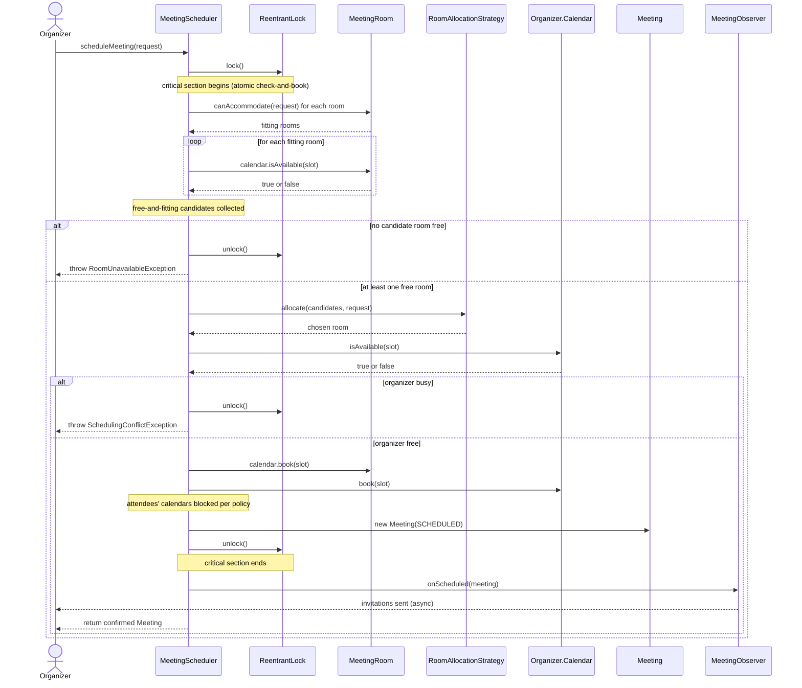
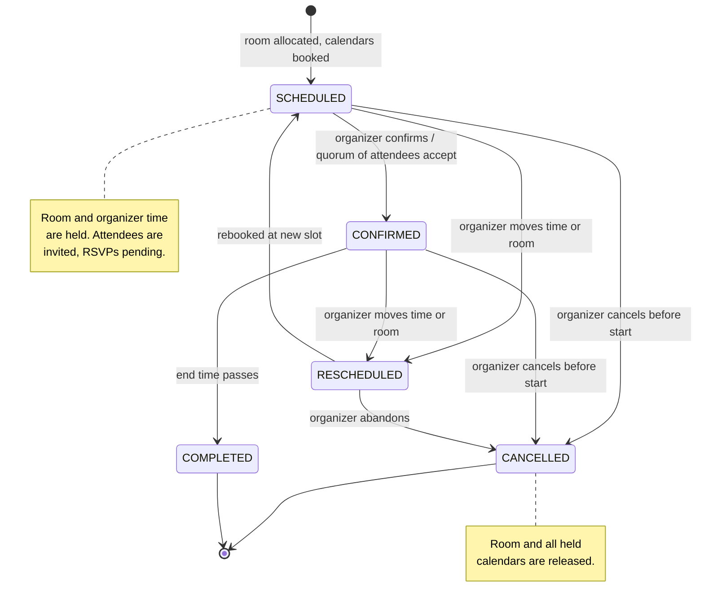

# 📅 Low-Level Design: Meeting Scheduler

> A complete, interview-ready walkthrough of the classic **Meeting Scheduler / Calendar Booking** design problem (the "design Google Calendar / Outlook / Calendly room booking" question) — from a blank whiteboard to a staff-level system that lets an organizer pick a time, auto-find a free conference room that fits everyone, invite attendees, and confirm a meeting, while guaranteeing that **no room and no person is ever double-booked for an overlapping time interval**.

At first glance a meeting scheduler looks like a to-do list with clocks: type a subject, pick a start and end time, hit save. That surface simplicity is exactly why interviewers reach for it — because the correct model hides a problem that is quietly harder than "book one seat" or "reserve one parking spot." A meeting occupies a **time interval**, and the same physical resource — a conference room, a person's calendar — is booked and re-booked all day long across many non-overlapping intervals. The system must guarantee that no two meetings that share even a single minute ever land on the same room or the same attendee. A candidate who models a room's availability as a boolean `isBusy` flag has already lost: that flag cannot express "booked 10:00–10:30 but free at 11:00," and it collapses the instant two organizers race for the last free room at 2 p.m. A candidate who recognizes the real bookable unit as **a time interval on a resource's calendar**, checked for overlap and committed atomically, writes a system that stays correct when a whole company tries to book the same three rooms for the Monday-morning standup rush. This guide walks the entire journey: it opens with the beginner's mental model of rooms, people, and time slots, and escalates naturally into interval-overlap reasoning, calendar data structures, conflict detection, room auto-allocation, recurring meetings, distributed calendars, and the multi-region scale a principal engineer raises in the closing minutes.

---

## 📋 Table of Contents

**Part I — Framing the Problem**

1. [Problem Statement](#1-problem-statement)
2. [Requirement Clarification & Assumptions](#2-requirement-clarification--assumptions)
3. [Functional & Non-Functional Requirements](#3-functional--non-functional-requirements)
4. [Core Concepts Being Tested](#4-core-concepts-being-tested)

**Part II — Modeling the Domain**

5. [Domain Model & Entities](#5-domain-model--entities)
6. [CRC Cards](#6-crc-cards)
7. [UML Class Diagram](#7-uml-class-diagram)
8. [Package Structure](#8-package-structure)

**Part III — Design Rationale**

9. [Design Decisions & Trade-offs](#9-design-decisions--trade-offs)
10. [Class-by-Class Deep Dive](#10-class-by-class-deep-dive)
11. [Design Patterns Applied](#11-design-patterns-applied)
12. [SOLID Principles Mapping](#12-solid-principles-mapping)

**Part IV — Behavior & Diagrams**

13. [Sequence Diagram](#13-sequence-diagram)
14. [State Diagram](#14-state-diagram)

**Part V — The Implementation**

15. [Complete Java Implementation](#15-complete-java-implementation)
16. [Execution Flow & Code Walkthrough](#16-execution-flow--code-walkthrough)

**Part VI — Engineering Depth**

17. [Complexity Analysis](#17-complexity-analysis)
18. [Thread Safety & Concurrency](#18-thread-safety--concurrency)
19. [Error Handling & Validation](#19-error-handling--validation)
20. [Scalability Discussion](#20-scalability-discussion)
21. [Alternative Designs & Trade-offs](#21-alternative-designs--trade-offs)

**Part VII — Interview Mastery**

22. [Common FAANG Follow-up Questions (L4 → L6)](#22-common-faang-follow-up-questions-l4--l6)
23. [Common Design Mistakes](#23-common-design-mistakes)
24. [Testing Strategy](#24-testing-strategy)
25. [FAANG Q&A Section](#25-faang-qa-section)
26. [STAR Behavioral Questions](#26-star-behavioral-questions)
27. [⚡ Quick Revision Cheat Sheet](#27--quick-revision-cheat-sheet)

---

## 1. Problem Statement

Design the backend for a **meeting scheduler** — the software behind the "New Event" button in Google Calendar, Microsoft Outlook, or a room-booking panel like the ones mounted outside conference rooms. An organizer opens the app, types a subject ("Q3 Planning"), picks a start and end time ("Tuesday 10:00 to 11:00"), and adds a list of attendees. The system finds a conference room that is free for that entire interval, large enough to seat everyone, and equipped with whatever the meeting needs (a projector, video-conferencing gear), books that room and blocks the time on every attendee's calendar, and sends out invitations. If no room fits, or if the organizer or an attendee is already busy at that time, the system reports the conflict instead of silently double-booking. Attendees can accept or decline; the organizer can cancel or reschedule, which frees the room and the attendees' time again.

The system coordinates several concerns at once — a **directory** of users and rooms, an **availability** layer that answers "is this room / this person free from 10:00 to 11:00?", an **allocation** step that picks the best room among the free ones, a **notification** fan-out to attendees, and support for **recurring** meetings ("every Monday at 9"). But the beating heart, the reason this problem is asked, is **conflict-free interval booking**: every room and every person owns a **calendar** — a set of time intervals that must never overlap — and the system must guarantee that adding a new meeting never creates an overlap on any resource it touches, even when many organizers race to grab the same room at the same instant.

<details>
<summary>📖 <b>In plain terms — what are we actually building?</b></summary>

Picture booking a conference room at work. You open the calendar app, type "Design Review," choose 3:00 to 4:00 this Thursday, and add four coworkers. The app checks which of the building's rooms are empty during that hour and can seat five people, grabs one ("Room Everest — 6 seats, has a TV"), puts the meeting on your calendar and everyone else's, and emails them an invite with an Accept/Decline button. If someone is already in another meeting at 3:00, or every suitable room is taken, it tells you right away so you can pick another time. Our job is the *brains* behind that: the objects and rules that track which room and which person is busy during which time interval, that grab a free room the moment you book so nobody else takes it, and that free everything back up if you cancel. We are not building the calendar UI, the email service, or the video-call software — we are building the server-side logic that decides who gets which room for which slice of time, and never books two things into the same room or person at once.

</details>

The deliverable in an interview is not a running product; it is a **clean object-oriented model** — the entities (User, MeetingRoom, Meeting, Calendar, TimeSlot), their responsibilities, and above all the **conflict-detection-and-booking mechanism** that makes concurrent scheduling over time intervals safe — plus a clear story for **how a meeting moves from requested, to a room being allocated, to confirmed (or rejected for conflict), and later cancelled or rescheduled**. Grading centers on whether you spot that availability is an interval-overlap problem rather than a single flag, how you make "check for conflicts then book" atomic across a room *and* every attendee, and how gracefully the design absorbs new allocation rules, recurring events, time zones, and the scale of a company-wide or planet-wide calendar.

---

## 2. Requirement Clarification & Assumptions

The single biggest mistake candidates make is coding before scoping. A strong candidate spends the first few minutes turning "design a meeting scheduler" into a bounded problem — and, crucially, surfaces the *interval-overlap availability* question early so the rest of the design can be built around it. Below is the clarification dialogue you should drive, framed as the questions to ask and the assumptions to lock in.

### 2.1 Actors

The people and systems that interact with the scheduler define its surface area.

| Actor | Role in the system |
|-------|--------------------|
| **Organizer** | Creates a meeting: picks a time interval, adds attendees, states capacity and equipment needs; can cancel or reschedule. |
| **Attendee** | Is invited to a meeting, sees it on their calendar, and responds (accept, decline, tentative). |
| **Admin / Facilities** | Registers meeting rooms, sets their capacity, location, and features (projector, video conferencing). |
| **Notification Provider** | External email / calendar-invite / push service that delivers invitations, updates, and cancellations. |
| **System / Scheduler** | Background workers that generate recurring-meeting instances, send reminders, and reclaim rooms from cancelled meetings. |

### 2.2 Key Clarifying Questions

Before modeling anything, resolve these with the interviewer. Each answer materially changes the design.

- **What is the resource we book, and what is the unit of booking?** — Both **rooms and people** are bookable resources, and the unit is a **time interval** on their calendar, not a whole day. *(Assumption: every room and every user owns a `Calendar` of booked `TimeSlot`s; booking a meeting reserves the same interval on the room and on every attendee.)*
- **How do we represent whether a resource is free?** — This is *the* question; drive it early. *(Assumption: availability is expressed as a set of booked intervals per calendar; a resource is "free" for a requested slot if that slot overlaps none of its existing bookings. We do **not** use a per-resource boolean flag.)*
- **Is the interval half-open or closed?** — Does a meeting ending at 11:00 conflict with one starting at 11:00? *(Assumption: intervals are **half-open `[start, end)`** — a meeting from 10:00 to 11:00 and one from 11:00 to 12:00 do **not** conflict. This is the industry convention and it eliminates off-by-one boundary bugs.)*
- **Does the system pick the room, or does the user?** — *(Assumption: the user states requirements — capacity and features — and the system **auto-allocates** the best free room via a pluggable strategy; picking a specific named room is a special case of this.)*
- **Must attendees be free too, or only the room?** — *(Assumption: by default the organizer must be free and the room must be free; attendee conflicts are surfaced as warnings but do not block booking, because in practice people are double-booked and decline later. We make this a policy knob.)*
- **What defines a conflict?** — *(Assumption: two meetings conflict if and only if their time intervals **overlap** on a shared resource — the same room, or the same person. Overlap is strict interval intersection under the half-open convention.)*
- **Do we support recurring meetings?** — "Every weekday at 9." *(Assumption: yes, via a recurrence rule that expands into individual meeting instances; each instance is booked and conflict-checked independently. Infinite recurrence is materialized lazily up to a horizon.)*
- **Time zones?** — *(Assumption: all times are stored as absolute instants (UTC) and rendered in each user's local zone at the edge; the core booking logic never reasons about wall-clock strings. We note this rather than build a full tz engine.)*
- **Concurrency and scale?** — *(Assumption: many organizers may book simultaneously; "check free then book" must be atomic per resource. Scale ranges from a single company (thousands of rooms) to a global calendar (billions of events), and the design must not serialize all bookings through one global lock.)*

### 2.3 Explicit Non-Goals

Naming what you will *not* build is a senior signal — it shows you can bound scope deliberately rather than by omission.

- No UI, calendar grid rendering, or drag-to-resize interactions — we design the server-side model and services.
- No real email / SMS / calendar-invite delivery; notifications go through a `NotificationService` seam.
- No user authentication, accounts, or org-chart permissions beyond a `User` identity.
- No free/busy *suggestion* engine that proposes the best common slot across many calendars in v1 — we design the primitives it would sit on and note it as an extension.
- No full time-zone or daylight-saving library; we assume absolute instants and delegate rendering to the edge.
- No external calendar federation (syncing with a personal Google or iCloud calendar) in v1.
- No pricing, approvals, or catering — a meeting room is free to book if it's available.

<details>
<summary>📖 <b>Why spend so long on clarification?</b></summary>

The prompt "design a meeting scheduler" is intentionally broad, and one question reshapes the entire design: "how do we represent whether a room or person is available?" The moment you answer *a set of time intervals we test for overlap* rather than *a single busy flag*, the interview pivots away from CRUD and toward interval-overlap reasoning and calendar data structures — the concepts everything else hangs on. The second high-value clarification is "half-open or closed intervals?" — because getting the boundary convention right (a 10–11 meeting doesn't block an 11–12 one) is the difference between a design that works and one riddled with off-by-one conflicts. Asking these upfront signals you know where the difficulty actually is, and it sets up the staff-level follow-ups on recurring events, distributed calendars, and multi-region consistency.

</details>

---

## 3. Functional & Non-Functional Requirements

### 3.1 Functional Requirements (what the system *does*)

These are the concrete behaviors the system must support. In an interview, list them crisply — they become your checklist for the class design.

1. **Find available rooms** — given a time interval, a required capacity, and required features, return the rooms that are free for the *entire* interval and satisfy the constraints.
2. **Schedule a meeting** — reserve a free room and block the interval on the organizer's (and attendees') calendars, atomically, so the same room is never double-booked.
3. **Detect conflicts** — reject a booking whose interval overlaps an existing booking on the chosen room or on the organizer's calendar.
4. **Invite attendees** — attach a list of attendees to a meeting and record each one's RSVP (pending, accepted, declined, tentative).
5. **Notify** — send an invitation on scheduling, an update on reschedule, and a notice on cancellation to all attendees.
6. **Cancel a meeting** — release the room and the attendees' blocked time, and notify everyone.
7. **Reschedule a meeting** — move it to a new interval and/or room, which is a conflict-checked release-and-rebook.
8. **Support recurring meetings** — expand a recurrence rule (daily, weekly) into individual instances, each independently booked and conflict-checked.
9. **Query a calendar** — return all meetings on a user's or room's calendar within a window.

### 3.2 Non-Functional Requirements (how *well* it does it)

These qualities separate a passing design from a staff-level one. Call them out explicitly.

- **Correctness (no double-booking).** The core invariant: no two meetings that overlap in time ever occupy the same room or the same person. This must hold under concurrent bookings — it is the property everything else serves.
- **Consistency under concurrency.** "Check availability, then reserve" must be atomic per resource; two organizers racing for the last free room must produce exactly one winner.
- **Low-latency availability queries.** Finding free rooms for a slot is a read-heavy, interactive operation and should be fast — better than scanning every meeting ever created.
- **Extensibility.** New room-allocation policies, notification channels, and recurrence rules should slot in without editing the booking core (Open/Closed).
- **Availability & resilience.** A slow notification provider or a down replica must not block or corrupt the booking path.
- **Scalability.** From one building to a global calendar: the design must partition naturally (by room, by user) so hot resources don't serialize globally.
- **Auditability.** Every schedule, cancel, and reschedule should be reconstructable — who booked what, when, and why it was rejected.

<details>
<summary>📖 <b>Functional vs non-functional — what's the difference here?</b></summary>

Functional requirements are the *verbs* — find a room, book it, invite people, cancel. If you handed the design to a tester, these are the buttons they'd click and the outcomes they'd check. Non-functional requirements are the *adverbs* — book it *correctly even when two people click at once*, answer "which rooms are free?" *quickly*, add a new room-picking rule *without breaking the booker*. In this problem the non-functional side is where the interview actually lives: any beginner can store a list of meetings, but keeping the "no overlapping meeting on the same room or person" invariant true under a Monday-morning rush of simultaneous bookings is the staff-level challenge, and it drives nearly every design decision that follows.

</details>

---

## 4. Core Concepts Being Tested

This problem is a favorite because it quietly probes a dense cluster of design skills. Knowing what's being graded lets you steer the conversation toward the high-value ground.

**Interval modeling and overlap.** The central intellectual test: recognizing that a meeting is a **time interval**, that availability is the absence of overlapping intervals, and that the half-open `[start, end)` convention makes boundary cases (back-to-back meetings) fall out cleanly. Candidates who model time as a boolean flag or a single "busy day" never recover.

**The right data structure for a calendar.** Storing bookings so that "does this slot conflict?" is fast. A naive list is O(n) per check; a `TreeMap` keyed by start time turns it into O(log n) via nearest-neighbor lookup. Choosing and justifying this is a strong signal.

**Atomic check-then-act under concurrency.** Booking is the textbook race condition: two threads both see a room free, both book it, and it's double-booked. The interview pushes on locking granularity — one global lock (correct but serial) versus per-resource locks (concurrent but deadlock-prone) — and on ordering locks to avoid deadlock when a booking touches multiple calendars.

**Separation of concerns / patterns.** Keeping conflict detection, room allocation, notification, and orchestration in distinct, swappable pieces — Strategy for allocation, Observer for notification, a Facade to coordinate — so the design flexes as requirements grow.

**Escalation to scale.** How the single-JVM model becomes a distributed calendar: sharding by resource, moving locks to Redis or a database, handling recurring events at scale, and reasoning about consistency across regions.

<details>
<summary>📖 <b>What's the one idea to anchor on?</b></summary>

If you internalize a single thing, make it this: **a meeting is a half-open time interval on a resource's calendar, and the whole design exists to guarantee those intervals never overlap on the same room or person.** Everything else — the TreeMap that makes conflict checks fast, the lock that makes booking atomic, the strategy that picks a room, the observer that sends invites — is machinery in service of that one invariant. When an interviewer pushes you with "what if two people book at once?" or "what about recurring meetings?" you can always return to this anchor: does the change preserve the no-overlap guarantee, and is the check-and-book still atomic? Keeping that north star in view is what turns a scattered answer into a coherent, senior one.

</details>

---

## 5. Domain Model & Entities

With the problem scoped, we translate the nouns of the domain into objects. The art here is drawing boundaries so each entity owns exactly one clear responsibility — and, above all, so the interval-overlap logic lives in one place rather than being smeared across the codebase.

### 5.1 The entities and why each exists

**`TimeSlot`** — an immutable half-open interval `[start, end)` of absolute instants. This is the atom of the whole system. It owns the one piece of logic everything depends on: `overlaps(other)`. By putting overlap detection in a value object, no other class ever writes raw time comparisons, which is exactly where boundary bugs breed. It is immutable because a booked interval must never change under you.

**`Calendar`** — the schedule of a single resource (a room or a user). It holds that resource's booked `TimeSlot`s and answers two questions: "are you free for this slot?" (`isAvailable`) and "book this slot" (`book`) / "release it" (`cancel`). Internally it keeps bookings in a structure that makes overlap checks fast. Every `MeetingRoom` and every `User` *has-a* `Calendar` — this is the reused availability engine.

**`User`** — a person who can organize or attend meetings. Owns an identity (id, name, email) and a `Calendar` of the meetings they're part of. The organizer's calendar is checked and booked; attendees' calendars are blocked according to policy.

**`MeetingRoom`** — a physical, bookable room. Owns a capacity, a location, a set of `RoomFeature`s (projector, video conferencing), and a `Calendar`. The `find available rooms` step filters rooms by capacity and features, then asks each candidate's calendar if it's free.

**`Meeting`** — a scheduled event: a subject, a `TimeSlot`, an organizer, a list of attendees with their RSVP status, the allocated `MeetingRoom`, and a lifecycle `MeetingStatus`. It is the thing that gets created, confirmed, cancelled, or rescheduled.

**`Attendee` (or an RSVP record)** — the association between a `User` and a `Meeting`, carrying the response (`PENDING`, `ACCEPTED`, `DECLINED`, `TENTATIVE`). Modeling this as its own small object keeps per-attendee state off the `User` and off the `Meeting`'s core fields.

**`RoomAllocationStrategy`** — the pluggable policy that, given the free-and-fitting rooms, picks *which one* to book (smallest room that fits, nearest, cheapest). Isolating this behind an interface is what lets allocation rules change without touching the booking core.

**`MeetingScheduler`** — the orchestrating **facade**. It coordinates the whole flow: filter rooms, check the organizer's calendar, allocate a room, book atomically, persist the meeting, and notify attendees. Clients talk only to this.

**`NotificationService` / `MeetingObserver`** — the seam that fans out invitations, updates, and cancellations to attendees without the scheduler knowing how a message is delivered.

### 5.2 Relationships at a glance

A `MeetingScheduler` manages many `MeetingRoom`s and `User`s and produces `Meeting`s. Each `MeetingRoom` and each `User` **has-a** `Calendar`; each `Calendar` **contains** many `TimeSlot`s. A `Meeting` **references** one organizer (`User`), one allocated `MeetingRoom`, many `Attendee`s (each wrapping a `User`), and one `TimeSlot`. The `MeetingScheduler` **uses-a** `RoomAllocationStrategy` and **notifies** a list of `MeetingObserver`s.

<details>
<summary>📖 <b>How do these objects relate, in plain terms?</b></summary>

Think of it as three layers. At the bottom is the `TimeSlot` — just a start and end time that knows how to say "do I overlap with you?" One level up, every room and every person carries a `Calendar`, which is really just a bag of the time slots they're already booked for, plus the ability to answer "am I free from 3 to 4?" At the top, the `MeetingScheduler` is the coordinator you actually talk to: you hand it a subject, a time, and a guest list, and it walks the rooms, finds one that's free and big enough, blocks that hour on the room's calendar and everyone's calendars, and tells the notifier to send invites. The `Meeting` object is just the record of what got booked. Keeping "does this overlap?" down in `TimeSlot` and "am I free?" in `Calendar` means the coordinator never has to fiddle with raw clock math.

</details>

### 5.3 Enumerations

Two enums (plus a room-feature set) capture the fixed vocabularies:

- **`MeetingStatus`** — `SCHEDULED`, `CONFIRMED`, `CANCELLED`, `RESCHEDULED`, `COMPLETED`. The lifecycle of a meeting.
- **`RSVPStatus`** — `PENDING`, `ACCEPTED`, `DECLINED`, `TENTATIVE`. Each attendee's response.
- **`RoomFeature`** — `PROJECTOR`, `VIDEO_CONFERENCING`, `WHITEBOARD`, `PHONE`. Capabilities a meeting may require.

---

## 6. CRC Cards

CRC (Class–Responsibility–Collaborator) cards are the whiteboard tool for pinning down *who does what* before any code exists. Each card names a class, its handful of responsibilities, and the collaborators it leans on. If a card's responsibility list grows long or vague, that's your cue the class is doing too much.

| **TimeSlot** | |
|---|---|
| **Responsibilities** | Represent an immutable half-open interval `[start, end)`; decide whether it `overlaps` another slot; expose duration. |
| **Collaborators** | — (pure value object) |

| **Calendar** | |
|---|---|
| **Responsibilities** | Hold a resource's booked slots; answer `isAvailable(slot)`; `book(slot)` and `cancel(slot)` while preserving the no-overlap invariant; list bookings in a window. |
| **Collaborators** | TimeSlot |

| **User** | |
|---|---|
| **Responsibilities** | Hold identity (id, name, email); own the person's `Calendar`; act as organizer or attendee. |
| **Collaborators** | Calendar |

| **MeetingRoom** | |
|---|---|
| **Responsibilities** | Hold capacity, location, and features; own the room's `Calendar`; report whether it satisfies a capacity/feature requirement. |
| **Collaborators** | Calendar, RoomFeature |

| **Meeting** | |
|---|---|
| **Responsibilities** | Bundle subject, time slot, organizer, attendees, allocated room, and status; enforce valid status transitions; track RSVPs. |
| **Collaborators** | TimeSlot, User, MeetingRoom, Attendee, MeetingStatus |

| **Attendee** | |
|---|---|
| **Responsibilities** | Associate a User with a Meeting and carry the RSVP response. |
| **Collaborators** | User, RSVPStatus |

| **RoomAllocationStrategy** | |
|---|---|
| **Responsibilities** | Given the free-and-fitting rooms for a request, choose which one to book. |
| **Collaborators** | MeetingRoom, MeetingRequest |

| **MeetingScheduler** | |
|---|---|
| **Responsibilities** | Orchestrate scheduling: filter rooms, check organizer availability, allocate a room, book atomically, persist, notify; handle cancel and reschedule. |
| **Collaborators** | MeetingRoom, User, Calendar, RoomAllocationStrategy, MeetingObserver, Meeting |

| **MeetingObserver / NotificationService** | |
|---|---|
| **Responsibilities** | React to meeting lifecycle events by delivering invitations, updates, and cancellations to attendees. |
| **Collaborators** | Meeting, User |

<details>
<summary>📖 <b>What problem do CRC cards actually solve?</b></summary>

Before you draw a single arrow or write a class, CRC cards force a cheap sanity check: can you state each class's job in one or two lines? If you can't — if the card for `MeetingScheduler` sprawls into overlap math and email formatting and room-picking rules — the design is telling you those jobs belong in separate classes (`Calendar`, `NotificationService`, `RoomAllocationStrategy`). Here the cards make the split obvious: `TimeSlot` owns overlap, `Calendar` owns availability, the strategy owns room choice, the scheduler only *coordinates*. That single-responsibility discipline, caught on an index card in thirty seconds, is far cheaper than discovering it after you've written the code.

</details>

---

## 7. UML Class Diagram

The ASCII diagram below shows the static structure — classes, key fields, key methods, and how they connect. Every name here matches the Java implementation in Section 15 exactly; keep this as your map while reading the code.

```
┌───────────────────────────────────────────────────────────────────────────┐
│                            MeetingScheduler (Facade)                        │
├───────────────────────────────────────────────────────────────────────────┤
│ - rooms: List<MeetingRoom>                                                  │
│ - users: Map<String, User>                                                  │
│ - meetings: Map<String, Meeting>                                            │
│ - allocationStrategy: RoomAllocationStrategy                                │
│ - observers: List<MeetingObserver>                                          │
│ - lock: ReentrantLock                                                        │
├───────────────────────────────────────────────────────────────────────────┤
│ + scheduleMeeting(req: MeetingRequest): Meeting                             │
│ + cancelMeeting(meetingId: String): void                                    │
│ + rescheduleMeeting(meetingId: String, newSlot: TimeSlot): Meeting          │
│ + findAvailableRooms(slot, capacity, features): List<MeetingRoom>           │
│ + respond(meetingId: String, userId: String, rsvp: RSVPStatus): void        │
│ + addObserver(o: MeetingObserver): void                                     │
└───────────────────────────────────────────────────────────────────────────┘
        │ uses                    │ manages *              │ notifies *
        v                         v                        v
┌──────────────────────┐  ┌───────────────────┐  ┌──────────────────────────┐
│«interface»            │  │   MeetingRoom     │  │ «interface»               │
│ RoomAllocationStrategy│  ├───────────────────┤  │   MeetingObserver         │
├──────────────────────┤  │ - id: String      │  ├──────────────────────────┤
│ + allocate(rooms,     │  │ - name: String    │  │ + onScheduled(m: Meeting) │
│     req): MeetingRoom │  │ - capacity: int   │  │ + onCancelled(m: Meeting) │
└──────────────────────┘  │ - location: String│  │ + onRescheduled(m)        │
        △                 │ - features: Set    │  └──────────────────────────┘
        │ implements      │ - calendar: Calendar│            △ implements
┌───────┴────────────┐   ├───────────────────┤   ┌────────┴─────────────────┐
│SmallestRoomStrategy│   │ + canAccommodate  │   │  EmailNotificationService │
│NearestRoomStrategy │   │     (req): boolean│   └───────────────────────────┘
└────────────────────┘   └─────────┬─────────┘
                                   │ has-a
                                   v
                         ┌─────────────────────────┐         ┌──────────────────┐
                         │        Calendar         │◇────────│     TimeSlot     │
                         ├─────────────────────────┤ contains├──────────────────┤
                         │ - bookings:             │    *    │ - start: Instant │
                         │     TreeMap<Instant,    │         │ - end: Instant   │
                         │       TimeSlot>         │         ├──────────────────┤
                         ├─────────────────────────┤         │ + overlaps(o):   │
                         │ + isAvailable(slot):bool│         │     boolean      │
                         │ + book(slot): void      │         │ + durationMinutes │
                         │ + cancel(slot): void    │         │     (): long     │
                         │ + bookingsIn(window)    │         └──────────────────┘
                         └─────────────────────────┘
                                   △ has-a
                                   │
        ┌──────────────────────────┴───────────────┐
        │                                           │
┌───────────────┐                          ┌─────────────────────────────┐
│     User      │                          │          Meeting            │
├───────────────┤                          ├─────────────────────────────┤
│ - id: String  │                          │ - id: String                │
│ - name: String│◄──── organizer 1 ────────│ - subject: String           │
│ - email:String│                          │ - slot: TimeSlot            │
│ - calendar:   │◄──── attendees * ─────────│ - organizer: User           │
│     Calendar  │                          │ - attendees: List<Attendee> │
└───────────────┘                          │ - room: MeetingRoom         │
        △ wraps                             │ - status: MeetingStatus     │
        │                                   ├─────────────────────────────┤
┌───────┴────────┐                          │ + confirm() / cancel()      │
│   Attendee     │◄──── contains * ──────────│ + reschedule(slot, room)    │
├────────────────┤                          └─────────────────────────────┘
│ - user: User   │
│ - rsvp:RSVPStatus│      Enums: MeetingStatus{SCHEDULED,CONFIRMED,CANCELLED,
└────────────────┘             RESCHEDULED,COMPLETED}  RSVPStatus{PENDING,
                               ACCEPTED,DECLINED,TENTATIVE}  RoomFeature{
                               PROJECTOR,VIDEO_CONFERENCING,WHITEBOARD,PHONE}
```

Read it top-down: the `MeetingScheduler` facade sits at the apex, holding rooms, users, and meetings, and delegating room choice to a `RoomAllocationStrategy` and delivery to `MeetingObserver`s. Every `MeetingRoom` and `User` composes a `Calendar`, which in turn contains `TimeSlot`s — the availability engine reused across both resource kinds. A `Meeting` ties an organizer, attendees, a room, and a slot together under a status.

---

## 8. Package Structure

A clean package layout mirrors the design's boundaries and makes the dependency direction obvious: models depend on nothing, strategies and services depend on models, and the top-level scheduler wires them together.

```
com.scheduler
├── model
│   ├── TimeSlot.java            // immutable [start, end) interval + overlap
│   ├── Calendar.java            // per-resource booked slots + availability
│   ├── User.java                // person with a calendar
│   ├── MeetingRoom.java         // bookable room with capacity/features/calendar
│   ├── Meeting.java             // the scheduled event + lifecycle
│   ├── Attendee.java            // User + RSVP association
│   ├── MeetingRequest.java      // the input DTO for a scheduling request
│   ├── MeetingStatus.java       // enum
│   ├── RSVPStatus.java          // enum
│   └── RoomFeature.java         // enum
│
├── allocation
│   ├── RoomAllocationStrategy.java   // «interface»
│   ├── SmallestRoomStrategy.java     // smallest room that fits
│   └── NearestRoomStrategy.java      // closest to organizer
│
├── notification
│   ├── MeetingObserver.java          // «interface»
│   └── EmailNotificationService.java // concrete observer
│
├── exception
│   ├── RoomUnavailableException.java
│   ├── SchedulingConflictException.java
│   └── MeetingNotFoundException.java
│
├── service
│   └── MeetingScheduler.java    // the facade / orchestrator
│
└── Demo.java                    // runnable end-to-end example
```

The dependency arrows point inward toward `model`: `allocation`, `notification`, and `service` all depend on the model, but the model depends on none of them. This is the Dependency Inversion Principle expressed as package layout — the stable core (entities and the calendar engine) knows nothing about the policies that use it.

<details>
<summary>📖 <b>Why bother splitting into packages?</b></summary>

Packages are how you keep a growing design from turning into a single tangled folder where everything can reach everything. The rule of thumb on display here is "dependencies point toward the core": the `model` package (rooms, users, calendars, time slots) doesn't import anything else, so it stays stable and testable in isolation, while the swappable policies — how to pick a room, how to notify people — live in their own packages that depend *on* the model, never the other way around. When an interviewer asks "where would demand-based room pricing go?" you can point at the `allocation` package and say "a new strategy class, no change to the core," which is exactly the answer they're listening for.

</details>

---

## 9. Design Decisions & Trade-offs

Every meaningful design is a chain of deliberate choices. Here are the ones that define this system, each stated as the decision, the alternative, and why we land where we do — this is the reasoning an interviewer wants to hear out loud.

### 9.1 Availability as a set of intervals, not a boolean flag

The foundational choice. A `MeetingRoom` does not carry an `isBusy` boolean; it carries a `Calendar` of booked `TimeSlot`s, and "free from 3 to 4?" is answered by testing overlap against those slots. A boolean cannot express "booked 10–10:30, free at 11," and it makes any two bookings on the same room mutually exclusive for all time. The interval model is the only representation that captures the reality of a room being booked and re-booked all day. The cost is that a conflict check is no longer O(1) on a flag — it's a search over intervals — which motivates the next decision.

### 9.2 TreeMap-backed calendar for fast overlap checks

We store each calendar's bookings in a `TreeMap<Instant, TimeSlot>` keyed by start time. To test a candidate slot `[s, e)`, we only need to inspect the booking that starts just before `s` (via `floorKey`) and the one that starts just at-or-after `s` (via `ceilingKey`) — because intervals are sorted and, in a conflict-free calendar, non-overlapping. That's O(log n) per check instead of O(n) scanning every booking. The alternative — a plain `List<TimeSlot>` scanned linearly — is simpler and fine for a handful of meetings, but degrades on a busy room with hundreds of daily slots. We choose the TreeMap and note the list as the "small n" simplification.

### 9.3 Half-open intervals `[start, end)`

A meeting ending at 11:00 must not conflict with one starting at 11:00. We enforce this by defining every `TimeSlot` as half-open: the end instant is exclusive. Overlap is then the clean predicate `this.start < other.end && other.start < this.end`. The alternative — closed intervals with `<=` comparisons — creates a false conflict at every shared boundary and forces awkward "minus one second" hacks. Half-open is the industry convention (it's how database range types and calendar standards work) and it makes back-to-back meetings just work.

### 9.4 Room allocation behind a Strategy interface

The system, not the user, picks the room — but *how* it picks is policy that changes. "Smallest room that still fits" conserves large rooms for large meetings; "nearest to the organizer" optimizes walking time; "cheapest" matters if rooms are charged. We put this behind a `RoomAllocationStrategy` interface so a new rule is a new class, injected at construction, with zero change to the booking flow. The alternative — an `if/else` chain inside the scheduler — violates Open/Closed and turns every new policy into a risky edit of the concurrency-critical core.

### 9.5 A single coarse lock first, per-resource locks as the scaling story

For correctness in a single JVM, the simplest safe choice is one `ReentrantLock` around the check-and-book critical section: two threads cannot both see the last room free and both book it. This serializes *all* bookings, which is fine at small scale and unambiguously correct. The staff-level answer then refines it: lock **per resource** (per room, per user) so unrelated bookings proceed in parallel, and **acquire multiple locks in a consistent global order** (e.g., by resource id) to avoid deadlock when a booking touches a room plus several attendees. We implement the correct coarse lock and explain the refinement — showing you know both the safe default and the optimization.

### 9.6 Attendee conflicts warn, room and organizer conflicts block

A hard rule that any attendee being busy blocks the meeting is unrealistic — people are perpetually double-booked and simply decline. So by default we hard-block only on the **room** (a physical resource that genuinely can't be in two meetings) and the **organizer** (who must be present), and we surface attendee conflicts as informational. This is a policy knob, not a law, so an interviewer who wants strict "everyone must be free" gets a one-line change.

### 9.7 Notification via Observer, decoupled from booking

When a meeting is scheduled, attendees must be told — but the scheduler shouldn't know or care whether that's email, a push notification, or a calendar-invite file. We fan out through `MeetingObserver`s. This keeps the booking path fast (notification can be async), lets us add channels without touching the scheduler, and means a slow or failing notifier never corrupts a booking.

<details>
<summary>📖 <b>Which decision matters most?</b></summary>

If you take away one decision, take the first: modeling availability as a *set of time intervals* rather than a busy/free flag. Everything senior about this design flows from it. Because availability is intervals, you need a smart data structure to check overlap quickly (the TreeMap). Because bookings are intervals on a shared resource, two people can race to insert overlapping ones, so you need atomic check-and-book (the lock). Because the boundary between two intervals matters, you need the half-open convention. A candidate who starts with a boolean flag never reaches any of these conversations — the flag quietly makes the hard problems disappear along with the correctness. Getting the interval model right is what earns you the rest of the interview.

</details>

---

## 10. Class-by-Class Deep Dive

Now we walk each class in the order you'd build it — bottom-up, so every class rests on ones already explained. For each, we cover what it owns, the key methods, and the design reasoning that isn't obvious from the signature.

### 10.1 `TimeSlot` — the interval atom

`TimeSlot` wraps two `Instant`s, `start` and `end`, and is immutable and validated in the constructor (`end` must be strictly after `start`). Its reason to exist is the single method `overlaps(TimeSlot other)`, implemented as `start.isBefore(other.end) && other.start.isBefore(end)` — the half-open overlap test. A convenience `durationMinutes()` supports allocation and display. Because it's immutable and defines `equals`/`hashCode` on its endpoints, a slot can be safely used as a map key and shared across threads without synchronization. Concentrating all interval logic here means no other class ever compares raw instants — the number-one source of off-by-one bugs is designed out of existence.

### 10.2 `Calendar` — the per-resource availability engine

`Calendar` is the reused workhorse: both `MeetingRoom` and `User` own one. It holds a `TreeMap<Instant, TimeSlot>` keyed by each booking's start. `isAvailable(TimeSlot slot)` uses `floorKey(slot.start)` and `ceilingKey(slot.start)` to fetch only the neighbors that could possibly overlap and tests those — O(log n). `book(slot)` first re-checks availability (never trust a stale check) and then inserts; `cancel(slot)` removes. It exposes `bookingsIn(TimeSlot window)` for calendar-view queries via `subMap`. The class deliberately does *not* handle locking itself — that's the scheduler's job across multiple calendars — but its individual methods keep the calendar internally consistent.

### 10.3 `User` — organizer and attendee

`User` holds identity (`id`, `name`, `email`) and its own `Calendar`. When someone organizes a meeting, their calendar is conflict-checked and booked; when they attend, their calendar is blocked per policy. Keeping the calendar *on* the user (rather than in a global side table) means "is Alice free Tuesday at 10?" is a local question answered without scanning all meetings — the same interval engine the rooms use.

### 10.4 `MeetingRoom` — the physical resource

`MeetingRoom` carries `id`, `name`, `capacity`, `location`, a `Set<RoomFeature>`, and a `Calendar`. Its distinctive method is `canAccommodate(MeetingRequest req)` — does this room have enough seats and all the required features? The scheduler filters rooms with `canAccommodate` first (cheap, in-memory) and only then asks the survivors' calendars about the time slot (the more expensive overlap check). Separating "does it fit?" from "is it free?" keeps each check focused and lets the fit filter prune before the availability query.

### 10.5 `Meeting` — the scheduled event and its lifecycle

`Meeting` bundles `id`, `subject`, `slot`, `organizer`, `List<Attendee>`, allocated `room`, and `status`. It owns the lifecycle transitions — `confirm()`, `cancel()`, `reschedule(slot, room)`, `complete()` — each of which guards the current `status` so you cannot, for example, confirm an already-cancelled meeting. RSVP updates flow through `respond(user, status)`, which finds the matching `Attendee` and updates its response. Modeling status as an explicit enum with guarded transitions (rather than loose booleans) makes illegal states unrepresentable and gives the interviewer a clean state machine to probe.

### 10.6 `Attendee` — the RSVP association

A tiny but principled class: it pairs a `User` with an `RSVPStatus`. Rather than storing a `Map<User, RSVPStatus>` on the meeting or an RSVP field on the user (both of which leak concerns), the association gets its own object. This keeps `User` reusable across meetings and makes per-meeting response state a first-class, queryable thing.

### 10.7 `RoomAllocationStrategy` and its implementations

The interface declares one method: `MeetingRoom allocate(List<MeetingRoom> candidates, MeetingRequest req)`. `SmallestRoomStrategy` picks the smallest-capacity room that still fits (conserving big rooms); `NearestRoomStrategy` picks the one closest to the organizer's location. The scheduler holds a reference to whichever strategy was injected and calls it after filtering — it never hard-codes a choice rule. New policies drop in without touching the scheduler.

### 10.8 `MeetingScheduler` — the orchestrating facade

The one class clients touch. `scheduleMeeting(MeetingRequest)` runs the full flow inside the critical section: filter rooms by `canAccommodate`, keep those whose calendar `isAvailable` for the slot, ask the strategy to `allocate` one, verify the organizer is free, then `book` the slot on the room's and organizer's (and attendees') calendars, create and store the `Meeting`, and notify observers. `cancelMeeting` and `rescheduleMeeting` reverse or redo the bookings under the same lock. By centralizing the multi-resource, must-be-atomic operation here — and *only* here — the design has exactly one place where the no-double-booking invariant is enforced.

<details>
<summary>📖 <b>Why build it bottom-up like this?</b></summary>

Notice the order: `TimeSlot` first (it depends on nothing), then `Calendar` (which uses `TimeSlot`), then `User` and `MeetingRoom` (which each own a `Calendar`), then `Meeting` (which ties them together), and finally the `MeetingScheduler` that coordinates everything. Each class only ever refers *downward* to things already built, which is why the design compiles cleanly in your head as you read it and why you can unit-test the bottom layers in complete isolation — you can prove `TimeSlot.overlaps` and `Calendar.isAvailable` correct without ever constructing a scheduler or a meeting. Building and explaining in dependency order is a small habit that makes a design feel inevitable rather than arbitrary.

</details>

---

## 11. Design Patterns Applied

A senior candidate names patterns not to sound clever but because each one solves a concrete pressure in *this* problem. Here are the ones that earn their place, tied to the exact classes above.

**Facade — `MeetingScheduler`.** The scheduling flow touches many pieces (room filtering, calendars, allocation, notification). The facade gives clients a single, simple entry point (`scheduleMeeting`) and hides the multi-step coordination behind it. Without it, callers would have to orchestrate the sequence themselves and could easily skip the atomic check-and-book.

**Strategy — `RoomAllocationStrategy`.** How to pick a room among the free ones is a policy that varies (smallest-fit, nearest, cheapest). Strategy encapsulates each rule behind a common interface and lets it be swapped at construction, so a new policy never touches the booking core. This is the textbook Open/Closed win.

**Observer — `MeetingObserver` / `NotificationService`.** When a meeting is scheduled, changed, or cancelled, an open-ended set of parties needs to react (email attendees, update a room-display panel, log an audit event). Observer lets the scheduler publish lifecycle events without knowing or depending on who's listening, and new listeners register without editing the scheduler.

**Value Object — `TimeSlot`.** `TimeSlot` is an immutable, equality-by-value object that concentrates all interval logic. Making it a value object (not an entity with identity) means slots are freely shareable, thread-safe, and comparable, and it localizes the overlap rule to one place.

**Composite of Calendars (uniform availability).** By giving both `User` and `MeetingRoom` the *same* `Calendar` abstraction, the scheduler treats "is the room free?" and "is the organizer free?" through one uniform interface — a light application of treating heterogeneous resources uniformly. It's why the availability engine is written once and reused.

**(Extension) Factory / Builder for recurring meetings.** When recurrence is added, a `RecurrenceExpander` acts as a factory that produces individual `Meeting` instances from a rule — noted as the natural home for that logic.

<details>
<summary>📖 <b>Aren't patterns just jargon? Why name them?</b></summary>

The value isn't the vocabulary — it's that each pattern is a compressed answer to a design pressure the interviewer will poke at. When they ask "what if we want to pick the *nearest* room instead of the smallest?", "Strategy — new class, inject it, done" is a complete answer in four words. When they ask "how do you notify people without the booker depending on the email system?", "Observer" names the exact decoupling. Patterns let you and the interviewer share a shorthand for well-understood solutions, so you spend the conversation on the interesting parts (concurrency, scale) instead of re-deriving how to make room selection swappable. Naming them signals you've seen these pressures before and have a rehearsed, principled response.

</details>

---

## 12. SOLID Principles Mapping

SOLID isn't a checklist to recite; it's the vocabulary for *why* the class boundaries fall where they do. Here's how each principle shows up concretely.

**S — Single Responsibility.** Each class has exactly one reason to change. `TimeSlot` changes only if the overlap definition changes; `Calendar` only if the storage/availability strategy changes; `RoomAllocationStrategy` only if a picking rule changes; `NotificationService` only if delivery changes. The scheduler *coordinates* but delegates each concern, so it isn't the place where every requirement change lands.

**O — Open/Closed.** The design is open to extension, closed to modification. A new allocation rule is a new `RoomAllocationStrategy`; a new notification channel is a new `MeetingObserver`; a new recurrence type is a new expander. None of these require editing the concurrency-critical `MeetingScheduler`. Contrast with an `if (strategyType == ...)` chain, which you'd reopen for every new rule.

**L — Liskov Substitution.** Any `RoomAllocationStrategy` implementation is a drop-in for any other — the scheduler calls `allocate(...)` and correctly handles the contract (return a fitting room or signal none). Any `MeetingObserver` can stand in for another. No implementation strengthens preconditions or weakens the promised behavior, so substitution never breaks the caller.

**I — Interface Segregation.** Interfaces are minimal and focused. `RoomAllocationStrategy` exposes one method (`allocate`); `MeetingObserver` exposes only the lifecycle hooks a listener actually needs. No class is forced to implement methods it doesn't use — a notifier isn't burdened with allocation methods, and vice versa.

**D — Dependency Inversion.** The high-level `MeetingScheduler` depends on abstractions (`RoomAllocationStrategy`, `MeetingObserver`), not concretions (`SmallestRoomStrategy`, `EmailNotificationService`), and those are injected. The stable core (model + scheduler) knows nothing about the volatile policies that plug into it — which is exactly what the package layout in Section 8 enforces.

<details>
<summary>📖 <b>How do I bring up SOLID without sounding like a textbook?</b></summary>

Don't announce "now I'll apply SOLID." Instead, let it surface as *justification* when you make a boundary. When you pull room selection into a strategy, say "I'm doing this so a new picking rule doesn't force me to reopen the booking code — that's Open/Closed." When the interviewer asks why `TimeSlot` is its own class, "Single Responsibility — it owns overlap, and nothing else has a reason to touch interval math." Used this way, SOLID is the *reason* behind a decision you were making anyway, not a lecture bolted on top. That's the difference between a candidate who memorized the acronym and one who designs by it instinctively.

</details>

---

## 13. Sequence Diagram

The sequence below traces the marquee operation — an organizer scheduling a meeting — from the request landing at the facade to invitations going out. Notice where the lock opens and closes: the entire check-allocate-book span is one atomic critical section, which is what guarantees no double-booking under concurrency.



The key reading: notification happens **after** the lock is released. Booking is the fast, contended, correctness-critical part and stays inside the lock; sending emails is slow and best-effort, so it runs outside — a slow mail server can never stall or corrupt a booking.

<details>
<summary>📖 <b>Walk me through this flow in plain terms.</b></summary>

An organizer asks to book a meeting. The scheduler grabs a lock so no one else can book in parallel while it decides. It first throws out rooms that are too small or missing a projector, then asks each surviving room's calendar "are you free 3 to 4?" and keeps only the free ones. If none are free, it releases the lock and reports "no room available." Otherwise it lets the strategy pick the best free room, double-checks the organizer isn't already busy, and — still holding the lock — blocks that hour on the room's calendar and the organizer's calendar so the booking is now locked in. Only then does it release the lock and, separately, fire off the email invitations. Keeping the emails outside the lock is deliberate: they're slow and shouldn't hold up the next person trying to book.

</details>

---

## 14. State Diagram

A `Meeting` moves through a well-defined lifecycle, and modeling it as an explicit state machine — rather than a tangle of booleans — makes illegal transitions impossible and gives the interviewer a clean thing to probe. The diagram shows every legal transition.



Each transition is guarded in code by a method on `Meeting` that checks the current status before changing it. Attempting an illegal move — confirming a `CANCELLED` meeting, completing a `SCHEDULED` one before its end time — throws rather than silently corrupting state. The two crucial side-effecting transitions are the entry to `SCHEDULED` (resources are *held*) and the entry to `CANCELLED` (resources are *released*); getting those side effects exactly paired is what keeps calendars from leaking phantom bookings.

<details>
<summary>📖 <b>Why model this as a state machine at all?</b></summary>

You could track a meeting with a couple of booleans — `isCancelled`, `isConfirmed` — but that quickly allows nonsense states like "cancelled and confirmed at the same time," and every method has to remember to check the right combination. An explicit status enum with guarded transitions collapses that into one clear question: "am I allowed to go from my current state to this new one?" It makes the impossible states unrepresentable, gives you one obvious place to attach side effects (release the room exactly when you enter CANCELLED), and hands the interviewer a tidy diagram to interrogate — "what happens if someone cancels an already-completed meeting?" has a crisp answer: the guard rejects it.

</details>

---

## 15. Complete Java Implementation

Below is a complete, compilable, single-JVM implementation. It's organized bottom-up: the `TimeSlot` value object first, then the `Calendar` availability engine, then the resource entities (`User`, `MeetingRoom`), the enums and `Meeting`, the pluggable strategies and observers, the orchestrating `MeetingScheduler` facade, and finally a runnable `Demo`. Every class name, field, and method signature matches the diagrams above. Each block is collapsible so you can read the narrative first and dive into code on demand.

<details>
<summary>💻 <b>1. Enums, exceptions & the MeetingRequest DTO</b></summary>

```java
package com.scheduler.model;

// ----- Enums -----
public enum MeetingStatus {
    SCHEDULED, CONFIRMED, CANCELLED, RESCHEDULED, COMPLETED
}

public enum RSVPStatus {
    PENDING, ACCEPTED, DECLINED, TENTATIVE
}

public enum RoomFeature {
    PROJECTOR, VIDEO_CONFERENCING, WHITEBOARD, PHONE
}
```

```java
package com.scheduler.exception;

/** No room satisfies capacity/features and is free for the requested slot. */
public class RoomUnavailableException extends RuntimeException {
    public RoomUnavailableException(String msg) { super(msg); }
}

/** The room or organizer is already booked for an overlapping interval. */
public class SchedulingConflictException extends RuntimeException {
    public SchedulingConflictException(String msg) { super(msg); }
}

/** Referenced meeting id does not exist. */
public class MeetingNotFoundException extends RuntimeException {
    public MeetingNotFoundException(String msg) { super(msg); }
}
```

```java
package com.scheduler.model;

import java.util.EnumSet;
import java.util.List;
import java.util.Set;

/**
 * Immutable input to a scheduling request: what to book and for whom.
 * Kept separate from Meeting so the request (intent) and the result
 * (a booked Meeting) are distinct concepts.
 */
public final class MeetingRequest {
    private final String subject;
    private final TimeSlot slot;
    private final User organizer;
    private final List<User> attendees;
    private final int requiredCapacity;   // organizer + attendees, or explicit
    private final Set<RoomFeature> requiredFeatures;

    public MeetingRequest(String subject, TimeSlot slot, User organizer,
                          List<User> attendees, int requiredCapacity,
                          Set<RoomFeature> requiredFeatures) {
        this.subject = subject;
        this.slot = slot;
        this.organizer = organizer;
        this.attendees = List.copyOf(attendees);
        this.requiredCapacity = requiredCapacity;
        this.requiredFeatures = requiredFeatures == null
                ? EnumSet.noneOf(RoomFeature.class)
                : EnumSet.copyOf(requiredFeatures);
    }

    public String getSubject()               { return subject; }
    public TimeSlot getSlot()                { return slot; }
    public User getOrganizer()               { return organizer; }
    public List<User> getAttendees()         { return attendees; }
    public int getRequiredCapacity()         { return requiredCapacity; }
    public Set<RoomFeature> getRequiredFeatures() { return requiredFeatures; }
}
```

</details>

<details>
<summary>💻 <b>2. TimeSlot — the immutable half-open interval</b></summary>

```java
package com.scheduler.model;

import java.time.Duration;
import java.time.Instant;
import java.util.Objects;

/**
 * Immutable half-open time interval [start, end).
 * The end instant is EXCLUSIVE, so a slot ending at 11:00 does NOT
 * conflict with one starting at 11:00 (back-to-back meetings are fine).
 * All interval logic lives here so no other class does raw time math.
 */
public final class TimeSlot {
    private final Instant start;
    private final Instant end;

    public TimeSlot(Instant start, Instant end) {
        if (start == null || end == null)
            throw new IllegalArgumentException("start and end are required");
        if (!end.isAfter(start))
            throw new IllegalArgumentException("end must be after start");
        this.start = start;
        this.end = end;
    }

    /**
     * Two half-open intervals overlap iff each starts before the other ends.
     * [10,11) and [11,12) do NOT overlap; [10,11) and [10:30,11:30) do.
     */
    public boolean overlaps(TimeSlot other) {
        return this.start.isBefore(other.end) && other.start.isBefore(this.end);
    }

    public long durationMinutes() {
        return Duration.between(start, end).toMinutes();
    }

    public Instant getStart() { return start; }
    public Instant getEnd()   { return end; }

    @Override public boolean equals(Object o) {
        if (this == o) return true;
        if (!(o instanceof TimeSlot)) return false;
        TimeSlot t = (TimeSlot) o;
        return start.equals(t.start) && end.equals(t.end);
    }
    @Override public int hashCode() { return Objects.hash(start, end); }
    @Override public String toString() { return "[" + start + " -> " + end + ")"; }
}
```

</details>

<details>
<summary>💻 <b>3. Calendar — the per-resource availability engine (TreeMap-backed)</b></summary>

```java
package com.scheduler.model;

import java.time.Instant;
import java.util.ArrayList;
import java.util.List;
import java.util.Map;
import java.util.TreeMap;

/**
 * The schedule of a single resource (a room or a user): a set of booked
 * TimeSlots kept sorted by start instant in a TreeMap. This makes overlap
 * checks O(log n) via floor/ceiling neighbor lookups instead of O(n) scans.
 *
 * NOTE: this class is NOT internally synchronized. Atomicity across
 * multiple calendars (room + organizer + attendees) is the scheduler's job,
 * which holds a lock around the whole check-and-book span.
 */
public class Calendar {
    private final TreeMap<Instant, TimeSlot> bookings = new TreeMap<>();

    /** Free for `slot` iff it overlaps neither the nearest booking starting
     *  at-or-before slot.start nor the nearest one starting after it. */
    public boolean isAvailable(TimeSlot slot) {
        Instant floor = bookings.floorKey(slot.getStart());
        if (floor != null && bookings.get(floor).overlaps(slot)) return false;

        Instant ceil = bookings.ceilingKey(slot.getStart());
        if (ceil != null && bookings.get(ceil).overlaps(slot)) return false;

        return true;
    }

    /** Book the slot. Re-checks availability so a stale check can't corrupt. */
    public void book(TimeSlot slot) {
        if (!isAvailable(slot))
            throw new IllegalStateException("slot not available: " + slot);
        bookings.put(slot.getStart(), slot);
    }

    /** Release a previously booked slot (no-op if absent). */
    public void cancel(TimeSlot slot) {
        bookings.remove(slot.getStart());
    }

    /** All bookings that overlap the given window, for calendar-view queries. */
    public List<TimeSlot> bookingsIn(TimeSlot window) {
        List<TimeSlot> result = new ArrayList<>();
        // start from the booking that could begin just before the window
        Instant from = bookings.floorKey(window.getStart());
        Map<Instant, TimeSlot> tail =
                bookings.tailMap(from != null ? from : window.getStart(), true);
        for (TimeSlot s : tail.values()) {
            if (s.getStart().isAfter(window.getEnd())) break;
            if (s.overlaps(window)) result.add(s);
        }
        return result;
    }
}
```

</details>

<details>
<summary>💻 <b>4. User and MeetingRoom — the bookable resources</b></summary>

```java
package com.scheduler.model;

import java.util.Objects;

/** A person who can organize or attend meetings; owns their own Calendar. */
public class User {
    private final String id;
    private final String name;
    private final String email;
    private final Calendar calendar = new Calendar();
    private final String location;   // for nearest-room allocation; optional

    public User(String id, String name, String email, String location) {
        this.id = id;
        this.name = name;
        this.email = email;
        this.location = location;
    }

    public String getId()        { return id; }
    public String getName()      { return name; }
    public String getEmail()     { return email; }
    public String getLocation()  { return location; }
    public Calendar getCalendar(){ return calendar; }

    @Override public boolean equals(Object o) {
        if (this == o) return true;
        if (!(o instanceof User)) return false;
        return id.equals(((User) o).id);
    }
    @Override public int hashCode() { return Objects.hash(id); }
    @Override public String toString() { return name; }
}
```

```java
package com.scheduler.model;

import java.util.Set;

/** A physical, bookable room with capacity, features, and its own Calendar. */
public class MeetingRoom {
    private final String id;
    private final String name;
    private final int capacity;
    private final String location;
    private final Set<RoomFeature> features;
    private final Calendar calendar = new Calendar();

    public MeetingRoom(String id, String name, int capacity,
                       String location, Set<RoomFeature> features) {
        this.id = id;
        this.name = name;
        this.capacity = capacity;
        this.location = location;
        this.features = features;
    }

    /** Does this room fit the request's people and required features? */
    public boolean canAccommodate(MeetingRequest req) {
        return capacity >= req.getRequiredCapacity()
                && features.containsAll(req.getRequiredFeatures());
    }

    public String getId()       { return id; }
    public String getName()     { return name; }
    public int getCapacity()    { return capacity; }
    public String getLocation() { return location; }
    public Set<RoomFeature> getFeatures() { return features; }
    public Calendar getCalendar()         { return calendar; }

    @Override public String toString() {
        return name + "(cap=" + capacity + ")";
    }
}
```

</details>

<details>
<summary>💻 <b>5. Attendee and Meeting — the event and its guarded lifecycle</b></summary>

```java
package com.scheduler.model;

/** Association of a User with a Meeting, carrying their RSVP response. */
public class Attendee {
    private final User user;
    private RSVPStatus rsvp;

    public Attendee(User user) {
        this.user = user;
        this.rsvp = RSVPStatus.PENDING;
    }

    public User getUser()      { return user; }
    public RSVPStatus getRsvp(){ return rsvp; }
    public void setRsvp(RSVPStatus rsvp) { this.rsvp = rsvp; }
}
```

```java
package com.scheduler.model;

import java.util.ArrayList;
import java.util.List;

/**
 * A scheduled meeting. Owns its lifecycle transitions, each guarded against
 * the current status so illegal moves throw rather than corrupt state.
 */
public class Meeting {
    private final String id;
    private final String subject;
    private TimeSlot slot;
    private final User organizer;
    private final List<Attendee> attendees = new ArrayList<>();
    private MeetingRoom room;
    private MeetingStatus status;

    public Meeting(String id, String subject, TimeSlot slot,
                   User organizer, List<User> attendeeUsers, MeetingRoom room) {
        this.id = id;
        this.subject = subject;
        this.slot = slot;
        this.organizer = organizer;
        this.room = room;
        for (User u : attendeeUsers) this.attendees.add(new Attendee(u));
        this.status = MeetingStatus.SCHEDULED;
    }

    public void confirm() {
        require(MeetingStatus.SCHEDULED, "confirm");
        this.status = MeetingStatus.CONFIRMED;
    }

    public void cancel() {
        if (status == MeetingStatus.COMPLETED || status == MeetingStatus.CANCELLED)
            throw new IllegalStateException("cannot cancel a " + status + " meeting");
        this.status = MeetingStatus.CANCELLED;
    }

    /** Called by the scheduler after it has re-booked the new slot/room. */
    public void reschedule(TimeSlot newSlot, MeetingRoom newRoom) {
        if (status == MeetingStatus.CANCELLED || status == MeetingStatus.COMPLETED)
            throw new IllegalStateException("cannot reschedule a " + status + " meeting");
        this.slot = newSlot;
        this.room = newRoom;
        this.status = MeetingStatus.SCHEDULED;   // rebooked cleanly
    }

    public void complete() {
        if (status != MeetingStatus.CONFIRMED && status != MeetingStatus.SCHEDULED)
            throw new IllegalStateException("cannot complete a " + status + " meeting");
        this.status = MeetingStatus.COMPLETED;
    }

    public void respond(User user, RSVPStatus response) {
        for (Attendee a : attendees) {
            if (a.getUser().equals(user)) { a.setRsvp(response); return; }
        }
        throw new IllegalArgumentException(user + " is not an attendee of this meeting");
    }

    private void require(MeetingStatus expected, String action) {
        if (status != expected)
            throw new IllegalStateException(
                "cannot " + action + " a " + status + " meeting");
    }

    public String getId()             { return id; }
    public String getSubject()        { return subject; }
    public TimeSlot getSlot()         { return slot; }
    public User getOrganizer()        { return organizer; }
    public List<Attendee> getAttendees() { return attendees; }
    public MeetingRoom getRoom()      { return room; }
    public MeetingStatus getStatus()  { return status; }
}
```

</details>

<details>
<summary>💻 <b>6. RoomAllocationStrategy — pluggable room selection</b></summary>

```java
package com.scheduler.allocation;

import com.scheduler.model.MeetingRequest;
import com.scheduler.model.MeetingRoom;
import java.util.List;

/** Strategy: given free-and-fitting rooms, choose which one to book. */
public interface RoomAllocationStrategy {
    /** @return the chosen room, or null if the candidate list is empty. */
    MeetingRoom allocate(List<MeetingRoom> candidates, MeetingRequest req);
}
```

```java
package com.scheduler.allocation;

import com.scheduler.model.MeetingRequest;
import com.scheduler.model.MeetingRoom;
import java.util.Comparator;
import java.util.List;

/** Pick the smallest-capacity room that still fits, conserving big rooms. */
public class SmallestRoomStrategy implements RoomAllocationStrategy {
    @Override
    public MeetingRoom allocate(List<MeetingRoom> candidates, MeetingRequest req) {
        return candidates.stream()
                .min(Comparator.comparingInt(MeetingRoom::getCapacity))
                .orElse(null);
    }
}
```

```java
package com.scheduler.allocation;

import com.scheduler.model.MeetingRequest;
import com.scheduler.model.MeetingRoom;
import java.util.List;
import java.util.Objects;

/** Pick the room whose location matches the organizer's, else the first. */
public class NearestRoomStrategy implements RoomAllocationStrategy {
    @Override
    public MeetingRoom allocate(List<MeetingRoom> candidates, MeetingRequest req) {
        String org = req.getOrganizer().getLocation();
        return candidates.stream()
                .filter(r -> Objects.equals(r.getLocation(), org))
                .findFirst()
                .orElse(candidates.isEmpty() ? null : candidates.get(0));
    }
}
```

</details>

<details>
<summary>💻 <b>7. MeetingObserver — the notification seam</b></summary>

```java
package com.scheduler.notification;

import com.scheduler.model.Meeting;

/** Observer of meeting lifecycle events. Implementations deliver messages. */
public interface MeetingObserver {
    void onScheduled(Meeting meeting);
    void onCancelled(Meeting meeting);
    void onRescheduled(Meeting meeting);
}
```

```java
package com.scheduler.notification;

import com.scheduler.model.Attendee;
import com.scheduler.model.Meeting;

/** Concrete observer that "emails" the organizer and attendees. */
public class EmailNotificationService implements MeetingObserver {
    @Override
    public void onScheduled(Meeting m) {
        send(m, "INVITE: '" + m.getSubject() + "' at " + m.getSlot()
                + " in " + m.getRoom().getName());
    }
    @Override
    public void onCancelled(Meeting m) {
        send(m, "CANCELLED: '" + m.getSubject() + "' at " + m.getSlot());
    }
    @Override
    public void onRescheduled(Meeting m) {
        send(m, "UPDATED: '" + m.getSubject() + "' moved to " + m.getSlot()
                + " in " + m.getRoom().getName());
    }

    private void send(Meeting m, String body) {
        System.out.println("  [email -> " + m.getOrganizer().getEmail() + "] " + body);
        for (Attendee a : m.getAttendees()) {
            System.out.println("  [email -> " + a.getUser().getEmail() + "] " + body);
        }
    }
}
```

</details>

<details>
<summary>💻 <b>8. MeetingScheduler — the orchestrating facade (atomic check-and-book)</b></summary>

```java
package com.scheduler.service;

import com.scheduler.allocation.RoomAllocationStrategy;
import com.scheduler.exception.MeetingNotFoundException;
import com.scheduler.exception.RoomUnavailableException;
import com.scheduler.exception.SchedulingConflictException;
import com.scheduler.model.*;
import com.scheduler.notification.MeetingObserver;

import java.util.ArrayList;
import java.util.List;
import java.util.Map;
import java.util.UUID;
import java.util.concurrent.ConcurrentHashMap;
import java.util.concurrent.locks.ReentrantLock;
import java.util.stream.Collectors;

/**
 * Facade coordinating the whole scheduling flow. The check-allocate-book
 * span runs inside a single lock so no two bookings can double-book a room
 * or a person. Notification is fired AFTER the lock is released.
 */
public class MeetingScheduler {
    private final List<MeetingRoom> rooms;
    private final Map<String, User> users = new ConcurrentHashMap<>();
    private final Map<String, Meeting> meetings = new ConcurrentHashMap<>();
    private final RoomAllocationStrategy allocationStrategy;
    private final List<MeetingObserver> observers = new ArrayList<>();
    private final ReentrantLock lock = new ReentrantLock();

    public MeetingScheduler(List<MeetingRoom> rooms,
                            RoomAllocationStrategy allocationStrategy) {
        this.rooms = new ArrayList<>(rooms);
        this.allocationStrategy = allocationStrategy;
    }

    public void registerUser(User u) { users.put(u.getId(), u); }
    public void addObserver(MeetingObserver o) { observers.add(o); }

    /** Rooms that fit the request AND are free for its slot (read-only view). */
    public List<MeetingRoom> findAvailableRooms(MeetingRequest req) {
        lock.lock();
        try {
            return rooms.stream()
                    .filter(r -> r.canAccommodate(req))
                    .filter(r -> r.getCalendar().isAvailable(req.getSlot()))
                    .collect(Collectors.toList());
        } finally {
            lock.unlock();
        }
    }

    /** Schedule a meeting atomically. Throws if no room or organizer is free. */
    public Meeting scheduleMeeting(MeetingRequest req) {
        Meeting meeting;
        lock.lock();                                   // ---- critical section ----
        try {
            List<MeetingRoom> candidates = rooms.stream()
                    .filter(r -> r.canAccommodate(req))
                    .filter(r -> r.getCalendar().isAvailable(req.getSlot()))
                    .collect(Collectors.toList());
            if (candidates.isEmpty())
                throw new RoomUnavailableException(
                    "no room fits " + req.getRequiredCapacity()
                    + " people with " + req.getRequiredFeatures()
                    + " free at " + req.getSlot());

            MeetingRoom room = allocationStrategy.allocate(candidates, req);

            if (!req.getOrganizer().getCalendar().isAvailable(req.getSlot()))
                throw new SchedulingConflictException(
                    "organizer " + req.getOrganizer() + " is busy at " + req.getSlot());

            // Commit: book room + organizer, then block attendees (best-effort).
            room.getCalendar().book(req.getSlot());
            req.getOrganizer().getCalendar().book(req.getSlot());
            for (User a : req.getAttendees()) {
                if (a.getCalendar().isAvailable(req.getSlot()))
                    a.getCalendar().book(req.getSlot());
                // else: attendee double-booked -> warn, don't block (policy)
            }

            meeting = new Meeting(UUID.randomUUID().toString(), req.getSubject(),
                    req.getSlot(), req.getOrganizer(), req.getAttendees(), room);
            meetings.put(meeting.getId(), meeting);
        } finally {
            lock.unlock();                             // ---- end critical section ----
        }

        notifyScheduled(meeting);                      // slow work, outside the lock
        return meeting;
    }

    public void cancelMeeting(String meetingId) {
        Meeting m = require(meetingId);
        lock.lock();
        try {
            m.getRoom().getCalendar().cancel(m.getSlot());
            m.getOrganizer().getCalendar().cancel(m.getSlot());
            for (Attendee a : m.getAttendees())
                a.getUser().getCalendar().cancel(m.getSlot());
            m.cancel();
        } finally {
            lock.unlock();
        }
        for (MeetingObserver o : observers) o.onCancelled(m);
    }

    /** Reschedule = release old bookings, re-check, re-book new slot atomically. */
    public Meeting rescheduleMeeting(String meetingId, TimeSlot newSlot) {
        Meeting m = require(meetingId);
        lock.lock();
        try {
            MeetingRoom room = m.getRoom();
            // Temporarily release so the room can be re-checked against itself.
            room.getCalendar().cancel(m.getSlot());
            m.getOrganizer().getCalendar().cancel(m.getSlot());
            for (Attendee a : m.getAttendees())
                a.getUser().getCalendar().cancel(m.getSlot());

            boolean roomFree = room.getCalendar().isAvailable(newSlot);
            boolean orgFree  = m.getOrganizer().getCalendar().isAvailable(newSlot);
            if (!roomFree || !orgFree) {
                // Roll back to the original slot to avoid losing the booking.
                room.getCalendar().book(m.getSlot());
                m.getOrganizer().getCalendar().book(m.getSlot());
                throw new SchedulingConflictException(
                    "cannot reschedule to " + newSlot + ": conflict");
            }

            room.getCalendar().book(newSlot);
            m.getOrganizer().getCalendar().book(newSlot);
            for (Attendee a : m.getAttendees())
                if (a.getUser().getCalendar().isAvailable(newSlot))
                    a.getUser().getCalendar().book(newSlot);
            m.reschedule(newSlot, room);
        } finally {
            lock.unlock();
        }
        for (MeetingObserver o : observers) o.onRescheduled(m);
        return m;
    }

    public void respond(String meetingId, String userId, RSVPStatus rsvp) {
        Meeting m = require(meetingId);
        User u = users.get(userId);
        if (u == null) throw new IllegalArgumentException("unknown user " + userId);
        m.respond(u, rsvp);
    }

    private void notifyScheduled(Meeting m) {
        for (MeetingObserver o : observers) o.onScheduled(m);
    }

    private Meeting require(String meetingId) {
        Meeting m = meetings.get(meetingId);
        if (m == null) throw new MeetingNotFoundException("no meeting " + meetingId);
        return m;
    }
}
```

</details>

<details>
<summary>💻 <b>9. Demo — a runnable end-to-end example</b></summary>

```java
package com.scheduler;

import com.scheduler.allocation.SmallestRoomStrategy;
import com.scheduler.exception.RoomUnavailableException;
import com.scheduler.model.*;
import com.scheduler.notification.EmailNotificationService;
import com.scheduler.service.MeetingScheduler;

import java.time.Instant;
import java.time.temporal.ChronoUnit;
import java.util.EnumSet;
import java.util.List;
import java.util.Set;

public class Demo {
    public static void main(String[] args) {
        // --- Rooms ---
        MeetingRoom everest = new MeetingRoom("R1", "Everest", 6, "Floor-3",
                EnumSet.of(RoomFeature.PROJECTOR, RoomFeature.VIDEO_CONFERENCING));
        MeetingRoom k2 = new MeetingRoom("R2", "K2", 3, "Floor-3",
                EnumSet.of(RoomFeature.WHITEBOARD));
        MeetingRoom alps = new MeetingRoom("R3", "Alps", 12, "Floor-5",
                EnumSet.of(RoomFeature.PROJECTOR, RoomFeature.VIDEO_CONFERENCING));

        MeetingScheduler scheduler = new MeetingScheduler(
                List.of(everest, k2, alps), new SmallestRoomStrategy());
        scheduler.addObserver(new EmailNotificationService());

        // --- Users ---
        User alice = new User("U1", "Alice", "alice@corp.com", "Floor-3");
        User bob   = new User("U2", "Bob",   "bob@corp.com",   "Floor-3");
        User carol = new User("U3", "Carol", "carol@corp.com", "Floor-5");
        scheduler.registerUser(alice);
        scheduler.registerUser(bob);
        scheduler.registerUser(carol);

        Instant base = Instant.parse("2026-08-18T10:00:00Z");
        TimeSlot tenToEleven = new TimeSlot(base, base.plus(1, ChronoUnit.HOURS));

        // 1) Schedule a 4-person meeting needing a projector -> smallest fit = Everest
        MeetingRequest r1 = new MeetingRequest("Q3 Planning", tenToEleven, alice,
                List.of(bob, carol), 4, Set.of(RoomFeature.PROJECTOR));
        Meeting m1 = scheduler.scheduleMeeting(r1);
        System.out.println("Scheduled: " + m1.getSubject()
                + " in " + m1.getRoom().getName() + " -> " + m1.getStatus());

        // 2) Overlapping request for a projector room: only Alps left (Everest busy)
        MeetingRequest r2 = new MeetingRequest("Design Review",
                new TimeSlot(base.plus(30, ChronoUnit.MINUTES),
                             base.plus(90, ChronoUnit.MINUTES)),
                bob, List.of(), 5, Set.of(RoomFeature.PROJECTOR));
        Meeting m2 = scheduler.scheduleMeeting(r2);
        System.out.println("Scheduled: " + m2.getSubject()
                + " in " + m2.getRoom().getName() + " -> " + m2.getStatus());

        // 3) Back-to-back meeting at 11:00 in Everest -> allowed (half-open interval)
        TimeSlot elevenToTwelve = new TimeSlot(base.plus(1, ChronoUnit.HOURS),
                                               base.plus(2, ChronoUnit.HOURS));
        MeetingRequest r3 = new MeetingRequest("Standup", elevenToTwelve, alice,
                List.of(bob), 3, Set.of(RoomFeature.PROJECTOR));
        Meeting m3 = scheduler.scheduleMeeting(r3);
        System.out.println("Scheduled back-to-back: " + m3.getSubject()
                + " in " + m3.getRoom().getName() + " -> " + m3.getStatus());

        // 4) Try to overfill: 20 people, no room that big -> RoomUnavailableException
        try {
            MeetingRequest r4 = new MeetingRequest("All Hands", elevenToTwelve,
                    carol, List.of(), 20, Set.of());
            scheduler.scheduleMeeting(r4);
        } catch (RoomUnavailableException e) {
            System.out.println("Rejected (expected): " + e.getMessage());
        }

        // 5) RSVP and cancel
        scheduler.respond(m1.getId(), bob.getId(), RSVPStatus.ACCEPTED);
        System.out.println("Bob RSVP on m1: " + m1.getAttendees().get(0).getRsvp());

        scheduler.cancelMeeting(m1.getId());
        System.out.println("m1 status after cancel: " + m1.getStatus());

        // 6) After cancel, Everest is free again at 10:00 -> can rebook
        MeetingRequest r6 = new MeetingRequest("1:1", tenToEleven, carol,
                List.of(alice), 2, Set.of(RoomFeature.PROJECTOR));
        Meeting m6 = scheduler.scheduleMeeting(r6);
        System.out.println("Re-booked freed slot: " + m6.getSubject()
                + " in " + m6.getRoom().getName() + " -> " + m6.getStatus());
    }
}
```

**Expected output (abridged):**

```
  [email -> alice@corp.com] INVITE: 'Q3 Planning' at [2026-08-18T10:00:00Z -> 2026-08-18T11:00:00Z) in Everest
  [email -> bob@corp.com] INVITE: 'Q3 Planning' ...
  [email -> carol@corp.com] INVITE: 'Q3 Planning' ...
Scheduled: Q3 Planning in Everest -> SCHEDULED
  ...
Scheduled: Design Review in Alps -> SCHEDULED
Scheduled back-to-back: Standup in Everest -> SCHEDULED
Rejected (expected): no room fits 20 people with [] free at [...11:00:00Z -> ...12:00:00Z)
Bob RSVP on m1: ACCEPTED
m1 status after cancel: CANCELLED
Re-booked freed slot: 1:1 in Everest -> SCHEDULED
```

</details>

---

## 16. Execution Flow & Code Walkthrough

Reading the code top-to-bottom tells you *what* each method does; tracing a single request through it tells you *how the pieces cooperate*. Let's follow the demo's first booking — Alice scheduling "Q3 Planning" for 10:00–11:00 with Bob and Carol, needing a projector for four people — end to end.

**Step 1 — the request lands.** `scheduleMeeting(req)` is called with a `MeetingRequest` carrying the subject, the `TimeSlot [10:00, 11:00)`, Alice as organizer, `[Bob, Carol]` as attendees, capacity 4, and `{PROJECTOR}` as required features. The very first thing the method does is `lock.lock()` — from here until `unlock()`, no other thread can book, so the entire decision is a consistent snapshot.

**Step 2 — filter rooms by fit.** The scheduler streams over its three rooms and keeps those where `canAccommodate(req)` is true: Everest (cap 6, has projector) passes, Alps (cap 12, has projector) passes, K2 (cap 3, whiteboard only) is dropped — too small *and* missing the projector. This is a cheap in-memory filter that prunes before the more expensive availability check.

**Step 3 — filter by availability.** For each surviving room, the scheduler asks `room.getCalendar().isAvailable([10:00,11:00))`. Both Everest and Alps have empty calendars, so both return true via the TreeMap's floor/ceiling check (which finds no neighbors and short-circuits to available). Candidates are now `[Everest, Alps]`.

**Step 4 — allocate.** The `SmallestRoomStrategy.allocate(candidates, req)` picks the minimum-capacity room that fits: Everest (6) over Alps (12). Choosing the smallest conserves the big room for a genuinely large meeting later — a concrete, defensible policy.

**Step 5 — check the organizer.** Before committing anything, the scheduler verifies `alice.getCalendar().isAvailable([10:00,11:00))`. Alice is free, so we proceed. Had she been busy, a `SchedulingConflictException` would fire *before* any calendar was mutated — no partial booking.

**Step 6 — commit the bookings.** Now the mutations happen, all still under the lock: `everest.getCalendar().book(slot)` and `alice.getCalendar().book(slot)` are unconditional (we already verified them free). Then each attendee is booked *best-effort*: Bob and Carol are free, so their calendars are blocked too; had one been busy, we'd skip them with a warning rather than fail the whole meeting (the attendee-warn policy).

**Step 7 — create and store the meeting.** A `Meeting` is constructed with a fresh UUID, status `SCHEDULED`, and its attendees wrapped in `Attendee` objects (each RSVP `PENDING`). It's put into the `meetings` map. The lock is released in the `finally` block.

**Step 8 — notify, outside the lock.** With the booking durably recorded, `notifyScheduled(meeting)` iterates observers, and `EmailNotificationService.onScheduled` prints an invite to Alice, Bob, and Carol. Because this runs after `unlock()`, a slow mail server can't delay the next person's booking.

The second demo booking illustrates the payoff: "Design Review" wants a projector room from 10:30–11:30, which *overlaps* Everest's 10:00–11:00 meeting. Everest's `isAvailable` now returns false (the floor neighbor overlaps), so only Alps survives, and it's booked. The third booking — "Standup" at exactly 11:00–12:00 in Everest — *succeeds*, because the half-open interval means 11:00 is the exclusive end of the first meeting, so there's no overlap. That single back-to-back success is the clearest proof the interval model is correct.

<details>
<summary>📖 <b>Trace it in one breath.</b></summary>

Lock the door so no one else can book. Throw out rooms that are too small or lack the gear. Of what's left, keep only the rooms actually free for that hour. Pick the smallest one that fits. Make sure the organizer isn't already booked. Then, still behind the locked door, mark that hour as taken on the room's calendar, the organizer's calendar, and each free attendee's calendar, and write down the meeting. Unlock the door. Finally, send the invites. Every decision that must be consistent happens behind the lock, everything slow (email) happens after — that's the whole shape of a correct booking.

</details>

---

## 17. Complexity Analysis

Understanding the cost of each operation is what lets you answer "will this scale?" with numbers instead of hand-waving. Let *R* be the number of rooms, *n* the number of bookings on a given calendar, and *A* the number of attendees on a request.

| Operation | Time complexity | Why |
|-----------|----------------|-----|
| `TimeSlot.overlaps` | O(1) | Two instant comparisons. |
| `Calendar.isAvailable` | O(log n) | Two TreeMap lookups (`floorKey`, `ceilingKey`), each O(log n), then O(1) overlap tests. |
| `Calendar.book` / `cancel` | O(log n) | One availability check plus a TreeMap insert/remove. |
| `findAvailableRooms` | O(R · log n) | Fit filter is O(R); each surviving room's availability check is O(log n). |
| `scheduleMeeting` | O(R · log n + A · log n) | Room filtering and allocation, plus booking the room, organizer, and A attendees — each calendar op O(log n). |
| `cancelMeeting` | O(A · log n) | Release the room, organizer, and each attendee's slot. |
| `rescheduleMeeting` | O(A · log n) | A release pass and a re-book pass, both linear in attendees. |
| `bookingsIn(window)` | O(log n + k) | Locate the start, then walk the *k* bookings inside the window. |

The critical insight is that the TreeMap keeps every per-calendar operation **logarithmic**, not linear. A naive `List<TimeSlot>` scanned on every check would make `isAvailable` O(n) and `findAvailableRooms` O(R · n) — fine for a demo, painful for a room with hundreds of daily bookings queried thousands of times. Space is O(total bookings across all calendars), i.e. O(meetings · (1 room + 1 organizer + attendees)), since each meeting's slot is stored on every participating calendar.

<details>
<summary>📖 <b>Where does the time actually go?</b></summary>

The expensive-sounding part — "is this room free?" — is actually cheap because of the TreeMap: instead of looking at every meeting the room ever had, it jumps straight to the one or two meetings nearest the requested time and checks only those, which takes log-time even for a room booked solid all year. The part that grows is the *number of calendars you touch per booking*: one room, one organizer, and every attendee, so a meeting with fifty attendees does fifty small log-time bookings. That's linear in guest count, which is exactly why staff-level follow-ups ask about fanning out attendee updates asynchronously when the guest list is huge.

</details>

---

## 18. Thread Safety & Concurrency

This is the section that separates a passing answer from a staff-level one, because meeting scheduling is a textbook concurrency problem: booking is a **check-then-act** sequence, and check-then-act is exactly where races live.

### 18.1 The race we must prevent

Two organizers, at the same instant, both request the last projector room for 2:00–3:00. Without synchronization, thread A calls `isAvailable` (true), thread B calls `isAvailable` (also true — A hasn't booked yet), then both call `book`, and the room is double-booked. The check and the act must be **atomic**: no other thread may interleave between "I saw it free" and "I took it."

### 18.2 The chosen solution: one lock around the critical section

The `MeetingScheduler` wraps the entire check-allocate-book span in a single `ReentrantLock`. Once thread A holds the lock, thread B blocks at `lock.lock()` until A finishes and releases; by then Everest is booked, B's `isAvailable` correctly returns false, and B either falls back to Alps or gets `RoomUnavailableException`. Exactly one winner, always. The `Calendar.book` method *also* re-checks availability as a defense-in-depth guard, so even a logic slip can't silently overwrite a booking.

### 18.3 Why the lock, and why release before notifying

The lock is coarse but *correct*, and correctness is the non-negotiable here. We keep the critical section as short as possible — only the decision-and-mutation — and deliberately move the slow, best-effort work (sending invitations) *outside* the lock. A mail server taking two seconds must never hold the booking lock for two seconds; that would serialize the whole system behind I/O.

### 18.4 The staff-level refinement: per-resource locks and lock ordering

One global lock serializes *all* bookings, even for unrelated rooms — fine for a single building, a bottleneck for a company-wide calendar. The refinement is to lock **per resource** (a lock per room and per user) so that booking Everest and booking Alps proceed in parallel. But now a single meeting acquires several locks (its room plus each attendee), which risks **deadlock**: A locks room-then-user while B locks user-then-room. The fix is a **global lock ordering** — always acquire locks in a deterministic order, e.g. sorted by resource id — so a cycle can never form. This is the canonical dining-philosophers solution, and naming it signals real concurrency depth.

### 18.5 Beyond one JVM

In a distributed calendar, in-process locks don't help — the room's inventory lives in a shared store. The options, weakest to strongest: a **database row lock / `SELECT ... FOR UPDATE`** on the room record; an atomic **conditional write** (`UPDATE ... WHERE not exists overlapping`) trusting the affected-row count; or a **distributed lock** (Redis `SETNX` with a TTL, or ZooKeeper) keyed by room id. Each trades throughput for coordination cost, and all preserve the same invariant the local lock does.

<details>
<summary>📖 <b>What's the simplest way to see the bug and the fix?</b></summary>

Imagine two people clicking "Book" on the last room at the same millisecond. Each one's code asks "is it free?" — and because neither has booked yet, both hear "yes," so both book, and now two meetings own the same room. The cure is a lock: the first click grabs it, does its check-and-book, and only then lets go; the second click has to wait, and when it finally checks, the room is taken, so it's cleanly rejected. The one subtlety is to hold the lock only for the fast decision and let go *before* doing slow things like emailing people — otherwise everyone waits in line behind an email server.

</details>

---

## 19. Error Handling & Validation

A robust design fails loudly and early, with precise, actionable errors — never a silent double-booking or a half-written state. Here's the validation strategy layer by layer.

**Construction-time validation (fail fast at the edges).** `TimeSlot` rejects a null or non-increasing interval in its constructor, so an invalid slot can never enter the system. `MeetingRequest` copies its collections defensively and normalizes a null feature set to empty. Catching malformed input at the boundary means the core logic never has to defend against it.

**Domain exceptions that name the problem.** Rather than returning `null` or a boolean, the scheduler throws typed exceptions: `RoomUnavailableException` (no room fits and is free), `SchedulingConflictException` (the organizer is busy, or a reschedule target conflicts), and `MeetingNotFoundException` (bad meeting id). Each carries a message with the specific slot and constraints, so a caller — or a log — knows exactly why the booking failed.

**Invariant re-checks (defense in depth).** `Calendar.book` re-verifies availability before inserting, so even if a caller booked on a stale check, the mutation is refused rather than silently corrupting the calendar. This is cheap insurance at the exact point where the invariant could break.

**Guarded state transitions.** `Meeting`'s lifecycle methods (`confirm`, `cancel`, `reschedule`, `complete`) check the current status and throw `IllegalStateException` on an illegal move, so you can't confirm a cancelled meeting or complete one twice. Illegal states are unreachable by construction.

**Atomic rollback on reschedule.** `rescheduleMeeting` releases the old bookings, then checks the new slot; if the new slot conflicts, it **rolls back** to the original slot before throwing, so a failed reschedule leaves the meeting exactly as it was — never in a limbo with no booking at all.

<details>
<summary>📖 <b>What's the philosophy behind all these checks?</b></summary>

The guiding idea is "make bad states impossible, and when something's wrong, say so precisely." Invalid data is stopped at the front door (you can't even build a backwards time slot). Failures come back as named exceptions that tell you the *why* — "no room fits 20 people with a projector at 3pm" — not a bare `false` you have to guess about. And the risky operation, rescheduling, is written so that if the new time doesn't work, you get your old booking back intact rather than losing it. Together these mean a caller can trust that every operation either fully succeeds or fully fails, with a clear reason — there's no partial, corrupted middle ground to reason about.

</details>

---

## 20. Scalability Discussion

The single-JVM design is correct and clear, but a staff interviewer will push: "now make it work for all of Google." The escalation is a story you should be able to tell in layers.

**From one lock to per-resource concurrency.** The first bottleneck is the global lock. Shard the lock by resource id so unrelated rooms book in parallel, using consistent lock ordering to stay deadlock-free (Section 18.4). This alone takes you from one building to a large campus.

**Partition the data by resource.** A room's calendar and a user's calendar are naturally independent, so shard storage by `roomId` and `userId`. Most bookings touch a small set of resources, so with good partitioning the write load spreads across shards and no single node is hot — except for genuinely contended rooms.

**Separate the read path from the write path.** "Which rooms are free Tuesday at 10?" is a read-heavy, latency-sensitive query that vastly outnumbers actual bookings. Serve it from a **cached, replicated free/busy index** that tolerates slight staleness, while routing the actual `book` through the strongly-consistent write path. A user seeing a room that was free a second ago and losing the race is acceptable; a genuine double-booking is not.

**Move the atomic step into the datastore.** In a distributed world the in-process lock is replaced by a database-level guarantee: a conditional insert that fails if an overlapping booking exists (e.g., a Postgres exclusion constraint on a `tstzrange`, which enforces no-overlap at the storage layer), or a distributed lock in Redis/ZooKeeper keyed by room id. The exclusion-constraint approach is elegant because the database itself refuses to store two overlapping intervals for the same room.

**Recurring meetings at scale.** "Every weekday at 9 forever" can't be materialized infinitely. Store the *recurrence rule* and expand instances lazily up to a rolling horizon (say 6 months), with a background job extending the horizon. Exceptions (a single moved or cancelled occurrence) are stored as overrides against the rule.

**Fan-out for large invites.** A meeting with 5,000 attendees shouldn't book 5,000 calendars synchronously under a lock. Book the room and organizer synchronously (the hard constraints), then fan out attendee blocking and notifications asynchronously via a queue (Kafka, SQS), accepting eventual consistency for attendee calendars.

**Multi-region.** For a global calendar, pin each resource's authoritative record to a home region to keep its bookings strongly consistent locally, and replicate read-only free/busy views globally. Cross-region meetings resolve against each resource's home — you accept higher latency for the rare cross-region booking rather than weakening consistency everywhere.

<details>
<summary>📖 <b>What's the one-sentence scaling story?</b></summary>

Split the fast, forgiving part from the slow, strict part: let anyone *read* "what's free?" from cheap, slightly-stale replicas, but funnel every actual *booking* through a strongly-consistent path that's sharded per room so hot rooms don't jam everyone else, and push slow work — emailing thousands of guests, blocking their calendars — onto background queues. The correctness invariant (no overlapping meeting on one room) is enforced right at the datastore with a no-overlap constraint, so even at a billion events it's the database, not a fragile application lock, that guarantees no double-booking.

</details>

---

## 21. Alternative Designs & Trade-offs

Part of senior judgment is knowing the roads not taken and *why*. Here are the main alternatives an interviewer may raise, with the trade-off that decides each.

**Boolean `isBusy` flag vs. interval calendar.** The naive model puts a single busy flag on each room. It's trivially fast (O(1)) but *wrong*: it can't represent a room free at some times and booked at others, and it makes every booking mutually exclusive forever. We reject it outright — it doesn't model the problem. The interval calendar is the only correct baseline.

**List vs. TreeMap for the calendar.** A `List<TimeSlot>` scanned linearly is simpler and has zero structural overhead — perfectly fine when a calendar holds a handful of meetings. The `TreeMap` costs a little complexity but turns O(n) checks into O(log n), which matters for busy, frequently-queried rooms. The honest answer: start with the list for a small system, reach for the TreeMap (or an interval tree) when profiling shows the scan hurts.

**Interval tree / segment tree.** For heavy *range* queries ("all meetings overlapping this window across a resource"), an interval tree beats a start-keyed TreeMap because it indexes by overlap directly. It's more code and rarely needed for point-booking, so we note it as the escalation when window queries dominate.

**Optimistic concurrency vs. locking.** Instead of a lock, each calendar could carry a version; booking reads the version, and the write succeeds only if the version is unchanged (compare-and-swap), retrying on conflict. This shines under *low contention* (most bookings don't collide) and avoids holding locks, but degrades to constant retries on a hot room where everyone wants the same slot — exactly the sold-out case. Pessimistic locking is steadier under high contention; optimistic wins when conflicts are rare.

**Central scheduler vs. event-sourced calendars.** One could model each calendar as an event log (booked, cancelled events) and derive state by replay — great for audit and time-travel, and a natural fit for distributed systems. The cost is complexity: every read is a fold over events (mitigated by snapshots), and conflict detection spans the log. For an interview's single-service scope, the direct mutable calendar behind a facade is simpler and equally correct; event sourcing is the right escalation when auditability and distribution dominate.

**Synchronous booking vs. request-queue admission.** Under extreme, concentrated spikes (the whole company booking 9 a.m. Monday rooms), even sharded locks thrash. An admission queue in front of the commit step bounds the request rate the inventory layer sees and gives users a fair, orderly experience — at the cost of added latency and infrastructure. Worth it only at genuine spike scale.

<details>
<summary>📖 <b>How do I choose between these in an interview?</b></summary>

Don't present alternatives as a menu — present them as a progression tied to scale. Start with the correct-but-simple choice (interval calendar, a list or TreeMap, one lock) and say plainly "this is right and it's enough for one building." Then, when the interviewer raises scale, *upgrade* one piece at a time with the trigger that justifies it: "if this room gets hundreds of bookings, I swap the list for a TreeMap"; "if contention is low I'd go optimistic, but for a hot room I'd keep pessimistic locking"; "if we need audit and distribution, event sourcing." Showing you know *when* each alternative earns its complexity — not just that it exists — is the senior signal.

</details>

---

## 22. Common FAANG Follow-up Questions (L4 → L6)

Interviewers rarely stop at the first design. They escalate, and the escalation is the real test. Here's how the same problem deepens across levels — practice giving the tiered answer.

### 🎯 L4 (SDE-1 / entry) — "Can you model it correctly?"

- *"How do you represent a room's availability?"* — As a calendar of booked time intervals, tested for overlap; not a boolean flag.
- *"What happens if a meeting ends exactly when another begins?"* — No conflict, because intervals are half-open `[start, end)`; the boundary instant belongs to neither.
- *"Where does the overlap check live?"* — In the `TimeSlot` value object, so no other class does raw time math.
- *"How would you add a projector requirement?"* — A `RoomFeature` set on the room and on the request; the fit filter checks `containsAll`.

### 🎯 L5 (SDE-2 / senior) — "Is it correct under concurrency and open to change?"

- *"Two people book the last room at once — what happens?"* — The check-and-book span is under one lock, so exactly one wins and the other is cleanly rejected; I'd then refine to per-resource locks with global ordering to avoid serializing unrelated bookings.
- *"How do you pick which room when several are free?"* — A pluggable `RoomAllocationStrategy` (smallest-fit, nearest); new policies are new classes, no change to the booker (Open/Closed).
- *"How do you notify attendees without coupling?"* — Observer pattern; the scheduler publishes lifecycle events and fires them *after* releasing the lock so slow I/O never blocks booking.
- *"How do recurring meetings work?"* — Store a recurrence rule, expand to individual instances lazily, conflict-check each independently, and store per-occurrence overrides for exceptions.

### 🎯 L6 (Staff / Principal) — "Make it work for the whole planet."

- *"Scale this to a global calendar with billions of events."* — Shard by resource id, separate a cached free/busy read path from the strongly-consistent write path, enforce no-overlap with a datastore-level exclusion constraint, fan out large invites asynchronously, and pin each resource to a home region for cross-region meetings.
- *"How do you guarantee no double-booking across data centers?"* — Move the atomicity into the store: a Postgres `tstzrange` exclusion constraint or a Redis/ZooKeeper distributed lock keyed by room id — the in-process lock is meaningless once state is shared.
- *"A conference books out every 9 a.m. slot company-wide — how do you survive the spike?"* — Bound the write rate with an admission queue in front of the commit, shard the contended rooms, and keep booking idempotent so retries don't double-book.
- *"How do you support 'find the best common time for these 8 people'?"* — Merge the 8 free/busy interval sets, compute the complement (free gaps) within working hours, and rank candidate slots — the primitives are the same `Calendar` overlap operations, run as a set intersection.

<details>
<summary>📖 <b>How should the answer change as the level rises?</b></summary>

At L4 they want to see you *model* it right — intervals not flags, overlap in one place, half-open boundaries. At L5 the questions turn to *correctness under concurrency* and *changeability* — can two bookings race, and can you add a new rule without editing the core. At L6 it's all *scale and distribution* — one JVM becomes a sharded, multi-region system, and the interesting problems move from "which object owns this?" to "which datastore guarantees this, and what consistency do we trade for throughput?" The trick is to let each level's answer build on the last: the interval model you defended at L4 is exactly what becomes the `tstzrange` exclusion constraint at L6.

</details>

---

## 23. Common Design Mistakes

These are the traps that sink candidates. Knowing them lets you sidestep the trap *and* score points by naming it before the interviewer does.

**Modeling availability as a boolean.** The cardinal sin: an `isBusy` flag on the room. It can't express "free at 10, booked at 11," and it makes any two bookings mutually exclusive forever. Always model availability as a set of intervals.

**Closed intervals and off-by-one conflicts.** Using `<=` so a 10–11 meeting blocks an 11–12 one. Half-open `[start, end)` with strict `<` is the fix; put it in `TimeSlot` and never compare raw instants elsewhere.

**Non-atomic check-then-book.** Calling `isAvailable` and `book` as two separate, unsynchronized steps. Under concurrency this double-books. The check and the act must be atomic — one lock, or one conditional datastore write.

**Holding the lock during notification.** Sending emails or calling an external service while holding the booking lock, serializing the whole system behind slow I/O. Do slow work *after* releasing the lock.

**Booking before validating the organizer.** Mutating calendars and *then* discovering the organizer is busy, leaving a partial booking. Validate everything first, mutate only once all checks pass; roll back on any failure (as `rescheduleMeeting` does).

**God-object scheduler.** Cramming overlap math, room-picking rules, and email formatting into one class. Split them: `TimeSlot` owns overlap, `RoomAllocationStrategy` owns picking, `NotificationService` owns delivery.

**Ignoring time zones.** Storing wall-clock strings and comparing them. Store absolute instants (UTC); render in local zones only at the edge.

**Forgetting to release on cancel.** Cancelling a meeting but not freeing the room and attendees' calendars, leaking phantom bookings. Pair every hold with a release, and drive both off the same status transition.

<details>
<summary>📖 <b>What's the single most common failure?</b></summary>

By far the most frequent — and most fatal — is treating "is it free?" and "book it" as two separate steps with nothing guaranteeing they happen together. It passes every test you write by hand, because you never click twice in the same microsecond, so the bug hides until real concurrent traffic double-books a room in production. The mental fix is to always ask, of any booking design: "between the moment I check and the moment I commit, can anyone else sneak in?" If the answer isn't a firm no — backed by a lock or an atomic conditional write — the design is broken no matter how clean the classes look.

</details>

---

## 24. Testing Strategy

A design is only as trustworthy as the tests that pin its invariants. Here's how to test a meeting scheduler at the level an interviewer respects.

**Unit tests for the interval core.** `TimeSlot.overlaps` is the foundation, so test it exhaustively: identical slots overlap; fully-disjoint slots don't; the back-to-back boundary case (`[10,11)` vs `[11,12)`) must *not* overlap; a slot fully containing another overlaps; partial overlaps on either side overlap. These half-dozen cases lock down the whole correctness story.

**Unit tests for the calendar.** Booking then checking the same slot returns unavailable; a disjoint slot stays available; cancel restores availability; `bookingsIn(window)` returns exactly the overlapping bookings and nothing outside the window. Test the TreeMap neighbor logic with bookings clustered around the query point.

**Service tests for the flow.** Scheduling picks the smallest fitting free room; an overlapping request falls back to the next room or is rejected with `RoomUnavailableException`; a busy organizer triggers `SchedulingConflictException`; cancel frees the room so the same slot can be rebooked; reschedule rolls back cleanly when the target conflicts.

**Concurrency tests (the ones that matter most).** This is where you prove the invariant. Spin up N threads, release them simultaneously with a `CountDownLatch`, and have all of them try to book the *last* free room for the same slot; assert **exactly one** succeeds and the rest get `RoomUnavailableException`. Loop it thousands of times — races are probabilistic, so a single run proves nothing. Keep this test in CI; it's the guard that catches any future regression in the locking.

**State-machine tests.** Every illegal transition throws: confirming a cancelled meeting, completing it twice, rescheduling a completed one. Every legal transition lands in the expected status.

**Property-based tests (staff-level flourish).** Generate random sequences of book/cancel operations and assert the invariant *always* holds afterward: no two bookings on any single calendar overlap. This catches edge cases hand-written tests miss.

<details>
<summary>📖 <b>Why obsess over the concurrency test?</b></summary>

Because it's the only test that can actually catch the bug that matters. Every other test — does it pick the right room, does cancel free the slot — checks behavior you can eyeball. But the double-booking race only appears when two bookings truly overlap in time, which never happens when your tests run one call after another. So you have to *manufacture* simultaneity: line up a crowd of threads at a starting gate with a `CountDownLatch`, fire them all at once at the last free room, and demand that exactly one wins. Run that ten thousand times, and if the lock is wrong, it *will* oversell and the test *will* go red. That's the difference between hoping the design is concurrent-safe and proving it.

</details>

---

## 25. FAANG Q&A Section

Twenty of the most frequently asked questions on this problem, ordered from foundational to staff-level. Each answer is written the way you'd actually speak it in a room — reasoning first, with a concrete technology or number where it helps.

### 🎯 Foundations & Modeling (L4 / L5)

<details>
<summary><b>Q1. How do you represent whether a room is available for a given time?</b></summary>

As a **calendar of booked time intervals**, not a boolean flag. Each room owns a `Calendar` holding its booked `TimeSlot`s, and "free from 3 to 4?" is answered by testing whether that slot overlaps any existing booking. A boolean `isBusy` is fatally wrong: it can't express "booked 10–10:30 but free at 11," and it makes any two bookings on the room mutually exclusive for all time. Modeling availability as intervals is the only representation that matches reality — a room is booked and re-booked all day — and it's the choice everything else in the design depends on. This is exactly how Google Calendar and Outlook model free/busy internally.

</details>

<details>
<summary><b>Q2. Why half-open intervals, and what bug does that prevent?</b></summary>

A `TimeSlot` is `[start, end)` — the end instant is exclusive — so a meeting from 10:00 to 11:00 and one from 11:00 to 12:00 do **not** conflict. The bug this prevents is the off-by-one false conflict: with closed intervals and `<=` comparisons, every back-to-back meeting would falsely collide at its shared boundary, and you'd end up hacking in "minus one second" fudges. The overlap test becomes the clean predicate `this.start < other.end && other.start < this.end`. I put this in the `TimeSlot` value object so no other class ever compares raw instants — which is precisely where boundary bugs breed. Database range types (Postgres `tstzrange`) and the iCalendar standard use the same half-open convention.

</details>

<details>
<summary><b>Q3. What data structure backs a calendar, and why not just a list?</b></summary>

A `TreeMap<Instant, TimeSlot>` keyed by each booking's start time. To check a candidate slot I only inspect the booking starting just before it (`floorKey`) and the one starting just at-or-after it (`ceilingKey`) — because bookings are sorted and, in a conflict-free calendar, non-overlapping, those two neighbors are the only ones that could collide. That's O(log n) per check. A plain `List<TimeSlot>` scanned linearly is O(n) and perfectly fine for a room with a few meetings, but it degrades on a room booked hundreds of times a day and queried thousands of times an hour. I'd start with the list for simplicity and switch to the TreeMap (or an interval tree for heavy range queries) when profiling justifies it.

</details>

<details>
<summary><b>Q4. Walk me through what happens when someone schedules a meeting.</b></summary>

The scheduler takes a lock, then filters rooms by fit (`canAccommodate` — enough seats, required features), then keeps only those whose calendar is free for the slot, asks the allocation strategy to pick one, verifies the organizer is free, and — still under the lock — books the slot on the room's, organizer's, and each free attendee's calendar, creates the `Meeting` in `SCHEDULED` status, and stores it. It releases the lock and *then* fires notifications. The ordering is deliberate: validate everything before mutating anything, so a conflict throws before any calendar is touched, and keep slow I/O (email) outside the lock so it can't stall the next booking.

</details>

<details>
<summary><b>Q5. How does the system decide which room to book when several fit and are free?</b></summary>

Through a pluggable `RoomAllocationStrategy` injected at construction. `SmallestRoomStrategy` picks the smallest-capacity room that still fits, which conserves large rooms for large meetings; `NearestRoomStrategy` picks the one closest to the organizer's floor. The scheduler never hard-codes the rule — it filters to free-and-fitting candidates, then calls `strategy.allocate(candidates, req)`. This is the Strategy pattern earning its place: room-selection policy varies independently of the booking mechanics, so adding "cheapest room" or "highest-rated AV" is a new class with zero change to the concurrency-critical scheduler. That's the Open/Closed principle in action.

</details>

<details>
<summary><b>Q6. How do you handle attendees who are already busy?</b></summary>

By policy, I hard-block only on the **room** and the **organizer**, and treat attendee conflicts as warnings rather than blockers. The reason is practical: in real organizations people are perpetually double-booked and simply decline invites they can't make, so refusing to schedule any meeting where one attendee is busy would make the system nearly unusable. In the code, the room and organizer are checked before committing; each attendee's calendar is blocked best-effort — booked if free, skipped with a warning if not. I'd expose this as a policy knob so an interviewer who wants strict "everyone must be free" semantics gets a one-line change, and I'd note that free/busy visibility (not hard blocking) is what tools like Outlook actually surface.

</details>

<details>
<summary><b>Q7. How would you model recurring meetings like "every weekday at 9"?</b></summary>

Store the **recurrence rule** (frequency, interval, days, until/count — essentially the iCalendar RRULE), not an infinite list of meetings. Expand the rule into concrete `Meeting` instances lazily, up to a rolling horizon like six months, with a background job extending the horizon over time. Each generated instance is conflict-checked and booked independently, so a one-off room clash on a single Tuesday doesn't sink the whole series. Single-occurrence changes — "move just next Monday's" or "skip the holiday" — are stored as **overrides/exceptions** keyed to that instance's date against the base rule. This keeps storage bounded and matches how Google Calendar represents recurring events.

</details>

<details>
<summary><b>Q8. How do time zones fit into this design?</b></summary>

The core booking logic never touches wall-clock strings or zones — it operates entirely on absolute instants (`Instant`, i.e. UTC). A meeting "Tuesday 10 a.m. Pacific" is stored as the corresponding UTC instant, and overlap is computed on instants, which is unambiguous. Time-zone rendering happens only at the edge, when displaying the meeting to each user in their local zone. This separation is critical: comparing "10:00" in one zone against "10:00" in another is meaningless, and daylight-saving transitions make wall-clock math treacherous. By pushing all zone logic to the presentation boundary and keeping the engine on instants, I sidestep an entire category of bugs. Recurring meetings are the one subtlety — "every day at 9 a.m. local" must re-resolve to UTC per occurrence to survive DST shifts.

</details>

<details>
<summary><b>Q9. What's the difference between the Meeting, the MeetingRequest, and the Calendar?</b></summary>

They separate intent, result, and state. A `MeetingRequest` is the immutable *input* — what the organizer wants: subject, slot, attendees, capacity, features. A `Meeting` is the *result* — the durable record of what actually got booked, including the allocated room and the lifecycle status. A `Calendar` is the *state* of a single resource — the set of intervals a given room or user is booked for. Keeping them distinct matters: the request carries no room (the system assigns it), the meeting is what you cancel or reschedule, and the calendar is the shared substrate that both rooms and users reuse for availability. Conflating request and meeting is a common smell that leads to half-populated objects floating around.

</details>

<details>
<summary><b>Q10. How do you cancel a meeting correctly?</b></summary>

Cancellation must *release every hold the booking created* and then transition status — in that paired way, driven off the same operation. Under the lock, I call `cancel(slot)` on the room's calendar, the organizer's calendar, and each attendee's calendar, then move the `Meeting` to `CANCELLED` (guarded so you can't cancel an already-completed one), and finally notify observers outside the lock. The invariant is "every hold is paired with a release": if cancel forgot to free even the attendees' calendars, you'd leak phantom bookings that block future meetings for no reason. Because the freed slot is immediately available again, the same room can be rebooked right after — which my demo verifies.

</details>

### 🎯 Concurrency, Scale & Staff-Level (L5 / L6)

<details>
<summary><b>Q11. Two organizers book the last free room at the exact same instant. What happens?</b></summary>

Without synchronization, both call `isAvailable` (both see free), both call `book`, and the room is double-booked — the classic check-then-act race. My design prevents it by wrapping the entire check-allocate-book span in a single `ReentrantLock`: the first thread holds it through the commit, the second blocks at `lock()`, and by the time it proceeds the room's `isAvailable` correctly returns false, so it falls back to another room or gets `RoomUnavailableException`. Exactly one winner, always. As defense in depth, `Calendar.book` re-checks availability before inserting, so even a logic slip can't silently overwrite. At scale I'd replace the in-process lock with a datastore-level guarantee — a Postgres `tstzrange` exclusion constraint or a Redis distributed lock keyed by room id.

</details>

<details>
<summary><b>Q12. One global lock serializes all bookings. How do you make it concurrent without deadlocking?</b></summary>

Lock **per resource** — a lock per room and per user — so booking Everest and booking Alps proceed in parallel; only bookings touching the *same* resource serialize. The danger is that one meeting acquires several locks (its room plus each attendee), which can deadlock if thread A grabs room-then-user while B grabs user-then-room. The fix is a **global lock ordering**: always acquire locks in a deterministic order, e.g. sorted by resource id, so a circular wait — the necessary condition for deadlock — can never form. This is the dining-philosophers solution. I'd also add lock timeouts as a backstop so a stuck acquisition fails loudly rather than hanging forever.

</details>

<details>
<summary><b>Q13. Design "find the best common time slot for these 8 people."</b></summary>

This is an interval set operation. Pull each of the 8 users' booked intervals for the target window, merge them into a single busy set per person, then compute the **intersection of everyone's free time** — equivalently, the complement of the union of all busy intervals — clipped to working hours. Sort all interval endpoints and sweep: maintain a count of how many people are busy at each point, and the gaps where the count is zero (and long enough for the requested duration) are candidate slots. Rank them (earliest, or fewest tentative conflicts) and return the top few. It's O(m log m) in the total number of intervals via the sweep-line, and it reuses the exact same `Calendar` primitives — this is the free/busy engine behind Outlook's Scheduling Assistant.

</details>

<details>
<summary><b>Q14. Scale this to a global calendar with billions of events. Where do you start?</b></summary>

I partition by resource: a room's calendar and a user's calendar are independent, so shard storage by `roomId` and `userId`, spreading write load so no node is hot except genuinely contended rooms. I split the read path from the write path — "which rooms are free?" is read-heavy and latency-sensitive, so serve it from a cached, replicated free/busy index tolerant of slight staleness, while routing actual bookings through the strongly-consistent write path. The atomic no-overlap guarantee moves into the datastore (a `tstzrange` exclusion constraint). Large invites fan out asynchronously via Kafka/SQS. And each resource pins to a home region for strong local consistency, with global read replicas. The invariant never weakens; only where it's enforced changes.

</details>

<details>
<summary><b>Q15. How does a database enforce no-overlap better than application code?</b></summary>

Postgres supports an **exclusion constraint** over a range type: declaring `EXCLUDE USING gist (room_id WITH =, during WITH &&)` on a bookings table means the database itself refuses to insert two rows for the same `room_id` whose `tstzrange during` columns overlap (`&&` is the overlap operator). This pushes the invariant down to the storage layer, where it holds regardless of application bugs, concurrent connections, or process crashes — no application lock can match that guarantee across many app servers. The trade-off is that it's Postgres-specific and the GiST index adds write cost, but for a booking system it's the gold standard: the correctness property is declarative and enforced atomically by the engine on every insert.

</details>

<details>
<summary><b>Q16. A conference books out every 9 a.m. room company-wide at once. How do you survive it?</b></summary>

This is a concentrated hot-key spike — everyone contending for the same few resources at the same instant. Sharding helps for *different* rooms but not for the *same* hot room, so I add an **admission queue** in front of the commit step: requests for a contended resource are serialized through a bounded-rate queue, so the inventory layer sees a steady stream instead of a thundering herd, and users get a fair, orderly ordering rather than a lottery of retries. I keep the booking **idempotent** (an idempotency key per request) so client retries during the spike don't create duplicates. And I fail fast with a clear "room taken" once inventory is gone, rather than letting thousands of threads pile up retrying.

</details>

<details>
<summary><b>Q17. Optimistic vs. pessimistic concurrency — which would you choose here?</b></summary>

It depends on contention. **Optimistic** (version each calendar, read the version, commit only if unchanged via compare-and-swap, retry on conflict) avoids holding locks and shines when collisions are rare — most bookings touch different rooms and never conflict, so they sail through with no locking overhead. **Pessimistic** (lock the resource up front) is steadier when contention is high, because optimistic degrades into a retry storm on a hot room where everyone wants the same slot — the sold-out-9am case. My answer: optimistic as the default for the common low-contention path, but detect hot resources and fall back to pessimistic locking (or the admission queue) for them. Choosing based on the contention profile, rather than dogmatically, is the senior move.

</details>

<details>
<summary><b>Q18. Why fire notifications outside the lock, and what if a notification fails?</b></summary>

Notifications are slow, best-effort I/O — an email or push can take hundreds of milliseconds or fail entirely — and holding the booking lock through that would serialize the whole system behind a mail server. So I release the lock the moment the booking is durably recorded, then fan out via the Observer pattern. A failed notification must never roll back a committed booking; the meeting is real whether or not the email arrived. I'd make notification asynchronous (drop an event on a queue) with its own retry and dead-letter handling, so delivery is eventually-consistent and independent of the booking's success. This cleanly separates the strict, transactional concern (the booking) from the forgiving, at-least-once concern (telling people about it).

</details>

<details>
<summary><b>Q19. How would you add meeting reminders and no-show handling?</b></summary>

Reminders are a scheduled-job concern, not a booking concern, so I'd keep them out of the core. A time-indexed store (a delay queue, or a "reminders due at time T" table scanned by a worker, or a service like a scheduler tier backed by Redis sorted sets keyed by fire-time) emits reminder events some minutes before each meeting's start, and the same `MeetingObserver` seam delivers them. No-show handling is a post-hoc sweep: a nightly or per-slot job that checks whether a `CONFIRMED` meeting was actually attended (if we track check-ins on the room panel) and can auto-release rooms for unstarted meetings after a grace period — the same reclaim logic that frees abandoned holds. Both hang off the existing lifecycle without touching the scheduler's critical path.

</details>

<details>
<summary><b>Q20. If you had to rewrite this as microservices, where are the boundaries?</b></summary>

I'd carve along the concerns that already have clean seams. A **Room/Resource service** owns room metadata and each room's availability (the strongly-consistent inventory, with the exclusion-constraint store). A **Calendar service** owns per-user free/busy. A **Scheduling service** orchestrates a booking across them — this is where a distributed transaction or saga lives, because a booking now spans the room service and the calendar service. A **Notification service** consumes lifecycle events off a bus. The hard part is the atomic multi-resource booking: I'd use a saga with compensating actions (tentatively hold the room, block calendars, confirm — and release on any failure) rather than a two-phase commit, accepting brief inconsistency for availability. The monolith's single lock becomes the saga's hold-validate-confirm sequence — same invariant, distributed enforcement.

</details>

---

## 26. STAR Behavioral Questions

Behavioral rounds probe how you *actually* engineer, not just what you know. These four use the scheduler's themes — concurrency correctness, scope discipline, decoupling, scaling under a spike — as concrete backdrops. Structure each answer as Situation, Task, Action, Result.

<details>
<summary><b>⭐ Q1. Tell me about a time you caught a concurrency bug that would have caused a double-booking or lost update.</b></summary>

**Situation:** On a resource-reservation service shaped like room booking, availability was checked and then committed in two separate steps with no atomicity, and every happy-path test passed cleanly. **Task:** I was reviewing the booking path before a high-traffic launch and suspected the green tests were hiding a race. **Action:** I wrote a concurrency test — N threads released simultaneously by a `CountDownLatch`, all booking the last free slot, looped thousands of times — and it reliably double-booked. I fixed it by collapsing check-and-book into one atomic critical section under a lock, added a defensive re-check at the mutation point, and kept the stress test in CI. **Result:** Double-booking became impossible, and the reusable latch-based test caught two more races in unrelated features that quarter. **Lesson:** happy-path tests never find races; you have to manufacture simultaneity deliberately, and atomicity is the only real cure for check-then-act.

</details>

<details>
<summary><b>⭐ Q2. Describe a time you kept a slow external dependency from degrading a critical path.</b></summary>

**Situation:** A booking flow sent confirmation emails *inside* the same lock that guarded the reservation, so when the mail provider slowed to two seconds per call, the entire booking system serialized behind it and throughput collapsed. **Task:** I owned the latency regression and had to restore throughput without dropping notifications. **Action:** I moved notification *outside* the critical section — the lock now covered only the fast check-and-book, and delivery happened after release — then made it fully asynchronous by publishing a lifecycle event to a queue with its own retry and dead-letter path. I proved with a load test that a deliberately slow mail stub no longer affected booking latency. **Result:** Booking throughput recovered to its original level and became immune to provider slowness, while notifications stayed reliable via at-least-once delivery. **Lesson:** keep strict transactional work and slow best-effort work on separate paths; never hold a correctness lock across external I/O.

</details>

<details>
<summary><b>⭐ Q3. Tell me about a time you pushed back on over-engineering.</b></summary>

**Situation:** For what was effectively a single-service scheduling flow, a teammate proposed full event sourcing with CQRS and a saga orchestrator for a synchronous check-allocate-book sequence. **Task:** As reviewer I had to weigh auditability and distribution-readiness against complexity and delivery risk. **Action:** I acknowledged event sourcing genuinely wins once bookings span multiple services and audit/time-travel matter, but showed that for an in-process flow a direct mutable calendar behind a facade gave the identical no-overlap invariant with a fraction of the moving parts and far easier testing. I proposed keeping room inventory and notification behind interfaces so we could graduate to a distributed store and saga *if and when* we actually split the services. **Result:** We shipped the simpler design on time, it held in production, and the seams meant the later move to a sharded store was localized. **Lesson:** match machinery to the actual problem scale, and leave a seam rather than pre-building for scale you may never hit.

</details>

<details>
<summary><b>⭐ Q4. Describe a time you designed a system to absorb a sudden, concentrated traffic spike.</b></summary>

**Situation:** A launch drove a huge spike concentrated on a small set of hot resources — the "everyone books the 9 a.m. rooms at once" pattern — and the naive design either double-booked or fell over under the herd. **Task:** I had to keep the system correct and responsive without letting the spike compromise the no-double-booking invariant. **Action:** I separated the read path (cached, replicated, staleness-tolerant) from the write path (strongly consistent), sharded the contended state by resource id so unrelated bookings didn't serialize, made the booking atomic and idempotent so retries couldn't duplicate, and put a rate-limited admission queue in front of the commit so the inventory layer saw a bounded request rate instead of a thundering herd. **Result:** The event ran with zero double-bookings and stable latency, and the admission queue gave users a fair, orderly experience instead of a retry lottery. **Lesson:** for concentrated spikes, protect the consistent write path by bounding request rate upstream, and never share one global lock across a hot resource.

</details>

---

## 27. ⚡ Quick Revision Cheat Sheet

*Read this and the whole design should snap back into place.*

**The problem in one breath.** Design the backend for a meeting scheduler: an organizer picks a time interval, states capacity and equipment needs, and adds attendees; the system finds a conference room that is free for that whole interval and big enough, books it, blocks the time on the organizer's and attendees' calendars, and sends invites — while guaranteeing that **no room and no person is ever double-booked for an overlapping interval**. Always clarify first — what the bookable resource is (both *rooms and people*, each owning a calendar), how availability is represented (a *set of booked intervals*, tested for overlap, never a boolean flag), whether intervals are half-open (yes, `[start, end)`, so a 10–11 meeting doesn't block an 11–12 one), whether the system picks the room (yes, via a pluggable strategy), whether attendees must be free (room and organizer block, attendees warn — a policy knob), and the scale (one building up to a global calendar) — then state non-goals (no UI, no real email/SMS, no auth, no full time-zone engine, no external calendar federation in v1).

**The core model.** A `TimeSlot` is an immutable half-open interval that owns the one crucial method, `overlaps` (`start < other.end && other.start < end`). A `Calendar` holds a resource's booked slots in a `TreeMap<Instant, TimeSlot>` and answers `isAvailable` in O(log n) via `floorKey`/`ceilingKey` neighbor checks, plus `book`/`cancel`. Both `User` and `MeetingRoom` *have-a* `Calendar` — the availability engine is written once and reused. A `MeetingRoom` adds capacity, location, features, and `canAccommodate`. A `Meeting` bundles the slot, organizer, `Attendee`s (each with an `RSVPStatus`), the allocated room, and a `MeetingStatus`, with guarded lifecycle transitions. The `MeetingScheduler` facade orchestrates everything.

**The booking flow.** Lock, then: filter rooms by `canAccommodate`, keep those whose calendar `isAvailable` for the slot, ask the `RoomAllocationStrategy` to pick one (smallest-fit or nearest), verify the organizer is free, book the room + organizer + free attendees, create and store the `Meeting`, unlock, and *then* notify observers. Validate before mutating; keep slow I/O outside the lock.

**Patterns and principles.** Facade (`MeetingScheduler` — one entry point over a multi-step flow), Strategy (`RoomAllocationStrategy` — swappable room selection, Open/Closed), Observer (`MeetingObserver` — decoupled notification fired after the lock), Value Object (`TimeSlot` — immutable, overlap in one place). SOLID shows up as: single responsibility per class, extension via new strategies/observers not edits, substitutable implementations, minimal interfaces, and the scheduler depending on abstractions injected at construction.

**Concurrency — the heart of it.** Booking is check-then-act, so it races: two threads both see the last room free and both book it. The cure is atomicity — one `ReentrantLock` around the whole check-allocate-book span, so exactly one wins. `Calendar.book` re-checks as defense in depth. The staff refinement: per-resource locks acquired in a global order (by resource id) to run unrelated bookings in parallel without deadlock. Distributed: replace the lock with a datastore guarantee — a Postgres `tstzrange` exclusion constraint or a Redis/ZooKeeper lock keyed by room id.

**Complexity.** `overlaps` O(1); `isAvailable`/`book`/`cancel` O(log n); `findAvailableRooms` O(R log n); `scheduleMeeting` O((R + A) log n). The TreeMap keeps per-calendar ops logarithmic; the linear factor is the number of calendars touched (room + organizer + A attendees).

**Scaling story.** Shard by resource id; split a cached staleness-tolerant read path (free/busy) from the strongly-consistent write path; enforce no-overlap at the datastore; fan out large invites and notifications asynchronously via a queue; pin resources to home regions with global read replicas; for concentrated spikes, bound the write rate with an admission queue and keep bookings idempotent. Recurring meetings: store the rule, expand lazily to a horizon, store per-occurrence overrides.

**Top mistakes to avoid.** Boolean availability flag; closed intervals causing off-by-one conflicts; non-atomic check-then-book; holding the lock during notification; booking before validating the organizer; a god-object scheduler; comparing wall-clock strings instead of UTC instants; forgetting to release holds on cancel.

**The anchor.** A meeting is a half-open time interval on a resource's calendar, and the entire design exists to guarantee those intervals never overlap on the same room or person — everything else (TreeMap, lock, strategy, observer) is machinery serving that one invariant.

---

*End of guide. If you can reconstruct the core model, the atomic booking flow, and the concurrency reasoning from the cheat sheet above, you're ready to whiteboard this problem from a blank page and defend it up to the staff level.*
