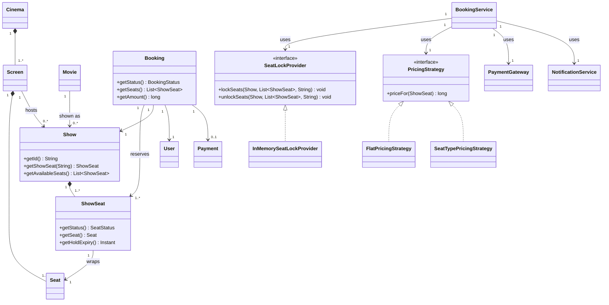
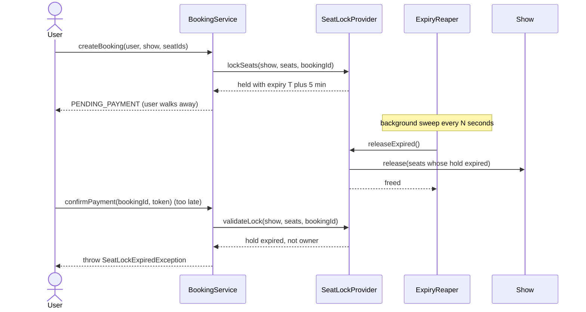
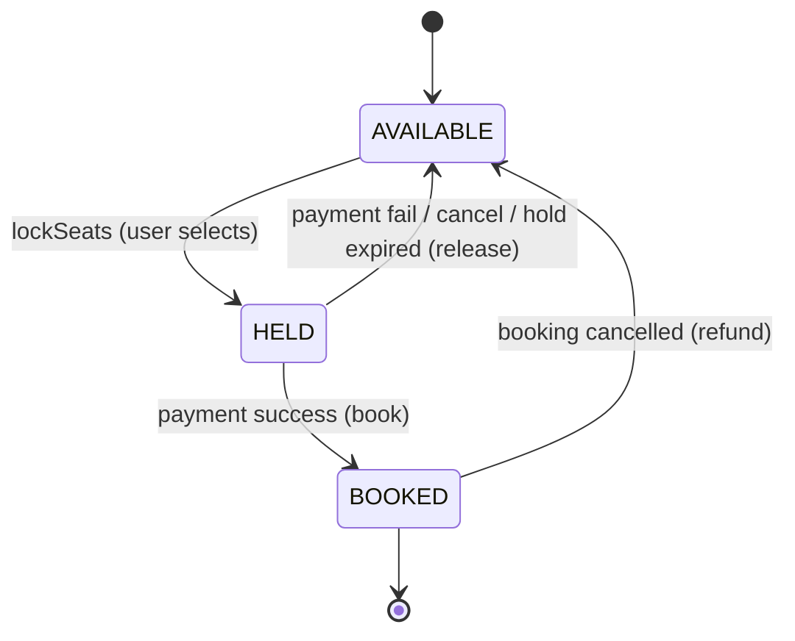
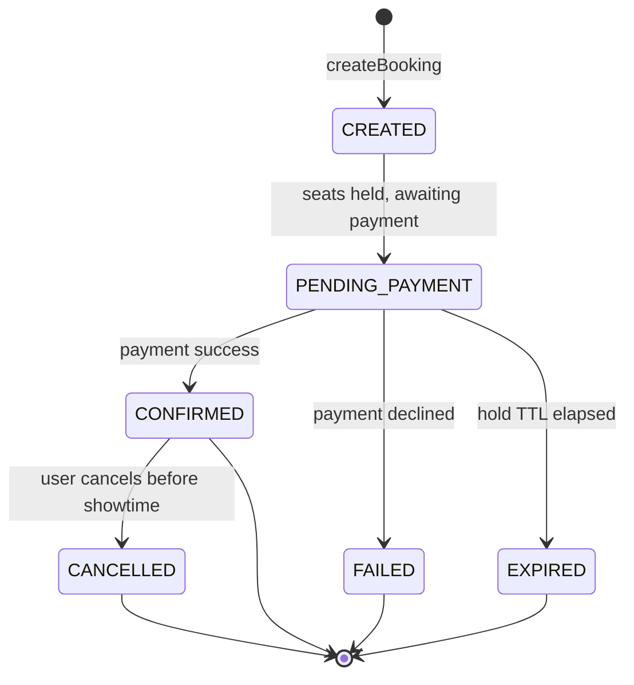

# 🎬 Low-Level Design: Movie Ticket Booking System

> A complete, interview-ready walkthrough of the classic **Movie Ticket Booking** design problem (the "design BookMyShow / Fandango / AMC" question) — from a blank whiteboard to a staff-level system that lets thousands of users search shows, hold seats, and pay, while guaranteeing that **no seat is ever sold to two people**.

The movie-booking problem looks friendly on the surface — search for a movie, pick your seats, pay, done — and that friendliness is exactly the trap. Under it sits the single hardest guarantee in the whole design: **when two people click the same seat at the same instant, exactly one of them gets it, and the other is told cleanly that it's gone.** Every other concern (search, pricing, notifications, payment) is ordinary CRUD-and-orchestration work that any competent engineer can structure. The seat contention is where the interview actually lives, because it forces you to reason about atomic reservation, time-bounded holds, payment latency, and what happens when a user locks a seat and then walks away without paying. A candidate who models seats as a boolean `isBooked` flag and updates it with a plain read-modify-write will double-sell seats under load and never notice in a demo. A candidate who recognizes the booking flow as **a short-lived, expiring seat *lock* wrapped around a payment**, backed by an atomic reservation primitive, writes a system that stays correct when a popular release goes on sale and fifty thousand people hit "book" in the same minute. This guide walks the whole journey, escalating from the beginner's mental model of the domain to the distributed seat-locking, idempotent-payment, and hot-show sharding concerns a principal engineer raises in the closing minutes.

---

## 📋 Table of Contents

**Part I — Framing the Problem**

1. [Problem Statement](#1-problem-statement)
2. [Requirement Clarification & Assumptions](#2-requirement-clarification--assumptions)
3. [Functional & Non-Functional Requirements](#3-functional--non-functional-requirements)
4. [Core Concepts Being Tested](#4-core-concepts-being-tested)

**Part II — Modeling the Domain**

5. [Domain Model & Entities](#5-domain-model--entities)
6. [CRC Cards](#6-crc-cards)
7. [UML Class Diagram](#7-uml-class-diagram)
8. [Package Structure](#8-package-structure)

**Part III — Design Rationale**

9. [Design Decisions & Trade-offs](#9-design-decisions--trade-offs)
10. [Class-by-Class Deep Dive](#10-class-by-class-deep-dive)
11. [Design Patterns Applied](#11-design-patterns-applied)
12. [SOLID Principles Mapping](#12-solid-principles-mapping)

**Part IV — Behavior & Diagrams**

13. [Sequence Diagram](#13-sequence-diagram)
14. [State Diagram](#14-state-diagram)

**Part V — The Implementation**

15. [Complete Java Implementation](#15-complete-java-implementation)
16. [Execution Flow & Code Walkthrough](#16-execution-flow--code-walkthrough)

**Part VI — Engineering Depth**

17. [Complexity Analysis](#17-complexity-analysis)
18. [Thread Safety & Concurrency](#18-thread-safety--concurrency)
19. [Error Handling & Validation](#19-error-handling--validation)
20. [Scalability Discussion](#20-scalability-discussion)
21. [Alternative Designs & Trade-offs](#21-alternative-designs--trade-offs)

**Part VII — Interview Mastery**

22. [Common FAANG Follow-up Questions (L4 → L6)](#22-common-faang-follow-up-questions-l4--l6)
23. [Common Design Mistakes](#23-common-design-mistakes)
24. [Testing Strategy](#24-testing-strategy)
25. [FAANG Q&A Section](#25-faang-qa-section)
26. [STAR Behavioral Questions](#26-star-behavioral-questions)
27. [⚡ Quick Revision Cheat Sheet](#27--quick-revision-cheat-sheet)

---

## 1. Problem Statement

Design the backend for an online **movie ticket booking system** — the software behind a service like BookMyShow, Fandango, or an AMC app. A user opens the app in their city, browses movies currently playing, picks a movie, and sees the list of cinemas and showtimes near them. They choose a show — a specific movie on a specific screen at a specific time — and are presented with a seat map showing which seats are available, which are taken, and how much each costs. They select one or more seats, the system holds those seats for them for a few minutes, they pay, and on successful payment the seats are confirmed and a ticket is issued. If they abandon the flow or their payment fails, the held seats are released back into the pool so someone else can book them.

The system coordinates several concerns at once — a **catalog** (movies, cinemas, screens, shows, seats), a **search** layer over that catalog, a **pricing** engine that can vary by seat type and demand, a **payment** integration with an external gateway, and **notifications** on the outcome. But the beating heart, the reason this problem is asked, is **seat reservation under concurrency**: a single seat for a single show is a resource exactly one booking may own, and many users will fight over the good seats for a hot release at the exact same moment.

<details>
<summary>📖 <b>In plain terms — what are we actually building?</b></summary>

Picture opening an app to book tickets for a Friday-night blockbuster. You pick the movie, the theatre near you, and the 9 PM show; a seat map appears with green (free), grey (taken), and your picks turn blue. You choose two aisle seats, a timer starts ("seats held for 5:00"), you tap pay, and out comes a confirmation with a QR code. Our job is the *brains* behind that: the objects and rules that track which of the 200 seats in that specific 9 PM show are free, that grab your two seats the instant you pick them so nobody else can, that start the countdown, that talk to a payment gateway, and — critically — that hand your seats back to the pool if you don't pay in time. We are not building the app screens, the payment company, or the SMS provider; we are building the server-side logic that decides who gets which seat and never, ever gives one seat to two people.

</details>

The deliverable in an interview is not a running product; it is a **clean object-oriented model** — the entities (Movie, Cinema, Screen, Show, Seat, Booking), their responsibilities, and above all the **seat-locking mechanism** that makes concurrent booking safe — plus a clear story for **how a seat moves from available, to temporarily held, to permanently booked (or back to available)** as payment succeeds, fails, or times out. Grading centers on whether you spot the concurrency problem unprompted, how you make seat reservation atomic and time-bounded, and how gracefully the design absorbs new pricing rules, payment methods, and the scale of a nationwide release.

---

## 2. Requirement Clarification & Assumptions

The single biggest mistake candidates make is coding before scoping. A strong candidate spends the first few minutes turning "design a movie booking app" into a bounded problem — and, crucially, surfaces the seat-contention question early so the rest of the design can be built around it. Below is the clarification dialogue you should drive, framed as the questions to ask and the assumptions to lock in.

### 2.1 Actors

The people and systems that interact with the platform define its surface area.

| Actor | Role in the system |
|-------|--------------------|
| **Customer / User** | Searches movies and shows, selects seats, holds them, pays, receives a ticket, may cancel. |
| **Cinema / Theatre Admin** | Registers cinemas and screens, defines seat layouts, schedules shows for movies. |
| **Payment Gateway** | External system (Stripe, Razorpay) that authorizes and captures payment; the source of truth for money. |
| **Notification Provider** | External email/SMS/push service used to deliver booking confirmations and reminders. |
| **System / Scheduler** | Background workers that expire abandoned seat holds and clean up stale bookings. |

### 2.2 Key Clarifying Questions

Before modeling anything, resolve these with the interviewer. Each answer materially changes the design.

- **What is the atomic unit we book?** — A seat for a *specific show*, not a physical seat in general. *(Assumption: the bookable resource is a **ShowSeat** — the pairing of one physical seat with one show. Seat A5 at the 6 PM show and seat A5 at the 9 PM show are two independent resources.)*
- **How do we prevent two people from booking the same seat?** — This is *the* question; drive it early. *(Assumption: selecting seats acquires a **time-bounded lock (hold)** on them — typically 5–10 minutes — during which only the holder may pay. If payment doesn't complete before the lock expires, the seats are released.)*
- **What happens if a user holds seats and never pays?** — *(Assumption: the hold has a TTL; a background reaper (or lazy expiry on next read) releases expired holds and marks the booking `EXPIRED`.)*
- **Can a user book seats across different shows/screens in one booking?** — *(Assumption: no; one booking is for one show. Multiple seats within that show are fine.)*
- **Is seating assigned or general admission?** — *(Assumption: assigned seating with a seat map; general admission is a simpler special case we note.)*
- **Does pricing vary?** — By seat type, time, or demand? *(Assumption: price varies by **seat type** (regular/premium/recliner) at minimum, and we leave a seam for **dynamic/surge** pricing — weekends, hot releases.)*
- **Payment: synchronous or asynchronous?** — *(Assumption: we call an external gateway that may be slow; the seat hold must outlive the payment round-trip, and payment must be **idempotent** so a retried charge doesn't bill twice.)*
- **Do we handle cancellations/refunds?** — *(Assumption: cancellation before showtime releases seats and triggers a refund via the gateway; refund policy is out of scope but the hook exists.)*
- **Scale?** — *(Assumption: a nationwide platform — many cities, thousands of cinemas, and severe **hot-show** spikes when a blockbuster opens; the design must not serialize all bookings through one global lock.)*

### 2.3 Explicit Non-Goals

Naming what you will *not* build is a senior signal — it shows you can bound scope deliberately rather than by omission.

- No UI, mobile app, or seat-map rendering — we design the server-side model and services.
- No implementation of the payment gateway or bank; we depend on a `PaymentGateway` abstraction and treat it as authoritative for money.
- No real email/SMS delivery; notifications go through a `NotificationService` seam.
- No user authentication, accounts, or profile management beyond a `User` identity.
- No detailed refund/loyalty/coupon engine, though we note where discounts and refunds hook in.
- No recommendation or ranking of movies; search returns matches, it doesn't personalize.
- No food-and-beverage add-ons or ancillary sales in v1 (the design leaves a seam).

<details>
<summary>📖 <b>Why spend so long on clarification?</b></summary>

The prompt "design a movie booking app" is intentionally broad, and one question reshapes the entire design: "what stops two people from booking the same seat?" The moment you name that as *the* core problem, the interview pivots away from catalog CRUD and toward the reservation mechanism — the seat *hold*, its TTL, and how it wraps a slow payment call. The second high-value clarification is "what happens if someone holds a seat and vanishes?" — because it forces the expiring-lock design rather than a permanent flag. Asking these upfront signals that you know where the difficulty actually is, and it sets you up for the staff-level follow-ups on distributed locking and hot-show scale.

</details>

---

## 3. Functional & Non-Functional Requirements

### 3.1 Functional Requirements (what the system *does*)

These are the concrete behaviors the system must support. In an interview, list them crisply — they become your checklist for the class design.

1. **Browse & search** — list movies playing in a city; search by title, language, genre; filter cinemas and showtimes.
2. **View shows** — for a chosen movie, show cinemas, screens, and showtimes; for a chosen show, render the seat map with availability and price.
3. **Select & hold seats** — let a user pick one or more available seats for a show and place a **time-bounded hold** on them, blocking anyone else from selecting them.
4. **Price the selection** — compute the total from each seat's type and any active pricing rules.
5. **Pay** — take payment for held seats through an external gateway within the hold window.
6. **Confirm the booking** — on successful payment, permanently book the seats and issue a ticket (with a booking id / QR).
7. **Release on failure or timeout** — if payment fails, is cancelled, or the hold expires, release the seats back to available and mark the booking accordingly.
8. **Cancel a booking** — allow cancellation before showtime, releasing seats and triggering a refund.
9. **Notify** — send a confirmation (and optionally a reminder) on a successful booking.
10. **Administer catalog** — let admins add cinemas, screens with seat layouts, movies, and schedule shows.

### 3.2 Non-Functional Requirements (how *well* it does it)

These are the qualities that make the design production-grade, and they are where staff-level discussion lives.

| Attribute | Requirement | Why it matters |
|-----------|-------------|----------------|
| **Correctness (no double-booking)** | A given seat for a given show is confirmed to at most one booking, ever — even under massive concurrent contention. | This is *the* invariant; violating it sells one seat twice and breaks trust. |
| **Consistency** | A seat's lifecycle (available → held → booked / released) is atomic; no seat is left "held forever" by an abandoned session. | Partial states strand inventory and lose revenue. |
| **Availability** | Browsing and search stay up even under load; the write path degrades gracefully, never double-sells. | Users browse far more than they book; read outages are very visible. |
| **Low latency** | Seat-map reads and seat holds feel instant (tens of ms); users won't tolerate lag choosing seats. | A slow seat map loses the sale to a competitor. |
| **Scalability** | Handle nationwide catalog reads and severe write spikes on hot shows without a global bottleneck. | Blockbuster on-sale events are the defining load pattern. |
| **Extensibility** | New pricing rules, seat types, payment methods, and notification channels slot in with minimal change. | Requirements *will* change (surge pricing, new gateways, coupons). |
| **Idempotency** | A retried payment or booking request never charges twice or books twice. | Networks retry; the gateway may be slow; duplicates are inevitable without keys. |
| **Auditability** | Every booking and payment is recorded with a unique id for support, refunds, and reconciliation. | Money movement must be traceable end to end. |

<details>
<summary>📖 <b>Functional vs non-functional — the quick distinction</b></summary>

Functional requirements are the *verbs* — search movies, hold seats, take payment, issue a ticket. If a functional requirement fails, the system did the wrong thing (it didn't show the seat map, or it never issued the ticket). Non-functional requirements are the *adverbs* — do it without ever double-selling a seat, do it fast enough that the seat map feels instant, do it at the scale of a nationwide on-sale. If a non-functional requirement fails, the system did the right thing but *badly* (it booked the seat, but so did someone else a millisecond earlier). Interviewers push hardest on the non-functional ones because a clean class diagram alone can't answer them — they force you to reason about locking, TTLs, idempotency, and the seat that must never belong to two people.

</details>

---

## 4. Core Concepts Being Tested

This problem is a proxy for a bundle of skills. Knowing what's being measured helps you narrate your design to the *right* audience.

- **Concurrency control on a shared resource** — the marquee skill. Many users contend for the same `ShowSeat`, and the design must make "check availability then reserve" a single atomic step. This is *the* reason this problem is asked, and every strong answer centers on it.
- **Time-bounded locking (leases)** — a seat hold is not a permanent flag; it is a **lease** with a TTL that must be released on payment success, payment failure, or expiry. Modeling the hold's lifecycle correctly is the difference between a toy and a real system.
- **Object-oriented decomposition of a rich domain** — finding the right nouns (Movie, Cinema, Screen, Show, Seat, ShowSeat, Booking, Payment) and giving each a single clear responsibility, especially separating the *physical* seat from the *bookable* show-seat.
- **Design patterns in context** — Strategy (pricing, seat locking, payment), State (booking lifecycle), Factory (constructing seats/shows), Observer (notifications), Facade/Singleton (the booking service), applied where they *earn their place*.
- **Idempotency and payment orchestration** — wrapping a slow, retryable external call so a network retry never double-charges — the same discipline payment platforms live by.
- **Distributed-systems thinking** — at scale the in-process lock becomes a distributed lock (Redis) or an atomic database update, and hot shows demand sharding and queueing; idempotency, TTLs, and reconciliation enter naturally at the staff level.

Keep these in the back of your mind as you read on — each section below is, in part, a chance to demonstrate one or more of them.

---

## 5. Domain Model & Entities

Before any code, we identify the **nouns** in the problem and turn them into entities. Good domain modeling is the difference between a design that flexes and one that fights you — and in this problem the single most important modeling insight is separating the *physical* seat from the *bookable* seat.

### 5.1 The Entity Landscape

Here is the cast of the system, grouped by role.

The **catalog** side (mostly read-heavy, rarely changing):

- **Movie** — a film: title, language, genre, duration, certification. It is *not* something you book; it's what you browse.
- **Cinema** — a physical multiplex in a city: name, address, and a set of `Screen`s.
- **Screen** (auditorium) — one hall inside a cinema, with a fixed physical **seat layout** (rows and columns of `Seat`s).
- **Seat** — a *physical* seat in a screen: row, number, and a `SeatType` (regular, premium, recliner). It exists independent of any show. This seat is reused by every show on that screen.
- **Show** — the pivotal entity: a specific `Movie` playing on a specific `Screen` at a specific start time. This is what a user actually picks.

The **booking** side (the concurrency-critical, write-heavy core):

- **ShowSeat** — *the bookable resource.* It pairs one physical `Seat` with one `Show`, and carries the state that actually changes: `AVAILABLE`, `HELD` (locked by a user mid-booking, with a hold expiry), or `BOOKED`. Seat A5 at the 6 PM show and seat A5 at the 9 PM show are two independent `ShowSeat`s. **This separation is the heart of the model** — physical seats are shared and static; show-seats are per-show and mutable.
- **Booking** — one user's attempt to reserve a set of `ShowSeat`s for a show: an id, the user, the show, the chosen seats, a total amount, a `BookingStatus` (CREATED → PENDING_PAYMENT → CONFIRMED / EXPIRED / CANCELLED / FAILED), and a created timestamp. This is the audit and lifecycle unit.
- **Payment** — the record of a charge for a booking: an id, amount, a `PaymentStatus`, and the gateway's reference; carries the idempotency key.
- **User** — the customer identity that owns bookings.

The **service and strategy** side (behavior, not data):

- **BookingService** — the orchestrator that ties selection, locking, pricing, payment, and confirmation together. The Facade the outside world calls.
- **SeatLockProvider** — the abstraction that atomically acquires and releases time-bounded holds on `ShowSeat`s. Swappable between an in-memory implementation and a distributed one (Redis).
- **PricingStrategy** — computes the price of a seat/selection; swappable (flat, by-seat-type, surge).
- **PaymentGateway** — the seam over the external payment provider.
- **NotificationService** — the seam over email/SMS/push, notified on booking outcomes.

### 5.2 Entity Relationships



<details>
<summary>📖 <b>How to read this relationship map</b></summary>

The diamond-headed lines mean "owns / is composed of" — a `Cinema` *is made of* its `Screen`s, a `Screen` *is made of* its physical `Seat`s, and a `Show` *is made of* its `ShowSeat`s; they live and die together. The plain arrows are "refers to / uses" — a `Show` refers to the `Movie` and the `Screen` it runs on but doesn't own them, and a `ShowSeat` *wraps* a physical `Seat` (points at it) rather than containing a copy. The single most important line is `ShowSeat "1" --> "1" Seat`: the physical seat is shared and static, while the `ShowSeat` holds the *per-show, mutable* status. The triangle arrows show the pricing and locking strategies implementing their interfaces — the seams that let the design flex without edits.

</details>

### 5.3 Core Enumerations

Enums keep the type system honest and make illegal states unrepresentable.

- `SeatType { REGULAR, PREMIUM, RECLINER }` — drives pricing; extensible to `BALCONY`, `VIP`.
- `SeatStatus { AVAILABLE, HELD, BOOKED }` — the per-show seat lifecycle; the field concurrency fights over.
- `BookingStatus { CREATED, PENDING_PAYMENT, CONFIRMED, EXPIRED, CANCELLED, FAILED }` — drives the booking state machine and cleanup.
- `PaymentStatus { PENDING, SUCCESS, FAILED, REFUNDED }` — the outcome of the gateway call.

We store all money as **integer minor units** (cents/paise), never floating-point, to avoid rounding bugs — a recurring interview trap covered in Section 23.

<details>
<summary>📖 <b>Why split Seat from ShowSeat?</b></summary>

This is the modeling decision that separates a clean design from a muddled one. A physical `Seat` (row C, number 7, a recliner) is a fixed property of the auditorium — it's the same seat at every show, and it never changes. What *does* change is whether that seat is free *for a particular show*: C7 might be booked for the 6 PM screening and wide open for the 9 PM. If you put the `isBooked` flag on the physical `Seat`, you can't represent "booked at 6, free at 9" at all. So we introduce `ShowSeat` — one per (seat, show) pair — to carry the mutable, per-show status, while the physical `Seat` stays a shared, immutable description. Every concurrency guarantee in the system is about `ShowSeat`, never the physical seat.

</details>

---

## 6. CRC Cards

CRC (Class–Responsibility–Collaborator) cards are a lightweight way to pin down *what each class is responsible for* and *who it talks to*, before drowning in fields and methods. They force single-responsibility thinking, which interviewers reward.

| Class | Responsibilities | Collaborators |
|-------|------------------|---------------|
| **BookingService** | Orchestrate the whole flow: hold seats, price them, create a booking, drive payment, confirm or release. | SeatLockProvider, PricingStrategy, PaymentGateway, NotificationService, Show, Booking |
| **SeatLockProvider** *(interface)* | Atomically acquire and release time-bounded holds on show-seats; enforce that only the lock owner can pay. | Show, ShowSeat |
| **InMemorySeatLockProvider** | Implement locking with per-show mutual exclusion and per-seat hold records with expiry. | ShowSeat, SeatLock |
| **Show** | Own its show-seats; expose availability; map a seat id to its `ShowSeat`. | Movie, Screen, ShowSeat |
| **ShowSeat** | Track the per-show status (available/held/booked) of one physical seat and the current hold's owner and expiry. | Seat |
| **Seat** | Describe a physical seat: row, number, type. Immutable. | — |
| **PricingStrategy** *(interface)* | Compute the price of a show-seat (and thus a selection). | ShowSeat, Seat |
| **Booking** | Bundle the user, show, seats, amount, and status; drive the booking state machine. | User, Show, ShowSeat, Payment |
| **PaymentGateway** *(interface)* | Charge and refund through the external provider, idempotently by key. | Payment |
| **NotificationService** *(interface)* | Deliver booking outcomes to the user via a channel. | Booking, User |
| **SearchService** | Find movies/shows by city, title, filters. | Movie, Cinema, Show |

Notice how each card has a *tight* set of responsibilities. If a single card starts listing "search movies, hold seats, price them, charge the card, *and* send the email," that's the classic "god service" smell — the locking, pricing, payment, and notification logic should each be extracted behind their own seam so `BookingService` only *orchestrates*.

---

## 7. UML Class Diagram

Here is the full static structure in ASCII, the way you'd sketch it on a whiteboard. Abstract types are marked `«interface»`; the catalog hierarchy is on the left, the concurrency-critical booking core in the center, and the swappable strategies on the right.

```
     CATALOG (static, shared)                 BOOKING CORE (mutable, contended)

┌──────────────────────┐              ┌────────────────────────────────────────┐
│ Cinema               │              │ BookingService              «facade»     │
├──────────────────────┤              ├────────────────────────────────────────┤
│ - id: String         │              │ - lockProvider: SeatLockProvider        │
│ - city: String       │              │ - pricingStrategy: PricingStrategy      │
│ - screens: List<Screen>             │ - paymentGateway: PaymentGateway        │
├──────────────────────┤              │ - notifier: NotificationService         │
│ + getScreens()       │              │ - bookings: Map<String,Booking>         │
└──────────┬───────────┘              ├────────────────────────────────────────┤
           │ 1..* owns                │ + createBooking(user, show, seatIds):   │
           ▼                          │       Booking                           │
┌──────────────────────┐              │ + confirmPayment(bookingId, token):     │
│ Screen               │              │       Booking                           │
├──────────────────────┤              │ + cancelBooking(bookingId): void        │
│ - id: String         │              └───────┬─────────────┬──────────┬─────────┘
│ - seats: List<Seat>  │                      │ uses        │ uses     │ uses
├──────────────────────┤          ┌───────────▼──┐  ┌───────▼──────┐ ┌▼──────────────┐
│ + getSeats()         │          │«interface»   │  │«interface»   │ │«interface»    │
└──────────┬───────────┘          │SeatLockProvid│  │PricingStrateg│ │PaymentGateway │
           │ 1..* owns            ├──────────────┤  ├──────────────┤ ├───────────────┤
           ▼                      │+lockSeats(    │  │+priceFor(     │ │+charge(pmt,   │
┌──────────────────────┐         │  show,seats,  │  │  showSeat):   │ │  token,key):  │
│ Seat  (physical)     │         │  bookingId)   │  │  long         │ │  PaymentResult│
├──────────────────────┤         │+unlockSeats(  │  └──────┬───────┘ │+refund(pmt)   │
│ - id: String         │         │  ...)         │         │         └───────────────┘
│ - row: String        │         │+validateLock( │  implemented by
│ - number: int        │         │  ...)         │  ┌──────┴──────────────┐
│ - type: SeatType     │         └──────┬───────┘   ▼                     ▼
└──────────────────────┘                │      ┌──────────────┐  ┌──────────────────┐
           ▲ wraps                       │      │FlatPricing   │  │SeatTypePricing   │
           │                impl by      ▼      │Strategy      │  │Strategy          │
┌──────────┴───────────┐   ┌────────────────────┐ └──────────────┘  └──────────────────┘
│ ShowSeat             │   │InMemorySeatLock     │
├──────────────────────┤   │Provider             │        ┌──────────────────────────┐
│ - id: String         │   ├────────────────────┤        │ Show                     │
│ - seat: Seat         │   │- locks:             │        ├──────────────────────────┤
│ - status: SeatStatus │   │  Map<String,SeatLock>│       │ - id: String             │
│ - holder: String     │   │- showLocks:         │        │ - movie: Movie           │
│ - holdExpiry: Instant│   │  Map<String,Lock>   │        │ - screen: Screen         │
├──────────────────────┤   │- holdSeconds: int   │        │ - startTime: Instant     │
│ + hold(bookingId,exp)│   ├────────────────────┤        │ - showSeats:             │
│ + book()             │   │+lockSeats(...)      │        │    Map<String,ShowSeat>  │
│ + release()          │   │+unlockSeats(...)    │        ├──────────────────────────┤
│ + isHoldExpired()    │   │+validateLock(...)   │        │ + getShowSeat(id)        │
└──────────────────────┘   └────────────────────┘        │ + getAvailableSeats()    │
                                                          └───────────┬──────────────┘
┌──────────────────────┐   ┌────────────────────┐                    │ 1..* owns
│ Booking              │   │ Payment            │                    ▼
├──────────────────────┤   ├────────────────────┤             (ShowSeat, above)
│ - id: String         │   │ - id: String       │
│ - user: User         │   │ - amount: long     │       ┌──────────────────────────┐
│ - show: Show         │   │ - status:          │       │«interface»               │
│ - seats: List<ShowSeat>│ │    PaymentStatus   │       │NotificationService       │
│ - amount: long       │   │ - idempotencyKey   │       ├──────────────────────────┤
│ - status:BookingStatus│  │ - gatewayRef:String│       │+notify(booking, user)    │
│ - payment: Payment   │   └────────────────────┘       └──────────────────────────┘
├──────────────────────┤
│ + markPendingPayment()│
│ + confirm()          │
│ + expire()/cancel()  │
└──────────────────────┘
```

The shape to notice: `BookingService` sits at the center and delegates every hard decision to an injected abstraction — locking to `SeatLockProvider`, price to `PricingStrategy`, money to `PaymentGateway`, alerts to `NotificationService`. It contains *orchestration*, not policy. The concurrency-critical trio is `Show` (owns the `ShowSeat`s), `ShowSeat` (holds the mutable status), and `SeatLockProvider` (makes the hold atomic). Everything on the catalog side is static, shared, and read-only during a booking.

---

## 8. Package Structure

A clean package layout communicates the architecture at a glance and enforces dependency direction. Here's a pragmatic layout.

```
com.booking
│
├── model                        // Entities & value objects
│   ├── Movie.java
│   ├── Cinema.java
│   ├── Screen.java
│   ├── Seat.java                //   physical seat (immutable)
│   ├── SeatType.java            //   enum
│   ├── Show.java
│   ├── ShowSeat.java            //   bookable resource (mutable status)
│   ├── SeatStatus.java          //   enum: AVAILABLE, HELD, BOOKED
│   ├── User.java
│   ├── Booking.java
│   ├── BookingStatus.java       //   enum
│   ├── Payment.java
│   └── PaymentStatus.java       //   enum
│
├── lock                         // Seat locking — the concurrency core
│   ├── SeatLockProvider.java    //   interface
│   ├── InMemorySeatLockProvider.java
│   └── SeatLock.java            //   a hold record (owner + expiry)
│
├── pricing                      // Pricing (Strategy)
│   ├── PricingStrategy.java     //   interface
│   ├── FlatPricingStrategy.java
│   └── SeatTypePricingStrategy.java
│
├── payment                      // Payment seam (Facade over gateway)
│   ├── PaymentGateway.java      //   interface
│   ├── MockPaymentGateway.java  //   idempotent test implementation
│   └── PaymentResult.java
│
├── notification                 // Notifications (Observer)
│   ├── NotificationService.java //   interface
│   └── EmailNotificationService.java
│
├── service                      // Orchestration & queries
│   ├── BookingService.java      //   the facade / orchestrator
│   └── SearchService.java
│
├── exception                    // Domain exceptions
│   ├── SeatUnavailableException.java
│   ├── SeatLockExpiredException.java
│   ├── PaymentFailedException.java
│   └── BookingNotFoundException.java
│
└── Demo.java                    // Runnable end-to-end walkthrough
```

The dependency direction runs one way: `service` depends on `lock`, `pricing`, `payment`, `notification`, and `model`; those depend only on `model`; `model` depends on nothing. Nothing in `model` knows a `BookingService` exists. This is what lets you unit-test the lock provider or a pricing strategy in complete isolation, and swap the in-memory lock for a Redis one without touching a single entity.

---

## 9. Design Decisions & Trade-offs

Every design is a sequence of forks in the road. Here are the ones that matter for movie booking, each stated as the question, the options, and the choice with its justification.

### 9.1 How do we prevent double-booking — flag, pessimistic lock, or optimistic check?

This is *the* decision. The naive approach is an `isBooked` boolean on the seat, set with a read-modify-write — which double-sells the instant two threads interleave between the read and the write. The three real options are: (a) a **pessimistic time-bounded lock** — the user acquires an exclusive hold on the seats for a few minutes, and only the holder may pay; (b) an **optimistic** approach — let anyone try, detect the conflict at write time via a version/compare-and-set, and fail the loser; (c) a **database unique constraint / conditional update** — `UPDATE show_seat SET status='HELD' WHERE id=? AND status='AVAILABLE'` and trust the affected-row count. We choose the **pessimistic hold (a)** as the primary model because seat selection is a deliberate, multi-second human action and users expect their chosen seats to be reserved *while they pay* — optimistic failure at the payment step is a terrible experience. But the hold itself is implemented on top of an atomic primitive (b/c under the hood), and we keep it behind `SeatLockProvider` so the mechanism can move from in-process to Redis to a DB conditional update without changing callers.

### 9.2 Should the seat hold be permanent or time-bounded?

**Time-bounded**, always. If a hold were permanent, any user who selected seats and then closed the tab would strand those seats forever, and a hot show would "sell out" without selling anything. So a hold is a **lease with a TTL** (typically 5–10 minutes): long enough to complete a payment, short enough that abandoned holds recycle quickly. Expiry is enforced two ways — a background reaper that sweeps expired holds, and *lazy* expiry where any read that encounters an expired hold treats the seat as available. The trade is a small window where a seat is neither truly free nor sold; we accept it because the alternative (permanent holds) is strictly worse.

### 9.3 Where does the hold sit relative to payment?

The hold **wraps** the payment: acquire hold → create booking (`PENDING_PAYMENT`) → call the gateway → on success `book()` the seats and confirm, on failure/timeout `release()` them. Payment is the slow, external, failure-prone step, and it must happen *inside* the protection of the hold so no one else can grab the seats mid-payment. Critically, the hold TTL must be **longer than the worst-case payment latency**, or a slow-but-successful payment could land after the seats were already released and re-sold — the nastiest bug in the domain. We reconcile this at confirm time by re-validating the lock owner before booking.

### 9.4 Flat pricing, or a pluggable pricing strategy?

Even if v1 prices every seat the same, we put pricing behind a **`PricingStrategy`** interface. Real platforms price by seat type today and add surge/weekend/demand pricing tomorrow, and none of that should touch `BookingService`. The cost is one interface and a couple of small classes; the benefit is that "add weekend pricing" becomes a new strategy class, injected at construction — not an edit to the booking flow.

### 9.5 Is BookingService a Singleton, and does it own everything?

There is logically one booking service per process, so it's tempting to make it a static `Singleton`. We model it as a single instance but **inject its collaborators** (lock provider, pricing, gateway, notifier) rather than reaching for global static state, which makes testing painful and hides dependencies. And it strictly *orchestrates* — it holds no locking, pricing, or payment policy itself; each of those lives behind its own seam. This keeps `BookingService` thin and every hard rule independently testable.

<details>
<summary>📖 <b>Why interviewers love the "trade-off" framing</b></summary>

Junior candidates present one design as "the answer." Senior candidates present a design *and the roads not taken*, because real engineering is choosing under constraints. When you say "I used a pessimistic time-bounded hold because seat selection is a deliberate human action and users expect their picks reserved while they pay — but an optimistic compare-and-set would use fewer resources for low-contention shows, so I kept the mechanism behind a `SeatLockProvider` seam," you show you understand the limits of your own choice. That awareness — not the pattern name — is what moves you from L4 to L5/L6. Narrate the fork, not just the destination.

</details>

---

## 10. Class-by-Class Deep Dive

With the structure in view, here is what each major class is *for* and the reasoning behind its shape. The full code is in Section 15; this is the tour.

### 10.1 `BookingService` (orchestrator / facade)

`BookingService` is the front door. Its two headline methods are `createBooking(user, show, seatIds)` — which acquires the hold, prices the selection, and creates a `PENDING_PAYMENT` booking — and `confirmPayment(bookingId, token)` — which re-validates the hold, charges the gateway idempotently, and on success books the seats and confirms. It also owns `cancelBooking`. Crucially, it contains *no* policy: it asks `SeatLockProvider` to lock, `PricingStrategy` to price, `PaymentGateway` to charge, and `NotificationService` to notify. It is wiring and sequencing, and the *order* of that sequence is the whole game.

### 10.2 `SeatLockProvider` and `InMemorySeatLockProvider`

`SeatLockProvider` is the concurrency seam. `lockSeats(show, seats, bookingId)` must **atomically** acquire holds on *all* requested seats or none (all-or-nothing, to avoid a user grabbing two of three good seats), stamping each with the owner `bookingId` and an expiry. `unlockSeats` releases them, and `validateLock` confirms a given booking still owns unexpired holds before we book. `InMemorySeatLockProvider` implements this with a per-show lock (so acquisition across the requested seats is a single critical section) plus a map of `SeatLock` records; at scale this class — and only this class — is replaced by a Redis (`SETNX` + TTL) or database-conditional-update implementation.

### 10.3 `Show`, `Seat`, and `ShowSeat`

`Show` is a movie on a screen at a time; it owns the `Map<String, ShowSeat>` for that screening and exposes availability. `Seat` is the immutable physical description (row, number, type) shared by every show on that screen. `ShowSeat` is where the action is: it wraps a `Seat` and carries the mutable `status` (`AVAILABLE`/`HELD`/`BOOKED`), the current `holder` booking id, and the `holdExpiry`. Its methods (`hold`, `book`, `release`, `isHoldExpired`) are the low-level state transitions the lock provider drives. Keeping the mutable state on `ShowSeat` and the static description on `Seat` is the modeling decision the whole design rests on.

### 10.4 `Booking` and its lifecycle

`Booking` is the audit and lifecycle unit: id, user, show, the list of `ShowSeat`s, the total amount, a `BookingStatus`, and an optional `Payment`. Its status moves `CREATED → PENDING_PAYMENT → CONFIRMED`, or branches to `EXPIRED` (hold timed out), `FAILED` (payment declined), or `CANCELLED` (user cancelled). Those transitions are the booking state machine (Section 14), and each is a method (`markPendingPayment`, `confirm`, `expire`, `cancel`, `fail`) so the legal moves live in one class.

### 10.5 `PricingStrategy` and its concretes

`PricingStrategy.priceFor(showSeat)` returns the price of a single seat; the service sums it over the selection. `FlatPricingStrategy` returns a constant; `SeatTypePricingStrategy` looks up a price per `SeatType`. A future `SurgePricingStrategy` could multiply by a demand factor derived from how full the show is — a new class, injected, touching nothing else. This is the Strategy pattern doing exactly what it's for.

### 10.6 `PaymentGateway` and idempotency

`PaymentGateway` hides the external provider: `charge(payment, token, idempotencyKey)` and `refund(payment)`. The **idempotency key** is the hook that makes a retried charge safe — the gateway (and real providers like Stripe) records processed keys and returns the original result on replay rather than charging again. `BookingService` derives the key from the booking id, so a client that retries `confirmPayment` after a timeout never double-charges.

### 10.7 `NotificationService` and `SearchService`

`NotificationService` is a thin Observer-style seam: on a confirmed (or failed) booking, the service is notified and delivers via its channel (email/SMS/push). `SearchService` is the read-side query layer over the catalog — find movies by city, shows by movie — deliberately separate from the write-heavy booking path so the two can scale and be reasoned about independently.

---

## 11. Design Patterns Applied

Patterns should appear because the problem *demands* them, not to decorate the design. Here's where each one earns its place.

| Pattern | Where it's used | What it buys us |
|---------|-----------------|-----------------|
| **Strategy** | `PricingStrategy` (flat / by-type / surge); `SeatLockProvider` (in-memory / Redis) | Swap pricing rules or the locking mechanism without touching `BookingService`. The design's main extensibility lever. |
| **State** | `Booking` lifecycle and `ShowSeat` status | Legal transitions live in one place; illegal ones (confirm an expired booking) are rejected locally, not via scattered `if`s. |
| **Facade** | `BookingService` over locking, pricing, payment, notification | One clean entry point hides a multi-step orchestration; callers don't touch the subsystems directly. |
| **Factory** | Building a `Show`'s `ShowSeat`s from a screen's seat layout | Centralizes construction so a show is created consistently from its screen; callers don't hand-assemble seats. |
| **Observer** | `NotificationService` reacting to booking outcomes | Booking confirmation fans out to email/SMS/push without the service knowing the channels. |
| **Singleton** | `BookingService` (one per process) | Models the single orchestrator — used judiciously, via injection, never static global state. |

<details>
<summary>📖 <b>A note on not over-patterning</b></summary>

It's tempting to cram in every Gang-of-Four pattern to look sophisticated, but an interviewer reads that as insecurity. Strategy for pricing and locking is unarguable — those genuinely need to vary independently of the booking flow. State for the booking lifecycle is natural — it really is a workflow with per-status rules. But forcing, say, a Visitor over seat types, or a full Command bus for what is a synchronous three-step orchestration, is a red flag. The skill is knowing when a pattern *reduces* complexity versus when it merely adds ceremony. Reach for a pattern when it removes an "if I change X I must edit Y" coupling — surge pricing shouldn't force an edit to the booking flow, and moving to Redis locks shouldn't either.

</details>

For the deeper theory behind each of these, this guide pairs naturally with the individual Strategy, State, Facade, Factory, Observer, and Singleton pattern guides.

---

## 12. SOLID Principles Mapping

SOLID isn't an abstract checklist here — each principle shows up concretely in the design.

**S — Single Responsibility.** Each class has one reason to change: `SeatLockProvider` owns locking, `PricingStrategy` owns price, `PaymentGateway` owns money, `NotificationService` owns delivery, `BookingService` owns orchestration only. A change to the pricing formula never touches the lock code; a new payment provider never touches the seat model.

**O — Open/Closed.** The system is *open to extension, closed to modification*. A new pricing rule is a new `PricingStrategy`; a distributed lock is a new `SeatLockProvider`; a new alert channel is a new `NotificationService`; a new payment provider is a new `PaymentGateway`. No existing class is edited. This is the single most important SOLID win, delivered by the Strategy seams.

**L — Liskov Substitution.** Any `PricingStrategy` works wherever pricing is expected; any `SeatLockProvider` (in-memory or Redis) satisfies the same lock contract; any `PaymentGateway` (real or mock) is interchangeable — which is exactly what makes the whole booking flow testable with fakes.

**I — Interface Segregation.** `SeatLockProvider`, `PricingStrategy`, `PaymentGateway`, and `NotificationService` are each small and focused. The pricing strategy isn't forced to know about payment; the notifier isn't forced to know about locking. Clients depend only on the sliver they use.

**D — Dependency Inversion.** `BookingService` depends on the *abstractions* — the four interfaces — not their concretes, which are injected at construction. High-level booking orchestration doesn't know or care whether locks are in-memory or in Redis, whether the gateway is Stripe or a mock, or whether pricing is flat or surge.

<details>
<summary>📖 <b>The one-line SOLID gut check</b></summary>

If you can add surge pricing, swap the in-memory seat lock for a Redis one, plug in a second payment provider, and add push notifications alongside email *without editing a single existing class* — only adding new ones — your design honors Open/Closed and Dependency Inversion, and the rest of SOLID usually falls into place. That "add, don't edit" test is the fastest way to sanity-check your booking design under interview pressure, and it's exactly why every hard decision sits behind an injected interface.

</details>

---

## 13. Sequence Diagram

Two flows carry the design: the **happy-path booking** (select seats, pay, confirm) and the **payment-failure / timeout** branch (where the seats must be released). Here they are as message sequences.

### 13.1 Successful Booking

```mermaid
sequenceDiagram
    actor User
    participant BS as BookingService
    participant Lock as SeatLockProvider
    participant Price as PricingStrategy
    participant Show
    participant Pay as PaymentGateway
    participant Note as NotificationService

    User->>BS: createBooking(user, show, seatIds)
    BS->>Show: getShowSeats(seatIds)
    Show-->>BS: showSeats
    BS->>Lock: lockSeats(show, showSeats, bookingId)
    alt any seat unavailable or already held
        Lock-->>BS: throw SeatUnavailableException
        BS-->>User: seats no longer available
    else all seats locked (held with TTL)
        Lock-->>BS: ok (held)
        BS->>Price: priceFor(each seat)
        Price-->>BS: total amount
        BS-->>User: booking PENDING_PAYMENT, amount, timer

        User->>BS: confirmPayment(bookingId, token)
        BS->>Lock: validateLock(show, seats, bookingId)
        Lock-->>BS: still owner, not expired
        BS->>Pay: charge(payment, token, idempotencyKey)
        alt payment succeeds
            Pay-->>BS: SUCCESS(gatewayRef)
            BS->>Show: book(seats)
            BS->>Lock: unlockSeats(show, seats, bookingId)
            BS->>Note: notify(booking, user)
            BS-->>User: CONFIRMED, ticket issued
        else payment fails
            Pay-->>BS: FAILED
            BS->>Lock: unlockSeats(show, seats, bookingId)
            BS-->>User: payment failed, seats released
        end
    end
```

### 13.2 Hold Expiry (abandoned booking)



<details>
<summary>📖 <b>Reading the booking flow</b></summary>

The interesting part is the *ordering* and the two forks where seats can be lost or wrongly held. Notice we `lockSeats` *before* pricing or payment — grabbing the seats first is what stops a competitor from taking them while the user decides and pays. Then, critically, at `confirmPayment` we `validateLock` *again* before charging: the hold might have expired in the gap between selection and payment, and we must not charge for seats we no longer own. Only after a successful charge do we `book` the seats and `unlockSeats` (the hold has done its job). On any failure — payment declined, or the validate showing an expired hold — we release the seats so someone else can book them. The single most dangerous case, discussed in Section 18, is a payment that *succeeds* after the hold expired and the seats were re-sold; the validate-before-charge step plus a TTL longer than payment latency is what guards against it.

</details>

---

## 14. State Diagram

Two lifecycles govern the system: the **seat's per-show status** and the **booking's status**. Modeling them explicitly makes illegal transitions (booking a seat that was never held, confirming an expired booking) impossible by construction.

### 14.1 ShowSeat Status Lifecycle



The beauty of this diagram is that a seat can only reach `BOOKED` by passing through `HELD` — there is no arrow straight from `AVAILABLE` to `BOOKED`, so there is no code path that books a seat without first acquiring a hold. And the `HELD → AVAILABLE` arrow is the recycling path that makes abandoned selections harmless: expiry, failure, and cancellation all funnel back to available.

### 14.2 Booking Status Lifecycle



The `EXPIRED` state is the one that separates a toy design from a real one. It exists precisely for the "held seats but never paid" case, and it is what the background reaper drives the booking into while releasing the seats. `CANCELLED` from `CONFIRMED` is the refund path — the only transition that touches the gateway a second time.

---

## 15. Complete Java Implementation

The implementation below is complete and self-contained: you can drop it into a project, run `Demo`, and watch a full booking play out — including a simulated race where two threads fight for the same seat and exactly one wins. It is organized bottom-up — enums and value objects first, then the seat model, then the strategies and seams, then the lock provider, then the `BookingService` orchestrator, and finally the `Demo`. Every class name, field, and method signature here matches the diagrams in Sections 7, 13, and 14 exactly.

<details>
<summary>💻 <b>1. Enums & value objects</b></summary>

```java
package com.booking.model;

public enum SeatType { REGULAR, PREMIUM, RECLINER }

public enum SeatStatus { AVAILABLE, HELD, BOOKED }

public enum BookingStatus {
    CREATED, PENDING_PAYMENT, CONFIRMED, EXPIRED, CANCELLED, FAILED
}

public enum PaymentStatus { PENDING, SUCCESS, FAILED, REFUNDED }
```

```java
package com.booking.model;

/** A physical seat in a screen. Immutable, shared by every show on that screen. */
public final class Seat {
    private final String id;      // unique within a screen, e.g. "C7"
    private final String row;     // "C"
    private final int number;     // 7
    private final SeatType type;

    public Seat(String id, String row, int number, SeatType type) {
        this.id = id;
        this.row = row;
        this.number = number;
        this.type = type;
    }

    public String getId()      { return id; }
    public String getRow()     { return row; }
    public int getNumber()     { return number; }
    public SeatType getType()  { return type; }
}
```

```java
package com.booking.model;

/** A registered customer identity. */
public final class User {
    private final String id;
    private final String name;
    private final String email;

    public User(String id, String name, String email) {
        this.id = id; this.name = name; this.email = email;
    }
    public String getId()    { return id; }
    public String getName()  { return name; }
    public String getEmail() { return email; }
}
```

</details>

<details>
<summary>💻 <b>2. Catalog: Movie, Screen, Cinema</b></summary>

```java
package com.booking.model;

import java.util.List;

public final class Movie {
    private final String id;
    private final String title;
    private final String language;
    private final String genre;
    private final int durationMinutes;

    public Movie(String id, String title, String language, String genre, int durationMinutes) {
        this.id = id; this.title = title; this.language = language;
        this.genre = genre; this.durationMinutes = durationMinutes;
    }
    public String getId()       { return id; }
    public String getTitle()    { return title; }
    public String getLanguage() { return language; }
    public String getGenre()    { return genre; }
}
```

```java
package com.booking.model;

import java.util.List;

/** One auditorium with a fixed physical seat layout. */
public final class Screen {
    private final String id;
    private final List<Seat> seats;   // the physical seat layout

    public Screen(String id, List<Seat> seats) {
        this.id = id;
        this.seats = List.copyOf(seats);
    }
    public String getId()       { return id; }
    public List<Seat> getSeats(){ return seats; }
}
```

```java
package com.booking.model;

import java.util.List;

public final class Cinema {
    private final String id;
    private final String name;
    private final String city;
    private final List<Screen> screens;

    public Cinema(String id, String name, String city, List<Screen> screens) {
        this.id = id; this.name = name; this.city = city;
        this.screens = List.copyOf(screens);
    }
    public String getId()          { return id; }
    public String getCity()        { return city; }
    public List<Screen> getScreens(){ return screens; }
}
```

</details>

<details>
<summary>💻 <b>3. ShowSeat — the bookable resource (mutable status)</b></summary>

```java
package com.booking.model;

import java.time.Instant;

/**
 * The bookable resource: one physical Seat paired with one Show.
 * Carries the mutable, per-show status that concurrency contends over.
 *
 * Mutation is only ever performed while the owning Show's per-show lock is held
 * (see InMemorySeatLockProvider), so these methods are intentionally simple.
 */
public final class ShowSeat {
    private final String id;          // same as the physical seat id, e.g. "C7"
    private final Seat seat;          // wraps the immutable physical seat
    private SeatStatus status;
    private String holder;            // bookingId currently holding, or null
    private Instant holdExpiry;       // when the current hold lapses, or null

    public ShowSeat(Seat seat) {
        this.id = seat.getId();
        this.seat = seat;
        this.status = SeatStatus.AVAILABLE;
    }

    public String getId()          { return id; }
    public Seat getSeat()          { return seat; }
    public SeatStatus getStatus()  { return status; }
    public String getHolder()      { return holder; }
    public Instant getHoldExpiry() { return holdExpiry; }

    /** Transition AVAILABLE -> HELD for a booking, with an expiry. */
    public void hold(String bookingId, Instant expiry) {
        this.status = SeatStatus.HELD;
        this.holder = bookingId;
        this.holdExpiry = expiry;
    }

    /** Transition HELD -> BOOKED once payment succeeds. */
    public void book() {
        this.status = SeatStatus.BOOKED;
        this.holdExpiry = null;
    }

    /** Transition (HELD or BOOKED) -> AVAILABLE on failure, expiry, or cancel. */
    public void release() {
        this.status = SeatStatus.AVAILABLE;
        this.holder = null;
        this.holdExpiry = null;
    }

    public boolean isHoldExpired() {
        return status == SeatStatus.HELD
            && holdExpiry != null
            && Instant.now().isAfter(holdExpiry);
    }

    public boolean isAvailable() {
        return status == SeatStatus.AVAILABLE || isHoldExpired();
    }
}
```

</details>

<details>
<summary>💻 <b>4. Show — owns its ShowSeats</b></summary>

```java
package com.booking.model;

import java.time.Instant;
import java.util.*;
import java.util.stream.Collectors;

public final class Show {
    private final String id;
    private final Movie movie;
    private final Screen screen;
    private final Instant startTime;
    private final Map<String, ShowSeat> showSeats;  // seatId -> ShowSeat

    public Show(String id, Movie movie, Screen screen, Instant startTime) {
        this.id = id;
        this.movie = movie;
        this.screen = screen;
        this.startTime = startTime;
        // Factory step: build one ShowSeat per physical seat of the screen.
        this.showSeats = new LinkedHashMap<>();
        for (Seat seat : screen.getSeats()) {
            showSeats.put(seat.getId(), new ShowSeat(seat));
        }
    }

    public String getId()        { return id; }
    public Movie getMovie()      { return movie; }
    public Screen getScreen()    { return screen; }
    public Instant getStartTime(){ return startTime; }

    public ShowSeat getShowSeat(String seatId) {
        ShowSeat s = showSeats.get(seatId);
        if (s == null) throw new IllegalArgumentException("No such seat: " + seatId);
        return s;
    }

    public List<ShowSeat> getShowSeats(List<String> seatIds) {
        List<ShowSeat> result = new ArrayList<>(seatIds.size());
        for (String seatId : seatIds) result.add(getShowSeat(seatId));
        return result;
    }

    public Collection<ShowSeat> getAllSeats() {
        return showSeats.values();
    }

    public List<ShowSeat> getAvailableSeats() {
        return showSeats.values().stream()
                .filter(ShowSeat::isAvailable)
                .collect(Collectors.toList());
    }

    /** Book a set of held seats (called by BookingService after payment). */
    public void book(List<ShowSeat> seats) {
        for (ShowSeat s : seats) s.book();
    }
}
```

</details>

<details>
<summary>💻 <b>5. Pricing (Strategy)</b></summary>

```java
package com.booking.pricing;

import com.booking.model.ShowSeat;

public interface PricingStrategy {
    /** Price of a single show-seat, in integer minor units (e.g. paise/cents). */
    long priceFor(ShowSeat showSeat);
}
```

```java
package com.booking.pricing;

import com.booking.model.ShowSeat;

/** Every seat the same price — the simplest v1. */
public final class FlatPricingStrategy implements PricingStrategy {
    private final long price;
    public FlatPricingStrategy(long price) { this.price = price; }

    @Override public long priceFor(ShowSeat showSeat) { return price; }
}
```

```java
package com.booking.pricing;

import com.booking.model.SeatType;
import com.booking.model.ShowSeat;
import java.util.Map;

/** Price varies by seat type — the realistic default. */
public final class SeatTypePricingStrategy implements PricingStrategy {
    private final Map<SeatType, Long> priceByType;

    public SeatTypePricingStrategy(Map<SeatType, Long> priceByType) {
        this.priceByType = Map.copyOf(priceByType);
    }

    @Override public long priceFor(ShowSeat showSeat) {
        Long p = priceByType.get(showSeat.getSeat().getType());
        if (p == null) throw new IllegalStateException(
                "No price for seat type " + showSeat.getSeat().getType());
        return p;
    }
}
```

</details>

<details>
<summary>💻 <b>6. Payment seam + idempotent mock gateway</b></summary>

```java
package com.booking.payment;

public final class PaymentResult {
    private final boolean success;
    private final String gatewayRef;
    private final String error;

    private PaymentResult(boolean success, String gatewayRef, String error) {
        this.success = success; this.gatewayRef = gatewayRef; this.error = error;
    }
    public static PaymentResult success(String ref) { return new PaymentResult(true, ref, null); }
    public static PaymentResult failure(String err)  { return new PaymentResult(false, null, err); }

    public boolean isSuccess()   { return success; }
    public String getGatewayRef(){ return gatewayRef; }
    public String getError()     { return error; }
}
```

```java
package com.booking.payment;

import com.booking.model.Payment;

public interface PaymentGateway {
    /** Charge idempotently: a retry with the same key returns the original result. */
    PaymentResult charge(Payment payment, String token, String idempotencyKey);
    PaymentResult refund(Payment payment);
}
```

```java
package com.booking.payment;

import com.booking.model.Payment;
import java.util.Map;
import java.util.UUID;
import java.util.concurrent.ConcurrentHashMap;

/**
 * A test gateway that mimics the two properties that matter:
 *  - it can succeed or fail (driven by the token), and
 *  - it is idempotent: a replayed idempotencyKey returns the first result,
 *    never charging twice. Real providers (Stripe's Idempotency-Key header,
 *    Razorpay) work exactly this way.
 */
public final class MockPaymentGateway implements PaymentGateway {
    private final Map<String, PaymentResult> processed = new ConcurrentHashMap<>();

    @Override
    public PaymentResult charge(Payment payment, String token, String idempotencyKey) {
        // Idempotency: if we've seen this key, return the stored result.
        PaymentResult prior = processed.get(idempotencyKey);
        if (prior != null) return prior;

        PaymentResult result = "bad-card".equals(token)
                ? PaymentResult.failure("card declined")
                : PaymentResult.success("PAY-" + UUID.randomUUID());
        processed.put(idempotencyKey, result);
        return result;
    }

    @Override
    public PaymentResult refund(Payment payment) {
        return PaymentResult.success("REFUND-" + UUID.randomUUID());
    }
}
```

```java
package com.booking.model;

public final class Payment {
    private final String id;
    private final long amount;
    private final String idempotencyKey;
    private PaymentStatus status;
    private String gatewayRef;

    public Payment(String id, long amount, String idempotencyKey) {
        this.id = id; this.amount = amount;
        this.idempotencyKey = idempotencyKey;
        this.status = PaymentStatus.PENDING;
    }
    public String getId()             { return id; }
    public long getAmount()           { return amount; }
    public String getIdempotencyKey() { return idempotencyKey; }
    public PaymentStatus getStatus()  { return status; }
    public String getGatewayRef()     { return gatewayRef; }

    public void markSuccess(String ref){ this.status = PaymentStatus.SUCCESS; this.gatewayRef = ref; }
    public void markFailed()           { this.status = PaymentStatus.FAILED; }
    public void markRefunded()         { this.status = PaymentStatus.REFUNDED; }
}
```

</details>

<details>
<summary>💻 <b>7. Notifications (Observer seam)</b></summary>

```java
package com.booking.notification;

import com.booking.model.Booking;
import com.booking.model.User;

public interface NotificationService {
    void notify(Booking booking, User user);
}
```

```java
package com.booking.notification;

import com.booking.model.Booking;
import com.booking.model.User;

public final class EmailNotificationService implements NotificationService {
    @Override
    public void notify(Booking booking, User user) {
        System.out.printf("[email -> %s] Booking %s is %s (%d seats, amount %d)%n",
                user.getEmail(), booking.getId(), booking.getStatus(),
                booking.getSeats().size(), booking.getAmount());
    }
}
```

</details>

<details>
<summary>💻 <b>8. Booking — the lifecycle unit</b></summary>

```java
package com.booking.model;

import java.time.Instant;
import java.util.List;

public final class Booking {
    private final String id;
    private final User user;
    private final Show show;
    private final List<ShowSeat> seats;
    private final long amount;
    private final Instant createdAt;
    private BookingStatus status;
    private Payment payment;

    public Booking(String id, User user, Show show, List<ShowSeat> seats, long amount) {
        this.id = id;
        this.user = user;
        this.show = show;
        this.seats = List.copyOf(seats);
        this.amount = amount;
        this.createdAt = Instant.now();
        this.status = BookingStatus.CREATED;
    }

    public String getId()            { return id; }
    public User getUser()            { return user; }
    public Show getShow()            { return show; }
    public List<ShowSeat> getSeats() { return seats; }
    public long getAmount()          { return amount; }
    public BookingStatus getStatus() { return status; }
    public Payment getPayment()      { return payment; }
    public void setPayment(Payment p){ this.payment = p; }

    // ---- State machine transitions (Section 14.2) ----
    public void markPendingPayment() { transition(BookingStatus.PENDING_PAYMENT); }
    public void confirm()            { transition(BookingStatus.CONFIRMED); }
    public void fail()               { transition(BookingStatus.FAILED); }
    public void expire()             { transition(BookingStatus.EXPIRED); }
    public void cancel()             { transition(BookingStatus.CANCELLED); }

    private void transition(BookingStatus to) {
        // A tiny guard so illegal jumps (e.g. CONFIRMED -> PENDING) are rejected.
        if (status == BookingStatus.CONFIRMED && to == BookingStatus.PENDING_PAYMENT)
            throw new IllegalStateException("Cannot revert a confirmed booking");
        this.status = to;
    }
}
```

</details>

<details>
<summary>💻 <b>9. SeatLockProvider — the concurrency core</b></summary>

```java
package com.booking.lock;

import com.booking.model.Show;
import com.booking.model.ShowSeat;
import java.util.List;

public interface SeatLockProvider {
    /**
     * Atomically acquire time-bounded holds on ALL the requested seats for a
     * booking, or none of them. Throws SeatUnavailableException if any seat is
     * not currently free.
     */
    void lockSeats(Show show, List<ShowSeat> seats, String bookingId);

    /** Release holds previously taken by this booking. */
    void unlockSeats(Show show, List<ShowSeat> seats, String bookingId);

    /**
     * Confirm this booking still owns unexpired holds on all seats.
     * Called immediately before charging, to guard against expiry-in-the-gap.
     */
    boolean validateLock(Show show, List<ShowSeat> seats, String bookingId);

    /** Sweep and free any holds whose TTL has elapsed (background reaper). */
    void releaseExpired(Show show);
}
```

```java
package com.booking.lock;

import java.time.Instant;

/** A hold record: who owns the seat and until when. */
public final class SeatLock {
    private final String bookingId;
    private final Instant expiry;

    public SeatLock(String bookingId, Instant expiry) {
        this.bookingId = bookingId;
        this.expiry = expiry;
    }
    public String getBookingId() { return bookingId; }
    public Instant getExpiry()   { return expiry; }
    public boolean isExpired()   { return Instant.now().isAfter(expiry); }
}
```

```java
package com.booking.lock;

import com.booking.exception.SeatUnavailableException;
import com.booking.model.SeatStatus;
import com.booking.model.Show;
import com.booking.model.ShowSeat;

import java.time.Duration;
import java.time.Instant;
import java.util.List;
import java.util.Map;
import java.util.concurrent.ConcurrentHashMap;
import java.util.concurrent.locks.ReentrantLock;

/**
 * In-memory, single-JVM implementation of seat locking.
 *
 * The trick to correctness is the per-SHOW lock: all seat acquisition for a
 * given show happens inside one critical section, so the "is every seat free?"
 * check and the "hold them all" act are atomic. That closes the classic
 * check-then-act race that a plain boolean flag would leave wide open.
 *
 * At scale this ONE class is swapped for a Redis (SETNX + TTL) or a database
 * conditional-update implementation; callers never change.
 */
public final class InMemorySeatLockProvider implements SeatLockProvider {

    private final int holdSeconds;
    // One mutex per show so different shows never contend.
    private final Map<String, ReentrantLock> showLocks = new ConcurrentHashMap<>();
    // seatId -> current hold (only meaningful while status == HELD)
    private final Map<String, SeatLock> locks = new ConcurrentHashMap<>();

    public InMemorySeatLockProvider(int holdSeconds) {
        this.holdSeconds = holdSeconds;
    }

    private ReentrantLock lockFor(Show show) {
        return showLocks.computeIfAbsent(show.getId(), k -> new ReentrantLock());
    }

    @Override
    public void lockSeats(Show show, List<ShowSeat> seats, String bookingId) {
        ReentrantLock guard = lockFor(show);
        guard.lock();
        try {
            // 1) Verify EVERY seat is free (treating expired holds as free).
            for (ShowSeat seat : seats) {
                if (seat.getStatus() == SeatStatus.BOOKED) {
                    throw new SeatUnavailableException("Seat " + seat.getId() + " already booked");
                }
                if (seat.getStatus() == SeatStatus.HELD && !seat.isHoldExpired()) {
                    throw new SeatUnavailableException("Seat " + seat.getId() + " is held by someone else");
                }
            }
            // 2) All free -> hold them all with a shared expiry (all-or-nothing).
            Instant expiry = Instant.now().plus(Duration.ofSeconds(holdSeconds));
            for (ShowSeat seat : seats) {
                seat.hold(bookingId, expiry);
                locks.put(seat.getId(), new SeatLock(bookingId, expiry));
            }
        } finally {
            guard.unlock();
        }
    }

    @Override
    public void unlockSeats(Show show, List<ShowSeat> seats, String bookingId) {
        ReentrantLock guard = lockFor(show);
        guard.lock();
        try {
            for (ShowSeat seat : seats) {
                SeatLock held = locks.get(seat.getId());
                if (held != null && held.getBookingId().equals(bookingId)) {
                    if (seat.getStatus() == SeatStatus.HELD) seat.release();
                    locks.remove(seat.getId());
                }
            }
        } finally {
            guard.unlock();
        }
    }

    @Override
    public boolean validateLock(Show show, List<ShowSeat> seats, String bookingId) {
        ReentrantLock guard = lockFor(show);
        guard.lock();
        try {
            for (ShowSeat seat : seats) {
                SeatLock held = locks.get(seat.getId());
                if (held == null
                        || !held.getBookingId().equals(bookingId)
                        || held.isExpired()
                        || seat.getStatus() != SeatStatus.HELD) {
                    return false;
                }
            }
            return true;
        } finally {
            guard.unlock();
        }
    }

    @Override
    public void releaseExpired(Show show) {
        ReentrantLock guard = lockFor(show);
        guard.lock();
        try {
            for (ShowSeat seat : show.getAllSeats()) {
                if (seat.isHoldExpired()) {
                    seat.release();
                    locks.remove(seat.getId());
                }
            }
        } finally {
            guard.unlock();
        }
    }
}
```

</details>

<details>
<summary>💻 <b>10. Domain exceptions</b></summary>

```java
package com.booking.exception;

public class SeatUnavailableException extends RuntimeException {
    public SeatUnavailableException(String msg) { super(msg); }
}

public class SeatLockExpiredException extends RuntimeException {
    public SeatLockExpiredException(String msg) { super(msg); }
}

public class PaymentFailedException extends RuntimeException {
    public PaymentFailedException(String msg) { super(msg); }
}

public class BookingNotFoundException extends RuntimeException {
    public BookingNotFoundException(String msg) { super(msg); }
}
```

</details>

<details>
<summary>💻 <b>11. BookingService — the orchestrator</b></summary>

```java
package com.booking.service;

import com.booking.exception.*;
import com.booking.lock.SeatLockProvider;
import com.booking.model.*;
import com.booking.notification.NotificationService;
import com.booking.payment.PaymentGateway;
import com.booking.payment.PaymentResult;
import com.booking.pricing.PricingStrategy;

import java.util.List;
import java.util.Map;
import java.util.UUID;
import java.util.concurrent.ConcurrentHashMap;

/**
 * Facade / orchestrator. Contains NO policy — it sequences calls to the four
 * injected seams. The ORDER of that sequence is the whole correctness story:
 *   createBooking:  resolve seats -> lock (hold) -> price -> PENDING_PAYMENT
 *   confirmPayment: validate lock -> charge (idempotent) -> book -> unlock -> notify
 * On any failure or expiry, seats are released.
 */
public final class BookingService {

    private final SeatLockProvider lockProvider;
    private final PricingStrategy pricingStrategy;
    private final PaymentGateway paymentGateway;
    private final NotificationService notifier;
    private final Map<String, Booking> bookings = new ConcurrentHashMap<>();

    public BookingService(SeatLockProvider lockProvider,
                          PricingStrategy pricingStrategy,
                          PaymentGateway paymentGateway,
                          NotificationService notifier) {
        this.lockProvider = lockProvider;
        this.pricingStrategy = pricingStrategy;
        this.paymentGateway = paymentGateway;
        this.notifier = notifier;
    }

    /** Step 1: hold the seats and create a booking awaiting payment. */
    public Booking createBooking(User user, Show show, List<String> seatIds) {
        List<ShowSeat> seats = show.getShowSeats(seatIds);
        String bookingId = "BKG-" + UUID.randomUUID();

        // Atomically acquire holds on all seats, or throw.
        lockProvider.lockSeats(show, seats, bookingId);

        long amount = 0;
        for (ShowSeat seat : seats) amount += pricingStrategy.priceFor(seat);

        Booking booking = new Booking(bookingId, user, show, seats, amount);
        booking.markPendingPayment();
        bookings.put(bookingId, booking);
        return booking;
    }

    /** Step 2: validate the hold, charge, and confirm — or release on failure. */
    public Booking confirmPayment(String bookingId, String token) {
        Booking booking = bookings.get(bookingId);
        if (booking == null) throw new BookingNotFoundException(bookingId);

        Show show = booking.getShow();
        List<ShowSeat> seats = booking.getSeats();

        // Guard: the hold may have expired between selection and payment.
        if (!lockProvider.validateLock(show, seats, bookingId)) {
            booking.expire();
            throw new SeatLockExpiredException("Hold expired for booking " + bookingId);
        }

        // Idempotency key derived from booking id: a retried confirm can't double-charge.
        String idemKey = "PAY-" + bookingId;
        Payment payment = new Payment("PMT-" + UUID.randomUUID(), booking.getAmount(), idemKey);
        booking.setPayment(payment);

        PaymentResult result = paymentGateway.charge(payment, token, idemKey);

        if (!result.isSuccess()) {
            payment.markFailed();
            lockProvider.unlockSeats(show, seats, bookingId);
            booking.fail();
            notifier.notify(booking, booking.getUser());
            throw new PaymentFailedException(result.getError());
        }

        // Payment good: book the seats, drop the now-redundant hold, confirm.
        payment.markSuccess(result.getGatewayRef());
        show.book(seats);
        lockProvider.unlockSeats(show, seats, bookingId);
        booking.confirm();
        notifier.notify(booking, booking.getUser());
        return booking;
    }

    /** Cancel a confirmed booking: release seats and refund. */
    public void cancelBooking(String bookingId) {
        Booking booking = bookings.get(bookingId);
        if (booking == null) throw new BookingNotFoundException(bookingId);
        if (booking.getStatus() != BookingStatus.CONFIRMED)
            throw new IllegalStateException("Only confirmed bookings can be cancelled");

        for (ShowSeat seat : booking.getSeats()) seat.release();
        if (booking.getPayment() != null) {
            paymentGateway.refund(booking.getPayment());
            booking.getPayment().markRefunded();
        }
        booking.cancel();
        notifier.notify(booking, booking.getUser());
    }

    public Booking getBooking(String bookingId) {
        Booking b = bookings.get(bookingId);
        if (b == null) throw new BookingNotFoundException(bookingId);
        return b;
    }
}
```

</details>

<details>
<summary>💻 <b>12. Demo — end-to-end + a concurrency race</b></summary>

```java
package com.booking;

import com.booking.lock.InMemorySeatLockProvider;
import com.booking.lock.SeatLockProvider;
import com.booking.model.*;
import com.booking.notification.EmailNotificationService;
import com.booking.payment.MockPaymentGateway;
import com.booking.pricing.SeatTypePricingStrategy;

import java.time.Instant;
import java.util.*;
import java.util.concurrent.*;
import java.util.concurrent.atomic.AtomicInteger;

public class Demo {
    public static void main(String[] args) throws Exception {
        // --- Build a screen with 3 rows x 4 seats ---
        List<Seat> seats = new ArrayList<>();
        for (char row = 'A'; row <= 'C'; row++) {
            SeatType type = row == 'A' ? SeatType.RECLINER
                          : row == 'B' ? SeatType.PREMIUM : SeatType.REGULAR;
            for (int n = 1; n <= 4; n++) {
                seats.add(new Seat(row + String.valueOf(n), String.valueOf(row), n, type));
            }
        }
        Screen screen = new Screen("SCR-1", seats);
        Movie movie = new Movie("MOV-1", "Interstellar", "EN", "SciFi", 169);
        Show show = new Show("SHOW-9PM", movie, screen, Instant.now().plusSeconds(3600));

        // --- Wire the service with injected strategies (Dependency Inversion) ---
        SeatLockProvider lockProvider = new InMemorySeatLockProvider(300); // 5-min hold
        Map<SeatType, Long> prices = Map.of(
                SeatType.REGULAR, 20000L, SeatType.PREMIUM, 35000L, SeatType.RECLINER, 50000L);
        BookingServiceHolder.service = new com.booking.service.BookingService(
                lockProvider,
                new SeatTypePricingStrategy(prices),
                new MockPaymentGateway(),
                new EmailNotificationService());
        var bookingService = BookingServiceHolder.service;

        User alice = new User("U1", "Alice", "alice@example.com");

        // --- Happy path: hold A1 + A2, then pay ---
        Booking b = bookingService.createBooking(alice, show, List.of("A1", "A2"));
        System.out.println("Created " + b.getId() + " status=" + b.getStatus() + " amount=" + b.getAmount());
        Booking confirmed = bookingService.confirmPayment(b.getId(), "good-card");
        System.out.println("Confirmed status=" + confirmed.getStatus());

        // --- Concurrency: 10 threads race for the same seat C1 ---
        int threads = 10;
        ExecutorService pool = Executors.newFixedThreadPool(threads);
        CountDownLatch startGate = new CountDownLatch(1);
        AtomicInteger wins = new AtomicInteger();
        List<Future<?>> futures = new ArrayList<>();
        for (int i = 0; i < threads; i++) {
            User u = new User("R" + i, "Racer" + i, "r" + i + "@x.com");
            futures.add(pool.submit(() -> {
                try {
                    startGate.await();
                    Booking rb = bookingService.createBooking(u, show, List.of("C1"));
                    bookingService.confirmPayment(rb.getId(), "good-card");
                    wins.incrementAndGet();
                } catch (Exception ignored) { /* lost the race, expected */ }
                return null;
            }));
        }
        startGate.countDown();          // release all racers at once
        for (Future<?> f : futures) f.get();
        pool.shutdown();

        System.out.println("Threads that booked C1: " + wins.get() + " (must be exactly 1)");
        System.out.println("C1 final status: " + show.getShowSeat("C1").getStatus());
    }

    /** Small holder so the lambda can see the service without a field capture warning. */
    static class BookingServiceHolder { static com.booking.service.BookingService service; }
}
```

</details>

---

## 16. Execution Flow & Code Walkthrough

Trace the **happy-path booking** — Alice reserving seats A1 and A2 — through the code to see how the pieces cooperate.

Alice calls `bookingService.createBooking(alice, show, ["A1","A2"])`. The service resolves the two `ShowSeat`s via `show.getShowSeats(...)`, mints a `bookingId`, and calls `lockProvider.lockSeats(show, seats, bookingId)`. Inside `InMemorySeatLockProvider`, the per-show `ReentrantLock` is acquired, every requested seat is checked to be free (neither `BOOKED` nor actively `HELD`), and — only if *all* pass — each seat is transitioned to `HELD` with a 5-minute expiry and a `SeatLock` record. Back in the service, `pricingStrategy.priceFor(seat)` is summed over the selection (recliner row A → 50000 each → 100000 total), a `Booking` is created, `markPendingPayment()` moves it to `PENDING_PAYMENT`, and it's returned. Alice now sees her held seats, the total, and a countdown.

Alice then calls `confirmPayment(bookingId, "good-card")`. The service first calls `lockProvider.validateLock(...)` — the critical re-check that she still owns unexpired holds on both seats. She does, so it builds a `Payment` with an idempotency key derived from the booking id (`"PAY-" + bookingId`) and calls `paymentGateway.charge(payment, token, idemKey)`. The mock returns success. Only now does the service call `show.book(seats)` (flipping both `ShowSeat`s to `BOOKED`), then `unlockSeats(...)` to drop the now-redundant holds, then `booking.confirm()` and `notifier.notify(...)`. Alice's booking is `CONFIRMED` and the email fires.

<details>
<summary>📖 <b>Following the "lock, then validate, then charge" handshake once more</b></summary>

The single most important thing to internalize is the *order*: hold the seats first (so nobody can take them while Alice pays), then at payment time **validate the hold again** before charging, then charge, then book. Walk it backwards to see why the re-validate matters: if Alice dawdled and her hold expired, the reaper may have freed her seats and someone else may have booked them. Charging her first and *then* discovering the seats are gone would take her money for seats she can't have. By re-validating immediately before the charge — and by keeping the hold TTL longer than the worst-case payment latency — we ensure she only ever pays for seats she still holds. This "acquire, re-validate, then commit" shape is the same discipline reservation systems everywhere rely on, and naming it out loud is a strong senior signal.

</details>

The **concurrency demo** is where the design proves itself. Ten threads, released simultaneously by a `CountDownLatch`, all try to book seat `C1`. Because `lockSeats` runs its check-and-hold inside the per-show `ReentrantLock`, exactly one thread finds `C1` available and holds it; the other nine see it `HELD` and get a `SeatUnavailableException`. The winner pays and books; the losers fall into the catch block. The final assertion — "Threads that booked C1: 1" and "C1 final status: BOOKED" — is the whole point of the system, demonstrated in code.

---

## 17. Complexity Analysis

For an LLD problem, complexity is less about big-O over huge inputs and more about being able to state the cost of each operation precisely — interviewers probe whether you know where the work actually goes.

| Operation | Time | Space | Notes |
|-----------|------|-------|-------|
| `getShowSeat(id)` | O(1) | O(1) | Hash-map lookup by seat id. |
| `getAvailableSeats()` | O(S) | O(S) | S = seats in the show; one scan. Cache/paginate for large halls. |
| `lockSeats(seats)` | O(k) | O(k) | k = seats requested (small, e.g. 1–6). Two passes: check all, then hold all, under the per-show lock. |
| `validateLock` / `unlockSeats` | O(k) | O(1) | One pass over the k selected seats. |
| `priceFor` (sum) | O(k) | O(1) | One strategy call per selected seat. |
| `confirmPayment` | O(k) locally | O(1) | Dominated by the gateway round-trip, not computation. |
| `releaseExpired(show)` | O(S) | O(1) | Reaper scans all seats of the show; run periodically or lazily per-read. |

The key insight to voice: every hot-path booking operation is **O(k) in the number of seats the user selected** — a tiny constant (nobody books 500 seats at once) — *not* O(total seats in the show) or O(shows). The only O(S) operations are the availability scan and the reaper sweep, both of which are read-side and easily cached or bounded. Crucially, the per-show lock means throughput scales with the number of *distinct shows*, not one global lock — different shows book fully in parallel.

<details>
<summary>📖 <b>The hidden cost people miss: lock granularity, not algorithmic cost</b></summary>

In this problem the interesting "complexity" isn't big-O at all — the algorithms are trivial O(k) map operations. The cost that actually bites is **contention**. If you guard all bookings with one global lock, your throughput ceiling is "one booking at a time across the entire platform," which is catastrophic on a busy Friday. By locking per *show* (and, at scale, per *seat* or via per-seat rows in a database), bookings for different shows — and even different seats in the same show, with fine-grained locking — proceed in parallel. So when an interviewer asks "what's the complexity?", the senior move is to pivot from the O(k) map cost to the *concurrency* cost and explain how lock granularity, not algorithmic complexity, is what caps throughput here.

</details>

---

## 18. Thread Safety & Concurrency

This is the heart of the entire problem — the reason it's asked and where the interview truly lives. Everything else is orchestration; this is the guarantee.

### 18.1 The core hazard: the lost-update race on a seat

The classic bug is a non-atomic check-then-act on seat availability. Thread A reads seat `C1` as `AVAILABLE`, thread B reads it as `AVAILABLE` at the same instant, both conclude "it's free, book it," and both mark it `BOOKED` — the seat is now sold to two people. This is the exact same shape as the ATM double-spend or the inventory oversell; it is the defining concurrency bug of the domain, and a boolean `isBooked` flag with a plain read-then-write is guaranteed to hit it under load.

### 18.2 How this design prevents it

The check-and-hold lives entirely inside `SeatLockProvider.lockSeats`, and `InMemorySeatLockProvider` guards each show with a **per-show `ReentrantLock`**. The "is every requested seat free?" check and the "hold them all" act happen inside one critical section, so they are atomic — no other thread can observe a seat as free and grab it between our check and our hold. Because the lock is *per show*, two bookings for *different* shows never block each other; contention is scoped to exactly the show being touched, not the whole platform.

### 18.3 All-or-nothing acquisition

`lockSeats` holds *all* requested seats or *none*: it verifies every seat is free before holding any. This prevents the partial-acquisition problem where a user grabs two of three adjacent seats, blocking others, only to fail on the third — leaving seats stranded and users frustrated. Doing the whole acquisition inside one critical section makes all-or-nothing trivial; doing it seat-by-seat without a guard would reintroduce races and deadlocks.

### 18.4 The expiring hold and the "slow payment" hazard

The subtlest bug in the domain: a user holds seats, the hold expires, the reaper frees the seats, someone else books them — and *then* the first user's slow payment succeeds. Now we've charged someone for seats that belong to another. Two mechanisms guard this. First, `confirmPayment` calls `validateLock` immediately before charging, so an expired hold is caught and the charge never happens. Second, the hold TTL is set **longer than the worst-case payment latency**, so a payment started in time won't have its hold expire mid-flight. In a distributed setting you additionally make the booking write conditional (book only if the seat is still `HELD` by this booking) so a late success can't overwrite a re-sold seat.

### 18.5 From in-process lock to distributed lock

The `ReentrantLock` works only within one JVM. Real platforms run many booking servers, so the lock must be *distributed*. Because everything sits behind `SeatLockProvider`, this is a drop-in replacement: a `RedisSeatLockProvider` using `SET seat:{showId}:{seatId} {bookingId} NX PX {ttlMillis}` (atomic set-if-absent with a TTL — the TTL *is* the hold expiry, enforced by Redis itself), or a database implementation using `UPDATE show_seat SET status='HELD', holder=?, expiry=? WHERE id=? AND status='AVAILABLE'` and trusting the affected-row count (one row means we won, zero means someone beat us). Both give the same atomic check-and-hold across many servers; neither requires touching `BookingService`.

<details>
<summary>📖 <b>Why "check-then-act" is the villain of concurrency</b></summary>

Almost every double-booking bug reduces to the same shape: you read a value (seat is free), make a decision based on it (so I'll book it), and act (mark it booked) — but between the read and the act, someone else did the same. "If seat available, then book" is two steps masquerading as one. The fix is always to make the read-decide-act a single atomic unit: hold a lock across it, or push it into one atomic operation like Redis `SET ... NX` or a conditional SQL `UPDATE ... WHERE status='AVAILABLE'`. That conditional update (which affects one row or zero) is how the invariant is enforced at the datastore, and the booking server simply trusts the row count it returns. Whether the lock is a JVM `ReentrantLock`, a Redis key, or a database row, the principle is identical — atomicity is the only cure for check-then-act.

</details>

---

## 19. Error Handling & Validation

Booking software is defined by how it behaves when things go wrong — a failed payment, an expired hold, a seat that vanished — so error handling is a first-class part of the design, not an afterthought.

The design distinguishes three broad failure classes and handles each deliberately. **Contention and business-rule failures** — the seats you selected were just taken, or an invalid seat id — are expected and surfaced as a clean `SeatUnavailableException` with a clear message, prompting the user to pick different seats. No seat state is mutated on this path (`lockSeats` throws *before* holding anything), so a failed selection leaves the show exactly as it was.

**Expiry failures** are the dangerous middle: the user held seats but the hold lapsed before they paid. `confirmPayment` catches this with the `validateLock` guard, moves the booking to `EXPIRED`, and throws `SeatLockExpiredException` — critically, *before* any charge, so the user is never billed for seats they no longer hold. The seats, already freed by the reaper (or freed here), are available to others.

**Payment failures** — the gateway declines the card — surface as a `PaymentFailedException`. The handler releases the held seats (`unlockSeats`), marks the payment `FAILED` and the booking `FAILED`, and notifies the user. The invariant preserved is "held seats are released the moment payment cannot complete," so a declined card never strands inventory.

Validation is layered so each rule lives in exactly one place: seat existence in `Show.getShowSeat`, availability in `SeatLockProvider.lockSeats`, hold ownership and freshness in `validateLock`, and payment authority at the gateway (the only authority on money). Selection size and seat ids are validated before locking. Crucially, all money is stored as **integer minor units**, never `double`, so `0.1 + 0.2` rounding bugs cannot corrupt a total — a detail interviewers specifically listen for.

---

## 20. Scalability Discussion

The naive reading is "it's just a booking form, what's there to scale?" The senior reading is that a nationwide platform serves millions of catalog reads continuously and then absorbs violent **write spikes** when a blockbuster opens — fifty thousand people hitting "book" on the same handful of hot shows in the same minute. The read and write paths scale very differently and should be separated.

The **read path** (browse movies, view shows, render seat maps) is enormously heavier than the write path in volume but is easy to scale: the catalog changes rarely, so it's aggressively cached (CDN for movie metadata, Redis for show/seat-map snapshots) and served from read replicas. Search runs on a dedicated index (Elasticsearch) fed asynchronously from the catalog. This path can be eventually consistent — a seat map that's a second or two stale is fine, because the actual lock acquisition at booking time is the authority.

The **write path** (hold, pay, confirm) is where correctness lives and where hot shows concentrate load. The keys are: shard seat state by `showId` so a hot show's locks live on one node's Redis shard (or one database partition) rather than contending globally; keep the atomic check-and-hold as a per-seat Redis `SET NX` or conditional SQL `UPDATE`, which are individually cheap; and make everything idempotent by booking id so retries during the spike don't double-book or double-charge. For a *single* extremely hot show (an IPL final, a Taylor Swift-style on-sale), the industry answer is a **virtual waiting room / queue**: admit users to the seat-selection page at a controlled rate so the seat-locking layer sees a bounded request rate rather than a thundering herd, which also gives users a fair, orderly experience instead of a lottery.

Two consistency tiers matter here. **Seat locking and booking must be strongly consistent** — you cannot let two servers both sell `C1`. **Everything else** — seat-map display, "N seats left" counters, recommendations, notifications — tolerates eventual consistency and rides caches, replicas, and async queues (Kafka). Drawing that line explicitly, and naming the waiting-room pattern for the single-hot-show case, is a strong L6 answer.

<details>
<summary>📖 <b>The one scaling idea that matters most here</b></summary>

The single most important scaling insight is to *separate the read path from the write path* and recognize that they need opposite treatments. Reads are massive but cacheable and can be stale; the write path is smaller in volume but must be strongly consistent and is where hot shows concentrate. Once you say that, scaling reads is "cache and replicate everything," and the real engineering is making the seat-lock write path both correct and non-contending — shard by show, use an atomic per-seat primitive, idempotency everywhere, and a waiting room to bound the request rate on a single white-hot show. If you can articulate "reads scale by caching and can be eventually consistent; the seat-lock path scales by sharding on show id with an atomic per-seat lock, and a waiting room throttles the one show everyone wants," you've shown you know where the bottleneck actually is.

</details>

---

## 21. Alternative Designs & Trade-offs

Every design has roads not taken. Being able to compare them is what elevates the discussion.

**Pessimistic hold vs. optimistic concurrency.** We chose a pessimistic time-bounded hold because seat selection is a deliberate, multi-second human action and users expect their picks reserved *while they pay* — failing them at the payment step (the optimistic outcome) is a terrible experience for a scarce, emotionally-charged resource. The optimistic alternative — let anyone proceed, detect the conflict at write time via a version/compare-and-set, fail the loser — uses fewer resources when contention is low and avoids holding inventory idle. The right read is: pessimistic holds for the interactive seat-selection UX, backed by an atomic (effectively optimistic) primitive underneath; because it's behind `SeatLockProvider`, you can tune per-show.

**In-process lock vs. distributed lock vs. database constraint.** The in-memory `ReentrantLock` is perfect for a single-JVM demo and dead simple, but it can't span servers. A Redis distributed lock (`SET NX PX`) scales across servers with a TTL that enforces expiry for free, at the cost of a Redis dependency and the need to reason about lock-expiry edge cases (fencing tokens). A database unique constraint or conditional `UPDATE` needs no extra infrastructure and is bulletproof for correctness, but concentrates load on the database. Real systems often layer them: Redis for the fast interactive hold, the database `UNIQUE(show_id, seat_id)` as the final backstop that makes double-booking *structurally* impossible even if the lock layer has a bug.

**Permanent booking vs. expiring hold.** We use an expiring hold so abandoned selections recycle. The alternative — book immediately and refund if unpaid — is simpler to model but pollutes the seat map with phantom bookings and complicates money flow. The expiring hold is the industry standard precisely because it keeps inventory liquid.

**Reaper (background sweep) vs. lazy expiry.** We free expired holds two ways: a periodic reaper and lazy expiry on read (treating an expired hold as available). A pure reaper is predictable but adds a moving part and a small window of stale state; pure lazy expiry needs no background job but requires every read to reason about expiry. Using both is belt-and-suspenders — the reaper keeps the data clean, lazy expiry guarantees correctness even if the reaper lags.

---

## 22. Common FAANG Follow-up Questions (L4 → L6)

Interviewers rarely stop at your first design. They push, and the push follows a predictable ladder from "make it work" to "make it correct under concurrency" to "make it scale on a hot show." Here is that ladder, so you can see the questions coming.

**L4 — Modeling & correctness.** *"Walk me through your entities — why `ShowSeat` and not just `Seat`?"* *"What happens when a user picks seats?"* *"How do you price a booking?"* These test whether your objects have clear responsibilities and whether you separated the physical seat from the bookable show-seat. Answer by naming the `Seat`/`ShowSeat` split and the hold-then-pay flow.

**L5 — Concurrency & failure.** *"Two users click seat C1 at the same instant — who wins and how?"* *"A user holds seats and never pays — what happens?"* *"The payment succeeds after the hold expired — now what?"* These are the heart of the interview. Answer with the atomic check-and-hold inside a per-show lock, the expiring hold plus reaper, the `validateLock`-before-charge guard, and idempotency keyed by booking id.

**L6 — Scale, consistency & the hot show.** *"Design this for a nationwide on-sale of a blockbuster."* *"Your `ReentrantLock` doesn't work across servers — fix it."* *"Which operations need strong consistency and which can be eventual?"* *"How do you handle the one show that fifty thousand people want at once?"* These test systems judgment. Answer with read/write path separation, a Redis or database-conditional distributed lock sharded by show, idempotency everywhere, the strong-vs-eventual consistency split, and a virtual waiting room to bound the request rate on a single white-hot show.

<details>
<summary>📖 <b>The meta-pattern of the follow-up ladder</b></summary>

Notice the ladder always climbs the same staircase: first "does it work in the happy path," then "is it correct when two users race or a payment fails," then "does it stay correct and cheap when a blockbuster opens." If you volunteer the next rung *before* the interviewer asks — finishing your happy-path booking with "and here's what stops two people getting the same seat, and here's what happens if the payment is slow" — you telegraph seniority and often skip a whole round of prompting. The single highest-leverage sentence in the entire movie-booking interview is naming the atomic, time-bounded seat hold unprompted, followed immediately by "and I re-validate the hold before charging."

</details>

---

## 23. Common Design Mistakes

These are the traps that sink otherwise-good candidates. Each one has cost real people offers.

The first and most common is **coding before clarifying** — jumping to classes without ever asking "what stops two people booking the same seat?", then presenting a design with a fatal double-booking hole. The second, and the most fatal, is **modeling the seat as a boolean `isBooked` flag** updated with a plain read-modify-write, which double-sells the instant two threads interleave — the single defining bug of the domain. The third is **putting the booked state on the physical `Seat`** instead of a per-show `ShowSeat`, which makes it impossible to represent "booked at 6 PM, free at 9 PM."

The fourth is **a permanent hold with no TTL**, so any user who selects seats and closes the tab strands them forever and hot shows "sell out" without selling. The fifth is **charging before securing the seat, or booking before charging** — either ordering leaks money or seats; the correct order is hold → validate → charge → book. The sixth is **ignoring the slow-payment race** — assuming a hold can't expire mid-payment — with no re-validation before the charge. The seventh is **a single global lock** over all bookings, which is correct but serializes the entire platform to one booking at a time. The eighth is **ignoring idempotency**, so a retried payment during a traffic spike double-charges. The ninth is **floating-point money** (`double amount`), which quietly corrupts totals; always use integer minor units. Finally, **over-engineering** — bolting a full event-sourced CQRS saga onto what was asked as a single-service design — reads as insecurity rather than mastery.

---

## 24. Testing Strategy

A booking system demands a testing story that goes well beyond happy-path unit tests, and articulating it is itself a senior signal.

**Unit tests** cover the pieces in isolation with fakes. `ShowSeat` is tested for each transition (`hold` sets `HELD` with an expiry, `book` requires having been held, `release` returns to `AVAILABLE`, `isHoldExpired` respects the clock). `SeatTypePricingStrategy` is tested for correct per-type pricing and for the missing-price error. `InMemorySeatLockProvider` is tested for the refusal case (locking an already-`BOOKED` or actively-`HELD` seat throws and mutates nothing) and for all-or-nothing acquisition (a request for three seats where one is taken holds none). `MockPaymentGateway` is tested for idempotency: two charges with the same key return the identical result and record one charge.

**Integration tests** exercise whole flows against fakes: a full hold-pay-confirm, a declined-card path (assert seats released and booking `FAILED`), and — the critical one — an **expired-hold-then-pay** scenario using a lock provider with a tiny TTL, asserting `confirmPayment` throws `SeatLockExpiredException` and never calls the gateway. Cancellation is tested end to end: confirm, cancel, assert seats `AVAILABLE` again and a refund issued.

**Concurrency tests** are the ones that separate real engineers from the rest. Spin up N threads that all try to book the *same* seat, released simultaneously by a `CountDownLatch`, loop it thousands of times, and assert that **exactly one** booking ever succeeds and the seat ends `BOOKED` — never two winners, never a lost update. A second test races threads for *disjoint* seats in the same show and asserts they all succeed (proving the per-show lock doesn't needlessly serialize independent seats beyond the critical section). These tests are the proof the whole design exists to provide.

<details>
<summary>📖 <b>Testing the thing that's hardest to test</b></summary>

The double-booking race is the highest-value test in the whole suite and also the one candidates forget, because it never surfaces in a casual manual run — you can't click two mice at the same microsecond by hand. The trick is a `CountDownLatch` that holds all N threads at the starting line and releases them together, hammering the same seat thousands of times in a loop; if there's a check-then-act hole anywhere, this reliably finds it. Assert the invariant directly: the count of successful bookings for that seat is exactly one, and the seat's final status is `BOOKED`. If you can only afford to write one test for a booking system, write that one — it proves the single invariant the entire design exists to protect.

</details>

---

## 25. FAANG Q&A Section

The twenty questions below are the ones that come up most often, split into modeling/behavior (L4) and concurrency/scale/staff-level (L5/L6). Each answer is written the way you'd actually want to say it out loud.

### 🎯 Modeling & Behavior (L4)

<details>
<summary><b>Q1. Walk me through the core entities you'd model for a movie booking system.</b></summary>

On the catalog side: `Movie` (what you browse), `Cinema` (a multiplex), `Screen` (an auditorium with a fixed physical seat layout), `Seat` (an immutable physical seat with a type), and `Show` (a movie on a screen at a time — what the user actually picks). On the booking side: `ShowSeat` (the *bookable* resource pairing one seat with one show, holding the mutable status), `Booking` (a user's reservation with a lifecycle status), and `Payment`. The one modeling decision that matters most is separating the physical `Seat` from the `ShowSeat`: the physical seat is shared and static across all shows on that screen, while the `ShowSeat` carries whether it's free *for a specific show*. Getting that split right is what lets you represent "C7 booked at 6 PM, free at 9 PM."

</details>

<details>
<summary><b>Q2. Why separate `Seat` from `ShowSeat`? Isn't that over-modeling?</b></summary>

It's the opposite — collapsing them is the bug. A physical seat (row C, number 7, recliner) is a fixed property of the auditorium; it's identical at every show and never changes. What changes is its availability *per show*: C7 can be sold for the 6 PM screening and open for the 9 PM. If you put `isBooked` on the physical `Seat`, you literally cannot represent two shows having different availability for the same seat. So `ShowSeat` (one per seat-show pair) carries the mutable status, and `Seat` stays an immutable description shared by every show on the screen. Every concurrency guarantee in the system is about `ShowSeat`; the physical `Seat` is never mutated after setup.

</details>

<details>
<summary><b>Q3. What happens, step by step, when a user selects seats?</b></summary>

`BookingService.createBooking(user, show, seatIds)` resolves the seat ids to `ShowSeat`s, mints a booking id, and calls `SeatLockProvider.lockSeats(...)`. That call atomically verifies every requested seat is free and, only if all are, transitions each to `HELD` with a shared expiry (say 5 minutes) — all-or-nothing. The service then sums `PricingStrategy.priceFor(seat)` over the selection, creates a `Booking` in `PENDING_PAYMENT`, and returns it with the amount and a countdown. Nothing is charged yet; the seats are simply reserved for this user for the hold window. The key point is the hold happens *first*, before pricing or payment, so no competitor can take the seats while the user decides.

</details>

<details>
<summary><b>Q4. How does pricing work, and how would you add surge pricing?</b></summary>

Pricing sits behind a `PricingStrategy` interface with a single `priceFor(showSeat)` method; `BookingService` just sums it over the selection. Today `SeatTypePricingStrategy` returns a price per `SeatType` (regular/premium/recliner). To add weekend or demand-based surge pricing, I write a `SurgePricingStrategy` that multiplies the base by a factor derived from how full the show is or the day of week, and inject it at construction — `BookingService` doesn't change at all. This is the Strategy pattern earning its place: pricing rules vary independently of the booking flow, so they belong behind a seam. Real platforms like BookMyShow price differently for weekends, prime shows, and premium formats exactly this way.

</details>

<details>
<summary><b>Q5. Why hold seats with a timer instead of booking them immediately?</b></summary>

Because payment is a slow, external, failure-prone step, and users expect their chosen seats reserved *while they pay*. Booking immediately and refunding on non-payment pollutes the seat map with phantom bookings and tangles the money flow. Instead, selection acquires a time-bounded *hold* (a lease with a TTL), the user pays within that window, and on success the hold converts to a permanent booking. If they abandon or the hold lapses, the seats recycle automatically. The TTL is the crucial parameter: long enough to complete a payment comfortably, short enough that abandoned selections free up quickly — typically 5 to 10 minutes.

</details>

<details>
<summary><b>Q6. What happens if a user holds seats and never pays?</b></summary>

The hold has a TTL, and expiry is enforced two ways. A background *reaper* periodically sweeps the show and releases any `ShowSeat` whose hold has lapsed (`releaseExpired`), moving the booking to `EXPIRED`. And *lazily*, any availability check treats an expired hold as free (`isHoldExpired` returns true), so even if the reaper lags, the seats are effectively available on the next read. Using both is belt-and-suspenders: the reaper keeps the stored state clean, lazy expiry guarantees correctness regardless. Without a TTL, a single abandoned selection would strand those seats permanently, and a hot show would "sell out" without a single sale.

</details>

<details>
<summary><b>Q7. Why store money as integers instead of doubles?</b></summary>

Floating-point can't represent most decimal fractions exactly, so `0.1 + 0.2` is `0.30000000000000004`, and those errors accumulate into real discrepancies when you're summing seat prices and reconciling with a payment gateway. We store all amounts as integer minor units (paise or cents), or `BigDecimal` if fractional-currency arithmetic is genuinely needed. Every price sum and comparison is then exact. It's a small detail interviewers specifically listen for, because getting it wrong in production causes totals to drift by fractions of a currency unit that reconciliation jobs and finance teams will eventually catch — and in a payments-adjacent system that's a serious problem.

</details>

<details>
<summary><b>Q8. How would you add a new payment provider or notification channel without breaking existing code?</b></summary>

Both are already behind interfaces — `PaymentGateway` and `NotificationService` — so each is a new implementation class, injected at construction, touching nothing else. A second gateway (say adding Razorpay alongside Stripe) is a new `RazorpayGateway implements PaymentGateway`; push notifications alongside email is a new `PushNotificationService implements NotificationService`, or a composite that fans out to several. `BookingService` depends only on the abstraction, so it never changes. This is Open/Closed and Dependency Inversion in practice, and the gut check — "can I add a provider without editing an existing class?" — passing is exactly why those seams exist.

</details>

<details>
<summary><b>Q9. What are the invariants your booking system must never violate?</b></summary>

Three govern everything. First and foremost: a given `ShowSeat` is confirmed to *at most one* booking, ever — no double-booking, under any amount of concurrency. Second: a seat only reaches `BOOKED` by passing through `HELD` — you can never book a seat you didn't first hold, so there's no path that books without acquiring the lock. Third: no seat is stranded `HELD` forever — every hold either converts to `BOOKED` or is released (on failure, expiry, or cancel). The entire design — the atomic check-and-hold, the expiring lease with reaper, the validate-before-charge, the state machine — exists to protect these three. Naming them explicitly is a strong senior signal.

</details>

<details>
<summary><b>Q10. Why put locking, pricing, payment, and notifications behind separate interfaces?</b></summary>

Testability and single responsibility. Behind interfaces, the whole booking flow runs in a unit test with fakes — an in-memory lock, a mock gateway, a no-op notifier — which is the only way to deterministically test the payment-failure and expiry paths. And each seam has exactly one reason to change: a new pricing rule never touches the lock code, a new gateway never touches the seat model. It also keeps `BookingService` a thin orchestrator that only sequences calls, rather than a god class that locks, prices, charges, and emails all at once. That separation is what makes each hard rule independently reviewable and swappable.

</details>

### 💡 Concurrency, Scale & Staff-Level (L5 / L6)

<details>
<summary><b>Q11. Two users click the same seat at the same millisecond. Who wins, and how do you guarantee it?</b></summary>

The hazard is a check-then-act race: both read seat `C1` as `AVAILABLE`, both book it, and it's sold twice. The fix is to make check-and-hold atomic. In `InMemorySeatLockProvider`, `lockSeats` verifies the seat is free and holds it inside a single per-show `ReentrantLock` critical section, so exactly one thread wins and the other sees it `HELD` and gets a `SeatUnavailableException`. In a real multi-server deployment the same guarantee comes from an atomic primitive: Redis `SET seat:{show}:{seat} {booking} NX PX {ttl}` (set-if-absent), or SQL `UPDATE show_seat SET status='HELD' WHERE id=? AND status='AVAILABLE'` trusting the one-or-zero affected-row count. The lock is per show so different shows never contend.

</details>

<details>
<summary><b>Q12. Your `ReentrantLock` only works in one JVM. Make seat locking work across many servers.</b></summary>

Because locking is entirely behind `SeatLockProvider`, this is a drop-in replacement — no caller changes. I'd use a `RedisSeatLockProvider`: `SET seat:{showId}:{seatId} {bookingId} NX PX {ttlMillis}` acquires the hold atomically across all servers, and the TTL *is* the hold expiry, enforced by Redis itself so I get expiry for free. Release is a Lua script that deletes the key only if the value matches the booking id (so I never release someone else's lock). For a correctness backstop I'd also keep a database `UNIQUE(show_id, seat_id)` constraint on confirmed bookings, making double-booking structurally impossible even if the lock layer has a bug. For lock-expiry safety under GC pauses, fencing tokens are the rigorous answer.

</details>

<details>
<summary><b>Q13. A user's payment succeeds, but their hold had already expired and the seat was re-sold. What happens?</b></summary>

This is the subtlest and most dangerous case in the domain. Two guards prevent charging for a lost seat. First, `confirmPayment` calls `validateLock` *immediately before* charging; if the hold expired or the seat is no longer owned by this booking, it throws `SeatLockExpiredException` and never touches the gateway. Second, the hold TTL is deliberately set longer than the worst-case payment latency, so a payment started in time won't expire mid-flight. In a distributed setting I'd additionally make the booking write conditional — book only if the seat is still `HELD` by this booking — so a late-arriving success can't overwrite a re-sold seat. If a charge did somehow slip through, it lands in a reconciliation queue for automatic refund. Never charge, then check.

</details>

<details>
<summary><b>Q14. Your payment call times out and the client retries. How do you avoid double-charging?</b></summary>

Idempotency keyed by the booking id. `BookingService` derives the key (`"PAY-" + bookingId`) and passes it to `PaymentGateway.charge(payment, token, key)`. The gateway records each processed key and returns the *original* result on a replay instead of charging again, so the operation is exactly-once from the customer's perspective even under at-least-once delivery. This is precisely how Stripe's `Idempotency-Key` header and Razorpay work. Without it, the network retries that are inevitable during a traffic spike would silently double-charge customers — the single most common distributed-systems bug in payment flows. The same key also makes a retried `confirmPayment` a no-op rather than a second booking.

</details>

<details>
<summary><b>Q15. Design this for a nationwide on-sale of a blockbuster — millions browsing, fifty thousand booking the same shows.</b></summary>

Separate the read path from the write path, because they need opposite treatment. Reads (browse, seat maps) are massive but cacheable and tolerate slight staleness: serve movie/show metadata from a CDN and Redis, run search on Elasticsearch, use read replicas. The write path (hold/pay/confirm) must be strongly consistent: shard seat state by `showId` so a hot show's locks live on one shard rather than contending globally, use an atomic per-seat Redis `SET NX` or conditional SQL update for the hold, and make everything idempotent by booking id. For a single white-hot show, add a **virtual waiting room** that admits users to seat selection at a controlled rate, so the lock layer sees a bounded request rate instead of a thundering herd — this is what Ticketmaster and BookMyShow do for marquee events, and it also gives users a fair, orderly queue.

</details>

<details>
<summary><b>Q16. Which operations need strong consistency and which tolerate eventual consistency?</b></summary>

Seat locking and booking confirmation must be **strongly consistent** — you absolutely cannot let two servers both sell seat `C1`, so those go through the atomic lock and the authoritative seat-state store. Almost everything else can relax. The seat map shown to a browsing user, the "12 seats left" counter, movie listings, recommendations, and notification delivery all tolerate **eventual consistency** and can be served from caches and replicas or pushed through async queues — a seat map that's a second stale is harmless because the real authority is the lock acquired at booking time. Drawing this line explicitly is the staff-level move: you don't pay the coordination cost of strong consistency for display data, and you never relax it on the seat-lock path.

</details>

<details>
<summary><b>Q17. How does the background reaper work, and why also do lazy expiry?</b></summary>

The reaper is a periodic job that, per show, scans `ShowSeat`s and releases any whose hold TTL has elapsed (`releaseExpired`), also moving the corresponding booking to `EXPIRED`. It keeps the stored state clean and the seat map accurate. Lazy expiry is the complement: any availability check treats an expired hold as free (`isHoldExpired`), so even in the gap between a hold lapsing and the reaper running, a new user can grab the seat. Using both is defensive — the reaper handles the common case and keeps data tidy, while lazy expiry guarantees correctness even if the reaper is delayed or crashes. With a Redis-backed lock, the key's TTL makes expiry automatic and you may not need a separate reaper at all.

</details>

<details>
<summary><b>Q18. How would you support group bookings where all seats must be together, or fail atomically?</b></summary>

`lockSeats` is already all-or-nothing — it verifies *every* requested seat is free before holding any, so a group of six either all lock or none do, with no partial acquisition. The "seats together" requirement is a *selection* concern layered above locking: a helper scans the seat map for a contiguous run of N available seats in a row (a simple sliding window over each row's seat list) and passes that set to `createBooking`. If the interviewer pushes on fairness under contention — two groups wanting the same block — that's exactly where the atomic all-or-nothing hold shines, and where a waiting room prevents both groups from grabbing overlapping partial blocks. The key point is that atomic multi-seat acquisition is a property of the lock provider, not bolted-on logic.

</details>

<details>
<summary><b>Q19. How do you handle cancellations and refunds without corrupting seat state?</b></summary>

`cancelBooking` is only legal from `CONFIRMED` (guarded in the code), and it does three things in order: release the seats back to `AVAILABLE`, call `PaymentGateway.refund` for the recorded payment and mark it `REFUNDED`, and move the booking to `CANCELLED`. Because seat release and refund are separate side effects, the risky case is a refund that fails after seats are released; in production I'd record the cancellation intent durably and let a reconciliation job retry the refund, rather than block the seat release on the gateway. Refunds themselves are idempotent by the payment reference so a retry can't double-refund. The seat-state transition (`BOOKED → AVAILABLE`) is the only mutation that must be atomic, and it goes through the same lock discipline.

</details>

<details>
<summary><b>Q20. If you had to ship a v1 next week, what would you keep and cut?</b></summary>

Keep the non-negotiable core: the `Seat`/`ShowSeat` model, the atomic time-bounded seat hold with a TTL and reaper, the hold → validate → charge → book ordering, idempotent payment keyed by booking id, and integer money. That's a correct, safe booking engine that can't double-sell. Cut everything additive: surge pricing (ship flat or by-seat-type), the virtual waiting room (fine until you actually have a hot show), group "seats together" helpers, cancellations/refunds, multiple payment providers, and fancy search (a simple filter suffices). The test for what stays is the invariants — anything required to guarantee "no seat is ever sold twice and no seat is stranded" ships; everything else waits behind the seams already in place. A small correct booking engine beats a broad one that double-sells.

</details>

---

## 26. STAR Behavioral Questions

Behavioral rounds probe how you *actually* engineer, not just what you know. These four use the booking system's themes — concurrency correctness, scope discipline, scaling under a spike — as concrete backdrops. Structure each answer as Situation, Task, Action, Result.

<details>
<summary><b>⭐ Q1. Tell me about a time you caught a concurrency bug that would have caused a double-sale or lost update.</b></summary>

**Situation:** On an inventory-reservation service (the same shape as seat booking), availability was checked and then decremented in two separate steps with no atomicity, and happy-path tests passed cleanly. **Task:** I was reviewing the reservation path before a high-traffic launch and suspected the tests were hiding a race. **Action:** I wrote a concurrency test — N threads released simultaneously by a `CountDownLatch`, all reserving the same item, looped thousands of times — and it reliably oversold. I fixed it by collapsing check-and-decrement into a single atomic conditional update (`UPDATE ... WHERE available > 0`) and trusting the affected-row count, then kept the stress test in CI. **Result:** Overselling became impossible, and the reusable latch-based test caught two more races in unrelated features that quarter. **Lesson:** happy-path tests never find races; you have to force simultaneity deliberately, and atomicity is the only real cure for check-then-act.

</details>

<details>
<summary><b>⭐ Q2. Describe a time you prevented a correctness bug in a payment or money-handling flow.</b></summary>

**Situation:** A checkout flow charged the payment gateway *before* firmly reserving the scarce resource, mirroring the classic booking anti-pattern; under load, users were occasionally charged for items that sold out in the gap. **Task:** I owned the pre-launch correctness review and had to decide whether it was safe to ship. **Action:** I mapped the failure ordering and showed that charging before securing the resource takes money for something we can't deliver. I reordered it to reserve-then-validate-then-charge, added an idempotency key so retries couldn't double-charge, and wrote an integration test that expired the reservation mid-flow to prove the charge was refused rather than taken. **Result:** We shipped with zero "charged but no item" incidents, and the ordering became the team's template for every money-touching flow. **Lesson:** the ordering of side effects — reserve, validate, then charge — is a design decision, not an implementation detail.

</details>

<details>
<summary><b>⭐ Q3. Tell me about a time you pushed back on over-engineering.</b></summary>

**Situation:** For what was effectively a single-service booking flow, a teammate proposed full event-sourced CQRS with a saga orchestrator and a message bus for a synchronous hold-pay-confirm sequence. **Task:** As reviewer I had to weigh robustness against complexity and delivery risk. **Action:** I acknowledged CQRS and sagas matter once the steps are genuinely distributed across services, but showed that for an in-process flow a synchronous sequence with a compensating release gave the same correctness invariant with a fraction of the moving parts and far easier testing. I proposed keeping locking and payment behind interfaces so we could graduate to a distributed lock and async saga *if and when* we actually split the services. **Result:** We shipped the simpler design on time, it held in production, and the seams meant the eventual move to a Redis lock was localized. **Lesson:** match the machinery to the actual problem scale, and leave a seam rather than pre-building for scale you may never hit.

</details>

<details>
<summary><b>⭐ Q4. Describe a time you had to scale a system for a sudden traffic spike.</b></summary>

**Situation:** A launch event was expected to drive a huge, concentrated spike onto a small set of hot resources — the on-sale pattern where everyone wants the same few things at once. **Task:** I had to keep the system correct and responsive without letting the spike either double-sell or fall over. **Action:** I separated the read path (cached and replicated, tolerant of staleness) from the write path (strongly consistent), sharded the contended state by resource id so hot keys didn't serialize globally, made the reservation atomic and idempotent, and put a rate-limited admission queue in front of the selection step so the reservation layer saw a bounded request rate instead of a thundering herd. **Result:** The event went off with no oversells and stable latency, and the admission queue gave users a fair, orderly experience instead of a lottery. **Lesson:** for concentrated spikes, protect the consistent write path by bounding the request rate upstream, and never share one global lock across a hot resource.

</details>

---

## 27. ⚡ Quick Revision Cheat Sheet

*Read this and the whole design should snap back into place.*

**The problem in one breath.** Design the backend for an online movie ticket booking system: browse movies and shows, view a seat map, select seats, hold them briefly, pay, and confirm a ticket — while guaranteeing that **no seat for a given show is ever sold to two people**, and that seats held by users who never pay are recycled. Always clarify first — what the bookable unit is (a seat *for a specific show*), how you stop double-booking (a time-bounded hold), what happens if someone holds and vanishes (TTL plus reaper), how pricing varies, whether payment is slow, and the scale (nationwide, with brutal hot-show spikes) — then state non-goals (no UI, no real gateway/SMS, no auth, no recommendations).

**The domain.** The pivotal modeling decision is splitting the *physical* `Seat` (row, number, type — immutable, shared by every show on a screen) from the *bookable* `ShowSeat` (one per seat-show pair, carrying the mutable `AVAILABLE`/`HELD`/`BOOKED` status, the holder, and the hold expiry). Catalog: `Cinema` owns `Screen`s, a `Screen` owns physical `Seat`s and hosts `Show`s, a `Show` is a `Movie` on a `Screen` at a time and owns its `ShowSeat`s. Booking: `Booking` (user, show, seats, amount, status) is the lifecycle unit, with a `Payment`. `BookingService` orchestrates; `SeatLockProvider`, `PricingStrategy`, `PaymentGateway`, and `NotificationService` are the injected seams. Money is always integer minor units.

**The patterns and principles.** Strategy is the workhorse — pricing (flat / by-seat-type / surge) and locking (in-memory / Redis) both vary independently of the flow. State governs the booking lifecycle (CREATED → PENDING_PAYMENT → CONFIRMED / EXPIRED / FAILED / CANCELLED) and the seat status. Facade is `BookingService` hiding the multi-step orchestration; Factory builds a show's `ShowSeat`s from its screen; Observer is the notification seam; Singleton (injected, not static) is the one service. The SOLID gut check: you should be able to add surge pricing, swap the lock for Redis, plug in a second gateway, and add push notifications *without editing any existing class* — only adding new ones.

**The two flows.** *Booking (happy path):* resolve seat ids → `lockSeats` atomically holds all-or-nothing with a TTL → price the selection → `PENDING_PAYMENT`. Then `confirmPayment`: `validateLock` (re-check ownership and freshness) → `charge` idempotently → on success `book` the seats, `unlock`, `confirm`, notify; on failure `unlock` and mark `FAILED`. *Expiry:* the reaper (and lazy expiry on read) releases holds whose TTL lapsed, moving the booking to `EXPIRED`, so a late `confirmPayment` fails the `validateLock` and never charges. The sacred ordering is **hold → validate → charge → book**; charging before securing, or booking before charging, leaks money or seats.

**Concurrency — the heart of the interview.** The defining bug is the check-then-act race: two users read a seat as free and both book it. The cure is an atomic check-and-hold: in one JVM, a per-show `ReentrantLock` around the verify-and-hold; across servers, Redis `SET seat:{show}:{seat} {booking} NX PX {ttl}` or SQL `UPDATE ... WHERE status='AVAILABLE'` trusting the affected-row count, optionally backstopped by a `UNIQUE(show_id, seat_id)` constraint. The lock is *per show* so distinct shows never contend. `lockSeats` is all-or-nothing to avoid partial acquisition. The subtlest hazard is a slow payment succeeding after the hold expired — guarded by re-validating before the charge and by a TTL longer than worst-case payment latency. Idempotency keyed by booking id makes a retried charge a no-op.

**Scale.** Separate the read path (browse, seat maps — massive, cacheable via CDN/Redis, search on Elasticsearch, eventually consistent) from the write path (hold/pay/confirm — strongly consistent, sharded by `showId`, atomic per-seat lock, idempotent everywhere). For a single white-hot show, a **virtual waiting room** admits users at a controlled rate so the lock layer sees a bounded request rate rather than a thundering herd. Strong consistency only on the seat-lock and booking path; everything else (counters, listings, notifications) is eventual.

**Complexity.** Every hot-path booking operation is O(k) in the number of seats *selected* (a tiny constant), not O(seats in show) or O(shows). Availability scan and reaper are O(S) read-side and cacheable. The real "cost" is contention, not big-O: lock granularity (per show, ideally per seat) — not algorithmic complexity — is what caps throughput.
