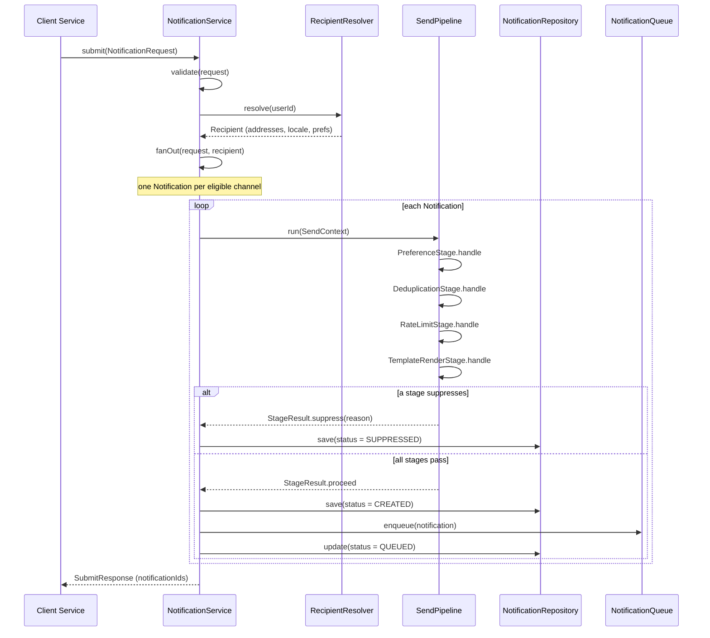
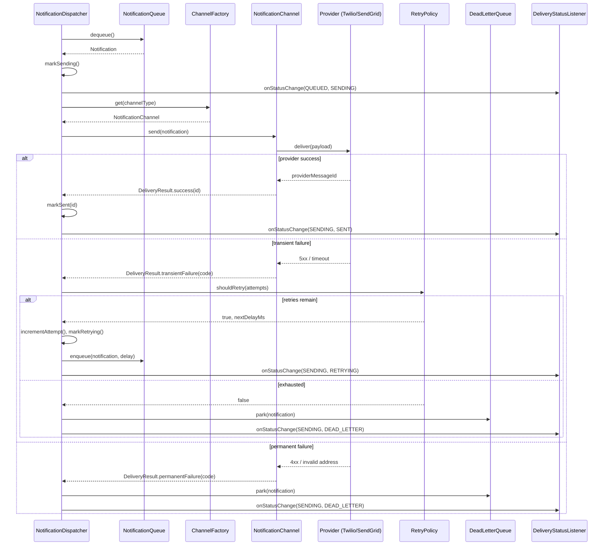
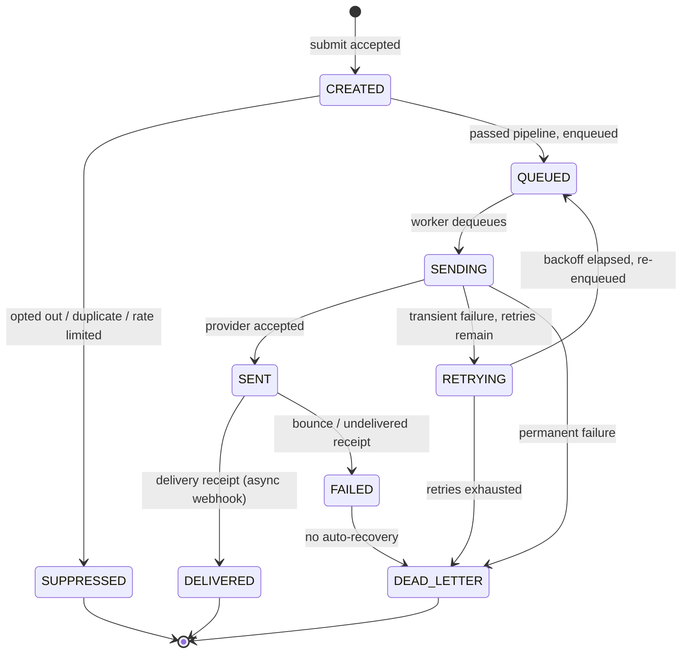

# 🔔 Low-Level Design: Notification Service

> A complete, interview-ready walkthrough of the **Notification Service** design problem — from a blank whiteboard to a staff-level system that delivers messages across email, SMS, push, and Slack, honors every user's preferences, survives flaky third-party providers with retries and dead-letter queues, and scales from a single JVM to a fleet of workers draining a distributed queue.

The Notification Service is one of the most revealing object-oriented design interviews you can be given, because it looks deceptively small and grows in every direction the moment you touch it. "Send a user a message" is the one-line prompt. But *which* message, over *which* channel, in *whose* preferred language, respecting *which* opt-outs, at *what* priority, and what happens when the SMS provider times out for the third time in a row? Each of those questions is a design decision, and the strongest candidates surface them before writing a line of code. Underneath the friendly name sits a genuinely hard systems problem: fan-out across heterogeneous providers, idempotency so a retried event never double-charges a customer's inbox, back-pressure so a marketing blast doesn't starve a password-reset email, and an extensibility story clean enough that adding a WhatsApp channel next quarter is a new file rather than a rewrite. This guide walks the entire journey, escalating from the beginner's mental model of "a switch statement over channel types" to the atomicity, ordering, and delivery-guarantee concerns a principal engineer raises in the closing minutes.

---

## 📋 Table of Contents

**Part I — Framing the Problem**

1. [Problem Statement](#1-problem-statement)
2. [Requirement Clarification & Assumptions](#2-requirement-clarification--assumptions)
3. [Functional & Non-Functional Requirements](#3-functional--non-functional-requirements)
4. [Core Concepts Being Tested](#4-core-concepts-being-tested)

**Part II — Modeling the Domain**

5. [Domain Model & Entities](#5-domain-model--entities)
6. [CRC Cards](#6-crc-cards)
7. [UML Class Diagram](#7-uml-class-diagram)
8. [Package Structure](#8-package-structure)

**Part III — Design Rationale**

9. [Design Decisions & Trade-offs](#9-design-decisions--trade-offs)
10. [Class-by-Class Deep Dive](#10-class-by-class-deep-dive)
11. [Design Patterns Applied](#11-design-patterns-applied)
12. [SOLID Principles Mapping](#12-solid-principles-mapping)

**Part IV — Behavior & Diagrams**

13. [Sequence Diagram](#13-sequence-diagram)
14. [State Diagram](#14-state-diagram)

**Part V — The Implementation**

15. [Complete Java Implementation](#15-complete-java-implementation)
16. [Execution Flow & Code Walkthrough](#16-execution-flow--code-walkthrough)

**Part VI — Engineering Depth**

17. [Complexity Analysis](#17-complexity-analysis)
18. [Thread Safety & Concurrency](#18-thread-safety--concurrency)
19. [Error Handling & Validation](#19-error-handling--validation)
20. [Scalability Discussion](#20-scalability-discussion)
21. [Alternative Designs & Trade-offs](#21-alternative-designs--trade-offs)

**Part VII — Interview Mastery**

22. [Common FAANG Follow-up Questions (L4 → L6)](#22-common-faang-follow-up-questions-l4--l6)
23. [Common Design Mistakes](#23-common-design-mistakes)
24. [Testing Strategy](#24-testing-strategy)
25. [FAANG Q&A Section](#25-faang-qa-section)
26. [STAR Behavioral Questions](#26-star-behavioral-questions)
27. [⚡ Quick Revision Cheat Sheet](#27--quick-revision-cheat-sheet)

---

## 1. Problem Statement

Design a **Notification Service**: a system that accepts a request to notify a user about some event and reliably delivers that notification over one or more channels — **email, SMS, push notification, Slack, webhook** — while respecting the user's preferences, the message's priority, and the realities of unreliable third-party delivery providers.

Concretely, some upstream system (an order service, an auth service, a marketing scheduler) hands the notification service a request that says, in effect, *"tell user 4821 that their order shipped."* The service must resolve **who** the recipient is and how to reach them, decide **which channels** to use based on the user's opt-in settings and the notification's category, **render** the message from a template into the recipient's language, enforce **rate limits** so no single user or campaign floods a provider, **dispatch** the message to the right provider, and **track** the delivery through its lifecycle — retrying transient failures with backoff and parking permanent failures in a dead-letter queue for inspection.

<details>
<summary>📖 <b>In plain terms — what are we actually building?</b></summary>

Every product you use sends you messages: "your package is out for delivery," "here's your login code," "someone liked your photo." Behind all of them sits one shared piece of infrastructure whose only job is to take a request like *"notify this user about this thing"* and make sure it actually reaches them — by email if they want email, by text if they want text, in their language, without spamming them, and without silently vanishing if the email provider hiccups. We are not building Gmail or the SMS network; we are building the coordinator that sits in front of those providers, decides how and whether to reach each person, and guarantees the message doesn't get lost. It is the single front door every team in the company calls when they need to tell a user something.

</details>

The deliverable in an interview is not a running distributed system; it is a **clean object-oriented model** — a `NotificationService` entry point, a pluggable set of `NotificationChannel` strategies behind one interface, a preference and templating layer, and a robust delivery pipeline with retries and status tracking — that a real platform team could build on. Grading centers on three things: whether your channel abstraction is genuinely open to extension, whether your delivery pipeline handles failure like an engineer who has been paged at 3 a.m., and how convincingly you scale the single-process design into an asynchronous, queue-backed fleet.

---

## 2. Requirement Clarification & Assumptions

The single biggest mistake candidates make is hearing "notification service" and immediately drawing five boxes labeled Email, SMS, Push, Slack, Webhook. That is the *end* of the design, not the beginning. A strong candidate spends the first few minutes converting the vague prompt into a bounded problem by asking who uses the system, what "delivered" means, and what is explicitly out of scope.

### 2.1 Actors

The people and systems that interact with the notification service define its surface area.

| Actor | Role in the system |
|-------|--------------------|
| **Producer / Client Service** | An upstream service (orders, auth, billing, marketing) that submits a notification request. It knows *what* happened, not *how* to reach the user. |
| **Recipient / End User** | The person being notified. Owns preferences, contact addresses (email, phone, device tokens), and a language/locale. |
| **Notification Channel Provider** | The external system that performs actual delivery — SendGrid, Twilio, Firebase Cloud Messaging, the Slack API. The service integrates with these, it doesn't replace them. |
| **Template Author / Product Team** | Defines message templates (subject, body, variables) per event type and locale. |
| **Platform Operator / On-call** | Configures rate limits and retry policy, inspects the dead-letter queue, watches delivery metrics and dashboards. |
| **Preference / Consent System** | Holds each user's opt-in/opt-out choices per category and channel; may be internal to the service or an upstream authority. |

### 2.2 Key Clarifying Questions

Before modeling anything, resolve these with the interviewer. Each answer materially changes the design.

- **Synchronous or asynchronous?** — Does the caller block until the message is sent, or does the service accept the request, return immediately, and deliver in the background? *(Assumption: accept-and-acknowledge — the API returns quickly after persisting the request; actual delivery is asynchronous through a queue. This is the only design that survives a slow provider.)*
- **Which channels, and are they fixed?** — Email, SMS, push, Slack, webhook to start — but is the set open to extension? *(Assumption: yes, adding a channel must not require editing existing code — this is the marquee extensibility requirement and points straight at Strategy + Factory.)*
- **What delivery guarantee?** — Exactly-once, at-least-once, or best-effort? *(Assumption: at-least-once delivery with idempotency keys so duplicates are detectable and suppressible — exactly-once across third-party providers is effectively impossible.)*
- **Who owns preferences?** — Does the service check opt-outs, or does the caller pre-filter? *(Assumption: the service is the authority — it must never send to a user who opted out, because scattering that logic across callers guarantees a compliance violation eventually.)*
- **Multi-channel fan-out or single channel?** — Does one request go to several channels, or exactly one? *(Assumption: a request targets a set of channels, filtered by the user's preferences; a "critical" alert may fan out to all, a marketing message to email only.)*
- **Priority and ordering?** — Must a password-reset email jump ahead of a marketing blast? Must messages arrive in order? *(Assumption: priority is a first-class concept and high-priority messages preempt low ones; strict global ordering is a non-goal, but per-user causal ordering is desirable.)*
- **What are the numbers?** — Volume, fan-out, latency target? *(Assumption: millions of notifications per day, bursty (a marketing send can be tens of millions at once), transactional messages should dispatch within seconds, marketing can tolerate minutes.)*

### 2.3 Explicit Non-Goals

Naming what you will *not* build is a senior signal — it shows you can bound scope deliberately rather than by omission.

- **We do not implement the delivery providers themselves.** We integrate with SendGrid/Twilio/FCM behind an adapter; we do not run SMTP servers or the cellular SMS network.
- **We do not build the template authoring UI.** Templates are assumed to exist in a repository; we render them, we don't provide the editor.
- **We do not own user identity or authentication.** The recipient's ID and contact details are resolved upstream or looked up from a user store; we don't manage accounts.
- **No analytics/reporting warehouse.** We emit delivery-status events and metrics, but building the BI dashboards and open/click attribution pipeline is a separate system.
- **No in-app notification inbox or read/unread UI.** We deliver *out* to channels; the in-app feed (the bell icon with a red dot) is a distinct product surface, though it can be modeled as just another channel.
- **No content moderation or spam scoring.** We assume upstream owns "should this message exist"; we own "deliver this message correctly."

<details>
<summary>📖 <b>Why spend so long on clarification?</b></summary>

The words "notification service" hide two forks that completely reshape the answer. The first is *synchronous vs. asynchronous* — a synchronous design where the caller waits for Twilio to respond couples your API's latency to a third party you don't control, and one slow provider stalls every caller. An asynchronous design that persists the request and returns immediately is the only one that survives production, but it forces you to think about queues, workers, and delivery status from the start. The second fork is *who owns preferences and guarantees* — if the service is the source of truth for opt-outs and idempotency, the design has a rich middle layer; if callers pre-filter, the service is a thin dispatcher and you've missed the point of the question. Pin these two down early and the rest of the interview flows; skip them and you'll confidently design the wrong system.

</details>

---

## 3. Functional & Non-Functional Requirements

### 3.1 Functional Requirements (what the system *does*)

These are the concrete behaviors the system must support. In an interview, list them crisply — they become your checklist for the class design.

1. **Accept a notification request** — from a producer, identifying the recipient, the event/category, the payload data, and optionally the target channels and priority.
2. **Resolve the recipient** — look up contact addresses (email, phone, device tokens, Slack ID) and locale for the target user.
3. **Apply user preferences** — filter out channels and categories the user has opted out of; respect quiet hours where applicable.
4. **Render content from templates** — turn an event type plus a data map into a channel-specific, localized subject and body.
5. **Support multiple channels** — email, SMS, push, Slack, webhook — selectable per request and extensible to new channels without touching callers.
6. **Fan out across channels** — a single request may produce one notification per eligible channel.
7. **Enforce rate limits** — cap per-user and per-channel send rates so no client floods a provider.
8. **Dispatch asynchronously** — enqueue notifications and deliver them via background workers, decoupling acceptance from delivery.
9. **Retry transient failures** — with a configurable backoff policy, up to a maximum number of attempts.
10. **Dead-letter permanent failures** — park messages that exhaust retries (or fail permanently) for inspection and manual replay.
11. **Track delivery status** — expose the lifecycle of each notification (created → queued → sent → delivered / failed) and notify observers (metrics, audit).
12. **Deduplicate** — an idempotency key ensures the same logical event submitted twice is delivered once.

### 3.2 Non-Functional Requirements (how *well* it does it)

These are the qualities that make the design production-grade, and they are where staff-level discussion lives.

| Attribute | Requirement | Why it matters |
|-----------|-------------|----------------|
| **Reliability** | A message accepted by the service must not be silently lost; at-least-once delivery. | The whole promise of the service is "we will deliver it." A dropped password-reset is a locked-out user. |
| **Availability** | Accepting requests must stay up even when a provider is down. | If Twilio is down, email and push must still flow; one provider outage must not become a total outage. |
| **Low acceptance latency** | The submit API returns in single-digit milliseconds. | Callers are on a request path; they can't block on a third-party send. |
| **Scalability** | Handle millions of notifications/day with bursty fan-out (marketing blasts). | Real traffic is spiky; a campaign can be 100× the baseline. |
| **Extensibility** | Add a new channel or template with no change to existing channels or callers. | Channels are added constantly (WhatsApp, RCS); a closed design rots fast. |
| **Isolation / back-pressure** | A slow or failing channel must not starve the others. | One provider's latency spike shouldn't block unrelated transactional mail. |
| **Idempotency** | Retries and duplicate submissions must not double-send. | Double-charging a customer's inbox erodes trust and can violate consent rules. |
| **Observability** | Every state transition is trackable and measurable. | On-call must answer "did the message go out, and if not, why?" in seconds. |

<details>
<summary>📖 <b>Functional vs non-functional — the quick distinction</b></summary>

Functional requirements are the *verbs* — accept a request, render a template, dispatch to a channel, retry on failure. If a functional requirement fails, the service does the wrong thing: it sends the wrong content, or to the wrong channel, or not at all. Non-functional requirements are the *adverbs* — do it reliably, do it without losing messages, do it without letting a slow SMS provider block email, do it at millions per day. If a non-functional requirement fails, the service did the right thing but *lost the message on a crash*, or *blocked every caller behind one dead provider*, or *fell over under a marketing burst*. Interviewers push hardest on the non-functional ones because a correct channel abstraction on a whiteboard says nothing about whether the system survives a provider outage at 2 a.m. — and that's where real notification systems live or die.

</details>

---

## 4. Core Concepts Being Tested

This problem is a proxy for a bundle of skills. Knowing what's being measured helps you narrate your design to the *right* audience.

- **Designing for extension** — the marquee skill. The channel set will grow forever, so the interview rewards a `NotificationChannel` abstraction that is open for extension and closed for modification (Strategy + Factory), not a `switch` over channel types.
- **Asynchronous, decoupled architecture** — separating *accept* from *deliver* via a queue and workers is the concept that separates a toy from a real service; it forces reasoning about durability, back-pressure, and idempotency.
- **Failure handling as a first-class design** — retries with exponential backoff, transient vs. permanent failure classification, and a dead-letter queue are not add-ons; they are the reason the service exists.
- **Composition over configuration** — layering cross-cutting concerns (preference checks, rate limiting, deduplication) as a pipeline (Chain of Responsibility / interceptors) rather than tangling them into one method.
- **Concurrency correctness** — many workers draining a shared queue and updating shared status must not double-deliver or corrupt state; atomicity and idempotency are in scope.
- **Delivery-guarantee reasoning** — at-least-once vs. exactly-once, ordering, and idempotency keys are the systems-level probes that appear at L5/L6.

Keep these in the back of your mind as you read on — each section below is, in part, a chance to demonstrate one or more of them.

---

## 5. Domain Model & Entities

Before any code, we identify the **nouns** in the problem and turn them into entities. Good domain modeling is the difference between a design that flexes and one that fights you. The notification service has a satisfyingly clear vocabulary.

At the center is the **Notification** — a single message destined for one recipient over one channel. It is deliberately *not* the same thing as the request that created it: one **NotificationRequest** ("tell user 4821 their order shipped, over whatever channels they allow") can fan out into several `Notification` objects (an email *and* a push). Keeping these separate is the first modeling insight — the request is the caller's intent; the notification is a concrete unit of work with its own lifecycle and status.

The **Recipient** models the target user's reachability: their email, phone, device tokens, Slack ID, and locale. It answers the question "how, physically, do I reach this person?" It is distinct from **NotificationPreference**, which answers "how does this person *want* to be reached, and for what?" — the opt-in/opt-out matrix over categories and channels, plus quiet hours. Splitting reachability from consent keeps the compliance-critical logic in one auditable place.

Each **NotificationChannel** is a strategy that knows how to deliver over one medium. It is an interface with concrete implementations — `EmailChannel`, `SmsChannel`, `PushChannel`, `SlackChannel`, `WebhookChannel` — each wrapping a provider adapter. The **ChannelType** enum tags which is which. Content is produced by a **TemplateEngine** that renders a **Template** (identified by event type and locale) plus a data map into **RenderedContent** (a subject and body). Delivery outcomes are captured in a **DeliveryResult** that says whether the send succeeded, carries the provider's message ID, and — crucially — classifies any failure as *transient* (retry) or *permanent* (give up). The lifecycle is captured by the **NotificationStatus** enum, and a **RetryPolicy** decides when to try again.

Here is the full cast, with the responsibility of each:

| Entity | Type | Responsibility |
|--------|------|----------------|
| `NotificationRequest` | Value object (input) | The caller's intent: recipient ID, event type, data map, requested channels, priority, idempotency key. Built via a Builder. |
| `Notification` | Entity | One concrete message for one channel; carries content, status, attempt count, timestamps. Has identity and a lifecycle. |
| `Recipient` | Value object | Reachability: email, phone, device tokens, Slack ID, locale. |
| `NotificationPreference` | Value object | Consent matrix: which (category, channel) pairs are enabled; quiet-hours window. |
| `ChannelType` | Enum | `EMAIL, SMS, PUSH, SLACK, WEBHOOK`. |
| `Priority` | Enum | `LOW, MEDIUM, HIGH, CRITICAL` — drives queue ordering and rate-limit exemptions. |
| `NotificationStatus` | Enum | `CREATED, QUEUED, SENDING, SENT, DELIVERED, FAILED, RETRYING, DEAD_LETTER, SUPPRESSED`. |
| `NotificationChannel` | Interface (Strategy) | Deliver a `Notification`; report its `ChannelType`; say whether it supports a recipient. |
| `EmailChannel` / `SmsChannel` / `PushChannel` / `SlackChannel` / `WebhookChannel` | Concrete strategies | Channel-specific delivery via a provider adapter. |
| `Template` | Value object | A named, localized message skeleton with placeholders. |
| `TemplateEngine` | Service | Renders a `Template` + data map into `RenderedContent`. |
| `RenderedContent` | Value object | The final `subject` + `body` for a channel. |
| `DeliveryResult` | Value object | Outcome of a send: success flag, provider message ID, error code, `retryable` flag. |
| `RetryPolicy` | Interface (Strategy) | Given an attempt number, return the next delay and whether to keep trying. |
| `NotificationChannelFactory` | Factory | Resolve a `ChannelType` to its `NotificationChannel` instance. |
| `SendPipeline` / `SendStage` | Chain of Responsibility | Ordered cross-cutting stages: preference → dedup → rate-limit → render. |
| `NotificationQueue` | Interface | Durable, priority-aware buffer between acceptance and delivery. |
| `NotificationDispatcher` | Service (worker) | Drains the queue, invokes the channel, applies retry/DLQ logic. |
| `DeliveryStatusListener` | Interface (Observer) | Notified on every status transition — metrics, audit, webhooks-out. |
| `DeadLetterQueue` | Service | Holds notifications that exhausted retries or failed permanently. |
| `NotificationService` | Facade | The single entry point callers use to submit a request. |
| `NotificationRepository` | Interface | Persist and look up notifications and their status. |

<details>
<summary>📖 <b>Why separate the request from the notification?</b></summary>

A caller thinks in terms of intent: "notify user 4821 that their order shipped." That single intent might legitimately become two or three real messages — an email, a push, and a Slack DM — each of which can succeed or fail independently, retry on its own schedule, and land in the dead-letter queue by itself. If we modeled the request and the message as the same object, we'd have no clean place to store "the email delivered but the push failed and is on retry attempt 2." By making `NotificationRequest` the caller's intent and `Notification` the per-channel unit of work, each channel's fate is tracked independently, and the fan-out logic has an obvious home: turn one request into N notifications.

</details>

---

## 6. CRC Cards

CRC (Class–Responsibility–Collaborator) cards are the interviewer's favorite lightweight tool for showing you can assign responsibilities cleanly before drawing a single line of UML. Each card names a class, what it is responsible for, and who it talks to. The test of a good design is that no card has too many responsibilities and no card reaches into another's internals.

```
┌─────────────────────────────────────────────────────────────┐
│ NotificationService  (Facade / entry point)                  │
├─────────────────────────────────────────────────────────────┤
│ Responsibilities:                                            │
│  • Accept a NotificationRequest and validate it              │
│  • Fan out into per-channel Notifications                    │
│  • Run each through the SendPipeline, then enqueue           │
│  • Return an acknowledgement quickly (async)                 │
├─────────────────────────────────────────────────────────────┤
│ Collaborators:                                               │
│  • NotificationRequest, Notification                         │
│  • RecipientResolver, SendPipeline                           │
│  • NotificationQueue, NotificationRepository                 │
└─────────────────────────────────────────────────────────────┘

┌─────────────────────────────────────────────────────────────┐
│ NotificationChannel  (Strategy interface)                    │
├─────────────────────────────────────────────────────────────┤
│ Responsibilities:                                            │
│  • Deliver one Notification over one medium                  │
│  • Report its ChannelType                                    │
│  • Say whether a Recipient is addressable on this channel    │
│  • Classify failures as transient or permanent               │
├─────────────────────────────────────────────────────────────┤
│ Collaborators:                                               │
│  • Notification, DeliveryResult                              │
│  • Provider adapter (SendGrid, Twilio, FCM, ...)             │
└─────────────────────────────────────────────────────────────┘

┌─────────────────────────────────────────────────────────────┐
│ NotificationDispatcher  (Worker)                             │
├─────────────────────────────────────────────────────────────┤
│ Responsibilities:                                            │
│  • Drain notifications from the queue                        │
│  • Resolve the channel via the factory and send              │
│  • On transient failure, reschedule per RetryPolicy          │
│  • On permanent failure / exhausted retries, dead-letter     │
│  • Publish every status transition to listeners              │
├─────────────────────────────────────────────────────────────┤
│ Collaborators:                                               │
│  • NotificationQueue, NotificationChannelFactory             │
│  • RetryPolicy, DeadLetterQueue                              │
│  • DeliveryStatusListener, NotificationRepository            │
└─────────────────────────────────────────────────────────────┘

┌─────────────────────────────────────────────────────────────┐
│ SendPipeline  (Chain of Responsibility)                      │
├─────────────────────────────────────────────────────────────┤
│ Responsibilities:                                            │
│  • Run ordered SendStages over a Notification                │
│  • Short-circuit (suppress) if any stage rejects             │
│  • Stages: PreferenceStage, DeduplicationStage,              │
│    TemplateRenderStage                                       │
├─────────────────────────────────────────────────────────────┤
│ Collaborators:                                               │
│  • NotificationPreference, TemplateEngine                    │
│  • RateLimiter, Deduplicator                                 │
└─────────────────────────────────────────────────────────────┘

┌─────────────────────────────────────────────────────────────┐
│ TemplateEngine                                               │
├─────────────────────────────────────────────────────────────┤
│ Responsibilities:                                            │
│  • Look up the Template by event type + locale               │
│  • Substitute data-map values into placeholders              │
│  • Produce RenderedContent (subject + body)                  │
├─────────────────────────────────────────────────────────────┤
│ Collaborators:                                               │
│  • Template, RenderedContent, Notification                   │
└─────────────────────────────────────────────────────────────┘
```

<details>
<summary>📖 <b>How to read a CRC card in an interview</b></summary>

A CRC card is a promise about boundaries. When you say the `NotificationChannel` is responsible for "deliver over one medium and classify failures," you are also promising it does *not* decide retry timing, does *not* check preferences, and does *not* touch the queue — those belong to other cards. Interviewers watch for responsibility leakage: if your `NotificationChannel` starts checking opt-outs or scheduling retries, it's doing three jobs and will be painful to test and extend. The clean split here — service accepts and fans out, pipeline filters, dispatcher delivers and retries, channel talks to one provider — is what lets you add a channel or swap a retry policy without a ripple across the codebase.

</details>

---

## 7. UML Class Diagram

The diagram below is the spine of the design. Read it in three bands: the **entry and orchestration** classes on top (`NotificationService`, `NotificationDispatcher`), the **strategy family** in the middle (`NotificationChannel` and its implementations, plus `RetryPolicy`), and the **supporting collaborators** (pipeline, template, queue, listeners) around them. Every field type and method signature here matches the Java implementation in Section 15 exactly.

```
                                  ┌───────────────────────────────────────┐
                                  │        <<facade>>                     │
                                  │      NotificationService              │
                                  ├───────────────────────────────────────┤
                                  │ - pipeline: SendPipeline              │
                                  │ - queue: NotificationQueue            │
                                  │ - repo: NotificationRepository        │
                                  │ - resolver: RecipientResolver         │
                                  ├───────────────────────────────────────┤
                                  │ + submit(req: NotificationRequest)    │
                                  │        : SubmitResponse                │
                                  │ - fanOut(req, recipient)              │
                                  │        : List<Notification>           │
                                  └───────────────┬───────────────────────┘
                                                  │ enqueues
                                                  ▼
        ┌──────────────────────────┐   ┌───────────────────────────────────┐
        │  <<interface>>           │   │   <<interface>>                   │
        │  NotificationQueue       │◄──│   NotificationDispatcher (worker) │
        ├──────────────────────────┤   ├───────────────────────────────────┤
        │ + enqueue(n)             │   │ - queue: NotificationQueue        │
        │ + dequeue(): Notification│   │ - factory: NotificationChannel-   │
        │ + size(): int            │   │            Factory                │
        └──────────────────────────┘   │ - retryPolicy: RetryPolicy        │
                   ▲                    │ - dlq: DeadLetterQueue            │
                   │ implements         │ - listeners: List<Delivery-       │
        ┌──────────────────────────┐   │              StatusListener>      │
        │ InMemoryPriorityQueue    │   ├───────────────────────────────────┤
        └──────────────────────────┘   │ + start() / + stop()              │
                                        │ - process(n: Notification)        │
                                        │ - onSuccess(n) / - onFailure(n,r) │
                                        └───────────────┬───────────────────┘
                                                        │ resolves + invokes
                                                        ▼
        ┌──────────────────────────────┐    ┌───────────────────────────────────┐
        │   NotificationChannelFactory │───►│   <<interface>>                   │
        ├──────────────────────────────┤    │   NotificationChannel  (Strategy) │
        │ - channels: Map<ChannelType, │    ├───────────────────────────────────┤
        │       NotificationChannel>   │    │ + getType(): ChannelType          │
        │ + register(c)                │    │ + supports(r: Recipient): boolean │
        │ + get(t: ChannelType)        │    │ + send(n: Notification)           │
        │       : NotificationChannel  │    │        : DeliveryResult           │
        └──────────────────────────────┘    └───────────────┬───────────────────┘
                                                             │ implements
                              ┌──────────────────────────────┼───────────────────────────┐
                              ▼            ▼                  ▼             ▼               ▼
                     ┌──────────────┐┌───────────┐   ┌─────────────┐┌────────────┐┌──────────────┐
                     │ AbstractChan-││EmailChannel│   │ SmsChannel  ││ PushChannel││ SlackChannel │
                     │ nel (Template││           │   │             ││            ││ WebhookChan- │
                     │  Method)     ││           │   │             ││            ││ nel          │
                     ├──────────────┤└───────────┘   └─────────────┘└────────────┘└──────────────┘
                     │ + send(n)    │  each holds a provider adapter (SendGrid / Twilio / FCM ...)
                     │   {final}    │
                     │ # doSend(n)  │
                     │   {abstract} │
                     │ # address(r) │
                     └──────────────┘

        ┌───────────────────────────────┐        ┌──────────────────────────────┐
        │   SendPipeline (Chain of Resp) │        │   <<interface>> SendStage    │
        ├───────────────────────────────┤◄───────├──────────────────────────────┤
        │ - stages: List<SendStage>     │  runs   │ + handle(ctx: SendContext)   │
        │ + run(ctx): boolean           │         │      : StageResult           │
        └───────────────────────────────┘         └──────────────┬───────────────┘
                                                                  │ implements
                    ┌───────────────────┬─────────────────┬───────┴──────────┐
                    ▼                   ▼                 ▼                  ▼
          ┌──────────────────┐ ┌────────────────┐┌────────────────┐┌──────────────────┐
          │ PreferenceStage  │ │ Deduplication- ││ RateLimitStage ││ TemplateRender-  │
          │  (Preference)    │ │ Stage (dedup)  ││ (RateLimiter)  ││ Stage (Template- │
          └──────────────────┘ └────────────────┘└────────────────┘│ Engine)          │
                                                                    └──────────────────┘

        ┌───────────────────────┐   ┌──────────────────────────┐   ┌────────────────────────┐
        │ <<interface>>         │   │ Notification  (entity)   │   │ DeliveryResult (value) │
        │ RetryPolicy (Strategy)│   ├──────────────────────────┤   ├────────────────────────┤
        ├───────────────────────┤   │ - id: String             │   │ - success: boolean     │
        │ + shouldRetry(attempt)│   │ - recipient: Recipient   │   │ - providerMessageId:   │
        │      : boolean        │   │ - channelType: ChannelType   │      String            │
        │ + nextDelayMs(attempt)│   │ - content: RenderedContent   │ - errorCode: String    │
        │      : long           │   │ - priority: Priority     │   │ - retryable: boolean   │
        └───────────┬───────────┘   │ - status: NotificationStatus │ + success(id)          │
                    │ implements     │ - attempts: int          │   │ + transientFailure(c)  │
          ┌─────────▼──────────┐    │ - idempotencyKey: String │   │ + permanentFailure(c)  │
          │ ExponentialBackoff-│    │ + markSending() ...      │   └────────────────────────┘
          │ RetryPolicy        │    │ + incrementAttempt()     │
          └────────────────────┘    └──────────────────────────┘

        ┌───────────────────────────┐   ┌───────────────────────────────────────┐
        │ <<interface>>             │   │  enums                                │
        │ DeliveryStatusListener    │   │  ChannelType {EMAIL,SMS,PUSH,SLACK,   │
        │  (Observer)               │   │               WEBHOOK}                │
        ├───────────────────────────┤   │  Priority {LOW,MEDIUM,HIGH,CRITICAL}  │
        │ + onStatusChange(n,       │   │  NotificationStatus {CREATED,QUEUED,  │
        │    old, new)              │   │    SENDING,SENT,DELIVERED,FAILED,     │
        └───────────┬───────────────┘   │    RETRYING,DEAD_LETTER,SUPPRESSED}   │
                    │ implements         └───────────────────────────────────────┘
        ┌───────────▼───────────────┐
        │ MetricsListener,          │
        │ AuditLogListener          │
        └───────────────────────────┘
```

The relationships worth narrating aloud in an interview: `NotificationService` **depends on** the pipeline and queue but knows nothing about channels — that decoupling is deliberate. `NotificationDispatcher` is the only class that touches `NotificationChannel`, and it reaches them exclusively through the `NotificationChannelFactory`, so a new channel is invisible to the dispatcher's code. `AbstractChannel` sits between the interface and the concrete channels to host the Template Method skeleton (validate → build payload → `doSend` → classify failure). And `RetryPolicy` and `DeliveryStatusListener` are both pluggable strategy/observer seams so retry behavior and side effects can change without editing the dispatcher.

---

## 8. Package Structure

A clean package layout is itself a design statement: it tells the reader what varies independently. The guiding rule is **package by feature/responsibility, not by pattern** — you won't find a `strategies` package, because "it's a strategy" is not a reason two classes belong together; `EmailChannel` belongs with the other channels.

```
com.company.notification
│
├── api/                          # The public surface callers touch
│   ├── NotificationService.java          (Facade)
│   ├── NotificationRequest.java          (+ Builder)
│   └── SubmitResponse.java
│
├── domain/                       # Entities, value objects, enums — no behavior deps
│   ├── Notification.java
│   ├── Recipient.java
│   ├── NotificationPreference.java
│   ├── RenderedContent.java
│   ├── DeliveryResult.java
│   ├── ChannelType.java
│   ├── Priority.java
│   └── NotificationStatus.java
│
├── channel/                      # The Strategy family + factory
│   ├── NotificationChannel.java          (interface)
│   ├── AbstractChannel.java              (Template Method)
│   ├── EmailChannel.java
│   ├── SmsChannel.java
│   ├── PushChannel.java
│   ├── SlackChannel.java
│   ├── WebhookChannel.java
│   ├── NotificationChannelFactory.java   (Factory)
│   └── provider/                         # Adapters to external SDKs
│       ├── EmailProvider.java            (interface)
│       ├── SendGridEmailProvider.java
│       ├── SmsProvider.java
│       └── TwilioSmsProvider.java
│
├── pipeline/                     # Chain of Responsibility (cross-cutting concerns)
│   ├── SendPipeline.java
│   ├── SendStage.java                    (interface)
│   ├── SendContext.java
│   ├── StageResult.java
│   ├── PreferenceStage.java
│   ├── DeduplicationStage.java
│   ├── RateLimitStage.java
│   └── TemplateRenderStage.java
│
├── dispatch/                     # Async delivery machinery
│   ├── NotificationDispatcher.java       (worker)
│   ├── NotificationQueue.java            (interface)
│   ├── InMemoryPriorityQueue.java
│   ├── RetryPolicy.java                  (Strategy interface)
│   ├── ExponentialBackoffRetryPolicy.java
│   └── DeadLetterQueue.java
│
├── template/
│   ├── Template.java
│   ├── TemplateEngine.java
│   └── InMemoryTemplateRepository.java
│
├── ratelimit/
│   ├── RateLimiter.java                   (interface)
│   └── TokenBucketRateLimiter.java
│
├── observer/                     # Observer: side effects on status change
│   ├── DeliveryStatusListener.java       (interface)
│   ├── MetricsListener.java
│   └── AuditLogListener.java
│
└── persistence/
    ├── NotificationRepository.java        (interface)
    ├── RecipientResolver.java
    └── Deduplicator.java
```

<details>
<summary>📖 <b>Why package by feature, not by pattern?</b></summary>

It's tempting to create packages named `factories`, `strategies`, and `observers` because the patterns feel like the important thing. In practice this scatters closely related code across the tree: to add a Slack channel you'd touch `strategies` (the channel), `factories` (registration), and maybe `adapters` — three packages for one feature. Grouping by responsibility instead — everything about channels lives in `channel/`, everything about async delivery in `dispatch/` — means a feature change is usually confined to one package, and a newcomer can find "where does templating live?" by reading directory names rather than knowing which pattern you used. Patterns are an implementation detail of a package, not an organizing principle across the codebase.

</details>

---

## 9. Design Decisions & Trade-offs

Every meaningful design decision in this problem is a fork with a defensible answer on each side. What separates a mid-level answer from a staff-level one is not picking the "right" branch — it's *naming the trade-off* and justifying the choice against the requirements. Here are the decisions that matter, in the order they tend to arise.

**Decision 1 — Synchronous send vs. accept-and-queue.** The tempting first design has `NotificationService.submit()` call the channel directly and return the result. It is simple and gives the caller an immediate answer, but it welds your API's latency and availability to third-party providers: if Twilio takes four seconds, your caller waits four seconds, and if Twilio is down, your submit call fails. The chosen design **persists the request, enqueues it, and returns an acknowledgement immediately**, with a pool of `NotificationDispatcher` workers performing the actual send. The cost is complexity (a queue, workers, status tracking) and the fact that "accepted" no longer means "delivered." The benefit is that acceptance latency is bounded and independent of any provider, and a provider outage degrades gracefully into a growing queue rather than a cascade of caller-facing errors. For any service that runs at scale, this is the only viable choice.

**Decision 2 — One `Notification` per channel vs. one multi-channel object.** We fan a single `NotificationRequest` into one `Notification` per eligible channel. The alternative — a single object carrying a list of channels and a per-channel status map — keeps related deliveries together but tangles their independent lifecycles: the email can be `DELIVERED` while the push is on `RETRYING` attempt 3, and a single status field can't express that. Splitting them gives each channel its own row, its own retry counter, and its own dead-letter fate, at the cost of more objects and a fan-out step. Independent lifecycles win decisively.

**Decision 3 — Strategy + Factory for channels vs. a `switch`.** A `switch (channelType)` inside the dispatcher is the naive approach; it means every new channel edits a method that all channels share, violating open/closed and turning the dispatcher into a merge-conflict magnet. The `NotificationChannel` interface with a `NotificationChannelFactory` registry means adding WhatsApp is a new class plus one registration line, and the dispatcher never changes. The trade-off is more types and a small indirection cost, which is trivial next to the extensibility gain — and extensibility is the explicit top requirement.

**Decision 4 — Cross-cutting concerns as a pipeline vs. inline calls.** Preference checks, deduplication, rate limiting, and template rendering could all be inline `if` blocks in `submit()`. Instead they are ordered `SendStage`s in a `SendPipeline` (Chain of Responsibility). Inline is fewer classes and a shorter call stack; the pipeline costs an interface and a list. But the pipeline makes the ordering explicit and reorderable, lets you add a stage (say, a compliance check) without editing the others, and makes each concern unit-testable in isolation. For logic that is guaranteed to grow, the pipeline pays for itself.

**Decision 5 — Where does the retry loop live?** Retries belong in the `NotificationDispatcher`, not inside each channel. If every channel implemented its own retry, you'd duplicate backoff logic five times and couple delivery to scheduling. By keeping channels stateless and single-shot (`send()` tries exactly once and returns a `DeliveryResult`), the dispatcher owns the loop and consults a pluggable `RetryPolicy`. This also means the *transient vs. permanent* classification — which only the channel can make, since only it understands the provider's error codes — is expressed as a `retryable` flag on `DeliveryResult`, cleanly separating "did it fail and can we retry" (channel's knowledge) from "should we retry now and how long do we wait" (dispatcher's policy).

**Decision 6 — Priority handling.** A single FIFO queue lets a 10-million-recipient marketing blast sit in front of a password-reset email for minutes. The design uses a **priority queue** so `CRITICAL`/`HIGH` transactional messages are dequeued ahead of `LOW` marketing traffic. The subtlety an interviewer will push on: naive priority queues can *starve* low-priority messages forever under sustained high-priority load, so at scale you separate them into distinct queues with dedicated worker pools rather than one priority queue — discussed further in Scalability.

The table below summarizes the headline trade-offs:

| Decision | Chosen approach | Alternative | Why the choice |
|----------|-----------------|-------------|----------------|
| Send model | Accept-and-queue (async) | Synchronous send | Decouples acceptance latency/availability from providers |
| Message granularity | One `Notification` per channel | Multi-channel object | Independent lifecycle, retry, and DLQ per channel |
| Channel dispatch | Strategy + Factory | `switch` on type | Open/closed; new channel = new class |
| Cross-cutting logic | `SendPipeline` (CoR) | Inline `if` blocks | Reorderable, testable, extensible stages |
| Retry ownership | In dispatcher via `RetryPolicy` | In each channel | No duplication; clean policy/mechanism split |
| Ordering | Priority queue (then per-type queues) | Single FIFO | Transactional messages preempt bulk |

<details>
<summary>📖 <b>The one trade-off to lead with</b></summary>

If you have time for only one trade-off discussion, make it synchronous-vs-asynchronous. It is the decision that most shapes the architecture and the one most candidates get wrong by defaulting to the simple synchronous version. Say it plainly: "I'll accept the request, persist it, put it on a queue, and return immediately — because if I call Twilio inline, then Twilio's latency becomes my latency and Twilio's outage becomes my outage, and I can't let a third party I don't control take down my submit path." That single sentence signals you've operated a real system, and it naturally opens the door to every rich topic that follows: queues, workers, retries, idempotency, and delivery guarantees.

</details>

---

## 10. Class-by-Class Deep Dive

This section walks the key classes and explains not just what each does but *why it is shaped the way it is* — the reasoning an interviewer probes when they ask "why did you put that there?"

**`NotificationService` (Facade).** The single public entry point. Its `submit(NotificationRequest)` method validates the request, resolves the recipient, fans out into per-channel `Notification` objects, runs each through the `SendPipeline`, persists the survivors, enqueues them, and returns their IDs. It deliberately contains *no* channel logic, no retry logic, and no rendering — it orchestrates and delegates. This is what makes it a Facade: callers get a one-line "send this" without learning the internals. Keeping it thin is a discipline; the temptation to let it grow into a god-object is the most common way this design rots.

**`Notification` (Entity).** The unit of work. It carries identity (`id`), the resolved `Recipient`, its single `channelType`, the `RenderedContent`, `Priority`, current `NotificationStatus`, `attempts`, and the `idempotencyKey`. Its methods are lifecycle transitions — `markSending()`, `markSent(providerMessageId)`, `markFailed()`, `incrementAttempt()` — not open setters, so status can only move along legal edges. Encapsulating transitions on the entity keeps the state machine honest and gives observers a single choke point.

**`NotificationChannel` (Strategy interface).** Three methods: `getType()`, `supports(Recipient)`, and `send(Notification): DeliveryResult`. The contract is deliberately narrow — a channel delivers exactly once and reports the outcome; it does not retry, does not check preferences, does not enqueue. `supports()` lets a channel decline a recipient it can't reach (no phone number for SMS), which the fan-out uses to avoid creating doomed notifications.

**`AbstractChannel` (Template Method).** Implements `send()` as `final`, fixing the skeleton: check the recipient is addressable, build the provider payload, call the abstract `doSend()`, and wrap any thrown provider exception into a `DeliveryResult` with the correct `retryable` classification. Subclasses implement only `doSend()` and `address()`. This removes the try/catch and classification boilerplate from every channel and guarantees consistent failure handling — a channel author physically cannot forget to classify an error.

**`NotificationChannelFactory` (Factory).** Holds a `Map<ChannelType, NotificationChannel>` populated at startup via `register()`. `get(ChannelType)` returns the strategy. This is the single seam where new channels plug in; the dispatcher asks the factory and never names a concrete channel class.

**`SendPipeline` and `SendStage` (Chain of Responsibility).** The pipeline holds an ordered `List<SendStage>` and runs each `handle(SendContext)` until one returns a `StageResult` that says "suppress." `PreferenceStage` drops channels the user opted out of. `DeduplicationStage` suppresses a notification whose idempotency key was already seen. `RateLimitStage` suppresses or defers when a per-user/per-channel limit is hit. `TemplateRenderStage` populates the `RenderedContent`. Each stage is independently testable and the order is data, not code.

**`NotificationDispatcher` (Worker).** The heart of async delivery. Running on a pool of threads, each worker loops: dequeue a `Notification`, resolve its channel via the factory, call `send()`, and branch on the result. On success it marks the notification `SENT` and notifies listeners. On a `retryable` failure it consults the `RetryPolicy`; if more attempts remain it increments the attempt count and re-enqueues with a delay, otherwise it routes to the `DeadLetterQueue`. On a permanent failure it dead-letters immediately. Every transition publishes to the `DeliveryStatusListener`s.

**`RetryPolicy` / `ExponentialBackoffRetryPolicy` (Strategy).** `shouldRetry(attempt)` and `nextDelayMs(attempt)`. The exponential implementation returns `base * 2^attempt` capped at a ceiling, with jitter to avoid a thundering herd of synchronized retries. Pluggable so a channel-specific policy (SMS might retry fewer times because it costs money per attempt) can be swapped in.

**`DeliveryStatusListener` (Observer).** `onStatusChange(Notification, old, new)`. `MetricsListener` increments counters (sent, failed, dead-lettered) for dashboards; `AuditLogListener` writes an immutable record for compliance. Adding a new reaction to status changes — say, a Slack alert when the DLQ grows — is a new listener, not an edit to the dispatcher.

**`RateLimiter` / `TokenBucketRateLimiter`.** Guards each `(user, channel)` pair. Token bucket allows short bursts while capping the sustained rate, which fits notification traffic well. Used inside `RateLimitStage`.

**`NotificationQueue` / `InMemoryPriorityQueue`.** The abstraction between accept and deliver. In-memory with a priority ordering for the single-node design; in production this interface is implemented over Kafka or SQS, which is exactly the point of hiding it behind an interface.

<details>
<summary>📖 <b>Why is send() on the channel single-shot?</b></summary>

It would feel natural to let each channel retry its own failures — "the email failed, try again." But if every channel owns its retry loop, you copy the same backoff-and-count logic into five classes, and you couple two concerns that change for different reasons: *how to talk to a provider* and *how patient to be about failure*. By making `send()` try exactly once and return a `DeliveryResult` that merely says "it failed, and here's whether that's worth retrying," the channel stays tiny and stateless, and the dispatcher owns one retry loop driven by a pluggable policy. Now you can make SMS retry twice and email retry five times by swapping a policy object, without touching a line of channel code.

</details>

---

## 11. Design Patterns Applied

Patterns should be named only where they *earn their place*. In this problem an unusually rich set genuinely does, because the notification service is a textbook case of "the same operation done many ways, with cross-cutting concerns layered on top."

| Pattern | Where it appears | What it buys us |
|---------|------------------|-----------------|
| **Strategy** | `NotificationChannel` with five implementations; `RetryPolicy` with backoff variants | Swap the delivery medium or retry behavior by configuration; add a channel without touching callers. The marquee pattern. |
| **Factory** | `NotificationChannelFactory` maps `ChannelType` to a channel instance | Centralizes channel resolution; the dispatcher asks for "the SMS channel" without `new`-ing a concrete class. |
| **Template Method** | `AbstractChannel.send()` is `final`; subclasses fill `doSend()` | Fixes the validate → build → send → classify skeleton so every channel handles failure identically. |
| **Chain of Responsibility** | `SendPipeline` runs ordered `SendStage`s | Preference, dedup, rate-limit, and render become reorderable, independently testable stages instead of tangled `if` blocks. |
| **Observer** | `DeliveryStatusListener` notified on every status transition | Metrics, audit, and alerting react to delivery events without the dispatcher knowing they exist. |
| **Builder** | `NotificationRequest.Builder` | Constructs a request with many optional fields (channels, priority, idempotency key, data) readably and immutably. |
| **Facade** | `NotificationService` | Gives every caller a one-line `submit()`, hiding fan-out, pipeline, and queueing. |
| **Adapter** | `SendGridEmailProvider`, `TwilioSmsProvider` behind `EmailProvider`/`SmsProvider` | Lets channels depend on our provider abstraction, not a vendor SDK, so swapping SendGrid for SES is a new adapter. |
| **Command** *(implicit)* | Each `Notification` on the queue is a self-contained unit of work a worker executes later | Decouples the request for work from its execution, enabling async processing, retry, and persistence. |
| **Singleton** *(pragmatic)* | The factory, queue, and service are single shared instances (injected, not static) | One authority owns channel registration and the queue; avoids fragmented state. |

<details>
<summary>📖 <b>Why Strategy is the backbone here</b></summary>

The entire problem reduces to one sentence: "deliver a message — the same conceptual operation — over one of several media, chosen at runtime, with the set of media guaranteed to grow." That is the definition of the Strategy pattern. By putting each channel behind one `NotificationChannel` interface, the code that *dispatches* never changes when you add a channel, and a new medium is a new file rather than an edit to a giant conditional. Every other pattern here is in service of that Strategy fan-out: the Factory builds the strategies, the Template Method removes duplication among them, the Adapter isolates each from its vendor SDK, and the Chain of Responsibility handles the concerns that apply *before* a strategy runs.

</details>

<details>
<summary>📖 <b>Chain of Responsibility vs. just calling the checks in order</b></summary>

You might ask why preference, dedup, rate-limit, and render aren't just four method calls at the top of `submit()`. They could be — but every one of those concerns changes for its own reasons and on its own schedule, and new ones appear (a legal-hold check, a frequency cap, a locale override). Inline, adding one means editing the orchestrator and re-testing everything around it. As a Chain of Responsibility, each stage is a small class implementing `handle(SendContext)`, the order is a list you can reorder or extend, and any stage can short-circuit the rest by returning "suppress." It turns an ever-growing method into an ever-growing *list* — which is a change that doesn't touch existing code.

</details>

---

## 12. SOLID Principles Mapping

The five SOLID principles are the vocabulary interviewers use to grade object-oriented design. This design maps onto them cleanly, and being able to point to concrete classes for each is a strong signal.

**Single Responsibility Principle.** Each class has one reason to change. `EmailChannel` changes only if email delivery changes; `ExponentialBackoffRetryPolicy` only if retry timing changes; `PreferenceStage` only if consent rules change. The dispatcher orchestrates but delegates rendering, classification, and retry timing to others. The clearest evidence is that the compliance-critical opt-out logic lives in exactly one place — `PreferenceStage` — rather than being smeared across callers or channels.

**Open/Closed Principle.** The system is open for extension and closed for modification precisely where it needs to be. Adding a WhatsApp channel means writing `WhatsAppChannel` and registering it — no existing class is edited. Adding a new cross-cutting concern means writing a new `SendStage`. Adding a new reaction to delivery events means a new `DeliveryStatusListener`. Each of these is the OCP in action, and each was a deliberate seam.

**Liskov Substitution Principle.** Every `NotificationChannel` is fully substitutable behind the interface: the dispatcher treats `SmsChannel` and `EmailChannel` identically, and neither strengthens preconditions nor weakens the contract (each returns a `DeliveryResult`, never throws past `AbstractChannel`'s handling). The `RetryPolicy` implementations are likewise interchangeable — the dispatcher's loop is correct for any of them.

**Interface Segregation Principle.** Interfaces are small and focused. `NotificationChannel` has three methods, not a fat interface bundling delivery with rendering and preferences. `SendStage` has one method. `DeliveryStatusListener` has one. A `MetricsListener` isn't forced to implement rendering it doesn't care about — it implements only the observer hook it needs.

**Dependency Inversion Principle.** High-level policy depends on abstractions, not concretions. `NotificationDispatcher` depends on the `NotificationChannel`, `RetryPolicy`, `NotificationQueue`, and `DeadLetterQueue` *interfaces*, not on `EmailChannel`, `ExponentialBackoffRetryPolicy`, `InMemoryPriorityQueue`, or a specific store. This is what lets the in-memory queue become a Kafka-backed queue in production with no change to the dispatcher, and what makes the whole system unit-testable with fakes.

<details>
<summary>📖 <b>The SOLID principle that matters most here</b></summary>

For this problem, Open/Closed is the star, because the entire premise is "the set of channels will grow forever." An interviewer is really asking: when your company adds WhatsApp, RCS, and in-app inbox next year, how much of this code do you have to reopen and re-test? The right answer — "none of it; each is a new `NotificationChannel` and one registration line" — is the OCP stated in domain terms. Dependency Inversion is the close second, because it's what makes the async design swappable: the dispatcher talks to a `NotificationQueue` interface, so moving from an in-process queue to Kafka is an infrastructure change the business logic never notices.

</details>

---

## 13. Sequence Diagram

Two flows tell the whole story: the **accept path** (fast, synchronous from the caller's view) and the **deliver path** (asynchronous, on a worker). Separating them in the diagram mirrors the architecture — the caller never waits for the second half.

**Accept path — from `submit()` to enqueued:**



**Deliver path — a worker drains the queue:**



The details worth calling out: the accept path touches the queue and repository but never a provider, so its latency is bounded by local work. The deliver path is where all the failure branching lives, and every branch ends in a status transition that fans out to listeners — which is how metrics and audit stay accurate without the dispatcher knowing who is listening.

<details>
<summary>📖 <b>Reading the two-phase flow</b></summary>

The single most important thing these diagrams show is the seam between the two: the client's `submit()` call ends the moment the notification is safely on the queue, and everything after that — talking to Twilio, retrying, dead-lettering — happens later on a worker the client never sees. This is why a slow or dead provider can't hurt the caller: by the time the provider is involved, the caller has already gotten its acknowledgement and moved on. The queue is the buffer that absorbs the difference between how fast requests arrive and how fast providers can accept them.

</details>

---

## 14. State Diagram

A `Notification` moves through a well-defined lifecycle. Modeling it as an explicit state machine — rather than a loose set of boolean flags — is what lets you answer "what does `RETRYING` mean and what can follow it?" without ambiguity, and it prevents illegal transitions like a `DELIVERED` message going back to `SENDING`.



A few states deserve explanation. `SENT` means the *provider accepted* the message — it does not mean the user saw it. `DELIVERED` is a stronger, later state driven by an asynchronous delivery receipt (an email open-tracking pixel, an SMS delivery report, an FCM ack); many designs stop at `SENT` and treat `DELIVERED`/`FAILED` as optional enrichment fed by provider webhooks. `SUPPRESSED` is a terminal, *intentional* non-delivery — the user opted out, the message was a duplicate, or a rate limit fired — and it is deliberately distinct from `FAILED` so metrics don't conflate "we chose not to send" with "we tried and couldn't." `DEAD_LETTER` is the catch-all terminal for anything unrecoverable, and it is where on-call looks first.

<details>
<summary>📖 <b>Why SENT and DELIVERED are different states</b></summary>

When Twilio's API returns `202 Accepted`, it has taken responsibility for the SMS — but the message hasn't reached the phone yet, and it might never (the number could be disconnected). If you collapse "provider accepted" and "user received" into one `SENT` state, your dashboards will happily report 100% success while users complain they never got their code. Keeping `SENT` (provider took it) separate from `DELIVERED` (a receipt confirms it arrived) and `FAILED` (a receipt says it bounced) means your metrics tell the truth, and it gives you a hook — the delivery-receipt webhook — to react to real-world outcomes. In an interview, naming this distinction unprompted signals you've dealt with real delivery pipelines.

</details>

---

## 15. Complete Java Implementation

The full implementation follows, grouped by package and wrapped in collapsible blocks so you can read the design top-down and expand the code where you want the detail. Every class name, field type, and method signature matches the UML in Section 7 and the diagrams in Sections 13–14. The code compiles as a self-contained example — the providers are simulated so the delivery pipeline, retries, and dead-lettering are all exercisable without real credentials.

<details>
<summary>💻 <b>1 — Enums &amp; core value objects</b> (<code>domain/</code>)</summary>

```java
package com.company.notification.domain;

// ---- Enums ---------------------------------------------------------------

public enum ChannelType { EMAIL, SMS, PUSH, SLACK, WEBHOOK }

public enum Priority {
    LOW(10), MEDIUM(20), HIGH(30), CRITICAL(40);
    private final int weight;
    Priority(int weight) { this.weight = weight; }
    public int weight() { return weight; }   // higher weight dequeues first
}

public enum NotificationStatus {
    CREATED, QUEUED, SENDING, SENT, DELIVERED,
    FAILED, RETRYING, DEAD_LETTER, SUPPRESSED
}
```

```java
package com.company.notification.domain;

// ---- RenderedContent: the final subject + body for one channel ----------

public final class RenderedContent {
    private final String subject;   // may be null for SMS/push
    private final String body;

    public RenderedContent(String subject, String body) {
        this.subject = subject;
        this.body = body;
    }
    public String subject() { return subject; }
    public String body() { return body; }
}
```

```java
package com.company.notification.domain;

// ---- DeliveryResult: outcome of a single send attempt -------------------

public final class DeliveryResult {
    private final boolean success;
    private final String providerMessageId;   // set when success
    private final String errorCode;            // set when failure
    private final boolean retryable;           // transient vs permanent

    private DeliveryResult(boolean success, String providerMessageId,
                           String errorCode, boolean retryable) {
        this.success = success;
        this.providerMessageId = providerMessageId;
        this.errorCode = errorCode;
        this.retryable = retryable;
    }

    public static DeliveryResult success(String providerMessageId) {
        return new DeliveryResult(true, providerMessageId, null, false);
    }
    public static DeliveryResult transientFailure(String errorCode) {
        return new DeliveryResult(false, null, errorCode, true);
    }
    public static DeliveryResult permanentFailure(String errorCode) {
        return new DeliveryResult(false, null, errorCode, false);
    }

    public boolean isSuccess()   { return success; }
    public boolean isRetryable() { return retryable; }
    public String providerMessageId() { return providerMessageId; }
    public String errorCode() { return errorCode; }
}
```

```java
package com.company.notification.domain;

import java.util.Map;
import java.util.Set;

// ---- Recipient: how to physically reach a user --------------------------

public final class Recipient {
    private final String userId;
    private final String email;
    private final String phone;
    private final Set<String> deviceTokens;   // push
    private final String slackId;
    private final String webhookUrl;
    private final String locale;              // e.g. "en-US"
    private final NotificationPreference preference;

    public Recipient(String userId, String email, String phone,
                     Set<String> deviceTokens, String slackId, String webhookUrl,
                     String locale, NotificationPreference preference) {
        this.userId = userId;
        this.email = email;
        this.phone = phone;
        this.deviceTokens = deviceTokens;
        this.slackId = slackId;
        this.webhookUrl = webhookUrl;
        this.locale = locale;
        this.preference = preference;
    }
    public String userId() { return userId; }
    public String email()  { return email; }
    public String phone()  { return phone; }
    public Set<String> deviceTokens() { return deviceTokens; }
    public String slackId() { return slackId; }
    public String webhookUrl() { return webhookUrl; }
    public String locale() { return locale; }
    public NotificationPreference preference() { return preference; }
}
```

```java
package com.company.notification.domain;

import java.time.LocalTime;
import java.util.Set;
import java.util.AbstractMap.SimpleEntry;

// ---- NotificationPreference: the consent matrix -------------------------

public final class NotificationPreference {
    // (category, channel) pairs the user has ENABLED
    private final Set<SimpleEntry<String, ChannelType>> enabled;
    private final LocalTime quietStart;   // null = no quiet hours
    private final LocalTime quietEnd;

    public NotificationPreference(Set<SimpleEntry<String, ChannelType>> enabled,
                                  LocalTime quietStart, LocalTime quietEnd) {
        this.enabled = enabled;
        this.quietStart = quietStart;
        this.quietEnd = quietEnd;
    }

    public boolean allows(String category, ChannelType channel) {
        return enabled.contains(new SimpleEntry<>(category, channel));
    }

    public boolean inQuietHours(LocalTime now) {
        if (quietStart == null || quietEnd == null) return false;
        if (quietStart.isBefore(quietEnd)) {
            return !now.isBefore(quietStart) && now.isBefore(quietEnd);
        }
        // window wraps past midnight (e.g. 22:00 -> 07:00)
        return !now.isBefore(quietStart) || now.isBefore(quietEnd);
    }
}
```

</details>

<details>
<summary>💻 <b>2 — Notification entity &amp; NotificationRequest builder</b> (<code>domain/</code>, <code>api/</code>)</summary>

```java
package com.company.notification.domain;

import java.time.Instant;
import java.util.UUID;

// ---- Notification: the per-channel unit of work with a lifecycle --------

public final class Notification {
    private final String id;
    private final Recipient recipient;
    private final ChannelType channelType;
    private final String category;
    private final Priority priority;
    private final String idempotencyKey;
    private final String templateId;
    private final java.util.Map<String, Object> data;

    private RenderedContent content;          // filled by TemplateRenderStage
    private NotificationStatus status;
    private int attempts;
    private String providerMessageId;
    private String lastError;
    private final Instant createdAt;
    private Instant updatedAt;

    public Notification(Recipient recipient, ChannelType channelType, String category,
                        Priority priority, String idempotencyKey, String templateId,
                        java.util.Map<String, Object> data) {
        this.id = UUID.randomUUID().toString();
        this.recipient = recipient;
        this.channelType = channelType;
        this.category = category;
        this.priority = priority;
        this.idempotencyKey = idempotencyKey;
        this.templateId = templateId;
        this.data = data;
        this.status = NotificationStatus.CREATED;
        this.attempts = 0;
        this.createdAt = Instant.now();
        this.updatedAt = this.createdAt;
    }

    // ---- lifecycle transitions (the only way status changes) ------------
    public void markQueued()    { transition(NotificationStatus.QUEUED); }
    public void markSending()   { transition(NotificationStatus.SENDING); }
    public void markRetrying()  { transition(NotificationStatus.RETRYING); }
    public void markSuppressed(String reason) {
        this.lastError = reason; transition(NotificationStatus.SUPPRESSED);
    }
    public void markSent(String providerMessageId) {
        this.providerMessageId = providerMessageId;
        transition(NotificationStatus.SENT);
    }
    public void markDeadLetter(String reason) {
        this.lastError = reason; transition(NotificationStatus.DEAD_LETTER);
    }
    public void incrementAttempt() { this.attempts++; }
    private void transition(NotificationStatus next) {
        this.status = next;
        this.updatedAt = Instant.now();
    }

    // ---- getters --------------------------------------------------------
    public String id() { return id; }
    public Recipient recipient() { return recipient; }
    public ChannelType channelType() { return channelType; }
    public String category() { return category; }
    public Priority priority() { return priority; }
    public String idempotencyKey() { return idempotencyKey; }
    public String templateId() { return templateId; }
    public java.util.Map<String, Object> data() { return data; }
    public RenderedContent content() { return content; }
    public void setContent(RenderedContent c) { this.content = c; }
    public NotificationStatus status() { return status; }
    public int attempts() { return attempts; }
    public String lastError() { return lastError; }
}
```

```java
package com.company.notification.api;

import com.company.notification.domain.ChannelType;
import com.company.notification.domain.Priority;
import java.util.*;

// ---- NotificationRequest: the caller's intent (Builder) -----------------

public final class NotificationRequest {
    private final String userId;
    private final String category;          // e.g. "ORDER_SHIPPED", "MARKETING"
    private final String templateId;
    private final Map<String, Object> data;
    private final Set<ChannelType> requestedChannels;   // empty = "use prefs"
    private final Priority priority;
    private final String idempotencyKey;

    private NotificationRequest(Builder b) {
        this.userId = b.userId;
        this.category = b.category;
        this.templateId = b.templateId;
        this.data = b.data;
        this.requestedChannels = b.requestedChannels;
        this.priority = b.priority;
        this.idempotencyKey = b.idempotencyKey;
    }
    public String userId() { return userId; }
    public String category() { return category; }
    public String templateId() { return templateId; }
    public Map<String, Object> data() { return data; }
    public Set<ChannelType> requestedChannels() { return requestedChannels; }
    public Priority priority() { return priority; }
    public String idempotencyKey() { return idempotencyKey; }

    public static Builder builder() { return new Builder(); }

    public static final class Builder {
        private String userId;
        private String category = "GENERAL";
        private String templateId;
        private Map<String, Object> data = new HashMap<>();
        private Set<ChannelType> requestedChannels = new HashSet<>();
        private Priority priority = Priority.MEDIUM;
        private String idempotencyKey = UUID.randomUUID().toString();

        public Builder userId(String v)     { this.userId = v; return this; }
        public Builder category(String v)   { this.category = v; return this; }
        public Builder templateId(String v) { this.templateId = v; return this; }
        public Builder data(Map<String, Object> v) { this.data = v; return this; }
        public Builder channel(ChannelType c) { this.requestedChannels.add(c); return this; }
        public Builder priority(Priority v) { this.priority = v; return this; }
        public Builder idempotencyKey(String v) { this.idempotencyKey = v; return this; }

        public NotificationRequest build() {
            if (userId == null) throw new IllegalArgumentException("userId required");
            if (templateId == null) throw new IllegalArgumentException("templateId required");
            return new NotificationRequest(this);
        }
    }
}
```

```java
package com.company.notification.api;

import java.util.List;

// ---- SubmitResponse: what the caller gets back immediately --------------

public final class SubmitResponse {
    private final List<String> notificationIds;   // one id per fanned-out channel
    private final boolean accepted;

    public SubmitResponse(List<String> notificationIds, boolean accepted) {
        this.notificationIds = notificationIds;
        this.accepted = accepted;
    }
    public List<String> notificationIds() { return notificationIds; }
    public boolean accepted() { return accepted; }
}
```

</details>

<details>
<summary>💻 <b>3 — Channels: Strategy interface, Template Method base, concrete channels, provider adapters, factory</b> (<code>channel/</code>)</summary>

```java
package com.company.notification.channel;

import com.company.notification.domain.*;

// ---- Strategy interface -------------------------------------------------

public interface NotificationChannel {
    ChannelType getType();
    boolean supports(Recipient recipient);              // is the user addressable here?
    DeliveryResult send(Notification notification);     // single-shot, no retry
}
```

```java
package com.company.notification.channel;

import com.company.notification.domain.*;

// ---- Provider exceptions: how adapters signal failure kind --------------

public class TransientProviderException extends RuntimeException {
    private final String code;
    public TransientProviderException(String code, String msg) { super(msg); this.code = code; }
    public String code() { return code; }
}

public class PermanentProviderException extends RuntimeException {
    private final String code;
    public PermanentProviderException(String code, String msg) { super(msg); this.code = code; }
    public String code() { return code; }
}
```

```java
package com.company.notification.channel;

import com.company.notification.domain.*;

// ---- Template Method base: fixes the send skeleton ----------------------

public abstract class AbstractChannel implements NotificationChannel {

    // final: subclasses cannot alter the failure-handling contract
    @Override
    public final DeliveryResult send(Notification n) {
        String address = address(n.recipient());
        if (address == null || address.isBlank()) {
            return DeliveryResult.permanentFailure("NO_ADDRESS");
        }
        if (n.content() == null) {
            return DeliveryResult.permanentFailure("NO_CONTENT");
        }
        try {
            return doSend(n, address);                       // provider-specific step
        } catch (TransientProviderException e) {
            return DeliveryResult.transientFailure(e.code());   // 5xx, timeout -> retry
        } catch (PermanentProviderException e) {
            return DeliveryResult.permanentFailure(e.code());   // 4xx, bad address -> give up
        } catch (Exception e) {
            // unknown failures are treated as transient: better to retry than lose
            return DeliveryResult.transientFailure("UNKNOWN");
        }
    }

    @Override
    public boolean supports(Recipient r) {
        String a = address(r);
        return a != null && !a.isBlank();
    }

    // ---- hooks the subclass fills --------------------------------------
    protected abstract DeliveryResult doSend(Notification n, String address);
    protected abstract String address(Recipient r);
}
```

```java
package com.company.notification.channel.provider;

// ---- Provider abstractions (Adapter targets) ----------------------------

public interface EmailProvider {
    String send(String to, String subject, String body);   // returns provider message id
}

public interface SmsProvider {
    String send(String toPhone, String text);
}
```

```java
package com.company.notification.channel.provider;

import com.company.notification.channel.*;
import java.util.concurrent.ThreadLocalRandom;

// ---- Simulated adapters: stand in for SendGrid / Twilio SDKs ------------

public class SendGridEmailProvider implements EmailProvider {
    @Override
    public String send(String to, String subject, String body) {
        // Simulate real-world flakiness so retries/DLQ are exercisable.
        double r = ThreadLocalRandom.current().nextDouble();
        if (to.endsWith("@invalid")) throw new PermanentProviderException("BAD_ADDRESS", "invalid");
        if (r < 0.2) throw new TransientProviderException("SG_503", "service unavailable");
        return "sg_" + System.nanoTime();
    }
}

public class TwilioSmsProvider implements SmsProvider {
    @Override
    public String send(String toPhone, String text) {
        double r = ThreadLocalRandom.current().nextDouble();
        if (!toPhone.startsWith("+")) throw new PermanentProviderException("BAD_NUMBER", "not E.164");
        if (r < 0.15) throw new TransientProviderException("TW_429", "rate limited");
        return "tw_" + System.nanoTime();
    }
}
```

```java
package com.company.notification.channel;

import com.company.notification.channel.provider.EmailProvider;
import com.company.notification.domain.*;

// ---- Concrete channels: each maps a Notification onto its provider ------

public class EmailChannel extends AbstractChannel {
    private final EmailProvider provider;
    public EmailChannel(EmailProvider provider) { this.provider = provider; }

    @Override public ChannelType getType() { return ChannelType.EMAIL; }
    @Override protected String address(Recipient r) { return r.email(); }

    @Override
    protected DeliveryResult doSend(Notification n, String address) {
        String id = provider.send(address, n.content().subject(), n.content().body());
        return DeliveryResult.success(id);
    }
}
```

```java
package com.company.notification.channel;

import com.company.notification.channel.provider.SmsProvider;
import com.company.notification.domain.*;

public class SmsChannel extends AbstractChannel {
    private final SmsProvider provider;
    public SmsChannel(SmsProvider provider) { this.provider = provider; }

    @Override public ChannelType getType() { return ChannelType.SMS; }
    @Override protected String address(Recipient r) { return r.phone(); }

    @Override
    protected DeliveryResult doSend(Notification n, String address) {
        String id = provider.send(address, n.content().body());   // SMS has no subject
        return DeliveryResult.success(id);
    }
}
```

```java
package com.company.notification.channel;

import com.company.notification.domain.*;

// PushChannel, SlackChannel, WebhookChannel follow the identical shape:
// pick the address, call the provider, wrap the id. Shown compactly.

public class PushChannel extends AbstractChannel {
    @Override public ChannelType getType() { return ChannelType.PUSH; }
    @Override protected String address(Recipient r) {
        return (r.deviceTokens() == null || r.deviceTokens().isEmpty())
                ? null : String.join(",", r.deviceTokens());
    }
    @Override protected DeliveryResult doSend(Notification n, String address) {
        // fanned to FCM/APNs in reality; simulated here
        return DeliveryResult.success("fcm_" + System.nanoTime());
    }
}

public class SlackChannel extends AbstractChannel {
    @Override public ChannelType getType() { return ChannelType.SLACK; }
    @Override protected String address(Recipient r) { return r.slackId(); }
    @Override protected DeliveryResult doSend(Notification n, String address) {
        return DeliveryResult.success("slack_" + System.nanoTime());
    }
}

public class WebhookChannel extends AbstractChannel {
    @Override public ChannelType getType() { return ChannelType.WEBHOOK; }
    @Override protected String address(Recipient r) { return r.webhookUrl(); }
    @Override protected DeliveryResult doSend(Notification n, String address) {
        return DeliveryResult.success("wh_" + System.nanoTime());
    }
}
```

```java
package com.company.notification.channel;

import com.company.notification.domain.ChannelType;
import java.util.EnumMap;
import java.util.Map;

// ---- Factory: the single seam where channels plug in --------------------

public class NotificationChannelFactory {
    private final Map<ChannelType, NotificationChannel> channels = new EnumMap<>(ChannelType.class);

    public void register(NotificationChannel channel) {
        channels.put(channel.getType(), channel);
    }

    public NotificationChannel get(ChannelType type) {
        NotificationChannel c = channels.get(type);
        if (c == null) throw new IllegalArgumentException("No channel registered for " + type);
        return c;
    }

    public boolean has(ChannelType type) { return channels.containsKey(type); }
}
```

</details>

<details>
<summary>💻 <b>4 — Templating &amp; rate limiting</b> (<code>template/</code>, <code>ratelimit/</code>)</summary>

```java
package com.company.notification.template;

import com.company.notification.domain.ChannelType;

// ---- Template: a named, localized skeleton with placeholders ------------

public final class Template {
    private final String templateId;
    private final ChannelType channelType;
    private final String locale;
    private final String subjectTemplate;   // null for SMS/push
    private final String bodyTemplate;       // "Hi {{name}}, order {{orderId}} shipped."

    public Template(String templateId, ChannelType channelType, String locale,
                    String subjectTemplate, String bodyTemplate) {
        this.templateId = templateId;
        this.channelType = channelType;
        this.locale = locale;
        this.subjectTemplate = subjectTemplate;
        this.bodyTemplate = bodyTemplate;
    }
    public String subjectTemplate() { return subjectTemplate; }
    public String bodyTemplate() { return bodyTemplate; }
    public static String key(String id, ChannelType t, String locale) {
        return id + "|" + t + "|" + locale;
    }
}
```

```java
package com.company.notification.template;

import com.company.notification.domain.*;
import java.util.Map;
import java.util.concurrent.ConcurrentHashMap;

// ---- TemplateEngine: renders Template + data -> RenderedContent ---------

public class TemplateEngine {
    private final Map<String, Template> templates = new ConcurrentHashMap<>();
    private static final String DEFAULT_LOCALE = "en-US";

    public void register(Template t, String templateId, ChannelType type, String locale) {
        templates.put(Template.key(templateId, type, locale), t);
    }

    public RenderedContent render(String templateId, ChannelType type, String locale,
                                  Map<String, Object> data) {
        Template t = templates.get(Template.key(templateId, type, locale));
        if (t == null) {   // fall back to default locale before failing
            t = templates.get(Template.key(templateId, type, DEFAULT_LOCALE));
        }
        if (t == null) {
            throw new IllegalStateException("No template " + templateId + "/" + type);
        }
        String subject = t.subjectTemplate() == null ? null : substitute(t.subjectTemplate(), data);
        String body = substitute(t.bodyTemplate(), data);
        return new RenderedContent(subject, body);
    }

    private String substitute(String template, Map<String, Object> data) {
        String out = template;
        for (Map.Entry<String, Object> e : data.entrySet()) {
            out = out.replace("{{" + e.getKey() + "}}", String.valueOf(e.getValue()));
        }
        return out;
    }
}
```

```java
package com.company.notification.ratelimit;

// ---- RateLimiter abstraction + token-bucket implementation --------------

public interface RateLimiter {
    boolean tryAcquire(String key);   // true = allowed, false = throttled
}
```

```java
package com.company.notification.ratelimit;

import java.util.concurrent.ConcurrentHashMap;

public class TokenBucketRateLimiter implements RateLimiter {
    private final double capacity;         // max burst
    private final double refillPerSecond;  // sustained rate
    private final ConcurrentHashMap<String, Bucket> buckets = new ConcurrentHashMap<>();

    public TokenBucketRateLimiter(double capacity, double refillPerSecond) {
        this.capacity = capacity;
        this.refillPerSecond = refillPerSecond;
    }

    @Override
    public boolean tryAcquire(String key) {
        Bucket b = buckets.computeIfAbsent(key, k -> new Bucket(capacity, System.nanoTime()));
        synchronized (b) {                 // per-key lock: no cross-key contention
            long now = System.nanoTime();
            double elapsedSec = (now - b.lastRefillNanos) / 1_000_000_000.0;
            b.tokens = Math.min(capacity, b.tokens + elapsedSec * refillPerSecond);
            b.lastRefillNanos = now;
            if (b.tokens >= 1.0) { b.tokens -= 1.0; return true; }
            return false;
        }
    }

    private static final class Bucket {
        double tokens;
        long lastRefillNanos;
        Bucket(double tokens, long lastRefillNanos) {
            this.tokens = tokens; this.lastRefillNanos = lastRefillNanos;
        }
    }
}
```

</details>

<details>
<summary>💻 <b>5 — The send pipeline (Chain of Responsibility)</b> (<code>pipeline/</code>)</summary>

```java
package com.company.notification.pipeline;

import com.company.notification.domain.Notification;

// ---- SendContext: what flows through the pipeline -----------------------

public final class SendContext {
    private final Notification notification;
    public SendContext(Notification notification) { this.notification = notification; }
    public Notification notification() { return notification; }
}
```

```java
package com.company.notification.pipeline;

// ---- StageResult: proceed, or suppress with a reason --------------------

public final class StageResult {
    private final boolean proceed;
    private final String reason;   // set only when suppressed

    private StageResult(boolean proceed, String reason) {
        this.proceed = proceed; this.reason = reason;
    }
    public static StageResult proceed() { return new StageResult(true, null); }
    public static StageResult suppress(String reason) { return new StageResult(false, reason); }
    public boolean isProceed() { return proceed; }
    public String reason() { return reason; }
}
```

```java
package com.company.notification.pipeline;

// ---- SendStage: one cross-cutting concern -------------------------------

public interface SendStage {
    StageResult handle(SendContext ctx);
}
```

```java
package com.company.notification.pipeline;

import java.util.List;

// ---- SendPipeline: runs stages until one suppresses ---------------------

public class SendPipeline {
    private final List<SendStage> stages;
    public SendPipeline(List<SendStage> stages) { this.stages = stages; }

    // returns true if the notification should proceed to the queue
    public boolean run(SendContext ctx) {
        for (SendStage stage : stages) {
            StageResult r = stage.handle(ctx);
            if (!r.isProceed()) {
                ctx.notification().markSuppressed(r.reason());
                return false;
            }
        }
        return true;
    }
}
```

```java
package com.company.notification.pipeline;

import com.company.notification.domain.*;
import java.time.LocalTime;

// ---- Stage 1: preferences (opt-outs + quiet hours) ----------------------

public class PreferenceStage implements SendStage {
    @Override
    public StageResult handle(SendContext ctx) {
        Notification n = ctx.notification();
        NotificationPreference pref = n.recipient().preference();
        // CRITICAL messages (security, fraud) bypass preference filtering
        if (n.priority() == Priority.CRITICAL) return StageResult.proceed();
        if (pref == null || !pref.allows(n.category(), n.channelType())) {
            return StageResult.suppress("OPTED_OUT");
        }
        if (pref.inQuietHours(LocalTime.now())) {
            return StageResult.suppress("QUIET_HOURS");
        }
        return StageResult.proceed();
    }
}
```

```java
package com.company.notification.pipeline;

import com.company.notification.persistence.Deduplicator;

// ---- Stage 2: deduplication (idempotency) -------------------------------

public class DeduplicationStage implements SendStage {
    private final Deduplicator deduplicator;
    public DeduplicationStage(Deduplicator deduplicator) { this.deduplicator = deduplicator; }

    @Override
    public StageResult handle(SendContext ctx) {
        String key = ctx.notification().idempotencyKey()
                + ":" + ctx.notification().channelType();
        if (!deduplicator.markIfFirstSeen(key)) {
            return StageResult.suppress("DUPLICATE");
        }
        return StageResult.proceed();
    }
}
```

```java
package com.company.notification.pipeline;

import com.company.notification.domain.Priority;
import com.company.notification.ratelimit.RateLimiter;

// ---- Stage 3: rate limiting (per user+channel) --------------------------

public class RateLimitStage implements SendStage {
    private final RateLimiter rateLimiter;
    public RateLimitStage(RateLimiter rateLimiter) { this.rateLimiter = rateLimiter; }

    @Override
    public StageResult handle(SendContext ctx) {
        if (ctx.notification().priority() == Priority.CRITICAL) return StageResult.proceed();
        String key = ctx.notification().recipient().userId()
                + ":" + ctx.notification().channelType();
        if (!rateLimiter.tryAcquire(key)) {
            return StageResult.suppress("RATE_LIMITED");
        }
        return StageResult.proceed();
    }
}
```

```java
package com.company.notification.pipeline;

import com.company.notification.domain.*;
import com.company.notification.template.TemplateEngine;

// ---- Stage 4: render the content ----------------------------------------

public class TemplateRenderStage implements SendStage {
    private final TemplateEngine engine;
    public TemplateRenderStage(TemplateEngine engine) { this.engine = engine; }

    @Override
    public StageResult handle(SendContext ctx) {
        Notification n = ctx.notification();
        try {
            RenderedContent content = engine.render(
                    n.templateId(), n.channelType(), n.recipient().locale(), n.data());
            n.setContent(content);
            return StageResult.proceed();
        } catch (Exception e) {
            return StageResult.suppress("TEMPLATE_ERROR:" + e.getMessage());
        }
    }
}
```

</details>

<details>
<summary>💻 <b>6 — Observers, queue, retry policy, dead-letter queue</b> (<code>observer/</code>, <code>dispatch/</code>)</summary>

```java
package com.company.notification.observer;

import com.company.notification.domain.Notification;
import com.company.notification.domain.NotificationStatus;

// ---- Observer interface + two reactions ---------------------------------

public interface DeliveryStatusListener {
    void onStatusChange(Notification n, NotificationStatus from, NotificationStatus to);
}
```

```java
package com.company.notification.observer;

import com.company.notification.domain.*;
import java.util.concurrent.ConcurrentHashMap;
import java.util.concurrent.atomic.LongAdder;

public class MetricsListener implements DeliveryStatusListener {
    private final ConcurrentHashMap<NotificationStatus, LongAdder> counts = new ConcurrentHashMap<>();
    @Override
    public void onStatusChange(Notification n, NotificationStatus from, NotificationStatus to) {
        counts.computeIfAbsent(to, k -> new LongAdder()).increment();
    }
    public long count(NotificationStatus s) {
        LongAdder a = counts.get(s); return a == null ? 0 : a.sum();
    }
}

public class AuditLogListener implements DeliveryStatusListener {
    @Override
    public void onStatusChange(Notification n, NotificationStatus from, NotificationStatus to) {
        System.out.printf("[AUDIT] %s  %-9s -> %-11s  channel=%s attempt=%d%n",
                n.id().substring(0, 8), from, to, n.channelType(), n.attempts());
    }
}
```

```java
package com.company.notification.dispatch;

import com.company.notification.domain.Notification;

// ---- Queue abstraction (hides in-memory vs Kafka/SQS) -------------------

public interface NotificationQueue {
    void enqueue(Notification n);
    void enqueue(Notification n, long delayMs);   // for delayed retries
    Notification dequeue() throws InterruptedException;   // blocks until available
    int size();
}
```

```java
package com.company.notification.dispatch;

import com.company.notification.domain.Notification;
import java.util.concurrent.DelayQueue;
import java.util.concurrent.Delayed;
import java.util.concurrent.TimeUnit;
import java.util.concurrent.atomic.AtomicLong;

// ---- In-memory priority queue with delay support ------------------------
// Ordering key: ready-time first (for delayed retries), then priority weight.

public class InMemoryPriorityQueue implements NotificationQueue {
    private final DelayQueue<Item> queue = new DelayQueue<>();
    private final AtomicLong seq = new AtomicLong();

    @Override public void enqueue(Notification n) { enqueue(n, 0); }

    @Override
    public void enqueue(Notification n, long delayMs) {
        queue.put(new Item(n, delayMs, seq.incrementAndGet()));
    }

    @Override
    public Notification dequeue() throws InterruptedException {
        return queue.take().notification;   // blocks until an item is ready
    }

    @Override public int size() { return queue.size(); }

    private static final class Item implements Delayed {
        final Notification notification;
        final long readyAtNanos;
        final long seq;
        Item(Notification n, long delayMs, long seq) {
            this.notification = n;
            this.readyAtNanos = System.nanoTime() + delayMs * 1_000_000L;
            this.seq = seq;
        }
        @Override public long getDelay(TimeUnit unit) {
            return unit.convert(readyAtNanos - System.nanoTime(), TimeUnit.NANOSECONDS);
        }
        @Override public int compareTo(Delayed o) {
            Item other = (Item) o;
            // 1) earliest ready-time wins
            int byTime = Long.compare(this.readyAtNanos, other.readyAtNanos);
            if (byTime != 0) return byTime;
            // 2) among ready items, higher priority weight wins
            int byPrio = Integer.compare(other.notification.priority().weight(),
                                         this.notification.priority().weight());
            if (byPrio != 0) return byPrio;
            // 3) FIFO tie-break for fairness
            return Long.compare(this.seq, other.seq);
        }
    }
}
```

```java
package com.company.notification.dispatch;

// ---- RetryPolicy (Strategy) + exponential backoff with jitter -----------

public interface RetryPolicy {
    boolean shouldRetry(int attempt);   // attempt already made
    long nextDelayMs(int attempt);
}
```

```java
package com.company.notification.dispatch;

import java.util.concurrent.ThreadLocalRandom;

public class ExponentialBackoffRetryPolicy implements RetryPolicy {
    private final int maxAttempts;
    private final long baseDelayMs;
    private final long maxDelayMs;

    public ExponentialBackoffRetryPolicy(int maxAttempts, long baseDelayMs, long maxDelayMs) {
        this.maxAttempts = maxAttempts;
        this.baseDelayMs = baseDelayMs;
        this.maxDelayMs = maxDelayMs;
    }

    @Override public boolean shouldRetry(int attempt) { return attempt < maxAttempts; }

    @Override
    public long nextDelayMs(int attempt) {
        long exp = (long) (baseDelayMs * Math.pow(2, attempt));   // 100, 200, 400, ...
        long capped = Math.min(exp, maxDelayMs);
        // full jitter: spread retries so they don't stampede the provider together
        return ThreadLocalRandom.current().nextLong(capped + 1);
    }
}
```

```java
package com.company.notification.dispatch;

import com.company.notification.domain.Notification;
import java.util.Queue;
import java.util.concurrent.ConcurrentLinkedQueue;

// ---- Dead-letter queue: terminal parking for unrecoverable messages -----

public class DeadLetterQueue {
    private final Queue<Notification> parked = new ConcurrentLinkedQueue<>();
    public void park(Notification n) { parked.add(n); }
    public int size() { return parked.size(); }
    public Notification poll() { return parked.poll(); }   // for manual replay
}
```

</details>

<details>
<summary>💻 <b>7 — Persistence, recipient resolver, deduplicator</b> (<code>persistence/</code>)</summary>

```java
package com.company.notification.persistence;

import com.company.notification.domain.Notification;
import java.util.Optional;

public interface NotificationRepository {
    void save(Notification n);
    Optional<Notification> findById(String id);
}
```

```java
package com.company.notification.persistence;

import com.company.notification.domain.Notification;
import java.util.Optional;
import java.util.concurrent.ConcurrentHashMap;

public class InMemoryNotificationRepository implements NotificationRepository {
    private final ConcurrentHashMap<String, Notification> store = new ConcurrentHashMap<>();
    @Override public void save(Notification n) { store.put(n.id(), n); }
    @Override public Optional<Notification> findById(String id) {
        return Optional.ofNullable(store.get(id));
    }
}
```

```java
package com.company.notification.persistence;

import com.company.notification.domain.Recipient;

// ---- Resolves a userId into a Recipient (addresses + prefs) -------------
// In production this is a call to a user/profile service or cache.

public interface RecipientResolver {
    Recipient resolve(String userId);
}
```

```java
package com.company.notification.persistence;

import java.util.concurrent.ConcurrentHashMap;

// ---- Deduplicator: has this idempotency key been seen before? -----------
// In production this is a Redis SETNX with a TTL; here a concurrent set.

public class Deduplicator {
    private final ConcurrentHashMap<String, Boolean> seen = new ConcurrentHashMap<>();

    // returns true if this is the FIRST time we've seen the key
    public boolean markIfFirstSeen(String key) {
        return seen.putIfAbsent(key, Boolean.TRUE) == null;
    }
}
```

</details>

<details>
<summary>💻 <b>8 — NotificationDispatcher (the async worker)</b> (<code>dispatch/</code>)</summary>

```java
package com.company.notification.dispatch;

import com.company.notification.channel.NotificationChannel;
import com.company.notification.channel.NotificationChannelFactory;
import com.company.notification.domain.*;
import com.company.notification.observer.DeliveryStatusListener;
import com.company.notification.persistence.NotificationRepository;
import java.util.List;
import java.util.concurrent.ExecutorService;
import java.util.concurrent.Executors;

// ---- Drains the queue, sends, retries, dead-letters, notifies -----------

public class NotificationDispatcher {
    private final NotificationQueue queue;
    private final NotificationChannelFactory factory;
    private final RetryPolicy retryPolicy;
    private final DeadLetterQueue dlq;
    private final NotificationRepository repo;
    private final List<DeliveryStatusListener> listeners;

    private final ExecutorService workers;
    private volatile boolean running = false;

    public NotificationDispatcher(NotificationQueue queue, NotificationChannelFactory factory,
                                  RetryPolicy retryPolicy, DeadLetterQueue dlq,
                                  NotificationRepository repo,
                                  List<DeliveryStatusListener> listeners, int workerCount) {
        this.queue = queue;
        this.factory = factory;
        this.retryPolicy = retryPolicy;
        this.dlq = dlq;
        this.repo = repo;
        this.listeners = listeners;
        this.workers = Executors.newFixedThreadPool(workerCount);
    }

    public void start() {
        running = true;
        for (int i = 0; i < ((java.util.concurrent.ThreadPoolExecutor) workers).getCorePoolSize(); i++) {
            workers.submit(this::runLoop);
        }
    }

    public void stop() {
        running = false;
        workers.shutdownNow();
    }

    private void runLoop() {
        while (running) {
            try {
                Notification n = queue.dequeue();   // blocks
                process(n);
            } catch (InterruptedException e) {
                Thread.currentThread().interrupt();
                return;
            } catch (Exception e) {
                // never let one bad message kill a worker thread
                System.err.println("worker error: " + e.getMessage());
            }
        }
    }

    private void process(Notification n) {
        NotificationStatus before = n.status();
        n.markSending();
        publish(n, before, NotificationStatus.SENDING);

        NotificationChannel channel = factory.get(n.channelType());
        DeliveryResult result = channel.send(n);

        if (result.isSuccess()) {
            onSuccess(n, result);
        } else {
            onFailure(n, result);
        }
        repo.save(n);
    }

    private void onSuccess(Notification n, DeliveryResult result) {
        n.markSent(result.providerMessageId());
        publish(n, NotificationStatus.SENDING, NotificationStatus.SENT);
    }

    private void onFailure(Notification n, DeliveryResult result) {
        n.incrementAttempt();
        boolean canRetry = result.isRetryable() && retryPolicy.shouldRetry(n.attempts());
        if (canRetry) {
            long delay = retryPolicy.nextDelayMs(n.attempts());
            n.markRetrying();
            publish(n, NotificationStatus.SENDING, NotificationStatus.RETRYING);
            n.markQueued();                            // re-entering the queue
            queue.enqueue(n, delay);
        } else {
            n.markDeadLetter(result.errorCode());
            dlq.park(n);
            publish(n, NotificationStatus.SENDING, NotificationStatus.DEAD_LETTER);
        }
    }

    private void publish(Notification n, NotificationStatus from, NotificationStatus to) {
        for (DeliveryStatusListener l : listeners) {
            try { l.onStatusChange(n, from, to); }
            catch (Exception ignored) { /* a bad listener must not break delivery */ }
        }
    }
}
```

</details>

<details>
<summary>💻 <b>9 — NotificationService (the Facade)</b> (<code>api/</code>)</summary>

```java
package com.company.notification.api;

import com.company.notification.domain.*;
import com.company.notification.dispatch.NotificationQueue;
import com.company.notification.persistence.NotificationRepository;
import com.company.notification.persistence.RecipientResolver;
import com.company.notification.pipeline.SendContext;
import com.company.notification.pipeline.SendPipeline;
import java.util.*;

// ---- The single entry point callers use ---------------------------------

public class NotificationService {
    private final SendPipeline pipeline;
    private final NotificationQueue queue;
    private final NotificationRepository repo;
    private final RecipientResolver resolver;

    public NotificationService(SendPipeline pipeline, NotificationQueue queue,
                               NotificationRepository repo, RecipientResolver resolver) {
        this.pipeline = pipeline;
        this.queue = queue;
        this.repo = repo;
        this.resolver = resolver;
    }

    public SubmitResponse submit(NotificationRequest req) {
        // 1) resolve who + how to reach them
        Recipient recipient = resolver.resolve(req.userId());
        if (recipient == null) {
            return new SubmitResponse(Collections.emptyList(), false);
        }

        // 2) fan out into one Notification per eligible channel
        List<Notification> notifications = fanOut(req, recipient);

        // 3) run each through the pipeline, persist, and enqueue survivors
        List<String> acceptedIds = new ArrayList<>();
        for (Notification n : notifications) {
            boolean proceed = pipeline.run(new SendContext(n));
            repo.save(n);                       // persists CREATED or SUPPRESSED
            if (proceed) {
                n.markQueued();
                queue.enqueue(n);
                repo.save(n);
                acceptedIds.add(n.id());
            }
        }

        // 4) acknowledge immediately; delivery happens on workers
        return new SubmitResponse(acceptedIds, true);
    }

    private List<Notification> fanOut(NotificationRequest req, Recipient recipient) {
        // choose target channels: explicit request, else everything the user can receive
        Set<ChannelType> targets = req.requestedChannels().isEmpty()
                ? EnumSet.allOf(ChannelType.class)
                : req.requestedChannels();

        List<Notification> result = new ArrayList<>();
        for (ChannelType type : targets) {
            result.add(new Notification(
                    recipient, type, req.category(), req.priority(),
                    req.idempotencyKey(), req.templateId(), req.data()));
        }
        return result;
    }
}
```

</details>

<details>
<summary>💻 <b>10 — Wiring it together &amp; a runnable demo</b> (<code>Demo.java</code>)</summary>

```java
package com.company.notification;

import com.company.notification.api.*;
import com.company.notification.channel.*;
import com.company.notification.channel.provider.*;
import com.company.notification.dispatch.*;
import com.company.notification.domain.*;
import com.company.notification.observer.*;
import com.company.notification.persistence.*;
import com.company.notification.pipeline.*;
import com.company.notification.ratelimit.*;
import com.company.notification.template.*;

import java.time.LocalTime;
import java.util.*;
import java.util.AbstractMap.SimpleEntry;

public class Demo {
    public static void main(String[] args) throws Exception {
        // ---- 1. Channels + factory (Strategy + Factory) -----------------
        NotificationChannelFactory factory = new NotificationChannelFactory();
        factory.register(new EmailChannel(new SendGridEmailProvider()));
        factory.register(new SmsChannel(new TwilioSmsProvider()));
        factory.register(new PushChannel());
        factory.register(new SlackChannel());
        factory.register(new WebhookChannel());

        // ---- 2. Templates -----------------------------------------------
        TemplateEngine engine = new TemplateEngine();
        engine.register(new Template("ORDER_SHIPPED", ChannelType.EMAIL, "en-US",
                "Your order {{orderId}} shipped!",
                "Hi {{name}}, order {{orderId}} is on its way."),
                "ORDER_SHIPPED", ChannelType.EMAIL, "en-US");
        engine.register(new Template("ORDER_SHIPPED", ChannelType.SMS, "en-US",
                null, "Order {{orderId}} shipped, {{name}}!"),
                "ORDER_SHIPPED", ChannelType.SMS, "en-US");

        // ---- 3. Pipeline (Chain of Responsibility) ----------------------
        RateLimiter limiter = new TokenBucketRateLimiter(5, 1);      // burst 5, 1/sec
        Deduplicator dedup = new Deduplicator();
        SendPipeline pipeline = new SendPipeline(List.of(
                new PreferenceStage(),
                new DeduplicationStage(dedup),
                new RateLimitStage(limiter),
                new TemplateRenderStage(engine)));

        // ---- 4. Queue, retry, DLQ, observers, dispatcher ----------------
        NotificationQueue queue = new InMemoryPriorityQueue();
        DeadLetterQueue dlq = new DeadLetterQueue();
        RetryPolicy retry = new ExponentialBackoffRetryPolicy(4, 100, 5_000);
        MetricsListener metrics = new MetricsListener();
        NotificationRepository repo = new InMemoryNotificationRepository();
        NotificationDispatcher dispatcher = new NotificationDispatcher(
                queue, factory, retry, dlq, repo,
                List.of(metrics, new AuditLogListener()), 4);
        dispatcher.start();

        // ---- 5. Recipient resolver (stub) -------------------------------
        RecipientResolver resolver = userId -> {
            Set<SimpleEntry<String, ChannelType>> ok = new HashSet<>();
            ok.add(new SimpleEntry<>("ORDER_SHIPPED", ChannelType.EMAIL));
            ok.add(new SimpleEntry<>("ORDER_SHIPPED", ChannelType.SMS));
            NotificationPreference pref = new NotificationPreference(ok, null, null);
            return new Recipient(userId, "alice@example.com", "+14155550123",
                    Set.of("dev-token-1"), "U123", "https://hooks.example.com/x",
                    "en-US", pref);
        };

        // ---- 6. Submit a request ----------------------------------------
        NotificationService service =
                new NotificationService(pipeline, queue, repo, resolver);

        SubmitResponse resp = service.submit(NotificationRequest.builder()
                .userId("4821")
                .category("ORDER_SHIPPED")
                .templateId("ORDER_SHIPPED")
                .data(Map.of("name", "Alice", "orderId", "A-1001"))
                .channel(ChannelType.EMAIL)
                .channel(ChannelType.SMS)
                .priority(Priority.HIGH)
                .idempotencyKey("evt-9007")
                .build());

        System.out.println("Accepted: " + resp.accepted()
                + ", ids: " + resp.notificationIds());

        Thread.sleep(2000);    // let workers drain the queue
        System.out.println("SENT=" + metrics.count(NotificationStatus.SENT)
                + " DEAD_LETTER=" + metrics.count(NotificationStatus.DEAD_LETTER)
                + " dlqSize=" + dlq.size());
        dispatcher.stop();
    }
}
```

A representative run (delivery is simulated with random failures, so exact lines vary):

```
Accepted: true, ids: [3f2a..., 9b71...]
[AUDIT] 3f2a1c0d QUEUED    -> SENDING      channel=EMAIL attempt=0
[AUDIT] 9b71e2a4 QUEUED    -> SENDING      channel=SMS   attempt=0
[AUDIT] 3f2a1c0d SENDING   -> RETRYING     channel=EMAIL attempt=1   (SG_503, transient)
[AUDIT] 9b71e2a4 SENDING   -> SENT         channel=SMS   attempt=0
[AUDIT] 3f2a1c0d SENDING   -> SENT         channel=EMAIL attempt=1
SENT=2 DEAD_LETTER=0 dlqSize=0
```

</details>

---

## 16. Execution Flow & Code Walkthrough

Let us trace one request end to end, following the objects as they move, so the code reads as a story rather than a pile of classes.

A caller invokes `service.submit(request)` with `userId=4821`, category `ORDER_SHIPPED`, target channels EMAIL and SMS, and priority `HIGH`. The `NotificationService` first asks the `RecipientResolver` to turn `4821` into a `Recipient` — pulling Alice's email, phone, locale, and preferences. It then calls `fanOut()`, which produces **two** `Notification` objects, one for EMAIL and one for SMS, each with a fresh id, both sharing the request's idempotency key `evt-9007`. Note the two notifications now have independent lifecycles; from here they never affect each other.

Each notification runs through the `SendPipeline`. `PreferenceStage` checks Alice's consent matrix — she allows `ORDER_SHIPPED` on both channels, so both proceed (had she opted out of SMS, that notification would be marked `SUPPRESSED` and dropped here, while the email continued). `DeduplicationStage` builds the key `evt-9007:EMAIL`, finds it unseen, records it, and proceeds; the SMS gets `evt-9007:SMS`, also unseen. Crucially, if the same event were submitted twice, the second submission's keys would already be marked and both notifications would be suppressed as `DUPLICATE` — this is the idempotency guarantee. `RateLimitStage` acquires a token from the `(user, channel)` bucket. `TemplateRenderStage` renders each notification's content: the email gets a subject and body, the SMS gets only a body. With all stages passed, `submit()` marks each notification `QUEUED`, enqueues it, persists it, and returns a `SubmitResponse` carrying both ids. The caller's involvement ends here — total time is a few milliseconds of local work.

Meanwhile, four `NotificationDispatcher` worker threads are blocked on `queue.dequeue()`. One wakes with the email notification, another with the SMS. Take the email worker: it calls `markSending()` (publishing a `QUEUED → SENDING` event that the `MetricsListener` and `AuditLogListener` observe), asks the factory for the EMAIL channel, and calls `channel.send(n)`. Inside `AbstractChannel.send()` — the Template Method — the address is checked, content confirmed present, and `doSend()` calls the simulated SendGrid provider. Suppose the provider throws a `TransientProviderException("SG_503")`. `AbstractChannel` catches it and returns `DeliveryResult.transientFailure("SG_503")`. Back in the dispatcher's `onFailure()`, the attempt count increments to 1, the `RetryPolicy` says retries remain, so a jittered backoff delay is computed, the notification is marked `RETRYING` then `QUEUED`, and re-enqueued with that delay. After the delay elapses, a worker dequeues it again, calls SendGrid again, this time succeeds, and marks it `SENT` with the provider's message id.

The SMS worker, in parallel, calls Twilio, succeeds on the first try, and marks its notification `SENT`. Both notifications reach a terminal-ish state independently, both status streams flow to the listeners, and the metrics show `SENT=2`. Had the email exhausted all four attempts, `onFailure()` would have marked it `DEAD_LETTER` and parked it in the `DeadLetterQueue` for on-call to inspect and replay — while the SMS's success would be entirely unaffected.

<details>
<summary>📖 <b>The one line that makes the whole thing asynchronous</b></summary>

The pivot point of the entire design is the moment in `submit()` where it calls `queue.enqueue(n)` and then, a few lines later, `return new SubmitResponse(...)`. Everything before that line runs on the caller's thread and is fast, local work — resolve, fan out, filter, render. Everything after it runs on a worker thread the caller never sees — the actual conversation with Twilio and SendGrid, the retries, the dead-lettering. That single hand-off through the queue is what lets the caller get a millisecond-latency acknowledgement while the slow, failure-prone provider work happens in the background. Remove the queue and the two halves collapse back together, and the caller is once again waiting on Twilio.

</details>

---

## 17. Complexity Analysis

The notification service has no clever algorithm at its core — its complexity is dominated by data-structure operations and the fan-out factor — but being precise about it signals rigor.

| Operation | Time | Space | Notes |
|-----------|------|-------|-------|
| `submit()` (accept path) | `O(C · S)` | `O(C)` | `C` = channels fanned out (≤ 5), `S` = pipeline stages (constant). Effectively `O(1)` since both are small constants. |
| `RecipientResolver.resolve()` | `O(1)` expected | `O(1)` | Hash/cache lookup; a DB call in production but not algorithmically interesting. |
| `TemplateEngine.render()` | `O(P · L)` | `O(L)` | `P` = number of placeholders, `L` = template length; a linear scan-and-replace. |
| `queue.enqueue()` / `dequeue()` | `O(log N)` | `O(N)` | `N` = queued notifications; the `DelayQueue` is a priority heap. |
| `TokenBucketRateLimiter.tryAcquire()` | `O(1)` | `O(K)` | `K` = distinct `(user, channel)` keys; per-key bucket, constant-time refill math. |
| `Deduplicator.markIfFirstSeen()` | `O(1)` expected | `O(D)` | `D` = distinct idempotency keys retained (bounded by TTL in production). |
| `dispatcher.process()` (deliver path) | `O(1)` + provider latency | `O(1)` | Dominated entirely by the network call to the provider, not local work. |
| Retry of one notification | `O(A · log N)` | `O(1)` | `A` = max attempts; each retry is one enqueue/dequeue cycle. |

The headline insight for an interview: **the accept path is `O(1)` in everything the caller cares about**, because the channel count and stage count are small fixed constants. All the real cost — provider latency, retries — is paid asynchronously on workers and is bounded by network time, not by any data structure the candidate controls. The only genuinely `O(log N)` operation is the priority-queue insertion/removal, and `N` is bounded by how far delivery falls behind acceptance.

The space that grows unboundedly if you are careless is the `Deduplicator` and the rate-limiter's per-key state: both accumulate one entry per distinct key forever unless you add TTL-based eviction, which production versions do (Redis key expiry). Naming that memory-leak risk unprompted is a senior signal.

---

## 18. Thread Safety & Concurrency

This is where the design earns or loses its staff-level rating, because a notification service is inherently concurrent: many producers submit at once, and a pool of workers delivers in parallel. The guiding principle is to **make each shared component internally thread-safe and keep the per-notification objects effectively single-owner at any moment**.

The `NotificationQueue` is the primary hand-off point between producer threads and worker threads. The `InMemoryPriorityQueue` wraps a `java.util.concurrent.DelayQueue`, which is fully thread-safe: `put` and `take` are internally locked, and `take` blocks efficiently until an item is both present and past its delay. This means producers and consumers never corrupt the queue and workers never busy-spin.

A `Notification` object is mutable — its status and attempt count change — but the concurrency model keeps it safe by **ownership transfer rather than shared mutation**. While a notification sits in the queue, no thread mutates it. When a worker dequeues it, that worker is its sole owner for the duration of `process()`, mutates it freely, and either terminates it or hands it back to the queue. Because ownership passes through the queue's happens-before edge (`put` happens-before `take`), each worker sees the latest state without extra locking. The one caveat: if two workers could ever hold the same notification simultaneously you would have a double-delivery bug — the `DelayQueue` prevents this because `take` removes the item, so exactly one worker owns it.

The `TokenBucketRateLimiter` is the trickiest piece. Its `tryAcquire()` performs a read-modify-write on a bucket's token count, which is a classic check-then-act race. The design uses a `ConcurrentHashMap` for the buckets (safe concurrent creation via `computeIfAbsent`) and a `synchronized` block on the individual `Bucket` object for the refill-and-decrement. Locking per-bucket rather than globally means two different users never contend, so throughput scales with key diversity — the common case. The `Deduplicator` uses `putIfAbsent`, a single atomic operation, so the "is this the first time" check and the "record it" step cannot interleave into a double-send.

The `MetricsListener` uses `LongAdder` rather than `AtomicLong` because many workers increment the same counters concurrently, and `LongAdder` reduces contention by striping across cells — the right choice for a write-heavy, read-rarely counter. The dispatcher's `publish()` wraps each listener call in a try/catch so a slow or throwing observer can never block or crash a delivery worker.

<details>
<summary>📖 <b>The concurrency bug this design is built to avoid</b></summary>

The nightmare in any notification system is the double-send: a user gets the same "your code is 4821" text twice, or worse, a payment-confirmation email twice. Two things guard against it here. First, the queue guarantees exactly one worker owns a notification at a time — `take()` removes it, so two workers can never both be sending the same message. Second, the deduplicator's `putIfAbsent` makes the "have we seen this event before" check atomic, so even if the same logical event is submitted twice from two threads, only one of them wins the race to mark the key and the other is suppressed. Without both guards, retries and concurrent submissions turn into duplicate messages, which is the single most common production complaint about notification systems.

</details>

---

## 19. Error Handling & Validation

Error handling in this design is not an afterthought bolted onto the happy path — it is the reason the architecture looks the way it does. Failures are classified, contained, and made observable at every layer.

**Input validation happens at the boundary.** `NotificationRequest.Builder.build()` rejects a request missing a `userId` or `templateId` before anything else runs, failing fast with a clear message. The `NotificationService` handles an unresolvable recipient by returning `accepted=false` rather than throwing, so a caller with a bad user id gets a clean answer, not an exception.

**Failures are classified into transient vs. permanent at the only layer that can judge them — the channel.** A `503` or a timeout from SendGrid is transient (`retryable=true`); a malformed email address or a `400` is permanent (`retryable=false`). `AbstractChannel` centralizes this: `TransientProviderException` maps to `transientFailure`, `PermanentProviderException` to `permanentFailure`, and — importantly — an *unknown* exception is treated as **transient**, because it is safer to retry a message than to silently lose it. This classification is what lets the dispatcher make the right call without understanding any provider's error codes.

**Retries are bounded and backed off with jitter.** The `ExponentialBackoffRetryPolicy` caps attempts (default 4) and delays (default 5 s), and applies full jitter so that a provider recovering from an outage is not hammered by thousands of synchronized retries at exactly `t+100ms`. Exhausted retries do not vanish — they land in the `DeadLetterQueue`, a durable terminal state on-call can inspect and replay.

**Suppression is distinct from failure.** An opt-out, a duplicate, or a rate-limit hit ends in `SUPPRESSED`, not `FAILED` or `DEAD_LETTER`. This separation matters operationally: a spike in `SUPPRESSED` is usually benign (a marketing send to opted-out users), while a spike in `DEAD_LETTER` is an incident. Conflating them would bury real failures under expected non-deliveries.

**Blast-radius containment is everywhere.** A worker's `runLoop` catches all exceptions so one poison message can't kill a thread. `publish()` isolates listener failures. A single failing channel affects only its own notifications, never the others fanned from the same request. These are the small decisions that keep one bad input or one flaky dependency from becoming a total outage.

---

## 20. Scalability Discussion

The single-JVM design is a faithful model, but the interview's final act is almost always "now make it handle real scale." The good news is that the abstractions were chosen so the scaling story is about swapping implementations, not rewriting logic.

**From in-process queue to a distributed log.** The `NotificationQueue` interface is the seam. In production it is backed by **Kafka** or **AWS SQS** rather than a `DelayQueue`. This gives durability (a crash doesn't lose accepted notifications), horizontal scale (partitions let many worker instances consume in parallel), and natural back-pressure (a slow provider just grows the queue lag instead of failing callers). The dispatcher code is unchanged; only the `NotificationQueue` implementation swaps. Delayed retries, which the in-memory `DelayQueue` handled directly, move to a **delay queue / scheduled topic** (SQS delay queues, or a Kafka "retry topic" per backoff tier — a 1-minute, 5-minute, 30-minute topic — which is how large systems avoid holding delayed messages in memory).

**Priority without starvation.** A single priority queue starves low-priority traffic under sustained high-priority load. At scale you split by priority into **separate queues/topics with dedicated worker pools** — transactional messages on one, marketing on another — so a 50-million-recipient campaign draining slowly never delays a password reset. This also lets you scale the pools independently and even run them in separate clusters so a marketing bug can't exhaust transactional capacity.

**Per-channel isolation (the bulkhead).** A slow SMS provider must not consume all workers and starve email. The fix is **dedicated worker pools per channel** (or per provider), so each provider's latency is contained to its own bulkhead. Combined with a **circuit breaker** around each provider adapter, a fully-down provider trips open, fails fast into the DLQ (or a "provider down" retry topic), and stops tying up workers.

**Sharding stateful helpers.** The `Deduplicator` and `RateLimiter` become **Redis-backed** so all instances share one view: dedup is a `SETNX` with a TTL, rate limiting is an atomic Lua script or Redis token bucket. This is essential — with per-instance state, N instances would allow N× the rate limit and would double-send on the instance that didn't see the first attempt.

**Fan-out amplification.** The scary scale number is not requests but *deliveries*: one "breaking news" event to 100 million users is 100 million (or 300 million, across three channels) individual sends. The design handles this by treating fan-out as its own asynchronous stage — a single high-level "campaign" event is expanded into per-user notifications by a fleet of fan-out workers writing to the delivery queue, rather than expanding synchronously in `submit()`. This keeps acceptance `O(1)` even for a campaign and lets the delivery fleet drain the amplified load at its own pace.

**Numbers to anchor the discussion.** At millions/day baseline with campaign bursts of tens of millions, you would talk about tens to low-hundreds of worker instances, Kafka with per-channel topics partitioned for parallelism, Redis clusters for dedup/rate-limit, and provider-side rate negotiation (SendGrid and Twilio impose their own account-level TPS caps, so your rate limiter also protects *them* and yourself from account suspension).

<details>
<summary>📖 <b>Why the interface-first design pays off at scale</b></summary>

Notice that every scaling move above is "replace an implementation behind an interface," not "rewrite the service." The queue becomes Kafka, the deduplicator becomes Redis, the rate limiter becomes a Lua script — but `NotificationService`, `NotificationDispatcher`, and every channel stay exactly as written, because they depend on `NotificationQueue`, `Deduplicator`, and `RateLimiter` abstractions, not concrete classes. That is the entire payoff of the Dependency Inversion discipline from Section 12: the business logic was written once, against interfaces, and the same code runs on your laptop with in-memory fakes and in production against a distributed backbone. When an interviewer asks "how does this scale," the strongest answer is "the design already anticipated it — here's the one implementation I swap for each concern."

</details>

---

## 21. Alternative Designs & Trade-offs

A staff-level candidate can articulate the roads not taken and why. Here are the main alternatives and when each would actually be the better call.

**Synchronous, library-style design.** Instead of a service with a queue, ship a client library that calls providers inline. Simpler, no infrastructure, immediate delivery confirmation. This is genuinely better for *low-volume, latency-tolerant* internal tools where a queue is overkill — but it fails the moment you have real volume or a provider hiccups, because caller latency and availability are now coupled to third parties. Right for a cron job, wrong for a platform.

**Single multi-channel notification object.** Rather than fanning out into one `Notification` per channel, keep one object with a per-channel status map. Fewer objects, keeps a logical event together, easier to answer "what happened to event X across all channels." The cost is a muddier lifecycle (no single status), awkward per-channel retry tracking, and harder queue semantics. Reasonable if channels always succeed or fail together, which they don't in practice.

**Push-based providers vs. our pull-based workers.** Some architectures let providers or a managed service (AWS SNS, Firebase) own the fan-out and delivery entirely; you just publish a topic. This offloads enormous operational burden and is often the *right* build-vs-buy answer for a small team. The trade-off is less control over retry semantics, preference logic, and cross-channel policy — you inherit the provider's model. Our design assumes you need that control (preferences, dedup, per-channel policy) enough to own the pipeline.

**Event-sourced status vs. mutable entity.** Instead of mutating `Notification.status`, append an immutable event log (`Created`, `Queued`, `Sent`, `Failed`) and derive current state by folding events. This gives a perfect audit trail and time-travel debugging, invaluable in a compliance-heavy setting. The cost is more machinery and read-time reconstruction. Our design emits status-change events to observers (getting much of the audit benefit) while keeping a simple mutable entity for the common read.

**Workflow-engine orchestration (Temporal / Step Functions).** For very complex delivery logic — "try push, wait 10 minutes, if unread send email, if still unread SMS after an hour" — a durable workflow engine models the multi-step, time-spanning logic far better than a queue and retry policy. It is the right tool when notifications are *sequenced and conditional over time* rather than fire-once-per-channel. Overkill for the straightforward fan-out this problem specifies, but worth naming as the escalation path.

| Alternative | Best when | Why we didn't default to it |
|-------------|-----------|-----------------------------|
| Synchronous library | Low volume, internal tools | Couples caller latency/availability to providers |
| Multi-channel object | Channels succeed/fail together | Muddies per-channel lifecycle and retry |
| Managed push (SNS/FCM) | Small team, buy over build | Less control over preferences, dedup, policy |
| Event-sourced status | Heavy audit/compliance needs | More machinery than the problem requires |
| Workflow engine | Time-spanning conditional flows | Overkill for fire-once fan-out |

---

## 22. Common FAANG Follow-up Questions (L4 → L6)

Interviewers escalate the same problem across levels. The questions below are grouped by the level they typically probe, with the *reasoning* an interviewer is listening for — not just the answer.

**L4 — "Does it work and is it clean?"**

- *How do you add a new channel like WhatsApp?* Write `WhatsAppChannel extends AbstractChannel`, implement `doSend()` and `address()`, and register it in the factory. No existing class changes — that's the open/closed payoff. The interviewer wants to hear that the dispatcher and service are untouched.
- *What happens if the same request is submitted twice?* The `DeduplicationStage` keys on `idempotencyKey + channelType`; the second submission finds the key already marked and suppresses both notifications as `DUPLICATE`. Emphasize this must be atomic (`putIfAbsent` / Redis `SETNX`) or the race still double-sends.
- *Where does template rendering happen and why there?* In a pipeline stage before enqueueing, so the queued notification already carries its content and the delivery worker does no rendering. This keeps the worker's hot path free of template lookups and makes a template error a suppression, caught early, not a delivery failure.

**L5 — "Does it survive production?"**

- *A provider is down for 10 minutes — what happens?* Transient failures retry with capped exponential backoff and jitter; if the outage outlasts the retry budget, notifications dead-letter for replay once the provider recovers. At scale, a circuit breaker trips open so workers fail fast instead of blocking. The signal is that you distinguish "retry" from "give up" and never lose the message.
- *How do you stop a marketing blast from delaying a password reset?* Priority separation — distinct queues/topics per priority with dedicated worker pools, not one shared FIFO. Transactional traffic gets its own capacity that bulk traffic cannot consume.
- *How do you guarantee at-least-once without double-sending?* Durable queue so accepted messages survive crashes (at-least-once), plus idempotency keys and atomic dedup so the inevitable duplicates from retries are suppressed. Be explicit that exactly-once across third-party providers is not achievable; you get at-least-once plus dedup.
- *Your rate limiter is per-instance — what breaks with 20 instances?* Each instance allows the full limit, so effective throughput is 20× intended, and per-instance dedup double-sends. Fix: move both to Redis so all instances share one atomic view.

**L6 — "Design the platform, not the class."**

- *One event must reach 100 million users across 3 channels — walk me through it.* Fan-out is its own asynchronous stage: a single campaign event is expanded by a fan-out worker fleet into per-user notifications written to per-channel delivery topics, so acceptance stays `O(1)` and the delivery fleet drains 300 million sends at its own rate, bounded by provider TPS caps you negotiate ahead of time.
- *How do you handle ordering — "shipped" must not arrive before "order placed"?* Global ordering is infeasible and unnecessary; per-user causal ordering is what matters. Partition the queue by user id so one user's notifications land on the same partition and are processed in order, accepting that cross-user order is undefined.
- *How do you evolve templates and channels without downtime or breaking in-flight messages?* Version templates and resolve the version at fan-out time so a queued notification renders against the template that existed when it was accepted; register new channels dynamically; and make preference categories data-driven so product teams add notification types without a deploy.
- *What's your delivery-guarantee and consistency story end to end?* Persist-then-enqueue (or transactional outbox) so acceptance is durable before acknowledgement; idempotency keys for dedup; status events for observability; DLQ for the un-deliverable. Name the outbox pattern explicitly — it closes the gap where a crash between "return accepted" and "enqueue" would otherwise lose a message.

---

## 23. Common Design Mistakes

These are the traps that most often sink an otherwise decent design. Knowing them lets you avoid them and, better, call them out proactively.

The most common mistake is **making `submit()` synchronous** — calling the provider inline and returning the result. It feels simpler and gives immediate confirmation, but it couples your latency and availability to third parties and collapses the entire async architecture. Always separate accept from deliver.

Second is the **`switch` statement over channel type** inside the dispatcher. It works for the demo and rots immediately: every new channel edits shared code, violates open/closed, and turns delivery into a merge-conflict hotspot. The `NotificationChannel` + factory abstraction exists precisely to avoid this.

Third is **putting retry logic inside each channel**. This duplicates backoff code across channels and couples "how to talk to a provider" with "how patient to be." Keep channels single-shot; let the dispatcher own one retry loop driven by a pluggable policy.

Fourth is **treating preferences as the caller's job**. If every producer is trusted to pre-filter opt-outs, one forgetful team ships a compliance violation. The service must be the single authority for consent, enforced in one auditable stage.

Fifth is **conflating `SENT` with `DELIVERED`** and **`SUPPRESSED` with `FAILED`**. Provider-accepted is not user-received; an intentional non-send is not an error. Collapsing these makes dashboards lie and buries real incidents under expected noise.

Sixth is **ignoring idempotency and per-instance state**. Retries and concurrent submissions produce duplicates unless dedup is atomic and shared, and per-instance rate limiters silently allow N× the intended rate across N instances.

Seventh is **letting one slow channel starve the others** — no bulkheading, one shared worker pool, so a degraded SMS provider consumes every thread and email stops flowing. Isolate providers into their own pools with circuit breakers.

Finally, **unbounded memory** in the deduplicator and rate limiter: without TTL eviction, per-key state grows forever. Production versions rely on Redis key expiry; say so.

---

## 24. Testing Strategy

A testable design is part of the grade, and the interface-heavy structure here makes it very testable. The strategy layers from fast unit tests to slower integration tests.

**Unit tests target each pipeline stage in isolation.** Because every `SendStage` takes a `SendContext` and returns a `StageResult`, you test `PreferenceStage` by handing it a notification whose recipient opted out and asserting `suppress("OPTED_OUT")`; you test `RateLimitStage` by draining the bucket and asserting the next call suppresses. No queue, no threads — pure logic. Likewise, the `ExponentialBackoffRetryPolicy` is tested by asserting `shouldRetry` flips to false at the cap and that `nextDelayMs` stays within `[0, maxDelay]`.

**Channel tests use a fake provider.** Inject a stub `EmailProvider` that returns a fixed id, throws `TransientProviderException`, or throws `PermanentProviderException`, and assert that `AbstractChannel.send()` produces `success`, `transientFailure`, or `permanentFailure` respectively — including that an *unknown* exception is classified transient. This verifies the Template Method's failure-handling contract without a network.

**Dispatcher tests use fakes for everything and assert state transitions.** With a fake channel that fails twice then succeeds, submit one notification and assert the status sequence `SENDING → RETRYING → ... → SENT` and that `attempts == 3`. With a channel that always fails transiently, assert it lands in the DLQ after exactly `maxAttempts` and that the status ends `DEAD_LETTER`. A `TestListener` records the transition sequence for exact assertions.

**Concurrency tests hammer the shared components.** Fire thousands of `tryAcquire` calls from many threads at one rate-limiter key and assert the number allowed never exceeds capacity plus refill — catching check-then-act races. Submit the same idempotency key from N threads and assert exactly one notification is accepted, proving the dedup atomicity. Enqueue from producers while workers drain and assert no notification is delivered twice.

**Idempotency and end-to-end tests.** Submit a request twice and assert one delivery. Run the full wiring (as in the demo) with a deterministic (seeded) provider and assert final metric counts. Property-based tests can assert an invariant: every accepted notification ends in exactly one terminal state (`SENT`/`DELIVERED`, `SUPPRESSED`, or `DEAD_LETTER`) and never in two.

| Layer | What it verifies | Key technique |
|-------|------------------|---------------|
| Stage unit tests | Each cross-cutting rule in isolation | `SendContext` in, `StageResult` out |
| Channel tests | Failure classification contract | Fake provider throwing each exception type |
| Dispatcher tests | Retry, DLQ, status transitions | Fakes + `TestListener` recording transitions |
| Concurrency tests | No double-send, limiter correctness | Many threads on one key |
| End-to-end tests | Full flow + idempotency | Seeded provider, assert metrics + invariants |

---

## 25. FAANG Q&A Section

Twenty of the most frequently asked questions, escalating from conceptual to staff/principal. Each answer is written the way you'd actually speak it in the room.

### 🎯 Conceptual & Design (L4 / L5)

<details>
<summary><b>Q1. What is a notification service and why build it as shared infrastructure?</b></summary>

A notification service is the single component every team calls to reach users across email, SMS, push, Slack, and webhooks. You build it as shared infrastructure because otherwise every team reimplements provider integration, retries, preference checks, and rate limiting — inconsistently, and each one is a chance to violate consent rules or leak credentials. Centralizing it means opt-outs are enforced in exactly one auditable place, provider integrations are shared, and adding a channel benefits everyone at once. Companies like Uber and LinkedIn run exactly such a platform (Uber's is called uNotify) precisely to avoid this fragmentation.
</details>

<details>
<summary><b>Q2. Why is the design asynchronous rather than synchronous?</b></summary>

Because delivery depends on third-party providers you don't control, and a synchronous design welds your API's latency and availability to theirs. If `submit()` calls Twilio inline and Twilio takes four seconds or is down, every caller waits or fails. The async design persists the request, enqueues it, and returns an acknowledgement in milliseconds; workers deliver in the background. A provider outage then degrades into growing queue lag instead of a caller-facing cascade. This is the single most important architectural decision, and it's the one candidates most often get wrong by defaulting to synchronous.
</details>

<details>
<summary><b>Q3. How do you support multiple channels without a giant switch statement?</b></summary>

The Strategy pattern: a `NotificationChannel` interface with `getType()`, `supports()`, and `send()`, implemented by `EmailChannel`, `SmsChannel`, and so on. A `NotificationChannelFactory` holds a `Map<ChannelType, NotificationChannel>` and resolves the right one at runtime. Adding WhatsApp is a new class plus one registration line — the dispatcher and service never change. A `switch (channelType)` would force every new channel to edit shared code, violating open/closed and creating merge conflicts. The factory is the single seam where channels plug in.
</details>

<details>
<summary><b>Q4. Why one Notification per channel instead of one object with a list of channels?</b></summary>

Because each channel's delivery has an independent lifecycle: the email can be `DELIVERED` while the push is on `RETRYING` attempt 3 and the SMS is `DEAD_LETTER`. A single object with one status field can't express three simultaneous states, and per-channel retry counters get tangled. Fanning one `NotificationRequest` into N `Notification` objects gives each its own id, status, attempt count, and dead-letter fate. The cost is more objects and a fan-out step, which is trivial next to the clarity of independent lifecycles.
</details>

<details>
<summary><b>Q5. How does templating work and where does rendering happen?</b></summary>

A `TemplateEngine` looks up a `Template` by event type, channel, and locale, then substitutes the data-map values into placeholders like `{{orderId}}`, producing `RenderedContent` (subject + body). Rendering happens in a pipeline stage *before* the notification is enqueued, so the queued message already carries its final content and the delivery worker does zero rendering. This keeps the worker's hot path fast and turns a missing-template error into an early suppression rather than a delivery-time failure. Locale falls back to a default (en-US) if the specific translation is missing.
</details>

<details>
<summary><b>Q6. How do you handle user preferences and opt-outs?</b></summary>

The service — not the caller — is the authority for consent. A `PreferenceStage` at the front of the pipeline checks the recipient's consent matrix of enabled `(category, channel)` pairs and suppresses any channel the user opted out of, plus honoring quiet hours. Critical messages (security codes, fraud alerts) bypass this filter. Making the service the single enforcement point is a compliance requirement: if you trust every producer team to pre-filter, one forgetful team eventually sends marketing to someone who unsubscribed, which under GDPR or CAN-SPAM is a real violation.
</details>

<details>
<summary><b>Q7. What do the different delivery states mean, and why so many?</b></summary>

`CREATED` and `QUEUED` are pre-delivery; `SENDING` is in flight; `SENT` means the provider *accepted* it; `DELIVERED` means a receipt confirmed it *arrived*; `FAILED` means a bounce receipt; `RETRYING` is a transient failure awaiting backoff; `DEAD_LETTER` is unrecoverable; `SUPPRESSED` is intentional non-delivery (opt-out, duplicate, rate-limited). The two distinctions that matter most: `SENT` vs `DELIVERED` (accepted is not arrived — Twilio returns 202 before the SMS reaches the phone), and `SUPPRESSED` vs `FAILED` (we chose not to send vs we tried and couldn't). Collapsing either makes dashboards lie.
</details>

<details>
<summary><b>Q8. How does the retry mechanism work?</b></summary>

The channel's `send()` is single-shot and returns a `DeliveryResult` that classifies failure as transient (retryable) or permanent. The dispatcher owns the retry loop: on a retryable failure it consults an `ExponentialBackoffRetryPolicy`, which returns `base * 2^attempt` capped at a ceiling, with full jitter so recovering providers aren't stampeded by synchronized retries. After the capped number of attempts, the notification dead-letters. Keeping retry in the dispatcher (not the channel) means one retry loop instead of five copies, and lets you give SMS fewer retries than email by swapping the policy object.
</details>

<details>
<summary><b>Q9. Why use a Chain of Responsibility for the pipeline?</b></summary>

Because preference checks, deduplication, rate limiting, and rendering are cross-cutting concerns that each change for their own reasons and keep multiplying (frequency caps, legal holds, locale overrides). Inline `if` blocks in `submit()` mean adding one edits the orchestrator and re-tests everything. As ordered `SendStage`s, each is a small independently-testable class, the order is data you can reorder, and any stage can short-circuit by returning "suppress." It turns an ever-growing method into an ever-growing list — a change that doesn't touch existing code.
</details>

<details>
<summary><b>Q10. How do you prevent sending the same notification twice?</b></summary>

Two guards. First, an idempotency key on the request: the `DeduplicationStage` keys on `idempotencyKey + channelType` and suppresses any repeat, using an atomic operation (`putIfAbsent` locally, Redis `SETNX` with TTL in production) so concurrent submissions can't both win. Second, the queue guarantees exactly one worker owns a notification at a time (`take()` removes it), so retries and parallel workers can't double-deliver. Without both, a retried event or a race between two submit threads turns into a duplicate "your code is 4821" text — the most common production complaint.
</details>

### 🎓 Staff / Principal Level (L5 / L6)

<details>
<summary><b>Q11. Design the fan-out for one event reaching 100 million users.</b></summary>

Fan-out becomes its own asynchronous stage rather than happening in `submit()`. A caller submits one high-level campaign event; a fleet of fan-out workers reads the target audience (often from a precomputed segment) and expands it into per-user `Notification` objects written to per-channel delivery topics in Kafka. Acceptance stays `O(1)` regardless of audience size. The delivery fleet then drains 100–300 million sends at a rate bounded by the provider TPS caps you've negotiated with SendGrid/Twilio in advance. You batch where providers support it (FCM multicast, SendGrid batch API) to cut per-message overhead. The key insight: never expand a large audience synchronously on the request path.
</details>

<details>
<summary><b>Q12. What delivery guarantee do you provide, and how?</b></summary>

At-least-once with idempotent dedup — because exactly-once across third-party providers is impossible (you can't atomically "send an SMS and record that you sent it" across a network boundary you don't control). Durability comes from persist-then-enqueue: the notification is written to durable storage and a durable queue (Kafka/SQS) before the caller gets "accepted," so a crash never loses it. Retries make delivery at-least-once; idempotency keys plus atomic dedup suppress the resulting duplicates. To close the gap between "return accepted" and "enqueue," use the transactional outbox pattern so the two are atomic.
</details>

<details>
<summary><b>Q13. How do you stop one slow provider from taking down everything?</b></summary>

Bulkheading plus circuit breaking. Each channel/provider gets its own dedicated worker pool so a slow Twilio can only exhaust its own threads, never the email pool — the bulkhead pattern. Around each provider adapter sits a circuit breaker (Resilience4j or Hystrix-style): after a failure-rate threshold it trips open, and further sends fail fast into a "provider down" retry topic instead of blocking workers on timeouts. When probes show recovery, it half-opens and then closes. Without this, a degraded provider's timeouts consume every worker and unrelated transactional mail stops flowing — a classic cascading failure.
</details>

<details>
<summary><b>Q14. Your rate limiter and deduplicator are per-instance. What breaks at 20 instances?</b></summary>

Both break silently. A per-instance token bucket allows the full limit *per instance*, so 20 instances permit 20× the intended rate — a client capped at 100/min actually gets 2,000/min, which can trip the provider's own account limits and get you suspended. A per-instance deduplicator means an event handled by instance A isn't seen by instance B, so a retry that lands on a different instance double-sends. The fix for both is shared state in Redis: rate limiting as an atomic Lua token-bucket script, dedup as `SETNX` with TTL, so all instances share one authoritative view.
</details>

<details>
<summary><b>Q15. How do you guarantee ordering when it matters?</b></summary>

Global ordering across all notifications is infeasible and unnecessary; what matters is per-user causal order — "order placed" before "order shipped." You achieve it by partitioning the queue by user id (Kafka partition key = userId), so one user's notifications land on the same partition and a single consumer processes them in enqueue order. Cross-user order stays undefined, which is fine. The subtlety: retries can reorder within a user (a retried message arrives after a later one), so if strict order is critical you either serialize per-user delivery or carry a sequence number the channel/consumer respects.
</details>

<details>
<summary><b>Q16. How do you handle priority without starving low-priority messages?</b></summary>

A single priority queue starves bulk traffic under sustained high-priority load, so at scale you split into separate queues/topics per priority tier — transactional on one, marketing on another — each with its own dedicated, independently-scaled worker pool. Transactional messages get guaranteed capacity that a marketing blast physically cannot consume. This also isolates blast radius: a bug in the marketing pipeline can't delay password resets. You can add weighted fair scheduling within a pool, but separate pools are the robust answer because they give hard capacity guarantees rather than best-effort weighting.
</details>

<details>
<summary><b>Q17. Walk through what happens on a provider outage lasting an hour.</b></summary>

Sends start failing with transient errors; each notification retries with exponential backoff and jitter. The circuit breaker around the provider quickly trips open after the failure rate spikes, so workers stop wasting time on timeouts and fail fast. Notifications route to a delayed retry topic (tiered: 1-min, 5-min, 30-min) rather than being held in memory or hammering the dead provider. Anything that exhausts its retry budget dead-letters for later replay. When the provider recovers, the breaker half-opens, probes succeed, traffic resumes, and on-call replays the DLQ. Nothing is lost; the queue simply grew and drains once health returns.
</details>

<details>
<summary><b>Q18. How would you A/B test or throttle a gradual rollout of a new template?</b></summary>

Version templates and resolve the version at fan-out time, so a queued notification always renders against the template that existed when it was accepted — in-flight messages aren't broken by an edit. For A/B testing, the fan-out stage assigns each user a variant (by hashing user id into buckets) and stamps the chosen template version on the notification; the render stage uses it verbatim. For gradual rollout, gate the new version behind a percentage flag (LaunchDarkly-style) evaluated at fan-out. Delivery-status events tagged with the variant feed the analytics that decide the winner. This keeps experimentation logic at fan-out, not in the delivery workers.
</details>

<details>
<summary><b>Q19. How do you make the accept-then-enqueue step crash-safe?</b></summary>

The risk is a crash after you return "accepted" to the caller but before the message is durably enqueued — the caller thinks it's handled, but it's lost. The transactional outbox pattern solves this: within one database transaction, write both the notification row and an "outbox" row; a separate relay process reads committed outbox rows and publishes them to the queue, marking them sent. Because the write is transactional, either both the acknowledgement-worthy state and the outbox entry commit or neither does. The relay's re-publishing is idempotent (dedup catches replays). This trades a little latency for a real durability guarantee.
</details>

<details>
<summary><b>Q20. When would you NOT build this and use a managed service instead?</b></summary>

If you're a small team with modest volume and no unusual policy needs, a managed service — AWS SNS/Pinpoint, Firebase, Courier, or Knock — is the right build-vs-buy call: they own fan-out, retries, and provider integration, saving enormous operational burden. You build your own when you need control the managed options don't give cheaply: complex cross-channel preference logic, custom dedup and rate-limit semantics tied to your domain, tight latency SLAs, or data-residency requirements that forbid a third party seeing message content. The honest staff-level answer names the trade-off rather than reflexively building — most companies should buy until control needs force a build.
</details>

---

## 26. STAR Behavioral Questions

Design interviews are often paired with behavioral rounds where you narrate real experience. The STAR format — Situation, Task, Action, Result — keeps answers concrete and outcome-focused. These four are framed around notification-system work.

<details>
<summary><b>⭐ Q1. Tell me about a time you improved the reliability of a system.</b></summary>

**Situation:** Our notification service delivered synchronously — the API called the email provider inline — and during a provider degradation the entire submit path slowed to multi-second latencies, backing up upstream services and eventually causing timeouts across three dependent teams.

**Task:** I owned making delivery resilient to provider issues without changing the caller contract.

**Action:** I introduced an accept-and-queue architecture: `submit()` now persists the request and enqueues it, returning in single-digit milliseconds, while a worker pool drains the queue and talks to providers. I added transient/permanent failure classification, exponential backoff with jitter, and a dead-letter queue for exhausted messages, plus a circuit breaker around each provider adapter.

**Result:** Acceptance latency dropped from a p99 of 2.1 s to 8 ms and became independent of provider health. During the next provider outage, callers saw zero impact — the queue simply grew and drained on recovery, and we replayed 12,000 dead-lettered messages with no data loss. The pattern was adopted by two adjacent teams.
</details>

<details>
<summary><b>⭐ Q2. Describe a time you had to design for extensibility under uncertainty.</b></summary>

**Situation:** Product wanted email and SMS notifications shipped in six weeks, but the roadmap clearly implied push, Slack, and eventually WhatsApp were coming, and nobody could tell me exactly when or in what order.

**Task:** Build the first two channels fast without painting us into a corner that made the next three expensive.

**Action:** I designed around a `NotificationChannel` Strategy interface with a factory registry, and pushed cross-cutting concerns (preferences, dedup, rate limiting, rendering) into a Chain-of-Responsibility pipeline shared by all channels. Each channel became a thin adapter over a provider SDK, with the common send/failure skeleton in an abstract base. I resisted pressure to hardcode a two-channel `if/else` to save a few days.

**Result:** Email and SMS shipped on time. When push was greenlit two months later, it took one engineer three days — a new class and one registration line, no changes to existing code. WhatsApp followed the same path. The abstraction that "cost" a day upfront saved weeks across the next three channels.
</details>

<details>
<summary><b>⭐ Q3. Tell me about a time you caught or fixed a subtle concurrency bug.</b></summary>

**Situation:** After scaling our notification workers from one instance to twelve, support started getting reports of users receiving duplicate SMS one-time-passcodes — sometimes two, occasionally three of the same code.

**Task:** Find and eliminate the double-send without slowing the delivery path.

**Action:** I traced it to two independent bugs. First, our deduplicator kept state per-instance, so a retry landing on a different instance didn't see the original. Second, the dedup check was a non-atomic `containsKey` then `put`, so two threads on the same instance could both pass. I moved dedup to Redis using `SETNX` with a TTL, making the check-and-record a single atomic operation shared across all instances, and added a concurrency test firing the same idempotency key from 100 threads.

**Result:** Duplicate deliveries dropped to zero across the fleet. The concurrency test became a regression guard, and I wrote up the per-instance-state anti-pattern in our design-review checklist so other stateful components (rate limiter) were audited and fixed before they bit us.
</details>

<details>
<summary><b>⭐ Q4. Describe a time you pushed back on scope or made a build-vs-buy call.</b></summary>

**Situation:** Leadership wanted us to build a full in-app notification inbox, delivery analytics, and open/click attribution into our notification service, framing it all as "part of notifications."

**Task:** Decide what belonged in our service versus elsewhere, and defend the boundary.

**Action:** I mapped each ask to a responsibility. Delivery — accept, route, retry, respect preferences — was clearly ours. But the inbox was a product surface with its own storage and read/unread semantics, and attribution was an analytics pipeline better served by our existing event warehouse. I proposed we emit delivery-status events (which we already had for metrics) as the integration point, and let the inbox and analytics teams consume them, rather than absorbing two large systems into our critical delivery path.

**Result:** We kept the delivery service focused and reliable; the inbox team built on our event stream in half the originally-estimated time; and attribution reused the warehouse instead of duplicating it. Drawing the boundary explicitly avoided turning a focused, well-tested service into a sprawling monolith with a much larger failure surface.
</details>

---

## 27. ⚡ Quick Revision Cheat Sheet

This is the two-page recall pass. Read it and the whole design should snap back into place.

**The problem in one breath.** Accept a request to notify a user about an event, and reliably deliver it across email, SMS, push, Slack, and webhook — respecting the user's preferences, rendering from templates, enforcing rate limits, retrying transient failures, and dead-lettering the rest. The interview is really testing three things: can you design a channel abstraction that's open to extension, can you handle failure like someone who's been paged, and can you scale accept-from-deliver into an async fleet.

**The one decision that shapes everything.** Make it asynchronous. `submit()` resolves the recipient, fans out into one `Notification` per channel, runs each through a pipeline, persists it, enqueues it, and returns an acknowledgement in milliseconds. A pool of `NotificationDispatcher` workers drains the queue and does the slow, failure-prone provider work in the background. This decouples your latency and availability from third parties — the single most important choice, and the one most candidates miss by going synchronous. Remember the hand-off: everything before `queue.enqueue()` is fast local work on the caller's thread; everything after is on a worker the caller never sees.

**The core model.** A `NotificationRequest` (caller's intent, built via Builder) fans out into multiple `Notification` entities (per-channel units of work, each with its own id, status, and attempt count). A `Recipient` holds reachability (email, phone, tokens, locale); a `NotificationPreference` holds consent. Content is produced by a `TemplateEngine` into `RenderedContent`. A send attempt returns a `DeliveryResult` classifying success, or transient vs. permanent failure. Status walks the enum `CREATED → QUEUED → SENDING → SENT → DELIVERED`, with branches to `RETRYING`, `DEAD_LETTER`, `SUPPRESSED`, and `FAILED`.

**The patterns, and why each earns its place.** Strategy is the backbone: `NotificationChannel` with five implementations behind one interface, so a new channel is a new class, not an edit. Factory (`NotificationChannelFactory`) resolves `ChannelType` to a channel — the single plug-in seam. Template Method (`AbstractChannel.send()` is final) fixes the validate-build-send-classify skeleton so every channel handles failure identically. Chain of Responsibility (`SendPipeline` of `SendStage`s: preference, dedup, rate-limit, render) turns cross-cutting concerns into a reorderable, testable list. Observer (`DeliveryStatusListener`) lets metrics and audit react to every status change without the dispatcher knowing they exist. Adapter isolates each channel from its vendor SDK. Builder assembles the request; Facade (`NotificationService`) is the one-line entry point.

**Failure handling is the point, not a footnote.** The channel classifies failure (only it understands provider error codes); the dispatcher decides retry timing via a pluggable `RetryPolicy`. Exponential backoff with full jitter, capped attempts and delay, prevents synchronized retry stampedes. Unknown exceptions are treated as transient — better to retry than to lose. Exhausted or permanent failures dead-letter for replay. `SUPPRESSED` (opt-out, duplicate, rate-limited) is deliberately distinct from `FAILED` so metrics don't conflate "chose not to send" with "couldn't send," and `SENT` (provider accepted) is distinct from `DELIVERED` (receipt confirmed arrival).

**Concurrency in one paragraph.** The queue is the producer-worker hand-off; a `DelayQueue` makes it thread-safe and supports delayed retries. A notification is single-owner while a worker processes it — `take()` removes it, so two workers can never send the same message (no double-delivery). The rate limiter locks per-bucket (not globally) so different users don't contend; the deduplicator uses atomic `putIfAbsent` so concurrent submissions can't both pass. Metrics use `LongAdder` for low-contention counting. Listener calls are wrapped so a bad observer can't break delivery.

**Idempotency and guarantees.** At-least-once delivery (durable queue survives crashes) plus idempotency keys and atomic dedup to suppress the inevitable duplicates — exactly-once across third parties is impossible. Persist-then-enqueue, or the transactional outbox pattern, closes the crash window between "return accepted" and "enqueue."

**Scaling moves — all "swap an implementation behind an interface."** `NotificationQueue` becomes Kafka/SQS (durable, partitioned, back-pressured). Delayed retries become tiered retry topics. Priority becomes separate queues with dedicated worker pools (no starvation). Providers get per-channel worker pools (bulkhead) plus circuit breakers (fail fast when a provider is down). `Deduplicator` and `RateLimiter` move to Redis so all instances share one atomic view — otherwise N instances allow N× the rate and double-send. Massive fan-out (one event to 100M users) becomes its own async stage so acceptance stays `O(1)`. Ordering, where needed, comes from partitioning the queue by user id.

**Complexity.** Accept path is effectively `O(1)` (small fixed channel and stage counts); queue ops are `O(log N)`; rate-limit and dedup are `O(1)` per key; deliver-path cost is dominated by provider network latency, paid asynchronously. Watch unbounded memory in dedup and rate-limiter state — production uses TTL eviction (Redis expiry).

**The traps to avoid.** Synchronous send; a `switch` over channel type; retry logic inside channels; preferences left to callers; conflating `SENT`/`DELIVERED` or `SUPPRESSED`/`FAILED`; per-instance dedup/rate-limit; no bulkheading so one slow provider starves all; unbounded per-key state. Name these proactively and you signal production experience.

**If you remember five sentences:** (1) Accept-and-queue, never synchronous. (2) Channels are Strategy behind a Factory — new channel, new class. (3) One Notification per channel for independent lifecycles. (4) Cross-cutting concerns are a Chain-of-Responsibility pipeline; failure handling (classify in channel, retry in dispatcher, DLQ the rest) is the real substance. (5) At scale, everything is swapping an interface's implementation — Kafka queue, Redis dedup/rate-limit, per-channel pools with circuit breakers, fan-out as its own stage.

---

*End of guide. This document is designed to be read top-to-bottom for deep learning, or via the cheat sheet and FAANG Q&A for pre-interview revision.*
