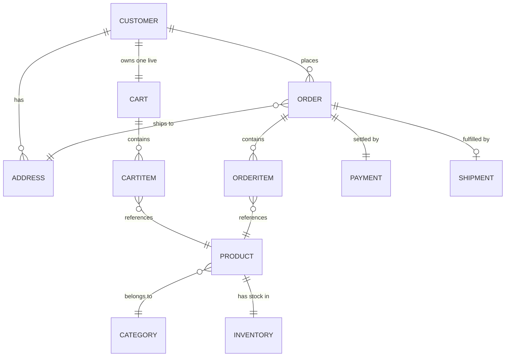
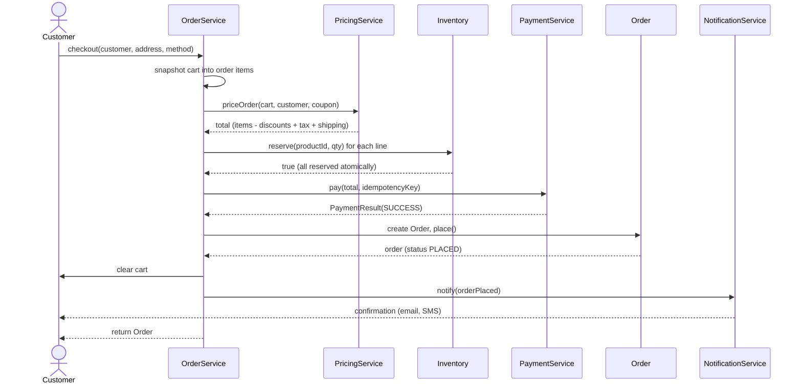
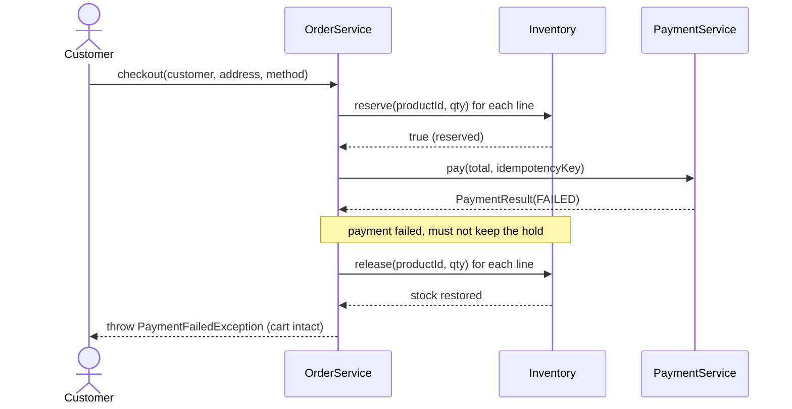
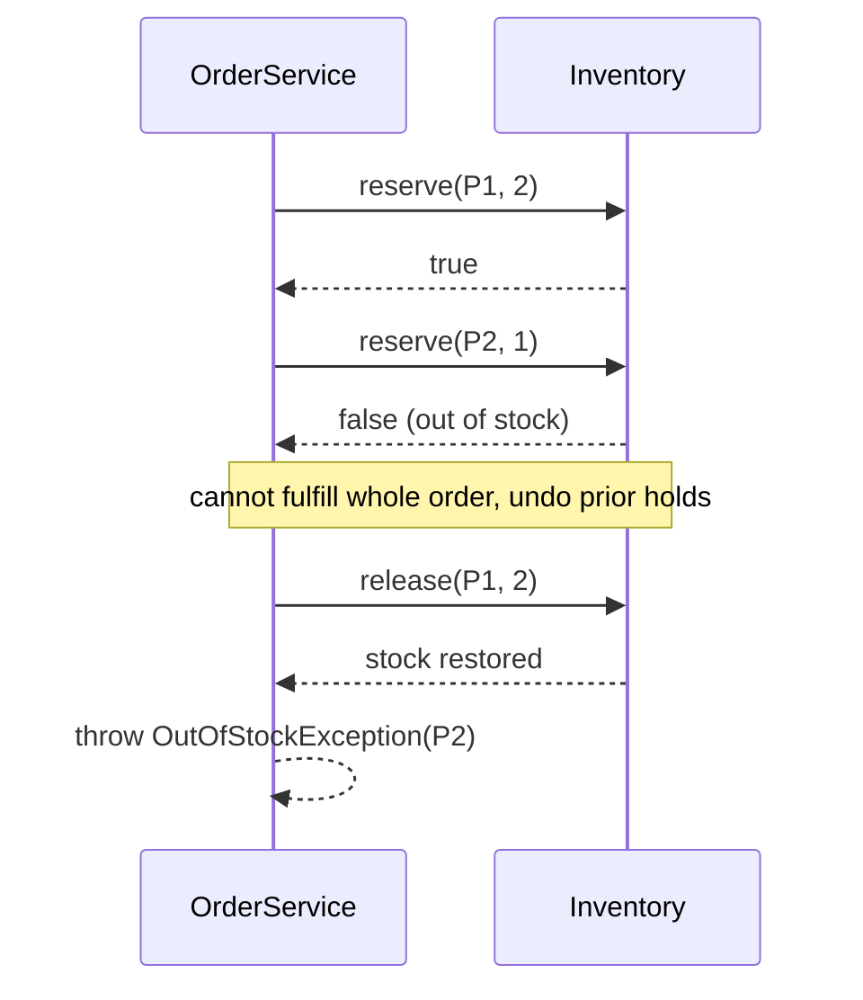
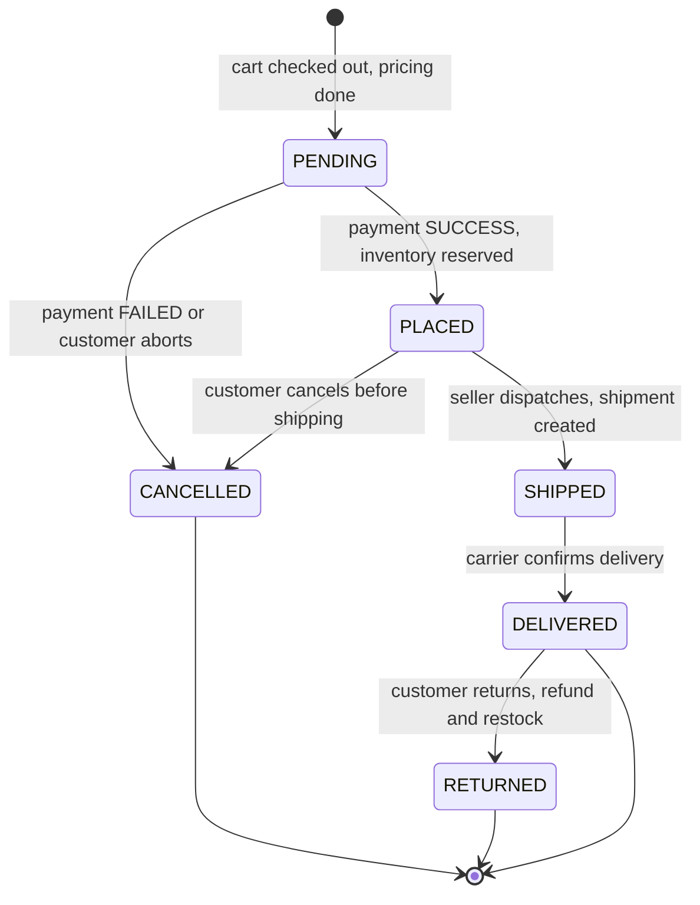
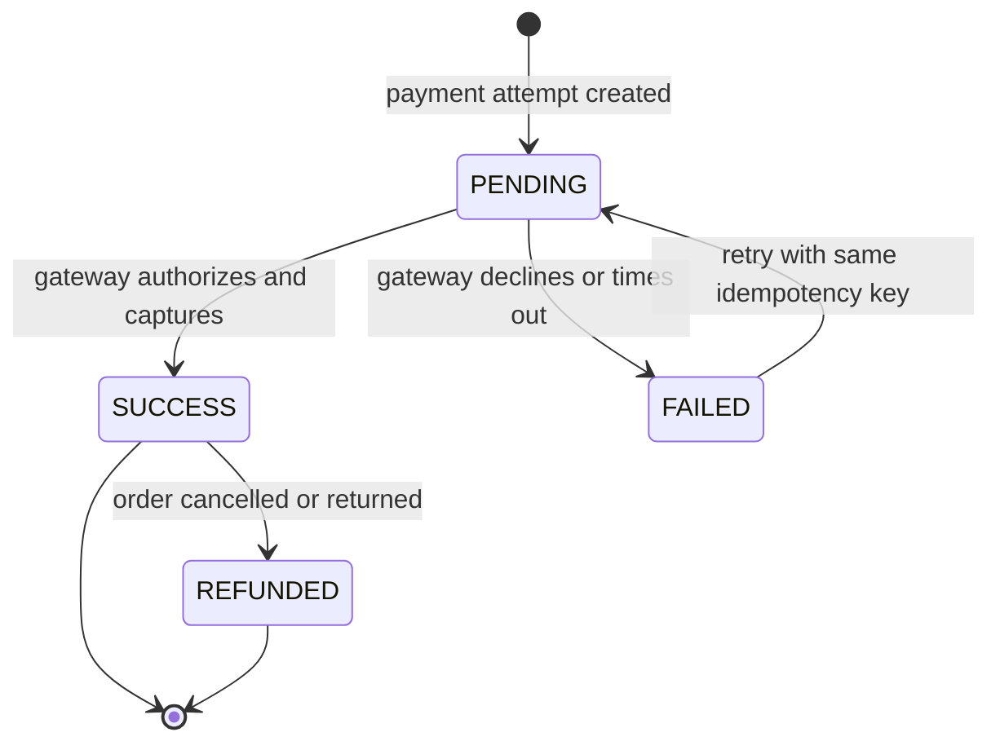
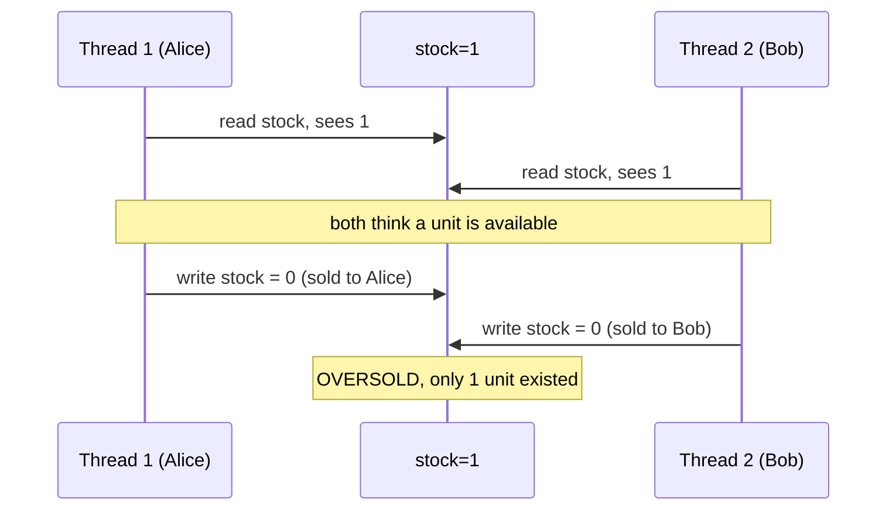

# 🛒 Low-Level Design: Online Shopping System

> A complete, interview-ready walkthrough of the classic **Online Shopping System** (an Amazon-style e-commerce backend) — from a blank whiteboard to a staff-level design that survives concurrent checkouts, inventory races, payment failures, and a full round of interviewer follow-ups.

The Online Shopping System is one of the richest object-oriented design interviews you will encounter. On the surface it is familiar: a customer browses products, adds them to a cart, pays, and waits for a package. But that familiar surface hides one of the most demanding modeling problems in the LLD canon — a **catalog** that must stay searchable as it grows into millions of SKUs, an **inventory** that two shoppers race to claim the last unit of, a **cart** that becomes an immutable **order** the instant money changes hands, a **payment** step that can fail halfway and must never charge twice, and an **order lifecycle** that marches through a dozen states from *placed* to *delivered* (or *returned*). Interviewers reach for it because every one of those pieces is a design problem in its own right, and because the moment you think you're done, they ask "what happens when the payment succeeds but the inventory was already gone?" — and now you are reasoning about distributed consistency on a whiteboard.

This guide walks the whole arc. It starts with the beginner's mental model of "objects that talk to each other," escalates through clean domain modeling and the design patterns that keep the system extensible, and finishes with the concurrency, consistency, and scale concerns a principal engineer raises in the final ten minutes. Read it top to bottom the first time; use the [Quick Revision Cheat Sheet](#27--quick-revision-cheat-sheet) and [FAANG Q&A](#25--faang-qa-section) before the interview itself.

---

## 📋 Table of Contents

**Part I — Framing the Problem**

1. [Problem Statement](#1-problem-statement)
2. [Requirement Clarification & Assumptions](#2-requirement-clarification--assumptions)
3. [Functional & Non-Functional Requirements](#3-functional--non-functional-requirements)
4. [Core Concepts Being Tested](#4-core-concepts-being-tested)

**Part II — Modeling the Domain**

5. [Domain Model & Entities](#5-domain-model--entities)
6. [CRC Cards](#6-crc-cards)
7. [UML Class Diagram](#7-uml-class-diagram)
8. [Package Structure](#8-package-structure)

**Part III — Design Rationale**

9. [Design Decisions & Trade-offs](#9-design-decisions--trade-offs)
10. [Class-by-Class Deep Dive](#10-class-by-class-deep-dive)
11. [Design Patterns Applied](#11-design-patterns-applied)
12. [SOLID Principles Mapping](#12-solid-principles-mapping)

**Part IV — Behavior & Diagrams**

13. [Sequence Diagrams](#13-sequence-diagrams)
14. [State Diagram](#14-state-diagram)

**Part V — The Implementation**

15. [Complete Java Implementation](#15-complete-java-implementation)
16. [Execution Flow & Code Walkthrough](#16-execution-flow--code-walkthrough)

**Part VI — Engineering Depth**

17. [Complexity Analysis](#17-complexity-analysis)
18. [Thread Safety & Concurrency](#18-thread-safety--concurrency)
19. [Error Handling & Validation](#19-error-handling--validation)
20. [Scalability Discussion](#20-scalability-discussion)
21. [Alternative Designs & Trade-offs](#21-alternative-designs--trade-offs)

**Part VII — Interview Mastery**

22. [Common FAANG Follow-up Questions (L4 → L6)](#22-common-faang-follow-up-questions-l4--l6)
23. [Common Design Mistakes](#23-common-design-mistakes)
24. [Testing Strategy](#24-testing-strategy)
25. [FAANG Q&A Section](#25--faang-qa-section)
26. [STAR Behavioral Questions](#26--star-behavioral-questions)
27. [Quick Revision Cheat Sheet](#27--quick-revision-cheat-sheet)

---

## 1. Problem Statement

Design the backend of an **online shopping system** — an e-commerce platform in the mold of Amazon, Flipkart, or Shopify. Customers register and sign in, browse and search a catalog of products, read product details, add items to a shopping cart, and check out. At checkout the system computes the order total (items, taxes, shipping), takes a payment through one of several methods, reserves the purchased inventory, and creates an order. From there the order moves through fulfillment — packed, shipped, delivered — with the customer able to track it, cancel it before it ships, or return it after delivery. Sellers (or an admin) manage the catalog and stock levels.

The heart of the problem is a set of clean separations that trip up most candidates on the first pass. A **`Product`** is a catalog record (title, description, price, category) — the thing you search. An **`InventoryItem`** (or stock count) is the physical availability of that product in a warehouse — the thing you decrement when someone buys. A **`Cart`** is a mutable, throwaway collection of what a customer *intends* to buy; an **`Order`** is the immutable, money-backed record of what they *did* buy, frozen at the price and address that applied at checkout time. And a **`Payment`** is a separate concern again — it can succeed, fail, or need a retry, and it must be idempotent so a customer is never double-charged. Getting these boundaries right, and getting the checkout flow to hold them together atomically, is exactly what the interviewer is watching for.

<details>
<summary>📖 <b>In plain terms — what are we actually building?</b></summary>

Think about the last thing you bought online. You searched for it, opened its page, clicked "Add to Cart," maybe added a couple more things, then hit "Checkout." You picked a saved card, confirmed your address, and pressed "Place Order." A confirmation screen appeared with an order number, and over the next few days the status changed from "Ordered" to "Shipped" to "Delivered." Our job is to write the *brains* behind all of that: the objects and rules that hold your cart, freeze it into an order when you pay, take your money exactly once, subtract the item from the warehouse so nobody else gets the last one, and walk the order through shipping until it lands on your doorstep — while surviving the case where ten thousand people press "Place Order" in the same second.

</details>

The deliverable in an interview is not a running storefront; it is a **clean object-oriented model** — the classes, their responsibilities, and their interactions — that a real team could build on. Grading is on the clarity of your abstractions (especially `Product` vs. inventory, and `Cart` vs. `Order`), the correctness of the checkout and order lifecycle, extensibility (new payment methods, new pricing rules, new shipping providers), and how gracefully the design absorbs the concurrency and failure follow-ups the interviewer throws at it.

---

## 2. Requirement Clarification & Assumptions

The single biggest mistake candidates make is modeling before scoping. "Design Amazon" is deliberately enormous; a strong candidate spends the first few minutes cutting it down to a bounded, buildable core. Below is the clarification dialogue you should drive — the questions to ask, and the assumptions to lock in so you and the interviewer are designing the same system.

### 2.1 Actors

The people and systems that interact with the platform define the surface area of the design.

| Actor | Role in the system |
|-------|--------------------|
| **Guest** | Browses and searches the catalog, views product details. Cannot check out until they register or sign in. |
| **Customer** (registered) | Everything a guest can do, plus: manage a cart, place orders, pay, track/cancel/return orders, manage addresses and payment methods. |
| **Seller / Admin** | Adds and edits products, sets prices, manages inventory (stock levels), views and updates order fulfillment status. |
| **Payment gateway** | External service (Stripe, Razorpay, PayPal) that actually authorizes and captures money; we integrate behind an abstraction. |
| **Shipping provider** | External carrier (FedEx, UPS, Delhivery) that we hand a shipment to; we track it behind an abstraction. |
| **Notification channel** | External email/SMS/push service the system drives to confirm orders and shipment updates. |

### 2.2 Key Clarifying Questions

Resolve these with the interviewer before modeling. Each answer materially changes the design.

- **Product vs. inventory** — Do we track abstract catalog products, physical stock counts, or both? *(Assumption: both — a `Product` catalog record, and a separate stock quantity per product managed by an `Inventory` service.)*
- **Single warehouse or many?** — Is stock a single global count, or per-warehouse? *(Assumption: a single logical inventory count in v1; we discuss multi-warehouse sharding under scalability.)*
- **Cart persistence** — Is the cart per-session or saved across logins? *(Assumption: one persistent `Cart` per registered customer; guests get an ephemeral session cart that merges on login.)*
- **When is stock reserved?** — At add-to-cart, or at checkout? *(Assumption: at checkout, not add-to-cart — carts don't hold inventory, so a popular item can sit in many carts but is only claimed when someone pays. We revisit "reserve-at-cart" as an alternative.)*
- **Payments** — Which methods, and can an order use more than one? *(Assumption: credit card, wallet, UPI, and cash-on-delivery, one method per order in v1. Payment goes through a pluggable gateway and must be idempotent.)*
- **Pricing** — Flat prices, or discounts/coupons/taxes? *(Assumption: base price per product, plus a composable pricing pipeline for coupons, category discounts, tax, and shipping.)*
- **Order lifecycle** — What states, and what transitions are legal? *(Assumption: PENDING → PLACED → SHIPPED → DELIVERED, with CANCELLED and RETURNED branches; cancellation only before shipping.)*
- **Search** — What can customers search and filter by? *(Assumption: by keyword, category, and price range, with results fast even on a large catalog.)*
- **Returns & refunds** — In scope? *(Assumption: yes, a basic return-after-delivery flow that triggers a refund and restocks inventory.)*

### 2.3 Explicit Non-Goals

Naming what you will *not* build is a senior signal — it shows you can bound scope deliberately rather than by omission.

- No recommendation engine, personalized ranking, or "customers also bought" ML.
- No real payment-gateway integration beyond an `authorize`/`capture`/`refund` interface; we don't model PCI card handling.
- No seller onboarding, payouts, or marketplace commission accounting.
- No physical warehouse robotics, route optimization, or last-mile logistics.
- No authentication/session implementation details — we assume users are already identified.
- No reviews, ratings, Q&A, or wishlists in v1 (easy extensions we mention but don't build).

<details>
<summary>📖 <b>Why spend so long on clarification?</b></summary>

"Design an online shopping system" is intentionally vast — it could mean a weekend project or the whole of Amazon. If you start drawing classes immediately, you are guessing at requirements and you will guess wrong. The most damaging wrong guess is conflating the catalog product with its stock count, or treating the cart and the order as the same object — both force a painful re-model halfway through. Asking about inventory, cart persistence, when stock is reserved, and payment methods upfront does three things: it shows product sense, it prevents building the wrong abstraction, and it plants the seeds for the hard follow-ups. The moment you say "stock is reserved at checkout, not add-to-cart," you have committed to the exact race condition the interviewer wants to probe — and that's where senior candidates shine.

</details>

---

## 3. Functional & Non-Functional Requirements

### 3.1 Functional Requirements (what the system *does*)

State these crisply in an interview — they become your checklist for the class design.

- **Account management** — Register, sign in, and manage profile, addresses, and saved payment methods.
- **Catalog browse & search** — List products by category; search by keyword; filter by price range; view product details and current availability.
- **Cart management** — Add a product (with quantity) to the cart, update quantity, remove an item, view the running subtotal, and clear the cart.
- **Checkout** — Turn the cart into an order: validate availability, compute the total (items + discounts + tax + shipping), collect a shipping address, take payment, and reserve inventory — atomically.
- **Payment** — Support multiple payment methods behind one interface; handle success, failure, and retry; never double-charge (idempotency).
- **Order management** — Create an immutable order on successful checkout; let customers view order history, track status, cancel before shipping, and return after delivery.
- **Fulfillment** — Let a seller/admin advance an order through PLACED → SHIPPED → DELIVERED, generating a shipment with tracking.
- **Inventory management** — Track stock per product; decrement on successful order; restock on cancellation, return, or payment failure.
- **Notifications** — Notify the customer on order placement and each shipment status change.

### 3.2 Non-Functional Requirements (how *well* it does it)

These are where the interview escalates from "can you model it" to "can you run it."

- **Correctness under concurrency** — The last unit of stock must go to exactly one customer. No overselling, no double-charging, no lost updates — even under thousands of simultaneous checkouts.
- **Consistency** — An order and its payment and its inventory decrement must all agree. Money taken with no order, or an order with no stock, is unacceptable.
- **Availability** — Browsing and search should stay up even if checkout or payment is degraded; a customer should always be able to *look*, even if they occasionally can't *buy*.
- **Low latency** — Product pages and search results in tens of milliseconds; checkout in under a couple of seconds even though it calls an external gateway.
- **Scalability** — Catalog of tens of millions of products; read traffic (browse/search) orders of magnitude higher than write traffic (orders).
- **Extensibility** — New payment methods, new discount rules, new shipping carriers, and new product categories should slot in without rewriting the core.
- **Auditability** — Every order state change and every payment attempt is recorded; you can reconstruct exactly what happened to any order.

<details>
<summary>📖 <b>Functional vs. non-functional — why interviewers care about both</b></summary>

Functional requirements are the *what*: add to cart, place order, ship it. Any candidate can list these. Non-functional requirements are the *how well*: don't oversell the last unit, don't charge the card twice, keep search fast when the catalog is huge. In an LLD interview the functional list earns you a passing model; the non-functional list is where you separate a mid-level answer from a senior one. When you design the checkout, saying "and here's how two customers racing for the last unit resolve to exactly one winner" is worth more than adding a tenth feature. Keep both lists visible on the whiteboard — the non-functional side is your prompt to go deep.

</details>

---

## 4. Core Concepts Being Tested

An interviewer picks the online shopping system because it exercises a specific, teachable set of design muscles. Knowing which ones are on trial lets you steer the conversation toward your strengths.

**Abstraction and separation of concerns.** The single biggest test is whether you separate `Product` (catalog) from inventory (stock), and `Cart` (intent) from `Order` (commitment). Candidates who fold these together produce a design that cannot express "this item is in three carts but only one is in stock," and they pay for it during the concurrency discussion.

**Encapsulation of state transitions.** An order is a state machine. Whether you let any code flip an order to `DELIVERED`, or you route every transition through a guarded method that rejects illegal jumps (you cannot cancel a delivered order), signals how you think about invariants.

**Polymorphism for variation points.** Payment methods, discount rules, and shipping carriers all vary. The interviewer wants to see interfaces (`PaymentStrategy`, `PricingRule`, `ShippingProvider`) rather than `switch` statements over enums — so a new variant is a new class, not an edit to old code.

**Composition over inheritance.** Pricing is the classic trap. A tempting but wrong instinct is a class hierarchy like `DiscountedTaxedShippedOrder`. The right instinct is to *compose* independent pricing rules into a pipeline. This is where the Decorator/Chain and Strategy patterns earn their place.

**Concurrency and consistency reasoning.** The heart of the escalation: reserving the last unit exactly once, making payment idempotent, and keeping order/payment/inventory consistent when a step fails. This is where L5/L6 candidates are made.

**Scale-aware thinking.** Read-heavy catalog vs. write-heavy orders, caching product pages, and sharding inventory — knowing which parts scale differently and why.

---

## 5. Domain Model & Entities

Before drawing a single class, name the nouns and pin down what each one *is*. The discipline here is to resist merging entities that feel similar but have different lifecycles.

### 5.1 The Entity Landscape

| Entity | What it represents | Lifecycle |
|--------|--------------------|-----------|
| **`User`** (abstract) → **`Customer`**, **`Admin`** | A person interacting with the system, with an account and profile. | Long-lived; created at registration. |
| **`Product`** | A bibliographic-style catalog record: name, description, price, category. The thing you search and browse. | Long-lived; created by a seller/admin. |
| **`Category`** | A grouping products belong to (Electronics, Books, Apparel), possibly hierarchical. | Long-lived. |
| **`Inventory`** | The stock count for a product — how many units are available to sell right now. Separate from the catalog record. | Mutable, high-churn; decremented on sale, incremented on restock. |
| **`Cart`** | A customer's mutable, pre-purchase collection of `CartItem`s. Throwaway; holds no inventory. | One live cart per customer; cleared after checkout. |
| **`CartItem`** | A line in a cart: a product plus a quantity. | Ephemeral; lives inside a cart. |
| **`Order`** | The immutable, money-backed record created at checkout: the items, prices, address, and total, frozen at purchase time. | Long-lived, auditable; never edited, only transitioned. |
| **`OrderItem`** | A line in an order: the product, quantity, and the *price captured at checkout* (so later price changes don't rewrite history). | Immutable; lives inside an order. |
| **`Payment`** | A single attempt to collect money for an order, via some method. | One or more per order (retries); each has a status. |
| **`Shipment`** | The physical fulfillment of an order: carrier, tracking number, status. | One per shipped order. |
| **`Address`** | A shipping or billing address. | Reusable; owned by a customer. |

### 5.2 Entity Relationships

The relationships carry as much design information as the entities. Here is how they connect, expressed as a mermaid entity-relationship view.



Read the diagram as a set of deliberate choices. A customer owns exactly **one live cart** but places **many orders** over time. A cart contains many cart items, each pointing at a product — the cart holds *references*, not copies of product data, so a price change on the catalog is reflected in the cart subtotal. An order, by contrast, contains order items that carry a *captured price*, deliberately decoupled from the live catalog so that history is immutable. Every product has exactly one inventory record but appears in many carts and orders. An order is settled by a payment and (once shipped) fulfilled by a shipment.

### 5.3 Core Enumerations

Enums pin down the finite state spaces and keep the design honest.

```java
public enum OrderStatus { PENDING, PLACED, SHIPPED, DELIVERED, CANCELLED, RETURNED }

public enum PaymentStatus { PENDING, SUCCESS, FAILED, REFUNDED }

public enum PaymentMethod { CREDIT_CARD, WALLET, UPI, CASH_ON_DELIVERY }

public enum ShipmentStatus { PREPARING, IN_TRANSIT, OUT_FOR_DELIVERY, DELIVERED }
```

<details>
<summary>📖 <b>Why separate <code>Product</code>, <code>Inventory</code>, <code>Cart</code>, and <code>Order</code>?</b></summary>

These four feel related, so beginners often merge them — a single "Product" object with a `stock` field and an `inCart` flag, or an "Order" that is really just a saved cart. Each merge quietly breaks something. If stock lives on the product, then the catalog read path (browse, search — millions of hits) and the inventory write path (buy, restock — a race) share the same object and the same lock, killing both scale and correctness. If the order is just a cart, then a price change after purchase rewrites what the customer was charged — an accounting nightmare. Keeping them separate lets each evolve at its own pace: the catalog is read-heavy and cacheable, inventory is a hot write, the cart is disposable, and the order is a frozen, auditable fact.

</details>

---

## 6. CRC Cards

CRC (Class–Responsibility–Collaborator) cards are the fastest way to sanity-check a design before you commit to code. Each card names a class, the responsibilities it owns, and the collaborators it leans on. If a card has too many responsibilities, it's doing too much (a God object); if a responsibility has no home, you're missing a class.

| Class | Responsibilities | Collaborators |
|-------|------------------|---------------|
| **`Customer`** | Hold profile, addresses, and payment methods; own a live cart; place orders. | `Cart`, `Order`, `Address`, `PaymentMethod` |
| **`Catalog`** | Store products; search and filter by keyword, category, and price. | `Product`, `Category`, `SearchStrategy` |
| **`Product`** | Hold catalog data (name, description, price, category). | `Category` |
| **`Inventory`** | Track and mutate stock per product; reserve, deduct, and restock units atomically. | `Product` |
| **`Cart`** | Hold cart items; add/update/remove; compute subtotal. | `CartItem`, `Product` |
| **`OrderService`** | Orchestrate checkout: validate stock, price the order, take payment, reserve inventory, create the order. | `Cart`, `Inventory`, `PricingService`, `PaymentService`, `Order` |
| **`Order`** | Hold immutable line items, total, address, and status; enforce legal state transitions. | `OrderItem`, `Payment`, `Shipment`, `Address` |
| **`PricingService`** | Apply an ordered pipeline of pricing rules (discount, coupon, tax, shipping) to produce a final total. | `PricingRule`, `Cart` |
| **`PaymentService`** | Route a payment to the right strategy; ensure idempotency; record attempts. | `PaymentStrategy`, `Payment` |
| **`PaymentStrategy`** | Authorize and capture money via one specific method. | (external gateway) |
| **`ShipmentService`** | Create a shipment, assign a carrier and tracking, advance shipment status. | `Shipment`, `ShippingProvider` |
| **`NotificationService`** | Send order and shipment notifications over pluggable channels. | `NotificationChannel` |

<details>
<summary>📖 <b>How to use CRC cards in the interview</b></summary>

Don't draw literal index cards on the whiteboard — that wastes time. Instead, use CRC thinking as a running checklist while you talk. When you introduce a class, say its one-line responsibility aloud ("`OrderService` orchestrates checkout — it doesn't hold order data, it coordinates the pieces that do"). If you catch yourself giving one class three unrelated jobs, that's your cue to split it. The `OrderService`-vs-`Order` split is the classic example: the `Order` is a *data holder with invariants*, while the *orchestration* of building it (talking to inventory, pricing, and payment) lives in a service. Naming collaborators also surfaces missing classes — if "reserve inventory" has no collaborator, you've forgotten `Inventory`.

</details>

---

## 7. UML Class Diagram

Here is the full static structure in ASCII, so it renders anywhere. Every class name, field type, and method signature below matches the [Java implementation](#15-complete-java-implementation) exactly — that consistency is what an interviewer scans for.

```
┌─────────────────────────────────────────────────────────────────────────────┐
│                              <<abstract>> User                                │
│  # id: String                                                                 │
│  # name: String                                                               │
│  # email: String                                                              │
└───────────────▲───────────────────────────────────▲──────────────────────────┘
                │                                     │
        ┌───────┴────────┐                   ┌────────┴────────┐
        │    Customer    │                   │      Admin      │
        │ - addresses    │                   │ (manages        │
        │ - cart: Cart   │                   │  catalog+stock) │
        │ - orders: List │                   └─────────────────┘
        └───────┬────────┘
                │ owns 1
                ▼
┌───────────────────────────┐        contains *      ┌──────────────────────────┐
│           Cart            │───────────────────────▶│        CartItem          │
│ - items: List<CartItem>   │                         │ - product: Product       │
│ + addItem(Product, int)   │                         │ - quantity: int          │
│ + removeItem(String)      │                         │ + subtotal(): Money      │
│ + updateQuantity(..)      │                         └───────────┬──────────────┘
│ + getSubtotal(): Money    │                                     │ references
│ + clear(): void           │                                     ▼
└───────────────────────────┘                         ┌──────────────────────────┐
                                                       │        Product           │
┌───────────────────────────┐   searches *            │ - id: String             │
│         Catalog           │────────────────────────▶│ - name: String           │
│ - products: Map           │                         │ - price: Money           │
│ + addProduct(Product)     │                         │ - category: Category     │
│ + search(SearchCriteria)  │                         └───────────┬──────────────┘
└───────────────────────────┘                                     │ 1
                                                                   ▼ has stock
┌────────────────────────────────────────┐           ┌──────────────────────────┐
│               Inventory                 │──────────▶│  (stock per productId)   │
│ - stock: Map<String, AtomicInteger>     │           └──────────────────────────┘
│ + getStock(String): int                 │
│ + reserve(String, int): boolean         │   atomic CAS: deduct only if enough
│ + release(String, int): void            │
│ + restock(String, int): void            │
└─────────────────────────────────────────┘

┌─────────────────────────────────────────────────────────────────────────────┐
│                              OrderService                                     │
│ - inventory: Inventory                                                        │
│ - pricingService: PricingService                                              │
│ - paymentService: PaymentService                                              │
│ + checkout(Customer, Address, PaymentMethod, String couponCode): Order        │
└───────┬──────────────────┬──────────────────┬─────────────────────┬──────────┘
        │ uses             │ uses             │ uses                 │ creates
        ▼                  ▼                  ▼                      ▼
┌───────────────┐  ┌────────────────┐  ┌────────────────┐  ┌────────────────────────┐
│  Inventory    │  │ PricingService │  │ PaymentService │  │         Order          │
└───────────────┘  └───────┬────────┘  └───────┬────────┘  │ - id: String           │
                           │ applies *         │ routes     │ - items:List<OrderItem>│
                           ▼                   ▼            │ - total: Money         │
                   ┌────────────────┐  ┌────────────────┐  │ - status: OrderStatus  │
                   │ <<interface>>  │  │ <<interface>>  │  │ - address: Address     │
                   │  PricingRule   │  │PaymentStrategy │  │ - payment: Payment     │
                   │ + apply(ctx)   │  │ + pay(Money,   │  │ - shipment: Shipment   │
                   └───────▲────────┘  │   String key): │  │ + place(): void        │
                           │           │   PaymentResult│  │ + ship(Shipment): void │
                           │           └───────▲────────┘  │ + deliver(): void      │
        ┌──────────────────┼─────┐             │           │ + cancel(): void       │
        │                  │     │             │           │ + markReturned(): void │
┌───────┴─────┐ ┌──────────┴┐ ┌──┴────────┐    │           └───────────┬────────────┘
│ CouponRule  │ │  TaxRule  │ │ShippingRule│   │                       │ contains *
└─────────────┘ └───────────┘ └───────────┘    │                       ▼
                                               │           ┌────────────────────────┐
        ┌───────────────┬───────────────┬──────┴───┐       │       OrderItem        │
        │               │               │          │       │ - product: Product     │
┌───────┴─────┐ ┌────────┴──┐ ┌──────────┴┐ ┌───────┴──┐   │ - quantity: int        │
│ CreditCard  │ │ WalletPay │ │  UpiPay   │ │   CoD    │   │ - priceAtPurchase:     │
│ Payment     │ │           │ │           │ │ Payment  │   │        Money           │
└─────────────┘ └───────────┘ └───────────┘ └──────────┘   └────────────────────────┘
```

### 7.1 Relationship Summary

The diagram encodes a few load-bearing decisions worth calling out explicitly. `Customer` *owns* one `Cart` (composition — the cart dies with no customer) and *places* many `Order`s (association — orders outlive the cart). `OrderService` is a pure orchestrator: it holds references to `Inventory`, `PricingService`, and `PaymentService`, and its only job is to sequence them and produce an `Order`. The three variation points — `PricingRule`, `PaymentStrategy`, and (not shown for space) `ShippingProvider` — are interfaces with concrete implementations hanging off them, so new variants extend the system rather than editing it. Finally, `Order` guards its own state transitions through `place()`, `ship()`, `deliver()`, `cancel()`, and `markReturned()` rather than exposing a public `setStatus`.

---

## 8. Package Structure

A clean package layout mirrors the design's separation of concerns and makes the dependency direction obvious: models depend on nothing, services depend on models, and the demo depends on everything.

```
com.shopping
├── model
│   ├── user
│   │   ├── User.java              (abstract)
│   │   ├── Customer.java
│   │   └── Admin.java
│   ├── product
│   │   ├── Product.java
│   │   ├── Category.java
│   │   └── SearchCriteria.java
│   ├── cart
│   │   ├── Cart.java
│   │   └── CartItem.java
│   ├── order
│   │   ├── Order.java
│   │   ├── OrderItem.java
│   │   └── Address.java
│   ├── payment
│   │   ├── Payment.java
│   │   └── PaymentResult.java
│   ├── shipment
│   │   └── Shipment.java
│   ├── Money.java                 (value object)
│   └── enums
│       ├── OrderStatus.java
│       ├── PaymentStatus.java
│       ├── PaymentMethod.java
│       └── ShipmentStatus.java
│
├── service
│   ├── Catalog.java
│   ├── Inventory.java
│   ├── OrderService.java
│   ├── ShipmentService.java
│   └── NotificationService.java
│
├── pricing
│   ├── PricingService.java
│   ├── PricingRule.java           (interface)
│   ├── PricingContext.java
│   ├── CouponRule.java
│   ├── CategoryDiscountRule.java
│   ├── TaxRule.java
│   └── ShippingRule.java
│
├── payment
│   ├── PaymentService.java
│   ├── PaymentStrategy.java        (interface)
│   ├── CreditCardPayment.java
│   ├── WalletPayment.java
│   ├── UpiPayment.java
│   └── CashOnDeliveryPayment.java
│
└── ShoppingDemo.java               (main / wiring)
```

The rule that keeps this healthy: **dependencies point inward toward the model, never outward.** `OrderService` knows about `Order`, but `Order` knows nothing about `OrderService`. The `pricing` and `payment` packages depend on `model` but are otherwise independent of each other, which is exactly why you can add a payment method without touching pricing, and vice versa.

<details>
<summary>📖 <b>Why bother with packages in an interview?</b></summary>

You will rarely type out a full package tree on a whiteboard, but *mentioning* the grouping earns real credit. Saying "I'd keep the pricing rules in their own package so adding a coupon type never risks the payment code" tells the interviewer you think about change isolation and blast radius, not just about making today's feature work. The one distinction always worth stating aloud is model versus service: plain data-and-invariants objects (`Order`, `Product`, `Cart`) live in `model`, while the orchestration and cross-entity workflows (`OrderService`, `Inventory`, `PricingService`) live in `service`. That single split prevents the God-object anti-pattern before it starts.

</details>

---

## 9. Design Decisions & Trade-offs

Every senior design is a chain of deliberate choices, each with an alternative you consciously rejected. Being able to *articulate the trade-off* — not just state the decision — is the single biggest differentiator in an LLD interview. Here are the load-bearing decisions in this design.

### 9.1 Separate `Product` (catalog) from `Inventory` (stock)

The catalog is read-heavy, cacheable, and rarely changes; inventory is a hot, contended write that changes on every purchase. Fusing them onto one object couples a million-QPS read path to a serialized write path, and forces the same lock to guard both. Keeping `Inventory` as its own service — a `Map<productId, AtomicInteger>` in this in-memory design, a row with a version column in a real database — lets the catalog scale through read replicas and caches while inventory scales through per-product atomicity. The cost is one extra lookup at checkout (product → its stock), which is negligible.

### 9.2 Reserve inventory at checkout, not at add-to-cart

A cart holds *intent*, not a claim. If adding to cart reserved stock, a single popular item would be locked up by thousands of window-shoppers who never buy, and you'd need timeouts to reclaim abandoned carts — a whole subsystem. By reserving only at checkout (the moment of payment), the last unit is contended for only by people actually trying to buy, and the reservation window is milliseconds, not hours. The trade-off: a customer can add an in-stock item to their cart and still fail at checkout because someone else bought it first. That is the correct, honest behavior, and every major retailer works this way. (We discuss the "reserve-at-cart with TTL" alternative — used for high-demand drops like concert tickets — under [Alternative Designs](#21-alternative-designs--trade-offs).)

### 9.3 `Cart` is mutable and disposable; `Order` is immutable and auditable

The cart is a scratchpad — items come and go, quantities change, prices reflect the live catalog. The order is a *financial fact* — once placed, its line items carry the price that was charged (`priceAtPurchase`), never the current catalog price. This is why `OrderItem` copies the price rather than referencing `Product.price`. If the seller drops the price tomorrow, yesterday's orders are untouched. Trying to reuse the cart as the order (a "convert in place" shortcut) destroys this immutability and makes refunds, disputes, and accounting impossible.

### 9.4 Pricing as a composable pipeline, not an inheritance tree

An order's total is base price, minus coupon, minus category discount, plus tax, plus shipping — and the set of active rules varies per order. Modeling this with subclasses (`DiscountedOrder extends Order`) explodes combinatorially and is impossible to reorder. Instead, pricing is an ordered list of `PricingRule` objects applied over a mutable `PricingContext`. Adding a "loyalty points" discount is a new rule class inserted into the list; reordering tax-before-shipping is a list reorder. The cost is that rule *ordering matters and is implicit in the list* — you must document that discounts apply before tax.

### 9.5 `OrderService` orchestrates; `Order` only guards its own state

The temptation is to put `checkout()` on `Cart` or `Customer`. But checkout coordinates four collaborators (inventory, pricing, payment, order creation) and owns the failure/rollback logic — that is orchestration, not data. Putting it on a service keeps `Order` a clean state-guarded entity and keeps the transaction logic in one testable place. The trade-off is one more class, but it is the class that makes the concurrency and failure handling tractable.

<details>
<summary>📖 <b>How to present trade-offs in the room</b></summary>

Interviewers rarely want the "right" answer handed to them — they want to see you *weigh*. The strongest pattern is: state the decision, name the alternative in one breath, then give the one concrete reason you chose as you did. "I'll reserve stock at checkout rather than at add-to-cart, because add-to-cart reservation locks inventory for window-shoppers and needs an abandonment-timeout subsystem — the trade-off is a customer can occasionally lose the last unit between cart and checkout, which is acceptable and standard." Ten seconds, and you've shown you saw the fork in the road and picked deliberately. Do this for three or four key decisions and you sound like someone who has shipped systems.

</details>

---

## 10. Class-by-Class Deep Dive

With the map in hand, here is what each significant class is *for* — its single responsibility, the invariants it protects, and the reasoning behind its shape. The full code is in [Section 15](#15-complete-java-implementation); this section is the "why."

### 10.1 `Money` (value object)

Currency in `double` is a bug waiting to happen — `0.1 + 0.2 != 0.3` in floating point, and rounding errors accumulate across a pricing pipeline. `Money` wraps an integer count of cents, is immutable, and offers `plus`, `minus`, `times`, and comparison. Every price, subtotal, discount, and total in the system is a `Money`, so arithmetic is exact and the type system prevents accidentally adding a quantity to a price.

### 10.2 `Product` and `Category`

`Product` is a pure catalog record: id, name, description, `Money` price, and a `Category`. It deliberately has **no stock field** — availability lives in `Inventory`. `Category` groups products for browsing and category-wide discounts. Keeping `Product` free of stock and cart concerns is what lets the catalog be cached and read-replicated.

### 10.3 `Inventory`

The concurrency heart of the system. It maps each product id to an `AtomicInteger` of available units. Its `reserve(productId, qty)` method is the critical section: it uses a compare-and-set loop to deduct units *only if enough remain*, returning `true` on success and `false` if stock ran out — atomically, with no lock held across the check-then-act. `release` (on failure/cancel) and `restock` (on return) are the inverse operations. This single class is where "the last unit goes to exactly one customer" is enforced.

### 10.4 `Cart` and `CartItem`

`Cart` holds an ordered list of `CartItem`s and offers `addItem`, `updateQuantity`, `removeItem`, `getSubtotal`, and `clear`. A `CartItem` is a `Product` reference plus a quantity; its `subtotal()` multiplies live product price by quantity. The cart computes its subtotal from *current* catalog prices — because until checkout, nothing is frozen. The cart holds no inventory and no payment state; it is pure intent.

### 10.5 `OrderService` (orchestrator / facade)

The transaction coordinator. Its `checkout(customer, address, method)` method runs the whole flow in a careful order: snapshot the cart into order items, price it through `PricingService`, reserve every line through `Inventory` (rolling back reservations if any line fails), take payment through `PaymentService`, and — only if payment succeeds — create the `Order`, clear the cart, and notify. If payment fails, it releases the reserved inventory. This ordering (reserve → pay → commit, with compensations) is the design's answer to the consistency requirement.

### 10.6 `Order` and `OrderItem`

`Order` is an immutable-once-placed record: a list of `OrderItem`, a total `Money`, a shipping `Address`, a `Payment`, an optional `Shipment`, and an `OrderStatus`. It exposes *behavior-named transition methods* — `place()`, `ship(shipment)`, `deliver()`, `cancel()`, `markReturned()` — each of which validates the current state and throws if the transition is illegal (you cannot `cancel()` a `DELIVERED` order). There is no public `setStatus`. `OrderItem` captures `priceAtPurchase` so history is immutable.

### 10.7 `PricingService` and `PricingRule`

`PricingService` holds an ordered `List<PricingRule>` and applies each to a `PricingContext` (which carries the running subtotal, the cart, the customer, and any coupon). Concrete rules — `CouponRule`, `CategoryDiscountRule`, `TaxRule`, `ShippingRule` — each transform the context. The order in the list *is* the pricing policy: discounts first, then tax on the discounted amount, then shipping.

### 10.8 `PaymentService` and `PaymentStrategy`

`PaymentService` selects the right `PaymentStrategy` for the chosen `PaymentMethod`, invokes it, records a `Payment`, and enforces **idempotency** via an idempotency key so a retried checkout never double-charges. Each strategy — `CreditCardPayment`, `WalletPayment`, `UpiPayment`, `CashOnDeliveryPayment` — encapsulates one method's authorize/capture logic behind a uniform `pay(Money, key)` returning a `PaymentResult`.

### 10.9 `ShipmentService` and `NotificationService`

`ShipmentService` creates a `Shipment` (carrier, tracking number, status) when an order ships and advances its status. `NotificationService` is an Observer-style fan-out: order and shipment events push messages to pluggable `NotificationChannel`s (email, SMS) without the order code knowing who is listening.

---

## 11. Design Patterns Applied

This design is a showcase of the patterns interviewers most want to hear named — but only when they *earn their place*. For each, here is where it lives, why it fits, and the concrete benefit.

| Pattern | Where it's used | Why / benefit |
|---------|-----------------|---------------|
| **Strategy** | `PaymentStrategy` (credit card, wallet, UPI, CoD) and `SearchStrategy` | Each payment method is an interchangeable algorithm behind one interface. Adding "buy now, pay later" is a new class, no `switch` edited. |
| **Chain of Responsibility / Pipeline** | `PricingService` applying an ordered `List<PricingRule>` | Composable, reorderable pricing steps. Each rule does one transform on the `PricingContext` and passes it on. |
| **State** | `Order` transition methods enforcing the `OrderStatus` machine | Illegal transitions (cancel a delivered order) are rejected at the entity boundary, not scattered across callers. |
| **Observer** | `NotificationService` fanning order/shipment events to channels | The order flow publishes events without knowing subscribers; add a push-notification channel without touching order code. |
| **Factory** | `PaymentService` producing the right `PaymentStrategy` for a `PaymentMethod`; carrier selection in `ShipmentService` | Centralizes the "which concrete class" decision so callers depend only on the interface. |
| **Facade** | `OrderService.checkout()` presenting one method over inventory + pricing + payment + order creation | Callers get a simple entry point; the messy multi-step coordination is hidden and testable in one place. |
| **Singleton (scoped)** | `Catalog`, `Inventory` as single shared services | One authoritative stock count and catalog; injected rather than globally static so they stay testable. |
| **Value Object** | `Money`, `Address` | Immutable, equality-by-value, no identity — eliminates a whole class of bugs (float currency, mutable shared address). |
| **Builder** (optional) | Constructing an `Order` with many fields | Readable, validated construction of the immutable order without a telescoping constructor. |

<details>
<summary>📖 <b>Patterns are a vocabulary, not a checklist</b></summary>

The trap with patterns is name-dropping them to sound senior — "I'll use a Singleton Factory Observer here." Interviewers see through that instantly. The skill is the reverse: solve the problem cleanly, then *notice* which named pattern you arrived at and say so. "I need payment methods to be interchangeable and extensible, so each is a class behind a `pay()` interface — that's the Strategy pattern." The pattern is the label for a decision you'd make anyway, and naming it communicates the decision faster to a fellow engineer. If a pattern doesn't reduce coupling or absorb a likely change, leave it out — unused patterns are just complexity.

</details>

---

## 12. SOLID Principles Mapping

SOLID is the rubric behind most "is this a clean design?" judgments. Here is where each principle shows up concretely in this system.

**S — Single Responsibility.** Each class has one reason to change. `Inventory` changes only if stock rules change; `PricingService` only if pricing changes; `Order` only if the order state machine changes. The deliberate `OrderService`-vs-`Order` split exists precisely to keep orchestration and data as separate responsibilities.

**O — Open/Closed.** The system is open to extension, closed to modification, at every variation point. A new payment method is a new `PaymentStrategy` implementation; a new pricing rule is a new `PricingRule`; a new shipping carrier is a new `ShippingProvider`. None of these edits existing, tested code.

**L — Liskov Substitution.** Every `PaymentStrategy` honors the same contract: `pay(amount, key)` returns a `PaymentResult` and never charges twice for the same key. Any strategy can substitute for another wherever the interface is expected, including `CashOnDeliveryPayment`, which "succeeds" without moving money — it still satisfies the contract.

**I — Interface Segregation.** Interfaces are narrow and role-specific. `PricingRule` exposes only `apply(context)`; `PaymentStrategy` only `pay(...)`; `NotificationChannel` only `send(...)`. No class is forced to implement methods it doesn't use — there is no fat `IShoppingService` god-interface.

**D — Dependency Inversion.** High-level policy depends on abstractions, not concretions. `OrderService` depends on the `PricingService`, `PaymentService`, and `Inventory` abstractions injected into it, not on `CreditCardPayment` or `TaxRule` directly. This is what makes the whole thing unit-testable with mocks.

<details>
<summary>📖 <b>SOLID in plain technical terms</b></summary>

SOLID is five habits that keep a codebase from rotting as it grows. Single Responsibility: one class, one job, so a change has one home. Open/Closed: add behavior by adding classes, not by editing old ones (which risks breaking what worked). Liskov: a subtype must be usable anywhere its parent is, no surprises. Interface Segregation: small focused interfaces beat one bloated one. Dependency Inversion: depend on interfaces so you can swap implementations and test with fakes. In this design the payment strategies are the poster child — they satisfy all five at once: one job each, added without edits, mutually substitutable, behind a tiny interface, injected as an abstraction.

</details>

---

## 13. Sequence Diagrams

Static structure tells you what the classes *are*; sequence diagrams tell you how they *collaborate* over time. Here are the two flows an interviewer is most likely to ask you to trace: a successful checkout, and a checkout where payment fails and the design must roll back cleanly.

### 13.1 Successful Checkout



Read the flow as a strict ordering with a purpose. Pricing happens first (cheap, no side effects). Inventory is reserved *before* payment, so we never take money for something we can't fulfill. Payment happens next — the one step that touches an external system and can fail. Only after payment succeeds do we commit the order and clear the cart. The ordering "reserve → pay → commit" is what keeps inventory, money, and the order consistent.

### 13.2 Checkout with Payment Failure (Compensation)



This is the flow interviewers push on. Because inventory was reserved before payment, a payment failure would otherwise leak stock — units held for an order that never happened. The compensating action `release()` returns those units so the next customer can buy them. The cart is left intact so the customer can retry with another card. This "reserve, then compensate on failure" is the in-memory analog of a saga, and naming that connection scores well at L5+.

### 13.3 Partial Reservation Failure



An order is all-or-nothing: if any line can't be reserved, the whole checkout fails and every already-reserved line is released. Reserving line by line and rolling back on the first failure keeps the reservation step atomic at the order granularity without holding a global lock.

---

## 14. State Diagram

Two objects in this system are genuine state machines — the `Order` and the `Payment`. Modeling them explicitly, and guarding their transitions in code, is what prevents illegal states like "cancelled after delivery" or "double-captured payment."

### 14.1 Order Lifecycle



The rules encoded here are the ones an interviewer will test. Cancellation is legal only from `PENDING` or `PLACED` — never once `SHIPPED`, because the package is already in transit. A return is legal only from `DELIVERED`. Every arrow is a guarded method on `Order`; there is no path from `DELIVERED` back to `PLACED`. If a caller asks for an illegal transition, the method throws `IllegalStateTransitionException`, and the invariant holds no matter who calls it.

### 14.2 Payment Lifecycle



The subtle transition is `FAILED → PENDING` on retry: the retry reuses the same idempotency key, so if the original attempt actually succeeded at the gateway but the response was lost, the retry returns the *original* result instead of charging again. `SUCCESS → REFUNDED` is the money-return path triggered by cancellation or return. This small machine is the design's guarantee against the two worst payment bugs: double-charge and charge-with-no-order.

<details>
<summary>📖 <b>Why model state machines explicitly?</b></summary>

The alternative to a state machine is a `status` field that any code can set to any value. That works until the day some new code path marks an order `DELIVERED` while it's still `PENDING`, or refunds a payment that never captured — and now you have a support ticket and a confused customer. By funneling every change through a guarded transition method that checks "is this move legal from where I am?", you make illegal states *unrepresentable* rather than merely unlikely. The order and payment machines above are small, but they are the difference between a design that's correct by construction and one that's correct by hoping every caller behaves.

</details>

---

## 15. Complete Java Implementation

Below is a complete, compilable reference implementation. It is organized bottom-up: enums and value objects first, then catalog and inventory, then cart, then pricing, then payment, then the order and the orchestrating `OrderService`, and finally a runnable demo. Every block is collapsible so you can study one piece at a time. The class names, fields, and method signatures match the diagrams above exactly.

<details>
<summary>💻 <b>1. Enums & the <code>Money</code> value object</b></summary>

```java
package com.shopping.model.enums;

public enum OrderStatus { PENDING, PLACED, SHIPPED, DELIVERED, CANCELLED, RETURNED }

public enum PaymentStatus { PENDING, SUCCESS, FAILED, REFUNDED }

public enum PaymentMethod { CREDIT_CARD, WALLET, UPI, CASH_ON_DELIVERY }

public enum ShipmentStatus { PREPARING, IN_TRANSIT, OUT_FOR_DELIVERY, DELIVERED }
```

```java
package com.shopping.model;

import java.util.Objects;

/** Immutable money value object — integer cents to avoid floating-point currency bugs. */
public final class Money {
    private final long cents;

    private Money(long cents) { this.cents = cents; }

    public static Money ofCents(long cents) { return new Money(cents); }
    public static Money ofRupees(double rupees) { return new Money(Math.round(rupees * 100)); }
    public static final Money ZERO = new Money(0);

    public Money plus(Money other)  { return new Money(this.cents + other.cents); }
    public Money minus(Money other) { return new Money(Math.max(0, this.cents - other.cents)); }
    public Money times(long factor) { return new Money(this.cents * factor); }
    public Money percent(double pct) { return new Money(Math.round(this.cents * pct / 100.0)); }

    public boolean isPositive()          { return cents > 0; }
    public boolean greaterThan(Money o)  { return this.cents > o.cents; }
    public long cents()                  { return cents; }

    @Override public boolean equals(Object o) {
        return (o instanceof Money) && ((Money) o).cents == cents;
    }
    @Override public int hashCode() { return Objects.hash(cents); }
    @Override public String toString() { return String.format("₹%.2f", cents / 100.0); }
}
```

</details>

<details>
<summary>💻 <b>2. Users — <code>User</code>, <code>Customer</code>, <code>Admin</code>, <code>Address</code></b></summary>

```java
package com.shopping.model.user;

public abstract class User {
    protected final String id;
    protected final String name;
    protected final String email;

    protected User(String id, String name, String email) {
        this.id = id;
        this.name = name;
        this.email = email;
    }
    public String getId()    { return id; }
    public String getName()  { return name; }
    public String getEmail() { return email; }
}
```

```java
package com.shopping.model.order;

/** Immutable shipping/billing address value object. */
public final class Address {
    private final String line1;
    private final String city;
    private final String state;
    private final String zip;

    public Address(String line1, String city, String state, String zip) {
        this.line1 = line1; this.city = city; this.state = state; this.zip = zip;
    }
    public String getState() { return state; }   // used by TaxRule
    public String getZip()   { return zip; }
    @Override public String toString() {
        return line1 + ", " + city + ", " + state + " " + zip;
    }
}
```

```java
package com.shopping.model.user;

import com.shopping.model.cart.Cart;
import com.shopping.model.order.Address;
import com.shopping.model.order.Order;
import java.util.ArrayList;
import java.util.List;

public class Customer extends User {
    private final List<Address> addresses = new ArrayList<>();
    private final Cart cart = new Cart();            // exactly one live cart
    private final List<Order> orders = new ArrayList<>();

    public Customer(String id, String name, String email) { super(id, name, email); }

    public Cart getCart()            { return cart; }
    public List<Order> getOrders()   { return orders; }
    public void addAddress(Address a){ addresses.add(a); }
    public List<Address> getAddresses() { return addresses; }
    void recordOrder(Order o)        { orders.add(o); }   // package-private, called by OrderService
}
```

```java
package com.shopping.model.user;

public class Admin extends User {
    public Admin(String id, String name, String email) { super(id, name, email); }
    // Admin operations (add product, adjust stock) are exercised through
    // Catalog and Inventory services, which admins are authorized to call.
}
```

</details>

<details>
<summary>💻 <b>3. Catalog — <code>Product</code>, <code>Category</code>, <code>SearchCriteria</code>, <code>Catalog</code></b></summary>

```java
package com.shopping.model.product;

public final class Category {
    private final String id;
    private final String name;
    public Category(String id, String name) { this.id = id; this.name = name; }
    public String getId()   { return id; }
    public String getName() { return name; }
}
```

```java
package com.shopping.model.product;

import com.shopping.model.Money;

/** Pure catalog record — deliberately holds NO stock field (that lives in Inventory). */
public final class Product {
    private final String id;
    private final String name;
    private final String description;
    private final Money price;
    private final Category category;

    public Product(String id, String name, String description, Money price, Category category) {
        this.id = id; this.name = name; this.description = description;
        this.price = price; this.category = category;
    }
    public String getId()          { return id; }
    public String getName()        { return name; }
    public String getDescription() { return description; }
    public Money getPrice()        { return price; }
    public Category getCategory()  { return category; }
}
```

```java
package com.shopping.model.product;

import com.shopping.model.Money;

/** Immutable filter bundle for catalog search. Nulls mean "don't filter on this". */
public final class SearchCriteria {
    private final String keyword;
    private final String categoryId;
    private final Money minPrice;
    private final Money maxPrice;

    public SearchCriteria(String keyword, String categoryId, Money minPrice, Money maxPrice) {
        this.keyword = keyword; this.categoryId = categoryId;
        this.minPrice = minPrice; this.maxPrice = maxPrice;
    }
    public boolean matches(Product p) {
        if (keyword != null && !p.getName().toLowerCase().contains(keyword.toLowerCase())) return false;
        if (categoryId != null && !p.getCategory().getId().equals(categoryId)) return false;
        if (minPrice != null && minPrice.greaterThan(p.getPrice())) return false;
        if (maxPrice != null && p.getPrice().greaterThan(maxPrice)) return false;
        return true;
    }
}
```

```java
package com.shopping.service;

import com.shopping.model.product.Product;
import com.shopping.model.product.SearchCriteria;
import java.util.*;
import java.util.concurrent.ConcurrentHashMap;
import java.util.stream.Collectors;

/** Read-heavy catalog. In production this is backed by a search index (Elasticsearch). */
public class Catalog {
    private final Map<String, Product> products = new ConcurrentHashMap<>();

    public void addProduct(Product p) { products.put(p.getId(), p); }
    public Product getProduct(String id) { return products.get(id); }

    public List<Product> search(SearchCriteria criteria) {
        return products.values().stream()
                .filter(criteria::matches)
                .collect(Collectors.toList());
    }
}
```

</details>

<details>
<summary>💻 <b>4. <code>Inventory</code> — the concurrency heart (atomic reserve)</b></summary>

```java
package com.shopping.service;

import java.util.Map;
import java.util.concurrent.ConcurrentHashMap;
import java.util.concurrent.atomic.AtomicInteger;

/**
 * Tracks stock per product. reserve() is the critical section: it deducts units
 * ONLY if enough remain, atomically, using a compare-and-set loop (no lock held
 * across the check-then-act). This is what guarantees the last unit goes to
 * exactly one customer.
 */
public class Inventory {
    private final Map<String, AtomicInteger> stock = new ConcurrentHashMap<>();

    public void addStock(String productId, int qty) {
        stock.computeIfAbsent(productId, k -> new AtomicInteger(0)).addAndGet(qty);
    }

    public int getStock(String productId) {
        AtomicInteger s = stock.get(productId);
        return s == null ? 0 : s.get();
    }

    /** Atomically deduct qty iff at least qty is available. Returns false if not enough. */
    public boolean reserve(String productId, int qty) {
        AtomicInteger s = stock.get(productId);
        if (s == null) return false;
        while (true) {
            int current = s.get();
            if (current < qty) return false;            // not enough — fail without mutating
            if (s.compareAndSet(current, current - qty)) return true;  // won the race
            // else another thread changed it first — retry the loop
        }
    }

    /** Return reserved units on payment failure or checkout rollback. */
    public void release(String productId, int qty) {
        stock.computeIfAbsent(productId, k -> new AtomicInteger(0)).addAndGet(qty);
    }

    /** Add units back on a return. */
    public void restock(String productId, int qty) { release(productId, qty); }
}
```

</details>

<details>
<summary>💻 <b>5. Cart — <code>CartItem</code>, <code>Cart</code></b></summary>

```java
package com.shopping.model.cart;

import com.shopping.model.Money;
import com.shopping.model.product.Product;

public class CartItem {
    private final Product product;
    private int quantity;

    public CartItem(Product product, int quantity) {
        this.product = product; this.quantity = quantity;
    }
    public Product getProduct()   { return product; }
    public int getQuantity()      { return quantity; }
    public void setQuantity(int q){ this.quantity = q; }

    /** Uses LIVE catalog price — the cart is not frozen until checkout. */
    public Money subtotal() { return product.getPrice().times(quantity); }
}
```

```java
package com.shopping.model.cart;

import com.shopping.model.Money;
import com.shopping.model.product.Product;
import java.util.*;

public class Cart {
    private final Map<String, CartItem> items = new LinkedHashMap<>();  // productId -> line

    public void addItem(Product product, int qty) {
        if (qty <= 0) throw new IllegalArgumentException("Quantity must be positive");
        items.merge(product.getId(),
                new CartItem(product, qty),
                (existing, added) -> { existing.setQuantity(existing.getQuantity() + qty); return existing; });
    }

    public void updateQuantity(String productId, int qty) {
        CartItem item = items.get(productId);
        if (item == null) throw new NoSuchElementException("Not in cart: " + productId);
        if (qty <= 0) items.remove(productId);
        else item.setQuantity(qty);
    }

    public void removeItem(String productId) { items.remove(productId); }
    public void clear()                       { items.clear(); }
    public boolean isEmpty()                  { return items.isEmpty(); }
    public Collection<CartItem> getItems()    { return items.values(); }

    public Money getSubtotal() {
        Money total = Money.ZERO;
        for (CartItem item : items.values()) total = total.plus(item.subtotal());
        return total;
    }
}
```

</details>

<details>
<summary>💻 <b>6. Pricing pipeline — <code>PricingContext</code>, <code>PricingRule</code> and rules</b></summary>

```java
package com.shopping.pricing;

import com.shopping.model.Money;
import com.shopping.model.cart.Cart;
import com.shopping.model.user.Customer;
import com.shopping.model.order.Address;

/** Mutable bag carried down the pricing pipeline. Each rule reads and updates runningTotal. */
public class PricingContext {
    private final Cart cart;
    private final Customer customer;
    private final Address shippingAddress;
    private final String couponCode;   // may be null
    private Money runningTotal;

    public PricingContext(Cart cart, Customer customer, Address addr, String couponCode) {
        this.cart = cart; this.customer = customer; this.shippingAddress = addr;
        this.couponCode = couponCode;
        this.runningTotal = cart.getSubtotal();   // start from live subtotal
    }
    public Cart getCart()               { return cart; }
    public Customer getCustomer()       { return customer; }
    public Address getShippingAddress() { return shippingAddress; }
    public String getCouponCode()       { return couponCode; }
    public Money getRunningTotal()      { return runningTotal; }
    public void setRunningTotal(Money m){ this.runningTotal = m; }
}
```

```java
package com.shopping.pricing;

/** One composable step in the pricing pipeline. */
public interface PricingRule {
    void apply(PricingContext ctx);
}
```

```java
package com.shopping.pricing;

import com.shopping.model.Money;
import java.util.Map;

/** Percentage-off coupon. Ordered FIRST so tax applies to the discounted amount. */
public class CouponRule implements PricingRule {
    private final Map<String, Double> couponPercents;  // code -> percent off

    public CouponRule(Map<String, Double> couponPercents) { this.couponPercents = couponPercents; }

    @Override public void apply(PricingContext ctx) {
        String code = ctx.getCouponCode();
        if (code == null) return;
        Double pct = couponPercents.get(code);
        if (pct == null) return;   // invalid coupon silently ignored (or throw, per policy)
        Money discount = ctx.getRunningTotal().percent(pct);
        ctx.setRunningTotal(ctx.getRunningTotal().minus(discount));
    }
}
```

```java
package com.shopping.pricing;

/** Flat percentage tax based on shipping state. Applied AFTER discounts. */
public class TaxRule implements PricingRule {
    private final double taxPercent;
    public TaxRule(double taxPercent) { this.taxPercent = taxPercent; }

    @Override public void apply(PricingContext ctx) {
        ctx.setRunningTotal(ctx.getRunningTotal()
                .plus(ctx.getRunningTotal().percent(taxPercent)));
    }
}
```

```java
package com.shopping.pricing;

import com.shopping.model.Money;

/** Free shipping over a threshold, flat fee otherwise. Applied LAST. */
public class ShippingRule implements PricingRule {
    private final Money flatFee;
    private final Money freeThreshold;

    public ShippingRule(Money flatFee, Money freeThreshold) {
        this.flatFee = flatFee; this.freeThreshold = freeThreshold;
    }
    @Override public void apply(PricingContext ctx) {
        if (ctx.getRunningTotal().greaterThan(freeThreshold)) return;   // free shipping
        ctx.setRunningTotal(ctx.getRunningTotal().plus(flatFee));
    }
}
```

```java
package com.shopping.pricing;

import com.shopping.model.Money;
import java.util.List;

/** Applies an ORDERED list of rules. The order in the list IS the pricing policy. */
public class PricingService {
    private final List<PricingRule> rules;   // e.g. [Coupon, Tax, Shipping]
    public PricingService(List<PricingRule> rules) { this.rules = rules; }

    public Money priceOrder(PricingContext ctx) {
        for (PricingRule rule : rules) rule.apply(ctx);
        return ctx.getRunningTotal();
    }
}
```

</details>

<details>
<summary>💻 <b>7. Payment — <code>PaymentResult</code>, <code>PaymentStrategy</code>, strategies, <code>PaymentService</code></b></summary>

```java
package com.shopping.model.payment;

import com.shopping.model.enums.PaymentStatus;

public final class PaymentResult {
    private final PaymentStatus status;
    private final String transactionId;
    private final String message;

    public PaymentResult(PaymentStatus status, String txnId, String message) {
        this.status = status; this.transactionId = txnId; this.message = message;
    }
    public boolean isSuccess()          { return status == PaymentStatus.SUCCESS; }
    public PaymentStatus getStatus()    { return status; }
    public String getTransactionId()    { return transactionId; }
    public String getMessage()          { return message; }
}
```

```java
package com.shopping.payment;

import com.shopping.model.Money;
import com.shopping.model.payment.PaymentResult;

/** One interchangeable payment method. idempotencyKey guarantees no double-charge. */
public interface PaymentStrategy {
    PaymentResult pay(Money amount, String idempotencyKey);
}
```

```java
package com.shopping.payment;

import com.shopping.model.Money;
import com.shopping.model.enums.PaymentStatus;
import com.shopping.model.payment.PaymentResult;
import java.util.UUID;

public class CreditCardPayment implements PaymentStrategy {
    private final String cardToken;   // tokenized, never raw PAN
    public CreditCardPayment(String cardToken) { this.cardToken = cardToken; }

    @Override public PaymentResult pay(Money amount, String idempotencyKey) {
        // Real impl calls a gateway (Stripe/Razorpay) with the idempotencyKey as the
        // gateway's Idempotency-Key header, so retries never charge twice.
        System.out.println("  [CreditCard] charging " + amount + " token=" + cardToken);
        return new PaymentResult(PaymentStatus.SUCCESS, UUID.randomUUID().toString(), "approved");
    }
}
```

```java
package com.shopping.payment;

import com.shopping.model.Money;
import com.shopping.model.enums.PaymentStatus;
import com.shopping.model.payment.PaymentResult;
import java.util.UUID;

public class WalletPayment implements PaymentStrategy {
    private Money balance;
    public WalletPayment(Money balance) { this.balance = balance; }

    @Override public PaymentResult pay(Money amount, String idempotencyKey) {
        if (amount.greaterThan(balance))
            return new PaymentResult(PaymentStatus.FAILED, null, "insufficient wallet balance");
        balance = balance.minus(amount);
        return new PaymentResult(PaymentStatus.SUCCESS, UUID.randomUUID().toString(), "wallet debited");
    }
}
```

```java
package com.shopping.payment;

import com.shopping.model.Money;
import com.shopping.model.enums.PaymentStatus;
import com.shopping.model.payment.PaymentResult;
import java.util.UUID;

public class UpiPayment implements PaymentStrategy {
    private final String vpa;   // e.g. name@bank
    public UpiPayment(String vpa) { this.vpa = vpa; }

    @Override public PaymentResult pay(Money amount, String idempotencyKey) {
        System.out.println("  [UPI] collect " + amount + " from " + vpa);
        return new PaymentResult(PaymentStatus.SUCCESS, UUID.randomUUID().toString(), "upi success");
    }
}
```

```java
package com.shopping.payment;

import com.shopping.model.Money;
import com.shopping.model.enums.PaymentStatus;
import com.shopping.model.payment.PaymentResult;

/** No money moves at checkout; still satisfies the PaymentStrategy contract (LSP). */
public class CashOnDeliveryPayment implements PaymentStrategy {
    @Override public PaymentResult pay(Money amount, String idempotencyKey) {
        return new PaymentResult(PaymentStatus.PENDING, null, "collect on delivery");
    }
}
```

```java
package com.shopping.model.payment;

import com.shopping.model.Money;
import com.shopping.model.enums.PaymentMethod;
import com.shopping.model.enums.PaymentStatus;

/** Record of a single payment attempt against an order. */
public class Payment {
    private final String id;
    private final Money amount;
    private final PaymentMethod method;
    private PaymentStatus status;
    private String transactionId;

    public Payment(String id, Money amount, PaymentMethod method) {
        this.id = id; this.amount = amount; this.method = method;
        this.status = PaymentStatus.PENDING;
    }
    public void markResult(PaymentResult r) {
        this.status = r.getStatus();
        this.transactionId = r.getTransactionId();
    }
    public void markRefunded()          { this.status = PaymentStatus.REFUNDED; }
    public PaymentStatus getStatus()    { return status; }
    public Money getAmount()            { return amount; }
    public PaymentMethod getMethod()    { return method; }
}
```

```java
package com.shopping.payment;

import com.shopping.model.Money;
import com.shopping.model.enums.PaymentMethod;
import com.shopping.model.payment.PaymentResult;
import java.util.Map;
import java.util.concurrent.ConcurrentHashMap;

/**
 * Factory + idempotency guard. Selects the strategy for a method, and caches results
 * by idempotency key so a retried checkout returns the ORIGINAL result, never re-charges.
 */
public class PaymentService {
    private final Map<PaymentMethod, PaymentStrategy> strategies;
    private final Map<String, PaymentResult> processed = new ConcurrentHashMap<>();

    public PaymentService(Map<PaymentMethod, PaymentStrategy> strategies) {
        this.strategies = strategies;
    }

    public PaymentResult pay(PaymentMethod method, Money amount, String idempotencyKey) {
        // Idempotency: if we've seen this key, return the prior outcome unchanged.
        PaymentResult prior = processed.get(idempotencyKey);
        if (prior != null) return prior;

        PaymentStrategy strategy = strategies.get(method);
        if (strategy == null) throw new IllegalArgumentException("Unsupported method: " + method);

        PaymentResult result = strategy.pay(amount, idempotencyKey);
        processed.put(idempotencyKey, result);
        return result;
    }
}
```

</details>

<details>
<summary>💻 <b>8. Order — <code>OrderItem</code>, <code>Order</code> (state-guarded), <code>Shipment</code></b></summary>

```java
package com.shopping.model.order;

import com.shopping.model.Money;
import com.shopping.model.product.Product;

/** Immutable order line — captures price AT PURCHASE so history never changes. */
public final class OrderItem {
    private final Product product;
    private final int quantity;
    private final Money priceAtPurchase;

    public OrderItem(Product product, int quantity, Money priceAtPurchase) {
        this.product = product; this.quantity = quantity; this.priceAtPurchase = priceAtPurchase;
    }
    public Product getProduct()      { return product; }
    public int getQuantity()         { return quantity; }
    public Money getPriceAtPurchase(){ return priceAtPurchase; }
    public Money lineTotal()         { return priceAtPurchase.times(quantity); }
}
```

```java
package com.shopping.model.shipment;

import com.shopping.model.enums.ShipmentStatus;

public class Shipment {
    private final String id;
    private final String carrier;
    private final String trackingNumber;
    private ShipmentStatus status;

    public Shipment(String id, String carrier, String trackingNumber) {
        this.id = id; this.carrier = carrier; this.trackingNumber = trackingNumber;
        this.status = ShipmentStatus.PREPARING;
    }
    public void advance(ShipmentStatus next) { this.status = next; }
    public ShipmentStatus getStatus()        { return status; }
    public String getTrackingNumber()        { return trackingNumber; }
    public String getCarrier()               { return carrier; }
}
```

```java
package com.shopping.model.order;

import com.shopping.model.Money;
import com.shopping.model.enums.OrderStatus;
import com.shopping.model.payment.Payment;
import com.shopping.model.shipment.Shipment;
import java.util.List;

/**
 * Immutable-once-placed record. State changes go ONLY through guarded transition
 * methods, which reject illegal moves. There is no public setStatus().
 */
public class Order {
    private final String id;
    private final String customerId;
    private final List<OrderItem> items;
    private final Money total;
    private final Address shippingAddress;
    private final Payment payment;
    private Shipment shipment;                 // null until shipped
    private OrderStatus status;

    public Order(String id, String customerId, List<OrderItem> items,
                 Money total, Address shippingAddress, Payment payment) {
        this.id = id; this.customerId = customerId; this.items = List.copyOf(items);
        this.total = total; this.shippingAddress = shippingAddress; this.payment = payment;
        this.status = OrderStatus.PENDING;
    }

    // ---- Guarded state transitions ----
    public void place() {
        require(OrderStatus.PENDING, "place");
        this.status = OrderStatus.PLACED;
    }
    public void ship(Shipment s) {
        require(OrderStatus.PLACED, "ship");
        this.shipment = s;
        this.status = OrderStatus.SHIPPED;
    }
    public void deliver() {
        require(OrderStatus.SHIPPED, "deliver");
        this.status = OrderStatus.DELIVERED;
    }
    public void cancel() {
        if (status != OrderStatus.PENDING && status != OrderStatus.PLACED)
            throw new IllegalStateException("Cannot cancel an order that is " + status);
        this.status = OrderStatus.CANCELLED;
    }
    public void markReturned() {
        require(OrderStatus.DELIVERED, "return");
        this.status = OrderStatus.RETURNED;
    }

    private void require(OrderStatus expected, String action) {
        if (status != expected)
            throw new IllegalStateException(
                "Cannot " + action + " an order in state " + status + " (need " + expected + ")");
    }

    public String getId()             { return id; }
    public String getCustomerId()     { return customerId; }
    public List<OrderItem> getItems() { return items; }
    public Money getTotal()           { return total; }
    public OrderStatus getStatus()    { return status; }
    public Payment getPayment()       { return payment; }
    public Shipment getShipment()     { return shipment; }
}
```

</details>

<details>
<summary>💻 <b>9. Notifications — Observer fan-out</b></summary>

```java
package com.shopping.service;

/** One pluggable delivery channel (email, SMS, push). */
public interface NotificationChannel {
    void send(String recipient, String message);
}
```

```java
package com.shopping.service;

public class EmailChannel implements NotificationChannel {
    @Override public void send(String recipient, String message) {
        System.out.println("  [Email -> " + recipient + "] " + message);
    }
}
```

```java
package com.shopping.service;

import java.util.List;

/** Fans an event out to all registered channels without knowing who they are. */
public class NotificationService {
    private final List<NotificationChannel> channels;
    public NotificationService(List<NotificationChannel> channels) { this.channels = channels; }

    public void notifyCustomer(String recipient, String message) {
        for (NotificationChannel ch : channels) ch.send(recipient, message);
    }
}
```

</details>

<details>
<summary>💻 <b>10. <code>OrderService</code> — the checkout orchestrator (reserve → pay → commit)</b></summary>

```java
package com.shopping.service;

import com.shopping.model.Money;
import com.shopping.model.cart.Cart;
import com.shopping.model.cart.CartItem;
import com.shopping.model.enums.PaymentMethod;
import com.shopping.model.order.*;
import com.shopping.model.payment.Payment;
import com.shopping.model.payment.PaymentResult;
import com.shopping.model.user.Customer;
import com.shopping.payment.PaymentService;
import com.shopping.pricing.PricingContext;
import com.shopping.pricing.PricingService;
import java.util.*;

/**
 * Facade over checkout. Coordinates pricing, inventory reservation, payment, and
 * order creation with the ordering: price -> reserve -> pay -> commit, and
 * compensates (release stock) on any failure. This is the design's consistency guarantee.
 */
public class OrderService {
    private final Inventory inventory;
    private final PricingService pricingService;
    private final PaymentService paymentService;
    private final NotificationService notificationService;

    public OrderService(Inventory inventory, PricingService pricingService,
                        PaymentService paymentService, NotificationService notificationService) {
        this.inventory = inventory;
        this.pricingService = pricingService;
        this.paymentService = paymentService;
        this.notificationService = notificationService;
    }

    public Order checkout(Customer customer, Address address,
                          PaymentMethod method, String couponCode) {
        Cart cart = customer.getCart();
        if (cart.isEmpty()) throw new IllegalStateException("Cannot checkout an empty cart");

        // 1. Snapshot cart into immutable order items, capturing current prices.
        List<OrderItem> orderItems = new ArrayList<>();
        for (CartItem ci : cart.getItems()) {
            orderItems.add(new OrderItem(ci.getProduct(), ci.getQuantity(),
                                         ci.getProduct().getPrice()));
        }

        // 2. Price the order through the pricing pipeline.
        PricingContext ctx = new PricingContext(cart, customer, address, couponCode);
        Money total = pricingService.priceOrder(ctx);

        // 3. Reserve inventory for every line; roll back on the first shortfall.
        List<OrderItem> reserved = new ArrayList<>();
        try {
            for (OrderItem oi : orderItems) {
                boolean ok = inventory.reserve(oi.getProduct().getId(), oi.getQuantity());
                if (!ok) throw new OutOfStockException(oi.getProduct().getId());
                reserved.add(oi);
            }
        } catch (OutOfStockException e) {
            releaseAll(reserved);            // compensate any lines already held
            throw e;
        }

        // 4. Take payment. Idempotency key derived from cart + customer + attempt.
        String idempotencyKey = customer.getId() + ":" + UUID.randomUUID();
        Payment payment = new Payment(UUID.randomUUID().toString(), total, method);
        PaymentResult result = paymentService.pay(method, total, idempotencyKey);
        payment.markResult(result);

        // 5. On payment failure, release the held stock and abort (cart stays intact).
        if (!result.isSuccess() && result.getStatus() != com.shopping.model.enums.PaymentStatus.PENDING) {
            releaseAll(reserved);
            throw new PaymentFailedException(result.getMessage());
        }

        // 6. Commit: create the order, transition to PLACED, clear cart, notify.
        Order order = new Order(UUID.randomUUID().toString(), customer.getId(),
                                orderItems, total, address, payment);
        order.place();
        recordOnCustomer(customer, order);
        cart.clear();
        notificationService.notifyCustomer(customer.getEmail(),
                "Order " + order.getId() + " placed. Total " + total);
        return order;
    }

    /** Cancel a not-yet-shipped order: release stock and refund if paid. */
    public void cancelOrder(Order order) {
        order.cancel();                                  // throws if already shipped
        for (OrderItem oi : order.getItems())
            inventory.release(oi.getProduct().getId(), oi.getQuantity());
        if (order.getPayment().getStatus() == com.shopping.model.enums.PaymentStatus.SUCCESS)
            order.getPayment().markRefunded();
    }

    /** Return a delivered order: restock and refund. */
    public void returnOrder(Order order) {
        order.markReturned();                            // throws unless DELIVERED
        for (OrderItem oi : order.getItems())
            inventory.restock(oi.getProduct().getId(), oi.getQuantity());
        order.getPayment().markRefunded();
    }

    private void releaseAll(List<OrderItem> items) {
        for (OrderItem oi : items)
            inventory.release(oi.getProduct().getId(), oi.getQuantity());
    }

    private void recordOnCustomer(Customer customer, Order order) {
        customer.getOrders().add(order);
    }
}
```

```java
package com.shopping.service;

public class OutOfStockException extends RuntimeException {
    public OutOfStockException(String productId) { super("Out of stock: " + productId); }
}
```

```java
package com.shopping.service;

public class PaymentFailedException extends RuntimeException {
    public PaymentFailedException(String message) { super("Payment failed: " + message); }
}
```

</details>

<details>
<summary>💻 <b>11. <code>ShipmentService</code> — fulfillment</b></summary>

```java
package com.shopping.service;

import com.shopping.model.enums.ShipmentStatus;
import com.shopping.model.order.Order;
import com.shopping.model.shipment.Shipment;
import java.util.UUID;

public class ShipmentService {
    private final NotificationService notificationService;
    public ShipmentService(NotificationService n) { this.notificationService = n; }

    public Shipment shipOrder(Order order, String carrier, String customerEmail) {
        Shipment shipment = new Shipment(UUID.randomUUID().toString(), carrier,
                                         "TRK-" + UUID.randomUUID().toString().substring(0, 8));
        order.ship(shipment);                       // guarded transition PLACED -> SHIPPED
        shipment.advance(ShipmentStatus.IN_TRANSIT);
        notificationService.notifyCustomer(customerEmail,
                "Order " + order.getId() + " shipped via " + carrier
                + ", tracking " + shipment.getTrackingNumber());
        return shipment;
    }

    public void markDelivered(Order order, String customerEmail) {
        order.getShipment().advance(ShipmentStatus.DELIVERED);
        order.deliver();                            // guarded transition SHIPPED -> DELIVERED
        notificationService.notifyCustomer(customerEmail,
                "Order " + order.getId() + " delivered.");
    }
}
```

</details>

<details>
<summary>💻 <b>12. <code>ShoppingDemo</code> — wiring it all together (runnable <code>main</code>)</b></summary>

```java
package com.shopping;

import com.shopping.model.Money;
import com.shopping.model.enums.PaymentMethod;
import com.shopping.model.order.Address;
import com.shopping.model.order.Order;
import com.shopping.model.product.*;
import com.shopping.model.user.Customer;
import com.shopping.payment.*;
import com.shopping.pricing.*;
import com.shopping.service.*;
import java.util.*;

public class ShoppingDemo {
    public static void main(String[] args) {
        // ---- Wire services (Dependency Injection at composition root) ----
        Catalog catalog = new Catalog();
        Inventory inventory = new Inventory();

        Category electronics = new Category("C1", "Electronics");
        Product phone = new Product("P1", "Pixel Phone", "A great phone",
                                    Money.ofRupees(50000), electronics);
        Product buds  = new Product("P2", "Wireless Buds", "Noise cancelling",
                                    Money.ofRupees(10000), electronics);
        catalog.addProduct(phone);
        catalog.addProduct(buds);
        inventory.addStock("P1", 3);
        inventory.addStock("P2", 5);

        PricingService pricing = new PricingService(List.of(
                new CouponRule(Map.of("SAVE10", 10.0)),   // 1st: 10% off
                new TaxRule(18.0),                          // 2nd: 18% GST
                new ShippingRule(Money.ofRupees(99), Money.ofRupees(20000)) // 3rd: free over 20k
        ));

        Map<PaymentMethod, PaymentStrategy> strategies = new HashMap<>();
        strategies.put(PaymentMethod.CREDIT_CARD, new CreditCardPayment("tok_visa"));
        strategies.put(PaymentMethod.WALLET, new WalletPayment(Money.ofRupees(100000)));
        strategies.put(PaymentMethod.UPI, new UpiPayment("rahul@bank"));
        strategies.put(PaymentMethod.CASH_ON_DELIVERY, new CashOnDeliveryPayment());
        PaymentService paymentService = new PaymentService(strategies);

        NotificationService notifier = new NotificationService(List.of(new EmailChannel()));
        OrderService orderService = new OrderService(inventory, pricing, paymentService, notifier);
        ShipmentService shipmentService = new ShipmentService(notifier);

        // ---- Customer journey ----
        Customer alice = new Customer("U1", "Alice", "alice@example.com");
        Address addr = new Address("42 MG Road", "Bengaluru", "KA", "560001");
        alice.addAddress(addr);

        alice.getCart().addItem(phone, 1);
        alice.getCart().addItem(buds, 2);
        System.out.println("Cart subtotal: " + alice.getCart().getSubtotal());

        Order order = orderService.checkout(alice, addr, PaymentMethod.CREDIT_CARD, "SAVE10");
        System.out.println("Order placed: " + order.getId() + " total " + order.getTotal()
                + " status " + order.getStatus());
        System.out.println("Stock left P1=" + inventory.getStock("P1")
                + " P2=" + inventory.getStock("P2"));

        // ---- Fulfillment ----
        shipmentService.shipOrder(order, "Delhivery", alice.getEmail());
        shipmentService.markDelivered(order, alice.getEmail());
        System.out.println("Final status: " + order.getStatus());

        // ---- Illegal transition is rejected ----
        try {
            orderService.cancelOrder(order);   // delivered -> cannot cancel
        } catch (IllegalStateException e) {
            System.out.println("Blocked: " + e.getMessage());
        }
    }
}
```

</details>

---

## 16. Execution Flow & Code Walkthrough

Trace the demo's main path end to end to see the objects collaborate.

The **composition root** in `ShoppingDemo.main` wires every dependency explicitly — this is Dependency Injection by hand. The `Catalog` and `Inventory` are created and seeded: two products in the catalog, stock of 3 and 5 units. Notice the deliberate split — `catalog.addProduct(phone)` registers the *catalog record*, while `inventory.addStock("P1", 3)` sets the *stock*, in two different services keyed by the same product id.

The `PricingService` is constructed with an **ordered list** of three rules. That order is the pricing policy: the 10% coupon applies first, then 18% tax on the already-discounted amount, then shipping (free here because the total exceeds ₹20,000). Swapping the list order would change every customer's bill — which is exactly why the pipeline is explicit and not hidden inside `Order`.

The `PaymentService` receives a **map from method to strategy**. This is the Factory in action: `checkout` will ask for `CREDIT_CARD` and get the `CreditCardPayment` strategy without ever naming the concrete class itself.

When `alice` calls `checkout`, `OrderService` runs its six steps. It **snapshots** the two cart items into `OrderItem`s, freezing each price. It **prices** the order through the pipeline. It **reserves** inventory line by line — `reserve("P1", 1)` succeeds (3 → 2), `reserve("P2", 2)` succeeds (5 → 3). It **pays** via the credit-card strategy, which returns `SUCCESS`. Only then does it **commit**: it constructs the immutable `Order`, calls `order.place()` (PENDING → PLACED), clears the cart, and fires a notification. If payment had failed, `releaseAll(reserved)` would have returned the units and thrown, leaving the cart untouched.

**Fulfillment** then walks the state machine: `shipOrder` calls `order.ship(shipment)` (PLACED → SHIPPED) and creates a tracked shipment; `markDelivered` calls `order.deliver()` (SHIPPED → DELIVERED). Finally, the demo tries to **cancel the delivered order** and the guarded `cancel()` method throws — proving the state machine rejects illegal transitions no matter who calls it.

<details>
<summary>📖 <b>Following the "reserve before pay" ordering</b></summary>

The one thing to internalize from this walkthrough is *why the steps are in this exact order*. Pricing is first because it is pure and cheap — no side effects, safe to redo. Inventory reservation is before payment because taking money for something you can't ship is the worst possible outcome; if stock is gone, we fail before touching the customer's card. Payment is the risky external call, done once inventory is secured. Commit is last, after money is confirmed, so an order only exists if it is fully paid and stocked. And every step that acquired something (reserved stock) has a matching undo (`release`) on the failure path. Read in that light, `checkout` is not six arbitrary steps — it is a hand-rolled transaction with compensations.

</details>

---

## 17. Complexity Analysis

Interviewers expect you to reason about cost, at least at a big-O level, for the hot paths.

| Operation | Time | Space | Notes |
|-----------|------|-------|-------|
| `Cart.addItem` / `updateQuantity` / `removeItem` | O(1) | O(1) | Backed by a `HashMap` keyed by product id. |
| `Cart.getSubtotal` | O(k) | O(1) | k = distinct items in cart (small). |
| `Catalog.search` (in-memory) | O(n) | O(m) | n = catalog size, m = matches. Linear scan — replaced by an index in production (see below). |
| `Catalog.getProduct` | O(1) | O(1) | Hash lookup by id. |
| `Inventory.reserve` | O(1) amortized | O(1) | CAS loop; retries only under active contention, expected O(1). |
| `PricingService.priceOrder` | O(r) | O(1) | r = number of pricing rules (a small constant). |
| `PaymentService.pay` | O(1) | O(1) | Map lookup for strategy + idempotency check; external call latency dominates wall-clock. |
| `OrderService.checkout` | O(k + r) | O(k) | k line reservations + r pricing rules; k order items snapshotted. |

The one entry that should make you flinch is `Catalog.search` at O(n). A linear scan over every product is fine for a demo but catastrophic at ten million SKUs. In an interview, name it immediately: "this in-memory search is O(n); in production the catalog is behind an inverted index like Elasticsearch, turning keyword search into roughly O(log n) plus result size, and filters become index intersections." Recognizing the placeholder and naming its real-world replacement is exactly the senior signal interviewers reward.

Everything else is genuinely cheap: the whole checkout path is linear in the (tiny) number of cart lines, with the real cost being the external payment call's network latency — an argument for making that call asynchronously retryable rather than optimizing the CPU cost.

---

## 18. Thread Safety & Concurrency

This is where the online shopping interview separates L4 from L5/L6. The core hazard is simple to state and easy to get wrong.

### 18.1 The core hazard: overselling the last unit

Two customers hit "Place Order" for the last unit of a product at the same moment. A naive implementation reads stock (1), sees it is enough, and decrements (0) — but if both threads read "1" before either writes "0," both succeed, and you have sold two units of a one-unit item. This is the classic **check-then-act race**, and it is the single most important thing to get right in this design.



### 18.2 How this design prevents it

`Inventory.reserve` uses an `AtomicInteger` with a **compare-and-set loop**. It reads the current value, checks whether it is at least the requested quantity, and attempts to atomically set it to `current - qty` only if the value has not changed since the read. If another thread got there first, the CAS fails and the loop retries with the fresh value. The check and the decrement are fused into one lock-free atomic operation, so exactly one of the two racing customers succeeds and the other gets `false` and a clean "out of stock." No locks, no blocking, no oversell.

### 18.3 Idempotency: never charge twice

The second concurrency hazard is on the payment side. A customer double-clicks, or a network timeout triggers an automatic retry — and you charge the card twice. The design prevents this with an **idempotency key**: `PaymentService.pay` caches the result per key, so a retried request returns the original outcome instead of re-invoking the gateway. In production the same key is passed to the gateway's own idempotency mechanism (Stripe's `Idempotency-Key` header), so even a retry that reaches the gateway is deduplicated on their side. Idempotency is the payment analog of the CAS on inventory: both make a repeated or racing operation resolve to a single effect.

### 18.4 Granularity trade-offs

Why per-product atomics instead of one big lock around the whole `Inventory`? A single global lock would serialize *all* checkouts across *all* products — Alice buying a phone would block Bob buying a book. Per-product atomicity lets unrelated purchases proceed fully in parallel and only serializes contention on the *same* product. The trade-off is that a multi-item order isn't reserved as one atomic unit; we reserve line by line and compensate on failure. For a single-node design that's the right call; a real system would push this into the database (a conditional `UPDATE ... SET stock = stock - ? WHERE stock >= ?`, or optimistic locking with a version column) so atomicity survives across processes.

### 18.5 Other concurrency concerns

The `Catalog` and `Inventory` maps are `ConcurrentHashMap`s so reads and writes are safe without external locking. The `Cart` is *not* thread-safe by design — a cart belongs to one customer's session and is not meant to be mutated by concurrent threads; if a customer somehow has two concurrent sessions, the last write wins, which is acceptable for a scratchpad. The `Order`'s state transitions would need synchronization if multiple admins could act on the same order simultaneously; in practice order mutations are serialized through a single fulfillment worker per order.

<details>
<summary>📖 <b>Why compare-and-set beats a lock here</b></summary>

You could make `reserve` correct with a plain `synchronized` block — grab a lock, read, check, decrement, release. It would work. But a lock forces every thread touching that product to wait in line even when they'd never actually conflict, and a held lock can become a bottleneck under load. Compare-and-set (CAS) is *optimistic*: it assumes no conflict, does the work, and only retries in the rare case that someone else changed the value in between. Under low contention it never blocks at all; under high contention on one hot product it spins a few times. That's the ideal shape for inventory, where most products are never contended and only the occasional flash-sale item is hammered. It's the same primitive behind `AtomicInteger`, database optimistic locking, and lock-free queues.

</details>

---

## 19. Error Handling & Validation

A robust design fails loudly and safely at every boundary, and never leaves the system in a half-updated state.

**Input validation at the edge.** `Cart.addItem` rejects non-positive quantities; `Cart.updateQuantity` throws `NoSuchElementException` for a product not in the cart (and treats quantity ≤ 0 as removal). `OrderService.checkout` rejects an empty cart before doing any work. Validating early keeps invalid data from ever reaching the pricing or inventory layers.

**Typed exceptions for distinct failures.** The design uses specific exceptions — `OutOfStockException` names the product that ran out, `PaymentFailedException` carries the gateway message, and `IllegalStateException` reports the illegal order transition with both the current and required state. Distinct types let callers handle each case differently: an out-of-stock error prompts the customer to adjust the cart, a payment failure prompts a retry with another method, and an illegal transition is a programming bug that should surface loudly.

**Compensation on partial failure.** The most important error-handling property is that a failed checkout leaves *no side effects*. If line 2 of a 3-line order is out of stock, `checkout` releases the units it already reserved for line 1 before throwing. If payment fails after all lines were reserved, it releases all of them. The cart is never cleared on a failed checkout, so the customer can retry. This is the "all or nothing" guarantee, implemented as try/compensate rather than a database transaction because we're single-node in-memory.

**Guarded state transitions as validation.** The `Order` transition methods are themselves a form of validation: `deliver()` on a `PENDING` order, or `cancel()` on a `SHIPPED` order, throws immediately rather than silently corrupting state. The invariant "an order's status only ever moves along legal edges" is enforced structurally, not by convention.

<details>
<summary>📖 <b>Fail fast, and always clean up</b></summary>

Two principles cover almost every error case in this system. First, *fail fast*: validate at the boundary and throw a specific, named exception the moment something is wrong, rather than letting a bad value propagate three layers deep where the error message is useless. Second, *always clean up*: any operation that acquires a resource — reserved inventory, a payment hold — must have a matching release on every failure path, so a mid-flight failure never leaks. The checkout method is the whole design in miniature: it acquires reservations, and its catch blocks and failure branches release them. If you remember nothing else about error handling here, remember that every `reserve` has a `release` waiting on the unhappy path.

</details>

---

## 20. Scalability Discussion

The in-memory single-node design is the interview deliverable, but a strong candidate can sketch how it grows to real scale. The key insight is that the different parts of the system scale along completely different axes.

**Catalog is read-heavy — cache and replicate.** Browsing and search generate orders of magnitude more traffic than orders. The `Product` catalog is immutable-ish (changes rarely), so it fronts beautifully behind a CDN and a Redis cache for product pages, with read replicas of the primary store. Search moves out of the app entirely into an inverted index like Elasticsearch, which handles keyword, category, and price-range filters at scale that a linear scan never could.

**Inventory is a hot write — shard and push atomicity to the store.** The `AtomicInteger` works in one JVM; across many servers you need the atomicity in the shared store. The standard move is a conditional database update — `UPDATE inventory SET qty = qty - ? WHERE product_id = ? AND qty >= ?` — which the database executes atomically and which returns "0 rows updated" when stock is insufficient (the distributed equivalent of `reserve` returning `false`). Inventory is sharded by product id, so hot items can be isolated, and extreme cases (flash sales) get a dedicated path with pre-allocated reservation tokens.

**Orders are write-heavy but partitionable.** Orders are naturally sharded by customer id or order id. Because an order is immutable once placed, it's append-friendly and archives cleanly to cold storage after fulfillment. The order state machine's transitions become events on a log (Kafka), which fulfillment, notification, and analytics consumers read independently.

**Checkout consistency across services.** Once inventory, payment, and orders live in separate services, the in-process "reserve → pay → commit with compensation" becomes a distributed **saga**: reserve inventory (service A), charge payment (service B), create order (service C), with compensating transactions (release, refund) if a later step fails. This is the direct, distributed generalization of the exact ordering the single-node `checkout` already uses — which is why getting that ordering right in the small version matters.

**Asynchronous fulfillment.** Shipping and notifications don't need to be synchronous with checkout. Placing an order emits an event; downstream workers pick up packing, carrier assignment, and notifications. This decouples the customer-facing latency (must be fast) from the fulfillment latency (can be seconds or minutes).

<details>
<summary>📖 <b>The one-line scale story</b></summary>

If you have thirty seconds to summarize scaling, say this: "The catalog is read-heavy, so I cache and index it; inventory is a contended write, so I push the atomic decrement into the database with a conditional update and shard by product; orders are write-heavy but immutable, so I partition and archive them; and the checkout becomes a saga across those services, keeping the same reserve-then-pay-then-commit ordering with compensations that the single-node version uses." That sentence tells the interviewer you understand that "scale the system" is really "notice that each component has a different bottleneck and scale each on its own axis" — not "add more servers."

</details>

---

## 21. Alternative Designs & Trade-offs

Every choice in this design had a viable alternative. Being able to discuss the road not taken is a senior signal.

**Reserve-at-cart (with TTL) vs. reserve-at-checkout.** We reserve at checkout. The alternative — reserving stock the moment an item enters the cart, with a timeout to reclaim abandoned carts — is what high-demand drops (concert tickets, sneaker launches, Ticketmaster, Shopify flash sales) actually use, because it guarantees that if an item is in your cart you *can* buy it. The cost is a whole reclamation subsystem (TTL timers, abandoned-cart cleanup) and reduced availability (items locked up by non-buyers). For a general store, checkout-time reservation is right; for scarce high-demand goods, cart-time reservation with a TTL is worth the complexity.

**Pipeline pricing vs. a single pricing method.** We use a composable rule pipeline. A simpler alternative is one big `calculateTotal()` method with the discount/tax/shipping logic inline. It's less code today, but every new pricing rule edits that method (violating Open/Closed) and rule ordering is buried in control flow. The pipeline costs an interface and a few classes but makes rules independently testable and reorderable. For anything beyond a trivial store, the pipeline pays for itself the first time marketing invents a new coupon type.

**Strategy per payment method vs. an enum switch.** We use a `PaymentStrategy` per method. The alternative is one `PaymentProcessor` with a `switch (method)`. The switch is fewer files but concentrates every method's logic in one class and grows a new branch for every method added. Strategy is the right call precisely because payment methods are the most likely thing to proliferate (add BNPL, gift cards, split payments).

**In-memory state vs. event-sourced orders.** We hold order state as a mutable status field guarded by transitions. A more advanced alternative is event sourcing: store the *sequence of events* (Placed, Shipped, Delivered) and derive current state by replay. Event sourcing gives a perfect audit log and time-travel debugging, at the cost of much more machinery. For an interview, the guarded-status model is the right default; mention event sourcing as the upgrade path when the interviewer asks about auditability.

**Synchronous checkout vs. async order placement.** We commit the order synchronously inside `checkout`. At extreme scale, an alternative accepts the order into a queue and confirms asynchronously ("your order is being processed"). This trades immediate confirmation for throughput and resilience. Amazon-scale systems lean async; a mid-size store keeps it synchronous for a better UX.

---

## 22. Common FAANG Follow-up Questions (L4 → L6)

Interviewers rarely stop at the base design. They escalate. Here is the typical ladder, with the crux of a strong answer.

**L4 — "How do you prevent selling the same last item to two customers?"** Point at `Inventory.reserve`: an atomic compare-and-set that deducts only if enough stock remains, so exactly one of two racing customers succeeds. Emphasize check-then-act must be *one* atomic operation, not a read followed by a separate write.

**L4 — "Why separate `Cart` and `Order`?"** The cart is mutable intent priced from the live catalog; the order is an immutable financial fact with prices frozen at purchase. Merging them breaks refunds, disputes, and price-change history.

**L4/L5 — "Add a new payment method — how much changes?"** One new `PaymentStrategy` class and one map entry. No existing code changes. This is the Open/Closed payoff of the Strategy pattern.

**L5 — "Payment succeeds but the order-creation step crashes. What happens?"** This is the consistency crux. In-process we commit only after payment, but the honest answer is the distributed one: money captured with no order is the failure to prevent. Solutions are an idempotent create keyed off the payment, a reconciliation job that finds captured-but-orderless payments and either completes or refunds them, and a saga with compensations.

**L5 — "How do you make checkout idempotent so a double-click doesn't double-charge?"** An idempotency key per checkout attempt; `PaymentService` returns the cached result for a repeated key, and the same key is passed to the gateway's own idempotency layer. Retries converge to one charge.

**L5 — "The catalog has 50 million products. How does search stay fast?"** Move search out of the app into an inverted index (Elasticsearch/Solr); cache hot product pages in Redis/CDN; use read replicas. The O(n) in-memory scan is a placeholder for an index.

**L5/L6 — "Inventory is now across 20 warehouses. How does reservation work?"** Stock becomes per-warehouse; reservation picks a warehouse (nearest with stock) and does the conditional decrement there. Split shipments if no single warehouse can fulfill. Atomicity moves into each warehouse's store, sharded by product.

**L6 — "How would you handle a flash sale where 100k people buy 1k units in one second?"** Pre-allocate reservation tokens equal to stock and hand them out via a fast atomic counter (or Redis `DECR`); reject once tokens are exhausted, before touching the database. Queue the winners for the slower checkout path. Protect the DB from the stampede with the token gate.

**L6 — "Guarantee a customer is never charged for an item you can't ship."** Reserve inventory *before* capturing payment (as `checkout` does); if capture fails, release. If ship fails after capture, refund. Never invert the order. At scale this is a saga where each step has a compensating action.

**L6 — "How do you keep order, payment, and inventory consistent across services?"** A saga (orchestrated or choreographed) with compensating transactions, an outbox pattern to publish events atomically with local commits, and idempotent consumers. Accept eventual consistency with reconciliation rather than distributed 2PC, which doesn't scale.

<details>
<summary>📖 <b>How to handle the escalation gracefully</b></summary>

The follow-up ladder is designed to find your ceiling, so don't panic when the questions get harder — that's the interview working as intended. The move is to answer at the level asked, then *signal* you see the next level: "In this single-node design a CAS handles the race; across services I'd push that into a conditional database update or a saga." That one sentence tells the interviewer you understand both the concrete solution and its distributed generalization, and it often lets you skip ahead. The consistency questions (payment-succeeds-order-fails) are where L5/L6 is decided — always steer toward "reserve before pay, compensate on failure, reconcile the rest," because that framing works at every scale.

</details>

---

## 23. Common Design Mistakes

The recurring ways candidates lose points on this problem.

**Putting `stock` on `Product`.** Fusing the catalog record with its inventory count couples a read-heavy path to a contended write and forces one lock to guard both. Keep `Inventory` separate.

**Treating the cart as the order.** Reusing the cart as the order (or "converting in place") destroys price immutability. Once a seller changes a price, past orders silently rewrite themselves. Snapshot prices into `OrderItem` at checkout.

**A public `setStatus` on `Order`.** Exposing raw status mutation lets any code jump to any state, and illegal transitions (cancel-after-delivered) slip through. Use guarded, behavior-named transition methods.

**Check-then-act on inventory without atomicity.** Reading stock, checking it, then decrementing in three separate steps is the oversell bug. It must be one atomic operation (CAS or a conditional DB update).

**Charging before reserving inventory.** Taking payment first means you can charge a customer for an item you then discover is out of stock. Reserve first, pay second, compensate on failure.

**A `switch` over payment method / discount type.** Enum switches concentrate all variants in one class and grow with every new type, violating Open/Closed. Use Strategy and a rule pipeline.

**No idempotency on checkout/payment.** Without an idempotency key, a retry or double-click double-charges. Every payment path needs it.

**Ignoring the failure paths.** Designing only the happy path — no rollback when a line is out of stock, no refund on cancel, no release on payment failure — is the fastest way to look junior. Every acquire needs a matching release.

**God `OrderService` that also holds order data, prices, and takes payment.** Cramming everything into one class violates SRP and becomes untestable. Split orchestration (`OrderService`) from data (`Order`) from pricing and payment services.

---

## 24. Testing Strategy

A design is only as trustworthy as the tests that pin its invariants. Here is what to test and how.

**Unit tests — pure logic, no I/O.** Test `Money` arithmetic (especially rounding and never-negative subtraction). Test each `PricingRule` in isolation: a `CouponRule` with a valid and an invalid code, a `TaxRule`'s percentage, a `ShippingRule` at, just below, and just above the free threshold. Test `Cart` operations: add merges quantities, update-to-zero removes, subtotal sums correctly. Test every `Order` transition, asserting that legal moves succeed and every illegal move throws (`deliver()` from `PENDING` throws, `cancel()` from `SHIPPED` throws).

**The pricing pipeline order.** A dedicated test that a coupon applies before tax (so tax is on the discounted amount) — this catches the most common pricing regression, a rule-reorder bug.

**Concurrency tests — the crown jewel.** Spin up N threads that all call `inventory.reserve(productId, 1)` on a product with exactly M units of stock, and assert that *exactly M* calls return `true` and the rest return `false`, and final stock is 0. Run it thousands of times. This is the test that proves no oversell. Similarly, fire the same checkout with the same idempotency key from concurrent threads and assert exactly one charge.

**Integration tests — the checkout flow with fakes.** Wire `OrderService` with a fake `PaymentService` you can command to succeed or fail. Assert: success path creates a PLACED order, decrements stock, clears the cart, notifies. Failure path releases stock, leaves the cart intact, throws `PaymentFailedException`, and leaves stock exactly as it started. Partial-reservation path (line 2 out of stock) releases line 1 and throws.

**Property-based / invariant tests.** Assert global invariants across random operation sequences: total units (in stock + reserved in open orders) is conserved; no order is ever in a status unreachable by legal transitions; the sum of order-item line totals plus adjustments equals the order total.

<details>
<summary>📖 <b>The test that matters most here</b></summary>

If you can write only one test for this system, write the concurrency test on `reserve`. Everything else — pricing math, cart operations, state transitions — is deterministic and easy to get right by reading the code. The oversell race is the one bug that hides in code that *looks* correct and only appears under load, in production, with real customers, when it's most expensive. A test that launches a hundred threads at the last unit and asserts exactly one wins is worth more than a hundred happy-path assertions, because it's the only one that exercises the interleaving that actually breaks systems. Mention this in the interview — "and critically, a stress test on `reserve` to prove no oversell" — and you've shown you know where the real risk lives.

</details>

---

## 25. 🎯 FAANG Q&A Section

Twenty of the most frequently asked interview questions on this design, split into conceptual/modeling (L4) and staff-level (L5/L6). Each answer is written to be spoken in the room — reasoning, not definitions, with a concrete technology where it helps.

### 🎓 Conceptual & Modeling (L4)

<details>
<summary><b>Q1. Walk me through the core classes you'd model for an online shopping system.</b></summary>

I'd start with the four load-bearing separations: `Product` (catalog record — name, price, category, no stock), `Inventory` (stock count per product, mutated on sale/restock), `Cart` with `CartItem`s (mutable pre-purchase intent, priced from the live catalog), and `Order` with `OrderItem`s (immutable financial record, prices frozen at checkout). Around those sit `Customer`/`Admin` (users), `Payment` and `PaymentStrategy` (how money is collected), `Shipment` (fulfillment), and services that orchestrate — `OrderService` for checkout, `PricingService` for the total, `Catalog` for search. The key thing I'd emphasize is that `OrderService` orchestrates while `Order` just holds data and guards its own state, and that catalog and inventory are deliberately separate objects because they scale on different axes.

</details>

<details>
<summary><b>Q2. Why is separating <code>Product</code> from <code>Inventory</code> so important?</b></summary>

Because they have opposite access patterns. The catalog is read-heavy — millions of browse and search hits — and nearly immutable, so it belongs behind a cache (Redis) and a search index (Elasticsearch) with read replicas. Inventory is a hot, contended write that changes on every single purchase and must be atomic to avoid overselling. If I put a `stock` field on `Product`, the read path and the write path share the same object and the same lock, so caching becomes unsafe and every purchase contends with every browse. Keeping `Inventory` as a separate service — a `Map<productId, AtomicInteger>` here, a sharded table with conditional updates in production — lets each scale independently. Amazon's product pages and their inventory system are entirely different services for exactly this reason.

</details>

<details>
<summary><b>Q3. Why does an <code>OrderItem</code> store its own price instead of pointing at <code>Product.price</code>?</b></summary>

Because an order is a financial record and history must be immutable. If `OrderItem` referenced the live `Product.price`, then a seller dropping the price tomorrow would silently rewrite what I was charged yesterday — breaking receipts, refunds, disputes, and accounting. By capturing `priceAtPurchase` at checkout, the order freezes exactly what the customer agreed to pay. This is the same reason invoices are snapshots, not live queries. The cart, by contrast, *should* reflect the live price, which is why `CartItem.subtotal()` reads `Product.getPrice()` — intent tracks the current catalog, commitment freezes it.

</details>

<details>
<summary><b>Q4. How does the shopping cart differ from the order, conceptually?</b></summary>

The cart is a mutable scratchpad of intent — items and quantities change freely, it holds no inventory, and its total is computed from live prices. The order is an immutable, money-backed fact created the instant payment succeeds — its line items, prices, address, and total are frozen, and it can only be *transitioned* through its lifecycle, never edited. Conceptually the cart answers "what do I *want* to buy right now?" and the order answers "what *did* I buy, at what price, shipping where?" Collapsing the two is a classic mistake: it makes it impossible to have an item sitting in many carts but only claimed at checkout, and it destroys price immutability.

</details>

<details>
<summary><b>Q5. How would you design the pricing logic so new discount types are easy to add?</b></summary>

As a composable pipeline of `PricingRule` objects rather than one monolithic method. Each rule — `CouponRule`, `CategoryDiscountRule`, `TaxRule`, `ShippingRule` — implements `apply(PricingContext)` and transforms a running total, and `PricingService` runs them in an ordered list. Adding a "loyalty points" discount is a new class inserted into the list; no existing rule changes, satisfying Open/Closed. The order in the list *is* the policy — discounts before tax so tax applies to the reduced amount, shipping last. This is essentially the Chain-of-Responsibility/pipeline pattern, and it's how real pricing engines are built because marketing invents new promotion types constantly.

</details>

<details>
<summary><b>Q6. Which design patterns appear in this system and where?</b></summary>

Strategy for payment methods (`PaymentStrategy` — each method is an interchangeable algorithm) and for search. Chain-of-Responsibility/pipeline for pricing (ordered `PricingRule`s). State for the `Order` lifecycle (guarded transitions enforcing the status machine). Observer for notifications (`NotificationService` fans events to channels). Factory for selecting a `PaymentStrategy` from a `PaymentMethod`. Facade for `OrderService.checkout` presenting one method over four collaborators. Value Object for `Money` and `Address`. The important framing is that I didn't reach for patterns — I solved the problem cleanly and these are the names for the decisions I arrived at.

</details>

<details>
<summary><b>Q7. How do you model the order lifecycle, and how do you prevent illegal state changes?</b></summary>

As an explicit state machine on `Order`: PENDING → PLACED → SHIPPED → DELIVERED, with CANCELLED (from PENDING/PLACED only) and RETURNED (from DELIVERED only) branches. Instead of a public `setStatus`, I expose behavior-named methods — `place()`, `ship()`, `deliver()`, `cancel()`, `markReturned()` — each of which checks the current state and throws `IllegalStateException` if the move is illegal. So `cancel()` on a SHIPPED order throws, because the package is already in transit. This makes illegal states unrepresentable rather than merely unlikely — the invariant holds no matter which caller invokes it, which you can't guarantee if any code can set the field directly.

</details>

<details>
<summary><b>Q8. What happens to inventory when an order is cancelled or returned?</b></summary>

Both restore stock, but at different lifecycle points. Cancellation is legal only before shipping (PENDING/PLACED); `cancelOrder` calls the guarded `cancel()`, then `inventory.release()` for each line to return the reserved units, and refunds the payment if it had succeeded. A return happens after delivery; `returnOrder` calls `markReturned()`, then `inventory.restock()` for each line and refunds. The distinction matters because a cancelled order's units were only *reserved* (never physically shipped), while a returned order's units physically come back — in a real warehouse system a return would go through a QC/restocking flow before the units are sellable again, whereas a cancellation frees them immediately.

</details>

<details>
<summary><b>Q9. How does search work, and how would it scale?</b></summary>

In this design `Catalog.search` takes a `SearchCriteria` (keyword, category, price range) and filters the product map — an O(n) linear scan, fine for a demo. That's a deliberate placeholder. At real scale, search moves out of the application into an inverted index like Elasticsearch or Solr: keyword search becomes an index lookup, category and price-range filters become index intersections and range queries, and results come back in single-digit milliseconds over tens of millions of products. The application would query the index, get product ids, and hydrate details from a cache. I'd call this out explicitly rather than pretend the linear scan scales.

</details>

<details>
<summary><b>Q10. How would you support multiple payment methods cleanly?</b></summary>

Each method is a `PaymentStrategy` implementation — `CreditCardPayment`, `WalletPayment`, `UpiPayment`, `CashOnDeliveryPayment` — behind a single `pay(amount, idempotencyKey)` interface. `PaymentService` holds a `Map<PaymentMethod, PaymentStrategy>` and routes to the right one (Factory), so callers never name a concrete class. Adding "buy now, pay later" is one new class and one map entry, zero edits to existing code. Notice `CashOnDeliveryPayment` returns PENDING rather than SUCCESS — no money moves at checkout — yet it still satisfies the interface contract, which is Liskov substitution in action. In production each strategy wraps a real gateway (Stripe for cards, a UPI provider for UPI) behind that uniform interface.

</details>

### 💡 Concurrency, Scale & Staff-Level (L5 / L6)

<details>
<summary><b>Q11. Two customers try to buy the last unit simultaneously. Walk me through exactly how your design resolves it.</b></summary>

This is a check-then-act race, and the fix is to make check-and-act a single atomic operation. `Inventory.reserve` holds an `AtomicInteger` per product and runs a compare-and-set loop: read current stock, if it's less than requested return `false`, else attempt `compareAndSet(current, current - qty)`. If another thread decremented in between, the CAS fails and we retry with the fresh value; if we win, we return `true`. So with one unit and two threads, exactly one CAS succeeds and the other sees `false` — a clean "out of stock." No lock is held across the read and write, so there's no oversell and no blocking. In a distributed setting I'd push the identical logic into the database as `UPDATE ... SET qty = qty - ? WHERE qty >= ?`, which the DB executes atomically and which affects zero rows when stock is insufficient.

</details>

<details>
<summary><b>Q12. Payment is captured but the order-creation step fails. How do you avoid charging a customer with no order?</b></summary>

This is the consistency crux and I'd never hand-wave it. First, ordering: I reserve inventory before capturing payment and create the order right after a successful capture, so the window is tiny. But in a distributed system the honest answer is: make order creation idempotent and keyed off the payment (the payment id or idempotency key), so a retry after the crash *completes* the same order rather than making a new one. Back that with a reconciliation job that scans for captured-but-orderless payments and either finalizes the order or issues a refund within minutes. At service scale this is a saga: capture and create are separate steps, and a failure after capture triggers a compensating refund. The principle is money captured must always resolve to either a fulfilled order or a refund — never silently vanish.

</details>

<details>
<summary><b>Q13. How do you make the whole checkout idempotent against retries and double-clicks?</b></summary>

I generate an idempotency key per checkout attempt (client-supplied or derived from customer + cart snapshot) and thread it through. `PaymentService.pay` caches the result per key and returns the cached outcome on a repeat, so a double-click never charges twice. Crucially, I pass that same key to the payment gateway's own idempotency mechanism — Stripe's `Idempotency-Key` header, for instance — so even a retry that reaches the gateway is deduplicated on their side. Order creation is also keyed off the payment so a retried checkout doesn't create duplicate orders. Idempotency is to the write path what CAS is to inventory: it makes a repeated operation resolve to a single effect.

</details>

<details>
<summary><b>Q14. Scale this to 20 warehouses. How does inventory and reservation change?</b></summary>

Stock becomes per-warehouse rather than one global count: `Inventory` keys on (productId, warehouseId). Reservation first selects a warehouse — typically the nearest one with sufficient stock to minimize shipping cost and time — then does the atomic conditional decrement *there*. If no single warehouse can fill the whole order, I either split it into multiple shipments (each reserved from a different warehouse) or fall back to the nearest that can, per business policy. Atomicity lives in each warehouse's store, sharded by product, so contention is isolated per (product, warehouse). A routing layer decides allocation, and a global availability view (eventually consistent, aggregated across warehouses) powers the "in stock" badge on the product page without being the source of truth for reservation.

</details>

<details>
<summary><b>Q15. Design the inventory for a flash sale: 1,000 units, 100,000 buyers in one second.</b></summary>

The database can't take 100k conditional updates in a second on one row, so I gate before the database. I pre-allocate exactly 1,000 reservation tokens in a fast atomic counter — Redis `DECR` on a key seeded to 1000 is ideal. Each buyer attempts a `DECR`; if the result is ≥ 0 they hold a token and proceed to the (slower) real checkout, if it's < 0 they're immediately rejected with "sold out." This absorbs the stampede at Redis speed and lets only ~1,000 requests reach the database checkout path. I'd add a short TTL on held tokens so abandoned checkouts release their unit, and a queue to smooth the winners into the payment path. The principle: protect the scarce, slow resource (DB row) with a fast atomic gate that sheds load early.

</details>

<details>
<summary><b>Q16. How do you keep order, payment, and inventory consistent once they're separate services?</b></summary>

I'd use a saga with compensating transactions rather than distributed 2PC, which doesn't scale. The checkout orchestrator runs: reserve inventory (service A), capture payment (service B), create order (service C); if any step fails, it runs the compensations for completed steps in reverse (release inventory, refund payment). To publish events atomically with local database commits I'd use the outbox pattern — write the event to an outbox table in the same transaction as the state change, and a relay publishes it to Kafka — so I never have the "committed locally but failed to publish" gap. All consumers are idempotent (keyed on event id). The system is eventually consistent, and a reconciliation job sweeps up any anomalies. This is precisely the distributed generalization of the in-process reserve-pay-commit-with-compensation that `checkout` already does.

</details>

<details>
<summary><b>Q17. The catalog read traffic is 100x the write traffic. How do you architect for that?</b></summary>

Lean hard into caching and replication for reads while keeping a single authoritative write path. Product pages are cached in Redis and at the CDN edge with a modest TTL, since catalog data changes rarely; search runs entirely on an Elasticsearch cluster with its own replicas. The primary datastore takes writes (product edits) and fans out to read replicas that serve any cache misses. On a product update I invalidate or version the cache key so stale data self-heals quickly. The result is that the 100x read traffic is absorbed almost entirely by caches and the index, and the write path — a tiny fraction — hits the primary. This read/write asymmetry is why catalog and inventory must be separate: they'd otherwise fight over the same infrastructure with incompatible needs.

</details>

<details>
<summary><b>Q18. How would you add auditability — knowing exactly what happened to any order?</b></summary>

Two complementary approaches. The lightweight one: emit a domain event on every order and payment transition (OrderPlaced, PaymentCaptured, OrderShipped, …) to an append-only log like Kafka, and store them in an immutable audit table keyed by order id — you can then replay the timeline of any order. The heavyweight one: full event sourcing, where the events *are* the source of truth and current order state is derived by replaying them, giving perfect audit and time-travel debugging for free at the cost of significant machinery. For most systems I'd start with the audit-log approach — it delivers 90% of the value without rearchitecting the write model — and reserve event sourcing for the parts where a bulletproof audit trail is a hard requirement, like payments and refunds.

</details>

<details>
<summary><b>Q19. A customer's cart has an item whose price changed between add-to-cart and checkout. What happens?</b></summary>

By design the cart always shows the *live* price — `CartItem.subtotal()` reads `Product.getPrice()` — so if the price rose, the customer sees the new, higher subtotal before they check out, and the order captures that price. This is honest and correct: you charge the price in effect at the moment of purchase, not a stale one. The nuance interviewers probe: for a *price drop* you generally honor it (customer benefits); for a *price rise* you should surface it clearly ("the price of this item changed") rather than silently charging more, both for trust and, in some jurisdictions, for legal compliance. Some retailers additionally guarantee a cart price for a short window as a UX promise, which is a business policy layered on top — but the technical default is that the order freezes whatever price is live at checkout.

</details>

<details>
<summary><b>Q20. If you had to cut this design to ship in a week, what would you drop, and what would you never drop?</b></summary>

I'd drop the breadth: one payment method (cards via Stripe), one shipping carrier, a flat tax, no coupons, no returns, in-memory or single-table inventory, and a naive DB-query search — all of those are additive later thanks to the strategy/pipeline seams. What I would *never* drop, even in a week, are the correctness invariants: the atomic inventory reservation so we never oversell, payment idempotency so we never double-charge, the reserve-before-pay ordering with compensation so we never charge for something we can't ship, and immutable order records so history is trustworthy. Features can be added incrementally without customer harm; a correctness bug in money or inventory erodes trust immediately and is far more expensive to fix in production. The clean seams are exactly what let me cut scope without cutting correctness.

</details>

---

## 26. 📝 STAR Behavioral Questions

Behavioral rounds probe how you *worked*, not just what you know. These four use the STAR format (Situation, Task, Action, Result) and are tuned to the themes an online shopping system surfaces: concurrency bugs, scaling, trade-offs, and cross-team design.

<details>
<summary><b>S1. Tell me about a time you found and fixed a hard concurrency bug.</b></summary>

**Situation:** Our checkout service was occasionally overselling limited-stock items during promotions — customers were charged for units we couldn't ship, generating angry tickets and manual refunds.

**Task:** I owned the inventory service and had to eliminate the oversell without serializing all checkouts, which would have tanked throughput on a busy day.

**Action:** I traced it to a classic check-then-act race: we read stock, checked availability, and decremented in three separate steps, so two concurrent requests both read the same "1" and both decremented. I replaced the read-check-write with a single atomic conditional update at the database — `UPDATE inventory SET qty = qty - ? WHERE product_id = ? AND qty >= ?` — treating "0 rows affected" as out-of-stock. I added a stress test that fired 200 concurrent reservations at a 1-unit product and asserted exactly one succeeded, and ran it in CI.

**Result:** Overselling dropped to zero, confirmed over the next two promotions, with no measurable latency regression because unrelated products never contended. The stress test caught two later regressions before they shipped. It cemented for the team that concurrency correctness needs a test that actually forces the interleaving, not just code review.

</details>

<details>
<summary><b>S2. Describe a time you made a significant design trade-off under constraints.</b></summary>

**Situation:** We were launching a new storefront in six weeks and the "ideal" design called for a full microservices split of catalog, cart, order, payment, and inventory.

**Task:** As tech lead I had to decide the architecture that would both ship on time and not paint us into a corner.

**Action:** I chose a modular monolith: one deployable, but with hard internal package boundaries mirroring the future services — separate pricing, payment, inventory, and order modules with interfaces between them, and no shared mutable state across boundaries. I explicitly documented the seams where we'd later cut services and made the checkout flow a saga-shaped orchestration even in-process, so the failure/compensation logic wouldn't need rewriting when we split.

**Result:** We shipped in five weeks. Eight months later, when order volume justified it, we extracted the payment and inventory services along the exact seams I'd drawn, in under two sprints and with no rewrite of the core logic. The lesson I carry: you can defer distribution without deferring the *design discipline* that makes distribution cheap later.

</details>

<details>
<summary><b>S3. Tell me about a time you had to scale a system that was hitting limits.</b></summary>

**Situation:** Product search latency had crept from 50ms to over 800ms as our catalog grew past a few million SKUs, and it was dragging down the whole browse experience.

**Task:** I was asked to bring search back under 100ms at p95 without a multi-month rewrite.

**Action:** The root cause was that search still ran as filtered queries against the primary transactional database — effectively scanning. I stood up an Elasticsearch cluster, built an indexing pipeline that consumed product-change events to keep the index fresh, and moved keyword, category, and price-range queries onto it. I kept the DB as the source of truth and hydrated only the product details for the top results from a Redis cache. I rolled it out behind a feature flag with shadow traffic to compare results for correctness first.

**Result:** Search p95 dropped to about 40ms, and the primary database's CPU fell by a third because the scan load disappeared. Freeing the DB also improved checkout latency as a side benefit. The experience reinforced that read-heavy features usually don't belong on your transactional store — the fix was architectural, not just "add an index."

</details>

<details>
<summary><b>S4. Describe a time you disagreed with a teammate on a design decision.</b></summary>

**Situation:** A teammate proposed reserving inventory at add-to-cart with a 30-minute TTL, arguing it gave customers a better guarantee that carted items would be purchasable.

**Task:** I believed that was wrong for our general marketplace and needed to either change their mind or genuinely understand why I was wrong — without just pulling rank.

**Action:** Rather than debate abstractly, I pulled data: our cart-abandonment rate was around 70%, meaning cart-time reservation would lock the majority of hot-item inventory for people who'd never buy, and we'd need a whole TTL-reclamation subsystem. I acknowledged their point was correct for scarce, high-demand drops, and proposed we reserve at checkout as the default but build the reservation logic behind an interface so we *could* switch to cart-time reservation for specific flash-sale SKUs later.

**Result:** We aligned on checkout-time reservation as the default with a pluggable strategy. A quarter later we used that exact seam to enable cart-time reservation for a limited sneaker drop, and both of us felt ownership of the outcome. It taught me that "you're right in your context, here's mine" plus data resolves design disagreements far better than arguing absolutes.

</details>

---

## 27. ⚡ Quick Revision Cheat Sheet

Read this the morning of the interview. It is written to let you recall the entire design in a natural flow, section by section, in a few minutes.

**The problem and the four separations.** You are designing an Amazon-style shopping backend: customers browse a catalog, add items to a cart, check out, pay, and track an order through fulfillment. The whole design rests on four separations you must state early and never blur. `Product` is the catalog record (name, price, category) and holds *no stock* — it is read-heavy and cacheable. `Inventory` is the stock count, a hot contended write. `Cart` (with `CartItem`s) is mutable pre-purchase intent, priced from the *live* catalog. `Order` (with `OrderItem`s) is the immutable financial fact created at payment, with prices *frozen at purchase* via `priceAtPurchase`. If you merge product with inventory you couple reads to writes; if you merge cart with order you destroy price immutability. Those two mistakes are the fastest way to look junior.

**The entities and who owns what.** A `Customer` owns exactly one live `Cart` and places many `Order`s over time. Services do the coordinating: `Catalog` for search, `Inventory` for stock, `PricingService` for the total, `PaymentService` for money, `OrderService` for the whole checkout, plus `ShipmentService` and `NotificationService` for fulfillment. The golden rule is `OrderService` *orchestrates* while `Order` merely *holds data and guards its own state* — orchestration is not data, so it lives in a service, not on the entity.

**The checkout flow — memorize the ordering.** `checkout` runs six steps in a deliberate order: snapshot the cart into immutable order items (freezing prices), price it through the rule pipeline, reserve inventory line by line, take payment, and only then commit the order and clear the cart. The mantra is **price → reserve → pay → commit, compensate on failure**. Inventory is reserved *before* payment so you never charge for something you can't ship; payment is the risky external step done once stock is secured; every acquire (a reservation) has a matching release on the failure path. This is a hand-rolled transaction with compensations — and at service scale it becomes a saga, the exact same shape distributed.

**The concurrency heart — no oversell, no double-charge.** The single most important mechanism is `Inventory.reserve`: an `AtomicInteger` per product with a compare-and-set loop that deducts *only if* enough stock remains, so two customers racing for the last unit resolve to exactly one winner with no lock held across check-and-act. The distributed version is `UPDATE inventory SET qty = qty - ? WHERE qty >= ?`. On the money side, an **idempotency key** makes `PaymentService.pay` return the cached result for a repeated request, so a double-click or retry never double-charges — the same key flows to the gateway's own idempotency layer (Stripe's `Idempotency-Key`). CAS is to inventory what idempotency is to payment: both make a racing or repeated operation resolve to a single effect.

**The state machines.** An `Order` moves PENDING → PLACED → SHIPPED → DELIVERED, with CANCELLED (only from PENDING/PLACED) and RETURNED (only from DELIVERED) branches. There is no public `setStatus` — every change goes through a guarded, behavior-named method (`place`, `ship`, `deliver`, `cancel`, `markReturned`) that throws on an illegal transition, so you *cannot* cancel a shipped order. The `Payment` machine (PENDING → SUCCESS/FAILED, FAILED → PENDING on idempotent retry, SUCCESS → REFUNDED) guarantees against the two worst money bugs: double-charge and charge-with-no-order.

**The patterns and why they earn their place.** Strategy for payment methods (`PaymentStrategy` — add BNPL as one new class, zero edits). Pipeline/Chain for pricing (ordered `PricingRule` list where the order *is* the policy: discount before tax before shipping). State for the order lifecycle. Observer for notifications. Factory for choosing a payment strategy. Facade for `OrderService.checkout`. Value Object for `Money` (integer cents, never `double`). Don't name-drop — solve cleanly and name the pattern you arrived at. Every one maps to a SOLID win, most clearly the payment strategies, which hit all five principles at once.

**The escalation ladder.** L4 asks how you model it and prevent overselling (CAS). L5 pushes on idempotency, the payment-succeeds-order-fails consistency crux (idempotent create + reconciliation + saga), and keeping search fast at 50M products (Elasticsearch, not a scan). L6 pushes on multi-warehouse reservation (per-warehouse atomic decrement, split shipments), flash sales (Redis `DECR` token gate in front of the DB to shed load), and cross-service consistency (saga + outbox + idempotent consumers, not 2PC). Always answer at the level asked, then signal the next level: "a CAS here, a conditional DB update or saga across services."

**Scaling in one breath.** Catalog is read-heavy → cache (Redis/CDN) and index (Elasticsearch) with read replicas. Inventory is a contended write → conditional DB update, sharded by product. Orders are write-heavy but immutable → partition and archive, transitions as Kafka events. Checkout across services → saga with compensations. Fulfillment → asynchronous via events so customer-facing latency stays low. The meta-point: "scale the system" means "each component has a different bottleneck; scale each on its own axis."

**What to never cut.** If asked to ship in a week, drop breadth freely — one payment method, one carrier, flat tax, no coupons, naive search — because the strategy/pipeline seams make all of it additive later. Never cut the correctness invariants: atomic reservation (no oversell), payment idempotency (no double-charge), reserve-before-pay with compensation (no charge-without-fulfillment), and immutable orders (trustworthy history). Features add cheaply; a money or inventory correctness bug erodes trust instantly and costs the most to fix in production.

---

*End of guide. If you can retell the four separations, the price→reserve→pay→commit ordering, the CAS-plus-idempotency concurrency story, and the guarded state machines, you can carry this entire interview.*
