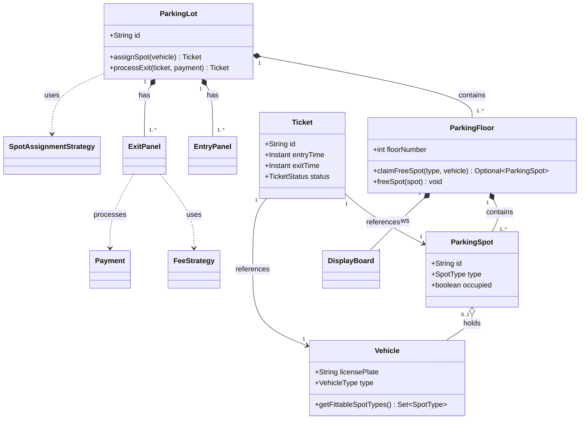
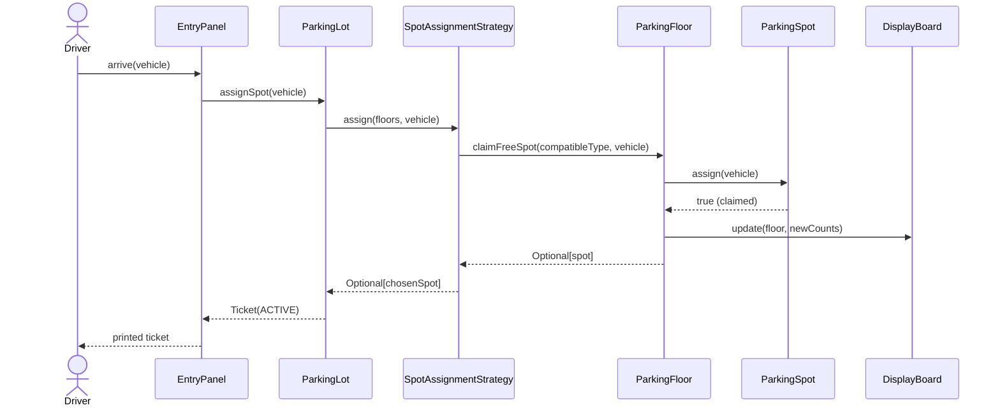
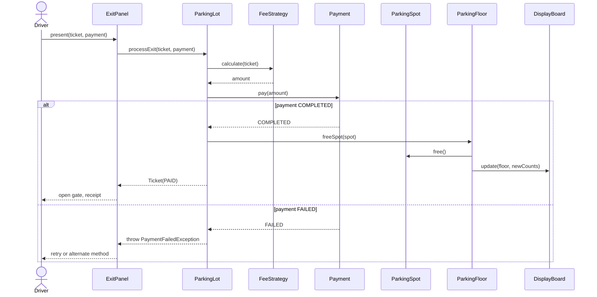
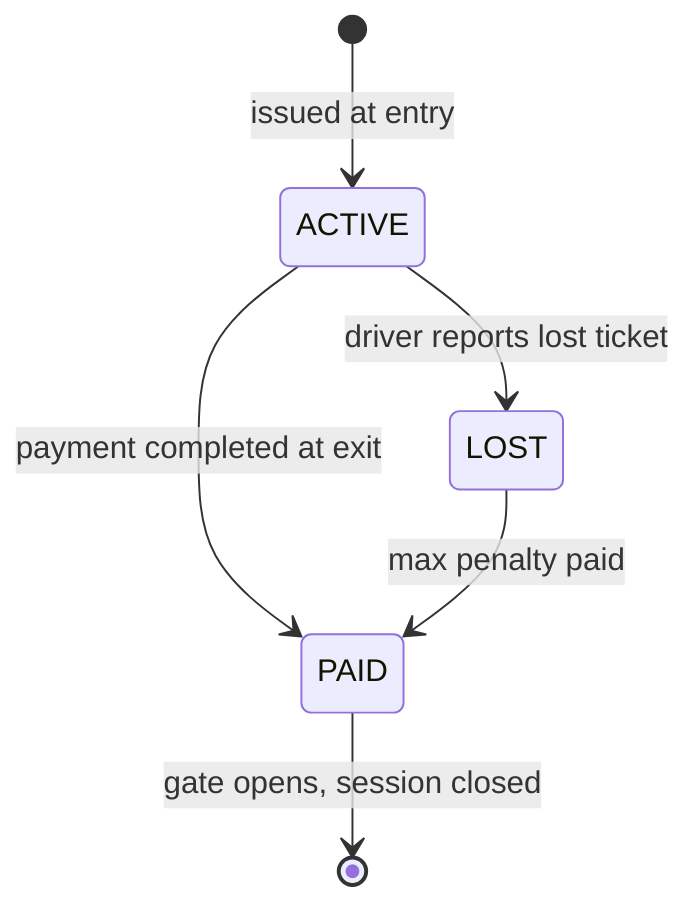
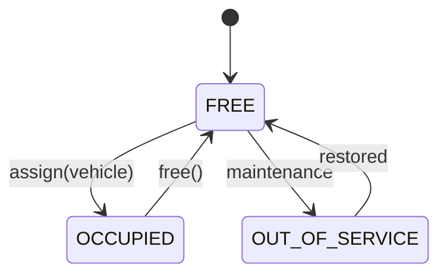
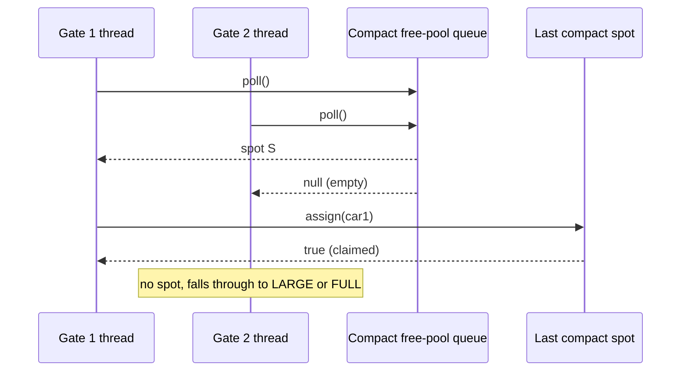
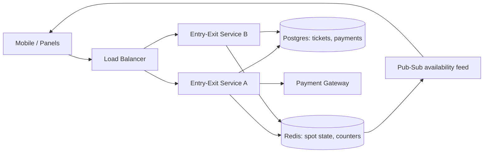

# 🅿️ Low-Level Design: Parking Lot System

> A complete, interview-ready walkthrough of the classic **Parking Lot** design problem — from a blank whiteboard to a staff-level system that survives concurrency, scale, and follow-up grilling.

The Parking Lot is the "Hello, World" of object-oriented design interviews. It looks simple: cars come in, cars go out, you charge them money. But it is *deliberately* open-ended, and that is exactly why it is asked. The interviewer is watching how you carve a fuzzy real-world scenario into clean abstractions, how you handle the awkward edge cases (a motorcycle in a truck spot, a lost ticket, two cars racing for the last slot), and how far you can push the design when they start adding constraints. This guide takes you through all of it, escalating from the beginner's mental model to the concerns a principal engineer raises in the last ten minutes of the interview.

---

## 📋 Table of Contents

**Part I — Framing the Problem**

1. [Problem Statement](#1-problem-statement)
2. [Requirement Clarification & Assumptions](#2-requirement-clarification--assumptions)
3. [Functional & Non-Functional Requirements](#3-functional--non-functional-requirements)
4. [Core Concepts Being Tested](#4-core-concepts-being-tested)

**Part II — Modeling the Domain**

5. [Domain Model & Entities](#5-domain-model--entities)
6. [CRC Cards](#6-crc-cards)
7. [UML Class Diagram](#7-uml-class-diagram)
8. [Package Structure](#8-package-structure)

**Part III — Design Rationale**

9. [Design Decisions & Trade-offs](#9-design-decisions--trade-offs)
10. [Class-by-Class Deep Dive](#10-class-by-class-deep-dive)
11. [Design Patterns Applied](#11-design-patterns-applied)
12. [SOLID Principles Mapping](#12-solid-principles-mapping)

**Part IV — Behavior & Diagrams**

13. [Sequence Diagram](#13-sequence-diagram)
14. [State Diagram](#14-state-diagram)

**Part V — The Implementation**

15. [Complete Java Implementation](#15-complete-java-implementation)
16. [Execution Flow & Code Walkthrough](#16-execution-flow--code-walkthrough)

**Part VI — Engineering Depth**

17. [Complexity Analysis](#17-complexity-analysis)
18. [Thread Safety & Concurrency](#18-thread-safety--concurrency)
19. [Error Handling & Validation](#19-error-handling--validation)
20. [Scalability Discussion](#20-scalability-discussion)
21. [Alternative Designs & Trade-offs](#21-alternative-designs--trade-offs)

**Part VII — Interview Mastery**

22. [Common FAANG Follow-up Questions (L4 → L6)](#22-common-faang-follow-up-questions-l4--l6)
23. [Common Design Mistakes](#23-common-design-mistakes)
24. [Testing Strategy](#24-testing-strategy)
25. [FAANG Q&A Section](#25-faang-qa-section)
26. [STAR Behavioral Questions](#26-star-behavioral-questions)
27. [⚡ Quick Revision Cheat Sheet](#27--quick-revision-cheat-sheet)

---

## 1. Problem Statement

Design the software that runs a **multi-floor parking lot**. A vehicle arrives at an entrance, is issued a ticket, and is directed to (or assigned) a compatible parking spot. When it leaves, the system computes the fee based on how long the vehicle stayed and the type of spot it used, accepts payment, and frees the spot for the next vehicle.

The system must handle **different vehicle types** (motorcycle, car, truck/bus), **different spot sizes** (small, compact, large, handicapped, electric), **multiple entry and exit points** operating simultaneously, and it must keep an accurate, real-time count of available capacity so it can display "LOT FULL" when appropriate.

<details>
<summary>📖 <b>In plain terms — what are we actually building?</b></summary>

Picture the parking structure at an airport or a shopping mall. You drive up, a machine spits out a ticket with a timestamp, a sign tells you "Level 3 has space," you park, and on the way out a booth charges you for the hours you stayed. Our job is to write the *brains* behind that: the logic that decides which spot you get, tracks which spots are free, prices your stay, and takes your money. We are not building the physical gates or cameras — we are building the software objects and rules that coordinate the whole dance so nothing gets double-booked and every car is charged correctly.

</details>

The deliverable in an interview is not a running product; it is a **clean object-oriented model** — the set of classes, their responsibilities, and their interactions — that a team could realistically build on. The grading is on clarity of abstractions, correctness of behavior, extensibility, and how gracefully your design absorbs new requirements.

---

## 2. Requirement Clarification & Assumptions

The single biggest mistake candidates make is coding before scoping. A strong candidate spends the first few minutes turning the vague prompt into a bounded problem. Below is the clarification dialogue you should drive with the interviewer, framed as the questions to ask and the assumptions to lock in.

### 2.1 Actors

The people and systems that interact with the lot define the surface area of our design.

| Actor | Role in the system |
|-------|--------------------|
| **Driver / Customer** | Arrives with a vehicle, collects a ticket, parks, pays, and exits. |
| **Parking Attendant** (optional) | May issue tickets or process payments manually at a booth. |
| **System / Admin** | Configures floors, spots, and pricing; monitors capacity dashboards. |
| **Entry & Exit Panels** | The physical terminals (hardware) that our software drives — print tickets, open gates, accept payment. |

### 2.2 Key Clarifying Questions

Before modeling anything, resolve these with the interviewer. Each answer materially changes the design.

- **Vehicle & spot compatibility** — Can a motorcycle park in a car spot? Can a car take a large spot if compact spots are full? *(Assumption: a smaller vehicle may occupy a larger spot when its ideal size is unavailable; a larger vehicle can never fit a smaller spot.)*
- **Multiple entries/exits** — How many entrances and exits? Do they operate concurrently? *(Assumption: multiple of each, running in parallel — this drives the concurrency discussion.)*
- **Payment** — Cash, card, or both? Is payment at exit or via app? *(Assumption: pluggable payment — cash and card at exit.)*
- **Pricing** — Flat rate or tiered by vehicle type and duration? *(Assumption: hourly rate that varies by spot type, with the fee computed on exit.)*
- **Lost ticket** — What happens if a driver loses the ticket? *(Assumption: a maximum penalty fee is charged.)*
- **Reservations / EV charging** — Do we support pre-booking spots or electric charging? *(Assumption: out of scope for v1, but the design should not preclude it.)*
- **Spot assignment** — Does the system assign a specific spot, or does the driver find their own? *(Assumption: the system assigns the nearest compatible free spot at entry — this is the more interesting design and makes the allocation logic explicit.)*

### 2.3 Explicit Non-Goals

Naming what you will *not* build is a senior signal — it shows you can bound scope deliberately rather than by omission.

- No physical hardware control (gate motors, sensors, license-plate cameras) — we assume clean interfaces to them.
- No online reservation or mobile-app booking flow in v1.
- No user authentication, loyalty accounts, or membership tiers.
- No dynamic surge pricing or ML-based demand forecasting.
- No cross-lot federation (a single lot, though we discuss scaling to many later).

<details>
<summary>📖 <b>Why spend so long on clarification?</b></summary>

In a real interview, the prompt "design a parking lot" is intentionally thin. If you start drawing classes immediately, you are guessing at requirements — and you will guess wrong. By asking about compatibility, payment, and spot assignment upfront, you (1) show product sense, (2) avoid building the wrong thing, and (3) plant the seeds for the hard follow-ups later. For example, once you've said "multiple exits run concurrently," you've committed to a thread-safety conversation — and that's a good thing, because it's where senior candidates separate from junior ones.

</details>

---

## 3. Functional & Non-Functional Requirements

### 3.1 Functional Requirements (what the system *does*)

These are the concrete behaviors the system must support. In an interview, list them crisply — they become your checklist for the class design.

1. **Issue a ticket** when a vehicle enters, recording entry time, vehicle details, and the assigned spot.
2. **Assign a compatible parking spot** — the nearest available spot that fits the vehicle type.
3. **Track availability** in real time, per floor and per spot type.
4. **Display status** — show free-spot counts on entry panels and floor displays; show "FULL" when no compatible spot exists.
5. **Calculate the parking fee** on exit based on duration and spot/vehicle type.
6. **Process payment** through one or more payment methods.
7. **Free the spot** and mark the ticket paid/closed once payment succeeds, allowing the vehicle to exit.
8. **Support multiple floors** and multiple entry/exit points.

### 3.2 Non-Functional Requirements (how *well* it does it)

These are the qualities that make the design production-grade, and they are where staff-level discussion lives.

| Attribute | Requirement | Why it matters |
|-----------|-------------|----------------|
| **Concurrency** | Multiple entries must be able to assign spots simultaneously without ever double-allocating one spot. | Two cars at two gates must never receive the same slot. |
| **Consistency** | The available-count and spot state must always reflect reality. | A "FULL" sign while spots are free (or vice versa) erodes trust and revenue. |
| **Low latency** | Ticket issuance and spot assignment should feel instant (sub-100ms). | Drivers wait at a physical gate; slowness causes queues. |
| **Availability** | Entry/exit should degrade gracefully if a subsystem (e.g., card payment) fails. | A payment outage shouldn't trap cars inside. |
| **Extensibility** | New vehicle types, spot types, and pricing rules should slot in with minimal change. | Requirements *will* change (EV charging, valet). |
| **Scalability** | Model should extend from one small lot to large multi-floor or multi-lot deployments. | The same abstractions should scale up. |

<details>
<summary>📖 <b>Functional vs non-functional — the quick distinction</b></summary>

Functional requirements are the *verbs* — issue a ticket, assign a spot, take payment. If a functional requirement fails, the system did the wrong thing. Non-functional requirements are the *adverbs* — do it quickly, do it concurrently, do it without ever double-booking. If a non-functional requirement fails, the system did the right thing but *badly* (too slow, or it corrupted state under load). Interviewers love non-functional requirements because they can't be answered with a class diagram alone — they force you to reason about locks, failure modes, and trade-offs.

</details>

---

## 4. Core Concepts Being Tested

This problem is a proxy for a bundle of skills. Knowing what's being measured helps you narrate your design to the *right* audience.

- **Object-oriented decomposition** — Can you find the right nouns (Vehicle, Spot, Ticket, Floor) and give each a single clear responsibility?
- **Abstraction via inheritance & interfaces** — Vehicle and ParkingSpot are natural hierarchies; payment and fee strategy are natural interfaces.
- **Design patterns in context** — Strategy (pricing, spot allocation), Factory (vehicle/spot creation), Singleton (the lot), Observer (display boards) — applied where they *earn their place*, not sprinkled for show.
- **SOLID reasoning** — especially the Open/Closed Principle: adding an EV spot or a new pricing rule shouldn't force edits to existing classes.
- **Concurrency correctness** — the heart of the senior discussion: safe spot allocation under parallel entries.
- **Trade-off articulation** — every choice (assign-at-entry vs find-your-own, per-floor lock vs global lock) has a cost; naming the cost is the skill.

Keep these in the back of your mind as you read on — each section below is, in part, a chance to demonstrate one or more of them.

---

## 5. Domain Model & Entities

Before any code, we identify the **nouns** in the problem and turn them into entities. Good domain modeling is the difference between a design that flexes and one that fights you.

### 5.1 The Entity Landscape

Here is the cast of the system, grouped by role:

- **ParkingLot** — the top-level aggregate. Owns floors, entry/exit panels, and the pricing configuration. There is exactly one per physical lot.
- **ParkingFloor** — a single level. Owns its spots and its display board, and knows its own local availability.
- **ParkingSpot** — a single space. Has a type (small, compact, large, handicapped, EV), an occupied/free state, and possibly the vehicle currently in it. This is an *abstract* concept specialized by spot type.
- **Vehicle** — the thing being parked. Abstract, specialized into Motorcycle, Car, Truck. Carries a license plate and knows which spot types it can fit.
- **Ticket** (a.k.a. ParkingTicket) — the record of a parking session: which vehicle, which spot, entry time, exit time, amount, and status.
- **EntryPanel / ExitPanel** — the terminals that begin and end a session. Entry issues tickets; exit computes fees and takes payment.
- **Payment** — an abstraction over how money changes hands (cash, card), with a status.
- **FeeStrategy** — the pluggable rule that turns duration + spot type into a price.
- **SpotAssignmentStrategy** — the pluggable rule that picks *which* free spot a vehicle gets.
- **DisplayBoard** — the observer that shows live counts of free spots.

### 5.2 Entity Relationships



<details>
<summary>📖 <b>How to read this relationship map</b></summary>

The diamond-headed lines mean "owns / is composed of" — a ParkingLot *is made of* floors; if the lot ceases to exist, so do its floors. The hollow diamond between ParkingSpot and Vehicle means "holds a reference to" — a spot may currently hold a vehicle, but the vehicle exists independently (it drives away). The dotted arrows mean "uses" — the ExitPanel *uses* a FeeStrategy but doesn't own it. This distinction (ownership vs usage) matters because it tells you what gets created and destroyed together, and what is injected from outside.

</details>

### 5.3 Core Enumerations

Enums keep the type system honest and make illegal states unrepresentable.

- `VehicleType { MOTORCYCLE, CAR, TRUCK }`
- `SpotType { MOTORCYCLE, COMPACT, LARGE, HANDICAPPED, ELECTRIC }`
- `TicketStatus { ACTIVE, PAID, LOST }`
- `PaymentStatus { PENDING, COMPLETED, FAILED, REFUNDED }`

---

## 6. CRC Cards

CRC (Class–Responsibility–Collaborator) cards are a lightweight way to pin down *what each class is responsible for* and *who it talks to*, before drowning in fields and methods. They're a favorite of interviewers because they force single-responsibility thinking.

| Class | Responsibilities | Collaborators |
|-------|------------------|---------------|
| **ParkingLot** | Coordinate entry/exit; hold floors & panels; delegate spot assignment and pricing. | ParkingFloor, EntryPanel, ExitPanel, SpotAssignmentStrategy |
| **ParkingFloor** | Manage its own spots; find a free compatible spot; update its display board. | ParkingSpot, DisplayBoard |
| **ParkingSpot** | Know its type & state; be assigned to / freed from a vehicle. | Vehicle |
| **Vehicle** | Identify itself (plate, type); declare which spot types it fits. | SpotType |
| **Ticket** | Record a parking session (times, spot, vehicle, amount, status). | ParkingSpot, Vehicle |
| **EntryPanel** | Accept an arriving vehicle; request a spot; issue a ticket. | ParkingLot, Ticket |
| **ExitPanel** | Accept a ticket; compute fee; take payment; close the session. | FeeStrategy, Payment, Ticket |
| **FeeStrategy** | Convert (duration, spot type) into a monetary amount. | Ticket |
| **SpotAssignmentStrategy** | Choose the best free spot for a vehicle across floors. | ParkingFloor, ParkingSpot |
| **Payment** | Execute a charge and report success/failure. | — |
| **DisplayBoard** | Reflect current free-spot counts to observers. | ParkingFloor |

Notice how each class has a *tight* set of responsibilities. If a card starts listing five unrelated duties, that's a smell that the class is doing too much — a cue to split it.

---

## 7. UML Class Diagram

Here is the full static structure in ASCII, the way you'd sketch it on a whiteboard. Abstract types are marked `«abstract»`; interfaces are marked `«interface»`.

```
                     ┌───────────────────────────────────────┐
                     │ ParkingLot                «singleton»  │
                     ├───────────────────────────────────────┤
                     │ - id: String                          │
                     │ - floors: List<ParkingFloor>          │
                     │ - entryPanels: List<EntryPanel>       │
                     │ - exitPanels: List<ExitPanel>         │
                     │ - assigner: SpotAssignmentStrategy    │
                     │ - feeStrategy: FeeStrategy            │
                     ├───────────────────────────────────────┤
                     │ + assignSpot(v): Ticket               │
                     │ + processExit(t, pay): Ticket         │
                     └──────────────────┬────────────────────┘
                                        │ 1..*
                                        ▼
              ┌──────────────────────────────────────────┐
              │ ParkingFloor                             │       ┌───────────────────────────────┐
              ├──────────────────────────────────────────┤       │ DisplayBoard                  │
              │ - floorNumber: int                       │──────▶├───────────────────────────────┤
              │ - freePools: Map<SpotType, Queue<Spot>>  │ 1   1 │ + update(floor, counts): void │
              │ - observers: List<AvailabilityObserver>  │       └───────────────────────────────┘
              ├──────────────────────────────────────────┤        «interface» AvailabilityObserver
              │ + claimFreeSpot(type, v): Optional<Spot> │
              │ + freeSpot(spot): void                   │
              │ + freeCounts(): Map<SpotType,Integer>    │
              └────────────────────┬─────────────────────┘
                                   │ 1..*
                                   ▼
                       ┌────────────────────────┐
                       │ «abstract» ParkingSpot │
                       ├────────────────────────┤
                       │ - id: String           │
                       │ - type: SpotType       │
                       │ - occupied: boolean    │
                       │ - vehicle: Vehicle     │
                       ├────────────────────────┤
                       │ + assign(v): boolean   │
                       │ + free(): void         │
                       │ + canFit(v): boolean   │
                       └───────────┬────────────┘
             ┌────────────────┬────┴──────────┬────────────────┐
             ▼                ▼               ▼                ▼
    ┌──────────────┐ ┌──────────────┐ ┌──────────────┐ ┌──────────────┐
    │MotorcycleSpot│ │  CompactSpot │ │   LargeSpot  │ │ ElectricSpot │
    └──────────────┘ └──────────────┘ └──────────────┘ └──────────────┘


    ┌─────────────────────────────────────────┐        ┌─────────────────────────────────┐
    │ «abstract» Vehicle                      │        │ Ticket                          │
    ├─────────────────────────────────────────┤        ├─────────────────────────────────┤
    │ - licensePlate: String                  │◀───────│ - id: String                    │
    │ - type: VehicleType                     │  refs  │ - vehicle: Vehicle              │
    ├─────────────────────────────────────────┤  ┌─────│ - spot: ParkingSpot             │
    │ + getFittableSpotTypes(): Set<SpotType> │  │     │ - entryTime / exitTime: Instant │
    └─────────────────┬───────────────────────┘  │     │ - amount: Money                 │
       ┌──────────┬───┴──────┐                    │     │ - status: TicketStatus          │
       ▼          ▼          ▼                     └───▶└─────────────────────────────────┘
 ┌──────────┐┌──────┐┌────────┐                    (spot: ParkingSpot)
 │Motorcycle││ Car  ││ Truck  │
 └──────────┘└──────┘└────────┘


  «interface» FeeStrategy            «interface» SpotAssignmentStrategy           «interface» Payment
  ┌─────────────────────────┐   ┌───────────────────────────────────────┐   ┌──────────────────────────┐
  │ +calculate(t): Money    │   │ +assign(floors, v): Optional<Spot>    │   │ +pay(amount):PaymentStatus│
  └───────────┬─────────────┘   └───────────────────┬───────────────────┘   └────────────┬─────────────┘
              ▼                                      ▼                       ┌─────────────┴────────────┐
  ┌─────────────────────────┐   ┌───────────────────────────────────────┐   ▼                          ▼
  │ FlatRateFeeStrategy     │   │ NearestFirstAssignment                │ ┌────────────┐    ┌──────────────┐
  │ HourlyTieredFeeStrategy │   │ BestFitAssignment                     │ │CashPayment │    │ CardPayment  │
  └─────────────────────────┘   └───────────────────────────────────────┘ └────────────┘    └──────────────┘
```

<details>
<summary>📖 <b>What the arrows and boxes are telling you</b></summary>

The three vertical stacks (ParkingSpot → its subtypes, Vehicle → its subtypes) are **inheritance** — "is-a" relationships. A CompactSpot *is a* ParkingSpot. The horizontal boxes at the bottom marked `«interface»` are the **pluggable strategies** — you can swap `FlatRateFeeStrategy` for `HourlyTieredFeeStrategy` without touching the ExitPanel. The line from Ticket to Vehicle labeled "references" is an **association** — Ticket keeps a pointer to the vehicle and spot so it can compute the fee and free the spot later. Together this shape says: a rigid core (lot, floor, spot, ticket) surrounded by soft, swappable edges (pricing, assignment, payment).

</details>

---

## 8. Package Structure

A clean package layout communicates the architecture at a glance and enforces dependency direction. Here's a pragmatic layout.

```
com.parkinglot
│
├── model                      // Entities & value objects (no behavior beyond their own state)
│   ├── Vehicle.java           //   abstract + Motorcycle, Car, Truck
│   ├── ParkingSpot.java       //   abstract + spot subtypes
│   ├── ParkingFloor.java
│   ├── ParkingLot.java
│   ├── Ticket.java
│   └── enums/                 //   VehicleType, SpotType, TicketStatus, PaymentStatus
│
├── strategy                   // Pluggable algorithms (Strategy pattern)
│   ├── fee/                   //   FeeStrategy + FlatRate, HourlyTiered
│   └── assignment/            //   SpotAssignmentStrategy + NearestFirst, BestFit
│
├── payment                    // Payment abstraction + Cash, Card
│   ├── Payment.java
│   └── ...
│
├── panel                      // Entry & Exit terminals
│   ├── EntryPanel.java
│   └── ExitPanel.java
│
├── observer                   // DisplayBoard + Observer wiring
│   └── DisplayBoard.java
│
├── factory                    // VehicleFactory, SpotFactory
│
├── exception                  // Domain exceptions
│   ├── ParkingFullException.java
│   └── InvalidTicketException.java
│
└── service                    // ParkingService — the orchestration entry point
    └── ParkingService.java
```

The guiding rule: **`model` depends on nothing; everything can depend on `model`.** Strategies, panels, and services depend inward toward the domain, never the other way around. This is the seed of a clean/hexagonal architecture and it keeps the core logic testable in isolation.

---

## 9. Design Decisions & Trade-offs

Every interesting design has forks in the road. Here are the decisions that define this one, each with the alternative considered and the reason for the choice.

### 9.1 Assign a spot at entry, or let drivers find their own?

**Decision:** The system assigns the nearest compatible spot at entry and records it on the ticket.

**Trade-off:** Assigning at entry makes availability deterministic and enables the "spot X on floor 3" guidance — but it requires the system to *know* every spot's real-time state and to allocate atomically under concurrency. The alternative (driver finds their own, system only counts) is simpler and matches many real garages, but it can't guide drivers and makes "FULL" detection fuzzier. We choose assignment because it exercises the more interesting logic and mirrors modern smart-parking systems.

### 9.2 How do we represent spot–vehicle compatibility?

**Decision:** Each Vehicle declares the set of SpotTypes it can occupy (a motorcycle fits motorcycle/compact/large; a car fits compact/large; a truck fits large only). Assignment picks the smallest available compatible type first.

**Trade-off:** Encoding compatibility on the vehicle keeps the rule in one place and makes "smaller vehicle can use a bigger spot" trivial. The alternative — a compatibility matrix or letting each spot decide — scatters the rule. The "smallest-first" preference avoids wasting a large spot on a motorcycle, which matters when trucks arrive later.

### 9.3 Global lock, or per-floor / per-type locking?

**Decision:** Lock at the granularity of the spot pool being mutated (per floor + type), not a single global lock.

**Trade-off:** A single global lock is trivially correct but serializes *all* entries across the whole lot — a throughput killer at rush hour with many gates. Fine-grained locking (or lock-free structures like a concurrent queue of free spots per type) allows parallel assignment on different floors/types at the cost of more careful code. We discuss both; the fine-grained version is the staff-level answer.

### 9.4 Where does pricing live?

**Decision:** Behind a `FeeStrategy` interface, injected into the ExitPanel.

**Trade-off:** Strategy adds an interface and a little indirection, but it means new pricing (weekend rates, EV surcharge, flat event pricing) is a *new class*, not an edit to existing code — the Open/Closed Principle in action. Hardcoding pricing in ExitPanel is faster to write and a nightmare to change.

### 9.5 Is ParkingLot a Singleton?

**Decision:** Model the lot as a single instance per process (Singleton), but inject it rather than reaching for a static `getInstance()` everywhere.

**Trade-off:** There's genuinely one physical lot, so a single instance is natural. But a hard static Singleton is a testing anti-pattern (global mutable state, hard to mock). The senior move is "logically one instance, but dependency-injected" — you get the conceptual singleness without the testability tax.

<details>
<summary>📖 <b>Why interviewers love the "trade-off" framing</b></summary>

Junior candidates present a design as *the* answer. Senior candidates present it as *a* choice among alternatives, and can articulate what they gave up. Saying "I used a global lock because it's simple and correct, but it caps throughput, so if we had 20 gates I'd move to per-floor locking" tells the interviewer you understand consequences, not just syntax. Every decision above is phrased this way on purpose — practice narrating the road *not* taken.

</details>

---

## 10. Class-by-Class Deep Dive

Now we walk the key classes, explaining not just *what* they hold but *why* they're shaped that way.

### 10.1 `Vehicle` (abstract)

The root of the vehicle hierarchy. It holds the license plate and vehicle type, and — critically — exposes `getFittableSpotTypes()`, the set of spot types this vehicle can occupy. Concrete subclasses (`Motorcycle`, `Car`, `Truck`) simply declare their type; the fit-set is derived from it. Putting compatibility here (rather than in the assignment algorithm) means the *knowledge* of "what fits where" lives with the thing that knows its own size.

### 10.2 `ParkingSpot` (abstract)

Represents one physical space. Key fields: `id`, `type`, an `occupied` flag, and a reference to the current `Vehicle`. Its two behaviors — `assign(vehicle)` and `free()` — are the only ways its state changes, which gives us a single choke point to make thread-safe. `canFit(vehicle)` asks the vehicle whether this spot's type is in its fit-set. Subclasses (`CompactSpot`, `LargeSpot`, etc.) mostly exist to make the type explicit and to allow spot-type-specific behavior later (e.g., an `ElectricSpot` that also manages a charger).

### 10.3 `ParkingFloor`

Owns a collection of spots, indexed by `SpotType` for O(1)-ish lookup of a free spot of a given type. It exposes `claimFreeSpot(type, vehicle)` (which atomically polls a free spot and assigns it) and `freeSpot(spot)`, and holds a `DisplayBoard` that it notifies whenever counts change. The per-type index is a deliberate performance choice: without it, finding a free compact spot means scanning every spot on the floor.

### 10.4 `ParkingLot`

The orchestrator. It holds the floors, the entry/exit panels, and the injected strategies. Its two headline methods are `assignSpot(vehicle)` — which delegates to the `SpotAssignmentStrategy` across floors and issues a `Ticket` — and `processExit(ticket, method)` — which uses the `FeeStrategy` to price the stay, runs `Payment`, frees the spot, and closes the ticket. It coordinates; it does not itself contain pricing or assignment *rules* (those are strategies).

### 10.5 `Ticket`

The record of a session. It links a `Vehicle` to a `ParkingSpot`, stamps `entryTime` on creation and `exitTime` on exit, carries the computed `amount`, and tracks `status` (ACTIVE → PAID, or LOST). It is effectively the unit of billing and the audit trail.

### 10.6 `EntryPanel` and `ExitPanel`

Thin terminals. `EntryPanel.issueTicket(vehicle)` calls into the lot to assign a spot and returns a ticket. `ExitPanel.processExit(ticket, method)` calls into the lot to compute the fee, take payment, and free the spot. Keeping them thin means the *business* logic lives in the lot and strategies, while the panels model the physical touchpoints — which makes it easy to add more gates without duplicating logic.

### 10.7 `FeeStrategy` and `SpotAssignmentStrategy`

The two pluggable brains. `FeeStrategy.calculate(ticket)` turns elapsed time and spot type into money. `SpotAssignmentStrategy.assign(floors, vehicle)` picks a spot — `NearestFirst` grabs the first compatible free spot scanning from floor 1, `BestFit` prefers the smallest compatible spot type to conserve larger spots for larger vehicles. Both are interfaces precisely so the policy can change without the orchestration changing.

### 10.8 `Payment`

An interface over a charge. `CashPayment` and `CardPayment` implement `pay(amount)`, returning success/failure. This isolates the (often flaky, external) payment concern behind a clean boundary so the exit flow can reason about "did payment succeed?" without knowing about card networks.

---

## 11. Design Patterns Applied

Patterns should appear because the problem *demands* them, not to decorate the design. Here's where each one earns its place.

| Pattern | Where it's used | What it buys us |
|---------|-----------------|-----------------|
| **Strategy** | `FeeStrategy`, `SpotAssignmentStrategy` | Swap pricing/assignment policies without touching orchestration. The archetypal OCP win. |
| **Factory Method / Simple Factory** | `VehicleFactory`, `SpotFactory` | Centralize creation of the right subclass from a type enum; callers don't `new` concrete classes. |
| **Singleton** | `ParkingLot` (one per process) | Model the single physical lot — used judiciously, via injection. |
| **Observer** | `DisplayBoard` observing floor availability | Display boards update automatically when counts change; adds/removes displays freely. |
| **State** (optional) | `Ticket` status transitions, `ParkingSpot` occupied/free | Make illegal transitions impossible and localize transition logic. |
| **Facade** | `ParkingService` | One simple entry point (`park`, `unpark`) over the subsystem for clients. |

<details>
<summary>📖 <b>A note on not over-patterning</b></summary>

It's tempting to cram in every Gang-of-Four pattern to look sophisticated, but an interviewer reads that as insecurity. The Strategy pattern for pricing is unarguable — pricing genuinely varies. Observer for display boards is natural — displays genuinely need push updates. But forcing, say, a Visitor or an Abstract Factory where a simple factory suffices is a red flag. The skill is knowing when a pattern *reduces* complexity versus when it merely adds ceremony. Reach for a pattern when it removes an "if I change X I must edit Y" coupling.

</details>

For the deeper theory behind each of these, this guide pairs naturally with the individual Strategy, Factory, Singleton, and Observer pattern guides.

---

## 12. SOLID Principles Mapping

SOLID isn't an abstract checklist here — each principle shows up concretely in the design.

**S — Single Responsibility.** Each class has one reason to change: `ParkingFloor` manages spots, `FeeStrategy` prices stays, `Payment` moves money. Pricing changes don't touch the floor; floor-layout changes don't touch pricing.

**O — Open/Closed.** The system is *open to extension, closed to modification*. A new `WeekendFeeStrategy` or `ElectricSpot` is a new class; no existing class is edited. This is the single most important SOLID win in the design, delivered by the Strategy and inheritance hierarchies.

**L — Liskov Substitution.** Any `Vehicle` subtype works wherever a `Vehicle` is expected; any `ParkingSpot` subtype works wherever a spot is expected. `assign()` behaves consistently across all spot subtypes — no subtype throws where the base promised not to.

**I — Interface Segregation.** `FeeStrategy`, `SpotAssignmentStrategy`, and `Payment` are small, focused interfaces. A payment implementation isn't forced to know about pricing; an assignment strategy isn't forced to know about money. Clients depend only on the sliver they use.

**D — Dependency Inversion.** `ParkingLot` depends on the *abstractions* `FeeStrategy` and `SpotAssignmentStrategy`, not concrete classes. Concretes are injected at construction. High-level orchestration doesn't know or care whether pricing is flat or tiered.

<details>
<summary>📖 <b>The one-line SOLID gut check</b></summary>

If you can add a brand-new spot type, a new vehicle, a new pricing rule, and a new payment method *without editing a single existing class* — only adding new ones — your design honors Open/Closed and Dependency Inversion, and the rest of SOLID usually falls into place. That "add, don't edit" test is the fastest way to sanity-check your parking-lot design under interview pressure.

</details>

---

## 13. Sequence Diagram

Two flows matter: **entry** (issue a ticket, assign a spot) and **exit** (price, pay, free). Here they are as message sequences.

### 13.1 Vehicle Entry



### 13.2 Vehicle Exit



<details>
<summary>📖 <b>Reading the exit flow</b></summary>

The exit is more interesting than the entry because of the `alt` block — the fork where payment can fail. Notice what happens on failure: the spot is *not* freed and the ticket stays ACTIVE, so the car can't leave without paying, but it also isn't lost from the system. This "don't free the spot until money is confirmed" ordering is deliberate — freeing first and charging second would let a car exit for free if payment then failed. In real systems (like a card reader timing out), this ordering is the difference between correct accounting and leaking revenue.

</details>

---

## 14. State Diagram

Both the **Ticket** and each **ParkingSpot** are naturally state machines. Modeling them as such makes illegal transitions (e.g., freeing an already-free spot) explicit and rejectable.

### 14.1 Ticket Lifecycle



### 14.2 Parking Spot Lifecycle



The `OUT_OF_SERVICE` state is a small enrichment worth mentioning in interviews — real lots take spots offline for maintenance, and having the state means such spots are cleanly excluded from assignment without deleting them.

---

## 15. Complete Java Implementation

Below is a complete, compilable reference implementation. It's organized bottom-up: enums and entities first, then strategies, then the orchestrating lot and a demo. Every block is collapsible so you can study one piece at a time.

<details>
<summary>💻 <b>1. Enums & Money value object</b></summary>

```java
package com.parkinglot.model.enums;

public enum VehicleType { MOTORCYCLE, CAR, TRUCK }

public enum SpotType {
    MOTORCYCLE, COMPACT, LARGE, HANDICAPPED, ELECTRIC
}

public enum TicketStatus { ACTIVE, PAID, LOST }

public enum PaymentStatus { PENDING, COMPLETED, FAILED, REFUNDED }
```

```java
package com.parkinglot.model;

import java.util.Objects;

/** Minimal immutable money value object to avoid floating-point currency bugs. */
public final class Money {
    private final long cents;      // store money as integer cents

    private Money(long cents) { this.cents = cents; }

    public static Money ofCents(long cents) { return new Money(cents); }
    public static Money ofDollars(double dollars) {
        return new Money(Math.round(dollars * 100));
    }
    public static final Money ZERO = new Money(0);

    public Money plus(Money other) { return new Money(this.cents + other.cents); }
    public Money times(long factor) { return new Money(this.cents * factor); }
    public long cents() { return cents; }

    @Override public String toString() {
        return String.format("$%d.%02d", cents / 100, Math.abs(cents % 100));
    }
    @Override public boolean equals(Object o) {
        return (o instanceof Money) && ((Money) o).cents == cents;
    }
    @Override public int hashCode() { return Objects.hash(cents); }
}
```

</details>

<details>
<summary>💻 <b>2. Vehicle hierarchy</b></summary>

```java
package com.parkinglot.model;

import com.parkinglot.model.enums.SpotType;
import com.parkinglot.model.enums.VehicleType;
import java.util.Set;

public abstract class Vehicle {
    private final String licensePlate;
    private final VehicleType type;

    protected Vehicle(String licensePlate, VehicleType type) {
        if (licensePlate == null || licensePlate.isBlank())
            throw new IllegalArgumentException("License plate required");
        this.licensePlate = licensePlate;
        this.type = type;
    }

    public String getLicensePlate() { return licensePlate; }
    public VehicleType getType() { return type; }

    /** The spot types this vehicle may occupy, in preference order (smallest first). */
    public abstract Set<SpotType> getFittableSpotTypes();
}
```

```java
package com.parkinglot.model;

import com.parkinglot.model.enums.SpotType;
import com.parkinglot.model.enums.VehicleType;
import java.util.LinkedHashSet;
import java.util.Set;

public class Motorcycle extends Vehicle {
    public Motorcycle(String plate) { super(plate, VehicleType.MOTORCYCLE); }
    @Override public Set<SpotType> getFittableSpotTypes() {
        return new LinkedHashSet<>(Set.of(
            SpotType.MOTORCYCLE, SpotType.COMPACT, SpotType.LARGE));
    }
}

public class Car extends Vehicle {
    public Car(String plate) { super(plate, VehicleType.CAR); }
    @Override public Set<SpotType> getFittableSpotTypes() {
        return new LinkedHashSet<>(Set.of(SpotType.COMPACT, SpotType.LARGE));
    }
}

public class Truck extends Vehicle {
    public Truck(String plate) { super(plate, VehicleType.TRUCK); }
    @Override public Set<SpotType> getFittableSpotTypes() {
        return new LinkedHashSet<>(Set.of(SpotType.LARGE));
    }
}
```

> Note: `LinkedHashSet` preserves the smallest-first ordering so the assignment strategy can prefer the tightest fit.

</details>

<details>
<summary>💻 <b>3. ParkingSpot hierarchy (thread-safe assign/free)</b></summary>

```java
package com.parkinglot.model;

import com.parkinglot.model.enums.SpotType;

public abstract class ParkingSpot {
    private final String id;
    private final SpotType type;
    private boolean occupied = false;
    private Vehicle vehicle;

    protected ParkingSpot(String id, SpotType type) {
        this.id = id;
        this.type = type;
    }

    public String getId() { return id; }
    public SpotType getType() { return type; }
    public synchronized boolean isFree() { return !occupied; }
    public synchronized Vehicle getVehicle() { return vehicle; }

    public boolean canFit(Vehicle v) {
        return v.getFittableSpotTypes().contains(this.type);
    }

    /** Atomically claim this spot. Returns false if already taken (lost race). */
    public synchronized boolean assign(Vehicle v) {
        if (occupied) return false;
        if (!canFit(v)) return false;
        this.vehicle = v;
        this.occupied = true;
        return true;
    }

    public synchronized void free() {
        this.vehicle = null;
        this.occupied = false;
    }
}
```

```java
package com.parkinglot.model;

import com.parkinglot.model.enums.SpotType;

public class MotorcycleSpot extends ParkingSpot {
    public MotorcycleSpot(String id) { super(id, SpotType.MOTORCYCLE); }
}
public class CompactSpot extends ParkingSpot {
    public CompactSpot(String id) { super(id, SpotType.COMPACT); }
}
public class LargeSpot extends ParkingSpot {
    public LargeSpot(String id) { super(id, SpotType.LARGE); }
}
public class ElectricSpot extends ParkingSpot {
    public ElectricSpot(String id) { super(id, SpotType.ELECTRIC); }
    // Could add charger management here later.
}
```

</details>

<details>
<summary>💻 <b>4. Ticket</b></summary>

```java
package com.parkinglot.model;

import com.parkinglot.model.enums.TicketStatus;
import java.time.Instant;
import java.util.UUID;

public class Ticket {
    private final String id;
    private final Vehicle vehicle;
    private final ParkingSpot spot;
    private final Instant entryTime;
    private volatile Instant exitTime;
    private volatile Money amount = Money.ZERO;
    private volatile TicketStatus status;

    public Ticket(Vehicle vehicle, ParkingSpot spot) {
        this.id = UUID.randomUUID().toString();
        this.vehicle = vehicle;
        this.spot = spot;
        this.entryTime = Instant.now();
        this.status = TicketStatus.ACTIVE;
    }

    public String getId() { return id; }
    public Vehicle getVehicle() { return vehicle; }
    public ParkingSpot getSpot() { return spot; }
    public Instant getEntryTime() { return entryTime; }
    public Instant getExitTime() { return exitTime; }
    public Money getAmount() { return amount; }
    public TicketStatus getStatus() { return status; }

    public void markExit(Instant time, Money amount) {
        this.exitTime = time;
        this.amount = amount;
    }
    public void setStatus(TicketStatus status) { this.status = status; }
}
```

</details>

<details>
<summary>💻 <b>5. Fee strategies (Strategy pattern)</b></summary>

```java
package com.parkinglot.strategy.fee;

import com.parkinglot.model.Money;
import com.parkinglot.model.Ticket;

public interface FeeStrategy {
    Money calculate(Ticket ticket);
}
```

```java
package com.parkinglot.strategy.fee;

import com.parkinglot.model.*;
import com.parkinglot.model.enums.SpotType;
import java.time.Duration;
import java.time.Instant;
import java.util.Map;

/** Hourly rate that varies by spot type; partial hours round up. */
public class HourlyTieredFeeStrategy implements FeeStrategy {
    private final Map<SpotType, Money> hourlyRates;

    public HourlyTieredFeeStrategy(Map<SpotType, Money> hourlyRates) {
        this.hourlyRates = hourlyRates;
    }

    @Override public Money calculate(Ticket ticket) {
        Instant exit = ticket.getExitTime() != null ? ticket.getExitTime() : Instant.now();
        long minutes = Duration.between(ticket.getEntryTime(), exit).toMinutes();
        long hours = Math.max(1, (long) Math.ceil(minutes / 60.0)); // min 1 hour
        Money rate = hourlyRates.getOrDefault(ticket.getSpot().getType(),
                                              Money.ofDollars(2.0));
        return rate.times(hours);
    }
}
```

```java
package com.parkinglot.strategy.fee;

import com.parkinglot.model.Money;
import com.parkinglot.model.Ticket;

/** Simple flat fee regardless of duration — e.g., event parking. */
public class FlatRateFeeStrategy implements FeeStrategy {
    private final Money flatFee;
    public FlatRateFeeStrategy(Money flatFee) { this.flatFee = flatFee; }
    @Override public Money calculate(Ticket ticket) { return flatFee; }
}
```

</details>

<details>
<summary>💻 <b>6. Spot assignment strategies (Strategy pattern)</b></summary>

```java
package com.parkinglot.strategy.assignment;

import com.parkinglot.model.ParkingFloor;
import com.parkinglot.model.ParkingSpot;
import com.parkinglot.model.Vehicle;
import java.util.List;
import java.util.Optional;

public interface SpotAssignmentStrategy {
    Optional<ParkingSpot> assign(List<ParkingFloor> floors, Vehicle vehicle);
}
```

```java
package com.parkinglot.strategy.assignment;

import com.parkinglot.model.*;
import com.parkinglot.model.enums.SpotType;
import java.util.List;
import java.util.Optional;

/**
 * Scans floors from lowest to highest, and within a floor prefers the
 * smallest compatible spot type (best fit) so large spots stay free for trucks.
 * The claim is atomic: we only "win" a spot if assign() succeeds.
 */
public class BestFitAssignment implements SpotAssignmentStrategy {
    @Override
    public Optional<ParkingSpot> assign(List<ParkingFloor> floors, Vehicle vehicle) {
        for (ParkingFloor floor : floors) {
            for (SpotType type : vehicle.getFittableSpotTypes()) { // smallest-first
                Optional<ParkingSpot> spot = floor.claimFreeSpot(type, vehicle);
                if (spot.isPresent()) return spot;
            }
        }
        return Optional.empty();
    }
}
```

</details>

<details>
<summary>💻 <b>7. ParkingFloor (concurrent free-spot pools) & DisplayBoard (Observer)</b></summary>

```java
package com.parkinglot.observer;

import com.parkinglot.model.enums.SpotType;
import java.util.Map;

public interface AvailabilityObserver {
    void update(int floorNumber, Map<SpotType, Integer> freeCounts);
}
```

```java
package com.parkinglot.observer;

import com.parkinglot.model.enums.SpotType;
import java.util.Map;

public class DisplayBoard implements AvailabilityObserver {
    @Override public void update(int floorNumber, Map<SpotType, Integer> freeCounts) {
        System.out.printf("[Floor %d] ", floorNumber);
        freeCounts.forEach((type, count) ->
            System.out.printf("%s=%d  ", type, count));
        System.out.println();
    }
}
```

```java
package com.parkinglot.model;

import com.parkinglot.model.enums.SpotType;
import com.parkinglot.observer.AvailabilityObserver;
import java.util.*;
import java.util.concurrent.ConcurrentHashMap;
import java.util.concurrent.ConcurrentLinkedQueue;

public class ParkingFloor {
    private final int floorNumber;
    // A lock-free queue of free spots per type -> parallel claims across types.
    private final Map<SpotType, ConcurrentLinkedQueue<ParkingSpot>> freePools
            = new ConcurrentHashMap<>();
    private final List<AvailabilityObserver> observers = new ArrayList<>();

    public ParkingFloor(int floorNumber) { this.floorNumber = floorNumber; }

    public int getFloorNumber() { return floorNumber; }

    public void addSpot(ParkingSpot spot) {
        freePools.computeIfAbsent(spot.getType(),
                t -> new ConcurrentLinkedQueue<>()).add(spot);
    }

    public void addObserver(AvailabilityObserver o) { observers.add(o); }

    /** Atomically claim a free spot of the given type for a vehicle. */
    public Optional<ParkingSpot> claimFreeSpot(SpotType type, Vehicle vehicle) {
        ConcurrentLinkedQueue<ParkingSpot> pool = freePools.get(type);
        if (pool == null) return Optional.empty();
        ParkingSpot candidate;
        while ((candidate = pool.poll()) != null) {   // poll removes from free pool
            if (candidate.assign(vehicle)) {           // CAS-like guard on the spot
                notifyObservers();
                return Optional.of(candidate);
            }
            // if assign failed (rare race), drop it and try next
        }
        return Optional.empty();
    }

    public void freeSpot(ParkingSpot spot) {
        spot.free();
        freePools.computeIfAbsent(spot.getType(),
                t -> new ConcurrentLinkedQueue<>()).add(spot);
        notifyObservers();
    }

    public Map<SpotType, Integer> freeCounts() {
        Map<SpotType, Integer> counts = new EnumMap<>(SpotType.class);
        freePools.forEach((t, q) -> counts.put(t, q.size()));
        return counts;
    }

    private void notifyObservers() {
        Map<SpotType, Integer> counts = freeCounts();
        for (AvailabilityObserver o : observers) o.update(floorNumber, counts);
    }
}
```

> The `ConcurrentLinkedQueue` per spot type is the key concurrency move: two cars wanting *different* types never contend, and two wanting the same type are serialized only at the `poll()`, with `assign()` as a final safety guard. No global lock.

</details>

<details>
<summary>💻 <b>8. Payment abstraction</b></summary>

```java
package com.parkinglot.payment;

import com.parkinglot.model.Money;
import com.parkinglot.model.enums.PaymentStatus;

public interface Payment {
    PaymentStatus pay(Money amount);
}
```

```java
package com.parkinglot.payment;

import com.parkinglot.model.Money;
import com.parkinglot.model.enums.PaymentStatus;

public class CashPayment implements Payment {
    @Override public PaymentStatus pay(Money amount) {
        // Assume the cash drawer accepts it.
        return PaymentStatus.COMPLETED;
    }
}

public class CardPayment implements Payment {
    private final String cardToken;
    public CardPayment(String cardToken) { this.cardToken = cardToken; }
    @Override public PaymentStatus pay(Money amount) {
        // In reality: call a gateway (Stripe, etc.). Simulate success.
        if (cardToken == null || cardToken.isBlank()) return PaymentStatus.FAILED;
        return PaymentStatus.COMPLETED;
    }
}
```

</details>

<details>
<summary>💻 <b>9. Exceptions</b></summary>

```java
package com.parkinglot.exception;

public class ParkingFullException extends RuntimeException {
    public ParkingFullException(String msg) { super(msg); }
}

public class InvalidTicketException extends RuntimeException {
    public InvalidTicketException(String msg) { super(msg); }
}

public class PaymentFailedException extends RuntimeException {
    public PaymentFailedException(String msg) { super(msg); }
}
```

</details>

<details>
<summary>💻 <b>10. ParkingLot orchestrator</b></summary>

```java
package com.parkinglot.model;

import com.parkinglot.exception.*;
import com.parkinglot.payment.Payment;
import com.parkinglot.strategy.assignment.SpotAssignmentStrategy;
import com.parkinglot.strategy.fee.FeeStrategy;
import com.parkinglot.model.enums.PaymentStatus;
import com.parkinglot.model.enums.TicketStatus;
import java.time.Instant;
import java.util.List;
import java.util.Optional;

public class ParkingLot {
    private final String id;
    private final List<ParkingFloor> floors;
    private final SpotAssignmentStrategy assigner;
    private final FeeStrategy feeStrategy;

    public ParkingLot(String id, List<ParkingFloor> floors,
                      SpotAssignmentStrategy assigner, FeeStrategy feeStrategy) {
        this.id = id;
        this.floors = floors;
        this.assigner = assigner;
        this.feeStrategy = feeStrategy;
    }

    /** Entry: assign a compatible spot and issue an ACTIVE ticket. */
    public Ticket assignSpot(Vehicle vehicle) {
        Optional<ParkingSpot> spot = assigner.assign(floors, vehicle);
        if (spot.isEmpty())
            throw new ParkingFullException(
                "No spot for " + vehicle.getType() + " (" + vehicle.getLicensePlate() + ")");
        return new Ticket(vehicle, spot.get());
    }

    /** Exit: price the stay, take payment, free the spot, close the ticket. */
    public Ticket processExit(Ticket ticket, Payment payment) {
        if (ticket.getStatus() != TicketStatus.ACTIVE)
            throw new InvalidTicketException("Ticket not active: " + ticket.getId());

        Money amount = feeStrategy.calculate(ticket);
        ticket.markExit(Instant.now(), amount);

        PaymentStatus status = payment.pay(amount);
        if (status != PaymentStatus.COMPLETED)
            throw new PaymentFailedException("Payment failed for " + ticket.getId());

        // Only free AFTER payment confirmed.
        freeSpotFor(ticket.getSpot());
        ticket.setStatus(TicketStatus.PAID);
        return ticket;
    }

    private void freeSpotFor(ParkingSpot spot) {
        for (ParkingFloor floor : floors) {
            // Each floor owns its spots; ask the owner to free it.
            if (floor.freeCounts().containsKey(spot.getType())) {
                floor.freeSpot(spot);
                return;
            }
        }
    }

    public String getId() { return id; }
    public List<ParkingFloor> getFloors() { return floors; }
}
```

</details>

<details>
<summary>💻 <b>11. Factories</b></summary>

```java
package com.parkinglot.factory;

import com.parkinglot.model.*;
import com.parkinglot.model.enums.VehicleType;

public class VehicleFactory {
    public static Vehicle create(VehicleType type, String plate) {
        return switch (type) {
            case MOTORCYCLE -> new Motorcycle(plate);
            case CAR        -> new Car(plate);
            case TRUCK      -> new Truck(plate);
        };
    }
}
```

```java
package com.parkinglot.factory;

import com.parkinglot.model.*;
import com.parkinglot.model.enums.SpotType;

public class SpotFactory {
    public static ParkingSpot create(SpotType type, String id) {
        return switch (type) {
            case MOTORCYCLE  -> new MotorcycleSpot(id);
            case COMPACT     -> new CompactSpot(id);
            case LARGE       -> new LargeSpot(id);
            case ELECTRIC    -> new ElectricSpot(id);
            case HANDICAPPED -> new CompactSpot(id); // simplification
        };
    }
}
```

</details>

<details>
<summary>💻 <b>12. Demo / main — wiring it all together</b></summary>

```java
package com.parkinglot;

import com.parkinglot.factory.*;
import com.parkinglot.model.*;
import com.parkinglot.model.enums.*;
import com.parkinglot.observer.DisplayBoard;
import com.parkinglot.payment.*;
import com.parkinglot.strategy.assignment.*;
import com.parkinglot.strategy.fee.*;
import java.util.*;

public class Demo {
    public static void main(String[] args) {
        // Build one floor with a mix of spots.
        ParkingFloor floor1 = new ParkingFloor(1);
        floor1.addObserver(new DisplayBoard());
        for (int i = 0; i < 2; i++) floor1.addSpot(SpotFactory.create(SpotType.MOTORCYCLE, "M" + i));
        for (int i = 0; i < 3; i++) floor1.addSpot(SpotFactory.create(SpotType.COMPACT, "C" + i));
        for (int i = 0; i < 2; i++) floor1.addSpot(SpotFactory.create(SpotType.LARGE, "L" + i));

        // Tiered pricing.
        Map<SpotType, Money> rates = new EnumMap<>(SpotType.class);
        rates.put(SpotType.MOTORCYCLE, Money.ofDollars(1.0));
        rates.put(SpotType.COMPACT,    Money.ofDollars(2.0));
        rates.put(SpotType.LARGE,      Money.ofDollars(3.5));

        ParkingLot lot = new ParkingLot(
            "downtown-01",
            List.of(floor1),
            new BestFitAssignment(),
            new HourlyTieredFeeStrategy(rates));

        // A car enters.
        Vehicle car = VehicleFactory.create(VehicleType.CAR, "KA-01-1234");
        Ticket ticket = lot.assignSpot(car);
        System.out.println("Issued ticket " + ticket.getId()
            + " -> spot " + ticket.getSpot().getId());

        // ... time passes ... car exits and pays by card.
        Ticket closed = lot.processExit(ticket, new CardPayment("tok_visa"));
        System.out.println("Paid " + closed.getAmount()
            + ", status=" + closed.getStatus());
    }
}
```

</details>

---

## 16. Execution Flow & Code Walkthrough

Let's trace a single car's journey through the code to cement how the pieces cooperate.

**Entry.** In `Demo`, we call `lot.assignSpot(car)`. `ParkingLot` delegates to `BestFitAssignment.assign(floors, car)`. The strategy iterates floors low-to-high; for floor 1 it asks the car for `getFittableSpotTypes()`, which returns `[COMPACT, LARGE]` in that order. It calls `floor1.claimFreeSpot(COMPACT, car)`. Inside the floor, the `COMPACT` free-pool queue is `poll()`-ed, yielding a compact spot; `spot.assign(car)` runs inside the spot's `synchronized` block, flips `occupied = true`, and returns true. The floor notifies its `DisplayBoard`, the counts print, and the claimed spot bubbles back up. `ParkingLot` wraps it in a new `Ticket` (status `ACTIVE`, `entryTime = now`) and returns it.

**Exit.** We call `lot.processExit(ticket, new CardPayment("tok_visa"))`. The lot first checks the ticket is `ACTIVE`. It calls `feeStrategy.calculate(ticket)` — `HourlyTieredFeeStrategy` computes minutes between entry and now, rounds up to at least one hour, looks up the `COMPACT` rate ($2.00), and returns the product. `ticket.markExit(now, amount)` stamps the exit. Then `payment.pay(amount)` runs; the card token is non-blank so it returns `COMPLETED`. **Only now** does the lot free the spot (`floor.freeSpot(spot)` re-adds it to the free pool and notifies the board) and set the ticket to `PAID`. The receipt returns.

The critical ordering to call out in an interview: **price → charge → free**. Freeing before a confirmed charge would let a car leave without paying if the charge then failed.

<details>
<summary>📖 <b>Following the "claim" handshake once more</b></summary>

The subtle part is `claimFreeSpot`. Removing a spot from the free-pool queue (`poll()`) and then confirming it with `assign()` is a two-step handshake that guarantees no two threads take the same spot: only one thread's `poll()` can return a given spot object, and even if the design changed to share references, `assign()`'s synchronized guard would reject the loser. This is why we don't need a big lock around the whole floor — the queue and the per-spot lock together do the job. When two cars want *different* spot types, they touch different queues and never wait on each other at all.

</details>

---

## 17. Complexity Analysis

Interviewers will ask "how fast is assignment?" Here's the honest accounting.

| Operation | Time | Space | Notes |
|-----------|------|-------|-------|
| **Assign a spot** | O(F × T) worst case | O(1) | F = floors, T = fittable spot types (≤ 3). With per-type free-pool queues, finding a free spot is O(1) per (floor, type) via `poll()`; we scan at most F×T pools. In practice near O(1). |
| **Free a spot** | O(1) | O(1) | Push back onto the type's queue. |
| **Fee calculation** | O(1) | O(1) | A duration subtraction and a map lookup. |
| **Display update** | O(observers × types) | O(types) | Recompute counts and push to each board. Types is a small constant (≤ 5). |
| **Availability query** | O(T) per floor | O(T) | Sum queue sizes; `ConcurrentLinkedQueue.size()` is O(n) though — see the note. |

The naive alternative — scanning every spot on every floor to find a free one — is O(F × S) where S is spots per floor (hundreds to thousands). The per-type free-pool design turns that into effectively constant time, which is the whole point of indexing free spots by type instead of scanning.

<details>
<summary>📖 <b>The hidden cost of <code>size()</code></b></summary>

One subtle trap: `ConcurrentLinkedQueue.size()` is *not* O(1) — it walks the whole queue. If display boards refresh often on a huge lot, calling `size()` repeatedly gets expensive. The staff-level fix is to maintain a separate `AtomicInteger` counter per type that you increment on free and decrement on claim, so availability is a true O(1) read. It's a small detail, but noticing it signals you think about the constant factors, not just the big-O.

</details>

---

## 18. Thread Safety & Concurrency

This is the heart of the senior interview. A parking lot has **multiple gates operating in parallel**, so the design must guarantee that no spot is ever handed to two vehicles.

### 18.1 The core hazard: the lost-update race

Imagine two cars arriving at two gates at the same instant, both wanting a compact spot, and only one compact spot remains. A naive "check then set" — `if (spot.isFree()) spot.occupy()` — has a race: both threads read `isFree() == true`, both proceed to occupy, and now two cars are assigned the same physical space.

### 18.2 How this design prevents it

Two mechanisms combine:

1. **Atomic claim on the spot.** `ParkingSpot.assign()` is `synchronized` and checks-and-sets `occupied` in one critical section. Even if two threads reach it, only the first flips the flag to occupied; the second sees `occupied == true` and returns `false`.
2. **Lock-free free-pools.** Each `ParkingFloor` holds a `ConcurrentLinkedQueue` of free spots *per type*. A thread `poll()`s the queue — an atomic operation, so a given spot object is handed to exactly one thread. The subsequent `assign()` is a belt-and-suspenders guard.

Because contention is scoped to a single type's queue, cars wanting *different* spot types never block each other, and cars wanting the *same* type serialize only at the queue's atomic `poll()`.



### 18.3 Granularity trade-offs

| Strategy | Correctness | Throughput | When to use |
|----------|-------------|------------|-------------|
| **One global lock** | Trivially correct | Poor — all gates serialized | Tiny lot, prototype |
| **Per-floor lock** | Correct | Good — floors independent | Moderate lots |
| **Per-type lock-free queue** (this design) | Correct | Best — types independent, no blocking | Busy multi-gate lots |
| **Optimistic + CAS/versioning** | Correct | Best, but complex | Extreme contention |

### 18.4 Other concurrency concerns

The `Ticket`'s mutable fields (`exitTime`, `amount`, `status`) are marked `volatile` so an exit thread's writes are visible to any reader. In a distributed deployment, the free-pool lives in a shared store (e.g., Redis) and the atomic claim becomes an atomic Redis operation (`LPOP`, or a Lua script) — same idea, different substrate.

<details>
<summary>📖 <b>Why "check-then-act" is the villain of concurrency</b></summary>

Almost every concurrency bug in this problem reduces to a "check-then-act" that isn't atomic: check the spot is free, *then* take it — with a gap in between where another thread sneaks in. The cure is always to make the check and the act one indivisible operation: a synchronized block, an atomic queue poll, a compare-and-swap, or a database transaction with the right isolation. If you can spot the check-then-act gap in any design, you can find its race condition. In a real payment system, the same pattern shows up as double-charging; in inventory, as overselling the last item.

</details>

---

## 19. Error Handling & Validation

Robust designs fail loudly and safely. Here are the failure modes and how the design handles each.

- **Lot / compatible type full** → `assignSpot` returns no spot and we throw `ParkingFullException`. The entry panel shows "FULL" and the gate stays closed. We never issue a ticket without a spot.
- **Invalid or already-used ticket at exit** → `processExit` checks `status == ACTIVE` and throws `InvalidTicketException` otherwise, preventing double-exit or exiting a lost ticket without penalty.
- **Payment failure** → `processExit` throws `PaymentFailedException` and, crucially, **does not free the spot or mark the ticket paid**. The car cannot exit and the system state stays consistent; the driver retries or switches methods.
- **Lost ticket** → transition the ticket to `LOST` and apply a flat maximum penalty via a dedicated fee path, then proceed to payment. The state machine makes this a first-class flow, not a hack.
- **Invalid input** (blank license plate, null vehicle type) → rejected at construction with `IllegalArgumentException`, so bad data never enters the system.
- **Freeing an already-free spot** → `ParkingSpot.free()` is idempotent (sets `occupied = false` regardless), so a duplicate exit event can't corrupt state.

The design principle throughout: **validate at the boundary, keep invariants inside, and never leave the system in a half-updated state on failure.** Notice that the exit flow's ordering (price → charge → free) is itself an error-handling decision — it ensures a payment failure can't accidentally release a spot.

---

## 20. Scalability Discussion

The class model runs one lot in one process. Interviewers push: "Now it's 500 lots and a mobile app showing live availability." Here's the escalation path.

**From in-memory to a shared store.** The free-pool queues and spot state move from JVM memory to a shared, fast store (Redis). Atomic claim becomes an atomic Redis operation so multiple app servers can allocate spots without stepping on each other. Tickets and payments persist to a durable database (PostgreSQL) for accounting and audit.

**Horizontal scaling of entry/exit.** Entry and exit panels become stateless services behind a load balancer; any instance can serve any gate because the source of truth (spot state) is external. This is why keeping the panels *thin* pays off.

**Availability at read scale.** A mobile app showing "Floor 3 has 12 spots" needs cheap, frequent reads. Maintain per-(lot, floor, type) counters in Redis (incremented/decremented atomically on free/claim) and serve reads from there or a read replica. Push updates to apps via a pub/sub channel rather than polling.

**Multi-lot / geo.** Partition (shard) by lot ID — each lot's state is independent, so this shards cleanly. A directory service maps a location to its lot(s). No cross-lot transaction is ever needed, which keeps the system embarrassingly parallel.

**Eventual consistency at the edges.** The displayed count can lag reality by milliseconds — acceptable. But the *claim* must be strongly consistent (no double-booking). Recognizing which parts tolerate eventual consistency (displays) and which demand strong consistency (allocation, payment) is the staff-level insight.

**Reliability.** Payment calls an external gateway that can time out; wrap it with timeouts, retries with idempotency keys (so a retried charge doesn't double-bill), and a circuit breaker so a gateway outage doesn't cascade. If payment is degraded, a policy decision (e.g., open the gate and bill later) keeps cars from being trapped.



<details>
<summary>📖 <b>The one scaling idea that matters most here</b></summary>

The single most important scaling realization is that a parking lot shards *perfectly* by lot: no operation ever spans two lots, so you can run each lot independently and add lots forever with linear cost. The hard part isn't scale-out — it's the tiny, hot, must-be-correct operation at the center: claiming the last free spot. Get the atomic claim right (Redis atomic op or a DB transaction) and everything else — displays, tickets, apps — can be scaled with ordinary caching and replication because those parts tolerate a little lag.

</details>

---

## 21. Alternative Designs & Trade-offs

Strong candidates can compare their design against roads not taken.

**System-assigned spot vs. driver-finds-own.** We assign at entry (enables guidance and deterministic availability) at the cost of needing real-time per-spot state and atomic allocation. A count-only design (just track free counts, let drivers roam) is far simpler and matches many real garages, but can't guide drivers to a specific spot and detects "full" less precisely.

**Best-fit vs. nearest-first assignment.** Best-fit (smallest compatible spot) conserves large spots for trucks and improves utilization, but may send a car to a farther floor. Nearest-first minimizes walking distance but can "waste" a large spot on a car and then reject an arriving truck. This is a genuine policy trade-off — and precisely why it's a swappable Strategy.

**Inheritance vs. composition for spots/vehicles.** We used inheritance (`Car extends Vehicle`). An alternative is composition — a single `Vehicle` class with a `VehicleType` and a `SizeProfile` object. Composition avoids a class explosion if attributes multiply (electric + oversized + handicapped), but inheritance reads more naturally for the small, stable set here. If the type matrix grew combinatorially, composition would win.

**Lock-based vs. lock-free allocation.** We used lock-free per-type queues. A simpler per-floor `ReentrantLock` is easier to reason about and plenty fast for small lots; lock-free wins only under heavy multi-gate contention. Match the mechanism to the expected load.

**Monolith vs. service-per-concern.** For an interview, one cohesive model is right. At real scale, payment and notifications become separate services with their own failure isolation. Prematurely splitting them in the interview is over-engineering.

---

## 22. Common FAANG Follow-up Questions (L4 → L6)

Interviewers escalate difficulty. Here's the ladder, with the *reasoning* they're probing for.

**L4 (entry-level / new grad):**

- *How do you handle different vehicle sizes?* → Vehicle declares its fittable spot types; assignment prefers smallest-first. Show the enum and the fit-set.
- *What happens when the lot is full?* → No compatible spot → `ParkingFullException` → "FULL" display; no ticket issued.
- *How is the fee calculated?* → Duration × per-type hourly rate, rounded up, behind a `FeeStrategy` so it's swappable.

**L5 (senior):**

- *Two cars arrive at two gates for the last spot — what happens?* → The lost-update race; solved by atomic claim (queue `poll()` + synchronized `assign()`). Walk the sequence.
- *How would you add EV charging or reserved spots without rewriting things?* → New `SpotType` + new `ParkingSpot` subclass (+ optionally a new assignment strategy); Open/Closed means no edits to existing classes.
- *Handle a lost ticket.* → Ticket state machine: ACTIVE → LOST → PAID via a max-penalty fee path.
- *Where would a global lock hurt, and what would you do instead?* → It serializes all gates; move to per-floor or per-type locking / lock-free queues.

**L6 (staff / principal):**

- *Scale to 500 lots with a live-availability mobile app.* → Externalize state to Redis with atomic claims, durable tickets in Postgres, per-type counters for cheap reads, pub/sub for push, shard by lot.
- *Which parts need strong consistency and which tolerate eventual?* → Allocation and payment: strong. Displayed counts: eventual. Justify each.
- *The payment gateway is flaky — design for it.* → Timeouts, idempotent retries with keys, circuit breaker, and a degraded-mode policy so cars aren't trapped.
- *How do you evolve pricing (surge, memberships, validation coupons) safely?* → Compose `FeeStrategy` (decorator/chain of pricing rules); each rule is independently testable and deployable.

<details>
<summary>📖 <b>The meta-pattern of the follow-up ladder</b></summary>

Notice how the questions climb: L4 is "does your model represent the domain?", L5 is "does it stay correct under change and concurrency?", and L6 is "does it survive real-world scale and failure?". You can pre-empt the climb by *seeding* the higher levels early — e.g., when you introduce `FeeStrategy` at L4, add "and this is what lets us add surge pricing later without touching existing code," which signals L5/L6 thinking before they even ask. Guiding the interviewer up the ladder yourself is a strong senior signal.

</details>

---

## 23. Common Design Mistakes

The traps that sink otherwise-good candidates.

- **Coding before clarifying.** Jumping to classes without pinning down compatibility, payment, and assignment. Always scope first.
- **A god `ParkingLot` class** that does assignment, pricing, payment, and display itself. Violates SRP and becomes unmaintainable. Delegate to strategies and floors.
- **Hardcoded pricing** with `if (type == CAR) return 2.0;` scattered around. Every rate change becomes a code change. Use a `FeeStrategy`.
- **Ignoring concurrency** entirely, or slapping one global lock on everything. The former is incorrect; the latter doesn't scale. Reason about granularity.
- **Check-then-act allocation** (`if free then occupy`) with a race gap. Make the claim atomic.
- **Freeing the spot before payment is confirmed**, leaking revenue on payment failure. Order it price → charge → free.
- **Class explosion via inheritance** when attributes are combinatorial (electric × oversized × handicapped). Consider composition when the matrix grows.
- **Over-patterning** — forcing Visitor/Abstract Factory where a simple factory suffices. Patterns must reduce complexity, not add ceremony.
- **Floating-point money** (`double dollars`). Use integer cents or `BigDecimal` to avoid rounding bugs.

---

## 24. Testing Strategy

A design is only as trustworthy as its tests. Cover these layers.

**Unit tests (per class, pure logic):**

- `FeeStrategy` — durations that round up correctly (1 min → 1 hour), each spot type's rate, flat-rate path.
- `Vehicle.getFittableSpotTypes()` — motorcycle fits three types, truck fits only large.
- `ParkingSpot.assign/free` — assign succeeds on free, fails on occupied, `free` is idempotent.
- `BestFitAssignment` — picks smallest compatible type, spans floors, returns empty when full.

**Integration tests (objects together):**

- Full entry→exit happy path: assign, price, pay, free, ticket PAID.
- Payment failure path: spot stays occupied, ticket stays ACTIVE.
- Lost-ticket path: ACTIVE → LOST → PAID with penalty.
- Lot-full path: `ParkingFullException` and no ticket.

**Concurrency tests (the important ones):**

- Spawn N threads all claiming the last remaining spot; assert exactly one succeeds and N−1 get "full". Repeat thousands of times to shake out races.
- Concurrent claim + free of the same spot type; assert free-pool count invariants hold.
- Use tools like a `CountDownLatch` to maximize the collision window, and consider a stress harness or `jcstress` for lock-free code.

**Property / invariant tests:**

- At all times, `occupied spots + free-pool size == total spots per type` (conservation invariant).
- No spot is ever referenced by two active tickets simultaneously.

<details>
<summary>📖 <b>Testing the thing that's hardest to test</b></summary>

The concurrency correctness is both the most important property and the hardest to test, because races are timing-dependent and may not reproduce. The trick is to *manufacture* the collision: use a `CountDownLatch` so all threads block until released together, hammering the exact same spot at the exact same moment, and loop the whole experiment thousands of times. If exactly one thread ever wins across all iterations, you have real confidence. This is the same technique used to test inventory systems (no overselling) and seat-booking systems (no double-booking) — the parking lot is a stand-in for that entire family of problems.

</details>

---

## 25. FAANG Q&A Section

Twenty of the most frequently asked questions, escalating from conceptual to staff/principal. Each answer is written the way you'd actually speak it in the room.

### 🎯 Conceptual & Modeling (L4)

<details>
<summary><b>Q1. Walk me through the core entities you'd model for a parking lot.</b></summary>

I'd start with `ParkingLot` as the top-level aggregate owning one or more `ParkingFloor`s, each owning `ParkingSpot`s. `Vehicle` is an abstract hierarchy (Motorcycle, Car, Truck), and `ParkingSpot` is an abstract hierarchy by type (motorcycle, compact, large, electric). A `Ticket` records a session — linking a vehicle to a spot with entry/exit times and status. Around the edges sit `EntryPanel`/`ExitPanel` as the physical touchpoints, and pluggable `FeeStrategy` and `SpotAssignmentStrategy`. For example, at a downtown lot, a `Car` entering gets a `CompactSpot` on `ParkingFloor` 2, recorded on a `Ticket` — that one sentence exercises most of the model.

</details>

<details>
<summary><b>Q2. How do you model the fact that a motorcycle can park in a car spot but not vice versa?</b></summary>

I put compatibility on the `Vehicle`: each declares `getFittableSpotTypes()` as an ordered set, smallest-first. A motorcycle returns {motorcycle, compact, large}; a car returns {compact, large}; a truck returns {large}. The assignment strategy iterates that set in order, so it prefers the tightest fit and only "upgrades" to a bigger spot when the ideal one is full. Keeping the rule on the vehicle (not scattered across spots or a matrix) means "what fits where" lives in exactly one place, so a new vehicle type is a single new class.

</details>

<details>
<summary><b>Q3. Why use enums for VehicleType and SpotType instead of strings?</b></summary>

Enums make illegal states unrepresentable and give compile-time safety — you can't typo "compakt" and ship it. They also enable exhaustive `switch` expressions (the compiler warns if I forget a case in a factory), and they're natural map keys for things like per-type rate tables and free-pool queues. Strings would push all that validation to runtime. The one caveat is extensibility: adding a spot type means recompiling, whereas a config-driven registry could add types at runtime — but for the fixed, small set here, enums are the right call and interviewers expect them.

</details>

<details>
<summary><b>Q4. Where does the fee calculation belong, and why not just put it in ParkingLot?</b></summary>

Behind a `FeeStrategy` interface, injected into the lot. Pricing is the most volatile part of the whole system — hourly, flat event rates, weekend surcharges, EV premiums, validation coupons all change independently of everything else. If pricing lived in `ParkingLot`, every rate tweak would edit the orchestration class and risk regressions. As a strategy, a new pricing model is a new class the lot never has to know about. Concretely, `HourlyTieredFeeStrategy` holds a `Map<SpotType, Money>`; swapping in `FlatRateFeeStrategy` for a concert night is a one-line wiring change.

</details>

<details>
<summary><b>Q5. What happens, step by step, when a vehicle exits?</b></summary>

The exit panel calls `processExit(ticket, payment)`. The lot first validates the ticket is ACTIVE. It calls `feeStrategy.calculate(ticket)` to get the amount from duration and spot type, stamps the exit time, then calls `payment.pay(amount)`. Only if payment returns COMPLETED does it free the spot (returning it to the floor's free pool) and mark the ticket PAID. The ordering — price, then charge, then free — is deliberate: if I freed the spot first and the card then declined, the car could leave without paying. In systems like this, ordering side effects around the point of confirmation is how you avoid revenue leaks.

</details>

<details>
<summary><b>Q6. How does the display board know when availability changes?</b></summary>

Observer pattern. Each `ParkingFloor` maintains a list of `AvailabilityObserver`s and calls `notifyObservers()` whenever a spot is claimed or freed. `DisplayBoard` implements the observer and re-renders the per-type counts. This decouples the floor from the displays — I can add a second display, a mobile-app feed, or an analytics sink without touching the floor's allocation logic. At scale this same push model becomes a pub/sub topic that a mobile app subscribes to for live "12 spots on Floor 3" updates instead of polling.

</details>

<details>
<summary><b>Q7. Why is ParkingLot sometimes called a Singleton, and is that a good idea?</b></summary>

There's genuinely one physical lot per process, so conceptually a single instance is natural. But I avoid a hard static `getInstance()` Singleton because it's global mutable state that's painful to test and mock — it hides dependencies and makes parallel test runs interfere. My preferred approach is "logically one instance, but dependency-injected": construct one `ParkingLot` and pass it where needed. You get the conceptual singleness without the testability tax. This distinction — singleton the *concept*, not the *anti-pattern* — is worth stating explicitly because interviewers watch for blind Singleton use.

</details>

<details>
<summary><b>Q8. How would you add a new spot type like "electric with charger"?</b></summary>

Add an `ELECTRIC` value to `SpotType`, create an `ElectricSpot extends ParkingSpot` (which can also manage charger state), register it in `SpotFactory`, and optionally add an assignment rule that prefers EVs into electric spots. No existing class changes — that's the Open/Closed Principle paying off. If EV pricing differs, I add an EV-aware `FeeStrategy` rather than editing existing pricing. The test of a good parking-lot design is exactly this: a whole new capability should be *new classes added*, not old classes edited.

</details>

<details>
<summary><b>Q9. Why prefer composition over deep inheritance in some parts of this design?</b></summary>

Inheritance is right for the small, stable hierarchies here (three vehicle types, a handful of spot types) because "a Car is-a Vehicle" reads naturally. But if attributes start combining — electric AND oversized AND handicapped — inheritance explodes into a class per combination. Composition (a `Vehicle` holding a `SizeProfile` and a set of capability flags) scales linearly with attributes instead of exponentially. So I use inheritance for the type axis and would reach for composition the moment the requirement matrix becomes multi-dimensional. Recognizing *when* each applies matters more than dogmatically preferring one.

</details>

<details>
<summary><b>Q10. What are the invariants your system must never violate?</b></summary>

Three big ones. First, no physical spot is ever assigned to two vehicles at once — the safety-critical invariant. Second, conservation: for each type, occupied spots plus free-pool size equals total spots, so a spot is never lost or duplicated. Third, no vehicle exits without either a completed payment or an explicit lost-ticket penalty — the revenue invariant. I'd encode the first two as assertions in concurrency tests and the third in the exit flow's ordering. Naming invariants explicitly is how you turn "seems to work" into "provably correct," and it's exactly what a reviewer looks for.

</details>

### 💡 Concurrency, Scale & Staff-Level (L5 / L6)

<details>
<summary><b>Q11. Two cars reach two gates at the same millisecond and one spot remains. Prevent the double-booking.</b></summary>

This is the classic lost-update race from a non-atomic check-then-act. My fix has two layers. Each spot type on a floor has a `ConcurrentLinkedQueue` of free spots; a thread `poll()`s it, and `poll()` is atomic so a given spot object goes to exactly one thread. As a guard, `ParkingSpot.assign()` is synchronized and check-and-sets `occupied`, so even a shared reference can only be claimed once. The loser gets an empty poll and falls through to the next compatible type or "full." Because contention is per-type, cars wanting different types never even block. In a distributed version this becomes an atomic Redis `LPOP` or a Lua script — same idea, different substrate.

</details>

<details>
<summary><b>Q12. Would you use a single global lock? Where does that hurt?</b></summary>

A single global lock is trivially correct and fine for a prototype, but it serializes *every* entry and exit across the entire lot — with 20 gates at rush hour, 19 threads wait while one allocates. Throughput collapses to one operation at a time. I'd move to finer granularity: per-floor locks let floors operate independently, and per-type lock-free queues let even same-floor different-type allocations run fully in parallel with no blocking. The general principle is to lock at the granularity of the data actually being mutated, not the whole system — the same reason databases use row locks rather than table locks under contention.

</details>

<details>
<summary><b>Q13. Scale this to 500 lots with a mobile app showing live availability. Walk the architecture.</b></summary>

I externalize state so app servers are stateless: spot state and per-type counters live in Redis with atomic claim operations; tickets and payments persist to Postgres for durable accounting. Entry/exit become stateless services behind a load balancer — any instance serves any gate since truth is external. Reads for the app come from the Redis counters or a read replica, and I push live updates via a pub/sub feed instead of polling. Critically, everything shards by lot ID because no operation ever spans two lots, so it's embarrassingly parallel — adding lots is linear cost. The only globally hot, must-be-correct thing is the atomic claim of the last spot.

</details>

<details>
<summary><b>Q14. Which parts need strong consistency and which tolerate eventual consistency?</b></summary>

Spot allocation and payment need strong consistency — double-booking a spot or double-charging a card are unacceptable, so those go through atomic operations or transactions. The *displayed* availability count tolerates eventual consistency: if the mobile app says 12 spots when there are really 11 for a few hundred milliseconds, no harm done — the driver just finds one when they arrive. Distinguishing these lets me use cheap cached/replicated reads for displays while reserving the expensive strong-consistency machinery for the two operations that truly need it. Treating everything as strongly consistent would needlessly cap throughput.

</details>

<details>
<summary><b>Q15. The payment gateway is flaky and sometimes times out. Design around it.</b></summary>

I wrap the gateway call with a timeout so a slow response doesn't hold a thread indefinitely, retries with an idempotency key so a retried charge after an ambiguous timeout doesn't double-bill, and a circuit breaker so a full gateway outage fails fast instead of cascading. Then a policy decision: if payment is degraded, do we trap cars or open the gate and bill later? For customer experience I'd lean toward open-and-bill-later with the ticket recorded, accepting some collection risk. This is the Circuit Breaker plus idempotency pattern — the same approach Stripe integrations use for exactly-once charging under network uncertainty.

</details>

<details>
<summary><b>Q16. How do you evolve pricing — surge, memberships, coupons — without a rewrite?</b></summary>

I compose pricing as a chain of rules rather than one monolithic calculator. A base `HourlyTieredFeeStrategy` produces an amount; decorators or a rule chain then apply surge multipliers, membership discounts, and validation coupons in a defined order. Each rule is a small, independently testable, independently deployable unit. Adding "20% off for members on weekends" is a new rule, not an edit to the base. This is Strategy plus Decorator working together — and it mirrors how real pricing engines (ride-sharing surge, e-commerce promotions) are built as composable rule pipelines rather than one giant function.

</details>

<details>
<summary><b>Q17. How would you handle a lost ticket cleanly?</b></summary>

I model the ticket as a state machine: ACTIVE → LOST → PAID. When a driver reports a lost ticket at exit, I transition it to LOST and route it through a dedicated fee path that charges a flat maximum penalty (since I can't trust the entry time), then proceed to payment and PAID. Because the transition is a first-class state rather than a special-case `if`, it's explicit, testable, and auditable — and the state machine rejects illegal moves like paying an already-PAID ticket. Modeling this as state rather than ad-hoc branching is what keeps the exit flow from turning into a tangle of conditionals over time.

</details>

<details>
<summary><b>Q18. How do you make availability reads O(1) on a huge lot?</b></summary>

The naive approach — calling `size()` on each free-pool queue — is O(n) for `ConcurrentLinkedQueue`, so frequent display refreshes on a thousand-spot lot get expensive. I maintain a separate `AtomicInteger` counter per (floor, type), incremented on free and decremented on claim, so reading availability is a true O(1) atomic read. In the distributed version these become Redis counters updated atomically alongside the claim. The lesson is watching constant factors and data-structure costs, not just big-O — `size()` being O(n) is the kind of detail that only shows up under real load.

</details>

<details>
<summary><b>Q19. A city wants dynamic, demand-based pricing. How does your design absorb it?</b></summary>

Because pricing is already a `FeeStrategy`, I add a `DynamicFeeStrategy` that reads current occupancy (from the same per-type counters) and adjusts the rate — higher when the lot is 90% full, lower when empty. It needs a live occupancy signal, which I already have from the counters, plus guardrails (min/max caps, rate-of-change limits) so prices don't whipsaw. The orchestration doesn't change at all; only a new strategy is wired in. If pricing needed ML forecasting, the strategy would call out to a prediction service, but the seam stays the same. This is why isolating pricing behind an interface early pays off later.

</details>

<details>
<summary><b>Q20. If you had to cut this design to its absolute minimum for a v1 launch next week, what would you keep and drop?</b></summary>

Keep: the core entities (lot, floor, spot, vehicle, ticket), correct atomic spot allocation, a single hourly `FeeStrategy`, and one payment method — because those are the irreducible "park, pay, leave" loop and the allocation correctness is non-negotiable. Drop for v1: multiple pricing strategies, the observer/display infrastructure (log counts instead), EV/reserved spots, and distributed state (run single-instance). Crucially I'd keep the *seams* — the strategy interfaces and thin panels — even while shipping one implementation, so v2 features slot in without a rewrite. Cutting scope while preserving extension points is the essence of shipping fast without incurring crippling tech debt.

</details>

---

## 26. STAR Behavioral Questions

Design interviews increasingly include behavioral rounds. Here are four, answered in the STAR format (Situation, Task, Action, Result), framed around real system-design work.

<details>
<summary><b>⭐ Q1. Tell me about a time you had to make a design extensible under uncertain future requirements.</b></summary>

**Situation:** On a parking/access-control system, product couldn't tell us whether pricing would stay hourly or move to dynamic demand-based rates within a year.

**Task:** Ship the current hourly model on schedule without painting us into a corner if pricing changed.

**Action:** I isolated all pricing behind a `FeeStrategy` interface injected into the checkout flow, shipped only the hourly implementation, and wrote the orchestration to never reference a concrete pricing class. I documented the seam and added a test that swapped in a fake strategy to prove the boundary held.

**Result:** Six months later demand-based pricing was greenlit; we added a `DynamicFeeStrategy` and wired it in with a one-line change and zero edits to the checkout code. The feature shipped in days instead of a quarter, and the pattern became the team's default for volatile business rules.

</details>

<details>
<summary><b>⭐ Q2. Describe a time you caught a concurrency bug before it reached production.</b></summary>

**Situation:** A spot-allocation service used a check-then-act (`if free then occupy`) that passed all functional tests but felt risky under multi-gate load.

**Task:** Determine whether it could double-book a spot and fix it if so.

**Action:** I wrote a stress test using a `CountDownLatch` to release 50 threads simultaneously against a single remaining spot, looped 10,000 times. It reproduced double-allocation within seconds. I replaced the check-then-act with an atomic claim — a lock-free queue poll backed by a synchronized check-and-set on the spot — and re-ran the harness.

**Result:** Across millions of iterations, exactly one thread ever won. We shipped with confidence, and the latch-based stress harness became a reusable template the team applied to other allocation code like seat booking.

</details>

<details>
<summary><b>⭐ Q3. Tell me about a time you pushed back on over-engineering.</b></summary>

**Situation:** A teammate proposed an Abstract Factory plus a Visitor for the vehicle/spot hierarchy in a parking design, anticipating many future variations.

**Task:** Decide whether the added abstraction was worth the complexity for our actual, small, stable set of types.

**Action:** I mapped the concrete requirements — three vehicle types, five spot types, no combinatorial attributes — and showed that a simple factory plus straightforward inheritance covered every known and near-future case with far less code. I proposed we add the heavier patterns only if the type matrix became multi-dimensional, and documented that trigger.

**Result:** We shipped the simpler design; onboarding new engineers was faster and the code stayed readable. A year on, the heavier patterns were never needed. The team adopted "add abstraction when the pain is real, not anticipated" as a review guideline.

</details>

<details>
<summary><b>⭐ Q4. Describe a time you had to cut scope to hit a deadline without creating tech debt.</b></summary>

**Situation:** A parking-management v1 was due in two weeks, but the full plan included dynamic pricing, EV charging, live display boards, and distributed state.

**Task:** Ship a usable, correct product on time without a rewrite looming for v2.

**Action:** I ruthlessly cut features but *preserved the seams*: kept the strategy interfaces and thin entry/exit panels while shipping single implementations (one hourly rate, one payment method, single-instance state, logged counts instead of display boards). I made sure the non-negotiable — atomic, correct spot allocation — was fully built and tested.

**Result:** We launched on time with a rock-solid core loop. Over the next two releases, EV spots, dynamic pricing, and the display feed each slotted into the existing seams with additive code and no rework. The "cut features, keep seams" approach became how the team scoped every subsequent MVP.

</details>

---

## 27. ⚡ Quick Revision Cheat Sheet

*Read this and the whole design should snap back into place.*

**The problem in one breath.** Design the software for a multi-floor parking lot: issue a ticket and assign a compatible spot at entry, track availability in real time, compute a fee by duration and spot type at exit, take payment, and free the spot. Multiple gates run concurrently, so nothing may ever be double-booked. Always clarify first — spot compatibility, payment method, pricing model, lost-ticket handling, and whether the system assigns spots or drivers find their own — then state non-goals (no hardware control, no reservations, no auth in v1).

**The domain.** `ParkingLot` owns `ParkingFloor`s, which own `ParkingSpot`s. `Vehicle` (Motorcycle/Car/Truck) and `ParkingSpot` (motorcycle/compact/large/electric) are abstract hierarchies. A `Ticket` links a vehicle to a spot with entry/exit times and a status (ACTIVE → PAID, or LOST). Thin `EntryPanel`/`ExitPanel` model the gates. The two swappable brains are `FeeStrategy` (pricing) and `SpotAssignmentStrategy` (which spot). `DisplayBoard` observes availability. Compatibility lives on the vehicle via `getFittableSpotTypes()`, ordered smallest-first so assignment prefers the tightest fit — a motorcycle fits motorcycle/compact/large, a truck fits large only.

**The patterns and principles.** Strategy for pricing and assignment (the big Open/Closed win — new rules are new classes, never edits). Factory for creating the right vehicle/spot subtype from an enum. Singleton for the lot (logically one, but injected — never a static anti-pattern). Observer for display boards. Optionally State for ticket/spot lifecycles. SOLID shows up concretely: single responsibility per class, open/closed via strategies, Liskov across subtypes, segregated small interfaces, and dependency inversion by injecting abstractions. The gut check: you should be able to add a new spot type, vehicle, pricing rule, and payment method *without editing any existing class*.

**The two flows.** *Entry:* panel → lot → assignment strategy scans floors and, per fittable type smallest-first, claims a free spot → issue ACTIVE ticket → notify display. *Exit:* panel → lot validates ticket is ACTIVE → `FeeStrategy.calculate` → `Payment.pay` → **only on success**, free the spot and mark PAID. The sacred ordering is **price → charge → free**; freeing before a confirmed charge leaks revenue on a failed payment.

**Concurrency — the heart of the senior discussion.** The hazard is the lost-update race from a non-atomic check-then-act (`if free then occupy`), which lets two gates grab the same last spot. The fix is an atomic claim: each floor keeps a `ConcurrentLinkedQueue` of free spots *per type*; a thread `poll()`s it (atomic, so one winner), and `ParkingSpot.assign()` is synchronized as a check-and-set guard. Contention is scoped per type, so different-type allocations never block. Avoid one global lock — it serializes all gates and kills throughput; lock at the granularity of the data mutated (per-floor or per-type). Distributed version: atomic Redis op (`LPOP`/Lua) replaces the in-memory queue.

**Complexity.** Assignment is effectively O(1) via per-type free pools (worst case O(floors × fittable-types), a tiny constant), versus O(floors × spots) if you scan. Free and fee calc are O(1). Watch the trap: `ConcurrentLinkedQueue.size()` is O(n), so maintain per-type `AtomicInteger` counters for true O(1) availability reads.

**Scaling.** Shards perfectly by lot — no operation spans two lots, so it's embarrassingly parallel; adding lots is linear cost. Externalize spot state and counters to Redis (atomic claims), persist tickets/payments to Postgres, run stateless entry/exit services behind a load balancer, push live availability via pub/sub. Distinguish consistency needs: allocation and payment are strongly consistent; displayed counts tolerate eventual consistency. For the flaky payment gateway: timeouts, idempotent retries with keys, and a circuit breaker, plus a degraded-mode policy so cars aren't trapped.

**Top mistakes to avoid.** Coding before clarifying; a god `ParkingLot` doing everything; hardcoded pricing; ignoring concurrency or over-using a global lock; check-then-act allocation; freeing before payment; class explosion from inheritance when attributes are combinatorial (use composition); over-patterning; and floating-point money (use integer cents or `BigDecimal`).

**Testing.** Unit-test strategies and compatibility; integration-test entry→exit, payment failure (spot stays occupied), lost ticket, and lot-full; and above all concurrency-test with a `CountDownLatch` releasing N threads at the last spot, looped thousands of times, asserting exactly one winner. Assert invariants: no spot double-assigned, occupied + free == total per type, no free exit without payment or penalty.

**The one-liner to leave them with.** "A rigid, correct core — atomic spot allocation and ordered payment — surrounded by soft, swappable edges — pricing, assignment, payment — so the system stays correct under concurrency and open to change without rewrites."

---

*End of guide. This document pairs naturally with the Strategy, Factory, Singleton, and Observer pattern guides for the deeper theory behind each applied pattern.*

