# 🚦 Low-Level Design: Rate Limiter

> A complete, interview-ready walkthrough of the **Rate Limiter** design problem — from a blank whiteboard to a staff-level system that enforces limits correctly under concurrency, chooses the right algorithm for each traffic shape, and scales from a single JVM to a distributed fleet backed by Redis.

The Rate Limiter is the interview problem that lives at the intersection of clean object-oriented design and hard systems reasoning. On the surface it sounds trivial — "allow at most N requests per second" — but the moment you start writing it, the sharp edges appear. Do you count requests in fixed clock windows, and accept the burst that lets someone send 2N requests across a window boundary? Do you keep an exact log of every timestamp, and pay the memory cost? Do you model the limit as a bucket of tokens that refills over time, allowing controlled bursts? Each answer is a different algorithm with a different memory footprint, a different fairness profile, and a different failure mode. And then the interviewer says the words that separate the levels: *"now make it work across a hundred servers."* This guide walks the whole journey, escalating from the beginner's mental model of the five canonical algorithms to the atomicity, clock-skew, and hot-key concerns a principal engineer raises in the final minutes.

---

## 📋 Table of Contents

**Part I — Framing the Problem**

1. [Problem Statement](#1-problem-statement)
2. [Requirement Clarification & Assumptions](#2-requirement-clarification--assumptions)
3. [Functional & Non-Functional Requirements](#3-functional--non-functional-requirements)
4. [Core Concepts Being Tested](#4-core-concepts-being-tested)

**Part II — Modeling the Domain**

5. [Domain Model & Entities](#5-domain-model--entities)
6. [CRC Cards](#6-crc-cards)
7. [UML Class Diagram](#7-uml-class-diagram)
8. [Package Structure](#8-package-structure)

**Part III — Design Rationale**

9. [Design Decisions & Trade-offs](#9-design-decisions--trade-offs)
10. [The Five Algorithms — Deep Dive](#10-the-five-algorithms--deep-dive)
11. [Class-by-Class Deep Dive](#11-class-by-class-deep-dive)
12. [Design Patterns Applied](#12-design-patterns-applied)
13. [SOLID Principles Mapping](#13-solid-principles-mapping)

**Part IV — Behavior & Diagrams**

14. [Sequence Diagram](#14-sequence-diagram)
15. [State & Flow Diagrams](#15-state--flow-diagrams)

**Part V — The Implementation**

16. [Complete Java Implementation](#16-complete-java-implementation)
17. [Execution Flow & Code Walkthrough](#17-execution-flow--code-walkthrough)

**Part VI — Engineering Depth**

18. [Complexity Analysis](#18-complexity-analysis)
19. [Thread Safety & Concurrency](#19-thread-safety--concurrency)
20. [Error Handling & Validation](#20-error-handling--validation)
21. [Distributed Rate Limiting & Scalability](#21-distributed-rate-limiting--scalability)
22. [Alternative Designs & Trade-offs](#22-alternative-designs--trade-offs)

**Part VII — Interview Mastery**

23. [Common FAANG Follow-up Questions (L4 → L6)](#23-common-faang-follow-up-questions-l4--l6)
24. [Common Design Mistakes](#24-common-design-mistakes)
25. [Testing Strategy](#25-testing-strategy)
26. [FAANG Q&A Section](#26-faang-qa-section)
27. [STAR Behavioral Questions](#27-star-behavioral-questions)
28. [⚡ Quick Revision Cheat Sheet](#28--quick-revision-cheat-sheet)

---

## 1. Problem Statement

Design a **rate limiter**: a component that decides, for each incoming request, whether to **allow** it or **reject** it based on how many requests a given client has already made within a recent time window. If a client stays under its configured limit — say 100 requests per minute — every request is allowed. Once the client exceeds the limit, further requests are rejected (typically with an HTTP `429 Too Many Requests` response) until enough time passes for the count to fall back under the threshold.

The rate limiter must identify *who* a request belongs to (an API key, a user ID, an IP address), track that client's recent request activity, apply the configured **limit and window** (e.g., 5 requests per second, 1000 per hour), and return a fast allow/reject decision. It should support **multiple limiting algorithms** because different traffic shapes call for different behavior, protect its own internal counters under **heavy concurrency**, and — the part that makes it a systems problem — work correctly when there isn't one server but a **fleet of them** sharing a single logical limit.

<details>
<summary>📖 <b>In plain terms — what are we actually building?</b></summary>

Every large API — Stripe, GitHub, Twitter, AWS — puts a guard in front of it that says "you can call me this often and no more." That guard is the rate limiter. Its job is to look at each request, figure out which customer sent it, check how many that customer has sent recently, and either wave the request through or turn it away with a "slow down" response. We are not building the API itself or the business logic behind it — we are building the small, extremely fast gatekeeper that runs before everything else and protects the system from being overwhelmed by one noisy client, whether that client is a buggy retry loop, a scraper, or an outright attacker.

</details>

The deliverable in an interview is not a running proxy; it is a **clean object-oriented model** — a `RateLimiter` abstraction, a set of interchangeable algorithm implementations behind it, and a correct concurrency and storage story — that a real gateway team could build on. Grading centers on whether you pick and justify the right algorithm, whether your counters are correct under parallel access, and how convincingly you extend the single-node design to a distributed one.

---

## 2. Requirement Clarification & Assumptions

The single biggest mistake candidates make is jumping straight to "token bucket" without scoping the problem. A strong candidate spends the first few minutes turning the vague prompt into a bounded problem. Below is the clarification dialogue you should drive, framed as the questions to ask and the assumptions to lock in.

### 2.1 Actors

The people and systems that interact with the rate limiter define its surface area.

| Actor | Role in the system |
|-------|--------------------|
| **Client / Caller** | The application, script, or user whose requests are being counted and throttled. Identified by a key. |
| **Protected Service** | The upstream API or backend the limiter shields — it only sees requests the limiter allowed. |
| **API Gateway / Middleware** | The host process that invokes the rate limiter on the request path, before routing. |
| **Administrator / Config System** | Sets limits per client, per route, or per tier; can tighten or loosen policy at runtime. |
| **Shared Store (distributed mode)** | An external system like Redis that holds counters shared across many limiter instances. |

### 2.2 Key Clarifying Questions

Before modeling anything, resolve these with the interviewer. Each answer materially changes the design.

- **Scope of the limit** — Global, per user, per IP, per API key, or per endpoint? *(Assumption: per client key, where the key is pluggable — user ID, API key, or IP — and the same design supports multiple keyed limits.)*
- **Single node or distributed?** — Does one server see all of a client's traffic, or is traffic spread across many servers behind a load balancer? *(Assumption: design a clean single-node core first, then make it distributed with a shared store — this is the natural difficulty ramp.)*
- **What happens on rejection?** — Hard reject with `429`, queue and delay, or degrade? *(Assumption: reject with `429` and a `Retry-After` header; queuing is discussed as an alternative.)*
- **Are bursts acceptable?** — Must the limit be strictly smooth, or can a client spend its budget in a burst? *(Assumption: controlled bursts are acceptable and often desirable — this points toward token bucket.)*
- **How precise must the limit be?** — Is it a hard financial/security ceiling, or a soft protective throttle? *(Assumption: a soft protective throttle where a small over-count at boundaries is tolerable, which widens algorithm choices.)*
- **Fail-open or fail-closed?** — If the counter store is unreachable, do we allow all traffic or block it? *(Assumption: fail-open for availability — a rate limiter must never take down the service it protects — but make this configurable.)*
- **What are the numbers?** — Requests per second, expected client count, acceptable added latency? *(Assumption: sub-millisecond decision latency, millions of distinct keys, limits ranging from a few per second to thousands per hour.)*

### 2.3 Explicit Non-Goals

Naming what you will *not* build is a senior signal — it shows you can bound scope deliberately rather than by omission.

- No authentication or identity verification — we assume the caller's identity/key is already resolved upstream.
- No full API gateway (routing, TLS termination, request transformation) — we build only the limiting decision.
- No billing, quota accounting, or usage analytics — the limiter decides allow/reject, not "how much to charge."
- No DDoS mitigation at the network layer (SYN floods, volumetric attacks) — that's a different layer; we defend application-level abuse.
- No persistence of historical request logs for audit — counters are ephemeral and time-bounded.

<details>
<summary>📖 <b>Why spend so long on clarification?</b></summary>

The prompt "design a rate limiter" hides two forks that completely reshape the answer. The first is *single node vs. distributed* — a single-JVM limiter is a data-structure problem you can solve with a `ConcurrentHashMap`, while a distributed one is a systems problem about shared state, atomicity, and network failure. The second is *how strict must the limit be* — a hard security ceiling forces exact counting and fail-closed behavior, while a soft protective throttle lets you trade a little accuracy for a lot of simplicity and speed. Pin these two down early and the rest of the interview flows; skip them and you'll design the wrong system confidently.

</details>

---

## 3. Functional & Non-Functional Requirements

### 3.1 Functional Requirements (what the system *does*)

These are the concrete behaviors the system must support. In an interview, list them crisply — they become your checklist for the class design.

1. **Decide allow or reject** — for a given client key, return a boolean (or a richer decision) on whether the request may proceed.
2. **Enforce a configured limit** — a maximum number of requests within a defined time window (e.g., 100 per minute).
3. **Track per-client usage** — maintain independent counters/state keyed by client identity.
4. **Support multiple algorithms** — fixed window, sliding window log, sliding window counter, token bucket, leaky bucket — selectable per policy.
5. **Expose remaining quota** — report how many requests are left and when the limit resets (for `X-RateLimit-*` headers).
6. **Reset over time** — counts must decay so a throttled client automatically recovers once traffic subsides.
7. **Support runtime configuration** — limits can differ per client tier and be updated without redeploying.

### 3.2 Non-Functional Requirements (how *well* it does it)

These are the qualities that make the design production-grade, and they are where staff-level discussion lives.

| Attribute | Requirement | Why it matters |
|-----------|-------------|----------------|
| **Low latency** | The decision must add sub-millisecond overhead in-process. | It runs on *every* request; slow limiting throttles everyone. |
| **Correctness** | Never allow materially more than the limit; never wrongly reject a compliant client. | The whole point is enforcing a contract; a leaky limiter is worse than none. |
| **Thread-safety** | Concurrent requests for the same key must not corrupt counters. | A busy key is hit by many threads at once — the common case, not the exception. |
| **Scalability** | Handle millions of distinct keys and scale across many nodes. | Real APIs have huge, sharded traffic. |
| **Availability** | The limiter must not become a single point of failure. | A limiter that crashes and blocks all traffic is a self-inflicted outage. |
| **Memory efficiency** | Per-key state must stay small and be reclaimed when idle. | Millions of keys times a big per-key footprint exhausts memory. |
| **Configurability** | Policies adjustable per client/route at runtime. | Limits change with pricing tiers and incident response. |

<details>
<summary>📖 <b>Functional vs non-functional — the quick distinction</b></summary>

Functional requirements are the *verbs* — decide allow or reject, track usage, reset over time. If a functional requirement fails, the limiter gives the wrong answer. Non-functional requirements are the *adverbs* — do it in under a millisecond, do it correctly under 10,000 concurrent threads, do it without falling over. If a non-functional requirement fails, the limiter gave the right answer but *too slowly*, or *corrupted a counter under load*, or *became the outage it was supposed to prevent*. Interviewers push hardest on the non-functional ones because a correct algorithm on paper says nothing about whether it survives concurrency and scale — and that's where real rate limiters live or die.

</details>

---

## 4. Core Concepts Being Tested

This problem is a proxy for a bundle of skills. Knowing what's being measured helps you narrate your design to the *right* audience.

- **Algorithm selection under trade-offs** — the marquee skill. There are five canonical algorithms, each with a distinct memory/accuracy/burst profile, and the interview rewards choosing deliberately and defending the choice.
- **Strategy pattern in practice** — the five algorithms behind one `RateLimiter` interface is the textbook case for Strategy; using it well shows you can design for extensibility.
- **Concurrency correctness** — the counters are shared mutable state hit by many threads; atomic updates, lock granularity, and the check-then-act hazard are all in scope.
- **Time reasoning** — windows, refill rates, clock sources, and monotonic vs. wall-clock time are subtle and heavily probed.
- **Distributed systems thinking** — the jump to many nodes forces atomic remote operations (Redis Lua/`INCR`), race conditions, clock skew, and the CAP-style availability trade-off.
- **Failure-mode reasoning** — fail-open vs. fail-closed, hot keys, and graceful degradation separate senior candidates from juniors.

Keep these in the back of your mind as you read on — each section below is, in part, a chance to demonstrate one or more of them.

---

## 5. Domain Model & Entities

Before any code, we identify the **nouns** in the problem and turn them into entities. Good domain modeling is the difference between a design that flexes and one that fights you.

### 5.1 The Entity Landscape

Here is the cast of the system, grouped by role:

- **RateLimiter** — the central abstraction. Given a client key, it answers `allowRequest(key)` with a decision. It is the *strategy interface*; every algorithm is a concrete implementation of it.
- **Concrete algorithms** — `FixedWindowRateLimiter`, `SlidingWindowLogRateLimiter`, `SlidingWindowCounterRateLimiter`, `TokenBucketRateLimiter`, `LeakyBucketRateLimiter`. Each holds the per-key state its algorithm needs and encodes one counting rule.
- **RateLimitRule** (a.k.a. policy/config) — the immutable configuration: how many requests (`maxRequests` / `capacity`), over what window (`windowMillis`) or at what refill rate. One rule can apply to many keys.
- **Client key** — the identity a limit is applied to: an API key, user ID, or IP address. Modeled simply as a `String` in the core.
- **Per-key state** — the algorithm-specific bookkeeping: a `Window` (count + start time) for fixed window, a `Deque<Long>` of timestamps for the log, a `Bucket` (tokens + last-refill time) for token/leaky bucket.
- **RateLimitResult** — the richer outcome: allowed or not, remaining quota, and when the limit resets — enough to populate `X-RateLimit-*` and `Retry-After` headers.
- **RateLimiterStore** — the abstraction over *where* per-key state lives: an in-memory `ConcurrentHashMap` for single node, or a Redis-backed store for distributed mode. This seam is what lets the same algorithm run locally or in a cluster.
- **RateLimiterFactory** — builds the right limiter from a rule and an algorithm choice, keeping construction logic out of the callers.

### 5.2 Entity Relationships

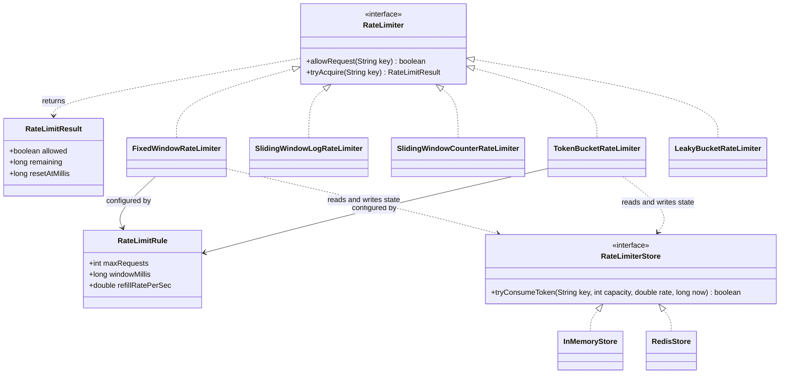

<details>
<summary>📖 <b>How to read this relationship map</b></summary>

The triangle arrows show the five concrete algorithms *implementing* the `RateLimiter` interface — that fan-out is the structural heart of the design and the reason Strategy is the right pattern. The solid arrows mean "depends on": every algorithm is *configured by* a `RateLimitRule` (the limit and window). The dotted arrows mean "uses at runtime": an algorithm *reads and writes* its per-key state through a `RateLimiterStore`, and *returns* a `RateLimitResult`. That `RateLimiterStore` interface, implemented by both an in-memory map and a Redis client, is the single seam that lets the identical algorithm run on one node or across a fleet.

</details>

### 5.3 Core Value Objects and Enums

Small, well-named types keep the design honest and make illegal states hard to represent.

- `Algorithm { FIXED_WINDOW, SLIDING_LOG, SLIDING_COUNTER, TOKEN_BUCKET, LEAKY_BUCKET }` — selects which implementation the factory builds.
- `RateLimitRule` — immutable: `maxRequests`, `windowMillis`, and (for buckets) `capacity` and `refillRatePerSec`. Being immutable makes rules safe to share across threads and keys.
- `RateLimitResult` — immutable outcome: `allowed`, `remaining`, `resetAtMillis`.

All time is handled in **milliseconds from a single clock source** injected as a `Clock`, never scattered `System.currentTimeMillis()` calls — a deliberate choice (Section 9) that makes the algorithms testable and clock behavior explicit.

---

## 6. CRC Cards

CRC (Class–Responsibility–Collaborator) cards are a lightweight way to pin down *what each class is responsible for* and *who it talks to*, before drowning in fields and methods. They force single-responsibility thinking, which interviewers reward.

| Class | Responsibilities | Collaborators |
|-------|------------------|---------------|
| **RateLimiter** *(interface)* | Define the allow/reject contract every algorithm honors. | RateLimitResult |
| **FixedWindowRateLimiter** | Count requests per fixed clock window; reset at window roll-over. | RateLimitRule, RateLimiterStore, Clock |
| **SlidingWindowLogRateLimiter** | Keep exact request timestamps; drop those older than the window; count the rest. | RateLimitRule, Clock |
| **SlidingWindowCounterRateLimiter** | Blend the current and previous fixed-window counts by weight to approximate a sliding window. | RateLimitRule, Clock |
| **TokenBucketRateLimiter** | Refill tokens over time up to a capacity; allow a request if a token can be spent. | RateLimitRule, Clock |
| **LeakyBucketRateLimiter** | Admit requests into a fixed-size queue that drains at a constant rate; reject on overflow. | RateLimitRule, Clock |
| **RateLimitRule** | Hold the immutable limit configuration (count, window, capacity, refill rate). | — |
| **RateLimitResult** | Bundle the decision, remaining quota, and reset time for the caller. | — |
| **RateLimiterStore** *(interface)* | Abstract where per-key state lives (local map vs. Redis). | — |
| **RateLimiterFactory** | Build the correct limiter for a given algorithm and rule. | RateLimiter, RateLimitRule |

Notice how each card has a *tight* set of responsibilities. If one card starts listing "count requests, *and* pick the algorithm, *and* talk to Redis, *and* format the HTTP response," that's the classic "god limiter" smell — the algorithm, the storage, and the transport concerns should be separate collaborators.

---

## 7. UML Class Diagram

Here is the full static structure in ASCII, the way you'd sketch it on a whiteboard. The abstract type is marked `«interface»`; the Strategy shape — one interface, five implementations — is deliberately front and center.

```
                 ┌───────────────────────────────────────────┐
                 │ «interface» RateLimiter                     │
                 ├───────────────────────────────────────────┤
                 │ + allowRequest(key: String): boolean        │
                 │ + tryAcquire(key: String): RateLimitResult   │
                 └───────────────────┬───────────────────────┘
                                     │ implemented by
        ┌────────────────┬───────────┼───────────────┬─────────────────┐
        ▼                ▼            ▼               ▼                 ▼
┌───────────────┐┌───────────────┐┌────────────────┐┌──────────────┐┌──────────────┐
│FixedWindow    ││SlidingWindow  ││SlidingWindow   ││TokenBucket   ││LeakyBucket   │
│RateLimiter    ││LogRateLimiter ││CounterRate     ││RateLimiter   ││RateLimiter   │
├───────────────┤├───────────────┤│Limiter         │├──────────────┤├──────────────┤
│- windows: Map ││- logs: Map    │├────────────────┤│- buckets: Map││- queues: Map │
│- rule         ││- rule         ││- windows: Map  ││- rule        ││- rule        │
│- clock        ││- clock        ││- rule, clock   ││- clock       ││- clock       │
├───────────────┤├───────────────┤├────────────────┤├──────────────┤├──────────────┤
│+ allowRequest ││+ allowRequest ││+ allowRequest  ││+ allowRequest││+ allowRequest│
└───────┬───────┘└───────────────┘└────────────────┘└──────┬───────┘└──────────────┘
        │ configured by                                     │ uses
        ▼                                                   ▼
┌───────────────────────────┐                     ┌──────────────────────┐
│ RateLimitRule  «immutable» │                     │ TokenBucket (state)   │
├───────────────────────────┤                     ├──────────────────────┤
│ - maxRequests: int         │                     │ - tokens: double      │
│ - windowMillis: long       │                     │ - lastRefillMillis    │
│ - capacity: int            │                     │ - capacity: int       │
│ - refillRatePerSec: double │                     │ - refillRatePerSec    │
└───────────────────────────┘                     └──────────────────────┘

┌───────────────────────────┐        ┌───────────────────────────────────┐
│ RateLimitResult «immutable»│        │ «interface» RateLimiterStore       │
├───────────────────────────┤        ├───────────────────────────────────┤
│ - allowed: boolean         │        │ + tryConsumeToken(key, cap,        │
│ - remaining: long          │        │     rate, now): boolean            │
│ - resetAtMillis: long      │        └──────────────┬────────────────────┘
└───────────────────────────┘                        │ implemented by
                                          ┌───────────┴───────────┐
                                          ▼                       ▼
                                 ┌──────────────────┐   ┌──────────────────┐
                                 │ InMemoryStore     │   │ RedisStore        │
                                 │ (ConcurrentHashMap)│   │ (Lua / INCR)      │
                                 └──────────────────┘   └──────────────────┘
```

<details>
<summary>📖 <b>How to read this class diagram</b></summary>

Read it top-down. At the top sits the `RateLimiter` interface with two methods — a simple boolean `allowRequest` and a richer `tryAcquire` that returns quota details. Five concrete classes implement it, one per algorithm; each holds a `Map` of per-key state (windows, logs, or buckets), a shared `RateLimitRule`, and a `Clock`. The `RateLimitRule` at the bottom-left is the shared, immutable configuration. On the bottom-right, the `RateLimiterStore` interface abstracts *where* the per-key state lives — an in-memory map for one node or Redis for a cluster — so the same algorithm class works in both modes just by swapping the store.

</details>

---

## 8. Package Structure

A clean package layout communicates the architecture before anyone reads a method body. Group by responsibility, not by "all interfaces here, all classes there."

```
com.example.ratelimiter
│
├── RateLimiter.java                 // the strategy interface
├── RateLimiterFactory.java          // builds the right limiter from an Algorithm + Rule
│
├── algorithm/                       // the five concrete strategies
│   ├── FixedWindowRateLimiter.java
│   ├── SlidingWindowLogRateLimiter.java
│   ├── SlidingWindowCounterRateLimiter.java
│   ├── TokenBucketRateLimiter.java
│   └── LeakyBucketRateLimiter.java
│
├── model/                           // value objects and config
│   ├── RateLimitRule.java
│   ├── RateLimitResult.java
│   └── Algorithm.java               // enum of the five choices
│
├── store/                           // where per-key state lives
│   ├── RateLimiterStore.java        // interface
│   ├── InMemoryStore.java           // ConcurrentHashMap-backed
│   └── RedisStore.java              // distributed, atomic via Lua
│
├── time/
│   └── Clock.java                   // injectable time source (testable)
│
└── exception/
    └── RateLimitExceededException.java
```

The `algorithm` package is the extension point: adding a sixth algorithm is one new file implementing `RateLimiter`, with zero edits elsewhere. The `store` package is the distribution seam: going from single-node to cluster is swapping `InMemoryStore` for `RedisStore`, not rewriting the algorithms. Keeping `time` separate is what makes every algorithm unit-testable without `Thread.sleep`.

<details>
<summary>📖 <b>Why separate the algorithm, store, and time packages?</b></summary>

These three packages map to the three axes along which a rate limiter changes. The *algorithm* changes when traffic-shaping needs change (bursty vs. smooth). The *store* changes when you scale from one server to many. The *clock* changes between production (real time) and tests (controlled time). By giving each its own seam, a change along one axis doesn't ripple into the others — you can adopt a new algorithm without touching Redis code, move to a cluster without rewriting algorithms, and test everything deterministically without sleeping. That orthogonality is exactly what an interviewer means by "extensible design."

</details>

---

## 9. Design Decisions & Trade-offs

This section is where an interview is won or lost. Anyone can name "token bucket"; the signal is in *why* you chose it and what you traded away. Here are the decisions that matter, each framed as the question, the options, and the call.

### 9.1 Strategy pattern, or one class with a mode flag?

The design puts each algorithm behind a common `RateLimiter` interface rather than one giant class with an `if (mode == FIXED_WINDOW)` ladder. The reason is that the five algorithms share almost no internal state — a fixed window needs a count and a start time, a sliding log needs a deque of timestamps, a token bucket needs a fractional token count and a refill timestamp. Cramming them into one class produces a bag of half-used fields and a method that branches five ways. Strategy gives each algorithm one cohesive class, makes adding a sixth a new file (Open/Closed), and lets callers swap algorithms by configuration. The cost is a little more ceremony (an interface plus a factory), which is trivially worth it.

### 9.2 Which algorithm is the default, and why?

**Token bucket** is the sensible default and the one to lead with. It allows short, controlled bursts (good for real clients that occasionally batch requests), enforces a smooth average rate, needs only two numbers of state per key (token count and last-refill time), and is what AWS API Gateway, Stripe, and most cloud APIs actually use. Fixed window is simpler but suffers the boundary-burst problem; sliding log is the most accurate but the most memory-hungry; sliding counter is a good memory/accuracy compromise; leaky bucket smooths output but can't burst. You should be able to defend token bucket as the default *and* name the traffic shape that would make you pick each of the others.

### 9.3 Where does time come from — wall clock or monotonic?

Rate limiting is fundamentally about *elapsed* time, and wall-clock time (`System.currentTimeMillis()`) can jump backward on NTP corrections, which would corrupt a token-bucket refill calculation or a window boundary. For a single node, the correct source is a **monotonic clock** (`System.nanoTime()`) for measuring elapsed durations, wrapped behind an injectable `Clock` so tests can control it. In a distributed setting, you can't compare timestamps across machines at all without care — which is why distributed limiters push the time-and-count decision *into the shared store* (Redis) rather than trusting each node's clock. The decision to inject `Clock` rather than call the system clock inline is what makes this discussable and testable.

### 9.4 Fail-open or fail-closed when the store is down?

If the counter store (Redis) is unreachable, the limiter must decide: allow everything (fail-open) or block everything (fail-closed). The default should be **fail-open**, because a rate limiter exists to *protect* the service, and a limiter that blocks all traffic when its own dependency hiccups has become the outage it was meant to prevent. The exception is when the limit guards something where over-admission is catastrophic (a paid API where every call costs money, or a security-sensitive login endpoint) — there, fail-closed is correct. Making this a per-rule policy rather than a global constant is the senior move.

### 9.5 Exact limits, or is approximate acceptable?

A strict "never more than N" requires either the sliding-window log (exact but heavy) or a strongly-consistent distributed counter (correct but slower). Most real limiters accept a small, bounded inaccuracy — the fixed window can briefly allow up to 2N across a boundary, the sliding counter is a weighted estimate — in exchange for O(1) memory and speed. The right answer is "it depends on what the limit protects": a soft anti-abuse throttle tolerates approximation; a hard billing quota does not. State the tolerance explicitly and let it drive the algorithm choice.

### 9.6 Per-key state lifecycle — how do we avoid unbounded memory?

With millions of distinct keys, per-key state left in a `ConcurrentHashMap` forever is a memory leak. The decision is to bound it: use a size-capped LRU/TTL cache (e.g., Caffeine) so idle keys are evicted, or in Redis set a TTL on each key equal to the window so expired counters vanish automatically. This is easy to forget and a favorite follow-up — "your map grows forever, then what?"

<details>
<summary>📖 <b>The one decision that matters most</b></summary>

If you remember one thing from this section, make it the algorithm trade-off. Interviewers rarely ask "can you code a token bucket"; they ask "which would you use and why," then push with "what if traffic is bursty," "what if the limit must be exact," "what if you have a million keys." The candidates who shine have internalized that fixed window is cheap but bursty at boundaries, sliding log is exact but memory-heavy, sliding counter splits the difference, token bucket allows bursts smoothly, and leaky bucket enforces a strictly smooth output. Everything else — concurrency, distribution — is the same machinery wrapped around whichever algorithm you chose.

</details>

---

## 10. The Five Algorithms — Deep Dive

This is the conceptual core of the whole problem. Each algorithm answers "has this client had too many requests recently?" differently, and each answer trades memory, accuracy, and burst behavior. We build them up from simplest to most capable.

### 10.1 Fixed Window Counter

Divide time into fixed windows aligned to the clock — say, each calendar minute. Keep one counter per key per window. Every request increments the counter; if it exceeds the limit, reject; when the clock rolls into a new window, the counter resets to zero.

It is the simplest possible design: O(1) time, O(1) memory per key (a count and a window start). Its fatal flaw is the **boundary burst**. If the limit is 100 per minute, a client can send 100 requests in the last second of one minute and another 100 in the first second of the next — 200 requests in two seconds, double the intended rate, entirely within the rules.

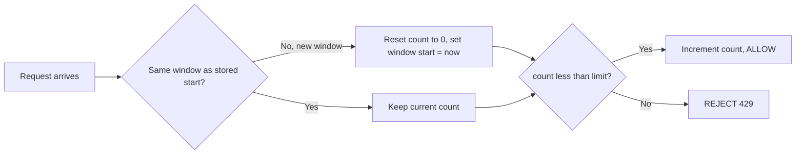

### 10.2 Sliding Window Log

Keep, per key, a log of the exact timestamp of every request (a `Deque<Long>`). On each new request, drop every timestamp older than "now minus window," then count what remains. If the count is below the limit, append the new timestamp and allow; otherwise reject.

This is the **most accurate** algorithm — it enforces "no more than N requests in *any* rolling window," eliminating the boundary burst entirely. Its cost is **memory and CPU proportional to the request rate**: a client allowed 10,000 requests per hour needs up to 10,000 stored timestamps, and every request scans/trims the log. That's fine for small limits, ruinous for large ones.

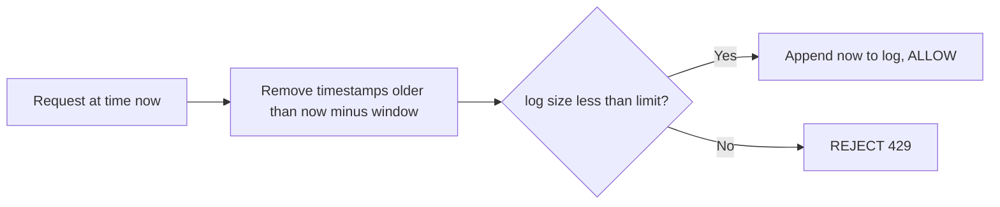

### 10.3 Sliding Window Counter

A clever approximation that keeps the boundary-burst protection of the log at the O(1) memory of the fixed window. Keep two fixed-window counts: the current window and the previous one. Estimate the rolling count as the current window's count plus the previous window's count weighted by how much of the previous window still overlaps the rolling window.

If we're 30% into the current minute, the sliding estimate is `currentCount + previousCount * 0.70`. If that estimate is below the limit, allow. It smooths the hard reset of the fixed window — a client that maxed out the previous window is still partly "charged" as that window slides out — so the boundary burst shrinks from 2N to a small overshoot. This is the algorithm Cloudflare famously described using in production because it's accurate enough and extremely cheap.

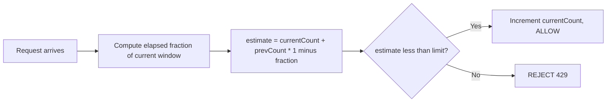

### 10.4 Token Bucket

Model the limit as a bucket that holds up to `capacity` tokens and refills at a steady `refillRate` tokens per second. Each request tries to remove one token: if a token is available, spend it and allow; if the bucket is empty, reject. The bucket refills lazily — on each request, compute how many tokens should have been added since the last check based on elapsed time, cap at capacity, then try to spend.

Token bucket is the **industry default** because it captures the most useful behavior: a client that's been quiet accumulates tokens up to the capacity, so it can **burst** up to `capacity` requests instantly, then is throttled to the steady refill rate. It's O(1) memory (two numbers) and O(1) time. Capacity controls the burst size; refill rate controls the sustained rate — two independent knobs. AWS API Gateway's burst and rate limits are exactly this.

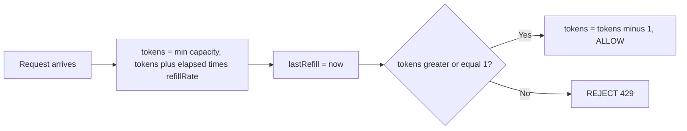

### 10.5 Leaky Bucket

Model requests as water dripping into a bucket with a hole in the bottom. Requests enter a fixed-capacity queue; the queue drains (processes/forwards requests) at a constant rate. If a request arrives when the queue is full, it overflows and is rejected. The key difference from token bucket: leaky bucket enforces a **strictly smooth output rate** — requests leave at a constant pace regardless of how bursty the input was — whereas token bucket allows the *input* to burst.

It's ideal when the protected downstream needs a steady, predictable load (a payment processor that can handle exactly 50 transactions per second and no more). The cost is that it can't absorb legitimate bursts and adds queuing latency. It's often implemented as a token bucket variant or with a background drain thread.

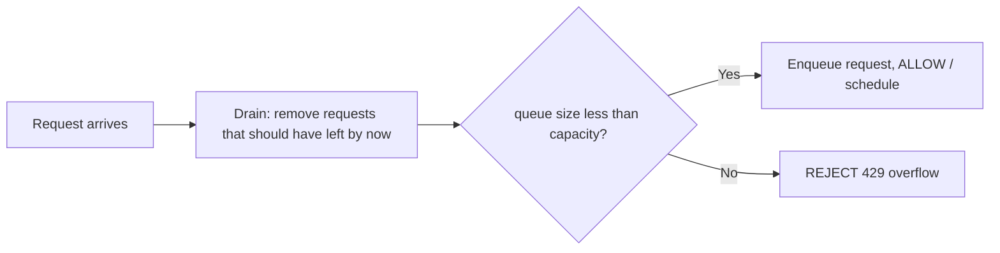

### 10.6 The Comparison Table

This table is the single most useful artifact to have memorized walking into the interview.

| Algorithm | Memory/key | Time | Allows bursts? | Boundary burst? | Accuracy | Best for |
|-----------|-----------|------|----------------|-----------------|----------|----------|
| **Fixed Window** | O(1) | O(1) | Only at boundary (bad) | Yes, up to 2N | Low | Simplest cases, coarse limits |
| **Sliding Log** | O(N) | O(N) trim | No | No | Exact | Small limits needing precision |
| **Sliding Counter** | O(1) | O(1) | Slight | Minimal | High (approx) | General purpose, memory-tight |
| **Token Bucket** | O(1) | O(1) | Yes, up to capacity | No | High | **Default**; APIs allowing bursts |
| **Leaky Bucket** | O(1) | O(1) | No (smooths) | No | High | Steady downstream load |

<details>
<summary>📖 <b>How to pick one in the room</b></summary>

Start with the traffic shape and the constraint. If the interviewer says "clients sometimes send a batch of requests and that's fine," reach for token bucket — it's built for controlled bursts and it's what most real APIs use. If they say "the downstream can handle exactly X per second, no spikes," that's leaky bucket. If they say "the limit must be exact and precise," it's sliding log, and you immediately raise the memory cost. If memory is tight but you still want boundary protection, sliding counter is the pragmatic winner. Fixed window is the answer only when they explicitly want the simplest thing and a little inaccuracy is fine. Naming the trigger for each is what turns a memorized list into a design conversation.

</details>

---

## 11. Class-by-Class Deep Dive

With the algorithms understood, here's the responsibility of each type in the implementation. Full code is in Section 16; this is the "why each class exists" narrative.

### 11.1 `RateLimiter` (the interface)

The contract every algorithm honors: `boolean allowRequest(String key)` for the simple hot path, and `RateLimitResult tryAcquire(String key)` when the caller needs remaining-quota and reset info for response headers. Keeping the interface this small means callers depend on the *decision*, never on which algorithm produces it.

### 11.2 `RateLimitRule`

The immutable configuration object: `maxRequests`, `windowMillis` for window algorithms, and `capacity` + `refillRatePerSec` for bucket algorithms. Immutability lets one rule be shared safely across every key and every thread without defensive copying. In production this is what a config system or admin API populates per client tier.

### 11.3 `FixedWindowRateLimiter`

Holds a `ConcurrentHashMap<String, Window>` where `Window` is a small mutable holder of `count` and `windowStartMillis`. On each request it checks whether the clock has crossed into a new window (reset if so) and then compares-and-increments the count. Its whole complexity is in doing that check-and-increment atomically per key.

### 11.4 `SlidingWindowLogRateLimiter`

Holds a `ConcurrentHashMap<String, Deque<Long>>` of timestamps. On each request it synchronizes on that key's deque, trims expired timestamps from the head, and admits if the remaining size is under the limit. The per-key `synchronized` block is the pragmatic way to make the trim-and-check atomic.

### 11.5 `SlidingWindowCounterRateLimiter`

Holds per-key counts for the current and previous windows plus the window start. It computes the weighted estimate, and like the fixed window, its subtlety is doing the roll-over (promote current to previous, reset current) and the increment atomically.

### 11.6 `TokenBucketRateLimiter`

Holds a `ConcurrentHashMap<String, TokenBucket>`, where `TokenBucket` carries `tokens` (a `double`, since refill is fractional), `lastRefillMillis`, and the capacity/rate. The core `tryConsume` refills lazily based on elapsed time, then attempts to spend a token — all inside a per-bucket lock so the refill-then-spend is atomic.

### 11.7 `LeakyBucketRateLimiter`

Holds per-key queue state (a count of "water level" and a last-leak timestamp, or an actual bounded queue with a drain schedule). It leaks (drains) based on elapsed time before checking whether there's room to admit the new request.

### 11.8 `RateLimiterStore` and its implementations

The interface that abstracts *where* per-key state lives. `InMemoryStore` wraps a `ConcurrentHashMap` for single-node use. `RedisStore` holds the state in Redis and performs the read-modify-write atomically via a Lua script or atomic commands, so many app servers share one logical limit. Swapping the store is how the same algorithm goes from local to distributed.

### 11.9 `RateLimiterFactory`

A simple factory that maps an `Algorithm` enum value plus a `RateLimitRule` to the correct concrete limiter. It keeps `switch`-on-algorithm logic in exactly one place instead of scattered across callers.

### 11.10 `RateLimitResult` and `RateLimitExceededException`

`RateLimitResult` bundles `allowed`, `remaining`, and `resetAtMillis` for populating `X-RateLimit-*` and `Retry-After` headers. `RateLimitExceededException` is thrown by convenience wrappers that prefer exceptions to boolean checks in the calling code.

---

## 12. Design Patterns Applied

Patterns should be named only where they *earn their place*. Here they genuinely do.

| Pattern | Where it appears | What it buys us |
|---------|------------------|-----------------|
| **Strategy** | `RateLimiter` interface with five algorithm implementations | Swap the limiting algorithm by configuration; add new ones without touching callers. The marquee pattern here. |
| **Factory Method** | `RateLimiterFactory` builds a limiter from `Algorithm` + `RateLimitRule` | Centralizes construction; callers ask for "a token-bucket limiter" without `new`-ing the concrete class. |
| **Singleton** | The limiter (and its store) is typically one shared instance per JVM | One authority owns the counters; avoids fragmented, inconsistent state. Injected, not a static anti-pattern. |
| **Facade** | A `RateLimitFilter`/middleware wrapping the limiter | Gives the gateway a one-line "is this request allowed" call, hiding key extraction and header formatting. |
| **Adapter** | `RedisStore` adapting a Redis client to the `RateLimiterStore` interface | Lets the algorithms depend on our storage abstraction, not on a specific Redis library. |
| **Template Method** *(optional)* | A `AbstractRateLimiter` capturing the "extract key, look up state, decide, update" skeleton | Removes boilerplate shared across algorithms while leaving the decision step abstract. |

<details>
<summary>📖 <b>Why Strategy is the backbone here</b></summary>

The entire problem is "the same operation — decide allow or reject — done five different ways, chosen at configuration time." That sentence is the definition of the Strategy pattern. By defining one `RateLimiter` interface and putting each algorithm in its own class, the code that *uses* a limiter never changes when you switch algorithms, and adding a sixth algorithm is a new file rather than an edit to a giant switch statement. Every other pattern here (Factory to build them, Facade to wrap them, Adapter to store them) is in service of making that Strategy fan-out clean.

</details>

---

## 13. SOLID Principles Mapping

SOLID isn't decoration; each principle shows up concretely in this design, and naming where is a fast way to demonstrate maturity.

- **Single Responsibility** — each algorithm class does one thing: encode one counting rule. Storage lives in `RateLimiterStore`, construction in `RateLimiterFactory`, configuration in `RateLimitRule`, time in `Clock`. No class both counts *and* talks to Redis *and* formats HTTP.
- **Open/Closed** — the system is open to new algorithms and new stores but closed to modification: adding a sixth algorithm or a Memcached store is a new class implementing an existing interface, with no edits to existing code.
- **Liskov Substitution** — any `RateLimiter` implementation is interchangeable behind the interface; the gateway calls `allowRequest` identically whether it's token bucket or sliding log. Same for any `RateLimiterStore`.
- **Interface Segregation** — the `RateLimiter` interface is deliberately tiny (two methods). Callers that only need a yes/no don't depend on quota-reporting machinery; the store interface exposes only what algorithms actually call.
- **Dependency Inversion** — algorithms depend on the `RateLimiterStore` and `Clock` *abstractions*, not on `ConcurrentHashMap` or `System.currentTimeMillis()`. That inversion is exactly what lets the same algorithm run locally or on Redis, in production or under a controlled test clock.

<details>
<summary>📖 <b>The SOLID gut-check for this design</b></summary>

Here's the one-sentence test of whether the design actually honors SOLID: you should be able to add a new algorithm, swap the in-memory store for Redis, and run every algorithm under a fake clock in tests — all *without editing a single existing class*. If adding a leaky-bucket variant forces you to touch the factory's callers, or moving to Redis forces you to rewrite the token-bucket math, the seams are in the wrong place. Good rate-limiter designs isolate the three axes of change (algorithm, storage, time) so completely that each moves independently.

</details>

---

## 14. Sequence Diagram

The two flows worth drawing are an allowed request and a rejected one, both through the token-bucket path since it's the default.

### 14.1 Allowed Request (Token Bucket)

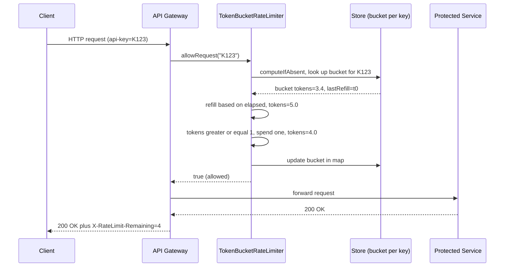

### 14.2 Rejected Request (Limit Exceeded)

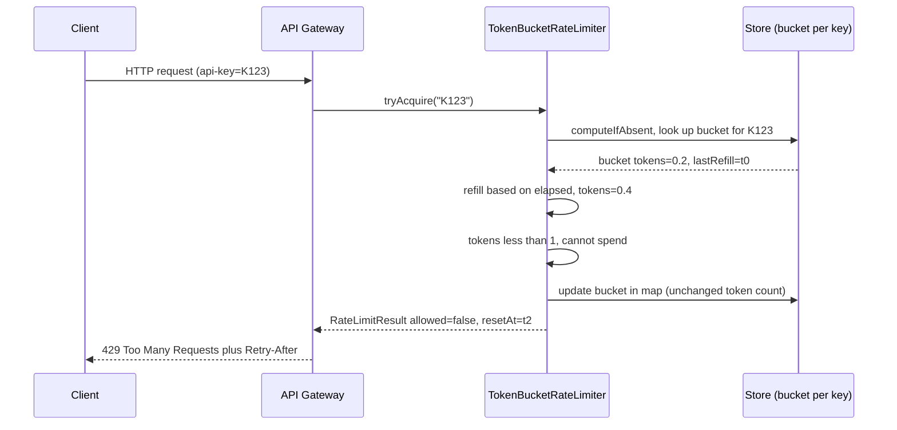

<details>
<summary>📖 <b>Reading the flow</b></summary>

Notice that the gateway never talks to the protected service until the limiter says yes — the limiter is a true gate, evaluated first. Notice too that even a *rejected* request touches the store: the bucket is still refilled based on elapsed time (so the client's recovery is tracked), it just isn't allowed to spend a token. The rejection path returns a `RateLimitResult` with a `resetAt` time, which the gateway turns into a `Retry-After` header so a well-behaved client knows exactly when to try again instead of hammering.

</details>

---

## 15. State & Flow Diagrams

A rate limiter doesn't have rich object states like a vending machine, but each *key* moves through a simple lifecycle, and it's worth drawing.

### 15.1 Per-Key State Lifecycle

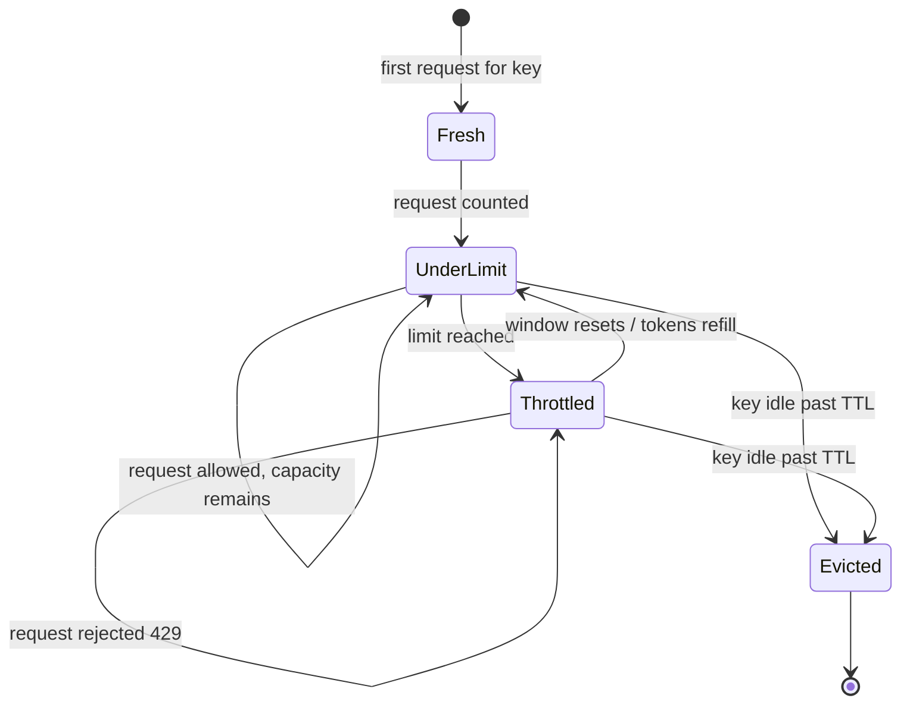

### 15.2 The Decision Flow (Token Bucket)

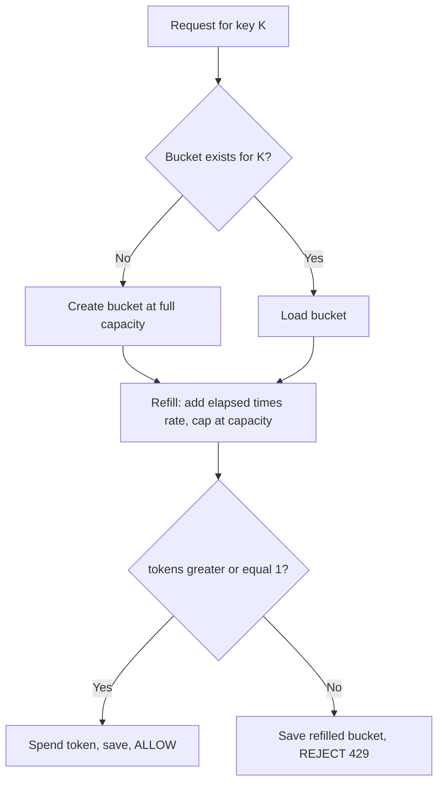

<details>
<summary>📖 <b>Why the "Evicted" state matters</b></summary>

The state most candidates forget is eviction. In a real system with millions of keys, a key that goes quiet must eventually have its state reclaimed, or the map grows without bound and the process runs out of memory. Modeling `Evicted` as an explicit state is a reminder that per-key state has a *lifecycle*, not just an active phase — a TTL in Redis or a size-bounded LRU cache in memory handles it. Interviewers love to ask "your map only ever grows, right?" and pointing to the eviction state is the crisp answer.

</details>

---

## 16. Complete Java Implementation

Below is a complete, runnable implementation. It is organized to mirror the package structure: the shared contracts and models first, then each of the five algorithms, then the store abstraction and factory, and finally a demo `main`. Every class name, field, and signature matches the diagrams above. The code is wrapped in collapsible blocks so you can read the guide's narrative without wading through it — expand what you want to study.

<details>
<summary>💻 <b>1. Core contracts and models</b> — <code>RateLimiter</code>, <code>RateLimitRule</code>, <code>RateLimitResult</code>, <code>Algorithm</code>, <code>Clock</code></summary>

```java
package com.example.ratelimiter;

import com.example.ratelimiter.model.RateLimitResult;

/**
 * The strategy interface every rate-limiting algorithm implements.
 * Callers depend only on the decision, never on which algorithm produces it.
 */
public interface RateLimiter {

    /** Fast hot-path: true if the request for this key may proceed. */
    boolean allowRequest(String key);

    /** Richer variant: returns remaining quota and reset time for response headers. */
    RateLimitResult tryAcquire(String key);
}
```

```java
package com.example.ratelimiter.model;

/** The five canonical rate-limiting algorithms. Drives the factory. */
public enum Algorithm {
    FIXED_WINDOW,
    SLIDING_LOG,
    SLIDING_COUNTER,
    TOKEN_BUCKET,
    LEAKY_BUCKET
}
```

```java
package com.example.ratelimiter.model;

/**
 * Immutable rate-limit configuration. One rule is shared safely across all keys
 * and threads because nothing here can change after construction.
 */
public final class RateLimitRule {

    private final int maxRequests;       // limit for window algorithms
    private final long windowMillis;     // window size for window algorithms
    private final int capacity;          // bucket capacity (max burst) for bucket algorithms
    private final double refillRatePerSec; // steady rate for bucket algorithms

    public RateLimitRule(int maxRequests, long windowMillis,
                         int capacity, double refillRatePerSec) {
        if (maxRequests <= 0 && capacity <= 0) {
            throw new IllegalArgumentException("limit or capacity must be positive");
        }
        this.maxRequests = maxRequests;
        this.windowMillis = windowMillis;
        this.capacity = capacity;
        this.refillRatePerSec = refillRatePerSec;
    }

    /** Convenience for window algorithms (fixed / sliding). */
    public static RateLimitRule ofWindow(int maxRequests, long windowMillis) {
        return new RateLimitRule(maxRequests, windowMillis, maxRequests,
                (double) maxRequests / (windowMillis / 1000.0));
    }

    /** Convenience for bucket algorithms (token / leaky). */
    public static RateLimitRule ofBucket(int capacity, double refillRatePerSec) {
        return new RateLimitRule(capacity, 0L, capacity, refillRatePerSec);
    }

    public int getMaxRequests()        { return maxRequests; }
    public long getWindowMillis()      { return windowMillis; }
    public int getCapacity()           { return capacity; }
    public double getRefillRatePerSec(){ return refillRatePerSec; }
}
```

```java
package com.example.ratelimiter.model;

/** Immutable outcome of a rate-limit decision — enough to populate HTTP headers. */
public final class RateLimitResult {

    private final boolean allowed;
    private final long remaining;
    private final long resetAtMillis;

    public RateLimitResult(boolean allowed, long remaining, long resetAtMillis) {
        this.allowed = allowed;
        this.remaining = remaining;
        this.resetAtMillis = resetAtMillis;
    }

    public boolean isAllowed()      { return allowed; }
    public long getRemaining()      { return remaining; }
    public long getResetAtMillis()  { return resetAtMillis; }

    @Override
    public String toString() {
        return "RateLimitResult{allowed=" + allowed
                + ", remaining=" + remaining
                + ", resetAtMillis=" + resetAtMillis + '}';
    }
}
```

```java
package com.example.ratelimiter.time;

/**
 * Injectable time source. Production uses a monotonic clock for elapsed-time math;
 * tests provide a fake clock so windows and refills can be advanced deterministically.
 */
public interface Clock {
    /** Current time in milliseconds; monotonic in production implementations. */
    long nowMillis();

    /** Default production clock backed by nanoTime for monotonicity. */
    static Clock system() {
        final long base = System.currentTimeMillis();
        final long nanoBase = System.nanoTime();
        return () -> base + (System.nanoTime() - nanoBase) / 1_000_000L;
    }
}
```

</details>

<details>
<summary>💻 <b>2. Fixed Window</b> — <code>FixedWindowRateLimiter</code></summary>

```java
package com.example.ratelimiter.algorithm;

import com.example.ratelimiter.RateLimiter;
import com.example.ratelimiter.model.RateLimitResult;
import com.example.ratelimiter.model.RateLimitRule;
import com.example.ratelimiter.time.Clock;

import java.util.concurrent.ConcurrentHashMap;

/**
 * Fixed Window Counter. Simplest algorithm: O(1) time and memory per key.
 * Weakness: allows up to 2x the limit across a window boundary (boundary burst).
 */
public class FixedWindowRateLimiter implements RateLimiter {

    /** Per-key mutable window state, guarded by synchronizing on the instance. */
    private static final class Window {
        long windowStartMillis;
        int count;
    }

    private final RateLimitRule rule;
    private final Clock clock;
    private final ConcurrentHashMap<String, Window> windows = new ConcurrentHashMap<>();

    public FixedWindowRateLimiter(RateLimitRule rule, Clock clock) {
        this.rule = rule;
        this.clock = clock;
    }

    @Override
    public boolean allowRequest(String key) {
        return tryAcquire(key).isAllowed();
    }

    @Override
    public RateLimitResult tryAcquire(String key) {
        long now = clock.nowMillis();
        long window = rule.getWindowMillis();
        Window w = windows.computeIfAbsent(key, k -> new Window());

        // Lock only this key's window so different keys never contend.
        synchronized (w) {
            // Roll into a new window if the clock has crossed the boundary.
            if (now - w.windowStartMillis >= window || w.windowStartMillis == 0) {
                w.windowStartMillis = now - (now % window); // align to clock window
                w.count = 0;
            }
            long resetAt = w.windowStartMillis + window;
            if (w.count < rule.getMaxRequests()) {
                w.count++;
                return new RateLimitResult(true, rule.getMaxRequests() - w.count, resetAt);
            }
            return new RateLimitResult(false, 0, resetAt);
        }
    }
}
```

</details>

<details>
<summary>💻 <b>3. Sliding Window Log</b> — <code>SlidingWindowLogRateLimiter</code></summary>

```java
package com.example.ratelimiter.algorithm;

import com.example.ratelimiter.RateLimiter;
import com.example.ratelimiter.model.RateLimitResult;
import com.example.ratelimiter.model.RateLimitRule;
import com.example.ratelimiter.time.Clock;

import java.util.ArrayDeque;
import java.util.Deque;
import java.util.concurrent.ConcurrentHashMap;

/**
 * Sliding Window Log. Most accurate: enforces the limit over ANY rolling window,
 * eliminating the boundary burst. Cost: O(N) memory and trim time per key,
 * where N is the number of requests allowed in a window.
 */
public class SlidingWindowLogRateLimiter implements RateLimiter {

    private final RateLimitRule rule;
    private final Clock clock;
    private final ConcurrentHashMap<String, Deque<Long>> logs = new ConcurrentHashMap<>();

    public SlidingWindowLogRateLimiter(RateLimitRule rule, Clock clock) {
        this.rule = rule;
        this.clock = clock;
    }

    @Override
    public boolean allowRequest(String key) {
        return tryAcquire(key).isAllowed();
    }

    @Override
    public RateLimitResult tryAcquire(String key) {
        long now = clock.nowMillis();
        long window = rule.getWindowMillis();
        Deque<Long> log = logs.computeIfAbsent(key, k -> new ArrayDeque<>());

        synchronized (log) {
            // Drop timestamps that have slid out of the window.
            while (!log.isEmpty() && log.peekFirst() <= now - window) {
                log.pollFirst();
            }
            long resetAt = log.isEmpty() ? now + window : log.peekFirst() + window;
            if (log.size() < rule.getMaxRequests()) {
                log.addLast(now);
                return new RateLimitResult(true, rule.getMaxRequests() - log.size(), resetAt);
            }
            return new RateLimitResult(false, 0, resetAt);
        }
    }
}
```

</details>

<details>
<summary>💻 <b>4. Sliding Window Counter</b> — <code>SlidingWindowCounterRateLimiter</code></summary>

```java
package com.example.ratelimiter.algorithm;

import com.example.ratelimiter.RateLimiter;
import com.example.ratelimiter.model.RateLimitResult;
import com.example.ratelimiter.model.RateLimitRule;
import com.example.ratelimiter.time.Clock;

import java.util.concurrent.ConcurrentHashMap;

/**
 * Sliding Window Counter. Approximates the sliding log at O(1) memory by keeping
 * the current and previous fixed-window counts and weighting the previous one by
 * how much of it still overlaps the rolling window. The pragmatic production choice.
 */
public class SlidingWindowCounterRateLimiter implements RateLimiter {

    private static final class Counter {
        long currentWindowStart;
        int currentCount;
        int previousCount;
    }

    private final RateLimitRule rule;
    private final Clock clock;
    private final ConcurrentHashMap<String, Counter> counters = new ConcurrentHashMap<>();

    public SlidingWindowCounterRateLimiter(RateLimitRule rule, Clock clock) {
        this.rule = rule;
        this.clock = clock;
    }

    @Override
    public boolean allowRequest(String key) {
        return tryAcquire(key).isAllowed();
    }

    @Override
    public RateLimitResult tryAcquire(String key) {
        long now = clock.nowMillis();
        long window = rule.getWindowMillis();
        Counter c = counters.computeIfAbsent(key, k -> new Counter());

        synchronized (c) {
            long alignedStart = now - (now % window);
            if (c.currentWindowStart == 0) {
                c.currentWindowStart = alignedStart;
            } else if (alignedStart - c.currentWindowStart == window) {
                // Advanced exactly one window: promote current to previous.
                c.previousCount = c.currentCount;
                c.currentCount = 0;
                c.currentWindowStart = alignedStart;
            } else if (alignedStart - c.currentWindowStart > window) {
                // Skipped one or more windows entirely: previous is now zero.
                c.previousCount = 0;
                c.currentCount = 0;
                c.currentWindowStart = alignedStart;
            }

            // Fraction of the current window already elapsed.
            double elapsedFraction = (now - c.currentWindowStart) / (double) window;
            double estimated = c.currentCount + c.previousCount * (1.0 - elapsedFraction);

            long resetAt = c.currentWindowStart + window;
            if (estimated < rule.getMaxRequests()) {
                c.currentCount++;
                long remaining = (long) Math.max(0, rule.getMaxRequests() - (estimated + 1));
                return new RateLimitResult(true, remaining, resetAt);
            }
            return new RateLimitResult(false, 0, resetAt);
        }
    }
}
```

</details>

<details>
<summary>💻 <b>5. Token Bucket</b> — <code>TokenBucketRateLimiter</code> (the default)</summary>

```java
package com.example.ratelimiter.algorithm;

import com.example.ratelimiter.RateLimiter;
import com.example.ratelimiter.model.RateLimitResult;
import com.example.ratelimiter.model.RateLimitRule;
import com.example.ratelimiter.time.Clock;

import java.util.concurrent.ConcurrentHashMap;

/**
 * Token Bucket. The industry default. A bucket holds up to `capacity` tokens and
 * refills at `refillRatePerSec`. Each request spends one token; an idle client
 * accumulates tokens and may burst up to capacity, then is throttled to the rate.
 * O(1) time and memory (two numbers per key).
 */
public class TokenBucketRateLimiter implements RateLimiter {

    /** Per-key bucket state. Tokens are fractional so partial refills accrue. */
    static final class TokenBucket {
        double tokens;
        long lastRefillMillis;
        final int capacity;
        final double refillRatePerSec;

        TokenBucket(int capacity, double refillRatePerSec, long now) {
            this.capacity = capacity;
            this.refillRatePerSec = refillRatePerSec;
            this.tokens = capacity;          // start full so a fresh client may burst
            this.lastRefillMillis = now;
        }

        void refill(long now) {
            if (now <= lastRefillMillis) return;
            double elapsedSec = (now - lastRefillMillis) / 1000.0;
            tokens = Math.min(capacity, tokens + elapsedSec * refillRatePerSec);
            lastRefillMillis = now;
        }
    }

    private final RateLimitRule rule;
    private final Clock clock;
    private final ConcurrentHashMap<String, TokenBucket> buckets = new ConcurrentHashMap<>();

    public TokenBucketRateLimiter(RateLimitRule rule, Clock clock) {
        this.rule = rule;
        this.clock = clock;
    }

    @Override
    public boolean allowRequest(String key) {
        return tryAcquire(key).isAllowed();
    }

    @Override
    public RateLimitResult tryAcquire(String key) {
        long now = clock.nowMillis();
        TokenBucket bucket = buckets.computeIfAbsent(key,
                k -> new TokenBucket(rule.getCapacity(), rule.getRefillRatePerSec(), now));

        // Lock the individual bucket so refill-then-spend is atomic per key.
        synchronized (bucket) {
            bucket.refill(now);
            long resetAt = now + estimateMillisToNextToken(bucket);
            if (bucket.tokens >= 1.0) {
                bucket.tokens -= 1.0;
                return new RateLimitResult(true, (long) bucket.tokens, resetAt);
            }
            return new RateLimitResult(false, 0, resetAt);
        }
    }

    /** How long until at least one token is available again — feeds Retry-After. */
    private long estimateMillisToNextToken(TokenBucket b) {
        if (b.tokens >= 1.0) return 0;
        double needed = 1.0 - b.tokens;
        return (long) Math.ceil(needed / b.refillRatePerSec * 1000.0);
    }
}
```

</details>

<details>
<summary>💻 <b>6. Leaky Bucket</b> — <code>LeakyBucketRateLimiter</code></summary>

```java
package com.example.ratelimiter.algorithm;

import com.example.ratelimiter.RateLimiter;
import com.example.ratelimiter.model.RateLimitResult;
import com.example.ratelimiter.model.RateLimitRule;
import com.example.ratelimiter.time.Clock;

import java.util.concurrent.ConcurrentHashMap;

/**
 * Leaky Bucket (as a meter). Requests fill a bucket that "leaks" at a constant rate.
 * A request is admitted only if adding it does not overflow the capacity. Unlike the
 * token bucket, it enforces a strictly SMOOTH output rate and cannot absorb bursts
 * beyond the queue depth. Good when the downstream needs steady, predictable load.
 */
public class LeakyBucketRateLimiter implements RateLimiter {

    /** water = number of queued/pending units; leaks at leakRatePerSec. */
    private static final class Bucket {
        double water;
        long lastLeakMillis;
    }

    private final RateLimitRule rule;
    private final Clock clock;
    private final ConcurrentHashMap<String, Bucket> queues = new ConcurrentHashMap<>();

    public LeakyBucketRateLimiter(RateLimitRule rule, Clock clock) {
        this.rule = rule;
        this.clock = clock;
    }

    @Override
    public boolean allowRequest(String key) {
        return tryAcquire(key).isAllowed();
    }

    @Override
    public RateLimitResult tryAcquire(String key) {
        long now = clock.nowMillis();
        Bucket b = queues.computeIfAbsent(key, k -> new Bucket());
        double leakRate = rule.getRefillRatePerSec(); // units drained per second
        int capacity = rule.getCapacity();

        synchronized (b) {
            if (b.lastLeakMillis == 0) b.lastLeakMillis = now;
            // Leak out whatever should have drained since we last looked.
            double elapsedSec = (now - b.lastLeakMillis) / 1000.0;
            b.water = Math.max(0, b.water - elapsedSec * leakRate);
            b.lastLeakMillis = now;

            long resetAt = now + (long) Math.ceil(b.water / leakRate * 1000.0);
            if (b.water + 1.0 <= capacity) {
                b.water += 1.0;
                return new RateLimitResult(true, (long) (capacity - b.water), resetAt);
            }
            return new RateLimitResult(false, 0, resetAt);
        }
    }
}
```

</details>

<details>
<summary>💻 <b>7. Store abstraction and Redis sketch</b> — <code>RateLimiterStore</code>, <code>RedisStore</code></summary>

```java
package com.example.ratelimiter.store;

/**
 * Abstraction over WHERE per-key state lives. Swapping the implementation is how the
 * same algorithm moves from single-node (in-memory) to distributed (Redis) without
 * the algorithm code changing. Shown here for the token-bucket case.
 */
public interface RateLimiterStore {

    /**
     * Atomically apply one token-bucket decision for `key`, returning true if a token
     * was consumed. In distributed mode this MUST be atomic across all app servers —
     * hence a Redis Lua script that reads, refills, and writes in one round trip.
     */
    boolean tryConsumeToken(String key, int capacity, double refillRatePerSec, long nowMillis);
}
```

```java
package com.example.ratelimiter.store;

/**
 * Distributed store backed by Redis. The read-modify-write is done inside a single
 * Lua script so that concurrent app servers sharing one logical limit cannot race.
 * (Client calls are sketched; wire to Jedis/Lettuce in production.)
 */
public class RedisStore implements RateLimiterStore {

    // Lua executed atomically on the Redis server. KEYS[1]=bucket key.
    // ARGV: capacity, refillRatePerSec, nowMillis. Returns 1 if allowed, else 0.
    private static final String TOKEN_BUCKET_LUA =
        "local b = redis.call('HMGET', KEYS[1], 'tokens', 'ts') \n" +
        "local capacity = tonumber(ARGV[1]) \n" +
        "local rate = tonumber(ARGV[2]) \n" +
        "local now = tonumber(ARGV[3]) \n" +
        "local tokens = tonumber(b[1]) \n" +
        "local ts = tonumber(b[2]) \n" +
        "if tokens == nil then tokens = capacity; ts = now end \n" +
        "local elapsed = math.max(0, now - ts) / 1000.0 \n" +
        "tokens = math.min(capacity, tokens + elapsed * rate) \n" +
        "local allowed = 0 \n" +
        "if tokens >= 1 then tokens = tokens - 1; allowed = 1 end \n" +
        "redis.call('HMSET', KEYS[1], 'tokens', tokens, 'ts', now) \n" +
        "redis.call('PEXPIRE', KEYS[1], 3600000) \n" +   // TTL so idle keys self-evict
        "return allowed";

    // private final JedisPool pool;  // injected in real code

    @Override
    public boolean tryConsumeToken(String key, int capacity,
                                   double refillRatePerSec, long nowMillis) {
        // Object result = jedis.eval(TOKEN_BUCKET_LUA, 1, key,
        //         Integer.toString(capacity),
        //         Double.toString(refillRatePerSec),
        //         Long.toString(nowMillis));
        // return "1".equals(String.valueOf(result));
        throw new UnsupportedOperationException("wire to a Redis client (Jedis/Lettuce)");
    }
}
```

</details>

<details>
<summary>💻 <b>8. Factory, exception, and a runnable demo</b> — <code>RateLimiterFactory</code>, <code>main</code></summary>

```java
package com.example.ratelimiter.exception;

public class RateLimitExceededException extends RuntimeException {
    private final long retryAfterMillis;

    public RateLimitExceededException(String key, long retryAfterMillis) {
        super("Rate limit exceeded for key: " + key);
        this.retryAfterMillis = retryAfterMillis;
    }

    public long getRetryAfterMillis() { return retryAfterMillis; }
}
```

```java
package com.example.ratelimiter;

import com.example.ratelimiter.algorithm.*;
import com.example.ratelimiter.model.Algorithm;
import com.example.ratelimiter.model.RateLimitRule;
import com.example.ratelimiter.time.Clock;

/** Builds the correct limiter for a given algorithm + rule. Central switch, one place. */
public final class RateLimiterFactory {

    private RateLimiterFactory() {}

    public static RateLimiter create(Algorithm algorithm, RateLimitRule rule, Clock clock) {
        switch (algorithm) {
            case FIXED_WINDOW:    return new FixedWindowRateLimiter(rule, clock);
            case SLIDING_LOG:     return new SlidingWindowLogRateLimiter(rule, clock);
            case SLIDING_COUNTER: return new SlidingWindowCounterRateLimiter(rule, clock);
            case TOKEN_BUCKET:    return new TokenBucketRateLimiter(rule, clock);
            case LEAKY_BUCKET:    return new LeakyBucketRateLimiter(rule, clock);
            default:
                throw new IllegalArgumentException("Unknown algorithm: " + algorithm);
        }
    }
}
```

```java
package com.example.ratelimiter;

import com.example.ratelimiter.model.Algorithm;
import com.example.ratelimiter.model.RateLimitRule;
import com.example.ratelimiter.model.RateLimitResult;
import com.example.ratelimiter.time.Clock;

/** Demonstrates a token bucket allowing a burst, then throttling to the refill rate. */
public class Demo {
    public static void main(String[] args) throws InterruptedException {
        // Capacity 5 (burst), refill 2 tokens/sec (sustained rate).
        RateLimitRule rule = RateLimitRule.ofBucket(5, 2.0);
        RateLimiter limiter = RateLimiterFactory.create(
                Algorithm.TOKEN_BUCKET, rule, Clock.system());

        String key = "user-42";

        System.out.println("Burst of 7 immediate requests (capacity 5):");
        for (int i = 1; i <= 7; i++) {
            RateLimitResult r = limiter.tryAcquire(key);
            System.out.printf("  req %d -> %s (remaining=%d)%n",
                    i, r.isAllowed() ? "ALLOW" : "REJECT", r.getRemaining());
        }

        System.out.println("Sleep 1s (refills ~2 tokens)...");
        Thread.sleep(1000);

        for (int i = 1; i <= 3; i++) {
            RateLimitResult r = limiter.tryAcquire(key);
            System.out.printf("  post-refill req %d -> %s (remaining=%d)%n",
                    i, r.isAllowed() ? "ALLOW" : "REJECT", r.getRemaining());
        }
    }
}
```

Expected output shows the first 5 requests allowed (the burst up to capacity), requests 6 and 7 rejected, then after a one-second sleep about 2 more allowed as tokens refill — the exact behavior that makes token bucket the default.

</details>

---

## 17. Execution Flow & Code Walkthrough

Trace the token-bucket demo above to see how the pieces cooperate. The client calls `limiter.tryAcquire("user-42")`. Because this is the first request for that key, `buckets.computeIfAbsent` constructs a `TokenBucket` initialized *full* — five tokens — so a fresh client can immediately burst up to capacity. The method then enters `synchronized (bucket)`, the per-key lock that guarantees the refill-then-spend sequence is atomic even if ten threads hit `user-42` at once.

Inside the lock, `refill(now)` runs first. On the very first call almost no time has elapsed, so no tokens are added. The code checks `tokens >= 1.0`, finds five, spends one, and returns an allowed `RateLimitResult` with `remaining = 4`. Requests two through five repeat this, draining the bucket to zero. Request six enters, `refill` adds a negligible amount (a few milliseconds times two tokens per second is far less than one token), so `tokens` is still below `1.0`, and the method returns a rejected result with `remaining = 0` and a `resetAt` computed from `estimateMillisToNextToken` — telling the caller roughly half a second until the next token.

After the one-second `Thread.sleep`, the next `tryAcquire` calls `refill` with a full second elapsed: `tokens + 1.0s * 2.0/s = ~2.0` tokens, capped at capacity five. Two of the three follow-up requests are now allowed and the third is rejected, demonstrating the steady-state throttle. The critical insight to narrate in an interview is that **the bucket is never refilled by a background thread** — refill is *lazy*, computed from elapsed time on each request. That eliminates a per-key timer thread (which would never scale to millions of keys) and makes the whole thing O(1) with just two stored numbers.

<details>
<summary>📖 <b>The one subtlety worth saying out loud</b></summary>

The single most important implementation detail is *lazy refill*. A naive design spawns a scheduled task per bucket that adds tokens every tick — with a million keys that's a million timers, which is impossible. Instead, we store only `lastRefillMillis` and, whenever a request arrives, compute how many tokens *should* have accumulated since then and add them in one step. No background threads, no per-key timers, constant memory. This same "compute from elapsed time on read" trick is what makes the sliding-counter and leaky-bucket implementations cheap too — it's the reusable idea behind the whole family.

</details>

---

## 18. Complexity Analysis

The whole point of a rate limiter is that it runs on the request hot path, so its cost per decision must be tiny. Here is the honest accounting per algorithm, per single decision.

| Algorithm | Time per request | Memory per key | Notes |
|-----------|------------------|----------------|-------|
| **Fixed Window** | O(1) | O(1) — a count and a timestamp | Cheapest possible. |
| **Sliding Log** | O(K) worst case | O(N) — one timestamp per request in window | K = expired entries trimmed; N = limit. The only non-constant one. |
| **Sliding Counter** | O(1) | O(1) — two counts and a timestamp | Best accuracy-to-cost ratio. |
| **Token Bucket** | O(1) | O(1) — tokens and a timestamp | Default; lazy refill keeps it constant. |
| **Leaky Bucket** | O(1) | O(1) — water level and a timestamp | Meter form; constant like token bucket. |

Across the whole map, memory is O(number of active keys), which is the term that actually bites at scale — a million keys times a ~40-byte token bucket is roughly 40 MB, tolerable, but a million sliding logs at thousands of timestamps each is gigabytes and unacceptable. That single comparison is why sliding log is reserved for small limits and token bucket dominates in practice.

The trimming cost in the sliding log deserves a note: although a single request can trim many expired entries (making that one call O(K)), the *amortized* cost per request is O(1), because each timestamp is added once and removed once over its lifetime. Interviewers appreciate the distinction between worst-case and amortized here.

<details>
<summary>📖 <b>The number that decides the algorithm</b></summary>

When an interviewer asks "which algorithm," the fastest way to a good answer is to reason about memory per key times number of keys. All five are O(1) time in the common case, so time rarely decides it. Memory does: four of the five are O(1) per key, but sliding log is O(N) per key, and with millions of keys that's the difference between tens of megabytes and many gigabytes. So unless the limit is small and precision is paramount, the O(1)-memory algorithms — token bucket by default — win purely on the memory math.

</details>

---

## 19. Thread Safety & Concurrency

A rate limiter's counters are shared mutable state hammered by many threads at once — for a hot key, that's the *normal* case. Getting concurrency wrong doesn't crash loudly; it silently lets a client exceed the limit, which is the one thing the component exists to prevent.

### 19.1 The core hazard: check-then-act

Every algorithm has the same shape — read the current state, decide, update. Done naively, two threads both read "4 requests used, limit 5," both decide "allowed," and both increment, ending at 6 with two admits where only one should have happened. This is the classic **check-then-act race**, and it's the bug an interviewer will probe for.

### 19.2 How this design stays safe

The implementations use **per-key locking**: the map itself is a `ConcurrentHashMap` (so different keys never contend), and the read-decide-update for a single key runs inside `synchronized (bucketOrWindow)` on that key's own state object. This means requests for `user-A` and `user-B` proceed fully in parallel, while two requests for `user-A` serialize just long enough to make the decision atomic. Lock granularity is per key, which is exactly as fine as it can be — the hot key is the only contention point, and nothing else waits on it.

An even faster lock-free variant for the token bucket uses an `AtomicReference<TokenBucket>` with a compare-and-set retry loop: read the immutable bucket, compute the refilled-and-spent successor, and `compareAndSet`; if another thread won the race, retry. This eliminates the lock entirely at the cost of occasional retries under extreme contention, and it's a strong thing to mention when asked "can you make it lock-free."

### 19.3 The distributed version of the same race

Per-key `synchronized` protects one JVM, but when many app servers share one logical limit, in-process locks are useless — server A and server B each think the client is under the limit. The fix moves the atomicity into the shared store: a Redis **Lua script** (shown in Section 16) reads, refills, and writes in a single server-side operation that no other client can interleave with. That's why the distributed design pushes the *decision* into Redis rather than caching state locally — the atomic unit has to live where the shared truth lives.

<details>
<summary>📖 <b>Why per-key locking beats one big lock</b></summary>

The tempting first design is a single `synchronized` method or one global lock guarding the whole map. It's correct but catastrophic for throughput: every request for every client, no matter how unrelated, waits in the same line. Since the whole value proposition is sub-millisecond decisions on the hot path, a global lock turns the rate limiter itself into the bottleneck. Locking per key — different keys never block each other — keeps contention confined to genuinely concurrent requests for the *same* client, which is the only place the atomicity is actually needed. This "shard the lock by key" instinct is a reliable senior signal.

</details>

---

## 20. Error Handling & Validation

A production rate limiter must be defensive at its edges and graceful under failure, because it sits on the critical path of every request.

Input validation happens at construction and at the boundary. `RateLimitRule` rejects non-positive limits and capacities in its constructor, so a misconfigured policy fails fast at startup rather than silently admitting everyone. The key passed to `allowRequest` should be validated as non-null and non-empty; a null key usually indicates a bug upstream in identity resolution, and defaulting it to a shared bucket would let every unauthenticated request drain one limit together — better to reject or route to a dedicated "anonymous" bucket deliberately.

The most consequential decision is the **fail-open vs. fail-closed** behavior when the backing store is unavailable. If Redis times out, the design should — by default — fail *open* and allow the request, because a rate limiter that blocks all traffic when its own dependency hiccups has amplified a minor outage into a total one. This is wrapped in a short timeout (tens of milliseconds) and a circuit breaker so a slow Redis doesn't add latency to every request; when the breaker is open, decisions fall back to a local approximate limiter or to allow-all, per policy. For endpoints where over-admission is genuinely dangerous — a paid metered API, a login endpoint — the rule can opt into fail-closed instead.

Rejections themselves aren't errors; they're expected outcomes and should be communicated helpfully. The standard is an HTTP `429 Too Many Requests` with a `Retry-After` header (from the result's `resetAt`) and `X-RateLimit-Limit` / `X-RateLimit-Remaining` / `X-RateLimit-Reset` headers, so well-behaved clients back off precisely instead of retrying blindly and making congestion worse.

<details>
<summary>📖 <b>The fail-open rule of thumb</b></summary>

The instinct to internalize: a rate limiter is a *protective* device, not a *gatekeeper of correctness*. If it can't reach its counter store, the safe default is to let traffic through (fail-open), because the alternative — blocking everyone — turns the limiter into a self-inflicted outage that's worse than the abuse it was guarding against. The rare exception is when admitting extra requests is itself the catastrophe, such as a per-call-billed API or a security-sensitive endpoint, where fail-closed is correct. Making this a per-rule choice, and pairing it with a timeout and circuit breaker so a slow store never adds latency, is the mature answer.

</details>

---

## 21. Distributed Rate Limiting & Scalability

This is the section that separates L4 from L6. A single-JVM limiter is a data-structure exercise; a distributed one is a systems problem, and the interviewer *will* take you here.

### 21.1 Why the single-node design breaks

Behind a load balancer, a client's requests are spread across many app servers. If each server keeps its own in-memory counters, a limit of "100 per minute" enforced on ten servers effectively becomes "1000 per minute" — each server independently allows 100. The counters must be **shared** so all servers see one logical limit.

### 21.2 The centralized store approach (most common)

Move the per-key state into a shared, fast, in-memory store — **Redis** is the near-universal choice. Every server performs its read-decide-update against Redis. The critical requirement is **atomicity**: the read-modify-write must be a single indivisible operation, or two servers race exactly as two threads did in the single-node case. Redis gives two clean tools: `INCR` with `EXPIRE` for a fixed-window counter (increment returns the new count atomically; the first setter attaches a TTL), and a **Lua script** for token bucket (the whole refill-and-spend runs server-side atomically). The TTL doubles as automatic key eviction, solving the unbounded-memory problem for free.

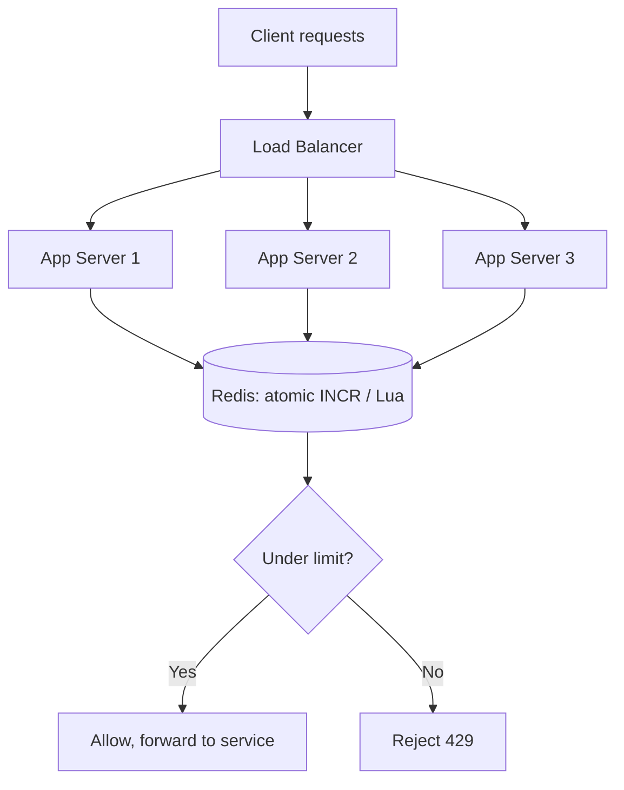

### 21.3 The cost of centralization, and how to soften it

A Redis round trip on every request adds latency (typically sub-millisecond within a data center, but real) and makes Redis a shared dependency. Three mitigations matter. First, **local token pre-fetch (batching)**: a server reserves a batch of, say, 10 tokens from Redis in one call and spends them locally, cutting Redis traffic 10x at the cost of slight over-admission tolerance. Second, **sharding by key**: partition keys across a Redis cluster so no single node is a bottleneck — because no operation spans two keys, this is embarrassingly parallel. Third, **fail-open with a circuit breaker** so a Redis blip degrades gracefully rather than adding latency or blocking traffic.

### 21.4 The hot-key problem

A single celebrity key — one enormous customer, or a viral endpoint — can concentrate all its traffic on one Redis shard and overwhelm it while other shards idle. Mitigations include the local-batching approach above (fewer round trips for the hot key), splitting a hot key's budget across N sub-keys and summing (`key:0`..`key:9`, each allowed limit/N), or promoting the hottest keys to a local approximate limiter. Recognizing that "uniform sharding doesn't save you from a skewed key distribution" is a strong staff-level observation.

### 21.5 Clock skew

In the distributed setting, servers' wall clocks differ by milliseconds to seconds. If each server timestamps requests with its own clock and those timestamps drive window math, skew corrupts the count. The clean fix is to make **Redis the single clock** — use `TIME` from the Redis server inside the Lua script so all decisions reference one authority — sidestepping cross-server clock disagreement entirely.

<details>
<summary>📖 <b>The distributed limiter in one idea</b></summary>

Everything about scaling a rate limiter reduces to one sentence: *the shared counter and the decision must live together in one atomic place.* Once traffic spreads across servers, in-memory counters lie (each server sees only its slice), so the state moves to a shared store like Redis — and because two servers can race just like two threads, the read-decide-update must be a single atomic operation (an `INCR` or a Lua script), timed by one clock (Redis's own). From there, scaling is the usual toolkit: shard by key for throughput, batch tokens locally to cut round trips, and fail open behind a circuit breaker so the limiter never becomes the outage.

</details>

---

## 22. Alternative Designs & Trade-offs

Beyond the five algorithms, several architectural alternatives come up, and having an opinion on each signals depth.

The first is **where the limiter runs**. Options are a client-side limiter (the SDK throttles itself — cheap but untrustworthy, since a malicious client just removes it), a middleware/gateway limiter (the standard — runs in the API gateway like Kong, Envoy, or AWS API Gateway, trusted and central), or a dedicated rate-limiting service (a separate microservice everyone calls — maximally consistent but adds a network hop and a dependency). The gateway approach wins for most systems; the dedicated service is justified only when many independent services must share one global limit.

The second is **local vs. centralized state**, covered above: local is fast but inaccurate across a fleet; centralized (Redis) is accurate but adds a round trip and a dependency; the hybrid (local batching backed by Redis) is what large systems converge on.

The third is **synchronous reject vs. queuing**. Instead of a hard `429`, a leaky-bucket-style design can *queue* excess requests and release them at the allowed rate, smoothing bursts at the cost of added latency and memory. This suits back-office or asynchronous workloads (a batch-processing API) but is wrong for interactive traffic, where a fast rejection beats an unbounded wait.

<details>
<summary>📖 <b>Where should the limiter live?</b></summary>

The most common architectural question is placement, and the reliable answer is "at the gateway." A client-side limiter can't be trusted because the client controls it — an attacker just deletes it. A per-service limiter scattered in each microservice duplicates logic and can't enforce a limit that spans services. The API gateway is the natural chokepoint: every request already passes through it, it's operated by your team (so it's trustworthy), and it can enforce both per-service and cross-cutting limits in one place. A dedicated rate-limiting microservice is worth the extra hop only when a single global budget must be shared across many otherwise-independent services.

</details>

---

## 23. Common FAANG Follow-up Questions (L4 → L6)

These are the tiered probes an interviewer stacks on top of the base design, escalating with level. The point is to show the *reasoning*, not recite a definition.

**L4 (mid-level) — understanding the basics:**

The interviewer confirms you understand each algorithm and can pick one. Expect *"Explain the difference between token bucket and leaky bucket"* (token bucket allows bursts up to capacity then throttles to the refill rate; leaky bucket enforces a strictly smooth output regardless of input burstiness), *"Why does fixed window allow too many requests?"* (the boundary burst — 2N across a window edge), and *"What HTTP status code do you return?"* (`429` with `Retry-After`). The signal here is clean explanation and knowing token bucket is the sensible default.

**L5 (senior) — concurrency and correctness:**

Now it's about the counters surviving load. Expect *"Two requests arrive at once for a key with one token left — walk me through preventing a double-spend"* (per-key locking or CAS around the read-decide-update), *"How do you avoid a per-key timer thread for refilling?"* (lazy refill from elapsed time on read), and *"Your ConcurrentHashMap grows forever — fix it"* (TTL/LRU eviction of idle keys). The signal is naming the check-then-act hazard and the lazy-refill trick unprompted.

**L6 (staff/principal) — distributed systems:**

Here the whole problem changes shape. Expect *"Enforce one limit across 100 servers"* (shared store, atomic Redis Lua/`INCR`), *"How do you handle clock skew across nodes?"* (make Redis the single clock via server-side `TIME`), *"A single hot key overwhelms one Redis shard — what now?"* (local batching, key splitting, or promoting to a local limiter), and *"Redis is down — allow or block?"* (fail-open by default with a circuit breaker, fail-closed only where over-admission is catastrophic). The signal is treating the limiter as a distributed system with real failure modes, not an algorithm.

<details>
<summary>📖 <b>How the levels differ in one glance</b></summary>

The same problem is graded on three different axes as the level rises. At L4 the question is "do you know the algorithms and can you pick one" — a knowledge and judgment check. At L5 it becomes "does your code stay correct when many threads hit the same key" — a concurrency check centered on the check-then-act race and lazy refill. At L6 it turns into "does one logical limit hold across a fleet under failure" — a distributed-systems check about atomic shared state, clock skew, hot keys, and fail-open behavior. Knowing which axis you're being tested on lets you pitch the answer at the right altitude instead of over- or under-shooting.

</details>

---

## 24. Common Design Mistakes

These are the specific errors that sink candidates, each with the fix.

The first and most common is **reaching for an algorithm before clarifying requirements** — blurting "token bucket" before asking whether the limit is per-user or global, single-node or distributed, strict or approximate. The fix is thirty seconds of scoping that reshapes the whole answer.

The second is the **check-then-act concurrency bug**: reading the count, deciding, then incrementing without atomicity, so concurrent requests double-spend the last slot. The fix is per-key locking or a compare-and-set loop.

The third is a **per-key background refill thread** for the token bucket — spawning a timer per bucket to add tokens on a schedule, which is impossible at millions of keys. The fix is lazy refill computed from elapsed time on read.

The fourth is **unbounded memory** — leaving per-key state in a map that only grows. The fix is TTL/LRU eviction of idle keys (or a Redis TTL).

The fifth is **assuming a single node** in a distributed setting — keeping counters in local memory so a fleet enforces N times the intended limit. The fix is a shared atomic store.

The sixth is **fail-closed by default** — blocking all traffic when Redis is unreachable, turning a dependency hiccup into a full outage. The fix is fail-open with a circuit breaker (fail-closed only where justified).

The seventh is the **boundary burst blind spot** — shipping fixed window without acknowledging it allows up to 2N across a window edge. The fix is naming the flaw and reaching for sliding counter or token bucket when it matters.

<details>
<summary>📖 <b>The mistake that fails candidates fastest</b></summary>

If there's one error that ends interviews early, it's designing counters that aren't atomic under concurrency — because it *looks* correct in a single-threaded read-through and only breaks under load, which is precisely the condition a rate limiter exists to handle. A limiter that admits two requests when one token remains has failed at its single job, silently. Always narrate the check-then-act race and how per-key locking or CAS closes it, even before being asked — it signals that you think about correctness under concurrency by default, which is the whole game at senior level.

</details>

---

## 25. Testing Strategy

A rate limiter is a correctness-critical component whose bugs are silent, so testing is heavily weighted toward *invariants under adversarial conditions*, not just happy paths.

Unit tests pin each algorithm's contract using the injectable `Clock`, which is the reason `Clock` exists: advance a fake clock instead of calling `Thread.sleep`, so tests are fast and deterministic. For the token bucket, assert that a fresh bucket allows exactly `capacity` requests immediately (the burst), rejects the next, then allows exactly `refillRate * elapsedSeconds` more after advancing the clock. For the fixed window, deliberately test the **boundary burst** — 2N requests straddling a window edge should all pass, documenting the known behavior. For the sliding log, assert that requests exactly `window` apart never trip the limit while requests within the window do.

Concurrency tests are the most important. Fire many threads at a single key with a limit of N and assert that *exactly* N are allowed and the rest rejected — this is the test that catches the check-then-act race. Run it with a `CountDownLatch` to release all threads simultaneously and repeat it many times, since races are probabilistic. The invariant is "admitted count never exceeds the limit," and it must hold every run.

Integration and distributed tests exercise the Redis path: assert atomicity by hammering one key from multiple simulated servers and checking the global admitted count equals the limit, and verify TTL eviction by confirming keys vanish after their window. Finally, test the failure mode explicitly — kill Redis mid-test and assert the configured fail-open (or fail-closed) behavior actually triggers.

<details>
<summary>📖 <b>The one test that matters most</b></summary>

If you write a single test for a rate limiter, make it the concurrency test: release a hundred threads simultaneously against one key with a limit of ten, and assert that exactly ten are admitted, no more. This is the test that catches the highest-severity bug — the silent over-admission from a check-then-act race — which no single-threaded test can reveal. Pair it with a fake `Clock` so the time-based reset logic is deterministic rather than flaky, and you've covered the two things most likely to be broken: atomicity and time handling.

</details>

---

## 26. FAANG Q&A Section

Twenty of the most frequently asked questions, escalating from conceptual to staff/principal. Each answer is written the way you'd actually speak it in the room.

### 🎯 Conceptual & Design (L4 / L5)

<details>
<summary><b>Q1. What is a rate limiter and why do systems need one?</b></summary>

A rate limiter caps how many requests a client can make in a time window, returning `429 Too Many Requests` once the cap is hit. Systems need it to protect against abuse (scrapers, credential-stuffing), to ensure fair resource sharing so one noisy client can't starve others, to control cost on metered downstreams, and to shield the service from accidental self-inflicted overload like a buggy retry loop. For example, GitHub's API allows 5,000 authenticated requests per hour per user precisely so one integration can't monopolize the platform. It's a protective device that runs before your business logic on every request.

</details>

<details>
<summary><b>Q2. Walk me through the five main rate-limiting algorithms.</b></summary>

Fixed window counts requests per aligned clock window and resets each window — simplest, but allows a 2N boundary burst. Sliding log keeps every request's timestamp and counts those within the rolling window — exact, but O(N) memory. Sliding counter blends the current and previous window counts by overlap weight — O(1) memory with near-log accuracy. Token bucket refills tokens at a steady rate up to a capacity, allowing controlled bursts then throttling to the rate — the industry default. Leaky bucket drains a fixed queue at a constant rate, enforcing strictly smooth output. I'd lead with token bucket and name the traffic shape that argues for each of the others.

</details>

<details>
<summary><b>Q3. Which algorithm would you choose and why?</b></summary>

Token bucket, as the default, for most APIs. It captures the behavior real clients want — an occasional legitimate burst — while still enforcing a smooth average rate, and it's O(1) in both time and memory with just two numbers per key. Capacity and refill rate are independent knobs: capacity caps the burst, rate caps the sustained throughput. It's exactly what AWS API Gateway and Stripe use. I'd switch to leaky bucket if the downstream needs strictly steady load, to sliding log if the limit must be provably exact, or to sliding counter if memory is tight but I still want boundary protection.

</details>

<details>
<summary><b>Q4. Why does the fixed window algorithm allow bursts at the boundary?</b></summary>

Because it resets the counter at fixed clock boundaries with no memory of the immediately preceding window. If the limit is 100 per minute, a client can send 100 requests in the final second of 12:00:59 and another 100 in the first second of 12:01:00 — 200 requests in about two seconds, double the intended rate, entirely within the rules. The fix is either the sliding window counter, which keeps the previous window's count weighted by overlap so that recent history still counts, or the token bucket, which has no hard reset at all. Naming this flaw unprompted is a good signal.

</details>

<details>
<summary><b>Q5. Token bucket versus leaky bucket — what's the real difference?</b></summary>

They differ in what they smooth. Token bucket smooths the *average* rate but permits input bursts: an idle client accumulates up to `capacity` tokens and can spend them all at once, then is throttled to the refill rate. Leaky bucket smooths the *output*: requests drain from a fixed queue at a constant rate no matter how bursty the input, so the downstream sees a perfectly steady stream but legitimate bursts get delayed or dropped. Choose token bucket when bursts are acceptable and even desirable (most user-facing APIs), leaky bucket when the downstream can only handle a fixed steady rate, like a payment processor capped at 50 TPS.

</details>

<details>
<summary><b>Q6. How do you decide the scope of a limit — per user, per IP, per API key?</b></summary>

It depends on what you're protecting and what identity you can trust. Per API key is best for authenticated APIs since it maps to a billing account and is hard to forge. Per user ID suits logged-in app traffic. Per IP is the fallback for anonymous traffic but is coarse — it punishes users behind shared NATs and is easily evaded with rotating IPs. In practice you layer them: a strict per-IP limit on the login endpoint to stop credential stuffing, plus a generous per-API-key limit on the main API. My design keeps the key pluggable so the same algorithm enforces any of these.

</details>

<details>
<summary><b>Q7. What does a good rate-limited response look like?</b></summary>

An HTTP `429 Too Many Requests` with a `Retry-After` header telling the client how many seconds until it can retry, plus the `X-RateLimit-Limit`, `X-RateLimit-Remaining`, and `X-RateLimit-Reset` headers so well-behaved clients can self-throttle *before* getting rejected. This matters because a client that retries blindly on rejection makes congestion worse, whereas one that reads `Retry-After` backs off precisely. Twitter and GitHub both surface these headers on every response. Returning a bare `429` with no timing information is a common miss — it leaves clients guessing and hammering.

</details>

<details>
<summary><b>Q8. Why store tokens as a double instead of an int?</b></summary>

Because refill is continuous and fractional. If the rate is 2 tokens per second and 300 milliseconds have elapsed, that's 0.6 of a token — with an int you'd either lose that fraction (systematically under-refilling and throttling clients too hard) or have to round, which drifts over time. A double accumulates the fractional refill accurately, and you only compare against the whole number 1.0 when deciding whether a request can spend a token. This is a small detail but getting it wrong makes the effective rate silently lower than configured, which is a subtle and annoying bug to diagnose in production.

</details>

<details>
<summary><b>Q9. Why inject a Clock instead of calling System.currentTimeMillis directly?</b></summary>

Two reasons. First, testability: every algorithm's behavior is time-dependent, so with an injectable clock I can advance time deterministically in tests instead of using `Thread.sleep`, making tests fast and non-flaky. Second, correctness: elapsed-time math should use a monotonic source like `System.nanoTime()`, because wall-clock time can jump backward on NTP corrections and corrupt a refill or window calculation. Wrapping the clock behind an interface lets me use a monotonic source in production and a fake in tests, and makes the time dependency explicit rather than hidden inside every method.

</details>

<details>
<summary><b>Q10. How do you prevent your per-key state map from growing forever?</b></summary>

Idle keys must be evicted or the map is a memory leak at scale. In-memory, I'd use a size-bounded LRU or TTL cache like Caffeine so keys untouched for longer than a window are evicted automatically. In Redis, I set a TTL on each key equal to (or a small multiple of) the window, so expired counters vanish without any sweep job — the `PEXPIRE` in my Lua script does exactly this. The key insight is that per-key state has a lifecycle: it's created on first request, active while the client is calling, and should be reclaimed once the client goes quiet. Forgetting this is a classic follow-up trap.

</details>

### 💡 Concurrency, Distribution & Staff-Level (L5 / L6)

<details>
<summary><b>Q11. Two requests arrive simultaneously for a key with one token left. How do you prevent a double-spend?</b></summary>

This is the check-then-act race: both threads read "1 token," both decide "allowed," both decrement to end at -1, admitting two when only one should pass. I close it by making the read-decide-update atomic per key. In my design, the map is a `ConcurrentHashMap` so different keys never contend, and the refill-then-spend for a single key runs inside `synchronized` on that key's own bucket object, so the two requests serialize just long enough to make the decision correct. A lock-free alternative uses an `AtomicReference` to the bucket with a compare-and-set retry loop. Either way, the invariant is "admitted count never exceeds the limit," and I'd write a hundred-thread test to prove it.

</details>

<details>
<summary><b>Q12. Why not use a background thread to refill token buckets on a schedule?</b></summary>

Because it doesn't scale. With a million distinct keys you'd need a million scheduled tasks ticking away, which is impossible in terms of threads and wasteful since most buckets are idle at any moment. Instead I refill *lazily*: I store `lastRefillMillis`, and whenever a request arrives I compute how many tokens should have accrued since then — `elapsedSeconds * refillRate`, capped at capacity — and add them in one step. No timers, no background threads, O(1) memory of two numbers per key, and refill happens exactly when it's needed. This "compute from elapsed time on read" trick is the single most important implementation detail in the whole problem.

</details>

<details>
<summary><b>Q13. Now enforce one limit across 100 application servers. How?</b></summary>

Local in-memory counters break here because each server sees only its slice of the traffic — a limit of 100 becomes 100-per-server. I move the counter into a shared store, almost always Redis, and every server does its decision against it. The non-negotiable requirement is atomicity of the read-modify-write, or servers race exactly like threads did: I use `INCR`+`EXPIRE` for fixed window or a Lua script for token bucket, so the whole refill-and-spend executes atomically on the Redis server. The TTL also auto-evicts idle keys. To manage the added round-trip latency I batch token reservations locally and shard keys across a Redis cluster.

</details>

<details>
<summary><b>Q14. How does a Redis-backed token bucket stay atomic?</b></summary>

I put the entire read-refill-spend-write sequence in a Lua script and run it with `EVAL`. Redis executes Lua scripts atomically — no other command interleaves — so between reading the token count and writing the new one, no other server can sneak in. The script reads the stored tokens and timestamp, computes the lazy refill from elapsed time, spends a token if one is available, writes back the new count and timestamp, sets a TTL for eviction, and returns allow/deny. Doing it any other way — say, a `GET` then a `SET` from the app — reintroduces the check-then-act race across the network, which is strictly worse than the in-process version because the window between read and write is now a network round trip.

</details>

<details>
<summary><b>Q15. A single hot key is overwhelming one Redis shard. What do you do?</b></summary>

Uniform sharding distributes keys evenly but does nothing for a skewed *per-key* load — one celebrity customer's key still lands on one shard and melts it. Three fixes: first, local token batching — a server reserves a block of tokens (say 100) in one Redis call and spends them locally, cutting round trips for the hot key by 100x. Second, key splitting — divide the hot key's budget across N sub-keys (`key:0`..`key:9`, each allowed limit/N) and route requests across them, spreading load over N shards. Third, promote the hottest keys to a local approximate limiter and reconcile periodically. The staff-level insight is recognizing that sharding solves aggregate load, not skew.

</details>

<details>
<summary><b>Q16. Redis is unreachable. Do you allow or block traffic?</b></summary>

Fail open by default — allow the traffic. A rate limiter exists to *protect* the service, and if it blocks every request the moment its own dependency hiccups, it has turned a minor Redis blip into a total outage, which is far worse than the abuse it was guarding against. I wrap the Redis call in a short timeout (tens of milliseconds) and a circuit breaker so a slow Redis doesn't add latency to every request, and when the breaker opens I fall back to a local approximate limiter or allow-all. The exception is endpoints where over-admission is itself catastrophic — a per-call-billed API or a login endpoint — where I'd fail closed. So it's a per-rule policy, not a global constant.

</details>

<details>
<summary><b>Q17. How do you handle clock skew in a distributed rate limiter?</b></summary>

If each server timestamps requests with its own wall clock and those timestamps drive the window or refill math, servers that disagree by even a second will corrupt the shared count. The clean fix is to use a single authoritative clock: inside the Redis Lua script I call Redis's own `TIME` command, so every decision — from every server — references the same clock. That sidesteps cross-server disagreement entirely. Relying on NTP to keep app-server clocks close enough is fragile; making the store the clock is deterministic. This is the kind of subtlety that only shows up in the distributed version and marks a candidate who's actually built one.

</details>

<details>
<summary><b>Q18. How would you reduce the latency of a Redis round-trip on every request?</b></summary>

The main lever is batching: instead of asking Redis to approve one request at a time, a server reserves a batch of tokens — say 10 — in a single call, then spends them from a local counter with no network hop, only going back to Redis when the batch runs out. That cuts Redis traffic roughly 10x at the cost of allowing a bounded over-admission (up to a batch's worth across a fleet), which is usually acceptable for a protective throttle. Complementary levers: co-locate Redis in the same availability zone to keep round trips sub-millisecond, use a Redis cluster sharded by key so no node is hot, and pipeline where multiple limits are checked per request. Batching plus fail-open covers most of the latency and availability concerns at once.

</details>

<details>
<summary><b>Q19. When would you queue requests instead of rejecting them?</b></summary>

Queuing suits asynchronous or back-office workloads where a bounded delay is acceptable and completing the request eventually is more valuable than a fast rejection — think a batch image-processing API or a webhook delivery system that must eventually deliver. That's the leaky-bucket-with-a-real-queue model: excess requests wait and drain at the allowed rate, smoothing bursts. For interactive, user-facing traffic it's the wrong choice: a user staring at a spinner would rather get a fast `429` and retry than wait in an invisible queue, and unbounded queues risk memory exhaustion and cascading latency. So I'd queue only when the caller is a machine that tolerates delay, and always with a bounded queue and a timeout.

</details>

<details>
<summary><b>Q20. If you had to ship a minimum viable rate limiter next week, what would you keep and cut?</b></summary>

Keep: a single token-bucket implementation behind the `RateLimiter` interface, per-key locking for correctness, integer-safe token math, TTL/LRU eviction, and `429` with `Retry-After`. That's the irreducible correct core — burst-tolerant limiting that survives concurrency and doesn't leak memory. For a multi-server deployment I'd also keep the Redis Lua path since local counters would silently break the limit; that's not optional if there's more than one server. Cut for v1: the other four algorithms (ship only token bucket), local batching and hot-key splitting (add when a shard actually gets hot), and queuing. Crucially I'd keep the *seams* — the `RateLimiter` and `RateLimiterStore` interfaces — so those additions are new classes, not rewrites.

</details>

---

## 27. STAR Behavioral Questions

Design interviews increasingly include behavioral rounds. Here are four, answered in the STAR format (Situation, Task, Action, Result), framed around real rate-limiting work.

<details>
<summary><b>⭐ Q1. Tell me about a time you diagnosed a subtle concurrency bug in production.</b></summary>

**Situation:** Our API's rate limiter was configured for 1,000 requests per minute per key, but a large customer was intermittently getting through with noticeably more, and support couldn't reproduce it under normal load.

**Task:** Find why the limit leaked under high concurrency without disrupting the live service.

**Action:** I reproduced it with a load test that fired hundreds of concurrent requests at a single key and confirmed the admitted count exceeded the limit. The code did a `get`-count, compared, then `put`-incremented — a textbook check-then-act race across threads. I replaced the read-decide-update with an atomic per-key operation (a `synchronized` block on the key's own state, later a compare-and-set loop), and added a hundred-thread test asserting exactly-N admissions that ran in CI.

**Result:** The over-admission vanished, the regression test locked the fix in permanently, and I wrote up the check-then-act pattern in our engineering guide so the same mistake wouldn't recur in adjacent counters.

</details>

<details>
<summary><b>⭐ Q2. Describe a time you made a design decision that traded accuracy for scalability.</b></summary>

**Situation:** We moved from a single API server to a fleet behind a load balancer, and the exact per-server counters no longer enforced one global limit — the effective limit multiplied by the server count.

**Task:** Enforce one logical limit across the fleet without adding unacceptable latency to every request.

**Action:** I moved the counters into Redis with an atomic Lua script, but a round trip per request added latency and made Redis a hot dependency. I introduced local token batching — each server reserved a block of tokens in one call and spent them locally — which cut Redis traffic about tenfold. I explicitly accepted that this permits a small, bounded over-admission across the fleet, and got sign-off that this was fine for a protective throttle.

**Result:** We held the global limit within a few percent of target, cut Redis load by an order of magnitude, and kept added latency sub-millisecond. Documenting the accuracy trade-off upfront meant no one was surprised when the limit wasn't enforced to the exact request.

</details>

<details>
<summary><b>⭐ Q3. Tell me about a time you prevented an outage caused by a protective mechanism.</b></summary>

**Situation:** During a Redis failover, our rate limiter — which called Redis synchronously on every request and blocked on failure — started rejecting *all* traffic, because it treated an unreachable store as "cannot confirm under limit, so deny."

**Task:** Stop the limiter from converting a brief dependency blip into a full service outage.

**Action:** I changed the default failure behavior to fail-open: on a Redis timeout the request is allowed rather than blocked, wrapped in a short timeout and a circuit breaker so a slow Redis didn't add latency to every call. For the two endpoints where over-admission was genuinely dangerous — billing and login — I kept fail-closed as an explicit per-rule opt-in. I tested it by killing Redis mid-load-test and asserting traffic still flowed.

**Result:** The next Redis failover was a non-event for the API — latency stayed flat and no legitimate traffic was dropped — while the sensitive endpoints stayed protected. The per-rule policy became our standard for all protective dependencies.

</details>

<details>
<summary><b>⭐ Q4. Describe a time you pushed back on over-engineering.</b></summary>

**Situation:** A teammate proposed building a dedicated rate-limiting microservice with all five algorithms, a config UI, and per-request queuing, for an internal API with modest, single-region traffic.

**Task:** Deliver effective rate limiting on schedule without taking on unjustified complexity.

**Action:** I mapped each proposed feature to an actual requirement and found most had none: the traffic was bursty-tolerant (token bucket alone sufficed), it ran in one region on a handful of servers (a shared Redis, not a new service, was enough), and queuing was wrong for the interactive traffic. I proposed shipping a single token-bucket limiter behind clean `RateLimiter` and `RateLimiterStore` interfaces so the extra algorithms and a dedicated service *could* be added later if a real need appeared.

**Result:** We shipped in a fraction of the estimated time with far less to operate, and the interface seams meant we added a second algorithm painlessly six months later when one endpoint genuinely needed leaky-bucket smoothing. Keeping the seams while cutting the scope was the win.

</details>

---

## 28. ⚡ Quick Revision Cheat Sheet

*Read this and the whole design should snap back into place.*

**The problem in one breath.** Design a component that, for each incoming request, decides allow or reject based on how many requests a client key (API key, user ID, or IP) has made in a recent window — returning `429 Too Many Requests` with `Retry-After` once the limit is hit, and recovering automatically as traffic subsides. Always clarify first: per-user or global, single-node or distributed, hard-exact or soft-approximate, fail-open or fail-closed, and the actual numbers (requests/sec, key count, latency budget). State non-goals: no auth, no full gateway, no billing, no network-layer DDoS defense.

**The domain.** `RateLimiter` is the strategy interface — `allowRequest(key)` for the hot path and `tryAcquire(key)` returning a `RateLimitResult` (allowed, remaining, resetAt) for headers. Five concrete implementations sit behind it. `RateLimitRule` is the immutable config (maxRequests, windowMillis, capacity, refillRatePerSec), shared safely across keys and threads. A `RateLimiterStore` interface abstracts *where* per-key state lives — `InMemoryStore` (ConcurrentHashMap) for one node, `RedisStore` (atomic Lua) for a fleet — and a `RateLimiterFactory` builds the right limiter from an `Algorithm` enum. Time comes from an injectable `Clock` (monotonic in prod, fake in tests), never scattered `System.currentTimeMillis()` calls.

**The five algorithms — the heart of the problem.** *Fixed window* counts per aligned clock window, O(1)/O(1), but allows a 2N boundary burst. *Sliding log* keeps every timestamp in a deque and trims expired ones — exact, no boundary burst, but O(N) memory per key. *Sliding counter* blends current and previous window counts weighted by overlap — O(1) memory with near-exact accuracy (Cloudflare's production choice). *Token bucket* refills tokens at a steady rate up to a capacity and spends one per request — allows controlled bursts up to capacity then throttles to the rate, O(1)/O(1), the industry default (AWS API Gateway, Stripe). *Leaky bucket* drains a fixed queue at a constant rate — enforces strictly smooth output, can't burst. Memorize the comparison table; it's the artifact that wins the algorithm-choice conversation.

**How to choose.** Lead with token bucket as the default because real clients want occasional bursts and it's cheap. Switch to leaky bucket when the downstream needs steady load, sliding log when the limit must be provably exact (and accept the memory cost), sliding counter when memory is tight but you still want boundary protection, and fixed window only when the simplest thing is fine and slight inaccuracy is acceptable. The deciding number is usually memory-per-key times key-count: four algorithms are O(1) per key, sliding log is O(N), so at millions of keys the O(1) ones win unless precision is paramount.

**The patterns and principles.** Strategy is the backbone — one `RateLimiter` interface, five algorithms, chosen by config, extensible by adding a class (Open/Closed). Factory builds them, Facade (a filter/middleware) wraps them for the gateway, Adapter (`RedisStore`) fits a Redis client to the store interface. SOLID shows up concretely: single responsibility per algorithm; open/closed via the two interfaces; Liskov across implementations; a tiny segregated `RateLimiter` interface; dependency inversion by injecting `RateLimiterStore` and `Clock`. The gut check: you should be able to add an algorithm, swap in Redis, and run under a fake clock — all without editing an existing class.

**The token-bucket mechanics to recite.** State per key is just two numbers: `tokens` (a double, since refill is fractional) and `lastRefillMillis`. On each request: refill lazily (`tokens = min(capacity, tokens + elapsedSec * rate)`), set `lastRefill = now`, then if `tokens >= 1` spend one and allow, else reject. Capacity caps the burst; rate caps the sustained throughput — two independent knobs. The critical detail: refill is *lazy*, computed from elapsed time on read — never a per-key background timer thread, which couldn't scale to millions of keys.

**Concurrency — the L5 gate.** Every algorithm is read-decide-update, which is a check-then-act race: two threads both see the last token free, both spend it, admitting two where one should pass. Fix with per-key locking — a `ConcurrentHashMap` so different keys never contend, plus `synchronized` on the individual key's state object so same-key requests serialize just long enough. A lock-free variant uses `AtomicReference` + compare-and-set retry. The proving test: release 100 threads at one key with limit 10 and assert exactly 10 admitted. Lock per key, never one global lock, or the limiter itself becomes the bottleneck.

**Distribution — the L6 gate.** Across many servers, local counters lie (each sees only its slice), so N servers enforce N times the limit. Move state to a shared store (Redis) and make the read-modify-write atomic — `INCR`+`EXPIRE` for fixed window, a Lua script for token bucket — because two servers race just like two threads. Make Redis the single clock (server-side `TIME`) to defeat clock skew. Manage the round-trip cost by batching token reservations locally (reserve 10, spend locally) and sharding keys across a cluster. The TTL on each key doubles as automatic eviction, solving unbounded memory for free.

**Failure and edges.** Fail *open* by default — a limiter that blocks all traffic when Redis hiccups has become the outage it was preventing; wrap Redis in a short timeout and circuit breaker, and fail closed only where over-admission is catastrophic (billing, login). Bound memory with TTL/LRU eviction of idle keys. Handle the hot key (one celebrity key melting one shard) with local batching, key splitting across sub-keys, or promotion to a local limiter — sharding fixes aggregate load, not skew. Return `429` with `Retry-After` and `X-RateLimit-*` headers so clients back off precisely instead of hammering.

**Top mistakes to avoid.** Picking an algorithm before clarifying; the check-then-act concurrency bug; a per-key background refill thread instead of lazy refill; an unbounded map with no eviction; assuming a single node in a distributed setting; fail-closed by default; and shipping fixed window without acknowledging the boundary burst.

**Testing.** Use the injectable `Clock` to advance time deterministically instead of `Thread.sleep`. Assert each algorithm's contract (token bucket: exactly `capacity` immediate then throttle to rate; fixed window: prove the boundary burst; sliding log: requests one window apart never trip). The must-write test is the concurrency one — 100 threads on one key, exactly N admitted — repeated many times since races are probabilistic. Integration-test the Redis atomicity and TTL eviction, and explicitly test that killing Redis triggers the configured fail-open/closed behavior.

**The one-liner to leave them with.** "A rate limiter is a tiny, hot-path gatekeeper whose whole job is to stay correct under concurrency: model the algorithm as a swappable Strategy — token bucket by default for controlled bursts — make the read-decide-update atomic per key, push that atomicity into a shared store like Redis when you scale to a fleet, and always fail open so the guard never becomes the outage."

---

*End of guide. This document pairs naturally with the Strategy, Factory, and Singleton pattern guides for the deeper theory behind each applied pattern, and complements distributed-systems topics like caching (Redis) and circuit breakers.*
