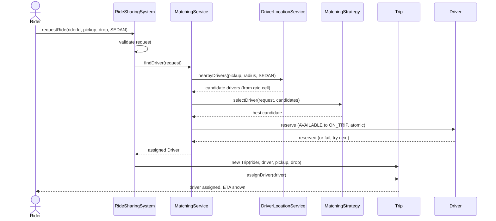
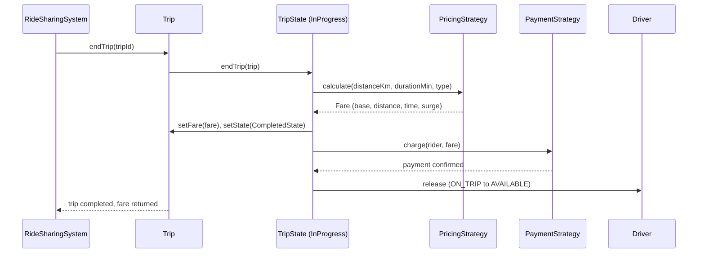
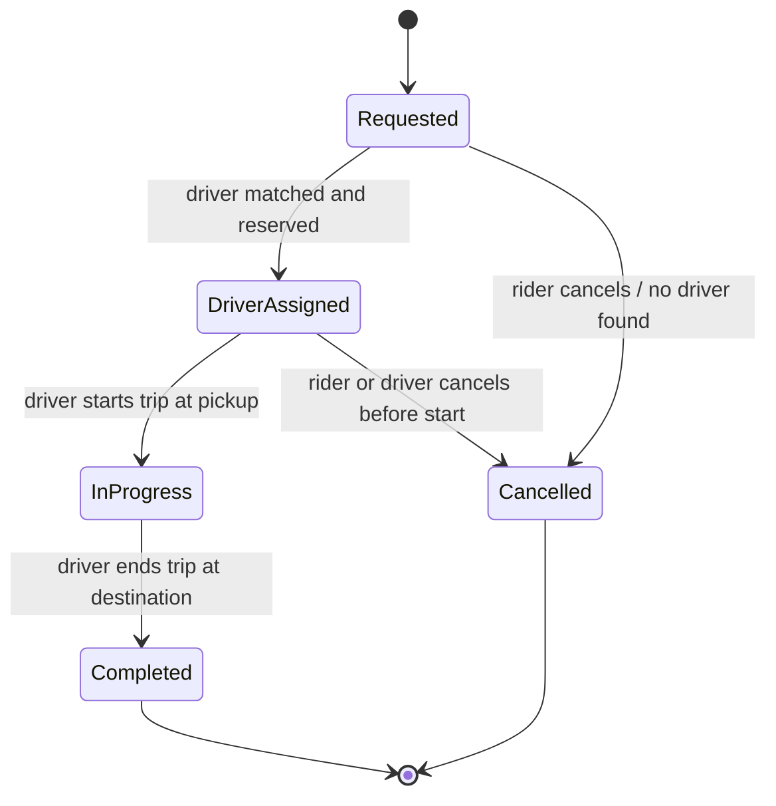

# 🚗 Low-Level Design: Ride-Sharing System

> A complete, interview-ready walkthrough of the classic **Ride-Sharing System** design problem (Uber / Lyft / Ola / Grab) — from a blank whiteboard to a staff-level design that matches riders to drivers with a pluggable strategy, models each trip as an explicit state machine, prices fares through swappable pricing rules including surge, tracks driver locations behind a spatial index, and survives concurrency, the "two riders, one driver" race, and relentless follow-up questions.

Ride-sharing is the interview problem that quietly tests four skills at once. First: **can you match supply to demand geographically?** When a rider taps "request" at a street corner, the system must find nearby available drivers *fast* — a naive scan of every driver on the platform is fine on a whiteboard but collapses at city scale, and recognizing that gap is where the interesting discussion begins. Second: **can you model an entity whose behavior depends entirely on where it is in its lifecycle?** A trip that has just been requested behaves nothing like one where the driver is en route, which behaves nothing like one in progress with the meter running — and each transition permits only certain actions. Third: **can you price something whose rules change constantly?** Base fare, per-kilometer and per-minute charges, and surge multipliers during peak demand are all policies that must be swappable without rewriting the trip logic. Fourth: **can you keep it correct under concurrency**, when two riders half a block apart both get matched to the same idle driver in the same instant? Candidates who reach for one giant `Trip` class stuffed with `if (status == ...)` branches, a linear scan over all drivers, and hard-coded fare arithmetic produce brittle code that can't grow. Candidates who recognize the trip as a *state machine*, matching and pricing as *pluggable strategies*, driver lookup behind a *spatial-index service*, and the match-and-reserve as an *atomic operation* write clean, extensible, scalable code. This guide walks the whole journey, escalating from the beginner's mental model to the geo-sharding, surge economics, and distributed-matching concerns a principal engineer raises in the closing minutes.

---

## 📋 Table of Contents

**Part I — Framing the Problem**

1. [Problem Statement](#1-problem-statement)
2. [Requirement Clarification & Assumptions](#2-requirement-clarification--assumptions)
3. [Functional & Non-Functional Requirements](#3-functional--non-functional-requirements)
4. [Core Concepts Being Tested](#4-core-concepts-being-tested)

**Part II — Modeling the Domain**

5. [Domain Model & Entities](#5-domain-model--entities)
6. [CRC Cards](#6-crc-cards)
7. [UML Class Diagram](#7-uml-class-diagram)
8. [Package Structure](#8-package-structure)

**Part III — Design Rationale**

9. [Design Decisions & Trade-offs](#9-design-decisions--trade-offs)
10. [Class-by-Class Deep Dive](#10-class-by-class-deep-dive)
11. [Design Patterns Applied](#11-design-patterns-applied)
12. [SOLID Principles Mapping](#12-solid-principles-mapping)

**Part IV — Behavior & Diagrams**

13. [Sequence Diagram](#13-sequence-diagram)
14. [State Diagram](#14-state-diagram)

**Part V — The Implementation**

15. [Complete Java Implementation](#15-complete-java-implementation)
16. [Execution Flow & Code Walkthrough](#16-execution-flow--code-walkthrough)

**Part VI — Engineering Depth**

17. [Complexity Analysis](#17-complexity-analysis)
18. [Thread Safety & Concurrency](#18-thread-safety--concurrency)
19. [Error Handling & Validation](#19-error-handling--validation)
20. [Scalability Discussion](#20-scalability-discussion)
21. [Alternative Designs & Trade-offs](#21-alternative-designs--trade-offs)

**Part VII — Interview Mastery**

22. [Common FAANG Follow-up Questions (L4 → L6)](#22-common-faang-follow-up-questions-l4--l6)
23. [Common Design Mistakes](#23-common-design-mistakes)
24. [Testing Strategy](#24-testing-strategy)
25. [FAANG Q&A Section](#25-faang-qa-section)
26. [STAR Behavioral Questions](#26-star-behavioral-questions)
27. [⚡ Quick Revision Cheat Sheet](#27--quick-revision-cheat-sheet)

---

## 1. Problem Statement

Design the software for a **ride-sharing platform**. A **rider** opens the app, sets a pickup point and a destination, chooses a vehicle category (bike, auto, sedan, SUV), and taps "request." The system finds a suitable **driver** who is nearby, available, and driving the right vehicle type, assigns them to the ride, and shows both parties the match. The driver drives to the pickup, the rider gets in, the trip begins, and when they reach the destination the trip ends, a **fare** is calculated and charged, and both parties can rate each other. A driver may be anywhere in the city and their location updates continuously; a rider may cancel before pickup; and during rush hour or bad weather, demand can spike far beyond the available supply, at which point prices rise to balance the two.

The system coordinates several moving parts — the **riders** requesting trips, the **drivers** roaming the city broadcasting their location, a **matching** brain that pairs a request with the best available driver, a **pricing** engine that turns a route into a fare, and a **trip** object that tracks the journey through its lifecycle. At every step things can go wrong: no driver is available within range, two requests target the same driver at once, a rider cancels after a driver is assigned, or a payment fails at the end. The system must find drivers quickly, never double-book one, price consistently, and drive each trip cleanly from request to completion.

<details>
<summary>📖 <b>In plain terms — what are we actually building?</b></summary>

Picture opening Uber. You drop a pin for pickup, another for your destination, pick "Sedan," and tap request. Within seconds the app says "Rahul is 3 minutes away in a white Honda." Our job is the *brains* behind that: the logic that knows which drivers are near you right now, picks the best one, makes sure no other rider grabs that same driver in the same second, works out what the ride will cost (and charges more when everyone wants a ride at once), and tracks your trip from "finding a driver" through "on the way" to "completed and paid." We are not building the maps, the GPS chips, or the mobile screens — we are building the objects and rules that decide, on every ride request, who drives you and what it costs.

</details>

The deliverable in an interview is not a running product; it is a **clean object-oriented model** — the classes, their responsibilities, the *state machine* that governs a single trip, the *matching algorithm* that pairs riders with drivers, and the *pricing engine* that computes fares — plus a clear story for **how the system stays fast, correct, and scalable** under concurrency and city-scale load. Grading centers on how cleanly you model the trip lifecycle, how well the design absorbs new features (pooling, scheduled rides, new pricing rules), whether your driver lookup can scale beyond a linear scan, and how rigorously you reason about the concurrency hazard of assigning one driver to two riders.

---

## 2. Requirement Clarification & Assumptions

The single biggest mistake candidates make is coding before scoping. A strong candidate spends the first few minutes turning the vague prompt into a bounded problem — and the ride-sharing prompt hides several forks that reshape the whole design. Below is the clarification dialogue you should drive, framed as the questions to ask and the assumptions to lock in.

### 2.1 Actors

The people and systems that interact with the platform define its surface area.

| Actor | Role in the system |
|-------|--------------------|
| **Rider** | Requests a ride with a pickup, destination, and vehicle type; cancels; pays; rates the driver. |
| **Driver** | Goes online/offline, broadcasts location, accepts an assigned trip, drives to pickup, starts and ends the trip, rates the rider. |
| **Matching Service** | The system brain that pairs each ride request with the best available driver. |
| **Pricing Engine** | Turns a route (distance, time, demand) into a fare, including surge. |
| **Payment Gateway** | External system (Stripe, Braintree) that charges the rider and pays out the driver. |
| **Location / Maps Service** | External system (Google Maps, Mapbox) that supplies distance, ETA, and routing. |

### 2.2 Key Clarifying Questions

Before modeling anything, resolve these with the interviewer. Each answer materially changes the design.

- **One rider per trip, or pooling (multiple riders sharing a car)?** — Pooling turns matching into a route-optimization problem. *(Assumption: **one rider per trip** in v1; we design a seam for pooling and discuss it as an extension.)*
- **How is a driver chosen?** — Nearest driver, highest-rated, or a cost function? *(Assumption: a pluggable **matching strategy**; the default picks the **nearest available driver** of the requested vehicle type.)*
- **How is fare computed?** — Flat rate, or base + distance + time, and does surge apply? *(Assumption: **base fare + per-km + per-minute**, wrapped by an optional **surge multiplier** when demand exceeds supply; pricing is pluggable.)*
- **Real-time or scheduled rides?** — *(Assumption: **on-demand real-time** rides in v1; scheduled rides are noted as an extension.)*
- **How fresh are driver locations?** — *(Assumption: drivers push location updates every few seconds; the system keeps the latest known location and finds nearby drivers from it.)*
- **What happens when no driver is available?** — *(Assumption: the request fails cleanly with a "no drivers available" result; the rider may retry. We do not build a waiting queue in v1 but note it.)*
- **Payment timing?** — *(Assumption: fare is computed at trip completion and charged through an external gateway; we model the interface, not the gateway internals.)*
- **Concurrency model?** — *(Assumption: many riders request simultaneously and many drivers update location concurrently, so driver lookup and the match-and-reserve step must be thread-safe — no driver assigned to two trips.)*

### 2.3 Explicit Non-Goals

Naming what you will *not* build is a senior signal — it shows you can bound scope deliberately rather than by omission.

- No real map/routing engine — we assume a `Location.distanceTo` (great-circle distance) and treat ETA as derived; a real system calls Google Maps.
- No GPS hardware or mobile UI — interaction is through method calls (`requestRide`, `startTrip`).
- No payment-gateway internals (tokenization, PCI, 3-D Secure) — we model a `PaymentStrategy` interface and assume the gateway works.
- No ride-pooling / carpool route optimization in v1 — discussed as an extension.
- No driver onboarding, background checks, or regulatory/compliance flows.
- No persistence, analytics, or fraud detection engine, though we note where each hooks in.
- Single city / region in v1; multi-region federation is a scaling discussion, not v1 code.

<details>
<summary>📖 <b>Why spend so long on clarification?</b></summary>

The prompt "design Uber" is intentionally huge, and two answers dramatically shrink or reshape it. First, "one rider per trip or pooling?" — pooling changes matching from "find the nearest driver" into a live route-optimization problem (which existing riders can absorb a detour), which is a completely different and much harder design. Second, "how is a driver chosen and how do we avoid double-booking?" — the moment you commit to a *pluggable* matching strategy and an *atomic* match-and-reserve, you've named the two things that make the problem interesting. Asking these upfront signals you understand *what actually makes ride-sharing hard*, and it lets you scope a clean v1 while leaving explicit seams for the hard extensions.

</details>

---

## 3. Functional & Non-Functional Requirements

### 3.1 Functional Requirements (what the system *does*)

These are the concrete behaviors the system must support. In an interview, list them crisply — they become your checklist for the class design.

1. **Register riders and drivers** — each with an identity, and each driver with a vehicle and vehicle type.
2. **Track driver location & availability** — a driver goes online/offline and continuously updates their location; the system knows who is available where.
3. **Request a ride** — a rider submits a pickup, destination, and vehicle type; the system finds and assigns a suitable driver.
4. **Match the best driver** — among nearby available drivers of the right type, choose one (nearest by default).
5. **Estimate and compute fare** — price the ride from distance, time, and demand, including surge when applicable.
6. **Drive the trip lifecycle** — requested → driver assigned → in progress → completed, with cancellation possible before it starts.
7. **Process payment** — at completion, charge the rider through their chosen payment method.
8. **Notify both parties** — push status changes (driver assigned, arriving, started, completed) to rider and driver.
9. **Rate after the trip** — rider and driver rate each other, feeding the driver's average rating.

### 3.2 Non-Functional Requirements (how *well* it does it)

These are the qualities that make the design production-grade, and they are where staff-level discussion lives.

| Attribute | Requirement | Why it matters |
|-----------|-------------|----------------|
| **Low match latency** | Find and assign a driver within a second or two, even with millions of drivers online. | Riders abandon if matching is slow; the driver lookup must not be a linear scan at scale. |
| **Correctness (no double-booking)** | A driver is assigned to at most one active trip; concurrent requests never both grab the same driver. | The core integrity invariant — a double-booked driver is a broken product. |
| **Consistency of pricing** | The same route under the same conditions yields the same fare; surge is applied transparently. | Riders and regulators care about fare fairness and predictability. |
| **Extensibility** | New matching policies, pricing rules, vehicle types, and payment methods slot in with minimal change. | The business constantly changes pricing and adds ride products. |
| **Scalability** | Handle city- then country-scale drivers and requests by partitioning geographically. | Ride volume is enormous and geographically clustered. |
| **Availability** | Matching in one city keeps working if another region is down; a failed payment doesn't lose the trip record. | A regional outage must not be global; money flows must be recoverable. |
| **Freshness of location** | Nearby-driver results reflect driver positions from seconds ago, not minutes. | Stale locations produce bad matches and long pickups. |

<details>
<summary>📖 <b>Functional vs non-functional — the quick distinction</b></summary>

Functional requirements are the *verbs* — request a ride, match a driver, compute the fare, complete the trip. If a functional requirement fails, the system did the wrong thing (it never assigned a driver). Non-functional requirements are the *adverbs* — do it fast, do it correctly under concurrency, price it consistently, scale it to a country. If a non-functional requirement fails, the system did the right thing but *badly* (it matched a driver, but took thirty seconds, or matched the *same* driver to two riders). Interviewers push hardest on the non-functional ones here — especially match latency (the spatial-index discussion) and no-double-booking (the concurrency discussion) — because a plain class diagram can't answer them.

</details>

---

## 4. Core Concepts Being Tested

This problem is a proxy for a bundle of skills. Knowing what's being measured helps you narrate your design to the *right* audience.

- **Geospatial matching / nearest-neighbor search** — the marquee scaling skill. Finding available drivers near a point is a spatial query; doing it fast at scale needs a spatial index (grid, geohash, quadtree), not a linear scan. Recognizing that a naive `for each driver` collapses is *the* scaling insight this problem tests.
- **Finite state machines** — a trip moves through well-defined states (requested, driver assigned, in progress, completed, cancelled), and each state permits only certain actions. The **State pattern** models this cleanly and prevents illegal transitions like "complete a trip that never started."
- **Pluggable algorithms (Strategy)** — both *matching* (which driver?) and *pricing* (what fare?) are policies that change independently of the trip flow, so both are Strategies. Surge is a pricing decorator/variant on top.
- **Concurrency & the reservation race** — the defining correctness hazard: two riders matched to one idle driver simultaneously. Naming it and solving it with an atomic match-and-reserve (a lock or a compare-and-set on driver status) is the senior signal.
- **Object-oriented decomposition** — finding the right nouns (Rider, Driver, Trip, Vehicle, Location, MatchingService, PricingStrategy) and giving each a single clear responsibility, rather than a god `RideSharingSystem`.
- **Design patterns in context** — State (trip lifecycle), Strategy (matching, pricing, payment), Observer (status notifications), Singleton/Facade (the system entry point), Factory (trip/state creation) — applied where they *earn their place*.

Keep these in the back of your mind as you read on — each section below is, in part, a chance to demonstrate one or more of them.

---

## 5. Domain Model & Entities

Before drawing classes, name the real-world nouns and pin down what each one *is* and *owns*. Getting these boundaries right is most of the battle — the rest of the design follows from clean entities.

### 5.1 The Entity Landscape

The design centers on a handful of core entities and a few service objects that coordinate them.

- **`RideSharingSystem`** — the facade and single entry point. Owns the registries of riders and drivers, the `DriverLocationService`, the `MatchingService`, the `PricingStrategy`, and the active trips. Exposes `requestRide`, `updateDriverLocation`, `startTrip`, `endTrip`, `cancelTrip`.
- **`User`** — the abstract person on the platform, carrying an id, name, phone, and a rating. `Rider` and `Driver` extend it.
- **`Rider`** — a `User` who requests trips and owns a `PaymentMethod`.
- **`Driver`** — a `User` who owns a `Vehicle`, has a `DriverStatus` (offline / available / on-trip), and a current `Location`. This status is the field the reservation race fights over.
- **`Vehicle`** — the car, carrying its `VehicleType` (BIKE, AUTO, SEDAN, SUV), plate, and model.
- **`Location`** — an immutable latitude/longitude value object with a `distanceTo` (great-circle / Haversine) method.
- **`Trip`** — the heart of the model: a single journey with a rider, an assigned driver, pickup and drop `Location`s, a current `TripState`, a `Fare`, and timestamps. Its behavior is delegated to its state.
- **`TripState`** — the State-pattern interface; concretes are `RequestedState`, `DriverAssignedState`, `InProgressState`, `CompletedState`, `CancelledState`.
- **`DriverLocationService`** — the spatial index. Tracks every available driver's latest location and answers "which available drivers of type T are within radius R of point P?" This is the class that must not be a linear scan at scale.
- **`MatchingService`** + **`MatchingStrategy`** — answers "which driver serves this request?" using nearby candidates from the location service.
- **`PricingStrategy`** (+ `SurgePricingStrategy`) — turns distance, time, and demand into a `Fare`.
- **`PaymentStrategy`** — charges the rider at completion (card, wallet, cash).
- **`TripObserver`** — anything notified of trip status changes (rider app, driver app, analytics).

### 5.2 Entity Relationships

The ownership and reference structure, in words, before the diagram makes it visual.

- A `RideSharingSystem` **owns** many `Rider`s and `Driver`s, one `DriverLocationService`, one `MatchingService`, one `PricingStrategy`, and many active `Trip`s.
- A `Driver` **has one** `Vehicle` and **has a** current `Location` and `DriverStatus`.
- A `Trip` **references** one `Rider` and (once assigned) one `Driver`, **has** a pickup and drop `Location`, **has a** current `TripState`, and **produces** one `Fare`.
- A `MatchingService` **uses a** `MatchingStrategy`, which **queries** the `DriverLocationService` for nearby candidates.
- The `PricingStrategy` and `PaymentStrategy` are **injected** into the system, not hard-coded.

### 5.3 Core Enumerations

Two small enums encode the fixed vocabularies of the domain. Keeping them explicit (rather than strings) makes illegal values unrepresentable.

```java
public enum VehicleType { BIKE, AUTO, SEDAN, SUV }

public enum DriverStatus { OFFLINE, AVAILABLE, ON_TRIP }
```

`VehicleType` lets a rider request a category and lets matching filter candidates. `DriverStatus` is the small but critical field the concurrency section revolves around: a driver is only a match candidate when `AVAILABLE`, and the atomic flip from `AVAILABLE` to `ON_TRIP` is what prevents double-booking.

---

## 6. CRC Cards

CRC (Class–Responsibility–Collaborator) cards are the fastest way to sanity-check that each class has *one* clear job and knows only the collaborators it truly needs. Here are the cards for the core types.

| Class | Responsibilities | Collaborators |
|-------|------------------|---------------|
| **RideSharingSystem** | Entry point; register users; route requests to matching, pricing, and trips; hold active trips | MatchingService, DriverLocationService, PricingStrategy, Trip, Rider, Driver |
| **Rider** | Hold identity, rating, and payment method; request rides | User, PaymentMethod, Trip |
| **Driver** | Hold identity, vehicle, status, and current location; accept/serve trips | User, Vehicle, Location, Trip |
| **Vehicle** | Hold vehicle type and registration details | VehicleType |
| **Location** | Represent a lat/long point; compute distance to another point | (none — value object) |
| **DriverLocationService** | Track available drivers by location; return nearby candidates of a type | Driver, Location |
| **MatchingService** | Choose the best driver for a request from nearby candidates | MatchingStrategy, DriverLocationService, Driver |
| **MatchingStrategy** | Encapsulate the "which driver?" algorithm | Driver, Location |
| **Trip** | Hold journey data; delegate behavior to its current state | TripState, Rider, Driver, Fare, Location |
| **TripState** | Define legal actions and transitions for one trip phase | Trip |
| **PricingStrategy** | Compute a Fare from distance, time, and demand | Fare, Location |
| **PaymentStrategy** | Charge the rider for a completed trip | Fare, Rider |
| **TripObserver** | React to trip status changes (notify apps, log) | Trip |

The tell of a good set of cards: no class has a laundry list of responsibilities, and no class collaborates with everything. `Trip` doesn't know how matching works; `MatchingStrategy` doesn't know how trips transition; `PricingStrategy` doesn't know who the driver is. Each seam is a place the design can flex.

---

## 7. UML Class Diagram

Here is the full static structure in ASCII, the way you'd sketch it on a whiteboard. Abstract types are marked `«interface»`. The three pluggable seams — **TripState** (trip behavior), **MatchingStrategy** (which driver), and **PricingStrategy** (what fare) — are deliberately front and center, because they are what makes the design flex.

```
        ┌──────────────────────────────────────────────────────┐
        │ RideSharingSystem                        «singleton»   │
        ├──────────────────────────────────────────────────────┤
        │ - riders: Map<String, Rider>                          │
        │ - drivers: Map<String, Driver>                        │
        │ - activeTrips: Map<String, Trip>                      │
        │ - locationService: DriverLocationService              │
        │ - matchingService: MatchingService                    │
        │ - pricingStrategy: PricingStrategy                    │
        ├──────────────────────────────────────────────────────┤
        │ + requestRide(riderId, pickup, drop, type): Trip      │
        │ + updateDriverLocation(driverId, loc): void           │
        │ + startTrip(tripId): void                             │
        │ + endTrip(tripId): void                               │
        │ + cancelTrip(tripId): void                            │
        └───┬───────────────┬───────────────────┬───────────────┘
            │ uses          │ uses              │ uses
            ▼               ▼                   ▼
┌────────────────────┐ ┌──────────────────────────┐ ┌────────────────────────────┐
│ MatchingService    │ │ DriverLocationService    │ │ «interface» PricingStrategy │
├────────────────────┤ ├──────────────────────────┤ ├────────────────────────────┤
│ - strategy:        │ │ - grid: Map<CellId,      │ │ + calculate(distanceKm,     │
│   MatchingStrategy─┐│ │    Set<Driver>>          │ │    durationMin,             │
├────────────────────┼┤ ├──────────────────────────┤ │    type): Fare              │
│ + findDriver(req): ││ │ + updateLocation(drv,loc)│ └──────────────┬──────────────┘
│    Optional<Driver>││ │ + nearbyDrivers(loc,     │                │ implemented by
└────────────────────┼┘ │    radiusKm, type):      │    ┌───────────┴───────────┐
                     ▼   │    List<Driver>          │    ▼                       ▼
      ┌──────────────────┴──┐ └──────────────────────┘ ┌─────────────────┐ ┌──────────────────┐
      │ «interface»         │                          │ BaseFarePricing │ │ SurgePricing     │
      │ MatchingStrategy    │                          │ Strategy        │ │ Strategy         │
      ├─────────────────────┤                          │ (base + km +    │ │ (wraps base,     │
      │ + selectDriver(req, │                          │  minute rates)  │ │  x multiplier)   │
      │    candidates):     │                          └─────────────────┘ └──────────────────┘
      │    Optional<Driver> │
      └──────────┬──────────┘
                 │ implemented by
        ┌────────┴──────────┐
        ▼                   ▼
┌──────────────────┐ ┌────────────────────┐
│ NearestDriver    │ │ HighestRatedDriver │
│ MatchingStrategy │ │ MatchingStrategy   │
└──────────────────┘ └────────────────────┘

  ┌─────────────────────────────┐        ┌──────────────────────────────┐
  │ Trip                        │        │ «interface» TripState        │
  ├─────────────────────────────┤        ├──────────────────────────────┤
  │ - id: String                │ current│ + assignDriver(trip, driver) │
  │ - rider: Rider              │ state  │ + startTrip(trip): void      │
  │ - driver: Driver            │───────▶│ + endTrip(trip): void        │
  │ - pickup: Location          │        │ + cancel(trip): void         │
  │ - drop: Location            │        │ + getStatus(): TripStatus    │
  │ - state: TripState          │        └───────────────┬──────────────┘
  │ - fare: Fare                │                        │ implemented by
  ├─────────────────────────────┤     ┌────────┬─────────┼──────────┬──────────────┐
  │ + assignDriver(d)/startTrip()│    ▼        ▼         ▼          ▼              ▼
  │ + endTrip() / cancel()      │ ┌────────┐┌──────────┐┌─────────┐┌──────────┐┌───────────┐
  │ + setState(s) / getFare()   │ │Request ││Driver    ││InProgres││Completed ││Cancelled  │
  └──────┬──────────────────────┘ │edState ││Assigned  ││sState   ││State     ││State      │
         │ observed by            └────────┘│State     │└─────────┘└──────────┘└───────────┘
         ▼                                  └──────────┘
┌──────────────────────────┐
│ «interface» TripObserver │      ┌──────────────────┐        ┌──────────────────────┐
├──────────────────────────┤      │ User «abstract»  │        │ Location «value»     │
│ + onStatusChange(trip)   │      ├──────────────────┤        ├──────────────────────┤
└──────────┬───────────────┘      │ # id / name      │        │ - lat: double        │
           │ implemented by       │ # rating: double │        │ - lng: double        │
      ┌────┴────────┐             └───────┬──────────┘        ├──────────────────────┤
      ▼             ▼                     │ extends           │ + distanceTo(o): double│
┌──────────┐ ┌────────────┐       ┌───────┴───────┐          └──────────────────────┘
│ RiderApp │ │ DriverApp  │       ▼               ▼
│ Notifier │ │ Notifier   │  ┌──────────┐  ┌──────────────────────────┐
└──────────┘ └────────────┘  │ Rider    │  │ Driver                   │
                             │ -payment │  │ - vehicle: Vehicle       │
                             │  Method  │  │ - status: DriverStatus   │
                             └──────────┘  │ - location: Location     │
                                           └──────────────────────────┘
```

The shape to notice: `Trip` holds one `TripState` and delegates every action (`assignDriver`, `start`, `end`, `cancel`) to it, so illegal transitions are refused *by the state class* rather than by scattered `if`s. To the left, `MatchingService` uses a `MatchingStrategy` that pulls candidates from the `DriverLocationService` — separating "how to search space" (the index) from "how to pick" (the strategy). To the right, `PricingStrategy` turns a route into a `Fare`, with surge as a wrapping variant. Four independent seams — trip state, matching, pricing, and notification — are four independent axes of change.

---

## 8. Package Structure

A clean package layout communicates the architecture at a glance and enforces dependency direction. Here's a pragmatic layout.

```
com.ridesharing
│
├── model                          // Entities & value objects
│   ├── User.java                  //   abstract base
│   ├── Rider.java
│   ├── Driver.java
│   ├── Vehicle.java
│   ├── VehicleType.java           //   enum: BIKE, AUTO, SEDAN, SUV
│   ├── DriverStatus.java          //   enum: OFFLINE, AVAILABLE, ON_TRIP
│   ├── Location.java              //   immutable lat/long value object
│   ├── Fare.java                  //   immutable fare breakdown
│   └── RideRequest.java           //   pickup + drop + type + rider
│
├── trip                           // Trip + State pattern (behavioral core)
│   ├── Trip.java
│   ├── TripStatus.java            //   enum mirror of the state, for reads
│   └── state
│       ├── TripState.java         //   interface
│       ├── RequestedState.java
│       ├── DriverAssignedState.java
│       ├── InProgressState.java
│       ├── CompletedState.java
│       └── CancelledState.java
│
├── matching                       // "WHICH driver?" (Strategy)
│   ├── MatchingService.java
│   ├── MatchingStrategy.java      //   interface
│   ├── NearestDriverMatchingStrategy.java
│   └── HighestRatedMatchingStrategy.java
│
├── location                       // The spatial index
│   └── DriverLocationService.java //   grid / geohash bucket lookup
│
├── pricing                        // "WHAT fare?" (Strategy)
│   ├── PricingStrategy.java       //   interface
│   ├── BaseFarePricingStrategy.java
│   └── SurgePricingStrategy.java  //   decorator over a base strategy
│
├── payment                        // "HOW to charge?" (Strategy)
│   ├── PaymentStrategy.java       //   interface
│   ├── CardPaymentStrategy.java
│   └── WalletPaymentStrategy.java
│
├── observer                       // Status notifications (Observer)
│   ├── TripObserver.java          //   interface
│   ├── RiderNotifier.java
│   └── DriverNotifier.java
│
├── exception                      // Domain exceptions
│   ├── NoDriverAvailableException.java
│   ├── InvalidTripStateException.java
│   └── InvalidRideRequestException.java
│
├── RideSharingSystem.java         // The facade / orchestrator (singleton)
│
└── Demo.java                      // Runnable simulation
```

The guiding rule: **`model` depends on nothing; everything can depend on `model`.** The `matching`, `pricing`, and `location` packages depend only on the model (they *read* driver and location data), the `trip.state` package depends on `Trip`, and `RideSharingSystem` wires services to strategies. Crucially, `RideSharingSystem` depends on the *interfaces* `MatchingStrategy`, `PricingStrategy`, and `PaymentStrategy` — never their concretes — so swapping algorithms never touches the orchestration. This keeps the three "brains" (matching, pricing, payment) independently testable and swappable.

---

## 9. Design Decisions & Trade-offs

Every design is a sequence of forks in the road. Here are the ones that matter for ride-sharing, each stated as the question, the options, and the choice with its justification.

### 9.1 Driver lookup — linear scan or a spatial index?

The naive approach keeps all drivers in a list and, on each request, scans every one computing distance — O(N) per request, which at millions of online drivers is fatal. We put driver locations behind a **`DriverLocationService`** that maintains a **spatial index**: the map is divided into cells (a uniform grid, or geohash buckets), and each available driver lives in the cell for its current location. A "nearby drivers" query then reads only the request's cell and its immediate neighbors — a near-constant number of drivers — instead of the whole planet. The trade-off is bookkeeping (a driver moving across a cell boundary must be re-bucketed) and choosing a cell size (too big returns too many candidates, too small misses drivers just over the edge). We accept that cost because it turns an O(N) scan into an O(k) local lookup, and we hide it behind an interface so a quadtree or a Redis GEO index can replace the grid without touching callers.

### 9.2 Modeling the trip — State pattern or a status field with if/else?

The naive approach gives `Trip` a `status` string and branches on it in every method: `if (status.equals("REQUESTED")) ... else if ...`. This scatters the transition rules across the class and makes illegal transitions (ending a trip that never started, assigning a driver to a completed trip) easy to reach. We model each phase as a polymorphic **`TripState`** that implements the trip's actions *for that phase*. `RequestedState.startTrip()` refuses (no driver yet); `CompletedState.cancel()` refuses (already done). The illegal transition becomes structurally impossible rather than a runtime check you might forget. The cost is more classes; the benefit is a self-documenting lifecycle and safety by construction — and adding a `ScheduledState` or `DriverArrivedState` is a new class, not an edit to a growing switch.

### 9.3 Matching and pricing — hard-code them or make them strategies?

Fares and matching rules are the most volatile part of any ride-sharing business: cities differ, surge turns on and off, promotions change pricing weekly, and matching evolves from "nearest" to "nearest that also balances driver earnings." We make both **`MatchingStrategy`** and **`PricingStrategy`** pluggable interfaces, injected into the system. This lets a city run nearest-driver while another A/B-tests highest-rated, and lets surge be a `SurgePricingStrategy` that *wraps* the base strategy rather than a tangle of `if surge` inside trip code. The cost is indirection; the payoff is that the business's fastest-changing rules change *without touching* the trip lifecycle or orchestration.

### 9.4 The match-and-reserve — how to avoid double-booking?

This is the defining correctness fork. If matching *selects* a driver and *then* separately marks them busy, two concurrent requests can both select the same idle driver before either marks it. We make selection-and-reservation **atomic**: the driver's `AVAILABLE → ON_TRIP` flip happens under a lock (or as a compare-and-set) *inside* the match, so the second request sees the driver already taken and moves to the next candidate. We lock per driver (or CAS on the status field), not globally, so unrelated matches proceed in parallel. The trade-off is the small contention cost of the reservation; the payoff is the core integrity guarantee that no driver ever has two active trips.

### 9.5 Surge — a separate strategy or a flag on the base pricer?

Surge could be a boolean and a multiplier field on the base pricing strategy. We instead make **`SurgePricingStrategy` a decorator** that holds a base `PricingStrategy` and multiplies its result by a demand-derived factor. This keeps the base fare logic pure and testable, lets surge be turned on per-region by wrapping or unwrapping, and allows *different* surge curves (linear, capped, stepwise) to coexist as different wrappers. It's the Decorator/Strategy combination doing exactly what it's good at: composing a variable behavior on top of a stable one.

<details>
<summary>📖 <b>Why interviewers love the "trade-off" framing</b></summary>

Junior candidates present one design as "the answer." Senior candidates present a design *and the roads not taken*, because real engineering is choosing under constraints. When you say "I put drivers behind a grid index because a linear scan is O(N) per request and dies at a million drivers, but a grid has a cell-size trade-off and needs re-bucketing on movement, so at true scale I'd move to a geohash or Redis GEO behind the same interface," you show you understand the limits of your own choice. That awareness — not the data-structure name — is what moves you from L4 to L5/L6. Narrate the fork, not just the destination.

</details>

---

## 10. Class-by-Class Deep Dive

With the structure in view, here is what each major class is *for* and the reasoning behind its shape. The full code is in Section 15; this is the tour.

### 10.1 `RideSharingSystem` (facade / orchestrator)

The `RideSharingSystem` is the single public entry point and the Facade over the whole subsystem. It owns the rider and driver registries, the `DriverLocationService`, the `MatchingService`, the injected `PricingStrategy`, and the active trips. Its methods read like the product: `requestRide(riderId, pickup, drop, type)` builds a `RideRequest`, asks the `MatchingService` for a driver, creates a `Trip`, assigns the driver atomically, prices an estimate, and returns the trip; `updateDriverLocation` forwards to the location service; `startTrip`/`endTrip`/`cancelTrip` look up the trip and delegate to it. It contains *no* matching, pricing, or state-transition logic — only wiring, validation, and orchestration.

### 10.2 `DriverLocationService` (the spatial index)

`DriverLocationService` is the class that makes matching scale. It keeps available drivers bucketed by a **grid cell** derived from their latitude/longitude, so `nearbyDrivers(location, radiusKm, type)` reads only the target cell and its neighbors and filters by vehicle type — a local, near-constant-cost lookup instead of a global scan. `updateLocation(driver)` re-buckets a driver when it crosses a cell boundary and removes drivers who go offline or on-trip. Behind its interface, the grid can be swapped for a quadtree or a Redis GEO index with zero change to matching. It is deliberately the *only* place that knows how space is partitioned.

### 10.3 `MatchingService` and `MatchingStrategy`

`MatchingService` answers "which driver serves this request?" It pulls nearby candidates from the `DriverLocationService`, then delegates the *choice* to a `MatchingStrategy`. The default `NearestDriverMatchingStrategy` returns the closest candidate by `Location.distanceTo`; `HighestRatedMatchingStrategy` picks the best-rated within range. Crucially, `MatchingService` performs the **atomic reserve** — it attempts to flip the chosen driver from `AVAILABLE` to `ON_TRIP`, and if that fails (another request won the race), it tries the next candidate. This is where "select" and "reserve" fuse into one safe operation.

### 10.4 `Trip` (the State context)

`Trip` holds all the data of one journey — its id, rider, assigned driver, pickup and drop `Location`s, `Fare`, timestamps — and its current `TripState`. It is the Context in the State pattern: `assignDriver`, `startTrip`, `endTrip`, and `cancel` each delegate to the current state, which performs the action if legal and transitions the trip, or refuses. `Trip` also notifies its `TripObserver`s on every state change. It never contains a `switch (status)`; the rules live in the state classes, and `Trip` just holds context and forwards.

### 10.5 `TripState` and its concretes

`TripState` declares the trip's actions. `RequestedState` accepts `assignDriver` (moving to `DriverAssignedState`) and `cancel`, but refuses `startTrip`/`endTrip`. `DriverAssignedState` accepts `startTrip` (to `InProgressState`) and `cancel`, but refuses a second `assignDriver`. `InProgressState` accepts `endTrip` (to `CompletedState`, triggering fare calculation and payment) and refuses cancellation — you can't cancel a ride you're on. `CompletedState` and `CancelledState` are terminal and refuse everything. Each state permits only its legal actions, so the lifecycle's rules are enforced by the type system, not by scattered conditionals — and a freed driver is returned to `AVAILABLE` exactly on the completion and cancellation transitions.

### 10.6 `PricingStrategy`, `BaseFarePricingStrategy`, and `SurgePricingStrategy`

`PricingStrategy.calculate(distanceKm, durationMin, type)` returns a `Fare`. `BaseFarePricingStrategy` implements the standard formula — a per-type base fare plus a per-kilometer rate times distance plus a per-minute rate times duration. `SurgePricingStrategy` is a **decorator**: it wraps a base `PricingStrategy`, calls it, and multiplies the result by a demand multiplier (derived from the ratio of open requests to available drivers in the area). Keeping surge as a wrapper means the base formula stays pure, surge can be toggled per region, and different surge curves are just different wrappers — none of which touches the trip.

### 10.7 `Location`, `Vehicle`, `User`, `Rider`, `Driver`, `Fare`

`Location` is an immutable lat/long value object whose `distanceTo` uses the Haversine (great-circle) formula — the one piece of real geometry in the model. `Vehicle` carries its `VehicleType` and registration. `User` is the abstract person with id, name, and rating; `Rider` adds a `PaymentMethod`; `Driver` adds a `Vehicle`, a `DriverStatus`, and a current `Location`. `Fare` is an immutable breakdown (base, distance, time, surge multiplier, total), so a rider can see *why* a ride cost what it did — a real-product detail that also makes pricing easy to test.

---

## 11. Design Patterns Applied

Patterns should appear because the problem *demands* them, not to decorate the design. Here's where each one earns its place.

| Pattern | Where it's used | What it buys us |
|---------|-----------------|-----------------|
| **State** | `TripState` and its five concretes | The trip lifecycle core. Each state handles actions locally; illegal transitions (end before start) are impossible; adding a phase is a new class. |
| **Strategy** | `MatchingStrategy`, `PricingStrategy`, `PaymentStrategy` | Three independent, volatile algorithms become swappable — nearest vs. highest-rated, base vs. promotional pricing, card vs. wallet — without touching callers. |
| **Decorator** | `SurgePricingStrategy` wrapping a base `PricingStrategy` | Composes a demand multiplier on top of stable base pricing; surge toggles by wrapping, and different surge curves coexist. |
| **Observer** | `TripObserver` (rider app, driver app, analytics) | Status changes fan out to interested parties without `Trip` knowing who they are. |
| **Facade** | `RideSharingSystem` | One clean entry point hides matching, pricing, location, and the state machine from the outside world. |
| **Singleton** | `RideSharingSystem` (one per deployment) | Models the single platform controller — injected, never static global state. |
| **Factory** | Creating trips / states at request time | Centralizes construction so callers don't `new` concrete states and the initial state is set consistently. |

<details>
<summary>📖 <b>A note on not over-patterning</b></summary>

It's tempting to cram in every Gang-of-Four pattern to look sophisticated, but an interviewer reads that as insecurity. State here is unarguable — a trip genuinely is a lifecycle with per-phase rules and illegal transitions. Three Strategies are justified because matching, pricing, and payment genuinely change independently and often. Decorator for surge is a real fit because surge is a behavior *composed on top of* base pricing. But forcing, say, a Visitor over trip states or an Abstract Factory where a plain factory suffices is a red flag. The skill is knowing when a pattern *removes* an "if I change X I must edit Y" coupling versus when it merely adds ceremony. Reach for a pattern when it deletes coupling, not to fill a checklist.

</details>

For the deeper theory behind each of these, this guide pairs naturally with the individual State, Strategy, Decorator, Observer, Facade, Singleton, and Factory pattern guides.

---

## 12. SOLID Principles Mapping

SOLID isn't an abstract checklist here — each principle shows up concretely in the design.

**S — Single Responsibility.** Each class has one reason to change: `DriverLocationService` owns spatial lookup, each `MatchingStrategy` owns the "which driver" choice, each `PricingStrategy` owns fare math, each `TripState` owns the rules for one phase, `Trip` owns journey data. A change to the surge curve never touches matching; a new spatial index never touches the trip lifecycle. Splitting matching, pricing, and location into separate services is SRP's headline win here.

**O — Open/Closed.** The system is *open to extension, closed to modification*. A new matching policy is a new `MatchingStrategy`; a new fare rule is a new `PricingStrategy`; surge is a new decorator; a new trip phase is a new `TripState`; a new payment method is a new `PaymentStrategy`. No existing class is edited. This is the single most important SOLID payoff, delivered by the State and Strategy structure.

**L — Liskov Substitution.** Any `TripState` works wherever a state is expected — `Trip` never asks "which state am I?"; it just delegates. Any `MatchingStrategy`, `PricingStrategy`, or `PaymentStrategy` satisfies the same contract, which is exactly what makes swapping nearest-driver for highest-rated, or base pricing for surge, safe and testable.

**I — Interface Segregation.** `MatchingStrategy` exposes just `selectDriver`; `PricingStrategy` exposes just `calculate`; `TripState` exposes only the trip actions; `TripObserver` exposes only `onStatusChange`. No client is forced to depend on methods it doesn't use — the pricing engine never sees driver location internals, the matcher never sees fare math.

**D — Dependency Inversion.** `RideSharingSystem` and `MatchingService` depend on the *abstractions* `MatchingStrategy`, `PricingStrategy`, and `DriverLocationService`, injected at construction, not on concrete algorithms or a specific index. High-level orchestration doesn't know or care whether matching is nearest-driver or highest-rated, or whether the index is a grid or a quadtree. That inversion is what makes the whole design configurable and unit-testable.

<details>
<summary>📖 <b>The one-line SOLID gut check</b></summary>

If you can swap in a brand-new matching algorithm, a new pricing rule (say a flat airport fare), a new trip phase (a driver-arrived state), a new payment method, and a new spatial index *without editing a single existing class* — only adding new ones — your design honors Open/Closed and Dependency Inversion, and the rest of SOLID usually falls into place. That "add, don't edit" test is the fastest way to sanity-check your ride-sharing design under interview pressure.

</details>

---

## 13. Sequence Diagram

Two flows carry the design: a **ride request being matched and assigned** (where the spatial index, matching strategy, and reservation meet), and a **trip completing** (where the state machine, pricing, and payment meet). Here they are as message sequences.

### 13.1 Ride Request: Match, Reserve, and Assign



### 13.2 Trip Completion: End, Price, and Pay



<details>
<summary>📖 <b>Reading the two flows together</b></summary>

The two diagrams show the design's cleanest idea: each hard problem is answered in one place. In the first flow, the request touches the *location service* (where are the candidates?), then the *matching strategy* (which candidate?), then the *reserve* step (lock it in atomically so no one else can), and only then is a `Trip` born — three separable concerns, one per collaborator. In the second flow, ending the trip is delegated to the *state* (is this legal?), which calls *pricing* (what does it cost?) and *payment* (charge it), then flips the driver back to available. Notice the state machine gates everything: pricing and payment only fire from `InProgressState.endTrip`, so you can never charge a trip that never started.

</details>

---

## 14. State Diagram

A single trip is a textbook finite state machine. Modeling it explicitly makes illegal transitions (starting a trip with no driver, cancelling a completed ride) impossible by construction.



The key invariants the diagram encodes: a trip can only reach `InProgress` *through* `DriverAssigned` (so there is always a driver when the meter runs), `InProgress` has no edge to `Cancelled` (you cannot cancel a ride you are on — it must complete), and `Completed`/`Cancelled` are terminal sinks. Every transition also has a side effect the state classes own: reaching `DriverAssigned` reserves the driver, reaching `Completed` prices and charges the fare and frees the driver, and reaching `Cancelled` frees any reserved driver. Because each `TripState` only implements its legal actions, these edges are the *only* ones that exist in code.

<details>
<summary>📖 <b>Why a state machine beats a status string</b></summary>

Imagine `Trip` had just a `String status` and every method checked it. To answer "can I cancel this trip?" you'd hunt through `cancel()` for the right `if`, and nothing would stop a new teammate from adding a path that cancels an in-progress ride. With the State pattern, the answer is structural: `InProgressState` simply has no working `cancel` — it throws — so the illegal action is impossible to invoke, not merely discouraged. The state diagram above *is* the code: five boxes, five classes, and the arrows are the only methods that transition. That one-to-one mapping between the picture and the classes is what makes the lifecycle safe and self-documenting.

</details>

---

## 15. Complete Java Implementation

The implementation below is complete and self-contained: drop the classes into a project (or a single file for a quick run), execute `Demo`, and watch a full ride play out from request to paid completion. It is organized bottom-up — value objects and enums first, then users and vehicles, then the trip state machine, then the location, matching, and pricing services, and finally the `RideSharingSystem` facade that wires it all together. Every class name, field, and method signature here matches the diagrams in Sections 7, 13, and 14 exactly.

<details>
<summary>💻 <b>1. Enums, Location & Fare (value objects)</b></summary>

```java
package com.ridesharing.model;

// ---- Enumerations -------------------------------------------------

public enum VehicleType { BIKE, AUTO, SEDAN, SUV }

public enum DriverStatus { OFFLINE, AVAILABLE, ON_TRIP }
```

```java
package com.ridesharing.model;

/** Immutable geographic point. distanceTo uses the Haversine great-circle formula. */
public final class Location {
    private final double lat;
    private final double lng;

    public Location(double lat, double lng) {
        this.lat = lat;
        this.lng = lng;
    }

    public double getLat() { return lat; }
    public double getLng() { return lng; }

    /** Great-circle distance in kilometers. */
    public double distanceTo(Location o) {
        final double R = 6371.0;                       // Earth radius, km
        double dLat = Math.toRadians(o.lat - lat);
        double dLng = Math.toRadians(o.lng - lng);
        double a = Math.sin(dLat / 2) * Math.sin(dLat / 2)
                 + Math.cos(Math.toRadians(lat)) * Math.cos(Math.toRadians(o.lat))
                 * Math.sin(dLng / 2) * Math.sin(dLng / 2);
        return R * 2 * Math.atan2(Math.sqrt(a), Math.sqrt(1 - a));
    }

    @Override public String toString() {
        return String.format("(%.4f, %.4f)", lat, lng);
    }
}
```

```java
package com.ridesharing.model;

/** Immutable fare breakdown so the rider can see WHY a ride cost what it did. */
public final class Fare {
    private final double baseFare;
    private final double distanceCharge;
    private final double timeCharge;
    private final double surgeMultiplier;

    public Fare(double baseFare, double distanceCharge, double timeCharge, double surgeMultiplier) {
        this.baseFare = baseFare;
        this.distanceCharge = distanceCharge;
        this.timeCharge = timeCharge;
        this.surgeMultiplier = surgeMultiplier;
    }

    public double getTotal() {
        return (baseFare + distanceCharge + timeCharge) * surgeMultiplier;
    }
    public double getSurgeMultiplier() { return surgeMultiplier; }

    @Override public String toString() {
        return String.format("Fare{base=%.2f, dist=%.2f, time=%.2f, surge=x%.1f, total=%.2f}",
                baseFare, distanceCharge, timeCharge, surgeMultiplier, getTotal());
    }
}
```

</details>

<details>
<summary>💻 <b>2. Vehicle & the User hierarchy (Rider, Driver)</b></summary>

```java
package com.ridesharing.model;

public class Vehicle {
    private final String licensePlate;
    private final String model;
    private final VehicleType type;

    public Vehicle(String licensePlate, String model, VehicleType type) {
        this.licensePlate = licensePlate;
        this.model = model;
        this.type = type;
    }
    public VehicleType getType() { return type; }
    public String getLicensePlate() { return licensePlate; }
    public String getModel() { return model; }
}
```

```java
package com.ridesharing.model;

/** The abstract person on the platform. */
public abstract class User {
    protected final String id;
    protected final String name;
    protected double rating;          // running average, 0..5

    protected User(String id, String name) {
        this.id = id;
        this.name = name;
        this.rating = 5.0;            // optimistic default
    }
    public String getId()   { return id; }
    public String getName() { return name; }
    public double getRating() { return rating; }
    public void addRating(double r) { this.rating = (this.rating + r) / 2.0; } // simplified
}
```

```java
package com.ridesharing.model;

public class Rider extends User {
    private final String paymentMethod;   // simplified: token / method id

    public Rider(String id, String name, String paymentMethod) {
        super(id, name);
        this.paymentMethod = paymentMethod;
    }
    public String getPaymentMethod() { return paymentMethod; }
}
```

```java
package com.ridesharing.model;

/**
 * A driver's status and location are the fields the concurrency section
 * revolves around. compareAndReserve() is the atomic AVAILABLE->ON_TRIP flip
 * that prevents double-booking.
 */
public class Driver extends User {
    private final Vehicle vehicle;
    private volatile Location location;
    private DriverStatus status = DriverStatus.OFFLINE;

    public Driver(String id, String name, Vehicle vehicle, Location location) {
        super(id, name);
        this.vehicle = vehicle;
        this.location = location;
    }

    public Vehicle getVehicle()   { return vehicle; }
    public Location getLocation() { return location; }
    public void setLocation(Location location) { this.location = location; }
    public synchronized DriverStatus getStatus() { return status; }
    public synchronized void goOnline()  { if (status == DriverStatus.OFFLINE) status = DriverStatus.AVAILABLE; }
    public synchronized void goOffline() { if (status == DriverStatus.AVAILABLE) status = DriverStatus.OFFLINE; }

    /** Atomic reservation: succeeds only if the driver is currently AVAILABLE. */
    public synchronized boolean compareAndReserve() {
        if (status == DriverStatus.AVAILABLE) {
            status = DriverStatus.ON_TRIP;
            return true;
        }
        return false;
    }
    /** Release back to the pool at trip completion or cancellation. */
    public synchronized void release() {
        if (status == DriverStatus.ON_TRIP) status = DriverStatus.AVAILABLE;
    }
}
```

</details>

<details>
<summary>💻 <b>3. RideRequest & TripStatus</b></summary>

```java
package com.ridesharing.model;

/** An immutable snapshot of what the rider asked for. */
public final class RideRequest {
    private final Rider rider;
    private final Location pickup;
    private final Location drop;
    private final VehicleType type;

    public RideRequest(Rider rider, Location pickup, Location drop, VehicleType type) {
        this.rider = rider;
        this.pickup = pickup;
        this.drop = drop;
        this.type = type;
    }
    public Rider getRider()      { return rider; }
    public Location getPickup()  { return pickup; }
    public Location getDrop()    { return drop; }
    public VehicleType getType() { return type; }
}
```

```java
package com.ridesharing.trip;

/** A read-only mirror of the current state, handy for logging and the UI. */
public enum TripStatus { REQUESTED, DRIVER_ASSIGNED, IN_PROGRESS, COMPLETED, CANCELLED }
```

</details>

<details>
<summary>💻 <b>4. Domain exceptions</b></summary>

```java
package com.ridesharing.exception;

public class NoDriverAvailableException extends RuntimeException {
    public NoDriverAvailableException(String message) { super(message); }
}

public class InvalidTripStateException extends RuntimeException {
    public InvalidTripStateException(String message) { super(message); }
}

public class InvalidRideRequestException extends RuntimeException {
    public InvalidRideRequestException(String message) { super(message); }
}
```

</details>

<details>
<summary>💻 <b>5. Pricing — Strategy + Surge decorator</b></summary>

```java
package com.ridesharing.pricing;

import com.ridesharing.model.Fare;
import com.ridesharing.model.VehicleType;

public interface PricingStrategy {
    Fare calculate(double distanceKm, double durationMin, VehicleType type);
}
```

```java
package com.ridesharing.pricing;

import com.ridesharing.model.Fare;
import com.ridesharing.model.VehicleType;
import java.util.Map;

/** base + (per-km * distance) + (per-minute * time), rates per vehicle type. */
public class BaseFarePricingStrategy implements PricingStrategy {
    private final Map<VehicleType, Double> baseFare = Map.of(
            VehicleType.BIKE, 15.0, VehicleType.AUTO, 25.0,
            VehicleType.SEDAN, 50.0, VehicleType.SUV, 80.0);
    private final Map<VehicleType, Double> perKm = Map.of(
            VehicleType.BIKE, 6.0, VehicleType.AUTO, 9.0,
            VehicleType.SEDAN, 12.0, VehicleType.SUV, 18.0);
    private final double perMinute = 1.5;

    @Override
    public Fare calculate(double distanceKm, double durationMin, VehicleType type) {
        double base = baseFare.get(type);
        double dist = perKm.get(type) * distanceKm;
        double time = perMinute * durationMin;
        return new Fare(base, dist, time, 1.0);   // no surge at the base level
    }
}
```

```java
package com.ridesharing.pricing;

import com.ridesharing.model.Fare;
import com.ridesharing.model.VehicleType;

/**
 * Decorator: wraps a base PricingStrategy and multiplies the result by a
 * demand-derived surge factor. Keeps base pricing pure and testable.
 */
public class SurgePricingStrategy implements PricingStrategy {
    private final PricingStrategy base;
    private final double surgeMultiplier;   // e.g. 1.0 = none, 1.8 = peak

    public SurgePricingStrategy(PricingStrategy base, double surgeMultiplier) {
        this.base = base;
        this.surgeMultiplier = Math.max(1.0, surgeMultiplier);
    }

    @Override
    public Fare calculate(double distanceKm, double durationMin, VehicleType type) {
        Fare f = base.calculate(distanceKm, durationMin, type);
        // Rebuild carrying the surge multiplier. The base components are folded
        // into 'baseFare' for clarity; Fare.getTotal() then applies the multiplier.
        return new Fare(f.getTotal(), 0.0, 0.0, surgeMultiplier);
    }
}
```

</details>

<details>
<summary>💻 <b>6. Payment — Strategy</b></summary>

```java
package com.ridesharing.payment;

import com.ridesharing.model.Fare;
import com.ridesharing.model.Rider;

public interface PaymentStrategy {
    boolean charge(Rider rider, Fare fare);
}
```

```java
package com.ridesharing.payment;

import com.ridesharing.model.Fare;
import com.ridesharing.model.Rider;

/** Stands in for a real gateway (Stripe, Braintree). */
public class CardPaymentStrategy implements PaymentStrategy {
    @Override
    public boolean charge(Rider rider, Fare fare) {
        System.out.printf("  [PAYMENT] Charged %s's card %.2f%n", rider.getName(), fare.getTotal());
        return true;   // assume the gateway succeeds
    }
}
```

```java
package com.ridesharing.payment;

import com.ridesharing.model.Fare;
import com.ridesharing.model.Rider;

public class WalletPaymentStrategy implements PaymentStrategy {
    @Override
    public boolean charge(Rider rider, Fare fare) {
        System.out.printf("  [PAYMENT] Debited %s's wallet %.2f%n", rider.getName(), fare.getTotal());
        return true;
    }
}
```

</details>

<details>
<summary>💻 <b>7. Observer — trip status notifications</b></summary>

```java
package com.ridesharing.observer;

import com.ridesharing.trip.Trip;

public interface TripObserver {
    void onStatusChange(Trip trip);
}
```

```java
package com.ridesharing.observer;

import com.ridesharing.trip.Trip;

public class RiderNotifier implements TripObserver {
    @Override
    public void onStatusChange(Trip trip) {
        System.out.printf("  [RIDER APP] %s: your trip is now %s%n",
                trip.getRider().getName(), trip.getStatus());
    }
}
```

```java
package com.ridesharing.observer;

import com.ridesharing.trip.Trip;

public class DriverNotifier implements TripObserver {
    @Override
    public void onStatusChange(Trip trip) {
        if (trip.getDriver() != null) {
            System.out.printf("  [DRIVER APP] %s: trip %s is now %s%n",
                    trip.getDriver().getName(), trip.getId(), trip.getStatus());
        }
    }
}
```

</details>

<details>
<summary>💻 <b>8. The Trip (State context)</b></summary>

```java
package com.ridesharing.trip;

import com.ridesharing.model.*;
import com.ridesharing.observer.TripObserver;
import com.ridesharing.pricing.PricingStrategy;
import com.ridesharing.payment.PaymentStrategy;
import com.ridesharing.trip.state.*;
import java.util.ArrayList;
import java.util.List;

/**
 * Holds the data of one journey and delegates every action to its current
 * TripState. Never contains a switch on status - the states own the rules.
 */
public class Trip {
    private final String id;
    private final Rider rider;
    private Driver driver;
    private final Location pickup;
    private final Location drop;
    private TripState state;
    private Fare fare;

    // Collaborators the states need to price, pay, and notify.
    private final PricingStrategy pricingStrategy;
    private final PaymentStrategy paymentStrategy;
    private final List<TripObserver> observers = new ArrayList<>();

    public Trip(String id, RideRequest req, PricingStrategy pricing, PaymentStrategy payment) {
        this.id = id;
        this.rider = req.getRider();
        this.pickup = req.getPickup();
        this.drop = req.getDrop();
        this.pricingStrategy = pricing;
        this.paymentStrategy = payment;
        this.state = new RequestedState();   // every trip begins here
    }

    // ---- Actions delegated to the current state ----
    public void assignDriver(Driver d) { state.assignDriver(this, d); }
    public void startTrip()            { state.startTrip(this); }
    public void endTrip()              { state.endTrip(this); }
    public void cancel()               { state.cancel(this); }

    // ---- Context mutators used by the states ----
    public void setState(TripState s) { this.state = s; notifyObservers(); }
    public void setDriver(Driver d)   { this.driver = d; }
    public void setFare(Fare f)       { this.fare = f; }

    public void addObserver(TripObserver o) { observers.add(o); }
    private void notifyObservers() { for (TripObserver o : observers) o.onStatusChange(this); }

    // ---- Getters the states and callers use ----
    public String getId()          { return id; }
    public Rider getRider()        { return rider; }
    public Driver getDriver()      { return driver; }
    public Location getPickup()    { return pickup; }
    public Location getDrop()      { return drop; }
    public Fare getFare()          { return fare; }
    public TripStatus getStatus()  { return state.getStatus(); }
    public PricingStrategy getPricingStrategy() { return pricingStrategy; }
    public PaymentStrategy getPaymentStrategy() { return paymentStrategy; }
}
```

</details>

<details>
<summary>💻 <b>9. TripState interface & the five concrete states</b></summary>

```java
package com.ridesharing.trip.state;

import com.ridesharing.model.Driver;
import com.ridesharing.trip.Trip;
import com.ridesharing.trip.TripStatus;

/** Each phase implements only its legal actions; the rest throw. */
public interface TripState {
    void assignDriver(Trip trip, Driver driver);
    void startTrip(Trip trip);
    void endTrip(Trip trip);
    void cancel(Trip trip);
    TripStatus getStatus();
}
```

```java
package com.ridesharing.trip.state;

import com.ridesharing.model.Driver;
import com.ridesharing.trip.Trip;
import com.ridesharing.trip.TripStatus;
import com.ridesharing.exception.InvalidTripStateException;

/** A fresh trip, waiting for a driver. */
public class RequestedState implements TripState {
    @Override public void assignDriver(Trip trip, Driver driver) {
        trip.setDriver(driver);
        trip.setState(new DriverAssignedState());
    }
    @Override public void startTrip(Trip trip) {
        throw new InvalidTripStateException("Cannot start: no driver assigned yet");
    }
    @Override public void endTrip(Trip trip) {
        throw new InvalidTripStateException("Cannot end: trip not started");
    }
    @Override public void cancel(Trip trip) {
        trip.setState(new CancelledState());
    }
    @Override public TripStatus getStatus() { return TripStatus.REQUESTED; }
}
```

```java
package com.ridesharing.trip.state;

import com.ridesharing.model.Driver;
import com.ridesharing.trip.Trip;
import com.ridesharing.trip.TripStatus;
import com.ridesharing.exception.InvalidTripStateException;

/** A driver is reserved and heading to pickup. */
public class DriverAssignedState implements TripState {
    @Override public void assignDriver(Trip trip, Driver driver) {
        throw new InvalidTripStateException("Driver already assigned");
    }
    @Override public void startTrip(Trip trip) {
        trip.setState(new InProgressState());
    }
    @Override public void endTrip(Trip trip) {
        throw new InvalidTripStateException("Cannot end: trip not started");
    }
    @Override public void cancel(Trip trip) {
        if (trip.getDriver() != null) trip.getDriver().release();  // free the driver
        trip.setState(new CancelledState());
    }
    @Override public TripStatus getStatus() { return TripStatus.DRIVER_ASSIGNED; }
}
```

```java
package com.ridesharing.trip.state;

import com.ridesharing.model.Driver;
import com.ridesharing.model.Fare;
import com.ridesharing.trip.Trip;
import com.ridesharing.trip.TripStatus;
import com.ridesharing.exception.InvalidTripStateException;

/** The meter is running. Ending it prices, charges, and frees the driver. */
public class InProgressState implements TripState {
    @Override public void assignDriver(Trip trip, Driver driver) {
        throw new InvalidTripStateException("Trip already in progress");
    }
    @Override public void startTrip(Trip trip) {
        throw new InvalidTripStateException("Trip already started");
    }
    @Override public void endTrip(Trip trip) {
        double distanceKm = trip.getPickup().distanceTo(trip.getDrop());
        double durationMin = distanceKm * 2.0;   // simplified: ~30 km/h average
        Fare fare = trip.getPricingStrategy()
                        .calculate(distanceKm, durationMin, trip.getDriver().getVehicle().getType());
        trip.setFare(fare);
        trip.setState(new CompletedState());                 // transition first
        trip.getPaymentStrategy().charge(trip.getRider(), fare);
        trip.getDriver().release();                          // driver back to the pool
    }
    @Override public void cancel(Trip trip) {
        throw new InvalidTripStateException("Cannot cancel a trip in progress");
    }
    @Override public TripStatus getStatus() { return TripStatus.IN_PROGRESS; }
}
```

```java
package com.ridesharing.trip.state;

import com.ridesharing.model.Driver;
import com.ridesharing.trip.Trip;
import com.ridesharing.trip.TripStatus;
import com.ridesharing.exception.InvalidTripStateException;

/** Terminal: the ride is done and paid. Everything is refused. */
public class CompletedState implements TripState {
    @Override public void assignDriver(Trip trip, Driver driver) { reject(); }
    @Override public void startTrip(Trip trip) { reject(); }
    @Override public void endTrip(Trip trip)   { reject(); }
    @Override public void cancel(Trip trip)    { reject(); }
    private void reject() { throw new InvalidTripStateException("Trip already completed"); }
    @Override public TripStatus getStatus() { return TripStatus.COMPLETED; }
}
```

```java
package com.ridesharing.trip.state;

import com.ridesharing.model.Driver;
import com.ridesharing.trip.Trip;
import com.ridesharing.trip.TripStatus;
import com.ridesharing.exception.InvalidTripStateException;

/** Terminal: the ride was cancelled. Everything is refused. */
public class CancelledState implements TripState {
    @Override public void assignDriver(Trip trip, Driver driver) { reject(); }
    @Override public void startTrip(Trip trip) { reject(); }
    @Override public void endTrip(Trip trip)   { reject(); }
    @Override public void cancel(Trip trip)    { reject(); }
    private void reject() { throw new InvalidTripStateException("Trip already cancelled"); }
    @Override public TripStatus getStatus() { return TripStatus.CANCELLED; }
}
```

</details>

<details>
<summary>💻 <b>10. DriverLocationService (the grid spatial index)</b></summary>

```java
package com.ridesharing.location;

import com.ridesharing.model.Driver;
import com.ridesharing.model.DriverStatus;
import com.ridesharing.model.Location;
import com.ridesharing.model.VehicleType;
import java.util.*;
import java.util.concurrent.ConcurrentHashMap;

/**
 * Buckets available drivers into fixed grid cells so "nearby drivers" reads
 * only the target cell and its 8 neighbors - O(k) instead of O(N) scan.
 * A real system swaps this for a geohash or Redis GEO index behind the same API.
 */
public class DriverLocationService {
    private static final double CELL_DEG = 0.02;   // ~2.2 km per cell near the equator
    private final Map<String, Set<Driver>> grid = new ConcurrentHashMap<>();

    private String cellId(Location loc) {
        long x = (long) Math.floor(loc.getLat() / CELL_DEG);
        long y = (long) Math.floor(loc.getLng() / CELL_DEG);
        return x + ":" + y;
    }

    /** Re-bucket a driver on each location update; only AVAILABLE drivers are indexed. */
    public void updateLocation(Driver driver, Location newLoc) {
        removeDriver(driver);                       // pull from old cell (if any)
        driver.setLocation(newLoc);
        if (driver.getStatus() == DriverStatus.AVAILABLE) {
            grid.computeIfAbsent(cellId(newLoc), k -> ConcurrentHashMap.newKeySet()).add(driver);
        }
    }

    public void removeDriver(Driver driver) {
        if (driver.getLocation() == null) return;
        Set<Driver> cell = grid.get(cellId(driver.getLocation()));
        if (cell != null) cell.remove(driver);
    }

    /** Candidates of the requested type within radiusKm of the point. */
    public List<Driver> nearbyDrivers(Location loc, double radiusKm, VehicleType type) {
        long cx = (long) Math.floor(loc.getLat() / CELL_DEG);
        long cy = (long) Math.floor(loc.getLng() / CELL_DEG);
        List<Driver> result = new ArrayList<>();
        for (long dx = -1; dx <= 1; dx++) {                 // target cell + 8 neighbors
            for (long dy = -1; dy <= 1; dy++) {
                Set<Driver> cell = grid.get((cx + dx) + ":" + (cy + dy));
                if (cell == null) continue;
                for (Driver d : cell) {
                    if (d.getStatus() == DriverStatus.AVAILABLE
                            && d.getVehicle().getType() == type
                            && d.getLocation().distanceTo(loc) <= radiusKm) {
                        result.add(d);
                    }
                }
            }
        }
        return result;
    }
}
```

</details>

<details>
<summary>💻 <b>11. Matching — Service + Strategy (with the atomic reserve)</b></summary>

```java
package com.ridesharing.matching;

import com.ridesharing.model.Driver;
import com.ridesharing.model.RideRequest;
import java.util.List;
import java.util.Optional;

public interface MatchingStrategy {
    Optional<Driver> selectDriver(RideRequest request, List<Driver> candidates);
}
```

```java
package com.ridesharing.matching;

import com.ridesharing.model.Driver;
import com.ridesharing.model.RideRequest;
import java.util.Comparator;
import java.util.List;
import java.util.Optional;

/** Closest candidate to the pickup point. */
public class NearestDriverMatchingStrategy implements MatchingStrategy {
    @Override
    public Optional<Driver> selectDriver(RideRequest request, List<Driver> candidates) {
        return candidates.stream()
                .min(Comparator.comparingDouble(
                        d -> d.getLocation().distanceTo(request.getPickup())));
    }
}
```

```java
package com.ridesharing.matching;

import com.ridesharing.model.Driver;
import com.ridesharing.model.RideRequest;
import java.util.Comparator;
import java.util.List;
import java.util.Optional;

/** Highest-rated candidate within range - a quality-first policy. */
public class HighestRatedMatchingStrategy implements MatchingStrategy {
    @Override
    public Optional<Driver> selectDriver(RideRequest request, List<Driver> candidates) {
        return candidates.stream().max(Comparator.comparingDouble(Driver::getRating));
    }
}
```

```java
package com.ridesharing.matching;

import com.ridesharing.location.DriverLocationService;
import com.ridesharing.model.Driver;
import com.ridesharing.model.RideRequest;
import java.util.ArrayList;
import java.util.List;
import java.util.Optional;

/**
 * Pulls nearby candidates from the spatial index, asks the strategy to rank
 * them, then RESERVES atomically. If the top pick was taken by a concurrent
 * request (compareAndReserve fails), it drops that candidate and retries -
 * so no driver is ever assigned to two trips.
 */
public class MatchingService {
    private final DriverLocationService locationService;
    private final MatchingStrategy strategy;
    private final double searchRadiusKm;

    public MatchingService(DriverLocationService locationService,
                           MatchingStrategy strategy, double searchRadiusKm) {
        this.locationService = locationService;
        this.strategy = strategy;
        this.searchRadiusKm = searchRadiusKm;
    }

    public Optional<Driver> findDriver(RideRequest request) {
        List<Driver> candidates = new ArrayList<>(
                locationService.nearbyDrivers(request.getPickup(), searchRadiusKm, request.getType()));
        while (!candidates.isEmpty()) {
            Optional<Driver> pick = strategy.selectDriver(request, candidates);
            if (pick.isEmpty()) break;
            Driver driver = pick.get();
            if (driver.compareAndReserve()) {         // atomic AVAILABLE -> ON_TRIP
                locationService.removeDriver(driver); // no longer a candidate
                return Optional.of(driver);
            }
            candidates.remove(driver);                // lost the race, try the next best
        }
        return Optional.empty();
    }
}
```

</details>

<details>
<summary>💻 <b>12. RideSharingSystem (facade / orchestrator)</b></summary>

```java
package com.ridesharing;

import com.ridesharing.exception.*;
import com.ridesharing.location.DriverLocationService;
import com.ridesharing.matching.MatchingService;
import com.ridesharing.model.*;
import com.ridesharing.observer.*;
import com.ridesharing.payment.PaymentStrategy;
import com.ridesharing.pricing.PricingStrategy;
import com.ridesharing.trip.Trip;
import java.util.*;
import java.util.concurrent.ConcurrentHashMap;
import java.util.concurrent.atomic.AtomicLong;

/** The single public entry point. Wires services and strategies; holds no algorithm. */
public class RideSharingSystem {
    private final Map<String, Rider> riders = new ConcurrentHashMap<>();
    private final Map<String, Driver> drivers = new ConcurrentHashMap<>();
    private final Map<String, Trip> activeTrips = new ConcurrentHashMap<>();
    private final AtomicLong tripSeq = new AtomicLong(1);

    private final DriverLocationService locationService;
    private final MatchingService matchingService;
    private final PricingStrategy pricingStrategy;
    private final PaymentStrategy paymentStrategy;

    public RideSharingSystem(DriverLocationService locationService,
                             MatchingService matchingService,
                             PricingStrategy pricingStrategy,
                             PaymentStrategy paymentStrategy) {
        this.locationService = locationService;
        this.matchingService = matchingService;
        this.pricingStrategy = pricingStrategy;
        this.paymentStrategy = paymentStrategy;
    }

    // ---- Registration ----
    public void registerRider(Rider r)  { riders.put(r.getId(), r); }
    public void registerDriver(Driver d) {
        drivers.put(d.getId(), d);
        d.goOnline();
        locationService.updateLocation(d, d.getLocation());
    }

    public void updateDriverLocation(String driverId, Location loc) {
        Driver d = drivers.get(driverId);
        if (d != null) locationService.updateLocation(d, loc);
    }

    // ---- The core flow ----
    public Trip requestRide(String riderId, Location pickup, Location drop, VehicleType type) {
        Rider rider = riders.get(riderId);
        if (rider == null)                 throw new InvalidRideRequestException("Unknown rider: " + riderId);
        if (pickup == null || drop == null) throw new InvalidRideRequestException("Pickup and drop required");

        RideRequest request = new RideRequest(rider, pickup, drop, type);
        Driver driver = matchingService.findDriver(request)
                .orElseThrow(() -> new NoDriverAvailableException("No " + type + " drivers near " + pickup));

        Trip trip = new Trip("T" + tripSeq.getAndIncrement(), request, pricingStrategy, paymentStrategy);
        trip.addObserver(new RiderNotifier());
        trip.addObserver(new DriverNotifier());
        trip.assignDriver(driver);                 // Requested -> DriverAssigned
        activeTrips.put(trip.getId(), trip);
        return trip;
    }

    public void startTrip(String tripId)  { require(tripId).startTrip(); }
    public void endTrip(String tripId)    {
        Trip t = require(tripId);
        t.endTrip();
        activeTrips.remove(tripId);                // trip is terminal, drop from active set
    }
    public void cancelTrip(String tripId) {
        Trip t = require(tripId);
        t.cancel();
        activeTrips.remove(tripId);
    }

    private Trip require(String tripId) {
        Trip t = activeTrips.get(tripId);
        if (t == null) throw new InvalidRideRequestException("Unknown or inactive trip: " + tripId);
        return t;
    }
}
```

</details>

<details>
<summary>💻 <b>13. Demo — a full ride end to end</b></summary>

```java
package com.ridesharing;

import com.ridesharing.location.DriverLocationService;
import com.ridesharing.matching.*;
import com.ridesharing.model.*;
import com.ridesharing.payment.CardPaymentStrategy;
import com.ridesharing.pricing.*;
import com.ridesharing.trip.Trip;

public class Demo {
    public static void main(String[] args) {
        // --- Wire the system: grid index, nearest-driver matching, base+surge pricing, card payment ---
        DriverLocationService loc = new DriverLocationService();
        MatchingService matching = new MatchingService(loc, new NearestDriverMatchingStrategy(), 5.0);
        PricingStrategy pricing = new SurgePricingStrategy(new BaseFarePricingStrategy(), 1.5); // peak
        RideSharingSystem system = new RideSharingSystem(loc, matching, pricing, new CardPaymentStrategy());

        // --- Register a rider and a few drivers around the city ---
        Rider alice = new Rider("R1", "Alice", "card_tok_123");
        system.registerRider(alice);

        Driver bob   = new Driver("D1", "Bob",   new Vehicle("KA01AB1234", "Honda City", VehicleType.SEDAN), new Location(12.9720, 77.5950));
        Driver carol = new Driver("D2", "Carol", new Vehicle("KA02CD5678", "Toyota Etios", VehicleType.SEDAN), new Location(12.9750, 77.6000));
        Driver dan   = new Driver("D3", "Dan",   new Vehicle("KA03EF9012", "Bajaj Auto", VehicleType.AUTO),   new Location(12.9710, 77.5940));
        system.registerDriver(bob);
        system.registerDriver(carol);
        system.registerDriver(dan);

        // --- Alice requests a SEDAN from MG Road to the airport road ---
        Location pickup = new Location(12.9716, 77.5946);
        Location drop   = new Location(13.1986, 77.7066);
        System.out.println("Alice requests a SEDAN...");
        Trip trip = system.requestRide("R1", pickup, drop, VehicleType.SEDAN);
        System.out.println("  Matched driver: " + trip.getDriver().getName()
                + " (" + trip.getDriver().getVehicle().getModel() + ")");

        // --- Drive the lifecycle ---
        System.out.println("Driver starts the trip...");
        system.startTrip(trip.getId());

        System.out.println("Driver ends the trip...");
        system.endTrip(trip.getId());
        System.out.println("  Final " + trip.getFare());
        System.out.println("  Driver " + trip.getDriver().getName()
                + " status is now " + trip.getDriver().getStatus());
    }
}
```

</details>

---

## 16. Execution Flow & Code Walkthrough

Let's trace the `Demo` end to end so the objects come alive. It is the clearest way to see how the pieces cooperate.

When the system boots, `Demo` wires four choices together: a `DriverLocationService` (the grid index), a `MatchingService` configured with `NearestDriverMatchingStrategy` and a 5 km search radius, a `SurgePricingStrategy` wrapping a `BaseFarePricingStrategy` at a 1.5× peak multiplier, and a `CardPaymentStrategy`. These are all injected into `RideSharingSystem`, which now knows *what* to do but delegates *how* to the strategies.

Registering the three drivers is where the spatial index fills up. `registerDriver` flips each driver online (`OFFLINE → AVAILABLE`) and calls `locationService.updateLocation`, which computes the driver's grid cell from its latitude/longitude and drops it into that cell's bucket. Bob and Carol are `SEDAN`s near MG Road; Dan is an `AUTO`. All three now live in nearby cells of the grid, ready to be found.

The heart is `requestRide("R1", pickup, drop, SEDAN)`. The system validates the rider and coordinates, builds a `RideRequest`, and hands it to `matchingService.findDriver`. Matching asks the location service for `nearbyDrivers(pickup, 5.0, SEDAN)` — the index reads only the pickup's cell and its eight neighbors and returns Bob and Carol (Dan is filtered out because he's an `AUTO`). The `NearestDriverMatchingStrategy` ranks them by distance to the pickup and picks Bob. Then the critical step: `bob.compareAndReserve()` atomically flips Bob from `AVAILABLE` to `ON_TRIP` and returns true, so matching removes Bob from the index and returns him. A `Trip` is created in `RequestedState`, two observers are attached, and `trip.assignDriver(bob)` fires — `RequestedState.assignDriver` sets the driver and transitions to `DriverAssignedState`, which triggers the observers to print the rider- and driver-app notifications.

Driving the lifecycle is now just delegation. `startTrip` calls `DriverAssignedState.startTrip`, moving the trip to `InProgressState`. `endTrip` calls `InProgressState.endTrip`, which is where pricing and payment happen: it computes the distance via `pickup.distanceTo(drop)` (Haversine), derives a rough duration, calls the injected pricing strategy — the surge wrapper multiplies the base fare by 1.5 — sets the `Fare`, transitions to `CompletedState`, charges Alice's card, and calls `bob.release()` to return him to `AVAILABLE`. The system removes the trip from `activeTrips`, and the demo prints the final fare and Bob's restored status. Every decision happened in exactly one place: matching in the service, the choice in the strategy, the reservation on the driver, the rules in the states, the fare in the pricing wrapper.

<details>
<summary>📖 <b>Following the "two riders, one driver" race in the code</b></summary>

Imagine two riders request a sedan at the same corner in the same millisecond, and Bob is the nearest for both. Both threads call `findDriver`, both get Bob back from the index, and both `NearestDriverMatchingStrategy` picks him. Now the race resolves: both call `bob.compareAndReserve()`, but that method is `synchronized`, so one thread wins (sees `AVAILABLE`, flips to `ON_TRIP`, returns true) and the other loses (sees `ON_TRIP`, returns false). The loser doesn't fail — it removes Bob from its candidate list and loops to the next-best driver, Carol. Two riders, two different drivers, zero double-booking. The whole guarantee lives in that one `synchronized compareAndReserve`.

</details>

---

## 17. Complexity Analysis

Let N be the total online drivers, k the drivers in the pickup's local cells, C the candidates within the search radius, T the active trips, and O the observers on a trip.

| Operation | Time | Why |
|-----------|------|-----|
| `updateDriverLocation` | O(1) amortized | Remove from old cell bucket, insert into new cell bucket — hash-set operations. |
| `nearbyDrivers` | O(k) | Reads the target cell and 8 neighbors, filters by type and radius; k ≪ N. |
| `selectDriver` (nearest / highest-rated) | O(C) | One linear pass over candidates to find the min/max. |
| `compareAndReserve` / `release` | O(1) | A guarded status flip under the driver's lock. |
| `findDriver` (with race retries) | O(C) | Worst case retries down the candidate list; each reserve is O(1). |
| `requestRide` end to end | O(k + C) | Dominated by the local lookup and the candidate ranking. |
| `startTrip` / `endTrip` / `cancel` | O(O) | Constant state work plus notifying O observers. |
| Space | O(N + T) | Every driver sits in one grid cell; every active trip is held once. |

The headline: the design converts the naive **O(N) per request** driver scan into **O(k + C)**, where k and C are small local numbers independent of the platform's total size. That is the single most important complexity result — it is what lets matching stay fast whether there are a thousand drivers or a million. The state transitions and pricing are all constant-time; the only linear factors are bounded by *local* candidate counts, not global scale.

---

## 18. Thread Safety & Concurrency

A ride-sharing platform is intensely concurrent: millions of drivers push location updates every few seconds while millions of riders request trips, and the same driver can be a candidate for many simultaneous requests. Getting concurrency right *is* the staff-level portion of this problem.

### 18.1 The shared state and the hazard

The shared, mutable state is (1) each driver's `status` and `location`, and (2) the `DriverLocationService`'s grid buckets. The defining hazard is the **reservation race**: two ride requests both read the same idle driver as their best candidate and both try to assign him. If assignment is "check status, then set status" as two separate steps, both requests can pass the check before either sets, and one driver ends up on two trips — a broken product.

### 18.2 How this design contains it

The fix is to make check-and-set **atomic**. `Driver.compareAndReserve()` is `synchronized` and does the read and the write as one indivisible operation: it succeeds only if the driver is currently `AVAILABLE`, flipping it to `ON_TRIP` in the same critical section. The losing thread sees `ON_TRIP` and moves to the next candidate. Locking is *per driver* (each `Driver` is its own monitor), so reservations of *different* drivers proceed fully in parallel — there is no global matching lock and therefore no global bottleneck.

### 18.3 The registries and the index

The rider, driver, and active-trip maps are `ConcurrentHashMap`s, so concurrent registration and lookup are safe without external locking. The grid buckets use `ConcurrentHashMap.newKeySet()` so drivers can be added and removed from a cell concurrently. A driver moving across a cell boundary is a remove-then-add; because reservation removes the driver from the index anyway, a briefly stale index entry is harmless — the authoritative gate is `compareAndReserve`, which will reject an already-reserved driver even if a stale index still lists him.

### 18.4 Ordering the fare, payment, and release

`InProgressState.endTrip` sets the state to `Completed` *before* charging and releasing, so the trip is already terminal if a duplicate `endTrip` arrives — the second call hits `CompletedState` and is rejected rather than double-charging. Releasing the driver (`ON_TRIP → AVAILABLE`) is the last step, ensuring he isn't offered a new trip until the current one is fully closed out.

### 18.5 A subtle point: the index is a hint, the status is the truth

The grid index is an *optimization* for finding candidates quickly; it can lag reality by a few seconds. The design treats it as a **hint**, never as the source of truth for availability. The truth is the driver's `status`, guarded by `compareAndReserve`. This separation — a fast, possibly-stale index for *search* and an authoritative, locked flag for *commitment* — is the pattern that lets the system be both fast and correct, and it's the exact answer an interviewer is listening for.

---

## 19. Error Handling & Validation

A production ride-sharing system must fail cleanly at every boundary, because each failure touches a real person or real money. The design handles errors as first-class outcomes rather than afterthoughts.

**Input validation** happens at the facade. `requestRide` rejects an unknown rider (`InvalidRideRequestException`) and missing pickup/drop coordinates before any matching work begins, so bad input never reaches the services. `startTrip`, `endTrip`, and `cancelTrip` reject unknown or already-terminal trip ids.

**No driver available** is a normal business outcome, not a crash. When `matchingService.findDriver` exhausts its candidates — either the cell was empty or every candidate lost its reservation race — it returns `Optional.empty()`, and the facade turns that into a `NoDriverAvailableException` the caller can present as "no cars nearby, try again." In a fuller system this is where you'd widen the search radius, queue the request, or offer a different vehicle type.

**Illegal lifecycle transitions** are caught by the state machine. Trying to `startTrip` on a `RequestedState` (no driver), `endTrip` on a `DriverAssignedState` (not started), or `cancel` on an `InProgressState` (already riding) all throw `InvalidTripStateException` from the specific state — the rules are enforced where they live, not by scattered guards. Because the states are total (every method is implemented on every state), there is no "forgot to handle this case" gap.

**Payment failure** is where a real system needs the most care. In this model `PaymentStrategy.charge` returns a boolean and we assume success; in production a failed charge must not lose the trip record — the trip completes, the fare is recorded, and the charge is retried asynchronously or flagged for collection, because the ride physically happened whether or not the card cleared. Ordering the state transition to `Completed` *before* the charge reflects this: the ride's completion is a fact independent of the payment's success.

<details>
<summary>📖 <b>Why "no driver available" shouldn't be an exception in a real system</b></summary>

Throwing `NoDriverAvailableException` is fine for a synchronous demo, but at scale "no driver right now" is the *expected* case during peaks, not an error. A production design returns a richer result object — something like `MatchResult` that is either `Assigned(trip)` or `NoneAvailable(retryAfter, suggestedRadius)` — so the caller can react without exception-driven control flow. Reserving exceptions for truly exceptional conditions (bad input, corrupted state) and modeling normal-but-unhappy outcomes as return values is a distinction interviewers listen for, because exceptions are expensive and easy to swallow, and a peak-hour "no cars" is business-as-usual.

</details>

---

## 20. Scalability Discussion

The class design is single-process, but the interview always climbs to "now make it work for a whole country." Here is how the seams scale out.

**The spatial index is the first thing to distribute.** A single in-memory grid works for one city; a country needs the index partitioned geographically. Geohash or S2/H3 cells map naturally onto shards, so each matching node owns a band of cells and serves requests whose pickup falls in its region. Because riders and drivers are physically clustered, geo-sharding gives near-perfect locality: a request in Bangalore never touches the Delhi shard. A managed store like **Redis** (with its `GEOADD`/`GEOSEARCH` commands) or a purpose-built service is the usual production substitute for the in-memory grid, sitting behind the exact same `DriverLocationService` interface.

**Matching becomes a regional service.** Rather than one global matcher, each region runs its own matching workers consuming ride requests from a queue (**Kafka**), so load scales horizontally and a region's failure is contained. Driver location updates — the highest-volume traffic in the whole system — stream into each region's index; they're fire-and-forget and can tolerate a few seconds of lag because the index is a hint, not the truth.

**The reservation must stay correct across nodes.** The single-process `synchronized compareAndReserve` becomes a distributed compare-and-set: a driver's availability lives in a strongly-consistent store (a Redis atomic operation or a conditional write in **DynamoDB**), so even with many matching nodes, exactly one wins the reservation. This is the one place the system trades a little latency for hard consistency, because double-booking is unacceptable.

**Surge is computed per region, continuously.** A background job measures the open-requests-to-available-drivers ratio per cell and publishes a surge multiplier that the `PricingStrategy` reads. Pricing itself stays a fast, local, stateless computation. **Trips and payments** live in a durable store partitioned by trip id, with the payment step handed to an asynchronous, retryable pipeline so a gateway blip never blocks trip completion.

<details>
<summary>📖 <b>The mental model: fast local hints, hard local truth, soft global coordination</b></summary>

The scaling story has a shape worth memorizing. Each region is nearly autonomous: it owns its slice of the map, its drivers, its matching, and its pricing, so it keeps working even if other regions are down. Within a region, *search* is fast and allowed to be slightly stale (the geo index), while *commitment* is authoritative and consistent (the atomic reservation). Globally, the only thing that must be coordinated is the money and the trip record, and those flow through durable, retryable pipelines rather than blocking the live ride. Autonomous regions, stale-but-fast search, consistent-but-local commitment, durable async money — that four-part model answers almost every scaling follow-up.

</details>

---

## 21. Alternative Designs & Trade-offs

Part of senior signaling is knowing that your design is one point in a space of choices. Here are the main alternatives and when each wins.

The first fork is **the spatial index itself**. A uniform grid (what we built) is simple and fast but wastes cells in sparse areas and overflows cells in dense ones (a downtown cell may hold thousands of drivers). A **quadtree** adapts to density — it subdivides only where drivers are dense — at the cost of more complex updates. **Geohash / S2 / H3** cells are the industry standard because they map cleanly onto distributed shards and support variable precision. The grid is the right whiteboard answer; naming the quadtree/geohash upgrade for density and sharding is the right *senior* answer.

The second fork is **push vs. pull matching**. We *pull*: the rider requests and the system finds a driver. An alternative *broadcasts* the request to nearby drivers and lets them accept (the "ping" model early Uber used), which respects driver autonomy but adds latency and the risk that no one accepts. Modern systems mostly auto-assign (pull) for speed, sometimes with a short accept window. The choice trades driver freedom against rider wait time.

The third fork is **matching granularity**. We match one request to one driver greedily (nearest-first). At scale, **batch matching** — collecting requests over a short window and solving them together as an assignment problem (Hungarian algorithm / min-cost bipartite matching) — produces globally better pairings (lower total wait, less deadheading) than greedy per-request matching, at the cost of a small batching delay. Uber's dispatch famously moved toward batched, globally-optimized matching for exactly this reason.

The fourth fork is **synchronous vs. event-driven flow**. Our facade calls are synchronous, which is clear and testable. A production system is event-driven: a ride request is an event on a queue, matching emits an assignment event, trip transitions are events, and payment is a downstream consumer. This decouples the stages, absorbs bursts, and makes each stage independently scalable — at the cost of eventual-consistency complexity and harder debugging. The synchronous model is right for the interview's core design; mentioning the event-driven production shape shows you know where it goes.

---

## 22. Common FAANG Follow-up Questions (L4 → L6)

Interviewers rarely stop at your first design. They push, and the push follows a predictable ladder from "make it work" to "make it fast and correct" to "coordinate it at country scale." Here is that ladder, so you can see the questions coming.

**L4 — Modeling & basic behavior.** *"How do you model a trip and its lifecycle?"* *"Walk me through what happens when a rider requests a ride."* *"How do you compute the fare?"* These test whether your objects have clear responsibilities and whether the trip is a state machine rather than a status string. Answer by naming the `Trip` + `TripState` machine, the `MatchingService`, and the injected `PricingStrategy`, and by tracing one request from tap to assignment.

**L5 — Speed, correctness & concurrency.** *"A million drivers are online — how do you find nearby ones without scanning them all?"* *"Two riders get matched to the same driver at the same instant — what happens?"* *"How does surge pricing fit in without rewriting trip code?"* These are the heart of the interview. Answer with the spatial index (grid/geohash) turning O(N) into O(k), the atomic `compareAndReserve` making double-booking impossible, and surge as a `PricingStrategy` decorator over the base fare.

**L6 — Fleet-scale coordination & product depth.** *"Design this for an entire country with regional failover."* *"Would greedy nearest-driver or batch matching give better global outcomes?"* *"How would you add ride-pooling?"* *"Where does the money flow become the hard part?"* These test systems judgment. Answer with geo-sharded autonomous regions over Kafka, distributed compare-and-set for reservations, batch/bipartite matching for global optimality, pooling as a route-optimization extension behind the matching seam, and durable async payment pipelines.

<details>
<summary>📖 <b>The meta-pattern of the follow-up ladder</b></summary>

Notice the ladder always climbs the same staircase: first "does it work and are the objects clean," then "is it fast and correct when a million drivers are online and threads race," then "does it coordinate as autonomous regions and make globally-good matches at country scale." If you volunteer the next rung *before* the interviewer asks — finishing your happy-path request trace with "and the reason two simultaneous riders never get the same driver is this one atomic reserve" — you telegraph seniority and often skip a whole round of prompting. The single highest-leverage sentence in the ride-sharing interview is explaining the spatial-index-plus-atomic-reservation split unprompted.

</details>

---

## 23. Common Design Mistakes

These are the traps that sink otherwise-good candidates. Each one has cost real people offers.

The first and most common is **scanning every driver on every request** — an O(N) loop that looks fine with three drivers on the whiteboard and dies at a million. The whole scaling story of this problem is recognizing you need a spatial index. The second is **modeling the trip with a status string and if/else** instead of a state machine, which scatters transition rules and lets illegal transitions (ending a trip that never started, cancelling one in progress) slip through. The third, and the most damaging in a concurrency-focused interview, is **ignoring the reservation race** — selecting a driver and then separately marking them busy, so two riders can grab the same driver. Not naming and solving this with an atomic operation is often an instant downgrade.

The fourth is **hard-coding fare and matching logic** into the trip or the system, so every pricing experiment or matching change means editing core code — the opposite of the Strategy seams the problem rewards. The fifth is **the god `RideSharingSystem` class** that finds drivers, prices fares, transitions trips, and charges cards all in one place. The sixth is **treating the location index as the source of truth for availability** rather than a fast hint gated by an authoritative status flip, which reintroduces double-booking through stale index reads. The seventh is **forgetting that a completed ride is a fact independent of payment** — coupling trip completion to a successful charge, so a gateway blip loses the trip. Finally, **over-engineering** — reaching for Kafka, microservices, and the Hungarian algorithm for what the interviewer asked as a single-city object model — reads as insecurity rather than mastery; earn those by naming them as the *scaling* path, not the v1.

---

## 24. Testing Strategy

A system that moves people and money demands a testing story well beyond happy-path unit tests, and articulating it is itself a senior signal.

**Unit tests** cover the pieces in isolation. The `BaseFarePricingStrategy` is tested for exact arithmetic: a known distance, duration, and type produce a known fare, and the `SurgePricingStrategy` multiplies that total by exactly its multiplier. Each `TripState` is tested for both its legal action (does `RequestedState.assignDriver` move to `DriverAssignedState`?) and its rejections (does `RequestedState.startTrip` throw? does `InProgressState.cancel` throw?). The `NearestDriverMatchingStrategy` is tested to return the closest of several candidates, and `HighestRatedMatchingStrategy` the best-rated. `Location.distanceTo` is checked against known coordinate pairs. `DriverLocationService.nearbyDrivers` is tested to return drivers in-cell and reject those of the wrong type or beyond the radius.

**Integration tests** exercise whole flows: a full ride from `requestRide` through `startTrip` and `endTrip`, asserting the driver is reserved on assignment, released on completion, and the fare charged once. A cancellation before start must free the driver. A request with no nearby driver of the right type must surface `NoDriverAvailableException`. A request for a type that exists nearby but is busy must skip the busy driver.

**Concurrency tests** are the ones that separate real engineers from the rest, and here they target the reservation race directly. Spin up many threads that all request a ride at the same pickup where only one suitable driver exists, release them together with a `CountDownLatch`, and assert that **exactly one** request gets that driver and the rest get the next-best or `NoDriverAvailableException` — never two trips on one driver. Run it thousands of times to shake out interleavings. A second concurrency test hammers `updateLocation` and `nearbyDrivers` in parallel to assert the grid never corrupts or throws `ConcurrentModificationException`.

<details>
<summary>📖 <b>Testing the thing that's hardest to test — the reservation race</b></summary>

The highest-value test candidates forget is the double-booking one, because it almost never shows up in a casual manual run — you have to *force* the interleaving. The trick is a `CountDownLatch` that holds N threads at the gate and releases them simultaneously, all aimed at a scenario with exactly one viable driver, then asserting that the sum of "got this specific driver" across all threads is exactly one. Loop it thousands of times, because a race that fails one time in ten thousand is still a driver double-booked in production every few minutes at scale. If you can only afford one "quality" test beyond correctness, write the reservation-race test — it proves the property that most distinguishes a real matching system from a toy.

</details>

---

## 25. FAANG Q&A Section

The twenty questions below are the ones that come up most often, split into modeling/behavior (L4) and matching/pricing/concurrency/scale (L5/L6). Each answer is written the way you'd actually want to say it out loud.

### 🎯 Modeling & Behavior (L4)

<details>
<summary><b>Q1. Walk me through the core entities you'd model for a ride-sharing system.</b></summary>

The facade is `RideSharingSystem` (one per deployment), exposing `requestRide`, `updateDriverLocation`, `startTrip`, `endTrip`, and `cancelTrip`. It owns rider and driver registries, a `DriverLocationService` (the spatial index), a `MatchingService`, and injected `PricingStrategy` and `PaymentStrategy`. `User` is the abstract person; `Rider` adds a payment method, `Driver` adds a `Vehicle`, a `DriverStatus`, and a current `Location`. The `Trip` is the heart — it holds the rider, assigned driver, pickup/drop, a `Fare`, and a current `TripState`. The critical modeling decision is that `Trip` is a *state machine* and that matching, pricing, and payment are *strategies*, so the volatile parts of the business change without touching the trip lifecycle.

</details>

<details>
<summary><b>Q2. Why model the trip as a state machine instead of a status field?</b></summary>

Because a trip's legal actions depend entirely on its phase, and a status string forces every method into a thicket of `if (status.equals(...))` checks scattered across the class. With the State pattern, each phase is a class exposing only its legal actions: `RequestedState.startTrip()` throws (no driver yet), `InProgressState.cancel()` throws (you can't cancel a ride you're on), `CompletedState` refuses everything. The illegal transition becomes structurally impossible rather than a runtime check you might forget. Adding a phase like `DriverArrivedState` or `ScheduledState` is a new class, not a risky edit to a growing switch. The state diagram maps one-to-one onto the classes, which makes the lifecycle self-documenting.

</details>

<details>
<summary><b>Q3. How do you compute the fare?</b></summary>

The default `BaseFarePricingStrategy` uses base + (per-km × distance) + (per-minute × duration), with rates that differ by `VehicleType` — an SUV costs more per km than a bike. Distance comes from `Location.distanceTo` (Haversine great-circle), and duration in a real system comes from the maps/ETA service. Surge is layered on as a `SurgePricingStrategy` decorator that wraps the base and multiplies by a demand factor. Keeping pricing behind an interface means a flat airport fare, a promotional discount, or a different city's rate card is just another strategy — the trip code never changes. The `Fare` itself is an immutable breakdown so the rider sees *why* it cost what it did.

</details>

<details>
<summary><b>Q4. Why make matching and pricing strategies rather than methods on the system?</b></summary>

Because matching and pricing are the *most volatile* parts of a ride-sharing business — cities differ, surge turns on and off, promotions change weekly, and matching evolves from nearest to earnings-balanced. If those rules live inside `RideSharingSystem` or `Trip`, every experiment edits core code and risks the lifecycle. As `MatchingStrategy` and `PricingStrategy` interfaces injected at construction, one city can run nearest-driver while another A/B-tests highest-rated, and surge is a wrapper you add or remove per region. This is Open/Closed and Dependency Inversion doing real work: the fastest-changing logic changes by *adding* a class, never by *editing* the orchestration.

</details>

<details>
<summary><b>Q5. A rider taps "request." Trace exactly what happens.</b></summary>

`RideSharingSystem.requestRide` validates the rider and coordinates, builds a `RideRequest`, and calls `matchingService.findDriver`. Matching asks `DriverLocationService.nearbyDrivers(pickup, radius, type)`, which reads only the pickup's grid cell and neighbors and returns available candidates of the right vehicle type. The `MatchingStrategy` ranks them (nearest by default) and matching calls `compareAndReserve()` on the top pick — an atomic `AVAILABLE → ON_TRIP` flip. On success it removes the driver from the index and returns him; on failure (lost the race) it tries the next candidate. A `Trip` is created in `RequestedState`, observers attach, and `assignDriver` transitions it to `DriverAssignedState`, notifying both apps. Matching and reservation happened once; the lifecycle proceeds by delegation.

</details>

<details>
<summary><b>Q6. Why separate the DriverLocationService from the MatchingService?</b></summary>

They answer different questions and change for different reasons. `DriverLocationService` answers "*where* are the candidate drivers?" — it owns how space is partitioned (grid, geohash, quadtree) and how driver positions are indexed and updated. `MatchingService` answers "*which* candidate do we pick and reserve?" — it owns ranking and the atomic commit. Keeping them apart means you can swap the in-memory grid for Redis GEO without touching matching, and swap nearest-driver for highest-rated without touching the index. It also cleanly locates the two hardest concerns: scale lives in the location service, correctness (the reservation) lives in the matching service.

</details>

<details>
<summary><b>Q7. How does a driver's availability get tracked, and when does it change?</b></summary>

`Driver.status` is a `DriverStatus` — `OFFLINE`, `AVAILABLE`, or `ON_TRIP`. It flips to `AVAILABLE` when the driver goes online, to `ON_TRIP` atomically at reservation (`compareAndReserve`), and back to `AVAILABLE` when the trip completes or is cancelled before start (`release`). The location index only holds `AVAILABLE` drivers, so an on-trip or offline driver is never returned as a candidate. This one field is the linchpin of correctness: because the flip is guarded and atomic, it is the authoritative source of truth for whether a driver can take a ride — the index is just a fast hint pointing at candidates.

</details>

<details>
<summary><b>Q8. How do you handle a rider cancelling after a driver is assigned?</b></summary>

`cancelTrip` delegates to the trip's current state. In `DriverAssignedState`, `cancel` first calls `driver.release()` to flip the reserved driver back to `AVAILABLE` — so he immediately becomes a candidate for other riders again — then transitions the trip to `CancelledState`. Crucially, `InProgressState.cancel()` throws, because you cannot cancel a ride that's already underway; that must complete. This asymmetry lives in the state classes: the states that *can* cancel free the driver, and the state that *can't* refuses. In a fuller product you'd add a cancellation fee policy, which slots in as logic on that transition without touching anything else.

</details>

<details>
<summary><b>Q9. How would you add a new vehicle type, say a luxury "BLACK" tier?</b></summary>

Add `BLACK` to the `VehicleType` enum, give `BaseFarePricingStrategy` its base and per-km rates, and you're essentially done — matching already filters by `VehicleType`, and the state machine and location index are type-agnostic. If the black tier needs a *different* fare structure (a higher minimum, airport surcharge), that's a new `PricingStrategy` selected by type, not an edit to the existing one. The fact that a new product tier is a config-plus-maybe-a-strategy rather than a rewrite is the Open/Closed payoff of keeping vehicle type as data and pricing behind an interface.

</details>

<details>
<summary><b>Q10. How do notifications reach the rider and driver apps?</b></summary>

Through the Observer pattern. `Trip` holds a list of `TripObserver`s and calls `onStatusChange` on every state transition. `RiderNotifier` and `DriverNotifier` implement that interface and push updates to the respective apps ("driver assigned," "arriving," "started," "completed"). The `Trip` doesn't know or care who's listening — analytics, a fraud monitor, or a push-notification service can subscribe without the trip changing. In production these observers would enqueue events to a notification service (APNs/FCM) or a Kafka topic rather than printing, but the decoupling is the same: state changes fan out to interested parties the trip never names.

</details>

### 💡 Matching, Concurrency, Pricing & Staff-Level (L5 / L6)

<details>
<summary><b>Q11. With a million drivers online, how do you find nearby ones without scanning them all?</b></summary>

You never scan globally — you put drivers in a spatial index. The `DriverLocationService` divides the map into grid cells (or geohash/S2/H3 buckets) and files each available driver under its current cell. A "nearby drivers" query reads only the pickup's cell and its eight neighbors, so it touches a near-constant number of drivers regardless of the platform's total size — O(k) instead of O(N). At true scale the in-memory grid becomes **Redis GEO** (`GEOADD`/`GEOSEARCH`) or a purpose-built geo-service behind the same interface, and the index is sharded by region so a Bangalore request never touches Delhi data. That O(N)-to-O(k) conversion is the single most important scaling move in the whole problem.

</details>

<details>
<summary><b>Q12. Two riders get matched to the same idle driver at the same instant. What happens?</b></summary>

This is the reservation race, and it's solved by making selection-and-reservation atomic. Both requests may *select* the same driver, but each then calls `driver.compareAndReserve()`, a `synchronized` method that flips `AVAILABLE → ON_TRIP` only if the driver is currently available. One thread wins and gets true; the other sees `ON_TRIP` and gets false, so it drops that candidate and retries with the next-best driver. No driver is ever on two trips. Critically, the lock is *per driver*, not global, so reservations of different drivers run fully in parallel. At multi-node scale this `synchronized` becomes a distributed compare-and-set (a Redis atomic op or a conditional write in **DynamoDB**), trading a little latency for the hard consistency double-booking demands.

</details>

<details>
<summary><b>Q13. How does surge pricing fit in without rewriting the trip or pricing code?</b></summary>

Surge is a `SurgePricingStrategy` that *decorates* a base `PricingStrategy`: it calls the base to get the normal fare, then multiplies by a demand-derived multiplier. The base fare formula stays pure and independently testable; surge is turned on per region simply by wrapping the base strategy, and turned off by unwrapping it. Different surge curves — linear, capped, stepwise — are just different wrappers, none of which touch the trip. The multiplier itself is computed by a background job measuring the open-requests-to-available-drivers ratio per cell and published for the strategy to read, so pricing stays a fast, stateless, local computation. That's the Decorator pattern composing a variable behavior on top of a stable one.

</details>

<details>
<summary><b>Q14. Why is the location index a "hint" and the driver status the "truth"? Why does that matter?</b></summary>

The index exists to make *search* fast, and to stay fast it's allowed to lag reality by a few seconds — a driver may have just gone on-trip but still appear in a stale cell. If you treated the index as authoritative for availability, those stale entries would let you assign an already-busy driver — reintroducing double-booking. So the design commits only through `compareAndReserve`, which reads the *live* status under a lock and rejects an already-reserved driver even if the index still lists him. Separating a fast-but-stale search structure from a consistent-but-authoritative commit gate is the pattern that lets the system be simultaneously fast and correct, and naming that split explicitly is exactly what an L5/L6 interviewer is listening for.

</details>

<details>
<summary><b>Q15. Design this for an entire country with regional failover.</b></summary>

Partition everything geographically. The spatial index shards by geohash/S2 region, so each matching node owns a band of cells; because riders and drivers cluster physically, this gives near-perfect locality and each region is nearly autonomous. Ride requests flow through a per-region queue (**Kafka**) to regional matching workers, so load scales horizontally and one region's failure doesn't take down others. Driver location updates — the highest-volume traffic — stream into each region's index as fire-and-forget. The reservation uses a strongly-consistent store per region for the atomic flip. Trips and payments live in a durable store partitioned by trip id, with payment handed to an async retryable pipeline. The mental model: autonomous regions, fast stale search, consistent local commitment, durable async money.

</details>

<details>
<summary><b>Q16. Would greedy nearest-driver or batch matching give better outcomes? When would you switch?</b></summary>

Greedy nearest-driver (what we built) is simple, low-latency, and fine at low density, but it's locally optimal, not globally: assigning the closest driver to each request in arrival order can leave a later request with a far worse match. **Batch matching** collects requests over a short window (a second or two) and solves them together as a min-cost bipartite assignment (Hungarian algorithm), minimizing *total* wait and deadheading across all pairs at once. Uber moved toward batched, globally-optimized dispatch for exactly this reason. You switch when density is high enough that the batching delay is dwarfed by the pairing improvement — dense cities at peak. It slots in behind the same `MatchingService` seam, so it's an upgrade, not a rewrite.

</details>

<details>
<summary><b>Q17. How would you add ride-pooling (multiple riders sharing one car)?</b></summary>

Pooling turns matching from "find the nearest driver" into a live route-optimization problem: for each new request, decide which *in-progress* trip can absorb it with an acceptable detour for the existing riders. It fits behind the matching seam but is a much richer strategy — it must consider each candidate car's current route, remaining capacity, and the detour cost, and it changes the `Trip` model to hold multiple riders with individual pickups, drops, and fares (split by shared distance). The state machine gains states for partial occupancy. I'd scope it as a v2 explicitly, because it's the single biggest jump in complexity, and I'd keep the seam so the non-pooled flow is unaffected. Naming pooling as a bounded extension rather than hand-waving it is the senior move.

</details>

<details>
<summary><b>Q18. The payment gateway is slow or fails at trip end. What happens to the trip?</b></summary>

The ride physically happened, so completion must not depend on the charge succeeding. That's why `InProgressState.endTrip` transitions the trip to `Completed` and records the `Fare` *before* invoking payment — completion is a fact, payment is a downstream consequence. A failed or slow charge is handed to an asynchronous, retryable pipeline (a payment service consuming a "trip completed" event), which retries with backoff and, after repeated failure, flags the fare for collection or a dunning flow. This decoupling means a **Stripe** blip never blocks the driver from taking the next ride or loses the trip record. Coupling completion to a synchronous successful charge is a classic mistake — it makes a money-system outage a ride-system outage.

</details>

<details>
<summary><b>Q19. How fresh do driver locations need to be, and how do you handle the update firehose?</b></summary>

Locations need to be fresh to within a few seconds for good matches and accurate ETAs, but they do *not* need to be strongly consistent, because the index is only a hint gated by the atomic reservation. That relaxation is what makes the firehose tractable: millions of drivers pushing updates every 3–5 seconds is enormous write volume, so updates are fire-and-forget into the regional index, batched and possibly sampled, never blocking a matching decision. A driver crossing a cell boundary is a cheap remove-then-add. Because correctness rests on `compareAndReserve` and not on index freshness, you can trade a little staleness for massive write throughput without risking double-booking — the exact kind of consistency-vs-throughput trade-off staff interviews probe.

</details>

<details>
<summary><b>Q20. Where are the single points of failure, and how do you make the system resilient?</b></summary>

The risky centralizations are a global matcher, a single index, and a synchronous payment coupling. The design removes each: geo-sharded regions make matching and the index horizontally scalable and independently failable, so one region's outage is contained; ride requests on a durable queue (**Kafka**) survive a matching-worker crash and are reprocessed; the reservation store is replicated and strongly consistent so a node failure doesn't corrupt availability; and payments run in an async retryable pipeline decoupled from the live ride. Trips are persisted at each transition, so an in-flight trip survives a process restart. The guiding principle is that the *live ride path* depends only on local, replicated components, while everything global (money, analytics) is async and recoverable — soft global coordination around a hard local core.

</details>

---

## 26. STAR Behavioral Questions

Behavioral rounds probe how you *actually* engineer, not just what you know. These four use the ride-sharing themes — scaling a hot lookup, a concurrency correctness bug, separating volatile concerns, and scope discipline — as concrete backdrops. Structure each answer as Situation, Task, Action, Result.

<details>
<summary><b>⭐ Q1. Tell me about a time you turned an O(N) hot path into something that scaled.</b></summary>

**Situation:** A location-based feature scanned every active entity on each request to find those near a point — fine in beta, but latency climbed linearly as the entity count grew, exactly the naive driver-scan problem. **Task:** I owned the endpoint's p99 latency, which was breaching SLA as adoption grew. **Action:** I introduced a spatial index — a geohash bucketing scheme — so each query read only the target cell and its neighbors instead of the full set, and I kept it behind an interface so the in-memory version could later become a Redis GEO store without touching callers. I load-tested at 10× the current volume to prove it held. **Result:** p99 dropped from hundreds of milliseconds to single digits and stayed flat as the dataset grew tenfold. **Lesson:** when a lookup's cost scales with total size, the fix is almost always the right index, and hiding it behind an interface lets you upgrade the backing store as you grow without a rewrite.

</details>

<details>
<summary><b>⭐ Q2. Describe a time you found and fixed a concurrency bug that caused incorrect results.</b></summary>

**Situation:** A resource-assignment service occasionally handed the same limited resource to two callers, because it *checked* availability and *marked* it taken as two separate steps — the exact double-booking race a ride-sharing matcher faces. **Task:** As the owner I had to eliminate the double-assignment without serializing all assignments behind one global lock, which would have killed throughput. **Action:** I collapsed check-and-set into a single atomic compare-and-set on the resource's status, locking per resource rather than globally, so unrelated assignments stayed parallel. I wrote a `CountDownLatch` stress test that fired many threads at one resource and asserted exactly one won, looped thousands of times. **Result:** Double-assignment went to zero under the fuzz test and in production, with no measurable throughput loss because contention was per-resource. **Lesson:** for reservation races, make the commit atomic and lock at the finest granularity that's still correct — a global lock is correct but throws away the parallelism you need.

</details>

<details>
<summary><b>⭐ Q3. Tell me about a time you separated volatile logic from stable logic to move faster.</b></summary>

**Situation:** A pricing module had the fare rules hard-coded inside the core transaction flow, so every promotional experiment or regional rate change meant editing and re-testing the critical path — slow and risky. **Task:** The business wanted to run frequent pricing experiments, and I was asked to make that safe. **Action:** I extracted pricing behind a strategy interface injected into the flow, and modeled promotions and surcharges as decorators wrapping a pure base pricer — mirroring how a ride-sharing system keeps surge as a wrapper over base fare. The core flow now depended only on the interface. **Result:** Pricing experiments shipped as new strategy classes with zero changes to the transaction path, and a bad experiment could be rolled back by swapping the injected strategy rather than reverting core code. **Lesson:** isolate the parts that change weekly from the parts that change yearly; a strategy seam turns risky core edits into safe, independently-deployable additions.

</details>

<details>
<summary><b>⭐ Q4. Describe a time you cut scope to ship, without compromising correctness.</b></summary>

**Situation:** A matching-driven launch was at risk; the full vision (pooling, batch optimization, multi-region failover) wouldn't be ready and safe in time. **Task:** I had to define a v1 that was small but *correct and scalable in its core*, not broad and fragile. **Action:** I drew the cut line at correctness and single-region scale: the state machine, the spatial index, the atomic reservation, and pluggable matching/pricing all stayed; pooling, batch matching, and cross-region federation were deferred *behind the seams already in place*, each documented with exactly where it would slot in. **Result:** We launched on time with no double-booking and fast matching in the launch city, and the deferred features later landed as clean additions rather than rewrites. **Lesson:** cut along correctness and core-scale lines, not feature lines — a small system that never double-books beats a broad one that sometimes does, and pre-placed seams turn "cut" into "deferred," not "debt."

</details>

---

## 27. ⚡ Quick Revision Cheat Sheet

*Read this and the whole design should snap back into place.*

**The problem in one breath.** Design the software for a ride-sharing platform: a rider requests a ride with a pickup, destination, and vehicle type; the system finds a nearby available driver of that type, assigns them without ever double-booking, drives the trip through its lifecycle, prices the fare (with surge at peak), charges the rider, and frees the driver. Always clarify first — one rider or pooling, how a driver is chosen, how fare is computed and whether surge applies, real-time vs. scheduled, what happens when no driver is available, and the concurrency model — then state non-goals (no maps engine, no payment internals, no pooling in v1, single region).

**The domain.** `RideSharingSystem` is the facade: `requestRide`, `updateDriverLocation`, `startTrip`, `endTrip`, `cancelTrip`. It owns rider/driver registries, a `DriverLocationService`, a `MatchingService`, and injected `PricingStrategy` and `PaymentStrategy`. `User` is abstract; `Rider` adds a payment method, `Driver` adds a `Vehicle`, a `DriverStatus` (OFFLINE / AVAILABLE / ON_TRIP), and a `Location`. The `Trip` holds rider, driver, pickup/drop, a `Fare`, and a current `TripState` — and delegates every action to that state. `Location` is an immutable lat/long with a Haversine `distanceTo`.

**The two hard problems in two places.** This is the architecture in one sentence: the **`DriverLocationService`** answers "*where* are the candidates?" with a spatial index, and the **`MatchingService`** answers "*which* candidate, and reserve it atomically?" Keeping search (scale) separate from selection-and-commit (correctness) is the cleanest split in the design, and it lets you upgrade the index or the ranking independently.

**The spatial index.** Drivers are bucketed into grid cells (or geohash/S2/H3) by location; `nearbyDrivers` reads only the pickup's cell and its 8 neighbors, filtered by vehicle type and radius — O(k) instead of an O(N) global scan. That conversion is *the* scaling insight of the problem. At true scale it becomes Redis GEO (`GEOSEARCH`) or a geo-service behind the same interface, sharded by region for locality. The index is a fast, possibly-stale **hint**, never the truth for availability.

**The reservation (no double-booking).** Selection and reservation are fused into one atomic step: `Driver.compareAndReserve()` is `synchronized` and flips `AVAILABLE → ON_TRIP` only if currently available; the loser of a race sees ON_TRIP and tries the next candidate. Locking is *per driver*, so different reservations run in parallel — no global bottleneck. This is the authoritative source of truth for availability. At multi-node scale it becomes a distributed compare-and-set (Redis atomic op or DynamoDB conditional write).

**The trip state machine.** Five states — `Requested`, `DriverAssigned`, `InProgress`, `Completed`, `Cancelled`. Each implements only its legal actions: `RequestedState` can assign a driver or cancel but not start; `DriverAssignedState` can start or cancel (freeing the driver); `InProgressState` can only end (which prices, charges, and releases the driver) and refuses cancel; `Completed`/`Cancelled` are terminal. Illegal transitions (start with no driver, cancel mid-ride) are impossible by construction, not by scattered `if`s. A completed ride is a fact independent of the charge, so completion is set *before* payment.

**Pricing and surge.** `BaseFarePricingStrategy` = base + (per-km × distance) + (per-minute × time), rates per vehicle type. `SurgePricingStrategy` is a **decorator** wrapping the base and multiplying by a demand factor computed per cell (open requests ÷ available drivers). Base stays pure; surge toggles by wrapping; different surge curves are different wrappers. `Fare` is an immutable breakdown so the rider sees the components.

**Patterns and SOLID.** State (trip lifecycle, marquee), Strategy three times (matching, pricing, payment — the volatile algorithms), Decorator (surge over base pricing), Observer (status notifications to apps/analytics), Facade + Singleton (`RideSharingSystem`), Factory (trip/state creation). The SOLID gut check: you should be able to add a matching algorithm, a pricing rule, a trip state, a payment method, and a new spatial index *without editing any existing class*.

**Concurrency.** Registries and grid buckets are `ConcurrentHashMap`/concurrent sets; the correctness linchpin is the per-driver `compareAndReserve`. The index may lag by seconds (a hint), but the locked status flip is the truth, so stale index entries can't cause double-booking. Ordering matters: complete the trip before charging and release the driver last, so a duplicate `endTrip` hits the terminal state and can't double-charge.

**Complexity.** `nearbyDrivers` is O(k) (local cells), `selectDriver` and `findDriver` are O(C) (candidates), reservation and state transitions are O(1), and the whole `requestRide` is O(k + C) — independent of the platform's total driver count N. The difficulty is scale and correctness, not asymptotics.

**Scaling.** Geo-shard the index and matching into autonomous regions over Kafka; distributed compare-and-set for reservations; surge computed per region by a background job; trips and payments in a durable store with an async retryable payment pipeline. Mental model: autonomous regions, fast stale search, consistent local commitment, durable async money. Greedy nearest-driver upgrades to batch/bipartite matching at high density; pooling is a route-optimization extension behind the matching seam.

**Top mistakes to avoid.** O(N) driver scans; a status string instead of a state machine; ignoring the reservation race (double-booking); hard-coded fare/matching logic; a god `RideSharingSystem`; treating the stale index as the truth for availability; coupling trip completion to a successful charge; and over-engineering a single-city object model with Kafka and the Hungarian algorithm.

**Testing.** Unit-test pricing arithmetic and the surge multiplier, each state's legal action and rejections, both matching strategies, `distanceTo`, and `nearbyDrivers` filtering. Integration-test a full ride (reserve on assign, release on complete, charge once), cancellation freeing the driver, and no-driver-available. Above all, the **reservation-race test**: many threads released by a `CountDownLatch` at one viable driver, asserting exactly one wins, looped thousands of times.

**The one-liner to leave them with.** "A spatial index makes finding nearby drivers O(k) instead of O(N), an atomic per-driver compare-and-reserve makes double-booking impossible, and a trip state machine wrapped by pluggable matching and pricing strategies keeps the volatile business rules swappable — so the system stays fast, correct, and adaptable while every algorithm behind it stays replaceable."

---

*End of guide. This document pairs naturally with the State, Strategy, Decorator, Observer, Facade, Singleton, and Factory pattern guides for the deeper theory behind each applied pattern.*
