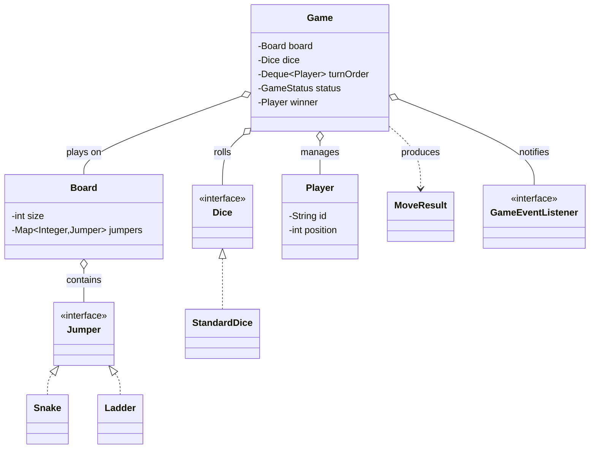
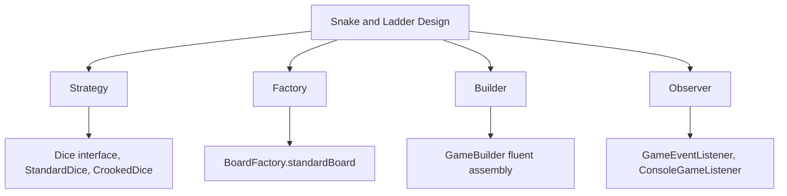
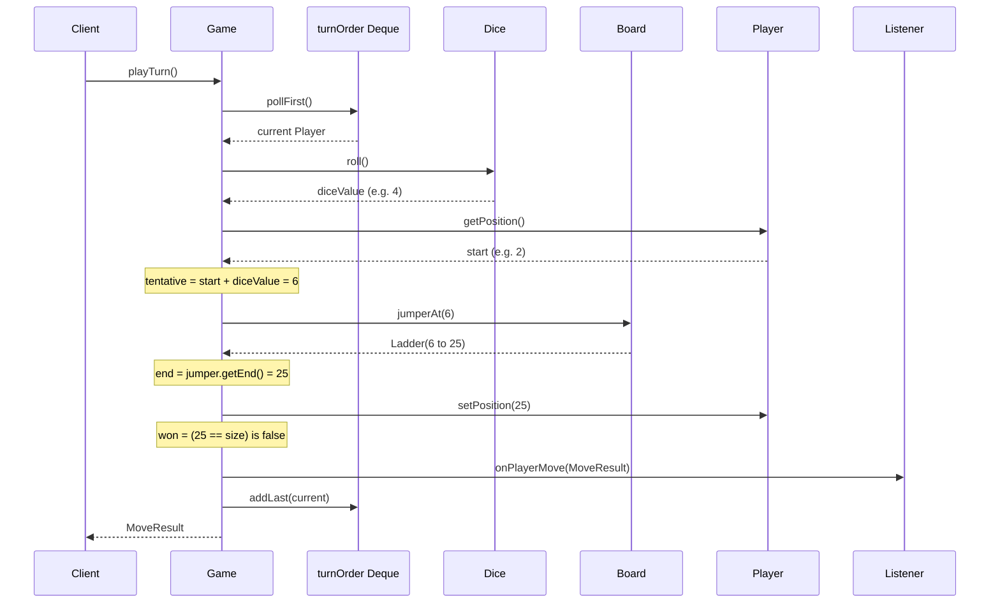
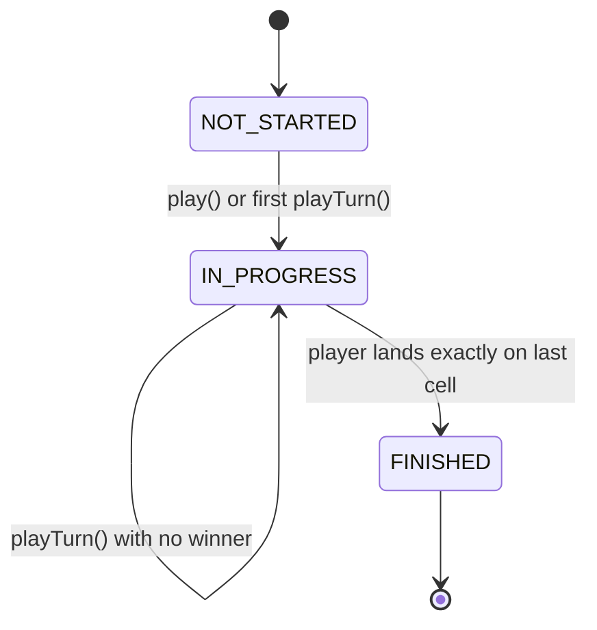
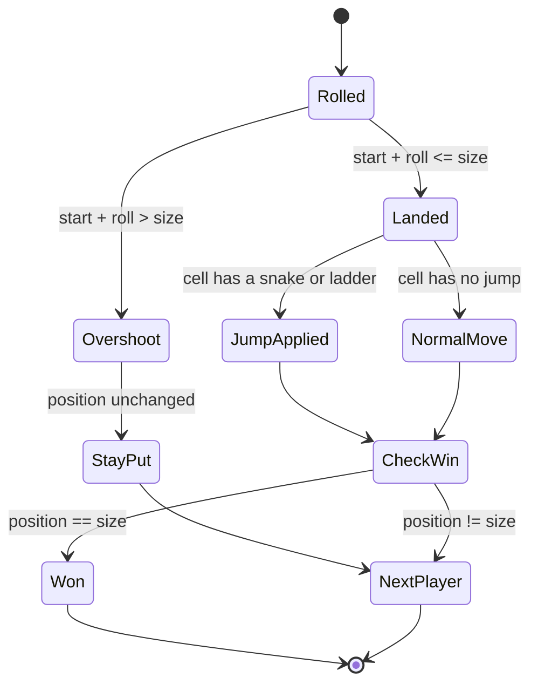
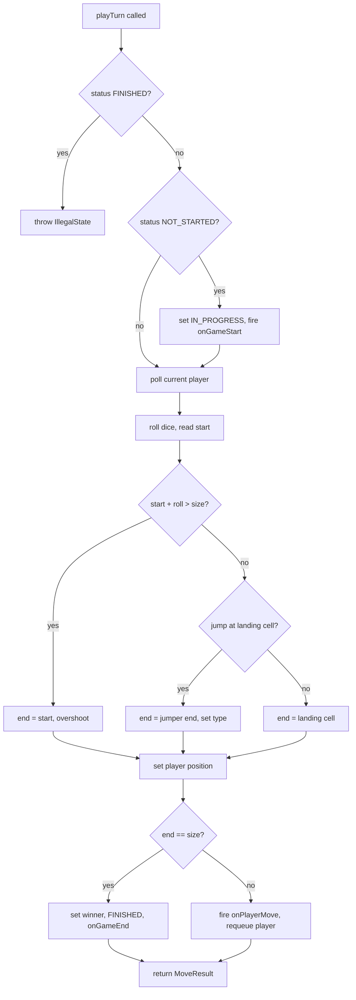
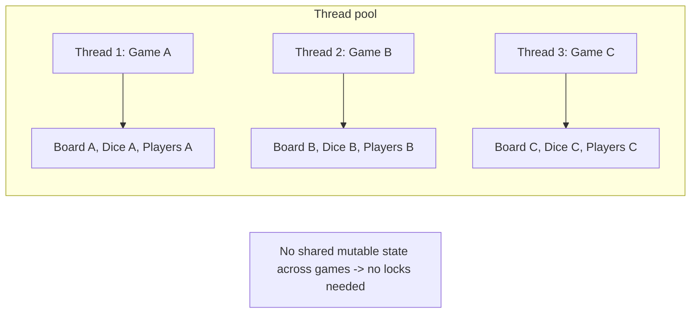
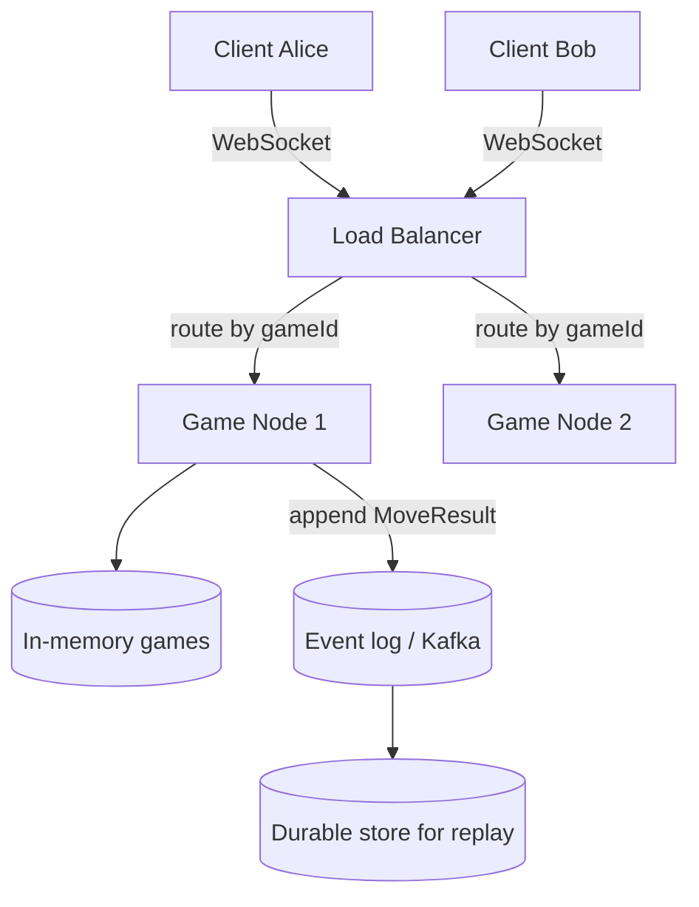

# 🎲 Low-Level Design: Snake and Ladder Game

> A complete, interview-ready walkthrough of the classic **Snake and Ladder** design problem — from a blank whiteboard to a staff-level engine that models the board, dice, and turn loop as clean, extensible objects, and holds up under every follow-up an interviewer throws at it.

Snake and Ladder looks trivial — roll a die, move forward, slide down a snake or climb up a ladder, first to the last cell wins. That surface simplicity is exactly why interviewers like it: the rules are so well known that no time is wasted explaining them, which leaves the entire session free to judge *how you model a system*. The candidates who struggle jam everything into one giant `playGame()` method with a two-dimensional array and a wall of `if` statements. The candidates who impress see the hidden structure — a board that is really a mapping from cells to jumps, a die that is a pluggable source of randomness, a turn loop that is independent of both — and they build a design that absorbs new rules (multiple dice, crooked dice, custom boards, network play) without rewriting the core. This guide walks that whole journey, escalating from the beginner's mental model to the concurrency, extensibility, and reliability concerns a principal engineer raises in the final minutes.

---

## 📋 Table of Contents

**Part I — Framing the Problem**

1. [Problem Statement](#1-problem-statement)
2. [Requirement Clarification & Assumptions](#2-requirement-clarification--assumptions)
3. [Functional & Non-Functional Requirements](#3-functional--non-functional-requirements)
4. [Core Concepts Being Tested](#4-core-concepts-being-tested)

**Part II — Modeling the Domain**

5. [Domain Model & Entities](#5-domain-model--entities)
6. [CRC Cards](#6-crc-cards)
7. [UML Class Diagram](#7-uml-class-diagram)
8. [Package Structure](#8-package-structure)

**Part III — Design Rationale**

9. [Design Decisions & Trade-offs](#9-design-decisions--trade-offs)
10. [Class-by-Class Deep Dive](#10-class-by-class-deep-dive)
11. [Design Patterns Applied](#11-design-patterns-applied)
12. [SOLID Principles Mapping](#12-solid-principles-mapping)

**Part IV — Behavior & Diagrams**

13. [Sequence Diagram](#13-sequence-diagram)
14. [State Diagram](#14-state-diagram)

**Part V — The Implementation**

15. [Complete Java Implementation](#15-complete-java-implementation)
16. [Execution Flow & Code Walkthrough](#16-execution-flow--code-walkthrough)

**Part VI — Engineering Depth**

17. [Complexity Analysis](#17-complexity-analysis)
18. [Thread Safety & Concurrency](#18-thread-safety--concurrency)
19. [Error Handling & Validation](#19-error-handling--validation)
20. [Scalability Discussion](#20-scalability-discussion)
21. [Alternative Designs & Trade-offs](#21-alternative-designs--trade-offs)

**Part VII — Interview Mastery**

22. [Common FAANG Follow-up Questions (L4 → L6)](#22-common-faang-follow-up-questions-l4--l6)
23. [Common Design Mistakes](#23-common-design-mistakes)
24. [Testing Strategy](#24-testing-strategy)
25. [FAANG Q&A Section](#25-faang-qa-section)
26. [STAR Behavioral Questions](#26-star-behavioral-questions)
27. [⚡ Quick Revision Cheat Sheet](#27--quick-revision-cheat-sheet)

---

## 1. Problem Statement

Design the software that runs a game of **Snake and Ladder**. The game is played on a board of numbered cells — traditionally a 10×10 grid numbered 1 through 100. Two or more players each start off the board (conceptually at cell 0) and take turns rolling a die. A player advances by the number rolled. If they land on the bottom of a **ladder**, they climb to its top; if they land on the head of a **snake**, they slide down to its tail. The first player to land *exactly* on the final cell wins.

The software must support a **configurable board** (any size, any arrangement of snakes and ladders), a **configurable dice mechanism** (one die, two dice, or a rigged die for testing), **two or more players** taking turns in a fixed order, correct handling of the **awkward edge cases** (overshooting the last cell, landing on a snake head that sits at the top of a ladder, a player who never seems to reach the end), and a clean way to **observe game events** so the same engine can drive a console printout, a GUI, or a network broadcast.

<details>
<summary>📖 <b>In plain terms — what are we actually building?</b></summary>

Think of the board game you played as a kid. Our job is to write the *brains* behind it, not the cardboard. That means: a `Board` object that knows "cell 17 is the bottom of a ladder to cell 42" and "cell 99 is a snake head down to 54"; a `Dice` object that produces a random number; a list of `Player` objects each remembering which cell they're on; and a `Game` object that runs the loop — whose turn is it, roll the die, move them, check for a snake or ladder, check if they won, hand the turn to the next player. We are not drawing the board or animating the token. We are building the objects and rules that decide, on every turn, exactly where each player ends up.

</details>

The deliverable in an interview is not a polished game; it is a **clean object-oriented model** — the set of classes, their responsibilities, and the turn engine that ties them together — that a team could realistically extend. Grading centers on how cleanly you separate the board, the dice, the players, and the game loop; how gracefully the design absorbs new rules; and how carefully you reason about the edge cases and concurrency.

---

## 2. Requirement Clarification & Assumptions

The single biggest mistake candidates make is coding before scoping. Snake and Ladder *feels* fully specified because everyone knows the rules, but the specifics differ between households — and those specifics change the design. A strong candidate spends the first two or three minutes turning the folk game into a bounded engineering problem. Below is the clarification dialogue you should drive.

### 2.1 Actors

The people and systems that interact with the game define its surface area.

| Actor | Role in the system |
|-------|--------------------|
| **Player** | Takes a turn: triggers a dice roll and is moved by the engine. In an automated simulation the engine drives every player; in an interactive game a human triggers each roll. |
| **Game Organizer / Host** | Configures the board (size, snakes, ladders), chooses the dice, registers players, and starts the game. |
| **Observer / Renderer** | Any component that wants to be told what happened each turn — a console logger, a UI, an analytics sink, a network layer. |

### 2.2 Key Clarifying Questions

Resolve these with the interviewer. Each answer materially changes the design.

- **Board configuration** — Is it always a fixed 100-cell board with standard snakes and ladders, or must the board be configurable? *(Assumption: fully configurable — board size and the set of snakes and ladders are provided at construction. A factory supplies the "standard" board.)*
- **Dice** — One die or two? Can the dice be non-standard (for testing or variants)? *(Assumption: the dice is an abstraction; the default is a single fair six-sided die, but multiple dice and a deterministic "test dice" are supported.)*
- **Winning condition** — Must a player land *exactly* on the last cell, or does any roll that reaches or passes it win? *(Assumption: exact landing required; an overshoot means the player does not move that turn — the traditional rule.)*
- **Extra turn on a six** — Does rolling a six grant another roll? *(Assumption: configurable; default off to keep the core simple, discussed as an extension.)*
- **Number of players** — Minimum and maximum? *(Assumption: two or more, no hard upper bound; turn order is fixed and cyclic.)*
- **Snake on a ladder top / chained jumps** — Can a ladder's top be a snake's head, causing a chain? *(Assumption: each cell hosts at most one jump; we do not chain jumps in a single landing. Board validation enforces this.)*
- **Multiple players on one cell** — Allowed? *(Assumption: yes, cells are not exclusive — this is not chess.)*
- **Who drives the loop** — Is this a batch simulation that plays to completion, or an interactive turn-by-turn API? *(Assumption: we expose both — `playTurn()` for one step and `play()` to run to completion.)*

### 2.3 Explicit Non-Goals

Naming what you will *not* build is a senior signal — it shows you can bound scope deliberately.

- No rendering, animation, or UI — we emit events and let a listener render.
- No network protocol or matchmaking in v1 (discussed under scalability).
- No persistence of game state to a database in v1 (the seam is noted).
- No AI opponents or strategy — Snake and Ladder is pure chance; there are no decisions to optimize.
- No betting, scoring beyond win/lose, or tournaments.

<details>
<summary>📖 <b>Why spend time clarifying a game everyone knows?</b></summary>

Precisely *because* everyone "knows" it, the household variations are where candidates trip. Does overshooting the last cell bounce you back, or freeze you in place? Does a six grant a bonus roll? Can a ladder land you on a snake? Each of these is a real rule in some version, and each pushes the design in a different direction. Stating your assumptions out loud — "exact finish, no chained jumps, six gives no bonus in v1 but the design leaves room" — signals that you scope deliberately rather than coding the first rules that pop into your head. It also plants the extension points the interviewer will later poke at.

</details>

---

## 3. Functional & Non-Functional Requirements

### 3.1 Functional Requirements (what the system *does*)

These are the concrete behaviors the engine must support. In an interview, list them crisply — they become your checklist for the class design.

1. **Configure the board** — create a board of a given size with an arbitrary set of snakes and ladders, validated for legality.
2. **Roll the dice** — produce a move value from a pluggable dice mechanism (one or more dice, or a deterministic dice for tests).
3. **Take a turn** — advance the current player by the rolled value, applying any snake or ladder on the landing cell.
4. **Enforce the exact-finish rule** — if the roll would overshoot the final cell, the player stays put for that turn.
5. **Apply jumps** — landing on a ladder bottom moves the player to its top; landing on a snake head moves them to its tail.
6. **Detect the winner** — the first player to land exactly on the final cell wins and the game ends immediately.
7. **Manage turn order** — players take turns in a fixed cyclic order; a finished game accepts no further turns.
8. **Emit events** — notify registered observers of game start, every move (with before/after position and any jump), and game end.
9. **Report state** — expose the current status (not started, in progress, finished) and the winner once decided.

### 3.2 Non-Functional Requirements (how *well* it does it)

1. **Extensibility** — new dice types, board layouts, and rule variants (bonus-on-six, bounce-back) should slot in without touching the core loop.
2. **Correctness** — edge cases (overshoot, jump on landing cell, win detection) must be handled deterministically and be unit-testable.
3. **Testability** — randomness must be injectable so games can be replayed deterministically.
4. **Separation of concerns** — board, dice, player, engine, and rendering must be independent modules.
5. **Performance** — a turn is O(1); a full game runs in microseconds; the design must scale to thousands of concurrent games on a server.
6. **Thread safety** — a single game is turn-based and single-threaded, but many independent games must run concurrently without shared mutable state.

<details>
<summary>📖 <b>Which requirement is the "real" test here?</b></summary>

Extensibility. The literal rules of Snake and Ladder are so simple you could hard-code them in twenty lines — and that is the trap. The interviewer is watching whether you build seams: can I swap one die for two? Can I load a custom board? Can I render to a UI instead of the console without editing the engine? Every design decision in this guide is chosen to keep those seams open. If you optimize only for "make the game work," you pass the junior bar and stall at the senior one.

</details>

---

## 4. Core Concepts Being Tested

Interviewers reach for Snake and Ladder because, behind the childhood familiarity, it exercises a tight bundle of object-oriented and system-design skills. Recognizing which concept each part of the problem targets lets you narrate your design like someone who has seen it before.

The **first concept is decomposition** — turning a monolithic "game" into collaborating objects with single responsibilities. The board owns cell-to-jump mapping, the dice owns randomness, the player owns position, and the game owns the loop. Getting these boundaries right is the difference between a clean design and a 200-line method.

The **second is abstraction over variation**. The dice is the clearest example: the engine should never care whether a roll came from one die, two dice, or a rigged sequence. That is a textbook Strategy pattern, and reaching for it unprompted is a strong signal.

The **third is data modeling for lookups**. A naive design stores the board as a grid and scans for snakes and ladders; a good design stores jumps as a hash map keyed by the landing cell, turning every lookup into O(1). This is where interviewers probe your instinct for choosing the right data structure.

The **fourth is the observer relationship** — decoupling "what happened" from "who cares." The engine announces moves; loggers, UIs, and analytics subscribe. This keeps the core free of rendering concerns and demonstrates you understand event-driven decoupling.

Finally, the problem tests **edge-case rigor and extensibility reasoning**: the exact-finish rule, jumps on the landing cell, and the follow-ups about bonus rolls, chained jumps, and multiplayer fairness. The interviewer is really asking, "when the rules change, does your design bend or break?"

---

## 5. Domain Model & Entities

Before writing a class, name the nouns in the problem and decide which deserve to be objects. Snake and Ladder has a small, clean vocabulary, which is part of its charm.

At the center is the **Board** — a numbered sequence of cells plus a set of jumps. Rather than model every cell as an object (100 near-empty objects for a standard board), we model the board as its size plus a map from landing cell to the jump that lives there. A **Jumper** is the abstraction over the two kinds of jump: a **Snake** (start high, end low) and a **Ladder** (start low, end high). Treating both as a single `Jumper` interface is a deliberate modeling choice — from the engine's point of view, "you landed on a jump, go to its end" is the only rule that matters; whether it moved you up or down is a detail.

The **Dice** is an interface, not a concrete die, so the source of movement is pluggable. **Player** is a lightweight entity holding an identity and a current position. **MoveResult** is a value object capturing everything that happened in one turn — who moved, what they rolled, where they started, where they ended, whether a jump fired, and whether they won — which is exactly what observers need. **Game** is the engine that owns the turn loop, and **GameStatus** is an enum tracking its lifecycle.

Here is how the entities relate.



<details>
<summary>📖 <b>Why is a snake modeled the same as a ladder?</b></summary>

To a child they are opposites — one is a punishment, one is a reward. But to the engine they are identical: "if you land on cell X, you are teleported to cell Y." A snake just happens to have Y less than X, and a ladder has Y greater than X. Modeling both as a single `Jumper` with a `getStart()` and `getEnd()` means the movement code is one line — `newPosition = jumper.getEnd()` — with no special casing. The only place the distinction matters is cosmetic (an observer might print "🐍 slid down" versus "🪜 climbed up"), which is why we keep a `JumperType` for labeling but never branch on it in the core rule.

</details>

---

## 6. CRC Cards

CRC (Class–Responsibility–Collaborator) cards are a lightweight way to pin down what each class *does* and who it *talks to* before drowning in syntax. Walking these in an interview shows you think in responsibilities, not fields.

| Class | Responsibilities | Collaborators |
|-------|-----------------|---------------|
| **Board** | Hold the board size; store snakes and ladders keyed by their start cell; answer "is there a jump on this cell?"; validate jumps on insertion | Jumper, Snake, Ladder |
| **Jumper** (interface) | Define the contract for a jump: its start cell, its end cell, and its type | — |
| **Snake / Ladder** | Represent a single jump; enforce their own legality (snake goes down, ladder goes up) | Jumper |
| **Dice** (interface) | Produce a move value; report its maximum possible value | — |
| **StandardDice** | Roll one or more fair six-sided dice and sum them | Dice |
| **Player** | Hold identity and current board position; update position when moved | — |
| **MoveResult** | Capture the full outcome of one turn as an immutable value | Player, JumperType |
| **Game** | Own the turn loop; roll the dice; move the current player; apply jumps; enforce win and overshoot rules; advance turn order; notify listeners | Board, Dice, Player, MoveResult, GameEventListener |
| **GameEventListener** (interface) | React to game start, each move, and game end | MoveResult, Player |
| **GameBuilder** | Assemble a valid Game from a board, dice, players, and listeners | Game, Board, Dice, Player |
| **BoardFactory** | Produce ready-made boards (e.g., the standard 100-cell layout) | Board, Snake, Ladder |

<details>
<summary>📖 <b>What is the CRC card equivalent for the "Game" class in plain terms?</b></summary>

The `Game` is the referee. It does not own the board, the dice, or the players — those are handed to it — but it is the only one allowed to run the show. On each turn it says "your turn, roll," reads the die, walks the player forward, checks the board for a snake or ladder under their new position, moves them again if needed, announces what happened to anyone listening, and decides whether the game is over. Every other class is deliberately passive; the referee is where all the sequencing lives, which is exactly why it is the one class worth reading carefully.

</details>

---

## 7. UML Class Diagram

Below is the ASCII UML for the full design. Field types and method signatures here match the Java implementation in Section 15 exactly — this is the contract the code fulfills.

```
┌───────────────────────────────────────────────┐
│                     Game                        │
├───────────────────────────────────────────────┤
│ - board: Board                                  │
│ - dice: Dice                                    │
│ - turnOrder: Deque<Player>                      │
│ - listeners: List<GameEventListener>            │
│ - status: GameStatus                            │
│ - winner: Player                                │
├───────────────────────────────────────────────┤
│ + Game(board, dice, players, listeners)         │
│ + playTurn(): MoveResult                         │
│ + play(): Player                                 │
│ + getStatus(): GameStatus                        │
│ + getWinner(): Player                            │
│ - notifyMove(result: MoveResult): void           │
└───────────────────────────────────────────────┘
     │ plays on        │ rolls          │ manages
     ▼                 ▼                ▼
┌───────────────┐  ┌──────────────┐  ┌────────────────┐
│    Board       │  │   «iface»    │  │    Player       │
├───────────────┤  │    Dice      │  ├────────────────┤
│ - size: int    │  ├──────────────┤  │ - id: String    │
│ - jumpers:     │  │ + roll():int │  │ - name: String  │
│   Map<Integer, │  │ + max(): int │  │ - position: int │
│     Jumper>    │  └──────┬───────┘  ├────────────────┤
├───────────────┤         │           │ + getPosition() │
│ + addJumper(j) │         ▽           │ + setPosition() │
│ + jumperAt(p)  │  ┌──────────────┐  └────────────────┘
│ + getSize()    │  │ StandardDice │
│ + jumperCount()│  ├──────────────┤
└──────┬────────┘  │ - diceCount  │
       │ contains   │ - random     │
       ▽            ├──────────────┤
┌───────────────┐  │ + roll():int │
│   «iface»      │  │ + max(): int │
│    Jumper      │  └──────────────┘
├───────────────┤
│ + getStart():int │        ┌─────────────────────────┐
│ + getEnd(): int  │        │      «iface»             │
│ + getType():     │        │   GameEventListener      │
│      JumperType  │        ├─────────────────────────┤
└──────△──────────┘        │ + onGameStart(players)   │
   ┌───┴────┐              │ + onPlayerMove(result)   │
   │        │              │ + onGameEnd(winner)      │
┌──────┐ ┌────────┐        └───────────△─────────────┘
│Snake │ │ Ladder │                    │
├──────┤ ├────────┤            ┌────────────────────┐
│-head │ │-bottom │            │ ConsoleGameListener │
│-tail │ │-top    │            └────────────────────┘
└──────┘ └────────┘

┌──────────────────────────┐   ┌──────────────────────┐
│       MoveResult          │   │   «enum» GameStatus   │
├──────────────────────────┤   ├──────────────────────┤
│ - player: Player          │   │ NOT_STARTED           │
│ - diceValue: int          │   │ IN_PROGRESS           │
│ - startPosition: int      │   │ FINISHED              │
│ - endPosition: int        │   └──────────────────────┘
│ - jumperType: JumperType  │
│ - won: boolean            │   ┌──────────────────────┐
└──────────────────────────┘   │  «enum» JumperType    │
                                │  SNAKE, LADDER        │
┌──────────────────────────┐   └──────────────────────┘
│       GameBuilder         │
├──────────────────────────┤   ┌──────────────────────┐
│ + board(b): GameBuilder   │   │     BoardFactory      │
│ + dice(d): GameBuilder    │   ├──────────────────────┤
│ + addPlayer(p):GameBuilder│   │ + standardBoard():    │
│ + addListener(l):Builder  │   │      Board            │
│ + build(): Game           │   └──────────────────────┘
└──────────────────────────┘
```

---

## 8. Package Structure

A clean package layout mirrors the responsibility boundaries and makes the design self-documenting. Grouping by domain concept (not by technical layer) keeps related classes together and dependencies pointing inward toward the model.

```
com.snakeladder
├── model
│   ├── Board.java
│   ├── Jumper.java          (interface)
│   ├── Snake.java
│   ├── Ladder.java
│   ├── JumperType.java      (enum)
│   └── Player.java
├── dice
│   ├── Dice.java            (interface)
│   ├── StandardDice.java
│   └── CrookedDice.java     (variant / test dice)
├── engine
│   ├── Game.java
│   ├── GameBuilder.java
│   ├── MoveResult.java
│   └── GameStatus.java      (enum)
├── observer
│   ├── GameEventListener.java  (interface)
│   └── ConsoleGameListener.java
├── factory
│   └── BoardFactory.java
└── SnakeLadderDemo.java     (main / wiring)
```

The `model` package holds pure domain objects with no knowledge of the game loop. The `dice` package isolates the randomness abstraction so it can be swapped freely. The `engine` package contains the orchestration and its assembly helper. The `observer` package holds the event contract and reference implementations. The `factory` package centralizes board construction. Dependencies flow inward: `engine` depends on `model`, `dice`, and `observer` interfaces, but `model` depends on nothing — a healthy, acyclic graph.

---

## 9. Design Decisions & Trade-offs

Every senior-level design is a chain of deliberate choices, each with a discarded alternative. Narrating these trade-offs is what separates a candidate who *has* a design from one who merely *drew* one.

**Board as a map, not a grid.** The most consequential decision is representing the board as `Map<Integer, Jumper>` keyed by the jump's start cell, plus an integer `size`, rather than a 2D array of cell objects. A standard board has only ~15 jumps among 100 cells; a map stores exactly those and answers "is there a jump here?" in O(1) with O(J) space. A grid wastes memory on 85 empty cells and complicates a jagged board. The trade-off is that we lose an explicit `Cell` object — but cells carry no behavior in this game, so an object per cell would be ceremony without value.

**Jumper as a single abstraction.** Modeling Snake and Ladder as one `Jumper` interface collapses the movement rule to a single branch. The alternative — separate `snakes` and `ladders` maps — forces the engine to check two structures and duplicates logic. The unified map is simpler and faster. We keep a `JumperType` enum purely for display, never for control flow.

**Dice as a Strategy interface.** Making `Dice` an interface with `roll()` and `max()` lets us inject a fair die, a two-dice sum, or a deterministic test die without touching the engine. The alternative — a concrete `Random`-based die inside `Game` — makes the game untestable (no reproducible runs) and inextensible. The tiny cost is one extra interface.

**Observer for output.** The engine emits `MoveResult` events to registered `GameEventListener`s rather than printing directly. This keeps the core free of I/O and lets the same engine feed a console, a UI, or a test spy. The trade-off is a small amount of wiring, well worth the decoupling.

**Builder for assembly.** A `Game` needs a board, a dice, at least two players, and optional listeners — a telescoping-constructor smell. A `GameBuilder` makes construction readable and centralizes validation (at least two players, non-null board and dice). The cost is one extra class; the benefit is a single, self-validating construction path.

**Turn order as a Deque.** Cyclic turn-taking is naturally a queue: poll the current player from the front, and if they did not win, push them to the back. A `Deque<Player>` makes this O(1) and expresses the intent directly, versus an index into a list with modulo arithmetic that is easy to get wrong when players can be eliminated.

| Decision | Chosen approach | Rejected alternative | Why |
|----------|----------------|----------------------|-----|
| Board representation | `Map<Integer, Jumper>` + size | 2D grid of Cell objects | O(1) lookup, tiny memory, handles any size |
| Snake vs ladder | One `Jumper` interface | Two separate maps | Single movement rule, no duplication |
| Dice | Strategy interface | Concrete `Random` in Game | Testable, pluggable, deterministic replays |
| Output | Observer listeners | Direct `System.out` in engine | Decoupled rendering, testable |
| Construction | Builder | Telescoping constructors | Readable, validated, extensible |
| Turn rotation | `Deque<Player>` | List + modulo index | O(1), intent-revealing, elimination-safe |

<details>
<summary>📖 <b>Why not just use a 100-length array for the board?</b></summary>

You can, and for a fixed 100-cell board it even works fine — `board[17] = 42` says "cell 17 jumps to 42." But it quietly bakes in assumptions: that the board is exactly 100 cells, that every cell needs a slot even though only ~15 hold jumps, and that resizing means reallocating. A `Map<Integer, Jumper>` keyed by the start cell stores only the jumps that exist, works for a board of any size, and reads naturally: `board.jumperAt(17)` returns the jump or null. The map also lets each jump be a real object that validates itself (a snake must go down, a ladder up), which an `int[]` cannot. Same O(1) lookup, far more flexibility.

</details>

---

## 10. Class-by-Class Deep Dive

This section walks each class in the order you would build it, explaining not just *what* it holds but *why* it is shaped that way. The full source is in Section 15; here we focus on intent.

### 10.1 Jumper, Snake, Ladder

`Jumper` is the interface every jump implements: `getStart()`, `getEnd()`, and `getType()`. `Snake` is constructed with a `head` (higher cell) and `tail` (lower cell); its `getStart()` returns the head and `getEnd()` the tail. `Ladder` is constructed with a `bottom` and `top`; `getStart()` returns the bottom and `getEnd()` the top. Each constructor validates its own legality — a snake whose head is not above its tail is a bug caught at construction, not at runtime. This is the domain rule living *inside* the domain object, exactly where it belongs.

### 10.2 Board

`Board` holds an `int size` and a `Map<Integer, Jumper> jumpers`. Its `addJumper(Jumper)` method validates that the jump's start is within `(1, size)` — you cannot place a jump on the first or last cell — and that no two jumps share a start cell, then stores it keyed by `getStart()`. The lookup method `jumperAt(int position)` returns the jump at a cell or `null`. Keeping validation here means an illegal board is impossible to construct, so the engine can trust its input and stay simple.

### 10.3 Dice, StandardDice, CrookedDice

`Dice` is the strategy interface: `roll()` returns a move value and `max()` returns the largest possible roll (used for validation and for reasoning about the smallest board that is winnable). `StandardDice` sums `diceCount` fair six-sided dice using an injected `Random` — injecting the `Random` (rather than calling `Math.random()`) is what makes games reproducible in tests by seeding it. `CrookedDice` is a deterministic test double that returns values from a fixed sequence, letting a test drive a game down an exact path.

### 10.4 Player

`Player` is intentionally thin: an immutable `id` and `name`, and a mutable `position` starting at 0 (off the board). It exposes `getPosition()` and `setPosition(int)`. The player does not know the rules — it is moved *by* the engine. Keeping it passive avoids scattering game logic across entities.

### 10.5 MoveResult

`MoveResult` is an immutable value object describing one turn: the `player`, the `diceValue` rolled, the `startPosition`, the `endPosition`, the `jumperType` (null if no jump fired), and a `won` flag. It is the single payload every observer receives, so all rendering and analytics can be built from it without reaching back into the engine.

### 10.6 Game

`Game` is the engine. It holds the `board`, the `dice`, a `Deque<Player> turnOrder`, the `listeners`, a `GameStatus status`, and the `winner`. Its heart is `playTurn()`: poll the current player, roll the dice, compute the tentative cell, apply the overshoot rule (stay put if past the end), apply any jump on the landing cell, update the player, build a `MoveResult`, notify listeners, and either finish the game (on a win) or rotate the player to the back of the queue. `play()` simply calls `playTurn()` until the status is `FINISHED` and returns the winner. Every rule the interviewer cares about lives in this one readable method.

### 10.7 GameBuilder and BoardFactory

`GameBuilder` collects a board, dice, players, and listeners through fluent setters and validates on `build()` (at least two players, non-null board and dice), producing a ready `Game`. `BoardFactory.standardBoard()` returns the canonical 100-cell board with the traditional snakes and ladders, so demos and tests do not repeat the layout.

<details>
<summary>📖 <b>Why does the Player class barely do anything?</b></summary>

It is tempting to give `Player` a `move()` method or let it "roll its own dice." Resist that. In Snake and Ladder the player makes no decisions — the outcome is pure chance driven by the referee. If the player moved itself, the movement rules (overshoot, jumps, win detection) would smear across both `Player` and `Game`, and you would have to duplicate them or pass the board and dice into the player. Keeping `Player` as a plain holder of "who I am and where I stand" concentrates all the rules in one place, the engine, where they are easy to read, test, and change.

</details>

---

## 11. Design Patterns Applied

Snake and Ladder is a compact showcase of several patterns. Naming them — and, crucially, justifying *why* each fits — is a reliable way to signal design maturity.

**Strategy** governs the dice. `Dice` is the strategy interface; `StandardDice` and `CrookedDice` are interchangeable implementations the engine consumes without knowing which it holds. This is the pattern that makes the game testable and lets variants (two dice, weighted dice) drop in.

**Factory** builds boards. `BoardFactory.standardBoard()` encapsulates the knowledge of the canonical layout so clients ask for a board by intent rather than assembling fifteen jumps by hand. It also gives a natural home for future named boards.

**Builder** assembles the game. `GameBuilder` turns a multi-argument, easily-misordered construction into a fluent, validated flow, and centralizes the "a game needs at least two players" rule.

**Observer** decouples output. `Game` publishes `MoveResult` events to any registered `GameEventListener`. Console loggers, UIs, and analytics sinks subscribe without the engine knowing they exist — the classic publish/subscribe decoupling.

**Iterator (implicit) / Queue rotation** expresses turn-taking. The `Deque<Player>` embodies the cyclic turn order; polling the front and pushing to the back is the round-robin schedule made concrete.



<details>
<summary>📖 <b>Which pattern matters most in the interview?</b></summary>

Strategy, applied to the dice. It is the one an interviewer almost always steers toward, because it directly answers "how would you test a game built on randomness?" With `Dice` as an interface you inject a `CrookedDice` that returns a scripted sequence, drive the game to an exact known state, and assert on it — no flakiness, no retries. Mentioning Strategy for the dice *before* the interviewer asks about testing shows you connect design choices to their downstream payoff, which is exactly the senior instinct they are grading.

</details>

---

## 12. SOLID Principles Mapping

The design maps cleanly onto all five SOLID principles, and being able to point to concrete classes for each is a fast way to demonstrate principled thinking.

**Single Responsibility** — each class has exactly one reason to change. `Board` changes only if board representation changes; `Dice` only if rolling changes; `Game` only if the turn rules change; `ConsoleGameListener` only if console output changes. No class carries two jobs.

**Open/Closed** — the design is open to extension, closed to modification. Add a `WeightedDice`, a `BounceBackRule`, or a `NetworkGameListener` by writing a new class implementing an existing interface; the engine's compiled code never changes.

**Liskov Substitution** — any `Dice` can stand in for any other; any `Jumper` (snake or ladder) is treated uniformly by the board and engine; any `GameEventListener` is interchangeable. Substituting one implementation for another never breaks the caller.

**Interface Segregation** — interfaces are minimal. `Dice` has just `roll()` and `max()`; `Jumper` has just `getStart()`, `getEnd()`, `getType()`; `GameEventListener` has three focused event hooks. No implementer is forced to stub methods it does not need.

**Dependency Inversion** — `Game` depends on the `Dice`, `Jumper`, and `GameEventListener` *abstractions*, never on concrete classes. Concretions are injected via the builder, so high-level policy (the turn loop) is insulated from low-level detail (how a die is rolled).

<details>
<summary>📖 <b>Where would a violation most likely creep in?</b></summary>

Dependency Inversion, if you let `Game` do `new Random()` or `System.out.println` internally. The moment the engine constructs its own die or prints its own output, it is welded to a concrete detail: you can no longer replay a game deterministically or render it anywhere but the console. The fix is exactly what the design does — inject the `Dice` through the builder and publish events to `GameEventListener`s. Whenever a core class reaches for `new` on a concrete collaborator or touches I/O directly, DIP is the principle at risk.

</details>

---

## 13. Sequence Diagram

The sequence below traces a single turn in which a player lands on a ladder and climbs it. It shows exactly which object performs each step — matching the `playTurn()` logic in Section 15.



For the winning turn, the branch differs at the end: after `setPosition`, `won` is true, so the game sets `status = FINISHED`, records the `winner`, calls `onGameEnd(winner)` on each listener, and does *not* return the player to the queue.

<details>
<summary>📖 <b>Read the diagram in one breath</b></summary>

A turn is a short conversation. The client asks the game to play a turn. The game pulls the next player off the front of the queue, asks the die for a number, and reads where the player currently stands. It adds the roll to get a tentative cell, asks the board whether a snake or ladder lives there, and if so replaces the destination with the jump's end. It writes the new position back to the player, checks whether that cell is the finish, tells every listener what happened, and — if nobody won — sends the player to the back of the line. That is the entire game, one turn at a time.

</details>

---

## 14. State Diagram

Two state machines are worth drawing: the **game lifecycle** and the **outcome of a single turn**. Both are small, which is the point — an interviewer wants to see that you can enumerate states and transitions crisply.

The game lifecycle moves through three states:



Within a single turn, the roll resolves through a small decision tree:



<details>
<summary>📖 <b>Why is the overshoot rule its own branch?</b></summary>

Because it is the one place the "move forward by the roll" instinct breaks. If a player sits on cell 98 of a 100-cell board and rolls a 5, they would land on 103 — off the board. The traditional rule is that they simply do not move that turn and pass the die along. Drawing it as an explicit branch forces you to handle it deliberately instead of writing `position += roll` and shipping an off-by-a-few bug where players win by overshooting or crash on an out-of-bounds cell. Interviewers specifically watch for whether you catch this, so calling it out early scores points.

</details>

---

## 15. Complete Java Implementation

The full, runnable implementation follows, grouped by package and wrapped in collapsible blocks. Every class name, field, and signature matches the diagrams above. The code favors clarity and correctness over cleverness — exactly what an interviewer wants to read.

<details>
<summary>💻 <b>Model — Jumper, Snake, Ladder, JumperType</b></summary>

```java
package com.snakeladder.model;

/** The kind of jump — used only for display, never for control flow. */
public enum JumperType {
    SNAKE, LADDER
}
```

```java
package com.snakeladder.model;

/**
 * A jump on the board. A Snake and a Ladder are the same to the engine:
 * "landing on getStart() teleports you to getEnd()."
 */
public interface Jumper {
    int getStart();
    int getEnd();
    JumperType getType();
}
```

```java
package com.snakeladder.model;

/** A snake: head (higher cell) slides down to tail (lower cell). */
public final class Snake implements Jumper {

    private final int head;   // start — the higher cell
    private final int tail;   // end   — the lower cell

    public Snake(int head, int tail) {
        if (head <= tail) {
            throw new IllegalArgumentException(
                "Snake head (" + head + ") must be above its tail (" + tail + ")");
        }
        if (tail < 1) {
            throw new IllegalArgumentException("Snake tail must be >= 1");
        }
        this.head = head;
        this.tail = tail;
    }

    @Override public int getStart() { return head; }
    @Override public int getEnd()   { return tail; }
    @Override public JumperType getType() { return JumperType.SNAKE; }
}
```

```java
package com.snakeladder.model;

/** A ladder: bottom (lower cell) climbs up to top (higher cell). */
public final class Ladder implements Jumper {

    private final int bottom; // start — the lower cell
    private final int top;    // end   — the higher cell

    public Ladder(int bottom, int top) {
        if (bottom >= top) {
            throw new IllegalArgumentException(
                "Ladder bottom (" + bottom + ") must be below its top (" + top + ")");
        }
        if (bottom < 1) {
            throw new IllegalArgumentException("Ladder bottom must be >= 1");
        }
        this.bottom = bottom;
        this.top = top;
    }

    @Override public int getStart() { return bottom; }
    @Override public int getEnd()   { return top; }
    @Override public JumperType getType() { return JumperType.LADDER; }
}
```

</details>

<details>
<summary>💻 <b>Model — Board</b></summary>

```java
package com.snakeladder.model;

import java.util.HashMap;
import java.util.Map;

/**
 * The board: a linear sequence of cells (1..size) plus a set of jumps keyed
 * by the cell you must LAND on to trigger them. Validates every jump on insert
 * so the engine can trust the board is always legal.
 */
public final class Board {

    private final int size;
    private final Map<Integer, Jumper> jumpers = new HashMap<>();

    public Board(int size) {
        if (size < 2) {
            throw new IllegalArgumentException("Board size must be at least 2");
        }
        this.size = size;
    }

    /** Add a snake or ladder, enforcing all board-level legality rules. */
    public void addJumper(Jumper jumper) {
        int start = jumper.getStart();
        int end = jumper.getEnd();
        if (start <= 1 || start >= size) {
            throw new IllegalArgumentException(
                "Jump start " + start + " must be strictly between 1 and " + size);
        }
        if (end < 1 || end > size) {
            throw new IllegalArgumentException(
                "Jump end " + end + " is outside the board");
        }
        if (jumpers.containsKey(start)) {
            throw new IllegalArgumentException(
                "Cell " + start + " already hosts a jump — chaining is not allowed");
        }
        jumpers.put(start, jumper);
    }

    /** The jump whose START is this cell, or null if none. */
    public Jumper jumperAt(int position) {
        return jumpers.get(position);
    }

    public int getSize() { return size; }

    public int jumperCount() { return jumpers.size(); }
}
```

</details>

<details>
<summary>💻 <b>Model — Player</b></summary>

```java
package com.snakeladder.model;

/** A player: identity plus a current position. Position 0 means "off the board". */
public final class Player {

    private final String id;
    private final String name;
    private int position; // 0 = not yet on the board

    public Player(String id, String name) {
        if (id == null || name == null) {
            throw new IllegalArgumentException("Player id and name are required");
        }
        this.id = id;
        this.name = name;
        this.position = 0;
    }

    public String getId()   { return id; }
    public String getName() { return name; }
    public int getPosition() { return position; }
    public void setPosition(int position) { this.position = position; }
}
```

</details>

<details>
<summary>💻 <b>Dice — Dice, StandardDice, CrookedDice</b></summary>

```java
package com.snakeladder.dice;

/** Strategy: a source of movement values. */
public interface Dice {
    int roll();
    int max();   // largest possible roll, for validation and reasoning
}
```

```java
package com.snakeladder.dice;

import java.util.Random;

/** N fair six-sided dice, summed. Random is injected for reproducible tests. */
public final class StandardDice implements Dice {

    private static final int FACES = 6;
    private final int diceCount;
    private final Random random;

    public StandardDice() {
        this(1, new Random());
    }

    public StandardDice(int diceCount) {
        this(diceCount, new Random());
    }

    public StandardDice(int diceCount, Random random) {
        if (diceCount < 1) {
            throw new IllegalArgumentException("Need at least one die");
        }
        this.diceCount = diceCount;
        this.random = random;
    }

    @Override
    public int roll() {
        int sum = 0;
        for (int i = 0; i < diceCount; i++) {
            sum += random.nextInt(FACES) + 1; // 1..6
        }
        return sum;
    }

    @Override
    public int max() {
        return diceCount * FACES;
    }
}
```

```java
package com.snakeladder.dice;

/** Deterministic test dice: returns a fixed, repeating sequence of values. */
public final class CrookedDice implements Dice {

    private final int[] sequence;
    private int index = 0;

    public CrookedDice(int... sequence) {
        if (sequence == null || sequence.length == 0) {
            throw new IllegalArgumentException("Sequence must be non-empty");
        }
        this.sequence = sequence.clone();
    }

    @Override
    public int roll() {
        int value = sequence[index % sequence.length];
        index++;
        return value;
    }

    @Override
    public int max() {
        int m = 0;
        for (int v : sequence) m = Math.max(m, v);
        return m;
    }
}
```

</details>

<details>
<summary>💻 <b>Engine — GameStatus, MoveResult</b></summary>

```java
package com.snakeladder.engine;

public enum GameStatus {
    NOT_STARTED, IN_PROGRESS, FINISHED
}
```

```java
package com.snakeladder.engine;

import com.snakeladder.model.JumperType;
import com.snakeladder.model.Player;

/** Immutable record of everything that happened in one turn. */
public final class MoveResult {

    private final Player player;
    private final int diceValue;
    private final int startPosition;
    private final int endPosition;
    private final JumperType jumperType; // null if no jump fired
    private final boolean won;

    public MoveResult(Player player, int diceValue, int startPosition,
                      int endPosition, JumperType jumperType, boolean won) {
        this.player = player;
        this.diceValue = diceValue;
        this.startPosition = startPosition;
        this.endPosition = endPosition;
        this.jumperType = jumperType;
        this.won = won;
    }

    public Player getPlayer()       { return player; }
    public int getDiceValue()       { return diceValue; }
    public int getStartPosition()   { return startPosition; }
    public int getEndPosition()     { return endPosition; }
    public JumperType getJumperType() { return jumperType; }
    public boolean isWon()          { return won; }
    public boolean jumped()         { return jumperType != null; }
}
```

</details>

<details>
<summary>💻 <b>Observer — GameEventListener, ConsoleGameListener</b></summary>

```java
package com.snakeladder.observer;

import com.snakeladder.engine.MoveResult;
import com.snakeladder.model.Player;
import java.util.List;

/** Observer: reacts to game lifecycle and per-move events. */
public interface GameEventListener {
    void onGameStart(List<Player> players);
    void onPlayerMove(MoveResult result);
    void onGameEnd(Player winner);
}
```

```java
package com.snakeladder.observer;

import com.snakeladder.engine.MoveResult;
import com.snakeladder.model.JumperType;
import com.snakeladder.model.Player;
import java.util.List;

/** Reference listener that narrates the game to the console. */
public final class ConsoleGameListener implements GameEventListener {

    @Override
    public void onGameStart(List<Player> players) {
        System.out.println("Game started with " + players.size() + " players.");
    }

    @Override
    public void onPlayerMove(MoveResult r) {
        StringBuilder sb = new StringBuilder();
        sb.append(r.getPlayer().getName())
          .append(" rolled ").append(r.getDiceValue())
          .append(": ").append(r.getStartPosition())
          .append(" -> ").append(r.getEndPosition());
        if (r.getStartPosition() == r.getEndPosition() && !r.isWon()) {
            sb.append(" (overshoot, stays put)");
        } else if (r.getJumperType() == JumperType.LADDER) {
            sb.append(" 🪜 climbed a ladder");
        } else if (r.getJumperType() == JumperType.SNAKE) {
            sb.append(" 🐍 bitten by a snake");
        }
        System.out.println(sb);
    }

    @Override
    public void onGameEnd(Player winner) {
        System.out.println("🏆 " + winner.getName() + " wins!");
    }
}
```

</details>

<details>
<summary>💻 <b>Engine — Game (the heart of the design)</b></summary>

```java
package com.snakeladder.engine;

import com.snakeladder.dice.Dice;
import com.snakeladder.model.Board;
import com.snakeladder.model.Jumper;
import com.snakeladder.model.JumperType;
import com.snakeladder.model.Player;
import com.snakeladder.observer.GameEventListener;

import java.util.ArrayDeque;
import java.util.ArrayList;
import java.util.Deque;
import java.util.List;

/**
 * The referee. Owns the turn loop and every rule: rolling, moving, applying
 * jumps, the exact-finish rule, win detection, and turn rotation.
 */
public final class Game {

    private final Board board;
    private final Dice dice;
    private final Deque<Player> turnOrder;
    private final List<GameEventListener> listeners;
    private GameStatus status = GameStatus.NOT_STARTED;
    private Player winner;

    Game(Board board, Dice dice, List<Player> players, List<GameEventListener> listeners) {
        this.board = board;
        this.dice = dice;
        this.turnOrder = new ArrayDeque<>(players);
        this.listeners = new ArrayList<>(listeners);
    }

    /** Play a single turn for the current player. Returns what happened. */
    public MoveResult playTurn() {
        if (status == GameStatus.FINISHED) {
            throw new IllegalStateException("Game is already finished");
        }
        if (status == GameStatus.NOT_STARTED) {
            status = GameStatus.IN_PROGRESS;
            List<Player> snapshot = new ArrayList<>(turnOrder);
            listeners.forEach(l -> l.onGameStart(snapshot));
        }

        Player current = turnOrder.pollFirst();
        int start = current.getPosition();
        int diceValue = dice.roll();
        int tentative = start + diceValue;

        int end = start;                 // default: overshoot -> stay put
        JumperType jumperType = null;
        if (tentative <= board.getSize()) {
            end = tentative;
            Jumper jumper = board.jumperAt(tentative);
            if (jumper != null) {
                jumperType = jumper.getType();
                end = jumper.getEnd();
            }
        }

        current.setPosition(end);
        boolean won = (end == board.getSize());
        MoveResult result =
            new MoveResult(current, diceValue, start, end, jumperType, won);
        notifyMove(result);

        if (won) {
            winner = current;
            status = GameStatus.FINISHED;
            listeners.forEach(l -> l.onGameEnd(winner));
        } else {
            turnOrder.addLast(current);  // rotate to the back
        }
        return result;
    }

    /** Play turns until someone wins; returns the winner. */
    public Player play() {
        while (status != GameStatus.FINISHED) {
            playTurn();
        }
        return winner;
    }

    public GameStatus getStatus() { return status; }
    public Player getWinner()      { return winner; }

    private void notifyMove(MoveResult result) {
        for (GameEventListener l : listeners) {
            l.onPlayerMove(result);
        }
    }
}
```

</details>

<details>
<summary>💻 <b>Engine — GameBuilder</b></summary>

```java
package com.snakeladder.engine;

import com.snakeladder.dice.Dice;
import com.snakeladder.model.Board;
import com.snakeladder.model.Player;
import com.snakeladder.observer.GameEventListener;

import java.util.ArrayList;
import java.util.List;

/** Fluent, validating assembly for a Game. */
public final class GameBuilder {

    private Board board;
    private Dice dice;
    private final List<Player> players = new ArrayList<>();
    private final List<GameEventListener> listeners = new ArrayList<>();

    public GameBuilder board(Board board) { this.board = board; return this; }

    public GameBuilder dice(Dice dice) { this.dice = dice; return this; }

    public GameBuilder addPlayer(Player player) {
        players.add(player);
        return this;
    }

    public GameBuilder addListener(GameEventListener listener) {
        listeners.add(listener);
        return this;
    }

    public Game build() {
        if (board == null) throw new IllegalStateException("A board is required");
        if (dice == null)  throw new IllegalStateException("A dice is required");
        if (players.size() < 2) {
            throw new IllegalStateException("At least two players are required");
        }
        if (dice.max() < 1) {
            throw new IllegalStateException("Dice must produce a positive value");
        }
        return new Game(board, dice, players, listeners);
    }
}
```

</details>

<details>
<summary>💻 <b>Factory — BoardFactory</b></summary>

```java
package com.snakeladder.factory;

import com.snakeladder.model.Board;
import com.snakeladder.model.Ladder;
import com.snakeladder.model.Snake;

/** Produces ready-made boards. */
public final class BoardFactory {

    private BoardFactory() {}

    /** The canonical 100-cell board with traditional snakes and ladders. */
    public static Board standardBoard() {
        Board board = new Board(100);

        // Ladders (bottom -> top)
        board.addJumper(new Ladder(2, 38));
        board.addJumper(new Ladder(7, 14));
        board.addJumper(new Ladder(8, 31));
        board.addJumper(new Ladder(15, 26));
        board.addJumper(new Ladder(21, 42));
        board.addJumper(new Ladder(28, 84));
        board.addJumper(new Ladder(36, 44));
        board.addJumper(new Ladder(51, 67));
        board.addJumper(new Ladder(71, 91));
        board.addJumper(new Ladder(78, 98));
        board.addJumper(new Ladder(87, 94));

        // Snakes (head -> tail)
        board.addJumper(new Snake(16, 6));
        board.addJumper(new Snake(46, 25));
        board.addJumper(new Snake(49, 11));
        board.addJumper(new Snake(62, 19));
        board.addJumper(new Snake(64, 60));
        board.addJumper(new Snake(74, 53));
        board.addJumper(new Snake(89, 68));
        board.addJumper(new Snake(92, 88));
        board.addJumper(new Snake(95, 75));
        board.addJumper(new Snake(99, 80));

        return board;
    }
}
```

</details>

<details>
<summary>💻 <b>Demo — wiring it together</b></summary>

```java
package com.snakeladder;

import com.snakeladder.dice.StandardDice;
import com.snakeladder.engine.Game;
import com.snakeladder.engine.GameBuilder;
import com.snakeladder.factory.BoardFactory;
import com.snakeladder.model.Player;
import com.snakeladder.observer.ConsoleGameListener;

public class SnakeLadderDemo {
    public static void main(String[] args) {
        Game game = new GameBuilder()
            .board(BoardFactory.standardBoard())
            .dice(new StandardDice(1))                 // one fair die
            .addPlayer(new Player("p1", "Alice"))
            .addPlayer(new Player("p2", "Bob"))
            .addListener(new ConsoleGameListener())
            .build();

        Player winner = game.play();
        System.out.println("Final winner: " + winner.getName());
    }
}
```

</details>

---

## 16. Execution Flow & Code Walkthrough

Trace one full turn through the code so the moving parts click into place. Suppose it is Alice's turn, she stands on cell 2 of the standard 100-cell board, and the die comes up 4.

The client calls `game.playTurn()`. Because the status is `NOT_STARTED` on the very first call, the game flips to `IN_PROGRESS` and fires `onGameStart` to every listener. It then polls Alice from the front of `turnOrder`, reads her position (`start = 2`), and calls `dice.roll()`, which returns 4. The tentative cell is `2 + 4 = 6`. Since 6 is within the board size of 100, the game asks `board.jumperAt(6)` — and on the standard board there is no jump at 6 (the ladder is at cell 7, not 6), so `end` stays 6 with no `jumperType`. Alice's position is set to 6, `won` is false (6 ≠ 100), a `MoveResult` is built and broadcast via `onPlayerMove`, and Alice is pushed to the back of the queue. Bob is now at the front.

Now suppose on a later turn Alice sits on cell 3 and rolls 4: tentative is 7, `board.jumperAt(7)` returns the `Ladder(7, 14)`, so `jumperType = LADDER` and `end = 14` — she climbs. The listener prints "🪜 climbed a ladder." Later still, if Alice is on cell 98 and rolls 5, tentative is 103, which exceeds 100, so the overshoot branch keeps `end = start = 98`: she does not move, and the listener notes "overshoot, stays put." When any roll lands her exactly on 100, `won` becomes true; the game records her as `winner`, sets `status = FINISHED`, fires `onGameEnd`, and does *not* re-enqueue her. `play()`, which is just a loop over `playTurn()` until `FINISHED`, returns Alice.



<details>
<summary>📖 <b>Walk one turn in plain words</b></summary>

Ask the game to play a turn. It takes the player at the front of the line, rolls the die, and adds the number to where they stand. If that would run off the end of the board, they stay put. Otherwise it checks that cell for a snake or a ladder and, if there is one, sends them to its other end. It writes down their new spot, tells everyone watching what happened, and — unless they just landed on the final square and won — sends them to the back of the line so the next player goes. Repeat until someone wins.

</details>

---

## 17. Complexity Analysis

The design is deliberately cheap. Let *P* be the number of players, *J* the number of jumps, and *N* the board size.

A single turn — `playTurn()` — is **O(1)**: polling a player from a `Deque` is O(1), rolling a fixed number of dice is O(1) (or O(d) for *d* dice, a small constant), the board lookup `jumperAt` is an O(1) `HashMap` get, updating the position is O(1), and notifying *L* listeners is O(L). So a turn is O(L) dominated by observers, effectively O(1) for a fixed listener set.

Building the board is **O(J)** — one validated insertion per jump. A full game runs for however many turns it takes someone to reach the end; expected turns grow roughly linearly with board size and inversely with average roll, but each turn is O(1), so a full standard game resolves in well under a millisecond.

| Operation | Time | Space | Note |
|-----------|------|-------|------|
| `board.addJumper` | O(1) | O(1) | HashMap put with validation |
| `board.jumperAt` | O(1) | — | HashMap get |
| `dice.roll` (StandardDice) | O(d) | O(1) | d = number of dice, small constant |
| `playTurn` | O(L) | O(1) | L = listeners; O(1) for fixed set |
| `play` (full game) | O(T · L) | O(1) | T = turns to finish |
| Board construction | O(J) | O(J) | J = jumps stored |
| Total memory | — | O(P + J + L) | players, jumps, listeners |

The memory footprint is **O(P + J + L)** — one object per player, per jump, and per listener — with no per-cell allocation, which is the payoff of the map-over-grid decision.

<details>
<summary>📖 <b>Could a game run forever?</b></summary>

In theory a player could keep landing on snakes and never reach the end, so the turn count is unbounded in the worst case — but the probability of an arbitrarily long game shrinks geometrically, so the expected length is finite and small (a standard two-player game averages a few dozen turns). In production you would still cap it: pass a max-turns limit to `play()` and declare a draw or the furthest player the winner if it is hit. Mentioning that guard shows you think about liveness, not just correctness.

</details>

---

## 18. Thread Safety & Concurrency

A single Snake and Ladder game is inherently **sequential** — turns happen one after another, and there is exactly one thread of control walking the loop. Within one `Game` there is no concurrency to defend against, and adding locks would be pure overhead. The correct statement to make in an interview is: "one game is single-threaded by nature; I keep its state confined to one thread and add no synchronization."

The concurrency question that *does* matter is running **many games at once** on a server. The key property is that each `Game` owns its own `Board`, `Dice`, players, and `turnOrder` — there is no shared mutable state between games — so thousands of games can run in parallel on a thread pool with no locks, provided you do not share a mutable object across them. The two sharp edges are (1) the `Random` inside a `StandardDice` is *not* thread-safe, so each game must get its own `Dice` instance (never a shared singleton die), and (2) a `Board` is effectively immutable after construction, so a single board *could* be shared read-only across games — but only if nothing calls `addJumper` afterward. The safe default is one board per game, or a defensively frozen board.



If you *did* want a single interactive game driven by multiple client threads (e.g., each player on a different connection), you would serialize turns through a single-threaded executor or a lock around `playTurn()`, and reject out-of-turn rolls by checking whose turn it is. But that is a networking concern layered on top; the engine stays simple.

<details>
<summary>📖 <b>If one game is single-threaded, why does concurrency even come up?</b></summary>

Because interviewers rarely stop at "make one game work" — they ask "now you are a game server hosting a million matches." The insight they want is that Snake and Ladder scales *horizontally* almost for free: since each game is a self-contained bundle of state with no cross-game sharing, you just run more of them on more threads or more machines. The only traps are accidentally sharing a mutable `Random` or a mutable `Board` between games. Naming those two hazards, and saying "one Dice per game, board frozen after build," is the concise senior answer.

</details>

---

## 19. Error Handling & Validation

Robust validation is concentrated at construction time so the hot path (`playTurn`) stays branch-light and trustworthy. The philosophy is **fail fast at the boundary, trust the core**.

Each domain object guards its own invariants. `Snake` rejects a head that is not above its tail; `Ladder` rejects a bottom that is not below its top; both reject cells below 1. `Board` rejects a jump whose start is on the first or last cell (those must be reachable and terminal), a jump whose end falls outside the board, and — importantly — a second jump on a cell that already hosts one, which is how the "no chained jumps" rule is enforced structurally. `Player` rejects null identity. `GameBuilder` rejects a missing board or dice and fewer than two players, and `Game.playTurn()` throws `IllegalStateException` if called on a finished game.

| Failure | Where caught | Response |
|---------|-------------|----------|
| Snake head ≤ tail | `Snake` constructor | `IllegalArgumentException` |
| Ladder bottom ≥ top | `Ladder` constructor | `IllegalArgumentException` |
| Jump on cell 1 or last cell | `Board.addJumper` | `IllegalArgumentException` |
| Jump end off the board | `Board.addJumper` | `IllegalArgumentException` |
| Two jumps on one cell | `Board.addJumper` | `IllegalArgumentException` |
| Fewer than 2 players | `GameBuilder.build` | `IllegalStateException` |
| Missing board or dice | `GameBuilder.build` | `IllegalStateException` |
| Turn after game over | `Game.playTurn` | `IllegalStateException` |

There is a subtle **winnability** check worth mentioning: on a tiny board the exact-finish rule combined with jumps could make the last cell unreachable (e.g., a snake right before the finish that no roll can skip). A staff-level answer notes this as a validation you *could* add — a reachability analysis over cells — while acknowledging it is usually out of scope for the interview version.

<details>
<summary>📖 <b>Why validate the board so aggressively but the turn loop so little?</b></summary>

Because a board is built once and played thousands of turns. If you push all the "is this legal?" checks to construction, every one of those turns runs against a board you have already proven correct, so the loop needs no defensive branches and stays fast and readable. Validating inside `playTurn` instead would re-check the same invariants on every single turn — wasteful and noisy. This is the general principle of validating at the boundary and trusting the interior: pay the checking cost once, at the edge, not repeatedly in the core.

</details>

---

## 20. Scalability Discussion

The in-memory engine is tiny, so "scalability" here means turning it into a multiplayer, multi-game *service* — which is where a staff interview usually heads.

The first move is **statelessness where possible and clean state ownership where not**. Each game is a small, self-contained state bundle. To host millions, you keep active games in an in-memory store (a `ConcurrentHashMap<GameId, Game>` on a node) and shard games across nodes by game id, so any node owns a disjoint set of games and no cross-node coordination is needed for a turn. A load balancer routes a player's action to the node holding their game (sticky routing by game id).

The second concern is **durability and recovery**. An in-memory game is lost if the node crashes. The fix is to persist an event log — every `MoveResult` is an immutable event, so the game state is exactly the fold of its events. Writing moves to an append-only store (Kafka, or a `moves` table keyed by game id and turn number) lets you rebuild any game by replaying its events, and enables audit and anti-cheat. This is event sourcing, and Snake and Ladder is a clean fit because the reducer (apply a move to a position) is trivial and deterministic given the dice value.

The third is **fairness and authority under networking**. In a networked game the *server* must own the dice — never trust a client's roll, or players cheat. The server rolls, applies the rule, and pushes the authoritative `MoveResult` to all clients over WebSocket. Turn enforcement (reject a roll from anyone but the current player) lives server-side.



For a single popular deployment you rarely need more than one commodity node — a game is microseconds of CPU and a few kilobytes of RAM, so a single server handles hundreds of thousands of concurrent games. Scaling is therefore about **connection handling and durability**, not compute.

<details>
<summary>📖 <b>Why is event sourcing such a natural fit here?</b></summary>

Because the entire game state is derivable from the sequence of moves. Each `MoveResult` says "this player rolled this and ended here" — apply them in order from the start and you reconstruct the exact game at any point. That means you never have to store the "current board state" as the source of truth; you store the moves and replay them. It gives you crash recovery (rebuild from the log), a perfect audit trail (who rolled what, when — vital for detecting cheating), and easy features like "replay the match." The reason it fits Snake and Ladder so cleanly is that applying a move is deterministic and O(1), so replay is cheap.

</details>

---

## 21. Alternative Designs & Trade-offs

Part of demonstrating seniority is showing you considered other shapes and chose deliberately. Here are the main alternatives and why the chosen design wins for an interview.

**Grid of Cell objects instead of a map.** Modeling each cell as an object with a reference to the "next" cell (a linked structure) or a 2D array is more literal but heavier: 100 objects for a standard board, most empty, and awkward for arbitrary sizes. The `Map<Integer, Jumper>` gives the same O(1) lookup with O(J) space and trivial resizing. The only thing you lose is a place to hang per-cell behavior — which this game does not have.

**Separate snake and ladder collections.** Keeping `Map<Integer,Snake>` and `Map<Integer,Ladder>` seems tidy but forces the engine to consult two structures and duplicate the "apply jump" logic. The unified `Jumper` map is simpler and expresses that, to the engine, both are just teleports.

**Dice logic inside Game.** Inlining `new Random().nextInt(6)+1` in the loop is fewer classes but destroys testability and extensibility — no deterministic replays, no two-dice variant without editing the engine. The Strategy interface is a small price for a large payoff.

**State pattern for game status.** You could model `NOT_STARTED / IN_PROGRESS / FINISHED` as State classes with polymorphic `playTurn`. For three states with trivial transitions, an enum plus a couple of guards is clearer; the State pattern would be over-engineering here. It becomes worthwhile only if turn behavior varies richly by phase (setup, betting, endgame), which this game lacks — a good contrast to draw against the Vending Machine, where State genuinely earns its place.

**Pushing rules into Player.** Letting `player.move(dice, board)` spreads the rules across entities and duplicates them. Concentrating all sequencing in `Game` keeps one readable source of truth.

| Alternative | Pro | Con | Verdict |
|-------------|-----|-----|---------|
| Cell-object grid | Literal, per-cell behavior possible | Heavy, size-locked, mostly empty | Rejected — no per-cell behavior needed |
| Split snake/ladder maps | Seems organized | Duplicate logic, two lookups | Rejected — unified Jumper is simpler |
| Dice inline in Game | Fewer classes | Untestable, inextensible | Rejected — Strategy wins |
| State pattern for status | Extensible phases | Over-engineered for 3 states | Rejected — enum suffices here |
| Rules inside Player | "OO-looking" | Rules scattered, duplicated | Rejected — engine owns rules |

<details>
<summary>📖 <b>When would the State pattern actually be the right call?</b></summary>

If the game grew phases whose *turn behavior genuinely differs* — say a setup phase where players place tokens, a main phase, and a sudden-death endgame with different movement rules — then modeling each phase as a State class with its own `playTurn` keeps each phase's logic isolated and lets you add phases without a growing `switch`. For plain Snake and Ladder, status is just a three-value flag with trivial transitions, so an enum is honest and clear. Knowing *when* a pattern is overkill is as senior a signal as knowing when to use it — here, naming the Vending Machine as the case where State does earn its keep shows calibrated judgment.

</details>

---

## 22. Common FAANG Follow-up Questions (L4 → L6)

Interviewers rarely stop at the first working design. They push, and the level of the push signals the level they are calibrating you against. Here is the escalation you should be ready for.

**L4 — "Make it work and keep it clean."**

- *How do you support two dice instead of one?* Inject `new StandardDice(2)`; the engine is untouched because it depends on the `Dice` interface. `max()` becomes 12, used in validation.
- *How do you add a new snake or ladder?* Call `board.addJumper(new Snake(head, tail))`; validation runs automatically. No engine change.
- *Where does the winner get decided?* In `playTurn`, when `end == board.getSize()`; the status flips to `FINISHED` and no further turns are accepted.

**L5 — "Handle the edge cases and rule variants."**

- *A six grants a bonus roll — how?* Add a `boolean bonusOnMax` and, after a move, if `diceValue == dice.max()` and no win, do not rotate the player — let them go again. Keep it in the engine behind a flag, or extract a `TurnPolicy` strategy if variants multiply.
- *What if a player overshoots?* The exact-finish rule: `tentative > size` leaves them in place. Some variants "bounce back" (`size - (tentative - size)`); model that as a pluggable `OvershootRule`.
- *Can a ladder land you on a snake (chained jumps)?* By design, no — `Board.addJumper` rejects two jumps on one cell, so a landing triggers at most one jump. If a variant wants chaining, loop `jumperAt` until it returns null (guarding against cycles).
- *How do you make the game deterministic for tests?* Inject a `CrookedDice` with a scripted sequence, or seed the `Random` passed to `StandardDice`.

**L6 — "Turn it into a service and reason about scale, fairness, and evolution."**

- *A million concurrent networked games — architecture?* Games are self-contained state; shard by game id across nodes, sticky-route player actions, keep active games in memory, and event-source moves to Kafka for durability and replay. Compute is trivial; the challenge is connections and durability.
- *How do you stop cheating?* The server owns the dice and turn authority — clients never roll. Every move is a signed, logged event; the event log is the audit trail. Reject out-of-turn actions server-side.
- *How would you support a completely different board game on this engine?* Extract the invariant core — turn rotation, event emission, win detection — into a generic turn engine, and make the movement rule a strategy. Snake and Ladder becomes one `MovementRule` among many.
- *How do you guarantee a board is winnable?* Run a reachability analysis: BFS from cell 0 over possible rolls, applying jumps, and assert the final cell is reachable given the exact-finish rule. Add it as a board validation step.

<details>
<summary>📖 <b>What is the interviewer really probing with the "bonus on six" question?</b></summary>

Whether a new rule forces you to *edit* the core loop or lets you *extend* it. A junior answer hard-codes `if (roll == 6) goAgain` inside `playTurn`, and the method slowly rots as more variants pile on. A senior answer notices that "should this player go again?" is a policy that varies, extracts it behind a small `TurnPolicy` (or at least a flag), and keeps the loop stable. The specific rule barely matters; the interviewer is checking whether your design absorbs change through extension points or degrades into a thicket of conditionals.

</details>

---

## 23. Common Design Mistakes

These are the errors that most often cost candidates points on this problem. Knowing them lets you pre-empt them out loud.

The most common is the **God-object `Game` that does everything** — rolling, board storage, rendering, and the loop all in one class with a 2D array field. It works but signals no sense of responsibility boundaries. The fix is the decomposition in this guide: board, dice, player, engine, listener.

Second is **hard-coding randomness** with `Math.random()` inside the loop, which makes the game impossible to test deterministically. Always inject the dice as a strategy.

Third is **forgetting the exact-finish/overshoot rule**, writing `position += roll` and either crashing on an out-of-bounds cell or letting players "win" by overshooting. Handle it as an explicit branch.

Fourth is **special-casing snakes and ladders separately** with two maps and duplicated movement code, missing that they are one abstraction.

Fifth is **printing directly from the engine** (`System.out.println` inside `playTurn`), welding the core to the console and breaking testability and reuse. Emit events instead.

Sixth is **turn rotation via a list index with modulo**, which is easy to get wrong (off-by-one, or breaking when players are eliminated). A `Deque` expresses cyclic turns cleanly.

Finally, candidates often **over-engineer** — reaching for the State pattern, an event bus, and a rules engine for a childhood game — which signals poor calibration. Match the machinery to the problem, and explicitly say what you are *not* building and why.

<details>
<summary>📖 <b>Which mistake is the most quietly damaging?</b></summary>

Hard-coding randomness. It rarely produces a visible bug — the game runs fine — so candidates do not notice they have made it. But it silently makes the whole design untestable: you cannot write a test that says "given this exact sequence of rolls, this player wins on turn 7," because you cannot control the rolls. When the interviewer asks "how would you test this?" the candidate is stuck, and the fix (inject the dice) requires reworking the engine on the spot. Injecting the `Dice` from the start costs nothing and unlocks deterministic testing, which is why it is the single highest-leverage decision in the design.

</details>

---

## 24. Testing Strategy

Because randomness is injected, the engine is fully deterministically testable — which is the whole point of the `Dice` strategy. A strong testing story covers unit, edge, and integration levels.

At the **unit level**, test each domain object's invariants: a `Snake` with head below tail throws; a `Ladder` with bottom above top throws; `Board.addJumper` rejects a jump on cell 1, on the last cell, off the board, and a duplicate on an occupied cell. Test `StandardDice(2, seededRandom)` produces a known sequence, and `CrookedDice(3,1,6)` returns exactly 3, 1, 6, 3, …

At the **rule level**, drive the engine with a `CrookedDice` to force each branch: a normal move (no jump), a ladder climb, a snake bite, an overshoot at the edge (player on 98 rolls 5, stays on 98), and the exact win (player on 96 rolls 4, lands on 100, `won` is true and status becomes `FINISHED`). Assert on the returned `MoveResult` fields.

At the **integration level**, run a full `play()` with a scripted dice sequence and assert the exact winner and turn count, and verify a spy `GameEventListener` received `onGameStart`, the right number of `onPlayerMove` calls, and exactly one `onGameEnd`. Also assert `playTurn()` on a finished game throws.

```java
@Test
void ladderClimbMovesPlayerToTop() {
    Board board = new Board(100);
    board.addJumper(new Ladder(6, 25));
    Game game = new GameBuilder()
        .board(board)
        .dice(new CrookedDice(6))          // Alice rolls 6 from cell 0 -> lands 6 -> climbs
        .addPlayer(new Player("p1", "Alice"))
        .addPlayer(new Player("p2", "Bob"))
        .build();

    MoveResult r = game.playTurn();
    assertEquals(0, r.getStartPosition());
    assertEquals(25, r.getEndPosition());
    assertEquals(JumperType.LADDER, r.getJumperType());
    assertFalse(r.isWon());
}

@Test
void overshootLeavesPlayerInPlace() {
    Board board = new Board(100);
    Player alice = new Player("p1", "Alice");
    alice.setPosition(98);
    Game game = new GameBuilder()
        .board(board).dice(new CrookedDice(5))
        .addPlayer(alice).addPlayer(new Player("p2", "Bob"))
        .build();

    MoveResult r = game.playTurn();
    assertEquals(98, r.getEndPosition());   // 98 + 5 = 103 > 100, stays put
    assertFalse(r.isWon());
}
```

<details>
<summary>📖 <b>Why does injecting the dice make testing so much easier?</b></summary>

A game built on real randomness can only be tested statistically — "run it a thousand times and check the winner is roughly 50/50" — which is slow and flaky. By injecting a `CrookedDice` that returns a scripted sequence, you turn the game into a deterministic function: these rolls always produce this exact outcome. Now a single fast test can assert "Alice on cell 6 climbs to 25" or "a roll of 5 from cell 98 changes nothing," pinning every rule precisely. This is the practical dividend of the Strategy pattern, and being able to show the test alongside the design is a strong closing note in an interview.

</details>

---

## 25. FAANG Q&A Section

Twenty of the most frequently asked interview questions on this problem, escalating from conceptual to staff-level. Each answer aims for staff-level reasoning with a concrete anchor, not a textbook definition.

<details>
<summary>❓ <b>1. Why model the board as a map instead of a 2D array or grid?</b></summary>

A standard 100-cell board has only about 20 jumps, so a grid of 100 cell objects wastes memory on 80 empty cells and locks you to a fixed shape. A `Map<Integer, Jumper>` keyed by the landing cell stores only the jumps that exist (O(J) space), answers "is there a jump here?" in O(1) with a `HashMap` get, and works for any board size without reallocation. You also gain real jump objects that validate themselves — a snake must go down, a ladder up — which an `int[]` cannot express. The grid only wins if cells carry per-cell behavior, which this game does not have.

</details>

<details>
<summary>❓ <b>2. Why are Snake and Ladder both modeled as a single Jumper interface?</b></summary>

To the engine they are identical: landing on cell X teleports you to cell Y. A snake has Y < X, a ladder has Y > X, but the movement rule — `newPosition = jumper.getEnd()` — is one line either way. Unifying them under `Jumper` collapses the "apply jump" logic to a single branch and lets the board store all jumps in one map. The up-versus-down distinction survives only as a `JumperType` enum used for display (a listener prints 🐍 or 🪜), never for control flow. This is a clean example of finding the shared abstraction behind two seemingly opposite concepts.

</details>

<details>
<summary>❓ <b>3. How do you handle a player overshooting the final cell?</b></summary>

The traditional rule is exact-finish: if `currentPosition + roll` exceeds the board size, the player does not move that turn and passes the die along. In the engine this is an explicit branch — if `tentative > size`, keep `end = start`. Skipping this branch is the classic bug: `position += roll` either crashes on an out-of-bounds cell or lets a player "win" by overshooting 100. Some household variants bounce the player back by the overshoot amount; I would model that as a pluggable `OvershootRule` so the default and the variant coexist without editing the core.

</details>

<details>
<summary>❓ <b>4. How do you make a game built on randomness testable?</b></summary>

Inject the randomness as a `Dice` strategy rather than calling `Math.random()` inside the loop. For deterministic tests, pass a `CrookedDice(3, 1, 6, ...)` that returns a scripted sequence, or seed the `Random` handed to `StandardDice`. Now the game becomes a pure function of its rolls: "these rolls always produce this winner on this turn." I can assert "a 6 from cell 0 lands on the ladder at 6 and climbs to 25" in a fast, non-flaky unit test. Google-style testing culture would insist on exactly this — no statistical, retry-prone tests for logic that can be made deterministic.

</details>

<details>
<summary>❓ <b>5. Why use the Observer pattern for game output?</b></summary>

So the engine never knows or cares who is watching. `Game` publishes an immutable `MoveResult` to any registered `GameEventListener`; a `ConsoleGameListener` prints it, a UI renders it, an analytics sink counts snake-bites, a test spy asserts on it — all without touching the engine. If the engine called `System.out.println` directly, it would be welded to the console, untestable for output, and unusable in a GUI or server. This is publish/subscribe decoupling: the core owns *what happened*, listeners own *what to do about it*.

</details>

<details>
<summary>❓ <b>6. Why a Deque for turn order instead of a list and an index?</b></summary>

Cyclic turn-taking is naturally a queue: poll the current player from the front, and if they did not win, push them to the back — both O(1), and the code reads exactly like the intent. A list-plus-modulo-index approach (`players.get(i % n)`) works but is error-prone: off-by-one bugs, and it breaks awkwardly if a player is eliminated mid-game (you must shift indices). A `Deque` handles rotation and removal cleanly — a winner simply is not re-enqueued. It is a small choice, but it signals you pick data structures that match the access pattern.

</details>

<details>
<summary>❓ <b>7. Where should the movement rules live, and why not in Player?</b></summary>

All rules belong in the `Game` engine; `Player` is a passive holder of identity and position. In Snake and Ladder the player makes no decisions — the outcome is pure chance driven by the referee — so giving `Player` a `move()` method would smear the overshoot, jump, and win logic across two classes and force you to pass the board and dice into the player. Concentrating sequencing in one place keeps a single, readable source of truth that is easy to test and change. This is the same reason a chess `Piece` does not run the game loop.

</details>

<details>
<summary>❓ <b>8. How does the design support two dice, or weighted dice, without changing the engine?</b></summary>

The engine depends only on the `Dice` interface (`roll()` and `max()`), so any implementation drops in through the builder. `new StandardDice(2)` sums two fair dice and reports `max() == 12`; a `WeightedDice` could bias toward higher rolls; a `CrookedDice` scripts a sequence. The turn loop calls `dice.roll()` and does not care how the number is produced. This is the Strategy pattern paying off: variation in *how movement values are generated* is isolated behind one interface, so new dice are new classes, not edits to `Game`.

</details>

<details>
<summary>❓ <b>9. What happens if a ladder's top is a snake's head — do jumps chain?</b></summary>

By design, no. `Board.addJumper` rejects placing a second jump on a cell that already hosts one, so any landing triggers at most a single jump, and a ladder top can never also be a snake head. This makes behavior predictable and prevents infinite-loop hazards. If a specific variant *wanted* chaining, I would loop `jumperAt` on the new position until it returns null — while guarding against cycles (A → B → A) with a visited set or a hop limit. But the safe, standard default is one jump per landing, enforced structurally at construction.

</details>

<details>
<summary>❓ <b>10. Why validate the board at construction rather than during play?</b></summary>

A board is built once and played across thousands of turns, so pushing all legality checks to construction means the hot path (`playTurn`) runs against an already-proven-correct board with no defensive branches — faster and cleaner. `Snake`, `Ladder`, and `Board.addJumper` enforce every invariant (direction, bounds, no duplicate cell) at build time and throw immediately on violation. Validating inside the loop instead would re-check the same invariants on every turn, wasting work and cluttering the core. This is the general principle: validate at the boundary, trust the interior.

</details>

<details>
<summary>❓ <b>11. Is a single game thread-safe, and how do you run many games concurrently?</b></summary>

A single game is inherently sequential — one thread walks the turn loop, so there is no intra-game concurrency and no need for locks; adding them would be pure overhead. Running many games concurrently is safe *because each `Game` owns its own board, dice, players, and queue* — no shared mutable state — so thousands run in parallel on a thread pool. The two sharp edges: a `StandardDice`'s `Random` is not thread-safe, so each game needs its own `Dice` (never a shared singleton die), and a `Board` should be treated as frozen after construction if shared read-only. The safe default is one board and one dice per game.

</details>

<details>
<summary>❓ <b>12. How would you architect this as a service hosting a million concurrent games?</b></summary>

Since each game is a self-contained state bundle, the system scales horizontally almost for free. Keep active games in memory (`ConcurrentHashMap<GameId, Game>`) and shard by game id across nodes, with a load balancer sticky-routing each player's action to the node owning their game — no cross-node coordination per turn. Persist every `MoveResult` to an append-only event log (Kafka or a `moves` table) for durability and replay. Compute per game is microseconds and a few kilobytes of RAM, so a single commodity node handles hundreds of thousands of games; the real scaling challenges are connection handling (WebSockets) and durability, not CPU.

</details>

<details>
<summary>❓ <b>13. How do you prevent cheating in a networked version?</b></summary>

The server must be authoritative: it owns the dice and the turn order, and clients never roll their own numbers. When it is a player's turn, the server rolls, applies the rules, and pushes the authoritative `MoveResult` to all clients over WebSocket; a client claiming "I rolled a 6" is ignored. Out-of-turn actions are rejected server-side by checking whose turn it is. Every move is logged as an immutable event, giving a complete audit trail for anti-cheat analysis. The principle — never trust the client for anything that affects game outcome — is the same one that governs any competitive online game.

</details>

<details>
<summary>❓ <b>14. Why event sourcing, and what does it buy you here?</b></summary>

The entire game state is derivable from the ordered sequence of moves — each `MoveResult` says "this player rolled this and ended here," and folding them from the start reconstructs the game at any point. So instead of storing "current state" as truth, you store the moves and replay them. That gives crash recovery (rebuild from the log), a perfect audit trail for detecting cheating, and features like match replay for free. It fits Snake and Ladder cleanly because applying a move is deterministic and O(1), making replay cheap. The trade-off is log storage and replay time for very long histories, mitigated by periodic snapshots.

</details>

<details>
<summary>❓ <b>15. When would the State pattern be justified for the game status, and why not here?</b></summary>

The State pattern earns its place when *behavior varies richly by phase* — imagine a setup phase (place tokens), a main phase, and a sudden-death endgame each with different `playTurn` logic; modeling each as a State class keeps their logic isolated and lets you add phases without a growing switch. Plain Snake and Ladder has three states (`NOT_STARTED`, `IN_PROGRESS`, `FINISHED`) with trivial transitions and no phase-specific behavior, so an enum plus a couple of guards is clearer and honest. The Vending Machine is the classic contrast where State genuinely pays off; recognizing that difference shows calibrated judgment rather than pattern-worship.

</details>

<details>
<summary>❓ <b>16. How would you add a "bonus roll on a six" rule cleanly?</b></summary>

The question "should this player take another turn?" is a policy that varies by rule set, so I would isolate it. The minimal version is a `boolean bonusOnMax` flag: after a non-winning move where `diceValue == dice.max()`, skip the rotation so the same player goes again (with a guard against infinite consecutive sixes — usually three sixes forfeits the turn). If variants multiply (bonus on six, extra turn on landing a ladder, skip a turn on a snake), I would extract a `TurnPolicy` strategy that decides rotation. The key is that the core loop stays stable and new rules arrive as extensions, not edits.

</details>

<details>
<summary>❓ <b>17. How would you generalize this engine to support other board games?</b></summary>

The invariant core is turn rotation, event emission, and win detection; the variable part is the movement rule and win condition. I would extract a generic turn engine that owns the `Deque` of players, the listener list, and the loop, and delegate "given a player and a roll, where do they end up, and did they win?" to a `MovementRule` (or `GameRule`) strategy. Snake and Ladder becomes one rule implementation; Ludo, Trouble, or a custom board become others. This is the Open/Closed principle at the framework level — the engine is closed for modification but open to new games via new rule strategies.

</details>

<details>
<summary>❓ <b>18. How do you guarantee a given board is actually winnable?</b></summary>

Run a reachability analysis before accepting the board: BFS or DFS from cell 0, and from each reachable cell generate every possible landing (current + 1..dice.max()), apply the exact-finish rule and any jump, and collect the resulting cells; assert the final cell appears in the reachable set. This catches pathological layouts — for example a snake positioned so that every roll onto the last stretch slides you back, making the finish unreachable under exact-finish. It is O(N · maxRoll) and runs once at construction. In an interview I would flag it as a validation I *could* add, noting it is usually out of scope for the base version.

</details>

<details>
<summary>❓ <b>19. How would you support pause, resume, and reconnection?</b></summary>

Because game state is small and fully captured by player positions, turn order, and status — or equivalently by the move event log — pausing is just stopping the loop, and resuming is reloading that state. For a networked game, a disconnecting player's turn can be auto-rolled by the server (Snake and Ladder needs no player decisions, so this is lossless) or held with a timeout. Reconnection replays the event log to the client so their view catches up to the authoritative state. Event sourcing makes all three trivial: the log *is* the resumable state, and snapshots bound replay cost for long games.

</details>

<details>
<summary>❓ <b>20. What are the limits of this design, and what would you revisit at scale or for a real product?</b></summary>

The in-memory single-process engine is perfect for an interview and for a single node, but a real product needs the service concerns layered on: durable event-sourced state, sharded in-memory games with sticky routing, server-authoritative dice, and WebSocket delivery. The engine's assumptions — one jump per cell, exact-finish, no chaining — are choices to revisit per product variant, ideally behind strategies (`OvershootRule`, `TurnPolicy`, `MovementRule`) rather than flags once they multiply. I would also add board winnability validation and a max-turn guard for liveness. The core object model, though, stays intact — that separation of a clean domain core from evolving service and rule layers is the design's main strength.

</details>

---

## 26. STAR Behavioral Questions

Four behavioral questions framed with the STAR method (Situation, Task, Action, Result), tuned to the design themes this problem surfaces — extensibility, testability, decoupling, and calibrated scope.

<details>
<summary>🎯 <b>1. Tell me about a time you made a system extensible before you knew the exact future requirements.</b></summary>

**Situation:** I owned a game/simulation module where the "movement" logic was a single hard-coded random roll, and product hinted that variant rules (different dice, house rules) were coming but had not been specified.

**Task:** Make the module ready to absorb unknown variants without a rewrite, while shipping the current behavior on time.

**Action:** I extracted the randomness behind a small `Dice` strategy interface and moved output behind an observer, resisting the urge to build a full rules engine we did not yet need. I documented the two seams (dice and listeners) and left everything else concrete, explicitly noting what I was *not* abstracting yet.

**Result:** When two dice and a deterministic test mode were requested a month later, both landed as new classes with zero changes to the core loop, and the test mode unlocked deterministic tests that cut flaky failures to zero. The lesson I carry: create seams where change is likely, but do not gold-plate — extensibility you never use is just complexity.

</details>

<details>
<summary>🎯 <b>2. Describe a time your investment in testability paid off.</b></summary>

**Situation:** A component's behavior depended on randomness, and the existing tests ran it many times and asserted rough statistical outcomes — slow and intermittently failing in CI.

**Task:** Make the component's logic deterministically testable so CI stopped flaking and bugs became reproducible.

**Action:** I inverted the dependency: instead of the component generating its own randomness, I injected it, and added a scripted test double that returned a fixed sequence. I rewrote the flaky statistical tests as precise assertions on exact scripted scenarios, including every edge branch.

**Result:** CI flakiness on that module dropped to zero, and a subtle boundary bug (an overshoot handled incorrectly) that the statistical tests had masked surfaced immediately and was fixed. It reinforced my habit of injecting nondeterministic dependencies so logic can be pinned exactly.

</details>

<details>
<summary>🎯 <b>3. Tell me about a time you decoupled two concerns that were tangled together.</b></summary>

**Situation:** An engine wrote its output directly to the console throughout its core logic, which meant it could not be embedded in a UI, reused on a server, or tested for what it emitted.

**Task:** Separate "what the engine does" from "how results are presented" without a risky big-bang rewrite.

**Action:** I introduced an observer interface and an immutable result object, replaced the inline print statements with a single publish call, and moved the console output into one listener implementation. The change was mechanical and reviewable in small steps.

**Result:** The same engine then powered a console tool, a UI, and a test spy, and output became assertable in unit tests. The decoupling also made a later analytics feature (counting specific events) a five-minute new listener rather than an engine change. It confirmed for me that publish/subscribe boundaries are cheap to add and repeatedly pay off.

</details>

<details>
<summary>🎯 <b>4. Describe a time you pushed back on over-engineering.</b></summary>

**Situation:** During a design review, a teammate proposed a full State-pattern hierarchy and an event-bus framework for a component whose lifecycle was three states with trivial transitions.

**Task:** Keep the design proportionate to the problem without dismissing the teammate's valid instinct for structure.

**Action:** I acknowledged where the State pattern genuinely earns its keep (components with rich, phase-specific behavior) and contrasted it with ours, where an enum and two guards were clearer. I proposed we keep the seams that mattered — the strategy for the variable rule — and drop the machinery that did not, and I wrote down the criteria that would make us revisit the decision.

**Result:** We shipped a simpler design that new engineers understood immediately, and because we had recorded the revisit criteria, no one relitigated it. When a genuinely phase-heavy feature arrived later, we adopted the State pattern *then*, with clear justification. It reinforced that matching machinery to the problem — and naming when to escalate — is itself a senior skill.

</details>

---

## 27. ⚡ Quick Revision Cheat Sheet

**The problem in one line.** Design the engine behind Snake and Ladder: a configurable board of numbered cells with snakes and ladders, a pluggable dice, two or more players taking turns, first to land exactly on the final cell wins. The interview is not about the childhood rules — it is about clean decomposition and extensibility.

**The domain model.** A `Board` is an `int size` plus a `Map<Integer, Jumper>` keyed by the cell you land on to trigger a jump. A `Jumper` is the shared abstraction over `Snake` (start high, end low) and `Ladder` (start low, end high) — the engine only cares that landing on `getStart()` sends you to `getEnd()`, so movement is one branch, and `JumperType` exists only for display. `Dice` is a strategy interface (`roll()`, `max()`) with `StandardDice` (N fair dice, injected `Random`) and `CrookedDice` (scripted sequence for tests). `Player` is a thin holder of id, name, and position (0 = off board). `MoveResult` is an immutable record of one turn. `Game` is the referee owning the loop, and `GameStatus` tracks `NOT_STARTED → IN_PROGRESS → FINISHED`.

**The turn loop (the heart).** `playTurn()`: poll the current player from the front of a `Deque`, roll, compute `tentative = start + roll`; if `tentative > size` it is an overshoot so the player stays put (exact-finish rule); otherwise check `board.jumperAt(tentative)` and if present move to `jumper.getEnd()`; set the position, `won = (end == size)`; build and broadcast a `MoveResult`; on a win set the winner and `FINISHED`, otherwise push the player to the back of the queue. `play()` just loops `playTurn()` until finished. Every rule lives in this one readable method.

**Key design decisions.** Map over grid (O(1) lookup, O(J) space, any size, self-validating jumps). One `Jumper` interface over two maps (single movement rule). Dice as Strategy (testable, pluggable, deterministic replays). Observer for output (engine emits `MoveResult`, listeners render — no I/O in the core). Builder for assembly (validates ≥2 players, non-null board and dice). Deque for cyclic turns (O(1) rotation, elimination-safe). Validate at construction, trust the loop.

**Patterns.** Strategy (Dice) — the one interviewers steer toward, because it answers "how do you test randomness?" Factory (BoardFactory.standardBoard). Builder (GameBuilder). Observer (GameEventListener, ConsoleGameListener). The queue rotation embodies round-robin scheduling. Enum-over-State for status is deliberate: State would be over-engineering for three trivial transitions — contrast with the Vending Machine where State earns its place.

**SOLID.** SRP: board, dice, player, engine, listener each change for one reason. OCP: new dice/boards/listeners are new classes, engine untouched. LSP: any Dice, Jumper, or Listener substitutes freely. ISP: tiny interfaces (Dice has two methods, Jumper three). DIP: Game depends on Dice/Jumper/Listener abstractions, injected via the builder — never `new Random()` or `System.out` inside the engine.

**Edge cases that score points.** Overshoot (stay put on exact-finish) — the classic missed branch. No chained jumps — `addJumper` rejects two jumps on one cell, so a landing fires at most one jump. Multiple players may share a cell. Win only on exact landing. A max-turn guard prevents a theoretically unbounded game.

**Complexity.** A turn is O(1) (O(L) with L listeners); board build is O(J); a full game is O(T) turns each O(1). Memory is O(P + J + L) — no per-cell allocation. That efficiency is the payoff of map-over-grid.

**Concurrency.** One game is single-threaded by nature — no locks. Many games scale horizontally for free because each `Game` owns its state with nothing shared; the only hazards are a shared mutable `Random` (give each game its own dice) and a mutable shared `Board` (freeze it after build).

**Scaling to a service.** Games are self-contained, so shard by game id across nodes with sticky routing, keep active games in memory, and event-source every `MoveResult` for durability, replay, and anti-cheat. Server owns the dice and turn authority — never trust the client. Compute is trivial; connections and durability are the real work.

**Top mistakes to avoid.** God-object Game with a 2D array; hard-coded `Math.random()` (untestable); forgetting the overshoot rule; two separate snake/ladder maps; printing from the engine; list-index-with-modulo turn rotation; and over-engineering a childhood game with State machines and event buses. Say what you are *not* building and why.

**One-sentence close.** A clean Snake and Ladder design is a small domain core — board as a jump map, dice as a strategy, engine as the referee, output via observers — with every rule concentrated in one `playTurn` method and every axis of change (dice, rules, rendering, boards) sitting behind a seam, so the game bends to new requirements instead of breaking.

---

