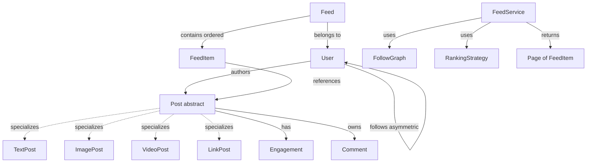
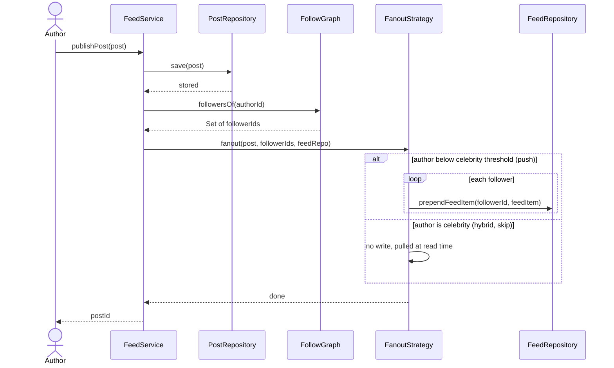
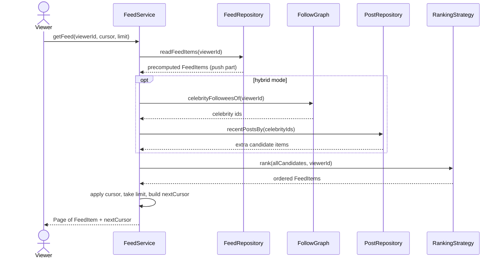
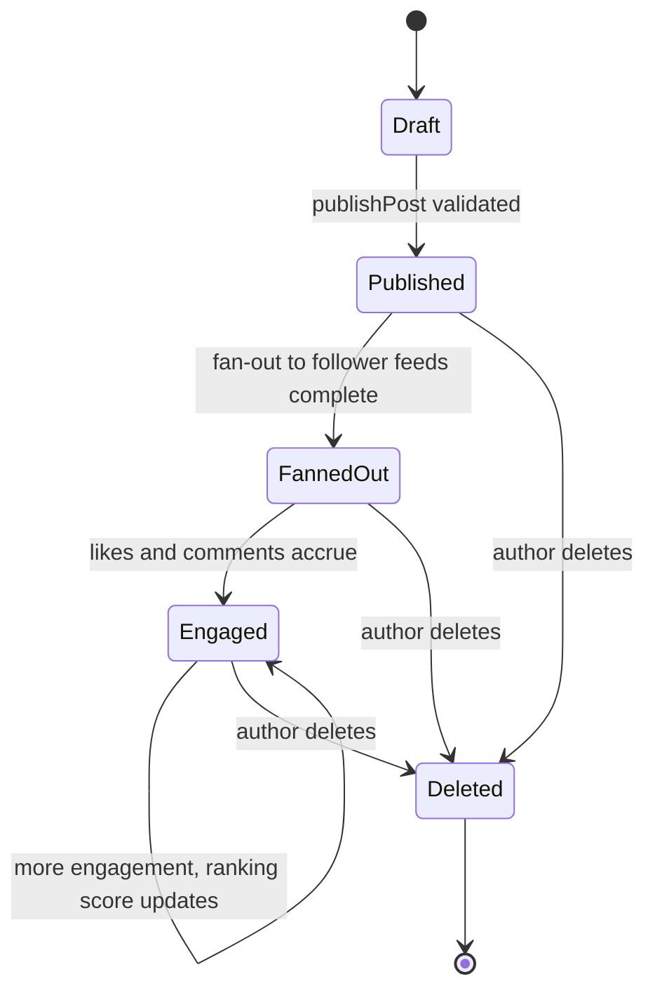
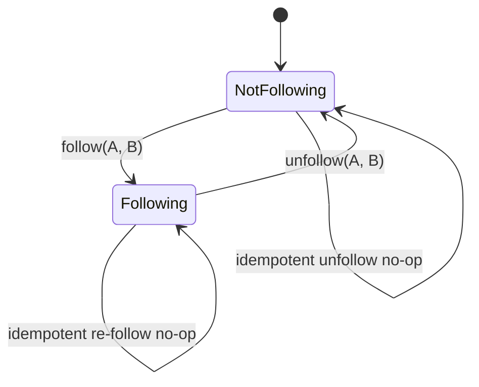

# 📱 Low-Level Design: Social Media Feed

> A complete, interview-ready walkthrough of the **Social Media News Feed** — from a blank whiteboard to a staff-level design that survives the celebrity fan-out problem, ranking, and a full round of interviewer follow-ups.

The News Feed is the most-requested system design interview at consumer companies, and it hides a low-level design problem just as rich as the distributed one. On the surface it is trivial: a user opens an app and sees a scrollable list of posts from the people they follow, newest-ish first. But that surface hides a modeling problem that separates strong candidates from the rest — how do you represent a *post* that might be text, an image, a video, or a shared link, all in one feed? How do you decide *whose* posts a given user sees, and in *what order*? What happens when a user with fifty million followers posts — do you copy that post into fifty million inboxes, or leave it in one place and gather it on read? And how do you keep the whole thing responsive when the ranking rules change every quarter? Interviewers reach for the feed precisely because every "simple" rule becomes a follow-up when you push on it: "newest first" becomes a pluggable ranking strategy, "posts from people you follow" becomes the fan-out-on-write versus fan-out-on-read debate, and "show me the feed" becomes a pagination and de-duplication problem. This guide walks the whole arc, escalating from the beginner's mental model to the concerns a principal engineer raises in the final ten minutes.

---

## 📋 Table of Contents

**Part I — Framing the Problem**

1. [Problem Statement](#1-problem-statement)
2. [Requirement Clarification & Assumptions](#2-requirement-clarification--assumptions)
3. [Functional & Non-Functional Requirements](#3-functional--non-functional-requirements)
4. [Core Concepts Being Tested](#4-core-concepts-being-tested)

**Part II — Modeling the Domain**

5. [Domain Model & Entities](#5-domain-model--entities)
6. [CRC Cards](#6-crc-cards)
7. [UML Class Diagram](#7-uml-class-diagram)
8. [Package Structure](#8-package-structure)

**Part III — Design Rationale**

9. [Design Decisions & Trade-offs](#9-design-decisions--trade-offs)
10. [Class-by-Class Deep Dive](#10-class-by-class-deep-dive)
11. [Design Patterns Applied](#11-design-patterns-applied)
12. [SOLID Principles Mapping](#12-solid-principles-mapping)

**Part IV — Behavior & Diagrams**

13. [Sequence Diagram](#13-sequence-diagram)
14. [State Diagram](#14-state-diagram)

**Part V — The Implementation**

15. [Complete Java Implementation](#15-complete-java-implementation)
16. [Execution Flow & Code Walkthrough](#16-execution-flow--code-walkthrough)

**Part VI — Engineering Depth**

17. [Complexity Analysis](#17-complexity-analysis)
18. [Thread Safety & Concurrency](#18-thread-safety--concurrency)
19. [Error Handling & Validation](#19-error-handling--validation)
20. [Scalability Discussion](#20-scalability-discussion)
21. [Alternative Designs & Trade-offs](#21-alternative-designs--trade-offs)

**Part VII — Interview Mastery**

22. [Common FAANG Follow-up Questions (L4 → L6)](#22-common-faang-follow-up-questions-l4--l6)
23. [Common Design Mistakes](#23-common-design-mistakes)
24. [Testing Strategy](#24-testing-strategy)
25. [FAANG Q&A Section](#25-faang-qa-section)
26. [STAR Behavioral Questions](#26-star-behavioral-questions)
27. [⚡ Quick Revision Cheat Sheet](#27--quick-revision-cheat-sheet)

---

## 1. Problem Statement

Design the software behind a **social media news feed** — the scrollable, personalized stream a user sees when they open an app like Instagram, Twitter/X, Facebook, or LinkedIn. Users create posts (text, images, videos, shared links); they follow other users; and when they open the app they see a feed assembled from the posts of the accounts they follow, ordered by some ranking — newest-first at its simplest, engagement-ranked at its most sophisticated. Users page through the feed as they scroll, like and comment on posts, and expect the whole experience to feel instant.

The heart of the problem is a decision that trips up most candidates on the first pass: **when is a user's feed actually built?** There are two fundamentally different answers. You can build it *when someone posts* — pushing the new post into a precomputed feed list for every follower, so reads are trivial (this is fan-out-on-write, or the "push" model). Or you can build it *when someone opens the app* — gathering the latest posts from everyone they follow and merging them on the spot (this is fan-out-on-read, or the "pull" model). Each is correct; each is disastrous in the other's worst case. Push is beautiful until a celebrity with fifty million followers posts and you must do fifty million writes. Pull is beautiful until a normal user follows two thousand accounts and every feed load must query two thousand timelines. Recognizing that this single decision dominates the design — and that mature systems use a *hybrid* of both — is the first thing a senior interviewer is watching for.

<details>
<summary>📖 <b>In plain terms — what are we actually building?</b></summary>

Open Instagram or Twitter. You see a list of posts from people you follow, and you scroll down to load more. Behind that list, two jobs are happening. First, whenever anyone you follow posts something, that post has to *become eligible* to appear in your feed. Second, when you open the app, the system has to *gather and order* the posts you should see and hand you the first pageful, then the next as you scroll. Our job is to write the objects and rules behind those two jobs: what a post is, who follows whom, how a feed gets assembled and ordered, and how we hand it out one page at a time — fast, and without showing you the same post twice.

</details>

The deliverable in an interview is not a running product; it is a **clean object-oriented model** — the classes, their responsibilities, and their interactions — that a real team could build on, plus a crisp story about how it scales. Grading is on the clarity of your abstractions (especially the `Post` type hierarchy and the `Feed` assembly seam), the correctness of the follow/unfollow and post lifecycles, extensibility (new post types, new ranking rules), and how gracefully the design absorbs the follow-ups the interviewer throws at it — above all, the fan-out question.

---

## 2. Requirement Clarification & Assumptions

The single biggest mistake candidates make is modeling before scoping. A strong candidate spends the first few minutes turning "design a news feed" into a bounded problem. Below is the clarification dialogue you should drive, framed as the questions to ask and the assumptions to lock in.

### 2.1 Actors

The people and systems that interact with the feed define the surface area of the design.

| Actor | Role in the system |
|-------|--------------------|
| **User** | Creates posts, follows and unfollows others, opens their feed, likes and comments. Both a producer and consumer of content. |
| **Feed viewer** | The same user in read mode — requests a page of their personalized feed and scrolls for more. |
| **System / Feed generator** | The background machinery that fans out new posts, assembles feeds, and applies ranking. |
| **Ranking service** | The pluggable logic that decides the order of posts in a feed (chronological, engagement, ML-scored). |
| **Notification / delivery channel** | External push/email service alerted when a followed user posts or a post gets engagement (out of core scope, hooked behind an abstraction). |

### 2.2 Key Clarifying Questions

Resolve these with the interviewer before modeling. Each answer materially changes the design.

- **Feed ordering** — Newest-first, or ranked by engagement/relevance? *(Assumption: pluggable — a `RankingStrategy` interface, defaulting to reverse-chronological, with an engagement-scored strategy as the richer variant.)*
- **Post types** — Text only, or images, video, and shared links too? *(Assumption: a `Post` base type with `TextPost`, `ImagePost`, `VideoPost`, and `LinkPost` subtypes — polymorphism is exactly what's being tested.)*
- **Follow model** — Is following symmetric (friends, like Facebook) or asymmetric (followers, like Twitter/Instagram)? *(Assumption: asymmetric follow — A can follow B without B following A; this is the harder and more common case.)*
- **Feed source** — Only posts from people you follow, or also recommended/promoted content? *(Assumption: v1 is follow-graph only; we discuss injecting recommendations later as another feed source.)*
- **Fan-out timing** — Build the feed on write (push) or on read (pull)? *(Assumption: this is the core trade-off — we design the seam so either works, and land on a hybrid for celebrities.)*
- **Pagination** — Offset-based or cursor-based? *(Assumption: cursor-based (keyset) pagination, because feeds mutate constantly and offsets skip/duplicate items.)*
- **Consistency** — Must a new post appear in followers' feeds instantly? *(Assumption: eventual consistency is acceptable — a few seconds' delay for a post to appear in feeds is fine; feeds are not a bank ledger.)*
- **Scale** — Roughly how many users and posts? *(Assumption: hundreds of millions of users, celebrities with tens of millions of followers, read-heavy by ~100:1 — this shapes every scaling answer.)*

### 2.3 Explicit Non-Goals

Naming what you will *not* build is a senior signal — it shows you can bound scope deliberately rather than by omission.

- No authentication, authorization, or account-management details — we assume users are already identified.
- No media storage or transcoding pipeline — an `ImagePost` holds a URL to a blob store (S3/CDN); we don't model upload or encoding.
- No direct messaging, stories, or ephemeral content — the feed is the persistent, followable timeline only.
- No ad-serving, monetization, or promoted-post auction logic — we mention it only as a pluggable feed source.
- No ML model internals for ranking — ranking is a strategy seam; how the score is *computed* is a black box we inject.
- No content-moderation or spam-filtering pipeline beyond a mention that it plugs in as a filter stage.

<details>
<summary>📖 <b>Why spend so long on clarification?</b></summary>

"Design a news feed" is deliberately thin. If you start drawing classes immediately, you'll guess at requirements and guess wrong — most commonly by assuming a single post type and a fixed chronological order, which forces a painful re-model when the interviewer says "now add video, and rank by engagement." Asking about post types, the follow model, and especially fan-out timing does three things: it shows product sense, it prevents building the wrong abstraction, and it plants the seeds for the hard follow-ups. The moment you say "following is asymmetric and some users have millions of followers," you've committed to confronting the celebrity fan-out problem — and that's exactly the richer territory where senior candidates distinguish themselves.

</details>

---

## 3. Functional & Non-Functional Requirements

### 3.1 Functional Requirements (what the system *does*)

The system must let a user **create a post** of any supported type, and have that post become eligible for their followers' feeds. It must let a user **follow and unfollow** another user, reshaping whose content they see. It must **generate a personalized feed** for any user — the merged, ordered stream of recent posts from the accounts they follow — and serve it **one page at a time** as the user scrolls. It must support **engagement actions** (like, comment) that both record on the post and can influence ranking. It must apply a **ranking policy** to order the feed, and that policy must be swappable without touching feed assembly. Finally, it must **de-duplicate** (never show the same post twice across pages) and stay **stable enough** that scrolling doesn't jumble already-seen items.

### 3.2 Non-Functional Requirements (how *well* it does it)

| Requirement | Target / Rationale |
|-------------|--------------------|
| **Low read latency** | Opening the feed should feel instant — a p99 well under ~200ms. Reads vastly outnumber writes (~100:1), so the design optimizes reads. |
| **Read-heavy scalability** | Hundreds of millions of users, each loading their feed many times a day. The architecture must scale reads horizontally. |
| **Eventual consistency** | A new post appearing in followers' feeds a few seconds late is fine. We trade strict freshness for availability and speed. |
| **High availability** | The feed must load even if ranking or a peripheral service is degraded — fall back to chronological rather than fail. |
| **Extensibility** | New post types and new ranking algorithms must be addable by writing new classes, not editing existing ones. |
| **Thread safety** | Concurrent follows, posts, and reads must not corrupt the follow graph or a user's feed store. |
| **Handle skew (celebrities)** | The design must not fall over when one account has tens of millions of followers — the fan-out hotspot. |

<details>
<summary>📖 <b>Why "read-heavy" changes everything</b></summary>

A feed is read far more often than it's written — you scroll many times for every post you make, and every post you make is read by everyone who follows you. That ~100:1 (often higher) read-to-write ratio is the single most important number in the whole design, because it tells you where to spend effort: make reads cheap even if it makes writes expensive. That's the entire justification for fan-out-on-write — do the heavy merging work once, at post time, so that the billions of daily feed reads are just "grab a precomputed list." When someone asks why you'd ever want to do millions of writes for one post, the read-heavy ratio is your answer.

</details>

---

## 4. Core Concepts Being Tested

This problem is a favorite because it exercises a specific, teachable set of skills, and an interviewer is silently checking each one off:

- **Polymorphic modeling** — a single feed holds heterogeneous content (text, image, video, link). Can you model a `Post` hierarchy cleanly so the feed treats them uniformly while each renders itself? This is the Composite/inheritance skill.
- **The fan-out trade-off** — the defining concept. Push (fan-out-on-write) versus pull (fan-out-on-read), why each exists, when each wins, and the hybrid that real systems use. Nearly every follow-up ladders off this.
- **Strategy for ranking** — the order of a feed is volatile business logic. Can you isolate it behind an interface so chronological, engagement-based, and ML-scored orderings are interchangeable?
- **Separation of assembly from ordering from delivery** — building the candidate set, ranking it, and paginating it are three distinct concerns. Collapsing them is a classic mistake.
- **The follow graph** — modeling asymmetric relationships efficiently, and understanding that it's the input to feed generation.
- **Concurrency** — concurrent posts, follows, and reads touching shared feed and graph state without corruption or lost updates.
- **Read-optimized thinking** — recognizing the read-heavy ratio and designing so the hot path (reads) is cheap.
- **Pagination correctness** — cursor vs. offset on a constantly-mutating list, and why offsets break.

<details>
<summary>📖 <b>The one concept that carries the interview</b></summary>

If you take away one thing, make it the fan-out trade-off. Almost every interesting question about a feed reduces to "when and where do you do the work of merging posts into a feed?" Push does it early (at post time) to make reads cheap; pull does it late (at read time) to make writes cheap. Understanding that a feed is fundamentally a *merge of many timelines*, and that you can precompute that merge or do it live, is the mental model that lets you answer the celebrity problem, the consistency question, and the scaling ladder — all of which are just this one idea wearing different hats.

</details>

---

## 5. Domain Model & Entities

### 5.1 The Entity Landscape

Before drawing classes, name the nouns and what each is responsible for. The model splits cleanly into four groups: the **people** (users and the follow graph), the **content** (the polymorphic post hierarchy and engagement), the **feed machinery** (the feed itself, its assembly, and its ranking), and the **delivery** concern (pagination).

| Entity | What it represents | Key state |
|--------|--------------------|-----------|
| **User** | An account — a producer and consumer of content | id, name, handle, set of followees and followers |
| **Post** *(abstract)* | A single piece of content in the system | id, authorId, timestamp, engagement counts |
| **TextPost / ImagePost / VideoPost / LinkPost** | Concrete post types | type-specific data (body, imageUrl, videoUrl+duration, linkUrl+preview) |
| **Comment** | A reply attached to a post | id, authorId, postId, text, timestamp |
| **Engagement** | Aggregated likes/comments/shares on a post | likeCount, commentCount, shareCount |
| **Feed** | A user's assembled, ordered stream of posts | ownerId, ordered list of feed items |
| **FeedItem** | One entry in a feed | postId, authorId, score/rank key, timestamp |
| **FollowGraph** | The directed relationships between users | adjacency of follower → followees |
| **RankingStrategy** *(interface)* | The policy that orders a feed | — (behavior only) |
| **FeedService** | Orchestrates posting, fan-out, and feed retrieval | references to graph, stores, ranking |
| **Page<T>** | A single slice of a feed plus a cursor for the next slice | items, nextCursor, hasMore |

### 5.2 Entity Relationships

The relationships are what make the model coherent. A `User` **authors** many `Post`s and **follows** many other `User`s (asymmetrically). A `Post` is abstract and **specialized** into the four concrete types; each `Post` **has** an `Engagement` aggregate and **owns** a list of `Comment`s. A `Feed` **belongs to** one `User` and **contains** an ordered list of `FeedItem`s, each of which **references** a `Post`. The `FeedService` **uses** the `FollowGraph` to find whose posts to gather, a `PostRepository` to fetch the posts, and a `RankingStrategy` to order them, returning a `Page` to the caller.



<details>
<summary>📖 <b>Why a FeedItem and not just a Post in the feed?</b></summary>

You might ask why the feed holds `FeedItem`s that point at posts, rather than the posts themselves. The reason is that a feed entry carries information *about the post's place in this particular feed* that doesn't belong on the post: its ranking score for this user, when it was inserted into this feed, and which cursor it sits at. The same post appears in millions of feeds with a different score and position in each, so that per-feed metadata can't live on the shared `Post`. Keeping a lightweight `FeedItem` (essentially a post reference plus a rank key) also means a precomputed feed stores tiny records, not full post bodies — the bodies are fetched and cached separately.

</details>

### 5.3 Core Enumerations

Enums pin down the finite sets of states and types, making illegal values unrepresentable.

```java
public enum PostType { TEXT, IMAGE, VIDEO, LINK }

public enum PostVisibility { PUBLIC, FOLLOWERS_ONLY, PRIVATE }

public enum FanoutMode { PUSH, PULL, HYBRID }

public enum RankingMode { CHRONOLOGICAL, ENGAGEMENT, PERSONALIZED }
```

---

## 6. CRC Cards

CRC (Class–Responsibility–Collaborator) cards are a lightweight way to pin down *what each class is responsible for* and *who it talks to*, before drowning in fields and methods. Interviewers like them because they force single-responsibility thinking.

| Class | Responsibilities | Collaborators |
|-------|------------------|---------------|
| **FeedService** | Orchestrate posting, fan-out, and feed retrieval; expose one entry point | FollowGraph, PostRepository, FeedRepository, FanoutStrategy, RankingStrategy |
| **User** | Hold identity; know its followers and followees; author posts | Post, FollowGraph |
| **FollowGraph** | Store and answer directed follow relationships fast | User |
| **Post** *(abstract)* | Hold common content data; carry engagement; render its own preview | Engagement, Comment |
| **ImagePost / VideoPost / …** | Add type-specific data and rendering | Post |
| **Engagement** | Track and update like/comment/share counts atomically | Post |
| **FanoutStrategy** | Decide how a new post reaches follower feeds (push/pull/hybrid) | FollowGraph, FeedRepository |
| **RankingStrategy** | Order a candidate set of posts into a ranked feed | Post, FeedItem |
| **FeedRepository** | Store and retrieve precomputed per-user feeds | FeedItem, Feed |
| **PostRepository** | Store and fetch posts by id and by author | Post |
| **Page<T>** | Carry one slice of results plus the cursor for the next | FeedItem |

<details>
<summary>📖 <b>What a CRC card is really for</b></summary>

A CRC card is a deliberately tiny box — it can only hold a few responsibilities, and that constraint is the point. If a class's card overflows, it's doing too much and should be split. Notice `FeedService`'s card lists orchestration but *not* "rank posts" or "decide fan-out" — those are delegated to `RankingStrategy` and `FanoutStrategy`. On a whiteboard, filling these out for six or seven classes takes two minutes and immediately exposes a god-object — usually a `FeedService` that tries to do fan-out, ranking, and pagination all by itself — before you've written a line of code.

</details>

---

## 7. UML Class Diagram

Below is the full static structure in ASCII, showing fields, key methods, and the relationships between classes. This is the artifact you'd sketch on the whiteboard and then talk through. Every name here matches the Java implementation in Section 15 exactly.

```
+---------------------------------------------------+
|                    FeedService                     |
+---------------------------------------------------+
| - followGraph   : FollowGraph                      |
| - postRepo      : PostRepository                   |
| - feedRepo      : FeedRepository                   |
| - fanoutStrategy: FanoutStrategy                   |
| - rankingStrategy: RankingStrategy                 |
+---------------------------------------------------+
| + publishPost(post: Post) : void                   |
| + getFeed(userId, cursor, limit) : Page<FeedItem>  |
| + follow(followerId, followeeId) : void            |
| + unfollow(followerId, followeeId) : void          |
| + like(userId, postId) : void                      |
| + comment(userId, postId, text) : Comment          |
+---------------------------------------------------+
        |                |                 |
        | uses           | uses            | uses
        v                v                 v
+----------------+  +------------------+  +--------------------+
|  FollowGraph   |  |  FanoutStrategy  |  |  RankingStrategy   |
+----------------+  |  <<interface>>   |  |  <<interface>>     |
| - followees:   |  +------------------+  +--------------------+
|   Map<id,Set>  |  | + fanout(post,   |  | + rank(items,      |
| - followers:   |  |   followers)     |  |   viewerId)        |
|   Map<id,Set>  |  +------------------+  |   : List<FeedItem> |
+----------------+       ^      ^         +--------------------+
| + follow()     |       |      |               ^       ^
| + unfollow()   |  +---------+ +----------+     |       |
| + followersOf()|  | PushFan | | PullFan  | +--------+ +-----------+
| + followeesOf()|  | out     | | out      | | Chrono | | Engagement|
+----------------+  +---------+ +----------+ | Ranking| | Ranking   |
                    +---------------+        +--------+ +-----------+
                    | HybridFanout  |
                    +---------------+

+---------------------------------------+
|            Post  <<abstract>>          |
+---------------------------------------+
| - id        : String                   |
| - authorId  : String                   |
| - createdAt : Instant                   |
| - visibility: PostVisibility           |
| - engagement: Engagement               |
| - comments  : List<Comment>            |
+---------------------------------------+
| + getType() : PostType   <<abstract>>  |
| + renderPreview() : String <<abstract>>|
| + addComment(c: Comment) : void        |
+---------------------------------------+
        ^        ^         ^         ^
        |        |         |         |
+----------+ +----------+ +---------+ +---------+
| TextPost | | ImagePost| |VideoPost| | LinkPost|
+----------+ +----------+ +---------+ +---------+
| - body   | | - imageUrl| | -videoUrl| | -linkUrl|
|          | | - caption | | -duration| | -preview|
+----------+ +----------+ +---------+ +---------+

+------------------+     +------------------+     +------------------+
|   Engagement     |     |    FeedItem      |     |    Page<T>       |
+------------------+     +------------------+     +------------------+
| - likeCount:AtomicLong| | - postId  :String|   | - items    :List |
| - commentCount:...    | | - authorId:String|   | - nextCursor:String|
| - shareCount :...     | | - rankKey :long  |   | - hasMore  :boolean|
+------------------+     | - createdAt:Instant|  +------------------+
| + incrementLike()|     +------------------+
| + snapshot()     |     | + compareTo()    |
+------------------+     +------------------+
```

### 7.1 Relationship summary

`FeedService` is the facade and orchestrator; it *composes* a `FollowGraph`, a `PostRepository`, a `FeedRepository`, a `FanoutStrategy`, and a `RankingStrategy`. `FanoutStrategy` and `RankingStrategy` are interfaces with interchangeable implementations (`PushFanout`/`PullFanout`/`HybridFanout` and `ChronologicalRanking`/`EngagementRanking`). `Post` is abstract and is specialized by the four concrete post types, each adding its own data and rendering. `Engagement`, `FeedItem`, and `Page<T>` are value-carrying support types. This is the exact shape encoded in the code below.

---

## 8. Package Structure

A clean package layout mirrors the domain boundaries and keeps the volatile parts (strategies) isolated from the stable core (entities).

```
com.feed
├── model
│   ├── User.java
│   ├── Post.java                 (abstract)
│   ├── TextPost.java
│   ├── ImagePost.java
│   ├── VideoPost.java
│   ├── LinkPost.java
│   ├── Comment.java
│   ├── Engagement.java
│   ├── FeedItem.java
│   └── enums
│       ├── PostType.java
│       ├── PostVisibility.java
│       ├── FanoutMode.java
│       └── RankingMode.java
├── graph
│   └── FollowGraph.java
├── ranking
│   ├── RankingStrategy.java       (interface)
│   ├── ChronologicalRanking.java
│   └── EngagementRanking.java
├── fanout
│   ├── FanoutStrategy.java        (interface)
│   ├── PushFanout.java
│   ├── PullFanout.java
│   └── HybridFanout.java
├── repository
│   ├── PostRepository.java
│   └── FeedRepository.java
├── pagination
│   └── Page.java
├── service
│   └── FeedService.java           (facade / orchestrator)
└── FeedDemo.java                  (runnable demonstration)
```

<details>
<summary>📖 <b>Why split fanout and ranking into their own packages?</b></summary>

The `fanout` and `ranking` packages hold the two most volatile parts of the entire system — the parts most likely to change as the product evolves. Fan-out strategy changes as you scale (you'll start push-only and add hybrid when celebrities appear); ranking changes every time the growth team runs an experiment. Isolating each behind its own interface in its own package means those experiments never touch the stable `model` or the `service` orchestrator. When an interviewer asks "how would you A/B test a new ranking algorithm?", the answer is visible in the package layout: drop a new `RankingStrategy` implementation into the `ranking` package and wire it for a fraction of users — nothing else moves.

</details>

---

## 9. Design Decisions & Trade-offs

Every serious design is a sequence of decisions with costs on both sides. Here are the five that define this system, each with the alternative rejected and *why*.

### 9.1 Fan-out on write (push) as the default, hybrid for celebrities

This is *the* decision. **Fan-out-on-write** copies each new post into a precomputed feed list for every follower at post time, so a feed read is a trivial "grab my precomputed list." **Fan-out-on-read** stores each post once and merges followees' timelines live at read time. Push makes reads O(1) but writes O(followers); pull makes writes O(1) but reads O(followees). Because the system is read-heavy by ~100:1, push wins for the vast majority of users — you pay the merge cost once per post instead of once per read. But push is catastrophic for a celebrity: one post triggers tens of millions of feed writes. So the mature answer is a **hybrid** — push for ordinary users, and for high-fan-out accounts, *don't* fan out; instead pull their recent posts at read time and merge them into the (mostly precomputed) feed. The `FanoutStrategy` interface makes this switch a policy decision, not a rewrite.

### 9.2 Ranking as an injected strategy, not baked-in ordering

A feed's order is the most experimented-on logic in any social product. Hard-coding `sort by timestamp` would mean every ranking change edits feed-assembly code and risks regressing it. Instead, ordering lives behind a `RankingStrategy` interface injected into the `FeedService`. Chronological is the safe default and the availability fallback; `EngagementRanking` scores by likes/comments/recency; a future `PersonalizedRanking` can call an ML model — all interchangeable, none touching assembly. This is the single clearest Open/Closed win in the design.

### 9.3 A polymorphic `Post` hierarchy, not a type flag with nullable fields

A feed holds heterogeneous content. The tempting shortcut is one `Post` class with a `type` enum and nullable `imageUrl`, `videoUrl`, `linkUrl` fields — but that's a "God object" where every consumer must switch on the type and half the fields are always null. Modeling `Post` as abstract with `TextPost`, `ImagePost`, `VideoPost`, and `LinkPost` subtypes lets each type carry exactly its own data and render itself polymorphically (`renderPreview()`), and lets the feed treat them uniformly as `Post`. Adding a `PollPost` tomorrow is a new subclass, not an edit to a growing switch.

### 9.4 Separate assembly, ranking, and pagination

Building a feed is three concerns that candidates routinely fuse: **assembly** (gather the candidate posts from followees), **ranking** (order them), and **pagination** (hand out one page with a cursor). Keeping them distinct means each can vary independently — you can change how candidates are gathered (push vs. pull) without touching ranking, swap ranking without touching pagination, and change from offset to cursor pagination without touching either. The `FeedService` sequences these three stages; it doesn't implement any of them itself.

### 9.5 Cursor-based pagination, not offset

Offset pagination (`LIMIT 20 OFFSET 40`) is fatally broken for feeds because the underlying list mutates between page requests — new posts arrive, pushing everything down, so page 2 re-shows items from page 1 or skips items entirely. **Cursor (keyset) pagination** encodes "where I left off" as a stable key (e.g. the rank key / timestamp of the last item seen) and asks for "the next 20 items after this key." It's immune to insertions above the cursor, and it's O(1) to resume rather than O(offset) to skip. `Page<T>` carries the `nextCursor` back to the client for exactly this.

<details>
<summary>📖 <b>The trade-off in one sentence each</b></summary>

Push vs. pull: pay at write time to make reads cheap, except for celebrities where that bill is too big. Ranking as a strategy: keep the volatile ordering logic out of the stable assembly code. Post hierarchy: let each content type own its data instead of one class with mostly-null fields. Separate the three feed stages: so each can change without breaking the others. Cursor pagination: because a feed grows under your feet and offsets lose their place. Each choice trades a little more structure now for a lot less pain when the product inevitably changes.

</details>

---

## 10. Class-by-Class Deep Dive

With the decisions made, here's what each class is for and the one non-obvious thing about it. Full code is in Section 15.

### 10.1 `User`

Holds identity (id, handle, display name). Deliberately *thin* on relationship state — the actual follow edges live in `FollowGraph`, not as two `Set<User>` fields on `User`. This is a conscious choice: storing followers/followees on the user object couples graph traversal to object loading and doesn't scale, whereas a dedicated graph structure can be indexed, sharded, and cached independently. The `User` knows *who it is*, not *the entire graph around it*.

### 10.2 `Post` (abstract) and its subtypes

`Post` is the abstract base carrying everything common: id, author, timestamp, visibility, the `Engagement` aggregate, and comments. It declares two abstract methods — `getType()` and `renderPreview()` — that each subtype implements. `TextPost` carries a body; `ImagePost` an image URL and caption; `VideoPost` a video URL and duration; `LinkPost` a URL and a scraped preview. The feed never asks "what type is this?"; it calls `renderPreview()` and each post answers for itself. That's polymorphism doing the branching the type-flag design would have done with `if/else`.

### 10.3 `Engagement`

A small aggregate holding like, comment, and share counts as `AtomicLong`s. It exists as its own object (not three fields on `Post`) so that the high-contention counters — likes on a viral post can arrive thousands per second — are isolated with their own atomic update methods, and so a `snapshot()` can be handed to the ranking strategy without exposing mutable counters. This is where the concurrency for engagement is localized.

### 10.4 `FollowGraph`

The directed relationship store. It keeps two maps — `followees` (who each user follows) and `followers` (who follows each user) — because the two queries have opposite access patterns: fan-out needs *followers of an author*, while pull-mode assembly needs *followees of a viewer*. Maintaining both directions is a classic read-optimization: a little extra write work (update two maps on each follow) to make both hot reads O(1). Guarded for concurrency since follows and reads are concurrent.

### 10.5 `FanoutStrategy` and its implementations

The interface with one method: `fanout(post, followerIds, feedRepo)`. `PushFanout` writes the post into every follower's feed immediately. `PullFanout` does nothing at write time (feeds are assembled on read). `HybridFanout` inspects the author's follower count and chooses: push if below a threshold, skip (pull-later) if the author is a celebrity. This is the seam that lets the celebrity problem be solved by configuration.

### 10.6 `RankingStrategy` and its implementations

The interface: `rank(candidateItems, viewerId) -> ordered list`. `ChronologicalRanking` sorts by timestamp descending — simple, predictable, the fallback. `EngagementRanking` computes a score from engagement and recency (a decay function) and sorts by it. The `FeedService` holds a reference to whichever is wired in and never knows which.

### 10.7 `FeedRepository` and `PostRepository`

`PostRepository` is the source of truth for post bodies, fetchable by id and by author (the latter powers pull-mode). `FeedRepository` stores the *precomputed* per-user feeds as lists of lightweight `FeedItem`s — this is what push writes into and what a push-mode read grabs directly. Splitting them mirrors the storage reality: posts live once in a durable store, feeds are derived, per-user, and often cache-resident.

### 10.8 `FeedService`

The orchestrator and facade — the single public entry point. `publishPost` stores the post, resolves the author's followers, and delegates to the `FanoutStrategy`. `getFeed` gathers candidates (from the precomputed feed for push users, plus a live pull of any celebrity followees in hybrid mode), applies the `RankingStrategy`, and paginates via the cursor into a `Page`. It coordinates; it never ranks or fans out itself.

<details>
<summary>📖 <b>The mental model for the whole class set</b></summary>

Read the classes as three layers. The bottom layer is *data*: `User`, `Post` and its subtypes, `Engagement`, `Comment`, `FeedItem` — plain objects that hold state. The middle layer is *policy*: `FanoutStrategy` and `RankingStrategy` — the swappable rules for how content spreads and how it's ordered. The top layer is *orchestration*: `FeedService` over `FollowGraph`, `PostRepository`, and `FeedRepository` — the coordinator that wires data and policy together to answer "publish this" and "give me my feed." Almost every design question maps to one layer: "add video" is data, "rank by relevance" is policy, "handle celebrities" is orchestration choosing a policy.

</details>

---

## 11. Design Patterns Applied

Patterns here are used where they *remove a coupling*, not for decoration. Each entry names the pattern, where it lives, and the specific problem it solves.

| Pattern | Where it appears | What it buys us |
|---------|------------------|-----------------|
| **Strategy** | `RankingStrategy` (chronological, engagement), `FanoutStrategy` (push, pull, hybrid) | Ordering and content-spread algorithms vary independently; swap them without touching `FeedService`. |
| **Facade** | `FeedService` over graph, repos, ranking, fanout subsystems | One clean surface (`publishPost`, `getFeed`, `follow`) hides subsystem wiring from clients. |
| **Factory** | `PostFactory` creating the right `Post` subtype by `PostType` | Centralizes construction of the polymorphic hierarchy behind one call. |
| **Template Method** | `Post.renderPreview()` contract with per-type implementations | The feed relies on a uniform contract each subtype fills in — heterogeneous content, uniform handling. |
| **Iterator / Cursor** | `Page<T>` with `nextCursor` | Client walks an ever-growing feed one stable slice at a time without offset bugs. |
| **Observer** *(logical)* | New-post event notifying followers (delivery hook) | Followers/channels get pushed updates; add a channel without editing the emitter. |

<details>
<summary>📖 <b>A note on not over-patterning</b></summary>

It's tempting to cram in every Gang-of-Four pattern to look sophisticated, but an interviewer reads that as insecurity. Strategy for ranking and fan-out is unarguable — both genuinely change as the product scales and experiments run. Facade for `FeedService` is natural — clients want one door, not five. But forcing, say, a Visitor over the post hierarchy or a Builder where a simple factory suffices is a red flag. The skill is knowing when a pattern *reduces* complexity versus when it merely adds ceremony. Reach for a pattern when it removes an "if I change X I must edit Y" coupling — the fan-out and ranking strategies are the textbook cases of exactly that.

</details>

For the deeper theory behind each of these, this guide pairs naturally with the individual Strategy, Factory, Facade, and Observer pattern guides.

---

## 12. SOLID Principles Mapping

SOLID isn't an abstract checklist here — each principle shows up concretely in the design.

**S — Single Responsibility.** Each class has one reason to change: `FollowGraph` stores relationships, `RankingStrategy` orders feeds, `FanoutStrategy` decides content spread, `Page` slices results. A change to ranking never touches the follow graph; a change to fan-out never touches pagination.

**O — Open/Closed.** The system is *open to extension, closed to modification*. A new `PersonalizedRanking`, a new `HybridFanout` variant, or a new `PollPost` type is a new class; no existing class is edited. This is the single biggest SOLID win, delivered by the Strategy hierarchies and the `Post` inheritance tree plus factory.

**L — Liskov Substitution.** Any `Post` subtype works wherever a `Post` is expected — the feed handles `VideoPost` and `TextPost` identically through the base contract. Any `RankingStrategy` works where the interface is expected; none throws where the base promised not to.

**I — Interface Segregation.** `RankingStrategy` and `FanoutStrategy` are small, focused interfaces with a single method each. A ranking strategy isn't forced to know about fan-out; a fan-out strategy isn't forced to know about ordering. Clients depend only on the sliver they use.

**D — Dependency Inversion.** `FeedService` depends on the *abstractions* `FanoutStrategy`, `RankingStrategy`, `PostRepository`, and `FeedRepository` — not on concrete classes. Concretes are injected at construction, so the orchestrator doesn't know whether fan-out is push or hybrid, or whether ranking is chronological or ML-scored.

<details>
<summary>📖 <b>The one-line SOLID gut check</b></summary>

If you can add a brand-new post type, a new ranking algorithm, and a new fan-out policy *without editing a single existing class* — only adding new ones — your design honors Open/Closed and Dependency Inversion, and the rest of SOLID usually falls into place. That "add, don't edit" test is the fastest way to sanity-check your feed design under interview pressure, and it maps directly onto the three questions interviewers actually ask: new content type, new ranking, new scale strategy.

</details>

---

## 13. Sequence Diagram

Two flows matter most: **publishing a post** (which triggers fan-out) and **reading a feed** (which triggers assembly, ranking, and pagination). Here they are as message sequences.

### 13.1 Publish Post (fan-out on write)



### 13.2 Get Feed (assembly, ranking, pagination)



<details>
<summary>📖 <b>Reading the get-feed flow</b></summary>

The read flow is the interesting one because it's where the hybrid model earns its keep. For an ordinary user it's almost trivial — grab the precomputed list from `FeedRepository`, rank, paginate. The `opt hybrid mode` block is the celebrity fix: because we deliberately *didn't* fan out celebrity posts at write time, we pull their recent posts live and merge them into the candidate set before ranking. That's the whole trade in one picture — we moved the celebrity's cost from write time (millions of writes) to read time (one small query per viewer who follows them). Ranking then treats push-sourced and pull-sourced candidates identically, and pagination hands out one stable slice.

</details>

---

## 14. State Diagram

Two lifecycles are worth drawing: a **post's** journey from draft to visible-and-fanned-out, and a **follow relationship's** simple existence.

### 14.1 Post Lifecycle



### 14.2 Follow Relationship Lifecycle



<details>
<summary>📖 <b>Why model these as states at all?</b></summary>

The post lifecycle matters because *deletion* and *fan-out* interact in a way interviewers probe: if a post is deleted after it's been fanned out to millions of feeds, those feed entries are now stale references. Modeling the states makes the answer obvious — feed items are references, so a deleted post is filtered at read time (a tombstone check) rather than chased down across every feed. The follow lifecycle is trivial but worth stating because of *idempotency*: following someone you already follow, or unfollowing someone you don't, must be safe no-ops, not errors or duplicate edges — a detail that bites systems that model follows as append-only event logs.

</details>

---

## 15. Complete Java Implementation

Below is a complete, compilable reference implementation. It's organized bottom-up: enums and value objects first, then the post hierarchy, then the graph, then the strategies, then the repositories, and finally the orchestrating `FeedService` and a runnable demo. Every block is collapsible so you can study one piece at a time. The class names, fields, and method signatures match the diagrams above exactly.

<details>
<summary>💻 <b>1. Enums</b></summary>

```java
package com.feed.model.enums;

/** The finite set of content types a post can be. */
public enum PostType { TEXT, IMAGE, VIDEO, LINK }

/** Who is allowed to see a post. */
public enum PostVisibility { PUBLIC, FOLLOWERS_ONLY, PRIVATE }

/** How a new post reaches follower feeds. */
public enum FanoutMode { PUSH, PULL, HYBRID }

/** How a feed is ordered. */
public enum RankingMode { CHRONOLOGICAL, ENGAGEMENT, PERSONALIZED }
```

</details>

<details>
<summary>💻 <b>2. User</b></summary>

```java
package com.feed.model;

import java.util.Objects;

/**
 * An account — a producer and consumer of content. Deliberately thin:
 * follow edges live in FollowGraph, not as Sets on this object, so graph
 * traversal can be indexed and scaled independently of user loading.
 */
public final class User {
    private final String id;
    private final String handle;      // e.g. "@ada"
    private final String displayName;

    public User(String id, String handle, String displayName) {
        this.id = Objects.requireNonNull(id);
        this.handle = Objects.requireNonNull(handle);
        this.displayName = Objects.requireNonNull(displayName);
    }

    public String getId() { return id; }
    public String getHandle() { return handle; }
    public String getDisplayName() { return displayName; }

    @Override public boolean equals(Object o) {
        return (o instanceof User) && ((User) o).id.equals(id);
    }
    @Override public int hashCode() { return Objects.hash(id); }
    @Override public String toString() { return handle; }
}
```

</details>

<details>
<summary>💻 <b>3. Engagement (atomic counters)</b></summary>

```java
package com.feed.model;

import java.util.concurrent.atomic.AtomicLong;

/**
 * Aggregated engagement on a post. Its own object so the high-contention
 * counters (a viral post can take thousands of likes per second) are
 * isolated with atomic updates and can be snapshotted for ranking.
 */
public final class Engagement {
    private final AtomicLong likeCount = new AtomicLong();
    private final AtomicLong commentCount = new AtomicLong();
    private final AtomicLong shareCount = new AtomicLong();

    public void incrementLike()    { likeCount.incrementAndGet(); }
    public void decrementLike()    { likeCount.decrementAndGet(); }
    public void incrementComment() { commentCount.incrementAndGet(); }
    public void incrementShare()   { shareCount.incrementAndGet(); }

    public long likes()    { return likeCount.get(); }
    public long comments() { return commentCount.get(); }
    public long shares()   { return shareCount.get(); }

    /** Immutable snapshot handed to ranking so it never sees a moving target. */
    public Snapshot snapshot() {
        return new Snapshot(likeCount.get(), commentCount.get(), shareCount.get());
    }

    public record Snapshot(long likes, long comments, long shares) {
        public long weightedScore() {
            // Comments and shares signal stronger engagement than likes.
            return likes + 2 * comments + 3 * shares;
        }
    }
}
```

</details>

<details>
<summary>💻 <b>4. Comment</b></summary>

```java
package com.feed.model;

import java.time.Instant;
import java.util.Objects;

public final class Comment {
    private final String id;
    private final String postId;
    private final String authorId;
    private final String text;
    private final Instant createdAt;

    public Comment(String id, String postId, String authorId, String text) {
        this.id = Objects.requireNonNull(id);
        this.postId = Objects.requireNonNull(postId);
        this.authorId = Objects.requireNonNull(authorId);
        this.text = Objects.requireNonNull(text);
        this.createdAt = Instant.now();
    }

    public String getId() { return id; }
    public String getPostId() { return postId; }
    public String getAuthorId() { return authorId; }
    public String getText() { return text; }
    public Instant getCreatedAt() { return createdAt; }
}
```

</details>

<details>
<summary>💻 <b>5. Post (abstract base)</b></summary>

```java
package com.feed.model;

import com.feed.model.enums.PostType;
import com.feed.model.enums.PostVisibility;

import java.time.Instant;
import java.util.List;
import java.util.Objects;
import java.util.concurrent.CopyOnWriteArrayList;

/**
 * The abstract base for all content. Holds everything common; declares two
 * abstract methods each subtype fills in. The feed treats every post as a
 * Post and calls renderPreview() polymorphically — no type switching.
 */
public abstract class Post {
    private final String id;
    private final String authorId;
    private final Instant createdAt;
    private final PostVisibility visibility;
    private final Engagement engagement = new Engagement();
    private final List<Comment> comments = new CopyOnWriteArrayList<>();
    private volatile boolean deleted = false;

    protected Post(String id, String authorId, PostVisibility visibility) {
        this.id = Objects.requireNonNull(id);
        this.authorId = Objects.requireNonNull(authorId);
        this.visibility = Objects.requireNonNull(visibility);
        this.createdAt = Instant.now();
    }

    /** Each subtype declares its type. */
    public abstract PostType getType();

    /** Each subtype renders its own feed preview — polymorphism, not if/else. */
    public abstract String renderPreview();

    public void addComment(Comment c) {
        comments.add(c);
        engagement.incrementComment();
    }

    public String getId() { return id; }
    public String getAuthorId() { return authorId; }
    public Instant getCreatedAt() { return createdAt; }
    public PostVisibility getVisibility() { return visibility; }
    public Engagement getEngagement() { return engagement; }
    public List<Comment> getComments() { return List.copyOf(comments); }

    public boolean isDeleted() { return deleted; }
    public void markDeleted() { this.deleted = true; }

    @Override public boolean equals(Object o) {
        return (o instanceof Post) && ((Post) o).id.equals(id);
    }
    @Override public int hashCode() { return Objects.hash(id); }
}
```

</details>

<details>
<summary>💻 <b>6. Concrete post types (Text, Image, Video, Link)</b></summary>

```java
package com.feed.model;

import com.feed.model.enums.PostType;
import com.feed.model.enums.PostVisibility;

public final class TextPost extends Post {
    private final String body;

    public TextPost(String id, String authorId, PostVisibility vis, String body) {
        super(id, authorId, vis);
        this.body = body;
    }
    public String getBody() { return body; }

    @Override public PostType getType() { return PostType.TEXT; }
    @Override public String renderPreview() {
        return body.length() <= 140 ? body : body.substring(0, 137) + "...";
    }
}
```

```java
package com.feed.model;

import com.feed.model.enums.PostType;
import com.feed.model.enums.PostVisibility;

public final class ImagePost extends Post {
    private final String imageUrl;   // points to blob store / CDN
    private final String caption;

    public ImagePost(String id, String authorId, PostVisibility vis,
                     String imageUrl, String caption) {
        super(id, authorId, vis);
        this.imageUrl = imageUrl;
        this.caption = caption;
    }
    public String getImageUrl() { return imageUrl; }
    public String getCaption() { return caption; }

    @Override public PostType getType() { return PostType.IMAGE; }
    @Override public String renderPreview() {
        return "[Image] " + (caption == null ? "" : caption);
    }
}
```

```java
package com.feed.model;

import com.feed.model.enums.PostType;
import com.feed.model.enums.PostVisibility;

public final class VideoPost extends Post {
    private final String videoUrl;
    private final int durationSeconds;

    public VideoPost(String id, String authorId, PostVisibility vis,
                     String videoUrl, int durationSeconds) {
        super(id, authorId, vis);
        this.videoUrl = videoUrl;
        this.durationSeconds = durationSeconds;
    }
    public String getVideoUrl() { return videoUrl; }
    public int getDurationSeconds() { return durationSeconds; }

    @Override public PostType getType() { return PostType.VIDEO; }
    @Override public String renderPreview() {
        return "[Video " + durationSeconds + "s] " + videoUrl;
    }
}
```

```java
package com.feed.model;

import com.feed.model.enums.PostType;
import com.feed.model.enums.PostVisibility;

public final class LinkPost extends Post {
    private final String linkUrl;
    private final String previewTitle;

    public LinkPost(String id, String authorId, PostVisibility vis,
                    String linkUrl, String previewTitle) {
        super(id, authorId, vis);
        this.linkUrl = linkUrl;
        this.previewTitle = previewTitle;
    }
    public String getLinkUrl() { return linkUrl; }
    public String getPreviewTitle() { return previewTitle; }

    @Override public PostType getType() { return PostType.LINK; }
    @Override public String renderPreview() {
        return "[Link] " + previewTitle + " (" + linkUrl + ")";
    }
}
```

</details>

<details>
<summary>💻 <b>7. PostFactory</b></summary>

```java
package com.feed.model;

import com.feed.model.enums.PostType;
import com.feed.model.enums.PostVisibility;

import java.util.Map;
import java.util.UUID;

/**
 * Centralizes construction of the polymorphic hierarchy. Callers say what
 * type they want plus a payload map; the factory builds the right subtype.
 */
public final class PostFactory {

    public static Post create(PostType type, String authorId,
                              PostVisibility vis, Map<String, Object> data) {
        String id = UUID.randomUUID().toString();
        return switch (type) {
            case TEXT  -> new TextPost(id, authorId, vis,
                                (String) data.get("body"));
            case IMAGE -> new ImagePost(id, authorId, vis,
                                (String) data.get("imageUrl"),
                                (String) data.get("caption"));
            case VIDEO -> new VideoPost(id, authorId, vis,
                                (String) data.get("videoUrl"),
                                (int) data.get("durationSeconds"));
            case LINK  -> new LinkPost(id, authorId, vis,
                                (String) data.get("linkUrl"),
                                (String) data.get("previewTitle"));
        };
    }
}
```

</details>

<details>
<summary>💻 <b>8. FeedItem (lightweight feed entry)</b></summary>

```java
package com.feed.model;

import java.time.Instant;

/**
 * One entry in a feed — a reference to a post plus per-feed metadata (its
 * rank key and timestamp). Kept lightweight so a precomputed feed stores
 * tiny records, not full post bodies. Comparable by rankKey for ordering.
 */
public final class FeedItem implements Comparable<FeedItem> {
    private final String postId;
    private final String authorId;
    private final Instant createdAt;
    private long rankKey;   // set by the ranking strategy; higher = earlier

    public FeedItem(String postId, String authorId, Instant createdAt) {
        this.postId = postId;
        this.authorId = authorId;
        this.createdAt = createdAt;
        this.rankKey = createdAt.toEpochMilli(); // default: chronological
    }

    public String getPostId() { return postId; }
    public String getAuthorId() { return authorId; }
    public Instant getCreatedAt() { return createdAt; }
    public long getRankKey() { return rankKey; }
    public void setRankKey(long rankKey) { this.rankKey = rankKey; }

    /** Higher rankKey sorts first (descending). */
    @Override public int compareTo(FeedItem other) {
        return Long.compare(other.rankKey, this.rankKey);
    }
}
```

</details>

<details>
<summary>💻 <b>9. Page&lt;T&gt; (cursor pagination)</b></summary>

```java
package com.feed.pagination;

import java.util.List;

/**
 * One slice of a feed plus the cursor to fetch the next slice. Cursor is
 * opaque to the client (here, the rankKey of the last item) — immune to the
 * insert-above-cursor bug that breaks offset pagination.
 */
public final class Page<T> {
    private final List<T> items;
    private final String nextCursor;   // null when no more pages
    private final boolean hasMore;

    public Page(List<T> items, String nextCursor, boolean hasMore) {
        this.items = items;
        this.nextCursor = nextCursor;
        this.hasMore = hasMore;
    }

    public List<T> getItems() { return items; }
    public String getNextCursor() { return nextCursor; }
    public boolean hasMore() { return hasMore; }
}
```

</details>

<details>
<summary>💻 <b>10. FollowGraph (bidirectional, concurrent)</b></summary>

```java
package com.feed.graph;

import java.util.Collections;
import java.util.Set;
import java.util.concurrent.ConcurrentHashMap;

/**
 * The directed follow graph. Keeps BOTH directions because fan-out needs
 * "followers of an author" while pull-mode assembly needs "followees of a
 * viewer" — opposite access patterns, both made O(1) by a little extra
 * write work. Thread-safe via concurrent collections.
 */
public final class FollowGraph {
    // viewer -> set of accounts they follow
    private final ConcurrentHashMap<String, Set<String>> followees = new ConcurrentHashMap<>();
    // author -> set of accounts that follow them
    private final ConcurrentHashMap<String, Set<String>> followers = new ConcurrentHashMap<>();

    public void follow(String followerId, String followeeId) {
        if (followerId.equals(followeeId)) return; // can't follow yourself
        followees.computeIfAbsent(followerId, k -> concurrentSet()).add(followeeId);
        followers.computeIfAbsent(followeeId, k -> concurrentSet()).add(followerId);
    }

    public void unfollow(String followerId, String followeeId) {
        Set<String> fe = followees.get(followerId);
        if (fe != null) fe.remove(followeeId);
        Set<String> fr = followers.get(followeeId);
        if (fr != null) fr.remove(followerId);
    }

    public Set<String> followersOf(String userId) {
        return Collections.unmodifiableSet(
            followers.getOrDefault(userId, Set.of()));
    }

    public Set<String> followeesOf(String userId) {
        return Collections.unmodifiableSet(
            followees.getOrDefault(userId, Set.of()));
    }

    public int followerCount(String userId) {
        return followers.getOrDefault(userId, Set.of()).size();
    }

    private static Set<String> concurrentSet() {
        return ConcurrentHashMap.newKeySet();
    }
}
```

</details>

<details>
<summary>💻 <b>11. Repositories (Post & Feed)</b></summary>

```java
package com.feed.repository;

import com.feed.model.Post;

import java.time.Instant;
import java.util.ArrayList;
import java.util.Comparator;
import java.util.List;
import java.util.Map;
import java.util.concurrent.ConcurrentHashMap;

/** Source of truth for post bodies. Indexed by id and by author. */
public final class PostRepository {
    private final Map<String, Post> byId = new ConcurrentHashMap<>();
    private final Map<String, List<String>> byAuthor = new ConcurrentHashMap<>();

    public void save(Post post) {
        byId.put(post.getId(), post);
        byAuthor.computeIfAbsent(post.getAuthorId(), k -> new ArrayList<>())
                .add(post.getId());
    }

    public Post findById(String postId) { return byId.get(postId); }

    /** Powers pull-mode: recent posts by a set of authors (celebrities). */
    public List<Post> recentPostsBy(Iterable<String> authorIds, int perAuthor) {
        List<Post> result = new ArrayList<>();
        for (String author : authorIds) {
            List<String> ids = byAuthor.getOrDefault(author, List.of());
            ids.stream()
               .map(byId::get)
               .filter(p -> p != null && !p.isDeleted())
               .sorted(Comparator.comparing(Post::getCreatedAt).reversed())
               .limit(perAuthor)
               .forEach(result::add);
        }
        return result;
    }
}
```

```java
package com.feed.repository;

import com.feed.model.FeedItem;

import java.util.ArrayList;
import java.util.Deque;
import java.util.List;
import java.util.Map;
import java.util.concurrent.ConcurrentHashMap;
import java.util.concurrent.ConcurrentLinkedDeque;

/**
 * Stores the PRECOMPUTED per-user feeds (what push writes into and a push
 * read grabs directly). Each user's feed is a bounded deque of FeedItems,
 * newest at the head. In production this is Redis lists per user.
 */
public final class FeedRepository {
    private static final int MAX_FEED_SIZE = 800; // cap memory per user

    private final Map<String, Deque<FeedItem>> feeds = new ConcurrentHashMap<>();

    /** Push path: prepend a new item to a follower's feed. */
    public void prependFeedItem(String userId, FeedItem item) {
        Deque<FeedItem> feed = feeds.computeIfAbsent(
            userId, k -> new ConcurrentLinkedDeque<>());
        feed.addFirst(item);
        // Trim tail to bound memory — old items age out of precomputed feeds.
        while (feed.size() > MAX_FEED_SIZE) feed.pollLast();
    }

    /** Read path: snapshot the precomputed feed for assembly. */
    public List<FeedItem> readFeedItems(String userId) {
        Deque<FeedItem> feed = feeds.get(userId);
        return feed == null ? List.of() : new ArrayList<>(feed);
    }
}
```

</details>

<details>
<summary>💻 <b>12. RankingStrategy interface + implementations</b></summary>

```java
package com.feed.ranking;

import com.feed.model.FeedItem;

import java.util.List;

/** The policy that orders a candidate set of feed items for a viewer. */
public interface RankingStrategy {
    List<FeedItem> rank(List<FeedItem> candidates, String viewerId);
}
```

```java
package com.feed.ranking;

import com.feed.model.FeedItem;

import java.util.ArrayList;
import java.util.Collections;
import java.util.List;

/** Newest-first. Simple, predictable, and the availability fallback. */
public final class ChronologicalRanking implements RankingStrategy {
    @Override
    public List<FeedItem> rank(List<FeedItem> candidates, String viewerId) {
        List<FeedItem> sorted = new ArrayList<>(candidates);
        for (FeedItem item : sorted) {
            item.setRankKey(item.getCreatedAt().toEpochMilli());
        }
        Collections.sort(sorted); // FeedItem.compareTo sorts by rankKey desc
        return sorted;
    }
}
```

```java
package com.feed.ranking;

import com.feed.model.FeedItem;
import com.feed.model.Post;
import com.feed.repository.PostRepository;

import java.time.Duration;
import java.time.Instant;
import java.util.ArrayList;
import java.util.Collections;
import java.util.List;

/**
 * Scores each item by engagement decayed over time, so a highly-liked recent
 * post outranks an older one. Needs the PostRepository to read live counts.
 */
public final class EngagementRanking implements RankingStrategy {
    private final PostRepository postRepo;

    public EngagementRanking(PostRepository postRepo) {
        this.postRepo = postRepo;
    }

    @Override
    public List<FeedItem> rank(List<FeedItem> candidates, String viewerId) {
        List<FeedItem> scored = new ArrayList<>(candidates);
        Instant now = Instant.now();
        for (FeedItem item : scored) {
            Post post = postRepo.findById(item.getPostId());
            long engagement = (post == null) ? 0
                : post.getEngagement().snapshot().weightedScore();
            long ageHours = Math.max(1,
                Duration.between(item.getCreatedAt(), now).toHours());
            // Time-decayed score; recency in the denominator prevents old
            // viral posts from dominating forever.
            long score = (engagement * 1000) / ageHours;
            item.setRankKey(score);
        }
        Collections.sort(scored);
        return scored;
    }
}
```

</details>

<details>
<summary>💻 <b>13. FanoutStrategy interface + implementations</b></summary>

```java
package com.feed.fanout;

import com.feed.model.FeedItem;
import com.feed.model.Post;
import com.feed.repository.FeedRepository;

import java.util.Set;

/** Decides how a new post reaches follower feeds. */
public interface FanoutStrategy {
    void fanout(Post post, Set<String> followerIds, FeedRepository feedRepo);
}
```

```java
package com.feed.fanout;

import com.feed.model.FeedItem;
import com.feed.model.Post;
import com.feed.repository.FeedRepository;

import java.util.Set;

/**
 * Fan-out on write: copy the post into every follower's precomputed feed.
 * Reads become trivial; writes cost O(followers). Great for ordinary users.
 */
public final class PushFanout implements FanoutStrategy {
    @Override
    public void fanout(Post post, Set<String> followerIds, FeedRepository feedRepo) {
        FeedItem item = new FeedItem(post.getId(), post.getAuthorId(), post.getCreatedAt());
        for (String followerId : followerIds) {
            feedRepo.prependFeedItem(followerId, item);
        }
    }
}
```

```java
package com.feed.fanout;

import com.feed.model.Post;
import com.feed.repository.FeedRepository;

import java.util.Set;

/**
 * Fan-out on read: do nothing at write time. The post stays in PostRepository
 * and is merged into feeds live at read time. Writes are O(1); reads pay.
 */
public final class PullFanout implements FanoutStrategy {
    @Override
    public void fanout(Post post, Set<String> followerIds, FeedRepository feedRepo) {
        // Intentionally empty — assembly happens on read in FeedService.
    }
}
```

```java
package com.feed.fanout;

import com.feed.model.FeedItem;
import com.feed.model.Post;
import com.feed.repository.FeedRepository;

import java.util.Set;

/**
 * The production answer: push for ordinary authors, skip (pull-later) for
 * celebrities whose follower count exceeds the threshold. This moves the
 * celebrity's cost from write time (millions of writes) to read time.
 */
public final class HybridFanout implements FanoutStrategy {
    private final int celebrityThreshold;

    public HybridFanout(int celebrityThreshold) {
        this.celebrityThreshold = celebrityThreshold;
    }

    @Override
    public void fanout(Post post, Set<String> followerIds, FeedRepository feedRepo) {
        if (followerIds.size() > celebrityThreshold) {
            return; // celebrity: don't fan out; pulled at read time
        }
        FeedItem item = new FeedItem(post.getId(), post.getAuthorId(), post.getCreatedAt());
        for (String followerId : followerIds) {
            feedRepo.prependFeedItem(followerId, item);
        }
    }

    public int getCelebrityThreshold() { return celebrityThreshold; }
}
```

</details>

<details>
<summary>💻 <b>14. FeedService (orchestrator / facade)</b></summary>

```java
package com.feed.service;

import com.feed.fanout.FanoutStrategy;
import com.feed.fanout.HybridFanout;
import com.feed.graph.FollowGraph;
import com.feed.model.*;
import com.feed.pagination.Page;
import com.feed.ranking.RankingStrategy;
import com.feed.repository.FeedRepository;
import com.feed.repository.PostRepository;

import java.util.*;
import java.util.stream.Collectors;

/**
 * The single public entry point. Coordinates posting, fan-out, and feed
 * retrieval; delegates ranking and fan-out to injected strategies. It
 * orchestrates — it never ranks or fans out itself.
 */
public final class FeedService {
    private final FollowGraph followGraph;
    private final PostRepository postRepo;
    private final FeedRepository feedRepo;
    private final FanoutStrategy fanoutStrategy;
    private final RankingStrategy rankingStrategy;

    public FeedService(FollowGraph followGraph, PostRepository postRepo,
                       FeedRepository feedRepo, FanoutStrategy fanoutStrategy,
                       RankingStrategy rankingStrategy) {
        this.followGraph = followGraph;
        this.postRepo = postRepo;
        this.feedRepo = feedRepo;
        this.fanoutStrategy = fanoutStrategy;
        this.rankingStrategy = rankingStrategy;
    }

    // ---- Write path -------------------------------------------------------

    public String publishPost(Post post) {
        postRepo.save(post);
        Set<String> followers = followGraph.followersOf(post.getAuthorId());
        fanoutStrategy.fanout(post, followers, feedRepo);
        return post.getId();
    }

    public void follow(String followerId, String followeeId) {
        followGraph.follow(followerId, followeeId);
    }

    public void unfollow(String followerId, String followeeId) {
        followGraph.unfollow(followerId, followeeId);
    }

    public void like(String userId, String postId) {
        Post post = postRepo.findById(postId);
        if (post == null || post.isDeleted())
            throw new NoSuchElementException("Post not found: " + postId);
        post.getEngagement().incrementLike();
    }

    public Comment comment(String userId, String postId, String text) {
        Post post = postRepo.findById(postId);
        if (post == null || post.isDeleted())
            throw new NoSuchElementException("Post not found: " + postId);
        Comment c = new Comment(UUID.randomUUID().toString(), postId, userId, text);
        post.addComment(c);
        return c;
    }

    // ---- Read path --------------------------------------------------------

    /**
     * Assemble, rank, and paginate a viewer's feed.
     * @param cursor opaque rankKey of the last item seen; null for first page.
     */
    public Page<FeedItem> getFeed(String viewerId, String cursor, int limit) {
        // 1. ASSEMBLY — start with the precomputed (pushed) feed.
        List<FeedItem> candidates = new ArrayList<>(feedRepo.readFeedItems(viewerId));

        // 2. HYBRID PULL — merge in recent posts from celebrity followees
        //    whose posts were deliberately NOT fanned out at write time.
        if (fanoutStrategy instanceof HybridFanout hybrid) {
            List<String> celebFollowees = followGraph.followeesOf(viewerId).stream()
                .filter(f -> followGraph.followerCount(f) > hybrid.getCelebrityThreshold())
                .collect(Collectors.toList());
            for (Post p : postRepo.recentPostsBy(celebFollowees, 20)) {
                candidates.add(new FeedItem(p.getId(), p.getAuthorId(), p.getCreatedAt()));
            }
        }

        // 3. Drop tombstoned (deleted) posts — feed items are references.
        candidates = candidates.stream()
            .filter(fi -> {
                Post p = postRepo.findById(fi.getPostId());
                return p != null && !p.isDeleted();
            })
            .collect(Collectors.toList());

        // 4. De-duplicate by postId (a post could arrive via push AND pull).
        candidates = dedupeByPostId(candidates);

        // 5. RANKING — delegate ordering to the injected strategy.
        List<FeedItem> ranked = rankingStrategy.rank(candidates, viewerId);

        // 6. PAGINATION — apply cursor, take limit, build next cursor.
        return paginate(ranked, cursor, limit);
    }

    private List<FeedItem> dedupeByPostId(List<FeedItem> items) {
        Set<String> seen = new HashSet<>();
        List<FeedItem> out = new ArrayList<>();
        for (FeedItem fi : items) {
            if (seen.add(fi.getPostId())) out.add(fi);
        }
        return out;
    }

    private Page<FeedItem> paginate(List<FeedItem> ranked, String cursor, int limit) {
        int start = 0;
        if (cursor != null) {
            long cursorKey = Long.parseLong(cursor);
            // Skip everything at or above the cursor's rank key (already seen).
            while (start < ranked.size() && ranked.get(start).getRankKey() >= cursorKey) {
                start++;
            }
        }
        int end = Math.min(start + limit, ranked.size());
        List<FeedItem> pageItems = ranked.subList(start, end);
        boolean hasMore = end < ranked.size();
        String nextCursor = pageItems.isEmpty() || !hasMore
            ? null
            : String.valueOf(pageItems.get(pageItems.size() - 1).getRankKey());
        return new Page<>(new ArrayList<>(pageItems), nextCursor, hasMore);
    }
}
```

</details>

<details>
<summary>💻 <b>15. FeedDemo (runnable end-to-end)</b></summary>

```java
package com.feed;

import com.feed.fanout.HybridFanout;
import com.feed.graph.FollowGraph;
import com.feed.model.*;
import com.feed.model.enums.PostType;
import com.feed.model.enums.PostVisibility;
import com.feed.pagination.Page;
import com.feed.ranking.ChronologicalRanking;
import com.feed.repository.FeedRepository;
import com.feed.repository.PostRepository;
import com.feed.service.FeedService;

import java.util.Map;

public class FeedDemo {
    public static void main(String[] args) {
        // Wire the system (dependency injection at composition root).
        FollowGraph graph = new FollowGraph();
        PostRepository postRepo = new PostRepository();
        FeedRepository feedRepo = new FeedRepository();
        FeedService feed = new FeedService(
            graph, postRepo, feedRepo,
            new HybridFanout(1_000_000),      // celebrity threshold
            new ChronologicalRanking());

        // Alice, Bob follow Carol (an ordinary user here).
        graph.follow("alice", "carol");
        graph.follow("bob", "carol");

        // Carol posts an image and a text post — pushed to Alice and Bob.
        Post img = PostFactory.create(PostType.IMAGE, "carol", PostVisibility.PUBLIC,
            Map.of("imageUrl", "s3://pics/sunset.jpg", "caption", "Sunset!"));
        feed.publishPost(img);

        Post txt = PostFactory.create(PostType.TEXT, "carol", PostVisibility.PUBLIC,
            Map.of("body", "Just shipped the feed service."));
        feed.publishPost(txt);

        // Bob likes Carol's image.
        feed.like("bob", img.getId());

        // Alice opens her feed.
        Page<FeedItem> page = feed.getFeed("alice", null, 10);
        System.out.println("Alice's feed (" + page.getItems().size() + " items):");
        for (FeedItem fi : page.getItems()) {
            Post p = postRepo.findById(fi.getPostId());
            System.out.println("  - " + p.renderPreview()
                + "  [likes=" + p.getEngagement().likes() + "]");
        }
        System.out.println("hasMore=" + page.hasMore());
    }
}
```

**Expected output:**

```
Alice's feed (2 items):
  - Just shipped the feed service.  [likes=0]
  - [Image] Sunset!  [likes=1]
hasMore=false
```

</details>

---

## 16. Execution Flow & Code Walkthrough

Trace the two hot paths end to end so the code above becomes a story rather than a wall of classes.

**Publishing a post (write path).** When Carol calls `publishPost(img)`, `FeedService` first persists the post via `PostRepository.save`, which indexes it both by id and by author (the by-author index is what pull-mode will later read). It then asks the `FollowGraph` for Carol's followers — Alice and Bob — and hands the post plus that follower set to the injected `FanoutStrategy`. With `HybridFanout` and a celebrity threshold of a million, Carol is an ordinary user, so it takes the push branch: it builds one lightweight `FeedItem` and prepends it to Alice's and Bob's precomputed feeds in `FeedRepository`. The heavy work happened once, here, at write time.

**Reading a feed (read path).** When Alice calls `getFeed("alice", null, 10)`, `FeedService` runs six explicit stages. **Assembly** grabs Alice's precomputed feed from `FeedRepository` — the items Carol's posts were pushed into. **Hybrid pull** checks whether the fan-out strategy is hybrid and, if so, finds any celebrity accounts Alice follows and pulls their recent posts live from `PostRepository`, merging them into the candidate list (none here, since Carol isn't a celebrity). **Tombstone filtering** drops any candidates whose underlying post was deleted. **De-duplication** removes any post that arrived via both push and pull. **Ranking** hands the candidates to the injected `RankingStrategy` — `ChronologicalRanking` stamps each item's `rankKey` with its timestamp and sorts newest-first. **Pagination** applies the cursor (null on the first page, so start at the top), takes the first 10, and computes a `nextCursor` from the last item's rank key. Alice gets a `Page` with the text post (newer) above the image post (older).

<details>
<summary>📖 <b>The one line that separates push from pull</b></summary>

Look at `publishPost`: the entire push-versus-pull decision lives in the single call `fanoutStrategy.fanout(...)`. Swap the injected strategy from `PushFanout` to `PullFanout` at the composition root and *the same code* now writes nothing at post time and instead relies on the read path to assemble feeds live — no line inside `FeedService` changes. That's the payoff of the Strategy seam: the most consequential architectural decision in the whole system is a one-line wiring choice, and you can even make it per-user (hybrid) rather than global.

</details>

---

## 17. Complexity Analysis

Complexity here must be read against the read-heavy reality: the operation that runs billions of times a day is `getFeed`, so its cost dominates. Let `F` = a user's follower count, `E` = a user's followee count, `N` = candidate posts assembled for a feed, and `P` = the page size.

| Operation | Time | Space | Notes |
|-----------|------|-------|-------|
| `publishPost` (push) | O(F) | O(F) | One feed write per follower — the expensive write we accept to make reads cheap. |
| `publishPost` (pull) | O(1) | O(1) | Store once; no fan-out. Cheap write, expensive read. |
| `publishPost` (hybrid) | O(F) ordinary, O(1) celebrity | — | The point of hybrid: cap the worst case by not fanning out celebrities. |
| `getFeed` (push) | O(N log N) | O(N) | Grab precomputed list, rank (sort), paginate. N is bounded by the feed cap (~800). |
| `getFeed` (pull) | O(E + N log N) | O(N) | Must query E followee timelines and merge, then rank. Expensive when E is large. |
| `follow` / `unfollow` | O(1) | O(1) | Two map updates (both graph directions). |
| `like` | O(1) | O(1) | Atomic counter increment. |
| `followersOf` / `followeesOf` | O(1) to fetch | O(F) / O(E) | Direct map lookup; result size is the set. |

The critical insight is the asymmetry: push pays O(F) once per post to make every read O(N log N) with a *bounded* N; pull pays O(1) per post but O(E) per read, and E can be large for users who follow thousands of accounts. Since reads outnumber writes ~100:1, paying at write time (push) is the winning trade for the common case — which is exactly why hybrid uses push everywhere except the pathological O(F) celebrity case.

<details>
<summary>📖 <b>Why the feed cap matters for complexity</b></summary>

Notice `FeedRepository` trims each user's precomputed feed to ~800 items. That cap is what keeps `getFeed`'s ranking sort O(N log N) with a small, constant N instead of growing without bound as a user accumulates years of posts from people they follow. Real feeds don't need infinite history in the hot store — you keep a few hundred recent items materialized for instant loading and fall back to a slower query for deep scrolling into the past (which almost no one does). Bounding the materialized feed is a deliberate complexity-control decision, not an accident.

</details>

---

## 18. Thread Safety & Concurrency

A feed system is intensely concurrent: many users post, follow, like, and read at the same instant, all touching shared state. The design localizes each hazard rather than reaching for one global lock.

### 18.1 The engagement counter race

The most obvious hazard is a like-count race: a viral post takes thousands of concurrent likes, and a naive `count = count + 1` is a read-modify-write that loses updates under contention. The design closes this by making the counters `AtomicLong` inside `Engagement` — `incrementAndGet()` is a lock-free atomic operation, so concurrent likes never lose an increment. No lock, no lost updates, and no contention bottleneck on the hottest path.

### 18.2 The follow-graph race

Concurrent `follow`/`unfollow` and concurrent reads of the graph could corrupt the adjacency sets. `FollowGraph` uses `ConcurrentHashMap` for both direction maps and `ConcurrentHashMap.newKeySet()` for the per-user sets, so structural modifications and reads are safe without external locking. `computeIfAbsent` atomically creates the set on first follow. The two-map update (followees and followers) is *not* transactional across both maps, which means a reader could momentarily observe the edge in one direction before the other — an acceptable, self-healing inconsistency for a follow graph, discussed below.

### 18.3 The precomputed-feed race

Push writes prepend to a follower's feed while that follower may be reading it. `FeedRepository` uses a `ConcurrentLinkedDeque` per user so `addFirst` (push) and iteration (read snapshot) are safe concurrently. The read path copies the deque into a new list before ranking, so ranking works on a stable snapshot and never trips over a concurrent prepend.

### 18.4 Granularity — why no global lock

A single lock over the whole `FeedService` would be correct but a throughput catastrophe: every post, follow, like, and read across all users would serialize behind one mutex, even though the vast majority touch completely unrelated users. The design instead pushes concurrency control down to the smallest unit that owns each piece of contended state — atomic counters on `Engagement`, concurrent collections in `FollowGraph` and `FeedRepository`. Unrelated operations run fully in parallel; only genuine contention on the *same* counter or the *same* user's feed serializes, and even that is lock-free where possible.

### 18.5 Crossing the process boundary

Everything above is in-JVM. At scale the same guarantees move to infrastructure: the engagement counter becomes a Redis `INCR` or a sharded counter to avoid a single hot key; the follow graph becomes a datastore with its own concurrency control; the precomputed feed becomes per-user Redis lists with atomic `LPUSH`/`LTRIM`. The *shape* of the concurrency reasoning is identical — localize contention, prefer atomic operations, avoid a global lock — only the mechanism changes.

<details>
<summary>📖 <b>Why eventual consistency in the follow graph is fine</b></summary>

The two-map update in `FollowGraph` isn't atomic across both maps, so for a few microseconds a new follow might be visible as "Alice follows Bob" in one map before "Bob is followed by Alice" appears in the other. For a bank ledger that would be unacceptable; for a follow graph it's harmless. The worst case is that a post published in that microsecond window either reaches Alice's feed a moment late or doesn't — and a feed missing one post for a second is invisible to users. Recognizing which state genuinely needs transactional consistency (money, physical inventory) versus which tolerates a brief inconsistency (social graph, feed freshness) is the core judgment a staff engineer brings to concurrency questions.

</details>

---

## 19. Error Handling & Validation

Robustness comes from validating at the boundary and failing in the least disruptive way. The guiding principle for a feed is *graceful degradation*: a feed should almost never fail to load — it should return something, even if degraded.

The write path validates inputs at entry: `publishPost` relies on `PostFactory` and the `Post` constructors, which `Objects.requireNonNull` their required fields, so a malformed post is rejected before it can be stored or fanned out. `like` and `comment` look up the post and throw `NoSuchElementException` if it's missing or deleted, rather than silently incrementing a phantom counter. `follow` guards against self-follows and is idempotent — following someone twice adds one edge, unfollowing a non-followee is a safe no-op — because the underlying `Set` semantics make both naturally so.

The read path is where degradation matters most. If the injected `RankingStrategy` fails or a personalization model times out, the correct behavior is to fall back to `ChronologicalRanking` and still return a feed — never to show the user an error screen. Deleted posts are handled by tombstone filtering in `getFeed` rather than by trying to purge them from millions of feeds, so a stale reference produces a *missing* item, not a crash. Pagination validates the cursor: a malformed or stale cursor degrades to serving from the top rather than throwing.

<details>
<summary>📖 <b>Fail soft, not hard — the feed's cardinal rule</b></summary>

The difference between a feed and, say, a payment system is what "correct" means under failure. A payment must fail loudly rather than charge the wrong amount. A feed must succeed softly rather than show nothing — a user who opens the app and sees an error is a worse outcome than a user who sees a slightly stale, chronologically-ordered feed because the fancy ranker was down. So the whole read path is built to degrade: ranking failure falls back to chronological, a missing post is filtered out, a bad cursor restarts from the top. Whenever an interviewer asks "what if the ranking service is down?", the staff-level answer is "the feed still loads, just chronologically" — never "the request fails."

</details>

---

## 20. Scalability Discussion

The in-memory design maps cleanly onto a distributed architecture; the interfaces are the seams where in-memory maps become distributed systems.

**Storage split.** Posts live once in a durable, sharded store (Cassandra or a sharded Postgres) keyed by post id, with a secondary index by author for pull-mode. Precomputed feeds live in Redis as per-user lists (`LPUSH` to prepend, `LTRIM` to cap) — this is the `FeedRepository` becoming a cache tier. The follow graph lives in its own store optimized for adjacency queries (a graph database, or a sharded key-value store with both directions materialized, exactly as `FollowGraph` does in miniature).

**Fan-out at scale.** Push fan-out becomes an asynchronous job: `publishPost` writes the post and drops a fan-out task onto a queue (Kafka), and a fleet of fan-out workers consumes it and writes to follower feeds in parallel. This keeps the author's `publishPost` call fast — it returns as soon as the post is durable, not after millions of feed writes. Hybrid is essential at this scale: the celebrity threshold prevents a single post from enqueueing tens of millions of feed writes.

**The celebrity / hot-key problem.** The signature scaling challenge. A celebrity's posts are handled by *not* fanning them out (the `HybridFanout` skip branch) and instead pulling their recent posts at read time and merging them — which is cheap because a viewer follows only a handful of celebrities. The celebrity's own recent posts are cached in a hot store so the pull is a fast lookup, not a scan.

**Read scaling.** Feed reads scale horizontally because each user's precomputed feed is independent — shard the feed cache by user id and reads distribute perfectly. Post bodies referenced by feed items are fetched from a read-through cache (Redis/CDN) since the same viral post is read by millions.

**Ranking at scale.** `RankingStrategy` becomes a call to a ranking service that may invoke an ML model; it's kept off the critical path with tight timeouts and the chronological fallback so a slow model never blocks the feed.

<details>
<summary>📖 <b>The scaling story in one arc</b></summary>

Everything scales by turning an in-memory structure into a distributed one behind the same interface. `FeedRepository` becomes Redis lists sharded by user; `PostRepository` becomes Cassandra sharded by post id; `FollowGraph` becomes a graph store; `fanoutStrategy.fanout` becomes a Kafka job consumed by a worker fleet; `rankingStrategy.rank` becomes a timed call to a model service. The object model doesn't change at all — that's the whole point of designing to interfaces. A strong candidate says "my in-memory `FeedRepository` is literally the API my Redis feed cache will expose," showing the low-level design and the distributed design are the same design at two scales.

</details>

---

## 21. Alternative Designs & Trade-offs

Every decision in this guide had a live alternative. Naming them and why they lost is a senior signal.

**Pure pull (fan-out on read) everywhere.** Simpler writes, no fan-out machinery, always-fresh feeds, and no wasted work for inactive users. It loses on the hot path: every feed read must query and merge every followee's timeline, which is slow and doesn't cache well for users who follow thousands. Rejected as the default because the system is read-heavy — but kept as the strategy used for celebrities inside hybrid.

**Pure push everywhere.** Trivially fast reads, but the celebrity case makes it untenable: one post from a mega-account triggers tens of millions of writes, and inactive followers get feeds computed for content they'll never read. Rejected because it fails exactly at the accounts that matter most.

**Single `Post` class with a type flag.** Fewer classes upfront. But it forces every consumer to switch on the type, litters the class with mostly-null fields, and grows a fragile `if/else` every time a content type is added. Rejected in favor of the polymorphic hierarchy, which the interviewer is specifically testing for.

**Storing follows as two `Set` fields on `User`.** Simpler object graph. But it couples graph traversal to loading user objects, can't be sharded or indexed independently, and bloats the user record. Rejected in favor of a dedicated `FollowGraph`.

**Offset pagination.** Familiar `LIMIT/OFFSET`. But feeds mutate constantly, so offsets duplicate and skip items between page loads, and deep offsets are O(offset) to compute. Rejected in favor of cursor pagination.

<details>
<summary>📖 <b>The meta-lesson across all the alternatives</b></summary>

Notice the pattern: almost every "simpler" alternative is simpler *for the common case* and collapses at the extreme — pull is fine until you follow thousands, push is fine until you have millions of followers, the type flag is fine until you add a fifth content type, offset is fine until the list mutates. Senior design is largely about identifying which extreme actually occurs in your system and designing for it without over-building for extremes that don't. The feed's extremes are real (celebrities exist, feeds do mutate), which is why the "more complex" choices win here — and being able to say *why* the extreme matters is what separates the levels.

</details>

---

## 22. Common FAANG Follow-up Questions (L4 → L6)

Interviewers escalate. The same problem is probed at three depths, and knowing which level a question lives at helps you calibrate the answer.

**L4 — Core modeling and correctness.** Expect: "Model the entities for a feed." "How do you support images and videos in the same feed?" "How do you order the feed?" "What happens when a user follows someone — what changes?" These test whether you produce a clean `Post` hierarchy, a `FollowGraph`, and a `RankingStrategy` seam, and whether your `getFeed` correctly assembles, orders, and paginates.

**L5 — The fan-out trade-off and concurrency.** Expect: "When a user posts, how does it reach their followers' feeds?" "Push or pull — which and why?" "Two users like the same post simultaneously; prevent lost counts." "How do you paginate a feed that's constantly changing?" These test whether you can articulate push vs. pull with their complexities, localize concurrency to atomic counters and concurrent collections, and reach for cursor pagination.

**L6 — Scale, skew, and system judgment.** Expect: "A celebrity with 50M followers posts — walk me through what happens." "Which parts need strong consistency and which tolerate eventual?" "How do you A/B test a new ranking model without risk?" "The ranking service is down — what does the user see?" "How do you keep the feed fast at 500M users?" These test whether you land on hybrid fan-out, articulate the consistency split, use the strategy seams for safe experimentation, and design for graceful degradation.

The through-line: a strong L4 answer (clean strategies and hierarchy) *is* the skeleton of the L6 answer (swap in-memory for distributed behind the same seams). Build the seams early and every escalation reuses them.

---

## 23. Common Design Mistakes

The recurring ways candidates stumble on this problem, and the fix for each.

The first and most damaging is **modeling a single `Post` class with a type flag and nullable fields** instead of a polymorphic hierarchy — it forces type-switching everywhere and grows fragile with each new content type. The fix is the abstract `Post` with concrete subtypes.

The second is **not addressing fan-out at all** — describing a `getFeed` that queries every followee's posts live and stopping there, never mentioning push or the read-heavy ratio. Even if pull is a valid choice, failing to *name the trade-off* reads as not knowing it exists.

The third is **ignoring the celebrity problem** — proposing pure push and not noticing it means 50 million writes for one post. The fix is hybrid, and volunteering it before being asked is a strong signal.

The fourth is **fusing assembly, ranking, and pagination into one method** so none can vary independently, and hard-coding chronological order instead of injecting a `RankingStrategy`. The fifth is **offset pagination**, which duplicates and skips items on a mutating feed. The sixth is **a lost-update race on engagement counters** from naive `count++` instead of atomic increments. And the seventh is **over-engineering** — inventing a graph database, a Kafka pipeline, and an ML ranker in the first five minutes before establishing the clean object model the question is actually testing.

<details>
<summary>📖 <b>The single mistake that sinks the interview</b></summary>

If you make only one of these, make sure it isn't the fan-out one. An interviewer can forgive a slightly messy class hierarchy, but a feed candidate who never mentions push vs. pull has missed the entire point of the question — it's like designing a parking lot and never mentioning how you find a free spot. Say the words "fan-out on write versus fan-out on read" early, explain the read-heavy justification for push, and volunteer the celebrity caveat. That single exchange demonstrates you understand what makes a feed hard, and it earns you the right to be asked the deeper L6 questions.

</details>

---

## 24. Testing Strategy

A design is only as trustworthy as the tests that pin its behavior. Structure the tests around the seams and the hazards.

**Unit tests for the post hierarchy.** Verify each concrete type returns the right `PostType` and that `renderPreview()` produces the expected form (a `TextPost` truncates long bodies, an `ImagePost` shows its caption, a `VideoPost` shows its duration). This locks the polymorphic contract.

**Unit tests for each strategy in isolation.** `ChronologicalRanking` must order a known set newest-first; `EngagementRanking` must rank a high-engagement recent post above an old one; `PushFanout` must write to every follower's feed; `PullFanout` must write nothing; `HybridFanout` must skip authors above the threshold and push below it. Because the strategies are small and pure, these tests are fast and exhaustive.

**Integration tests for `FeedService` flows.** Publish a post and assert it appears in each follower's feed (push path). Follow/unfollow and assert the graph and subsequent feeds reflect it. Delete a post and assert it's filtered from feeds (tombstone). Verify de-duplication when a post arrives via both push and pull in hybrid mode.

**Pagination tests — the subtle ones.** Assert that paging through a feed with `nextCursor` yields every item exactly once with no duplicates, *including when new items are inserted between page fetches* — the exact scenario that breaks offset pagination. This is the test that proves the cursor design.

**Concurrency tests.** Fire thousands of concurrent `like` calls at one post and assert the final count is exact (no lost updates). Run concurrent `follow`/`unfollow` and reads and assert no corruption or exceptions. These validate the atomic counters and concurrent collections.

<details>
<summary>📖 <b>The highest-value test to write first</b></summary>

If you could write only one test, write the concurrent-likes test: spin up a thread pool, fire 10,000 `like` calls at a single post from many threads, join them all, and assert the count is exactly 10,000. It's the fastest way to prove the counter is genuinely atomic and not a lurking read-modify-write race — the kind of bug that never appears in single-threaded testing and then corrupts counts in production under load. A close second is the pagination-under-mutation test, because it proves the cursor design against the exact failure mode (offset drift) that motivated it. Both target hazards that are invisible to naive testing, which is precisely why they're worth writing first.

</details>

---

## 25. FAANG Q&A Section

Twenty of the most frequently asked questions on this design, from conceptual modeling through staff-level scaling. Each answer is written the way you'd actually speak it in the room.

### 🎯 Conceptual & Modeling (L4)

<details>
<summary><b>Q1. Walk me through the core entities you'd model for a news feed.</b></summary>

I'd start with three groups. People: `User`, and a `FollowGraph` holding directed follow edges — I keep the graph separate from the user object so it can be indexed and scaled on its own. Content: an abstract `Post` specialized into `TextPost`, `ImagePost`, `VideoPost`, and `LinkPost`, each carrying its own data and rendering itself, plus an `Engagement` aggregate and `Comment`s. Feed machinery: a `FeedService` orchestrator that uses a `FanoutStrategy` to spread posts and a `RankingStrategy` to order them, a `FeedRepository` of precomputed feeds, and a `Page` for cursor pagination. One sentence exercises it all: "Carol posts an `ImagePost`; `FeedService` fans it out to Alice's precomputed feed; Alice's `getFeed` ranks and paginates it into a `Page`."

</details>

<details>
<summary><b>Q2. Why model Post as an abstract class with subtypes instead of one class with a type field?</b></summary>

Because a feed holds heterogeneous content, and the type-flag design forces every consumer to switch on the type while carrying mostly-null fields — a `videoUrl` that's null on nine out of ten posts. With an abstract `Post` and `TextPost`/`ImagePost`/`VideoPost`/`LinkPost` subtypes, each type carries exactly its own data and implements `renderPreview()` itself, so the feed calls `renderPreview()` uniformly and never asks "what type is this?" Adding a `PollPost` tomorrow is a new subclass, not an edit to a growing `if/else`. That polymorphism is precisely the OO skill the question is testing.

</details>

<details>
<summary><b>Q3. How does following someone change what a user sees, and where does that live?</b></summary>

Following is an edge in the `FollowGraph`, which I keep bidirectional — a `followees` map (who you follow) and a `followers` map (who follows you) — because the two are read in opposite directions: fan-out needs an author's followers, pull-mode assembly needs a viewer's followees. On `follow(A, B)`, both maps update. The effect on the feed depends on fan-out mode: in push, B's future posts get written into A's precomputed feed; in pull, A's next `getFeed` starts including B's timeline. Following is idempotent — re-following adds no duplicate edge — because the underlying structure is a `Set`.

</details>

<details>
<summary><b>Q4. How do you order the feed, and why not just hard-code newest-first?</b></summary>

Ordering lives behind a `RankingStrategy` interface injected into `FeedService`, because feed order is the single most experimented-on logic in a social product — the growth team changes it constantly. Hard-coding `sort by timestamp` would mean every ranking experiment edits and risks regressing feed-assembly code. As a strategy, `ChronologicalRanking` is the safe default and fallback, `EngagementRanking` scores by likes/comments decayed over time, and a future `PersonalizedRanking` can call an ML model — all interchangeable, none touching assembly. Concretely, A/B testing a new ranker becomes "wire a new strategy for 1% of users," a one-line change.

</details>

<details>
<summary><b>Q5. Where does feed assembly live, and why isn't it all in one method?</b></summary>

`FeedService.getFeed` sequences three *distinct* concerns that candidates often fuse: assembly (gather candidate posts from followees, from the precomputed feed plus any hybrid pull), ranking (delegate ordering to the `RankingStrategy`), and pagination (apply the cursor and slice a page). Keeping them separate means each varies independently — I can change how candidates are gathered without touching ranking, swap ranking without touching pagination, and change pagination without touching either. `getFeed` coordinates the stages; it doesn't implement any of them, which keeps it readable and each concern testable in isolation.

</details>

<details>
<summary><b>Q6. Why keep the follow graph separate from the User object?</b></summary>

Because storing followers and followees as two `Set<User>` fields on `User` couples graph traversal to loading user objects, bloats the user record, and can't be sharded or indexed independently of user data. A dedicated `FollowGraph` can be its own store — a graph database or a sharded key-value store — tuned for adjacency queries, cached separately, and scaled on its own axis. The `User` object then stays thin: it knows *who it is*, not *the entire social graph around it*. This separation is a small thing on a whiteboard but a large thing at scale.

</details>

<details>
<summary><b>Q7. What is a FeedItem and why not just store Posts in the feed?</b></summary>

A `FeedItem` is a lightweight reference — post id, author id, timestamp, and a rank key — rather than the full post. Two reasons. First, per-feed metadata like the ranking score and cursor position doesn't belong on the shared `Post`, because the same post sits in millions of feeds with a different score in each. Second, a precomputed feed of tiny references is cheap to store and prepend to (this is what push writes), while the heavy post bodies live once in `PostRepository` and are fetched and cached separately. Storing full posts in every feed would multiply storage by follower count.

</details>

<details>
<summary><b>Q8. How would you add a new post type, like a poll?</b></summary>

If a poll behaves like other posts but carries different data, it's purely additive: create `PollPost extends Post` with its options and vote counts, implement `getType()` and `renderPreview()`, and add a `POLL` case to `PostType` and `PostFactory`. Nothing in `FeedService`, `FanoutStrategy`, or `RankingStrategy` changes, because they all operate on the `Post` abstraction. That's Open/Closed delivered by the hierarchy. The only judgment call is if the poll needs genuinely new *behavior* in the feed — say, live vote updates — which might justify a small extension to the rendering contract, but the data-only case is a clean new subclass.

</details>

<details>
<summary><b>Q9. Where does engagement (likes, comments) live and why its own object?</b></summary>

Each `Post` holds an `Engagement` aggregate rather than three loose counter fields. It's a separate object for two reasons: it isolates the high-contention counters — a viral post takes thousands of likes per second — with atomic update methods (`AtomicLong.incrementAndGet`), and it exposes an immutable `snapshot()` so the ranking strategy reads a stable value instead of a moving target. Concretely, `EngagementRanking` calls `snapshot().weightedScore()` to score a post, weighting comments and shares above likes, without ever touching the live mutable counters. Localizing engagement here also makes it the natural seam to swap for a Redis counter at scale.

</details>

<details>
<summary><b>Q10. What are the invariants your system must never violate?</b></summary>

A few are non-negotiable. A user never sees the same post twice within a paginated scroll — de-duplication and stable cursors guarantee it. Engagement counts never lose updates under concurrency — atomic counters guarantee it. A deleted post never renders — tombstone filtering at read time guarantees it. A follow is idempotent — the `Set`-backed graph guarantees it. And the feed always returns *something* — the chronological fallback guarantees it even when ranking fails. I'd encode as many of these as possible in the types and the read path so violations are structurally impossible rather than merely discouraged.

</details>

### 💡 Fan-out, Concurrency, Scale & Staff-Level (L5 / L6)

<details>
<summary><b>Q11. When a user posts, how does it reach their followers' feeds — push or pull?</b></summary>

This is the central decision. Fan-out-on-write (push) copies the post into every follower's precomputed feed at post time, making reads a trivial O(1) list grab but writes O(followers). Fan-out-on-read (pull) stores the post once and merges followees' timelines live at read time — O(1) writes but O(followees) reads. Because a feed is read ~100× more than it's written, push wins for ordinary users: pay once at write to make the billions of daily reads cheap. So my default is push, with the crucial exception below for celebrities. Twitter's timeline is the canonical push-based system; it moved to hybrid precisely because of the celebrity problem.

</details>

<details>
<summary><b>Q12. A celebrity with 50 million followers posts. Walk me through exactly what happens.</b></summary>

Pure push would enqueue 50 million feed writes for one post — a write storm that hammers the feed store and delays the author's request. So `HybridFanout` checks the author's follower count against a threshold and, for a celebrity, *skips* fan-out entirely. The post just lands in `PostRepository`. Then at read time, when any follower opens their feed, `getFeed` detects the celebrity accounts they follow and pulls those recent posts live, merging them into the candidate set before ranking. This moves the celebrity's cost from 50 million writes at post time to one small, cached query per viewer who actually opens their app — and most followers never look, so that work is never wasted. That's the hybrid model real systems use.

</details>

<details>
<summary><b>Q13. Two users like the same post at the same millisecond. Prevent the lost count.</b></summary>

That's a classic read-modify-write race: both threads read `count`, both add one, both write back, and one increment vanishes. I prevent it by making the counters `AtomicLong` inside `Engagement` and incrementing via `incrementAndGet()`, which is a lock-free atomic CPU operation — concurrent likes never collide. No lock is needed, so there's no contention bottleneck on what is the single hottest write path in the system. Across processes, this same guarantee becomes a Redis `INCR`, and for a mega-viral post I'd shard the counter across keys and sum on read to avoid a single hot key. The principle is identical at both scales: never read-then-write a counter, always atomically increment.

</details>

<details>
<summary><b>Q14. How do you paginate a feed that's constantly changing?</b></summary>

Never with offsets. `LIMIT 20 OFFSET 40` is broken for feeds because new posts arrive between page loads and push everything down, so page 2 re-shows items from page 1 or skips some entirely. I use cursor (keyset) pagination: `Page` carries a `nextCursor` — the rank key of the last item served — and the next request asks for "items after this key." It's immune to insertions above the cursor, and it's O(1) to resume instead of O(offset) to skip. Concretely, if the cursor is the timestamp/score of your last-seen post, new posts inserted above it simply don't affect where you resume — you continue exactly where you left off.

</details>

<details>
<summary><b>Q15. Which parts of the system need strong consistency and which tolerate eventual?</b></summary>

Almost all of it tolerates eventual consistency, which is what makes a feed scalable. A new post appearing in followers' feeds a few seconds late is invisible to users, so fan-out is asynchronous and eventually consistent. Feed ordering and freshness likewise tolerate lag — reading from a cache or replica is fine. The follow graph can be briefly inconsistent across its two directions without harm. The only things I'd hold to stronger guarantees are engagement *counts* the user acts on (your own like should reflect immediately, so I read-after-write your own action) and anything involving money or moderation. Getting this split right — eventual almost everywhere, strong only where a user directly observes their own action — is the whole scaling posture.

</details>

<details>
<summary><b>Q16. How would you A/B test a new ranking algorithm without risk?</b></summary>

The `RankingStrategy` seam makes this nearly free. I implement the new algorithm as a new `RankingStrategy` and wire it — via a feature flag keyed on user id — for a small fraction of users, leaving everyone else on the proven strategy. Because `FeedService` depends only on the interface, no assembly, fan-out, or pagination code changes, so the blast radius of a bad experiment is contained to the ranking output for that cohort. If metrics regress, I flip the flag back instantly. And because `ChronologicalRanking` is always available as a fallback, even a crashing experimental ranker degrades to a working chronological feed rather than an outage. The seam turns a risky change into a reversible, isolated one.

</details>

<details>
<summary><b>Q17. The ranking service is down or slow. What does the user see?</b></summary>

A working feed, just chronologically ordered — never an error. The read path wraps the injected `RankingStrategy` call with a tight timeout and a fallback: if the ranker (which may be an ML model service) fails or exceeds its budget, `getFeed` falls back to `ChronologicalRanking` and returns the feed anyway. This is the feed's cardinal rule — fail soft, not hard. A user who sees a slightly-less-optimally-ordered feed doesn't notice; a user who sees an error screen churns. So graceful degradation is designed into the critical path, not bolted on. The same philosophy filters deleted posts (missing item, not crash) and tolerates bad cursors (restart from top, not throw).

</details>

<details>
<summary><b>Q18. Design this for 500 million users. Walk the architecture.</b></summary>

Everything scales by turning the in-memory structures into distributed ones behind the same interfaces. Posts live in a sharded durable store (Cassandra) keyed by id, indexed by author. Precomputed feeds become per-user Redis lists (`LPUSH` + `LTRIM`), sharded by user id so reads distribute perfectly — this is `FeedRepository` as a cache tier. The follow graph is its own sharded store with both directions materialized. Fan-out becomes async: `publishPost` writes the post and drops a job on Kafka, and a fan-out worker fleet writes follower feeds in parallel — with hybrid skipping celebrities. Ranking becomes a timed call to a model service with the chronological fallback. Post bodies are served from a read-through cache/CDN. The object model is unchanged — I'm swapping in-memory maps for distributed stores behind the exact same seams.

</details>

<details>
<summary><b>Q19. A post is deleted after it's been fanned out to millions of feeds. How do you handle it?</b></summary>

I don't try to chase it down and delete it from millions of feeds — that's a second write storm as bad as the fan-out itself. Instead, feed items are *references* (a `FeedItem` holds a post id, not the body), and deletion is a tombstone: the post is marked deleted in `PostRepository`, and `getFeed` filters out any candidate whose underlying post is deleted or missing at read time. The stale reference simply produces a *missing* item, not a crash and not stale content. This is why the feed stores references rather than embedded copies — it makes deletion, edits, and privacy changes a read-time filter instead of a fan-out-scale rewrite.

</details>

<details>
<summary><b>Q20. If you had to ship a minimum viable v1 next week, what stays and what goes?</b></summary>

Keep the spine: the `Post` hierarchy, `FollowGraph`, `PushFanout`, `ChronologicalRanking`, and cursor pagination — that's a working feed. Critically, keep the `FanoutStrategy` and `RankingStrategy` *seams* even in v1, because they're nearly free to add and everything else hangs off them. Drop the hybrid celebrity handling (start push-only and add `HybridFanout` when a real celebrity appears), engagement-based ranking, and the async Kafka pipeline (fan out synchronously at first). I'd ship a correct push-based chronological feed with atomic counters rather than a half-built ranked feed, because a feed that occasionally loses like-counts or double-shows posts feels broken, while one that's merely chronological feels fine. Cut scope, never the seams.

</details>

---

## 26. STAR Behavioral Questions

Design interviews increasingly include behavioral rounds. These four use the STAR format (Situation, Task, Action, Result) and are framed around the kinds of judgment the feed design exercises.

<details>
<summary><b>⭐ Q1. Tell me about a time you optimized a system for its actual access pattern rather than the obvious one.</b></summary>

**Situation:** I owned an activity feed in a B2B product where the initial implementation queried and merged every teammate's activity on each page load, and it was getting slow as teams grew.

**Task:** Cut feed load latency without a full rewrite, under a two-sprint deadline, while the team kept shipping features on the same code.

**Action:** I measured the access pattern and found reads outnumbered writes about 80 to 1 — the same read-heavy signature as a social feed. So I flipped from fan-out-on-read to fan-out-on-write: on each new activity, I precomputed it into teammates' feed lists in Redis, making reads a simple list fetch. I kept the pull path as a fallback for the handful of very large teams, an early hybrid. I put the fan-out logic behind an interface so the switch was contained.

**Result:** p99 feed load dropped from around 900ms to under 80ms, and it stayed flat as teams grew because reads no longer scaled with team size. The hybrid fallback meant the largest teams didn't trigger write storms. The interface seam let me roll it out behind a flag with an instant rollback path.

</details>

<details>
<summary><b>⭐ Q2. Describe a time you had to design something extensible under uncertain future requirements.</b></summary>

**Situation:** I was building the ranking layer for a content stream where the product team was still running weekly experiments on how items should be ordered, so the ordering logic was guaranteed to keep changing.

**Task:** Ship a working ordered stream without knowing the final ranking model, and without forcing a rewrite every time the growth team wanted to try a new signal.

**Action:** I isolated ordering behind a `RankingStrategy` interface injected into the feed assembler, exactly the way I'd separate ranking from assembly in a news-feed design. The assembler depended only on the abstraction; each new ordering was a new strategy class wired behind a per-user feature flag. I resisted pressure to just hard-code the initial reverse-chronological sort "because it's one line."

**Result:** Over the next quarter we shipped four ranking variants — chronological, engagement-weighted, and two personalized models — each a new class with zero changes to assembly or pagination, each A/B tested on a cohort with instant rollback. The one-time cost of the seam paid for itself in the first experiment.

</details>

<details>
<summary><b>⭐ Q3. Tell me about a concurrency bug you found and fixed.</b></summary>

**Situation:** A like-counter on a high-traffic post feature was drifting — the displayed count was consistently lower than the number of like events we'd logged, and it only happened on popular posts.

**Task:** Find why counts were being lost and fix it without a heavyweight lock that would bottleneck the hottest write path in the product.

**Action:** I traced it to a read-modify-write race: the code loaded the count, added one, and saved it, so concurrent likes on the same post overwrote each other's increments. I reproduced it with a stress test firing thousands of concurrent likes and asserting the final count. The fix was to replace the field with an atomic increment — `AtomicLong.incrementAndGet` in the service, backed by an atomic `INCR` in the datastore — so increments never collide, without any lock.

**Result:** Counts became exact under load, verified by the stress test that now runs in CI. Because the fix was lock-free, there was no throughput cost on the hot path. I added the concurrent-likes test as a permanent regression guard, since that class of bug is invisible to single-threaded testing.

</details>

<details>
<summary><b>⭐ Q4. Describe a time you chose graceful degradation over strict correctness.</b></summary>

**Situation:** Our feed depended on a personalization service to rank items, and when that service had a latency spike, the entire feed endpoint was timing out — users opened the app to a spinner and then an error.

**Task:** Make the feed resilient to a slow or failing ranking dependency without weakening the experience when the dependency was healthy.

**Action:** I made the ranking call time-bounded with a tight budget and added a fallback: if personalization failed or exceeded its budget, the feed assembler fell back to a simple chronological ordering and returned the feed anyway. I framed the trade-off explicitly to the team — a slightly-less-optimal order is vastly better than an error screen, because a feed's job is to always load. I applied the same fail-soft philosophy to deleted posts (filter, don't crash) and stale cursors (restart, don't throw).

**Result:** Feed availability went to effectively 100% even during ranking-service incidents — users saw a chronological feed instead of an error and mostly didn't notice. The personalization team got breathing room to fix latency without it being a user-facing outage. Fail-soft became the documented default for every read path we built afterward.

</details>

---

## 27. ⚡ Quick Revision Cheat Sheet

**The one idea that carries the whole design.** A feed is a *merge of many timelines*, and the defining question is *when* you do that merge. Fan-out-on-write (push) merges at post time — copy each new post into every follower's precomputed feed, so reads are a trivial list grab. Fan-out-on-read (pull) merges at read time — gather followees' recent posts live. Push makes reads O(1) but writes O(followers); pull makes writes O(1) but reads O(followees). Because feeds are read ~100× more than written, push wins for ordinary users. The mature answer is *hybrid*: push for everyone except celebrities, whose posts are skipped at write time and pulled live at read time — moving their cost from millions of writes to one cheap query per viewer. Say "push vs. pull" early; it's the point of the whole question.

**The cast.** `FeedService` is the orchestrator and facade — one entry point for `publishPost`, `getFeed`, `follow`, `like`. It coordinates but never computes: it delegates content-spread to a `FanoutStrategy` and ordering to a `RankingStrategy`. `Post` is abstract, specialized into `TextPost`, `ImagePost`, `VideoPost`, `LinkPost` — each carries its own data and renders itself via `renderPreview()`, so the feed handles heterogeneous content uniformly with no type switching. `Engagement` holds atomic like/comment/share counters. `FollowGraph` stores directed edges in *both* directions (followers and followees) because fan-out and pull read them oppositely. `FeedRepository` holds precomputed per-user feeds of lightweight `FeedItem`s (references, not bodies); `PostRepository` holds the post bodies once. `Page` carries a slice plus a `nextCursor`.

**Where the logic lives.** Three stages, kept separate: assembly (gather candidates from the precomputed feed plus any hybrid celebrity pull), ranking (delegate to the strategy), pagination (apply the cursor, slice, build next cursor). `FeedService.getFeed` sequences them; it implements none of them. Fusing the three into one method is a classic mistake — separation lets each vary independently.

**Patterns and SOLID, stated fast.** Strategy for ranking and fan-out (the two most volatile, swappable behaviors); Facade for `FeedService`; Factory for `PostFactory` building the hierarchy; Template Method via `renderPreview()`; cursor/iterator via `Page`. The SOLID gut check: you can add a new post type, a new ranking algorithm, and a new fan-out policy by writing new classes and editing none — that's Open/Closed and Dependency Inversion delivered through the injected `FanoutStrategy` and `RankingStrategy` seams and the `Post` hierarchy.

**Concurrency — the senior heartbeat.** The hazard is a lost-update race on engagement counters: two likes read the same count, both add one, one vanishes. Fix: `AtomicLong.incrementAndGet` — lock-free, no lost updates, no bottleneck on the hottest path. The follow graph uses `ConcurrentHashMap` and concurrent sets; the precomputed feed uses a `ConcurrentLinkedDeque`. Never a global lock — it would serialize the whole system behind unrelated operations. Localize contention to the smallest unit that owns the state. Across processes the counter becomes a sharded Redis `INCR`.

**Pagination.** Cursor (keyset), never offset. Offsets duplicate and skip items because the feed mutates under you between page loads; a cursor (the rank key of the last item seen) is immune to insertions above it and O(1) to resume. `Page.nextCursor` carries it back to the client.

**Complexity.** `publishPost` is O(followers) push / O(1) pull / O(1) for celebrities in hybrid; `getFeed` is O(N log N) push with N bounded by the ~800-item feed cap / O(followees + N log N) pull; `follow`, `like` are O(1). The bounded feed cap is what keeps the ranking sort cheap. Reads are the hot path, so push's O(followers) write is the trade we happily make.

**Scaling the follow-up.** The crux is the consistency split: almost everything tolerates eventual consistency (a post appearing in feeds seconds late is invisible), so fan-out is async via Kafka to a worker fleet, feeds live in per-user Redis lists sharded by user, posts in sharded Cassandra, the graph in its own adjacency store — all behind the same interfaces the in-memory version uses. Strong consistency only where a user observes their own action (your own like reflects immediately). Ranking becomes a timed model call with a chronological fallback. Celebrities are handled by hybrid. Every rung of the ladder reuses a seam you already built — a good L4 answer is the skeleton of the L6 answer.

**Fail soft, not hard.** A feed must always load. If ranking fails, fall back to chronological; if a post was deleted, filter it (it's a reference/tombstone, not embedded); if the cursor is stale, restart from the top. An error screen is a worse outcome than a slightly-stale feed.

**Top mistakes to avoid.** Never mentioning fan-out (the fatal one); a single `Post` class with a type flag and null fields; ignoring the celebrity write storm; fusing assembly/ranking/pagination; offset pagination; naive `count++` on engagement; and over-engineering a Kafka-plus-ML architecture before the clean object model exists. Name push vs. pull, model the hierarchy polymorphically, inject the strategies, guard the counters atomically, paginate by cursor, and degrade gracefully — that's the design in one breath.

---

*This guide is part of a low-level design study series. It pairs naturally with the Parking Lot and Library Management guides (shared Strategy/Facade and concurrency themes) and with the individual Strategy, Factory, Facade, and Observer pattern guides for the deeper pattern theory.*
