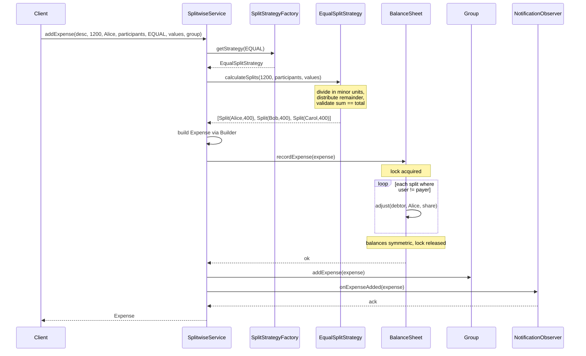
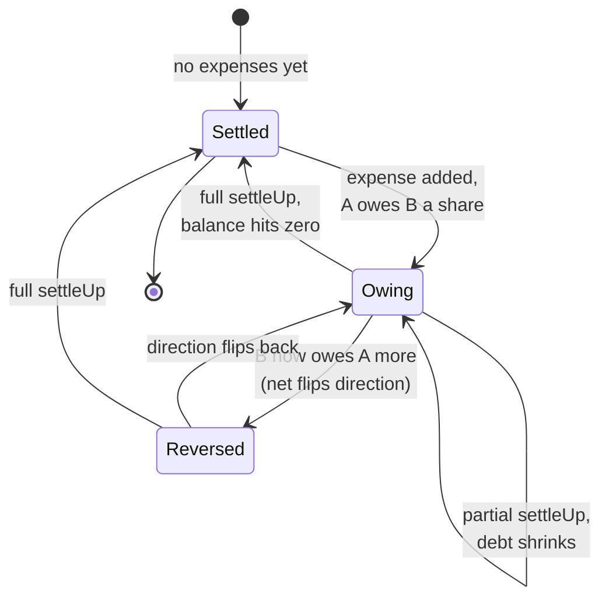

# 💸 Low-Level Design: Splitwise (Expense-Sharing System)

> A complete, interview-ready walkthrough of the classic **Splitwise / expense-sharing** design problem (the "design an app that splits a dinner bill, tracks who owes whom, and settles up" question) — from a blank whiteboard to a staff-level system that records shared expenses, splits them equally, by exact amount, or by percentage, maintains a correct running balance for every pair of people, and can compress a tangled web of debts into the fewest possible payments.

At first glance Splitwise looks like a shared spreadsheet: someone types "Dinner — ₹1200," picks who was there, and the app divides by the headcount. That surface simplicity is exactly why interviewers reach for it — because the correct model hides a problem that is quietly harder than "divide by N." The moment three friends pay for different things across a weekend trip, the question "who owes whom, and how much?" stops being arithmetic and becomes **bookkeeping**: every expense shifts a set of pairwise balances, those balances must stay internally consistent (if Alice owes Bob ₹300, then Bob is owed ₹300 by Alice — always, with no drift), and at the end someone asks the genuinely interesting question: "we have twelve IOUs criss-crossing the group — what is the *minimum* number of payments that clears everyone out?" A candidate who models balance as a single number per user has already lost: that number cannot answer "how much do I owe *Bob specifically*." A candidate who recognizes the real unit as a **directed, pairwise balance that every expense mutates atomically**, and who can turn the settle-up question into a **min-cash-flow graph problem**, writes a system that stays correct after a hundred expenses and still tells each person the shortest path to a zero balance. This guide walks the entire journey: it opens with the beginner's mental model of bills, shares, and IOUs, and escalates naturally into split strategies, the pairwise balance sheet, debt simplification, concurrency on shared balances, multi-currency, and the ledger-grade consistency a principal engineer raises in the closing minutes.

---

## 📋 Table of Contents

**Part I — Framing the Problem**

1. [Problem Statement](#1-problem-statement)
2. [Requirement Clarification & Assumptions](#2-requirement-clarification--assumptions)
3. [Functional & Non-Functional Requirements](#3-functional--non-functional-requirements)
4. [Core Concepts Being Tested](#4-core-concepts-being-tested)

**Part II — Modeling the Domain**

5. [Domain Model & Entities](#5-domain-model--entities)
6. [CRC Cards](#6-crc-cards)
7. [UML Class Diagram](#7-uml-class-diagram)
8. [Package Structure](#8-package-structure)

**Part III — Design Rationale**

9. [Design Decisions & Trade-offs](#9-design-decisions--trade-offs)
10. [Class-by-Class Deep Dive](#10-class-by-class-deep-dive)
11. [Design Patterns Applied](#11-design-patterns-applied)
12. [SOLID Principles Mapping](#12-solid-principles-mapping)

**Part IV — Behavior & Diagrams**

13. [Sequence Diagram](#13-sequence-diagram)
14. [State Diagram](#14-state-diagram)

**Part V — The Implementation**

15. [Complete Java Implementation](#15-complete-java-implementation)
16. [Execution Flow & Code Walkthrough](#16-execution-flow--code-walkthrough)

**Part VI — Engineering Depth**

17. [Complexity Analysis](#17-complexity-analysis)
18. [Thread Safety & Concurrency](#18-thread-safety--concurrency)
19. [Error Handling & Validation](#19-error-handling--validation)
20. [Scalability Discussion](#20-scalability-discussion)
21. [Alternative Designs & Trade-offs](#21-alternative-designs--trade-offs)

**Part VII — Interview Mastery**

22. [Common FAANG Follow-up Questions (L4 → L6)](#22-common-faang-follow-up-questions-l4--l6)
23. [Common Design Mistakes](#23-common-design-mistakes)
24. [Testing Strategy](#24-testing-strategy)
25. [FAANG Q&A Section](#25-faang-qa-section)
26. [STAR Behavioral Questions](#26-star-behavioral-questions)
27. [⚡ Quick Revision Cheat Sheet](#27--quick-revision-cheat-sheet)

---

## 1. Problem Statement

Design the backend for **Splitwise** — the software behind the "Add an expense" button in the app of the same name, or in Google Pay's group bills, or Venmo's split feature. A group of people share costs that no single person should bear alone: a dinner, a road trip, rent and utilities among flatmates, a shared holiday. One person pays the vendor up front, but the cost belongs to several. The system's job is to record each such **expense** — how much it was, who paid, and how the total should be **split** among the participants — and from that stream of expenses maintain a correct, always-consistent answer to the only question users actually care about: **"who owes whom, and how much?"**

Splitting is not always equal. Sometimes the bill is divided evenly by headcount; sometimes each person owes an **exact** amount (you had the ₹800 steak, I had the ₹200 salad); sometimes it is split by **percentage** (roommates on a 40/35/25 rent share). Whatever the rule, the shares must sum back to the total — money cannot be created or destroyed. Each recorded expense nudges a set of **pairwise balances**: if Alice pays ₹1200 for dinner split three ways, then Bob and Carol each now owe Alice ₹400, and the ledger must reflect that instantly and symmetrically. Over a weekend those balances accumulate into a tangle of IOUs pointing in every direction. So the system must also answer the closing question — **"settle up"** — either by recording a real payment that cancels a debt, or by computing the **minimum set of transactions** that brings the whole group to zero, so that instead of everyone paying everyone, the group settles in as few transfers as possible.

<details>
<summary>📖 <b>In plain terms — what are we actually building?</b></summary>

Imagine a weekend trip with three friends. You pay ₹1200 for dinner, your friend pays ₹900 for fuel, the third pays ₹600 for snacks. Nobody wants to do the mental math of who owes what. Splitwise is the app that does it: each time someone pays for something, they log it and say who it was for, and the app quietly keeps a running tally of every "you owe me / I owe you" between each pair of people. At any moment you can open it and see "you owe Priya ₹150" or "Rahul owes you ₹300." When the trip ends and everyone wants to square up, it tells you the smallest number of payments that clears all the debts — so three people don't make six awkward transfers when two will do. Our job is the *brains* behind that: the objects and rules that take a raw expense, divide it correctly, update the web of who-owes-whom, and compute the tidiest way to settle. We are not building the app screens, the payment transfer itself, or the login system — just the server-side logic that keeps the money math correct.

</details>

The deliverable in an interview is not a running product; it is a **clean object-oriented model** — the entities (User, Group, Expense, Split, the balance ledger, a settlement transaction), their responsibilities, and above all two mechanisms: the **split calculation** that turns "₹1200 among three people, by percentage" into concrete per-person shares, and the **balance ledger** that absorbs each expense while staying pairwise-consistent — plus a clear story for **how the system computes the minimum-transaction settlement**. Grading centers on whether you separate "how to split" from "how to store balances" (so new split types drop in without touching the ledger), whether your balance representation can answer per-pair queries, whether "add expense" is atomic under concurrent updates, and how you reason about debt simplification as a graph problem.

---

## 2. Requirement Clarification & Assumptions

The single biggest mistake candidates make is coding before scoping. A strong candidate spends the first few minutes turning "design Splitwise" into a bounded problem — and, crucially, surfaces the *balance representation* and *split-strategy* questions early, because the rest of the design hangs off those two answers. Below is the clarification dialogue you should drive, framed as the questions to ask and the assumptions to lock in.

### 2.1 Actors

The people and systems that interact with the system define its surface area.

| Actor | Role in the system |
|-------|--------------------|
| **User** | A person who pays for or participates in expenses; views balances, adds expenses, and settles up. |
| **Group** | A named collection of users (a trip, a flat, a team) inside which expenses are shared and balances are scoped. |
| **Payer** | The user who actually paid the vendor for a given expense — the creditor for that expense. |
| **Participant** | A user who shares in an expense and therefore owes their split to the payer. |
| **Notification Provider** | External push / email service that tells participants "you were added to an expense." |
| **System / Settlement Engine** | Background logic that computes simplified settlements and, in a real product, reconciles recorded payments. |

### 2.2 Key Clarifying Questions

Before modeling anything, resolve these with the interviewer. Each answer materially changes the design.

- **What is the unit of record, and what does it mutate?** — The unit is an **expense** (amount + payer + a set of splits); recording it **mutates pairwise balances** between the payer and each participant. *(Assumption: we store balances, not just a log — every expense updates a running who-owes-whom ledger so balance queries are O(1)-ish, not a full replay.)*
- **How is a balance represented?** — This is *the* question; drive it early. *(Assumption: balance is **directed and pairwise** — `balance[A][B]` = how much A owes B, always the negation of `balance[B][A]`. A single net number per user is insufficient because users ask "how much do I owe *Bob*?")*
- **What split types must we support?** — *(Assumption: **EQUAL** (divide evenly), **EXACT** (caller gives each person's amount), and **PERCENT** (caller gives each person's %). The set must be open — adding "by shares" later must not touch the ledger.)*
- **Must splits always sum to the total?** — *(Assumption: yes — validation is mandatory. Exact splits must sum to the expense amount; percentages must sum to 100. We also handle the rounding remainder for EQUAL so pennies are never lost.)*
- **Are expenses always inside a group?** — *(Assumption: expenses can be **group-scoped** or **one-to-one (friend) expenses**. We model a group as the container but allow a two-person ad-hoc expense; balances are global per user pair, and groups are a view/scope over them.)*
- **Can the payer also be a participant?** — *(Assumption: yes, and commonly is. If Alice pays ₹1200 for a dinner she attended, her own share is not an IOU — only the *other* participants owe her.)*
- **Does "settle up" move real money?** — *(Assumption: no. `settleUp` records that a payment happened outside the app and cancels the corresponding balance. Actual payment rails — UPI, Venmo, Stripe — are out of scope but sit behind a seam.)*
- **Do we simplify debts, and is it automatic?** — *(Assumption: we provide **on-demand debt simplification** that returns the minimum set of transactions to zero out a group; we do not silently rewrite who-owes-whom, because users want to see their real per-pair debts too.)*
- **Multiple currencies?** — *(Assumption: v1 is single-currency; we note where a currency field and FX conversion would enter and keep amounts as a precise type, not float, to avoid rounding drift.)*
- **Concurrency and scale?** — *(Assumption: many users in a group may add expenses simultaneously; updating a shared balance must be atomic to avoid lost updates. Scale ranges from a 4-person trip to millions of groups; the design must not serialize all writes through one global lock.)*

### 2.3 Explicit Non-Goals

Naming what you will *not* build is a senior signal — it shows you can bound scope deliberately rather than by omission.

- No UI, mobile screens, or expense-entry forms — we design the server-side model and services.
- No real payment processing or bank/UPI integration; `settleUp` records an out-of-band payment behind a seam.
- No user authentication, friend requests, or social graph beyond a `User` identity and group membership.
- No receipt scanning, OCR, or automatic categorization of expenses.
- No full multi-currency FX engine in v1 — single currency assumed; we note the extension point.
- No expense comments, attachments, activity feed, or reminders (mentioned as extensions, not built).
- No historical audit/versioning of edited expenses in v1, though we discuss why a real ledger would keep it.

<details>
<summary>📖 <b>Why spend so long on clarification?</b></summary>

The prompt "design Splitwise" is intentionally broad, and two questions reshape the entire design. The first — "how do we represent a balance?" — decides everything downstream: answer *a directed, pairwise ledger* rather than *one number per person* and you can serve "how much do I owe Bob?" instantly and keep the books symmetric. The second — "how do we split, and can the set of split types grow?" — pushes you toward a Strategy so EQUAL, EXACT, and PERCENT (and future types) plug in without touching the ledger. Getting these two right early signals you know where the difficulty actually lives, and it sets up the staff-level follow-ups on debt simplification, concurrent balance updates, and ledger-grade consistency.

</details>

---

## 3. Functional & Non-Functional Requirements

With scope bounded, we can state precisely what the system must *do* (functional) and what qualities it must *have* (non-functional). Keeping these separate is itself a senior habit: functional requirements drive the class model, while non-functional requirements drive the harder conversations about concurrency, precision, and scale.

### 3.1 Functional Requirements

The system must let a user do the following:

- **Register users and create groups.** A user has an identity; a group has members. Expenses can be added within a group or directly between two users.
- **Add an expense.** Specify a description, a total amount, the payer, the list of participants, a split type (EQUAL / EXACT / PERCENT), and the split inputs (nothing for EQUAL, per-person amounts for EXACT, per-person percentages for PERCENT).
- **Split correctly and validate.** Compute each participant's share according to the split type; reject the expense if exact amounts don't sum to the total or percentages don't sum to 100; distribute any rounding remainder deterministically so no money is lost.
- **Maintain pairwise balances.** After each expense, update the directed balance between the payer and every other participant so the ledger stays consistent and symmetric.
- **Query balances.** Show a user their full balance picture ("you owe Bob ₹400, Carol owes you ₹150") and the net balance for any specific pair or within a group.
- **Settle up.** Record that one user paid another a given amount, reducing (or clearing) the balance between them.
- **Simplify debts.** On demand, compute the **minimum set of transactions** that settles all balances within a group to zero.
- **Notify participants.** When an expense is added, inform the participants (through a seam, not a real provider).

### 3.2 Non-Functional Requirements

| Quality | Requirement | Why it matters here |
|---------|-------------|---------------------|
| **Correctness / Consistency** | Balances must always be symmetric and sum to zero across the system; no expense may create or destroy money. | This is a financial ledger — a one-paisa drift compounds and destroys user trust. |
| **Precision** | Monetary amounts must avoid floating-point drift; splits must account for indivisible remainders. | ₹100 / 3 is not representable in float; someone must absorb the extra paisa deterministically. |
| **Extensibility** | New split types must be addable without modifying the ledger or the expense-creation flow. | Splitwise really does support "by shares," "adjustment," "+/-" — the split set grows. |
| **Concurrency safety** | Concurrent expense additions and settlements touching the same balance must not lose updates. | Two roommates logging rent and utilities at once must both land correctly. |
| **Performance** | Balance queries should be near-constant time; adding an expense should be O(participants). | Users open the app and expect instant balances, not a replay of history. |
| **Scalability** | The model must extend from a 4-person trip to millions of groups without a global bottleneck. | Balances shard naturally by group / user pair; simplification is per-group. |
| **Auditability** | It should be possible to explain how any balance was reached. | Money disputes require "show me the expenses behind this number." |

<details>
<summary>📖 <b>Which requirement is the "trap" the interviewer is watching for?</b></summary>

Precision. Almost every candidate reaches for `double amount` and splits with `amount / n`, and almost every interviewer immediately asks "you split ₹100 three ways — where did the last paisa go?" Floating-point money is the classic Splitwise trap: `0.1 + 0.2 != 0.3`, and dividing rarely comes out even. The senior answer is to represent money as an integer number of the smallest unit (paise/cents) or `BigDecimal`, and to distribute the remainder deterministically — give the extra paisa to the first participant (or the payer) so the shares still sum exactly to the total. Naming this before being asked is a strong signal you have built something that touches money.

</details>

---

## 4. Core Concepts Being Tested

Interviewers use Splitwise to probe a specific cluster of design skills. Recognizing them lets you steer the conversation toward what is actually being graded.

**Separation of policy from mechanism (Strategy).** "How to split" (EQUAL / EXACT / PERCENT) is a *policy* that varies and grows; "how to store balances" is a *mechanism* that stays fixed. The central test is whether you isolate split calculation behind an interface so the two evolve independently. A design where the balance-update code contains an `if (type == EQUAL) ... else if (type == PERCENT)` ladder fails this test.

**Correct financial modeling.** Money is not an `int` you divide. The interviewer probes whether you understand precision, the summation invariant (splits sum to total), and remainder distribution. This is where the "textbook" answer (divide by n) meets the follow-up ("prove no money is lost").

**Balance representation as a directed graph.** The who-owes-whom relationship is a directed, weighted graph: nodes are users, an edge A→B weighted w means A owes B w. Every design decision — pairwise map, net balance, simplification — is a statement about this graph. Recognizing it as a graph is what unlocks the debt-simplification follow-up.

**Debt simplification as an algorithm.** "Minimize the number of transactions to settle a group" is the signature hard follow-up. It reduces to: compute each person's *net* balance (sum of all their edges), then greedily match the biggest creditor with the biggest debtor. Candidates who can state this — and discuss that true minimization is NP-hard but the greedy heap approach is the practical standard — separate themselves.

**Atomicity and concurrency on shared state.** The balance ledger is shared mutable state. Two concurrent "add expense" calls that both read-modify-write the same pair's balance can lose an update. The test is whether you make the read-modify-write atomic (lock, atomic map operations, or a serialized ledger) without serializing the entire system.

**Extensible orchestration (Facade + Factory + Observer).** A clean `SplitwiseService` facade hides the wiring; a factory turns a `SplitType` into the right strategy; an observer fans out notifications without the core knowing who listens. These patterns show you can keep the moving parts decoupled.

<details>
<summary>📖 <b>What is the one insight that impresses interviewers most?</b></summary>

That the whole system is a **directed, weighted graph of debts**, and that the two headline features are graph operations on it. "Add expense" adds weight to edges between the payer and participants; "show balances" reads a node's edges; "simplify debts" is a graph-reduction problem — collapse every node to a single net number, then find the fewest edges that rebalance the graph to zero. Framing Splitwise this way, instead of as CRUD over an expense table, is exactly the mental shift from an L4 answer to an L5/L6 one, and it makes every hard follow-up (simplification, currencies, sharding by pair) fall out naturally.

</details>

---

## 5. Domain Model & Entities

Before drawing a single class, it pays to name the *nouns* of the problem and the one *verb* that binds them. The nouns are the things we store; the verb — "split this expense and post it to the ledger" — is the behavior everything else supports. Getting the nouns right, with clean boundaries, is 80% of the design; the patterns that follow are just how we keep those nouns from tangling.

At the center sits the **Expense**: a single shared cost, with an amount, a payer, and a list of **Split**s — the resolved per-person shares. How those shares are computed is delegated to a **SplitStrategy**, so the Expense never contains a `switch` on split type. Users belong to **Group**s, which are containers and scopes for expenses. The running "who owes whom" lives in the **BalanceSheet**, a directed ledger keyed by user pairs. Settling up is a **Transaction** — one payment from one user to another — and computing the tidiest set of them is the job of the **DebtSimplifier**. Orchestrating all of it is the **SplitwiseService** facade.

Here are the core entities and their responsibilities:

| Entity | Type | Responsibility (what it *owns*) | Key state |
|--------|------|--------------------------------|-----------|
| **User** | Entity | Identity of a person in the system. | `userId`, `name`, `email` |
| **Group** | Entity | A named scope of members and their shared expenses. | `groupId`, `name`, `members`, `expenses` |
| **Expense** | Entity | A single shared cost: what, how much, who paid, how it's split. | `expenseId`, `description`, `amount`, `paidBy`, `splits`, `splitType`, `createdAt` |
| **Split** | Value Object | One participant's resolved share of an expense. | `user`, `amount` |
| **SplitType** | Enum | The kind of split requested. | `EQUAL`, `EXACT`, `PERCENT` |
| **SplitStrategy** | Strategy (policy) | Turns a total + participants + inputs into validated `Split`s. | *(stateless)* |
| **SplitStrategyFactory** | Factory | Maps a `SplitType` to its `SplitStrategy`. | *(stateless)* |
| **BalanceSheet** | Entity (ledger) | The directed pairwise balance graph; applies expenses & settlements atomically. | `Map<User, Map<User, Double>> balances` |
| **Transaction** | Value Object | A single "who pays whom, how much" settlement instruction. | `from`, `to`, `amount` |
| **DebtSimplifier** | Service | Computes the minimum set of `Transaction`s to zero a group. | *(stateless)* |
| **ExpenseObserver** | Observer | Reacts to a newly added expense (notifications, activity feed). | *(stateless)* |
| **SplitwiseService** | Facade | Orchestrates users, groups, splitting, the ledger, and simplification. | registries + `BalanceSheet` |

The crucial modeling decision hiding in this table is that **Split is a resolved value object, not a strategy**. The *strategy* decides shares; the *split* is the immutable result (`{user: Bob, amount: 400}`). This keeps the Expense a dumb data holder — it carries splits, it does not compute them — which is what lets the balance sheet stay ignorant of split types entirely.

<details>
<summary>📖 <b>Why is Split just data while SplitStrategy has the logic?</b></summary>

It is tempting to make an `EqualSplit`, `ExactSplit`, and `PercentSplit` class hierarchy where each split knows how to compute itself. That leaks the "how to divide" policy into the data the Expense carries, and it forces the balance sheet to care about split subtypes. Instead we separate them: `SplitStrategy` (there are three, one per type) does the dividing and hands back plain `Split` value objects that only say "this user owes this amount." The Expense stores those splits; the BalanceSheet reads only `user` and `amount`. Now adding a new split type means adding one strategy class — the Split value object, the Expense, and the ledger never change. This is the Strategy pattern doing exactly what it is for: isolating the part that varies.

</details>

---

## 6. CRC Cards

CRC (Class–Responsibility–Collaborator) cards are the whiteboard tool for pinning down *who does what* before drawing relationships. Each card names a class, its responsibilities (verbs), and the collaborators it leans on. The discipline they enforce is single responsibility: if a card's responsibility list spills past three or four lines, the class is doing too much.

```
┌─────────────────────────────────────────────────────────────┐
│ Class: SplitwiseService  (Facade)                             │
├──────────────────────────────────┬──────────────────────────┤
│ Responsibilities                  │ Collaborators             │
│ - Register users, create groups   │ User, Group               │
│ - Orchestrate add-expense flow    │ SplitStrategyFactory      │
│ - Post expenses to the ledger     │ BalanceSheet, Expense     │
│ - Record settlements              │ Transaction               │
│ - Trigger debt simplification     │ DebtSimplifier            │
│ - Fan out notifications           │ ExpenseObserver           │
└──────────────────────────────────┴──────────────────────────┘

┌─────────────────────────────────────────────────────────────┐
│ Class: SplitStrategy  (interface)                             │
├──────────────────────────────────┬──────────────────────────┤
│ Responsibilities                  │ Collaborators             │
│ - Compute per-person shares from  │ Split, User               │
│   total + participants + inputs   │                           │
│ - Validate that shares sum to     │                           │
│   the total (or % to 100)         │                           │
└──────────────────────────────────┴──────────────────────────┘

┌─────────────────────────────────────────────────────────────┐
│ Class: SplitStrategyFactory                                   │
├──────────────────────────────────┬──────────────────────────┤
│ Responsibilities                  │ Collaborators             │
│ - Map a SplitType to the right    │ SplitStrategy, SplitType  │
│   SplitStrategy instance          │                           │
└──────────────────────────────────┴──────────────────────────┘

┌─────────────────────────────────────────────────────────────┐
│ Class: Expense                                                │
├──────────────────────────────────┬──────────────────────────┤
│ Responsibilities                  │ Collaborators             │
│ - Hold what/how-much/who-paid     │ User, Split, SplitType    │
│ - Carry the resolved splits       │                           │
│ - Be immutable once built         │                           │
└──────────────────────────────────┴──────────────────────────┘

┌─────────────────────────────────────────────────────────────┐
│ Class: BalanceSheet  (the ledger)                             │
├──────────────────────────────────┬──────────────────────────┤
│ Responsibilities                  │ Collaborators             │
│ - Store directed pairwise balances│ User, Expense             │
│ - Apply an expense atomically     │ Split, Transaction        │
│ - Apply a settlement atomically   │                           │
│ - Answer balance queries          │                           │
│ - Keep balances symmetric         │                           │
└──────────────────────────────────┴──────────────────────────┘

┌─────────────────────────────────────────────────────────────┐
│ Class: DebtSimplifier                                         │
├──────────────────────────────────┬──────────────────────────┤
│ Responsibilities                  │ Collaborators             │
│ - Reduce balances to net per user │ User, Transaction         │
│ - Greedily match creditors to     │ BalanceSheet (net view)   │
│   debtors, minimizing transfers   │                           │
└──────────────────────────────────┴──────────────────────────┘

┌─────────────────────────────────────────────────────────────┐
│ Class: Group                                                  │
├──────────────────────────────────┬──────────────────────────┤
│ Responsibilities                  │ Collaborators             │
│ - Hold members and their expenses │ User, Expense             │
│ - Scope simplification to members │                           │
└──────────────────────────────────┴──────────────────────────┘
```

<details>
<summary>📖 <b>What do CRC cards buy me in an interview?</b></summary>

They force you to say who does what *before* you argue about inheritance or data structures, which is where candidates usually get lost. Writing the BalanceSheet card, for instance, makes it obvious that "compute the minimum settlement" does not belong there — that is a separate responsibility, so it earns its own card (DebtSimplifier). The moment a card's responsibility list grows a sixth bullet, you have found a class that needs splitting. Interviewers read this as evidence you decompose by responsibility rather than dumping everything into one god-class `ExpenseManager`.

</details>

---

## 7. UML Class Diagram

The ASCII diagram below shows the static structure: classes, their key fields and methods, and the relationships between them. Every name, type, and signature here matches the Java implementation in Section 15 exactly — the Strategy interface, the factory, the ledger, and the facade. Read it top-down: the facade orchestrates, the strategy family computes splits, the ledger stores balances, and the simplifier reduces them.

```
                          ┌───────────────────────────────────────────┐
                          │            SplitwiseService                 │  «Facade»
                          ├───────────────────────────────────────────┤
                          │ - users: Map<String, User>                  │
                          │ - groups: Map<String, Group>                │
                          │ - balanceSheet: BalanceSheet                │
                          │ - debtSimplifier: DebtSimplifier            │
                          │ - observers: List<ExpenseObserver>          │
                          ├───────────────────────────────────────────┤
                          │ + addUser(name, email): User                │
                          │ + createGroup(name, members): Group         │
                          │ + addExpense(desc, amount, paidBy,          │
                          │     participants, type, values, group):     │
                          │     Expense                                 │
                          │ + settleUp(from, to, amount): void          │
                          │ + showBalances(user): Map<User, Double>     │
                          │ + simplifyGroupDebts(group):                │
                          │     List<Transaction>                       │
                          │ + registerObserver(o): void                 │
                          └───┬─────────┬──────────┬──────────┬─────────┘
                              │ uses    │ uses     │ owns     │ notifies
                              ▼         ▼          ▼          ▼
        ┌─────────────────────────┐  ┌──────────────────┐  ┌───────────────────────┐
        │  SplitStrategyFactory   │  │   BalanceSheet    │  │   «interface»         │
        ├─────────────────────────┤  ├──────────────────┤  │   ExpenseObserver     │
        │ + getStrategy(type):    │  │ - balances:      │  ├───────────────────────┤
        │     SplitStrategy       │  │   Map<User,      │  │ + onExpenseAdded(exp) │
        └───────────┬─────────────┘  │   Map<User,      │  └──────────▲────────────┘
                    │ creates        │   Double>>       │             │ implements
                    ▼                │ - lock: Lock     │  ┌──────────┴────────────┐
        ┌─────────────────────────┐  ├──────────────────┤  │  NotificationObserver │
        │  «interface»            │  │ + recordExpense  │  └───────────────────────┘
        │  SplitStrategy          │  │     (expense)    │
        ├─────────────────────────┤  │ + recordSettle-  │       ┌────────────────────┐
        │ + calculateSplits(      │  │   ment(from,to,  │       │   DebtSimplifier   │
        │     totalAmount,        │  │     amount)      │       ├────────────────────┤
        │     participants,       │  │ + getBalancesFor │       │ + simplify(        │
        │     splitValues):       │  │     (user):      │       │    netBalances):   │
        │     List<Split>         │  │   Map<User,Dbl>  │       │    List<Transaction>│
        └───────────┬─────────────┘  │ + getNetBalance  │       └────────────────────┘
                    │ implements     │     (user): Dbl  │
      ┌─────────────┼─────────────┐  │ - adjust(debtor, │
      ▼             ▼             ▼  │   creditor, amt) │
┌───────────┐┌───────────┐┌───────────┐└──────────────────┘
│  Equal    ││  Exact    ││  Percent  │
│  Split    ││  Split    ││  Split    │
│  Strategy ││  Strategy ││  Strategy │
└───────────┘└───────────┘└───────────┘

  ┌──────────────────────────┐        ┌───────────────────────┐       ┌──────────────────┐
  │        Expense           │        │        Split          │       │   Transaction    │
  ├──────────────────────────┤        ├───────────────────────┤       ├──────────────────┤
  │ - expenseId: String      │        │ - user: User          │       │ - from: User     │
  │ - description: String    │  1   * │ - amount: double      │       │ - to: User       │
  │ - amount: double         │◆──────▶│                       │       │ - amount: double │
  │ - paidBy: User           │        │ + getUser(): User     │       │ + getFrom(): User│
  │ - splits: List<Split>    │        │ + getAmount(): double │       │ + getTo(): User  │
  │ - splitType: SplitType   │        └───────────────────────┘       │ + getAmount():dbl│
  │ - createdAt: long        │                                        └──────────────────┘
  │ + getters...             │        ┌───────────────────────┐
  │ «static» Builder         │        │        Group          │       ┌──────────────────┐
  └───────────┬──────────────┘        ├───────────────────────┤       │  «enum»          │
              │ paidBy                │ - groupId: String     │       │  SplitType       │
              ▼                       │ - name: String        │       ├──────────────────┤
        ┌──────────┐          * ┌─────│ - members: Set<User>  │       │  EQUAL           │
        │   User   │◀───────────┤     │ - expenses:List<Exp.> │       │  EXACT           │
        ├──────────┤   members  *└────▶│ + addMember(user)     │       │  PERCENT         │
        │-userId   │                   │ + addExpense(expense) │       └──────────────────┘
        │-name     │                   │ + getMembers()        │
        │-email    │                   └───────────────────────┘
        └──────────┘
```

Legend: `◆──▶` is composition (an Expense owns its Splits), `──▶` is association/reference, and `──▷`/`implements` is realization of an interface. The three strategy classes realize `SplitStrategy`; `NotificationObserver` realizes `ExpenseObserver`.

<details>
<summary>📖 <b>How do I read this diagram quickly?</b></summary>

Follow the arrows out of `SplitwiseService` — it is the front door, and everything it touches is a collaborator. It *uses* the factory to pick a split strategy, *owns* the balance sheet where money math lives, *uses* the simplifier when someone settles up, and *notifies* observers. The strategy family (bottom left) is the "how to split" axis that can grow; the balance sheet (center) is the "where balances live" axis that stays fixed. Expense and Split (bottom) are pure data. If you can explain those three clusters — orchestrator, strategy family, ledger — you have explained the whole design.

</details>

---

## 8. Package Structure

A clean package layout mirrors the responsibility boundaries and makes the dependency direction obvious: strategies and the ledger know nothing about the service; the service depends inward on them. This is the physical expression of the Dependency Inversion we discuss in Section 12.

```
com.splitwise
│
├── model
│   ├── User.java              // identity
│   ├── Group.java             // members + expenses scope
│   ├── Expense.java           // shared cost + resolved splits (+ Builder)
│   ├── Split.java             // one participant's share (value object)
│   ├── Transaction.java       // a settlement instruction (value object)
│   └── SplitType.java         // enum: EQUAL, EXACT, PERCENT
│
├── split                      // the "how to divide" policy axis
│   ├── SplitStrategy.java     // interface
│   ├── EqualSplitStrategy.java
│   ├── ExactSplitStrategy.java
│   ├── PercentSplitStrategy.java
│   └── SplitStrategyFactory.java
│
├── ledger                     // the "where balances live" mechanism axis
│   ├── BalanceSheet.java      // directed pairwise balance graph
│   └── DebtSimplifier.java    // min-cash-flow settlement
│
├── observer                   // decoupled reactions to events
│   ├── ExpenseObserver.java   // interface
│   └── NotificationObserver.java
│
├── service
│   └── SplitwiseService.java  // the Facade / orchestrator
│
├── exception
│   └── InvalidSplitException.java
│
└── Demo.java                  // runnable end-to-end example
```

The layout separates the two axes of change that Section 4 identified. The `split` package holds everything about *how to divide* — new split types land here and nowhere else. The `ledger` package holds everything about *storing and reducing balances*. The `service` package is the only one that knows about all of them, and it depends on interfaces (`SplitStrategy`, `ExpenseObserver`) rather than concretes. If you find yourself wanting to `import com.splitwise.split.*` from inside `ledger`, that is a design smell — the ledger reads `Split` value objects, never strategies.

---

## 9. Design Decisions & Trade-offs

Every interesting design is a sequence of forks in the road. The sections below name the forks that matter for Splitwise, state which branch we took, and — more importantly — *why*, and what we gave up. These are exactly the trade-offs an interviewer will poke at.

### 9.1 Store balances, don't replay expenses

We keep a **materialized balance ledger** that every expense mutates, rather than storing only a log of expenses and recomputing balances on demand. The trade-off is write cost versus read cost: replaying is simpler to reason about and gives a perfect audit trail, but it makes every "what's my balance?" query O(number of expenses), which is unacceptable for a screen users open constantly. Materializing makes balance reads near-constant and keeps the expense log too (for audit), at the cost of a read-modify-write on each expense. For a system where reads vastly outnumber writes, this is the right default. (An event-sourced hybrid — log as source of truth, ledger as a projection — is the staff-level refinement in Section 21.)

### 9.2 Balance as a directed, pairwise map — not one net number

We represent balances as `Map<User, Map<User, Double>>`, where `balances[A][B]` is how much A owes B, kept as the exact negation of `balances[B][A]`. The alternative — a single net number per user — is smaller and makes "am I up or down overall?" trivial, but it *cannot* answer "how much do I owe Bob specifically," which is the primary Splitwise screen, and it makes settling a single debt ("I just paid Bob") impossible to represent precisely. Pairwise storage costs O(pairs) memory but preserves the full truth. We *derive* the net number when we need it (for simplification); we never store only the net.

### 9.3 Split calculation behind a Strategy, resolved into plain Splits

"How to divide" (EQUAL / EXACT / PERCENT) is isolated in a `SplitStrategy`, and the result is a list of plain `Split` value objects. The alternative — a `switch (splitType)` inside the expense-creation code, or a `Split` subclass per type that computes itself — couples the split policy to the orchestration and to the ledger. Strategy costs one extra interface and a factory, but it means a new split type ("by shares," "itemized") is one new class with zero edits elsewhere. Given that Splitwise genuinely keeps adding split types, this is a clear win.

### 9.4 Validation lives in the strategy, at creation time

Each strategy validates its own inputs — exact amounts must sum to the total, percentages to 100 — and throws before any balance is touched. The alternative is to validate centrally in the service, but that recreates the type-switch we just removed: only the ExactSplitStrategy knows what "valid exact input" means. Pushing validation into the strategy keeps the rule next to the logic that needs it and guarantees the ledger only ever sees well-formed, summing-to-total splits.

### 9.5 Money precision: deterministic remainder distribution

For the reference implementation we use `double` for readability, but we split in integer minor units (paise/cents) and hand any indivisible remainder to the first participants deterministically, so shares always sum back to the total to the paisa. The honest trade-off: `double` can still accumulate representation error across many operations, so a production system stores money as `long` minor units or `BigDecimal`. We call this out explicitly (Sections 3 and 19) rather than pretend `double` is safe for money — naming the limitation is the senior move.

### 9.6 Debt simplification is on-demand and greedy, not automatic

We expose `simplifyGroupDebts` as an explicit operation returning a suggested set of transactions; we do **not** silently rewrite the real pairwise balances. Users want to see the true "you owe Bob ₹400" as well as the optimized "just pay Carol ₹400 instead." We also choose the **greedy net-balance** algorithm (match biggest creditor to biggest debtor) rather than searching for the provably minimum, because true minimization is NP-hard and the greedy result is what real apps ship. We trade optimality-in-the-worst-case for a fast, near-optimal, explainable result.

### 9.7 Notifications via Observer, off the critical path

Adding an expense fires an event to registered `ExpenseObserver`s *after* the ledger commits, rather than calling a notification service inline. This decouples "record the money" from "tell people," so a slow or failing notifier never blocks or corrupts a balance update. The trade-off is eventual (not synchronous) notification, which is exactly what a real system wants anyway.

<details>
<summary>📖 <b>Which single decision matters most?</b></summary>

Representing balances as a directed pairwise map (9.2). It is the decision the whole design pivots on: it is what lets you answer the core "how much do I owe Bob?" query, what keeps the books symmetric and auditable, and what turns settle-up into a well-defined graph reduction. If you collapse balances to one net number per person too early, you save a little memory but you lose the ability to show real per-friend debts and to settle individual IOUs — and you can never get that information back. Every strong Splitwise answer starts from the pairwise graph and *derives* the net view only when simplifying.

</details>

---

## 10. Class-by-Class Deep Dive

With the rationale set, here is what each class is *for*, how it behaves, and the one subtle thing about it that separates a shallow answer from a deep one. We build bottom-up: value objects first, then the strategy family, then the ledger, then the orchestrating facade.

### 10.1 `User` — identity

The simplest entity: an id, a name, an email. Its only real job is identity, so it defines `equals` and `hashCode` on `userId` alone. This matters more than it looks: `User` is used as a **map key** in the balance sheet (`Map<User, Map<User, Double>>`). If two `User` objects for the same person didn't compare equal, their balances would silently split into two buckets and the ledger would lie. Identity-based equality is the quiet foundation the whole ledger stands on.

### 10.2 `Split` — one participant's resolved share

An immutable value object pairing a `User` with the `amount` they owe for a given expense. It carries no logic — it is the *output* of a strategy, not a computer of anything. Keeping it dumb is deliberate: the balance sheet reads only `getUser()` and `getAmount()`, so it never needs to know whether the split came from an equal, exact, or percentage calculation. This is what makes the ledger immune to new split types.

### 10.3 `SplitType` — the enum of split kinds

A three-value enum (`EQUAL`, `EXACT`, `PERCENT`) that the caller passes in and the factory maps to a strategy. It exists so the *public API* can name a split type without exposing strategy classes, and so the factory has a clean thing to switch on in exactly one place. When a new split type is added, this enum and the factory are the only two spots that grow — never the ledger or the expense.

### 10.4 `SplitStrategy` and its implementations — the "how to divide" family

The interface has one method: `calculateSplits(totalAmount, participants, splitValues) : List<Split>`. Three implementations realize it:

- **`EqualSplitStrategy`** divides the total evenly, computing shares in minor units and distributing the remainder to the first participants so the shares sum exactly to the total. This is where the "where did the last paisa go?" follow-up is answered in code.
- **`ExactSplitStrategy`** takes explicit per-person amounts, validates that they sum to the total, and wraps each into a `Split`.
- **`PercentSplitStrategy`** takes per-person percentages, validates they sum to 100, then applies them to the total (again handling the rounding remainder).

Each strategy is stateless and therefore trivially shareable and thread-safe. The subtle point: **validation is part of the strategy's contract**, not an afterthought — a strategy either returns splits that provably sum to the total, or it throws.

### 10.5 `SplitStrategyFactory` — mapping type to strategy

A tiny factory with a single static `getStrategy(SplitType) : SplitStrategy`. It centralizes the one unavoidable `switch` on split type so that the rest of the codebase never branches on type again. Because the strategies are stateless, the factory can return cached singletons rather than allocating per call — a small but real efficiency the interviewer may probe.

### 10.6 `Expense` — the shared cost

An immutable record of one expense: id, description, amount, `paidBy`, the resolved `splits`, the `splitType`, and a timestamp. It is built through a **Builder** because it has many fields, several optional, and constructing it invalid (splits that don't match the amount) must be impossible. The Expense does not compute its own splits — they are handed in already resolved — which keeps it a pure data holder and keeps split policy out of the domain object.

### 10.7 `BalanceSheet` — the directed ledger

The heart of the system. It holds `Map<User, Map<User, Double>> balances` and exposes:

- `recordExpense(expense)` — for each split whose user isn't the payer, it moves that share of debt from the participant to the payer.
- `recordSettlement(from, to, amount)` — applies a real payment, reducing the balance the payer owes.
- `getBalancesFor(user)` — returns that user's edges (who they owe / who owes them).
- `getNetBalance(user)` — derives the single net figure (creditor-positive) used for simplification.

Its private `adjust(debtor, creditor, amount)` is the one place balances change, and it always updates **both** directions (`balances[debtor][creditor] += amount` and `balances[creditor][debtor] -= amount`) so symmetry is structurally guaranteed. Every mutating method runs under a lock so concurrent expenses can't lose updates (Section 18).

### 10.8 `DebtSimplifier` — minimum settlement

A stateless service with `simplify(netBalances) : List<Transaction>`. It takes each user's net balance (positive = should receive, negative = owes), pushes creditors and debtors onto two max-heaps, and repeatedly matches the largest creditor with the largest debtor, emitting a `Transaction` for the smaller of the two amounts and pushing back the remainder. This produces at most `n − 1` transactions for `n` non-zero people — near-optimal and always explainable.

### 10.9 `SplitwiseService` — the facade

The single entry point. It owns the registries (`users`, `groups`), the `balanceSheet`, the `debtSimplifier`, and the observer list, and it wires the add-expense flow together: ask the factory for a strategy, compute splits, build the Expense, record it in the ledger, attach it to the group, and notify observers. Clients talk only to this facade; they never touch the strategy, ledger, or simplifier directly. That keeps the moving parts hidden and the public surface small.

<details>
<summary>📖 <b>Why build it bottom-up like this?</b></summary>

Because each layer depends only on the ones below it, and building in dependency order means you never reference something you haven't defined. `Split` and `User` are pure data with no dependencies, so they come first. `SplitStrategy` produces `Split`s, so it comes next. `BalanceSheet` consumes `Split`s and `User`s. `DebtSimplifier` reads the ledger's net view. `SplitwiseService` sits on top and orchestrates everyone. In an interview, narrating in this order shows you understand the dependency graph — and it is also the order that makes the live-coding compile the first time.

</details>

---

## 11. Design Patterns Applied

Naming patterns is not decoration — each one here solves a specific tension in the design, and being able to say *which tension* is what makes the naming land in an interview.

| Pattern | Where | Problem it solves |
|---------|-------|-------------------|
| **Strategy** | `SplitStrategy` + Equal/Exact/Percent implementations | Isolates the "how to divide" policy that varies and grows, so new split types don't touch the ledger or the service. |
| **Factory** | `SplitStrategyFactory.getStrategy(type)` | Centralizes the one `switch` on `SplitType` and hands back the right (cached) strategy, so no other code branches on type. |
| **Builder** | `Expense.Builder` | Constructs an immutable Expense with many fields safely, making an invalid/partial Expense impossible to build. |
| **Facade** | `SplitwiseService` | Presents one simple entry point over the strategy, ledger, simplifier, and observers, hiding the wiring from clients. |
| **Observer** | `ExpenseObserver` / `NotificationObserver` | Decouples "an expense happened" from "who reacts," so notifications fan out without the core knowing listeners, off the critical path. |
| **Value Object** | `Split`, `Transaction` | Models immutable, equality-by-value concepts (a share, a payment) that are safe to pass around and can't be mutated into an inconsistent state. |
| **Singleton (scoped)** | cached stateless strategies inside the factory | Avoids re-allocating stateless strategies on every call. |

The two patterns that carry the design are **Strategy** (the extensibility axis) and **Facade** (the simplicity axis). Everything else supports them. A candidate who can explain *why* Strategy specifically — "because split type is the thing most likely to change, and I want that change to be additive" — is demonstrating pattern judgment, not pattern vocabulary.

<details>
<summary>📖 <b>Aren't patterns just jargon? Why name them?</b></summary>

Patterns are a shared vocabulary that compresses a paragraph of explanation into one word. Saying "I'll put split logic behind a Strategy" instantly tells a senior interviewer that you intend an interface with interchangeable implementations selected at runtime, that new types will be additive, and that you've separated policy from mechanism — all without spelling it out. The risk is name-dropping patterns you don't need; the skill is naming the two or three that genuinely fit (here, Strategy and Facade) and being able to justify each by the specific change it makes cheap. Patterns you can't justify are worse than no patterns.

</details>

---

## 12. SOLID Principles Mapping

SOLID is the rubric interviewers use to sanity-check an object model. Here is how this design scores against each principle, with the concrete class that demonstrates it.

**Single Responsibility.** Each class has exactly one reason to change. `EqualSplitStrategy` changes only if equal-division rules change; `BalanceSheet` changes only if balance storage changes; `DebtSimplifier` changes only if the settlement algorithm changes. The `SplitwiseService` orchestrates but delegates all real work, so it changes only when the *flow* changes. The clearest evidence: computing splits, storing balances, and simplifying debts are three separate classes, not three methods on one `ExpenseManager`.

**Open/Closed.** The design is open to new split types and closed to modification: adding "by shares" means adding a `SharesSplitStrategy` and one enum value, with zero edits to the ledger, the expense, or the service flow. Likewise, a new reaction to expenses is a new `ExpenseObserver`, not a change to `recordExpense`.

**Liskov Substitution.** Every `SplitStrategy` is fully substitutable: each honors the same contract — return splits that sum to the total, or throw. The service treats them uniformly and never checks which concrete strategy it holds. No strategy weakens the postcondition (none returns splits that don't sum to the total).

**Interface Segregation.** Interfaces are minimal. `SplitStrategy` has one method; `ExpenseObserver` has one method. No class is forced to implement operations it doesn't use — a notification observer isn't dragged into split logic, and a strategy isn't dragged into event handling.

**Dependency Inversion.** The high-level `SplitwiseService` depends on abstractions (`SplitStrategy`, `ExpenseObserver`), not concretes. It receives strategies from the factory and notifies through the observer interface, so concrete implementations can be swapped or added without touching the orchestrator. The dependency arrows point inward, toward the stable abstractions.

<details>
<summary>📖 <b>How do I bring up SOLID without sounding like a textbook?</b></summary>

Don't recite the five principles — weave them into decisions as you make them. When you put split logic behind an interface, say "this keeps it open for new split types without modifying existing code" (Open/Closed) and move on. When you make the service depend on `SplitStrategy` rather than the concrete classes, note "the orchestrator depends on the abstraction, so I can add strategies freely" (Dependency Inversion). Mentioned in context, SOLID reads as the reasoning behind your choices; recited as a list at the end, it reads as memorized filler. Interviewers strongly prefer the former.

</details>

---

## 13. Sequence Diagram

The most instructive flow is **adding an expense** — it exercises the factory, the strategy, the builder, the ledger, and the observers in one pass. The diagram below traces `addExpense("Dinner", 1200, Alice, [Alice, Bob, Carol], EQUAL, [], tripGroup)`.



The important beats: the factory hands back a strategy, the strategy returns validated splits (Alice's own ₹400 share is included but will be skipped by the ledger since she's the payer), the ledger applies each debt under a lock updating both directions, and only *after* the ledger commits does the service touch the group and fire notifications. Notifications sit at the end, off the money-critical path.

<details>
<summary>📖 <b>Walk me through this flow in plain terms.</b></summary>

A client says "Alice paid ₹1200 for dinner, split it equally among Alice, Bob, and Carol." The service asks the factory for the equal-split calculator, which divides ₹1200 into three ₹400 shares (handling any leftover paisa) and confirms they add back to ₹1200. The service packages this into an Expense and hands it to the ledger, which — while holding a lock so nobody else interferes — records that Bob owes Alice ₹400 and Carol owes Alice ₹400 (Alice's own share is skipped, since she can't owe herself). Then it files the expense under the trip group and pings Bob and Carol that they were added. The client gets the finished Expense back. The whole thing is ordered so the money is committed before anyone is notified.

</details>

---

## 14. State Diagram

An individual **Expense** is essentially immutable once created — but the *balance between two users* has a natural lifecycle worth modeling, and it is what "settle up" acts on. The diagram below shows the states of a pairwise balance from the perspective of a debt A owes B.



The key insight the diagram captures: a pairwise balance is never "deleted," it just moves toward zero and can flip direction. `Settled` (balance exactly zero) is both the start and a recurring resting state. A partial settlement keeps it `Owing` with a smaller number; a full settlement returns it to `Settled`; a new expense in the other direction can push it to `Reversed` (B now owes A). Modeling this explicitly prevents the classic bug of treating "settled" as a terminal, deletable state — in reality the same pair settles and re-owes repeatedly over a friendship's lifetime.

<details>
<summary>📖 <b>Why model a balance as a state machine at all?</b></summary>

Because it makes the tricky cases impossible to forget. If you think of a balance as just a number, you might write settle-up code that assumes the payer always owes the payee — and then break when the balance is already zero, or when it's actually the other direction. Seeing the states laid out (Settled, Owing, Reversed) forces you to handle "settle more than is owed" (reject or cap), "settle exactly to zero" (return to Settled), and "the net direction flipped" (Reversed) as first-class transitions. It's a cheap diagram that catches a whole class of off-by-sign bugs before they reach code.

</details>

---

## 15. Complete Java Implementation

The full implementation follows, grouped into collapsible blocks that mirror the package structure. The code is self-contained and runnable: paste all blocks into one file (or split by package) and run `Demo.main`. Every class name, field type, and method signature matches the UML in Section 7 and the sequence diagram in Section 13. Money is handled in integer minor units (paise/cents) inside each strategy so shares always sum exactly to the total; see Section 19 for why a production system would push that further to `long` or `BigDecimal` throughout.

<details>
<summary>💻 <b>1. SplitType, InvalidSplitException, User, Split, Transaction — enum, exception & value objects</b></summary>

```java
package com.splitwise.model;

// ---- SplitType.java ----
public enum SplitType {
    EQUAL,    // divide the total evenly among participants
    EXACT,    // caller supplies each participant's exact amount
    PERCENT   // caller supplies each participant's percentage (must sum to 100)
}
```

```java
package com.splitwise.exception;

// ---- InvalidSplitException.java ----
// Thrown when split inputs are malformed or violate the summation invariant.
public class InvalidSplitException extends RuntimeException {
    public InvalidSplitException(String message) {
        super(message);
    }
}
```

```java
package com.splitwise.model;

import java.util.Objects;

// ---- User.java ----
// Identity object. equals/hashCode are on userId ONLY, because User is used
// as a key in the balance ledger's maps — two objects for the same person
// must compare equal or their balances would silently split into two buckets.
public class User {
    private final String userId;
    private final String name;
    private final String email;

    public User(String userId, String name, String email) {
        this.userId = userId;
        this.name = name;
        this.email = email;
    }

    public String getUserId() { return userId; }
    public String getName()   { return name; }
    public String getEmail()  { return email; }

    @Override
    public boolean equals(Object o) {
        if (this == o) return true;
        if (!(o instanceof User)) return false;
        return userId.equals(((User) o).userId);
    }

    @Override
    public int hashCode() { return Objects.hash(userId); }

    @Override
    public String toString() { return name; }
}
```

```java
package com.splitwise.model;

// ---- Split.java ----
// Immutable value object: the RESOLVED share of one participant in one expense.
// It carries no logic — it is the output of a SplitStrategy, so the ledger can
// read it without ever knowing which split type produced it.
public class Split {
    private final User user;
    private final double amount;

    public Split(User user, double amount) {
        this.user = user;
        this.amount = amount;
    }

    public User getUser()    { return user; }
    public double getAmount() { return amount; }

    @Override
    public String toString() { return user.getName() + ": " + amount; }
}
```

```java
package com.splitwise.model;

// ---- Transaction.java ----
// Immutable value object: a single "from pays to, this amount" settlement.
// Produced by the DebtSimplifier; also models a recorded real-world payment.
public class Transaction {
    private final User from;
    private final User to;
    private final double amount;

    public Transaction(User from, User to, double amount) {
        this.from = from;
        this.to = to;
        this.amount = amount;
    }

    public User getFrom()     { return from; }
    public User getTo()       { return to; }
    public double getAmount() { return amount; }

    @Override
    public String toString() {
        return from.getName() + " pays " + to.getName() + " " + amount;
    }
}
```

</details>

<details>
<summary>💻 <b>2. SplitStrategy + Equal / Exact / Percent + SplitStrategyFactory — the "how to divide" family</b></summary>

```java
package com.splitwise.split;

import com.splitwise.model.Split;
import com.splitwise.model.User;
import java.util.List;

// ---- SplitStrategy.java ----
// Strategy pattern. One method: turn a total + participants + inputs into
// validated Splits. Contract: the returned shares MUST sum to totalAmount,
// or the method throws. Implementations are stateless and thread-safe.
public interface SplitStrategy {
    List<Split> calculateSplits(double totalAmount,
                                List<User> participants,
                                List<Double> splitValues);
}
```

```java
package com.splitwise.split;

import com.splitwise.exception.InvalidSplitException;
import com.splitwise.model.Split;
import com.splitwise.model.User;
import java.util.ArrayList;
import java.util.List;

// ---- EqualSplitStrategy.java ----
// Divide evenly. We work in integer minor units (paise/cents) and hand any
// indivisible remainder to the first participants, so the shares always sum
// back to the total to the paisa. This is the answer to "you split 100 three
// ways — where did the last paisa go?"
public class EqualSplitStrategy implements SplitStrategy {
    @Override
    public List<Split> calculateSplits(double totalAmount,
                                       List<User> participants,
                                       List<Double> splitValues) {
        int n = participants.size();
        if (n == 0) throw new InvalidSplitException("No participants to split among");

        long totalMinor = Math.round(totalAmount * 100);  // e.g. 100.00 -> 10000
        long base = totalMinor / n;                        // floor share, in minor units
        long remainder = totalMinor - base * n;            // 0..n-1 leftover units

        List<Split> splits = new ArrayList<>();
        for (int i = 0; i < n; i++) {
            long shareMinor = base + (i < remainder ? 1 : 0);  // first 'remainder' get +1 unit
            splits.add(new Split(participants.get(i), shareMinor / 100.0));
        }
        return splits;
    }
}
```

```java
package com.splitwise.split;

import com.splitwise.exception.InvalidSplitException;
import com.splitwise.model.Split;
import com.splitwise.model.User;
import java.util.ArrayList;
import java.util.List;

// ---- ExactSplitStrategy.java ----
// Caller supplies each participant's exact amount. We validate that they sum
// to the total (in minor units, so float error can't sneak in) before building
// any Split — the ledger must never see splits that don't sum to the total.
public class ExactSplitStrategy implements SplitStrategy {
    @Override
    public List<Split> calculateSplits(double totalAmount,
                                       List<User> participants,
                                       List<Double> splitValues) {
        if (splitValues == null || splitValues.size() != participants.size()) {
            throw new InvalidSplitException(
                "EXACT split needs exactly one amount per participant");
        }
        long totalMinor = Math.round(totalAmount * 100);
        long sumMinor = 0;
        List<Split> splits = new ArrayList<>();
        for (int i = 0; i < participants.size(); i++) {
            long minor = Math.round(splitValues.get(i) * 100);
            sumMinor += minor;
            splits.add(new Split(participants.get(i), minor / 100.0));
        }
        if (sumMinor != totalMinor) {
            throw new InvalidSplitException(
                "Exact splits sum to " + (sumMinor / 100.0)
                + " but expense total is " + totalAmount);
        }
        return splits;
    }
}
```

```java
package com.splitwise.split;

import com.splitwise.exception.InvalidSplitException;
import com.splitwise.model.Split;
import com.splitwise.model.User;
import java.util.ArrayList;
import java.util.List;

// ---- PercentSplitStrategy.java ----
// Caller supplies each participant's percentage; must sum to 100. We apply the
// percentages in minor units and let the LAST participant absorb the rounding
// remainder, so the shares still sum exactly to the total.
public class PercentSplitStrategy implements SplitStrategy {
    @Override
    public List<Split> calculateSplits(double totalAmount,
                                       List<User> participants,
                                       List<Double> splitValues) {
        if (splitValues == null || splitValues.size() != participants.size()) {
            throw new InvalidSplitException(
                "PERCENT split needs exactly one percentage per participant");
        }
        double sumPct = 0;
        for (double p : splitValues) sumPct += p;
        if (Math.abs(sumPct - 100.0) > 1e-6) {
            throw new InvalidSplitException(
                "Percentages sum to " + sumPct + ", must be 100");
        }

        long totalMinor = Math.round(totalAmount * 100);
        long allocated = 0;
        int n = participants.size();
        List<Split> splits = new ArrayList<>();
        for (int i = 0; i < n; i++) {
            long shareMinor;
            if (i == n - 1) {
                shareMinor = totalMinor - allocated;   // last one soaks up the remainder
            } else {
                shareMinor = Math.round(totalMinor * splitValues.get(i) / 100.0);
                allocated += shareMinor;
            }
            splits.add(new Split(participants.get(i), shareMinor / 100.0));
        }
        return splits;
    }
}
```

```java
package com.splitwise.split;

import com.splitwise.exception.InvalidSplitException;
import com.splitwise.model.SplitType;
import java.util.EnumMap;
import java.util.Map;

// ---- SplitStrategyFactory.java ----
// Factory pattern. The ONE place that branches on SplitType. Strategies are
// stateless, so we cache a single instance of each (a scoped singleton).
public class SplitStrategyFactory {
    private static final Map<SplitType, SplitStrategy> STRATEGIES =
            new EnumMap<>(SplitType.class);

    static {
        STRATEGIES.put(SplitType.EQUAL,   new EqualSplitStrategy());
        STRATEGIES.put(SplitType.EXACT,   new ExactSplitStrategy());
        STRATEGIES.put(SplitType.PERCENT, new PercentSplitStrategy());
    }

    public static SplitStrategy getStrategy(SplitType type) {
        SplitStrategy strategy = STRATEGIES.get(type);
        if (strategy == null) {
            throw new InvalidSplitException("No strategy for split type: " + type);
        }
        return strategy;
    }
}
```

</details>

<details>
<summary>💻 <b>3. Expense (+ Builder) — the immutable shared cost</b></summary>

```java
package com.splitwise.model;

import java.util.Collections;
import java.util.List;

// ---- Expense.java ----
// Immutable record of one shared cost. Built via Builder because it has many
// fields and must never exist in a half-constructed or invalid state. It does
// NOT compute its own splits — they arrive already resolved from a strategy.
public class Expense {
    private final String expenseId;
    private final String description;
    private final double amount;
    private final User paidBy;
    private final List<Split> splits;
    private final SplitType splitType;
    private final long createdAt;

    private Expense(Builder b) {
        this.expenseId   = b.expenseId;
        this.description = b.description;
        this.amount      = b.amount;
        this.paidBy      = b.paidBy;
        this.splits      = Collections.unmodifiableList(b.splits);
        this.splitType   = b.splitType;
        this.createdAt   = b.createdAt;
    }

    public String getExpenseId()   { return expenseId; }
    public String getDescription() { return description; }
    public double getAmount()      { return amount; }
    public User getPaidBy()        { return paidBy; }
    public List<Split> getSplits() { return splits; }
    public SplitType getSplitType() { return splitType; }
    public long getCreatedAt()     { return createdAt; }

    public static Builder builder() { return new Builder(); }

    // ---- Builder ----
    public static class Builder {
        private String expenseId;
        private String description;
        private double amount;
        private User paidBy;
        private List<Split> splits;
        private SplitType splitType;
        private long createdAt = System.currentTimeMillis();

        public Builder expenseId(String v)      { this.expenseId = v; return this; }
        public Builder description(String v)     { this.description = v; return this; }
        public Builder amount(double v)          { this.amount = v; return this; }
        public Builder paidBy(User v)            { this.paidBy = v; return this; }
        public Builder splits(List<Split> v)     { this.splits = v; return this; }
        public Builder splitType(SplitType v)    { this.splitType = v; return this; }
        public Builder createdAt(long v)         { this.createdAt = v; return this; }

        public Expense build() {
            if (paidBy == null || splits == null || splits.isEmpty()) {
                throw new IllegalStateException(
                    "Expense requires a payer and at least one split");
            }
            return new Expense(this);
        }
    }
}
```

</details>

<details>
<summary>💻 <b>4. Group — the membership & expense scope</b></summary>

```java
package com.splitwise.model;

import java.util.List;
import java.util.Set;
import java.util.concurrent.ConcurrentHashMap;
import java.util.concurrent.CopyOnWriteArrayList;

// ---- Group.java ----
// A named scope of members and their shared expenses. Concurrent collections
// let members and expenses be added from multiple threads safely.
public class Group {
    private final String groupId;
    private final String name;
    private final Set<User> members;
    private final List<Expense> expenses;

    public Group(String groupId, String name) {
        this.groupId  = groupId;
        this.name     = name;
        this.members  = ConcurrentHashMap.newKeySet();
        this.expenses = new CopyOnWriteArrayList<>();
    }

    public void addMember(User user)      { members.add(user); }
    public void addExpense(Expense e)     { expenses.add(e); }

    public String getGroupId()        { return groupId; }
    public String getName()           { return name; }
    public Set<User> getMembers()     { return members; }
    public List<Expense> getExpenses() { return expenses; }
}
```

</details>

<details>
<summary>💻 <b>5. BalanceSheet — the directed pairwise ledger (atomic updates)</b></summary>

```java
package com.splitwise.ledger;

import com.splitwise.exception.InvalidSplitException;
import com.splitwise.model.Expense;
import com.splitwise.model.Split;
import com.splitwise.model.User;
import java.util.Collections;
import java.util.HashMap;
import java.util.Map;
import java.util.concurrent.ConcurrentHashMap;
import java.util.concurrent.locks.Lock;
import java.util.concurrent.locks.ReentrantLock;

// ---- BalanceSheet.java ----
// The heart of the system: a directed pairwise balance graph.
//   balances[A][B] = how much A owes B  (always the negation of balances[B][A])
// A single lock guards the read-modify-write critical section so concurrent
// expenses can't lose an update (see Section 18 for the finer-grained refinement).
public class BalanceSheet {
    private final Map<User, Map<User, Double>> balances = new ConcurrentHashMap<>();
    private final Lock lock = new ReentrantLock();

    // Post an expense: every participant (except the payer) owes the payer their share.
    public void recordExpense(Expense expense) {
        User payer = expense.getPaidBy();
        lock.lock();
        try {
            for (Split split : expense.getSplits()) {
                User participant = split.getUser();
                if (participant.equals(payer)) continue;   // can't owe yourself
                adjust(participant, payer, split.getAmount());
            }
        } finally {
            lock.unlock();
        }
    }

    // Record a real payment: 'from' pays 'to', reducing what 'from' owes 'to'.
    public void recordSettlement(User from, User to, double amount) {
        if (amount <= 0) throw new InvalidSplitException("Settlement must be positive");
        lock.lock();
        try {
            adjust(from, to, -amount);
        } finally {
            lock.unlock();
        }
    }

    // The ONLY place balances mutate. Always updates BOTH directions so the
    // ledger is symmetric by construction. Must be called while holding the lock.
    private void adjust(User debtor, User creditor, double amount) {
        balances.computeIfAbsent(debtor,   k -> new HashMap<>())
                .merge(creditor, amount, Double::sum);
        balances.computeIfAbsent(creditor, k -> new HashMap<>())
                .merge(debtor, -amount, Double::sum);
    }

    // A user's edges: +v means 'user' owes that person v; -v means they owe 'user' v.
    public Map<User, Double> getBalancesFor(User user) {
        lock.lock();
        try {
            Map<User, Double> result = new HashMap<>();
            Map<User, Double> row = balances.getOrDefault(user, Collections.emptyMap());
            for (Map.Entry<User, Double> e : row.entrySet()) {
                if (Math.abs(e.getValue()) > 0.001) result.put(e.getKey(), e.getValue());
            }
            return result;
        } finally {
            lock.unlock();
        }
    }

    // Net balance, creditor-positive: > 0 means the user should RECEIVE money.
    public double getNetBalance(User user) {
        lock.lock();
        try {
            double owedByUser = 0;
            Map<User, Double> row = balances.getOrDefault(user, Collections.emptyMap());
            for (double v : row.values()) owedByUser += v;   // v = what user owes that person
            return -owedByUser;                              // flip to creditor-positive
        } finally {
            lock.unlock();
        }
    }
}
```

</details>

<details>
<summary>💻 <b>6. DebtSimplifier — minimum-transaction settlement (greedy heaps)</b></summary>

```java
package com.splitwise.ledger;

import com.splitwise.model.Transaction;
import com.splitwise.model.User;
import java.util.AbstractMap;
import java.util.ArrayList;
import java.util.List;
import java.util.Map;
import java.util.PriorityQueue;

// ---- DebtSimplifier.java ----
// Reduce a tangle of debts to the fewest transfers. Collapse everyone to a net
// number, then greedily match the biggest creditor with the biggest debtor.
// Produces at most (n-1) transactions for n non-zero people — near-optimal.
// (True minimization is NP-hard; this greedy approach is the practical standard.)
public class DebtSimplifier {

    public List<Transaction> simplify(Map<User, Double> netBalances) {
        // Max-heap of creditors (largest positive first)
        PriorityQueue<Map.Entry<User, Double>> creditors =
                new PriorityQueue<>((a, b) -> Double.compare(b.getValue(), a.getValue()));
        // Max-heap of debtors (most negative first)
        PriorityQueue<Map.Entry<User, Double>> debtors =
                new PriorityQueue<>((a, b) -> Double.compare(a.getValue(), b.getValue()));

        for (Map.Entry<User, Double> e : netBalances.entrySet()) {
            double net = round(e.getValue());
            if (net > 0.001)       creditors.offer(entry(e.getKey(), net));
            else if (net < -0.001) debtors.offer(entry(e.getKey(), net));
        }

        List<Transaction> transactions = new ArrayList<>();
        while (!creditors.isEmpty() && !debtors.isEmpty()) {
            Map.Entry<User, Double> creditor = creditors.poll();
            Map.Entry<User, Double> debtor   = debtors.poll();

            double settled = Math.min(creditor.getValue(), -debtor.getValue());
            transactions.add(new Transaction(debtor.getKey(), creditor.getKey(), round(settled)));

            double creditorLeft = round(creditor.getValue() - settled);
            double debtorLeft    = round(debtor.getValue() + settled);
            if (creditorLeft > 0.001) creditors.offer(entry(creditor.getKey(), creditorLeft));
            if (debtorLeft  < -0.001) debtors.offer(entry(debtor.getKey(), debtorLeft));
        }
        return transactions;
    }

    private Map.Entry<User, Double> entry(User u, double v) {
        return new AbstractMap.SimpleEntry<>(u, v);
    }

    private double round(double v) { return Math.round(v * 100.0) / 100.0; }
}
```

</details>

<details>
<summary>💻 <b>7. ExpenseObserver + NotificationObserver — the decoupled reaction seam</b></summary>

```java
package com.splitwise.observer;

import com.splitwise.model.Expense;

// ---- ExpenseObserver.java ----
// Observer pattern. Anything that wants to react to a new expense implements
// this; the core never knows who is listening.
public interface ExpenseObserver {
    void onExpenseAdded(Expense expense);
}
```

```java
package com.splitwise.observer;

import com.splitwise.model.Expense;
import com.splitwise.model.Split;

// ---- NotificationObserver.java ----
// A concrete observer that "notifies" participants. In production this would
// call a push/email provider behind its own interface; here it prints.
public class NotificationObserver implements ExpenseObserver {
    @Override
    public void onExpenseAdded(Expense expense) {
        for (Split split : expense.getSplits()) {
            if (!split.getUser().equals(expense.getPaidBy())) {
                System.out.println("  [notify] " + split.getUser().getName()
                        + " owes " + expense.getPaidBy().getName()
                        + " " + split.getAmount() + " for '" + expense.getDescription() + "'");
            }
        }
    }
}
```

</details>

<details>
<summary>💻 <b>8. SplitwiseService — the orchestrating Facade</b></summary>

```java
package com.splitwise.service;

import com.splitwise.exception.InvalidSplitException;
import com.splitwise.ledger.BalanceSheet;
import com.splitwise.ledger.DebtSimplifier;
import com.splitwise.model.*;
import com.splitwise.observer.ExpenseObserver;
import com.splitwise.split.SplitStrategy;
import com.splitwise.split.SplitStrategyFactory;
import java.util.HashMap;
import java.util.List;
import java.util.Map;
import java.util.UUID;
import java.util.concurrent.ConcurrentHashMap;
import java.util.concurrent.CopyOnWriteArrayList;

// ---- SplitwiseService.java ----
// The single entry point. Clients talk only to this facade; it wires together
// the factory, strategies, ledger, simplifier and observers.
public class SplitwiseService {
    private final Map<String, User> users        = new ConcurrentHashMap<>();
    private final Map<String, Group> groups       = new ConcurrentHashMap<>();
    private final BalanceSheet balanceSheet       = new BalanceSheet();
    private final DebtSimplifier debtSimplifier   = new DebtSimplifier();
    private final List<ExpenseObserver> observers = new CopyOnWriteArrayList<>();

    public User addUser(String name, String email) {
        User user = new User(UUID.randomUUID().toString(), name, email);
        users.put(user.getUserId(), user);
        return user;
    }

    public Group createGroup(String name, List<User> members) {
        Group group = new Group(UUID.randomUUID().toString(), name);
        for (User m : members) group.addMember(m);
        groups.put(group.getGroupId(), group);
        return group;
    }

    public void registerObserver(ExpenseObserver observer) {
        observers.add(observer);
    }

    // The orchestrated add-expense flow (see Section 13's sequence diagram).
    public Expense addExpense(String description, double amount, User paidBy,
                              List<User> participants, SplitType type,
                              List<Double> splitValues, Group group) {
        if (amount <= 0)
            throw new InvalidSplitException("Amount must be positive");
        if (participants == null || participants.isEmpty())
            throw new InvalidSplitException("At least one participant is required");

        SplitStrategy strategy = SplitStrategyFactory.getStrategy(type);
        List<Split> splits = strategy.calculateSplits(amount, participants, splitValues);

        Expense expense = Expense.builder()
                .expenseId(UUID.randomUUID().toString())
                .description(description)
                .amount(amount)
                .paidBy(paidBy)
                .splits(splits)
                .splitType(type)
                .build();

        balanceSheet.recordExpense(expense);   // commit money FIRST
        if (group != null) group.addExpense(expense);
        notifyObservers(expense);               // then notify, off the critical path
        return expense;
    }

    public void settleUp(User from, User to, double amount) {
        balanceSheet.recordSettlement(from, to, amount);
    }

    public Map<User, Double> showBalances(User user) {
        return balanceSheet.getBalancesFor(user);
    }

    // NOTE: uses each member's GLOBAL net balance. A strictly group-scoped
    // simplification would maintain a per-group ledger; called out in Section 21.
    public List<Transaction> simplifyGroupDebts(Group group) {
        Map<User, Double> netBalances = new HashMap<>();
        for (User member : group.getMembers()) {
            netBalances.put(member, balanceSheet.getNetBalance(member));
        }
        return debtSimplifier.simplify(netBalances);
    }

    private void notifyObservers(Expense expense) {
        for (ExpenseObserver o : observers) o.onExpenseAdded(expense);
    }
}
```

</details>

<details>
<summary>💻 <b>9. Demo — a runnable end-to-end example</b></summary>

```java
package com.splitwise;

import com.splitwise.model.*;
import com.splitwise.observer.NotificationObserver;
import com.splitwise.service.SplitwiseService;
import java.util.Arrays;
import java.util.List;
import java.util.Map;

public class Demo {
    public static void main(String[] args) {
        SplitwiseService service = new SplitwiseService();
        service.registerObserver(new NotificationObserver());

        User alice = service.addUser("Alice", "alice@x.com");
        User bob   = service.addUser("Bob",   "bob@x.com");
        User carol = service.addUser("Carol", "carol@x.com");
        Group trip = service.createGroup("Goa Trip", Arrays.asList(alice, bob, carol));

        // 1) Alice pays 1200 for dinner, split EQUALLY among all three.
        System.out.println("Expense: Alice pays 1200 for Dinner (EQUAL)");
        service.addExpense("Dinner", 1200, alice,
                Arrays.asList(alice, bob, carol), SplitType.EQUAL, null, trip);

        // 2) Bob pays 900 for fuel, split by EXACT amounts.
        System.out.println("Expense: Bob pays 900 for Fuel (EXACT 300/300/300)");
        service.addExpense("Fuel", 900, bob,
                Arrays.asList(alice, bob, carol), SplitType.EXACT,
                Arrays.asList(300.0, 300.0, 300.0), trip);

        // 3) Carol pays 1000 for hotel, split by PERCENT (50/30/20).
        System.out.println("Expense: Carol pays 1000 for Hotel (PERCENT 50/30/20)");
        service.addExpense("Hotel", 1000, carol,
                Arrays.asList(alice, bob, carol), SplitType.PERCENT,
                Arrays.asList(50.0, 30.0, 20.0), trip);

        printBalances("Alice", service.showBalances(alice));
        printBalances("Bob",   service.showBalances(bob));
        printBalances("Carol", service.showBalances(carol));

        // Simplify the whole group's debts into the fewest transfers.
        System.out.println("\nSimplified settlement:");
        for (Transaction t : service.simplifyGroupDebts(trip)) {
            System.out.println("  " + t);
        }

        // Record a real payment and re-check.
        System.out.println("\nBob settles 100 to Alice...");
        service.settleUp(bob, alice, 100);
        printBalances("Bob", service.showBalances(bob));
    }

    private static void printBalances(String who, Map<User, Double> balances) {
        System.out.println("\nBalances for " + who + ":");
        if (balances.isEmpty()) { System.out.println("  all settled"); return; }
        for (Map.Entry<User, Double> e : balances.entrySet()) {
            double v = e.getValue();
            if (v > 0) System.out.println("  " + who + " owes " + e.getKey().getName() + " " + v);
            else       System.out.println("  " + e.getKey().getName() + " owes " + who + " " + (-v));
        }
    }
}
```

</details>

---

## 16. Execution Flow & Code Walkthrough

Let's trace the demo end-to-end so the moving parts connect. Three friends — Alice, Bob, Carol — go on a trip and log three expenses.

**Expense 1 — Alice pays ₹1200 for dinner, EQUAL.** The service asks the factory for the `EqualSplitStrategy`, which converts ₹1200 to 120000 paise, divides by 3 (40000 each, remainder 0), and returns three ₹400 splits. The Expense is built and handed to `recordExpense`. Under the lock, the ledger skips Alice (she's the payer) and calls `adjust(Bob, Alice, 400)` and `adjust(Carol, Alice, 400)`. After this, Bob owes Alice ₹400 and Carol owes Alice ₹400; Alice's row is `{Bob: -400, Carol: -400}`.

**Expense 2 — Bob pays ₹900 for fuel, EXACT [300, 300, 300].** The `ExactSplitStrategy` checks that 300 + 300 + 300 = 900 (in paise) and returns three ₹300 splits. The ledger skips Bob and posts: Alice owes Bob ₹300 (so Alice's balance with Bob goes from −400 to −100), Carol owes Bob ₹300. Now the debts point in multiple directions.

**Expense 3 — Carol pays ₹1000 for hotel, PERCENT [50, 30, 20].** The `PercentSplitStrategy` confirms the percentages sum to 100, then computes ₹500 / ₹300 / ₹200 (the last participant absorbing any rounding remainder). The ledger skips Carol and posts: Alice owes Carol ₹500 (Alice's balance with Carol flips from −400 to +100), Bob owes Carol ₹300 (Bob's balance with Carol nets to exactly 0).

**Querying balances.** `showBalances(Alice)` returns `{Bob: -100, Carol: +100}` — read as "Bob owes Alice ₹100, Alice owes Carol ₹100." Bob's view is `{Alice: +100}` (his zero balance with Carol is filtered out), and Carol's is `{Alice: -100}`.

**Simplifying.** `simplifyGroupDebts(trip)` derives each net balance: Alice nets to 0, Bob to −100 (owes), Carol to +100 (is owed). The simplifier pushes Carol onto the creditor heap and Bob onto the debtor heap, matches them, and emits the single transaction **"Bob pays Carol ₹100."** The raw ledger needed two hops (Bob→Alice, Alice→Carol); the simplifier collapses it to one transfer — the whole point of the feature.

**Settling.** `settleUp(Bob, Alice, 100)` calls `recordSettlement`, which does `adjust(Bob, Alice, -100)`, zeroing the Bob–Alice balance. Bob's `showBalances` now reports "all settled."

<details>
<summary>📖 <b>Trace it in one breath.</b></summary>

Factory picks the strategy → strategy divides the amount into validated splits that sum to the total → service wraps them in an immutable Expense → ledger, under a lock, moves each participant's share of debt to the payer and keeps both directions symmetric → group files the expense → observers notify participants. To read balances, the ledger returns a user's edges; to settle, it nudges one edge toward zero; to simplify, it collapses everyone to a net figure and greedily matches the biggest creditor to the biggest debtor. Money is committed before anyone is notified, and every mutation is symmetric so the books always sum to zero.

</details>

---

## 17. Complexity Analysis

Understanding the cost of each operation shows you can reason about performance, and it sets up the scaling discussion. Let `n` be the number of participants in an expense, `u` the number of users, and `k` the number of non-zero balances a user has.

| Operation | Time | Space | Notes |
|-----------|------|-------|-------|
| `calculateSplits` (any type) | O(n) | O(n) | One pass over participants; validation is O(n). |
| `recordExpense` | O(n) | O(n) pairs | One `adjust` per non-payer participant; each `adjust` is O(1) map work. |
| `adjust` | O(1) | O(1) | Two `merge` calls on hash maps. |
| `getBalancesFor` | O(k) | O(k) | Iterate one user's row, filter zeros. |
| `getNetBalance` | O(k) | O(1) | Sum one user's row. |
| `recordSettlement` | O(1) | O(1) | A single `adjust`. |
| `simplify` (DebtSimplifier) | O(m log m) | O(m) | `m` = non-zero people; each heap op is log m, at most (m−1) transactions emitted. |

The headline results: adding an expense is **linear in participants** (not in history — this is the payoff of materializing balances), balance queries are **proportional to a user's friend count**, and simplification is **near-linear-log in the number of people involved**. The worst-case memory is O(u²) if everyone transacts with everyone, but in practice the balance graph is sparse — people share expenses with a few dozen others, not millions.

<details>
<summary>📖 <b>Where does the time actually go?</b></summary>

Almost nowhere on the write path — recording an expense is a handful of hash-map updates, one per participant, so even a 20-person dinner is trivial. The interesting cost is in simplification, but even that is cheap: it is dominated by the two heaps, so `m log m` where `m` is how many people in the group have a non-zero balance — a few dozen at most. The reason the whole system feels instant is the decision to store balances instead of replaying expenses: without it, every balance read would be O(history), and a heavy group with thousands of expenses would crawl. Materializing trades a tiny, bounded write cost for constant-ish reads, which is exactly the right trade for a screen users open constantly.

</details>

---

## 18. Thread Safety & Concurrency

The balance ledger is shared mutable state, so concurrency is where a correct-looking design quietly corrupts money. This is a favorite staff-level probe.

### 18.1 The race we must prevent

Adding an expense is a **read-modify-write** on a balance: read the current value, add the share, write it back. If two threads do this on the same pair at once — Alice and Bob both logging expenses that touch the Alice–Bob balance — a naive implementation interleaves the reads and one update overwrites the other. That is a **lost update**, and in a financial ledger it means money silently vanishes or is double-counted.

### 18.2 The chosen solution: a lock around the critical section

`BalanceSheet` guards every mutating method (`recordExpense`, `recordSettlement`) and every read method (`getBalancesFor`, `getNetBalance`) with a single `ReentrantLock`. The `adjust` helper — the one place balances change — always runs while the lock is held, and it updates both directions of the pair together, so no other thread can ever observe a half-applied, asymmetric balance. `ConcurrentHashMap` is used for the outer map so the structure is safe even outside the lock, but the *arithmetic* invariant (both directions move together) is what the lock protects.

### 18.3 Why lock the reads too

It is tempting to lock only writes. But a reader that sums a user's row while a writer is mid-`adjust` could see one direction updated and the other not, reporting a balance that momentarily doesn't sum to zero. Locking reads makes every query observe a consistent snapshot. Because the critical sections are tiny (a few map operations), the contention cost is negligible for a single group.

### 18.4 The staff-level refinement: per-pair or per-group locks

A single lock across the entire ledger serializes *all* balance updates system-wide, which does not scale. The refinement is to **shard the lock**: lock per user-pair (a stripe of locks keyed by the ordered pair) or per group, so unrelated expenses proceed in parallel. If you lock two pairs at once you must impose a **consistent lock ordering** (e.g., by userId) to avoid deadlock — the classic bank-transfer deadlock. In practice, sharding by group is the cleanest: expenses within different groups never contend.

### 18.5 Beyond one JVM

At real scale the ledger isn't in memory — it's a database. There, atomicity comes from a **transaction** that updates both balance rows (or appends to an append-only ledger table) with row-level locks or optimistic concurrency (a version column, retry on conflict). The in-memory lock in this design is the single-node stand-in for a database transaction; naming that mapping is the senior signal.

<details>
<summary>📖 <b>What's the simplest way to see the bug and the fix?</b></summary>

Two roommates hit "add expense" at the same instant, both touching the balance between them. Each thread reads "Alice owes Bob ₹0," adds its share, and writes back — but they read the same starting value, so the second write clobbers the first and one expense's debt disappears. The fix is to make "read, add, write" happen without interruption: the lock ensures only one thread is inside `adjust` at a time, so the second thread reads the *updated* value and both expenses land. At scale you don't want one lock for the whole world, so you give each group (or each user-pair) its own lock — and if you ever grab two locks, always grab them in the same order so two threads can't each hold one and wait forever for the other.

</details>

---

## 19. Error Handling & Validation

A money system earns trust by failing loudly and early rather than storing something subtly wrong. Validation is layered so bad data never reaches the ledger.

**Validate at the boundary (service).** `addExpense` rejects a non-positive amount and an empty participant list before doing any work. These are cheap guards that catch the most common client mistakes.

**Validate in the strategy (the summation invariant).** Each strategy enforces its own contract: `ExactSplitStrategy` throws `InvalidSplitException` if the amounts don't sum to the total; `PercentSplitStrategy` throws if percentages don't sum to 100; `EqualSplitStrategy` guards against zero participants. Crucially, all comparison is done in **integer minor units**, so floating-point noise (like 33.33 + 33.33 + 33.34) can't cause a false rejection or a silent acceptance. This is the layer that guarantees the ledger only ever ingests splits that provably sum to the total.

**Preserve invariants in the ledger.** `recordSettlement` rejects non-positive amounts. `adjust` always moves both directions together, so the "balances sum to zero" invariant is structural, not something a caller can violate. A user is never allowed to owe themselves (the payer is skipped in `recordExpense`).

**Fail with intent, not `null`.** Every failure throws a descriptive `InvalidSplitException` naming *what* was wrong and *what the values were* ("Exact splits sum to 850 but expense total is 900"), so the caller can surface a useful message. We never return `null` to signal "invalid," which would push the failure downstream to a confusing `NullPointerException`.

**The money-precision philosophy.** The reference code uses `double` for readability but does all divisibility math in minor units and distributes remainders deterministically, so no paisa is lost. In production the type itself would be `long` (minor units) or `BigDecimal` end-to-end, because `double` can still accumulate representation error over many operations. Stating this trade-off — "I'd move to `BigDecimal` for a real ledger, here's why" — is what separates a candidate who has merely heard "don't use float for money" from one who understands the failure mode.

<details>
<summary>📖 <b>What's the philosophy behind all these checks?</b></summary>

Fail fast, fail loud, and never let bad money into the ledger. The rules form a funnel: the service catches obviously malformed requests, the strategy enforces the one invariant that matters (shares sum to the total, checked in exact integer units so rounding can't fool it), and the ledger keeps its own symmetry no matter what. Each layer assumes the ones before it did their job but still protects its own invariants, so a bug in one place can't quietly corrupt balances. And every rejection carries a specific message — because when money looks wrong, "invalid input" is useless; "your exact splits add up to 850, not 900" is actionable.

</details>

---

## 20. Scalability Discussion

The in-memory design is correct for one machine; a real Splitwise serves hundreds of millions of users. Here is how the model stretches without a rewrite of its core ideas.

**Persistence and the ledger.** Balances move from an in-memory map to a database. The natural schema is a `balances` table keyed by `(user_a, user_b)` storing the directed amount, plus an append-only `expenses` (and `splits`) table for the audit trail. The read-modify-write becomes a single DB transaction; row-level locks or optimistic concurrency replace the in-memory lock.

**Sharding.** Balances shard cleanly by **user** (or by the lower of the two user ids in a pair), so one user's balances live together and most updates touch a single shard. Groups shard by group id. Because expenses are inherently local to a small set of people, there is no global hot key — unless a celebrity-scale group appears, which you handle by capping group size or partitioning within the group.

**Read path.** Balance queries are the hottest operation. A per-user cache (Redis) holding "my balances" absorbs most reads; it is invalidated or updated on each expense. The materialized-balance decision from Section 9.1 is what makes this cache small and cheap — you cache a few dozen numbers per user, not their expense history.

**Event-sourcing for correctness at scale.** Treat the expense/settlement log as the immutable source of truth and the balance table as a projection you can rebuild. This gives you a perfect audit trail, the ability to correct a bad expense by appending a compensating event, and safe re-computation after a bug — all properties a financial system eventually needs.

**Simplification at scale.** Debt simplification is naturally per-group and bounded by group size, so it stays cheap even as the total user count explodes. It runs on demand (or as a background job for large groups) and never touches users outside the group.

**Asynchronous fan-out.** Notifications, activity feeds, and analytics move onto a message queue (Kafka) fed by the expense event, keeping the write path — commit the balance — fast and independent of downstream consumers.

<details>
<summary>📖 <b>What's the one-sentence scaling story?</b></summary>

Keep the pairwise-balance model, move it into a sharded database keyed by user, treat the expense log as the immutable source of truth with the balance table as a cached projection, and push everything that isn't "commit the money" — notifications, feeds, analytics — onto an async queue. Because expenses are inherently local to a handful of people, the workload shards naturally with no global hot spot, and debt simplification stays a cheap per-group operation no matter how many total users exist.

</details>

---

## 21. Alternative Designs & Trade-offs

Strong candidates can articulate designs they *didn't* choose and why. Each alternative below is defensible in the right context.

**Log-only (event-sourced) vs. materialized balances.** We materialize balances for fast reads. The pure alternative stores *only* the expense/settlement log and computes balances on demand. It is simpler and gives a perfect audit trail, but reads become O(history). The best production answer is the **hybrid**: log as source of truth, balance table as a projection — which is why we call event-sourcing the natural scaling step rather than a rejected idea.

**Net balance per user vs. pairwise balances.** Storing only one net number per user is compact and makes "am I up or down?" trivial, but it cannot answer "how much do I owe Bob?" or let you settle a single friend's debt. We keep pairwise balances and *derive* the net only for simplification. Some products (e.g., a "simplify debts" mode) do collapse to net permanently — a valid choice if users never need per-friend detail, which most do.

**Split subclasses vs. Strategy + value object.** An alternative models `EqualSplit`, `ExactSplit`, `PercentSplit` as subclasses of `Split` that each compute themselves. This couples split policy to the data the Expense carries and forces the ledger to understand subtypes. We chose Strategy (compute) + plain `Split` (result), keeping the ledger oblivious to split types. The subclass approach is common in tutorials but ages badly as split types multiply.

**Greedy simplification vs. optimal.** True minimization of transactions is NP-hard (it's related to set-partitioning). We use the greedy net-balance heap approach, which yields at most n−1 transfers and is what real apps ship. An interviewer may push on "is this optimal?" — the honest answer is "no, but optimal is NP-hard and greedy is near-optimal and explainable," which is exactly the trade-off they want to hear.

**Immediate consistency vs. eventual.** We update balances synchronously so a user sees the effect immediately. An alternative queues expenses and updates balances asynchronously, which scales writes but risks a user seeing a stale balance right after adding an expense. For a money app, immediate consistency on the balance you just changed is worth the synchronous write.

<details>
<summary>📖 <b>How do I choose between these in an interview?</b></summary>

State your default, then name the axis that would flip it. "I'll materialize balances for fast reads, and move to event-sourcing — log as truth, balances as a projection — once audit and scale matter." "I'll keep pairwise balances because users ask 'how much do I owe Bob,' but if the product only ever shows a single net figure, I'd collapse to net." Showing you know the alternative *and* the condition under which it wins is what reads as senior; committing to one design with no awareness of its failure modes reads as junior.

</details>

---

## 22. Common FAANG Follow-up Questions (L4 → L6)

Interviewers escalate the same problem across levels. The questions below show how "design Splitwise" deepens from "model it correctly" (L4) to "make it correct under concurrency and open to change" (L5) to "run it for the planet" (L6).

### 🎯 L4 (SDE-1 / entry) — "Can you model it correctly?"

At this level the bar is a clean object model and correct arithmetic. Expect: *Model the entities and their relationships. How do you split ₹100 among 3 people without losing a paisa? Where do balances live — one number per user or per pair? Add a new "split by shares" type — what changes? Why is `Split` a value object and not where the logic lives?* The winning answers are: pairwise balance map, remainder distributed in minor units, and Strategy so a new split type is one new class.

### 🎯 L5 (SDE-2 / senior) — "Is it correct under concurrency and open to change?"

Now the probe is invariants and extensibility. Expect: *Two people add expenses touching the same balance at once — what breaks, and how do you fix it? How do you guarantee balances always sum to zero? Compute the minimum number of transactions to settle a group. Why not just store net balances? How would you support editing or deleting an expense after the fact?* Winning answers cover the lost-update race and the lock (or DB transaction), the symmetric `adjust`, the greedy simplification heaps, and treating an edit as a reversing entry rather than a mutation.

### 🎯 L6 (Staff / Principal) — "Make it work for the whole planet."

The conversation moves to distributed correctness and scale. Expect: *Design the persistence and sharding. How do you keep balances consistent across a database, not a JVM lock? Is greedy simplification optimal, and does it matter? How do you support multiple currencies? How would you audit and correct a bad expense six months later? Where's the hot spot, and how do you avoid it?* Winning answers reach for a sharded balance table keyed by user, event-sourcing (log as truth, balances as projection), optimistic concurrency with retries, and an honest "greedy is near-optimal, true min is NP-hard."

<details>
<summary>📖 <b>How do I show level without overreaching?</b></summary>

Answer the question asked, then signal you *see* the next level without diving in uninvited. At L4, after giving the pairwise model, add "and this shards cleanly by user when we persist it" — one sentence that shows range. Don't launch into Kafka and event-sourcing for a "model the entities" question; that reads as not listening. The strongest candidates match the altitude of the question and leave a breadcrumb toward the next, letting the interviewer decide whether to climb. Depth on demand beats depth on autopilot.

</details>

---

## 23. Common Design Mistakes

These are the specific errors interviewers watch for. Avoiding them is often what separates a pass from a fail.

**Using `double` for money and dividing naively.** `amount / n` loses paise and `0.1 + 0.2 != 0.3` corrupts sums. The fix: compute in integer minor units and distribute the remainder deterministically; state that production uses `BigDecimal` or `long`. This is the single most common Splitwise trap.

**Storing one net balance per user.** It seems economical but destroys the core feature — you can no longer answer "how much do I owe Bob?" or settle one friend's debt. Keep pairwise balances; derive net only when simplifying.

**A `switch (splitType)` in the balance logic.** Branching on split type inside `recordExpense` couples the ledger to split policy and violates Open/Closed. The fix: Strategy computes splits into plain `Split`s; the ledger reads only user and amount.

**Forgetting the payer is often a participant.** If Alice pays for a dinner she attended, her own share is not an IOU. Skipping the payer in `recordExpense` is easy to forget and produces a ledger where Alice "owes herself."

**Ignoring concurrency on the balance.** Treating `recordExpense` as if it runs single-threaded invites lost updates on shared balances. The fix: make the read-modify-write atomic (lock or DB transaction) and update both directions together.

**Asymmetric balance updates.** Updating `balances[A][B]` but not `balances[B][A]` (or updating them independently) lets the ledger drift out of the "sums to zero" invariant. The fix: one `adjust` method that always moves both directions together.

**Claiming greedy simplification is optimal.** It usually is, but true minimization is NP-hard; asserting optimality invites a counterexample. State the trade-off honestly.

**Validating splits with float tolerance sloppily.** Rejecting valid exact splits because 33.33×3 ≠ 100.00 in float, or accepting invalid ones. Validate in integer minor units.

<details>
<summary>📖 <b>If I fix only one mistake, which pays off most?</b></summary>

Money precision. It is the mistake interviewers *expect* you to make, so getting it right early is a disproportionate signal. The moment you say "I'll represent amounts in paise as integers and hand the leftover paisa to the first participant, so the shares always sum back to the total — and for a real ledger I'd use BigDecimal end-to-end," you've pre-empted the classic follow-up and shown you've actually built something that touches money. Everything else — pairwise balances, Strategy, the concurrency lock — flows more naturally once the interviewer trusts your fundamentals.

</details>

---

## 24. Testing Strategy

A financial system lives or dies on its tests. Here is how to cover this design at each layer, with the specific cases that matter.

**Split-strategy unit tests.** For each strategy, assert the returned shares sum exactly to the total. Test the nasty divisions: ₹100 / 3 (remainder handling — shares must be 33.34, 33.33, 33.33 and sum to 100.00), ₹0.01 / 2, and large amounts. For EXACT and PERCENT, assert that non-summing inputs throw `InvalidSplitException`. These are pure functions, so they are fast and deterministic — the ideal place to nail precision.

**Ledger invariant tests.** After any sequence of expenses and settlements, assert two invariants: every pair is symmetric (`balances[A][B] == -balances[B][A]`) and the sum of *all* balances across the system is zero. Property-based testing (jqwik or QuickCheck-style) shines here: generate random expense streams and assert the invariants always hold. Also test the payer-is-participant case explicitly.

**Debt-simplification tests.** Assert the simplified transactions, when applied, bring every net balance to zero, and that the count never exceeds n−1. Test the already-settled group (zero transactions), a simple cycle (A→B→C→A collapses to zero), and a star pattern (one person owes everyone).

**Concurrency tests.** Fire many threads calling `addExpense` on overlapping pairs and assert no updates are lost — the final balance equals the sum of all shares. This is the test that catches a missing lock; run it under a tool like Java's `jcstress` or a simple `CountDownLatch` barrier to maximize interleaving.

**Service / integration tests.** Exercise the full facade flow: add users, create a group, add mixed-type expenses, query balances, simplify, settle, and verify observers fired. Assert that a rejected expense (bad split) leaves the ledger completely unchanged — no partial application.

<details>
<summary>📖 <b>What's the highest-value test to write first?</b></summary>

The ledger invariant test: after any random sequence of operations, balances are symmetric and sum to zero. It is the single assertion that proves the system never creates or destroys money, and expressed as a property-based test over random expense streams it catches whole categories of bugs — asymmetric updates, lost updates, remainder leaks — that example-based tests miss. If that property holds under thousands of random sequences, you have strong evidence the core is correct; everything else (specific split amounts, simplification counts) is refinement on top of that foundation.

</details>

---

## 25. FAANG Q&A Section

Twenty of the most frequently asked interview questions on this problem, split between conceptual/implementation and staff-level. Each answer is written to be spoken in an interview, not recited.

### 🎓 Conceptual & Implementation (L4 / L5)

<details>
<summary><b>Q1. Why store pairwise balances instead of one net number per user?</b></summary>

Because the primary Splitwise screen is "how much do I owe *Bob specifically*," and a single net number can't answer it — it only tells you your overall position. Pairwise storage (`balances[A][B]`) also lets you settle one friend's debt precisely and keeps a full, auditable picture. The net figure is derivable by summing a user's row, so you lose nothing by storing pairwise and computing net on demand. The only cost is O(pairs) memory, and since real balance graphs are sparse (people share with a few dozen others), that's cheap. Collapsing to net too early is an irreversible loss of information.

</details>

<details>
<summary><b>Q2. How do you split ₹100 among 3 people without losing a paisa?</b></summary>

Work in integer minor units. ₹100 is 10000 paise; 10000 / 3 = 3333 with remainder 1. Give the first participant 3334 paise and the other two 3333 each — they sum back to 10000 (₹100.00) exactly. Never do `100.0 / 3` in floating point and round each share independently, because 33.33 × 3 = 99.99 and a paisa vanishes. This deterministic remainder distribution is exactly what `EqualSplitStrategy` does, and it's the answer interviewers are fishing for when they ask about odd divisions.

</details>

<details>
<summary><b>Q3. Why put split logic behind a Strategy interface?</b></summary>

Because "how to divide" is the part of Splitwise most likely to grow — the real app supports equal, exact, percentage, by-shares, and adjustment splits. Strategy isolates each rule in its own class selected at runtime, so adding a type is one new class plus one enum value, with zero edits to the ledger, the Expense, or the service. The alternative — an `if/else` ladder on split type inside `recordExpense` — couples the ledger to split policy and violates Open/Closed. Strategy also makes each rule independently unit-testable as a pure function. It's the textbook use case for the pattern.

</details>

<details>
<summary><b>Q4. Why is Split a value object rather than a class with behavior?</b></summary>

Because Split is the *result* of a calculation, not the calculator. Keeping it a dumb `{user, amount}` pair means the balance sheet reads only those two fields and never needs to know whether the split came from an equal, exact, or percentage rule. If Split subclasses computed themselves (an `EqualSplit` that divides), the ledger would have to understand subtypes and the split policy would leak into the data the Expense carries. Separating the strategy (computes) from the value object (holds the result) is what keeps the ledger completely immune to new split types.

</details>

<details>
<summary><b>Q5. How does "add expense" update the ledger?</b></summary>

For each participant except the payer, that participant now owes the payer their share. So `recordExpense` iterates the splits, skips the payer (you can't owe yourself), and calls `adjust(participant, payer, share)`. `adjust` moves both directions together: `balances[debtor][creditor] += share` and `balances[creditor][debtor] -= share`, so the pair stays symmetric. Everything runs under a lock so concurrent expenses can't lose updates. The whole operation is O(participants) and touches only the pairs involved — it never scans history, which is the payoff of materializing balances.

</details>

<details>
<summary><b>Q6. Why use a Builder for Expense?</b></summary>

Because an Expense has many fields (id, description, amount, payer, splits, type, timestamp), several of which must be consistent, and a telescoping constructor with seven arguments is error-prone and unreadable. The Builder makes construction self-documenting (`.paidBy(alice).amount(1200)`) and lets `build()` enforce invariants — reject an Expense with no payer or empty splits — so a half-constructed or invalid Expense can never exist. Since the Expense is immutable after construction, the Builder is also the natural place to assemble it before freezing. It's the standard pattern for immutable objects with many fields.

</details>

<details>
<summary><b>Q7. What does "settle up" actually do?</b></summary>

It records that a real payment happened outside the app and reduces the corresponding balance — it does not move money itself. `recordSettlement(from, to, amount)` calls `adjust(from, to, -amount)`, which decreases what `from` owes `to`. If Bob owes Alice ₹100 and pays her, `settleUp(Bob, Alice, 100)` zeroes the Bob–Alice balance. The actual transfer (UPI, Venmo, Stripe) sits behind a seam we don't build. Modeling settlement as just another balance adjustment — the inverse of an expense — keeps the ledger uniform: everything is an `adjust`.

</details>

<details>
<summary><b>Q8. How would you support editing or deleting an expense?</b></summary>

Don't mutate the balance in place — that loses history and risks corruption. Instead, treat an edit as a **reversing entry**: apply the negation of the original expense (undo its balance effects), then apply the new one. A delete is just the reversal with no replacement. This keeps the expense log append-only and auditable, which a money system needs, and it makes the balance always reconstructable from the log. It also sidesteps the tricky question "what if someone already settled part of this?" — the reversal is explicit and visible rather than a silent overwrite.

</details>

<details>
<summary><b>Q9. How is a Group different from just a set of expenses?</b></summary>

A Group is a *scope*: it bounds which members share expenses and, importantly, scopes debt simplification so it only rebalances people in that group. Balances themselves are global per user-pair (Alice and Bob's balance is the same object whether they interact in the trip group or a flat group), but the group gives you a natural boundary for "settle up this trip" and for sharding at scale. Modeling it as a container of members plus expenses — rather than baking group-ness into the balance — keeps the balance model simple and lets a user pair transact across multiple groups.

</details>

<details>
<summary><b>Q10. Why validate splits in the strategy rather than centrally?</b></summary>

Because only each strategy knows what "valid" means for its type — ExactSplit knows amounts must sum to the total, PercentSplit knows percentages must sum to 100, EqualSplit just needs a non-empty participant list. Centralizing validation would recreate the very `switch (type)` that Strategy exists to eliminate. Putting validation in the strategy keeps the rule next to the logic that produces the splits, guarantees the ledger only ever receives well-formed splits, and makes each strategy a self-contained, independently testable unit. It's Single Responsibility applied to validation.

</details>

### 🎓 Staff-Level: Concurrency, Scale & Trade-offs (L5 / L6)

<details>
<summary><b>Q11. Two users add expenses touching the same balance at the exact same time. What happens?</b></summary>

Without protection, you get a lost update: both threads read "Alice owes Bob ₹0," each adds its share, and the second write overwrites the first, so one expense's debt vanishes. The fix is to make the read-modify-write atomic — in the in-memory design, a `ReentrantLock` in `BalanceSheet` serializes `adjust`, so the second thread reads the updated value and both land. At database scale, this becomes a transaction with row-level locking or optimistic concurrency (a version column, retry on conflict). The key insight is that a balance update is inherently a read-modify-write, and those are never safe to interleave.

</details>

<details>
<summary><b>Q12. A single ledger lock serializes all updates globally. How do you make it concurrent without deadlocking?</b></summary>

Shard the lock. Instead of one lock for the whole ledger, use a stripe of locks keyed by group id (or by the ordered user-pair), so expenses in unrelated groups proceed in parallel. The deadlock risk appears when one operation must lock two pairs at once — the classic bank-transfer deadlock where thread 1 holds A and wants B while thread 2 holds B and wants A. You prevent it by imposing a **consistent lock ordering**: always acquire locks in a canonical order, e.g., by userId. Sharding by group is usually cleanest because most expenses touch a single group, giving near-linear concurrency.

</details>

<details>
<summary><b>Q13. Compute the minimum number of transactions to settle a group. Walk me through it.</b></summary>

Collapse everyone to a net balance (sum of their edges): positive means they should receive, negative means they owe. Drop everyone at zero. Then greedily match the largest creditor with the largest debtor using two heaps: settle the smaller of the two amounts, emit a transaction, push back any remainder, and repeat. This yields at most n−1 transactions for n non-zero people. For example, if Bob owes ₹100 and Carol is owed ₹100 (with Alice net-zero), it emits the single transfer "Bob pays Carol ₹100" instead of the two-hop chain in the raw ledger. Note that *true* minimization is NP-hard; greedy is the near-optimal, explainable standard that real apps ship.

</details>

<details>
<summary><b>Q14. Is greedy debt simplification optimal? If not, why use it?</b></summary>

It's not provably optimal — finding the true minimum number of transactions is NP-hard, related to the subset-sum/partition problem, because you'd want to find groups of people whose balances cancel exactly and settle them internally. Greedy (match biggest creditor to biggest debtor) can occasionally use one or two more transfers than the theoretical minimum, but it always produces at most n−1 transfers, runs in O(n log n), and — crucially — is explainable to users. Real products (Splitwise's own "simplify debts") use this class of heuristic. In an interview, the winning move is to *state* it's NP-hard and that greedy is the pragmatic choice, rather than claim optimality and get hit with a counterexample.

</details>

<details>
<summary><b>Q15. How do you persist this, and what's the schema?</b></summary>

Two tables carry the core: an append-only `expenses` table (id, description, amount, payer, group, timestamp) with a child `splits` table (expense_id, user, amount), and a `balances` table keyed by `(user_a, user_b)` holding the directed amount. The expense/split tables are the immutable source of truth for audit; the balances table is a fast-read projection. Adding an expense is one transaction: insert the expense and splits, then upsert the affected balance rows. You'd typically use a relational store (PostgreSQL) for the transactional guarantees this needs, with the balance row updates protected by the same DB transaction — the database transaction replacing the in-memory lock.

</details>

<details>
<summary><b>Q16. How would you shard balances across machines?</b></summary>

Shard by user — specifically, colocate a user's balance rows so most reads ("show my balances") hit one shard. For a pair, key by the lower user id so both sides of `(A,B)` live together and updates are single-shard. Groups shard by group id. This works because expenses are inherently local to a handful of people, so there's no natural global hot key — the workload partitions cleanly. The exception is a giant group (a 10,000-person office), which you handle by capping group size or partitioning within the group. Cross-shard operations are rare, and when needed (a cross-shard pair) you use a distributed transaction or accept eventual consistency with reconciliation.

</details>

<details>
<summary><b>Q17. How do you support multiple currencies?</b></summary>

Give every expense and balance a currency code, and *never* mix currencies in a single balance — keep `balances[A][B]` as a map of currency → amount, or store a separate balance per currency per pair. Conversion is a policy decision: either store debts in their original currency and convert only for display (safest, avoids locking in a volatile rate), or convert to a group's base currency at expense time using a rate snapshot you persist with the expense (so the debt doesn't drift as rates move). The interview trap is trying to sum ₹ and $ into one number; the senior answer keeps currencies separate and makes conversion an explicit, timestamped, auditable step.

</details>

<details>
<summary><b>Q18. Why should notifications be fired outside the balance-update critical path?</b></summary>

Because notifying is slow, failure-prone, and irrelevant to correctness — it must never block or corrupt a balance update. We commit the balance first, release the lock, then fire the `ExpenseObserver` fan-out. If a notification provider (say, an FCM push or an email service) is slow or down, the money is already safely recorded; the notification can be retried asynchronously. At scale this becomes an event on a queue (Kafka): the write path publishes "expense added" and returns, while notification, activity-feed, and analytics consumers process independently. Coupling notification into the transaction would make a downstream outage able to fail a balance write — exactly backwards.

</details>

<details>
<summary><b>Q19. How would you audit and correct a bad expense discovered months later?</b></summary>

This is why the expense log must be append-only and the balance table a projection. To correct a wrong expense, you append a **compensating (reversing) entry** that undoes its original balance effect, then optionally append the corrected expense — you never edit or delete the original row. This preserves the full history ("here's the mistake and here's the correction"), keeps balances reconstructable by replaying the log, and satisfies the audit requirement a money system eventually faces. Event-sourcing makes this natural: the balance is just a fold over the event log, so re-deriving it after a correction is deterministic. In-place mutation, by contrast, would erase the evidence.

</details>

<details>
<summary><b>Q20. If you rewrote this as microservices, where are the boundaries?</b></summary>

Follow the responsibility seams already in the design. A **User/Group service** owns identity and membership. An **Expense service** validates and records expenses (owning the split strategies and the append-only log). A **Balance/Ledger service** owns the pairwise balances and settlements — the transactional core, guarded most carefully. A **Simplification service** (or a library) computes settlements on demand. A **Notification service** consumes expense events off a queue. The Expense service publishes an "expense recorded" event; the Ledger updates synchronously (it's the source of truth for balances) while Notification and analytics consume asynchronously. The boundaries mirror the packages — which is the sign the original decomposition was sound.

</details>

---

## 26. STAR Behavioral Questions

Design interviews increasingly pair the technical round with behavioral questions probing how you *work*. The STAR format (Situation, Task, Action, Result) keeps answers concrete. Below are four tuned to the themes Splitwise surfaces — money correctness, concurrency, scope discipline, and scale.

<details>
<summary><b>⭐ Q1. Tell me about a time you caught a bug that would have corrupted financial or critical data.</b></summary>

**Situation:** On a billing feature, invoice line items were split across cost centers using floating-point percentages, and finance reported that monthly totals were off by a few cents in a small fraction of invoices. **Task:** I owned the allocation logic and had to find why totals didn't reconcile. **Action:** I reproduced it with a unit test splitting $100 three ways and saw each share rounded independently to 33.33, summing to 99.99 — a cent lost per split. I rewrote the allocation to work in integer cents and hand the remainder to the first line item deterministically, and added a property-based test asserting shares always sum to the total. **Result:** Totals reconciled to the cent, the reconciliation alerts stopped, and I turned the "money in integer minor units" rule into a shared utility other teams adopted. It's the same remainder-distribution logic I'd put in `EqualSplitStrategy`.

</details>

<details>
<summary><b>⭐ Q2. Describe a time you found and fixed a concurrency bug in shared state.</b></summary>

**Situation:** A service tracking per-account credit balances occasionally showed balances that didn't match the sum of transactions under load. **Task:** I had to find the intermittent discrepancy, which only appeared in production traffic. **Action:** I traced it to a read-modify-write on the balance that wasn't atomic — two concurrent requests read the same starting balance and one overwrote the other, a classic lost update. I wrapped the critical section so the update was atomic and, to avoid serializing all accounts through one lock, sharded the locking per account id. I then wrote a stress test firing many threads at the same account to prove no updates were lost. **Result:** Balances reconciled exactly under load, throughput stayed high because unrelated accounts didn't contend, and the stress test became part of CI. This is exactly the lock-then-shard reasoning in `BalanceSheet`.

</details>

<details>
<summary><b>⭐ Q3. Tell me about a time you pushed back on over-engineering.</b></summary>

**Situation:** For a new expense-splitting feature, a teammate proposed building full event-sourcing with a separate read model and CQRS from day one. **Task:** As the design reviewer, I had to weigh future flexibility against shipping on time. **Action:** I agreed event-sourcing was the right *eventual* architecture for auditability, but argued we didn't yet have the audit or scale requirements to justify the complexity. I proposed starting with a materialized balance table plus an append-only expense log — which gives us the audit trail and a clean migration path to event-sourcing later — and documented the trigger conditions (audit mandate or scale) that would justify the upgrade. **Result:** We shipped a month earlier, the simpler design handled the actual load fine, and when compliance later needed audit, the append-only log made the event-sourcing migration straightforward. Naming the upgrade trigger is what made the pushback land as judgment, not resistance.

</details>

<details>
<summary><b>⭐ Q4. Describe a time you designed something to scale beyond its initial requirements.</b></summary>

**Situation:** An internal expense-sharing tool built for a few hundred employees started being adopted org-wide, and balance queries were slowing as expense history grew. **Task:** I needed to keep balance reads fast as data volume climbed without a rewrite. **Action:** The original design recomputed balances by scanning expense history — fine at small scale, O(history) at large. I introduced a materialized balance table updated on each expense, keyed for sharding by user, and put the hot "my balances" read behind a cache invalidated on write. I kept the expense log as the source of truth so balances stayed reconstructable. **Result:** Balance reads went from seconds to milliseconds and stayed flat as history grew, and the sharding key meant we could later split the store across nodes with no logic change. The lesson I carry: materialize what you read constantly, and pick the shard key before you need it.

</details>

---

## 27. ⚡ Quick Revision Cheat Sheet

**The one-line framing.** Splitwise is a directed, weighted graph of debts. Each expense adds weight to the edges between the payer and the participants; "show balances" reads a node's edges; "settle up" nudges one edge toward zero; "simplify debts" collapses every node to a net figure and finds the fewest edges that rebalance the graph to zero. If you internalize the graph framing, every hard follow-up falls out of it.

**The two decisions everything hangs on.** First, represent balance as a **directed, pairwise map** — `balances[A][B]` is how much A owes B, always the negation of `balances[B][A]` — never a single net number per user, because users ask "how much do I owe *Bob*?" and you must be able to settle one friend's debt. Second, isolate "how to divide" behind a **SplitStrategy** so EQUAL, EXACT, PERCENT (and future types) plug in without touching the ledger. Get these two right in the first five minutes and the rest of the interview is downhill.

**The money trap.** Never use `double` arithmetic for splitting. Work in integer minor units (paise/cents) and distribute the indivisible remainder deterministically — first participant(s) absorb the extra paisa — so shares always sum back to the total. ₹100 / 3 becomes 3334 + 3333 + 3333 paise. Say out loud that a production ledger uses `BigDecimal` or `long` end-to-end. This is the single highest-value thing to get right, because interviewers expect the naive `amount / n` and are waiting to pounce.

**The core flow.** `addExpense` → factory returns the right strategy → strategy computes and validates splits (sum must equal total, checked in integer units) → build immutable Expense via Builder → ledger `recordExpense` under a lock: for each participant except the payer, `adjust(participant, payer, share)`, which moves *both* directions so the pair stays symmetric → file expense in the group → notify observers *after* the money is committed. Adding an expense is O(participants), not O(history), because balances are materialized, not replayed.

**The entities.** `User` (identity, equals on userId — it's a map key, so this matters). `Split` (immutable `{user, amount}` value object — the *result* of a strategy, carries no logic). `Expense` (immutable, built via Builder, holds resolved splits, never computes them). `Group` (scope of members + expenses). `BalanceSheet` (the directed pairwise ledger; `adjust` is the one mutation point, always symmetric, always under lock). `Transaction` (a `{from, to, amount}` settlement instruction). `DebtSimplifier` (greedy min-cash-flow). `SplitwiseService` (the Facade orchestrating all of it).

**The patterns.** Strategy (split types — the extensibility axis), Factory (map SplitType → strategy, the one place that switches on type), Builder (safe immutable Expense), Facade (SplitwiseService — the single entry point), Observer (notifications, decoupled and off the critical path), Value Object (Split, Transaction). The two that carry the design are **Strategy** and **Facade**; name them with a *reason*, not as vocabulary.

**Debt simplification.** Collapse each person to a net balance (positive = should receive, negative = owes), drop the zeros, then greedily match the biggest creditor with the biggest debtor via two max-heaps, settling the smaller amount and pushing back the remainder. Produces at most n−1 transactions for n non-zero people, in O(n log n). True minimization is **NP-hard** (related to partition/subset-sum) — say so; greedy is the near-optimal, explainable standard real apps ship. Keep it *on demand*: don't silently rewrite the real pairwise debts, because users want to see both the true and the simplified view.

**Concurrency.** A balance update is a read-modify-write, so concurrent expenses on the same pair can lose an update. Guard the critical section with a lock (in memory) or a DB transaction (at scale), and always move both directions of the pair together so the "sums to zero" invariant holds. A single global lock doesn't scale — shard the lock by group (or ordered user-pair), and if you ever hold two locks, acquire them in a consistent order (by userId) to avoid the bank-transfer deadlock.

**Validation & invariants.** Reject non-positive amounts and empty participant lists at the service boundary. Enforce the summation invariant inside each strategy (exact amounts sum to total; percentages sum to 100), checked in integer minor units so float noise can't fool it. The ledger's two invariants — every pair symmetric, all balances sum to zero — are structural because `adjust` moves both directions together. Fail with a descriptive `InvalidSplitException`, never `null`, and never partially apply an expense.

**Scaling story.** Move balances to a sharded DB keyed by user; keep an append-only expense log as the source of truth with the balance table as a fast-read projection (event-sourcing). Correct a bad expense with a compensating reversing entry, never an in-place edit. Cache "my balances" in Redis, invalidated on write. Push notifications, feeds, and analytics onto a queue (Kafka) fed by the expense event, keeping the write path — commit the money — fast. Multi-currency: keep currencies separate per pair, convert only with a persisted rate snapshot, never sum different currencies into one number.

**The mistakes that fail candidates.** `double` division that loses paise; storing one net number per user (kills per-friend queries); a `switch (splitType)` inside the ledger (couples policy to mechanism); forgetting the payer is often a participant (they'd "owe themselves"); ignoring the lost-update race; asymmetric balance updates; and claiming greedy simplification is optimal. Pre-empt the money trap early and the rest of the conversation flows.

**If you remember only this:** directed pairwise balances + Strategy for splits + integer-minor-unit money + atomic symmetric ledger updates + greedy net-balance simplification. Those five ideas, in that order, are the entire staff-level answer.
